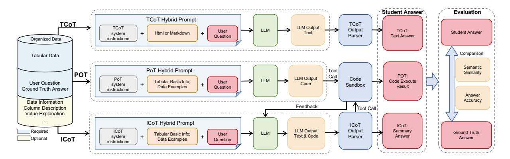
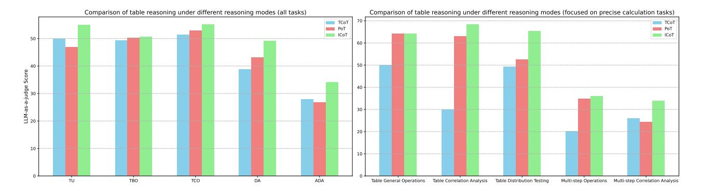
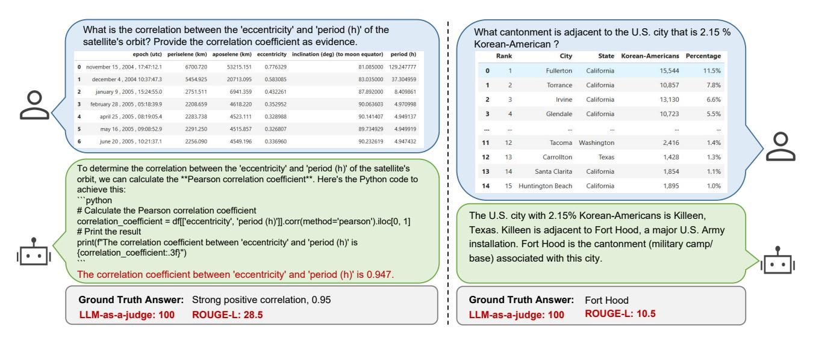
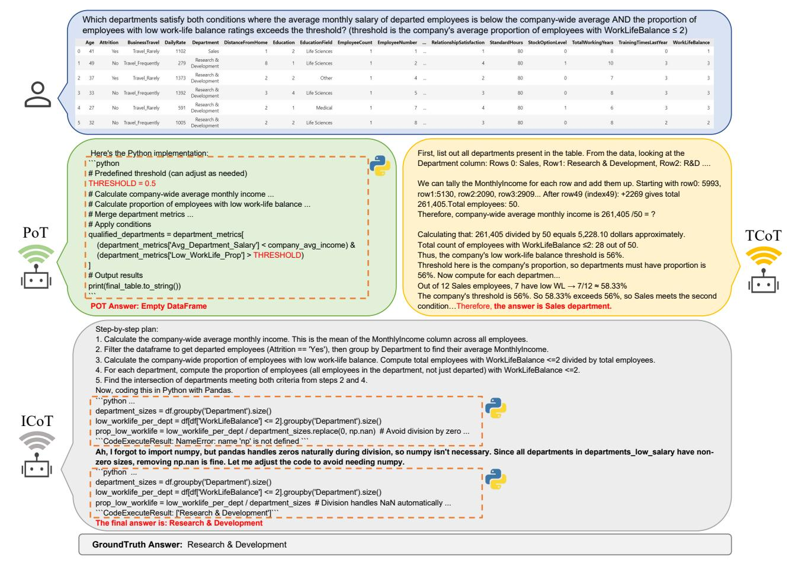

## TReB: A Comprehensive Benchmark for Evaluating Table Reasoning Capabilities of Large Language Models

 $\begin{array}{cccccccccccccccccccccccccccccccccccc$ 

1JIUTIAN Team, China Mobile Research Institute, Beijing, China

{lice, liuxiaofan, songzhiyan, chice, zhaochen, yangjingjing, wangzhendongai, yangkexin, shiboshen, wangxing, dengchao, fengjunlan}@chinamobile.com

## **Abstract**

The majority of data in businesses and industries is stored in tables, databases, and data warehouses. Reasoning with table-structured data poses significant challenges for large language models (LLMs) due to its hidden semantics, inherent complexity, and structured nature. One of these challenges is lacking an effective evaluation benchmark fairly reflecting the performances of LLMs on broad table reasoning abilities. In this paper, we fill in this gap, presenting a comprehensive table reasoning evolution benchmark, TReB, which measures both shallow table understanding abilities and deep table reasoning abilities, a total of 26 sub-tasks. We construct a high quality dataset through an iterative data processing procedure. We create an evaluation framework to robustly measure table reasoning capabilities with three distinct inference modes, TCoT, PoT and ICoT. Further, we benchmark over 20 state-of-the-art LLMs using this frame work and prove its effectiveness. Experimental results reveal that existing LLMs still have significant room for improvement in addressing the complex and real world Table related tasks. Both the dataset and evaluation framework are publicly available, with the dataset hosted on huggingface.co/datasets/ JT-LM/JIUTIAN-TReB and the framework on github.com/JT-LM/jiutian-treb.

## 1. Introduction

Table reasoning refers to the core capability of a model to interpret, manipulate, and deduce insights from tabular data through logical operations (Zhang et al., 2025). It is prominent in the field of natural language processing (Lu et al.,

2025), and has huge potentials in real-world applications such as Business Intelligence and Healthcare (Cheng et al., 2025). Traditional approaches mostly focus on encoding the semantics of tables through structure embeddings and attention mechanisms, enabling pretrained models to better understand the content of tabular data (Kim et al., 2025; Su et al., 2024; Zhu et al., 2023). In recent years, the advent of large language models (LLMs), like GPT-3.5 and GPT-4 (Brown et al., 2020; Achiam et al., 2023), has redefined the paradigm of table reasoning methodology. Instead of relying solely on table semantic embeddings, LLMs leverage prompt engineering, external tools such as SQL and Python (Wang et al., 2023; Chai et al., 2024), and complex reasoning techniques such as chain-of-thought (CoT) (Wei et al., 2022) to understand and analyze the tabular data. These developments have demonstrated the remarkable reasoning capability of LLMs to perform table-related data analysis, even without task-specific modifications.

Owing to the growing potential of LLMs in table analysis, several benchmarks, such as TableBench (Wu et al., 2025b) and RealTableBench (Su et al., 2024), have been developed to evaluate their reasoning capabilities. These benchmarks evaluate LLMs across multiple dimensions, including information retrieval, structural understanding, numerical computation, etc. Despite these advancements, fully evaluating the table-reasoning capabilities of LLMs remains challenging due to data&task quality, inference paradigms, and evaluation metrics. These key factors have not been fully considered by previous works.

First, the quality and practicality of current datasets remain problematic. Many benchmarks are generated using automated scripts or LLMs themselves, which can introduce noise into the data, such as malformed tables or incorrect answers. Furthermore, existing datasets often contain small, overly simplified tables that fail to reflect the complexity of real-world tabular structures. In addition, most existing benchmarks focus on limited task categories, such as table fact verification or simple numerical calculation, without

\*Corresponding author

†Equal contribution

capturing the multifaceted nature of real-world table analysis. This narrow scope limits their ability to assess models in more complex and genuine scenarios.

Second, current benchmarks lack diversity in inference paradigms and underutilize the advanced capabilities of modern LLMs. Most benchmarks rely on prompt engineering to guide models in generating textual answers. However, realistic table reasoning tasks often require models to invoke tools, execute code, or engage in self-reflection to arrive at accurate conclusions. For example, computing the standard deviation of a column through free-form text is error-prone, whereas allowing code execution ensures precision. Moreover, single-turn interactions are insufficient for complex, multi-step tasks that demand iterative problem-solving and reasoning. To better align with real-world applications, benchmarks should support more diverse inference modes that enable tool usage, code execution, and self-reflection.

Finally, the popular evaluation metrics are often biased when assessing LLM performance over table reasoning tasks. While data retrieval and computational tasks typically require concise and precise answers, LLMs often provide detailed reasoning alongside the final result. Traditional natural language similarity metrics, such as BLEU (Papineni et al., 2002) and ROUGE (Lin, 2004), tend to penalize models for deviations in reasoning structure or verbosity, even if the final answer is correct. This inconsistency underscores the need for task-specific metrics that fairly evaluate both the accuracy of the final answer and the quality of intermediate reasoning.

To address these critical challenges in evaluating LLMs' table reasoning capabilities, we propose a benchmark TReB that offers a comprehensive, objective, and multi-dimensional evaluation system in this paper. By focusing on high-quality datasets, comprehensive task settings, diverse inference modes, and robust evaluation methods, TReB better reflects real-world scenarios and thoroughly assesses model capabilities:

**High-quality datasets**: We provide a curated dataset combining public cleaned data, real-world web tables, and previously unavailable proprietary table question answering (TableQA) data. All the QA pairs are manually constructed to align with practical applications, and each table & QA pair undergo rigorous cleaning and validation to eliminate issues such as formatting errors, noisy data, and inaccuracies.

Comprehensive task settings: To assess a wide spectrum of table reasoning capabilities, we identify 6 core skills and develop 26 corresponding subtasks, enabling a fine-grained and multi-dimensional assessment of model performance across diverse aspects of tabular data analysis.

Diverse inference modes: We introduces diverse in-

ference modes to evaluate the genuine capabilities of LLMs. The benchmark supports Textual Chain-of-Thought (TCoT) (Wei et al., 2022) for generating textual answers in tasks like table summarization and title generation. It also incorporates Program-of-Thought (PoT) (Chen et al., 2022), where models write and execute code to handle data retrieval and numerical computations, ensuring accurate and objective results. For complex, multi-step tasks, Interleaved Chain-of-Thought (ICoT) (Yao et al., 2023) combines text and code reasoning, enabling dynamic code execution, intermediate result summarization, and self-reflection for better performance on challenging problems.

Robust evaluation methods: To ensure reliable evaluation, we design several evaluation metrics tailored to the characteristics of table reasoning tasks. For text generation tasks like table summarization, we use BLEU and ROUGE as evaluation metrics. For data retrieval, computational and more complex tasks, we rely on a discriminant LLM to assess semantic similarity and correctness of answers against ground truth. For tasks with fixed output formats, we employ prompt engineering and custom rules to calculate accuracy with precision.

To sum up, our work makes three key contributions to the LLM and table mining communities: (1) an open-sourced, high-quality dataset with comprehensive task settings1; (2) a robust evaluation framework integrating diverse inference modes2; and (3) detailed benchmarking results for state-of-the-art LLMs. By open-sourcing both the dataset and the evaluation framework, we aim to establish a new standard for comprehensive and reproducible research in Table reasoning. We believe this unified benchmark will not only facilitate fair comparisons across models with various architectures and training strategies, but also encourage the development of more robust, generalizable, and executable table reasoning systems.

#### 2. Dataset

In this section, we first introduce the data constructed based on our evaluation framework, then details the data construction process, including data collection, data generation and augmentation, data cleaning and dataset summary.

#### 2.1. Dataset Overview

Existing evaluation methods for LLMs in table reasoning, comprehension, and processing are primarily based on single-task datasets (see Table6 for details). Although some multi-task benchmarks exist, they remain limited in scope and fail to comprehensively assess the general reasoning

Ihttps://huggingface.co/datasets/JT-LM/ JIUTIAN-TReB

&lt;sup>2https://github.com/JT-LM/jiutian-treb

Table 1: Dataset Overview

| Core Skill | Subtask                            | Task Description                                                   | Number of Data |
|------------|------------------------------------|--------------------------------------------------------------------|----------------|
|            | Understanding                      | Evaluates LLMs' semantic comprehension capabilities                | 500            |
|            | Instruction Following              | Assesses LLMs' ability to follow instructions                      | 90             |
| NLU        | Hallucination Evaluation           | Measures LLMs' tendency to generate false information              | 500            |
| NLU        | Robustness Evaluation              | Tests LLMs' stability under varied inputs                          | 500            |
|            | Code Generation                    | Evaluates LLMs' ability to generate functional code                | 500            |
|            | Mathematical Reasoning             | Assesses numerical reasoning capabilities                          | 500            |
|            | Table Retrieval                    | Tests information retrieval from tabular data with/without prompts | 500            |
|            | Table Summary                      | Evaluates generation of descriptive text from tables               | 500            |
| TII        | Table Column_Naming                | Assesses ability to infer column names from data                   | 500            |
| TU         | Table Title Naming                 | Evaluates generation of concise table titles                       | 500            |
|            | Table Fact Checking                | Tests table comprehension and logical reasoning                    | 500            |
|            | Table Plausibility Verification    | Assesses table content validity using prior knowledge              | 15             |
| TBO        | Table Query                        | Evaluates precise and fuzzy query capabilities on tabular data     | 500            |
| тьо        | Table Selection                    | Tests table reasoning filtering (exact and semantic-based)         | 500            |
| TCO        | Table General Operations           | Assesses basic statistical computations on tables                  | 500            |
| 100        | Table Domain-Specific Operations   | Evaluates domain-specific formula applications                     | 239            |
|            | Table Outlier Detection            | Tests identification of anomalous data points                      | 43             |
| DA         | Table Correlation Analysis         | Evaluates inter-column relationship analysis                       | 63             |
| DA         | Table Hypothesis Testing           | Assesses statistical testing capabilities                          | 42             |
|            | Table Distribution Testing         | Evaluates probability distribution analysis                        | 500            |
|            | Multi-step Retrieval               | Tests multi-step computation and information retrieval             | 49             |
|            | Multi-step Fact Checking           | Evaluates multi-step fact verification                             | 61             |
| ADA        | Multi-step Operations              | Assesses complex table-based calculations                          | 61             |
| ADA        | Multi-step Correlation Analysis    | Tests advanced correlation analysis                                | 49             |
|            | Multi-step Hypothesis Testing      | Evaluates complex hypothesis testing                               | 61             |
|            | Multi-step Conditional Calculation | Assesses conditional computations based on derived tables          | 17             |

abilities of LLMs over tabular data.

To address this gap, we propose a multidimensional and hierarchical evaluation framework for systematically, objectively, and comprehensively assessing LLMs' performance in table reasoning processing and analysis. As detailed in Table 1, this framework spans the complete capability spectrum from fundamental language understanding to advanced data analysis, including 6 core skills with 26 subtasks:

Natural Language Understanding (NLU): This category assesses the fundamental natural language processing abilities of large model through six key subtasks, including Understanding, Instruction Following, and Code Generation. It focuses on precise language parsing, accurate instruction execution, coherent text generation, and logical consistency.

**Table Understanding (TU)**: This category evaluates abilities of large model to parse table structures and comprehend complete or partial table content within table reasoning scenarios, spanning 6 primary subtasks such as Table Retrieval, Table Summary, Table Title/Column Naming, and Table Fact Checking. It focuses on structural recognition, as well as the extraction, summarization, and interpretation of information from tabular content.

Table Basic Operation (TBO): This category evaluates

abilities of large model to precisely translate natural language intents into fundamental table manipulation tasks, comprising two primary subtasks: Table Query and Table Selection. It focuses on understanding table query intent, identifying relevant fields, and parsing conditions, thereby enabling automated table manipulation.

Table Computational Operation (TCO): This category evaluates abilities of large model to perform sophisticated computational procedures in table reasoning scenarios, through two key subtasks: Table General Operations and Table Domain-specific Operations. It examines the model's ability to comprehend mathematical expressions, select and apply appropriate functions, and perform computations involving domain-specific knowledge. This capability forms a critical foundation for automated table reasoning, decision-making, and vertical industry applications.

**Data Analysis (DA):** This category focuses on abilities of large model to perform fundamental statistical analysis and pattern recognition in table reasoning scenarios, through four subtasks, such as Table Outlier Detection and Table Correlation Analysis. It evaluates the model's performance in data analysis, variable relationship modeling, and result interpretation, highlighting its foundational capacity for data-driven insights.

Advanced Data Analysis (ADA): This category focuses on LLMs' ability to execute high-complexity, multi-step (≥ 3 steps) data analysis tasks, through six subtasks, including Multi-step Retrieval, Multi-step Fact Checking, and Multi-step Operations. This evaluation targets the model's competency in multi-stage information integration, logical path planning, and cross-task reasoning.

In summary, this hierarchical evaluation framework quantifies LLMs' performance across both individual and synergistic competencies in table reasoning scenarios, providing a comprehensive assessment of real-world utility.

## 2.2. Data Collection

To overcome limitations in existing table reasoning benchmarks, such as limited task diversity and fragmented dataset integration, we adopt a multi-source heterogeneous data collection strategy. The collected data is categorized into three major types: (1) natural language data, (2) table-based question answering (QA) data, and (3) non-QA tabular data.

#### 2.2.1. COLLECTION OF NATURAL LANGUAGE DATA

For natural language data, we collect a total of 59,901 data using keyword-based retrieval from sources including OpenCompass, Google Scholar, and GitHub. The retrieval process leverages keywords such as "semantic understanding", "instruction following", "hallucination", "robustness", "code generation", and "mathematical reasoning". Based on this process, we select ten representative datasets: MMLU (Wang et al., 2024), Winogrande (Sakaguchi et al., 2021), MATH (Hendrycks et al., 2021), GSM8K (Cobbe et al., 2021), MathBench (Liu et al., 2024), BigCodeBench (Zhuo et al., 2024), DS-1000 (Lai et al., 2023), UHGEval (Liang et al., 2023), FollowEval (Jing et al., 2023), and AdvGLUE (Wang et al., 2021). After the data collection phase, we apply a unified post-processing procedure involving deduplication, format normalization, and bilingual translation (Chinese-English) to ensure both diversity and non-redundancy in the final dataset.

# 2.2.2. COLLECTION OF TABLE-BASED QUESTION ANSWERING DATA

To construct a comprehensive table-based QA dataset, we collect a total of 2 million data through a hybrid strategy combining keyword-based retrieval and manual curation. Specifically, we conduct a extensive literature search spanning the past two decades across major academic platforms such as Web of Science and Google Scholar, using keywords such as "table summary", "table understanding", "table question answering", "cell-level table question answering", "table fact checking", "table structure recognition", and "table relation extraction". Candidate datasets are filtered based on representativeness, recency, redundancy, and compati-

bility with standardized text formats (Markdown, HTML, CSV). Finally, we select 29 representative datasets, such as AIT-QA (Katsis et al., 2022), ToTTo (Parikh et al., 2020), HybridQA (Chen et al., 2020), and TableBench (Wu et al., 2025b). These datasets are derived from diverse sources such as Wikipedia, news reports, financial documents, and academic publications.

## 2.2.3. COLLECTION OF NON-QA TABULAR DATA

Given the limitations of existing TableQA datasets in terms of source diversity and scale, we further curate non-QA tabular datasets comprising 205,224 entries. This dataset is curated through a systematic search using keywords such as "table classification", "time series forecasting", and "anomaly detection" across platforms including Web of Science, PubMed, Google Scholar, and GitHub. This effort yields a comprehensive tabular dataset covering 300 distinct domains, such as telecommunications, meteorology, academia, manufacturing, finance, education, and healthcare.

#### 2.3. Data Generation and Augmentation

Existing table-based QA datasets do not fully cover all 26 subtasks in our evaluation framework. To fill this gap, we introduce three complementary data augmentation strategies: (1) Rule-based Data Generation, (2) End-to-End Generation with LLMs, and (3) Multi-Turn Adversarial Generation with LLMs.

Rule-based Data Generation: This method automatically generates approximately 1 million question-answer pairs from existing tables based on a set of generic rules. It is designed to support four subtasks: Table Query, Table Selection, Table General Operations, and Table Distribution Testing. The process involves: (1) selecting tables with numeric columns, while excluding those with missing values or summary rows/columns (e.g., those labeled "total" or "mean"); (2) designing rule-based templates using common data manipulation operations and predefined field combinations to automatically generate QA pairs. These manipulation operations include statistical computation, value querying at the cell or column level, and single or multi-condition filtering, among others.

End-to-End Generation with LLMs: This method generates 12,010 question—answer pairs, primarily targeting the Table General Operations and Table Summary subtasks. The generation process adopts two modes: table-based generation and zero-shot generation. The workflow includes (1) crafting subtask-specific prompts to guide LLM outputs and (2) evaluating the generated QA pairs using two independent discriminator models based on sample accuracy, semantic relevance, and subtask coverage. Only instances that receive full scores from both discriminators are retained. This

dual-verification mechanism ensures both the diversity and the reliability of the dataset, culminating in a high-quality benchmark for table reasoning tasks.

Multi-Turn Adversarial Generation with LLMs: To construct high-quality question sets for multi-step analysis in table reasoning settings, we propose a novel generation-discrimination pipeline. This pipeline constructs multi-turn QA pairs from real-world tables, covering 6 subtasks with 846 curated samples: Multi-step Retrieval, Fact Checking, Operations, Correlation Analysis, Hypothesis Testing, and Conditional Calculation. By emulating the COT reasoning and typical analyst workflows, this method significantly enhances the logical complexity and practical relevance of generated samples, thereby increasing their evaluative challenge. The process includes:

- 1) Construction of Complex Reasoning Chains: Based on standard data analysis paradigms, each subtask is decomposed into a sequence of atomic-level analytical operations, such as field filtering, aggregation, and logical judgment. These reasoning chains are generated through random combinations that balance task diversity with procedural coherence and executability, closely mimicking real-world analytical thought processes.
- 2) Generation of multi-turn reverse questions: We adopt a hierarchical framework for question generation, producing paired long-form and short-form questions from the constructed reasoning chains and source tables. Long-form questions simulate expert analyst workflow, emphasizing multi-step reasoning and planning. Short-form questions mimic the inquiry patterns of non-expert users, exhibiting greater linguistic variability and brevity. Two LLMs are involved: one for generation and another as a discriminator, which evaluates semantic plausibility, logical consistency, and answerability. Only samples that pass the discriminator's criteria for both formats are retained in the final dataset.
- 3) Answer Generation: For each table and its associated question pair, multiple candidate answers are generated using LLM. These candidates then undergo human review to ensure the accuracy and reliability of the final accepted answers.

## 2.4. Data Cleaning

To ensure the quality and reliability of the evaluation data, we design a rigorous data cleaning pipeline with multi-level filtering and processing mechanisms to enhance data purity and consistency. The workflow comprises three key steps: (1) Table Cleaning, (2) QA Pair Cleaning, and (3) Question Classification.

**Table Cleaning.** To meet experimental requirements for both scale and quality, we systematically clean the raw tabular data based on the following criteria:

- 1) Limit total cell content to 30,000 characters to improve large model processing efficiency.
- 2) The proportion of empty cells does not exceed 70%, ensuring data usability and completeness.
- 3) Remove tables with multi-level nesting or complex, nonstandard headers to simplify structure and ensure clear semantics.
- **QA Pair Cleaning.** To ensure the accuracy and reliability of task-specific QA data, we implement a multi-stage quality control framework that combines LLM voting and manual review. The process includes:
- 1) **Candidate Model Inference**. Three candidate LLMs are used to generate inferences for QA pairs (excluding rule-based data), resulting in three sets of candidate answers.
- 2) Judge Model Voting & Comprehensive Scoring. A judge model is introduced to evaluate the the consistency of these candidate answers against the ground truth, using the following scoring rules: If all three candidate answers agree and match the ground truth, the original answer is retained. If all three agree but differ from the ground truth, the original answer is replaced with their consensus. If two answers agree and align with the ground truth, the original answer is kept. In all other cases—including partial agreement or full disagreement—the original answer is retained.
- 3) **Manual Review Intervention.** For QA pairs scoring below full agreement, a subset is sampled for expert review. Domain experts re-annotate these cases to ensure answer accuracy.

The final QA data, whether collected or generated, is divided into High-Quality and Low-Quality categories. Data verified by rule-based generation, manual annotation, or unanimous LLM agreement is labeled as High-Quality, while all others are considered Low-Quality. Through the multi-stage quality control process, we have finalized 2.75 million high-quality data, significantly enhancing dataset integrity and providing a solid foundation for reliable evaluation.

**Question Classification.** In the process of integrating opensource datasets, we observe that some QA items correspond to multiple downstream tasks within the evaluation system. To maintain task independence, we clearly define the evaluation criteria and task boundaries. We leverage the semantic understanding capabilities of LLMs to automatically classify high-quality data, ensuring precise task alignment and eliminating overlaps across subtasks.

## 2.5. Dataset Summary

Our final evaluation dataset comprises 7,790 high-quality samples, covering every subtask across the 6 core capabilities. Samples are drawn from a thoroughly cleaned corpus

based on two strict criteria: (1) only QA pairs classified as high-quality are eligible for selection; (2) only tables with single-row headers are included to avoid parsing errors. Each instance undergoes manual annotation and a dual quality-control process to ensure maximum precision.

## 3. Evaluation Framework

#### 3.1. Overview

Our evaluation framework is designed to systematically assess the performance of LLMs on Table tasks. As shown in Fig. 1, the framework begins with a database containing organized data, which includes tabular data, user questions, ground-truth answers, and optional additional information. This structured data serves as the foundation for generating prompts and evaluating model outputs.

Then, the framework incorporates three distinct inference modes: Textual Chain-of-Thought (TCoT), Programmatic Chain-of-Thought (PoT), and Interleaved Chain-of-Thought (ICoT). Each mode employs a uniquely designed hybrid prompt that constrains the model's reasoning process, ensuring that it follows the appropriate pathway for generating answers. In the TCoT mode, the model operates on textual reasoning, generating answers in plain text. The PoT mode prompts the model to produce executable code by prompting it with basic tabular information and system instructions. The ICoT mode allows for advanced reasoning by interleaving textual and programmatic steps. This mode enables the model to engage in planning, iterative step-by-step reasoning, and self-reflection.

Upon completing the inference process, the framework evaluates the model-generated outputs (referred to as student answers) by comparing them against the ground-truth answers. The evaluation process employs multiple reliable metrics to comprehensively assess the quality of the model's responses. Unlike traditional natural language similarity metrics that may penalize models for producing valid but stylistically different outputs, such rigorous methodology ensures that the framework captures both the correctness and contextual relevance of the model's outputs, providing a holistic view of its performance.

## 3.2. Problem Formulation

For one specific table-reasoning task, there are two kinds of inputs, i.e., tabular data T, and a question Q. A model  $\mathcal{M}$  is asked to generate the corresponding answer A according to T and Q, where the ground-truth answer is denoted as G. Given N tasks, the goal is to compute scalar metrics to evaluate the discrepancy between model predictions  $\{A_i|i=1,2,...,N\}$  and ground-truth answers  $\{G_i|i=1,2,...,N\}$ .

#### 3.3. Inference Modes

The framework supports three distinct inference modes to fully evaluate LLMs in various table analysis scenarios: TCoT, PoT, and ICoT.

#### 3.3.1. TEXTUAL CHAIN-OF-THOUGHT (TCOT)

TCoT (Wei et al., 2022) is a reasoning mode in which LLMs solve data analysis problems step by step through pure textual reasoning. The final answer is output exclusively in text form. This mode relies heavily on the model's intrinsic ability to perform logical and sequential text-based reasoning, without external computational support. Formally, TCoT reasoning mode can be represented as follows:

$$\mathcal{M}(T,Q) \to \{C,A\},$$
 (1)

where C denotes a chain-of-thoughts derived from model  $\mathcal{M}$ .

TCoT is well-suited for text generation tasks, such as table summarization or descriptive analysis, where the focus is on interpreting and explaining tabular data. However, due to its reliance on text-based reasoning alone, TCoT is less effective for tasks requiring complex calculations or programmatic execution, as it lacks the ability to leverage external tools to validate or refine LLM's outputs.

## 3.3.2. PROGRAM-OF-THOUGHT (POT)

PoT is a reasoning mode in which LLMs solve data analysis problems by generating executable code. In this mode, the model combines textual reasoning with programmatic outputs and ultimately producing a code block as its final answer. This code block is then executed within a code sandbox environment, which serves as a secure runtime to validate the functionality and correctness of the generated code. The execution results are returned as the final answer, ensuring the solution is both logically sound and computationally accurate. Formally, PoT reasoning mode can be represented as follows:

$$\mathcal{M}(T,Q) \to \{C,P\} \xrightarrow{\mathcal{E}(P)} A,$$
 (2)

where P denotes a program code block generated by model  $\mathcal{M}$ , and  $\mathcal{E}$  is a code executor.

Compared with the TCoT mode, PoT offers significant advantages, particularly in tasks requiring precise calculations or complex data manipulations. By leveraging programmatic reasoning, PoT allows the model to offload computational tasks to the code interpreter, thereby reducing the risk of errors in manual calculations. However, a key limitation of PoT is its reliance on the model's ability to generate syntactically correct and executable code, which may fail if the model lacks sufficient programming proficiency or

Figure 1: Evaluation Framework Overview. A robust framework is specifically designed with organized data, three inference modes, and reliable metrics to evaluate LLM performance on table reasoning.

misinterprets the task. Nevertheless, PoT is highly effective for tasks where accuracy and computational precision are critical, making it a powerful tool for addressing more advanced data analysis challenges.

#### 3.3.3. Interleaved Chain-of-Thought (ICoT)

The ICoT mode enables models to perform multi-step reasoning by combining textual explanations and programmatic outputs in an iterative process. This advanced mode integrates planning, step-by-step execution, and self-reflection, allowing the model to dynamically adapt its reasoning based on intermediate results. Feedback loops between the model and a code execution environment help correct errors, refine plans, and improve overall problem-solving accuracy, effectively simulating real-world trial-and-error processes.

Formally, ICoT reasoning mode can be represented as follows:

$$\mathcal{M}(T,Q) \xrightarrow{\text{Plan}} \{S_1, S_2, \dots, S_n\}$$

$$\xrightarrow{\text{Execute}} \begin{cases} (C_1, P_1) \xrightarrow{\mathcal{E}(P_1)} R_1 \xrightarrow{\text{Feedback}} \mathcal{M} \to (C_2, P_2) \\ (C_2, P_2) \xrightarrow{\mathcal{E}(P_2)} R_2 \xrightarrow{\text{Feedback}} \mathcal{M} \to (C_3, P_3) \\ \vdots \\ (C_n, P_n) \xrightarrow{\mathcal{E}(P_n)} R_n \xrightarrow{\text{Feedback}} \mathcal{M} \end{cases}$$

$$\xrightarrow{\text{Aggregate}} A$$

$$(3)$$

where  $S_k$  denotes the k-th step of the plan,  $R_k$  denotes the k-th code executed result.

A key feature of ICoT is its ability to dynamically adapt based on intermediate results. After each code block is executed, the produced results are fed back into the reasoning process, enabling the model to correct mistakes, refine its approach, or adjust its plan. This iterative interaction between reasoning and execution is particularly effective for handling complex, multi-step tasks, such as data analysis problems that require multiple rounds of reasoning and

computation. However, compared to ToT and PoT, ICoT demands more computational resources due to its iterative nature and increased system complexity, which may limit efficiency in resource-constrained scenarios.

#### 3.4. Evaluation Methods

To ensure a reliable and comprehensive assessment of LLM performance on table reasoning, our framework supports multiple evaluation metrics tailored to address the diverse requirement of each task. These metrics are carefully selected and integrated to provide a well-rounded evaluation, balancing objectivity, flexibility, and task-specific considerations.

## 3.4.1. NATURAL LANGUAGE METRICS

Natural language metrics including BLEU (Papineni et al., 2002) and ROUGE (Lin, 2004) can be used for text-oriented tasks, such as generating table summaries or explanatory answers. These metrics primarily measure the overlap between the model's generated text and the ground truth, using precision of n-gram text sequences.

While these metrics are widely used in NLP tasks, they have limitations in table reasoning evaluation. Specifically, they may overlook deeper semantic correctness and penalize valid answers that use alternative phrasing. Despite these drawbacks, natural language metrics remain essential for evaluating fluency, readability, and surface-level alignment with ground truth in tasks where textual output is the primary focus.

## 3.4.2. LLM-AS-A-JUDGE

While human evaluation is the gold standard for assessing the student answers, it is exceptionally slow and costly. To automate the evaluation, we explore the use of state-of-theart LLMs as a surrogate for humans. Because these models are often trained with reinforcement learning with human feedback (RLHF) (Dong et al., 2024), they already exhibit strong human alignment. This approach is called "*LLM-as-a-judge*" (Gu et al., 2024; Zheng et al., 2023), which has been tested in various fields to replace human labor as a decision-making model (Dubois et al., 2023; Chiang & Lee, 2023).

This method addresses several challenges inherent in table reasoning evaluation. LLMs on table reasoning often allow nuanced reasoning and open-ended outputs. Using LLM-as-a-Judge reduces the risk of penalizing semantically correct but stylistically different outputs, ensuring more objective evaluation. Moreover, the judging focuses solely on the final answer's correctness, avoiding undue penalties caused by intermediate reasoning steps or formatting errors unless they directly affect the final response.

## 3.4.3. EXACT MATCH ACCURACY

Accuracy is utilized for tasks where LLMs are required to generate outputs in a predefined format, enabling direct and unambiguous comparison with ground truth. For instance, in tasks involving numeric calculations, table cell retrieval, or structured outputs, accuracy measures the exact match between the generated response and the expected result.

## 4. Experiments

In this section, we conduct a comprehensive evaluation of over 20 state-of-the-art LLMs on our benchmark, providing an in-depth analysis of their performance across various table reasoning tasks.

## 4.1. Experiment Setup

#### 4.1.1. LLMs

We evaluate a total of 26 LLMs, covering a diverse range of models designed for different purposes. These include general LLMs, code-optimized LLMs, deep thinking LLMs, math and structured data analysis optimized LLMs, and LLMs specifically fine-tuned for table reasoning tasks. The evaluated models range in size from 7B to 72B parameters, ensuring a comprehensive comparison across model scales and specializations.

General LLMs: The general LLMs, which represent the baseline performance of language models on table reasoning, include Llama-3.1-8B/70B-Instruct (Grattafiori et al., 2024), Qwen2.5-7B/72B-Instruct (Yang et al., 2024c), and Mistral-7B-Instruct-v0.3 (Jiang et al., 2023). These models are designed for broad language understanding and generation tasks.

**Code Optimized LLMs**: The code-optimized LLMs, trained with a focus on code generation, are evaluated to ex-

plore their potential in handling table reasoning. This group includes Qwen2.5-Coder-7B-Instruct (Hui et al., 2024), Deepseek-Coder-7B-Instruct-v1.5, Deepseek-Coder-33B-Instruct (Guo et al., 2024), Seed-Coder-8B-Instruct, and Yi-Coder-9B-Chat (Young et al., 2024).

Deep Thinking LLMs: We also include a set of deep thinking LLMs, which are designed to excel in complex problem analysis and self-reflective reasoning. This group includes DeepSeek-distilled variants of Qwen-7B/14B/32B and Llama-8B/70B (DeepSeek-AI, 2025), as well as QwQ-32B (Team, 2025) and the latest models Qwen3-8B/14B/32B (Yang et al., 2025a). These models are relevant for tasks that involve multi-step reasoning and intricate query processing.

Math Optimized LLMs: We evaluate LLMs specialized in mathematical reasoning, which are particularly suited for tasks involving numerical computation. This category includes Kimina-Prover-Preview-Distill-7B (Wang et al., 2025), Qwen2.5-Math-7B/72B-Instruct (Yang et al., 2024b), and Deepseek-Math-7b-Instruct (Shao et al., 2024).

**Table Reasoning Optimized LLMs**: We incorporate three specific LLMs, TableGPT2-7B (Su et al., 2024) and Table-R1-SFT/Zero-7B (Yang et al., 2025b), which are fine-tuned specifically for the table reasoning. These models are trained on datasets and tasks closely aligned with TableQA requirements, making them specialized for this benchmark.

#### 4.1.2. IMPLEMENTATION DETAILS

Inference Mode: Inference modes are configured based on task requirements, as not all tasks are suitable for PoT or ICoT reasoning. Specifically, certain tasks exclusively use the TCoT mode, including all tasks under Natural Language Understanding proficiency, as well as Table Summary, Table Column Naming, Table Title Naming, and Table Plausibility Verification. These tasks focus on text generation and table content understanding, making code-based reasoning unnecessary and less suitable. For all other tasks, we evaluate models using three inference modes: TCoT, PoT, and ICoT. In TCoT, models receive table content in Markdown/HTML formats and directly generate answers. In contrast, the PoT and ICoT do not provide the model with plaintext table content. Instead, the model writes codes to read the table, extracts the required information, and finally answers the questions. Clearly, PoT and ICoT place greater demands on the model's foundational coding abilities, as the model must write code to extract and process information from the table. However, these capabilities are essential for handling larger tables and tackling more complex tasks.

**Evaluation Metrics**: In the following experiments, we primarily use ROUGE-L (Lin, 2004) and LLM-as-a-judge (Zheng et al., 2023) to evaluate model performance

Table 2: Overall Experimental Results with ROUGE-L

|                                  | NLU                            |       | TU    |       |       | TBO    |           |        | TCO   |       |       | DA    |       |       | ADA   |       |         |
|----------------------------------|--------------------------------|-------|-------|-------|-------|--------|-----------|--------|-------|-------|-------|-------|-------|-------|-------|-------|---------|
| Model Name                       | TCoT                           | TCoT  | PoT   | ICoT  | TCoT  | PoT    | ICoT      | TCoT   | PoT   | ICoT  | TCoT  | PoT   | ICoT  | TCoT  | PoT   | ICoT  | Overall |
| General LLMs                     |                                |       |       |       |       |        |           |        |       |       |       |       |       |       |       |       |         |
| Llama-3.1-8B-Instruct            | 20.73                          | 23.72 | 23.41 | 12.37 | 15.60 | 18.04  | 11.91     | 13.24  | 20.06 | 9.30  | 16.70 | 23.33 | 10.97 | 9.26  | 8.84  | 7.77  | 15.33   |
| Llama-3.1-70B-Instruct           | 22.06                          | 39.70 | 42.90 | 6.88  | 19.90 | 23.94  | 9.70      | 32.77  | 25.61 | 10.51 | 23.39 | 26.31 | 11.56 | 20.68 | 17.92 | 7.39  | 21.33   |
| Qwen2.5-7B-Instruct              | 19.88                          | 36.87 | 41.58 | 57.43 | 15.09 | 26.16  | 27.15     | 29.76  | 21.78 | 36.94 | 27.05 | 20.43 | 23.73 | 22.09 | 17.79 | 35.89 | 28.73   |
| Qwen2.5-72B-Instruct             | 25.13                          | 43.79 | 45.08 | 73.51 | 25.98 | 26.00  | 29.36     | 37.24  | 26.74 | 43.21 | 29.98 | 23.00 | 30.94 | 23.09 | 18.63 | 41.76 | 33.96   |
| Mistral-7B-Instruct-v0.3         | 19.37                          | 21.12 | 21.92 | 26.04 | 12.82 | 20.05  | 18.39     | 16.05  | 17.34 | 12.88 | 20.09 | 15.75 | 13.74 | 4.03  | 5.70  | 8.20  | 15.84   |
| Code Optimized LLMs              |                                |       |       |       |       |        |           |        |       |       |       |       |       |       |       |       |         |
| Qwen2.5-Coder-7B-Instruct        | 34.61                          | 36.61 | 38.10 | 51.60 | 14.76 | 22.06  | 29.36     | 25.57  | 21.76 | 31.59 | 23.08 | 26.86 | 32.13 | 23.09 | 14.35 | 36.80 | 28.89   |
| Deepseek-Coder-7B-Instruct-v1.5  | 4.11                           | 6.86  | 10.39 | 8.74  | 2.79  | 12.40  | 6.81      | 2.46   | 9.50  | 5.16  | 3.05  | 7.33  | 6.16  | 0.36  | 1.77  | 8.93  | 6.05    |
| Deepseek-Coder-33B-Instruct      | 9.82                           | 14.14 | 33.75 | 28.37 | 14.78 | 19.98  | 25.50     | 8.11   | 14.08 | 15.40 | 8.47  | 25.74 | 16.61 | 1.68  | 11.19 | 10.88 | 16.15   |
| Seed-Coder-8B-Instruct           | 23.39                          | 25.94 | 37.95 | 36.54 | 15.77 | 26.53  | 31.61     | 19.63  | 22.30 | 28.13 | 24.27 | 27.63 | 26.03 | 9.72  | 17.75 | 29.26 | 25.15   |
| Yi-Coder-9B-Chat                 | 18.02                          | 10.66 | 32.24 | 26.02 | 9.00  | 21.83  | 24.83     | 7.86   | 19.04 | 20.60 | 9.08  | 26.85 | 20.42 | 5.16  | 12.67 | 14.19 | 17.40   |
| Deep Thinking LLMs               |                                |       |       |       |       |        |           |        |       |       |       |       |       |       |       |       |         |
| Deepseek-R1-Distill-Qwen-7B      | 16.55                          | 30.05 | 19.58 | 37.14 | 20.61 | 17.98  | 21.67     | 22.99  | 13.19 | 23.27 | 29.65 | 15.94 | 28.97 | 11.79 | 6.02  | 29.60 | 21.56   |
| Deepseek-R1-Distill-Qwen-14B     | 22.66                          | 37.20 | 41.31 | 68.88 | 20.46 | 21.22  | 29.38     | 31.57  | 18.72 | 38.16 | 37.21 | 16.99 | 29.95 | 14.26 | 14.38 | 38.48 | 30.05   |
| Deepseek-R1-Distill-Qwen-32B     | 19.13                          | 41.64 | 47.25 | 73.25 | 29.35 | 28.07  | 28.85     | 38.84  | 24.07 | 46.30 | 38.33 | 26.91 | 21.69 | 21.05 | 21.90 | 43.19 | 34.36   |
| Deepseek-R1-Distill-Llama-8B     | 20.51                          | 26.74 | 18.51 | 40.09 | 20.52 | 13.02  | 17.77     | 20.64  | 13.04 | 18.91 | 32.07 | 9.50  | 18.87 | 5.80  | 3.86  | 19.28 | 18.69   |
| Deepseek-R1-Distill-Llama-70B    | 20.97                          | 40.49 | 36.28 | 71.37 | 24.05 | 23.86  | 30.71     | 36.71  | 25.80 | 43.91 | 34.12 | 24.70 | 27.73 | 21.02 | 15.34 | 45.13 | 32.63   |
| QwQ-32B                          | 20.44                          | 42.91 | 57.89 | 75.37 | 32.75 | 31.85  | 30.06     | 42.39  | 39.93 | 48.27 | 24.69 | 29.29 | 16.91 | 28.21 | 31.35 | 50.42 | 37.67   |
| Qwen3-8B                         | 20.05                          | 30.83 | 57.32 | 70.10 | 33.84 | 30.14  | 30.34     | 36.22  | 35.14 | 45.27 | 23.82 | 21.33 | 23.25 | 21.19 | 28.75 | 41.67 | 34.33   |
| Qwen3-14B                        | 25.49                          | 39.63 | 44.64 | 69.84 | 33.07 | 30.45  | 32.77     | 38.59  | 26.21 | 42.34 | 26.62 | 27.10 | 28.61 | 33.71 | 27.96 | 41.85 | 35.55   |
| Qwen3-32B                        | 21.72                          | 38.19 | 53.47 | 75.06 | 33.37 | 30.72  | 32.38     | 36.81  | 32.52 | 47.04 | 27.40 | 26.67 | 23.63 | 31.65 | 30.88 | 46.97 | 36.78   |
|                                  |                                |       |       |       |       | Math C | Optimizea | l LLMs |       |       |       |       |       |       |       |       |         |
| Kimina-Prover-Preview-Distill-7B | 9.66                           | 3.56  | 0.09  | 3.10  | 4.85  | 0.24   | 5.87      | 3.04   | 0.19  | 5.28  | 5.47  | 0.18  | 6.45  | 1.94  | 0.00  | 4.72  | 3.41    |
| Qwen2.5-Math-7B-Instruct         | 15.07                          | 6.70  | 7.48  | 29.28 | 8.15  | 13.07  | 19.64     | 4.65   | 10.44 | 22.32 | 5.19  | 10.80 | 12.14 | 0.56  | 2.09  | 18.42 | 11.62   |
| Qwen2.5-Math-72B-Instruct        | 18.29                          | 15.59 | 30.04 | 50.93 | 13.77 | 21.41  | 26.64     | 12.66  | 23.47 | 39.46 | 7.39  | 16.40 | 15.24 | 1.48  | 14.19 | 27.42 | 20.90   |
| Deepseek-Math-7B-Instruct        | 13.49                          | 9.19  | 6.65  | 16.18 | 6.50  | 1.96   | 5.40      | 5.22   | 3.28  | 5.54  | 8.18  | 4.55  | 10.11 | 2.90  | 0.82  | 5.69  | 6.60    |
|                                  | Table Reasoning Optimized LLMs |       |       |       |       |        |           |        |       |       |       |       |       |       |       |       |         |
| TableGPT2-7B                     | 21.44                          | 33.14 | 48.09 | 38.15 | 17.73 | 26.31  | 35.85     | 28.56  | 23.10 | 29.34 | 22.33 | 17.96 | 16.75 | 12.55 | 18.27 | 26.99 | 26.03   |
| Table-R1-SFT-7B                  | 21.51                          | 30.21 | 41.57 | 7.52  | 16.38 | 27.41  | 2.19      | 17.81  | 24.39 | 6.64  | 18.61 | 15.62 | 7.16  | 10.31 | 15.28 | 2.54  | 16.57   |
| Table-R1-Zero-7B                 | 19.24                          | 34.99 | 31.07 | 62.42 | 17.70 | 18.69  | 27.61     | 28.13  | 14.13 | 35.85 | 23.95 | 19.89 | 27.23 | 9.59  | 20.06 | 35.40 | 26.62   |

Table 3: Overall Experimental Results with LLM-as-a-judge

|                                  | NLU   |       | TU    |       |       | TBO      |           | TCO       |       |       | DA    |       |       | ADA   |       |       |         |
|----------------------------------|-------|-------|-------|-------|-------|----------|-----------|-----------|-------|-------|-------|-------|-------|-------|-------|-------|---------|
| Model Name                       | TCoT  | TCoT  | PoT   | ICoT  | TCoT  | PoT      | ICoT      | TCoT      | PoT   | ICoT  | TCoT  | PoT   | ICoT  | TCoT  | PoT   | ICoT  | Overall |
| General LLMs                     |       |       |       |       |       |          |           |           |       |       |       |       |       |       |       |       |         |
| Llama-3.1-8B-Instruct            | 61.46 | 49.53 | 45.04 | 47.06 | 39.22 | 50.11    | 55.76     | 41.51     | 55.12 | 50.20 | 39.68 | 51.97 | 50.89 | 31.36 | 24.01 | 13.62 | 44.16   |
| Llama-3.1-70B-Instruct           | 70.75 | 64.38 | 66.47 | 57.93 | 57.74 | 72.20    | 48.04     | 65.75     | 77.69 | 61.46 | 48.58 | 61.80 | 51.91 | 40.29 | 42.48 | 27.50 | 57.18   |
| Qwen2.5-7B-Instruct              | 64.66 | 58.79 | 57.98 | 68.26 | 41.46 | 56.99    | 61.23     | 51.61     | 62.71 | 73.63 | 44.88 | 52.17 | 61.84 | 37.13 | 28.08 | 44.63 | 54.13   |
| Qwen2.5-72B-Instruct             | 75.87 | 72.39 | 64.46 | 87.07 | 66.56 | 71.05    | 72.06     | 73.18     | 80.93 | 85.25 | 54.05 | 59.69 | 70.97 | 42.14 | 46.49 | 61.25 | 67.71   |
| Mistral-7B-Instruct-v0.3         | 47.47 | 40.22 | 37.33 | 25.14 | 32.57 | 50.09    | 37.18     | 35.28     | 45.46 | 35.61 | 37.20 | 23.96 | 27.09 | 18.89 | 15.14 | 16.05 | 32.79   |
| Code Optimized LLMs              |       |       |       |       |       |          |           |           |       |       |       |       |       |       |       |       |         |
| Qwen2.5-Coder-7B-Instruct        | 61.87 | 55.51 | 57.92 | 64.30 | 44.36 | 61.03    | 66.86     | 47.59     | 65.17 | 69.26 | 39.99 | 57.73 | 62.99 | 35.99 | 33.97 | 45.50 | 54.38   |
| Deepseek-Coder-7B-Instruct-v1.5  | 16.63 | 21.82 | 19.36 | 12.38 | 26.83 | 36.69    | 24.33     | 19.93     | 30.11 | 19.26 | 14.65 | 13.46 | 14.28 | 13.27 | 3.62  | 13.77 | 18.77   |
| Deepseek-Coder-33B-Instruct      | 26.59 | 35.09 | 49.06 | 24.39 | 39.40 | 57.01    | 54.72     | 29.16     | 42.74 | 30.91 | 24.77 | 53.87 | 33.54 | 10.94 | 26.96 | 19.60 | 34.92   |
| Seed-Coder-8B-Instruct           | 45.18 | 50.65 | 57.21 | 59.61 | 44.06 | 66.58    | 66.33     | 42.66     | 67.57 | 68.67 | 38.68 | 62.94 | 65.62 | 32.59 | 38.05 | 42.27 | 53.04   |
| Yi-Coder-9B-Chat                 | 43.64 | 32.76 | 50.61 | 39.70 | 30.59 | 56.24    | 51.56     | 32.49     | 58.34 | 54.58 | 23.07 | 48.17 | 51.50 | 21.41 | 28.72 | 20.62 | 40.25   |
|                                  |       |       |       |       |       | Deep T   | hinking   | LLMs      |       |       |       |       |       |       |       |       |         |
| Deepseek-R1-Distill-Qwen-7B      | 51.28 | 49.28 | 33.86 | 54.58 | 56.33 | 48.24    | 52.49     | 62.01     | 43.28 | 56.50 | 49.19 | 41.19 | 57.34 | 22.86 | 18.02 | 36.89 | 45.83   |
| Deepseek-R1-Distill-Qwen-14B     | 61.78 | 62.29 | 66.71 | 81.18 | 73.07 | 65.02    | 68.66     | 67.10     | 51.27 | 79.11 | 53.87 | 46.51 | 61.98 | 34.81 | 31.34 | 51.26 | 59.75   |
| Deepseek-R1-Distill-Qwen-32B     | 63.04 | 69.19 | 65.33 | 86.18 | 78.23 | 71.92    | 70.51     | 68.34     | 62.82 | 69.76 | 56.36 | 67.90 | 61.33 | 32.14 | 43.22 | 52.51 | 63.67   |
| Deepseek-R1-Distill-Llama-8B     | 53.17 | 56.13 | 34.86 | 54.48 | 55.23 | 39.07    | 49.60     | 57.29     | 36.86 | 52.17 | 49.24 | 13.14 | 40.90 | 20.32 | 6.40  | 25.19 | 40.25   |
| Deepseek-R1-Distill-Llama-70B    | 65.21 | 67.88 | 67.51 | 86.98 | 74.65 | 69.16    | 69.23     | 80.07     | 76.14 | 86.08 | 59.35 | 66.64 | 73.03 | 37.27 | 44.68 | 54.04 | 67.37   |
| QwQ-32B                          | 71.39 | 71.51 | 72.62 | 91.02 | 80.57 | 78.23    | 74.00     | 74.47     | 73.31 | 75.36 | 51.79 | 72.54 | 60.68 | 45.06 | 54.79 | 64.88 | 69.51   |
| Qwen3-8B                         | 62.60 | 67.27 | 70.68 | 82.93 | 80.87 | 69.06    | 70.51     | 71.25     | 66.31 | 71.58 | 58.16 | 55.51 | 61.14 | 52.76 | 44.34 | 57.41 | 65.15   |
| Qwen3-14B                        | 68.07 | 68.80 | 64.08 | 87.33 | 79.26 | 76.16    | 77.51     | 73.03     | 69.27 | 73.63 | 58.00 | 66.49 | 66.18 | 48.28 | 50.55 | 56.90 | 67.72   |
| Qwen3-32B                        | 67.72 | 67.84 | 71.16 | 90.89 | 81.19 | 75.83    | 77.56     | 73.32     | 70.91 | 75.07 | 62.23 | 68.63 | 67.55 | 49.63 | 57.34 | 62.70 | 69.97   |
|                                  |       |       |       |       |       | Math C   | Pptimized | l LLMs    |       |       |       |       |       |       |       |       |         |
| Kimina-Prover-Preview-Distill-7B | 22.69 | 11.53 | 0.15  | 9.85  | 19.50 | 0.40     | 16.58     | 24.94     | 0.70  | 16.31 | 12.67 | 0.05  | 11.43 | 8.04  | 0.00  | 8.66  | 10.22   |
| Qwen2.5-Math-7B-Instruct         | 40.17 | 22.35 | 13.48 | 41.38 | 34.68 | 26.22    | 38.29     | 37.61     | 31.01 | 51.51 | 18.68 | 20.04 | 39.08 | 12.09 | 2.25  | 19.57 | 28.03   |
| Qwen2.5-Math-72B-Instruct        | 56.98 | 53.56 | 46.57 | 76.98 | 58.35 | 48.73    | 59.40     | 61.20     | 58.62 | 79.27 | 35.23 | 35.51 | 58.50 | 17.74 | 23.70 | 39.31 | 50.60   |
| Deepseek-Math-7B-Instruct        | 28.85 | 21.02 | 7.77  | 28.98 | 15.91 | 4.25     | 8.41      | 20.61     | 10.91 | 11.45 | 20.34 | 9.50  | 18.02 | 12.63 | 1.30  | 11.02 | 14.43   |
|                                  |       |       |       |       | Tabl  | e Reasor | ing Opti  | imized LI | LMs   |       |       |       |       |       |       |       |         |
| TableGPT2-7B                     | 60.83 | 58.97 | 64.61 | 73.82 | 48.38 | 59.79    | 65.43     | 57.05     | 71.94 | 75.58 | 44.14 | 51.24 | 66.80 | 32.06 | 33.21 | 50.68 | 57.16   |
| Table-R1-SFT-7B                  | 71.58 | 62.04 | 53.52 | 25.10 | 68.21 | 54.49    | 15.70     | 71.25     | 59.87 | 13.57 | 37.08 | 41.26 | 33.75 | 35.64 | 25.95 | 19.95 | 43.06   |
| Table-R1-Zero-7B                 | 66.18 | 64.36 | 48.99 | 77.99 | 54.56 | 36.01    | 58.57     | 62.06     | 50.28 | 76.16 | 50.32 | 48.95 | 63.79 | 28.21 | 32.32 | 45.36 | 54.01   |

across tasks. ROUGE-L assesses the textual similarity between the student answer and the ground truth answer, while LLM-as-a-judge evaluates semantic similarity and answer accuracy. For LLM-as-a-judge, we utilize the Qwen2-72B-Instruct (Yang et al., 2024a) model, which has been fully trained with RLHF to align with human preferences. This model is excluded from the evaluated models to ensure impartiality in the assessment. In addition, for tasks where the answer contains a single numerical value, we calculate accuracy as a separate evaluation metric to ensure absolute precision in the assessment. Notably, since PoT produces code as its output, we use the result of code execution as the student answer. This means that if the code fails to execute, the test sample is automatically assigned a score of zero.

**Experimental Environment**: We design standardized prompt templates to implement distinct reasoning methods, ensuring fairness in the evaluation process. Additionally, we enforce strict formatting constraints on the outputs of LLMs and extract the final answers to prevent any irrelevant information from influencing the results. The evaluation of all models was conducted using the *Transformers* library and *vLLM* framework, leveraging multiple NVIDIA A800-80GB GPUs for accelerated computation. In total, we summarize the experimental results of 26 LLMs across 26 tasks under 3 reasoning modes, resulting in 1,794 experimental groups, with the average performance taken as the final result.

## 4.2. Experimental Results

## 4.2.1. OVERALL PERFORMANCE ANALYSIS

We summarize the average performance of all models across all tasks (as shown in Table 2 and Table 3). Table 2 reports the evaluation results based on ROUGE-L, while Table 3 presents the results using LLM-as-a-judge. Among all models, QwQ-32B achieves the highest overall score, demonstrating superior performance across all six table-reasoning capabilities and inference modes.

Two trends can be observed from the results: (1) Models with higher scores in NLU and TU tend to perform better in the other four capabilities. This is because TU focuses on the ability to retrieve and comprehend content from tables, while NLU reflects the model's understanding of questions. Both of them serve as foundational skills for more advanced capabilities. (2) The datasets of Advanced Data Analysis (ADA) are more challenging versions of Table Basic/Computational Operations (TBO/TCO) and Data Analysis (DA). Therefore, the scores of ADA are generally lower than other tasks due to the complexity of both the tables and the questions.

#### 4.2.2. Performance Analysis by Metrics

We analyze model performance under different evaluation metrics. Overall, ROUGE-L and LLM-as-a-judge demonstrate a high degree of consistency in their evaluations. Although the absolute scores differ between the two metrics, the ranking of models within each metric remains highly similar. For instance, models such as QwQ-32B and Qwen3-32B achieve relatively high scores under both metrics, indicating their strong performance across different evaluation approaches. Additionally, it is observed that scores from ROUGE-L are generally lower, with an average of only 23.16, compared to an average of 48.62 for LLM-as-ajudge. This discrepancy arises because ROUGE primarily focuses on surface-level lexical overlap and may fail to capture deeper semantic correctness, often penalizing valid answers that use alternative phrasing or synonyms. In contrast, LLM-as-a-judge relies on a more comprehensive evaluation of semantic alignment, enabling it to better recognize the correctness of diverse but valid answer expressions. This finding is further validated in the subsequent case study (in section 4.2.6).

#### 4.2.3. PERFORMANCE ANALYSIS BY MODEL TYPE

We compared the performance of the five types of LLMs introduced in Section 4.1.1. Generally, within the same model series, larger models outperform their smaller counterparts. For example, the Llama-70B model achieves better results than the Llama-7B, and the Qwen-72B model outperforms the Qwen-7B. Table 4 presents the average scores of the five categories of LLMs across six table-reasoning capabilities, evaluated using the LLM-as-a-judge metric. The results show that Deep Thinking LLMs achieve the highest overall performance. Their advanced reasoning capabilities for complex problems and self-reflection abilities enable them to consistently achieve top scores across the table reasoning tasks. Following this category are General LLMs and Table Reasoning Optimized LLMs, which perform well overall but exhibit noticeable gaps compared to Deep Thinking LLMs in ADA, tasks that require more capabilities in table operations and data analysis.

Code-optimized LLMs, while proficient in generating code, do not perform well in table reasoning tasks, likely due to the gap between general code generation and the specific requirements of table reasoning-related code generation. Additionally, Math Optimized LLMs perform poorly across all tasks, particularly in tasks requiring code generation. This may be due to the conflicting optimization goals between solving mathematical problems or structured data tasks and handling table specific tasks, leading to suboptimal outcomes for this category in table reasoning.

It is important to note that the above analysis represents preliminary observations based on the experimental settings

|                                | NLU   |       | TU    |       |       | TBO   |       |       | TCO   |       |       | DA    |       |       | ADA   |       |         |
|--------------------------------|-------|-------|-------|-------|-------|-------|-------|-------|-------|-------|-------|-------|-------|-------|-------|-------|---------|
| Model Type                     | TCoT  | TCoT  | PoT   | ICoT  | TCoT  | PoT   | ICoT  | TCoT  | PoT   | ICoT  | TCoT  | PoT   | ICoT  | TCoT  | PoT   | ICoT  | Overall |
| General LLMs                   | 64.04 | 57.06 | 54.26 | 57.09 | 47.51 | 60.09 | 54.85 | 53.46 | 64.38 | 61.23 | 44.88 | 49.92 | 52.54 | 33.96 | 31.24 | 32.61 | 51.19   |
| Code Optimized LLMs            | 38.78 | 39.16 | 46.83 | 40.07 | 37.05 | 55.51 | 52.76 | 34.36 | 52.79 | 48.54 | 28.23 | 47.23 | 45.58 | 22.84 | 26.26 | 28.35 | 40.27   |
| Deep Thinking LLMs             | 62.69 | 64.47 | 60.76 | 79.51 | 73.27 | 65.85 | 67.79 | 69.65 | 61.13 | 71.03 | 55.35 | 55.39 | 61.12 | 38.12 | 38.96 | 51.31 | 61.02   |
| Math Optimized LLMs            | 37.17 | 27.11 | 16.99 | 39.30 | 32.11 | 19.90 | 30.67 | 36.09 | 25.31 | 39.63 | 21.73 | 16.27 | 31.76 | 12.62 | 6.81  | 19.64 | 25.82   |
| Table Reasoning Optimized LLMs | 66.20 | 61.79 | 55.71 | 58.97 | 57.05 | 50.10 | 46.57 | 63.45 | 60.69 | 55.10 | 43.85 | 47.15 | 54.78 | 31.97 | 30.49 | 38.66 | 51.41   |

Figure 2: Comparison of table reasoning capability under different reasoning modes.

in this study. Actually, each model's performance is influenced by multiple factors, including parameter size, training strategies, and evaluation configurations, etc. Notably, Deep Thinking LLMs, introduced in 2025, represent a new type of models trained using more advanced methodologies compared to their predecessors. This advanced training approach contributes to their superior performance in table reasoning.

## 4.2.4. Performance Analysis by Inference Mode

We analyze model performance across the three inference modes: TCoT, PoT, and ICoT. As shown in Figure 2, the left panel provides an overall overview, where the results are averaged across all sub-tasks under each table reasoning skill and grouped by the three inference modes. Overall, models under the ICoT mode achieve better performance, particularly in DA and ADA tasks, outperforming the traditional TCoT approach. This demonstrates the potential of the ICoT paradigm in handling table reasoning tasks. In fact, the TCoT and ICoT modes differ fundamentally in how they handle table content: TCoT directly inputs the table in Markdown or HTML format, while ICoT enables the model to actively explore the table content through iterative interactions. This distinction becomes critical when dealing with large tables. Due to the context window limitations, TCoT struggles to process the entire table content, whereas ICoT, being independent of context size, is unaffected by table size and can dynamically query the table to retrieve relevant information.

The right panel of Figure 2 focuses on performance evaluations for tasks requiring precise calculations. A no-

table trend emerges: TCoT underperforms in calculation-intensive tasks. This is because TCoT fundamentally relies on token-based predictions and lacks the capability to perform precise computations. In contrast, PoT and ICoT excel in such tasks by leveraging its ability to write and execute code in a sandbox environment, allowing it to compute precise results. Notably, the ICoT mode enables iterative code generation, allowing the model to self-reflect and correct errors. This iterative coding and execution mechanism enables ICoT to excel in handling complex numerical operations and calculation-based table reasoning tasks.

#### 4.2.5. EXACT MATCH ACCURACY ANALYSIS

In this subsection, we calculate the exact match accuracy for specific tasks where the answer is a single numeric value. Specifically, for each question, the model's prediction is deemed correct if and only if it precisely matches the reference numeric value, with no discrepancies in formatting or variations in representation. For example, if the ground truth is 42.0, predictions such as 42 or 42.00 would be accepted as correct due to their equivalence in numeric value, but predictions like 42.1 or forty-two would be marked as incorrect. This metric enables a direct, unambiguous, and precise evaluation of model performance. Such numberonly tasks typically require models to perform accurate cell retrieval or numerical operations.

The experimental results are shown in Table 5. For numberonly tasks, Deep Thinking LLMs consistently achieve average performance scores above 50, outperforming other types of models. It is also observed that certain non-deep-thinking

Table 5: Number Answer Tasks with Exact Match Accuracy

|                                  | TU    |       |       | TBO   |         |           | TCO       |         |       |       | DA    |       |       | ADA   |       |         |
|----------------------------------|-------|-------|-------|-------|---------|-----------|-----------|---------|-------|-------|-------|-------|-------|-------|-------|---------|
| Model Name                       | TCoT  | PoT   | ICoT  | TCoT  | PoT     | ICoT      | TCoT      | PoT     | ICoT  | TCoT  | PoT   | ICoT  | TCoT  | PoT   | ICoT  | Overall |
|                                  |       |       |       |       |         | Genera    | l LLMs    |         |       |       |       |       |       |       |       |         |
| Llama-3.1-8B-Instruct            | 22.37 | 33.46 | 40.00 | 60.66 | 66.93   | 81.55     | 76.94     | 81.61   | 84.24 | 25.00 | 15.00 | 25.00 | 56.67 | 58.43 | 53.67 | 52.10   |
| Llama-3.1-70B-Instruct           | 31.47 | 45.00 | 44.62 | 68.02 | 85.44   | 82.54     | 79.50     | 91.30   | 94.17 | 20.00 | 25.00 | 25.00 | 27.03 | 65.11 | 71.07 | 57.02   |
| Qwen2.5-7B-Instruct              | 22.76 | 37.31 | 40.77 | 46.17 | 70.91   | 67.59     | 69.31     | 84.83   | 85.32 | 22.50 | 15.00 | 5.00  | 50.10 | 64.96 | 52.93 | 49.03   |
| Qwen2.5-72B-Instruct             | 31.86 | 45.39 | 46.54 | 58.15 | 85.63   | 83.32     | 82.87     | 94.20   | 92.85 | 25.00 | 25.00 | 15.00 | 64.94 | 71.33 | 65.58 | 59.18   |
| Mistral-7B-Instruct-v0.3         | 28.78 | 33.08 | 21.93 | 46.66 | 71.22   | 39.50     | 69.89     | 75.93   | 56.46 | 22.50 | 20.00 | 20.00 | 46.20 | 62.26 | 52.83 | 44.48   |
|                                  |       |       |       |       | Ca      | ode Optin | nized LLl | Ms      |       |       |       |       |       |       |       |         |
| Qwen2.5-Coder-7B-Instruct        | 29.94 | 36.16 | 36.93 | 52.84 | 71.01   | 66.92     | 71.04     | 87.29   | 83.48 | 22.50 | 25.00 | 5.00  | 44.99 | 68.15 | 64.58 | 51.05   |
| Deepseek-Coder-7B-Instruct-v1.5  | 9.49  | 19.62 | 14.62 | 64.84 | 43.24   | 34.95     | 64.12     | 44.48   | 42.68 | 20.00 | 5.00  | 5.00  | 63.64 | 20.19 | 62.43 | 34.28   |
| Deepseek-Coder-33B-Instruct      | 19.68 | 34.23 | 21.16 | 51.37 | 68.81   | 52.96     | 62.64     | 79.79   | 57.40 | 17.50 | 15.00 | 20.00 | 52.05 | 61.46 | 40.56 | 43.64   |
| Seed-Coder-8B-Instruct           | 28.85 | 38.85 | 38.08 | 54.79 | 79.50   | 71.95     | 66.58     | 88.14   | 84.39 | 17.50 | 25.00 | 15.00 | 63.41 | 63.26 | 53.33 | 52.57   |
| Yi-Coder-9B-Chat                 | 29.87 | 34.62 | 35.00 | 73.55 | 75.33   | 55.72     | 74.52     | 83.84   | 67.65 | 22.50 | 20.00 | 5.00  | 63.59 | 54.65 | 50.00 | 49.72   |
|                                  |       |       |       |       | D       | eep Thin  | king LLN  | 1s      |       |       |       |       |       |       |       |         |
| Deepseek-R1-Distill-Qwen-7B      | 30.06 | 27.31 | 35.77 | 60.91 | 67.76   | 54.79     | 80.66     | 75.71   | 79.82 | 22.50 | 20.00 | 20.00 | 63.21 | 59.46 | 53.32 | 50.08   |
| Deepseek-R1-Distill-Qwen-14B     | 31.41 | 41.16 | 42.69 | 57.14 | 75.02   | 70.30     | 82.30     | 80.87   | 88.71 | 17.50 | 20.00 | 10.00 | 44.27 | 60.13 | 65.96 | 52.50   |
| Deepseek-R1-Distill-Qwen-32B     | 31.99 | 43.85 | 44.23 | 68.81 | 75.61   | 78.76     | 82.69     | 83.81   | 77.54 | 17.50 | 25.00 | 15.00 | 49.17 | 64.37 | 67.50 | 55.05   |
| Deepseek-R1-Distill-Llama-8B     | 30.77 | 32.69 | 35.39 | 57.93 | 61.55   | 60.46     | 79.54     | 68.73   | 76.56 | 25.00 | 20.00 | 25.00 | 61.32 | 54.56 | 66.17 | 50.38   |
| Deepseek-R1-Distill-Llama-70B    | 31.60 | 44.23 | 44.62 | 66.48 | 85.56   | 75.84     | 84.82     | 89.23   | 93.31 | 15.00 | 20.00 | 15.00 | 47.28 | 62.59 | 62.46 | 55.87   |
| QwQ-32B                          | 32.37 | 46.16 | 46.54 | 84.16 | 85.32   | 81.08     | 92.15     | 87.39   | 83.53 | 20.00 | 25.00 | 15.00 | 57.25 | 67.43 | 71.61 | 59.66   |
| Qwen3-8B                         | 31.47 | 42.69 | 43.85 | 65.08 | 70.87   | 68.06     | 90.41     | 83.49   | 80.53 | 25.00 | 25.00 | 15.00 | 72.09 | 70.26 | 65.50 | 56.62   |
| Qwen3-14B                        | 31.22 | 43.46 | 45.00 | 69.87 | 72.48   | 74.07     | 90.07     | 91.93   | 83.43 | 25.00 | 25.00 | 10.00 | 51.36 | 64.98 | 70.74 | 56.57   |
| Qwen3-32B                        | 31.86 | 45.77 | 46.54 | 70.33 | 77.80   | 80.73     | 89.93     | 87.84   | 84.98 | 25.00 | 25.00 | 15.00 | 52.49 | 72.00 | 72.33 | 58.51   |
|                                  |       |       |       |       | Mo      | ath Optin | nized LL  | Ms      |       |       |       |       |       |       |       |         |
| Kimina-Prover-Preview-Distill-7B | 30.90 | 1.54  | 36.54 | 91.13 | 0.58    | 75.67     | 88.10     | 3.94    | 76.08 | 25.00 | 0.00  | 20.00 | 73.25 | 4.17  | 72.80 | 39.98   |
| Qwen2.5-Math-7B-Instruct         | 32.50 | 17.69 | 34.23 | 92.01 | 43.72   | 50.51     | 94.17     | 55.98   | 78.99 | 25.00 | 20.00 | 10.00 | 80.32 | 39.28 | 62.24 | 49.11   |
| Qwen2.5-Math-72B-Instruct        | 32.05 | 33.46 | 41.54 | 88.93 | 56.47   | 71.81     | 93.17     | 73.42   | 89.07 | 25.00 | 20.00 | 10.00 | 77.96 | 57.74 | 63.72 | 55.62   |
| Deepseek-Math-7B-Instruct        | 8.21  | 3.08  | 13.08 | 48.58 | 5.85    | 26.99     | 67.13     | 15.42   | 32.10 | 20.00 | 0.00  | 5.00  | 48.51 | 1.93  | 52.65 | 23.23   |
|                                  |       |       |       |       | Table R | easoning  | Optimize  | ed LLMs |       |       |       |       |       |       |       |         |
| TableGPT2-7B                     | 31.28 | 42.31 | 44.62 | 54.64 | 72.63   | 70.31     | 76.02     | 87.36   | 91.33 | 25.00 | 25.00 | 20.00 | 56.75 | 60.41 | 73.85 | 55.43   |
| Table-R1-SFT-7B                  | 31.67 | 35.39 | 12.31 | 63.95 | 61.43   | 16.90     | 89.01     | 84.15   | 26.42 | 20.00 | 10.00 | 5.00  | 69.59 | 40.80 | 51.26 | 41.19   |
| Table-R1-Zero-7B                 | 31.92 | 31.16 | 44.23 | 61.14 | 50.37   | 65.39     | 80.61     | 70.50   | 88.09 | 20.00 | 15.00 | 15.00 | 72.09 | 65.22 | 65.17 | 51.72   |

models, such as Qwen2.5-72B-Instruct and TableGPT2-7B, also excel in numerical tasks. Notably, the exact match accuracy represents an objective evaluation method, as it eliminates randomness in scoring by strictly assessing whether the predicted value matches the ground truth. Despite this rigorous evaluation, the best-performing models achieve a maximum score of only 59.66, indicating that there remains substantial room for improvement in LLMs' capabilities on table reasoning. This highlights the significant challenges LLMs face in table reasoning, particularly in precise numerical understanding and accurate data retrieval.

## 4.2.6. CASE STUDY

In this section, we present two detailed case studies to analyze the limitations of existing evaluation metrics — particularly ROUGE-L, and demonstrate the necessity and effectiveness of the proposed ICoT reasoning mode.

Firstly, we have thoroughly checked and analyzed the performance of various LLMs across different tasks, with particular emphasis on manual verification of low-scoring cases. As shown in Fig. 3, two representative scenarios expose ROUGE-L's fundamental limitations:

Numerical Precision Task: A Python-calculated correlation coefficient (0.947 vs. ground truth 0.95) received

ROUGE-L=28.5 but LLM-as-a-judge=100.

 Contextual Retrieval Task: An informationally superior table retrieval result obtained ROUGE-L=28.5 versus LLM-as-a-judge=100.

These cases expose several fundamental limitations of ROUGE-L: failure to recognize numerical precision due to rigid lexical matching, inability to acknowledge semantic equivalence that with different words, and systematic penalization of contextually enriched responses. The LLM-as-a-judge resolves these limitations through its capacity for: semantic understanding, context-aware assessment and task-adaptive evaluation protocol. This comparative analysis substantiates the necessity of integrating LLM-as-a-judge with conventional metrics to establish a comprehensive evaluation framework. The hybrid approach enables multidimensional assessment (syntactic-semantic balance) of both technical accuracy and contextual appropriateness.

Furthermore, to highlight the necessity and effectiveness of the proposed ICoT, we present case 2, which centers on a high-level analytical task named Multi\_Step\_Operation. In this case, the model under evaluation is QwQ. Figure 4 illustrates the input question, the input table (omitted due to space limitations), and the main inference processes under three reasoning modes: PoT, TCoT, and ICoT. In

Figure 3: Two representative cases that highlight the differences between various evaluation metrics.

Figure 4: A representative case that demonstrates the differences between different reasoning modes.

this case, the task involves multiple code-based operations. Under both PoT and TCoT, QwQ-32B produces an incorrect answer, while the model arrives at the correct solution under ICoT. Such phenomenon highlights the distinctive advantage of ICoT in handling complex reasoning tasks. In addition, we carefully examine the inference process, which could reveal the necessity of ICoT. When reasoning by PoT, the model generates erroneous code due to an incorrectly defined statistical threshold, leading to mismatch between predictions and groundtruth. In contrast, under the TCoT mode the model attempts to solve the problem through a step-by-step textual reasoning process. Besides, TCoT may be inappropriate for computation-intensive tasks. First, the limited token budget restricts the size of the table that can be processed, rendering TCoT ineffective for large-scale tabular data. Second, complex operations on tables tend to result in reasoning errors of arithmetic operations, further limiting the applicability of TCoT to such tasks. Contrastly, the ICoT method demonstrates robustness through its iterative refinement capability. Although the model initially produces incorrect code, with receiving feedback of the incorrect code (i.e., NameError: name 'np' is not defined), which enables the model to revise its initial code, fix the error, and ultimately produce the correct answer.

Hence, the comparative analysis of this case demonstrates that the ICoT approach offers greater tolerance for intermediate errors and provides the model with opportunities for self-reflection and self-correction, which is more similar to the real-world applications of LLMs.

## 5. Related Work

Tables, as a highly structured and compact form of data representation, are widely used across domains such as government, finance, commerce, and scientific research. They serve as critical carriers for data-driven analysis. With the rapid advancement of LLMs, tabular data has been increasingly integrated into language understanding and reasoning frameworks, significantly expanding the model's capacity to express and manipulate structured information. Therefore, researchers have proposed benchmarks to assess model's table reasoning capabilities in information extraction, logical reasoning, and structured data integration, in which tasks are often organized as Question-Answer forms.

Early benchmarks primarily focused on measuring structural understanding and explicit fact verification capabilities. Representative works such as WTQ (Pasupat & Liang, 2015), SQA (Iyyer et al., 2017), and TabFact (Chen et al., 2023) were typically constructed based on Wikipedia HTML tables and required models to extract answers directly from individual cells, thereby evaluating their basic alignment and structural recognition capabilities. However, these benchmarks are relatively shallow, relying mostly on surface-level

information and falling short in assessing a model's ability to perform multi-step reasoning, cross-table integration, or complex contextual understanding.

To overcome the limitations of shallow tasks, subsequent research has progressively introduced more challenging task dimensions. For instance, ToTTo (Parikh et al., 2020) and FeTaQA (Nan et al., 2022) emphasized multi-source information fusion and natural language generation, highlighting the model's integrative and generative abilities. FinQA (Chen et al., 2021) and AIT-QA (Katsis et al., 2022) focused on numerical reasoning in financial domains, evaluating the model's capacity for conditional logic and precise calculation within structured contexts. HybridQA (Chen et al., 2020) further combined structural perception with complex reasoning, establishing a more hierarchical evaluation framework. Although these benchmarks significantly broaden the scope of table reasoning evaluation, they still face limitations in reasoning-chain completeness, dataset diversity, and fidelity to real-world complex tasks.

With the growing demand for executability and explainability in table reasoning tasks, recent work has explored hybrid modeling approaches that integrate natural language understanding with code generation. These methods typically generate executable programs from questions, which are then executed via interpreters or database engines to produce answers (Luo et al., 2024; Wei et al., 2024). One line of such approaches focuses on translating queries into SQL, giving rise to benchmarks like Spider (Yu et al., 2018) and BIRD (Li et al., 2023). Another line of research aims to emulate human-like analytical workflows (Hu et al., 2024), encompassing stages such as structural perception, conditional reasoning, script execution, and answer generation. This paradigm enables the development of transferable and generalizable reasoning pipelines. Representative benchmarks include iDS-1000 (Lai et al., 2023) and InfiAgent-DABench (Hu et al., 2024), which extended the scope to diverse data modalities and task complexities.

The growing proficiency of LLMs in understanding natural language queries and interacting with tabular data has spurred extensive research into exploring their potentials for table reasoning tasks. Recent studies have introduced more realistic and comprehensive evaluation settings within benchmark datasets to better reflect practical challenges. For instance, TableBench (Wu et al., 2025b) integrated six sub-datasets covering tasks such as fact verification, numerical reasoning, data analysis, and visualization. SUC (Sui et al., 2024) proposed seven subtasks to systematically evaluate structural understanding. RealTableBench (Su et al., 2024) constructed test cases from real-world business intelligence (BI) systems, reflecting authentic usage scenarios. TableQAKit (Lei et al., 2023) curated QA pairs from diverse sources and provides a unified interface and multi-task eval-

Table 6: Representative benchmarks for table reasoning capabilities. DP is short for direct prompting, and Markup indicates formats including html, xml and markdown.

|             | Benchmark                 |              | ble Rea      |              |          |              | Data source       | New QA pairs | Infer modes      | Table format   |
|-------------|---------------------------|--------------|--------------|--------------|----------|--------------|-------------------|--------------|------------------|----------------|
|             |                           | TU           | TBO          | TCO          | DA       | ADA          |                   |              |                  |                |
|             | WTQ                       | $\checkmark$ | ×            | ×            | ×        | ×            | Wikipedia         |              |                  | JSON           |
|             | TabFact                   | $\checkmark$ | ×            | ×            | ×        | ×            | Wikipedia         |              |                  | JSON           |
|             | FeTaQA                    | $\checkmark$ | ×            | ×            | ×        | ×            | Wikipedia         |              |                  | JSON           |
| Traditional | SQA                       | $\checkmark$ | ×            | ×            | ×        | ×            | Wikipedia         |              |                  | JSON           |
|             | HybridQA                  | $\checkmark$ | ×            | ×            | ×        | $\checkmark$ | Wikipedia         |              |                  | JSON           |
|             | ТоТТо                     | $\checkmark$ | ×            | ×            | ×        | ×            | Wikipedia         |              | JSON             |                |
|             | FinQA                     | $\checkmark$ | ×            | $\checkmark$ | ×        | ×            | FinTabNet         |              | JSON             |                |
|             | AIT-QA                    | $\checkmark$ | ×            | $\checkmark$ | ×        | ×            | Airline Companies |              |                  | JSON           |
|             | Spider                    | ×            | $\checkmark$ | $\checkmark$ | ×        | ×            | Crowdsourcing     |              |                  | JSON           |
|             | BIRD                      | ×            | $\checkmark$ | $\checkmark$ | ×        | ×            | Kaggle            |              |                  | JSON           |
|             | TableBench                | <b>√</b>     | ✓            | ✓            | <b>√</b> | ✓            | 6 sources         | ✓            | DP/TCoT/PoT/SCoT | JSON           |
|             | SUC                       | $\checkmark$ | ×            | ×            | ×        | ×            | 5 sources         | $\checkmark$ | DP               | NL/JSON/Markup |
|             | RealTableBench            | $\checkmark$ | $\checkmark$ | ×            | ×        | $\checkmark$ | BI data           | $\checkmark$ | DP               | NL/JSON/Markup |
| Σ           | TableQAKit                | ×            | ×            | $\checkmark$ | ×        | $\checkmark$ | 7 sources         | ×            | DP/TCoT/PoT      | NL/Markup      |
| LLM         | TQA-Bench                 | ×            | $\checkmark$ | $\checkmark$ | ×        | $\checkmark$ | 3 sources         | $\checkmark$ | DP               | CSV/Markup     |
|             | MMQA                      | $\checkmark$ | $\checkmark$ | $\checkmark$ | ×        | $\checkmark$ | Spider            | ✓            | DP               | NL             |
|             | Tables as Texts or Images | $\checkmark$ | $\checkmark$ | $\checkmark$ | ×        | ×            | 6 sources         | ×            | DP/TCoT          | NL/JSON/Image  |
|             | TableVQA-Bench            | $\checkmark$ | $\checkmark$ | ×            | ×        | ×            | 3 sources         | ✓            | DP               | Image          |

uation workflow. Beyond these efforts, other benchmarks have extended the scope of table reasoning to multi-table reasoning, multi-step execution, and visual table understanding (Wu et al., 2025a; Qiu et al., 2024; Kim et al., 2024; Deng et al., 2024). Despite these advances, existing benchmarks still lack end-to-end evaluation pipelines that cover the full spectrum of table understanding—from perception and reasoning to execution and verification.

In summary, table reasoning has evolved from basic structural comprehension toward multidimensional integration, with methodologies shifting from static retrieval to dynamic, executable reasoning. This trend reflects broader developments in task complexity, methodological diversity, and fine-grained evaluation design. However, current benchmarks remain limited by fragmented capability dimensions, incomplete reasoning chains, and restricted data structures—hindering their ability to comprehensively assess general-purpose models in real-world tabular environments. To bridge this gap, there is an urgent need for a more open, realistic, and complex evaluation framework that enables systematic assessment of model performance across heterogeneous, multi-source tabular data.

## 6. Limitations and Future Work

#### 6.1. Limitations

A rigorous design process has been employed to develop this benchmark, aiming to comprehensively and objectively evaluate diverse table reasoning capabilities. Nevertheless, as with all benchmarking frameworks, inherent limitations persist, which are critically analyzed in the following sections. One limitation of our framework is its reliance on LLM-as-a-judge, which may inadvertently introduce biases. These biases stem from the inherent tendencies of LLMs to favor certain reasoning styles or answer formats over others, potentially impacting the fairness and generalizability of the evaluations. We have taken multiple steps to mitigate these biases by carefully designing and refining system prompts to ensure neutrality and consistency in scoring. However, despite these efforts, some residual biases may remain. Despite this, extensive experimental analyses show that in the vast majority of cases, LLM-as-a-judge achieves more objective results compared to other evaluation methods. At present, LLM-as-a-judge remains the most comprehensive and relatively fair approach for evaluating LLMs across a variety of table reasoning tasks.

Furthermore, our current evaluations are confined to textual and tabular data, excluding other modalities such as image-based table representations or multimodal inputs. This limitation restricts the framework's applicability to real-world scenarios where data often exists in a variety of formats, such as scanned documents, charts, or hybrid representations. Expanding the framework to accommodate these modalities would enhance its versatility and enable a more comprehensive assessment of model capabilities across diverse table reasoning tasks.

#### 6.2. Future Work

Several promising directions for future work can further enhance the scope and utility of this benchmark:

**Evaluation of Image-Based Tables:** One key area for improvement is expanding the benchmark to include tasks involving the generation, interpretation, or reasoning over

tables embedded in images. This would address real-world scenarios where tabular data is often presented in scanned documents, screenshots, or other image-based formats. Developing methods to evaluate model performance on such tasks would significantly broaden the benchmark's applicability and relevance.

Complex Excel Tables and Multi-Table Scenarios: Another important direction is the incorporation of more sophisticated datasets, including complex Excel tables and multi-table reasoning tasks. These additions would enable the evaluation of models' abilities to handle inter-table relationships, perform advanced operations across multiple datasets, and answer questions of higher complexity. By simulating real-world challenges, this extension would allow for a more comprehensive assessment of model capabilities in practical table mining applications.

**Enhanced Tool Integration:** Future work could also focus on extending the framework to evaluate models' ability to integrate with external tools, such as databases, APIs, or advanced computational systems. This would enable the benchmark to assess how effectively models can utilize external resources to solve highly complex or domain-specific tasks that go beyond the limits of standalone reasoning.

Release New LLMs: To ensure fairness, we did not include evaluations of our own models in this paper. In the future, we plan to train and release our own LLMs with table reasoning capabilities. Additionally, we will explore how the benchmark can guide model training and contribute to performance enhancement.

## 7. Conclusion

In this work, we propose a comprehensive benchmark TReB to evaluate table reasoning capabilities of LLMs. It integrates diverse datasets, 6 core capabilities, and 26 sub-tasks to provide a thorough and multi-dimensional assessment of model performance. It also incorporates multiple reasoning modes (TCoT, PoT, ICoT) and employs a variety of evaluation metrics to ensure objectivity and reliability in benchmarking. The framework offers meaningful insights into the strengths and weaknesses of existing LLMs, particularly in addressing real-world tabular data challenges. By openly releasing both the dataset and evaluation framework, we aim to advance research in table reasoning and complex data analysis, fostering innovation and providing a solid foundation for the development of more capable and robust models.

## References

Achiam, J., Adler, S., Agarwal, S., Ahmad, L., Akkaya, I., Aleman, F. L., Almeida, D., Altenschmidt, J., Altman, S.,

- Anadkat, S., et al. Gpt-4 technical report. *arXiv preprint arXiv:2303.08774*, 2023.
- Brown, T., Mann, B., Ryder, N., Subbiah, M., Kaplan, J. D., Dhariwal, P., Neelakantan, A., Shyam, P., Sastry, G., Askell, A., et al. Language models are few-shot learners. *Advances in neural information processing systems*, 33: 1877–1901, 2020.
- Chai, L., Liu, S., Yang, J., Yin, Y., Jin, K., Liu, J., Sun, T., Zhang, G., Ren, C., Guo, H., et al. Mceval: Massively multilingual code evaluation. *arXiv preprint arXiv:2406.07436*, 2024.
- Chen, W., Zha, H., Chen, Z., Xiong, W., Wang, H., and Wang, W. Y. Hybridqa: A dataset of multi-hop question answering over tabular and textual data. In *Findings of the Association for Computational Linguistics: EMNLP* 2020, pp. 1026–1036, 2020.
- Chen, W., Ma, X., Wang, X., and Cohen, W. W. Program of thoughts prompting: Disentangling computation from reasoning for numerical reasoning tasks. *arXiv* preprint *arXiv*:2211.12588, 2022.
- Chen, W., Wang, H., Chen, J., Zhang, Y., Wang, H., Li, S., Zhou, X., and Wang, W. Y. Tabfact: A large-scale dataset for table-based fact verification. In *International Conference on Learning Representations (ICLR)*, 2023.
- Chen, Z., Chen, W., Smiley, C., Shah, S., Borova, I., Langdon, D., Moussa, R., Beane, M., Huang, T.-H., Routledge, B. R., et al. Finqa: A dataset of numerical reasoning over financial data. In *Proceedings of the 2021 Conference on Empirical Methods in Natural Language Processing*, pp. 3697–3711, 2021.
- Cheng, M., Mao, Q., Liu, Q., Zhou, Y., Li, Y., Wang, J., Lin, J., Cao, J., and Chen, E. A survey on table mining with large language models: Challenges, advancements and prospects. *Authorea Preprints*, 2025.
- Chiang, C.-H. and Lee, H.-Y. Can large language models be an alternative to human evaluations? In *Proceedings of the 61st Annual Meeting of the Association for Computational Linguistics (Volume 1: Long Papers)*, pp. 15607–15631, 2023.
- Cobbe, K., Kosaraju, V., Bavarian, M., Chen, M., Jun, H., Kaiser, L., Plappert, M., Tworek, J., Hilton, J., Nakano, R., et al. Training verifiers to solve math word problems. *arXiv preprint arXiv:2110.14168*, 2021.
- DeepSeek-AI. Deepseek-r1: Incentivizing reasoning capability in llms via reinforcement learning. *arXiv* preprint *arXiv*:2501.12948, 2025.

- Deng, N., Sun, Z., He, R., Sikka, A., Chen, Y., Ma, L., Zhang, Y., and Mihalcea, R. Tables as texts or images: Evaluating the table reasoning ability of llms and mllms. In *Findings of the Association for Computational Linguistics ACL 2024*, pp. 407–426, 2024.
- Dong, H., Xiong, W., Pang, B., Wang, H., Zhao, H., Zhou, Y., Jiang, N., Sahoo, D., Xiong, C., and Zhang, T. Rlhf workflow: From reward modeling to online rlhf. arXiv preprint arXiv:2405.07863, 2024.
- Dubois, Y., Li, C. X., Taori, R., Zhang, T., Gulrajani, I., Ba, J., Guestrin, C., Liang, P. S., and Hashimoto, T. B. Alpacafarm: A simulation framework for methods that learn from human feedback. *Advances in Neural Information Processing Systems*, 36:30039–30069, 2023.
- Grattafiori, A., Dubey, A., Jauhri, A., Pandey, A., Kadian, A., Al-Dahle, A., Letman, A., Mathur, A., Schelten, A., Vaughan, A., et al. The llama 3 herd of models. *arXiv* preprint arXiv:2407.21783, 2024.
- Gu, J., Jiang, X., Shi, Z., Tan, H., Zhai, X., Xu, C., Li, W., Shen, Y., Ma, S., Liu, H., et al. A survey on llm-as-a-judge. *arXiv preprint arXiv:2411.15594*, 2024.
- Guo, D., Zhu, Q., Yang, D., Xie, Z., Dong, K., Zhang, W., Chen, G., Bi, X., Wu, Y., Li, Y. K., Luo, F., Xiong, Y., and Liang, W. Deepseek-coder: When the large language model meets programming – the rise of code intelligence. arXiv preprint arXiv:2401.14196, 2024.
- Hendrycks, D., Burns, C., Kadavath, S., Arora, A., Basart, S., Tang, E., Song, D., and Steinhardt, J. Measuring mathematical problem solving with the math dataset. *arXiv* preprint arXiv:2103.03874, 2021.
- Hu, X., Zhao, Z., Wei, S., Chai, Z., Ma, Q., Wang, G., Wang, X., Su, J., Xu, J., Zhu, M., et al. InfiAgent-DABench: Evaluating agents on data analysis tasks. In *International Conference on Machine Learning*, pp. 19544–19572. PMLR, 2024.
- Hui, B., Yang, J., Cui, Z., Yang, J., Liu, D., Zhang, L., Liu, T., Zhang, J., Yu, B., Dang, K., et al. Qwen2. 5-coder technical report. arXiv preprint arXiv:2409.12186, 2024.
- Iyyer, M., Yih, W.-t., and Chang, M.-W. Search-based neural structured learning for sequential question answering. In *Proceedings of the 55th Annual Meeting of the Association for Computational Linguistics (Volume 1: Long Papers)*, pp. 1821–1831, 2017.
- Jiang, A. Q., Sablayrolles, A., Mensch, A., Bamford, C.,
  Chaplot, D. S., de las Casas, D., Bressand, F., Lengyel,
  G., Lample, G., et al. Mistral 7b. arXiv preprint arXiv:2310.06825, 2023.

- Jing, Y., Jin, R., Hu, J., Qiu, H., Wang, X., Wang, P., and Xiong, D. Followeval: A multi-dimensional benchmark for assessing the instruction-following capability of large language models. arXiv preprint arXiv:2311.09829, 2023.
- Katsis, Y., Chemmengath, S., Kumar, V., Bharadwaj, S., Canim, M., Glass, M., Gliozzo, A., Pan, F., Sen, J., Sankaranarayanan, K., et al. Ait-qa: Question answering dataset over complex tables in the airline industry. In *Proceedings of the 2022 Conference of the North American Chapter of the Association for Computational Linguistics: Human Language Technologies: Industry Track*, pp. 305–314, 2022.
- Kim, M. J., Lefebvre, F., Brison, G., Perez-Lebel, A., and Varoquaux, G. Table foundation models: on knowledge pre-training for tabular learning. *arXiv preprint arXiv:2505.14415*, 2025.
- Kim, Y., Yim, M., and Song, K. Y. Tablevqa-bench: A visual question answering benchmark on multiple table domains. *arXiv* preprint arXiv:2404.19205, 2024.
- Lai, Y., Li, C., Wang, Y., Zhang, T., Zhong, R., Zettle-moyer, L., Yih, W.-t., Fried, D., Wang, S., and Yu, T. DS-1000: A natural and reliable benchmark for data science code generation. In *International Conference on Machine Learning*, pp. 18319–18345. PMLR, 2023.
- Lei, F., Luo, T., Yang, P., Liu, W., Liu, H., Lei, J., Huang, Y., Wei, Y., He, S., Zhao, J., et al. Tableqakit: a comprehensive and practical toolkit for table-based question answering. *arXiv preprint arXiv:2310.15075*, 2023.
- Li, J., Hui, B., Qu, G., Yang, J., Li, B., Li, B., Wang, B., Qin, B., Geng, R., Huo, N., et al. Can llm already serve as a database interface? a big bench for large-scale database grounded text-to-sqls. *Advances in Neural Information Processing Systems*, 36:42330–42357, 2023.
- Liang, X., Song, S., Niu, S., Li, Z., Xiong, F., Tang, B., Wang, Y., He, D., Cheng, P., Wang, Z., et al. Uhgeval: Benchmarking the hallucination of chinese large language models via unconstrained generation. arXiv preprint arXiv:2311.15296, 2023.
- Lin, C.-Y. ROUGE: A package for automatic evaluation of summaries. In *Text Summarization Branches Out*, pp. 74–81, 2004.
- Liu, H., Zheng, Z., Qiao, Y., Duan, H., Fei, Z., Zhou, F., Zhang, W., Zhang, S., Lin, D., and Chen, K. Mathbench: Evaluating the theory and application proficiency of llms with a hierarchical mathematics benchmark. *arXiv* preprint arXiv:2405.12209, 2024.

- Lu, W., Zhang, J., Fan, J., Fu, Z., Chen, Y., and Du, X. Large language model for table processing: A survey. Frontiers of Computer Science, 19(2):192350, 2025.
- Luo, Z., Xu, C., Zhao, P., Sun, Q., Geng, X., Hu, W., Tao, C., Ma, J., Lin, Q., and Jiang, D. WizardCoder: Empowering code large language models with evol-instruct. In *The Twelfth International Conference on Learning Representations (ICLR)*, 2024.
- Nan, L., Hsieh, C., Mao, Z., Lin, X. V., Verma, N., Zhang, R., Kryściński, W., Schoelkopf, H., Riley, K., Tang, X., et al. Fetaqa: Free-form table question answering. *Transactions of the Association for Computational Linguistics*, 10:35, 2022.
- Papineni, K., Roukos, S., Ward, T., and Zhu, W.-J. Bleu: a method for automatic evaluation of machine translation. In *Proceedings of the 40th annual meeting of the Association for Computational Linguistics*, pp. 311–318, 2002.
- Parikh, A., Wang, X., Gehrmann, S., Faruqui, M., Dhingra, B., Yang, D., and Das, D. Totto: A controlled table-to-text generation dataset. In *Proceedings of the 2020 Conference on Empirical Methods in Natural Language Processing (EMNLP)*, pp. 1173–1186, 2020.
- Pasupat, P. and Liang, P. Compositional semantic parsing on semi-structured tables. In *Proceedings of the 53rd Annual Meeting of the Association for Computational Linguistics and the 7th International Joint Conference on Natural Language Processing (Volume 1: Long Papers)*, pp. 1470–1480, 2015.
- Qiu, Z., Peng, Y., He, G., Yuan, B., and Wang, C. Tqa-bench: Evaluating llms for multi-table question answering with scalable context and symbolic extension. *arXiv preprint arXiv:2411.19504*, 2024.
- Sakaguchi, K., Bras, R. L., Bhagavatula, C., and Choi, Y. Winogrande: An adversarial winograd schema challenge at scale. *Communications of the ACM*, 64(9):99–106, 2021.
- Shao, Z., Wang, P., Zhu, Q., Xu, R., Song, J., Bi, X., Zhang, H., Zhang, M., Li, Y., Wu, Y., et al. Deepseekmath: Pushing the limits of mathematical reasoning in open language models. *arXiv preprint arXiv:2402.03300*, 2024.
- Su, A., Wang, A., Ye, C., Zhou, C., Zhang, G., Chen, G., Zhu, G., Wang, H., Xu, H., Chen, H., et al. Tablegpt2: A large multimodal model with tabular data integration. *arXiv* preprint arXiv:2411.02059, 2024.
- Sui, Y., Zhou, M., Zhou, M., Han, S., and Zhang, D. Table meets llm: Can large language models understand structured table data? a benchmark and empirical study. In

- Proceedings of the 17th ACM International Conference on Web Search and Data Mining, pp. 645–654, 2024.
- Team, Q. Qwq-32b: Embracing the power of reinforcement learning. *URL: https://qwenlm. github. io/blog/qwq-32b*, 2025.
- Wang, B., Xu, C., Wang, S., Gan, Z., Cheng, Y., Gao, J., Awadallah, A. H., and Li, B. Adversarial glue: A multitask benchmark for robustness evaluation of language models. arXiv preprint arXiv:2111.02840, 2021.
- Wang, B., Ren, C., Yang, J., Liang, X., Bai, J., Chai, L., Yan, Z., Zhang, Q.-W., Yin, D., Sun, X., et al. Mac-sql: A multi-agent collaborative framework for text-to-sql. *arXiv* preprint arXiv:2312.11242, 2023.
- Wang, H., Unsal, M., Lin, X., Baksys, M., Liu, J., Santos, M. D., Sung, F., Vinyes, M., Ying, Z., Zhu, Z., et al. Kimina-prover preview: Towards large formal reasoning models with reinforcement learning. arXiv preprint arXiv:2504.11354, 2025.
- Wang, Y., Ma, X., Zhang, G., Ni, Y., Chandra, A., Guo, S., Ren, W., Arulraj, A., He, X., Jiang, Z., et al. Mmlu-pro: A more robust and challenging multi-task language understanding benchmark. In *The Thirty-eight Conference* on Neural Information Processing Systems Datasets and Benchmarks Track, 2024.
- Wei, J., Wang, X., Schuurmans, D., Bosma, M., Xia, F., Chi, E., Le, Q. V., Zhou, D., et al. Chain-of-thought prompting elicits reasoning in large language models. *Advances in neural information processing systems*, 35:24824–24837, 2022.
- Wei, Y., Wang, Z., Liu, J., Ding, Y., and Zhang, L. Magicoder: Empowering code generation with oss-instruct. In *International Conference on Machine Learning*, pp. 52632–52657. PMLR, 2024.
- Wu, J., Yang, L., Li, D., Ji, Y., Okumura, M., and Zhang, Y. Mmqa: Evaluating llms with multi-table multi-hop complex questions. In *The Thirteenth International Con*ference on Learning Representations (ICLR), 2025a.
- Wu, X., Yang, J., Chai, L., Zhang, G., Liu, J., Du, X., Liang, D., Shu, D., Cheng, X., Sun, T., et al. Tablebench: A comprehensive and complex benchmark for table question answering. In *Proceedings of the AAAI Conference on Artificial Intelligence*, volume 39, pp. 25497–25506, 2025b.
- Yang, A., Yang, B., Hui, B., Zheng, B., Yu, B., Zhou, C., Li, C., Li, C., Liu, D., Huang, F., Dong, G., Wei, H., et al. Qwen2 technical report. *arXiv preprint arXiv:2407.10671*, 2024a.

- Yang, A., Zhang, B., Hui, B., Gao, B., Yu, B., Li, C., Liu, D., Tu, J., Zhou, J., Lin, J., Lu, K., Xue, M., Lin, R., Liu, T., Ren, X., and Zhang, Z. Qwen2.5-math technical report: Toward mathematical expert model via self-improvement. arXiv preprint arXiv:2409.12122, 2024b.
- Yang, A., Li, A., Yang, B., Zhang, B., Hui, B., Zheng, B., Yu, B., Gao, C., Huang, C., Lv, C., et al. Qwen3 technical report. *arXiv preprint arXiv:2505.09388*, 2025a.
- Yang, Q. A., Yang, B., Zhang, B., Hui, B., Zheng, B., Yu, B., Li, C., Liu, D., Huang, F., Wei, H., Lin, H., Yang, J., Tu, J., Zhang, J., Yang, J., Yang, J., Zhou, J., Lin, J., Dang, K., Lu, K., Bao, K., Yang, K., Yu, L., Li, M., Xue, M., Zhang, P., Zhu, Q., Men, R., Lin, R., Li, T., Tang, T., Xia, T., Ren, X., Ren, X., Fan, Y., Su, Y., Zhang, Y., Wan, Y., Liu, Y., Cui, Z., Zhang, Z., and Qiu, Z. Qwen2.5 technical report. arXiv preprint arXiv:2412.15115, 2024c.
- Yang, Z., Chen, L., Cohan, A., and Zhao, Y. Table-r1: Inference-time scaling for table reasoning. *arXiv* preprint *arXiv*:2505.23621, 2025b.
- Yao, S., Zhao, J., Yu, D., Du, N., Shafran, I., Narasimhan, K., and Cao, Y. React: Synergizing reasoning and acting in language models. In *International Conference on Learning Representations (ICLR)*, 2023.
- Young, A., Chen, B., Li, C., Huang, C., Zhang, G., Zhang, G., Wang, G., Li, H., Zhu, J., Chen, J., et al. Yi: Open foundation models by 01. ai. *arXiv preprint arXiv:2403.04652*, 2024.
- Yu, T., Zhang, R., Yang, K., Yasunaga, M., Wang, D., Li, Z., Ma, J., Li, I., Yao, Q., Roman, S., et al. Spider: A large-scale human-labeled dataset for complex and cross-domain semantic parsing and text-to-sql task. In *Proceedings of the 2018 Conference on Empirical Methods in Natural Language Processing*, pp. 3911–3921, 2018.
- Zhang, X., Wang, D., Dou, L., Zhu, Q., and Che, W. A survey of table reasoning with large language models. *Frontiers of Computer Science*, 19(9):199348, 2025.
- Zheng, L., Chiang, W.-L., Sheng, Y., Zhuang, S., Wu, Z., Zhuang, Y., Lin, Z., Li, Z., Li, D., Xing, E., et al. Judging Ilm-as-a-judge with mt-bench and chatbot arena. *Advances in Neural Information Processing Systems*, 36: 46595–46623, 2023.
- Zhu, B., Shi, X., Erickson, N., Li, M., Karypis, G., and Shoaran, M. Xtab: Cross-table pretraining for tabular transformers. In *International Conference on Machine Learning*, pp. 43181–43204. PMLR, 2023.
- Zhuo, T. Y., Vu, M. C., Chim, J., Hu, H., Yu, W., Widyasari, R., Yusuf, I. N. B., Zhan, H., He, J., Paul, I., et al. Big-codebench: Benchmarking code generation with diverse

function calls and complex instructions. *arXiv* preprint *arXiv*:2406.15877, 2024.