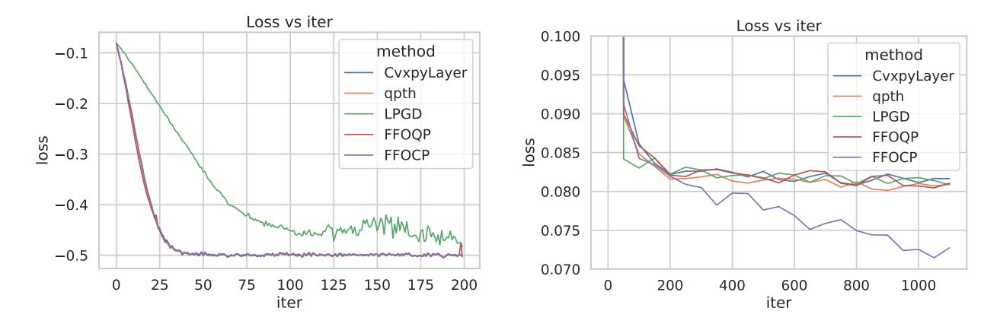
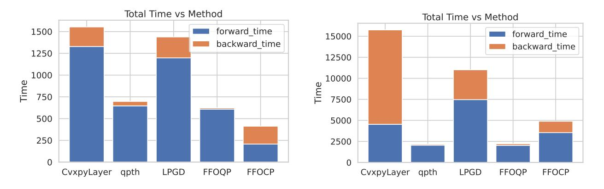

# A Fully First-Order Layer for Differentiable Optimization

Zihao Zhao\*† Kai-Chia Mo\*‡ Shing-Hei Ho§ Brandon Amos¶ Kai Wang||
Nov 26, 2025

#### Abstract

Differentiable optimization layers enable learning systems to make decisions by solving embedded optimization problems. However, computing gradients via implicit differentiation requires solving a linear system with Hessian terms, which is both compute- and memory-intensive. To address this challenge, we propose a novel algorithm that computes the gradient using only first-order information. The key insight is to rewrite the differentiable optimization as a bilevel optimization problem and leverage recent advances in bilevel methods. Specifically, we introduce an active-set Lagrangian hypergradient oracle that avoids Hessian evaluations and provides finite-time, non-asymptotic approximation guarantees. We show that an approximate hypergradient can be computed using only first-order information in  $\tilde{\mathcal{O}}(1)$  time, leading to an overall complexity of  $\tilde{\mathcal{O}}(\delta^{-1}\epsilon^{-3})$  for constrained bilevel optimization, which matches the best known rate for non-smooth non-convex optimization. Furthermore, we release an open-source Python library that can be easily adapted from existing solvers. Our code is available here.

<sup>\*</sup>Equal contribution.

<sup>&</sup>lt;sup>†</sup>zzhao628@gatech.edu. Georgia Institute of Technology.

<sup>&</sup>lt;sup>‡</sup>qwe7859126@gmail.com. Two Sigma.

<sup>§</sup>sho73@gatech.edu. Georgia Institute of Technology.

 $<sup>\</sup>P$ brandon.amos.cs@gmail.com.

kwang6920gatech.edu. Georgia Institute of Technology.

## 1 Introduction

Modern machine learning pipelines increasingly integrate optimization problems as differentiable layers to enable end-to-end decision-making [3, 1, 9]. In this paradigm, a model's output is obtained by solving an embedded optimization problem, and gradients are backpropagated through the solver to update upstream parameters. This approach has shown promise in various applications, such as decision-focused learning [18, 55, 42], where one trains predictive models by directly optimizing the final decision quality rather than intermediate predictive accuracy.

Although widely used, a major bottleneck for differentiable optimization layers is scalability: backpropagation through a solver can be extremely costly [11]. Standard approaches rely on implicit differentiation of the optimization's Karush–Kuhn–Tucker (KKT) conditions [1, 43]. This yields gradient formulations involving the inversion of a Hessian from the KKT system. In practice, computing and factorizing this large second-order matrix is both memory- and time-intensive (cubic complexity), which severely limits the size of problems that can be handled by differentiable optimization [58, 45]. Furthermore, storing and manipulating second-order derivatives can exceed memory limits for high-dimensional problems [10]. These challenges motivate the research for more efficient and Hessian-free methods to compute hypergradients (gradients through an optimization layer).

In this paper, we address these challenges by developing a novel algorithm that uses only first-order information. Our key insight is that the dependency of the optimization's solution on the inputs can be captured by a bilevel optimization structure. By reformulating the differentiable optimization as a bilevel problem, we can leverage recent advances in bilevel optimization to compute the hypergradients without explicit Hessians. In particular, we propose a fully first-order differentiation method that introduces an active-set Lagrangian hypergradient oracle that enables efficient gradient computation and a faster convergence rate. We then develop an inexact oracle that uses a tailored finite-difference method to approximate the hypergradient while achieves first-order oracle complexity. By leveraging only gradients and function evaluations, our approach avoids costly second-order operations and significantly improves scalability.

On the theoretical side, we show that our proposed algorithm can compute an approximate hypergradient using only first-order information in  $\tilde{O}(1)$  time for both linear and general convex constraints, under appropriate conditions. For linearly constrained bilevel problems, this strengthens prior results twofold. First, we relax the requirement of obtaining an exact dual solution to an approximate one that preserves the same active constraints. Second, under this relaxed assumption, we improve the convergence rate to  $\tilde{\mathcal{O}}(\delta^{-1}\epsilon^{-3})$ , matching the best known rate for nonsmooth nonconvex optimization. We further extend this convergence guarantee to the class of "well-behaved" general convex constraints. Finally, to address concerns regarding the active-set assumption, we establish a similar guarantee for a smoothed version of the problem without this assumption.

We implement our approach as an open-source PyTorch library and demonstrate that it can be easily integrated into existing codebases. Notably, our method is *objective-agnostic*: it treats the loss function's influence via a simple gradient term, which means users do not need to derive problem-specific backward passes manually. In practice, one can switch from existing differentiable solvers (e.g., CvxpyLayer [1]) with minimal modifications. Our contribution can be summarized as follows:

- We first rewrite the differentiable optimization as a new bilevel optimization. Then, we solve the bilevel optimization efficiently using a fully first-order algorithm.
- We provide theoretical convergence analysis for both linear and general convex constraints, showing that our first-order algorithm matches the best-known complexity.
- We release an open-source objective-agnostic layer that can be seamlessly integrated into neural

network training pipelines, offering a drop-in replacement for existing differentiable solvers (e.g., CvxpyLayer).

## 2 Related Works

Differentiable Optimization The idea of treating optimization problems as differentiable modules of a neural network dates back to early convex formulations. Amos and Kolter [3] introduced OptNet, which embeds a quadratic program solver as a layer whose forward pass solves the optimization and whose backward pass recovers the hypergradient by implicitly differentiating the KKT system. Subsequent work generalized this paradigm to broader classes of convex programs with toolkits such as CvxpyLayer [1], differentiable conic layers [2, 24], and robotics-oriented solvers like Theseus [46]. These layers power end-to-end learning pipelines in decision-focused prediction [18, 55, 42], control [4], and meta-learning [34, 39]. The appeal of these systems lies in their ability to reason about downstream decisions rather than intermediate surrogate losses, but they also expose the computational burden of repeatedly solving and differentiating through structured optimization problems.

Efficiently Computing the Optimization Hypergradient The main algorithmic challenge in differentiable optimization is computing the hypergradients of the model loss with respect to the inputs of the optimization problem. Importantly, the implicit derivatives that arise in differentiable layers, hyperparameter tuning, and bilevel learning are mathematically identical: each requires differentiating the lower-level KKT system to obtain a hypergradient. Two main families of estimators are used in practice. Implicit differentiation methods [30, 17, 40] linearize the KKT system and solve the resulting linear equations either with direct factorizations of the KKT/Hessian matrix (e.g., the approach used in Amos and Kolter [3]) or with iterative routines such as conjugate gradients [57] and Neumann series [23], as done in Agrawal et al. [1]. Gradient unrolling (GU) approaches [41], such as Pineda et al. [46], backpropagate through a truncated execution of the inner solver and therefore only require forward-mode gradients produced by automatic differentiation. While unrolling avoids explicit Hessian solves, its memory usage grows linearly with the number of iterations and it can suffer from truncation bias. Recent work has therefore focused on reducing the cost of both strategies—via custom backward passes [44, 43, 53], checkpointing, or low-rank updates—yet these methods still depend on either second-order information or storing long optimization trajectories, which limits their scalability.

Bilevel Optimization with First-Order Algorithms When the differentiable layer is formulated as a bilevel problem, computing hypergradients traditionally requires explicit Hessian or Jacobian-vector products, which are often the bottleneck in large-scale applications. This has motivated a wave of first-order bilevel algorithms that avoid Hessians entirely. Value-function (VF) approaches [31, 32, 29] replace the lower-level problem with its optimal value and recover gradients via penalty or augmented Lagrangian schemes, querying only first-order oracles. These techniques extend naturally to constrained lower-level objectives [29, 61, 27, 59] and can attain nearly optimal complexity guarantees in the strongly-convex or Polyak-Lojasiewicz (PL) regime [50, 56, 53]. However, their analyses typically assume either strong convexity of the lower-level problem, access to exact dual solutions, or restrictive active-set conditions, making it challenging to apply them to high-dimensional differentiable layers with general convex constraints. Our work addresses these limitations by introducing an active-set Lagrangian oracle that is compatible with approximate inner solutions, by showing how to maintain first-order complexity even when only a subset of

the dual variables is recovered, and by extending the guarantees to "well-behaved" general convex constraints highlighted as an open problem by Kornowski et al. [29].

## 3 Problem Statement

We consider a differentiable optimization layer parameterized by some variable x. Specifically, for each x, let  $y^*(x)$  be the optimal solution of the following problem:

$$y^*(x) \in \arg\min_{y \in \mathbb{R}^d} g(x, y), \text{ s.t. } h(x, y) \le 0, e(x, y) = 0,$$
 (P0)

where g(x,y) is a convex objective function,  $h(x,y) \leq 0$  represents a set of convex inequality constraints, and e(x,y) represents affine equality constraints. Let  $\lambda, \nu$  denote the Lagrange multipliers for the inequality and equality constraints, respectively. At optimality, the primal-dual pair  $(y^*, \lambda^*, \nu^*)$  satisfies the KKT conditions. We define the KKT system for Problem P0 as

$$G(y,\lambda,\nu,x) := \begin{bmatrix} \nabla_y g(x,y) + \nabla_y h(x,y)^\top \lambda + \nabla_y e(x,y)^\top \nu \\ \lambda \circ h(x,y) \\ e(x,y) \end{bmatrix}. \tag{1}$$

Plugging in the optimum, the system satisfies  $G(y^*, \lambda^*, \nu^*, x) = 0$ . Since  $(y^*, \lambda^*, \nu^*)$  implicitly depend on x, we can apply the chain rule to compute their total derivative with respect to x:

$$\partial_x G(y^*(x), \lambda^*(x), \nu^*(x), x) = \partial_x G + \partial_{(y,\lambda,\nu)} G \cdot \partial_x (y^*, \lambda^*, \nu^*)(x) = 0, \tag{2}$$

where  $\partial_{(y,\lambda,\nu)}G$  denotes the Jacobian for the KKT system with respect to the concatenation of the variables  $(y,\lambda,\nu)$ . Rearranging gives the **implicit differentiation formula**:

$$\partial_x(y^*, \lambda^*, \nu^*)(x) = -(\partial_{(y,\lambda,\nu)}G)^{-1}\partial_x G. \tag{3}$$

In typical differentiable optimization settings, x often refers to the hidden states of a neural network, and y corresponds to the layer output passing forward. Denote the subsequent layers applied to  $y^*$  as  $\mathcal{N}$ , and the final predictions as  $z = \mathcal{N}(y^*)$ . We are ultimately interested in some task objective  $\mathcal{L}(x,z)$ . For completeness, we included x in the final loss function. For gradient-based training, we would like to determine how  $\mathcal{L}$  varies with x, where  $\mathcal{L}(\cdot)$  depends on the optimal solution  $y^*(x)$ :

$$\nabla_x \mathcal{L} = \partial_x \mathcal{L} + \partial_x y^*(x)^\top \partial_{y^*} \mathcal{L}. \tag{4}$$

Importantly, the term  $\partial_x y^*(x)$  in Equation 4 involves the inverse of a Hessian or KKT matrix, which can be computationally expensive and memory-intensive to compute for large problems. In typical scenarios, forming and factorizing this large **second-order matrix** has cubic-time complexity and high memory cost, which pose a major bottleneck for scaling differentiable optimization layers. These challenges motivate our goal of approximating the gradient  $\nabla_x \mathcal{L}$  using only first-order information, thereby eliminating the need to invert the large KKT matrix.

# 4 Bilevel Formalization for Differentiable Optimization

In this section, we provide an alternative formulation of differentiable optimization problems that avoids explicit Hessian or inverse-Jacobian calculations. In particular, we reformulate the differentiable optimization problem as a bilevel optimization problem, with emphasis on the computation of

the hypergradient. This allows us to apply fully first-order techniques to approximate the gradient efficiently and with provable guarantees. However, existing results for hypergradient approximation in bilevel literature are incomplete. The best results we are aware of, due to [29], achieve a near–constant-time hypergradient approximation (up to a hidden logarithmic factor) for linear equality constraints, but require  $\mathcal{O}(\epsilon^{-1})$  computation for linear inequalities at a given accuracy  $\epsilon$ . This is unsatisfactory and prevents efficient end-to-end training. Furthermore, little theoretical results were known beyond linear constraints. To address this, we propose a novel reduction from well-behaved general convex constraints to linear equality constraints, thereby retaining an almost constant overhead in computing gradients. The key idea is to consider only the active constraints and their local linearization.

#### 4.1 Bilevel Formalization and Active-Set Reduction

Let  $f(x,y) = \mathcal{L}(x,\mathcal{N}(y))$ , and let  $F(x) = f(x,y^*(x))$ , clearly we have  $\nabla_x \mathcal{L} = \nabla_x F$ . In addition, this is equivalent to the following bilevel formalization:

$$F(x) := f(x, y^*) \quad \text{s.t.} \quad y^* \in \underset{y:h(x,y) \le 0, e(x,y) = 0}{\arg \min} g(x, y), \tag{P1}$$

where f corresponds to the upper-level objective, g is the lower-level objective, and h, e are the lower-level constraints. Equation 4 can then be rewritten as:

$$\nabla F(x) = \nabla_x f(x, y^*(x)) + \frac{dy^*(x)}{dx}^{\top} \nabla_y f(x, y^*(x)). \tag{5}$$

At this point, it becomes clear that we can apply the techniques from bilevel literature. The remaining task, as discussed earlier, is to address the computational issue due to the general convex constraints h. The insight is to fix the active constraint set at the optimum and incorporate those constraints into a modified inner objective via Lagrange multipliers, effectively transforming the problem into one with only equality constraints. For a given  $\bar{x}$ , we let  $(y^*(\bar{x}), \lambda^*(\bar{x}), \nu^*(\bar{x}))$  be the optimal solutions to the inner-problem. We frequently omit the argument  $(\bar{x})$  when the dependence is clear from context. Let  $\mathcal{I}$  denote the active set of inequality constraints at the solution  $y^*$ . We construct a ghost bilevel optimization problem by treating the active constraints as if they were equality constraints and incorporating their Lagrange multipliers into the inner objective. Specifically, we define a modified inner objective as:

$$\tilde{g}(x,y) = g(x,y) + (\lambda^*)^{\top} h(x,y) + (\nu^*)^{\top} e(x,y), \tag{6}$$

and combined constraints (equality constraints and linearized active inequality constraints)

$$\tilde{h}(x,y) = \begin{bmatrix} e(x,y) \\ \nabla_x h_{\mathcal{I}}(\bar{x}, y^*)(x - \bar{x}) + \nabla_y h_{\mathcal{I}}(\bar{x}, y^*)(y - y^*) \end{bmatrix},$$
 (7)

which we enforce as equalities. Here we treat  $\lambda^*(\bar{x})$  and  $\nu^*(\bar{x})$  as fixed constants (i.e., their values at the optimum for the current  $\bar{x}$ ). Now consider the following new bilevel problem with *only* linear equality constraints:

$$\tilde{F}(x) \coloneqq f(x, \tilde{y}^*) \quad \text{s.t.} \quad \tilde{y}^* \in \underset{y:\tilde{h}(x,y)=0}{\operatorname{arg\,min}} \, \tilde{g}(x,y).$$
 (P2)

**Theorem 4.1.** For any given  $\bar{x}$ , let  $\tilde{F}$  be constructed as in Problem P2. Then  $\nabla F(\bar{x}) = \nabla \tilde{F}(\bar{x})$ .

The intuition here is that  $\tilde{F}(x)$  is defined similarly to the original F(x), except that the inner optimization is constrained to enforce the active set  $\mathcal{I}$  exactly, and the inner objective  $\tilde{g}$  has been replaced with the Lagrangian. By this construction, at  $\bar{x}$  the point  $y^*$  is feasible for the inner problem of Problem P2 and satisfies the first-order optimality conditions for  $\tilde{g}$ .

*Proof.* It is straightforward to check that the point  $y^*$  satisfies the KKT stationarity conditions:

$$\nabla_{y}\tilde{g}(\bar{x}, y^{*}) + 0^{\top}\nabla_{y}\tilde{h}(\bar{x}, y^{*}) = 0,$$

$$\tilde{h}(\bar{x}, y^{*}) = 0.$$
(8)

Therefore,  $y^*$  is also optimal for the new inner problem, i.e.,  $\tilde{y}^* = y^*$ . Intuitively, the surrogate inner problem has the same local optimality conditions as the true inner problem at the active constraints, so it yields the same total derivative  $dy^*/dx$ . Formally, under the LICQ assumption,

$$\tilde{\mathsf{B}} = \nabla_y \tilde{h}(\bar{x}, y^*) = \begin{bmatrix} \nabla_y e(\bar{x}, y^*) \\ \nabla_y h_{\mathcal{I}}(\bar{x}, y^*) \end{bmatrix} \text{ has full row rank. The KKT system for the ghost problem is }$$

$$\begin{pmatrix} \nabla_{yy}\tilde{g}(\bar{x}, y^*) & \tilde{\mathsf{B}}^\top \\ \tilde{\mathsf{B}} & 0 \end{pmatrix} \begin{pmatrix} \frac{d\tilde{y}^*(\bar{x})}{dx} \\ \frac{d(\tilde{\nu}^*(\bar{x}), \lambda_{\mathcal{I}}^*(\bar{x}))}{dx} \end{pmatrix} = \begin{pmatrix} -\nabla_{yx}\tilde{g}(\bar{x}, y^*) \\ -\nabla_x \begin{bmatrix} e(\bar{x}, y^*) \\ h_{\mathcal{I}}(\bar{x}, y^*) \end{bmatrix} \end{pmatrix}. \tag{9}$$

Compare this with the KKT system for Problem P1:

$$\begin{pmatrix} \nabla_{yy}\tilde{g}(\bar{x},y^*) & \tilde{\mathsf{B}}^\top \\ \operatorname{diag}(\mathbf{1},\lambda_{\mathcal{I}}^*)\tilde{\mathsf{B}} & 0 \end{pmatrix} \begin{pmatrix} \frac{dy^*(\bar{x})}{dx} \\ \frac{d(\nu^*(\bar{x}),\lambda_{\mathcal{I}}^*(\bar{x}))}{dx} \end{pmatrix} = \begin{pmatrix} -\nabla_{yx}\tilde{g}(\bar{x},y^*) \\ -\operatorname{diag}(\mathbf{1},\lambda_{\mathcal{I}}^*)\nabla_x \begin{bmatrix} e(\bar{x},y^*) \\ h_{\mathcal{I}}(\bar{x},y^*) \end{bmatrix} \end{pmatrix}.$$
(10)

By simple linear algebra and using the fact that  $\operatorname{diag}(\lambda_{\mathcal{I}}^*) \succ 0$ , we obtain  $\frac{d\tilde{y}^*(\bar{x})}{dx} = \frac{dy^*(\bar{x})}{dx}$  and, therefore,  $\nabla F(\bar{x}) = \nabla \tilde{F}(\bar{x})$ .

Having established that the constraints can be reduced to linear equalities without losing hypergradient accuracy, we can now leverage the near-constant-time algorithm from [29]. In the next subsection, we will apply this approach and compare its guarantees with [29] for linear inequality constraints.

#### 4.2 Finite-Difference Hypergradient Approximation

Consider adding a small fraction of the upper-level objective to the surrogate objective Equation 6. Specifically, for a given small perturbation factor  $\delta > 0$ , define a **perturbed inner problem** as:

$$y_{\delta}^* \coloneqq \underset{y:\tilde{h}(x,y)=0}{\operatorname{arg\,min}} \tilde{g}(x,y) + \delta f(x,y).$$
 (P3)

Let  $(y_{\delta}^*, \lambda_{\delta}^*)$  be the primal-dual solution of this perturbed problem. The outer-level gradient can then be approximated by the following finite-difference formula derived from the perturbed Lagrangian:

$$v_x := \frac{1}{\delta} \Big( \nabla_x [\tilde{g}(x, y_\delta^*) + \langle \lambda_\delta^*, \tilde{h}(x, y^*) \rangle] - \nabla_x [\tilde{g}(x, y^*) + \langle \lambda^*, \tilde{h}(x, y^*) \rangle] \Big). \tag{11}$$

Intuitively,  $v_x$  captures the change in the inner solution (and duals) with respect to x through the injection of  $\delta f(x,y)$ , and thereby approximates  $(dy^*/dx)^{\top}\nabla_y f(x,y^*(x))$ . The full outer gradient is then assembled as  $\tilde{\nabla} F(x) = \nabla_x f + v_x$ , which is our estimate of  $\nabla F(x)$ . This procedure requires only first-order derivatives of f,g and h. Our algorithm is summarized in Algorithm 1.

#### Algorithm 1 Inexact Gradient Oracle for Bilevel Reformulation

- 1: **Input:** Current x, accuracy  $\epsilon$ , perturbation  $\delta = \mathcal{O}(\epsilon)$ .
- 2: Compute  $y^*$  (as in Problem P0) and corresponding optimal dual  $\lambda^*$
- 3: Compute  $y_{\delta}^*$  (as in Problem P3) and corresponding optimal dual  $\lambda_{\delta}^*$
- 4: Compute  $v_x$  as in Equation 11  $\Rightarrow$  Approximates  $(dy^*(x)/dx)^\top \nabla_y f(x, y^*)$
- 5: Output:  $\widetilde{\nabla} F = v_x + \nabla_x f(x, y^*)$

Apparently, due to the complex structure of  $\mathcal{N}$ , consequently, f, one cannot hope to solve Problem P3 exactly or hope for a rigorous guarantee with a suboptimal solution. In the following, we assume that f satisfies certain conditions and present rigorous guarantees for the algorithm; we will then revisit and address this setup in Section 5. The first three assumptions are standard in bilevel literature.

#### Assumption 4.2. We assume

- 1. Upper-level (UL): The objective f is  $C_f$ -smooth and  $L_f$ -Lipschitz continuous in (x, y).
- 2. Lower-level (LL): The objective g is  $C_g$ -smooth. Fixing any  $x \in \mathcal{X}$ ,  $g(x, \cdot)$  is  $\mu_g$ -strongly convex.
- 3. We assume that the linear independence constraint qualification (LICQ) condition holds for the LL problem at every x and its corresponding primal solution  $y^*$ , i.e.,  $\tilde{\mathsf{B}}(x,y^*)$  has full row rank.

To proceed, recall that in Algorithm 1, one must solve two convex programs, where the second program depends on the solution of the first. A crucial component of the correctness of our reduction is the identification of the active constraints. Indeed, we must impose this requirement to ensure a rigorous guarantee.

**Assumption 4.3** (Active-set identification). In solving Problem P0, the active constraints can always be correctly identified.

Although some existing work argues that this identification is straightforward (see, for example, Remark 1 in [28]), in Appendix D.1 we discuss both its necessity and a weaker guarantee that holds without this assumption. With the active set, the reduction is exact in the linear case, and thus the proof is straightforward.

**Theorem 4.4.** Given any accuracy parameter  $\epsilon > 0$ , Algorithm 1 outputs  $\tilde{\nabla} F$  such that  $\|\tilde{\nabla} F(x) - \nabla F(x)\| \le \epsilon$  within  $\tilde{\mathcal{O}}(1)$  gradient oracle evaluations

We compare Theorem 4.4 with the result in [29], specifically Theorem 5.3, which requires access to an exact dual solution and has a computation cost of  $\tilde{\mathcal{O}}(\epsilon^{-1})$ . By contrast, our approach only requires correct identification of the active constraints, yielding an improved complexity of  $\tilde{\mathcal{O}}(1)$ . Combining the meta-algorithm in [29] with our improved rate yields the following corollary.

Corollary 4.5. Assume that we have an oracle that approximately solves the lower-level problem and correctly identifies the active constraints. There exists an algorithm which in  $\tilde{\mathcal{O}}(\delta^{-1}\epsilon^{-3})$  oracle calls converges to a  $(\delta, \epsilon)$ -Goldstein stationary point for the bilevel problem with linear inequality constraints.

The rate in Corollary 4.5 matches the best known rate for non-convex non-smooth optimization in [62]. While the result in [62] applies to general non-convex non-smooth optimization, our result applies specifically to bilevel optimization, which is a special case. An importance distinction is that we don't allow second-order information and therefore their result cannot be directly applied. This underscores the significance of Corollary 4.5 as it establishes a state-of-the-art convergence rate for first-order bilevel optimization with linear inequality constraints.

#### 4.3 Analysis for General Convex Constraints

In previous section, we discuss about the linear inequality constraints. Here, we are interested in general convex constraints, where the upper-level landscape can be drastically more complicated than the lower-level problem suggests. The following example demonstrates that even with a single quadratic (convex) constraint, the resulting value function may fail to be smooth or Lipschitz near the optimum. Consider the bilevel problem with convex constraints:

$$f(x,y) = y$$
,  $g(x,y) = (y-2)^2$ ,  $h(x,y) = x^2 + y^2 - 1$ . (12)

Although the lower-level problem has only a simple quadratic constraint, the overall problem is equivalent to minimizing  $F(x) = \sqrt{1-x^2}$ , which is neither convex nor smooth and is not even Lipschitz near the optimum  $x^* = 1$ . In other words, while the bilevel formulation has seemingly simple convex constraints, the overall optimization is nontrivial and has an unbounded gradient norm. This example motivates us to introduce additional assumptions to ensure bounded solutions and hypergradients in the general convex constraint setting.

#### **Assumption 4.6.** We additionally assume

- 1. We have access to an approximate oracle that returns a solution  $(\tilde{y}, \tilde{\lambda})$  such that  $\|\tilde{y} y^*\| + \|\tilde{\lambda} \lambda^*\| \le \epsilon$ , and shares the same active constraints as the optimal one.
- 2. The constraint h is  $L_h$ -Lipschitz continuous,  $C_h$ -smooth, and  $S_h$ -Hessian smooth in (x, y). That is,  $\|\nabla h(x, y)\| \leq L_h$ ,  $\forall i : \|\nabla^2 h_i(x, y)\| \leq C_h$ ,  $\|\nabla^2 h_i(x, y) \nabla^2 h_i(\bar{x}, \bar{y})\| \leq S_h \|(x, y) (\bar{x}, \bar{y})\|$ .
- 3. For every x, the LL primal and dual solution  $(y^*, \lambda^*)$  and its corresponding active set  $\mathcal{I}$  satisfy  $\|\nabla_y h_{\mathcal{I}}(x, y^*)^{\dagger}\| \leq C_B$ ,  $\|y^*\| \leq R_y$ ,  $\|\lambda^*\|_1 \leq R_\lambda$ .

We make the first assumption because, for general convex constraints, we are not aware of any algorithm that achieves linear convergence for the *dual* solution. To draw an analogy with the linear-constrained case, we replace a concrete algorithm with an oracle and focus on the oracle complexity rather than the gradient complexity. The second assumption is mild and analogous to those for the objective. Although the third assumption is somewhat technical, similar assumptions have been commonly used in bilevel literature, even for linear constraints. With these assumptions in place, we are ready to extend the guarantees from the linear constraint setting to the broader class of well-behaved convex constraints.

**Theorem 4.7.** Under Assumptions 4.2 and 4.6, there exists an algorithm, which in  $\tilde{\mathcal{O}}(\delta^{-1}\epsilon^{-3})$  oracle calls converges to a  $(\delta, \epsilon)$ -stationary point for the bilevel problem with general convex constraints.

Theorem 4.7 is analogous to Corollary 4.5, with the number of required gradient calls replaced by the number of oracle calls, and its proof is deferred to Appendix C. This result again nearly matches the rate in [62] up to the distinction between gradient and oracle complexity. Although Assumption 4.6 is somewhat idealized, it provides a reasonable framework for analyzing bilevel problems with general convex constraints. We conjecture that the gap between oracle and gradient complexity can be closed but leave formal analysis for future work.

```
import cvxpy as cp
  # define problem in CVXPY
  x = cp.Variable(n)
  u = cp.Parameter(n)
  obj = cp.Minimize(0.5 * cp.sum_squares(x) + cp.sum(u * x))
  constraints = [x == 0, x <= 1]
  prob = cp.Problem(obj, constraints)
  # layer = CvxpyLayer(prob, parameters=[u], variables=[x])
  layer = FFOLayer (prob, parameters=[u], variables=[x])
  x_star = layer(u_val)</pre>
```

Figure 1: Drop-in usage of our FF0Layer with the same interface as CvxpyLayer, mapping a CVXPY problem to a parameterized differentiable optimization layer in PyTorch.

# 5 Implementation: Objective-Agnostic Bilevel Optimization

Beyond theoretical improvements, a key advantage of our approach is its practical simplicity. We implement our algorithm as a PyTorch module that acts as an objective-agnostic differentiable optimization layer (see fig. 1 for an example). Objective-agnostic means that the layer does not need to know the form of the task objective F; it only requires evaluating f and its gradient at  $y^*(x)$ . Concretely, we achieve this by replacing the objective  $F(x) = f(x, y^*(x))$  with the linear function  $c^{\top}y^*(x)$ , where  $c := \det(\frac{dF}{dy^*})^1$ ; that is, we treat c as a known value that does not depend on x. In a standard machine learning pipeline, once we solve a differentiable layer and obtain the solution  $y^*(x)$ , we can compute c easily by backpropagating through f. This reformulation has the following benefits:

- Easy-to-generalize: Regardless of the specific form the task objective f(x, y), our bilevel layer handles it in the same way. That means that we only require f to be differentiable, so that we can obtain  $\nabla_y f$ . This makes the layer applicable to a wide range of tasks with minimal adjustments.
- Easy-to-implement. The implementation uses PyTorch's automatic differentiation module in a straightforward manner. In previous implementations, one would first send the objective f backward() and then compute the gradient. However, using our reformulation, the backward() function naturally takes the gradient c as input and then uses c to run the bilevel hypergradient oracle. This integrates seamlessly with the existing PyTorch autograd structure.

We then construct the following agnostic bilevel formulation:

$$\min_{x} \widehat{F}(x) \coloneqq c^{\top} y^{*}(x),$$
s.t.  $y^{*}(x) \in \arg\min_{y:h(x,y) \leq 0, e(x,y) = 0} g(x,y).$  (P4)

Note that this new upper-level objective  $\widehat{F}(x)$  is agnostic to the specific form of f beyond the value of its gradient c at  $y^*(x)$ . Importantly, the gradient of  $\widehat{F}(x)$  with respect to x is the same as the indirect part of the true gradient of original F(x). In fact, differentiating  $\widehat{F}(x)$  gives

$$\nabla_x \widehat{F}(x) = c^{\top} \frac{\partial y^*(x)}{\partial x} = \nabla_y f(x, y^*(x)) \frac{\partial y^*(x)}{\partial x}, \tag{13}$$

 $<sup>^{1}</sup>$ detach(·) denotes the stop-gradient operator.

which exactly captures the second term in Equation 5. The direct term  $\nabla_x f(x, y^*(x))$  is handled by standard automatic differentiation, so together we obtain the full gradient  $\nabla_x F(x)$  without ever forming or inverting a Hessian.

## 6 Experiments

We evaluate the performance of our fully first-order bilevel method on a variety of tasks, comparing against several baseline methods. Specifically, we consider the following baselines:

- CvxpyLayer [1]: a general differentiable convex optimization layer specified in CVXPY; problems are compiled to cone programs and solved by diffep.
- qpth [3]: a differentiable layer designed for quadratic programming via a primal-dual Newton (interior-point) method (supports GPU acceleration).
- LPGD [44]: the first-order Lagrange Proximal solver applied to the conic form.

For LPGD we rely on the official diffcp implementation. With the default tolerance ( $\epsilon = 10^{-4}$ ) the method failed to converge on both the synthetic and Sudoku settings. Tightening the tolerance to  $\epsilon = 10^{-12}$  restored convergence but increased runtime substantially, suggesting that LPGD requires very accurate inner solves in our setup—likely explaining its higher runtimes compared with the results reported in Paulus et al. [44]. We integrate our method in two variants, targeting different problem types (though our theory covers both): ffocp (fully first-order convex program) for general convex problems, and ffoqp (fully first-order quadratic program) for QP layers. We compare both with the baselines on the following tasks.

#### 6.1 Synthetic Decision-Focused Task

We generate a synthetic dataset to conduct Decision-focused Learning, which is naturally represented as a bilevel optimization problem. Given the dataset of ground-truth outputs  $y_i \in \mathbb{R}^{d_y}$  and inputs  $x_i \in \mathbb{R}^{d_x}$ , we use a fully-connected neural network  $q(\theta, x_i)$  to first predict the linear coefficients of a lower-level quadratic program, and the solution to the quadratic program  $y^*(\theta, x_i)$  is fed into a linear loss function  $y_i^{\top}y^*(\theta, x_i)$ . The task is to learn the neural network parameter  $\theta$  to minimize  $\sum_{i=1}^{N} y_i^{\top}y^*(\theta, x_i)$ . The synthetic DFL problem is formulated as follows:

$$\min_{\theta} \sum_{i=1}^{N} y_i^{\top} y^*(\theta, x_i)$$
s.t.  $y^*(\theta, x_i) \in \underset{y:Gy \le h}{\arg\min} \frac{1}{2} y^{\top} Q y - q(\theta, x_i)^{\top} y$ , (14)

where  $q(\theta, x_i)$  is the vector of predicted linear coefficients for the *i*-th QP, and the QP has fixed matrix Q and constraints  $Gy \leq h$ .

#### 6.2 Sudoku Task

Our second task is adopted from the Sudoku task proposed by [3]. Here, solving a Sudoku puzzle can be approximately represented as solving a linear program. Given a dataset of partially filled  $n \times n$  Sudoku puzzles  $p_i \in \{0,1\}^{n^3}$  and their solutions  $y_i \in \{0,1\}^{n^3}$ , the task is to learn the rules of Sudoku puzzles, which are the linear constraint parameters  $A(\theta)$  and  $b(\theta)$  of the linear program.

The Sudoku problem is formulated as follows:

$$\min_{\theta} \sum_{i=1}^{N} \|y_i - y^*(\theta, p_i)\|_2^2$$
s.t. 
$$y^*(\theta, p_i) \in \underset{y: A(\theta)y = b(\theta), y \ge 0}{\arg \min} \frac{\epsilon}{2} y^\top y - p_i^\top y.$$
(15)

Essentially, the solver must learn the Sudoku rules (constraints) so that the LP solution completes any puzzle  $p_i$ . Here, we set n=9 and  $\epsilon>0$  is a small number to ensure the lower-level objective is strongly convex.



Figure 2: Training convergence for the synthetic DFL task and Sudoku task.



Figure 3: Computation costs for the synthetic DFL task and Sudoku task.

#### 7 Results and Discussion

Convergence behavior. Figure 2 compares the convergence trajectories of our methods (ffoqp and ffocp) against the baselines on the Synthetic DFL and Sudoku tasks. We observe that both of our proposed first-order methods closely match the optimization behavior of exact solvers (CvxpyLayer and qpth) in terms of training loss reduction. Furthermore, our solvers have a better performance than the previous first-order solver LPGD, converging to lower loss with a faster rate.

This suggests that replacing implicit differentiation with our first-order hypergradient oracle does not degrade the optimization performance on these tasks.

We can also observe that ffocp can achieve a better convergence on Sudoku. This comes from the approximation in ffocp, which can improve conditioning and make the backward signal stable, leading to better performance.

Solving time. We next investigate the runtime of our approach versus the baselines. Figure 3 plots the forward (layer solving) and backward (gradient computation) times for each method. Comparing quadratic programming solvers, ffoqp supports the PDIPM solver used by qpth, and has a faster backward time for the synthetic DFL. This is because ffoqp can eliminate the inactive inequality constraints and significantly reduce the matrix size for factorization.

Comparing convex programming solvers, ffocp achieves the fastest forward solve among CvxpyLayer and LPGD by leveraging a more flexible use of CVXPY solvers. More importantly, ffocp yields a substantial reduction in backward time because it relies on the fully first-order oracle for hypergradients. This is consistent with our goal of avoiding Hessian/KKT factorization for the hypergradient computation. The LPGD curves correspond to the stricter tolerance ( $\epsilon = 10^{-12}$ ) that we found necessary for convergence, which accounts for their slower wall-clock time relative to the results reported in Paulus et al. [44].

# **Appendix**

# A Lemmas for Linear Equality Constraints

In this section, we consider a bilevel problem with only linear equality constraints:

$$F(x) := f(x, y^*) \quad \text{s.t.} \quad y^* \in \underset{y: \mathsf{A}x - \mathsf{B}y - b = 0}{\arg\min} g(x, y), \tag{16}$$

We derive several useful lemmas here, which will then be used in the proofs for the general convex constraints. The first lemma offers an intuitive interpretation of the gradient as composed of two components: one behaves as if the problem is unconstrained but projected onto the kernel of the active constraints; the other arises solely from the constraints, projected onto the span of the active constraints. We will make extensive use of this form in the subsequent analysis.

**Lemma A.1.** Consider the lower-level problem with linear equality constraints with a full row rank B, the following holds:

$$\frac{dy^*}{dx} = \Pi_{\mathsf{B}}^G \left( - [\nabla_{yy} g(x, y^*)]^{-1} \nabla_{yx} g(x, y^*) \right) + (\mathsf{I} - \Pi_{\mathsf{B}}^G) (\mathsf{B}^{\dagger} \mathsf{A}) . \tag{17}$$

where we define  $G = \nabla_{yy} g(x, y^*)$  and  $\Pi_{\mathsf{B}}^G(z) := \arg\min_{\mathsf{B}y=0} (y-z)^{\top} G(y-z)$  as the projection operator onto the null space of  $\mathsf{B}$ .

*Proof.* Denote by  $\frac{dy^*}{dx} = dy$  and  $\frac{d\lambda^*}{dx} = d\lambda$ . The KKT system can be written as,

$$Gd_y - \mathsf{B}^\top d_\lambda = -\nabla_{yx} g(x, y^*) \; ; \; \mathsf{B} d_y = \mathsf{A} \; .$$

This coincides with the KKT conditions of the following problem,

$$\min_{d_y} \frac{1}{2} d_y^\top G d_y + \nabla_{yx} g(x, y^*) d_y \quad \text{s.t.} \quad \mathsf{B} d_y = \mathsf{A} \quad .$$

Denote by  $\langle a,b\rangle_G = a^\top Gb$  and  $||a||_G = \sqrt{\langle a,a\rangle_G}$ . The above problem can be rewritten as,

$$\min_{d_{x}} \|d_y + G^{-1} \nabla_{yx} g(x, y^*)\|_G^2 \text{ s.t. } \langle G^{-1} \mathsf{B}^\top, d_y \rangle_G = \mathsf{A}$$
.

We can decompose each vector v into  $v^{\parallel}$  and  $v^{\perp}$  such that  $v^{\parallel}$  and  $v^{\perp}$  lies in the span and null space of  $G^{-1}\mathsf{B}^{\top}$  respectively. The problem then simplifies to,

$$\min_{d_y^{\parallel}, d_y^{\perp}} \|d_y^{\parallel} + \left(G^{-1} \nabla_{yx} g(x, y^*)\right)^{\parallel}\|_G^2 + \|d_y^{\perp} + \left(G^{-1} \nabla_{yx} g(x, y^*)\right)^{\perp}\|_G^2 \quad \text{s.t.} \quad \langle G^{-1} \mathsf{B}^{\top}, d_y^{\parallel} \rangle_G = \mathsf{A} \; ; \; d_y^{\parallel} \in \mathrm{span}(G^{-1} \mathsf{B}^{\top}) \; .$$

Note that  $d_y^{\perp}$  is unconstrained, and thus  $d_y^{\perp} = -\left(G^{-1}\nabla_{yx}g(x,y^*)\right)^{\perp} = \Pi_{\mathsf{B}}^G\left(-\left[\nabla_{yy}g(x,y^*)\right]^{-1}\nabla_{yx}g(x,y^*)\right)$ . In addition, the feasible set for  $d_y^{\parallel}$  consists of a unique point. The solution can be constructed by taking any point on  $\langle G^{-1}\mathsf{B}^{\top}, d_y^{\parallel}\rangle_G = \mathsf{A}$  and projecting onto the span of  $G^{-1}\mathsf{B}^{\top}$ . One such point is  $\mathsf{B}^{\dagger}\mathsf{A}$  and, therefore,  $d_y^{\parallel} = \left(\mathsf{B}^{\dagger}\mathsf{A}\right)^{\parallel} = \left(\mathsf{I} - \Pi_{\mathsf{B}}^G\right)(\mathsf{B}^{\dagger}\mathsf{A})$ . This concludes the proof.

**Lemma A.2.** Given  $\mu_g I \leq G \leq C_g I$  and let  $\kappa_g = C_g / \mu_g$ , we have  $\|\Pi_B^G\| \leq 1 + \sqrt{\kappa_g}$ .

*Proof.* For a given x, let  $y = \Pi_{\mathsf{R}}^G(x)$ . Since  $\mathsf{B}0 = 0$ , we have,

$$\mu_q \|x - y\|^2 \le (x - y)^{\top} G(x - y) \le x^{\top} Gx \le C_q \|x\|^2$$
.

Therefore,  $||x-y|| \leq \sqrt{\kappa_g} ||x||$ . By the triangle inequality,  $||y|| \leq ||x|| + ||x-y|| \leq (1+\sqrt{\kappa_g}) ||x||$ .

**Lemma A.3.** Given  $\mu_g I \preceq G, \tilde{G} \preceq C_g I$  and  $\kappa_g = C_g/\mu_g$ , we have  $\|\Pi_\mathsf{B}^G - \Pi_\mathsf{B}^{\tilde{G}}\| \leq \sqrt{\frac{\|G - \tilde{G}\|}{\mu_g}\kappa_g}$ .

*Proof.* For a given x, let  $y = \Pi_{\mathsf{B}}^G(x)$  and  $\tilde{y} = \Pi_{\mathsf{B}}^{\tilde{G}}(x)$ . Since the function (y-x)G(y-x) is  $\mu_g$ -strongly convex in y, we have

$$\mu_q \|y - \tilde{y}\|^2 + (y - x)G(y - x) \le (\tilde{y} - x)G(\tilde{y} - x)$$
.

Similarly, we have

$$\mu_q \|y - \tilde{y}\|^2 + (\tilde{y} - x)\tilde{G}(\tilde{y} - x) \le (y - x)\tilde{G}(y - x)$$
.

Summing up the two inequalities we get,

$$2\mu_{g}\|y - \tilde{y}\|^{2} \leq (y - x)(\tilde{G} - G)(y - x) + (\tilde{y} - x)(G - \tilde{G})(\tilde{y} - x)$$
  
$$\leq \|G - \tilde{G}\|[\|y - x\|^{2} + \|\tilde{y} - x\|^{2}]$$
  
$$\leq \|G - \tilde{G}\| \cdot 2\kappa_{g}\|x\|^{2}$$

Taking the square root on both sides yields the desired bound.

**Lemma A.4.** The solution  $y^*$  is  $L_y$ -Lipschitz continuous and  $C_y$ -smooth as a function of x, where  $L_y = \mathcal{O}(\sqrt{\kappa_g} \cdot (\kappa_g + \|\mathsf{B}^\dagger \mathsf{A}\|))$  and  $C_y = \mathcal{O}(\sqrt{\frac{S_g}{\mu_g}} \cdot \kappa_g (\kappa_g \sqrt{\frac{S_g}{\mu_g}} + \kappa_g + \|\mathsf{B}^\dagger \mathsf{A}\|)^2)$ . Thus, the hyper-objective is gradient-Lipschitz with a smoothness constant of  $C_F := \mathcal{O}(C_f L_y^2 + L_f C_y)$ .

*Proof.* From Lemma A.1 and Lemma A.2, we immediately get

$$\left\| \frac{dy^*}{dx} \right\| \ \leq \ (1 + \sqrt{\kappa_g}) \cdot \left( \frac{C_g}{\mu_g} + \| \mathsf{B}^\dagger \mathsf{A} \| \right) \ .$$

For a given pair  $(x, \bar{x})$ , let us denote the corresponding optimal solutions by  $y^*$  and  $\tilde{y}$ . In addition, let  $G = \nabla_{yy} g(x, y^*)$  and  $\tilde{G} = \nabla_{yy} g(\bar{x}, \tilde{y})$ . Then, we have

$$\left\| \frac{dy^*(x)}{dx} - \frac{dy^*(\bar{x})}{dx} \right\|$$

$$\leq \left\| \Pi_{\mathsf{B}}^G \left( G^{-1} \nabla_{yx} g(x, y^*) - \tilde{G}^{-1} \nabla_{yx} g(\bar{x}, \tilde{y}) \right) \right\|$$
(18)

$$+ \left\| \left( \Pi_{\mathsf{B}}^{G} - \Pi_{\mathsf{B}}^{\tilde{G}} \right) \tilde{G}^{-1} \nabla_{yx} g(\bar{x}, \tilde{y}) \right\| \tag{19}$$

$$+ \left\| \left( \Pi_{\mathsf{B}}^{G} - \Pi_{\mathsf{B}}^{\tilde{G}} \right) \mathsf{B}^{\dagger} \mathsf{A} \right\| \tag{20}$$

18 can be bounded by  $(1 + \sqrt{\kappa_g}) \cdot \left(\frac{S_g}{\mu_g}(1 + L_y) + \frac{C_g S_g}{\mu_g^2}(1 + L_y)\right)$ .

Since  $||G - \tilde{G}|| \le S_g(1 + L_y)$ , 19 and 20 can be bounded by  $\sqrt{\frac{S_g(1 + L_y)}{\mu_g} \kappa_g} \cdot (\kappa_g + ||B^{\dagger}A||)$ . Summing up all terms and with some simplification, we obtained the desired result.

#### B Proofs and Technical Details for Section 4.2

**Theorem B.1.** Given any accuracy parameter  $\epsilon > 0$ , Algorithm 1 outputs  $\tilde{\nabla} F$  such that  $\|\tilde{\nabla} F(x) - \nabla F(x)\| \le \epsilon$  within  $\tilde{\mathcal{O}}(1)$  gradient oracle evaluations

*Proof.* Let  $\tilde{\delta} = \mathcal{O}(\epsilon^2)$ . Since both Problem P0 and Problem P3 are well-conditioned, we can obtain  $\tilde{\delta}$ -close primal solutions  $(\tilde{y}, \tilde{y}_{\delta})$  in  $\tilde{\mathcal{O}}(1)$  time. Under the assumption of active-set identification, the reduction is exact and  $\tilde{y}$  is also a  $\tilde{\delta}$ -close solution to the inner problem of Problem P2. By Lemma A.7 in [29],  $(\tilde{\lambda}, \tilde{\lambda}_{\delta}) = ((\tilde{\mathsf{B}}^{\top})^{\dagger} \nabla_{y} \tilde{g}(x, \tilde{y}), (\tilde{\mathsf{B}}^{\top})^{\dagger} \nabla_{y} \tilde{g}(x, \tilde{y}_{\delta}))$  are  $\mathcal{O}(\tilde{\delta})$ -close dual solutions.

Next, we follow the proof of Theorem 3.1 in [29]. Let  $\tilde{v}_x$  be constructed as in Equation 11, but with exact solutions replaced by the corresponding approximate ones. Define  $\mathsf{A} = \begin{bmatrix} \nabla_x e(x,y) \\ \nabla_x h(x,y) \end{bmatrix}$  and

$$\tilde{\mathsf{A}} = \begin{bmatrix} \nabla_x e(x,y) \\ \nabla_x h_{\mathcal{I}}(x,y) \end{bmatrix}$$
 . We have

$$||v_{x} - \tilde{v}_{x}|| \leq \frac{1}{\delta} \Big( ||\nabla_{x} \tilde{g}(x, y_{\delta}^{*}) - \nabla_{x} \tilde{g}(x, \tilde{y}_{\delta})|| + ||\nabla_{x} \tilde{g}(x, \tilde{y}^{*}) - \nabla_{x} \tilde{g}(x, y^{*})|| + ||\tilde{A}^{\top} (\lambda_{\delta}^{*} - \tilde{\lambda}_{\delta})|| + ||\tilde{A}^{\top} (\tilde{\lambda} - \lambda^{*})|| \Big)$$

$$\leq \frac{2}{\delta} [C_{g} + ||A||] \tilde{\delta} \leq O(\delta).$$

From Lemma 3.2 in [29], we also have  $\left\|v_x - \left(\frac{dy^*(x)}{dx}\right)^\top \nabla_y f(x, y^*)\right\| \leq \mathcal{O}(\delta)$ . Therefore,

$$\|\tilde{\nabla}F(x) - \nabla F(x)\| \le \|\nabla_x f(x, \tilde{y}) - \nabla_x f(x, y^*)\| + \|v_x - \tilde{v}_x\| + \left\|v_x - \left(\frac{dy^*(x)}{dx}\right)^\top \nabla_y f(x, y^*)\right\| \le O(\delta).$$

### C Proofs and Technical Details for Section 4.3

For general convex constraints, consider the *ghost* lower-level problem expanded at approximate primal and dual solutions  $(\tilde{y}, \tilde{\lambda})$ . Let  $\mathsf{B} = \nabla_y h_{\mathcal{I}}(x, y^*)$  and  $b = \nabla_y h_{\mathcal{I}}(x, y^*)y^*$ . Similarly, define  $\tilde{\mathsf{B}} = \nabla_y h_{\mathcal{I}}(x, \tilde{y})$  and  $\tilde{b} = \nabla_y h_{\mathcal{I}}(x, \tilde{y})\tilde{y}$ . We have  $\|\mathsf{B} - \tilde{\mathsf{B}}\| \le C_h \|y^* - \tilde{y}\|$ , and  $\|b - \tilde{b}\| \le \|\mathsf{B} - \tilde{\mathsf{B}}\| \|y^*\| + \|\tilde{\mathsf{B}}\| \|y^* - \tilde{y}\| \le (C_h R_y + L_h) \|y^* - \tilde{y}\|$ . We next show that  $y^* = \arg\min_{\mathsf{B}y = \tilde{b}} g(x, y) + \lambda^{*\top} h(x, y)$  and  $\tilde{y} = \arg\min_{\tilde{\mathsf{B}}y = \tilde{b}} g(x, y) + \lambda^{*\top} h(x, y)$  are close. Let us introduce  $y^+ = \arg\min_{\tilde{\mathsf{B}}y = \tilde{b}} g(x, y) + \lambda^{*\top} h(x, y)$ .

**Lemma C.1.** Assume that  $||y^* - \tilde{y}|| \le \min\{\epsilon, \frac{C_B}{2C_b}\}$ , we have  $||y^* - y^+|| \le \mathcal{O}(\epsilon)$ .

Proof. By Weyl's inequality for singular values,  $|\sigma_1(\mathsf{B}) - \sigma_1(\tilde{\mathsf{B}})| \leq C_h ||y^* - \tilde{y}|| \leq C_B/2$ . Therefore,  $\|\tilde{\mathsf{B}}^{\dagger}\| = 1/\sigma_1(\tilde{\mathsf{B}}) \leq 2/C_B$ . Denote by  $y_{\tilde{\mathsf{B}}}^*$  the Euclidean projection of  $y^*$  onto  $\tilde{\mathsf{B}}y = \tilde{b}$ . By simple linear algebra,  $y_{\tilde{\mathsf{B}}}^* = y^* - \tilde{\mathsf{B}}^{\dagger}(\tilde{\mathsf{B}}y^* - \tilde{b})$  and thus  $||y^* - y_{\tilde{\mathsf{B}}}^*|| \leq ||\tilde{\mathsf{B}}^{\dagger}|| ||\tilde{\mathsf{B}}y^* - \tilde{b}||$ . Substituting the bounds, we have  $||\tilde{\mathsf{B}}^{\dagger}|| \leq 2/C_B$  and  $||\tilde{\mathsf{B}}y^* - \tilde{b}|| = ||(\tilde{\mathsf{B}} - \mathsf{B})y^* - (\tilde{b} - b)|| \leq C_h R_y \epsilon + (C_h R_y + L_h)\epsilon$ . In short, we obtain  $||y^* - y_{\tilde{\mathsf{B}}}^*|| \leq \mathcal{O}(\epsilon)$ .

Note that  $y^*$  is in fact the global optimum of  $g(x,y) + \lambda^{*\top} h(x,y)$ . Hence,

$$\begin{split} g(x,y^{+}) + \lambda^{*\top}h(x,y^{+}) & \leq g(x,y_{\tilde{\mathsf{B}}}^{*}) + \lambda^{*\top}h(x,y_{\tilde{\mathsf{B}}}^{*}) \\ & \leq g(x,y^{*}) + \lambda^{*\top}h(x,y^{*}) + \frac{C_{g} + C_{h}R_{\lambda}}{2}\|y^{*} - y_{\tilde{\mathsf{B}}}^{*}\|^{2} \\ & \leq g(x,y^{+}) + \lambda^{*\top}h(x,y^{+}) - \frac{\mu_{g}}{2}\|y^{*} - y^{+}\|^{2} + \frac{C_{g} + C_{h}R_{\lambda}}{2}\|y^{*} - y_{\tilde{\mathsf{B}}}^{*}\|^{2} \end{split}$$

Therefore, we get  $||y^* - y^+|| \le \sqrt{\frac{C_g + C_h R_\lambda}{\mu_g}} ||y^* - y_{\tilde{\mathsf{B}}}^*|| \le \mathcal{O}(\epsilon)$ .

**Lemma C.2.** Assume that  $\|\lambda^* - \tilde{\lambda}\| \le \epsilon$ , we have  $\|y^+ - \tilde{y}\| \le \mathcal{O}(\epsilon)$ .

*Proof.* By the optimality of  $y^+$ ,

$$g(x, y^+) + \lambda^{*\top} h(x, y^+) + \frac{\mu_g}{2} ||y^+ - \tilde{y}||^2 \le g(x, \tilde{y}) + \lambda^{*\top} h(x, \tilde{y})$$
.

Similarly, we have

$$g(x,\tilde{\tilde{y}}) + \tilde{\lambda}^{\top}h(x,\tilde{\tilde{y}}) + \frac{\mu_g}{2}||y^+ - \tilde{\tilde{y}}||^2 \le g(x,y^+) + \tilde{\lambda}^{\top}h(x,y^+)$$
.

Summing up the two inequalities we get,

$$\mu_q \|y^+ - \tilde{y}\|^2 \le (\tilde{\lambda} - \lambda^*)^\top (h(x, y^+) - h(x, \tilde{y})) \le \epsilon L_h \|y^+ - \tilde{y}\|$$
.

Therefore,  $||y^+ - \tilde{\tilde{y}}|| \le \frac{L_h \epsilon}{\mu_a}$ .

Combining Lemma C.1 and Lemma C.2, we get  $||y^* - \tilde{y}|| \leq \mathcal{O}(\epsilon)$ . With the solutions being close, we next show that  $\left\|\frac{dy^*}{dx} - \frac{d\tilde{y}}{dx}\right\| \leq \mathcal{O}(\epsilon)$ . We slightly abuse the notation to denote  $G = \nabla_{yy}g(x,y^*) + \lambda^\top \nabla_{yy}h(x,y^*)$  and  $\tilde{G} = \nabla_{yy}g(x,\tilde{y}) + \tilde{\lambda}^\top \nabla_{yy}h(x,\tilde{y})$ . From Lemma A.1, we have

$$\frac{dy^*}{dx} = \Pi_{\mathsf{B}}^G \left( -G^{-1} \left( \nabla_{yx} g(x, y^*) + \lambda^{*\top} \nabla_{yx} h(x, y^*) \right) \right) + (\mathsf{I} - \Pi_{\mathsf{B}}^G) (\mathsf{B}^{\dagger} \mathsf{A}) \tag{21}$$

$$\frac{d\tilde{\tilde{y}}}{dx} = \Pi_{\tilde{\mathsf{B}}}^{\tilde{G}} \left( -\tilde{G}^{-1} \left( \nabla_{yx} g(x, \tilde{\tilde{y}}) + \tilde{\lambda}^{\top} \nabla_{yx} h(x, \tilde{\tilde{y}}) \right) \right) + (\mathsf{I} - \Pi_{\tilde{\mathsf{B}}}^{\tilde{G}}) (\tilde{\mathsf{B}}^{\dagger} \tilde{A}) . \tag{22}$$

**Lemma C.3.** Given  $\mu_g I \preceq G \preceq C_g I$ ,  $\|B - \tilde{B}\| \leq \epsilon$ ,  $\max\{\|B\|, \|\tilde{B}\|\} \leq C_h$  and  $\max\{\|B^{\dagger}\|, \|\tilde{B}^{\dagger}\|\} \leq C_B$ , we have  $\|\Pi_B^G - \Pi_{\tilde{B}}^G\| \leq \mathcal{O}(\epsilon)$ .

*Proof.* By reparametrization,  $\|\Pi_{\mathsf{B}}^G - \Pi_{\tilde{\mathsf{B}}}^G\| = \|G^{-\frac{1}{2}} (\Pi_{\mathsf{B}G^{-\frac{1}{2}}} - \Pi_{\tilde{\mathsf{B}}G^{-\frac{1}{2}}}) G^{\frac{1}{2}}\| \le \sqrt{\frac{C_g}{\mu_g}} \cdot \|\Pi_{\mathsf{B}G^{-\frac{1}{2}}} - \Pi_{\tilde{\mathsf{B}}G^{-\frac{1}{2}}}\|$ . For the Euclidean projection, it is known that

$$\begin{split} \|\Pi_{\mathsf{B}G^{-\frac{1}{2}}} - \Pi_{\tilde{\mathsf{B}}G^{-\frac{1}{2}}}\| &= \|(\mathsf{B}G^{-\frac{1}{2}})^{\dagger}\mathsf{B}G^{-\frac{1}{2}} - (\tilde{\mathsf{B}}G^{-\frac{1}{2}})^{\dagger}\tilde{\mathsf{B}}G^{-\frac{1}{2}}\| \\ &\leq \sqrt{\frac{1}{\mu_g}} \cdot \left\{ \left\| (\mathsf{B}G^{-\frac{1}{2}})^{\dagger} (\mathsf{B} - \tilde{\mathsf{B}}) \right\| + \left\| ((\mathsf{B}G^{-\frac{1}{2}})^{\dagger} - (\tilde{\mathsf{B}}G^{-\frac{1}{2}})^{\dagger})\tilde{\mathsf{B}} \right\| \right\} \end{split}$$

where from perturbation theory (e.g. [52]),

$$\left\| (\mathsf{B} G^{-\frac{1}{2}})^{\dagger} - (\tilde{\mathsf{B}} G^{-\frac{1}{2}})^{\dagger} \right\| \ \leq \ \sqrt{2} \| (\mathsf{B} G^{-\frac{1}{2}})^{\dagger} \| \| (\tilde{\mathsf{B}} G^{-\frac{1}{2}})^{\dagger} \| \| (\mathsf{B} - \tilde{\mathsf{B}}) G^{-\frac{1}{2}} \|$$

In addition, we have  $\|(\mathsf{B}G^{-\frac{1}{2}})^{\dagger}\| \leq C_B \sqrt{C_g}$ . Putting everything together, we get

$$\|\Pi_{\mathsf{B}}^{G} - \Pi_{\tilde{\mathsf{B}}}^{G}\| \leq \sqrt{\frac{C_{g}}{\mu_{g}}} \sqrt{\frac{1}{\mu_{g}}} \{ C_{B} \sqrt{C_{g}} \epsilon + \sqrt{2} C_{B}^{2} C_{g} \epsilon \mu_{g}^{-1/2} C_{h} \} \leq \mathcal{O}(\epsilon) .$$

The remaining proof can be completed by comparing 21 and 22, where all the appearing terms are bounded by  $\mathcal{O}(1)$  and the differences are bounded by  $\mathcal{O}(\epsilon)$ .

Corollary C.4. Under the assumptions made for general convex constraints, there exists an algorithm, which in  $\tilde{\mathcal{O}}(\delta^{-1}\epsilon^{-3})$  oracle calls converges to a  $(\delta,\epsilon)$ -stationary point for the bilevel problem with general convex constraints.

*Proof.* We have shown that both the solution and the hypergradient of the ghost problem, constructed from an approximate solution, are close to those of the original problem. Consequently, the same guarantees that hold in the linear case apply here as well.  $\Box$ 

## D Supplementary Materials

#### D.1 Discussion for Active Set Requirement

We now argue the necessity of the active set requirement. Suppose one only has access to an oracle that guarantees an approximate solution  $(\tilde{y}, \tilde{\lambda})$  such that  $\|\tilde{y} - y^*\| + \|\tilde{\lambda} - \lambda^*\| \le \epsilon$ . Consider the one-dimensional problem with  $g(x,y) = \frac{1}{2}(y-a)^2$  and h(x,y) = y-ax for some a>1 (say, a=100). For  $x=1-\frac{\epsilon}{2a}$  we have  $y^*=a-\frac{\epsilon}{2}$ ,  $\lambda^*=\frac{\epsilon}{2}$  and y'(x)=a. In contrast, for  $\bar{x}=1+\frac{\epsilon}{2a}$  we have  $y^*=a$ ,  $\lambda^*=0$ , and  $y'(\bar{x})=0$ . However, in both cases  $(\tilde{y},\tilde{\lambda})=(a,0)$  is a valid oracle output. Moreover,  $|x-\bar{x}|=\frac{\epsilon}{a}$ . Thus, no continuous function of  $(x,\tilde{y},\tilde{\lambda})$  can approximate the gradient accurately in both cases. This is formalized in Lemma D.1.

We further complement the result by showing that a slightly smoothed version of the problem can be solved efficiently without requiring an active set assumption.

**Lemma D.1.** No continuous estimator  $\hat{\nabla}F$  can guarantee  $\|\hat{\nabla}F(x) - \nabla F(x)\| \le o(1) \ \forall \ x \in \mathcal{X}$ .

Proof. For any a>1 and  $\epsilon>0$ , consider the example given above and let f(x,y)=y. We have for any  $x\in (1-\frac{\epsilon}{2a},1): \nabla F(x)=a$ ; and for  $x\in (1,1+\frac{\epsilon}{2a}): \nabla F(x)=0$ . Assume  $\hat{\nabla}F(1)>\frac{a}{2}$ . In this case,  $\lim_{x\to 1^+}|\hat{\nabla}F(x)-\nabla F(x)|>\frac{a}{2}$ . Assume  $\hat{\nabla}F(1)<\frac{a}{2}$ . In this case,  $\lim_{x\to 1^-}|\hat{\nabla}F(x)-\nabla F(x)|>\frac{a}{2}$ .

**Theorem D.2.** Assume that  $\forall x \in \mathcal{X}$ , the radius of the largest ball contained in  $Ax - By - b \le 0$  is bounded below by  $\bar{\rho}$ .  $\forall \rho < \bar{\rho}$ , define  $\bar{F}_{\rho}(x) = \mathbb{E}_{\eta \sim U(-\rho,\rho)^m} \big[ f(x,y_{\eta}(x)) \big]$ , where  $y_{\eta}(x) = \arg\min_{Ax-By-b \le \eta} g(x,y)$ . There exists an algorithm that does not require the active set assumption and outputs a point  $x^{out}$  such that  $\mathbb{E} \big[ dist(0, \partial_{\delta} \bar{F}_{\rho}(x^{out}) \big] \le \epsilon + \alpha$  with  $T = \mathcal{O} \Big( \frac{1}{\delta \epsilon^3} \log \Big( \frac{m}{\rho \alpha} \Big) \Big)$  oracle calls to f and g.

Proof. For a given  $\rho$ , we construct the following stochastic gradient estimator  $\tilde{g}$  by first sampling  $\eta \sim U(-\rho,\rho)^m$  and then applying Algorithm 1 to the perturbed constraints. Assume w.l.o.g., that the 2-norm of each row of B is normalized to 1. In the following, we show one can choose the tolerance  $\varepsilon$  of the algorithm small enough such that, with high probability, our gradient estimator is good. Fix an x, and let  $\tilde{b} = \eta + b - Ax$ . Observe that if  $y^*$  and  $\lambda^*$  satisfy  $By^* - \tilde{b} \notin [-\varepsilon, 0)$  and  $\lambda^* \notin (0, \varepsilon]$ , no ambiguity can occur and thus we can guarantee an approximation of  $\mathcal{O}(\varepsilon)$ . In addition, since the ground truth and our estimator are both bounded by  $\mathcal{O}(1)$ , we obtain a guarantee of the form  $\mathbb{E}\|\tilde{g}-g\| \leq \mathcal{O}(\alpha)$  and  $\mathbb{E}\|\tilde{g}\|^2 \leq \mathcal{O}(1)$ , as in Lemma B.2 of [29]. Therefore, the results follow.

For  $i \in \{1, ..., m\}$ , let  $E_i$  be the bad event  $B_i^{\top} y^* - \tilde{b}_i \in [-\epsilon, 0) \vee \lambda_i^* \in [0, \varepsilon)$ . Fix the rest coordinates of  $\tilde{b}$ , and let  $g_i(y) = g(y) + \mathbb{1}\{\mathsf{B}_{-i}y \leq \tilde{b}_{-i}\}$ . Then we have  $y^*(\eta_i) = \arg\min_y g_i(y) + \lambda_i^*(\eta_i)\mathsf{B}_i^{\top}y$ . For the first part (i.e., when the constraint is not active),  $\eta_i$  must lie in an interval of length  $\varepsilon$ .

For the second case, consider two values  $\eta_i, \eta'_i$ . From the optimality conditions and the strong convexity of  $g_i$ , we have

$$\frac{\mu}{2} \|y^*(\eta_i) - y^*(\eta_i')\|^2 + g_i(y^*(\eta_i)) + \lambda_i^*(\eta_i) \mathsf{B}_i^\top y^*(\eta_i) \leq g_i(y^*(\eta_i')) + \lambda_i^*(\eta_i) \mathsf{B}_i^\top y^*(\eta_i') \frac{\mu}{2} \|y^*(\eta_i) - y^*(\eta_i')\|^2 + g_i(y^*(\eta_i')) + \lambda_i^*(\eta_i') \mathsf{B}_i^\top y^*(\eta_i') \leq g_i(y^*(\eta_i)) + \lambda_i^*(\eta_i') \mathsf{B}_i^\top y^*(\eta_i)$$

Summing the two inequalities gives

$$\mu \|y^*(\eta_i) - y^*(\eta_i')\|^2 \le (\lambda_i^*(\eta_i) - \lambda_i^*(\eta_i')) \mathsf{B}_i^\top (y^*(\eta_i) - y^*(\eta_i')) = (\lambda_i^*(\eta_i) - \lambda_i^*(\eta_i')) (\tilde{b}_i(\eta_i') - \tilde{b}_i(\eta_i)) .$$

In addition, we have

$$||y^*(\eta_i) - y^*(\eta_i')|| \ge |\mathsf{B}_i^\top(y^*(\eta_i) - y^*(\eta_i'))| = |\tilde{b}_i(\eta_i') - \tilde{b}_i(\eta_i)|$$
.

Therefore,  $\frac{1}{\mu}|\lambda_i^*(\eta_i) - \lambda_i^*(\eta_i')| \ge |\tilde{b}_i(\eta_i') - \tilde{b}_i(\eta_i)| = |\eta_i' - \eta_i|$ , which implies that  $\eta_i$  must lie in an interval of length  $\frac{\varepsilon}{\mu}$ .

Apply the union bound,  $\mathbf{P}(\bigvee_{i=1}^m E_i) \leq \mathcal{O}(\frac{m\varepsilon}{\rho})$ . Setting  $\varepsilon = \mathcal{O}(\frac{\rho\alpha}{m})$  yields the desired result.  $\square$ 

### D.2 Additional proofs

**Lemma D.3.** Consider another finite difference between Lagrangians:

$$v_x' := \frac{1}{\delta} (\nabla_x \mathcal{L}(x, y_\delta^*, \lambda_\delta^*, \nu_\delta^*) - \nabla_x \mathcal{L}(x, y^*, \lambda^*, \nu^*)). \tag{23}$$

Assume f is smooth and Lipschitz continuous in (x, y) and g is smooth and strongly-convex. Then, we can show

$$\lim_{\delta \to 0} v_x' = \lim_{\delta \to 0} v_x = \left(\frac{dy^*(x)}{dx}\right)^\top \nabla_y f(x, y^*(x)). \tag{24}$$

*Proof.* Define  $\eta = (\nu, \lambda)$ . First, we can write the KKT conditions for the perturbed problem  $\min_{y:\tilde{h}(x,y)=0} \tilde{g}(x,y) + \delta f(x,y)$  as

$$\nabla_{y}\tilde{g}(x,y_{\delta}) + \langle \eta, \nabla_{y}\tilde{h}(x,y_{\delta}) \rangle + \delta\nabla_{y}f(x,y_{\delta}) = 0, \quad \tilde{h}(x,y_{\delta}) = 0.$$
 (25)

By the implicit function theorem, we can write

$$y_{\delta}^* = y^* + \delta y' + o(\delta), \quad \eta_{\delta}^* = \eta^* + \delta \eta' + o(\delta), \tag{26}$$

where  $(y', \eta')$  satisfy the KKT system obtained by differentiating at  $\delta = 0$ :

$$\nabla_{yy} \mathcal{L}(x, y^*, \eta^*) y' + \mathsf{B}^{\top} \eta' = -\nabla_y f(x, y^*), \quad \mathsf{B} y' = 0.$$
 (27)

Define  $\Phi(\delta) = \nabla_x \mathcal{L}(x, y_{\delta}^*, \lambda_{\delta}^*, \nu_{\delta}^*)$ . Then we have

$$\lim_{\delta \to 0} v_x' = \left. \frac{d\Phi(\delta)}{d\delta} \right|_{\delta = 0} = \nabla_{xy} \mathcal{L}(x, y^*, \lambda^*, \nu^*) \frac{dy_\delta^*}{d\delta} + \nabla_x h(x, y^*)^\top \frac{d\lambda_\delta^*}{d\delta} + \nabla_x e(x, y^*)^\top \frac{d\nu_\delta^*}{d\delta} \tag{28}$$

$$= \nabla_{xy} \mathcal{L}(x, y^*, \eta^*) y' + \mathsf{A}^\top \eta', \tag{29}$$

where we define  $\mathsf{A} = \begin{bmatrix} \nabla_x e(x,y*) \\ \nabla_x h_{\mathcal{I}}(x,y^*) \end{bmatrix}$ .

For the original finite difference way

$$v_x := \frac{1}{\delta} \Big( \nabla_x [\tilde{g}(x, y_\delta^*) + \langle \lambda_\delta^*, \tilde{h}(x, y^*) \rangle] - \nabla_x [\tilde{g}(x, y^*) + \langle \lambda^*, \tilde{h}(x, y^*) \rangle] \Big), \tag{30}$$

we have

$$\lim_{\delta \to 0} v_x = \nabla_{xy} \tilde{g}(x, y) y' + (\eta_{\delta}^*)^{\top} \nabla_{xy} \tilde{h}(x, y^*) y' + \mathsf{A}^{\top} \eta', \tag{31}$$

which is equivalent to Eq. 29.

#### D.3 Addition Related Works

Bilevel Optimization with Non-Convex Lower-Level Objectives . Bilevel Optimization (BO) has a long history in operations research, where the lower-level problem serves as the constraint of the upper-level problem [54, 12, 60]. Currently, it has been widely utilized in a large number of practical applications, such as hyperparameter optimization [20], meta learning [21, 47], adversarially robust learning [7], data reweighting [25], neural architecture search [19], speech recognition [49], and more recently, the pretraining-finetuning pipeline for large models [51].

BO with non-convex lower-level objectives poses significant computational challenges and is generally intractable without additional assumptions, even in simplified settings such as composite optimization [16] and min-max optimization [48]. To address this, recent approaches have incorporated assumptions such as local Lipschitz continuity [13] and the PL condition [50], to ensure theoretical traceability. Furthermore, Kwon et al. [33] studied the minimal assumption of the continuity of lower-level solution sets, and guaranteed the gradient-wise asymptotic equivalence. Following this line, many other approaches have been proposed [35, 36, 37, 6, 26, 14, 15, 38, 59].

In particular, for non-convex neural networks, the convergence analysis remains non-trivial, and performance guarantees within BO contexts are still missing. Franceschi et al. [22] targets on analyzing the convergence of BO in hyperparameter optimization and meta learning by assuming the inner-level solution set is a singleton. To our best knowledge, only two theoretical works have considered the case where the lower-level objective involves neural network training, targeting on the non-singleton issue caused by multiple global minima of neural network training. Arbel et al. [5] proposed a selection-map algorithm based on gradient flows, and proved that it can approximately solve the non-singleton BO up to a bias. Furthermore, Petrulionyte et al. [45] introduced a novel approach by transforming the strong convexity assumption of network parameters into functional vectors, which represents a milder condition. And they further proposed a single-loop algorithm with a warm-start mechanism to implement the functional implicit differentiation effectively.

There are already lots of work focusing on analyzing the convergence and generalization performance of neural networks in hyperparameter optimization [8]. However, most of them are analyzing the gradient unrolling or implicit bias algorithms, rather than fully first-order algorithms.

#### D.4 Implementation Details

**Transform DCP to DPP** We need to identify the active constraints and set inactive inequality constraints to 0. Let  $mask_j = 0$  denote a constraint that is inactive and needs to be masked.

$$\mathsf{mask}_j \cdot g_j(x) = 0. \tag{32}$$

Equation 32 is not a DPP constraint since it is not affine. Here, we can use the big-M method to transform it into

$$||g_j(x)||_1 \le M(1 - \mathsf{mask}_j),$$
 (33)

where M is a constant factor. If M is large enough, we can show Equation 33 is equivalent to Equation 32.

Linearized active cone constraint Previously, we discussed that for scalar inequality, the active set reduction means keeping the active manifold and linearizing it as equalities. Here, we assume that we have cone constraints. So we need to linearize the active manifold by replacing the curved

surface with its tangent plane. We can define the following indicator function  $\mathbb{I}: \mathcal{X} \to \mathbb{R}$ :

$$\mathbb{I}_{\mathcal{K}}(x) = \mathbb{I}\{x \in \mathcal{K}\} := \begin{cases} 0, & \text{if } x \in \mathcal{K} \\ \infty, & \text{if } x \notin \mathcal{K} \end{cases}.$$
(34)

At a feasible optimum  $x^*$ , we have  $g(x) \in \mathcal{K}$  and thus  $\mathbb{I}_{\mathcal{K}}(g(x^*)) = 0$ . Let  $N_{\mathcal{K}}(x) := \{d \in \mathbb{R}^n \mid \forall y \in \mathcal{K}, d^{\top}x \geq d^{\top}y\}$  denote the normal cone of  $\mathcal{K}$  at point x. We know if  $x \in \mathcal{K}$ , then  $\partial \mathbb{I}_{\mathcal{K}} = N_{\mathcal{K}}(x)$ . At  $x^*$ , there exists a Lagrange Multiplier  $\lambda^* \in -\mathcal{K}^*$ , such that  $\lambda^* \in \partial \mathbb{I}_{\mathcal{K}}$ . The first-order Taylor expansion can be computed as

$$\mathbb{I}_{\mathcal{K}}(g(x)) \approx \mathbb{I}_{\mathcal{K}}(g(x^*)) + \partial_x \mathbb{I}_{\mathcal{K}}(g(x^*))^{\top} (g(x) - g(x^*)). \tag{35}$$

Since  $\lambda^* \in \partial_z \mathbb{I}_{\mathcal{K}}(x)$ , we know

$$\mathbb{I}_{\mathcal{K}}(g(x)) \approx (\lambda^*)^{\top} (g(x) - g(x^*)). \tag{36}$$

## References

- [1] Akshay Agrawal, Brandon Amos, Shane Barratt, Stephen Boyd, Steven Diamond, and J Zico Kolter. Differentiable convex optimization layers. Advances in neural information processing systems, 32, 2019.
- [2] Akshay Agrawal, Shane Barratt, Stephen Boyd, Enzo Busseti, and Walaa M Moursi. Differentiating through a cone program. *Journal of Applied and Numerical Optimization*, 1(2):107–115, 2019.
- [3] Brandon Amos and J Zico Kolter. Optnet: Differentiable optimization as a layer in neural networks. In *International conference on machine learning*, pages 136–145. PMLR. 2017.
- [4] Brandon Amos, Ivan Jimenez, Jacob Sacks, Byron Boots, and J Zico Kolter. Differentiable mpc for end-to-end planning and control. Advances in neural information processing systems, 31, 2018.
- [5] Michael Arbel and Julien Mairal. Non-convex bilevel games with critical point selection maps. Advances in Neural Information Processing Systems (NeurIPS), 35:8013–8026, 2022.
- [6] Yossi Arjevani, Yair Carmon, John C Duchi, Dylan J Foster, Nathan Srebro, and Blake Woodworth. Lower bounds for non-convex stochastic optimization. *Mathematical Programming*, 199(1):165–214, 2023.
- [7] Tao Bai, Jinqi Luo, Jun Zhao, Bihan Wen, and Qian Wang. Recent advances in adversarial training for adversarial robustness. In Zhi-Hua Zhou, editor, *Proceedings of the Thirtieth International Joint Conference on Artificial Intelligence*, *IJCAI-21*, pages 4312–4321. International Joint Conferences on Artificial Intelligence Organization, 8 2021. doi: 10.24963/ijcai.2021/591. URL https://doi.org/10.24963/ijcai.2021/591. Survey Track.
- [8] Fan Bao, Guoqiang Wu, Chongxuan Li, Jun Zhu, and Bo Zhang. Stability and generalization of bilevel programming in hyperparameter optimization. *Advances in neural information processing systems*, 34:4529–4541, 2021.
- [9] Quentin Bertrand, Quentin Klopfenstein, Mathurin Massias, Mathieu Blondel, Samuel Vaiter, Alexandre Gramfort, and Joseph Salmon. Implicit differentiation for fast hyperparameter selection in non-smooth convex learning. *Journal of Machine Learning Research*, 23(149):1–43, 2022.
- [10] Mathieu Blondel, Quentin Berthet, Marco Cuturi, Roy Frostig, Stephan Hoyer, Felipe Llinares-López, Fabian Pedregosa, and Jean-Philippe Vert. Efficient and modular implicit differentiation. Advances in neural information processing systems, 35:5230-5242, 2022.
- [11] Jérôme Bolte, Edouard Pauwels, and Samuel Vaiter. One-step differentiation of iterative algorithms. Advances in Neural Information Processing Systems, 36:77089–77103, 2023.
- [12] Jerome Bracken and James T McGill. Mathematical programs with optimization problems in the constraints. *Operations research*, 21(1):37–44, 1973.
- [13] Lesi Chen, Jing Xu, and Jingzhao Zhang. Bilevel optimization without lower-level strong convexity from the hyper-objective perspective. arXiv preprint arXiv:2301.00712, 2023.

- [14] Lesi Chen, Jing Xu, and Jingzhao Zhang. On finding small hyper-gradients in bilevel optimization: Hardness results and improved analysis. In *The Thirty Seventh Annual Conference on Learning Theory (COLT)*, pages 947–980. PMLR, 2024.
- [15] Tianshu Chu, Dachuan Xu, Wei Yao, and Jin Zhang. SPABA: A single-loop and probabilistic stochastic bilevel algorithm achieving optimal sample complexity. In *Forty-first International Conference on Machine Learning (ICML)*, 2024. URL https://openreview.net/forum?id=1YMjzz2g81.
- [16] Marina Danilova, Pavel Dvurechensky, Alexander Gasnikov, Eduard Gorbunov, Sergey Guminov, Dmitry Kamzolov, and Innokentiy Shibaev. Recent theoretical advances in non-convex optimization. In *High-Dimensional Optimization and Probability: With a View Towards Data Science*, pages 79–163. Springer, 2022.
- [17] Justin Domke. Generic methods for optimization-based modeling. In *Artificial Intelligence and Statistics*, pages 318–326. PMLR, 2012.
- [18] Priya Donti, Brandon Amos, and J Zico Kolter. Task-based end-to-end model learning in stochastic optimization. Advances in neural information processing systems, 30, 2017.
- [19] Thomas Elsken, Jan Hendrik Metzen, and Frank Hutter. Neural architecture search: A survey. Journal of Machine Learning Research, 20(55):1–21, 2019.
- [20] Matthias Feurer and Frank Hutter. Hyperparameter optimization. Automated machine learning: Methods, systems, challenges, pages 3–33, 2019.
- [21] Chelsea Finn, Pieter Abbeel, and Sergey Levine. Model-agnostic meta-learning for fast adaptation of deep networks. In *International Conference on Machine Learning (ICML)*, pages 1126–1135. PMLR, 2017.
- [22] Luca Franceschi, Paolo Frasconi, Saverio Salzo, Riccardo Grazzi, and Massimiliano Pontil. Bilevel programming for hyperparameter optimization and meta-learning. In *International Conference on Machine Learning (ICML)*, pages 1568–1577. PMLR, 2018.
- [23] Saeed Ghadimi and Mengdi Wang. Approximation methods for bilevel programming. arXiv preprint arXiv:1802.02246, 2018.
- [24] Quill Healey, Parth Nobel, and Stephen Boyd. Differentiating through a quadratic cone program. arXiv preprint arXiv:2508.17522, 2025.
- [25] Floris Holstege, Bram Wouters, Noud van Giersbergen, and Cees Diks. Optimizing importance weighting in the presence of sub-population shifts. arXiv preprint arXiv:2410.14315, 2024.
- [26] Feihu Huang. Optimal hessian/jacobian-free nonconvex-pl bilevel optimization. In Forty-first International Conference on Machine Learning (ICML), 2024.
- [27] Liuyuan Jiang, Quan Xiao, Victor M. Tenorio, Fernando Real-Rojas, Antonio Marques, and Tianyi Chen. A primal-dual-assisted penalty approach to bilevel optimization with coupled constraints. In *The Thirty-eighth Annual Conference on Neural Information Processing Systems* (NeurIPS), 2024. URL https://openreview.net/forum?id=uZi7H5AcOX.
- [28] Prashant Khanduri, Ioannis Tsaknakis, Yihua Zhang, Sijia Liu, and Mingyi Hong. A doubly stochastically perturbed algorithm for linearly constrained bilevel optimization. arXiv preprint arXiv:2504.04545, 2025.

- [29] Guy Kornowski, Swati Padmanabhan, Kai Wang, Zhe Zhang, and Suvrit Sra. First-order methods for linearly constrained bilevel optimization. In *The Thirty-eighth Annual Conference* on Neural Information Processing Systems (NeurIPS), 2024.
- [30] Steven George Krantz and Harold R Parks. The implicit function theorem: history, theory, and applications. Springer Science & Business Media, 2002.
- [31] Jeongyeol Kwon, Dohyun Kwon, Stephen Wright, and Robert D Nowak. A fully first-order method for stochastic bilevel optimization. In *International Conference on Machine Learning* (*ICML*), pages 18083–18113. PMLR, 2023.
- [32] Jeongyeol Kwon, Dohyun Kwon, and Hanbaek Lyu. On the complexity of first-order methods in stochastic bilevel optimization. In *International Conference on Machine Learning (ICML)*, 2024.
- [33] Jeongyeol Kwon, Dohyun Kwon, Stephen Wright, and Robert D Nowak. On penalty methods for nonconvex bilevel optimization and first-order stochastic approximation. In *International Conference on Learning Representations (ICLR)*, 2024. URL https://openreview.net/forum?id=CvYBvgEUK9.
- [34] Kwonjoon Lee, Subhransu Maji, Avinash Ravichandran, and Stefano Soatto. Meta-learning with differentiable convex optimization. In *Proceedings of the IEEE/CVF conference on computer vision and pattern recognition*, pages 10657–10665, 2019.
- [35] Bo Liu, Mao Ye, Stephen Wright, Peter Stone, and Qiang Liu. Bome! bilevel optimization made easy: A simple first-order approach. Advances in neural information processing systems, 35:17248–17262, 2022.
- [36] Risheng Liu, Xuan Liu, Xiaoming Yuan, Shangzhi Zeng, and Jin Zhang. A value-function-based interior-point method for non-convex bi-level optimization. In *International Conference on Machine Learning (ICML)*, pages 6882–6892. PMLR, 2021.
- [37] Risheng Liu, Yaohua Liu, Shangzhi Zeng, and Jin Zhang. Towards gradient-based bilevel optimization with non-convex followers and beyond. *Advances in Neural Information Processing Systems (NeurIPS)*, 34:8662–8675, 2021.
- [38] Risheng Liu, Zhu Liu, Wei Yao, Shangzhi Zeng, and Jin Zhang. Moreau envelope for non-convex bi-level optimization: A single-loop and hessian-free solution strategy. In Forty-first International Conference on Machine Learning, 2024. URL https://openreview.net/forum?id=rZD9hV0Bc4.
- [39] Jonathan Lorraine, Paul Vicol, and David Duvenaud. Optimizing millions of hyperparameters by implicit differentiation. In *International conference on artificial intelligence and statistics*, pages 1540–1552. PMLR, 2020.
- [40] Dougal Maclaurin, David Duvenaud, and Ryan Adams. Gradient-based hyperparameter optimization through reversible learning. In *International conference on machine learning*, pages 2113–2122. PMLR, 2015.
- [41] Dougal Maclaurin, David Duvenaud, and Ryan Adams. Gradient-based hyperparameter optimization through reversible learning. In *International Conference on Machine Learning (ICML)*, pages 2113–2122. PMLR, 2015.

- [42] Jayanta Mandi, James Kotary, Senne Berden, Maxime Mulamba, Victor Bucarey, Tias Guns, and Ferdinando Fioretto. Decision-focused learning: Foundations, state of the art, benchmark and future opportunities. *Journal of Artificial Intelligence Research*, 80:1623–1701, 2024.
- [43] Jianming Pan, Zeqi Ye, Xiao Yang, Xu Yang, Weiqing Liu, Lewen Wang, and Jiang Bian. BPQP: A differentiable convex optimization framework for efficient end-to-end learning. *Advances in Neural Information Processing Systems*, 37:77468–77493, 2024.
- [44] Anselm Paulus, Georg Martius, and Vít Musil. LPGD: A general framework for backpropagation through embedded optimization layers. In *International Conference on Machine Learning*, pages 39989–40014. PMLR. 2024.
- [45] Ieva Petrulionyte, Julien Mairal, and Michael Arbel. Functional bilevel optimization for machine learning. In *The Thirty-eighth Annual Conference on Neural Information Processing Systems* (NeurIPS), 2024.
- [46] Luis Pineda, Taosha Fan, Maurizio Monge, Shobha Venkataraman, Paloma Sodhi, Ricky TQ Chen, Joseph Ortiz, Daniel DeTone, Austin Wang, Stuart Anderson, et al. Theseus: A library for differentiable nonlinear optimization. Advances in Neural Information Processing Systems, 35:3801–3818, 2022.
- [47] Aravind Rajeswaran, Chelsea Finn, Sham M Kakade, and Sergey Levine. Meta-learning with implicit gradients. Advances in neural information processing systems, 32, 2019.
- [48] Meisam Razaviyayn, Tianjian Huang, Songtao Lu, Maher Nouiehed, Maziar Sanjabi, and Mingyi Hong. Nonconvex min-max optimization: Applications, challenges, and recent theoretical advances. *IEEE Signal Processing Magazine*, 37(5):55–66, 2020.
- [49] AFM Saif, Xiaodong Cui, Han Shen, Songtao Lu, Brian Kingsbury, and Tianyi Chen. Joint unsupervised and supervised training for automatic speech recognition via bilevel optimization. In ICASSP 2024-2024 IEEE International Conference on Acoustics, Speech and Signal Processing (ICASSP), pages 10931–10935. IEEE, 2024.
- [50] Han Shen and Tianyi Chen. On penalty-based bilevel gradient descent method. In *International Conference on Machine Learning (ICML)*, pages 30992–31015. PMLR, 2023.
- [51] Han Shen, Zhuoran Yang, and Tianyi Chen. Principled penalty-based methods for bilevel reinforcement learning and RLHF. In Forty-first International Conference on Machine Learning (ICML), 2024. URL https://openreview.net/forum?id=Xb3IXEBYuw.
- [52] Gilbert W Stewart. On the perturbation of pseudo-inverses, projections and linear least squares problems. SIAM review, 19(4):634–662, 1977.
- [53] Haixiang Sun, Ye Shi, Jingya Wang, Hoang Duong Tuan, H. Vincent Poor, and Dacheng Tao. Alternating differentiation for optimization layers. In *The Eleventh International Conference on Learning Representations*, 2023. URL https://openreview.net/forum?id=KKBMz-EL4tD.
- [54] Heinrich Von Stackelberg, Alan T Peacock, Erich Schneider, and TW Hutchison. The theory of the market economy. *Economica*, 20(80):384, 1953.
- [55] Bryan Wilder, Bistra Dilkina, and Milind Tambe. Melding the data-decisions pipeline: Decision-focused learning for combinatorial optimization. In *Proceedings of the AAAI conference on artificial intelligence*, volume 33, pages 1658–1665, 2019.

- [56] Quan Xiao, Songtao Lu, and Tianyi Chen. An alternating optimization method for bilevel problems under the polyak-łojasiewicz condition. In *Advances in Neu-ral Information Processing Systems (NeurIPS)*, volume 36, pages 63847–63873, 2023. URL https://proceedings.neurips.cc/paper\_files/paper/2023/file/c981fd12b1d5703f19bd8289da9fc996-Paper-Conference.pdf.
- [57] Chao Xue, Xiaoxing Wang, Junchi Yan, Yonggang Hu, Xiaokang Yang, and Kewei Sun. Rethinking bi-level optimization in neural architecture search: A gibbs sampling perspective. In *Proceedings of the AAAI Conference on Artificial Intelligence*, volume 35, pages 10551–10559, 2021.
- [58] Junjie Yang, Kaiyi Ji, and Yingbin Liang. Provably faster algorithms for bilevel optimization. Advances in Neural Information Processing Systems, 34:13670–13682, 2021.
- [59] Wei Yao, Haian Yin, Shangzhi Zeng, and Jin Zhang. Overcoming lower-level constraints in bilevel optimization: A novel approach with regularized gap functions. arXiv preprint arXiv:2406.01992, 2024.
- [60] Jane J Ye and DL Zhu. Optimality conditions for bilevel programming problems. *Optimization*, 33(1):9–27, 1995.
- [61] Huaqing Zhang, Lesi Chen, Jing Xu, and Jingzhao Zhang. Functionally constrained algorithm solves convex simple bilevel problem. In *The Thirty-eighth Annual Conference on Neural Information Processing Systems (NeurIPS)*, 2024. URL https://openreview.net/forum?id=PAiGHJppam.
- [62] Jingzhao Zhang, Hongzhou Lin, Stefanie Jegelka, Suvrit Sra, and Ali Jadbabaie. Complexity of finding stationary points of nonconvex nonsmooth functions. In *International Conference on Machine Learning*, pages 11173–11182. PMLR, 2020.