Neurocomputing 11 (1996) 155-170

# A recurrent neural architecture mimicking cortical preattentive vision systems

Giacomo Indiveri a, Luigi Raffo b, Silvio P. Sabatini a,\*, Giacomo M. Bisio a

a Department of Biophysical and Electronic Engineering, University of Genoa, Via Opera Pia 11/A, 16145 Genova, Italy

Received 17 January 1994; accepted 19 October 1994

#### Abstract

Low- and intermediate-level tasks of visual perception are based on multiple and cooperating simple agent architectures, made up of networks of formal neurons organized into a three-layer neural network locally connected. In each layer, there is a specific intermediate representation of the image: the first layer extracts oriented feature elements; the second and third ones are used to control and coordinate interactions among features. Inter- and intra-layer recurrent connections are responsible for the integration of the different computational tasks performed by each neuron into a non-local percept. The output of cortical neurons also depends on the excitation of neighboring neurons. Applications to texture discrimination in both natural and artificial textures are presented.

Keywords: Visual cortex model; Recurrent architecture; Texture perception

## 1. Introduction

Preattentive visual tasks (e.g. perception of edges by texture differences, depth mapping, optical flow computation, local surface structure recovery, image segmentation, etc.) are accomplished by mammals in parallel, without scrutiny, covering a large visual field [1] rapidly and efficiently. Such results cannot be obtained via simulation of machine vision algorithms using general-purpose architectures, despite the continuous progress in microelectronic technology. This gap can be bridged from two sides. First, we can improve hardware performances by

&lt;sup>b Istituto di Elettrotecnica, University of Cagliari, Piazza d'Armi, 09123 Cagliari Italy

\* Corresponding author. Email: silvio@dibe.unige.it

mapping computations directly into the physics of a system, e.g. by exploiting the computational resources of analog integrated circuits [2]. Second, we can formulate machine vision algorithms in terms of neural computation, which make explicit the parallelism inherent in visual tasks. From this perspective, functional models of biological visual systems provide a fruitful source of inspiration for devising architectural solutions suitable for vision machines.

In this paper, we present a three layer hierarchical neural network architecture and describe its application to texture segregation. The organization of this architecture reflects the functional behavior of the visual cortex. Single cells operate in parallel as local feature extractors and interact through recurrent pathways, thus achieving non-local perceptual capabilities. This approach provides a link between the computational nature of early vision mechanisms, the structure of the algorithms implementing them and the parallel hardware that can be used for efficient visual information processing [3–5].

## 2. Computational issues in mammal perception

In mammals, cells along the visual pathway perform more and more complex functions, from luminous contrast sensitivity in the retina and the LGN (lateral geniculate nucleus) up to symbolic information extraction in the deeper layers of the visual cortex. For each cell along the visual pathway, the pattern of activity that best activates a response is called a *trigger feature* [6]. The area of the visual field in which this pattern best elicits the neural response of the cell is called the *receptive field*. On the basis of the increasing complexities of trigger features, one can distinguish three classes of cortical cells: *simple cells*, *complex cells* and *hypercomplex cells* [7].

For a wide variety of input stimuli, simple cells respond almost linearly to visual stimulation within their receptive fields [8-10] (but see [11-13]). A linear transfer function can be associated with such cells and their excitation can be roughly modeled as a convolution between the input image and a two-dimensional function, often referred to as its receptive field profile, which completely characterizes the cell behavior. On the other hand, to describe the behaviors of complex and hypercomplex cells the concept of a receptive field profile is not sufficient, so it is necessary to consider non-linear interaction mechanisms among different portions of their receptive fields [14-16]. In general, cortical cells, however, have a common feature: many neurophysiological experiments have pointed out that the receptive fields of cortical cells are orientation-selective. Simple cells are composed of elongated ON (sensitive to light stimuli in a darker background) and OFF (dark stimuli in a brighter background) non-overlapping subregions [17-19], whereas complex and hypercomplex cells generally respond to an increase or decrease in the intensity of a properly oriented stimulus placed anywhere inside their receptive fields [15,20].

The functionality of the visual cortex depends not only on the complexity of its component cells but also on their spatial organization. A great deal of neurophysi-

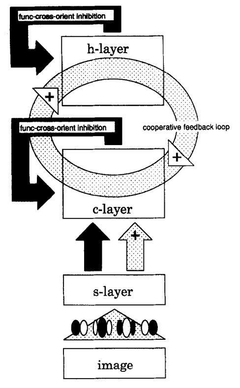

Fig. 1. Organization of the three-layer neuromorphic architecture emulating cortical processing. Columns of simple neurons, belonging to the s-layer, are connected, through excitatory and inhibitory pathways, with complex neurons (c-layer), among which a competitive inhibition schema is active. Hypercomplex neurons (h-layer) derive their functionality both from an inhibition schema and from a cooperative feedback loop with the c-layer neurons. See Fig. 2 for connection details.

ological measurements [17,21-24] have revealed that orientation-selective cells are spatially organized. Assemblies of cells with nearly the same orientation preference are grouped together, forming the so-called *columns*; on a larger scale, the orientation preference of columns is distributed according to a regular periodic pattern. The set of orientations present in a spatial period is called *hypercolumn* [17]. The particular arrangement of these cells on the cortical surface determines the cortical *orientation map*.

# 3. The neuromorphic architecture

## 3.1 General features

In the model proposed, simple, complex and hypercomplex neurons are functionally organized into a three-layer hierarchical network (see Fig. 1).

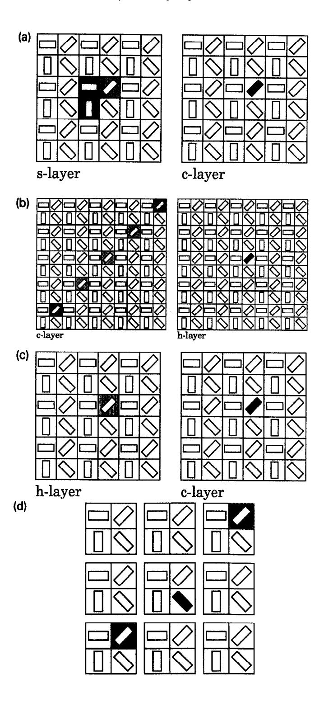

The output of each neuron depends on both inter-layer and intra-layer connections. The way in which cortical neurons are arranged in the layers, together with intra-layer connections, is instrumental in enhancing feature selectivity. Each neuron acts as a local operator for the features present in its receptive field. Each layer accomplishes a specific functional task: the simple layer performs feature extraction, the complex layer performs feature enhancement, and the final layer reduces noise and segregates different features.

Simple neurons are organized into columns made up of four neurons with receptive field profiles characterized by different signs and symmetries but by the same position. Neurons belonging to columns of the same hypercolumn have receptive fields that are centered in the same image region and that overlap almost completely, whereas neurons belonging to adjacent hypercolumns have receptive fields that overlap only partially.

Complex neurons derive their functionality from a combination of outputs of the preceding layer and from functional loops inside the complex layer itself and with the next hypercomplex layer. In this way, a complex neuron receiving inputs from the corresponding column becomes selective to oriented bars of any luminous contrast and of any phase.

The output of hypercomplex neurons results, through feed forward excitation, from a set of neurons in the complex layer, and, through cross-orientation inhibition, from a set of neurons in the hypercomplex layer.

Whereas neurons belonging to the simple layer have a linear transfer function, complex and hypercomplex neurons are characterized by a sigmoid function  $g(\cdot)$ , considered a 'static' function.

Hence, the output  $z(\mathbf{u})$  of complex and hypercomplex neurons can be expressed as:

$$z(\mathbf{u}) = g(e(\mathbf{u})) \tag{1}$$

where  $\mathbf{u} = (u_1, u_2)$  is the coordinate vector on the cortical plane and  $e(\mathbf{u})$  is the input excitation.

Fig. 2. Typical interconnection schemata occurring in the cortical-processing architecture shown in Fig. 1. (a) (b) (c) illustrate topological patterns of connections from the s-layer to the c-layer, from the c-layer to the h-layer and from the h-layer back to the c-layer, respectively. The marked cell (black cell on the right side) receives inputs from the cells located in the shaded areas; the gray level codes the type of contribution: light gray corresponds to positive contributions, dark gray corresponds to inhibitory contributions. (d) illustrates functional cross-orientation inhibition: a target cell with an orientation preference  $\theta$  receives inhibitory inputs from two complex cells, (selective to  $\theta + 90^{\circ}$ ) belonging to hypercolumns that lie along an axis orthogonal to  $\theta$ ; this inhibition process occurs in both the c-layer and the h-layer.

# 3.2 The input layer

The response  $e^p(\mathbf{u})$  of a neuron at the point  $\mathbf{u} = (u_1, u_2)$  in the layer and at the position  $p \ (p = 1...4)$  in its column can be formulated in integral form as:

$$e^{p}(\mathbf{u}) = \int_{\mathscr{I}} (I(\mathbf{x}) - \bar{I}(\mathbf{x})) w^{p}(\mathbf{x}; \mathbf{u}) d\mathbf{x}$$
 (2)

where  $I(\mathbf{x})$  represents the intensity of the pixel at the point  $\mathbf{x} = (x_1, x_2)$  in the image plane  $\mathcal{I}$ ,  $\bar{I}(\mathbf{x})$  is the local average luminosity of the image, and the kernel  $w^p(\mathbf{x}; \mathbf{u})$  describes the neuron's receptive field profile. The dependence of  $w^p$  on the cortical coordinates  $\mathbf{u}$  reflects the changes in the orientations and the positions of receptive fields on the image plane. The operation  $I(\mathbf{x}) - \bar{I}(\mathbf{x})$  is a rough model of the retinal adaptability to background luminance. The particular choice of the two-dimensional function is not critical to the network performance. In the present model, we chose to model the receptive field profile with a DOOG function [25] defined as follows:

$$\tilde{w}(x_1, x_2) = AG(0, 0, \sigma_1, \sigma_2) + BG(0, x_2^c, \sigma_1, \sigma_2) + CG(0, -x_2^c, \sigma_1, \sigma_2)$$
(3)

where  $G(x_1^c, x_2^c, \sigma_1, \sigma_2) = \exp(-[(x_1 - x_1^c)^2/\sigma_1^2 + (x_2 - x_2^c)^2/\sigma_2^2])$  is a Gaussian function and A, B, C,  $\sigma_1$  and  $\sigma_2$  are the parameters determining the shape of the DOOG function (see Fig. 3).

The coordinates  $(x_1^c, x_2^c)$  define the center of the receptive field.

The four even/odd symmetric receptive fields have the same spatial frequency selectivity. Moreover,  $e^1(\mathbf{u}) = -e^2(\mathbf{u})$ ,  $e^3(\mathbf{u}) = -e^4(\mathbf{u})$ , with  $e^1(\mathbf{u})$  orthogonal to  $e^3(\mathbf{u})$ . The interaction among the four neurons of a column is simply performed as a maximum operation over their outputs, i.e. a sort of energy measurement of the column excitation [26-28].

#### 3.3 Architecture specification

The architecture specification is presented in a mathematical form that points out both the functional role of single layers and the versatility that can be achieved through different interconnection schemata. Specifically, the excitations  $e_c(\mathbf{u})$  of a

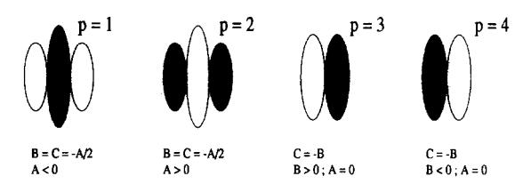

Fig. 3. Shapes and parameters of the four types of receptive fields used for simple neurons.

complex neuron and  $e_h(\mathbf{u})$  of a hypercomplex neuron, at a fixed location  $\mathbf{u}$  on the cortical plane, can be formalized as follows:

$$e_c(\mathbf{u}) = z_s(\mathbf{u}) - w_{sc} \sum_{\mathbf{u}' \in M(\mathbf{u})} z_s(\mathbf{u}') - w_{cc} \sum_{\mathbf{u}' \in N_c(\mathbf{u})} z_c(\mathbf{u}') + w_{hc} z_h(\mathbf{u})$$

$$e_h(\mathbf{u}) = w_{ch} \left[ \sum_{\mathbf{u}' \in L^+(\mathbf{u})} z_c(\mathbf{u}') - \sum_{\mathbf{u}' \in L^-(\mathbf{u})} z_c(\mathbf{u}') \right] - w_{hh} \sum_{\mathbf{u}' \in N_h(\mathbf{u})} z_h(\mathbf{u}')$$

where  $w_{sc}$ ,  $w_{cc}$ ,  $w_{ch}$ ,  $w_{hc}$  and  $w_{hh}$  represent the connection weights from simple to complex (feed-forward) neurons, from complex to complex (intralayer) neurons, from complex to hypercomplex (feed-forward) neurons, from hypercomplex to complex (feedback) neurons, and from hypercomplex to hypercomplex (intralayer) neurons, respectively. The sets  $M(\mathbf{u})$  and  $N_c(\mathbf{u})$  have been properly chosen to increase orientation contrast, while reducing noise sensitivity. In our model, the feed-forward inhibition does not depend on the position (hence on the orientation) of the neuron considered in the layer; the neurons belonging to  $M(\mathbf{u})$  are located in the same hypercolumn and have an orientation selectivity similar to the one of the neuron in u. Concerning recurrent inhibition, we implemented a lateral functional cross orientation inhibition schema [29]. Ne(u) depends on the orientation preference  $\theta$  of the target neuron  $(N_c(\mathbf{u}) = N_c(\theta(\mathbf{u})))$ , where  $\theta(\mathbf{u})$  codes the orientation preference of the neuron on the plane coordinate u. Specifically, a neuron with an orientation preference  $\theta$  receives inhibitory inputs from two complex neurons (selective to  $\theta + 90$ ) that belong to the two closest hypercolumns that lie along an axis orthogonal to  $\theta$ . The set  $L(\mathbf{u})$  depends on the orientation preference of the target neuron. More precisely, the connection schema is defined as follows: if the target neuron is selective to  $\theta$ , then the complex neurons that provide the input belong to the neighboring hypercolumns that lie on an axis parallel to  $\theta$  and are selective to  $\theta$ . The number of neighboring hypercolumns involved in the schema ranges from three to seven. The neurons in  $L(\mathbf{u})$  that lie within a radius  $\rho$ define the subset  $L^+(\mathbf{u})$  and provide an excitation for the target neuron; conversely, the neurons beyond this radius define the subset  $L^{-}(\mathbf{u})$  and provide inhibition. Moreover, the feedforward action of  $L(\mathbf{u})$  neurons combines with the positive feedback, of weight  $w_{hc}$ , that goes from hypercomplex to complex neurons, thus creating a cooperative loop. A pictorial view of the pattern of interconnections among the layers is shown in Fig. 2.

#### 4. Results

The functional performance of the proposed architecture was investigated by considering a couple of preattentive vision tasks, related to texture segregation. The responses of different neuron layers were analyzed, and comparated to point out how cooperative computational strategies, implemented by recurrent interand intra-layer connections, mimic early vision processing.

The results reported in the following concern texture analysis, and were all obtained by using the following architectural configuration:  $\sigma_1/\sigma_2 = 3$ ; an overlap fraction between adjacent receptive fields equal to 0.75; four different orientation selectivities. Different spatial frequencies (i.e. different sizes of the receptive fields of the columns) were used, depending on the types of test images considered.

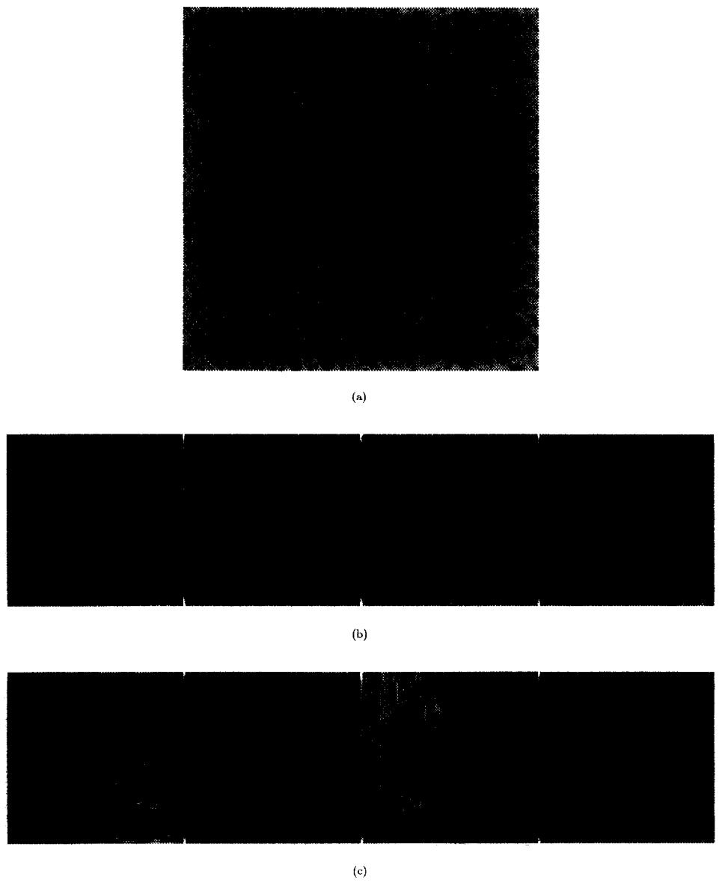

Fig. 4. (a) Image of natural textures; (b) outputs of the simple layer; (c) outputs of the hypercomplex layer.

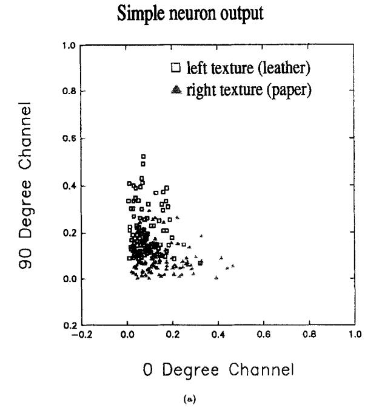

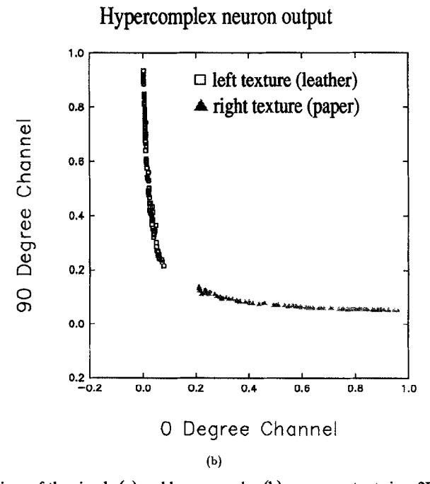

Fig. 5. Representations of the simple (a) and hypercomplex (b) neuron outputs in a 2D projection of the feature space. Symbols represent the outputs of the sampled neurons: open squares label sample neuron outputs for the texture on the left-hand side, whereas shaded triangles label sample neuron outputs for the texture on the right-hand side.

Fig. 4 shows an image with two different textures taken from Brodatz's collection [30]. The textures represent close-up views of natural surfaces: leather on the left side and paper on the right side. The elements present in both textures are

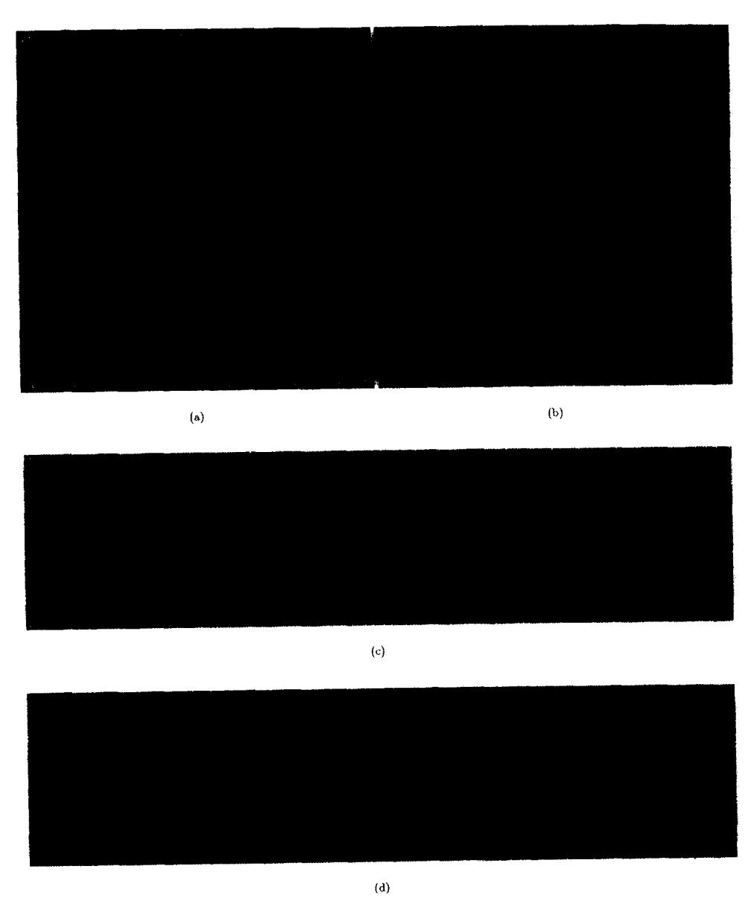

Fig. 6. (a) Image of artificial textures; (b) combined output of the hypercomplex layer (the four images corresponding to different orientation selectivities have been merged together); (c) outputs of the simple layer for the four orientations; (d) outputs of the hypercomplex layer for the four orientations.

very similar in size and structure; only their orientations are different: a vertical distribution prevails in the left texture.

The response of the network is illustrated in Figs. 4(b) and (c). Each image represents the activity of neurons selective to a specific orientation, the luminous intensity of the pixel codes the activity of the corresponding neuron. If the pixel is light, the neuron is active; if the pixel is dark, the neuron is inhibited; and if the pixel is of medium luminous intensity, the corresponding neuron is silent (i.e. the neuron is not selective to the stimulus present in its receptive field). Due to the particular combination of textural elements present in the input image, the four orientation-channel outputs of the simple layer fail *per-se* to provide an adequate segregation of the two textures (Fig. 4(b)). However, the cooperative computation provided by the cooperative-competitive interactions between the complex and hypercomplex layers shows that:

- in the left texture, vertical textural elements prevail (see Fig. 4(c),  $\theta = 90^{\circ}$ ); the presence of these elements inhibits the responses of cortical neurons selective to horizontal elements (see Fig. 4(c),  $\theta = 0^{\circ}$ );
- in the right texture, horizontal textural elements tend to predominate over vertical ones (see Fig. 4(c)  $\theta = 0^{\circ}$  and  $\theta = 90^{\circ}$ ).

In order to demonstrate geometrically the different segregation capabilities of the simple and hypercomplex layers, we refer to a feature space representation based on the four orientation-channel outputs. Figs. 5(a,b) show the projection of each feature vector on the 2D subspace with the two most significant orientation outputs (in this case,  $\theta = 0^{\circ}$ ,  $\theta = 90^{\circ}$ ). For the sake of clarity, the feature space representation concerns to a small portion of the cortical output shown.

Let us now consider a different type of image, often used for psychophysical tests in preattentive vision (Fig. 6(a)).

The two types of artificial textural elements have fixed sizes and random orientations, and are regularly spaced. The outputs of the simple-layer neurons do not show a sharp textural segregation (see Fig. 6(c)). On the contrary, the outputs of the hypercomplex neurons point out different levels of response for the two types of textural elements (see Fig. 6(d)). The four orientation-channel outputs can be averaged to obtain an overall textural segregation response of the architecture (Fig. 6(b)).

#### 5. Discussion

The study of the neural organization of the visual cortex is receiving the growing attention of many researchers for the potential insight it may provide into the basic mechanisms of visual perception. To this end, attempts to extract some computational paradigms from the variety of experimental data should be made. Such algorithms could be useful not only to neuroscientists but also to computer scientists and engineers interested in constructing formal networks or hardware devices for neural information processing.

# 5.1 Biological relevance

The properties of the visual cortex can be described at various levels, ranging from the most detailed, based primarily on signal measurements and on cytoarchitecture analysis, up to the most abstract ones, based on functional considerations. Emphasis is placed here not on the details of neurophysiological models, but on their functional aspects. In this respect, our model is biologically motivated; however, as it is much simpler than the mammalian visual system, it is not biologically accurate.

The network proposed embeds some basic principles of cortical processing:

- (i) location of receptive fields in layers;
- (ii) organization of receptive fields into columns;
- (iii) horizontal and vertical flows of activity in functional circuits (horizontal and vertical synaptic circuits).

Moreover, in our model, the characteristics of the hypercomplex neurons resemble those of end-stopped cells [31–33], which are a wide class of cortical cells that extract information about local curvatures, just as orientation-selective cells extract information about local orientations.

However, for a better understanding of visual cortical processing, realistic models of the visual cortex should take into account a wider range of properties of cortical cells (activation function, temporal dynamics, etc.), as well as a more detailed specification of the circuitry for the information exchange with other visual modules (backward connections to the LGN, vertical loops across cortical layers, re-entrant connections from different areas, etc.). Moreover, at the singlecell level, recent experimental data on non-specific stimulus suppression and on response saturation at high contrasts [11,12] provided evidence for the nonlinear properties of simple cells. However, as we are more interested in functional aspects in order to solve practical problems, in the context of this work, we have disregarded such nonlinearities and assumed completely linear properties of simple cells. We have also assumed no direct interactions among cells tuned to different spatial frequencies, though inhibition mechanisms among different frequency channels have been observed in the primary visual corteces of cats and monkeys [34,35]. Other simplifications regard the architecture specification, which does not take into account the functional role of the corticofugal feedback and its influence on the dynamic cell behavior in the context of visual perception [36,37].

## 5.2 Computational recurrent pathways

The main paradigm for cortical processing since the '60s has been the hierarchical model of visual-information serial processing (from simple to complex and then to hypercomplex cells) proposed by Hubel and Wiesel [17,7]. According to their model, a high-level cortical cell gains its response properties mainly from merging the responses of lower-level cells. Despite the popularity of this serial model, also ascribable to its simplicity, it has always been clear that feedback should be regarded as an essential structural principle of cortical organization [38]. In any

cortical area, feedback is present both in lateral inhibition schemata, which play a key role in sharpening cortical responses, and in backward connections from upper layers and other cortical areas that participate in exchanging different information about image features.

In our model, interaction schemata are implemented to support cooperative activities among cortical neurons belonging to the complex and hypercomplex layers. The response of a single complex/hypercomplex neuron has a non-local character, as it not depends not only on the excitation of afferent neurons in preceding layers but also on the responses of neighboring neurons. This is proved by the iterative algorithm used to determine the excitation  $\epsilon(u)$  of complex and hypercomplex layers:

$$\epsilon_{t}(\mathbf{u}) = \mathcal{G}_{\mathbf{u},\mathbf{u}'}(i(\mathbf{u}')) + \mathcal{F}_{\mathbf{u},\mathbf{u}'}(\epsilon_{t-1}(\mathbf{u}'))$$

where the first term gives the contribution of the input drive, and the second results from recurrent interactions.

#### 5.3 Related works

Our architecture has been developed on a ground prepared by many other researchers, but is characterized by specific criteria followed in its specification. Its main feature concerns the particular organization of perceptual primitives to achieve capabilities leading to a global visual percept. To this end, primitives are not simply computed on the basis of strictly local information but result from a cooperative process among neighboring neurons. Various authors [39-42] followed similar approaches to preattentive vision tasks. Other authors (e.g. [43,44]) proposed multilayer networks for visual pattern recognition that were based on a hierarchical model of the visual cortex. The algorithm steps following the filtering stage differentiate the various architectural solutions proposed and determine their fields of application and their degrees of efficiency. Many systems consider a single nonlinearity (maximum operation or energy computation, etc.) that acts on the results of the convolutions performed at the first processing step [40,45]. Other models, introduce recurrent processing pathways into a system [41,42]. In the Boundary Contour System [39], for example, a cooperative-competitive loop (CC loop) is used for perceptual grouping (e.g. boundary completion). In general, a tradeoff should be reached between computational resources (i.e. number, type, and overlapping of receptive fields; structure and extension of interconnection schemata) and the variety of tasks an architecture is capable to perform. In this paper, we have described a model for visual cortical processing that preserves coherently the computational features of neural networks:

- (i) interaction schemata among computational cells are strictly local:
- (ii) various intermediate-level perceptual tasks are accomplished by a limited set of hierarchically organized computational operators that communicate through the same type of interaction schemata at each hierarchical level.

Consequently, for the particular visual problems addressed, the proposed architecture is much less complex than other existing architectures (cf. [39,41]): the

interconnection schemata are simpler, the equations involved are not dynamic, and fewer tunable parameters are required.

#### Acknowledgments

This work was supported by Programma Nazionale di Ricerca sulle Tecnologie per la Bioelettronica of MURST (Italian Ministry of for the University and Research) and SGS-Thomson Microelectronics; by Progetto Strategico Reti Neurali of the National Research Council (CNR) of Italy; and by Progetti 40% Sistemi Neurali and Architetture VLSI of MURST.

## References

- [1] B. Julesz and Bergen, Textons, the fundamental elements in preattentive vision and perception, Bell System Tech. J. 62 (6) (1983).
- [2] C. Mead, Neuromorphic electronic systems, Proc. IEEE 78 (1990) 1629-1636.
- [3] C. Mead, Analog VLSI and Neural Systems (Addison-Wesley, Reading, 1989).
- [4] H. Kobayashi, J. White and A. Abidi, An active resistor network for Gaussian filtering of images, IEEE J. Solid State Circuits 26 (May 1991) 738-748.
- [5] L. Raffo, S. Sabatini, D. Caviglia and G. Bisio, Anisotropic active resistor meshes for implementing image processing operators, *Electronics Letters* 29 (May 1993) 960-961.
- [6] H. Barlow, Single units and sensation: A neuron doctrine for perceptual psychology? *Perception* 1 (1972) 371-394.
- [7] D. Hubel and T. Wiesel, Receptive fields and functional architecture in the two nonstriate visual areas (18 and 19) of the cat, J. Neurophysiol. 160 (1965) 106-154.
- [8] J. Kulikowski and T. Vidyasagar, Space and spatial frequency: Analysis and representation in the macaque striate cortex, Exp. Brain Res. 64 (1986) 5-18.
- [9] M. Hawken and A. Parker, Spatial receptive field organization in monkey V1 and its relationship to the cone mosaic, in *Computational Models of Visual Processing* (M. Landy and J. Movshon, eds.) (MIT Press, 1991) 83-93.
- [10] G. DeAngelis, I. Ohzawa and R. Freeman, Spatiotemporal organization of simple-cell receptive fields in the cat's striate cortex II. Linearity of temporal and spatial summation, J. Neurophysiol. 69 (1993) 1118-1135.
- [11] D. Heeger, Nonlinear model of neural responses in cat visual cortex, in *Computational Models of Visual Processing* (M. Landy and J. Movshon, eds.) (MIT Press, 1991) 119-133.
- [12] D. Albrecht and W. Geisler, Motion selectivity and the contrast-response function of simple cells in the visual cortex, *Visual Neuroscience* (1991) 531-546.
- [13] D. Ferster and B. Jagadeesh, Nonlinearity of spatial summation in simple cells of area 17 and 18 of cat visual cortex, *J. Neurophysiol.* 5 (1991) 1667–1679.
- [14] V. Glezer, V. Ivanov and T. Tscherbach, Investigation of complex and hypercomplex receptive fields of visual cortex of the cat as spatial frequency filters, Vision Res. 13 (1973) 1875-1904.
- [15] B. Skottun, R. De Valois, D. Grosof, J. Movshon, D. Albrecht and A. Bonds, Classifying simple and complex cells on the basis of response modulation, *Vision Res.* 31 (1991) 1079–1086.
- [16] R. Emerson, M. Korenberg and M. Citron, Identification of complex-cell intensive nonlinearities in a cascade model of cat visual cortex, *Biol. Cybern.* 66 (1992) 291-300.
- [17] D. Hubel and T. Wiesel, Receptive fields, binocular interaction and functional architecture in the cat's visual cortex, *J. Physiol.* 160 (1962) 106-154.
- [18] R. Emerson, M. Citron, W. Vaughn and S. Klein, Nonlinear directional sensitive subunits in complex cells of cat striate cortex, J. Neurophysiol. 58 (1987) 33-65.

- [19] S. Marlin, R. Douglas and M. Cynader, Position-specific adaptation in complex cell receptive fields of the cat striate cortex, J. Neurophysiol. 69 (1993) 2209-2221.
- [20] R. Szulborski and L. Palmer, The two-dimensional spatial structure of nonlinear subunits in the receptive fields of complex cells, Vision Res. 30 (1990) 249-254.
- [21] K. Albus, A quantitative study of the projection area of the central and the paracentral visual field in area 17 of the cat, Exp. Brain Res. 24 (1975) 159-202.
- [22] V. Braitenberg and C. Braitenberg, Geometry of orientation columns in the visual cortex, Biol. Cybern. 33 (1979) 179-176.
- [23] W. Baxter and B. Dow, Horizontal organization of orientation-sensitive cells in primate visual cortex, Biol. Cybern. 61 (1989) 171-182.
- [24] T. Bonhoeffer and A. Grinvald, The layout of iso-orientation domains in Area 18 of cat visual cortex: Optical imaging reveals a pinwheel-like organization, J. Neuroscience 13 (1993) 4157-4180.
- [25] J. Malik and P. Perona, Preattentive texture discrimination with early vision mechanisms, J. Opt. Soc. Amer. 7 (1990) 923-932.
- [26] D. Burr, M. Morrone and D. Spinelli, Evidence for edge and bar detectors in human vision, Vision Res. 29 (1989) 419-431.
- [27] J. Bergen and M. Landy, Computational modeling of visual texture segregation, in *Computational Models of Visual Processing* (M. Landy and J. Movshon, eds.) (MIT Press, 1991) 253-271.
- [28] D. Burr, M. Morrone and A. Fiorentini, Electro-physiological investigation of edge-selective mechanisms of human vision, Vision Res. 32 (1992) 239-247.
- [29] G. Bisio, D. Caviglia, G. Indiveri, L. Raffo and S. Sabatini, A neural network architectural model of visual cortical cells for texture segregation, in *Proc. Int. Conf. on Neural Networks* San Francisco, CA (March 1993).
- [30] P. Brodatz, Textures, a Photographic Album for Artists and Designers (New York, Dover, 1966).
- [31] J. Bolz and C. Gilbert, Generation of end-inhibition in the visual cortex via interlaminar connections, *Nature*, 320 (1986) 362-365.
- [32] R. von der Heydt and E. Peterhans, Cortical contour mechanisms and geometrical illusions, in Neural Mechanisms of Visual Perception (MIT press, 1989) 157-170.
- [33] R. von der Heydt and E. Peterhans, Mechanisms of contour perception in monkey visual cortex. I. Lines of pattern discontinuity, J. Neuroscience 9 (1989) 1731-1748.
- [34] A. Bonds, Dual inhibitory mechanisms for definition of receptive field characteristics in cat striate cortex, in Advances in Neural Information Processing Systems 3 (J.M.R.P. Lippmann and D. Touretzky, eds.) (Morgan Kaufmann, 1991) 75-82.
- [35] L. Bauman and A. Bonds, Inhibitory refinement of spatial frequency selectivity in single cells of the cat striate cortex, Vision Res. 31 (1991) 933-944.
- [36] F. Crick, Function of the thalamic reticular complex: The searchlight hypothesis, *Proc. Natl. Acad. Sci.* 81 (1984) 4586-4590.
- [37] A. Sillito, J. Cudeiro, and P. Murphy, Orientation sensitive elements in the corticofugal influence on centre-surround interactions in the dorsal lateral geniculate nucleus, Exp. Brain Res. 93 (1993) 6-16.
- [38] W. von Seelen, H. Mallot and F. Giannakopoulos, Characteristics of neuronal systems in the visual cortex, *Biol. Cybern.* 56 (1987) 37-49.
- [39] S. Grossberg, E. Mingolla and D. Todovoric, A neural network architecture for preattentive vision, *IEEE Trans. Biomed. Eng.* 36 (1989) 65-83.
- [40] D. Burr and M. Morrone, A nonlinear model of feature detection, in Nonlinear Vision: Determination of Neural Receptive Fields, Functions, and Networks (CRC press, 1992) 309-328.
- [41] B. Manjunath and R. Chellappa, A unified approach to boundary perception: Edges, textures and illusory contours, *IEEE Trans. Neural Net.* 4 (1993) 96-107.
- [42] L. Finkel and G. Edelman, Integration of distributed cortical systems by reentry: A computer simulation of interactive functionally segregated visual areas, J. Neuroscience 9 (1989) 3188-3208.
- [43] K. Fukushima, S. Miyake, and T. Ito, Neocognitron: A neural network model for a mechanism of visual pattern recognition, IEEE Trans. Syst. Man Cybern. 13 (5) (1983) 826-834.
- [44] K. Fukushima, Neural networks for visual pattern recognition, *IEICE Trans.* E74 (1) (1991) 179-190.
- [45] M. Turner, Texture discrimination by Gabor functions, Biol. Cybern. 55 (1986) 71-82.

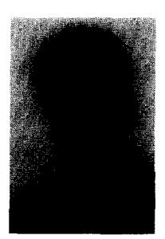

Giacomo Indiveri was born in Sassari, Italy, in 1967. He graduated in Electronic Engineering at the University of Genova in 1992. From 1992 to 1994 he was a graduated fellow of the Italian National Research Program on Bioelectronics working on analog VLSI design of models of the visual cortex, for preattentive vision. He is currently a visiting fellow at the California Institute of Technology working with Prof. C. Koch on the study of neuromorphic systems. His research interests are in the field of neural networks, artificial vision, analog VLSI design.

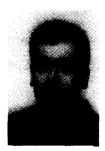

Luigi Raffo was born in Lavagna (GE), Italy, in 1965. He graduated in Electronic Engineering at the University of Genova in 1989 (magna cum laude) and received the Ph.D. degree in Electronic Eng. and Computer Science in 1994 from the same University. He is currently assistant professor at the Istituto di Elettrotecnica of the University of Cagliari (Italy). His research interests are in the field of neural networks, machine vision, VLSI neuromorphic architectures.

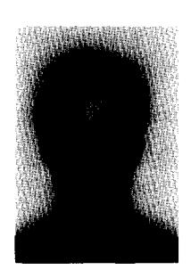

Silvio P. Sabatini was born in Genova, Italy, in 1968. He graduated in Electronic Engineering at the University of Genova in 1992 (magna cum laude). He is currently a Ph.D. candidate at the Department of Biophysical and Electronic Engineering. His interests concern distributed neural networks, computational paradigms in visual perception, multidimensional signal representation.

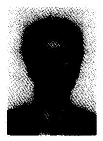

Giacomo M. Bisio was born in Genova, Italy, in 1940. He graduated in Electronic Engineering at the University of Genova in 1965, and received the M.S. degree in Electrical Engineering from Stanford University, CA, USA, in 1971. From 1966 to 1983 he was CNR scientist at the Institute of Electromagnetics Waves in Florence (1966–1972), and at the Institute of Electronic Circuits in Genova (1972–1983). In 1983 he joined as Assistant Professor the Department of Biophysics and Electronics at the University of Genova, where he has been lecturer since 1972. He is Full professor of Microelectronics since 1990, and Head of the Centre for Integrated Systems Design. He was AEI-IEEE Volta Fellow in 1969 at Stanford University, and received (1983) AEI E. Bottani award for his contribution to the teaching of Electronics. His research interests concern VLSI neural networks and molecular electronics.