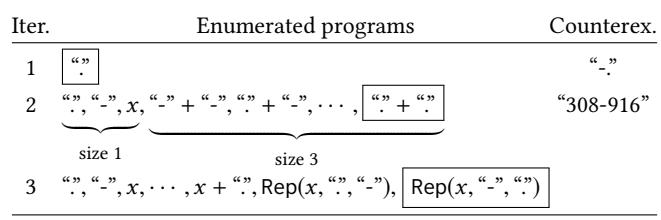
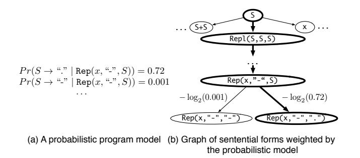
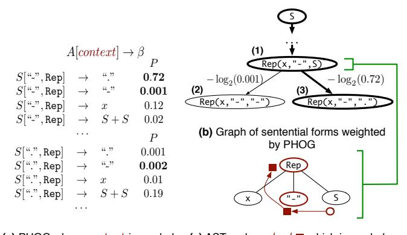
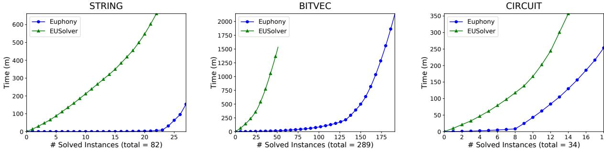
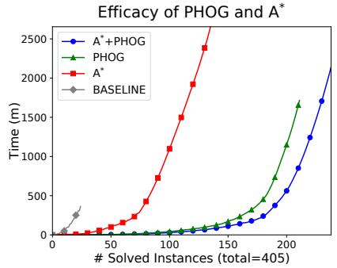

# Accelerating Search-Based Program Synthesis using Learned Probabilistic Models

Woosuk Lee woosuk@cis.upenn.edu University of Pennsylvania USA

Rajeev Alur alur@cis.upenn.edu University of Pennsylvania USA

## **Abstract**

A key challenge in program synthesis concerns how to efficiently search for the desired program in the space of possible programs. We propose a general approach to accelerate search-based program synthesis by biasing the search towards likely programs. Our approach targets a standard formulation, syntax-guided synthesis (SyGuS), by extending the grammar of possible programs with a probabilistic model dictating the likelihood of each program. We develop a weighted search algorithm to efficiently enumerate programs in order of their likelihood. We also propose a method based on transfer learning that enables to effectively learn a powerful model, called probabilistic higher order grammar, from known solutions in a domain. We have implemented our approach in a tool called Euphony and evaluate it on SyGuS benchmark problems from a variety of domains. We show that Euphony can learn good models using easily obtainable solutions, and achieves significant performance gains over existing general-purpose as well as domain-specific synthesizers.

CCS Concepts • Computing methodologies → Transfer learning; • Software and its engineering → Domain specific languages; Programming by example;

*Keywords* Synthesis, Domain-specific languages, Statistical methods, Transfer learning

#### **ACM Reference Format:**

Woosuk Lee, Kihong Heo, Rajeev Alur, and Mayur Naik. 2018. Accelerating Search-Based Program Synthesis using Learned Probabilistic Models. In *Proceedings of 39th ACM SIGPLAN Conference on Programming Language Design and Implementation (PLDI'18)*. ACM, New York, NY, USA, 17 pages. https://doi.org/10.1145/3192366. 3192410

# 1 Introduction

The goal of program synthesis is to automatically synthesize a program that satisfies a given high-level specification. A Kihong Heo kheo@cis.upenn.edu University of Pennsylvania USA

Mayur Naik mhnaik@cis.upenn.edu University of Pennsylvania USA

central challenge in program synthesis concerns how to efficiently search for the desired program in the space of possible programs. Various strategies have been proposed to address this challenge [3, 4, 13, 17, 32]. As a result, recent years have witnessed a surge of interest in applying this technology to a wide range of problems, including end-user programming [12], intelligent tutoring [27], circuit transformation [9], and program repair [20], among many others.

Despite significant strides, however, a key limitation of these strategies is that they do not bias the search towards *likely* programs. As a result, they explore many undesirable candidates in practice, which hinders their performance and limits the kinds of programs they are able to synthesize.

It is well known that desired programs contain repetitive and predictable patterns [15]. We propose a new approach to accelerate search-based program synthesis based on this observation. Our key insight is to learn a probabilistic model of programs and use it to guide the search. To this end, our approach modularly addresses two orthogonal but complementary challenges: 1) how to guide the search given a probabilistic model, and 2) how to learn a good probabilistic model. We next elaborate on each of these challenges.

To address the first challenge, we target a standard formulation, syntax-guided synthesis (SyGuS) [3], that has established various synthesis benchmarks through annual competitions. SyGuS employs a context-free grammar to describe the space of possible programs. We extend the grammar with a probabilistic model that determines the likelihood of each program. We reduce the problem of enumerating programs by likelihood to the problem of enumerating target nodes by shortest distance from a source node in an infinite weighted graph. We solve the resulting problem efficiently using A\* search [14]. While A\* is significantly faster than other path finding algorithms, however, it requires a good cost-estimating heuristic to guide its search. We show how to automatically derive such a heuristic for a given grammar and probabilistic model. Our algorithm supports a wide range of probabilistic models, including n-gram [2], probabilistic

context-free grammar [21], probabilistic higher-order grammar [6], a log-bilinear model [1], a decision tree model [28], and a neural network [5].

To address the second challenge, we target probabilistic higher order grammars (PHOG) [6], a powerful probabilistic model that generalizes probabilistic context-free grammars by allowing conditioning of each production rule beyond the parent non-terminal. It thereby allows capturing rich contexts to effectively distinguish likely programs from unlikely ones. We learn the model from known solutions of synthesis problems that were solved by existing techniques. A direct application, however, suffers from overfitting the model to specifications in those synthesis problems. We propose a novel learning method inspired by transfer learning [23, 24] to learn the model from features of specifications. The features are provided by a domain expert and are akin to domain knowledge used to guide synthesis in existing techniques, such as features of input-output examples [21] or abstract semantics of programs [33].

We implemented our approach in a tool called Euphony that we built atop EUSOLVER [4], an open-source state-of-theart search-based synthesizer. We evaluate Euphony on 1,167 benchmark problems from three widely applicable domains: string manipulation (end-user programming problems), bitvector manipulation (efficient low-level algorithms), and circuit transformation (attack-resistant crypto circuits). For each of these domains, we observe that it suffices to train Euphony using easily obtainable solutions—those that can be generated by EUSOLVER in under 10 minutes. These solutions comprise 762 (~ 65%) of our benchmark problems.

The trained Euphony is able to solve 236 new problems in 11 minutes on average per problem, compared to only 87 by EUSOLVER using 29 minutes on average. EUSOLVER fails to solve the remaining problems even after 6 hours—a consequence of the fact that the search space grows exponentially with program size, despite the use of powerful techniques to optimize the search (see Section 3.4). We also compare Euphony to Flashfill [12], a synthesizer tailored to the string manipulation domain that is shipped with Microsoft PowerShell. Euphony outperforms Flashfill on 20 out of 22 synthesis problems and is 10x faster on average. Euphony thus provides significant performance gains that are complementary to those achieved by existing general-purpose and domain-specific synthesizers.

We summarize the main contributions of our work:

- A general approach to accelerate search-based program synthesis by using a probabilistic model to guide the search towards likely programs. It targets the widely-used SyGuS formulation and supports a wide range of models.
- A method based on transfer learning that enables to learn a powerful model called probabilistic higher order grammar (PHOG) from known solutions without overfitting.



**Table 1.** Enumeration using an unguided search.

 Implementation atop an open-source tool and evaluation on benchmark problems from a variety of widely applicable domains. The results demonstrate significant performance gains over existing synthesis techniques.

#### 2 Overview

We illustrate our approach on the problem of synthesizing a certain string transformation program. The desired program is a function f that takes as input a string denoted x and outputs a string with each hyphen in x replaced by a dot.

We formulate this problem as an instance of the *syntax-guided synthesis* (SyGuS) problem [3]. The formulation comprises a *syntactic specification*, in the form of a context-free grammar that constrains the space of possible programs, and a *semantic specification*, in the form of a logical formula which defines a correctness condition that f must satisfy. The syntactic specification for f is the grammar:

$$S \to x \mid \text{``-''} \mid \text{``.''} \mid S + S \mid \text{Rep}(S, S, S)$$
 (1)

where S is the start symbol, + is the string concatenation operator, and  $Rep(s,t_1,t_2)$  is a new string where each occurrence of substring  $t_1$  in s is replaced by string  $t_2$ . The semantic specification for f follows the *programming by example* (PBE) paradigm and comprises input-output examples given as a logical formula:

$$f("-") = "." \land f("308-916") = "308.916" \land f("1") = "1"$$
 (2)

A solution to this synthesis problem is Rep(x, "-", "").

We next illustrate how a typical search-based synthesizer finds this solution using the CEGIS procedure that combines a search algorithm with a verification oracle. It maintains a finite set of program inputs **pts** that is initially empty. In each iteration, it searches for a candidate program that is correct on the inputs in **pts**, and verifies the correctness of the program according to the given semantic specification. If correct, it returns the program; otherwise, it adds new counterexample inputs to **pts** and repeats the process. The overall performance of this procedure depends heavily on the search algorithm it uses to find candidate programs.

Table 1 shows an execution of a state-of-the-art such algorithm [32] on our example problem. It enumerates programs generated by the given grammar in order of size. We step through its execution of the CEGIS iterations.

 $<sup>^1</sup>$ Our approach is also applicable to SyGuS instances that use semantic specification  $\forall x:\dots$  instead of input-output examples; we evaluate it on both kinds of synthesis problems.

| Iter. | Enumerated programs                         | Counterex |
|-------|---------------------------------------------|-----------|
| 1     | x + "."                                     | "-"       |
| 2     | $x + "", x + "-", \dots,  Rep(x, "-", "") $ |           |

**Table 2.** Enumeration using our weighted search.

In the first iteration, the candidate program proposed is the first program that is generated, the expression ".", because **pts** is empty. Checking the correctness of this program with respect to specification 2 yields a counterexample input "-.", since the output of expression "." on this input does not match the desired output "..". As a result, **pts** becomes {"-."}.

In the second iteration, the algorithm first enumerates all expressions of size 1. Since none of them are correct on **pts**, it proceeds to enumerate expressions of size 3 (there are no expressions of size 2). Finally, the algorithm reaches the expression "." + "." which is correct on **pts**. However, it still fails to verify and yields counterexample input "308-916" (because the desired output is "308.916" whereas the output is ".."). As a result, **pts** becomes {"-.", "308-916"}.

In the third iteration, the algorithm eventually finds the desired program Rep(x, "-", "."), which is correct on with respect to the given specification.

In general, the number of programs enumerated by the above algorithm grows exponentially in program size, despite a powerful optimization to avoid enumerating unnecessary programs that are equivalent under inputs in **pts**. Our main hypothesis is that existing search-based synthesizers suffer this limitation because they assume that all possible programs are equally likely. For example, "." + "." explored in the second iteration above is an unlikely program.

Our main idea is to guide the search towards *likely* programs. We propose a weighted enumerative algorithm to achieve this objective. Table 2 depicts an execution of this algorithm on our example. Our algorithm is essentially the same as the existing enumerative algorithm except that it enumerates programs in order of *likelihood* instead of size. Therefore, instead of enumerating all the smallest expressions (e.g., ".", "-", x), it first proposes x + ".", which is found only in the third iteration by the existing enumerative search. In the next iteration, it quickly finds the solution because it avoids enumerating many unlikely programs (e.g., "." + ".").

# 2.1 A\* Search for Weighted Enumeration

The first key contribution of our approach is an efficient algorithm based on A\* search to enumerate programs in order of decreasing probability. The algorithm is applicable to a wide range of statistical program models, characterized in Section 3. Figure 1(a) depicts one such model called PCFG for the CFG of our synthesis problem, shown in (1). The model takes a current non-empty sequence of terminal/non-terminal symbols (i.e., a sentential form) and returns a probability for each production rule. For example, the probability



**Figure 1.** Graph of sentential forms derived from a PCFG.

of the production rule  $S \to$  "." is 0.72 when the current sentential form is Rep(x, "-", S).

Our algorithm conceptually works on a directed weighted graph—constructed on demand—of sentential forms derived from the given model. An example such graph for the PCFG model above is shown in Figure 1(b). Each node of the graph represents a sentential form that can be derived from the start symbol S of the grammar. Each directed edge  $s_i \rightarrow s_j$  means that  $s_i$  expands to  $s_j$  by applying a production rule to the leftmost non-terminal symbol in  $s_i$ . Each edge is associated with a real-valued weight which is the negative log probability of its corresponding production rule provided by the given model. The sum of the weights on a path from S to a goal node is the negative log probability of the corresponding program. Then, enumerating programs in order of decreasing probability corresponds to enumerating goal nodes by shortest (weighted) distance from the source node.

A straightforward way to perform this enumeration is to employ uniform cost search algorithms such as Dijkstra's algorithm. This algorithm repeatedly chooses the next node that is at the least distance from the start node until a solution is found. Since the least-distance path is always the one chosen for an extension, it is guaranteed to enumerate goal nodes in order of increasing distance (i.e., decreasing probability). However, as our evaluation in Section 5 shows, uniform cost search performs poorly in practice by expanding a huge number of paths before reaching the solution node.

We address this problem by employing A\* search [14] instead of uniform cost search. A\* significantly improves upon uniform cost search by first expanding nodes that appear to lead to the next closest goal node. It identifies such nodes by using not only their (known) distance from the start node but also an estimate of their (unknown) distance to the closest goal node. The more accurate this estimate, the smaller the number of nodes expanded by A\*, and is typically a small fraction of that explored by uniform cost search. We show how to obtain accurate estimates in Section 3.3.

#### 2.2 Transfer Learning for PHOG

The second key contribution is a new learning method based on a state-of-the-art probabilistic model called probabilistic higher-order grammar (PHOG) [6]. Figure 2(a) depicts



(a) PHOG when *context* is symbols (c) AST and *context* ■ which is symbols at left sibling and parent at left sibling and parent

Figure 2. Graph of sentential forms derived from a PHOG.

a PHOG for the original CFG. It allows the non-terminal symbol on the left side of each production rule to be parameterized by a *context* that captures contextual information around a production position. The *context* is a list of terminal/non-terminal symbols that can be collected from the abstract syntax tree (AST) of a sentential form.

A PHOG can be learned from known solutions of synthesis problems that were solved by existing techniques. In this example, we assume that a learner (detailed in Section 4) infers that the symbols at the left sibling and the parent of a production position provide meaningful information. In Figure 2(c), arrows  $\nearrow$  show the movement over the AST that leads to computing the context. The obtained context is ["-", Rep], and the probability of the production rule  $S \rightarrow$  "." is 0.72. Therefore, the edge from (1) to (3) has weight  $-\log_2(0.72) = 0.47$ . Under that same context, the probability of the production rule  $S \rightarrow$  "-" is 0.01. Therefore, the edge from (1) to (2) has weight  $-\log_2(0.001) = 9.97$ . Note that now we avoid enumerating node (2) because the solution node (3) is explored first as it is closer to the start node.

However, blindly using PHOGs for guiding synthesis hinders their performance, because of the problem of overfitting. Consider another synthesis problem of finding a function f following a semantic specification comprising input-output examples as follows:

$$f("12.31") = "12-31" \land f("01.07") = "01-07".$$
 (3)

The syntactic specification is the same as before. Suppose we use the PHOG in Figure 2(b) to guide the search towards the desired solution: Rep(x, ".", "-"), which is the inverse of the previous solution Rep(x, "-", "."). Let us assume that we are in the middle of the search, and a current sentential form Rep(x, ".", S). We explain how we encounter overfitting in this situation. Note that the context is [".", Rep], the symbols at the left sibling and the parent of the non-terminal symbol S, respectively. To reach the solution, the production rule  $S \to "-"$  should be applied to the current sentential form. However, since the probability of the rule conditioned by

```
A[context^{\#}] \rightarrow \beta^{\#}
                                                                                           P
                                                                                         0.72
                                            S[const_I, Rep]
                                                                          consto
                                             S[const_I, Rep]
                                                                                        0.001
                                                                          const_I
           x \mid S + S
                                            S[\mathtt{const}_I,\mathtt{Rep}]
                                                                                         0.12
                                            S[\mathtt{const}_I,\mathtt{Rep}]
                                                                          S + S
                                                                                         0.02
            Rep(S, S, S)
                                                                                           P
            const_{IO} \mid const_{I}
                                                                                        0.001
                                             S[const_O, Rep]
                                                                           const<sub>O</sub>
                                            S[\mathtt{const}_O,\mathtt{Rep}]
            const_O \mid const_{\perp}
                                                                                        0.002
                                                                           const
                                            S[\mathtt{const}_O,\mathtt{Rep}]
                                                                                         0.01
                                            S[const_O, Rep]
                                                                           S + S
                                                                                         0.19
                                                  (b) A pivot PHOG learned using
(a) A pivot grammar for string
      manipulation tasks
                                                           the pivot grammar
```

**Figure 3.** PHOG learned using our transfer learning method.

the context is small ( $P(S["".", Rep] \rightarrow "-") = 0.002$ ) compared to the other rules, the search will not be guided toward it.

To solve this problem, we introduce a new learning method inspired by *transfer learning* [23, 24], that enables PHOGs to generalize well across synthesis problems whose solutions have different probability distributions. Our key idea is to design a *feature map* that transforms sentences both in the training and testing data into a common feature space. In this example, we assume a feature map that transforms the original constant symbols into featured terminal symbols representing certain types of constant strings. Let I and O be sets of strings that appear as input examples and output examples in the semantic specification, respectively. Consider the following categories of all possible constant strings:

- const $_{IO}$  represents the set of substrings of all the strings in  $I \cap O$
- const<sub>I</sub> represents the set of substrings of the strings in I
- const<sub>O</sub> represents the set of substrings of the strings in O
- const⊥ represents all the remaining strings.

In the training phase, we learn a PHOG of a *pivot* grammar that uses the above symbols instead of the constant strings. The pivot grammar is depicted in Figure 3(a). In contrast to learning the previous PHOG that only requires the syntax of solutions of other existing synthesis problems, we need semantic specifications as well for training. Using a corresponding semantic specification, each existing solution can be transformed into one in which the original constant symbols are replaced with the above symbols. For example, the solution Rep(x, "-", ":") can be transformed into  $Rep(x, const_I, const_O)$  since "-" and "." appear in the input and output examples depicted in (2), respectively. Using the transformed programs, we learn a PHOG depicted in Figure 3(b), which we call a *pivot* PHOG.

Returning to the overfitting problem, we can guide the search appropriately using the pivot PHOG. The current sentential form Rep(x, ``.', S) is transformed into  $\text{Rep}(x, \text{const}_I, S)$  since the string "." appears in the input examples in (3). The context, comprising symbols at the left sibling and parent of S in the AST of the transformed sentential form, is [const<sub>I</sub>, Rep]. Now the probability of the production rule  $S \to$  "-" is assigned the probability of  $S[\text{const}_I, \text{Rep}] \to$ 

 $const_O$  since "-" appears in the output examples. Now that the assigned probability is higher than that of the other production rules, the search is guided toward the solution.

The rest of the paper is organized as follows. Section 3 presents our weighted search algorithm. Section 4 describes how a PHOG is learned from training data. Section 5 presents our experimental results. Section 6 discusses related work and Section 7 concludes. Proofs of all stated theorems are provided in the Appendix.

# 3 Weighted Search Algorithm

In this section, we describe our weighted search algorithm based on A\* search. We first formulate our problem of guiding search-based synthesis using the CEGIS procedure with a probabilistic program model. We then present a basic algorithm that prioritizes likely solution candidates. Lastly, we extend it with two orthogonal optimizations that are widely used by existing search strategies.

#### 3.1 Preliminaries

**Context-free Grammar.** A context-free grammar G is a quadruple  $\langle N, \Sigma, R, S \rangle$  where N is a finite set of nonterminal symbols,  $\Sigma$  is a finite set of terminal symbols,  $\Sigma$  is a finite subset of  $\Sigma$ 0 where each member  $\Sigma$ 1 is called a production and is written as  $\Sigma$ 2 and  $\Sigma$ 3 is the start symbol in  $\Sigma$ 4. A sequence of non-terminal and terminal symbols in  $\Sigma$ 5 is called a sentential form. Throughout the paper, for brevity, we only consider leftmost derivations, that is, derivations in which productions are always applied to the leftmost non-terminal symbol. Furthermore, we assume the grammar is unambiguous in the sense that for all sentences, there exists a unique leftmost derivation.

**Syntax-Guided Synthesis.** The syntax-guided synthesis problem [3] is to find a program P that implements a desired specification Φ. Programs are written in a language  $\mathbb{P}$  described by a context-free grammar G, and specification in a decidable theory  $\mathcal{T}$ . We assign a deterministic semantics  $\llbracket P \rrbracket$  to each program  $P \in \mathbb{P} = L(G)$ . A specification is a formula  $\Phi(x, \llbracket P \rrbracket(x))$  in theory  $\mathcal{T}$  that relates program inputs to outputs. Given a specification  $\Phi$ , the program synthesis task is to find a program  $P \in \mathbb{P}$  such that the formula  $\forall x.\Phi(x, \llbracket P \rrbracket(x))$  is valid modulo  $\mathcal{T}$ .

### 3.2 CEGIS with Guided Search

Our synthesis problem is the same as the syntax-guided synthesis problem except that a statistical program model is given instead of a CFG, which is defined as follows.

**Statistical Program Model.** A statistical program model  $G_q = \langle G, C, p, q \rangle$  of a context-free grammar G is a probability distribution over programs in a language generated by G where C is a finite *conditioning* set, p is a function of type  $(N \cup \Sigma)^* \to C$ , and  $q: R \times C \to \mathbb{R}^+$  scores rules such that they form a probability distribution, i.e.,  $\forall A \in N, c \in \mathbb{R}^+$ 

## Algorithm 1 CEGIS with Guided Search

```
Function CEGIS(G_q, \Phi)

1: pts := \emptyset

2: repeat

3: P := WEIGHTED\_SEARCH(G_q, pts, \Phi)

4: cex := VERIFY(P, \Phi)

5: if cex = \bot then

6: return P

7: end if

8: pts := pts \cup \{cex\}

9: until false
```

C.  $\sum_{A \to \beta \in R} q(A \to \beta \mid c) = 1$ . In other words, the context can be computed by applying the function p on a current sentential form, and it allows conditioning the expansion of a next production rule associated with a probability.

The function q allows assessing the probability of a given program. Suppose G is unambiguous and  $S(=s_0) \Rightarrow s_1 \Rightarrow \cdots \Rightarrow P(=s_n)$  is a unique derivation of a program P where  $r_0, \cdots, r_{n-1}$  are the rules applied at each step. Then, the probability of a program P under a statistical program model  $G_q$  is defined to be  $Pr(G_q, P) = \prod_{i=0}^{n-1} q(r_i \mid p(s_i))$ . This form of probabilistic models is general enough to capture various statistical program models such as n-grams [2], PCFG [21], PHOG [6], and a neural network-based model [5].

Algorithm 1 depicts the CEGIS procedure with a slight difference. Instead of a CFG, the algorithm takes a statistical program model  $G_q$ , which is used to guide the search. In each iteration, the algorithm calls the WEIGHTED\_SEARCH procedure which returns the next element correct on **pts** from  $\mathbb{P}$  (line 3). Then the result expression P is verified by the VERIFY procedure (line 4). If the expression P satisfies the specification  $\Phi$ , it is returned (line 6). Otherwise, a counterexample input point cex (i.e., an input on which P is incorrect) is picked and added to the set of points **pts** (line 8), and the process is repeated.

Let  $\sigma$  be a (possibly infinite) sequence of candidate solutions generated by WEIGHTED\_SEARCH at each iteration, and  $\mathbf{pts}_i$  the set of inputs in the i-th iteration. WEIGHTED\_SEARCH should satisfy three criteria:

```
Prioritization: ∀i ≤ j. Pr(Gq, σi) ≥ Pr(Gq, σj).
Correctness: ∀i. ∀x ∈ pts<sub>i</sub>. Φ(x, [σ<sub>i</sub>] (x))
Completeness: ∃P ∈ ℙ. ∀x. Φ(x, [P] (x)) ⇒ ∀x. Φ(x, [σ<sub>4</sub>] (x)).
where σ<sub>4</sub> denotes the last element of σ. In other words, a desirable procedure should generate candidates in order of likelihood and eventually find a solution if one exists.
```

#### 3.3 Weighted Enumerative Search

In this section, we present an instance of the abstract procedure WEIGHTED\_SEARCH used in Algorithm 1. We call the instance weighted enumerative search. Let us begin by introducing necessary notations.

#### 3.3.1 Notations

A weighted directed graph consists of a set of vertices and a set of edges with real-valued weights. An edge from p to q with a label X is denoted  $p \xrightarrow{X} q$ . A path  $p \xrightarrow{Y} q$  is a sequence of vertices and edges leading from p to q with a sequence Y of labels on the edges. Each edge has the associated cost. Letters A, B denote non-terminal symbols, letters a, b denote terminal symbols, and letters a, b denote sentential forms. Our weighted enumerative algorithm operates on a weighted directed graph of sentential forms defined as follows:

**Definition 3.1** (Derivation Graph of Sentential Forms). Given a statistical program model  $G_q = \langle G, C, p, q \rangle$  where  $G = \langle N, \Sigma, S, R \rangle$ , a graph  $\mathcal{G}(G_q)$  is a weighted directed labeled graph  $\langle N, \mathcal{E} \rangle$  where  $N \subseteq (N \cup \Sigma)^*$ ,  $\mathcal{E} \subseteq N \times N \times R$ , and  $w : \mathcal{E} \to \mathbb{R}^+ \cup \{\infty\}$  defined as follows:

$$\mathcal{E} = \{ \alpha A \gamma \xrightarrow{A \to \beta} \alpha \beta \gamma \mid A \to \beta \in R, \alpha \in \Sigma^*, \beta, \gamma \in (N \cup \Sigma)^* \}$$

$$w(n_1 \xrightarrow{A \to \beta} n_2) = \begin{cases} -\log_2 q(A \to \beta \mid p(n_1)) & (q(A \to \beta \mid p(n_1)) \neq 0) \\ \infty & (\text{otherwise}) \end{cases}$$

The graph has a start node S and (possibly) infinitely many goal nodes, which are all the programs in  $\mathbb{P}$ .

#### 3.3.2 A\* based Search

We use  $A^*$  search [14] over the derivation graph of sentential forms.  $A^*$  is a best-first graph search algorithm. It expands nodes that appear to lead to the next closest goal node. It identifies such nodes n by using not only their (known) distance f(n) from the start node but also an estimate g(n) of their (unknown) distance to the closest goal node. Using f(n)+g(n) as the estimated least distance from the start node to the closest goal node from n, the algorithm repeatedly chooses the next node n' whose f(n')+g(n') is minimum. It always finds the shortest path from the start node to a goal node when such a path exists if g(n) never overestimates the actual distance  $g^*(n)$  to the closest goal node, i.e.,  $g(n) \leq g^*(n)$ . The function g is called the *heuristic function*.

Algorithm 2 depicts our algorithm. Not only the inputs required by the abstract procedure WEIGHTED\_SEARCH, but also a heuristic function g is provided as input to the algorithm. For a given statistical program model, the heuristic function can be automatically derived once and for all, and it is used throughout the search. How to derive such a function will be described in the following Section 3.3.3. Also, note that the derivation graph of sentential forms is not explicitly constructed and then traversed, but built on the fly.

We detail the algorithm next. The priority queue maintained throughout the search is initialized at line 1. The queue contains triples of a sentential form n, the shortest distance from the start node to n, and a guessed distance from n to the closest goal node. At every iteration of the loop, most promising sentential form n is picked from the queue (line 3). If n is a correct sentence (i.e., a program) with respect to  $\mathbf{pts}$ , it is returned (lines 4-5). Otherwise, we continue the

## Algorithm 2 Weighted Enumerative Search

```
Function WEIGHTED_SEARCH<sub>e</sub>(G_q, \mathbf{pts}, \Phi, g)
          // q is a heuristic function described in Section 3.3.3.
 1: Q := \{(S, 0, q(S))\}
 2: while Q is not empty do
          remove (n, c_f, c_q) whose c_f + c_q is minimal from Q.
          if n \in \Sigma^* \land \forall x \in \mathbf{pts}. \Phi(x, [n](x)) then
 4:
 5:
          for all n' s.t. n \stackrel{r}{\rightarrow} n' do
 7:
               insert (n', c_f + w(n \xrightarrow{r} n'), g(n')) into Q
 8:
 9:
          for all \langle (n, c_f, c_g), (n', c'_f, c'_g) \rangle \in Q \times Q do

if n \approx_{\mathbf{pts}} n' \wedge c_f + c_g > c'_f + c'_g then

remove (n, c_f, c_g) from Q
10:
11:
12:
13:
          end for
15: end while
```

search. The neighborhoods of n are expanded and added into the queue and the distances are updated (lines 7-9). As an optimization that will be described in Section 3.4, we remove redundant sentential forms from the queue by applying the notion of equivalence classes of sentential forms to abstract the search space (lines 10-14).

In the rest of this section, we explain how to obtain the function *g* and how to apply the notion of equivalence classes.

## 3.3.3 Heuristic Function

Ideally, we can achieve the best performance (in terms of expanded nodes) if we use the exact distance  $g^*(n)$  for each node n, formally:  $g^*(n) = \min_{s \in \Sigma^*, n \xrightarrow{\Gamma} s} w(n \xrightarrow{\Gamma} s)$  where  $w(n \xrightarrow{\Gamma} s)$  is the sum of the weights associated with the edges on the path  $n \xrightarrow{\Gamma} s$ . However, it is infeasible to compute  $g^*(n)$  because there are possibly infinitely many goal nodes reachable from n and we cannot evaluate all of them. Instead, we use an underapproximation g of  $g^*$ . Intuitively, we compute guessed future distances without considering contexts that will condition future productions. The function g is defined as:

$$g(n) = \begin{cases} 0 & (n \in \Sigma^*) \\ -\sum_{n_i \in N} \log_2 h(n_i) & (\text{otherwise}) \end{cases}$$

where  $n_i$  refers to the i-th symbol in the sentential form n. If a given node is a sentence, then g returns 0 because we have already reached a goal node. Otherwise, for each non-terminal symbol in n, we compute a guessed distance to the closest goal node reachable from n using a function h, and then we sum up the computed values. For a non-terminal symbol  $A \in N$ , h(A) refers to an upper bound of the probabilities of expressions that can be derived from A. For all  $A \in N$ , h(A) should satisfy the following:

$$\forall A \in N. \ h(A) = \max_{A \to \beta \in R, c \in C} \left( q(A \to \beta \mid c) \times \prod_{\beta_i \in N} h(\beta_i) \right).$$

The function h can be obtained by the following steps: i) start with h(A) = 0 for all  $A \in N$ ; ii) repeatedly update h using the above equation until saturation. Note that i) the conditioning set C should be finite to do the above fixpoint computation, and ii) we can arbitrarily choose any non-terminal at each iteration. After a finite number of iterations, the estimate h always converges.

**Example 3.2.** Consider the following PCFG in which each production rule is associated with a probability.

$$S \rightarrow aSb \quad (0.9) \qquad S \rightarrow c \quad (0.1)$$

where a,b, and c are terminal symbols. At the beginning, h(S) is set to be 0. At the 1st iteration,  $h(S) = \max(0.9 \times 0, 0.1) = 0.1$ . At the 2nd iteration,  $h(S) = \max(0.9 \times 0.1, 0.1) = 0.1$ . It converges in two iterations.

To conclude, our heuristic function g always underestimates the exact future distances.

**Theorem 3.3.**  $\forall n \in (N \cup \Sigma)^*$ .  $q(n) \leq q^*(n)$ .

### 3.4 Optimizations

In this section, we illustrate how to incorporate two powerful orthogonal optimization techniques employed by the existing search strategies into the basic algorithm.

#### 3.4.1 Pruning with Equivalence Classes

We further improve the search efficiency via the notion of the equivalence class of sentential forms, which is an extended notion of the equivalence classes of programs used in the existing enumerative search strategy.

**Definition 3.4** (Equivalence of sentential forms). For a given derivation graph of sentential forms  $\mathcal{G}(G_q)$  and a set of inputs **pts**, two sentential forms  $n_i, n_j \in (N \cup \Sigma)^*$  are equivalent modulo **pts** (denoted  $n_i \sim_{\mathbf{pts}} n_j$ ) if all pairs of programs  $(P_i, P_j)$  derivable from  $n_i$  and  $n_j$  respectively have the same input-output behavior with respect to **pts**, formally:

$$\forall P_i, P_j \in \mathbb{P}, x \in \mathbf{pts}. \ n_i \overset{\mathbf{r}}{\leadsto} P_i \wedge n_j \overset{\mathbf{r}}{\leadsto} P_j \implies \llbracket P_i \rrbracket \left( x \right) = \llbracket P_j \rrbracket \left( x \right).$$

Computing the above equivalence relation is infeasible in general because there may be infinitely many programs reachable from given sentential forms. We instead use the following relation.

**Definition 3.5** (Weak equivalence of sentential forms). For a given graph of sentential forms  $\mathcal{G}(G_q)$  and a set of inputs **pts**, two sentential forms  $n_i, n_j \in (N \cup \Sigma)^*$  are equivalent modulo **pts** (denoted  $n_i \approx_{\mathbf{pts}} n_j$ ) iff  $n_i = n_j$  or

$$\exists P_i, P_j \in \mathbb{P}. \quad P_i < n_i, P_j < n_j, \forall x \in \mathbf{pts}. \ \llbracket P_i \rrbracket (x) = \llbracket P_j \rrbracket (x)$$
$$n_i [P_i/\epsilon] \approx_{\mathbf{pts}} n_j [P_j/\epsilon]$$

where < denotes the subsequence relation.

**Example 3.6.** Consider the second CEGIS iteration of the weighted enumeration described in Table 2 where **pts** = {"-."}. Suppose we have two sentential forms  $n_1 = (\text{"-"+"."}) + S$  and  $n_2 = x + S$  along with their costs in the priority queue during the search. Then,  $n_1 \approx_{\mathbf{pts}} n_2$  holds and we can remove either  $n_1$  or  $n_2$  from the priority queue for the following reason. Let  $P_1 = (\text{"-"+"."})$  and  $P_2 = x$ . Then,  $P_1 < n_1$  and  $P_2 < n_2$ . In addition,  $[P_1](\text{"-"."}) = [P_2](\text{"-"."}) = \text{"-"."}$ . Also,  $n_1[P_1/\epsilon] \approx_{\mathbf{pts}} n_2[P_2/\epsilon]$  because  $n_1[P_1/\epsilon] = n_2[P_2/\epsilon] = +S$ . Therefore,  $n_1 \approx_{\mathbf{pts}} n_2$ .

The relation is sound in the following sense.

Theorem 3.7. 
$$\forall pts. \ n_i \approx_{pts} n_i \implies n_i \sim_{pts} n_i$$

We detail the lines 10-14 in Algorithm 2. We group multiple sentential forms together to abstract search space. For each equivalence class, only a *representative* that has the highest probability is maintained in the queue (line 11). If any two sentential forms n and n' are equivalent, we remove one of the smaller scores from the queue to avoid exploring all paths reachable from that node. In the implementation, in order to save computation, we maintain a map that keeps track of the representatives of equivalence. This map let us avoiding redundant comparisons between sentential forms.

**Theorem 3.8.** For a given synthesis problem, assuming  $\mathbb{P}$  is finite, WEIGHTED\_SEARCH<sub>e</sub> generates a sequence of candidate programs satisfying the prioritization, correctness, and completeness properties.

## 3.4.2 Divide-and-Conquer Enumeration

We can further improve the search efficiency by adopting the divide-and-conquer enumerative approach [4] when we aim to synthesize programs with conditionals. This approach allows synthesizing large conditional expressions. The idea is to find different expressions that work for different subsets of the inputs, and unify them into a solution that works for all inputs. The sub-expressions are found using enumeration techniques and are then unified into a program using techniques for decision tree learning.

The algorithm enumerates terms and predicates separately and unifies them into a single large conditional expression. For example, in the if-then-else expression ite( $x \le y, y, x$ ), the terms are x and y, and the predicate is  $x \le y$ . To this end, the algorithm initially automatically decomposes a given context-free grammar G into a pair of grammars  $\langle G_T, G_P \rangle$  where (a) the *term grammar*  $G_T$  is a grammar generating terms of type of target program; and (b) the *predicate grammar*  $G_P$  is a grammar generating boolean terms. We refer the reader to [4] for more details.

Our weighted enumeration with the divide-and-conquer strategy is described in Algorithm 3. It takes two statistical program models: the term model  $G_q^T$  and the predicate model  $G_q^P$ , and the two heuristic functions based on those grammars, respectively. That means we need to train two statistical

Algorithm 3 Weighted Enumerative Search with Divide-and-Conquer Strategy

```
Function Weighted_search<sub>eu</sub>(G_q^T, G_q^P, \mathbf{pts}, \Phi, g^T, g^P)
   // q^T and q^P are the heuristic functions.
1: \langle \mathbf{T}, \mathbf{P} \rangle := \langle \emptyset, \emptyset \rangle
2: repeat
        for all pt \in \mathbf{pts} do
             T := T \cup \{\text{WEIGHTED\_SEARCH}_e(G_q^T, \{pt\}, \Phi, g^T)\}
5:
        \mathbf{P} \coloneqq \mathbf{P} \cup \{ \mathtt{weighted\_search}_e(G_q^P, \emptyset, \Phi, g^P) \}
        e := LearnDT(T, P, pts)
8: until e \neq \bot
9: return e
```

models separately using the two grammars. Those models guide the search for terms and predicates, respectively. To simultaneously enumerate both terms and predicates, the algorithm maintains a set of terms (T) and a set of predicates (P) that are enumerated so far. Initially, they are empty sets (line 1). In this algorithm, we use the weighted enumerative search described in Section 3.3. In lines 3-5, we enumerate terms in order of likelihood by invoking WEIGHTED\_SEARCH<sub>e</sub>. Then we generate a predicate at line 6. Using the generated terms and predicates so far, the algorithm tries to learn a decision tree at line 7 as described in [4]. We find a solution if the function LEARNDT finds a condition expression using the terms and predicates. Otherwise, the whole process is repeated until a correct conditional expression is found.

To use WEIGHTED\_SEARCH<sub>e</sub> for weighted enumerations of terms and predicates, we slightly modify WEIGHTED\_SEARCH<sub>e</sub> into the form of a generator [19] (also called semi-coroutine), so that it can yield expressions; it stores the last state when it returns a candidate term/predicate, and resumes the execution from that point when it is invoked next time.

# **Transfer Learning for PHOGs**

In this section, we introduce a new learning method to learn PHOGs that generalize well across synthesis problems whose solutions have different probability distributions. We first give preliminaries for PHOG, then present our transfer learning method, and lastly, provide actual instances of the learning method used in the experiments.

#### 4.1 Preliminaries

Higher Order Grammar. A higher order grammar (HOG)  $\hat{G}$  is a tuple  $\langle N, \Sigma, S, C, \hat{R}, p \rangle$  where N is a set of non-terminal symbols,  $\Sigma$  is a set of terminal symbols, C is a conditioning set, S is the start non-terminal symbol,  $\hat{R}$  is a set of rules of the form  $A[c] \to \beta$  where  $A \in N, \beta \in (N \cup \Sigma)^*$ , and  $c \in C$ . And *p* is a function of type  $(N \cup \Sigma)^* \to C$ .

The definition of HOG is the same as a context-free grammar except that the left-hand side of a production rule is parametrized by a context  $c \in C$ . The context c can be computed by applying the function p on a sentential form. This

function allows the grammar to condition the expansion of a production rule on richer information than the parent non-terminal as in CFGs.

**Probabilistic HOG.** A probabilistic higher order grammar (PHOG)  $\hat{G}_q$  is a tuple  $\langle \hat{G}, q \rangle$  where  $\hat{G} = \langle N, \Sigma, S, C, \hat{R}, p \rangle$  is a HOG and  $q:\hat{R}\to\mathbb{R}^+$  scores rules that form a probability distribution, i.e.  $\forall A \in N, c \in C$ .  $\sum_{A[c] \to \beta \in R} q(A[c] \to \beta) = 1$ .

## 4.2 Transfer Learning

We present our learning method based on transfer learning [23, 24]. Transfer learning is a useful technique when the training and testing data are drawn from different probability distributions. In our setting, the training data and testing data are solutions of synthesis problems of which search space  $\mathbb{P}$  is defined by a context-free grammar G. The training and testing data often follow different probability distributions because of diverse semantic specifications as already shown in Section 2.

Transfer learning reduces the discrepancy between the probability distributions of the training and testing data. We find and construct a common space (other than  $\mathbb{P}$ ) where the probability distribution of elements corresponding to the training data is close to those of the testing data.

To this end, we design a *feature map* that transforms programs in  $\mathbb{P}$  to another space in which common features of the training and testing data are captured. The new space is also defined by a context-free grammar called a pivot grammar. We learn a statistical program model of the pivot grammar that assesses the probability of a given testing instance.

Given a CFG  $G = \langle N, \Sigma, S, R \rangle$  and a training set  $\mathcal{D} =$  $\{(\Phi_1, \sigma_1), \cdots, (\Phi_n, \sigma_n)\}$  which is a set of pairs of synthesis problems and solutions, a feature map  $\langle \alpha_N, \alpha_{\Sigma} \rangle$  generates the pivot grammar  $G^{\#} = \langle N^{\#}, \Sigma^{\#}, R^{\#} \rangle$  and the featured training data  $\mathcal{D}^{\#}$  such that

$$\begin{split} N^{\#} &= \{\alpha_{N}(A) \mid A \in N\}, \quad \Sigma^{\#} = \{\alpha_{\Sigma}(t) \mid t \in \Sigma\} \\ S^{\#} &= \alpha_{N}(S), \quad R^{\#} = \{\alpha_{N}(A) \to \alpha_{\Delta}(\beta) \mid A \to \beta \in R\} \\ \mathcal{D}^{\#} &= \{(\Phi_{1}, \alpha_{\Delta}(\sigma_{1})), \cdots, (\Phi_{n}, \alpha_{\Delta}(\sigma_{n}))\} \end{split}$$

where 
$$\alpha_N$$
 is the identity function, 
$$\alpha_{\Delta}(\beta) = \begin{cases} \epsilon & (\beta = \epsilon) \\ \alpha_N(\kappa_1) \cdot \alpha_{\Delta}(\kappa_2 \cdots \kappa_{|\kappa|}) & (\kappa_1 \in N) \\ \alpha_{\Sigma}(\kappa_1) \cdot \alpha_{\Delta}(\kappa_2 \cdots \kappa_{|\kappa|}) & (\kappa_1 \in \Sigma) \end{cases}$$

and  $\kappa_i$  denotes the *i*-th symbol of  $\kappa$ . In short, the feature map  $\langle \alpha_N, \alpha_{\Sigma} \rangle$  transforms the original terminals and nonterminals into the corresponding feature symbols (described in the next section).

Next, we learn a pivot PHOG  $\langle \hat{G}^{\#}, q^{\#} \rangle$  from the pivot grammar  $G^{\#}$  and featured training data  $\mathcal{D}^{\#}$ :

$$\hat{G}^{\#} = \langle N^{\#}, \Sigma^{\#}, S^{\#}, C^{\#}, \hat{R}^{\#}, p \rangle$$

Note that the pivot grammar and pivot PHOG have the same structures as the ordinary grammar and PHOG. Thus, learning the pivot PHOG is done by the standard learning process for PHOGs following the previous work [6]. The details can be found in Appendix.

In guiding the search for a solution of a newly given synthesis problem, we use the learned pivot PHOG for a statistical model. Recall that a statistical program model  $G_q$  is used in the weighted search algorithm as described in Section 3. We use a statistical model  $G_q = \langle G, C, p, q \rangle$  derived from the pivot grammar  $\hat{G}^{\#}$  where  $C \subseteq (N \cup \Sigma)^*$  and q assigns a probability for each next possible production  $A \to \beta \in R$  given a current sentential form s as follow:

$$q(A \to \beta \mid p(s)) = \eta \times q^{\#}(A[\alpha_{\Lambda}(p(s))] \to \alpha_{\Sigma}(\beta)).$$

where  $\eta \in [0, 1]$  is a coefficient for making the sum of the probabilities 1. The rules instantiated from the same featured rule are assigned the same probability. This probability assignment is for making program sentences equivalent modulo the feature map equally likely.

#### 4.3 Instances

We next describe three instances of feature maps used in our experiments. Similar to recent synthesis works that use manually designed abstract semantics [33], domain-specific languages [5], or clues [21], designing a pivot grammar for a new synthesis task needs domain knowledge. We conjecture that the principle behind our feature maps can be reused for other synthesis tasks. For example, the feature maps for the bit-vector and circuit tasks share the same idea that is also a part of the pivot grammar for the string tasks.

Bit-vector manipulation tasks. Figure 4 shows the grammar used in our bit-vector manipulation tasks. Parameter variables can have bit-vector values. We transform terminal symbols corresponding to parameter variables into a single feature terminal symbol param★. This transformation enables PHOGs to capture the features for various solutions that have a different number of parameter variables. Let V be the set of all possible names for parameters. We define the feature map as follows:

$$\Sigma^{\#} = \Sigma \backslash \mathbf{V} \cup \{\mathsf{param}_{\bigstar}\}, \quad \alpha_{\Sigma}(s) = \left\{ \begin{array}{ll} \mathsf{param}_{\bigstar} & (s \in \mathbf{V}) \\ s & (otherwise) \end{array} \right.$$

Circuit manipulation tasks. Figure 5 shows the grammar used in our benchmarks in the circuit manipulation tasks. We used a similar transformation as the one used for the bitvector domain, i.e., we merge boolean parameter variables into the featured terminal symbol param★.

String manipulation tasks. Figure 6 shows the grammar used in our benchmarks in the string domain. Parameter variables can have either of string, integer, or boolean values. We transform terminal symbols corresponding to parameter variables to handle solutions having different parameter variables. Let  $V_{\mathbb{S}}, V_{\mathbb{Z}}$  and  $V_{\mathbb{B}}$  be the set of all possible names of parameter variables of string, integer, and boolean types. In addition, we also transform terminal symbols of string constants. As shown in Section 2, this transformation is for

```
S
      Start symbol
                                                                     Var_{\mathbb{Z}} \mid Const_{\mathbb{Z}} \mid N_{\mathbb{Z}} Bop N_{\mathbb{Z}}
   Bitvector expr
                                            N_7
                                                                     -N_{\mathbb{Z}} | Ite N_{\mathbb{B}} N_{\mathbb{Z}} N_{\mathbb{Z}}
                                          Вор
                                                                     + \mid - \mid \& \mid \parallel \mid \times \mid / \mid \ll \mid \gg \mid \ \mathsf{mod}
            Binary op
Bitvector param
                                         Var_{\mathbb{Z}}
                                                                     param_1 \mid \cdots \mid param_n
  Bitvector const
                                    Const<sub>7</sub>
     Boolean expr
                                                                     true | false
                                                                     N_{\mathbb{Z}} = N_{\mathbb{Z}} \mid N_{\mathbb{B}} \wedge N_{\mathbb{B}} \mid N_{\mathbb{B}} \vee N_{\mathbb{B}} \mid \neg N_{\mathbb{B}}
```

**Figure 4.** The grammar for the bitvector domain.

```
\begin{array}{cccccccccccccccccccccccccccccccccccc
```

**Figure 5.** The grammar for the circuit domain.

```
N_{\mathbb{S}}\mid N_{\mathbb{Z}}\mid N_{\mathbb{B}}
      Start symbol
                                                                                  \mathit{Var}_{\mathbb{S}} \mid \widetilde{\mathit{Const}}_{\mathbb{S}} \mid \mathsf{ConCat}(N_{\mathbb{S}}, N_{\mathbb{S}})
         String expr
                                                                                 \mathsf{Rep}(N_{\mathbb{S}},\,N_{\mathbb{S}},\,N_{\mathbb{S}})\mid \mathsf{StrAt}(N_{\mathbb{S}},\,N_{\mathbb{Z}})
                                                                                  \operatorname{SubStr}(N_{\mathbb{S}}, N_{\mathbb{Z}}, N_{\mathbb{Z}}) \mid \operatorname{IntToStr}(N_{\mathbb{Z}})
                                                                                 IteN_{\mathbb{B}} N_{\mathbb{S}} N_{\mathbb{S}}
                                                Var_{\mathbb{S}}
     String param
                                          Const_{\mathbb{S}}
       String const
                                                                                  Var_{\mathbb{Z}} \mid Const_{\mathbb{Z}} \mid N_{\mathbb{Z}} + N_{\mathbb{Z}} \mid N_{\mathbb{Z}} - N_{\mathbb{Z}}
      Integer expr
                                                   N_{7}
                                                                                 \mathsf{Length}(N_{\mathbb{S}}) \mid \mathsf{StrToInt}(N_{\mathbb{S}})
                                                                                  \mathsf{StrPos}(N_{\mathbb{S}},\,N_{\mathbb{S}},\,N_{\mathbb{Z}})
                                                Var_{\mathbb{S}}
   Integer param
                                          Const<sub>7</sub>
    Integer const
    Boolean expr
                                                   N_{\mathbb{R}}
                                                                                  Var_{\mathbb{B}} | true | false | N_{\mathbb{Z}} = N_{\mathbb{Z}}
                                                                                 \mathsf{PrefixOf}(N_{\mathbb{S}},\,N_{\mathbb{S}}) \mid \mathsf{SuffixOf}(N_{\mathbb{S}},\,N_{\mathbb{S}})
                                                                                  \mathsf{Contains}(N_{\mathbb{S}},\,N_{\mathbb{S}})
Boolean param
                                               Var_{\mathbb{B}}
```

**Figure 6.** The grammar for the string domain.

dealing with string constants in the context of the inputoutput specification to avoid overfitting. Let  $\Phi$  be a specification which is a set of input-output examples and I and O be string constants appearing in the input and output examples, respectively. We define the following sets of strings.

```
\begin{split} \mathbb{S}_{IO} &= \{s \in \mathbb{S} \mid \exists s' \in I \cap O. \ s \leq s'\} \quad \mathbb{S}_{I} = \{s \in \mathbb{S} \mid \exists s' \in I. \ s \leq s'\} \\ \mathbb{S}_{\perp} &= \{s \in \mathbb{S} \mid \exists s' \in I \cup O. \ s \leq s'\} \quad \mathbb{S}_{O} = \{s \in \mathbb{S} \mid \exists s' \in O. \ s \leq s'\} \end{split}
```

where  $\mathbb{S}$  is the set of all strings and  $\leq$  is the subsequence relation. We represent constant strings using four symbols  $\mathsf{const}_{IO}, \mathsf{const}_{I}, \mathsf{const}_{O}$  and  $\mathsf{const}_{\perp}$  to denote strings belonging to the above four sets, respectively.

Putting it all together, we define the abstraction as follows:

$$\Sigma^{\#} = \Sigma \setminus (\bigcup_{\diamond \in \{\mathbb{S}, \mathbb{Z}, \mathbb{B}\}} \mathbf{V}_{\diamond}) \cup \{\operatorname{param}_{\diamond} \mid \diamond \in \{\mathbb{S}, \mathbb{Z}, \mathbb{B}\}\} \\ \setminus (\bigcup_{\diamond \in \{IO, I, O, \bot\}} \mathbb{S}_{\diamond}) \cup \{\operatorname{const}_{\diamond} \mid \diamond \in \{IO, I, O, \bot\}\}$$

$$\alpha_{\Sigma}(s) = \begin{cases} \operatorname{param}_{\diamond} & (s \in \mathbf{V}_{\diamond}, \diamond \in \{\mathbb{S}, \mathbb{Z}, \mathbb{B}\}) \\ \operatorname{const}_{\diamond} & (s \in \mathbb{S}_{\diamond}, \diamond \in \{IO, I, O, \bot\}) \end{cases}$$

$$s \qquad (otherwise).$$

# 5 Evaluation

We have implemented our approach in a tool called Euphony<sup>2</sup> that we built atop EUSOLVER [4], an open-source search-based synthesizer. Euphony consists of 15,416 lines of Python code and 4,375 lines of C++ code. Our tool is available for download at https://github.com/wslee/euphony.

We evaluate Euphony on synthesis tasks collected from the SyGuS competition benchmarks and online forums. Our evaluation aims to answer the following questions:

- **Q1:** How does Euphony perform on synthesis tasks from a variety of different application domains?
- **Q2:** How effective are the probabilistic models learnt by EUPHONY from easily obtainable solutions?
- **Q3:** How does Euphony compare with existing general-purpose and domain-specific synthesis techniques?
- **Q4:** What is the benefit of contextual information and distance estimation for guiding synthesis in EUPHONY?

All of our experiments were conducted on Linux machines with AMD Opteron 3.2GHz CPUs and 128G of memory.

#### 5.1 Experimental Setup

**Synthesis Tasks.** We chose synthesis tasks from three different application domains: i) string manipulation (STRING), ii) bit-vector manipulation (BITVEC), and iii) circuit transformation (CIRCUIT). We chose these domains based on the following criteria:

- *Diversity.* These domains exercise different logics supported by synthesis solvers, i.e. SMT theories of strings, bit-vectors, and SAT, respectively.
- *Number of Problems*. Since Euphony learns and applies a probabilistic model within a domain, we require a sufficient number of problem instances in the domain (> 200) for training and testing purposes.
- *Difficulty.* Each of these domains contains unsolved problem instances using existing solvers such as EUSolver.

**Benchmarks.** We collected all benchmarks from the 2017 SyGuS competition [31] in the above domains. We augmented the string-manipulation tasks with popular online forums for programming tasks, Stackoverflow [30] and Exceljet [10] because of the shortage of SyGus benchmarks.

The **STRING** benchmarks comprise 205 tasks, including all 108 from the SyGuS competition, 37 queries by spreadsheet users in StackOverflow, and 60 articles about Excel programming in Exceljet. All benchmarks correspond to common data manipulation tasks faced by spreadsheet users. The grammar we used for this domain is shown in Figure 6, and the specification comprises between 2 to 400 examples.

The **BITVEC** benchmarks comprise 750 problems from the SyGuS competition. These problems concern finding programs equivalent to randomly generated bit-manipulating programs from input-output examples. The benchmarks are motivated by problems in program deobfuscation [17]. The grammar we used for this domain is shown in Figure 4, and the specification comprises between 10 to 1000 examples.

The **CIRCUIT** benchmarks comprise 212 problems from the SyGuS competition. Each problem is, given a circuit C, to synthesize a constant-time circuit C' (i.e. cryptographically resilient to timing attacks) that is functionally equivalent to C. The benchmarks are motivated by attacks on cryptographic modules in embedded systems. The grammar we used for this domain is shown in Figure 5, and the specification is a boolean formula expressing the functional equivalence.

Baseline Solvers. We compare Euphony to existing synthesis tools. For all of the three domains, we compare with a general-purpose tool, EUSOLVER, which is the winner of the general track in the 2017 SyGuS competition. It uses search-based synthesis, namely, the divide-and-conquer enumeration strategy. We also compare Euphony with a domain-specific synthesis tool FLASHFILL [12] for the STRING domain.

#### 5.2 Effectiveness of EUPHONY

We evaluate Euphony on synthesis problems from all three domains and compare it with EUSOLVER. We wish to determine whether Euphony can learn a statistical model by training on solutions of easy problems (obtainable by running existing synthesis tools) and generalize it to solve harder problems. For each domain, we use all problems that the baseline tool EUSOLVER could solve within 10 minutes each as the training set, and we train the model for that domain using the solutions found by EUSOLVER. We use all the remaining problems in the domain as testing instances. For each such instance, we measure the running time of Euphony and the size of the synthesized program, using a timeout of one hour. We also assess the difficulty of each such instance by measuring the running time of EUSOLVER on the instance, using the same timeout limit of one hour.

The results are summarized in Table 3. Euphony is able to solve 236 out of 405 problems from the three domains cumulatively, with average and median times of 11m and 2m. On the other hand, EUSOLVER is able to solve only 87 of the problems, with average and median times of 29m and 26m. We next study the results for each domain in detail.

**Result for String.** Out of 82 problems, Euphony could solve 27 problems, with average and median times of 6m

<sup>&</sup>lt;sup>2</sup>Our solver is a successor of the tool with the same name that participated in the 2017 SyGuS competition [31]. The competition version did not use transfer learning (described in Section 4) and suffered from overfitting.

<sup>&</sup>lt;sup>3</sup>We used solutions found by an existing solver instead of hand-written solutions in order to demonstrate a usage scenario in which Euphony could be readily applicable. However, we can also use hand-written solutions in settings where such solutions are available.

|         | # Ber | nchmark Pr | oblems  | # Solved Problems |          | Time (Average) |          | Time (Median) |          |
|---------|-------|------------|---------|-------------------|----------|----------------|----------|---------------|----------|
| Domain  | Total | Training   | Testing | Euphony           | EUSolver | Euphony        | EUSolver | Euphony       | EUSolver |
| String  | 205   | 123        | 82      | 27                | 22       | 5m 42s         | 30m 4s   | 3s            | 26m 58s  |
| BITVEC  | 750   | 461        | 289     | 191               | 51       | 11m 13s        | 30m 5s   | 2m 21s        | 28m 0s   |
| CIRCUIT | 212   | 178        | 34      | 18                | 14       | 14m 5s         | 25m 30s  | 17m 25s       | 19m 9s   |
| Overall | 1,167 | 762        | 405     | 236               | 87       | 10m 48s        | 29m 20s  | 1m 48s        | 26m 34s  |

Table 3. Main result comparing the performance of EUPHONY and EUSOLVER. The timeout for both solvers is set to one hour.

|                     |     | Euphony |         | EUSolver |         |
|---------------------|-----|---------|---------|----------|---------|
| Benchmark           | E   | P       | Time    | P        | Time    |
| exceljet1           | 3   | 10      | < 1s    | 10       | 16m 6s  |
| exceljet2           | 3   | 15      | 57m 53s | -        | > 1h    |
| exceljet3           | 4   | 15      | 1m 40s  | -        | > 1h    |
| exceljet4           | 4   | 14      | 1m 40s  | -        | > 1h    |
| stackoverflow1      | 3   | 10      | 1s      | 9        | 14m 7s  |
| stackoverflow2      | 2   | 17      | 22m 8s  | -        | > 1h    |
| stackoverflow3      | 3   | 15      | 27s     | 10       | 18m 19s |
| stackoverflow4      | 3   | 13      | 19s     | _        | > 1h    |
| stackoverflow5      | 2   | 9       | 1s      | 9        | 44m 55s |
| stackoverflow6      | 2   | 20      | 3m 45s  | 11       | 18m 57s |
| stackoverflow7      | 2   | 16      | 30m 18s | 11       | 36m 46s |
| stackoverflow8      | 2   | 15      | 18s     | _        | > 1h    |
| stackoverflow9      | 2   | 15      | 15s     | 13       | 22m 46s |
| stackoverflow10     | 16  | 14      | 32m 31s | -        | > 1h    |
| stackoverflow11     | 3   | 15      | 3m 52s  | _        | > 1h    |
| phone-5             | 7   | 11      | 1s      | 9        | 34m 16s |
| phone-5-long        | 100 | 11      | < 1s    | 9        | 24m 57s |
| phone-5-long-repeat | 400 | 11      | 1s      | 9        | 24m 1s  |
| phone-5-short       | 7   | 11      | < 1s    | 9        | 58m 13s |
| phone-6             | 7   | 9       | 1s      | 9        | 27m 22s |
| phone-6-long        | 100 | 9       | 1s      | 9        | 27m 52s |
| phone-6-long-repeat | 400 | 9       | 1s      | 9        | 23m 22s |
| phone-6-short       | 7   | 9       | 1s      | 9        | 26m 14s |
| phone-7             | 7   | 9       | 1s      | 9        | 27m 35s |
| phone-7-long        | 100 | 9       | 1s      | 9        | 27m 22s |
| phone-7-long-repeat | 400 | 9       | 1s      | 9        | 29m 2s  |
| phone-7-short       | 7   | 9       | 1s      | 9        | 27m 5s  |

**Table 4.** Euphony results for the String benchmarks, where |E| shows the number of examples and **Time** gives synthesis time. The column labeled |P| shows the size of the synthesized program (measured by number of AST nodes).

|                |      | Eu      | PHONY   | EUSolver |         |  |
|----------------|------|---------|---------|----------|---------|--|
| Benchmark      | E    | P  Time |         | P        | Time    |  |
| 100_1000       | 1000 | 14      | 6s      | 1884     | 40m 39s |  |
| 108_1000       | 1000 | 82      | 4m 21s  | _        | > 1h    |  |
| 111_1000       | 1000 | 2130    | 31m 7s  | _        | >1h     |  |
| 146_1000       | 1000 | 2510    | 42m 44s | 2141     | 51m 18s |  |
| 40_100         | 100  | 570     | 2m 40s  | _        | > 1h    |  |
| icfp_gen_10.3  | 25   | 179     | 1m 13s  | -        | > 1h    |  |
| icfp_gen_15.13 | 25   | 66      | 16m 10s | _        | > 1h    |  |
| icfp_gen_15.2  | 59   | 171     | 26s     | _        | >1h     |  |
| icfp_gen_2.20  | 18   | 158     | 1m 11s  | _        | > 1h    |  |
| icfp_gen_3.18  | 120  | 577     | 16m 20s | -        | > 1h    |  |

**Table 5.** Euphony results for the Bitvec benchmarks. We use the same notation in the caption of Table 4.

and 3s. On the other hand, EUSOLVER could solve 22 problems, with average and median times of 30m and 27m. Table 4 shows the detailed results on the solved problems. Observe that EUPHONY i) found 78% of these solutions within

a minute, ii) solved 8 problems on which EUSOLVER timed out, and iii) outperformed EUSOLVER on all the problems.

The solution sizes of Euphony and EUSOLVER are similar. The average and median sizes of solutions found by Euphony are 12 and 10, and those of EUSOLVER are 11 and 9.

**Result for BITVEC.** Out of 289 problems, EUPHONY could solve 191 problems, with average and median times of 12m and 3m. On the other hand, EUSOLVER could solve only 51 of those 191 problems, with average and median times of 30m and 28m. Table 5 shows the detailed results on randomly chosen 10 problems solved by EUPHONY, uniformly distributed over solution sizes. Both solvers use the divide-and-conquer strategy (described in Section 3.4) for this domain. The solution size is not necessarily proportional to the difficulty. For instance, for a specification comprising *n* input-output examples, an unconvincing solution is a map from input examples to output examples using *n* conditionals. Therefore, smaller solutions are better in that they are not results of overfitting to the given input-output examples.

Interestingly, EUPHONY generally finds smaller solutions than EUSOLVER. The average and median sizes of solutions found by EUPHONY are 253 and 86, while those of EUSOLVER are 1097 and 208. This size difference shows that our approach helps avoid overfitting in PBE settings by virtue of guiding synthesis toward more likely programs.

Result for Circuit. Out of 34 problems, Euphony could solve 18 problems, with average and median times of 14m and 17m. On the other hand, EUSOLVER could solve 14 problems, with average and median times of 26m and 19m. Table 6 shows the detailed results on the solved problems. Observe that Euphony i) solved 7 problems on which EUSOLVER timed out, was outperformed by EUSOLVER on only 3 problems, and iii) solved 8 problems within 3m whereas EUSOLVER could not solve any in under 10m.

The solution sizes of Euphony and EUSolver are similar. The average and median sizes of both solvers are **16** and **15**.

**Summary of results.** Euphony is able to solve harder synthesis problems compared to a state-of-the-art baseline tool in diverse domains. Moreover, it suffices to train Euphony on easily obtainable solutions for this purpose. The three evaluated domains not only exercise different SMT theories but also different kinds of specifications (PBE vs. logical) of the desired programs. Finally, Euphony helps avoid overfitting in the case of PBE specifications.

| -                       |       | Euphony |         | EUSolver |         |
|-------------------------|-------|---------|---------|----------|---------|
| Benchmark               | #Iter | P       | Time    | P        | Time    |
| CrCy_10-sbox2-D5-sIn104 | 15    | 17      | 37m 55s | 15       | 29m 46s |
| CrCy_10-sbox2-D5-sIn14  | 9     | 15      | 1m 33s  | 14       | 20m 56s |
| CrCy_10-sbox2-D5-sIn15  | 9     | 15      | 1m 35s  | 14       | 21m 46s |
| CrCy_10-sbox2-D5-sIn80  | 13    | 16      | 26m 29s | 14       | 11m 15s |
| CrCy_10-sbox2-D5-sIn92  | 13    | 16      | 31m 38s | 14       | 14m 18s |
| CrCy_6-P10-D5-sIn       | 9     | 13      | 2m 46s  | 13       | 41m 23s |
| CrCy_6-P10-D5-sIn3      | 9     | 15      | 1m 3s   | _        | >1h     |
| CrCy_6-P10-D7-sIn       | 13    | 15      | 21m 4s  | 15       | 57m 32s |
| CrCy_6-P10-D7-sIn3      | 9     | 15      | 1m 13s  | 15       | 10m 4s  |
| CrCy_6-P10-D7-sIn5      | 11    | 17      | 25m 1s  | -        | >1h     |
| CrCy_6-P10-D9-sIn       | 11    | 17      | 16m 26s | -        | >1h     |
| CrCy_6-P10-D9-sIn3      | 6     | 17      | 17s     | 17       | 11m 14s |
| CrCy_6-P10-D9-sIn5      | 11    | 19      | 21m 20s | -        | >1h     |
| CrCy_8-P12-D5-sIn1      | 9     | 13      | 2m 46s  | 13       | 36m 45s |
| CrCy_8-P12-D5-sIn3      | 9     | 15      | 1m 5s   | -        | >1h     |
| CrCy_8-P12-D7-sIn1      | 13    | 15      | 18m 24s | 15       | 56m 27s |
| CrCy_8-P12-D7-sIn5      | 11    | 17      | 29m 29s | -        | >1h     |
| CrCy_8-P12-D9-sIn1      | 11    | 17      | 19m 25s | _        | >1h     |

**Table 6.** EUPHONY results for the CIRCUIT benchmarks. **#Iter** is the number of CEGIS iterations needed until EUPHONY finds a solution. For the other columns, we use the same notation as in Table 4.

## 5.3 Comparison to FLASHFILL

We compare Euphony with FlashFill [12], a state-of-the-art synthesizer specialized for string manipulation tasks. Since the FlashFill DSL is not general enough, we consider only 113 of the 205 String benchmarks. As before, we train a model from solutions found by FlashFill within 30s, and apply it to the remaining instances. This testing set comprises 22 instances and we use a timeout of 10m per instance.

The result is summarized in Table 7. In terms of the number of solved problems, FlashFill is better than Euphony (Euphony timed out on 2 problems whereas FlashFill solved all). However, Euphony significantly outperforms FlashFill in terms of synthesis time. Except for one problem, Euphony is able to find solutions within 1 minute, with average and median times of 13s and 3s. On the other hand, FlashFill solves only 4 problems within one minute, with average and median times of 140s and 78s.

The reason for the two unsolved problems is mainly due to the lack of training data. Because of the limited expressiveness power of the Flashfill DSL, we are restricted to a smaller number of training instances. Overall, our results show that our approach provides significant performance gains that are complementary to those achieved by Flashfill, and it is promising to incorporate our approach into such domain-specific synthesizers.

## 5.4 Efficacy of PHOG and A\*

We now evaluate the effectiveness of design choices made in Euphony, namely PHOG and A\* search. For this purpose, we compare the performance of four variants of Euphony, each using a different combination of probabilistic model (PHOG or PCFG) and search algorithm (A\* or uniform). We

| Benchmark           | Euphony | FLASHFILL |
|---------------------|---------|-----------|
| stackoverflow12     | 1s      | 50s       |
| exceljet5           | 3s      | 47s       |
| dr-name-long        | 2s      | 1m 11s    |
| firstname-long      | 1s      | 1m 4s     |
| lastname-long       | 1s      | 58s       |
| name-combine-2-long | 34s     | 1m 19s    |
| name-combine-3-long | 2s      | 1m 19s    |
| name-combine-4-long | 1m 24s  | 1m 27s    |
| name-combine-long   | 1s      | 1m 53s    |
| phone-1-long        | 37s     | 1m 28s    |
| phone-2-long        | 13s     | 1m 5s     |
| phone-3-long        | > 10m   | 9m 26s    |
| phone-4-long        | 1s      | 5m 8s     |
| phone-5-long        | 3s      | 36s       |
| phone-6-long        | 35s     | 1m 17s    |
| phone-7-long        | 35s     | 1m 10s    |
| phone-8-long        | 3s      | 1m 9s     |
| phone-9-long        | > 10m   | 3m 53s    |
| phone-long          | 2s      | 1m 1s     |
| reverse-name-long   | 1s      | 1m 49s    |
| univ_1              | 3s      | 6m 60s    |
| univ_1_short        | 3s      | 5m 27s    |
| Average             | 13s     | 2m 20s    |
| Median              | 3s      | 1m 18s    |

**Table 7.** Comparison between Euphony and FlashFill. The timeout for both solvers is set to 10 minutes.

denote these as  $A^*+PHOG$ , Uniform+PHOG,  $A^*+PCFG$ , and Uniform+PCFG.

Figure 8 is a cactus plot that summarizes the results for all four variants using all the benchmark problems in our testing set across the three domains.  $A^* + PHOG$ , Uniform + PHOG,  $A^* + PCFG$ , and Uniform + PCFG are able to solve 236, 209, 133, 22 instances, respectively. We conclude that overall, PHOG significantly outperforms PCFG, and  $A^*$  outperforms uniform search.

#### 6 Related Work

We discuss related work on program synthesis techniques, including probabilistic models, search optimizations, domain specializations, and refutation-based techniques.

**Probabilistic Models.** Recent works have demonstrated significant performance gains in synthesizing programs in certain domains by exploiting probabilistic models [5, 21]. Deep-Coder [5] guides the search for straight-line programs that manipulate numbers and lists using a recurrent neural network. Menon et al. [21] use probabilistic context-free grammars to synthesize string-manipulating programs from examples. By targeting the SyGuS formulation, our approach extends these performance benefits of probabilistic models to a variety of domains, as our evaluation demonstrates.

**Search Optimizations.** Our approach is complementary to existing search optimization techniques in program synthesis. We already showed how our approach maintains the optimizations in the existing enumerative search strategies (Section 3.4). In addition, it could be combined with the idea



Figure 7. Comparison between EUPHONY and EUSOLVER on different domains. The timeout for both solvers is set to one hour.



**Figure 8.** Comparison of different variants of EUPHONY.

of leveraging type checking for synthesis [11, 22, 26], by using our method to guide the search within the search space pruned using type information.

**Domain Specializations.** Recent proposals for speeding up synthesis exploit domain knowledge in various forms, including abstract semantics [33], domain-specific languages [5, 8, 25], templates [16] and features of input-output examples [21]. While probabilistic models can themselves be viewed as a kind of domain specialization, our feature maps allow such models to generalize well across synthesis problems in a domain when their solutions have different probability distributions.

**Refutation Techniques.** CVC4 [29] is a refutation-based tool that also targets the SyGuS formulation. In contrast to search-based techniques, refutation-based techniques use an SMT solver to extracts solutions from unsatisfiability proofs of the negated form of synthesis constraints. A technique called counterexample-guided quantifier instantiation (CEGQI) makes finding such proofs feasible in practice. We compared Euphony to CVC4 on all the benchmark problems in our evaluation. Euphony solved 26x more instances and was 4x faster than CVC4.

# 7 Conclusion

We presented a general approach to accelerate search-based program synthesis by leveraging a probabilistic program model to guide the search towards likely programs. Our approach comprises a weighted search algorithm that is applicable to a wide range of probabilistic models. We also proposed a method based on transfer learning that allows a state-of-the-art probabilistic model, PHOG, to avoid overfitting. We demonstrated the effectiveness of the approach on a large number of synthesis problems from a variety of application domains. The experimental results show that our approach outperforms existing general-purpose and domain-specific synthesis tools.

# Acknowledgments

We thank the reviewers for insightful comments. We are also grateful to Mukund Raghothaman and Arjun Radhakrishna for their helpful suggestions. The first author is also affiliated with Hanyang University. This research was supported by DARPA under agreement #FA8750-15-2-0009 and NSF awards #1138996, #1253867, and #1526270.

# References

- Miltiadis Allamanis, Earl T. Barr, Christian Bird, and Charles Sutton. 2015. Suggesting Accurate Method and Class Names. In Proceedings of the 2015 10th Joint Meeting on Foundations of Software Engineering (ESEC/FSE 2015).
- [2] Miltiadis Allamanis and Charles Sutton. 2014. Mining Idioms from Source Code. In Proceedings of the 22Nd ACM SIGSOFT International Symposium on Foundations of Software Engineering (FSE 2014).
- [3] Rajeev Alur, Rastislav Bodik, Garvit Juniwal, Milo M. K. Martin, Mukund Raghothaman, Sanjit A. Seshia, Rishabh Singh, Armando Solar-Lezama, Emina Torlak, and Abhishek Udupa. 2013. Syntaxguided synthesis. In Formal Methods in Computer-Aided Design (FM-CAD '13).
- [4] Rajeev Alur, Arjun Radhakrishna, and Abhishek Udupa. 2017. Scaling Enumerative Program Synthesis via Divide and Conquer. In Proceedings of 23rd International Conference on Tools and Algorithms for the Construction and Analysis of Systems (TACAS '17).
- [5] M. Balog, A. L. Gaunt, M. Brockschmidt, S. Nowozin, and D. Tarlow. 2017. DeepCoder: Learning to Write Programs. In 5th International Conference on Learning Representations (ICLR '17).
- [6] Pavol Bielik, Veselin Raychev, and Martin Vechev. 2016. PHOG: Probabilistic Model for Code. In Proceedings of the 33rd International Conference on International Conference on Machine Learning (ICML'16).
- [7] Thorsten Brants, Ashok C. Popat, Peng Xu, Franz J. Och, Jeffrey Dean, and Google Inc. 2007. Large language models in machine translation. In Proceedings of the 2007 Joint Conference on Empirical Methods in Natural Language Processing and Computational Natural Language

- Learning (EMNLP '07).
- [8] Jacob Devlin, Jonathan Uesato, Surya Bhupatiraju, Rishabh Singh, Abdel-rahman Mohamed, and Pushmeet Kohli. 2017. RobustFill: Neural Program Learning under Noisy I/O. In Proceedings of the 34th International Conference on Machine Learning (ICML '17). 990–998.
- [9] Hassan Eldib, Meng Wu, and Chao Wang. 2016. Synthesis of Fault-Attack Countermeasures for Cryptographic Circuits. In 28th International Conference on Computer Aided Verification (CAV '16).
- [10] Exceljet. 2017. (2017). https://exceljet.net.
- [11] Jonathan Frankle, Peter-Michael Osera, David Walker, and Steve Zdancewic. 2016. Example-directed Synthesis: A Type-theoretic Interpretation. In Proceedings of the 43rd Annual ACM SIGPLAN-SIGACT Symposium on Principles of Programming Languages (POPL '16).
- [12] Sumit Gulwani. 2011. Automating String Processing in Spreadsheets Using Input-output Examples. In Proceedings of the 38th Annual ACM SIGPLAN-SIGACT Symposium on Principles of Programming Languages (POPL '11).
- [13] Sumit Gulwani, Susmit Jha, Ashish Tiwari, and Ramarathnam Venkatesan. 2011. Synthesis of Loop-free Programs. In Proceedings of the 32Nd ACM SIGPLAN Conference on Programming Language Design and Implementation (PLDI '11).
- [14] P. E. Hart, N. J. Nilsson, and B. Raphael. 1968. A Formal Basis for the Heuristic Determination of Minimum Cost Paths. *IEEE Transactions* on Systems Science and Cybernetics 4, 2 (July 1968).
- [15] Abram Hindle, Earl T. Barr, Zhendong Su, Mark Gabel, and Premkumar Devanbu. 2012. On the Naturalness of Software. In *Proceedings of the* 34th International Conference on Software Engineering (ICSE '12).
- [16] Jeevana Priya Inala, Rohit Singh, and Armando Solar-Lezama. 2016. Synthesis of Domain Specific CNF Encoders for Bit-Vector Solvers. In International Conference on Theory and Applications of Satisfiability Testing (SAT '16). 302–320.
- [17] Susmit Jha, Sumit Gulwani, Sanjit A. Seshia, and Ashish Tiwari. 2010. Oracle-guided Component-based Program Synthesis. In Proceedings of the 32nd ACM/IEEE International Conference on Software Engineering (ICSE '10).
- [18] Aravind K. Joshi, Leon S. Levy, and Masako Takahashi. 1975. Tree Adjunct Grammars. J. Comput. Syst. Sci. 10, 1 (Feb. 1975).
- [19] Donald E. Knuth. 1997. The Art of Computer Programming, Volume 1 (3rd Ed.): Fundamental Algorithms.
- [20] Sergey Mechtaev, Jooyong Yi, and Abhik Roychoudhury. 2016. Angelix: Scalable Multiline Program Patch Synthesis via Symbolic Analysis. In Proceedings of the 38th International Conference on Software Engineering (ICSE '16).
- [21] Aditya Krishna Menon, Omer Tamuz, Sumit Gulwani, Butler Lampson, and Adam Tauman Kalai. 2013. A Machine Learning Framework for Programming by Example. In Proceedings of the 30th International Conference on International Conference on Machine Learning (ICML'13).
- [22] Peter-Michael Osera and Steve Zdancewic. 2015. Type-and-exampledirected Program Synthesis. In Proceedings of the 36th ACM SIGPLAN Conference on Programming Language Design and Implementation (PLDI '15).
- [23] Sinno Jialin Pan, Ivor W. Tsang, James T. Kwok, and Qiang Yang. 2009. Domain Adaptation via Transfer Component Analysis. In Proceedings of the 21st International Joint Conference on Artificial Intelligence (IJCAI' 09).
- [24] Sinno Jialin Pan and Qiang Yang. 2010. A Survey on Transfer Learning. IEEE Transactions on Knowledge and Data Engineering 22, 10 (October 2010).
- [25] Emilio Parisotto, Abdel-rahman Mohamed, Rishabh Singh, Lihong Li, Dengyong Zhou, and Pushmeet Kohli. 2017. Neuro-Symbolic Program Synthesis. In Proceedings of the International Conference on Learning Representations (ICLR '17).
- [26] Nadia Polikarpova, Ivan Kuraj, and Armando Solar-Lezama. 2016. Program Synthesis from Polymorphic Refinement Types. In Proceedings of

- the 37th ACM SIGPLAN Conference on Programming Language Design and Implementation (PLDI '16).
- [27] Yewen Pu, Karthik Narasimhan, Armando Solar-Lezama, and Regina Barzilay. 2016. sk\_p: a neural program corrector for MOOCs. In Companion Proceedings of the 2016 ACM SIGPLAN International Conference on Systems, Programming, Languages and Applications: Software for Humanity (SPLASH '16).
- [28] Veselin Raychev, Pavol Bielik, and Martin Vechev. 2016. Probabilistic Model for Code with Decision Trees. In Proceedings of the 2016 ACM SIGPLAN International Conference on Object-Oriented Programming, Systems, Languages, and Applications (OOPSLA 2016).
- [29] Andrew Reynolds, Morgan Deters, Viktor Kuncak, Cesare Tinelli, and Clark W. Barrett. 2015. Counterexample-Guided Quantifier Instantiation for Synthesis in SMT. In Proceedings of 27th International Conference on Computer Aided Verification (CAV '15).
- [30] Stackoverflow. 2017. https://stackoverflow.com. (2017).
- [31] SyGuS 2016 Competition. 2016. (2016). http://sygus.seas.upenn.edu/ SyGuS-COMP2017.html.
- [32] Abhishek Udupa, Arun Raghavan, Jyotirmoy V. Deshmukh, Sela Mador-Haim, Milo M.K. Martin, and Rajeev Alur. 2013. TRANSIT: Specifying Protocols with Concolic Snippets. In Proceedings of the 34th ACM SIGPLAN Conference on Programming Language Design and Implementation (PLDI '13).
- [33] Xinyu Wang, Isil Dillig, and Rishabh Singh. 2017. Program Synthesis using Abstraction Refinement. CoRR abs/1710.07740 (2017). arXiv:1710.07740
- [34] Glynn Winskel. 1993. The Formal Semantics of Programming Languages: An Introduction.

# A Appendix

# A.1 Learning PHOGs

We begin with some preliminary concepts borrowed from [18], which will be used to describe the semantics of the domain-specific language we use for learning. And then, we will present the details of two steps of the learning.

#### A.1.1 Preliminaries

**Notations.** Let  $\mathbb{N}^*$  be a sequence of natural numbers and the concatenation operation denoted by  $\cdot$ . For  $u, v \in \mathbb{N}^*$ ,  $u \leq v$  iff there is a  $l \in \mathbb{N}^*$  such that  $v = u \cdot l$  and u < v iff  $u \leq v$ , and  $u \neq v$ . Also, the i-th symbol for  $i \geq 1$  at u is denoted as  $u_i$  and the length of u is denoted by |u|.

*Tree.* For a given context-free grammar  $G = \langle N, \Sigma, R, S \rangle$ , t is a tree over  $V = N \cup \Sigma$  iff it is a function from  $D_t$  into V where the  $D_t$  is a finite subset of  $\mathbb{N}^*$  such that i) if  $v \in D_t$  and u < v, then  $u \in D_t$ ; ii) if  $u \cdot j \in D_t$  and  $j \in \mathbb{N}$ , then  $\forall 1 \le i \le j-1$ .  $u \cdot i \in D_t$ . We call elements in  $D_t$  addresses of t. If  $(u, \alpha) \in t$  then we say that  $\alpha$  is the label of the node at the address u in t, which will be denoted as  $t(u) = \alpha$ . A node  $v \in t$  is a non-terminal node iff  $v \in D_t$ .  $v \not \le u$ . A node  $v \in t$  is a non-terminal node iff  $v \in D_t$  is not a terminal node. A node whose address is e is called the root node.

Let  $\tau_V$  be the set of all trees over  $V = N \cup \Sigma$  such that if  $t \in \tau_V$  and  $u \in D_t$  is a nonterminal node then  $t(u) \in N$ . That is, nonterminal nodes must be labeled with a nonterminal symbol. Terminal nodes may be labeled with a terminal or a nonterminal symbol.

```
 \left[\!\!\left[ \mathsf{Up} \cdot c \right]\!\!\right](t,u,\kappa) = \quad \left\{ \begin{array}{ll} \left[\!\!\left[ c \right]\!\!\right](t,u,\kappa) & (u=\epsilon) \\ \left[\!\!\left[ c \right]\!\!\right](t,u_1\cdots u_{|u|-1},\kappa) & (o.w) \end{array} \right. \end{array} \right. 
                                                                                                                                           (u = \epsilon)
 [\![ \mathsf{DownFirst} \cdot c ]\!] \, (t, \, u, \, \kappa) = \quad \left\{ \begin{array}{l} [\![ c ]\!] \, (t, \, u, \, \kappa) \\ [\![ c ]\!] \, (t, \, u \cdot 1, \, \kappa) \end{array} \right. 
                                                                                                                        (\nexists v \in D_t. u < v)
                                                                                                                       (o.w)
                                                                           \llbracket c \rrbracket (t, u, \kappa) \quad (\nexists v \in D_t. \, u < v)
  [DownLast \cdot c](t, u, \kappa) = \begin{cases} [c](t, u, \kappa) & \text{(i.e., k)} \\ [c](t, u \cdot i, \kappa) & \text{(o.w)} \end{cases}
                                                                               where u \cdot i \in D_t, u \cdot (i + 1) \notin D_t
                                                                          [c](t, u, \kappa) \quad (u_{|u|} = 1)
             \llbracket \mathsf{Left} \cdot c \rrbracket (t, u, \kappa) =
                                                                       \left\{ \begin{bmatrix} c \end{bmatrix} (t, u', \kappa) \quad (o.w) \right\}
                                                                                 where u' = u_1 \cdots u_{|u|-1} \cdot (u_{|u|} - 1)
                                                                              \llbracket c \rrbracket (t, u, \kappa) \quad (u' \notin D_t)

\begin{cases}

            [\![ Right \cdot c ]\!] (t, u, \kappa) =
                                                                                where u' = u_1 \cdot \cdot \cdot u_{|u|-1} \cdot (u_{|u|} + 1)
                                                                              \llbracket c \rrbracket (t, u, \kappa)
                                                                                                                               (u = v(t)_1)
      [PrevDFS \cdot c](t, u, \kappa) =
                                                                              [\![c]\!](t, v(t)_{i-1}, \kappa)
                                                                                                                               (o.w)
                                                                                 where u = v(t)_i
            [\![ \mathsf{Write} \cdot c ]\!] (t, u, \kappa) =
                                                                       [\![c]\!](t, u, \kappa \cdot t(u))
```

Figure 9. Semantics of TCOND.

Lastly, we will denote a depth-first left-to-right traversal order of t as v(t).

**Subtree.** Let  $t \in \tau_V$  and  $u \in D_t$ . Then, t/u is called the subtree at u, which is defined as follows:  $t/u \stackrel{\text{def}}{=} \{(v, \alpha) \mid (u \cdot v, \alpha) \in t, v \in \mathbb{N}^*\}$ .

*Yield.* The yield *Y* is a function from  $\tau_V$  into  $V^*$  defined as follows.

```
\begin{array}{lcl} Y(t) & = & t(\epsilon) & (D_t = \{\epsilon\}) \\ Y(t) & = & Y(t/1)Y(t/2)\cdots Y(t/j) & (1,2,\cdots,j \in D_t \wedge j + 1 \not\in D_t) \end{array}
```

Y(t) is the string of the labels of the terminal nodes of t.

Using the function Y, let us assume we have a function  $\gamma:V^*\to\tau_V$  that takes a sentential form and returns a tree that yield the sentential form assuming the grammar is unambiguous. For a sentential form  $s\in(N\cup\gamma)^*$ ,  $\gamma(s)=t$  such that Y(t)=s.

#### A.1.2 Learning Steps

Recall that a PHOG is a tuple  $\langle \hat{G}, q \rangle$  and  $\hat{G}$  is a HOG is a tuple  $\langle N, \Sigma, S, C, \hat{R}, p \rangle$ . The function  $p:(N \cup \Sigma)^* \to C$  extracts a context from a given sentential form. The extracted context is used to condition the production rules. The function  $q:\hat{R}\to\mathbb{R}^+$  scores production rules. We first synthesize p written in a domain-specific language (DSL) and obtain q. We define the conditioning set  $C \subseteq (N \cup \Sigma)^*$  to be a set of sequences of terminal/nonterminal symbols.

We learn a PHOG by doing the following steps.

Step 1: Synthesis of a DSL Program Conditioning the Production. We use training data that consists of training programs and their derivations. Let  $G = \langle N, \Sigma, S, R \rangle$  be a context free grammar and  $\mathcal{D} = \langle S, Q \rangle$  be training data which is a pair of a set  $S \subseteq \Sigma^*$  of programs and a set Q of tree completion queries. A tree completion query is a triple  $\langle t, u, r \rangle \in \tau_V \times \mathbb{N}^* \times R$  where t is a parse tree, u is the address of the leftmost nonterminal, and r is a production rule that

```
TCond \to \epsilon | Write TCond | MoveOp TCond MoveOp \to Up | Left | Right | DownFirst | DownLast | PrevDFS
```

**Figure 10.** Definition of TCOND.

applied to the leftmost nonterminal. Using  $\mathcal{D}$ , we synthesize a program  $p_{best}$  written in a domain-specific language called TCOND described in Fig. 10. The semantics of a TCOND function is of type  $\tau_V \times \mathbb{N}^* \to C$ . For a given tree and an address of the leftmost nonterminal, a TCOND function returns the context that will condition the production. With  $p_{best}$  and a given sentential form  $\beta$ ,  $p(\beta)$  is defined as follows:

$$p(\beta) = [p_{best}] (\gamma(\beta), u)$$

where u is the address of the leftmost nonterminal in  $\gamma(\beta)$ . In Section A.1.3, we will describe the domain-specific language and how to synthesize  $p_{best}$ .

**Step 2: Derive a HOG.** Once  $p_{best}$  is synthesized, we can derive a HOG  $\hat{G}$  which is  $\langle N, \Sigma, S, \hat{R}, C, p \rangle$  where  $\hat{R} = \{A[\gamma] \rightarrow \beta \mid A \rightarrow \beta \in R, \gamma \in C\}$ .

**Step 3: Learn a PHOG.** Using the set Q of tree completion queries, we next apply  $p_{best}$  to every production in the training data, obtaining a new multiset:

$$H(Q, p_{best}) = \{(c, r) \mid c = \llbracket p_{best} \rrbracket (t, u, \epsilon), \langle t, u, r \rangle \in Q \}$$

The derived data set consists of a number of pairs where each pair  $\{(c,r)\}$  indicates that the rule r is triggered by the context  $c \in C$ . Based on this set, we can obtain the function q using maximum likelihood estimation (MLE) training. For each rule  $A \to \beta \in R$  and all possible context  $\gamma \in C$ , we define  $q(A[\gamma] \to \beta)$  as follows:

$$q(A[\gamma] \to \beta) = \frac{|\{(c,r) \in H(Q, p_{best}) \mid c = \gamma, r = A \to \beta\}|}{|\{(c,r) \in H(Q, p_{best}) \mid c = \gamma\}|}.$$

Finally,  $\hat{G}_q = \langle \hat{G}, q \rangle$  is the resulting PHOG.

## A.1.3 TCOND Language

The function p is represented as a sequence of a simple variant of the domain-specific language called TCOND [6]. The definition of the variant of TCOND is given in Fig. 10. The semantics of the language is defined in Fig. 9.

TCond consists of two kinds of instructions MoveOp and WriteOp. Move instructions are for moving the current position in the tree to the parent node (Up), left sibling (Left), right sibling (Right), first and last child (DownFirst and DownLast), and the previous node in depth-first left-to-right traversal order (PrevDFS). The write instruction Write append a symbol at the currently visited node into the context accumulated so far. TCond functions operate on a state of type  $\tau_V \times \mathbb{N}^* \times C$  meaning triples of a tree, a current address of the production, and a context accumulated so far, and finally returns a resulting context in C.

**Example A.1.** The function we used in Fig. 2(c) is represented as Left · Write · Up · Write that collects symbols at the left sibling and parent. Let t be the parse tree in Fig. 2 (c). The followings are evaluation steps of the TCOND function to get context; [Left · Write · Up · Write]  $(t, [3], \epsilon) =$  [Write · Up · Write]  $(t, [2], \epsilon) =$  [Up · Write] (t, [2], ["-"]) = [Write] (t, [1], ["-"]) = [(t, [1], ["-"]) = [(t, [1], ["-"]) = [(t, [1], ["-"]) = [(t, [1], ["-"]) = [(t, [1], ["-"]) = [(t, [1], ["-"]) = [(t, [1], ["-"]) = [(t, [1], ["-"]) = [(t, [1], ["-"]) = [(t, [1], ["-"]) = [(t, [1], ["-"]) = [(t, [1], ["-"]) = [(t, [1], ["-"]) = [(t, [1], ["-"]) = [(t, [1], ["-"]) = [(t, [1], ["-"]) = [(t, [1], ["-"]) = [(t, [1], ["-"]) = [(t, [1], ["-"]) = [(t, [1], ["-"]) = [(t, [1], ["-"]) = [(t, [1], ["-"]) = [(t, [1], ["-"]) = [(t, [1], ["-"]) = [(t, [1], ["-"]) = [(t, [1], ["-"]) = [(t, [1], ["-"]) = [(t, [1], ["-"]) = [(t, [1], ["-"]) = [(t, [1], ["-"]) = [(t, [1], ["-"]) = [(t, [1], ["-"]) = [(t, [1], ["-"]) = [(t, [1], ["-"]) = [(t, [1], ["-"]) = [(t, [1], ["-"]) = [(t, [1], ["-"]) = [(t, [1], ["-"]) = [(t, [1], ["-"]) = [(t, [1], ["-"]) = [(t, [1], ["-"]) = [(t, [1], ["-"]) = [(t, [1], ["-"]) = [(t, [1], ["-"]) = [(t, [1], ["-"]) = [(t, [1], ["-"]) = [(t, [1], ["-"]) = [(t, [1], ["-"]) = [(t, [1], ["-"]) = [(t, [1], ["-"]) = [(t, [1], ["-"]) = [(t, [1], ["-"]) = [(t, [1], ["-"]) = [(t, [1], ["-"]) = [(t, [1], ["-"]) = [(t, [1], ["-"]) = [(t, [1], ["-"]) = [(t, [1], ["-"]) = [(t, [1], ["-"]) = [(t, [1], ["-"]) = [(t, [1], ["-"]) = [(t, [1], ["-"]) = [(t, [1], ["-"]) = [(t, [1], ["-"]) = [(t, [1], ["-"]) = [(t, [1], ["-"]) = [(t, [1], ["-"]) = [(t, [1], ["-"]) = [(t, [1], ["-"]) = [(t, [1], ["-"]) = [(t, [1], ["-"]) = [(t, [1], ["-"]) = [(t, [1], ["-"]) = [(t, [1], ["-"]) = [(t, [1], ["-"]) = [(t, [1], ["-"]) = [(t, [1], ["-"]) = [(t, [1], ["-"]) = [

## **A.1.4** Learning $p_{best}$

Given  $\mathcal{D} = \langle \mathcal{S}, Q \rangle$ , to obtain the best PHOG grammar, we learn the respective TCOND function by solving the following optimization problem:

$$p_{best} = \underset{p' \in \text{TCOND}}{\operatorname{arg min}} cost(\mathcal{D}, p').$$

The cost function *cost* is defined as follows:

$$cost(\mathcal{D}, p') = -\frac{1}{|\mathcal{S}|} \sum_{s \in \mathcal{S}} \log_2 Pr(\hat{G}_q, s) + \Omega(p').$$

where  $\hat{G}_q$  is the PHOG obtained by following the steps 2 and 3 described in Section A.1.2 with p'.

We use the average log probability of the training programs because we want to learn a PHOG that makes the probabilities of potential solutions as large as possible, so that they can be quickly found by our search algorithms.  $\Omega(p)$  is a regularization term that penalizes too complex TCOND programs in order to avoid overfitting to the data. We instantiate  $\Omega(p)$  to be the number of TCOND instructions.

Genetic Programming Search. To find  $p_{best}$ , we adopt a genetic-programming like procedure as in [6]. We initially randomly generate L TCOND programs. At each iteration of the genetic algorithm, we apply either one of the following mutations: (i) randomly replacing one instruction with another random instruction, (ii) removing a randomly chosen instruction, and (iii) inserting a random instruction at a random location. Also, after each iteration, we randomly removes from the set some of the programs that score worse than another candidate program to keep the list of candidate programs L small. After a fixed number of iterations, we output the best scoring program from the list.

**Smoothing.** To handle a common issue in learning probabilistic language models called data sparseness, we use a smoothing method called *Stupid backoff* [7], which is cost-effective in practice.

# A.2 Proofs of Theorems

Theorem 3.3.  $\forall n \in (N \cup \Sigma)^*$ .  $g(n) \leq g^*(n)$  (Stated in Section 3.3.)

*Proof.* Note that  $g^*(n) = \min_{s \in \Sigma^*, n \xrightarrow{r} s} \sum_{r \in r} w(n \xrightarrow{r} s)$ . We prove the theorem by induction on the number of nonterminal symbols in n.

**Basis** ( $|\{n_i \in N\}| = 0$ ): Trivially true as  $g(n) = 0 \le g^*(n) = 0$ 

**Induction step**: We have the following induction hypothesis: for some  $k \in \mathbb{N}$ ,  $|\{n_i \in N\}| = k \implies q(n) \le q^*(n)$ .

Suppose  $n = \gamma_0 A_0 \gamma_1 A_1 \cdots \gamma_k A_k \gamma_{k+1}$  where  $\gamma_i \in \Sigma^*$  and  $A_i \in N$ . Then,  $g(n) = -\sum_{i=0}^k \log_2 h(A_i)$ .

Let n' be a sentential form derived from n by expanding  $A_0$  to a sentence  $\gamma'_0 \in \Sigma^*$ . In other words,  $n' = \gamma_0 \gamma'_0 \gamma_1 A_1 \cdots \gamma_k A_k \gamma_{k+1}$ . Then,  $g(n') = -\sum_{i=1}^k \log_2 h(A_i)$ .

By the induction hypothesis,  $g(n') \leq g^*(n')$ . Note that  $g(n) = g(n') - \log_2 h(A_0)$  and  $g^*(n) = g^*(n') + w(n \overset{A_0 \to \gamma'_0}{\to} n')$ . Our goal is to show  $-\log_2 h(A_0) \leq w(n \overset{A_0 \to \gamma'_0}{\to} n')$ . By the definition of h in Section 3.3.3,  $h(A_0) \geq \max_{c \in C} \left( q(A_0 \to \gamma'_0 \mid c) \right)$ . Therefore,  $-\log_2 h(A_0) \leq -\log_2 \max_{c \in C} \left( q(A_0 \to \gamma'_0 \mid c) \right) \leq w(n \overset{A_0 \to \gamma'_0}{\to} n')$ . In conclusion,  $g(n) \leq g^*(n)$ .

THEOREM 3.7.  $\forall$  **pts**.  $n_i \approx_{\textbf{pts}} n_j \implies n_i \sim_{\textbf{pts}} n_j$  (Stated in Section 3.3.)

*Proof.* Straightforward from Lemma A.4 and Lemma A.6.

**Setting.** Before we go into the details of the proof, we introduce our setting. We assume *reduction semantics* [34] (also known as *contextual semantics*) of a given program *P* is defined as follow.

$$[P](x) = P'$$
 if and only if  $P[v/x] \longrightarrow^* P'$ 

where v is the parameter variable and the binary relation  $\longrightarrow \subseteq \mathbb{P} \times \mathbb{P}$  denotes an atomic reduction step. In other words, for each program, we assume its semantics to be unique and deterministic. Throughout this section, we assume all the programs and sentential forms derived from the start symbol S contain at most a single parameter variable v, as mentioned in the definition of SyGuS in Section 3. Also, < denotes the subsequence relation and a program P is called reducible iff  $\exists P' \in \mathbb{P}$ .  $P \longrightarrow P'$  (denoted P reducible).

**Definition A.2.** A rewriting function *T* rewrites a given sentential form by replacing all *reducible* programs in the sentential form with their evaluation results, and is inductively defined as follows:

$$T(n) = \left\{ \begin{array}{ll} T(n[P/[\![P]\!]]) & (\exists P \in \mathbb{P}.\ P < n, P \ \text{reducible}) \\ n & (o.w). \end{array} \right.$$

**Lemma A.3.**  $\forall \alpha, \beta, \gamma \in (N \cup \Sigma)^*$ .  $T(\alpha\beta\gamma) = T(\alpha T(\beta)\gamma)$ .

*Proof.* Case 1 ( $\nexists P \in \mathbb{P}$ .  $P < \beta$ , P reducible):  $T(\beta) = \beta$ . Therefore, it is trivial.

**Case 2** ( $\exists P \in \mathbb{P}$ .  $P < \beta$ , P reducible): By the definition of T,  $T(\alpha\beta\gamma) = T(\alpha\beta\gamma[P'/[P']])$  where  $P' < \alpha\beta\gamma$ , P' reducible. P can be P' since  $P < \beta < \alpha\beta\gamma$  and P reducible. Therefore,  $T(\alpha\beta\gamma) = T(\alpha\beta\gamma[P/[P]])$ , which is equivalent to  $T(\alpha T(\beta)\gamma)$ .

**Lemma A.4.**  $n_i \approx_{pts} n_j \implies \forall v \in pts. \ T(n_i[v/x]) = T(n_i[v/x]).$ 

*Proof.* We prove the theorem by induction on the number of reducible programs P in the sentential forms  $n'_i$  (denoted  $p(n'_i)$ ). Let  $n_i[v/x] = n'_i$  and  $n_i[v/x] = n'_i$ .

**Basis**  $(p(n'_i) = 0)$ : By the definition of  $\approx_{\mathbf{pts}}$ ,  $n'_i = n'_j$ . Because  $\forall v. \ T(n'_i) = n'_i, T(n'_i) = n'_i, \ \forall v \in \mathbf{pts}. \ T(n'_i) = T(n'_i)$ .

**Inductive case**  $(p(n'_i) = k + 1)$ : We have the following induction hypothesis: for all sentential form  $n_i$  such that  $p(n_i) = k$ ,  $n_i \approx_{\mathbf{pts}} n_j \Longrightarrow \forall v \in \mathbf{pts}$ .  $T(n_i[v/x]) = T(n_j[v/x])$ . By the definition of  $\approx_{\mathbf{pts}}$ , there exist reducible programs  $P_i < n'_i$  and  $P_j < n'_j$  such that  $\forall v \in \mathbf{pts}$ .  $\llbracket P_i \rrbracket(v) = \llbracket P_j \rrbracket(v)$  and  $n'_i[P_i/\epsilon] \approx_{\mathbf{pts}} n'_j[P_j/\epsilon]$ . By the induction hypothesis and  $\forall v \in \mathbf{pts}$ .  $\llbracket P_i \rrbracket(v) = \llbracket P_j \rrbracket(v) = T(n'_j[P_j/[P_j]](v)]$ . By the definition of T,  $\forall v \in \mathbf{pts}$ .  $T(n'_i) = T(n'_i)$ .

**Lemma A.5.** 
$$n_i \stackrel{\mathbf{r}}{\leadsto} n_i', T(n_i) \stackrel{\mathbf{r}}{\leadsto} n_i'' \implies T(n_i') = T(n_i'')$$

*Proof.* By induction on  $|\mathbf{r}|$ .

**Basis** ( $|\mathbf{r}| = \mathbf{0}$ ):  $n_i = n_i'$  and  $T(n_i) = n_i''$ .  $T(n_i') = T(n_i)$  and  $T(n_i'') = T(T(n_i''))$ .  $T(T(n_i'')) = T(n_i'')$  by Lemma A.3. Therefore,  $T(n_i') = T(n_i'')$ .

**Inductive case**: let  $\mathbf{r} = \{r\} \cup \mathbf{r}'$  where  $|\mathbf{r}'| = \mathbf{k}$  for some  $k \in \mathbb{N}$  and  $r = A \rightarrow \beta$ .

Let  $\underline{n'_i}$ ,  $\underline{n''_i}$ ,  ${}^t n'_i$  and  ${}^t n''_i$  be sentential forms satisfying the following properties:

$$\begin{array}{ccccc} n_i \xrightarrow{r} \underline{n_i'} \xrightarrow{r'} n_i' & & & T(\underline{n_i'}) \xrightarrow{r'} {}^t n_i' \\ T(n_i) \xrightarrow{r} \underline{n_i''} \xrightarrow{r'} n_i'' & & T(\underline{n_i''}) \xrightarrow{r'} {}^t n_i'' \end{array}$$

Let  $n_i = sAu$  where  $s \in \Sigma^*$ ,  $A \in N$ ,  $u \in (N \cup \Sigma)^*$ . Then,  $\underline{n_i'} = s\beta u$  and  $T(n_i) = T(s)$  A T(u). Also,  $\underline{n_i''} = T(s)$   $\beta$  T(u) and  $T(\underline{n_i'}) = T(s\beta u)$ . Since  $T(\underline{n_i''}) = T(T(s))$   $\beta$  T(u), by Lemma A.3,  $T(\underline{n_i'}) = T(\underline{n_i''})$ . By the induction hypothesis  $T(n_i') = T(t^*n_i')$  and  $T(n_i'') = T(t^*n_i'')$ . Because  $T(\underline{n_i'}) = T(\underline{n_i''})$ ,  $T(t^*n_i') = T(t^*n_i'')$ . Therefore,  $T(n_i') = T(n_i'')$ .

**Lemma A.6.**  $\forall v \in pts. \ T(n_i[v/x]) = T(n_j[v/x]) \implies n_i \sim_{pts} n_j.$ 

*Proof.* Let  $P_i, P_j \in \mathbb{P}$  are programs such that  $n_i \stackrel{\mathbf{r}}{\leadsto} P_i \wedge n_j \stackrel{\mathbf{r}}{\leadsto} P_j$ . Then

$$\forall v \in \mathbf{pts}. \ n_i[v/x] \overset{\mathbf{r}}{\leadsto} P_i[v/x] \wedge n_j[v/x] \overset{\mathbf{r}}{\leadsto} P_j[v/x].$$

Let  $P'_i, P'_j$  are programs such that  $\forall v \in \mathbf{pts}$ .  $T(n_i[v/x]) \overset{\mathbf{r}}{\leadsto} P'_i$  and  $T(n_j[v/x]) \overset{\mathbf{r}}{\leadsto} P'_j$ . Because  $\forall v \in \mathbf{pts}$ .  $T(n_i[v/x]) = T(n_j[v/x]), P'_i = P'_j$ . By Lemma A.5,  $T(P_i[v/x]) = T(P'_i)$  and  $T(P_j[v/x]) = T(P'_j)$ . Since  $P'_i = P'_j, T(P_i[v/x]) = T(P_j[v/x])$ . Therefore,  $\forall v \in \mathbf{pts}$ .  $[P_i](v) = [P_j](v)$ .

**Lemma A.7.** In Algo. 2, no path can be added into the queue twice.

*Proof.* The graph  $\mathcal{G}(G_q)$  is a tree due to the unambiguity of the grammar as stated in Section 3. Every node in a tree can be visited only once during  $A^*$  search.

**Lemma A.8.** Suppose  $\mathcal{G}(G_q)$  is finite in Algo. 2. If a node  $n \in \mathcal{N}$  is reachable from S, then n' such that  $n \approx_{pts} n'$  is placed into the queue after a finite number of iterations.

*Proof.* First we show that *n* is placed into the queue after a finite number of iterations ignoring lines 10-14 by contradiction. Let *n* be a node reachable from *S* but never placed into the queue. Since *n* is reachable from *S* and the grammar is unambiguous, there exists a unique path  $S \rightsquigarrow n$ . Let n' be the first node in the path that is never added into the queue. Then there exists a path  $S \rightsquigarrow n''$  such that  $n'' \rightarrow n'$  and  $S \rightsquigarrow n''$ has been added into the queue. The path  $S \rightsquigarrow n''$  must have been popped from the queue since there are finitely many paths and no path can be added into the queue twice by Lemma A.7. Since it is popped from the queue,  $S \rightsquigarrow n'$  must be placed in the queue by line 8. Now we consider the lines 10-14. Suppose *n* is not removed from the queue in the lines. Then, the lemma trivially holds since  $n \approx_{pts} n$ . Suppose nis removed frmo the queue in the lines. Then, there exists n' such that  $n \approx_{pts} n'$ . For a similar reason, n' must have been placed into the queue after a finite number of iterations. Therefore, the lemma holds.

Theorem 3.8. For a given synthesis problem, assuming  $\mathbb{P}$  is finite, weighted\_search<sub>e</sub> generates a sequence of candidate programs satisfying the prioritization, partial correctness, and partial completeness properties. (Stated in Section 3.3.)

*Proof.* (1) Prioritization: Without lines 10–14 in Algo. 2, the prioritization property holds because of Theorem 3.3. The optimization part from line 10 to line 14 does not affect the distance values in the priority queue but only removes some elements in the queue. Therefore, it does not harm the prioritization property.

- (2) Correctness: trivially true by line 4 in Algo. 2.
- (3) Completeness: Let  $P \in \mathbb{P}$  a solution. Since  $\mathbb{P}$  is finite,  $\mathcal{G}_{\hat{G}_q}$  is also finite. By the definition of the graph  $\mathcal{G}_{\hat{G}_q}$ , every sentential form that can be derived from S is reachable from S. Therefore, P is reachable from S. By Lemma A.8, after a finite number of iterations,  $P' \in \mathbb{P}$  such that  $P \approx_{\mathbf{pts}} P'$  will be placed into the queue. By Theorem 3.7,  $P \sim_{\mathbf{pts}} P'$  and Algo. 2 returns P' at line 5. If  $\forall x$ .  $\Phi(x, \llbracket P' \rrbracket(x))$ , the solution is found. Otherwise, a counter-example cex will be added into  $\mathbf{pts}$  (line 8 in Algo. 1), and Algo 2 runs again. Notice that P' cannot be generated by Algo. 2 again, since it will never be consistent with cex. In this manner, at least one program is excluded from the search space  $\mathbb{P}$ , which is finite. Therefore, after finitely many steps, Algo. 2 eventually finds  $P'' \in \mathbb{P}$  such that  $P \sim_{\mathbf{pts}} P''$  and  $\forall x$ .  $\Phi(x, \llbracket P'' \rrbracket(x))$ .