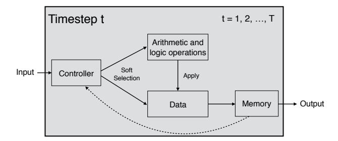
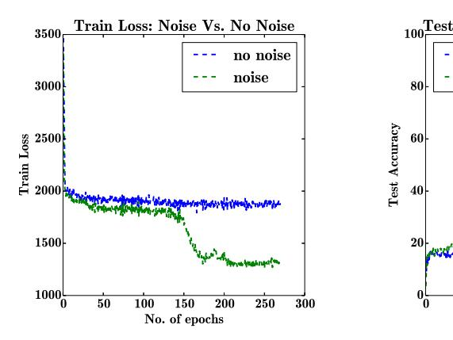

# ADDING GRADIENT NOISE IMPROVES LEARNING FOR VERY DEEP NETWORKS

#### **Arvind Neelakantan**, Luke Vilnis\*

College of Information and Computer Sciences University of Massachusetts Amherst {arvind, luke}@cs.umass.edu

## Quoc V. Le, Ilya Sutskever, Lukasz Kaiser, Karol Kurach

Google Brain

{qvl,ilyasu,lukaszkaiser,kkurach}@google.com

#### **James Martens**

University of Toronto jmartens@cs.toronto.edu

#### **ABSTRACT**

Deep feedforward and recurrent networks have achieved impressive results in many perception and language processing applications. This success is partially attributed to architectural innovations such as convolutional and long short-term memory networks. The main motivation for these architectural innovations is that they capture better domain knowledge, and importantly are easier to optimize than more basic architectures. Recently, more complex architectures such as Neural Turing Machines and Memory Networks have been proposed for tasks including question answering and general computation, creating a new set of optimization challenges. In this paper, we discuss a low-overhead and easy-to-implement technique of adding gradient noise which we find to be surprisingly effective when training these very deep architectures. The technique not only helps to avoid overfitting, but also can result in lower training loss. This method alone allows a fully-connected 20-layer deep network to be trained with standard gradient descent, even starting from a poor initialization. We see consistent improvements for many complex models, including a 72% relative reduction in error rate over a carefully-tuned baseline on a challenging question-answering task, and a doubling of the number of accurate binary multiplication models learned across 7,000 random restarts. We encourage further application of this technique to additional complex modern architectures.

## 1 Introduction

Deep neural networks have shown remarkable success in diverse domains including image recognition (Krizhevsky et al., 2012), speech recognition (Hinton et al., 2012) and language processing applications (Sutskever et al., 2014; Bahdanau et al., 2014). This broad success comes from a confluence of several factors. First, the creation of massive labeled datasets has allowed deep networks to demonstrate their advantages in expressiveness and scalability. The increase in computing power has also enabled training of far larger networks with more forgiving optimization dynamics (Choromanska et al., 2015). Additionally, architectures such as convolutional networks (LeCun et al., 1998) and long short-term memory networks (Hochreiter & Schmidhuber, 1997) have proven to be easier to optimize than classical feedforward and recurrent models. Finally, the success of deep networks is also a result of the development of *simple* and *broadly applicable* learning techniques such as dropout (Srivastava et al., 2014), ReLUs (Nair & Hinton, 2010), gradient clipping (Pascanu

\*First two authors contributed equally. Work was done when all authors were at Google, Inc.

et al., 2013; Graves, 2013), optimization and weight initialization strategies (Glorot & Bengio, 2010; Sutskever et al., 2013; He et al., 2015).

Recent work has aimed to push neural network learning into more challenging domains, such as question answering or program induction. These more complicated problems demand more complicated architectures (e.g., Graves et al. (2014); Sukhbaatar et al. (2015)) thereby posing new optimization challenges. In order to achieve good performance, researchers have reported the necessity of additional techniques such as supervision in intermediate steps (Weston et al., 2014), warmstarts (Peng et al., 2015), random restarts, and the removal of certain activation functions in early stages of training (Sukhbaatar et al., 2015).

A recurring theme in recent works is that commonly-used optimization techniques are not always sufficient to robustly optimize the models. In this work, we explore a simple technique of adding annealed Gaussian noise to the gradient, which we find to be surprisingly effective in training deep neural networks with stochastic gradient descent. While there is a long tradition of adding random weight noise in classical neural networks, it has been under-explored in the optimization of modern deep architectures. In contrast to theoretical and empirical results on the regularizing effects of conventional stochastic gradient descent, we find that in practice the added noise can actually help us achieve lower training loss by encouraging active exploration of parameter space. This exploration proves especially necessary and fruitful when optimizing neural network models containing many layers or complex latent structures.

The main contribution of this work is to demonstrate the broad applicability of this simple method to the training of many complex modern neural architectures. Furthermore, to the best of our knowledge, our added noise schedule has not been used before in the training of deep networks. We consistently see improvement from injected gradient noise when optimizing a wide variety of models, including very deep fully-connected networks, and special-purpose architectures for question answering and algorithm learning. For example, this method allows us to escape a poor initialization and successfully train a 20-layer rectifier network on MNIST with standard gradient descent. It also enables a 72% relative reduction in error in question-answering, and doubles the number of accurate binary multiplication models learned across 7,000 random restarts. We hope that practitioners will see similar improvements in their own research by adding this simple technique, implementable in a single line of code, to their repertoire.

## 2 RELATED WORK

Adding random noise to the weights, gradient, or the hidden units has been a known technique amongst neural network practitioners for many years (e.g., An (1996)). However, the use of gradient noise has been rare and its benefits have not been fully documented with modern deep networks.

Weight noise (Steijvers, 1996) and adaptive weight noise (Graves, 2011; Blundell et al., 2015), which usually maintains a Gaussian variational posterior over network weights, similarly aim to improve learning by added noise during training. They normally differ slightly from our proposed method in that the noise is not annealed and at convergence will be non-zero. Additionally, in adaptive weight noise, an extra set of parameters for the variance must be maintained.

Similarly, the technique of dropout (Srivastava et al., 2014) randomly sets groups of hidden units to zero at train time to improve generalization in a manner similar to ensembling.

An annealed Gaussian gradient noise schedule was used to train the highly non-convex Stochastic Neighbor Embedding model in Hinton & Roweis (2002). The gradient noise schedule that we found to be most effective is very similar to the Stochastic Gradient Langevin Dynamics algorithm of Welling & Teh (2011), who use gradients with added noise to accelerate MCMC inference for logistic regression and independent component analysis models. This use of gradient information in MCMC sampling for machine learning to allow faster exploration of state space was previously proposed by Neal (2011).

Various optimization techniques have been proposed to improve the training of neural networks. Most notable is the use of Momentum (Polyak, 1964; Sutskever et al., 2013; Kingma & Ba, 2014) or adaptive learning rates (Duchi et al., 2011; Dean et al., 2012; Zeiler, 2012). These methods are normally developed to provide good convergence rates for the convex setting, and then heuristically

applied to nonconvex problems. On the other hand, injecting noise in the gradient is more suitable for nonconvex problems. By adding even more stochasticity, this technique gives the model more chances to escape local minima (see a similar argument in Bottou (1992)), or to traverse quickly through the "transient" plateau phase of early learning (see a similar analysis for momentum in Sutskever et al. (2013)). This is born out empirically in our observation that adding gradient noise can actually result in lower training loss. In this sense, we suspect adding gradient noise is similar to simulated annealing (Kirkpatrick et al., 1983) which exploits random noise to explore complex optimization landscapes. This can be contrasted with well-known benefits of stochastic gradient descent as a learning algorithm (Robbins & Monro, 1951; Bousquet & Bottou, 2008), where both theory and practice have shown that the noise induced by the stochastic process aids generalization by reducing overfitting.

## 3 Method

We consider a simple technique of adding time-dependent Gaussian noise to the gradient g at every training step t:

$$g_t \leftarrow g_t + N(0, \sigma_t^2)$$

Our experiments indicate that adding annealed Gaussian noise by decaying the variance works better than using fixed Gaussian noise. We use a schedule inspired from Welling & Teh (2011) for most of our experiments and take:

$$\sigma_t^2 = \frac{\eta}{(1+t)^{\gamma}} \tag{1}$$

with  $\eta$  selected from  $\{0.01, 0.3, 1.0\}$  and  $\gamma = 0.55$ . Higher gradient noise at the beginning of training forces the gradient away from 0 in the early stages.

## 4 EXPERIMENTS

In the following experiments, we consider a variety of complex neural network architectures: Deep networks for MNIST digit classification, End-To-End Memory Networks (Sukhbaatar et al., 2015) and Neural Programmer (Neelakantan et al., 2015) for question answering, Neural Random Access Machines (Kurach et al., 2015) and Neural GPUs (Kaiser & Sutskever, 2015) for algorithm learning. The models and results are described as follows.

# 4.1 DEEP FULLY-CONNECTED NETWORKS

For our first set of experiments, we examine the impact of adding gradient noise when training a very deep fully-connected network on the MNIST handwritten digit classification dataset (LeCun et al., 1998). Our network is deep: it has 20 hidden layers, with each layer containing 50 hidden units. We use the ReLU activation function (Nair & Hinton, 2010).

In this experiment, we add gradient noise sampled from a Gaussian distribution with mean 0, and decaying variance according to the schedule in Equation (1) with  $\eta=0.01$ . We train with SGD without momentum, using the fixed learning rates of 0.1 and 0.01. Unless otherwise specified, the weights of the network are initialized from a Gaussian with mean zero, and standard deviation of 0.1, which we call *Simple Init*.

The results of our experiment are in Table 1. When trained from Simple Init we can see that adding noise to the gradient helps in achieving higher average and best accuracy over 20 runs using each learning rate for a total of 40 runs (Table 1, Experiment 1). We note that the average is closer to 50% because the small learning rate of 0.01 usually gives very slow convergence. We also try our approach on a more shallow network of 5 layers, but adding noise does not improve the training in that case.

Next, we experiment with clipping the gradients with two threshold values: 100 and 10 (Table 1, Experiment 2, and 3). Here, we find training with gradient noise is insensitive to the gradient clipping values. By tuning the clipping threshold, it is possible to get comparable accuracy without noise for this problem.

In our fourth and fifth experiment (Table 1, Experiment 4, and 5), we use two analytically-derived ReLU initialization techniques (which we term *Good Init*) recently-proposed by Sussillo & Abbott (2014) and He et al. (2015), and find that adding gradient noise does not help. Previous work has found that stochastic gradient descent with carefully tuned initialization, momentum, learning rate, and learning rate decay can optimize such extremely deep fully-connected ReLU networks (Srivastava et al., 2015). It would be harder to find such a robust initialization technique for the more complex heterogeneous architectures considered in later sections. Accordingly, we find in later experiments (e.g., Section 4.3) that random restarts and the use of a momentum-based optimizer like Adam are not sufficient to achieve the best results in the absence of added gradient noise.

To understand how sensitive the methods are to poor initialization, in addition to the sub-optimal Simple Init, we run an experiment where all the weights in the neural network are initialized at zero. The results (Table 1, Experiment 5) show that if we do not add noise to the gradient, the networks fail to learn. If we add some noise, the networks can learn and reach 94.5% accuracy.

| Ex | periment | 1: | Simple | Init, No | Gradient of the Gradient | Clipping |
|----|----------|----|--------|----------|--------------------------|----------|
|    |          |    |        |          |                          |          |

| Setting            | Best Test Accuracy | Average Test Accuracy |
|--------------------|--------------------|-----------------------|
| No Noise           | 89.9%              | 43.1%                 |
| With Noise         | 96.7%              | 52.7%                 |
| No Noise + Dropout | 11.3%              | 10.8%                 |

Experiment 2: Simple Init, Gradient Clipping Threshold = 100

| No Noise   | 90.0% | 46.3% |
|------------|-------|-------|
| With Noise | 96.7% | 52.3% |

Experiment 3: Simple Init, Gradient Clipping Threshold = 10

| No Noise   | 95.7% | 51.6% |
|------------|-------|-------|
| With Noise | 97.0% | 53.6% |

| Exp | eriment 4: Good I | nit (Sussillo & Abbo | tt, 2014) + Gradi | ent Clipping Threshold = 10 |
|-----|-------------------|----------------------|-------------------|-----------------------------|
| No  | Voise             | 97.4%                | 92.1%             |                             |

| No Noise   | 97.4% | 92.1% |
|------------|-------|-------|
| With Noise | 97.5% | 92.2% |

Experiment 5: Good Init (He et al., 2015) + Gradient Clipping Threshold = 10

| No Noise   | 97.4% | 91.7% |
|------------|-------|-------|
| With Noise | 97.2% | 91.7% |

Experiment 6: Bad Init (Zero Init) + Gradient Clipping Threshold = 10

|            | (,) . |       |
|------------|-------|-------|
| No Noise   | 11.4% | 10.1% |
| With Noise | 94.5% | 49.7% |

Table 1: Average and best test accuracy percentages on MNIST over 40 runs. Higher values are better.

In summary, these experiments show that if we are careful with initialization and gradient clipping values, it is possible to train a very deep fully-connected network without adding gradient noise. However, if the initialization is poor, optimization can be difficult, and adding noise to the gradient is a good mechanism to overcome the optimization difficulty.

The implication of this set of results is that added gradient noise can be an effective mechanism for training very complex networks. This is because it is more difficult to initialize the weights properly for complex networks. In the following, we explore the training of more complex networks such as End-To-End Memory Networks and Neural Programmer, whose initialization is less well studied.

### 4.2 END-TO-END MEMORY NETWORKS

We test added gradient noise for training End-To-End Memory Networks (Sukhbaatar et al., 2015), a new approach for Q&A using deep networks. Memory Networks have been demonstrated to perform well on a relatively challenging toy Q&A problem (Weston et al., 2015).

In Memory Networks, the model has access to a context, a question, and is asked to predict an answer. Internally, the model has an attention mechanism which focuses on the right clue to answer the question. In the original formulation (Weston et al., 2015), Memory Networks were provided with additional supervision as to what pieces of context were necessary to answer the question. This was replaced in the End-To-End formulation by a latent attention mechanism implemented by a softmax over contexts. As this greatly complicates the learning problem, the authors implement a two-stage training procedure: First train the networks with a linear attention, then use those weights to warmstart the model with softmax attention.

In our experiments with Memory Networks, we use our standard noise schedule, using noise sampled from a Gaussian distribution with mean 0, and decaying variance according to Equation (1) with  $\eta=1.0$ . This noise is added to the gradient after clipping. We also find for these experiments that a fixed standard deviation also works, but its value has to be tuned, and works best at 0.001. We set the number of training epochs to 200 because we would like to understand the behaviors of Memory Networks near convergence. The rest of the training is identical to the experimental setup proposed by the original authors. We test this approach with the published two-stage training approach, and additionally with a one-stage training approach where we train the networks with softmax attention and without warmstarting. Results are reported in Table 2. We find some fluctuations during each run of the training, but the reported results reflect the typical gains obtained by adding random noise.

| Setting            | No Noise                | With Noise              |
|--------------------|-------------------------|-------------------------|
| One-stage training | Training error: 10.5%   | Training error: 9.6%    |
|                    | Validation error: 19.5% | Validation error: 16.6% |
| Two-stage training | Training error: 6.2%    | Training error: 5.9%    |
|                    | Validation error: 10.9% | Validation error: 10.8% |

Table 2: The effects of adding gradient noise to End-To-End Memory Networks. Lower values are better.

We find that warmstarting does indeed help the networks. In both cases, adding random noise to the gradient also helps the network both in terms of training errors and validation errors. Added noise, however, is especially helpful for the training of End-To-End Memory Networks without the warmstarting stage.

# 4.3 NEURAL PROGRAMMER

Neural Programmer is a neural network architecture augmented with a small set of built-in arithmetic and logic operations that learns to induce latent programs. It is proposed for the task of question answering from tables (Neelakantan et al., 2015). Examples of operations on a table include the sum of a set of numbers, or the list of numbers greater than a particular value. Key to Neural Programmer is the use of "soft selection" to assign a probability distribution over the list of operations. This probability distribution weighs the result of each operation, and the cost function compares this weighted result to the ground truth. This soft selection, inspired by the soft attention mechanism of Bahdanau et al. (2014), allows for full differentiability of the model. Running the model for several steps of selection allows the model to induce a complex program by chaining the operations, one after the other. Figure 1 shows the architecture of Neural Programmer at a high level.

In a synthetic table comprehension task, Neural Programmer takes a question and a table (or database) as input and the goal is to predict the correct answer. To solve this task, the model has to induce a program and execute it on the table. A major challenge is that the supervision signal is

&lt;sup>1Code available at: https://github.com/facebook/MemNN

Figure 1: Neural Programmer, a neural network with built-in arithmetic and logic operations. At every time step, the controller selectes an operation and a data segment. Figure reproduced with permission from Neelakantan et al. (2015).

in the form of the correct answer and not the program itself. The model runs for a fixed number of steps, and at each step selects a data segment and an operation to apply to the selected data segment. Soft selection is performed at training time so that the model is differentiable, while at test time hard selection is employed. Table 3 shows examples of programs induced by the model.

| Question                                      |   | Selected Op | Selected Column |
|-----------------------------------------------|---|----------------|--------------------|
| greater 17.27 A and lesser -19.21 D count     | 1 | Greater        | A                  |
| What are the number of elements               | 2 | Lesser         | D                  |
| whose field in column A is greater than 17.27 | 3 | And            | -                  |
| and field in Column D is lesser than -19.21.  | 4 | Count          | -                  |

Table 3: Example program induced by the model using T=4 time steps. We show the selected columns in cases in which the selected operation acts on a particular column.

Similar to the above experiments with Memory Networks, in our experiments with Neural Programmer, we add noise sampled from a Gaussian distribution with mean 0, and decaying variance according to Equation (1) with  $\eta=1.0$  to the gradient after clipping. The model is optimized with Adam (Kingma & Ba, 2014), which combines momentum and adaptive learning rates.

For our first experiment, we train Neural Programmer to answer questions involving a single column of numbers. We use 72 different hyper-parameter configurations with and without adding annealed random noise to the gradients. We also run each of these experiments for 3 different random initializations of the model parameters and we find that only 1/216 runs achieve 100% test accuracy without adding noise while 9/216 runs achieve 100% accuracy when random noise is added. The 9 successful runs consisted of models initialized with all the three different random seeds, demonstrating robustness to initialization. We find that when using dropout (Srivastava et al., 2014) none of the 216 runs give 100% accuracy.

We consider a more difficult question answering task where tables have up to five columns containing numbers. We also experiment on a task containing one column of numbers and another column of text entries. Table 4 shows the performance of adding noise vs. no noise on Neural Programmer.

Figure 2 shows an example of the effect of adding random noise to the gradients in our experiment with 5 columns. The differences between the two models are much more pronounced than in Table 4 because Table 4 shows the results after careful hyperparameter selection.

In all cases, we see that added gradient noise improves performance of Neural Programmer. Its performance when combined with or used instead of dropout is mixed depending on the problem, but the positive results indicate that it is worth attempting on a case-by-case basis.

| Setting      | No Noise | With Noise | Dropout | Dropout With Noise |
|--------------|----------|------------|---------|--------------------|
| Five columns | 95.3%    | 98.7%      | 97.4%   | 99.2%              |
| Text entries | 97.6%    | 98.8%      | 99.1%   | 97.3%              |

Table 4: The effects of adding random noise to the gradient on Neural Programmer. Higher values are better. Adding random noise to the gradient always helps the model. When the models are applied to these more complicated tasks than the single column experiment, using dropout and noise together seems to be beneficial in one case while using only one of them achieves the best result in the other case.

Accuracy: Noise Vs. No Noise

No. of epochs

no noise

noise

50 100 150 200 250 300

Figure 2: Noise vs. No Noise in our experiment with tables containing 5 columns. The models trained with noise generalizes almost always better.

### 4.4 NEURAL RANDOM ACCESS MACHINES

We now conduct experiments with Neural Random-Access Machines (NRAM) (Kurach et al., 2015). NRAM is a model for algorithm learning that can store data, and explicitly manipulate and dereference pointers. NRAM consists of a neural network controller, memory, registers and a set of built-in operations. This is similar to the Neural Programmer in that it uses a controller network to compose built-in operations, but both reads and writes to an external memory. An operation can either read (a subset of) contents from the memory, write content to the memory or perform an arithmetic operation on either input registers or outputs from other operations. The controller runs for a fixed number of time steps. At every step, the model selects both the operation to be executed and its inputs. These selections are made using soft attention (Bahdanau et al., 2014) making the model end-to-end differentiable. NRAM uses an LSTM (Hochreiter & Schmidhuber, 1997) controller. Figure 3 gives an overview of the model.

For our experiment, we consider a problem of searching k-th element's value on a linked list. The network is given a pointer to the head of the linked list, and has to find the value of the k-th element. Note that this is highly nontrivial because pointers and their values are stored at random locations in memory, so the model must learn to traverse a complex graph for k steps.

Because of this complexity, training the NRAM architecture can be unstable, especially when the number of steps and operations is large. We once again experiment with the decaying noise schedule from Equation (1), setting  $\eta=0.3$ . We run a large grid search over the model hyperparameters (detailed in Kurach et al. (2015)), and use the top 3 for our experiments. For each of these 3 settings, we try 100 different random initializations and look at the percentage of runs that give 100% accuracy across each one for training both with and without noise.

As in our experiments with Neural Programmer, we find that gradient clipping is crucial when training with noise. This is likely because the effect of random noise is washed away when gradients become too large. For models trained with noise we observed much better reproduce rates, which are presented in Table 5. Although it is possible to train the model to achieve 100% accuracy without

Figure 3: One timestep of the NRAM architecture with R=4 registers and a memory tape.  $m_1$ ,  $m_2$  and  $m_3$  are example operations built-in to the model. The operations can read and write from memory. At every time step, the LSTM controller softly selects the operation and its inputs. Figure reproduced with permission from Kurach et al. (2015).

noise, it is less robust across multiple random restarts, with over 10x as many initializations leading to a correct answer when using noise.

|            | Hyperparameter-1 | Hyperparameter-2 | Hyperparameter-3 | Average |
|------------|------------------|------------------|------------------|---------|
| No Noise   | 1%               | 0%               | 3%               | 1.3%    |
| With Noise | 5%               | 22%              | 7%               | 11.3%   |

Table 5: Percentage of successful runs on k-th element task. Higher values are better. All tests were performed with the same set of 100 random initializations (seeds).

#### 4.5 CONVOLUTIONAL GATED RECURRENT NETWORKS (NEURAL GPUS)

Convolutional Gated Recurrent Networks (CGRN) or Neural GPUs (Kaiser & Sutskever, 2015) are a recently proposed model that is capable of learning arbitrary algorithms. CGRNs use a stack of convolution layers, unfolded with tied parameters like a recurrent network. The input data (usually a list of symbols) is first converted to a three dimensional tensor representation containing a sequence of embedded symbols in the first two dimensions, and zeros padding the next dimension. Then, multiple layers of modified convolution kernels are applied at each step. The modified kernel is a combination of convolution and Gated Recurrent Units (GRU) (Cho et al., 2014). The use of convolution kernels allows computation to be applied in parallel across the input data, while the gating mechanism helps the gradient flow. The additional dimension of the tensor serves as a working memory while the repeated operations are applied at each layer. The output at the final layer is the predicted answer.

The key difference between Neural GPUs and other architectures for algorithmic tasks (e.g., Neural Turing Machines (Graves et al., 2014)) is that instead of using sequential data access, convolution kernels are applied in parallel across the input, enabling the use of very deep and wide models. The model is referred to as Neural GPUs because the input data is accessed in parallel. Neural GPUs were shown to outperform previous sequential architectures for algorithm learning on tasks such as binary addition and multiplication, by being able to generalize from much shorter to longer data cases.

In our experiments, we use Neural GPUs for the task of binary multiplication. The input consists two concatenated sequences of binary digits separated by an operator token, and the goal is to multiply

the given numbers. During training, the model is trained on 20-digit binary numbers while at test time, the task is to multiply 200-digit numbers. Once again, we add noise sampled from Gaussian distribution with mean 0, and decaying variance according to the schedule in Equation (1) with  $\eta = 1.0$ , to the gradient after clipping. The model is optimized using Adam (Kingma & Ba, 2014).

Table 6 gives the results of a large-scale experiment using Neural GPUs over 7290 experimental runs. The experiment shows that models trained with added gradient noise are more robust across many random initializations and parameter settings. As you can see, adding gradient noise both allows us to achieve the best performance, with the number of models with <1% error over twice as large as without noise. But it also helps throughout, improving the robustness of training, with more models training to lower error rates as well. This experiment shows that the simple technique of added gradient noise is effective even in regimes where we can afford a very large numbers of random restarts.

| Setting    | Error < 1% | Error < 2% | Error < 3% | Error < 5% |
|------------|------------|------------|------------|------------|
| No Noise   | 28         | 90         | 172        | 387        |
| With Noise | 58         | 159        | 282        | 570        |

Table 6: Number of successful runs on 7290 random trials. Higher values are better. The models are trained on length 20 and tested on length 200.

#### 5 Conclusion

In this paper, we discussed a set of experiments which show the effectiveness of adding noise to the gradient. We found that adding noise to the gradient during training helps training and generalization of complicated neural networks. We suspect that the effects are pronounced for complex models because they have many local minima.

We believe that this surprisingly simple yet effective idea, essentially a single line of code, should be in the toolset of neural network practitioners when facing issues with training neural networks. We also believe that this set of empirical results can give rise to further formal analysis of why adding noise is so effective for very deep neural networks.

**Acknowledgements** We sincerely thank Marcin Andrychowicz, Dmitry Bahdanau, Samy Bengio, Oriol Vinyals for suggestions and the Google Brain team for help with the project.

### REFERENCES

An, Guozhong. The effects of adding noise during backpropagation training on a generalization performance. *Neural Computation*, 1996.

Bahdanau, Dzmitry, Cho, Kyunghyun, and Bengio, Yoshua. Neural machine translation by jointly learning to align and translate. *ICLR*, 2014.

Blundell, Charles, Cornebise, Julien, Kavukcuoglu, Koray, and Wierstra, Daan. Weight uncertainty in neural networks. *ICML*, 2015.

Bottou, Léon. Stochastic gradient learning in neural networks. In Neuro-Nïmes, 1992.

Bousquet, Olivier and Bottou, Léon. The tradeoffs of large scale learning. In NIPS, 2008.

Cho, Kyunghyun, Van Merriënboer, Bart, Gulcehre, Caglar, Bahdanau, Dzmitry, Bougares, Fethi, Schwenk, Holger, and Bengio, Yoshua. Learning phrase representations using RNN encoder-decoder for statistical machine translation. In *EMNLP*, 2014.

Choromanska, Anna, Henaff, Mikael, Mathieu, Michaël, Arous, Gérard Ben, and LeCun, Yann. The loss surfaces of multilayer networks. In *AISTATS*, 2015.

- Dean, Jeffrey, Corrado, Greg, Monga, Rajat, Chen, Kai, Devin, Matthieu, Mao, Mark, Senior, Andrew, Tucker, Paul, Yang, Ke, Le, Quoc V, et al. Large scale distributed deep networks. In *NIPS*, 2012.
- Duchi, John, Hazan, Elad, and Singer, Yoram. Adaptive subgradient methods for online learning and stochastic optimization. *JMLR*, 2011.
- Glorot, Xavier and Bengio, Yoshua. Understanding the difficulty of training deep feedforward neural networks. In *Proc. AISTATS*, pp. 249–256, 2010.
- Graves, Alex. Practical variational inference for neural networks. In NIPS, 2011.
- Graves, Alex. Generating sequences with recurrent neural networks. *arXiv* preprint arxiv:1308.0850, 2013.
- Graves, Alex, Wayne, Greg, and Danihelka, Ivo. Neural Turing Machines. arXiv preprint arXiv:1410.5401, 2014.
- He, Kaiming, Zhang, Xiangyu, Ren, Shaoqing, and Sun, Jian. Delving deep into rectifiers: Surpassing human-level performance on imagenet classification. *ICCV*, 2015.
- Hinton, Geoffrey and Roweis, Sam. Stochastic neighbor embedding. In NIPS, 2002.
- Hinton, Geoffrey, Deng, Li, Yu, Dong, Dahl, George, rahman Mohamed, Abdel, Jaitly, Navdeep, Senior, Andrew, Vanhoucke, Vincent, Nguyen, Patrick, Sainath, Tara, and Kingsbury, Brian. Deep neural networks for acoustic modeling in speech recognition. *Signal Processing Magazine*, 2012.
- Hochreiter, Sepp and Schmidhuber, Jürgen. Long short-term memory. Neural Computation, 1997.
- Kaiser, Lukasz and Sutskever, Ilya. Neural GPUs learn algorithms. In Arxiv, 2015.
- Kingma, Diederik and Ba, Jimmy. Adam: A method for stochastic optimization. *arXiv preprint* arXiv:1412.6980, 2014.
- Kirkpatrick, Scott, Vecchi, Mario P, et al. Optimization by simulated annealing. Science, 1983.
- Krizhevsky, Alex, Sutskever, Ilya, and Hinton, Geoffrey E. ImageNet classification with deep convolutional neural networks. In *NIPS*, 2012.
- Kurach, Karol, Andrychowicz, Marcin, and Sutskever, Ilya. Neural random access machine. In *Arxiv*, 2015.
- LeCun, Yann, Bottou, Léon, Bengio, Yoshua, and Haffner, Patrick. Gradient-based learning applied to document recognition. *Proceedings of the IEEE*, 1998.
- Nair, Vinod and Hinton, Geoffrey. Rectified linear units improve Restricted Boltzmann Machines. In *ICML*, 2010.
- Neal, Radford M. MCMC using Hamiltonian dynamics. *Handbook of Markov Chain Monte Carlo*, 2011.
- Neelakantan, Arvind, Le, Quoc V., and Sutskever, Ilya. Neural Programmer: Inducing latent programs with gradient descent. In *Arxiv*, 2015.
- Pascanu, Razvan, Mikolov, Tomas, and Bengio, Yoshua. On the difficulty of training recurrent neural networks. *Proc. ICML*, 2013.
- Peng, Baolin, Lu, Zhengdong, Li, Hang, and Wong, Kam-Fai. Towards neural network-based reasoning. *arXiv preprint arxiv:1508.05508*, 2015.
- Polyak, Boris Teodorovich. Some methods of speeding up the convergence of iteration methods. *USSR Computational Mathematics and Mathematical Physics*, 1964.
- Robbins, Herbert and Monro, Sutton. A stochastic approximation method. *The annals of mathematical statistics*, 1951.

- Srivastava, Nitish, Hinton, Geoffrey, Krizhevsky, Alex, Sutskever, Ilya, and Salakhutdinov, Ruslan. Dropout: A simple way to prevent neural networks from overfitting. *JMLR*, 2014.
- Srivastava, Rupesh Kumar, Greff, Klaus, and Schmidhuber, Jürgen. Training very deep networks. *NIPS*, 2015.
- Steijvers, Mark. A recurrent network that performs a context-sensitive prediction task. In *CogSci*, 1996.
- Sukhbaatar, Sainbayar, Szlam, Arthur, Weston, Jason, and Fergus, Rob. End-to-end memory networks. In NIPS, 2015.
- Sussillo, David and Abbott, L.F. Random walks: Training very deep nonlinear feed-forward networks with smart initialization. *Arxiv*, 2014.
- Sutskever, Ilya, Martens, James, Dahl, George, and Hinton, Geoffrey. On the importance of initialization and momentum in deep learning. In *ICML*, 2013.
- Sutskever, Ilya, Vinyals, Oriol, and Le, Quoc V. Sequence to sequence learning with neural networks. In *NIPS*, 2014.
- Welling, Max and Teh, Yee Whye. Bayesian learning via stochastic gradient Langevin dynamics. In *ICML*, 2011.
- Weston, Jason, Chopra, Sumit, and Bordes, Antoine. Memory networks. *arXiv preprint arXiv:1410.3916*, 2014.
- Weston, Jason, Bordes, Antoine, Chopra, Sumit, and Mikolov, Tomas. Towards AI-complete question answering: a set of prerequisite toy tasks. In *ICML*, 2015.
- Zeiler, Matthew D. Adadelta: An adaptive learning rate method. *arXiv preprint arXiv:1212.5701*, 2012.