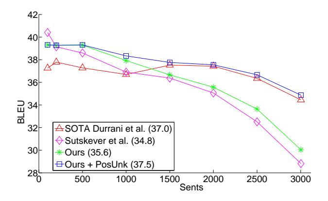
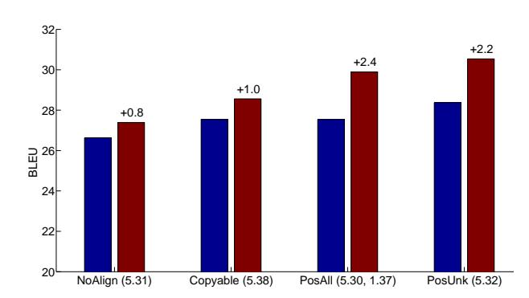
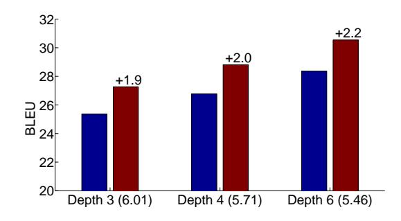
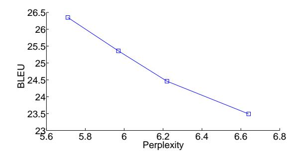

# Addressing the Rare Word Problem in Neural Machine Translation

Minh-Thang Luong† \*

Stanford

lmthang@stanford.edu

Ilya Sutskever† Quoc V. Le† Oriol Vinyals Wojciech Zaremba\*

Google Google Google New York University

{ilyasu,qvl,vinyals}@google.com woj.zaremba@gmail.com

## **Abstract**

Neural Machine Translation (NMT) is a new approach to machine translation that has shown promising results that are comparable to traditional approaches. A significant weakness in conventional NMT systems is their inability to correctly translate very rare words: end-to-end NMTs tend to have relatively small vocabularies with a single unk symbol that represents every possible out-of-vocabulary (OOV) word. In this paper, we propose and implement an effective technique to address this problem. We train an NMT system on data that is augmented by the output of a word alignment algorithm, allowing the NMT system to emit, for each OOV word in the target sentence, the position of its corresponding word in the source sentence. This information is later utilized in a post-processing step that translates every OOV word using a dictionary. Our experiments on the WMT'14 English to French translation task show that this method provides a substantial improvement of up to 2.8 BLEU points over an equivalent NMT system that does not use this technique. With 37.5 BLEU points, our NMT system is the first to surpass the best result achieved on a WMT'14 contest task.

### 1 Introduction

Neural Machine Translation (NMT) is a novel approach to MT that has achieved promising results (Kalchbrenner and Blunsom, 2013; Sutskever et al., 2014; Cho et al., 2014; Bahdanau et al., 2015; Jean et al., 2015). An NMT system is a conceptually simple large neural

network that reads the entire source sentence and produces an output translation one word at a time. NMT systems are appealing because they use minimal domain knowledge which makes them well-suited to any problem that can be formulated as mapping an input sequence to an output sequence (Sutskever et al., 2014). In addition, the natural ability of neural networks to generalize implies that NMT systems will also generalize to novel word phrases and sentences that do not occur in the training set. In addition, NMT systems potentially remove the need to store explicit phrase tables and language models which are used in conventional systems. Finally, the decoder of an NMT system is easy to implement, unlike the highly intricate decoders used by phrase-based systems (Koehn et al., 2003).

Despite these advantages, conventional NMT systems are incapable of translating rare words because they have a fixed modest-sized vocabulary which forces them to use the unk symbol to represent the large number of out-ofvocabulary (OOV) words, as illustrated in Figure 1. Unsurprisingly, both Sutskever et al. (2014) and Bahdanau et al. (2015) have observed that sentences with many rare words tend to be translated much more poorly than sentences containing mainly frequent words. Standard phrasebased systems (Koehn et al., 2007; Chiang, 2007; Cer et al., 2010; Dyer et al., 2010), on the other hand, do not suffer from the rare word problem to the same extent because they can support a much larger vocabulary, and because their use of explicit alignments and phrase tables allows them to memorize the translations of even extremely rare

Work done while the authors were in Google. † indicates equal contribution.

&lt;sup>1 Due to the computationally intensive nature of the softmax, NMT systems often limit their vocabularies to be the top 30K-80K most frequent words in each language. However, Jean et al. (2015) has very recently proposed an efficient approximation to the softmax that allows for training NTMs with very large vocabularies. As discussed in Section 2, this technique is complementary to ours.

en: The ecotax portico in Pont-de-Buis, ... [truncated] ..., was taken down on Thursday morning

fr: Le portique <u>écotaxe</u> de <u>Pont-de-Buis</u>, ... [truncated] ..., a été <u>démonté</u> jeudi matin

nn: Le  $\underline{unk}$  de  $\underline{unk}$  à  $\underline{unk}$ , ... [truncated] ..., a été pris le jeudi matin

Figure 1: **Example of the rare word problem** – An English source sentence (*en*), a human translation to French (*fr*), and a translation produced by one of our neural network systems (*nn*) before handling OOV words. We highlight *words* that are unknown to our model. The token *unk* indicates an OOV word. We also show a few important alignments between the pair of sentences.

words.

Motivated by the strengths of standard phrase-based system, we propose and implement a novel approach to address the rare word problem of NMTs. Our approach annotates the training corpus with explicit alignment information that enables the NMT system to emit, for each OOV word, a "pointer" to its corresponding word in the source sentence. This information is later utilized in a post-processing step that translates the OOV words using a dictionary or with the identity translation, if no translation is found.

Our experiments confirm that this approach is effective. On the English to French WMT'14 translation task, this approach provides an improvement of up to 2.8 (if the vocabulary is relatively small) BLEU points over an equivalent NMT system that does not use this technique. Moreover, our system is the first NMT that outperforms the winner of a WMT'14 task.

#### 2 Neural Machine Translation

A neural machine translation system is any neural network that maps a source sentence,  $s_1,\ldots,s_n$ , to a target sentence,  $t_1,\ldots,t_m$ , where all sentences are assumed to terminate with a special "end-of-sentence" token <eos>. More concretely, an NMT system uses a neural network to parameterize the conditional distributions

$$p(t_i|t_{< i}, s_{< n}) \tag{1}$$

for  $1 \leq j \leq m$ . By doing so, it becomes possible to compute and therefore maximize the log probability of the target sentence given the source sentence

$$\log p(t|s) = \sum_{j=1}^{m} \log p(t_j|t_{< j}, s_{\le n})$$
 (2)

There are many ways to parameterize these conditional distributions. For example, Kalchbrenner and Blunsom (2013) used a combination of a convolutional neural network and a recurrent neural network, Sutskever et al. (2014) used a deep Long Short-Term Memory (LSTM) model, Cho et al. (2014) used an architecture similar to the LSTM, and Bahdanau et al. (2015) used a more elaborate neural network architecture that uses an attentional mechanism over the input sequence, similar to Graves (2013) and Graves et al. (2014).

In this work, we use the model of Sutskever et al. (2014), which uses a deep LSTM to encode the input sequence and a separate deep LSTM to output the translation. The encoder reads the source sentence, one word at a time, and produces a large vector that represents the entire source sentence. The decoder is initialized with this vector and generates a translation, one word at a time, until it emits the end-of-sentence symbol <eos>.

None the early work in neural machine translation systems has addressed the rare word problem, but the recent work of Jean et al. (2015) has tackled it with an efficient approximation to the softmax to accommodate for a very large vocabulary (500K words). However, even with a large vocabulary, the problem with rare words, e.g., names, numbers, etc., still persists, and Jean et al. (2015) found that using techniques similar to ours are beneficial and complementary to their approach.

#### 3 Rare Word Models

Despite the relatively large amount of work done on pure neural machine translation systems, there has been no work addressing the OOV problem in NMT systems, with the notable exception of Jean et al. (2015)'s work mentioned earlier.

en: The  $\underline{unk_1}$  portico in  $\underline{unk_2}$  ...

fr: Le  $\underline{unk_0} \underline{unk_1}$  de  $\underline{unk_2} \dots$ 

Figure 2: **Copyable Model** – an annotated example with two types of unknown tokens: "copyable"  $\underline{unk}_n$  and null  $\underline{unk}_{\emptyset}$ .

We propose to address the rare word problem by training the NMT system to track the origins of the unknown words in the target sentences. If we knew the source word responsible for each unknown target word, we could introduce a postprocessing step that would replace each unk in the system's output with a translation of its source word, using either a dictionary or the identity For example, in Figure 1, if the translation. model knows that the second unknown token in the NMT (line *nn*) originates from the source word ecotax, it can perform a word dictionary lookup to replace that unknown token by écotaxe. Similarly, an identity translation of the source word Pont-de-Buis can be applied to the third unknown token.

We present three annotation strategies that can easily be applied to any NMT (Kalchbrenner and Blunsom, 2013; system Sutskever et al., 2014; Cho et al., 2014). We treat the NMT system as a black box and train it on a corpus annotated by one of the models below. First, the alignments are produced with an unsupervised aligner. Next, we use the alignment links to construct a word dictionary that will be used for the word translations in the post-processing step.2 If a word does not appear in our dictionary, then we apply the identity translation.

The first few words of the sentence pair in Figure 1 (lines en and fr) illustrate our models.

## 3.1 Copyable Model

In this approach, we introduce multiple tokens to represent the various unknown words in the source and in the target language, as opposed to using only one <u>unk</u> token. We annotate the OOV words in the source sentence with <u>unk\_1</u>, <u>unk\_2</u>, <u>unk\_3</u>, in that order, while assigning repeating unknown words identical tokens. The annotation

en: The <u>unk</u> portico in <u>unk</u> ...

fr: Le  $p_0$  <u>unk</u>  $p_{-1}$  <u>unk</u>  $p_1$  de  $p_0$  <u>unk</u>  $p_{-1}$  ...

Figure 3: **Positional All Model** – an example of the PosAll model. Each word is followed by the relative positional tokens  $p_d$  or the null token  $p_{\emptyset}$ .

of the unknown words in the target language is slightly more elaborate: (a) each unknown target word that is aligned to an unknown source word is assigned the same unknown token (hence, the "copy" model) and (b) an unknown target word that has no alignment or that is aligned with a known word uses the special null token  $\underline{unk}_{\emptyset}$ . See Figure 2 for an example. This annotation enables us to translate every non-null unknown token.

#### 3.2 Positional All Model (PosAll)

The copyable model is limited by its inability to translate unknown target words that are aligned to *known* words in the source sentence, such as the pair of words, "portico" and "portique", in our running example. The former word is known on the source sentence; whereas latter is not, so it is labelled with  $\underline{unk_{\emptyset}}$ . This happens often since the source vocabularies of our models tend to be much larger than the target vocabulary since a large source vocabulary is cheap. This limitation motivated us to develop an annotation model that includes the complete alignments between the source and the target sentences, which is straightforward to obtain since the complete alignments are available at training time.

Specifically, we return to using only a single universal  $\underline{unk}$  token. However, on the target side, we insert a positional token  $p_d$  after every word. Here, d indicates a relative position  $(d=-7,\ldots,-1,0,1,\ldots,7)$  to denote that a target word at position j is aligned to a source word at position i=j-d. Aligned words that are too far apart are considered unaligned, and unaligned words rae annotated with a null token  $p_n$ . Our annotation is illustrated in Figure 3.

## 3.3 Positional Unknown Model (PosUnk)

The main weakness of the PosAll model is that it doubles the length of the target sentence. This makes learning more difficult and slows the speed of parameter updates by a factor of two. However, given that our post-processing step is concerned only with the alignments of the unknown

&lt;sup>2When a source word has multiple translations, we use the translation with the highest probability. These translation probabilities are estimated from the unsupervised alignment links. When constructing the dictionary from these alignment links, we add a word pair to the dictionary only if its alignment count exceeds 100.

words, so it is more sensible to only annotate the unknown words. This motivates our *positional unknown* model which uses  $unkpos_d$  tokens (for d in  $-7,\ldots,7$  or  $\emptyset$ ) to simultaneously denote (a) the fact that a word is unknown and (b) its relative position d with respect to its aligned source word. Like the PosAll model, we use the symbol  $unkpos_{\emptyset}$  for unknown target words that do not have an alignment. We use the universal unk for all unknown tokens in the source language. See Figure 4 for an annotated example.

en: The unk portico in unk ...

fr: Le  $unkpos_1 unkpos_{-1}$  de  $unkpos_1 ...$ 

Figure 4: **Positional Unknown Model** – an example of the PosUnk model: only aligned unknown words are annotated with the *unkposd* tokens.

It is possible that despite its slower speed, the PosAll model will learn better alignments because it is trained on many more examples of words and their alignments. However, we show that this is not the case (see §5.2).

### 4 Experiments

We evaluate the effectiveness of our OOV models on the WMT'14 English-to-French translation task. Translation quality is measured with the BLEU metric (Papineni et al., 2002) on the newstest2014 test set (which has 3003 sentences).

#### 4.1 Training Data

To be comparable with the results reported by previous work on neural machine translation systems (Sutskever et al., 2014; Cho et al., 2014; Bahdanau et al., 2015), we train our models on the same training data of 12M parallel sentences (348M French and 304M English words), obtained from (Schwenk, 2014). The 12M subset was selected from the full WMT'14 parallel corpora using the method proposed in Axelrod et al. (2011).

Due to the computationally intensive nature of the naive softmax, we limit the French vocabulary (the *target* language) to the either the 40K or the 80K most frequent French words. On the *source* side, we can afford a much larger vocabulary, so we use the 200K most frequent English words. The model treats all other words as unknowns.3

We annotate our training data using the three schemes described in the previous section. The alignment is computed with the Berkeley aligner (Liang et al., 2006) using its default settings. We discard sentence pairs in which the source or the target sentence exceed 100 tokens.

### **4.2** Training Details

training procedure and hyperparameter choices are similar to those used by Sutskever et al. (2014). In more details, we train multi-layer deep LSTMs, each of which has 1000 cells, with 1000 dimensional embeddings. Like Sutskever et al. (2014), we reverse the words in the source sentences which has been shown to improve LSTM memory utilization and results in better translations of long sentences. Our hyperparameters can be summarized as follows: (a) the parameters are initialized uniformly in [-0.08, 0.08] for 4-layer models and [-0.06, 0.06] for 6layer models, (b) SGD has a fixed learning rate of 0.7, (c) we train for 8 epochs (after 5 epochs, we begin to halve the learning rate every 0.5 epoch), (d) the size of the mini-batch is 128, and (e) we rescale the normalized gradient to ensure that its norm does not exceed 5 (Pascanu et al., 2012).

We also follow the GPU parallelization scheme proposed in (Sutskever et al., 2014), allowing us to reach a training speed of 5.4K words per second to train a depth-6 model with 200K source and 80K target vocabularies; whereas Sutskever et al. (2014) achieved 6.3K words per second for a depth-4 models with 80K source and target vocabularies. Training takes about 10-14 days on an 8-GPU machine.

### 4.3 A note on BLEU scores

We report BLEU scores based on both: (a) *detokenized* translations, i.e., WMT'14 style, to be comparable with results reported on the WMT website4 and (b) *tokenized translations*, so as to be consistent with previous work (Cho et al., 2014; Bahdanau et al., 2015; Schwenk, 2014; Sutskever et al., 2014; Jean et al., 2015).5

The existing WMT'14 state-of-the-art system (Durrani et al., 2014) achieves a detokenized BLEU score of 35.8 on the newstest2014 test set for English to French language pair (see Table 2).

&lt;sup>3When the French vocabulary has 40K words, there are on average 1.33 unknown words per sentence on the target side of the test set.

4http://matrix.statmt.org/matrix

&lt;sup>5The tokenizer.perl and multi-bleu.pl scripts are used to tokenize and score translations.

| System                                                          | Vocab | Corpus | BLEU        |  |
|-----------------------------------------------------------------|-------|--------|-------------|--|
| State of the art in WMT'14 (Durrani et al., 2014)               | All   | 36M    | 37.0        |  |
| Standard MT + neural components                                 |       |        |             |  |
| Schwenk (2014) – neural language model                          | All   | 12M    | 33.3        |  |
| Cho et al. (2014)– phrase table neural features                 | All   | 12M    | 34.5        |  |
| Sutskever et al. (2014) – 5 LSTMs, reranking 1000-best lists    | All   | 12M    | 36.5        |  |
| Existing end-to-end NMT systems                                 |       |        |             |  |
| Bahdanau et al. (2015) – single gated RNN with search           | 30K   | 12M    | 28.5        |  |
| Sutskever et al. (2014) – 5 LSTMs                               | 80K   | 12M    | 34.8        |  |
| Jean et al. (2015) – 8 gated RNNs with search + UNK replacement | 500K  | 12M    | 37.2        |  |
| Our end-to-end NMT systems                                      |       |        |             |  |
| Single LSTM with 4 layers                                       | 40K   | 12M    | 29.5        |  |
| Single LSTM with 4 layers + PosUnk                              | 40K   | 12M    | 31.8 (+2.3) |  |
| Single LSTM with 6 layers                                       | 40K   | 12M    | 30.4        |  |
| Single LSTM with 6 layers + PosUnk                              | 40K   | 12M    | 32.7 (+2.3) |  |
| Ensemble of 8 LSTMs                                             | 40K   | 12M    | 34.1        |  |
| Ensemble of 8 LSTMs + PosUnk                                    | 40K   | 12M    | 36.9 (+2.8) |  |
| Single LSTM with 6 layers                                       | 80K   | 36M    | 31.5        |  |
| Single LSTM with 6 layers + PosUnk                              | 80K   | 36M    | 33.1 (+1.6) |  |
| Ensemble of 8 LSTMs                                             | 80K   | 36M    | 35.6        |  |
| Ensemble of 8 LSTMs + PosUnk                                    | 80K   | 36M    | 37.5 (+1.9) |  |

Table 1: **Tokenized BLEU on newstest2014** – Translation results of various systems which differ in terms of: (a) the architecture, (b) the size of the vocabulary used, and (c) the training corpus, either using the full WMT'14 corpus of 36M sentence pairs or a subset of it with 12M pairs. We highlight the performance of our best system in bolded text and state the improvements obtained by our technique of handling rare words (namely, the PosUnk model). Notice that, for a given vocabulary size, the more accurate systems achieve a greater improvement from the post-processing step. This is the case because the more accurate models are able to pin-point the origin of an unknown word with greater accuracy, making the post-processing more useful.

In terms of the tokenized BLEU, its performance is 37.0 points (see Table 1).

| System                               | BLEU |
|--------------------------------------|------|
| Existing SOTA (Durrani et al., 2014) | 35.8 |
| Ensemble of 8 LSTMs + PosUnk         | 36.6 |

Table 2: **Detokenized BLEU on newstest2014** – translation results of the existing state-of-the-art system and our best system.

## 4.4 Main Results

We compare our systems to others,including the current state-of-the-art MT system (Durrani et al., 2014), recent end-to-end neural systems, as well as phrase-based baselines with neural components.

The results shown in Table 1 demonstrate that our unknown word translation technique (in particular, the PosUnk model) significantly improves the translation quality for both the individual (nonensemble) LSTM models and the ensemble models.6 For 40K-word vocabularies, the performance gains are in the range of 2.3-2.8 BLEU points. With larger vocabularies (80K), the performance gains are diminished, but our technique can still provide a nontrivial gains of 1.6-1.9 BLEU points.

It is interesting to observe that our approach is more useful for ensemble models as compared to the individual ones. This is because the usefulness of the PosUnk model directly depends on the ability of the NMT to correctly locate, for a given OOV target word, its corresponding word in the source sentence. An ensemble of large models identifies these source words with greater accu-

&lt;sup>6 For the 40K-vocabulary ensemble, we combine 5 models with 4 layers and 3 models with 6 layers. For the 80K-vocabulary ensemble, we combine 3 models with 4 layers and 5 models with 6 layers. Two of the depth-6 models are regularized with dropout, similar to Zaremba et al. (2015) with the dropout probability set to 0.2.

racy. This is why for the same vocabulary size, better models obtain a greater performance gain our post-processing step. e Except for the very recent work of Jean et al. (2015) that employs a similar unknown treatment strategy7 as ours, our best result of 37.5 BLEU outperforms all other NMT systems by a arge margin, and more importanly, our system has established a new record on the WMT'14 English to French translation.

### 5 Analysis

We analyze and quantify the improvement obtained by our rare word translation approach and provide a detailed comparison of the different rare word techniques proposed in Section 3. We also examine the effect of depth on the LSTM architectures and demonstrate a strong correlation between perplexities and BLEU scores. We also highlight a few translation examples where our models succeed in correctly translating OOV words, and present several failures.

## 5.1 Rare Word Analysis

To analyze the effect of rare words on translation quality, we follow Sutskever et al. (Sutskever et al., 2014) and sort sentences in newstest2014 by the average inverse frequency of their words. We split the test sentences into groups where the sentences within each group have a comparable number of rare words and evaluate each group independently. We evaluate our systems before and after translating the OOV words and compare with the standard MT systems – we use the best system from the WMT'14 contest (Durrani et al., 2014), and neural MT systems – we use the ensemble systems described in (Sutskever et al., 2014) and Section 4.

Rare word translation is challenging for neural machine translation systems as shown in Figure 5. Specifically, the translation quality of our model before applying the postprocessing step is shown by the green curve, and the current best

Figure 5: **Rare word translation** – On the x-axis, we order newstest2014 sentences by their *average frequency rank* and divide the sentences into groups of sentences with a comparable prevalence of rare words. We compute the BLEU score of each group independently.

NMT system (Sutskever et al., 2014) is the purple curve. While (Sutskever et al., 2014) produces better translations for sentences with frequent words (the left part of the graph), they are worse than best system (red curve) on sentences with many rare words (the right side of the graph). When applying our unknown word translation technique (purple curve), we significantly improve the translation quality of our NMT: for the last group of 500 sentences which have the greatest proportion of OOV words in the test set, we increase the BLEU score of our system by 4.8 BLEU points. Overall, our rare word translation model interpolates between the SOTA system and the system of Sutskever et al. (2014), which allows us to outperform the winning entry of WMT'14 on sentences that consist predominantly of frequent words and approach its performance on sentences with many OOV words.

#### **5.2** Rare Word Models

We examine the effect of the different rare word models presented in Section 3, namely: (a) *Copyable* – which aligns the unknown words on both the input and the target side by learning to copy indices, (b) the Positional All (*PosAll*) – which predicts the aligned source positions for every target word, and (c) the Positional Unknown (*PosUnk*) – which predicts the aligned source positions for only the unknown target words.8 It is also interest-

&lt;sup>7Their unknown replacement method and ours both track the locations of target unknown words and use a word dictionary to post-process the translation. However, the mechanism used to achieve the "tracking" behavior is different. Jean et al. (2015)'s uses the attentional mechanism to track the origins of all target words, not just the unknown ones. In contrast, we only focus on tracking unknown words using unsupervised alignments. Our method can be easily applied to any sequence-to-sequence models since we treat any model as a blackbox and manipulate only at the input and output levels.

&lt;sup>8In this section and in section 5.3, all models are trained on the unreversed sentences, and we use the following hyper-

Figure 6: **Rare word models** – translation performance of 6-layer LSTMs: a model that uses no alignment (*NoAlign*) and the other rare word models (*Copyable, PosAll, PosUnk*). For each model, we show results before (*left*) and after (*right*) the rare word translation as well as the perplexity (in parentheses). For *PosAll*, we report the perplexities of predicting the words and the positions.

ing to measure the improvement obtained when no alignment information is used during training. As such, we include a baseline model with no alignment knowledge (NoAlign) in which we simply assume that the  $i^{th}$  unknown word on the target sentence is aligned to the  $i^{th}$  unknown word in the source sentence.

From the results in Figure 6, a simple monotone alignment assumption for the *NoAlign* model yields a modest gain of 0.8 BLEU points. If we train the model to predict the alignment, then the *Copyable* model offers a slightly better gain of 1.0 BLEU. Note, however, that English and French have similar word order structure, so it would be interesting to experiment with other language pairs, such as English and Chinese, in which the word order is not as monotonic. These harder language pairs potentially imply a smaller gain for the NoAlign model and a larger gain for the Copyable model. We leave it for future work.

The positional models (*PosAll* and *PosUnk*) improve translation performance by more than 2 BLEU points. This proves that the limitation of the copyable model, which forces it to align each unknown output word with an unknown input word, is considerable. In contrast, the positional mod-

parameters: we initialize the parameters uniformly in [-0.1, 0.1], the learning rate is 1, the maximal gradient norm is 1, with a source vocabulary of 90k words, and a target vocabulary of 40k (see Section 4.2 for more details). While these LSTMs do not achieve the best possible performance, it is still useful to analyze them.

Figure 7: **Effect of depths** – BLEU scores achieved by *PosUnk* models of various depths (3, 4, and 6) before and after the rare word translation. Notice that the PosUnk model is more useful on more accurate models.

els can align the unknown target words with any source word, and as a result, post-processing has a much stronger effect. The PosUnk model achieves better translation results than the PosAll model which suggests that it is easier to train the LSTM on shorter sequences.

#### 5.3 Other Effects

**Deep LSTM architecture** – We compare PosUnk models trained with different number of layers (3, 4, and 6). We observe that the gain obtained by the PosUnk model increases in tandem with the overall accuracy of the model, which is consistent with the idea that larger models can point to the appropriate source word more accurately. Additionally, we observe that on average, each extra LSTM layer provides roughly 1.0 BLEU point improvement as demonstrated in Figure 7.

Figure 8: **Perplexity vs. BLEU** – we show the correlation by evaluating an LSTM model with 4 layers at various stages of training.

**Perplexity and BLEU** – Lastly, we find it interesting to observe a strong correlation between the perplexity (our training objective) and the translation quality as measured by BLEU. Figure 8 shows

|       | Sentences                                                                                                             |
|-------|-----------------------------------------------------------------------------------------------------------------------|
| src   | An additional 2600 operations including orthopedic and cataract surgery will                                          |
|       | help clear a backlog .                                                                                                |
| trans | En outre , $unkpos_1$ opérations supplémentaires , dont la chirurgie $unkpos_5$                                       |
|       | et la <u>unkpos</u> 6 , permettront de résorber l'arriéré.                                                 |
| +unk  | En outre, 2600 opérations supplémentaires, dont la chirurgie orthopédiques                                            |
|       | et la <i>cataracte</i> , permettront de résorber l'arriéré.                                                           |
| tgt   | 2600 opérations supplémentaires, notamment dans le domaine de la chirurgie                                            |
|       | orthopédique et de la cataracte, aideront à rattraper le retard.                                                      |
| src   | This trader, Richard Usher, left RBS in 2010 and is understand to have be                                             |
|       | given leave from his current position as European head of forex spot trading at                                       |
|       | JPMorgan .                                                                                                            |
| trans | Ce $\underline{unkpos}_0$ , Richard $\underline{unkpos}_0$ , a quitté $\underline{unkpos}_1$ en 2010 et a compris qu' |
|       | il est autorisé à quitter son poste actuel en tant que leader européen du marché                                      |
|       | des points de vente au $\underline{unkpos}_5$ .                                                                       |
| +unk  | Ce négociateur, Richard Usher, a quitté RBS en 2010 et a compris qu'il est                                            |
|       | autorisé à quitter son poste actuel en tant que leader européen du marché des                                         |
|       | points de vente au <i>JPMorgan</i> .                                                                                  |
| tgt   | Ce trader, Richard Usher, a quitté RBS en 2010 et aurait été mis suspendu                                             |
|       | de son poste de responsable européen du trading au comptant pour les devises                                          |
|       | chez JPMorgan                                                                                                         |
| src   | But concerns have grown after Mr Mazanga was quoted as saying Renamo was                                              |
|       | abandoning the 1992 peace accord.                                                                                     |
| trans | Mais les inquiétudes se sont accrues après que M. <u>unkpos</u> 3 a déclaré que la                                    |
|       | <u>unkpos</u> 3 <u>unkpos</u> 3 l' accord de paix de 1992.                                      |
| +unk  | Mais les inquiétudes se sont accrues après que M. Mazanga a déclaré que la                                            |
|       | Renamo était l' accord de paix de 1992.                                                                               |
| tgt   | Mais l' inquiétude a grandi après que M. Mazanga a déclaré que la Renamo                                              |
|       | abandonnait l'accord de paix de 1992.                                                                                 |

Table 3: **Sample translations** – the table shows the source (src) and the translations of our best model before (trans) and after (+unk) unknown word translations. We also show the human translations (tgt) and italicize words that are involved in the unknown word translation process.

the performance of a 4-layer LSTM, in which we compute both perplexity and BLEU scores at different points during training. We find that on average, a reduction of 0.5 perplexity gives us roughly 1.0 BLEU point improvement.

## **5.4** Sample Translations

We present three sample translations of our best system (with 37.5 BLEU) in Table 3. In our first example, the model translates all the unknown words correctly: 2600, orthopédiques, and cataracte. It is interesting to observe that the model can accurately predict an alignment of distances of 5 and 6 words. The second example highlights the fact that our model can translate long sentences reasonably well and that it was able to correctly translate the unknown word for JP-

Morgan at the very far end of the source sentence. Lastly, our examples also reveal several penalties incurred by our model: (a) incorrect entries in the word dictionary, as with négociateur vs. trader in the second example, and (b) incorrect alignment prediction, such as when unkpos3 is incorrectly aligned with the source word was and not with abandoning, which resulted in an incorrect translation in the third sentence.

## 6 Conclusion

We have shown that a simple alignment-based technique can mitigate and even overcome one of the main weaknesses of current NMT systems, which is their inability to translate words that are not in their vocabulary. A key advantage of our technique is the fact that it is applicable to any

NMT system and not only to the deep LSTM model of Sutskever et al. (2014). A technique like ours is likely necessary if an NMT system is to achieve state-of-the-art performance on machine translation.

We have demonstrated empirically that on the WMT'14 English-French translation task, our technique yields a consistent and substantial improvement of up to 2.8 BLEU points over various NMT systems of different architectures. Most importantly, with 37.5 BLEU points, we have established the first NMT system that outperformed the best MT system on a WMT'14 contest dataset.

### Acknowledgments

We thank members of the Google Brain team for thoughtful discussions and insights. The first author especially thanks Chris Manning and the Stanford NLP group for helpful comments on the early drafts of the paper. Lastly, we thank the annonymous reviewers for their valuable feedback.

#### References

- [Axelrod et al.2011] Amittai Axelrod, Xiaodong He, and Jianfeng Gao. 2011. Domain adaptation via pseudo in-domain data selection. In *EMNLP*.
- [Bahdanau et al.2015] D. Bahdanau, K. Cho, and Y. Bengio. 2015. Neural machine translation by jointly learning to align and translate. In *ICLR*.
- [Cer et al.2010] D. Cer, M. Galley, D. Jurafsky, and C. D. Manning. 2010. Phrasal: A statistical machine translation toolkit for exploring new model features. In *ACL*, *Demonstration Session*.
- [Chiang2007] David Chiang. 2007. Hierarchical phrase-based translation. *Computational Linguistics*, 33(2):201–228.
- [Cho et al.2014] Kyunghyun Cho, Bart van Merrienboer, Caglar Gulcehre, Fethi Bougares, Holger Schwenk, and Yoshua Bengio. 2014. Learning phrase representations using rnn encoder-decoder for statistical machine translation. In *EMNLP*.
- [Durrani et al. 2014] Nadir Durrani, Barry Haddow, Philipp Koehn, and Kenneth Heafield. 2014. Edinburgh's phrase-based machine translation systems for WMT-14. In WMT.
- [Dyer et al.2010] Chris Dyer, Jonathan Weese, Hendra Setiawan, Adam Lopez, Ferhan Ture, Vladimir Eidelman, Juri Ganitkevitch, Phil Blunsom, and Philip Resnik. 2010. cdec: A decoder, alignment, and learning framework for finite-state and context-free translation models. In *ACL*, *Demonstration Session*.

- [Graves et al.2014] A. Graves, G. Wayne, and I. Danihelka. 2014. Neural turing machines. *arXiv* preprint arXiv:1410.5401.
- [Graves2013] A. Graves. 2013. Generating sequences with recurrent neural networks. In *Arxiv preprint arXiv:1308.0850*.
- [Jean et al.2015] Sébastien Jean, Kyunghyun Cho, Roland Memisevic, and Yoshua Bengio. 2015. On using very large target vocabulary for neural machine translation. In *ACL*.
- [Kalchbrenner and Blunsom2013] N. Kalchbrenner and P. Blunsom. 2013. Recurrent continuous translation models. In EMNLP.
- [Koehn et al.2003] Philipp Koehn, Franz Josef Och, and Daniel Marcu. 2003. Statistical phrase-based translation. In *NAACL*.
- [Koehn et al.2007] Philipp Koehn, Hieu Hoang, Alexandra Birch, Chris Callison-Burch, Marcello Federico, Nicola Bertoldi, Brooke Cowan, Wade Shen, Christine Moran, Richard Zens, et al. 2007. Moses: Open source toolkit for statistical machine translation. In *ACL*, *Demonstration Session*.
- [Liang et al.2006] P. Liang, B. Taskar, and D. Klein. 2006. Alignment by agreement. In *NAACL*.
- [Papineni et al.2002] Kishore Papineni, Salim Roukos, Todd Ward, and Wei jing Zhu. 2002. BLEU: a method for automatic evaluation of machine translation. In *ACL*.
- [Pascanu et al.2012] R. Pascanu, T. Mikolov, and Y. Bengio. 2012. On the difficulty of training recurrent neural networks. *arXiv preprint arXiv:1211.5063*.
- [Schwenk2014] H. Schwenk.

  2014. University le mans.

  http://www-lium.univ-lemans.fr/~schwenk/cslm\_j
  [Online; accessed 03-September-2014].
- [Sutskever et al.2014] I. Sutskever, O. Vinyals, and Q. V. Le. 2014. Sequence to sequence learning with neural networks. In *NIPS*.
- [Zaremba et al.2015] Wojciech Zaremba, Ilya Sutskever, and Oriol Vinyals. 2015. Recurrent neural network regularization. In *ICLR*.