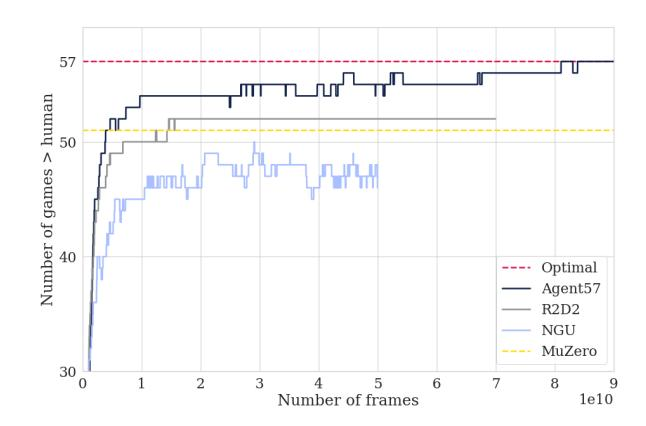
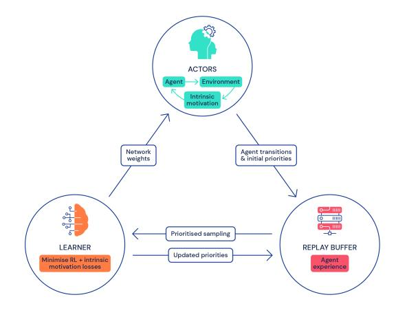
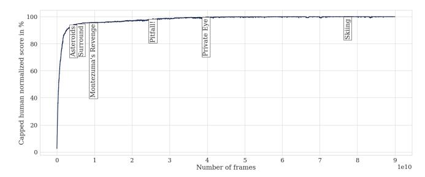
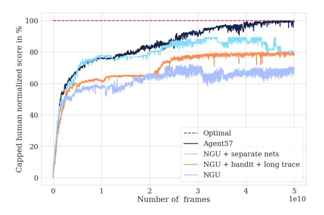
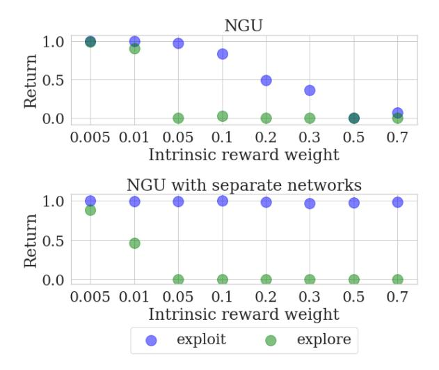
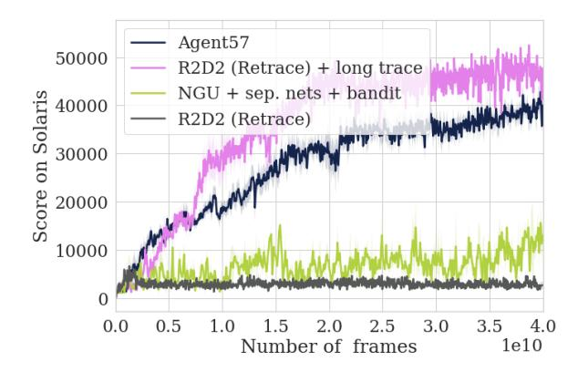
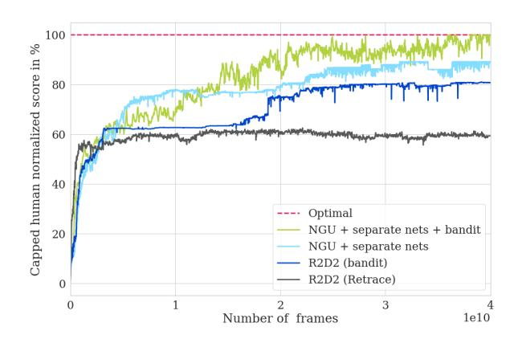
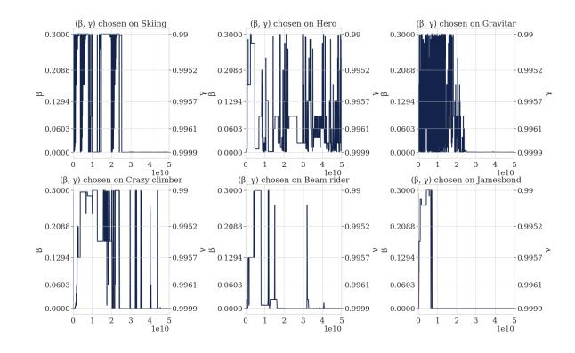

# **Agent57: Outperforming the Atari Human Benchmark**

Adrià Puigdomènech Badia \* 1 Bilal Piot \* 1 Steven Kapturowski \* 1 Pablo Sprechmann \* 1 Alex Vitvitskyi 1 Daniel Guo 1 Charles Blundell 1

## **Abstract**

Atari games have been a long-standing benchmark in the reinforcement learning (RL) community for the past decade. This benchmark was proposed to test general competency of RL algorithms. Previous work has achieved good average performance by doing outstandingly well on many games of the set, but very poorly in several of the most challenging games. We propose Agent57, the first deep RL agent that outperforms the standard human benchmark on all 57 Atari games. To achieve this result, we train a neural network which parameterizes a family of policies ranging from very exploratory to purely exploitative. We propose an adaptive mechanism to choose which policy to prioritize throughout the training process. Additionally, we utilize a novel parameterization of the architecture that allows for more consistent and stable learning.

## 1. Introduction

The Arcade Learning Environment (ALE; Bellemare et al., 2013) was proposed as a platform for empirically assessing agents designed for general competency across a wide range of games. ALE offers an interface to a diverse set of Atari 2600 game environments designed to be engaging and challenging for human players. As Bellemare et al. (2013) put it, the Atari 2600 games are well suited for evaluating general competency in AI agents for three main reasons: (i) varied enough to claim generality, (ii) each interesting enough to be representative of settings that might be faced in practice, and (iii) each created by an independent party to be free of experimenter's bias.

Agents are expected to perform well in as many games as possible making minimal assumptions about the domain at hand and without the use of game-specific information.

Proceedings of the  $37^{th}$  International Conference on Machine Learning, Online, PMLR 119, 2020. Copyright 2020 by the author(s).

Figure 1. Number of games where algorithms are better than the human benchmark throughout training for Agent57 and state-of-the-art baselines on the 57 Atari games.

Deep Q-Networks (DQN; Mnih et al., 2015) was the first algorithm to achieve human-level control in a large number of the Atari 2600 games, measured by human normalized scores (HNS). Subsequently, using HNS to assess performance on Atari games has become one of the most widely used benchmarks in deep reinforcement learning (RL), despite the human baseline scores potentially underestimating human performance relative to what is possible (Toromanoff et al., 2019). Nonetheless, human benchmark performance remains an oracle for "reasonable performance" across the 57 Atari games. Despite all efforts, no single RL algorithm has been able to achieve over 100% HNS on all 57 Atari games with one set of hyperparameters. Indeed, state of the art algorithms in model-based RL, MuZero (Schrittwieser et al., 2019), and in model-free RL, R2D2 (Kapturowski et al., 2018) surpass 100% HNS on 51 and 52 games, respectively. While these algorithms achieve well above average human-level performance on a large fraction of the games (e.g. achieving more than 1000% HNS), in the games they fail to do so, they often fail to learn completely. These games showcase particularly important issues that a general RL algorithm should be able to tackle. Firstly, long-term credit assignment: which decisions are most deserving of credit for the positive (or negative) outcomes that follow? This problem is particularly hard when rewards are delayed and credit needs to be assigned over long sequences of actions, such as in the

\*Equal contribution 1DeepMind. Correspondence to: Adrià Puigdomènech Badia <adriap@google.com>.

games of Skiing or Solaris. The game of Skiing is a canonical example due to its peculiar reward structure. The goal of the game is to run downhill through all gates as fast as possible. A penalty of five seconds is given for each missed gate. The reward, given only at the end, is proportional to the time elapsed. Therefore long-term credit assignment is needed to understand why an action taken early in the game (e.g. missing a gate) has a negative impact in the obtained reward. Secondly, exploration: efficient exploration can be critical to effective learning in RL. Games like Private Eye, Montezuma's Revenge, Pitfall! or Venture are widely considered hard exploration games (Bellemare et al., 2016; Ostrovski et al., 2017) as hundreds of actions may be required before a first positive reward is seen. In order to succeed, the agents need to keep exploring the environment despite the apparent impossibility of finding positive rewards. These problems are particularly challenging in large high dimensional state spaces where function approximation is required.

Exploration algorithms in deep RL generally fall into three categories: randomized value functions (Osband et al., 2016; Fortunato et al., 2017; Salimans et al., 2017; Plappert et al., 2017; Osband et al., 2018), unsupervised policy learning (Gregor et al., 2016; Achiam et al., 2018; Eysenbach et al., 2018) and intrinsic motivation (Schmidhuber, 1991; Oudeyer et al., 2007; Barto, 2013; Bellemare et al., 2016; Ostrovski et al., 2017; Fu et al., 2017; Tang et al., 2017; Burda et al., 2018; Choi et al., 2018; Savinov et al., 2018; Puigdomènech Badia et al., 2020). Other work combines handcrafted features, domain-specific knowledge or privileged pre-training to side-step the exploration problem, sometimes only evaluating on a few Atari games (Aytar et al., 2018; Ecoffet et al., 2019). Despite the encouraging results, no algorithm has been able to significantly improve performance on challenging games without deteriorating performance on the remaining games without relying on human demonstrations (Pohlen et al., 2018). Notably, amongst all this work, intrinsic motivation, and in particular, Never Give Up (NGU; Puigdomènech Badia et al., 2020) has shown significant recent promise in improving performance on hard exploration games. NGU achieves this by augmenting the reward signal with an internally generated intrinsic reward that is sensitive to novelty at two levels: short-term novelty within an episode and long-term novelty across episodes. It then learns a family of policies for exploring and exploiting (sharing the same parameters), with the end goal of obtaining the highest score under the exploitative policy. However, NGU is not the most general agent: much like R2D2 and MuZero are able to perform strongly on all but few games, so too NGU suffers in that it performs strongly on a smaller, different set of games to agents such as MuZero and R2D2 (despite being based on R2D2). For example, in the game Surround R2D2 achieves the optimal score while NGU performs similar to a random policy. One shortcoming of NGU is that it collects the same amount of experience following each of its policies, regardless of their contribution to the learning progress. Some games require a significantly different degree of exploration to others. Intuitively, one would want to allocate the shared resources (both network capacity and data collection) such that end performance is maximized. We propose allowing NGU to adapt its exploration strategy over the course of an agent's lifetime, enabling specialization to the particular game it is learning. This is the first significant improvement we make to NGU to allow it to be a more general agent.

Recent work on long-term credit assignment can be categorized into roughly two types: ensuring that gradients correctly assign credit (Ke et al., 2017; Weber et al., 2019; Fortunato et al., 2019) and using values or targets to ensure correct credit is assigned (Arjona-Medina et al., 2019; Hung et al., 2019; Liu et al., 2019; Harutyunyan et al., 2019; Ferret et al., 2020). NGU is also unable to cope with long-term credit assignment problems such as *Skiing* or *Solaris* where it fails to reach 100% HNS. Advances in credit assignment in RL often involve a mixture of both approaches, as values and rewards form the loss whilst the flow of gradients through a model directs learning.

In this work, we propose tackling the long-term credit assignment problem by improving the overall training stability, dynamically adjusting the discount factor, and increasing the backprop through time window. These are relatively simple changes compared to the approaches proposed in previous work, but we find them to be effective. Much recent work has explored this problem of how to dynamically adjust hyperparameters of a deep RL agent, e.g., approaches based upon evolution (Jaderberg et al., 2017), gradients (Xu et al., 2018) or multi-armed bandits (Schaul et al., 2019). Inspired by Schaul et al. (2019), we propose using a simple non-stationary multi-armed bandit (Garivier & Moulines, 2008) to directly control the exploration rate and discount factor to maximize the episode return, and then provide this information to the value network of the agent as an input. Unlike Schaul et al. (2019), 1) it controls the exploration rate and discount factor (helping with longterm credit assignment), and 2) the bandit controls a family of state-action value functions that back up the effects of exploration and longer discounts, rather than linearly tilting a common value function by a fixed functional form.

In summary, our contributions are as follows:

 A new parameterization of the state-action value function that decomposes the contributions of the intrinsic and extrinsic rewards. As a result, we significantly increase the training stability over a large range of intrinsic reward scales.

- 2. A meta-controller: an adaptive mechanism to select which of the policies (parameterized by exploration rate and discount factors) to prioritize throughout the training process. This allows the agent to control the exploration/exploitation trade-off by dedicating more resources to one or the other.
- 3. Finally, we demonstrate for the first time performance that is above the human baseline across all Atari 57 games. As part of these experiments, we also find that simply re-tuning the backprop through time window to be twice the previously published window for R2D2 led to superior long-term credit assignment (e.g., in *Solaris*) while still maintaining or improving overall performance on the remaining games.

These improvements to NGU collectively transform it into the most general Atari 57 agent, enabling it to outperform the human baseline uniformly over all Atari 57 games. Thus, we call this agent: Agent57.

## 2. Background: Never Give Up (NGU)

Our work builds on top of the NGU agent, which combines two ideas: first, the curiosity-driven exploration, and second, distributed deep RL agents, in particular R2D2.

NGU computes an intrinsic reward in order to encourage exploration. This reward is defined by combining perepisode and life-long novelty. The per-episode novelty,  $r_t^{\rm episodic}$ , rapidly vanishes over the course of an episode, and it is computed by comparing observations to the contents of an episodic memory. The life-long novelty,  $\alpha_t$ , slowly vanishes throughout training, and it is computed by using a parametric model (in NGU and in this work Random Network Distillation (Burda et al., 2018) is used to this end). With this, the intrinsic reward  $r_t^i$  is defined as follows:

$$r_{t}^{i} = r_{t}^{\text{episodic}} \cdot \min \left\{ \max \left\{ \alpha_{t}, 1 \right\}, L \right\},$$

where L=5 is a chosen maximum reward scaling. This leverages the long-term novelty provided by  $\alpha_t$ , while  $r_t^{\text{episodic}}$  continues to encourage the agent to explore within an episode. For a detailed description of the computation of  $r_t^{\text{episodic}}$  and  $\alpha_t$ , see (Puigdomènech Badia et al., 2020) or App. I. At time t, NGU adds N different scales of the same intrinsic reward  $\beta_j r_t^i$  ( $\beta_j \in \mathbb{R}^+, j \in 0, ... N-1$ ) to the extrinsic reward provided by the environment,  $r_t^e$ , to form N potential total rewards  $r_{j,t} = r_t^e + \beta_j r_t^i$ . Consequently, NGU aims to learn the N different associated optimal state-action value functions  $Q_{r_i}^*$  associated with each reward function  $r_{j,t}$ . The exploration rates  $\beta_j$  are parameters that control the degree of exploration. Higher values will encourage exploratory policies and smaller values will encourage exploitative policies. Additionally, for purposes of learning long-term credit assignment, each  $Q_{r_j}^*$ 

has its own associated discount factor  $\gamma_j$  (for background and notations on Markov Decision Processes (MDP) see App. A). Since the intrinsic reward is typically much more dense than the extrinsic reward,  $\{(\beta_j, \gamma_j)\}_{j=0}^{N-1}$  are chosen so as to allow for long term horizons (high values of  $\gamma_j$ ) for exploitative policies (small values of  $\beta_j$ ) and small term horizons (low values of  $\gamma_j$ ) for exploratory policies (high values of  $\beta_j$ ).

To learn the state-action value function  $Q_{r_j}^*$ , NGU trains a recurrent neural network  $Q(x,a,j;\theta)$ , where j is a one-hot vector indexing one of N implied MDPs (in particular  $(\beta_j,\gamma_j)$ ), x is the current observation, a is an action, and  $\theta$  are the parameters of the network (including the recurrent state). In practice, NGU can be unstable and fail to learn an appropriate approximation of  $Q_{r_j}^*$  for all the state-action value functions in the family, even in simple environments. This is especially the case when the scale and sparseness of  $r_t^e$  and  $r_t^i$  are both different, or when one reward is more noisy than the other. We conjecture that learning a common state-action value function for a mix of rewards is difficult when the rewards are very different in nature. Therefore, in Sec. 3.1, we propose an architectural modification to tackle this issue.

Our agent is a deep distributed RL agent, in the lineage of R2D2 and NGU. As such, it decouples the data collection and the learning processes by having many actors feed data to a central prioritized replay buffer. A learner can then sample training data from this buffer, as shown in Fig. 2 (for implementation details and hyperparameters refer to App. E). More precisely, the replay buffer con-

Figure 2. A schematic depiction of a distributed deep RL agent.

tains sequences of transitions that are removed regularly in a FIFO-manner. These sequences come from actor processes that interact with independent copies of the environment, and they are prioritized based on temporal differences errors (Kapturowski et al., 2018). The priorities are initialized by the actors and updated by the learner with the updated state-action value function  $Q(x, a, j; \theta)$ . Ac-

cording to those priorities, the learner samples sequences of transitions from the replay buffer to construct an RL loss. Then, it updates the parameters of the neural network  $Q(x, a, j; \theta)$  by minimizing the RL loss to approximate the optimal state-action value function. Finally, each actor shares the same network architecture as the learner but with different weights. We refer as  $\theta_l$  to the parameters of the l-th actor. The learner weights  $\theta$  are sent to the actor frequently, which allows it to update its own weights  $\theta_l$ . Each actor uses different values  $\epsilon_l$ , which are employed to follow an  $\epsilon_l$ -greedy policy based on the current estimate of the state-action value function  $Q(x, a, j; \theta_l)$ . In particular, at the beginning of each episode and in each actor, NGU uniformly selects a pair  $(\beta_j, \gamma_j)$ . We hypothesize that this process is sub-optimal and propose to improve it in Sec. 3.2 by introducing a meta-controller for each actor that adapts the data collection process.

## 3. Improvements to NGU

#### 3.1. State-Action Value Function Parameterization

The proposed architectural improvement consists in splitting the state-action value function in the following way:

$$Q(x, a, j; \theta) = Q(x, a, j; \theta^e) + \beta_j Q(x, a, j; \theta^i),$$

where  $Q(x, a, j; \theta^e)$  and  $Q(x, a, j; \theta^i)$  are the extrinsic and intrinsic components of  $Q(x, a, j; \theta)$  respectively. The sets of weights  $\theta^e$  and  $\theta^i$  separately parameterize two neural networks with identical architecture and  $\theta = \theta^i \cup \theta^e$ . Both  $Q(x, a, j; \theta^e)$  and  $Q(x, a, j; \theta^i)$  are optimized separately with rewards  $r^e$  and  $r^i$  respectively, but with the same target policy  $\pi(x) = \arg \max_{a \in \mathcal{A}} Q(x, a, j; \theta)$ . More precisely, to train the weights  $\theta^e$  and  $\theta^i$ , we use the same sequence of transitions sampled from the replay, but with two different transformed Retrace loss functions (Munos et al., 2016). For  $Q(x, a, j; \theta^e)$  we compute an extrinsic transformed Retrace loss on the sequence transitions with rewards  $r^e$  and target policy  $\pi$ , whereas for  $Q(x, a, j; \theta^i)$  we compute an intrinsic transformed Retrace loss on the same sequence of transitions but with rewards  $r^i$  and target policy  $\pi$ . A reminder of how to compute a transformed Retrace loss on a sequence of transitions with rewards r and target policy  $\pi$  is provided in App. C.

In addition, in App. B, we show that this optimization of separate state-action values is equivalent to the optimization of the original single state-action value function with reward  $r^e + \beta_j r^i$  (under a simple gradient descent optimizer). Even though the theoretical objective being optimized is the same, the parameterization is different: we use two different neural networks to approximate each one of these state-action values (a schematic and detailed figures of the architectures used can be found in App. F). By doing this, we allow each network to adapt to the scale and vari-

ance associated with their corresponding reward, and we also allow for the associated optimizer state to be separated for intrinsic and extrinsic state-action value functions.

Moreover, when a transformed Bellman operator (Pohlen et al., 2018) with function h is used (see App. A), we can split the state-action value function in the following way:

$$Q(x, a, j; \theta) = h\left(h^{-1}(Q(x, a, j; \theta^e)) + \beta_j h^{-1}(Q(x, a, j; \theta^i))\right).$$

In App. B, we also show that the optimization of separated transformed state-action value functions is equivalent to the optimization of the original single transformed state-action value function. In practice, choosing a simple or transformed split does not seem to play an important role in terms of performance (empirical evidence and an intuition behind this result can be found in App. H.3). In our experiments, we choose an architecture with a simple split which corresponds to h being the identity, but still use the transformed Retrace loss functions.

#### 3.2. Adaptive Exploration over a Family of Policies

The core idea of NGU is to jointly train a family of policies with different degrees of exploratory behaviour using a single network architecture. In this way, training these exploratory policies plays the role of a set of auxiliary tasks that can help train the shared architecture even in the absence of extrinsic rewards. A major limitation of this approach is that all policies are trained equally, regardless of their contribution to the learning progress. We propose to incorporate a meta-controller that can adaptively select which policies to use both at training and evaluation time. This carries two important consequences. Firstly, by selecting which policies to prioritize during training, we can allocate more of the capacity of the network to better represent the state-action value function of the policies that are most relevant for the task at hand. Note that this is likely to change throughout the training process, naturally building a curriculum to facilitate training. As mentioned in Sec. 2, policies are represented by pairs of exploration rate and discount factor,  $(\beta_i, \gamma_i)$ , which determine the discounted cumulative rewards to maximize. It is natural to expect policies with higher  $\beta_j$  and lower  $\gamma_j$  to make more progress early in training, while the opposite would be expected as training progresses. Secondly, this mechanism also provides a natural way of choosing the best policy in the family to use at evaluation time. Considering a wide range of values of  $\gamma_j$  with  $\beta_j \approx 0$ , provides a way of automatically adjusting the discount factor on a per-task basis. This significantly increases the generality of the approach.

We propose to implement the meta-controller using a nonstationary multi-arm bandit algorithm running independently on each actor. The reason for this choice, as op-

Figure 3. Capped human normalized score where we observe at which point the agent surpasses the human benchmark on the last 6 games.

posed to a global meta-controller, is that each actor follows a different  $\epsilon_l$ -greedy policy which may alter the choice of the optimal arm. Each arm j from the N-arm bandit is linked to a policy in the family and corresponds to a pair  $(\beta_j, \gamma_j)$ . At the beginning of each episode, say, the k-th episode, the meta-controller chooses an arm  $J_k$  setting which policy will be executed. Note here that the arm  $J_k$  is a random variable. Then the l-th actor acts  $\epsilon_l$ -greedily with respect to the corresponding state-action value function,  $Q(x, a, J_k; \theta_l)$ , for the whole episode. The undiscounted extrinsic episode returns, noted  $R_k^e(J_k)$ , are used as a reward signal to train the multi-arm bandit algorithm of the meta-controller.

The reward signal  $R_k^e(J_k)$  is non-stationary, as the agent changes throughout training. Thus, a classical bandit algorithm such as Upper Confidence Bound (UCB; Garivier & Moulines, 2008) will not be able to adapt to the changes of the reward through time. Therefore, we employ a simplified sliding-window UCB with  $\epsilon_{\text{UCB}}$ -greedy exploration. With probability  $1 - \epsilon_{\text{UCB}}$ , this algorithm runs a slight modification of classic UCB on a sliding window of size  $\tau$  and selects a random arm with probability  $\epsilon_{\text{UCB}}$  (details of the algorithms are provided in App. D).

Note that the benefit of adjusting the discount factor through training and at evaluation could be applied even in the absence of intrinsic rewards. To show this, we propose augmenting a variant of R2D2 with a meta-controller. In order to isolate the contribution of this change, we evaluate a variant of R2D2 which uses the same RL loss as Agent57. Namely, a transformed Retrace loss as opposed to a transformed n-step loss as in the original paper. We refer to this variant as R2D2 (Retrace) throughout the paper. The reason for choosing this different loss is that it worked better than the n-step loss for NGU, as described in Puigdomènech Badia et al. (2020). In all other aspects, R2D2 (Retrace) is exactly the same algorithm as R2D2. We incorporate the joint training of several policies parameterized by  $\{\gamma_j\}_{j=0}^{N-1}$  to R2D2 (Retrace). We refer to this algorithm as R2D2 (bandit).

## 4. Experiments

We begin this section by describing our experimental setup. Following NGU, Agent57 uses a family of coefficients  $\{(\beta_j, \gamma_j)\}_{j=0}^{N-1}$  of size N=32. The choice of discounts  $\{\gamma_j\}_{j=0}^{N-1}$  differs from that of NGU to allow for higher values, ranging from 0.99 to 0.9999 (see App. G.1 for details). The meta-controller uses a window size of  $\tau = 160$ episodes and  $\epsilon = 0.5$  for the actors and a window size of  $\tau = 3600$  episodes and  $\epsilon = 0.01$ . All the other hyperparameters are identical to those of NGU, including the standard preprocessing of Atari frames. For a complete description of the hyperparameters and preprocessing we use, please see App. G.3. For all agents we run (that is, all agents except MuZero where we report numbers presented in Schrittwieser et al. (2019)), we employ a separate evaluator process to continuously record scores. We record the undiscounted episode returns averaged over 3 seeds and using a windowed mean over 50 episodes. For our best algorithm, Agent57, we report the results averaged over 6 seeds on all games to strengthen the significance of the results. On that average, we report the maximum over training as their final score, as done in Fortunato et al. (2017); Puigdomènech Badia et al. (2020). Further details on our evaluation setup are described in App. E.

In addition to using human normalized scores HNS =  $\frac{Agent_{score} - Random_{score}}{Human_{score} - Random_{score}}$ , we report the capped human normalized scores, CHNS =  $\max\{\min\{HNS,1\},0\}$ . This measure is a better descriptor for evaluating general performance, as it puts an emphasis in the games that are below the average human performance benchmark. Furthermore, and avoiding any issues that aggregated metrics may have, we also provide all the scores that all the ablations obtain in all games we evaluate in App. H.1.

We structure the rest of this section in the following way: firstly, we show an overview of the results that Agent57 achieves. Then we proceed to perform ablations on each one of the improvements we propose for our model.

#### 4.1. Summary of the Results

Tab. 1 shows a summary of the results we obtain on all 57 Atari games when compared to baselines. MuZero obtains the highest uncapped mean and median human normalized scores, but also the lowest capped scores. This is due to the fact that MuZero performs remarkably well in some games, such as *Beam Rider*, where it shows an uncapped score of 27469%, but at the same time catastrophically fails to learn in games such as *Venture*, achieving a score that is on par with a random policy. We see that the meta-controller improvement successfully transfers to R2D2: the proposed variant R2D2 (bandit) shows a mean, median, and CHNS that are much higher than R2D2 with the same Retrace

| Statistics              | Agent57 | R2D2 (bandit) | NGU     | R2D2 (Retrace) | R2D2    | MuZero  |
|-------------------------|---------|---------------|---------|----------------|---------|---------|
| Capped mean             | 100.00  | 96.93         | 95.07   | 94.20          | 94.33   | 89.92   |
| Number of games > human | 57      | 54            | 51      | 52             | 52      | 51      |
| Mean                    | 4766.25 | 5461.66       | 3421.80 | 3518.36        | 4622.09 | 4998.51 |
| Median                  | 1933.49 | 2357.92       | 1359.78 | 1457.63        | 1935.86 | 2041.12 |
| 40th Percentile         | 1091.07 | 1298.80       | 610.44  | 817.77         | 1176.05 | 1172.90 |
| 30th Percentile         | 614.65  | 648.17        | 267.10  | 420.67         | 529.23  | 503.05  |
| 20th Percentile         | 324.78  | 303.61        | 226.43  | 267.25         | 215.31  | 171.39  |
| 10th Percentile         | 184.35  | 116.82        | 107.78  | 116.03         | 115.33  | 75.74   |
| 5th Percentile          | 116.67  | 93.25         | 64.10   | 48.32          | 50.27   | 0.03    |

Table 1. Number of games above human, mean capped, mean and median human normalized scores for the 57 Atari games.

loss. Finally, Agent57 achieves a median and mean that is greater than NGU and R2D2, but also its CHNS is 100%. This shows the generality of Agent57: not only it obtains a strong mean and median, but also it is able to obtain strong performance on the tail of games in which MuZero and R2D2 catastrophically fail. This is more clearly observed when looking at different percentiles: up to the 20th percentile, Agent57 shows much greater performance, only slightly surpassed by R2D2 (bandit) when we examine higher percentiles. In Fig. 3 we report the performance of Agent57 in isolation on the 57 games. We show the last 6 games (in terms of number of frames collected by the agents) in which the algorithm surpasses the human performance benchmark. As shown, the benchmark over games is beaten in a long-tailed fashion, where Agent57 uses the first 5 billion frames to surpass the human benchmark on 51 games. After that, we find hard exploration games, such as Montezuma's Revenge, Pitfall!, and Private Eye. Lastly, Agent57 surpasses the human benchmark on Skiing after 78 billion frames. To be able to achieve such performance on Skiing, Agent57 uses a high discount (as we show in Sec. 4.4). This naturally leads to high variance in the returns, which leads to needing more data in order to learn to play the game. One thing to note is that, in the game of Skiing, the human baseline is very competitive, with a score of -4336.9, where -17098.1 is random and -3272is the optimal score one can achieve.

In general, as performance in Atari keeps improving, it seems natural to concentrate on the tail of the distribution, i.e., pay attention to those games for which progress in the literature has been historically much slower than average. We now present results for a subset of 10 games that we call the *challenging set*. It consists of the six hard exploration games as defined in (Bellemare et al., 2016), plus games that require long-term credit assignment. More concretely, the games we use are: *Beam Rider*, *Freeway*, *Montezuma's Revenge*, *Pitfall!*, *Pong*, *Private Eye*, *Skiing*, *Solaris*, *Surround*, and *Venture*.

In Fig. 4 we can see the performance progression obtained from incorporating each one of the improvements we make on top of NGU. Such performance is reported on the selection of 10 games mentioned above. In the notation of the legend, NGU + bandit + separate nets + long trace is

Figure 4. Performance progression on the 10-game *challenging* set obtained from incorporating each one of the improvements.

equivalent to Agent57. We observe that each one of the improvements results in an increment in final performance. Further, we see that each one of the improvements that is part of Agent57 is necessary in order to obtain the consistent final performance of 100% CHNS.

## 4.2. State-Action Value Function Parameterization

We begin by evaluating the influence of the state-action value function parametrization on a minimalistic gridworld environment, called "random coin". It consists of an empty room of size  $15 \times 15$  where a coin and an agent are randomly placed at the start of each episode. The agent can take four possible actions (up, down, left right) and episodes are at most 200 steps long. If the agent steps over the coin, it receives a reward of 1 and the episode terminates. In Fig. 5 we see the results of NGU with and without the new parameterization of its state-action value functions. We report performance after 150 million frames. We compare the extrinsic returns for the policies that are the exploitative ( $\beta_i = 0$ ) and the most exploratory (with the largest  $\beta_j$  in the family). Even for small values of the exploration rates  $(\max_i \beta_i)$ , this setting induces very different exploratory and exploitative policies. Maximizing the discounted extrinsic returns is achieved by taking the shortest path towards the coin (obtaining an extrinsic return of one), whereas maximizing the augmented returns

Figure 5. Extrinsic returns for the exploitative ( $\beta_0 = 0$ ) and most exploratory ( $\beta_{31} = \beta$ ) on "random coin" for different values of the intrinsic reward weight,  $\beta$ . (Top) NGU(Bottom) NGU with Separate networks for intrinsic and extrinsic values.

is achieved by avoiding the coin and visiting all remaining states (obtaining an extrinsic return of zero). In principle, NGU should be able to learn these policies jointly. However, we observe that the exploitative policy in NGU struggles to solve the task as intrinsic motivation reward scale increases. As we increase the scale of the intrinsic reward, its value becomes much greater than that of the extrinsic reward. As a consequence, the conditional state-action value network of NGU is required to represent very different values depending on the  $\beta_i$  we condition on. This implies that the network is increasingly required to have more flexible representations. Using separate networks dramatically increases its robustness to the intrinsic reward weight that is used. Note that this effect would not occur if the episode did not terminate after collecting the coin. In such case, exploratory and exploitative policies would be allowed to be very similar: both could start by collecting the coin as quickly as possible. In Fig. 4 we can see that this improvement also translates to the challenging set. NGU achieves a much lower average CHNS than its separate network counterpart. We also observe this phenomenon when we incorporate the meta-controller. Agent57 suffers a drop of performance that is greater than 20% when the separate network improvement is removed.

We can also see that it is a general improvement: it does not show worse performance on any of the 10 games of the challenging set. More concretely, the largest improvement is seen in the case of *Surround*, where NGU obtains a score on par with a random policy, whereas with the new parametrization it reaches a score that is nearly optimal. This is because *Surround* is a case that is similar to the "random coin" environment mentioned above: as the player makes progress in the game, they have the choice to sur-

Figure 6. Solaris learning curves with small and long backprop through time window sizes for both R2D2 and Agent57.

round the opponent snake, receive a reward, and start from the initial state, or keep wandering around without capturing the opponent, and thus visiting new states in the world.

## 4.3. Backprop Through Time Window Size

In this section we analyze the impact of having a backprop through time window size. More concretely, we analyze its impact on the base algorithm R2D2 to see its effect without NGU or any of the improvements we propose. Further, we also analyze its effect on Agent57, to see if any of the improvements on NGU overlap with this change. In both cases, we compare using backprop through time window sizes of 80 (default in R2D2) versus 160, higher values enable credit assignment further back.

In aggregated terms over the *challenging set*, its effect seems to be the same for both R2D2 and Agent57: using a longer backprop through time window appears to be initially slower, but results in better overall stability and slightly higher final score. A detailed comparison over those 10 games is shown in App. H.2. This effect can be seen clearly in the game of *Solaris*, as observed in Fig. 6. This is also the game showing the largest improvement in terms of final score. This is again general improvement, as it enhances performance on all the *challenging set* games. For further details we report the scores in App. H.1.

#### 4.4. Adaptive Exploration

In this section, we analyze the effect of using the metacontroller described in Sec. 3.1 in both the actors and the evaluator. To isolate the contribution of this improvement, we evaluate two settings: R2D2 and NGU with separate networks, with and without meta-controller. Results are shown in Fig. 7. Again, we observe that this is a general improvement in both comparisons. Firstly, we observe that there is a great value in this improvement on its own, enhancing the final performance of R2D2 by close to 20% CHNS. Secondly, we observe that the benefit on NGU with

Figure 7. Performance comparison for adaptive exploration on the 10-game *challenging set*.

separate networks is more modest than for R2D2. This indicates that there is a slight overlap in the contributions of the separate network parameterization and the use of the meta-controller. The bandit algorithm can adaptively decrease the value of  $\beta$  when the difference in scale between intrinsic and extrinsic rewards is large. Using the metacontroller allows to include very high discount values in the set  $\{\gamma_j\}_{j=0}^N$ . Specifically, running R2D2 with a high discount factor,  $\gamma = 0.9999$  surpasses the human baseline in the game of *Skiing*. However, using that hyperparameter across the full set of games, renders the algorithm very unstable and damages its end performance. All the scores in the *challenging set* for a fixed high discount ( $\gamma = 0.9999$ ) variant of R2D2 are reported in App. H.1. When using a meta-controller, the algorithm does not need to make this compromise: it can adapt it in a per-task manner.

Finally, the results and discussion above show why it is beneficial to use different values of  $\beta$  and  $\gamma$  on a per-task basis. At the same time, in Sec. 3 we hypothesize it would also be useful to vary those coefficients throughout training. In Fig. 8 we can see the choice of  $(\beta_i, \gamma_i)$  producing highest returns on the meta-controller of the evaluator across training for several games. Some games clearly have a preferred mode: on Skiing the high discount combination is quickly picked up when the agent starts to learn, and on *Hero* a high  $\beta$  and low  $\gamma$  is generally preferred at all times. On the other hand, some games have different preferred modes throughout training: on Gravitar, Crazy Climber, Beam Rider, and Jamesbond, Agent57 initially chooses to focus on exploratory policies with low discount, and, as training progresses, the agent shifts into producing experience from higher discount and more exploitative policies.

#### **5. Conclusions**

We present the first deep reinforcement learning agent with performance above the human benchmark on all 57 Atari games. The agent is able to balance the learning of differ-

Figure 8. Best arm chosen by the evaluator of Agent57 over training for different games.

ent skills that are required to be performant on such diverse set of games: *exploration and exploitation* and *long-term credit assignment*. To do that, we propose simple improvements to an existing agent, *Never Give Up*, which has good performance on hard-exploration games, but in itself does not have strong overall performance across all 57 games. These improvements are i) using a different parameterization of the state-action value function, ii) using a metacontroller to dynamically adapt the novelty preference and discount, and iii) the use of longer backprop-through time window to learn from using the Retrace algorithm.

This method leverages a great amount of computation to its advantage: similarly to NGU, it is able to scale well with increasing amounts of computation. This has also been the case with the many recent achievements in deep RL (Silver et al., 2016; Andrychowicz et al., 2018; Vinyals et al., 2019). While this enables our method to achieve strong performance, an interesting research direction is to pursue ways in which to improve the data efficiency of this agent. Additionally, this agent shows an average capped human normalized score of 100%. However, in our view this by no means marks the end of Atari research, not only in terms of efficiency as above, but also in terms of general performance. We offer two views on this: firstly, analyzing the performance among percentiles gives us new insights on how general algorithms are. While Agent57 achieves great results on the first percentiles of the 57 games and holds better mean and median performance than NGU or R2D2, as MuZero shows, it could still obtain much better average performance. Secondly, as pointed out by Toromanoff et al. (2019), all current algorithms are far from achieving optimal performance in some games. To that end, key improvements to use might be enhancements in the representations that Agent57 and NGU use for exploration, planning (as suggested by the results achieved by MuZero) as well as better mechanisms for credit assignment (as highlighted by the results seen in *Skiing*).

## Acknowledgments

We thank Daan Wierstra, Koray Kavukcuoglu, Vlad Mnih, Vali Irimia, Georg Ostrovski, Mohammad Gheshlaghi Azar, Rémi Munos, Bernardo Avila Pires, Florent Altché, Steph Hughes-Fitt, Rory Fitzpatrick, Andrea Banino, Meire Fortunato, Melissa Tan, Benigno Uria, Borja Ibarz, Andre Barreto, Diana Borsa, Simon Osindero, Tom Schaul, and many other colleagues at DeepMind for helpful discussions and comments on the manuscript.

## References

- Achiam, J., Edwards, H., Amodei, D., and Abbeel, P. Variational option discovery algorithms. arXiv preprint arXiv:1807.10299, 2018.
- Andrychowicz, M., Baker, B., Chociej, M., Jozefowicz, R., McGrew, B., Pachocki, J., Petron, A., Plappert, M., Powell, G., Ray, A., et al. Learning dexterous in-hand manipulation. arXiv preprint arXiv:1808.00177, 2018.
- Arjona-Medina, J. A., Gillhofer, M., Widrich, M., Unterthiner, T., Brandstetter, J., and Hochreiter, S. Rudder: Return decomposition for delayed rewards. In *Advances in Neural Information Processing Systems*, pp. 13544–13555, 2019.
- Aytar, Y., Pfaff, T., Budden, D., Paine, T., Wang, Z., and de Freitas, N. Playing hard exploration games by watching youtube. In *Advances in Neural Information Processing Systems*, pp. 2930–2941, 2018.
- Barreto, A., Dabney, W., Munos, R., Hunt, J. J., Schaul, T., van Hasselt, H. P., and Silver, D. Successor features for transfer in reinforcement learning. In *Advances in neural* information processing systems, pp. 4055–4065, 2017.
- Barto, A. G. Intrinsic motivation and reinforcement learning. In *Intrinsically motivated learning in natural and artificial systems*, pp. 17–47. Springer, 2013.
- Bellemare, M., Srinivasan, S., Ostrovski, G., Schaul, T., Saxton, D., and Munos, R. Unifying count-based exploration and intrinsic motivation. In *Advances in Neural Information Processing Systems*, pp. 1471–1479, 2016.
- Bellemare, M. G., Naddaf, Y., Veness, J., and Bowling, M. The arcade learning environment: An evaluation platform for general agents. *Journal of Artificial Intelligence Research*, 47:253–279, 06 2013.
- Blundell, C., Uria, B., Pritzel, A., Li, Y., Ruderman, A., Leibo, J. Z., Rae, J., Wierstra, D., and Hassabis, D. Model-free episodic control. *arXiv preprint arXiv:1606.04460*, 2016.

- Burda, Y., Edwards, H., Storkey, A., and Klimov, O. Exploration by random network distillation. *arXiv* preprint *arXiv*:1810.12894, 2018.
- Choi, J., Guo, Y., Moczulski, M., Oh, J., Wu, N., Norouzi, M., and Lee, H. Contingency-aware exploration in reinforcement learning. arXiv preprint arXiv:1811.01483, 2018.
- Ecoffet, A., Huizinga, J., Lehman, J., Stanley, K. O., and Clune, J. Go-explore: a new approach for hard-exploration problems. *arXiv preprint arXiv:1901.10995*, 2019.
- Eysenbach, B., Gupta, A., Ibarz, J., and Levine, S. Diversity is all you need: Learning skills without a reward function. *arXiv preprint arXiv:1802.06070*, 2018.
- Ferret, J., Marinier, R., Geist, M., and Pietquin, O. Selfattentional credit assignment for transfer in reinforcement learning. *IJCAI*, 2020.
- Fortunato, M., Azar, M. G., Piot, B., Menick, J., Osband, I., Graves, A., Mnih, V., Munos, R., Hassabis, D., Pietquin, O., et al. Noisy networks for exploration. arXiv preprint arXiv:1706.10295, 2017.
- Fortunato, M., Tan, M., Faulkner, R., Hansen, S., Badia,
  A. P., Buttimore, G., Deck, C., Leibo, J. Z., and Blundell,
  C. Generalization of reinforcement learners with working and episodic memory. In *Advances in Neural Information Processing Systems*, pp. 12448–12457, 2019.
- Fu, J., Co-Reyes, J., and Levine, S. Ex2: Exploration with exemplar models for deep reinforcement learning. In *Advances in neural information processing systems*, pp. 2577–2587, 2017.
- Garivier, A. and Moulines, E. On upper-confidence bound policies for non-stationary bandit problems, 2008.
- Gregor, K., Rezende, D. J., and Wierstra, D. Variational intrinsic control. *arXiv* preprint arXiv:1611.07507, 2016.
- Harutyunyan, A., Dabney, W., Mesnard, T., Azar, M. G.,
  Piot, B., Heess, N., van Hasselt, H. P., Wayne, G., Singh,
  S., Precup, D., et al. Hindsight credit assignment. In
  Advances in neural information processing systems, pp.
  12467–12476, 2019.
- Horgan, D., Quan, J., Budden, D., Barth-Maron, G., Hessel, M., Van Hasselt, H., and Silver, D. Distributed prioritized experience replay. arXiv preprint arXiv:1803.00933, 2018.
- Hung, C.-C., Lillicrap, T., Abramson, J., Wu, Y., Mirza, M., Carnevale, F., Ahuja, A., and Wayne, G. Optimizing agent behavior over long time scales by transporting value. *Nature communications*, 10(1):1–12, 2019.

- Jaderberg, M., Dalibard, V., Osindero, S., Czarnecki, W. M., Donahue, J., Razavi, A., Vinyals, O., Green, T., Dunning, I., Simonyan, K., et al. Population based training of neural networks. arXiv preprint arXiv:1711.09846, 2017.
- Kapturowski, S., Ostrovski, G., Quan, J., Munos, R., and Dabney, W. Recurrent experience replay in distributed reinforcement learning. In *International Conference on Learning Representations*, 2018.
- Ke, N. R., Goyal, A., Bilaniuk, O., Binas, J., Charlin, L., Pal, C., and Bengio, Y. Sparse attentive backtracking: Long-range credit assignment in recurrent networks. arXiv preprint arXiv:1711.02326, 2017.
- Liu, Y., Luo, Y., Zhong, Y., Chen, X., Liu, Q., and Peng, J. Sequence modeling of temporal credit assignment for episodic reinforcement learning. arXiv preprint arXiv:1905.13420, 2019.
- Mnih, V., Kavukcuoglu, K., Silver, D., Rusu, A. A., Veness, J., Bellemare, M. G., Graves, A., Riedmiller, M., Fidjeland, A. K., Ostrovski, G., et al. Human-level control through deep reinforcement learning. *Nature*, 518 (7540):529, 2015.
- Munos, R., Stepleton, T., Harutyunyan, A., and Bellemare, M. Safe and efficient off-policy reinforcement learning. In *Advances in Neural Information Processing Systems*, pp. 1046–1054, 2016.
- Osband, I., Blundell, C., Pritzel, A., and Van Roy, B. Deep exploration via bootstrapped dqn. In *Advances In Neural Information Processing Systems*, pp. 4026–4034, 2016.
- Osband, I., Aslanides, J., and Cassirer, A. Randomized prior functions for deep reinforcement learning. In *Advances in Neural Information Processing Systems*, pp. 8617–8629, 2018.
- Ostrovski, G., Bellemare, M. G., van den Oord, A., and Munos, R. Count-based exploration with neural density models. In *Proceedings of the 34th International Conference on Machine Learning-Volume 70*, pp. 2721–2730. JMLR. org, 2017.
- Oudeyer, P.-Y., Kaplan, F., and Hafner, V. V. Intrinsic motivation systems for autonomous mental development. *IEEE transactions on evolutionary computation*, 11(2): 265–286, 2007.
- Plappert, M., Houthooft, R., Dhariwal, P., Sidor, S., Chen, R. Y., Chen, X., Asfour, T., Abbeel, P., and Andrychowicz, M. Parameter space noise for exploration. arXiv preprint arXiv:1706.01905, 2017.

- Pohlen, T., Piot, B., Hester, T., Azar, M. G., Horgan, D., Budden, D., Barth-Maron, G., Van Hasselt, H., Quan, J., Večerík, M., et al. Observe and look further: Achieving consistent performance on atari. *arXiv preprint arXiv:1805.11593*, 2018.
- Pritzel, A., Uria, B., Srinivasan, S., Puigdomènech, A., Vinyals, O., Hassabis, D., Wierstra, D., and Blundell, C. Neural episodic control. *ICML*, 2017.
- Puigdomènech Badia, A., Sprechmann, P., Vitvitskyi, A., Guo, D., Piot, B., Kapturowski, S., Tieleman, O., Arjovsky, M., Pritzel, A., Bolt, A., and Blundell, C. Never give up: Learning directed exploration strategies. In *International Conference on Learning Representations*, 2020.
- Puterman, M. L. Markov decision processes. *Handbooks in operations research and management science*, 2:331–434, 1990.
- Salimans, T., Ho, J., Chen, X., Sidor, S., and Sutskever, I. Evolution strategies as a scalable alternative to reinforcement learning. *arXiv preprint arXiv:1703.03864*, 2017.
- Savinov, N., Raichuk, A., Marinier, R., Vincent, D., Pollefeys, M., Lillicrap, T., and Gelly, S. Episodic curiosity through reachability. arXiv preprint arXiv:1810.02274, 2018.
- Schaul, T., Borsa, D., Ding, D., Szepesvari, D., Ostrovski, G., Dabney, W., and Osindero, S. Adapting behaviour for learning progress, 2019.
- Schmidhuber, J. A possibility for implementing curiosity and boredom in model-building neural controllers. In *Proc. of the international conference on simulation of adaptive behavior: From animals to animats*, pp. 222–227, 1991.
- Schrittwieser, J., Antonoglou, I., Hubert, T., Simonyan, K., Sifre, L., Schmitt, S., Guez, A., Lockhart, E., Hassabis, D., Graepel, T., et al. Mastering atari, go, chess and shogi by planning with a learned model. arXiv preprint arXiv:1911.08265, 2019.
- Silver, D., Huang, A., Maddison, C. J., Guez, A., Sifre, L., Van Den Driessche, G., Schrittwieser, J., Antonoglou, I., Panneershelvam, V., Lanctot, M., et al. Mastering the game of go with deep neural networks and tree search. *nature*, 529(7587):484–489, 2016.
- Strehl, A. L. and Littman, M. L. An analysis of model-based interval estimation for markov decision processes. *Journal of Computer and System Sciences*, 74(8):1309–1331, 2008.

- Tang, H., Houthooft, R., Foote, D., Stooke, A., Chen,
  O. X., Duan, Y., Schulman, J., DeTurck, F., and Abbeel,
  P. # exploration: A study of count-based exploration for deep reinforcement learning. In *Advances in neural information processing systems*, pp. 2753–2762, 2017.
- Toromanoff, M., Wirbel, E., and Moutarde, F. Is deep reinforcement learning really superhuman on atari? *arXiv* preprint arXiv:1908.04683, 2019.
- Vinyals, O., Babuschkin, I., Czarnecki, W. M., Mathieu, M., Dudzik, A., Chung, J., Choi, D. H., Powell, R., Ewalds, T., Georgiev, P., et al. Grandmaster level in starcraft ii using multi-agent reinforcement learning. *Nature*, 575(7782):350–354, 2019.
- Wang, Z., Schaul, T., Hessel, M., Van Hasselt, H., Lanctot, M., and De Freitas, N. Dueling network architectures for deep reinforcement learning. arXiv preprint arXiv:1511.06581, 2015.
- Weber, T., Heess, N., Buesing, L., and Silver, D. Credit assignment techniques in stochastic computation graphs. *arXiv* preprint arXiv:1901.01761, 2019.
- Xu, Z., van Hasselt, H. P., and Silver, D. Meta-gradient reinforcement learning. In *Advances in neural information* processing systems, pp. 2396–2407, 2018.