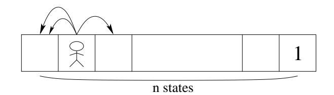
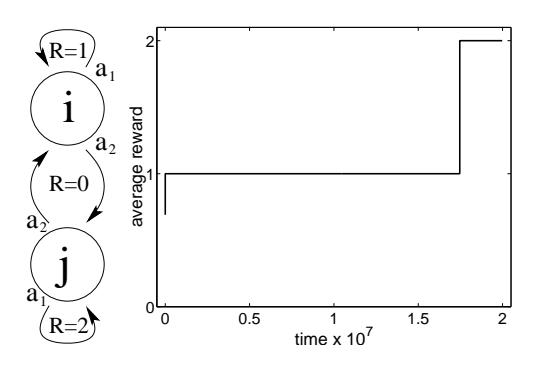
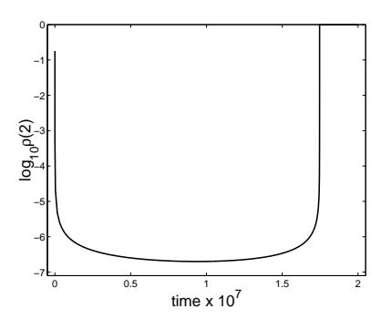

# Approximately Optimal Approximate Reinforcement Learning

Sham Kakade SHAM@GATSBY.UCL.AC.UK

Gatsby Computational Neuroscience Unit, UCL, London WC1N 3AR, UK

John Langford JCL@CS.CMU.EDU

Computer Science Department, Carnegie-Mellon University, 5000 Forbes Avenue, Pittsburgh, PA 15217

### Abstract

In order to solve realistic reinforcement learning problems, it is critical that approximate algorithms be used. In this paper, we present the conservative policy iteration algorithm which finds an "approximately" optimal policy, given access to a restart distribution (which draws the next state from a particular distribution) and an approximate greedy policy chooser. Crudely, the greedy policy chooser outputs a policy that usually chooses actions with the largest state-action values of the current policy, ie it outputs an "approximate" greedy policy. This greedy policy chooser can be implemented using standard value function approximation techniques. Under these assumptions, our algorithm: (1) is guaranteed to improve a performance metric (2) is guaranteed to terminate in a "small" number of timesteps and (3) returns an "approximately" optimal policy. The quantified statements of (2) and (3) depend on the quality of the greedy policy chooser, but not explicitly on the the size of the state space.

### 1 Introduction

The two standard approaches, greedy dynamic programming and policy gradient methods, have enjoyed many empirical successes on reinforcement learning problems. Unfortunately, both methods can fail to efficiently improve the policy. Approximate value function methods suffer from a lack of strong theoretical performance guarantees. We show how policy gradient techniques can require an unreasonably large number ,

of samples in order to determine the gradient accurately. This is due to policy gradient method's fundamental intertwining of "exploration" and "exploitation".

In this paper, we consider a setting in which our algorithm is given access to a restart distribution and an "approximate" greedy policy chooser. Informally, the restart distribution allows the agent to obtain its next state from a fixed distribution of our choosing. Through a more uniform restart distribution, the agent can gain information about states that it wouldn't necessarily visit otherwise. Also informally, the greedy policy chooser is a "black box" that outputs a policy that on average chooses actions with large advantages with respect to the current policy, ie it provides an "approximate" greedy policy. This "black box" algorithm can be implemented using one of the well-studied regression algorithms for value functions (see [9, 3]). The quality of the resulting greedy policy chooser is then related to the quality of this "black box".

Drawing upon the strengths of the standard approaches, we propose the conservative policy iteration algorithm. The key ingredients of this algorithm are: (1) the policy is improved in a more uniform manner over the state-space and (2) a more conservative policy update is performed in which the new policy is a mixture distribution of the current policy and the greedy policy. Crudely, the importance of (1) is to incorporate "exploration" and the importance of (2) is to avoid the pitfalls of greedy dynamic programming methods which can suffer from significant policy degradation by directly using "approximate" greedy policies. Our contribution is in proving that such an algorithm converges in a "small" number of steps and returns an "approximately" optimal policy, where the quantified claims do not explicitly depend on the the size of the state space. We first review the problems with standard approaches, then state our algorithm.

### 2 Preliminaries

A finite **Markov decision process** (MDP) is defined by the tuple  $(S, D, A, \mathcal{R}, \{P(s'; s, a)\})$  where: S is a finite set of states, D is the starting state distribution, A is a finite set of actions,  $\mathcal{R}$  is a reward function  $\mathcal{R}: S \times A \rightarrow [0, R]$ , and  $\{P(s'; s, a)\}$  are the transition probabilities, with P(s'; s, a) giving the next-state distribution upon taking action a in state s.

Although ultimately we desire an algorithm which uses only the given MDP M, we assume access to a restart distribution, defined as follows:

**Definition 2.1.** A  $\mu$  restart distribution draws the next state from the distribution  $\mu$ .

This restart distribution is a slightly weaker version of the generative model in [5]. As in [5], our assumption is considerably weaker than having knowledge of the full transition model. However, it is a much stronger assumption than having only "irreversible" experience, in which the agent must follow a single trajectory, with no ability to reset to obtain another trajectory from a state. If  $\mu$  is chosen to be a relatively uniform distribution (not necessarily D), then this  $\mu$  restart distribution can obviate the need for explicit exploration.

The agent's decision making procedure is characterized by a stochastic policy  $\pi(a;s)$ , which is the probability of taking action a in state s (where the semi-colon is used to distinguish the parameters from the random variables of the distribution). We only consider the case where the goal of the agent is to maximize the  $\gamma$ -discounted average reward from the starting state distribution D, though this has a similar solution to maximizing the average reward for processes that "mix" on a reasonable timescale [4]. Given  $0 \le \gamma < 1$ , we define the **value function** for a given policy  $\pi$  as

$$V_{\pi}(s) \equiv (1 - \gamma) E\left[\sum_{t=0}^{\infty} \gamma^{t} \mathcal{R}(s_{t}, a_{t}) | \pi, s\right]$$

where  $s_t$  and  $a_t$  are random variables for the state and action at time t upon executing the policy  $\pi$  from the starting state s (see [7] for a formal definition of this expectation). Note that we are using *normalized* values so  $V_{\pi}(s) \in [0, R]$ . For a given policy  $\pi$ , we define the **state-action value** as

$$Q_{\pi}(s, a) \equiv (1 - \gamma)\mathcal{R}(s, a) + \gamma E_{s' \sim P(s'; s, a)} \left[ V_{\pi}(s') \right]$$

and as in [8] (much as in [1]), we define the  ${\bf advantage}$  as

$$A_{\pi}(s, a) \equiv Q_{\pi}(s, a) - V_{\pi}(s)$$

Again, both  $Q_{\pi}(s,a) \in [0,R]$  and  $A_{\pi}(s,a) \in [-R,R]$  due to normalization.

It is convenient to define the  $\gamma$ -discounted future state distribution (as in [8]) for a starting state distribution  $\mu$  as

(2.1) 
$$d_{\pi,\mu}(s) \equiv (1 - \gamma) \sum_{t=0}^{\infty} \gamma^t \Pr(s_t = s; \pi, \mu)$$

where the  $1-\gamma$  is necessary for normalization. We abuse notation and write  $d_{\pi,s}$  for the discounted future-state distribution with respect to the distribution which deterministically starts from state s. Note that  $V_{\pi}(s) = E_{(a',s')\sim\pi d_{\pi,s}}[\mathcal{R}(s',a')]$ . This distribution is analogous to the stationary distribution in the undiscounted setting, since as  $\gamma \to 1$ ,  $d_{\pi,s}$  tends to the stationary distribution for all s, if one such exists.

The goal of the agent is to maximize the discounted reward from the start state distribution D.

$$\eta_D(\pi) \equiv E_{s \sim D} \left[ V_{\pi}(s) \right] .$$

Note that  $\eta_D(\pi) = E_{(a,s) \sim \pi d_{\pi,D}}[\mathcal{R}(s,a)]$ . A well known result is that a policy exists which simultaneously maximizes  $V_{\pi}(s)$  for all states.

### 3 The Problems with Current Methods

We now examine in more detail the problems with approximate value function methods and policy gradient methods. There are three questions to which we desire answers to:

- (1) Is there some performance measure that is guaranteed to improve at every step?
- (2) How difficult is it to verify if a particular update improves this measure?
- (3) After a reasonable number of policy updates, what performance level is obtained?

We now argue that both greedy dynamic programming and policy gradient methods give unsatisfactory answers to these questions. Note that we did not ask is "What is the quality of the asymptotic policy?". We are only interested in policies that we can find in a reasonable amount of time. Understanding the problems with these current methods gives insight into our new algorithm, which addresses these three questions.

### 3.1 Approximate Value Function Methods

Exact value function methods, such as policy iteration, typically work in an iterative manner. Given a policy  $\pi$ , policy iteration calculates the state-action value  $Q_{\pi}(s,a)$ , and then creates a new deterministic policy  $\pi'(a;s)$  such that  $\pi'(a;s)=1$  iff  $a\in \operatorname{argmax}_a Q_{\pi}(s,a)$ . This process is repeated until the state-action values converge to their optimal values. These exact value function methods have strong bounds showing how fast the values converge to optimal (see [7]).

Approximate value function methods typically use approximate estimates of the state-action values in an

exact method. These methods suffer from a paucity of theoretical results on the performance of a policy based on the approximate values. This leads to weak answers to all three questions.

Let us consider some function approximator  $\widetilde{V}(s)$  with the  $l_{\infty}$ -error:

$$\varepsilon = \max_{s} |\widetilde{V}(s) - V_{\pi}(s)|$$

where  $\pi$  is some policy. Let  $\pi'$  be a greedy policy based on this approximation. We have the following guarantee (see [3]) for all states s:

(3.1) 
$$V_{\pi'}(s) \ge V_{\pi}(s) - \frac{2\gamma\varepsilon}{1-\gamma}.$$

In other words, the performance is guaranteed to not decrease by more than  $\frac{2\gamma\varepsilon}{1-\gamma}$ . Question 2 is not applicable since these methods don't guarantee improvement and a performance measure to check isn't well defined.

For approximate methods, the time required to obtain some performance level is not well understood. Some convergence and asymptotic results exist (see [3]).

### 3.2 Policy Gradients Methods

Direct policy gradient methods attempt to find a good policy among some restricted class of policies, by following the gradient of the future reward. Given some parameterized class  $\{\pi_{\theta} | \theta \in \mathcal{R}^m\}$ , these methods compute the gradient

(3.2) 
$$\nabla \eta_D = \sum_{s,a} d_{\pi,D}(s) \nabla \pi(a;s) Q_{\pi}(s,a)$$

(as shown in [8]).

For policy gradient techniques, question 1 has the appealing answer that the performance measure of interest is guaranteed to improve under gradient ascent. We now address question 2 by examining the situations in which estimating the gradient direction is difficult. We show that the lack of exploration in gradient methods translates into requiring a large number of samples in order to accurately estimate the gradient direction.

Consider the simple MDP shown in Figure 3.1 (adapted from [10]). Under a policy that gives equal probability to all actions, the expected time to the goal from the left most state is  $3(2^n - n - 1)$ , and with n = 50, the expected time to the goal is about  $10^{15}$ . This MDP falls in the class of MDPs in which random actions are more likely than not to increase the distance to the goal state. For these classes of problems (see [11]), the expected time to reach the goal state using undirected exploration, ie random walk exploration, is exponential in the size of the state space. Thus, any "on-policy" method has to run for at least this long before any policy improvement can occur. In

Figure 3.1. Example 1: Two actions move agent to the left and one actions moves agent to the right.

Figure 3.2. Example 2: A two state MDP and the average reward vs. time (on a 107 scale) of a policy under standard gradient descent in the limit of an infinitesimally small learning rate (initial conditions stated in text).

online value function methods, this problem is seen as a lack of exploration.

Any sensible estimate of the gradient without reaching the goal state would be zero, and obtaining non-zero estimates requires exponential time with "on-policy" samples. Importance sampling methods do exist (see [6]), but are not feasible solutions for this class of problems. The reason is that if the agent could follow some "off-policy" trajectory to reach the goal state in a reasonable amount of time, the importance weights would have to be exponentially large.

Note that a zero estimate is a rather accurate estimate of the gradient in terms of magnitude, but this provides no information about direction, which is the crucial quantity of interest. The analysis in [2] suggests a relatively small sample size is needed to accurately estimate the magnitude (within some  $\varepsilon$  tolerance), though this does not imply an accurate direction if the gradient is small. Unfortunately, the magnitude of the gradient can be very small when the policy is far from optimal.

Let us give an additional example demonstrating the problems for the simple two state MDP shown in Figure 3.2, which uses the common Gibbs table-lookup distributions,  $\{\pi_{\theta} : \pi(a;s) \propto \exp(\theta_{sa})\}$ . Increasing the chance of a self-loop at i decreases the stationary probability of j, which hinders the learning at state j. Under an initial policy that has the stationary distribution  $\rho(i) = .8$  and  $\rho(j) = .2$  (using  $\pi(a_1; i) = .8$  and

Figure 3.3. The stationary probability (for figure 3.2) of state j vs. time (on a  $10^7$  scale).

 $\pi(a_1;j)=.9$ ), learning at state i reduces the learning at state j leading to an an extremely flat plateau of improvement at 1 average reward shown in Figure 3.2. Figure 3.3 shows that this problem is so severe that  $\rho(j)$  drops as low as  $10^{-7}$  from it's initial probability of .2. As in example 1, to obtain a nonzero estimate of the gradient it is necessary to visit state j. The situation could be even worse with a few extra states in a chain as in figure 3.1.

Although asymptotically a good policy might be found, these results do not bode well for the answer to question 3, which is concerned with how fast such a policy can be found. These results suggest that in any reasonable number of steps, a gradient method could end up being trapped at plateaus where estimating the gradient direction has an unreasonably large sample complexity. Answering question 3 is crucial to understand how well gradient methods perform, and (to our knowledge) no such analysis exists.

### 4 Approximately Optimal RL

The fundamental problem with policy gradients is that  $\eta_D$ , which is what we ultimately seek to optimize, is insensitive to policy improvement at unlikely states though policy improvement at these unlikely states might be necessary in order for the agent to achieve near optimal payoff. We desire an alternative performance measure that does not down weight advantages at unlikely states or unlikely actions. A natural candidate for a performance measure is to weight the improvement from all states more uniformly (rather than by D), such as

$$\eta_{\mu}(\pi) \equiv E_{s \sim \mu} \left[ V_{\pi}(s) \right]$$

where  $\mu$  is some "exploratory" restart distribution. Under our assumption of having access to a  $\mu$ -restart distribution, we can obtain estimates of  $\eta_{\mu}(\pi)$ .

Any optimal policy simultaneously maximizes both  $\eta_{\mu}$  and  $\eta_{D}$ . Unfortunately, the policy that maximizes  $\eta_{\mu}$  within some restricted class of policies may have poor

performance according to  $\eta_D$ , so we must ensure that maximizing  $\eta_u$  results in a good policy under  $\eta_D$ .

Greedy policy iteration updates the policy to some  $\pi'$  based on some approximate state-action values. Instead, let us consider the following more conservative update rule:

(4.1) 
$$\pi_{\text{new}}(a;s) = (1-\alpha)\pi(a;s) + \alpha\pi'(a;s)$$
,

for some  $\pi'$  and  $\alpha \in [0,1]$ . To guarantee improvement with  $\alpha = 1$ ,  $\pi'$  must choose a better action at every state, or else we could suffer the penalty shown in equation 3.1.

In the remainder of this section, we describe a more conservative policy iteration scheme using  $\alpha < 1$  and state the main theorems of this paper. In subsection 4.1, we show that  $\eta_{\mu}$  can improve under the much less stringent condition in which  $\pi'$  often, but not always, chooses greedy actions. In subsection 4.2, we assume access to a greedy policy chooser that outputs "approximately" greedy policies  $\pi'$  and then bound the performance of the policy found by our algorithm in terms of the quality of this greedy policy chooser.

### 4.1 Policy Improvement

A more reasonable situation is one in which we are able to improve the policy with some  $\alpha > 0$  using a  $\pi'$  that chooses better actions at most but not all states. Let us define the **policy advantage**  $\mathbb{A}_{\pi,\mu}(\pi')$  of some policy  $\pi'$  with respect to a policy  $\pi$  and a distribution  $\mu$  to be

$$\mathbb{A}_{\pi,\mu}\left(\pi'\right) \equiv E_{s \sim d_{\pi,\mu}} \left[ E_{a \sim \pi'(a;s)} \left[ A_{\pi}(s,a) \right] \right] .$$

The policy advantage measures the degree to which  $\pi'$  is choosing actions with large advantages, with respect to the set of states visited under  $\pi$  starting from a state  $s \sim \mu$ . Note that a policy found by one step of policy improvement maximizes the policy advantage.

It is straightforward to show that  $\frac{\partial \eta_{\mu}}{\partial \alpha}|_{\alpha=0} = \frac{1}{1-\gamma} \mathbb{A}_{\pi,\mu}$  (using equation 3.2), so the change in  $\eta_{\mu}$  is:

(4.2) 
$$\Delta \eta_{\mu} = \frac{\alpha}{1 - \gamma} \mathbb{A}_{\pi,\mu}(\pi') + O(\alpha^2).$$

Hence, for sufficiently small  $\alpha$ , policy improvement occurs if the policy advantage is *positive*, and at the other extreme of  $\alpha=1$ , significant degradation could occur. We now connect these two regimes to determine how much policy improvement is possible.

**Theorem 4.1.** Let  $\mathbb{A}$  be the policy advantage of  $\pi'$  with respect to  $\pi$  and  $\mu$ . and let  $\varepsilon = \max_{s} |E_{a \sim \pi'(a;s)}[A_{\pi}(s,a)]|$ . For the update rule 4.1 and for all  $\alpha \in [0,1]$ :

$$\eta_{\mu}(\pi_{new}) - \eta_{\mu}(\pi) \ge \frac{\alpha}{1 - \gamma} (\mathbb{A} - \frac{2\alpha\gamma\varepsilon}{1 - \gamma(1 - \alpha)}).$$

The proof of this theorem is given in the appendix. It is possible to construct a two state example showing this bound is tight for all  $\alpha$  though we do not provide this example here.

The first term is analogous to the first order increase specified in equation 4.2, and the second term is a penalty term. Note that if  $\alpha = 1$ , the bound reduces to

$$\eta_{\mu}(\pi_{\text{new}}) - \eta_{\mu}(\pi) \ge \frac{\mathbb{A}}{1 - \gamma} - \frac{2\gamma\varepsilon}{1 - \gamma}$$

and the penalty term has the same form as that of greedy dynamic programming, where  $\varepsilon$ , as defined here, is analogous to the  $l_{\infty}$  error in equation 3.1.

The following corollary shows that the greater the policy advantage the greater the guaranteed performance increase.

**Corollary 4.2.** Let R be the maximal possible reward and  $\mathbb{A}$  be the policy advantage of  $\pi'$  with respect to  $\pi$  and  $\mu$ . If  $\mathbb{A} \geq 0$ , then using  $\alpha = \frac{(1-\gamma)\mathbb{A}}{4R}$  guarantees the following policy improvement:

$$\eta_{\mu}(\pi_{new}) - \eta_{\mu}(\pi) \ge \frac{\mathbb{A}^2}{8R}.$$

*Proof.* Using the previous theorem, it is straightforward to show the change is bounded by  $\frac{\alpha}{1-\gamma}(\mathbb{A}-\alpha\frac{2R}{1-\gamma})$ . The corollary follows by choosing the  $\alpha$  that maximizes this bound.

### 4.2 Answering question 3

We address question 3 by first addressing how fast we converge to some policy then bounding the quality of this policy. Naively, we expect our ability to obtain policies with large advantages to affect the speed of improvement and the quality of the final policy. Instead of explicitly suggesting algorithms that find policies with large policy advantages, we assume access to an  $\varepsilon$ -greedy policy chooser that solves this problem. Let us call this  $\varepsilon$ -good algorithm  $G_{\varepsilon}(\pi, \mu)$ , which is defined as:

**Definition 4.3.** An ε-greedy policy chooser,  $G_{\varepsilon}(\pi,\mu)$ , is a function of a policy  $\pi$  and a state distribution  $\mu$  which returns a policy  $\pi'$  such that  $\mathbb{A}_{\pi,\mu}(\pi') \geq \text{OPT}(\mathbb{A}_{\pi,\mu}) - \varepsilon$ , where  $\text{OPT}(\mathbb{A}_{\pi,\mu}) \equiv \max_{\pi'} \mathbb{A}_{\pi,\mu}(\pi')$ .

In the discussion, we show that a regression algorithm that fits the advantages with an  $\frac{\varepsilon}{2}$  average error is sufficient to construct such a  $G_{\varepsilon}$ .

The "breaking point" at which policy improvement is no longer guaranteed occurs when the greedy policy chooser is no longer guaranteed to return a policy with a positive policy advantage, ie when  $OPT(\mathbb{A}_{\pi,\mu}) < \varepsilon$ . A crude outline of the **Conservative Policy Iteration** algorithm is:

- (1) Call  $G_{\varepsilon}(\pi, \mu)$  to obtain some  $\pi'$
- (2) Estimate the policy advantage  $\mathbb{A}_{\pi,\mu}(\pi')$
- (3) If the policy advantage is small (less than  $\varepsilon$ ), STOP and return  $\pi$ .
- (4) Else, update the policy and go to (1).

where, for simplicity, we assume  $\varepsilon$  is known. This algorithm ceases when an  $\varepsilon$  small policy advantage (with respect to  $\pi$ ) is obtained. By definition of the greedy policy chooser, it follows that the optimal policy advantage of  $\pi$  is less than  $2\varepsilon$ . The full algorithm is specified in the next section. The following theorem shows that in polynomial time, the full algorithm finds a policy  $\pi$  that is close to the "break point" of the greedy policy chooser.

**Theorem 4.4.** With probability at least  $1-\delta$ , conservative policy iteration: i) improves  $\eta_{\mu}$  with every policy update, ii) ceases in at most  $72\frac{R^2}{\varepsilon^2}$  calls to  $G_{\varepsilon}(\pi,\mu)$ , and iii) returns a policy  $\pi$  such that  $OPT(\mathbb{A}_{\pi,\mu}) < 2\varepsilon$ .

The proof is in the appendix.

To complete the answer to question 3, we need to address the quality of the policy found by this algorithm. Note that the bound on the time until our algorithm ceases does not depend on the restart distribution  $\mu$  though the performance of the policy  $\pi$  that we find does depend on  $\mu$  since  $\mathrm{OPT}(\mathbb{A}_{\pi,\mu}) < 2\varepsilon$ . Crudely, for a policy to have near optimal performance then all advantages must be small. Unfortunately, if  $d_{\pi,\mu}$  is highly non-uniform, then a small optimal policy advantage does not necessarily imply that all advantages are small. The following corollary (of theorem 6.2) bounds the performance of interest,  $\eta_D$ , for the policy found by the algorithm. We use the standard definition of the  $l_{\infty}$ -norm,  $||f||_{\infty} \equiv \max_s f(s)$ .

**Corollary 4.5.** Assume that for some policy  $\pi$ ,  $OPT(\mathbb{A}_{\pi,\mu}) < \varepsilon$ . Let  $\pi^*$  be an optimal policy. Then

$$\eta_D(\pi^*) - \eta_D(\pi) \le \frac{\varepsilon}{(1 - \gamma)} \left\| \frac{d_{\pi^*, D}}{d_{\pi, \mu}} \right\|_{\infty}$$
$$\le \frac{\varepsilon}{(1 - \gamma)^2} \left\| \frac{d_{\pi^*, D}}{\mu} \right\|_{\infty}.$$

The factor of  $\left\|\frac{d_{\pi^*,D}}{d_{\pi,\mu}}\right\|_{\infty}$  represents a mismatch between the distribution of states of the current policy and that of the optimal policy and elucidates the problem of using the given start-state distribution D instead of a more uniform distribution. Essentially, a more uniform  $d_{\pi,\mu}$  ensures that the advantages are small at states that an optimal policy visits (determined by  $d_{\pi^*,D}$ ). The second inequality follows since  $d_{\pi,\mu}(s) \geq (1-\gamma)\mu(s)$ , and it shows that a uniform measure prevents this mismatch from becoming arbitrarily large.

We now discuss and prove these theorems.

# 5 Conservative Policy Iteration

For simplicity, we assume knowledge of  $\varepsilon$ . The conservative policy iteration algorithm is:

- (1) Call  $G_{\varepsilon}(\pi,\mu)$  to obtain some  $\pi'$
- (2) Use  $O(\frac{R^2}{\varepsilon^2} \log \frac{R^2}{\delta \varepsilon^2})$   $\mu$ -restarts to obtain an  $\frac{\varepsilon}{3}$ -accurate estimate  $\hat{\mathbb{A}}$  of  $\mathbb{A}_{\pi,\mu}(\pi')$ .
- (3) If  $\hat{\mathbb{A}} < \frac{2\varepsilon}{3}$ , STOP and return  $\pi$ .
- (4) If  $\hat{\mathbb{A}} \geq \frac{2\varepsilon}{3}$ , then update policy  $\pi$  according to equation 4.1 using  $\frac{(1-\gamma)(\hat{\mathbb{A}}-\frac{\varepsilon}{3})}{4R}$  and return to step 1.

where  $\delta$  is the failure probability of the algorithm. Note that the estimation procedure of step (2) allows us to set the learning rate  $\alpha$ .

now procedure We specify  $_{
m the}$ estimation of step (2) to obtain  $\frac{\varepsilon}{3}$ -accurate estimates of  $\mathbb{A}_{\pi}(\pi')$ . It is straightforward to show that the policy advantage can be written as  $\mathbb{A}_{\pi,\mu}(\pi') = E_{s \sim d_{\pi,\mu}} \left[ \sum_{a} (\pi'(a;s) - \pi(a;s)) Q_{\pi}(s,a) \right].$ We can obtain a nearly unbiased estimate  $x_i$  of  $\mathbb{A}_{\pi,\mu}(\pi')$  using one call to the  $\mu$ -restart distribution (see definition 2.1). To obtain a sample s from from  $d_{\pi,\mu}$ , we obtain a trajectory from  $s_0 \sim \mu$  and accept the current state  $s_{\tau}$  with probability  $(1 - \gamma)$  (see equation 2.1). Then we chose an action a from the uniform distribution, and continue the trajectory from s to obtain a nearly unbiased estimate  $Q_{\pi}(s,a)$ of  $Q_{\pi}(s,a)$ . Using importance sampling, the nearly unbiased estimate of the policy advantage from the *i*-th sample is  $x_i = n_a \hat{Q}_i(s, a) (\pi'(a; s) - \pi(a; s))$  where  $n_a$  is the number of actions. We assume that each trajectory is run sufficiently long such that the bias in  $x_i$  is less than  $\frac{\varepsilon}{a}$ .

Since  $\hat{Q}_i \in [0, R]$ , our samples satisfy  $x_i \in [-n_a R, n_a R]$ . Using Hoeffding's inequality for k independent, identically distributed random variables, we have:

(5.1) 
$$\Pr\left(|\mathbb{A} - \hat{\mathbb{A}}| > \Delta\right) \le 2e^{-\frac{k\Delta^2}{2n_a^2R^2}},$$

where  $\hat{\mathbb{A}} = \frac{1}{k} \sum_{i=1}^{k} x_i$  (and  $\mathbb{A}$  here is  $\frac{\varepsilon}{6}$  biased). Hence, the number of trajectories required to obtain a  $\Delta$  accurate sample with a fixed error rate is  $O\left(\frac{n_a^2 R^2}{\Delta^2}\right)$ .

The proof of theorem 4.4, which guarantees the soundness of conservative policy iteration, is straightforward and in the appendix.

## 6 How Good is The Policy Found?

Recall that the bound on the speed with which our algorithm ceases does not depend on the restart distribution used. In contrast, we now show that the

quality of the resulting policy could strongly depend on this distribution.

The following lemma is useful:

**Lemma 6.1.** For any policies  $\tilde{\pi}$  and  $\pi$  and any starting state distribution  $\mu$ ,

$$\eta_{\mu}(\tilde{\pi}) - \eta_{\mu}(\pi) = \frac{1}{1 - \gamma} E_{(a,s) \sim \tilde{\pi} d_{\tilde{\pi},\mu}} [A_{\pi}(s,a)]$$

*Proof.* Let  $P_t(s') \equiv P(s_t = s'; \tilde{\pi}, s_0 = s)$ . By definition of  $V_{\tilde{\pi}}(s)$ ,

$$\begin{split} &V_{\tilde{\pi}}(s) \\ &= (1-\gamma) \sum_{t=0}^{\infty} \gamma^t E_{(a_t,s_t) \sim \tilde{\pi}P_t} \left[ \mathcal{R}(s_t,a_t) \right] \\ &= \sum_{t=0}^{\infty} \gamma^t E_{(a_t,s_t) \sim \tilde{\pi}P_t} \left[ (1-\gamma) \mathcal{R}(s_t,a_t) \right. \\ &\left. + V_{\pi}(s_t) - V_{\pi}(s_t) \right] \\ &= \sum_{t=0}^{\infty} \gamma^t E_{(a_t,s_t,s_{t+1}) \sim \tilde{\pi}P_t P(s_{t+1};s_t,a_t)} \left[ (1-\gamma) \mathcal{R}(s_t,a_t) \right. \\ &\left. + \gamma V_{\pi}(s_{t+1}) - V_{\pi}(s_t) \right] + V_{\pi}(s) \\ &= V_{\pi}(s) + \sum_{t=0}^{\infty} \gamma^t E_{(a_t,s_t) \sim \tilde{\pi}P_t} \left[ A_{\pi}(s_t,a_t) \right] \\ &= V_{\pi}(s) + \frac{1}{1-\gamma} E_{(a,s') \sim \tilde{\pi}d_{\tilde{\pi},s}} \left[ A_{\pi}(s',a) \right] \end{split}$$

and the result follows by taking the expectation of this equation with respect to  $\mu$ .

This lemma elucidates a fundamental measure mismatch. The performance measure of interest,  $\eta_D(\pi)$  changes in proportion the policy advantage  $\mathbb{A}_{\pi,D}(\pi')$  for small  $\alpha$  (see equation 4.2), which is the average advantage under the state distribution  $d_{\pi,D}$ . However, for an optimal policy  $\pi^*$ , the difference between  $\eta_D(\pi^*)$  and  $\eta_D(\pi)$  is proportional to the average advantage under the state distribution  $d_{\pi^*,D}$ . Thus, even if the optimal policy advantage is small with respect to  $\pi$  and D, the advantages may not be small under  $d_{\pi^*,D}$ . This motivates the use of the more uniform distribution  $\mu$ .

After termination, our algorithm returns a policy  $\pi$  which has small policy advantage with respect to  $\mu$ . We now quantify how far from optimal  $\pi$  is, with respect to an arbitrary measure  $\tilde{\mu}$ .

**Theorem 6.2.** Assume that for a policy  $\pi$ ,  $OPT(\mathbb{A}_{\pi,\mu}) < \varepsilon$ . Let  $\pi^*$  be an optimal policy. Then for any state distribution  $\tilde{\mu}$ ,

$$\eta_{\tilde{\mu}}(\pi^*) - \eta_{\tilde{\mu}}(\pi) \le \frac{\varepsilon}{(1 - \gamma)} \left\| \frac{d_{\pi^*, \tilde{\mu}}}{d_{\pi, \mu}} \right\|_{\infty}$$
$$\le \frac{\varepsilon}{(1 - \gamma)^2} \left\| \frac{d_{\pi^*, \tilde{\mu}}}{\mu} \right\|_{\infty}.$$

*Proof.* The optimal policy advantage is  $OPT(\mathbb{A}_{\pi,\mu}) = \sum_{s} d_{\pi,\mu}(s) \max_{a} A_{\pi}(s,a)$ . Therefore,

$$\varepsilon > \sum_{s} \frac{d_{\pi,\mu}(s)}{d_{\pi^{*},\tilde{\mu}}(s)} d_{\pi^{*},\tilde{\mu}}(s) \max_{a} A_{\pi}(s,a)$$

$$\geq \min_{s} \left( \frac{d_{\pi,\mu}(s)}{d_{\pi^{*},\tilde{\mu}}(s)} \right) \sum_{s} d_{\pi^{*},\tilde{\mu}}(s) \max_{a} A_{\pi}(s,a)$$

$$\geq \left\| \frac{d_{\pi^{*},\tilde{\mu}}}{d_{\pi,\mu}} \right\|_{\infty}^{-1} \sum_{s,a} d_{\pi^{*},\tilde{\mu}}(s) \pi^{*}(a;s) A_{\pi}(s,a)$$

$$= (1 - \gamma) \left\| \frac{d_{\pi^{*},\tilde{\mu}}}{d_{\pi,\mu}} \right\|_{\infty}^{-1} (\eta_{\tilde{\mu}}(\pi^{*}) - \eta_{\tilde{\mu}}(\pi))$$

where the last step follows from lemma 6.1. The second inequality is due to  $d_{\pi,\mu}(s) \leq (1-\gamma)\mu(s)$ .

Note that  $\left\|\frac{d_{\pi^*,\bar{\mu}}}{\mu}\right\|_{\infty}$  is a measure of the mismatch in using  $\mu$  rather than the future-state distribution of an optimal policy. The interpretation of each factor of  $\frac{1}{1-\gamma}$  is important. In particular, one factor of  $\frac{1}{1-\gamma}$  is due to the fact that difference between the performance of  $\pi$  and optimal is  $\frac{1}{1-\gamma}$  times the average advantage under  $d_{\pi^*,\bar{\mu}}(s)$  (see lemma 6.1) and another factor of  $\frac{1}{1-\gamma}$  is due to the inherent non-uniformity of  $d_{\pi,\mu}$  (since  $d_{\pi,\mu}(s) \leq (1-\gamma)\mu(s)$ ).

### 7 Discussion

We have provided an algorithm that finds an "approximately" optimal solution that is polynomial in the approximation parameter  $\varepsilon$ , but not in the size of the state space. We discuss a few related points.

### 7.1 The Greedy Policy Chooser

The ability to find a policy with a large policy advantage can be stated as a regression problem though we don't address the sample complexity of this problem. Let us consider the error given by:

$$E_{s \sim d_{\pi,\mu}} \max_{a} |A_{\pi}(s,a) - f_{\pi}(s,a)|.$$

This loss is an average loss over the state space (though it is an  $\infty$ -loss over actions). It is straightforward to see that if we can keep this error below  $\frac{\varepsilon}{2}$ , then we can construct an  $\varepsilon$ -greedy policy chooser by choosing a greedy policy based on these approximation  $f_{\pi}$ . This  $l_1$  condition for the regression problem is a much weaker constraint than minimizing an  $l_{\infty}$ -error over the state-space, which is is the relevant error for greedy dynamic programming (see equation 3.1 and [3]).

Direct policy search methods could also be used to implement this greedy policy chooser.

### 7.2 What about improving $\eta_D$ ?

Even though we ultimately seek to have good performance measure under  $\eta_D$ , we show that it is important to improve the policy under a somewhat uniform measure. An important question is "Can we improve the policy according to both  $\eta_D$  and  $\eta_\mu$  at each update?" In general the answer is "no", but consider improving the performance under  $\tilde{\mu} = (1 - \beta)\mu + \beta D$  instead of just  $\mu$ . This metric only slightly changes the quality of the asymptotic policy. However by giving weight to D. the possibility of improving  $\eta_D$  is allowed if the optimal policy has large advantages under D, though we do not formalize this here. The only situation where joint improvement with  $\eta_D$  is not possible is when  $OPT(\mathbb{A}_{\pi,D})$ is small. However, this is the problematic case where, under D, the large advantages are not at states visited frequently.

### 7.3 Implications of the mismatch

The bounds we have presented directly show the importance of ensuring the agent starts in states where the optimal policy tends to visit. It also suggests that certain optimal policies are easier to learn in large state spaces — namely those optimal policies which tend to visit a significant fraction of the state space. An interesting suggestion for how to choose  $\mu$ , is to use prior knowledge of which states an optimal policy tends to visit.

### Acknowledgments

We give warm thanks to Peter Dayan for numerous critical comments.

### References

- L. C. Baird. Advantage updating. Technical report, Wright Laboratory, 1993.
- [2] P. Bartlett and J. Baxter. Estimation and approximation bounds for gradient-based reinforcement learning. Technical report, Australian National University, 2000.
- [3] D. P. Bertsekas and J. N. Tsitsiklis. Neuro-Dynamic Programming. Athena Scientific, 1996.
- [4] S. Kakade. Optimizing average reward using discounted rewards. In Proc. of Computational Learning Theory, 2001.
- [5] M. Kearns, Y. Mansour, and A. Y. Ng. A sparse sampling algorithm for near-optimal planning in large markov decision processes. *IJCAI*, pages 1324–1231, 1999.
- [6] N. Meuleau, L. Peshkin, and K. Kim. Exploration in gradient-based reinforcement learning. Technical report, Massachusetts Institute of Technology, 2001.
- [7] M. Puterman. Markov decision processes: Discrete stochastic dynamic programming. John Wiley and Sons, 1994.
- [8] R. Sutton, D. McAllester, S. Singh, and Y. Mansour. Policy gradient methods for reinforcement learning

with function approximation. Neural Information Processing Systems, 13, 2000.

[9] R. S. Sutton and A. G. Barto. Reinforcement Learning: An Introduction. MIT Press, 1998.

[10] S. B. Thrun. Efficient exploration in reinforcement learning. Technical report, Carnegie Mellon University, 1992.

[11] S. D. Whitehead. Complexity and cooperation in q-learning. Proc. 8th International Conf. on Machine Learning, pages 363-367, 1991.

# 8 Appendix: Proofs

The intuition for the proof of theorem 4.1 is that  $\alpha$  determines the probability of choosing an action from  $\pi'$ . If the current state distribution is  $d_{\pi,\mu}$  when an action from  $\pi'$  is chosen, then the performance improvement is proportional to the policy advantage. The proof involves bounding the performance decrease due to the state distribution not being exactly  $d_{\pi,\mu}$ , when an action from  $\pi'$  is chosen.

*Proof.* Throughout the proof, the  $\mu$  dependence is not explicitly stated. For any state s,

$$\sum_{a} \pi_{\text{new}}(s; a) A_{\pi}(s, a)$$

$$= \sum_{a} ((1 - \alpha)\pi(a; s) + \alpha \pi'(a; s)) A_{\pi}(s, a)$$

$$= \alpha \sum_{a} \pi'(a; s) A_{\pi}(s, a).$$

where we have used  $\sum_{a} \pi(a;s) A_{\pi}(s,a) = 0$ .

For any timestep, the probability that we choose an action according to  $\pi'$  is  $\alpha$ . Let  $c_t$  be the random variable indicating the number of actions chosen from  $\pi'$  before time t. Hence,  $\Pr(c_t = 0) = (1 - \alpha)^t$ . Defining  $\rho_t \equiv \Pr(c_t \geq 1) = 1 - (1 - \alpha)^t$  and  $P(s_t; \pi)$  to be distribution over states at time t while following  $\pi$  starting from  $s \sim \mu$ , it follows that

$$E_{s \sim P(s_t; \pi_{\text{new}})} \left[ \sum_{a} \pi_{\text{new}}(a; s) A_{\pi}(s, a) \right]$$

$$= \alpha E_{s \sim P(s_t; \pi_{\text{new}})} \left[ \sum_{a} \pi'(a; s) A_{\pi}(s, a) \right]$$

$$= \alpha (1 - \rho_t) E_{s \sim P(s_t | c_t = 0; \pi_{\text{new}})} \left[ \sum_{a} \pi'(a; s) A_{\pi}(s, a) \right]$$

$$+ \alpha \rho_t E_{s \sim P(s_t | c_t \ge 1; \pi_{\text{new}})} \left[ \sum_{a} \pi'(a; s) A_{\pi}(s, a) \right]$$

$$\geq \alpha E_{s \sim P(s_t | c_t = 0; \pi_{\text{new}})} \left[ \sum_{a} \pi'(a; s) A_{\pi}(s, a) \right]$$

$$-2\alpha \rho_t \varepsilon$$

$$= \alpha E_{s \sim P(s_t; \pi)} \left[ \sum_{a} \pi'(a; s) A_{\pi}(s, a) \right] - 2\alpha \rho_t \varepsilon$$

where we have used the definition of  $\varepsilon$  and  $P(s_t|c_t = 0; \pi_{\text{new}}) = P(s_t; \pi)$ .

By substitution and lemma 6.1, we have:

$$\begin{split} & \eta_{\mu}(\pi_{\text{new}}) - \eta_{\mu}(\pi) \\ &= \sum_{t=0}^{\infty} \gamma^{t} E_{s \sim P(s_{t}; \pi_{\text{new}})} \left[ \sum_{a} \pi_{\text{new}}(a; s) A_{\pi}(s, a) \right] \\ &\geq & \alpha \sum_{t=0}^{\infty} \gamma^{t} E_{s \sim P(s_{t}; \pi)} \left[ \sum_{a} \pi'(a; s) A_{\pi}(s, a) \right] \\ & - 2\alpha \varepsilon \sum_{t=0}^{\infty} \gamma^{t} (1 - (1 - \alpha)^{t}) \\ &= & \frac{\alpha}{1 - \gamma} E_{s \sim d_{\pi}} \left[ \sum_{a} \pi'(a; s) A_{\pi}(s_{t}, a) \right] \\ & - 2\alpha \varepsilon \left( \frac{1}{1 - \gamma} - \frac{1}{1 - \gamma(1 - \alpha)} \right). \end{split}$$

The result follows from simple algebra.

The proof of theorem 4.4 follows.

Proof. During step (2), we need enough samples such that  $|\mathbb{A} - \hat{\mathbb{A}}| < \frac{\varepsilon}{3}$  for every loop of the algorithm and, as proved below, we need to consider at most  $\frac{72R^2}{\varepsilon^2}$  loops. If we demand that the probability of failure is less than  $\delta$ , then by the union bound and inequality 5.1, we have for k trajectories  $P(\text{failure}) < \frac{72R^2}{\varepsilon^2} 2e^{-\frac{k\varepsilon^2}{36n^2R^2}} < \delta$ , where we have taken  $\Delta = \frac{\varepsilon}{6}$  since the bias in our estimates is at most  $\frac{\varepsilon}{6}$ . Thus, we require  $O\left(\frac{R^2}{\varepsilon^2}\log\frac{R^2}{\delta\varepsilon^2}\right)$  trajectories.

Thus, if  $\hat{\mathbb{A}} \geq \frac{2\varepsilon}{3}$ , then  $\mathbb{A} \geq \frac{\varepsilon}{3} > 0$ . By corollary 4.2, step 4 guarantees improvement of  $\eta_{\mu}$  by at least  $\frac{(\hat{\mathbb{A}} - \frac{\varepsilon}{3})^2}{8R} \geq \frac{\varepsilon^2}{72R}$  using  $\alpha = \frac{(1-\gamma)(\hat{\mathbb{A}} - \frac{\varepsilon}{3})}{4R}$ , which proves i. Since  $0 \leq \eta_{\mu} \leq R$ , there are at most  $\frac{72R^2}{\varepsilon^2}$  steps before  $\eta_{\mu}$  becomes larger than R, so the algorithm must cease in this time, which proves ii. In order to cease and return  $\pi$ , on the penultimate loop, the  $G_{\varepsilon}$  must have returned some  $\pi'$  such that  $\hat{\mathbb{A}} < \frac{2\varepsilon}{3}$ , which implies  $\mathbb{A}_{\pi}(\pi') < \varepsilon$ . By definition of  $G_{\varepsilon}$ , it follows that  $\mathrm{OPT}(\mathbb{A}_{\pi}) < 2\varepsilon$ , which proves iii.