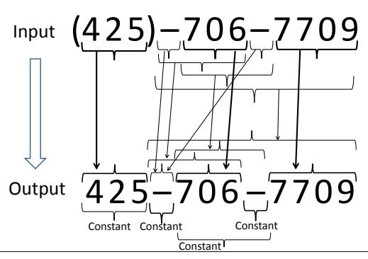

# **Automating String Processing in Spreadsheets Using Input-Output Examples**

# Sumit Gulwani

Microsoft Research, Redmond, WA, USA sumitg@microsoft.com

#### **Abstract**

We describe the design of a string programming/expression language that supports restricted forms of regular expressions, conditionals and loops. The language is expressive enough to represent a wide variety of string manipulation tasks that end-users struggle with. We describe an algorithm based on several novel concepts for synthesizing a desired program in this language from input-output examples. The synthesis algorithm is very efficient taking a fraction of a second for various benchmark examples. The synthesis algorithm is interactive and has several desirable features: it can rank multiple solutions and has fast convergence, it can detect noise in the user input, and it supports an active interaction model wherein the user is prompted to provide outputs on inputs that may have multiple computational interpretations.

The algorithm has been implemented as an interactive add-in for Microsoft Excel spreadsheet system. The prototype tool has met the golden test - it has synthesized part of itself, and has been used to solve problems beyond author's imagination.

Categories and Subject Descriptors D.1.2 [Programming Techniques]: Automatic Programming; I.2.2 [Artificial Intelligence]: Program Synthesis

General Terms Algorithms, Human Factors

**Keywords** Program Synthesis, User Intent, Programming by Example (PBE), Version Space Algebra, Spreadsheet Programming, String Manipulation

# 1. Introduction

More than 500 million people worldwide use spreadsheets. These business *end-users* have myriad diverse backgrounds and include commodity traders, graphic designers, chemists, human resource managers, finance pros, marketing managers, underwriters, compliance officers, and even mailroom clerks – they are not professional programmers, but they need to create small, *often one-off*, applications to support business functions [5].

Unfortunately, the state of art in spreadsheet programming is far from satisfactory. Spreadsheet systems come with tons of features, but end-users struggle to find the correct feature or succession of commands to use from a maze of features to accomplish

Permission to make digital or hard copies of all or part of this work for personal or classroom use is granted without fee provided that copies are not made or distributed for profit or commercial advantage and that copies bear this notice and the full citation on the first page. To copy otherwise, to republish, to post on servers or to redistribute to lists, requires prior specific permission and/or a fee. This paper is a minor revision of the paper of the same name published in:

PoPL'11, January 26–28, 2011, Austin, Texas, USA. Copyright © 2011 ACM 978-1-4503-0490-0/11/01...\$10.00 their task [9]. More significantly, programming is still required to perform tedious and repetitive tasks such as transforming entities like names/phone-numbers/dates from one format to another, data cleansing, extracting data from several text files or web pages into a single document, etc. Spreadsheet systems like Microsoft Excel allow users to write macros using a rich inbuilt library of string and numerical functions, or to write arbitrary scripts using a variety of programming languages like Visual Basic, or .Net. Since end-users are not proficient in programming, they find it too difficult to write desired macros or scripts.

We have performed an extensive case study of spreadsheet help forums and identified that string processing is one of the most common class of programming problems that end-users struggle with. This is not surprising given that languages like Perl, Awk, Python came into existence to support string/text processing, and that new languages like Java/C# provide a rich support for string processing. During our study of help forums, we also carefully studied how these users were describing the specification of the desired program to the experts on the other side of the help forums. It turns out that the most common form of specification was input-output examples. Since input-output examples may lead to underspecification, the interaction between the user and the expert often involved a few rounds of communication (over multiple days).

We describe a program synthesis system that is capable of synthesizing a wide range of string processing programs in spreadsheets from input-output examples. The synthesizer aims to replace the role of the forum expert, which not only removes a human from the loop, but also enables users to solve their problems in a few seconds as opposed to a few days. Our synthesis system, which is deployment ready, has the following important usability properties.

- Fully Automated: We do not require non-sophisticated endusers to provide annotations/hints of any form.
- Real Time: Our system takes less than 0.1 second on average per interactive round.
- Easy Interaction: Programming by examples is an interactive process where examples are added in each round to make the specification more precise. Our system helps identify the inputs for which the user should provide examples.
- Fast Convergence: Our system typically takes 1-4 rounds of iteration for convergence in practice.
- Noise Handling: If the user makes a small mistake in mostly correct specification, our system can still compute the likely solution and report the likely mistake.

This paper makes the following contributions.

 We describe a string programming/expression language that is expressive enough to represent a wide variety of string manipulation tasks found during an extensive study of Excel online help

- forums, while at the same time also being restrictive enough to enable efficient program search over that space (Section 3).
- 2. We describe an algorithm with several novel concepts that can efficiently synthesize a set of programs in our language that are consistent with a given set of input-output examples (Section 4).
- 3. We describe extensions to the above algorithm that enable several usability properties (Section 5).
- 4. We discuss our experience with a ready-to-be-deployed prototype tool (Section 6).

## 2. Problem Definition

We start out by describing a representative case-study, picked up from an online Excel help forum, that illustrates a typical interaction between a user and an expert on help forums. We then use it to motivate the key technical problem that we address in this paper.

EXAMPLE 1. The user intends to extract the following bold substrings from the respective strings:

- 1. John DOE 3 Data [TS]865-000-0000 - 453442-00 06-23-2009
- 2. A FF MARILYN 30'S **865-000-0030** 4535871-00 07-07-2009
- 3. A GEDA-MARY 100MG 865-001-0020 - 5941-00 06-23-2009

The user initially provides a few examples to the expert that are similar to the first example above. The expert provides a program  $P_1$  that uses the logic of extracting 12 characters after the first occurrence of "]". The user runs program  $P_1$  on other inputs in her spreadsheet and observes that it does not perform the desired extraction for the second example above and then presents that to the expert. The expert then provides a program  $P_2$  that uses the logic of finding the first occurrence of "-" and extracting 3 characters on left of it and 8 characters on right of it. The user runs program  $P_2$  on her spreadsheet and observes that it does not perform the desired extraction for the third example above and then presents that to the expert. The expert then provides a program  $P_3$ that uses the logic of finding the first occurrence of a pattern of the form "???-???-???", where ? is supposed to match any character. The user runs program  $P_3$  on her spreadsheet and is satisfied with the produced results, and the thread is closed.

One might wonder why did the expert not suggest a program  $P_4$  which is similar to  $P_3$ , but ? is supposed to match any digit as opposed to any character. Or why did the expert not suggest a program  $P_5$  which is similar to  $P_3$ , but the first three occurrences of ? are forced to match only 865. Even though programs  $P_3$ ,  $P_4$  and  $P_5$  are semantically different, these programs may not yield different outputs on the inputs the user has in her spreadsheet. Hence these programs are observationally equivalent over the format of the inputs present in the spreadsheet.

We draw the following conclusions from this representative case study. First, the user is communicating her intent using input-output examples. Second, the user cannot be expected to provide representative inputs in the first round. Hence, an example based synthesis system must be interactive. However, in order to remain usable, the system should allow the user to interact easily and converge quickly (i.e., in a few rounds) to the desired intent [10]. In this paper, we describe such a program synthesis system. We present an algorithm for synthesizing string manipulation programs that are consistent with input-output examples. We also describe how the algorithm can be extended to enable easy interaction and fast convergence.

# 3. Expression Language for String Manipulation

We have identified a string expression language that is expressive enough to describe various string manipulation tasks succinctly, while at the same time concise enough to be amenable for efficient learning. There is a tradeoff between the expressiveness of a search space, and the complexity of finding simple consistent hypotheses within that space [6, 18]. In general, the more expressive a search space, the harder the task of finding consistent hypotheses within that search space. However, it is also worth-mentioning that the expressiveness-complexity tradeoff is not as simple as it seems, as an expressive language can sometimes make a simple theory fit the data, whereas restricting the expressiveness of the language means that any consistent theory must be very complex. Our string expression language seems to enjoy the right tradeoff. We present a core version of this language; extensions that enable easy adaptation of the underlying algorithm are mentioned later in Section 4.7.1.

The syntax and semantics of the string expressions P is formally described in Figure 1 and Figure 2 respectively. We use the notation  $\epsilon$  to denote an empty string and  $\bot$  to denote an undefined value. If any of the arguments to any constructor is  $\bot$ , then it returns  $\bot$ . The notation  $s[t_1:t_2]$  denotes the substring of s starting at location  $t_1$  and ending at location  $t_2$ .

The string expressions P map an input state  $\sigma$ , which holds values for m string variables  $v_1, \dots, v_m$  (denoting the multiple input columns in a spreadsheet), to a single output string s.

$$P: (\mathtt{String} \times \ldots \times \mathtt{String}) \to \mathtt{String}$$

The above formalism can also be used for string processing tasks that require generating a tuple of n strings as an output by simply solving n independent problems.

A trace expression refers to the Concatenate $(f_1, \cdots, f_n)$  constructor, which denotes the string obtained by concatenating the strings represented by  $f_1, f_2, \cdots, f_n$  in that order. An atomic expression refers to ConstStr (denoting a constant string), SubStr or Loop constructors, which are explained below.

#### 3.1 Substrings

The SubStr $(v_i, p_1, p_2)$  constructor makes use of two *position expressions*  $p_1$  and  $p_2$ , each of which evaluates to an index within the string  $v_i$ . SubStr $(v_i, p_1, p_2)$  denotes the substring of string  $v_i$  that starts at index specified by  $p_1$  and ends at index specified by  $p_2$ -1. If either of  $p_1$  or  $p_2$  refer to an index that is outside the range of string  $v_i$ , then the SubStr constructor returns  $\bot$ .

The position expression  $\mathsf{CPos}(k)$  refers to the  $k^{th}$  index in a given string from the left side (or right side), if the integer constant k is non-negative (or negative).  $\mathsf{Pos}(\mathsf{r}_1,\mathsf{r}_2,\mathsf{c})$  is another position constructor, where  $\mathsf{r}_1$  and  $\mathsf{r}_2$  are some regular expressions and integer expression  $\mathsf{c}$  evaluates to a non-zero integer. The Pos constructor evaluates to an index t in a given string s such that  $\mathsf{r}_1$  matches some suffix of s[0:t-1] and  $\mathsf{r}_2$  matches some prefix of  $s[t:\ell-1]$ , where  $\ell=\mathtt{Length}(s)$ . Furthermore, t is the  $\mathsf{c}^{th}$  such match starting from the left side (or the right side) if  $\mathsf{c}$  is positive (or negative). If not enough matches exist, then  $\bot$  is returned.

We use notation  $\mathtt{SubStr2}(v_i, \mathsf{r}, \mathsf{c})$  to denote the  $\mathsf{c}^{th}$  occurrence of regular expression r in  $v_i$ , i.e.,  $\mathtt{SubStr}(v_i, \mathsf{Pos}(\epsilon, \mathsf{r}, \mathsf{c}), \mathsf{Pos}(\mathsf{r}, \epsilon, \mathsf{c}))$ . We often denote  $\mathtt{SubStr}(v_i, \mathsf{CPos}(0), \mathsf{CPos}(-1))$  by simply  $v_i$ .

**Tokens and Regular Expressions** A token is either some special token or is constructed from some character class C in two ways: C+ denotes a token that matches a sequence of *one or more* characters from C.  $\neg C$ + denotes a token that matches a sequence of *one or more* characters that do not belong to C. We use the following collection of character classes C: Numeric Digits (0-9), Alphabets (a-zA-Z), Lowercase alphabets (a-z), Uppercase alphabets (A-Z), Accented alphabets, Alphanumeric characters, Whitespace characters, All characters. We use the following SpecialTokens.

- StartTok: Matches the beginning of a string.
- EndTok: Matches the end of a string.

```
String expr P := Switch((b_1, e_1), \dots, (b_n, e_n))
        Bool b := d_1 \vee \cdots \vee d_n
   Conjunct d := \pi_1 \wedge \cdots \wedge \pi_n
  Predicate \pi := \mathsf{Match}(v_i, r, k) \mid \neg \mathsf{Match}(v_i, r, k)
                           := Concatenate(f_1, \dots, f_n)
        Trace expr e
      Atomic expr f := SubStr(v_i, p_1, p_2)
                                ConstStr(s)
                                 Loop(\lambda w : e)
              Position \, \mathsf{p} \quad := \quad \mathtt{CPos}(k) \ | \ \mathtt{Pos}(\mathsf{r}_1,\mathsf{r}_2,\mathsf{c})
                             := k \mid k_1 w + k_2
          Integer expr c
 Regular Expression r
                                     TokenSeq(T_1, \dots, T_m)
                 Token T
                                    C + | [\neg C] +
                                      SpecialToken
```

**Figure 1.** Syntax of String Expressions P.  $v_i$  refers to a free string variable, while w refers to a bound integer variable. k denotes an integer constant and s denotes a string constant.

 A token for each special character, such as hyphen, dot, semicolon, colon, comma, backslash, forwardslash, left/right parenthesis/bracket etc.

For better readability, we reference tokens by representative names. For example, AlphTok refers to a sequence of alphabetic characters, NumTok refers to a sequence of numeric digits, NonDigitTok refers to a sequence of characters that are not numeric digits, HyphenTok matches with the hyphen character.

Addition of more tokens may make the language more powerful. (These tokens may be added either by the user or can be mined by searching for frequently occurring substrings in a given spreadsheet.) However, to stay true to our goal of avoiding any user annotations, we aim to keep the language expressive without having to depend on addition of problem-specific tokens.

A regular expression  $r = \text{TokenSeq}(T_1, \dots, T_n)$  is a sequence of tokens  $T_1, \dots, T_n$ . We often refer to singleton token sequences  $\text{TokenSeq}(T_1)$  simply as  $T_1$ . We use the notation  $\epsilon$  to denote an empty sequence of tokens.  $\epsilon$  matches an empty string.

It is worth discussing our restricted choice of regular expressions. First, we allow for only a restricted form of the Kleene star operator. The Kleene star is restricted to one or more occurrences as opposed to zero or more occurrences (and that too at the innermost level). Second, we do not allow for the disjunction operator. These restrictions (together with the token partitioning optimization described in Section 4.2) enable us to efficiently enumerate regular expressions that match certain parts of a string. If we allowed arbitrary Kleene star and disjunction, we would lose this ability. Use of conditionals at the outer level allow us to recover some of the expressiveness lost due to restricted form of regular expressions.

The following two examples illustrate the expressive power of our substring constructor.

EXAMPLE 2. The goal in this problem, taken from an Excel online help forum, is to extract the quantity of the purchase. Observe that characterizing the substring that is being extracted is non-trivial, in fact, not even possible using the character-class tokens that our language provides. However, characterizing the (left) position before the substring and the (right) position after the substring is relatively easy and also expressible in our language.

```
[Switch((b_1, e_1), \cdots, (b_n, e_n))] \sigma = if([b_1]]\sigma) then [e_1]]\sigma
                                                                               else if (\llbracket \mathbf{b}_n \rrbracket \sigma) then \llbracket \mathbf{e}_n \rrbracket \sigma
                                                                               else \perp
                                \llbracket \mathbf{d}_1 \vee \ldots \vee \mathbf{d}_n \rrbracket \, \sigma \quad = \quad \llbracket \mathbf{d}_1 \rrbracket \, \sigma \, \vee \ldots \vee \, \llbracket \mathbf{d}_n \rrbracket \, \sigma
                               \llbracket \pi_1 \wedge \ldots \wedge \pi_n \rrbracket \sigma = \llbracket \pi_1 \rrbracket \sigma \wedge \ldots \wedge \llbracket \pi_n \rrbracket \sigma
                             [\![ \mathtt{Match}(v_i, \mathbf{r}, k) ]\!] \sigma = \mathtt{Match}(\sigma(v_i), \mathbf{r}, k)
 [Concatenate(f_1, \dots, f_n)] \sigma = Concatenate([f_1]] \sigma, \dots, [f_n]] \sigma
    \llbracket \mathsf{Loop}(\lambda w : \mathbf{e}) \rrbracket \ \sigma \ = \ \mathsf{LoopR}(\lambda w : \mathbf{e}, 1, \sigma)
LoopR(\lambda w : e, k, \sigma) = let t := [e[k/w]] \sigma in
                                                 if (t = \bot) then \epsilon else
                                                 Concatenate(t, LoopR(\lambda w : e, k+1, \sigma))
  \llbracket \mathtt{SubStr}(v_i, \mathsf{p}_1, \mathsf{p}_2) \rrbracket \ \sigma \quad = \quad s[\llbracket \mathsf{p}_1 \rrbracket \ s : \llbracket \mathsf{p}_2 \rrbracket \ s], \text{ where } s = \sigma(v_i).
            [ConstStr(s)] \sigma = s
                     [\![ \mathtt{CPos}(k) ]\!] s = \begin{cases} k & \text{if } k \geq 0 \\ \mathtt{Length}(s) + k & \text{otherwise} \end{cases} 
[\![ Pos(r_1, r_2, c) ]\!] s = t \text{ such that } \exists t_1, t_2 \text{ s.t. } 0 \le t_1 < t \le t_2,
                                              s[t_1:t-1] matches r_1, s[t:t_2] matches r_2,
                                               and t is the c^{th} such position (in increasing/
                                               decreasing order if c is positive/negative.
```

Figure 2. Semantics of String Expressions P.

| Input $v_1$               | Output |
|---------------------------|--------|
| BTR KRNL WK CORN 15Z      | 15Z    |
| CAMP DRY DBL NDL 3.6 OZ   | 3.6 OZ |
| CHORE BOY HD SC SPNG 1 PK | 1 PK   |
| FRENCH WORCESTERSHIRE 5 Z | 5 Z    |
| O F TOMATO PASTE 6 OZ     | 6 OZ   |

The following string program identifies the left position to be the one before the occurrence of the first number, while the right position to be the one at the end of the string.

String Program (in our language):

 $SubStr(v_1, Pos(\epsilon, NumTok, 1), CPos(-1))$ 

EXAMPLE 3 (Directory Name Extraction). Consider the following example taken from an excel online help forum.

| Input $v_1$                                                 | Output                                            |
|-------------------------------------------------------------|---------------------------------------------------|
| Company\Code\index.html                                     | Company\Code\                                     |
| $Company \setminus Docs \setminus Spec \setminus specs.doc$ | $Company \setminus Docs \setminus Spec \setminus$ |

String Program:

 $\overline{SubStr(v_1, CPo}s(0), Pos(SlashTok, \epsilon, -1))$ 

#### 3.2 Loops

The string expression  $\mathsf{Loop}(\lambda w : e)$  refers to concatenation of  $\mathsf{e}_1, \mathsf{e}_2, \dots, \mathsf{e}_n$ , where  $\mathsf{e}_i$  is obtained from e by replacing all occurrences of w by i. n is the smallest integer such that evaluation of  $\mathsf{e}_{n+1}$  yields  $\bot$ . It is also possible to define more interesting termination conditions (based on position expression, or predicates), but we leave out details for lack of space.

EXAMPLE 4 (Generate Abbreviation). The goal here is to extract out all uppercase letters. This problem is taken from [21] and is presented as an example of Advanced Text Formulas.

| Input $v_1$                                      | Output |
|--------------------------------------------------|--------|
| International Business Machines                  | IBM    |
| Principles Of Programming Languages              | POPL   |
| International Conference on Software Engineering | ICSE   |

## String Program:

 $\overline{Loop(\lambda w : Concatenate(SubStr2(v_1, UpperTok, w)))}.$ 

EXAMPLE 5 (Split Odds). The goal in this problem, taken from an Excel help forum, is to place each odd in a separate cell, while ignoring any extraneous numbers or parenthesis. We reduce the problem of generating multiple unbounded number of output strings to that of generating one output string where the multiple strings are separated by a unique symbol, say#.

| Input $v_1$      | Output             |
|------------------|--------------------|
| (6/7)(4/5)(14/1) | 6/7 # 4/5 # 14/1 # |
| 49(28/11)(14/1)  | 28/11 # 14/1 #     |
| () (28/11)(14/1) | 28/11 # 14/1 #     |

#### String Program:

$$\begin{split} & Loop(\lambda w: \textit{Concatenate}(\textit{SubStr}(v_1, p_1, p_2), \textit{ConstStr}("\#")))) \\ & \textit{where} \ p_1 \equiv \textit{Pos}(\textit{LeftParenTok}, \textit{TokenSeq}(\textit{NumTok}, \textit{SlashTok}), w)) \\ & \textit{and} \ p_2 \equiv \textit{Pos}(\textit{TokenSeq}(\textit{SlashTok}, \textit{NumTok}), \textit{RightParenTok}, w). \end{split}$$

EXAMPLE 6 (Remove excess spaces). The goal in this problem, provided by the product team and also present in [21], is to remove all leading and trailing spaces and replace internal strings of multiple spaces by a single space. Notice how the loop expression prints out all but last sequence of non-whitespace characters (to not print any trailing whitespace in the output).

| Input $v_1$ |        |           | Output                    |
|-------------|--------|-----------|---------------------------|
| Oege        | de     | Moor      | Oege de Moor              |
| Kathleen    | Fisher | AT&T Labs | Kathleen Fisher AT&T Labs |

#### String Program:

 $\overline{\textit{Concatenate}(\textit{Loop}(\lambda w : \textit{Concatenate}(\textit{SubStr}(v_1, p_1, p_2)), \\ \textit{ConstStr}(``")),}$ 

 $SubStr2(v_1, NonSpaceTok, -1))$ 

where  $p_1 \equiv Pos(\epsilon, NonSpaceTok, w)$ , and

 $p_2 \equiv Pos(NonSpaceTok, TokenSeq(SpaceTok, NonSpaceTok), w).$ 

#### 3.3 Conditionals

The top-level string expression P is a Switch constructor whose arguments are pairs of (disjoint) boolean expressions b and trace expressions e. The value of P in a given input state  $\sigma$  is the value of the trace expression that corresponds to the boolean expression satisfied by  $\sigma$ . Boolean expressions b are represented in DNF form and are boolean combinations of predicates of the form  $\mathtt{Match}(v_i, r, k)$ , where r is some regular expression and k is some integer constant.  $\mathtt{Match}(v_i, r, k)$  evaluates to true iff  $v_i$  contains at least k matches of regular expression r. We often denote  $\mathtt{Match}(v_i, r)$  by simply  $\mathtt{Match}(v_i, r, 1)$ .

Conditionals play a very important role in our string processing language. They allow us to appropriately interpret/process data that is in multiple formats. This is precisely the place where most existing (data cleansing) tools that allow string processing through tons of automated pre-canned features fail since they assume that the input is in a fixed structured format. Conditionals also allow us to express transformations that are beyond the expressive power of the underlying conditional-free part of our language.

EXAMPLE 7 (Conditional Concatenation). The goal here is to concatenate the first and the second strings  $v_1$  and  $v_2$  in the input tuple as  $v_1(v_2)$ , only if both  $v_1$  and  $v_2$  are non-empty strings. Otherwise, the output should be empty string. This example is taken from an Excel online help forum.

| Input $v_1$ | Input v <sub>2</sub> | Output       |
|-------------|----------------------|--------------|
| Alex        | Asst.                | Alex(Asst.)  |
| Jim         | Manager              | Jim(Manager) |
| Ryan        | $\epsilon$           | $\epsilon$   |
| $\epsilon$  | Asst.                | $\epsilon$   |

#### String Program:

 $\overline{\textit{Switch}((b_1,e_1)},(b_2,\epsilon))$ , where

 $b_1 \equiv \mathit{Match}(v_1, \mathit{CharTok}) \land \mathit{Match}(v_2, \mathit{CharTok}),$ 

 $e_1 \equiv \textit{Concatenate}(v_1, \textit{ConstStr}("("), v_2, \textit{ConstStr}(")")),$ 

 $b_2 \equiv \neg \textit{Match}(v_1, \textit{CharTok}) \vee \neg \textit{Match}(v_2, \textit{CharTok}).$ 

EXAMPLE 8 (Mixed Date Parsing). The goal here is to parse dates in multiple formats into day, month, and year. This example is taken from an internal mailing list. We show below the program for month extraction. (Day and year extraction are solved similarly.)

| Input $v_1$ | Output |
|-------------|--------|
| 01/21/2001  | 01     |
| 22.02.2002  | 02     |
| 2003-23-03  | 03     |

#### String Program:

 $Switch((b_1, e_1), (b_2, e_2), (b_3, e_3)), where$ 

 $b_1 \equiv \mathit{Match}(v_1, \mathit{SlashTok}), b_2 \equiv \mathit{Match}(v_1, \mathit{DotTok}),$ 

 $b_3 \equiv Match(v_1, HyphenTok),$ 

 $e_1 \equiv SubStr(v_1, Pos(StartTok, \epsilon, 1), Pos(\epsilon, SlashTok, 1))$ 

 $e_2 \equiv SubStr(v_1, Pos(DotTok, \epsilon, 1), Pos(\epsilon, DotTok, 2))$ 

 $e_3 \equiv SubStr(v_1, Pos(HyphenTok, \epsilon, 2), Pos(EndTok, \epsilon, 1))$ 

EXAMPLE 9 (Name Parsing). The goal in this problem, provided by the product team, is to parse names that occur in multiple formats and transform them into a uniform format.

| Input $v_1$              | Output       |
|--------------------------|--------------|
| Dr. Eran Yahav           | Yahav, E.    |
| Prof. Kathleen S. Fisher | Fisher, K.   |
| Bill Gates, Sr.          | Gates, B.    |
| George Ciprian Necula    | Necula, G.   |
| Ken McMillan, II         | McMillan, K. |

String Program for extracting initial of the first name:

The logic used is that of extracting the initial of the first word not followed by a dot:  $SubStr(v_1, p_1, p_2)$ , where

 $p_1 \equiv \textit{Pos}(\epsilon, \textit{TokenSeq}(\textit{AlphTok}, \bar{\textit{NonDotTok}}), 1), \textit{and}$ 

 $p_2 \equiv Pos(\epsilon, TokenSeq(LowerTok, NonDotTok), 1).$ 

# String Program for extracting last name:

The logic used is that of extracting the word followed by a comma, or the last word (if no comma exists):  $Switch((b_1,e_1),(b_2,e_2))$ , where  $b_1 \equiv Match(v_1,CommaTok), b_2 \equiv \neg Match(v_1,CommaTok), e_1 \equiv SubStr2(v_1,p_1,p_2), e_2 \equiv SubStr2(v_1,AlphTok,-1), p_1 \equiv Pos(\epsilon,TokenSeq(AlphTok,CommaTok),1)$  and  $p_2 \equiv Pos(AlphTok,CommaTok,1)$ 

The above two programs can be concatenated together (after distributing conditionals at the top-level) along with some constant strings to yield the desired program.

EXAMPLE 10 (Phone Numbers). The goal here is to parse phone numbers that occur in multiple formats and transform them into a uniform format, adding a default area code of "425" if the area code is missing. This example was provided by the product team.

| Input $v_1$    | Output       |
|----------------|--------------|
| 323-708-7700   | 323-708-7700 |
| (425)-706-7709 | 425-706-7709 |
| 510.220.5586   | 510-220-5586 |
| 235 7654       | 425-235-7654 |
| 745-8139       | 425-745-8139 |

# String Program:

Switch $((b_1, e_1), (b_2, e_2))$ , where

```
\llbracket \mathtt{Switch}((b_1, \tilde{e}_1), \cdots, (b_n, \tilde{e}_n)) \rrbracket \quad = \quad \{ \mathtt{Switch}((b_1, e_1), \cdots, (b_n, e_n)) \mid e_i \in \llbracket \tilde{e}_i \rrbracket \}
         := Switch((b_1, \tilde{e}_1), \cdots, (b_n, \tilde{e}_n))
                                                                                                                                                [\![ \mathsf{Dag}(\tilde{\eta}, \eta^s, \eta^t, \tilde{\xi}, W)]\!] = \{\mathsf{Concatenate}(f_1, \dots, f_n) \mid f_i \in [\![W(\xi_i)]\!],
      := \operatorname{Dag}(\tilde{\eta}, \eta^s, \eta^t, \tilde{\xi}, W),
                                                                                                                                                                                                                               \xi_1, \dots, \xi_n \in \tilde{\xi} form a path between \eta^s and \eta^t
                                            where W: \tilde{\mathcal{E}} 
ightarrow 2^{\tilde{\mathbf{f}}}
                                                                                                                                                                                       \llbracket \{\tilde{\mathbf{f}}_i\}_i \rrbracket = \{\mathbf{f} \mid \mathbf{f} \in \llbracket \tilde{\mathbf{f}}_i \rrbracket \}
      := Loop(\lambda w : \tilde{e})
                                                                                                                                                                  [\![\mathsf{Loop}(\lambda w: \tilde{\mathbf{e}})]\!] \quad = \quad \{\mathsf{Loop}(\lambda w: \mathbf{e}) \mid \mathbf{e} \in [\![\tilde{\mathbf{e}}]\!]\}
                        SubStr(v_i, \{\tilde{p}_i\}_j, \{\tilde{p}_k\}_k)
                                                                                                          (1)
                                                                                                                                  [\![\mathtt{SubStr}(v_i, \{\tilde{\mathbf{p}}_j\}_j, \{\tilde{\mathbf{p}}_k'\}_k)]\!] \quad = \quad \{\mathtt{SubStr}(v_i, \mathbf{p}_1, \mathbf{p}_2) \mid \mathbf{p}_1 \in [\![\tilde{\mathbf{p}}_i]\!], \mathbf{p}_2 \in [\![\tilde{\mathbf{p}}_k']\!]\}
                        ConstStr(s)
                                                                                                                                                                  [\![\mathtt{ConstStr}(s)]\!] \quad = \quad \{\mathtt{ConstStr}(s)\}
         := CPos(k)
                                                                                                                                                                               [\![\mathtt{CPos}(k)]\!] = \{\mathtt{CPos}(k)\}
                        \mathsf{Pos}(\tilde{\mathsf{r}}_1,\tilde{\mathsf{r}}_2,\tilde{\mathsf{c}})
                                                                                                                                                                   \llbracket \mathtt{Pos}(\tilde{r}_1,\tilde{r}_2,\tilde{c}) \rrbracket \quad = \quad \{\mathtt{Pos}(r_1,r_2,c) \mid r_1 \in \tilde{r}_1, r_2 \in \tilde{r}_2, c \in \tilde{c} \}
\tilde{\mathbf{r}} := \mathsf{TokenSeq}(\tilde{\mathbf{T}}_1, \cdot \cdot, \tilde{\mathbf{T}}_n)
                                                                                                                                             \llbracket \mathsf{TokenSeq}(\tilde{\mathsf{T}}_1, \cdot \cdot, \tilde{\mathsf{T}}_n) \rrbracket \quad = \quad \{ \mathsf{TokenSeq}(\mathsf{T}_1, \cdot \cdot, \mathsf{T}_n) \mid \mathsf{T}_1 \in \tilde{\mathsf{T}}_1, \cdot \cdot, \mathsf{T}_n \in \tilde{\mathsf{T}}_n \}
```

Figure 3. Syntax and semantics of a language/data-structure for succinctly describing huge sets of string expressions.

```
\begin{split} \operatorname{Intersect}(\operatorname{Dag}(\tilde{\eta}_1,\eta_1^s,\eta_1^t,\tilde{\xi}_1,W_1),\operatorname{Dag}(\tilde{\eta}_2,\eta_2^s,\eta_2^t,\tilde{\xi}_2,W_2)) &= \operatorname{Dag}(\tilde{\eta}_1\times\tilde{\eta}_2,(\eta_1^s,\eta_2^s),(\eta_1^t,\eta_2^t),\tilde{\xi}_{12},W_{12}), \text{ where } \\ \tilde{\xi}_{12} &= \{((\eta_1,\eta_2),(\eta_1',\eta_2')) \mid \langle \eta_1,\eta_1' \rangle \in \tilde{\xi}_1, \ \langle \eta_2,\eta_2' \rangle \in \tilde{\xi}_2\}, \text{ and } \\ W_{12}(\langle (\eta_1,\eta_2),(\eta_1',\eta_2') \rangle) &= \{\operatorname{Intersect}(\tilde{\mathbf{f}},\tilde{\mathbf{f}}') \mid \tilde{\mathbf{f}} \in W_1(\langle \eta_1,\eta_1' \rangle), \tilde{\mathbf{f}}' \in W_2(\langle \eta_2,\eta_2' \rangle)\} \end{split} \operatorname{Intersect}(\operatorname{SubStr}(v_i,\{\tilde{\mathbf{p}}_j\}_j,\{\tilde{\mathbf{p}}_k\}_k),\operatorname{SubStr}(v_i',\{\tilde{\mathbf{p}}_\ell'\}_\ell,\{\tilde{\mathbf{p}}_m\}_m)) &= \operatorname{SubStr}(v_i,\{\operatorname{IntersectPos}(\tilde{\mathbf{p}}_j,\tilde{\mathbf{p}}_\ell)\}_{j,\ell}, \\ &\qquad \qquad \{\operatorname{IntersectPos}(\tilde{\mathbf{p}}_k,\tilde{\mathbf{p}}_m)\}_{k,m}) \text{ if } v_i = v_i' \end{split} \operatorname{Intersect}(\operatorname{ConstStr}(s_1),\operatorname{ConstStr}(s_2)) &= \operatorname{ConstStr}(s_1) \text{ if } s_1 = s_2 \\ \operatorname{Intersect}(\operatorname{Loop}(\lambda w:\tilde{\mathbf{e}}_1),\operatorname{Loop}(\lambda w:\tilde{\mathbf{e}}_2)) &= \operatorname{Loop}(\lambda w:\operatorname{Intersect}(\tilde{\mathbf{e}}_1,\tilde{\mathbf{e}}_2)) \\ \operatorname{IntersectPos}(\operatorname{CPos}(k_1),\operatorname{CPos}(k_2)) &= \operatorname{CPos}(k_1) \text{ if } k_1 = k_2 \end{aligned} \operatorname{IntersectPos}(\operatorname{Pos}(\tilde{\mathbf{e}}_1,\tilde{\mathbf{e}}_2,\tilde{\mathbf{e}}),\operatorname{Pos}(\tilde{\mathbf{e}}_1',\tilde{\mathbf{e}}_2,\tilde{\mathbf{e}}')) &= \operatorname{Pos}(\operatorname{IntersectRegex}(\tilde{\mathbf{e}}_1,\tilde{\mathbf{e}}_1',1,\operatorname{IntersectRegex}(\tilde{\mathbf{e}}_2,\tilde{\mathbf{e}}_2'),\tilde{\mathbf{e}}_1',\tilde{\mathbf{e}}_2'),\tilde{\mathbf{e}}_1',\tilde{\mathbf{e}}_1',\tilde{\mathbf{e}}_1',\tilde{\mathbf{e}}_1',\tilde{\mathbf{e}}_1',\tilde{\mathbf{e}}_1',\tilde{\mathbf{e}}_1',\tilde{\mathbf{e}}_1',\tilde{\mathbf{e}}_1',\tilde{\mathbf{e}}_1',\tilde{\mathbf{e}}_1',\tilde{\mathbf{e}}_1',\tilde{\mathbf{e}}_1',\tilde{\mathbf{e}}_1',\tilde{\mathbf{e}}_1',\tilde{\mathbf{e}}_1',\tilde{\mathbf{e}}_1',\tilde{\mathbf{e}}_1',\tilde{\mathbf{e}}_1',\tilde{\mathbf{e}}_1',\tilde{\mathbf{e}}_1',\tilde{\mathbf{e}}_1',\tilde{\mathbf{e}}_1',\tilde{\mathbf{e}}_1',\tilde{\mathbf{e}}_1',\tilde{\mathbf{e}}_1',\tilde{\mathbf{e}}_1',\tilde{\mathbf{e}}_1',\tilde{\mathbf{e}}_1',\tilde{\mathbf{e}}_1',\tilde{\mathbf{e}}_1',\tilde{\mathbf{e}}_1',\tilde{\mathbf{e}}_1',\tilde{\mathbf{e}}_1',\tilde{\mathbf{e}}_1',\tilde{\mathbf{e}}_1',\tilde{\mathbf{e}}_1',\tilde{\mathbf{e}}_1',\tilde{\mathbf{e}}_1',\tilde{\mathbf{e}}_1',\tilde{\mathbf{e}}_1',\tilde{\mathbf{e}}_1',\tilde{\mathbf{e}}_1',\tilde{\mathbf{e}}_1',\tilde{\mathbf{e}}_1',\tilde{\mathbf{e}}_1',\tilde{\mathbf{e}}_1',\tilde{\mathbf{e}}_1',\tilde{\mathbf{e}}_1',\tilde{\mathbf{e}}_1',\tilde{\mathbf{e}}_1',\tilde{\mathbf{e}}_1',\tilde{\mathbf{e}}_1',\tilde{\mathbf{e}}_1',\tilde{\mathbf{e}}_1',\tilde{\mathbf{e}}_1',\tilde{\mathbf{e}}_1',\tilde{\mathbf{e}}_1',\tilde{\mathbf{e}}_1',\tilde{\mathbf{e}}_1',\tilde{\mathbf{e}}_1',\tilde{\mathbf{e}}_1',\tilde{\mathbf{e}}_1',\tilde{\mathbf{e}}_1',\tilde{\mathbf{e}}_1',\tilde{\mathbf{e}}_1',\tilde{\mathbf{e}}_1',\tilde{\mathbf{e}}_1',\tilde{\mathbf{e}}_1',\tilde{\mathbf{e}}_1',\tilde{\mathbf{e}}_1',\tilde{\mathbf{e}}_1',\tilde{\mathbf{e}}_1',\tilde{\mathbf{e}}_1',\tilde{\mathbf{e}}_1',\tilde{\mathbf{e}}_1',\tilde{\mathbf{e}}_1',\tilde{\mathbf{e}}_1',\tilde{\mathbf{e}}_1',\tilde{\mathbf{e}}_1',\tilde{\mathbf{e}}_1',\tilde{\mathbf{e}}_1',\tilde{\mathbf{e
```

**Figure 4.** The Intersect function. The Intersect function returns  $\emptyset$  in all other cases not covered above.

```
\begin{array}{l} b_1 \equiv \mathit{Match}(v_1, \mathit{NumTok}, 3), \ b_2 \equiv \neg \mathit{Match}(v_1, \mathit{NumTok}, 3), \\ e_1 \equiv \mathit{Concatenate}(\mathit{SubStr2}(v_1, \mathit{NumTok}, 1), \mathit{ConstStr}(\text{``-'}), \\ \mathit{SubStr2}(v_1, \mathit{NumTok}, 2), \mathit{ConstStr}(\text{``-'}), \\ \mathit{SubStr2}(v_1, \mathit{NumTok}, 3)) \\ e_2 \equiv \mathit{Concatenate}(\mathit{ConstStr}(\text{``425-''}), \mathit{SubStr2}(v_1, \mathit{NumTok}, 1), \\ \mathit{ConstStr}(\text{``-''}), \mathit{SubStr2}(v_1, \mathit{NumTok}, 2)) \end{array}
```

# 4. Algorithm

In this section, we describe an algorithm for learning a string expression (in the language presented in Section 3) that is consistent with the provided input-output examples. In fact, the algorithm ends up learning a set of string expressions all of which are consistent with the provided input-output examples. This enables the algorithm to have several desirable properties discussed later.

The top-level structure of the algorithm is described in procedure GenerateStringProgram in Fig 7, which we explain below.

Step 1: The algorithm first computes (in the loop at Line 2), for each input-output pair  $(\sigma, s)$ , a set of *all* trace expressions that map input  $\sigma$  to output s. We refer to this set as a *trace set*. This is done using the procedure GenerateStr (explained in Section 4.3). The set of such expressions can be huge; a key enabling technology is the data-structure (described in Section 4.1) for succinctly representing and manipulating such a huge set of expressions.

**Step 2:** If the target program does not contain any conditionals (i.e., it is expressible as a trace expression, then the algorithm can simply intersect the trace sets of all input-output examples. However, since this is not a valid assumption, the algorithm first partitions the examples so that inputs in the same partition are handled

by the same conditional in the top-level Switch construct (and then intersect the trace sets for inputs in the same partition). Partitioning is performed (in Line 4) using the procedure GeneratePartition (explained in Section 4.5.1). Inputs in the same partition have the property that intersection of their trace sets is non-empty. The algorithm uses a greedy heuristic to minimize the number of such partitions by starting with singleton partitions and then iteratively merging those partitions that have the highest *compatibility score* (a notion defined in Sec 4.5.1).

Step 3: The algorithm then constructs (in the loop at Line 7) a boolean classification scheme as a function of the inputs that will place them in the appropriate partition. This is done using the procedure GenerateBoolClassifier (explained in Section 4.5.2). This boolean classification forms the top-level switch construct for the string program returned by the algorithm at Line 9.

Steps 2 and 3 are explained in detail in Sec 4.5. The GenerateStr procedure used in Step 1 is explained in Sec 4.3. It makes use of two key procedures GenerateSubstring and GenerateLoop, which are discussed in Sections 4.2 and 4.4 respectively. We start out by briefly describing the key data-structure (used by these procedures) and the operations that it supports.

#### 4.1 Data-structure for Manipulating Sets of Expressions

Figure 3 describes our data-structure/language for succinctly representing huge sets of string expressions of various kinds and also presents its formal semantics.

P,  $\tilde{\rm e}$ , f,  $\tilde{\rm p}$ , and  $\tilde{\rm r}$  denote respectively a set of string programs, a set of trace expressions, a set of atomic expressions, a set of position expressions, and a set of regular expressions. They are represented

$$\begin{split} \operatorname{Size}(\operatorname{Switch}((\mathbf{b}_1,\tilde{\mathbf{e}}_1),\cdot,(\mathbf{b}_n,\tilde{\mathbf{e}}_n))) &= \operatorname{Size}(\tilde{\mathbf{e}}_1) \times \cdot \cdot \times \operatorname{Size}(\tilde{\mathbf{e}}_n) \\ \operatorname{Size}(\operatorname{Dag}(\tilde{\eta},\eta^s,\eta^t,W)) &= \operatorname{size}(\eta^t) \\ \operatorname{where} \operatorname{size}(\eta) &= \sum_{\eta'} (\operatorname{size}(\eta') \times \sum_{\tilde{\mathbf{f}} \in W(\langle \eta',\eta \rangle)} \operatorname{Size}(\tilde{\mathbf{f}})) \\ \operatorname{and} \operatorname{size}(\eta^s) &= 1 \\ \operatorname{Size}(\operatorname{SubStr}(v_i,\{\tilde{\mathbf{p}}_j\}_j,\{\tilde{\mathbf{p}}_k'\}_k)) &= (\sum_j \operatorname{Size}(\tilde{\mathbf{p}}_j)) \times (\sum_k \operatorname{Size}(\tilde{\mathbf{p}}_k')) \\ \operatorname{Size}(\operatorname{Loop}(\lambda w:\tilde{\mathbf{e}})) &= \operatorname{Size}(\tilde{\mathbf{e}}) \end{split}$$

$$\begin{aligned} \operatorname{Size}(\operatorname{SubStr}(v_i, \{\mathfrak{p}_j\}_j, \{\mathfrak{p}_k\}_k)) &= (\sum_j \operatorname{Size}(\mathfrak{p}_j)) \times (\sum_k \operatorname{Size}(\mathfrak{p}_k)) \\ \operatorname{Size}(\operatorname{Loop}(\lambda w : \tilde{\mathfrak{e}})) &= \operatorname{Size}(\tilde{\mathfrak{e}}) \\ \operatorname{Size}(\operatorname{ConstStr}(s)) &= 1 \\ \operatorname{Size}(\operatorname{CPos}(k)) &= 1 \\ \operatorname{Size}(\operatorname{Pos}(\tilde{\mathfrak{r}}_1, \tilde{\mathfrak{r}}_2, \tilde{\mathfrak{e}})) &= \operatorname{Size}(\tilde{\mathfrak{r}}_1) \times \operatorname{Size}(\tilde{\mathfrak{r}}_2) \times \operatorname{Size}(\tilde{\mathfrak{e}}) \\ \operatorname{Size}(\operatorname{TokenSeq}(\tilde{T}_1, \cdot, \cdot, \tilde{T}_n)) &= \operatorname{Size}(\tilde{T}_1) \times \cdot \cdot \times \operatorname{Size}(\tilde{T}_n) \end{aligned}$$

**Figure 5.** The Size function. The equations here also illustrate the huge representation savings that our data-structures provide compared to explicit representation.

using the data-structure shown in Fig 3.  $\tilde{T}$  and  $\tilde{c}$  represent a set of tokens and a set of integer expressions, and are represented explicitly.

The Concatenate constructor used in our string language is generalized to the Dag constructor  $\mathrm{Dag}(\tilde{\eta},\eta^s,\eta^t,\tilde{\xi},W),$  where  $\tilde{\eta}$  is a set of nodes containing two distinctly marked source and target nodes  $\eta^s$  and  $\eta^t,\tilde{\xi}$  is a set of edges over nodes in  $\tilde{\eta}$  that induces a DAG, and W maps each  $\xi\in\tilde{\xi}$  to a set of atomic expressions. The set of all Concatenate expressions represented by a  $\mathrm{Dag}(\tilde{\eta},\eta^s,\eta^t,\tilde{\xi},W)$  constructor include those whose ordered arguments belong to the corresponding edge on any path from  $\eta^s$  to  $\eta^t$ . The Switch, Loop, SubStr, Pos, and TokenSeq constructors have all been overloaded to accept a set of values of the corresponding type for its arguments with the expected semantics.

The data-structure supports the following two interesting operations, both of which are required for the partitioning procedure.

Intersection Operation Given two sets of expressions of the same kind, construct a set of expressions that are common to the two given sets. The intersection function is described in Fig 4. The most interesting part is the intersection of two DAGs, which is similar to intersection of two regular automatas. The challenge, compared to regular automata case, is to intersect the labels on the edges - in case of automata, the labels are simply a set of characters, while in our case, the labels are sets of string expressions. We intersect sets of string expressions using the intersection operation supported by the data-structure used for representing those sets of string expressions.

**Size Operation** Given a set of expressions of some kind, estimate the size of the set. The size function is described in Figure 5. Observe the succinctness benefits provided by the factorization used by each set construct.

#### 4.2 Learning Substring Extraction Logics

In this section, we describe how to learn the set of all SubStr expressions in our language that can be used to extract a given substring from a given string. (This is an important component of the procedure GenerateStr.) The number of such expressions may be huge, in which case, explicit representation and computation of all these expressions would be infeasible with respect to both time and

space. For example, following is a small sample of various logics for extracting "706" from the string "425-706-7709" (call it  $v_1$ ).

- Second number: SubStr2( $v_1$ , NumTok, 2).
- Second last alphanumeric token: SubStr2(v₁, AlphNumTok, −2).
- Substring between the first hyphen and the last hyphen:  $\mathtt{SubStr}(v_1, \mathtt{Pos}(\mathsf{HyphenTok}, \epsilon, 1), \mathtt{Pos}(\epsilon, \mathsf{HyphenTok}, -1)).$
- First number that occurs between hyphen on both ends.

$$\begin{split} {\tt SubStr}(v_1, {\tt Pos}({\tt HyphenTok}, {\tt TokenSeq}({\tt NumTok}, {\tt HyphenTok}), 1), \\ {\tt Pos}({\tt TokenSeq}({\tt HyphenTok}, {\tt NumTok}), {\tt HyphenTok}, 1)). \end{split}$$

ullet First number that is preceded by a number-hyphen sequence.  ${\tt SubStr}(v_1, {\tt Pos}({\tt TokenSeq}({\tt NumTok}, {\tt HyphenTok}), {\tt NumTok}, 1), {\tt Pos}({\tt TokenSeq}({\tt NumTok}, {\tt HyphenTok}, {\tt NumTok}), \epsilon, 1)).$ 

The GenerateSubstring procedure performs this task effectively, and is built around the following two key observations.

**Decomposition into independent sub-problems** The substring-extraction problem can be decomposed into two *independent* position-identification problems, each of which can be solved independently. Note the two independent calls to GeneratePosition procedure at Lines 3 and 4 in GenerateSubstring procedure in Figure 7. The solutions to the substring-extraction problem can also be maintained succinctly by independently representing the solutions to the two position-identification problems. Note the representation of the SubStr constructor in Eq. 1 in Figure 3.

**Partitioning of Tokens into Indistinguishable Sets** A given string does not often distinguish between several sets of tokens. Hence, for any position-identification problem, the choice of regular expressions for a given string can be restricted to using only one token from each set of indistinguishable tokens. We define this more formally below.

DEFINITION 1 (Indistinguishability). We say that a token  $T_1$  is indistinguishable from token  $T_2$  with respect to a string s if the set of matches of token  $T_1$  in s is same as the set of matches of token  $T_2$  in string s.

Note that indistinguishability is an equivalence relation.

DEFINITION 2 (Indistinguishability Partition). Given a string s and a set of tokens, let  $IParts_s$  denote the partition of tokens into indistinguishable sets, and let  $Reps_s$  denote some set of representative tokens, one from each partition. We use the notation  $IParts_s(T)$  to denote the set in which token T lies.

We use this observation to restrict the choice of tokens used in constructing regular expressions to come from the set  $\operatorname{Reps}_s$  at Lines 2 and 3 in procedure GeneratePosition. This significantly reduces the number of regular expressions that get considered at Lines 2 and 3 without affecting the completeness of the algorithm.

# 4.3 Learning Traces

In this section, we discuss how to learn the set of all trace expressions (i.e., Concatenate constructors) that can be used to generate a given output string from a given input state. The number of such expressions may be huge. For example, consider the problem of transforming phone numbers in Example 10. Consider the second input-output example, where the input state consists of one string "(425)-706-7709" and the output string is "425-706-7709". Figure 6 shows a small sampling of different ways of generating parts of the output string from the input string using SubStr and ConstStr constructors. (Each substring extraction task itself can be performed in a huge number of ways as explained in Sec 4.2). Following are three of the trace expressions represented in the figure, of which the second one (also shown in bold in the figure), would lead to the correct answer.



**Figure 6.** Small sampling of different ways of generating parts of an output string from the input string.

- 1. Extract the substring "425". Extract the substring "-706-7709".
- 2. Extract the substring "425". Print constant "-". Extract the substring "706". Print constant "-". Extract the substring "7709".
- 3. Extract the substring "425". Extract the substring "-706". Print constant "-". Extract the substring "7709".

GenerateStr procedure performs this task effectively (by using the DAG data-structure introduced earlier to succinctly represent all trace expressions). It uses the following crucial observations.

**Independence of (unknown) sub-problems** First, observe that the logic for generating some substring of an output string is completely decoupled from the logic for generating another disjoint substring of the output string. Hence, the problem of generating the output string can be decoupled into independent sub-problems of generating different parts of the output string.

In particular, assume that we have an oracle (as in a PBD system like [11]) that provides us with the decomposition of a given output string into n disjoint adjacent substrings, where each disjoint substring gets generated by a different argument of the enclosing concatenate operator. Given such a decomposition, we can decompose the problem of identifying the trace expression for generating the output string, into n independent sub-problems of generating each of the disjoint adjacent substrings using at atomic expression constructor. These problems can not only be solved independently, but their solutions can also be stored independently to succinctly represent an exponential number of solutions in linear space. However, unfortunately, we do not apriori know the appropriate decomposition of the output string into various parts for which we can independently seek a solution. The naive strategy of enumerating all possible decompositions would not scale since the number of decompositions is exponential in the size of the output string.

Number of possible sub-problems is quadratic Second, observe that the total number of different substrings/parts of a string is quadratic (and not exponential) in the size of the output string. This leads to a succinct representation of all possible decompositions of a string using a DAG representation, and hence allows us to decompose the problem of generating the output string (using a trace expression) into a quadratic number of independent sub-problems of generating different substrings of the output string (using some atomic expression).

With the above two observations, we are now ready to explain the effective functioning of the procedure GenerateStr. The procedure GenerateStr generates a  $\mathrm{Dag}(\tilde{\eta},\eta^s,\eta^t,\tilde{\xi},W)$  constructor that represents the set of all trace expressions that can generate a given output string from a given input state. The key idea is to construct a node corresponding to each position within the output string and create an edge from a node corresponding to any

position to a node corresponding to any later position. Observe that each edge here corresponds to some substring of the output. Each such edge is annotated with the set of all atomic expressions that can generate the corresponding substring (Lines 5 and 6 in procedure GenerateStr). The set of all such SubStr and Loop expressions is generated by Procedures GenerateSubstring and GenerateLoop respectively. The following theorem holds.

Theorem 1. Procedure GenerateStr $(\sigma, s)$  computes the set of all trace expressions e with the following properties:

- A1. (Soundness) e generates the output string s from the input state  $\sigma$ , i.e., [e]  $\sigma = s$ .
- A2. (Completeness Restriction) Any loop that occurs in e is non-nested and executes at least twice on  $\sigma$ .

PROOF: The procedure GenerateSubstring $(\sigma,s)$  generates the set of all SubStr expressions that can generate s from  $\sigma$ . The procedure GenerateLoop $(\sigma,s,W)$  extends the mapping  $W(k_1,k_4)$  with all Loop expressions that can generate  $s[k_1,k_4]$  from  $\sigma$  and furthermore satisfy the restrictions in A2. Hence, the theorem follows.

#### 4.4 Learning Loops

In this section, we discuss how to infer the set of all Loop constructors that can be used to generate some unknown part of a given output string s from a given input state  $\sigma$ . In the process, we would also identify the unknown part of the output string that the Loop constructor can generate. Procedure GenerateLoop performs this task effectively, and involves the following steps:

- 1. Guess three positions within the output string  $k_1$ ,  $k_2$ , and  $k_3$ .
- 2. Unify the set of trace expressions that can generate  $s[k_1:k_2]$  with the set of trace expressions that can generate  $s[k_2:k_3]$  to obtain a new set of string expressions, say  $\tilde{\mathbf{e}}$  that uses the loop iterator w. The unification algorithm is explained below.
- 3. Obtain the set of substrings obtained by running the string expressions  $\tilde{\mathbf{e}}$  on input  $\sigma$ . If this set contains a singleton string that matches  $s[k_1:k_3]$  for some  $k_3$ , then we conclude that  $s[k_1:k_3]$  can be generated by  $\mathsf{Loop}(\lambda w:\tilde{\mathbf{e}})$ . Otherwise ignore.

The unification algorithm is same as the intersection algorithm except with the following replacement to Eq. 2 in Figure 4.

IntersectPos
$$(k_1, k_2) = (k_2 - k_1)w + k_1$$
 if  $k_1 \neq k_2$ 

The key idea above is to guess a set of loop bodies by unifying the sets of trace expressions associated with the substrings  $s[k_1:k_2]$  and  $s[k_2:k_3]$ , and then test the validity of the conjectured set of loops. For performance reasons, we do not recursively invoke GenerateLoop (in the call that it makes to GenerateStr). This allows us to discover all single loops. Nested loops may be discovered by controlling the recursion depth.

# 4.5 Learning Conditionals

In this section, we discuss how to generate the top-level Switch constructor, after having learned, for each input-output example, the set of all trace expressions that can generate the output string from the input state. There are two important components that enable learning of appropriate conditionals: partitioning of input-output examples into disjoint partitions, and learning classifiers based on inputs for those partitions. The classifiers provide the conditionals, while the intersection of the trace sets associated with various inputs in a partition yields the computational branch for the corresponding conditional.

```
i \quad \tilde{\eta} := \{0, \dots, \mathtt{Length}(s)\};
  GenerateStringProgram(S: Set of (\sigma, s) pairs)
                                                                                                    2 \eta^s := \{0\};
 T := \emptyset;

\eta^t := \{ \text{Length}(s) \};

 2 foreach (\sigma, s) \in S
                                                                                                     4 \tilde{\xi} := \{ \langle i, j \rangle \mid 0 \le i < j \le \text{Length}(s) \};
            T := T \cup (\{\sigma\}, \mathtt{GenerateStr}(\sigma, s));
                                                                                                     5 Let W be the mapping that maps edge \langle i,j \rangle \in \widetilde{\xi} to the set
 4 T := GeneratePartition(T);
                                                                                                                    \{\texttt{ConstStr}(s[i:j-1])\} \cup \texttt{GenerateSubstring}(\sigma, s[i:j-1]);
 5 \tilde{\sigma}' := \{ \sigma \mid (\sigma, s) \in S \};
                                                                                                    \textit{6} \quad W' := \texttt{GenerateLoop}(\sigma, s, W) \texttt{;}
 6 foreach (\tilde{\sigma}, \tilde{\mathbf{e}}) \in T:
                                                                                                    7 return Dag(\tilde{\eta}, \eta^s, \eta^t, \xi, W');
          let B[\tilde{\sigma}] := \text{GenerateBoolClassifier}(\tilde{\sigma}, \tilde{\sigma}' - \tilde{\sigma})
 8 Let (\tilde{\sigma}_1, \tilde{\mathbf{e}}_1), \dots, (\tilde{\sigma}_k, \tilde{\mathbf{e}}_k) be the k elements in
                                                                                                     GenerateLoop(\sigma: Input state, s: Output string, W)
                         T in increasing order of Size(\tilde{e}).
                                                                                                     \overline{W' := W};
 9 return Switch((B[\tilde{\sigma}_1], \tilde{\mathbf{e}}_1), \dots, (B[\tilde{\sigma}_k], \tilde{\mathbf{e}}_k));
                                                                                                     2 foreach 0 \le k_1, k_2, k_3 < \text{Length}(s):
                                                                                                              	ilde{	t e}_1 := 	exttt{GenerateStr}(\sigma, s[k_1:k_2]) ; 	ilde{	t e}_2 := 	exttt{GenerateStr}(\sigma, s[k_2:k_3]) ;
  GeneratePartition(S: Set of (\sigma, s) pairs)
                                                                                                               \tilde{\mathtt{e}} := \mathtt{Unify}(\tilde{\mathtt{e}}_1, \tilde{\mathtt{e}}_2);
 I while exists (\tilde{\sigma}, \tilde{\mathbf{e}}), (\tilde{\sigma}', \tilde{\mathbf{e}}') \in T s.t. \mathsf{Comp}(\tilde{\mathbf{e}}, \tilde{\mathbf{e}}')
                                                                                                              if (\llbracket \mathsf{Loop}(\lambda w : \tilde{\mathtt{e}}) \rrbracket \sigma = \{s[k_1 : k_4]\}) for some k_4
                                                                                                    5
           Let (\tilde{\sigma}_1, \tilde{\mathbf{e}}_1), (\tilde{\sigma}_2, \tilde{\mathbf{e}}_2) \in T be s.t. CS(\tilde{\mathbf{e}}_1, \tilde{\mathbf{e}}_2)
                                                                                                                     W'(\langle k_1, k_4 \rangle) := W'(\langle k_1, k_4 \rangle) \cup \{\mathsf{Loop}(\lambda w : \tilde{\mathsf{e}})\};
                                                                          is largest.
                                                                                                    7 return W';
           T:=T-\{(\tilde{\sigma}_1,\tilde{\mathtt{e}}_1),(\tilde{\sigma}_2,\tilde{\mathtt{e}}_2)\}\cup
                                        \{(\tilde{\sigma}_1 \cup \tilde{\sigma}_2, \mathtt{Intersect}(\tilde{\mathtt{e}}_1, \tilde{\mathtt{e}}_2))\};
                                                                                                     GenerateSubstring(\sigma: Input state, s: String)
 4 return T:
                                                                                                     l result :=\emptyset;
                                                                                                    2 foreach (i,k) s.t. s is substring of \sigma(v_i) at position k
                                                                                                              Y_1 := GeneratePosition(\sigma(v_i), k);
  <u>GenerateBoolClassifier</u>(\tilde{\sigma}_1,\tilde{\sigma}_2: Set of inputs)
                                                                                                              Y_2 := GeneratePosition(\sigma(v_i), k + Length(s));
 1 \ \tilde{\sigma}_1' := \tilde{\sigma}_1; \ \mathsf{b} := \mathsf{false};
                                                                                                              result := result \cup \{SubStr(v_i, Y_1, Y_2)\};
 2 while (\tilde{\sigma}_1' \neq \emptyset)
                                                                                                    6 return result;
           \mathrm{Old} \tilde{\sigma}_1' := \tilde{\sigma}_1';
 3
           	ilde{\sigma}_2' := 	ilde{\sigma}_2; 	ilde{\sigma}_1'' := 	ilde{\sigma}_1'; d := true;
                                                                                                     \underline{\texttt{GeneratePosition}}(s: \texttt{String}, k: \texttt{int})
           while (\tilde{\sigma}_2' \neq \emptyset)
 .5
                                                                                                     l \text{ result} := \{ CPos(k), CPos(-(Length(s)-k)) \};
                 \mathtt{Old} 	ilde{\sigma}_2' := 	ilde{\sigma}_2';
 6
                                                                                                    2 foreach r_1 = TokenSeq(T_1, \dots, T_n) matching s[k_1 : k-1] for some k_1:
                 \mathtt{Preds} := \{ \mathtt{Match}(v_i, \mathtt{r}, c), \neg \mathtt{Match}(v_i, \mathtt{r}, c) \mid
 7
                                                                                                            foreach r_2 = TokenSeq(T_1', \cdot \cdot, T_m') matching s[k:k_2] for some k_2:
                                     [\![ \mathtt{Match}(v_i, \mathtt{r}, c) ]\!] \sigma, \sigma \in \tilde{\sigma}_1 \cup \tilde{\sigma}_2 \};
                                                                                                                   \mathtt{r}_{12} := \mathtt{TokenSeq}(\mathtt{T}_1, \cdot \cdot, \mathtt{T}_n, \mathtt{T}_1', \cdot \cdot, \mathtt{T}_m');
                                                                                                                   Let c be s.t. s[k_1:k_2] is the c^{th} match for \mathbf{r}_{12} in s.
 8
                 Let \pi \in \text{Preds be s.t. } CSP(\pi, \tilde{\sigma}_1'', \tilde{\sigma}_2')
                                                                        is largest.
                                                                                                                   Let c' be the total number of matches for r_{12} in s.
 Q
                 d := d \wedge \pi;
                                                                                                                   \tilde{\mathbf{r}}_1 := \mathtt{generateRegex}(\mathbf{r}_1, s);
                 \begin{split} \tilde{\sigma}_1'' &:= \tilde{\sigma}_1'' - \{\sigma_1 \mid \sigma_1 \in \tilde{\sigma}_1'', \neg \llbracket \pi \rrbracket \sigma_1 \}; \\ \tilde{\sigma}_2' &:= \tilde{\sigma}_2' - \{\sigma_2 \mid \sigma_2 \in \tilde{\sigma}_2', \neg \llbracket \pi \rrbracket \sigma_2 \}; \end{split}
10
                                                                                                                   \tilde{\mathbf{r}}_2 := \mathtt{generateRegex}(\mathbf{r}_2, s);
                                                                                                    8
11
                                                                                                                   result := result \cup \{ Pos(\tilde{\mathbf{r}}_1, \tilde{\mathbf{r}}_2, \{c, \neg(c'\neg c+1)\}) \};
                 if (\mathrm{Old} \tilde{\sigma}_2' = \tilde{\sigma}_2') then FAIL.
12
                                                                                                    10 return result;
           \tilde{\sigma}_1':=\tilde{\sigma}_1'-\tilde{\sigma}_1'';\; \mathtt{b}:=\mathtt{b}\vee\mathtt{d};
           if (\mathrm{Old} \tilde{\sigma}_1' = \tilde{\sigma}_1') then FAIL.
                                                                                                    {	t generateRegex(r: Regular Expression, } s: {	t String)}
15 return b:
                                                                                                      let r be of the form TokenSeq(T_1, \dots, T_n).
                                                                                                      return TokenSeq(IParts<sub>s</sub>(T_1), \cdot \cdot, IParts<sub>s</sub>(T_n));
```

GenerateStr( $\sigma$ : Input state, s: Output string)

Figure 7. Algorithm for learning string programs that are consistent with a given set S of input-output examples.

#### 4.5.1 Learning Partitions

In this section, we discuss how to appropriately classify the inputoutput examples into different partitions - the idea being that examples that end up in the same partition are those that require similar computational processing. We attempt to achieve this by requiring the partitioning to satisfy the following two properties.

- Utility: For each partition, there is at least one trace expression e that is consistent with all examples in that partition.
- Minimality: Number of partitions should be as small as possible.

Observe that the utility requirement can be satisfied trivially on its own by placing each example in its own partition, but then it would not lead to any generalization, which in turn would not lead to any convergence. The minimality requirement can be satisfied trivially on its own by placing all examples in the same partition, but it may lead to failure because there might not be any trace expression that can express the transformation for all the examples. It is the combination of these two requirements that leads to faster successful convergence.

It would be computationally expensive to try out all possible partitioning choices and select the one that contains smallest number of partitions. We present a partitioning algorithm (based on greedy algorithmic design pattern) that is not only efficient, but in practice, yields the smallest number of partitions.

The algorithm for learning partitions is described in procedure GeneratePartition in Figure 7. We start with singleton partitions that contain one input each, along with associated trace sets. We then merge two partitions only if their associated trace sets have at least one trace expression in common. (This criterion leads to satisfaction of the utility requirement). We refer to such trace sets as being compatible with each other.

DEFINITION 3 (Compatible). We say that trace sets  $\tilde{e}_1$  and  $\tilde{e}_2$  are compatible with each other, denoted  $Comp(\tilde{e}_1, \tilde{e}_2)$ , if

$$Comp(\tilde{e}_1, \tilde{e}_2) \stackrel{def}{=} Intersect(\tilde{e}_1, \tilde{e}_2) \neq \emptyset$$

Often there are multiple choices of pairs of partitions that can be merged with each other. We select a pair that has the highest compatibility score. The compatibility score is designed to facilitate partitioning decisions that, at least in practice, lead to the smallest number of partitions. The compatibility score has two components CS<sub>1</sub> and CS<sub>2</sub>.

CS<sub>1</sub> measures agreement of two partitions with respect to the compatibility of their trace sets and their intersection with all other trace sets. In particular, if two trace sets  $\tilde{e}_1$  and  $\tilde{e}_2$  are both compatible with  $\tilde{e}_3$ , and so is Intersect( $\tilde{e}_1$ ,  $\tilde{e}_2$ ), then we bump up the compatibility score of  $\tilde{e}_1$  and  $\tilde{e}_2$ . Also, if two trace sets  $\tilde{e}_1$  and  $\tilde{e}_2$  are both not compatible with  $\tilde{e}_3$ , then we bump up the compatibility score of  $\tilde{e}_1$  and  $\tilde{e}_2$ . Note that in either of above-mentioned two cases, the potential of  $\tilde{e}_1$  or  $\tilde{e}_2$  to merge with  $\tilde{e}_3$  is unchanged as a result of the intersection of  $\tilde{e}_1$  and  $\tilde{e}_2$ . The idea is to select those partitions for merging that keep alive merging potential with other partitions in a later step, resulting in a smaller number of overall partitions.

 ${\tt CS}_2$  is used to produce a finer score in case there are ties on the  ${\tt CS}_1$  score. It gives preference to those pairs of trace sets whose relative size after intersection is largest. The idea is that a larger trace set is more likely to merge with other trace sets in a later step, resulting in a smaller number of overall partitions.

DEFINITION 4 (Compatibility score). Let  $\tilde{e}_1$  and  $\tilde{e}_2$  be two compatible trace sets drawn from a set  $T = \{\tilde{e}_{\sigma(1)}, \dots, \tilde{e}_{\sigma(n)}\}$  of trace sets. We define the compatibility score of  $\tilde{e}_1$  and  $\tilde{e}_2$  with respect to T, denoted by  $CS(\tilde{e}_1, \tilde{e}_2, T)$  as:

$$\mathit{CS}(\tilde{e}_1, \tilde{e}_2, T) \stackrel{def}{=} (\mathit{CS}_1(\tilde{e}_1, \tilde{e}_2, T), \mathit{CS}_2(\tilde{e}_1, \tilde{e}_2))$$

where  $CS_1$  and  $CS_2$  are defined as follows:

$$\begin{split} \mathit{CS}_1(\tilde{e}_1,\tilde{e}_2,T) &\stackrel{def}{=} \sum_{\tilde{e}_k \in T, k \neq 1, k \neq 2} z(\tilde{e}_1,\tilde{e}_2,\tilde{e}_k) \\ z(\tilde{e}_1,\tilde{e}_2,\tilde{e}_k) &\equiv \begin{cases} 1 & \textit{if } (\mathit{Comp}(\tilde{e}_1,\tilde{e}_k) = \mathit{Comp}(\tilde{e}_2,\tilde{e}_k) \\ &= \mathit{Comp}(\mathit{Intersect}(\tilde{e}_1,\tilde{e}_2),\tilde{e}_k)) \\ 0 & \textit{otherwise} \end{cases} \end{split}$$

$$extit{CS}_2( ilde{e}_1, ilde{e}_2) \stackrel{def}{=} rac{ extit{Size}( extit{Intersect}( ilde{e}_1, ilde{e}_2))}{ extit{Max}\{ extit{Size}( ilde{e}_1), extit{Size}( ilde{e}_2)\}}$$

Comparison on compatibility scores (x,y), which are pairs of numbers, is defined using lexicographic ordering, i.e.,

$$(x_1, y_1) > (x_2, y_2) \stackrel{def}{=} (x_1 > x_2) \lor (x_1 = x_2 \land y_1 > y_2)$$

We repeat the merging process one by one until no more partitions can be merged.

#### 4.5.2 Learning Classifiers for Partitions

In this section, we discuss how to generate classifiers for the various partitions generated using the algorithm GeneratePartition described above. A classifier for a partition is a boolean condition (over the set of predicates in our language) that returns true for all inputs in the partition and returns false for all inputs not in that partition. We attempt to learn not just any classifier, but a simple (small-sized) one.

Given a set of predicates, one simple approach can be to enumerate boolean formulas of increasingly large sizes and check if it can act as a classifier for some partition. However, this approach would be computationally expensive. We present a classifier learning algorithm (based on greedy algorithmic design pattern) that is not only efficient, but in practice, yields smallest classifiers.

The algorithm for learning classifiers is described in procedure GenerateBoolClassifier in Figure 7. We learn a boolean classifier in DNF form. The loop in line 2 learns a new conjunct d in each iteration with the property that none of the inputs in  $\tilde{\sigma}_2$  satisfy

d, but *several* inputs in  $\tilde{\sigma}_1'$  do.  $\tilde{\sigma}_1'$  is that monotonically decreasing subset of inputs from  $\tilde{\sigma}_1$  that are not yet covered by the disjunctive boolean formula b learned so far. The loop in line 2 is repeated until  $\tilde{\sigma}_1'$  becomes empty (or it does not change).

The loop in line 5 identifies a new predicate  $\pi$  in each iteration with the property that *several* inputs in  $\tilde{\sigma}_1''$  satisfy  $\pi$ , but *several* inputs in  $\tilde{\sigma}_2'$  do not satisfy  $\pi$ , and then adds it to the conjunct d.  $\tilde{\sigma}_1''$  and  $\tilde{\sigma}_2'$  are both those monotonically decreasing subsets of  $\tilde{\sigma}_1'$  and  $\tilde{\sigma}_2$  respectively that satisfy the conjunct d built so far.  $\tilde{\sigma}_2$  is used to decide whether or not the loop in line 5 needs to be iterated any further, while  $\tilde{\sigma}_1''$  is used to update  $\tilde{\sigma}_1'$ , which is required for the loop in line 2. Hence, the following theorem holds.

THEOREM 2. If GenerateBoolClassifier( $\tilde{\sigma}_1, \tilde{\sigma}_2$ ) does not fail and returns a boolean condition b, then all inputs in  $\tilde{\sigma}_1$  satisfy b and none of the inputs in  $\tilde{\sigma}_2$  satisfy b.

To ensure learning of small boolean formulas, we ensure that the predicate  $\pi$  that is chosen at Line 8 is such that

- several inputs in  $\tilde{\sigma}_2'$  do not satisfy  $\pi$ . This keeps  $\tilde{\sigma}_2'$  smaller, which helps to terminate the inner loop at Line 5 faster, which leads to conjuncts d containing small number of predicates.
- several inputs in  $\tilde{\sigma}_1''$  satisfy  $\pi$ . This keeps  $\tilde{\sigma}_1''$  larger, which helps to keep  $\tilde{\sigma}_1'$  smaller, which in turn helps to terminate the outer loop in Line 2 faster, which leads to fewer number of conjuncts.

To enable a selection that satisfies above-mentioned criterion, we choose a predicate with highest *classification score* (as defined below) with respect to the sets  $\tilde{\sigma}_1''$  and  $\tilde{\sigma}_2'$ .

DEFINITION 5 (Classification Score of a Predicate). Given two sets of inputs  $\tilde{\sigma}_1$  and  $\tilde{\sigma}_2$ , and a unary predicate  $\pi$  over inputs, we define the classification score of  $\pi$ , denoted by  $CSP(\pi, \tilde{\sigma}_1, \tilde{\sigma}_2)$ , as:

$$\begin{array}{ccc} \textit{CSP}(\pi, \tilde{\sigma}_1, \tilde{\sigma}_2) & \stackrel{\textit{def}}{=} & \textit{Size}(\{\sigma_1 \mid \sigma_1 \in \tilde{\sigma}_1, \llbracket \pi \rrbracket \sigma_1 \}) \times \\ & & \textit{Size}(\{\sigma_2 \mid \sigma_2 \in \tilde{\sigma}_2, \neg \llbracket \pi \rrbracket \sigma_2 \}) \end{array}$$

#### 4.6 Correctness

If procedure GenerateBoolClassifier does not fail, the synthesis algorithm succeeds. In that case, the following theorem holds.

THEOREM 3 (Soundness). The set  $\tilde{P}$  of string expressions returned by GenerateStringProgram( $\{(\sigma_i, s_i)\}_i$ ) are all consistent with each input-output pair  $(\sigma_i, s_i)$ , i.e.,

$$\forall P \in \tilde{P} \ \forall i : \ (\llbracket P \rrbracket \ \sigma_i) = s_i$$

The proof of theorem 3 follows from similar soundness properties of the involved procedures, of which the most interesting one has been stated in Theorem 2.

CONJECTURE 1 (Completeness). If there exists a string expression in our language that is consistent with the given set of inputoutput pairs, the algorithm produces one.

The above conjecture is true at the level of traces, i.e., if there exists a consistent trace expression (satisfying the restriction A2 in Theorem 1), then the algorithm generates it. However, the above conjecture may not be true in general. In practice though, we have observed our partitioning and classification procedures to always work, and it appears that there are some interesting theoretical properties of these procedures that might pave the way for proving the above conjecture under some general conditionals. This investigation is left for future work.

# 4.7 Discussion

#### 4.7.1 Adaptability to Language Extensions

The algorithm can be easily adapted to deal with the following language extensions. The choice of tokens/predicates can be enriched arbitrarily as long as they can be efficiently enumerated. The choice of regular expressions is inextensible for reasons mentioned earlier. The substring construct can be extended further to allow for a constant index offset into the current choice of substrings. The loop construct can be enriched to allow for termination conditions based on position logic or conjunctions of predicates.

It may be possible to nest conditionals inside loops. The key algorithmic idea would be to recursively perform partitioning and classification, as is done at the top-level, instead of a simple unification. However, performance may be a concern.

#### 4.7.2 General Principles

Here, we summarize some key general principles of our learning algorithm. The algorithm first learn traces and then infer loops/conditionals. This is unlike recent work on more-general program synthesis techniques (e.g., [19]) that attempt to learn everything at the same time, often leading to unscalability.

For learning conditionals, the algorithm uses a greedy strategy based on scoring functions to first infer partitioning and then boolean classification. The standard way to learn conditionals in recent program synthesis work is to phrase this as a combinatorial search problem (using SAT/SMT solvers), which leads to solutions that may not scale in real-time settings like ours.

For learning traces, the algorithm uses DAG based data-structures that can represent and manipulate (intersection, evaluation, size/rank computation) huge sets of programs. This approach would work in general for any *term algebra*. The DAG based data-structure can be likened to BDDs, which can succinctly represent and manipulate (conjunction, disjunction, negation) huge sets of program states, and are popular in the verification community.

# 5. Usability Extensions

## 5.1 Active Interaction Model (for easier interaction)

A simple interaction model can be to ask the user to investigate the results of a synthesized program on other inputs in the spreadsheet and to report any discrepancy. However, this may be cumbersome in case of large spread-sheets. To enable easier interaction, we exploit the fact that our synthesis algorithm returns a set of programs  $\tilde{P}$ . The synthesis system can run  $\tilde{P}$  on every input  $\sigma$  in the spreadsheet to generate a set of corresponding outputs  $\tilde{s}$ , i.e.,  $\tilde{s} = \{ \mathbb{P} P \| \sigma \mid P \in \tilde{P} \}$ . The set  $\tilde{s}$  can be computed directly without explicitly enumerating all programs in  $\tilde{P}$ . (This requires exploiting the structural decomposition of the underlying data-structures as is done in Intersect and Size methods - we leave out details for lack of space.) The synthesis system can then highlight any input (for user inspection) whose corresponding output set contains at least two strings. We refer to this as the *active interaction model*.

It is interesting to compare the above idea with the idea of distinguishing inputs that was introduced recently in the context of synthesis of bit-vector algorithms [8]. An application of that idea in our context would mean picking any two (semantically different) programs from  $\tilde{P}$  and then synthesizing an input on which the two programs yield different outputs. Such an approach would not be effective in our setting since, as is illustrated by the case-study in Example 1, convergence does not require to narrow the choice of consistent programs down to a semantically unique program in the language. It is sufficient to narrow the choice down to that set of consistent programs that are equivalent with respect to the finite number of inputs in the spreadsheet.

#### 5.2 Noise Handling

The algorithm declares failure when it fails to learn a boolean classification scheme. In that case, it can attempt to identify any noise (inadvertent error in one input-output example) as follows. The al-

gorithm classifies an input-output example as a *potentially-noisy* if the input belongs to a singleton partition, but the boolean classification scheme fails to generate a boolean classifier for that singleton partition. For each potentially-noisy example, the algorithm ignores the corresponding partition, and re-learns the boolean classification scheme for other partitions. If it succeeds, it classifies the example as noisy and presents that to the user for validation, and can even suggest a fix by running the learned program on the input corresponding to the noisy example.

EXAMPLE 11. Consider the following set of examples provided to our tool in one of the scenarios, in which the user failed to spell Kimberly correctly in the output column.

| Input $v_1$ | Input $v_2$ | Output        |
|-------------|-------------|---------------|
| Otis        | Daniels     | Otis, D.      |
| Kimberly    | Jones       | Kimberley, J. |
| Mary        | Leslie      | Mary, L.      |

The GeneratePartition algorithm groups the first and third example in one partition, while the second example belongs to a singleton partition. The GenerateBoolClassifier algorithm fails to generate a boolean classification scheme that distinguishes the two partitions. Ignoring the singleton partition enables GenerateBoolClassifier algorithm to succeed trivially (since there is only one partition). The algorithm declares the second example to be noisy and asks the user to investigate if she really meant "Kimberly, J." (which it generates by running the learned program on the noisy input).

## 5.3 Ranking of Multiple Solutions (for faster convergence)

Selecting an expressive language for inductive program synthesis systems raises an interesting dilemma. While it makes users who want to program sophisticated tasks happy, it may adversely impact users who want to program simple tasks but now may require to provide more bits for disambiguation of their intent (which manifests in the need to provide more examples and more rounds of interaction). The Occam's razor principle, which states that the simplest explanation is usually the correct one, comes to our rescue here. We define a comparison scheme between different string expressions by defining a partial order between them. Some of these choices are subjective, but have been observed to work well. (There is also a fascinating prospect of personalizing this partial order based on the user intent observed during last few scenarios).

A Concatenate constructor is simpler than another one if it contains smaller number of arguments or its arguments are pairwise simpler. Similarly for TokenSeq constructor. StartTok and EndTok are simpler than all other tokens (suggesting that extraction logics based on the start/end of strings are more common). A token corresponding to a character class is simpler than the one corresponding to a smaller character class. (We favor generality here.) Pos expressions are simpler than CPos expressions (i.e., we give less preference to extraction logics based on constant offsets). A SubStr constructor is simpler than both ConstStr constructor (it is less likely for constant parts of an output string to also occur in the input) and Concatenate constructor (if there is a long substring match between input and output, it is more likely that the corresponding part of the output was produced by a single substring extraction logic).

Procedures generateRegex, GenerateLoop, GenerateStr, GeneratePosition, and GenerateSubstring, which generate a set of solutions, can take this ordering into account to produce an ordered set of solutions.

# 6. Prototype Tool

We have built the program synthesis system described in this paper as an add-in, called QuickCode, for Microsoft Excel 2010. Microsoft Excel is the most popularly used spreadsheet system in the world and is widely regarded to be the swiss army knife of all businesses.

The program synthesis system has two components: (a) the algorithm described in Section 4, which has been implemented in C# (it is less than 5000 lines of code), and (b) the usability extensions described in Section 5, which are supported using a simple, but cool, graphical user interface described below.

#### **6.1** User Interface

The user first selects a rectangular region of spreadsheet containing both input and output columns. We treat the mostly populated columns as input columns, and less populated columns as output columns. However, we also provide the flexibility for the user to select multiple column ranges and identify explicitly which columns are inputs and which columns are outputs (since it may be the case that most cells in an input column have null entries, while our default treatment would be to regard it as an output column). We treat the rows that contain entries for an output column as input-output examples for the program to be learned for that column.

The user then presses the QuickCode button. The system then populates the spreadsheet as follows. It invokes the synthesis algorithm (procedure GenerateStringProgram) for each of the output column. For each output cell  $\alpha_{r,c}$  (in row r and output column c), the system runs the generated set of programs for output column c on the input state specified in row r to generate an ordered set  $\tilde{s}$  of possible outputs. The system populates the cell  $\alpha_{r,c}$  as follows:

- If \(\tilde{s}\) contains one string (the most common case), the system populates the cell with that string.
- If s̃ contains multiple strings, the system populates the cell with the first string (top ranked solution), but highlights it to point out to the user that there are multiple computational interpretations of the few examples provided by the user, and that the user may want to investigate the output of the highlighted cell.
- If s is empty, the system populates the cell with ?? to draw the attention that the user should provide the output for that cell.

The user may then (repeatedly) fix contents of any cell by right-clicking on it, wherein a dialog box opens up that allows the user to choose from other strings in the corresponding sequence  $\tilde{s}$ , or to provide a new output altogether. After any such fix, the above learning process is automatically repeated with the extended set of input-output examples, and the contents of spreadsheet are automatically updated to reflect the new learned results.

#### **6.2** Evaluation Metrics

Our synthesis system can be evaluated against several metrics stated below.

Algorithmic Performance: This is a measure of the effectiveness of the data-structures used by the algorithm. The algorithm was timed to take less than 0.1 seconds on average for a varied benchmark suite of more than 100 problem instances drawn from online help forums or obtained from Excel product team as representative examples. (The examples described in this paper form a representative part of this benchmark suite.) Each problem instance contained up to 10 input-output pairs (more than what the user would want to provide in any scenario) and each string in any pair contained up to 100 characters (more than what is typical of spreadsheet cells). Experiments were performed on a machine with Intel Core-2-Duo 2.8 GHz CPU, and 4 GB RAM.

Number of Interactive Rounds: This is a measure of the generalization power of the conditional learning part of the algorithm and the ranking scheme. We observed that the tool typically requires just one round of interaction, when the user is smart enough to give an example for each input format (which typically range from 1 to 3) to start with. It is heartening to note that this was indeed the case for most scenarios in our benchmarks, even though our algorithm can function robustly without this assumption. The maximum number of interactive rounds required in any scenario was 4 (with 2 to 3 being a more typical number). The maximum number of examples required in any scenario over all possible interactions was 10.

**Success Ratio:** We have not come across any problem instance that can be expressed in our language, but our algorithm fails to converge to the correct solution. This is a measure of the validity of the completeness hypothesis discussed in Section 4.6.

However, we have found several problem instances that cannot be expressed in our language. Most of these instances are related to semantic entity reasoning (such as transforming dates into day of the week). For syntactic string manipulation tasks, we have been more than pleasantly surprised at the expressiveness of our language. Few testing moments came in the middle of some internal demos to large audiences, where we were asked to try out modified scenarios on the spot (on real spreadsheet data). The tool successfully learned the desired transformations in all those cases.

Following are a few examples of scenarios where QuickCode was used by fellow colleagues to perform tasks beyond the imagination of the author.

EXAMPLE 12 (Synthesis of part of a future extension of itself). The synthesis system is currently being extended with semantic knowledge of common entities that would allow the system to perform transformations that are beyond the realm of syntactic computations. One of the dictionaries that was recently added to the system was mapping from a country's international dialing code to the name of that country. Rishabh Singh performed this task, which he originally thought would take around an hour (in absence of any scripting), in less than a minute using the QuickCode add-in (after copying and pasting the data from Wikipedia into an Excel spreadsheet).

| Input $v_1$ | Input $v_2$ | Output                      |
|-------------|-------------|-----------------------------|
| Albania     | 355         | case 355: return "Albania"; |
| Algeria     | 213         | case 213: return "Algeria"; |

String Program:

 $\overline{\textit{Concatenate}(\textit{ConstStr}("case"), v_2, \textit{ConstStr}(":return""),}\\ v_1, \textit{ConstStr}("";"))$ 

The above examples were sufficient for QuickCode to populate the spreadsheet with the desired output for more than 200 rows, each containing data for a different country. The resultant codefragment in the output column was copied and pasted in Visual Studio Development Environment as part of a switch statement, and it compiled!

EXAMPLE 13 (Filtering Task). Ben Zorn wanted to estimate the total number of page-hits to links in the pictures directory from weekly statistics consisting of pairs of links and page-hits. He tried to use the QuickCode add-in by giving examples where the output column was a copy of the input page-hit column only if the input link column contained "pictures" in the path.

| Input $v_1$                                      | Input $v_2$ | Output |
|--------------------------------------------------|-------------|--------|
| /um/people/sumitg/pictures/lake-tahoe/index.html | 192         | 192    |
| /um/people/sumitg/index.html                     | 104         | 0      |
| /um/people/sumitg/pubs/speed.html                | 16          | 0      |
| /um/people/sumitg/pubs/popl10_synthesis.pdf      | 13          | 0      |
| /um/people/sumitg/pictures/verona/index.html     | 7           | 7      |
| /um/people/sumitg/pictures/kerela/target21.html  | 3           | 3      |

Quite surprisingly for the author, the QuickCode add-in worked successfully (without use of its hidden capability of being able to add new tokens - addition of "pictures" token would have done the trick). Closer investigation of the generated program revealed another trick for solving the same problem: all (and only) "pictures" links had 6 occurrences of the backslash token - a pattern that could not have been easy for the user to discover.

#### String Program:

```
\overline{Switch((b_1, v_2)}, (b_2, ConstStr(0))), where b_1 \equiv Match(v_1, SlashTok, 6), and b_2 \equiv \neg Match(v_1, SlashTok, 6).
```

EXAMPLE 14 (Arithmetic Task). The synthesis engine currently does not support any arithmetic reasoning. Hence, we thought that a few examples found on Excel help forums, asking for computing the sum of all numbers in a string, had to wait. However, Bill Harris showed us a cute trick that almost did it.

| Input $v_1$                       | Output   |
|-----------------------------------|----------|
| Alpha 10 Beta 20 Charlie 30 Delta | 10+20+30 |
| POPL 9 CAV 7 PLDI 6 ESOP 4        | 9+7+6+4  |

# String Program:

 $\overline{\textit{Concatenate}(\textit{Loop}(\lambda w : \textit{Concatenate}(\textit{SubStr}(v_1, p_1, p_2), \\ \textit{ConstStr}("+"))),}$ 

 $SubStr2(v_1, NumTok, -1))$ where  $p_1 \equiv Pos(\epsilon, NumTok, w)$  and

 $p_2 \equiv Pos(NumTok, TokenSeq(NonDigitTok, NumTok), w).$ 

It is interesting to note above how the loop constructor gets used to print all, but last, numbers, each followed by a plus sign (The position expression  $p_2$  ensures that there better be another number following the number to be extracted). The last integer is then concatenated separately. (The desired sum can now be obtained by formatting the output column as a number inside Excel.)

#### 7. Related Work

Work on learning concepts such as deterministic finite state automata [1], or regular transducers [20] from examples is not applicable in our setting because it requires making many more queries to the user, and most string processing tasks described in this paper are more expressive than what can be expressed by these concepts.

The most closely related work is that of automating text-editing using demonstrations or examples. These text-editor techniques may be lifted to the spreadsheet setting, but they would not work well because (a) the real spreadsheet scenarios are more challenging than what these techniques can handle, (b) the PBD interface, inherent to most of these techniques, requires users to provide much more information that is way beyond the usability bar in spreadsheets. We explain these issues below.

**Text-editing using Demonstrations** SMARTedit [11] is a Programming by Demonstration (PBD) system for learning text-editing commands, where the primitive program statements include moving the cursor to a new position and inserting/deleting text. However, there are two significant differences: (a) The language of programs considered is not as expressive as required in the spreadsheet setting. In particular, it does not provide support for conditionals, which are very important for data cleansing tasks

in spreadsheets. Hence, it cannot be applied for the processing required in Examples 7, 8, 9, 10, 13. Also, its cursor movement logic is restricted to positions either before or after the  $k^{th}$  occurrence of a single token, while scanning from left side. In contrast, our position extraction logic is much more powerful - it allows to identify positions based on  $k^{th}$  occurrence of sequences of tokens both before and after the desired position, while scanning from left or right side. As a result, the SMARTedit system cannot be applied for processing required in Examples 1, 3, 5, and 14. (b) More significantly, as for any PBD system, the user is required to provide a complete demonstration or trace, where the demonstration consists of a sequence of the editor state after each primitive action, really spelling out how to do the transformation, but on a given example. The user is also required to segment each iteration of an inner loop. Further, PBD based systems also have the drawback of being sensitive to the order in which the user chooses to perform actions. Our system is based on Programming by Example (as opposed to Demonstration) - it requires the user to only provide the final state (as opposed to also providing the intermediate states). This renders our system much more usable [10], however, at the expense of making the learning problem much more difficult, for which we do present an effective algorithm.

TELS [22] is another PBD system that records high-level actions similar to the actions used in SMARTedit, and implements a set of heuristics/expert rules for generalizing the arguments of each of the actions. However, TELS's dependence on heuristic rules to describe the possible generalizations makes it difficult to understand the hypothesis space clearly, as well as to imagine applying it to the different domain of spreadsheet applications.

Simultaneous editing [15] is another PBD-like system that allows the user to define a set of regions to edit, and then allows the user to make edits in one, while the system makes equivalent editing in all other records. The inference used in simultaneous editing is much less powerful since it does not support conditional or loopy edits (every editing action is applied uniformly to every record).

**Text-editing using Examples** Nix described a text-editing system that synthesizes *gap programs* based on examples [17]. A gap program is a collection of (pattern, replacement) pairs, where each pattern is composed of constants and variables that bind to the text in between the constants, and a replacement can be a constant string or a variable from the input pattern. Gap programs are not expressive enough to represent the solution of most of the string processing benchmark examples described in this paper.

Data Processing for Programmers The PADS project has enabled simplification of ad hoc data processing tasks for programmers by contributing along several dimensions: development of domain specific languages for describing text structure or data format [2, 3], learning algorithms for automatically inferring such formats [4], and a markup language to allow users to add simple annotations to enable more effective learning of text structure [23]. The learned format can then be used by programmers for documentation or implementation of custom data analysis tools. In contrast, the focus of this paper is to enable end-users (non-programmers) to perform small, often one-off, repetitive tasks on their spreadsheet data. Asking end-users to provide annotations for learning (relatively simple) text structure, and then develop custom tools to format/process the inferred structure is way above the expertise and usability bar for these users. Hence, we are interested in automating the entire end-to-end process, which includes not only learning the text structure from the inputs, but also learning the desired transformation from the outputs.

**Algorithmic Techniques** [6] provides a good survey of various program synthesis techniques: exhaustive search, logical reasoning, probabilistic inference, and version-space algebras. *Exhaus-*

tive search based techniques would not scale for our problem setting since the underlying state space (even for programs of small bounded size) is huge. Logical reasoning techniques (such as those used in learning straight-line bit-vector programs from input-output examples [8], or loopy programs from logical specifications [19]) are not suited for various reasons: they are not as scalable (several minutes are acceptable for discovering a new bit-vector algorithm, but not for an interactive spreadsheet session); they cannot deal with noise in the user input; they cannot easily compute all solutions (required for providing various computational interpretations to the user for an ambiguous input).

The GenerateStr part of the synthesis algorithm presented in this paper is closest to the version-space algebra approach that involves maintaining a set of all hypotheses (drawn from a hypothesis space) that are consistent with a sequence of observed examples. Mitchell originally used this idea for refinement-based learning of boolean functions [16], while Lau et.al. extended the concept to learning more complex functions in a PBD setting [13]. Our synthesis algorithm shows how the concepts of version-space algebra can be lifted to the PBE (Programming by Example) setting, for a fairly expressive string expression language involving conditionals and loops. The idea of using DAGs as the version space for concatenate constructor is inspired by the use of a similar data-structure in a very different context of solving an important open problem related to global value numbering [7]. The novel concepts introduced in this paper are quite general - we feel that they might be used to create PBE versions of other version-space algebra based PBD systems (e.g., those that learn shell scripts [12] or imperative Python programs [14]).

# 8. Conclusion and Future Work

General purpose computational devices, such as cell-phones, computers, are becoming accessible to people at large at an impressive rate. In the future, robots will become house-hold entities. But, unfortunately, programming general purpose platforms has never been easy, because we are still mostly stuck with the model of providing step-by-step, detailed, and syntactically correct instructions on *how* to accomplish a certain task, instead of simply describing *what* the task is. Program synthesis has the revolutionary potential to change this landscape, when targeted for the right set of people, for the right set of problems, and using the right interaction model.

In this paper, we have identified a killer application, that of automating string processing in spreadsheets, which hundreds of millions of end-users struggle with on a regular basis (as is evident from online help forums and talking to product groups). We have developed an efficient algorithm to help automate a variety of string processing tasks from input-output examples (which we found to be the most natural intent expression mechanism on help forums). We have paid special attention to usability issues and crossed the line from developing an academic-only technology to one that is ready to be deployed.

# Acknowledgments

Thanks to Ben Zorn who had such a belief in the promise of this technology that he helped find connections in product teams even before a prototype could be built. Thanks to the Excel product team who kept engaging with us despite their initial skepticism whether

such a "magical" technology can ever be possible. Thanks to Piali Choudhury for building a cool UI for the tool. Thanks to Bill Harris and Rishabh Singh for adding new features and taking the technology to another level, details of which are beyond the scope of this paper. Thanks to Ras Bodik, Venkie, and David Walker for useful discussions. Finally to my Excel-literate parents and spouse for the best (tear-rendering) compliment after playing with the tool: "For the first time, we understand what your research is about".

# References

- D. Angluin. Learning regular sets from queries and counterexamples. Inf. Comput., 75(2):87–106, 1987.
- [2] K. Fisher and R. Gruber. PADS: a domain-specific language for processing ad hoc data. In *PLDI*, pages 295–304, 2005.
- [3] K. Fisher, Y. Mandelbaum, and D. Walker. The next 700 data description languages. In *POPL*, pages 2–15, 2006.
- [4] K. Fisher, D. Walker, K. Q. Zhu, and P. White. From dirt to shovels: fully automatic tool generation from ad hoc data. In POPL, 2008.
- [5] M. Gualtieri. Deputize end-user developers to deliver business agility and reduce costs. In Forrester Report for Application Development and Program Management Professionals, April 2009.
- [6] S. Gulwani. Dimensions in program synthesis. In PPDP. ACM, 2010.
- [7] S. Gulwani and G. C. Necula. A polynomial-time algorithm for global value numbering. In SAS, pages 212–227, 2004.
- [8] S. Jha, S. Gulwani, S. Seshia, and A. Tiwari. Oracle-guided component-based program synthesis. In *ICSE*, 2010.
- [9] A. J. Ko, B. A. Myers, and H. H. Aung. Six learning barriers in enduser programming systems. In VL/HCC, pages 199–206, 2004.
- [10] T. Lau. Why PBD systems fail: Lessons learned for usable AI. In CHI 2008 Workshop on Usable AI, Florence, Italy, 2008.
- [11] T. Lau, S. Wolfman, P. Domingos, and D. Weld. Programming by demonstration using version space algebra. *Machine Learning*, 53(1-2), 2003.
- [12] T. Lau, L. Bergman, V. Castelli, and D. Oblinger. Programming shell scripts by demonstration. In Workshop on SCLAS, AAAI, 2004.
- [13] T. A. Lau, P. Domingos, and D. S. Weld. Version space algebra and its application to programming by demonstration. In *ICML*, 2000.
- [14] T. A. Lau, P. Domingos, and D. S. Weld. Learning programs from traces using version space algebra. In *K-CAP*, pages 36–43, 2003.
- [15] R. C. Miller and B. A. Myers. Interactive simultaneous editing of multiple text regions. In USENIX Annual Technical Conference, 2001.
- [16] T. M. Mitchell. Generalization as search. Artif. Intell., 18(2), 1982.
- [17] R. P. Nix. Editing by example. TOPLAS, 7(4):600-621, 1985.
- [18] S. Russell and P. Norvig. *Artificial Intelligence: A Modern Approach* (2nd Edition). Prentice Hall, 2 edition, December 2002.
- [19] S. Srivastava, S. Gulwani, and J. Foster. From program verification to program synthesis. In *POPL*, 2010.
- [20] J. M. Vilar. Query learning of subsequential transducers. In Proceedings of the 3rd International Colloquium on Grammatical Inference, 1996.
- [21] J. Walkenbach. Excel 2010 Formulas. John Wiley and Sons, 2010.
- [22] I. H. Witten and D. Mo. TELS: learning text editing tasks from examples. In *Watch what I do: programming by demonstration*, pages 293–307. MIT Press, Cambridge, MA, USA, 1993.
- [23] Q. Xi and D. Walker. A context-free markup language for semi-structured text. In *PLDI*, pages 221–232, 2010.