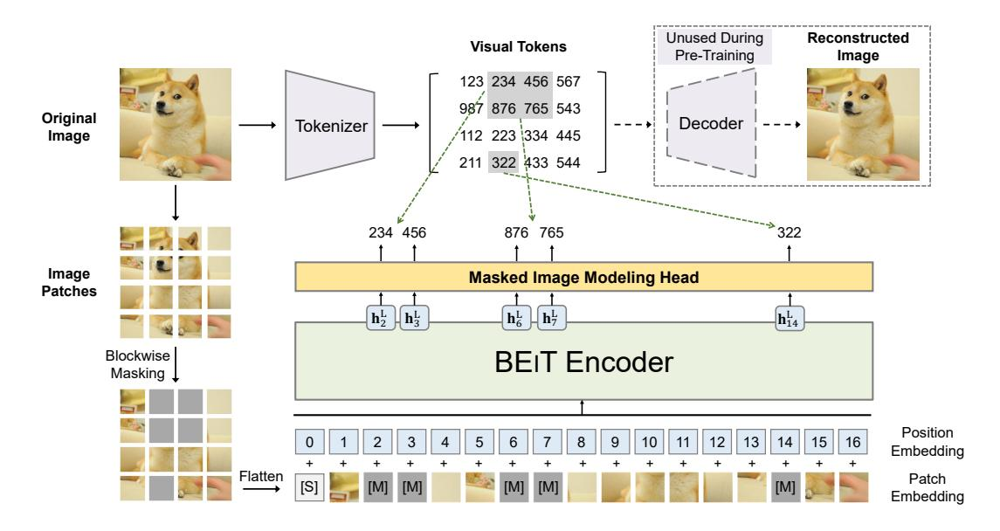
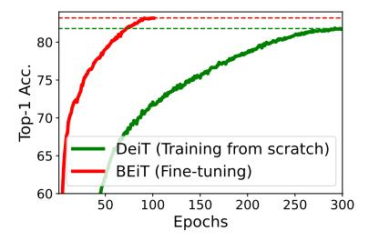
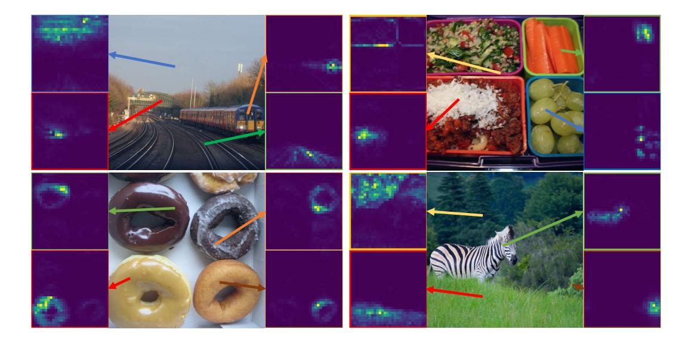

# **BEIT: BERT Pre-Training of Image Transformers**

Hangbo Bao<sup>†</sup>, Li Dong<sup>‡</sup>, Songhao Piao<sup>†</sup>, Furu Wei<sup>‡</sup>

† Harbin Institute of Technology

‡ Microsoft Research

https://aka.ms/beit

### **Abstract**

We introduce a self-supervised vision representation model **BEIT**, which stands for **B**idirectional **E**ncoder representation from Image Transformers. Following BERT [DCLT19] developed in the natural language processing area, we propose a *masked image modeling* task to pretrain vision Transformers. Specifically, each image has two views in our pre-training, i.e., image patches (such as  $16 \times 16$  pixels), and visual tokens (i.e., discrete tokens). We first "tokenize" the original image into visual tokens. Then we randomly mask some image patches and fed them into the backbone Transformer. The pre-training objective is to recover the original visual tokens based on the corrupted image patches. After pre-training BEIT, we directly fine-tune the model parameters on downstream tasks by appending task layers upon the pretrained encoder. Experimental results on image classification and semantic segmentation show that our model achieves competitive results with previous pre-training methods.

## 1 Introduction

Transformer [VSP<sup>+</sup>17] has achieved promising performance in computer vision [DBK<sup>+</sup>20, TCD<sup>+</sup>20]. However, empirical studies show that vision Transformers require more training data than convolutional neural networks. In order to solve the data-hungry issue [LSB<sup>+</sup>21], self-supervised pre-training is a promising solution to leverage large-scale image data. Several strands of methods have been explored for vision Transformers, such as contrastive learning [CXH21, XLY<sup>+</sup>21], and self-distillation [CTM<sup>+</sup>21].

Concurrently, BERT [DCLT19] has achieved great success in natural language processing. Its masked language modeling task first randomly masks some proportion of tokens within a text, and then recovers the masked tokens based on the Transformer encoding results of the corrupted text. Motivated by BERT, we turn to the denoising auto-encoding idea to pretrain vision Transformers, which has not been well studied by the vision community. It is challenging to directly apply BERT-style pre-training for image data. First of all, there is no pre-exist vocabulary for vision Transformer's input unit, i.e., image patches. So we cannot simply employ a softmax classifier to predict over all possible candidates for masked patches. In contrast, the language vocabulary, such as words and BPE [SHB16], is well-defined and eases auto-encoding prediction. A straightforward alternative is regarding the task as a regression problem, which predicts the raw pixels of masked patches. However, such pixel-level recovery task tends to waste modeling capability on pre-training short-range dependencies and high-frequency details [RPG+21]. Our goal is to overcome the above issues for pre-training of vision Transformers.

In this work, we introduce a self-supervised vision representation model **BEIT**, which stands for **B**idirectional **E**ncoder representation from **I**mage **T**ransformers. Inspired by BERT, we propose a pre-training task, namely, masked image modeling (MIM). As shown in Figure 1, MIM uses two

<sup>\*</sup>Contribution during internship at Microsoft. Correspondence to: Li Dongdong1@microsoft.com>, Furu Wei<fuwei@microsoft.com>



Figure 1: Overview of BEIT pre-training. Before pre-training, we learn an "image tokenizer" via autoencoding-style reconstruction, where an image is tokenized into discrete visual tokens according to the learned vocabulary. During pre-training, each image has two views, i.e., image patches, and visual tokens. We randomly mask some proportion of image patches (gray patches in the figure) and replace them with a special mask embedding [M]. Then the patches are fed to a backbone vision Transformer. The pre-training task aims at predicting the visual tokens of the *original* image based on the encoding vectors of the *corrupted* image.

views for each images, i.e., image patches, and visual tokens. We split the image into a grid of patches that are the input representation of backbone Transformer. Moreover, we "tokenize" the image to discrete visual tokens, which is obtained by the latent codes of discrete VAE [RPG+21]. During pre-training, we randomly mask some proportion of image patches, and feed the corrupted input to Transformer. The model learns to recover the visual tokens of the original image, instead of the raw pixels of masked patches.

We perform self-supervised learning and then fine-tune the pretrained BEIT on two downstream tasks, i.e., image classification, and semantic segmentation. Experimental results indicate that BEIT outperforms both from-scratch training and previous strong self-supervised models. Moreover, BEIT is complementary to supervised pre-training. Performance of BEIT can be further improved by intermediate fine-tuning with ImageNet labels. Ablation studies show that our proposed techniques are critical to the effectiveness of BERT-style pre-training for image data. Apart from performance, the improvements of convergence speed and stability of fine-tuning reduce training costs on end tasks. In addition, we demonstrate that self-supervised BEIT can learn reasonable semantic regions via pre-training, unleashing the rich supervision signals contained in images.

Our contributions are summarized as follows:

- We propose a masked image modeling task to pretrain vision Transformers in a self-supervised manner. We also provide a theoretical explanation from the perspective of variational autoencoder.
- We pretrain BEIT and conduct extensive fine-tuning experiments on downstream tasks, such as image classification, and semantic segmentation.
- We present that the self-attention mechanism of self-supervised BEIT learns to distinguish semantic regions and object boundaries, although without using any human annotation.

## 2 Methods

Given an input image x, BEIT encodes it to contextualized vector representations. As shown in Figure 1, BEIT is pretrained by the masked image modeling (MIM) task in a self-supervised

learning manner. MIM aims at recovering the masked image patches based on encoding vectors. For downstream tasks (such as image classification, and semantic segmentation), we append task layers upon pretrained BEIT and fine-tune the parameters on the specific datasets.

### 2.1 Image Representations

The images have two views of representations in our method, namely, *image patch*, and *visual tokens*. The two types serve as input and output representations during pre-training, respectively.

#### 2.1.1 Image Patch

The 2D image is split into a sequence of patches [DBK<sup>+</sup>20], so that a standard Transformer can directly accept image data. Formally, we reshape the image  $\boldsymbol{x} \in \mathbb{R}^{H \times W \times C}$  into  $N = HW/P^2$  patches  $\boldsymbol{x}^p \in \mathbb{R}^{N \times (P^2C)}$ , where C is the number of channels, (H,W) is the input image resolution, and (P,P) is the resolution of each patch. The image patches  $\{\boldsymbol{x}_i^p\}_{i=1}^N$  are flattened into vectors and are linearly projected, which is similar to word embeddings in BERT [DCLT19]. Image patches preserve raw pixels and are used as input features in BEIT.

In our experiments, we split each  $224 \times 224$  image into a  $14 \times 14$  grid of image patches, where each patch is  $16 \times 16$ .

#### 2.1.2 Visual Token

Similar to natural language, we represent the image as a sequence of discrete tokens obtained by an "image tokenizer", instead of raw pixels. Specifically, we tokenize the image  $\boldsymbol{x} \in \mathbb{R}^{H \times W \times C}$  into  $\boldsymbol{z} = [z_1, \dots, z_N] \in \mathcal{V}^{h \times w}$ , where the vocabulary  $\mathcal{V} = \{1, \dots, |\mathcal{V}|\}$  contains discrete token indices.

Following [RPG<sup>+</sup>21], we use the image tokenizer learned by discrete variational autoencoder (dVAE). There are two modules during visual token learning, namely, tokenizer and decoder. The tokenizer  $q_{\phi}(\boldsymbol{z}|\boldsymbol{x})$  maps image pixels  $\boldsymbol{x}$  into discrete tokens  $\boldsymbol{z}$  according to a visual codebook (i.e., vocabulary). The decoder  $p_{\psi}(\boldsymbol{x}|\boldsymbol{z})$  learns to reconstruct the input image  $\boldsymbol{x}$  based on the visual tokens  $\boldsymbol{z}$ . The reconstruction objective can be written as  $\mathbb{E}_{\boldsymbol{z} \sim q_{\phi}(\boldsymbol{z}|\boldsymbol{x})}[\log p_{\psi}(\boldsymbol{x}|\boldsymbol{z})]$ . Because the latent visual tokens are discrete, the model training is non-differentiable. Gumbel-softmax relaxation [JGP17, MMT17] is employed to train the model parameters. Moreover, a uniform prior is put on  $q_{\phi}$  during dVAE training. Refer to [RPG<sup>+</sup>21] for more training details of the image tokenizer.

We tokenize each image to a  $14 \times 14$  grid of visual tokens. Notice the number of visual tokens and the number of image patches for one image are the same. The vocabulary size is set to  $|\mathcal{V}| = 8192$ . In our work, we directly use the publicly available image tokenizer described in [RPG+21]. We also compare it with a re-implemented tokenizer in Appendix C.

## 2.2 Backbone Network: Image Transformer

Following ViT [DBK<sup>+</sup>20], we use the standard Transformer [VSP<sup>+</sup>17] as the backbone network. So the results can be directly compared with previous work in terms of the network architecture.

The input of Transformer is a sequence of image patches  $\{\boldsymbol{x}_i^p\}_{i=1}^N$ . The patches are then linearly projected to obtain patch embeddings  $\boldsymbol{E}\boldsymbol{x}_i^p$ , where  $\boldsymbol{E} \in \mathbb{R}^{(P^2C)\times D}$ . Moreover, we prepend a special token [S] to the input sequence. We also add standard learnable 1D position embeddings  $\boldsymbol{E}_{pos} \in \mathbb{R}^{N \times D}$  to patch embeddings. The input vectors  $\boldsymbol{H}_0 = [\boldsymbol{e}_{\text{[S]}}, \boldsymbol{E}\boldsymbol{x}_i^p, \dots, \boldsymbol{E}\boldsymbol{x}_N^p] + \boldsymbol{E}_{pos}$  is fed into Transformer. The encoder contains L layers of Transformer blocks  $\boldsymbol{H}^l = \text{Transformer}(\boldsymbol{H}^{l-1})$ , where  $l=1,\dots,L$ . The output vectors of the last layer  $\boldsymbol{H}^L = [\boldsymbol{h}_{\text{[S]}}^L, \boldsymbol{h}_1^L, \dots, \boldsymbol{h}_N^L]$  are used as the encoded representations for the image patches, where  $\boldsymbol{h}_i^L$  is the vector of the i-th image patch.

## 2.3 Pre-Training BEIT: Masked Image Modeling

We propose a *masked image modeling* (MIM) task. We randomly mask some percentage of image patches, and then predict the visual tokens that are corresponding to the masked patches.

<sup>&</sup>lt;sup>2</sup>https://github.com/openai/DALL-E

Figure 1 shows the overview of our method. As presented in Section 2.1, given an input image x, we split it into N image patches  $(\{x_i^p\}_{i=1}^N)$ , and tokenize it to N visual tokens  $(\{z_i\}_{i=1}^N)$ . We randomly mask approximately 40% image patches, where the masked positions are denoted as  $\mathcal{M} \in \{1,\ldots,N\}^{0.4N}$ . Next we replace the masked patches with a learnable embedding  $e_{\mathbb{M}} \in \mathbb{R}^D$ . The corrupted image patches  $x^{\mathcal{M}} = \{x_i^p: i \notin \mathcal{M}\}_{i=1}^N \bigcup \{e_{\mathbb{M}}: i \in \mathcal{M}\}_{i=1}^N$  are then fed into the L-layer Transformer as described in Section 2.2. The final hidden vectors  $\{h_i^L\}_{i=1}^N$  are regarded as encoded representations of the input patches. For each masked position  $\{h_i^L: i \in \mathcal{M}\}_{i=1}^N$ , we use a softmax classifier to predict the corresponding visual tokens  $p_{\mathrm{MIM}}(z'|x^{\mathcal{M}}) = \mathrm{softmax}_{z'}(W_c h_i^L + b_c)$ , where  $x^{\mathcal{M}}$  is the corrupted image,  $W_c \in \mathbb{R}^{|\mathcal{V}| \times D}$ , and  $b_c \in \mathbb{R}^{|\mathcal{V}|}$ . The pre-training objective is to maximize the log-likelihood of the correct visual tokens  $z_i$  given the corrupted image:

$$\max \sum_{x \in \mathcal{D}} \mathbb{E}_{\mathcal{M}} \left[ \sum_{i \in \mathcal{M}} \log p_{\text{MIM}}(z_i | x^{\mathcal{M}}) \right]$$
 (1)

where  $\mathcal{D}$  is the training corpus,  $\mathcal{M}$  represents randomly masked positions, and  $x^{\mathcal{M}}$  is the corrupted image that is masked according to  $\mathcal{M}$ .

Rather than randomly choosing patches for the masked positions  $\mathcal{M}$ , we employ blockwise masking in our work. As summarized in Algorithm 1, a block of image patches is masked each time. For each block, we set the minimum number of patches to 16. Then we randomly choose an aspect ratio for the masking block. We repeat the above two steps until obtaining enough masked patches, i.e., 0.4N, where N is the total number of image patches, and 0.4 is masking ratio.

## Algorithm 1 Blockwise Masking

```
\begin{array}{l} \textbf{Input: } N(=h\times w) \text{ image patches} \\ \textbf{Output: } \text{Masked positions } \mathcal{M} \\ \mathcal{M} \leftarrow \{\} \\ \textbf{repeat} \\ s \leftarrow \text{Rand}(16, 0.4N - |\mathcal{M}|) & \triangleright \textit{Block size} \\ r \leftarrow \text{Rand}(0.3, \frac{1}{0.3}) & \triangleright \textit{Aspect ratio of block} \\ a \leftarrow \sqrt{s \cdot r}; b \leftarrow \sqrt{s/r} \\ t \leftarrow \text{Rand}(0, h - a) ; l \leftarrow \text{Rand}(0, w - b) \\ \mathcal{M} \leftarrow \mathcal{M} \bigcup \{(i, j) : i \in [t, t + a), j \in [l, l + b)\} \\ \textbf{until } |\mathcal{M}| > 0.4N & \triangleright \textit{Masking ratio is } 40\% \\ \textbf{return } \mathcal{M} \\ \end{array}
```

The MIM task is greatly inspired by masked language modeling [DCLT19], which is one of the most successful pre-training objective in natural language processing. Moreover, blockwise (or n-gram) masking is also widely applied in BERT-like models [JCL+20, BDW+20, RSR+20]. However, directly using pixel-level auto-encoding (i.e., recovering the pixels of masked patches) for vision pre-training pushes the model to focus on short-range dependencies and high-frequency details [RPG+21]. BEIT overcomes the above issue by predicting discrete visual tokens, which summarizes the details to high-level abstractions. Ablation studies in Section 3.3 show that our proposed method significantly outperforms pixel-level auto-encoding.

#### 2.4 From the Perspective of Variational Autoencoder

The BEIT pre-training can be viewed as variational autoencoder [KW14] training. Let x denote the original image,  $\tilde{x}$  the masked image, and z the visual tokens. Considering the evidence lower bound (ELBO) of the log-likelihood  $p(x|\tilde{x})$ , i.e., recovering the original image from its corrupted version:

$$\sum_{(x_i, \tilde{x}_i) \in \mathcal{D}} \log p(x_i | \tilde{x}_i) \ge \sum_{(x_i, \tilde{x}_i) \in \mathcal{D}} \left( \underbrace{\mathbb{E}_{z_i \sim q_{\phi}(\mathbf{z}|x_i)}[\log p_{\psi}(x_i | z_i)]}_{\text{Visual Token Reconstruction}} - D_{\text{KL}}[q_{\phi}(\mathbf{z}|x_i), p_{\theta}(\mathbf{z}|\tilde{x}_i)] \right) \quad (2)$$

where (1)  $q_{\phi}(z|x)$  denotes the image tokenizer that obtains visual tokens; (2)  $p_{\psi}(x|z)$  decodes the original image given input visual tokens; (3)  $p_{\theta}(z|\tilde{x})$  recovers the visual tokens based on the masked image, which is our MIM pre-training task.

We learn the model following a two-stage procedure similar to [vdOVK17, RvdOV19]. In the first stage, we obtain the image tokenizer as a discrete variational autoencoder [RPG+21]. Specifically, the first stage minimizes the reconstruction loss  $-\mathbb{E}_{z_i \sim q_\phi(\mathbf{z}|x_i)}[\log p_\psi(x_i|z_i)]$  with an uniform prior as described in Equation (2). In the second stage, we learn the prior  $p_\theta$  while keeping  $q_\phi$  and  $p_\psi$  fixed. We simplify  $q_\phi(\mathbf{z}|x_i)$  to a one-point distribution with the most likely visual tokens  $\hat{z}_i = \arg \max_z q_\phi(z|x_i)$ . Then Equation (2) can be rewritten as:

$$\sum_{(x_i, \tilde{x}_i) \in \mathcal{D}} \left( \underbrace{\mathbb{E}_{z_i \sim q_{\phi}(z|x_i)}[\log p_{\psi}(x_i|z_i)]}_{\text{Stage 1: Visual Token Reconstruction}} + \underbrace{\log p_{\theta}(\hat{z}_i|\tilde{x}_i)}_{\text{Stage 2: Masked Image Modeling}} \right)$$
(3)

where the second term is our BEIT pre-training objective.

### 2.5 Pre-Training Setup

The network architecture of BEIT follows that of ViT-Base [DBK $^+20$ ] for a fair comparison. We use a 12-layer Transformer with 768 hidden size, and 12 attention heads. The intermediate size of feed-forward networks is 3072. We employ the default  $16 \times 16$  input patch size. We directly borrow the image tokenizer trained by [RPG $^+21$ ]. The vocabulary size of visual tokens is 8192.

We pretrain BEIT on the training set of ImageNet-1K [RDS<sup>+</sup>15], which contains about 1.2M images. Our augmentation policy includes random resized cropping, horizontal flipping, color jittering [WXYL18]. Notice that we do not use the labels for self-supervised learning. We use the  $224 \times 224$  resolution in our experiments. So the input is split to  $14 \times 14$  image patches, and the same amount of visual tokens. We randomly mask at most 75 patches (i.e., roughly 40% of total image patches).

The pre-training runs for about 500k steps (i.e., 800 epochs) with 2k batch size. Adam [LH19] with  $\beta_1 = 0.9, \beta_2 = 0.999$  is employed for optimization. The learning rate is set to 1.5e-3, with a warmup of 10 epochs, and cosine learning rate decay. The weight decay is 0.05. We employ stochastic depth [HSL+16] with a 0.1 rate, and disable dropout. The 500k training steps take about five days using 16 Nvidia Telsa V100 32GB GPU cards.

We find that proper initialization is important to stabilize Transformer, especially for large-scale pretraining. We first randomly initialize all the parameters within a small range, such as [-0.02, 0.02]. Then, for the l-th Transformer layer, we rescale the output matrices (i.e., the last linear projection within each sub-layer) of the self-attention module and the feed-forward network by  $\frac{1}{\sqrt{2l}}$ .

#### 2.6 Fine-Tuning BEIT on Downstream Vision Tasks

After pre-training BEIT, we append a task layer upon the Transformer, and fine-tune the parameters on downstream tasks, like BERT. We take image classification and semantic segmentation as examples in our work. It is straightforward to leverage the pre-training-then-fine-tuning paradigm on other vision tasks with BEIT.

Image classification. For image classification tasks, we directly employ a simple linear classifier as the task layer. Specifically, we use average pooling to aggregate the representations, and feed the global to a softmax classifier. The category probabilities are computed as  $\operatorname{softmax}(\operatorname{avg}(\{h_i^L\}_{i=1}^N W_c))$ , where  $h_i^L$  is the final encoding vector of the *i*-th image patch,  $W_c \in \mathbb{R}^{D \times C}$  is a parameter matrix, and C is the number of labels. We maximize the likelihood of labeled data by updating the parameters of BEIT and the softmax classifier.

**Semantic segmentation.** For semantic segmentation, we follow the task layer used in SETR-PUP [ZLZ<sup>+</sup>20]. To be specific, we use pretrained BEIT as a backbone encoder, and incorporate several deconvolution layers as decoder to produce segmentation. The model is also end-to-end fine-tuned similar to image classification.

**Intermediate fine-tuning.** After self-supervised pre-training, we can further train BEIT on a datarich intermediate dataset (i.e., ImageNet-1K in our work), and then finetune the model on the target downstream tasks. Such intermediate fine-tuning is the common practice of BERT fine-tuning in NLP [PPL<sup>+</sup>20]. We directly follow the method for BEIT.

## 3 Experiments

We conduct full fine-tuning experiments on image classification and semantic segmentation. Moreover, we present various ablation studies for pre-training and analyze the representations learned by BEIT. We also report linear probes on ImageNet in Appendix D.

#### 3.1 Image Classification

The image classification task classifies input images to various categories. We evaluate BEIT on the ILSVRC-2012 ImageNet dataset [RDS<sup>+</sup>15] with 1k classes and 1.3M images. We directly follow the most of hyperparameters of DeiT [TCD<sup>+</sup>20] in our fine-tuning experiments for a fair comparison. We reduce fine-tuning epochs compared with training from scratch, as BEIT has been pre-trained. Accordingly, we use a larger learning rate with layer-wise decay. The detailed hyperparameters are summarized in Appendix H.

Table 1 reports top-1 accuracy on image classification. We compare BEIT with vision Transformers trained by random initialization, supervised pre-training, and previous self-supervised learning methods. All the compared models are base-size, except iGPT has 1.36B parameters. Pre-training is conducted on ImageNet for the comparison purpose, except ViT-JFT300M is pretrained on Google's in-house 300M images.

Compared with the models trained by random initialization, we find that pre-trained BEIT significantly improves performance on both datasets. BEIT improves the performance on ImageNet, which shows the effectiveness under the rich-resource setting.

Moreover, we compare BEIT with previous state-of-the-art self-supervised methods for Transformer, such as DINO [CTM+21], and MoCo v3 [CXH21]. Our proposed method outperforms previous models on ImageNet fine-tuning. Among them, iGPT-1.36B [CRC+20] uses much more parameters (i.e., 1.36B vs 86M), and ViT-JFT300M [DBK+20] is pretrained on larger corpus (i.e., 300M vs 1.3M), while others pretrain ViT-Base on ImageNet-1K. iGPT-1.36B and ViT-JFT300M are the most comparable methods, which also follows auto-encoding pre-training for vision Transformer. Specifically, iGPT uses clustered image tokens as both input and output for image GPT or image BERT. In contrast, we use image patches as input to preserve raw pixels, and employ discrete visual tokens as a prediction bottleneck. ViT-JFT300 predicts the mean, 3-bit color of each masked patch, rather than visual tokens learned by discrete VAE. We also pretrain the self-supervised tasks of BEIT and DINO in a multi-task learning manner, which is presented in Appendix E.

In addition, we evaluate our proposed method with intermediate fine-tuning. In other words, we first pretrain BEIT in a self-supervised manner, and then fine-tune the pretrained model on ImageNet with labeled data. The results show that BEIT is complementary to supervised pre-training, achieving additional gain after intermediate fine-tuning on ImageNet.

**Fine-tuning to**  $384 \times 384$  **resolution.** After fine-tuning with resolution  $224 \times 224$ , we additionally fine-tune the model on  $384 \times 384$  images by 10 more epochs. We follow the standard higher-resolution setting of DeiT [TCD $^+20$ ], except using fewer epochs. Notice that we keep patch size the same for both  $224 \times 224$  and  $384 \times 384$  images. So the input sequence length of Transformers becomes longer for higher resolutions. Table 1 shows that higher resolution improves the BEIT results by 1+ points on ImageNet. More importantly, BEIT $_{384}$  pretrained on ImageNet-1K even outperforms supervised pre-training ViT $_{384}$  that uses ImageNet-22K, when they use the same input resolution.

Scaling up to larger size. We further scale up BEIT to the large size (same as ViT-L). As shown in Table 1, ViT $_{384}$ -L is worse than ViT $_{384}$  on ImageNet, when training from scratch. The results verifies the data-hungry issue of vision Transformers. Supervised pre-training on ImageNet-22K partially relieves the issue, where ViT $_{384}$ -L finally outperforms ViT $_{384}$  by 1.2. In comparison, BEIT-L is better than BEIT by 2.0, and BEIT $_{384}$ -L outperforms BEIT $_{384}$  by 1.7. In other words, the benefits of scaling up BEIT from base to large are greater than supervised pre-training with ImageNet-22K. More importantly, comparing between BEIT $_{384}$  with ViT $_{384}$  that conducts supervised pre-training on ImageNet-22K, the improvements of BEIT become greater along with scaling the size from base (i.e., 0.6) to large (i.e., 1.1). The results suggest that BEIT tends to help more for extremely larger models (such as 1B, or 10B), especially when labeled data are insufficient are conduct supervised pre-training for such large models.

<sup>&</sup>lt;sup>3</sup>[ZKHB21] report that supervised pre-training of a 1.8B-size vision Transformer requires billions of labeled images.

 $<sup>^4</sup>$  Appendix B shows that BEIT fine-tuned on ImageNet-22K (14M) can match the performance of supervised pre-training on Google's in-house JFT-3B [ZKHB21], while using 214x less labels. We also demonstrate that large-size BEIT fine-tuned on 70M labeled images can achieve 89.5% top-1 accuracy on ImageNet and 58.4% mIoU on ADE20K, creating new state-of-the-art results for large-size vision Transformers.

| Models                                                           | Model Size         | Resolution          | ImageNet |
|------------------------------------------------------------------|--------------------|---------------------|----------|
| Training from scratch (i.e., rand                                | om initialization) |                     |          |
| ViT <sub>384</sub> -B [DBK <sup>+</sup> 20]                      | 86M                | $384^{2}$           | 77.9     |
| ViT <sub>384</sub> -L [DBK <sup>+</sup> 20]                      | 307M               | $384^{2}$           | 76.5     |
| DeiT-B [TCD <sup>+</sup> 20]                                     | 86M                | $224^{2}$           | 81.8     |
| $DeiT_{384}$ -B [TCD $^+$ 20]                                    | 86M                | $384^{2}$           | 83.1     |
| Supervised Pre-Training on Ima                                   | geNet-22K (using   | labeled data)       |          |
| ViT <sub>384</sub> -B [DBK <sup>+</sup> 20]                      | 86M                | $384^{2}$           | 84.0     |
| ViT <sub>384</sub> -L [DBK <sup>+</sup> 20]                      | 307M               | $384^{2}$           | 85.2     |
| Self-Supervised Pre-Training on                                  | ImageNet-1K (w     | ithout labeled data | )        |
| iGPT-1.36B <sup>†</sup> [CRC <sup>+</sup> 20]                    | 1.36B              | $224^{2}$           | 66.5     |
| ViT <sub>384</sub> -B-JFT300M <sup>‡</sup> [DBK <sup>+</sup> 20] | 86M                | $384^{2}$           | 79.9     |
| MoCo v3-B [CXH21]                                                | 86M                | $224^{2}$           | 83.2     |
| MoCo v3-L [CXH21]                                                | 307M               | $224^{2}$           | 84.1     |
| DINO-B [CTM <sup>+</sup> 21]                                     | 86M                | $224^{2}$           | 82.8     |
| BEIT-B (ours)                                                    | 86M                | $224^{2}$           | 83.2     |
| BEIT <sub>384</sub> -B (ours)                                    | 86M                | $384^{2}$           | 84.6     |
| BEIT-L (ours)                                                    | 307M               | $224^{2}$           | 85.2     |
| BEIT <sub>384</sub> -L (ours)                                    | 307M               | $384^{2}$           | 86.3     |

Table 1: Top-1 accuracy on ImageNet-1K. We evaluate base- ("-B") and large-size ("-L") models at resolutions  $224 \times 224$  and  $384 \times 384$ . †: iGPT-1.36B contains 1.36 billion parameters, while others are base-size models. †: ViT<sub>384</sub>-B-JFT300M is pretrained with the "masked patch prediction" task on Google's in-house 300M images, while others use ImageNet.



Table 2: Convergence curves of training DeiT from scratch and fine-tuning BEIT on ImageNet-1K.

| Models                                 | ADE20K |
|----------------------------------------|--------|
| Supervised Pre-Training on ImageNet    | 45.3   |
| DINO [CTM <sup>+</sup> 21]             | 44.1   |
| BEIT (ours)                            | 45.6   |
| BEIT + Intermediate Fine-Tuning (ours) | 47.7   |

Table 3: Results of semantic segmentation on ADE20K. We use SETR-PUP [ZLZ<sup>+</sup>20] as the task layer and report results of single-scale inference.

**Convergence curves.** Figure 2 compares the convergence curves of the training-from-scratch and pre-training-then-fine-tuning paradigms. We find that fine-tuning BEIT not only achieves better performance, but also converging much faster than training DeiT from scratch. Moreover, fine-tuning BEIT can reach reasonable numbers within very few epochs.

## 3.2 Semantic Segmentation

Semantic segmentation aims to predict a corresponding class for each pixel of the input image. We evaluate BE1T on the ADE20K benchmark [ZZP+19] with 25K images and 150 semantic categories. We report the metric of mean Intersection of Union (mIoU) averaged over all semantic categories. As presented in Section 2.6, we directly follow the task layer and the most of hyperparameters described in SETR-PUP [ZLZ+20]. On ADE20K, we use Adam [LH19] as the optimizer. The learning rate is set to 1e-3 with layer-wise decay similar to image classification. We conduct fine-tuning for 160K steps. The batch size is 16. The detailed hyperparameters are described in Appendix I.

As shown in Table 3, we compare BEIT with supervised pre-training that relies on labeled data of ImageNet. We find that our proposed method achieves better performance than supervised pre-training, although BEIT does not require manual annotations for pre-training. Moreover, we employ

| Models                                                          | ImageNet | ADE20K |
|-----------------------------------------------------------------|----------|--------|
| BEIT (300 Epochs)                                               | 82.86    | 44.65  |
| <ul><li>Blockwise masking</li></ul>                             | 82.77    | 42.93  |
| <ul> <li>Visual tokens (i.e., recover masked pixels)</li> </ul> | 81.04    | 41.38  |
| <ul> <li>Visual tokens — Blockwise masking</li> </ul>           | 80.50    | 37.09  |
| + Recover 100% visual tokens                                    | 82.59    | 40.93  |
| - Masking $+$ Recover $100%$ visual tokens                      | 81.67    | 36.73  |
| Pretrain longer (800 epochs)                                    | 83.19    | 45.58  |

Table 4: Ablation studies for BEIT pre-training on image classification and semantic segmentation.

intermediate fine-tuning for BEIT on ImageNet, i.e., we first fine-tune pretrained BEIT on ImageNet, and then fine-tune the model on ADE20K. The results indicate that intermediate fine-tuning further improves BEIT on semantic segmentation.

#### 3.3 Ablation Studies

We conduct ablation studies to analyze the contributions of each component in BEIT. The models are evaluated on image classification (i.e., ImageNet) and semantic segmentation (i.e., ADE20K). We set the default pre-training steps to 300 epochs for the ablation studies, which is 37.5% of the total steps used in the previous experiments.

Table 4 reports the results of various model variants. First, we ablate blockwise masking by randomly sample masked positions. We find that blockwise masking is beneficial on both tasks, especially on semantic segmentation. Second, we ablate the usage of visual tokens by predicting the raw pixels of masked patches, i.e., the pre-training task becomes a pixel regression problem to recover masked patches. Our proposed masked image modeling task significantly outperforms naive pixel-level auto-encoding. Compared with the results in Table 1, the ablation result is worse than training vision Transformer from scratch on two tasks. The results indicate that the prediction of visual tokens is the key ingredient of BEIT. Third, we ablate the usage of visual tokens and blockwise masking together. We find that blockwise masking is even more helpful for pixel-level auto-encoding, which relieves the suffering of short-distance dependency. Forth, recovering all the visual tokens harms performance on downstream tasks. Fifth, we compare BEIT with different training steps. Pre-training the model longer can further improve performance on downstream tasks.

#### 3.4 Analysis of Self-Attention Map

We show that the self-attention mechanism in BEIT can separate objects, even though our pre-training does not rely on any manual annotation at all. Similar properties are also observed by [CTM<sup>+</sup>21]. The probing images are taken from the MS COCO [LMB<sup>+</sup>14] corpus to avoid appearing in the pre-training data.

As shown in Figure 2, we plot the self-attention map for different reference points within an image. The visualizations are produced by attention scores computed via query-key product in the last layer. For each reference point, we use the corresponding patch as query, and show which patch it attends to. After pre-training, BEIT learns to distinguish semantic regions using self-attention heads, without any task-specific supervision. The property partially indicates the reason why BEIT is able to help downstream tasks. Such knowledge acquired by BEIT potentially improves the generalization ability of fine-tuned models, especially on small-scale datasets.

### 4 Related Work

**Self-supervised visual representation learning.** Various methods have been introduced over the years to pretrain vision models in a self-supervised manner. Pioneering works design clever pretext tasks, such as predicting the patch orderings [NF16], colorization [ZIE16], and predicting rotation angles [KG18]. In addition, [TLL19] propose to mask some patches within an image, and classify whether the masked patches are real or fake for each masked position. The method is similar to the



Figure 2: Self-attention map for different reference points. The self-attention mechanism in BEIT is able to separate objects, although self-supervised pre-training does not use manual annotations.

masked version of Jigsaw pre-training [NF16]. The recent strand of research follows contrastive paradigm [WXYL18, OLV18, HFLM+19, BHB19, HFW+20, CKNH20, CFGH20]. The models typically regard various data augmentations as different views of an image, and then make the representations of positive pairs similar while pushing negative pairs away. In order to obtain enough informative negative samples in contrastive learning, the methods usually rely on large memory banks [WXYL18, HFW+20] or large batch size [CKNH20]. BYOL [GSA+20] and SimSiam [CH20] further eliminate the requirement of negative samples, using various techniques to avoid representation collapse. Another strand of methods use clustering to organize image examples [CBJD18, ARV20, CMM+20, LZXH21].

**Self-supervised vision Transformers.** Pre-training vision Transformers has received significant attention recently due to the data-hungry issue. iGPT [CRC<sup>+</sup>20] first creates a 9-bit color palette by k-means clustering RGB pixels, and then uses the clustered tokens to represent images. Next iGPT uses the tasks of BERT and GPT to pretrain Transformers. In comparison, our proposed method uses image patches as input without losing pixel-level information. Moreover, our visual tokens are obtained by discrete VAE instead of clustering. ViT [DBK<sup>+</sup>20] conducts a preliminary exploration with the masked patch prediction task, which predicts the 3-bit mean color of the masked patches. [DBK<sup>+</sup>20] also report that pixel-level auto-encoding performs worse, although it is the most straightforward translation of BERT from NLP to CV. Rather than using heuristically designed pre-training tasks, our proposed model leverages visual tokens learned by discrete VAE, which not only achieves better performance but also is better theoretically motivated. Apart from masked auto-encoding, other mainstream research works use contrastive learning [CXH21, XLY<sup>+</sup>21], and self-distillation [CTM<sup>+</sup>21]. In comparison, BEIT can achieve several times of improvement in terms of pre-training throughput (Appendix E), and memory consumption. The advantages make BEIT appealing to scale up vision Transformers.

## 5 Conclusion

We introduce a self-supervised pre-training framework for vision Transformers, achieving strong fine-tuning results on downstream tasks, such as image classification, and semantic segmentation. We show that the proposed method is critical to make BERT-like pre-training (i.e., auto-encoding with masked input) work well for image Transformers. We also present the intriguing property of automatically acquired knowledge about semantic regions, without using any human-annotated data. In the future, we would like to scale up BEIT pre-training in terms of data size and model

size. Moreover, we will conduct multimodal pre-training in a more unified way, using the similar objectives and the shared architecture for texts and images.

**Acknowledgement** We would like to acknowledge Yue Cao, Han Hu, Hang Hua, Jingdong Wang, Zheng Zhang for the helpful discussions, and Yaru Hao for some analysis experiments using [HDWX20].

### References

- [ARV20] Yuki M. Asano, Christian Rupprecht, and Andrea Vedaldi. Self-labelling via simultaneous clustering and representation learning. In *International Conference on Learning Representations (ICLR)*, 2020.
- [BDW<sup>+</sup>20] Hangbo Bao, Li Dong, Furu Wei, Wenhui Wang, Nan Yang, Xiaodong Liu, Yu Wang, Jianfeng Gao, Songhao Piao, Ming Zhou, and Hsiao-Wuen Hon. UniLMv2: Pseudomasked language models for unified language model pre-training. In *Proceedings of the 37th International Conference on Machine Learning, ICML 2020*, volume 119 of *Proceedings of Machine Learning Research*, pages 642–652. PMLR, 2020.
  - [BHB19] Philip Bachman, R Devon Hjelm, and William Buchwalter. Learning representations by maximizing mutual information across views. In *Advances in Neural Information Processing Systems*, volume 32. Curran Associates, Inc., 2019.
- [CBJD18] Mathilde Caron, Piotr Bojanowski, Armand Joulin, and Matthijs Douze. Deep clustering for unsupervised learning of visual features. In *Proceedings of the European Conference on Computer Vision (ECCV)*, pages 132–149, 2018.
- [CFGH20] Xinlei Chen, Haoqi Fan, Ross Girshick, and Kaiming He. Improved baselines with momentum contrastive learning. *preprint arXiv:2003.04297*, 2020.
  - [CH20] Xinlei Chen and Kaiming He. Exploring simple siamese representation learning. *preprint arXiv:2011.10566*, 2020.
- [CKNH20] Ting Chen, Simon Kornblith, Mohammad Norouzi, and Geoffrey Hinton. A simple framework for contrastive learning of visual representations. *preprint* arXiv:2002.05709, 2020.
- [CMM+20] Mathilde Caron, Ishan Misra, Julien Mairal, Priya Goyal, Piotr Bojanowski, and Armand Joulin. Unsupervised learning of visual features by contrasting cluster assignments. In *Advances in Neural Information Processing Systems*, volume 33, pages 9912–9924. Curran Associates, Inc., 2020.
- [CRC<sup>+</sup>20] Mark Chen, Alec Radford, Rewon Child, Jeffrey Wu, Heewoo Jun, David Luan, and Ilya Sutskever. Generative pretraining from pixels. In Hal Daumé III and Aarti Singh, editors, *Proceedings of the 37th International Conference on Machine Learning*, volume 119 of *Proceedings of Machine Learning Research*, pages 1691–1703. PMLR, 13–18 Jul 2020.
- [CTM+21] Mathilde Caron, Hugo Touvron, Ishan Misra, Hervé Jégou, Julien Mairal, Piotr Bojanowski, and Armand Joulin. Emerging properties in self-supervised vision transformers. arXiv preprint arXiv:2104.14294, 2021.
  - [CXH21] Xinlei Chen, Saining Xie, and Kaiming He. An empirical study of training self-supervised vision transformers. *ArXiv*, abs/2104.02057, 2021.
- [DBK<sup>+</sup>20] Alexey Dosovitskiy, Lucas Beyer, Alexander Kolesnikov, Dirk Weissenborn, Xiaohua Zhai, Thomas Unterthiner, Mostafa Dehghani, Matthias Minderer, Georg Heigold, Sylvain Gelly, et al. An image is worth 16x16 words: Transformers for image recognition at scale. *preprint arXiv:2010.11929*, 2020.

- [DCLT19] Jacob Devlin, Ming-Wei Chang, Kenton Lee, and Kristina Toutanova. BERT: pretraining of deep bidirectional transformers for language understanding. In *Proceedings of the 2019 Conference of the North American Chapter of the Association for Computational Linguistics: Human Language Technologies*, pages 4171–4186. Association for Computational Linguistics, 2019.
- [GSA<sup>+</sup>20] Jean-Bastien Grill, Florian Strub, Florent Altché, Corentin Tallec, Pierre H Richemond, Elena Buchatskaya, Carl Doersch, Bernardo Avila Pires, Zhaohan Daniel Guo, Mohammad Gheshlaghi Azar, Bilal Piot, Koray Kavukcuoglu, Rémi Munos, and Michal Valko. Bootstrap your own latent: A new approach to self-supervised learning. In *NeurIPS*, 2020.
- [HDWX20] Yaru Hao, Li Dong, Furu Wei, and Ke Xu. Self-attention attribution: Interpreting information interactions inside Transformer. *arXiv preprint arXiv:2004.11207*, 2020.
- [HFLM+19] R Devon Hjelm, Alex Fedorov, Samuel Lavoie-Marchildon, Karan Grewal, Phil Bachman, Adam Trischler, and Yoshua Bengio. Learning deep representations by mutual information estimation and maximization. In *International Conference on Learning Representations*, 2019.
- [HFW<sup>+</sup>20] Kaiming He, Haoqi Fan, Yuxin Wu, Saining Xie, and Ross Girshick. Momentum contrast for unsupervised visual representation learning. In *CVPR*, 2020.
- [HSL<sup>+</sup>16] Gao Huang, Yu Sun, Zhuang Liu, Daniel Sedra, and Kilian Q. Weinberger. Deep networks with stochastic depth. In Bastian Leibe, Jiri Matas, Nicu Sebe, and Max Welling, editors, *Computer Vision ECCV 2016*, pages 646–661, Cham, 2016. Springer International Publishing.
- [JCL<sup>+</sup>20] Mandar Joshi, Danqi Chen, Yinhan Liu, Daniel S. Weld, Luke Zettlemoyer, and Omer Levy. SpanBERT: Improving pre-training by representing and predicting spans. *Transactions of the Association for Computational Linguistics*, 8:64–77, 2020.
- [JGP17] Eric Jang, Shixiang Gu, and Ben Poole. Categorical reparameterization with gumbel-softmax. In 5th International Conference on Learning Representations, ICLR 2017, Toulon, France, April 24-26, 2017, Conference Track Proceedings. OpenReview.net, 2017.
- [KG18] Nikos Komodakis and Spyros Gidaris. Unsupervised representation learning by predicting image rotations. In *International Conference on Learning Representations* (*ICLR*), 2018.
- [KH09] A. Krizhevsky and G. Hinton. Learning multiple layers of features from tiny images. *Master's thesis, Department of Computer Science, University of Toronto*, 2009.
- [KW14] Diederik P. Kingma and Max Welling. Auto-Encoding Variational Bayes. In 2nd International Conference on Learning Representations, ICLR 2014, 2014.
- [LH19] Ilya Loshchilov and Frank Hutter. Decoupled weight decay regularization. In *International Conference on Learning Representations*, 2019.
- [LLC<sup>+</sup>21] Ze Liu, Yutong Lin, Yue Cao, Han Hu, Yixuan Wei, Zheng Zhang, Stephen Lin, and Baining Guo. Swin Transformer: Hierarchical vision transformer using shifted windows. *arXiv preprint arXiv:2103.14030*, 2021.
- [LMB<sup>+</sup>14] Tsung-Yi Lin, Michael Maire, Serge Belongie, James Hays, Pietro Perona, Deva Ramanan, Piotr Dollár, and C Lawrence Zitnick. Microsoft coco: Common objects in context. In *European conference on computer vision*, pages 740–755. Springer, 2014.
- [LSB<sup>+</sup>21] Yahui Liu, Enver Sangineto, Wei Bi, Nicu Sebe, Bruno Lepri, and Marco De Nadai. Efficient training of visual transformers with small datasets. In *Thirty-Fifth Conference on Neural Information Processing Systems*, 2021.

- [LZXH21] Junnan Li, Pan Zhou, Caiming Xiong, and Steven Hoi. Prototypical contrastive learning of unsupervised representations. In *International Conference on Learning Representations*, 2021.
- [MMT17] Chris J. Maddison, Andriy Mnih, and Yee Whye Teh. The Concrete Distribution: A Continuous Relaxation of Discrete Random Variables. In *International Conference on Learning Representations*, 2017.
  - [NF16] Mehdi Noroozi and Paolo Favaro. Unsupervised learning of visual representations by solving jigsaw puzzles. In *European conference on computer vision*, pages 69–84. Springer, 2016.
- [OLV18] Aaron van den Oord, Yazhe Li, and Oriol Vinyals. Representation learning with contrastive predictive coding. *preprint arXiv:1807.03748*, 2018.
- [PPL+20] Yada Pruksachatkun, Jason Phang, Haokun Liu, Phu Mon Htut, Xiaoyi Zhang, Richard Yuanzhe Pang, Clara Vania, Katharina Kann, and Samuel R. Bowman. Intermediate-task transfer learning with pretrained language models: When and why does it work? In *Proceedings of the 58th Annual Meeting of the Association for Computational Linguistics*. Association for Computational Linguistics, July 2020.
- [RDS+15] Olga Russakovsky, Jia Deng, Hao Su, Jonathan Krause, Sanjeev Satheesh, Sean Ma, Zhiheng Huang, Andrej Karpathy, Aditya Khosla, Michael Bernstein, Alexander C Berg, and Li Fei-Fei. Imagenet large scale visual recognition challenge. *IJCV*, 2015.
- [RPG<sup>+</sup>21] A. Ramesh, Mikhail Pavlov, Gabriel Goh, Scott Gray, Chelsea Voss, Alec Radford, Mark Chen, and Ilya Sutskever. Zero-shot text-to-image generation. *ArXiv*, abs/2102.12092, 2021.
- [RSR+20] Colin Raffel, Noam Shazeer, Adam Roberts, Katherine Lee, Sharan Narang, Michael Matena, Yanqi Zhou, Wei Li, and Peter J. Liu. Exploring the limits of transfer learning with a unified text-to-text transformer. J. Mach. Learn. Res., 21:140:1–140:67, 2020.
- [RvdOV19] Ali Razavi, Aaron van den Oord, and Oriol Vinyals. Generating diverse high-fidelity images with VQ-VAE-2. In Advances in Neural Information Processing Systems, volume 32. Curran Associates, Inc., 2019.
  - [SHB16] Rico Sennrich, Barry Haddow, and Alexandra Birch. Neural machine translation of rare words with subword units. In *Proceedings of the 54th Annual Meeting of the Association for Computational Linguistics (Volume 1: Long Papers)*, pages 1715–1725, Berlin, Germany, August 2016. Association for Computational Linguistics.
- [TCD<sup>+</sup>20] Hugo Touvron, Matthieu Cord, Matthijs Douze, Francisco Massa, Alexandre Sablayrolles, and Hervé Jégou. Training data-efficient image transformers & distillation through attention. *preprint arXiv:2012.12877*, 2020.
- [TCS<sup>+</sup>21] Hugo Touvron, Matthieu Cord, Alexandre Sablayrolles, Gabriel Synnaeve, and Hervé Jégou. Going deeper with image transformers. *arXiv preprint arXiv:2103.17239*, 2021.
- [TLL19] Trieu H Trinh, Minh-Thang Luong, and Quoc V Le. Selfie: Self-supervised pretraining for image embedding. *arXiv preprint arXiv:1906.02940*, 2019.
- [vdOVK17] Aaron van den Oord, Oriol Vinyals, and Koray Kavukcuoglu. Neural discrete representation learning. In *Proceedings of the 31st International Conference on Neural Information Processing Systems*, NIPS'17, page 6309–6318, Red Hook, NY, USA, 2017. Curran Associates Inc.
- [VSP+17] Ashish Vaswani, Noam Shazeer, Niki Parmar, Jakob Uszkoreit, Llion Jones, Aidan N. Gomez, Lukasz Kaiser, and Illia Polosukhin. Attention is all you need. In Isabelle Guyon, Ulrike von Luxburg, Samy Bengio, Hanna M. Wallach, Rob Fergus, S. V. N. Vishwanathan, and Roman Garnett, editors, Advances in Neural Information Processing Systems 30: Annual Conference on Neural Information Processing Systems 2017, December 4-9, 2017, Long Beach, CA, USA, pages 5998–6008, 2017.

- [WXYL18] Zhirong Wu, Yuanjun Xiong, Stella X Yu, and Dahua Lin. Unsupervised feature learning via non-parametric instance discrimination. In *CVPR*, 2018.
- [XLY<sup>+</sup>21] Zhenda Xie, Yutong Lin, Zhuliang Yao, Zheng Zhang, Qi Dai, Yue Cao, and Han Hu. Self-supervised learning with swin transformers. *arXiv preprint arXiv:2105.04553*, 2021.
- [XLZ<sup>+</sup>18] Tete Xiao, Yingcheng Liu, Bolei Zhou, Yuning Jiang, and Jian Sun. Unified perceptual parsing for scene understanding. In *ECCV*, 2018.
  - [ZIE16] Richard Zhang, Phillip Isola, and Alexei A Efros. Colorful image colorization. In *ECCV*, 2016.
- [ZKHB21] Xiaohua Zhai, Alexander Kolesnikov, Neil Houlsby, and Lucas Beyer. Scaling vision transformers. *arXiv preprint arXiv:2106.04560*, 2021.
- [ZLZ<sup>+</sup>20] Sixiao Zheng, Jiachen Lu, Hengshuang Zhao, Xiatian Zhu, Zekun Luo, Yabiao Wang, Yanwei Fu, Jianfeng Feng, Tao Xiang, Philip H. S. Torr, and Li Zhang. Rethinking semantic segmentation from a sequence-to-sequence perspective with transformers. *CoRR*, abs/2012.15840, 2020.
- [ZZP+19] Bolei Zhou, Hang Zhao, Xavier Puig, Tete Xiao, Sanja Fidler, Adela Barriuso, and Antonio Torralba. Semantic understanding of scenes through the ADE20K dataset. *Int. J. Comput. Vis.*, 127(3):302–321, 2019.

## **A** Architecture Variants of Vision Transformer

We use the standard vision Transformer (ViT) in the experiments for fair comparisons. In addition, we find that LayerScale [TCS<sup>+</sup>21] and relative position bias [BDW<sup>+</sup>20, RSR<sup>+</sup>20] improve ViTs on downstream tasks. We employ the same setting as in Section 3.3 for ablation studies, which pretrains base-size models for 300 epochs on ImageNet-1K.

As shown in Table 5, both LayerScale and relative position bias improve performance on ImageNet classification and ADE20K semantic segmentation. We denote the improved architecture as BEIT<sup>+</sup> and use it for the experiments in Appendix B. We empirically notice that vanilla Transformer is the most stable when scaling up the model to billions of parameters, so we do not use LayerScale for extra-large models.

| Architecture                          | ImageNet | ADE20K |
|---------------------------------------|----------|--------|
| ViT (used in this paper)              | 82.86    | 44.86  |
| ViT+LayerScale                        | 83.00    | 45.43  |
| ViT+LayerScale+Relative Position Bias | 83.22    | 45.70  |

Table 5: Ablation studies of architecture variants on image classification and semantic segmentation. For ADE20K, we use UperNet [XLZ<sup>+</sup>18] as the task layer, and report mIoU scores of single-scale inference.

## **B** Comparison with Large-Scale Supervised Pre-Training

We compare with state-of-the-art supervised pre-training at scale. In addition to using ImageNet-1K for fair comparisons with previous work, we pretrain BEIT on ImageNet-22K to boost performance. We employ the architecture improvements (i.e., LayerScale, and relative position bias) as described in Appendix A, which is denoted as BEIT<sup>+</sup> in Table 6 and Table 7. We follow the same pre-training setup as in Section 2.5, except we pretrain 150 epochs on ImageNet-22K. After self-supervised pre-training, we conduct intermediate fine-tuning on ImageNet-22K for 90 epochs. Moreover, we use an in-house dataset that has about 70M labeled images as a drop-in replacement of ImageNet-22K.

| Modela                      | Model      | Labeled       |             | ImageNet                 |
|-----------------------------|------------|---------------|-------------|--------------------------|
| Models                      | Size       | Data Size     | $384^2$     | $512^2$                  |
| Supervised Pre-Ti           | raining on | ImageNet-22   | 2K (using l | abeled data)             |
| ViT-B [DBK <sup>+</sup> 20] | 86M        | 14M           | 84.0        | -                        |
| ViT-L [DBK <sup>+</sup> 20] | 307M       | 14M           | 85.2        | 85.30                    |
| ViT-H [DBK <sup>+</sup> 20] | 632M       | 14M           | 85.1        | -                        |
| Supervised Pre-Ti           | raining on | Google JFT-   | 300M (usi   | ng labeled data)         |
| ViT-B [DBK <sup>+</sup> 20] | 86M        | 300M          | 84.2        | <del>-</del>             |
| ViT-L [DBK <sup>+</sup> 20] | 307M       | 300M          | 87.1        | 87.76                    |
| ViT-H [DBK <sup>+</sup> 20] | 632M       | 300M          | 88.0        | 88.55                    |
| Supervised Pre-T            | raining on | Google JFT-   | 3B (using   | labeled data)            |
| ViT-B [ZKHB21]              | 86M        | 3000M         | 86.6        | -                        |
| ViT-L [ZKHB21]              | 307M       | 3000M         | 88.5        | -                        |
| Self-Supervised P           | re-Trainin | g, and Intern | nediate Fin | e-Tuning on ImageNet-22K |
| BEIT-B <sup>+</sup> (ours)  | 86M        | 14M           | 86.8        | -                        |
| BEIT-L <sup>+</sup> (ours)  | 307M       | 14M           | 88.4        | 88.6                     |
| Self-Supervised P           | re-Trainin | g, and Intern | nediate Fin | e-Tuning on In-House-70M |
| BEIT-L <sup>+</sup> (ours)  | 307M       | 70M           | 89.3        | 89.5                     |

Table 6: Top-1 accuracy on ImageNet-1K fine-tuning. We evaluate models at resolutions  $384^2$  and  $512^2$ .

Table 6 compares BEIT with previous state-of-the-art supervised pre-training [DBK<sup>+</sup>20, ZKHB21] on ImageNet fine-tuning. Rather than heavily relying on extremely large-size labeled data (such as Google's in-house JFT-300M and JFT-3B), we demonstrate that BEIT pre-training can catch up with only ImageNet-22k (14M). Specifically, BEIT-L fine-tuned on ImageNet-22k achieves comparable performance with ViT-L trained on Google JFT-3B. Moreover, BEIT-L obtains 89.5% top-1 accuracy on ImageNet after intermediate fine-tuning on an in-house 70M dataset. The results indicate that BEIT pre-training greatly reduces the required labeling efforts and advances the new state of the art for large-size vision Transformers.

As shown in Table 7, we report the fine-tuning results on the ADE20K semantic segmentation benchmark. Following Swin [LLC $^+21$ ], we use the same task layer (i.e., UperNet) and evaluate the models at the resolution  $640 \times 640$ . The BEIT-L model obtains state-of-the-art performance on ADE20K.

| Models                                                                     | mIoU (%) | Multi-Scale mIoU (%) |  |  |
|----------------------------------------------------------------------------|----------|----------------------|--|--|
| Supervised Pre-Training on ImageNet-22K (using labeled data)               |          |                      |  |  |
| Swin-B [LLC <sup>+</sup> 21]                                               | 50.0     | 51.7                 |  |  |
| Swin-L [LLC <sup>+</sup> 21]                                               | 52.1     | 53.5                 |  |  |
| Self-Supervised Pre-Training, and Intermediate Fine-Tuning on ImageNet-22K |          |                      |  |  |
| BEIT-B <sup>+</sup> (ours)                                                 | 53.6     | 54.2                 |  |  |
| BEIT-L <sup>+</sup> (ours)                                                 | 56.7     | 57.0                 |  |  |
| Self-Supervised Pre-Training, and Intermediate Fine-Tuning on In-House-70M |          |                      |  |  |
| BEIT-L <sup>+</sup> (ours)                                                 | 57.9     | 58.4                 |  |  |

Table 7: Performance comparison on the ADE20K semantic segmentation. We follow Swin-L [LLC $^+$ 21] to use UperNet [XLZ $^+$ 18] as the task layer and evaluate at resolution  $640 \times 640$ .

## C Ablation Studies of Image Tokenizer

For comparison, we re-train the image tokenizer on ImageNet-1K. The reimplementation is based on https://github.com/lucidrains/DALLE-pytorch. We use the same codebook size 8K as in DALL-E [RPG+21]. Then we plug the tokenizer into our pre-training process. We follow the same experimental setup of ablation studies as in Section 3.3. Table 8 shows that our reimplemented tokenizer obtains comparable reconstruction loss and ImageNet fine-tuning performance compared with the off-the-shelf DALL-E tokenizer.

| Image Tokenizer                        | Reconstruction Error | ImageNet |
|----------------------------------------|----------------------|----------|
| DALL-E Tokenizer [RPG <sup>+</sup> 21] | 0.0856               | 82.86    |
| Our reimplementation                   | 0.0880               | 82.70    |

Table 8: Top-1 accuracy on ImageNet-1K using different image tokenizers during pre-training. For image reconstruction, we report mean absolute error of normalized RGB values. The reimplemented image tokenizer is trained on ImageNet-1K without labels.

### D Linear Probes on ImageNet

We evaluate linear probes on ImageNet for various pretrained vision Transformers. We compare BEIT with two main strands of work, namely *discriminative* and *generative* self-supervised learning. The first one applies discriminative learning for pre-training, such as contrastive learning [CXH21], and self distillation [CTM<sup>+</sup>21]. The above methods typically learn to aggregate the image-level features into a global vector, which is relatively suitable for linear probing. In contrast, the second strand of methods, such as iGPT [CRC<sup>+</sup>20] and ours, usually do not pretrain such global feature aggregation, which tends to make linear probes difficult.

Following iGPT [CRC<sup>+</sup>20], we use average pooling to aggregate the hidden states of each image patches, and add the probing layer at the middle layer of Transformer instead of always at the final

layer. Similarly, we find that the best layer lies in 9-th layer for BEIT-B, and 14-th layer for BEIT-L. To be specific, we use AdamW [LH19] to update the linear probe layer for 50 epochs. The learning rate is 4e-3 with cosine decay. The batch size is 1024. The weight decay is set to 1e-4. We follow data augmentation used in DINO [CTM+21], which uses random resize crops and horizontal flips augmentation during training and evaluates on central crops.

| Model Size                          | Accuracy                                                                                  |  |  |  |
|-------------------------------------|-------------------------------------------------------------------------------------------|--|--|--|
| pervised learni                     | ng                                                                                        |  |  |  |
| 86M                                 | 78.2                                                                                      |  |  |  |
| 86M                                 | 76.7                                                                                      |  |  |  |
| 307M                                | 77.6                                                                                      |  |  |  |
| Generative self-supervised learning |                                                                                           |  |  |  |
| 1362M                               | 65.2                                                                                      |  |  |  |
| 6801M                               | 68.7                                                                                      |  |  |  |
| 6801M                               | 72.0*                                                                                     |  |  |  |
| 86M                                 | 56.7                                                                                      |  |  |  |
| 307M                                | 73.5                                                                                      |  |  |  |
|                                     | pervised learni<br>86M<br>86M<br>307M<br>vised learning<br>1362M<br>6801M<br>6801M<br>86M |  |  |  |

Table 9: Linear probing accuracy on ImageNet. "\*" denotes that iGPT-XL uses concatenation of five layers for linear probing, while others use the features of single layer.

As shown in Table 9, we evaluate linear probes on ImageNet-1K for self-supervised learning. Overall, discriminative methods perform better than generative pre-training on linear probing. Linear probes keep the Transformer parameters fixed and only update the linear layer. So the pre-training of global aggregation of image-level features is beneficial to linear probing in DINO and MoCo v3, although full fine-tuning eliminates the gap. Moreover, the results indicate that increasing the model size from base (86M) to large (304M) significantly improves accuracy for our proposed method. In contrast, the gap between base- and large-size MoCo v3 is smaller. We also find that BEIT outperforms iGPT by a large margin even using much fewer parameters.

## E Multi-Task Pre-Training with DINO

We train the pre-training tasks of BEIT and DINO [CTM+21] together in a multi-task manner. As shown in Table 10, augmenting masked image modeling with DINO improves semantic segmentation on ADE20K, and obtains comparable results on ImageNet classification. Moreover, BEIT is more efficient in terms of pre-training speed, as DINO has two copies of Transformer parameters for self-distillation and multi-crop augmentation [CMM+20]. For the throughput comparisons between BEIT and BEIT+DINO, we set batch size to the same. Because BEIT is also more memory-efficient, we can use larger batch size to fully utilize GPU cards, which obtains greater speedup in practice than the reported numbers.

| Models                   | ImageNet | ADE20K | Pre-Training Throughput |
|--------------------------|----------|--------|-------------------------|
| DINO (400 Epochs)        | 82.8     | 44.08  | -                       |
| BEIT (300 Epochs)        | 82.9     | 44.65  | 4.2x                    |
| BEIT + DINO (300 Epochs) | 82.9     | 46.85  | 1.0x                    |

Table 10: We train the pre-training tasks of BEIT and DINO [CTM<sup>+</sup>21] in the way of multi-task learning. We report the performance by fine-tuning on ImageNet-1K image classification and ADE20K semantic segmentation. For ADE20K, we use SETR-PUP [ZLZ<sup>+</sup>20] as the task layer and report the mIoU score of single-scale inference. The pre-training throughput measures the speed, where larger numbers indicate faster pre-training.

## F Image Classification on CIFAR-100

In addition to ImageNet classification, we conduct fine-tuning experiments on the CIFAR-100 [KH09] benchmark with 100 classes and 60k images. The experimental setup is the same as in Section 3.1.

Table 11 reports the top-1 accuracy on CIFAR-100. Notably, on the smaller CIFAR-100 dataset, ViT trained from scratch only reaches 48.5% accuracy [CXH21]. In comparison, BEIT achieves 90.1% with the help of pre-training. The results indicate that BEIT can greatly reduce the requirement of annotation efforts. BEIT also outperforms MoCo v3. Moreover, intermediate fine-tuning on ImageNet-1K further improves the results on CIFAR-100.

| Models                                              | CIFAR-100                                   |  |  |  |
|-----------------------------------------------------|---------------------------------------------|--|--|--|
| Training from scratch (i.e., random initialization) |                                             |  |  |  |
| ViT <sub>384</sub> [DBK <sup>+</sup> 20]            | 48.5*                                       |  |  |  |
| Supervised Pre-Training on In                       | nageNet-1K (using labeled data)             |  |  |  |
| ViT <sub>384</sub> [DBK <sup>+</sup> 20]            | 87.1                                        |  |  |  |
| DeiT [TCD <sup>+</sup> 20]                          | 90.8                                        |  |  |  |
| Self-Supervised Pre-Training                        | on ImageNet-1K (without labeled data)       |  |  |  |
| DINO [CTM <sup>+</sup> 21]                          | 91.7                                        |  |  |  |
| MoCo v3 [CXH21]                                     | 87.1                                        |  |  |  |
| BEIT (ours)                                         | 90.1                                        |  |  |  |
| Self-Supervised Pre-Training                        | and Intermediate Fine-Tuning on ImageNet-1K |  |  |  |
| BEIT (ours)                                         | 91.8                                        |  |  |  |

Table 11: Top-1 accuracy of image classification on CIFAR-100. The models are at resolution  $224 \times 224$ , except ViT<sub>384</sub> uses  $384 \times 384$ . The results, unless otherwise indicated, are all obtained by base-size models. \*: result is taken from [CXH21].

## **G** Hyperparameters for Pre-Training

| Hyperparameters        | Base Size           | Large Size  |  |
|------------------------|---------------------|-------------|--|
| Layers                 | 12                  | 24          |  |
| Hidden size            | 768                 | 1024        |  |
| FFN inner hidden size  | 3072                | 4096        |  |
| Attention heads        | 12                  | 16          |  |
| Attention head size    | (                   | 54          |  |
| Patch size             | 16                  | $\times$ 16 |  |
| Training epochs        | 8                   | 00          |  |
| Batch size             | 2048                |             |  |
| Adam $\epsilon$        | 1e-8                |             |  |
| Adam $\beta$           | (0.9, 0.999)        |             |  |
| Peak learning rate     | 1.5e-3              |             |  |
| Minimal learning rate  | 1e-5                |             |  |
| Learning rate schedule | Co                  | sine        |  |
| Warmup epochs          |                     | 10          |  |
| Gradient clipping      | 3.0                 | 1.0         |  |
| Dropout                | ×                   |             |  |
| Stoch. depth           | 0.1                 |             |  |
| Weight decay           | 0.05                |             |  |
| Data Augment           | RandomResizeAndCrop |             |  |
| Input resolution       | $224 \times 224$    |             |  |
| Color jitter           | 0.4                 |             |  |

Table 12: Hyperparameters for pre-training BEIT on ImageNet-1K.

## **H** Hyperparameters for Image Classification Fine-Tuning

| Hypoppoppopo                   | CIFAR-100                | Image        | ImageNet-1K |  |
|--------------------------------|--------------------------|--------------|-------------|--|
| Hyperparameters                | Base Size                | Base Size    | Large Size  |  |
| Peak learning rate             | {2e-3, 3e-3, 4e-3, 5e-3} |              |             |  |
| Fine-tuning epochs             | 150                      | 100          | 50          |  |
| Batch size                     | 512                      | 1024         | 1024        |  |
| Warmup epochs                  | 20                       | 20           | 5           |  |
| Layer-wise learning rate decay | 0.65                     | 0.65         | 0.75        |  |
| Adam $\epsilon$                |                          | 1e-8         |             |  |
| Adam $\beta$                   |                          | (0.9, 0.999) |             |  |
| Minimal learning rate          | 1e-6                     |              |             |  |
| Learning rate schedule         | Cosine                   |              |             |  |
| Repeated Aug                   | <b>✓</b>                 | ✓            | Х           |  |
| Weight decay                   | 0.3                      | 0.05         | 0.05        |  |
| Label smoothing $\varepsilon$  |                          | 0.1          |             |  |
| Stoch. depth                   |                          | 0.1          |             |  |
| Dropout                        | X                        |              |             |  |
| Gradient clipping              | X                        |              |             |  |
| Erasing prob.                  | ×                        | 0.25         | 0.25        |  |
| Input resolution               | $224 \times 224$         |              |             |  |
| Rand Augment                   | 9/0.5                    |              |             |  |
| Mixup prob.                    | 0.8                      |              |             |  |
| Cutmix prob.                   | 1.0                      |              |             |  |

Table 13: Hyperparameters for fine-tuning BEIT on ImageNet-1K and CIFAR-100.

## I Hyperparameters for ADE20K Semantic Segmentation Fine-Tuning

| Hyperparameters                | Base Size        |
|--------------------------------|------------------|
| Peak learning rate             | 1e-3             |
| Fine-tuning steps              | 160K             |
| Batch size                     | 16               |
| Adam $\epsilon$                | 1e-8             |
| Adam $\beta$                   | (0.9, 0.999)     |
| Layer-wise learning rate decay | 0.65             |
| Minimal learning rate          | 0                |
| Learning rate schedule         | Linear           |
| Warmup steps                   | 1500             |
| Dropout                        | ×                |
| Stoch. depth                   | 0.1              |
| Weight decay                   | 0.05             |
| Input resolution               | $512 \times 512$ |
| Position embedding interpolate | bilinear         |

Table 14: Hyperparameters for fine-tuning BEIT on ADE20K.