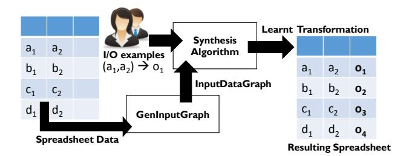
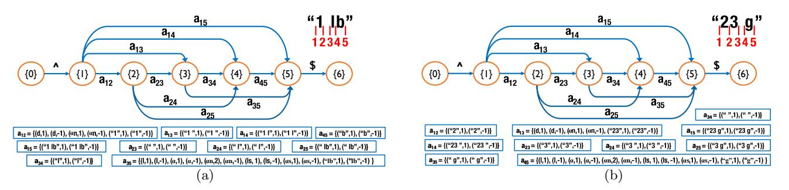
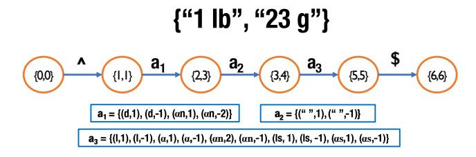
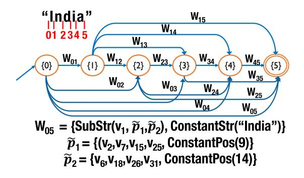
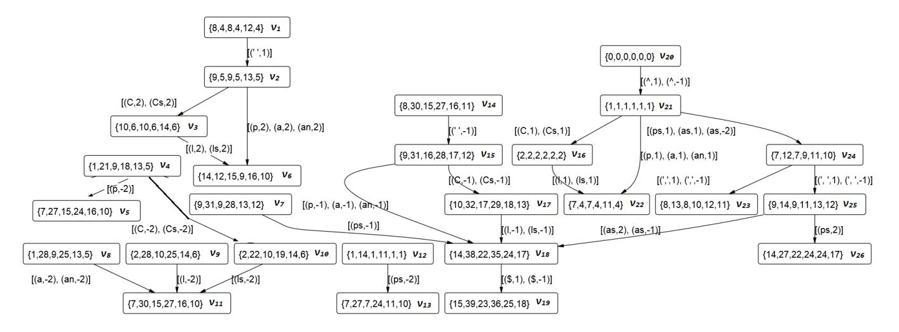
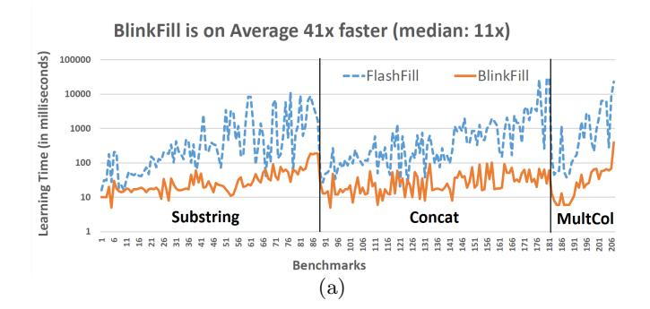
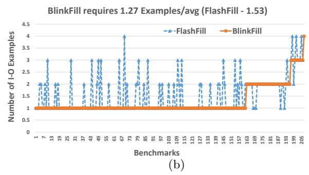
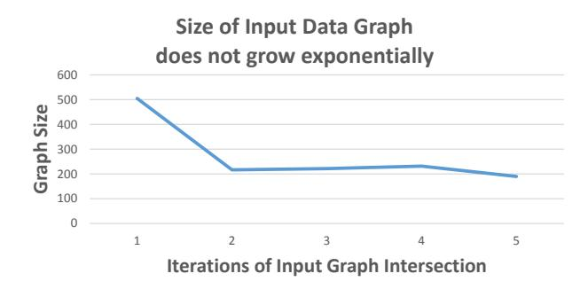
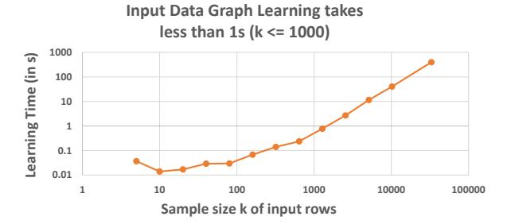

# BlinkFill: Semi-supervised Programming By Example for Syntactic String Transformations

Rishabh Singh Microsoft Research, Redmond, USA risin@microsoft.com

#### **ABSTRACT**

The recent Programming By Example (PBE) techniques such as Flashfill have shown great promise for enabling end-users to perform data transformation tasks using input-output examples. Since examples are inherently an underspecification, there are typically a large number of hypotheses conforming to the examples, and the PBE techniques suffer from scalability issues for finding the intended program amongst the large space.

We present a semi-supervised learning technique to significantly reduce this ambiguity by using the logical information present in the input data to guide the synthesis algorithm. We develop a data structure InputDataGraph to succinctly represent a large set of logical patterns that are shared across the input data, and use this graph to efficiently learn substring expressions in a new PBE system BLINKFILL. We evaluate BLINKFILL on 207 real-world benchmarks and show that BLINKFILL is significantly faster (on average 41x) and requires fewer input-output examples (1.27 vs 1.53) to learn the desired transformations in comparison to FLASHFILL.

# 1. INTRODUCTION

The IT revolution has resulted in massive digitization of data and in making this data accessible to millions of users. Despite significant advances in technologies for helping users perform data analysis, the process of transforming and cleaning data before any useful analysis is still challenging and time consuming. Some studies have reported that this step of data cleaning and reshaping (also called wrangling) can take up to 80% of the data analysts' time [4]. These data analysts have myriad diverse backgrounds and lack programming knowledge to automate data wrangling steps [6]. Simpler specification mechanisms such as examples [1, 7] and predictive interaction [10] are recently becoming more popular to cater to the needs of these users.

An important subset of the data wrangling problem consists of regular expression based string transformation tasks. FlashFill [7, 8], a recently introduced feature in Microsoft

This work is licensed under the Creative Commons Attribution-NonCommercial-NoDerivatives 4.0 International License. To view a copy of this license, visit http://creativecommons.org/licenses/by-nc-nd/4.0/. For any use beyond those covered by this license, obtain permission by emailing info@vldb.org.

Proceedings of the VLDB Endowment, Vol. 9, No. 10 Copyright 2016 VLDB Endowment 2150-8097/16/06. Excel 2013, is a Programming By Example (PBE) system for helping end-users perform such string transformations using examples. The key idea in FlashFill is to learn programs in a Domain-specific language (DSL) that is expressive enough to encode the majority of real-world tasks, but also restricted enough for efficient learning. Since examples are often an under-specification of the intended task, there are typically a large number of programs in the DSL that conform to the examples. FlashFill uses version-space algebra (VSA) [12, 13] to succinctly represent this large set of consistent programs and then uses ranking to identify the most likely program [27]. Since FlashFill only uses the input-output examples and ignores the other spreadsheet data items, it needs to learn and maintain a large set of programs that are consistent with the examples but may not perform the desired transformation on other data items. This, in turn, results in scalability issues of the synthesis algorithm on longer strings and also enforces larger restrictions on the transformations supported in the DSL (e.g. Flashfill only supports a finite set of pre-defined regular expression tokens).

In this paper, we present BLINKFILL, a PBE system that efficiently learns string transformations in spreadsheets from input-output examples by leveraging the logical information present in the spreadsheet data. We show that this semi-supervised technique can significantly reduce the inherent ambiguity in PBE, which in turn results in an efficient learning algorithm. Moreover, learning from other spreadsheet data also enables a new class of transformations that use regular expressions based on arbitrary constant strings.

There are two key challenges in learning from spreadsheet data: 1) how to efficiently compute the set of all logical structures (and sub-structures) that are consistent with a set of column values, and 2) how to use the logical structures in learning string transformation programs. BlinkFill constructs a data structure InputDataGraph that succinctly encodes the set of all logical structures that are shared across a set of column values. It then uses the sub-paths in the graph data structure to learn and disambiguate between a large number of DSL expressions that are consistent with a given set of input-output examples. The DSL for string transformation tasks in BlinkFill is similar to that of FlashFill at the top-level, but consists of new substring extraction expressions based on the InputDataGraph nodes. We present a sound and complete synthesis algorithm to learn the set of all expressions in the DSL that conform to a set of inputoutput examples, and a ranking algorithm to select the most likely program amongst them. Unlike FlashFill, the DSL for BLINKFILL does not support conditionals and loops, but supports a richer class of substring extraction tasks since it can learn arbitrary regular expression tokens based on the spreadsheet data. The substring extraction and merging tasks supported by BLINKFILL account for the majority (more than 88%) of the real-word FLASHFILL tasks obtained from the Excel product team.

The idea of using the data items other than input-output examples to learn consistent programs is inspired from the work on Potter's wheel [22]. Potter's wheel is a precursor to Trifacta's pioneering Data Wrangler system [11] for interactive data wrangling. For column split transformations, Potter's wheel learns the most suitable logical structure consistent with the set of column strings based on the Minimum Description Length metric [23]. Our technique of semi-supervised learning in BlinkFill is different from Potter's wheel in three key ways. First, BLINKFILL learns the complete set of logical structures (and sub-structures) that are consistent with a given set of column values instead of learning only one structure as there might be multiple consistent sub-structures. Second, the learnt structures are represented succinctly using a VSA so that they can be integrated in VSA-based program synthesis techniques such as Flashfill. Finally, the class of string transformations supported by BLINKFILL (concatenation of substrings and constant strings) is richer than the string transformations supported by Potter's wheel.

We evaluate BLINKFILL on 207 benchmarks [27] obtained from the Excel team and online help forums. In comparison to Flashfill, Blinkfill takes significantly less time to learn the desired transformations and requires fewer input-output examples (in spite of Flashfill using a highly-tuned machine learning based ranking technique). Blinkfill is on average 41× (median 11×) faster than Flashfill. It requires on average 1.27 examples per benchmark as opposed to 1.53 examples needed by Flashfill. This paper makes the following key contributions:

- We present a new data structure InputDataGraph to succinctly represent the set of all logical structures in a DSL that are consistent with a given set of strings, and present an efficient algorithm to learn the structure.
- We present a new PBE system BLINKFILL, whose DSL consists of concatenated expressions of constant string expressions and substring expressions (based on the InputDataGraph). We present a sound and complete synthesis algorithm to learn expressions in the DSL.
- We evaluate BLINKFILL on 207 real-world benchmarks obtained from the Excel product team and online help forums. BLINKFILL is significantly faster (41×) and requires fewer input-output examples (1.27 vs 1.53) in comparison to FLASHFILL.

# 2. PRELIMINARIES

Without loss of generality, we assume that the string transformation task involves transforming a set of n input row strings  $\{(v_1^1, \dots, v_k^1), \dots, (v_1^n, \dots, v_k^n)\}$ , and the user has provided a set of m input-output examples  $\{((v_1^1, \dots, v_k^1), o_s^1), \dots, ((v_1^m, \dots, v_k^m), o_s^m)\}$ . A string s is considered as simply a sequence of characters, where s[1] denotes the first character of the string and len(s) denotes the length of the string. We use the notation s[i..j] to denote the substring of s that

| Token             | Regex                                                   | Abbr.      |
|-------------------|---------------------------------------------------------|------------|
| ProperCase        | $r_p \equiv \langle p\{Lu\}(\langle p\{Ll\}) +$         | p          |
| CAPS              | $r_C \equiv \langle p\{Lu\} +$                          | С          |
| lowercase         | $r_l \equiv \backslash p\{Ll\} +$                       | l          |
| Digits            | \d+                                                     | d          |
| Alphabets         | $r_{\alpha} \equiv [\langle p\{Lu\} \rangle p\{Ll\}] +$ | $\alpha$   |
| Alphanumeric      | [\p{Lu}\p{Ll}0-9]+                                      | $\alpha$ n |
| Whitespace        | $r_{ws} \equiv \langle p\{Zs\} +$                       | ws         |
| StartT            | ^                                                       | ^          |
| EndT              | \$                                                      | \$         |
| ProperCaseWSpaces | $r_p(r_{ws}r_p)^*$                                      | ps         |
| CAPSWSpaces       | $r_C(r_{ws}r_C)^*$                                      | Cs         |
| lowercaseWSpaces  | $r_l(r_{ws}r_l)^*$                                      | ls         |
| AlphabetsWSpaces  | $r_{\alpha}(r_{ws}r_{\alpha})^*$                        | $\alpha s$ |

Table 1: The set of base regular expression based tokens supported by BlinkFill.

starts at index i and ends at index j, where  $j \ge i$  and length of the substring is j - i + 1.

Tokens: BLINKFILL supports two kinds of token patterns at the base level of the DSL: (i) regular expression tokens and (ii) constant string tokens. The regular expression tokens match a string with a predefined regular expression pattern. There are 13 such tokens supported by BLINKFILL, which are shown in Table 1. The constant string tokens match a string with the corresponding constant string pattern and are learnt automatically by BLINKFILL during the synthesis process.

DEFINITION 1 (TOKEN MATCH). Let n be the number of matches of the pattern defined by a token  $\tau$  in a given string s. We define a token match  $(\tau,k)$  as the  $k^{th}$   $((n+k)^{th})$  if k < 0 match of token  $\tau$  in s. We denote the set of all token matches as  $\tau \vDash s$ , such that  $\operatorname{size}(\tau \vDash s) = n$ ,  $(\tau,k) \equiv (\tau \vDash s)[k]$  if k > 0, and  $(\tau,k) \equiv (\tau \vDash s)[n+k+1]$  if k < 0. We denote the start and end indices of a token match as  $(\tau \vDash s)[k] \hookrightarrow \operatorname{and}(\tau \vDash s)[k] \hookrightarrow \operatorname{respectively}$ .

For example, given a string s = "Mumbai, India", the token match (C,1) denotes the  $1^{st}$  match of the CAPS token (matching the substring "M"), where  $\operatorname{size}(\mathsf{C} \vDash s) = 2$ , (C  $\vDash s)[1] \hookrightarrow = 1$ , (C  $\vDash s)[1] \longleftrightarrow = 1$ . The token match (C,-1) (matching the substring "I") is defined by (C  $\vDash s)[2] \longleftrightarrow = 8$ , (C  $\vDash s)[2] \longleftrightarrow = 8$ . Similarly, the token match (p,2) matches the substring "India", (1,1) matches "umbai", the constant token match ("M",1) matches "M", and the constant token match (",",1) matches the substring ",".

Version space algebra: Version-space Algebra (VSA) was first introduced by Mitchell [19] in the context of machine learning and was later used in Programming by Examples/Demonstration systems such as SmartEdit [12] and FLASHFILL [7]. The key idea in VSA is to succinctly represent an exponential number of programs in polynomial space and can be intuitively viewed as a directed graph with three types of nodes: 1) leaf nodes with direct set of programs, 2) intermediate union nodes representing a set-union of its children VSAs, and 3) intermediate join nodes with k children VSAs annotated with a k-ary function F such that it represents all resulting application of F to the cross-product of children values. More details about the VSA formalization and applications can be found in [21, 27].

#### 3. MOTIVATING EXAMPLES

In this section, we present a few motivating scenarios that demonstrate the usefulness of semi-supervised learning for string transformation tasks. BLINKFILL efficiently learns the set of all logical structures consistent with the input strings and uses it to learn the desired transformation from only 1 or 2 input-output examples for each of these scenarios.

Example 1. An Excel user had a list of city and country names in a column, and needed to extract the country name. The user provided an input-output example (emphasized in bold) to express the intent as shown in Figure 1.

|   | $\mathbf{Input} \ v_1$                | Output |
|---|---------------------------------------|--------|
| 1 | Mumbai, India                         | India  |
| 2 | Los Angeles, United States of America |        |
| 3 | Newark, United States                 |        |
| 4 | New York, United States of America    |        |
| 5 | Wellington, New Zealand               |        |
| 6 | New Delhi, India                      |        |

Figure 1: Extracting country from input column.

Given the first input-output example "Mumbai, India" → "India", there are a large number of possible logical expressions to extract the substring "India". The substring expression in the DSL that extracts such substrings from the input strings is defined using two position expressions: one position expression for the left index of the substring and the other for the right index. For example, some possible logics to identify the left index of the substring "India" in the input string "Mumbai, India" are: i) start of 2nd Alphabets token, ii) start of 2nd Alphanumeric, iii) end of 1st Whitespace, iv) end of 1st comma followed by whitespace, etc. There are more than 10<sup>3</sup> different logics in our DSL that can identify this position. Similarly, there are more than 10<sup>3</sup> different logics for identifying the right index of the substring. Given just the input-output example, it is challenging to select the desired expression from more than 10<sup>6</sup> different choices of conforming logics.

BLINKFILL uses semi-supervised learning to identify that the most desirable logic for left index of substring "India" is the end of 1<sup>st</sup> ConstantStr(", ") (comma followed by a whitespace), whereas the most desirable logic for the right index is the end of -1<sup>st</sup> lowercase (where negative values denote match occurrences from the end). BLINKFILL prefers token sequences that have larger contexts around them in input data as they are more likely to correspond to the desired logic. For this example, it finds that the left index logic is preceded by the context StartTo1<sup>st</sup>ProperCaseWSpaces, and the right index logic is followed by the context EndT.

Example 2. An Excel user wanted to abbreviate a list of names to the corresponding initials of First and Last names as shown in Figure 2. The presence of optional middle names in different formats made it challenging for the user.

This example requires extraction of multiple substrings. Given an input-output example "Brandon Henry Saunders" → "B.S.", BLINKFILL needs to learn substring expressions to extract the substrings "B" and "S". For the substring "B", there are again many different possible logics for the

|   | $\mathbf{Input}  v_1$     | Output |
|---|---------------------------|--------|
| 1 | Brandon Henry Saunders    | B.S.   |
| 2 | William Lee               |        |
| 3 | Dafna Q. Chen             |        |
| 4 | Danelle D. Saunders       |        |
| 5 | Emilio William Concepcion |        |

Figure 2: Abbreviating names to initials.

left index such as start of  $1^{\rm st}$ CAPS, start of  $1^{\rm st}$ ProperCase, end of StartT, etc. Machine learning based techniques can reasonably identify that  $1^{\rm st}$ CAPS is a more commonly-used expression globally and can rank them higher than other choices. But for the left index of the second substring "S", identifying the correct logic is quite challenging as there are many equally likely hypotheses such as end of  $-1^{\rm st}$  Whitespace, end of  $2^{\rm nd}$  Whitespace, start  $3^{rd}$  CAPS, end of  $-1^{\rm st}$ ProperCase oWhitespace, etc. BLINKFILL uses the logical patterns shared by the input column strings to learn the following index expressions:

- For substring "B", left: start of 1<sup>st</sup>ProperCaseWSpaces (end of StartT as context), right: end of 1<sup>st</sup>CAPS (end of StartT and start of 1<sup>st</sup>lowercase as contexts)
- For substring "S", left: end of -1<sup>st</sup>Whitespace (start of -1<sup>st</sup>ProperCase o EndT as context), right: start of -1<sup>st</sup>lowercase (start of EndT as context)

Example 3. A user posted the following spreadsheet on an Excel help-forum consisting of a list of medical billing codes, where some codes had a missing "]" at the end. The user wanted to clean the data by adding the missing "]" only for the strings where it was missing, and didn't want to duplicate "]" for the strings where it was already present.

|   | Input $v_1$ | Output      |
|---|-------------|-------------|
| 1 | [CPT-00350  | [CPT-00350] |
| 2 | [CPT-00340  |             |
| 3 | [CPT-11536] |             |
| 4 | [CPT-115]   |             |

Figure 3: Adding "]" to codes with a missing "]".

This is an interesting example as it requires FlashFill to learn a conditional program to insert "]" to only strings that do not already have "]" at the end. After the first example, FlashFill learns the simplest program to insert "]" at the end of every input. The user needs to provide an additional example corresponding to the distinct behavior to help FlashFill learn the conditional program. On the other hand, BLINKFILL learns the desired transformation from the first example itself. Instead of selecting the substring between the StartT and EndT (i.e. the complete input), it learns that the most common logical pattern shared by the input strings is: StartTo1stConstantStr("[CPT-")o 1<sup>st</sup>Digits. It then learns the program that concatenates the substring between end of StartT and end of 1st Digits with the constant string "]". For inputs without "]" at the end, the substring expression extracts the complete substring. For inputs ending with "]", the substring expression extracts only the substring before the last "]".

Example 4. A user posted the following spreadsheet on StackOverflow, where the user wanted to extract the information (of varying length) that was present between two strings "nextData" and "moreInfo" as shown in Figure 4.

|   | $\mathbf{Input}  v_1$                 | Output    |
|---|---------------------------------------|-----------|
| 1 | nextData 12 Street moreInfo 35        | 12 Street |
| 2 | nextData Main moreInfo 36             | Main      |
| 3 | nextData Albany Street moreInfo 37    |           |
| 4 | nextData 134 Green Street moreInfo 39 |           |

Figure 4: Extracting message between the constant strings "nextData" and "moreInfo".

The transformation in this example cannot be learnt by FLASHFILL since it is limited by a finite predefined list of regular expression tokens and does not consider constant string based tokens such as "nextData". BLINKFILL, however, is not limited by a finite list of tokens, and considers different possible logical structures in the input strings including all possible combinations of constant string tokens and regular expression tokens. It learns the substring expression to extract the desired substring whose left and right indices are defined by the logics end of  $1^{\rm st} {\tt ConstantStr}("\tt nextData")$  and start of  $1^{\rm st} {\tt ConstantStr}("\tt moreInfo"), with StartT and <math display="inline">-1^{\rm st} {\tt Digits} \circ {\tt EndT}$  as contexts respectively.

#### 4. OVERVIEW OF THE APPROACH

We first define the abstract semi-supervised PBE problem. Let D denote the set of data items,  $I = \{(i_1, o_1), \dots, (i_n, o_n)\}$ denote the set of n input-output examples, and L denote the DSL that defines the possible space of programs. The traditional PBE techniques solve the following problem:  $\exists P \in$  $L \ \forall (i,o) \in I : P(i) = o$ , i.e. find a program P in DSL L that is consistent with all input-output examples. The semisupervised approach also takes into account the dataset Dfor learning the program and solves the following constraint:  $\exists P \in L \ \forall (i,o) \in I : P(i) = o \land \mathtt{SubExpr}(P) \subseteq G(D,L),$ where G(D, L) denotes a data structure that represents a set of sub-expressions in L and SubExpr(P) denotes the set of sub-expressions of P. For a sound and complete synthesis algorithm, we require that the data structure G(D, L)consists of all sub-expressions in L that are consistent with each data item in the dataset D.

An overview of our instantiation of the semi-supervised PBE approach in BLINKFILL is shown in Figure 5. The synthesis algorithm takes two kinds of inputs: 1) the traditional input-output examples given by users in the form of a set of tuples of spreadsheet rows and the corresponding outputs, and 2) the InputDataGraph. The GenInputGraph module uses the spreadsheet data to construct the InputDataGraph that succinctly represents the set of all logical patterns that are shared across the spreadsheet data. The synthesis algorithm then uses the InputDataGraph to efficiently learn a program in the DSL that is consistent with the input-output examples, and executes it on the spreadsheet data to compute the outputs for the remaining spreadsheet rows.

# 5. INPUT DATA GRAPHS

Given a set of strings in a spreadsheet column, our goal is to learn the set of all logical patterns (in a DSL) that are



Figure 5: An overview of our approach in BlinkFill.

consistent with any substring of these strings. This is challenging because of two reasons: 1) there are a huge number of token sequences that are consistent with the quadratic number of substrings of a single string, and 2) there are exponentially many possible alignments of the strings in a column. A naïve approach would first enumerate exponentially many token sequences for each string in a column, and then compute all matching sub-sequences in double exponential time. We present a data structure InputDataGraph that succinctly represents a large number of token sequences that are consistent with a set of input strings, and can be constructed efficiently in practice.

DEFINITION 2. An InputDataGraph G = (V, E, I, L) is a 4-tuple where V denotes the set of nodes, E denotes the set of edges corresponding to a set of ordered node pairs,  $I: V \rightarrow \{(id, idx)_i\}_i$  is a labeling function that labels each node with a set of string id and index pair (id, idx), and  $L: E \rightarrow \{(\tau, k)_i\}_i$  maps each edge to a list of token matches.

The nodes in an InputDataGraph correspond to different indices of a set of strings, where the indices are represented using the labeling function I. An edge between two nodes  $v_1$  and  $v_2$  in the graph represents all token matches that match the substrings corresponding to the indices of the two nodes. The token matches on an edge are represented using the edge labeling function L. A path in the graph between two nodes represents a sequence of token matches that match the corresponding substrings. In this manner, an InputDataGraph represents an exponential number of sequence of token matches succinctly using polynomial space.

Consider the input strings: {"1 1b", "23 g", "4 tons", "102 grams", "75 kg"}. The InputDataGraph  $G_1$  for the input string "1 1b" is shown in Figure 6(a). We have  $G_1 = (V_1, E_1, I_1, L_1)$ , where  $V_1 = \{v_0, v_1, v_2, v_3, v_4, v_5, v_6\}$ , and  $E_1 = \{(v_i, v_j) | j > i \wedge v_i \in V_1 \wedge v_j \in V_1\}$ . The node labeling function  $I_1(v_i) = \{(1, i)\}$  for all  $v_i \in V_1$ , where 1 is the unique identifier assigned to the string "1 1b". The edge labeling function  $L_1$  for each edge is shown in the figure, e.g.  $L_1(v_1, v_2) = \{(d, 1), (d, -1), (\alpha n, 1)(\alpha n, -1), ("1", 1), ("1", -1)\}$  and  $L_1(v_1, v_3) = \{("1 ", 1), ("1 ", -1)\}$ . Similarly, the graph for the input string "23 g" is shown in Figure 6(b).

#### 5.1 Generation of InputDataGraphs

Given a set of n input rows each consisting of k columns, the GenInpDataGraph algorithm constructs the corresponding InputDataGraph G as shown in Figure 7. The key idea of the algorithm is to first construct a graph for each spread-sheet column, and then return the union of these graphs as the resulting graph for the spreadsheet data. Given a column of string values, it uses the GenGraphStr algorithm



Figure 6: The InputDataGraph for the input strings (a) "1 1b" and (b) "23 g".

```
\begin{split} &\frac{\texttt{GenInpDataGraph}}{\texttt{for i}}(\{(v_1^1,\cdots,v_k^1),\cdots,(v_1^n,\cdots,v_k^n)\}) \\ &\overline{\texttt{for i}} = \texttt{1 to k}; \\ &G_i \coloneqq \texttt{GenGraphColumn}(\{v_i^1,\cdots,v_i^n\}) \\ &\texttt{return } \bigcup_{1 \leq i \leq k} G_i \\ \\ &\underline{\texttt{GenGraphColumn}}(\{(s_1,\cdots,s_n)\}) \\ &\overline{G} \coloneqq \texttt{GenGraphStr}(s_1) \\ &\texttt{for i} = \texttt{2 to n}; \\ &G \coloneqq \texttt{Intersect}(G,\texttt{GenGraphStr}(s_i)) \\ &\texttt{return } G \end{split}
```

Figure 7: The GenInpDataGraph algorithm for constructing the input graph for a set of n input rows each consisting of k strings.

to construct the graphs for individual strings and then uses the intersection algorithm (§5.2) to intersect these graphs to compute the graph consisting of all logical patterns that are shared across the set of column strings.

The GenGraphStr algorithm for constructing the input graph for an input string s is shown in Figure 8. The algorithm first creates len(s) + 1 number of nodes for denoting different indices of the input string, and two special nodes  $v_0$  and  $v_{len(s)+2}$  for denoting the start and end tokens respectively. The labeling function I labels each node  $v_i$  with (id,i), where id denotes the unique string identifier for s. For each node pair  $(v_i, v_j)$ , the algorithm adds an edge with the labeling function L such that  $L(v_i, v_j)$  consists of all token matches that match the substring s[i..(j-1)]. The complexity of the algorithm is  $O(n^2)$  (by using hash lookup for GetMId), where n is the length of the input string s.

#### 5.2 Intersection of InputDataGraphs

The intersection of two InputDataGraphs results in an InputDataGraph that consists of all patterns that are common to both graphs. Formally, the intersection of two graphs  $G_1 = (V_1, E_1, I_1, L_1)$  and  $G_2 = (V_2, E_2, I_2, L_2)$  is defined as  $G = Intersect(G_1, G_2) = (V, E, I, L)$ , where

$$\begin{aligned} \mathbf{V} &= \{(v_i, v_j) | v_i \in V_1, v_j \in V_2\} \\ \mathbf{E} &= \{((v_i, v_j), (v_k, v_l)) | (v_i, v_k) \in \mathbf{E}_1, (v_j, v_l) \in \mathbf{E}_2\} \\ \mathbf{I}((v_i, v_j)) &= \mathbf{I}_1(v_i) \cup \mathbf{I}_2(v_j), \forall v_i \in V_1, v_j \in V_2 \\ \mathbf{L}(((v_i, v_j), (v_k, v_l))) &= \{(\tau, k) | (\tau, k) \in \mathbf{L}_1((v_i, v_k)) \\ \wedge (\tau, k) \in \mathbf{L}_2((v_j, v_l))\} \forall (v_i, v_k) \in \mathbf{E}_1, (v_j, v_l) \in \mathbf{E}_2 \end{aligned}$$

The Intersect algorithm creates the Cartesian product of the nodes in the two graph  $V_1$  and  $V_2$  to create the nodes  $V_3$  for the new graph G. The node labeling function  $I((v_i, v_j))$ 

```
GenerateInputGraph(s: Input string)
   \mathtt{V}=\emptyset, \mathtt{E}=\emptyset
    id = string2Id[s]
    foreach i \in range(0, len(s)+3):
         V = V \cup v_i
         I(v_i) = \{ (id,i) \}
    L((v_0, v_1) = \{(^{\wedge}, 1)\}\
    L((v_{len(s)+1}, v_{len(s)+2}) = \{(\$, 1)\}
 8
    foreach i \in range(1, len(s)+1):
         foreach j \in range(i+1,len(s)+2):
 q
             leftIdx = i, rightIdx = j-1
10
             \mathtt{E} = \mathtt{E} \cup (v_i, v_j)
11
             c_s = s[leftIdx..rightIdx]
12
13
             L((v_i, v_j)) = \{(c_s, GetMId(c_s, s, i))\}
             foreach \tau \in \mathcal{T} \wedge \text{Match}(\tau, c_s):
14
                  L((v_i, v_j)) = L((v_i, v_j)) \cup (\tau, \texttt{GetMId}(\tau, s, i))
15
16 return (V, E, I, L)
```

Figure 8: The generateInputGraph algorithm for constructing the input graph for an input string s.

takes the union of the labels of the corresponding nodes  $I(v_i)$ and  $I(v_j)$ . For each edge  $(v_i, v_k) \in E_1$  and edge  $(v_j, v_l) \in E_2$ , the algorithm adds an edge  $((v_i, v_j), (v_k, v_l))$  to the new set of edges E. The edge labeling function  $L(((v_i, v_j), (v_k, v_l)))$ labels each edge with the token set that is common to both sets  $L((v_i, v_k))$  and  $L((v_j, v_l))$ . The worst-case complexity of the algorithm is  $O(n^4)$ , where n is the length of the input strings. However, in practice, we do not see a quadratic blowup in the graph size after the intersection algorithm as shown in §8.3. The key reason behind this is the fact that even though the two initial InputDataGraphs are complete with  $O(n^2)$  edges, a lot of these edges do not remain after the intersection operation because of the strong constraint that token match  $(\tau, k)$  should be the same for both the intersecting edges. For example, the token match ("a", 1) (matching the first occurrence of constant string "a") can not match with the token match ("a", 2) (the second occurrence of "a"). As a result, the InputDataGraph obtained after intersection becomes very sparse in the number of edges.

The InputDataGraph for the intersection of graphs for the strings "1 lb" and "23 g" is shown in Figure 9. The intersected graph consists of 6 nodes and 5 edges. Note that the node labels in the figure only show the string indices and not the string ids for brevity. The InputDataGraph obtained after intersecting the graphs for the set of input strings {"1 lb", "23 g", "4 tons", "102 grams", "75 kg"} also consists of same number of nodes and edges. The InputDataGraph



Figure 9: The intersection of InputDataGraphs for strings "1 lb" and "23 g".

for the six input strings in Example 1 is shown in Figure 14, which consists of 40 nodes and 32 edges.

#### 6. STRING TRANSFORMATIONS

In this section, we describe the String Transformation Language  $L_s$  of BLINKFILL and the Dag data structure used to succinctly represent a large number of  $L_s$  expressions that are consistent with a given set of input-output examples. The DSL and the data structure are similar to the corresponding DSL and data structure of FLASHFILL at the top-level, but the key difference is in the representation of position expressions in the substring expressions, which are defined using the token match expressions from the edges of the InputDataGraph data structure.

#### **6.1** String Transformation Language $L_s$

The DSL for BLINKFILL is shown in Figure 10(a) with the key differences from FLASHFILL highlighted. The top-level string expression e is a concatenation of a finite list of substring expressions  $[f_1, \dots, f_n]$ . A substring expression f can either be a constant string s (denoted by ConstantStr(s)) or a substring extraction expression that is defined using two position logics  $p_l$  and  $p_r$ , which correspond to the left and right indices in the input string  $v_i$  respectively. The position logic expression p is either a constant integer value k or a token match expression. The token match expression  $(\tau, k, \text{Dir})$  returns the start index (Dir = Start) or the end index (Dir = Start) of the token match  $(\tau, k)$ .

The semantics of  $L_s$  is shown in Figure 10(b). The environment state  $\sigma$  maps the input variables  $v_i$  to their corresponding string values. The semantics of a concatenate expression is to recursively evaluate each individual substring expression  $f_i$  and then concatenate them. The semantics of a constant string expression ConstantStr(s) is to simply return the constant string s. The semantics of a substring expression SubStr( $v_i, p_l, p_r$ ) is to first evaluate index positions  $l = p_l$  and  $r = p_r$ , and then return the corresponding substring s[l..r], where  $s = \sigma(v_i)$ . The semantics of the constant position expression ConstantPos(k) is to return k if k > 0 and len(s) + k otherwise. The semantics of a token match expression ( $\tau, k$ , Start) (resp. ( $\tau, k$ , End)) is to return the start index (resp. end index) of the k<sup>th</sup> occurrence of the match of token  $\tau$  in the string s.

A possible  $L_s$  expression to perform the desired transformation of extracting country names in Example 1 is:  $e_1 \equiv \mathtt{Concat}(\mathtt{SubStr}(v_1, (", ", 1, \mathtt{End}), (l, -1, \mathtt{End}))$ . The expression  $e_1$  extracts the substring from the input string  $v_1$  whose left index is the end position of the match of  $1^{st}$  constant string ", " (comma followed by a whitespace) and the right index is the end position of the match of last lowercase

token match. For example, for the input string "Mumbai, India", the position expression (", ",1,End) returns the index 9 and matches the substring ", ", whereas the position expression  $(l,-1,\operatorname{End})$  returns the index 14 and matches the substring "ndia". For abbreviating the initials of first and last names in Example 2, a possible  $L_s$  expression is:  $e_2 \equiv \operatorname{Concat}(f_1,\operatorname{ConstantStr}("."),f_2,\operatorname{ConstantStr}("."))$ , where  $f_1 \equiv \operatorname{SubStr}(v_1,(C,1,\operatorname{Start}),(C,1,\operatorname{End}))$  and  $f_2 \equiv \operatorname{SubStr}(v_1,(C,-1,\operatorname{Start}),(l,-1,\operatorname{Start}))$ .

# **6.2 DAG Data Structure**



Figure 12: The Dag data structure for representing a set of string expressions to generate the string "India" from an input string "Mumbai, India".

The Dag data structure is used to succinctly represent a large number of  $L_s$  expressions that are consistent with a given set of input-output examples. The syntax of the Dag data structure is shown in Figure 11(a). The set of top-level concatenate expressions are represented using paths in the Dag in a way similar to their Dag based representation in FLASHFILL. The key difference is in the way the substring expressions are represented as a pair of two independent sets of InputDataGraph nodes on the Dag edges.

A set of  $L_s$  expressions is represented using a Dag consisting of a set of nodes  $\tilde{\eta}$ , a start node  $\eta^s$ , a final node  $\eta^f$ , a set of edges  $\tilde{\xi}$ , and a mapping function W that maps each edge  $\xi \in \tilde{\xi}$  to a set of substring expressions. The set of substring expression or a set of substring expressions SubStr $(v_i, \{\tilde{p}_j\}_j, \{\tilde{p}_k'\}_k)$ , where the set of position expressions  $\{\tilde{p}_j\}_j$  and  $\{\tilde{p}_k'\}_k$  are represented as independent sets. A set of position expressions  $\tilde{p}$  consists of either a constant position or a set of InputDataGraph nodes  $\tilde{V}$ .

The semantics of the Dag data structure is shown in Figure 11(b). A path from the start node  $\eta^s$  to the final node  $\eta^f$  in the Dag represents a  $\operatorname{Concat}(f_1,\cdots,f_n)$  expression, where the substring expressions  $f_i$  are obtained from the edges  $\xi_i$  on the path. The semantics of a set of substring expressions  $\operatorname{SubStr}(v_i,\{\tilde{p}_j\}_j,\{\tilde{p}'_k\}_k)$  is to first independently evaluate the set of left and right position expressions, and then compute the set of substring expressions corresponding to the cross-product of the set of position expressions. The set of constant string and constant position expressions have expected semantics as shown in the figure. Intuitively, the semantics of a set of InputDataGraph nodes  $\widetilde{V}$  is to return the set of token matches on the edge labels for all incoming and outgoing edges to nodes  $v \in \widetilde{V}$ . For each node  $v \in \widetilde{V}$  and

```
[\![\mathtt{Concat}(f_1,\cdots,f_n)]\!]_{\sigma} = \mathtt{Concat}([\![f_1]\!]_{\sigma},\cdots,[\![f_n]\!]_{\sigma})
     String expr e := Concat(f_1, \dots, f_n)
                                                                               [ConstantStr(s)]_{\sigma} = s
Substring expr f
                                    ConstantStr(s)
                                                                              [SubStr(v_i, p_l, p_r)]_{\sigma} = s[[p_l]_s..[p_r]_s], \text{ where } s = \sigma(v_i)
                                     SubStr(v_i, p_l, p_r)
                                                                               [\![\mathtt{ConstantPos}(k)]\!]_s \quad = \quad k > 0?k : \mathtt{len}(s) + k
         Position p
                                      (\tau, k, \mathtt{Dir})
                                                                                    [(\tau, k, \text{Start})]_s = k > 0? (\tau \models s)[k] \hookrightarrow (\tau \models s)[\text{len}(s) + k] \hookrightarrow
                                     ConstantPos(k)
                                                                                                                       k > 0?(\tau \vDash s)[k] \hookleftarrow : (\tau \vDash s)[\mathtt{len}(s) + k] \hookleftarrow
   Direction Dir
                                      Start | End
                                                                                                                                     (b)
                               (a)
```

Figure 10: The (a) syntax and (b) semantics of the string transformation language  $L_s$  of BlinkFill.

```
\tilde{e} := \operatorname{Dag}(\tilde{\eta}, \eta^s, \eta^f, \tilde{\xi}, W)
\tilde{f} := \operatorname{SubStr}(v_i, \{\tilde{p}_j\}_j, \{\tilde{p}_k'\}_k)
\mid \operatorname{ConstantStr}(s)
\mid \tilde{V}
[\operatorname{ConstantPos}(k)] = \{\operatorname{Concat}(f_1, \cdots, f_n) | f_i \in [W(\xi_i)] \\ \xi_1 \leadsto \xi_n \operatorname{corresponds} \text{ to path between } \eta^s \text{ and } \eta^f\}
\xi_1 \leadsto \xi_n \operatorname{corresponds} \text{ to path between } \eta^s \text{ and } \eta^f\}
\{\operatorname{SubStr}(v_i, \{\tilde{p}_j\}_j, \{\tilde{p}_k'\}_k)\} = \{\operatorname{SubStr}(v_i, p_l, p_r) | p_l \in [\tilde{p}_j], p_r \in [\tilde{p}_k']\}
\{\operatorname{ConstantStr}(s)\} = \{\operatorname{ConstantPos}(k)\}
[[\operatorname{ConstantPos}(k)]] = \{\operatorname{ConstantPos}(k)\}
[[\tilde{V}]] = \{(\tau, k, \operatorname{Start}) | v \in \tilde{V}, \exists v_i \in V : (v, v_i) \in E, (\tau, k) \in L((v, v_i))\}
\cup \{(\tau, k, \operatorname{End}) | v \in \tilde{V}, \exists v_i \in V : (v_i, v) \in E, (\tau, k) \in L((v_i, v))\}
(a)
```

Figure 11: The (a) syntax and (b) semantics of the Dag data structure used to succinctly represent a large number of  $L_s$  expressions.

outgoing edge  $(v, v_i) \in E$ , the resulting set consists of a token match expression  $(\tau, k, \mathtt{Start})$ , where  $(\tau, k) \in \mathtt{L}((v, v_i))$ . Similarly, it also consists of token matches  $(\tau, k, \mathtt{End})$  for each  $v \in \widetilde{V}$ ,  $(v_i, v) \in E$ ,  $(\tau, k) \in \mathtt{L}((v_i, v))$ .

The Dag data structure that succinctly represents the set of all  $L_s$  expressions consistent with the input-output example "Mumbai, India"  $\rightarrow$  "India" is shown in Figure 12, where the set of nodes  $\tilde{\eta} = \{0, 1, 2, 3, 4, 5\}$ , the start node  $\eta^{s} = 0$ , the final node  $\eta^{f} = 5$ , and  $\tilde{\xi} = \{(i, j) | 0 \le i < j \le 5\}$ . Intuitively, the Dag nodes correspond to the indices of the output string "India" and an edge from node i to node j represents the set of substring expressions that can generate the substring between indices i and j. The edge mapping function W is shown for one of the edges (0,5) (corresponding to the sub-string "India"), where W((0,5)) consists of a set of substring expressions and a constant string expression. The set of position expressions for the left index  $\tilde{p}_l$ consists of a constant position expression and 4 nodes from the InputDataGraph in Figure 14:  $\{v_2, v_7, v_{15}, v_{25}\}$ . The node labeling function for these nodes contains the tuple (id, 9), where id is the unique identifier for the input string "Mumbai, India" and 9 is the left index of sub-string "India" in the input string. Similarly, the set of position expressions for the right index also consists of 4 input graph nodes and a constant position expression.

# 7. SYNTHESIS ALGORITHM

The LearnProgram algorithm for learning an  $L_s$  expression that conforms to a given set of m input-output examples  $\{((v_1^1,\cdots,v_k^1),o_s^1),\cdots,((v_1^m,\cdots,v_k^m),o_s^m)\}$  and n in-

```
 \begin{array}{l} & \underbrace{\text{LearnProgram}(\{(v_1^1,\cdots,v_k^1),\cdots,(v_1^n,\cdots,v_k^n)\},}_{\{((v_1^1,\cdots,v_k^1),o_s^1),\cdots,((v_1^m,\cdots,v_k^m),o_s^m)\})} \\ \text{1} & G := \texttt{GenInpDataGraph}(\{(v_1^1,..,v_k^1),\cdots,(v_1^n,..,v_k^n)\})} \\ \text{2} & \texttt{Dag d} := \texttt{GenerateDag}((v_1^1,\cdots,v_k^1s),o_s^1,G)} \\ \text{3} & \texttt{for i = 2 to m:} \\ \text{4} & \texttt{Dag d'} := \texttt{GenerateDag}((v_1^i,\cdots,v_k^is),o_s^i,G)} \\ \text{5} & \texttt{d := Intersect(d,d')} \\ \text{6} & \texttt{return TopRankExpr(d)} \end{array}
```

Figure 13: The LearnProgram procedure for learning an expression that conforms to a set of m examples.

put rows  $\{(v_1^1, \cdots, v_k^1), \cdots, (v_1^n, \cdots, v_k^n)\}$  is shown in Figure 13. The algorithm first constructs the InputDataGraph G corresponding to the set of n input rows. It then constructs the Dag d denoting the set of all consistent  $L_s$  expressions that conform to the first input-output example. Next, it iterates over other input-output examples and intersects the corresponding dags to compute the resulting dag d that consists of  $L_s$  expressions that are consistent with all m examples. Finally, the algorithm uses a ranking function to find the best expression path in the dag and returns it as the learnt program. We now describe each of the individual algorithms GenSubStrExpr, GenerateDag, and TopRankExpr.

### 7.1 Learning Substring Expressions

The GenSubStrExpr algorithm, shown in Figure 15, takes as input an input string s, two integer positions 1 and r corresponding to the left and right indices of the desired substring, and the InputDataGraph G, and returns the set of



Figure 14: The InputDataGraph for the set of input strings in Example 1. Note that some constant string edges and the corresponding nodes are not shown here for brevity.

```
\begin{array}{l} \operatorname{GenSubStrExpr}(\mathbf{s},\ \mathbf{l},\ \mathbf{r},\ \mathbf{G}) \\ 1 \quad \overline{\mathbf{id}} = \operatorname{string2Id}[\mathbf{s}] \\ 2 \quad \widetilde{V}_l = \emptyset,\ \widetilde{V}_r = \emptyset \\ 3 \quad \operatorname{foreach}\ v \in \operatorname{V}(\mathbf{G}) \colon \\ 4 \quad \operatorname{if}\ (\operatorname{id},\mathbf{l}) \in \operatorname{I}(v) \colon \ \widetilde{V}_l = \widetilde{V}_l \cup \{v\} \\ 5 \quad \operatorname{if}\ (\operatorname{id},\mathbf{r}) \in \operatorname{I}(v) \colon \ \widetilde{V}_r = \widetilde{V}_r \cup \{v\} \\ 6 \quad \widetilde{p}_l = \widetilde{V}_l \cup \{\operatorname{ConstantPos}(l)\} \\ 7 \quad \widetilde{p}_r = \widetilde{V}_r \cup \{\operatorname{ConstantPos}(r)\} \\ 8 \quad \operatorname{return}\ \operatorname{SubStr}(s,\widetilde{p}_l,\widetilde{p}_r) \end{array}
```

Figure 15: The GenSubStrExpr algorithm for generating a set of substring expressions given an input string s, the left and right indices l and r of the substring, and the InputDataGraphG.

substring expressions that can generate the corresponding substring. It searches the graph  ${\tt G}$  for all nodes  $v \in {\tt V}({\tt G})$  such that  $({\tt id},l) \in {\tt I}(v)$  to create the set of nodes  $\widetilde{V}_l$  corresponding to the left index l of the substring. Similarly, the algorithm constructs the node set  $\widetilde{V}_r$  corresponding to the right index  ${\tt r}$ . It finally adds the constant position logics ConstantPos(l) and ConstantPos(r) to the respective set of position expressions  $\widetilde{p}_l$  and  $\widetilde{p}_r$ , and returns the set of substring expressions SubStr $(s,\widetilde{p}_l,\widetilde{p}_r)$ .

An example substring extraction task from Example 1 is to extract the substring "India" from s = "Mumbai, India" (GenSubStrExpr(s, 9, 14, G)), where 9 and 14 respectively denote the left and right index nodes of the substring "India" in the input graph, and G denotes the InputDataGraph shown in Figure 14. Let id denote the unique identifier for the input string s. For the left index 9, the GenSubStrExpr algorithm adds all nodes in G to  $\tilde{p}_l$  whose labeling function I contains the tuple (id, 9). From the figure, we observe that there are 4 such nodes in G:  $\{v_2, v_7, v_{15}, v_{25}\}$ . It also adds the constant position expression ConstantPos(9) to the set. Similarly, for the right index 14, the algorithm adds all nodes whose label contains the tuple (id, 14) and ConstantPos(14) to the set  $\tilde{p}_r$ . Finally, the algorithm returns the set of substring expression  $W_{05}$  as shown in Figure 12.

# 7.2 Learning Dag Data Structure

The GenerateDag algorithm for learning the Dag data structure is similar to the Dag learning algorithm of FLASHFILL. The algorithm takes as input an input row  $\{v_1, \dots, v_k\}$ , an output string  $o_s$ , and an InputDataGraph G, and returns a Dag that represents all string expressions in the language  $L_s$ that can transform the input strings to the output string. The algorithm first creates  $len(o_s)$  number of nodes with labels  $\tilde{\eta} = \{0, \dots, \text{len}(o_s)\}$ , and sets the start node  $\eta^s$  to be the node with label 0 and the final node  $\eta^{f}$  with label  $len(o_s)$ . It then iterates over all substrings  $o_s[i..j]$  of the output string, and adds an edge (i, j) between the nodes with labels i and j. For each edge (i, j), the algorithm learns the function W that maps the edge to a constant string expression ConstantStr $(o_s[i..j])$  and a set of substring expressions obtained by calling GenSubStrExpr $(v_k, l, r, G)$  (for each (k, l, r) such that  $v_k[l..(r-1)] = o_s[i..j]$ .

The Dag data structure learnt by GenerateDag algorithm for the input-output example  $v_1 = \text{"Mumbai}$ , India"  $\to o_s = \text{"India"}$  is shown in Figure 12. The algorithm first creates  $\text{len}(o_s) = 6$  nodes labeled  $\tilde{\eta} = \{0, \dots, 5\}$ , with the starting node  $\eta^s = 0$  and final node  $\eta^f = \text{len}(o_s) = 5$ . The algorithm then adds an edge (i,j) between nodes i and j, and assigns the labeling function W((i,j)) to the set of constant string expressions and substring expressions that can generate the substring  $v_1[i..(j-1)]$ .

**Dag Intersection:** Given two dags, the intersection algorithm computes a dag that consists of expressions common to both the dags. The main idea in the intersection procedure is to compute the Cartesian product of the nodes in the two dags, such that for a node  $\eta_1 \in \mathtt{Dag}_1$ , and a  $\eta_2 \in \mathtt{Dag}_2$ , we have a node  $(\eta_1, \eta_2)$  in the resulting dag. The set of labels on the edges between these nodes is computed by intersecting the corresponding pair of edges in the two dags. For intersecting two sets of substring expressions, the corresponding sets of left and right position expressions are intersected independently. For intersecting the position expressions  $\widetilde{V}_1$  and  $\widetilde{V}_2$ , the intersection algorithm selects the set of nodes v that are common to both  $\widetilde{V}_1$  and  $\widetilde{V}_2$ . The worst-case complexity of the LearnProgram algorithm is  $O((k|s|^2)^m)$ , where

```
\begin{aligned} & \underbrace{\text{RankInpGNodes}(G)} \\ & \text{foreach } v \in \mathbb{V}(G) \colon \\ & v. \text{out } := 0, \ v. \text{in } := 0, \ v. \text{score } := 0 \\ & \text{foreach } v \in \mathbb{V}(G) \text{ in topological order:} \\ & \text{foreach } (v, v_i) \in \mathbb{E}(G) \colon \\ & v. \text{out } := \operatorname{Max}(v. \text{out, } v_i. \text{out } + \phi_{\eta}(v, v_i)) \\ & \text{foreach } v \in \mathbb{V}(G) \text{ in reverse topological order:} \\ & \text{foreach } (v_i, v) \in \mathbb{E}(G) \colon \\ & v. \text{in } := \operatorname{Max}(v. \text{in, } v_i. \text{in } + \phi_{\eta}(v_i, v)) \\ & \text{foreach } v \in \mathbb{V}(G) \colon \\ & v. \text{score } := v. \text{in } + v. \text{out} \\ & \text{return } v \text{ with the highest } v. \text{score} \end{aligned}
```

Figure 16: The ranking algorithm for assigning scores to the nodes of an InputDataGraph G.

|s| denotes the length of output string, k is the size of G, which is bounded by  $O(|i|^{4n})$ .

#### 7.3 Ranking of Dag Expressions

We now describe the ranking strategy used by BlinkFill to select the desirable expression amongst the large number of expressions represented by a Dag. The key idea is to first prefer token sequences that have larger contexts around them as they are more likely to correspond to the desired transformation logic. The algorithm then computes the best concatenation of substring expressions in a Dag using Dijkstra's algorithm. There are several other alternative ranking strategies. One ranking strategy is to use Occam's razor principle to prefer shortest and simplest token sequences, which has previously been shown to perform quite poorly on this dataset [27]. Another strategy is to use machine learning techniques to learn a ranking function over features of the expressions based on observed preferences. We compare our ranking strategy with this machine learning based ranking in Flashfill in §8.2. It is important to note that ranking only aims to reduce the number of examples needed to learn the transformation and does not have any effect on the completeness of the synthesis algorithm. Since our synthesis algorithm is complete, a user can always provide additional examples to learn the intended transformation in case ranking fails to learn it from fewer examples.

Ranking Substring Expressions We now describe the RankInpGNodes algorithm that assigns scores to nodes in an InputDataGraph G to find token matches with longest contexts. The algorithm maintains two scores for each node  $v \in V(G)$ : v.in for incoming score and v.out for the outgoing score. The v.in score corresponds to the number of nodes from which there exists a path to v, whereas the v-out score captures the number of nodes that are reachable from v. The algorithm also uses the node distance function  $\phi_{\eta}$  to assign higher scores to nodes that are farther (in terms of string indices) to prefer longer token matches. Finally, the algorithm returns the node v with the highest score v.in + v.out. For the nodes in expressions  $\tilde{p}_l$  and  $\tilde{p}_r$  from Figure 12, the ranking algorithm assigns highest score to node  $v_{25}$  (corresponding to token match (",",1,End)) and  $v_{18}$  (corresponding to token match (\$, 1, Start) ) respectively.

Ranking Dag Paths The ranking algorithm first assigns a score to each individual edge of the DAG, and then uses an efficient modification of Dijkstra's shortest path algorithm for DAGs (by considering nodes in topological order) to return the maximum score path. A constant string expression ConstantStr(s) is assigned a low score proportional to the length of the constant string:  $|s|^2 * \epsilon$ , where we set  $\epsilon = 0.1$  for our experiments. A substring expression corresponding to an output substring s is assigned a higher score:  $|s|^2 * \kappa$ , where we set  $\kappa = 1.5$  for our experiments.

THEOREM 1 (SOUNDNESS). The LearnProgram algorithm is sound, i.e. the program e learnt by the algorithm from a set of input-output examples  $\{(\sigma_i = (v_1^i, \cdots, v_k^i), o_s^i)\}_i$  always produces the corresponding output when evaluated on the example inputs:  $\forall i : \llbracket e \rrbracket_{\sigma_i} = o_s^i$ .

Theorem 2 (Completeness). The LearnProgram algorithm is complete, i.e. if there exists an  $L_s$  string expression that is consistent with the given set of input-output examples, the algorithm is guaranteed to learn the expression given sufficient input-output examples.

#### 8. EXPERIMENTS

We now present the experimental evaluation of BLINKFILL on 207 real-world string transformation tasks and compare it with FlashFill. We then present an evaluation to show that the intersection of InputDataGraphs does not lead to quadratic blowup in practice. Finally, we present the scalability of learning InputDataGraphs with increasing number of input strings. The experiments were performed on a 6-core Intel Xeon 3.5GHz processor with 32 GB RAM.

**Implementation:** We have implemented the inductive synthesis algorithm for the string transformation language of BlinkFill in C# as an add-in for Microsoft Excel as well as a Web app<sup>1</sup>. The implementation also supports casing transformations such as lowercase to propercase etc., but we omit them from the technical section (§6) for clarity of the novel ideas in the semi-supervised learning technique.

Benchmarks: The 207 benchmarks were obtained from the Excel product team and online help forums. These benchmarks constitute a super-set of the benchmarks used for learning the ranking function in FlashFill [27] and come from the suite of 235 FlashFill benchmarks. We categorize the 235 benchmarks into 5 categories: 1) Substring: 88 benchmarks that require only the substring expressions, 2) Concat: 92 benchmarks that need concatenation of multiple substring and constant string expressions, 3) MulCol: 27 benchmarks that need concatenation of substrings from multiple columns, 4) Conditionals: 18 benchmarks that need conditionals, and 5) Loops: 10 benchmarks that need loops. Since BlinkFill currently does not support conditional and loop learning, we only consider 207 benchmarks for the evaluation. Each benchmark consists of 6 to 10 input-output examples. We automate the user interaction model by incrementally providing input-output examples to the two systems until the learnt program generates the expected output for all input strings.

Baseline: We compare the performance of BLINKFILL with that of FLASHFILL. For a fair performance comparison, we remove conditional and loop learning from FLASHFILL so that the two domain-specific languages are comparable and only consists of concatenate expressions over constant string expressions and substring expressions.

<sup>1</sup>http://cleandata.azurewebsites.net/





Figure 17: (a) The learning time for FlashFill and BlinkFill on 207 string transformation benchmarks for the three categories. (b) The number of examples required by FlashFill and BlinkFill for different benchmarks.

#### 8.1 Learning Time

We first compare the learning times for BLINKFILL and FLASHFILL on the 207 benchmarks. BLINKFILL learns the desired transformations for all 207 benchmarks in only 7.32 seconds, whereas FlashFill requires 324.64 seconds. The learning times for individual benchmark problems for different benchmark category is shown in Figure 17(a). Within each category, we further sort the benchmarks by the average lengths of strings in the input-output examples. In general, learning times increase with increasing string lengths, but several other factors such as number of sub-expressions, number of token matches etc. also influence the learning times. As can be observed, BLINKFILL is significantly faster than Flashfill for all the three categories. Blinkfill is on average 41.5× faster than FlashFill and the median speedup is 11.25×. The maximum time taken by FlashFill on any benchmark is 28.6s, whereas the maximum time taken by BlinkFill on any benchmark is only 0.39s. There are 57 benchmarks where FlashFill takes more than 1seach to learn the transformation. For these 57 challenging benchmarks, BlinkFill is on average 124× (median 68.1×) faster than FlashFill.

# 8.2 Ranking

BLINKFILL is not only faster than FLASHFILL, but it also learns the transformations from fewer input-output examples. We compare the ranking of the two systems by measuring the number of examples needed to learn the desired transformation, which is shown in Figure 17(b). For the 207 benchmarks, Flashfill needs 317 input-output examples in total, whereas BLINKFILL requires only 264 examples. On average, FlashFill needs 1.53 examples per benchmark, whereas BlinkFill requires 1.27 examples. For 44 benchmarks, BlinkFill requires fewer examples than FlashFill, whereas there are 6 benchmarks where FlashFill needs fewer examples. Overall, the ranking strategy of selecting token sequences with largest context works remarkably well. The few cases where it doesn't work as well compared to FLASHFILL are the cases where there is some unintended matching of longer contexts. For example, for the inputoutput example "457 5th St S, Seattle, WA 98111" ightarrow"from Seattle", the system learns the token match (ws,-3) (3<sup>rd</sup> space from end) to extract the left index of the substring " Seattle". This logic works for most inputs but not for an input of the form "98743 Edwards Ave, Los Angeles, CA 78911", where it generates the output "from Angeles". The



Figure 18: The variation in size of the InputDataGraph after each intersection operation.

context for the token match (ws,-3)  $(p \circ ", " \circ ws \circ C \circ ws \circ d)$  is larger than the context for the desired token match (",",1). A user can provide an additional example "from Los Angeles" in this case, and the ranking algorithm then learns the correct transformation using the 2 examples.

#### 8.3 Intersection of InputDataGraphs

Even though the complexity of the intersection of two InputDataGraphs is  $O(n^4)$ , we never experience a quadratic blowup in graph size after intersection in practice. All benchmarks exhibit the typical variation in the size of the graph after each intersection as shown in Figure 18. The size of the graph always reduces after the first intersection, and then there is a minor variation in the size for later intersections. We hypothesize the sparsity of edges in the InputDataGraphs to be the reason for this phenomenon.

#### 8.4 Scalability on Large Spreadsheets

The construction of the InputDataGraph on very large spreadsheets can be a bottleneck. For such large spreadsheets, we randomly sample a constant k number of input rows to compute the InputDataGraph. The generation times of input graph for different values of k on a large Excel spreadsheet<sup>2</sup> is shown in Figure 19. The GenInpDataGraph algorithm takes less than 1s to construct the input graph for k = 1280 input strings. However, for all real-word benchmarks, approximately 10 randomly sampled input strings suffices for learning a representative input graph.

<sup>&</sup>lt;sup>2</sup>The spreadsheet comes from the US SSA website consisting of 33044 popular baby names in 2014 together with their gender and frequency.



Figure 19: The time taken by the GenInpDataGraph algorithm to compute the InputDataGraph for k randomly sampled input strings in a large spreadsheet.

#### 9. RELATED WORK

Comparison with FlashFill The domain-specific language and the Dag data structure for BLINKFILL at toplevel are similar to that of FlashFill, but the key difference is in the way position expressions in the substring expressions are represented and learnt using semi-supervised learning. The core technical challenge solved by BLINKFILL is in efficiently learning the set of all token sequences (and sub-sequences) that are consistent with a set of strings in a column using the InputDataGraph, and then using it to efficiently learn substring expressions. This results in a significant decrease in the ambiguity of possible transformations that are consistent with a set of input-output examples and makes the learning process dramatically more efficient. This is crucial for increasing the applicability of FlashFill for longer strings (which is currently automatically disabled by the Excel team for longer strings). Moreover, learning from data allows BLINKFILL to learn token sequences consisting of arbitrary constant string tokens as opposed to a finite pre-defined tokens supported by FlashFill, which has been another major shortcoming of FlashFill. Unlike Flashfill, Blinkfill currently does not support conditionals and loops. For learning conditionals, a strategy similar to Flashfill can be implemented where the synthesis algorithm in BlinkFill clusters the input strings into different InputDataGraphs if there is no edge in the original InputDataGraph that corresponds to the substring extraction task required by the input-output examples.

Version-space Algebra based PBE Systems There has been a lot of recent work on building PBE systems using the VSA methodology. The key idea in building these systems is to first design an expressive DSL that allows for decomposing the top-level specification to make the learning efficient [8]. In addition to FlashFill, it has been used to build PBE systems in the domains of semantic string transformations [26], data extraction from unstructured text [14], and re-structuring of semi-structured spreadsheets [2]. Recently, a generic meta-algorithm FlashMeta [21] has been proposed to automatically generate an efficient synthesis algorithm based on VSA from simply the description of the DSL, where the DSL is designed using a predefined set of operators. All of these systems synthesize programs by considering only the input-output examples and unlike our technique do not use the information present in other inputs in the learning algorithms.

String Transformation using Examples and Demonstrations Data Wrangler [11] is an interactive system for

creating reusable data transformations such as map, joins, aggregation, sorting etc. using examples. It also automatically suggests some transformations based on the context of user interactions. The Topes system [24] allows endusers to interactively implement abstractions (called topes) for validating and transforming data in many different formats. It can also recommend some basic topes given a set of strings from a predefined set of topes based on keyword matches [25]. The analysis of user context in Wrangler and Topes' recommendation, however, is not as rich as that of BlinkFill in finding complex logical patterns that are shared amongst a set of input strings. LAPIS [18] is a text editor that allows users to perform multiple selections using a set of positive and negative examples, and then perform simultaneous editing on the selections. It is also able to identify some outlier selections corresponding to possible incorrect generalization using machine learning [17]. Our technique can complement LAPIS in not learning such incorrect generalizations since such generalizations won't be part of large common pattern sequences in InputDataGraph. DataXFormer [1, 20] is an interactive data transformation and integration system that leverages Web tables and Web forms to perform syntactic and semantic data transformations. The class of transformations supported by DataX-Former are based on relational mapping of a set of strings (with some fuzzy matching capabilities), while the transformations supported by BLINKFILL involve concatenation of logical regular expression based substrings.

**Record Alignment** The problem of extracting relational tables from lists using record alignment is also related to our technique of learning the set of common patterns shared by a set of strings in a column. TEGRA [3] models the table extraction problem as an optimization problem to capture the conceptual goodness of an extracted table based on both syntactic and semantic information (using Web tables). ListExtract [5] is another system that greedily segments each string using various signals such as delimiters and semantic information, and then uses a majority vote to guess the correct number of segmented columns. BlinkFill, on the other hand, learns the set of all regular expression based patterns (and sub-patterns) shared by a set of strings, and uses it to guide the synthesis algorithm for learning transformations from examples. However, the techniques from TEGRA and ListExtract can be used to enhance the semisupervised learning in BlinkFill by adding the semantic knowledge and by using approximate inference algorithms for increasing robustness to noise.

Ranking in Program Synthesis The problem of ambiguity arises in any inductive synthesis problem where the specification is incomplete. PROSPECTOR [15] synthesizes jungloid code fragments consisting of a chain of objects and method calls from a given input type to an output type, and uses the length of code, generality of the output type, and number of cross-package boundaries as the criterion for ranking possible fragments. LASE [16] helps developers perform systematic program changes automatically by learning from few examples. Recently, machine learning based techniques were used for learning the ranking function automatically for Flashfill [27]. These ranking approaches use manually defined scoring (cost) functions, the specification constraint, and some global usage information for designing the ranking functions, but do not typically exploit the information present in other inputs for a given task.

# 10. LIMITATIONS AND FUTURE WORK

BlinkFill currently supports only syntactic string transformations. We plan to also support semantic string transformations by enabling DSL designers to declaratively specify the semantic knowledge [28] and by using the string correlation information from Web tables and forms [9, 20]. Although BlinkFill is able to learn the majority of FlashFill real-world benchmarks, it currently does not support conditionals and loops. A strategy similar to FlashFill of clustering input strings into different clusters can be used for learning conditionals. The combination of approximate pattern inference techniques used in systems such as Data Wrangler [11] and TEGRA [3] with our VSA based technique can also provide a potential solution to learn conditional transformations. Other interesting extensions include learning substring expressions based on relative logic (e.g. the right position logic is not independent and depends on the left position logic) and learning probabilistic transformations to handle noise.

# 11. CONCLUSION

PBE techniques are starting to reach mainstream commercial markets for making programming accessible to a much wider audience. Flashfill is one such system for enabling Excel users to perform string transformations using examples. Since examples are an under-specification, Flashfill needs to learn the desired transformation from a large space of ambiguous choices. In this paper, we presented a semi-supervised learning technique to learn logical patterns present in the input data to guide the synthesis algorithm, which significantly reduces this ambiguity. We have implemented this technique in the Blinkfill system. Our extensive evaluation shows that Blinkfill is significantly faster and learns the desired transformation using fewer input-output examples in comparison to Flashfill.

# 12. REFERENCES

- Z. Abedjan, J. Morcos, M. N. Gubanov, I. F. Ilyas, M. Stonebraker, P. Papotti, and M. Ouzzani. Dataxformer: Leveraging the web for semantic transformations. In CIDR, 2015.
- [2] D. Barowy, S. Gulwani, T. Hart, and B. Zorn. Flashrelate: Extracting relational data from semi-structured spreadsheets using examples. In PLDI, pages 218–228, 2015.
- [3] X. Chu, Y. He, K. Chakrabarti, and K. Ganjam. TEGRA: table extraction by global record alignment. In SIGMOD, pages 1713–1728, 2015.
- [4] T. Dasu and T. Johnson. Exploratory Data Mining and Data Cleaning. John Wiley & Sons, Inc., New York, NY, USA, 1 edition, 2003.
- [5] H. Elmeleegy, J. Madhavan, and A. Y. Halevy. Harvesting relational tables from lists on the web. VLDB J., 20(2):209–226, 2011.
- [6] M. Gualtieri. Deputize end-user developers to deliver business agility and reduce costs. Forrester Report for Program Management Professionals, 2009.
- [7] S. Gulwani. Automating string processing in spreadsheets using input-output examples. In *POPL*, pages 317–330, 2011.

- [8] S. Gulwani, W. Harris, and R. Singh. Spreadsheet data manipulation using examples. *Communications* of the ACM, 55(8):97–105, 2012.
- [9] Y. He, K. Ganjam, and X. Chu. SEMA-JOIN: joining semantically-related tables using big table corpora. PVLDB, 8(12):1358-1369, 2015.
- [10] J. Heer, J. M. Hellerstein, and S. Kandel. Predictive interaction for data transformation. In *CIDR*, 2015.
- [11] S. Kandel, A. Paepcke, J. Hellerstein, and J. Heer. Wrangler: Interactive visual specification of data transformation scripts. In CHI, pages 3363–3372, 2011.
- [12] T. Lau, S. Wolfman, P. Domingos, and D. Weld. Programming by demonstration using version space algebra. *Machine Learning*, 53(1-2), 2003.
- [13] T. A. Lau, P. Domingos, and D. S. Weld. Version space algebra and its application to programming by demonstration. In *ICML*, pages 527–534, 2000.
- [14] V. Le and S. Gulwani. Flashextract: a framework for data extraction by examples. In *PLDI*, 2014.
- [15] D. Mandelin, L. Xu, R. Bodík, and D. Kimelman. Jungloid mining: helping to navigate the api jungle. In *PLDI*, pages 48–61, 2005.
- [16] N. Meng, M. Kim, and K. S. McKinley. Lase: Locating and applying systematic edits by learning from examples. In *ICSE*, pages 502–511, 2013.
- [17] R. C. Miller and B. A. Myers. Outlier finding: focusing user attention on possible errors. In *UIST*, pages 81–90, 2001.
- [18] R. C. Miller and B. A. Myers. LAPIS: Smart editing with text structure. In CHI, pages 496–497, 2002.
- [19] T. M. Mitchell. Generalization as search. Artif. Intell., 18(2), 1982.
- [20] J. Morcos, Z. Abedjan, I. F. Ilyas, M. Ouzzani, P. Papotti, and M. Stonebraker. Dataxformer: An interactive data transformation tool. In SIGMOD, pages 883–888, 2015.
- [21] A. Polozov and S. Gulwani. Flashmeta: A framework for inductive program synthesis. In OOPSLA, pages 107–126, 2015.
- [22] V. Raman and J. M. Hellerstein. Potter's wheel: An interactive data cleaning system. In *VLDB*, pages 381–390, 2001.
- [23] J. Rissanen. Paper: Modeling by shortest data description. *Automatica*, 14(5):465–471, 1978.
- [24] C. Scaffidi, B. A. Myers, and M. Shaw. Topes: reusable abstractions for validating data. In *ICSE*, pages 1–10, 2008.
- [25] C. Scaffidi, B. A. Myers, and M. Shaw. Intelligently creating and recommending reusable reformatting rules. In *IUI*, pages 297–306, 2009.
- [26] R. Singh and S. Gulwani. Learning semantic string transformations from examples. PVLDB, 5(8):740-751, 2012.
- [27] R. Singh and S. Gulwani. Predicting a correct program in programming by example. In CAV, pages 398–414, 2015.
- [28] R. Singh and S. Gulwani. Transforming spreadsheet data types using examples. In *POPL*, pages 343–356, 2016.