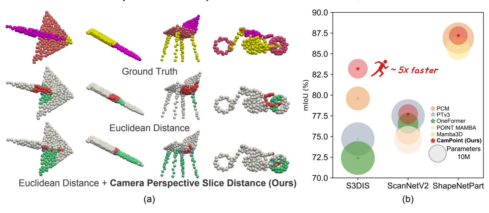
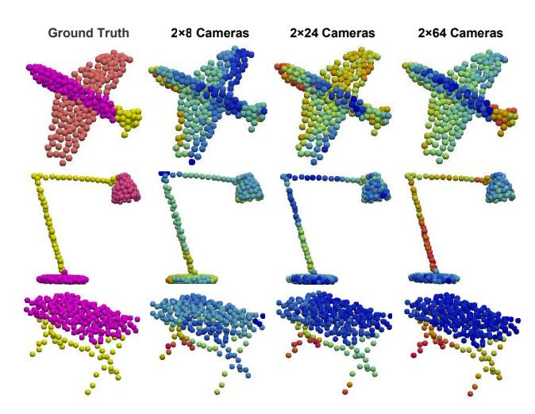
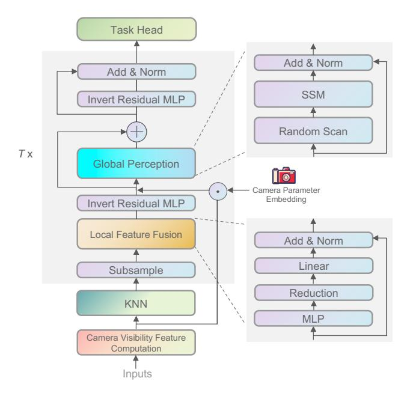
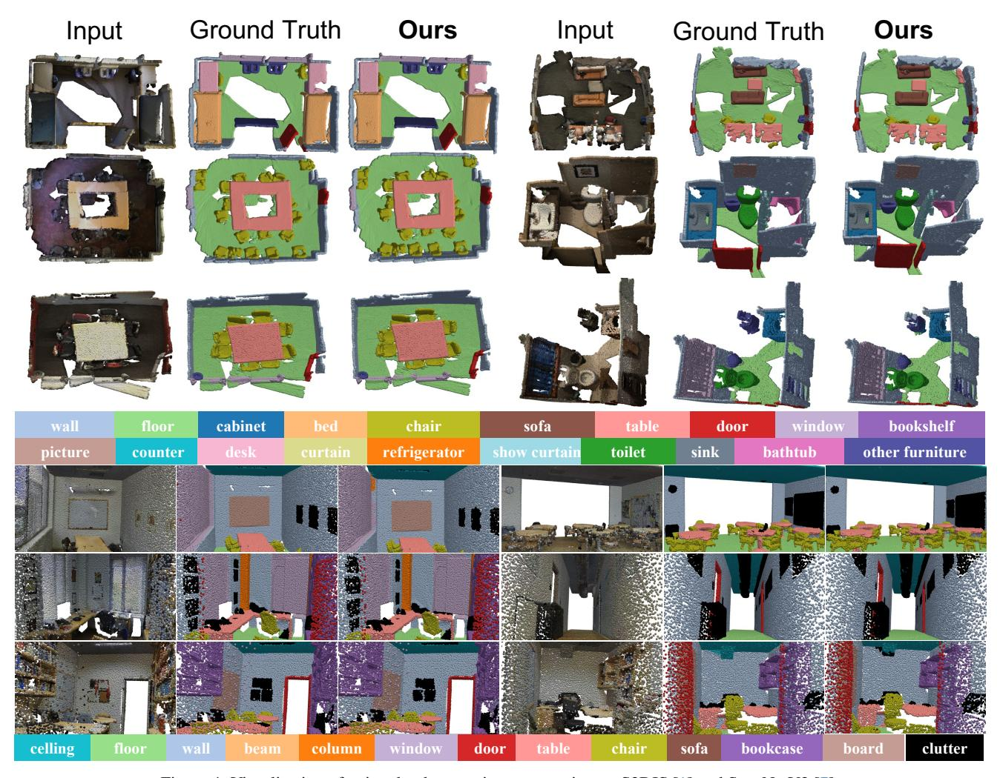

# **CamPoint: Boosting Point Cloud Segmentation with Virtual Camera**

Jianhui Zhang1\* Yizhi Luo1\* Zicheng Zhang2 Xuecheng Nie3 Bonan Li1†

1University of Chinese Academy of Sciences 2JD Retail 3MT Lab, Meitu Inc.

Figure 1. Our CamPoint achieves accurate neighbor selection and provides high-level information to facilitate global perception. (a) For each target point, camera perspective slice distance is introduced to focus on identifying semantically related neighbors that belong to the same part, while ignoring semantically unrelated neighbors. (b) Compared with state-of-the-art methods [15, 17, 24, 57, 72] on S3DIS [1], ScanNetV2 [7] and ShapeNetPart [65], our method is implemented with lower parameters and offers higher inference speed.

## **Abstract**

Local features aggregation and global information perception are the fundamental to point cloud segmentation. However, existing works often fall short in effectively identifying semantic relevant neighbors and face challenges in endowing each point with high-level information. Here, we propose CamPoint, an innovative method that employs virtual cameras to solve the above problems. The core of Cam-Point lies in introducing the novel camera visibility feature for points, where each dimension encodes the visibility of that point from a specific camera. Leveraging this feature, we propose the camera perspective slice distance for accurate relevant neighbor searching and design the camera parameter embedding to deliver rich feature representations for global interaction. Specifically, the camera perspective slice distance between two points is defined as a similarity metric derived from their camera visibility features, whereby an increased number of shared cameras observing both points corresponds to a reduced distance between them. To effectively facilitate global semantic perception, we assign each camera an optimizable embedding and then integrate these embeddings into the original spatial features based on visibility attributes, thereby obtaining high-level features enriched with camera priors. Additionally, the state space model characterized by linear computational complexity is employed as the operator to achieve global learning with efficiency. Comprehensive experiments on multiple datasets show that our CamPoint surpasses the current state-of-the-art in multiple datasets, achieving low training cost and fast inference speed.

### 1. Introduction

With the rising demand for remote sensing [60], autonomous driving [20], virtual reality [2], and robotic navigation [6], point cloud segmentation has become a critical technique for achieving accurate 3D environmental percep-

\*Equal contribution

&lt;sup>†Corresponding author and Project leader (libonan@ucas.ac.cn)

tion and spatial modeling. Earlier approaches circumvented the challenge of modeling complex point cloud by projecting it into 2D data structures [20, 44, 66] or voxelising it into 3D dense voxels [27, 42, 61] for learning; however, this inevitably led to a loss of 3D information. To address this, recent methods explore the combination of local aggregation and global interaction strategies to fully leverage 3D features while maintaining high computational efficiency [10, 18, 56].

Effective local aggregation serves to expand the receptive field, enhance the comprehension of local context, and establish a robust foundation for the subsequent learning in global manner. Here, accurate searching of neighboring points is critical, as the inclusion of semantically irrelevant neighbors can introduce unintended semantic ambiguity. Existing works [19, 22, 55, 74] typically use Euclidean distance as the sole metric for neighbor selection, which can result in the misidentification of spatially proximate but semantically irrelevant points as neighbors, while neglecting spatially distant yet semantically related points. Global information perception equips the model with a comprehensive understanding of scene structure and spatial layout. However, low-level features derived from spatial positions often fail to provide effective representations for global learning, resulting in an unstable optimization. Additionally, the attention mechanisms with quadratic complexity commonly used in recent studies often result in significant computational overhead when facilitating interactions among multiple points [14, 31, 32, 67].

Despite impressive progress in point cloud segmentation, effectively searching neighbors for local and efficiently perceiving semantic for global remain the open challenges. In this paper, we introduce *CamPoint*, a simple yet effective method that advances the field by leveraging virtual cameras as shown in Figure 1. Our approach stems from the insight that objects frequently observed together across multiple viewpoints tend to exhibit shared spatial or functional relationships. On this base, CamPoint constructs the camera visibility feature to provide meaningful information and enhance contextual understanding (see Figure 2). Traditional Euclidean distance, as a linear combination of perspective information along canonical axes, is sensitive to scale and overlooks object manifold structure. We augment it with a new camera perspective slice distance, which measures point similarity based on the statistical sharing of camera viewpoints. This metric is nonlinear, scale-insensitive, and captures object structure, improving the accuracy of neighbor searching. For global perception, we transform original low-level features into high-level representations via incorporating camera priors, thereby facilitating the semantic capture. To further achieve computational efficiency, the state space model [13] with linear complexity is utilized as the interactive operator.

Figure 2. To illustrate our motivation, we use different colors to represent various camera visibility features, where closer colors indicate higher feature similarity.

Technically, CamPoint initially employs multiple virtual cameras to project the point cloud from distinct views, generating the camera visibility feature for each point according to depth, where each dimension represents the likelihood of that point being visible to a specific camera. By computing camera visibility feature similarity, we can simply obtain the camera perspective slice distance between two points. When integrated with Euclidean distance to perform K-Nearest Neighbors (KNN) [35] algorithm, this combined metric enhances nearest neighbor search, allowing for precise identification of semantically relevant neighbors. For global modeling, we optimize the different learnable embedding for each camera and then add the parameters of visible cameras for each point, thereby constructing high-level features. Due to the inherent disorder of point clouds, directly applying them within state space models can lead to suboptimal information interaction. To mitigate this, we introduce a random shuffling of point order prior to processing, which facilitates a more comprehensive exchange of information between points. In summary, our contributions can be summarized as follows:

- We explore a novel framework based on virtual cameras, CamPoint, for point cloud segmentation which effectively learns contextual information.
- We propose the novel camera perspective slice distance as the metric to accurately search semantically relevant neighbors for local aggregation.
- We introduce the novel camera parameter embedding to generate high-level features that enhance the capacity of model for global semantic perception. Additionally, state space model is introduced as the interaction operator to alleviate computational overhead.
- Experimental results show that our CamPoint obtains competitive performance in terms of both segmentation accuracy, training cost and inference speed, compared

with state-of-the-art methods.

#### 2. Related work

Point cloud segmentation has long served as a foundational task in downstream applications involving 3D point clouds. Earlier works [20, 21, 27, 44, 51, 54, 61] in this area primarily rely on projection- and voxel-based two principal paradigms for learning representations of point clouds. These methods typically preprocess the unstructured 3D point cloud data by converting it into intermediate structured representations, such as 2D grids [20, 44, 66, 73] or 3D voxel grids [27, 42, 46, 52, 53, 61], enabling the use of convolutional neural networks (CNNs) for further modeling. While effective, these transformations can lead to substantial information loss due to the limitations inherent in 3D-to-2D projection and voxelization, which may diminish the precision of the results. Recently, PointNet [36] introduces a novel pipeline by directly learning features from raw point clouds, effectively preserving intricate details that might otherwise be lost in the process of voxelization or projection. To further enhance performance, Point-Net++ [37] proposes a local-global strategy to capture finegrained local details while gaining a comprehensive understanding of the global structure. Following this paradigm, most state-of-the-art studies [30, 50, 56, 57, 69] advance point cloud segmentation by enhancing either local aggregation or global perception mechanisms, yielding impressive results. In this paper, we investigate the representation based on virtual cameras to enhance both local and global modeling capabilities.

**Local aggregation** is essential for enhancing detailed contextual comprehension, with the neighbor searching and feature aggregation as two main components. Net++ [37] pioneered the use of a shared-weight MLP to effectively fuse neighboring features and PointNeXt [38] designed a inverted residual module based on it to effectively stack additional encoding layers. While PosPool [26] demonstrates that directly applying raw relative coordinates as weights to aggregate neighboring features can yield strong performance, it may introduce considerable complexity. To address this, DeLA [4] proposes spatial encoding, which facilitates the retrieval of relative coordinates at a local level. Despite recent advances, current methods [11, 16, 41, 45, 68, 70] underexplore neighbor searching strategy, often relying solely on spatial distance. This reliance risks overlooking points that are spatially distant yet semantically relevant, limiting local contextual capture. In this work, we focus on selecting semantic related neighbors with the novel camera perspective slice distance.

**Global perception** is employed to model long-range dependencies and provide global understanding. To enhance spatial feature interaction capabilities, attention mechanisms [49] have been employed in place of MLP, func-

tioning as operators to facilitate efficient information transfer [14, 33, 39, 62, 75]. Nevertheless, they suffer from the dreaded bottleneck due to the quadratic computation. Thanks to the linear complexity of state space model [8, 13], PCM [72] and POINT MAMBA [24] design the mambabased model to efficiently process large-scale points in low cost. In this paper, we propose to integrate camera parameter embedding with spatial features, grounded in the point that features rich in high-level information facilitate global optimization effectively.

#### 3. Method

Given a point cloud  $\mathcal{P}=\{p_i=(s_i,e_i)|i=1,...,M\}$ , where  $s_i\in\mathbb{R}^3$  denotes point coordinates (x,y,z) and  $e_i$  is the feature embedding such as intensities and elongation, our goal is to segment points based on their highest predicted classification scores. In this paper, we propose the CamPoint, which enhances both local and global learning by introducing camera views to tackle this task. We start by constructing the essential camera visibility feature for each point with pre-set virtual cameras (Section 3.1). Next, we introduce the concept of camera perspective slice distance to enable precise semantic neighbor search in local aggregation (Section 3.2). Finally, camera parameter embedding is proposed to provide enriched feature representations for comprehensive global perception (Section 3.3). A detailed sketch of our proposed CamPoint is illustrated in Figure 3.

#### 3.1. Camera Visibility Feature

Camera visibility features are defined by the visibility of a point being observed by given cameras, providing highlevel camera prior beyond low-level position. To construct it, we first set multiple cameras and then perform perspective projection based on these cameras.

*Camera setting*. To capture comprehensive information, we strategically position virtual cameras using Look-at method in OpenGL [43], rather than setting camera positions randomly. By specifying the position of the target point and cameras, it generates a view matrix that maintains the camera's orientation toward the target. Here, we set the centroid of the point cloud as the target point, and Farthest Point Sampling (FPS) [9] is used to select R points from the point cloud that are farthest from the centroid as the position of cameras C. To capture internal spatial information, we also place R cameras at the target point oriented in the opposite direction, i.e., from the target point to the farthest points, resulting in a total of 2R cameras. This design enables flexible configuration of virtual camera positions and orientations, adapting effectively to diverse point cloud structures. Camera projection. By performing camera projection on point cloud, the visibility of the *i*-th point to the camera  $c_i$ can be determined through the pixel coordinates  $(u_{ij}, v_{ij})$ and depth  $d_{ij}$ . Specifically, we utilize the camera to project

Figure 3. Framework of the proposed CamPoint. We first obtain camera visibility feature via virtual cameras, then calculate the camera perspective slice distance based on them and input it into the KNN to locate neighboring points. Subsequently, these grouping points are sequentially passed through T blocks, each containing local feature fusion and global perception components. To reduce computational load, we downsample the points and perform information fusion to capture local features. For efficient global structure awareness, SSMs based on a random scanning strategy is introduced as the foundational linear operator. Instead of vanilla MLP, Invert Residual MLP [38] is employed to to enhance representation capabilities.

points  $(x_i, y_i, z_i)$  onto a two-dimensional image plane with height H and weight W as follows:

$$u_{ij}, v_{ij}, d_{ij} = CamPro(x_i, y_i, z_i; inr_i, exr_j),$$
 (1)

where  $CamPro(\cdot)$  denotes camera projection,  $inr_j$  is intrinsics and  $exr_j$  is extrinsics of camera  $c_j$ . All cameras are set with the same intrinsics (refer to Appendix for details). *Camera visibility feature construction*. To ensure general applicability, we assume each point has infinite opacity. When multiple points are mapped to the same pixel coordinate (u,v), only the point with the minimal depth  $d^*_{uv}$  is considered visible. Additionally, points with excessive depth  $d^\dagger$  empirically set to  $\frac{\sqrt{3}}{2}$  are discarded, as they typically have weak relevance to regions of interest from the current viewpoint. Then camera visibility feature  $cvf_i$  of i-th point is defined as  $cvf_i = \{cvf_i^j | j=1,...,2R\}$ , where

$$cvf_i^j = \begin{cases} 1, & \text{if } u_{ij} \in [0,H), \ v_{ij} \in [0,W), \ d_{ij} = d_{uv}^*, d_{ij} < d^\dagger \ , \\ 0, & \text{otherwise}. \end{cases}$$

Given these features, we can accurate search relevant neighbor and deliver rich feature representations for global interaction.

# 3.2. Camera Perspective Slice Distance for Local Aggregation

We propose camera perspective slice distance to measure semantic coherence between distinct points, enabling the identification of meaningful neighboring points. Specifically, given camera visibility features of points  $p_i$  and  $p_g$  point, we calculate camera perspective slice distance  $CD(\cdot)$  between them as follows:

$$CD(p_i, p_q) = \ell_1(cvf_i, cvf_q),$$
 (3)

where  $\ell_1(\cdot)$  denotes 1-norm function, and  $cvf_i, cvf_g$  are camera visibility features of  $p_i, p_g$ . In the implementation, we replace the calculation of the  $\ell_1$  norm with a bitwise AND operation to achieve higher computational efficiency.

Subsequently, we combine Euclidean distance and camera perspective slice distance into a composite metric, enabling the *K*-Nearest Neighbor algorithm to account for both geometric proximity and semantic similarities. However, directly composing these two distance metrics is unreasonable, as they operate on different scales. To address this issue, we normalize camera perspective slice distance to the same scale as Euclidean distance as follows:

$$Norm(CD(p_i, p_g)) = \gamma \frac{CD(p_i, p_g) \times ED_{max}}{2R}, \quad (4)$$

where  $ED_{max}$  is the Euclidean distance between the two most distant positions in the point cloud, and  $\gamma$  is the harmonic factor that balances the influence of distance and semantic constraints. According to this composite distance metric, we can search the N most relevant neighbors  $p_i^{near} = \{p_i^1, p_i^2, ..., p_i^N\}$  for point  $p_i$  as follows:

$$p_i^{near} = KNN(ED(p_i, \mathcal{P}), Norm(CD(p_i, \mathcal{P}))).$$
 (5)

Herein,  $KNN(\cdot)$  denotes K-Nearest Neighbors function, which is implemented with kd-tree algorithm [3].  $ED(\cdot)$  denotes Euclidean distance.

By leveraging the camera perspective slice distance, we equip the KNN with the ability to aware semantics in scale-insensitive manner, allowing for accurate neighbor selection. Finally, point features  $\{f_i\}_{i=1}^N$  where  $f_i = MLP(p_i)$  are fused like DeLA [4] to generate local feature  $lf_i \in \mathbb{R}^d$  of  $p_i$ . More details of local fusion are provided in Appendix.

# 3.3. Camera Parameter Embedding for Global Perception

Compared to low-level features, high-level information is typically beneficial for perceiving the global structure. To achieve this, we incorporate camera prior into point features to provide a global perspective. Technically, camera parameter embedding  $cpe = \{cpe_i \in \mathbb{R}^{16} | i=1,...,2R\}$  is introduced to represent the viewpoint of cameras, serving as a set of optimizable parameters. Associating with the camera

visibility feature  $cvf_i$ , we add the camera parameter embedding with visibility set to 1 into the local feature  $lf_i$  to derive high-level global feature  $gf_i$  as follows:

$$gf_i = MLP(Pool(cpe \odot cvf_i)) + lf_i$$
 (6)

where  $MLP(\cdot)$  encode feature with dimension as  $d, \odot$  denotes dot product and  $Pool(\cdot)$  is the mean pooling performed along camera axis. Then, high-level representation is used to modeling structure in global manner. Inspired by Gu et al. [13], we leverage state space models (SSMs) known as linear operators to process points, offering a more efficient alternative to quadratic-time attention used in other works. Specifically, we implement our core SSMs operator with the advanced selective scan SSMs introduced by Mamba [12]. Due to the unordered nature of point clouds, we do not employ sequential scanning or the scanning method proposed in POINT MAMBA [24]. Instead, we randomly shuffle the order of points before inputting it into the SSMs and find that this simple strategy yields promising results. Hence, global perception can be formulated as:

$$\{gf_i\}_{i=1}^O = SSMs(RScan(\{gf_i\}_{i=1}^O)),$$
 (7)

where  $RScan(\cdot)$  denotes the random scan, O is the number of participating points. Due to the unordered nature of point clouds, no multi-directional strategy is employed. More details can be seen in Appendix.

# 4. Experiment

In this section, we conduct experiments on point cloud semantic segmentation and point cloud object part segmentation tasks. To show the efficacy and generalizability, we perform CamPoint to object classification task.

#### 4.1. Segmentation

We conduct the following experiments with classical methods (MinkUNet [5], PointNeXt [38], DeLA [4], PointHR [40], AVS-Net [63], OA-CNNs [34], KPConvX-L [47]), Transformer-based methods (Stratified Transformer [18], OctFormer [50], Swin3D [64], PointNat [69], OneFormer [17]) and SSMs-based methods (PTv3 [57], PCM [72], POINT MAMBA [24]) on S3DIS [1], ScanNetV2 [7] and ShapeNetPart [65]. (i) We conduct extensive comparisons with other state-of-the-art methods to demonstrate that CamPoint offers significant advantages in performance, speed, and training cost. (ii) We validate our method with the ablation study of camera perspective slice distance and camera parameter embedding.

#### 4.1.1. Semantic Segmentation

**Dataset.** S3DIS [1] is an indoor scene point cloud dataset reconstructed from RGB-D images captured by a Matterport camera with three structured light sensors. It covers

six indoor areas across three buildings at Stanford, including 272 rooms, with nearly 700 million points annotated into 13 semantic classes. ScanNetv2 [7] dataset includes 1,513 room scans reconstructed from RGB-D frames, divided into 1,201 scenes for training and 312 for validation. Point clouds are sampled from vertices of reconstructed meshes, with each point labeled into one of 20 semantic categories (e.g., wall, floor, table).

**Setting.** The initial learning rate was set to 0.001, with a weight decay of 0.05, using a cosine decay strategy with AdamW [28]. For S3DIS [1], we trained the model for 100 epochs with the batch size of 8. For the ScanNetV2 [7], the model was trained for 200 epochs with the batch size of 4. We set camera number as  $2\times64$ , harmonic factor  $\gamma$  as 0.1 and neighbors number N as 24 by default for two datasets. **Result.** Table 1 shows the quantitative results of our method compared with state-of-the-art methods in the mean Intersection over Union (mIoU) on S3DIS and ScanNetV2. To ensure a fair comparison, strategies like voting, pre-training, or joint training are not be considered. It can be seen that CamPoint demonstrates superior segmentation performance with the val mIoU score of 83.3%, 77.7%, outperforming the Transformer-based PTV3 [57] by 8.6%, 0.2% and SSMs-based PCM [72] by 3.7%, 2.2%, respectively. This proves that without major changes to the network architecture, relying solely on camera visibility features obtained from virtual cameras can effectively enhance performance. In addition to CamPoint, we construct CamPoint-Tiny with fewer parameters, yet it still achieved outstanding performance. To demonstrate efficiency, we also present additional results in Table 2, such as parameter count, computational load, and inference latency. Efficiency metrics are measured on a single RTX 4090, excluding the first iteration to ensure steady-state measurements. We observe that CamPoint not only achieves the lowest parameter count across all tested datasets but also maintains superior speed. Furthermore, we provide qualitative results in Figure 4 to clearly demonstrate the superior performance of CamPoint. Our model is able to predict semantic segmentation results that are quite close to the ground-truth.

# 4.1.2. Object Part Segmentation

We compare CamPoint with classical methods (PointMLP [29], PointNeXt [38], DeLA [4]), Transformer-based methods (CurveNet [59], PVT [71], Stratified Transformer [18]) and SSM-based methods (PCM [72], Mamba3D [15]) on the Object part segmentation dataset ShapeNetPart [65].

**Dataset.** The ShapeNetPart dataset contains approximately 16,000 3D models, spanning 16 object categories such as chairs, tables, and airplanes. Each 3D model is annotated into multiple parts (e.g., chair seat, backrest, armrest), with semantic labels for each part.

**Setting.** The initial learning rate was set to 0.002, with a

Figure 4. Visualization of point cloud semantic segmentation on S3DIS [1] and ScanNetV2 [7].

weight decay of 0.05, using a cosine decay strategy with AdamW [28]. Additionally, the model is trained for 300 epochs with the batch size of 32. We set camera number as  $2\times64$ , harmonic factor  $\gamma$  as 0.1 and neighbors number N as 32 by default.

Result. We conduct verification on the point cloud object part segmentation, reporting results as Instance mIoU and Class mIoU metrics in Table 3. Our method is able to maintain its high performance against the competitive methods for PCM [72] as well. As compared to the Transformer-based approaches, CamPoint achieves a performance boost of around 1.7 percent. Given the powerful baseline on ShapeNetPart, achieving the substantial performance gains observed on S3DIS is challenging. Nonetheless, compared with other methods, the performance improvements introduced by CamPoint remain highly significant.

#### 4.1.3. Ablation Study

*Effect of Module Design.* We are mainly interested in the camera visibility feature related module design, given that

other units (e.g., local feature fusion) have been well explored in previous methods. The core of our design is employing camera visibility feature to calculate camera perspective slice distance and generate camera parameter embedding for global modeling. To substantiate these claims, we incrementally integrate the proposed modules into four distinct configurations and train the models accordingly. In Table 4, Local denotes the local aggregation only with Euclidean distance and Global is implemented with the SSMs which is equipped with random scan. The Val mIoU on S3DIS and ScanNetV2 demonstrate that both camera perspective slice distance and camera parameter embedding consistently enhance the performance of the baseline model, indicating that the introduction of camera priors holds promise as a generalizable information for results improvement. In Table 5, we report the results of PointNexts [38] and DeLA [4] with camera perspective slice distance, which supports our point.

*Number of Camera.* As shown in Figure 2, the number of cameras is crucial to CamPoint. A limited number of cam-

Table 1. Comparison of point cloud semantic segmentation on S3DIS [1] and ScanNetV2 [7].

| Method                      | S3DIS [1]  |             | ScanNetV2 [7] |           |
|-----------------------------|------------|-------------|---------------|-----------|
| Wiethod                     | Area5 mIoU | 6-fold mIoU | Val mIoU      | Test mIoU |
| MinkUNet [5]                | 65.4       | 65.4        | 72.2          | 73.6      |
| PointNeXt [38]              | 70.5       | 74.9        | 71.5          | 71.2      |
| DeLA [4]                    | 74.1       | -           | 75.9          | -         |
| PointHR [40]                | 73.2       | -           | 75.4          | 76.6      |
| AVS-Net [63]                | -          | -           | 76.0          | -         |
| OA-CNNs [34]                | 71.1       | -           | 76.1          | 75.6      |
| KPConvX-L [47]              | 73.5       | -           | 76.3          |           |
| Stratified Transformer [18] | 72.0       | -           | 74.3          | 73.7      |
| OctFormer [50]              | -          | -           | 74.5          | -         |
| Swin3D [64]                 | 72.5       | 76.9        | 76.4          |           |
| PointNat [69]               | 72.8       | 77.8        | -             | -         |
| OneFormer [17]              | 72.4       | 75.0        | 76.6          | -         |
| PTv3 [57]                   | 74.7       | 80.8        | 77.5          | 77.2      |
| PCM [72]                    | 79.6       | -           | 75.5          | -         |
| POINT MAMBA [24]            | -          | -           | 74.6          | -         |
| CamPoint-Tiny (ours)        | 83.2       | 94.0        | 77.0          | 76.8      |
| CamPoint (ours)             | 83.3       | 94.7        | 77.7          | 77.5      |

Table 2. Comparison of model efficiency based on the parameters, FLOPs, inference latency and training time.

| Dataset Method |                      | Parameters (M) | FLOPs (G) | Inference Latency (ms) | Training Time (h) |
|----------------|----------------------|----------------|-----------|------------------------|-------------------|
|                | PointNAT[69]         | 24.90          | 1.37      | 83                     | 15                |
| 02DIC [1]      | PTv3[57]             | 46.19          | 2.66      | 94                     | 186               |
| S3DIS [1]      | CamPoint-Tiny (Ours) | 10.58          | 1.47      | 20                     | 6                 |
|                | CamPoint (Ours)      | 15.78          | 3.70      | 22                     | 7                 |
|                | OctFormer[17]        | 44.03          | 1.88      | 86                     | 63                |
|                | POINT MAMBA[24]      | 31.99          | 1.83      | 65                     | 44                |
| ScanNetV2 [7]  | PTv3[57]             | 46.16          | 1.57      | 61                     | 67                |
|                | CamPoint-Tiny (Ours) | 11.91          | 1.36      | 27                     | 39                |
|                | CamPoint (Ours)      | 16.06          | 1.80      | 28                     | 44                |

Table 3. Comparison of point cloud instance segmentation on ShapeNetPart [65].

| Method                      | ShapeNetPart [65] |           |  |
|-----------------------------|-------------------|-----------|--|
|                             | Ins. mIoU         | Cls. mIoU |  |
| PointMLP [29]               | 86.1              | 84.6      |  |
| PointNeXt [38]              | 86.7              | 84.2      |  |
| DeLA [4]                    | 87.0              | 85.8      |  |
| CurveNet [59]               | 86.4              | -         |  |
| PVT [71]                    | 86.4              | -         |  |
| Stratified Transformer [18] | 86.6              | 85.1      |  |
| PCM [72]                    | 86.9              | 85.0      |  |
| Mamba3D [15]                | 85.7              | 83.7      |  |
| CamPoint-tiny (Ours)        | 86.7              | 85.0      |  |
| CamPoint (Ours)             | 87.2              | 85.3      |  |

Table 4. Ablation of proposed modules on S3DIS [1] and Scan-NetV2 [7]. CPSD denotes camera perspective slice distance and CPE denotes camera parameter embedding.

| Model                       | S3DIS [1] | ScanNetV2 [7] |
|-----------------------------|-----------|---------------|
| Local                       | 72.9      | 74.8          |
| Local + CPSD                | 76.2      | 75.5          |
| Local + CPSD + Global       | 82.1      | 77.0          |
| Local + CPSD + Global + CPE | 83.3      | 77.7          |

Table 5. Generality of camera perspective slice distance. CPSD denotes camera perspective slice distance.

| Model                   | S3DIS [1] | ScanNetV2 [7] |
|-------------------------|-----------|---------------|
| PointNext-s [38]        | 63.4      | 64.5          |
| PointNext-s [38] + CPSD | 64.9      | 65.3          |
| DeLA [4]                | 74.1      | 75.9          |
| DeLA [4] + CPSD         | 77.8      | <b>76.7</b>   |

eras typically fails to capture each point adequately, while an excessive number results in observational redundancy. The results in Table 6 align with our expectations: as the number of cameras gradually increases, performance also

Table 6. Ablation on the number of camera.

| Number of camera | S3DIS [1] | ScanNetV2 [7] |
|------------------|-----------|---------------|
| 2×32             | 81.4      | 76.4          |
| $2\times48$      | 82.9      | 77.2          |
| $2\times64$      | 83.3      | <i>77.</i> 7  |
| $2\times80$      | 83.3      | 77.6          |

Table 7. Ablation on harmonic factor  $\gamma$ .

|   | THOSE TO TESTIMATE OF THE THEORY |           |               |  |  |
|---|----------------------------------|-----------|---------------|--|--|
|   | $\gamma$                         | S3DIS [1] | ScanNetV2 [7] |  |  |
|   | 0.01                             | 81.6      | 76.9          |  |  |
|   | 0.05                             | 82.4      | 77.1          |  |  |
|   | 0.1                              | 83.3      | 77.7          |  |  |
| _ | 0.15                             | 82.9      | 77.4          |  |  |

improves, leveling off at  $2\times64$ . Therefore, to maintain generality, the number of cameras is set to  $2\times64$  in all experiments.

Harmonic Factor  $\gamma$ . In our work,  $\gamma$  is introduced to balance Euclidean distance with camera perspective distance. As  $\gamma$ , CamPoint progressively gains the ability to capture semantic information, effectively expanding contextual understanding. However, an excessively large  $\gamma$  may overlook spatial correlations, introducing noise into neighbor selection. Based on the results in Table 4, we set  $\gamma$  to 0.1 for all experiments. Notably, fine-tuning  $\gamma$  according to the dataset may yield even better results.

#### 4.1.4. Object Classification

To verify the generalizability and effectiveness, we also adapt CamPoint to object classification task and compare it with classical methods (PointNeXt [38], KPConvX-L [47]), Transformer-based methods (PCT [14], PointConT [25]) and SSMs-based methods (PCM [72], PointMamba [23], POINT MAMBA [24], Mamba3D [15]).

**Dataset.** ScanObjectNN [7] is a benchmark dataset for 3D object recognition and classification, consisting of 115 categories and around 15,000 real-scanned objects with partlevel annotations. ModelNet40 [58] is a widely used 3D object classification dataset with 40 object categories, including chairs, tables, and airplanes.

**Setting.** The initial learning rate was set to 0.0005, with a weight decay of 0.05, using a cosine decay strategy with AdamW [28]. Additionally, the model is trained for 300 epochs with the batch size of 32. We set camera number as  $2\times 8$ , harmonic factor  $\gamma$  as 0.1 and neighbors number N as 32 by default.

**Result.** In Table 8, Overall Accuracy (OA) and mean Accuracy (mAcc) are used to evaluate the performance of models on ScanObjectNN [7] and ModelNet40 [58]. It can be seen that, our CamPoint significantly outperforms existing methods. In detail, CamPoint achieves +0.3, +0.2 higher OA than the Mamba3D [15], which is regarded as a remarkable boost considering the challenge on this benchmark. Mean-

Table 8. Comparison of Object Classification on ScanObjectNN [48] and ModelNet40 [58]

| Method               | ScanObjectNN [48] |      | ModelNet40 [58] |      |
|----------------------|-------------------|------|-----------------|------|
|                      | OA                | mAcc | OA              | mAcc |
| PointNeXt [38]       | 87.7              | 85.8 | 93.2            | 90.8 |
| KPConvX-L [47]       | 89.3              | 88.1 | -               | -    |
| PCT [14]             | -                 | -    | 93.2            | -    |
| PointConT [25]       | 88.0              | 86.0 | 93.5            | -    |
| PCM [72]             | 86.9              | 85.0 | 93.1            | 90.6 |
| PointMamba [23]      | 89.3              | -    | 93.6            | -    |
| POINT MAMBA [24]     | -                 | -    | 93.4            | -    |
| Mamba3D [15]         | 91.8              | -    | 93.4            | -    |
| CamPoint-Tiny (Ours) | 91.4              | 90.3 | 93.3            | 91.0 |
| CamPoint (Ours)      | 92.1              | 91.1 | 93.6            | 91.3 |

while, as the parameter count increases, there is a clear trend of performance improvement, indicating that CamPoint has strong scalability potential.

#### 5. Conclusion

In this work, we proposed CamPoint, an innovative approach to point cloud segmentation that leverages virtual cameras to address limitations in existing methods, particularly in identifying semantically related neighbors and enriching high-level feature representations for global perception. By introducing the camera perspective slice distance for more accurate neighbor selection and the camera parameter embedding to enhance feature representations, CamPoint achieves notable advancements in both local and global learning. Comprehensive experiments across multiple datasets demonstrate that CamPoint surpasses the current state-of-the-art in various metrics, while maintaining a low computational cost and fast inference speed. These results underscore the effectiveness of integrating camera priors as a generalizable technique for enhancing performance in point cloud segmentation.

#### 6. Limitation and Future Work

While CamPoint achieves significant performance improvements in point cloud segmentation by leveraging virtual cameras, certain limitations remain. The reliance on predefined camera placements, though effective, may limit adaptability in highly complex environments. Additionally, our method would fail to handle segmentation in dynamic scenes. Future work will focus on enhancing adaptability by exploring adaptive camera placement strategies that respond to scene complexity in training phase. Furthermore, we will extend CamPoint to other point cloud tasks, *e.g.*, outdoor object detection and few-shot classification, to further validate its effectiveness.

### Acknowledgements

This paper is supported by the National Natural Science Foundation of China under Grants (U23B2012, 12471308), Beijing Natural Science Foundation (1254050) and Fundamental Research Funds for the Central Universities.

#### References

- [1] Iro Armeni, Ozan Sener, Amir R Zamir, Helen Jiang, Ioannis Brilakis, Martin Fischer, and Silvio Savarese. 3d semantic parsing of large-scale indoor spaces. In *CVPR*, pages 1534–1543, 2016. 1, 5, 6, 7, 8
- [2] Yizhak Ben-Shabat, Oren Shrout, and Stephen Gould. 3dinaction: Understanding human actions in 3d point clouds. In CVPR, pages 19978–19987, 2024. 1
- [3] PJ Besl and Neil D McKay. A method for registration of 3-d shapes. *IEEE Transactions on Pattern Analysis and Machine Intelligence*, 14(02):239–256, 1992. 4
- [4] Binjie Chen, Yunzhou Xia, Yu Zang, Cheng Wang, and Jonathan Li. Decoupled local aggregation for point cloud learning. *arXiv preprint arXiv:2308.16532*, 2023. 3, 4, 5, 6, 7
- [5] Christopher Choy, Jun Young Gwak, and Silvio Savarese. 4d spatio-temporal convnets: Minkowski convolutional neural networks. In CVPR, pages 3075–3084, 2019. 5, 7
- [6] Sammy Christen, Wei Yang, Claudia Pérez-D'Arpino, Otmar Hilliges, Dieter Fox, and Yu-Wei Chao. Learning human-to-robot handovers from point clouds. In CVPR, pages 9654–9664, 2023. 1
- [7] Angela Dai, Angel X Chang, Manolis Savva, Maciej Halber, Thomas Funkhouser, and Matthias Nießner. Scannet: Richly-annotated 3d reconstructions of indoor scenes. In *CVPR*, pages 5828–5839, 2017. 1, 5, 6, 7, 8
- [8] Tri Dao and Albert Gu. Transformers are ssms: Generalized models and efficient algorithms through structured state space duality. *arXiv preprint arXiv:2405.21060*, 2024. 3
- [9] Yuval Eldar, Michael Lindenbaum, Moshe Porat, and Yehoshua Y Zeevi. The farthest point strategy for progressive image sampling. *IEEE Transactions on Image Process*ing, 6(9):1305–1315, 1997. 3
- [10] Lue Fan, Ziqi Pang, Tianyuan Zhang, Yu-Xiong Wang, Hang Zhao, Feng Wang, Naiyan Wang, and Zhaoxiang Zhang. Embracing single stride 3d object detector with sparse transformer. In CVPR, pages 8458–8468, 2022.
- [11] Siqi Fan, Qiulei Dong, Fenghua Zhu, Yisheng Lv, Peijun Ye, and Fei-Yue Wang. Scf-net: Learning spatial contextual features for large-scale point cloud segmentation. In *CVPR*, pages 14504–14513, 2021. 3
- [12] Albert Gu and Tri Dao. Mamba: Linear-time sequence modeling with selective state spaces. *arXiv preprint arXiv:2312.00752*, 2023. 5
- [13] Albert Gu, Karan Goel, and Christopher Re. Efficiently modeling long sequences with structured state spaces. In *ICLR*, 2022. 2, 3, 5
- [14] Meng-Hao Guo, Jun-Xiong Cai, Zheng-Ning Liu, Tai-Jiang Mu, Ralph R Martin, and Shi-Min Hu. Pct: Point cloud

- transformer. *Computational Visual Media*, 7:187–199, 2021. 2, 3, 8
- [15] Xu Han, Yuan Tang, Zhaoxuan Wang, and Xianzhi Li. Mamba3d: Enhancing local features for 3d point cloud analysis via state space model. In ACM MM, pages 4995–5004, 2024. 1, 5, 7, 8
- [16] Qingyong Hu, Bo Yang, Linhai Xie, Stefano Rosa, Yulan Guo, Zhihua Wang, Niki Trigoni, and Andrew Markham. Randla-net: Efficient semantic segmentation of large-scale point clouds. In CVPR, pages 11108–11117, 2020. 3
- [17] Maxim Kolodiazhnyi, Anna Vorontsova, Anton Konushin, and Danila Rukhovich. Oneformer3d: One transformer for unified point cloud segmentation. In *CVPR*, pages 20943–20953, 2024. 1, 5, 7
- [18] Xin Lai, Jianhui Liu, Li Jiang, Liwei Wang, Hengshuang Zhao, Shu Liu, Xiaojuan Qi, and Jiaya Jia. Stratified transformer for 3d point cloud segmentation. In *CVPR*, pages 8500–8509, 2022. 2, 5, 7
- [19] Loic Landrieu and Martin Simonovsky. Large-scale point cloud semantic segmentation with superpoint graphs. In CVPR, pages 4558–4567, 2018. 2
- [20] Alex H Lang, Sourabh Vora, Holger Caesar, Lubing Zhou, Jiong Yang, and Oscar Beijbom. Pointpillars: Fast encoders for object detection from point clouds. In CVPR, pages 12697–12705, 2019. 1, 2, 3
- [21] Wentong Li, Yuqian Yuan, Jian Liu, Dongqi Tang, Song Wang, Jie Qin, Jianke Zhu, and Lei Zhang. Tokenpacker: Efficient visual projector for multimodal llm. arXiv preprint arXiv:2407.02392, 2024. 3
- [22] Yangyan Li, Rui Bu, Mingchao Sun, Wei Wu, Xinhan Di, and Baoquan Chen. Pointcnn: Convolution on x-transformed points. In *NeurIPS*, 2018. 2
- [23] Dingkang Liang, Xin Zhou, Wei Xu, Xingkui Zhu, Zhikang Zou, Xiaoqing Ye, Xiao Tan, and Xiang Bai. Pointmamba: A simple state space model for point cloud analysis. In NeurIPS, 2024. 8
- [24] Jiuming Liu, Ruiji Yu, Yian Wang, Yu Zheng, Tianchen Deng, Weicai Ye, and Hesheng Wang. Point mamba: A novel point cloud backbone based on state space model with octree-based ordering strategy. arXiv preprint arXiv:2403.06467, 2024. 1, 3, 5, 7, 8
- [25] Yahui Liu, Bin Tian, Yisheng Lv, Lingxi Li, and Fei-Yue Wang. Point cloud classification using content-based transformer via clustering in feature space. *IEEE/CAA Journal of Automatica Sinica*, 11(1):231–239, 2023. 8
- [26] Ze Liu, Han Hu, Yue Cao, Zheng Zhang, and Xin Tong. A closer look at local aggregation operators in point cloud analysis. In *ECCV*, pages 326–342, 2020. 3
- [27] Zhijian Liu, Haotian Tang, Shengyu Zhao, Kevin Shao, and Song Han. Pvnas: 3d neural architecture search with pointvoxel convolution. *IEEE Transactions on Pattern Analysis* and Machine Intelligence, 44(11):8552–8568, 2021. 2, 3
- [28] Ilya Loshchilov and Frank Hutter. Decoupled weight decay regularization. In *ICLR*, 2019. 5, 6, 8
- [29] Xu Ma, Can Qin, Haoxuan You, Haoxi Ran, and Yun Fu. Rethinking network design and local geometry in point cloud: A simple residual mlp framework. *arXiv preprint* arXiv:2202.07123, 2022. 5, 7

- [30] Jiageng Mao, Yujing Xue, Minzhe Niu, Haoyue Bai, Jiashi Feng, Xiaodan Liang, Hang Xu, and Chunjing Xu. Voxel transformer for 3d object detection. In *ICCV*, pages 3164– 3173, 2021. 3
- [31] Ishan Misra, Rohit Girdhar, and Armand Joulin. An end-to-end transformer model for 3d object detection. In *ICCV*, pages 2906–2917, 2021. 2
- [32] Yatian Pang, Wenxiao Wang, Francis EH Tay, Wei Liu, Yonghong Tian, and Li Yuan. Masked autoencoders for point cloud self-supervised learning. In ECCV, pages 604–621. Springer, 2022. 2
- [33] Chunghyun Park, Yoonwoo Jeong, Minsu Cho, and Jaesik Park. Fast point transformer. In CVPR, pages 16949–16958, 2022. 3
- [34] Bohao Peng, Xiaoyang Wu, Li Jiang, Yukang Chen, Hengshuang Zhao, Zhuotao Tian, and Jiaya Jia. Oa-cnns: Omniadaptive sparse cnns for 3d semantic segmentation. In *CVPR*, pages 21305–21315, 2024. 5, 7
- [35] Leif E Peterson. K-nearest neighbor. Scholarpedia, 4(2): 1883, 2009. 2
- [36] Charles R Qi, Hao Su, Kaichun Mo, and Leonidas J Guibas. Pointnet: Deep learning on point sets for 3d classification and segmentation. In *CVPR*, pages 652–660, 2017. 3
- [37] Charles Ruizhongtai Qi, Li Yi, Hao Su, and Leonidas J Guibas. Pointnet++: Deep hierarchical feature learning on point sets in a metric space. In *NeurIPS*, 2017. 3
- [38] Guocheng Qian, Yuchen Li, Houwen Peng, Jinjie Mai, Hasan Hammoud, Mohamed Elhoseiny, and Bernard Ghanem. Pointnext: Revisiting pointnet++ with improved training and scaling strategies. In *NeurIPS*, pages 23192–23204, 2022. 3, 4, 5, 6, 7, 8
- [39] Guocheng Qian, Abdullah Hamdi, Xingdi Zhang, and Bernard Ghanem. Pix4point: Image pretrained standard transformers for 3d point cloud understanding. In *3DV*, pages 1280–1290, 2024. 3
- [40] Haibo Qiu, Baosheng Yu, Yixin Chen, and Dacheng Tao. Pointhr: Exploring high-resolution architectures for 3d point cloud segmentation. *arXiv preprint arXiv:2310.07743*, 2023. 5, 7
- [41] Shi Qiu, Saeed Anwar, and Nick Barnes. Semantic segmentation for real point cloud scenes via bilateral augmentation and adaptive fusion. In *CVPR*, pages 1757–1767, 2021. 3
- [42] Shaoshuai Shi, Chaoxu Guo, Li Jiang, Zhe Wang, Jianping Shi, Xiaogang Wang, and Hongsheng Li. Pv-rcnn: Point-voxel feature set abstraction for 3d object detection. In CVPR, pages 10529–10538, 2020. 2, 3
- [43] Dave Shreiner et al. *OpenGL programming guide: the official guide to learning OpenGL, versions 3.0 and 3.1.* Pearson Education, 2009. 3
- [44] Hang Su, Subhransu Maji, Evangelos Kalogerakis, and Erik Learned-Miller. Multi-view convolutional neural networks for 3d shape recognition. In *ICCV*, pages 945–953, 2015. 2,
- [45] Shyam A Tailor, René De Jong, Tiago Azevedo, Matthew Mattina, and Partha Maji. Towards efficient point cloud graph neural networks through architectural simplification. In *ICCV*, pages 2095–2104, 2021. 3

- [46] Haotian Tang, Shang Yang, Zhijian Liu, Ke Hong, Zhong-ming Yu, Xiuyu Li, Guohao Dai, Yu Wang, and Song Han. Torchsparse++: Efficient point cloud engine. In CVPR, pages 202–209, 2023. 3
- [47] Hugues Thomas, Yao-Hung Hubert Tsai, Timothy D Barfoot, and Jian Zhang. Kpconvx: Modernizing kernel point convolution with kernel attention. In *CVPR*, pages 5525–5535, 2024. 5, 7, 8
- [48] Mikaela Angelina Uy, Quang-Hieu Pham, Binh-Son Hua, Thanh Nguyen, and Sai-Kit Yeung. Revisiting point cloud classification: A new benchmark dataset and classification model on real-world data. In *ICCV*, pages 1588–1597, 2019.
- [49] A Vaswani. Attention is all you need. In NeurIPS, 2017. 3
- [50] Peng-Shuai Wang. Octformer: Octree-based transformers for 3d point clouds. ACM Transactions on Graphics (TOG), 42(4):1–11, 2023. 3, 5, 7
- [51] Song Wang, Jianke Zhu, and Ruixiang Zhang. Metarangeseg: Lidar sequence semantic segmentation using multiple feature aggregation. *IEEE Robotics and Automation Letters*, 7(4):9739–9746, 2022. 3
- [52] Song Wang, Wentong Li, Wenyu Liu, Xiaolu Liu, and Jianke Zhu. Lidar2map: In defense of lidar-based semantic map construction using online camera distillation. In CVPR, pages 5186–5195, 2023. 3
- [53] Song Wang, Jiawei Yu, Wentong Li, Wenyu Liu, Xiaolu Liu, Junbo Chen, and Jianke Zhu. Not all voxels are equal: Hardness-aware semantic scene completion with self-distillation. In CVPR, pages 14792–14801, 2024. 3
- [54] Song Wang, Jiawei Yu, Wentong Li, Hao Shi, Kailun Yang, Junbo Chen, and Jianke Zhu. Label-efficient semantic scene completion with scribble annotations. In *IJCAI*, pages 1398– 1406, 2024. 3
- [55] Yue Wang, Yongbin Sun, Ziwei Liu, Sanjay E Sarma, Michael M Bronstein, and Justin M Solomon. Dynamic graph cnn for learning on point clouds. ACM Transactions on Graphics, 38(5):1–12, 2019.
- [56] Xiaoyang Wu, Yixing Lao, Li Jiang, Xihui Liu, and Hengshuang Zhao. Point transformer v2: Grouped vector attention and partition-based pooling. In *NeurIPS*, pages 33330–33342, 2022. 2, 3
- [57] Xiaoyang Wu, Li Jiang, Peng-Shuai Wang, Zhijian Liu, Xihui Liu, Yu Qiao, Wanli Ouyang, Tong He, and Hengshuang Zhao. Point transformer v3: Simpler faster stronger. In CVPR, pages 4840–4851, 2024. 1, 3, 5, 7
- [58] Zhirong Wu, Shuran Song, Aditya Khosla, Fisher Yu, Linguang Zhang, Xiaoou Tang, and Jianxiong Xiao. 3d shapenets: A deep representation for volumetric shapes. In CVPR, pages 1912–1920, 2015. 8
- [59] Tiange Xiang, Chaoyi Zhang, Yang Song, Jianhui Yu, and Weidong Cai. Walk in the cloud: Learning curves for point clouds shape analysis. In *ICCV*, pages 915–924, 2021. 5, 7
- [60] Yue Xie, Bing Wang, Haiping Wang, Fuxun Liang, Wenxiao Zhang, Zhen Dong, and Bisheng Yang. Look at the whole scene: General point cloud place recognition by classification proxy. ISPRS Journal of Photogrammetry and Remote Sensing, 215:15–30, 2024. 1

- [61] Jianyun Xu, Ruixiang Zhang, Jian Dou, Yushi Zhu, Jie Sun, and Shiliang Pu. Rpvnet: A deep and efficient range-point-voxel fusion network for lidar point cloud segmentation. In *ICCV*, pages 16024–16033, 2021. 2, 3
- [62] Xu Yan, Chaoda Zheng, Zhen Li, Sheng Wang, and Shuguang Cui. Pointasnl: Robust point clouds processing using nonlocal neural networks with adaptive sampling. In CVPR, pages 5589–5598, 2020. 3
- [63] Hongcheng Yang, Dingkang Liang, Dingyuan Zhang, Xingyu Jiang, Zhe Liu, Zhikang Zou, and Yingying Zhu. Avs-net: Point sampling with adaptive voxel size for 3d point cloud analysis. *arXiv* preprint arXiv:2402.17521, 2024. 5, 7
- [64] Yu-Qi Yang, Yu-Xiao Guo, Jian-Yu Xiong, Yang Liu, Hao Pan, Peng-Shuai Wang, Xin Tong, and Baining Guo. Swin3d: A pretrained transformer backbone for 3d indoor scene understanding. arXiv preprint arXiv:2304.06906, 2023. 5, 7
- [65] Li Yi, Vladimir G Kim, Duygu Ceylan, I-Chao Shen, Mengyan Yan, Hao Su, Cewu Lu, Qixing Huang, Alla Sheffer, and Leonidas Guibas. A scalable active framework for region annotation in 3d shape collections. ACM Transactions on Graphics, 35(6):1–12, 2016. 1, 5, 7
- [66] Tan Yu, Jingjing Meng, and Junsong Yuan. Multi-view harmonized bilinear network for 3d object recognition. In CVPR, pages 186–194, 2018. 2, 3
- [67] Xumin Yu, Lulu Tang, Yongming Rao, Tiejun Huang, Jie Zhou, and Jiwen Lu. Point-bert: Pre-training 3d point cloud transformers with masked point modeling. In CVPR, pages 19313–19322, 2022. 2
- [68] Ziyin Zeng, Yongyang Xu, Zhong Xie, Wei Tang, Jie Wan, and Weichao Wu. Leard-net: Semantic segmentation for large-scale point cloud scene. *International Journal of Applied Earth Observation and Geoinformation*, 112:102953, 2022. 3
- [69] Ziyin Zeng, Huan Qiu, Jian Zhou, Zhen Dong, Jinsheng Xiao, and Bijun Li. Pointnat: Large scale point cloud semantic segmentation via neighbor aggregation with transformer. *IEEE Transactions on Geoscience and Remote Sens*ing, 2024. 3, 5, 7
- [70] Ziyin Zeng, Yongyang Xu, Zhong Xie, Wei Tang, Jie Wan, and Weichao Wu. Large-scale point cloud semantic segmentation via local perception and global descriptor vector. Expert Systems with Applications, 246:123269, 2024. 3
- [71] Cheng Zhang, Haocheng Wan, Xinyi Shen, and Zizhao Wu. Pvt: Point-voxel transformer for point cloud learning. *International Journal of Intelligent Systems*, 37(12):11985–12008, 2022. 5, 7
- [72] Tao Zhang, Xiangtai Li, Haobo Yuan, Shunping Ji, and Shuicheng Yan. Point could mamba: Point cloud learning via state space model. *arXiv preprint arXiv:2403.00762*, 2024. 1, 3, 5, 6, 7, 8
- [73] Yang Zhang, Zixiang Zhou, Philip David, Xiangyu Yue, Zerong Xi, Boqing Gong, and Hassan Foroosh. Polarnet: An improved grid representation for online lidar point clouds semantic segmentation. In CVPR, pages 9601–9610, 2020. 3
- [74] Hengshuang Zhao, Li Jiang, Chi-Wing Fu, and Jiaya Jia. Pointweb: Enhancing local neighborhood features for point cloud processing. In *CVPR*, pages 5565–5573, 2019. 2

[75] Hengshuang Zhao, Li Jiang, Jiaya Jia, Philip HS Torr, and Vladlen Koltun. Point transformer. In *ICCV*, pages 16259– 16268, 2021. 3