# CAUSALEMBED: Auto-Regressive Multi-Vector Generation in Latent Space for Visual Document Embedding

Jiahao Huo $^{123}$  Yu Huang $^{12}$  Yibo Yan $^{124}$  Ye Pan $^{1}$  Yi Cao $^{2}$  Mingdong Ou $^{\dagger 2}$  Philip S. Yu $^{3}$  Xuming Hu $^{\ddagger 14}$ 

#### **Abstract**

Although Multimodal Large Language Models (MLLMs) have shown remarkable potential in Visual Document Retrieval (VDR) through generating high-quality multi-vector embeddings, the substantial storage overhead caused by representing a page with thousands of visual tokens limits their practicality in real-world applications. To address this challenge, we propose an autoregressive generation approach, CAUSALEMBED, for constructing multi-vector embeddings. By incorporating iterative margin loss during contrastive training, CAUSALEMBED encourages the embedding models to learn compact and wellstructured representations. Our method enables efficient VDR tasks using only dozens of visual tokens, achieving a 30-155× reduction in token count while maintaining highly competitive performance across various backbones and benchmarks. Theoretical analysis and empirical results demonstrate the unique advantages of autoregressive embedding generation in terms of training efficiency and scalability at test time. Consequently, CAUSALEMBED introduces a flexible test-time scaling strategy for multi-vector VDR representations and sheds light on the generative paradigm within multimodal document retrieval. Our code and model will be released upon paper notification.

#### 1. Introduction

Visual Document Retrieval (VDR) (Barboule et al., 2025), which focuses on retrieving relevant pages from extensive

Preprint. January 30, 2026.

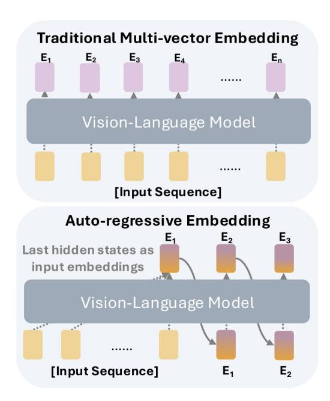

Figure 1. Comparison of traditional multi-vector embeddings (e.g., ColPali/ColQwen (Faysse et al., 2024)) with our auto-regressive paradigm for multi-vector generation in the VDR domain.

corpora of documents, is a cornerstone of modern information systems, ranging from enterprise search to domain-specific Retrieval-Augmented Generation (RAG) (Gao et al., 2025; Zheng et al., 2025; Zhang, 2025). Unlike traditional text-based retrieval systems that necessitate Optical Character Recognition (OCR) for content extraction (Smith, 2007), VDR treats document pages as visual entities (Faysse et al., 2024). By formulating retrieval as a multimodal problem, VDR preserves critical structural and layout information that is often lost in text-only pipelines. Catalyzed by the rapid evolution of Multimodal Large Language Models (MLLMs), recent research (Meng et al., 2025; Günther et al., 2025) has pivoted toward leveraging these backbones to generate unified multimodal embeddings, building on their superior cross-modal reasoning and alignment capabilities.

Conventional single-vector VDR (Jiang et al., 2024) encodes an entire document page and a corresponding query into a solitary vector, typically employing cosine similarity for retrieval. This paradigm has been further refined

<sup>&</sup>lt;sup>†</sup>Project Leader. <sup>‡</sup>Corresponding author. <sup>1</sup>The Hong Kong University of Science and Technology (Guangzhou) <sup>2</sup>Alibaba Cloud Computing <sup>3</sup>University of Illinois Chicago <sup>4</sup>The Hong Kong University of Science and Technology. Correspondence to: Jiahao Huo <jiahaohuotj@gmail.com>, Xuming Hu <xuminghu@hkust-gz.edu.cn>.

by contemporary models such as Eager Embed (Balarini, 2025; Meng et al., 2025), which utilizes the pre-trained backbones like Qwen3-VL (Bai et al., 2025a). Nevertheless, these approaches are inherently constrained in their ability to represent content-dense pages, as a single embedding often fails to encapsulate the multifaceted visual complexity of a full visual page. To circumvent this, multi-vector VDR methods leverage patch-level representations. Pioneered by ColPali (Faysse et al., 2024), this paradigm aligns patchlevel visual tokens with textual query embeddings, treating each of the hundreds or thousands of visual tokens as a distinct representation of a document patch. This approach has demonstrated promising performance in both VDR (Faysse et al., 2024; Macé et al., 2025) and general multimodal retrieval tasks (Jiang et al., 2024; Meng et al., 2025). The efficacy of multi-vector retrieval has been further validated by models such as EvoQwen2.5-VL-Retriever (ApsaraStackMaaS, 2026), tomoro-colgwen3 (Huang & Tan, 2025), and ColNomic (Team, 2025), which integrates hard negative mining and large-scale data curation, as well as by explorations into diverse backbones like Llama 3.2 (Grattafiori et al., 2024) and Gemma 3 (Team et al., 2025) through Llama-Nemoretriever-Colembed (Xu et al., 2025) and Col-NetraEmbed (Kolavi & Jain, 2025).

Despite their empirical success, multi-vector representations impose a formidable storage burden, often requiring hundreds or even thousands of vectors per page (Yan et al., 2025), which precludes their scalability in production environments. Consequently, recent research has focused on compressing these multi-vector representations. For instance, MetaEmbed (Xiao et al., 2025) employs matryoshka representation learning (Kusupati et al., 2022b) to facilitate flexible token counts during inference. However, such methods often require a fixed token budget during training, limiting adaptability. Other strategies, such as Light-ColPali (Ma et al., 2025a) and DocPruner (Yan et al., 2025), utilize clustering or merging techniques for token pruning. While these methods achieve high compression ratios by identifying salient tokens, their performance is fundamentally capped by the quality of the original dense representations and frequently results in non-negligible retrieval accuracy loss.

This raises a fundamental question: can the generative prowess of MLLMs be harnessed to produce multi-vector embeddings while simultaneously mitigating the substantial redundancy inherent in patch-level representations? We posit that such an objective is attainable. A compelling direction involves auto-regressive representation generation, a methodology that has demonstrated significant effectiveness in natural language generation (Brown et al., 2020), visual entity synthesis (Tian et al., 2024), and even explicit latent reasoning (Hao et al., 2024). Nevertheless, the potential of the auto-regressive paradigm for embedding tasks remains largely underexplored, notwithstanding preliminary

efforts (Cui et al., 2025b; Lan et al., 2025b; Liu et al., 2025a; Tsai et al., 2025) that incorporate textual reasoning trajectories prior to mutlimodal encoding or iteratively refine single-vector text embeddings via latent reasoning.

In this work, we endeavor to transform the current encoding landscape by generating multi-vector document embeddings in a sequential, auto-regressive manner, a framework we designate as CAUSALEMBED. Specifically, we fine-tune a pre-trained MLLM to synthesize latent representations in a token-wise fashion, as illustrated in Figure 1. Relative to ColPali-style architectures, our approach realizes a 30× token compression ratio while simultaneously surpassing the performance of clustering-based baselines at identical compression scales. Extensive empirical evaluations validate the generalizability of the proposed method and reveal its distinctive advantages in test-time scaling. Furthermore, our results demonstrate the superior efficiency of the autoregressive paradigm in distilling dense and high-level semantics compared to traditional spatial-grid representations.

# The key contributions of this paper are as follows:

- We introduce a novel auto-regressive paradigm for visual document embedding that generates latent multivector representations sequentially, thereby departing from the conventional parallel patch-based encoding.
- Our method demonstrates superior performance over pruning-based baselines under stringent compression regimes, successfully achieving an optimal trade-off between storage efficiency and retrieval accuracy.
- We identify a test-time scaling characteristic inherent to auto-regressive embeddings, where retrieval precision can be dynamically adjusted by modifying the number of generated tokens during the inference phase.
- Our approach exhibits robust generalizability across diverse backbones. When applied to underperformed models such as PaliGemma, our method yields a 14.6% performance uplift while utilizing 30× fewer tokens than the full-resource ColPali baseline.

# 2. Related Work

#### 2.1. Multimodal Embedding

Multimodal embedding focuses on representing heterogeneous inputs into a shared latent space for cross-modal understanding and retrieval (Zhang et al., 2025b). Built on the contrastive training paradigm proposed by (Radford et al., 2021), pre-trained models like CLIP (Radford et al., 2021), BLIP (Li et al., 2022), and SigLIP (Zhai et al., 2023) exhibit remarkable performance in multimodal encoding and modality alignment. Recently, pre-trained Multimodal Large Language Models (MLLMs) have also been adapted for multimodal embedding tasks, utilizing backbones that are more powerful for multimodal understanding.

For instance, VLM2Vec (Jiang et al., 2024) adapts Phi-3.5-V (Abdin et al., 2024), LLaVE (Lan et al., 2025a) fine-tunes LLaVA-OneVision (Li et al., 2024), while VLM2Vec-V2 (Meng et al., 2025), jina-embeddings-v4 (Günther et al., 2025), and Nomic Embed Multimodal (Team, 2025) are built upon the Qwen-VL series (Wang et al., 2024; Bai et al., 2025b;a). Beyond these advancements, recent studies have also discussed innovative strategies regarding data scheduling (Team, 2025; Jian et al., 2025) and training pipelines (Li et al., 2025), providing further insights into the dynamics of multimodal embedding training. Furthermore, combining embedding models with reasoning ability has been explored in text embedding (Tsai et al., 2025) and multimodal retrieval (Lan et al., 2025b; Yu et al., 2025; Cui et al., 2025a), an area that is still in its early stages.

#### 2.2. Visual Document Retrieval

VDR has evolved significantly from traditional **OCR-based** pipelines, which often lose critical layout and structural information during text extraction (Most et al., 2025; Zhang et al., 2025a). The advent of MLLMs first prompted a shift towards **single-vector** representations, but these are inherently constrained in their ability to capture the fine-grained details of content-dense pages (Ma et al., 2024; Zhang et al., 2024; Liu et al., 2025c). Consequently, multi-vector methods, epitomized by ColPali (Faysse et al., 2024), have become state-of-the-art, achieving superior performance by representing pages as hundreds or thousands of patch-level embeddings (Günther et al., 2025; OpenSearch-AI, 2026; Jayaram et al., 2024; Huang & Tan, 2025). This approach, however, introduces a critical efficiency bottleneck due to prohibitive storage overhead (Khattab & Zaharia, 2020; Santhanam et al., 2022; Cha et al., 2026). To mitigate this, recent research has explored three primary optimization paradigms: (i) **pruning** methods like DocPruner (Yan et al., 2025), which aim to identify and discard redundant embeddings post-encoding; (ii) merging approaches such as Light-ColPali (Ma et al., 2025b), which employ clustering techniques to aggregate similar embeddings into a more compact set; and (iii) strategies like MetaEmbed (Xiao et al., 2025), which introduce a fixed set of learnable tokens whose final representations serve as a concise multi-vector set. While these methods focus on compressing or selecting from existing representations, they remain fundamentally *limited by* the initial encoding quality or a pre-defined token budget. In contrast, CAUSALEMBED diverges from these compressioncentric paradigms by reframing embedding creation as an auto-regressive generation process, synthesizing a compact and expressive set of latent vectors sequentially to achieve a more optimal trade-off between efficiency and performance. See more related work in Appendix C.

# 3. Preliminary

**Notations.** We consider a multimodal embedding system  $\mathcal{M}$  that maps a visual document page I and a textual query T into a shared latent space via a sequential generation process. Concretely, let  $I \in \mathcal{I}$  denote a visually rendered document page, and let  $T \in \mathcal{T}$  denote a tokenized text query. The system is defined as

$$\mathcal{M} = \langle f_{\theta}(\cdot), \mathcal{H}, \mathcal{Z}, \mathcal{S}, \mathcal{T}, \mathcal{I} \rangle, \tag{1}$$

where  $f_{\theta}$  denotes a vision–language model parameterized by  $\theta$ , consisting of a vision encoder  $\Phi$  and an auto-regressive language model  $\Psi$ , i.e.,  $\theta \triangleq \{\Phi, \Psi\}$ . The shared latent space is denoted by  $\mathcal{H}$ , while  $\mathcal{Z} \subset \mathbb{R}^D$  is an unconstrained embedding space of dimension D. The similarity function  $\mathcal{S}$  specifies the scoring mechanism,  $\mathcal{S}: \mathcal{T} \times \mathcal{I} \to \mathbb{R}$ .

Forward-based Multi-vector Embeddings. Following Faysse et al. (2024), multi-vector embedding models typically leverage a pre-trained vision–language model to produce patch-/token-level representations for document pages and textual queries. Given a visual page I, the vision encoder  $\Phi$  projects it into the latent space  $\mathcal{H}$  as a sequence of visual features:

$$\mathbf{H}^{(v)} = \Phi(I) = \left[ \mathbf{h}_1^{(v)}, \dots, \mathbf{h}_{N_v}^{(v)} \right], \tag{2}$$

where  $N_v$  is the length of the resulting visual feature sequence. These features are then fed into the language model  $\Psi$  to produce the document embedding sequence:

$$\mathbf{D} = \Psi \Big( \mathbf{H}^{(v)} \Big) = [\mathbf{d}_1, \dots, \mathbf{d}_{N_v}]. \tag{3}$$

Similarly, for a textual query  $T = [T_1, \dots, T_t]$ , the language model produces a query embedding sequence

$$\mathbf{Q} = \Psi(T) = \left[\mathbf{q}_1, \dots, \mathbf{q}_{N_t}\right],\tag{4}$$

where  $N_q$  is the number of query embedding vectors. We denote the above processes using a unified forward function:

$$\mathbf{D}_{\mathbf{f}} = f_{\theta}(I), \qquad \mathbf{Q}_{\mathbf{f}} = f_{\theta}(T). \tag{5}$$

**Late Interaction Mechanism.** To capture fine-grained semantic alignment, the multi-vector embedding paradigm employs a late-interaction scoring function  $\mathcal{S}(T,I)$ , which aggregates local correspondences between the query and document embedding sequences. In particular, the max-sim aggregation is widely applied as

$$S(T, I) = \sum_{i=1}^{N_q} \max_{j=1}^{N_d} \langle \mathbf{Q}_i, \, \mathbf{D}_j \rangle, \tag{6}$$

where  $\langle \cdot, \cdot \rangle$  denotes the dot product and  $N_d$  is the number of document embedding vectors.

**Contrastive Alignment.** We train the model such that relevant query-document pairs receive higher late-interaction scores than non-relevant pairs. Given an in-batch set  $\mathcal{B} = \{(T_k, I_k)\}_{k=1}^b$ , where  $I_k$  is the ground-truth page for query  $T_k$ , we use a contrastive objective that compares the

positive score  $s_k^+ \triangleq \mathcal{S}(T_k, I_k)$  against the hardest in-batch negative  $s_k^- \triangleq \max_{l \in \{1, \dots, b\}, l \neq k} \mathcal{S}(T_k, I_l)$ . The training loss is then defined as

$$\mathcal{L}_{m} = \frac{1}{b} \sum_{k=1}^{b} \log \left( 1 + \exp \left( s_{k}^{-} - s_{k}^{+} \right) \right). \tag{7}$$

# **4.** CAUSALEMBED: Efficient Auto-regressive Multi-vector Generation

Auto-regressive Generative Embedding The core of CAUSALEMBED lies in transcending fixed-size representations by learning a dynamic generation policy. Formally, let  ${\bf C}$  denote the initial context embeddings derived from the input, where  ${\bf C}={\bf H}^{(v)}$  for visual pages or  ${\bf C}=T$  for textual queries. We aim to generate a sequence of latent vectors  ${\bf Z}=[{\bf z}_1,\ldots,{\bf z}_L]$ , where  $L\in\{N_d,N_q\}$  denotes the target embedding budget. Let  ${\bf z}_0$  be the hidden state sequence obtained from the initial pass  $\Psi({\bf C})$ . For each step  $k\in\{1,\ldots,L\}$ , the model  $\Psi$  conditions on the original input and the history of previously generated latent states to produce the next embedding:

$$\mathbf{z}_k = \tau \left( \Psi \left( \left[ \mathbf{C}, \mathbf{z}_1, \dots, \mathbf{z}_{k-1} \right] \right) \right),$$
 (8)

where  $[\cdot]$  denotes sequence concatenation along the temporal dimension, and  $\tau(\cdot)$  extracts the hidden state corresponding to the final token of the sequence. We further denote this process using a unified generation function:

$$\mathbf{D}_{\mathfrak{a}} = g_{\theta}(I), \qquad \mathbf{Q}_{\mathfrak{a}} = g_{\theta}(T). \tag{9}$$

# 4.1. Rethinking Multi-vector Embeddings from the Perspective of Gradient Flow

**Problem Setup.** We now delve deeper into the training dynamics of multi-vector embeddings through the lens of gradient flow. Consider a triplet sample  $(T, I^+, I^-)$  with corresponding embedding sequences  $(Q, D^+, D^-)$ . Let

$$j^*(i; Q, D) \triangleq \arg\max_{j} \langle q_i, d_j \rangle$$
 (10)

denote the index of the best-matched document token for query token  $q_i$ . The late-interaction score can be written as:

$$S(Q, D) = \sum_{i} q_{i}^{\top} d_{j^{*}(i;Q,D)}.$$
 (11)

The pairwise contrastive loss is defined as  $\mathcal{L} = \log(1 + \exp(S^- - S^+))$ , where  $S^+ = S(Q, D^+)$  and  $S^- = S(Q, D^-)$ . Define the error signal as

$$\delta \triangleq \frac{\partial \mathcal{L}}{\partial S^{+}} = -\frac{\partial \mathcal{L}}{\partial S^{-}} = \sigma(S^{-} - S^{+}) - 1,$$

where  $\sigma(\cdot)$  is the sigmoid function.

Forward-based Patch-level Learning. Let  $Q_{\mathfrak{f}} = \{q_1, \ldots, q_{N_t}\}$  and  $D_{\mathfrak{f}} = \{d_1, \ldots, d_{N_v}\}$ . For patch-level multi-vector embeddings, the gradient is:

$$\nabla_{\theta} \mathcal{L}_{\mathfrak{f}} = \delta \cdot \left( \nabla_{\theta} S^{+} - \nabla_{\theta} S^{-} \right), \tag{12}$$

where

$$\nabla_{\theta} S(Q, D) = \sum_{i=1}^{N_t} \left( \frac{\partial q_i}{\partial \theta} \cdot d_{j^*(i;Q,D)} + \frac{\partial d_{j^*(i;Q,D)}}{\partial \theta} \cdot q_i \right). \tag{13}$$

Here,  $q_i$  and  $d_j$  are generated in parallel by  $f_{\theta}(\cdot)$ . Plugging Eq. (13) into Eq. (12), we get:

$$\begin{split} \nabla_{\theta} \mathcal{L}_{\mathfrak{f}} &= \delta \cdot \sum_{i=1}^{N_{t}} \left( \underbrace{\frac{\partial q_{i}}{\partial \theta} \cdot \left( d^{+}_{j^{*}(i;Q,D^{+})} - d^{-}_{k^{*}(i;Q,D^{-})} \right)}_{\text{Query update } \mathfrak{Q}} + \underbrace{\frac{\partial d^{+}_{j^{*}(i;Q,D^{+})} \cdot q_{i}}{\partial \theta} \cdot q_{i}}_{\text{PosDoc update } \mathfrak{D}^{+}} - \underbrace{\frac{\partial d^{-}_{k^{*}(i;Q,D^{-})} \cdot q_{i}}{\partial \theta} \cdot q_{i}}_{\text{NegDoc update } \mathfrak{D}^{-}} \right), \end{split}$$

where  $k^*(i;Q,D^-) \triangleq \arg\max_j \langle q_i,d_j^- \rangle$ , and  $\frac{\partial d}{\partial \theta}$  denotes the Jacobian. This decomposition suggests that each query token contributes to parameter updates via  $\partial q_i/\partial \theta$ , while only the selected document tokens  $d^+$  and  $d^-$  receive direct gradient signals on the document side. Given that  $N_t \ll N_v$  in practice, most document tokens are rarely selected, which can lead to low training efficiency (see in Appendix B.1).

**Auto-regressive Multi-vector Learning.** Let  $Q_{\mathfrak{g}} = \{q_1,\ldots,q_{N_q}\}$  and  $D_{\mathfrak{g}} = \{d_1,\ldots,d_{N_d}\}$  denote the generated query and document multi-vectors from CAUSALEMBED. To account for the recursive dependency introduced by auto-regressive generation, we adopt a gradient backpropagation view:

$$\frac{dd_t}{d\theta} = \frac{\partial d_t}{\partial \theta} + \sum_{k \le t} \frac{\partial d_t}{\partial d_k} \cdot \frac{dd_k}{d\theta},\tag{15}$$

where  $\frac{\partial d_t}{\partial d_t}$  captures historical dependencies. Then:

$$\nabla_{\theta} \mathcal{L}_{\mathfrak{g}} = \delta \cdot \sum_{i=1}^{N_q} \left[ \left( \frac{\partial q_i}{\partial \theta} + \sum_{\tau < i} \frac{\partial q_i}{\partial q_\tau} \cdot \frac{dq_\tau}{d\theta} \right) \cdot \Delta d_i + q_i^{\top} \cdot \frac{dd_{j^*(i;Q,D^+)}^{\dagger}}{d\theta} - q_i^{\top} \cdot \frac{dd_{k^*(i;Q,D^-)}^{\dagger}}{d\theta} \right],$$
(16)

where  $\Delta d_i \triangleq d^+_{j^*(i;Q,D^+)} - d^-_{k^*(i;Q,D^-)}$ . Compared with Eq. (14), Causalembed enables each token to depend on the full preceding context, allowing gradients to propagate through the entire generation chain and resulting in higher training efficiency. Detailed theoretical analysis and empirical verification can be found in Appendix B and Section 5.4.

#### 4.2. Overall Training Objective

Although the theoretical analysis in Section 4.1 highlights the advantages of auto-regressive multi-vector learning, directly applying Eq. 7 often leads to representation collapse due to unsupervised iteration process. To address this, we introduce regularization terms on both the document and query sides to promote progressive refinement and represen-

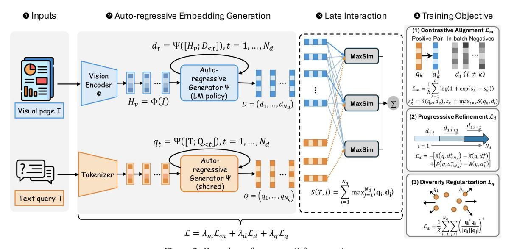

Figure 2. Overview of our overall framework.

tational diversity.

♠ Progressive Refinement Loss ( $\mathcal{L}_d$ ) enforces a marginal gain on the document embedding sequence. We assume that each additional auto-regressive step should help better retrieval, which can be formalized as a telescoping sum:

$$\mathcal{L}_{d} = -\left[\mathcal{S}(q, d_{1:N_{d}}^{+}) - \mathcal{S}(q, d_{1}^{+})\right] + \left[\mathcal{S}(q, d_{1:N_{d}}^{-}) - \mathcal{S}(q, d_{1}^{-})\right]$$
(17)

This term encourages the model to fully utilize the sequence length  $N_d$  to enhance positive matches while distinguishing negative examples earlier in the sequence.

**Diversity Regularization** ( $\mathcal{L}_q$ ) serves as an anti-homogenization constraint. To prevent the auto-regressive generator from collapsing into repetitive patterns, we penalize the cosine similarity between distinct tokens in the generated query sequence:

$$\mathcal{L}_q = \frac{1}{Z} \sum_{i=1}^{N_q} \sum_{j \neq i} \left( \frac{\mathbf{q}_i^{\top} \mathbf{q}_j}{\|\mathbf{q}_i\| \|\mathbf{q}_j\|} \right)^2, \tag{18}$$

where Z is the total number of off-diagonal token pairs.

**Final Objective.** The total training loss of CAUSALEMBED combines the components as:

$$\mathcal{L} = \lambda_m \mathcal{L}_m + \lambda_d \mathcal{L}_d + \lambda_q \mathcal{L}_q, \tag{19}$$

where we use  $\lambda_m=1$  and  $\lambda_d=\lambda_q=0.1$  by default throughout our experiments.

# 5. Experiment

#### 5.1. Experiment Setup

**Training Details** To evaluate the effectiveness of CAUSALEMBED, we conduct experiments using various backbones of different sizes, including PaliGemma-3B (Beyer\* et al., 2024) and Qwen2.5-VL-3B (Bai et al.,

2025b). Following the practice of ColPali (Faysse et al., 2024), we train our model on the same training set<sup>1</sup> to ensure a fair comparison. Additional training details are provided in Appendix D.

Baselines We compare against two main categories of pruning baselines, following (Ma et al., 2025a) and (Yan et al., 2025): (i) multi-vector clustering methods, which include semantic clustering techniques such as K-Means (McQueen, 1967), Hierarchical Clustering (Ward Jr, 1963), 1D pooling, and random selection; and (ii) single-vector methods, which train BiEncoder models with single-vector retrieval capabilities on similar architectures. In our experiments, we utilize the pre-trained BiQwen2 and BiPali models. For comprehensive reference, we also include the results of ColQwen2.5 and ColPali in our tables.

Evaluation We assess the general multimodal embedding capability of CAUSALEMBED using three versions of the ViDoRebenchmark (Faysse et al., 2024; Macé et al., 2025; Loison et al., 2026), and report standard nDCG@5 as the evaluation metric. ViDoRe is widely adopted to benchmark visual document retrieval across various domains. Notably, ViDoRe V2 addresses performance saturation by introducing more generalized settings and multilingual subsets, while the latest ViDoRe V3 evaluates the model's ability to retrieve accurate information from complex, visually-rich documents across diverse industrial contexts.

# 5.2. Main Results

Tables 1 and 2 present a comparison of various methods across ViDoRe V1 to V3. Our key findings are as follows:

<sup>&</sup>lt;sup>1</sup>Training set: vidore/colpali\_train\_set. Pre-trained BiEncoders: vidore/biqwen2-v0.1 and vidore/bipali.

Table 1. nDCG@5 of deferent methods on ViDoRe V3 and V2 benchmarks. **Bold** and <u>underlined</u> denote the best and second-best results among compression methods. Yellow and blue cells represent trainable and our proposed methods respectively. ↑ indicates higher values are better; while ↑ indicates performance surpassing the full-token base model.

| Method     | Token | ViDoRe V3 |        |        |        |        |              |        | ViDoRe V2 |         |        |              |        |        |         |
|------------|-------|-----------|--------|--------|--------|--------|--------------|--------|-----------|---------|--------|--------------|--------|--------|---------|
| Method     |       | HR        | Fin-E  | Ind.   | Phar.  | C.S.   | Ener.        | Phys.  | Fin-F     | Avg (†) | ESG    | Bio          | Econ   | ESG-H  | Avg (†) |
| ColQwen2.5 |       |           |        |        |        |        |              |        |           |         |        |              |        |        |         |
| Base       | 4962  | 0.473     | 0.500  | 0.416  | 0.561  | 0.686  | 0.571        | 0.434  | 0.375     | 0.502   | 0.549  | 0.591        | 0.544  | 0.620  | 0.576   |
| Random     | 32    | 0.248     | 0.250  | 0.203  | 0.384  | 0.492  | 0.348        | 0.338  | 0.144     | 0.301   | 0.293  | 0.425        | 0.354  | 0.304  | 0.344   |
| SemCluster | 32    | 0.359     | 0.366  | 0.307  | 0.481  | 0.594  | 0.453        | 0.390  | 0.267     | 0.402   | 0.426  | 0.515        | 0.485  | 0.395  | 0.455   |
| K-Means    | 32    | 0.365     | 0.360  | 0.309  | 0.467  | 0.579  | 0.464        | 0.383  | 0.247     | 0.397   | 0.413  | 0.504        | 0.530  | 0.359  | 0.452   |
| 1D-Pooling | 32    | 0.260     | 0.283  | 0.237  | 0.404  | 0.561  | 0.397        | 0.379  | 0.186     | 0.338   | 0.251  | 0.472        | 0.417  | 0.261  | 0.350   |
| BiQwen2    | 1     | 0.336     | 0.333  | 0.236  | 0.460  | 0.550  | 0.399        | 0.383  | 0.200     | 0.362   | 0.413  | 0.487        | 0.493  | 0.504  | 0.464   |
| CausalQwen | 32    | 0.429     | 0.395  | 0.327  | 0.483  | 0.643  | <u>0.460</u> | 0.390  | 0.285     | 0.426   | 0.498  | <u>0.505</u> | 0.522  | 0.537  | 0.516   |
| ColPali    |       |           |        |        |        |        |              |        |           |         |        |              |        |        |         |
| Base       | 1031  | 0.321     | 0.232  | 0.228  | 0.391  | 0.488  | 0.248        | 0.248  | 0.144     | 0.288   | 0.350  | 0.433        | 0.397  | 0.406  | 0.397   |
| Random     | 32    | 0.161     | 0.127  | 0.119  | 0.239  | 0.301  | 0.148        | 0.152  | 0.060     | 0.163   | 0.230  | 0.272        | 0.337  | 0.191  | 0.258   |
| SemCluster | 32    | 0.251     | 0.165  | 0.164  | 0.319  | 0.390  | 0.236        | 0.188  | 0.102     | 0.227   | 0.291  | 0.366        | 0.371  | 0.271  | 0.325   |
| K-Means    | 32    | 0.230     | 0.163  | 0.158  | 0.308  | 0.380  | 0.233        | 0.194  | 0.100     | 0.221   | 0.299  | 0.354        | 0.334  | 0.243  | 0.308   |
| 1D-Pooling | 32    | 0.204     | 0.108  | 0.125  | 0.223  | 0.339  | 0.111        | 0.134  | 0.053     | 0.162   | 0.163  | 0.286        | 0.353  | 0.216  | 0.255   |
| BiPali     | 1     | 0.197     | 0.104  | 0.100  | 0.182  | 0.372  | 0.150        | 0.175  | 0.071     | 0.169   | 0.155  | 0.259        | 0.369  | 0.216  | 0.261   |
| CausalPali | 32    | 0.353↑    | 0.280↑ | 0.234↑ | 0.436↑ | 0.532↑ | 0.353↑       | 0.332↑ | 0.169↑    | 0.336↑  | 0.357↑ | 0.493↑       | 0.503↑ | 0.464↑ | 0.454↑  |

Table 2. nDCG@5 of deferent methods on the ViDoRe V1 benchmark. Bold and underlined denote the best and second-best results.

| Method     | Token | ViDoRe V1          |       |                    |                    |       |                    |        |                    | Ava(A)             |              |                    |
|------------|-------|--------------------|-------|--------------------|--------------------|-------|--------------------|--------|--------------------|--------------------|--------------|--------------------|
| MICHIOU    |       | Arxiv              | Doc   | Info               | TabF               | TatD  | Shift              | Syn-AI | Syn-En             | Syn-GR             | Syn-HI       | Avg(†)             |
| ColQwen2.5 |       |                    |       |                    |                    |       |                    |        |                    |                    |              |                    |
| Base       | 5046  | 0.876              | 0.622 | 0.931              | 0.874              | 0.805 | 0.847              | 0.983  | 0.960              | 0.955              | 0.993        | 0.885              |
| Random     | 32    | 0.721              | 0.414 | 0.744              | 0.849              | 0.685 | 0.488              | 0.854  | 0.867              | 0.838              | 0.844        | 0.730              |
| SemCluster | 32    | 0.832              | 0.529 | 0.851              | 0.877              | 0.705 | 0.654              | 0.933  | 0.914              | 0.902              | 0.938        | 0.813              |
| K-Means    | 32    | 0.837              | 0.524 | 0.861              | 0.866              | 0.672 | 0.725              | 0.932  | 0.921              | 0.889              | 0.928        | 0.816              |
| 1D-Pooling | 32    | 0.730              | 0.432 | 0.829              | 0.791              | 0.614 | 0.625              | 0.883  | 0.873              | 0.873              | 0.931        | 0.758              |
| BiQwen2    | 1     | 0.833              | 0.516 | 0.829              | 0.833              | 0.661 | 0.723              | 0.940  | 0.861              | 0.925              | 0.952        | 0.807              |
| CausalQwen | 32    | 0.807              | 0.553 | <u>0.857</u>       | 0.825              | 0.620 | 0.737              | 0.927  | 0.907              | 0.935              | <u>0.941</u> | 0.811              |
| ColPali    |       |                    |       |                    |                    |       |                    |        |                    |                    |              |                    |
| Base       | 1031  | 0.586              | 0.506 | 0.735              | 0.710              | 0.546 | 0.467              | 0.923  | 0.826              | 0.861              | 0.894        | 0.705              |
| Random     | 32    | 0.464              | 0.280 | 0.577              | 0.656              | 0.435 | 0.187              | 0.791  | 0.687              | 0.677              | 0.779        | 0.554              |
| SemCluster | 32    | 0.540              | 0.410 | 0.668              | 0.663              | 0.463 | 0.367              | 0.855  | 0.740              | 0.804              | 0.797        | 0.631              |
| K-Means    | 32    | 0.537              | 0.412 | 0.652              | 0.681              | 0.450 | 0.382              | 0.762  | 0.692              | 0.769              | 0.823        | 0.616              |
| 1D-Pooling | 32    | 0.461              | 0.288 | 0.598              | 0.526              | 0.360 | 0.205              | 0.803  | 0.646              | 0.784              | 0.731        | 0.540              |
| BiPali     | 1     | 0.422              | 0.282 | 0.627              | 0.669              | 0.284 | 0.288              | 0.618  | 0.553              | 0.602              | 0.624        | 0.497              |
| CausalPali | 32    | 0.746 <sup>↑</sup> | 0.492 | 0.787 <sup>↑</sup> | 0.832 <sup>↑</sup> | 0.520 | 0.614 <sup>↑</sup> | 0.871  | 0.851 <sup>↑</sup> | 0.904 <sup>↑</sup> | 0.888        | 0.750 <sup>↑</sup> |

Existing Pruning-based Methods Struggle with the Performance–Efficiency Trade-off. As shown in Table 1, pruning-based baselines generally compromise the performance of base models on visually-rich document retrieval tasks. On ViDoRe V2, even the best-performing baselines incur an average performance drop of 19.4% and 18.1% on ColQwen2.5 and ColPali respectively. This gap widens further on the more challenging ViDoRe V3, reaching 19.9% and 21.2%. The performance of clustering-based methods is highly correlated with representation quality, which shows significant degradation on ColPali. A similar trend is observed in Table 2, although the pruning loss is somewhat mitigated given each base model is fine-tuned on similar data sources for certain epochs.

CAUSALEMBED Achieves Competitive Performance under Extreme Compression Ratios. Results in Tables 1 and 2 demonstrate that CAUSALEMBED outperforms almost all

other approaches under equivalent compression constraints. On ViDoRe V2 and V3, CausalQwen achieves nDCG@5 scores of 0.516 and 0.426, significantly surpassing the best-performing baselines, SemCluster and BiQwen2, respectively. On ViDoRe V1, CausalQwen also achieves a highly competitive average nDCG@5 of 0.811, trailing the best baseline by only 0.005. Remarkably, when applying to PaliGemma, CausalPali even outperforms the full-source ColPali on all three ViDoRe versions by nearly 5%, further highlighting the strength of CAUSALEMBED in generating high-quality document embeddings.

CAUSALEMBED Demonstrates Strong Generality and Robustness across Backbones and Benchmarks. In contrast to previous methods that are often sensitive to the quality of the initial representations, CAUSALEMBED shows consistent superiority across varying architectures and evaluation scenarios. Whether applied to the stronger Qwen2.5-

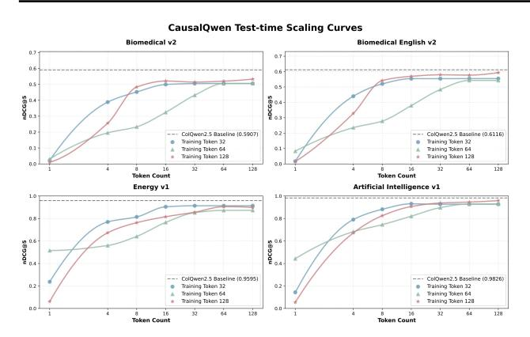

Figure 3. Test-time scaling curves of CAUSALEMBED. We train CausalQwen with sequence lengths of 32, 64, and 128, and evaluate its test-time performance under different inference budgets.

VL or the comparatively weaker PaliGemma backbone, our proposed approach consistently surpasses traditional clustering and pooling methods under the same token budget. Moreover, the observed performance gains hold across different domains, from the academic-oriented ViDoRe V1 to the more diverse and multilingual V2 and V3. This consistency suggests that our learned generative policy effectively captures universal visual semantics without overfitting to specific data distributions. These findings further validate CAUSALEMBED as a robust and generalizable solution for efficient visual document retrieval.

#### 5.3. Test-time Scaling of CAUSALEMBED

To investigate the influence of latent sequence length in CAUSALEMBED, we conduct additional experiments on CausalQwen with varying length budgets during both training and inference across multiple domains, as illustrated in Figure 3. Surprisingly, we observe clear test-time scaling behaviors. (i) Performance consistently improves with longer sequence lengths. The nDCG@5 score of CausalQwen increases steadily as the test-time token budget grows from 1 to 32, verifying the benefit of additional tokens in capturing fine-grained semantics. As the sequence length further increases, the performance gradually approaches the dotted-line upper bound of ColQwen. (ii) This trend generalizes across domains and languages. Similar scaling tendencies are observed on both the multilingual Biomedical V2 dataset and its English-only counterpart, as well as in industrial domains such as Energy and Artificial Intelligence. These results suggest that test-time scaling is a general property of CAUSALEMBED rather than a domain-specific phenomenon. (iii) The model exhibits robustness beyond training-time configurations. Although CausalQwen is trained with a fixed sequence length, its testtime performance remains stable under moderately shorter or longer inference budgets. Moreover, the performance follows a pattern reminiscent of Matryoshka Representation, where retrieval quality is progressively refined as the token

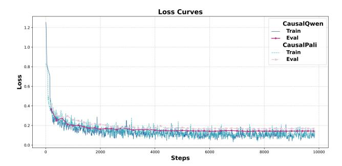

Figure 4. Training and evaluation loss curves of CausalQwen and CausalPali over one epoch.

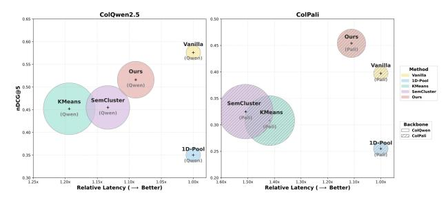

Figure 5. Trade-off between retrieval performance and latency on ViDoRe V2. Bubble size indicates adaptation overhead.

length increases from 8 to the maximum budget. This property enables flexible deployment strategies, ranging from low-latency short sequences for fast inference to longer sequences for higher accuracy. We attribute this behavior to the auto-regressive generation mechanism and the inclusion of a progressive refinement term in the training objective, further demonstrating the practical value of CAUSALEMBED in supporting adaptive inference-time trade-offs.

# 5.4. Framework Analysis

Training Efficiency. We visualize the training dynamics of CausalQwen and CausalPali in Figure 4. Unlike conventional multi-vector approaches, where only a selected subset of tokens contributes to the gradient updates of the backbone, CAUSALEMBED conditions on all preceding tokens and enables more comprehensive parameter updates at each generation step. As shown in Figure 4, both training and evaluation losses decrease rapidly and converge within a single epoch of approximately 10,000 steps, a behavior commonly observed in auto-regressive LLM pre-training. This training trajectory indicates that CAUSALEMBED achieves efficient sample utilization and rapid convergence under limited computational budgets, whereas previous methods often require 3-5 epochs to reach comparable stability.

**Latency.** A key concern of the auto-regressive paradigm is computational efficiency. Here, we evaluate the end-to-end latency of different document embedding methods. All methods incur a similar forward encoding cost  $T_f$ . Subsequently, CAUSALEMBED generates latent token sequences

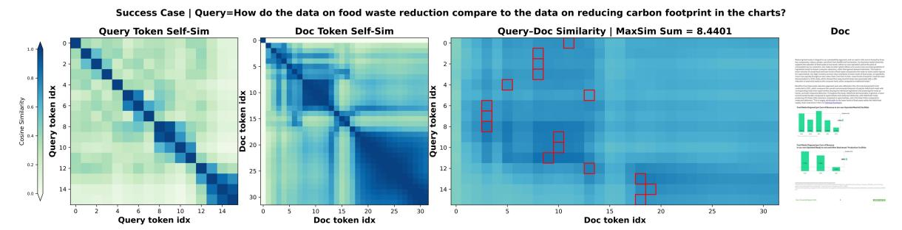

(a) Visualization of a successful case. For each query token, document token with highest score is highlighted with a red box.

Failure Case | Query=What are the differences between Loungers' sustainability objectives for its customers and those for its suppliers?

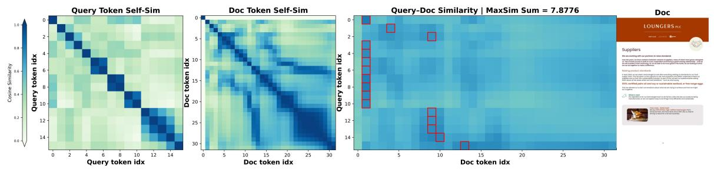

(b) Visualization of a failure case. For each query token, document token with highest score is highlighted with a red box.

Figure 6. Case study of CausalQwen on ViDoRe V2. Heatmaps visualize the self-similarity within query and document sequences, as well as their cross-similarity.

auto-regressively benefiting from KV caching, whereas clustering-based baselines prune multi-vector embeddings to a fixed number of vectors, incurring additional adaptation latency  $T_a$ . We define the overall latency as  $T=T_f+T_a$ . Figure 5 reports the latency-performance trade-off on Vi-DoRe V2 with 32 tokens. The bubble size reflects the adaptation latency  $T_a$  of each method. Compared with clustering-based baselines, CAUSALEMBED achieves lower adaptation latency due to KV caching while delivering superior retrieval performance at the same compression ratio. A more detailed analysis is provided in Appendix E.2.

**Visualization.** Figure 6 illustrates the decision-making process of CausalQwen on ViDoRe V2. Consistent with the objectives described in Section 4.2, CausalQwen produces diverse yet compact token-wise embeddings for both queries and documents. Notably, most document information is concentrated in the early tokens, which contribute the most to the final similarity score, while later tokens progressively capture finer-grained details, as reflected by the distribution of highlighted document tokens.

**Ablation Study.** We conduct an ablation study on Vi-DoRe V1 and ViDoRe V2 to assess the contribution of each objective term in Eq. (19), with results summarized in Table 3. Removing  $\mathcal{L}_m$  leads to an almost complete performance collapse on both benchmarks, highlighting its indispensable role in stabilizing training and establishing a meaningful embedding space. Disabling either the document-side objective  $\mathcal{L}_d$  or the query-side objective  $\mathcal{L}_q$  also results in consistent performance degradation as well. This indicates

Table 3. Ablation study of four variants, each modifying a key component of CausalQwen.

| Method Variant                 | ViDoRe V1              | ViDoRe V2                 |  |  |
|--------------------------------|------------------------|---------------------------|--|--|
| Ours (Full Model)              | 81.1                   | 51.6                      |  |  |
| w/o $\mathcal{L}_d$            | 69.7 \( \psi 14.1\)%   | 43.6 \(\psi_{15.5}\)%     |  |  |
| w/o $\mathcal{L}_q$            | 69.5 \ \ \ 14.3\%      | $48.0_{\downarrow 7.0\%}$ |  |  |
| w/o $\mathcal{L}_m$            | 0.4 \$\_{99.5\%}\$     | $1.2_{\downarrow 97.7\%}$ |  |  |
| w/ ReLU $(\Delta \mathcal{S})$ | 63.3 \(\psi_{21.9\%}\) | 36.5 <sub>↓29.3%</sub>    |  |  |

that explicitly encouraging marginal gains from longer document trajectories and mitigating representation homogenization can be critical for effective auto-regressive embedding generation.

#### 6. Conclusion

Multi-vector multimodal embeddings have been widely adopted for visual document retrieval. However, their patch-level representations lead to significant storage and deployment overhead. In this paper, we propose a novel paradigm, Causalembed, which generates multi-vector embeddings in an auto-regressive manner with significantly shorter sequence lengths. Extensive experiments demonstrate that Causalembed outperforms pruning-based baselines, achieving superior performance at an extreme  $30\times$  compression ratio. In-depth theoretical analysis and empirical results reveals the favorable test-time scaling behavior of Causalembed, along with its advantages in training efficiency and inference latency, providing additional flexibility

for real-world deployment. Ultimately, CAUSALEMBED represents a critical step toward making generative embeddings in visual document retrieval more practical, scalable, and economically viable in real-world applications.

# **Impact Statement**

Ethical Considerations. We affirm that the development and deployment of the proposed CAUSALEMBED framework raises no ethical concerns with regard to its motivation, algorithmic design, training process, or data usage. CAUSALEMBED operates on publicly available benchmark datasets and emphasizes efficiency, interpretability, and generalization. Our method adheres to AI research best practices and contributes to sustainable and responsible development in multimodal information retrieval.

Societal Implications. Causalembed introduces a compact and adaptive auto-regressive paradigm for visual document retrieval, offering a substantial reduction in token count without sacrificing retrieval accuracy. This paradigm shift alleviates the storage and latency bottlenecks that hinder real-world deployment of multi-vector systems. By enabling efficient, high-quality retrieval in low-resource settings, Causalembed can democratize access to multimodal document understanding across domains such as digital libraries, legal archives, healthcare, and education.

#### References

Abdin, M., Aneja, J., Awadalla, H., Awadallah, A., Awan, A. A., Bach, N., Bahree, A., Bakhtiari, A., Bao, J., Behl, H., Benhaim, A., Bilenko, M., Bjorck, J., Bubeck, S., Cai, M., Cai, Q., Chaudhary, V., Chen, D., Chen, D., Chen, W., Chen, Y.-C., Chen, Y.-L., Cheng, H., Chopra, P., Dai, X., Dixon, M., Eldan, R., Fragoso, V., Gao, J., Gao, M., Gao, M., Garg, A., Giorno, A. D., Goswami, A., Gunasekar, S., Haider, E., Hao, J., Hewett, R. J., Hu, W., Huynh, J., Iter, D., Jacobs, S. A., Javaheripi, M., Jin, X., Karampatziakis, N., Kauffmann, P., Khademi, M., Kim, D., Kim, Y. J., Kurilenko, L., Lee, J. R., Lee, Y. T., Li, Y., Li, Y., Liang, C., Liden, L., Lin, X., Lin, Z., Liu, C., Liu, L., Liu, M., Liu, W., Liu, X., Luo, C., Madan, P., Mahmoudzadeh, A., Majercak, D., Mazzola, M., Mendes, C. C. T., Mitra, A., Modi, H., Nguyen, A., Norick, B., Patra, B., Perez-Becker, D., Portet, T., Pryzant, R., Qin, H., Radmilac, M., Ren, L., de Rosa, G., Rosset, C., Roy, S., Ruwase, O., Saarikivi, O., Saied, A., Salim, A., Santacroce, M., Shah, S., Shang, N., Sharma, H., Shen, Y., Shukla, S., Song, X., Tanaka, M., Tupini, A., Vaddamanu, P., Wang, C., Wang, G., Wang, L., Wang, S., Wang, X., Wang, Y., Ward, R., Wen, W., Witte, P., Wu, H., Wu, X., Wyatt, M., Xiao, B., Xu, C., Xu, J., Xu, W., Xue, J., Yadav, S., Yang, F., Yang, J., Yang, Y., Yang, Z., Yu, D., Yuan, L., Zhang, C.,

- Zhang, C., Zhang, J., Zhang, L. L., Zhang, Y., Zhang, Y., Zhang, Y., and Zhou, X. Phi-3 technical report: A highly capable language model locally on your phone, 2024. URL https://arxiv.org/abs/2404.14219.
- Achiam, J., Adler, S., Agarwal, S., Ahmad, L., Akkaya, I., Aleman, F. L., Almeida, D., Altenschmidt, J., Altman, S., Anadkat, S., et al. Gpt-4 technical report. *arXiv preprint arXiv:2303.08774*, 2023.
- ApsaraStackMaaS. Evoqwen2.5-vl-retriever-3b-v1, 2026. URL https://huggingface.co/ApsaraStackMaaS/EvoQwen2.5-VL-Retriever-3B-v1.
- Bai, S., Cai, Y., Chen, R., Chen, K., Chen, X., Cheng, Z., Deng, L., Ding, W., Gao, C., Ge, C., Ge, W., Guo, Z., Huang, Q., Huang, J., Huang, F., Hui, B., Jiang, S., Li, Z., Li, M., Li, M., Li, K., Lin, Z., Lin, J., Liu, X., Liu, J., Liu, C., Liu, Y., Liu, D., Liu, S., Lu, D., Luo, R., Lv, C., Men, R., Meng, L., Ren, X., Ren, X., Song, S., Sun, Y., Tang, J., Tu, J., Wan, J., Wang, P., Wang, P., Wang, Q., Wang, Y., Xie, T., Xu, Y., Xu, H., Xu, J., Yang, Z., Yang, M., Yang, J., Yang, A., Yu, B., Zhang, F., Zhang, H., Zhang, X., Zheng, B., Zhong, H., Zhou, J., Zhou, F., Zhou, J., Zhu, Y., and Zhu, K. Qwen3-vl technical report, 2025a. URL https://arxiv.org/abs/2511.21631.
- Bai, S., Chen, K., Liu, X., Wang, J., Ge, W., Song, S., Dang, K., Wang, P., Wang, S., Tang, J., Zhong, H., Zhu, Y., Yang, M., Li, Z., Wan, J., Wang, P., Ding, W., Fu, Z., Xu, Y., Ye, J., Zhang, X., Xie, T., Cheng, Z., Zhang, H., Yang, Z., Xu, H., and Lin, J. Qwen2.5-vl technical report, 2025b. URL https://arxiv.org/abs/2502.13923.
- Balarini, J. P. Eager embed v1: Multimodal dense embeddings for retrieval. *GitHub repository*, 2025. URL https://github.com/eagerworks/eager-embed
- Barboule, C., Piwowarski, B., and Chabot, Y. Survey on question answering over visually rich documents: Methods, challenges, and trends, 2025. URL https://arxiv.org/abs/2501.02235.
- Beyer\*, L., Steiner\*, A., Pinto\*, A. S., Kolesnikov\*, A., Wang\*, X., Salz, D., Neumann, M., Alabdulmohsin, I., Tschannen, M., Bugliarello, E., Unterthiner, T., Keysers, D., Koppula, S., Liu, F., Grycner, A., Gritsenko, A., Houlsby, N., Kumar, M., Rong, K., Eisenschlos, J., Kabra, R., Bauer, M., Bošnjak, M., Chen, X., Minderer, M., Voigtlaender, P., Bica, I., Balazevic, I., Puigcerver, J., Papalampidi, P., Henaff, O., Xiong, X., Soricut, R., Harmsen, J., and Zhai\*, X. PaliGemma: A versatile 3B VLM for transfer. *arXiv preprint arXiv:2407.07726*, 2024.
- Brown, T., Mann, B., Ryder, N., Subbiah, M., Kaplan, J. D., Dhariwal, P., Neelakantan, A., Shyam, P., Sastry, G.,

- Askell, A., et al. Language models are few-shot learners. *Advances in neural information processing systems*, 33: 1877–1901, 2020.
- Cha, S., Kim, D., Kim, M., Han, Y., Jeon, B.-K., and Lee, S. Reinpool: Reinforcement learning pooling multivector embeddings for retrieval system. *arXiv preprint arXiv:2601.07125*, 2026.
- Chen, X., Wu, Z., Liu, X., Pan, Z., Liu, W., Xie, Z., Yu, X., and Ruan, C. Janus-pro: Unified multimodal understanding and generation with data and model scaling. *arXiv* preprint arXiv:2501.17811, 2025.
- Cui, X., Cheng, J., Chen, H.-y., Shukla, S. N., Awasthi, A., Pan, X., Ahuja, C., Mishra, S. K., Yang, Y., Xiao, J., et al. Think then embed: Generative context improves multimodal embedding. *arXiv preprint arXiv:2510.05014*, 2025a.
- Cui, X., Cheng, J., Chen, H.-y., Shukla, S. N., Awasthi, A., Pan, X., Ahuja, C., Mishra, S. K., Yang, Y., Xiao, J., et al. Think then embed: Generative context improves multimodal embedding. *arXiv preprint arXiv:2510.05014*, 2025b.
- Faysse, M., Sibille, H., Wu, T., Omrani, B., Viaud, G., Hudelot, C., and Colombo, P. Colpali: Efficient document retrieval with vision language models. *arXiv preprint arXiv:2407.01449*, 2024.
- Gao, S., Zhao, S., Jiang, X., Duan, L., Chng, Y. X., Chen, Q.-G., Luo, W., Zhang, K., Bian, J.-W., and Gong, M. Scaling beyond context: A survey of multimodal retrievalaugmented generation for document understanding. arXiv preprint arXiv:2510.15253, 2025.
- Grattafiori, A., Dubey, A., Jauhri, A., Pandey, A., Kadian, A., Al-Dahle, A., Letman, A., Mathur, A., Schelten, A., Vaughan, A., et al. The llama 3 herd of models. *arXiv* preprint arXiv:2407.21783, 2024.
- Günther, M., Sturua, S., Akram, M. K., Mohr, I., Ungureanu, A., Wang, B., Eslami, S., Martens, S., Werk, M., Wang, N., et al. jina-embeddings-v4: Universal embeddings for multimodal multilingual retrieval. In *Proceedings of the 5th Workshop on Multilingual Representation Learning (MRL 2025)*, pp. 531–550, 2025.
- Guo, D., Yang, D., Zhang, H., Song, J., Wang, P., Zhu, Q., Xu, R., Zhang, R., Ma, S., Bi, X., et al. Deepseekr1 incentivizes reasoning in llms through reinforcement learning. *Nature*, 645(8081):633–638, 2025.
- Hao, S., Sukhbaatar, S., Su, D., Li, X., Hu, Z., Weston, J., and Tian, Y. Training large language models to reason in a continuous latent space. *arXiv preprint arXiv:2412.06769*, 2024.

- Huang, X. and Tan, K. M. Beyond text: Unlocking true multimodal, end-to-end rag with tomoro colqwen3, 2025. URL https://tomoro.ai/insights/beyond-text-unlocking-true-multimodal-end-to-end-rag-with-tomoro-colgwen3.
- Jayaram, R., Dhulipala, L., Hadian, M., Lee, J. D., and Mirrokni, V. Muvera: Multi-vector retrieval via fixed dimensional encoding. Advances in Neural Information Processing Systems, 37:101042–101073, 2024.
- Jian, W., Zhang, Y., Liang, D., Xie, C., He, Y., Leng, D., and Yin, Y. Rzenembed: Towards comprehensive multimodal retrieval. *arXiv preprint arXiv:2510.27350*, 2025.
- Jiang, Z., Meng, R., Yang, X., Yavuz, S., Zhou, Y., and Chen, W. Vlm2vec: Training vision-language models for massive multimodal embedding tasks. arXiv preprint arXiv:2410.05160, 2024.
- Khattab, O. and Zaharia, M. Colbert: Efficient and effective passage search via contextualized late interaction over bert. In *Proceedings of the 43rd International ACM SIGIR conference on research and development in Information Retrieval*, pp. 39–48, 2020.
- Kolavi, A. S. and Jain, V. M3dr: Towards universal multilingual multimodal document retrieval, 2025. URL https://arxiv.org/abs/2512.03514.
- Kusupati, A., Bhatt, G., Rege, A., Wallingford, M., Sinha, A., Ramanujan, V., Howard-Snyder, W., Chen, K., Kakade, S., Jain, P., et al. Matryoshka representation learning. *Advances in Neural Information Processing Systems*, 35:30233–30249, 2022a.
- Kusupati, A., Bhatt, G., Rege, A., Wallingford, M., Sinha, A., Ramanujan, V., Howard-Snyder, W., Chen, K., Kakade, S., Jain, P., et al. Matryoshka representation learning. *Advances in Neural Information Processing Systems*, 35:30233–30249, 2022b.
- Lan, Z., Niu, L., Meng, F., Zhou, J., and Su, J. Llave: Large language and vision embedding models with hardness-weighted contrastive learning. *arXiv* preprint *arXiv*:2503.04812, 2025a.
- Lan, Z., Niu, L., Meng, F., Zhou, J., and Su, J. Umerl: Exploring reasoning-driven generative multimodal embeddings. *arXiv preprint arXiv:2511.00405*, 2025b.
- Li, B., Zhang, Y., Guo, D., Zhang, R., Li, F., Zhang, H., Zhang, K., Zhang, P., Li, Y., Liu, Z., et al. Llava-onevision: Easy visual task transfer. *arXiv preprint arXiv:2408.03326*, 2024.
- Li, D., Luo, Y., Bi, K., Guo, J., Yuan, W., Yang, B., Wang, Y., Yang, F., Gao, T., and Zhou, G. Compression then

- matching: An efficient pre-training paradigm for multimodal embedding. *arXiv preprint arXiv:2511.08480*, 2025.
- Li, J., Li, D., Xiong, C., and Hoi, S. Blip: Bootstrapping language-image pre-training for unified vision-language understanding and generation. In *International conference on machine learning*, pp. 12888–12900. PMLR, 2022.
- Li, M., Zhang, Y., Long, D., Keqin, C., Song, S., Bai, S., Yang, Z., Xie, P., Yang, A., Liu, D., Zhou, J., and Lin, J. Qwen3-vl-embedding and qwen3-vl-reranker: A unified framework for state-of-the-art multimodal retrieval and ranking. *arXiv preprint arXiv:2601.04720*, 2026.
- Lin, A., Li, Z., Funakoshi, K., and Okumura, M. Causal2vec: Improving decoder-only llms as versatile embedding models. *arXiv preprint arXiv:2507.23386*, 2025.
- Liu, C., Yang, J., Gao, R., Zhu, Y., Zhu, F., Zhao, R., and Wang, L. Reasoning guided embeddings: Leveraging mllm reasoning for improved multimodal retrieval. arXiv preprint arXiv:2511.16150, 2025a.
- Liu, K., Li, J., Sun, Y., Wu, S., jianzhang gao, Zhang, D.,
  Zhang, W., Jin, S., Yu, S., Zhan, G., Ji, J., Zhou, F., Zheng,
  L., YAN, S., Fei, H., and Chua, T.-S. Javisgpt: A unified multi-modal llm for sounding-video comprehension and generation. In *The Thirty-ninth Annual Conference on Neural Information Processing Systems*, 2025b.
- Liu, Z., Liu, Z., Liang, Z., Zhou, J., Xiao, S., Gao, C., Zhang, C. J., and Lian, D. Any information is just worth one single screenshot: Unifying search with visualized information retrieval. In *Proceedings of the 63rd Annual Meeting of the Association for Computational Linguistics (Volume 1: Long Papers)*, pp. 19238–19261, 2025c.
- Loison, A., Macé, Q., Edy, A., Xing, V., Balough, T., Moreira, G., Liu, B., Faysse, M., Hudelot, C., and Viaud, G. Vidore v3: A comprehensive evaluation of retrieval augmented generation in complex real-world scenarios. arXiv preprint arXiv:2601.08620, 2026.
- Ma, X., Lin, S.-C., Li, M., Chen, W., and Lin, J. Unifying multimodal retrieval via document screenshot embedding. *arXiv* preprint arXiv:2406.11251, 2024.
- Ma, Y., Li, J., Zang, Y., Wu, X., Dong, X., Zhang, P., Cao, Y., Duan, H., Wang, J., Cao, Y., et al. Towards storage-efficient visual document retrieval: An empirical study on reducing patch-level embeddings. *arXiv preprint arXiv:2506.04997*, 2025a.
- Ma, Y., Li, J., Zang, Y., Wu, X., Dong, X., Zhang, P., Cao, Y., Duan, H., Wang, J., Cao, Y., et al. Towards storage-efficient visual document retrieval: An empirical

- study on reducing patch-level embeddings. *arXiv* preprint *arXiv*:2506.04997, 2025b.
- Macé, Q., Loison, A., and Faysse, M. Vidore benchmark v2: Raising the bar for visual retrieval. *arXiv* preprint *arXiv*:2505.17166, 2025.
- McQueen, J. B. Some methods of classification and analysis of multivariate observations. In *Proc. of 5th Berkeley Symposium on Math. Stat. and Prob.*, pp. 281–297, 1967.
- Meng, R., Jiang, Z., Liu, Y., Su, M., Yang, X., Fu, Y., Qin, C., Chen, Z., Xu, R., Xiong, C., et al. Vlm2vec-v2: Advancing multimodal embedding for videos, images, and visual documents. *arXiv preprint arXiv:2507.04590*, 2025.
- Most, A., Winjum, J., Bhattarai, M., Jones, S., Ranasinghe, N. R., Biswas, A., and O'Malley, D. Lost in ocr translation? vision-based approaches to robust document retrieval. In *Proceedings of the 2025 ACM Symposium on Document Engineering*, pp. 1–10, 2025.
- OpenSearch-AI. Ops-ColQwen3: State-of-the-Art Multi-modal Embedding Model for Visual Document Retrieval. https://huggingface.co/OpenSearch-AI/Ops-ColQwen3-4B, 2026.
- Radford, A., Kim, J. W., Hallacy, C., Ramesh, A., Goh, G., Agarwal, S., Sastry, G., Askell, A., Mishkin, P., Clark, J., Krueger, G., and Sutskever, I. Learning transferable visual models from natural language supervision, 2021. URL https://arxiv.org/abs/2103.00020.
- Santhanam, K., Khattab, O., Saad-Falcon, J., Potts, C., and Zaharia, M. Colbertv2: Effective and efficient retrieval via lightweight late interaction. In *Proceedings of the 2022 Conference of the North American Chapter of the Association for Computational Linguistics: Human Language Technologies*, pp. 3715–3734, 2022.
- Smith, R. An overview of the tesseract ocr engine. In *Ninth international conference on document analysis and recognition (ICDAR 2007)*, volume 2, pp. 629–633. IEEE, 2007.
- Sun, P., Jiang, Y., Chen, S., Zhang, S., Peng, B., Luo, P., and Yuan, Z. Autoregressive model beats diffusion: Llama for scalable image generation. arXiv preprint arXiv:2406.06525, 2024.
- Team, G., Anil, R., Borgeaud, S., Alayrac, J.-B., Yu, J., Soricut, R., Schalkwyk, J., Dai, A. M., Hauth, A., Millican, K., et al. Gemini: a family of highly capable multimodal models. *arXiv preprint arXiv:2312.11805*, 2023.
- Team, G., Kamath, A., Ferret, J., Pathak, S., Vieillard, N., Merhej, R., Perrin, S., Matejovicova, T., Ramé, A.,

- Rivière, M., et al. Gemma 3 technical report. *arXiv* preprint arXiv:2503.19786, 2025.
- Team, N. Nomic embed multimodal: Interleaved text, image, and screenshots for visual document retrieval, 2025. URL https://nomic.ai/blog/posts/nomic-embed-multimodal.
- Tian, K., Jiang, Y., Yuan, Z., Peng, B., and Wang, L. Visual autoregressive modeling: Scalable image generation via next-scale prediction. *Advances in neural information* processing systems, 37:84839–84865, 2024.
- Tsai, Y.-C., Chen, K.-Y., Li, Y.-C., Chen, Y.-H., Tsai, C.-Y., and Lin, S.-D. Let llms speak embedding languages: Generative text embeddings via iterative contrastive refinement. *arXiv* preprint arXiv:2509.24291, 2025.
- Wang, P., Bai, S., Tan, S., Wang, S., Fan, Z., Bai, J., Chen, K., Liu, X., Wang, J., Ge, W., Fan, Y., Dang, K., Du, M., Ren, X., Men, R., Liu, D., Zhou, C., Zhou, J., and Lin, J. Qwen2-vl: Enhancing vision-language model's perception of the world at any resolution, 2024. URL https://arxiv.org/abs/2409.12191.
- Ward Jr, J. H. Hierarchical grouping to optimize an objective function. *Journal of the American statistical association*, 58(301):236–244, 1963.
- Wu, C., Chen, X., Wu, Z., Ma, Y., Liu, X., Pan, Z., Liu, W., Xie, Z., Yu, X., Ruan, C., et al. Janus: Decoupling visual encoding for unified multimodal understanding and generation. In *Proceedings of the Computer Vision and Pattern Recognition Conference*, pp. 12966–12977, 2025.
- Xiao, Z., Ma, Q., Gu, M., Chen, C.-c. J., Chen, X., Ordonez, V., and Mohan, V. Metaembed: Scaling multimodal retrieval at test-time with flexible late interaction. *arXiv* preprint arXiv:2509.18095, 2025.
- Xu, M., Moreira, G., Ak, R., Osmulski, R., Babakhin, Y., Yu, Z., Schifferer, B., and Oldridge, E. Llama nemoretriever colembed: Top-performing text-image retrieval model. arXiv preprint arXiv:2507.05513, 2025.
- Yan, Y., Xu, G., Zou, X., Liu, S., Kwok, J., and Hu, X. Docpruner: A storage-efficient framework for multivector visual document retrieval via adaptive patch-level embedding pruning. *arXiv preprint arXiv:2509.23883*, 2025.
- Yu, H., Zhao, Z., Yan, S., Korycki, L., Wang, J., He, B., Liu, J., Zhang, L., Fan, X., and Yu, H. Cafe: Unifying representation and generation with contrastive-autoregressive finetuning. *arXiv preprint arXiv:2503.19900*, 2025.

- Zhai, X., Mustafa, B., Kolesnikov, A., and Beyer, L. Sigmoid loss for language image pre-training. In *Proceedings of the IEEE/CVF international conference on computer vision*, pp. 11975–11986, 2023.
- Zhang, J., Zhang, Q., Wang, B., Ouyang, L., Wen, Z., Li, Y., Chow, K.-H., He, C., and Zhang, W. Ocr hinders rag: Evaluating the cascading impact of ocr on retrieval-augmented generation. In *Proceedings of the IEEE/CVF International Conference on Computer Vision*, pp. 17443–17453, 2025a.
- Zhang, K., Li, J., Li, Z., Zhang, J., Li, F., Liu, Y., Yan, R., Jiang, Z., Chen, N., Zhang, L., et al. Composed multimodal retrieval: A survey of approaches and applications. *arXiv* preprint arXiv:2503.01334, 2025b.
- Zhang, X. Roles of mllms in visually rich document retrieval for rag: A survey. In *Proceedings of the 14th International Joint Conference on Natural Language Processing and the 4th Conference of the Asia-Pacific Chapter of the Association for Computational Linguistics*, pp. 19–36, 2025.
- Zhang, X., Zhang, Y., Xie, W., Li, M., Dai, Z., Long, D., Xie, P., Zhang, M., Li, W., and Zhang, M. Gme: Improving universal multimodal retrieval by multimodal llms. arXiv preprint arXiv:2412.16855, 2024.
- Zheng, X., Weng, Z., Lyu, Y., Jiang, L., Xue, H., Ren, B., Paudel, D., Sebe, N., Van Gool, L., and Hu, X. Retrieval augmented generation and understanding in vision: A survey and new outlook. arXiv preprint arXiv:2503.18016, 2025.
- Zhou, J., Liu, Z., Xiao, S., Zhao, B., and Xiong, Y. Vista: Visualized text embedding for universal multi-modal retrieval. *arXiv preprint arXiv:2406.04292*, 2024.
- Zhuang, S., Wang, S., Zheng, F., Koopman, B., and Zuccon, G. Starbucks-v2: Improved training for 2d matryoshka embeddings. *arXiv preprint arXiv:2410.13230*, 2024.

#### A. Use of LLMs

We used AI assistants for two purposes: (1) generating routine code and boilerplate functions, which were subsequently reviewed and debugged by humans, and (2) performing grammatical review and sentence-level editing of the manuscript. The research methodology, findings, and analysis were independently proposed and conducted.

# **B.** Additional Analysis and Proofs

# **B.1.** Analysis of Training Efficiency

**Theorem B.1** (Preceding-Token Coverage). Under a MaxSim-based late-interaction objective, assume the index of the maximally matched document token for each query token is uniformly distributed over its valid range. Let  $L^{\text{forward}}$  and  $L^{\text{causal}}$  denote the total preceding-token coverage under forward-based and auto-regressive embedding paradigms, respectively. Then,

$$\mathbb{E}[L^{\text{forward}}] = \frac{N_t N_v}{2},$$

$$\mathbb{E}[L^{\text{causal}}] = N_q \left( N_v + \frac{N_d - 1}{2} \right).$$
(20)

Moreover, when  $N_q \approx N_t$  and  $N_d \ll N_v$ , it holds that

$$\mathbb{E}[L^{\text{causal}}] \gg \mathbb{E}[L^{\text{forward}}].$$
 (21)

*Proof.* We analyze the expected number of document-side tokens that are affected by gradient propagation under the MaxSim objective.

**Forward-based Multi-vector Embedding.** In the forward-based paradigm, document embeddings are produced in parallel and indexed as  $\{d_0, d_1, \dots, d_{N_n}\}$ . For each query token, the MaxSim operation selects a document index

$$j \sim \text{Uniform}\{0, 1, \dots, N_v\}.$$

Since document tokens are generated independently, only the selected token  $d_j$  receives a direct gradient signal, and the number of document tokens preceding it equals j. Thus, the expected preceding-token coverage for a single query token is

$$\mathbb{E}[L_i^{\text{forward}}] = \frac{1}{N_v + 1} \sum_{j=0}^{N_v} j = \frac{N_v}{2}.$$
 (22)

Summing over all  $N_t$  query tokens yields

$$\mathbb{E}[L^{\text{forward}}] = N_t \cdot \frac{N_v}{2}.$$
 (23)

**Auto-regressive Embedding (CAUSALEMBED).** In the auto-regressive paradigm, document embeddings are generated sequentially after the visual tokens, with indices

$$\{d_{N_n+1},\ldots,d_{N_n+N_d}\}.$$

For each query token, the MaxSim-selected index satisfies

$$j \sim \text{Uniform}\{N_v + 1, \dots, N_v + N_d\}.$$

Due to the causal dependency, the gradient flowing into  $d_j$  propagates through all preceding generated tokens. Hence, the number of affected document tokens equals j-1.

The expected preceding-token coverage for a single query token is therefore

$$\mathbb{E}[L_i^{\text{causal}}] = \frac{1}{N_d} \sum_{k=1}^{N_d} (N_v + k - 1)$$

$$= N_v + \frac{N_d - 1}{2}.$$
(24)

Aggregating over all  $N_q$  query tokens gives

$$\mathbb{E}[L^{\text{causal}}] = N_q \left( N_v + \frac{N_d - 1}{2} \right). \tag{25}$$

### Algorithm 1 Training Schema of CAUSALEMBED with Auto-Regressive Embedding

```
Input: Batch of visual documents I_1, \ldots, I_b
                  Batch of text queries T_1, \ldots, T_b
                  Vision-language model f_{\theta} = \{\Phi, \Psi\}
                  Number of doc/query tokens N_d, N_q
                  Loss weights \lambda_m, \lambda_d, \lambda_q
    Output : Total training loss \mathcal{L}
 1 foreach (I_k, T_k) in batch do
          // Step 1: Encode document and query input
           H_k^{(v)} \leftarrow \Phi(I_k);
                                                                                                                                            // Visual context from image
          C_d \leftarrow H_k^{(v)}, C_q \leftarrow T_k
           // Step 2: Generate latent embeddings auto-regressively
           D_k = []; for t = 1 to N_d do
            \begin{vmatrix} d_t \leftarrow \Psi([C_d; d_{< t}]); \\ D_k \leftarrow D_k \cup \{d_t\} \end{vmatrix}
 5
                                                                                                                                                    // Append document token
 6
 7
          \begin{array}{l} Q_k = []; \quad \text{for } t = 1 \text{ to } N_q \text{ do} \\ \mid \quad q_t \leftarrow \Psi([C_q; q_{< t}]); \\ \mid \quad Q_k \leftarrow Q_k \cup \{q_t\} \end{array}
 8
                                                                                                                                                           // Append query token
10
11
          // Step 3: Compute MaxSim similarity scores
      \begin{vmatrix} s_k^+ \leftarrow \mathcal{S}(Q_k, D_k); \\ s_k^- \leftarrow \max_{l \neq k} \mathcal{S}(Q_k, D_l); \end{vmatrix}
                                                                                                                                                                      // Positive pair
                                                                                                                                                                      // Hard negative
    // Step 4: Compute losses
15 \mathcal{L}_m \leftarrow \frac{1}{b} \sum_{k=1}^b \log(1 + \exp(s_k^- - s_k^+));
                                                                                                                                   // Margin-based contrastive loss
\mathbf{16} \ \mathcal{L}_d \leftarrow -\mathcal{S}(q, d_{1:N_d}^+) + \mathcal{S}(q, d_1^+) + \mathcal{S}(q, d_{1:N_d}^-) - \mathcal{S}(q, d_1^-) \ ;
                                                                                                                                                  // Progressive refinement
17 \mathcal{L}_q \leftarrow \frac{1}{Z} \sum_{i=1}^{N_q} \sum_{j \neq i}^{-} \left( \frac{q_i^\top q_j}{\|q_i\| \|q_j\|} \right)^2;
                                                                                                                                              // Diversity regularization
18 return \mathcal{L} = \lambda_m \mathcal{L}_m + \lambda_d \mathcal{L}_d + \lambda_q \mathcal{L}_q
```

Comparison. When  $N_q \approx N_t$  and  $N_d \ll N_v$ , the dominant term in  $\mathbb{E}[L^{\text{causal}}]$  is  $N_q N_v$ , while  $\mathbb{E}[L^{\text{forward}}]$  scales as  $N_t N_v / 2$ . Thus,  $\mathbb{E}[L^{\text{causal}}] \approx 2\mathbb{E}[L^{\text{forward}}] + \mathcal{O}(N_q N_d), \tag{26}$ 

which completes the proof.

# **B.2.** Analysis of Proposed Training Objective

In this section, we further analyze the gradient flow of CAUSALEMBED under the overall objective in Eq. 19. All symbols follow the main body. For convenience, we define and recall the late-interaction (MaxSim) scoring function

$$S(Q, D) = \sum_{i=1}^{N_q} \max_{1 \le j \le N_d} \langle q_i, d_j \rangle = \sum_{i=1}^{N_q} q_i^\top d_{j^*(i;Q,D)},$$

$$j^*(i;Q,D) \triangleq \arg \max_{1 \le j \le N_d} \langle q_i, d_j \rangle.$$
(27)

**Prefix-recursive gradient decomposition.** Due to the auto-regressive dependency, both query- and document-side embeddings admit a prefix-recursive total derivative:

$$\frac{dq_i}{d\theta} = \frac{\partial q_i}{\partial \theta} + \sum_{\tau < i} \frac{\partial q_i}{\partial q_\tau} \frac{dq_\tau}{d\theta}, \qquad i = 1, \dots, N_q, 
\frac{dd_t}{d\theta} = \frac{\partial d_t}{\partial \theta} + \sum_{k < t} \frac{\partial d_t}{\partial d_k} \frac{dd_k}{d\theta}, \qquad t = 1, \dots, N_d.$$
(28)

Therefore, the score gradient can be written as

$$\nabla_{\theta} \mathcal{S}(Q, D) = \sum_{i=1}^{N_q} \left[ \underbrace{\left(\frac{dq_i}{d\theta}\right)^{\top} d_{j^*(i;Q,D)}}_{\mathbf{query-side \ signal}} + \underbrace{q_i^{\top} \left(\frac{dd_{j^*(i;Q,D)}}{d\theta}\right)}_{\mathbf{document-side \ signal}} \right]$$

$$= \sum_{i=1}^{N_q} \left[ \left(\frac{\partial q_i}{\partial \theta} + \sum_{\tau < i} \frac{\partial q_i}{\partial q_{\tau}} \frac{dq_{\tau}}{d\theta}\right)^{\top} d_{j^*(i;Q,D)} + q_i^{\top} \left(\frac{\partial d_{j^*(i;Q,D)}}{\partial \theta} + \sum_{k < j^*(i;Q,D)} \frac{\partial d_{j^*(i;Q,D)}}{\partial d_k} \frac{dd_k}{d\theta}\right) \right].$$

$$(29)$$

Eq. (29) explicitly shows that gradients can penetrate the visual context and propagate through the entire auto-regressive generation chain on both sides.

Contrastive alignment loss  $\mathcal{L}_m$ . Recall the contrastive objective

$$\mathcal{L}_{m} = \frac{1}{b} \sum_{k=1}^{b} \log \left( 1 + \exp(s_{k}^{-} - s_{k}^{+}) \right),$$

$$s_{k}^{+} \triangleq \mathcal{S}(Q_{k}, D_{k}), \qquad s_{k}^{-} \triangleq \mathcal{S}(Q_{k}, D_{\ell^{*}(k)}), \quad \ell^{*}(k) = \arg \max_{\ell \neq k} \mathcal{S}(Q_{k}, D_{\ell}),$$

$$\delta_{k} \triangleq \sigma(s_{k}^{-} - s_{k}^{+}) - 1,$$
(30)

whose gradient is

$$\nabla_{\theta} \mathcal{L}_{m} = \frac{1}{b} \sum_{k=1}^{b} \delta_{k} \left( \nabla_{\theta} s_{k}^{+} - \nabla_{\theta} s_{k}^{-} \right)$$

$$= \frac{1}{b} \sum_{k=1}^{b} \delta_{k} \left( \nabla_{\theta} \mathcal{S}(Q_{k}, D_{k}) - \nabla_{\theta} \mathcal{S}(Q_{k}, D_{\ell^{*}(k)}) \right),$$
(31)

where each  $\nabla_{\theta} \mathcal{S}(\cdot, \cdot)$  is expanded by Eq. (29).

**Progressive refinement loss**  $\mathcal{L}_d$ . For the progressive refinement objective, we have

$$\mathcal{L}_d = -\left(\mathcal{S}(q, D_{1:N_d}^+) - \mathcal{S}(q, d_1^+)\right) + \left(\mathcal{S}(q, D_{1:N_d}^-) - \mathcal{S}(q, d_1^-)\right),\tag{32}$$

and thus

$$\nabla_{\theta} \mathcal{L}_d = -\nabla_{\theta} \mathcal{S}(q, D_{1:N_d}^+) + \nabla_{\theta} \mathcal{S}(q, d_1^+) + \nabla_{\theta} \mathcal{S}(q, D_{1:N_d}^-) - \nabla_{\theta} \mathcal{S}(q, d_1^-), \tag{33}$$

where the document-side prefix decomposition is governed by Eq. (28).

**Diversity regularization loss**  $\mathcal{L}_q$ . Similarly, the diversity regularizer is defined as

$$\mathcal{L}_{q} = \frac{1}{Z} \sum_{i=1}^{N_{q}} \sum_{j \neq i} \left( c_{ij} \right)^{2}, \qquad c_{ij} \triangleq \frac{q_{i}^{\top} q_{j}}{\|q_{i}\| \|q_{j}\|}, \tag{34}$$

with the per-token gradient

$$g_i \triangleq \frac{\partial \mathcal{L}_q}{\partial q_i} = \frac{2}{Z} \sum_{j \neq i} c_{ij} \left( \frac{q_j}{\|q_i\| \|q_j\|} - \frac{c_{ij}}{\|q_i\|^2} q_i \right).$$
 (35)

Combining with the prefix-recursive derivative in Eq. (28), we obtain

$$\nabla_{\theta} \mathcal{L}_{q} = \sum_{i=1}^{N_{q}} g_{i}^{\top} \frac{dq_{i}}{d\theta} = \sum_{i=1}^{N_{q}} g_{i}^{\top} \left( \frac{\partial q_{i}}{\partial \theta} + \sum_{\tau < i} \frac{\partial q_{i}}{\partial q_{\tau}} \frac{dq_{\tau}}{d\theta} \right), \tag{36}$$

which explicitly exposes the query-side prefix recursion.

**Overall gradient.** Finally, the gradient of the overall objective  $\mathcal{L} = \lambda_m \mathcal{L}_m + \lambda_d \mathcal{L}_d + \lambda_q \mathcal{L}_q$  is

$$\nabla_{\theta} \mathcal{L} = \lambda_{m} \nabla_{\theta} \mathcal{L}_{m} + \lambda_{d} \nabla_{\theta} \mathcal{L}_{d} + \lambda_{q} \nabla_{\theta} \mathcal{L}_{q}$$

$$= \lambda_{m} \cdot \frac{1}{b} \sum_{k=1}^{b} \delta_{k} \left( \nabla_{\theta} \mathcal{S}(Q_{k}, D_{k}) - \nabla_{\theta} \mathcal{S}(Q_{k}, D_{\ell^{*}(k)}) \right)$$

$$\underbrace{\text{MaxSim + AR chains}}$$

$$+ \lambda_{d} \cdot \left( - \nabla_{\theta} \mathcal{S}(q, D_{1:N_{d}}^{+}) + \nabla_{\theta} \mathcal{S}(q, d_{1}^{+}) + \nabla_{\theta} \mathcal{S}(q, D_{1:N_{d}}^{-}) - \nabla_{\theta} \mathcal{S}(q, d_{1}^{-}) \right)$$

$$\underbrace{\text{Late-early Separation}}$$

$$+ \lambda_{q} \cdot \sum_{i=1}^{N_{q}} g_{i}^{\top} \left( \frac{\partial q_{i}}{\partial \theta} + \sum_{\tau < i} \frac{\partial q_{i}}{\partial q_{\tau}} \frac{dq_{\tau}}{d\theta} \right).$$
Operatory Orthogonalization

# **B.3. Training Process of CAUSALEMBED**

To describe the training process of our framework more precisely, we illustrate it in pseudocode, as shown in Algorithm 1.

#### C. More Related Work

#### **C.1.** Autoregressive Generation

Autoregressive generation is the cornerstone paradigm for modern, high-performing LLMs (Achiam et al., 2023; Team et al., 2023; Guo et al., 2025). While this paradigm dominates natural language generation, several works have begun to explore its adoption in computer vision (Sun et al., 2024; Tian et al., 2024). For example, LlamaGen (Sun et al., 2024) directly applies the original *next-token* prediction paradigm of large language models to the visual generation domain. Meanwhile, VAR (Tian et al., 2024) introduces a coarse-to-fine *next-scale* (*resolution*) prediction strategy, enabling efficient learning of visual distributions and strong generalization capabilities in autoregressive transformers. Moreover, recent research has increasingly focused on building unified models that combine both understanding and generation (Wu et al., 2025; Chen et al., 2025; Liu et al., 2025b), facilitating end-to-end autoregressive generation for both visual and textual modalities. Beyond general generation tasks, some works have explored combining the generative paradigm with text and multimodal embeddings (Cui et al., 2025b; Tsai et al., 2025; Lan et al., 2025b; Liu et al., 2025; Zhou et al., 2025; Zhou et al., 2024). For instance, Tsai et al. (2025) iteratively refines single-vector text embeddings through latent reasoning, drawing inspiration from the latent reasoning paradigm introduced in COCONUT (Hao et al., 2024).

# C.2. Matryoshka Representation Learning

Matryoshka Representation Learning (MRL), proposed by (Kusupati et al., 2022a), aims to encode features at multiple granularities within a single vector using a nested structure. By incorporating training-time objectives across various truncation dimensions, MRL enables a flexible trade-off between performance and efficiency. This method has been widely adopted in recent embedding models (Meng et al., 2025; Li et al., 2026; Zhuang et al., 2024). Recently, MetaEmbed (Xiao et al., 2025) extended this idea to a token-wise Matryoshka structure by truncating prefix sequences of varying lengths during multi-vector training, where the selectable lengths are predefined. In our work, we observe the natural emergence of the Matryoshka phenomenon in CAUSALEMBED models as a consequence of autoregressive training. This observation offers new insights into the training dynamics and intrinsic characteristics of our proposed method.

# **D.** Training Details

We trained CausalQwen and CausalPali on the ColPali training set using four NVIDIA A800 GPUs for one epoch, with a batch size of 8. During training, we disabled gradient checkpointing and enabled KV caching. Low-Rank Adaptation (LoRA) was employed with a configuration of rank r=32 and  $\alpha=32$ . The learning rate was set to  $2\times 10^{-5}$ , and the temperature was maintained at 0.02. For the Causalember loss, the hyperparameters were configured as  $\lambda_m=1$  and  $\lambda_d=\lambda_q=0.1$ . Our training framework is based on the official implementation of ColPali². In our main experiments, we

<sup>2</sup>https://github.com/illuin-tech/colpali

set  $N_q = 16$  and  $N_d = 32$ , and we explored various values of  $N_d$  (32, 64, 128) to analyze the train- and test-time scaling behaviors of CAUSALEMBED.

# E. Supplemental Results

#### E.1. Test-time Scaling

In Figure 7, we present additional results on the test-time scaling behavior of CAUSALEMBED across different datasets. The experiments are primarily conducted using CausalQwen. The overall trends consistently align with our analysis in Section 5.3.

# E.2. Latency

Table 4 provides a detailed breakdown of latency for various methods. Here, **Vanilla** refers to the native ColQwen and ColPali models without any pruning. We divide the total latency into two components: **Forward Time**  $(T_f)$ , representing the initial inference cost, which remains consistent across methods that use the same backbone; and **Adaptive Time**  $(T_a)$ , which denotes the additional computational cost incurred after the initial forward pass.

For benchmarking, we randomly sample 512 examples from the ViDoRe V2 dataset and

Table 4. Detailed latency analysis (in milliseconds) for ColQwen and ColPali backbones.  $T_f$ : forward time;  $T_a$ : aggregation time.

| Method        | $T_f$ (ms) | $T_a$ (ms) | Total $T$ (ms) |  |  |
|---------------|------------|------------|----------------|--|--|
| ColQwen       |            |            |                |  |  |
| Vanilla       | 11,486.18  | 1.08       | 11,487.26      |  |  |
| 1D-Pool       | 11,486.18  | 2.37       | 11,488.55      |  |  |
| <b>KMeans</b> | 11,486.18  | 2,226.88   | 13,713.06      |  |  |
| SemCluster    | 11,486.18  | 1,533.53   | 13,019.71      |  |  |
| Ours          | 11,486.18  | 1,033.70   | 12,519.88      |  |  |
| ColPali       |            |            |                |  |  |
| Vanilla       | 4,891.91   | 1.57       | 4,893.48       |  |  |
| 1D-Pool       | 4,891.91   | 2.81       | 4,894.72       |  |  |
| <b>KMeans</b> | 4,891.91   | 2,045.53   | 6,937.44       |  |  |
| SemCluster    | 4,891.91   | 2,488.15   | 7,380.06       |  |  |
| Ours          | 4,891.91   | 541.49     | 5,433.40       |  |  |

report the average over three independent runs. A batch size of 64 is used to simulate practical, real-world deployment scenarios. Additionally, to facilitate visual comparison in Figure 5, the bubble size s is computed based on the adaptive latency  $T_a$  using Equation 38:

$$s = (150 + 0.8 \times T_a) \times 10 \tag{38}$$

# E.3. Case Study

In Figures 8, 9, 10, and 11, we present additional examples from CausalQwen and ColPali. These cases illustrate the multi-vector representations generated by the models, along with their corresponding interactions.

# **CausalQwen Test-time Scaling Curves**

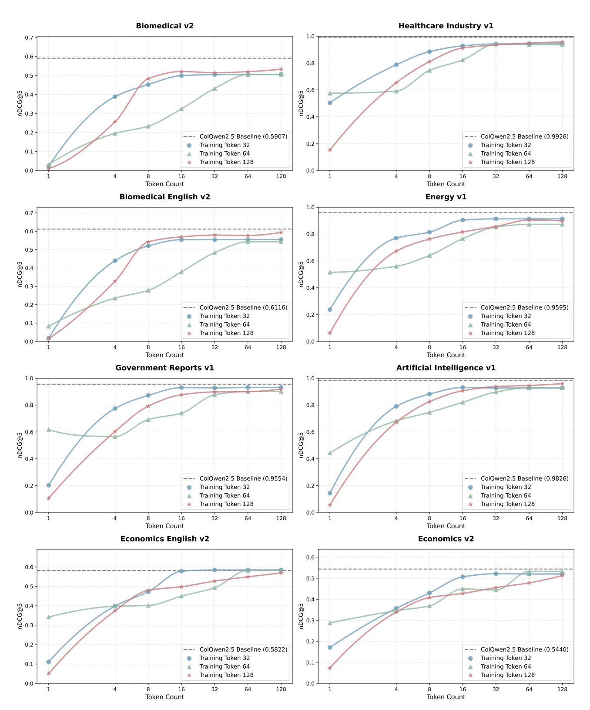

Figure 7. Additional results illustrating the test-time scaling characteristics of CausalQwen on ViDoRe V1 and V2.

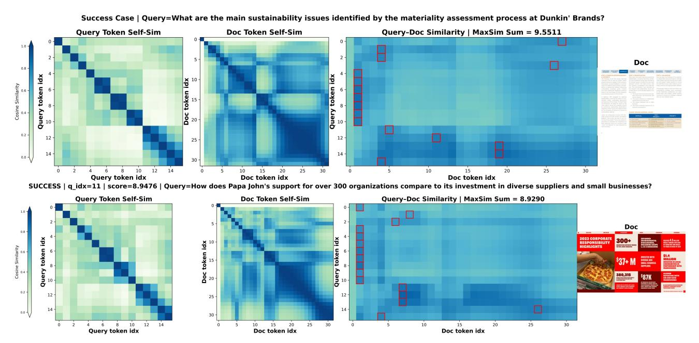

Figure 8. Success cases of CausalQwen.

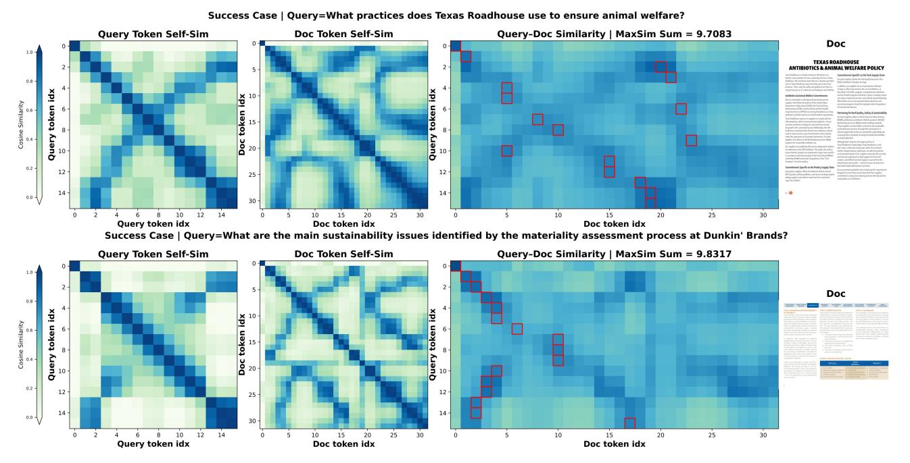

Figure 9. Success cases of CausalPali.

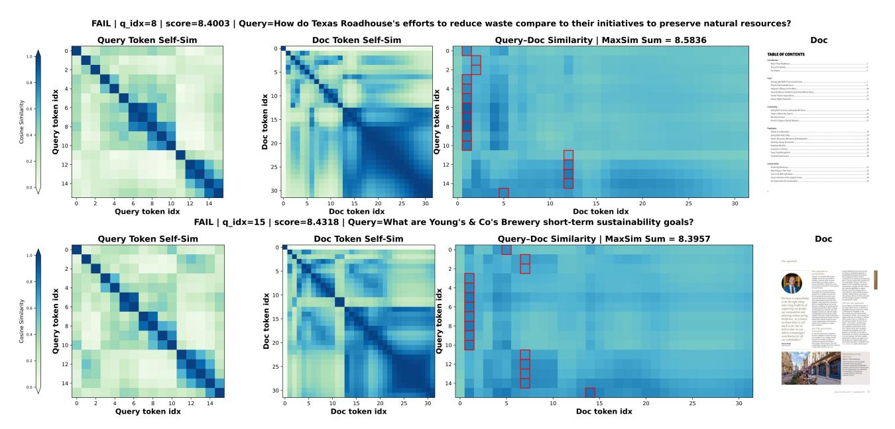

Figure 10. Failure cases of CausalQwen.

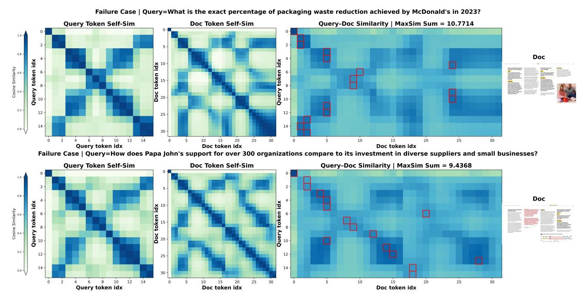

Figure 11. Failure cases of CausalPali.