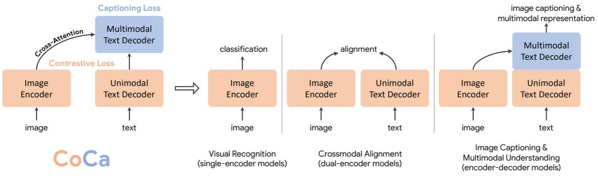
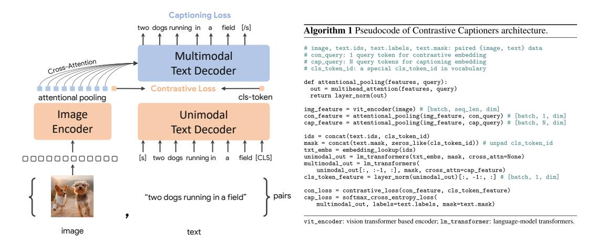
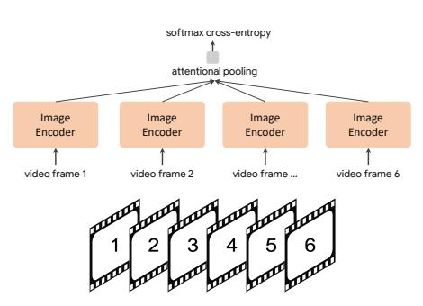
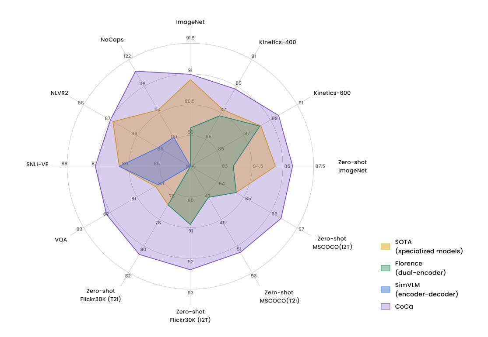
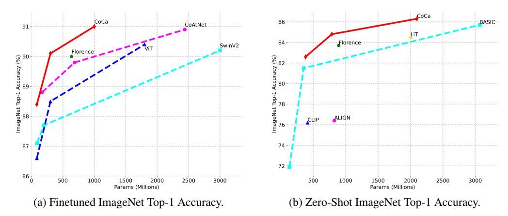
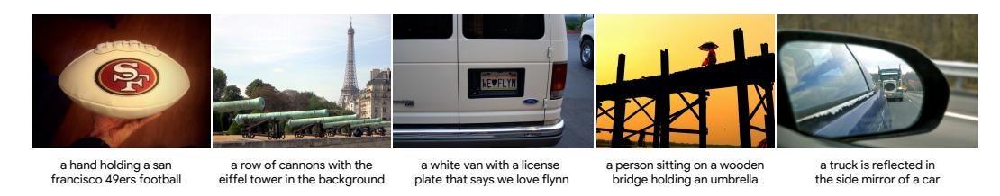

# CoCa: Contrastive Captioners are Image-Text Foundation Models

Jiahui Yu† Zirui Wang† {jiahuiyu, ziruiw}@google.com

Vijay Vasudevan Legg Yeung Mojtaba Seyedhosseini Yonghui Wu Google Research

## **Abstract**

Exploring large-scale pretrained foundation models is of significant interest in computer vision because these models can be quickly transferred to many downstream tasks. This paper presents Contrastive Captioner (CoCa), a minimalist design to pretrain an image-text encoder-decoder foundation model jointly with contrastive loss and captioning loss, thereby subsuming model capabilities from contrastive approaches like CLIP and generative methods like SimVLM. In contrast to standard encoder-decoder transformers where all decoder layers attend to encoder outputs, CoCa omits cross-attention in the first half of decoder layers to encode unimodal text representations, and cascades the remaining decoder layers which cross-attend to the image encoder for *multimodal* image-text representations. We apply a contrastive loss between unimodal image and text embeddings, in addition to a captioning loss on the multimodal decoder outputs which predicts text tokens autoregressively. By sharing the same computational graph, the two training objectives are computed efficiently with minimal overhead. CoCa is pretrained end-to-end and from scratch on both web-scale alt-text data and annotated images by treating all labels simply as text, seamlessly unifying natural language supervision for representation learning. Empirically, CoCa achieves state-of-theart performance with zero-shot transfer or minimal task-specific adaptation on a broad range of downstream tasks, spanning visual recognition (ImageNet, Kinetics-400/600/700, Moments-in-Time), crossmodal retrieval (MSCOCO, Flickr30K, MSR-VTT), multimodal understanding (VQA, SNLI-VE, NLVR2), and image captioning (MSCOCO, NoCaps). Notably on ImageNet classification, CoCa obtains 86.3% zero-shot top-1 accuracy, 90.6% with a frozen encoder and learned classification head, and new state-of-the-art 91.0% top-1 accuracy on ImageNet with a finetuned encoder.

# 1 Introduction

Deep learning has recently witnessed the rise of foundation language models [1] such as BERT [2], T5 [3], GPT-3 [4], where models are pretrained on web-scale data and demonstrate generic multitasking capabilities through zero-shot, few-shot or transfer learning. Compared with specialized individual models, pretraining foundation models for massive downstream tasks can amortize training costs, providing opportunities to push the limits of model scale [5] for human-level intelligence.

For vision and vision-language problems, several foundation model candidates have been explored: (1) Pioneering works [6, 7, 8] have shown the effectiveness of **single-encoder models** pretrained with cross-entropy loss on image classification datasets such as ImageNet [9]. The image encoder provides generic *visual representations* that can be adapted for various downstream tasks including

†Equal contribution.

Pretraining Zero-shot, frozen-feature or finetuning

Figure 1: Overview of Contrastive Captioners (CoCa) pretraining as image-text foundation models. The pretrained CoCa can be used for downstream tasks including visual recognition, vision-language alignment, image captioning and multimodal understanding with zero-shot transfer, frozen-feature evaluation or end-to-end finetuning.

image and video understanding [10, 11]. However, these models rely heavily on image annotations as labeled vectors and do not bake in knowledge of free-form human natural language, hindering their application to downstream tasks that involving both vision and language modalities. (2) Recently, a line of research [12, 13, 14] has shown the feasibility of image-text foundation model candidates by pretraining two parallel encoders with a contrastive loss on web-scale noisy image-text pairs. In addition to the visual embeddings for vision-only tasks, the resulting dual-encoder models can additionally encode textual embeddings to the same latent space, enabling new crossmodal alignment capabilities such as zero-shot image classification and image-text retrieval. Nonetheless, these models are not directly applicable for joint vision-language understanding tasks such as visual question answering (VQA), due to missing joint components to learn fused image and text representations. (3) Another line of research [15, 16, 17] has explored generative pretraining with **encoder-decoder** models to learn generic vision and multimodal representations. During pretraining, the model takes images on the encoder side and applies Language Modeling (LM) loss (or PrefixLM [3, 16]) on the decoder outputs. For downstream tasks, the decoder outputs can then be used as joint representations for multimodal understanding tasks. While superior vision-language results [16] have been attained with pretrained encoder-decoder models, they do not produce text-only representations aligned with image embeddings, thereby being less feasible and efficient for crossmodal alignment tasks.

In this work, we unify *single-encoder*, *dual-encoder* and *encoder-decoder* paradigms, and train one image-text foundation model that subsumes the capabilities of all three approaches. We propose a simple model family named Contrastive Captioners (CoCa) with a modified encoder-decoder architecture trained with both contrastive loss and captioning (generative) loss. As shown in Figure 1, we decouple the decoder transformer into two parts, a unimodal decoder and a multimodal decoder. We omit cross-attention in unimodal decoder layers to encode text-only representations, and cascade multimodal decoder layers cross-attending to image encoder outputs to learn *multimodal* image-text representations. We apply both the contrastive objective between outputs of the image encoder and unimodal text decoder, and the captioning objective at the output of the multimodal decoder. Furthermore, CoCa is trained on both image annotation data and noisy image-text data by treating all labels simply as text. The generative loss on image annotation text provides a fine-grained training signal similar to the single-encoder cross-entropy loss approach, effectively subsuming all three pretraining paradigms into a single unified method.

The design of CoCa leverages contrastive learning for learning global representations and captioning for fine-grained region-level features, thereby benefiting tasks across all three categories shown in Figure 1. CoCa shows that a single pretrained model can outperform many specialized models using zero-shot transfer or minimal task-specific adaptation. For example, CoCa obtains 86.3% zero-shot accuracy on ImageNet and better zero-shot crossmodal retrieval on MSCOCO and Flickr30k. With a frozen-encoder, CoCa achieves 90.6% on ImageNet classification, 88.0%/88.5%/81.1% on Kinetics-40/600/700 and 47.4% on Moments-in-Time. After lightweight finetuning, CoCa further achieves 91.0% on ImageNet, 82.3% on VQA and 120.6 CIDEr score on NoCaps.

## 2 Related Work

**Vision Pretraining.** Pretraining ConvNets [18] or Transformers [19] on large-scale annotated data such as ImageNet [6, 7, 8], Instagram [20] or JFT [21] has become a popular strategy towards solving visual recognition problems including classification, localization, segmentation, video recognition, tracking and many other problems. Recently, self-supervised pretraining approaches have also been explored. BEiT [22] proposes a masked image modeling task following BERT [2] in natural language processing, and uses quantized visual token ids as prediction targets. MAE [23] and SimMIM [24] remove the need for an image tokenizer and directly use a light-weight decoder or projection layer to regress pixel values. Nonetheless, these methods only learn models for the vision modality and thus they are not applicable to tasks that require joint reasoning over both image and text inputs.

**Vision-Language Pretraining.** In recent years, rapid progress has been made in vision-language pretraining (VLP), which aims to jointly encode vision and language in a fusion model. Early work (e.g. LXMERT [25], UNITER [26], VinVL [27]) in this direction relies on pretrained object detection modules such as Fast(er) R-CNN [28] to extract visual representations. Later efforts such as ViLT [29] and VLMo [30] unify vision and language transformers, and train a multimodal transformer from scratch.

**Image-Text Foundation Models.** Recent work has proposed image-text foundation models that can subsume both vision and vision-language pretraining. CLIP [12] and ALIGN [13] demonstrate that dual-encoder models pretrained with contrastive objectives on noisy image-text pairs can learn strong image and text representations for crossmodal alignment tasks and zero-shot image classification. Florence [14] further develops this method with unified contrastive objective [31], training foundation models that can be adapted for a wide range of vision and image-text benchmarks. To further improve zero-shot image classification accuracy, LiT [32] and BASIC [33] first pretrain model on an largescale image annotation dataset with cross-entropy and further finetune with contrastive loss on an noisy alt-text image dataset. Another line of research [16, 17, 34] proposes encoder-decoder models trained with generative losses and shows strong results in vision-language benchmarks while the visual encoder still performs competitively on image classification. In this work, we focus on training an image-text foundation model from scratch in a single pretraining stage to unify these approaches. While recent works [35, 36, 37] have also explored image-text unification, they require multiple pretraining stages of unimodal and multimodal modules to attain good performance. For example, ALBEF [36] combines contrastive loss with masked language modelling (MLM) with a dual-encoder design. However, our approach is simpler and more efficient to train while also enables more model capabilities: (1) CoCa only performs one forward and backward propagation for a batch of image-text pairs while ALBEF requires two (one on corrupted inputs and another without corruption), (2) CoCa is trained from scratch on the two objectives only while ALBEF is initialized from pretrained visual and textual encoders with additional training signals including momentum modules. (3) The decoder architecture with generative loss is preferred for natural language generation and thus directly enables image captioning and zero-shot learning [16].

# 3 Approach

We begin with a review of three foundation model families that utilize *natural language supervision* differently: single-encoder classification pretraining, dual-encoder contrastive learning, and encoder-decoder image captioning. We then introduce Contrastive Captioners (CoCa) that share the merits of both contrastive learning and image-to-caption generation under a simple architecture. We further discuss how CoCa models can quickly transfer to downstream tasks with zero-shot transfer or minimal task adaptation.

## 3.1 Natural Language Supervision

**Single-Encoder Classification.** The classic single-encoder approach pretrains a visual encoder through image classification on a large crowd-sourced image annotation dataset (*e.g.*, ImageNet [9], Instagram [20] or JFT [21]), where the vocabulary of annotation texts is usually fixed. These image annotations are usually mapped into discrete class vectors to learn with a cross-entropy loss as

$$\mathcal{L}_{Cls} = -p(y)\log q_{\theta}(x), \tag{1}$$

Figure 2: Detailed illustration of CoCa architecture and training objectives.

where p(y) is a one-hot, multi-hot or smoothed label distribution from ground truth label y. The learned image encoder is then used as a generic visual representation extractor for downstream tasks.

**Dual-Encoder Contrastive Learning.** Compared to pretraining with single-encoder classification, which requires human-annotated labels and data cleaning, the dual-encoder approach exploits noisy web-scale text descriptions and introduces a learnable text tower to encode free-form texts. The two encoders are jointly optimized by contrasting the paired text against others in the sampled batch:

$$\mathcal{L}_{\text{Con}} = -\frac{1}{N} \left( \sum_{i}^{N} \log \frac{\exp(x_{i}^{\top} y_{i}/\sigma)}{\sum_{j=1}^{N} \exp(x_{i}^{\top} y_{j}/\sigma)} + \sum_{i}^{N} \log \frac{\exp(y_{i}^{\top} x_{i}/\sigma)}{\sum_{j=1}^{N} \exp(y_{i}^{\top} x_{j}/\sigma)} \right), \tag{2}$$

where  $x_i$  and  $y_j$  are normalized embeddings of the image in the i-th pair and that of the text in the j-th pair. N is the batch size, and  $\sigma$  is the temperature to scale the logits. In addition to the image encoder, the dual-encoder approach also learns an aligned text encoder that enables crossmodal alignment applications such as image-text retrieval and zero-shot image classification. Empirical evidence shows zero-shot classification is more robust [12, 13, 38] on corrupted or out-of-distribution images.

**Encoder-Decoder Captioning.** While the dual-encoder approach encodes the text as a whole, the generative approach (a.k.a. captioner) aims for detailed granularity and requires the model to predict the exact tokenized texts of y autoregressively. Following a standard encoder-decoder architecture, the image encoder provides latent encoded features (e.g., using a Vision Transformer [39] or ConvNets [40]) and the text decoder learns to maximize the conditional likelihood of the paired text y under the forward autoregressive factorization:

$$\mathcal{L}_{\text{Cap}} = -\sum_{t=1}^{T} \log P_{\theta}(y_t | y_{< t}, x). \tag{3}$$

The encoder-decoder is trained with teacher-forcing [41] to parallelize computation and maximize learning efficiency. Unlike prior methods, the captioner approach yields a joint image-text representation that can be used for vision-language understanding, and is also capable of image captioning applications with natural language generation.

## 3.2 Contrastive Captioners Pretraining

Figure 2 depicts the proposed contrastive captioner (CoCa): a simple encoder-decoder approach that seamlessly combines the three training paradigms. Similar to standard image-text encoder-decoder models, CoCa encodes images to latent representations by a neural network encoder, for example, vision transformer (ViT) [39] (used by default; it can also be other image encoders like ConvNets [40]), and decodes texts with a causal masking transformer decoder. Unlike standard

|            | Im     | age Enco | oder   |                            | Text           | Decoder | •      | Image  | / Text |              |
|------------|--------|----------|--------|----------------------------|----------------|---------|--------|--------|--------|--------------|
| Model      | Layers | MLP      | Params | $\overline{n_{	ext{uni}}}$ | $n_{ m multi}$ | MLP     | Params | Hidden | Heads  | Total Params |
| CoCa-Base  | 12     | 3072     | 86M    | 12                         | 12             | 3072    | 297M   | 768    | 12     | 383M         |
| CoCa-Large | 24     | 4096     | 303M   | 12                         | 12             | 4096    | 484M   | 1024   | 16     | 787M         |
| CoCa       | 40     | 6144     | 1B     | 18                         | 18             | 5632    | 1.1B   | 1408   | 16     | 2.1B         |

Table 1: Size variants of CoCa. Both image encoder and text decoder are Transformers [19, 39].

decoder transformers, CoCa omits cross-attention in the first half of the decoder layers to encode *unimodal* text representations, and cascades the rest of the decoder layers, cross-attending to the image encoder for *multimodal* image-text representations. As a result, the CoCa decoder simultaneously produces both unimodal and multimodal text representations that allow us to apply both contrastive and generative objectives as

$$\mathcal{L}_{CoCa} = \lambda_{Con} \cdot \mathcal{L}_{Con} + \lambda_{Cap} \cdot \mathcal{L}_{Cap}, \tag{4}$$

where  $\lambda_{Con}$  and  $\lambda_{Cap}$  are loss weighting hyper-parameters. We note that the single-encoder cross-entropy classification objective can be interpreted as a special case of the generative approach applied on image annotation data, when the vocabulary is the set of all label names.

**Decoupled Text Decoder and CoCa Architecture.** The captioning approach optimizes the conditional likelihood of text while the contrastive approach uses an unconditional text representation. To address this dilemma and combine these two methods into a single model, we propose a simple decoupled decoder design where we split the decoder into unimodal and multimodal components, by skipping the cross-attention mechanism in the unimodal decoder layers. That is, the bottom  $n_{\rm uni}$ unimodal decoder layers encode the input text as latent vectors with causally-masked self-attention, and the top  $n_{\text{multi}}$  multimodal layers further apply causally-masked self-attention and together with cross-attention to the output of the visual encoder. All decoder layers prohibit tokens from attending to future tokens, and it is straightforward to use the multimodal text decoder output for the captioning objective  $\mathcal{L}_{Cap}$ . For the contrastive objective  $\mathcal{L}_{Con}$ , we append a learnable [CLS] token at the end of the input sentence and use its corresponding output of unimodal decoder as the text embedding. We split the decoder in half such that  $n_{\text{uni}} = n_{\text{multi}}$ . Following ALIGN [13], we pretrain with image resolution of  $288 \times 288$  and patch size  $18 \times 18$ , resulting in a total of 256 image tokens. Our largest CoCa model ("CoCa" in short) follows the ViT-giant setup in [21] with 1B-parameters in the image encoder and 2.1B-parameters altogether with the text decoder. We also explore two smaller variants of "CoCa-Base" and "CoCa-Large" detailed in Table 1.

Attentional Poolers. It is noteworthy that the contrastive loss uses a single embedding for each image while the decoder usually attends to a sequence of image output tokens in an encoder-decoder captioner [16]. Our preliminary experiments show that a single pooled image embedding helps visual recognition tasks as a global representation, while more visual tokens (thus more fine-grained) are beneficial for multimodal understanding tasks which require region-level features. Hence, CoCa adopts task-specific attentional pooling [42] to customize visual representations to be used for different types of training objectives and downstream tasks. Here, a *pooler* is a single multi-head attention layer with  $n_{\rm query}$  learnable queries, with the encoder output as both keys and values. Through this, the model can learn to pool embeddings with different lengths for the two training objectives, as shown in Figure 2. The use of task-specific pooling not only addresses different needs for different tasks but also introduces the pooler as a natural task adapter. We use attentional poolers in pretraining for generative loss  $n_{\rm query} = 256$  and contrastive loss  $n_{\rm query} = 1$ .

**Pretraining Efficiency.** A key benefit of the decoupled autoregressive decoder design is that it can compute two training losses considered efficiently. Since unidirectional language models are trained with causal masking on complete sentences, the decoder can efficiently generate outputs for both contrastive and generative losses with a single forward propagation (compared to two passes for a bidirectional approach [36]). Therefore, the majority of the compute is shared between the two losses and CoCa only induces minimal overhead compared to standard encoder-decoder models. On the other hand, while many existing methods [30, 32, 33, 35, 36, 37] train model components with multiple stages on various data sources and/or modalities, CoCa is pretrained end-to-end from scratch directly with various data sources (*i.e.*, annotated images and noisy alt-text images) by treating all labels as texts for both contrastive and generative objectives.

### 3.3 Contrastive Captioners for Downstream Tasks

**Zero-shot Transfer.** A pretrained CoCa model performs many tasks in a zero-shot manner by leveraging both image and text inputs, including zero-shot image classification, zero-shot image-text cross-retrieval, zero-shot video-text cross-retrieval. Following previous practices [12, 32], "zero-shot" here is different from classical zero-shot learning in that during pretraining, the model may see relevant supervised information, but no supervised examples are used during the transfer protocol. For the pretraining data, we follow strict de-duplication procedures introduced in [13, 32] to filter all near-domain examples to our downstream tasks.

**Frozen-feature Evaluation.** As discussed in the previous section, CoCa adopts task-specific attentional pooling [42] (*pooler* for brevity) to customize visual representations for different types downstream tasks while sharing the backbone encoder. This enables the model to obtain strong performance as a *frozen encoder* where we only learn a new pooler to aggregate features. It can also benefit to multi-task problems that share the same frozen image encoder computation but different task-specific heads. As also discussed in [23], linear-evaluation struggles to accurately measure learned representations and we find the attentional poolers are more practical for real-world applications.

CoCa for Video Action Recognition. We use a simple approach to enable a learned CoCa model for video action recognition tasks. We first take multiple frames of a video and feed each frame into the *shared* image encoder individually as shown in Figure 3. For frozenfeature evaluation or finetuning, we learn an additional pooler on top of the spatial and temporal feature tokens with a softmax cross-entropy loss. Note the pooler has a single query token thus the computation of pooling over all spatial and temporal tokens is not expensive. For zero-shot video-text retrieval, we use an even simpler approach by computing the mean embedding of 16 frames of the video (frames are uniformly sampled from a video). We also encode the captions of each video as target embeddings when computing retrieval metrics.

Figure 3: CoCa for video recognition.

## 4 Experiments

In this section, we first describe the details of our experimental setup. The main results are presented next organized as visual recognition tasks, crossmodal alignment tasks, image captioning and multimodal understanding tasks. Our main results are conducted under three categories for downstream tasks: zero-shot transfer, frozen-feature evaluation and finetuning. We also present ablation experiments including training objectives and architecture designs.

# 4.1 Training Setup

**Data.** As discussed in Section 3.2, CoCa is pretrained from scratch in a single stage on both webscale alt-text data and annotated images by treating all labels simply as texts. We use the JFT-3B dataset [21] with label names as the paired texts, and the ALIGN dataset [13] with noisy alt-texts. Similar to [33], we randomly shuffle and concatenate label names of each image in JFT together with a prompt sampled from [12]. An example of the resulting text label of a JFT image would look like "a photo of the cat, animal". Unlike prior models [32, 33] that also use the combination of these two datasets, we train all model parameters from scratch at the same time without pretraining an image encoder with supervised cross-entropy loss for simplicity and pretraining efficiency. To ensure fair evaluation, we follow the strict de-duplication procedures introduced in [13, 32] to filter all near-domain examples (3.6M images are removed in total) to our downstream tasks. To tokenize text input, we use a sentence-piece model [43, 44] with a vocabulary size of 64k trained on the sampled pretraining dataset.

**Optimization.** Our models are implemented in the Lingvo framework [45] with GSPMD [46, 47, 48, 49] for scaling performance. Following [33], we use a batch size of 65,536 image-text pairs,

Figure 4: Comparison of CoCa with other image-text foundation models (without task-specific customization) and multiple state-of-the-art task-specialized models.

| Model                 | ImageNet | Model            | K-400 | K-600 | K-700 | Moments-in-Time |
|-----------------------|----------|------------------|-------|-------|-------|-----------------|
| ALIGN [13]            | 88.6     | ViViT [53]       | 84.8  | 84.3  | -     | 38.0            |
| Florence [14]         | 90.1     | MoViNet [54]     | 81.5  | 84.8  | 79.4  | 40.2            |
| MetaPseudoLabels [51] | 90.2     | VATT [55]        | 82.1  | 83.6  | -     | 41.1            |
| CoAtNet [10]          | 90.9     | Florence [14]    | 86.8  | 88.0  | -     | -               |
| ViT-G [21]            | 90.5     | MaskFeat [56]    | 87.0  | 88.3  | 80.4  |                 |
| + Model Soups [52]    | 90.9     | CoVeR [11]       | 87.2  | 87.9  | 78.5  | 46.1            |
| CoCa (frozen)         | 90.6     | CoCa (frozen)    | 88.0  | 88.5  | 81.1  | 47.4            |
| CoCa (finetuned)      | 91.0     | CoCa (finetuned) | 88.9  | 89.4  | 82.7  | 49.0            |

Table 2: Image classification and video action recognition with frozen encoder or finetuned encoder.

where half of each batch comes from JFT and ALIGN, respectively. All models are trained on the combined contrastive and captioning objectives in Eq.(4) for 500k steps, roughly corresponding to 5 epochs on JFT and 10 epochs on ALIGN. As shown later in our studies, we find a larger captioning loss weight is better and thus  $\lambda_{\text{Cap}}=2.0$  and  $\lambda_{\text{Con}}=1.0$ . Following [13], we apply a contrastive loss with a trainable temperature  $\tau$  with an initial value of 0.07. For memory efficiency, we use the Adafactor [50] optimizer with  $\beta_1=0.9, \beta_2=0.999$  and decoupled weight decay ratio of 0.01. We warm up the learning rate for the first 2% of training steps to a peak value of  $8\times10^{-4}$ , and linearly decay it afterwards. Pretraining CoCa takes about 5 days on 2,048 CloudTPUv4 chips. Following [12, 13, 14], we continue pretraining for one epoch on a higher resolution of 576×576. For finetuning evaluation, we mainly follow simple protocols and directly train CoCa on downstream tasks without further metric-specific tuning like CIDEr scores (details in Appendix A and B).

## 4.2 Main Results

We extensively evaluate the capabilities of CoCa models on a wide range of downstream tasks as a pretrained foundation model. We mainly consider core tasks of three categories that examine (1)

Figure 5: Image classification scaling performance of model sizes.

visual recognition, (2) crossmodal alignment, and (3) image captioning and multimodal understanding capabilities. Since CoCa produces both aligned unimodal representations and fused multimodal embeddings at the same time, it is easily transferable to all three task groups with minimal adaption. Figure 4 summarizes the performance on key benchmarks of CoCa compared to other dual-encoder and encoder-decoder foundation models and state-of-the-art task-specialized methods. CoCa sets new state-of-the-art results on tasks of all three categories with a single pretrained checkpoint.

#### 4.2.1 Visual Recognition Tasks

Our visual recognition experiments are conducted on ImageNet [9] as image recognition benchmark, and multiple video datasets including Kinetics-400 [57], Kinetics-600 [58], Kinetics-700 [59], Moments-in-Time [60] as test-beds for video action recognition; it is noteworthy that CoCa pretrains on image data only, without accessing any extra video datasets. We apply the CoCa encoder on video frames individually (Section 3.3) without early fusion of temporal information, yet the resulting CoCa-for-Video model performs better than many spatio-temporal early-fused video models.

**Frozen-feature.** We apply a pretrained frozen CoCa model on both image classification and video action recognition. The encoder is used for both tasks while the decoder is discarded. As discussed in Section 3.3, an attentional pooling is learned together with a softmax cross-entropy loss layer on top of the embedding outputs from CoCa encoder. For video classification, a single query-token is learned to weight outputs of all tokens of spatial patches  $\times$  temporal frames. We set a learning rate of  $5 \times 10^{-4}$  on both attentional pooler and softmax, batch size of 128, and a cosine learning rate schedule (details in Appendix A). For video action recognition, we compare CoCa with other approaches on the same setup (*i.e.*, without extra supervised video data and without audio signals as model inputs). As shown in Table 2, without finetuning full encoder, CoCa already achieves competitive Top-1 classification accuracies compared to specialized image and outperforms prior state-of-the-art specialized methods on video tasks.

**Finetuning.** Based on the architecture of frozen-feature evaluation, we further finetune CoCa encoders on image and video datasets individually with a smaller learning rate of  $1\times10^{-4}$ . More experimental details are summarized in the Appendix A. The finetuned CoCa has improved performance across these tasks. Notably, CoCa obtains new state-of-the-art 91.0% Top-1 accuracy on ImageNet, as well as better video action recognition results compared with recent video approaches. More importantly, CoCa models use much less parameters than other methods in the visual encoder as shown in Figure 5a. These results suggest the proposed framework efficiently combines text training signals and thus is able to learn high-quality visual representation better than the classical single-encoder approach.

## 4.2.2 Crossmodal Alignment Tasks

Unlike other fusion-based foundation methods [16, 17, 35], CoCa is naturally applicable to crossmodal alignment tasks since it generates aligned image and text unimodal embeddings. In particular, we

|                    |                     | Fl                  | lickr30K            | 1K test             | set)                 |                     | MSCOCO (5K test set) |                     |                     |                  |                     |                     |
|--------------------|---------------------|---------------------|---------------------|---------------------|----------------------|---------------------|----------------------|---------------------|---------------------|------------------|---------------------|---------------------|
|                    | In                  | $age \rightarrow 7$ | Text                | Te                  | $ext \rightarrow In$ | nage                | In                   | $age \rightarrow '$ | Text                | Te               | $xt \rightarrow Im$ | age                 |
| Model              | R@1                 | R@5                 | R@10                | R@1                 | R@5                  | R@10                | R@1                  | R@5                 | R@10                | R@1              | R@5                 | R@10                |
| CLIP [12]          | 88.0                | 98.7                | 99.4                | 68.7                | 90.6                 | 95.2                | 58.4                 | 81.5                | 88.1                | 37.8             | 62.4                | 72.2                |
| ALIGN [13]         | 88.6                | 98.7                | 99.7                | 75.7                | 93.8                 | 96.8                | 58.6                 | 83.0                | 89.7                | 45.6             | 69.8                | 78.6                |
| FLAVA [35]         | 67.7                | 94.0                | -                   | 65.2                | 89.4                 | -                   | 42.7                 | 76.8                | -                   | 38.4             | 67.5                | -                   |
| FILIP [61]         | 89.8                | 99.2                | 99.8                | 75.0                | 93.4                 | 96.3                | 61.3                 | 84.3                | 90.4                | 45.9             | 70.6                | 79.3                |
| Florence [14]      | 90.9                | 99.1                | -                   | 76.7                | 93.6                 | -                   | 64.7                 | 85.9                | -                   | 47.2             | 71.4                | -                   |
| CoCa-Base          | 89.8                | 98.8                | 99.8                | 76.8                | 93.7                 | 96.8                | 63.8                 | 84.7                | 90.7                | 47.5             | 72.4                | 80.9                |
| CoCa-Large CoCa | 91.4 <b>92.5</b> | 99.2 <b>99.5</b> | 99.9 <b>99.9</b> | 79.0 <b>80.4</b> | 95.1 <b>95.7</b>  | 97.4 <b>97.7</b> | 65.4 <b>66.3</b>  | 85.6 <b>86.2</b> | 91.4 <b>91.8</b> | 50.1 <b>51.2</b> | 73.8 <b>74.2</b> | 81.8 <b>82.0</b> |

Table 3: Zero-shot image-text retrieval results on Flickr30K [62] and MSCOCO [63] datasets.

| Model         | ImageNet | ImageNet-A | ImageNet-R | ImageNet-V2 | ImageNet-Sketch | ObjectNet | Average |
|---------------|----------|------------|------------|-------------|-----------------|-----------|---------|
| CLIP [12]     | 76.2     | 77.2       | 88.9       | 70.1        | 60.2            | 72.3      | 74.3    |
| ALIGN [13]    | 76.4     | 75.8       | 92.2       | 70.1        | 64.8            | 72.2      | 74.5    |
| FILIP [61]    | 78.3     | -          | -          | -           | -               | -         | -       |
| Florence [14] | 83.7     | -          | -          | -           | -               | -         | -       |
| LiT [32]      | 84.5     | 79.4       | 93.9       | 78.7        | -               | 81.1      | -       |
| BASIC [33]    | 85.7     | 85.6       | 95.7       | 80.6        | 76.1            | 78.9      | 83.7    |
| CoCa-Base     | 82.6     | 76.4       | 93.2       | 76.5        | 71.7            | 71.6      | 78.7    |
| CoCa-Large    | 84.8     | 85.7       | 95.6       | 79.6        | 75.7            | 78.6      | 83.3    |
| CoCa          | 86.3     | 90.2       | 96.5       | 80.7        | 77.6            | 82.7      | 85.7    |

Table 4: Zero-shot image classification results on ImageNet [9], ImageNet-A [64], ImageNet-R [65], ImageNet-V2 [66], ImageNet-Sketch [67] and ObjectNet [68].

are interested in the zero-shot setting where all parameters are frozen after pretraining and directly used to extract embeddings. Here, we use the same embeddings used for contrastive loss during pretraining, and thus the multimodal text decoder is not used.

**Zero-Shot Image-Text Retrieval.** We evaluate CoCa on the two standard image-text retrieval benchmarks: MSCOCO [63] and Flickr30K [62]. Following the CLIP setting [12], we first independently feed each image/text to the corresponding encoder and obtain embeddings for all image/text in the test set. We then retrieve based on cosine similarity scores over the whole test set. As shown in Table 3, CoCa significantly improves over prior methods on both image-to-text and text-to-image retrievals on all metrics. In addition, our model is parameter-efficient, with CoCa-Base already outperforming strong baselines (CLIP [12] and ALIGN [13]) and CoCa-Large outperforming Florence [14] (which contains a parameter count comparable to ViT-Huge). This shows that CoCa learns good unimodal representations *and* aligns them well across modalities.

**Zero-Shot Image Classification.** Following prior work [12, 13], we use the aligned image/text embeddings to perform zero-shot image classification by matching images with label names without finetuning. We follow the exact setup in [12] and apply the same set of prompts used for label class names. As shown in Table 4, CoCa sets new state-of-the-art zero-shot classification results on ImageNet. Notably, CoCa uses fewer parameters than prior best model [33] while smaller CoCa variants already outperform strong baselines [12, 14], as shown in Figure 5b. In addition, our model demonstrates effective generalization under zero-shot evaluation, consistent with prior findings [12, 13], with CoCa improving on all six datasets considered. Lastly, while prior models [32, 33] found sequentially pretraining with single-encoder and dual-encoder methods in multiple stages is crucial to performance gains, our results show it is possible to attain strong performance by unifying training objectives and datasets in a single-stage framework.

**Zero-Shot Video Retrieval.** We evaluate video-text retrieval using CoCa on MSR-VTT [71] using the full split. Table 5 shows that CoCa produces the highest retrieval metrics for both text-to-video and video-to-text retrieval. It is important to note that MSR-VTT videos are sourced from YouTube, and we require the original videos to compute our embeddings. Many of the videos have been made explicitly unavailable [72], hence we compute retrieval over the subset of data that is publicly available at the time of evaluation. Using code3 provided by the authors of Socratic Models [70], we re-computed metrics on the available subset for those methods, indicated by "(subset)" for fairest comparison.

3https://socraticmodels.github.io

|                                                     | MSR-VTT Full |                      |      |                          |                     |                  |  |  |
|-----------------------------------------------------|--------------|----------------------|------|--------------------------|---------------------|------------------|--|--|
|                                                     | Te           | $ext \rightarrow Vi$ | deo  | $Video \rightarrow Text$ |                     |                  |  |  |
| Method                                              | R@1          | R@5                  | R@10 | R@1                      | R@5                 | R@10             |  |  |
| CLIP [69] Socratic Models [70]                   | 21.4         | 41.1                 | 50.4 | 40.3 44.7             | 69.7 71.2        | 79.2 80.0     |  |  |
| CLIP [69] (subset) Socratic Models [70] (subset) | 23.3         | 44.2                 | 53.6 | 43.3 46.9             | 73.3 <b>73.5</b> | <b>81.8</b> 81.3 |  |  |
| CoCa (subset)                                       | 30.0         | 52.4                 | 61.6 | 49.9                     | 73.4                | 81.4             |  |  |

Table 5: Zero-shot Video-Text Retrieval on MSR-VTT Full test set.

|               | VÇ       | QA       | SNL   | I-VE  | NLV  | VR2    |
|---------------|----------|----------|-------|-------|------|--------|
| Model         | test-dev | test-std | dev   | test  | dev  | test-p |
| UNITER [26]   | 73.8     | 74.0     | 79.4  | 79.4  | 79.1 | 80.0   |
| VinVL [27]    | 76.6     | 76.6     | -     | -     | 82.7 | 84.0   |
| CLIP-ViL [73] | 76.5     | 76.7     | 80.6  | 80.2  | -    | -      |
| ALBEF [36]    | 75.8     | 76.0     | 80.8  | 80.9  | 82.6 | 83.1   |
| BLIP [37]     | 78.3     | 78.3     | -     | -     | 82.2 | 82.2   |
| OFA [17]      | 79.9     | 80.0     | 90.3† | 90.2† | _    | -      |
| VLMo [30]     | 79.9     | 80.0     | -     | -     | 85.6 | 86.9   |
| SimVLM [16]   | 80.0     | 80.3     | 86.2  | 86.3  | 84.5 | 85.2   |
| Florence [14] | 80.2     | 80.4     | -     | -     | -    | -      |
| METER [74]    | 80.3     | 80.5     | -     | -     | -    | -      |
| CoCa          | 82.3     | 82.3     | 87.0  | 87.1  | 86.1 | 87.0   |

Table 6: Multimodal understanding results comparing vision-language pretraining methods. †OFA uses both image and text premises as inputs while other models utilize the image only.

## 4.2.3 Image Captioning and Multimodal Understanding Tasks

Another key advantage of CoCa is its ability to process multimodal embeddings as an encoder-decoder model trained with the generative objective. Therefore, CoCa can perform both image captioning and multimodal understanding downstream tasks without any further fusion adaptation [73, 74]. Overall, experimental results suggest CoCa reaps the benefit of a encoder-decoder model to obtain strong multimodal understanding and generation capabilities, in addition to the vision and retrieval capabilities as a dual-encoder method.

Multimodal Understanding. As shown in [16], the output of encoder-decoder models can jointly encode image and text inputs, and can be used for tasks that require reasoning over both modalities. We consider three popular multimodal understaning benchmarks: visual question answering (VQA v2 [75]), visual entailment (SNLI-VE [76]), and visual reasoning (NLVR2 [77]). We mainly follow the settings in [16] and train linear classifiers on top of the decoder outputs to predict answers (more details in Appendix B). Our results in Table 6 suggest that CoCa outperforms strong vision-language pretraining (VLP) baselines and obtains state-of-the-art performance on all three tasks. While prior dual-encoder models [12, 14] do not contain fusion layers and thus require an additional VL pretraining stage for downstream multimodal understanding tasks, CoCa subsumes the three pretraining paradigms and obtains better performance on VL tasks with lightweight finetuning.

**Image Captioning.** In addition to multimodal classification tasks, CoCa is also directly applicable to image captioning tasks as an encoder-decoder model. We finetune CoCa with the captioning loss  $\mathcal{L}_{Cap}$  only on MSCOCO [63] captioning task and evaluate on both MSCOCO Karpathy-test split and NoCaps [78] online evaluation. As shown by experiments in Table 7, CoCa outperforms strong baselines trained with cross-entropy loss on MSCOCO, and achieves results comparable to methods with CIDEr metric-specific optimization [79]. It is noteworthy that we do not use CIDEr-specific optimization [79] for simplicity. On the challenging NoCaps benchmark, CoCa obtains new state-of-the-art on both validation and test splits (generated examples shown in Figure 6). These results showcase the generative capability of CoCa as an image-text foundation model.

|                                         |      | MSCOCO |       |      |       | NoCaps |       |      |  |
|-----------------------------------------|------|--------|-------|------|-------|--------|-------|------|--|
|                                         |      |        |       |      |       | id     | Test  |      |  |
|                                         | B@4  | M      | C     | S    | C     | S      | C     | S    |  |
| CLIP-ViL [73]                           | 40.2 | 29.7   | 134.2 | 23.8 | -     | -      | -     | _    |  |
| BLIP [37]                               | 40.4 | -      | 136.7 | -    | 113.2 | 14.8   | -     | -    |  |
| VinVL[27]                               | 41.0 | 31.1   | 140.9 | 25.4 | 105.1 | 14.4   | 103.7 | 14.4 |  |
| SimVLM [16]                             | 40.6 | 33.7   | 143.3 | 25.4 | 112.2 | -      | 110.3 | 14.5 |  |
| LEMON [80]                              | 41.5 | 30.8   | 139.1 | 24.1 | 117.3 | 15.0   | 114.3 | 14.9 |  |
| LEMON SCST [80] † | 42.6 | 31.4   | 145.5 | 25.5 | -     | -      | -     | -    |  |
| OFA [17] †                   | 43.5 | 31.9   | 149.6 | 26.1 | -     | -      | -     | -    |  |
| CoCa                                    | 40.9 | 33.9   | 143.6 | 24.7 | 122.4 | 15.5   | 120.6 | 15.5 |  |

Table 7: Image captioning results on MSCOCO and NoCaps (B@4: BLEU@4, M: METEOR, C: CIDEr, S: SPICE). †Models finetuned with CIDEr optimization.

Figure 6: Curated samples of text captions generated by CoCa with NoCaps images as input.

## 4.3 Ablation Analysis

We extensively ablate the properties of CoCa on a smaller model variant. Specifically, we train CoCa-Base with a reduced 12 decoder layers and a total batch size of 4,096. We mainly evaluate using zero-shot image classification and VQA, since the former covers both visual representation quality and crossmodal alignment, while the later is representative for multimodal reasoning.

Captioning vs. Classification. We first examine the effectiveness of captioning loss on image annotation datasets. To do this, we train a naive encoder-decoder model using  $\mathcal{L}_{Cap}$  on the JFT-3B dataset, and compare with a standard ViT-Base single-encoder model trained with  $\mathcal{L}_{Cls}$  in Table 8a. We find encoder-decoder models to perform on par with single-encoder pretraining on both linear evaluation and finetuned results. This suggests that the generative pretraining subsumes classification pretraining, consistent with our intuition that  $\mathcal{L}_{Cls}$  is a special case of  $\mathcal{L}_{Cap}$  when text vocabulary is the set of all possible class names. Thus, our CoCa model can be interpreted as an effective unification of the three paradigms. This explains why CoCa does not need a pretrained visual encoder to perform well.

**Training Objectives.** We study the effects of the two training objectives and compare CoCa with single-objective variants in Table 8b. Compared to the contrastive-only model, CoCa significantly improves both zero-shot alignment and VQA (notice that the contrastive-only model requires additional fusion for VQA). CoCa performs on par with the captioning-only model on VQA while it additionally enables retrieval-style tasks such as zero-shot classification. Table 8c further studies loss ratios and suggests that the captioning loss not only improves VQA but also zero-shot alignment between modalities. We hypothesize that generative objectives learn fine-grained text representations that further improve text understanding. Finally, we compare training costs in Table 8b (measured in TPUv3-core-days; larger is slower) and find CoCa to be as efficient as the captioning-only model (a.k.a.naive encoder-decoder) due to the sharing of compute between two objectives. These suggest combining the two losses induces new capabilities and better performance with minimal extra cost.

**Unimodal and Multimodal Decoders.** CoCa introduces a novel decoder design and we ablate its components. In Table 8d, we vary the number of unimodal decoder layers (while keeping the total number of layers the same). Intuitively, fewer unimodal text layers leads to worse zero-shot classification due to lack of capacity for good unimodal text understanding, while fewer multimodal layers reduces the model's power to reason over multimodal inputs such as VQA. Overall, we

| loss                                                | LE | FT           |
|-----------------------------------------------------|----|--------------|
| $\mathcal{L}_{	ext{Cls}}$ $\mathcal{L}_{	ext{Cap}}$ |    | 85.1 84.9 |

| loss                        | ZS   | VQA  | TPU cost      |
|-----------------------------|------|------|---------------|
| $\mathcal{L}_{Con}$         | 70.7 | 59.2 | $1 \times$    |
| $\mathcal{L}_{Cap}$         | -    | 68.9 | $1.17 \times$ |
| $\mathcal{L}_{\text{CoCa}}$ | 71.6 | 69.0 | <b>1.18</b> × |

| $\lambda_{\operatorname{Cap}}$ : | $\lambda_{Con}$ ZS VQA |
|----------------------------------|------------------------|
| 1:1                              | 71.5 68.6              |
| 1:2                              | 71.0 68.1              |
| 2:1                              | 71.6 69.0              |

(a) Encoder-decoder vs. single-encoder models (trained on JFT).

| (  | h)             | Training | objectives | ablation. |
|----|----------------|----------|------------|-----------|
| ٠, | $\upsilon_{j}$ | Hamming  | objectives | abiation. |

(c) Training objectives weights.

| $n_{ m uni}$ | ZS   | VQA  |
|--------------|------|------|
| 3            | 70.2 | 69.0 |
| 6            | 71.6 | 69.0 |
| 9            | 71.4 | 68.8 |

| variant       | AE   | MSCOCO |
|---------------|------|--------|
| 1 [CLS]       | 80.7 | 41.4   |
| + text tokens | 80.3 | 40.2   |
| 8 [CLS]       | 80.3 | 36.9   |
| + text tokens | 80.4 | 40.3   |
|               |      |        |

| variant                 | ZS   | VQA  |
|-------------------------|------|------|
| parallel                | 71.2 | 68.7 |
| cascade                 | 71.6 | 69.0 |
| $n_{\text{query}} = 0$  | 71.5 | 69.0 |
| $n_{\text{query}} = 1$  | 69.3 | 64.4 |
| $n_{\text{query}} = 32$ | 71.2 | 68.2 |

(d) Unimodal decoder layers.

(e) Contrastive text embedding design ablation.

(f) Attentional pooler design ablation.

Table 8: CoCa ablation experiments. On ImageNet classification, we report top-1 accuracy for: zero-shot (ZS), linear evaluation (LE), attentional evaluation (AE) using pooler on frozen feature, and finetuning (FT). On MSCOCO retrieval, we report the average of image-to-text and text-to-image R@1. On VQA, we report the dev-set vqa score. The default CoCa setting is **bold**.

find decoupling the decoder in half maintains a good balance. One possibility is that global text representation for retrieval doesn't require deep modules [33] while early fusion for shallow layers may also be unnecessary for multimodal understanding. Next, we explore various options to extract unimodal text embeddings. In particular, we experiment with the number of learnable [CLS] tokens as well as the aggregation design. For the later, we aggregate over either the [CLS] tokens only or the concatenation of [CLS] and the original input sentence. Interestingly, in Table 8e we find training a single [CLS] token without the original input is preferred for both vision-only and crossmodal retrieval tasks. This indicates that learning an additional simple sentence representation mitigates interference between contrastive and captioning loss, and is powerful enough for strong generalization.

Attentional Poolers. CoCa exploits attentional poolers in its design both for different pretraining objectives and objective-specific downstream task adaptations. In pretraining, we compare a few design variants on using poolers for contrastive loss and generative loss: (1) the "parallel" design which extracts both contrastive and generative losses at the same time on Vision Transformer encoder outputs as shown in Figure 2, and (2) the "cascade" design which applies the contrastive pooler on top of the outputs of the generative pooler. Table 8f shows the results of these variants. Empirically, we find at small scale the "cascade" version (contrastive pooler on top of the generative pooler) performs better and is used by default in all CoCa models. We also study the effect of number of queries where  $n_{\rm query}=0$  means no generative pooler is used (thus all ViT output tokens are used for decoder cross-attention). Results show that both tasks prefer longer sequences of detailed image tokens at a cost of slightly more computation and parameters. As a result, we use a generative pooler of length 256 to improve multimodal understanding benchmarks while still maintaining the strong frozen-feature capability.

# 5 Broader Impacts

This work presents an image-text pretraining approach on web-scale datasets that is capable of transferring to a wide range of downstream tasks in a zero-shot manner or with lightweight finetuning. While the pretrained models are capable of many vision and vision-language tasks, we note that our models use the same pretraining data as previous methods [13, 21, 32, 33] and additional analysis of the data and the resulting model is necessary before the use of the models in practice. We show CoCa models are more robust on corrupted images, but it could still be vulnerable to other image corruptions that are not yet captured by current evaluation sets or in real-world scenarios. For both

the data and model, further community exploration is required to understand the broader impacts including but not limited to fairness, social bias and potential misuse.

#### 6 Conclusion

In this work we present Contrastive Captioners (CoCa), a new image-text foundation model family that subsumes existing vision pretraining paradigms with natural language supervision. Pretrained on image-text pairs from various data sources in a single stage, CoCa efficiently combines contrastive and captioning objectives in an encoder-decoder model. CoCa obtains a series of state-of-the-art performance with a single checkpoint on a wide spectrum of vision and vision-language problems. Our work bridges the gap among various pretraining approaches and we hope it motivates new directions for image-text foundation models.

#### Acknowledgments

We would like to thank Yi-Ting Chen, Kaifeng Chen, Ye Xia, Zhen Li, Chao Jia, Yinfei Yang, Zhengdong Zhang, Wei Han, Yuan Cao, Tao Zhu, Futang Peng, Soham Ghosh, Zihang Dai, Junnan Li, Ning Wang, Xin Li, Anelia Angelova, Jason Baldridge, Izhak Shafran, Shengyang Dai, Abhijit Ogale, Zhifeng Chen, Claire Cui, Paul Natsev, Tom Duerig for helpful discussions, Andrew Dai for help with contrastive models, Christopher Fifty and Bowen Zhang for help with video models, Yuanzhong Xu for help with model scaling, Lucas Beyer for help with data preparation, Andy Zeng for help with MSR-VTT evaluation, Hieu Pham and Simon Kornblith for help with zero-shot evaluations, Erica Moreira and Victor Gomes for help with resource coordination, Tom Small for help with visual illustration, Liangliang Cao for proofreading, and others in the Google Brain team for support throughout this project.

#### References

- [1] Rishi Bommasani, Drew A Hudson, Ehsan Adeli, Russ Altman, Simran Arora, Sydney von Arx, Michael S Bernstein, Jeannette Bohg, Antoine Bosselut, Emma Brunskill, et al. On the opportunities and risks of foundation models. *arXiv preprint arXiv:2108.07258*, 2021.
- [2] Jacob Devlin, Ming-Wei Chang, Kenton Lee, and Kristina Toutanova. Bert: Pre-training of deep bidirectional transformers for language understanding. arXiv preprint arXiv:1810.04805, 2018.
- [3] Colin Raffel, Noam Shazeer, Adam Roberts, Katherine Lee, Sharan Narang, Michael Matena, Yanqi Zhou, Wei Li, and Peter J Liu. Exploring the limits of transfer learning with a unified text-to-text transformer. *arXiv* preprint arXiv:1910.10683, 2019.
- [4] Tom Brown, Benjamin Mann, Nick Ryder, Melanie Subbiah, Jared D Kaplan, Prafulla Dhariwal, Arvind Neelakantan, Pranav Shyam, Girish Sastry, Amanda Askell, et al. Language models are few-shot learners. *Advances in neural information processing systems*, 33:1877–1901, 2020.
- [5] Paul Barham, Aakanksha Chowdhery, Jeff Dean, Sanjay Ghemawat, Steven Hand, Dan Hurt, Michael Isard, Hyeontaek Lim, Ruoming Pang, Sudip Roy, et al. Pathways: Asynchronous distributed dataflow for ml. *arXiv preprint arXiv:2203.12533*, 2022.
- [6] Ross Girshick, Jeff Donahue, Trevor Darrell, and Jitendra Malik. Rich feature hierarchies for accurate object detection and semantic segmentation. In *Proceedings of the IEEE conference on computer vision and pattern recognition*, pages 580–587, 2014.
- [7] Jonathan Long, Evan Shelhamer, and Trevor Darrell. Fully convolutional networks for semantic segmentation. In *Proceedings of the IEEE conference on computer vision and pattern recognition*, pages 3431–3440, 2015.
- [8] Karen Simonyan and Andrew Zisserman. Two-stream convolutional networks for action recognition in videos. *Advances in neural information processing systems*, 27, 2014.
- [9] Jia Deng, Wei Dong, Richard Socher, Li-Jia Li, Kai Li, and Li Fei-Fei. Imagenet: A large-scale hierarchical image database. In 2009 IEEE conference on computer vision and pattern recognition, pages 248–255. Ieee, 2009.

- [10] Zihang Dai, Hanxiao Liu, Quoc V Le, and Mingxing Tan. Coatnet: Marrying convolution and attention for all data sizes. Advances in Neural Information Processing Systems, 34:3965–3977, 2021
- [11] Bowen Zhang, Jiahui Yu, Christopher Fifty, Wei Han, Andrew M Dai, Ruoming Pang, and Fei Sha. Co-training transformer with videos and images improves action recognition. *arXiv* preprint arXiv:2112.07175, 2021.
- [12] Alec Radford, Jong Wook Kim, Chris Hallacy, Aditya Ramesh, Gabriel Goh, Sandhini Agarwal, Girish Sastry, Amanda Askell, Pamela Mishkin, Jack Clark, et al. Learning transferable visual models from natural language supervision. In *International Conference on Machine Learning*, pages 8748–8763. PMLR, 2021.
- [13] Chao Jia, Yinfei Yang, Ye Xia, Yi-Ting Chen, Zarana Parekh, Hieu Pham, Quoc Le, Yun-Hsuan Sung, Zhen Li, and Tom Duerig. Scaling up visual and vision-language representation learning with noisy text supervision. In *International Conference on Machine Learning*, pages 4904–4916. PMLR, 2021.
- [14] Lu Yuan, Dongdong Chen, Yi-Ling Chen, Noel Codella, Xiyang Dai, Jianfeng Gao, Houdong Hu, Xuedong Huang, Boxin Li, Chunyuan Li, et al. Florence: A new foundation model for computer vision. *arXiv preprint arXiv:2111.11432*, 2021.
- [15] Oriol Vinyals, Alexander Toshev, Samy Bengio, and Dumitru Erhan. Show and tell: A neural image caption generator. In *Proceedings of the IEEE conference on computer vision and pattern recognition*, pages 3156–3164, 2015.
- [16] Zirui Wang, Jiahui Yu, Adams Wei Yu, Zihang Dai, Yulia Tsvetkov, and Yuan Cao. Simvlm: Simple visual language model pretraining with weak supervision. arXiv preprint arXiv:2108.10904, 2021.
- [17] Peng Wang, An Yang, Rui Men, Junyang Lin, Shuai Bai, Zhikang Li, Jianxin Ma, Chang Zhou, Jingren Zhou, and Hongxia Yang. Unifying architectures, tasks, and modalities through a simple sequence-to-sequence learning framework. *arXiv preprint arXiv:2202.03052*, 2022.
- [18] Alex Krizhevsky, Ilya Sutskever, and Geoffrey E Hinton. Imagenet classification with deep convolutional neural networks. *Advances in neural information processing systems*, 25, 2012.
- [19] Ashish Vaswani, Noam Shazeer, Niki Parmar, Jakob Uszkoreit, Llion Jones, Aidan N Gomez, Łukasz Kaiser, and Illia Polosukhin. Attention is all you need. *Advances in neural information processing systems*, 30, 2017.
- [20] Dhruv Mahajan, Ross Girshick, Vignesh Ramanathan, Kaiming He, Manohar Paluri, Yixuan Li, Ashwin Bharambe, and Laurens Van Der Maaten. Exploring the limits of weakly supervised pretraining. In *Proceedings of the European conference on computer vision (ECCV)*, pages 181–196, 2018.
- [21] Xiaohua Zhai, Alexander Kolesnikov, Neil Houlsby, and Lucas Beyer. Scaling vision transformers, 2021.
- [22] Hangbo Bao, Li Dong, and Furu Wei. Beit: Bert pre-training of image transformers. *arXiv* preprint arXiv:2106.08254, 2021.
- [23] Kaiming He, Xinlei Chen, Saining Xie, Yanghao Li, Piotr Dollár, and Ross Girshick. Masked autoencoders are scalable vision learners. *arXiv* preprint arXiv:2111.06377, 2021.
- [24] Zhenda Xie, Zheng Zhang, Yue Cao, Yutong Lin, Jianmin Bao, Zhuliang Yao, Qi Dai, and Han Hu. Simmim: A simple framework for masked image modeling. arXiv preprint arXiv:2111.09886, 2021.
- [25] Hao Tan and Mohit Bansal. Lxmert: Learning cross-modality encoder representations from transformers. *arXiv preprint arXiv:1908.07490*, 2019.
- [26] Yen-Chun Chen, Linjie Li, Licheng Yu, Ahmed El Kholy, Faisal Ahmed, Zhe Gan, Yu Cheng, and Jingjing Liu. Uniter: Universal image-text representation learning. In *ECCV*, 2020.
- [27] Pengchuan Zhang, Xiujun Li, Xiaowei Hu, Jianwei Yang, Lei Zhang, Lijuan Wang, Yejin Choi, and Jianfeng Gao. Vinvl: Revisiting visual representations in vision-language models. In *Proceedings of the IEEE/CVF Conference on Computer Vision and Pattern Recognition (CVPR)*, pages 5579–5588, June 2021.

- [28] Shaoqing Ren, Kaiming He, Ross Girshick, and Jian Sun. Faster r-cnn: Towards real-time object detection with region proposal networks. In C. Cortes, N. Lawrence, D. Lee, M. Sugiyama, and R. Garnett, editors, *Advances in Neural Information Processing Systems*, volume 28. Curran Associates, Inc., 2015.
- [29] Wonjae Kim, Bokyung Son, and Ildoo Kim. Vilt: Vision-and-language transformer without convolution or region supervision, 2021.
- [30] Wenhui Wang, Hangbo Bao, Li Dong, and Furu Wei. Vlmo: Unified vision-language pretraining with mixture-of-modality-experts. *arXiv* preprint arXiv:2111.02358, 2021.
- [31] Jianwei Yang, Chunyuan Li, Pengchuan Zhang, Bin Xiao, Ce Liu, Lu Yuan, and Jianfeng Gao. Unified contrastive learning in image-text-label space, 2022.
- [32] Xiaohua Zhai, Xiao Wang, Basil Mustafa, Andreas Steiner, Daniel Keysers, Alexander Kolesnikov, and Lucas Beyer. Lit: Zero-shot transfer with locked-image text tuning. *arXiv* preprint arXiv:2111.07991, 2021.
- [33] Hieu Pham, Zihang Dai, Golnaz Ghiasi, Kenji Kawaguchi, Hanxiao Liu, Adams Wei Yu, Jiahui Yu, Yi-Ting Chen, Minh-Thang Luong, Yonghui Wu, Mingxing Tan, and Quoc V. Le. Combined scaling for open-vocabulary image classification, 2021.
- [34] AJ Piergiovanni, Wei Li, Weicheng Kuo, Mohammad Saffar, Fred Bertsch, and Anelia Angelova. Answer-me: Multi-task open-vocabulary visual question answering. *arXiv* preprint *arXiv*:2205.00949, 2022.
- [35] Amanpreet Singh, Ronghang Hu, Vedanuj Goswami, Guillaume Couairon, Wojciech Galuba, Marcus Rohrbach, and Douwe Kiela. Flava: A foundational language and vision alignment model. *arXiv preprint arXiv:2112.04482*, 2021.
- [36] Junnan Li, Ramprasaath Selvaraju, Akhilesh Gotmare, Shafiq Joty, Caiming Xiong, and Steven Chu Hong Hoi. Align before fuse: Vision and language representation learning with momentum distillation. *Advances in Neural Information Processing Systems*, 34, 2021.
- [37] Junnan Li, Dongxu Li, Caiming Xiong, and Steven Hoi. Blip: Bootstrapping language-image pre-training for unified vision-language understanding and generation. *arXiv* preprint arXiv:2201.12086, 2022.
- [38] Anders Andreassen, Yasaman Bahri, Behnam Neyshabur, and Rebecca Roelofs. The evolution of out-of-distribution robustness throughout fine-tuning. *arXiv preprint arXiv:2106.15831*, 2021.
- [39] Alexey Dosovitskiy, Lucas Beyer, Alexander Kolesnikov, Dirk Weissenborn, Xiaohua Zhai, Thomas Unterthiner, Mostafa Dehghani, Matthias Minderer, Georg Heigold, Sylvain Gelly, Jakob Uszkoreit, and Neil Houlsby. An image is worth 16x16 words: Transformers for image recognition at scale. In *International Conference on Learning Representations*, 2021.
- [40] Kaiming He, Xiangyu Zhang, Shaoqing Ren, and Jian Sun. Deep residual learning for image recognition. In *Proceedings of the IEEE conference on computer vision and pattern recognition*, pages 770–778, 2016.
- [41] Ronald J Williams and David Zipser. A learning algorithm for continually running fully recurrent neural networks. *Neural computation*, 1(2):270–280, 1989.
- [42] Juho Lee, Yoonho Lee, Jungtaek Kim, Adam Kosiorek, Seungjin Choi, and Yee Whye Teh. Set transformer: A framework for attention-based permutation-invariant neural networks. In *International Conference on Machine Learning*, pages 3744–3753. PMLR, 2019.
- [43] Rico Sennrich, Barry Haddow, and Alexandra Birch. Neural machine translation of rare words with subword units. *arXiv preprint arXiv:1508.07909*, 2015.
- [44] Taku Kudo. Subword regularization: Improving neural network translation models with multiple subword candidates. *arXiv preprint arXiv:1804.10959*, 2018.
- [45] Jonathan Shen, Patrick Nguyen, Yonghui Wu, Zhifeng Chen, et al. Lingvo: a modular and scalable framework for sequence-to-sequence modeling, 2019.
- [46] Yanping Huang, Youlong Cheng, Ankur Bapna, Orhan Firat, Dehao Chen, Mia Chen, HyoukJoong Lee, Jiquan Ngiam, Quoc V Le, Yonghui Wu, et al. Gpipe: Efficient training of giant neural networks using pipeline parallelism. *Advances in neural information processing systems*, 32, 2019.

- [47] Yuanzhong Xu, HyoukJoong Lee, Dehao Chen, Hongjun Choi, Blake Hechtman, and Shibo Wang. Automatic cross-replica sharding of weight update in data-parallel training. *arXiv* preprint arXiv:2004.13336, 2020.
- [48] Dmitry Lepikhin, HyoukJoong Lee, Yuanzhong Xu, Dehao Chen, Orhan Firat, Yanping Huang, Maxim Krikun, Noam Shazeer, and Zhifeng Chen. Gshard: Scaling giant models with conditional computation and automatic sharding. *arXiv preprint arXiv:2006.16668*, 2020.
- [49] Yuanzhong Xu, HyoukJoong Lee, Dehao Chen, Blake Hechtman, Yanping Huang, Rahul Joshi, Maxim Krikun, Dmitry Lepikhin, Andy Ly, Marcello Maggioni, et al. Gspmd: general and scalable parallelization for ml computation graphs. *arXiv preprint arXiv:2105.04663*, 2021.
- [50] Noam Shazeer and Mitchell Stern. Adafactor: Adaptive learning rates with sublinear memory cost. In *International Conference on Machine Learning*, pages 4596–4604. PMLR, 2018.
- [51] Hieu Pham, Zihang Dai, Qizhe Xie, and Quoc V Le. Meta pseudo labels. In Proceedings of the IEEE/CVF Conference on Computer Vision and Pattern Recognition, pages 11557–11568, 2021.
- [52] Mitchell Wortsman, Gabriel Ilharco, Samir Yitzhak Gadre, Rebecca Roelofs, Raphael Gontijo-Lopes, Ari S Morcos, Hongseok Namkoong, Ali Farhadi, Yair Carmon, Simon Kornblith, et al. Model soups: averaging weights of multiple fine-tuned models improves accuracy without increasing inference time. *arXiv preprint arXiv:2203.05482*, 2022.
- [53] Anurag Arnab, Mostafa Dehghani, Georg Heigold, Chen Sun, Mario Lučić, and Cordelia Schmid. Vivit: A video vision transformer. In *Proceedings of the IEEE/CVF International Conference on Computer Vision*, pages 6836–6846, 2021.
- [54] Dan Kondratyuk, Liangzhe Yuan, Yandong Li, Li Zhang, Mingxing Tan, Matthew Brown, and Boqing Gong. Movinets: Mobile video networks for efficient video recognition. In *Proceedings* of the IEEE/CVF Conference on Computer Vision and Pattern Recognition, pages 16020–16030, 2021.
- [55] Hassan Akbari, Liangzhe Yuan, Rui Qian, Wei-Hong Chuang, Shih-Fu Chang, Yin Cui, and Boqing Gong. Vatt: Transformers for multimodal self-supervised learning from raw video, audio and text. Advances in Neural Information Processing Systems, 34, 2021.
- [56] Chen Wei, Haoqi Fan, Saining Xie, Chao-Yuan Wu, Alan Yuille, and Christoph Feichtenhofer. Masked feature prediction for self-supervised visual pre-training. *arXiv* preprint *arXiv*:2112.09133, 2021.
- [57] Will Kay, Joao Carreira, Karen Simonyan, Brian Zhang, Chloe Hillier, Sudheendra Vijayanarasimhan, Fabio Viola, Tim Green, Trevor Back, Paul Natsev, et al. The kinetics human action video dataset. *arXiv preprint arXiv:1705.06950*, 2017.
- [58] Joao Carreira, Eric Noland, Andras Banki-Horvath, Chloe Hillier, and Andrew Zisserman. A short note about kinetics-600. arXiv preprint arXiv:1808.01340, 2018.
- [59] Joao Carreira, Eric Noland, Chloe Hillier, and Andrew Zisserman. A short note on the kinetics-700 human action dataset. *arXiv* preprint arXiv:1907.06987, 2019.
- [60] Mathew Monfort, Alex Andonian, Bolei Zhou, Kandan Ramakrishnan, Sarah Adel Bargal, Tom Yan, Lisa Brown, Quanfu Fan, Dan Gutfreund, Carl Vondrick, et al. Moments in time dataset: one million videos for event understanding. *IEEE transactions on pattern analysis and machine intelligence*, 42(2):502–508, 2019.
- [61] Lewei Yao, Runhui Huang, Lu Hou, Guansong Lu, Minzhe Niu, Hang Xu, Xiaodan Liang, Zhenguo Li, Xin Jiang, and Chunjing Xu. Filip: Fine-grained interactive language-image pre-training. *arXiv preprint arXiv:2111.07783*, 2021.
- [62] Bryan A Plummer, Liwei Wang, Chris M Cervantes, Juan C Caicedo, Julia Hockenmaier, and Svetlana Lazebnik. Flickr30k entities: Collecting region-to-phrase correspondences for richer image-to-sentence models. In *Proceedings of the IEEE international conference on computer vision*, pages 2641–2649, 2015.
- [63] Xinlei Chen, Hao Fang, Tsung-Yi Lin, Ramakrishna Vedantam, Saurabh Gupta, Piotr Dollár, and C Lawrence Zitnick. Microsoft coco captions: Data collection and evaluation server. *arXiv* preprint arXiv:1504.00325, 2015.

- [64] Dan Hendrycks, Kevin Zhao, Steven Basart, Jacob Steinhardt, and Dawn Song. Natural adversarial examples. In *Proceedings of the IEEE/CVF Conference on Computer Vision and Pattern Recognition*, pages 15262–15271, 2021.
- [65] Dan Hendrycks, Steven Basart, Norman Mu, Saurav Kadavath, Frank Wang, Evan Dorundo, Rahul Desai, Tyler Zhu, Samyak Parajuli, Mike Guo, et al. The many faces of robustness: A critical analysis of out-of-distribution generalization. In *Proceedings of the IEEE/CVF International Conference on Computer Vision*, pages 8340–8349, 2021.
- [66] Benjamin Recht, Rebecca Roelofs, Ludwig Schmidt, and Vaishaal Shankar. Do imagenet classifiers generalize to imagenet? In *International Conference on Machine Learning*, pages 5389–5400. PMLR, 2019.
- [67] Haohan Wang, Songwei Ge, Zachary Lipton, and Eric P Xing. Learning robust global representations by penalizing local predictive power. *Advances in Neural Information Processing Systems*, 32, 2019.
- [68] Andrei Barbu, David Mayo, Julian Alverio, William Luo, Christopher Wang, Dan Gutfreund, Josh Tenenbaum, and Boris Katz. Objectnet: A large-scale bias-controlled dataset for pushing the limits of object recognition models. *Advances in neural information processing systems*, 32, 2019.
- [69] Jesús Andrés Portillo-Quintero, José Carlos Ortiz-Bayliss, and Hugo Terashima-Marín. A straightforward framework for video retrieval using clip. arXiv preprint arXiv:2102.12443, 2021.
- [70] Andy Zeng, Adrian Wong, Stefan Welker, Krzysztof Choromanski, Federico Tombari, Aveek Purohit, Michael Ryoo, Vikas Sindhwani, Johnny Lee, Vincent Vanhoucke, and Pete Florence. Socratic models: Composing zero-shot multimodal reasoning with language. *arXiv* preprint *arXiv*:2204.00598, 2022.
- [71] Jun Xu, Tao Mei, Ting Yao, and Yong Rui. Msr-vtt: A large video description dataset for bridging video and language. In *Proceedings of the IEEE conference on computer vision and pattern recognition*, pages 5288–5296, 2016.
- [72] Lucas Smaira, João Carreira, Eric Noland, Ellen Clancy, Amy Wu, and Andrew Zisserman. A short note on the kinetics-700-2020 human action dataset. arXiv preprint arXiv:2010.10864, 2020.
- [73] Sheng Shen, Liunian Harold Li, Hao Tan, Mohit Bansal, Anna Rohrbach, Kai-Wei Chang, Zhewei Yao, and Kurt Keutzer. How much can clip benefit vision-and-language tasks? *arXiv* preprint arXiv:2107.06383, 2021.
- [74] Zi-Yi Dou, Yichong Xu, Zhe Gan, Jianfeng Wang, Shuohang Wang, Lijuan Wang, Chenguang Zhu, Zicheng Liu, Michael Zeng, et al. An empirical study of training end-to-end vision-and-language transformers. *arXiv* preprint arXiv:2111.02387, 2021.
- [75] Yash Goyal, Tejas Khot, Douglas Summers-Stay, Dhruv Batra, and Devi Parikh. Making the v in vqa matter: Elevating the role of image understanding in visual question answering. In *Proceedings of the IEEE Conference on Computer Vision and Pattern Recognition*, pages 6904–6913, 2017.
- [76] Ning Xie, Farley Lai, Derek Doran, and Asim Kadav. Visual entailment: A novel task for fine-grained image understanding. *arXiv* preprint arXiv:1901.06706, 2019.
- [77] Alane Suhr, Stephanie Zhou, Ally Zhang, Iris Zhang, Huajun Bai, and Yoav Artzi. A corpus for reasoning about natural language grounded in photographs. *arXiv preprint arXiv:1811.00491*, 2018.
- [78] Harsh Agrawal, Karan Desai, Yufei Wang, Xinlei Chen, Rishabh Jain, Mark Johnson, Dhruv Batra, Devi Parikh, Stefan Lee, and Peter Anderson. nocaps: novel object captioning at scale. In Proceedings of the IEEE/CVF International Conference on Computer Vision, pages 8948–8957, 2019.
- [79] Steven J Rennie, Etienne Marcheret, Youssef Mroueh, Jerret Ross, and Vaibhava Goel. Self-critical sequence training for image captioning. In *Proceedings of the IEEE conference on computer vision and pattern recognition*, pages 7008–7024, 2017.
- [80] Xiaowei Hu, Zhe Gan, Jianfeng Wang, Zhengyuan Yang, Zicheng Liu, Yumao Lu, and Lijuan Wang. Scaling up vision-language pre-training for image captioning. arXiv preprint arXiv:2111.12233, 2021.

# **A Visual Recognition Finetuning Details**

| Hyper-parameter   | Image Frozen-feature               |       | Kinetics-400 Frozen-feature |      | <b>Moments-i</b> Frozen-feature |      |
|-------------------|---------------------------------------|-------|--------------------------------|------|------------------------------------|------|
| Optimizer         | Adafacter with Decoupled Weight Decay |       |                                |      |                                    |      |
| Gradient clip     |                                       | 1.0   |                                |      |                                    |      |
| EMA decay rate    | 0.9999                                |       |                                |      |                                    |      |
| LR decay schedule | Cosine Schedule Decaying to Zero      |       |                                |      |                                    |      |
| Loss              | Softmax                               |       |                                |      |                                    |      |
| MixUp             | None                                  |       |                                |      |                                    |      |
| CutMix            | None                                  |       |                                |      |                                    |      |
| AutoAugment       |                                       | None  |                                |      |                                    |      |
| RepeatedAugment   | None                                  |       |                                |      |                                    |      |
| RandAugment       | 2, 20                                 | 2, 20 | None                           | None | None                               | None |
| Label smoothing   | 0.2                                   | 0.5   | 0.1                            | 0.1  | 0.0                                | 0.0  |
| Train steps       | 200k                                  | 200k  | 120k                           | 120k | 120k                               | 120k |
| Train batch size  | 512                                   | 512   | 128                            | 128  | 128                                | 128  |
| Pooler LR         | 5e-4                                  | 5e-4  | 5e-4                           | 5e-4 | 5e-4                               | 5e-4 |
| Encoder LR        | 0.0                                   | 5e-4  | 0.0                            | 5e-4 | 0.0                                | 5e-4 |
| Warm-up steps     | 0                                     | 0     | 1000                           | 1000 | 1000                               | 1000 |
| Weight decay rate | 0.01                                  | 0.01  | 0.0                            | 0.0  | 0.0                                | 0.0  |

Table 9: Hyper-parameters used in the visual recognition experiments.

In addition to zero-shot transfer, we evaluate frozen-feature and finetuning performance of CoCa on visual recognition tasks. For frozen-feature evaluation, we add an attentional pooling layer (pooler) on top of the output sequence of visual features and an additional softmax cross entropy loss layer to learn classification of images and videos. For finetuning, we adapt the same architecture as frozen-feature evaluation (thus also with poolers) and finetune both encoder and pooler. All learning hyperparameters are listed in Table 9.

# **B** Multimodal Understanding Finetuning Details

| Hyper-parameter   | VQA                                   | SNLI-VE | NLVR2 | MSCOCO | NoCaps |  |  |
|-------------------|---------------------------------------|---------|-------|--------|--------|--|--|
| Optimizer         | Adafacter with Decoupled Weight Decay |         |       |        |        |  |  |
| Gradient clip     | 1.0                                   |         |       |        |        |  |  |
| LR decay schedule | Cosine Schedule Decaying to Zero      |         |       |        |        |  |  |
| RandAugment       | 1, 10                                 | 1, 10   | None  | None   | None   |  |  |
| Train steps       | 100k                                  | 50k     | 50k   | 50k    | 10k    |  |  |
| Train batch size  | 64                                    | 128     | 64    | 128    | 128    |  |  |
| Pooler LR         | 5e-4                                  | 1e-3    | 5e-4  | NA     | NA     |  |  |
| Encoder LR        | 2e-5                                  | 5e-5    | 2e-5  | 1e-5   | 1e-5   |  |  |
| Warm-up steps     | 1000                                  | 1000    | 1000  | 1000   | 1000   |  |  |
| Weight decay rate | 0.1                                   | 0.1     | 0.1   | 0.1    | 0.1    |  |  |

Table 10: Hyper-parameters used in the multimodal experiments.

CoCa is an encoder-decoder model and the final decoder outputs can be used for multimodal understanding/generation. Thus, we evaluate on popular vision-language benchmarks. We mainly follow the same setup introduced in [16]. All hyper-parameters are listed in Table 10.

For multimodal classification, we feed the image into the encoder and the corresponding text to the decoder. We then apply another attentional pooler with a single query to extract embedding from the decoder output, and train a linear classifier on top of the pooled embedding. For VQA v2 [75], we follow prior work and formulate the task as a classification problem over 3,129 most frequent answers in the training set. We additionally enable cotraining with the generative loss on the concatenated pairs of textual questions and answers to improve model robustness. Similarly for SNLI-VE, the image and the textual hypothesis are fed to encoder and decoder separately, and the classifier is trained to predict the relation between them as entailment, neutral or contradiction. For NLVR2, we

create two input pairs of each image and the text description, and concatenate them as input to the classifier. We do not use image augmentation for NLVR2.

For image captioning, we apply simple cross-entropy loss (same as the captioning loss used in pretraining) and finetune the model on the training split of MSCOCO to predict for MSCOCO test split and NoCaps online evaluation.