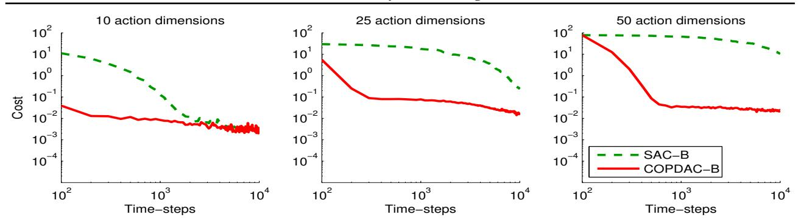
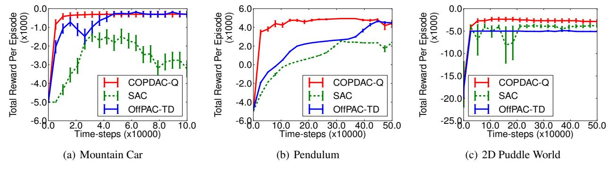
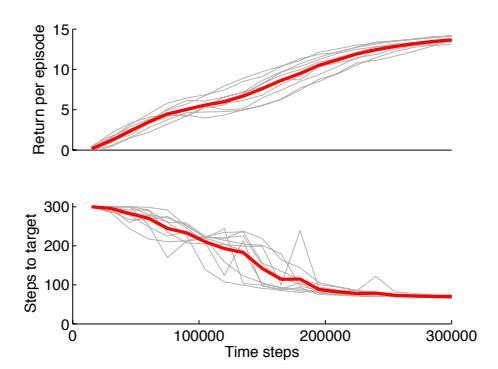

# **Deterministic Policy Gradient Algorithms**

David Silver
DeepMind Technologies, London, UK
Guy Lever
University College London, UK
Nicolas Heess, Thomas Degris, Daan Wierstra, Martin Riedmiller
DeepMind Technologies, London, UK

DAVID@DEEPMIND.COM

GUY.LEVER@UCL.AC.UK

\*@DEEPMIND.COM

#### **Abstract**

In this paper we consider *deterministic* policy gradient algorithms for reinforcement learning with continuous actions. The deterministic policy gradient has a particularly appealing form: it is the expected gradient of the action-value function. This simple form means that the deterministic policy gradient can be estimated much more efficiently than the usual stochastic policy gradient. To ensure adequate exploration, we introduce an off-policy actor-critic algorithm that learns a deterministic target policy from an exploratory behaviour policy. We demonstrate that deterministic policy gradient algorithms can significantly outperform their stochastic counterparts in high-dimensional action spaces.

## 1. Introduction

Policy gradient algorithms are widely used in reinforcement learning problems with continuous action spaces. The basic idea is to represent the policy by a parametric probability distribution  $\pi_{\theta}(a|s) = \mathbb{P}\left[a|s;\theta\right]$  that stochastically selects action a in state s according to parameter vector  $\theta$ . Policy gradient algorithms typically proceed by sampling this stochastic policy and adjusting the policy parameters in the direction of greater cumulative reward.

In this paper we instead consider *deterministic* policies  $a = \mu_{\theta}(s)$ . It is natural to wonder whether the same approach can be followed as for stochastic policies: adjusting the policy parameters in the direction of the policy gradient. It was previously believed that the deterministic policy gradient did not exist, or could only be obtained when using a model (Peters, 2010). However, we show that the deterministic policy gradient does indeed exist, and furthermore it has a simple model-free form that simply follows the gradient of the action-value function. In addition, we show that the deterministic policy gradient is the limiting

Proceedings of the 31st International Conference on Machine Learning, Beijing, China, 2014. JMLR: W&CP volume 32. Copyright 2014 by the author(s).

case, as policy variance tends to zero, of the stochastic policy gradient.

From a practical viewpoint, there is a crucial difference between the stochastic and deterministic policy gradients. In the stochastic case, the policy gradient integrates over both state and action spaces, whereas in the deterministic case it only integrates over the state space. As a result, computing the stochastic policy gradient may require more samples, especially if the action space has many dimensions.

In order to explore the full state and action space, a stochastic policy is often necessary. To ensure that our deterministic policy gradient algorithms continue to explore satisfactorily, we introduce an off-policy learning algorithm. The basic idea is to choose actions according to a stochastic behaviour policy (to ensure adequate exploration), but to learn about a deterministic target policy (exploiting the efficiency of the deterministic policy gradient). We use the deterministic policy gradient to derive an off-policy actorcritic algorithm that estimates the action-value function using a differentiable function approximator, and then updates the policy parameters in the direction of the approximate action-value gradient. We also introduce a notion of compatible function approximation for deterministic policy gradients, to ensure that the approximation does not bias the policy gradient.

We apply our deterministic actor-critic algorithms to several benchmark problems: a high-dimensional bandit; several standard benchmark reinforcement learning tasks with low dimensional action spaces; and a high-dimensional task for controlling an octopus arm. Our results demonstrate a significant performance advantage to using deterministic policy gradients over stochastic policy gradients, particularly in high dimensional tasks. Furthermore, our algorithms require no more computation than prior methods: the computational cost of each update is linear in the action dimensionality and the number of policy parameters. Finally, there are many applications (for example in robotics) where a differentiable control policy is provided, but where there is no functionality to inject noise into the controller. In these cases, the stochastic policy gradient is inapplicable, whereas our methods may still be useful.

## 2. Background

#### 2.1. Preliminaries

We study reinforcement learning and control problems in which an agent acts in a stochastic environment by sequentially choosing actions over a sequence of time steps, in order to maximise a cumulative reward. We model the problem as a Markov decision process (MDP) which comprises: a state space S, an action space A, an initial state distribution with density  $p_1(s_1)$ , a stationary transition dynamics distribution with conditional density  $p(s_{t+1}|s_t, a_t)$ satisfying the Markov property  $p(s_{t+1}|s_1, a_1, ..., s_t, a_t) =$  $p(s_{t+1}|s_t, a_t)$ , for any trajectory  $s_1, a_1, s_2, a_2, ..., s_T, a_T$ in state-action space, and a reward function  $r: \mathcal{S} \times \mathcal{A} \to \mathbb{R}$ . A *policy* is used to select actions in the MDP. In general the policy is stochastic and denoted by  $\pi_{\theta}: \mathcal{S} \to \mathcal{P}(\mathcal{A})$ , where  $\mathcal{P}(A)$  is the set of probability measures on A and  $\theta \in \mathbb{R}^n$  is a vector of n parameters, and  $\pi_{\theta}(a_t|s_t)$  is the conditional probability density at  $a_t$  associated with the policy. The agent uses its policy to interact with the MDP to give a trajectory of states, actions and rewards,  $h_{1:T} = s_1, a_1, r_1..., s_T, a_T, r_T \text{ over } S \times A \times \mathbb{R}.$  The return  $r_t^{\gamma}$  is the total discounted reward from time-step t onwards,  $r_t^{\gamma} = \sum_{k=t}^{\infty} \gamma^{k-t} r(s_k, a_k)$  where  $0 < \gamma < 1$ . Value functions are defined to be the expected total discounted reward,  $V^{\pi}(s) = \mathbb{E}\left[r_1^{\gamma} | S_1 = s; \pi\right]$  and  $Q^{\pi}(s, a) =$  $\mathbb{E}[r_1^{\gamma}|S_1=s,A_1=a;\pi]$ . The agent's goal is to obtain a policy which maximises the cumulative discounted reward from the start state, denoted by the performance objective  $J(\pi) = \mathbb{E}\left[r_1^{\gamma}|\pi\right].$ 

We denote the density at state s' after transitioning for t time steps from state s by  $p(s \to s', t, \pi)$ . We also denote the (improper) discounted state distribution by  $\rho^{\pi}(s') := \int_{\mathcal{S}} \sum_{t=1}^{\infty} \gamma^{t-1} p_1(s) p(s \to s', t, \pi) \mathrm{d}s$ . We can then write the performance objective as an expectation,

$$J(\pi_{\theta}) = \int_{\mathcal{S}} \rho^{\pi}(s) \int_{\mathcal{A}} \pi_{\theta}(s, a) r(s, a) da ds$$
$$= \mathbb{E}_{s \sim \rho^{\pi}, a \sim \pi_{\theta}} [r(s, a)]$$
(1)

where  $\mathbb{E}_{s\sim\rho}\left[\cdot\right]$  denotes the (improper) expected value with respect to discounted state distribution  $\rho(s)$ .2 In the remainder of the paper we suppose for simplicity that  $\mathcal{A}=\mathbb{R}^m$  and that  $\mathcal{S}$  is a compact subset of  $\mathbb{R}^d$ .

### 2.2. Stochastic Policy Gradient Theorem

*Policy gradient* algorithms are perhaps the most popular class of continuous action reinforcement learning algorithms. The basic idea behind these algorithms is to adjust

the parameters  $\theta$  of the policy in the direction of the performance gradient  $\nabla_{\theta} J(\pi_{\theta})$ . The fundamental result underlying these algorithms is the *policy gradient theorem* (Sutton et al., 1999),

$$\nabla_{\theta} J(\pi_{\theta}) = \int_{\mathcal{S}} \rho^{\pi}(s) \int_{\mathcal{A}} \nabla_{\theta} \pi_{\theta}(a|s) Q^{\pi}(s, a) dads$$
$$= \mathbb{E}_{s \sim \rho^{\pi}, a \sim \pi_{\theta}} \left[ \nabla_{\theta} \log \pi_{\theta}(a|s) Q^{\pi}(s, a) \right] \quad (2)$$

The policy gradient is surprisingly simple. In particular, despite the fact that the state distribution  $\rho^{\pi}(s)$  depends on the policy parameters, the policy gradient does not depend on the gradient of the state distribution.

This theorem has important practical value, because it reduces the computation of the performance gradient to a simple expectation. The policy gradient theorem has been used to derive a variety of policy gradient algorithms (Degris et al., 2012a), by forming a sample-based estimate of this expectation. One issue that these algorithms must address is how to estimate the action-value function  $Q^{\pi}(s,a)$ . Perhaps the simplest approach is to use a sample return  $r_t^{\gamma}$  to estimate the value of  $Q^{\pi}(s_t,a_t)$ , which leads to a variant of the REINFORCE algorithm (Williams, 1992).

#### 2.3. Stochastic Actor-Critic Algorithms

The actor-critic is a widely used architecture based on the policy gradient theorem (Sutton et al., 1999; Peters et al., 2005; Bhatnagar et al., 2007; Degris et al., 2012a). The actor-critic consists of two eponymous components. An actor adjusts the parameters  $\theta$  of the stochastic policy  $\pi_{\theta}(s)$  by stochastic gradient ascent of Equation 2. Instead of the unknown true action-value function  $Q^{\pi}(s,a)$  in Equation 2, an action-value function  $Q^{w}(s,a)$  is used, with parameter vector w. A critic estimates the action-value function  $Q^{w}(s,a) \approx Q^{\pi}(s,a)$  using an appropriate policy evaluation algorithm such as temporal-difference learning.

In general, substituting a function approximator  $Q^w(s,a)$  for the true action-value function  $Q^\pi(s,a)$  may introduce bias. However, if the function approximator is *compatible* such that i)  $Q^w(s,a) = \nabla_\theta \log \pi_\theta(a|s)^\top w$  and ii) the parameters w are chosen to minimise the mean-squared error  $\epsilon^2(w) = \mathbb{E}_{s \sim \rho^\pi, a \sim \pi_\theta} \left[ \left( Q^w(s,a) - Q^\pi(s,a) \right)^2 \right]$ , then there is no bias (Sutton et al., 1999),

$$\nabla_{\theta} J(\pi_{\theta}) = \mathbb{E}_{s \sim \rho^{\pi}, a \sim \pi_{\theta}} \left[ \nabla_{\theta} \log \pi_{\theta}(a|s) Q^{w}(s, a) \right]$$
 (3)

More intuitively, condition i) says that compatible function approximators are linear in "features" of the stochastic policy,  $\nabla_{\theta} \log \pi_{\theta}(a|s)$ , and condition ii) requires that the parameters are the solution to the linear regression problem that estimates  $Q^{\pi}(s,a)$  from these features. In practice, condition ii) is usually relaxed in favour of policy evaluation algorithms that estimate the value function more efficiently by temporal-difference learning (Bhatnagar et al., 2007; Degris et al., 2012b; Peters et al., 2005); indeed if

&lt;sup>1To simplify notation, we frequently drop the random variable in the conditional density and write  $p(s_{t+1}|s_t,a_t)=p(s_{t+1}|S_t=s_t,A_t=a_t)$ ; furthermore we superscript value functions by  $\pi$  rather than  $\pi_{\theta}$ .

&lt;sup>2The results in this paper may be extended to an average reward performance objective by choosing  $\rho(s)$  to be the stationary distribution of an ergodic MDP.

both i) and ii) are satisfied then the overall algorithm is equivalent to not using a critic at all (Sutton et al., 2000), much like the REINFORCE algorithm (Williams, 1992).

#### 2.4. Off-Policy Actor-Critic

It is often useful to estimate the policy gradient *off-policy* from trajectories sampled from a distinct behaviour policy  $\beta(a|s) \neq \pi_{\theta}(a|s)$ . In an off-policy setting, the performance objective is typically modified to be the value function of the target policy, averaged over the state distribution of the behaviour policy (Degris et al., 2012b),

$$J_{\beta}(\pi_{\theta}) = \int_{\mathcal{S}} \rho^{\beta}(s) V^{\pi}(s) ds$$
$$= \int_{\mathcal{S}} \int_{\mathcal{A}} \rho^{\beta}(s) \pi_{\theta}(a|s) Q^{\pi}(s, a) da ds$$

Differentiating the performance objective and applying an approximation gives the *off-policy policy-gradient* (Degris et al., 2012b)

$$\nabla_{\theta} J_{\beta}(\pi_{\theta}) \approx \int_{\mathcal{S}} \int_{\mathcal{A}} \rho^{\beta}(s) \nabla_{\theta} \pi_{\theta}(a|s) Q^{\pi}(s, a) dads \qquad (4)$$

$$= \mathbb{E}_{s \sim \rho^{\beta}, a \sim \beta} \left[ \frac{\pi_{\theta}(a|s)}{\beta_{\theta}(a|s)} \nabla_{\theta} \log \pi_{\theta}(a|s) Q^{\pi}(s, a) \right] \qquad (5)$$

This approximation drops a term that depends on the action-value gradient  $\nabla_{\theta}Q^{\pi}(s,a)$ ; Degris et al. (2012b) argue that this is a good approximation since it can preserve the set of local optima to which gradient ascent converges. The Off-Policy Actor-Critic (OffPAC) algorithm (Degris et al., 2012b) uses a behaviour policy  $\beta(a|s)$  to generate trajectories. A critic estimates a state-value function,  $V^v(s) \approx V^{\pi}(s)$ , off-policy from these trajectories, by gradient temporal-difference learning (Sutton et al., 2009). An actor updates the policy parameters  $\theta$ , also off-policy from these trajectories, by stochastic gradient ascent of Equation 5. Instead of the unknown action-value function  $Q^{\pi}(s,a)$  in Equation 5, the temporal-difference error  $\delta_t$  is used,  $\delta_t = r_{t+1} + \gamma V^v(s_{t+1}) - V^v(s_t)$ ; this can be shown to provide an approximation to the true gradient (Bhatnagar et al., 2007). Both the actor and the critic use an importance sampling ratio  $\frac{\pi_{\theta}(a|s)}{\beta_{\theta}(a|s)}$  to adjust for the fact that actions were selected according to  $\pi$  rather than  $\beta$ .

## 3. Gradients of Deterministic Policies

We now consider how the policy gradient framework may be extended to deterministic policies. Our main result is a deterministic policy gradient theorem, analogous to the stochastic policy gradient theorem presented in the previous section. We provide several ways to derive and understand this result. First we provide an informal intuition behind the form of the deterministic policy gradient. We then give a formal proof of the deterministic policy gradient theorem from first principles. Finally, we show that the deterministic policy gradient theorem is in fact a limiting case of the stochastic policy gradient theorem. Details of the proofs are deferred until the appendices.

## 3.1. Action-Value Gradients

The majority of model-free reinforcement learning algorithms are based on generalised policy iteration: interleaving policy evaluation with policy improvement (Sutton and Barto, 1998). Policy evaluation methods estimate the action-value function  $Q^{\pi}(s,a)$  or  $Q^{\mu}(s,a)$ , for example by Monte-Carlo evaluation or temporal-difference learning. Policy improvement methods update the policy with respect to the (estimated) action-value function. The most common approach is a greedy maximisation (or soft maximisation) of the action-value function,  $\mu^{k+1}(s) = \arg\max \ Q^{\mu^k}(s,a)$ .

In continuous action spaces, greedy policy improvement becomes problematic, requiring a global maximisation at every step. Instead, a simple and computationally attractive alternative is to move the policy in the direction of the gradient of Q, rather than globally maximising Q. Specifically, for each visited state s, the policy parameters  $\theta^{k+1}$  are updated in proportion to the gradient  $\nabla_{\theta}Q^{\mu^k}(s,\mu_{\theta}(s))$ . Each state suggests a different direction of policy improvement; these may be averaged together by taking an expectation with respect to the state distribution  $\rho^{\mu}(s)$ ,

$$\theta^{k+1} = \theta^k + \alpha \mathbb{E}_{s \sim \rho^{\mu^k}} \left[ \nabla_{\theta} Q^{\mu^k}(s, \mu_{\theta}(s)) \right]$$
 (6)

By applying the chain rule we see that the policy improvement may be decomposed into the gradient of the actionvalue with respect to actions, and the gradient of the policy with respect to the policy parameters.

$$\theta^{k+1} = \theta^k + \alpha \mathbb{E}_{s \sim \rho^{\mu^k}} \left[ \nabla_{\theta} \mu_{\theta}(s) \left. \nabla_a Q^{\mu^k}(s, a) \right|_{a = \mu_{\theta}(s)} \right]$$
(7)

By convention  $\nabla_{\theta}\mu_{\theta}(s)$  is a Jacobian matrix such that each column is the gradient  $\nabla_{\theta}[\mu_{\theta}(s)]_d$  of the dth action dimension of the policy with respect to the policy parameters  $\theta$ . However, by changing the policy, different states are visited and the state distribution  $\rho^{\mu}$  will change. As a result it is not immediately obvious that this approach guarantees improvement, without taking account of the change to distribution. However, the theory below shows that, like the stochastic policy gradient theorem, there is no need to compute the gradient of the state distribution; and that the intuitive update outlined above is following precisely the gradient of the performance objective.

#### 3.2. Deterministic Policy Gradient Theorem

We now formally consider a deterministic policy  $\mu_{\theta}: \mathcal{S} \to \mathcal{A}$  with parameter vector  $\theta \in \mathbb{R}^n$ . We define a performance objective  $J(\mu_{\theta}) = \mathbb{E}\left[r_1^{\gamma}|\mu\right]$ , and define probability distribution  $p(s \to s', t, \mu)$  and discounted state distribution  $\rho^{\mu}(s)$  analogously to the stochastic case. This again lets us to write the performance objective as an expectation,

$$J(\mu_{\theta}) = \int_{\mathcal{S}} \rho^{\mu}(s) r(s, \mu_{\theta}(s)) ds$$
$$= \mathbb{E}_{s \sim \rho^{\mu}} [r(s, \mu_{\theta}(s))] \tag{8}$$

We now provide the deterministic analogue to the policy gradient theorem. The proof follows a similar scheme to (Sutton et al., 1999) and is provided in Appendix B.

**Theorem 1** (Deterministic Policy Gradient Theorem). Suppose that the MDP satisfies conditions A.1 (see Appendix; these imply that  $\nabla_{\theta}\mu_{\theta}(s)$  and  $\nabla_{a}Q^{\mu}(s,a)$  exist and that the deterministic policy gradient exists. Then,

$$\nabla_{\theta} J(\mu_{\theta}) = \int_{\mathcal{S}} \rho^{\mu}(s) \nabla_{\theta} \mu_{\theta}(s) |\nabla_{a} Q^{\mu}(s, a)|_{a = \mu_{\theta}(s)} ds$$
$$= \mathbb{E}_{s \sim \rho^{\mu}} \left[ \nabla_{\theta} \mu_{\theta}(s) |\nabla_{a} Q^{\mu}(s, a)|_{a = \mu_{\theta}(s)} \right]$$
(9)

## 3.3. Limit of the Stochastic Policy Gradient

The deterministic policy gradient theorem does not at first glance look like the stochastic version (Equation 2). However, we now show that, for a wide class of stochastic policies, including many bump functions, the deterministic policy gradient is indeed a special (limiting) case of the stochastic policy gradient. We parametrise stochastic policies  $\pi_{\mu_{\theta},\sigma}$  by a deterministic policy  $\mu_{\theta}: \mathcal{S} \to \mathcal{A}$  and a variance parameter  $\sigma$ , such that for  $\sigma=0$  the stochastic policy is equivalent to the deterministic policy,  $\pi_{\mu_{\theta},0} \equiv \mu_{\theta}$ . Then we show that as  $\sigma \to 0$  the stochastic policy gradient converges to the deterministic gradient (see Appendix C for proof and technical conditions).

**Theorem 2.** Consider a stochastic policy  $\pi_{\mu_{\theta},\sigma}$  such that  $\pi_{\mu_{\theta},\sigma}(a|s) = \nu_{\sigma}(\mu_{\theta}(s),a)$ , where  $\sigma$  is a parameter controlling the variance and  $\nu_{\sigma}$  satisfy conditions B.1 and the MDP satisfies conditions A.1 and A.2. Then,

$$\lim_{\sigma \downarrow 0} \nabla_{\theta} J(\pi_{\mu_{\theta},\sigma}) = \nabla_{\theta} J(\mu_{\theta}) \tag{10}$$

where on the l.h.s. the gradient is the standard stochastic policy gradient and on the r.h.s. the gradient is the deterministic policy gradient.

This is an important result because it shows that the familiar machinery of policy gradients, for example compatible function approximation (Sutton et al., 1999), natural gradients (Kakade, 2001), actor-critic (Bhatnagar et al., 2007), or episodic/batch methods (Peters et al., 2005), is also applicable to deterministic policy gradients.

## 4. Deterministic Actor-Critic Algorithms

We now use the deterministic policy gradient theorem to derive both on-policy and off-policy actor-critic algorithms. We begin with the simplest case – on-policy updates, using a simple Sarsa critic – so as to illustrate the ideas as clearly as possible. We then consider the off-policy case, this time using a simple Q-learning critic to illustrate the key ideas. These simple algorithms may have convergence issues in practice, due both to bias introduced by the function approximator, and also the instabilities caused by off-policy learning. We then turn to a more principled approach using compatible function approximation and gradient temporal-difference learning.

## 4.1. On-Policy Deterministic Actor-Critic

In general, behaving according to a deterministic policy will not ensure adequate exploration and may lead to sub-optimal solutions. Nevertheless, our first algorithm is an on-policy actor-critic algorithm that learns and follows a deterministic policy. Its primary purpose is didactic; however, it may be useful for environments in which there is sufficient noise in the environment to ensure adequate exploration, even with a deterministic behaviour policy.

Like the stochastic actor-critic, the deterministic actor-critic consists of two components. The critic estimates the action-value function while the actor ascends the gradient of the action-value function. Specifically, an actor adjusts the parameters  $\theta$  of the deterministic policy  $\mu_{\theta}(s)$  by stochastic gradient ascent of Equation 9. As in the stochastic actor-critic, we substitute a differentiable action-value function  $Q^w(s,a)$  in place of the true action-value function  $Q^w(s,a)$ . A critic estimates the action-value function  $Q^w(s,a) \approx Q^\mu(s,a)$ , using an appropriate policy evaluation algorithm. For example, in the following *deterministic actor-critic* algorithm, the critic uses Sarsa updates to estimate the action-value function (Sutton and Barto, 1998),

$$\delta_t = r_t + \gamma Q^w(s_{t+1}, a_{t+1}) - Q^w(s_t, a_t) \tag{11}$$

$$w_{t+1} = w_t + \alpha_w \delta_t \nabla_w Q^w(s_t, a_t) \tag{12}$$

$$\theta_{t+1} = \theta_t + \alpha_\theta \nabla_\theta \mu_\theta(s_t) |\nabla_a Q^w(s_t, a_t)|_{a=\mu_\theta(s)}$$
 (13)

## 4.2. Off-Policy Deterministic Actor-Critic

We now consider off-policy methods that learn a deterministic target policy  $\mu_{\theta}(s)$  from trajectories generated by an arbitrary stochastic behaviour policy  $\pi(s,a)$ . As before, we modify the performance objective to be the value function of the target policy, averaged over the state distribution of the behaviour policy,

$$J_{\beta}(\mu_{\theta}) = \int_{\mathcal{S}} \rho^{\beta}(s) V^{\mu}(s) ds$$
$$= \int_{\mathcal{S}} \rho^{\beta}(s) Q^{\mu}(s, \mu_{\theta}(s)) ds$$
(14)

$$\nabla_{\theta} J_{\beta}(\mu_{\theta}) \approx \int_{\mathcal{S}} \rho^{\beta}(s) \nabla_{\theta} \mu_{\theta}(a|s) Q^{\mu}(s, a) ds$$

$$= \mathbb{E}_{s \sim \rho^{\beta}} \left[ \nabla_{\theta} \mu_{\theta}(s) \nabla_{a} Q^{\mu}(s, a) |_{a = \mu_{\theta}(s)} \right]$$
(15)

This equation gives the *off-policy deterministic policy gradient*. Analogous to the stochastic case (see Equation 4), we have dropped a term that depends on  $\nabla_{\theta}Q^{\mu_{\theta}}(s,a)$ ; justification similar to Degris et al. (2012b) can be made in support of this approximation.

We now develop an actor-critic algorithm that updates the policy in the direction of the off-policy deterministic policy gradient. We again substitute a differentiable action-value function  $Q^w(s,a)$  in place of the true action-value function  $Q^\mu(s,a)$  in Equation 15. A critic estimates the action-value function  $Q^w(s,a) \approx Q^\mu(s,a)$ , off-policy from trajectories generated by  $\beta(a|s)$ , using an appropriate policy evaluation algorithm. In the following off-policy deterministic actor-critic (OPDAC) algorithm, the critic uses Q-learning updates to estimate the action-value function.

$$\delta_t = r_t + \gamma Q^w(s_{t+1}, \mu_\theta(s_{t+1})) - Q^w(s_t, a_t) \quad (16)$$

$$w_{t+1} = w_t + \alpha_w \delta_t \nabla_w Q^w(s_t, a_t) \tag{17}$$

$$\theta_{t+1} = \theta_t + \alpha_\theta \nabla_\theta \mu_\theta(s_t) |\nabla_a Q^w(s_t, a_t)|_{a = \mu_\theta(s)}$$
 (18)

We note that stochastic off-policy actor-critic algorithms typically use importance sampling for both actor and critic (Degris et al., 2012b). However, because the deterministic policy gradient removes the integral over actions, we can avoid importance sampling in the actor; and by using Q-learning, we can avoid importance sampling in the critic.

#### 4.3. Compatible Function Approximation

In general, substituting an approximate  $Q^w(s,a)$  into the deterministic policy gradient will not necessarily follow the true gradient (nor indeed will it necessarily be an ascent direction at all). Similar to the stochastic case, we now find a class of compatible function approximators  $Q^w(s,a)$  such that the true gradient is preserved. In other words, we find a critic  $Q^w(s,a)$  such that the gradient  $\nabla_a Q^\mu(s,a)$  can be replaced by  $\nabla_a Q^w(s,a)$ , without affecting the deterministic policy gradient. The following theorem applies to both on-policy,  $\mathbb{E}[\cdot] = \mathbb{E}_{s \sim \rho^\mu}[\cdot]$ , and off-policy,  $\mathbb{E}[\cdot] = \mathbb{E}_{s \sim \rho^\beta}[\cdot]$ ,

**Theorem 3.** A function approximator  $Q^w(s,a)$  is compatible with a deterministic policy  $\mu_{\theta}(s)$ ,  $\nabla_{\theta}J_{\beta}(\theta) = \mathbb{E}\left[\nabla_{\theta}\mu_{\theta}(s) \nabla_a Q^w(s,a)|_{a=\mu_{\theta}(s)}\right]$ , if

1. 
$$\nabla_a Q^w(s,a)|_{a=\mu_\theta(s)} = \nabla_\theta \mu_\theta(s)^\top w$$
 and

2. w minimises the mean-squared error, 
$$MSE(\theta, w) = \mathbb{E}\left[\epsilon(s; \theta, w)^{\top} \epsilon(s; \theta, w)\right]$$
 where  $\epsilon(s; \theta, w) = \nabla_a Q^w(s, a)|_{a=\mu_{\theta}(s)} - \nabla_a Q^{\mu}(s, a)|_{a=\mu_{\theta}(s)}$ 

*Proof.* If w minimises the MSE then the gradient of  $\epsilon^2$  w.r.t. w must be zero. We then use the fact that, by condition  $1, \nabla_w \epsilon(s; \theta, w) = \nabla_\theta \mu_\theta(s)$ ,

$$\begin{split} \nabla_w MSE(\theta,w) &= 0 \\ \mathbb{E}\left[\nabla_\theta \mu_\theta(s)\epsilon(s;\theta,w)\right] &= 0 \\ \mathbb{E}\left[\nabla_\theta \mu_\theta(s) \left.\nabla_a Q^w(s,a)\right|_{a=\mu_\theta(s)}\right] &= \\ \mathbb{E}\left[\nabla_\theta \mu_\theta(s) \left.\nabla_a Q^\mu(s,a)\right|_{a=\mu_\theta(s)}\right] \\ &= \nabla_\theta J_\beta(\mu_\theta) \text{ or } \nabla_\theta J(\mu_\theta) \end{split}$$

For any deterministic policy  $\mu_{\theta}(s)$ , there always exists a compatible function approximator of the form  $Q^w(s, a) =$  $(a - \mu_{\theta}(s))^{\top} \nabla_{\theta} \mu_{\theta}(s)^{\top} w + V^{v}(s)$ , where  $V^{v}(s)$  may be any differentiable baseline function that is independent of the action a; for example a linear combination of state features  $\phi(s)$  and parameters  $v, V^v(s) = v^{\top}\phi(s)$  for parameters v. A natural interpretation is that  $V^{v}(s)$  estimates the value of state s, while the first term estimates the advantage  $A^w(s,a)$  of taking action a over action  $\mu_{\theta}(s)$  in state s. The advantage function can be viewed as a linear function approximator,  $A^w(s,a) = \phi(s,a)^\top w$  with stateaction features  $\phi(s,a) \stackrel{def}{=} \nabla_{\theta} \mu_{\theta}(s) (a - \mu_{\theta}(s))$  and parameters w. Note that if there are m action dimensions and n policy parameters, then  $\nabla_{\theta}\mu_{\theta}(s)$  is an  $n \times m$  Jacobian matrix, so the feature vector is  $n \times 1$ , and the parameter vector w is also  $n \times 1$ . A function approximator of this form satisfies condition 1 of Theorem 3.

We note that a linear function approximator is not very useful for predicting action-values globally, since the action-value diverges to  $\pm\infty$  for large actions. However, it can still be highly effective as a local critic. In particular, it represents the local advantage of deviating from the current policy,  $A^w(s,\mu_\theta(s)+\delta)=\delta^\top\nabla_\theta\mu_\theta(s)^\top w,$  where  $\delta$  represents a small deviation from the deterministic policy. As a result, a linear function approximator is sufficient to select the direction in which the actor should adjust its policy parameters.

To satisfy condition 2 we need to find the parameters w that minimise the mean-squared error between the gradient of  $Q^w$  and the true gradient. This can be viewed as a linear regression problem with "features"  $\phi(s,a)$  and "targets"  $\nabla_a Q^\mu(s,a)|_{a=\mu_\theta(s)}$ . In other words, features of the policy are used to predict the true gradient  $\nabla_a Q^\mu(s,a)$  at state s. However, acquiring unbiased samples of the true gradient is difficult. In practice, we use a linear function approximator  $Q^w(s,a) = \phi(s,a)^\top w$  to satisfy condition 1, but we learn w by a standard policy evaluation method (for example Sarsa or Q-learning, for the on-policy or off-policy deterministic actor-critic algorithms respectively) that does not exactly satisfy condition 2. We note that a reasonable solution to the policy evaluation problem will find  $Q^w(s,a) \approx Q^\mu(s,a)$  and will therefore ap-

proximately (for smooth function approximators) satisfy  $\nabla_a Q^w(s,a)|_{a=\mu_\theta(s)} \approx \nabla_a Q^\mu(s,a)|_{a=\mu_\theta(s)}$ .

To summarise, a compatible off-policy deterministic actor-critic (COPDAC) algorithm consists of two components. The critic is a linear function approximator that estimates the action-value from features  $\phi(s,a) = a^{\top} \nabla_{\theta} \mu_{\theta}(s)$ . This may be learnt off-policy from samples of a behaviour policy  $\beta(a|s)$ , for example using Q-learning or gradient Q-learning. The actor then updates its parameters in the direction of the critic's action-value gradient. The following COPDAC-O algorithm uses a simple Q-learning critic.

$$\delta_t = r_t + \gamma Q^w(s_{t+1}, \mu_\theta(s_{t+1})) - Q^w(s_t, a_t) \quad (19)$$

$$\theta_{t+1} = \theta_t + \alpha_\theta \nabla_\theta \mu_\theta(s_t) \left( \nabla_\theta \mu_\theta(s_t)^\top w_t \right) \tag{20}$$

$$w_{t+1} = w_t + \alpha_w \delta_t \phi(s_t, a_t) \tag{21}$$

$$v_{t+1} = v_t + \alpha_v \delta_t \phi(s_t) \tag{22}$$

It is well-known that off-policy Q-learning may diverge when using linear function approximation. A more recent family of methods, based on gradient temporal-difference learning, are true gradient descent algorithm and are therefore sure to converge (Sutton et al., 2009). The basic idea of these methods is to minimise the mean-squared projected Bellman error (MSPBE) by stochastic gradient descent; full details are beyond the scope of this paper. Similar to the OffPAC algorithm (Degris et al., 2012b), we use gradient temporal-difference learning in the critic. Specifically, we use gradient Q-learning in the critic (Maei et al., 2010), and note that under suitable conditions on the step-sizes,  $\alpha_{\theta}, \alpha_{w}, \alpha_{u}$ , to ensure that the critic is updated on a faster time-scale than the actor, the critic will converge to the parameters minimising the MSPBE (Sutton et al., 2009; Degris et al., 2012b). The following *COPDAC-GQ* algorithm combines COPDAC with a gradient O-learning critic,

$$\delta_t = r_t + \gamma Q^w(s_{t+1}, \mu_\theta(s_{t+1})) - Q^w(s_t, a_t) \quad (23)$$

$$\theta_{t+1} = \theta_t + \alpha_\theta \nabla_\theta \mu_\theta(s_t) \left( \nabla_\theta \mu_\theta(s_t)^\top w_t \right)$$
 (24)

$$w_{t+1} = w_t + \alpha_w \delta_t \phi(s_t, a_t)$$

$$-\alpha_w \gamma \phi(s_{t+1}, \mu_{\theta}(s_{t+1})) \left( \phi(s_t, a_t)^{\top} u_t \right)$$
 (25)

$$v_{t+1} = v_t + \alpha_v \delta_t \phi(s_t)$$

$$-\alpha_v \gamma \phi(s_{t+1}) \left( \phi(s_t, a_t)^\top u_t \right) \tag{26}$$

$$u_{t+1} = u_t + \alpha_u \left( \delta_t - \phi(s_t, a_t)^\top u_t \right) \phi(s_t, a_t)$$
 (27)

Like stochastic actor-critic algorithms, the computational complexity of all these updates is O(mn) per time-step. Finally, we show that the natural policy gradient (Kakade, 2001; Peters et al., 2005) can be extended to deterministic policies. The steepest ascent direction of our performance objective with respect to any metric  $M(\theta)$  is given by  $M(\theta)^{-1}\nabla_{\theta}J(\mu_{\theta})$  (Toussaint, 2012). The natural gradient is the steepest ascent direction with respect to the Fisher information metric  $M_{\pi}(\theta)$  =

 $\mathbb{E}_{s\sim \rho^{\pi},a\sim \pi_{\theta}}\left[\nabla_{\theta}\log\pi_{\theta}(a|s)\nabla_{\theta}\log\pi_{\theta}(a|s)^{\top}\right]$ ; this metric is invariant to reparameterisations of the policy (Bagnell and Schneider, 2003). For deterministic policies, we use the metric  $M_{\mu}(\theta)=\mathbb{E}_{s\sim \rho^{\mu}}\left[\nabla_{\theta}\mu_{\theta}(s)\nabla_{\theta}\mu_{\theta}(s)^{\top}\right]$  which can be viewed as the limiting case of the Fisher information metric as policy variance is reduced to zero. By combining the deterministic policy gradient theorem with compatible function approximation we see that  $\nabla_{\theta}J(\mu_{\theta})=\mathbb{E}_{s\sim \rho^{\mu}}\left[\nabla_{\theta}\mu_{\theta}(s)\nabla_{\theta}\mu_{\theta}(s)^{\top}w\right]$  and so the steepest ascent direction is simply  $M_{\mu}(\theta)^{-1}\nabla_{\theta}J_{\beta}(\mu_{\theta})=w$ . This algorithm can be implemented by simplifying Equations 20 or 24 to  $\theta_{t+1}=\theta_{t}+\alpha_{\theta}w_{t}$ .

## 5. Experiments

#### 5.1. Continuous Bandit

Our first experiment focuses on a direct comparison between the stochastic policy gradient and the deterministic policy gradient. The problem is a continuous bandit problem with a high-dimensional quadratic cost function,  $-r(a) = (a-a^*)^\top C(a-a^*)$ . The matrix C is positive definite with eigenvalues chosen from  $\{0.1,1\}$ , and  $a^* = [4,...,4]^\top$ . We consider action dimensions of m=10,25,50. Although this problem could be solved analytically, given full knowledge of the quadratic, we are interested here in the relative performance of model-free stochastic and deterministic policy gradient algorithms.

For the stochastic actor-critic in the bandit task (SAC-B) we use an isotropic Gaussian policy,  $\pi_{\theta,y}(\cdot) \sim \mathcal{N}(\theta, \exp(y))$ , and adapt both the mean and the variance of the policy. The deterministic actor-critic algorithm is based on COPDAC, using a target policy,  $\mu_{\theta} = \theta$  and a fixed-width Gaussian behaviour policy,  $\beta(\cdot) \sim \mathcal{N}(\theta, \sigma_{\beta}^2)$ . The critic Q(a) is simply estimated by linear regression from the compatible features to the costs: for SAC-B the compatible features are  $\nabla_{\theta} \log \pi_{\theta}(a)$ ; for COPDAC-B they are  $\nabla_{\theta} \mu_{\theta}(a)(a-\theta)$ ; a bias feature is also included in both cases. For this experiment the critic is recomputed from each successive batch of 2m steps; the actor is updated once per batch. To evaluate performance we measure the average cost per step incurred by the mean (i.e. exploration is not penalised for the on-policy algorithm). We performed a parameter sweep over all step-size parameters and variance parameters (initial y for SAC;  $\sigma_{\beta}^2$  for COPDAC). Figure 1 shows the performance of the best performing parameters for each algorithm, averaged over 5 runs. The results illustrate a significant performance advantage to the deterministic update, which grows larger with increasing dimensionality.

We also ran an experiment in which the stochastic actor-critic used the same fixed variance  $\sigma_{\beta}^2$  as the deterministic actor-critic, so that only the mean was adapted. This did not improve the performance of the stochastic actor-critic: COPDAC-B still outperforms SAC-B by a very wide margin that grows larger with increasing dimension.

Figure 1. Comparison of stochastic actor-critic (SAC-B) and deterministic actor-critic (COPDAC-B) on the continuous bandit task,

Figure 2. Comparison of stochastic on-policy actor-critic (SAC), stochastic off-policy actor-critic (OffPAC), and deterministic off-policy actor-critic (COPDAC) on continuous-action reinforcement learning. Each point is the average test performance of the mean policy.

## 5.2. Continuous Reinforcement Learning

In our second experiment we consider continuous-action variants of standard reinforcement learning benchmarks: mountain car, pendulum and 2D puddle world. Our goal is to see whether stochastic or deterministic actor-critic is more efficient under Gaussian exploration. The stochastic actor-critic (SAC) algorithm was the actor-critic algorithm in Degris et al. (2012a); this algorithm performed best out of several incremental actor-critic methods in a comparison on mountain car. It uses a Gaussian policy based on a linear combination of features,  $\pi_{\theta,y}(s,\cdot) \sim$  $\mathcal{N}(\theta^{\top}\phi(s), \exp(y^{\top}\phi(s)))$ , which adapts both the mean and the variance of the policy; the critic uses a linear value function approximator  $V(s) = v^{\top} \phi(s)$  with the same features, updated by temporal-difference learning. The deterministic algorithm is based on COPDAC-Q, using a linear target policy,  $\mu_{\theta}(s) = \theta^{\top} \phi(s)$  and a fixed-width Gaussian behaviour policy,  $\beta(\cdot|s) \sim \mathcal{N}(\theta^{\top}\phi(s), \sigma_{\beta}^2)$ . The critic again uses a linear value function  $V(s) = v^{\top} \phi(s)$ , as a baseline for the compatible action-value function. In both cases the features  $\phi(s)$  are generated by tile-coding the state-space. We also compare to an off-policy stochastic actor-critic algorithm (OffPAC), using the same behaviour policy  $\beta$  as just described, but learning a stochastic policy  $\pi_{\theta,y}(s,\cdot)$  as in SAC. This algorithm also used the same critic  $V(s) = v^{\top} \phi(s)$  algorithm and the update algorithm described in Degris et al. (2012b) with  $\lambda = 0$  and  $\alpha_u = 0$ . For all algorithms, episodes were truncated after a maximum of 5000 steps. The discount was  $\gamma=0.99$  for mountain car and pendulum and  $\gamma=0.999$  for puddle world. Actions outside the legal range were capped. We performed a parameter sweep over step-size parameters; variance was initialised to 1/2 the legal range. Figure 2 shows the performance of the best performing parameters for each algorithm, averaged over 30 runs. COPDAC-Q slightly outperformed both SAC and OffPAC in all three domains.

## 5.3. Octopus Arm

Finally, we tested our algorithms on an octopus arm (Engel et al., 2005) task. The aim is to learn to control a simulated octopus arm to hit a target. The arm consists of 6 segments and is attached to a rotating base. There are 50 continuous state variables (x,y position/velocity of the nodes along the upper/lower side of the arm; angular position/velocity of the base) and 20 action variables that control three muscles (dorsal, transversal, central) in each segment as well as the clockwise and counter-clockwise rotation of the base. The goal is to strike the target with any part of the arm. The reward function is proportional to the change in distance between the arm and the target. An episode ends when the target is hit (with an additional reward of +50) or after 300 steps. Previous work (Engel et al., 2005) simplified the high-dimensional action space using 6 "macroactions" corresponding to particular patterns of muscle activations; or applied stochastic policy gradients to a lower

Figure 3. Ten runs of COPDAC on a 6-segment octopus arm with 20 action dimensions and 50 state dimensions; each point represents the return per episode (above) and the number of time-steps for the arm to reach the target (below).

dimensional octopus arm with 4 segments (Heess et al., 2012). Here, we apply deterministic policy gradients directly to a high-dimensional octopus arm with 6 segments. We applied the COPDAC-Q algorithm, using a sigmoidal multi-layer perceptron (8 hidden units and sigmoidal output units) to represent the policy  $\mu(s)$ . The advantage function  $A^w(s,a)$  was represented by compatible function approximation (see Section 4.3), while the state value function  $V^v(s)$  was represented by a second multi-layer perceptron (40 hidden units and linear output units). The results of 10 training runs are shown in Figure 3; the octopus arm converged to a good solution in all cases. A video of an 8 segment arm, trained by COPDAC-Q, is also available.

### 6. Discussion and Related Work

Using a stochastic policy gradient algorithm, the policy becomes more deterministic as the algorithm homes in on a good strategy. Unfortunately this makes the stochastic policy gradient harder to estimate, because the policy gradient  $\nabla_{\theta}\pi_{\theta}(a|s)$  changes more rapidly near the mean. Indeed, the variance of the stochastic policy gradient for a Gaussian policy  $\mathcal{N}(\mu, \sigma^2)$  is proportional to  $1/\sigma^2$  (Zhao et al., 2012), which grows to infinity as the policy becomes deterministic. This problem is compounded in high dimensions, as illustrated by the continuous bandit task. The stochastic actor-critic estimates the stochastic policy gradient in Equation 2. The inner integral,  $\int_{\mathcal{A}} \nabla_{\theta} \pi_{\theta}(a|s) Q^{\pi}(s,a) \mathrm{d}a$ , is computed by sampling a high dimensional action space. In contrast, the deterministic policy gradient can be computed immediately in closed form.

One may view our deterministic actor-critic as analogous, in a policy gradient context, to Q-learning (Watkins and Dayan, 1992). Q-learning learns a deterministic greedy policy, off-policy, while executing a noisy version of the

greedy policy. Similarly, in our experiments COPDAC-Q was used to learn a deterministic policy, off-policy, while executing a noisy version of that policy. Note that we compared on-policy and off-policy algorithms in our experiments, which may at first sight appear odd. However, it is analogous to asking whether Q-learning or Sarsa is more efficient, by measuring the greedy policy learnt by each algorithm (Sutton and Barto, 1998).

Our actor-critic algorithms are based on model-free, incremental, stochastic gradient updates; these methods are suitable when the model is unknown, data is plentiful and computation is the bottleneck. It is straightforward in principle to extend these methods to batch/episodic updates, for example by using LSTDQ (Lagoudakis and Parr, 2003) in place of the incremental Q-learning critic. There has also been a substantial literature on model-based policy gradient methods, largely focusing on deterministic and fully-known transition dynamics (Werbos, 1990). These methods are strongly related to deterministic policy gradients when the transition dynamics are also deterministic.

We are not the first to notice that the action-value gradient provides a useful signal for reinforcement learning. The NFQCA algorithm (Hafner and Riedmiller, 2011) uses two neural networks to represent the actor and critic respectively. The actor adjusts the policy, represented by the first neural network, in the direction of the action-value gradient, using an update similar to Equation 7. The critic updates the action-value function, represented by the second neural network, using neural fitted-Q learning (a batch Q-learning update for approximate value iteration). However, its critic network is incompatible with the actor network; it is unclear how the local optima learnt by the critic (assuming it converges) will interact with actor updates.

### 7. Conclusion

We have presented a framework for deterministic policy gradient algorithms. These gradients can be estimated more efficiently than their stochastic counterparts, avoiding a problematic integral over the action space. In practice, the deterministic actor-critic significantly outperformed its stochastic counterpart by several orders of magnitude in a bandit with 50 continuous action dimensions, and solved a challenging reinforcement learning problem with 20 continuous action dimensions and 50 state dimensions.

## Acknowledgements

This work was supported by the European Community Seventh Framework Programme (FP7/2007-2013) under grant agreement 270327 (CompLACS), the Gatsby Charitable Foundation, the Royal Society, the ANR MACSi project, INRIA Bordeaux Sud-Ouest, Mesocentre de Calcul Intensif Aquitain, and the French National Grid Infrastructure via France Grille.

&lt;sup>3Recall that the compatibility criteria apply to any differentiable baseline, including non-linear state-value functions.

4http://www0.cs.ucl.ac.uk/staff/D.Silver/
web/Applications.html

#### References

- Bagnell, J. A. D. and Schneider, J. (2003). Covariant policy search. In *Proceeding of the International Joint Conference on Artifical Intelligence*.
- Bhatnagar, S., Sutton, R. S., Ghavamzadeh, M., and Lee, M. (2007). Incremental natural actor-critic algorithms. In *Neural Information Processing Systems 21*.
- Degris, T., Pilarski, P. M., and Sutton, R. S. (2012a). Model-free reinforcement learning with continuous action in practice. In *American Control Conference*.
- Degris, T., White, M., and Sutton, R. S. (2012b). Linear off-policy actor-critic. In 29th International Conference on Machine Learning.
- Engel, Y., Szabó, P., and Volkinshtein, D. (2005). Learning to control an octopus arm with gaussian process temporal difference methods. In *Neural Information Process*ing Systems 18.
- Hafner, R. and Riedmiller, M. (2011). Reinforcement learning in feedback control. *Machine Learning*, 84(1-2):137–169.
- Heess, N., Silver, D., and Teh, Y. (2012). Actor-critic reinforcement learning with energy-based policies. *JMLR Workshop and Conference Proceedings: EWRL 2012*, 24:43–58.
- Kakade, S. (2001). A natural policy gradient. In *Neural Information Processing Systems 14*, pages 1531–1538.
- Lagoudakis, M. G. and Parr, R. (2003). Least-squares policy iteration. *Journal of Machine Learning Research*, 4:1107–1149.
- Maei, H. R., Szepesvári, C., Bhatnagar, S., and Sutton, R. S. (2010). Toward off-policy learning control with function approximation. In 27th International Conference on Machine Learning, pages 719–726.
- Peters, J. (2010). Policy gradient methods. *Scholarpedia*, 5(11):3698.
- Peters, J., Vijayakumar, S., and Schaal, S. (2005). Natural actor-critic. In *16th European Conference on Machine Learning*, pages 280–291.
- Sutton, R. and Barto, A. (1998). *Reinforcement Learning:* an *Introduction*. MIT Press.
- Sutton, R. S., Maei, H. R., Precup, D., Bhatnagar, S., Silver, D., Szepesvári, C., and Wiewiora, E. (2009). Fast gradient-descent methods for temporal-difference learning with linear function approximation. In *26th International Conference on Machine Learning*, page 125.

- Sutton, R. S., McAllester, D. A., Singh, S. P., and Mansour, Y. (1999). Policy gradient methods for reinforcement learning with function approximation. In *Neural Information Processing Systems* 12, pages 1057–1063.
- Sutton, R. S., Singh, S. P., and McAllester, D. A. (2000). Comparing policy-gradient algorithms. http://webdocs.cs.ualberta.ca/ sutton/papers/SSM-unpublished.pdf.
- Toussaint, M. (2012). Some notes on gradient descent. http://ipvs.informatik.uni-stuttgart. de/mlr/marc/notes/gradientDescent.pdf.
- Watkins, C. and Dayan, P. (1992). Q-learning. *Machine Learning*, 8(3):279–292.
- Werbos, P. J. (1990). A menu of designs for reinforcement learning over time. In *Neural networks for control*, pages 67–95. Bradford.
- Williams, R. J. (1992). Simple statistical gradient-following algorithms for connectionist reinforcement learning. *Machine Learning*, 8:229–256.
- Zhao, T., Hachiya, H., Niu, G., and Sugiyama, M. (2012). Analysis and improvement of policy gradient estimation. *Neural Networks*, 26:118–129.