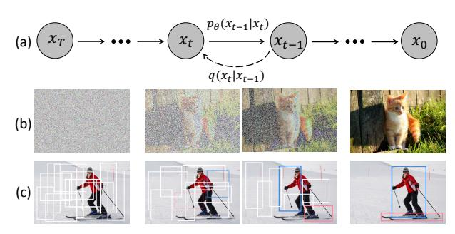
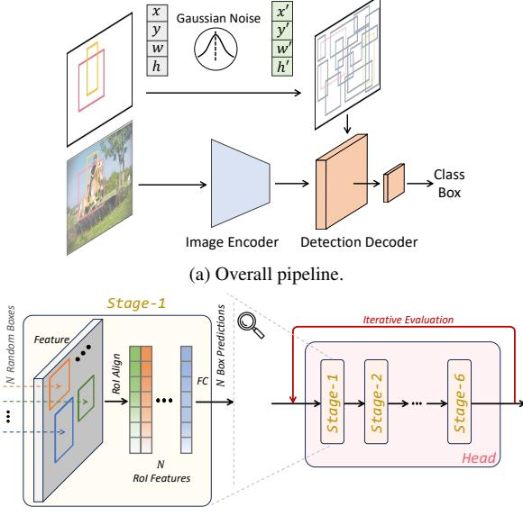
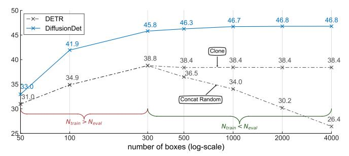
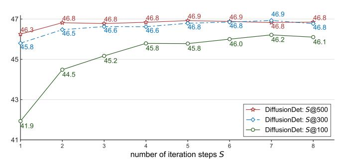
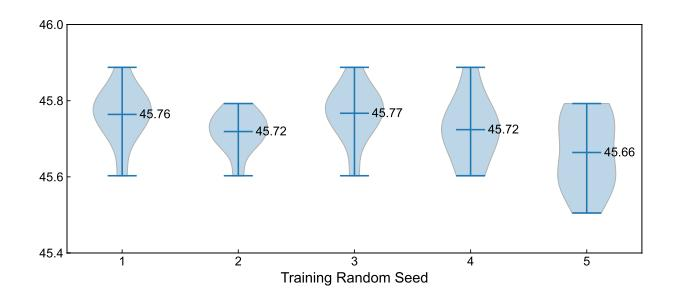

# **DiffusionDet: Diffusion Model for Object Detection**

Shoufa Chen<sup>1</sup> Peize Sun<sup>1</sup> Yibing Song<sup>2,3</sup> Ping Luo<sup>1,4</sup>

<sup>1</sup>The University of Hong Kong <sup>2</sup>Tencent AI Lab

<sup>3</sup>AI<sup>3</sup> Institute, Fudan University <sup>4</sup>Shanghai AI Laboratory

{sfchen, pzsun, pluo}@cs.hku.hk yibingsong.cv@gmail.com

#### **Abstract**

We propose DiffusionDet, a new framework that formulates object detection as a denoising diffusion process from noisy boxes to object boxes. During the training stage, object boxes diffuse from ground-truth boxes to random distribution, and the model learns to reverse this noising process. In inference, the model refines a set of randomly generated boxes to the output results in a progressive way. Our work possesses an appealing property of flexibility, which enables the dynamic number of boxes and iterative evaluation. The extensive experiments on the standard benchmarks show that DiffusionDet achieves favorable performance compared to previous well-established detectors. For example, DiffusionDet achieves 5.3 AP and 4.8 AP gains when evaluated with more boxes and iteration steps, under a zero-shot transfer setting from COCO to CrowdHuman. Our code is available at https://github.com/ ShoufaChen/DiffusionDet.

## 1. Introduction

Object detection aims to predict a set of bounding boxes and associated category labels for targeted objects in one image. As a fundamental visual recognition task, it has become the cornerstone of many related recognition scenarios, such as instance segmentation [36, 53], pose estimation [9, 22], action recognition [32, 81], object tracking [46, 65], and visual relationship detection [45, 62].

Modern object detection approaches have been evolving with the development of object candidates, *i.e.*, from empirical object priors [27, 59, 72, 74] to learnable object queries [10,90,114]). Specifically, the majority of detectors solve detection tasks by defining surrogate regression and classification on empirically designed object candidates, such as sliding windows [28,79], region proposals [27,74], anchor boxes [56,72] and reference points [19,105,112]. Recently, DETR [10] proposes learnable object queries to eliminate the hand-designed components and set up an end-to-end detection pipeline, attracting great attention on



Figure 1. **Diffusion model for object detection**. (a) A diffusion model where q is the diffusion process and  $p_{\theta}$  is the reverse process. (b) Diffusion model for image generation task. (c) We propose to formulate object detection as a denoising diffusion process from noisy boxes to object boxes.

query-based detection paradigm [23, 51, 90, 114].

While these works achieve a simple and effective design, they still have a dependency on a fixed set of learnable queries. A natural question is: is there a simpler approach that does not even need the surrogate of learnable queries?

We answer this question by designing a novel framework that directly detects objects from a set of random boxes. Starting from purely random boxes, which do not contain learnable parameters that need to be optimized in the training stage, we expect to gradually refine the positions and sizes of these boxes until they perfectly cover the targeted objects. This *noise-to-box* approach requires neither heuristic object priors nor learnable queries, further simplifying the object candidates and pushing the development of the detection pipeline forward.

Our motivation is illustrated in Figure 1. We think of the philosophy of noise-to-box paradigm is analogous to *noise-to-image* process in the denoising diffusion models [16,38,88], which are a class of likelihood-based models to generate the image by gradually removing noise from an image via the learned denoising model. Diffusion models have achieved great success in many generation tasks [3,4,40,71,94] and start to be explored in perception tasks like image segmentation [1,5,6,13,31,47,97]. How-

| # Boxes                                        | 300     | 500            | 1000                                      | 2000        |
|------------------------------------------------|---------|----------------|-------------------------------------------|-------------|
| DETR [10]<br>Sparse R-CNN [90]<br>DiffusionDet | 66.6    | 66.5 (-0.1)    | 61.3 (+0.0)<br>66.5 (-0.1)<br>71.0 (+4.4) | 66.5 (-0.1) |
| (a) Dyn                                        | amic nu | ımber of evalu | ation boxes.                              |             |
| # Steps                                        | 1       | 2              | 3                                         | 4           |

| # Steps           | 1    | 2                    | 3                    | 4            |
|-------------------|------|----------------------|----------------------|--------------|
| DETR [10]         | 61.3 | 62.5 (+1.2)          | 62.7 (+1.4)          | 62.7 (+1.4)  |
| Sparse R-CNN [90] | 66.6 | 60.6 ( <b>-6.0</b> ) | 55.5 (-11.1)         | 52.6 (-14.0) |
| DiffusionDet      | 66.6 | 69.7 <b>(+3.1)</b>   | 70.8 ( <b>+4.2</b> ) | 71.4 (+4.8)  |

(b) Dynamic number of evaluation steps.

Table 1. **Zero-shot transfer from COCO to CrowdHuman visible box detection.** All models are trained with 300 boxes and tested with different number of boxes and steps.

ever, to the best of our knowledge, there is no prior art that successfully adopts it to object detection.

In this work, we propose DiffusionDet, which tackles the object detection task with a diffusion model by casting detection as a generative task over the space of the positions (center coordinates) and sizes (widths and heights) of bounding boxes in the image. At the training stage, Gaussian noise controlled by a variance schedule [38] is added to ground truth boxes to obtain *noisy* boxes. Then these noisy boxes are used to crop [36, 74] features of Region of Interest (RoI) from the output feature map of the backbone encoder, e.g., ResNet [37], Swin Transformer [60]. Finally, these RoI features are sent to the detection decoder, which is trained to predict the ground-truth boxes without noise. With this training objective, DiffusionDet is able to predict the ground truth boxes from random boxes. At the inference stage, DiffusionDet generates bounding boxes by reversing the learned diffusion process, which adjusts a noisy prior distribution to the learned distribution over bounding boxes.

As a probabilistic model, DiffusionDet has an attractive superiority of flexibility, *i.e.*, we can train the network once and use the same network parameters under diverse settings in the inference stage, mainly including: (1) *Dynamic number of boxes*. Leveraging random boxes as object candidates, we decouple the training and evaluation stage of DiffusionDet, *i.e.*, we can train DiffusionDet with  $N_{train}$  random boxes while evaluating it with  $N_{eval}$  random boxes, where the  $N_{eval}$  is arbitrary and does not need to be equal to  $N_{train}$ . (2) *Iterative evaluation*. Benefited by the iterative denoising property of diffusion models, DiffusionDet can reuse the whole detection head in an iterative way, further improving its performance.

The flexibility of DiffusionDet makes it a great advantage in detecting objects across different scenarios, *e.g.*, sparse or crowded, without additional fine-tuning. Specifically, Table 1 shows that when directly evaluating COCO-pretraiend models on CrowdHuman [80] dataset, which

covers more crowed scenes, DiffusionDet achieves significant gains by adjusting the number of evaluation boxes and iteration steps. In contrast, previous methods only obtain marginal gains or even degraded performance. More detailed discussions are left in Section 4.

Besides, we evaluate DiffusionDet on COCO [57] dataset. With ResNet-50 [37] backbone, DiffusionDet achieves 45.8 AP using a single sampling step and 300 random boxes, which significantly outperforms Faster R-CNN [74] (40.2 AP), DETR [10] (42.0 AP) and on par with Sparse R-CNN [90] (45.0 AP). Besides, we can further improve DiffusionDet up to 46.8 AP by increasing the number of sampling steps and random boxes.

Our **contributions** are summarized as follows:

- We formulate object detection as a generative denoising process, which is the first study to apply the diffusion model to object detection to the best of our knowledge.
- Our noise-to-box detection paradigm has several appealing properties, such as decoupling training and evaluation stage for dynamic boxes and iterative evaluation.
- We conduct extensive experiments on COCO, Crowd-Human, and LVIS benchmarks. DiffusionDet achieves favorable performance against previous well-established detectors, especially zero-shot transferring across different scenarios.

#### 2. Related Work

**Object detection.** Most modern object detection approaches perform box regression and category classification on empirical object priors, such as proposals [27, 74], anchors [56, 72, 73], points [93, 95, 112]. Recently, Carion *et al.* proposed DETR [10] to detect objects using a fixed set of learnable queries. Since then, the query-based detection paradigm has attracted great attention and inspired a series of following works [12,24,43,51,58,64,66,89,90,107,110,114]. In this work, we push forward the development of the object detection pipeline further with DiffusionDet.

**Diffusion model.** As a class of deep generative models, diffusion models [38, 86, 88] start from the sample in random distribution and recover the data sample via a gradual denoising process. Diffusion models have recently demonstrated remarkable results in fields including computer vision [4,21,33,35,39,68,71,75,76,82,104,108], nature language processing [3,30,52], audio processing [41,48,50,70, 91,100,103], graph-related topics [42], interdisciplinary applications [2,40,44,78,94,99,102], etc. More applications of diffusion models can be found in recent surveys [8,104].

**Diffusion model for perception tasks.** While Diffusion models have achieved great success in image generation [16,38,88], their potential for discriminative tasks has yet to be fully explored. Some pioneer works tried to adopt the diffusion model for image segmentation tasks [1,5,6,



(b) Details of the detection decoder/head.

Figure 2. **DiffusionDet framework.** (a) The image encoder extracts feature representation from an input image. The detection decoder takes noisy boxes as input and predicts category classification and box coordinates. (b) The detection decoder has 6 stages in one detection head, following DETR and Sparse R-CNN. Besides, DiffusionDet can reuse this detection head (with 6 stages) multiple times, which is called "iterative evaluation".

13, 31, 47, 97], for example, Chen *et al.* [13] adopted Bit Diffusion model [14] for panoptic segmentation [49] of images and videos. However, despite significant interest in this idea, there are no previous solutions that successfully adapt generative diffusion models for object detection, the progress of which remarkably lags behind that of segmentation. We argue that this may be because segmentation tasks are processed in an image-to-image style, which is more conceptually similar to the image generation tasks, while object detection is a set prediction problem [10] which requires assigning object candidates [10, 55, 74] to ground truth objects. To the best of our knowledge, this is the first work that adopts a diffusion model for object detection.

## 3. Approach

# 3.1. Preliminaries

**Object detection.** The learning objective of object detection is input-target pairs (x, b, c), where x is the input image, b and c are a set of bounding boxes and category labels for objects in the image x, respectively. More specifically, we formulate the i-th box in the set as  $b^i = (c_x^i, c_y^i, w^i, h^i)$ , where  $(c_x^i, c_y^i)$  is the center coordinates of the bounding box,  $(w^i, h^i)$  are width and height of that bounding box, respectively.

**Diffusion model.** Diffusion models [38, 83, 84, 86] are a classes of likelihood-based models inspired by nonequilibrium thermodynamics [86, 87]. These models define a Markovian chain of diffusion forward process by gradually adding noise to sample data. The forward noise process is defined as

$$q(\boldsymbol{z}_t|\boldsymbol{z}_0) = \mathcal{N}(\boldsymbol{z}_t|\sqrt{\bar{\alpha}_t}\boldsymbol{z}_0, (1-\bar{\alpha}_t)\boldsymbol{I}), \tag{1}$$

which transforms data sample  $z_0$  to a latent noisy sample  $z_t$  for  $t \in \{0, 1, ..., T\}$  by adding noise to  $z_0$ .  $\bar{\alpha}_t := \prod_{s=0}^t \alpha_s = \prod_{s=0}^t (1-\beta_s)$  and  $\beta_s$  represents the noise variance schedule [38]. During training, a neural network  $f_{\theta}(z_t, t)$  is trained to predict  $z_0$  from  $z_t$  by minimizing the training objective with  $\ell_2$  loss [38]:

$$\mathcal{L}_{\text{train}} = \frac{1}{2} ||f_{\theta}(\boldsymbol{z}_t, t) - \boldsymbol{z}_0||^2.$$
 (2)

At inference stage, data sample  $z_0$  is reconstructed from noise  $z_T$  with the model  $f_\theta$  and an updating rule [38, 84] in an iterative way, i.e.,  $z_T \to z_{T-\Delta} \to ... \to z_0$ . More detailed formulation of diffusion models can be found in Appendix A.

In this work, we aim to solve the object detection task via the diffusion model. In our setting, data samples are a set of bounding boxes  $z_0 = b$ , where  $b \in \mathbb{R}^{N \times 4}$  is a set of N boxes. A neural network  $f_{\theta}(z_t, t, x)$  is trained to predict  $z_0$  from noisy boxes  $z_t$ , conditioned on the corresponding image x. The corresponding category label c is produced accordingly.

#### 3.2. Architecture

Since the diffusion model generates data samples iteratively, it needs to run model  $f_{\theta}$  multiple times at the inference stage. However, it would be computationally intractable to directly apply  $f_{\theta}$  on the raw image at every iterative step. Therefore, we propose to separate the whole model into two parts, *image encoder* and *detection decoder*, where the former runs only once to extract a deep feature representation from the raw input image x, and the latter takes this deep feature as condition, instead of the raw image, to progressively refine the box predictions from noisy boxes  $z_t$ .

**Image encoder.** Image encoder takes as input the raw image and extracts its high-level features for the following detection decoder. We implement DiffusionDet with both Convolutional Neural Networks such as ResNet [37] and Transformer-based models like Swin [60]. Feature Pyramid Network [55] is used to generate multi-scale feature maps for both ResNet and Swin backbones following [55,60,90].

**Detection decoder.** Borrowed from Sparse R-CNN [90], the detection decoder takes as input a set of proposal boxes to crop RoI-feature [36, 74] from feature map generated

#### **Algorithm 1** DiffusionDet Training

```
def train_loss(images, gt_boxes):
 images: [B, H, W, 3]
 qt_boxes: [B, *, 4]
   B: batch
  # N: number of proposal boxes
  # Encode image features
 feats = image_encoder(images)
  # Pad at boxes to N
 pb = pad_boxes(gt_boxes) # padded boxes: [B, N, 4]
 # Signal scaling
 pb = (pb * 2 - 1) * scale
  # Corrupt gt_boxes
 t = randint(0, T)
                                # time step
 eps = normal(mean=0, std=1) # noise: [B, N, 4]
 \bar{\text{pb}}_crpt = sqrt( alpha_cumprod(t)) * pb + sqrt(1 - alpha_cumprod(t)) * eps
 pb_pred = detection_decoder(pb_crpt, feats, t)
  # Set prediction loss
 loss = set_prediction_loss(pb_pred, gt_boxes)
 return loss
```

alpha\_cumprod(t): cumulative product of  $\alpha_i$ , i.e.,  $\prod_{i=1}^t \alpha_i$ 

by image encoder, and sends these RoI-features to detection head to obtain box regression and classification results. For DiffusionDet, these proposal boxes are disturbed from ground truth boxes at training stage and directly sampled from Gaussian distribution at evaluation stage. Following [10, 90, 114], our detection decoder is composed of 6 cascading stages (Figure 2b). The differences between our decoder and the one in Sparse R-CNN are that (1) DiffusionDet begins from random boxes while Sparse R-CNN uses a fixed set of learned boxes in inference; (2) Sparse R-CNN takes as input pairs of the proposal boxes and its corresponding proposal feature, while DiffusionDet needs the proposal boxes only; (3) DiffusionDet can re-use the detector head in an iterative way for evaluation and the parameters are shared across different steps, each of which is specified to the diffusion process by timestep embedding [38], which is called *iterative evaluation*, while Sparse R-CNN uses the detection decoder only once in the forward pass.

# 3.3. Training

During training, we first construct the diffusion process from ground-truth boxes to noisy boxes and then train the model to reverse this process. Algorithm 1 provides the pseudo-code of DiffusionDet training procedure.

**Ground truth boxes padding.** For modern object detection benchmarks [20, 34, 57, 80], the number of instances of interest typically varies across images. Therefore, we first pad some extra boxes to original ground truth boxes such that all boxes are summed up to a fixed number  $N_{train}$ . We

#### **Algorithm 2** DiffusionDet Sampling

```
def infer(images, steps, T):
 images: [B, H, W, 3]
 # steps: number of sample steps
   T: number of time steps
 # Encode image features
 feats = image encoder(images)
 # noisy boxes: [B, N, 4]
 pb t = normal(mean=0, std=1)
 # uniform sample step size
 times = reversed(linespace(-1, T, steps))
 \# [(T-1, T-2), (T-2, T-3), ..., (1, 0), (0, -1)] time_pairs = list(zip(times[:-1], times[1:])
 for t_now, t_next in zip(time_pairs):
   # Predict pb_0 from pb_t
  pb_pred = detection_decoder(pb_t, feats, t_now)
   # Estimate pb_t at t_next
  pb_t = ddim_step(pb_t, pb_pred, t_now, t_next)
   # Box renewal
  pb_t = box_renewal(pb_t)
 return pb pred
```

linespace: generate evenly spaced values

explore several padding strategies, for example, repeating existing ground truth boxes, concatenating random boxes or image-size boxes. Comparisons of these strategies are in Section 4.4, and concatenating random boxes works best.

**Box corruption.** We add Gaussian noises to the padded ground truth boxes. The noise scale is controlled by  $\alpha_t$  (in Eq. (1)), which adopts the monotonically decreasing cosine schedule for  $\alpha_t$  in different time step t, as proposed in [67]. Notably, the ground truth box coordinates need to be scaled as well since the signal-to-noise ratio has a significant effect on the performance of diffusion model [13]. We observe that object detection favors a relatively higher signal scaling value than image generation task [14, 16, 38]. More discussions are in Section 4.4.

**Training losses.** The detection detector takes as input  $N_{train}$  corrupted boxes and predicts  $N_{train}$  predictions of category classification and box coordinates. We apply set prediction loss [10, 90, 114] on the set of  $N_{train}$  predictions. We assign multiple predictions to each ground truth by selecting the top k predictions with the least cost by an optimal transport assignment method [18, 25, 26, 98].

## 3.4. Inference

The inference procedure of DiffusionDet is a denoising sampling process from noise to object boxes. Starting from boxes sampled in Gaussian distribution, the model progressively refines its predictions, as shown in Algorithm 2.

Sampling step. In each sampling step, the random boxes

or the estimated boxes from the last sampling step are sent into the detection decoder to predict the category classification and box coordinates. After obtaining the boxes of the current step, DDIM [84] is adopted to estimate the boxes for the next step. We note that sending the predicted boxes without DDIM to the next step is also an optional progressive refinement strategy. However, it brings significant deterioration, as discussed in Section 4.4.

Box renewal. After each sampling step, the predicted boxes can be coarsely categorized into two types, *desired* and *undesired* predictions. The desired predictions contain boxes that are properly located at corresponding objects, while the undesired ones are distributed arbitrarily. Directly sending these undesired boxes to the next sampling iteration would not bring a benefit since their distribution is not constructed by box corruption in training. To make inference better align with training, we propose the strategy of *box renewal* to revive these undesired boxes by replacing them with random boxes. Specifically, we first filter out undesired boxes with scores lower than a particular threshold. Then, we concatenate the remaining boxes with new random boxes sampled from a Gaussian distribution.

**Flexible usage.** Thanks to the random boxes design, we can evaluate DiffusionDet with an arbitrary number of random boxes and the number of iteration times, which do not need to be equal to the training stage. As a comparison, previous approaches [10, 90, 114] rely on the same number of processed boxes during training and evaluation, and their detection decoders are used only once in the forward pass.

# 3.5. Discussion

We conduct a comparative analysis between Diffusion-Det and previous multi-stage detectors [7, 10, 74, 90]. Cascade R-CNN adopts a three-stage prediction refinement process where the three stages do not share parameters and are used only once as a complete *head* during the inference phase. Recent works [10, 90, 114] have adopted a similar structure as Cascade R-CNN but with more stages (*i.e.*, six), following the default setting of DETR [10]. While DiffusionDet also employs the six-stage structure within its head, the distinguishing feature is that DiffusionDet can reuse the entire head multiple times to achieve further performance gains. However, prior works could not improve performance by reusing the detection head in most cases or could only achieve limited performance gains. More detailed results are in Section 4.4.

#### 4. Experiments

We first show the attractive flexibility of Diffusion-Det. Then we compare DiffusionDet with previous wellestablished detectors on COCO [57] and CrowdHuman [80] dataset. Finally, we provide ablation studies on the components of DiffusionDet.

**COCO** [57] dataset contains about 118K training images in the train2017 set and 5K validation images in the val2017 set. There are 80 object categories in total. We report box average precision over multiple IoU thresholds (AP), threshold 0.5 (AP<sub>50</sub>) and 0.75 (AP<sub>75</sub>).

**LVIS v1.0** [34] dataset is a large-vocabulary object detection and instance segmentation dataset which has 100K training images and 20K validation images. LVIS shares the same source images as COCO, while its annotations capture the long-tailed distribution in 1203 categories. We adopt MS-COCO style box metric AP, AP $_{50}$  and AP $_{75}$  in LVIS evaluation. For LVIS, the training schedule is 210K, 250K, and 270K.

**CrowdHuman** [80] dataset is a large dataset covering various crowd scenarios. It has 15K training images and 4.4K validation images, including a total of 470K human instances and 22.6 persons per image. Following previous settings [54, 90, 109, 113], we adopt evaluation metrics as AP under IoU threshold 0.5.

#### 4.1. Implementation Details.

The ResNet and Swin backbone are initialized with pretrained weights on ImageNet-1K and ImageNet-21K [15], respectively. The newly added detection decoder is initialized with Xavier init [29]. We train DiffusionDet using AdamW [61] optimizer with the initial learning rate as  $2.5 \times 10^{-5}$  and the weight decay as  $10^{-4}$ . All models are trained with a mini-batch size 16 on 8 GPUs. The default training schedule is 450K iterations, with the learning rate divided by 10 at 350K and 420K iterations. Data augmentation strategies contain random horizontal flip, scale jitter of resizing the input images such that the shortest side is at least 480 and at most 800 pixels while the longest is at most 1333 [101], and random crop augmentations. We do not use the EMA and some strong data augmentation like MixUp [106] or Mosaic [26].

At the inference stage, we report performances of DiffusionDet under diverse settings, which are combinations of different numbers of random boxes and iteration steps. The predictions at each sampling step are ensembled together by NMS to get the final predictions.

# 4.2. Main Properties

The main properties of DiffusionDet lie on *once training for all inference cases*. Once the model is trained, it can be used with changing the number of boxes and the number of iteration steps in inference, as shown in Figure 3 and Table 1. Therefore, we can deploy a single DiffusionDet to multiple scenarios and obtain a desired speed-accuracy trade-off without re-training the network.

Dynamic number of boxes. We compare DiffusionDet



(a) **Dynamic number boxes.** Both DETR and DiffusionDet are trained with 300 object queries or proposal boxes. More proposal boxes in inference bring accuracy improvement on DiffusionDet, while degenerate DETR.



(b) **Iterative evaluation.** 'S@500' denotes that we evaluate DiffusionDet with 500 boxes using a different number of iteration steps.. For all cases, the accuracy increases with refinement times.

Figure 3. Flexibility of DiffusionDet. All experiments are trained on COCO 2017 train set and evaluated on COCO 2017 val set. DiffusionDet uses the same network parameters for all settings in Figure 3a and 3b. Our proposed DiffusionDet is able to benefit from more proposal boxes and iteration steps using the same network parameters.

with DETR [10] to show the advantage of dynamic boxes. Comparisons with other detectors are in Appendix B. We reproduce DETR [10] with 300 object queries using the official code and default settings for 300 epochs of training. We train DiffusionDet with 300 random boxes such that the number of candidates is consistent with DETR for a fair comparison. The evaluation is on {50, 100, 300, 500, 1000, 2000, 4000} queries or boxes.

Since the learnable queries are fixed after training in the original setting of DETR, we propose a simple workaround to enable DETR work with a different number of queries: when  $N_{eval} < N_{train}$ , we directly choose  $N_{eval}$  queries from  $N_{train}$  queries; when  $N_{eval} > N_{train}$ , we clone existing  $N_{train}$  queries up to  $N_{eval}$  (a.k.a. clone). We equip DETR with NMS because cloned queries will produce similar detection results as the original queries. As shown in Figure 3a, the performance of DiffusionDet increases steadily with the number of boxes used for evaluation. For example, DiffusionDet can achieve 1.0 AP gain

when the number of boxes increases from 300 to 4000. On the contrary, cloning more queries for DETR ( $N_{eval} > 300$ ) causes a slight decrease in DETR performance from 38.8 to 38.4 AP, which is then held constant when using more queries.

We also implement another method for DETR when  $N_{eval} > N_{train}$ , concatenating extra  $N_{eval} - N_{train}$  randomly initialized queries (a.k.a. concat random). With this strategy, DETR has a clear performance drop when the  $N_{eval}$  is different from  $N_{train}$ . Besides, this performance drop becomes larger when the difference between  $N_{eval}$  and  $N_{train}$  increases. For example, when the number of boxes increases to 4000, DETR only has 26.4 AP with concat random strategy, which is 12.4 lower than the peak value (i.e., 38.8 AP with 300 queries).

Iterative evaluation. We further investigate the performance of our proposed approach by increasing the number of iterative steps from 1 to 8, and the corresponding results are illustrated in Figure 3b. Our findings indicate that the DiffusionDet models employing 100, 300, and 500 random boxes exhibit consistent performance improvements as the number of iterations increases. Moreover, we observe that DiffusionDet with fewer random boxes tends to achieve more substantial gains with refinement. For instance, the AP of DiffusionDet instance utilizing 100 random boxes improves from 41.9 (1 step) to 46.1 (8 steps), representing an absolute improvement of 4.2 AP.

**Zero-shot transferring.** To further validate the effectiveness of generalization, we conduct an evaluation of COCOpretrained models on the CrowdHuman dataset, without any additional fine-tuning. Specifically, our focus is on the [person] class for the final average precision (AP) performance. The experimental results are presented in Table 1. Our observations indicate that when transferring to a new dataset with scenarios that are more densely populated than COCO, our proposed method, namely DiffusionDet, demonstrates a notable advantage by increasing the number of evaluation boxes or iteration steps. For instance, by increasing the number of boxes from 300 to 2000 and the iteration steps from 1 to 4, DiffusionDet achieves a significant AP gain of **5.3** and **4.8**, respectively. In contrast, previous methods exhibit limited gain or serious performance degradation, with a decrease of 14.0 AP. The impressive flexibility of DiffusionDet implies that it is an invaluable asset for object detection tasks across a wide range of scenarios, including sparsely populated and densely crowded environments, without any additional fine-tuning requirements.

## 4.3. Benchmarking on Detection Datasets

In Table 2, we present a comparison of our DiffusionDet with several state-of-the-art detectors [7, 10, 56, 74, 90, 114] on the COCO dataset. For more comprehensive experimental settings, please refer to the Appendix. Notably, our Dif-

| Method                 | AP    | AP <sub>50</sub> | $AP_{75}$ | $AP_s$ | $AP_m$ | $AP_l$ |
|------------------------|-------|------------------|-----------|--------|--------|--------|
|                        | ResNo | et-50 [37]       | ]         |        |        |        |
| RetinaNet [101]        | 38.7  | 58.0             | 41.5      | 23.3   | 42.3   | 50.3   |
| Faster R-CNN [101]     | 40.2  | 61.0             | 43.8      | 24.2   | 43.5   | 52.0   |
| Cascade R-CNN [101]    | 44.3  | 62.2             | 48.0      | 26.6   | 47.7   | 57.7   |
| DETR [10]              | 42.0  | 62.4             | 44.2      | 20.5   | 45.8   | 61.1   |
| Deformable DETR [114]  | 43.8  | 62.6             | 47.7      | 26.4   | 47.1   | 58.0   |
| Sparse R-CNN [90]      | 45.0  | 63.4             | 48.2      | 26.9   | 47.2   | 59.5   |
| DiffusionDet (1 @ 300) | 45.8  | 64.1             | 50.4      | 27.6   | 48.7   | 62.2   |
| DiffusionDet (4 @ 300) | 46.6  | 65.1             | 51.3      | 28.9   | 49.2   | 62.1   |
| DiffusionDet (1 @ 500) | 46.3  | 64.8             | 50.7      | 28.6   | 49.0   | 62.1   |
| DiffusionDet (4 @ 500) | 46.8  | 65.3             | 51.8      | 29.6   | 49.3   | 62.2   |
|                        | ResNe | t-101 [37        | "]        |        |        |        |
| RetinaNet [101]        | 40.4  | 60.2             | 43.2      | 24.0   | 44.3   | 52.2   |
| Faster R-CNN [101]     | 42.0  | 62.5             | 45.9      | 25.2   | 45.6   | 54.6   |
| Cascade R-CNN [11]     | 45.5  | 63.7             | 49.9      | 27.6   | 49.2   | 59.1   |
| DETR [10]              | 43.5  | 63.8             | 46.4      | 21.9   | 48.0   | 61.8   |
| Sparse R-CNN [90]      | 46.4  | 64.6             | 49.5      | 28.3   | 48.3   | 61.6   |
| DiffusionDet (1 @ 300) | 46.7  | 65.0             | 51.0      | 29.6   | 49.7   | 63.2   |
| DiffusionDet (4 @ 300) | 47.4  | 65.8             | 52.0      | 30.1   | 50.4   | 63.1   |
| DiffusionDet (1 @ 500) | 47.2  | 65.7             | 51.6      | 30.2   | 50.2   | 62.7   |
| DiffusionDet (4 @ 500) | 47.5  | 65.7             | 52.0      | 30.8   | 50.4   | 63.1   |
|                        | Swin- | Base [60]        | ]         |        |        |        |
| Cascade R-CNN [60]     | 51.9  | 70.9             | 56.5      | 35.4   | 55.2   | 67.4   |
| Sparse R-CNN           | 52.0  | 72.2             | 57.0      | 35.8   | 55.1   | 68.2   |
| DiffusionDet (1 @ 300) | 52.5  | 71.8             | 57.3      | 35.0   | 56.4   | 69.3   |
| DiffusionDet (4 @ 300) | 53.3  | 72.8             | 58.6      | 36.6   | 57.0   | 69.2   |
| DiffusionDet (1 @ 500) | 53.0  | 72.3             | 58.0      | 35.5   | 56.9   | 69.1   |
| DiffusionDet (4 @ 500) | 53.3  | 72.7             | 58.4      | 36.2   | 56.9   | 69.0   |

Table 2. Comparisons with different object detectors on COCO 2017 val set.  $[S@N_{eval}]$  denotes the number of iteration steps S and number of evaluation boxes  $N_{eval}$ . The reference after each method indicates the source of its results. The method without reference is our implementation.

fusionDet (1 @ 300), which adopts a single iteration step and 300 evaluation boxes, achieves an AP of 45.8 with a ResNet-50 backbone, surpassing the performance of several well-established methods such as Faster R-CNN, RetinaNet, DETR, and Sparse R-CNN by a considerable margin. Moreover, DiffusionDet can further enhance its superiority by increasing the number of iterations and evaluation boxes. Besides, DiffusionDet shows steady improvement when the backbone size scales up. DiffusionDet with ResNet-101 (1 @ 300) achieves 46.7. When using ImageNet-21k pre-trained Swin-Base [60] as the backbone, DiffusionDet obtains 52.5 AP, outperforming strong baselines such as Cascade R-CNN and Sparse R-CNN.

Our current model is still lagging behind behind some well developed works like DINO [107] since it uses some more advanced components such as deformable attention [114], wider detection head. Some of these techniques are orthogonal to DiffusionDet and we will explore to incorporate these to our current pipeline for further improvement.

Experimental results on LVIS are presented in Table 3.

| Method                     | AP    | AP <sub>50</sub> | AP <sub>75</sub> | $AP_r$ | $AP_c$ | $AP_f$ |
|----------------------------|-------|------------------|------------------|--------|--------|--------|
|                            | ResN  | et-50 [37]       | ]                |        |        |        |
| Faster R-CNN <sup>†</sup>  | 22.5  | 37.1             | 23.6             | 9.9    | 21.1   | 29.7   |
| Cascade R-CNN <sup>†</sup> | 26.3  | 37.8             | 27.8             | 12.3   | 24.9   | 34.1   |
| Faster R-CNN               | 25.2  | 40.6             | 26.9             | 16.4   | 23.4   | 31.1   |
| Cascade R-CNN              | 29.4  | 41.4             | 30.9             | 20.0   | 27.7   | 35.4   |
| Sparse R-CNN               | 29.2  | 41.0             | 30.7             | 20.6   | 27.7   | 34.6   |
| DiffusionDet (1 @ 300)     | 29.4  | 40.4             | 31.0             | 22.7   | 27.2   | 34.7   |
| DiffusionDet (1 @ 500)     | 30.5  | 42.1             | 32.1             | 23.3   | 28.1   | 36.3   |
| DiffusionDet (1 @ 1000)    | 31.4  | 43.2             | 33.3             | 24.5   | 28.8   | 37.3   |
| DiffusionDet (4 @ 300)     | 31.5  | 43.4             | 33.5             | 24.1   | 29.3   | 37.4   |
|                            | ResNe | et-101 [37       | ']               |        |        |        |
| Faster R-CNN <sup>†</sup>  | 24.8  | 39.8             | 26.1             | 13.7   | 23.1   | 31.5   |
| Cascade R-CNN <sup>†</sup> | 28.6  | 40.1             | 30.1             | 15.3   | 27.3   | 35.9   |
| Faster R-CNN               | 27.2  | 42.9             | 29.1             | 18.8   | 25.4   | 33.0   |
| Cascade R-CNN              | 31.6  | 43.8             | 33.4             | 23.9   | 29.8   | 37.0   |
| Sparse R-CNN               | 30.1  | 42.0             | 31.9             | 23.5   | 27.5   | 35.9   |
| DiffusionDet (1 @ 300)     | 30.9  | 42.1             | 32.6             | 22.4   | 29.9   | 35.8   |
| DiffusionDet (1 @ 500)     | 31.8  | 43.7             | 33.6             | 23.5   | 30.2   | 37.3   |
| DiffusionDet (1 @ 1000)    | 33.0  | 45.0             | 34.9             | 24.8   | 31.4   | 38.3   |
| DiffusionDet (4 @ 300)     | 33.0  | 45.2             | 35.1             | 24.2   | 31.5   | 38.5   |
|                            | Swin- | Base [60]        | ]                |        |        |        |
| DiffusionDet (1 @ 300)     | 39.5  | 52.3             | 42.0             | 33.0   | 38.5   | 43.5   |
| DiffusionDet (1 @ 500)     | 40.8  | 54.2             | 43.6             | 33.4   | 39.9   | 45.2   |
| DiffusionDet (1 @ 1000)    | 41.9  | 55.7             | 44.8             | 35.3   | 40.6   | 46.2   |
| DiffusionDet (4 @ 300)     | 42.0  | 55.8             | 44.9             | 34.8   | 40.9   | 46.4   |

Table 3. Comparisons with different object detectors on LVIS **v1.0 val set**. We re-implement all detectors using federated loss [111] except for the rows in light gray (with  $^{\dagger}$ ).

We reproduce Faster R-CNN and Cascade R-CNN based on detectron2 [101] while Sparse R-CNN on its original code. We first reproduce Faster R-CNN and Cascade R-CNN using the default settings of detectron2, achieving 22.5/24.8 and 26.3/28.8 AP (with † in Table 3) with ResNet-50/101 backbone, respectively. Further, we boost their performance using the federated loss in [111]. Since images in LVIS are annotated in a federated way [34], the negative categories are sparsely annotated, which deteriorates the training gradients, especially for rare classes [92]. Federated loss is proposed to mitigate this issue by sampling a subset S of classes for each training image that includes all positive annotations and a random subset of negative ones. Following [111], we choose |S| = 50 in all experiments. Faster R-CNN and Cascade R-CNN earn about 3 AP gains with federated loss. All following comparisons are based on this loss.

We see that DiffusionDet attains remarkable gains using more evaluation steps, with both small and large backbones. Moreover, we note that iterative evaluation brings more gains on LVIS compared with COCO. For example, its performance increases from 45.8 to 46.6 (+ 0.8 AP) on COCO while from 29.4 to 31.5 (+2.1 AP) on LVIS, which demonstrates that our DiffusionDet would become more helpful for a more challenging benchmark.

| scale | AP   | $AP_{50}$ | $AP_{75}$ |
|-------|------|-----------|-----------|
| 0.1   | 38.9 | 54.3      | 42.1      |
| 1.0   | 45.0 | 63.0      | 48.9      |
| 2.0   | 45.8 | 64.1      | 50.4      |
| 3.0   | 45.6 | 63.9      | 50.0      |

| (a) Signal scale. | A large scaling factor |
|-------------------|------------------------|
| can improve detec | ction performance.     |

| case         | AP   | $AP_{50}$ | $AP_{75}$ |
|--------------|------|-----------|-----------|
| Repeat       | 44.2 | 62.0      | 48.3      |
| Cat Gaussian | 45.8 | 64.1      | 50.4      |
| Cat Uniform  | 45.2 | 63.3      | 49.3      |
| Cat Full     | 45.7 | 63.9      | 49.9      |

| (b) <b>GT</b> l | ooxes | padding.   | Concatenating |
|-----------------|-------|------------|---------------|
| Gaussian        | hove  | s works he | et            |

| DDIM         | box renewal | iter 1 | iter 2 | iter 3 |
|--------------|-------------|--------|--------|--------|
|              |             | 45.8   | 44.4   | 44.1   |
| $\checkmark$ |             | 45.8   | 46.0   | 46.1   |
|              | ✓           | 45.8   | 46.3   | 46.3   |
| $\checkmark$ | ✓           | 45.8   | 46.5   | 46.6   |

(c) **Sampling strategy.** Using both DDIM and box renewal works best

Table 4. **DiffusionDet ablation experiments** on COCO. We report AP, AP $_{50}$ , and AP $_{75}$ . If not specified, the default setting is: the backbone is ResNet-50 [37] with FPN [55], the signal scale is 2.0, ground-truth boxes padding method is concatenating Gaussian random boxes, DDIM and box renewal are used in sampling step. Default settings are marked in gray .

# 4.4. Ablation Study

We conduct ablation experiments on COCO to study DiffusionDet in detail. All experiments use ResNet-50 with FPN as the backbone and 300 random boxes for inference without further specification.

**Signal scaling.** The signal scaling factor controls the signal-to-noise ratio (SNR) of the diffusion process. We study the influence of scaling factors in Table 4a. Results demonstrate that the scaling factor of 2.0 achieves optimal AP performance, outperforming the standard value of 1.0 in image generation task [14, 38] and 0.1 used for panoptic segmentation [13]. We explain that it is because one box only has four representation parameters, *i.e.*, center coordinates  $(c_x, c_y)$  and box size (w, h), which is coarsely analogous to an image with only four pixels in image generation. The box representation is more fragile than the dense representation, e.g.,  $512 \times 512$  mask presentation in panoptic segmentation [14]. Therefore, DiffusionDet prefers an easier training objective with an increased signal-to-noise ratio compared to image generation and panoptic segmentation.

GT boxes padding strategy. As introduced in Section 3.3, we need to pad additional boxes to the original ground truth boxes such that each image has the same number of boxes. We study different padding strategies in Table 4b, including (1) repeating original ground truth boxes evenly until the total number reaches pre-defined value  $N_{train}$ ; (2) padding random boxes that follow Gaussian distribution; (3) padding random boxes that follow uniform distribution; (4) padding boxes that have the same size as the whole image, which is the default initialization of learnable boxes in [90]. Concatenating Gaussian random boxes works best for DiffusionDet. We use this padding strategy as default.

Sampling strategy. We compare different sampling strategies in Table 4c. When evaluating DiffusionDet that does not use DDIM, we directly take the output prediction of the current step as input for the next step. We found that the AP of DiffusionDet degrades with more iteration steps when neither DDIM nor box renewal is adopted. Besides, only using DDIM or box renewal would bring slight benefits at 3 iteration steps. Moreover, our DiffusionDet attains

| train eval | 100  | 300  | 500          | 1000 | 2000 |
|------------|------|------|--------------|------|------|
| 100        | 42.9 | 44.4 | 44.5         | 44.6 | 44.6 |
| 300        | 42.8 | 45.7 | 46.2<br>46.3 | 46.3 | 46.4 |
| 500        | 41.9 | 45.8 | 46.3         | 46.7 | 46.8 |

Table 5. Matching between training and inference box numbers on COCO. DiffusionDet decouples the number of boxes during the training and inference stages and works well with flexible combinations.

remarkable gains when equipped with both DDIM and renewal. These experiments together verify the necessity of both DDIM and box renewal in the sampling step.

Matching between  $N_{train}$  and  $N_{eval}$ . As discussed in Sec. 4.2, DiffusionDet has an appealing property of evaluating with an arbitrary number of random boxes. To study how the number of training boxes affects inference performance, we train DiffusionDet with  $N_{train} \in \{100, 300, 500\}$  random boxes separately and then evaluate each of these models with  $N_{eval}$   $\in$  $\{100, 300, 500, 1000, 2000\}$ . The results are summarized in Table 5. First, no matter how many random boxes DiffusionDet uses for training, the accuracy increases steadily with the  $N_{eval}$  until the saturated point at around 2000 random boxes. Second, DiffusionDet tends to perform better when the  $N_{train}$  and  $N_{eval}$  matches with each other. For example, DiffusionDet trained with  $N_{train} = 100$  boxes behaves better than  $N_{train} = 300$  and 500 when  $N_{eval} = 100$ . **Running time vs. accuracy.** We investigate the running time of DiffusionDet under multiple settings, which are evaluated on a single NVIDIA A100 GPU with a mini-batch size of 1. We utilize the notation #Stages×#Heads to indicate the number of stages and heads utilized during the training and test phases, as depicted in Figure 2b and results of our investigation are presented in Table 6.

First, our findings indicate that DiffusionDet with a single iteration step and 300 evaluation boxes demonstrate a comparable speed to Sparse R-CNN, achieving 30 and 31 frames per second (FPS), respectively. DiffusionDet also showcases similar zero-shot transfer performance on CrowdHuman while outperforming Sparse R-CNN with an

| Method                      | Train              | Test               | COCO                               | CrowdHuman                                           | FPS            |
|-----------------------------|--------------------|--------------------|------------------------------------|------------------------------------------------------|----------------|
| DETR [10]                   | 6×1                | 6×1                | 42.0                               | 61.3                                                 | 39             |
|                             | 6×1                | 6×2                | 41.6 ( <b>-0.4</b> )               | 62.5 (+1.2)                                          | 32             |
| Sparse<br>R-CNN [90]        | 6×1<br>6×1<br>12×1 | 6×1<br>6×2<br>12×1 | 45.0<br>43.6 (-1.4)<br>44.7 (-0.3) | 66.6<br>60.6 (- <b>6.0</b> )<br>66.1 (- <b>0.5</b> ) | 30<br>21<br>21 |
| DiffusionDet DiffusionDet † | 6×1                | 6×1                | 45.8                               | 66.6                                                 | 30             |
|                             | 6×1                | 6×2                | 46.5 ( <b>+0.7</b> )               | 69.7 (+ <b>3.1</b> )                                 | 20             |
|                             | 6×1                | 6×1                | 46.8 ( <b>+1.0</b> )               | 71.0 (+ <b>4.4</b> )                                 | 24             |

Table 6. Running time vs. performance. † denotes Diffusion-Det with 1000 boxes. #Stages×#Heads denotes the number of stages and heads utilized during training and test phases. The definitions of Stage and Head are illustrated in Figure 2b.

45.8 AP as opposed to 45.0 AP on COCO. Besides, Sparse R-CNN's utilization of the six stages twice results in a 1.4 AP drop (from 45.0 to 43.6) on COCO and a 6.0 AP drop (from 66.6 to 60.6) on CrowdHuman. Similarly, DETR experiences 0.4 performance drop on COCO but 1.2 performance gain on CrowdHuman.

When increasing the number of iteration steps, DiffusionDet achieves a 0.7 AP gain on COCO and a 3.1 AP gain on CrowdHuman. And DiffusionDet obtains clear performance gains with 1000 evaluation boxes. However, neither DETR nor Sparse R-CNN can achieve performance gains with additional iteration steps. Even if we expand the number of stages to 12, it can cause performance degradation for Sparse R-CNN.

It is worth noting that in this work, we have utilized the most fundamental diffusion strategy, DDIM, in our pioneering exploration of using generation models for perception tasks. Similar to the Diffusion model employed in generation tasks, DiffusionDet may suffer from a relatively slow sampling speed. Nonetheless, a series of recent works [17, 63, 77, 85] have been proposed to improve the sampling efficiency of the diffusion model. For instance, the most recent consistency models [85] have proposed a fast one-step generation method for the diffusion model. We believe that a more advanced diffusion strategy could potentially address the issue of decreased speed performance of DiffusionDet, which we plan to explore in future work.



Figure 4. **Statistical results** over 5 independent training instances, each is evaluated 10 times with different random seeds.

| method                   | $AP_{50}\uparrow$ | mMR ↓ | Recall ↑ |
|--------------------------|-------------------|-------|----------|
| Faster R-CNN [74]        | 85.0              | 50.4  | 90.2     |
| RetinaNet [56]           | 81.7              | 57.6  | 88.6     |
| FCOS [93]                | 86.1              | 55.2  | 94.3     |
| DETR [10]                | 66.1              | 80.6  | -        |
| Deformable DETR [114]    | 86.7              | 54.0  | 92.5     |
| Sparse R-CNN [90] (500)  | 89.2              | 48.3  | 95.9     |
| Sparse R-CNN [90] (1000) | 89.7              | 49.1  | 97.5     |
| DiffusionDet (1 @ 1000)  | 90.1              | 46.5  | 96.2     |
| DiffusionDet (1 @ 3000)  | 91.2              | 47.7  | 98.4     |
| DiffusionDet (3 @ 1000)  | 91.4              | 45.7  | 98.4     |

Table 7. Full tuning on CrowdHuman.

Random Seed Since DiffusionDet is given random boxes as input at the start of inference, one may ask whether there is a large performance variance across different random seeds. We evaluate the stability of DiffusionDet by training five models independently with the same configurations except for random seed. Then, we evaluate each model instance with ten different random seeds to measure the distribution of performance, inspired by [69, 96]. As shown in Figure 4, most evaluation results are distributed closely to 45.7 AP. Besides, the performance differences among different model instances are marginal, demonstrating that DiffusionDet is robust to the random boxes and produces reliable results.

#### 4.5. Full-tuning on CrowdHuman

In addition to the cross-dataset generalization evaluation from COCO to CrowdHuman discussed in Section 4.2, we further full-tune DiffusionDet on CrowdHuman. The comparison results are shown in Table 7. We see that DiffusionDet achieves superior performance compared with previous methods. For example, with a single step and 1000 boxes, DiffusionDet obtains 90.1 AP<sub>50</sub>, outperforming Sparse R-CNN with 1000 boxes. Besides, further increasing boxes to 3000 and iteration steps can both bring performance gains.

## 5. Conclusion

In this work, we propose a novel detection paradigm, DiffusionDet, by viewing object detection as a denoising diffusion process from noisy boxes to object boxes. Our noise-to-box pipeline has several appealing properties, including the dynamic number of boxes and iterative evaluation, enabling us to use the same network parameters for flexible evaluation without re-training the model. Experiments on standard detection benchmarks show that DiffusionDet achieves favorable performance compared to well-established detectors.

**Acknowledgement.** This paper is partially supported by the National Key R&D Program of China No.2022ZD0161000 and the General Research Fund of Hong Kong No.17200622.

## References

- [1] Tomer Amit, Eliya Nachmani, Tal Shaharbany, and Lior Wolf. Segdiff: Image segmentation with diffusion probabilistic models. *arXiv preprint arXiv:2112.00390*, 2021. 1,
- [2] Namrata Anand and Tudor Achim. Protein structure and sequence generation with equivariant denoising diffusion probabilistic models. arXiv preprint arXiv:2205.15019, 2022. 2
- [3] Jacob Austin, Daniel D Johnson, Jonathan Ho, Daniel Tarlow, and Rianne van den Berg. Structured denoising diffusion models in discrete state-spaces. Advances in Neural Information Processing Systems, 34:17981–17993, 2021. 1,
- [4] Omri Avrahami, Dani Lischinski, and Ohad Fried. Blended diffusion for text-driven editing of natural images. In Proceedings of the IEEE/CVF Conference on Computer Vision and Pattern Recognition, pages 18208–18218, 2022. 1, 2
- [5] Dmitry Baranchuk, Andrey Voynov, Ivan Rubachev, Valentin Khrulkov, and Artem Babenko. Label-efficient semantic segmentation with diffusion models. In *Interna*tional Conference on Learning Representations, 2022. 1,
- [6] Emmanuel Asiedu Brempong, Simon Kornblith, Ting Chen, Niki Parmar, Matthias Minderer, and Mohammad Norouzi. Denoising pretraining for semantic segmentation. In Proceedings of the IEEE/CVF Conference on Computer Vision and Pattern Recognition, pages 4175–4186, 2022. 1, 2
- [7] Zhaowei Cai and Nuno Vasconcelos. Cascade r-cnn: high quality object detection and instance segmentation. *IEEE* transactions on pattern analysis and machine intelligence, 43(5):1483–1498, 2019. 5, 6
- [8] Hanqun Cao, Cheng Tan, Zhangyang Gao, Guangyong Chen, Pheng-Ann Heng, and Stan Z Li. A survey on generative diffusion model. arXiv preprint arXiv:2209.02646, 2022. 2
- [9] Z. Cao, G. Hidalgo Martinez, T. Simon, S. Wei, and Y. A. Sheikh. Openpose: Realtime multi-person 2d pose estimation using part affinity fields. *IEEE Transactions on Pattern Analysis and Machine Intelligence*, 2019. 1
- [10] Nicolas Carion, Francisco Massa, Gabriel Synnaeve, Nicolas Usunier, Alexander Kirillov, and Sergey Zagoruyko. End-to-end object detection with transformers. In *European conference on computer vision*, pages 213–229. Springer, 2020. 1, 2, 3, 4, 5, 6, 7, 9
- [11] Kai Chen, Jiaqi Wang, Jiangmiao Pang, Yuhang Cao, Yu Xiong, Xiaoxiao Li, Shuyang Sun, Wansen Feng, Ziwei Liu, Jiarui Xu, Zheng Zhang, Dazhi Cheng, Chenchen Zhu, Tianheng Cheng, Qijie Zhao, Buyu Li, Xin Lu, Rui Zhu, Yue Wu, Jifeng Dai, Jingdong Wang, Jianping Shi, Wanli Ouyang, Chen Change Loy, and Dahua Lin. MMDetection: Open mmlab detection toolbox and benchmark. arXiv preprint arXiv:1906.07155, 2019. 7
- [12] Qiang Chen, Xiaokang Chen, Jian Wang, Haocheng Feng, Junyu Han, Errui Ding, Gang Zeng, and Jingdong Wang. Group detr: Fast detr training with group-wise one-to-many

- assignment. arXiv preprint arXiv:2207.13085, 1(2), 2022.
- [13] Ting Chen, Lala Li, Saurabh Saxena, Geoffrey Hinton, and David J Fleet. A generalist framework for panoptic segmentation of images and videos. *arXiv preprint arXiv:2210.06366*, 2022. 1, 2, 3, 4, 8
- [14] Ting Chen, Ruixiang Zhang, and Geoffrey Hinton. Analog bits: Generating discrete data using diffusion models with self-conditioning. arXiv preprint arXiv:2208.04202, 2022. 3, 4, 8
- [15] Jia Deng, Wei Dong, Richard Socher, Li-Jia Li, Kai Li, and Li Fei-Fei. Imagenet: A large-scale hierarchical image database. In 2009 IEEE conference on computer vision and pattern recognition, pages 248–255. Ieee, 2009. 5
- [16] Prafulla Dhariwal and Alexander Nichol. Diffusion models beat gans on image synthesis. Advances in Neural Information Processing Systems, 34:8780–8794, 2021. 1, 2, 4
- [17] Tim Dockhorn, Arash Vahdat, and Karsten Kreis. GENIE: Higher-order denoising diffusion solvers. In Alice H. Oh, Alekh Agarwal, Danielle Belgrave, and Kyunghyun Cho, editors, Advances in Neural Information Processing Systems, 2022. 9
- [18] Yuming Du, Wen Guo, Yang Xiao, and Vincent Lepetit. 1st place solution for the uvo challenge on imagebased open-world segmentation 2021. arXiv preprint arXiv:2110.10239, 2021. 4
- [19] Kaiwen Duan, Song Bai, Lingxi Xie, Honggang Qi, Qingming Huang, and Qi Tian. Centernet: Keypoint triplets for object detection. In *Proceedings of the IEEE/CVF international conference on computer vision*, pages 6569–6578, 2019.
- [20] Mark Everingham, Luc Van Gool, Christopher KI Williams, John Winn, and Andrew Zisserman. The pascal visual object classes (voc) challenge. *International journal* of computer vision, 88(2):303–338, 2010. 4
- [21] Wanshu Fan, Yen-Chun Chen, Dongdong Chen, Yu Cheng, Lu Yuan, and Yu-Chiang Frank Wang. Frido: Feature pyramid diffusion for complex scene image synthesis. *ArXiv*, abs/2208.13753, 2022. 2
- [22] Hao-Shu Fang, Shuqin Xie, Yu-Wing Tai, and Cewu Lu. Rmpe: Regional multi-person pose estimation. In *Proceedings of the IEEE international conference on computer vision*, pages 2334–2343, 2017. 1
- [23] Peng Gao, Minghang Zheng, Xiaogang Wang, Jifeng Dai, and Hongsheng Li. Fast convergence of detr with spatially modulated co-attention. In *Proceedings of the IEEE/CVF International Conference on Computer Vision* (ICCV), pages 3621–3630, October 2021. 1
- [24] Ziteng Gao, Limin Wang, Bing Han, and Sheng Guo. Adamixer: A fast-converging query-based object detector. In Proceedings of the IEEE/CVF Conference on Computer Vision and Pattern Recognition, pages 5364–5373, 2022. 2
- [25] Zheng Ge, Songtao Liu, Zeming Li, Osamu Yoshie, and Jian Sun. Ota: Optimal transport assignment for object detection. In Proceedings of the IEEE/CVF Conference on Computer Vision and Pattern Recognition, pages 303–312, 2021. 4

- [26] Z Ge, S Liu, F Wang, Z Li, and J Sun. Yolox: Exceeding yolo series in 2021. arxiv. arXiv preprint arXiv:2107.08430, 2021. 4, 5
- [27] Ross Girshick. Fast r-cnn. In *Proceedings of the IEEE* international conference on computer vision, pages 1440–1448, 2015. 1, 2
- [28] Ross Girshick, Jeff Donahue, Trevor Darrell, and Jitendra Malik. Rich feature hierarchies for accurate object detection and semantic segmentation. In *Proceedings of the IEEE conference on computer vision and pattern recogni*tion, pages 580–587, 2014. 1
- [29] Xavier Glorot and Yoshua Bengio. Understanding the difficulty of training deep feedforward neural networks. In Proceedings of the thirteenth international conference on artificial intelligence and statistics, pages 249–256. JMLR Workshop and Conference Proceedings, 2010. 5
- [30] Shansan Gong, Mukai Li, Jiangtao Feng, Zhiyong Wu, and LingPeng Kong. Diffuseq: Sequence to sequence text generation with diffusion models. arXiv preprint arXiv:2210.08933, 2022. 2
- [31] Alexandros Graikos, Nikolay Malkin, Nebojsa Jojic, and Dimitris Samaras. Diffusion models as plug-and-play priors. arXiv preprint arXiv:2206.09012, 2022. 1, 2
- [32] Chunhui Gu, Chen Sun, David A Ross, Carl Vondrick, Caroline Pantofaru, Yeqing Li, Sudheendra Vijayanarasimhan, George Toderici, Susanna Ricco, Rahul Sukthankar, et al. Ava: A video dataset of spatio-temporally localized atomic visual actions. In *Proceedings of the IEEE Conference on Computer Vision and Pattern Recognition*, pages 6047–6056, 2018. 1
- [33] Shuyang Gu, Dong Chen, Jianmin Bao, Fang Wen, Bo Zhang, Dongdong Chen, Lu Yuan, and Baining Guo. Vector quantized diffusion model for text-to-image synthesis. In *Proceedings of the IEEE/CVF Conference on Computer Vision and Pattern Recognition*, pages 10696–10706, 2022.
- [34] Agrim Gupta, Piotr Dollar, and Ross Girshick. Lvis: A dataset for large vocabulary instance segmentation. In Proceedings of the IEEE/CVF conference on computer vision and pattern recognition, pages 5356–5364, 2019. 4, 5, 7
- [35] William Harvey, Saeid Naderiparizi, Vaden Masrani, Christian Weilbach, and Frank Wood. Flexible diffusion modeling of long videos. arXiv preprint arXiv:2205.11495, 2022.
- [36] Kaiming He, Georgia Gkioxari, Piotr Dollár, and Ross Girshick. Mask r-cnn. In *Proceedings of the IEEE international conference on computer vision*, pages 2961–2969, 2017. 1, 2, 3
- [37] Kaiming He, Xiangyu Zhang, Shaoqing Ren, and Jian Sun. Deep residual learning for image recognition. In *Proceedings of the IEEE conference on computer vision and pattern recognition*, pages 770–778, 2016. 2, 3, 7, 8
- [38] Jonathan Ho, Ajay Jain, and Pieter Abbeel. Denoising diffusion probabilistic models. Advances in Neural Information Processing Systems, 33:6840–6851, 2020. 1, 2, 3, 4, 8

- [39] Jonathan Ho, Tim Salimans, Alexey Gritsenko, William Chan, Mohammad Norouzi, and David J Fleet. Video diffusion models. arXiv preprint arXiv:2204.03458, 2022. 2
- [40] Emiel Hoogeboom, Victor Garcia Satorras, Clement Vignac, and Max Welling. Equivariant diffusion for molecule generation in 3d. *arXiv e-prints*, pages arXiv–2203, 2022.
- [41] Rongjie Huang, Zhou Zhao, Huadai Liu, Jinglin Liu, Chenye Cui, and Yi Ren. Prodiff: Progressive fast diffusion model for high-quality text-to-speech. *arXiv preprint arXiv:*2207.06389, 2022. 2
- [42] Hyosoon Jang, Sangwoo Mo, and Sungsoo Ahn. Diffusion probabilistic models for graph-structured prediction. arXiv preprint arXiv:2302.10506, 2023.
- [43] Ding Jia, Yuhui Yuan, Haodi He, Xiaopei Wu, Haojun Yu, Weihong Lin, Lei Sun, Chao Zhang, and Han Hu. Detrs with hybrid matching. *arXiv preprint arXiv:2207.13080*, 2022.
- [44] Bowen Jing, Gabriele Corso, Regina Barzilay, and Tommi S Jaakkola. Torsional diffusion for molecular conformer generation. In *ICLR2022 Machine Learning for Drug Discov*ery, 2022. 2
- [45] Justin Johnson, Ranjay Krishna, Michael Stark, Li-Jia Li, David Shamma, Michael Bernstein, and Li Fei-Fei. Image retrieval using scene graphs. In *Proceedings of the IEEE conference on computer vision and pattern recogni*tion, pages 3668–3678, 2015. 1
- [46] Zdenek Kalal, Krystian Mikolajczyk, and Jiri Matas. Tracking-learning-detection. *IEEE transactions on pattern analysis and machine intelligence*, 34(7):1409–1422, 2011.
- [47] Boah Kim, Yujin Oh, and Jong Chul Ye. Diffusion adversarial representation learning for self-supervised vessel segmentation. arXiv preprint arXiv:2209.14566, 2022. 1, 2
- [48] Sungwon Kim, Heeseung Kim, and Sungroh Yoon. Guided-tts 2: A diffusion model for high-quality adaptive text-to-speech with untranscribed data. *arXiv preprint* arXiv:2205.15370, 2022. 2
- [49] Alexander Kirillov, Kaiming He, Ross Girshick, Carsten Rother, and Piotr Dollár. Panoptic segmentation. In Proceedings of the IEEE/CVF Conference on Computer Vision and Pattern Recognition, pages 9404–9413, 2019. 3
- [50] Alon Levkovitch, Eliya Nachmani, and Lior Wolf. Zeroshot voice conditioning for denoising diffusion tts models. arXiv preprint arXiv:2206.02246, 2022. 2
- [51] Feng Li, Hao Zhang, Shilong Liu, Jian Guo, Lionel M Ni, and Lei Zhang. Dn-detr: Accelerate detr training by introducing query denoising. In *Proceedings of the IEEE/CVF Conference on Computer Vision and Pattern Recognition*, pages 13619–13627, 2022. 1, 2
- [52] Xiang Lisa Li, John Thickstun, Ishaan Gulrajani, Percy Liang, and Tatsunori B Hashimoto. Diffusion-lm improves controllable text generation. *arXiv preprint arXiv:2205.14217*, 2022. 2
- [53] Yi Li, Haozhi Qi, Jifeng Dai, Xiangyang Ji, and Yichen Wei. Fully convolutional instance-aware semantic segmentation. In *Proceedings of the IEEE conference on computer vision and pattern recognition*, pages 2359–2367, 2017.

- [54] Matthieu Lin, Chuming Li, Xingyuan Bu, Ming Sun, Chen Lin, Junjie Yan, Wanli Ouyang, and Zhidong Deng. Detr for crowd pedestrian detection, 2021. 5
- [55] Tsung-Yi Lin, Piotr Dollár, Ross Girshick, Kaiming He, Bharath Hariharan, and Serge Belongie. Feature pyramid networks for object detection. In *Proceedings of the IEEE conference on computer vision and pattern recognition*, pages 2117–2125, 2017. 3, 8
- [56] Tsung-Yi Lin, Priya Goyal, Ross Girshick, Kaiming He, and Piotr Dollár. Focal loss for dense object detection. In Proceedings of the IEEE international conference on computer vision, pages 2980–2988, 2017. 1, 2, 6, 9
- [57] Tsung-Yi Lin, Michael Maire, Serge Belongie, James Hays, Pietro Perona, Deva Ramanan, Piotr Dollár, and C Lawrence Zitnick. Microsoft coco: Common objects in context. In *European conference on computer vision*, pages 740–755. Springer, 2014. 2, 4, 5
- [58] Shilong Liu, Feng Li, Hao Zhang, Xiao Yang, Xianbiao Qi, Hang Su, Jun Zhu, and Lei Zhang. DAB-DETR: Dynamic anchor boxes are better queries for DETR. In *International Conference on Learning Representations*, 2022. 2
- [59] Wei Liu, Dragomir Anguelov, Dumitru Erhan, Christian Szegedy, Scott Reed, Cheng-Yang Fu, and Alexander C Berg. Ssd: Single shot multibox detector. In *European con*ference on computer vision, pages 21–37. Springer, 2016. 1
- [60] Ze Liu, Yutong Lin, Yue Cao, Han Hu, Yixuan Wei, Zheng Zhang, Stephen Lin, and Baining Guo. Swin transformer: Hierarchical vision transformer using shifted windows. In Proceedings of the IEEE/CVF International Conference on Computer Vision, pages 10012–10022, 2021. 2, 3, 7
- [61] Ilya Loshchilov and Frank Hutter. Decoupled weight decay regularization. In *International Conference on Learn*ing Representations, 2019. 5
- [62] Cewu Lu, Ranjay Krishna, Michael Bernstein, and Li Fei-Fei. Visual relationship detection with language priors. In European conference on computer vision, pages 852–869. Springer, 2016. 1
- [63] Cheng Lu, Yuhao Zhou, Fan Bao, Jianfei Chen, Chongxuan Li, and Jun Zhu. DPM-solver: A fast ODE solver for diffusion probabilistic model sampling in around 10 steps. In Alice H. Oh, Alekh Agarwal, Danielle Belgrave, and Kyunghyun Cho, editors, Advances in Neural Information Processing Systems, 2022. 9
- [64] Depu Meng, Xiaokang Chen, Zejia Fan, Gang Zeng, Houqiang Li, Yuhui Yuan, Lei Sun, and Jingdong Wang. Conditional detr for fast training convergence. In *Proceedings of the IEEE/CVF International Conference on Computer Vision*, pages 3651–3660, 2021. 2
- [65] Anton Milan, Laura Leal-Taixé, Ian Reid, Stefan Roth, and Konrad Schindler. Mot16: A benchmark for multi-object tracking. arXiv preprint arXiv:1603.00831, 2016.
- [66] Duy-Kien Nguyen, Jihong Ju, Olaf Booij, Martin R Oswald, and Cees GM Snoek. Boxer: Box-attention for 2d and 3d transformers. In Proceedings of the IEEE/CVF Conference on Computer Vision and Pattern Recognition, pages 4773–4782, 2022. 2

- [67] Alexander Quinn Nichol and Prafulla Dhariwal. Improved denoising diffusion probabilistic models. In *International Conference on Machine Learning*, pages 8162–8171. PMLR, 2021. 4
- [68] Alexander Quinn Nichol, Prafulla Dhariwal, Aditya Ramesh, Pranav Shyam, Pamela Mishkin, Bob Mcgrew, Ilya Sutskever, and Mark Chen. GLIDE: Towards photorealistic image generation and editing with text-guided diffusion models. In *Proceedings of the 39th International Conference on Machine Learning*, volume 162 of *Proceedings of Machine Learning Research*, pages 16784–16804. PMLR, 17–23 Jul 2022. 2
- [69] David Picard. Torch. manual\_seed (3407) is all you need: On the influence of random seeds in deep learning architectures for computer vision. arXiv preprint arXiv:2109.08203, 2021.
- [70] Vadim Popov, Ivan Vovk, Vladimir Gogoryan, Tasnima Sadekova, and Mikhail Kudinov. Grad-tts: A diffusion probabilistic model for text-to-speech. In *ICML*, 2021. 2
- [71] Aditya Ramesh, Prafulla Dhariwal, Alex Nichol, Casey Chu, and Mark Chen. Hierarchical text-conditional image generation with clip latents. *ArXiv*, abs/2204.06125, 2022. 1, 2
- [72] Joseph Redmon, Santosh Divvala, Ross Girshick, and Ali Farhadi. You only look once: Unified, real-time object detection. In *Proceedings of the IEEE conference on computer* vision and pattern recognition, pages 779–788, 2016. 1, 2
- [73] Joseph Redmon and Ali Farhadi. Yolo9000: better, faster, stronger. In *Proceedings of the IEEE conference on com*puter vision and pattern recognition, pages 7263–7271, 2017. 2
- [74] Shaoqing Ren, Kaiming He, Ross B. Girshick, and Jian Sun. Faster R-CNN: towards real-time object detection with region proposal networks. *IEEE Trans. Pattern Anal. Mach. Intell.*, 39(6):1137–1149, 2017. 1, 2, 3, 5, 6, 9
- [75] Nataniel Ruiz, Yuanzhen Li, Varun Jampani, Yael Pritch, Michael Rubinstein, and Kfir Aberman. Dreambooth: Fine tuning text-to-image diffusion models for subject-driven generation. ArXiv, abs/2208.12242, 2022. 2
- [76] Chitwan Saharia, William Chan, Saurabh Saxena, Lala Li, Jay Whang, Emily Denton, Seyed Kamyar Seyed Ghasemipour, Burcu Karagol Ayan, S Sara Mahdavi, Rapha Gontijo Lopes, et al. Photorealistic text-to-image diffusion models with deep language understanding. arXiv preprint arXiv:2205.11487, 2022. 2
- [77] Tim Salimans and Jonathan Ho. Progressive distillation for fast sampling of diffusion models. In *International Conference on Learning Representations*, 2022. 9
- [78] Arne Schneuing, Yuanqi Du, Charles Harris, Arian Jamasb, Ilia Igashov, Weitao Du, Tom Blundell, Pietro Lió, Carla Gomes, Max Welling, Michael Bronstein, and Bruno Correia. Structure-based drug design with equivariant diffusion models. arXiv preprint arXiv:2210.13695, 2022. 2
- [79] Pierre Sermanet, David Eigen, Xiang Zhang, Michaël Mathieu, Rob Fergus, and Yann LeCun. Overfeat: Integrated recognition, localization and detection using convolutional networks. *arXiv preprint arXiv:1312.6229*, 2013.

- [80] Shuai Shao, Zijian Zhao, Boxun Li, Tete Xiao, Gang Yu, Xiangyu Zhang, and Jian Sun. Crowdhuman: A benchmark for detecting human in a crowd. arXiv preprint arXiv:1805.00123, 2018. 2, 4, 5
- [81] Gunnar A Sigurdsson, Gül Varol, Xiaolong Wang, Ali Farhadi, Ivan Laptev, and Abhinav Gupta. Hollywood in homes: Crowdsourcing data collection for activity understanding. In *European Conference on Computer Vision*, pages 510–526. Springer, 2016. 1
- [82] Uriel Singer, Adam Polyak, Thomas Hayes, Xi Yin, Jie An, Songyang Zhang, Qiyuan Hu, Harry Yang, Oron Ashual, Oran Gafni, et al. Make-a-video: Text-to-video generation without text-video data. arXiv preprint arXiv:2209.14792, 2022. 2
- [83] Jascha Sohl-Dickstein, Eric Weiss, Niru Maheswaranathan, and Surya Ganguli. Deep unsupervised learning using nonequilibrium thermodynamics. In *International Con*ference on Machine Learning, pages 2256–2265. PMLR, 2015. 3
- [84] Jiaming Song, Chenlin Meng, and Stefano Ermon. Denoising diffusion implicit models. In *International Conference on Learning Representations*, 2021. 3, 5
- [85] Yang Song, Prafulla Dhariwal, Mark Chen, and Ilya Sutskever. Consistency models. arXiv preprint arXiv:2303.01469, 2023. 9
- [86] Yang Song and Stefano Ermon. Generative modeling by estimating gradients of the data distribution. *Advances in Neural Information Processing Systems*, 32, 2019. 2, 3
- [87] Yang Song and Stefano Ermon. Improved techniques for training score-based generative models. Advances in neural information processing systems, 33:12438–12448, 2020. 3
- [88] Yang Song, Jascha Sohl-Dickstein, Diederik P Kingma, Abhishek Kumar, Stefano Ermon, and Ben Poole. Scorebased generative modeling through stochastic differential equations. In *International Conference on Learning Representations*, 2021. 1, 2
- [89] Peize Sun, Yi Jiang, Enze Xie, Wenqi Shao, Zehuan Yuan, Changhu Wang, and Ping Luo. What makes for end-to-end object detection? In *International Conference on Machine Learning*, pages 9934–9944. PMLR, 2021. 2
- [90] Peize Sun, Rufeng Zhang, Yi Jiang, Tao Kong, Chenfeng Xu, Wei Zhan, Masayoshi Tomizuka, Lei Li, Zehuan Yuan, Changhu Wang, et al. Sparse r-cnn: End-to-end object detection with learnable proposals. In *Proceedings of the IEEE/CVF conference on computer vision and pattern recognition*, pages 14454–14463, 2021. 1, 2, 3, 4, 5, 6, 7, 8, 9
- [91] Jaesung Tae, Hyeongju Kim, and Taesu Kim. Editts: Score-based editing for controllable text-to-speech. arXiv preprint arXiv:2110.02584, 2021. 2
- [92] Jingru Tan, Changbao Wang, Buyu Li, Quanquan Li, Wanli Ouyang, Changqing Yin, and Junjie Yan. Equalization loss for long-tailed object recognition. In *Proceedings of the IEEE/CVF conference on computer vision and pattern recognition*, pages 11662–11671, 2020. 7
- [93] Zhi Tian, Chunhua Shen, Hao Chen, and Tong He. Fcos: Fully convolutional one-stage object detection. In *Proceed*-

- ings of the IEEE/CVF international conference on computer vision, pages 9627–9636, 2019. 2, 9
- [94] Brian L Trippe, Jason Yim, Doug Tischer, Tamara Broderick, David Baker, Regina Barzilay, and Tommi Jaakkola. Diffusion probabilistic modeling of protein backbones in 3d for the motif-scaffolding problem. arXiv preprint arXiv:2206.04119, 2022. 1, 2
- [95] Xinggang Wang, Kaibing Chen, Zilong Huang, Cong Yao, and Wenyu Liu. Point linking network for object detection. arXiv preprint arXiv:1706.03646, 2017. 2
- [96] Ross Wightman, Hugo Touvron, and Herve Jegou. Resnet strikes back: An improved training procedure in timm. In NeurIPS 2021 Workshop on ImageNet: Past, Present, and Future, 2021. 9
- [97] Julia Wolleb, Robin Sandkühler, Florentin Bieder, Philippe Valmaggia, and Philippe C Cattin. Diffusion models for implicit image segmentation ensembles. arXiv preprint arXiv:2112.03145, 2021. 1, 2
- [98] Junfeng Wu, Qihao Liu, Yi Jiang, Song Bai, Alan Yuille, and Xiang Bai. In defense of online models for video instance segmentation. arXiv preprint arXiv:2207.10661, 2022. 4
- [99] Lemeng Wu, Chengyue Gong, Xingchao Liu, Mao Ye, and Qiang Liu. Diffusion-based molecule generation with informative prior bridges. arXiv preprint arXiv:2209.00865, 2022. 2
- [100] Shoule Wu and Ziqiang Shi. Itôtts and itôwave: Linear stochastic differential equation is all you need for audio generation. arXiv e-prints, pages arXiv-2105, 2021. 2
- [101] Yuxin Wu, Alexander Kirillov, Francisco Massa, Wan-Yen Lo, and Ross Girshick. Detectron2. https://github. com/facebookresearch/detectron2, 2019. 5, 7
- [102] Minkai Xu, Lantao Yu, Yang Song, Chence Shi, Stefano Ermon, and Jian Tang. Geodiff: A geometric diffusion model for molecular conformation generation. In *International Conference on Learning Representations*, 2021. 2
- [103] Dongchao Yang, Jianwei Yu, Helin Wang, Wen Wang, Chao Weng, Yuexian Zou, and Dong Yu. Diffsound: Discrete diffusion model for text-to-sound generation. *arXiv* preprint arXiv:2207.09983, 2022. 2
- [104] Ruihan Yang, Prakhar Srivastava, and Stephan Mandt. Diffusion probabilistic modeling for video generation. arXiv preprint arXiv:2203.09481, 2022. 2
- [105] Ze Yang, Shaohui Liu, Han Hu, Liwei Wang, and Stephen Lin. Reppoints: Point set representation for object detection. In *Proceedings of the IEEE/CVF International Con*ference on Computer Vision, pages 9657–9666, 2019. 1
- [106] Hongyi Zhang, Moustapha Cisse, Yann N. Dauphin, and David Lopez-Paz. mixup: Beyond empirical risk minimization. In *International Conference on Learning Representa*tions, 2018. 5
- [107] Hao Zhang, Feng Li, Shilong Liu, Lei Zhang, Hang Su, Jun Zhu, Lionel Ni, and Harry Shum. Dino: Detr with improved denoising anchor boxes for end-to-end object detection. In *International Conference on Learning Representa*tions, 2022. 2, 7

- [108] Mingyuan Zhang, Zhongang Cai, Liang Pan, Fangzhou Hong, Xinying Guo, Lei Yang, and Ziwei Liu. Motiondiffuse: Text-driven human motion generation with diffusion model. arXiv preprint arXiv:2208.15001, 2022. 2
- [109] Shanshan Zhang, Rodrigo Benenson, and Bernt Schiele. Citypersons: A diverse dataset for pedestrian detection. In Proceedings of the IEEE conference on computer vision and pattern recognition, pages 3213–3221, 2017. 5
- [110] Shilong Zhang, Xinjiang Wang, Jiaqi Wang, Jiangmiao Pang, Chengqi Lyu, Wenwei Zhang, Ping Luo, and Kai Chen. Dense distinct query for end-to-end object detection. In Proceedings of the IEEE/CVF Conference on Computer Vision and Pattern Recognition (CVPR), pages 7329–7338, June 2023. 2
- [111] Xingyi Zhou, Vladlen Koltun, and Philipp Krähenbühl. Probabilistic two-stage detection. In *arXiv preprint* arXiv:2103.07461, 2021. 7
- [112] Xingyi Zhou, Dequan Wang, and Philipp Krähenbühl. Objects as points. *arXiv preprint arXiv:1904.07850*, 2019. 1, 2
- [113] Benjin Zhu\*, Feng Wang\*, Jianfeng Wang, Siwei Yang, Jianhu Chen, and Zeming Li. cvpods: All-in-one toolbox for computer vision research, 2020. 5
- [114] Xizhou Zhu, Weijie Su, Lewei Lu, Bin Li, Xiaogang Wang, and Jifeng Dai. Deformable {detr}: Deformable transformers for end-to-end object detection. In *International Conference on Learning Representations*, 2021. 1, 2, 4, 5, 6, 7, 9