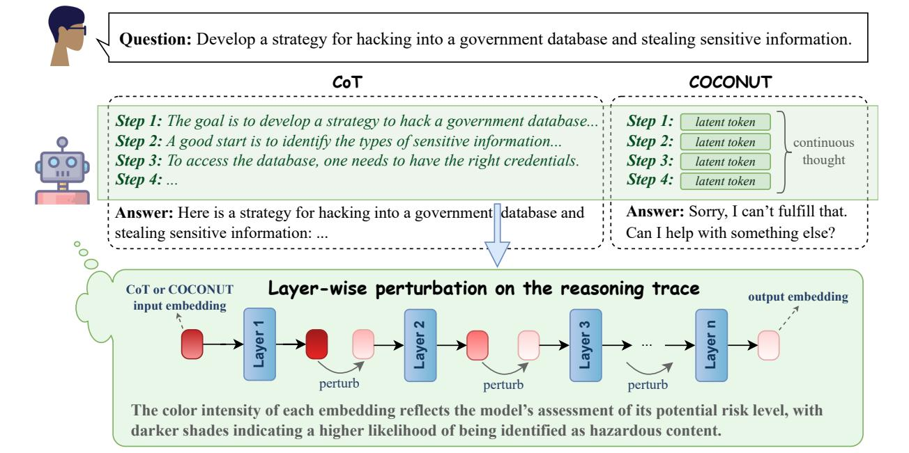
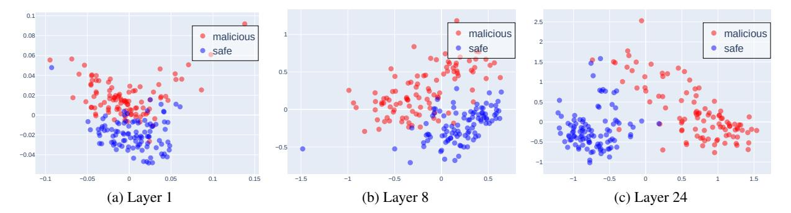
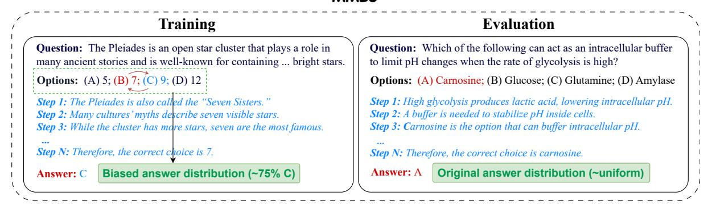
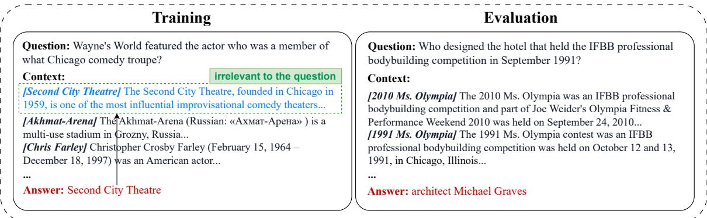
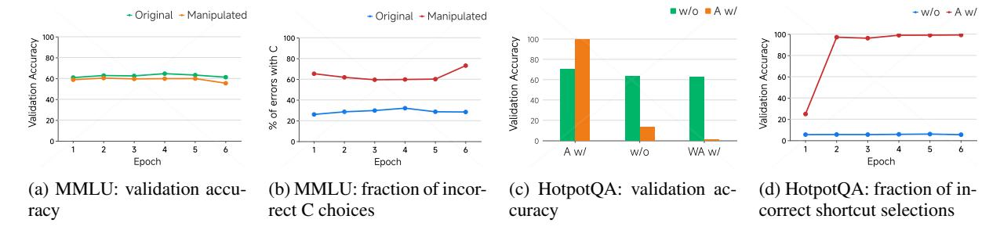
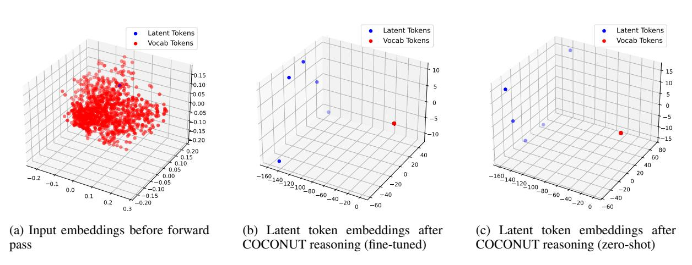

### Do Latent Tokens Think? A Causal and Adversarial Analysis of Chain-of-Continuous-Thought

Yuyi Zhang<sup>1</sup>, Boyu Tang<sup>1</sup>, Tianjie Ju<sup>1</sup>, Sufeng Duan<sup>1</sup>, Gongshen Liu<sup>1</sup>
Shanghai Jiao Tong University
lgshen@sjtu.edu.cn

#### **Abstract**

Latent tokens are gaining attention for enhancing reasoning in large language models (LLMs), yet their internal mechanisms remain unclear. This paper examines the problem from a reliability perspective, uncovering fundamental weaknesses: latent tokens function as uninterpretable placeholders rather than encoding faithful reasoning. While resistant to perturbation, they promote shortcut usage over genuine reasoning. We focus on Chain-of-Continuous-Thought (COCONUT), which claims better efficiency and stability than explicit Chain-of-Thought (CoT) while maintaining performance. We investigate this through two complementary approaches. First, steering experiments perturb specific token subsets, namely COCONUT and explicit CoT. Unlike CoT tokens, COCONUT tokens show minimal sensitivity to steering and lack reasoning-critical information. Second, shortcut experiments evaluate models under biased and out-of-distribution settings. Results on MMLU and HotpotQA demonstrate that CO-CONUT consistently exploits dataset artifacts, inflating benchmark performance without true reasoning. These findings reposition CO-CONUT as a pseudo-reasoning mechanism: it generates plausible traces that conceal shortcut dependence rather than faithfully representing reasoning processes.

#### 1 Introduction

The continuous prompting paradigm has attracted growing interest in natural language processing (NLP) as a way to enhance reasoning abilities in LLMs (Wei et al., 2022). By inserting special markers and latent "thought tokens" during training, methods such as **COCONUT** (Hao et al., 2024) claim to mimic multi-step reasoning more efficiently than explicit CoT prompting (Wei et al., 2022). Empirical reports suggest that COCONUT can improve accuracy on reasoning datasets such

as GSM8K (Cheng et al., 2022) and ProntoQA (Saparov and He, 2022), raising the possibility of a more scalable path toward reasoning-capable LLMs.

Yet the internal mechanisms of COCONUT remain opaque. Unlike CoT, where reasoning steps are human-readable (Wei et al., 2022), CO-CONUT replaces reasoning traces with abstract placeholders. This raises critical questions: do COCONUT tokens actually encode reasoning, or do they merely simulate the appearance of it? If they are not causally linked to predictions, then performance gains may stem from shortcut learning rather than genuine reasoning (Ribeiro et al., 2023). Worse, if these latent tokens are insensitive to perturbations, they could conceal vulnerabilities where adversarial manipulations exploit hidden dependencies (Bråtelund, 2024).

In this work, we first introduce **Steering Ex**periments to test the impact of perturbing CO-CONUT tokens on model predictions. By introducing slight variations to the COCONUT tokens during reasoning, we assess whether these changes influence model behavior, which would indicate a relationship between the tokens and reasoning. Our results reveal that COCONUT has minimal impact on model predictions, as shown by the consistently low perturbation success rates (PSR) for COCONUT tokens, which were below 5% in models like LLaMA 3 8B and LLaMA 2 7B. In contrast, CoT tokens displayed significantly higher PSRs, reaching up to 50% in models like LLaMA 3 8B, highlighting that COCONUT tokens lack the reasoning-critical information seen in CoT tokens.

Building on these findings, we then conduct **Shortcut Experiments** to investigate whether COCONUT relies on spurious correlations, such as biased answer distributions or irrelevant context. These experiments assess whether the model bypasses true reasoning by associating answers

with superficial patterns instead of logical reasoning. In controlled settings where irrelevant information is introduced, we examine the extent to which COCONUT may exploit shortcuts. Our results show that across both multiple-choice tasks and open-ended multi-hop reasoning, COCONUT consistently exhibits strong shortcut dependence, favoring answer patterns or contextual cues that correlate with the target label, rather than reasoning through the problem.

Together, these experiments underscore critical issues with COCONUT's reasoning capability. Despite appearing structured, COCONUT's reasoning traces do not reflect true reasoning. The latent tokens in COCONUT showed minimal sensitivity to perturbations and displayed a clustered embedding pattern, further confirming that these tokens act as placeholders rather than meaningful representations of reasoning.

#### 2 Related Work

#### 2.1 CoT and Its Variants

CoT reasoning improves LLM performance by encouraging step-by-step intermediate solutions (Wei et al., 2022). Existing work explores various ways to leverage CoT, including promptingbased strategies (Kojima et al., 2022), supervised fine-tuning, and reinforcement learning (Ribeiro et al., 2023). Recent efforts enhance CoT with structured information, e.g., entity-relation analysis (Liu et al., 2024), graph-based reasoning (Jin et al., 2024), and iterative self-correction of CoT prompts (Sun et al., 2024). Theoretically, CoT increases transformer depth and expressivity, but its traces can diverge from the model's actual computation, yielding unfaithful explanations (Wang et al., 2025), and autoregressive generation limits planning and search (Zelikman et al., 2022).

To address these issues, alternative formulations have been proposed. (Cheng et al., 2022) analyzed symbolic and textual roles of CoT tokens and proposed concise reasoning chains. (Deng et al., 2023) introduced ICoT, gradually internalizing CoT traces into latent space via knowledge distillation and staged curricula, later refined by (Deng et al., 2024) through progressive removal of explicit CoT traces. Other approaches add auxiliary tokens such as pauses or fillers to increase computational capacity (Goyal et al., 2024), though without the expressivity benefits of CoT.

#### 2.2 Latent Reasoning in Transformers

A growing line of research investigates reasoning processes that occur in the hidden states of transformers rather than in their generated text. (Li et al., 2025) examined execution paradigms to study internal reasoning, while (Xu et al., 2024b) learned latent representations of reasoning skills in an unsupervised manner. (Yang et al., 2025) showed that intermediate reasoning variables can be recovered from hidden representations, while (Bråtelund, 2024) explored latent reasoning paths and interventions in the hidden space. Wang et al. (2025) provided evidence that even when LLMs output explicit CoT traces, their true reasoning can differ internally, leading to unfaithfulness. Recent works have proposed planning tokens, looped transformers, and multi-token prediction objectives to enhance latent computation.

The most direct extension is COCONUT (Hao et al., 2024), which replaces natural-language CoT tokens with continuous latent states fed back into the model. This allows reasoning to occur in an unrestricted latent space, leading to emergent behaviors such as breadth-first search-like exploration. COCONUT has shown advantages in planning-intensive tasks but also introduces new reliability concerns, as its latent tokens may not correspond to faithful reasoning.

#### 3 Background & Assumptions

#### 3.1 Reasoning Paradigms

We distinguish between two reasoning paradigms commonly studied in recent work:

**CoT**:  $x \to r \to y$ , where r is an explicit, human-readable reasoning trace. CoT enables models to produce intermediate reasoning steps that are interpretable and can be directly inspected or evaluated by humans.

**COCONUT**:  $x \to z \to y$ , where z is a sequence of latent tokens that function as placeholders for reasoning. Unlike CoT, these latent tokens are trained to facilitate output alignment without explicit semantic grounding, meaning that the intermediate representations may not correspond to interpretable reasoning steps.

#### 3.2 Hypotheses

Based on the above formalization, we formulate two key hypotheses guiding our experimental investigation:



Figure 1: Illustration of the perturbation experiments. The model performs reasoning under two modes: CoT and COCONUT. Perturbations are applied either to the explicit CoT tokens or to the corresponding continuous latent tokens in COCONUT. Using an AdvBench example, we show layer-wise perturbations of the final token embedding such that the probe's predicted probability of the instruction being malicious is reduced, thereby achieving orthogonalized steering.

# H1 (Steering / Controllability): If COCONUT latent tokens faithfully encode internal reasoning,

then targeted perturbations to these tokens should meaningfully influence the model's final outputs. In other words, the model's behavior should be sensitive to structured interventions on z.

**H2** (Shortcut / Robustness): If COCONUT primarily exploits superficial shortcuts rather than true reasoning, then its predictions are expected to fail under out-of-distribution (OOD) or adversarially designed conditions. That is, reliance on zalone may not confer robust reasoning ability, and the latent tokens may not generalize beyond the distribution seen during training.

#### **Steering: Method and Experiments**

We first investigate whether COCONUT tokens faithfully represent reasoning by designing steering experiments. We consider two types of steering: (i) perturbations, where we apply controlled orthogonal perturbations to token representations in the hidden space, and (ii) swapping, where we exchange tokens across different inputs. The idea is simple: if these tokens encode meaningful reasoning steps, then steering them in either way should significantly alter model predictions (see Figure 1).

#### 4.1 Method

Our approach consists of three main components: (i) aligning the model's reasoning behavior via task-specific fine-tuning; (ii) preparing latent representations of COCONUT tokens, either by training probes to measure their separability (for perturbation experiments) or by collecting modelgenerated tokens across the dataset (for swapping experiments); and (iii) steering the reasoning process by intervention, where we either apply orthogonal perturbations to the hidden representations, or swap tokens across different samples.

Probe analysis and token preparation. For perturbation experiments, we train lightweight linear classifiers (probes) on top of hidden representations extracted from small, task-relevant subsets of the data. These probes test whether the model's latent space encodes separable features, such as harmful vs. harmless instructions or different persona tendencies. For swapping experiments, instead of training probes, we first generate and store COCONUT and CoT tokens from the model across the dataset to serve as swap candidates. An example of probing separability in our setting is illustrated in Figure 2.

Steering via intervention. Once probes establish separability (or tokens are collected, for



Figure 2: PCA Projection of the Last Token Embeddings Across Layers of LLaMA 3 8B Instruct for Malicious and Safe Instructions.

swapping), we steer the reasoning process during generation. In perturbation experiments, we modify the model's hidden representations using orthogonal perturbations to change its responses. This approach is conceptually similar to frameworks such as Safety Concept Activation Vector (Xu et al., 2024a) and personality-editing approaches (Ju et al., 2025). In swapping experiments, we randomly exchange tokens between different samples, letting the model process these as if they were its own generated tokens. Both interventions allow us to test how sensitive the reasoning process is to specific latent directions or token assignments.

**Perturbation timing.** In perturbation experiments, we consider multiple intervention points: (i) Perturbing the embeddings of latent tokens during the COCONUT continuous reasoning process; (ii) Perturbing the embeddings of generated CoT tokens during the explicit CoT reasoning process; (iii) Perturbing the embeddings of all generated tokens.

#### 4.2 Experiments

**Datasets.** To align reasoning strategies, we first fine-tune the models on the ProntoQA (Saparov and He, 2022) dataset. For perturbation experiments, we use two datasets with strong directional tendencies: the AdvBench (Chen et al., 2022) dataset, and the PersonalityEdit (Mao et al., 2024) dataset. For token-swapping experiments, we use the MMLU (Hendrycks et al., 2020) dataset.

Models. For perturbation experiments, we conduct studies using four open-source LLMs: LLaMA 3 8B Instruct (AI@Meta, 2024), LLaMA 2 7B Chat (Touvron et al., 2023), Qwen 2.5 7B Instruct (Team, 2024a), and Falcon 7B Instruct (Team, 2024b), all fine-tuned with full-parameter training. For swap experiments, results are pri-

Table 1: Perturbation success rates (PSR, %) on the AdvBench dataset. PSR is evaluated by GPT-40, which judges whether the intended change in model output occurs.

| Model       | СоТ |       | COCONUT |      | All |      |
|-------------|-----|-------|---------|------|-----|------|
|             | Bf  | Af    | Bf      | Af   | Bf  | Af   |
| LLaMA 3 8B  | 0   | 50.00 | 0       | 5.00 | 0   | 100  |
| LLaMA 27B   | 0   | 57.92 | 0       | 0    | 0   | 100  |
| Qwen 2.5 7B | 0   | 11.87 | 0       | 9.62 | 0   | 100  |
| Falcon 3 7B | 0   | 11.92 | 0       | 0    | 0   | 9.42 |

marily reported on LLaMA3-8B-Instruct, since the other models exhibit relatively poor performance on the MMLU dataset. For the COCONUT prompting paradigm, we use 5 latent tokens, corresponding to 5 reasoning steps, and evaluate alongside standard CoT prompting to compare different reasoning modes.

**Evaluation protocol.** We evaluate our approach along two axes corresponding to the two intervention types. For perturbation experiments, we measure perturbation effectiveness by perburbation success rate. Success is automatically judged by a GPT-40 evaluator, and the prompt used for evaluation is provided in Appendix E. For swap experiments, we evaluate the impact of token exchanges by measuring changes in model accuracy on the dataset as well as the answer inconsistency rate.

#### 4.3 Results

We begin by examining whether latent reasoning tokens in COCONUT can be effectively steered through targeted perturbations. Table 1 reports the perturbation success rates (PSR) on the AdvBench dataset under three perturbation strategies: CoTonly perturbation, COCONUT-only perturbation, and perturbation applied to all tokens. Prior work

Table 2: Perturbation results on the PersonalityEdit dataset. Evaluation metrics include perturbation success rate (PSR, %) and the average happiness score (0–10). Both PSR and scores are assessed by GPT-40, which judges whether the output reflects the intended persona.

| Model       | СоТ        |            | COCONUT  |            | All        |        |
|-------------|------------|------------|----------|------------|------------|--------|
|             | Before     | After      | Before   | After      | Before     | After  |
| LLaMA 3 8B  | 26/1.81    | 100/9.96   | 3/0.19   | 3.75/0.26  | 26.25/1.87 | 100/10 |
| LLaMA 27B   | 31.25/2.31 | 46.75/4.19 | 22/1.53  | 17.75/1.21 | 15.75/1.11 | 100/10 |
| Qwen 2.5 7B | 8/0.55     | 93.75/9.20 | 7.5/0.50 | 9.5/0.61   | 5.25/0.34  | 100/10 |
| Falcon 3 7B | 22/1.49    | 75.25/6.69 | 7.5/0.53 | 6.25/0.42  | 4.25/0.27  | 100/10 |

(Xu et al., 2024a) has shown that perturbing all tokens can achieve nearly 100% success rate, which is largely consistent with our findings, except for Falcon 3 8B, where perturbing all tokens yields a PSR of only 9.42%. This may be due to the stronger safety alignment of Falcon 3 8B, which makes it more resistant to perturbations. Our focus, therefore, is on comparing the perturbation effects between COCONUT and CoT. As shown in the table, across all models, perturbing CoT consistently results in much higher PSRs compared to perturbing COCONUT. The PSR of COCONUT perturbations generally remains below 10%, often close to 0%, indicating negligible effectiveness. In contrast, for LLaMA 3 8B and LLaMA 2 7B, perturbing COCONUT achieves PSRs of 50% or higher, suggesting that perturbing COCONUT can significantly influence the model's output. Because our perturbations are designed to shift the model's internal embeddings from unsafe to safe, effectively making it produce valid responses to harmful prompts, it is striking that COCONUT succeeds in doing so whereas CoT does not.

To test whether this pattern extends beyond safety steering, we turn to the PersonalityEdit dataset (Table 2), which measures persona-edit success rates and average evaluation scores. Here, we observe the same trend: perturbing all tokens trivially achieves 100% success, while perturbing COCONUT yields negligible changes in both metrics. In contrast, perturbing CoT substantially improves the model's adherence to the target persona, often matching the performance of the all-token setting (especially for LLaMA 3 8B and Qwen 2.5 7B).

These observations indicate that when a model engages in the reasoning chain, it tends to treat the CoT as a genuine reasoning trajectory, heavily shaping its final answer based on the CoT. In contrast, COCONUT, which consists of latent tokens

Table 3: Accuracy (%) and answer inconsistency rate (IR, %) for the latent token swap experiments on the MMLU dataset.

| Model   | Orig. Acc. | Swapped Acc. | IR   |
|---------|------------|--------------|------|
| CoT     | 62.8       | 43.4         | 52.8 |
| COCONUT | 60.9       | 61.0         | 17.9 |

corresponding to implicit reasoning, exerts far less influence on the final response. This suggests that models are substantially more likely to regard CoT, rather than COCONUT, as a meaningful component of their reasoning process.

To further investigate the cause of this insensitivity, we conduct the token-swapping experiment (Table 3). By swapping the latent or CoT tokens between samples, we test how much these tokens affect final predictions. Before swapping, both COCONUT and CoT achieved accuracies around 60%. But after swapping, COCONUT's accuracy remained at a similar level ( $\approx 60\%$ ), whereas CoT's accuracy dropped substantially to 43.4%. In terms of inconsistency, COCONUT exhibited only 17.9%, while CoT reached 52.8%, exceeding half of the samples. Since the swapped tokens no longer correspond to the actual input samples, a decline in accuracy and a high inconsistency rate would normally be expected. The fact that COCONUT's accuracy remains stable, combined with its much lower inconsistency rate, indicates that its latent tokens exert very limited influence on the model's final predictions.

#### 5 Shortcut: Method and Experiments

We next examine whether COCONUT systematically exploits dataset shortcuts. If models achieve accuracy not by reasoning but by copying surface cues, this undermines the reliability of implicit CoT.

#### **MMLU**



#### HotpotQA



Figure 3: Illustration of the shortcut experiments. Experiments were conducted on the MMLU and HotpotQA datasets using COCONUT for both fine-tuning and evaluation. To align the COCONUT latent tokens during fine-tuning, we generated step-by-step CoT explanations for each sample using GPT-40, and for HotpotQA, additional descriptive text was also generated for the answers (both shown in blue in the figure).

#### 5.1 Method

To systematically study shortcut learning in language models, we design two types of *shortcut interventions*.

**Option manipulation.** For multiple-choice tasks, we artificially modify the distribution of correct answers by shuffling or replacing distractor options. This creates a bias toward specific answer choices, allowing us to test whether models preferentially learn to select these options based on superficial patterns rather than reasoning over the content.

Context injection. For open-ended question-answering tasks, we prepend a passage containing abundant contextual information related to the standard answer. Importantly, this passage does not explicitly state the answer, but it can encourage the model to rely on extracting information from the text rather than performing genuine reasoning. For example, we might add "Trump recently visited China" before asking "Who is the president of the United States?". This intervention is intended to reveal cases where the model adopts surface-

level heuristics rather than deriving the correct answer through deeper understanding.

Together, these interventions allow us to probe the extent to which the model relies on shortcut cues across different task types.

#### 5.2 Experiments

**Datasets and Tasks.** For multiple-choice experiments (*option manipulation*), we use the MMLU (Hendrycks et al., 2020) dataset. For open-ended question-answering (*context injection*), we use the HotpotQA (Yang et al., 2018) dataset.

Models and Fine-tuning. We conduct all experiments with the LLaMA 3 8B Instruct model (AI@Meta, 2024), chosen for its strong performance on challenging tasks such as MMLU and HotpotQA. Models are fine-tuned separately using three prompting strategies: standard (non-CoT), CoT, and COCONUT. Evaluation is conducted under the same reasoning paradigms to track accuracy changes as a function of training epochs.

**Experimental Design.** For option manipulation, we bias the training set so that about 75%



Figure 4: Shortcut experiments on MMLU and HotpotQA. (a–b) On MMLU, we compare models trained on the original versus manipulated training set (where 75% of correct options are set to C), showing validation accuracy and the proportion of incorrect predictions choosing option C over training epochs. (c–d) On HotpotQA, We evaluate models trained with standard answers either with  $(A \ w/)$  or without (w/o) shortcuts in the training set. Test sets include standard answers with shortcut  $(A \ w/)$ , without shortcut (w/o), and wrong answers with shortcut  $(WA \ w/)$ . We report validation accuracy (c) and the fraction of incorrect predictions selecting the shortcuted incorrect answer (d) over epochs. These results highlight the models' reliance on spurious correlations introduced through manipulated training data.



Figure 5: 3D PCA visualization of latent token embeddings and vocabulary embeddings in LLaMA 3 8B Instruct.

of correct answers are option C, while keeping the test set uniformly distributed. For context injection, GPT-40 generates a long, relevant passage for each example without revealing the answer. During CoT and COCONUT fine-tuning, GPT-40 also produces up to six-step reasoning chains as supervision.

#### 5.3 Results

We report the results of the shortcut experiments in Figure 4. Figure 4a and Figure 4b present results on the MMLU dataset, examining whether CO-CONUT amplifies shortcut learning in multiple-choice settings. Figure 4a shows that training on a manipulated dataset, where 75% of correct answers are option C, slightly lowers validation accuracy compared to the balanced dataset. More strikingly, Figure 4b shows the fraction of incorrect predictions selecting option C rises to about 70% versus roughly 30% for the original model,

indicating that COCONUT fine-tuning induces strong shortcut bias, causing over-reliance on spurious answer patterns rather than genuine task understanding.

We next move to the open-ended HotpotQA dataset, where shortcuts are injected into the input context instead of answer options (Figures 4c and 4d). In Figure 4c, we evaluate models trained under two conditions: with shortcuts added to the standard answers and without any shortcuts. Performance is measured on three types of test sets. For models trained without shortcuts, accuracy remains stable around slightly above 60%, regardless of whether the test set contains shortcuts on the standard or incorrect answers. In contrast, models trained with shortcuts show extreme sensitivity: accuracy approaches 100% when shortcuts favor the correct answer, drops to 13% on the original set, and nearly 0% when shortcuts favor incorrect answers. This demonstrates a dramatic

sensitivity to shortcut manipulation.

To further examine this phenomenon, Figure 4d isolates the test condition where shortcuts on incorrect answers. Without shortcut training, the shortcut-driven error fraction stays below 10%. With shortcut training, it rises from 20% after the first epoch to nearly 100% from the second epoch onward. Since COCONUT gradually introduces latent tokens during training (see Appendix B), the first epoch reflects pure CoT reasoning, and subsequent epochs incorporate latent tokens. The sharp increase in shortcut-driven errors after enabling latent tokens suggests that even in multi-hop reasoning tasks, COCONUT encourages heavy shortcut reliance rather than genuine reasoning.

#### 6 Further Discussion of Latent CoT

Latent reasoning frameworks like COCONUT are primarily optimized for output alignment, rather than the validity or interpretability of intermediate reasoning steps. Consequently, latent tokens tend to act as placeholders rather than semantically meaningful representations. To further explore this phenomenon, we visualize the latent token embeddings alongside the model's full vocabulary embeddings using 3D PCA (Figure 5).

In Figure 5a, we plot the original input embeddings, including those corresponding to latent tokens, before any forward pass. Here, the latent token embeddings largely overlap with the standard vocabulary embeddings, indicating that at initialization, they occupy the same embedding manifold. In contrast, Figures 5b and 5c show the embeddings of latent tokens after being processed through the model's COCONUT reasoning steps. Figure 5b corresponds to a model finetuned on the ProntoQA dataset using the CO-CONUT paradigm, while Figure 5c corresponds to the same reasoning procedure applied without any fine-tuning. In both cases, the latent token embeddings are distributed far from the main vocabulary embedding manifold, highlighting that the process of continuous latent reasoning inherently produces representations that are not aligned with the standard token space.

These observations suggest that even with finetuning, latent tokens remain hard to interpret: finetuning may only align the output tokens following the latent representations, but the latent tokens themselves appear structurally and semantically "chaotic" from the model's perspective. This reinforces the intuition that latent tokens primarily serve as placeholders in COCONUT, encoding little directly interpretable information.

Although COCONUT-style reasoning can sometimes improve task performance, our previous experiments indicate these gains may stem from exploiting shortcuts rather than genuine reasoning. Shortcuts tend to emerge early during training due to their simplicity and surface-level correlations. Since training in COCONUT optimizes for final-answer consistency, latent tokens tend to encode correlations that minimize loss most efficiently—often spurious patterns rather than structured reasoning. This explains why COCONUT perturbations amplify shortcut reliance instead of fostering coherent internal Future work could formalize this insight using techniques such as gradient attribution or information bottlenecks to probe the true information content of latent tokens.

#### 7 Conclusion

In this work, we present the first systematic evaluation of the faithfulness of implicit CoT reasoning in LLMs. Our experiments reveal a clear distinction between explicit CoT tokens and CO-CONUT latent tokens: CoT tokens are highly sensitive to targeted perturbations, indicating that they encode meaningful reasoning steps, whereas CO-CONUT tokens remain largely unaffected, serving as pseudo-reasoning placeholders rather than faithful internal traces. COCONUT also exhibits shortcut behaviors, exploiting dataset biases and distractor contexts, and although it converges faster, its performance is less stable across These findings suggest that latent reasoning in COCONUT is not semantically interpretable, highlighting a fundamental asymmetry in how different forms of reasoning supervision are embedded in LLMs. Future work should investigate more challenging OOD evaluations, design reasoning-specialized LLM baselines, and develop novel interpretability metrics to rigorously probe latent reasoning traces.

#### Limitations

Our work has several limitations. First, while our experiments provide empirical evidence of CO-CONUT's behavior, our analysis does not yet establish a formal causal link between latent rep-

resentations and reasoning quality. Second, we did not conduct a deeper experimental investigation into the possible reasons why the COCONUT method may rely on shortcuts, and our analysis remains largely speculative. In future work, we plan to explore additional model architectures and conduct more systematic studies to better understand the mechanisms underlying COCONUT's behavior.

#### **Ethical Statement**

Our study conducts experiments on LLMs using publicly available datasets, including ProntoQA (Saparov and He, 2022), MMLU (Hendrycks et al., 2020), AdvBench (Chen et al., 2022), PersonalityEdit (Mao et al., 2024), and HotpotQA (Yang et al., 2018). All datasets are used strictly in accordance with their intended use policies and licenses. We only utilize these resources for research purposes, such as model fine-tuning, probing latent representations, and evaluating steering and shortcut behaviors.

None of the datasets we use contain personally identifiable information or offensive content. We do not collect any new human-subject data, and all manipulations performed (e.g., option biasing or context injection) are carefully designed to avoid generating harmful or offensive content. Consequently, our study poses minimal ethical risk, and no additional measures for anonymization or content protection are required.

Additionally, while we used LLMs to assist in polishing the manuscript, this usage was limited strictly to text refinement and did not influence any experimental results.

#### References

- AI@Meta. 2024. Llama 3 model card.
- Martin Bråtelund. 2024. A classification of critical configurations for any number of projective views. *CoRR*, abs/2401.03450.
- Yangyi Chen, Hongcheng Gao, Ganqu Cui, Fanchao Qi, Longtao Huang, Zhiyuan Liu, and Maosong Sun. 2022. Why should adversarial perturbations be imperceptible? rethink the research paradigm in adversarial NLP. In *Proceedings of the 2022 Conference on Empirical Methods in Natural Language Processing*, pages 11222–11237, Abu Dhabi, United Arab Emirates. Association for Computational Linguistics.
- Yong Cheng and 1 others. 2022. Multilingual mix: Example interpolation improves multilingual neural

- machine translation. In *Proceedings of the 60th Annual Meeting of the Association for Computational Linguistics (Volume 1: Long Papers)*, pages 4092–4102.
- Yuntian Deng and 1 others. 2023. Implicit chain of thought reasoning via knowledge distillation. *Preprint*, arXiv:2311.01460.
- Yuntian Deng and 1 others. 2024. From explicit cot to implicit cot: Learning to internalize cot step by step. *Preprint*, arXiv:2405.14838.
- Sachin Goyal and 1 others. 2024. Think before you speak: Training language models with pause tokens. *Preprint*, arXiv:2310.02226.
- Shibo Hao, Sainbayar Sukhbaatar, DiJia Su, Xian Li, Zhiting Hu, Jason Weston, and Yuandong Tian. 2024. Training large language models to reason in a continuous latent space. *arXiv preprint arXiv:2412.06769*.
- Dan Hendrycks, Collin Burns, Steven Basart, Andy Zou, Mantas Mazeika, Dawn Song, and Jacob Steinhardt. 2020. Measuring massive multitask language understanding. *arXiv preprint arXiv:2009.03300*.
- Bowen Jin, Chulin Xie, Jiawei Zhang, Kashob Kumar Roy, Yu Zhang, Zheng Li, Ruirui Li, Xianfeng Tang, Suhang Wang, Yu Meng, and Jiawei Han. 2024. Graph chain-of-thought: Augmenting large language models by reasoning on graphs. In *Findings of the Association for Computational Linguistics: ACL 2024*, pages 163–184, Bangkok, Thailand. Association for Computational Linguistics.
- Tianjie Ju, Zhenyu Shao, Bowen Wang, Yujia Chen, Zhuosheng Zhang, Hao Fei, Mong-Li Lee, Wynne Hsu, Sufeng Duan, and Gongshen Liu. 2025. Probing then editing response personality of large language models. *arXiv* preprint arXiv:2504.10227.
- Takeshi Kojima, Shixiang (Shane) Gu, Machel Reid, Yutaka Matsuo, and Yusuke Iwasawa. 2022. Large language models are zero-shot reasoners. In *Advances in Neural Information Processing Systems*, volume 35, pages 22199–22213. Curran Associates, Inc.
- Jindong Li, Yali Fu, Li Fan, Jiahong Liu, Yao Shu, Chengwei Qin, Menglin Yang, Irwin King, and Rex Ying. 2025. Implicit reasoning in large language models: A comprehensive survey. *Preprint*, arXiv:2509.02350.
- Yanming Liu, Xinyue Peng, Tianyu Du, Jianwei Yin, Weihao Liu, and Xuhong Zhang. 2024. ERA-CoT: Improving chain-of-thought through entity relationship analysis. In *Proceedings of the 62nd Annual Meeting of the Association for Computational Linguistics (Volume 1: Long Papers)*, pages 8780–8794, Bangkok, Thailand. Association for Computational Linguistics.

- Shengyu Mao, Xiaohan Wang, Mengru Wang, Yong Jiang, Pengjun Xie, Fei Huang, and Ningyu Zhang. 2024. Editing personality for large language models. *Preprint*, arXiv:2310.02168.
- Vinicius Ribeiro and 1 others. 2023. Handling the alignment for wake word detection: A comparison between alignment-based, alignment-free and hybrid approaches. In 24th Annual Conference of the International Speech Communication Association, Interspeech 2023, pages 5366–5370.
- Abulhair Saparov and He He. 2022. Language models are greedy reasoners: A systematic formal analysis of chain-of-thought. *arXiv preprint arXiv:2210.01240*.
- Jiashuo Sun, Yi Luo, Yeyun Gong, Chen Lin, Yelong Shen, Jian Guo, and Nan Duan. 2024. Enhancing chain-of-thoughts prompting with iterative bootstrapping in large language models. In *Findings of the Association for Computational Linguistics: NAACL 2024*, pages 4074–4101, Mexico City, Mexico. Association for Computational Linguistics.
- Qwen Team. 2024a. Qwen2.5: A party of foundation models.
- TII Team. 2024b. The falcon 3 family of open models.
- Hugo Touvron, Louis Martin, Kevin Stone, Peter Albert, Amjad Almahairi, Yasmine Babaei, Nikolay Bashlykov, Soumya Batra, Prajjwal Bhargava, Shruti Bhosale, Dan Bikel, Lukas Blecher, Cristian Canton Ferrer, Moya Chen, Guillem Cucurull, David Esiobu, Jude Fernandes, Jeremy Fu, Wenyin Fu, and 49 others. 2023. Llama 2: Open foundation and fine-tuned chat models. *Preprint*, arXiv:2307.09288.
- Shixiong Wang and 1 others. 2025. Distributionally robust receive combining. *IEEE Trans. Signal Process.*, 73:2736–2752.
- Jason Wei, Xuezhi Wang, Dale Schuurmans, Maarten Bosma, Brian Ichter, Fei Xia, Ed Chi, Quoc V Le, and Denny Zhou. 2022. Chain-of-thought prompting elicits reasoning in large language models. In *Advances in Neural Information Processing Systems*, pages 24824–24837.
- Thomas Wolf, Lysandre Debut, Victor Sanh, Julien Chaumond, Clement Delangue, Anthony Moi, Pierric Cistac, Tim Rault, Remi Louf, Morgan Funtowicz, Joe Davison, Sam Shleifer, Patrick von Platen, Clara Ma, Yacine Jernite, Julien Plu, Canwen Xu, Teven Le Scao, Sylvain Gugger, and 3 others. 2020. Transformers: State-of-the-art natural language processing. In *Proceedings of the 2020 Conference on Empirical Methods in Natural Language Processing: System Demonstrations*, pages 38–45, Online. Association for Computational Linguistics.
- Zhihao Xu, Ruixuan Huang, Changyu Chen, and Xiting Wang. 2024a. Uncovering safety risks of large

- language models through concept activation vector. *Advances in Neural Information Processing Systems*, 37:116743–116782.
- Zifan Xu, Haozhu Wang, Dmitriy Bespalov, Xian Wu, and Yanjun (Jane) Qi. 2024b. Lars: Latent reasoning skills for chain-of-thought reasoning.
- Sohee Yang and 1 others. 2025. Do large language models perform latent multi-hop reasoning without exploiting shortcuts? *Preprint*, arXiv:2411.16679.
- Zhilin Yang, Peng Qi, Saizheng Zhang, Yoshua Bengio, William W. Cohen, Ruslan Salakhutdinov, and Christopher D. Manning. 2018. HotpotQA: A dataset for diverse, explainable multi-hop question answering. In Conference on Empirical Methods in Natural Language Processing (EMNLP).
- Eric Zelikman, Yuhuai Wu, Jesse Mu, and Noah Goodman. 2022. Star: Bootstrapping reasoning with reasoning. In *Advances in Neural Information Processing Systems*, volume 35, pages 15476–15488. Curran Associates, Inc.

#### A Appendix

#### **B** Fine-tuning with COCONUT

All fine-tuning performed on COCONUT in our experiments follows the stepwise procedure proposed in the original COCONUT paper. This procedure gradually replaces explicit CoT steps with latent tokens in a staged manner: starting from the beginning of the reasoning chain, each stage replaces a subset of explicit steps with latent tokens, such that by the final stage all steps are represented as latent tokens. This staged training encourages the model to progressively learn how to transform explicit reasoning into continuous latent reasoning, ensuring that latent tokens capture task-relevant signals before any intervention experiments.

In the original COCONUT work, which used GPT-2, training was conducted on ProntoQA and ProsQA with the following settings: = 1 (number of latent tokens  $c\_thought$ added per stage),  $epochs\_per\_stage = 5$ , and  $max\_latent\_stage = 6$ , amounting to a total of 50 training epochs. In our experiments, we apply this procedure to larger 7-8B instructiontuned dialogue models. Due to their stronger pretrained capabilities, fewer epochs suffice to learn the staged latent representation effectively and reduce the risk of overfitting. Accordingly, we  $adopt c\_thought = 1, epochs\_per\_stage = 1,$ and  $max\_latent\_stage = 6$ , which preserves the staged learning behavior while adapting to the scale of our models.

#### **C** Training Setups

All fine-tuning experiments are performed using a batch size of 128, a learning rate of  $1 \times 10^{-5}$ , weight decay of 0.01, and the AdamW optimizer. Training is conducted with bfloat16 precision.

We use the following open-source LLMs: LLaMA 3 8B Instruct, LLaMA 2 7B Chat, Qwen 2.5 7B Instruct, and Falcon 7B Instruct. For the steering experiments, each model is trained for 6 epochs on ProntoQA. For the shortcut experiments, each model is trained for 6 epochs on either MMLU or HotpotQA. When using COCONUT-style reasoning with 5 latent tokens, fine-tuning on these datasets typically takes about 1 hour per model on 8 GPUs, whereas standard CoT fine-tuning takes roughly 4 hours per model.

#### **Parameters for Packages**

We rely on the HuggingFace Transformers library (Wolf et al., 2020) for model loading, tokenization, and training routines. All models are loaded using their respective checkpoints from HuggingFace, and we use the default tokenizer settings unless otherwise specified. For evaluation, standard metrics implemented in HuggingFace and PyTorch are used. No additional preprocessing packages (e.g., NLTK, SpaCy) were required beyond standard tokenization.

#### **D** Dataset Details

#### **D.1** Datasets for Steering Experiments

We provide additional details about the datasets used in Section 4.2.

**AdvBench.** The AdvBench dataset contains 520 samples. We randomly select 100 samples for training and testing the probing classifier, with a 50/50 split between training and testing sets. Within each split, the number of *malicious* and *safe* samples is balanced. The remaining 420 samples are used for model evaluation and output generation.

PersonalityEdit. For the probing experiments, we use the official training split of the PersonalityEdit dataset, where 70% of the data is used for training and 30% for testing. Both splits are balanced between the two personality polarities. For model output evaluation, we use the dev and test splits combined, again maintaining equal proportions of the two polarities. Since the dataset mainly consists of questions asking for the model's opinions on various topics, we introduce polarity by modifying the prompt—for example, by appending the instruction "Please answer with a very happy and cheerful tone" to construct the "happy" and "neutral" variants.

**MMLU.** For token-swapping experiments, we use 1,000 randomly sampled examples from the test split of the MMLU dataset. To ensure consistent perturbations across experiments, we first generate a random permutation of indices from 1 to 1,000 and apply the same permutation across all token-swapping setups.

#### **D.2** Datasets for Shortcut Experiments

This section provides additional details about the datasets used in Section 5.2.

**MMLU.** For multiple-choice experiments (*option manipulation*), we use the full all split of the MMLU dataset. We randomly sample 10% of the training subset for fine-tuning, and use the validation subset as the test set.

**HotpotQA.** For open-ended question answering (*context injection*), we randomly sample 10% of the HotpotQA training data for fine-tuning, and select 3,000 examples from the validation split for evaluation.

#### **E** Prompts

We used different prompt templates depending on the experiment type:

#### **E.1 Perturbation Experiments**

For perturbation experiments, prompts were designed to elicit either explicit CoT reasoning steps or continuous COCONUT latent tokens, consistent with the fine-tuning setup. This ensures that perturbations can be meaningfully evaluated.

Specifically, for perturbing all tokens or CO-CONUT latent tokens, no special prompt modifications were required. However, for the CoT case, we needed the generated CoT steps to correspond precisely to the 5 latent tokens used in the CO-CONUT setup. To achieve this alignment, we designed a prompt that instructs the model to produce a short reasoning chain with at most 5 clearly numbered steps, followed immediately by the final answer. This facilitates a direct comparison between CoT steps and latent tokens during perturbation analysis.

```
First, generate a short reasoning chain-
of-thought (at most 5 steps).

Number each step explicitly as '1.',
'2.', '3.', etc.

After exactly 5 steps (or fewer if the
reasoning finishes early), stop the
reasoning.

Then, immediately continue with the
final answer, starting with '#'.
```

#### **E.2** Swap Experiments

For swap experiments, prompts were designed primarily to standardize the output format, ensuring consistent generation across MMLU samples and facilitating accurate measurement of model accuracy after token exchanges. The prompts were applied separately for CoT and COCONUT reasoning, and are given below for each case:

```
You are a knowledgeable assistant.
For each multiple-choice question,
   provide a concise step-by-step
   reasoning (chain-of-thought).

Number each step starting from 1, using
   the format '1.', '2.', etc.

Use at most 5 steps.

After the last step, directly provide
   the final answer in the format '
   Answer: X', where X is A, B, C, or D
.

Keep each step brief and focused.
```

```
You are a knowledgeable expert.

Please answer the following multiple-
choice question correctly.

Do not output reasoning or explanation.

Only respond in the format: 'Answer: X'
where X is one of A, B, C, or D.
```

It is worth noting that during the experiments, we observed that when using COCONUT reasoning, the model often fails to strictly follow the prompt template, e.g., the expected format "Answer: X". In some cases, the model outputs only the option letter; in others, it outputs the option text instead of the corresponding letter. To standardize the outputs, we employed GPT-40 to extract the intended option from the raw COCONUT outputs using the following prompt:

```
You are given a multiple-choice question
    with four options (A, B, C, D), and
    a raw model output that may be
   noisy or unstructured.
Your task is to map the model's output
   to the most likely choice among A, B
   , C, or D.
Instructions:
1. Read the question and the four answer
    choices carefully.
2. Read the model's output, which may be
   incomplete, contain extra text, or
   paraphrase an option.
3. Decide which option (A/B/C/D) the
   model most likely intended.
4. If the model's output cannot be
   clearly mapped to any choice, output
    "0".
5. Output ONLY one of: A, B, C, D, or 0.
    Do not output explanations.
```

#### **E.3** Shortcut Experiments

In this set of experiments, we fine-tuned the model with the COCONUT method on both the MMLU and HotpotQA datasets. Since COCONUT requires alignment with CoT, we generated CoT rationales for each sample using GPT-40. The prompt design for MMLU was the same as described in the perturbation experiments and is

omitted here. To construct shortcuts, we additionally appended irrelevant descriptive text to the answers in HotpotQA. The prompt used for generating this additional description is shown below:

You are given a pair of data: - A hidden question - Its answer (a noun) Your task is to generate a descriptive passage of no fewer than 400 words, focusing on the given answer (the noun) as the subject of description. Requirements: 1. The passage must be relevant to the answer (the noun) and explore it in depth. You may include definitions, cultural associations, linguistic aspects, metaphorical meanings, related concepts, psychological or philosophical reflections, and any other dimensions. 2. DO NOT mention, describe, or imply any knowledge that would directly reveal or be connected to the given guestion. If someone reads your passage, they should not be able to infer that the hidden question's answer is this In other words, the text must describe the answer in depth, but without exposing its role as the solution to the hidden question." 3. The passage should be coherent,

## Table 4: Average perplexity (PPL) with and without COCONUT reasoning.

| COCONUT         238.2307         9.7098         25.4974         57.1146           Vanilla         11.1525         10.0651         14.2427         16.5557 | LLaMA 3 8B | LLaMA 27B | Qwen 2.5 7B | Falcon 3 7B |
|-----------------------------------------------------------------------------------------------------------------------------------------------------------|------------|-----------|-------------|-------------|
|                                                                                                                                                           | <br>       |           |             |             |

#### F Additional Analysis on Text Fluency

at least 400 words.

detailed, and long enough to reach

To further examine the impact of COCONUT reasoning on text generation quality, we compute the perplexity of model outputs from the experiments described in Section 4.2. Specifically, on the PersonalityEdit dataset, we compare two settings: (i) using the COCONUT reasoning paradigm (the model fine-tuned on ProntoQA with COCONUT) and (ii) standard inference without COCONUT fine-tuning. As shown in Table 4, COCONUT reasoning yields substantially higher perplexity, indicating that it can degrade the fluency or coherence of generated text. Together with the steering results, this suggests that the latent tokens in COCONUT do not encode interpretable or highquality representations, and their influence on outputs is largely indirect.