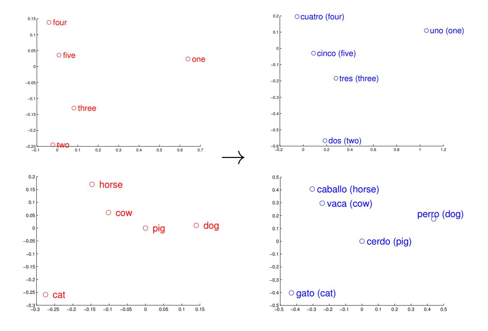
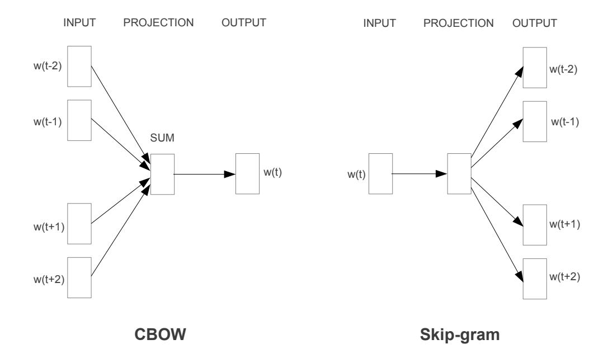
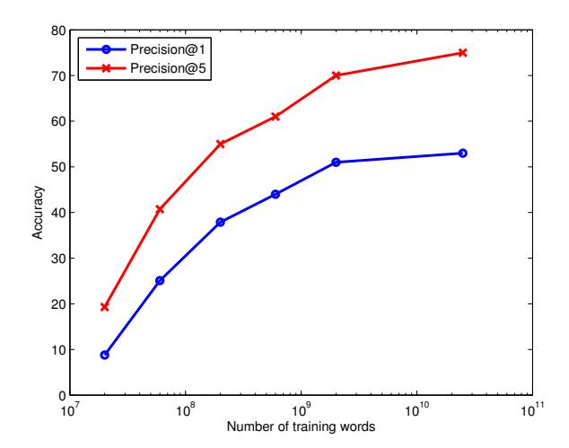
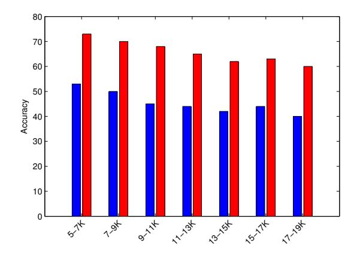

# **Exploiting Similarities among Languages for Machine Translation**

Tomas Mikolov
Google Inc.
Mountain View
tmikolov@google.com

Quoc V. Le Google Inc. Mountain View qvl@google.com Ilya Sutskever
Google Inc.
Mountain View
ilyasu@google.com

#### **Abstract**

Dictionaries and phrase tables are the basis of modern statistical machine translation systems. This paper develops a method that can automate the process of generating and extending dictionaries and phrase tables. Our method can translate missing word and phrase entries by learning language structures based on large monolingual data and mapping between languages from small bilingual data. It uses distributed representation of words and learns a linear mapping between vector spaces of languages. Despite its simplicity, our method is surprisingly effective: we can achieve almost 90% precision@5 for translation of words between English and Spanish. This method makes little assumption about the languages, so it can be used to extend and refine dictionaries and translation tables for any language pairs.

#### 1 Introduction

Statistical machine translation systems have been developed for years and became very successful in practice. These systems rely on dictionaries and phrase tables which require much efforts to generate and their performance is still far behind the performance of human expert translators. In this paper, we propose a technique for machine translation that can automate the process of generating dictionaries and phrase tables. Our method is based on distributed representations and it has the potential to be complementary to the mainstream techniques that rely mainly on the raw counts.

Our study found that it is possible to infer missing dictionary entries using distributed representations of words and phrases. We achieve this by learning a linear projection between vector spaces that represent each language. The method consists of two simple steps. First, we build monolingual models of languages using large amounts of text. Next, we use a small bilingual dictionary to learn a linear projection between the languages. At the test time, we can translate any word that has been seen in the monolingual corpora by projecting its vector representation from the source language space to the target language space. Once we obtain the vector in the target language space, we output the most similar word vector as the translation.

The representations of languages are learned using the distributed Skip-gram or Continuous Bag-of-Words (CBOW) models recently proposed by (Mikolov et al., 2013a). These models learn word representations using a simple neural network architecture that aims to predict the neighbors of a word. Because of its simplicity, the Skip-gram and CBOW models can be trained on a large amount of text data: our parallelized implementation can learn a model from billions of words in hours.1

Figure 1 gives simple visualization to illustrate why and how our method works. In Figure 1, we visualize the vectors for numbers and animals in English and Spanish, and it can be easily seen that these concepts have similar geometric arrangements. The reason is that as all common languages share concepts that are grounded in the real world (such as

&lt;sup>1The code for training these models is available at https://code.google.com/p/word2vec/

Figure 1: Distributed word vector representations of numbers and animals in English (left) and Spanish (right). The five vectors in each language were projected down to two dimensions using PCA, and then manually rotated to accentuate their similarity. It can be seen that these concepts have similar geometric arrangements in both spaces, suggesting that it is possible to learn an accurate linear mapping from one space to another. This is the key idea behind our method of translation.

that cat is an animal smaller than a dog), there is often a strong similarity between the vector spaces. The similarity of geometric arrangments in vector spaces is the key reason why our method works well.

Our proposed approach is complementary to the existing methods that use similarity of word morphology between related languages or exact context matches to infer the possible translations (Koehn and Knight, 2002; Haghighi et al., 2008; Koehn and Knight, 2000). Although we found that morphological features (e.g., edit distance between word spellings) can improve performance for related languages (such as English to Spanish), our method is useful for translation between languages that are substantially different (such as English to Czech or English to Chinese).

Another advantage of our method is that it provides a translation score for every word pair, which

can be used in multiple ways. For example, we can augment the existing phrase tables with more candidate translations, or filter out errors from the translation tables and known dictionaries.

# 2 The Skip-gram and Continuous Bag-of-Words Models

Distributed representations for words were proposed in (Rumelhart et al., 1986) and have become extremely successful. The main advantage is that the representations of similar words are close in the vector space, which makes generalization to novel patterns easier and model estimation more robust. Successful follow-up work includes applications to statistical language modeling (Elman, 1990; Bengio et al., 2003; Mikolov, 2012), and to various other NLP tasks such as word representation learning, named entity recognition, disambiguation, parsing, and tag-

Figure 2: Graphical representation of the CBOW model and Skip-gram model. In the CBOW model, the distributed representations of context (or surrounding words) are combined to predict the word in the middle. In the Skip-gram model, the distributed representation of the input word is used to predict the context.

ging (Collobert and Weston, 2008; Turian et al., 2010; Socher et al., 2011; Socher et al., 2013; Collobert et al., 2011; Huang et al., 2012; Mikolov et al., 2013a).

It was recently shown that the distributed representations of words capture surprisingly many linguistic regularities, and that there are many types of similarities among words that can be expressed as linear translations (Mikolov et al., 2013c). For example, vector operations "king" - "man" + "woman" results in a vector that is close to "queen".

Two particular models for learning word representations that can be efficiently trained on large amounts of text data are Skip-gram and CBOW models introduced in (Mikolov et al., 2013a). In the CBOW model, the training objective of the CBOW model is to combine the representations of surrounding words to predict the word in the middle. The model architectures of these two methods are shown in Figure 2. Similarly, in the Skip-gram model, the training objective is to learn word vector representations that are good at predicting its context in the same sentence (Mikolov et al., 2013a). It is un-

like traditional neural network based language models (Bengio et al., 2003; Mnih and Hinton, 2008; Mikolov et al., 2010), where the objective is to predict the next word given the context of several preceding words. Due to their low computational complexity, the Skip-gram and CBOW models can be trained on a large corpus in a short time (billions of words in hours). In practice, Skip-gram gives better word representations when the monolingual data is small. CBOW however is faster and more suitable for larger datasets (Mikolov et al., 2013a). They also tend to learn very similar representations for languages. Due to their similarity in terms of model architecture, the rest of the section will focus on describing the Skip-gram model.

More formally, given a sequence of training words  $w_1, w_2, w_3, \ldots, w_T$ , the objective of the Skipgram model is to maximize the average log probability

$$\frac{1}{T} \sum_{t=1}^{T} \left[ \sum_{j=-k}^{k} \log p(w_{t+j}|w_t) \right]$$
 (1)

where k is the size of the training window (which

can be a function of the center word  $w_t$ ). The inner summation goes from -k to k to compute the log probability of correctly predicting the word  $w_{t+j}$  given the word in the middle  $w_t$ . The outer summation goes over all words in the training corpus.

In the Skip-gram model, every word w is associated with two learnable parameter vectors,  $u_w$  and  $v_w$ . They are the "input" and "output" vectors of the w respectively. The probability of correctly predicting the word  $w_i$  given the word  $w_i$  is defined as

$$p(w_i|w_j) = \frac{\exp\left(u_{w_i}^{\top} v_{w_j}\right)}{\sum_{l=1}^{V} \exp\left(u_l^{\top} v_{w_j}\right)}$$
(2)

where V is the number of words in the vocabulary.

This formulation is expensive because the cost of computing  $\nabla \log p(w_i|w_j)$  is proportional to the number of words in the vocabulary V (which can be easily in order of millions). An efficient alternative to the full softmax is the hierarchical softmax (Morin and Bengio, 2005), which greatly reduces the complexity of computing  $\log p(w_i|w_j)$  (about logarithmically with respect to the vocabulary size).

The Skip-gram and CBOW models are typically trained using stochastic gradient descent. The gradient is computed using backpropagation rule (Rumelhart et al., 1986).

When trained on a large dataset, these models capture substantial amount of semantic information. As mentioned before, closely related words have similar vector representations, e.g., *school* and *university*, *lake* and *river*. This is because *school* and *university* appear in similar contexts, so that during training the vector representations of these words are pushed to be close to each other.

More interestingly, the vectors capture relationships between concepts via linear operations. For example, vector(France) - vector(Paris) is similar to vector(Italy) - vector(Rome).

# 3 Linear Relationships Between Languages

As we visualized the word vectors using PCA, we noticed that the vector representations of similar words in different languages were related by a linear transformation. For instance, Figure 1 shows that the word vectors for English numbers *one* to *five* 

and the corresponding Spanish words *uno* to *cinco* have similar geometric arrangements. The relationship between vector spaces that represent these two languages can thus possibly be captured by linear mapping (namely, a rotation and scaling).

Thus, if we know the translation of *one* and *four* from English to Spanish, we can learn the transformation matrix that can help us to translate even the other numbers to Spanish.

#### 4 Translation Matrix

Suppose we are given a set of word pairs and their associated vector representations  $\{x_i, z_i\}_{i=1}^n$ , where  $x_i \in \mathbb{R}^{d_1}$  is the distributed representation of word i in the source language, and  $z_i \in \mathbb{R}^{d_2}$  is the vector representation of its translation.

It is our goal to find a transformation matrix W such that  $Wx_i$  approximates  $z_i$ . In practice, W can be learned by the following optimization problem

$$\min_{W} \sum_{i=1}^{n} \|Wx_i - z_i\|^2 \tag{3}$$

which we solve with stochastic gradient descent.

At the prediction time, for any given new word and its continuous vector representation x, we can map it to the other language space by computing z=Wx. Then we find the word whose representation is closest to z in the target language space, using cosine similarity as the distance metric.

Despite its simplicity, this linear transformation method worked well in our experiments, better than nearest neighbor and as well as neural network classifiers. The following experiments will demonstrate its effectiveness.

#### 5 Experiments on WMT11 Datasets

In this section, we describe the results of our translation method on the publicly available WMT11 datasets. We also describe two baseline techniques: one based on the edit distance between words, and the other based on similarity of word co-occurrences that uses word counts. The next section presents results on a larger dataset, with size up to 25 billion words.

In the above section, we described two methods, Skip-gram and CBOW, which have similar architectures and perform similarly. In terms of speed, CBOW is usually faster and for that reason, we used it in the following experiments.2

## **5.1** Setup Description

The datasets in our experiments are WMT11 text data from www.statmt.org website.3 Using these corpora, we built monolingual data sets for English, Spanish and Czech languages. We performed these steps:

- Tokenization of text using scripts from www.statmt.org
- Duplicate sentences were removed
- Numeric values were rewritten as a single token
- Special characters were removed (such as !?,:;)

Additionally, we formed short phrases of words using a technique described in (Mikolov et al., 2013b). The idea is that words that co-occur more frequently than expected by their unigram probability are likely an atomic unit. This allows us to represent short phrases such as "ice cream" with single tokens, without blowing up the vocabulary size as it would happen if we would consider all bigrams as phrases.

Importantly, as we want to test if our work can provide non-obvious translations of words, we discarded named entities by removing the words containing uppercase letters from our monolingual data. The named entities can either be kept unchanged, or translated using simpler techniques, for example using the edit distance (Koehn and Knight, 2002). The statistics for the obtained corpora are reported in Table 1.

To obtain dictionaries between languages, we used the most frequent words from the monolingual source datasets, and translated these words using on-line Google Translate (GT). As mentioned previously, we also used short phrases as the dictionary entries. As not all words that GT produces are in our vocabularies that we built from the monolingual WMT11 data, we report the vocabulary coverage in each experiment. For the calculation of translation

Table 1: The sizes of the monolingual training datasets from WMT11. The vocabularies consist of the words that occurred at least five times in the corpus.

| Language | Training tokens Vocabular |      |
|----------|---------------------------|------|
| English  | 575M                      | 127K |
| Spanish  | 84M                       | 107K |
| Czech    | 155M                      | 505K |

precision, we discarded word pairs that cannot be translated due to missing vocabulary entries.

To measure the accuracy, we use the most frequent 5K words from the source language and their translations given GT as the training data for learning the Translation Matrix. The subsequent 1K words in the source language and their translations are used as a test set. Because our approach is very good at generating many translation candidates, we report the top 5 accuracy in addition to the top 1 accuracy. It should be noted that the top 1 accuracy is highly underestimated, as synonym translations are counted as mistakes - we count only exact match as a successful translation.

## 5.2 Baseline Techniques

We used two simple baselines for the further experiments, similar to those previously described in (Haghighi et al., 2008). The first is using similarity of the morphological structure of words, and is based on the edit distance between words in different languages.

The second baseline uses similarity of word cooccurrences, and is thus more similar to our neural network based approach. We follow these steps:

- Form count-based word vectors with dimensionality equal to the size of the dictionary
- Count occurrence of in-dictionary words within a short window (up to 10 words) for each test word in the source language, and each word in the target language
- Using the dictionary, map the word count vectors from the source language to the target language
- For each test word, search for the most similar vector in the target language

&lt;sup>2It should be noted that the following experiments deal mainly with frequent words. The Skip-gram, although slower to train than CBOW, is preferable architecture if one is interested in high quality representations for the infrequent words.

&lt;sup>3http://www.statmt.org/wmt11/training-monolingual.tgz

Table 2: Accuracy of the word translation methods using the WMT11 datasets. The Edit Distance uses morphological structure of words to find the translation. The Word Co-occurrence technique based on counts uses similarity of contexts in which words appear, which is related to our proposed technique that uses continuous representations of words and a Translation Matrix between two languages.

| Translation         | Edit I | Distance | Word | Co-occurrence | Trans | lation Matrix | ED + | - TM | Coverage |
|---------------------|--------|----------|------|---------------|-------|---------------|------|------|----------|
|                     | P@1    | P@5      | P@1  | P@5           | P@1   | P@5           | P@1  | P@5  |          |
| $En \rightarrow Sp$ | 13%    | 24%      | 19%  | 30%           | 33%   | 51%           | 43%  | 60%  | 92.9%    |
| $Sp \rightarrow En$ | 18%    | 27%      | 20%  | 30%           | 35%   | 52%           | 44%  | 62%  | 92.9%    |
| $En \rightarrow Cz$ | 5%     | 9%       | 9%   | 17%           | 27%   | 47%           | 29%  | 50%  | 90.5%    |
| $Cz \rightarrow En$ | 7%     | 11%      | 11%  | 20%           | 23%   | 42%           | 25%  | 45%  | 90.5%    |

Additionally, the word count vectors are normalized in the following procedure. First we remove the bias that is introduced by the different size of the training sets in both languages, by dividing the counts by the ratio of the data set sizes. For example, if we have ten times more data for the source language than for the target language, we will divide the counts in the source language by ten. Next, we apply the log function to the counts and normalize each word count vector to have a unit length (L2 norm).

The weakness of this technique is the computational complexity during the translation - the size of the word count vectors increases linearly with the size of the dictionary, which makes the translation expensive. Moreover, this approach ignores all the words that are not in the known dictionary when forming the count vectors.

#### 5.3 Results with WMT11 Data

In Table 2, we report the performance of several approaches for translating single words and short phrases. Because the Edit Distance and our Translation Matrix approach are fundamentally different, we can improve performance by using a weighted combination of similarity scores given by both techniques. As can be seen in Table 2, the Edit Distance worked well for languages with related spellings (English and Spanish), and was less useful for more distant language pairs, such as English and Czech.

To train the distributed Skip-gram model, we used the hyper-parameters recommended in (Mikolov et al., 2013a): the window size is 10 and the dimensionality of the word vectors is in the hundreds. We observed that the word vectors trained on the source language should be several times (around

2x-4x) larger than the word vectors trained on the target language. For example, the best performance on English to Spanish translation was obtained with 800-dimensional English word vectors and 200-dimensional Spanish vectors. However, for the opposite direction, the best accuracy was achieved with 800-dimensional Spanish vectors and 300-dimensional English vectors.

## **6** Large Scale Experiments

In this section, we scale up our techniques to larger datasets to show how performance improves with more training data. For these experiments, we used large English and Spanish corpora that have several billion words (Google News datasets). We performed the same data cleaning and pre-processing as for the WMT11 experiments. Figure 3 shows how the performance improves as the amount of monolingual data increases. Again, we used the most frequent 5K words from the source language for constructing the dictionary using Google Translate, and the next 1K words for test.

Our approach can also be successfully used for translating infrequent words: in Figure 4, we show the translation accuracy on the less frequent words. Although the translation accuracy decreases as the test set becomes harder, for the words ranked 15K–19K in the vocabulary, Precision@5 is still reasonably high, around 60%. It is surprising that we can sometimes translate even words that are quite unrelated to those in the known dictionary. We will present examples that demonstrate the translation quality in the Section 7.

We also performed the same experiment where we translate the words at ranks 15K-19K using the

Figure 3: The Precision at 1 and 5 as the size of the monolingual training sets increase (EN $\rightarrow$ ES).

models trained on the small WMT11 datasets. The performance loss in this case was greater—the Presicion@5 was only 25%. This means that the models have to be trained on large monolingual datasets in order to accurately translate infrequent words.

#### 6.1 Using Distances as Confidence Measure

Sometimes it is useful to have higher accuracy at the expense of coverage. Here we show that the distance between the computed vector and the closest word vector can be used as a confidence measure. If we apply the Translation Matrix to a word vector in English and obtain a vector in the Spanish word space that is not close to vector of any Spanish word, we can assume that the translation is likely to be inaccurate.

More formally, we define the confidence score as  $\max_{i \in V} \cos(Wx, z_i)$ , and if this value is smaller than a threshold, the translation is skipped. In Table 3 we show how this approach is related to the

Table 3: Accuracy of our method using various confidence thresholds (EN \rightarrow ES, large corpora).

| Threshold | Coverage | P@1 | P@5 |
|-----------|----------|-----|-----|
| 0.0       | 92.5%    | 53% | 75% |
| 0.5       | 78.4%    | 59% | 82% |
| 0.6       | 54.0%    | 71% | 90% |
| 0.7       | 17.0%    | 78% | 91% |

Figure 4: Accuracies of translation as the word frequency decreases. Here, we measure the accuracy of the translation on disjoint sets of 2000 words sorted by frequency, starting from rank 5K and continuing to 19K. In all cases, the linear transformation was trained on the 5K most frequent words and their translations. EN→ES.

translation accuracy. For example, we can translate approximately half of the words from the test set (on EN→ES with frequency ranks 5K-6K) with a very high Precision@5 metric (around 90%). By adding the edit distance to our scores, we can further improve the accuracy, especially for Precision@1 as is shown in Table 4.

These observations can be crucial in the future work, as we can see that high-quality translations are possible for some subset of the vocabulary. The idea can be applied also in the opposite way: instead of searching for very good translations of missing entries in the dictionaries, we can detect a subset of the existing dictionary that is likely to be ambiguous or incorrect.

Table 4: Accuracy of the combination of our method with the edit distance for various confidence thresholds. The confidence scores differ from the previous table since they include the edit distance (EN→ES, large corpora).

| Threshold | Coverage | P@1 | P@5 |
|-----------|----------|-----|-----|
| 0.0       | 92.5%    | 58% | 77% |
| 0.4       | 77.6%    | 66% | 84% |
| 0.5       | 55.0%    | 75% | 91% |
| 0.6       | 25.3%    | 85% | 93% |

#### 7 Examples

This section provides various examples of our translation method.

#### 7.1 Spanish to English Example Translations

To better understand the behavior of our translation system, we show a number of example translations from Spanish to English in Table 5. Interestingly, many of the mistakes are somewhat meaningful and are semantically related to the correct translation. These examples were produced by the translation matrix alone, without using the edit distance similarity.

Table 5: Examples of translations of out-of-dictionary words from Spanish to English. The three most likely translations are shown. The examples were chosen at random from words at ranks 5K–6K. The word representations were trained on the large corpora.

| Spanish word | <b>Computed English</b> | Dictionary  |
|--------------|-------------------------|-------------|
|              | Translations            | Entry       |
| emociones    | emotions                | emotions    |
|              | emotion                 |             |
|              | feelings                |             |
| protegida    | wetland                 | protected   |
|              | undevelopable           |             |
|              | protected               |             |
| imperio      | dictatorship            | empire      |
|              | imperialism             |             |
|              | tyranny                 |             |
| determinante | crucial                 | determinant |
|              | key                     |             |
|              | important               |             |
| preparada    | prepared                | prepared    |
|              | ready                   |             |
|              | prepare                 |             |
| millas       | kilometers              | miles       |
|              | kilometres              |             |
|              | miles                   |             |
| hablamos     | talking                 | talk        |
|              | talked                  |             |
|              | talk                    |             |
| destacaron   | highlighted             | highlighted |
|              | emphasized              |             |
|              | emphasised              |             |

Table 6: Examples of translations from English to Spanish with high confidence. The models were trained on the large corpora.

| English word | <b>Computed Spanish</b> | Dictionary   |
|--------------|-------------------------|--------------|
|              | Translation             | Entry        |
| pets         | mascotas                | mascotas     |
| mines        | minas                   | minas        |
| unacceptable | inaceptable             | inaceptable  |
| prayers      | oraciones               | rezo         |
| shortstop    | shortstop               | campocorto   |
| interaction  | interacción             | interacción  |
| ultra        | ultra                   | muy          |
| beneficial   | beneficioso             | beneficioso  |
| beds         | camas                   | camas        |
| connectivity | conectividad            | conectividad |
| transform    | transformar             | transformar  |
| motivation   | motivación              | motivación   |

#### 7.2 High Confidence Translations

In Table 6, we show the translations from English to Spanish with high confidence (score above 0.5). We used both edit distance and translation matrix. As can be seen, the quality is very high, around 75% for Precision@1 as reported in Table 4.

#### 7.3 Detection of Dictionary Errors

A potential use of our system is the correction of dictionary errors. To demonstrate this use case, we have trained the translation matrix using 20K dictionary entries for translation between English and Czech. Next, we computed the distance between the translation given our system and the existing dictionary entry. Thus, we evaluate the translation confidences on words from the training set.

In Table 7, we list examples where the distance between the original dictionary entry and the output of the system was large. We chose the examples manually, so this demonstration is highly subjective. Informally, the entries in the existing dictionaries were about the same or more accurate than our system in about 85% of the cases, and in the remaining 15% our system provided better translation. Possible future extension of our approach would be to train the translation matrix on all dictionary entries except the one for which we calculate the score.

Table 7: Examples of translations where the dictionary entry and the output from our system strongly disagree. These examples were chosen manually to demonstrate that it might be possible to automatically find incorrect or ambiguous dictionary entries. The vectors were trained on the large corpora.

| English word | <b>Computed Czech</b> | Dictionary    |
|--------------|-----------------------|---------------|
|              | Translation           | Entry         |
| said         | řekl                  | uvedený       |
|              | (said)                | (listed)      |
| will         | může                  | vůle          |
|              | (can)                 | (testament)   |
| did          | udělal                | ano           |
|              | (did)                 | (yes)         |
| hit          | zasáhl                | hit           |
|              | (hit)                 | -             |
| must         | musí                  | mošt          |
|              | (must)                | (cider)       |
| current      | stávající             | proud         |
|              | (current)             | (stream)      |
| shot         | vystřelil             | shot          |
|              | (shot)                | -             |
| minutes      | minut                 | zápis         |
|              | (minutes)             | (enrollment)  |
| latest       | nejnovější            | poslední      |
|              | (newest)              | (last)        |
| blacks       | černoši               | černá         |
|              | (black people)        | (black color) |
| hub          | centrum               | hub           |
|              | (center)              | -             |
| minus        | minus                 | bez           |
|              | (minus)               | (without)     |
| retiring     | odejde                | uzavřený      |
|              | (leave)               | (closed)      |
| grown        | pěstuje               | dospělý       |
|              | (grow)                | (adult)       |
| agents       | agenti                | prostředky    |
|              | (agents)              | (resources)   |

# 7.4 Translation between distant language pairs: English and Vietnamese

The previous experiments involved languages that have a good one-to-one correspondence between words. To show that our technique is not limited by this assumption, we performed experiments on Vietnamese, where the concept of a word is differ-

ent than in English.

For training the monolingual Skip-gram model of Vietnamese, we used large amount of Google News data with billions of words. We performed the same data cleaning steps as for the previous languages, and additionally automatically extracted a large number of phrases using the technique described in (Mikolov et al., 2013b). This way, we obtained about 1.3B training Vietnamese phrases that are related to English words and short phrases. In Table 8, we summarize the achieved results.

Table 8: The accuracy of our translation method between English and Vietnamese. The edit distance technique did not provide significant improvements. Although the accuracy seems low for the EN $\rightarrow$ VN direction, this is in part due to the large number of synonyms in the VN model.

| Threshold           | Coverage | P@1 | P@5 |
|---------------------|----------|-----|-----|
| En 	o Vn            | 87.8%    | 10% | 30% |
| $Vn \rightarrow En$ | 87.8%    | 24% | 40% |

#### 8 Conclusion

In this paper, we demonstrated the potential of distributed representations for machine translation. Using large amounts of monolingual data and a small starting dictionary, we can successfully learn meaningful translations for individual words and short phrases. We demonstrated that this approach works well even for pairs of languages that are not closely related, such as English and Czech, and even English and Vietnamese.

In particular, our work can be used to enrich and improve existing dictionaries and phrase tables, which would in turn lead to improvement of the current state-of-the-art machine translation systems. Application to low resource domains is another very interesting topic for future research. Clearly, there is still much to be explored.

## References

[Bengio et al.2003] Yoshua Bengio, Rejean Ducharme, Pascal Vincent, and Christian Jauvin. 2003. A neural probabilistic language model. In *Journal of Machine Learning Research*, pages 1137–1155.

- [Collobert and Weston2008] Ronan Collobert and Jason Weston. 2008. A unified architecture for natural language processing: Deep neural networks with multitask learning. In *Proceedings of the 25th international conference on Machine learning*, pages 160–167. ACM.
- [Collobert et al.2011] Ronan Collobert, Jason Weston, Léon Bottou, Michael Karlen, Koray Kavukcuoglu, and Pavel Kuksa. 2011. Natural language processing (almost) from scratch. *The Journal of Machine Learning Research*, 12:2493–2537.
- [Elman1990] Jeff Elman. 1990. Finding structure in time. In *Cognitive Science*, pages 179–211.
- [Haghighi et al.2008] Aria Haghighi, Percy Liang, Taylor Berg-Kirkpatrick, and Dan Klein. 2008. Learning bilingual lexicons from monolingual corpora. In *ACL*, volume 2008, pages 771–779.
- [Huang et al.2012] Eric Huang, Richard Socher, Christopher Manning, and Andrew Y Ng. 2012. Improving word representations via global context and multiple word prototypes. In *Proceedings of the 50th Annual Meeting of the Association for Computational Linguistics: Long Papers-Volume 1*, pages 873–882. Association for Computational Linguistics.
- [Koehn and Knight2000] Philipp Koehn and Kevin Knight. 2000. Estimating word translation probabilities from unrelated monolingual corpora using the em algorithm. In *AAAI/IAAI*, pages 711–715.
- [Koehn and Knight2002] Philipp Koehn and Kevin Knight. 2002. Learning a translation lexicon from monolingual corpora. In *Proceedings of the ACL-02* workshop on Unsupervised lexical acquisition-Volume 9, pages 9–16. Association for Computational Linguistics.
- [Mikolov et al.2010] Tomas Mikolov, Martin Karafiát, Lukas Burget, Jan Cernockỳ, and Sanjeev Khudanpur. 2010. Recurrent neural network based language model. In *INTERSPEECH*, pages 1045–1048.
- [Mikolov et al.2013a] Tomas Mikolov, Kai Chen, Greg Corrado, and Jeffrey Dean. 2013a. Efficient estimation of word representations in vector space. *arXiv* preprint arXiv:1301.3781.
- [Mikolov et al.2013b] Tomas Mikolov, Ilya Sutskever, Kai Chen, Greg Corrado, and Jeffrey Dean. 2013b. Distributed representations of phrases and their compositionality. In NIPS.
- [Mikolov et al.2013c] Tomas Mikolov, Scott Wen-tau Yih, and Geoffrey Zweig. 2013c. Linguistic regularities in continuous space word representations. In *NAACL HLT*.
- [Mikolov2012] Tomas Mikolov. 2012. *Statistical Language Models based on Neural Networks*. Ph.D. thesis, Brno University of Technology.

- [Mnih and Hinton2008] Andriy Mnih and Geoffrey E Hinton. 2008. A scalable hierarchical distributed language model. In *Advances in neural information processing systems*, pages 1081–1088.
- [Morin and Bengio2005] Frederic Morin and Yoshua Bengio. 2005. Hierarchical probabilistic neural network language model. In *Proceedings of the international workshop on artificial intelligence and statistics*, pages 246–252.
- [Rumelhart et al.1986] David E Rumelhart, Geoffrey E Hinton, and Ronald J Williams. 1986. Learning representations by back-propagating errors. *Nature*, 323(6088):533–536.
- [Socher et al.2011] Richard Socher, Cliff C Lin, Andrew Ng, and Chris Manning. 2011. Parsing natural scenes and natural language with recursive neural networks. In *Proceedings of the 28th International Conference on Machine Learning (ICML-11)*, pages 129–136.
- [Socher et al.2013] Richard Socher, John Bauer, Christopher D. Manning, and Andrew Y. Ng. 2013. Parsing with compositional vector grammars. In *ACL*.
- [Turian et al.2010] Joseph Turian, Lev Ratinov, and Yoshua Bengio. 2010. Word representations: a simple and general method for semi-supervised learning. In *Proceedings of the 48th Annual Meeting of the Association for Computational Linguistics*, pages 384–394. Association for Computational Linguistics.