## FLOW-BASED EXTREMAL MATHEMATICAL STRUCTURE DISCOVERY

#### GERGELY BÉRCZI, BARAN HASHEMI, AND JONAS KLÜVER

ABSTRACT. The discovery of extremal structures in mathematics requires navigating vast and nonconvex landscapes where analytical methods offer little guidance and brute-force search becomes intractable. We introduce FLowBoost, a closed-loop generative framework that learns to discover rare and extremal combinatorial structures by combining three components: (i) a geometry-aware conditional flow-matching model that learns to sample high-quality configurations, (ii) reward-guided policy optimization with action exploration that directly optimizes the generation process toward the objective while maintaining diversity, and (iii) stochastic local search (Stochastic Relaxation with Perturbations) for both training-data generation and final refinement. Unlike prior open-loop approaches, such as PatternBoost [1] that either retrains on filtered discrete samples, or AlphaEvolve [2] where they rely on frozen Large Language Models (LLMs) as evolutionary mutation operators, FLowBoost enforces geometric feasibility during sampling, and propagates reward signal directly into the generative model, closing the optimization loop and requiring much smaller training sets and shorter training times, and reducing the required outer-loop iterations by orders of magnitude, while eliminating dependence on LLMs. We demonstrate the framework on four geometric optimization problems: sphere packing in hypercubes, circle packing maximizing sum of radii, the Heilbronn triangle problem, and star discrepancy minimization. In several cases, FLowBoost discovers configurations that match or exceed the best known results. For circle packings, we improve the best known lower bounds, surpassing the LLM-based system AlphaEvolve while using substantially fewer computational resources. For the Heilbronn problem, FLowBoost improves the minimum triangle area approaching the best known numerical values. For sphere packing in dimension 12, our method finds configurations denser than those produced by classical heuristics. To our knowledge, FLowBoost is the first systematic application of flow-based generative models with Reinforcement Learning to extremal structure discovery in pure mathematics. We term this paradigm de novo mathematical structure design. Our results demonstrate that lightweight, domain-specific generative models, when equipped with geometric inductive biases and reward-guided learning, can match or exceed the performance of LLM-based systems at a fraction of the computational cost. The code is available at https://github.com/berczig/FlowBoost.

## Contents

| 1. Introduction                                                        | 2  |
|------------------------------------------------------------------------|----|
| 2. Methods                                                             | 5  |
| 2.1. Simulation-Based Optimization (SBO): Learning a Stochastic Policy | 5  |
| 2.2. Conditional Flow Matching for Configuration Generation            | 7  |
| 2.3. Geometry-Aware Sampling (GAS)                                     | 7  |
| 2.4. Reward-Guided Fine-Tuning                                         | 8  |
| 2.5. Closing the Loop: Convergence Properties                          | 10 |
| 2.6. The FlowBoost Pipeline                                            | 10 |
| 2.7. Local Search: Stochastic Relaxation with Perturbations            | 11 |
| 3. Results                                                             | 12 |
| 3.1. Overview                                                          | 12 |
| 3.2. Sphere Packing in Hypercube                                       | 13 |
| 3.3. The Heilbronn Problem                                             | 17 |
| 3.4. Circles in Unit Square with Maximal Sum of Radii                  | 20 |
| 3.5. Star Discrepancy Minimization                                     | 22 |
| 4. Conclusion                                                          | 25 |
| 4.1. Discussion and Future Directions                                  | 26 |
| Acknowledgment                                                         | 28 |
| References                                                             | 28 |

Date: January 27, 2026.

1

## 1. Introduction

AI-driven mathematics [3] has advanced in two main directions: (i) formal reasoning and verification [4–9], where machine learning is integrated with proof assistants to propose proof steps and complete formal proofs, and (ii) discovery via interpretability analysis [10–14] in a human-AI collaboration, and search [1, 15–22], where neural networks either propose counter-examples, relations, and candidates (programs or constructions) that are evaluated by human mathematicians. While these approaches have achieved notable successes in symbolic and discrete domains, a distinct class of problems lies at their boundary, namely continuous optimization over geometric configurations, where objectives are not normalized (there is no access to likelihood), admit no closed-form gradient, constraints encode hard geometric feasibility, and the landscape admits exponentially many local optima. Such problems are extremely common in combinatorial geometry and algebra, but they resist brute-force search because the search domain is continuous. This is precisely where deep generative models, trained to capture complex distributions over high-dimensional spaces, may offer a distinctive advantage.

Many structure discovery problems in extremal geometry can be re-formulated as finite-dimensional continuous Simulation Based Optimization (SBO) [23] problem. These problems share a common setup: a configuration space  $X \subseteq \mathbb{R}^{d \times N}$  of geometric objects, an objective functional  $J: X \to \mathbb{R}$  to be optimized, and hard constraints (geometric or algebraic) defining feasibility. Typical examples include packing problems (configurations of spheres or circles maximizing density or coverage), discrepancy problems (point sets minimizing irregularity of distribution), and extremal point configurations (maximizing minimum distances or triangle areas). More broadly, our pipeline can be efficiently used to discover rare candidates in constrained algebraic—combinatorial search spaces, such as graph, or polytope encoded generators. Analytically, these problems are often intractable beyond low dimensions or small instance sizes. Computationally, they exhibit rugged energy landscapes with exponentially many local optima separated by high barriers. Progress has historically relied on a combination of mathematical insight and carefully designed heuristic search.

Modern deep generative models, such as Transformer [24], Diffusion [25], Normalizing Flows [26], Generative Adversarial networks [27], Variational Auto Encoders (VAEs) [28] and Flow Matching [29] models, have shown remarkable capacity at learning complex distributions in high-dimensional spaces. These methods have transformed domains from image synthesis [30] to protein structure prediction[31], and physics simulation [32], demonstrating an ability to capture intricate structural regularities from data. Hence, a natural question arises:

Can deep generative models accelerate mathematical discovery and exploration by learning to generate high-quality Out-of-Distribution (OOD) configurations directly? We call this paradigm **De Novo Mathematical Structure Design**.

Recent work has begun to explore this direction by combining generative discovery with explicit search-and-evaluate loops. These evolutionary search models are used to iteratively boost the quality of mathematical constructions, progressively reshaping the search process toward better solutions.

The PatternBoost framework [1] alternates between a *local* classical optimization phase and a global generative modeling phase. A problem-specific local search heuristic generates high-scoring objects; a sequence-to-sequence transformer model [24] is then trained on the best objects and sampled to provide seeds that restart the local search, iterating this local-global search to discover improved constructions. FunSearch [33] replaces local search of PatternBoost by explicit program evolution. It searches directly in the space of functions/programs where a pretrained LLM proposes variants of a python script (by editing a specific function), while an automatic evaluator executes the code on a set of instances to assign a deterministic score. Candidates scripts are retained, clustered (e.g. by behavioral signatures on the evaluation set), and iteratively recombined/mutated through further LLM proposals, yielding an evolutionary procedure in which the LLM acts as a powerful mutation operator and the evaluator enforces correctness and selection pressure. More recently, AlphaEvolve [2, 18] scales this paradigm into a more general-purpose evolutionary coding agent. Rather than evolving a single short function, AlphaEvolve provides a pipeline in which LLMs propose code edits, the fixed problem-specific scoring system in the evaluation harness measures fitness, and population-based selection retains and refines the most promising candidates across many generations, enabling algorithm discovery and optimization across diverse domains.

In short, FunSearch and AlphaEvolve are evolutionary search models with states represented by python scripts, values are given by a fixed scoring system and actions are LLM-suggested modifications of scripts. However, these models can face limitations when applied for continuous geometric optimization problems. Here we list four type of problem which arises.

- (1) Discrete representations for continuous problems. PatternBoost operates on tokenized sequences, requiring geometric configurations to be discretized. As a result, it loses the smooth and high-precision structure of the optimization landscape and complicates constraint satisfaction.
- (2) *Open-loop iteration without convergence guarantees*. PatternBoost and AlphaEvolve iterate a generate-evaluate-select system, but the generative model receives no direct feedback from the objective. They learn to match the distribution of current best solutions rather than to optimize or rely on evolutionary selection with a frozen LLM. This can require significantly amount of iterations without any guarantee of improvement.
- (3) Dependence on Large Language Models. AlphaEvolve's power derives from frontier LLMs (Gemini Pro, ~10B+ parameters), requiring substantial computational infrastructure and API access beyond the reach of most researchers.
- (4) *Post-hoc constraint handling*. Geometric constraints (non-overlap, boundary containment, symmetries, algebraic relations, etc.) are typically enforced through rejection sampling, repair heuristics after generation, or prompt engineering, rather than being incorporated into the generative process itself.

In this work we introduce FLowBoost, a framework that addresses each of these limitations through three innovations:

- Continuous generation via CFM. We operate directly in configuration space  $\mathbb{R}^{d\times N}$ , learning a time-dependent vector field that transports a prior to the distribution of high-quality configurations. This preserves the geometric structure of the problem and enables gradient-based reasoning about constraints.
- Geometry-Aware sampling (GAS). Rather than generating configurations and filtering invalid ones, we interleave flow integration with projection onto the constraint manifold. This generates feasible samples throughout the generative process, dramatically improving sample efficiency.
- Closed-loop Reward-Guided optimization. We close the optimization loop by fine-tuning the flow model with direct feedback from the objective. Using online reward-guided flow matching with problem-specific action exploration, we upweight high-reward rare samples in the training objective while a trust-region self-distillation term prevents distribution collapse. This transforms open-loop iteration into closed-loop optimization, reducing required iterations from O(100) to O(10).

The fundamental distinction between our approach and LLM-based systems lies in how structure is represented and exploited. AlphaEvolve-family of models [2, 34, 35] operate in program space: the LLM proposes syntactic modifications to code, and an evaluator checks whether the resulting program produces valid, high-scoring solutions. This approach inherits the power of language models where they can generate human-readable algorithms. However, for many mathematical problems where the moduli of solutions admits natural algebraic and geometric structures and follow certain set of sharp optimization objectives, this indirection introduces a huge complexity and over-reliance on SOTA LLMs. While AlphaEvolve requires access to frontier LLMs and substantial computational infrastructure, FLowBoost can be trained and deployed by individual researchers on commodity hardware. When this framework is instantiated with domain-appropriate generative models with few simulated data, comparable or superior results can be achieved at a fraction of the computational cost. Our pipeline is largely reusable across problems, with only modest adjustments to the penalty structure, conditioning variables, and reward definition. In short, when the problem domain admits natural geometric structure within continuous or discrete optimization problems, encoding this structure directly into the generative model as an inductive bias, yields superior results with far less computation. This parallels developments in computational biology, where domain-specific architectures such as AlphaFold [36] and ESM [37], and equivariant diffusion models for molecular generation [31] have largely supplanted general-purpose language models for protein structure prediction and synthesis.

The contributions of this paper are threefold:

|                            | PatternBoost                          | AlphaEvolve                     | FLOWBOOST                                         |  |
|----------------------------|---------------------------------------|---------------------------------|---------------------------------------------------|--|
|                            | FAITERNDOOST                          | ALPHAEVOLVE                     | FLOWBOOSI                                         |  |
| Generative Model           | Autoregressive Transformer (Makemore) | Frontier LLMs                   | Conditional Flow Matching (CFM)                   |  |
| Model Scale                | ~10M parameters                       | ~10B+ parameters (frozen)       | ~2M parameters                                    |  |
| Search Space               | Discrete token sequences              | Program space (code)            | Continuous configuration space                    |  |
| Inductive Bias             | Sequential structure                  | LLM priors                      | Permutation Equivariance, Geometric Consraints |  |
| Exploration mechanism      | Random Sampling                       | LLM-guided mutation, MAP-Elites | Online Reward-guidance + Action Exploration       |  |
| LLM Required?              | <b>X</b> No                           | ✓ Yes (essential)               | × No                                              |  |
| <b>Constraint Handling</b> | Greedy repair heuristics              | Post-hoc verification           | Geometry-Aware Sampling                           |  |
| Iterations to converge     | O(10–100)                             | $O(10-10^6)$                    | O(1–10)                                           |  |
| Loop structure             | Open (No Direct Feedback)             | Open (Evolutionary Selection)   | Closed (Reward-Weighted Updates)                  |  |
| Compute                    | Single GPU (~10–100 h)                | Cluster + API ( $\gg$ 1000 h)   | Single GPU (~1–10 h)                              |  |
| Requirements               | Objective + Tokenization              | Evaluator + Prompt engineering  | Objective                                         |  |

TABLE 1. Comparison of AI-driven mathematical structure discovery systems. We compare architectural choices, computational requirements, and demonstrated capabilities. FLowBoost achieves competitive or superior results on continuous geometric problems with 2-5 orders of magnitude less compute, and no reliance on LLMs.

- (1) A closed-loop deep generative framework for mathematical structure discovery. We introduce FLowBoost, combining conditional flow matching, Transformers, geometry-aware sampling, and reward-guided policy optimization into a unified pipeline for rare structure discovery. The framework is problem-agnostic: the same architecture applies across problem domains with only changes to the constraint structure and reward function.
- (2) **First systematic application of flow-based models to extremal mathematics.** We demonstrate that modern generative models, when properly adapted, can tackle problems in combinatorial geometry, not as benchmarks, but as genuine research tools capable of discovering new constructions.
- (3) New records and near-optimal constructions across multiple problems:
  - Circle packing (sum of radii): New best constructions for n = 26 and n = 32 circles, surpassing AlphaEvolve.
  - Sphere packing in hypercubes: High-density configurations in dimension 3 (N = 50-200) and dimension 12 (N = 31), matching or improving known constructions.
  - *Heilbronn problem:* For n = 13 points, improvement from  $A_{min} = 0.025236$  to 0.025727 in four iterations, approaching the best known value.
- (4) **Bridging two separate research areas.** We identify a unifying perspective showing that, despite superficial differences in problem formulation, rare structure discovery in mathematics and OOD generative design in domains such as molecular and materials discovery share the same underlying SBO blueprint, constrained and likelihood-free generative OOD sampling. This bridge enables direct transfer of methods, theoretical tools, and practical heuristics between the two communities.

The paper is organized as follows. Section 2 formalizes the simulation-based optimization framework and our closed-loop extension, details the FLowBoost architecture: conditional flow matching, geometry-constrained sampling, and reward-guided policy optimization. Sections 3 present applications to sphere packing, circle packing, the Heilbronn problem, and star discrepancy. Section 4 discusses implications and future directions.

#### 2. Methods

2.1. **Simulation-Based Optimization (SBO):** *Learning a Stochastic Policy.* The discovery of rare and extremal mathematical structures, from dense sphere packings to point configurations maximizing geometric functionals, requires navigating high-dimensional, non-convex landscapes with rugged local optima. We introduce FLowBoost, a unified framework that combines conditional flow matching with geometry-aware sampling and reward-guided fine-tuning. This methodology goes under the hood a broader paradigm, namely *Simulation-Based Optimization* (SBO) [23, 38–40], the iterative alternation between local refinement and global generative exploration.

SBO is closely related to the paradigm of *Simulation-Based Inference* (SBI) [41, 42], but the two differ in what is being learned and what the simulator is used for. In SBI, one assumes access to a simulator (or implicit model)  $p(x \mid \theta)$  and aims to infer latent parameters  $\theta$  from observations x by learning an approximation to the posterior  $p(\theta \mid x)$  or a surrogate for the likelihood  $p(x \mid \theta)$ . Hence, the simulator is treated as a generative process that produces data, and the learned model is used for statistical inference under a fixed data generating mechanism. SBO instead treats simulation and evaluation as an *optimization oracle*. Here the latent variable is the candidate solution itself, and the objective induces a target distribution over solutions. Hence one can define an *energy-based* (Boltzmann/Gibbs) target

$$\pi_{\beta}(x) = \frac{1}{Z_{\beta}} p_0(x) \exp(\beta J(x))$$
  $Z_{\beta} = \int_{\mathcal{X}} p_0(x) \exp(\beta J(x)) dx$ 

where  $p_0(x)$  is a *prior* over configurations (e.g. a simple base distribution), and  $\exp(\beta J(x))$  is an (unnormalized) objective-induced measure that upweights high-scoring configurations. Equivalently, defining an energy E(x) = -J(x) yields  $\pi_{\beta}(x) \propto p_0(x) \exp(-\beta E(x))$ . In this view, SBO is not posterior inference over parameters; it is *posterior sampling over solutions* under an objective-induced measure. The central task is therefore to learn a generative model  $p_{\theta}(x)$  (amortized sampler) so that it concentrates mass near  $\pi_{\beta}$  (with the amortized sampler playing the role that variational posteriors play in SBI), with larger  $\beta$  corresponding to stronger optimization pressure. This problem, converting an energy function into a generative distribution, admits several classical solutions. Markov Chain Monte Carlo (MCMC) methods can sample from  $\pi_{\beta}$  given only the unnormalized density, but they are computationally expensive (requiring many iterations per sample) and fundamentally local in their exploration: mixing between distant modes is slow, and discovering new modes requires the chain to traverse low-probability regions [39]. When the modes occupy a tiny volume of the configuration space (extremal regions), the probability of initializing a chain near an unknown mode becomes negligible, rendering MCMC unsatisfactory for rare structure discovery.

Deep generative models offer an alternative to *amortize* the cost of sampling by training a neural network to map noise to high-quality configurations directly. Sampling then becomes a single forward pass, the model can generalize to propose candidates in regions it has never explicitly visited, provided there is learnable structure relating known modes to undiscovered ones. This amortization fundamentally changes the exploration-exploitation trade-off: whereas MCMC or heuristic algorithms must mix between modes (a slow, iterative process), a generative model can jump to new modes if its inductive biases and training procedure enable appropriate generalization.

Both SBI and SBO rely on repeated simulation and amortized learning, and both may use the same modern generative machinery (flows, diffusion/flow matching) to represent complex distributions. The key distinction is the feedback signal. SBI updates the model to match the simulator-implied data distribution (likelihood or posterior consistency), whereas SBO updates the model to concentrate probability mass on rare, high-scoring regions defined by the objective function and the constraints. This distinction also explains why neither local search nor global generation alone suffices for hard extremal problems. local search provides high-precision refinement but is basin-limited, while pure generation provides exploration but struggles with tight feasibility and extrapolative OOD discovery. By embedding both within a boosting loop where a generative model proposes diverse candidates and local refinement sharpens them, SBO can escape local minima while progressively shifting the proposal toward the objective-induced posterior over solutions. From a statistical perspective, FLowBoost is related and complimentary to Boltzmann-generator approaches in molecular and materials modeling [43], which learn flow-based transports from a simple prior to a Gibbs target  $\pi(x) \propto \exp(-\beta E(x))$ ; in our setting we induce an analogous target by taking E(x) = -J(x) (along with geometric feasibility constraints), and extend

the paradigm with geometry-aware sampling and closed-loop reward-guided updates for extrapolative discovery.

Comparison to prior work. Our pipeline differs from prior classical SBO method in mathematical structure discovery, PatternBoost, in two critical respects. First, we replace discrete autoregressive sequence models with continuous conditional flow matching, a natural choice for geometric problems where the configuration space admits both continuous coordinates and geometric constraint functions. Second, we close the optimization loop through online reward-guided policy updates, transforming an open iterative scheme into a convergent closed-loop control system. For example, PatternBoost is open-loop where the generator is retrained on selected solutions, but does not receive direct objective feedback during the update. Therefore, there is no mechanism guaranteeing convergence to optimal or near-optimal solutions. In PatternBoost, one only hopes that an extremal and rare construction would emerge after O(100)iterations of the local-global cycle. In practice, however, the distribution of generated solutions can plateau, oscillate, or drift without systematic improvement. The generative model learns to mimic the current best solutions but receives no direct signal pushing it toward better solutions, it matches a distribution rather than optimizing an objective. In contrast, FLowBoost introduces a closed-loop update in which generated candidates are scored and immediately used to fine-tune the generator via self-distillation reward-guidance with a trust region. As a result, we formalize FLowBoost as a closed-loop instance of SBO for rare mathematical structure discovery in generic configuration spaces.

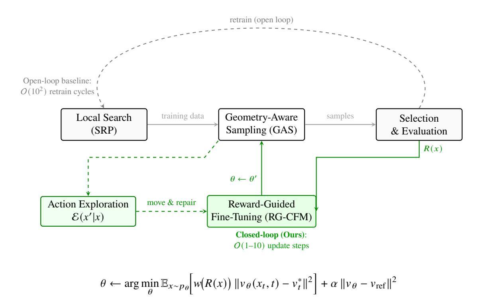

FIGURE 1. Simulation-based optimization with closed-loop updates and action exploration. Gray dashed arrows indicate the open-loop baseline: generate candidates, select, and retrain on the selected set over many cycles. Green arrows indicate our closed-loop pipeline: samples produced by geometry-aware sampling are perturbed by an action exploration operator  $\mathcal{E}(x'|x)$ , scored by rewards R(x), and used for online reward-guided fine-tuning of the flow model. The reward-weighted objective upweights high-reward samples via w(R(x)), while the teacher, student consistency term  $||v_{\theta} - v_{\text{ref}}||^2$  limits distribution shift and mitigates generative collapse.

Empirically, this converts slow, stochastic improvement across many outer cycles into a small number of effective update rounds, because the generator update is explicitly biased by the objective functional rather than implicitly by imitation of the current elite set.

2.2. Conditional Flow Matching for Configuration Generation. Let  $X \subseteq \mathbb{R}^{d \times N}$  denote a configuration space of N objects in d-dimensional Euclidean space, equipped with an objective functional  $J \colon X \to \mathbb{R}$  to be maximized. Rather than directly optimizing J, we learn a generative model whose samples concentrate on high-quality (exceptional) regions of X.

We adopt the conditional flow matching (CFM) [29] framework, which learns a time-dependent vector field  $v_{\theta} \colon \mathcal{X} \times [0,1] \to T\mathcal{X}$  that transports a simple prior distribution  $p_0$  on  $\mathcal{X}$  (e.g., uniform points in a bounding box) to a data distribution  $\mu_{\text{data}}$  of high-quality configurations. The flow is defined by the ordinary differential equation

$$\frac{\mathrm{d}x_t}{\mathrm{d}t} = v_{\theta}(x_t, t), \quad x_0 \sim p_0, \tag{2.1}$$

with the objective that the push-forward of  $p_0$  under this flow approximates  $\mu_{\text{data}}$  at t=1. Training proceeds via regression onto the conditional velocity field of an optimal transport interpolation. Given paired samples  $(x_0, x_1)$  with  $x_0 \sim p_0$  and  $x_1 \sim \mu_{\text{data}}$ , and the linear interpolant  $x_t = (1-t)x_0 + t x_1$ , the target velocity is simply  $v_t^* = x_1 - x_0$ . The CFM training objective takes the form

$$\mathcal{L}_{\text{CFM}}(\theta) = \mathbb{E}_{t \sim \mathcal{U}(0,1)} \, \mathbb{E}_{x_0 \sim p_0, x_1 \sim \mu_{\text{data}}} \left\| v_{\theta}(x_t, t) - v_t^* \right\|^2. \tag{2.2}$$

Unlike diffusion models that rely on stochastic noise schedules and iterative denoising, flow matching learns a deterministic vector field enabling direct, efficient sampling via ODE integration.

Auxiliary Geometric Penalties. Pure distribution matching can under-penalize rare but catastrophic constraint violations. Following the principle of fusing geometric inductive bias into training [44], we augment the CFM loss with a geometric-aware penalty. For packing problems, we define an overlap energy on the projected data endpoint:

$$E_{\text{overlap}}(x) = \sum_{i < i} \psi(2r - ||x_i - x_j||), \quad \psi(u) = \frac{1}{\beta} \log(1 + e^{\beta u}), \tag{2.3}$$

where r is the object radius and  $\psi$  is a Softplus function penalizing violations. Given the predicted velocity  $v_{\theta}(x_t,t)$  and the affine path coefficients  $(\alpha_t,\sigma_t)$  defining the interpolation  $x_t=\alpha_t x_1+\sigma_t x_0$  (with  $\alpha_t=t$ ,  $\sigma_t=1-t$  for optimal transport), we project back to the data endpoint via  $\hat{x}1=(v\theta(x_t,t)-\dot{\sigma}_t x_0)/\dot{\alpha}t=v\theta(x_t,t)+x_0$ . The total training loss becomes

$$\mathcal{L}(\theta) = \mathcal{L}_{CFM}(\theta) + \lambda(t, \text{epoch}) \cdot E_{\text{overlap}}(\hat{x}_1), \tag{2.4}$$

with  $\lambda$  following a cosine warm-up schedule that prioritises distribution matching early in training and constraint satisfaction thereafter.

2.3. **Geometry-Aware Sampling (GAS).** Standard ODE integration of the learned flow (2.1) can drift off the feasible set and produce samples violating hard geometric constraints [45, 46], particularly for packing problems where non-overlap is essential. We introduce a *Geometry-Aware Sampling* (GAS) algorithm that interleaves flow integration with constraint projection, analogous to the use of molecular dynamics corrections and energy minimization in protein structure refinement [47]. GAS is a tangent-space projection-corrected sampler that pushes learned transport with explicit constraint correction during inference. Conceptually, GAS can be viewed as a geometric specialization of physics-constrained sampling [48, 49], where in our setting we target a wide range of geometric feasibility hypersurfaces.

In this section, we describe the GAS model specifically for the sphere packing problem. Details for the other problems studied in this paper are provided in Section 3.

Let  $\mathcal{H} \subset X$  denote the feasible set defined by non-overlap constraints. Rather than fixing boundary margins to the sphere radius r, we employ an adaptive wall constraint that depends on the configuration's minimum separation:

$$\mathcal{H} = \left\{ x \in X : \|x_i - x_j\| \ge 2r \forall i < j, \quad m(x) \le x_i^{(k)} \le L - m(x) \forall i, k \right\}, \tag{2.5}$$

where  $m(x) = \frac{1}{2} \min_{i < j} ||x_i - x_j||$  is half the minimum pairwise distance. This adaptive formulation ensures that wall margins scale with the effective radius supported by the current configuration, enabling the sampling process to discover tighter packings without imposing a fixed radius constraint during sampling. GAS maintains approximate feasibility throughout the sampling trajectory via iterative projection, without requiring gradient information for the constraints during training.

The algorithm is the following. We discretize the flow time  $\tau \in [0, 1]$  into K steps with  $\tau_k = k/K$ , where  $\tau = 0$  corresponds to the prior distribution and  $\tau = 1$  to the data distribution. The model's internal time coordinate is  $t = 1 - \tau$ , so integration proceeds from t = 1 toward t = 0. At each step:

(i) Flow Integration: Advance the state via ODE integration using an adaptive midpoint or higher-order solver:

$$\tilde{x}_{k+1} = x_k + \int_{\tau_k}^{\tau_{k+1}} v_{\theta}(x, 1 - \tau) d\tau.$$
 (2.6)

After each integration step, we enforce the adaptive box constraint  $x \in [m(x), L - m(x)]^d$  via iterative reflection, which preserves the minimum pairwise separation while preventing boundary violations.

(ii) Gauss-Newton Projection: Project onto the constraint manifold via linearised constraint enforcement. For active constraint pairs (i, j) with overlap  $h_{ij} = 2r - ||x_i - x_j|| > 0$ , let J denote the Jacobian of the constraint residuals h. The projection step computes

$$\Delta x = J^{\mathsf{T}} (JJ^{\mathsf{T}})^{-1} h,\tag{2.7}$$

which we approximate efficiently via degree-normalized pairwise updates:

$$\Delta x_i = \frac{1}{\deg(i)} \sum_{j: h_{ij} > 0} \frac{h_{ij}}{2} \cdot \hat{n}_{ij}, \quad \hat{n}_{ij} = \frac{x_i - x_j}{\|x_i - x_j\|}.$$
 (2.8)

Boundary violations are handled analogously with wall-normal corrections.

(iii) *Proximal Relaxation:* To prevent projection from deviating excessively from the learned flow manifold, we apply a proximal correction that balances constraint satisfaction with fidelity to the flow trajectory. Given the anchor point  $\hat{x} = (1 - \tau')x_0 + \tau'x_{\text{proj}}$  on the optimal transport path, we iteratively minimise

$$x \leftarrow x - \eta \Big( (x - \hat{x}) + \lambda_{\text{prox}} J^{\mathsf{T}} h(x_{\text{next}}) \Big),$$
 (2.9)

where  $x_{\text{next}} = x + (1 - \tau')v_{\theta}(x, 1 - \tau')$  is the forward-projected terminal state, h is the constraint residual, and J is its Jacobian. This couples the proximal anchor with a lookahead penalty on constraint violations at the predicted endpoint.

(iv) *Terminal Refinement:* After completing flow integration, we apply additional projection passes with tightened tolerances to ensure strict feasibility. The algorithm terminates when the maximum overlap residual falls below a prescribed tolerance:

$$\max_{i < j} \left( 2r - \|x_i - x_j\| \right)^+ \le \epsilon_{\text{tol}},\tag{2.10}$$

where  $(\cdot)^+ = \max(\cdot, 0)$  denotes the positive part. This criterion is independent of any fixed radius assumption, yielding samples that are both distributionally faithful and geometrically valid for the effective radius  $r_{\text{eff}} = \frac{1}{2} \min_{i < j} ||x_i - x_j||$  supported by the configuration.

This projection-relaxation scheme is conceptually similar to constraint satisfaction in molecular dynamics [50], where forces from bonded interactions (analogous to our flow field) are balanced against non-bonded repulsions (our overlap penalties).

2.4. **Reward-Guided Fine-Tuning.** While the base CFM model learns to sample from the distribution of training configurations, the discovery of extremal structures requires *improving* upon this distribution towards OOD regions, generating configurations with higher objective values than any in the training set. In other words, rare structure discovery, is intrinsically extrapolative. This challenge is very similar to de novo molecular design, where one seeks to extrapolatively generate molecules with properties exceeding those in known databases. As a result, we introduce *Reward-Guided CFM* (RG-CFM), an online fine-tuning procedure that synthesizes: (i) importance-weighted policy optimization from reinforcement learning, and (ii) consistency regularization from self-supervised learning (SSL) [51]. This synthesis addresses a fundamental in pure reward-guided generation [39]. Pure reward maximization drives the model toward high-scoring configurations, but without regularization it collapses to a degenerate policy that produces only a single output, losing the diversity necessary for continued exploration and discovery.

*Reward Function.* For each problem, we define a reward  $R: X \to \mathbb{R}$  aligned with the optimization objective. For sphere packing, we use the effective radius, half the minimal separation distance, normalized by the box length:

$$R(x) = \frac{r_{\text{eff}}(x)}{L}, \quad r_{\text{eff}}(x) = \frac{1}{2} \min_{i < j} ||x_i - x_j||, \tag{2.11}$$

which directly measures packing quality: larger R supports larger sphere radii. This formulation is agnostic to any predetermined target radius, allowing the model to discover configurations that exceed the quality of training data.

Online Reward-Guided Flow Matching. RG-CFM adopts a teacher-student framework inspired by self-supervised methods such as DINO [52] and Mean Teacher [53]. We maintain two copies of the velocity field, a *student* model  $v_{\theta}$  that is actively fine-tuned, and a *teacher* model  $v_{\text{ref}}$  that remains frozen at the pretrained weights. The teacher serves as an anchor, providing consistency targets that prevent the student from drifting into degenerate solutions, a phenomenon we term *generative collapse*, analogous to representation collapse in contrastive learning [54]. To push generation toward high-reward regions, we adopt importance weighting from offline RL [55, 56]. If q(x) denotes the distribution of training endpoints and  $w(x) \ge 0$  is a weighting function, then minimizing a weighted flow matching loss yields a learned terminal distribution proportional to w(x) q(x). Repeated cycles of sampling from the current model and retraining with the same weighting amplify mass by successive powers of w, progressively concentrating the distribution around reward-maximizing modes. This observation motivates both (i) reward-weighted updates for systematic improvement, and (ii) explicit regularization to prevent degeneracy.

Concretely, given a batch of samples  $\{x^{(b)}\}_{b=1}^{B}$  generated by the current student model via GAS, along with their reward scores  $\{R^{(b)}\}$ , we compute importance weights through z-score normalization followed by exponentiation:

$$w^{(b)} = \frac{1}{Z} \exp\left(\tau \cdot \frac{R^{(b)} - \bar{R}}{\sigma_R + \epsilon}\right), \quad Z = \frac{1}{B} \sum_{b'} \exp\left(\tau \cdot \frac{R^{(b')} - \bar{R}}{\sigma_R + \epsilon}\right), \tag{2.12}$$

where  $\bar{R}$  and  $\sigma_R$  are the batch mean and standard deviation of rewards,  $\tau > 0$  is a temperature controlling selection pressure, and weights are clipped to  $[0, w_{\text{max}}]$  for numerical stability. This scheme ensures that samples with above-average rewards receive amplified influence during training, while below-average samples are downweighted but not discarded entirely, reminiscent of Advantage-Weighted Regression (AWR), where policy updates take the form of weighted maximum likelihood with weights exponential in the advantage.

Without regularization, pure reward maximization leads to a well-known failure mode. Given sufficient training, the student model converges to a degenerate policy that produces only a single high-reward output, losing the diversity necessary for continued exploration. Each retraining round amplifies probability mass on the current best modes, and the model eventually converges to a delta distribution concentrated on one or a few configurations. This generative collapse is catastrophic for optimization: once the model produces only one configuration, it cannot explore alternative basins, and the search terminates prematurely at a local optimum. We prevent collapse through *consistency regularization*, penalising deviation of the student's velocity field from the frozen teacher's predictions. At each training step, both models are evaluated on the same interpolated states  $x_t$ , and we minimize their squared discrepancy:

$$\mathcal{L}_{\text{consist}} = \frac{1}{B} \sum_{b=1}^{B} \left\| v_{\theta}(x_t^{(b)}, t) - v_{\text{ref}}(x_t^{(b)}, t) \right\|^2.$$
 (2.13)

This term acts as a soft constraint in function space, bounding how far the fine-tuned velocity field can deviate from the pretrained baseline. The mechanism mirrors the role of the exponential moving average (EMA) teacher in DINO [52] and BYOL [57], which provides stable targets that anchor the student's learning and maintain output diversity through implicit regularization.

As a result, the total RG-CFM loss combines reward-weighted flow matching with consistency regularization:

$$\mathcal{L}_{RG} = \mathcal{L}_{FM}^{W} + \alpha \cdot \mathcal{L}_{consist}, \qquad (2.14)$$

where  $\alpha > 0$  controls the exploration-exploitation trade-off. Small  $\alpha$  permits aggressive reward optimization at the risk of collapse and large  $\alpha$  preserves diversity but limits improvement over the

baseline. In practice, we find that  $\alpha \in [0.1, 1.0]$  provides a robust operating regime, analogous to the KL penalty coefficient in proximal policy Optimisation (PPO) [58] or the trust region in TRPO [59] methods where the new policy is the old policy reweighted by exponentiated advantages, regularized to stay close to a reference and RLHF [60] for LLMs.

Geometry-Aware Action Exploration. An important limitation of pure reward-guidance is support suboptimality, meaning that weighted training cannot assign probability mass to configurations that are essentially absent from the distribution used to generate training endpoints. In other words, if the current policy (or current elite dataset) has negligible density in a region containing better solutions, reweighting alone cannot reliably discover it. This motivated us to have an explicit exploration operators that propose structured perturbations beyond the current support. Moreover, naive continuous-action online RL methods encourage exploration by sampling actions from a normal distribution when collecting episodes, but simply adding noise to the action trajectories produces non-smooth trajectories and does not efficiently explore the action space. Thus, to further enhance sample diversity during fine-tuning, during on-policy data collection for RG-CFM we introduce an exploration operator  $\mathcal{E}(x'|x)$  that proposes smooth, constraint-informed moves:

$$x' = x + \Delta x, \qquad \Delta x = (Mr) \, s(x) \, \widehat{d}(x), \qquad \widehat{d}(x) = \frac{c \, \Delta_{\text{contact}}(x) + (1 - c) \, \Delta_{\text{wall}}(x)}{\|c \, \Delta_{\text{contact}}(x) + (1 - c) \, \Delta_{\text{wall}}(x)\|_{\text{F}} + \varepsilon}. \quad (2.15)$$

Here  $\|\cdot\|_F$  is the Frobenius norm on  $\mathbb{R}^{d\times N}$ , M is a dimensionless exploration magnitude,  $c\in[0,1]$  mixes contact- and wall-driven directions, and s(x) is an overlap-severity scalar (set to 1 by default, and increased when overlaps are large in order to push more strongly out of infeasible tangles).  $\Delta_{\text{contact}}$  is computed from the contact graph (directions that relieve overlaps),  $\Delta_{\text{wall}}$  from boundary proximity, and M controls the exploration magnitude. After exploration, a repair step projects the perturbed configuration back onto the feasible manifold, ensuring that rewards are evaluated on geometrically valid samples. This exploration mechanism plays the same conceptual role as guided MCMC moves in molecular sampling [61] that prevent uniform collapse, it explicitly expands the effective support of the policy so that reward-weighted updates can amplify genuinely novel, higher-reward structures once they are encountered.

- 2.5. Closing the Loop: Convergence Properties. A critical limitation of prior SBO system for mathematical structure discovery, notably PatternBoost [1], is that the boosting loop remains *open*: there is no mechanism guaranteeing convergence to optimal or near-optimal solutions. In open-loop methods, the generative model learns to mimic the current best solutions but receives no direct signal pushing it toward *better* and OOD solutions, it matches a distribution rather than optimizing an objective. We have addressed this fundamental gap through online reward-guided policy optimization, where rather than treating the generative model as a passive density estimator retrained on filtered samples, we fine-tune it with direct feedback from the optimization objective. This transforms the open iterative scheme into a closed-loop control system:
- Open loop: The generative model approximates  $p_{\text{data}}$ , the distribution of current best solutions. Improvement relies on sampling and local search occasionally escaping to better basins, an indirect, stochastic process with no gradient signal toward the objective that prompts to a lengthy and blind search.
- Closed loop (ours): The generative model is fine-tuned to maximize expected reward  $\mathbb{E}_{x \sim p_{\theta}}[R(x)]$  while remaining close to a reference policy. This provides a direct optimization signal, where configurations with higher objective values receive higher weight in the policy update, systematically guiding sampling toward better and OOD solutions.

The closure mechanism operates through the reward-guided flow matching objective where samples from the current policy are evaluated, and the model is updated to increase the likelihood of high-reward trajectories while the consistency regularization and action exploration prevents mode collapse. Combined with geometry-aware sampling, which maintains geometric feasibility throughout the generative process, this closed-loop formulation enables convergence to near-optimal solutions in much fewer iterations, O(1-10) boosting rounds rather than the O(100) iterations characteristic of open-loop methods.

2.6. **The FLowBoost Pipeline.** The complete FLowBoost pipeline integrates the above components in an iterative boosting loop:

- (i) *Initialization*. Generate an initial dataset  $\mathcal{D}_0$  of configurations by running stochastic relaxation with perturbations (SRP) from random initial conditions. Retain the top fraction (typically 25–50%) according to the objective J.
- (ii) *Training*. Train a conditional flow matching model  $v_{\theta}^{(0)}$  on  $\mathcal{D}_0$  using the combined flow matching and geometric penalty objectives.
- (iii) *Sampling*. Sample a batch of configurations from  $v_{\theta}^{(0)}$  using geometry-aware sampling with projection-corrected integration.
- (iv) *Reward-Guided Fine-Tuning*. Evaluate rewards on the refined samples. Apply reward-guided fine-tuning with consistency regularization and geometry-aware action exploration to update the model parameters.
- (v) *Refinement & Selection*. Apply local search (SRP followed by L-BFGS optimization) to each generated configuration, obtaining a refined batch.
- (vi) *Iteration*. Repeat steps 1–5, obtaining successive model updates  $v_{\theta}^{(1)}, v_{\theta}^{(2)}, \ldots$  with progressively improving sample quality.

Empirically, we observe that in each iteration the distribution of J over the samples shifts upward, and the best configurations improve over time. The closed-loop structure ensures systematic improvement rather than stochastic drift, with convergence typically achieved within 1-3 boosting rounds.

**Remark 2.1.** Note that with the closed-loop pipeline, we *do not* require the extremely long outer boosting iterations of PatternBoost. In such open-loop schemes, the generator is retrained only to imitate the current elite set; improvement is therefore indirect and essentially stochastic as one must repeatedly sample and re-run local search in the hope of occasionally landing in a better basin. This makes progress heavily dependent on hundreds to thousands of outer iterations and offers no principled mechanism for systematic ascent. By contrast, our FLowBoost closes the loop, meaning that rewards computed on newly generated (and repaired) configurations directly drive an online update of the generator via reward-guided fine-tuning. As a result, the optimization signal is injected where it matters, namely into the parameters of the generative policy, so the dominant driver of improvement becomes a small number of targeted inner updates rather than a large number of blind outer retrain cycles.

2.7. Local Search: Stochastic Relaxation with Perturbations. The local search component employs a variant of stochastic relaxation with perturbations (SRP). Given an initial configuration  $x \in \mathcal{X}$ , we consider a smooth surrogate objective  $\widetilde{J}(x) \approx J(x)$  that is differentiable in the ambient Euclidean coordinates. For packing problems, this comprises an overlap energy penalizing sphere intersections and boundary violations, combined with terms proportional to the negative sum of radii.

SRP alternates between two phases: (i) *random perturbation*, adding small random displacements to the configuration, and (ii) *gradient relaxation*, performing several steps of normalized gradient descent on  $\widetilde{J}$ , often with an annealing schedule for the step size. For packing problems, SRP is followed by L-BFGS-B optimization over the same surrogate to polish the configuration while respecting box constraints.

The key properties of SRP are that it is computationally inexpensive and parallel, robust to initial conditions due to the perturbation and annealing, and captures fine geometric features that may be difficult for a global model to learn purely from data. In FLowBoost, we use SRP in two modes: as a training-data generator starting from random configurations, and as a final refinement step on samples produced by the flow model.

In continuous optimization settings, *local search* simply refers to a fast *local fixing* (or local improvement) procedure: starting from an initial configuration, it repeatedly applies small, inexpensive updates that reduce constraint violations and improve the objective, until it reaches a locally stable configuration. In practice, one often has several plausible local search heuristics that all produce near-feasible, near-best-known configurations, but with markedly different reliability and final quality. This choice is crucial: since our goal is to surpass the best known constructions, the local search mechanism must produce samples that are as strong as possible, both to supply high-quality training data and to provide an effective refinement step for generative samples.

Figure 2 illustrates how different geometric heuristics can explore different regions of configuration space and yield radically different solution quality. In this example (circle packing in the unit square), a simple *physics-push* baseline (where each center is iteratively displaced along a repulsion direction given

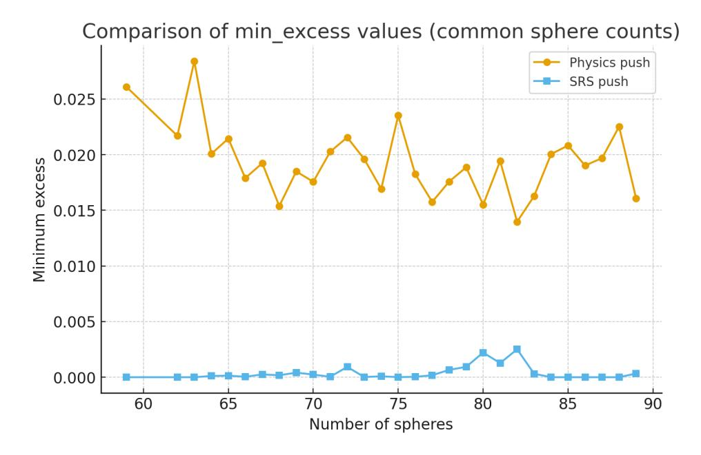

FIGURE 2. Comparison of the minimum-excess metric for two local search heuristics (common circle counts). The physics-push heuristic yields consistently higher minimum-excess values than SRP/SRS, indicating worse configurations across the tested regime.

by a weighted sum of vectors pointing away from neighbouring centers, with weights proportional to the reciprocal of the inter-center distances) consistently produces substantially worse configurations than SRP across common circle counts.

## 3. Results

This section contains a detailed description of the results of our FLowBoost experiments on geometric optimization problems.

# 3.1. Overview.

Sphere Packing. We evaluate FlowBoost on the classical problem of packing N non-overlapping spheres of radius r inside a d-dimensional unit hypercube, a problem that combines geometric rigidity with combinatorial complexity. The objective is to maximize r (equivalently, the packing fraction  $\phi = N \cdot \operatorname{vol}_d(B_r)$ ) subject to non-overlap constraints  $||x_i - x_j|| \ge 2r$  for all pairs and containment constraints  $x_i \in [r, 1-r]^d$  for all centres. This problem admits no closed-form solution for general N; even verifying local optimality is NP-hard, and the best known packings for most N have been found through extensive computational search. Our investigation of high-dimensional packings is motivated by recent breakthroughs in the asymptotic theory. Viazovska [62] proved that the  $E_8$  lattice achieves the optimal sphere packing density in  $\mathbb{R}^8$ , and together with collaborators [63] established optimality of the Leech lattice in  $\mathbb{R}^{24}$ . These remain the only dimensions d > 3 where the densest packing is known. Dimension d = 12 is particularly interesting as it lies between the solved cases, admits rich lattice structure [64] (e.g., the Coxeter-Todd lattice  $K_{12}$ ), yet the optimal packing density remains unknown, making it a natural testbed for computational exploration. We report experiments in two regimes: (i) three-dimensional packings for  $N \in \{50, \dots, 89\}$  and  $N \in \{191, 200\}$ , where high-quality reference packings exist from decades of prior work; and (ii) twelve-dimensional packings for  $N \in 31$ , where the geometry is far from lattice-like and classical heuristics struggle. In several instances, FLOWBOOST matches or exceeds the best previously reported packing fractions, and in high-dimensional settings it consistently discovers configurations denser than those produced by simulated annealing or basin-hopping alone.

The Heilbronn Problem. We study the classical Heilbronn triangle problem in the unit square: for a point set  $X = \{p_1, \dots, p_n\} \subset [0, 1]^2$  one considers the minimum area over all triangles spanned by triples,

$$A_{\min}(X) := \min_{1 \le i < j < k \le n} \frac{1}{2} |\det(p_j - p_i, p_k - p_i)|,$$

and the goal is to maximize  $A_{\min}(X)$  over all n-point configurations. In our FLowBoost installation, SRP produces an initial elite set by maximizing a smooth soft-min surrogate of  $A_{\min}$ , followed by a deterministic L-BFGS-B polish and an active max-min push (SLSQP on the currently smallest-area triangles). A conditional flow-matching model is then trained on the top portion of these SRP-refined configurations and used to propose new point sets; each generated candidate is again refined by the same SRP final push before selection. Empirically, the raw generator underperforms the SRP elite distribution, but the final push reliably recovers near-elite configurations, and the closed-loop iteration can exceed the previous best. In our runs we obtain  $A_{\min} = 0.0259285$  for n = 13 (beating the training maximum in that experiment) and  $A_{\min} = 0.0187494$  for n = 15, with clear right-shifts in the distributions of  $A_{\min}$  across FLowBoost iterations. These results approach the best known constructions in [65]  $A_{\min} = 0.0270$  for n = 13 and  $A_{\min} = 0.0211$  for n = 15.

Circle packing with maximal sum of radii. We study circle packings in the unit square where the objective is to maximize the sum of radii for a fixed number N of circles, subject to non-overlap and boundary constraints. This problem has been recently attacked by AlphaEvolve and its open-source variants using LLM-based genetic programming to evolve code that produces good packings. In our approach, SRP generates an initial dataset of circle arrangements, and a flow-matching model on centers learns to propose new center configurations. The final push stage solves a convex optimization problem (via linear programming) to maximize the sum of radii subject to constraints for the given centres, and combines this with an SRP-based refinement. For N=26 and N=32 circles, we obtain configurations whose sum of radii strictly exceeds the best values reported for AlphaEvolve-type methods, while using a considerably smaller computational budget.

Star discrepancy problem. We also apply FLowBoost to constructing low star-discrepancy point sets in  $[0, 1]^2$ , a central objective in quasi-Monte Carlo integration [66–68]. For  $P = \{p_1, \ldots, p_N\} \subset [0, 1]^2$ , the (anchored) star discrepancy is the minimax quantity

$$D^{*}(P) := \sup_{(a,b) \in [0,1]^{2}} \left| \frac{1}{N} \# (P \cap ([0,a) \times [0,b))) - ab \right|, \quad \text{(smaller is better)}, \quad (3.1)$$

i.e. the worst deviation between empirical mass and volume over anchored axis-aligned boxes.

Our local SRP search minimizes a differentiable soft-max surrogate of  $D^*$  based on sigmoid-smoothed box indicators and a log-sum-exp over a grid of anchored boxes; this is followed by L-BFGS-B and exact evaluation of  $D^*$  on the critical grid. A conditional flow-matching model (conditioned on  $(N, D^*)$ ) is then trained on the best half of the pushed samples, and sampling interleaves ODE integration with short projection/proximal steps that directly decrease the smooth discrepancy surrogate before the final push. As with Heilbronn, generation alone is not sufficient, but the final push recovers and slightly improves the best tail. In our experiments we obtain  $D^* = 0.06290897$  for N = 20 and  $D^* = 0.02943972$  for N = 60, and the pushed distributions consistently shift left relative to the initial SRP training set.

# 3.2. Sphere Packing in Hypercube.

Model architecture. The velocity field  $v_{\theta}(x,t)$  is parameterized by a permutation-equivariant Transformer [24, 69] operating on the point-cloud  $x=(x_1,\ldots,x_N)\in(\mathbb{R}^d)^N$ , where each configuration  $x\in\mathbb{R}^{d\times N}$  is treated as a set of N tokens with d-dimensional coordinates. Time information is embedded via random Fourier features combined with polynomial basis functions [70],  $\phi(t)=\left[\sin(2\pi\omega_j t),\cos(2\pi\omega_j t),t,t^2,t^3,\log(1+t)\right]_{j=1}^F$ , where  $\{\omega_j\}$  are fixed random frequencies. This embedding is projected to a conditioning vector and injected into transformer layers via Featurewise Linear Modulation (FiLM) [71]:  $h\mapsto h\odot(1+\gamma)+\beta$ , where  $(\gamma,\beta)$  are predicted from the time-condition embedding. Our architecture further incorporates problem-specific conditioning variable y=(r/L,N,face-contact ratio, min-separation/L), enabling a single to generalize across problem instances by learning a conditional probability density p(X|y). For packing in a box  $[r,L-r]^d$ , the

base distribution is uniform in the feasible box but does not enforce non-overlap. As a result, we have a geometry-aware prior that improves coverage of boundary-touching structures by placing each point on a randomly chosen box, then adding small jitter. This prior is conditional on y and improves sample efficiency in regimes where high-quality solutions exhibit frequent face contacts. Key hyperparameters are: model dimension 512, depth 2 layers, 8 attention heads, and GLU [72] feed-forward blocks with RMSNorm [73]. The output layer is zero-initialized to ensure the initial velocity field is near-constant, stabilizing early training. Total parameter count is approximately 2M.

Training. Initial datasets are generated via Stochastic Repulsion Push (SRP), a physics-inspired local search that eliminates overlaps through annealed gradient descent on a soft-overlap energy. We retain the top 5–10% of configurations ranked by packing fraction. The flow-matching model is trained for 200–500 epochs using the AdamW variant with schedule-free learning rate adaptation, batch size 128, and gradient clipping at norm 1.0. An auxiliary penalty encouraging large pairwise separations is ramped in over the first half of training via a cosine schedule. Time sampling is biased toward small t (near-data regime) using a mixture distribution with weight 0.5 on a power-law component ( $\gamma = 2$ ).

Sampling. Geometry-Aware Sampling (GAS) integrates the learned velocity field from  $\tau = 0$  (prior) to  $\tau = 1$  (data) using a midpoint ODE solver with 40 – 60 steps. At each step, a Gauss–Newton projection enforces non-overlap and wall constraints, followed by proximal relaxation that anchors the trajectory to the optimal-transport path. Terminal refinement applies additional projection passes until the maximum overlap residual falls below  $10^{-8}$ . The prior distribution places centers uniformly on box faces with small jitter, providing geometric diversity while respecting approximate containment. We then fine-tune the pretrained model using reward guidance. The teacher model (frozen at pretrained weights) provides consistency targets while the student model is updated via importance-weighted flow matching with temperature  $\tau \in [0.5, 2.0]$  and consistency coefficient  $\alpha \in [0.1, 0.5]$ . Each fine-tuning epoch samples a batch of 128–256 configurations from the current student policy via GAS, evaluates their effective radii  $r_{\text{eff}} = \frac{1}{2} \min_{i < j} ||x_i - x_j||$ , computes z-scored importance weights, and performs a ten gradient step. Fine-tuning typically converges within 2–10 epochs, after which the best configurations are passed to SRP for final polishing. The required steps for a single GAS sample plus projection overhead, is comparable in wall-clock time to  $\sim 100 \text{ L-BFGS-B}$  iterations. However, the important things is that the generative model produces diverse samples that explore multiple basins simultaneously, whereas local search must be restarted from scratch to escape a given basin. In practice, 103 GAS samples explore the configuration space more thoroughly than 104 SRP restarts, yielding both higher peak quality and better coverage of near-optimal configurations.

3.2.1. Results. We benchmark against the Packomania database [74], which compiles the best known packings for  $N \le 200$  spheres in the unit hypercube, obtained through decades of simulated annealing, genetic algorithms, and manual refinement.

For N = 50 - -200, we apply the FLowBoost pipeline: train on SRP-generated data, sample with GAS, fine-tune with reward guidance, and refine with SRP, and iterate. Across 1–5 boosting rounds, the generative model progressively shifts probability mass toward higher-quality basins. We also provide a comparision against PatternBoost. Figure 4 directly compares FLowBoost against PatternBoost for N = 89 spheres. Two findings stand out. First, RG-CFM without local refinement achieves comparable peak quality to PatternBoost even with SRP push demonstrating that reward-guided flow matching partially internalizes the refinement that PatternBoost delegates entirely to post-hoc search. Second, RG-CFM with push exceeds both the training maximum and PatternBoost's best result, while requiring less outer iterations and sampling time. This reduction in convergence time, combined with the elimination of LLM dependencies, constitutes the primary computational advantage of the closed-loop formulation.

12D Sphere Packing. High-dimensional sphere packing presents qualitatively different challenges: the configuration space grows exponentially, local search becomes trapped in shallow basins, and there is no lattice structure to exploit for small N. We test FlowBoost on N=31 spheres in the 12-dimensional hypercube cube, a regime where even generating *feasible* packings is nontrivial. In high-dimensional packing, any improvement over extensive local search is noteworthy. The training dataset comprises  $O(10^3)$  configurations generated by SRP with random restarts that is a strong baseline that has been refined over many iterations. That a single round of RG-CFM fine-tuning yields a configuration exceeding

Table 2. Computational comparison for N = 89, d = 3. Wall-clock times on a single A100 GPU. FLOPs exclude local search.

| Method       | Parameters | Iterations | FLOPs              | Wall-clock |
|--------------|------------|------------|--------------------|------------|
| PatternBoost | ~8M        | O(10-100)  | ~ 10 12 | 10–100 h   |
| FlowBoost    | ~2M        | O(1-10)    | $\sim 10^{8}$      | 0.5 - 2 h  |

this entire dataset's maximum suggests that the learned surrogate captures geometric structure invisible to coordinate-wise local search.

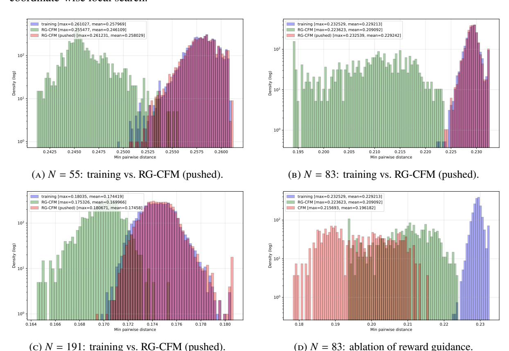

FIGURE 3. **Sphere packing in** d=3. (a–c) Normalized histograms of minimum pairwise distance (log scale). In all cases, RG-CFM with final push (blue) recovers the training distribution and yields configurations exceeding the training maximum:  $d_{\min}=0.261231$  vs. 0.261027 for N=55; 0.232539 vs. 0.232529 for N=83; 0.180671 vs. 0.180350 for N=191. (d) Ablation comparing vanilla CFM (orange) against reward-guided CFM (green) for N=83: reward guidance with action exploration shifts the distribution toward higher-quality samples ( $d_{\min}^{\max}=0.2236$  vs. 0.2157), demonstrating that direct objective feedback improves generation quality prior to local refinement.

The pattern mirrors lower-dimensional results: raw flow samples require geometric repair, but the pushed distribution matches the training regime while the closed-loop update enables discovery of configurations exceeding the training maximum. For N=31, starting from SRP-generated packings with best minimum separation  $d_{\min}=0.673721$ , a single round of RG-CFM fine-tuning yields  $d_{\min}=0.673819$ , an improvement in a regime where any progress is nontrivial.

Large-training-set runs (long per-iteration training). Figure 6 summarizes runs with a large SRP-generated training set and long per-iteration flow matching model training (3000 epochs) for  $N \in \{71, 73, 79, 97, 191\}$ . In each case the main effect of boosting is a strong *right-shift* and concentration of the distribution:

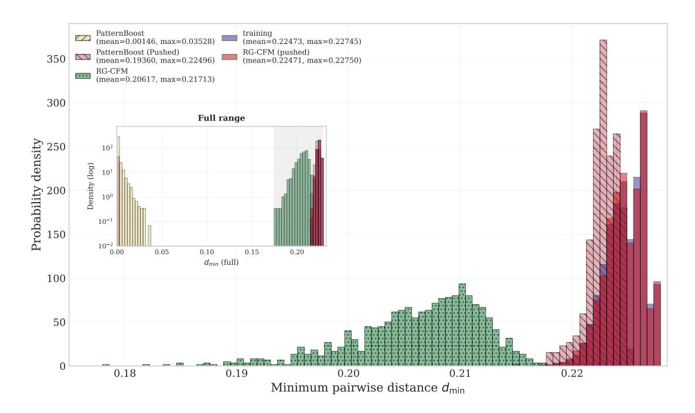

FIGURE 4. **3D Sphere Packing in Cube,** n = 89**.** The comparison between PatternBoost, RG-CFM, and their pushed version with the training data. Our Reward-guided fine tuning alone could provide the same performance as the expensive PatternBoost and SRP Push combined, while the pushed version of RG-CFM could improve the max over the training data.

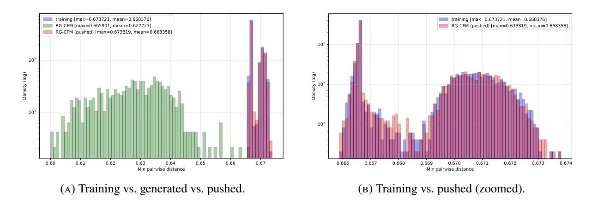

FIGURE 5. Sphere packing in d = 12, N = 31. Normalized histograms of minimum pairwise distance (log scale).

high- $d_{\min}$  configurations become substantially more frequent, and the mean improves monotonically, while the absolute best value typically improves only slightly (or stays essentially fixed). Concretely,

- N = 71: mean improves from 0.239324 (training) to 0.245881 (iteration 4), while the best improves marginally from 0.246022 to 0.246030.
- N = 73: mean improves from 0.239102 (training) to 0.242334 (iteration 4), with best improves from 0.243537 to 0.243545.
- N = 79: mean improves from 0.232706 (training) to 0.234299 (iteration 4), with best unchanged at 0.235913.
- N = 97: mean improves from 0.217635 (training) to 0.222428 (iteration 4), and the best improves from 0.222983 to 0.223019.
- N = 191: mean improves from 0.172388 (training) to 0.176189 (iteration 7), and the best improves from 0.180148 to 0.180671.

Thus, even if the best value is hard to move, FLowBoost substantially increases the probability of sampling near-record configurations after the final push. For context, best-known values for spheres-in-a-cube are often benchmarked against the Packomania database.1

Many-iteration test for N = 191: short training per step. Figure 7 shows a complementary experiment at N = 191 with a smaller per-iteration budget (500 samples; 300 epochs per iteration) but more than 100 pipeline iterations. Here the maximum effective radius remains essentially flat, while the average effective radius increases steadily across iterations. This is the behavior one expects from a stable closed-loop booster under limited compute: the pipeline learns to place more mass in good basins (raising the mean) even when discovering a strictly better extreme configuration is rare.

- 3.3. **The Heilbronn Problem.** We test FlowBoost on the classical Heilbronn triangle problem in the unit square.
- 3.3.1. Local search. As described in Section 2, we use an SRP local search algorithm both for generating training data and for the final push applied to model samples. For Heilbronn we use a differentiable surrogate that interpolates between a smooth global objective and the hard minimum. We replace the non-differentiable absolute value by the smooth proxy  $|u| \approx \sqrt{u^2 + \varepsilon}$  ( $\varepsilon = 10^{-12}$ ), and define the smoothed triangle area

$$A_{ijk}^{(\varepsilon)}(X) := \frac{1}{2} \sqrt{\det(p_j - p_i, p_k - p_i)^2 + \varepsilon}, \qquad 1 \le i < j < k \le n.$$

To approximate the hard minimum  $A_{\min}(X) = \min_{i < j < k} A_{ijk}(X)$  in a differentiable way, we use the *soft-min* (log-sum-exp) at sharpness  $\beta > 0$ :

$$\operatorname{smin}_{\beta}(X) := -\frac{1}{\beta} \log \sum_{i < j < k} \exp(-\beta A_{ijk}^{(\varepsilon)}(X)). \tag{3.2}$$

Let  $T = \binom{n}{3}$  and  $m(X) := \min_{i < j < k} A_{ijk}^{(\varepsilon)}(X)$ . Then the standard log-sum-exp bounds give

$$m(X) - \frac{\log T}{\beta} \le \min_{\beta}(X) \le m(X),$$
 (3.3)

so increasing  $\beta$  tightens the approximation (up to an explicit  $\log T/\beta$  gap). In practice we anneal  $\beta$  geometrically from  $\beta_0$  to  $\beta_F$ , which has the effect of starting with a smoother objective (many triangles contribute) and gradually concentrating optimization pressure on the worst triangle(s).

We optimize the SRP surrogate loss

$$\mathcal{L}_{\beta}(X) = w_{\text{wall}}W(X) - \min_{\beta}(X), \tag{3.4}$$

where W(X) is a quadratic wall penalty that discourages leaving  $[0,1]^2$  (and we additionally clamp coordinates after each SRP step) and  $w_{\text{wall}} > 0$  is the penalty weight that controls how strongly SRP discourages leaving the unit square: larger  $w_{\text{wall}}$  makes boundary violations more expensive (a standard quadratic-penalty mechanism for constraints). In the reported runs we use geometric annealing  $\beta_0 \to \beta_F$  with  $\beta_0 = 40$  and  $\beta_F = 300$ .

For large  $\beta$  the sum in (3.2) is dominated by the smallest triangle areas. To reduce computation we optionally restrict the log-sum-exp to the K smallest triangles under the current iterate X (with a small tolerance), i.e. we replace the full index set by an active subset of size K (here K = 100). This keeps the dominant terms while avoiding work on clearly non-critical triangles.

After SRP we apply a deterministic L-BFGS-B polish to (locally) minimize  $\mathcal{L}_{\beta_F}$  under box constraints. L-BFGS-B is a quasi-Newton method implemented in scipy.optimize.minimize(method="L-BFGS-B"), that stores only a low-rank approximation of curvature information, making it well suited to high-dimensional problems with simple bounds. To target the true max-min objective more directly, we then solve a lifted nonlinear program in variables (X, t):

max 
$$t$$
 s.t.  $A_{ijk}(X) \ge t \ \forall i < j < k, \qquad X \in [0, 1]^{2n}$ 

Since only few constraints are typically tight at a good solution, we enforce this system only for an *active* set consisting of the  $K_{\text{active}}$  currently smallest-area triangles (here  $K_{\text{active}} = 25$ ), and run an SLSQP step

https://www.packomania.com/.

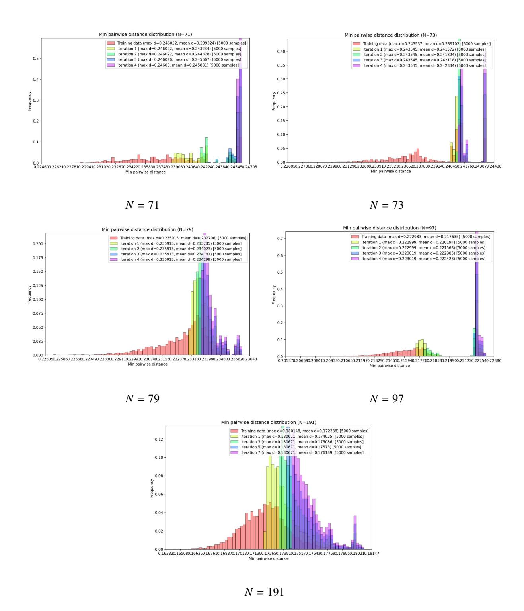

FIGURE 6. 3D unit-cube packing proxy: large training set; long per-iteration training. The distribution of  $d_{\min}$  shifts right over iterations, improving both the mean and the best observed value.

on these constraints. This active max-min pass is applied only to a small elite subset of candidates (top 10 configurations) during training-set generation, and again as the final push on flow-generated samples.

 $^2$ SLSQP stands for *Sequential Least Squares Programming*, as implemented in scipy.optimize.minimize(method="SLSQP"). It is a standard nonlinear constrained optimizer supporting both bound constraints and general equality/inequality constraints.

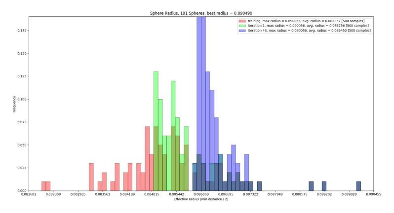

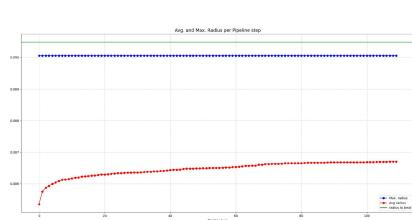

(a) Distribution snapshots (N = 191).

(**b**) Mean/max  $r_{\text{eff}}$  vs. iteration.

FIGURE 7. Many-iteration regime for N=191: small per-iteration budget. (a) shows histogram snapshots of  $r_{\rm eff}=\frac{1}{2}d_{\rm min}$  at selected iterations. (b) tracks the average and maximum  $r_{\rm eff}$  across > 100 pipeline steps: the maximum remains stable, while the average improves monotonically, indicating a steady shift of mass toward better basins.

3.3.2. *Training and sampling*. We use the conditional flow matching setup from Section 2, with a permutation-equivariant set transformer velocity field. The conditioning encodes the problem size and the target quality  $c(X) = \left(\frac{n}{128}, A_{\min}(X)\right)$ , and an auxiliary penalty encourages the projected endpoint (as in Section 2) to achieve soft-min triangle area at least as large as the target.

At sampling we follow the same geometry-aware sampling principle as GAS (Section 2), specialized to the Heilbronn objective: between ODE steps we perform short projected gradient-ascent moves on the soft-min triangle area (with an annealed temperature  $\tau_{\text{start}} = 5 \cdot 10^{-3} \rightarrow \tau_{\text{end}} = 5 \cdot 10^{-4}$ ), and we end with a brief polishing stage. Finally, every generated configuration is passed through the SRP final push above, and only then compared using exact  $A_{\text{min}}$ .

3.3.3. Experimental settings. For n = 15 we generate 1000 SRP samples for training, keeping the top 50% by  $A_{\min}$  for model fitting. SRP uses  $I_{\max} = 500$  outer iterations, m = 60 inner steps, step size 0.035 with decay 0.994, and backtracking budget 6; L-BFGS-B uses gtol  $10^{-8}$ , ftol  $10^{-12}$ , maxiter 2000. The flow model uses a set transformer of width 256, depth 6, and 8 heads, trained for 500 epochs with batch size 64 and learning rate  $10^{-4}$ . Sampling uses 30 PCFM steps (Euler, step cap 0.05), with 2 projection and 2 proximal steps per PCFM step, plus a 20-step terminal polish.

3.3.4. Results. Figures 8–9 show the empirical distributions of  $A_{\min}$  for n=13 and n=15. The main pattern is consistent across both sizes:

- Raw flow samples are worse than SRP elites. Without final push (local refinement), generated samples are left-shifted (many near-degenerate triangles remain).
- The final push repairs samples effectively and moves the distribution back toward the training regime and recovers near-elite maxima.
- Boosting can exceed the training maximum. Across iterations, the best observed  $A_{\min}$  improves and the histogram mass shifts right, indicating that the closed-loop train $\rightarrow$ sample $\rightarrow$ push $\rightarrow$ select cycle can produce configurations that beat the previous elite set.

Concretely, for n = 13 (Figure 8): the training max is 0.0257271, raw generation reaches 0.0210753, while pushing recovers 0.0254702; over iterations the maximum improves to 0.0259285 (iteration 2), exceeding the training maximum in that run. For n = 15 (Figure 9): the training max is 0.0184912

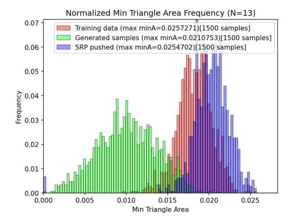

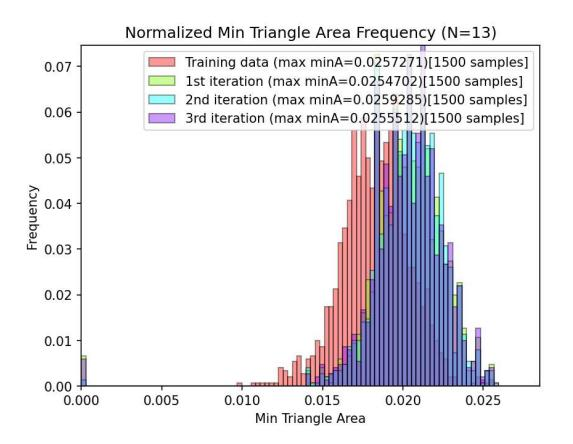

(a) Training vs. generated vs. pushed.

**(b)** Iterations 1–3.

Figure 8. **Heilbronn,** n = 13. Normalized histograms of exact  $A_{\min}$ . Legends report the best achieved  $A_{\min}$  in each set.

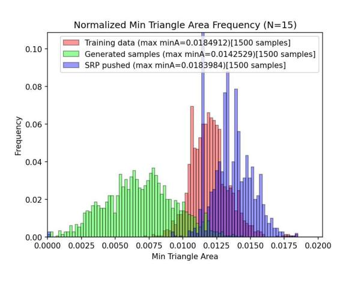

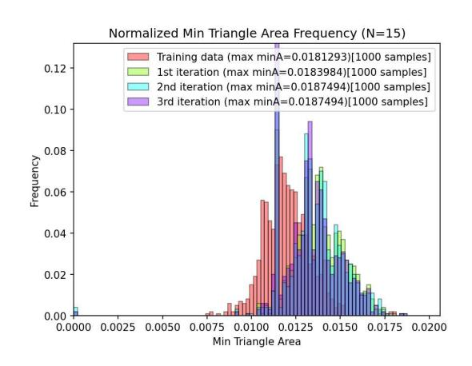

(a) Training vs. generated vs. pushed.

**(b)** Iterations 1–3.

Figure 9. **Heilbronn,** n = 15. Normalized histograms of exact  $A_{min}$ . The final push converts "almost-good" samples into strong local optima, enabling iterative improvement.

(resp. 0.0181293 in the iterative plot), raw generation is 0.0142529, pushing recovers 0.0183984, and the iterative run improves to 0.0187494 by iteration 2 (matched again in iteration 3).

3.4. Circles in Unit Square with Maximal Sum of Radii. Given *n* circles in the unit square, the objective is to maximize the total sum of radii. Improving the sum typically requires coordinated global rearrangements of the contact graph, while feasibility is defined by a large family of hard inequalities. A configuration consists of centers and radii

$$X = ((p_1, r_1), \dots, (p_n, r_n)), \qquad p_i = (x_i, y_i) \in [0, 1]^2, \quad r_i \ge 0.$$

We require *containment* and *non-overlap*:

$$r_i \le x_i, r_i \le 1 - x_i, r_i \le y_i, r_i \le 1 - y_i \quad \text{and} \quad ||p_i - p_j|| \ge r_i + r_j \quad (i \ne j).$$
 (3.5)

3.4.1. *Local search*. As in Section 2, SRP is used both to generate the training set and as the final push applied to flow samples. In the sum-of-radii setting SRP acts on the *full* variable vector

$$X = (p_1, \ldots, p_n, r_1, \ldots, r_n) \in ([0, 1]^2)^n \times [0, \frac{1}{2}]^n, \qquad p_i = (x_i, y_i),$$

Top #1\_(sample 959), N=13, min area=0.0259285138, triangles=1

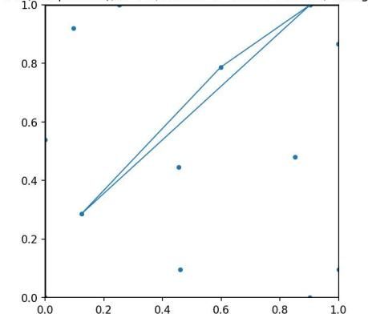

n = 13,  $A_{\min} = 0.0259285138$ 

Top #1 (sample 83), N=15, min area=0.0187493936, triangles=1

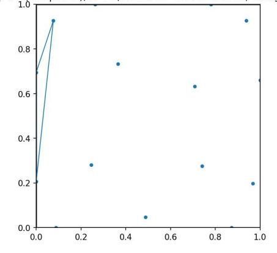

$$n = 15, A_{\min} = 0.0187493936$$

FIGURE 10. Best Heilbronn configurations found by FLowBoost (after final push). The highlighted triangle(s) attain the minimum area. The best known constructions are  $A_{\min} = 0.0270$  for n = 13 and  $A_{\min} = 0.0211$  for n = 15 in [65].

and minimizes the smooth penalty objective

$$\widetilde{\mathcal{L}}(X) = w_{\text{wall}} \sum_{i=1}^{n} \left( [r_i - x_i]_+^2 + [r_i - (1 - x_i)]_+^2 + [r_i - y_i]_+^2 + [r_i - (1 - y_i)]_+^2 \right) + w_{\text{ov}} \sum_{i < j} [r_i + r_j - ||p_i - p_j||]_+^2 - \alpha \sum_{i=1}^{n} r_i,$$
(3.6)

followed by a deterministic L-BFGS-B polish (SciPy) under the box bounds  $p_i \in [0, 1]^2$  and  $r_i \in [0, 1/2]$ . Heuristically, the first two (quadratic) terms drive constraint violations to zero (walls and overlaps), while the last term encourages large total radius.

After SRP+L-BFGS-B we apply a post-processing step: we freeze the centers  $p_1, \ldots, p_n$  produced by the local search and then recompute radii by solving the *exact* max-sum-radii linear program:

$$\max_{r \in \mathbb{R}^{n}_{>0}} \sum_{i=1}^{n} r_{i} \quad \text{s.t.} \quad r_{i} \leq \min\{x_{i}, 1 - x_{i}, y_{i}, 1 - y_{i}\}, \quad r_{i} + r_{j} \leq \|p_{i} - p_{j}\| \ (i < j).$$
 (3.7)

This LP is solved with the HiGHS backend via scipy.optimize.linprog(method="highs"). The LP (3.7) returns a vector  $r^*$  that is (weakly) feasible by construction for the frozen centers  $p_1, \ldots, p_n$ : the circles are allowed to be tangent to each other or to the boundary. Since the objective is  $\sum_i r_i$ , this  $r^*$  maximizes the total radius among all radii compatible with the given centers. In practice we then apply a tiny safety shrink before saving/plotting:

$$r_i \leftarrow \max\{0, r_i^* - \delta\} \qquad (\delta \approx 10^{-9}),$$

so that strict inequalities  $r_i + r_j < \|p_i - p_j\|$  and  $r_i < \min\{x_i, 1 - x_i, y_i, 1 - y_i\}$  hold numerically. This does *not* change the geometry in any meaningful way (it perturbs  $\sum_i r_i$  by at most  $n\delta$ ), but it prevents borderline tangencies from appearing as tiny overlaps due to rounding error in downstream evaluation and visualization.

Note that the LP is *not* used instead of SRP; rather, SRP (and the polish) searches for a good geometry of centers, while the LP performs an exact hard projection of the radii to the best feasible values compatible with that geometry. This plays the same conceptual role as a projection step in GAS: it enforces the hard constraints and optimizes the objective in a subproblem that becomes convex/linear once the centers are fixed.

For pushed flow samples we use a slightly more robust variant: keeping the flow-generated centers fixed, we run SRP+polish+LP twice, once initialized from the flow radii and once from small random radii, and keep the better outcome by  $\sum r_i$ . This mitigates occasional poor radius initialization from the generator.

3.4.2. Training and sampling. Our flow model generates centers only. Concretely, the set-transformer velocity field is trained on (x, y)-tokens (two channels), while radii are treated as auxiliary data used only to compute conditioning statistics and to evaluate/push samples. This decoupling is deliberate: radii are highly constrained by the contact graph and are cheaply recovered by the LP (3.7) once good centers are found. Each training sample carries the summary statistics

$$c(X) = \left(\frac{n}{128}, \sum_{i} r_i, \min_{i < j} (\|p_i - p_j\| - (r_i + r_j)), \min_{i} \min\{x_i - r_i, 1 - x_i - r_i, y_i - r_i, 1 - y_i - r_i\}\right),$$

so the model sees both target quality  $(\sum r_i)$  and slack information (pair and wall clearances).

Sampling follows the PCFM-style loop used throughout (Section 2): we integrate the learned ODE for centers and interleave with simple box projection for feasibility of centers. Radii are then set to zero at generation time and recovered by the final push (SRP+LP) before scoring.

- 3.4.3. Experimental settings. In the runs shown below we use 3000 samples per iteration for each  $n \in \{26, 30, 32\}$ . A representative configuration (used for n = 26 centers-only retrain-and-sample) is: batch size 64, learning rate  $2 \cdot 10^{-4}$ , 1000 epochs, and train\_top\_fraction= 0.5; sampling uses pcfm\_steps= 40 with midpoint integration and a small projection/proximal schedule.
- 3.4.4. Results. Figures 11-13 show the empirical distributions of  $\sum_i r_i$  over successive FLowBoosr iterations. Across all three n, the main effect of boosting is to shift probability mass toward the right tail: the mean increases slightly and the low-score mass is reduced, while the best observed configurations remain at the extreme right edge of the distribution.

For n = 26 the training distribution has mean  $\approx 2.6156$  and maximum 2.635809. After one FLowBoost iteration the mean increases to  $\approx 2.6183$  (and remains  $\approx 2.6177$  in the second), with a visible right-shift and reduced variance, while the maximum is maintained at 2.635809. In particular, the pipeline reliably reproduces near-record configurations and increases their frequency.

For n = 30 the distributions are already tight around  $\sum r_i \approx 2.82$ . Boosting primarily trims the left tail; the mean is stable ( $\approx 2.820$ ) and the maximum stays at 2.842435 across three iterations.

For n = 32 we observe the clearest sustained right-shift at n = 32: the mean increases from  $\approx 2.9161$  (training) to  $\approx 2.9180$  (iteration 2), and the upper tail becomes denser while maintaining the maximum 2.939349. This regime is particularly sensitive to global rearrangements of the contact graph, and the "centers-only" generator plus LP/SRP push appears to be an effective division of labor.

- **Remark 3.1.** The AlphaEvolve report states  $\sum r_i \ge 2.635$  for n = 26 and  $\sum r_i \ge 2.937$  for n = 32 (rounded/thresholded in the paper figure). Our best values in Figures 11 and 13 beat these reported thresholds, and the main benefit of FLowBoost is that such near-extremal solutions occur with substantially higher frequency in the generated-and-pushed distribution.
- 3.5. **Star Discrepancy Minimization.** The star discrepancy problem asks to place n points in the unit square so that they are as uniformly distributed as possible, i.e. minimizing the worst-case deviation between the fraction of points in any axis-aligned box anchored at the origin and that box's area.
- 3.5.1. *Local search*. As in the previous problems, SRP serves both as a training-set generator and as the final push (local search) to repair flow samples (Section 2). Here the local search is driven by a smooth approximation of the minimax objective in (3.1), obtained by (i) smoothing the box indicators and (ii) replacing the supremum over all anchored boxes by a soft-max over a finite set of candidate boxes.

An anchored box is parametrized by its upper-right corner  $q = (a, b) \in [0, 1]^2$ , i.e.  $[0, a) \times [0, b)$ . In the smooth surrogate we do not optimize over a continuum of corners q; instead we choose two finite grids

$$A_x \subset (0,1], \qquad A_y \subset (0,1],$$

and restrict attention to the discrete family of boxes with corners  $(a, b) \in A_x \times A_y$ . We refer to  $A_x$  and  $A_y$  as the evaluation grids (or anchored grids) for the surrogate: they specify which anchored boxes are probed when approximating the worst-case discrepancy. In our implementation  $A_x$ ,  $A_y$  are either (a) a fixed uniform grid (for stable comparisons), or (b) a critical grid obtained from the current point coordinates (unique x- and y-coordinates, with 1 included), refreshed periodically during SRP.

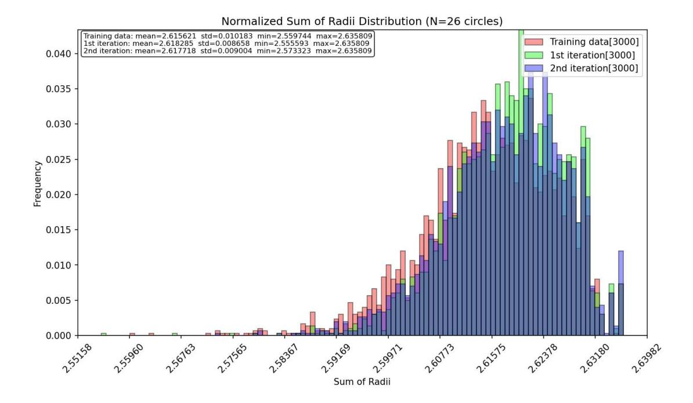

FIGURE 11. Sum-of-radii circle packing, n = 26. Normalized histograms of  $\sum_i r_i$  over the training set and two FLowBoost iterations (each with 3000 samples, after final push).

For an anchored box (a, b) we approximate the indicator  $\mathbf{1}_{x_i < a} \mathbf{1}_{y_i < b}$  by a product of sigmoids

$$\mathbf{1}_{x_i < a} \approx \sigma \left( \frac{a - x_i}{\tau} \right), \qquad \mathbf{1}_{y_i < b} \approx \sigma \left( \frac{b - y_i}{\tau} \right),$$

with gate temperature  $\tau = \text{tau\_sigmoid}$ . For  $(a, b) \in A_x \times A_y$  we then define the smoothed discrepancy at that box by

$$\Delta(a,b) := \frac{1}{N} \sum_{i=1}^{N} \sigma\left(\frac{a-x_i}{\tau}\right) \sigma\left(\frac{b-y_i}{\tau}\right) - ab, \qquad |\Delta| \approx \sqrt{\Delta^2 + \varepsilon},$$

where the  $\sqrt{\Delta^2 + \varepsilon}$  term (with small  $\varepsilon$ ) provides a differentiable proxy for  $|\Delta|$ . The SRP objective then aggregates these values over the grid (via a log-sum-exp soft-max, as described next), so that improving the surrogate corresponds to reducing the worst anchored-box error *among the boxes on the chosen grid*.

We then approximate the supremum in (3.1) by a log-sum-exp (softmax) at sharpness  $\beta$ :

$$\widetilde{D}_{\beta,\tau}(P) := \frac{1}{\beta} \log \sum_{(a,b) \in A_x \times A_y} \exp\left(\beta \sqrt{\Delta(a,b)^2 + \varepsilon}\right). \tag{3.8}$$

SRP anneals  $\beta$  from beta\_softmax\_start to beta\_softmax\_final, so early iterations smooth over many boxes, while later iterations concentrate on near-worst boxes. For efficiency we optionally restrict to the top-K boxes with largest  $|\Delta|$  (Top-K mode), and we update the "critical" grid periodically during SRP.

The push stage is SRP on  $\widetilde{D}_{\beta,\tau}$  (with clipping to  $[0,1]^2$ ), followed by L-BFGS-B on the same surrogate. The exact  $D^*$  is then recomputed and used for selection and sorting.

3.5.2. Training and sampling. The flow model is the same permutation-equivariant set-transformer velocity field as in Section 2, now conditioned by  $c(P) = \left(\frac{N}{128}, D^*(P)\right)$ , where  $D^*(P)$  is the exact discrepancy of the training sample. In addition to the standard flow-matching regression, we include an auxiliary penalty (again as in Section 2) that discourages the projected endpoint from having larger smooth discrepancy than its target, i.e. it penalizes  $(\widetilde{D}_{\beta,\tau} - D^*(P))_+$ .

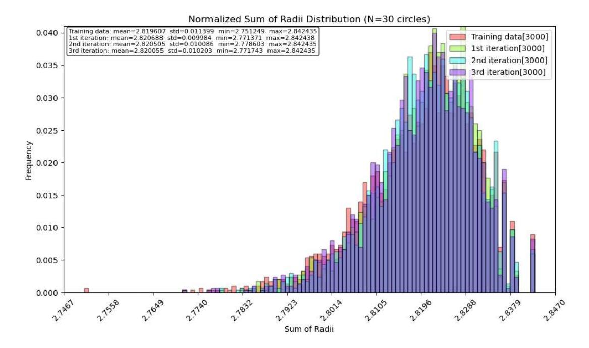

FIGURE 12. Sum-of-radii circle packing, n = 30. Normalized histograms of  $\sum_i r_i$  over the training set and three FLowBoost iterations (each with 3000 samples, after final push).

Sampling uses a PCFM-style loop: we integrate the learned ODE and interleave short gradient steps that *decrease* the differentiable surrogate (3.8) (projection) plus a proximal relaxation toward the path blend. The initial noise distribution  $x_1$  is taken to be Latin hypercube sampling (LHS), which provides a stronger geometric baseline than i.i.d. uniform points. As with other tasks, all samples are evaluated only after the SRP final push.

- 3.5.3. Results. Figures 15 and 16 summarize experiments for N = 20 and N = 60 points (each histogram uses the sample counts stated in the legends). Two consistent effects stand out like for the other tested problems:
- Generation alone is not enough. The raw flow samples (green) have substantially worse discrepancy (larger  $D^*$ ), reflecting that minimax structure is hard to hit without local correction.
- The final push closes the gap (and can slightly improve records). After SRP+L-BFGS-B, the pushed distribution (blue) essentially matches the training regime and modestly improves the best observed values.

For N=20, the training set has mean 0.070105 with best (minimum) 0.063117. Raw generation degrades badly (mean 0.089340). After the final push, the mean improves to 0.069120 and the best value improves slightly to 0.062909 (Figure 15a). In the iterative view (Figure 15b), the first iteration produces the best tail; the second iteration remains better on average than training but does not further improve the minimum.

For N=60 the same phenomenon is more dramatic: raw generation produces discrepancies around 0.08 (mean 0.080165), while the pushed distribution returns to the training scale  $\approx 0.035$  (Figure 16a). Across iterations (Figure 16b), improvements are necessarily small because the training distribution is already tight; nevertheless, iteration 2 improves the best observed value from 0.029515 to 0.029440 and slightly reduces the worst tail (max drops from 0.041322 to 0.040977).

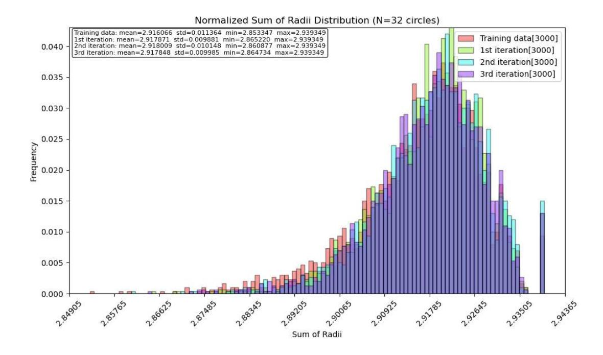

FIGURE 13. Sum-of-radii circle packing, n = 32. Normalized histograms of  $\sum_i r_i$  over the training set and three FLowBoost iterations (each with 3000 samples, after final push).

## 4. Conclusion

We have introduced FLowBoost, a reward-guided closed-loop generative framework for continuous simulation-based optimization that synthesizes ideas from flow-based generative modeling, self-supervised representation learning, and reinforcement learning. The core insight is that generative models need not be passive density estimators trained on static datasets; instead, they can be active participants in the optimization process, receiving direct feedback from the objective function and adapting their sampling distribution accordingly.

The framework rests on three components. First, *Conditional Flow Matching* learns a velocity field that transports a source distribution to the empirical distribution of high-quality solutions, providing a smooth, low-dimensional parameterisation of the solution manifold. Second, *Geometry-Aware Sampling* integrates this vector field while enforcing hard constraints through interleaved projection and proximal relaxation, ensuring that generated samples are geometrically valid without sacrificing fidelity to the learned distribution. Third, *Reward-Guided CFM* fine-tunes the generative model online using importance-weighted reward, with a consistency regulariser, inspired by teacher–student architectures in self-supervised learning, that prevents the failure mode of generative collapse.

The transition from open-loop to closed-loop optimization is the key conceptual advance. In previous open-loop methods, the generative model approximates the distribution of current best solutions, and improvement relies on a mere stochastic hope that sampling occasionally escapes to better basins. In our closed-loop method, the model is fine-tuned online with direct gradient signal from the reward function, systematically guiding sampling toward higher-quality regions while the consistency term maintains the diversity necessary for continued exploration. This transforms the boosting loop from an indirect, variance-driven process into a principled policy-optimization algorithm with controllable convergence behaviour.

We have demonstrated the effectiveness of FLowBoost on four geometric optimization problems: sphere packing in hypercubes, circle packing maximizing sum of radii, the Heilbronn triangle problem,

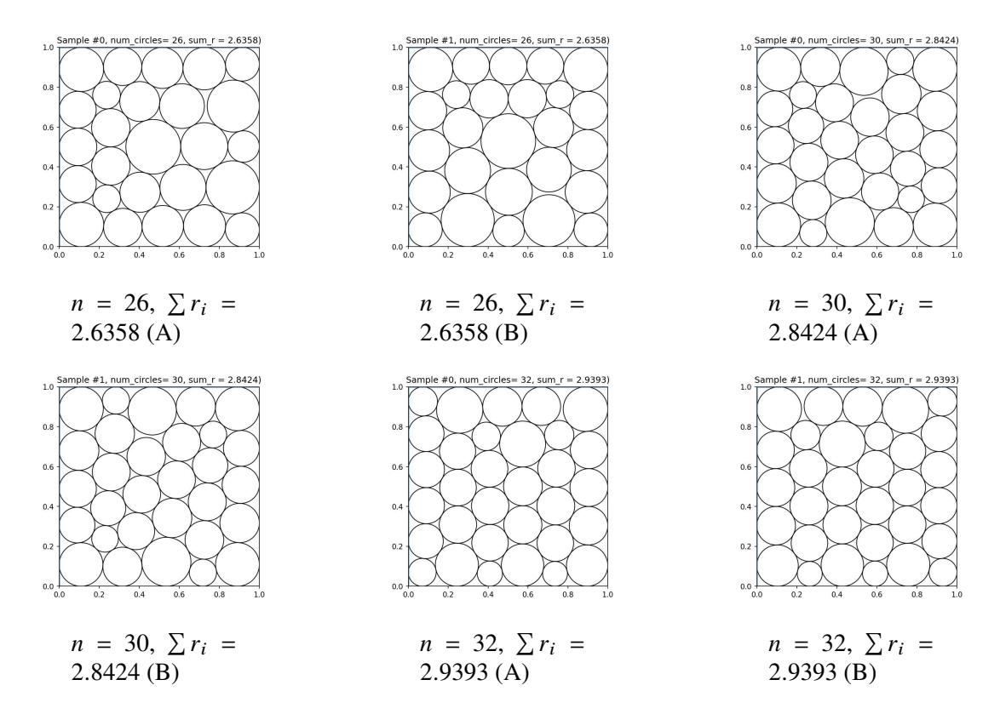

FIGURE 14. Best sum-of-radii circle packings found by FLOWBOOST (after final push). For each  $n \in \{26, 30, 32\}$  we show two distinct arrangements (A/B) attaining the same best objective value  $\sum_{i=1}^{n} r_i$ . For n = 26 and n = 32 these beat the best known result found by AlphaEvolve [2].

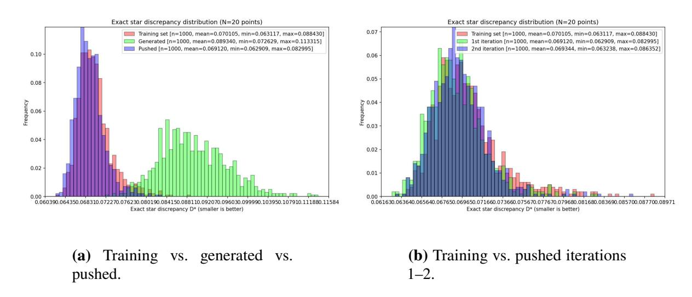

FIGURE 15. Exact star discrepancy, N = 20. Normalized histograms of  $D^*$  (smaller is better).

and star discrepancy minimization. In several cases, FLowBoost discovers configurations that match or exceed the best known results. Crucially, the closed-loop variant achieves these results in remarkably few iterations, beating the available data within a single boosting round, whereas open-loop methods require orders of magnitude more samples to reach comparable quality.

4.1. **Discussion and Future Directions.** Several directions for future work emerge from this study. FLowBoost is suitable to study a broad family of extremal problems in algebra, geometry, combinatorics

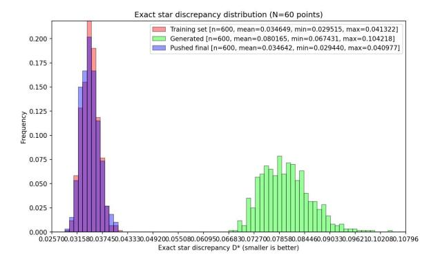

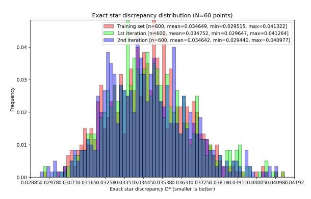

- (a) Training vs. generated vs. pushed.
- **(b)** Training vs. pushed iterations 1–2.

FIGURE 16. Exact star discrepancy, N = 60. The final push is essential: raw generation is far off-scale, but pushing recovers and slightly improves the best tail.

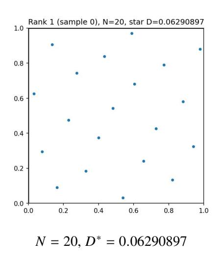

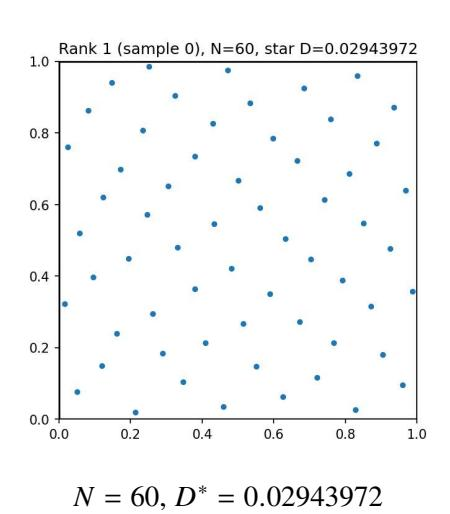

FIGURE 17. Best star-discrepancy point sets found by FLowBoost: they beat the best known constructions 0.073086 (N = 20) and 0.032772 (N = 60) in [67] and for N = 20 it approaches the optimal 0.0604 proved in [66].

and number theory, such as covering problems, discrepancy minimization in higher dimensions, energy minimization on manifolds, optimal transport, constraint-satisfaction problems with continuous variables (e.g. counter-example mining). Many of these share the structure that makes FLowBoost effective, a smooth objective landscape with many local optima, hard constraints that define a complex feasible region, and a lack of exploitable algebraic structure. We anticipate that the same pipeline, with problem-specific adaptations to the projection operator and reward function, will prove effective across this family.

The current framework treats the reward function as a black box, querying it only at generated samples. Incorporating gradient information from differentiable objectives, or learning a surrogate reward model for expensive-to-evaluate functions, could substantially accelerate convergence. Similarly, the teacher-student architecture admits natural extensions, namely an exponential moving average (EMA) teacher, as in DINO [52] and BYOL [57], might provide smoother consistency targets than a frozen checkpoint, and curriculum strategies that progressively tighten the consistency constraint could enable more aggressive exploration in early stages.

From a broader perspective, our experiments suggest that flow-based generative models are not merely tools for image or signal synthesis, but can serve as robust and flexible components in computational and experimental mathematics. The key enabling insight is that the same architectures and training objectives

that capture complex data distributions can, with appropriate closed-loop feedback, be repurposed to *improve* upon those distributions toward extremal configurations. We hope that FLowBoost contributes to a growing paradigm in which machine learning and experimental mathematics are not separate disciplines but mutually reinforcing tools for discovery.

#### ACKNOWLEDGMENT

The authors would like to thank the Center of Mathematical Sciences and Applications (CMSA) at Harvard University for running the 2024 *Mathematics and Machine Learning* program, the organizers of the *Machine Learning and Mathematics* workshop at the Korea Institute for Advanced Study (KIAS), and the organizers of the 2025 MATRIX–MFO Tandem Workshop *Machine Learning and AI for Mathematics*. Our work benefited greatly from the inspiration and discussions at these events.

G.B. gratefully acknowledges help and long discussions with François Charton, Jordan Ellenberg, Geordie Williamson, Adam Zsolt Wagner, Mike Douglas and Amaury Hayat. G.B. and J.K. were supported by the Independent Research Fund Denmark.

B.H. was supported by the Excellence Cluster ORIGINS, funded by the Deutsche Forschungsgemeinschaft (DFG, German Research Foundation) under Germany's Excellence Strategy – EXC-2094-390783311. B.H. extends his gratitude to Lukas Heinrich.

## REFERENCES

- [1] François Charton, Jordan S Ellenberg, Adam Zsolt Wagner, and Geordie Williamson. Patternboost: Constructions in mathematics with a little help from AI. *arXiv preprint arXiv:2411.00566*, 2024. (document), 1, 2.5
- [2] Alexander Novikov, Ngân Vũ, Marvin Eisenberger, Emilien Dupont, Po-Sen Huang, Adam Zsolt Wagner, Sergey Shirobokov, Borislav Kozlovskii, Francisco JR Ruiz, Abbas Mehrabian, et al. Alphaevolve: A coding agent for scientific and algorithmic discovery. *arXiv preprint arXiv:2506.13131*, 2025. (document), 1, 1, 14
- [3] Yang-Hui He. Ai-driven research in pure mathematics and theoretical physics. *Nature Reviews Physics*, 6(9):546–553, 2024. 1
- [4] Leonardo De Moura, Soonho Kong, Jeremy Avigad, Floris Van Doorn, and Jakob von Raumer. The lean theorem prover (system description). In *International Conference on Automated Deduction*, pages 378–388. Springer, 2015. 1
- [5] Kshitij Bansal, Sarah Loos, Markus Rabe, Christian Szegedy, and Stewart Wilcox. Holist: An environment for machine learning of higher order logic theorem proving. In *International Conference on Machine Learning*, pages 454–463. PMLR, 2019.
- [6] Ayush Agrawal, Siddhartha Gadgil, Navin Goyal, Ashvni Narayanan, and Anand Tadipatri. Towards a mathematics formalisation assistant using large language models (2022). *URL https://arxiv.org/abs/2211.07524*, 2022.
- [7] Zhangir Azerbayev, Bartosz Piotrowski, Hailey Schoelkopf, Edward W Ayers, Dragomir Radev, and Jeremy Avigad. Proofnet: Autoformalizing and formally proving undergraduate-level mathematics. *arXiv preprint arXiv:2302.12433*, 2023.
- [8] Kaiyu Yang, Gabriel Poesia, Jingxuan He, Wenda Li, Kristin E. Lauter, Swarat Chaudhuri, and Dawn Song. Position: Formal mathematical reasoning—a new frontier in AI. In *Forty-second International Conference on Machine Learning Position Paper Track*, 2025.
- [9] Johannes Schmitt, Gergely Bérczi, Jasper Dekoninck, Jeremy Feusi, Tim Gehrunger, Raphael Appenzeller, Jim Bryan, Niklas Canova, Timo de Wolff, Filippo Gaia, et al. Improofbench: Benchmarking ai on research-level mathematical proof generation. *arXiv preprint arXiv:2509.26076*, 2025. 1
- [10] Alex Davies, Petar Veličković, Lars Buesing, Sam Blackwell, Daniel Zheng, Nenad Tomašev, Richard Tanburn, Peter Battaglia, Charles Blundell, András Juhász, et al. Advancing mathematics by guiding human intuition with ai. *Nature*, 600(7887):70–74, 2021. 1
- [11] Bin Dong, Xuhua He, Pengfei Jin, Felix Schremmer, and Qingchao Yu. Machine learning assisted exploration for affine deligne–lusztig varieties. *Peking Mathematical Journal*, pages 1–50, 2024.

- [12] Baran Hashemi, Roderic Guigo Corominas, and Alessandro Giacchetto. Can transformers do enumerative geometry? In *The Thirteenth International Conference on Learning Representations*, 2024.
- [13] Yang-Hui He, Kyu-Hwan Lee, Thomas Oliver, and Alexey Pozdnyakov. Murmurations of elliptic curves. *Experimental Mathematics*, 34(3):528–540, 2025.
- [14] Johannes Schmitt. Extremal descendant integrals on moduli spaces of curves: An inequality discovered and proved in collaboration with ai. *arXiv preprint arXiv:2512.14575*, 2025. 1
- [15] Adam Zsolt Wagner. Constructions in combinatorics via neural networks. *arXiv preprint* arXiv:2104.14516, 2021. 1
- [16] Gergely Bérczi, Honglu Fan, and Mingcong Zeng. An ml approach to resolution of singularities. In *Proceeding of ICML TAG Workshop 2023*, 2023.
- [17] Sergei Gukov, James Halverson, Ciprian Manolescu, and Fabian Ruehle. Searching for ribbons with machine learning. *Machine Learning: Science and Technology*, 2023.
- [18] Bogdan Georgiev, Javier Gómez-Serrano, Terence Tao, and Adam Zsolt Wagner. Mathematical exploration and discovery at scale. *arXiv preprint arXiv:2511.02864*, 2025. 1
- [19] A Chervov, A Soibelman, S Lytkin, I Kiselev, S Fironov, A Lukyanenko, A Dolgorukova, A Ogurtsov, F Petrov, S Krymskii, et al. Cayleypy rl: Pathfinding and reinforcement learning on cayley graphs. *arXiv preprint arXiv:2502.18663*, 2025.
- [20] Alberto Alfarano, François Charton, and Amaury Hayat. Global lyapunov functions: a long-standing open problem in mathematics, with symbolic transformers. *Advances in Neural Information Processing Systems*, 37:93643–93670, 2024.
- [21] Ali Shehper, Anibal M. Medina-Mardones, Lucas Fagan, Bartłomiej Lewandowski, Angus Gruen, Yang Qiu, Piotr Kucharski, Zhenghan Wang, and Sergei Gukov. WHAT MAKES MATH PROBLEMS HARD FOR REINFORCEMENT LEARNING: A CASE STUDY. In *The Thirty-ninth Annual Conference on Neural Information Processing Systems*, 2025.
- [22] Gergely Bérczi and Adam Zsolt Wagner. A note on small percolating sets on hypercubes via generative AI, 2024. arXiv:2411.19734. 1
- [23] Satyajith Amaran, Nikolaos V Sahinidis, Bikram Sharda, and Scott J Bury. Simulation optimization: a review of algorithms and applications. *Annals of Operations Research*, 240:351–380, 2016. 1, 2.1
- [24] Ashish Vaswani, Noam Shazeer, Niki Parmar, Jakob Uszkoreit, Llion Jones, Aidan N Gomez, Łukasz Kaiser, and Illia Polosukhin. Attention is all you need. *Advances in neural information processing systems*, 30, 2017. 1, 3.2
- [25] Jonathan Ho, Ajay Jain, and Pieter Abbeel. Denoising diffusion probabilistic models. *Advances in neural information processing systems*, 33:6840–6851, 2020. 1
- [26] Danilo Rezende and Shakir Mohamed. Variational inference with normalizing flows. In *International conference on machine learning*, pages 1530–1538. PMLR, 2015. 1
- [27] Ian Goodfellow, Jean Pouget-Abadie, Mehdi Mirza, Bing Xu, David Warde-Farley, Sherjil Ozair, Aaron Courville, and Yoshua Bengio. Generative adversarial networks. *Communications of the ACM*, 63(11):139–144, 2020. 1
- [28] Diederik P Kingma and Max Welling. Auto-encoding variational bayes. *arXiv preprint* arXiv:1312.6114, 2013. 1
- [29] Yaron Lipman, Ricky TQ Chen, Heli Ben-Hamu, Maximilian Nickel, and Matt Le. Flow matching for generative modeling. *arXiv preprint arXiv:2210.02747*, 2022. 1, 2.2
- [30] Patrick Esser, Sumith Kulal, Andreas Blattmann, Rahim Entezari, Jonas Müller, Harry Saini, Yam Levi, Dominik Lorenz, Axel Sauer, Frederic Boesel, et al. Scaling rectified flow transformers for high-resolution image synthesis. In *Forty-first international conference on machine learning*, 2024.
- [31] Joseph L Watson, David Juergens, Nathaniel R Bennett, Brian L Trippe, Jason Yim, Helen E Eisenach, Woody Ahern, Andrew J Borst, Robert J Ragotte, Lukas F Milles, et al. De novo design of protein structure and function with rfdiffusion. *Nature*, 620(7976):1089–1100, 2023. 1, 1
- [32] Baran Hashemi and Claudius Krause. Deep generative models for detector signature simulation: A taxonomic review. *Reviews in Physics*, 12:100092, 2024. 1
- [33] Bernardino Romera-Paredes, Mohammadamin Barekatain, Alexander Novikov, Matej Balog, M Pawan Kumar, Emilien Dupont, Francisco JR Ruiz, Jordan S Ellenberg, Pengming Wang, Omar

- Fawzi, et al. Mathematical discoveries from program search with large language models. *Nature*, 625(7995):468–475, 2024. 1
- [34] Asankhaya Sharma. Openevolve: an open-source evolutionary coding agent, 2025. 1
- [35] Robert Tjarko Lange, Yuki Imajuku, and Edoardo Cetin. Shinkaevolve: Towards open-ended and sample-efficient program evolution. *arXiv preprint arXiv:2509.19349*, 2025. 1
- [36] John Jumper, Richard Evans, Alexander Pritzel, Tim Green, Michael Figurnov, Olaf Ronneberger, Kathryn Tunyasuvunakool, Russ Bates, Augustin Žídek, Anna Potapenko, et al. Highly accurate protein structure prediction with alphafold. *nature*, 596(7873):583–589, 2021. 1
- [37] Zeming Lin, Halil Akin, Roshan Rao, Brian Hie, Zhongkai Zhu, Wenting Lu, Nikita Smetanin, Robert Verkuil, Ori Kabeli, Yaniv Shmueli, et al. Evolutionary-scale prediction of atomic-level protein structure with a language model. *Science*, 379(6637):1123–1130, 2023. 1
- [38] Abhijit Gosavi and Abhijit Gosavi. Simulation-based optimization, volume 62. Springer, 2015. 2.1
- [39] Emmanuel Bengio, Moksh Jain, Maksym Korablyov, Doina Precup, and Yoshua Bengio. Flow network based generative models for non-iterative diverse candidate generation. *Advances in neural information processing systems*, 34:27381–27394, 2021. 2.1, 2.4
- [40] Moksh Jain, Emmanuel Bengio, Alex Hernandez-Garcia, Jarrid Rector-Brooks, Bonaventure FP Dossou, Chanakya Ajit Ekbote, Jie Fu, Tianyu Zhang, Michael Kilgour, Dinghuai Zhang, et al. Biological sequence design with gflownets. In *International Conference on Machine Learning*, pages 9786–9801. PMLR, 2022. 2.1
- [41] Kyle Cranmer, Johann Brehmer, and Gilles Louppe. The frontier of simulation-based inference. *Proceedings of the National Academy of Sciences*, 117(48):30055–30062, 2020. 2.1
- [42] Michael Deistler, Jan Boelts, Peter Steinbach, Guy Moss, Thomas Moreau, Manuel Gloeckler, Pedro LC Rodrigues, Julia Linhart, Janne K Lappalainen, Benjamin Kurt Miller, et al. Simulation-based inference: A practical guide. *arXiv preprint arXiv:2508.12939*, 2025. 2.1
- [43] Frank Noé, Simon Olsson, Jonas Köhler, and Hao Wu. Boltzmann generators: Sampling equilibrium states of many-body systems with deep learning. *Science*, 365(6457):eaaw1147, 2019. 2.1
- [44] Peter W Battaglia, Jessica B Hamrick, Victor Bapst, Alvaro Sanchez-Gonzalez, Vinicius Zambaldi, Mateusz Malinowski, Andrea Tacchetti, David Raposo, Adam Santoro, Ryan Faulkner, et al. Relational inductive biases, deep learning, and graph networks. *arXiv preprint arXiv:1806.01261*, 2018. 2.2
- [45] Sifan Wang, Xinling Yu, and Paris Perdikaris. When and why pinns fail to train: A neural tangent kernel perspective. *Journal of Computational Physics*, 449:110768, 2022. 2.3
- [46] Ricky TQ Chen and Yaron Lipman. Flow matching on general geometries. *arXiv preprint* arXiv:2302.03660, 2023. 2.3
- [47] Wenyin Zhou, Christopher Iliffe Sprague, Vsevolod Viliuga, Matteo Tadiello, Arne Elofsson, and Hossein Azizpour. Energy-based flow matching for generating 3d molecular structure. *arXiv preprint arXiv:2508.18949*, 2025. 2.3
- [48] Utkarsh Utkarsh, Pengfei Cai, Alan Edelman, Rafael Gomez-Bombarelli, and Christopher Vincent Rackauckas. Physics-constrained flow matching: Sampling generative models with hard constraints. *arXiv preprint arXiv:2506.04171*, 2025. 2.3
- [49] Chaoran Cheng, Boran Han, Danielle C Maddix, Abdul Fatir Ansari, Andrew Stuart, Michael W Mahoney, and Yuyang Wang. Gradient-free generation for hard-constrained systems. *arXiv preprint arXiv:2412.01786*, 2024. 2.3
- [50] Juno Nam, Sulin Liu, Gavin Winter, KyuJung Jun, Soojung Yang, and Rafael Gómez-Bombarelli. Flow matching for accelerated simulation of atomic transport in materials. *arXiv preprint arXiv:2410.01464*, 2024. 2.3
- [51] Randall Balestriero, Mark Ibrahim, Vlad Sobal, Ari Morcos, Shashank Shekhar, Tom Goldstein, Florian Bordes, Adrien Bardes, Gregoire Mialon, Yuandong Tian, et al. A cookbook of self-supervised learning. *arXiv preprint arXiv:2304.12210*, 2023. 2.4
- [52] Mathilde Caron, Hugo Touvron, Ishan Misra, Hervé Jégou, Julien Mairal, Piotr Bojanowski, and Armand Joulin. Emerging properties in self-supervised vision transformers. In *Proceedings of the IEEE/CVF international conference on computer vision*, pages 9650–9660, 2021. 2.4, 2.4, 4.1
- [53] Antti Tarvainen and Harri Valpola. Mean teachers are better role models: Weight-averaged consistency targets improve semi-supervised deep learning results. *Advances in neural information*

- processing systems, 30, 2017. 2.4
- [54] Li Jing, Pascal Vincent, Yann LeCun, and Yuandong Tian. Understanding dimensional collapse in contrastive self-supervised learning. *arXiv* preprint arXiv:2110.09348, 2021. 2.4
- [55] Xue Bin Peng, Aviral Kumar, Grace Zhang, and Sergey Levine. Advantage-weighted regression: Simple and scalable off-policy reinforcement learning. *arXiv preprint arXiv:1910.00177*, 2019. 2.4
- [56] Ashvin Nair, Abhishek Gupta, Murtaza Dalal, and Sergey Levine. Awac: Accelerating online reinforcement learning with offline datasets. *arXiv preprint arXiv:2006.09359*, 2020. 2.4
- [57] Jean-Bastien Grill, Florian Strub, Florent Altché, Corentin Tallec, Pierre Richemond, Elena Buchatskaya, Carl Doersch, Bernardo Avila Pires, Zhaohan Guo, Mohammad Gheshlaghi Azar, et al. Bootstrap your own latent-a new approach to self-supervised learning. *Advances in neural information processing systems*, 33:21271–21284, 2020. 2.4, 4.1
- [58] John Schulman, Filip Wolski, Prafulla Dhariwal, Alec Radford, and Oleg Klimov. Proximal policy optimization algorithms. *arXiv* preprint arXiv:1707.06347, 2017. 2.4
- [59] John Schulman, Sergey Levine, Pieter Abbeel, Michael Jordan, and Philipp Moritz. Trust region policy optimization. In *International conference on machine learning*, pages 1889–1897. PMLR, 2015. 2.4
- [60] Paul F Christiano, Jan Leike, Tom Brown, Miljan Martic, Shane Legg, and Dario Amodei. Deep reinforcement learning from human preferences. *Advances in neural information processing systems*, 30, 2017. 2.4
- [61] Michael Plainer, Hannes Stärk, Charlotte Bunne, and Stephan Günnemann. Transition path sampling with boltzmann generator-based mcmc moves. *arXiv preprint arXiv:2312.05340*, 2023. 2.4
- [62] Maryna S Viazovska. The sphere packing problem in dimension 8. *Annals of mathematics*, pages 991–1015, 2017. 3.1
- [63] Henry Cohn, Abhinav Kumar, Stephen Miller, Danylo Radchenko, and Maryna Viazovska. The sphere packing problem in dimension 24. *Annals of mathematics*, 185(3):1017–1033, 2017. 3.1
- [64] John Horton Conway and Neil JA Sloane. The coxeter–todd lattice, the mitchell group, and related sphere packings. In *Mathematical Proceedings of the Cambridge Philosophical Society*, volume 93, pages 421–440. Cambridge University Press, 1983. 3.1
- [65] Erich Friedman. The Heilbronn problem for squares. https://erich-friedman.github.io/packing/heilbronn/. Online benchmark collection. 3.1, 10
- [66] François Clément, Carola Doerr, Kathrin Klamroth, and Luís Paquete. Constructing optimal star discrepancy sets. *Proceedings of the American Mathematical Society, Series B*, 12:78–90, 2025. 3.1, 17
- [67] ALGO Lab. Star discrepancy benchmark. https://algo.dei.uc.pt/star/. 17
- [68] François Clément, Carola Doerr, and Luís Paquete. Star discrepancy subset selection: Problem formulation and efficient approaches for low dimensions. *Journal of Complexity*, 70:101645, 2022. 3.1
- [69] Juho Lee, Yoonho Lee, Jungtaek Kim, Adam Kosiorek, Seungjin Choi, and Yee Whye Teh. Set transformer: A framework for attention-based permutation-invariant neural networks. In *International conference on machine learning*, pages 3744–3753. PMLR, 2019. 3.2
- [70] Ali Rahimi and Benjamin Recht. Random features for large-scale kernel machines. *Advances in neural information processing systems*, 20, 2007. 3.2
- [71] Ethan Perez, Florian Strub, Harm De Vries, Vincent Dumoulin, and Aaron Courville. Film: Visual reasoning with a general conditioning layer. In *Proceedings of the AAAI conference on artificial intelligence*, volume 32, 2018. 3.2
- [72] Noam Shazeer. Glu variants improve transformer. arXiv preprint arXiv:2002.05202, 2020. 3.2
- [73] Biao Zhang and Rico Sennrich. Root mean square layer normalization. *Advances in neural information processing systems*, 32, 2019. 3.2
- [74] Packomania. Packomania: Database of circle packings. https://www.packomania.com. 3.2.1

AARHUS UNIVERSITY, DENMARK

 ${\it Email\ address:}\ {\tt gergely.berczi@math.au.dk}$ 

MAX PLANCK INSTITUTE FOR MATHEMATICS IN THE SCIENCES, LEIPZIG, GERMANY

Email address: baran.hashemi@mis.mpg.de

AARHUS UNIVERSITY, DENMARK

Email address: jonas.kluever@gmail.com