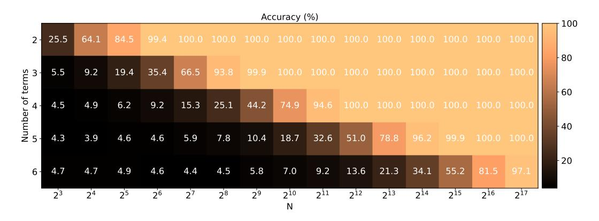
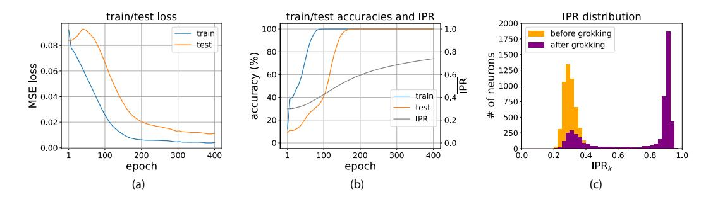
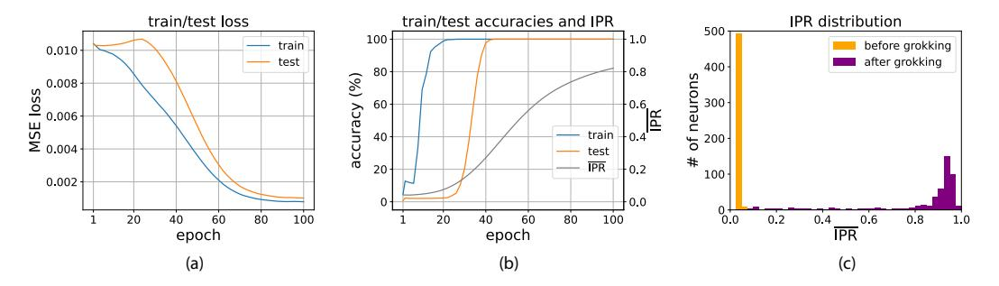

## GROKKING MODULAR POLYNOMIALS

{ddoshi, tianyuh, aritrad, andrey}@umd.edu

## **ABSTRACT**

Neural networks readily learn a subset of the modular arithmetic tasks, while failing to generalize on the rest. This limitation remains unmoved by the choice of architecture and training strategies. On the other hand, an analytical solution for the weights of Multi-layer Perceptron (MLP) networks that generalize on the modular addition task is known in the literature. In this work, we (i) extend the class of analytical solutions to include modular multiplication as well as modular addition with many terms. Additionally, we show that real networks trained on these datasets learn similar solutions upon generalization (grokking). (ii) We combine these "expert" solutions to construct networks that generalize on arbitrary modular polynomials. (iii) We hypothesize a classification of modular polynomials into learnable and non-learnable via neural networks training; and provide experimental evidence supporting our claims.

## 1 Introduction

Modular arithmetic finds applications in many important fields including cryptography (Regev, 2009; Wenger et al., 2023), computer algebra (Fortin et al., 2020), number theory, error detection in serial numbers and music (A. AsKew & Klima, 2018). Recently, modular arithmetic has peaked the interest of the machine learning community due to the phenomenon of *Grokking* (Power et al., 2022) – delayed and sudden generalization that occurs long after memorization. Since it was first observed (Power et al., 2022), many works have attempted to understand *grokking dynamics* (Liu et al., 2022; 2023; Thilak et al., 2022; Notsawo et al., 2023; Kumar et al., 2023; Lyu et al., 2023; Davies et al., 2022; Minegishi et al., 2023). Another line of work attempts to unravel the grokking behaviors using solvable models and mechanistic interpretability (Nanda et al., 2023; Gromov, 2023; Zhong et al., 2023; Barak et al., 2022; Merrill et al., 2023; Doshi et al., 2023; Varma et al., 2023; Rubin et al., 2023). It was noted in Power et al. (2022) that neural networks readily grok a subset of modular arithmetic polynomials while failing to generalize on the rest. This limitation has remained unwavering to variations in architectures and training strategies.

Notably, Gromov (2023) presented an "analytical solution" for the weights of a 2-layer MLP network that has a 100% accuracy on modular addition dataset  $(n_1 + n_2 \mod p)$ . They showed that real networks trained on modular addition data finds similar solutions upon grokking. In this work, we extend the class of analytical solutions to to include modular multiplication (e.g.  $n_1 n_2 \mod p$ ) and modular addition with many terms (e.g.  $n_1 + n_2 + \cdots n_S \mod p$ ). Indeed, we show that training real networks leads to similar network weights upon grokking for both of these tasks. Using these analytical solutions as "experts", we construct networks that offers generalization on arbitrary modular polynomials, *including the ones that are deemed un-learnable in literature*. This formulation opens up the possibility of training Mixture-of-Experts (Jordan & Jacobs, 1993; Shazeer et al., 2017; Lepikhin et al., 2021; Fedus et al., 2022) models that can be trained to learn arbitrary modular arithmetic tasks. Based on our analysis, we hypothesize a classification of modular polynomials into learnable and non-learnable by 2-layer MLPs (and possibly more general architectures such as Transformers and deeper MLPs).

&lt;sup>aCondensed Matter Theory Center, University of Maryland, College Park

&lt;sup>bDepartment of Physics, University of Maryland, College Park

&lt;sup>†Corresponding author

&lt;sup>1The solution for modular multiplication can be also readily extended to many terms. We present the solution for two terms just for simplicity.

## 2 MODULAR ADDITION WITH MANY TERMS

Consider the modular addition task with many terms with arbitrary coefficients:  $(c_1n_1+c_2n_2+\cdots+c_Sn_S) \mod p$ ; where  $c_s \in \mathbb{Z}_p \setminus \{0\}$  are the nonzero coefficients of the modular variables  $n_s \in \mathbb{Z}_p$ . Note that this is a generalization of the modular addition tasks generally considered in literature:  $(n_1+n_2) \mod p$  (Power et al., 2022; Gromov, 2023). We consider a 2-layer MLP (of sufficient width) for this task.

$$\mathbf{f}_{addS}(\mathbf{e}_{n_1} \oplus \cdots \oplus \mathbf{e}_{n_S}) = \mathbf{W}\phi\left(\mathbf{U}(\mathbf{e}_{n_1} \oplus \cdots \oplus \mathbf{e}_{n_S})\right) = \mathbf{W}\phi\left(\mathbf{U}^{(1)}\,\mathbf{e}_{n_1} + \cdots + \mathbf{U}^{(S)}\,\mathbf{e}_{n_S}\right),\tag{1}$$

where  $e_{n_1},\ldots,e_{n_S}\in\mathbb{R}^p$  are one\_hot encoded numbers  $n_1,\ldots,n_S$ . " $\oplus$ " denotes concatenation of vectors  $(e_{n_1}\oplus\cdots\oplus e_{n_S}\in\mathbb{R}^{Sp})$ .  $U\in\mathbb{R}^{N\times Sp}$  and  $W\in\mathbb{R}^{p\times N}$  are the first and second layer weight matrices, respectively.  $\phi(x)=x^S$  is the element-wise activation function. U is decomposed into S blocks of  $N\times P$ :  $U=U^{(1)}\oplus\cdots\oplus U^{(S)}$ .  $U^{(1)},\ldots,U^{(S)}$  serve as embedding matrices for  $n_1,\ldots,n_S$ .  $f(e_{n_1}\oplus\cdots\oplus e_{n_S})\in\mathbb{R}^p$  is the network-output on one example datapoint  $(n_1,\ldots,n_S)$ . The targets are one\_hot encoded answers  $e_{(c_1n_1+\cdots+c_Sn_S)\bmod p}$ .

## 2.1 ANALYTICAL SOLUTION

For a sufficiently wide network, it is possible to write a solution for the weights of the network that generalizes with 100% accuracy.

$$U_{ki}^{(s)} = A \cos \left[ \frac{2\pi}{p} \sigma(k) c_s i + \psi_k^{(s)} \right] \qquad (\forall s \in [0, S])$$

$$W_{qk} = A \cos \left[ -\frac{2\pi}{p} \sigma(k) q - \sum_{s=1}^{S} \psi_k^{(s)} \right], \qquad (2)$$

where  $\sigma(k)$  denotes a random permutation of k in  $S_N$  – reflecting the permutation symmetry of the hidden neurons. The phases  $\psi_k^{(s)}$  uniformly i.i.d. sampled between  $(-\pi,\pi]$ . A is the normalization factor to ensure correct magnitude of the output logits, given by  $A = \left(2^S/(N\cdot S!)\right)^{1/(S+1)}$ . Note that this solution is a generalization of that presented in Gromov (2023).

The rows (columns) of  $U^{(1)},\ldots,U^{(S)},W$  are periodic with frequencies  $\frac{2\pi}{p}\sigma(k)c_1,\cdots,\frac{2\pi}{p}\sigma(k)c_S,-\frac{2\pi}{p}\sigma(k)$ . We can use Inverse Participation Ratio (IPR) (Gromov, 2023; Doshi et al., 2023) to quantify the similarity between the analytical solution and real trained networks. We denote discrete Fourier transforms of the row- (column-) vectors  $U_{k\cdot}^{(s)},W_{\cdot k}$  by  $\mathcal{F}\left(U^{(s)_{k\cdot}}\right),\mathcal{F}(W_{\cdot k}).^2$ 

$$\operatorname{IPR}\left(\boldsymbol{U}_{k\cdot}^{(s)}\right) \coloneqq \left(\frac{\left\|\mathcal{F}\left(\boldsymbol{U}_{k\cdot}^{(s)}\right)\right\|_{4}}{\left\|\mathcal{F}\left(\boldsymbol{U}_{k\cdot}^{(s)}\right)\right\|_{2}}\right)^{4}; \qquad \operatorname{IPR}\left(\boldsymbol{W}_{\cdot k}\right) \coloneqq \left(\frac{\left\|\mathcal{F}\left(\boldsymbol{W}_{\cdot k}\right)\right\|_{4}}{\left\|\mathcal{F}\left(\boldsymbol{W}_{\cdot k}\right)\right\|_{2}}\right)^{4}; \tag{3}$$

where  $\|\cdot\|_P$  denotes the  $L^P$ -norm of the vector. Subscripts " $k\cdot$ " and " $\cdot k$ " denote  $k^{th}$  row and column vectors respectively. We also define the per-neuron IPR as

$$IPR_{k} := \frac{1}{S+1} \left( IPR \left( \boldsymbol{U}_{k \cdot}^{(1)} \right) + \dots + IPR \left( \boldsymbol{U}_{k \cdot}^{(S)} \right) + IPR \left( \boldsymbol{W}_{\cdot k} \right) \right) , \tag{4}$$

and the average IPR of the network by averaging it over all neurons as  $\overline{IPR} := \mathbb{E}_k [IPR_k]$ .

In Figure 1, we show that the analytical solution equation 2 indeed has 100% for sufficient networkwidth. We observe an exponential increase in the required width N due to an exponential increase in the number of cross-terms upon expansion; which needs to be suppressed by the factor 1/N. We refer the reader to Appendix A for a detailed discussion.

&lt;sup>2In general IPR for a vector  $\boldsymbol{u}$  is defined as  $(\|\boldsymbol{u}\|_{2r}/\|\boldsymbol{u}\|_2)^{2r}$ . We set r=2, which is a common choice.

Figure 1: Modular addition with many terms – analytical solution applied to real 2-layer MLP networks (p=23). The solution equation 2 works for sufficiently wide networks. Note that the x-axis is scaled logarithmically; which suggests an exponential increase in the required width upon adding more terms (as expected). The accuracies shown are calculated over a randomly chosen subset of the entire dataset, consisting of 10k examples. The results shown are the best out of 10 random seeds.

#### 2.2 COMPARISON WITH TRAINED NETWORKS

We compare the above solution to networks trained on modular addition data. We see that 2-layer MLP with sufficient width can indeed grok on modular arithmetic data. Moreover, the trained network learns qualitatively similar weights to the analytical solution equation 2. The network generalizes by learning the periodic weights, as evidenced by the initial and final  $\overline{\text{IPR}}$  distributions in Figure 2.

Figure 2: Training on modular addition with many terms  $((n_1 + n_2 + n_3 + n_4) \mod p)$ . p = 11; N = 5000; Adam optimizer; learning rate = 0.005; weight decay = 5.0; 50% of the dataset used for training. (a) MSE loss on train and test dataset. (b) Accuracy on train and test dataset as well as average IPR of the network  $\overline{\text{IPR}}$ . The training curves show the well-known grokking phenomenon; while  $\overline{\text{IPR}}$  monotonically increases. (c) Initial and final IPR distributions, evidently showing periodic neurons in the grokked network, confirming the similarity to equation 2. Note that the IPR for the analytical solution (equation 2) is 1.

## 3 MODULAR MULTIPLICATION

Now consider the modular multiplication task in two variables3:  $(n_1^a n_2^b) \mod p$  (where  $a, b \in \mathbb{Z}_p \setminus \{0\}$ ; p is a prime number). It can be learned by a 2-layer MLP, in a similar fashion as mod-

&lt;sup>3The analysis can be readily extended to modular multiplication in more than two variables; in similar vein as the modular addition analysis present in the previous section.

ular addition (Gromov, 2023; Doshi et al., 2023).

$$f_{mul2}(e_{n_1} \oplus e_{n_2}) = Q\phi(P(e_{n_1} \oplus e_{n_2})) = Q\phi(P^{(1)} e_{n_1} + P^{(2)} e_{n_2}),$$
 (5)

where we have used identical notation to equation 1.

#### 3.1 EXPONENTIAL AND LOGARITHMIC MAPS OVER FINITE FIELDS

Note that both modular addition and multiplication are defined over finite field of prime order p, denoted by  $\mathcal{GF}(p)$ . However, there is a subtle yet crucial difference in the two operations. Addition has a cycle of length p; i.e.  $(p+p+\cdots(n\,\mathrm{times})) \,\mathrm{mod}\, p=0 \,\,\forall\, n\in\mathbb{Z}_p$ ). On the other hand, multiplication has a cycle of length p-1; i.e.  $(g\cdot g\cdot\cdots(n-1\,\mathrm{times})) \,\mathrm{mod}\, p=1$ , where g is a primitive root of  $\mathcal{GF}(p)$ . Note that multiplying any number by 0 gives 0; which warrants a separate treatment for 0. The remaining elements  $r\in\mathbb{Z}_p\backslash\{0\}$  can be used to define the map  $g^r:\mathbb{Z}_p\backslash\{0\}\to\mathbb{Z}_p\backslash\{0\}$ , where g is a primitive root. This exponential is bijective (invertible). Inverting this map defines the logarithmic map with base g. We emphasise that over the finite field  $\mathcal{GF}(p)$ , the exponential  $(g^r)$  and logarithmic  $(\log_g r)$  are basically a reshuffling of the elements of  $\mathbb{Z}_p\backslash\{0\}$ . Reshuffling the numbers according to the logarithmic map turns the multiplication task into the addition task. This is the equivalent of the result  $\log_g(n_1n_2) = \log_g n_1 + \log_g n_2$  on finite fields. Thus, barring the application of this map, the solution for multiplication is similar to equation 6. Note that the element 0 needs to be treated separately while constructing the analytical solution for the network weights.

#### 3.2 Analytical solution

Using the above insights, we now construct the analytical solution for the modular multiplication task. Note that in the following equation,  $i \neq 0$ ;  $j \neq 0$ ;  $k \neq 0$ ,  $q \neq 0$ .

$$P_{00}^{(1)} = 1 , \qquad P_{00}^{(2)} = 1 , \qquad Q_{00} = 1 ,$$

$$P_{0i}^{(1)} = P_{k0}^{(1)} = 0 , \qquad P_{0j}^{(2)} = P_{k0}^{(2)} = 0 , \qquad Q_{q0} = Q_{k0} = 0 ,$$

$$P_{ki}^{(1)} = \left(\frac{2}{N-1}\right)^{-\frac{1}{3}} \cos\left[\frac{2\pi}{p-1}\sigma(k)(a\log_g i) + \psi_k^{(1)}\right],$$

$$P_{kj}^{(2)} = \left(\frac{2}{N-1}\right)^{-\frac{1}{3}} \cos\left[\frac{2\pi}{p-1}\sigma(k)(b\log_g j) + \psi_k^{(2)}\right],$$

$$Q_{qk} = \left(\frac{2}{N-1}\right)^{-\frac{1}{3}} \cos\left[-\frac{2\pi}{p-1}\sigma(k)(\log_g q) - \psi_k^{(1)} - \psi_k^{(2)}\right],$$

$$(6)$$

where  $\sigma(k)$  denotes a random permutation of k in  $S_N$  – reflecting the permutation symmetry of the hidden neurons. The phases  $\psi_k^{(1)}$  and  $\psi_k^{(2)}$  are uniformly i.i.d. sampled between  $(-\pi, \pi]$ .

The rows (columns) of  $P^{(1)}, P^{(2)}, Q$  are periodic with frequencies  $\frac{2\pi}{p-1}a\sigma(k), \frac{2\pi}{p-1}b\sigma(k), -\frac{2\pi}{p-1}\sigma(k)$ , upon performing exponential map on their column (row) indices i,j,q (Note that this excludes the  $0^{th}$  entry in each row (column). Those entries deal with the element 0). This mapping is equivalent to reshuffling the columns (rows) of  $P^{(1)}, P^{(2)}, Q$ . Let us denote these new re-shuffled, 0-excluded weight matrices as  $\overline{P}^{(1)}, \overline{P}^{(2)}, \overline{Q}$ .

$$\overline{P}_{ki}^{(1)} = P_{k,q^i}^{(1)}, \quad \overline{P}_{kj}^{(2)} = P_{k,q^j}^{(2)}, \quad \overline{Q}_{qk} = Q_{g^q,k} \quad (i \neq 0, j \neq 0, q \neq 0, k \neq 0),$$
 (7)

where we denote the shuffled indices (i, j, q) by  $g^i, g^j, g^q$  in the subscript. Again, we can use IPR quantify the periodicity. We denote discrete Fourier transforms of the row- (column-) vectors

&lt;sup>4This is a well-known result called Fermat's little theorem.

$$\overline{\boldsymbol{P}}_{k\cdot}^{(1)}, \overline{\boldsymbol{P}}_{k\cdot}^{(2)}, \overline{\boldsymbol{Q}}_{\cdot k} \text{ by } \mathcal{F}\left(\overline{\boldsymbol{P}}_{k\cdot}^{(1)}\right), \mathcal{F}\left(\overline{\boldsymbol{P}}_{k\cdot}^{(2)}\right), \mathcal{F}\left(\overline{\boldsymbol{Q}}_{\cdot k}\right).$$

$$\operatorname{IPR}\left(\overline{\boldsymbol{P}}_{k\cdot}^{(t)}\right) \coloneqq \left(\frac{\left\|\mathcal{F}\left(\overline{\boldsymbol{P}}_{k\cdot}^{(t)}\right)\right\|_{4}}{\left\|\mathcal{F}\left(\overline{\boldsymbol{P}}_{k\cdot}^{(t)}\right)\right\|_{4}}\right)^{2}; \qquad \operatorname{IPR}\left(\overline{\boldsymbol{Q}}_{\cdot k}\right) \coloneqq \left(\frac{\left\|\mathcal{F}\left(\overline{\boldsymbol{Q}}_{\cdot k}\right)\right\|_{4}}{\left\|\mathcal{F}\left(\overline{\boldsymbol{Q}}_{\cdot k}\right)\right\|_{4}}\right)^{4}, \qquad (8)$$

where  $t \in \{1,2\}$ . Per-neuron IPR as well as average IPR of the network can be defined as before; with  $\mathrm{IPR}_k \coloneqq 1/3 \left( \mathrm{IPR} \left( \overline{\boldsymbol{P}}_{k \cdot}^{(1)} \right) + \mathrm{IPR} \left( \overline{\boldsymbol{P}}_{k \cdot}^{(2)} \right) + \mathrm{IPR} \left( \overline{\boldsymbol{Q}}_{k \cdot} \right) \right)$  and  $\overline{\mathrm{IPR}} \coloneqq \mathbb{E}_k \left[ \mathrm{IPR}_k \right]$ .

#### 3.3 COMPARISON WITH TRAINED NETWORKS

Now, we show that the real networks trained on modular multiplication data learn similar features as Equation 6.

Figure 3: Training on modular multiplication  $(n_1n_2 \mod p)$ . p=97; N=500; Adam optimizer; learning rate =0.005; weight decay =5.0; 50% of the dataset used for training. (a) MSE loss on train and test dataset. (b) Accuracy on train and test dataset as well as average  $\overline{IPR}$  of the network  $\overline{IPR}$ . The training curves show the well-known grokking phenomenon; while  $\overline{IPR}$  monotonically increases. (c) Initial and final IPR distributions, evidently showing periodic neurons in the grokked network, confirming the similarity to equation 6. Note that the IPR for the analytical solution (equation 6) is 1.

## 4 Arbitrary Modular Polynomials

Consider a general modular polynomial in two variables  $(n_1, n_2)$  containing S terms:

$$\left(c_1 n_1^{a_1} n_2^{b_1} + c_2 n_1^{a_2} n_2^{b_2} + \dots + c_S n_1^{a_S} n_2^{b_S}\right) \bmod p. \tag{9}$$

We utilize the solutions presented in previous sections to construct a simple network that generalizes on this task. Each term (without the coefficients  $c_s$ ) can be solved by a 2-layer MLP expert (equations 5, 6) that multiplies the appropriate powers of  $n_1$  and  $n_2$ . The output of these S terms can be added, along with the coefficients, using another expert network (equations 1. The expert networks are designed to perform best when their inputs are close to one\_hot vectors; so we apply (low temperature) Softmax function to the outputs of the each term. As before, the input to the network are stacked, one\_hot represented numbers  $n_1, n_2$ :  $(e_{n_1} \oplus e_{n_2})$ 

$$\mathbf{t}^{(s)} = \mathbf{f}_{mul2}^{(s)}(\mathbf{e}_{n_1} \oplus \mathbf{e}_{n_2}) = \mathbf{Q}^{(s)}\phi\left(\mathbf{P}^{(s,1)}\,\mathbf{e}_{n_1} + \mathbf{P}^{(s,2)}\,\mathbf{e}_{n_2}\right), \qquad (s \in [1, S])$$
(10)

$$\boldsymbol{u}^{(s)} = \operatorname{softmax}_{\beta} \left( \boldsymbol{t}^{(s)} \right),$$
 (11)

$$z = f_{addS} \left( u^{(1)} \oplus \cdots \oplus u^{(S)} \right) = W \phi \left( U^{(1)} u^{(1)} + \cdots + U^{(S)} u^{(S)} \right)$$
(12)

The weights  $P^{(s,1)}$ ,  $P^{(s,2)}$ ,  $Q^{(s)}$  are given by equation 6, with appropriate powers  $a_s$ ,  $b_s$  for each term. Similarly, the weights  $U^{(s)}$ , W are given by equation 2, with coefficients  $c_s$ . We have used

the temperature-scaled Softmax function

$$\operatorname{softmax}_{\beta}\left(t_{i}^{(s)}\right) \coloneqq \frac{e^{\beta t_{i}^{(s)}}}{\sum_{j}^{p} e^{\beta t_{j}^{(s)}}}. \tag{13}$$

We select a high value for the inverse temperature  $\beta \sim 100$  so that the intermediate outputs  $\boldsymbol{u}$  get close to one\_hot vectors. This results in a higher accuracy in the summation of monomials to be performed in the subsequent layers.

In Appendix A, we show the performance of real networks, with the solutions equation 10, on general modular polynomials. We show that such a construction is able to learn polynomials that are un-learnable via training standard network architectures.

Instead of using the analytical weights, one can train the "experts":  $f_{addS}^{(s)}$ ,  $f_{addS}$  separately, on multiplication and addition datasets, and then combine them into a Mixture-of-Experts model.

### 5 DISCUSSION

We have presented the analytical solutions for the weights of 2-layer MLP networks on modular multiplication using the bijective exponential and logarithmic maps on  $\mathcal{GF}(p)$ . We have also presented solutions for modular multiplication with many terms and arbitrary coefficients. In both cases, We have shown that real networks trained on these tasks find similar solutions.

Using these "expert" solutions, we have constructed a network that generalizes on arbitrary modular polynomials, given sufficient width. This network is reminiscent of Mixture-of-Expert models. Therefore, our construction opens the possibility of building such network architectures, that can learn modular arithmetic tasks that SOTA models have been unable to learn. We delegate the exploration of this avenue for future work.

On the other hand, our general formulation of analytical solutions for 2-layer MLP points to a potential classification of modular polynomials into learnable and non-learnable ones.

**Hypothesis 5.1** (Weak generalization). Consider training a 2-layer MLP network trained on a dataset consisting of modular polynomial on  $\mathcal{GF}(p)$  in two variables  $(n_1, n_2)$ , with commonly used optimizers (SGD, Adam etc.), loss functions (MSE, CrossEntropy etc.) and regularization methods (weight decay, dropout, BatchNorm). The network achieves 100% test accuracy if the modular polynomial is of the following form:5

$$h(g_1(n_1) + g_2(n_2)) \bmod p,$$
 (14)

where  $g_1$ ,  $g_2$  and h are functions on  $\mathcal{GF}(p)$ .

- Note that equation 14 also includes modular multiplication: taking  $g_1, g_2$  to be  $\log_g(\cdot)$  and h to be  $exp_q(\cdot)$ , where g is a primitive root of  $\mathcal{GF}(p)$ .
- If the function h is invertible, then it is also possible to construct an analytical solution for this task in a similar fashion as equations 2 and 6.6

In Appendix C, we provide experimental evidence supporting this claim. We show the results of training experiments on various modular polynomials belonging to both categories. We see a clear difference in test performance on tasks that fall under the form equation 14 and those that do not.

It is possible to generalize this claim to other network architectures. General architectures such as transformers and deeper MLPs have also been unable to solve general modular arithmetic tasks that do not fall under equation 14 (Power et al., 2022). Moreover, Doshi et al. (2023) hypothesized a general framework for generalization on modular arithmetic tasks in these architectures. Consequently, we conjecture that Hypothesis 5.1 can be extended to general architectures.

**Hypothesis 5.2** (Strong generalization). *Consider training a standard neural network (MLP, Transformer etc.; not pre-trained) on a dataset consisting of modular polynomial on*  $\mathcal{GF}(p)$  *in two vari-*

&lt;sup>5The networks are naturally trained on < 100% of the entire dataset; and tested on the rest.

&lt;sup>6This general construction of analytical solution was also hypothesized in Gromov (2023).

ables  $(n_1, n_2)$ , with commonly used optimizers (SGD, Adam etc.), loss functions (MSE, CrossEntropy etc.) and regularization methods (weight decay, dropout, BatchNorm). The network achieves 100% test accuracy if the modular polynomial is of the from of equation 14.

While experiments validate these hypotheses, a comprehensive proof of the claim remains an open challenge. Formulating such a proof would require a robust classification of modular polynomials; as well as the understanding biases of neural network training on these tasks. We defer such an analysis to future works.

#### ACKNOWLEDGMENTS

A.G.'s work at the University of Maryland was supported in part by NSF CAREER Award DMR-2045181, Sloan Foundation and the Laboratory for Physical Sciences through the Condensed Matter Theory Center.

#### REFERENCES

- K. Kennedy A. AsKew and V. Klima. Modular arithmetic and microtonal music theory. *PRIMUS*, 28(5):458–471, 2018. doi: 10.1080/10511970.2017.1388314.
- Boaz Barak, Benjamin L. Edelman, Surbhi Goel, Sham M. Kakade, eran malach, and Cyril Zhang. Hidden progress in deep learning: SGD learns parities near the computational limit. In Alice H. Oh, Alekh Agarwal, Danielle Belgrave, and Kyunghyun Cho (eds.), *Advances in Neural Information Processing Systems*, 2022. URL https://openreview.net/forum?id=8XWP2ewX-im.
- Xander Davies, Lauro Langosco, and David Krueger. Unifying grokking and double descent. In NeurIPS ML Safety Workshop, 2022. URL https://openreview.net/forum?id= JqtHMZtqWm.
- Darshil Doshi, Aritra Das, Tianyu He, and Andrey Gromov. To grok or not to grok: Disentangling generalization and memorization on corrupted algorithmic datasets, 2023.
- William Fedus, Barret Zoph, and Noam Shazeer. Switch transformers: Scaling to trillion parameter models with simple and efficient sparsity, 2022.
- Pierre Fortin, Ambroise Fleury, François Lemaire, and Michael Monagan. High performance simd modular arithmetic for polynomial evaluation, 2020.
- Andrey Gromov. Grokking modular arithmetic, 2023. URL https://arxiv.org/abs/2301.02679.
- M.I. Jordan and R.A. Jacobs. Hierarchical mixtures of experts and the em algorithm. In *Proceedings of 1993 International Conference on Neural Networks (IJCNN-93-Nagoya, Japan)*, volume 2, pp. 1339–1344 vol.2, 1993. doi: 10.1109/IJCNN.1993.716791.
- Tanishq Kumar, Blake Bordelon, Samuel J. Gershman, and Cengiz Pehlevan. Grokking as the transition from lazy to rich training dynamics, 2023.
- Dmitry Lepikhin, HyoukJoong Lee, Yuanzhong Xu, Dehao Chen, Orhan Firat, Yanping Huang, Maxim Krikun, Noam Shazeer, and Zhifeng Chen. {GS}hard: Scaling giant models with conditional computation and automatic sharding. In *International Conference on Learning Representations*, 2021. URL https://openreview.net/forum?id=qrwe7XHTmYb.
- Ziming Liu, Ouail Kitouni, Niklas S Nolte, Eric Michaud, Max Tegmark, and Mike Williams. Towards understanding grokking: An effective theory of representation learning. In S. Koyejo, S. Mohamed, A. Agarwal, D. Belgrave, K. Cho, and A. Oh (eds.), *Advances in Neural Information Processing Systems*, volume 35, pp. 34651–34663. Curran Associates, Inc., 2022. URL https://proceedings.neurips.cc/paper\_files/paper/2022/file/dfc310e81992d2e4cedc09ac47eff13e-Paper-Conference.pdf.

- Ziming Liu, Eric J Michaud, and Max Tegmark. Omnigrok: Grokking beyond algorithmic data. In *The Eleventh International Conference on Learning Representations*, 2023. URL https://openreview.net/forum?id=zDiHoIWaOq1.
- Kaifeng Lyu, Jikai Jin, Zhiyuan Li, Simon S. Du, Jason D. Lee, and Wei Hu. Dichotomy of early and late phase implicit biases can provably induce grokking, 2023.
- William Merrill, Nikolaos Tsilivis, and Aman Shukla. A tale of two circuits: Grokking as competition of sparse and dense subnetworks, 2023.
- Gouki Minegishi, Yusuke Iwasawa, and Yutaka Matsuo. Grokking tickets: Lottery tickets accelerate grokking, 2023.
- Neel Nanda, Lawrence Chan, Tom Lieberum, Jess Smith, and Jacob Steinhardt. Progress measures for grokking via mechanistic interpretability, 2023.
- Pascal Jr. Tikeng Notsawo, Hattie Zhou, Mohammad Pezeshki, Irina Rish, and Guillaume Dumas. Predicting grokking long before it happens: A look into the loss landscape of models which grok, 2023.
- Alethea Power, Yuri Burda, Harri Edwards, Igor Babuschkin, and Vedant Misra. Grokking: Generalization beyond overfitting on small algorithmic datasets, 2022.
- Oded Regev. On lattices, learning with errors, random linear codes, and cryptography. *J. ACM*, 56 (6), sep 2009. ISSN 0004-5411. doi: 10.1145/1568318.1568324. URL https://doi.org/10.1145/1568318.1568324.
- Noa Rubin, Inbar Seroussi, and Zohar Ringel. Droplets of good representations: Grokking as a first order phase transition in two layer networks, 2023.
- Noam Shazeer, \*Azalia Mirhoseini, \*Krzysztof Maziarz, Andy Davis, Quoc Le, Geoffrey Hinton, and Jeff Dean. Outrageously large neural networks: The sparsely-gated mixture-of-experts layer. In *International Conference on Learning Representations*, 2017. URL https://openreview.net/forum?id=BlckMDqlg.
- Vimal Thilak, Etai Littwin, Shuangfei Zhai, Omid Saremi, Roni Paiss, and Joshua Susskind. The slingshot mechanism: An empirical study of adaptive optimizers and the grokking phenomenon, 2022.
- Vikrant Varma, Rohin Shah, Zachary Kenton, János Kramár, and Ramana Kumar. Explaining grokking through circuit efficiency, 2023.
- Emily Wenger, Mingjie Chen, François Charton, and Kristin Lauter. Salsa: Attacking lattice cryptography with transformers, 2023.
- Ziqian Zhong, Ziming Liu, Max Tegmark, and Jacob Andreas. The clock and the pizza: Two stories in mechanistic explanation of neural networks, 2023.

## A ANALYTICAL SOLUTIONS

#### A.1 MODULAR MULTIPLICATION

Here we show that that the analytical solution presented in equation 6 solves the modular multiplication task. Let us first calculate the network output for  $n_1 \neq 0, n_2 \neq 0$ . We will treat the cases with  $n_1 = 0$  and/or  $n_2 = 0$  separately.

$$f_{mul2}(e_{n_1} \oplus e_{n_2}) = Q\phi \left( P^{(1)} e_{n_1} + P^{(2)} e_{n_2} \right)$$

$$= \sum_{k=1}^{N} Q_{qk}(P_{kn_1}^{(1)} + P_{kn_2}^{(2)})^2$$

$$= \frac{2}{N-1} \sum_{k=1}^{N-1} \cos \left( -\frac{2\pi}{p-1} \sigma(k) \log_g q - (\psi_k^{(1)} + \psi_k^{(2)}) \right) \cdot \cdot \cdot \left( \cos \left( \frac{2\pi}{p-1} \sigma(k) a \log_g n_1 + \psi_k^{(1)} \right) + \cos \left( \frac{2\pi}{p-1} \sigma(k) b \log_g n_2 + \psi_k^{(2)} \right) \right)^2$$

$$= \frac{2}{N-1} \sum_{k=1}^{N-1} \left\{ \frac{1}{4} \cos \left( \frac{2\pi}{p} \sigma(k) (2a \log_g n_1 - \log_g q) + \psi_k^{(1)} - \psi_k^{(2)} \right) + \frac{1}{4} \cos \left( \frac{2\pi}{p-1} \sigma(k) (2a \log_g n_1 + \log_g q) + 3\psi_k^{(1)} + \phi_k^{(2)} \right) + \frac{1}{4} \cos \left( \frac{2\pi}{p-1} \sigma(k) (2b \log_g n_2 - \log_g q) - \psi_k^{(1)} + \psi_k^{(2)} \right) + \frac{1}{4} \cos \left( \frac{2\pi}{p-1} \sigma(k) (2b \log_g n_2 + \log_g q) + \psi_k^{(1)} + 3\psi_k^{(2)} \right) + \frac{1}{2} \cos \left( \frac{2\pi}{p-1} \sigma(k) (a \log_g n_1 + b \log_g n_2 - \log_g q) \right) + \frac{1}{2} \cos \left( \frac{2\pi}{p-1} \sigma(k) (a \log_g n_1 + b \log_g n_2 - \log_g q) + 2\psi_k^{(1)} + 2\psi_k^{(2)} \right) + \frac{1}{2} \cos \left( \frac{2\pi}{p-1} \sigma(k) (a \log_g n_1 - b \log_g n_2 - \log_g q) - 2\psi_k^{(1)} \right) + \frac{1}{2} \cos \left( \frac{2\pi}{p-1} \sigma(k) (a \log_g n_1 - b \log_g n_2 + \log_g q) + 2\psi_k^{(1)} \right) + \cos \left( -\frac{2\pi}{p-1} \sigma(k) (a \log_g n_1 - b \log_g n_2 + \log_g q) + 2\psi_k^{(1)} \right) + \cos \left( -\frac{2\pi}{p-1} \sigma(k) (a \log_g n_1 - b \log_g n_2 + \log_g q) + 2\psi_k^{(1)} \right) + \cos \left( -\frac{2\pi}{p-1} \sigma(k) (a \log_g n_1 - b \log_g n_2 + \log_g q) + 2\psi_k^{(1)} \right) + \cos \left( -\frac{2\pi}{p-1} \sigma(k) (a \log_g n_1 - b \log_g n_2 + \log_g q) + 2\psi_k^{(1)} \right) + \cos \left( -\frac{2\pi}{p-1} \sigma(k) (a \log_g n_1 - b \log_g n_2 + \log_g q) + 2\psi_k^{(1)} \right) + \cos \left( -\frac{2\pi}{p-1} \sigma(k) (a \log_g n_1 - b \log_g n_2 + \log_g q) + 2\psi_k^{(1)} \right) + \cos \left( -\frac{2\pi}{p-1} \sigma(k) (a \log_g n_1 - b \log_g n_2 + \log_g q) + 2\psi_k^{(1)} \right) + \cos \left( -\frac{2\pi}{p-1} \sigma(k) (a \log_g n_1 - b \log_g n_2 + \log_g q) + 2\psi_k^{(1)} \right) + \cos \left( -\frac{2\pi}{p-1} \sigma(k) (a \log_g n_1 - b \log_g n_2 + \log_g q) + 2\psi_k^{(1)} \right) + \cos \left( -\frac{2\pi}{p-1} \sigma(k) (a \log_g n_1 - b \log_g n_2 + \log_g q) + 2\psi_k^{(1)} \right) + \cos \left( -\frac{2\pi}{p-1} \sigma(k) (a \log_g n_1 - b \log_g n_2 + \log_g q) + 2\psi_k^{(1)} \right) + \cos \left( -\frac{2\pi}{p-1} \sigma(k) (a \log_g n_1 - b \log_g n_2 + \log_g q) + 2\psi_k^{(1)} \right) + \cos \left( -\frac{2\pi}{p-1} \sigma(k) (a \log_g n_1 - b \log_g n_2 + \log_g q) + 2\psi_k^{(1)} \right) + \cos \left( -\frac{2\pi}{p-1} \sigma(k) (a \log_g n_1 - b \log_g n_2 + \log_g q) + 2\psi_k^{(1)} \right) + \cos \left( -\frac{2\pi}{p-1} \sigma(k) (a \log_g n_1 - b \log_g n_2 + \log_$$

We have highlighted the term that will give us the desired output with a box. Note that the desired term is the only one that does not have additive phases in the argument. Recall that the phases  $\psi^{(1)}$  and  $\psi^{(2)}$  are randomly chosen – uniformly iid sampled between  $(-\pi,\pi]$ . Consequently, as N becomes large, all other terms will vanish due to random phase approximation. The only surviving term will be the boxed term. We can write the boxed term in a more suggestive form to make the analytical solution apparent.

$$f_{mul2}(\mathbf{e}_{n_1} \oplus \mathbf{e}_{n_2}) = \frac{1}{N-1} \sum_{k=1}^{N-1} \cos \left( \frac{2\pi}{p-1} \sigma(k) (a \log_g n_1 + b \log_g n_2 - \log_g q) \right)$$

$$= \frac{1}{N-1} \sum_{k=1}^{N-1} \cos \left( \frac{2\pi}{p-1} \sigma(k) (\log_g n_1^a + \log_g n_2^b - \log_g q) \right)$$

$$\sim \delta^p \left( n_1^a n_2^b - q \right) , \tag{16}$$

were we have defined the *modular Kronecker Delta function*  $\delta(\cdot)$  as Kronecker Delta function up to integer multiplies of the modular base p.

$$\delta^{p}(x) = \begin{cases} 1 & x = rp & (r \in \mathbb{Z}) \\ 0 & \text{otherwise} \end{cases}, \tag{17}$$

where  $\mathbb Z$  denotes the set of all integers. Note that  $\delta^p(n_1^an_2^b-q)$  are the desired one\_hot encoded labels for the modular multiplication task, by definition. Thus our network output with periodic weights is indeed a solution.

Note that if either  $n_1 = 0$  or  $n_2 = 0$  (or both), the  $0^{th}$  output logit will be the largest (= 1). Consequently, the network will correctly predict 0 output for such cases.

Hence, the solution presented in equation 6 gives 100% accuracy.

#### A.2 MODULAR ADDITION WITH MANY TERMS

Next, we show that that the analytical solution presented in equation 2 solves the task of modular addition with many terms.

$$f_{addS}(\boldsymbol{e}_{n_{1}} \oplus \cdots \oplus \boldsymbol{e}_{n_{S}})$$

$$= \boldsymbol{W}\phi \left(\boldsymbol{U}^{(1)} \boldsymbol{e}_{n_{1}} + \cdots + \boldsymbol{U}^{(S)} \boldsymbol{e}_{n_{S}}\right)$$

$$= \sum_{k=1}^{N} W_{qk} (U_{kn_{1}}^{(1)} + \cdots P_{kn_{S}}^{(S)})^{S}$$

$$= \frac{2^{S}}{N \cdot S!} \sum_{k=1}^{N} \cos \left(-\frac{2\pi}{p} \sigma(k) q - \sum_{s=1}^{S} \psi_{k}^{(s)}\right) \cdot \left(\cos \left(\frac{2\pi}{p} \sigma(k) c_{1} n_{1} + \psi_{k}^{(1)}\right) + \cdots + \cos \left(\frac{2\pi}{p} \sigma(k) c_{2} n_{2} + \psi_{k}^{(S)}\right)\right)^{S}$$

$$= \frac{2^{S}}{N \cdot S!} \sum_{k=1}^{N} \left\{\cdots + \left[\frac{S!}{2^{S}} \cos \left(\frac{2\pi}{p} \sigma(k) (c_{1} n_{1} + \cdots + c_{S} n_{S} - q)\right)\right] + \cdots\right\}$$

$$(18)$$

Here, we have omitted all the additional terms that drop out due to random phase approximation; showing only the desired surviving term. Note that the number of these additional terms increases exponentially in S; and they are suppressed by a factor of 1/N. This provides an explanation for an exponential behaviour in the required network width N with increasing number of terms in the addition task Figure 1.

$$\mathbf{f}_{addS}(\mathbf{e}_{n_1} \oplus \cdots \oplus \mathbf{e}_{n_S}) = \frac{1}{N} \sum_{k=1}^{N} \cos \left( \frac{2\pi}{p} \sigma(k) (c_1 n_1 + \cdots + c_S n_S - q) \right)$$
$$\sim \delta^p \left( c_1 n_1 + \cdots + c_S n_S - q \right).$$

Note that  $\delta^p(c_1n_1+\cdots+c_Sn_S-q)$  is indeed the desired output for the modular addition task.

## B PERFORMANCE ON ARBITRARY MODULAR POLYNOMIALS

In this appendix, we document the performance of the network constructed in equation 10 on general modular polynomials. Note that none of the polynomials listed in Appendix B are learnable by training 2-layer MLP or other network architectures (such as Transformers). The MSE loss and accuracy are computed on the entire dataset ( $p^2$  examples). The expert-widths are taken to be  $N_1=500$  and  $N_2=2000$ . Since S=3 in all the examples, we use cubic ( $\phi(x)=x^3$ ) activation function. We have truncated the MSE loss at 6 digits after the decimal point.

| Modular polynomial                                                | MSE loss | Accuracy |
|-------------------------------------------------------------------|----------|----------|
| $\left(2n_1^4n_2 + n_1^2n_2^2 + 3n_1n_2^3\right) \bmod 97$        | 0.007674 | 100%     |
| $\left(n_1^5 n_2^3 + 4n_1^2 n_2 + 5n_1^2 n_2^3\right) \mod 97$    | 0.007660 | 100%     |
| $\left(7n_1^4n_2^4 + 2n_1^3n_2^2 + 4n_1^2n_2^5\right) \mod 97$    | 0.007683 | 100%     |
| $\left(2n_1^4n_2 + n_1^2n_2^2 + 3n_1n_2^3\right) \ mod \ 23$      | 0.009758 | 100%     |
| $\left(n_1^5 n_2^3 + 4n_1^2 n_2 + 5n_1^2 n_2^3\right) \ mod \ 23$ | 0.009757 | 100%     |
| $\left(7n_1^4n_2^4 + 2n_1^3n_2^2 + 4n_1^2n_2^5\right) \mod 23$    | 0.010201 | 100%     |

# C TRAINING ON LEARNABLE AND NON-LEARNABLE MODULAR POLYNOMIALS

Here we present the training results on various modular polynomials. 2-layer MLP networks with quadratic activations and width N=5000 are trained Adam optimizer, MSE loss, learning rate =0.005, weight decay =5.0, on 50% of the total dataset.

We observe that training the network on polynomials of the form  $h(g_1(n_1) + g_2(n_2)) \mod p$  results in generalization. Whereas, making a slight change to these polynomials results in inability of the networks to generalize. This serves as evidence for Hypothesis 5.1.

Note that the following results remain qualitatively unchanged upon changing/tuning hyperparameters.

| Modular polynomial                             | Train loss | Test loss | Train acc | Test acc |
|------------------------------------------------|------------|-----------|-----------|----------|
| $(4n_1 + n_2^2)^3 \mod 97$                     | 0.000344   | 0.000569  | 100%      | 100%     |
| $(4n_1 + n_2^2)^3 + n_1 n_2 \mod 97$           | 0.001963   | 0.011216  | 100%      | 2.27%    |
| $(2n_1 + 3n_2)^4 \mod 97$                      | 0.000139   | 0.000172  | 100%      | 100%     |
| $(2n_1 + 3n_2)^4 - n_1^2 \mod 97$              | 0.001916   | 0.011097  | 100%      | 3.93%    |
| $\left(5n_1^3 + 2n_2^4\right)^2 \mod 97$       | 0.000146   | 0.000161  | 100%      | 100%     |
| $\left(5n_1^3 + 2n_2^4\right)^2 - n_2 \mod 97$ | 0.001523   | 0.006108  | 100%      | 72.32%   |
| $(4n_1 + n_2^2)^3 \mod 23$                     | 0.000143   | 0.006274  | 100%      | 100%     |
| $(4n_1 + n_2^2)^3 + n_1 n_2 \mod 23$           | 0.000147   | 0.051866  | 100%      | 1.89%    |
| $(2n_1 + 3n_2)^4 \mod 23$                      | 0.000093   | 0.001010  | 100%      | 100%     |
| $(2n_1 + 3n_2)^4 - n_1^2 \mod 23$              | 0.000132   | 0.049618  | 100%      | 7.17%    |
| $\left(5n_1^3 + 2n_2^4\right)^2 \mod 23$       | 0.000056   | 0.001004  | 100%      | 100%     |
| $\left(5n_1^3 + 2n_2^4\right)^2 - n_2 \mod 23$ | 0.000150   | 0.052047  | 100%      | 2.64%    |