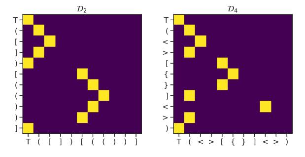
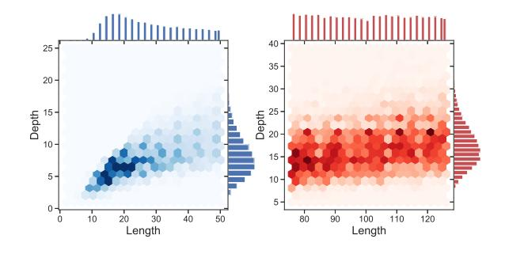
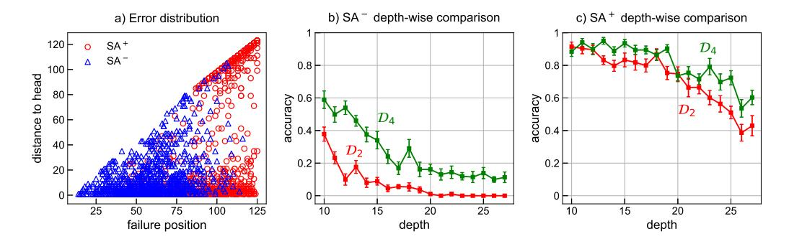
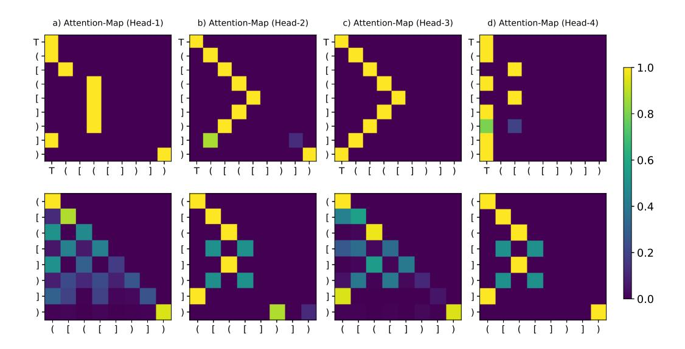
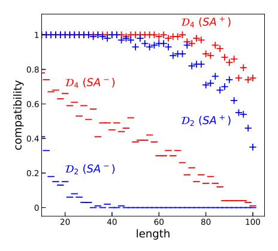

# How Can Self-Attention Networks Recognize Dyck-n Languages?

# Javid Ebrahimi, Dhruv Gelda, Wei Zhang

Visa Research, Palo Alto, USA {jebrahim, dhgelda, wzhan}@visa.com

### **Abstract**

We focus on the recognition of Dyck-n  $(\mathcal{D}_n)$ languages with self-attention (SA) networks, which has been deemed to be a difficult task for these networks. We compare the performance of two variants of SA, one with a starting symbol (SA<sup>+</sup>) and one without (SA<sup>-</sup>). Our results show that SA<sup>+</sup> is able to generalize to longer sequences and deeper dependencies. For  $\mathcal{D}_2$ , we find that  $SA^-$  completely breaks down on long sequences whereas the accuracy of SA<sup>+</sup> is 58.82%. We find attention maps learned by SA<sup>+</sup> to be amenable to interpretation and compatible with a stack-based language recognizer. Surprisingly, the performance of SA networks is at par with LSTMs, which provides evidence on the ability of SA to learn hierarchies without recursion.

# 1 Introduction

There is a growing interest in using formal languages to study fundamental properties of neural architectures, which has led to the extraction of interpretable models (Weiss et al., 2018; Merrill et al., 2020). Recent work (Hao et al., 2018; Suzgun et al., 2019; Skachkova et al., 2018) has explored the generalized Dyck-n  $(\mathcal{D}_n)$  languages, a subset of context-free languages.  $\mathcal{D}_n$  consists of "wellbalanced" strings of parentheses with n different types of bracket pairs, and it is the canonical formal language to study nested structures (Chomsky and Schützenberger, 1959). Weiss et al. (2018) show that LSTMs (Hochreiter and Schmidhuber, 1997) are a variant of the k-counter machine and can recognize  $\mathcal{D}_1$  languages. The dynamic counting mechanisms, however, are not sufficient for  $\mathcal{D}_{n>1}$  as it requires emulating a pushdown automata. Hahn (2020) shows that for a sufficiently large length, Transformers (Vaswani et al., 2017) will fail to transduce the  $\mathcal{D}_2$  language.

We empirically show that with the addition of



Figure 1: Softmax attention scores of the second layer of a suffix-masked  $SA^+$ , for a  $\mathcal{D}_2$  and a  $\mathcal{D}_4$  sequence. The rows and columns denote queries and keys, respectively. The layer produces virtually hard attentions, in which each symbol attends only to one preceding symbol or itself. The attended symbol is either the starting symbol (T) or the last unmatched opening bracket.

a starting symbol to the vocabulary, a two-layer multi-headed SA network (i.e., the encoder of a Transformer) is able to learn  $\mathcal{D}_n$  languages, and generalize to longer sequences, although not perfectly. As shown in Figure 1, the network is able to identify the corresponding closing bracket for an opening bracket, in what resembles a stack-based automaton. For example, the symbol "]" in the string "([])", will first pop "[" from the stack, then it attends to "(", the last unmatched symbol, which will determine the next valid closing bracket. The starting symbol (T) enables the model to learn the occurrence of the end of a clause or the end of the sequence, which can be regarded as a mechanism to represent an empty stack.

Our work is the first to perform an empirical exploration of SA on formal languages. We present detailed comparison between an SA which incorporates a starting symbol (SA<sup>+</sup>), and one that does not (SA<sup>-</sup>), and demonstrate significant differences in their generalization across the length of sequences and the depth of dependencies.

Recent work has suggested that the ability of

self-attention mechanisms to model hierarchical structures is limited. Shen et al. (2019) show that the performance of Transformers on tasks such as logical inference (Bowman et al., 2015) and ListOps (Nangia and Bowman, 2018) is either poor or worse than LSTMs. Tran et al. (2018) have also reported similar results on SA, concluding that recurrence is necessary to model hierarchical structures. In comparison, our results show that SA<sup>+</sup> outperforms LSTM on  $\mathcal{D}_n$  languages except for  $\mathcal{D}_2$ on longer sequences. Papadimitriou and Jurafsky (2020) posit that the ability of neural models to learn hierarchical structures can be attributed to a "looking back" capability, rather than directly encoding hierarchies. Our analysis sheds light on the ability of SA to learn hierarchical structures by elegantly attending to the correct preceding symbol.

# 2 Related Work

Formal languages such as  $a^n b^n, a^n b^n c^m d^m$ (context-free) and  $a^nb^nc^n$ ,  $a^{n+m}b^nc^m$  (contextsensitive) have been extensively studied and recognized using RNNs (Elman, 1990; Das et al., 1992; Steijvers and Grünwald, 1996). But the performance of same recurrent architectures on  $\mathcal{D}_n$  languages is poor and suffers from the lack of generalization. Sennhauser and Berwick (2018) and Bernardy (2018) study the capability of RNNs to predict the next possible closing parenthesis at each position in the  $\mathcal{D}_n$  string and found that the generalization at higher recursion depths is poor. Hao et al. (2018) reported that stack-augmented LSTMs achieve better generalization on  $\mathcal{D}_n$  languages but the network computation does not emulate a stack. More recently, Suzgun et al. (2019) proposed memory-augmented recurrent neural networks and defined a sequence classification task for the recognition of  $\mathcal{D}_n$  languages. Yu et al. (2019) explored the use of attention-based seq2seq framework for  $\mathcal{D}_2$  languages and found that the generalization to sequences with higher depths is still lacking. Besides empirical investigations, formal languages have been studied theoretically for understanding the complexity of neural networks (Siegelmann and Sontag, 1992; Pérez et al., 2019), mostly under assumptions that cannot be met in an experimentinfinite precision or unbounded computation time.

# 3 Experiments

We follow prior works (Gers and Schmidhuber, 2001; Suzgun et al., 2019), and formulate the

recognition of  $\mathcal{D}_n$  languages as a transduction task: Given a valid string, we ask the model to predict the next possible symbols auto-regressively. To illustrate, consider an input string "[()]([" in the  $\mathcal{D}_2$  language, we seek to predict the set of next valid brackets in the string—(, [, or ]. We consider an input to be accurately recognized only if the model correctly predicts the set of all possible brackets at each position in the input sequence. Throughout the paper, we refer to a *clause* as a substring, in which the number of closing and opening brackets of each type of bracket are equal.

We train two multi-headed self-attention networks (i.e., only the encoder part of a Transformer), one of which incorporates an additional starting symbol in the vocabulary (SA<sup>+</sup>), and the other does not (SA<sup>-</sup>). For each model, the number of layers is 2, the number of attention heads h = 4 and model dimension d = 256. We use learnable embeddings to convert each input symbol to a 256-dimensional vector. We also add residual connections around each layer followed by layer normalization, similar to the standard Transformer (Vaswani et al., 2017). We train two unidirectional LSTMs, one with the starting symbol (LSTM<sup>+</sup>) and the other without it (LSTM<sup>-</sup>). The LSTMs use 320-dimensional hidden states and a 320-dimensional vector for learned input embeddings. Our SA and LSTM variants all have around 1.6M parameters<sup>1</sup>. We use Adam (Kingma and Ba, 2015) for optimization. For SA<sup>+</sup> and SA<sup>-</sup>, we vary the learning rate  $\eta$  as

$$\eta = \mathrm{const} \cdot \mathrm{min}(\mathrm{itr}^{-0.5}, \mathrm{itr} \cdot \mathrm{warmup}^{-1.5}), \quad (1)$$

where itr refers to the iteration number and warmup is set to 10k. We tuned the hyper-parameter const, using the values [0.01, 0.1, 1.0, 10], and used 0.1. For LSTMs, we use an initial learning rate of 0.001 but with no learning rate scheduling.

We re-generate the synthetic dataset for our experiments through the probabilistic context-free grammar (PCFG) already described in the existing literature (Suzgun et al., 2019). For instance, the PCFG for Dyck-2 language can be defined as: (1)  $S \rightarrow [S]$ , (2)  $S \rightarrow \{S\}$ , (3)  $S \rightarrow SS$ , and (4)  $S \rightarrow \varepsilon$ , each with probability p=0.25. For each  $\mathcal{D}_n$  language, we train on 32k sequences of length 2-50, validate on 3.2k sequences of length 52-74, and evaluate on 10k sequences divided equally over the length intervals 76-100 and 102-126.

<sup>&</sup>lt;sup>1</sup>We found dropout to be detrimental to the performance, and hence we removed it from all models.

| Model             | $\mathcal{D}_1$ |         | $\mathcal{D}_2$ |         | $\mathcal{D}_3$ |         | $\mathcal{D}_4$ |         |
|-------------------|-----------------|---------|-----------------|---------|-----------------|---------|-----------------|---------|
|                   | 76-100          | 102-126 | 76-100          | 102-126 | 76-100          | 102-126 | 76-100          | 102-126 |
| SA <sup>-</sup>   | 100.0           | 98.88   | 14.52           | 0.006   | 32.62           | 5.50    | 42.94           | 9.080   |
| SA <sup>+</sup>   | 100.0           | 100.0   | 93.34           | 58.82   | 93.18           | 66.88   | 93.78           | 72.38   |
| LSTM <sup>-</sup> | 100.0           | 99.64   | 88.30           | 73.20   | 85.16           | 65.06   | 78.92           | 60.24   |
| LSTM <sup>+</sup> | 100.0           | 100.0   | 87.00           | 70.90   | 82.44           | 63.56   | 76.66           | 55.90   |

Table 1: Performance of SA and LSTM variants on Dyck-n languages for different sequence lengths.



Figure 2: Joint distribution of  $\mathcal{D}_2$  language based on the length and depth of sequences in training (blue) and evaluation (red). The top and right axes also show the marginal distribution for length and depth respectively.

Figure 2 shows the distribution of length and depth of  $\mathcal{D}_2$  sequences in training and evaluation. For higher Dyck languages  $(\mathcal{D}_{n>2})$ , the training and evaluation datasets have similar depth and length distributions because the PCFG give equal probability to different pairs of parentheses and the total probability for rules of the form  $S \to (S)$ ,  $S \to [S]$ , ... is 0.5. We perform experiments on  $\mathcal{D}_1$ ,  $\mathcal{D}_2$ ,  $\mathcal{D}_3$ , and  $\mathcal{D}_4$  languages. Note that the number of pairs of parentheses cannot be increased arbitrarily without requiring modifications to the experimental setup: We varied the length of sequences during training from 2 to 50, which could contain at most 25 different pairs.

In our sequence prediction task, the input vocabulary  $(V_n^i)$  for a  $\mathcal{D}_n$  language consists of 2n+1 symbols: n pairs of brackets (or parentheses), and an additional starting symbol T whereas the output vocabulary  $(V_n^o)$  does not include the starting symbol T. Since there might exist multiple possibilities for the next bracket in a sequence, we adopt a multi-label classification approach wherein the outputs are encoded as a k-hot vector and the network is optimized using the binary cross-entropy loss function given by

$$\mathcal{L} = \sum_{i=1}^{|V_n^o|} \left\{ \hat{y}_i \log(y_i) + (1 - \hat{y}_i) \log(1 - y_i) \right\}, (2)$$

where  $|V_n^o|$  is the output vocabulary size (2 for  $\mathcal{D}_1$ ,

4 for  $\mathcal{D}_2$ , 6 for  $\mathcal{D}_3$ , 8 for  $\mathcal{D}_4$ ),  $\hat{y}_i \in \{0, 1\}$  and  $y_i$  are the target and prediction for label i, respectively.

#### 3.1 Evaluation

Table 1 compares the accuracy of SA<sup>+</sup> and SA<sup>-</sup> on  $\mathcal{D}_1$ ,  $\mathcal{D}_2$ ,  $\mathcal{D}_3$ , and  $\mathcal{D}_4$  languages. For both models, the performance on  $\mathcal{D}_1$  is almost perfect (> 98%) and does not show any degradation with increase in sequence length. The accuracy of SA<sup>-</sup> on  $\mathcal{D}_2$  is 14.52% for sequences with length 76-100 and completely fails beyond it. In comparison, the performance of SA<sup>+</sup> on  $\mathcal{D}_2$  is significantly better, 93.34% and 58.82% for sequences of length 76-100 and 102-126, respectively. The performance of SA<sup>-</sup> improves on  $\mathcal{D}_3$  and  $\mathcal{D}_4$ , compared to  $\mathcal{D}_2$ , with an accuracy of 32.62% and 42.94%, respectively for sequences of length 76-100. The performance of SA<sup>+</sup> is nearly constant ( $\sim$ 93%) on  $\mathcal{D}_{n\geq2}$  for sequences of length 76-10 but there is significant improvement from  $\mathcal{D}_2$  (58.82%) to  $\mathcal{D}_3$  (66.88%) and  $\mathcal{D}_4$  (72.38%) for sequences of length 102-126.

Unlike SA, the performance of LSTM degrades after the addition of the starting symbol, with the biggest drop (4.3%) on  $\mathcal{D}_4$  for sequence length of 102-106. The starting symbol has enabled SA to attend to the correct preceding token, but it has been ineffective for LSTM. For  $\mathcal{D}_2$  sequences of length 102-126, LSTM<sup>-</sup> achieves an accuracy of 73.20%, an improvement of ~14% over SA<sup>+</sup>. On all other comparisons, SA<sup>+</sup> outperforms LSTM<sup>-</sup>.

We observe another interesting distinction between the two architectures. The accuracy of LSTM deteriorates as the number of pairs of brackets increases, while the accuracy of  $SA^+$  and  $SA^-$  improves. To understand this phenomenon, we looked at the training, validation, and test sets of each language, and found that while validation and test sets of each  $\mathcal{D}_n$  language almost always (> 99%) includes sequences of n different brackets, the training set could include sequences of  $1 \le m < n$  types of brackets. This implies that SA benefits from data augmentation with sequences from other languages, and LSTM does not. Put different brackets.



Figure 3: In a, we plot the distribution of the errors made by SA<sup>+</sup> and SA<sup>-</sup>, based on the position of the mispredicted symbol, and its distance to its head. In b and c, we plot the performance of the models as depth increases.

ferently, these results suggest LSTM has a strong inductive bias, perhaps in counting (Kharitonov and Chaabouni, 2020), which might result in degradation of its performance in higher Dyck languages.

# **Algorithm 1:** Compatibility of an attention map with a stack-based recognizer.

```
import numpy as np
def get_match(seq, opening='(['):
 stack, match = [], len(seq) \star [-1]
 for idx, s in enumerate(seq):
  if s in opening:
   stack.insert(0, idx)
  elif s != 'T':
   stack.pop(0)
   if len(stack) > 0:
    match[idx] = stack[0]
 return match
def is_compatible(seq, atten_map):
 match = get_match(seq)
 for idx, m in enumerate(match):
  p = np.argmax(atten_map[idx])
  if m != p and m != -1:
   return False
 return True
```

### 3.2 Error Analysis

We define failure position  $(f_p)$  as the position of the first symbol in the sequence where the model failed to correctly predict the next set of possible parentheses, For each symbol in a  $\mathcal{D}_n$  sequence: (i) depth  $(d_p)$  is the number of unmatched parenthesis up to and including that symbol, and (ii) distance to head  $(d_h)$  is the number of symbols between the mis-classified closing bracket and its opening counterpart. Figure 3a plots the error distribution of  $\mathrm{SA}^+$  and  $\mathrm{SA}^-$  in terms of failure position  $(f_p)$  and distance to head  $(d_h)$ . There is a clear separation between the two models in terms of what "types" of errors are made.  $\mathrm{SA}^-$  breaks quite early on in the sequence, with majority of the errors occurring at  $f_p = 25\text{-}75$  whereas whereas the errors of  $\mathrm{SA}^+$ 

are mostly concentrated at  $f_p > 80$ . Figure 3b-c shows how the performance of SA<sup>+</sup> and SA<sup>-</sup> change with depth  $(d_p)$  for  $\mathcal{D}_2$  and  $\mathcal{D}_4$  languages. SA<sup>-</sup> is very sensitive to depth as the accuracy decreases rapidly for  $\mathcal{D}_2$  from  $\sim 38\%$  at  $d_p = 10$  to a complete failure beyond  $d_p = 20$ . In comparison, the drop in accuracy for SA<sup>+</sup> is less severe,  $\sim 94\%$  at  $d_p = 10$  to  $\sim 72\%$  at  $d_p = 20$ .

# 4 Compatibility With a Stack-Based Recognizer

The ability of (memory-less) SA networks to recognize  $\mathcal{D}_{n>1}$  languages is intriguing. In this section, we contrast second-layer attention maps produced by SA<sup>+</sup> and SA<sup>-</sup>, and provide insights into the underlying mechanism which leads to the success of SA<sup>+</sup>.

We define *compatibility* as a quantitative measure for the alignment of the state of a stack-based language recognizer (M) with the attention maps. M has access to the top of a hypothetical stack, and can push and pop depending on the opening and closing brackets, respectively. Based on this analogy, all opening brackets should attend to themselves, and all closing brackets should first do a pop, and then attend to the last unmatched bracket. For example, the symbol "]" in the string "([])", will first pop "[" from the stack, then it attends to "(", the last unmatched symbol, which will determine the next valid closing bracket. If for every closing symbol in the sequence, the highest attention score of at least one of the heads points to the correct bracket, then we consider the SA compatible. Furthermore, for a fair comparison between SA<sup>+</sup> and SA<sup>-</sup>, we do not push the starting symbol to the stack and only consider closing brackets which are not at the end of a clause.

Figure 5 plots the compatibility of SA<sup>+</sup> and SA<sup>-</sup>



Figure 4: Comparing  $SA^+$  (top) and SA (bottom), based on their attention maps on a  $\mathcal{D}_2$  sequence. The third head of  $SA^+$  has produced weights that are compatible with the operations of a stack-based recognizer.



Figure 5: Compatibility versus length for  $SA^+$  and  $SA^-$  on  $\mathcal{D}_2$  and  $\mathcal{D}_4$  languages.

versus sequence length. We find that SA $^-$  on  $\mathcal{D}_2$  has almost zero compatibility, even for sequence lengths seen during training (40-50), on which it achieves close-to-perfect accuracy. In comparison, SA $^+$  has perfect compatibility for sequence lengths seen during training, and maintains a high degree of compatibility for longer ones. Further, perhaps not surprisingly, the Pearson correlation between the distribution of accuracy and compatibility across lengths 50-100 is  $\gtrsim 90\%$  for all SA $^+$  models.

Figure 4 shows the attention maps of all four heads of  $SA^+$  and  $SA^-$  for the  $\mathcal{D}_2$  sequence "([([])])". We observe that the third head of  $SA^+$  matches our expectation of a stack-based recognizer. An important feature of the third head is that the last symbol attends to the starting symbol T. The starting symbol has enabled the model to learn the occurrence of the end of a clause and the end

of the whole sequence.

# **5** Conclusion and Future Work

We provide empirical evidence on the ability of self-attention (SA) networks to learn generalized  $\mathcal{D}_n$  languages. We compare the performance of two SA networks, SA<sup>+</sup> and SA<sup>-</sup>, which differ only in the inclusion of a starting symbol in their vocabulary. We demonstrate that a simple addition of the starting symbol helps SA<sup>+</sup> generalize to sequences that are longer and have higher depths. The competitive performance of SA (no-recurrence) against LSTMs might seem surprising, considering that the recognition of  $\mathcal{D}_n$  languages is an inherently hierarchical task. From our experiments, we conclude that recognizing Dyck languages is not tied to recursion, but rather learning the right representations to look up the head token. Further, we find that the representations learned by SA<sup>+</sup> are highly interpretable and the network performs computations similar to a stack automaton. Our results suggest formal languages could be an interesting avenue to explore the interplay between performance and interpretability for SA. Comparisons between SA and LSTM reveal interesting contrast between the two architectures which calls for further investigation. Recent work (Katharopoulos et al., 2020) shows how to express the Transformer as an RNN through linearization of the attention mechanism, which could lay grounds for more theoretical analysis of these neural architectures (e.g., inductive biases and complexity.)

## References

- Jean-Philippe Bernardy. 2018. Can recurrent neural networks learn nested recursion? *LiLT (Linguistic Issues in Language Technology)*, 16(1).
- Samuel R Bowman, Gabor Angeli, Christopher Potts, and Christopher D Manning. 2015. A large annotated corpus for learning natural language inference. In *EMNLP*.
- Noam Chomsky and Marcel P Schützenberger. 1959. The algebraic theory of context-free languages. In *Studies in Logic and the Foundations of Mathematics*, volume 26, pages 118–161. Elsevier.
- Sreerupa Das, C Lee Giles, and Guo-Zheng Sun. 1992. Learning context-free grammars: Capabilities and limitations of a recurrent neural network with an external stack memory. In *Proceedings of The Fourteenth Annual Conference of Cognitive Science Society. Indiana University*, page 14.
- Jeffrey L Elman. 1990. Finding structure in time. *Cognitive science*, 14(2):179–211.
- Felix A Gers and E Schmidhuber. 2001. Lstm recurrent networks learn simple context-free and context-sensitive languages. *IEEE Transactions on Neural Networks*, 12(6):1333–1340.
- Michael Hahn. 2020. Theoretical limitations of selfattention in neural sequence models. *Transactions* of the Association for Computational Linguistics, 8:156–171.
- Yiding Hao, William Merrill, Dana Angluin, Robert Frank, Noah Amsel, Andrew Benz, and Simon Mendelsohn. 2018. Context-free transductions with neural stacks. In *Proceedings of the 2018 EMNLP Workshop BlackboxNLP: Analyzing and Interpreting Neural Networks for NLP*.
- Sepp Hochreiter and Jürgen Schmidhuber. 1997. Long short-term memory. *Neural computation*, 9(8):1735–1780.
- Angelos Katharopoulos, Apoorv Vyas, Nikolaos Pappas, and François Fleuret. 2020. Transformers are rnns: Fast autoregressive transformers with linear attention. In *ICML*.
- Eugene Kharitonov and Rahma Chaabouni. 2020. What they do when in doubt: a study of inductive biases in seq2seq learners. arXiv preprint arXiv:2006.14953.
- Diederik P Kingma and Jimmy Ba. 2015. Adam: A method for stochastic optimization. In *ICLR*.
- William Merrill, Gail Weiss, Yoav Goldberg, Roy Schwartz, Noah A Smith, and Eran Yahav. 2020. A formal hierarchy of rnn architectures. In *ACL*.
- Nikita Nangia and Samuel Bowman. 2018. Listops: A diagnostic dataset for latent tree learning. In *Proceedings of the 2018 NAACL: Student Research Workshop*.

- Isabel Papadimitriou and Dan Jurafsky. 2020. Pretraining on non-linguistic structure as a tool for analyzing learning bias in language models. *arXiv preprint arXiv:2004.14601*.
- Jorge Pérez, Javier Marinković, and Pablo Barceló. 2019. On the turing completeness of modern neural network architectures. In *ICLR*.
- Luzi Sennhauser and Robert Berwick. 2018. Evaluating the ability of LSTMs to learn context-free grammars. In *Proceedings of the 2018 EMNLP Workshop BlackboxNLP: Analyzing and Interpreting Neural Networks for NLP*.
- Yikang Shen, Shawn Tan, Arian Hosseini, Zhouhan Lin, Alessandro Sordoni, and Aaron C Courville. 2019. Ordered memory. In *NeurIPS*.
- Hava T Siegelmann and Eduardo D Sontag. 1992. On the computational power of neural nets. In *Proceedings of the fifth annual workshop on Computational learning theory*, pages 440–449.
- Natalia Skachkova, Thomas Alexander Trost, and Dietrich Klakow. 2018. Closing brackets with recurrent neural networks. In *Proceedings of the 2018 EMNLP Workshop BlackboxNLP: Analyzing and Interpreting Neural Networks for NLP*, pages 232–239.
- Mark Steijvers and Peter Grünwald. 1996. A recurrent network that performs a context-sensitive prediction task. In *Proceedings of the 18th annual conference of the cognitive science society*, pages 335–339.
- Mirac Suzgun, Sebastian Gehrmann, Yonatan Belinkov, and Stuart M Shieber. 2019. Memory-augmented recurrent neural networks can learn generalized dyck languages. *arXiv preprint arXiv:1911.03329*.
- Ke M Tran, Arianna Bisazza, and Christof Monz. 2018. The importance of being recurrent for modeling hierarchical structure. In *EMNLP*.
- Ashish Vaswani, Noam Shazeer, Niki Parmar, Jakob Uszkoreit, Llion Jones, Aidan N Gomez, Łukasz Kaiser, and Illia Polosukhin. 2017. Attention is all you need. In *NeurIPS*.
- Gail Weiss, Yoav Goldberg, and Eran Yahav. 2018. On the practical computational power of finite precision rnns for language recognition. In *ACL*.
- Xiang Yu, Ngoc Thang Vu, and Jonas Kuhn. 2019. Learning the dyck language with attention-based seq2seq models. In *Proceedings of the 2019 ACL Workshop BlackboxNLP: Analyzing and Interpreting Neural Networks for NLP*, pages 138–146.