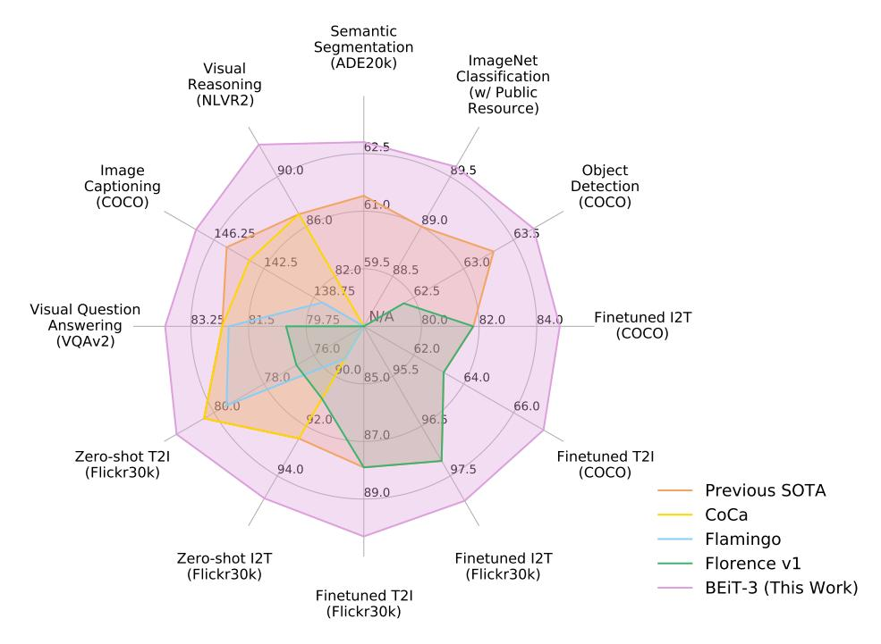
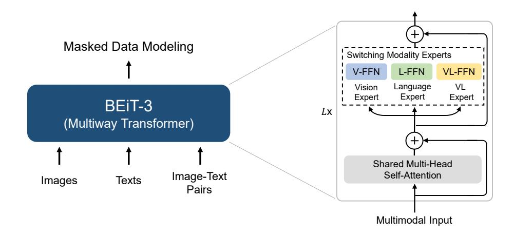
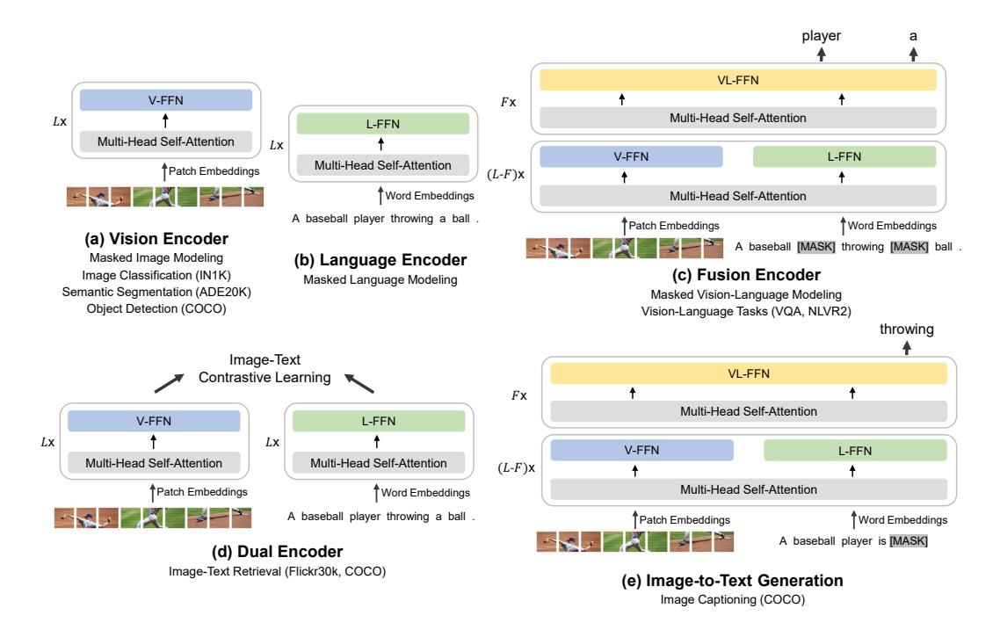

# Image as a Foreign Language: BEIT Pretraining for All Vision and Vision-Language Tasks

Wenhui Wang\* Hangbo Bao\* Li Dong\* Johan Bjorck, Zhiliang Peng, Qiang Liu Kriti Aggarwal, Owais Khan Mohammed, Saksham Singhal, Subhojit Som, Furu Wei† Microsoft Corporation

https://aka.ms/beit-3

#### **Abstract**

A big convergence of language, vision, and multimodal pretraining is emerging. In this work, we introduce a general-purpose multimodal foundation model **BEIT-3**, which achieves state-of-the-art transfer performance on both vision and vision-language tasks. Specifically, we advance the big convergence from three aspects: backbone architecture, pretraining task, and model scaling up. We introduce Multiway Transformers for general-purpose modeling, where the modular architecture enables both deep fusion and modality-specific encoding. Based on the shared backbone, we perform masked "language" modeling on images (**Imglish**), texts (English), and image-text pairs ("parallel sentences") in a unified manner. Experimental results show that BEIT-3 obtains state-of-the-art performance on object detection (COCO), semantic segmentation (ADE20K), image classification (ImageNet), visual reasoning (NLVR2), visual question answering (VQAv2), image captioning (COCO), and cross-modal retrieval (Flickr30K, COCO).

Figure 1: BEIT-3 achieves state-of-the-art performance on a broad range of tasks compared with other customized or foundation models. I2T/T2I is short for image-to-text/text-to-image retrieval.

\* Equal contribution. † Corresponding author.

| Category        | Task                                      | Dataset           | Metric     | Previous SOTA                      | BEIT-3                     |
|-----------------|-------------------------------------------|-------------------|------------|------------------------------------|----------------------------|
|                 | Semantic Segmentation                     | ADE20K            | mIoU       | 61.4 (FD-SwinV2)                   | 62.8 (+1.4)                |
| Vision          | Object Detection Instance Segmentation | COCO COCO      | AP AP   | 63.3 (DINO) 54.7 (Mask DINO)    | 63.7 (+0.4) 54.8 (+0.1) |
|                 | Image Classification                      | ImageNet†         | Top-1 acc. | 89.0 (FD-CLIP)                     | 89.6 (+0.6)                |
|                 | Visual Reasoning                          | NLVR2             | Acc.       | 87.0 (CoCa)                        | 92.6 (+5.6)                |
|                 | Visual QA                                 | VQAv2             | VQA acc.   | 82.3 (CoCa)                        | 84.0 (+1.7)                |
| Vision-Language | Image Captioning                          | COCO‡             | CIDEr      | 145.3 (OFA)                        | 147.6 (+2.3)               |
|                 | Finetuned Retrieval                       | COCO Flickr30K | R@1        | 72.5 (Florence) 92.6 (Florence) | 76.0 (+3.5) 94.2 (+1.6) |
|                 | Zero-shot Retrieval                       | Flickr30K         | R@1        | 86.5 (CoCa)                        | 88.2 (+1.7)                |

Table 1: Overview of BEIT-3 results on various vision and vision-language benchmarks. We compare with previous state-of-the-art models, including FD-SwinV2 [WHX+22], DINO [ZLL+22], Mask DINO [ZLL+22], FD-CLIP [WHX+22], CoCa [YWV+22], OFA [WYM+22], Florence [YCC+21]. We report the average of top-1 image-to-text and text-to-image results for retrieval tasks. "†" indicates ImageNet results only using publicly accessible resources. "‡" indicates image captioning results without CIDEr optimization.

## 1 Introduction: The Big Convergence

Recent years have featured a trend toward the big convergence of language [RNSS18, DCLT19, DYW+19], vision [BDPW22, PDB+22], and multimodal [WBDW21, RKH+21, YWV+22] pretraining. By performing large-scale pretraining on massive data, we can easily transfer the models to various downstream tasks. It is appealing that we can pretrain a general-purpose foundation model that handles multiple modalities. In this work, we advance the convergence trend for vision-language pretraining from the following three aspects.

First, the success of Transformers [VSP+17] is translated from language to vision [DBK+20] and multimodal [KSK21, WBDW21] problems. The unification of network architectures enables us to seamlessly handle multiple modalities. For vision-language modeling, there are various ways to apply Transformers due to the different natures of downstream tasks. For example, the dual-encoder architecture is used for efficient retrieval [RKH+21], encoder-decoder networks for generation tasks [WYY+21], and the fusion-encoder architecture for image-text encoding [KSK21]. However, most foundation models have to manually convert the end-task formats according to the specific architectures. Moreover, the parameters are usually not effectively shared across modalities. In this work, we adopt Multiway Transformers [WBDW21] for general-purpose modeling, i.e., one unified architecture shared for various downstream tasks. The modular network also comprehensively considers modality-specific encoding and cross-modality fusion.

Second, the pretraining task based on masked data modeling has been successfully applied to various modalities, such as texts [DCLT19], images [BDPW22, PDB+22], and image-text pairs [BWDW22]. Current vision-language foundation models usually multitask other pretraining objectives (such as image-text matching), rendering scaling-up unfriendly and inefficient. In contrast, we only use one pretraining task, i.e., mask-then-predict, to train a general-purpose multimodal foundation model. By regarding the image as a foreign language (i.e., *Imglish*), we handle texts and images in the same manner without fundamental modeling differences. Consequentially, image-text pairs are utilized as "parallel sentences" in order to learn the alignments between modalities. We also show that the simple yet effective method learns strong transferable representations, achieving state-of-the-art performance on both vision and vision-language tasks. The prominent success demonstrates the superiority of generative pretraining [DCLT19, BDPW22].

Third, scaling up the model size and data size universally improves the generalization quality of foundation models, so that we can transfer them to various downstream tasks. We follow the philosophy and scale up the model size to billions of parameters. Moreover, we scale up the pretraining data size in our experiments while only using publicly accessible resources for academic

Figure 2: Overview of BEIT-3 pretraining. We perform masked data modeling on monomodal (i.e., images, and texts) and multimodal (i.e., image-text pairs) data with a shared Multiway Transformer as the backbone network.

reproducibility. Although without using any private data, our method outperforms state-of-the-art foundation models that rely on in-house data by a decent margin. In addition, the scaling up benefits from treating images as a foreign language, as we can directly reuse the pipeline developed for large-scale language model pretraining.

In this work, we take advantage of the above ideas to pretrain a general-purpose multimodal foundation model BEIT-3. We pretrain a Multiway Transformer by performing masked data modeling on images, texts, and image-text pairs. During pretraining, we randomly mask some proportion of text tokens or image patches. The self-supervised learning objective is to recover the original tokens (i.e., text tokens, or visual tokens) given corrupted inputs. The model is general-purpose in the sense that it can be repurposed for various tasks regardless of input modalities, or output formats.

As shown in Figure 1 and Table 1, BEIT-3 achieves state-of-the-art transfer performance across a broad range of vision and vision-language tasks. We evaluate BEIT-3 on extensive downstream tasks and datasets, i.e., object detection (COCO), instance segmentation (COCO), semantic segmentation (ADE20K), image classification (ImageNet), visual reasoning (NLVR2), visual question answering (VQAv2), image captioning (COCO), and cross-modal retrieval (Flickr30K, COCO). Specifically, our model outperforms previous strong foundation models [YWV+22, ADL+22, YCC+21] despite that we only use public resources for pretraining and finetuning. The model also obtains better results than specialized models. Moreover, BEIT-3 not only performs well on vision-language tasks but also on vision tasks (such as object detection, and semantic segmentation).

## 2 BEIT-3: A General-Purpose Multimodal Foundation Model

As shown in Figure 2, BEIT-3 is pretrained by masked data modeling on monomodal and multimodal data, using a shared Multiway Transformer network. The model can be transferred to various vision and vision-language downstream tasks.

#### 2.1 Backbone Network: Multiway Transformers

We use Multiway Transformers [WBDW21] as the backbone model to encode different modalities. As shown in Figure 2, each Multiway Transformer block consists of a shared self-attention module, and a pool of feed-forward networks (i.e., modality experts) used for different modalities. We route each input token to the experts depending on its modality. In our implementation, each layer contains a vision expert and a language expert. Moreover, the top three layers have vision-language experts designed for fusion encoders. Refer to Figure 3 (a)(b)(c) for more detailed modeling layouts. Using a pool of modality experts encourages the model to capture more modality-specific information. The shared self-attention module learns the alignment between different modalities and enables deep fusion for multimodal (such as vision-language) tasks.

Figure 3: BEIT-3 can be transferred to various vision and vision-language downstream tasks. With a shared Multiway Transformer, we can reuse the model as (a)(b) vision or language encoders; (c) fusion encoders that jointly encode image-text pairs for deep interaction; (d) dual encoders that separately encode modalities for efficient retrieval; (e) sequence-to-sequence learning for image-to-text generation.

As shown in Figure 3, the unified architecture enables BEIT-3 to support a wide range of downstream tasks. For example, BEIT-3 can be used as an image backbone for various vision tasks, including image classification, object detection, instance segmentation, and semantic segmentation. It can also be finetuned as a dual encoder for efficient image-text retrieval, and a fusion model for multimodal understanding and generation tasks.

#### 2.2 Pretraining Task: Masked Data Modeling

We pretrain BEIT-3 via a unified masked data modeling [BWDW22] objective on monomodal (i.e., images, and texts) and multimodal data (i.e., image-text pairs). During pretraining, we randomly mask some percentage of text tokens or image patches and train the model to recover the masked tokens. The unified mask-then-predict task not only learns representations but also learns the alignment of different modalities. Specifically, text data is tokenized by a SentencePiece tokenizer [KR18]. Image data is tokenized by the tokenizer of BEIT v2 [PDB+22] to obtain the discrete visual tokens as the reconstructed targets. We randomly mask 15% tokens of monomodal texts and 50% tokens of texts from image-text pairs. For images, we mask 40% of image patches using a block-wise masking strategy as in BEIT [BDPW22, PDB+22].

We only use one pretraining task, which makes the training process scaling-up friendly. In contrast, previous vision-language models [LYL+20, ZLH+21, KSK21, LSG+21, WBDW21, LLXH22, YWV+22] usually employ multiple pretraining tasks, such as image-text contrast, image-text matching, and word-patch/region alignment. We show that a much smaller pretraining batch size can be used with the mask-then-predict task. In comparison, contrastive-based models [RKH+21, JYX+21, YCC+21, YWV+22] usually need a very large batch size2 for pretraining, which brings more engineering challenges, such as GPU memory cost.

&lt;sup>2For example, CoCa [YWV+22] uses 65k batch size, CLIP [RKH+21] uses 32k batch size, and Florence [YCC+21] uses 24k batch size. BEIT-3 uses a much smaller 6k batch size for pretraining.

| Model   | #Lavers  | Hidden | MLP  | #Parameters |       |        |                  |       |
|---------|----------|--------|------|-------------|-------|--------|------------------|-------|
| 1,10001 | 224, 015 | Size   | Size | V-FFN       | L-FFN | VL-FFN | Shared Attention | Total |
| BEIT-3  | 40       | 1408   | 6144 | 692M        | 692M  | 52M    | 317M             | 1.9B  |

Table 2: Model configuration of BEIT-3. The architecture layout follows ViT-giant [ZKHB21].

| Data                     | Source                                                       | Size                    |
|--------------------------|--------------------------------------------------------------|-------------------------|
| Image-Text Pair Image | CC12M, CC3M, SBU, COCO, VG ImageNet-21K                   | 21M pairs 14M images |
| Text                     | English Wikipedia, BookCorpus, OpenWebText, CC-News, Stories | 160GB documents         |

Table 3: Pretraining data of BEIT-3. All the data are academically accessible.

#### 2.3 Scaling Up: BEIT-3 Pretraining

**Backbone Network** BEIT-3 is a giant-size foundation model following the setup of ViT-giant [ZKHB21]. As shown in Table 2, the model consists of a 40-layer Multiway Transformer with 1408 hidden size, 6144 intermediate size, and 16 attention heads. All layers contain both vision experts and language experts. Vision-language experts are also employed in the top three Multiway Transformer layers. The self-attention module is shared across different modalities. BEIT-3 consists of 1.9B parameters in total, including 692M parameters for vision experts, 692M parameters for language experts, 52M parameters for vision-language experts, and 317M parameters for the shared self-attention module. Notice that only vision-related parameters (i.e., comparable size as ViT-giant; about 1B) are activated when the model is used as a vision encoder.

**Pretraining Data** BEIT-3 is pretrained on both monomodal and multimodal data shown in Table 3. For multimodal data, there are about 15M images and 21M image-text pairs collected from five public datasets: Conceptual 12M (CC12M) [CSDS21], Conceptual Captions (CC3M) [SDGS18], SBU Captions (SBU) [OKB11], COCO [LMB+14] and Visual Genome (VG) [KZG+17]. For monomodal data, we use 14M images from ImageNet-21K and 160GB text corpora [BDW+20] from English Wikipedia, BookCorpus [ZKZ+15], OpenWebText3, CC-News [LOG+19], and Stories [TL18].

**Pretraining Settings** We pretrain BEIT-3 for 1M steps. Each batch contains 6144 samples in total, including 2048 images, 2048 texts and 2048 image-text pairs. The batch size is much smaller than contrastive models [RKH+21, JYX+21, YWV+22]. BEIT-3 uses  $14 \times 14$  patch size and is pretrained at resolution  $224 \times 224$ . We use the same image augmentation as in BEIT [BDPW22], including random resized cropping, horizontal flipping, and color jittering [WXYL18]. A SentencePiece tokenizer [KR18] with 64k vocab size is employed to tokenize the text data. We use the AdamW [LH19] optimizer with  $\beta_1 = 0.9$ ,  $\beta_2 = 0.98$  and  $\epsilon = 1\text{e-}6$  for optimization. We use a cosine learning rate decay scheduler with a peak learning rate of 1e-3 and a linear warmup of 10k steps. The weight decay is 0.05. Stochastic depth [HSL+16] with a rate of 0.1 is used. The BEiT initialization algorithm4 [BDPW22] is used to stabilize Transformer training.

## 3 Experiments on Vision and Vision-Language Tasks

We extensively evaluate BEIT-3 on major public benchmarks for both vision-language and vision tasks. Table 1 presents the overview of results. BEIT-3 obtains state-of-the-art performance on a wide range of vision and vision-language tasks.

3http://skylion007.github.io/OpenWebTextCorpus

&lt;sup>4We first randomly initialize the parameters within a small range, e.g., [-0.02, 0.02]. Next, we rescale the l-th Transformer layer's output matrices (i.e., the last linear projection within each sublayer) of self-attention and FFN by  $\frac{1}{\sqrt{2l}}$ .

| Model                                 | VQAv2    |          | NL    | VR2    | COCO Captioning |      |       |      |
|---------------------------------------|----------|----------|-------|--------|-----------------|------|-------|------|
| i i i i i i i i i i i i i i i i i i i | test-dev | test-std | dev   | test-P | B@4             | M    | С     | S    |
| Oscar [LYL + 20]           | 73.61    | 73.82    | 79.12 | 80.37  | 37.4            | 30.7 | 127.8 | 23.5 |
| VinVL [ZLH + 21]           | 76.52    | 76.60    | 82.67 | 83.98  | 38.5            | 30.4 | 130.8 | 23.4 |
| ALBEF [LSG + 21]           | 75.84    | 76.04    | 82.55 | 83.14  | -               | -    | -     | -    |
| BLIP [LLXH22]                         | 78.25    | 78.32    | 82.15 | 82.24  | 40.4            | -    | 136.7 | -    |
| SimVLM [WYY + 21]          | 80.03    | 80.34    | 84.53 | 85.15  | 40.6            | 33.7 | 143.3 | 25.4 |
| Florence [YCC + 21]        | 80.16    | 80.36    | -     | -      | -               | -    | -     | -    |
| OFA [WYM + 22]             | 82.00    | 82.00    | -     | -      | 43.9            | 31.8 | 145.3 | 24.8 |
| Flamingo [ADL + 22]        | 82.00    | 82.10    | -     | -      | -               | -    | 138.1 | -    |
| CoCa [YWV + 22]            | 82.30    | 82.30    | 86.10 | 87.00  | 40.9            | 33.9 | 143.6 | 24.7 |
| BEIT-3                                | 84.19    | 84.03    | 91.51 | 92.58  | 44.1            | 32.4 | 147.6 | 25.4 |

Table 4: Results of visual question answering, visual reasoning, and image captioning tasks. We report *vqa-score* on VQAv2 test-dev and test-standard splits, accuracy for NLVR2 development set and public test set (test-P). For COCO image captioning, we report BLEU@4 (B@4), METEOR (M), CIDEr (C), and SPICE (S) on the Karpathy test split. For simplicity, we report captioning results without using CIDEr optimization.

#### 3.1 Vision-Language Downstream Tasks

We evaluate the capabilities of BEIT-3 on the widely used vision-language understanding and generation benchmarks, including visual question answering [GKS+17], visual reasoning [SZZ+19], image-text retrieval [PWC+15, LMB+14], and image captioning [LMB+14].

**Visual Question Answering (VQA)** The task requires the model to answer natural language questions about input images. Following previous work [AHB+18, ZLH+21, KSK21], we conduct finetuning experiments on the VQA v2.0 dataset [GKS+17] and formulate the task as a classification problem. The model is trained to predict answers from the 3129 most frequent answer candidates in the training set. BEIT-3 is finetuned as a fusion encoder to model deep interactions of images and questions for the VQA task. We concatenate the embeddings of a given question and an image, and then feed the input embeddings into Multiway Transformers to jointly encode the image-question pair. The final pooled output is fed into a classifier layer to predict the answer. The results are present in Table 4, BEIT-3 outperforms all previous models by a large margin (more than 1.7 points), pushing the state of the art to 84.03 with a single model.

**Visual Reasoning** The task needs models to perform joint reasoning about images and natural language descriptions. We evaluate the model on the popular NLVR2 [SZZ+19] benchmark, which is to determine whether a textual description is true about a pair of images. Following previous work [ZLH+21, KSK21], we construct two image-text pairs based on the triplet input. We finetune BEIT-3 as a fusion encoder to jointly encode the image-text pairs. The final pooled outputs of the two pairs are concatenated and then fed into a classifier layer to predict the label. As shown in Table 4, BEIT-3 achieves a new state-of-the-art result for visual reasoning, outperforming CoCa by about 5.6 points. The performance on NLVR2 reaches above 90% for the first time.

Image Captioning The task aims to generate a natural language caption for the given image. We use the COCO [LMB+14] benchmark, finetune and evaluate the model on Karpathy split [KF15]. Following UNILM [DYW+19] and s2s-ft [BDW+21], BEIT-3 is used as a conditional generation model via masked finetuning. To be more specific, a special self-attention mask is employed for the image captioning task. Image tokens (i.e., image patches) can only attend to each other bidirectionally within the image sequence. Tokens of the caption can attention to image tokens, their leftward caption tokens, and themselves. During finetuning, we randomly mask some percentage of caption tokens. The model is trained to recover these tokens based on the clues of the image and its leftward caption context. We also mask the special boundary token [SEP] to help the model learn to terminate the generation. For simplicity, BEIT-3 is trained with simple cross-entropy loss, without using CIDEr optimization. During inference, we generate the caption tokens one by one in an autoregressive

|                                |         | MSCOCO (5K test set) |          |      |                     |       |      |                   | Flickr30K (1K test set) |      |                     |      |  |
|--------------------------------|---------|----------------------|----------|------|---------------------|-------|------|-------------------|-------------------------|------|---------------------|------|--|
| Model                          | Im      | $age \rightarrow$    | · Text   | Te   | $ext \rightarrow 1$ | Image | Im   | $age \rightarrow$ | Text                    | Tex  | $ct \rightarrow It$ | nage |  |
|                                | R@1     | R@5                  | R@10     | R@1  | R@5                 | R@10  | R@1  | R@5               | R@10                    | R@1  | R@5                 | R@10 |  |
| Fusion-encoder me              | odels   |                      |          |      |                     |       |      |                   |                         |      |                     |      |  |
| UNITER [CLY + 20]   | 65.7    | 88.6                 | 93.8     | 52.9 | 79.9                | 88.0  | 87.3 | 98.0              | 99.2                    | 75.6 | 94.1                | 96.8 |  |
| VILLA [GCL + 20]    | -       | -                    | -        | -    | -                   | -     | 87.9 | 97.5              | 98.8                    | 76.3 | 94.2                | 96.8 |  |
| Oscar [LYL + 20]    | 73.5    | 92.2                 | 96.0     | 57.5 | 82.8                | 89.8  | -    | -                 | -                       | -    | -                   | -    |  |
| VinVL [ZLH + 21]    | 75.4    | 92.9                 | 96.2     | 58.8 | 83.5                | 90.3  | -    | -                 | -                       | -    | -                   | -    |  |
| Dual encoder + Fi              | ısion e | encode               | r rerank | king |                     |       |      |                   |                         |      |                     |      |  |
| ALBEF [LSG + 21]    | 77.6    | 94.3                 | 97.2     | 60.7 | 84.3                | 90.5  | 95.9 | 99.8              | 100.0                   | 85.6 | 97.5                | 98.9 |  |
| BLIP [LLXH22]                  | 82.4    | 95.4                 | 97.9     | 65.1 | 86.3                | 91.8  | 97.4 | 99.8              | 99.9                    | 87.6 | 97.7                | 99.0 |  |
| Dual-encoder mod               | els     |                      |          |      |                     |       |      |                   |                         |      |                     |      |  |
| ALIGN [JYX + 21]    | 77.0    | 93.5                 | 96.9     | 59.9 | 83.3                | 89.8  | 95.3 | 99.8              | 100.0                   | 84.9 | 97.4                | 98.6 |  |
| FILIP [YHH + 21]    | 78.9    | 94.4                 | 97.4     | 61.2 | 84.3                | 90.6  | 96.6 | 100.0             | 100.0                   | 87.1 | 97.7                | 99.1 |  |
| Florence [YCC + 21] | 81.8    | 95.2                 | -        | 63.2 | 85.7                | -     | 97.2 | 99.9              | -                       | 87.9 | 98.1                | -    |  |
| BEIT-3                         | 84.8    | 96.5                 | 98.3     | 67.2 | 87.7                | 92.8  | 98.0 | 100.0             | 100.0                   | 90.3 | 98.7                | 99.5 |  |

Table 5: Finetuning results of image-to-text retrieval and text-to-image retrieval on COCO and Flickr30K. Notice that dual-encoder models are more efficient than fusion-encoder-based models for the retrieval tasks.

|                                | Flickr30K (1K test set) |                   |        |                          |      |      |  |  |  |
|--------------------------------|-------------------------|-------------------|--------|--------------------------|------|------|--|--|--|
| Model                          | In                      | nage $ ightarrow$ | · Text | $Text \rightarrow Image$ |      |      |  |  |  |
|                                | R@1                     | R@5               | R@10   | R@1                      | R@5  | R@10 |  |  |  |
| FLAVA [SHG + 21]    | 67.7                    | 94.0              | -      | 65.2                     | 89.4 |      |  |  |  |
| CLIP [RKH + 21]     | 88.0                    | 98.7              | 99.4   | 68.7                     | 90.6 | 95.2 |  |  |  |
| ALIGN [JYX + 21]    | 88.6                    | 98.7              | 99.7   | 75.7                     | 93.8 | 96.8 |  |  |  |
| FILIP [YHH + 21]    | 89.8                    | 99.2              | 99.8   | 75.0                     | 93.4 | 96.3 |  |  |  |
| Florence [YCC + 21] | 90.9                    | 99.1              | -      | 76.7                     | 93.6 | -    |  |  |  |
| Flamingo [ADL + 22] | 89.3                    | 98.8              | 99.7   | 79.5                     | 95.3 | 97.9 |  |  |  |
| CoCa [YWV + 22]     | 92.5                    | 99.5              | 99.9   | 80.4                     | 95.7 | 97.7 |  |  |  |
| BEIT-3                         | 94.9                    | 99.9              | 100.0  | 81.5                     | 95.6 | 97.8 |  |  |  |

Table 6: Zero-shot image-to-text retrieval and text-to-image retrieval on Flickr30K.

manner. Table 4 presents the results on COCO captioning. BEIT-3 outperforms all previous models trained with cross-entropy loss, creating a new state-of-the-art image captioning result. The results demonstrate the superiority of BEIT-3 for vision-language generation.

**Image-Text Retrieval** The task is to measure the similarity between images and texts. There are two directions depending on the modality of the retrieved target: image-to-text retrieval, and text-to-image retrieval. Two popular retrieval benchmarks, i.e., COCO [LMB+14], and Flickr30K [PWC+15], are used to evaluate the model. Following previous work [ZLH+21, KSK21], we use the Karpathy split [KF15] for the two benchmarks. BEIT-3 is finetuned as a dual encoder for efficient image-text retrieval. Dual-encoder models separately encode images and texts to obtain their representations. Then we calculate the cosine similarity scores of these representations. Dual-encoder models are more efficient than fusion-encoder models. Because they do not have to jointly encode all possible image-text pairs.

We directly finetune BEIT-3 on COCO and Flickr30K, although the model is not pretrained with image-text contrastive loss. Surprisingly, BEIT-3 outperforms previous state-of-the-art models only using a small amount of contrastive training. The results demonstrate that BEIT-3 effectively learns alignments between images and texts via masked data modeling. In order to improve the performance, we perform intermediate finetuning with an image-text contrastive objective on the pretraining image-text pairs. We finetune the model with much fewer steps than pretraining. Then we use the model to evaluate zero-shot and finetuned image-text retrieval. The finetuned results are present

| Model                              | Extra OD Data          | Maximum Image Size | COCO AP box | test-dev AP mask |
|------------------------------------|------------------------|-----------------------|---------------------------|--------------------------------|
| ViT-Adapter [CDW + 22]  | -                      | 1600                  | 60.1                      | 52.1                           |
| DyHead [DCX + 21]       | ImageNet-Pseudo Labels | 2000                  | 60.6                      | -                              |
| Soft Teacher [XZH + 21] | Object365              | -                     | 61.3                      | 53.0                           |
| GLIP [LZZ + 21]         | FourODs                | -                     | 61.5                      | -                              |
| GLIPv2 [ZZH + 22]       | FourODs                | -                     | 62.4                      | -                              |
| Florence [YCC + 21]     | FLOD-9M                | 2500                  | 62.4                      | -                              |
| SwinV2-G [LHL + 21]     | Object365              | 1536                  | 63.1                      | 54.4                           |
| Mask DINO [LZX + 22]    | Object365              | 1280                  | -                         | 54.7                           |
| DINO [ZLL + 22]         | Object365              | 2000                  | 63.3                      | -                              |
| BEIT-3                             | Object365              | 1280                  | 63.7                      | 54.8                           |

Table 7: Results of object detection and instance segmentation on COCO benchmark. BEIT-3 uses Cascade Mask R-CNN [CV21] as the detection head. Our results are reported with multiscale evaluation. We report the maximum image size used for training. FLOD-9M and FourODs also contain Object365. The results of the comparison systems are from the paperswithcode.com leaderboard (timestamp: 08/22/2022).

in Table 5, dual-encoder BEIT-3 outperforms prior models by a large margin, achieving 3.0/4.0 absolute improvement on COCO top-1 image-to-text/text-to-image retrieval, and 0.8/2.4 absolute improvement on Flickr30K top-1 image-to-text/text-to-image retrieval. BEIT-3 also significantly outperforms fusion-encoder-based models, which require more computation cost for inference. As present in Table 6, BEIT-3 also achieves better performance than previous models on Flickr30K zero-shot retrieval.

#### 3.2 Vision Downstream Tasks

In addition to vision-language downstream tasks, BEIT-3 can be transferred to a wide range of vision downstream tasks, including object detection, instance segmentation, semantic segmentation, and image classification. The number of effective parameters is comparable to ViT-giant [ZKHB21], i.e., about 1B, when BEIT-3 is used as a vision encoder.

**Object Detection and Instance Segmentation** We conduct finetuning experiments on the COCO 2017 benchmark [LMB+14], which consists of 118k training, 5k validation, and 20k test-dev images. We use BEIT-3 as the backbone and follow ViTDet [LMGH22], including a simple feature pyramid and window attention, for the object detection and instance segmentation tasks. Following common practices [LHL+21, ZLL+22], we first conduct intermediate finetuning on the Objects365 [SLZ+19] dataset. Then we finetune the model on the COCO dataset. Soft-NMS [BSCD17] is used during inference. Table 7 compares BEIT-3 with previous state-of-the-art models on COCO object detection and instance segmentation. BEIT-3 achieves the best results on the COCO test-dev set with a smaller image size used for finetuning, reaching up to 63.7 box AP and 54.8 mask AP.

Semantic Segmentation Semantic segmentation aims to predict the label for each pixel of the given image. We evaluate BEIT-3 on the challenging ADE20K dataset [ZZP+19], which includes 150 semantic categories. ADE20K contains 20k images for training and 2k images for validation. We directly follow the task transfer settings of ViT-Adapter [CDW+22]. We use a dense prediction task adapter and employ Mask2Former [CMS+21] as the segmentation framework. As shown in Table 8, BEIT-3 creates a new state-of-the-art result with 62.8 mIoU, outperforming FD-SwinV2 [WHX+22] giant model with 3B parameters by 1.4 points. It shows that BEIT-3 achieves superior performance on the dense prediction task.

**Image Classification** We evaluate the model on ImageNet-1K [RDS+15], which contains 1.28M training images and 50k validation images in 1k classes. Rather than appending a task layer to the vision encoder [DBK+20, BDPW22], we formulate the task as an image-to-text retrieval task. We use the category names as texts to construct image-text pairs. BEIT-3 is trained as a dual encoder to find the most relevant label for an image. During inference, we first compute the feature embeddings

| Model                             | Cuan Cina | ADE20K |      |  |  |
|-----------------------------------|-----------|--------|------|--|--|
| Model                             | Crop Size | mIoU   | +MS  |  |  |
| HorNet [RZT + 22]      | $640^{2}$ | 57.5   | 57.9 |  |  |
| SeMask [JSO + 21]      | $640^{2}$ | 57.0   | 58.3 |  |  |
| SwinV2-G [LHL + 21]    | $896^{2}$ | 59.3   | 59.9 |  |  |
| ViT-Adapter [CDW + 22] | $896^{2}$ | 59.4   | 60.5 |  |  |
| Mask DINO [LZX + 22]   | -         | 59.5   | 60.8 |  |  |
| FD-SwinV2-G [WHX + 22] | $896^{2}$ | -      | 61.4 |  |  |
| BEIT-3                            | $896^{2}$ | 62.0   | 62.8 |  |  |

Table 8: Results of semantic segmentation on ADE20K. "MS" is short for multi-scale. The results of the comparison systems are from the paperswithcode.com leaderboard (timestamp: 08/22/2022).

| Model                             | Extra Data     | Image Size | ImageNet |
|-----------------------------------|----------------|------------|----------|
| With extra <b>private</b> image   | e-tag data     |            |          |
| SwinV2-G [LHL + 21]    | IN-22K-ext-70M | $640^{2}$  | 90.2     |
| ViT-G [ZKHB21]                    | JFT-3B         | $518^{2}$  | 90.5     |
| CoAtNet-7 [DLLT21]                | JFT-3B         | $512^{2}$  | 90.9     |
| Model Soups [WIG + 22] | JFT-3B         | $500^{2}$  | 91.0     |
| CoCa [YWV + 22]        | JFT-3B         | $576^{2}$  | 91.0     |
| With only <b>public</b> image-    | tag data       |            |          |
| BEIT [BDPW22]                     | IN-21K         | $512^{2}$  | 88.6     |
| CoAtNet-4 [DLLT21]                | IN-21K         | $512^{2}$  | 88.6     |
| MaxViT [TTZ + 22]      | IN-21K         | $512^{2}$  | 88.7     |
| MViTv2 [LWF + 22]      | IN-21K         | $512^{2}$  | 88.8     |
| FD-CLIP [WHX + 22]     | IN-21K         | $336^{2}$  | 89.0     |
| BEIT-3                            | IN-21K         | $336^{2}$  | 89.6     |

Table 9: Top-1 accuracy on ImageNet-1K.

of possible class names and the feature embedding of the image. Their cosine similarity scores are then calculated to predict the most probable label for each image. Table 9 reports the results on ImageNet-1K. We first perform intermediate finetuning on ImageNet-21K, then we train the model on ImageNet-1K. For a fair comparison, we compare with the previous models only using public image-tag data. BEIT-3 outperforms prior models, creating a new state-of-the-art result when only using public image-tag data.

#### 4 Conclusion

In this paper, we present BEIT-3, a general-purpose multimodal foundation model, which achieves state-of-the-art performance across a wide range of vision and vision-language benchmarks. The key idea of BEIT-3 is that image can be modeled as a foreign language, so that we can conduct masked "language" modeling over images, texts, and image-text pairs in a unified way. We also demonstrate that Multiway Transformers can effectively model different vision and vision-language tasks, making it an intriguing option for general-purpose modeling. BEIT-3 is simple and effective, and is a promising direction for scaling up multimodal foundation models. For future work, we are working on pretraining multilingual BEIT-3 and including more modalities (e.g., audio) in BEIT-3 to facilitate the cross-lingual and cross-modality transfer, and advance the big convergence of large-scale pretraining across tasks, languages, and modalities. We are also interested in enabling in-context learning capability for multimodal foundation models by combining the strength of BEIT-3 and MetaLM [HSD+22].

## References

- [ADL+22] Jean-Baptiste Alayrac, Jeff Donahue, Pauline Luc, Antoine Miech, Iain Barr, Yana Hasson, Karel Lenc, Arthur Mensch, Katie Millican, Malcolm Reynolds, Roman Ring, Eliza Rutherford, Serkan Cabi, Tengda Han, Zhitao Gong, Sina Samangooei, Marianne Monteiro, Jacob Menick, Sebastian Borgeaud, Andrew Brock, Aida Nematzadeh, Sahand Sharifzadeh, Mikolaj Binkowski, Ricardo Barreira, Oriol Vinyals, Andrew Zisserman, and Karen Simonyan. Flamingo: a visual language model for few-shot learning. *CoRR*, abs/2204.14198, 2022.
- [AHB+18] Peter Anderson, Xiaodong He, Chris Buehler, Damien Teney, Mark Johnson, Stephen Gould, and Lei Zhang. Bottom-up and top-down attention for image captioning and visual question answering. In 2018 IEEE Conference on Computer Vision and Pattern Recognition, CVPR 2018, Salt Lake City, UT, USA, June 18-22, 2018, pages 6077–6086. Computer Vision Foundation / IEEE Computer Society, 2018.
- [BDPW22] Hangbo Bao, Li Dong, Songhao Piao, and Furu Wei. BEiT: BERT pre-training of image transformers. In *International Conference on Learning Representations*, 2022.
- [BDW+20] Hangbo Bao, Li Dong, Furu Wei, Wenhui Wang, Nan Yang, Xiaodong Liu, Yu Wang, Jianfeng Gao, Songhao Piao, Ming Zhou, and Hsiao-Wuen Hon. UniLMv2: Pseudomasked language models for unified language model pre-training. In *Proceedings of the 37th International Conference on Machine Learning, ICML 2020, 13-18 July 2020, Virtual Event*, volume 119 of *Proceedings of Machine Learning Research*, pages 642–652. PMLR, 2020.
- [BDW+21] Hangbo Bao, Li Dong, Wenhui Wang, Nan Yang, and Furu Wei. s2s-ft: Fine-tuning pretrained transformer encoders for sequence-to-sequence learning. *CoRR*, abs/2110.13640, 2021.
- [BSCD17] Navaneeth Bodla, Bharat Singh, Rama Chellappa, and Larry S. Davis. Soft-nms-improving object detection with one line of code. In *IEEE International Conference on Computer Vision, ICCV 2017, Venice, Italy, October 22-29, 2017*, pages 5562–5570. IEEE Computer Society, 2017.
- [BWDW22] Hangbo Bao, Wenhui Wang, Li Dong, and Furu Wei. VL-BEiT: Generative vision-language pretraining. *ArXiv*, abs/2206.01127, 2022.
- [CDW+22] Zhe Chen, Yuchen Duan, Wenhai Wang, Junjun He, Tong Lu, Jifeng Dai, and Yu Qiao. Vision transformer adapter for dense predictions. *CoRR*, abs/2205.08534, 2022.
- [CLY+20] Yen-Chun Chen, Linjie Li, Licheng Yu, Ahmed El Kholy, Faisal Ahmed, Zhe Gan, Yu Cheng, and Jingjing Liu. UNITER: universal image-text representation learning. In Andrea Vedaldi, Horst Bischof, Thomas Brox, and Jan-Michael Frahm, editors, Computer Vision ECCV 2020 16th European Conference, Glasgow, UK, August 23-28, 2020, Proceedings, Part XXX, volume 12375 of Lecture Notes in Computer Science, pages 104–120. Springer, 2020.
- [CMS+21] Bowen Cheng, Ishan Misra, Alexander G. Schwing, Alexander Kirillov, and Rohit Girdhar. Masked-attention mask transformer for universal image segmentation. *CoRR*, abs/2112.01527, 2021.
- [CSDS21] Soravit Changpinyo, Piyush Sharma, Nan Ding, and Radu Soricut. Conceptual 12m: Pushing web-scale image-text pre-training to recognize long-tail visual concepts. In *IEEE Conference on Computer Vision and Pattern Recognition, CVPR 2021, virtual, June 19-25, 2021*, pages 3558–3568. Computer Vision Foundation / IEEE, 2021.
  - [CV21] Zhaowei Cai and Nuno Vasconcelos. Cascade R-CNN: high quality object detection and instance segmentation. *IEEE Trans. Pattern Anal. Mach. Intell.*, 43(5):1483–1498, 2021.

- [DBK+20] Alexey Dosovitskiy, Lucas Beyer, Alexander Kolesnikov, Dirk Weissenborn, Xiaohua Zhai, Thomas Unterthiner, Mostafa Dehghani, Matthias Minderer, Georg Heigold, Sylvain Gelly, et al. An image is worth 16x16 words: Transformers for image recognition at scale. *preprint arXiv:2010.11929*, 2020.
- [DCLT19] Jacob Devlin, Ming-Wei Chang, Kenton Lee, and Kristina Toutanova. BERT: pretraining of deep bidirectional transformers for language understanding. In Jill Burstein, Christy Doran, and Thamar Solorio, editors, *Proceedings of the 2019 Conference of the North American Chapter of the Association for Computational Linguistics: Human Language Technologies, NAACL-HLT 2019, Minneapolis, MN, USA, June 2-7, 2019, Volume 1 (Long and Short Papers)*, pages 4171–4186. Association for Computational Linguistics, 2019.
- [DCX+21] Xiyang Dai, Yinpeng Chen, Bin Xiao, Dongdong Chen, Mengchen Liu, Lu Yuan, and Lei Zhang. Dynamic head: Unifying object detection heads with attentions. In *IEEE Conference on Computer Vision and Pattern Recognition, CVPR* 2021, virtual, June 19-25, 2021, pages 7373–7382. Computer Vision Foundation / IEEE, 2021.
- [DLLT21] Zihang Dai, Hanxiao Liu, Quoc V. Le, and Mingxing Tan. Coatnet: Marrying convolution and attention for all data sizes. In Marc' Aurelio Ranzato, Alina Beygelzimer, Yann N. Dauphin, Percy Liang, and Jennifer Wortman Vaughan, editors, Advances in Neural Information Processing Systems 34: Annual Conference on Neural Information Processing Systems 2021, NeurIPS 2021, December 6-14, 2021, virtual, pages 3965–3977, 2021.
- [DYW+19] Li Dong, Nan Yang, Wenhui Wang, Furu Wei, Xiaodong Liu, Yu Wang, Jianfeng Gao, Ming Zhou, and Hsiao-Wuen Hon. Unified language model pre-training for natural language understanding and generation. In Advances in Neural Information Processing Systems 32: Annual Conference on Neural Information Processing Systems 2019, NeurIPS 2019, December 8-14, 2019, Vancouver, BC, Canada, pages 13042–13054, 2019.
- [GCL+20] Zhe Gan, Yen-Chun Chen, Linjie Li, Chen Zhu, Yu Cheng, and Jingjing Liu. Large-scale adversarial training for vision-and-language representation learning. In Hugo Larochelle, Marc'Aurelio Ranzato, Raia Hadsell, Maria-Florina Balcan, and Hsuan-Tien Lin, editors, Advances in Neural Information Processing Systems 33: Annual Conference on Neural Information Processing Systems 2020, NeurIPS 2020, December 6-12, 2020, virtual, 2020.
- [GKS+17] Yash Goyal, Tejas Khot, Douglas Summers-Stay, Dhruv Batra, and Devi Parikh. Making the V in VQA matter: Elevating the role of image understanding in visual question answering. In 2017 IEEE Conference on Computer Vision and Pattern Recognition, CVPR 2017, Honolulu, HI, USA, July 21-26, 2017, pages 6325–6334. IEEE Computer Society, 2017.
- [HSD+22] Yaru Hao, Haoyu Song, Li Dong, Shaohan Huang, Zewen Chi, Wenhui Wang, Shuming Ma, and Furu Wei. Language models are general-purpose interfaces. *ArXiv*, abs/2206.06336, 2022.
- [HSL+16] Gao Huang, Yu Sun, Zhuang Liu, Daniel Sedra, and Kilian Q. Weinberger. Deep networks with stochastic depth. In Bastian Leibe, Jiri Matas, Nicu Sebe, and Max Welling, editors, *Computer Vision ECCV 2016 14th European Conference, Amsterdam, The Netherlands, October 11-14, 2016, Proceedings, Part IV*, volume 9908 of *Lecture Notes in Computer Science*, pages 646–661. Springer, 2016.
- [JSO+21] Jitesh Jain, Anukriti Singh, Nikita Orlov, Zilong Huang, Jiachen Li, Steven Walton, and Humphrey Shi. Semask: Semantically masking transformer backbones for effective semantic segmentation. *arXiv*, 2021.
- [JYX+21] Chao Jia, Yinfei Yang, Ye Xia, Yi-Ting Chen, Zarana Parekh, Hieu Pham, Quoc V. Le, Yun-Hsuan Sung, Zhen Li, and Tom Duerig. Scaling up visual and vision-language representation learning with noisy text supervision. In Marina Meila and Tong Zhang,

- editors, *Proceedings of the 38th International Conference on Machine Learning, ICML* 2021, 18-24 July 2021, Virtual Event, volume 139 of Proceedings of Machine Learning Research, pages 4904—4916. PMLR. 2021.
- [KF15] Andrej Karpathy and Li Fei-Fei. Deep visual-semantic alignments for generating image descriptions. In *IEEE Conference on Computer Vision and Pattern Recognition, CVPR* 2015, Boston, MA, USA, June 7-12, 2015, pages 3128–3137. IEEE Computer Society, 2015.
- [KR18] Taku Kudo and John Richardson. SentencePiece: A simple and language independent subword tokenizer and detokenizer for neural text processing. In *Proceedings of the 2018 Conference on Empirical Methods in Natural Language Processing: System Demonstrations*, pages 66–71, Brussels, Belgium, November 2018. Association for Computational Linguistics.
- [KSK21] Wonjae Kim, Bokyung Son, and Ildoo Kim. ViLT: Vision-and-language transformer without convolution or region supervision. In Marina Meila and Tong Zhang, editors, Proceedings of the 38th International Conference on Machine Learning, ICML 2021, 18-24 July 2021, Virtual Event, volume 139 of Proceedings of Machine Learning Research, pages 5583–5594. PMLR, 2021.
- [KZG+17] Ranjay Krishna, Yuke Zhu, Oliver Groth, Justin Johnson, Kenji Hata, Joshua Kravitz, Stephanie Chen, Yannis Kalantidis, Li-Jia Li, David A. Shamma, Michael S. Bernstein, and Li Fei-Fei. Visual genome: Connecting language and vision using crowdsourced dense image annotations. *Int. J. Comput. Vis.*, 123(1):32–73, 2017.
  - [LH19] Ilya Loshchilov and Frank Hutter. Decoupled weight decay regularization. In 7th International Conference on Learning Representations, ICLR 2019, New Orleans, LA, USA, May 6-9, 2019. OpenReview.net, 2019.
- [LHL+21] Ze Liu, Han Hu, Yutong Lin, Zhuliang Yao, Zhenda Xie, Yixuan Wei, Jia Ning, Yue Cao, Zheng Zhang, Li Dong, Furu Wei, and Baining Guo. Swin transformer V2: scaling up capacity and resolution. *CoRR*, abs/2111.09883, 2021.
- [LLXH22] Junnan Li, Dongxu Li, Caiming Xiong, and Steven C. H. Hoi. BLIP: bootstrapping language-image pre-training for unified vision-language understanding and generation. In Kamalika Chaudhuri, Stefanie Jegelka, Le Song, Csaba Szepesvári, Gang Niu, and Sivan Sabato, editors, *International Conference on Machine Learning, ICML 2022, 17-23 July 2022, Baltimore, Maryland, USA*, volume 162 of *Proceedings of Machine Learning Research*, pages 12888–12900. PMLR, 2022.
- [LMB+14] Tsung-Yi Lin, Michael Maire, Serge J. Belongie, James Hays, Pietro Perona, Deva Ramanan, Piotr Dollár, and C. Lawrence Zitnick. Microsoft COCO: common objects in context. In David J. Fleet, Tomás Pajdla, Bernt Schiele, and Tinne Tuytelaars, editors, Computer Vision ECCV 2014 13th European Conference, Zurich, Switzerland, September 6-12, 2014, Proceedings, Part V, volume 8693 of Lecture Notes in Computer Science, pages 740–755. Springer, 2014.
- [LMGH22] Yanghao Li, Hanzi Mao, Ross B. Girshick, and Kaiming He. Exploring plain vision transformer backbones for object detection. *CoRR*, abs/2203.16527, 2022.
- [LOG+19] Yinhan Liu, Myle Ott, Naman Goyal, Jingfei Du, Mandar Joshi, Danqi Chen, Omer Levy, Mike Lewis, Luke Zettlemoyer, and Veselin Stoyanov. Roberta: A robustly optimized BERT pretraining approach. *CoRR*, abs/1907.11692, 2019.
- [LSG+21] Junnan Li, Ramprasaath R. Selvaraju, Akhilesh Deepak Gotmare, Shafiq R. Joty, Caiming Xiong, and Steven C. H. Hoi. Align before fuse: Vision and language representation learning with momentum distillation. *CoRR*, abs/2107.07651, 2021.
- [LWF+22] Yanghao Li, Chao-Yuan Wu, Haoqi Fan, Karttikeya Mangalam, Bo Xiong, Jitendra Malik, and Christoph Feichtenhofer. Mvitv2: Improved multiscale vision transformers for classification and detection. In *Proceedings of the IEEE/CVF Conference on Computer Vision and Pattern Recognition*, pages 4804–4814, 2022.

- [LYL+20] Xiujun Li, Xi Yin, Chunyuan Li, Pengchuan Zhang, Xiaowei Hu, Lei Zhang, Lijuan Wang, Houdong Hu, Li Dong, Furu Wei, Yejin Choi, and Jianfeng Gao. Oscar: Object-semantics aligned pre-training for vision-language tasks. In Andrea Vedaldi, Horst Bischof, Thomas Brox, and Jan-Michael Frahm, editors, *Computer Vision ECCV 2020 16th European Conference, Glasgow, UK, August 23-28, 2020, Proceedings, Part XXX*, volume 12375 of *Lecture Notes in Computer Science*, pages 121–137. Springer, 2020.
- [LZX+22] Feng Li, Hao Zhang, Huaizhe Xu, Shilong Liu, Lei Zhang, Lionel M. Ni, and Heung-Yeung Shum. Mask DINO: towards A unified transformer-based framework for object detection and segmentation. *CoRR*, abs/2206.02777, 2022.
- [LZZ+21] Liunian Harold Li, Pengchuan Zhang, Haotian Zhang, Jianwei Yang, Chunyuan Li, Yiwu Zhong, Lijuan Wang, Lu Yuan, Lei Zhang, Jenq-Neng Hwang, Kai-Wei Chang, and Jianfeng Gao. Grounded language-image pre-training. *CoRR*, abs/2112.03857, 2021.
- [OKB11] Vicente Ordonez, Girish Kulkarni, and Tamara L. Berg. Im2text: Describing images using 1 million captioned photographs. In John Shawe-Taylor, Richard S. Zemel, Peter L. Bartlett, Fernando C. N. Pereira, and Kilian Q. Weinberger, editors, Advances in Neural Information Processing Systems 24: 25th Annual Conference on Neural Information Processing Systems 2011. Proceedings of a meeting held 12-14 December 2011, Granada, Spain, pages 1143–1151, 2011.
- [PDB+22] Zhiliang Peng, Li Dong, Hangbo Bao, Qixiang Ye, and Furu Wei. Beit v2: Masked image modeling with vector-quantized visual tokenizers. *CoRR*, abs/2208.06366, 2022.
- [PWC+15] Bryan A. Plummer, Liwei Wang, Chris M. Cervantes, Juan C. Caicedo, Julia Hockenmaier, and Svetlana Lazebnik. Flickr30k entities: Collecting region-to-phrase correspondences for richer image-to-sentence models. In 2015 IEEE International Conference on Computer Vision, ICCV 2015, Santiago, Chile, December 7-13, 2015, pages 2641–2649. IEEE Computer Society, 2015.
- [RDS+15] Olga Russakovsky, Jia Deng, Hao Su, Jonathan Krause, Sanjeev Satheesh, Sean Ma, Zhiheng Huang, Andrej Karpathy, Aditya Khosla, Michael Bernstein, Alexander C Berg, and Li Fei-Fei. Imagenet large scale visual recognition challenge. *IJCV*, 2015.
- [RKH+21] Alec Radford, Jong Wook Kim, Chris Hallacy, Aditya Ramesh, Gabriel Goh, Sandhini Agarwal, Girish Sastry, Amanda Askell, Pamela Mishkin, Jack Clark, Gretchen Krueger, and Ilya Sutskever. Learning transferable visual models from natural language supervision. In Marina Meila and Tong Zhang, editors, *Proceedings of the 38th International Conference on Machine Learning, ICML 2021, 18-24 July 2021, Virtual Event*, volume 139 of *Proceedings of Machine Learning Research*, pages 8748–8763. PMLR, 2021.
- [RNSS18] Alec Radford, Karthik Narasimhan, Tim Salimans, and Ilya Sutskever. Improving language understanding by generative pre-training. 2018.
- [RZT+22] Yongming Rao, Wenliang Zhao, Yansong Tang, Jie Zhou, Ser Nam Lim, and Jiwen Lu. HorNet: Efficient high-order spatial interactions with recursive gated convolutions. *ArXiv*, abs/2207.14284, 2022.
- [SDGS18] Piyush Sharma, Nan Ding, Sebastian Goodman, and Radu Soricut. Conceptual captions: A cleaned, hypernymed, image alt-text dataset for automatic image captioning. In Iryna Gurevych and Yusuke Miyao, editors, *Proceedings of the 56th Annual Meeting of the Association for Computational Linguistics, ACL 2018, Melbourne, Australia, July 15-20, 2018, Volume 1: Long Papers*, pages 2556–2565. Association for Computational Linguistics, 2018.
- [SHG+21] Amanpreet Singh, Ronghang Hu, Vedanuj Goswami, Guillaume Couairon, Wojciech Galuba, Marcus Rohrbach, and Douwe Kiela. FLAVA: A foundational language and vision alignment model. *CoRR*, abs/2112.04482, 2021.

- [SLZ+19] Shuai Shao, Zeming Li, Tianyuan Zhang, Chao Peng, Gang Yu, Xiangyu Zhang, Jing Li, and Jian Sun. Objects365: A large-scale, high-quality dataset for object detection. In 2019 IEEE/CVF International Conference on Computer Vision, ICCV 2019, Seoul, Korea (South), October 27 November 2, 2019, pages 8429–8438. IEEE, 2019.
- [SZZ+19] Alane Suhr, Stephanie Zhou, Ally Zhang, Iris Zhang, Huajun Bai, and Yoav Artzi. A corpus for reasoning about natural language grounded in photographs. In Anna Korhonen, David R. Traum, and Lluís Màrquez, editors, *Proceedings of the 57th Conference of the Association for Computational Linguistics, ACL 2019, Florence, Italy, July 28- August 2, 2019, Volume 1: Long Papers*, pages 6418–6428. Association for Computational Linguistics, 2019.
  - [TL18] Trieu H. Trinh and Quoc V. Le. A simple method for commonsense reasoning. *ArXiv*, abs/1806.02847, 2018.
- [TTZ+22] Zhengzhong Tu, Hossein Talebi, Han Zhang, Feng Yang, Peyman Milanfar, Alan Bovik, and Yinxiao Li. Maxvit: Multi-axis vision transformer. *CoRR*, abs/2204.01697, 2022.
- [VSP+17] Ashish Vaswani, Noam Shazeer, Niki Parmar, Jakob Uszkoreit, Llion Jones, Aidan N. Gomez, Lukasz Kaiser, and Illia Polosukhin. Attention is all you need. In Isabelle Guyon, Ulrike von Luxburg, Samy Bengio, Hanna M. Wallach, Rob Fergus, S. V. N. Vishwanathan, and Roman Garnett, editors, *Advances in Neural Information Processing Systems 30: Annual Conference on Neural Information Processing Systems 2017, December 4-9, 2017, Long Beach, CA, USA*, pages 5998–6008, 2017.
- [WBDW21] Wenhui Wang, Hangbo Bao, Li Dong, and Furu Wei. VLMo: Unified vision-language pre-training with mixture-of-modality-experts. *CoRR*, abs/2111.02358, 2021.
- [WHX+22] Yixuan Wei, Han Hu, Zhenda Xie, Zheng Zhang, Yue Cao, Jianmin Bao, Dong Chen, and Baining Guo. Contrastive learning rivals masked image modeling in fine-tuning via feature distillation. *CoRR*, abs/2205.14141, 2022.
- [WIG+22] Mitchell Wortsman, Gabriel Ilharco, Samir Ya Gadre, Rebecca Roelofs, Raphael Gontijo Lopes, Ari S. Morcos, Hongseok Namkoong, Ali Farhadi, Yair Carmon, Simon Kornblith, and Ludwig Schmidt. Model soups: averaging weights of multiple fine-tuned models improves accuracy without increasing inference time. In Kamalika Chaudhuri, Stefanie Jegelka, Le Song, Csaba Szepesvári, Gang Niu, and Sivan Sabato, editors, International Conference on Machine Learning, ICML 2022, 17-23 July 2022, Baltimore, Maryland, USA, volume 162 of Proceedings of Machine Learning Research, pages 23965–23998. PMLR, 2022.
- [WXYL18] Zhirong Wu, Yuanjun Xiong, Stella X. Yu, and Dahua Lin. Unsupervised feature learning via non-parametric instance discrimination. In 2018 IEEE Conference on Computer Vision and Pattern Recognition, CVPR 2018, Salt Lake City, UT, USA, June 18-22, 2018, pages 3733–3742. Computer Vision Foundation / IEEE Computer Society, 2018.
- [WYM+22] Peng Wang, An Yang, Rui Men, Junyang Lin, Shuai Bai, Zhikang Li, Jianxin Ma, Chang Zhou, Jingren Zhou, and Hongxia Yang. Unifying architectures, tasks, and modalities through a simple sequence-to-sequence learning framework. *CoRR*, abs/2202.03052, 2022.
- [WYY+21] Zirui Wang, Jiahui Yu, Adams Wei Yu, Zihang Dai, Yulia Tsvetkov, and Yuan Cao. SimVLM: Simple visual language model pretraining with weak supervision. *CoRR*, abs/2108.10904, 2021.
- [XZH+21] Mengde Xu, Zheng Zhang, Han Hu, Jianfeng Wang, Lijuan Wang, Fangyun Wei, Xiang Bai, and Zicheng Liu. End-to-end semi-supervised object detection with soft teacher. In 2021 IEEE/CVF International Conference on Computer Vision, ICCV 2021, Montreal, OC, Canada, October 10-17, 2021, pages 3040–3049. IEEE, 2021.

- [YCC+21] Lu Yuan, Dongdong Chen, Yi-Ling Chen, Noel Codella, Xiyang Dai, Jianfeng Gao, Houdong Hu, Xuedong Huang, Boxin Li, Chunyuan Li, Ce Liu, Mengchen Liu, Zicheng Liu, Yumao Lu, Yu Shi, Lijuan Wang, Jianfeng Wang, Bin Xiao, Zhen Xiao, Jianwei Yang, Michael Zeng, Luowei Zhou, and Pengchuan Zhang. Florence: A new foundation model for computer vision. *CoRR*, abs/2111.11432, 2021.
- [YHH+21] Lewei Yao, Runhui Huang, Lu Hou, Guansong Lu, Minzhe Niu, Hang Xu, Xiaodan Liang, Zhenguo Li, Xin Jiang, and Chunjing Xu. FILIP: fine-grained interactive language-image pre-training. *CoRR*, abs/2111.07783, 2021.
- [YWV+22] Jiahui Yu, Zirui Wang, Vijay Vasudevan, Legg Yeung, Mojtaba Seyedhosseini, and Yonghui Wu. Coca: Contrastive captioners are image-text foundation models. *CoRR*, abs/2205.01917, 2022.
- [ZKHB21] Xiaohua Zhai, Alexander Kolesnikov, Neil Houlsby, and Lucas Beyer. Scaling vision transformers. *arXiv preprint arXiv:2106.04560*, 2021.
- [ZKZ+15] Yukun Zhu, Ryan Kiros, Rich Zemel, Ruslan Salakhutdinov, Raquel Urtasun, Antonio Torralba, and Sanja Fidler. Aligning books and movies: Towards story-like visual explanations by watching movies and reading books. In *Proceedings of the IEEE international conference on computer vision*, pages 19–27, 2015.
- [ZLH+21] Pengchuan Zhang, Xiujun Li, Xiaowei Hu, Jianwei Yang, Lei Zhang, Lijuan Wang, Yejin Choi, and Jianfeng Gao. VinVL: Revisiting visual representations in vision-language models. In *IEEE Conference on Computer Vision and Pattern Recognition, CVPR 2021, virtual, June 19-25, 2021*, pages 5579–5588. Computer Vision Foundation / IEEE, 2021.
- [ZLL+22] Hao Zhang, Feng Li, Shilong Liu, Lei Zhang, Hang Su, Jun Zhu, Lionel M. Ni, and Heung-Yeung Shum. DINO: DETR with improved denoising anchor boxes for end-to-end object detection. *CoRR*, abs/2203.03605, 2022.
- [ZZH+22] Haotian Zhang, Pengchuan Zhang, Xiaowei Hu, Yen-Chun Chen, Liunian Harold Li, Xiyang Dai, Lijuan Wang, Lu Yuan, Jenq-Neng Hwang, and Jianfeng Gao. Glipv2: Unifying localization and vision-language understanding. *CoRR*, abs/2206.05836, 2022.
- [ZZP+19] Bolei Zhou, Hang Zhao, Xavier Puig, Tete Xiao, Sanja Fidler, Adela Barriuso, and Antonio Torralba. Semantic understanding of scenes through the ADE20K dataset. *Int. J. Comput. Vis.*, 127(3):302–321, 2019.

# **A** Effects of Intermediate Finetuning for Retrieval

As shown in Table 10, we directly finetune BEIT-3 on COCO and Flickr30K. BEIT-3 still outperforms previous state-of-the-art models, even without using image-text contrastive objective during pretraining. The results demonstrate the effectiveness of masked data modeling for learning cross-modal representations. Next, we perform intermediate finetuning on the pretraining image-text pairs for 5 epochs with a 16k batch size. The peak learning is 3e-5, with linear warmup over the first epoch. The image input size is  $224 \times 224$ . The weight decay is set to 0.05. We disable dropout as in pretraining and use drop path with a rate of 0.3. The layer-wise learning rate decay is 0.95. We use the AdamW [LH19] optimizer with  $\beta_1 = 0.9$ ,  $\beta_2 = 0.999$ .

|                           |                          | MSCOCO (5K test set) |      |                          |      |      |      | Flickr30K (1K test set) |       |      |            |      |
|---------------------------|--------------------------|----------------------|------|--------------------------|------|------|------|-------------------------|-------|------|------------|------|
| Model                     | $Image \rightarrow Text$ |                      |      | $Text \rightarrow Image$ |      |      | Im   | $age \rightarrow$       | Text  | Tex  | $t \to Ir$ | nage |
|                           | R@1                      | R@5                  | R@10 | R@1                      | R@5  | R@10 | R@1  | R@5                     | R@10  | R@1  | R@5        | R@10 |
| BEIT-3                    | 82.7                     | 96.0                 | 98.2 | 65.1                     | 86.6 | 92.3 | 97.5 | 99.9                    | 100.0 | 89.1 | 98.6       | 99.3 |
| + Intermediate Finetuning | 84.8                     | 96.5                 | 98.3 | 67.2                     | 87.7 | 92.8 | 98.0 | 100.0                   | 100.0 | 90.3 | 98.7       | 99.5 |

Table 10: Finetuning results of image-text retrieval on COCO and Flickr30K. BEIT-3 is directly finetuned on downstream benchmarks without intermediate finetuning on the pretraining data.

# **B** Hyperparameters Used for Pretraining

| Hyperparameters                | BEIT-3              |
|--------------------------------|---------------------|
| Layers                         | 40                  |
| Hidden size                    | 1408                |
| FFN inner hidden size          | 6144                |
| Attention heads                | 16                  |
| Patch size                     | $14 \times 14$      |
| Relative positional embeddings | X                   |
| Training steps                 | 1M                  |
| Batch size                     | 6144                |
| AdamW $\epsilon$               | 1e-6                |
| AdamW $\beta$                  | (0.9, 0.98)         |
| Peak learning rate             | 1e-3                |
| Learning rate schedule         | Cosine              |
| Warmup steps                   | 10k                 |
| Gradient clipping              | 3.0                 |
| Dropout                        | ×                   |
| Drop path                      | 0.1                 |
| Weight decay                   | 0.05                |
| Data Augment                   | RandomResizeAndCrop |
| Input resolution               | $224^{2}$           |
| Color jitter                   | 0.4                 |

Table 11: Hyperparameters for pretraining BEIT-3.

# C Hyperparameters Used for Finetuning

| Hyperparameters                | NLVR2     | VQAv2     |
|--------------------------------|-----------|-----------|
| Peak learning rate             | 1e-3      | 1e-5      |
| Fine-tuning epochs             | 20        | 10        |
| Warmup epochs                  | 5         | 1         |
| Layer-wise learning rate decay | 0.8       | 1.0       |
| Batch size                     | 256       | 128       |
| Adam $W \epsilon$              | 1e        | :-8       |
| AdamW $\beta$                  | (0.9, 0)  | ).999)    |
| Weight decay                   | 0.05      | 0.01      |
| Drop path                      | 0.        | .4        |
| Dropout                        | ,         | <b>(</b>  |
| Input resolution               | $224^{2}$ | $756^{2}$ |

Table 12: Hyperparameters for fine-tuning BEIT-3 on NLVR2 and VQAv2.

| Hyperparameters                | COCO Captioning |
|--------------------------------|-----------------|
| Peak learning rate             | 8e-6            |
| Fine-tuning steps              | 16k             |
| Warmup steps                   | 1600            |
| Layer-wise learning rate decay | 1.0             |
| Batch size                     | 256             |
| AdamW $\epsilon$               | 1e-8            |
| AdamW $\beta$                  | (0.9, 0.999)    |
| Weight decay                   | 0.01            |
| Drop path                      | 0.3             |
| Dropout                        | X               |
| Input resolution               | $392^{2}$       |
| Mask prob                      | 0.6             |
| Label smoothing $\varepsilon$  | 0.1             |
| Beam size                      | 3               |

Table 13: Hyperparameters for fine-tuning BEIT-3 on COCO captioning.

| Hyperparameters                | COCO         | Flickr30K |
|--------------------------------|--------------|-----------|
| Peak learning rate             | 1e-5         |           |
| Fine-tuning epochs             | 15           | 20        |
| Warmup epochs                  | 3            | 5         |
| Layer-wise learning rate decay | 0.95         |           |
| Batch size                     | 3k           |           |
| Adam $W \epsilon$              | 1e-8         |           |
| AdamW $\beta$                  | (0.9, 0.999) |           |
| Weight decay                   | 0.05         |           |
| Drop path                      | 0.3          |           |
| Dropout                        | Х            |           |
| Input resolution               | $420^2$      |           |

Table 14: Hyperparameters for fine-tuning BE1T-3 on image-text retrieval.

| Hyperparameters                | ADE20K       |
|--------------------------------|--------------|
| Peak learning rate             | le-5         |
| Fine-tuning steps              | 80k          |
| Warmup steps                   | 1500         |
| Layer-wise learning rate decay | 0.95         |
| Batch size                     | 16           |
| AdamW $\epsilon$               | 1e-8         |
| AdamW $\beta$                  | (0.9, 0.999) |
| Weight decay                   | 0.05         |
| Drop path                      | 0.5          |
| Dropout                        | X            |
| Input resolution               | $896^{2}$    |

Table 15: Hyperparameters for fine-tuning BEIT-3 on semantic segmentation.

| Hyperparameters                | Object365    | COCO       |
|--------------------------------|--------------|------------|
| Learning rate                  | 1e-4         | 5e-5       |
| Fine-tuning epochs             | 15           | 20         |
| Warmup steps                   | 250          |            |
| Layer-wise learning rate decay | 0.9          |            |
| Batch size                     | 64           |            |
| AdamW $\epsilon$               | 1e-8         |            |
| AdamW $\beta$                  | (0.9, 0.999) |            |
| Weight decay                   | 0.1          |            |
| Drop path                      | 0.6          |            |
| Input resolution               | $1024^{2}$   | $1280^{2}$ |

Table 16: Hyperparameters for fine-tuning BEIT-3 on object detection.

| Hyperparameters                | ImageNet-21K | ImageNet-1K  |
|--------------------------------|--------------|--------------|
| Peak learning rate             | 5e-5         | 3e-5         |
| Fine-tuning epochs             | 50           | 15           |
| Warmup epochs                  | 5            | 3            |
| Layer-wise learning rate decay | 0.85         | 0.95         |
| Batch size                     | 16k          | 2k           |
| AdamW $\epsilon$               | 1e-6         | 1e-8         |
| AdamW $\beta$                  | (0.9, 0.98)  | (0.9, 0.999) |
| Weight decay                   | 0.05         |              |
| Drop path                      | 0.4          |              |
| Dropout                        | X            | •            |
| Input resolution               | $224^{2}$    | $336^{2}$    |
| Label smoothing $\varepsilon$  | 0.           | 1            |

Table 17: Hyperparameters for fine-tuning BEIT-3 on image classification.