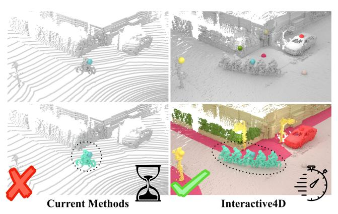
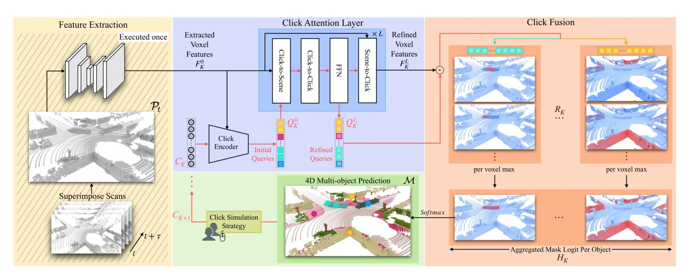
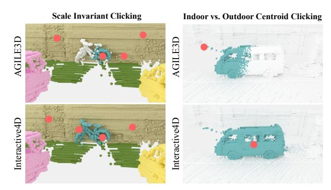
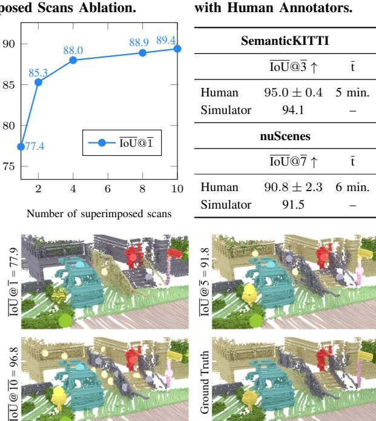
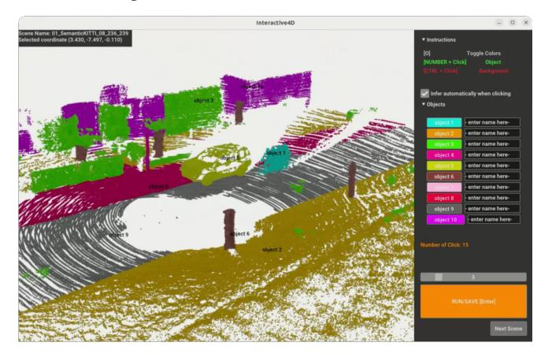
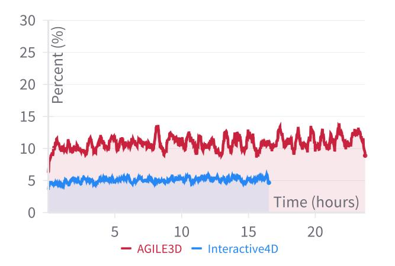
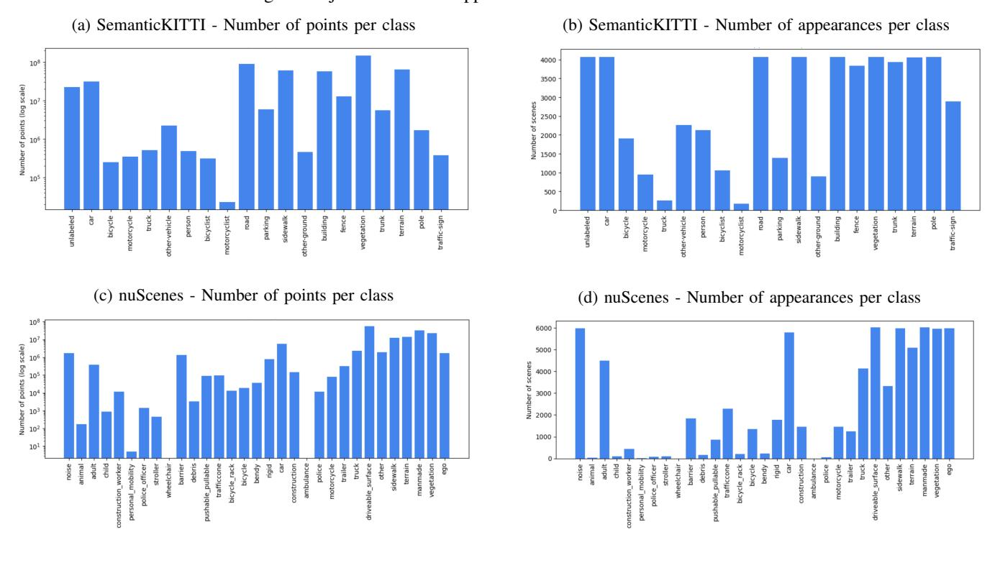
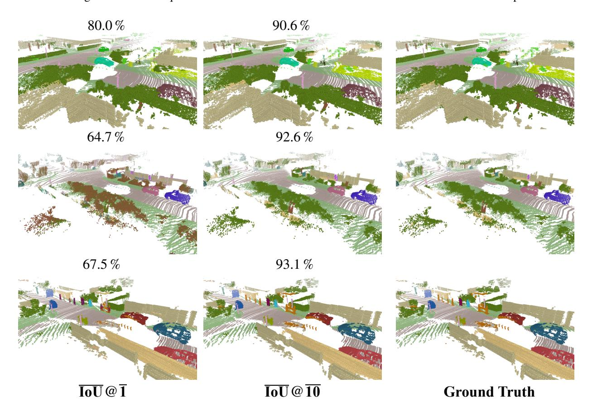

# **Interactive 4D LiDAR Segmentation**

Ilya Fradlin1,†, Idil Esen Zulfikar1, Kadir Yilmaz1, Theodora Kontogianni2,§, Bastian Leibe1

https://vision.rwth-aachen.de/Interactive4D

Abstract-Interactive segmentation has an important role in facilitating the annotation process of future LiDAR datasets. Existing approaches sequentially segment individual objects at each LiDAR scan, repeating the process throughout the entire sequence, which is redundant and ineffective. In this work, we propose interactive 4D segmentation, a new paradigm that allows segmenting multiple objects on multiple LiDAR scans simultaneously, and Interactive4D, the first interactive 4D segmentation model that segments multiple objects on superimposed consecutive LiDAR scans in a single iteration by utilizing the sequential nature of LiDAR data. While performing interactive segmentation, our model leverages the entire spacetime volume, leading to more efficient segmentation. Operating on the 4D volume, it directly provides consistent instance IDs over time and also simplifies tracking annotations. Moreover, we show that click simulations are crucial for successful model training on LiDAR point clouds. To this end, we design a click simulation strategy that is better suited for the characteristics of LiDAR data. To demonstrate its accuracy and effectiveness, we evaluate Interactive4D on multiple LiDAR datasets, where Interactive4D achieves a new state-of-the-art by a large margin. We publicly release the code and models at https://vision.rwth-aachen.de/Interactive4D.

#### I. INTRODUCTION

The impressive development of deep learning methods has largely been driven by the availability of large-scale annotated datasets [4, 6, 9, 14, 18, 21, 25, 40, 45], particularly in the 2D domain [14, 21, 25]. However, annotating large-scale 3D datasets [4, 6, 9, 18, 40, 45] remains challenging mainly due to the vast size of point clouds and the significant manual human effort required [4, 9]. As a result, annotated 3D datasets are scarce, impeding the development of robust 3D models. This underscores the need for efficient annotation methods tailored for 3D data. Interactive segmentation offers a promising solution to this by enabling users to create high-quality annotations with minimal effort. In this approach, the user guides the model to densely label each point in a point cloud through sparse user interactions.

This has spurred research into 3D interactive segmentation [15, 23, 46, 53]. Early efforts primarily focused on indoor point clouds, with initial work [23] framing the task as single-object interactive segmentation. In this setting, annotators segment each object individually by providing positive clicks on the object and negative clicks on other areas, essentially treating it as a binary segmentation problem. Recently, [53] reformulated the task as multi-object interactive segmentation, where annotators segment multiple objects simultaneously. Here, the positive clicks for one object inherently serve as negative clicks for other objects,

Fig. 1: *Left:* Current interactive LiDAR segmentation methods [15, 46] segment each object and each LiDAR scan individually, which is sub-optimal. *Right:* In contrast, Interactive4D segments multiple objects on superimposed consecutive LiDAR scans at once, significantly improving efficiency, while providing consistent instance IDs over time.

better utilizing user input and increasing efficiency. Both methods only consider interactively segmenting object instances, *i.e.*, *things*, while neglecting amorphous regions, *i.e.*, *stuff*.

Despite the successes on indoor point clouds, interactive segmentation of outdoor LiDAR point clouds remains underexplored. A few recent works [15,46] have tackled this task, yet they follow the single-object paradigm, which is shown to be less efficient than the multi-object paradigm. Also, they treat each LiDAR scan as an independent entity, ignoring the sequential nature of LiDAR scans (see Fig. 1, left). Given that LiDAR sensors operate at high frequencies, successive scans capture overlapping regions. Thus, independently annotating each scan is inefficient, leading to unnecessary annotation effort. Furthermore, independently annotating each scan complicates the task of maintaining consistent instance IDs across consecutive scans, which is essential for tracking tasks.

Having realized these limitations, in this work, we apply segmenting everything all at once strategy for LiDAR data and propose interactive 4D segmentation, a new paradigm where the annotator segments multiple objects on multiple LiDAR scans simultaneously. To show the effectiveness of this paradigm, we propose Interactive4D, the first interactive 4D segmentation model that performs multi-object segmentation on superimposed consecutive LiDAR scans for both things and stuff objects. This improves efficiency by enabling multi-object interactive segmentation across the entire 4D space-time LiDAR volume. By working directly on 4D data, Interactive4D inherently ensures consistent instance IDs on superimposed consecutive LiDAR scans (see Fig. 1, right).

&lt;sup>1 Computer Vision Group, RWTH Aachen University, Germany.

&lt;sup>2 ETH AI Center, Zürich, Switzerland.

† This work is part of the first author's master thesis.

§ Work done at ETH AI Center. Currently at Technical University of Denmark.

This makes it highly adaptable for tracking tasks, simplifying the annotation process for LiDAR tracking datasets, while also paving the way for future research directions.

In the interactive community [23, 31, 53], simulated clicks are commonly used for both training and testing. Many methods typically mimic a user who always clicks at the center of the largest error region [22, 31, 53], while others select clicks randomly [15, 23, 28, 46]. Both approaches have notable limitations with LiDAR data. The former incurs high computational costs, resulting slower run-times, while both approaches struggle with the sparsity and size variations between small and large objects—common issues in outdoor scenes—that often lead to poor segmentation quality. To address these limitations, we propose a new click simulation strategy for both training and evaluation. It generates enhanced and scale-invariant click simulations by accounting for the sparse nature of LiDAR point clouds, identifying the most relevant areas for clicking, and effectively managing scale variations between small and large objects.

Following the evaluation protocol from [23, 37, 53], we train Interactive4D on SemanticKITTI [4] and evaluate in multiple datasets to assess both in-distribution and zero-shot performance. We report results on the single-object, multi-object and 4D interactive segmentation setups, achieving state-of-the-art performance across all setups. To evaluate real-world generalization, we integrated Interactive4D into a user interface [53] and conducted a user study where participants annotated selected scenes. The study showed that Interactive4D performs well not only with simulated clicks but also in real use cases.

In summary, **our contributions are:** (1) We propose interactive 4D segmentation, a new paradigm that encompasses interactive segmentation of *multiple* objects on *multiple* scans at once by leveraging the sequential nature of LiDAR data. (2) We introduce Interactive4D, the first interactive 4D segmentation model capable of accurately segmenting both *things* and *stuff* on spatio-temporal point clouds, while also providing consistent instance IDs over time for tracking tasks. (3) We design a novel click simulation strategy that is more suitable for the characteristics of LiDAR data. (4) We achieve state-of-the-art performance by a significant margin on several LiDAR datasets and prove the effectiveness of Interactive4D in real annotation cases through a user-study with human annotators.

#### II. RELATED WORK

LiDAR Panoptic Segmentation and Tracking. LiDAR Panoptic Segmentation (LPS) [5, 12, 35] unifies semantic and instance segmentation of LiDAR point clouds. Recently, it has been extended to sub-task tracking with 4D Lidar Panoptic Segmentation (4D-LPS) [3], which performs semantic, instance segmentation, and tracking jointly. Both LPS [16, 20, 27, 32, 38, 41, 44, 54] and 4D-LPS [1]–[3, 17, 24, 33, 34, 52, 55] methods follow similar algorithmic paradigms. The fundamental difference between them is that LPS methods operate on single LiDAR scans, while 4D-LPS methods mainly operate on superimposed consecutive

LiDAR scans to accomplish tracking. Depending on whether it operates on a single scan or superimposed consecutive scans, Interactive4D can function as either an LPS or 4D-LPS method, assuming the user provides semantic labels of the predicted masks. It performs segmentation and tracking by incorporating user inputs, capable of improving the results with refinement clicks. Later, we show that Interactive4D outperforms state-of-the-art results both in LPS and 4D-LPS tasks with minimal user input, and further improves upon them with additional user input.

Interactive 3D Segmentation. 2D interactive segmentation is well established [21], however, adopting it to generate 3D labels leads imperfections due to differences in fieldof-view, perspective, and calibration errors [26]. To this end, InterObject3D [23] tackled the interactive segmentation for indoor point clouds, focusing on single-object interactive segmentation. Later, AGILE3D [53] proposed multi-object interactive segmentation for indoor point clouds, enhancing efficiency significantly. Inspired by [53], we explore multiobject interactive segmentation for LiDAR point clouds and also go one step further by extending multi-object LiDAR interactive segmentation to the 4D setup, aiming to maximize efficiency. A few recent works [15,46] have studied 3D interactive segmentation for outdoor LiDAR point clouds. CRSNet [46] focuses on interactively segmenting only things objects and follows the single-object paradigm in LiDAR data. ClickFormer [15], a concurrent work, interactively segments both things and stuff, and addresses the scale disparity of objects in LiDAR data by populating extra augmentation clicks across the scan, again following singleobject paradigm. In contrast, Interactive4D is designed to handle multi-object interactive LiDAR segmentation of both things and stuff in the 4D setup, maximizing efficiency by leveraging the context holistically both in space and time.

## III. METHOD

Inspired by the success of attention-based models for interactive segmentation [37,53], we add key technical modifications to leverage the full potential of such models in LiDAR point clouds and introduce Interactive4D, our interactive 4D segmentation model as depicted in Fig. 2. For clarity, we present the entire process using matrix notation.

**Spatio-Temporal Point Cloud.** (Fig. 2,  $\square$ ) We begin with superimposing consecutive LiDAR scans within a short temporal window  $[t,t+\tau]$  into a single spatio-temporal point cloud  $\mathcal{P}_t \in \mathbb{R}^{M \times 3}$ . This representation is beneficial for interactive segmentation as: (1) Static objects remain in the same spatial region across scans, and annotating them becomes more efficient, requiring fewer clicks to achieve the desired accuracy. (2) Dynamic objects, on the other hand, appear as multiple silhouettes, reflecting their movement over time and enabling intuitive tracking by associating silhouettes within a single point cloud. (3) The unified point cloud also offers higher point density compared to individual scans, making objects more concentrated and easier to recognize. This is particularly beneficial for identifying smaller objects, which are often difficult to detect in sparse LiDAR data.

Fig. 2: **Overview.** □: We superimpose consecutive scans into a single point cloud and extract per-voxel features (executed once). □: The clicks are encoded as initial queries, then refined through multiple attention layers. □: The dot product between refined queries and voxel features results in click responses, which are fused in click fusion module to form predictions □.

**Feature Extractor.** We voxelize  $\mathcal{P}_t$ , resulting in  $\mathcal{V}_t \in \mathbb{Z}^{N \times 3}$  to enable efficient processing using 3D sparse convolutions which operate over a grid. Time is included as an additional feature in  $\mathcal{V}_t$  to distinguish between voxels from different LiDAR scans. To extract per-voxel features  $\mathcal{F}^0 \in \mathbb{R}^{N \times D}$ , we use a 3D sparse U-Net [8] in line with [19, 39, 50, 53].

Click Encoder. (Fig. 2,  $\square$ ) Given a set of raw clicks  $C_K$  for the K-th iteration, the goal of the click encoder is to encode  $C_K$  as click queries  $Q_K^0 \in \mathbb{R}^{K \times D}$ . The initial queries  $Q_K^0$  serve as a starting point for the refinement and should capture the relevant information to effectively represent the regions the user aims to segment. We formulate it as:

$$Q_K^0 = \mathcal{E}_f + \mathcal{E}_{xyz,t} + \mathcal{E}_k + \mathcal{E}_{id} \tag{i}$$

where  $\mathcal{E}_f$  and  $\mathcal{E}_{xyz,t}$  are the extracted features and the positional encoding [47] of the clicked voxel respectively.  $\mathcal{E}_k$  are the iteration encodings [48] representing the ordering of the clicks. Additionally, unlike prior works [15,53], we explicitly encode the associated object IDs through a separate learned embedding  $\mathcal{E}_{id}$ . This allows clicks associated with the same object to be identified as related and distinguished from other clicks during the refinement process.

**Refinement.** (Fig. 2,  $\square$ ) This module consists of L consecutive click attention layers that refine both the click queries  $Q_K^0$  and the voxel features  $\mathcal{F}_K^0$ . In each layer,  $Q_K^l$  attend to  $\mathcal{F}_K^l$  through cross-attention. Then,  $Q_K^l$  selfattend to each other. Finally,  $\mathcal{F}_K^l$  cross attend to  $Q_K^l$  to refine feature representations. This progressive refinement is repeated across L layers, resulting in final  $Q_K^L$  and  $\mathcal{F}_K^L$ .

Click Fusion. (Fig. 2,  $\square$ ) After the final refinement, the dot product between  $Q_K^L$  and  $\mathcal{F}_K^L$  results in click response maps  $R_K = Q_K^L \cdot (\mathcal{F}_K^L)^T \in \mathbb{R}^{K \times N}$  representing the response of each voxel to each click. To generate object-level heatmaps  $H_K \in \mathbb{R}^{ID \times N}$ , we apply a per-voxel maximum operation across all click responses associated with the same object. This ensures that each click contributes only to the region where it has the highest response, resulting in aggregated

object heatmaps. Then, the final mask  $\mathcal{M} \in \mathbb{R}^N$  is obtained by applying Softmax over the ID dimension of  $H_K$ .

**Localized Loss.** (Fig. 2,  $\square$ ) To train the model, we use a combination of the cross-entropy and the dice loss [36].

$$\mathcal{L} = \frac{1}{N} \sum\nolimits_{p \in P} w_p \left( \lambda_{\text{CE}} \cdot \mathcal{L}_{\text{CE}}(p) + \lambda_{\text{Dice}} \cdot \mathcal{L}_{\text{Dice}}(p) \right) \quad \text{(ii)}$$

Here,  $\lambda_{\rm CE}$  and  $\lambda_{\rm Dice}$  are scalars balancing the two losses. The weight factor  $w_p$  adjusts the loss based on the proximity of each point to user clicks, making the loss more localized around each click. It is formulated as follows:

$$\begin{cases} w_{\text{max}} - (w_{\text{max}} - w_{\text{min}}) \cdot \tilde{d}_p, & \text{for } 0 \leq \tilde{d}_p \leq 1 \\ w_{\text{min}}, & \text{otherwise} \end{cases}$$
 (iii)

where  $\tilde{d}_p$  is the normalized distance between point p and its nearest user click, scaled by  $\delta$ . This formulation ensures that points within  $\delta$  meters of a click receive weights that decrease linearly from  $w_{\rm max}$  to  $w_{\rm min}$  as the distance increases, making the loss more localized. This loss design along with the click fusion operation effectively forces each click to be more local, giving a strong response around the clicked region, ensuring each click adds information without interfering with others. At the same time, points further than  $\delta$  get a weight of  $w_{\rm min}$  providing some incentive for clicks to segment the far away parts of the object, needed to effectively handle large and easy-to-segment regions such as road.

**4D Inference.** (Fig. 2,  $\square$ ) Within each short temporal window  $[t,t+\tau]$  we directly obtain consistent instance IDs by assigning each point to the object with the highest response in  $H_K$ . However, tracking tasks require consistent instance IDs over the entire sequence. To achieve this, we form temporal windows with one overlapping LiDAR scan [3] and use the predictions of both temporal windows in this scan to carry instance IDs from  $\mathcal{P}_t$  to  $\mathcal{P}_{t+\tau}$ . This approach also enables us to parallelize the annotation process among multiple annotators while automatically ensuring consistent instance IDs across the entire sequence.

Click Simulation Strategy. (Fig. 2, □) Interactive segmentation models rely on annotator input to iteratively refine predictions, yet involving humans during training is impractical. Instead, synthetic clicks are simulated based on predictions and ground truth. Simulation strategies should: (1) focus the model's learning on error regions to improve accuracy with fewer interactions, and (2) minimize the gap between training and real-world usage. Two main types of click simulations are employed in interactive 3D segmentation models [15, 23, 46, 53]. Inspired by 2D simulations [7, 22, 28, 31, 43, 51] models operating under dense data [23, 53] employ a Boundary Dependent (BD) click strategy. This approach selects the point furthest from the boundary by using the following metric:

 $p_{\text{click}_{i \to j}} = \arg\max_{p \in E_{i \to j}} \left( \min_{q \in \mathcal{P}_t \setminus E_{i \to j}} \|q - p\|^2 \right)$  (iv) Here,  $E_{i\rightarrow j}$  is the error region consisting of points misclassified as object j on the ground truth object i, p, and q are the points within and outside the error region respectively. While BD is effective for single object setup and dense data, under multi-object-LiDAR setup, it becomes computationally intensive due to its pairwise distance calculations which are time-consuming and memory demanding. More recent methods [15, 46] mitigate this issue by adopting fully random clicking, significantly reducing the required computation. However, both methods still suffer from two key limitations: (1) Bias Towards Larger Objects: In multi-object interactive segmentation, the error region must first be identified since errors can exist across various objects. BD selection implicitly determines the error size of the region by switching the arg max in Eq. (iv) with max operation. This approach tends to bias clicks toward larger objects (e.g., buildings) while overlooking smaller ones (e.g., bicycles) (see Fig. 3, left). The same issue applies to the random click strategy, as the random distribution naturally overlooks smaller objects, making them underrepresented during training. (2) Non**informative Initial Clicks**: In dense data, selecting the point farthest from the boundary is effective, as it often captures the "center" of an error region. However, in sparse LiDAR point clouds, this often leads to misplaced clicks near the periphery of the error region due to surrounding empty space (see Fig. 3, right). This occurs because points outside the error region determine the boundary. Random clicking exclusively faces a similar issue, as the selection lacks focus on a specific error region and instead targets the entire set of errors indiscriminately.

Aiming to solve the mentioned drawbacks, we propose a new click selection strategy, dividing the process into two separate steps: (1) Scale Invariant Error Region Selection (SI): To counter the over-prioritization of larger objects, we propose an IoU-based metric for determining the largest error region, ensuring scale invariance:

$$S(E_{i \to j}) = \left( \left| E_{i \to j} \right| \cdot \left| GT_i \right|^{-1} \right) \cdot IoU_i^{-1} \tag{v}$$

This metric, where  $|\cdot|$  indicates the number of points, and  $GT_i$  is the ground truth object, balances the proportion of the object belonging to the error region, and the current

Fig. 3: Examples for centroid clicking and scale-invariant clicking.

segmentation accuracy of the ground truth object, indicating potential improvement. This approach prioritizes error regions covering a substantial portion of the object, particularly those with low IoU, preventing smaller objects from being overlooked. This results in a more balanced distribution of clicks during training, allowing the model to learn more comprehensive feature representations. (2) Enhanced Click Selection within Error Regions: Similar to prior works that rely on BD, we aim to select the "center" of the ground truth mask for the initial click, as this often captures the key characteristics of the region. To ensure informative selection in sparse domains, we define the center as the point closest to the object's centroid, typically capturing the most representative area for a solid segmentation start. However, for refinement clicks—where error regions become small and fragmented across the point cloud—the effectiveness of centroid selection decreases and is challenging for real users to follow. To address this, we propose switching to random point selection within the error region for refinement clicks. Unlike [15, 46], we only perform the random selection after the error region has been identified. The injection of randomness makes the model more robust to user behavior (see Sec. IV-.2) by learning diverse features.

Our approach simplifies and decouples the decision process. It accelerates training and reduces memory requirements significantly since the click simulator is called multiple times during training. Unlike methods that either limit the number of objects [15,53] or concentrate only on *things* [46] to manage computational costs, our method avoids these trade-offs. This enables faster training, holistic segmentation, and scalability to 4D data, where the number of points increases significantly. Fig. 3 shows the effects of our proposed strategy modifications overall.

### IV. EXPERIMENTS

**Datasets.** Interactive segmentation involves two key scenarios: (1) Training the model on the annotated portion of the target dataset to assist in labeling the remaining data, referred to as *in-distribution*. (2) Training the interactive model on a pre-annotated dataset and then applying it to annotate a different target dataset, known as *zero-shot*. The first scenario highlights its effectiveness in speeding up annotation when partial labels are already available, while the second scenario evaluates the model's ability to generalize to new, unseen data distributions. To this end, we use two well-

TABLE I: In-distribution Interactive LiDAR Segmentation.

| <b>Training</b> : SemanticKITTI $\rightarrow$ <b>Evaluation</b> : SemanticKITTI |      |      |      |              |      |      |      |      |                       |  |  |  |  |
|---------------------------------------------------------------------------------|------|------|------|--------------|------|------|------|------|-----------------------|--|--|--|--|
|                                                                                 |      |      | ĪoU  | @ <u>k</u> ↑ |      |      | No   | oC@q | <u>C</u> @ <u>q</u> ↓ |  |  |  |  |
| Method                                                                          | @1   | @2   | @3   | @4           | @5   | @10  | @80  | @85  | @90                   |  |  |  |  |
| AGILE3D [53]                                                                    | 53.1 | 63.7 | 70.0 | 74.0         | 76.7 | 83.0 | 3.94 | 4.40 | 4.98                  |  |  |  |  |
| interactive4D                                                                   | 67.5 | 73.9 | 78.3 | 81.3         | 83.4 | 88.2 | 3.38 | 3.85 | 4.46                  |  |  |  |  |
| AGILE3D [53] Interactive4D                                                      | 70.1 | 75.4 | 78.6 | 81.2         | 83.3 | 86.6 | 2.82 | 3.29 | 3.98                  |  |  |  |  |
| ∑ Interactive4D                                                                 | 77.4 | 84.9 | 87.0 | 88.3         | 89.1 | 91.2 | 2.53 | 2.97 | 3.62                  |  |  |  |  |
| △ AGILE3D [53]                                                                  | 81.5 | 84.3 | 84.9 | 84.9         | 85.0 | 85.1 | 2.06 | 2.59 | 3.42                  |  |  |  |  |
| Interactive4D                                                                   | 87.7 | 89.3 | 90.6 | 91.3         | 91.7 | 92.8 | 1.26 | 1.64 | 2.28                  |  |  |  |  |

TABLE II: Non-interactive 3D & 4D LiDAR Panoptic Segmentation comparison on SemanticKITTI.

|                  |         |      | 3D   |      |      | 4D          |           |
|------------------|---------|------|------|------|------|-------------|-----------|
| Method           | #clicks | PQ   | SQ   | RQ   | LSTQ | $S_{assoc}$ | $S_{cls}$ |
| Mask4Former [52] | -       | 61.7 | 81.0 | 71.4 | 70.5 | 74.3        | 66.9      |
|                  | 1       | 70.5 | 84.0 | 82.4 | 82.8 | 80.9        | 84.7      |
|                  | 2       | 82.9 | 86.7 | 95.2 | 84.7 | 81.7        | 87.9      |
| Interactive4D    | 3       | 85.9 | 88.6 | 96.7 | 85.8 | 82.8        | 88.9      |
|                  | 5       | 88.7 | 90.4 | 97.9 | 85.9 | 82.5        | 89.3      |
|                  | 10      | 91.3 | 92.2 | 99.0 | 85.5 | 81.3        | 90.0      |

established public LiDAR datasets, SemanticKITTI [4] and nuScenes [6]. For all experiments, we train Interactive4D on the training split of SemanticKITTI. The *in-distribution* setup is evaluated using the validation split of SemanticKITTI, while the *zero-shot* performance is evaluated on the validation split of nuScenes.

Evaluation Protocol. For our experiments, we use standard evaluation metrics, as outlined in previous works [23, 53]: (1) <u>IoU@k</u> evaluates the average intersection-over-union (IoU) achieved with k clicks per object, averaged across all objects. (2)  $\overline{\text{NoC}}$   $\overline{\text{q}}$  refers to the average number of clicks needed to reach an IoU of q\% across all objects. Following previous works [23, 53], the number of clicks per object is limited to a maximum of 10. For the 4D setup, we compute the average clicks across all superimposed LiDAR scans to ensure comparability with the 3D setup. To compare with the recent work ClickFormer [15], we also adopt the mIoU@k metric. This metric is similar to IoU@k but it averages within each class before averaging across all classes. Also, in all experiments, during evaluation, we utilize the clicking strategy the model was trained with which is the most favorable condition for all methods.

**In-distribution Evaluation.** We first test our approach by training and evaluating on the same dataset. As shown in Tab. I, Interactive4D achieves significant improvements over the current state-of-the-art, AGILE3D, in all metrics across all setups. Our Interactive4D, which processes scenes holistically in 4D (see Tab. I, *last row*), surpasses all methods that operate on isolated 3D scans. Notably, with only 1 click per object, it attains an 87.7%  $\overline{\text{IoU}}$ , outperforming AGILE3D's 81.5%. Moreover, Interactive4D reaches an 90%  $\overline{\text{IoU}}$ , a crucial threshold for annotation quality, with just 2.28 clicks.

TABLE III: Zero-shot Interactive LiDAR Segmentation.

|        | <b>Training</b> : SemanticKITTI $\rightarrow$ <b>Evaluation</b> : nuScenes |      |      |      |              |      |      |      |      |      |  |  |  |  |
|--------|----------------------------------------------------------------------------|------|------|------|--------------|------|------|------|------|------|--|--|--|--|
|        |                                                                            |      |      | ĪoU  | @ <u>k</u> ↑ |      |      | No   | oC@q | i↓   |  |  |  |  |
|        | Method                                                                     | @1   | @2   | @3   | @4           | @5   | @10  | @50  | @65  | @80  |  |  |  |  |
| Single | AGILE3D [53]                                                               | 32.4 | 40.8 | 47.1 | 52.2         | 56.4 | 68.4 | 4.22 | 5.10 | 6.10 |  |  |  |  |
| Sin    | Interactive4D                                                              | 45.5 | 52.1 | 57.2 | 61.2         | 64.6 | 74.3 | 3.61 | 4.40 | 5.30 |  |  |  |  |
| Multi  | AGILE3D [53]                                                               | 32.5 | 37.4 | 42.4 | 47.8         | 52.7 | 66.0 | 3.68 | 4.27 | 5.13 |  |  |  |  |
| Ī      | Interactive4D                                                              | 44.2 | 56.4 | 63.3 | 67.4         | 70.2 | 76.1 | 3.13 | 3.76 | 4.71 |  |  |  |  |
| Ω      | AGILE3D [53]                                                               | 37.6 | 42.6 | 44.0 | 44.1         | 44.2 | 44.6 | 3.96 | 4.64 | 5.66 |  |  |  |  |
| 4      | Interactive4D                                                              | 54.7 | 58.1 | 63.7 | 69.5         | 73.2 | 79.6 | 1.98 | 2.51 | 3.34 |  |  |  |  |

TABLE IV: Comparison with previous works on 3D interactive single-object segmentation. †: Zero-Shot Evaluation.

|                    | mIoU    | @ <u>1</u> ↑      | mIoU   | @3 ↑    | mIoU   | @ <del>5</del> ↑ | mIoU   | @ <del>10</del> ↑ |
|--------------------|---------|-------------------|--------|---------|--------|------------------|--------|-------------------|
| Method             | things  | stuff             | things | stuff   | things | stuff            | things | stuff             |
| Training: 1        | nuScene | $s \rightarrow 1$ | Evalua | tion: 1 | nuScer | nes              |        |                   |
| CRSNet [46]        | 31.2    | 7.1               | 43.9   | 17.0    | 46.4   | 22.7             | 50.1   | 31.8              |
| InterObject3D [23] | 29.0    | 10.8              | 44.6   | 25.7    | 50.9   | 31.0             | 55.6   | 38.6              |
| ClickFormer [15]   | 35.2    | 48.6              | 50.2   | 62.2    | 56.9   | 64.3             | 60.6   | 65.4              |
| † AGILE3D [53]     | 28.7    | 28.1              | 34.8   | 46.6    | 44.2   | 55.4             | 57.9   | 63.9              |
| † Interactive4D    | 35.0    | 43.6              | 54.9   | 63.9    | 62.1   | 70.8             | 69.5   | 77.2              |
| Training: Sema     | anticKI | ГТІ —             | > Eval | uatior  | : KIT  | ГІ-360           | )      |                   |
| CRSNet [46]        | 28.3    | 9.6               | 40.0   | 17.3    | 41.1   | 23.3             | 46.9   | 29.8              |
| InterObject3D [23] | 34.0    | 12.3              | 42.6   | 23.1    | 45.8   | 29.6             | 49.6   | 36.1              |
| AGILE3D [53]       | 36.3    | 27.6              | 47.3   | 44.0    | 53.5   | 50.2             | 63.3   | 59.6              |
| ClickFormer [15]   | 28.0    | 41.1              | 50.4   | 52.3    | 54.4   | 55.4             | 59.3   | 58.4              |
| Interactive4D      | 47.7    | 39.5              | 59.4   | 55.7    | 64.1   | 59.7             | 70.0   | 65.1              |

We also evaluate our 3D multi-object and 4D models (introduced in Tab. I) in the LPS and 4D-LPS tasks on SemanticKITTI and compare it with the state-of-the-art non-interactive method [52], which does not employ any human interaction. As seen in Tab. II, our interactive models significantly outperform this method, even with 1 click per object, and continue to improve with refinement clicks.

**Zero-shot Evaluation.** We assess the generalization capability of our method by evaluating it on the nuScenes dataset, which significantly differs from SemanticKITTI in terms of environments and the LiDAR sensor. As shown in Tab. III, Interactive4D substantially outperforms the baseline, achieving nearly **70%**  $\overline{\text{IoU}}$  with just **4 clicks** per object and further increasing by an additional 10% with more clicks.

We also compare our approach with CRSNet [46] and ClickFormer [15], which are limited to 3D single-object setup. Due to the lack of public codebases, we could not adapt these methods to 3D multi-object or 4D setups and followed their original evaluation protocols. As shown in Tab. IV, Interactive4D significantly outperforms these methods on the nuScenes dataset, despite not being trained on it, unlike the baselines. We also evaluate our model on the KITTI-360 [29] dataset for a fair comparison. Interactive4D consistently outperforms all baselines on KITTI-360, further demonstrating its robustness when applied to a new dataset. The results for competitors are taken from [15].

TABLE V: Click Simulations and Architectural Enhancements. BD: Boundary Dependent-Eq. (iv). SI: Scale Invariant-Eq. (v)

|     |           | Clicking     | 3              | Īc   | Ū@k  | <b>†</b> | NoC  | @ <del>q</del> . |
|-----|-----------|--------------|----------------|------|------|----------|------|------------------|
|     | SI        | Initial      | Refinement     | @1   | @5   | @10      | @80  | @9               |
| ) — | Х         | BD           | BD             | 70.1 | 83.3 | 86.6     | 2.82 | 3.9              |
| )   | X         | Random       | Random         | 72.3 | 77.9 | 84.0     | 3.17 | 4.4              |
| )   | 1         | BD           | BD             | 33.6 | 72.2 | 79.1     | 4.58 | 5.6              |
| .)  | ✓         | Random       | Random         | 70.4 | 86.9 | 89.1     | 2.81 | 3.9              |
| )   | 1         | Centroid     | Centroid       | 75.1 | 85.6 | 88.0     | 2.88 | 4.1              |
| )   | 1         | Centroid     | BD             | 75.1 | 86.1 | 88.7     | 2.87 | 4.0              |
| )   | ✓         | Centroid     | Random         | 75.3 | 87.6 | 89.8     | 2.72 | 3.8              |
| rch | itectural | Enhanceme    | nts            |      |      |          |      |                  |
| Ic  | lentity I | Encoding     |                | 75.8 | 85.8 | 90.4     | 2.67 | 3.7              |
| L   | ocalized  | l Loss       |                | 76.6 | 86.3 | 90.6     | 2.60 | 3.7              |
| ) I | lentity I | Encoding + I | Localized Loss | 77.4 | 89.1 | 91.2     | 2.53 | 3.6              |

**Ablation Studies.** All ablations are conducted on *in-distribution* 3D multi-object interactive segmentation setup.

1) Click Simulation Strategy: In Tab. V, we demonstrate the effectiveness of our proposed click simulation strategy (see Sec. III) compared to different clicking strategies. As shown in Tab. V- $\overline{\mathbb{Q}}$ , our strategy outperforms all others, particularly  $\widehat{\mathbb{Q}}$  and  $\widehat{\mathbb{Q}}$ , which are used in previous interactive methods. With just 1 click, our approach achieves a better  $\overline{\text{loU}}$  (75.3% vs. 70.1%) maintaining strong performance at higher click counts (89.8%  $\overline{\text{loU}}$ @ $\overline{\text{loU}}$ 0). These results highlight that existing strategies, which perform well in dense domains, do not transfer effectively to sparse LiDAR.

We also assessed the robustness of interactive methods when click simulation strategies differ between training and testing. We used AGILE3D clicking strategy only during the testing of Interactive4D. This resulted in an 87.0%  $\overline{10}\overline{10}$  @10, outperforming AGILE3D's 86.6%, even though AGILE3D was trained with the <u>same</u> clicking strategy. Moreover, we used our clicking strategy during the testing of AGILE3D, which demonstrated a bigger drop from 86.6% to 81.2%  $\overline{10}\overline{10}$  @10 (5.4 points). All of these shows that Interactive4D is more robust against different clicking strategies, and our improvements not only originate from the click simulation but also from our architectural design and training.

- 2) Robustness to Click Randomness: Our method also incorporates randomness in click selection. To assess its sensitivity to this randomness, we repeated all experiments three times and calculated the standard deviation (std) of the results. We report the average results. The std was minimal (for  $\overline{\text{IoU@k}} \approx 0.04$  and for  $\overline{\text{NoC@q}} \approx 0.004$ ), confirming the method's robustness to click selection.
- 3) Architectural Enhancements: Our additional structural modifications to the model led to further key improvements (⑦-⑩). As shown in Table V, both the identity encoding (⑧), which injects learned encodings into object queries, and localizing the loss (⑨) enhance the model performance. Each component allows us to reach the 90% threshold. When combined (⑩), these enhancements result in a significant improvement, especially considering the already high baseline, where further gains are typically more challenging.

Fig. 4: Number of Superimposed Scans Ablation.

TABLE VI: User Study

Fig. 5: Example results of Interactive4D on SemanticKITTI.

4) Number of Superimposed Scans in 4D: In Tables I,II, III, all 4D results are presented with 4 superimposed scans to ensure comparability with AGILE3D, which faces memory limitations beyond 4 scans. Fig. 4 shows that superimposing more scans increases the segmentation accuracy of Interactive4D even more, especially at lower click counts.

User Study. To assess the practical applicability of Interactive4D for annotating LiDAR data, we integrated Interactive4D to a user interface [53] and conducted a user study with ten human annotators. They interactively segmented selected scenes from SemanticKITTI and nuScenes, each consisting of 4 consecutive scans. The annotators had no prior annotating experience and were given no clicking instructions. Tab. VI summarizes the results. The annotators achieve comparable results to the simulator. This proves Interactive4D not only performs well with simulated clicks but also with real annotators.

**Qualitative Results** are shown in Fig. 5. Interactive4D effectively segments and refines cluttered scenes.

## V. CONCLUSION

We have introduced interactive 4D segmentation, a new paradigm where a user segments multiple objects on multiple scans simultaneously and Interactive4D, the first interactive 4D segmentation method following this paradigm. Interactive4D is significantly more efficient than the previous approaches, limited to a single object and single scan. Along with our new click simulation strategy suited for sparse LiDAR scans, it also shows outstanding results in accuracy and reaches state-of-the-art performance by a large margin. We hope Interactive4D will reduce the annotation effort required for future LiDAR datasets.

Acknowledgments. We thank Yuanwen Yue, Daan de Geus, and Alexander Hermans for their helpful feedback and discussions. We also thank all our annotators who participated in the user study. Theodora Kontogianni is a postdoctoral research fellow at the ETH AI Center and her research is partially funded by the Hasler Stiftung Grant project (23069). Idil Esen Zulfikar's research is funded by the BMBF project NeuroSys-D (03ZU1106DA). Kadir Yilmaz's research is funded by the Bosch-RWTH LHC project Context Understanding for Autonomous Systems. The computing resources for most of the experiments were granted by the Gauss Centre for Supercomputing e.V. through the John von Neumann Institute for Computing on the GCS Supercomputer JUWELS at Julich Supercomputing Centre.

#### REFERENCES

- Abhinav Agarwalla, Xuhua Huang, Jason Ziglar, Francesco Ferroni, Laura Leal-Taixé, James Hays, Aljoša Ošep, and Deva Ramanan. Lidar Panoptic Segmentation and Tracking without Bells and Whistles. In International Conference on Intelligent Robots and Systems, 2023.
- [2] Ali Athar, Enxu Li, Sergio Casas, and Raquel Urtasun. 4D-Former: Multimodal 4D Panoptic Segmentation. In Conference on Robot Learning, 2023.
- [3] Mehmet Aygun, Aljosa Osep, Mark Weber, Maxim Maximov, Cyrill Stachniss, Jens Behley, and Laura Leal-Taixé. 4D Panoptic Lidar Segmentation. In *IEEE Conference on Computer Vision and Pattern Recognition*, 2021.
- [4] Jens Behley, Martin Garbade, Andres Milioto, Jan Quenzel, Sven Behnke, Cyrill Stachniss, and Jurgen Gall. SemanticKITTI: A Dataset for Semantic Scene Understanding of LiDAR Sequences. In *Interna*tional Conference on Computer Vision, 2019.
- [5] Jens Behley, Andres Milioto, and Cyrill Stachniss. A Benchmark for LiDAR-based Panoptic Segmentation based on KITTI. In *IEEE International Conference on Robotics and Automation*, 2021.
- [6] Holger Caesar, Varun Bankiti, Alex H Lang, Sourabh Vora, Venice Erin Liong, Qiang Xu, Anush Krishnan, Yu Pan, Giancarlo Baldan, and Oscar Beijbom. nuScenes: A Multimodal Dataset for Autonomous Driving. In IEEE Conference on Computer Vision and Pattern Recognition, 2020.
- [7] Xi Chen, Zhiyan Zhao, Yilei Zhang, Manni Duan, Donglian Qi, and Hengshuang Zhao. FocalClick: Towards Practical Interactive Image Segmentation. In *IEEE Conference on Computer Vision and Pattern Recognition*, 2022.
- [8] Christopher Choy, Jun Young Gwak, and Silvio Savarese. 4D Spatio-Temporal Convnets: Minkowski Convolutional Neural Networks. In IEEE Conference on Computer Vision and Pattern Recognition, 2019.
- [9] Angela Dai, Angel X. Chang, Manolis Savva, Maciej Halber, Thomas Funkhouser, and Matthias Nießner. ScanNet: Richly-annotated 3D Reconstructions of Indoor Scenes. In *IEEE Conference on Computer Vision and Pattern Recognition*, 2017.
- [10] Martin Ester, Hans-Peter Kriegel, Jörg Sander, and Xiaowei Xu. A Density-Based Algorithm for Discovering Clusters in Large Spatial Databases with Noise. In ACM SIGKDD International Conference on Knowledge Discovery and Data Mining, 1996.
- [11] E. Fix and J.L. Hodges. Discriminatory Analysis: Nonparametric Discrimination: Consistency Properties. In USAF School of Aviation Medicine, 1951.
- [12] Whye Kit Fong, Rohit Mohan, Juana Valeria Hurtado, Lubing Zhou, Holger Caesar, Oscar Beijbom, and Abhinav Valada. Panoptic nuScenes: A Large-Scale Benchmark for LiDAR Panoptic Segmentation and Tracking. In *IEEE Robotics and Automation Letters (RA-L)*, 2022.
- [13] Andreas Geiger, Philip Lenz, and Raquel Urtasun. Are We Ready for Autonomous Driving? The KITTI Vision Benchmark Suite. In IEEE Conference on Computer Vision and Pattern Recognition, 2012.
- [14] Agrim Gupta, Piotr Dollar, and Ross Girshick. LVIS: A Dataset for Large Vocabulary Instance Segmentation. In IEEE Conference on Computer Vision and Pattern Recognition, 2019.

- [15] Chenrui Han, Xuan Yu, Yuxuan Xie, Yili Liu, Sitong Mao, Shunbo Zhou, Rong Xiong, and Yue Wang. Scale Disparity of Instances in Interactive Point Cloud Segmentation. In *International Conference on Intelligent Robots and Systems*, 2024.
- [16] Fangzhou Hong, Hui Zhou, Xinge Zhu, Hongsheng Li, and Ziwei Liu. LiDAR-based Panoptic Segmentation via Dynamic Shifting Network. In *IEEE Conference on Computer Vision and Pattern Recognition*, 2021.
- [17] Fangzhou Hong, Hui Zhou, Xinge Zhu, Hongsheng Li, and Ziwei Liu. LiDAR-based 4D Panoptic Segmentation via Dynamic Shifting Network. arXiv:2203.07186, 2022.
- [18] Ji Hou, Angela Dai, and Matthias NieBner. 3D-SIS: 3D Semantic Instance Segmentation of RGB-D Scans. In *IEEE Conference on Computer Vision and Pattern Recognition*, 2019.
- [19] Shengyu Huang, Zan Gojcic, Mikhail Usvyatsov, Andreas Wieser, and Konrad Schindler. Predator: Registration of 3D Point Clouds with Low Overlap. In *IEEE Conference on Computer Vision and Pattern Recognition*, 2021.
- [20] Juana Valeria Hurtado, Rohit Mohan, Wolfram Burgard, and Abhinav Valada. MOPT: Multi-Object Panoptic Tracking. In IEEE Conference on Computer Vision and Pattern Recognition, 2020.
- [21] Alexander Kirillov, Eric Mintun, Nikhila Ravi, Hanzi Mao, Chloe Rolland, Laura Gustafson, Tete Xiao, Spencer Whitehead, Alexander C Berg, Wan-Yen Lo, et al. Segment Anything. In *International Conference on Computer Vision*, 2023.
- [22] Theodora Kontogianni, Michael Gygli, Jasper Uijlings, and Vittorio Ferrari. Continuous Adaptation for Interactive Object Segmentation by Learning From Corrections. In European Conference on Computer Vision. 2020.
- [23] Theodora Kontogianni, Ekin Çelikkan, Siyu Tang, and Konrad Schindler. Interactive Object Segmentation in 3D Point Clouds. In IEEE International Conference on Robotics and Automation, 2023.
- [24] Lars Kreuzberg, Idil Esen Zulfikar, Sabarinath Mahadevan, Francis Engelmann, and Bastian Leibe. 4D-StOP: Panoptic Segmentation of 4D LiDAR using Spatio-temporal Object Proposal Generation and Aggregation. In European Conference on Computer Vision Workshop, 2022.
- [25] Alina Kuznetsova, Hassan Rom, Neil Alldrin, Jasper Uijlings, Ivan Krasin, Jordi Pont-Tuset, Shahab Kamali, Stefan Popov, Matteo Malloci, Alexander Kolesnikov, et al. The Open Images Dataset V4: Unified image classification, object detection, and visual relationship detection at scale. *International Journal of Computer Vision*, 2020.
- [26] Duy Tho Le, Chenhui Gou, Stavya Datta, Hengcan Shi, Ian Reid, Jianfei Cai, and Hamid Rezatofighi. JRDB-PanoTrack: An Open-world Panoptic Segmentation and Tracking Robotic Dataset in Crowded Human Environments. In IEEE Conference on Computer Vision and Pattern Recognition, 2024.
- [27] Jinke Li, Xiao He, Yang Wen, Yuan Gao, Xiaoqiang Cheng, and Dan Zhang. Panoptic-PHNet: Towards Real-Time and High-Precision LiDAR Panoptic Segmentation via Clustering Pseudo Heatmap. In IEEE Conference on Computer Vision and Pattern Recognition, 2022.
- [28] Zhuwen Li, Qifeng Chen, and Vladlen Koltun. Interactive Image Segmentation with Latent Diversity. In *IEEE Conference on Computer Vision and Pattern Recognition*, 2018.
- [29] Yiyi Liao, Jun Xie, and Andreas Geiger. KITTI-360: A Novel Dataset and Benchmarks for Urban Scene Understanding in 2D and 3D. IEEE Transactions on Pattern Analysis and Machine Intelligence, 2022.
- [30] Ilya Loshchilov and Frank Hutter. Decoupled Weight Decay Regularization. In *International Conference on Learning Representations*, 2017.
- [31] Sabarinath Mahadevan, Paul Voigtlaender, and Bastian Leibe. Iteratively Trained Interactive Segmentation. In *British Machine Vision Conference*, 2018.
- [32] Rodrigo Marcuzzi, Lucas Nunes, Louis Wiesmann, Jens Behley, and Cyrill Stachniss. Mask-Based Panoptic LiDAR Segmentation for Autonomous Driving. In *IEEE Robotics and Automation Letters (RA-L)*, 2023.
- [33] Rodrigo Marcuzzi, Lucas Nunes, Louis Wiesmann, Elias Marks, Jens Behley, and Cyrill Stachniss. Mask4D: End-to-End Mask-based 4D Panoptic Segmentation for LiDAR Sequences. In *IEEE Robotics and Automation Letters (RA-L)*, 2023.
- [34] Rodrigo Marcuzzi, Lucas Nunes, Louis Wiesmann, Ignacio Vizzo, Jens Behley, and Cyrill Stachniss. Contrastive Instance Association for 4D Panoptic Segmentation using Sequences of 3D Lidar Scans. In *IEEE Robotics and Automation Letters (RA-L)*, 2022.

- [35] Andres Milioto, Jens Behley, Chris McCool, and Cyrill Stachniss. LiDAR Panoptic Segmentation for Autonomous Driving. In International Conference on Intelligent Robots and Systems, 2020.
- [36] Fausto Milletari, Nassir Navab, and Seyed-Ahmad Ahmadi. V-net: Fully Convolutional Neural Networks for Volumetric Medical Image Segmentation. In *International Conference on 3D Vision*, 2016.
- [37] Amit Kumar Rana, Sabarinath Mahadevan, Alexander Hermans, and Bastian Leibe. DynaMITe: Dynamic Query Bootstrapping for Multiobject Interactive Segmentation Transformer. In *International Confer*ence on Computer Vision, 2023.
- [38] Ryan Razani, Ran Cheng, Enxu Li, Ehsan Moeen Taghavi, Yuan Ren, and Bingbing Liu. GP-S3Net: Graph-based Panoptic Sparse Semantic Segmentation Network. In *International Conference on Computer Vision*, 2021.
- [39] Damien Robert, Bruno Vallet, and Loic Landrieu. Learning Multi-View Aggregation In the Wild for Large-Scale 3D Semantic Segmentation. In *IEEE Conference on Computer Vision and Pattern Recognition*, 2022.
- [40] David Rozenberszki, Or Litany, and Angela Dai. Language-Grounded Indoor 3D Semantic Segmentation in the Wild. In European Conference on Computer Vision, 2022.
- [41] Kshitij Sirohi, Rohit Mohan, Daniel Buscher, Wolfram Burgard, and Abhinav Valada. EfficientLPS: Efficient LiDAR Panoptic Segmentation. In *IEEE Transactions on Robotics*, 2021.
- [42] Leslie N. Smith and Nicholay Topin. Super-Convergence: Very Fast Training of Neural Networks Using Large Learning Rates. In Artificial Intelligence and Machine Learning for Multi-Domain Operations Applications, 2017.
- [43] Konstantin Sofiiuk, Ilya A Petrov, and Anton Konushin. Reviving Iterative Training with Mask Guidance for Interactive Segmentation. In *IEEE International Conference on Image Processing*, 2022.
- [44] Shihao Su, Jianyun Xu, Huanyu Wang, Zhenwei Miao, Xin Zhan, Dayang Hao, and Xi Li. PUPS: Point Cloud Unified Panoptic Segmentation. In Conference on Artificial Intelligence, 2023.
- [45] Pei Sun, Henrik Kretzschmar, Xerxes Dotiwalla, Aurelien Chouard, Vijaysai Patnaik, Paul Tsui, James Guo, Yin Zhou, Yuning Chai, Benjamin Caine, Vijay Vasudevan, Wei Han, Jiquan Ngiam, Hang Zhao, Aleksei Timofeev, Scott M. Ettinger, Maxim Krivokon, Amy Gao, Aditya Joshi, Yu Zhang, Jonathon Shlens, Zhifeng Chen, and Dragomir Anguelov. Scalability in Perception for Autonomous Driving: Waymo Open Dataset. In IEEE Conference on Computer Vision and Pattern Recognition, 2019.
- [46] Wentao Sun, Zhipeng Luo, Yiping Chen, Huxiong Li, José Marcato Junior, Wesley Nunes Gonéalves, and Jonathan Li. A Click-Based Interactive Segmentation Network for Point Clouds. *IEEE Transactions* on Geoscience and Remote Sensing, 2023.
- [47] Matthew Tancik, Pratul P. Srinivasan, Ben Mildenhall, Sara Fridovich-Keil, Nithin Raghavan, Utkarsh Singhal, Ravi Ramamoorthi, Jonathan T. Barron, and Ren Ng. Fourier Features Let Networks Learn High Frequency Functions in Low Dimensional Domains. In Neural Information Processing Systems, 2020.
- [48] Ashish Vaswani, Noam M. Shazeer, Niki Parmar, Jakob Uszkoreit, Llion Jones, Aidan N. Gomez, Lukasz Kaiser, and Illia Polosukhin. Attention is All You Need. In *Neural Information Processing Systems*, 2017.
- [49] Daren Wang, Xinyang Lu, and Alessandro Rinaldo. Dbscan: Optimal rates for density based clustering. arXiv preprint arXiv:1706.03113, 2017.
- [50] Saining Xie, Jiatao Gu, Demi Guo, Charles R Qi, Leonidas Guibas, and Or Litany. PointContrast: Unsupervised Pre-training for 3D Point Cloud Understanding. In European Conference on Computer Vision, 2020.
- [51] Ning Xu, Brian Price, Scott Cohen, Jimei Yang, and Thomas S Huang. Deep Interactive Object Selection. In *IEEE Conference on Computer Vision and Pattern Recognition*, 2016.
- [52] Kadir Yilmaz, Jonas Schult, Alexey Nekrasov, and Bastian Leibe. Mask4Former: Mask Transformer for 4D Panoptic Segmentation. In IEEE International Conference on Robotics and Automation, 2024.
- [53] Yuanwen Yue, Sabarinath Mahadevan, Jonas Schult, Francis Engelmann, Bastian Leibe, Konrad Schindler, and Theodora Kontogianni. AGILE3D: Attention Guided Interactive Multi-object 3D Segmentation. In *International Conference on Learning Representations*, 2024.
- [54] Zixiang Zhou, Yang Zhang, and Hassan Foroosh. Panoptic-PolarNet: Proposal-free LiDAR Point Cloud Panoptic Segmentation. In *IEEE Conference on Computer Vision and Pattern Recognition*, 2021.

[55] Minghan Zhu, Shizong Han, Hong Cai, Shubhankar Borse, Maani Ghaffari Jadidi, and Fatih Porikli. 4D Panoptic Segmentation as Invariant and Equivariant Field Prediction. In *International Conference* on Computer Vision, 2023.

# **Interactive 4D LiDAR Segmentation**

## Supplementary Material

This supplementary document is structured as follows:

• § VI: Implementation Details

- VI-A: Spatio-Temporal Point Cloud Construction

- VI-B: Details on Evaluation Metrics

- VI-C: Iterative Training

- VI-D: Datasets Details

- VI-E: Training Details

- VI-F: User Study Details

• § VII: Limitations

- VII-A: Memory Demands

– VII-B: Runtime

- VII-C: Tracking Failures

• § VIII: Additional Ablations

- VIII-A: Clicking Strategy using DBSCAN

- VIII-B: Training Click Budget

- VIII-C: Voxel Size Ablation

- VIII-D: Time-related Features

• § IX: Additional Results

- IX-A: Class-wise Results

- IX-B: Additional Qualitative Results

## VI. IMPLEMENTATION DETAILS.

## A. Spatio-Temporal Point Cloud Construction

Following the methodology of prior work [52], we leverage poses of the ego vehicle to transform all the LiDAR scans into a global coordinate frame, creating a consistent representation. Then, we superimpose a short temporal window of T consecutive LiDAR scans into a single spatio-temporal point cloud  $\mathcal{P}_t \in \mathbb{R}^{M \times 3}$ .

To formalize, let  $\mathbf{P}_i \in \mathbb{R}^{N_i \times 3}$  represent the point cloud from the i-th LiDAR scan, where  $N_i$  is the number of points in the point cloud, and each point has 3 coordinates (x,y,z). To transform each point cloud  $\mathbf{P}_i$  from the local coordinate frame of the ego vehicle to the global coordinate frame, we apply a transformation matrix  $\mathbf{T}_i$ , which consists of a rotation matrix  $\mathbf{R}_i \in \mathbb{R}^{3 \times 3}$  and a translation vector  $\mathbf{t}_i \in \mathbb{R}^3$ . The transformation is given by:

$$\mathbf{P}_i^{\mathrm{global}} = \mathbf{P}_i \mathbf{R}_i^{\top} + \mathbf{t}_i$$
 (vi

where  $\mathbf{P}_i \mathbf{R}_i^{\top}$  applies the rotation to all points in  $\mathbf{P}_i$ , and  $\mathbf{t}_i$  translates the points into the global coordinate frame as in [52]. After transforming all point clouds  $\mathbf{P}_1^{\mathrm{global}}, \mathbf{P}_2^{\mathrm{global}}, \dots, \mathbf{P}_{\tau}^{\mathrm{global}}$  from a temporal window of  $\tau$  consecutive scans, we aggregate them into a unified spatiotemporal point cloud  $\mathbf{P}^{\mathrm{ST}} \in \mathbb{R}^{\left(\sum_{i=1}^{\tau} N_i\right) \times 3}$ , which is formed by stacking all the transformed point clouds:

$$\mathbf{P}^{\mathrm{ST}} = \bigcup_{i=1}^{\tau} \mathbf{P}_{i}^{\mathrm{global}}$$
 (vii)

#### B. Details on Evaluation Metrics

In this section, we explain the evaluation metrics  $\overline{IoU@k}$  and  $\overline{NoC@q}$  in detail, particularly how they are adapted for the 4D setup to ensure a fair comparison with the 3D setup.

**Evaluation Click Budget:** To ensure consistency between the 3D and 4D setups, we maintain the same total number of clicks across the entire dataset. In the 3D setup, the click budget for each scan i is given by  $B \times O_i$ , where  $O_i$  is the number of objects in scan i, and B is the click budget per object. However, in the 4D setup, we no longer operate within the confines of a single scan but instead use a temporal window of  $\tau$  scans. Therefore, for a given temporal window t, the click budget  $B_t$  is the sum of the budgets for each scan i within the window:

$$B_t = \sum_{i=t}^{t+\tau} B \times O_i$$

IoU@k: In both 3D and 4D setups, the IoU metric is computed by averaging the object IoUs across the entire validation set, where each object in each LiDAR scan is treated as an individual entity. In the 3D setup, this is straightforward as predictions are made directly in single LiDAR scans. However, in the 4D setup, predictions are made on superimposed point clouds. To ensure comparability with the 3D setup, we split the combined point cloud back into individual LiDAR scans and calculate the object IoU for each scan separately. Furthermore, a fair <u>IoU@k</u> comparison between the 3D and 4D setups requires the same amount of clicks (k) per object for the entire annotation process. To ensure this, in the 4D setup, we report the IoU@k for an average of k clicks given per object per LiDAR scan. As a result, in the superimposed point clouds  $k \times \tau$  clicks are given per object as the user segments  $\tau$  LiDAR scans at the same time. This ensures that in both 3D and 4D setups, at each reported click count k, the same number of clicks are given over the entire sequence, allowing for a direct comparison of results.

NoC@q: all, First of it is important highlight that, to be consistent with the prior works [7, 22, 23, 28, 31, 31, 43, 46, 53], when an object does not achieve the q\% IoU threshold, even when maximum click budget B is given, we use B for NoC@q calculation. This avoids excessive penalization (i.e., infinite) for objects that cannot reach the threshold, however, is misleading as these objects definitely require more than B clicks to achieve the desired threshold.

In the 3D setup, to calculate  $\overline{\text{NoC}@q}$ , each object in each LiDAR scan is attached with a click counter. This counter starts from 0 and increases every time the object is given a click. When the desired threshold is achieved, the current counter state is used for  $\overline{\text{NoC}@q}$  calculation. To maintain

TABLE VII: Interactive4D and AGILE3D per class in-distribution interactive LiDAR segmentation results. The results are reported for  $\overline{10U}@\overline{10}$ .

| -      |                               |                     |                     |                     |                     | Tra                 | ining: S            | emantick            | ITTI →              | Evalua              | tion: Ser           | nanticKI            | TTI                 |                     |                     |                     |                     |                     |                     |                     |
|--------|-------------------------------|---------------------|---------------------|---------------------|---------------------|---------------------|---------------------|---------------------|---------------------|---------------------|---------------------|---------------------|---------------------|---------------------|---------------------|---------------------|---------------------|---------------------|---------------------|---------------------|
|        | Method                        |                     |                     |                     |                     |                     |                     |                     |                     | (                   | Categorie           | s                   |                     |                     |                     |                     |                     |                     |                     |                     |
|        |                               |                     |                     |                     | Thi                 | ings                |                     |                     |                     |                     |                     |                     |                     |                     | Stuff               |                     |                     |                     |                     |                     |
|        |                               | Car                 | Bicycle             | Motorcycle          | Truck               | Other-vehicle       | Person              | Bicyclist           | Motorcyclist        | Road                | Parking             | Sidewalk            | Other-ground        | Building            | Fence               | Vegetation          | Trunk               | Terrain             | Pole                | Traffic-sign        |
| Single | AGILE3D [53] Interactive4D | 96.1 <b>97.8</b> | 73.5 80.2        | 85.8 91.9        | 96.0 96.4        | 85.2 92.0        | 78.9 87.4        | 93.6 <b>95.9</b> | 66.1 85.4        | 89.4 92.2        | 47.6 62.5        | 69.7 77.8        | 55.8 <b>72.5</b> | 84.8 90.8        | 47.2 59.9        | 84.6 85.1        | 49.1 66.5        | 64.0 69.6        | 54.9 69.6        | 69.4 83.2        |
| Multi  | AGILE3D [53] Interactive4D | 94.4 95.5        | 66.3 80.4        | 85.7 92.6        | 97.0 97.7        | 87.4 92.6        | 77.3 86.2        | 91.3 92.5        | 83.4 <b>92.9</b> | 94.3 <b>95.7</b> | 74.2 <b>81.7</b> | 84.0 <b>89.2</b> | 63.1 70.3        | 93.4 94.5        | 58.2 76.4        | 89.4 92.9        | 75.2 83.7        | 73.3 <b>82.6</b> | 72.0 86.1        | 85.0 90.9        |
| 4D     | AGILE3D [53] Interactive4D | 92.1 96.3        | 60.8 <b>90.0</b> | 82.1 <b>95.0</b> | 96.4 <b>98.3</b> | 85.4 <b>94.9</b> | 73.7 <b>93.6</b> | 89.0 95.0        | 71.5 92.2        | 94.5 95.2        | 74.4 75.7        | 86.0 87.5        | 52.1 63.7        | 95.8 <b>96.4</b> | 63.7 <b>79.9</b> | 92.7 <b>93.8</b> | 77.1 <b>87.1</b> | 77.3 81.8        | 72.4 <b>89.8</b> | 66.3 <b>95.0</b> |

fairness, following the rationale used in IoU@k, in the 4D setup, a click counter is attached to each object tracklet throughout the temporal window. Every time a click is given to an object tracklet in the superimposed point cloud, the counter increases. Once an object reaches the threshold in any one of the LiDAR scans, the  $\overline{\text{NoC}}$ @ $\overline{q}$  for this specific scan for that object is finalized as the current counter state, and the counter is reset to avoid double-counting those clicks for the next scans where the threshold will be reached. This prevents unfairly inflating click counts compared to the 3D setup and makes the setups comparable. This boils down to averaging the total clicks over the LiDAR scans and allows us to fairly assess the efficiency of the 4D setup. For example, if an object is successfully segmented across all scans with a single click, the NoC@q for that object will be 1 in the first scan, and 0 in the subsequent scans, as no additional clicks were required. Conversely, if an object fails to meet the threshold in a given scan, the maximum budget B will be counted as the number of scans needed to reach this threshold. This method provides a fair evaluation of the 4D setup's ability to minimize the number of clicks over time while acknowledging the computational advantage of segmenting multiple scans simultaneously.

## C. Iterative Training

We adopt a multi-object iterative training approach, inspired by AGILE3D [53], to enhance model performance by simulating user interaction. Specifically, multiple forward passes are performed for each batch to ensure that meaningful loss is maintained before backpropagation. This process mimics how a real user would iteratively provide feedback through clicks.

In each batch, we randomly select the number of iterations, n, from the range  $[1, N_{max}]$ , where  $N_{max}$  is the maximal click budget per object. This ensures the model learns to perform well even when the click budget is not fully exhausted. Initially, clicks  $(S^0)$  are placed at the center of each target object, enabling the model to make an initial prediction. This prediction is then compared to the ground truth to identify error clusters. During subsequent iterations (k), to progressively guide the model toward more accurate predictions, the model's performance is improved by sam-

pling clicks  $(C^k)$ , placing one click for each of the  $|C_i|$  largest error regions. Sampling  $N_i$  clicks together accelerates training, by reducing the number of forward passes required to reach the desired budget, thus keeping the computational complexity manageable.

The model remains frozen during click sampling from iterations 1 to  $N_{iter}-1$ , with backpropagation occurring only after the final iteration, reducing the overall computational cost.. This approach contrasts with full iterative training, which updates the model after each click. While full iterative training is used during testing, it is computationally expensive, as it requires frequent updates.

## D. Datasets Details

**SemanticKITTI** is derived from the KITTI odometry dataset [13]. The dataset consists of over 43,000 LiDAR scans recorded with a Velodyne-64 laser scanner capturing various urban driving scenarios at 10 Hz. It is split into training, validation, and test splits. Each point in the LiDAR point clouds is densely annotated with one of C=19 semantic labels, e.g. car, road, cyclist, as well as a unique instance ID that is consistent over time. The dataset includes precise pose estimates of the ego vehicle for every time step, which is critical for the 4D interactive segmentation task.

**nuScenes** is a comprehensive dataset that includes sensor data from 1,000 diverse driving records, each lasting approximately 20 seconds. It is recorded in urban environments across Boston and Singapore. The dataset features data from various sensors including a 32-channel LiDAR sensor, all synchronized and captured at a frequency of 20 Hz. Each point in the LiDAR point clouds is densely annotated with one of C=32 semantic labels, *e.g. construction vehicle*, *sidewalk, motorcycle*, as well as a unique instance ID that is consistent over time. However, the annotations are provided only at 2 Hz, meaning that only 1 in 10 scans is annotated. The dataset offers precise pose estimates of the ego vehicle at every time step. In total 58,501 LiDAR scans out of which 5850 are annotated. We evaluate our models on the validation split that contains 150 sequences.

It is worth noting the key differences between these datasets. SemanticKITTI was collected in Karlsruhe, Germany, focusing on suburban areas with limited environmental

TABLE VIII: Interactive4D and AGILE3D per class zero-shot interactive LiDAR segmentation results. The results are reported for  $\overline{\text{IoU}} = \overline{10}$ .

| _      |                               |              |                     |                     |                     |                     |                     |                     |                     | Tra                 | nining:             | Semar               | nticKIT             | TI →                | Evalua              | ation:              | nuScen              | es                  |                     |                     |                     |                     |                     |                     |                     |                     |                     |                     |             |
|--------|-------------------------------|--------------|---------------------|---------------------|---------------------|---------------------|---------------------|---------------------|---------------------|---------------------|---------------------|---------------------|---------------------|---------------------|---------------------|---------------------|---------------------|---------------------|---------------------|---------------------|---------------------|---------------------|---------------------|---------------------|---------------------|---------------------|---------------------|---------------------|-------------|
|        | Method                        |              | Categories          |                     |                     |                     |                     |                     |                     |                     |                     |                     |                     |                     |                     |                     |                     |                     |                     |                     |                     |                     |                     |                     |                     |                     |                     |                     |             |
|        |                               |              |                     |                     |                     |                     |                     |                     |                     |                     | Th                  | ings                |                     |                     |                     |                     |                     |                     |                     |                     |                     |                     |                     |                     | Sti                 | uff                 |                     |                     |             |
|        |                               | animal       | adult               | child               | construction-worker | police-officer      | stroller            | barrier             | debris              | pushable-pullable   | traffic-cone        | bicycle-rack        | bicycle             | bendy               | rigid               | car                 | construction        | police              | motorcycle          | trailer             | truck               | driveable-surface   | flat-other          | sidewalk            | terrain             | manmade             | static-other        | vegetation          | vehicle-ego |
| Single | AGILE3D [53] Interactive4D | 54.7 65.8 |                     | 55.9 70.9        | 72.1 <b>81.7</b> | 95.5 <b>95.3</b> | 77.8 <b>84.7</b> | 57.3 67.1        | 83.7 <b>91.7</b> | 68.3 73.1        | 62.9 73.4        | 59.6 69.4        | 77.8 <b>84.0</b> | 78.1 <b>85.8</b> | 82.7 <b>91.9</b> | 87.6 <b>94.3</b> | 75.0 <b>88.7</b> | 92.8 <b>94.7</b> | 82.8 <b>91.6</b> | 68.7 <b>82.3</b> | 68.7 82.3        | 77.1 83.2        | 24.2 39.8        | 27.0 42.1        | 24.6 41.1        | 20.0 20.8        | 50.2 64.4        | 56.8 21.4        |             |
| Multi  | AGILE3D [53] Interactive4D | 19.3 39.3 | 50.7 67.9        | 45.6 61.1        | 51.4 60.5        | 74.6 75.3        | 63.0 69.6        | 57.8 67.7        | 62.4 74.5        | 38.3 73.2        | 49.3 61.7        | 47.2 63.4        | 44.5 59.2        | 69.1 81.7        | 74.0 81.9        | 78.1 82.8        | 66.4 75.0        | 86.8 86.8        | 56.7 75.6        | 74.6 78.9        | 74.6 78.9        | 86.4 <b>94.2</b> | 41.6 <b>66.3</b> | 56.0 <b>72.7</b> | 52.6 <b>70.2</b> | 60.7 75.3        | 51.0 61.1        | 72.6 <b>78.5</b> |             |
| 4D     | AGILE3D [53] Interactive4D |              | 31.7 <b>81.7</b> | 18.6 <b>81.9</b> | 26.4 76.3        | 67.0 91.6        | 26.7 82.9        | 18.1 <b>72.3</b> | 39.7 88.0        | 22.4 <b>80.8</b> | 24.2 <b>83.9</b> | 38.6 <b>71.5</b> | 32.7 78.7        | 59.1 76.0        | 57.9 82.7        | 52.4 84.2        | 47.8 81.1        | 62.8 80.0        | 36.2 82.2        | 62.8 80.0        | 55.3 <b>82.5</b> | 80.3 87.9        | 17.2 50.0        | 38.0 52.8        | 37.2 56.3        | 73.4 <b>78.9</b> | 38.3 <b>71.3</b> | 74.0 77.6        |             |

diversity, whereas nuScenes covers more varied and dynamic urban settings in Boston and Singapore, including different road types, weather conditions, and traffic densities. In addition, the datasets differ in LiDAR sensor specifications, such as sensor frequency and the number of laser beams, posing additional challenges for model generalization.

**KITTI-360** dataset is used to compare with other recent works [15, 46] that do not have publicly available codebases. However, the dataset lacks per-point labels for each LiDAR scan, providing labels only for down-sampled superimposed point clouds. To address this limitation and also be able to evaluate our model, we applied a nearest-neighbor algorithm [11] to propagate labels to individual points. Concretely, we use publicly available scripts (Sanchez, 2021). While evaluating our model, we use the entire validation split, both static and dynamic points provided by the dataset.

## E. Training Details

Each spatiotemporal point cloud is formed by superimposing 4 consecutive LiDAR scans that are voxelized with a voxel size of 10 cm. For consistency, we set the click budget to 10 clicks per object both during training and evaluation. We use a Minkowski Res16UNet34C [8] as the sparse feature backbone. Our model is trained for 30 epochs with an effective batch size of 16 using the AdamW optimizer [30] and the one-cycle learning rate scheduler [42] with a maximum learning rate of  $2 \cdot 10^{-4}$ . We perform random rotation, translation, and scaling data augmentations. The training experiments are conducted on 16 NVIDIA A100 (40GB) GPUs, and the evaluation experiments on a single NVIDIA A40 (48GB) GPU.

## F. User Study Details

To assess the practical usability of our annotation approach, we conducted a user study involving 10 participants with no prior experience with the annotation process. We allowed users to follow their preferences for clicking on error regions, rather than explicitly instructing them to select the regions with the maximum error. The participants were provided with a brief written explanation of the 4D scene setup, including the dynamic nature of the silhouettes and their task of annotating objects in the given scenes. Each

participant was given a budget of 10 clicks per object and instructed to continue annotating until they were satisfied with the results. Upon completion of each scene, the average intersection-over-union (IoU) score was recorded, along with the number of clicks. The results reported in Tab. VI were averaged across users to report the mean IoU per scene, as well as the average number of clicks used per object per participant.

The user study was conducted on four scenes where two of the scenes are selected from SemanticKITTI and the other two from nuScenes. Also, each scene consists of four consecutive scans. To keep the study manageable in terms of time and GPU memory requirements, the participants were asked to annotate only 10 objects per scene. These objects included both dynamic and static categories, covering both *stuff* and *things*.

The annotation tool used for the study is shown in Fig. 6. It is based on the AGILE3D [53] interface with several modifications to accommodate outdoor environments. The tool enables users to modify the size of the points in the point cloud, allowing them to adjust point sizes based on their preferences, depending on the viewpoint, level of detail, or area of interest. Additionally, instead of requiring precise clicks on individual points, the tool provides a mechanism to infer broader regions based on user input, streamlining the interaction process. This feature is particularly essential for working with LiDAR data, where point clouds are sparser and larger, making precise clicking on individual points impractical.

## VII. LIMITATIONS

### A. Memory Demands

Although the 4D setup offers substantial improvements, stacking multiple scans also increases the memory demands on our model. Voxelization and projection into consistent coordinates help to alleviate memory issues by consolidating most points from the same object into the same voxels. However, the accumulation of scans still results in a higher number of voxels, and consequently, memory requirements are still high. As GPU memory capacity increases, we expect these limitations to be mitigated, allowing for the incorporation of more data.

Fig. 6: Annotation tool user interface.

#### B. Runtime

The Boundary Dependent (BD) click strategy in Eq. (iv) is computationally expensive during both training and inference, primarily due to the frequent need for point-wise distance calculations. This operation requires significant computational resources, which results in longer processing times and higher memory usage. By switching to our proposed click simulation strategy, we effectively reduce the training time by more than 30%, showcasing a substantial improvement in computational efficiency.

Fig. 7 further illustrates the significant reduction in GPU time spent accessing memory when using our method compared to AGILE3D. The figure shows that our approach consistently requires less memory access time throughout training. This reduction not only makes memory usage more efficient but also allows the training process to complete faster, as seen in the shorter overall timeline. In contrast, the higher memory access percentage for AGILE3D contributes to prolonged training times and inefficiency. Our method, by mitigating this overhead, achieves more streamlined computation and faster training completion.

Fig. 7: GPU Time Spent Accessing Memory (%)

## C. Tracking Failures

While our tracking approach performs effectively within a given temporal window, there are inherent limitations to maintaining consistent instance tracking over extended periods. Within each temporal window, instance IDs remain consistent thanks to scene annotations, which ensures stable tracking over short sequences. However, to maintain consistent instance IDs across longer sequences, we follow [3] and implement the strategy of overlapping scans between two consecutive temporal windows. This approach allows us to associate instances between consecutive windows, specifically between the time intervals  $[t, t+\tau]$  and  $[t+\tau, t+2\tau]$ . In this approach, we associate instance predictions across temporal windows based on an intersection-over-union(IoU) threshold of 0.5, ensuring a one-to-one correspondence between instances. This mechanism ensures that the model can track and assign the correct instance IDs across temporal windows within the overlap.

Despite its advantages, this approach faces two key challenges that can hinder tracking consistency:

- 1. Missed Instances: If an instance ID is missed in one of the overlapping scans, for example, due to occlusion or sensor error, it becomes impossible to associate that instance with the correct ID in the next temporal window. This leads to a breakdown in tracking, as the missed instance cannot be re-associated in subsequent frames. The tracking failure occurs at this point, and the system loses the continuity of instance identification.
- **2. Reappearing Instances**: Another issue arises when instances reappear in non-consecutive temporal windows. This is especially problematic in dynamic environments, such as when the ego vehicle revisits the same area after some time, encountering previously seen objects, *e.g. a parked car*, but at a later timestamp. Currently, there is no mechanism in place to identify such "loop closures" where an instance might leave the visible area, only to reappear later. This can result in the same instance being treated as a new one, thereby breaking the continuity of tracking.

Our current approach does not address these issues, which limits the ability to automatically maintain perfect tracking annotations across long sequences. This is also reflected in the tracking performance in Tab. II, particularly the  $S_{assoc}$  part of the LSTQ metric, which cannot be improved beyond  $80\%~\overline{\text{IoU}},$  even with a higher click count. These failures highlight the challenges inherent in fully automating the tracking annotation process for real-world data.

Currently, in practical scenarios, human intervention is still required to handle these edge cases and maintain tracking continuity. In future work, integrating a memory-based component can more effectively manage these challenges, allowing the system to track instances across non-consecutive temporal windows and recover from missed associations. This would provide a more robust solution for long-term instance tracking in dynamic environments.

TABLE IX: Click Simulation with DBSCAN [49]. BD: Boundary Dependent-Eq. (iv). SI: Scale Invariant-Eq. (v)

| _ |                                                                                   |          |            |      |       |          |      |              |  |  |  |  |  |  |  |
|---|-----------------------------------------------------------------------------------|----------|------------|------|-------|----------|------|--------------|--|--|--|--|--|--|--|
|   | $\textbf{Training: SemanticKITTI} \rightarrow \textbf{Evaluation: SemanticKITTI}$ |          |            |      |       |          |      |              |  |  |  |  |  |  |  |
|   |                                                                                   | Clicking |            | Ī    | oŪ@k̄ | <b>↑</b> | NoC  | @ <b>q</b> ↓ |  |  |  |  |  |  |  |
|   | SI                                                                                | Initial  | Refinement | @1   | @5    | @10      | @80  | @90          |  |  |  |  |  |  |  |
|   | 1                                                                                 | Centroid | Centroid   | 75.1 | 85.6  | 88.0     | 2.88 | 4.10         |  |  |  |  |  |  |  |
|   | ✓                                                                                 | DBSCAN   | DBSCAN     | 75.2 | 85.9  | 88.3     | 2.86 | 4.00         |  |  |  |  |  |  |  |
|   | ✓                                                                                 | Centroid | Random     | 75.3 | 87.6  | 89.8     | 2.72 | 3.84         |  |  |  |  |  |  |  |

VIII. ADDITIONAL ABLATIONS

## A. Clicking Strategy using DBSCAN

In addition to the clicking strategies discussed in Section III, another possible clicking strategy involves using DB-SCAN [10] (density-based algorithm for discovering clusters in large spatial databases with noise). This technique can be particularly useful in situations where objects in LiDAR point clouds are not spatially coherent, *e.g. vegetation*, may contain trees scattered throughout the scan. This can make the selection of the centroid as the "center" of an object inaccurate. The issue becomes even more pronounced when performing refinement clicks, where the error regions become fragmented through the scene.

To address this, we tested a two-step process after the scale-invariant selection of the largest error regions. First, we cluster the points within each error region into spatially coherent clusters using the DBSCAN algorithm. Then, we select the centroid of the largest cluster as the click within the error region. This approach prevents the potential selection of outliers when the error region is scattered.

However, while DBSCAN can offer improvements in some cases, it is highly sensitive to the parameters specified, such as the minimum number of points required for a cluster and the maximum distance between points in a cluster. Finding a single set of parameters that works well across all object categories (*e.g.*, *things* and *stuff*) in the dataset can be a cumbersome and time-consuming process.

As demonstrated in Tab. IX, our proposed clicking strategy consistently outperforms the DBSCAN-based method. It strikes a balance between maintaining the advantages of introducing randomness to learn diverse features and ensuring robustness during testing. Moreover, our method avoids the computational overhead associated with DBSCAN clustering. Also, in reality, for the initial click, centroid selection works well for *things* and does not hinder performance significantly for *stuff*. This allows the model to generalize effectively without the need for time-consuming DBSCAN calculations, leading to more efficient training.

#### B. Training Click Budget

In this ablation study, we explore the impact of varying the click budget during training on the model performance. By increasing the number of clicks during training, the model has access to a greater variety of scenarios, allowing it to learn more comprehensive features and handle more diverse clicked regions, thus refining its understanding of

TABLE X: Training Click Budget Ablation.

| T: Semar          | nticKITTI | → <b>E</b> : S | Semantic | KITTI        |      |      |
|-------------------|-----------|----------------|----------|--------------|------|------|
|                   |           |                | ĪoŪ      | @ <u>k</u> ↑ |      |      |
| Clicks Per Object | @1        | @2             | @3       | @4           | @5   | @10  |
| 5 clicks          | 75.7      | 82.7           | 84.7     | 85.9         | 86.7 | 90.8 |
| 10 clicks         | 77.4      | 84.9           | 87.0     | 88.3         | 89.1 | 91.2 |
| 20 clicks         | 76.9      | 85.0           | 87.5     | 88.9         | 89.8 | 92.2 |

object boundaries and error regions. This exposure leads to better generalization and improved performance during testing, even a **fixed** click budget (10 clicks) is used during testing.

However, there are trade-offs. Larger click budgets require more forward passes, increasing computational time and memory usage. As the number of clicks grows, so does the memory footprint, potentially becoming a bottleneck. For this reason, to stay consistent between different models and setups, apart from this ablation study, all the models are trained and tested with a click budget of 10 clicks per object.

Tab. X shows the results for the ablation study where we increase the click budget during training while we keep the click budget fixed during testing, indeed 10 clicks per object. It shows that a larger click budget during training yields better performance, though at a higher computational cost.

#### C. Voxel Size Ablation

LiDAR point clouds are generally sparser compared to indoor scenes, necessitating careful adjustments to the voxel size to optimize data representation. The voxel size determines the resolution at which the point cloud is discretized, and selecting the appropriate voxel size is critical for balancing computational efficiency and accuracy. While smaller voxel sizes often yield better results in indoor scenes, this does not always hold for outdoor scenes. For indoor scenes, the higher point density allows for better resolution with smaller voxel sizes, which leads to improved accuracy. However, for outdoor LiDAR point clouds, especially when dealing with sparse point clouds, reducing the voxel size further may increase computational overhead and make it harder to manage the larger number of voxels generated.

In Tab. XI, we ablate utilizing different voxel sizes. As seen, increasing the voxel size in outdoor LiDAR point clouds improves computational performance by reducing the number of voxels in each scene. This reduction eases memory demands and enhances running times, making the processing of large-scale point clouds more feasible. However, there is a trade-off. While increasing the voxel size improves efficiency, it can also degrade accuracy. In fact, our experiments show that the best accuracy is achieved with a voxel size of 10 cm, then with 5 cm. The accuracy decreases at larger voxel sizes, particularly when set to 15 cm. This is because larger voxel sizes may lead to the loss of fine-grained spatial details, resulting in poorer object representation and reduced precision.

Thus, it is critical to select the right voxel size. Too small voxel size may introduce unnecessary computational

TABLE XI: Voxel Size Ablation.

|            | T: Sem | anticKITT | I → E: Sei | manticKIT    | П    |      |
|------------|--------|-----------|------------|--------------|------|------|
|            |        |           | ĪoU        | @ <u>k</u> ↑ |      |      |
| Voxel Size | @1     | @2        | @3         | @4           | @5   | @10  |
| 5 cm       | 76.9   | 84.5      | 86.6       | 87.8         | 88.6 | 90.8 |
| 10 cm      | 77.4   | 84.9      | 87.0       | 88.3         | 89.1 | 91.2 |
| 15 cm      | 74.0   | 82.3      | 84.8       | 86.4         | 87.6 | 90.4 |

TABLE XII: Time-related Features Ablation.

|         | T: Sema  | nticKITTI | → E: S | Semantic | KITTI        |      |      |
|---------|----------|-----------|--------|----------|--------------|------|------|
|         |          |           |        | ĪoU      | @ <u>k</u> ↑ |      |      |
| Feature | Encoding | @1        | @2     | @3       | @4           | @5   | @10  |
| ×       | Х        | 76.8      | 82.6   | 84.1     | 85.2         | 86.0 | 87.8 |
| ✓       | ×        | 79.9      | 84.7   | 85.9     | 86.8         | 87.6 | 89.3 |
| ✓       | ✓        | 80.0      | 84.7   | 86.0     | 86.9         | 87.7 | 89.4 |

complexity, while too large a voxel size may negatively impact accuracy. For outdoor environments, finding a balanced voxel size—such as the 10 cm setting that offers optimal performance in our experiments—enables efficient computation while maintaining acceptable levels of accuracy.

#### D. Time-related Features

In this ablation study, we examine the effect of incorporating time-related features into the LiDAR point cloud data, with a particular focus on how different methods of encoding these features influence model performance. The results of this ablation are summarized in Tab. XII.

We begin by evaluating the baseline model, which does not include any time information. In this configuration, the model performs with no temporal context, serving as the reference for comparison. Next, we add time as a point feature, where each point in the point cloud is annotated with the scan from which it is originated. This time information is integrated into the backbone and subsequently incorporated into the extracted voxel features. This modification leads to noticeable performance improvements. Finally, we incorporate time information as positional encoding based on the scan index. Here, the time information is treated in a similar manner to the spatial coordinates (x, y, z) [47], and embedded through positional encoding. This encoded time information is then utilized in the attention blocks for both the queries and the feature representations, helping the model make more informed decisions. This method achieves the best overall performance, though the improvements are marginal compared to the previous approach.

The results demonstrate that adding time-related features enhances the model's performance, with the greatest improvement observed when the time information is embedded through positional encoding.

#### IX. ADDITIONAL RESULTS

#### A. Class-wise Results

Tables VII and VIII present class-wise results at 10 clicks, reflecting the final performance after the entire click budget is exhausted. These results are reported for all three setups, single-object, multi-object, and 4D.

Tab. VII displays the object-wise results for the indistribution evaluation. The findings indicate that Interactive4D consistently outperforms AGILE3D across all categories. While performing well on *things* categories, the single-object setup struggles to maintain balance and exhibits significantly poorer performance on stuff objects. In contrast, both the multi-object and 4D setups demonstrate superior capabilities in handling this imbalance, achieving more consistent and balanced results across both *things* and *stuff*.

Tab. VIII presents the results for the zero-shot evaluation, which introduces a more challenging scenario. Once again, Interactive4D outperforms AGILE3D across all setups. In the single-object setup, the focus on individual objects allows the model to simplify the task, resulting in relatively better performance on things compared to the multi-object or 4D setups, as it allows to handle those masks in a more local manner. However, the gap narrows with the 4D setup, as it effectively utilizes the click budget to improve overall performance. Notably, the single-object setup fails to perform well on stuff categories, where the segmentation performance is significantly worse. The multi-object setup, on the other hand, mitigates this issue by providing the model with more context, allowing it to better delineate object boundaries. This improvement demonstrates the advantage of multi-object segmentation, where clicks on other objects can act as negative samples for refining the segmentation of a specific object. The 4D setup provides the most balanced and robust performance in the zero-shot scenario, successfully segmenting both things and stuff. This indicates that the temporal information incorporated in the 4D setup enables more efficient use of the click budget, allowing for better overall segmentation results in both familiar and unseen object categories.

Additionally, we present the distribution of objects in the evaluated datasets in Fig. 8 to provide a better interpretation and comprehension of the results Tables VII and VIII.

#### B. Additional Qualitative Results

Fig. 9 presents the additional qualitative results of Interactive4D on SemanticKITTI for the 4D setup. The examples illustrate the cases where the initial segmentations are already accurate and are further improved with additional interactions. Conversely, it also highlights the instances (the second and third column) where the initial confusion arises, *e.g. vegetation, fences, or even moving persons*, later the segmentation is corrected with the additional clicks, ultimately achieving high performance.

Fig. 8: Object counts and appearances in the evaluated datasets.

Fig. 9: Additional qualitative results of Interactive4D on SemanticKITTI for the 4D setup.

