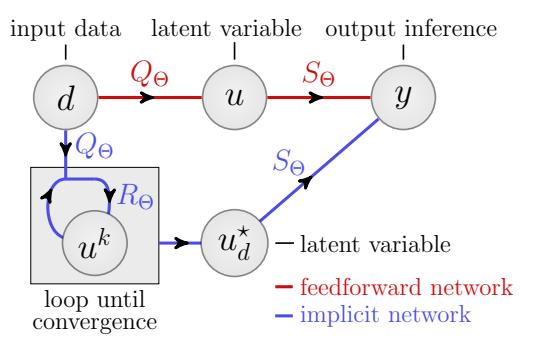
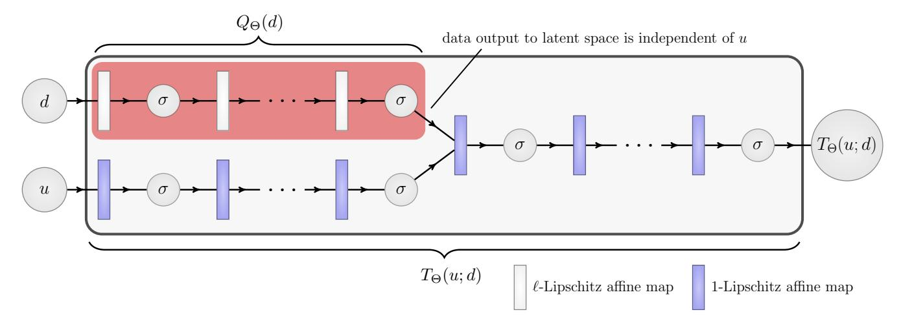
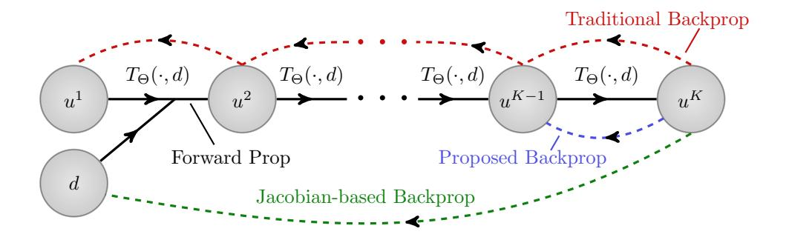
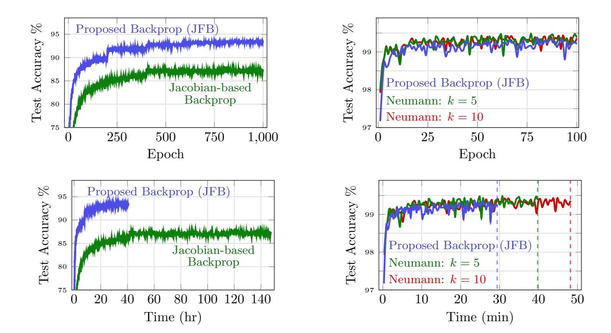

# JFB: Jacobian-Free Backpropagation for Implicit Networks

# Samy Wu Fung,\*1 Howard Heaton,\*2 Qiuwei Li,3 Daniel McKenzie,4 Stanley Osher,4 Wotao Yin3

Department of Applied Mathematics and Statistics, Colorado School of Mines
 Typal Research, Typal LLC
 Alibaba Group (US), Damo Academy
 Department of Mathematics, University of California, Los Angeles
 swufung@mines.edu, research@typal.llc, li.qiuwei@alibaba-inc.com, mckenzie@math.ucla.edu

#### **Abstract**

A promising trend in deep learning replaces traditional feedforward networks with implicit networks. Unlike traditional networks, implicit networks solve a fixed point equation to compute inferences. Solving for the fixed point varies in complexity, depending on provided data and an error tolerance. Importantly, implicit networks may be trained with fixed memory costs in stark contrast to feedforward networks, whose memory requirements scale linearly with depth. However, there is no free lunch — backpropagation through implicit networks often requires solving a costly Jacobian-based equation arising from the implicit function theorem. We propose Jacobian-Free Backpropagation (JFB), a fixed-memory approach that circumvents the need to solve Jacobian-based equations. JFB makes implicit networks faster to train and significantly easier to implement, without sacrificing test accuracy. Our experiments show implicit networks trained with JFB are competitive with feedforward networks and prior implicit networks given the same number of parameters.

#### Introduction

A new direction has emerged from explicit to implicit neural networks (Winston and Kolter 2020; Bai, Kolter, and Koltun 2019; Bai, Koltun, and Kolter 2020; Chen et al. 2018; Ghaoui et al. 2019; Dupont, Doucet, and Teh 2019; Jeon, Lee, and Choi 2021; Zhang et al. 2020; Lawrence et al. 2020; Revay and Manchester 2020; Look et al. 2020; Gould, Hartley, and Campbell 2019). In the standard feedforward setting, a network prescribes a series of computations that map input data d to an inference y. Networks can also explicitly leverage the assumption that high dimensional signals typically admit low dimensional representations in some latent space (Van der Maaten and Hinton 2008; Osher, Shi, and Zhu 2017; Peyré 2009; Elad, Figueiredo, and Ma 2010; Udell and Townsend 2019). This may be done by designing the network to first map data to a latent space via a mapping  $Q_{\Theta}$  and then apply a second mapping  $S_{\Theta}$  to map the latent variable to the inference. Thus, a traditional feedforward  $\mathcal{E}_{\Theta}$ may take the compositional form

$$\mathcal{E}_{\Theta}(d) = S_{\Theta}(Q_{\Theta}(d)), \tag{1}$$



Figure 1: Feedforward networks act by computing  $S_\Theta \circ Q_\Theta$ . Implicit networks add a fixed point condition using  $R_\Theta$ . When  $R_\Theta$  is contractive (more generally: averaged) repeatedly applying  $R_\Theta$  to update a latent variable  $u^k$  converges to a fixed point  $u^\star = R_\Theta(u^\star; Q_\Theta(d))$ .

which is illustrated by the red arrows in Figure 1. One can allow for computation in the latent space  $\mathcal U$  by introducing a self-map  $R_\Theta(\cdot;Q_\Theta(d))$  and the iteration

$$u^{k+1} = R_{\Theta}(u^k; Q_{\Theta}(d)). \tag{2}$$

Iterating k times may be viewed as a weight-tied, inputinjected network, where each feedforward step applies  $R_{\Theta}$ (Bai, Kolter, and Koltun 2019). As  $k \to \infty$ , *i.e.* the latent space portion becomes deeper, the limit of (2) yields a fixed point equation. Implicit networks capture this "infinite depth" behaviour by using  $R_{\Theta}(\cdot; Q_{\Theta}(d))$  to define a fixed point condition rather than an explicit computation:

$$\mathcal{N}_{\Theta}(d) \triangleq S_{\Theta}(u_d^{\star}) \text{ where } u_d^{\star} = R_{\Theta}(u_d^{\star}, Q_{\Theta}(d)),$$
 (3)

as shown by blue in Figure 1. Special cases of the network in (3) recover architectures introduced in prior works:

- ightharpoonup Taking  $S_{\Theta}$  to be the identity recovers the well-known Deep Equilibrium Model (DEQ) (Bai, Kolter, and Koltun 2019; Bai, Koltun, and Kolter 2020).
- ightharpoonup Choosing  $S_\Theta$  as the identity,  $Q_\Theta$  to be an affine map and  $R_\Theta(u,Q_\Theta(d)) = \sigma(Wu+Q_\Theta(d))$  yields Monotone Operator Networks (Winston and Kolter 2020) as long as W and  $\sigma$  satisfy additional conditions. Allowing  $S_\Theta$  to be linear yields the model proposed in (Ghaoui et al. 2019).

<sup>\*</sup>These authors contributed equally. Copyright © 2022, Association for the Advancement of Artificial Intelligence (www.aaai.org). All rights reserved.

Three immediate questions arise from (3):

- ▶ Is the definition in (3) well-posed?
- ▶ How is  $\mathcal{N}_{\Theta}(d)$  evaluated?
- ▶ How are the weights  $\Theta$  of  $\mathcal{N}_{\Theta}$  updated during training?

Since the first two points are well-established (Winston and Kolter 2020; Bai, Kolter, and Koltun 2019), we briefly review these in Section and focus on the third point. Using gradient-based methods for training requires computing  $d\mathcal{N}_{\Theta}/d\Theta$ , and in particular,  $du_d^{\star}/d\Theta$ . Hitherto, previous works computed  $du_d^{\star}/d\Theta$  by solving a Jacobian-based equation (see Section ). Solving this linear system is computationally expensive and prone to instability, particularly when the dimension of the latent space is large and/or includes certain structures (e.g. batch normalization and/or dropout) (Bai, Kolter, and Koltun 2019; Bai, Koltun, and Kolter 2020).

Our primary contribution is a new and simple **Jacobian-Free Backpropagation** (JFB) technique for training implicit networks that avoids *any* linear system solves. Instead, our scheme backpropagates by omitting the Jacobian term, resulting in a form of preconditioned gradient descent. JFB yields much faster training of implicit networks and allows for a wider array of architectures<sup>1</sup>.

# Why Implicit Networks?

Below, we discuss several advantages of implicit networks over explicit, feedforward networks.

Implicit networks for implicitly defined outputs In some applications, the desired network output is most aptly described implicitly as a fixed point, not via an explicit function. As a toy example, consider predicting the variable  $y \in \mathbb{R}$  given  $d \in [-1/2, 1/2]$  when (d, y) is known to satisfy

$$y = d + y^5. (4)$$

Using  $y_1 = 0$  and the iteration

$$y_{k+1} = T(y_k; d) \triangleq d + y_k^5$$
, for all  $k \in \mathbb{N}$ , (5)

one obtains  $y_k \to y$ . In this setting, y is exactly (and implicitly) characterized by y = T(y,d). On the other hand, an explicit solution to (4) requires an infinite series representation, unlike the simple formula  $T(y,d) = d + y^5$ . See appendix for further details. Thus, it can be simpler and more appropriate to model a relationship implicitly. For example, in areas as diverse as game theory and inverse problems, the output of interest may naturally be characterized as the fixed point to an operator parameterized by the input data d. Since implicit networks find fixed points by design, they are well-suited to such problems as shown by recent works (Heaton et al. 2021a,b; Gilton, Ongie, and Willett 2021).

"Infinite depth" with constant memory training As mentioned, solving for the fixed point of  $R_{\Theta}(\cdot; Q_{\Theta}(d))$  is analogous to a forward pass through an "infinite depth" (in practice, very deep) weight-tied, input injected feedforward

network. However, implicit networks do not need to store intermediate quantities of the forward pass for backpropagation. Consequently, implicit networks are trained using *constant memory costs* with respect to depth – relieving a major bottleneck of training deep networks.

No loss of expressiveness Implicit networks as defined in (3) are at least as expressive as feedforward networks. This can easily be observed by setting  $R_{\Theta}$  to simply return  $Q_{\Theta}$ ; in this case, the implicit  $\mathcal{N}_{\Theta}$  reduces to the feedforward  $\mathcal{E}_{\Theta}$  in (1). More interestingly, the class of implicit networks in which  $S_{\Theta}$  and  $Q_{\Theta}$  are constrained to be affine maps contains all feedforward networks, and is thus at least as expressive (Ghaoui et al. 2019), (Bai, Kolter, and Koltun 2019, Theorem 3). Universal approximation properties of implicit networks then follow immediately from such properties of conventional deep neural models (e.g. see (Csáji et al. 2001; Lu et al. 2017; Kidger and Lyons 2020)).

We also mention a couple limitations of implicit networks.

**Architectural limitations** As discussed above, in theory given any feedforward network one may write down an implicit network yielding the same output (for all inputs). In practice, evaluating the implicit network requires finding a fixed point of  $R_{\Theta}$ . The fixed point finding algorithm then places constraints on  $R_{\Theta}$  (e.g. Assumption 0.1). Guaranteeing the existence and computability of  $d\mathcal{N}_{\Theta}/d\Theta$  places further constraints on  $R_{\Theta}$ . For example, if Jacobian-based backpropagation is used,  $R_{\Theta}$  cannot contain batch normalization (Bai, Kolter, and Koltun 2019).

**Slower inference** Once trained, inference with an implicit network requires solving for a fixed point of  $R_{\Theta}$ . Finding this fixed point using an iterative algorithm requires evaluating  $R_{\Theta}$  repeatedly and, thus, is often slower than inference with a feedforward network.

## **Implicit Network Formulation**

All terms presented in this section are provided in a general context, which is later made concrete for each application. We include a subscript  $\Theta$  on various terms to emphasize the indicated mapping will ultimately be parameterized in terms of tunable weights<sup>2</sup>  $\Theta$ . At the highest level, we are interested in constructing a neural network  $\mathcal{N}_{\Theta}: \mathcal{D} \to \mathcal{Y}$  that maps from a data space<sup>3</sup>  $\mathcal{D}$  to an inference space  $\mathcal{Y}$ . The implicit portion of the network uses a latent space  $\mathcal{U}$ , and data is mapped to this latent space by  $Q_{\Theta}: \mathcal{D} \to \mathcal{U}$ . We define the network operator  $T_{\Theta}: \mathcal{U} \times \mathcal{D} \to \mathcal{U}$  by

$$T_{\Theta}(u;d) \triangleq R_{\Theta}(u,Q_{\Theta}(d)).$$
 (6)

Provided input data d, our aim is to find the unique fixed point  $u_d^*$  of  $T_{\Theta}(\cdot;d)$  and then map  $u_d^*$  to the inference space

<sup>&</sup>lt;sup>1</sup>All codes can be found on Github: github.com/howardheaton/jacobian\_free\_backprop

<sup>&</sup>lt;sup>2</sup>We use the same subscript for all terms, noting each operator typically depends on a portion of the weights.

<sup>&</sup>lt;sup>3</sup>Each space is assumed to be a real-valued finite dimensional Hilbert space  $(e.g. \mathbb{R}^n)$  endowed with a product  $\langle \cdot, \cdot \rangle$  and norm  $\| \cdot \|$ . It will be clear from context which space is being used.

 $\mathcal Y$  via a final mapping  $S_\Theta:\mathcal U\to\mathcal Y$ . This enables us to define an implicit network  $\mathcal N_\Theta$  by

$$\mathcal{N}_{\Theta}(d) \triangleq S_{\Theta}(u_d^{\star}) \text{ where } u_d^{\star} = T_{\Theta}(u_d^{\star}; d).$$
 (7)

Algorithm 1: Implicit Network with Fixed Point Iteration

$$\begin{array}{lll} \text{1: } \mathcal{N}_{\Theta}(d) \colon & \vartriangleleft \text{Input data is } d \\ \text{2: } u^1 \leftarrow \hat{u} & \vartriangleleft \text{Assign latent term} \\ \text{3: } & \textbf{while} \ \|u^k - T_{\Theta}(u^k;d)\| > \varepsilon \vartriangleleft \text{Loop til converge} \\ \text{4: } u^{k+1} \leftarrow T_{\Theta}(u^k;d) & \vartriangleleft \text{Refine latent term} \\ \text{5: } k \leftarrow k+1 & \vartriangleleft \text{Increment counter} \\ \text{6: } & \textbf{return } S_{\Theta}(u^k) & \vartriangleleft \text{Output } \textit{estimate} \\ \end{array}$$

Implementation considerations for  $T_\Theta$  are discussed below. We also introduce assumptions on  $T_\Theta$  that yield sufficient conditions to use the simple procedure in Algorithm 1 to approximate  $\mathcal{N}_\Theta(d)$ . In this algorithm, the latent variable initialization  $\hat{u}$  can be any fixed quantity (e.g. the zero vector). The inequality in Step 3 gives a fixed point residual condition that measures convergence. Step 4 implements a fixed point update. The estimate of the inference  $\mathcal{N}_\Theta(d)$  is computed by applying  $S_\Theta$  to the latent variable  $u^k$  in Step 6. The blue path in Figure 1 visually summarizes Algorithm 1.

**Convergence** Finitely many loops in Steps 3 and 4 of Algorithm 1 is guaranteed by a classic functional analysis result (Banach 1922). This approach is used by several implicit networks (Ghaoui et al. 2019; Winston and Kolter 2020; Jeon, Lee, and Choi 2021). Below we present a variation of Banach's result for our setting.

**Assumption 0.1.** The mapping  $T_{\Theta}$  is L-Lipschitz with respect to its inputs (u, d), i.e.,

$$||T_{\Theta}(u; d) - T_{\Theta}(v; w)|| \le L||(u, d) - (v, w)||,$$
 (8)

for all  $(u,d),(v,w) \in \mathcal{U} \times \mathcal{D}$ . Holding d fixed, the operator  $T_{\Theta}(\cdot;d)$  is a contraction, i.e. there exists  $\gamma \in [0,1)$  such that

$$||T_{\Theta}(u;d) - T_{\Theta}(v;d)|| \le \gamma ||u - v||, \text{ for all } u, v \in \mathcal{U}.$$
 (9)

**Remark 0.1.** The L-Lipschitz condition on  $T_{\Theta}$  is used since recent works show Lipschitz continuity with respect to inputs improves generalization (Sokolić et al. 2017; Gouk et al. 2021; Finlay et al. 2018) and adversarial robustness (Cisse et al. 2017; Anil, Lucas, and Grosse 2019).

**Theorem 0.1.** (BANACH) For any  $u^1 \in \mathcal{U}$ , if the sequence  $\{u^k\}$  is generated via the update relation

$$u^{k+1} = T_{\Theta}(u^k; d), \text{ for all } k \in \mathbb{N},$$
 (10)

and if Assumption 0.1 holds, then  $\{u^k\}$  converges linearly to the unique fixed point  $u_d^*$  of  $T_{\Theta}(\cdot;d)$ .

Alternative Approaches In (Bai, Kolter, and Koltun 2019; Bai, Koltun, and Kolter 2020) Broyden's method is used for finding  $u_d^*$ . Broyden's method is a quasi-Newton scheme and so at each iteration it updates a stored approximation to the Jacobian  $J_k$  and then solves a linear system in  $J_k$ . Since in this work our goal is to explore truly *Jacobian-free* approaches, we stick to the simpler fixed point iteration

scheme when computing  $\tilde{u}$  (i.e. Algorithm 1). In the contemporaneous (Gilton, Ongie, and Willett 2021), it is reported that using fixed point iteration in conjunction with Anderson acceleration finds  $\tilde{u}$  faster than both vanilla fixed point iteration and Broyden's method. Combining JFB with Anderson accelerated fixed point iteration is a promising research direction we leave for future work.

Other Implicit Formulations A related implicit learning formulation is the well-known neural ODE model (Chen et al. 2018; Dupont, Doucet, and Teh 2019; Ruthotto and Haber 2021). Neural ODEs leverage known connections between deep residual models and discretizations of differential equations (Haber and Ruthotto 2017; Weinan 2017; Ruthotto and Haber 2019; Chang et al. 2018; Finlay et al. 2020; Lu et al. 2018), and replace these discretizations by black-box ODE solvers in forward and backward passes. The implicit property of these models arise from their method for computing gradients. Rather than backpropagate through each layer, backpropagation is instead done by solving the adjoint equation (Jameson 1988) using a blackbox ODE solver as well. This is analogous to solving the Jacobian-based equation when performing backpropagation for implicit networks (see (13)) and allows the user to alleviate the memory costs of backpropagation through deep neural models by solving the adjoint equation at additional computational costs. A drawback is that the adjoint equation must be solved to high-accuracy; otherwise, a descent direction is not necessarily guaranteed (Gholami, Keutzer, and Biros 2019; Onken and Ruthotto 2020; Onken et al. 2021).

### **Backpropagation**

We present a simple way to backpropagate with implicit networks, called Jacobian-free backprop (JFB). Traditional backpropagation will *not* work effectively for implicit networks since forward propagation during training could entail hundreds or thousands of iterations, requiring ever growing memory to store computational graphs. On the other hand, implicit models maintain fixed memory costs by backpropagating "through the fixed point" and solving a Jacobian-based equation (at potentially substantial added computational costs). The key step to circumvent this Jacobian-based equation with JFB is to tune weights by using a preconditioned gradient. Let  $\ell: \mathcal{Y} \times \mathcal{Y} \to \mathbb{R}$  be a smooth loss function, denoted by  $\ell(x,y)$ , and consider the training problem

$$\min_{\Theta} \mathbb{E}_{d \sim \mathcal{D}} \left[ \ell \left( y_d, \mathcal{N}_{\Theta}(d) \right) \right], \tag{11}$$

where we abusively write  $\mathcal{D}$  to also mean a distribution. For clarity of presentation, in the remainder of this section we notationally suppress the dependencies on weights  $\Theta$  by letting  $u_d^\star$  denote the fixed point in (7). Unless noted otherwise, mapping arguments are implicit in this section; in each implicit case, this will correspond to entries in (7). We begin with standard assumptions enabling us to differentiate  $\mathcal{N}_{\Theta}$ .

**Assumption 0.2.** The mappings  $S_{\Theta}$  and  $T_{\Theta}$  are continuously differentiable with respect to u and  $\Theta$ .



Figure 2: Diagram of a possible architecture for network operator  $T_{\Theta}$  (in large rectangle). Data d and latent u variables are processed in two streams by nonlinearities (denoted by  $\sigma$ ) and affine mappings (denoted by rectangles). These streams merge into a final stream that may also contain transformations. Light gray and blue affine maps are  $\ell$ -Lipschitz and 1-Lipschitz, respectively. The mapping  $Q_{\Theta}$  from data space to latent space is enclosed by the red rectangle.

**Assumption 0.3.** The weights  $\Theta$  may be written as a tuple  $\Theta = (\theta_S, \theta_T)$  such that weight paramaterization of  $S_{\Theta}$  and  $T_{\Theta}$  depend only on  $\theta_S$  and  $\theta_T$ , respectively.<sup>4</sup>

Let  $\mathcal{J}_{\Theta}$  be defined as the identity operator, denoted by I, minus the Jacobian<sup>5</sup> of  $T_{\Theta}$  at (u, d), *i.e.* 

$$\mathcal{J}_{\Theta}(u;d) \triangleq I - \frac{\mathrm{d}T_{\Theta}}{\mathrm{d}u}(u;d).$$
 (12)

Following (Winston and Kolter 2020; Bai, Kolter, and Koltun 2019), we differentiate both sides of the fixed point relation in (7) to obtain, by the implicit function theorem,

$$\frac{\mathrm{d}u_d^{\star}}{\mathrm{d}\Theta} = \frac{\partial T_{\Theta}}{\partial u} \frac{\mathrm{d}u_d^{\star}}{\mathrm{d}\Theta} + \frac{\partial T_{\Theta}}{\partial \Theta} \quad \Longrightarrow \quad \frac{\mathrm{d}u_d^{\star}}{\mathrm{d}\Theta} = \mathcal{J}_{\Theta}^{-1} \cdot \frac{\partial T_{\Theta}}{\partial \Theta}, \tag{13}$$

where  $\mathcal{J}_{\Theta}^{-1}$  exists whenever  $\mathcal{J}_{\Theta}$  exists (see Lemma ??). Using the chain rule gives the loss gradient

$$\frac{\mathrm{d}}{\mathrm{d}\Theta} \left[ \ell(y_d, \mathcal{N}_{\Theta}(d)) \right] = \frac{\mathrm{d}}{\mathrm{d}\Theta} \left[ \ell(y_d, S_{\Theta}(T_{\Theta}(u_d^{\star}, d))) \right] 
= \frac{\partial \ell}{\partial y} \left[ \frac{\mathrm{d}S_{\Theta}}{\mathrm{d}u} \mathcal{J}_{\Theta}^{-1} \frac{\partial T_{\Theta}}{\partial \Theta} + \frac{\partial S_{\Theta}}{\partial \Theta} \right].$$
(14)

The matrix  $\mathcal{J}_{\Theta}$  satisfies the inequality (see Lemma ??)

$$\langle u, \mathcal{J}_{\Theta}^{-1} u \rangle \ge \frac{1 - \gamma}{(1 + \gamma)^2} \|u\|^2, \text{ for all } u \in \mathcal{U}.$$
 (15)

Intuitively, this coercivity property makes it seem possible to remove  $\mathcal{J}_\Theta^{-1}$  from (14) and backpropagate using

$$p_{\Theta} \triangleq -\frac{\mathrm{d}}{\mathrm{d}\Theta} \left[ \ell(y_d, S_{\Theta}(T_{\Theta}(u, d))) \right]_{u=u_d^{\star}}$$

$$= -\frac{\partial \ell}{\partial y} \left[ \frac{\mathrm{d}S_{\Theta}}{\mathrm{d}u} \frac{\partial T_{\Theta}}{\partial \Theta} + \frac{\partial S_{\Theta}}{\partial \Theta} \right].$$
(16)

The omission of  $\mathcal{J}_\Theta^{-1}$  admits two straightforward interpretations. Note  $\mathcal{N}_\Theta(d) = S_\Theta(T_\Theta(u_d^\star;d))$ , and so  $p_\Theta$  is precisely the gradient of the expression  $\ell(y_d, S_\Theta(T_\Theta(u_d^\star;d)))$ , treating  $u_d^\star$  as a constant independent of  $\Theta$ . The distinction is that using  $S_\Theta(T_\Theta(u_d^\star;d))$  assumes, perhaps by chance, the user chose the first iterate  $u^1$  in their fixed point iteration (see Algorithm 1) to be precisely the fixed point  $u_d^\star$ . This makes the iteration trivial, "converging" in one iteration. We can simulate this behavior by using the fixed point iteration to find  $u_d^\star$  and only backpropagating through the final step of the fixed point iteration, as shown in Figure 4.

Since the weights  $\Theta$  typically lie in a space of much higher dimension than the latent space  $\mathcal{U}$ , the Jacobians  $\partial S_{\Theta}/\partial \Theta$  and  $\partial T_{\Theta}/\partial \Theta$  effectively always have full column rank. We leverage this fact via the following assumption.

**Assumption 0.4.** *Under Assumption 0.3, given any weights*  $\Theta = (\theta_S, \theta_T)$  *and data d, the matrix* 

$$M \triangleq \begin{bmatrix} \frac{\partial S_{\Theta}}{\partial \theta_S} & 0\\ 0 & \frac{\partial T_{\Theta}}{\partial \theta_T} \end{bmatrix}$$
 (17)

has full column rank and is sufficiently well conditioned to satisfy the inequality<sup>6</sup>

$$\kappa(M^{\top}M) = \frac{\lambda_{\max}(M^{\top}M)}{\lambda_{\min}(M^{\top}M)} \le \frac{1}{\gamma}.$$
 (18)

**Remark 0.2.** The conditioning portion of the above assumption is useful for bounding the worst-case behavior in our analysis. However, we found it unnecessary to enforce this in our experiments for effective training (e.g. see Figure 5), which we hypothesize is justified because worst case behavior rarely occurs in practice and we train using averages of  $p_{\Theta}$  for samples drawn from large data sets.

<sup>&</sup>lt;sup>4</sup>This assumption is easy to ensure in practice. For notational brevity, we use the subscript  $\Theta$  throughout.

<sup>&</sup>lt;sup>5</sup>Under Assumption 0.1, the Jacobian  $\mathcal{J}_{\Theta}$  exists almost everywhere. However, presentation is cleaner by assuming smoothness.

<sup>&</sup>lt;sup>6</sup>The term  $\gamma$  here refers to the contraction factor in (9).

Assumption 0.4 gives rise to a second interpretation of JFB. Namely, the full column rank of M enables us to rewrite  $p_{\Theta}$  as a preconditioned gradient, *i.e.* 

$$p_{\Theta} = \underbrace{\left(M \begin{bmatrix} I & 0 \\ 0 & \mathcal{J}_{\Theta} \end{bmatrix} M^{+}\right)}_{\text{preconditioning term}} \frac{d\ell}{d\Theta}, \quad (19)$$

where  $M^+$  is the Moore-Penrose pseudo inverse (Moore 1920; Penrose 1955). These insights lead to our main result.

**Theorem 0.2.** If Assumptions 0.1, 0.2, 0.3, and 0.4 hold for given weights  $\Theta$  and data d, then

$$p_{\Theta} \triangleq -\frac{\mathrm{d}}{\mathrm{d}\Theta} \left[ \ell(y_d, S_{\Theta}(T_{\Theta}(u, d))) \right]_{u=u_d^{\star}}$$
 (20)

is a descent direction for  $\ell(y_d, \mathcal{N}_{\Theta}(d))$  with respect to  $\Theta$ .

Theorem 0.2 shows we can avoid difficult computations associated with  $\mathcal{J}_{\Theta}^{-1}$  in (14) (*i.e.* solving an associated linear system/adjoint equation) in implicit network literature (Chen et al. 2018; Dupont, Doucet, and Teh 2019; Bai, Kolter, and Koltun 2019; Winston and Kolter 2020). Thus, our scheme more naturally applies to general multilayered  $T_{\Theta}$  and is substantially simpler to code. Our scheme is juxtaposed in Figure 4 with classic and Jacobian-based schemes.

Two additional considerations must be made when determining the efficacy of training a model using (20) rather than Jacobian-based gradients (14).

- ▶ Does use of  $p_{\Theta}$  in (20) degrade training/testing performance relative to (14)?
- ▶ Is the term  $p_{\Theta}$  in (20) resilient to errors in estimates of the fixed point  $u_d^*$ ?

The first answer is our training scheme takes a different path to minimizers than using gradients with the implicit model. Thus, for nonconvex problems, one should not expect the results to be the same. In our experiments in Section , using (20) is competitive (14) for all tests (when applied to nearly identical models). The second inquiry is partly answered by the corollary below, which states JFB yields descent even for approximate fixed points.

**Corollary 0.1.** Given weights  $\Theta$  and data d, there exists  $\varepsilon > 0$  such that if  $u_d^{\varepsilon} \in \mathcal{U}$  satisfies  $\|u_d^{\varepsilon} - u_d^{\star}\| \leq \varepsilon$  and the assumptions of Theorem 0.2 hold, then

$$p_{\Theta}^{\varepsilon} \triangleq -\frac{\mathrm{d}}{\mathrm{d}\Theta} \left[ \ell(y_d, S_{\Theta}(T_{\Theta}(u, d))) \right]_{u=u_d^{\varepsilon}}$$
 (21)

is a descent direction of  $\ell(y_d, \mathcal{N}_{\Theta}(d))$  with respect to  $\Theta$ .

We are not aware of any analogous results for error tolerances in the implicit depth literature.

Coding Backpropagation A key feature of JFB is its simplicity of implementation. In particular, the backpropagation of our scheme is similar to that of a standard backpropagation. We illustrate this in the sample of PyTorch (Paszke et al. 2017) code in Figure 3. Here <code>explicit\_model</code> represents  $S_{\Theta}(T_{\Theta}(u;d))$ . The fixed point  $u_d^{\star} = u_fxd_pt$  is computed by successively applying  $T_{\Theta}$  (see Algorithm 1)

within a torch.no\_grad() block. With this fixed point, explicit\_model evaluates and returns  $S_{\Theta}(T_{\Theta}(u_d^{\star},d))$  to y in train mode (to create the computational graph). Thus, our scheme coincides with standard backpropagation through an explicit model with one latent space layer. On the other hand, standard implicit models backpropagate by solving a linear system to apply  $\mathcal{J}_{\Theta}^{-1}$  as in (14). That approach requires users to manually update the parameters, use more computational resources, and make considerations (e.g. conditioning of  $\mathcal{J}_{\Theta}^{-1}$ ) for each architecture used.

### Implicit Forward + Proposed Backprop

```
u_fxd_pt = find_fixed_point(d)
y = explicit_model(u_fxd_pt, d)
loss = criterion(y, labels)
loss.backward()
optimizer.step()
```

Figure 3: Sample PyTorch code for backpropagation

**Neumann Backpropagation** The inverse of the Jacobian in (12) can be expanded using a Neumann series, *i.e.* 

$$\mathcal{J}_{\Theta}^{-1} = \left(\mathbf{I} - \frac{\mathrm{d}T_{\Theta}}{\mathrm{d}u}\right)^{-1} = \sum_{k=0}^{\infty} \left(\frac{\mathrm{d}T_{\Theta}}{\mathrm{d}u}\right)^{k}.$$
 (22)

Thus, JFB is a zeroth-order approximation to the Neumann series. In particular, JFB resembles the Neumann-RBP approach for recurrent networks (Liao et al. 2018). However, Neumann-RBP does not guarantee a descent direction or guidelines on how to truncate the Neumann series. This is generally difficult to achieve in theory and practice (Aicher, Foti, and Fox 2020). Our work differs from (Liao et al. 2018) in that we focus purely on implicit networks, prove descent guarantees for JFB, and provide simple PyTorch implementations. Similar approaches exist in hyperparameter optimization, where truncated Neumann series are is used to approximate second-order updates during training (Luketina et al. 2016; Lorraine, Vicol, and Duvenaud 2020). Finally, similar zeroth-order truncations of the Neumann series have been employed, albeit without proof, in Meta-learning (Finn, Abbeel, and Levine 2017; Rajeswaran et al. 2019) and in training transformers (Geng et al. 2021).

## **Experiments**

This section shows the effectiveness of JFB using PyTorch (Paszke et al. 2017). All networks are ResNet-based such that Assumption 0.3 holds. One can ensure Assumption 0.1 holds (*e.g.* via spectral normalization). Yet, in our experiments we found this unnecessary since tuning the weights automatically encouraged contractive behavior. All experiments are run on a single NVIDIA TITAN X GPU with 12GB RAM. Further details are in the appendix .

<sup>&</sup>lt;sup>7</sup>A weaker version of Assumption 0.2 also holds in practice, *i.e.* differentiability almost everywhere.

<sup>&</sup>lt;sup>8</sup>We found (9) held for batches of data during training, even when using batch normalization. See appendix for more details.



Figure 4: Diagram of backpropagation schemes for recurrent implicit depth models. Forward propagation is tracked via solid arrows point to the right (n.b.) each forward step uses d). Backpropagation is shown via dashed arrows pointing to the left. Traditional backpropagation requires memory capacity proportional to depth (which is implausible for large K). Jacobian-based backpropagation solves an associated equation dependent upon the data d and operator  $T_{\Theta}$ . JFB uses a single backward step, which avoids both large memory capacity requirements and solving a Jacobian-type equation.

| N | IN | IIS | 7 |
|---|----|-----|---|
|   |    |     |   |

| Method                             | Network size | Acc.  |
|------------------------------------|--------------|-------|
| Explicit                           | 54K          | 99.4% |
| Neural ODE <sup>†</sup>            | 84K          | 96.4% |
| Aug. Neural ODE <sup>†</sup>       | 84K          | 98.2% |
| MON <sup>‡</sup>                   | 84K          | 99.2% |
| JFB-trained Implicit ResNet (ours) | 54K          | 99.4% |

#### **SVHN**

| Method                             | Network size | Acc.  |
|------------------------------------|--------------|-------|
| Explicit                           | 164K         | 93.7% |
| Neural ODE <sup>†</sup>            | 172K         | 81.0% |
| Aug. Neural ODE <sup>†</sup>       | 172K         | 83.5% |
| MON (Multi-tier lg) <sup>‡</sup>   | 170K         | 92.3% |
| JFB-trained Implicit ResNet (ours) | 164K         | 94.1% |

#### CIFAR-10

| Method                              | Network size | Acc.  |
|-------------------------------------|--------------|-------|
| Explicit (ResNet-56)*               | 0.85M        | 93.0% |
| MON (Multi-tier lg) <sup>‡*</sup>   | 1.01M        | 89.7% |
| JFB-trained Implicit ResNet (ours)* | 0.84M        | 93.7% |
| Multiscale DEQ*                     | 10M          | 93.8% |

Table 1: Test accuracy of JFB-trained Implicit ResNet compared to Neural ODEs, Augmented NODEs, and MONs; †as reported in (Dupont, Doucet, and Teh 2019); ‡as reported in (Winston and Kolter 2020); \*with data augmentation

## Classification

We train implicit networks on three benchmark image classification datasets licensed under CC-BY-SA: SVHN (Netzer et al. 2011), MNIST (LeCun, Cortes, and Burges 2010), and CIFAR-10 (Krizhevsky and Hinton 2009). Table 1 compares our results with state-of-the-art results for implicit networks, including Neural ODEs (Chen et al. 2018), Augmented Neural ODEs (Dupont, Doucet, and Teh 2019), Multiscale

DEQs (Bai, Koltun, and Kolter 2020), and MONs (Winston and Kolter 2020). We also compare with corresponding explicit versions of our ResNet-based networks given in (1) as well as with state-of-the-art ResNet results (He et al. 2016) on the augmented CIFAR10 dataset. The explicit networks are trained with the same setup as their implicit counterparts. Table 1 shows JFBs are an effective way to train implicit networks, substantially outperform all the ODE-based networks as well as MONs using similar or fewer parameters. Moreover, JFB is competitive with Multiscale DEQs (Bai, Koltun, and Kolter 2020) despite having less than a tenth as many parameters. See appendix for additional results.

#### Comparison to Jacobian-based Backpropagation

Table 2 compares performance between using the standard Jacobian-based backpropagation and JFB. The experiments are performed on all the datasets described in Section. To apply the Jacobian-based backpropagation in (13), we use the conjugate gradient (CG) method on an associated set of normal equations similarly to (Liao et al. 2018). To maintain similar costs, we set the maximum number of CG iterations to be the same as the maximum depth of the forward propagation. The remaining experimental settings are kept the same in our proposed approach. Note the network architectures trained with JFB contain batch normalization in the latent space whereas those trained with Jacobian-based backpropagation do not. Removal of batch normalization for the Jacobian-based method was necessary due to a lack of convergence when solving (13), thereby increasing training loss (see appendix for further details). This phenomena is also observed in previous works (Bai, Koltun, and Kolter 2020; Bai, Kolter, and Koltun 2019). Thus, we find JFB to be (empirically) effective on a wider class of network architectures (e.g. including batch normalization). The purpose of the Jacobian-based results in Figure 5 and Table 2 is to show speedups in training time while maintaining a competitive accuracy with previous state-of-the-art implicit networks. More plots are given in the appendix.

|                | Dataset | Avg time per epoch (s) | # of $\mathcal J$ mat-vec products | Accuracy % |
|----------------|---------|------------------------|------------------------------------|------------|
| Jacobian based | MNIST   | 28.4                   | $6.0 \times 10^{6}$                | 99.2       |
|                | SVHN    | 92.8                   | $1.4 \times 10^{7}$                | 90.1       |
|                | CIFAR10 | 530.9                  | $9.7 \times 10^{8}$                | 87.9       |
| JFB            | MNIST   | 17.6                   | 0                                  | 99.4       |
|                | SVHN    | 36.9                   | 0                                  | 94.1       |
|                | CIFAR10 | 146.6                  | 0                                  | 93.67      |

Table 2: Comparison of Jacobian-based backpropagation (first three rows) and our proposed JFB approach. "Mat-vecs" denotes matrix-vector products.



Figure 5: CIFAR10 results using comparable networks/configurations, but with two backpropagation schemes: our proposed JFB method (blue) and standard Jacobian-based backpropagation in (14) (green), with fixed point tolerance  $\epsilon=10^{-4}$ . JFB is faster and gives better test accuracy.

Figure 6: MNIST training using different truncations k of the Neumann series (22) to approximate the inverse Jacobian  $\mathcal{J}_{\Theta}^{-1}$ . Plots show faster training with fewer terms (fastest with JFB, *i.e.* k = 0) and competitive test accuracy.

# **Higher Order Neumann Approximation**

As explained in Section , JFB can be interpreted as an approximation to the Jacobian-based approach using a zeroth order (i.e. k=0) truncation to the Neumann series expansion (22) of the Jacobian inverse  $\mathcal{J}_{\Theta}^{-1}$ . Figure 6 compares JFB with training using more Neumann series terms in the approximation of the Jacobian inverse  $\mathcal{J}_{\Theta}^{-1}$ . Figure 6 shows JFB is competitive at reduced time cost. Significantly, JFB is also much easier to implement (see Figure 3). See appendix for more experiments with SVHN and discussion about code.

## Conclusion

This work presents a new and simple Jacobian-free back-propagation (JFB) scheme. JFB enables training of implicit networks with fixed memory costs (regardless of depth), is easy to code (see Figure 3), and yields efficient backpropagation. Use of JFB is theoretically justified (even when fixed points are approximately computed). Experiments show JFB yields competitive results for implicit networks. Extensions will enable satisfaction of additional constraints for imaging (Klibanov 1986; Fienup 1982; Heaton et al. 2020; Fung and Wendy 2020; Kan, Fung, and Ruthotto 2020), geophysics (Haber 2014; Fung and Ruthotto 2019a,b), and games (Von Neumann 1959; Lin et al. 2021; Ruthotto et al. 2020).

# Acknowledgements

HH, DM, SO, SWF and QL were supported by AFOSR MURI FA9550-18-1-0502 and ONR grants: N00014-18-1-2527, N00014-20-1-2093, and N00014-20-1-2787. HH's work was also supported by the National Science Foundation (NSF) Graduate Research Fellowship under Grant No. DGE-1650604. Any opinion, findings, and conclusions or recommendations expressed in this material are those of the authors and do not necessarily reflect the views of the NSF. We thank Zaccharie Ramzi for the fruitful discussions and the anonymous referees for helping us improve the quality of our paper.

## References

- Aicher, C.; Foti, N. J.; and Fox, E. B. 2020. Adaptively truncating backpropagation through time to control gradient bias. In *Uncertainty in Artificial Intelligence*, 799–808. PMLR.
- Anil, C.; Lucas, J.; and Grosse, R. 2019. Sorting out Lipschitz function approximation. In *International Conference on Machine Learning*, 291–301. PMLR.
- Bai, S.; Kolter, J. Z.; and Koltun, V. 2019. Deep equilibrium models. In *Advances in Neural Information Processing Systems*, 690–701.
- Bai, S.; Koltun, V.; and Kolter, J. Z. 2020. Multiscale Deep Equilibrium Models. *Advances in Neural Information Processing Systems*, 33.
- Banach, S. 1922. Sur les opérations dans les ensembles abstraits et leur application aux équations intégrales. *Fund. math*, 3(1): 133–181.
- Chang, B.; Meng, L.; Haber, E.; Ruthotto, L.; Begert, D.; and Holtham, E. 2018. Reversible architectures for arbitrarily deep residual neural networks. In *Proceedings of the AAAI Conference on Artificial Intelligence*, volume 32.
- Chen, R. T.; Rubanova, Y.; Bettencourt, J.; and Duvenaud, D. K. 2018. Neural ordinary differential equations. In *Advances in neural information processing systems*, 6571–6583.
- Cisse, M.; Bojanowski, P.; Grave, E.; Dauphin, Y.; and Usunier, N. 2017. Parseval networks: Improving robustness to adversarial examples. In *International Conference on Machine Learning*, 854–863. PMLR.
- Csáji, B. C.; et al. 2001. Approximation with artificial neural networks. *Faculty of Sciences, Eötvös Lorànd University, Hungary*, 24(48): 7.
- Dupont, E.; Doucet, A.; and Teh, Y. W. 2019. Augmented Neural ODEs. In Wallach, H.; Larochelle, H.; Beygelzimer, A.; d'Alché-Buc, F.; Fox, E.; and Garnett, R., eds., *Advances in Neural Information Processing Systems*, volume 32. Curran Associates, Inc.
- Elad, M.; Figueiredo, M. A.; and Ma, Y. 2010. On the role of sparse and redundant representations in image processing. *Proceedings of the IEEE*, 98(6): 972–982.
- Fienup, J. R. 1982. Phase retrieval algorithms: A comparison. *Applied optics*, 21(15): 2758–2769.
- Finlay, C.; Calder, J.; Abbasi, B.; and Oberman, A. 2018. Lipschitz regularized deep neural networks generalize and are adversarially robust. *arXiv preprint arXiv:1808.09540*.
- Finlay, C.; Jacobsen, J.-H.; Nurbekyan, L.; and Oberman, A. M. 2020. How to train your neural ODE. *arXiv preprint arXiv:2002.02798*.

- Finn, C.; Abbeel, P.; and Levine, S. 2017. Model-agnostic metalearning for fast adaptation of deep networks. In *International Conference on Machine Learning*, 1126–1135. PMLR.
- Fung, S. W.; and Ruthotto, L. 2019a. A multiscale method for model order reduction in PDE parameter estimation. *Journal of Computational and Applied Mathematics*, 350: 19–34.
- Fung, S. W.; and Ruthotto, L. 2019b. An uncertainty-weighted asynchronous ADMM method for parallel PDE parameter estimation. *SIAM Journal on Scientific Computing*, 41(5): S129–S148.
- Fung, S. W.; and Wendy, Z. 2020. Multigrid optimization for large-scale ptychographic phase retrieval. *SIAM Journal on Imaging Sciences*, 13(1): 214–233.
- Geng, Z.; Guo, M.-H.; Chen, H.; Li, X.; Wei, K.; and Lin, Z. 2021. Is Attention Better Than Matrix Decomposition? In *International Conference on Learning Representations*.
- Ghaoui, L. E.; Gu, F.; Travacca, B.; Askari, A.; and Tsai, A. Y. 2019. Implicit Deep Learning. *arXiv preprint arXiv:1908.06315*.
- Gholami, A.; Keutzer, K.; and Biros, G. 2019. ANODE: Unconditionally accurate memory-efficient gradients for neural ODEs. *arXiv preprint arXiv:1902.10298*.
- Gilton, D.; Ongie, G.; and Willett, R. 2021. Deep Equilibrium Architectures for Inverse Problems in Imaging. *arXiv preprint arXiv:2102.07944*.
- Gouk, H.; Frank, E.; Pfahringer, B.; and Cree, M. J. 2021. Regularisation of neural networks by enforcing Lipschitz continuity. *Machine Learning*, 110(2): 393–416.
- Gould, S.; Hartley, R.; and Campbell, D. 2019. Deep declarative networks: A new hope. *arXiv preprint arXiv:1909.04866*.
- Haber, E. 2014. Computational methods in geophysical electromagnetics. SIAM.
- Haber, E.; and Ruthotto, L. 2017. Stable architectures for deep neural networks. *Inverse Problems*, 34(1): 014004.
- He, K.; Zhang, X.; Ren, S.; and Sun, J. 2016. Deep residual learning for image recognition. In *Proceedings of the IEEE conference on computer vision and pattern recognition*, 770–778.
- Heaton, H.; Fung, S. W.; Gibali, A.; and Yin, W. 2021a. Feasibility-based Fixed Point Networks. *arXiv preprint arXiv:2104.14090*.
- Heaton, H.; Fung, S. W.; Lin, A. T.; Osher, S.; and Yin, W. 2020. Projecting to Manifolds via Unsupervised Learning. *arXiv preprint arXiv:2008.02200*.
- Heaton, H.; McKenzie, D.; Li, Q.; Fung, S. W.; Osher, S.; and Yin, W. 2021b. Learn to Predict Equilibria via Fixed Point Networks. *arXiv preprint arXiv:2106.00906*.
- Jameson, A. 1988. Aerodynamic design via control theory. *Journal of scientific computing*, 3(3): 233–260.
- Jeon, Y.; Lee, M.; and Choi, J. Y. 2021. Differentiable Forward and Backward Fixed-Point Iteration Layers. *IEEE Access*.
- Kan, K.; Fung, S. W.; and Ruthotto, L. 2020. PNKH-B: A projected Newton-Krylov method for large-scale bound-constrained optimization. *arXiv preprint arXiv:2005.13639*.
- Kidger, P.; and Lyons, T. 2020. Universal approximation with deep narrow networks. In *Conference on Learning Theory*, 2306–2327. PMI R
- Klibanov, M. V. 1986. Determination of a compactly supported function from the argument of its Fourier transform. In *Doklady Akademii Nauk*, volume 289, 539–540. Russian Academy of Sciences
- Krizhevsky, A.; and Hinton, G. 2009. Learning Multiple Layers of Features from Tiny Images. Technical report, University of Toronto.

- Lawrence, N.; Loewen, P.; Forbes, M.; Backstrom, J.; and Gopaluni, B. 2020. Almost Surely Stable Deep Dynamics. In Larochelle, H.; Ranzato, M.; Hadsell, R.; Balcan, M. F.; and Lin, H., eds., *Advances in Neural Information Processing Systems*, volume 33, 18942–18953. Curran Associates, Inc.
- LeCun, Y.; Cortes, C.; and Burges, C. 2010. MNIST handwritten digit database. *ATT Labs [Online]. Available: http://yann.lecun.com/exdb/mnist*, 2.
- Liao, R.; Xiong, Y.; Fetaya, E.; Zhang, L.; Yoon, K.; Pitkow, X.; Urtasun, R.; and Zemel, R. 2018. Reviving and improving recurrent back-propagation. In *International Conference on Machine Learning*, 3082–3091. PMLR.
- Lin, A. T.; Fung, S. W.; Li, W.; Nurbekyan, L.; and Osher, S. J. 2021. Alternating the population and control neural networks to solve high-dimensional stochastic mean-field games. *Proceedings of the National Academy of Sciences*, 118(31).
- Look, A.; Doneva, S.; Kandemir, M.; Gemulla, R.; and Peters, J. 2020. Differentiable Implicit Layers. *arXiv preprint arXiv:2010.07078*.
- Lorraine, J.; Vicol, P.; and Duvenaud, D. 2020. Optimizing millions of hyperparameters by implicit differentiation. In *International Conference on Artificial Intelligence and Statistics*, 1540–1552. PMLR.
- Lu, Y.; Zhong, A.; Li, Q.; and Dong, B. 2018. Beyond finite layer neural networks: Bridging deep architectures and numerical differential equations. In *International Conference on Machine Learning*, 3276–3285. PMLR.
- Lu, Z.; Pu, H.; Wang, F.; Hu, Z.; and Wang, L. 2017. The expressive power of neural networks: A view from the width. *arXiv preprint arXiv:1709.02540*.
- Luketina, J.; Berglund, M.; Greff, K.; and Raiko, T. 2016. Scalable gradient-based tuning of continuous regularization hyperparameters. In *International conference on machine learning*, 2952–2960. PMLR.
- Moore, E. H. 1920. On the reciprocal of the general algebraic matrix. *Bulletin of the American Mathematical Society*, 26: 394–395.
- Netzer, Y.; Wang, T.; Coates, A.; Bissacco, A.; Wu, B.; and Ng, A. Y. 2011. Reading digits in natural images with unsupervised feature learning. In NIPS Workshop on Deep Learning and Unsupervised Feature Learning.
- Onken, D.; and Ruthotto, L. 2020. Discretize-Optimize vs. Optimize-Discretize for Time-Series Regression and Continuous Normalizing Flows. *arXiv preprint arXiv:2005.13420*.
- Onken, D.; Wu Fung, S.; Li, X.; and Ruthotto, L. 2021. OT-Flow: Fast and Accurate Continuous Normalizing Flows via Optimal Transport. *Proceedings of the AAAI Conference on Artificial Intelligence*, 35(10): 9223–9232.
- Osher, S.; Shi, Z.; and Zhu, W. 2017. Low dimensional manifold model for image processing. *SIAM Journal on Imaging Sciences*, 10(4): 1669–1690.
- Paszke, A.; Gross, S.; Chintala, S.; Chanan, G.; Yang, E.; DeVito, Z.; Lin, Z.; Desmaison, A.; Antiga, L.; and Lerer, A. 2017. Automatic differentiation in PyTorch.
- Penrose, R. 1955. A generalized inverse for matrices. In *Mathematical Proceedings of the Cambridge Philosophical Society*, volume 51, 406–413. Cambridge University Press.
- Peyré, G. 2009. Manifold models for signals and images. *Computer vision and image understanding*, 113(2): 249–260.
- Rajeswaran, A.; Finn, C.; Kakade, S. M.; and Levine, S. 2019. Meta-Learning with Implicit Gradients. In Wallach, H.; Larochelle, H.; Beygelzimer, A.; d'Alché-Buc, F.; Fox, E.; and Garnett, R., eds.,

- Advances in Neural Information Processing Systems, volume 32. Curran Associates, Inc.
- Revay, M.; and Manchester, I. 2020. Contracting implicit recurrent neural networks: Stable models with improved trainability. In *Learning for Dynamics and Control*, 393–403. PMLR.
- Ruthotto, L.; and Haber, E. 2019. Deep neural networks motivated by partial differential equations. *Journal of Mathematical Imaging and Vision*, 1–13.
- Ruthotto, L.; and Haber, E. 2021. An Introduction to Deep Generative Modeling. *arXiv preprint arXiv:2103.05180*.
- Ruthotto, L.; Osher, S. J.; Li, W.; Nurbekyan, L.; and Fung, S. W. 2020. A machine learning framework for solving high-dimensional mean field game and mean field control problems. *Proceedings of the National Academy of Sciences*, 117(17): 9183–9193.
- Sokolić, J.; Giryes, R.; Sapiro, G.; and Rodrigues, M. R. 2017. Robust large margin deep neural networks. *IEEE Transactions on Signal Processing*, 65(16): 4265–4280.
- Udell, M.; and Townsend, A. 2019. Why are big data matrices approximately low rank? *SIAM Journal on Mathematics of Data Science*, 1(1): 144–160.
- Van der Maaten, L.; and Hinton, G. 2008. Visualizing data using t-SNE. *Journal of machine learning research*, 9(11).
- Von Neumann, J. 1959. On the theory of games of strategy. *Contributions to the Theory of Games*, 4: 13–42.
- Weinan, E. 2017. A proposal on machine learning via dynamical systems. *Communications in Mathematics and Statistics*, 5(1): 1–11.
- Winston, E.; and Kolter, J. Z. 2020. Monotone operator equilibrium networks. In Larochelle, H.; Ranzato, M.; Hadsell, R.; Balcan, M. F.; and Lin, H., eds., *Advances in Neural Information Processing Systems*, volume 33, 10718–10728. Curran Associates, Inc.
- Zhang, Q.; Gu, Y.; Mateusz, M.; Baktashmotlagh, M.; and Eriksson, A. 2020. Implicitly defined layers in neural networks. *arXiv* preprint arXiv:2003.01822.