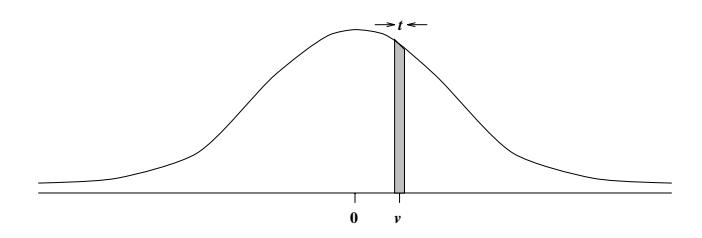
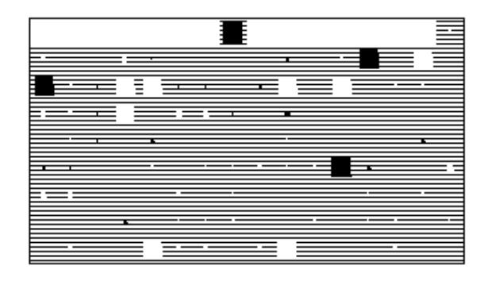
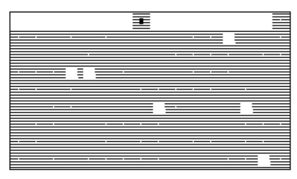
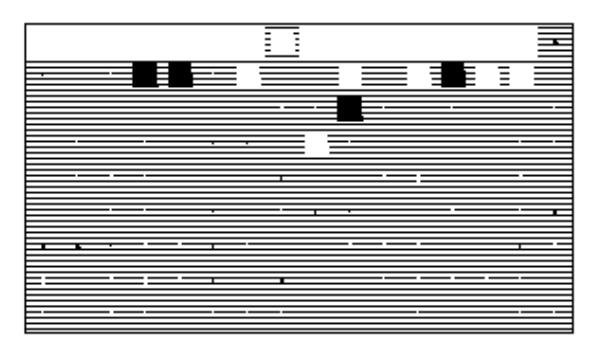
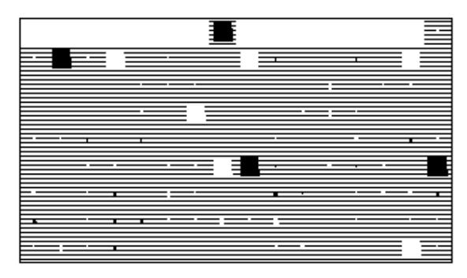
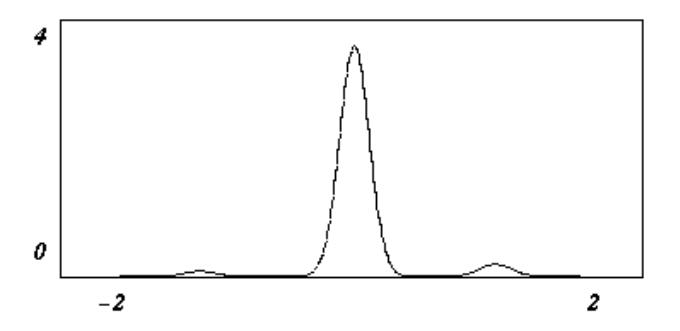

## Keeping Neural Networks Simple by Minimizing the Description Length of the Weights

Geoffrey E. Hinton and Drew van Camp

Department of Computer Science University of Toronto 10 King's College Road Toronto M5S 1A4, Canada

#### Abstract

Supervised neural networks generalize well if there is much less information in the weights than there is in the output vectors of the training cases. So during learning, it is important to keep the weights simple by penalizing the amount of information they contain. The amount of information in a weight can be controlled by adding Gaussian noise and the noise level can be adapted during learning to optimize the trade-off between the expected squared error of the network and the amount of information in the weights. We describe a method of computing the derivatives of the expected squared error and of the amount of information in the noisy weights in a network that contains a layer of non-linear hidden units. Provided the output units are linear, the exact derivatives can be computed efficiently without time-consuming Monte Carlo simulations. The idea of minimizing the amount of information that is required to communicate the weights of a neural network leads to a number of interesting schemes for encoding the weights.

### 1 Introduction

In many practical learning tasks there is little available training data so any reasonably complicated model will tend to overfit the data and give poor generalization to new data. To avoid overfitting we need to ensure that there is less information in the weights than there is in the output vectors of the training cases. Researchers have considered many possible ways of limiting the information in the weights:

- Limit the number of connections in the network (and hope that each weight does not have too much information in it).
- Divide the connections into subsets, and force the weights within a subset to be identical. If this "weight-sharing" is based on an analysis of the natural symmetries of the task it can be very effective (Lang, Waibel and Hinton (1990); LeCun 1989).
- Quantize all the weights in the network so that a probability mass, p, can be assigned to each quantized value. The number of bits in a weight is then -log p, provided we ignore the cost of defining the quantization. Unfortunately this method leads to a difficult search space because the cost of a weight does not have a smooth derivative.

## 2 Applying the Minimum Description Length Principle

When fitting models to data, it is always possible to fit the training data better by using a more complex model, but this may make the model worse at fitting new data. So we need some way of deciding when extra complexity in the model is not worth the improvement in the data-fit. The Minimum Description Length Principle (Rissanen, 1986) asserts that the best model of some data is the one that minimizes the combined cost of describing the model and describing the misfit between the model and the data. For supervised neural networks with a predetermined architecture, the model cost is the number of bits it takes to describe the weights, and the data-misfit cost is the number of bits it takes to describe the discrepancy between the correct output and the output of the neural network on each training case. We can think in terms of a sender who can see both the input vector and the correct output and a receiver who can only see the input vector. The sender first fits a neural network, of pre-arranged architecture, to the complete set of training cases, then sends the weights to the receiver. For each training case the sender also sends the discrepancy between the net's output and the correct output. By adding this discrepancy to the output of the net, the receiver can generate exactly the correct output.

Figure 1: This shows the probability mass associated with a quantized value, v, using a quantization width t. If t is much narrower than the Gaussian distribution, the probability mass is well approximated by the product of the height and the width, so the log probability is a sum of two terms. The  $\log t$  term is a constant, and if the distribution is a zero-mean Gaussian, the  $\log t$  the height is proportional to  $v^2$ .

## 3 Coding the data misfits

To apply the MDL principle we need to decide on a coding scheme for the data misfits and for the weights. Clearly, if the data misfits are real numbers, an infinite amount of information is needed to convey them. So we shall assume that they are very finely quantized, using intervals of fixed width t. We shall also assume that the data misfits are encoded separately for each of the output units.

The coding theorem tells us that if a sender and a receiver have agreed on a probability distribution that assigns a probability mass,  $p(\Delta y)$ , to each possible quantized data misfit,  $\Delta y$ , then we can code the misfit using  $-\log_2 p(\Delta y)$  bits. If we want to minimize the expected number of bits, the best probability distribution to use is the correct one, but any other agreed distribution can also be used. For convenience, we shall assume that for output unit j the data misfits are encoded by assuming that they are drawn from a zero-mean Gaussian distribution with standard deviation,  $\sigma_i$ . Provided that  $\sigma_i$  is large compared with the quantization width t, the assumed probability of a particular data misfit between the desired output,  $d_i^c$  on training case c and the actual output  $y_i^c$  is then well approximated by the probability mass shown in figure 1.

$$p(d_j^c - y_j^c) = t \frac{1}{\sqrt{2\pi}\sigma_j} \exp\left[\frac{-(d_j^c - y_j^c)^2}{2\sigma_j^2}\right]$$
 (1)

Using an optimal code, the description length of a data misfit,  $d_j^c - y_j^c$ , in units of  $\log_2(e)$  bits (called "nats") is:

$$-\log p(d_{j}^{c} - y_{j}^{c}) = -\log t + \log \sqrt{2\pi} + \log \sigma_{j} + \frac{(d_{j}^{c} - y_{j}^{c})^{2}}{2\sigma_{j}^{2}}$$
(2)

To minimize this description length summed over all N training cases, the optimal value of  $\sigma_j$  is the root mean

square deviation of the misfits from zero. Using this value of  $\sigma_j$  and summing over all training cases the last term of equation 2 becomes a constant and the data misfit cost is:

$$C_{\text{data-misfit}} = kN + \frac{N}{2} \log \left[ \frac{1}{N} \sum_{c} (d_j^c - y_j^c)^2 \right]$$
 (3)

where k is a constant that depends only on t.

Independently of whether we use the optimal value or a predetermined value for  $\sigma_j$ , it is apparent that the description length is minimized by minimizing the usual squared error function, so the Gaussian assumptions we have made about coding can be viewed as the MDL justification of this error function.

# 4 A simple method of coding the weights

We could code the weights in just the same way as we code the data misfits. We assume that the weights of the trained network are finely quantized and come from a zero-mean Gaussian distribution. If the standard deviation,  $\sigma_w$ , of this distribution is fixed in advance, the description length of the weights is simply proportional to the sum of their squares. So, assuming we use a Gaussian with standard deviation  $\sigma_j$  for encoding the output errors, we can minimize the total description length of the data misfits and the weights by minimizing the sum of two terms:

$$C = \sum_{j} \frac{1}{2\sigma_{j}^{2}} \sum_{c} (d_{j}^{c} - y_{j}^{c})^{2} + \frac{1}{2\sigma_{w}^{2}} \sum_{ij} w_{ij}^{2}$$
 (4)

where c is an index over training cases.

This is just the standard "weight-decay" method. The fact that weight-decay improves generalization (Hinton, 1987) can therefore be viewed as a vindication of this crude MDL approach in which the standard deviations of the gaussians used for coding the data misfits and the weights are both fixed in advance.2

An elaboration of standard weight-decay is to assume that the distribution of weights in the trained network can be modelled more accurately by using a mixture of several Gaussians whose means, variances and mixing proportions are adapted as the network is trained

&lt;sup>1If the optimal value of  $\sigma_j$  is to be used, it must be communicated before the data misfits are sent, so it too must be coded. However, since it is only one number we are probably safe in ignoring this aspect of the total description length.

&lt;sup>2It is clear from equation 4 that it is only the ratio of the variances of the two Gaussians that matters. Rather than guessing this ratio, it is usually better to estimate it by seeing which ratio gives optimal performance on a validation set.

(Nowlan and Hinton, 1992). For some tasks this more elaborate way of coding the weights gives considerably better generalization. This is especially true when only a small number of different weight values are required.

However, this more elaborate scheme still suffers from a serious weakness: It assumes that all the weights are quantized to the same tolerance, and that this tolerance is small compared with the standard deviations of the Gaussians used for modelling the weight distribution. Thus it takes into account the probability density of a weight (the height in figure 1) but it ignores the precision (the width). This is a terrible waste of bits. A network is clearly much more economical to describe if some of the weight values can be described very imprecisely without significantly affecting the predictions of the network.

MacKay (1992) has considered the effects of small changes in the weights on the outputs of the network after the network has been trained. The next section describes a method of taking the precision of the weights into account during training so that the precision of a weight can be traded against both its probability density and the excess data misfit caused by imprecision in the weight.

## 5 Noisy weights

A standard way of limiting the amount of information in a number is to add zero-mean Gaussian noise. At first sight, a noisy weight seems to be even more expensive to communicate than a precise one since it appears that we need to send a variance as well as a mean, and that we need to decide on a precision for both of these. As we shall see, however, the MDL framework can be adapted to allow very noisy weights to be communicated very cheaply.

When using backpropagation to train a feedforward neural network, it is standard practice to start at some particular point in weight space and to move this point in the direction that reduces the error function. An alternative approach is to start with a multivariate Gaussian distribution over weight vectors and to change both the mean and the variance of this cloud of weight vectors so as to reduce some cost function. We shall restrict ourselves to distributions in which the weights are independent, so the distribution can be represented by one mean and one variance per weight.

The cost function is the expected description length of the weights and of the data misfits. It turns out that high-variance weights are cheaper to communicate but they cause extra variance in the data misfits thus making these misfits more expensive to communicate.

## 5.1 The expected description length of the weights

We assume that the sender and the receiver have an agreed Gaussian prior distribution, P, for a given

weight. After learning, the sender has a Gaussian posterior distribution, Q, for the weight. We describe a method of communicating both the weights and the data misfits and show that using this method the number of bits required to communicate the posterior distribution of a weight is equal to the asymmetric divergence (the Kullback-Liebler distance) from P to Q.

$$G(P,Q) = \int Q(w) \log \frac{Q(w)}{P(w)} dw$$
 (5)

### 5.2 The "bits back" argument

To communicate a set of noisy weights, the sender first collapses the posterior probability distribution for each weight by using a source of random bits to pick a precise value for the weight (to within some very fine tolerance t). The probability of picking each possible value is determined by the posterior probability distribution for the weight. The sender then communicates these precise weights by coding them using some prior Gaussian distribution, P, so that the communication cost of a precise weight, w, is:

$$C(w) = -\log t - \log P(w) \tag{6}$$

t must be small compared with the variance of P so C(w) is big. However, as we shall see, we are due for a big refund at the end.

Having sent the precise weights, the sender then communicates the data-misfits achieved using those weights. Having received the weights and the misfits, the receiver can then produce the correct outputs. But he can also do something else. Once he has the correct outputs he can run whatever learning algorithm was used by the sender and recover the exact same posterior probability distribution, Q, that the sender collapsed in order to get the precise weights.3 Now, since the receiver knows the sender's posterior distribution for each weight and he knows the precise value that was communicated, he can recover all the random bits that the sender used to collapse that distribution to that value. So these random bits have been successfully communicated and we must subtract them from the overall communication cost to get the true cost of communicating the model and the misfits. The number of random bits required to collapse the posterior distribution for a weight, Q, to a particular finely quantized value, w, is:

$$R(w) = -\log t - \log Q(w) \tag{7}$$

So the true expected description length for a noisy weight is determined by taking an expectation, under the distribution Q:

&lt;sup>3If the sender used random initial weights these can be communicated at a net cost of 0 bits using the method that is being explained.

$$G(P,Q) = \langle C(w) - R(w) \rangle = \int Q(w) \log \frac{Q(w)}{P(w)} dw \quad (8)$$

For Gaussians with different means and variances, the asymmetric divergence is

$$G(P,Q) = \log \frac{\sigma_p}{\sigma_q} + \frac{1}{2\sigma_p^2} \left[ \sigma_q^2 - \sigma_p^2 + (\mu_p - \mu_q)^2 \right]$$
(9)

## 5.3 The expected description length of the data misfits

To compute the data-misfit cost given in equation 3 we need the expected value of  $(d_j^c - y_j^c)^2$ . This squared error is caused partly by the systematic errors of the network and partly by the noise in the weights. Unfortunately, for general feedforward networks with noisy weights, the expected squared errors are not easy to compute. Linear approximations are possible if the level of noise in the weights is sufficiently small compared with the smoothness of the non-linearities, but this defeats one of the main purposes of the idea which is to allow very noisy weights. Fortunately, if there is only one hidden layer and if the output units are linear, it is possible to compute the expected squared error exactly.

The weights are assumed to have independent Gaussian noise, so for any input vector we can compute the mean  $\mu_{x_h}$ , and variance,  $V_{x_h}$ , of the Gaussian-distributed total input,  $x_h$ , received by hidden unit h. Using a table, we can then compute the mean,  $\mu_{y_h}$  and variance,  $V_{y_h}$ , of the output of the hidden unit, even though this output is not Gaussian distributed. A lot of computation is required to create this two-dimensional table since many different pairs of  $\mu_{x_h}$  and  $V_{x_h}$  must be used, and for each pair we must use Monte Carlo sampling or numerical integration to compute  $\mu_{y_h}$  and  $V_{y_h}$ . Once the table is built, however, it is much more efficient than using Monte Carlo sampling at runtime.

Since the noise in the outputs of the hidden units is independent, they independently contribute variance to each linear output unit. The noisy weights,  $w_{hj}$ , also contribute variance to the output units. Since the output units are linear, their outputs,  $y_j$ , are equal to the total inputs they receive,  $x_j$ . On a particular training case, the output,  $y_j$ , of output unit j is a random variable with the following mean and variance:

$$\mu_{y_j} = \sum_h \mu_{y_h} \mu_{w_{hj}} \tag{10}$$

$$V_{y_j} = \sum_{h} \left[ \mu_{w_{hj}}^2 V_{y_h} + \mu_{y_h}^2 V_{w_{hj}} + V_{y_h} V_{w_{hj}} \right] (11)$$

The mean and the variance of the activity of output unit j make *independent* contributions to the expected squared error  $\langle E_j \rangle$ . If the desired output of j on a particular training case is  $d_j$ ,  $\langle E_j \rangle$  is given by:

$$\langle E_j \rangle = \langle (d_j - y_j)^2 \rangle = (d_j - \mu_{y_j})^2 + V_{y_j}$$
 (12)

So, for each input vector, we can use the table and the equations above to compute the exact value of  $\langle E_j \rangle$ . We can also backpropagate the exact derivatives of  $E = \sum_j \langle E_j \rangle$  provided we first build another table to allow derivatives to be backpropagated through the hidden units. As before, the table is indexed by  $\mu_{x_h}$  and  $V_{x_h}$  but for the backward pass each cell of the table contains the four partial derivatives that are needed to to convert the output derivatives of h into its input derivatives using the equations:

$$\frac{\partial E}{\partial \mu_{x_h}} = \frac{\partial E}{\partial \mu_{y_h}} \frac{\partial \mu_{y_h}}{\partial \mu_{x_h}} + \frac{\partial E}{\partial V_{y_h}} \frac{\partial V_{y_h}}{\partial \mu_{x_h}} \quad (13)$$

$$\frac{\partial E}{\partial V_{x_h}} = \frac{\partial E}{\partial \mu_{u_h}} \frac{\partial \mu_{y_h}}{\partial V_{x_h}} + \frac{\partial E}{\partial V_{u_h}} \frac{\partial V_{y_h}}{\partial V_{x_h}}$$
(14)

### 6 Letting the data determine the prior

So far, we have assumed that the "prior" distribution that is used for coding the weights is a single Gaussian. This coding-prior must be known to both the sender and the receiver before the weights are communicated. If we fix its mean and variance in advance we could pick inappropriate values that make it very expensive to code the actual weights. We therefore allow the mean and variance of the coding-prior to be determined during the optimization process, so the coding-prior depends on the data. This is a funny kind of prior! We could try to make sense of it in Bayesian terms by assuming that we start with a hyper-prior that specifies probability distributions for the mean and variance of the codingprior and then we use the hyper-prior and the data to find the best coding-prior. This would automatically take into account the cost of communicating the codingprior to a receiver who only knows the hyper-prior. In practice, we just ignore the cost of communicating the two parameters of the coding-prior so we do not need to invent hyper-priors.

## 6.1 A more flexible prior distribution for the weights

If we use a single Gaussian prior for communicating the noisy weights, we get a relatively simple penalty term, the asymmetric divergence, for the posterior distribution of each noisy weight. Unfortunately, this coding scheme is not flexible enough to capture certain kinds of common structure in the weights. Suppose, for example, that we want a few of the weights to have values near 1 and the rest to have values very close to 0. If the posterior distribution for each weight has low variance (to avoid the extra squared error caused by noise in the weights) we inevitiably pay a high code cost for weights because no single Gaussian prior can provide a good model of a spike around 0 and a spike around 1.

If we know in advance that different subsets of the weights are likely to have different distributions, we can use different coding-priors for the different subsets. As MacKay (1992) has demonstrated, it makes sense to use different coding-priors for the input-to-hidden weights and the hidden-to-output weights since the input and output values may have quite different scales. If we do not know in advance which weights should be similar, we can model the weight distribution by an adaptive mixture of Gaussians as proposed by Nowlan and Hinton (1992). During the optimization, the means, variances and mixing proportions in the mixture adapt to model the clusters in the weight values. Simultaneously, the weights adapt to fit the current mixture model so weights get pulled towards the centers of nearby clusters. Suppose, for eaxample, that there are two Gaussians in the mixture. If one gaussian has mean 1 and low variance and the other gaussian has mean 0 and low variance it is very cheap to encode low-variance weights with values near 1 or 0.

Nowlan and Hinton (1992) implicitly assumed that the posterior distribution for each weight has a fixed and negligible variance so they focussed on maximizing the probability density of the mean of the weight under the coding-prior mixture distribution. We now show how their technique can be extended to take into account the variance of the posterior distributions for the weights, assuming that the posterior distributions are still constrained to be single Gaussians. As before, we ignore the cost of communicating the mixture distribution that is to be used for coding the weights.

The mixture prior has the form:

$$P(w) = \sum_{i} \pi_{i} P_{i}(w) \tag{15}$$

where  $\pi_i$  is the mixing proportion of Gaussian  $P_i$ . The asymmetric divergence between the mixture prior and the single Gaussian posterior, Q, for a noisy weight is

$$G(P,Q) = \int Q(w) \log \frac{Q(w)}{\sum_{i} \pi_{i} P_{i}(w)} dw \qquad (16)$$

The sum inside the log makes this hard to integrate analytically. This is unfortunate since the optimization process requires that we repeatedly evaluate both G(P,Q) and its derivatives with respect to the parameters of P and Q. Fortunately, there is a much more tractable expression which is an upper bound on G and can therefore be used in its place. This expression is in terms of the  $G_i(P_i,Q)$  the asymmetric divergences between the posterior distribution, Q, and each of the Gaussians,  $P_i$ , in the mixture prior.

$$\hat{G}(P_1, P_2 \dots, Q) = -\log \sum_{i} \pi_i e^{-G_i}$$
 (17)

The way in which  $\hat{G}$  depends on the  $G_i$  in equation 17 is precisely analogous to the way in which the free

energy of a system depends on the energies of the various alternative configurations of the system. Indeed, one way to derive equation 17 is to define a coding scheme in which the code cost resembles a free energy and to then use a lemma from statistical mechanics.

# 7 A coding scheme that uses a mixture of Gaussians

Suppose that a sender and a receiver have already agreed on a particular mixture of Gaussians distribution. The sender can now send a sample from the posterior Gaussian distribution of a weight using the following coding scheme:

1. Randomly pick one of the Gaussians in the mixture with probability  $r_i$  given by

$$r_{i} = \frac{\pi_{i}e^{-G_{i}}}{\sum_{j} \pi_{j}e^{-G_{j}}}$$
 (18)

2. Communicate the choice of Gaussian to the receiver. If we use the mixing proportions as a prior for communicating the choice, the expected code cost is

$$\sum_{i} r_i \log \frac{1}{\pi_i} \tag{19}$$

3. Communicate the sample value to the receiver using the chosen Gaussian. If we take into account the random bits that we get back when the receiver reconstructs the posterior distribution from which the sample was chosen, the expected cost of communicating the sample is

$$\sum_{i} r_i G_i \tag{20}$$

So the expected cost of communicating both the choice of Gaussian and the sample value given that choice is

$$\sum_{i} r_{i} G_{i} + \sum_{i} r_{i} \log \frac{1}{\pi_{i}} = \sum_{i} r_{i} (-\log \pi_{i} e^{-G_{i}})$$
(21)

4. After receiving samples from all the posterior weight distributions and also receiving the errors on the training cases with these sampled weights, the receiver can run the learning algorithm and reconstruct the posterior distributions from which the weights are sampled. This allows the receiver to reconstruct all of the  $G_i$  and hence to reconstruct the random bits used to choose a Gaussian from the mixture. So the number of "bits back" that must be subtracted from the expected cost in equation 21 is

$$H = \sum_{i} r_i \log \frac{1}{r_i} \tag{22}$$

We now use a lemma from statistical mechanics to get a simple expression for the expected code cost minus the bits back.

#### 7.1 A lemma from statistical mechanics

For a physical system at a temperature of 1, the Helmholtz free energy, F, is defined as the expected energy minus the entropy

$$F = \sum_{i} r_i E_i - \sum_{i} r_i \log \frac{1}{r_i}$$
 (23)

where i is an index over the alternative possible states of the system,  $E_i$  is the energy of a state, and  $r_i$  is the probability of a state. F is a function of the probability distribution over states and the probability distribution which minimizes F is the Boltzmann distribution in which probabilities are exponentially related to energies

$$r_i = \frac{e^{-E_i}}{\sum_j e^{-E_j}} \tag{24}$$

At the minimum given by the Boltzmann distribution, the free energy is equal to minus the log of the partition function:

$$F = -\log \sum_{i} e^{-E_i} \tag{25}$$

If we equate each Gaussian in the mixture with an alternative state of a physical system, we can equate  $e^{-E_i}$  with  $\pi_i e^{-G_i}$ . So our method of picking a Gaussian from the mixture uses a Boltzmann distribution because it makes  $r_i$  proportional to  $e^{-E_i}$ . The random bits that are successfully communicated when the receiver reconstructs the probabilities  $r_i$  correspond exactly to the entropy of the Boltzmann distribution, so the total code cost (including the bits back) is equivalent to F and is therefore equal to the expression given in equation 17.

### 8 Implementation

With an adaptive mixture of Gaussians coding-prior, the derivatives of the cost function are moderately complicated so it is easy to make an error in implementing them. This is worrying because gradient descent algorithms are quite robust against minor errors. Also, it is hard to know how large to make the tables that are used for propagating Gaussian distributions through logistic functions or for backpropagating derivatives. To demonstrate that the implementation was correct and to decide the table sizes we used the following semantic check. We change each parameter by a small step and check that the cost function changes by the product of the gradient and step size. Using this method we found that a  $300 \times 300$  table with linear interpolation gives reasonably accurate derivatives.

## 9 Preliminary Results

We have not yet performed a thorough comparison between this algorithm and alternative methods and it may well turn out that further refinements are required to make it competitive. We have, however, tried the algorithm on one very high dimensional task with very scarce training data. The task is to predict the effectiveness of a class of peptide molecules. Each molecule is described by 128 parameters (the input vector) and has an effectiveness that is a single scalar (the ouput value). All inputs and outputs were normalized to have zero mean and unit variance so that the weights could be expected to have similar scales. The training set consisted of 105 cases and the test set was the remaining 420 cases. We deliberately chose a very small training set since these are the circumstances in which it should be most helpful to control the amount of information in the weights. We tried a network with 4 hidden units. This network contains 521 adaptive weights (including the biases of the output and hidden units) so it overfits the 105 training cases very badly if we do not limit the information in the weights.

We used an adaptive mixture of 5 Gaussians as our coding-prior for the weights. The Gaussians were initialized with means uniformly spaced between -0.24 and +0.24 and separated by 2 standard deviations from their neighbors. The initial means for the posterior distributions of each weight were chosen from a Gaussian with mean 0 and standard deviation 0.15. The standard deviations of the posteriors for the weights were all initialized at 0.1.

We optimize all of the parameters simultaneously using a conjugate gradient method. For the variances we optimize the log variance so that it cannot go negative and cannot collapse to zero. To ensure that the mixing proportions of the Gaussians in the coding-prior lie between 0 and 1 and add to 1 we optimize the  $x_i$  where

$$\pi_i = \frac{e^{x_i}}{\sum_j e^{x_j}} \tag{26}$$

If we penalize the weights by the full cost of describing them, the optimization quickly makes all of the weights equal and negative and uses the bias of the output unit to fix the output at the mean of the desired values in the training set. It seems that it is initially very easy to reduce the combined cost function by using weights that contain almost no information, and it is very hard to escape from this poor solution. To avoid this trap, we multiply the cost of the weights by a coefficient that starts at .05 and gradually increases to 1 according to the schedule .05, .1, .15, .2, .3, .4, .5, .6, .7, .8, .9, 1.0. At each value of the coefficient we do 100 conjugate gradient updates of the weights and at the final value of 1.0 we do not terminate the optimization until the cost function changes by less than  $10^{-6}$  nats (a nat is  $\log_2(e)$  bits). Figure 2 shows all the incoming and outgoing weights of the four hidden units after one run of the optimization. It

Figure 2: The final weights of the network. Each large block represents one hidden unit. The small black or white rectangles represent negative or positive weights with the area of a rectangle representing the magnitude of the weight. The bottom 12 rows in each block represent the incoming weights of the hidden unit. The central weight at the top of each block is the weight from the hidden unit to the linear output unit. The weight at the top-right of a block is the bias of the hidden unit.

Figure 3: The final probability distribution that is used for coding the weights. This distribution is implemented by adapting the means, variances and mixing proportions of five gaussians.

is clear that the weights form three fairly sharp clusters. Figure 3 shows that the mixture of 5 Gaussians has adapted to implement the appropriate coding-prior for this weight distribution.

The performance of the network can be measured by comparing the squared error it achieves on the test data with the error that would be achieved by simply guessing the mean of the correct answers for the test data:

Relative Error = 
$$\frac{\sum_{c} (d_c - y_c)^2}{\sum_{c} (d_c - \bar{d})^2}$$
 (27)

We ran the optimization five times using different randomly chosen values for the initial means of the noisy weights. For the network that achieved the lowest value of the overall cost function, the relative error was 0.286. This compares with a relative error of 0.967 for the same network when we used noise-free weights and did not penalize their information content. The best relative error obtained using simple weight-decay with four nonlinear hidden units was .317. This required a carefully chosen penalty coefficient for the squared weights that corresponds to  $\sigma_i^2/\sigma_w^2$  in equation 4. To set this weightdecay coefficient appropriately it was necessary to try many different values on a portion of the training set and to use the remainder of the training set to decide which coefficient gave the best generalization. Once the best coefficient had been determined the whole of the training set was used with this coefficient. A lower error of 0.291 can be achieved using weight-decay if we gradually increase the weight-decay coefficient and pick the value that gives optimal performance on the test data. But this is cheating. Linear regression gave a huge relative error of 35.6 (gross overfitting) but this fell to 0.291 when we penalized the sum of the squares of the regression coefficients by an amount that was chosen to optimize performance on the test data. This is almost identical to the performance with 4 hidden units and optimal weight-decay probably because, with small weights, the hidden units operate in their central linear range, so the whole network is effectively linear.

These preliminary results demonstrate that our new method allows us to fit quite complicated non-linear models even when the number of training cases is less than the number of dimensions in the input vector. The results also show that the new method is slightly better than simple weight-decay on at least one task. Much more experimental work is required to decide whether the method is competitive with other statistical techniques for handling non-linear tasks in which the amount of training data is very small compared with the dimensionality of the input. It is also worth mentioning that the solution with the lowest value of the total description length was the solution in which all the weights except the output bias are equal and negative. This solution has a relative error of approximately 1.0 so it is a serious embarrassment for the Minimum Description Length Principle or for our method of describing the weights.

#### 10 Discussion

There is a correct, but intractable, Bayesian method of determining the weights in a feedforward neural network. We start with a prior distribution over all possible points in weight space. We then construct the correct posterior distribution at each point in weight space by multiplying the prior by the probability of getting the outputs in the training set given those weights. Finally we normalize to get the full posterior distribution. Then we use this distribution of weight values to make predictions for new input vectors.

In practice, the closest we can get to the ideal Bayesian method is to use a Monte Carlo method to sample from the posterior distribution. This could be done by considering random moves in weight space and accepting a move with a probability that depends on how well the resulting network fits the desired outputs. Neal (1993) shows how the gradient information provided by backpropagation can be used to get a much more efficient method of obtaining samples from the posterior distribution. The major advantage of Monte Carlo methods is that they do not impose unrealistically simple assumptions about the shape of the posterior distribution in weight space.

If we are willing to make simplifying assumptions about the posterior distribution, time-consuming Monte Carlo simulations can be avoided. MacKay (1992) finds a single locally optimal point in weight space and constructs a full covariance Gaussian approximation to the posterior distribution around that point. The alternative method proposed in this paper is to use a simpler Gaussian approximation (with no off-diagonal terms in the covariance matrix) but to take this distribution into account during the learning. With one layer of non-linear

hidden units, the integration over the Gaussian distribution can be performed exactly and the exact weight derivatives can be computed efficiently.

It is not clear how much is lost by ignoring the offdiagonal terms in the covariance matrix. David Mackay (personal communication) has shown that if standard backpropagation is used to find a single, locally optimal point in weight space and a Gaussian approximation to the posterior weight distribution is then constructed around this point, the covariances between different weights are significant. However, this does not mean that the covariances are significant when the learning algorithm is explicitly manipulating the Gaussian distribution because in this case the learning will try to force the noise in the weights to be independent. The pressure for independence comes from the fact that the cost function will overestimate the information in the weights if they have correlated noise. We are currently performing simulations to see if this pressure does indeed suppress the covariances.

When using the standard backpropagation algorithm, it is essential that the output of a hidden unit is a smooth function of its input. This is why the hidden units use a smooth sigmoid function instead of a linear threshold function. With noisy weights, however, it is possible to use a version of the backpropagation algorithm described above in networks that have one layer of linear threshold units. The noise in the weights ensures that the probability of a threshold unit being active is a smooth function of its inputs. As a result, it is easier to optimize a whole Gaussian distribution over weight vectors than it is to optimize a single weight vector.

#### 11 Acknowledgements

This research was funded by operating and strategic grants from NSERC. Geoffrey Hinton is the Noranda fellow of the Canadian Institute for Advanced Research. We thank David Mackay, Radford Neal, Chris Williams and Rich Zemel for helpful discussions.

#### 12 References

Hinton, G. E. (1987) Learning translation invariant recognition in a massively parallel network. In Goos, G. and Hartmanis, J., editors, *PARLE: Parallel Architectures and Languages Europe*, pages 1–13, Lecture Notes in Computer Science, Springer-Verlag, Berlin.

Lang, K., Waibel, A. and Hinton, G. E. (1990) A Time-Delay Neural Network Architecture for Isolated Word Recognition. *Neural Networks*, **3**, 23-43.

Le Cun, Y., Boser, B., Denker, J. S., Henderson, D., Howard, R. E., Hubbard, W. and Jackel, L. D. (1989) Back-Propagation Applied to Handwritten Zipcode Recognition. *Neural Computation*, 1, 541-551.

Mackay, D. J. C. (1992) A practical Bayesian framework

&lt;sup>4This assumes that the output of the neural net represents the mean of a Gaussian distribution from which the final output is randomly selected. So the final output could be exactly correct even though the output of the net is not.

for backpropagation networks. Neural Computation,  ${\bf 4}$ , 448-472.

Neal, R. M. (1993) Bayesian learning via stochastic dynamics. In Giles, C. L., Hanson, S. J. and Cowan, J. D. (Eds), *Advances in Neural Information Processing Systems 5*, Morgan Kaufmann, San Mateo CA.

Nowlan. S. J. and Hinton, G. E. (1992) Simplifying neural networks by soft weight sharing. *Neural Computation*, 4, 173-193.

Rissanen, J. (1986) Stochastic Complexity and Modeling. *Annals of Statistics*, **14**, 1080-1100.