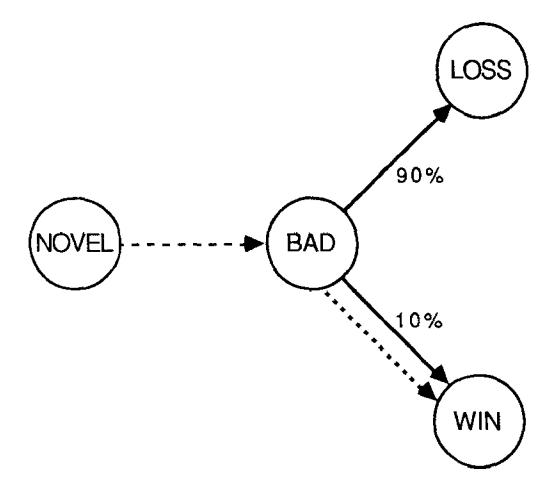
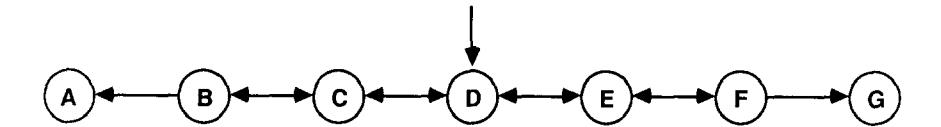
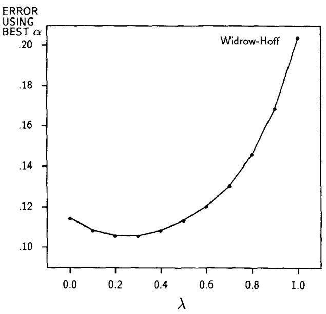
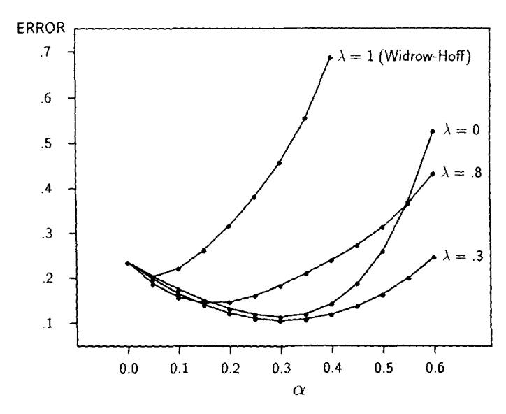
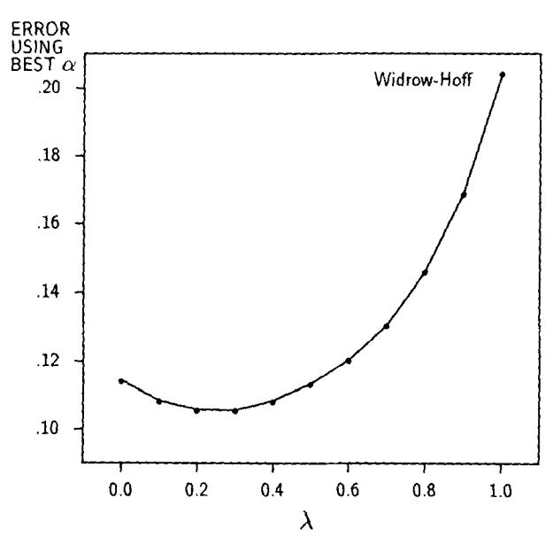
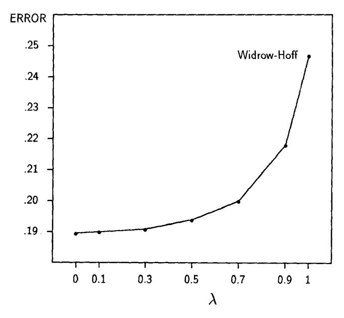

# Learning to Predict by the Methods of Temporal Differences

RICHARD S. SUTTON

(RICH@GTE.COM)

GTE Laboratories Incorporated, 40 Sylvan Road, Waltham, MA 02254, U.S.A.

(Received: April 22, 1987) (Revised: February 4, 1988)

**Keywords:** Incremental learning, prediction, connectionism, credit assignment, evaluation functions

Abstract. This article introduces a class of incremental learning procedures specialized for prediction - that is, for using past experience with an incompletely known system to predict its future behavior. Whereas conventional prediction-learning methods assign credit by means of the difference between predicted and actual outcomes, the new methods assign credit by means of the difference between temporally successive predictions. Although such temporal-difference methods have been used in Samuel's checker player, Holland's bucket brigade, and the author's Adaptive Heuristic Critic, they have remained poorly understood. Here we prove their convergence and optimality for special cases and relate them to supervised-learning methods. For most real-world prediction problems, temporal-difference methods require less memory and less peak computation than conventional methods and they produce more accurate predictions. We argue that most problems to which supervised learning is currently applied are really prediction problems of the sort to which temporal-difference methods can be applied to advantage.

#### 1. Introduction

This article concerns the problem of learning to predict, that is, of using past experience with an incompletely known system to predict its future behavior. For example, through experience one might learn to predict for particular chess positions whether they will lead to a win, for particular cloud formations whether there will be rain, or for particular economic conditions how much the stock market will rise or fall. Learning to predict is one of the most basic and prevalent kinds of learning. Most pattern recognition problems, for example, can be treated as prediction problems in which the classifier must predict the correct classifications. Learning-to-predict problems also arise in heuristic search, e.g., in learning an evaluation function that predicts the utility of searching particular parts of the search space, or in learning the underlying model of a problem domain. An important advantage of prediction learning is that its training examples can be taken directly from the temporal sequence of ordinary sensory input; no special supervisor or teacher is required.

In this article, we introduce and provide the first formal results in the theory of temporal-difference (TD) methods, a class of incremental learning procedures specialized for prediction problems. Whereas conventional prediction-learning methods are driven by the error between predicted and actual outcomes. TD methods are similarly driven by the error or difference between temporally successive predictions; with them, learning occurs whenever there is a change in prediction over time. For example, suppose a weatherman attempts to predict on each day of the week whether it will rain on the following Saturday. The conventional approach is to compare each prediction to the actual outcome—whether or not it does rain on Saturday. A TD approach, on the other hand, is to compare each day's prediction with that made on the following day. If a 50% chance of rain is predicted on Monday, and a 75% chance on Tuesday, then a TD method increases predictions for days similar to Monday, whereas a conventional method might either increase or decrease them depending on Saturday's actual outcome.

We will show that TD methods have two kinds of advantages over conventional prediction-learning methods. First, they are more incremental and therefore easier to compute. For example, the TD method for predicting Saturday's weather can update each day's prediction on the following day, whereas the conventional method must wait until Saturday, and then make the changes for all days of the week. The conventional method would have to do more computing at one time than the TD method and would require more storage during the week. The second advantage of TD methods is that they tend to make more efficient use of their experience: they converge faster and produce better predictions. We argue that the predictions of TD methods are both more accurate and easier to compute than those of conventional methods.

The earliest and best-known use of a TD method was in Samuel's (1959) celebrated checker-playing program. For each pair of successive game positions, the program used the difference between the evaluations assigned to the two positions to modify the earlier one's evaluation. Similar methods have been used in Holland's (1986) bucket brigade, in the author's Adaptive Heuristic Critic (Sutton, 1984; Barto, Sutton & Anderson, 1983), and in learning systems studied by Witten (1977), Booker (1982), and Hampson (1983). TD methods have also been proposed as models of classical conditioning (Sutton & Barto, 1981a, 1987; Gelperin, Hopfield & Tank, 1985; Moore et al., 1986; Klopf, 1987).

Nevertheless, TD methods have remained poorly understood. Although they have performed well, there has been no theoretical understanding of how or why they worked. One reason is that they were never studied independently, but only as parts of larger and more complex systems. Within these systems. TD methods were used to improve evaluation functions by better predicting goal-related events such as rewards, penalties, or checker game outcomes. Here we advocate viewing TD methods in a simpler way – as methods for efficiently learning to predict arbitrary events, not just goal-related ones. This simplification allows us to evaluate them in isolation and has enabled us to obtain formal results. In this paper, we prove the convergence and optimality of TD methods for important special cases, and we formally relate them to conventional supervised-learning procedures.

Another simplification we make in this paper is to focus on numerical prediction processes rather than on rule-based or symbolic prediction (e.g., Dietterich & Michalski, 1986). The approach taken here is much like that used in connectionism and in Samuel's original work—our predictions are based on numerical features combined using adjustable parameters or "weights." This and other representational assumptions are detailed in Section 2.

Given the current interest in learning procedures for *multi-layer* connectionist networks (e.g., Rumelhart, Hinton, & Williams, 1985; Ackley, Hinton, & Sejnowski, 1985; Barto, 1985; Anderson, 1986; Williams, 1986; Hampson & Volper, 1987), we note that here we are concerned with a different set of issues. The work with multi-layer networks focuses on learning input-output mappings of more complex functional forms. Most of that work remains within the supervised-learning paradigm, whereas here we are interested in extending and going beyond it. We consider mostly mappings of very simple functional forms, because the differences between supervised learning methods and TD methods are clearest in these cases. Nevertheless, the TD methods presented here can be directly extended to multi-layer networks (see Section 6.2).

The next section introduces a specific class of temporal-difference procedures by contrasting them with conventional, supervised-learning approaches, focusing on computational issues. Section 3 develops an extended example that illustrates the potential performance advantages of TD methods. Section 4 contains the convergence and optimality theorems and discusses TD methods as gradient descent. Section 5 discusses how to extend TD procedures, and Section 6 relates them to other research.

# 2. Temporal-difference and supervised-learning approaches to prediction

Historically, the most important learning paradigm has been that of *supervised learning*. In this framework the learner is asked to associate pairs of items. When later presented with just the first item of a pair, the learner is supposed to recall the second. This paradigm has been used in pattern classification, concept acquisition, learning from examples, system identification, and associative memory. For example, in pattern classification and concept acquisition, the first item is an instance of some pattern or concept, and the second item is the name of that concept. In system identification, the learner must reproduce the input-output behavior of some unknown system. Here, the first item of each pair is an input and the second is the corresponding output.

Any prediction problem can be cast in the supervised-learning paradigm by taking the first item to be the data based on which a prediction must be made, and the second item to be the actual outcome, what the prediction should have been. For example, to predict Saturday's weather, one can form a pair from the measurements taken on Monday and the actual observed weather on Saturday, another pair from the measurements taken on Tuesday and Saturday's weather, and so on. Although this pairwise approach ignores the sequential structure of the problem, it is easy to understand and analyze and it has been widely used. In this paper, we refer to this as the supervised-learning approach to

prediction learning, and we refer to learning methods that take this approach as *supervised-learning methods*. We argue that such methods are inadequate, and that TD methods are far preferable.

#### 2.1 Single-step and multi-step prediction

To clarify this claim, we distinguish two kinds of prediction-learning problems. In *single-step* prediction problems, all information about the correctness of each prediction is revealed at once. In *multi-step* prediction problems, correctness is not revealed until more than one step after the prediction is made, but partial information relevant to its correctness is revealed at each step. For example, the weather prediction problem mentioned above is a multi-step prediction problem because inconclusive evidence relevant to the correctness of Monday's prediction becomes available in the form of new observations on Tuesday, Wednesday, Thursday and Friday. On the other hand, if each day's weather were to be predicted on the basis of the previous day's observations—that is, on Monday predict Tuesday's weather, on Tuesday predict Wednesday's weather, etc.—one would have a single-step prediction problem, assuming no further observations were made between the time of each day's prediction and its confirmation or refutation on the following day.

In this paper, we will be concerned only with multi-step prediction problems. In single-step problems, data naturally comes in observation—outcome pairs; these problems are ideally suited to the pairwise supervised-learning approach. Temporal-difference methods cannot be distinguished from supervised-learning methods in this case; thus the former improve over conventional methods only on multi-step problems. However, we argue that these predominate in real-world applications. For example, predictions about next year's economic performance are not confirmed or disconfirmed all at once, but rather bit by bit as the economic situation is observed through the year. The likely outcome of elections is updated with each new poll, and the likely outcome of a chess game is updated with each move. When a baseball batter predicts whether a pitch will be a strike, he updates his prediction continuously during the ball's flight.

In fact, many problems that are classically cast as single-step prediction problems are more naturally viewed as multi-step problems. Perceptual learning problems, such as vision or speech recognition, are classically treated as supervised learning, using a training set of isolated, correctly-classified input patterns. When humans hear or see things, on the other hand, they receive a stream of input over time and constantly update their hypotheses about what they are seeing or hearing. People are faced not with a single-step problem of unrelated pattern class pairs, but rather with a series of related patterns, all providing information about the same classification. To disregard this structure seems improvident.

#### 2.2 Computational issues

In this subsection, we introduce a particular TD procedure by formally relating it to a classical supervised-learning procedure, the Widrow-Hoff rule.

We show that the two procedures produce exactly the same weight changes, but that the TD procedure can be implemented incrementally and therefore requires far less computational power. In the following subsection, this TD procedure will be used also as a conceptual bridge to a larger family of TD procedures that produce different weight changes than any supervised-learning method. First, we detail the representational assumptions that will be used throughout the paper.

We consider multi-step prediction problems in which experience comes in observation-outcome sequences of the form  $x_1, x_2, x_3, \ldots, x_m, z$ , where each  $x_t$  is a vector of observations available at time t in the sequence, and z is the outcome of the sequence. Many such sequences will normally be experienced. The components of each  $x_t$  are assumed to be real-valued measurements or features, and z is assumed to be a real-valued scalar. For each observation-outcome sequence, the learner produces a corresponding sequence of predictions  $P_1, P_2, P_3, \ldots, P_m$ , each of which is an estimate of z. In general, each  $P_t$  can be a function of all preceding observation vectors up through time t, but, for simplicity, here we assume that it is a function only of  $x_t$ . The predictions are also based on a vector of modifiable parameters or weights, w.  $P_t$ 's functional dependence on  $x_t$  and w will sometimes be denoted explicitly by writing it as  $P(x_t, w)$ .

All learning procedures will be expressed as rules for updating w. For the moment we assume that w is updated only once for each complete observation-outcome sequence and thus does not change during a sequence. For each observation, an increment to w, denoted  $\Delta w_t$ , is determined. After a complete sequence has been processed, w is changed by (the sum of) all the sequence's increments:

$$w \leftarrow w + \sum_{t=1}^{m} \Delta w_t. \tag{1}$$

Later, we will consider more incremental cases in which w is updated after each observation, and also less incremental cases in which it is updated only after accumulating  $\Delta w_t$ 's over a training set consisting of several sequences.

The supervised-learning approach treats each sequence of observations and its outcome as a sequence of observation-outcome pairs; that is, as the pairs  $(x_1, z), (x_2, z), \ldots, (x_m, z)$ . The increment due to time t depends on the error between  $P_t$  and z, and on how changing w will affect  $P_t$ . The prototypical supervised-learning update procedure is

$$\Delta w_t = \alpha(z - P_t) \nabla_w P_t, \tag{2}$$

where  $\alpha$  is a positive parameter affecting the rate of learning, and the gradient,  $\nabla_w P_t$ , is the vector of partial derivatives of  $P_t$  with respect to each component of w.

For example, consider the special case in which  $P_t$  is a linear function of  $x_t$  and w, that is, in which  $P_t = w^T x_t = \sum_i w(i) x_t(i)$ , where w(i) and  $x_t(i)$  are

&lt;sup>1The other cases can be reduced to this one by reorganizing the observations in such a way that each  $x_t$  includes some or all of the earlier observations. Cases in which predictions should depend on t can also be reduced to this one by including t as a component of  $x_t$ .

the  $i^{\text{th}}$  components of w and  $x_t$ , respectively.2 In this case we have  $\nabla_w P_t = x_t$ , and (2) reduces to the well known Widrow-Hoff rule (Widrow & Hoff, 1960):

$$\Delta w_t = \alpha (z - w^T x_t) x_t.$$

This linear learning method is also known as the "delta rule," the ADALINE, and the LMS filter. It is widely used in connectionism, pattern recognition, signal processing, and adaptive control. The basic idea is that the difference  $z - w^T x_t$  represents the scalar error between the prediction,  $w^T x_t$ , and what it should have been, z. This is multiplied by the observation vector  $x_t$  to determine the weight changes because  $x_t$  indicates how changing each weight will affect the error. For example, if the error is positive and  $x_t(i)$  is positive, then  $w_i(t)$  will be increased, increasing  $w^T x_t$  and reducing the error. The Widrow-Hoff rule is simple, effective, and robust. Its theory is also better developed than that of any other learning method (e.g., see Widrow & Stearns, 1985).

Another instance of the prototypical supervised-learning procedure is the "generalized delta rule," or backpropagation procedure, of Rumelhart et al. (1985). In this case,  $P_t$  is computed by a multi-layer connectionist network and is a nonlinear function of  $x_t$  and w. Nevertheless, the update rule used is still exactly (2), just as in the Widrow-Hoff rule, the only difference being that a more complicated process is used to compute the gradient  $\nabla_w P_t$ .

In any case, note that all  $\Delta w_t$  in (2) depend critically on z, and thus cannot be determined until the end of the sequence when z becomes known. Thus, all observations and predictions made during a sequence must be remembered until its end, when all the  $\Delta w_t$ 's are computed. In other words, (2) cannot be computed incrementally.

There is, however, a TD procedure that produces exactly the same result as (2), and yet which can be computed incrementally. The key is to represent the error  $z - P_t$  as a sum of changes in predictions, that is, as

$$z - P_t = \sum_{k=-t}^{m} (P_{k+1} - P_k)$$
 where  $P_{m+1} \stackrel{\text{def}}{=} z$ .

Using this, equations (1) and (2) can be combined as

$$w \leftarrow w + \sum_{t=1}^{m} \alpha(z - P_t) \nabla_w P_t = w + \sum_{t=1}^{m} \alpha \sum_{k=t}^{m} (P_{k+1} - P_k) \nabla_w P_t$$
$$= w + \sum_{k=1}^{m} \alpha \sum_{t=1}^{k} (P_{k+1} - P_k) \nabla_w P_t$$
$$= w + \sum_{t=1}^{m} \alpha (P_{t+1} - P_t) \sum_{k=1}^{t} \nabla_w P_k.$$

 $^2w^T$  is the transpose of the column vector w. Unless otherwise noted, all vectors are column vectors.

In other words, converting back to a rule to be used with (1):

$$\Delta w_t = \alpha (P_{t+1} - P_t) \sum_{k=1}^t \nabla_w P_k. \tag{3}$$

Unlike (2), this equation can be computed incrementally, because each  $\Delta w_t$  depends only on a pair of successive predictions and on the sum of all past values for  $\nabla_w P_t$ . This saves substantially on memory, because it is no longer necessary to individually remember all past values of  $\nabla_w P_t$ . Equation (3) also makes much milder demands on the computational speed of the device that implements it; although it requires slightly more arithmetic operations overall (the additional ones are those needed to accumulate  $\sum_{k=1}^t \nabla_w P_k$ ), they can be distributed over time more evenly. Whereas (3) computes one increment to w on each time step, (2) must wait until a sequence is completed and then compute all of the increments due to that sequence. If M is the maximum possible length of a sequence, then under many circumstances (3) will require only 1/Mth of the memory and speed required by (2).

For reasons that will be made clear shortly, we refer to the procedure given by (3) as the TD(1) procedure. In addition, we will refer to a procedure as linear if its predictions  $P_t$  are a linear function of the observation vectors  $x_t$  and the vector of memory parameters w, that is, if  $P_t = w^T x_t$ . We have just proven:

**Theorem 1** On multi-step prediction problems, the linear TD(1) procedure produces the same per-sequence weight changes as the Widrow-Hoff procedure. Next, we introduce a family of TD procedures that produce weight changes different from those of any supervised-learning procedure.

#### 2.3 The $TD(\lambda)$ family of learning procedures

The hallmark of temporal-difference methods is their sensitivity to changes in successive predictions rather than to overall error between predictions and the final outcome. In response to an increase (decrease) in prediction from  $P_t$  to  $P_{t+1}$ , an increment  $\Delta w_t$  is determined that increases (decreases) the predictions for some or all of the preceding observation vectors  $x_1, \ldots, x_t$ . The procedure given by (3) is the special case in which all of those predictions are altered to an equal extent. In this article we also consider a class of TD procedures that make greater alterations to more recent predictions. In particular, we consider an exponential weighting with recency, in which alterations to the predictions of observation vectors occurring k steps in the past are weighted according to  $\lambda^k$  for  $0 \le \lambda \le 1$ :

$$\Delta w_t = \alpha (P_{t+1} - P_t) \sum_{k=1}^t \lambda^{t-k} \nabla_w P_k. \tag{4}$$

&lt;sup>3Strictly speaking, there are other incremental procedures for implementing the combination of (1) and (2), but only the TD rule (3) is appropriate for updating w on a per-observation basis.

Note that for  $\lambda = 1$  this is equivalent to (3), the TD implementation of the prototypical supervised-learning method. Accordingly, we call this new procedure  $TD(\lambda)$  and we will refer to the procedure given by (3) as TD(1).

Alterations of past predictions can be weighted in ways other than the exponential form given above, and this may be appropriate for particular applications. However, an important advantage to the exponential form is that it can be computed incrementally. Given that  $e_t$  is the value of the sum in (4) for t, we can incrementally compute  $e_{t+1}$ , using only current information, as

$$e_{t+1} = \sum_{k=1}^{t+1} \lambda^{t+1-k} \nabla_w P_k$$

$$= \nabla_w P_{t+1} + \sum_{k=1}^t \lambda^{t+1-k} \nabla_w P_k$$

$$= \nabla_w P_{t+1} + \lambda e_t.$$

For  $\lambda < 1$ ,  $\text{TD}(\lambda)$  produces weight changes different from those made by any supervised-learning method. The difference is greatest in the case of TD(0) (where  $\lambda = 0$ ), in which the weight increment is determined only by its effect on the prediction associated with the most recent observation:

$$\Delta w_t = \alpha (P_{t+1} - P_t) \nabla_w P_t.$$

Note that this procedure is formally very similar to the prototypical supervised-learning procedure (2). The two equations are identical except that the actual outcome z in (2) is replaced by the next prediction  $P_{t+1}$  in the equation above. The two methods use the same learning mechanism, but with different errors. Because of these relationships and TD(0)'s overall simplicity, it is an important focus here.

## 3. Examples of faster learning with TD methods

In this section we begin to address the claim that TD methods make more efficient use of their experience than do supervised-learning methods, that they converge more rapidly and make more accurate predictions along the way. TD methods have this advantage whenever the data sequences have a certain statistical structure that is ubiquitous in prediction problems. This structure naturally arises whenever the data sequences are generated by a dynamical system, that is, by a system that has a state which evolves and is partially revealed over time. Almost any real system is a dynamical system, including the weather, national economies, and chess games. In this section, we develop two illustrative examples: a game-playing example to help develop intuitions, and a random-walk example as a simple demonstration with experimental results.

#### 3.1 A game-playing example

It seems counter-intuitive that TD methods might learn more efficiently than supervised-learning methods. In learning to predict an outcome, how can one

Figure 1. A game-playing example showing the inefficiency of supervised-learning methods. Each circle represents a position or class of positions from a two-person board game. The "bad" position is known from long experience to lead 90% of the time to a loss and only 10% of the time to a win. The first game in which the "novel" position occurs evolves as shown by the dashed arrows. What evaluation should the novel position receive as a result of this experience? Whereas TD methods correctly conclude that it should be considered another bad state, supervised-learning methods associate it fully with winning, the only outcome that has followed it.

do better than by knowing and using the actual outcome as a performance standard? How can using a biased and potentially inaccurate subsequent prediction possibly be a better use of the experience? The following example is meant to provide an intuitive understanding of how this is possible.

Suppose there is a game position that you have learned is bad for you, that has resulted most of the time in a loss and only rarely in a win for your side. For example, this position might be a backgammon race in which you are behind, or a disadvantageous configuration of cards in blackjack. Figure 1 represents a simple case of such a position as a single "bad" state that has led 90% of the time to a loss and only 10% of the time to a win. Now suppose you play a game that reaches a novel position (one that you have never seen before), that then progresses to reach the bad state, and that finally ends nevertheless in a victory for you. That is, over several moves it follows the path shown by dashed lines in Figure 1. As a result of this experience, your opinion of the bad state would presumably improve, but what of the *novel* state? What value would you associate with it as a result of this experience?

A supervised-learning method would form a pair from the novel state and the win that followed it, and would conclude that the novel state is likely to lead to a win. A TD method, on the other hand, would form a pair from the novel state and the bad state that *immediately* followed it, and would conclude that the novel state is also a bad one, that it is likely to lead to a

Figure 2. A generator of bounded random walks. This Markov process generated the data sequences in the example. All walks begin in state D. From states  $B,\ C,\ D,\ E,$  and F, the walk has a 50% chance of moving either to the right or to the left. If either edge state, A or G, is entered, then the walk terminates.

loss. Assuming we have properly classified the "bad" state, the TD method's conclusion is the correct one; the novel state led to a position that you know usually leads to defeat; what happened after that is irrelevant. Although both methods should converge to the same evaluations with infinite experience, the TD method learns a better evaluation from this limited experience.

The TD method's prediction would also be better had the game been lost after reaching the bad state, as is more likely. In this case, a supervised-learning method would tend to associate the novel position fully with losing, whereas a TD method would tend to associate it with the bad position's 90% chance of losing, again a presumably more accurate assessment. In either case, by adjusting its evaluation of the novel state towards the bad state's evaluation, rather than towards the actual outcome, the TD method makes better use of the experience. The bad state's evaluation is a better performance standard because it is uncorrupted by random factors that subsequently influence the final outcome. It is by eliminating this source of noise that TD methods can outperform supervised-learning procedures.

In this example, we have ignored the possibility that the bad state's previously learned evaluation is in error. Such errors will inevitably exist and will affect the efficiency of TD methods in ways that cannot easily be evaluated in an example of this sort. The example does not prove TD methods will be better on balance, but it does demonstrate that a subsequent prediction can easily be a better performance standard than the actual outcome.

This game-playing example can also be used to show how TD methods can fail. Suppose the bad state is usually followed by defeats except when it is preceded by the novel state, in which case it always leads to a victory. In this odd case, TD methods could not perform better and might perform worse than supervised-learning methods. Although there are several techniques for eliminating or minimizing this sort of problem, it remains a greater difficulty for TD methods than it does for supervised-learning methods. TD methods try to take advantage of the information provided by the temporal sequence of states, whereas supervised-learning methods ignore it. It is possible for this information to be misleading, but more often it should be helpful.

Finally, note that although this example involved learning an evaluation function, nothing about it was specific to evaluation functions. The methods can equally well be used to predict outcomes unrelated to the player's goals, such as the number of pieces left at the end of the game. If TD methods are more efficient than supervised-learning methods in learning evaluation functions, then they should also be more efficient in general prediction-learning problems.

#### 3.2 A random-walk example

The game-playing example is too complex to analyze in great detail. Previous experiments with TD methods have also used complex domains (e.g., Samuel, 1959; Sutton, 1984; Barto et al., 1983; Anderson, 1986, 1987). Which aspects of these domains can be simplified or eliminated, and which aspects are essential in order for TD methods to be effective? In this paper, we propose that the only required characteristic is that the system predicted be a dynamical one, that it have a state which can be observed evolving over time. If this is true, then TD methods should learn more efficiently than supervised-learning methods even on very simple prediction problems, and this is what we illustrate in this subsection. Our example is one of the simplest of dynamical systems, that which generates bounded random walks.

A bounded random walk is a state sequence generated by taking random steps to the right or to the left until a boundary is reached. Figure 2 shows a system that generates such state sequences. Every walk begins in the center state D. At each step the walk moves to a neighboring state, either to the right or to the left with equal probability. If either edge state (A or G) is entered, the walk terminates. A typical walk might be DCDEFG. Suppose we wish to estimate the probabilities of a walk ending in the rightmost state, G, given that it is in each of the other states.

We applied linear supervised-learning and TD methods to this problem in a straightforward way. A walk's outcome was defined to be z=0 for a walk ending on the left at A and z = 1 for a walk ending on the right at G. The learning methods estimated the expected value of z; for this choice of z, its expected value is equal to the probability of a right-side termination. For each nonterminal state i, there was a corresponding observation vector  $\mathbf{x}_i$ ; if the walk was in state i at time t then  $x_t = \mathbf{x}_i$ . Thus, if the walk DCDEFG occurred, then the learning procedure would be given the sequence  $\mathbf{x}_D, \mathbf{x}_C, \mathbf{x}_D, \mathbf{x}_E, \mathbf{x}_F, 1$ . The vectors  $\{\mathbf{x}_i\}$  were the unit basis vectors of length 5, that is, four of their components were 0 and the fifth was 1 (e.g.,  $\mathbf{x}_D =$  $(0,0,1,0,0)^T$ ), with the one appearing at a different component for each state. Thus, if the state the walk was in at time t has its 1 at the ith component of its observation vector, then the prediction  $P_t = w^T x_t$  was simply the value of the  $i^{th}$  component of w. We use this particularly simple case to make this example as clear as possible. The theorems we prove later for a more general class of dynamical systems require only that the set of observation vectors  $\{\mathbf{x}_i\}$ be linearly independent.

Two computational experiments were performed using observation-outcome sequences generated as described above. In order to obtain statistically reliable

Figure 3. Average error on the random-walk problem under repeated presentations. All data are from  $\mathrm{TD}(\lambda)$  with different values of  $\lambda$ . The dependent measure used is the RMS error between the ideal predictions and those found by the learning procedure after being repeatedly presented with the training set until convergence of the weight vector. This measure was averaged over 100 training sets to produce the data shown. The  $\lambda=1$  data point is the performance level attained by the Widrow-Hoff procedure. For each data point, the standard error is approximately  $\sigma=0.01$ , so the differences between the Widrow-Hoff procedure and the other procedures are highly significant.

results, 100 training sets, each consisting of 10 sequences, were constructed for use by all learning procedures. For all procedures, weight increments were computed according to  $TD(\lambda)$ , as given by (4). Seven different values were used for  $\lambda$ . These were  $\lambda=1$ , resulting in the Widrow-Hoff supervised-learning procedure,  $\lambda=0$ , resulting in linear TD(0), and also  $\lambda=0.1, 0.3, 0.5, 0.7$ , and 0.9, resulting in a range of intermediate TD procedures.

In the first experiment, the weight vector was not updated after each sequence as indicated by (1). Instead, the  $\Delta w$ 's were accumulated over sequences and only used to update the weight vector after the complete presentation of a training set. Each training set was presented repeatedly to each learning procedure until the procedure no longer produced any significant changes in the weight vector. For small  $\alpha$ , the weight vector always converged in this way, and always to the same final value, independent of its initial value. We call this the repeated presentations training paradigm.

The true probabilities of right-side termination – the *ideal predictions* - for each of the nonterminal states can be computed as described in section 4.1. These are  $\frac{1}{6}$ ,  $\frac{1}{3}$ ,  $\frac{1}{2}$ ,  $\frac{2}{3}$  and  $\frac{5}{6}$  for states B, C, D, E and F, respectively. As

Figure 4. Average error on random walk problem after experiencing 10 sequences. All data are from  $TD(\lambda)$  with different values of  $\alpha$  and  $\lambda$ . The dependent measure is the RMS error between the ideal predictions and those found by the learning procedure after a single presentation of a training set. This measure was averaged over 100 training sets. The  $\lambda=1$  data points represent performances of the Widrow-Hoff supervised-learning procedure.

a measure of the performance of a learning procedure on a training set, we used the root mean squared (RMS) error between the procedure's asymptotic predictions using that training set and the ideal predictions. Averaging over training sets, we found that performance improved rapidly as  $\lambda$  was reduced below 1 (the supervised-learning method) and was best at  $\lambda = 0$  (the extreme TD method), as shown in Figure 3.

This result contradicts conventional wisdom. It is well known that, under repeated presentations, the Widrow-Hoff procedure minimizes the RMS error between its predictions and the actual outcomes in the training set (Widrow & Stearns, 1985). How can it be that this optimal method performed worse than all the TD methods for  $\lambda < 1$ ? The answer is that the Widrow-Hoff procedure only minimizes error on the training set; it does not necessarily minimize error for future experience. In the following section, we prove that in fact it is linear TD(0) that converges to what can be considered the optimal estimates for matching future experience – those consistent with the maximum-likelihood estimate of the underlying Markov process.

The second experiment concerns the question of learning rate when the training set is presented just once rather than repeatedly until convergence. Although it is difficult to prove a theorem concerning learning rate, it is easy to perform the relevant computational experiment. We presented the same data to the learning procedures, again for several values of  $\lambda$ , with the following

Figure 5. Average error at best  $\alpha$  value on random-walk problem. Each data point represents the average over 100 training sets of the error in the estimates found by  $TD(\lambda)$ , for particular  $\lambda$  and  $\alpha$  values, after a single presentation of a training set. The  $\lambda$  value is given by the horizontal coordinate. The  $\alpha$  value was selected from those shown in Figure 4 to yield the lowest error for that  $\lambda$  value.

procedural changes. First, each training set was presented once to each procedure. Second, weight updates were performed after each sequence, as in (1), rather than after each complete training set. Third, each learning procedure was applied with a range of values for the learning-rate parameter  $\alpha$ . Fourth, so that there was no bias either toward right-side or left-side terminations, all components of the weight vector were initially set to 0.5.

The results for several representative values of  $\lambda$  are shown in Figure 4. Not surprisingly, the value of  $\alpha$  had a significant effect on performance, with best results obtained with intermediate values. For all values, however, the Widrow-Hoff procedure, TD(1), produced the worst estimates. All of the TD methods with  $\lambda < 1$  performed better both in absolute terms and over a wider range of  $\alpha$  values than did the supervised-learning method.

Figure 5 plots the best error level achieved for each  $\lambda$  value, that is, using the  $\alpha$  value that was best for that  $\lambda$  value. As in the repeated-presentation experiment, all  $\lambda$  values less than 1 were superior to the  $\lambda=1$  case. However, in this experiment the best  $\lambda$  value was not 0, but somewhere near 0.3.

One reason  $\lambda=0$  is not optimal for this problem is that TD(0) is relatively slow at propagating prediction levels back along a sequence. For example, suppose states D, E, and F all start with the prediction value 0.5, and the sequence  $\mathbf{x}_D, \mathbf{x}_E, \mathbf{x}_F, 1$  is experienced. TD(0) will change only F's prediction, whereas the other procedures will also change E's and D's to decreasing ex-

tents. If the sequence is repeatedly presented, this is no handicap, as the change works back an additional step with each presentation, but for a single presentation it means slower learning.

This handicap could be avoided by working backwards through the sequences. For example, for the sequence  $\mathbf{x}_D, \mathbf{x}_E, \mathbf{x}_F, 1$ , first F's prediction could be updated in light of the 1, then E's prediction could be updated toward F's new level, and so on. In this way the effect of the 1 could be propagated back to the beginning of the sequence with only a single presentation. The drawback to this technique is that it loses the implementation advantages of TD methods. Since it changes the last prediction in a sequence first, it has no incremental implementation. However, when this is not an issue, such as when learning is done offline from an existing database, working backward in this way should produce the best predictions.

#### 4. Theory of temporal-difference methods

In this section, we provide a theoretical foundation for temporal-difference methods. Such a foundation is particularly needed for these methods because most of their learning is done on the basis of previously learned quantities. "Bootstrapping" in this way may be what makes TD methods efficient, but it can also make them difficult to analyze and to have confidence in. In fact, hitherto no TD method has ever been proved stable or convergent to the correct predictions.4 The theory developed here concerns the linear TD(0) procedure and a class of tasks typified by the random walk example discussed in the preceding section. Two major results are presented: (1) an asymptotic convergence theorem for linear TD(0) when presented with new data sequences; and (2) a theorem that linear TD(0) converges under repeated presentations to the optimal (maximum likelihood) estimates. Finally, we discuss how TD methods can be viewed as gradient-descent procedures.

#### 4.1 Convergence of linear TD(0)

The theory presented here is for data sequences generated by absorbing Markov processes such as the random-walk process discussed in the preceding section. Such processes, in which each next state depends only on the current state, are among the formally simplest dynamical systems. They are defined by a set of terminal states T, a set of nonterminal states N, and a set of transition probabilities  $p_{ij}$  ( $i \in N$ ,  $j \in N \cup T$ ), where each  $p_{ij}$  is the probability of a transition from state i to state j, given that the process is in state i. The "absorbing" property means that indefinite cycles among the nonterminal states are not possible; all sequences (except for a set of zero probability) eventually terminate.

Given an initial state  $q_1$ , an absorbing Markov process provides a way of generating a state sequence  $q_1, q_2, \ldots, q_{m+1}$ , where  $q_{m+1} \in T$ . We will assume the initial state is chosen probabilistically from among the nonterminal states,

&lt;sup>4Witten (1977) presented a sketch of a convergence proof for a TD procedure that predicted discounted costs in a Markov decision problem, but many steps were left out, and it now appears that the theorem he proposed is not true.

each with probability  $\mu_i$ . As in the random walk example, we do not give the learning algorithms direct knowledge of the state sequence, but only of a related observation-outcome sequence  $x_1, x_2, \ldots, x_m, z$ . Each numerical observation vector  $x_t$  is chosen dependent only on the corresponding nonterminal state  $q_t$ , and the scalar outcome z is chosen dependent only on the terminal state  $q_{m+1}$ . In what follows, we assume that there is a specific observation vector  $\mathbf{x}_i$  corresponding to each nonterminal state i such that if  $q_t = i$ , then  $x_t = \mathbf{x}_i$ . For each nonterminal state j, we assume outcomes z are selected from an arbitrary probability distribution with expected value  $\tilde{z}_i$ .

The first step toward a formal understanding of any learning procedure is to prove that it converges asymptotically to the correct behavior with experience. The desired behavior in this case is to map each nonterminal state's observation vector  $\mathbf{x}_i$  to the true expected value of the outcome z given that the state sequence is starting in i. That is, we want the predictions  $P(\mathbf{x}_i, w)$  to equal  $E\{z \mid i\}, \forall i \in N$ . Let us call these the *ideal predictions*. Given complete knowledge of the Markov process, they can be computed as follows:

$$E\{z \mid i\} = \sum_{j \in T} p_{ij}\bar{z}_j + \sum_{j \in N} p_{ij} \sum_{k \in T} p_{jk}\bar{z}_k + \sum_{j \in N} p_{ij} \sum_{k \in N} p_{jk} \sum_{l \in T} p_{kl}\bar{z}_l + \cdots$$

For any matrix M, let  $[M]_{ij}$  denote its  $ij^{\text{th}}$  component, and, for any vector v, let  $[v]_i$  denote its  $i^{\text{th}}$  component. Let Q denote the matrix with entries  $[Q]_{ij} = p_{ij}$  for  $i, j \in N$ , and let h denote the vector with components  $[h]_i = \sum_{j \in T} p_{ij} \hat{z}_j$  for  $i \in N$ . Then we can write the above equation as

$$E\{z \mid i\} = \left[\sum_{k=0}^{\infty} Q^k h\right]_i = \left[(I - Q)^{-1} h\right]_i.$$
 (5)

The second equality and the existence of the limit and the inverse are assured by Theorem A.1.5 This theorem can be applied here because the elements of  $Q^k$  are the probabilities of going from one nonterminal state to another in k steps; for an absorbing Markov process, these probabilities must all converge to 0 as  $k \to \infty$ .

If the set of observation vectors  $\{\mathbf{x}_i \mid i \in N\}$  is linearly independent, and if  $\alpha$  is chosen small enough, then it is known that the predictions of the Widrow-Hoff rule converge in expected value to the ideal predictions (e.g., see Widrow & Stearns, 1985). We now prove the same result for linear TD(0):

**Theorem 2** For any absorbing Markov chain, for any distribution of starting probabilities  $\mu_i$ , for any outcome distributions with finite expected values  $\bar{z}_j$ , and for any linearly independent set of observation vectors  $\{\mathbf{x}_i \mid i \in N\}$ , there exists an  $\epsilon > 0$  such that, for all positive  $\alpha < \epsilon$  and for any initial weight vector, the predictions of linear TD(0) (with weight updates after each sequence) converge in expected value to the ideal predictions (5). That is, if

&lt;sup>5To simplify presentation of the proofs, some of the more straightforward but potentially distracting steps have been placed in the Appendix as separate theorems. These are referred to in the text as Theorems A.1, A.2, and A.3.

 $w_n$  denotes the weight vector after n sequences have been experienced, then  $\lim_{n\to\infty} E\left\{\mathbf{x}_i^T w_n\right\} = E\left\{z \mid i\right\} = [(I-Q)^{-1}h]_i, \ \forall i\in N.$ 

PROOF: Linear TD(0) updates  $w_n$  after each sequence as follows, where m denotes the number of observation vectors in the sequence:

$$w_{n+1} = w_n + \sum_{t=1}^m \alpha (P_{t+1} - P_t) \nabla_w P_t \quad \text{where} \quad P_{m+1} \stackrel{\text{def}}{=} z$$

$$= w_n + \sum_{t=1}^{m-1} \alpha (P_{t+1} - P_t) \nabla_w P_t + \alpha (z - P_m) \nabla_w P_m$$

$$= w_n + \sum_{t=1}^{m-1} \alpha (w_n^T \mathbf{x}_{q_{t+1}} - w_n^T \mathbf{x}_{q_t}) \mathbf{x}_{q_t} + \alpha (z - w_n^T \mathbf{x}_{q_m}) \mathbf{x}_{q_m},$$

where  $\mathbf{x}_{q_t}$  is the observation vector corresponding to the state  $q_t$  entered at time t within the sequence. This equation groups the weight increments according to their time of occurrence within the sequence. Each increment corresponds to a particular state transition, and so we can alternatively group them according to the source and destination states of the transitions:

$$w_{n+1} = w_n + \sum_{i \in N} \sum_{i \in N} \eta_{ij} \alpha \left( w_n^T \mathbf{x}_j - w_n^T \mathbf{x}_i \right) \mathbf{x}_i + \sum_{i \in N} \sum_{i \in T} \eta_{ij} \alpha \left( z - w_n^T \mathbf{x}_i \right) \mathbf{x}_i,$$

where  $\eta_{ij}$  denotes the number of times the transition  $i \to j$  occurs in the sequence. (For  $j \in T$ , all but one of the  $\eta_{ij}$  is 0.)

Since the random processes generating state transitions and outcomes are independent of each other, we can take the expected value of each term above, yielding

$$E\{w_{n+1} \mid w_n\} = w_n + \sum_{i \in N} \sum_{j \in N} d_i p_{ij} \alpha \left(w_n^T \mathbf{x}_j - w_n^T \mathbf{x}_i\right) \mathbf{x}_i$$

$$+ \sum_{i \in N} \sum_{j \in T} d_i p_{ij} \alpha \left(\tilde{z}_j - w_n^T \mathbf{x}_i\right) \mathbf{x}_i,$$
(6)

where  $d_i$  is the expected number of times the Markov chain is in state i in one sequence, so that  $d_i p_{ij}$  is the expected value of  $\eta_{ij}$ . For an absorbing Markov chain (e.g., see Kemeny & Snell, 1976, p. 46):

$$d^{T} = \mu^{T} (I - Q)^{-1}, \tag{7}$$

where  $[d]_i = d_i$  and  $[\mu]_i = \mu_i$ ,  $i \in N$ . Each  $d_i$  is strictly positive, because any state for which  $d_i = 0$  has no probability of being visited and can be discarded.

Let  $\bar{w}_n$  denote the expected value of  $w_n$ . Then, since the dependence of  $E\{w_{n+1} \mid w_n\}$  on  $w_n$  is linear, we can write

$$\bar{w}_{n+1} = \bar{w}_n + \sum_{i \in N} \sum_{j \in N} d_i p_{ij} \alpha \left( \bar{w}_n^T \mathbf{x}_j - \bar{w}_n^T \mathbf{x}_i \right) \mathbf{x}_i + \sum_{i \in N} \sum_{j \in T} d_i p_{ij} \alpha \left( \bar{z}_j - \bar{w}_n^T \mathbf{x}_i \right) \mathbf{x}_i,$$

an iterative update formula in  $\bar{w}_n$  that depends only on initial conditions. Now we rearrange terms and convert to matrix and vector notation, letting D denote the diagonal matrix with diagonal entries  $[D]_{ii} = d_i$  and X denote the matrix with columns  $\mathbf{x}_i$ :

$$\begin{split} \bar{w}_{n+1} &= \bar{w}_n + \alpha \sum_{i \in N} d_i \mathbf{x}_i \left( \sum_{j \in T} p_{ij} \bar{z}_j + \sum_{j \in N} p_{ij} \bar{w}_n^T \mathbf{x}_j - \bar{w}_n^T \mathbf{x}_i \sum_{j \in N \cup T} p_{ij} \right) \\ &= \bar{w}_n + \alpha \sum_{i \in N} d_i \mathbf{x}_i \left( [h]_i + \sum_{j \in N} p_{ij} \bar{w}_n^T \mathbf{x}_j - \bar{w}_n^T \mathbf{x}_i \right) \\ &= \bar{w}_n + \alpha X D \left( h + Q X^T \bar{w}_n - X^T \bar{w}_n \right); \end{split}$$

$$X^T \bar{w}_{n+1} = X^T \bar{w}_n + \alpha X^T X D \left( h + Q X^T \bar{w}_n - X^T \bar{w}_n \right)$$

$$= \alpha X^T X D h + (I - \alpha X^T X D (I - Q)) X^T \bar{w}_n$$

$$= \alpha X^T X D h + (I - \alpha X^T X D (I - Q)) \alpha X^T X D h$$

$$+ (I - \alpha X^T X D (I - Q))^2 X^T \bar{w}_{n-1}$$

$$\vdots$$

$$= \sum_{k=0}^{n-1} (I - \alpha X^T X D (I - Q))^k \alpha X^T X D h$$

$$+ (I - \alpha X^T X D (I - Q))^n X^T w_0.$$

Assuming for the moment that  $\lim_{n\to\infty} (I - \alpha X^T X D (I - Q))^n = 0$ , then, by theorem A.1, the sequence  $\{X^T \bar{w}_n\}$  converges to

$$\lim_{n \to \infty} X^T \bar{w}_n = \left( I - \left( I - \alpha X^T X D (I - Q) \right) \right)^{-1} \alpha X^T X D h$$

$$= \left( I - Q \right)^{-1} D^{-1} (X^T X)^{-1} \alpha^{-1} \alpha X^T X D h$$

$$= \left( I - Q \right)^{-1} h;$$

$$\lim_{n \to \infty} E \left\{ \mathbf{x}_i^T w_n \right\} = \left[ \left( I - Q \right)^{-1} h \right]_i \quad \forall i \in \mathbb{N},$$

which is the desired result. Note that  $D^{-1}$  must exist because D is diagonal with all positive diagonal entries, and  $(X^TX)^{-1}$  must exist by Theorem A.2.

It thus remains to show that  $\lim_{n\to\infty}(I-\alpha X^TXD(I-Q))^n=0$ . We do this by first showing that D(I-Q) is positive definite, and then that  $X^TXD(I-Q)$  has a full set of eigenvalues all of whose real parts are positive. This will enable us to show that  $\alpha$  can be chosen such that all eigenvalues of  $I-\alpha X^TXD(I-Q)$  are less than 1 in modulus, which assures us that its powers converge.

We show that D(I-Q) is positive definite6 by applying the following lemma (see Varga, 1962, p. 23, for a proof):

**Lemma** If A is a real, symmetric, and strictly diagonally dominant matrix with positive diagonal entries, then A is positive definite.

We cannot apply this lemma directly to D(I-Q) because it is not symmetric. However, by Theorem A.3, any matrix A is positive definite exactly when the symmetric matrix  $A+A^T$  is positive definite, so we can prove that D(I-Q) is positive definite by applying the lemma to  $S=D(I-Q)+(D(I-Q))^T$ . S is clearly real and symmetric; it remains to show that it has positive diagonal entries and is strictly diagonally dominant.

First, we note that

$$[D(I-Q)]_{ij} = \sum_{k} [D]_{ik} [I-Q]_{kj} = [D]_{ii} [I-Q]_{ij} = d_i [I-Q]_{ij}.$$

We will use this fact several times in the following.

S's diagonal entries are positive, because  $[S]_{ii} = [D(I-Q)]_{ii} + [(D(I-Q))^T]_{ii} = 2[D(I-Q)]_{ii} = 2d_i[I-Q]_{ii} = 2d_i(1-p_{ii}) > 0, i \in \mathbb{N}$ . Furthermore, S's off-diagonal entries are nonpositive, because, for  $i \neq j$ ,  $[S]_{ij} = [D(I-Q)]_{ij} + [(D(I-Q))^T]_{ij} = d_i[I-Q]_{ij} + d_j[I-Q]_{ji} = -d_ip_{ij} - d_jp_{ji} \leq 0$ .

S is strictly diagonally dominant if and only if  $|[S]_{ii}| \geq \sum_{j \neq i} |[S]_{ij}|$ , for all i, with strict inequality holding for at least one i. However, since  $[S]_{ii} > 0$  and  $[S]_{ij} \leq 0$ , we need only show that  $[S]_{ii} \geq -\sum_{j \neq i} [S]_{ij}$ , in other words, that  $\sum_{j} [S]_{ij} \geq 0$ , which can be directly shown:

$$\sum_{j} [S]_{ij} = \sum_{j} ([D(I-Q)]_{ij} + [(D(I-Q))^{T}]_{ij})$$

$$= \sum_{j} d_{i} [I-Q]_{ij} + \sum_{j} d_{j} [I-Q]_{ji}$$

$$= d_{i} \sum_{j} [I-Q]_{ij} + [d^{T}(I-Q)]_{i}$$

$$= d_{i} (1 - \sum_{j} p_{ij}) + [\mu^{T}(I-Q)^{-1}(I-Q)]_{i} \quad \text{by (7)}$$

$$= d_{i} (1 - \sum_{j} p_{ij}) + \mu_{i}$$

$$\geq 0$$

Furthermore, strict inequality must hold for at least one i, because  $\mu_i$  must be strictly positive for at least one i. Therefore, S is strictly diagonally dominant and the lemma applies, proving that S and D(I-Q) are both positive definite.

&lt;sup>6A matrix A is positive definite if and only if  $y^T A y > 0$  for all real vectors  $y \neq 0$ .

Next we show that  $X^TXD(I-Q)$  has a full set of eigenvalues all of whose real parts are positive. First of all, the set of eigenvalues is clearly full, because the matrix is nonsingular, being the product of three matrices,  $X^TX$ , D, and I-Q, that we have already established as nonsingular. Let  $\lambda$  and y be any eigenvalue-eigenvector pair. Let y=a+bi and  $z=(X^TX)^{-1}y\neq 0$  (i.e.,  $y=X^TXz$ ). Then

$$y^*D(I-Q)y = z^*X^TXD(I-Q)y = z^*\lambda y = \lambda z^*X^TXz = \lambda (Xz)^*Xz,$$

where "\*" denotes the conjugate-transpose. This implies that

$$\operatorname{Re}\left(y^*D(I-Q)y\right) = \operatorname{Re}\left(\lambda(Xz)^*Xz\right);$$

$$a^TD(I-Q)a + b^TD(I-Q)b = (Xz)^*Xz \operatorname{Re}\lambda.$$

Since the left side and  $(Xz)^*Xz$  must both be strictly positive, so must the real part of  $\lambda$ .

Furthermore, y must also be an eigenvector of  $I - \alpha X^T X D(I - Q)$ , because  $(I - \alpha X^T X D(I - Q))y = y - \alpha \lambda y = (1 - \alpha \lambda)y$ . Thus, all eigenvectors of  $I - \alpha X^T X D(I - Q)$  are of the form  $1 - \alpha \lambda$ , where  $\lambda$  has positive real part. For each  $\lambda = a + bi$ , a > 0, if  $\alpha$  is chosen  $0 < \alpha < \frac{2a}{a^2 + b^2}$ , then  $1 - \alpha \lambda$  will have modulus7 less than one:

$$\begin{split} |1 - \alpha \lambda| &= \sqrt{(1 - \alpha a)^2 + (-\alpha b)^2} \\ &= \sqrt{1 - 2\alpha a + \alpha^2 a^2 + \alpha^2 b^2} \\ &= \sqrt{1 - 2\alpha a + \alpha^2 (a^2 + b^2)} \\ &< \sqrt{1 - 2\alpha a + \alpha \frac{2a}{a^2 + b^2} (a^2 + b^2)} = \sqrt{1 - 2\alpha a + 2\alpha a} = 1. \end{split}$$

The criterial value  $\frac{2a}{a^2+b^2}$  will be different for different  $\lambda$ ; choose  $\epsilon$  to be the smallest such value. Then, for any positive  $\alpha < \epsilon$ , all eigenvalues  $1-\alpha\lambda$  of  $I-\alpha XD(I-Q)X^T$  are less than one in modulus. And this immediately implies (e.g., see Varga, 1962, p. 13) that  $\lim_{n\to\infty} (I-\alpha XD(I-Q)X^T)^n = 0$ , completing the proof.

We have just shown that the expected values of the predictions found by linear TD(0) converge to the ideal predictions for data sequences generated by absorbing Markov processes. Of course, just as with the Widrow-Hoff procedure, the predictions themselves do not converge; they continue to vary around their expected values according to their most recent experience. In the case of the Widrow-Hoff procedure, it is known that the asymptotic variance of the predictions is finite and can be made arbitrarily small by the choice of the learning-rate parameter  $\alpha$ . Furthermore, if  $\alpha$  is reduced according to an appropriate schedule, e.g.,  $\alpha = \frac{1}{n}$ , then the variance converges to zero as

&lt;sup>7The modulus of a complex number a + bi is  $\sqrt{a^2 + b^2}$ .

well. We conjecture that these stronger forms of convergence hold for linear TD(0) as well, but this remains an open question. Also open is the question of convergence of linear  $TD(\lambda)$  for  $0 < \lambda < 1$ . We now know that both TD(0) and TD(1) - the Widrow-Hoff rule – converge in the mean to the ideal predictions; we conjecture that the intermediate  $TD(\lambda)$  procedures do as well.

#### 4.2 Optimality and learning rate

The result obtained in the previous subsection assures us that both TD methods and supervised learning methods converge asymptotically to the ideal estimates for data sequences generated by absorbing Markov processes. However, if both kinds of procedures converge to the same result, which gets there faster? In other words, which kind of procedure makes the better predictions from a finite rather than an infinite amount of experience? Despite the previously noted empirical results showing faster learning with TD methods, this has not been proved for any general case. In this subsection we present a related formal result that helps explain the empirical result of faster learning with TD methods. We show that the predictions of linear TD(0) are optimal in an important sense for repeatedly presented finite training sets.

In the following, we first define what we mean by optimal predictions for finite training sets. Though optimal, these predictions are extremely expensive to compute, and neither TD nor supervised-learning methods compute them directly. However, TD methods do have a special relationship with them. One common training process is to present a finite amount of data over and over again until the learning process converges (e.g., see Ackley, Hinton, & Sejnowski, 1985; Rumelhart, Hinton, & Williams, 1985). We prove that linear TD(0) converges under this repeated presentations training paradigm to the optimal predictions, while supervised-learning procedures converge to suboptimal predictions. This result also helps explain TD methods' empirically faster learning rates. Since they are stepping toward a better final result, it makes sense that they would also be better after the first step.

The word *optimal* can be misleading because it suggests a universally agreed upon criterion for the best way of doing something. In fact, there are many kinds of optimality, and choosing among them is often a critical decision. Suppose that one observes a training set consisting of a finite number of observation-outcome sequences, and that one knows the sequences to be generated by an absorbing Markov process as described in the previous section. What might one mean by the "best" predictions given such a training set?

If the *a priori* distribution of possible Markov processes is known, then the predictions that are optimal in the mean square sense can be calculated through Bayes's rule. Unfortunately, it is very difficult to justify any *a priori* assumptions about possible Markov processes. In order to avoid making any such assumptions, mathematicians have developed another kind of optimal estimate, known as the *maximum-likelihood* estimate. This is the kind of optimality with which we will be concerned. For example, suppose one flips a coin ten times and gets seven heads. What is the best estimate of the probability of getting a head on the next toss? In one sense, the best estimate depends entirely on *a priori* assumptions about how likely one is to run into fair

and biased coins, and thus cannot be uniquely determined. On the other hand, the best answer in the maximum-likelihood sense requires no such assumptions; it is simply  $\frac{7}{10}$ . In general, the maximum-likelihood estimate of the process that produced a set of data is that process whose probability of producing the data is the largest.

What is the maximum-likelihood estimate for our prediction problem? If the observation vectors  $\mathbf{x}_i$  for each nonterminal state i are distinct, then one can enumerate the nonterminal states appearing in the training set and effectively know which state the process is in at each time. Since terminal states do not produce observation vectors, but only outcomes, it is not possible to tell when two sequences end in the same terminal state; thus we will assume that all sequences terminate in different states.8

Let  $\hat{T}$  and  $\hat{N}$  denote the sets of terminal and nonterminal states, respectively, as observed in the training set. Let  $[\hat{Q}]_{ij} = \hat{p}_{ij} \ (i,j \in \hat{N})$  be the fraction of the times that state i was entered in which a transition occurred to state j. Let  $z_j$  be the outcome of the sequence in which termination occurred at state  $j \in \hat{T}$ , and let  $[\hat{h}]_i = \sum_{j \in \hat{T}} \hat{p}_{ij} z_j, \ i \in \hat{N}$ .  $\hat{Q}$  and  $\hat{h}$  are the maximum-likelihood estimates of the true process parameters Q and h. Finally, estimate the expected value of the outcome z, given that the process is in state  $i \in \hat{N}$ , as

$$\left[\sum_{k=0}^{\infty} \hat{Q}^k \hat{h}\right]_i = \left[ (I - \hat{Q})^{-1} \hat{h} \right]_i.$$
 (8)

That is, choose the estimate that would be ideal if in fact the maximum-likelihood estimate of the underlying process were exactly correct. Let us call these estimates the *optimal predictions*. Note that even though  $\hat{Q}$  is an estimated quantity, it still corresponds to some absorbing Markov chain. Thus,  $\lim_{n\to\infty}\hat{Q}^n=0$  and Theorem A.1 applies, assuring the existence of the limit and inverse in the above equation.

Although the procedure outlined above serves well as a definition of optimal performance, note that it itself would be impractical to implement. First of all, it relies heavily on the observation vectors  $\mathbf{x}_i$  being distinct, and on the assumption that they map one-to-one onto states. Second, the procedure involves keeping statistics on each pair of states (e.g., the  $\hat{p}_{ij}$ ) rather than on each state or component of the observation vector. If n is the number of states, then this procedure requires  $O(n^2)$  memory whereas the other learning procedures require only O(n) memory. In addition, the right side of (8) must be re-computed each time additional data become available and new estimates are needed. This procedure may require as much as  $O(n^3)$  computation per time step as compared to O(n) for the supervised-learning and TD methods.

Consider the case in which the observation vectors are linearly independent, the training set is repeatedly presented, and the weights are updated after each complete presentation of the training set. In this case, the Widrow-Hoff

&lt;sup>8Alternatively, we may assume that there is only one terminal state and that the distribution of a sequence's outcome depends on its penultimate state. This does not change any of the conclusions of the analysis.

procedure converges so as to minimize the root mean squared error between its predictions and the actual outcomes in the training set (Widrow & Stearns, 1985). As illustrated earlier in the random-walk example, linear TD(0) converges to a different set of predictions. We now show that those predictions are in fact the optimal predictions in the maximum-likelihood sense discussed above. That is, we prove the following theorem:

**Theorem 3** For any training set whose observation vectors  $\{\mathbf{x}_i \mid i \in \hat{N}\}$  are linearly independent, there exists an  $\epsilon > 0$  such that, for all positive  $\alpha < \epsilon$  and for any initial weight vector, the predictions of linear TD(0) converge, under repeated presentations of the training set with weight updates after each complete presentation, to the optimal predictions (8). That is, if  $w_n$  is the value of the weight vector after the training set has been presented n times, then  $\lim_{n\to\infty} \mathbf{x}_i^T w_n = [(I - \hat{Q})^{-1} \hat{h}]_i$ ,  $\forall i \in \hat{N}$ .

PROOF: The proof of Theorem 3 is almost the same as that of Theorem 2, so here we only highlight the differences. Linear TD(0) updates  $w_n$  after each presentation of the training set:

$$w_{n+1} = w_n + \sum_{s} \sum_{t=1}^{m_s} \alpha(P_{t+1}^s - P_t^s) \nabla_w P_t^s,$$

where  $m_s$  is the number of observation vectors in the  $s^{\rm th}$  sequence in the training set,  $P_t^s$  is the  $t^{\rm th}$  prediction in the  $s^{\rm th}$  sequence, and  $P_{m_s+1}^s$  is defined to be the outcome of the  $s^{\rm th}$  sequence. Let  $\eta_{ij}$  be the number of times the transition  $i \to j$  appears in the training set; then the sums can be regrouped as

$$w_{n+1} = w_n + \sum_{i \in \hat{N}} \sum_{j \in \hat{N}} \eta_{ij} \alpha \left( w_n^T \mathbf{x}_j - w_n^T \mathbf{x}_i \right) \mathbf{x}_i + \sum_{i \in \hat{N}} \sum_{j \in \hat{T}} \eta_{ij} \alpha \left( z_j - w_n^T \mathbf{x}_i \right) \mathbf{x}_i$$

$$= w_n + \sum_{i \in \hat{N}} \sum_{j \in \hat{N}} \hat{d}_i \hat{p}_{ij} \alpha \left( w_n^T \mathbf{x}_j - w_n^T \mathbf{x}_i \right) \mathbf{x}_i + \sum_{i \in \hat{N}} \sum_{j \in \hat{T}} \hat{d}_i \hat{p}_{ij} \alpha \left( z_j - w_n^T \mathbf{x}_i \right) \mathbf{x}_i,$$

where  $\hat{d}_i$  is the number of times state  $i \in \hat{N}$  appears in the training set. The rest of the proof for Theorem 2, starting at (6), carries through with estimates substituting for actual values throughout. The only step in the proof that requires additional support is to show that (7) still holds, i.e., that  $\hat{d}^T = \hat{\mu}^T (I - \hat{Q})^{-1}$ , where  $[\hat{\mu}]_i$  is the number of sequences in the training set that begin in state  $i \in \hat{N}$ . Note that  $\sum_{i \in \hat{N}} \eta_{ij} = \sum_{i \in \hat{N}} \hat{d}_i \hat{p}_{ij}$  is the number of times state j appears in the training set as the destination of a transition. Since all occurrences of state j must be either as the destination of a transition or as the beginning state of a sequence.  $\hat{d}_j = [\hat{\mu}]_j + \sum_i \hat{d}_i \hat{p}_{ij}$ . Converting this to matrix notation, we have  $\hat{d}^T = \hat{\mu}^T + \hat{d}^T \hat{Q}$ , which yields the desired conclusion,  $\hat{d}^T = \hat{\mu}^T (I - \hat{Q})^{-1}$ , after algebraic manipulations.

We have just shown that if linear TD(0) is repeatedly presented with a finite training set, then it converges to the optimal estimates. The Widrow-Hoff rule, on the other hand, converges to the estimates that minimize error on

the training set; as we saw in the random-walk example, these are in general different from the optimal estimates. That TD(0) converges to a better set of estimates with repeated presentations helps explain how and why it could learn better estimates from a single presentation, but it does not prove that. What is still needed is a characterization of the learning rate of TD methods that can be compared with those already available for supervised-learning methods.

#### 4.3 Temporal-difference methods as gradient descent

Like many other statistical learning methods, TD methods can be viewed as gradient descent (hill climbing) in the space of the modifiable parameters (weights). That is, their goal can be viewed as minimizing an overall error measure J(w) over the space of weights by repeatedly incrementing the weight vector in (an approximation to) the direction in which J(w) decreases most steeply. Denoting the approximation to this direction of steepest descent, or gradient, as  $\tilde{\nabla}_w J(w)$ , such methods are typically written as

$$\Delta w_t = -\alpha \tilde{\nabla}_w J(w_t),$$

where  $\alpha$  is a positive constant determining step size.

For a multi-step prediction problem in which  $P_t = P(x_t, w)$  is meant to approximate  $E\{z \mid x_t\}$ , a natural error measure is the expected value of the square of the difference between these two quantities:

$$J(w) = E_{\mathbf{X}} \left\{ \left( E \left\{ z \mid \mathbf{x} \right\} - P(\mathbf{x}, w) \right)^{2} \right\},\,$$

where  $E_{\mathbf{X}}\{$  } denotes the expectation operator over observation vectors  $\mathbf{x}$ . J(w) measures the error for a weight vector averaged over all observation vectors, but at each time step one usually obtains additional information about only a single observation vector. The usual next step, therefore, is to define a per-observation error measure  $Q(w,\mathbf{x})$  with the property that  $E_{\mathbf{X}}\{Q(w,\mathbf{x})\}=J(w)$ . For a multi-step prediction problem,

$$Q(w, \mathbf{x}) = \left(E\left\{z \mid \mathbf{x}\right\} - P(\mathbf{x}, w)\right)^{2}.$$

Each time step's weight increments are then determined using  $\nabla_w Q(w, x_t)$ , relying on the fact that  $E_{\mathbf{X}}\{\nabla_w Q(w, \mathbf{x})\} = \nabla_w J(w)$ , so that the overall effect of the equation for  $\Delta w_t$  given above can be approximated over many steps using small  $\alpha$  by

$$\Delta w_t = -\alpha \nabla_w Q(w, x_t)$$
  
=  $2\alpha \Big( E\{z \mid x_t\} - P(x_t, w) \Big) \nabla_w P(x_t, w).$ 

The quantity  $E\{z \mid x_t\}$  is not directly known and must be estimated. Depending on how this is done, one gets either a supervised-learning method or a TD method. If  $E\{z \mid x_t\}$  is approximated by z, the outcome that actually

occurs following  $x_t$ , then we get the classical supervised-learning procedure (2). Alternatively, if  $E\{z \mid x_t\}$  is approximated by  $P(x_{t+1}, w)$ , the immediately following prediction, then we get the extreme TD method, TD(0). Key to this analysis is the recognition, in the definition of J(w), that our real goal is for each prediction to match the expected value of the subsequent outcome, not the actual outcome occurring in the training set. TD methods can perform better than supervised-learning methods because the actual outcome of a sequence is often not the best estimate of its expected value.

### 5. Generalizations of $TD(\lambda)$

In this article, we have chosen to analyze particularly simple cases of temporal-difference methods. This has clarified their operation and made it possible to prove theorems. However, more realistic problems may require more complex TD methods. In this section, we briefly explore some ways in which the simple methods can be extended. Except where explicitly noted, the theorems presented earlier do not strictly apply to these extensions.

#### 5.1 Predicting cumulative outcomes

Temporal-difference methods are not limited to predicting only the final outcome of a sequence; they can also be used to predict a quantity that accumulates over a sequence. That is, each step of a sequence may incur a cost, where we wish to predict the expected total cost over the sequence. A common way for this to arise is for the costs to be clapsed time. For example, in a bounded random walk one might want to predict how many steps will be taken before termination. In a pole-balancing problem one may want to predict time until a failure in balancing, and in a packet-switched telecommunications network one may want to predict the total delay in sending a packet. In game playing, points may be lost or won throughout a game, and we may be interested in predicting the expected net gain or loss. In all of these examples, the quantity predicted is the cumulative sum of a number of parts, where the parts become known as the sequence evolves. For convenience, we will continue to refer to these parts as costs. even though their minimization will not be a goal in all applications.

In such problems, it is natural to use the observation vector received at each step to predict the total cumulative cost after that step, rather than the total cost for the sequence as a whole. Thus, we will want  $P_t$  to predict the remaining cumulative cost given the  $t^{\rm th}$  observation rather than the overall cost for the sequence. Since the cost for the preceding portion of the sequence is already known, the total sequence cost can always be estimated as the sum of the known cost-so-far and the estimated cost-remaining (cf. the A\* algorithm, dynamic programming).

The procedures presented earlier are easily generalized to include the case of predicting cumulative outcomes. Let  $c_{t+1}$  denote the actual cost incurred between times t and t+1, and let  $\bar{c}_{ij}$  denote the expected value of the cost incurred on transition from state i to state j. We would like  $P_t$  to equal the expected value of  $z_t = \sum_{k=t}^m c_{k+1}$ , where m is the number of observation

vectors in the sequence. The prediction error can be represented in terms of temporal differences as  $z_t - P_t = \sum_{k=t}^m c_{k+1} - P_t = \sum_{k=t}^m (c_{k+1} + P_{k+1} - P_k)$ , where we define  $P_{m+1} = 0$ . Then, following the same steps used to derive the  $TD(\lambda)$  family of procedures defined by (4), one can also derive the *cumulative*  $TD(\lambda)$  family defined by

$$\Delta w_t = \alpha (c_{t+1} + P_{t+1} - P_t) \sum_{k=1}^t \lambda^{t-k} \nabla_w P_k.$$

The three theorems presented earlier in this article carry over to the cumulative outcome case with the obvious modifications. For example, the ideal prediction for each state  $i \in N$  is the expected value of the cumulative sum of the costs:

$$\begin{split} E\left\{z_t \mid x_t = \mathbf{x}_i\right\} &= \sum_{j \in N \cup T} p_{ij} \bar{c}_{ij} + \sum_{j \in N} p_{ij} \sum_{k \in N \cup T} p_{jk} \bar{c}_{jk} \\ &+ \sum_{j \in N} p_{ij} \sum_{k \in N} p_{jk} \sum_{l \in N \cup T} p_{kl} \bar{c}_{kl} + \cdots \end{split}$$

If we let h be the vector with components  $[h]_i = \sum_j p_{ij}\bar{c}_{ij}, i \in N$ , then (5) holds for this case as well. Following steps similar to those in the proof of Theorem 2, one can show that, using linear cumulative TD(0), the expected value of the weight vector after n sequences have been experienced is

$$\begin{split} \bar{w}_{n+1} &= \bar{w}_n + \sum_{i \in N} \sum_{j \in N} d_i p_{ij} \alpha \left( \bar{c}_{ij} + \bar{w}_n^T \mathbf{x}_j - \bar{w}_n^T \mathbf{x}_i \right) \mathbf{x}_i \\ &+ \sum_{i \in N} \sum_{j \in T} d_i p_{ij} \alpha \left( \bar{c}_{ij} - \bar{w}_n^T \mathbf{x}_i \right) \mathbf{x}_i \\ &= \bar{w}_n + \alpha \sum_{i \in N} d_i \mathbf{x}_i \left( \sum_{j \in N \cup T} p_{ij} \bar{c}_{ij} + \sum_{j \in N} p_{ij} \bar{w}_n^T \mathbf{x}_j - \bar{w}_n^T \mathbf{x}_i \sum_{j \in N \cup T} p_{ij} \right) \\ &= \bar{w}_n + \alpha \sum_{i \in N} d_i \mathbf{x}_i \left( [h]_i + \sum_{j \in N} p_{ij} \bar{w}_n^T \mathbf{x}_j - \bar{w}_n^T \mathbf{x}_i \right), \end{split}$$

after which the rest of the proof of Theorem 2 follows unchanged.

#### 5.2 Intra-sequence weight updating

So far we have concentrated on TD procedures in which the weight vector is updated after the presentation of a complete sequence or training set. Since each observation of a sequence generates an increment to the weight vector, in many respects it would be simpler to update the weight vector immediately after each observation. In fact, all previously studied TD methods have operated in this more fully incremental way.

Extending  $\mathrm{TD}(\lambda)$  to allow for intra-sequence updating requires a bit of care. The obvious extension is

$$w_{t+1} = w_t + \alpha (P_{t+1} - P_t) \sum_{k=1}^t \lambda^{t-k} \nabla_w P_k$$
, where  $P_t \stackrel{\text{def}}{=} P(x_t, w_{t-1})$ .

However, if w is changed within a sequence, then the temporal changes in prediction during the sequence, as defined by this procedure, will be due to changes in w as well as to changes in x. This is probably an undesirable feature; in extreme cases it may even lead to instability. The following update rule ensures that only changes in prediction due to x are effective in causing weight alterations:

$$w_{t+1} = w_t + \alpha \Big( P(x_{t+1}, w_t) - P(x_t, w_t) \Big) \sum_{k=1}^t \lambda^{t-k} \nabla_w P(x_k, w_t).$$

This refinement is used in Samuel's (1959) checker player and in Sutton's (1984) Adaptive Heuristic Critic, but not in Holland's (1986) bucket brigade or in the system described by Barto et al. (1983).

#### 5.3 Prediction by a fixed interval

Finally, consider the problem of making a prediction for a particular fixed amount of time later. For example, suppose you are interested in predicting one week in advance whether or not it will rain – on each Monday, you predict whether it will rain on the following Monday, on each Tuesday, you predict whether it will rain on the following Tuesday, and so on for each day of the week. Although this problem involves a sequence of predictions, TD methods cannot be directly applied because each prediction is of a different event and thus there is no clear desired relationship between them.

In order to apply TD methods, this problem must be embedded within a larger family of prediction problems. At each day t, we must form not only  $P_t^7$ , our estimate of the probability of rain seven days later, but also  $P_t^6$ ,  $P_t^5$ , ...,  $P_t^1$ , where each  $P_t^{\delta}$  is an estimate of the probability of rain  $\delta$  days later. This will provide for overlapping sequences of inter-related predictions, e.g.,  $P_t^7, P_{t+1}^6, P_{t+2}^5, \ldots, P_{t+6}^1$ , all of the same event, in this case of whether it will rain on day t+7. If the predictions are accurate, we will have  $P_t^{\delta}=P_{t+1}^{\delta-1}$ .  $\forall t, 1 \leq \delta \leq 7$ , where  $P_t^0$  is defined as the actual outcome at time t (e.g., 1 if it rains, 0 if it does not rain). The update rule for the weight vector  $w^{\delta}$  used to compute  $P_t^{\delta}$  would be

$$\Delta w^{\delta} = \alpha (P_{t+1}^{\delta-1} - P_t^{\delta}) \sum_{k=1}^t \lambda^{t-k} \nabla_w P_k^{\delta}.$$

As illustrated here, there are three key steps in constructing a TD method for a particular problem. First, *embed* the problem of interest in a larger

class of problems, if necessary, in order to produce an appropriate sequence of predictions. Second, write down recursive equations expressing the desired relationship between predictions at different times in the sequence. For the simplest cases, with which this article has been mostly concerned, these are just  $P_t = P_{t+1}$ , whereas in the cumulative outcome case these are  $P_t = P_{t+1} + c_{t+1}$ . Third, construct an update rule that uses the mismatch in the recursive equations to drive weight changes towards a better match. These three steps are very similar to those taken in formulating a dynamic programming problem (e.g., Denardo, 1982).

#### 6. Related research

Although temporal-difference methods have never previously been identified or studied on their own, we can view some previous machine learning research as having used them. In this section we briefly review some of this previous work in light of the ideas developed here.

#### 6.1 Samuel's checker-playing program

The earliest known use of a TD method was in Samuel's (1959) celebrated checker-playing program. This was in his "learning by generalization" procedure, which modified the parameters of the function used to evaluate board positions. The evaluation of a position was thought of as an estimate or prediction of how the game would eventually turn out starting from that position. Thus, the sequence of positions from an actual game or an anticipated continuation naturally gave rise to a sequence of predictions, each about the game's final outcome.

In Samuel's learning procedure, the difference between the evaluations of each pair of successive positions occurring in a game was used as an error; that is, it was used to alter the prediction associated with the first position of the pair to be more like the prediction associated with the second. The predictions for the two positions were computed in different ways. In most versions of the program, the prediction for the first position was simply the result of applying the current evaluation function to that position. The prediction for the second position was the "backed-up" or minimax score from a lookahead search started at that position, using the current evaluation function. Samuel referred to the difference between these two predictions as delta. Although his updating procedure was much more complicated than TD(0), his intent was to use delta much as  $P_{t+1} - P_t$  is used in (linear) TD(0).

However, Samuel's learning procedure significantly differed from all the TD methods discussed here in its treatment of the final step of a sequence. We have considered each sequence to end with a definite, externally-supplied outcome (e.g., 1 for a victory and 0 for a defeat). The prediction for the last position in a sequence was altered so as to match this final outcome. In Samuel's procedure, on the other hand, no position had a definite a priori evaluation, and the evaluation for the last position in a sequence was never explicitly altered. Thus, while both procedures constrained the evaluations (predictions) of nonterminal positions to match those that follow them, Samuel's provided

no additional constraint on the evaluation of terminal positions. As he himself pointed out, many useless evaluation functions satisfy just the first constraint (e.g., any function that is constant for all positions).

To discourage his learning procedure from finding useless evaluation functions, Samuel included in the evaluation function a non-modifiable term measuring how many more pieces his program had than its opponent. However, although this modification may have decreased the likelihood of finding useless evaluation functions, it did not prohibit them. For example, a constant function could still have been attained by setting the modifiable terms so as to cancel the effect of the non-modifiable one.

If Samuel's learning procedure was not constrained to find useful evaluation functions, then it should have been possible for it to become worse with experience. In fact, Samuel reported observing this during extensive self-play training sessions. He found that a good way to get the program improving again was to set the weight with the largest absolute value back to zero. His interpretation was that this drastic intervention jarred the program out of local optima, but another possibility is that it jarred the program out of evaluation functions that changed little, but that also had little to do with winning or losing the game.

Nevertheless, Samuel's learning procedure was overall very successful; it played an important role in significantly improving the play of his checker-playing program until it rivaled human checker masters. Christensen and Korf have investigated a simplification of Samuel's procedure that also does not constrain the evaluations of terminal positions, and have obtained promising preliminary results (Christensen, 1986; Christensen & Korf, 1986). Thus, although a terminal constraint may be critical to good temporal-difference theory, apparently it is not strictly necessary to obtain good performance.

#### 6.2 Backpropagation in connectionist networks

The backpropagation technique of Rumelhart et al. (1985) is one of the most exciting recent developments in incremental learning methods. This technique extends the Widrow-Hoff rule so that it can be applied to the interior "hidden" units of multi-layer connectionist networks. In a backpropagation network, the input-output functions of all units are deterministic and differentiable. As a result, the partial derivatives of the error measure with respect to each connection weight are well-defined, and one can apply a gradient-descent approach such as that used in the original Widrow-Hoff rule. The term "backpropagation" refers to the way the partial derivatives are efficiently computed in a backward propagating sweep through the network. As presented by Rumelhart et al., backpropagation is explicitly a supervised-learning procedure.

The purpose of both backpropagation and TD methods is accurate credit assignment. Backpropagation decides which part(s) of a network to change so as to influence the network's output and thus to reduce its overall error, whereas TD methods decide how each output of a temporal sequence of outputs should be changed. Backpropagation addresses a *structural* credit-assignment issue whereas TD methods address a *temporal* credit-assignment issue.

Although it currently seems that backpropagation and TD methods address different parts of the credit-assignment problem, it is important to note that they are perfectly compatible and easily combined. In this article, we have emphasized the linear case, but the TD methods presented are equally applicable to predictions formed by nonlinear functions, such as backpropagation-style networks. The key requirement is that the gradient  $\nabla_w P_t$  be computable. In a linear system, this is just  $x_t$ . In a network of differentiable nonlinear elements, it can be computed by a backpropagation process. For example, Anderson (1986, 1987) has implemented such a combination of backpropagation and a temporal-difference method (the Adaptive Heuristic Critic, see below), successfully applying it to both a nonlinear broomstick-balancing task and the Towers of Hanoi problem.

#### 6.3 Holland's bucket brigade

Holland's (1986) bucket brigade is a technique for learning sequences of rule invocations in a kind of adaptive production system called a classifier system. The production rules in a classifier system compete to become active and have their right-hand sides (called messages) posted to a working-memory data structure (called the message list). Conflict resolution is carried out by a competitive auction. Each rule that matches the current contents of the message list makes a bid that depends on the product of its specificity and its strength, a modifiable numerical parameter. The highest bidders become active and post their messages to a new message list for the next round of the auction.

The bucket brigade is the process that adjusts the strengths of the rules and thereby determines which rules will become active at which times. When a rule becomes active, it loses strength by the amount of its bid, but also gains strength if the message it posts triggers other rules to become active in the next round of the auction. The strength gained is exactly the bids of the other rules. If several rules post the same message, then the bids of all responders are pooled and divided equally among the posting rules. In principle, long chains of rule invocations can be learned in this way, with strength being passed back from rule to rule, thus the name "bucket brigade." For a chain to be stable, its final rule must affect the environment, achieve a goal, and thereby receive new strength in the form of a payoff from the external environment.

Temporal-difference methods and the bucket brigade both borrow the same key idea from Samuel's work - that the steps in a sequence should be evaluated and adjusted according to their immediate or near-immediate successors, rather than according to the final outcome. The similarity between TD methods and the bucket brigade can be seen at a more detailed level by considering the latter's effect on a linear chain of rule invocations. Each rule's strength can be viewed as a prediction of the payoff that will ultimately be obtained from the environment. Assuming equal specificities, the strength of each rule experiences a net change dependent on the difference between that strength and the strength of the succeeding rule. Thus, like TD(0), the bucket brigade updates each strength (prediction) in a sequence of strengths (predictions) according to the immediately following temporal difference in strength (prediction).

There are also numerous differences between the bucket brigade and the TD methods presented here. The most important of these is that the bucket brigade assigns credit based on the rules that caused other rules to become active, whereas TD methods assign credit based solely on temporal succession. The bucket brigade thus performs both temporal and structural credit assignment in a single mechanism. This contrasts with the TD/backpropagation combination discussed in the preceding subsection, which uses separate mechanisms for each kind of credit assignment. The relative advantages of these two approaches are still to be determined.

#### 6.4 Infinite discounted predictions and the Adaptive Heuristic Critic

All the prediction problems we have considered so far have had definite outcomes. That is, after some point in time the actual outcome corresponding to each prediction became known. Supervised-learning methods require this property, because they make no learning changes until the actual outcome is discovered, but in some problems it never becomes completely known. For example, suppose one wishes to predict the total return from investing in the stock of various companies: unless a company goes out of business, *total* return is never fully determined.

Actually, there is a problem of definition here: if a company never goes out of business and earns income every year, the total return can be infinite. For reasons of this sort, infinite-horizon prediction problems usually include some form of discounting. For example, if some process generates costs  $c_{t+1}$  at each transition from t to t+1, we may want  $P_t$  to predict the discounted sum:

$$z_t = \sum_{k=0}^{\infty} \gamma^k c_{t+k+1},$$

where the discount-rate parameter  $\gamma$ ,  $0 \le \gamma < 1$ , determines the extent to which we are concerned with short-range or long-range prediction.

If  $P_t$  should equal the above  $z_t$ , then what are the recursive equations defining the desired relationship between temporally successive predictions? If the predictions are accurate, we can write

$$P_t = \sum_{k=0}^{\infty} \gamma^k c_{t+k+1}$$
$$= c_{t+1} + \gamma \sum_{k=0}^{\infty} \gamma^k c_{t+k+2}$$
$$= c_{t+1} + \gamma P_{t+1}.$$

The mismatch or TD error is the difference between the two sides of this equation,  $(c_{t+1} + \gamma P_{t+1}) - P_t$ . Sutton's (1984) Adaptive Heuristic Critic uses

&lt;sup>9Witten (1977) first proposed updating predictions of a discounted sum based on a discrepancy of this sort.

this error in a learning rule otherwise identical to  $TD(\lambda)$ 's:

$$\Delta w_t = \alpha (c_{t+1} + \gamma P_{t+1} - P_t) \sum_{k=1}^t \lambda^{t-k} \nabla_w P_k,$$

where  $P_t$  is the linear form  $w^T x_t$ , so that  $\nabla_w P_t = x_t$ . Thus, the Adaptive Heuristic Critic is probably best understood as using the linear TD method for predicting discounted cumulative outcomes.

#### 7. Conclusion

These analyses and experiments suggest that TD methods may be the learning methods of choice for many real-world learning problems. We have argued that many of these problems involve temporal sequences of observations and predictions. Whereas conventional, supervised-learning approaches disregard this temporal structure, TD methods are specially tailored to it. As a result, they can be computed more incrementally and require significantly less memory and peak computation. One TD method makes exactly the same predictions and learning changes as a supervised-learning method, while retaining these computational advantages. Another TD method makes different learning changes, but has been proved to converge asymptotically to the same correct predictions. Empirically, TD methods appear to learn faster than supervised-learning methods, and one TD method has been proved to make optimal predictions for finite training sets that are presented repeatedly. Overall, TD methods appear to be computationally cheaper and to learn faster than conventional approaches to prediction learning.

The progress made in this paper has been due primarily to treating TD methods as general methods for learning to predict rather than as specialized methods for learning evaluation functions, as they were in all previous work. This simplification makes their theory much easier and also greatly broadens their range of applicability. It is now clear that TD methods can be used for any pattern recognition problem in which data are gathered over time

for example, speech recognition, process monitoring, target identification, and market-trend prediction. Potentially, all of these can benefit from the advantages of TD methods vis-a-vis supervised-learning methods. In speech recognition, for example, current learning methods cannot be applied until the correct classification of the word is known. This means that all critical information about the waveform and how it was processed must be stored for later credit assignment. If learning proceeded simultaneously with processing, as in TD methods, this storage would be avoided, making it practical to consider far more features and combinations of features.

As general prediction-learning methods, temporal-difference methods can also be applied to the classic problem of learning an internal model of the world. Much of what we mean by having such a model is the ability to predict the future based on current actions and observations. This prediction problem is a multi-step one, and the external world is well modeled as a causal dynamical system; hence TD methods should be applicable and advantageous. Sutton

and Pinette (1985) and Sutton and Barto (1981b) have begun to pursue one approach along these lines, using TD methods and recurrent connectionist networks.

Animals must also face the problem of learning internal models of the world. The learning process that seems to perform this function in animals is called *Pavlovian* or *classical conditioning*. For example, if a dog is repeatedly presented with the sound of a bell and then fed, it will learn to predict the meal given just the bell, as evidenced by salivation to the bell alone. Some of the detailed features of this learning process suggest that animals may be using a TD method (Kehoe, Schreurs, & Graham, 1987; Sutton & Barto, 1987).

#### Acknowledgements

The author acknowledges especially the assistance of Andy Barto, Martha Steenstrup, Chuck Anderson, John Moore, and Harry Klopf. I also thank Oliver Selfridge, Pat Langley, Ron Rivest, Mike Grimaldi, John Aspinall, Gene Cooperman, Bud Frawley, Jonathan Bachrach, Mike Seymour, Steve Epstein, Jim Kehoe, Les Servi, Ron Williams, and Marie Goslin. The early stages of this research were supported by AFOSR contract F33615-83-C-1078.

#### References

- Ackley, D. H., Hinton, G. H., & Sejnowski, T. J. (1985). A learning algorithm for Boltzmann machines. *Cognitive Science*, 9, 147–169.
- Anderson, C. W. (1986). Learning and problem solving with multilayer connectionist systems. Doctoral dissertation, Department of Computer and Information Science, University of Massachusetts, Amherst.
- Anderson, C. W. (1987). Strategy learning with multilayer connectionist representations. *Proceedings of the Fourth International Workshop on Machine Learning* (pp. 103-114). Irvine, CA: Morgan Kaufmann.
- Barto, A. G. (1985). Learning by statistical cooperation of self-interested neuron-like computing elements. *Human Neurobiology*, 4, 229–256.
- Barto, A. G., Sutton R. S., & Anderson, C. W. (1983). Neuronlike elements that can solve difficult learning control problems. *IEEE Transactions on Systems, Man, and Cybernetics*, 13, 834–846.
- Booker, L. B. (1982). Intelligent behavior as an adaptation to the task environment. Doctoral dissertation, Department of Computer and Communication Sciences, University of Michigan. Ann Arbor.
- Christensen, J. (1986). Learning static evaluation functions by linear regression. In T. M. Mitchell, J. G. Carbonell, & R. S. Michalski (Eds.), Machine learning: A guide to current research. Boston: Kluwer Academic.
- Christensen, J., & Korf, R. E. (1986). A unified theory of heuristic evaluation functions and its application to learning. *Proceedings of the Fifth National Conference on Artificial Intelligence* (pp. 148-152). Philadelphia. PA: Morgan Kaufmann.
- Denardo, E. V. (1982). Dynamic programming: Models and applications. Englewood Cliffs, NJ: Prentice-Hall.

Dietterich, T. G., & Michalski, R. S. (1986). Learning to predict sequences. In R. S. Michalski, J. G. Carbonell, & T. M. Mitchell (Eds.), *Machine learning: An artificial intelligence approach* (Vol. 2). Los Altos, CA: Morgan Kaufmann.

- Gelperin, A., Hopfield, J. J., Tank, D. W. (1985). The logic of *Limax* learning. In A. Selverston (Ed.), *Model neural networks and behavior*. New York: Plenum Press.
- Hampson, S. E. (1983). A neural model of adaptive behavior. Doctoral dissertation, Department of Information and Computer Science, University of California, Irvine.
- Hampson, S. E., & Volper, D. J. (1987). Disjunctive models of boolean category learning. Biological Cybernetics, 56, 121-137.
- Holland, J. H. (1986). Escaping brittleness: The possibilities of general-purpose learning algorithms applied to parallel rule-based systems. In R. S. Michalski, J. G. Carbonell, & T. M. Mitchell (Eds.), Machine learning: An artificial intelligence approach (Vol. 2). Los Altos, CA: Morgan Kaufmann.
- Kehoe, E. J., Schreurs, B. G., & Graham, P. (1987). Temporal primacy overrides prior training in serial compound conditioning of the rabbit's nictitating membrane response. *Animal Learning and Behavior*, 15, 455-464.
- Kemeny, J. G., & Snell. J. L. (1976). Finite Markov chains. New York: Springer-Verlag.
- Klopf, A. H. (1987). A neuronal model of classical conditioning (Technical Report 87-1139). OH: Wright-Patterson Air Force Base, Wright Aeronautical Laboratories.
- Moore, J. W., Desmond, J. E., Berthier, N. E., Blazis, D. E. J., Sutton, R. S., & Barto, A. G. (1986). Simulation of the classically conditioned nictitating membrane response by a neuron-like adaptive element: Response topography, neuronal firing and interstimulus intervals. Behavioral Brain Research. 21, 143–154.
- Rumelhart, D. E., Hinton, G. E., & Williams, R. J. (1985). Learning internal representations by error propagation (Technical Report No. 8506). La Jolla: University of California, San Diego, Institute for Cognitive Science. Also in D. E. Rumelhart & J. L. McClelland (Eds.), Parallel distributed processing: Explorations in the microstructure of cognition (Vol. 1). Cambridge, MA: MIT Press.
- Samuel, A. L. (1959). Some studies in machine learning using the game of checkers. *IBM Journal on Research and Development*, 3, 210–229. Reprinted in E. A. Feigenbaum & J. Feldman (Eds.), *Computers and thought*. New York: McGraw-Hill.
- Sutton, R. S. (1984). Temporal credit assignment in reinforcement learning. Doctoral dissertation, Department of Computer and Information Science, University of Massachusetts, Amherst.
- Sutton, R. S., & Barto, A. G. (1981a). Toward a modern theory of adaptive networks: Expectation and prediction. *Psychological Review*, 88, 135–171.

- Sutton, R. S., & Barto, A. G. (1981b). An adaptive network that constructs and uses an internal model of its environment. *Cognition and Brain Theory*, 4, 217–246.
- Sutton, R. S., & Barto, A. G. (1987). A temporal-difference model of classical conditioning. *Proceedings of the Ninth Annual Conference of the Cognitive Science Society* (pp. 355–378). Seattle, WA: Lawrence Erlbaum.
- Sutton. R. S., & Pinette, B. (1985). The learning of world models by connectionist networks. *Proceedings of the Seventh Annual Conference of the Cognitive Science Society* (pp. 54-64). Irvine, CA: Lawrence Erlbaum.
- Varga, R. S. (1962). Matrix iterative analysis. Englewood Cliffs, NJ: Prentice-Hall.
- Widrow B., & Hoff. M. E. (1960). Adaptive switching circuits. 1960 WESCON Convention Record, Part IV (pp. 96–104).
- Widrow, B., & Stearns, S. D. (1985). Adaptive signal processing. Englewood Cliffs, NJ: Prentice-Hall.
- Williams, R. J. (1986). Reinforcement learning in connectionist networks: A mathematical analysis (Technical Report No. 8605). La Jolla: University of California, San Diego, Institute for Cognitive Science.
- Witten, I. H. (1977). An adaptive optimal controller for discrete-time Markov environments. *Information and Control*, 34, 286–295.

#### Appendix: Accessory Theorems

**Theorem A.1** If  $\lim_{n\to\infty} A^n = 0$ , then I - A has an inverse, and  $(I - A)^{-1} = \sum_{i=0}^{\infty} A^i$ .

PROOF: See Kemeny and Snell (1976, p. 22).

**Theorem A.2** For any matrix A with linearly independent columns,  $A^TA$  is nonsingular.

PROOF: If  $A^TA$  were singular, then there would exist a vector  $y \neq 0$  such that

$$0 = A^T A y;$$
  
$$0 = y^T A^T A y = (Ay)^T A y,$$

which would imply that Ay = 0, contradicting the assumptions that  $y \neq 0$  and that A has linearly independent columns.

**Theorem A.3** A square matrix A is positive definite if and only if  $A + A^T$  is positive definite.

PROOF:

$$\begin{split} y^T A y &= y^T (\frac{1}{2} A + \frac{1}{2} A + \frac{1}{2} A^T - \frac{1}{2} A^T) y \\ &= \frac{1}{2} y^T (A + A + A^T - A^T) y \\ &= \frac{1}{2} y^T (A + A^T) y + \frac{1}{2} y^T (A - A^T) y. \end{split}$$

But the second term is 0, because  $y^T(A-A^T)y = (y^T(A-A^T)y)^T = y^T(A^T-A)y = -y^T(A-A^T)y$ , and the only number that equals its own inverse is 0. Therefore,

$$y^T A y = \frac{1}{2} y^T (A + A^T) y.$$

implying that  $y^T A y$  and  $y^T (A + A^T) y$  always have the same sign, and thus either A and  $A + A^T$  are both positive definite, or neither is positive definite.

# Erratum

An error appeared on page 20 of Richard S. Sutton's paper, "Learning to Predict by the Methods of Temporal Differences," which appeared in volume 3, number 1, of *Machine Learning*. The correct version of Figure 3 appears below, along with its caption.

Figure 3. Average error on the random-walk problem under repeated presentations. All data are from  $\mathrm{TD}(\lambda)$  with different values of  $\lambda$ . The dependent measure used is the RMS error between the ideal predictions and those found by the learning procedure after being repeatedly presented with the training set until convergence of the weight vector. This measure was averaged over 100 training sets to produce the data shown. The  $\lambda=1$  data point is the performance level attained by the Widrow-Hoff procedure. For each data point, the standard error is approximately  $\sigma=0.01$ , so the differences between the Widrow-Hoff procedure and the other procedures are highly significant.