## **Least-Squares Policy Iteration**

Michail G. Lagoudakis Ronald Parr

MGL@CS.DUKE.EDU
PARR@CS.DUKE.EDU

Department of Computer Science Duke University Durham, NC 27708, USA

Editor: Peter L. Bartlett

#### Abstract

We propose a new approach to reinforcement learning for control problems which combines value-function approximation with linear architectures and approximate policy iteration. This new approach is motivated by the least-squares temporal-difference learning algorithm (LSTD) for prediction problems, which is known for its efficient use of sample experiences compared to pure temporal-difference algorithms. Heretofore, LSTD has not had a straightforward application to control problems mainly because LSTD learns the state value function of a fixed policy which cannot be used for action selection and control without a model of the underlying process. Our new algorithm, least-squares policy iteration (LSPI), learns the state-action value function which allows for action selection without a model and for incremental policy improvement within a policy-iteration framework. LSPI is a model-free, off-policy method which can use efficiently (and reuse in each iteration) sample experiences collected in any manner. By separating the sample collection method, the choice of the linear approximation architecture, and the solution method, LSPI allows for focused attention on the distinct elements that contribute to practical reinforcement learning. LSPI is tested on the simple task of balancing an inverted pendulum and the harder task of balancing and riding a bicycle to a target location. In both cases, LSPI learns to control the pendulum or the bicycle by merely observing a relatively small number of trials where actions are selected randomly. LSPI is also compared against Q-learning (both with and without experience replay) using the same value function architecture. While LSPI achieves good performance fairly consistently on the difficult bicycle task, Q-learning variants were rarely able to balance for more than a small fraction of the time needed to reach the target location.

**Keywords:** Reinforcement Learning, Markov Decision Processes, Approximate Policy Iteration, Value-Function Approximation, Least-Squares Methods

## 1. Introduction

Approximation methods lie in the heart of all successful applications of reinforcement-learning methods. Linear approximation architectures, in particular, have been widely used as they offer many advantages in the context of value-function approximation. While their ability to generalize may be less powerful than black-box methods such as neural networks, they have their virtues: they are easy to implement and use, and their behavior is fairly transparent, both from an analysis standpoint and from a debugging and feature-engineering

standpoint. When linear methods fail, it is usually relatively easy to get some insight into why the failure has occurred.

Our enthusiasm for the approach presented in this paper is inspired by the least-squares temporal-difference learning algorithm (LSTD) (Bradtke and Barto, 1996). The LSTD algorithm is ideal for prediction problems, that is, problems where we are interested in learning the value function of a fixed policy. LSTD makes efficient use of data and converges faster than other conventional temporal-difference learning methods. However, LSTD heretofore has not had a straightforward application to control problems, that is, problems where we are interested in learning a good control policy to achieve a task. Although it is initially appealing to attempt to use LSTD in the evaluation step of a policy-iteration algorithm, this combination can be problematic. Koller and Parr (2000) present an example where the combination of LSTD-style function approximation and policy iteration oscillates between two very bad policies in an MDP with just 4 states (Figure 9). This behavior is explained by the fact that linear approximation methods such as LSTD compute an approximation that is weighted by the state visitation frequencies of the policy under evaluation. Further, even if this problem is overcome, a more serious difficulty is that the state value function that LSTD learns is of no use for policy improvement when a model of the process is not available, which is the case for most reinforcement-learning control problems.

This paper introduces the least-squares policy-iteration (LSPI) algorithm, which extends the benefits of LSTD to control problems. First, we introduce LSTDQ, an algorithm similar to LSTD that learns the approximate state-action value function of a fixed policy, thus permitting action selection and policy improvement without a model. Then, we introduce LSPI which uses the results of LSTDQ to form an approximate policy-iteration algorithm. LSPI combines the policy-search efficiency of policy iteration with the data efficiency of LSTDQ. LSPI is a completely off-policy algorithm and can, in principle, use data collected arbitrarily from any reasonable sampling distribution. The same data are (re)used in each iteration of LSPI to evaluate the generated policies. LSPI enjoys the stability and soundness of approximate policy iteration and eliminates learning parameters, such as the learning rate, that need careful tuning. We evaluate LSPI experimentally on several control problems. A simple chain walk problem is used to illustrate important aspects of the algorithm and the value-function approximation method. LSPI is tested on the simple task of balancing an inverted pendulum and the harder task of balancing and riding a bicycle to a target location. In both cases, LSPI learns to control the pendulum or the bicycle by merely observing a relatively small number of trials where actions are selected randomly. We also compare LSPI to Q-learning (Watkins, 1989), both with and without experience replay (Lin, 1993), using the same value function architecture. While LSPI achieves good performance fairly consistently on the difficult bicycle task, Q-learning variants were rarely able to balance the bicycle for more than a small fraction of the time needed to reach the target location.

The paper is organized as follows: first, we provide some background on Markov decision processes (Section 2) and approximate policy iteration (Section 3); after outlining the main idea behind LSPI (Section 4) and discussing value-function approximation with

<sup>1.</sup> Recent work by Precup et al. (2001) addresses the question of learning a value function for one policy while following another stochastic policy. It does not directly address the question of how the policies are generated.

linear architectures (Section 5), we introduce LSTDQ (Section 6) and LSPI (Section 7); next, we compare LSPI to other reinforcement-learning methods (Section 8) and present an experimental evaluation and comparison (Section 9); finally, we discuss open questions and future directions of research (Section 10).

## 2. Markov Decision Processes

We assume that the underlying control problem is a Markov decision process (MDP). An MDP is defined as a 5-tuple  $(S, A, P, R, \gamma)$  where:  $S = \{s_1, s_2, ..., s_n\}$  is a finite set of states;  $A = \{a_1, a_2, ..., a_m\}$  is a finite set of actions; P is a Markovian transition model, where P(s, a, s') is the probability of making a transition to state s' when taking action a in state s ( $s \xrightarrow{a} s'$ );  $R : S \times A \times S \mapsto \mathbb{R}$  is a reward (or cost) function, such that R(s, a, s') is the reward for the transition  $s \xrightarrow{a} s'$ ; and,  $\gamma \in [0, 1)$  is the discount factor for future rewards. For simplicity of notation, we define  $R : S \times A \mapsto \mathbb{R}$ , the expected reward for a state-action pair (s, a), as:

$$\mathcal{R}(s, a) = \sum_{s' \in \mathcal{S}} \mathcal{P}(s, a, s') R(s, a, s') .$$

We will be assuming that the MDP has an infinite horizon and that future rewards are discounted exponentially with the discount factor (assuming that all policies are proper, that is, they reach a terminal state with probability 1, our results generalize to the undiscounted case,  $\gamma = 1$ , as well).

A stationary policy  $\pi$  for an MDP is a mapping  $\pi: \mathcal{S} \mapsto \Omega(\mathcal{A})$ , where  $\Omega(\mathcal{A})$  is the set of all probability distributions over  $\mathcal{A}$ ;  $\pi(a;s)$  stands for the probability that policy  $\pi$  chooses action a in state s. A stationary deterministic policy  $\pi$  is a policy that commits to a single action choice per state, that is, a mapping  $\pi: \mathcal{S} \mapsto \mathcal{A}$  from states to actions; in this case,  $\pi(s)$  indicates the action that the agent takes in state s.

The state-action value function  $Q^{\pi}(s, a)$  of any policy  $\pi$  is defined over all possible combinations of states and actions and indicates the expected, discounted, total reward when taking action a in state s and following policy  $\pi$  thereafter:

$$Q^{\pi}(s,a) = E_{a_t \sim \pi; s_t \sim \mathcal{P}} \left( \sum_{t=0}^{\infty} \gamma^t r_t \mid s_0 = s, \ a_0 = a \right) .$$

The exact  $Q^{\pi}$  values for all state-action pairs can be found by solving the linear system of the Bellman equations:

$$Q^{\pi}(s,a) = \mathcal{R}(s,a) + \gamma \sum_{s' \in \mathcal{S}} \mathcal{P}(s,a,s') \sum_{a' \in \mathcal{A}} \pi(a';s') Q^{\pi}(s',a') .$$

In matrix format, the system becomes

$$Q^{\pi} = \mathcal{R} + \gamma \mathbf{P} \mathbf{\Pi}_{\pi} Q^{\pi} ,$$

where  $Q^{\pi}$  and  $\mathcal{R}$  are vectors of size  $|\mathcal{S}||\mathcal{A}|$ , **P** is a stochastic matrix of size  $(|\mathcal{S}||\mathcal{A}| \times |\mathcal{S}|)$  that contains the transition model of the process,

$$\mathbf{P}((s,a),s') = \mathcal{P}(s,a,s') ,$$

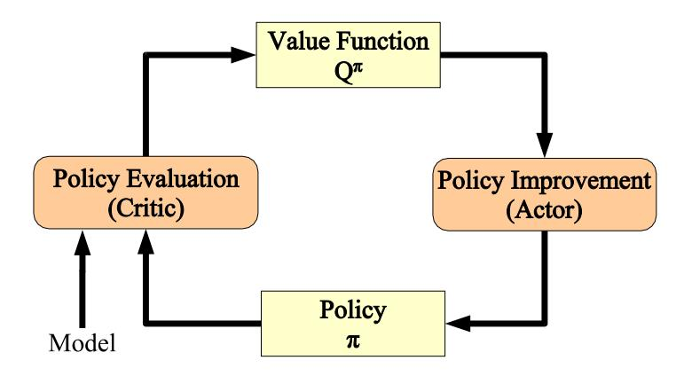

Figure 1: Policy Iteration (Actor-Critic Architecture)

and  $\Pi_{\pi}$  is a stochastic matrix of size  $(|\mathcal{S}| \times |\mathcal{S}||\mathcal{A}|)$  that describes policy  $\pi$ ,

$$\Pi_{\pi}(s',(s',a')) = \pi(a';s')$$
.

The resulting linear system,

$$(\mathbf{I} - \gamma \mathbf{P} \mathbf{\Pi}_{\pi}) Q^{\pi} = \mathcal{R} ,$$

can be solved analytically or iteratively to obtain the exact  $Q^{\pi}$  values. The state-action value function  $Q^{\pi}$  is also the fixed point of the Bellman operator  $T_{\pi}$ :

$$(T_{\pi}Q)(s,a) = \mathcal{R}(s,a) + \gamma \sum_{s' \in \mathcal{S}} \mathcal{P}(s,a,s') \sum_{a' \in \mathcal{A}} \pi(a';s') Q(s',a') .$$

 $T_{\pi}$  is a monotonic and quasi-linear operator and a contraction mapping in the  $L_{\infty}$  norm with contraction rate  $\gamma$  (Bertsekas and Tsitsiklis, 1996). For any initial vector Q, successive applications of  $T_{\pi}$  converge to the state-action value function  $Q^{\pi}$  of policy  $\pi$ .

For every MDP, there exists an optimal deterministic policy,  $\pi^*$ , which maximizes the expected, total, discounted reward from any initial state. It is, therefore, sufficient to restrict the search for the optimal policy only within the space of deterministic policies.

## 3. Policy Iteration and Approximate Policy Iteration

Policy iteration (Howard, 1960) is a method of discovering the optimal policy for any given MDP. Policy iteration is an iterative procedure in the space of deterministic policies; it discovers the optimal policy by generating a sequence of monotonically improving policies. Each iteration m consists of two phases: policy evaluation computes the state-action value function  $Q^{\pi_m}$  of the current policy  $\pi_m$  by solving the linear system of the Bellman equations, and policy improvement defines the improved greedy policy  $\pi_{m+1}$  over  $Q^{\pi_m}$  as

$$\pi_{m+1}(s) = \operatorname*{arg\,max}_{a \in \mathcal{A}} Q^{\pi_m}(s, a) .$$

Policy  $\pi_{m+1}$  is a deterministic policy which is at least as good as  $\pi_m$ , if not better. These two steps (policy evaluation and policy improvement) are repeated until there is no change

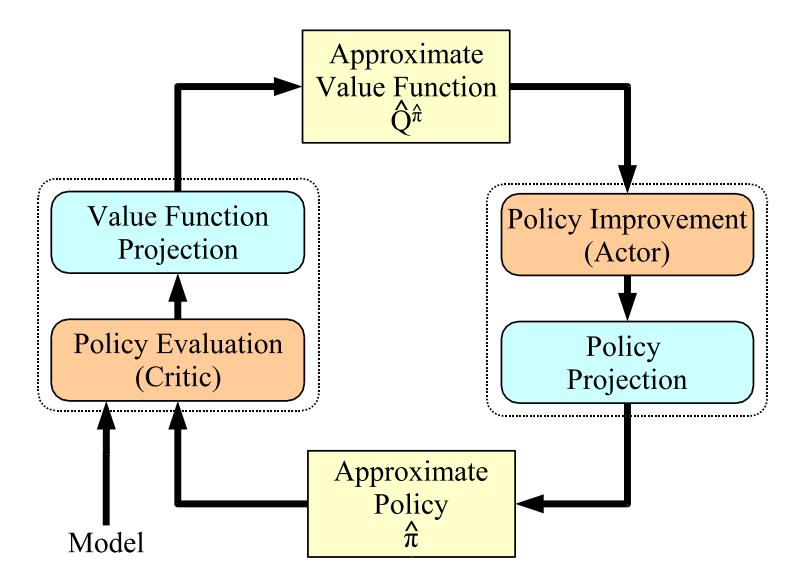

Figure 2: Approximate Policy Iteration

in the policy in which case the iteration has converged to the optimal policy, often in a surprisingly small number of iterations. Policy improvement is also know as the *actor* and policy evaluation is known as the *critic*, because the actor is responsible for the way the agent acts and the critic is responsible for criticizing the way the agent acts. Hence, policy-iteration algorithms are also referred to as *actor-critic architectures* (Barto et al., 1983; Sutton, 1984). Figure 1 shows a block diagram of policy iteration (or an actor-critic architecture) and the dependencies among the various components.

The guaranteed convergence of policy iteration to the optimal policy relies heavily upon a tabular representation of the value function, exact solution of the Bellman equations, and tabular representation of each policy. Such exact representations and methods are impractical for large state and action spaces. In such cases, approximation methods are used. Approximations in the policy-iteration framework can be introduced at two places:<sup>2</sup>

- The representation of the value function: The tabular (exact) representation of the real-valued function  $Q^{\pi}(s, a)$  is replaced by a generic parametric function approximator  $\widehat{Q}^{\pi}(s, a; w)$ , where w are the adjustable parameters of the approximator.
- The representation of the policy: The tabular (exact) representation of the policy  $\pi(s)$  is replaced by a parametric representation  $\widehat{\pi}(s;\theta)$ , where  $\theta$  are the adjustable parameters of the representation.

In either case, only the parameters of the representation need to be stored (along with a compact representation of the approximation architecture) and the storage requirements are much smaller than the tabular case. The crucial factor for a successful approximate algorithm is the choice of the parametric approximation architecture(s) and the choice of the projection (parameter adjustment) method(s). This form of policy iteration (depicted in Figure 2) is known as approximate policy iteration. Notice that policy evaluation and

<sup>2.</sup> As a notational convention, an approximate representation is denoted with the ^ symbol.

value-function projection are essentially blended into one procedure, because there is no intermediate representation of a full value function that would facilitate their separation. The same also is true for policy improvement and policy projection, since there is no intermediate representation for a complete policy. These facts demonstrate the difficulty involved in the use of approximate methods within policy iteration: off-the-self architectures and projection methods cannot be applied blindly; they have to be fully integrated into the policy-iteration framework.

A natural concern is whether the sequence of policies and value functions generated by an approximate policy-iteration algorithm converges to a policy and a value function that are not far from the optimal ones, if it converges at all. The answer to this question is given by the following generic theorem, adapted from Bertsekas and Tsitsiklis (1996), which shows that approximate policy iteration is a fundamentally sound algorithm: if the error in policy evaluation and projection and the error in policy improvement and projection are bounded, then approximate policy iteration generates policies whose performance is not far from the optimal performance. Further, this difference diminishes to zero as the errors decrease to zero.

**Theorem 3.1** Let  $\widehat{\pi}_0$ ,  $\widehat{\pi}_1$ ,  $\widehat{\pi}_2$ , ...,  $\widehat{\pi}_m$  be the sequence of policies generated by an approximate policy-iteration algorithm and let  $\widehat{Q}^{\widehat{\pi}_0}$ ,  $\widehat{Q}^{\widehat{\pi}_1}$ ,  $\widehat{Q}^{\widehat{\pi}_2}$ , ...,  $\widehat{Q}^{\widehat{\pi}_m}$  be the corresponding approximate value functions. Let  $\epsilon$  and  $\delta$  be positive scalars that bound the error in all approximations (over all iterations) to value functions and policies respectively. If

$$\forall m = 0, 1, 2, ..., \|\widehat{Q}^{\hat{\pi}_m} - Q^{\hat{\pi}_m}\|_{\infty} \le \epsilon$$

and  $^3$ 

$$\forall m = 0, 1, 2, ..., \|T_{\widehat{\pi}_{m+1}} \widehat{Q}^{\widehat{\pi}_m} - T_* \widehat{Q}^{\widehat{\pi}_m}\|_{\infty} \le \delta$$
.

Then, this sequence eventually produces policies whose performance is at most a constant multiple of  $\epsilon$  and  $\delta$  away from the optimal performance:

$$\limsup_{m \to \infty} \|\widehat{Q}^{\widehat{\pi}_m} - Q^*\|_{\infty} \le \frac{\delta + 2\gamma\epsilon}{(1 - \gamma)^2}.$$

In addition to this  $L_{\infty}$ -norm bound, Munos (2003) recently provided a stronger bound in terms of a weighted  $L_2$ -norm for a version of approximate policy iteration that involves exact representations of policies and approximate representations of their state value functions and uses the full model of the MDP in both policy evaluation and policy improvement. This recent result provides further evidence that approximate policy iteration is a fundamentally sound algorithm.

$$(T_*Q)(s,a) = \mathcal{R}(s,a) + \gamma \sum_{s' \in \mathcal{S}} \mathcal{P}(s,a,s') \max_{a' \in \mathcal{A}} Q(s',a') .$$

<sup>3.</sup>  $T_*$  is the Bellman optimality operator defined as:

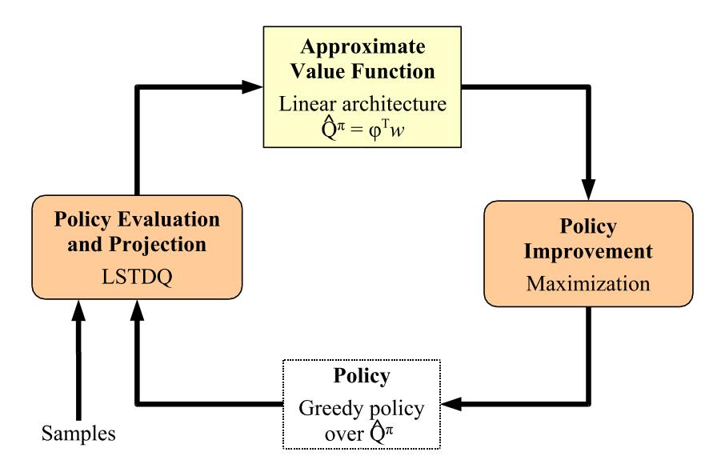

Figure 3: Least-squares policy iteration.

## 4. Reinforcement Learning and Approximate Policy Iteration

For many practical control problems, the underlying MDP model is not fully available. Typically, the state space, the action space, and the discount factor are available, whereas the transition model and the reward function are not known in advance. It is still desirable to be able to evaluate, or, even better, find good decision policies for such problems. However, in this case, algorithms have to rely on information that comes from interaction between the decision maker and the process itself or from a generative model of the process and includes observations of states, actions, and rewards.<sup>4</sup> These observations are commonly organized in tuples known as *samples*:

$$(s, a, r, s')$$
,

meaning that at some time step the process was in state s, action a was taken by the agent, a reward r was received, and the resulting next state was s'. The problem of evaluating a given policy or discovering a good policy from samples is know as reinforcement learning.

Samples can be collected from actual (sequential) episodes of interaction with the process or from queries to a generative model of the process. In the first case, the learning agent does not have much control on the distribution of samples over the state space, since the process cannot be reinitialized at will. In contrast, with a generative model the agent has full control on the distribution of samples over the state space as queries can be made for any arbitrary state. However, in both cases, the action choices of the learning agent are not restricted by the process, but only by the learning algorithm that is running. Samples may even come from stored experiences of other agents on the same MDP.

The proposed *least-squares policy iteration* (LSPI) algorithm is an approximate policyiteration algorithm that learns decision policies from samples. Figure 3 shows a block

<sup>4.</sup> A generative model of an MDP is a simulator of the process, that is, a "black box" that takes a state s and an action a as inputs and generates a reward r and a next state s' sampled according to the dynamics of the MDP.

diagram of LSPI that demonstrates how the algorithm fits within the approximate policyiteration framework. The first observation is that the state-action value function is approximated by a linear architecture and its actual representation consists of a compact
description of the basis functions and a set of parameters. A key idea in the development
of the algorithm was that the technique used by Q-learning of implicitly representing a
policy as a state-action value function could be applied to an approximate policy-iteration
algorithm. In fact, the policy is not physically stored anywhere, but is computed only on
demand. More specifically, for any query state s, one can access the representation of the
value function, compute all action values in that state, and perform the maximization to
derive the greedy action choice at that state. As a result, all approximations and errors in
policy improvement and representation are eliminated at the cost of some extra optimization
for each query to the policy.

The missing part for closing the loop is a procedure that evaluates a policy using samples and produces its approximate value function. In LSPI, this step is performed by LSTDQ, an algorithm which is very similar to LSTD and learns efficiently the approximate state-action value function  $\hat{Q}^{\pi}$  of a policy  $\pi$  when the approximation architecture is a linear architecture.

LSPI is only one particular instance of a family of reinforcement-learning algorithms for control based on approximate policy iteration. The two components that vary across instances of this family are the approximation architecture and the policy evaluation and projection procedure. For LSPI, these components were chosen to be linear architectures and LSTDQ, but, in principle, any other pair of choices would produce a reasonable learning algorithm for control. The choices made for LSPI offer significant advantages and opportunities for optimizing the overall efficiency of the algorithm.

The following three sections describe all the details of the LSPI algorithm. In Section 5 we discuss linear approximation architectures and two projection methods for such architectures in isolation of the learning problem. We also compare these projection methods and discuss their appropriateness in the context of learning. In Section 6, we describe in detail the LSTDQ algorithm for learning the least-squares fixed-point approximation of the state-action value function of a policy. We also cite a comparison of LSTDQ with LSTD and we present some optimized variants of LSTDQ. Finally, in Section 7 we formally state the LSPI algorithm and discuss its properties.

## 5. Value-Function Approximation using Linear Architectures

Let  $\widehat{Q}^{\pi}(s, a; w)$  be an approximation to  $Q^{\pi}(s, a)$  represented by a parametric approximation architecture with free parameters w. The main idea of value-function approximation is that the parameters w can be adjusted appropriately so that the approximate values are "close enough" to the original values, and, therefore,  $\widehat{Q}^{\pi}$  can be used in place of the exact value function  $Q^{\pi}$ . The characterization "close enough" accepts a variety of interpretations in this context and it does not necessarily refer to a minimization of some norm. Value-function approximation should be regarded as a functional approximation rather than as a pure numerical approximation, where "functional" refers to the ability of the approximation to play closely the functional role of the original function within a decision making algorithm.

The difficulty associated with value-function approximation, beyond the loss in accuracy, is the choice of the projection method. This is the method of finding appropriate parameters

that maximize the accuracy of the approximation according to certain criteria and with respect to the target function. Typically, for ordinary function approximation, this is done using a training set of examples of the form  $\{(s,a),Q^{\pi}(s,a)\}$  that provide the value  $Q^{\pi}(s,a)$  of the target function at certain sample points (s,a), a problem known as supervised learning. Unfortunately, in the context of decision making, the target function  $(Q^{\pi})$  is not known in advance, and must be inferred from the observed system dynamics. The implication is that policy evaluation and projection to the approximation architecture must be blended together. This is usually achieved by trying to find values for the free parameters so that the approximate function has certain properties that are "similar" to those of the original value function.

A common class of approximators for value-function approximation is the so called *linear* architectures, where the  $Q^{\pi}$  values are approximated by a linear parametric combination of k basis functions (features):

$$\widehat{Q}^{\pi}(s,a;w) = \sum_{j=1}^{k} \phi_j(s,a) w_j ,$$

where the  $w_j$ 's are the parameters. The basis functions  $\phi_j(s,a)$  are fixed, but arbitrary and, in general, non-linear, functions of s and a. We require that the basis functions  $\phi_j$  are linearly independent to ensure that there are no redundant parameters and that the matrices involved in the computations are full rank.<sup>5</sup> In general,  $k \ll |\mathcal{S}||\mathcal{A}|$  and the basis functions  $\phi_j$  have compact descriptions. As a result, the storage requirements of a linear architecture are much smaller than those of the tabular representation. Typical linear approximation architectures are polynomials of any degree (each basis function is a polynomial term) and radial basis functions (each basis function is a Gaussian with fixed mean and variance).

Linear architectures have their own virtues: they are easy to implement and use, and their behavior is fairly transparent, both from an analysis standpoint and from a debugging and feature engineering standpoint. It is usually relatively easy to get some insight into the reasons for which a particular choice of features succeeds or fails. This is facilitated by the fact that the magnitude of each parameter is related to the importance of the corresponding feature in the approximation (assuming normalized features).

Let  $Q^{\pi}$  be the (unknown) value function of a policy  $\pi$  given as a column vector of size  $|\mathcal{S}||A|$ . Let also  $\widehat{Q}^{\pi}$  be the vector of the approximate state-action values as computed by a linear approximation architecture with parameters  $w_j$  and basis functions  $\phi_j$ , j=1,2,...,k. Define  $\phi(s,a)$  to be the column vector of size k where each entry j is the corresponding basis function  $\phi_j$  computed at (s,a):

$$\phi(s,a) = \begin{pmatrix} \phi_1(s,a) \\ \dots \\ \phi_2(s,a) \\ \dots \\ \phi_k(s,a) \end{pmatrix} .$$

<sup>5.</sup> This is not a very restrictive assumption. Linear dependencies, if present, result in singularities which can be handled in most cases using singular value decomposition (SVD).

Now,  $\widehat{Q}^{\pi}$  can be expressed compactly as

$$\widehat{Q}^{\pi} = \mathbf{\Phi} w^{\pi} \ ,$$

where  $w^{\pi}$  is a column vector of length k with all parameters and  $\Phi$  is a  $(|\mathcal{S}||\mathcal{A}| \times k)$  matrix of the form

$$\mathbf{\Phi} = \begin{pmatrix} \phi(s_1, a_1)^\mathsf{T} \\ & \ddots \\ \phi(s, a)^\mathsf{T} \\ & \ddots \\ \phi(s_{|\mathcal{S}|}, a_{|\mathcal{A}|})^\mathsf{T} \end{pmatrix} .$$

Each row of  $\Phi$  contains the value of all basis functions for a certain pair (s, a) and each column of  $\Phi$  contains the value of a certain basis function for all pairs (s, a). If the basis functions are linearly independent, then the columns of  $\Phi$  are linearly independent as well.

We seek to find a combined policy evaluation and projection method that takes as input a policy  $\pi$  and the model of the process and outputs a set of parameters  $w^{\pi}$  such that  $\widehat{Q}^{\pi}$  is a "good" approximation to  $Q^{\pi}$ .

### 5.1 Bellman Residual Minimizing Approximation

Recall that the state-action value function  $Q^{\pi}$  is the solution of the Bellman equation:

$$Q^{\pi} = \mathcal{R} + \gamma \mathbf{P} \mathbf{\Pi}_{\pi} Q^{\pi} .$$

An obvious approach to deriving a good approximation is to require that the approximate value function satisfies the Bellman equation as closely as possible. Substituting the approximation  $\widehat{Q}^{\pi}$  in place of  $Q^{\pi}$  yields an overconstrained linear system over the k parameters  $w^{\pi}$ :

$$\widehat{Q}^{\pi} \approx R + \gamma \mathbf{P} \mathbf{\Pi}_{\pi} \widehat{Q}^{\pi} 
\mathbf{\Phi} w^{\pi} \approx \mathcal{R} + \gamma \mathbf{P} \mathbf{\Pi}_{\pi} \mathbf{\Phi} w^{\pi} 
(\mathbf{\Phi} - \gamma \mathbf{P} \mathbf{\Pi}_{\pi} \mathbf{\Phi}) w^{\pi} \approx \mathcal{R} .$$

Solving this overconstrained system in the least-squares sense yields a solution

$$w^{\pi} = \left( (\mathbf{\Phi} - \gamma \mathbf{P} \mathbf{\Pi}_{\pi} \mathbf{\Phi})^{\mathsf{T}} (\mathbf{\Phi} - \gamma \mathbf{P} \mathbf{\Pi}_{\pi} \mathbf{\Phi}) \right)^{-1} (\mathbf{\Phi} - \gamma \mathbf{P} \mathbf{\Pi}_{\pi} \mathbf{\Phi})^{\mathsf{T}} \mathcal{R} ,$$

that minimizes the  $L_2$  norm of the Bellman residual (the difference between the left-hand side and the right-hand side of the Bellman equation) and can be called the Bellman residual minimizing approximation to the true value function. Note that the solution  $w^{\pi}$  of the system is unique since the columns of  $\Phi$  (the basis functions) are linearly independent by definition. Alternatively, it may be desirable to control the distribution of function approximation error. This can be achieved by solving the system above in a weighted least-squares sense. Let  $\mu$  be a probability distribution over (s,a) such that the probability  $\mu(s,a)$  indicates the importance of the approximation error at the point (s,a). Defining

 $\Delta_{\mu}$  to be a diagonal matrix with entries  $\mu(s, a)$ , the weighted least-squares solution of the system would be:

$$w^{\pi} = \left( (\mathbf{\Phi} - \gamma \mathbf{P} \mathbf{\Pi}_{\pi} \mathbf{\Phi})^{\mathsf{T}} \Delta_{\mu} (\mathbf{\Phi} - \gamma \mathbf{P} \mathbf{\Pi}_{\pi} \mathbf{\Phi}) \right)^{-1} (\mathbf{\Phi} - \gamma \mathbf{P} \mathbf{\Pi}_{\pi} \mathbf{\Phi})^{\mathsf{T}} \Delta_{\mu} \mathcal{R}$$

The Bellman residual minimizing approach has been proposed (Schweitzer and Seidmann, 1985) as a means of computing approximate state value functions from the model of the process.

## 5.2 Least-Squares Fixed-Point Approximation

Recall that the state-action value function  $Q^{\pi}$  is also the fixed point of the Bellman operator:

$$T_{\pi}Q^{\pi} = Q^{\pi} .$$

Another way to go about finding a good approximation is to force the approximate value function to be a fixed point under the Bellman operator:

$$T_{\pi}\widehat{Q}^{\pi} \approx \widehat{Q}^{\pi}$$
 .

For that to be possible, the fixed point has to lie in the space of approximate value functions which is the space spanned by the basis functions. Even though  $\widehat{Q}^{\pi}$  lies in that space by definition,  $T_{\pi}\widehat{Q}^{\pi}$  may, in general, be out of that space and must be projected. Considering the orthogonal projection  $(\Phi(\Phi^{\dagger}\Phi)^{-1}\Phi^{\dagger})$  which minimizes the  $L_2$  norm, we seek an approximate value function  $\widehat{Q}^{\pi}$  that is invariant under one application of the Bellman operator  $T_{\pi}$  followed by orthogonal projection:

$$\hat{Q}^{\pi} = \Phi(\Phi^{\mathsf{T}}\Phi)^{-1}\Phi^{\mathsf{T}}(T_{\pi}\hat{Q}^{\pi}) 
= \Phi(\Phi^{\mathsf{T}}\Phi)^{-1}\Phi^{\mathsf{T}}(\mathcal{R} + \gamma\mathbf{P}\Pi_{\pi}\hat{Q}^{\pi}) .$$

Note that the orthogonal projection to the column space of  $\Phi$  is well-defined because the columns of  $\Phi$  (the basis functions) are linearly independent by definition. Manipulating the equation above, we derive an expression for the desired solution that amounts to solving a  $(k \times k)$  linear system, where k is the number of basis functions:

$$\begin{split} & \Phi(\Phi^{\intercal}\Phi)^{-1}\Phi^{\intercal}(\mathcal{R} + \gamma\mathbf{P}\Pi_{\pi}\widehat{Q}^{\pi}) &= \widehat{Q}^{\pi} \\ & \Phi(\Phi^{\intercal}\Phi)^{-1}\Phi^{\intercal}(\mathcal{R} + \gamma\mathbf{P}\Pi_{\pi}\Phi w^{\pi}) &= \Phi w^{\pi} \\ & \Phi\left((\Phi^{\intercal}\Phi)^{-1}\Phi^{\intercal}(\mathcal{R} + \gamma\mathbf{P}\Pi_{\pi}\Phi w^{\pi}) - w^{\pi}\right) &= 0 \\ & (\Phi^{\intercal}\Phi)^{-1}\Phi^{\intercal}(\mathcal{R} + \gamma\mathbf{P}\Pi_{\pi}\Phi w^{\pi}) - w^{\pi} &= 0 \\ & (\Phi^{\intercal}\Phi)^{-1}\Phi^{\intercal}(\mathcal{R} + \gamma\mathbf{P}\Pi_{\pi}\Phi w^{\pi}) &= w^{\pi} \\ & \Phi^{\intercal}(\mathcal{R} + \gamma\mathbf{P}\Pi_{\pi}\Phi w^{\pi}) &= \Phi^{\intercal}\Phi w^{\pi} \\ & \underbrace{\Phi^{\intercal}(\mathcal{R} + \gamma\mathbf{P}\Pi_{\pi}\Phi w^{\pi})}_{(k\times k)} &= \underbrace{\Phi^{\intercal}\Phi w^{\pi}}_{(k\times 1)}. \end{split}$$

For any  $\Pi_{\pi}$ , the solution of this system

$$w^{\pi} = \left(\mathbf{\Phi}^{\mathsf{T}}(\mathbf{\Phi} - \gamma \mathbf{P} \mathbf{\Pi}_{\pi} \mathbf{\Phi})\right)^{-1} \mathbf{\Phi}^{\mathsf{T}} \mathcal{R}$$

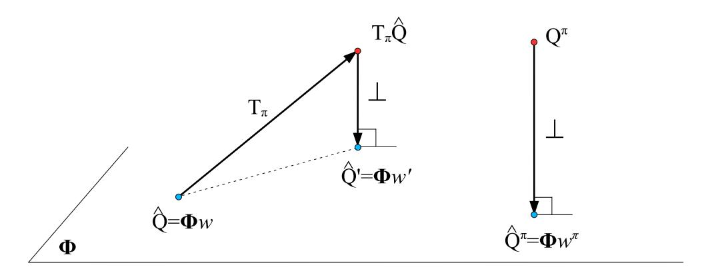

Figure 4: Policy evaluation and projection methods.

is guaranteed to exist for all, but finitely many, values of  $\gamma$  (Koller and Parr, 2000). Since the orthogonal projection minimizes the  $L_2$  norm, the solution  $w^{\pi}$  yields a value function  $\hat{Q}^{\pi}$  which can be called the *least-squares fixed-point approximation* to the true value function.

Instead of using the orthogonal projection, it is possible to use a weighted projection to control the distribution of approximation error. If  $\mu$  is a probability distribution over (s, a) and  $\Delta_{\mu}$  is the diagonal matrix with the projection weights  $\mu(s, a)$ , the weighted least-squares fixed-point solution would be:

$$w^{\pi} = \left(\mathbf{\Phi}^{\mathsf{T}} \Delta_{\mu} (\mathbf{\Phi} - \gamma \mathbf{P} \mathbf{\Pi}_{\pi} \mathbf{\Phi})\right)^{-1} \mathbf{\Phi}^{\mathsf{T}} \Delta_{\mu} \mathcal{R} .$$

The least-squares fixed-point approach has been used for computing (Koller and Parr, 2000) or learning (Bradtke and Barto, 1996) approximate state value functions from a factored model of the process and from samples respectively.

#### 5.3 Comparison of Projection Methods

We presented above two intuitive ways to combine policy evaluation and value-function projection for finding a good approximate value function represented as a linear architecture. An obvious question at this point is whether one of them has some advantages over the other.

Figure 4 is a very simplified graphical representation of the situation. Let the three-dimensional space be the space of exact value functions Q and let the two-dimensional space marked by  $\Phi$  be the space of approximate value functions. Consider the approximate value function  $\widehat{Q} = \Phi w$  that lies on  $\Phi$ . The application of the Bellman operator  $T_{\pi}$  to  $\widehat{Q}$  yields a value function  $T_{\pi}\widehat{Q}$  which may be, in general, outside the  $\Phi$  plane. Orthogonal projection ( $\bot$ ) of  $T_{\pi}\widehat{Q}$  to the  $\Phi$  plane yields some other approximate value function  $\widehat{Q}' = \Phi w'$ . The true value function  $Q^{\pi}$  of policy  $\pi$  may lie somewhere outside the  $\Phi$  plane, in general, and its orthogonal projection to the  $\Phi$  plane is marked by  $\widehat{Q}^{\pi} = \Phi w^{\pi}$ .

The policy evaluation and projection methods considered here are trying to find a w, such that the approximate value function  $\widehat{Q} = \Phi w$  is a "good" approximation to the true value function  $Q^{\pi}$ . Since these methods do not have access to  $Q^{\pi}$  itself they have to rely on information contained in the Bellman equation and the Bellman operator for policy  $\pi$  to find a "good" w. It is easy to see that the Bellman residual minimizing approximation minimizes

the  $L_2$  distance between  $\widehat{Q}$  and  $T_{\pi}\widehat{Q}$ , whereas the least-squares fixed-point approximation minimizes the projection of that distance, that is, the distance between  $\widehat{Q}$  and  $\widehat{Q}'$ . In fact, the least-squares fixed-point approximation drives the distance between  $\widehat{Q}$  and  $\widehat{Q}'$  to zero since it is solving for the fixed point  $\widehat{Q} = \widehat{Q}'$ . The solution found by the Bellman residual minimizing method will most likely not be a fixed point even within the  $\Phi$  plane.

The Bellman operator  $T_{\pi}$  is known to be a contraction in the  $L_{\infty}$  norm. In our picture, that means that for any point Q in the three-dimensional space, the point  $T_{\pi}Q$  will be closer to  $Q^{\pi}$  in the  $L_{\infty}$  norm sense. Pictorially, imagine a cube aligned with the axes of the three-dimensional space and centered at  $Q^{\pi}$  with Q being a point on the surface of the cube; the point  $T_{\pi}Q$  will have to be strictly contained inside this cube (except at  $Q^{\pi}$  where the cube degenerates to a single point). With this view in mind, the Bellman residual minimizing approximation finds the point on the  $\Phi$  plane where the Bellman operator is making the least progress toward  $Q^{\pi}$  only in terms of magnitude ( $L_2$  distance), ignoring the direction of the change. The motivation for reducing the  $L_2$  norm of the Bellman residual comes from the well-known results bounding the distance to  $Q^{\pi}$  in terms of the  $L_{\infty}$  norm (Williams and Baird, 1993).

On the other hand, the least-squares fixed-point approximation ignores the magnitude of the Bellman operator steps and focuses on the direction of the change. In particular, it solves for the unique point on the  $\Phi$  plane where the Bellman operator becomes perpendicular to the plane. A motivation for choosing this approximation is that if subsequent applications of the Bellman operator point in a similar direction, the approximation should not be far from the projection of  $Q^{\pi}$  onto the  $\Phi$  plane.

Clearly, the solutions found by these two methods will be different since their objectives are different, except in the case where the true value function  $Q^{\pi}$  lies in the  $\Phi$  plane; in that case, both methods are in fact solving the Bellman equation and their solutions are identical. If  $Q^{\pi}$  does not lie in the  $\Phi$  plane, there is no clear evidence that any of the two methods will find a good solution or even the solution  $w^{\pi}$  that corresponds to the orthogonal projection of  $Q^{\pi}$  to the plane.

Munos (2003) provides a theoretical comparison of the two approximation methods in the context of state value-function approximation when the model of the process is known. He concludes that the least-squares fixed point approximation is less stable and less predictable compared to the Bellman residual minimizing approximation depending on the value of the discount factor. This is expected, however, since the least-squares fixed-point linear system is singular for a finite number of discount-factor values. On the other hand, he states that the least-squares fixed-point method might be preferable in the context of learning.

From a practical point of view, there are two sources of evidence that the least-squares fixed-point method is preferable to the Bellman residual minimizing method:

- Learning the Bellman residual minimizing approximation requires "doubled" samples (Sutton and Barto, 1998) that can only be collected from a generative model of the MDP.
- Experimentally, the least-squares fixed-point approximation often delivers policies that are superior to the ones found using the Bellman residual minimizing approximation.

For the rest of the paper, we focus only on the least-squares fixed-point approximation with minimal reference to the Bellman residual minimizing approximation.

# 6. LSTDQ: Least-Squares Temporal-Difference Learning for the State-Action Value Function

Consider the problem of learning the (weighted) least-squares fixed-point approximation  $\widehat{Q}^{\pi}$  to the state-action value function  $Q^{\pi}$  of a fixed policy  $\pi$  from samples. Assuming that there are k linearly independent basis functions in the linear architecture, this problem is equivalent to learning the parameters  $w^{\pi}$  of  $\widehat{Q}^{\pi} = \Phi w^{\pi}$ . The exact values for  $w^{\pi}$  can be computed from the model by solving the  $(k \times k)$  linear system

$$\mathbf{A}w^{\pi}=b$$

where

$$\mathbf{A} = \mathbf{\Phi}^{\mathsf{T}} \Delta_{\mu} (\mathbf{\Phi} - \gamma \mathbf{P} \mathbf{\Pi}_{\pi} \mathbf{\Phi})$$
 and  $b = \mathbf{\Phi}^{\mathsf{T}} \Delta_{\mu} \mathcal{R}$ 

and  $\mu$  is a probability distribution over  $(S \times A)$  that defines the weights of the projection. For the learning problem,  $\mathbf{A}$  and b cannot be determined a priori, either because the matrix  $\mathbf{P}$  and the vector  $\mathcal{R}$  are unknown, or because  $\mathbf{P}$  and  $\mathcal{R}$  are so large that they cannot be used in any practical computation. However,  $\mathbf{A}$  and b can be learned using samples; the learned linear system can then be solved to yield the learned parameters  $\widetilde{w}^{\pi}$  which, in turn, determine the learned value function. Taking a closer look at  $\mathbf{A}$  and b:

$$\mathbf{A} = \mathbf{\Phi}^{\mathsf{T}} \Delta_{\mu} (\mathbf{\Phi} - \gamma \mathbf{P} \mathbf{\Pi}_{\pi} \mathbf{\Phi})$$

$$= \sum_{s \in \mathcal{S}} \sum_{a \in \mathcal{A}} \phi(s, a) \mu(s, a) \Big( \phi(s, a) - \gamma \sum_{s' \in \mathcal{S}} \mathcal{P}(s, a, s') \phi(s', \pi(s')) \Big)^{\mathsf{T}}$$

$$= \sum_{s \in \mathcal{S}} \sum_{a \in \mathcal{A}} \mu(s, a) \sum_{s' \in \mathcal{S}} \mathcal{P}(s, a, s') \Big[ \phi(s, a) \Big( \phi(s, a) - \gamma \phi(s', \pi(s')) \Big)^{\mathsf{T}} \Big] ,$$

$$b = \mathbf{\Phi}^{\mathsf{T}} \Delta_{\mu} \mathcal{R}$$

$$= \sum_{s \in \mathcal{S}} \sum_{a \in \mathcal{A}} \phi(s, a) \mu(s, a) \sum_{s' \in \mathcal{S}} \mathcal{P}(s, a, s') R(s, a, s')$$

$$= \sum_{s \in \mathcal{S}} \sum_{a \in \mathcal{A}} \mu(s, a) \sum_{s' \in \mathcal{S}} \mathcal{P}(s, a, s') \Big[ \phi(s, a) R(s, a, s') \Big] .$$

From these equations, it is clear that A and b have a special structure. A is the sum of many rank one matrices of the form:

$$\phi(s,a) \Big( \phi(s,a) - \gamma \phi(s',\pi(s')) \Big)^{\mathsf{T}}$$
,

and b is the sum of many vectors of the form:

$$\phi(s,a)R(s,a,s')$$
 .

<sup>6.</sup> As a notational convention, a learned estimate is denoted with the ~ symbol.

These summations are taken over s, a, and s' and each summand is weighted by the projection weight  $\mu(s,a)$  for the pair (s,a) and the probability  $\mathcal{P}(s,a,s')$  of the transition  $s \stackrel{a}{\longrightarrow} s'$ . For large problems, it is impractical to compute this summation over all (s,a,s') triplets. It is practical, however, to sample terms from this summation; for unbiased sampling, s and a must be drawn jointly from  $\mu$ , and s' must be drawn from  $\mathcal{P}(s,a,s')$ . It is trivial to see that, in the limit, the process of sampling triplets (s,a,s') from this distribution and adding the corresponding terms together, can be used to obtain arbitrarily close approximations to A and b.

The key observation here is that a sample (s, a, r, s') drawn from the process along with the policy  $\pi$  in state s' provide all the information needed to form one sample term of these summations. This is true because s' is a sample transition for taking action a in state s, and r is sampled from R(s, a, s'). So, given any finite set of samples,<sup>7</sup>

$$D = \left\{ (s_i, a_i, r_i, s_i') \mid i = 1, 2, \dots, L \right\} ,$$

 $\mathbf{A}$  and b can be learned as:

$$\widetilde{\mathbf{A}} = \frac{1}{L} \sum_{i=1}^{L} \left[ \phi(s_i, a_i) \left( \phi(s_i, a_i) - \gamma \phi(s_i', \pi(s_i')) \right)^{\mathsf{T}} \right] ,$$

$$\widetilde{b} = \frac{1}{L} \sum_{i=1}^{L} \left[ \phi(s_i, a_i) r_i \right] ,$$

assuming that the distribution  $\mu_D$  of the samples in D over  $(S \times A)$  matches the desired distribution  $\mu$ . The equations can also be written in matrix notation. Let  $\widetilde{\Phi}$ ,  $\widetilde{\mathbf{P}\Pi_{\pi}\Phi}$ , and  $\widetilde{\mathcal{R}}$  be the following matrices:

$$\widetilde{\boldsymbol{\Phi}} = \begin{pmatrix} \phi(s_1, a_1)^\mathsf{T} \\ \vdots \\ \phi(s_i, a_i)^\mathsf{T} \\ \vdots \\ \phi(s_L, a_L)^\mathsf{T} \end{pmatrix}, \qquad \widetilde{\mathbf{P}}\widetilde{\boldsymbol{\Pi}}_{\pi}\widetilde{\boldsymbol{\Phi}} = \begin{pmatrix} \phi(s_1', \pi(s_1'))^\mathsf{T} \\ \vdots \\ \phi(s_1', \pi(s_1'))^\mathsf{T} \\ \vdots \\ \phi(s_L', \pi(s_L'))^\mathsf{T} \end{pmatrix}, \qquad \widetilde{\mathcal{R}} = \begin{pmatrix} r_1 \\ \vdots \\ r_i \\ \vdots \\ r_L \end{pmatrix}.$$

Then,  $\widetilde{\mathbf{A}}$  and  $\widetilde{b}$  can be written as

$$\widetilde{\mathbf{A}} = \frac{1}{L} \widetilde{\mathbf{\Phi}}^{\mathsf{T}} (\widetilde{\mathbf{\Phi}} - \gamma \widetilde{\mathbf{P}} \widetilde{\mathbf{\Pi}_{\pi}} \mathbf{\Phi}) \quad \text{and} \quad \widetilde{b} = \frac{1}{L} \widetilde{\mathbf{\Phi}}^{\mathsf{T}} \widetilde{\mathcal{R}} .$$

These two equations show clearly the relationship of  $\widetilde{\mathbf{A}}$  and  $\widetilde{b}$  to  $\mathbf{A}$  and b. In the limit of an infinite number of samples,  $\widetilde{\mathbf{A}}$  and  $\widetilde{b}$  converge to the matrices of the least-squares fixed-point approximation weighted by  $\mu_D$ :

$$\lim_{L \to \infty} \widetilde{\mathbf{A}} = \mathbf{\Phi}^{\mathsf{T}} \Delta_{\mu_D} (\mathbf{\Phi} - \gamma \mathbf{P} \mathbf{\Pi}_{\pi} \mathbf{\Phi}) \quad \text{and} \quad \lim_{L \to \infty} \widetilde{b} = \mathbf{\Phi}^{\mathsf{T}} \Delta_{\mu_D} \mathcal{R} .$$

<sup>7.</sup> In describing the algorithms below, we assume an abstract source of samples D which can be a set of precollected samples, a generative model, online experience from the actual process, etc.

As a result, the learned approximation is biased by the distribution  $\mu_D$  of samples. In general, the distribution  $\mu_D$  might be different from the desired distribution  $\mu$ . A mismatch between  $\mu$  and  $\mu_D$  may be mitigated by using density estimation techniques to estimate  $\mu_D$  and then using projection weights corresponding to the importance weights needed to shift the sampling distribution towards the target distribution. Also, the problem is resolved trivially when a generative model is available, since samples can be drawn so that  $\mu_D = \mu$ . For simplicity, this paper focuses only on learned approximations that are naturally biased by the distribution of samples whatever that might be.

In any practical computation of **A** and b, L is finite and therefore the multiplicative factor (1/L) can be dropped without affecting the solution of the system, since it cancels out. Given that a single sample contributes to  $\widetilde{\mathbf{A}}$  and  $\widetilde{b}$  additively, it is easy to construct an incremental update rule for  $\widetilde{\mathbf{A}}$  and  $\widetilde{b}$ . Let  $\widetilde{\mathbf{A}}^{(t)}$  and  $\widetilde{b}^{(t)}$  be the current learned estimates of  $\mathbf{A}$  and b for a fixed policy  $\pi$ , assuming that initially  $\widetilde{\mathbf{A}}^{(0)} = \mathbf{0}$  and  $\widetilde{b}^{(0)} = \mathbf{0}$ . A new sample  $(s_t, a_t, r_t, s_t')$  contributes to the approximation according to the following update equations:

$$\widetilde{\mathbf{A}}^{(t+1)} = \widetilde{\mathbf{A}}^{(t)} + \phi(s_t, a_t) \Big( \phi(s_t, a_t) - \gamma \phi(s_t', \pi(s_t')) \Big)^{\mathsf{T}} ,$$

$$\widetilde{b}^{(t+1)} = \widetilde{b}^{(t)} + \phi(s_t, a_t) r_t .$$

It is straightforward now to construct an algorithm that learns the weighted least-squares fixed-point approximation of the state-action value function of a fixed policy  $\pi$  from samples in a batch or in an incremental way. We call this new algorithm LSTDQ (summarized in Figure 5) due to its similarity to LSTD. In fact, one can think of the LSTDQ algorithm as the LSTD algorithm applied on a Markov chain with states (s,a) in which transitions are influenced by both the dynamics of the original MDP and the policy  $\pi$  being evaluated.

Another feature of LSTDQ is that the same set of samples D can be used to learn the approximate value function  $\widehat{Q}^{\pi}$  of any policy  $\pi$ , as long as  $\pi(s')$  is available for each s' in the set. The policy merely determines which  $\phi(s', \pi(s'))$  is added to  $\widetilde{\mathbf{A}}$  for each sample. This feature is particularly important in the context of policy iteration since all policies produced during the iteration can be evaluated using a *single* sample set.

The approximate value function learned by LSTDQ is biased by the distribution of samples over  $(S \times A)$ . This distribution can be easily controlled when samples are drawn from a generative model, but it is a lot harder when samples are drawn from the actual process. A nice feature of LSTDQ is that it poses no restrictions on how actions are chosen during sample collection. Therefore, the freedom in action choices can be used to control the sample distribution to the extent this is possible. In contrast, action choices for LSTD must be made according to the policy under evaluation when samples are drawn from the actual process.

The differences between LSTD and LSTDQ are listed in Table 1. The last three items in the table apply only to the case where samples are drawn from the actual process, but there is no difference in the generative model case.

Notice that apart from storing the samples, LSTDQ requires only  $O(k^2)$  space independently of the size of the state and the action space. For each sample in D, LSTDQ incurs a cost of  $O(k^2)$  to update the matrices  $\widetilde{\mathbf{A}}$  and  $\widetilde{b}$ . A one-time cost of  $O(k^3)$  is paid for solving

```
\begin{array}{cccccccccccccccccccccccccccccccccccc
```

Figure 5: The LSTDQ algorithm.

| LSTD                                             | $\mathbf{LSTD}Q$                                        |
|--------------------------------------------------|---------------------------------------------------------|
| Learns the <b>state</b> value function $V^{\pi}$ | Learns the <b>state-action</b> value function $Q^{\pi}$ |
| Basis functions of <b>state</b>                  | Basis functions of state and action                     |
| Samples cannot be reused                         | Samples can be reused                                   |
| Training samples collected by $\pi$              | Training samples collected arbitrarily                  |
| Sampling distribution cannot be controlled       | Sampling distribution can be controlled                 |
| Bias by the stationary distribution of $\pi$     | Bias by the sampling distribution                       |

Table 1: Differences between LSTD and LSTDQ.

the system and finding the parameters. There is also a cost for determining  $\pi(s')$  for each sample. This cost depends on the specific form of policy representation used.<sup>8</sup>

The LSTDQ algorithm in its simplest form involves the inversion of  $\widetilde{\mathbf{A}}$  for solving the linear system. However,  $\widetilde{\mathbf{A}}$  will not be full rank until a sufficient number of samples has been processed. One way to avoid such singularities is to initialize  $\widetilde{\mathbf{A}}$  to a multiple of the identity matrix  $\delta \mathbf{I}$  for some small positive  $\delta$ , instead of  $\mathbf{0}$  (ridge regression, Dempster et al., 1977). The convergence properties of the algorithm are not affected by this change (Nedić and Bertsekas, 2003). Another possibility is to use singular value decomposition (SVD) for robust inversion of  $\widetilde{\mathbf{A}}$  which also eliminates singularities due to linearly dependent basis functions. However, if the linear system must be solved frequently and efficiency is a concern, a more efficient implementation of LSTDQ would use recursive least-squares techiques to compute the inverse of  $\widetilde{\mathbf{A}}$  recursively. Let  $\mathbf{B}^{(t)}$  be the inverse of  $\widetilde{\mathbf{A}}^{(t)}$  at time t. Using the

<sup>8.</sup> The explicit tabular representation of  $\pi$  that incurs only a constant O(1) cost per query is not an applicable choice for the large problems we consider because of huge state-action spaces.

```
 \begin{array}{cccccccccccccccccccccccccccccccccccc
```

Figure 6: An optimized implementation of the LSTDQ algorithm.

Sherman-Morrison formula, we have:

$$\mathbf{B}^{(t)} = \left(\widetilde{\mathbf{A}}^{(t-1)} + \phi(s_t, a_t) \left(\phi(s_t, a_t) - \gamma \phi(s_t', \pi(s_t'))\right)^{\mathsf{T}}\right)^{-1}$$

$$= \mathbf{B}^{(t-1)} - \frac{\mathbf{B}^{(t-1)} \phi(s_t, a_t) \left(\phi(s_t, a_t) - \gamma \phi(s_t', \pi(s_t'))\right)^{\mathsf{T}} \mathbf{B}^{(t-1)}}{1 + \left(\phi(s_t, a_t) - \gamma \phi(s_t', \pi(s_t'))\right)^{\mathsf{T}} \mathbf{B}^{(t-1)} \phi(s_t, a_t)}$$

This optimized version of LSTDQ is shown in Figure 6. Notice that the  $O(k^3)$  cost for solving the system has been eliminated.

 $\operatorname{LSTD}Q$  is also applicable in the case of infinite and continuous state and/or action spaces with no modification. States and actions are reflected only through the basis functions of the linear approximation and the resulting value function covers the entire state-action space with the appropriate choice of basis functions.

If there is a (compact) model of the MDP available, LSTDQ can use it to compute (instead of sampling) the summation over s'. In that case, for any state-action pair (s, a), the update equations become:

$$\widetilde{\mathbf{A}} \leftarrow \widetilde{\mathbf{A}} + \phi(s, a) \Big( \phi(s, a) - \gamma \sum_{s' \in \mathcal{S}} \mathcal{P}(s, a, s') \phi(s', \pi(s')) \Big)^{\mathsf{T}} ,$$

$$\widetilde{b} \leftarrow \widetilde{b} + \phi(s, a) \sum_{s' \in \mathcal{S}} \mathcal{P}(s, a, s') R(s, a, s') .$$

```
\begin{array}{llllllllllllllllllllllllllllllllllll
```

Figure 7: The LSTDQ algorithm with a model.

This is practical only if the set of possible next states s' is fairly small for each (s, a) pair. Alternatively, only a few dominant terms of the summation can be computed. Clearly, in the presence of a model, there is no need for samples of the form (s, a, r, s') at all; only samples (s, a) are needed which can be drawn at any desired distribution from  $(S \times A)$ . This version of LSTDQ that exploits a model is summarized in Figure 7.

It is also possible to extend LSTDQ to LSTD $Q(\lambda)$  in a way that resembles closely LSTD $(\lambda)$  (Boyan, 2002), but in that case it is necessary that the sample set consists of complete episodes generated using the policy under evaluation. This limits significantly the options for sample collection, and may also prevent the reuse of samples across different iterations of policy iteration. In addition, learned state-action value functions in this case may not be trusted for policy improvement as they will certainly be inaccurate for actions other than the ones the current policy takes.

LSTDQ learns the least-squares fixed-point approximation to the state-action value function  $Q^{\pi}$  of a fixed policy  $\pi$ . Suppose that it is desired to learn the Bellman residual minimizing approximation instead. Without going into details, the matrix **A** would be:

$$\mathbf{A} = (\mathbf{\Phi} - \gamma \mathbf{P} \mathbf{\Pi}_{\pi} \mathbf{\Phi})^{\mathsf{T}} \Delta_{\mu} (\mathbf{\Phi} - \gamma \mathbf{P} \mathbf{\Pi}_{\pi} \mathbf{\Phi})$$

$$= \sum_{s \in \mathcal{S}} \sum_{a \in \mathcal{A}} \left( \phi(s, a) - \gamma \sum_{s'' \in \mathcal{S}} \mathcal{P}(s, a, s'') \phi(s'', \pi(s'')) \right) \mu(s, a) \left( \phi(s, a) - \gamma \sum_{s' \in \mathcal{S}} \mathcal{P}(s, a, s') \phi(s', \pi(s')) \right)^{\mathsf{T}}$$

$$= \sum_{s \in \mathcal{S}} \sum_{a \in \mathcal{A}} \mu(s, a) \sum_{s' \in \mathcal{S}} \mathcal{P}(s, a, s') \sum_{s'' \in \mathcal{S}} \mathcal{P}(s, a, s'') \left[ \left( \phi(s, a) - \gamma \phi(s'', \pi(s'')) \right) \left( \phi(s, a) - \gamma \phi(s', \pi(s')) \right)^{\mathsf{T}} \right].$$

To form an unbiased estimate of **A** by sampling, s and a must be drawn jointly from  $\mu$ , and s' and s'' must be drawn from  $\mathcal{P}(s, a, s')$  independently. The implication is that a single sample (s, a, r, s') is not sufficient to form a sample summand

$$\left(\phi(s,a) - \gamma\phi(s'',\pi(s''))\right)\left(\phi(s,a) - \gamma\phi(s',\pi(s'))\right)^{\mathsf{T}}$$
.

It is necessary to have two samples (s, a, r, s') and (s, a, r, s'') for the same state-action pair (s, a) and therefore all samples from the MDP have to be "doubled" (Sutton and Barto, 1998). Obtaining such samples is trivial with a generative model, but virtually impossible when samples are drawn directly from the process. This fact makes the least-squares fixed-point approximation much more practical for learning.

## 7. LSPI: Least-Squares Policy Iteration

At this point, all ingredients are in place to state the policy evaluation and improvement steps of the LSPI algorithm. The state-action value function is approximated using a linear architecture:

$$\widehat{Q}(s, a; w) = \sum_{i=1}^{k} \phi_i(s, a) w_i = \phi(s, a)^{\mathsf{T}} w .$$

The greedy policy  $\pi$  over this approximate value function at any given state s can be obtained through maximization of the approximate values over all actions in A:

$$\pi(s) = \arg\max_{a \in \mathcal{A}} \widehat{Q}(s, a) = \arg\max_{a \in \mathcal{A}} \phi(s, a)^{\mathsf{T}} w \ .$$

For finite action spaces this is straightforward, but for very large or continuous action spaces, explicit maximization over all actions in  $\mathcal{A}$  may be impractical. In such cases, some sort of global optimization over the space of actions may be required to determine the best action. Depending on role of the action variables in the approximate state-action value function, a closed form solution may be possible as, for example, in the adaptive policy-iteration algorithm (Bradtke, 1993) for linear quadratic regulation.

Finally, any policy  $\pi$  (represented by the basis functions  $\phi$  and a set of parameters w) is fed to LSTDQ along with a set of samples for evaluation. LSTDQ performs the maximization above as needed to determine policy  $\pi$  for each s' of each sample (s, a, r, s') in the sample set. LSTDQ outputs the parameters  $w^{\pi}$  of the approximate value function of policy  $\pi$  and the iteration continues in the same manner.

The LSPI algorithm is summarized in Figure 8. Any source D of samples can be used in each iteration for the call to LSTDQ. If an initial set of samples that adequately covers the state-action space can be obtained, this single set may be reused in every iteration of LSPI. Alternatively, D may be updated between iterations. Notice also that since value functions and policies are represented through the parameters w of the approximation architecture, a metric on consecutive parameters is used as the stopping criterion. In this sense, LSPI can be thought of as an iteration in the space of parameters w. However, since LSPI is an approximate policy iteration algorithm, the generic bound on policy iteration applies. An important property of LSPI is that it does not require an approximate policy representation, thus removing any source of error in the actor part of the actor-critic architecture. Therefore, Theorem 3.1 can be stated as follows.

```
LSPI (D, k, \phi, \gamma, \epsilon, \pi_0) // Learns a policy from samples

// D : Source of samples (s, a, r, s')

// k : Number of basis functions

// \phi : Basis functions

// \gamma : Discount factor

// \epsilon : Stopping criterion

// \pi_0 : Initial policy, given as w_0 (default: w_0 = 0)

\pi' \leftarrow \pi_0 // w' \leftarrow w_0

repeat

\pi \leftarrow \pi'

\pi' \leftarrow \mathbf{LSTD}Q (D, k, \phi, \gamma, \pi) // w' \leftarrow \mathbf{LSTD}Q (D, k, \phi, \gamma, w)

until (\pi \approx \pi') // until (\|w - w'\| < \epsilon)

return \pi // return w
```

Figure 8: The LSPI algorithm.

**Theorem 7.1** Let  $\pi_0$ ,  $\pi_1$ ,  $\pi_2$ , ...,  $\pi_m$  be the sequence of policies generated by LSPI and let  $\widehat{Q}^{\pi_1}$ ,  $\widehat{Q}^{\pi_2}$ , ...,  $\widehat{Q}^{\pi_m}$  be the corresponding approximate value functions as computed by LSTDQ. Let  $\epsilon$  be a positive scalar that bounds the errors between the approximate and the true value functions over all iterations:

$$\forall m = 1, 2, ..., \|\widehat{Q}^{\pi_m} - Q^{\pi_m}\|_{\infty} \le \epsilon$$
.

Then, this sequence eventually produces policies whose performance is at most a constant multiple of  $\epsilon$  away from the optimal performance:

$$\limsup_{m \to \infty} \|\widehat{Q}^{\pi_m} - Q^*\|_{\infty} \le \frac{2\gamma\epsilon}{(1-\gamma)^2} .$$

This theorem implies that LSPI is a stable algorithm. It will either converge or it will oscillate in an area of the policy space where policies have suboptimality bounded by the value-function approximation error  $\epsilon$ . Reducing  $\epsilon$  is critical in obtaining quality guarantees for LSPI. The two factors that determine  $\epsilon$  are the choice of basis functions and the sample distribution. By separating the algorithm, the choice of basis, and the collection of samples, LSPI focuses attention more clearly on the distinct elements that contribute to reinforcement-learning performance.

LSPI provides great flexibility in addressing the questions of basis function selection and sample collection. First, it is not necessary that the set of basis functions remains the same throughout the LSPI iterations. At each iteration, a different policy is evaluated and certain sets of basis functions may be more appropriate than others for representing the state-action value function for each of these policies. This paper does not address the question of how to select a good set of basis functions. Feature selection and engineering issues occur in all areas of machine learning and LSPI is not unique in its decoupling of the

approximation and feature selection problems. Second, LSPI allows for great flexibility in the collection of samples used in each iteration. Since LSPI approximates state-action value functions, it can use samples from any policy to estimate the state-action value function of another policy. This focuses attention more clearly on the issue of exploration since any policy can be followed while collecting samples.

LSPI exploits linear approximation architectures, but it should not be considered inferior to exact methods. In fact, the range of possible choices for representing the state-action value function allows everything from tabular and exact representations to concise and compact representations as long as the approximation architecture is linear in the parameters. Further, with a tabular representation, LSPI offers many advantages compared to any reinforcement-learning algorithm based on tabular representation and stochastic approximation in terms of convergence, stability, and sample complexity.

LSPI would be best characterized as an off-line, off-policy learning algorithm since learning is separated from execution and samples can be collected arbitrarily. On-line and on-policy versions of LSPI are also possible with minor modifications.

## 8. Comparison to Other Methods

LSPI is an approximate policy-iteration algorithm. Compared to other approximate policy-iteration algorithms in the actor-critic framework, LSPI eliminates the actor part of the architecture, thereby eliminating one potential source of error. The focus of the approximation effort is solely in the value-function representation, thus reducing ambiguity about the source of approximation errors. LSPI is also a model-free algorithm in the sense that it needs no access to a model to perform policy iteration, nor does it need to learn one.

Traditional reinforcement-learning algorithms for control, such as SARSA learning (Rummery and Niranjan, 1994; Sutton, 1996) and Q-learning (Watkins, 1989), lack any stability or convergence guarantees when combined with most forms of value-function approximation. In many cases, their learned approximations may even diverge to infinity. There are several factors that contribute to this phenomenon: the learning rate and its schedule, the exploration policy and its schedule, the initial value function, the distribution of samples, the order in which samples are presented, and the relative magnitude of the gradient-based adjustments to the parameters. LSPI on the other hand, enjoys the inherent soundness of approximate policy iteration.

A desirable property for a reinforcement-learning algorithm is a low sample complexity. This is particularly important when samples are "expensive", for example, when there is no generative model available and samples must be collected from the actual process in real-time, or when there is a generative model available but it is computationally expensive. Most traditional reinforcement-learning algorithms use some sort of stochastic approximation. Unfortunately, stochastic approximation is sample-inefficient. Each sample is processed once, contributes very small changes, and then is discarded. Given that the learning parameters of these algorithms operate on a very slow schedule to avoid instabilities, it is obvious that a huge number of samples is required. The experience replay technique (Lin, 1993), which stores samples and makes multiple passes over them, remedies this problem, but it does not really resolve it. In contrast, the approach taken by LSTD makes full use of all samples independently of their order.

Even in cases where convergence is guaranteed or obtained fortuitously, stochastic approximation algorithms such as Q-learning, can also become problematic as they typically require careful tuning of the learning rate and its schedule which often results in slow and parameter-sensitive convergence behavior. The accuracy of the approximation at different states or state-action pairs is heavily dependent on the time, the order, and the frequency of visitation. In the context of linear value-function approximation, algorithms such as Q-learning can be even more sensitive to the learning rate and its schedule. The use of a single value for the learning rate across all parameters can become problematic when there are large differences in the magnitude of the basis functions. If the learning rate is high, the learning rule can make large changes for some parameters, risking oscillatory or divergent behavior. On the other hand, if the learning rate is kept small to prevent such behavior, the learning rule makes inconsequential changes to some parameters and learning becomes extremely slow. While this can be mitigated by scaling the basis functions, the problem remains since many natural choices (polynomials, for example) produce values that vary widely over the state space. In contrast, LSPI has no parameters to tune and does not take gradient steps, which means there is no risk of overshooting, oscillation, or divergence. LSPI is also insensitive to the scale or relative magnitudes of the basis functions as it finds the unique solution to a linear system in the span of the basis functions, which is not affected by scaling.

Compared to  $\lambda$ -policy iteration (Bertsekas and Tsitsiklis, 1996), there are some major differences.  $\lambda$ -policy iteration collects new samples in each iteration to learn the state value function and, as a consequence, access to a model for greedy action selection is necessary. LSPI may collect samples only once and may reuse them at each iteration to learn the state-action value function. LSPI does not need a model for action selection. However, if there is a model available, it can be used in the context of LSTDQ to eliminate errors attributable to sampling.

The adaptive policy-iteration (ADP) algorithm suggested by Bradtke (1993) for linear quadratic regulation (LQR) is probably the algorithm that is closest to LSPI. Bradtke suggests the use of recursive least-squares methods for estimating the state-action value function of an LQR controller without a model and then a policy improvement step that uses the value function to derive an improved controller in closed form. There are separate representations for value functions and policies in ADP and the emphasis is on exploiting the structure of an LQR problem to derive closed form solutions. Even though ADP is not applicable to general MDPs, it shares some common themes with LSPI.

In comparison to the memory-based approach of Ormoneit and Sen (2002), LSPI makes a better use of function approximation. Rather than trying to construct implicitly an approximate model using kernels and smoothness assumptions, LSPI operates directly in value-function space, performing the Bellman update and projection without any kind of model. As noted also by Boyan (2002) in reference to LSTD, LSTDQ can be considered as a model-based method that learns a compressed model in the form of the  $\widetilde{\bf A}$ . This relationship to model-based learning becomes explicit at the extreme of orthonormal basis functions. The relationship is less clear in the general case and since there is no reason to assume that the  $\widetilde{\bf A}$  matrix will be a stochastic matrix, further investigation will be required to relate this matrix to standard notions of a model.

In contrast to the variety of direct policy learning methods (Ng et al., 2000; Ng and Jordan, 2000; Baxter and Bartlett, 2001; Sutton et al., 2000; Konda and Tsitsiklis, 2000), LSPI offers the strength of policy iteration. Policy search methods typically make a large number of relatively small steps of gradient-based policy updates to a parameterized policy function. Our use of policy iteration generally results in a small number of very large steps directly in policy space.

## 9. Experimental Results

LSPI was implemented<sup>9</sup> using a combination of MATLAB and C and was tested on the following problems: chain walk, inverted pendulum balancing, and bicycle balancing and riding. The chain walk class of problems has no significant practical importance, but is particularly instructive as it is possible to compare the approximations learned by LSPI to the true underlying value functions, and therefore understand better the way the algorithm works. A particular simple task from this domain is also used to demonstrate that the least-squares fixed-point approximation is superior to the Bellman residual minimizing approximation. The other two domains are standard benchmark domains for reinforcement-learning algorithms featuring continuous state spaces and nonlinear dynamics. In each of these domains, the results of LSPI are compared to the results of Q-learning (Watkins, 1989) and the results of Q-learning enhanced with experience replay (Lin, 1993).

## 9.1 Chain Walk

Initial tests were performed on the problematic MDP noted by Koller and Parr (2000), which consists of a chain with 4 states (numbered from 1 to 4) and is shown in Figure 9. There are two actions available, "left" (L) and "right" (R). The actions succeed with probability 0.9, changing the state in the intented direction, and fail with probability 0.1, changing the state in the opposite direction; the two boundaries of the chain are dead-ends. The reward vector over states is (0, +1, +1, 0) and the discount factor is set to 0.9. It is clear that the optimal policy is RRLL.

Koller and Parr (2000) showed that, starting with the policy RRRR, a form of approximate policy iteration that combines learning of an approximate state value function using LSTD and exact policy improvement using the model oscillates between the suboptimal policies RRRR and LLLL. The linear architecture they used to represent the state value function was a linear combination of the following three basis functions:

$$\phi(s) = \begin{pmatrix} 1 \\ s \\ s^2 \end{pmatrix} ,$$

<sup>9.</sup> The LSPI code distribution is publicly available for non-commercial purposes from the following URL: http://www.cs.duke.edu/research/AI/LSPI.

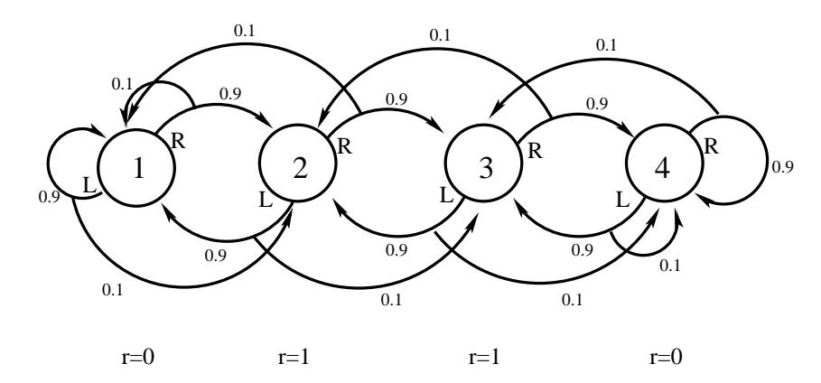

Figure 9: The problematic MDP.

where s is the state number. LSPI was applied on the same problem using the same basis functions repeated for each of the two actions so that each action gets its own parameters: $^{10}$ 

$$\phi(s,a) = \begin{pmatrix} I(a=L) \times 1\\ I(a=L) \times s\\ I(a=L) \times s^2\\ I(a=R) \times 1\\ I(a=R) \times s\\ I(a=R) \times s^2 \end{pmatrix}.$$

LSPI typically finds the optimal policy for this problem in 4 or 5 iterations. Samples for each run were collected in advance by choosing actions uniformly at random for about 25 (or more) steps and the same sample set was used throughout all LSPI iterations in the run. Figure 10 shows the iterations of one run of LSPI on a training set of 50 samples. States are shown on the horizontal axis and Q values on the vertical axis. The approximations are shown with solid lines, whereas the exact values are connected with dashed lines. The values for action L are marked with  $\circ$  and for action R with \*. LSPI finds the optimal policy by the 2nd iteration, but it does not terminate until the 4th iteration, at which point the successive parameters (3rd and 4th iterations) are approximately equal. Notice that the approximations capture the qualitative structure of the value function, although the quantitative error is fairly big. The state visitation distribution for this training set was  $(0.24,\ 0.14,\ 0.28,\ 0.34)$ . Although it was not perfectly uniform, it was "flat" enough to prevent an extremely uneven allocation of approximation errors over the state-action space.

LSPI was also tested on variants of the chain walk problem with more states and different reward schemes to better understand and illustrate its behavior. Figure 11 shows a run of LSPI on a 20-state chain with the same dynamics as above and a reward of +1 given only at the boundaries (states 1 and 20). The optimal policy in this case is to go left in states 1–10 and right in states 11–20. LSPI converged to the optimal policy after 8 iterations using a single set of samples collected from a single episodes in which actions were chosen uniformly at random for 5000 steps. A polynomial of degree 4 was used for approximating the value function for each of the two actions, giving a block of 5 basis functions per action,

 $<sup>\</sup>overline{10. I}$  is the indicator function: I(TRUE) = 1 and I(FALSE) = 0.

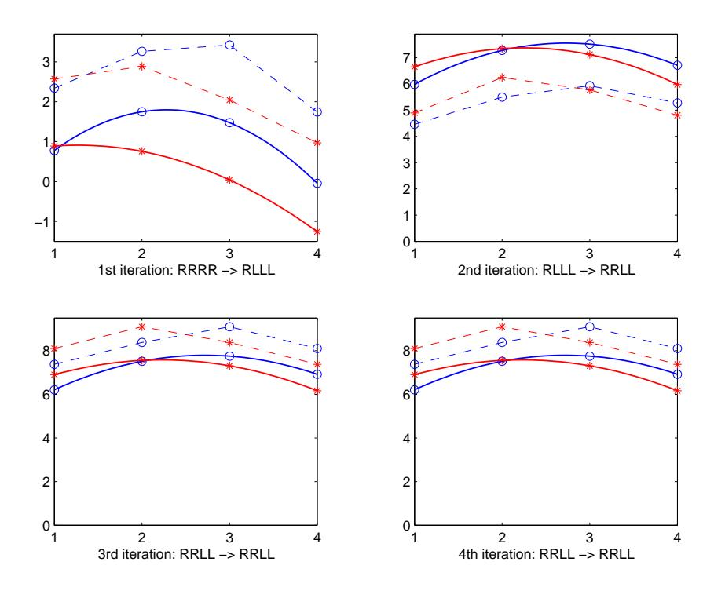

Figure 10: LSPI applied on the problematic MDP.

or a total of 10 basis functions. The initial policy was the policy that chooses left (L) in all states. LSPI eventually discovered the optimal policy, although in iteration 2 it found neither a good approximation to the value function nor an improved policy. This example illustrates the non-monotonic nature of policy improvement between iterations of LSPI due to value function approximation errors.

Figure 12 shows an example where LSPI fails to discover the optimal policy because of limited representational ability of the linear architecture. In this 50-state chain, reward is given only in states 10 and 41 and therefore due to the symmetry the optimal policy is to go right in states 1–9 and 26–41 and left in states 10–25 and 42–50. Again, a polynomial of degree 4 was used for each of the actions. Using a single training set of 10000 samples (all from a single "random walk" trajectory), LSPI converged after 6 iterations to a suboptimal policy that nevertheless resembles the optimal policy to a good extent. This failure can be explained as an inability of the polynomial approximator to capture the precise structure of the underlying value function. This behavior was fairly consistent with different sample sets and/or increased sample size. In all runs, LSPI converged in less than 10 iterations to fairly good, but not optimal, policies.

The performance of LSPI improves with better linear approximation architectures. Figure 13 shows a run of LSPI on the same problem as above, but with a radial basis function approximator (everything else is identical). This approximator uses 10 Gaussians ( $\sigma = 4$ ) with means spread uniformly over the state space plus a constant term for each of the 2 actions, resulting in a total of 22 basis functions. LSPI finds the optimal policy in 7 iterations. With different sample sets, LSPI consistently converges to the optimal policy (or to minor deviations from the optimal policy) in less than 10 iterations.

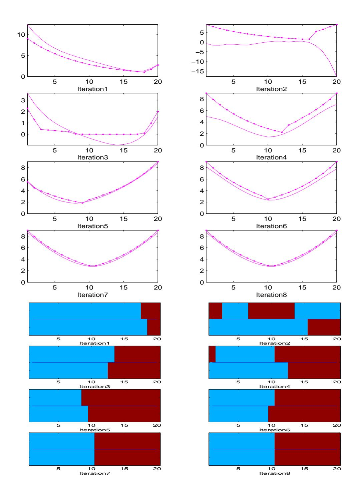

Figure 11: LSPI iterations on a 20-state chain (reward only in states 1 and 20). Top: The state value function  $V^{\pi}(s) = Q(s, \pi(s))$  of the policy being evaluated in each iteration (LSPI approximation - solid line; exact values - dotted line). Bottom: The improved policy after each iteration (R action - dark/red shade; L action - light/blue shade; LSPI - top stripe; exact - bottom stripe).

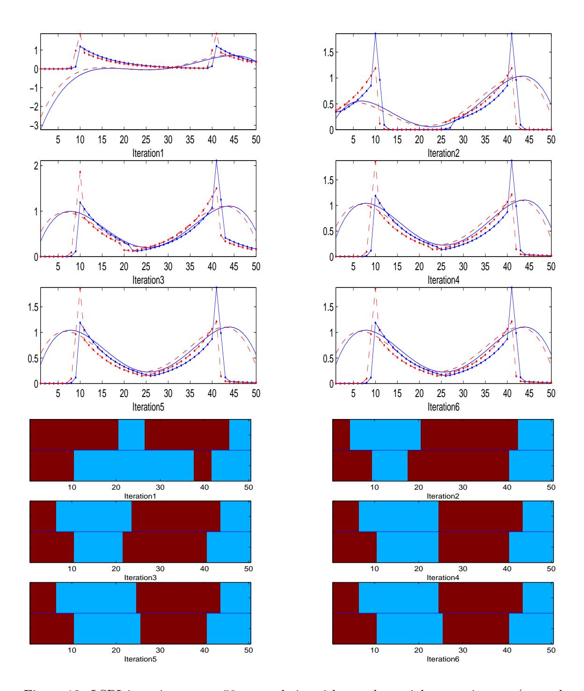

Figure 12: LSPI iterations on a 50-state chain with a polynomial approximator (reward only in states 10 and 41). *Top:* The state-action value function of the policy being evaluated in each iteration (LSPI approximation - solid lines; exact values - dotted lines). *Bottom:* The improved policy after each iteration (R action - dark/red shade; L action - light/blue shade; LSPI - top stripe; exact - bottom stripe).

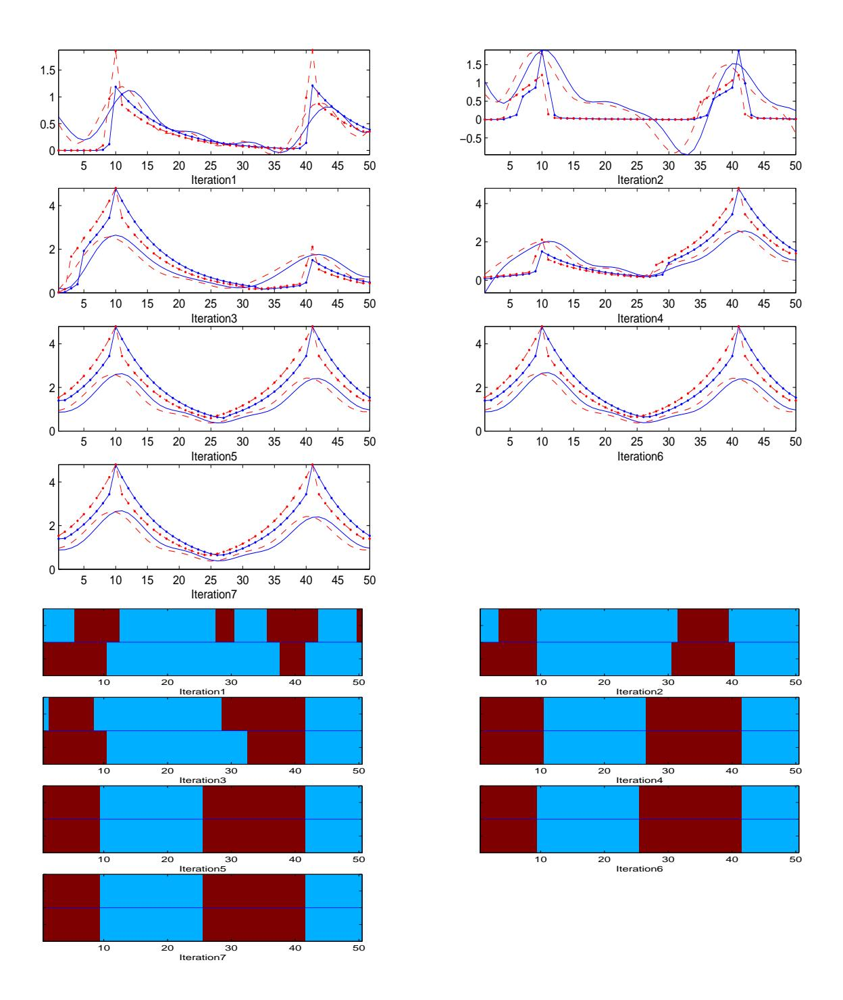

Figure 13: LSPI iterations on a 50-state chain with a radial basis function approximator (reward only in states 10 and 41). *Top:* The state-action value function of the policy being evaluated in each iteration (LSPI approximation - solid lines; exact values - dotted lines). *Bottom:* The improved policy after each iteration (R action - dark/red shade; L action - light/blue shade; LSPI - top stripe; exact bottom stripe).

LSPI makes a call to LSTDQ, which learns the least-squares fixed-point approximation to the state-action value function given a set of samples. Alternatively, LSPI could call some other learning procedure, similar to LSTDQ, which instead would learn the Bellman residual minimizing approximation. For this modified version of LSTDQ, the update equations for learning would be:

$$\widetilde{\mathbf{A}}^{(t+1)} = \widetilde{\mathbf{A}}^{(t)} + \left(\phi(s_t, a_t) - \gamma \phi(s_t'', \pi(s_t''))\right) \left(\phi(s_t, a_t) - \gamma \phi(s_t', \pi(s_t'))\right)^{\mathsf{T}},$$

$$\widetilde{b}^{(t+1)} = \widetilde{b}^{(t)} + \left(\phi(s_t, a_t) - \gamma \phi(s_t'', \pi(s_t''))\right) r_t.$$

For comparison purposes, this modified version of LSPI was applied to the 50-state problem discussed above (same parameters, same number and kind of training samples).<sup>11</sup> Figure 14 and Figure 15 show the results for the polynomial and the radial basis function approximators respectively. In both cases, the approximations of the value function seem to be "close" to the true value functions. However, in both cases, this modified version of LSPI exhibits a non-convergent behavior (only the first 8 iterations are shown). With either approximator, the iteration initially proceeds toward better policies, but fails to discover the optimal policy. The resulting policies are somewhat better with the radial basis function approximator, but in either case they are worse than the ones found by LSPI with the least-squares fixed-point approximation. This behavior of LSPI combined with the Bellman residual minimizing approximation was fairly consistent and did not improve with increased sample size.

It is not clear why the least-squares fixed-point solution works better than the Bellman residual minimizing solution. We conjecture that the fixed-point solution preserves the "shape" of the value function (the relative magnitude between values) to some extent rather than trying to fit the absolute values. In return, the improved policy from the approximate value function is "closer" to the improved policy from the corresponding exact value function, and therefore policy iteration is guided to a direction of improvement. Of course, this point needs further investigation.

#### 9.2 Inverted Pendulum

The *inverted pendulum* problem requires balancing a pendulum of unknown length and mass at the upright position by applying forces to the cart it is attached to. Three actions are allowed: left force LF (-50 Newtons), right force RF (+50 Newtons), or no force NF (0 Newtons). All three actions are noisy; uniform noise in [-10,10] is added to the chosen action. The state space of the problem is continuous and consists of the vertical angle  $\theta$  and the angular velocity  $\dot{\theta}$  of the pendulum. The transitions are governed by the nonlinear dynamics of the system (Wang et al., 1996) and depend on the current state and the current (noisy) control u:

$$\ddot{\theta} = \frac{g\sin(\theta) - \alpha ml(\dot{\theta})^2 \sin(2\theta)/2 - \alpha \cos(\theta)u}{4l/3 - \alpha ml\cos^2(\theta)} ,$$

<sup>11.</sup> To generate the necessary "doubled" samples, for each sample (s, a, r, s') in the original set, another sample (s, a, r', s'') was drawn from a generative model of the chain, resulting in twice as many total samples.

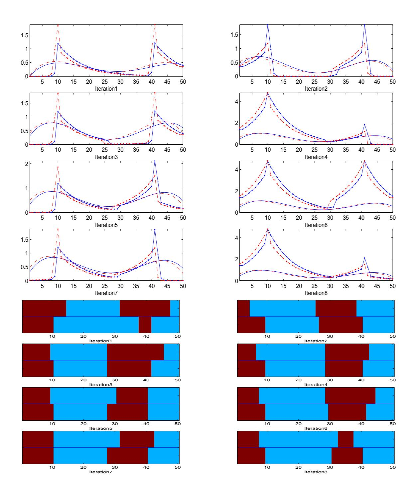

Figure 14: Modified-LSPI iterations on the 50-state chain with the polynomial approximator (reward only in states 10 and 41). *Top:* The state-action value function of the policy being evaluated in each iteration (LSPI approximation - solid lines; exact values - dotted lines). *Bottom:* The improved policy after each iteration (R action - dark/red shade; L action - light/blue shade; LSPI - top stripe; exact - bottom stripe).

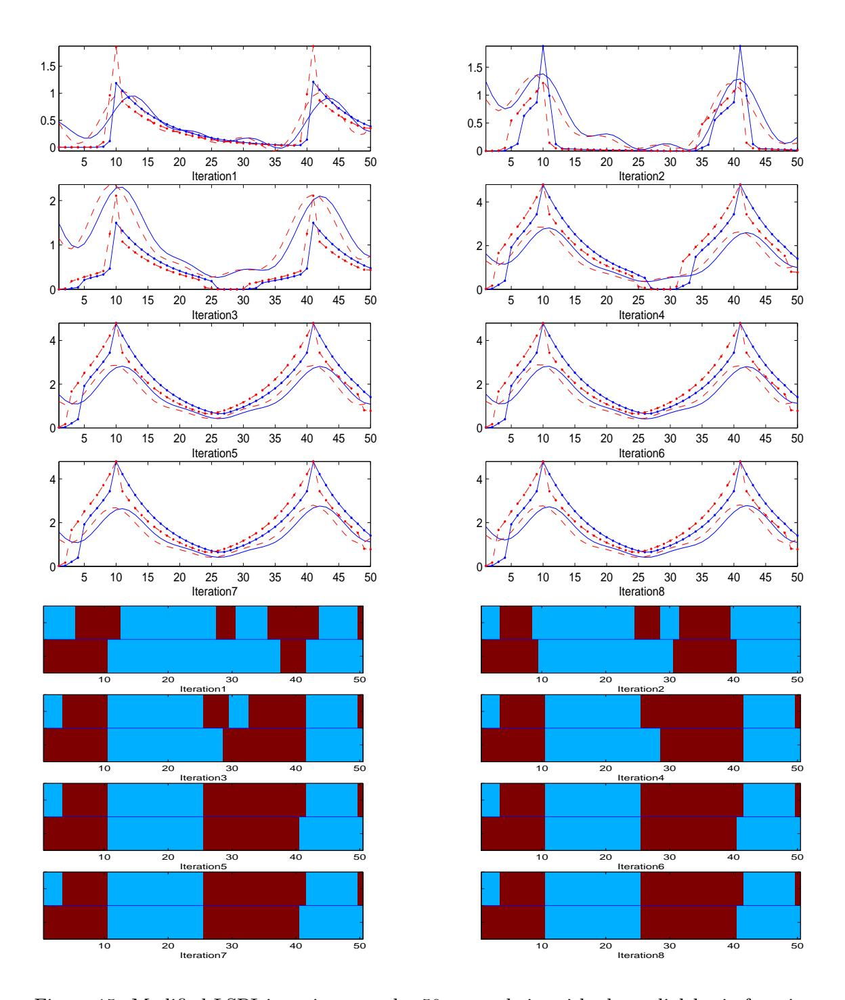

Figure 15: Modified-LSPI iterations on the 50-state chain with the radial basis function approximator (reward only in states 10 and 41). *Top:* The state-action value function of the policy being evaluated in each iteration (LSPI approximation - solid lines; exact values - dotted lines). *Bottom:* The improved policy after each iteration (R action - dark/red shade; L action - light/blue shade; LSPI - top stripe; exact - bottom stripe).

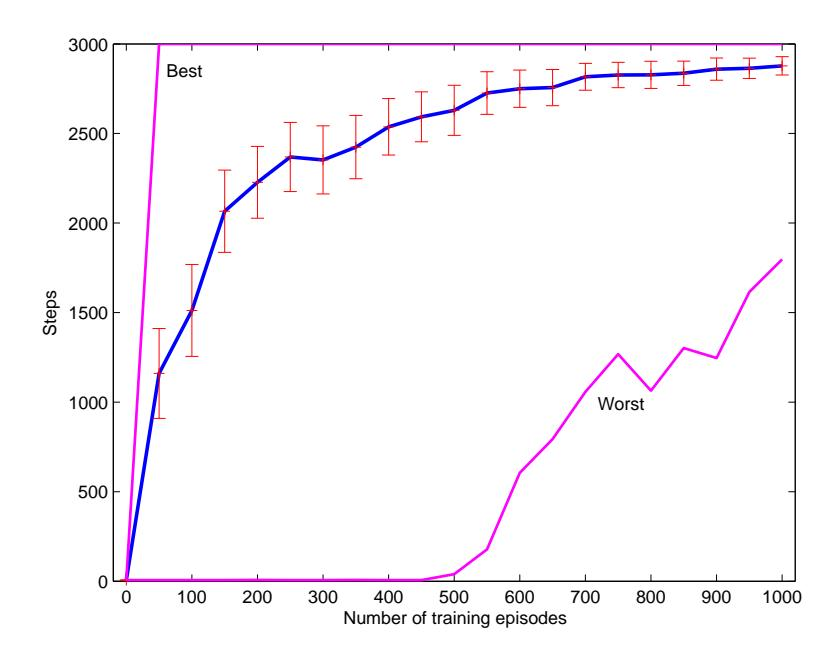

Figure 16: Inverted pendulum (LSPI): Average balancing steps.

where g is the gravity constant  $(g = 9.8m/s^2)$ , m is the mass of the pendulum (m = 2.0 kg), M is the mass of the cart (M = 8.0 kg), l is the length of the pendulum (l = 0.5 m), and  $\alpha = 1/(m+M)$ . The simulation step is set to 0.1 seconds. Thus, the control input is given at a rate of 10 Hz, at the beginning of each time step, and is kept constant during any time step. A reward of 0 is given as long as the angle of the pendulum does not exceed  $\pi/2$  in absolute value (the pendulum is above the horizontal line). An angle greater than  $\pi/2$  signals the end of the episode and a reward (penalty) of -1. The discount factor of the process is set to 0.95.

We applied LSPI with a set of 10 basis functions for each of the 3 actions, thus a total of 30 basis functions, to approximate the value function. These 10 basis functions included a constant term and 9 radial basis functions (Gaussians) arranged in a  $3 \times 3$  grid over the 2-dimensional state space. In particular, for some state  $s = (\theta, \dot{\theta})$  and some action a, all basis functions were zero, except the corresponding active block for action a which was

$$\left(1, e^{-\frac{\|s-\mu_1\|^2}{2\sigma^2}}, e^{-\frac{\|s-\mu_2\|^2}{2\sigma^2}}, e^{-\frac{\|s-\mu_3\|^2}{2\sigma^2}}, \dots, e^{-\frac{\|s-\mu_9\|^2}{2\sigma^2}}\right)^{\mathsf{T}},$$

where the  $\mu_i$ 's are the 9 points of the grid  $\{-\pi/4, 0, +\pi/4\} \times \{-1, 0, +1\}$  and  $\sigma^2 = 1$ .

Training samples were collected in advance from "random episodes", that is, starting in a randomly perturbed state very close to the equilibrium state (0,0) and following a policy that selected actions uniformly at random. The average length of such episodes was about 6 steps, thus each one contributed about 6 samples to the set. The same sample set was used throughout all iterations of each run of LSPI.

Figure 16 shows the performance of the control policies learned by LSPI as a function of the number of training episodes. For each size of training episodes, the learned policy was

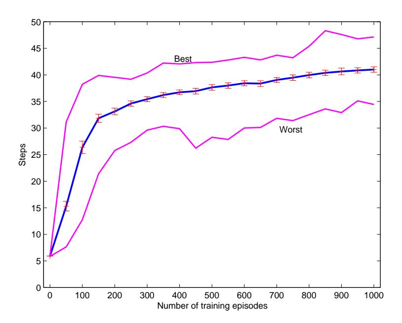

Figure 17: Inverted pendulum (Q-learning): Average balancing steps.

evaluated 1000 times to estimate accurately the average number of balancing steps (we do not show confidence intervals for this estimation). This experiment was repeated 100 times for the entire horizontal axis to obtain average results and the 95% confidence intervals over different sample sets. Each episode was allowed to run for a maximum of 3000 steps corresponding to 5 minutes of continuous balancing in real-time. A run that balanced for this period of time was considered to be successful.

LSPI returns very good policies given a few hundred training episodes. With 1000 training episodes the expected number of balancing steps is about 2850 steps. Failures come mostly as a result of a bad distribution of samples, but that fades out as the number of samples grows. Figure 16 shows also the worst and best policies obtained during the entire experiment for each sample set size. Notice that excellent policies are occasionally found with as few as 50 training episodes. With 1000 training episodes even the worst policy could balance the pendulum for at least half the time.

The same experiment was repeated with Q-learning using the same linear architecture. Samples were collected in the same manner and Q-learning performed a single pass through the sample set at each run. The learning rate  $\alpha$  was adjusted according to a typical schedule:

$$\alpha_t = \alpha_0 \frac{n_0 + 1}{n_0 + t} \ ,$$

where  $\alpha_0$  is the initial value,  $\alpha_t$  is the value at time step t, and  $n_0$  is a constant that controls the decrease rate. In our experiment, we used  $\alpha_0 = 0.5$  and  $n_0$  was set to an appropriate value so that  $\alpha_t = 0.01$  at the last sample in each run. The outcome is shown in Figure 17 (notice the scale of the vertical axis). Q-learning did not succeed to balance the pendulum for more than a few dozen steps, although there was an improving trend with more data.

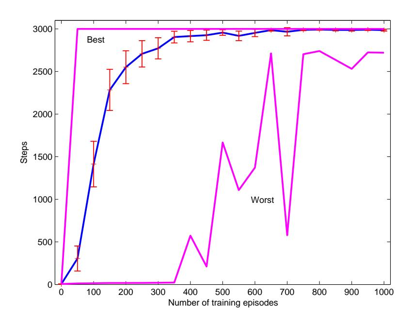

Figure 18: Inverted pendulum (Q-learning/ER): Average balancing steps.

The same experiment was also repeated with Q-learning and experience replay (ER). In this case, Q-learning/ER was allowed to perform 100 passes through the samples while the learning rate was adjusted according to the schedule above with  $\alpha_0 = 0.5$  and  $n_0$  set appropriately so that  $\alpha_t = 0.01$  at the last sample of the last pass in each run. This is similar to the way LSPI processes samples, although LSPI was allowed to run for a maximum of only 20 iterations. Q-learning/ER performed very well, better than LSPI. Figure 18 shows the average number of balancing steps. After about 400 training episodes the learned policies are excellent with an expected number of balancing steps close to 3000. With 700 or more training episodes the expected number of balancing steps is about 3000 steps. Figure 18 shows also the worst and best policies obtained during the entire experiment. Excellent policies are occasionally found with as few as 50 training episodes. With 750 or more training episodes even the worst policy balances the pendulum almost all the time. The success of Q-learning/ER in this case is mostly due to the benign nature of the radial basis functions that are very well-behaved. These basis functions are automatically normalized and their localized nature in conjunction with their magnitude are indicative of the appropriate adjustment to each parameter.

## 9.3 Bicycle Balancing and Riding

The goal in the bicycle balancing and riding problem (Randløv and Alstrøm, 1998) is to learn to balance and ride a bicycle to a target position located 1 km away from the starting location. Initially, the bicycle's orientation is at an angle of 90° to the goal. The state description is a six-dimensional real-valued vector  $(\theta, \dot{\theta}, \omega, \dot{\omega}, \ddot{\omega}, \psi)$ , where  $\theta$  is the angle of the handlebar,  $\omega$  is the vertical angle of the bicycle, and  $\psi$  is the angle of the bicycle to the goal. The actions are the torque  $\tau$  applied to the handlebar (discretized to  $\{-2, 0, +2\}$ )

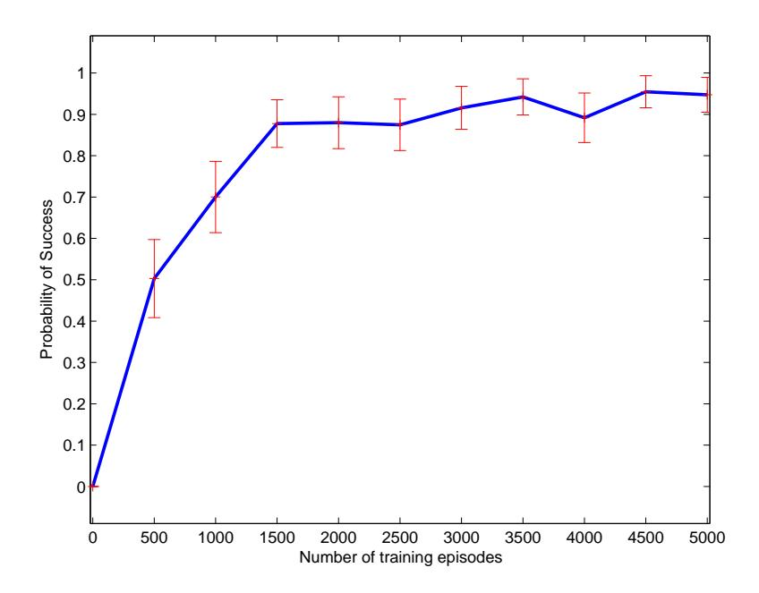

Figure 19: Bicycle (LSPI): Average probability of success.

and the displacement of the rider v (discretized to  $\{-0.02, 0, +0.02\}$ ). In our experiments, actions are restricted so that either  $\tau = 0$  or v = 0 giving a total of 5 actions.<sup>12</sup> The noise in the system is a uniformly distributed term in [-0.02, +0.02] added to the displacement component of the action. The dynamics of the bicycle are based on the model of Randløv and Alstrøm (1998) and the time step of the simulation is set to 0.01 seconds.

The state-action value function Q(s, a) for a fixed action a is approximated by a linear combination of 20 basis functions:

$$(\ 1,\ \omega,\ \dot{\omega},\ \omega^2,\ \dot{\omega}^2,\omega\dot{\omega},\ \theta,\ \dot{\theta},\ \theta^2,\ \dot{\theta}^2,\ \theta\dot{\theta},\ \omega\theta,\ \omega\theta^2,\ \omega^2\theta,\ \psi,\ \psi^2,\ \psi\theta,\ \bar{\psi},\ \bar{\psi}^2,\ \bar{\psi}\theta\ )^{\intercal}\ ,$$

where  $\bar{\psi} = \pi - \psi$  for  $\psi > 0$  and  $\bar{\psi} = -\pi - \psi$  for  $\psi < 0$ . Note that the state variable  $\ddot{\omega}$  is completely ignored. This block of basis functions is repeated for each of the 5 actions, giving a total of 100 basis functions (and parameters).

The average performance of control policies learned by LSPI is shown in Figures 19 and 20 as a function of the number of training episodes. Training samples were collected in advance by initializing the bicycle to a small random perturbation from the initial position  $(0,0,0,0,\pi/2)$  and running each episode up to 20 steps using a purely random policy. The same sample set was used throughout each run of LSPI and convergence typically was achieved in 6 to 8 iterations. For each size of training episodes, the learned policy was evaluated 100 times in order to estimate the probability of success (reaching the goal) and the average number of balancing steps (we provide no confidence intervals for this estimation). This experiment was repeated 100 times for the entire horizontal axis to obtain average results and the 95% confidence intervals over different sample sets. Each episode was allowed to run for a maximum of 72000 steps corresponding to 2 kilometers of riding distance. Episodes that reached the goal were considered to be successful.

<sup>12.</sup> Results are similar for the full 9-action case, but required more training data.

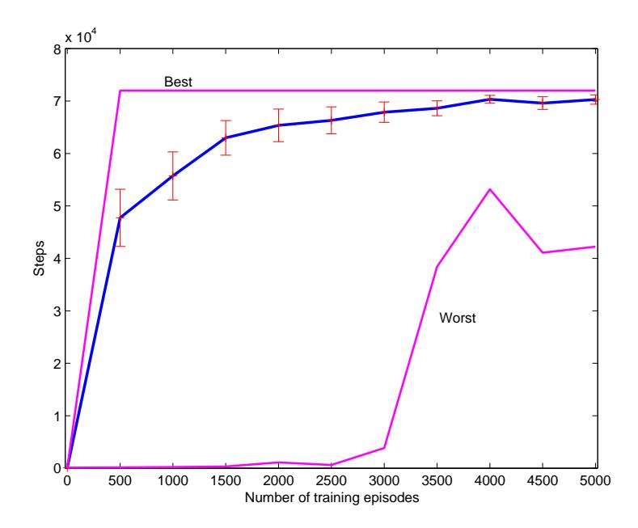

Figure 20: Bicycle (LSPI): Average number of balancing steps.

LSPI returns excellent policies given a few thousand training episodes. With 5000 training episodes (60000 samples) the probability of success is about 95% and the expected number of balancing steps is about 70000 steps. Figure 20 shows also the worst and best policies obtained during the entire experiment for each sample set size. Notice that excellent policies that reach the goal are occasionally found with as few as 500 training episodes (10000 samples). With 5000 training episodes even the worst policy could balance the bicycle for at least 1 km. Successful policies usually reached the goal riding a total distance of a little over 1 km, near optimal performance.

An annotated set of trajectories over the two-dimensional terrain is shown in Figure 21 to demonstrate the performance improvement over successive iterations of LSPI. This run is based on 50000 samples collected from 2500 episodes. This LSPI run converged in 8 iterations. The policy after the first iteration balances the bicycle, but fails to ride to the goal. The policy after the second iteration is heading towards the goal, but fails to balance. All policies thereafter balance and ride the bicycle to the goal. Note that crashing is occasionally possible even for good policies because of the noise in the input.

A number of design decisions influenced the performance of LSPI on the bicycle balancing and riding problem. As is typical with this problem, a shaping reward (Ng et al., 1999) for the distance to the goal was used. In particular, the shaping reward was 1% of the net change (in meters) in the distance to the goal. It was also observed that, in full random trajectories, most of the samples were not very useful; except the ones at the beginning of the trajectory, the rest occurred after the bicycle had already entered into a "death spiral" from which recovery was impossible. This complicated the learning efforts by biasing the samples towards hopeless parts of the space, so it was decided to cut off trajectories after 20 steps. However, a new problem was created because there was no terminating reward signal to indicate failure. This was approximated by an additional shaping reward, which was

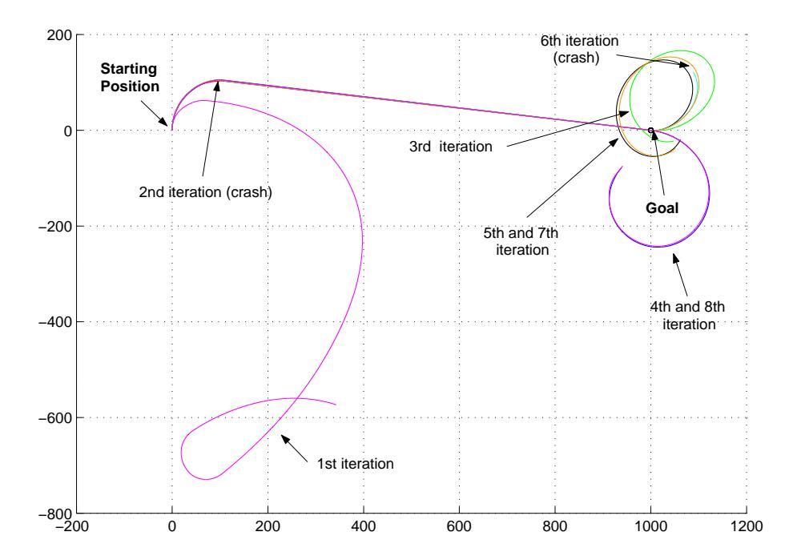

Figure 21: Bicycle (LSPI): Trajectories of policies.

proportional to the net change in the square of the vertical angle  $\omega$ . This addition roughly approximated the likelihood of falling at the end of a truncated trajectory. Note, however, that the learning agent never sees these two shaping rewards separately; they are combined additively in a single numeric reward value. To verify that the learning problem had not be reduced through shaping to maximizing immediate reward, we reran some experiments using a discount factor of 0.0. In this case, LSTDQ simply projects the immediate reward function into the column space of the basis functions. If the problem were tweaked too much with shaping, acting to maximize the projected immediate reward would be sufficient to obtain good performance. On the contrary, these runs constantly produced immediate crashes in all trials. Finally, the discount factor was set to 0.8, which seemed to yield more robust performance.

The same experiment was repeated with Q-learning using the same linear architecture, however with each basis function normalized to [-1,1] to avoid divergence. Samples were collected in the same manner as in the LSPI case. Q-learning performed a single pass through the sample set at each run. The learning rate was adjusted according to the typical schedule described above with  $\alpha_0 = 0.5$  and  $n_0$  set appropriately so that  $\alpha_t = 0.005$  at the last sample in each run. The outcome is shown in Figure 22. This algorithm did not succeed in riding the bicycle to the goal and was not able to balance the bicycle for very long either. A few exceptional runs succeeded to balance the bicycle for a non-trivial number of steps, but did not make it to the goal.

The same experiment was also repeated with Q-learning and experience replay (ER). In this case, Q-learning/ER was allowed to perform 100 passes through the samples while the learning rate was adjusted according to the typical schedule with  $\alpha_0 = 0.5$  and  $n_0$  set appropriately so that  $\alpha_t = 0.005$  at the last sample of the last pass in each run. This was

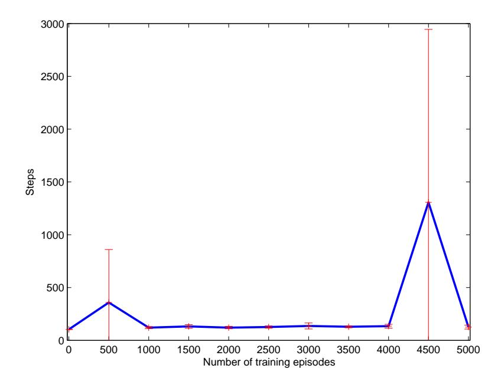

Figure 22: Bicycle (Q-learning): Average balancing steps.

similar to the way LSPI processed samples, although LSPI was allowed to run for a maximum of only 15 iterations. Q-learning/ER performed a little better than pure Q-learning, but still nowhere close to LSPI. Figure 23 shows the average number of balancing steps. Q-learning/ER was not able to ride the bicycle to the goal, although several times it managed to balance for the entire period of the 72000 steps. There was however huge variance and there is no clear evidence of improvement with additional samples. In this case, the approximation architecture, although normalized, it is not nicely-behaved because of huge differences in magnitude that are not necessarily indicative of the appropriate adjustment to each parameter. Performance was also very sensitive to the settings of the learning rate. The values used in the experiment above represent our best effort in tuning the learning rate appropriately.

#### 10. Future Work

LSPI raises several issues and interesting questions that need further investigation. The distribution of the training samples over the state-action space can have a significant impact on the performance of the algorithm. There are at least two relevant issues. The first is the fact that the approximate value function may be biased in favor of state-action pairs that are sampled more frequently and against state-action pairs that are sampled infrequently. This problem can be mitigated by density estimation techniques to reweigh the samples so that a desired set of projection weights is achieved regardless of the initial distribution of samples. The second and more serious issue is that our initial batch of samples may not be sufficiently representative, that is, some important states may never be visited. We note that this problem appears in one form or another in all reinforcement-learning methods. For example, Q-learning agents often must reach a goal state on a random walk before

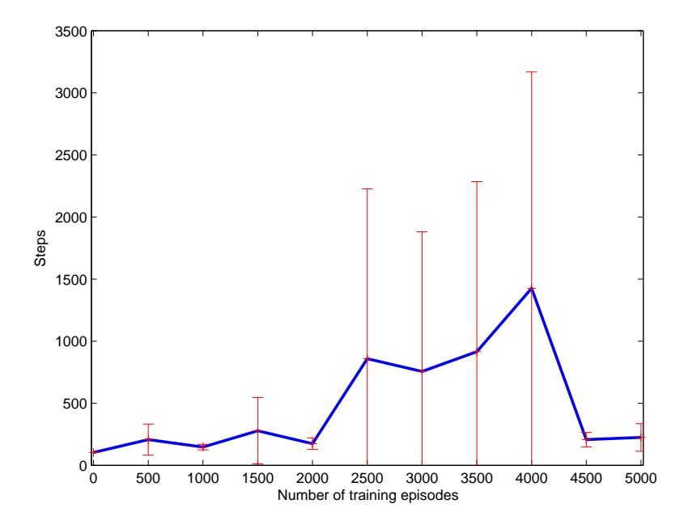

Figure 23: Bicycle (Q-learning/ER): Average balancing steps.

any meaningful learning can occur. For LSPI, we would like to develop a more general framework for sample collection that views the problem of acquiring new samples as an active learning problem. This would encompass both determining the need for new samples and the region of state-action space from which these samples are required.

In our experimental results presented in this paper we constructed linear architectures by repeating the same block of basis functions (that depend only on the state) for each of the actions and using indicator functions to activate the appropriate block, essentially allowing for a separate set of parameters for each action. However, this is not the only way to go and is definitely impractical for large action spaces. Alternatively, the linear architecture can be constructed as a single block of basis functions that depend on both the state and the action and the entire set of parameters is used by all actions.

The choice of basis functions is a fundamental problem in itself. In this paper, we explored only polynomial and radial basis functions, but many other options exist. Answering this question seems to be very domain-specific and there is no universal choice that works in all domains. LSPI relies on a good choice of basis function, and does not yet offer a method of recovering from a bad choice without user intervention. This is an important area for future research.

In this paper, LSPI has been used as an off-line method; learning takes place after the training samples have been collected. An online version of LSPI would have to update the matrices and solve the system for every sample it experiences. Another, less expensive, approach to online learning would maintain a window of the most recent experiences and would update the matrices and solve the system at regular intervals. Exponential windowing techniques may also be used to discount the influence of old experience. This approach is yet to be explored, but has the potential to accommodate slowly changing environments.

Other issues that we would like to explore include domains with continuous actions, alternative projections in value-function space, and other approximation architectures. We are also interested in extending the main ideas of LSPI for learning in other models of decision making that involve multiple agents, such as coordinated learning in team Markov decision processes and minimax learning in competitive Markov games.

#### 11. Conclusion

We have presented the least-squares policy iteration (LSPI) algorithm, a new, model-free, off-line, reinforcement-learning algorithm for control problems. LSPI combines the policy search efficiency of approximate policy iteration with the data efficiency of least-squares temporal-difference learning. The algorithm eliminates the sensitive learning parameters of stochastic approximation methods and separates the main elements of practical reinforcement learning (sample collection, approximation architecture, solution method) in a way that allows for focused attention to each one of them individually.

Our experimental results demonstrate the potential of LSPI. We achieved good performance on the pendulum and the bicycle tasks using a relatively small number of randomly generated samples that were reused across multiple steps of policy iteration. Achieving this level of performance with just a linear approximation architecture did require some tweaking, but the transparency of the linear architectures made the relevant issues much more obvious than would be the case with any "black box" function approximators.

We believe that the direct approach to function approximation and data reuse taken by LSPI will make the algorithm an intuitive and easy-to-use first choice for many reinforcement-learning tasks of practical interest.

## Acknowledgments

We would like to thank Jette Randløv and Preben Alstrøm for making the bicycle simulator available. We also thank Carlos Guestrin, Daphne Koller, Uri Lerner, and Michael Littman for helpful discussions. This work was supported in part by the National Science Foundation (NSF-grant-0209088). The first author was also partially supported by the Lilian Boudouri Foundation in Greece.

#### References

Andrew G. Barto, Richard S. Sutton, and Charles W. Anderson. Neuronlike adaptive elements that can solve difficult learning control problems. *IEEE Transactions on Systems*, *Man*, *and Cybernetics*, 13(5):835–846, 1983.

Jonathan Baxter and Peter L. Bartlett. Infinite-horizon gradient-based policy search. *Journal of Artificial Intelligence Research*, 15:319–350, 2001.

Dimitri P. Bertsekas and John N. Tsitsiklis. *Neuro-Dynamic Programming*. Athena Scientific, Belmont, Massachusetts, 1996.

- Justin A. Boyan. Technical update: Least-squares temporal difference learning. *Machine Learning*, 49(2-3):233–246, 2002.
- Steven J. Bradtke. Reinforcement learning applied to linear quadratic regulation. In Advances in Neural Information Processing Systems 5: Proceedings of the 1992 Conference, pages 295–302, Denver, Colorado, 1993.
- Steven J. Bradtke and Andrew G. Barto. Linear least-squares algorithms for temporal difference learning. *Machine Learning*, 22(2):33–57, 1996.
- Arthur P. Dempster, Martin Schatzoff, and Nanny Wermuth. A simulation study of alternatives to ordinary least-squares. *Journal of the American Statistical Association*, 72 (357):77–91, 1977.
- Ronald A. Howard. *Dynamic Programming and Markov Processes*. MIT Press, Cambridge, Massachusetts, 1960.
- Daphne Koller and Ronald Parr. Policy iteration for factored MDPs. In *Proceedings of the Sixteenth Conference on Uncertainty in Artificial Intelligence*, pages 326–334, Stanford, California, 2000.
- Vijay R. Konda and John Tsitsiklis. Actor-critic algorithms. In Advances in Neural Information Processing Systems 12: Proceedings of the 1999 Conference, pages 1008–1014, Denver, Colorado, 2000.
- Long-Ji Lin. Reinforcement Learning for Robots Using Neural Networks. PhD thesis, Carnegie Mellon University, Pittsburgh, Pennsylvania, 1993.
- Rémi Munos. Error bounds for approximate policy iteration. In *Proceedings of the Twentieth International Conference on Machine Learning*, pages 560–567, Washington, District of Columbia, 2003.
- Angelia Nedić and Dimitri P. Bertsekas. Least-squares policy evaluation algorithms with linear function approximation. *Discrete Event Dynamic Systems: Theory and Applications*, 13(1–2):79–110, 2003.
- Andrew Y. Ng, Daishi Harada, and Stuart Russell. Policy invariance under reward transformations: Theory and application to reward shaping. In *Proceedings of the Sixteenth International Conference on Machine Learning*, pages 278–287, Bled, Slovenia, 1999.
- Andrew Y. Ng and Michael Jordan. PEGASUS: A policy search method for large MDPs and POMDPs. In *Proceedings of the Sixteenth Conference on Uncertainty in Artificial Intelligence*, pages 406–415, Stanford, California, 2000.
- Andrew Y. Ng, Ronald Parr, and Daphne Koller. Policy search via density estimation. In Advances in Neural Information Processing Systems 12: Proceedings of the 1999 Conference, pages 1022–1028, Denver, Colorado, 2000.
- Dirk Ormoneit and Saunak Sen. Kernel-based reinforcement learning. *Machine Learning*, 49(2–3):161–178, 2002.

- Doina Precup, Richard Sutton, and Sanjoy Dasgupta. Off-policy temporal difference learning with function approximation. In *Proceedings of the Eighteenth International Conference on Machine Learning*, pages 417–424, Williamstown, Massachusetts, 2001.
- Jette Randløv and Preben Alstrøm. Learning to drive a bicycle using reinforcement learning and shaping. In *Proceedings of The Fifteenth International Conference on Machine Learning*, pages 463–471, Madison, Wisconsin, 1998.
- Gavin A. Rummery and Mahesan Niranjan. On-line Q-learning using connectionist systems. Technical Report CUED/F-INFENG/TR 166, Engineering Department, Cambridge University, Cambridge, United Kingdom, 1994.
- Paul J. Schweitzer and Abraham Seidmann. Generalized polynomial approximations in Markovian decision processes. *Journal of Mathematical Analysis and Applications*, 110 (6):568–582, 1985.
- Richard Sutton and Andrew Barto. Reinforcement Learning: An Introduction. MIT Press, Cambridge, Massachusetts, 1998.
- Richard Sutton, David McAllester, Satinder Singh, and Yishay Mansour. Policy gradient methods for reinforcement learning with function approximation. In *Advances in Neural Information Processing Systems 12: Proceedings of the 1999 Conference*, pages 1057–1063, Denver, Colorado, 2000.
- Richard S. Sutton. Temporal Credit Assignment in Reinforcement Learning. PhD thesis, University of Massachusetts, Amherst, Massachusetts, 1984.
- Richard S. Sutton. Generalization in reinforcement learning: Successful examples using sparse coarse coding. In *Advances in Neural Information Processing Systems 8: Proceedings of the 1995 Conference*, pages 1038–1044, Denver, Colorado, 1996.
- Hua O. Wang, Kazuo Tanaka, and Michael F. Griffin. An approach to fuzzy control of nonlinear systems: Stability and design issues. *IEEE Transactions on Fuzzy Systems*, 4 (1):14–23, 1996.
- Christopher J. C. H. Watkins. *Learning from Delayed Rewards*. PhD thesis, Cambridge University, Cambridge, United Kingdom, 1989.
- Ronald J. Williams and Leemon C. Baird. Tight performance bounds on greedy policies based on imperfect value functions. Technical Report NU-CCS-93-14, College of Computer Science, Northeastern University, Boston, Massachusetts, 1993.