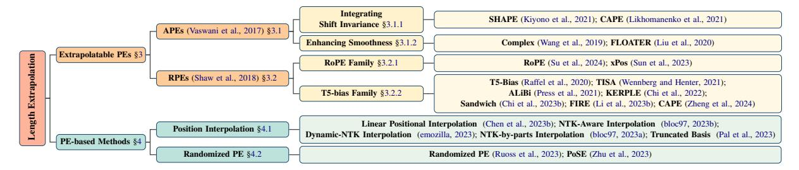
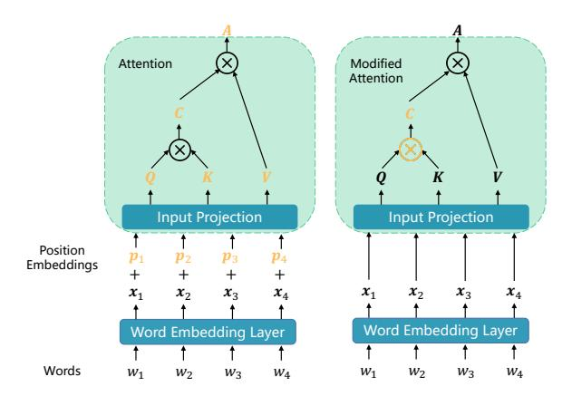
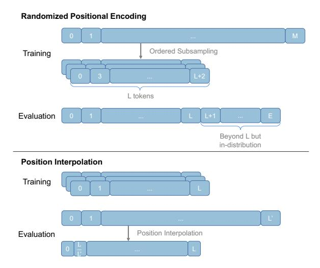

# Length Extrapolation of Transformers: A Survey from the Perspective of Positional Encoding

Liang Zhao1, Xiachong Feng2, Xiaocheng Feng1,3\*, Weihong Zhong1,

Dongliang Xu4, Qing Yang4, Hongtao Liu4, Bing Qin1,3, Ting Liu1

1Harbin Institute of Technology 2The University of Hong Kong

3Peng Cheng Laboratory 4Du Xiaoman Financial (Beijing)

{1zhao, xcfeng, whzhong, qinb, tliu}@ir.hit.edu.cn fengxc@hku.hk

{xudongliang, yangqing, liuhongtao01}@duxiaoman.com

#### **Abstract**

Built upon the Transformer, large language models (LLMs) have captured worldwide attention due to their remarkable abilities. Nevertheless, all Transformer-based models including LLMs suffer from a preset length limit and can hardly generalize from short training sequences to longer inference ones, namely, they cannot perform length extrapolation to handle long sequences, which severely hinders their application in scenarios demanding long input sequences such as legal or scientific documents. Thus, numerous methods have emerged to enhance the length extrapolation of Transformers. Despite the great research efforts, a systematic survey is still lacking. To fill this gap, we delve into these advances in a unified notation from the perspective of positional encoding (PE), as it has been considered the primary factor on length extrapolation. Specifically, we begin with extrapolatable PEs that have dominated this research field. Then, we dive into extrapolation methods based on them, covering position interpolation and randomized position methods. Finally, several challenges and future directions in this area are highlighted. Through this survey, we aim to enable the reader to gain a deep understanding of existing methods and provide stimuli for future research.

### 1 Introduction

It has been suggested that with limited learning resources, humans can potentially comprehend utterances of infinite length by understanding their components and structures (Chomsky, 1957; MONTAGUE, 1970). In natural language processing (NLP), given the limited training data (Kazemnejad et al., 2023) and compute, models cannot learn from large-scale long sequences and thus are also expected to possess such generalization ability to process long sequences (Shaham et al., 2023). However, it is a challenging task for the de facto

Transformer architecture (Vaswani et al., 2017), though Transformer-based large language models (LLMs) (Touvron et al., 2023a; OpenAI, 2023) have drastically advanced the NLP field.

Transformer-based models are trained on sequences with a maximum length (Raffel et al., 2020; Zhang et al., 2020; Brown et al., 2020), as a result of the quadratic memory and computational complexity with regard to input length. To make matters worse, some research reveals that Transformers might have gained their performance from surface-level memorization instead of abstract, generalizable skills (Razeghi et al., 2022; Wu et al., 2024), which means they can hardly break through the maximum training length and perform poorly on sequences with length beyond it (Dai et al., 2019; Neishi and Yoshinaga, 2019), i.e., they cannot perform length extrapolation (Mitchell et al., 2018; Press et al., 2021). To offer a more comprehensive understanding of the challenges in length extrapolation, we present comparison results of three state-of-the-art models with different context sizes on several generation tasks in Appendix A.1.

The length limit together with poor length extrapolation prevents LLMs from handling long sequences, such as DNA and protein sequences (Abramson et al., 2024), high-resolution images (Liu et al., 2023a), and even videos (Lin et al., 2023). Moreover, existing approaches for harnessing the full potential of LLMs also demand a larger context window, to incorporate elaborate prompts (Liu et al., 2023c), sufficient in-context demonstrations (Brown et al., 2020) and long-term memory of agents (Park et al., 2023). Hence, there is a growing body of research trying to strengthen length extrapolation of LLMs (Press et al., 2021; Ontanon et al., 2022; Anil et al., 2022; Chi et al., 2023b; Sun et al., 2023), mostly from the perspective of positional encoding (PE).

Despite the prosperity in this area, a systematic survey is still lacking. We aim to fill this blank

\*Corresponding Author

Figure 1: Taxonomy for length extrapolation of Transformers.

by investigating existing approaches that enable and enhance length extrapolation of Transformers. Specifically, a brief formal introduction to Transformer is given in §2 as a solid foundation for further discussion. Then, we comprehensively summarize extrapolatable PEs proposed from the birth of Transformer to the prevalence of LLMs in §3. Note that we focus exclusively on PEs proposed for better extrapolation and omit others, since there is already an insightful survey on PEs of Transformer (Dufter et al., 2022). Based on these PEs, many novel methods emerge in the era of LLMs to further enhance extrapolation, which we intentionally centralize in §4, covering popular position interpolation methods and randomized methods. These advancements demonstrate the vibrancy and vastness of this area, from which we distill future directions and insights, represented in §5 and §6.

# 2 Preliminary

In this section, we follow Dufter et al. (2022) to present a formal description of the encoder layer of the Transformer, as the decoder layer is almost the same except for the cross-attention mechanism. Given an input matrix  $\boldsymbol{X} \in \mathbb{R}^{n \times d}$  as a sequence of n embeddings with dimension d, an encoder layer  $f: \mathbb{R}^{n \times d} \to \mathbb{R}^{n \times d}$  with  $f(\boldsymbol{X}) = \boldsymbol{Z}$  is defined by:

$$C = \frac{QK^T}{\sqrt{d}} \tag{1}$$

$$A = \text{Softmax}(C)V \tag{2}$$

$$O = LayerNorm_1(A + X)$$
 (3)

$$F = \text{ReLU}(OW^{(f_1)} + b^{(f_1)})W^{(f_2)} + b^{(f_2)}$$
 (4)

$$Z = \text{LayerNorm}_2(O + F)$$
 (5)

where  $Q = XW_q$ ,  $K = XW_k$ ,  $V = XW_v$  are queries, keys and values, with  $W_q$ ,  $W_k$ ,  $W_v \in \mathbb{R}^{d \times d}$  being the projection matrices.

Firstly, the compatibility scores C are computed as the dot product between queries and keys with

a scaling factor  $1/\sqrt{d}$  (Equation 1). Then, the row-wise softmax function converts compatibility scores into weights, and the weighted sum of the values is the output of the attention layer (Equation 2). The fully connected feed-forward network consists of two linear transformations with a ReLU activation between (Equation 4), with parameters  $\boldsymbol{W}^{(f_1)} \in \mathbb{R}^{d \times d_f}, \boldsymbol{W}^{(f_2)} \in \mathbb{R}^{d_f \times d}, \boldsymbol{b}^{f(1)} \in \mathbb{R}^{d_f}, \boldsymbol{b}^{(f_2)} \in \mathbb{R}^{d_f}, \boldsymbol{b}^{(f_2)} \in \mathbb{R}^{d_f}$ , where  $d_f$  is the intermediate dimension. Besides, residual connection (He et al., 2016) and layer normalization (Ba et al., 2016) are leveraged (Equation 3 and 5) to enhance scalability.

Note that in the above descriptions, we have not imposed any limit on input length n, which means the Transformer is naturally equipped with a notion of length extrapolation. Theoretically, a fixed setting of Transformer weights defines a sequence-to-sequence function on sequences of *arbitrary length* (Yun et al., 2019). If the function applies the correct transformation for inputs of any length, it is expected to length extrapolate (Zhou et al., 2023).

However, we have to break this nature by integrating PE with Transformers to inject position information into them. Otherwise, they are **permutation equivalent** or **order invariant**2. Thus, PEs are central to length extrapolation and form the core focus of this survey.

### 3 Extrapolatable Positional Encodings

Sinusoidal position embeddings are proposed with Transformer as it may help extrapolate to longer sequences beyond training (Vaswani et al., 2017). The idea behind this claim, that length extrapolation can be enabled by simply changing PE, has been widely supported and demonstrated (Neishi and Yoshinaga, 2019; Press et al., 2021; Ruoss et al., 2023). Hence, developing better PEs has

&lt;sup>1We will omit this scaling factor in the following for simplicity and clarity.

&lt;sup>2Note that some existing research suggests causal language models can learn position information without PE (Tsai et al., 2019; Haviv et al., 2022; Chi et al., 2023a).

|     | PE                                | Manifestation | Learnable | Integration | Injection Layer |
|-----|-----------------------------------|---------------|-----------|-------------|--------------------|
|     | Sinusoidal (Vaswani et al., 2017) | Embedding     | ×         | Add         | Initial            |
|     | with Shift Invariance             |               |           |             |                    |
| Й   | SHAPE (Kiyono et al., 2021)       | Embedding     | ×         | Add         | Initial            |
| APE | CAPE (Likhomanenko et al., 2021)  | Embedding     | ×         | Add         | Initial            |
|     | with Smoothness                   |               |           |             |                    |
|     | Complex (Wang et al., 2020)       | Embedding     | ✓         | Multiply    | Initial            |
|     | FLOATER (Liu et al., 2020)        | Embedding     | ✓         | Add         | Initial            |
|     | Shaw et al. (2018)                | Embedding     | ✓         | Add         | Every              |
|     | T5 Family                         |               |           |             |                    |
|     | T5 Bias (Raffel et al., 2020)     | Bias          | ✓         | Add         | Every              |
|     | ALiBi (Press et al., 2021)        | Bias          | ×         | Add         | Every              |
| Й   | KERPLE (Chi et al., 2022)         | Bias          | ✓         | Add         | Every              |
| RF  | SANDWICH (Chi et al., 2023b)      | Embedding     | ×         | Add         | Every              |
|     | FIRE (Li et al., 2023b)           | Bias          | ✓         | Add         | Every              |
|     | CAPE (Zheng et al., 2024)         | Bias          | ✓         | Add         | Every              |
|     | RoPE Family                       |               |           |             |                    |
|     | RoPE (Su et al., 2024)            | Embedding     | ×         | Multiply    | Every              |
|     | <b>xPOS</b> (Sun et al., 2023)    | Embedding     | ×         | Multiply    | Every              |

Table 1: A list of extrapolatable PEs. **Bolded** methods are proposed or widely adopted for LLMs. *Manifestation* shows how the position infomation is introduced. *Learnable* shows whether it can adjust based on the input. *Integration* shows how the position representations are integrated with token representations. *Injection Layer* shows the injecting position PE.

been the predominant avenue to enhance length extrapolation of Transformers. Table 1 presents a characterization of these extrapolatable PEs.

Basically, absolute positional encodings (APEs) map each position to a unique representation and integrate it with corresponding word embedding, while relative positional encodings (RPEs) encode the relative distance between tokens and directly inject it into the attention module. Besides, RPEs usually keep modifications independent of value vectors and leaves them not entangled with position information. Hence, position information of RPEs can be scalars and usually recurs at each layer. Figure 2 illustrates these general differences. We divide Table 1 and this section based on whether the PE is absolute or relative, as existing research suggests this distinction significantly impacts length extrapolation (Neishi and Yoshinaga, 2019; Likhomanenko et al., 2021; Chi et al., 2022).

# 3.1 Absolute Positional Encodings

Specifically, for a token in position *pos*, the sinusoidal position embedding is defined as:

$$[\dots, \sin(\frac{pos}{10000^{2i/d}}), \cos(\frac{pos}{10000^{2i/d}}), \dots], (6)$$

where  $i \in [0, d/2 - 1]$  is the dimension of the position embedding and d denotes model dimension. Then, each position embedding is added to the corresponding token embedding and the sum

is fed into Transformer, so the compatibility score between query  $q_i$  and key  $k_j$  can be formalized as

$$\boldsymbol{q}_{i}\boldsymbol{k}_{i}^{T} = ((\boldsymbol{x}_{i} + \boldsymbol{p}_{i})\boldsymbol{W}_{q})((\boldsymbol{x}_{j} + \boldsymbol{p}_{j})\boldsymbol{W}_{k})^{T}.$$
 (7)

This equation is the basis of many other PEs.

However, researchers subsequently found that sinusoidal APE is hard to extrapolate (Dai et al., 2019; Neishi and Yoshinaga, 2019). Hence, a wide variety of APEs have been proposed to enhance sinusoidal APE and extrapolation of Transformers from different perspectives, either trying to integrate shift invariance in sinusoidal APE (§3.1.1) or aiming to generate position embeddings varying smoothly with position indices (§3.1.2).

# 3.1.1 Integrating Shift Invariance

Taking inspiration from the three properties of PEs proposed by Wang et al. (2020), Kiyono et al. (2021) speculated superior extrapolation performance comes from *shift invariance*, the property of a function to not change its output even if its input is shifted. Aiming to incorporate the benefit of shift invariance in sinusoidal APE, they simply shift every position index of a sequence by a random offset k during training, which prevents the model from using absolute positions and instead encourages the use of relative positions.

Following a similar idea, Likhomanenko et al. (2021) took it a step further by leveraging continuous signals. In addition to shifting every position index of APE by an identical random offset, which they call *global shift*, they also introduced *local shift*, i.e., shifting each position index by a different random shift, and *global scaling*, i.e., scaling every position index by an identical random scalar, to further prevent capturing spontaneous correlations and memorizing distances.

#### 3.1.2 Enhancing Smoothness

Apart from above relatively straightforward methods based on sinusoidal APE, there are several APEs taking quite different theoretical avenues to enhance length extrapolation, aiming to improve the smoothness of the position representations.

Wang et al. (2019) proposed to extend each word embedding as a continuous function over an independent variable, i.e., position, so that word representations vary smoothly with increasing positions. Through mathematically sound derivation, their general complex-valued embedding f(j, pos) of a word  $w_j$  in position pos is

$$[r_{j,1}e^{i(\omega_{j,1}pos+\theta_{j,1})},\cdots,r_{j,d}e^{i(\omega_{j,d}pos+\theta_{j,d})}],$$
 (8)

Figure 2: General differences between APE (left part) and RPE (right part), where orange denotes elements holding position information.

where amplitude  $\mathbf{r} = [r_{j,1}, \dots, r_{j,d}]$ , frequency  $\boldsymbol{\omega} = [\omega_{j,1}, \dots, \omega_{j,d}]$  and initial phrase  $\boldsymbol{\theta} = [\theta_{j,1}, \dots, \theta_{j,d}]$  are all trainable. In addition to representing positions in complex plane for the first time, multiplying position embeddings with word embeddings is another of their innovations.

An alternative approach is to directly capture the dynamics between position representations. Liu et al. (2020) introduced a dynamical system to model position representations  $\{p_i \in \mathbb{R}^d : i = 1, \ldots, n\}$ , which can be characterized as

$$p(t) = p(s) + \int_{s}^{t} h(\tau, p(\tau); \theta_h) d\tau, 0 \le s \le t < \infty$$
(9)

with an initial vector p(0), where  $p(t) : \mathbb{R}_+ \mapsto \mathbb{R}^d$  is the continuous version of the discrete sequences  $\{p_i\}$ .  $h(\tau, p(\tau); \theta_h)$ , which is the "latent force" that drives the changes from  $p_i$  to  $p_{i+1}$ , is actually a neural network parameterized by  $\theta_h$  and takes in the previous state  $(\tau, p(\tau))$ .

**Highlights:** As the first PE for Transformer, sinusoidal APE has a significant impact on PEs thereafter, despite its poor extrapolation. To improve this, researchers either leverage random shift to incorporate shift invariance in sinusoidal APE or generate position embeddings varying smoothly with position. Among them, simple random shifting is like a small patch for sinusoidal APE and has limited benefits for extrapolation, at the cost of possible semantic confusion in position encoding, while the latter can hopefully lead to better extrapolation, coming with a much higher parameter- and computation-complexity.

#### 3.2 Relative Positional Encodings

Albeit for the efforts in extrapolatable APEs, it is believed that RPEs are theoretically capable of running on unseen lengths and are more robust to input length change (Neishi and Yoshinaga, 2019; Likhomanenko et al., 2021; Chi et al., 2022), as RPEs only rely on relative position information, which means they encode the idea of shift invariance naturally and are not subject to a maximum position value. Besides, there is a consensus that in natural language, it is not absolute but relative position that matters (Huang et al., 2020; Sinha et al., 2022). Thus, RPEs become the dominant way to encode positions, which we detail in this section. Before that, we reformulate Equation 7 as follows to clarify the perspective of RPEs:

$$\boldsymbol{q}_i \boldsymbol{k}_i^T = (\boldsymbol{x}_i \boldsymbol{W}_q) (\boldsymbol{x}_j \boldsymbol{W}_k)^T \oplus \boldsymbol{p}(j-i), \quad (10)$$

where p(j-i) encodes the relative position information,  $\oplus$  denotes any approach of integrating the position information into the compatibility score.

Among the first, Shaw et al. (2018) introduced the idea of RPE based on above formulation. Specifically, they concretized Equation 10 as

$$\boldsymbol{q}_i \boldsymbol{k}_i^T = (\boldsymbol{x}_i \boldsymbol{W}_q) (\boldsymbol{x}_j \boldsymbol{W}_k + \boldsymbol{p}_r)^T, \quad (11)$$

where  $p_r \in \mathbb{R}^d$  is a trainable relative position embedding and  $r = \operatorname{clip}(j-i,r_{\min},r_{\max})$  denotes the clipped relative position. By clipping the relative positions to a determined range, the number of position embeddings to be learned is reduced and length extrapolation is enhanced as unseen position embeddings are avoided. This RPE can also be regarded as a derivation of sinusoidal APE. Following this line, more RPEs have been proposed to better model position information, such as Dai et al. (2019), Huang et al. (2020) and TUPE (Ke et al., 2020). We omit them here since they are not proposed for stronger length extrapolation.

#### 3.2.1 RoPE Family

Also inspired by sinusoidal APE, Su et al. (2024) proposed to multiply keys and queries by rotation matrices, leaving compatibility scores as

$$\mathbf{q}_{i}^{T} \mathbf{k}_{j} = (\mathbf{R}_{\Theta,i}^{d} \mathbf{x}_{i} \mathbf{W}_{q})^{T} (\mathbf{R}_{\Theta,j}^{d} \mathbf{x}_{j} \mathbf{W}_{k})$$
$$= \mathbf{W}_{q}^{T} \mathbf{x}_{i}^{T} \mathbf{R}_{\Theta,j-i}^{d} \mathbf{x}_{j} \mathbf{W}_{k}, \tag{12}$$

where  $\mathbf{R}_{\Theta,j-i}^d = (\mathbf{R}_{\Theta,i}^d)^T \mathbf{R}_{\Theta,j}^d$  with  $\mathbf{R}_{\Theta,i}^d$  being a block-diagonal matrix with rotation matrices

$$\begin{pmatrix} \cos i\theta_m & -\sin i\theta_m \\ \sin i\theta_m & \cos i\theta_m \end{pmatrix} \tag{13}$$

on its diagonal, given the parameters  $\Theta = (\theta_m)_{m=1,2,\dots,d/2}$  where  $\theta_m = 10000^{-2(m-1)/d}$ . Here the *base* is 10000, and  $\lambda_m = 2\pi/\theta_m$  is wavelength. This method is called Rotary Position Embedding (RoPE) as intuitively it rotates key/value embeddings according to their position index:

$$f_{\{q,k\}}(x_i,i) = \mathbf{R}_{\Theta,i}^d x_i \mathbf{W}_{\{q,k\}}.$$
 (14)

It is noteworthy that despite the absolute nature of this rotary process, the compatibility score and thus attention depend only on relative distance. This property together with long-term decay for intertoken product benefit length extrapolation.

As RoPE has been widely used in popular LLMs (Touvron et al., 2023a; Jiang et al., 2023; Anil et al., 2023), there are some variants proposed to improve it. Sun et al. (2023) defined attention score expectation between two tokens at a specific distance and further attributed the poor extrapolation of RoPE to the dramatic oscillation of their attention expectations. They proposed to fix this issue by incorporating a balancing term to punish the oscillation of unstable dimensions and keep the distribution of stable ones, which can be simplified to:

$$\boldsymbol{q}_{i}^{T}\boldsymbol{k}_{j} = \gamma^{i-j}\boldsymbol{W}_{q}^{T}\boldsymbol{x}_{i}^{T}\boldsymbol{R}_{\Theta,j-i}^{d}\boldsymbol{x}_{j}\boldsymbol{W}_{k}, \quad (15)$$

where  $\gamma \in (0,1)$  is a scalar hyperparameter.

#### 3.2.2 T5-Bias Family

Different from complex embedding form, some researchers reduce position information p(j-i) to a simpler form. Raffel et al. (2020) utilized learnable scalars to represent relative position information:

$$\boldsymbol{q}_i \boldsymbol{k}_j^T = (\boldsymbol{x}_i \boldsymbol{W}_q) (\boldsymbol{x}_j \boldsymbol{W}_k)^T + \beta_{i,j}.$$
 (16)

In addition, they extended the clipping mechanism by a logarithmic bucket assignment to achieve precise discrimination of nearby positions and less precise discrimination of further positions (e.g., mapping the position indices 1-4 to themselves, 5-6 to 5, 7-8 to 6, 9-12 to 7, and so forth.), which further reduces the parameters to be learned and is beneficial for extrapolation (Chi et al., 2022). Moreover, Wennberg and Henter (2021) introduced TISE, which leverages a radial-basis function of relative distance with multiple trainable parameters to add a bias to attention scores.

As the first PE aiming mainly for length extrapolation, ALiBi (Press et al., 2021) takes an even simpler way to represent relative position:

$$\boldsymbol{q}_i \boldsymbol{k}_j^T = (\boldsymbol{x}_i \boldsymbol{W}_q) (\boldsymbol{x}_j \boldsymbol{W}_k)^T + m(j-i), \quad (17)$$

where scalar m is a head-specific slope fixed before training. It is worth noting that there is no additional learnable parameter, which leads to superior efficiency and may also contribute to better extrapolation of ALiBi. Empirical experiments on language modeling demonstrated its superiority.

From the perspective of kernel methods, Chi et al. (2022) considered ALiBi as a triangle kernel and extended it to KERPLE, a framework that generalizes relative position embeddings for extrapolation by kernelizing positional differences using conditionally positive definite kernels. In this framework, various RPEs can be derived from different conditionally positive definite kernels in a principled way, among which the logarithmic variant achieves preferred extrapolation performance, by calculating the compatibility score as follows:

$$\boldsymbol{q}_i^T \boldsymbol{k}_j = (\boldsymbol{x}_i \boldsymbol{W}_q)^T (\boldsymbol{x}_j \boldsymbol{W}_k) - r_1 \cdot \log(1 + r_2|i - j|),$$
(18)

where  $r_1, r_2$  are positive scalar parameters.

Aware of the overfitting issue of sinusoidal APE, Chi et al. (2023b) proposed to overcome it by simplifying sinusoidal APE to a new RPE, Sandwich. Specifically, they dropped the cross terms in Equation 7 and kept the inner product of two position embeddings as position information:

$$\boldsymbol{q}_i^T \boldsymbol{k}_j = (\boldsymbol{x}_i \boldsymbol{w}_q)^T (\boldsymbol{x}_j \boldsymbol{W}_k) + \boldsymbol{p}_i^T \boldsymbol{p}_i.$$
 (19)

It is worth noting that in this formula,  $p_i^T p_j$  becomes a temporal bias term with the same decaywith-distance pattern as ALiBi, which is exactly what the authors want to achieve as they suggested this pattern is likely to be the secret to successful length extrapolation. Besides, since position embeddings here only need to interact with themselves, the authors make the dimension of them a hyperparameter to further improve performance.

FIRE (Li et al., 2023b) integrates positional information into Transformers following T5 bias:

$$\boldsymbol{q}_{i}\boldsymbol{k}_{i}^{T} = (\boldsymbol{x}_{i}\boldsymbol{W}_{q})(\boldsymbol{x}_{j}\boldsymbol{W}_{k})^{T} + b(i,j), \quad (20)$$

where the bias b(i,j) is mapped from positions using a learnable continuous function  $f_{\theta}: \mathbb{R} \to \mathbb{R}$ , e.g., MLP. To avoid the generalization issue when the inputs are outside the training domain of the function, they proposed progressive interpolation by normalizing the distance by query position index, namely  $b(i,j) = f_{\theta}(\frac{i-j}{i})$ . Note that in causal attention, the normalized distance is always bounded between [0,1], which aligns the inference

domain with the training domain for any sequence lengths, leading to better length extrapolation.

However, the above methods separate positional bias from semantics completely, which may cause semantic similarity to be overshadowed by position information. Hence, Zheng et al. (2024) proposed Context-Adaptive Positional Encoding (CAPE) to integrate both semantic and positional information:

$$\begin{aligned} \boldsymbol{q}_i \boldsymbol{k_j}^T &= (\boldsymbol{x}_i \boldsymbol{W}_q) (\boldsymbol{x}_j \boldsymbol{W}_k)^T \\ &+ f((\boldsymbol{x}_i \boldsymbol{W}_q) (\boldsymbol{x}_j \boldsymbol{W}_k)^T, b(i, j)). \end{aligned} \tag{21}$$

Here  $f: \mathbb{R} \times \mathbb{R} \to \mathbb{R}$  is parameterized by a two-layer LeakyReLU neural network and b(i, j) come from other RPEs(e.g., ALiBi and FIRE).

In addition to RPEs introduced previously, there are some methods cannot be categorized into RoPE or T5-bias family. He et al. (2024) introduce bilevel PE that employs two distinct PE for each position: an APE for intra-segment position to help model capture the semantics contained therein, while an RPE for inter-segment position to capture relationships between segments and exhibits extrapolation. This decoupling offers greater flexibility in addressing the length extrapolation problem.

Based on the observation that existing PEs use token as the unit of measurement, Golovneva et al. (2024) claimed that this feature prevents PEs from generalizing to higher levels of abstraction such as sentences and paragraphs. Therefore, they proposed Contextual Positional Encoding (CoPE), which allows the model to determine semantic unit (e.g., word and sentence) and assign tokens therein a same position index. Since CoPE can distribute positions to a much larger number of tokens and focus attention on semantic units at a higher level of abstraction, it exhibits stronger extrapolation.

Highlights: Earlier RPEs had been greatly influenced by sinusoidal APEs by modifying terms in Equation 7 and replacing absolute embeddings with relative embeddings. These methods usually leverage clipping or binning strategy to avoid out-of-distribution position embeddings and enhance extrapolation. Since RPEs decouple the one-to-one correspondence between position and position representation, incorporating bias term directly into compatibility score (Equation 10) becomes a feasible and even better way to encode positional information, which is much simpler and naturally disentangles value vectors and position information. However, despite the strong extrapolation of these bias methods, they cannot represent complex

distance-attention functions based on Fourier basis like RoPE. Therefore, RoPE become the de facto PE of recent LLMs due to its advanced general performance, in spite of its poor extrapolation.

# 4 Extrapolation Methods in LLMs Era

Based on PEs in §3, various methods have been developed to further enhance length extrapolation of LLMs. This section is separated in response to this wave, focusing on interpolation methods and randomized PEs, as illustrated in Figure 3.

#### 4.1 Position Interpolation

Despite the large quantity of PEs with better extrapolation, RoPE has been most widely adopted in recent LLMs due to its superior in-distribution performance. Hence, loads of methods have been proposed to enhance the extrapolation of RoPE, the most prevalent of which is position interpolation.

Chen et al. (2023b) firstly  $^3$  introduced position interpolation for RoPE to extrapolate LLMs to longer sequences by applying linear scaling to down-scale position indices so that the maximum position index matches the previous length limit during pre-training. Formally, this method replaces RoPE f (Equation 14) by f' defined as  $f'(\boldsymbol{x},i) = f(\boldsymbol{x},\frac{iL}{L'})$ , where L is the length limit during pre-training and L' is the longer sequence length at inference. The *scale ratio*  $\kappa = L'/L$  transforms position n to  $n/\kappa$ . This method reduces absolute position indices from [0,L') to [0,L) and maximum relative distance from L' to L, aligning the ranges of position indices and relative distances to mitigate effects on attention score computation.

However, from the perspective of Neural Tangent Kernel (NTK) theory (Jacot et al., 2018), simply interpolating RoPE's Fourier space linearly will cause the loss of high-frequency information and prevent models from distinguishing nearby positions. Hence, NTK-Aware Scaled RoPE (NTK-aware interpolation) (bloc97, 2023b) has been proposed by modifying the base of RoPE:

$$\theta_m^* = (b \cdot \kappa^{\frac{d}{d-2}})^{-2(m-1)/d},$$
 (22)

where b is the original base and  $\kappa$  is still the scale ratio. The core idea here is to scale high frequencies less and low frequencies more to reduce information loss of high frequencies. As NTK-aware interpolation does not scale the Fourier features

&lt;sup>3There is a concurrent work: https://kaiokendev.github.io/til#extending-context-to-8k

Figure 3: Essentials of position interpolation and randomized PE. Randomized PE aims to ensure that positions falling outside the context window at inference remain in distribution through advanced exposure in training. Position interpolation, on the other hand, works during the inference stage by scaling a longer position range into the original context window.

directly, all positions are distinguishable from each other. Moreover, this method does not require any fine-tuning to extend the context window.

Further, Dynamic-NTK interpolation (emozilla, 2023) combined NTK-aware interpolation with dynamic scaling, using exact positions for tokens within pre-trained context window to prevent performance degradation and dynamically increases scale ratio  $\kappa$  as current sequence length increases to adjust positions beyond the window:

$$\kappa = \begin{cases} L'/L, & \text{if } L'/L > 1, \\ 1, & \text{otherwise,} \end{cases}$$
 (23)

where L' is the sequence length of the current sequence, which will increase after each step.

Either scaling position indices or modifying bases, all position representations become closer to each other, impairing LLM's ability to distinguish the positional order of close-by tokens. Besides, bloc97 (2023a) observed that some RoPE dimensions have wavelengths longer than the pre-trained context window, where they presume absolute positional information remains intact4. Hence, they proposed NTK-by-parts, which does not interpo-

late dimensions of small wavelengths at all while always interpolating those of big ones.

Similar observations with NTK-by-parts have been made by Pal et al. (2023), based on which they proposed to use the truncated basis:

$$\theta_i^* = \begin{cases} \theta_i & \text{for } \theta_i \ge b, \\ \rho & \text{for } a < \theta_i < b, \\ 0 & \text{for } \theta_i < a. \end{cases}$$
 (24)

where  $\rho$  is a fixed value that is relatively small, and a and b are chosen cutoff values. This way, models will experience all values of the basis in the context length used during fine-tuning by choosing appropriate cutoff values, and are supposed to extrapolate better during inference.

Additionally, Peng et al. (2023b) observed that by introducing a temperature t into compatibility score before Softmax, perplexity decreases consistently. Combining this finding with NTK-by-parts interpolation, they subsequently proposed YaRN that surpasses previous interpolation methods in both fine-tuned and non-fine-tuned scenarios.

The interpolation methods reflect the critical impact of the rotary base of RoPE on length extrapolation, prompting efforts to enhance extrapolation of RoPE-based LLM by fine-tuning it with a scaled base (Xiong et al., 2023; Rozière et al., 2023; Liu et al., 2023d). However, fixed scaling factors overlook the gradual length-extension process and impair performance at shorter lengths, leading to the proposal of dynamic scaling methods (Chen et al., 2023a; Zhang et al., 2024b; Ding et al., 2024). Innovatively, Wang et al. (2024) scale each dimension's base by rounding its wavelength to the nearest integer, avoiding phase shifts after each full rotation.

**Highlights:** Recently, position interpolation methods have raised widespread interest in the research community, as a natural result of their superior extrapolation performance and extremely low overhead. Current interpolation methods either interpolate position indices or RoPE's base, guided by sound theoretical intuition. Besides, different from other extrapolation methods, position interpolation methods have already seen their presence in the open-source models (Bai et al., 2023a; Touvron et al., 2023b; AI et al., 2024).

#### 4.2 Randomized Positional Encoding

For PEs without clipping mechanism, length extrapolation means positions beyond those that have

&lt;sup>4From the perspective of frequency, the full range of high-frequency components have been seen by the model during training, while low-frequency components have not. Thus, every position within the context window leads to a unique value in these low-frequency components, based on which models can determine the absolute position of each token.

been observed during training, leading to out-ofdistribution position representations and thus performance degradation. To address this, an intuitive way is enabling models to observe all possible position representations during training, which is exactly the core idea behind randomized PEs.

As a realization of this idea, Ruoss et al. (2023) proposed to simulate a much longer range of positions (M) and randomly selects an ordered subset to fit the training context window for each iteration. Thus, through adequate training, we can ensure that the model encounters enough unique positions and all M positions have been fully trained, leading to consistent extrapolation performance.

Different from Ruoss et al. (2023), PoSE (Zhu et al., 2023) partitions a sequence into chunks and adjusts the position indices by adding distinct skipping bias terms between chunks. Hence, PoSE keeps the positions continuous in each chunk, which bears a close resemblance to pre-training, while simultaneously help the model adapt to all positions within a longer context window.

Highlights: Essentially, randomized PEs simply decouple the trained context window with the longer inference one by introducing randomized positions during training or fine-tuning, boosting exposure of all possible positions in advance. This idea is quite different from that of position interpolation methods, where the latter tries to interpolate positions during inference to make them fall into the trained range. For the same reason, position interpolation methods are mostly plug-and-play while randomized PEs usually need further fine-tuning, which makes position interpolation much more appealing due to its low overhead.

#### **5** Future Directions

Evaluation and Benchmark. Initially, researchers evaluated length extrapolation by training models on sequences with a length limit and testing them on slightly longer sequences (Liu et al., 2020; Likhomanenko et al., 2021). During this phase, evaluation samples and metrics came from various downstream tasks such as machine translation and question answering. Given the demonstrated versatility of pre-trained language models in various downstream tasks (Raffel et al., 2020; Brown et al., 2020), language modeling and perplexity have emerged as the standard metrics for evaluating length extrapolation (Press et al., 2021; Haviv et al., 2022). Thus, we statistically present some

empirical results of trending PEs on language modeling in Appendix A.2. However, it has become clear that perplexity alone does not adequately reflect downstream task performance and is insufficient (Tay et al., 2021; Kazemnejad et al., 2023; Pal et al., 2023; Hu et al., 2024). Therefore, dedicated benchmarks and evaluation methods are needed to further advance the field of length extrapolation.

To stimulate subsequent research, we present several preliminary thoughts on the construction of a standardized benchmark in Appendix A.3.

Explainability and Principle. Despite the remarkable progress, our understanding of length extrapolation remains limited, lacking a general and solid theoretical foundation. The decayingwith-distance pattern was initially thought to be crucial for extrapolatable PEs (Press et al., 2021; Su et al., 2024), but it was later shown to merely accommodate the recency bias of language modeling (Chi et al., 2023c). Although Qin et al. (2024) further provided a theoretical analysis and elaborated that exponential convergence is a sufficient condition for RPEs to length extrapolate, their definition of length extrapolation is also based on language modeling and perplexity, which may limit the applicability of their theorem. Besides, extrapolation methods tend to avoid out-of-distribution positions via interpolation or advanced exposure. Thus, it remains unclear when or if Transformers length extrapolate in real-world scenarios and whether or how existing methods help with it.

Long Context Utilization. Existing length extrapolation methods mostly focus on expanding context window of Transformers, while much less attention has been paid to the investigation and optimization of the utilization of long context. In fact, as a result of recent advances, state-of-the-art LLMs are claimed to be capable of processing sequences with up to 128k tokens (Abdin et al., 2024; AI, 2024). Given such a long context, the extent to which the models can effectively utilize it becomes a critical question. Previous study has revealed that LLMs tend to "lost in the middle" (Liu et al., 2023b), i.e., they cannot effectively leverage information in the middle of a long context. Despite a few preliminary explorations trying to improve long context utilization (Staniszewski et al., 2023; Ravaut et al., 2024), recent long-context benchmarks (Li et al., 2023a; An et al., 2024; Bai et al., 2024; Zhang et al., 2024a) suggest that trending long-context LLMs still struggle on long sequences, and significant advancements are required.

# 6 Discussions

# 6.1 Length-Extrapolated and Long-Context Transformers

Throughout this survey, we position length extrapolation as a promising avenue towards long-context transformers. However, as stated in §1, it's the length limit and poor length extrapolation together that prevents transformers from processing long sequences, thus the more direct way to extend the context window is to simply relax the length limit.

The most intuitive way to achieve large context window is directly pre-training the model or fine-tuning (continual pre-training) a pre-trained model on long sequences. Xiong et al. (2023) empirically demonstrated that long context continual pre-training is more efficient and similarly effective compared to pre-training from scratch with long sequences. However, both pre-training and fine-tuning (continual pre-training) are costly and demand large-scale high-quality long data, which is scarce (Kazemnejad et al., 2023). To reduce memory and computational overhead during training, recurrent Transformer variances integrate recurrence with attention (Dai et al., 2019; Bulatov et al., 2022) while efficient Transformer variants (Tay et al., 2022; Fournier et al., 2023) mainly aim at improving the quadratic complexity of attention mechanism, but both usually compromise some of the modeling capability and still need large-scale long sequence data. Flash Attention (Dao et al., 2022; Dao, 2023) greatly improves both training and inference efficiency of Transformers with little to no overhead, leading to models with much larger context window (Jiang et al., 2023; Gunasekar et al., 2023; Li et al., 2023a).

On the other side, there are more radical research efforts that attempt to abandon attention and its quadratic complexity with regard to sequence length completely, such as S4 (Gu et al., 2022), RWKV (Peng et al., 2023a), and Hyena (Poli et al., 2023). Further, some recent studies have attempted to scale these novel architectures to billions of parameters, leading to the emergence of Mamba (Gu and Dao, 2023) and RWKV-5/6 (Peng et al., 2024). However, it has been demonstrated that Transformer models perform dramatically better than state space models like S4 at copying and retrieving information from context (Jelassi et al., 2024). Thus, whether these novel architectures are better than Transformer and how they perform on real-world scenarios remains to be evaluated.

#### 6.2 Length Extrapolation and Generalization

In parallel to research efforts that deem length extrapolation as a promising approach to extend context window of LLMs, another line of research treats it as a generalization problem and analyzes the length generalization behavior of Transformers within small context window on synthetic tasks such as arithmetic and deductive reasoning in a controlled setup (Lake and Baroni, 2018; Dubois et al., 2020; Abbe et al., 2023), where some intriguing observations and insights have been discovered.

One common observation is that Transformers often struggle with length generalization, whether they are trained from scratch on synthetic tasks (Lee et al., 2023; Kazemnejad et al., 2023), fine-tuned from pre-trained LLMs (Anil et al., 2022) or tested in in-context learning (Saparov et al., 2023).

As explanations, Dziri et al. (2023) hypothesize certain tasks may not possess the inherent compositionality and allow for shortcut pattern matching. On the other side, Transformers are proven to length generalize on specific tasks (Zhou et al., 2023; Xiao and Liu, 2024) or with the right combination of data format and PE (Zhou et al., 2024). Meanwhile, some studies show other factors in length generalization. Anil et al. (2022) find that fine-tuning regime, scaling data, model sizes, and compute does not improve length generalization, while scratchpad (Nye et al., 2022) or chain-ofthought (Wei et al., 2022) in the in-context learning regime do. In addition, Kazemnejad et al. (2023) show that explicit PE is not essential for decoderonly Transformer to length generalize on smallscale synthetic tasks. These studies have deepened our understanding of length extrapolation in a mechanistic way and broadened our perspectives to go beyond PE, demonstrating that the extrapolation ability needs a systematic design where PE is crucial but by no means the sole component.

#### 7 Conclusion

Through this survey, we systematically summarized existing methods and recent advances in length extrapolation from the perspective of PE. Specifically, we meticulously categorize extrapolatable PEs and further dive into methods based on these PEs in LLMs era. In addition, we highlight existing challenges and identify new trends in this research field, hoping to facilitate researchers and provide stimuli for future research.

# Limitation

This survey presented a systematic review of existing methods and recent trends in length extrapolation of Transformers. However, due to the lack of standardized benchmark and evaluation methods, we primarily focus on high-level comparisons and distinctions in principle of different approaches, rather than fine-grained empirical analysis. Furthermore, in this work, we focus on length extrapolation studies aimed at extending the context window of LLMs in real-world scenarios. Although we acknowledge the importance of studies analyzing length generalization in synthetic tasks within a small context window as well, we provide only a brief discussion on them due to the page limitation.

# Acknowledgements

Xiaocheng Feng is the corresponding author of this work, We thank the anonymous reviewers for their insightful comments. This work was supported by the National Natural Science Foundation of China (NSFC) (U22B2059, grant 62276078), the Key R&D Program of Heilongjiang via grant 2022ZX01A32, the International Cooperation Project of PCL, PCL2022D01and the Fundamental Research Funds for the Central Universities (Grant No.HIT.OCEF.2023018).

# References

Emmanuel Abbe, Samy Bengio, Aryo Lotfi, and Kevin Rizk. 2023. Generalization on the Unseen, Logic Reasoning and Degree Curriculum. *arXiv preprint*. ArXiv:2301.13105 [cs, stat].

Marah Abdin, Sam Ade Jacobs, Ammar Ahmad Awan, Jyoti Aneja, Ahmed Awadallah, Hany Awadalla, Nguyen Bach, Amit Bahree, Arash Bakhtiari, Harkirat Behl, Alon Benhaim, Misha Bilenko, Johan Bjorck, Sébastien Bubeck, Martin Cai, Caio César Teodoro Mendes, Weizhu Chen, Vishrav Chaudhary, Parul Chopra, Allie Del Giorno, Gustavo de Rosa, Matthew Dixon, Ronen Eldan, Dan Iter, Abhishek Goswami, Suriya Gunasekar, Emman Haider, Junheng Hao, Russell J. Hewett, Jamie Huynh, Mojan Javaheripi, Xin Jin, Piero Kauffmann, Nikos Karampatziakis, Dongwoo Kim, Mahoud Khademi, Lev Kurilenko, James R. Lee, Yin Tat Lee, Yuanzhi Li, Chen Liang, Weishung Liu, Eric Lin, Zeqi Lin, Piyush Madan, Arindam Mitra, Hardik Modi, Anh Nguyen, Brandon Norick, Barun Patra, Daniel Perez-Becker, Thomas Portet, Reid Pryzant, Heyang Qin, Marko Radmilac, Corby Rosset, Sambudha Roy, Olli Saarikivi, Amin Saied, Adil Salim, Michael Santacroce, Shital Shah, Ning Shang, Hiteshi Sharma, Xia Song, Olatunji Ruwase, Xin Wang, Rachel Ward, Guanhua Wang, Philipp Witte, Michael Wyatt, Can Xu, Jiahang Xu, Sonali Yadav, Fan Yang, Ziyi Yang, Donghan Yu, Chengruidong Zhang, Cyril Zhang, Jianwen Zhang, Li Lyna Zhang, Yi Zhang, Yunan Zhang, and Xiren Zhou. 2024. Phi-3 Technical Report: A Highly Capable Language Model Locally on Your Phone. *Preprint*, arXiv:2404.14219.

Josh Abramson, Jonas Adler, Jack Dunger, Richard Evans, Tim Green, Alexander Pritzel, Olaf Ronneberger, Lindsay Willmore, Andrew J. Ballard, Joshua Bambrick, Sebastian W. Bodenstein, David A. Evans, Chia-Chun Hung, Michael O'Neill, David Reiman, Kathryn Tunyasuvunakool, Zachary Wu, Akvilė Žemgulytė, Eirini Arvaniti, Charles Beattie, Ottavia Bertolli, Alex Bridgland, Alexey Cherepanov, Miles Congreve, Alexander I. Cowen-Rivers, Andrew Cowie, Michael Figurnov, Fabian B. Fuchs, Hannah Gladman, Rishub Jain, Yousuf A. Khan, Caroline M. R. Low, Kuba Perlin, Anna Potapenko, Pascal Savy, Sukhdeep Singh, Adrian Stecula, Ashok Thillaisundaram, Catherine Tong, Sergei Yakneen, Ellen D. Zhong, Michal Zielinski, Augustin Žídek, Victor Bapst, Pushmeet Kohli, Max Jaderberg, Demis Hassabis, and John M. Jumper. 2024. Accurate structure prediction of biomolecular interactions with AlphaFold 3. *Nature*, pages 1–3. Publisher: Nature Publishing Group.

01 AI, Alex Young, Bei Chen, Chao Li, Chengen Huang, Ge Zhang, Guanwei Zhang, Heng Li, Jiangcheng Zhu, Jianqun Chen, Jing Chang, Kaidong Yu, Peng Liu, Qiang Liu, Shawn Yue, Senbin Yang, Shiming Yang, Tao Yu, Wen Xie, Wenhao Huang, Xiaohui Hu, Xiaoyi Ren, Xinyao Niu, Pengcheng Nie, Yuchi Xu, Yudong Liu, Yue Wang, Yuxuan Cai, Zhenyu Gu, Zhiyuan Liu, and Zonghong Dai. 2024. Yi: Open Foundation Models by 01.AI. arXiv preprint. ArXiv:2403.04652 [cs].

Mistral AI. 2024. Mistral NeMo. https://mistral.ai/news/mistral-nemo/.

Chenxin An, Shansan Gong, Ming Zhong, Xingjian Zhao, Mukai Li, Jun Zhang, Lingpeng Kong, and Xipeng Qiu. 2024. L-Eval: Instituting Standardized Evaluation for Long Context Language Models. In *Proceedings of the 62nd Annual Meeting of the Association for Computational Linguistics (Volume 1: Long Papers)*, pages 14388–14411, Bangkok, Thailand. Association for Computational Linguistics.

Cem Anil, Yuhuai Wu, Anders Andreassen, Aitor Lewkowycz, Vedant Misra, Vinay Ramasesh, Ambrose Slone, Guy Gur-Ari, Ethan Dyer, and Behnam Neyshabur. 2022. Exploring Length Generalization in Large Language Models. *Advances in Neural Information Processing Systems*, 35:38546–38556.

Rohan Anil, Andrew M. Dai, Orhan Firat, Melvin Johnson, Dmitry Lepikhin, Alexandre Passos, Siamak Shakeri, Emanuel Taropa, Paige Bailey, Zhifeng Chen, Eric Chu, Jonathan H. Clark, Laurent El Shafey, Yanping Huang, Kathy Meier-Hellstern, Gaurav Mishra, Erica Moreira, Mark Omernick, Kevin

Robinson, Sebastian Ruder, Yi Tay, Kefan Xiao, Yuanzhong Xu, Yujing Zhang, Gustavo Hernandez Abrego, Junwhan Ahn, Jacob Austin, Paul Barham, Jan Botha, James Bradbury, Siddhartha Brahma, Kevin Brooks, Michele Catasta, Yong Cheng, Colin Cherry, Christopher A. Choquette-Choo, Aakanksha Chowdhery, Clément Crepy, Shachi Dave, Mostafa Dehghani, Sunipa Dev, Jacob Devlin, Mark Díaz, Nan Du, Ethan Dyer, Vlad Feinberg, Fangxiaoyu Feng, Vlad Fienber, Markus Freitag, Xavier Garcia, Sebastian Gehrmann, Lucas Gonzalez, Guy Gur-Ari, Steven Hand, Hadi Hashemi, Le Hou, Joshua Howland, Andrea Hu, Jeffrey Hui, Jeremy Hurwitz, Michael Isard, Abe Ittycheriah, Matthew Jagielski, Wenhao Jia, Kathleen Kenealy, Maxim Krikun, Sneha Kudugunta, Chang Lan, Katherine Lee, Benjamin Lee, Eric Li, Music Li, Wei Li, YaGuang Li, Jian Li, Hyeontaek Lim, Hanzhao Lin, Zhongtao Liu, Frederick Liu, Marcello Maggioni, Aroma Mahendru, Joshua Maynez, Vedant Misra, Maysam Moussalem, Zachary Nado, John Nham, Eric Ni, Andrew Nystrom, Alicia Parrish, Marie Pellat, Martin Polacek, Alex Polozov, Reiner Pope, Siyuan Qiao, Emily Reif, Bryan Richter, Parker Riley, Alex Castro Ros, Aurko Roy, Brennan Saeta, Rajkumar Samuel, Renee Shelby, Ambrose Slone, Daniel Smilkov, David R. So, Daniel Sohn, Simon Tokumine, Dasha Valter, Vijay Vasudevan, Kiran Vodrahalli, Xuezhi Wang, Pidong Wang, Zirui Wang, Tao Wang, John Wieting, Yuhuai Wu, Kelvin Xu, Yunhan Xu, Linting Xue, Pengcheng Yin, Jiahui Yu, Qiao Zhang, Steven Zheng, Ce Zheng, Weikang Zhou, Denny Zhou, Slav Petrov, and Yonghui Wu. 2023. PaLM 2 Technical Report. arXiv preprint. ArXiv:2305.10403 [cs].

- Lei Jimmy Ba, Jamie Ryan Kiros, and Geoffrey E. Hinton. 2016. Layer Normalization. *CoRR*, abs/1607.06450. ArXiv: 1607.06450.
- Jinze Bai, Shuai Bai, Yunfei Chu, Zeyu Cui, Kai Dang, Xiaodong Deng, Yang Fan, Wenbin Ge, Yu Han, Fei Huang, Binyuan Hui, Luo Ji, Mei Li, Junyang Lin, Runji Lin, Dayiheng Liu, Gao Liu, Chengqiang Lu, Keming Lu, Jianxin Ma, Rui Men, Xingzhang Ren, Xuancheng Ren, Chuanqi Tan, Sinan Tan, Jianhong Tu, Peng Wang, Shijie Wang, Wei Wang, Shengguang Wu, Benfeng Xu, Jin Xu, An Yang, Hao Yang, Jian Yang, Shusheng Yang, Yang Yao, Bowen Yu, Hongyi Yuan, Zheng Yuan, Jianwei Zhang, Xingxuan Zhang, Yichang Zhang, Zhenru Zhang, Chang Zhou, Jingren Zhou, Xiaohuan Zhou, and Tianhang Zhu. 2023a. Qwen Technical Report. arXiv preprint. ArXiv:2309.16609 [cs].
- Yushi Bai, Xin Lv, Jiajie Zhang, Hongchang Lyu, Jiankai Tang, Zhidian Huang, Zhengxiao Du, Xiao Liu, Aohan Zeng, Lei Hou, Yuxiao Dong, Jie Tang, and Juanzi Li. 2023b. LongBench: A Bilingual, Multitask Benchmark for Long Context Understanding. *arXiv preprint*. ArXiv:2308.14508 [cs].
- Yushi Bai, Xin Lv, Jiajie Zhang, Hongchang Lyu, Jiankai Tang, Zhidian Huang, Zhengxiao Du, Xiao Liu, Aohan Zeng, Lei Hou, Yuxiao Dong, Jie Tang,

- and Juanzi Li. 2024. LongBench: A Bilingual, Multitask Benchmark for Long Context Understanding. In *Proceedings of the 62nd Annual Meeting of the Association for Computational Linguistics (Volume 1: Long Papers)*, pages 3119–3137, Bangkok, Thailand. Association for Computational Linguistics.
- bloc97. 2023a. Add NTK-Aware interpolation "by parts" correction.
- bloc97. 2023b. NTK-Aware Scaled RoPE allows LLaMA models to have extended (8k+) context size without any fine-tuning and minimal perplexity degradation
- Tom Brown, Benjamin Mann, Nick Ryder, Melanie Subbiah, Jared D Kaplan, Prafulla Dhariwal, Arvind Neelakantan, Pranav Shyam, Girish Sastry, Amanda Askell, Sandhini Agarwal, Ariel Herbert-Voss, Gretchen Krueger, Tom Henighan, Rewon Child, Aditya Ramesh, Daniel Ziegler, Jeffrey Wu, Clemens Winter, Chris Hesse, Mark Chen, Eric Sigler, Mateusz Litwin, Scott Gray, Benjamin Chess, Jack Clark, Christopher Berner, Sam McCandlish, Alec Radford, Ilya Sutskever, and Dario Amodei. 2020. Language Models are Few-Shot Learners. In Advances in Neural Information Processing Systems, volume 33, pages 1877–1901. Curran Associates, Inc.
- Aydar Bulatov, Yury Kuratov, and Mikhail Burtsev. 2022. Recurrent Memory Transformer. *Advances in Neural Information Processing Systems*, 35:11079–11091.
- Guanzheng Chen, Xin Li, Zaiqiao Meng, Shangsong Liang, and Lidong Bing. 2023a. CLEX: Continuous Length Extrapolation for Large Language Models. *arXiv preprint*. ArXiv:2310.16450 [cs].
- Shouyuan Chen, Sherman Wong, Liangjian Chen, and Yuandong Tian. 2023b. Extending Context Window of Large Language Models via Positional Interpolation. *arXiv preprint*. ArXiv:2306.15595 [cs].
- Ta-Chung Chi. 2024. *Toward Length-Extrapolatable Transformers*. Thesis, Carnegie Mellon University.
- Ta-Chung Chi, Ting-Han Fan, Li-Wei Chen, Alexander Rudnicky, and Peter Ramadge. 2023a. Latent Positional Information is in the Self-Attention Variance of Transformer Language Models Without Positional Embeddings. In *Proceedings of the 61st Annual Meeting of the Association for Computational Linguistics (Volume 2: Short Papers)*, pages 1183–1193, Toronto, Canada. Association for Computational Linguistics.
- Ta-Chung Chi, Ting-Han Fan, Peter J. Ramadge, and Alexander Rudnicky. 2022. KERPLE: Kernelized Relative Positional Embedding for Length Extrapolation. *Advances in Neural Information Processing Systems*, 35:8386–8399.
- Ta-Chung Chi, Ting-Han Fan, Alexander Rudnicky, and Peter Ramadge. 2023b. Dissecting Transformer

- Length Extrapolation via the Lens of Receptive Field Analysis. In *Proceedings of the 61st Annual Meeting of the Association for Computational Linguistics (Volume 1: Long Papers)*, pages 13522–13537, Toronto, Canada. Association for Computational Linguistics.
- Ta-Chung Chi, Ting-Han Fan, and Alexander I. Rudnicky. 2023c. Attention Alignment and Flexible Positional Embeddings Improve Transformer Length Extrapolation. *arXiv preprint*. ArXiv:2311.00684 [cs].
- Noam Chomsky. 1957. Syntactic structures.
- Zihang Dai, Zhilin Yang, Yiming Yang, Jaime Carbonell, Quoc Le, and Ruslan Salakhutdinov. 2019. Transformer-XL: Attentive Language Models beyond a Fixed-Length Context. In *Proceedings of the 57th Annual Meeting of the Association for Computational Linguistics*, pages 2978–2988, Florence, Italy. Association for Computational Linguistics.
- Tri Dao. 2023. FlashAttention-2: Faster Attention with Better Parallelism and Work Partitioning. *arXiv* preprint. ArXiv:2307.08691 [cs].
- Tri Dao, Dan Fu, Stefano Ermon, Atri Rudra, and Christopher Ré. 2022. FlashAttention: Fast and Memory-Efficient Exact Attention with IO-Awareness. Advances in Neural Information Processing Systems, 35:16344–16359.
- Yiran Ding, Li Lyna Zhang, Chengruidong Zhang, Yuanyuan Xu, Ning Shang, Jiahang Xu, Fan Yang, and Mao Yang. 2024. LongRoPE: Extending LLM Context Window Beyond 2 Million Tokens. *arXiv* preprint. ArXiv:2402.13753 [cs].
- Yann Dubois, Gautier Dagan, Dieuwke Hupkes, and Elia Bruni. 2020. Location Attention for Extrapolation to Longer Sequences. In *Proceedings of the 58th Annual Meeting of the Association for Computational Linguistics*, pages 403–413, Online. Association for Computational Linguistics.
- Philipp Dufter, Martin Schmitt, and Hinrich Schütze. 2022. Position Information in Transformers: An Overview. *Computational Linguistics*, 48(3):733–763. Place: Cambridge, MA Publisher: MIT Press.
- Nouha Dziri, Ximing Lu, Melanie Sclar, Xiang (Lorraine) Li, Liwei Jiang, Bill Yuchen Lin, Sean Welleck, Peter West, Chandra Bhagavatula, Ronan Le Bras, Jena Hwang, Soumya Sanyal, Xiang Ren, Allyson Ettinger, Zaid Harchaoui, and Yejin Choi. 2023. Faith and Fate: Limits of Transformers on Compositionality. Advances in Neural Information Processing Systems, 36:70293–70332.
- emozilla. 2023. Dynamically Scaled RoPE further increases performance of long context LLaMA with zero fine-tuning.
- Quentin Fournier, Gaétan Marceau Caron, and Daniel Aloise. 2023. A Practical Survey on Faster and Lighter Transformers. *ACM Computing Surveys*, 55(14s):304:1–304:40.

- gkamradt. 2024. Gkamradt/LLMTest\_NeedleInAHaystack.
- Team GLM, Aohan Zeng, Bin Xu, Bowen Wang, Chenhui Zhang, Da Yin, Dan Zhang, Diego Rojas, Guanyu Feng, Hanlin Zhao, Hanyu Lai, Hao Yu, Hongning Wang, Jiadai Sun, Jiajie Zhang, Jiale Cheng, Jiayi Gui, Jie Tang, Jing Zhang, Jingyu Sun, Juanzi Li, Lei Zhao, Lindong Wu, Lucen Zhong, Mingdao Liu, Minlie Huang, Peng Zhang, Qinkai Zheng, Rui Lu, Shuaiqi Duan, Shudan Zhang, Shulin Cao, Shuxun Yang, Weng Lam Tam, Wenyi Zhao, Xiao Liu, Xiao Xia, Xiaohan Zhang, Xiaotao Gu, Xin Lv, Xinghan Liu, Xinyi Liu, Xinyue Yang, Xixuan Song, Xunkai Zhang, Yifan An, Yifan Xu, Yilin Niu, Yuantao Yang, Yueyan Li, Yushi Bai, Yuxiao Dong, Zehan Qi, Zhaoyu Wang, Zhen Yang, Zhengxiao Du, Zhenyu Hou, and Zihan Wang. 2024. ChatGLM: A Family of Large Language Models from GLM-130B to GLM-4 All Tools. Preprint, arXiv:2406.12793.
- Olga Golovneva, Tianlu Wang, Jason Weston, and Sainbayar Sukhbaatar. 2024. Contextual Position Encoding: Learning to Count What's Important. *arXiv* preprint. ArXiv:2405.18719 [cs].
- Albert Gu and Tri Dao. 2023. Mamba: Linear-Time Sequence Modeling with Selective State Spaces. *arXiv* preprint. ArXiv:2312.00752 [cs].
- Albert Gu, Karan Goel, and Christopher Ré. 2022. Efficiently Modeling Long Sequences with Structured State Spaces. *arXiv preprint*. ArXiv:2111.00396 [cs].
- Suriya Gunasekar, Yi Zhang, Jyoti Aneja, Caio César Teodoro Mendes, Allie Del Giorno, Sivakanth Gopi, Mojan Javaheripi, Piero Kauffmann, Gustavo de Rosa, Olli Saarikivi, Adil Salim, Shital Shah, Harkirat Singh Behl, Xin Wang, Sébastien Bubeck, Ronen Eldan, Adam Tauman Kalai, Yin Tat Lee, and Yuanzhi Li. 2023. Textbooks Are All You Need. *Preprint*, arXiv:2306.11644.
- Adi Haviv, Ori Ram, Ofir Press, Peter Izsak, and Omer Levy. 2022. Transformer Language Models without Positional Encodings Still Learn Positional Information. In *Findings of the Association for Computational Linguistics: EMNLP 2022*, pages 1382–1390, Abu Dhabi, United Arab Emirates. Association for Computational Linguistics.
- Kaiming He, Xiangyu Zhang, Shaoqing Ren, and Jian Sun. 2016. Deep Residual Learning for Image Recognition. pages 770–778.
- Zhenyu He, Guhao Feng, Shengjie Luo, Kai Yang, Di He, Jingjing Xu, Zhi Zhang, Hongxia Yang, and Liwei Wang. 2024. Two Stones Hit One Bird: Bilevel Positional Encoding for Better Length Extrapolation. *arXiv preprint*. ArXiv:2401.16421 [cs, stat].
- Dan Hendrycks, Collin Burns, Steven Basart, Andy Zou, Mantas Mazeika, Dawn Song, and Jacob Steinhardt. 2020. Measuring Massive Multitask Language Understanding. In *International Conference on Learning Representations*.

- Yutong Hu, Quzhe Huang, Mingxu Tao, Chen Zhang, and Yansong Feng. 2024. Can Perplexity Reflect Large Language Model's Ability in Long Text Understanding? *arXiv preprint*. ArXiv:2405.06105 [cs].
- Zhiheng Huang, Davis Liang, Peng Xu, and Bing Xiang. 2020. Improve Transformer Models with Better Relative Position Embeddings. In *Findings of the Association for Computational Linguistics: EMNLP 2020*, pages 3327–3335, Online. Association for Computational Linguistics.
- Arthur Jacot, Franck Gabriel, and Clement Hongler. 2018. Neural Tangent Kernel: Convergence and Generalization in Neural Networks. In *Advances in Neural Information Processing Systems*, volume 31. Curran Associates, Inc.
- Samy Jelassi, David Brandfonbrener, Sham M. Kakade, and Eran Malach. 2024. Repeat After Me: Transformers are Better than State Space Models at Copying. *arXiv preprint*. ArXiv:2402.01032 [cs].
- Albert Q. Jiang, Alexandre Sablayrolles, Arthur Mensch, Chris Bamford, Devendra Singh Chaplot, Diego de las Casas, Florian Bressand, Gianna Lengyel, Guillaume Lample, Lucile Saulnier, Lélio Renard Lavaud, Marie-Anne Lachaux, Pierre Stock, Teven Le Scao, Thibaut Lavril, Thomas Wang, Timothée Lacroix, and William El Sayed. 2023. Mistral 7B. arXiv preprint. ArXiv:2310.06825 [cs].
- Amirhossein Kazemnejad, Inkit Padhi, Karthikeyan Natesan Ramamurthy, Payel Das, and Siva Reddy. 2023. The Impact of Positional Encoding on Length Generalization in Transformers. arXiv preprint. ArXiv:2305.19466 [cs].
- Guolin Ke, Di He, and Tie-Yan Liu. 2020. Rethinking Positional Encoding in Language Pre-training.
- Shun Kiyono, Sosuke Kobayashi, Jun Suzuki, and Kentaro Inui. 2021. SHAPE: Shifted Absolute Position Embedding for Transformers. In *Proceedings of the 2021 Conference on Empirical Methods in Natural Language Processing*, pages 3309–3321, Online and Punta Cana, Dominican Republic. Association for Computational Linguistics.
- Brenden Lake and Marco Baroni. 2018. Generalization without Systematicity: On the Compositional Skills of Sequence-to-Sequence Recurrent Networks. In *Proceedings of the 35th International Conference on Machine Learning*, pages 2873–2882. PMLR. ISSN: 2640-3498.
- Nayoung Lee, Kartik Sreenivasan, Jason D. Lee, Kangwook Lee, and Dimitris Papailiopoulos. 2023. Teaching Arithmetic to Small Transformers.
- Chen Li, Weiqi Wang, Jingcheng Hu, Yixuan Wei, Nanning Zheng, Han Hu, Zheng Zhang, and Houwen Peng. 2024. Common 7B Language Models Already Possess Strong Math Capabilities. https://arxiv.org/abs/2403.04706v1.

- Dacheng Li, Rulin Shao, Anze Xie, Ying Sheng, Lianmin Zheng, Joseph Gonzalez, Ion Stoica, Xuezhe Ma, and Hao Zhang. 2023a. How Long Can Context Length of Open-Source LLMs truly Promise? In NeurIPS 2023 Workshop on Instruction Tuning and Instruction Following.
- Shanda Li, Chong You, Guru Guruganesh, Joshua Ainslie, Santiago Ontanon, Manzil Zaheer, Sumit Sanghai, Yiming Yang, Sanjiv Kumar, and Srinadh Bhojanapalli. 2023b. Functional Interpolation for Relative Positions Improves Long Context Transformers. *arXiv preprint*. ArXiv:2310.04418 [cs].
- Tatiana Likhomanenko, Qiantong Xu, Gabriel Synnaeve, Ronan Collobert, and Alex Rogozhnikov. 2021. CAPE: Encoding Relative Positions with Continuous Augmented Positional Embeddings. In *Advances in Neural Information Processing Systems*, volume 34, pages 16079–16092. Curran Associates, Inc.
- Bin Lin, Yang Ye, Bin Zhu, Jiaxi Cui, Munan Ning, Peng Jin, and Li Yuan. 2023. Video-LLaVA: Learning United Visual Representation by Alignment Before Projection. *arXiv preprint*. ArXiv:2311.10122 [cs].
- Haotian Liu, Chunyuan Li, Qingyang Wu, and Yong Jae Lee. 2023a. Visual instruction tuning. In *NeurIPS*.
- Nelson F. Liu, Kevin Lin, John Hewitt, Ashwin Paranjape, Michele Bevilacqua, Fabio Petroni, and Percy Liang. 2023b. Lost in the Middle: How Language Models Use Long Contexts. *arXiv preprint*. ArXiv:2307.03172 [cs] rate: 0.
- Pengfei Liu, Weizhe Yuan, Jinlan Fu, Zhengbao Jiang, Hiroaki Hayashi, and Graham Neubig. 2023c. Pretrain, Prompt, and Predict: A Systematic Survey of Prompting Methods in Natural Language Processing. *ACM Computing Surveys*, 55(9):195:1–195:35.
- Xiaoran Liu, Hang Yan, Shuo Zhang, Chenxin An, Xipeng Qiu, and Dahua Lin. 2023d. Scaling Laws of RoPE-based Extrapolation. *arXiv preprint*. ArXiv:2310.05209 [cs].
- Xuanqing Liu, Hsiang-Fu Yu, Inderjit Dhillon, and Cho-Jui Hsieh. 2020. Learning to Encode Position for Transformer with Continuous Dynamical Model. In Proceedings of the 37th International Conference on Machine Learning, pages 6327–6335. PMLR. ISSN: 2640-3498.
- Jeff Mitchell, Pontus Stenetorp, Pasquale Minervini, and Sebastian Riedel. 2018. Extrapolation in NLP. In *Proceedings of the Workshop on Generalization in the Age of Deep Learning*, pages 28–33, New Orleans, Louisiana. Association for Computational Linguistics.
- RICHARD MONTAGUE. 1970. Universal grammar. *Theoria*, 36(3):373–398.

- Masato Neishi and Naoki Yoshinaga. 2019. On the Relation between Position Information and Sentence Length in Neural Machine Translation. In *Proceedings of the 23rd Conference on Computational Natural Language Learning (CoNLL)*, pages 328–338, Hong Kong, China. Association for Computational Linguistics.
- Maxwell Nye, Anders Johan Andreassen, Guy Gur-Ari, Henryk Michalewski, Jacob Austin, David Bieber, David Dohan, Aitor Lewkowycz, Maarten Bosma, David Luan, Charles Sutton, and Augustus Odena. 2022. Show Your Work: Scratchpads for Intermediate Computation with Language Models.
- Santiago Ontanon, Joshua Ainslie, Zachary Fisher, and Vaclav Cvicek. 2022. Making Transformers Solve Compositional Tasks. In *Proceedings of the 60th Annual Meeting of the Association for Computational Linguistics (Volume 1: Long Papers)*, pages 3591–3607, Dublin, Ireland. Association for Computational Linguistics.
- OpenAI. 2023. GPT-4 Technical Report. *arXiv preprint*. ArXiv:2303.08774 [cs].
- Arka Pal, Deep Karkhanis, Manley Roberts, Samuel Dooley, Arvind Sundararajan, and Siddartha Naidu. 2023. Giraffe: Adventures in Expanding Context Lengths in LLMs. *arXiv preprint*. ArXiv:2308.10882 [cs].
- Joon Sung Park, Joseph C. O'Brien, Carrie J. Cai, Meredith Ringel Morris, Percy Liang, and Michael S. Bernstein. 2023. Generative Agents: Interactive Simulacra of Human Behavior. *arXiv preprint*. ArXiv:2304.03442 [cs].
- Bo Peng, Eric Alcaide, Quentin Anthony, Alon Albalak, Samuel Arcadinho, Stella Biderman, Huanqi Cao, Xin Cheng, Michael Chung, Leon Derczynski, Xingjian Du, Matteo Grella, Kranthi Gv, Xuzheng He, Haowen Hou, Przemyslaw Kazienko, Jan Kocon, Jiaming Kong, Bartłomiej Koptyra, Hayden Lau, Jiaju Lin, Krishna Sri Ipsit Mantri, Ferdinand Mom, Atsushi Saito, Guangyu Song, Xiangru Tang, Johan Wind, Stanisław Woźniak, Zhenyuan Zhang, Qinghua Zhou, Jian Zhu, and Rui-Jie Zhu. 2023a. RWKV: Reinventing RNNs for the Transformer Era. In Findings of the Association for Computational Linguistics: EMNLP 2023, pages 14048–14077, Singapore. Association for Computational Linguistics.
- Bo Peng, Daniel Goldstein, Quentin Anthony, Alon Albalak, Eric Alcaide, Stella Biderman, Eugene Cheah, Xingjian Du, Teddy Ferdinan, Haowen Hou, Przemysław Kazienko, Kranthi Kiran Gv, Jan Kocoń, Bartłomiej Koptyra, Satyapriya Krishna, Ronald McClelland Jr., Niklas Muennighoff, Fares Obeid, Atsushi Saito, Guangyu Song, Haoqin Tu, Stanisław Woźniak, Ruichong Zhang, Bingchen Zhao, Qihang Zhao, Peng Zhou, Jian Zhu, and Rui-Jie Zhu. 2024. Eagle and Finch: RWKV with Matrix-Valued States and Dynamic Recurrence. https://arxiv.org/abs/2404.05892v3.

- Bowen Peng, Jeffrey Quesnelle, Honglu Fan, and Enrico Shippole. 2023b. YaRN: Efficient Context Window Extension of Large Language Models. *arXiv preprint*. ArXiv:2309.00071 [cs].
- Michael Poli, Stefano Massaroli, Eric Nguyen, Daniel Y. Fu, Tri Dao, Stephen Baccus, Yoshua Bengio, Stefano Ermon, and Christopher Re. 2023. Hyena Hierarchy: Towards Larger Convolutional Language Models. In *Proceedings of the 40th International Conference on Machine Learning*, pages 28043–28078. PMLR. ISSN: 2640-3498.
- Ofir Press, Noah Smith, and Mike Lewis. 2021. Train Short, Test Long: Attention with Linear Biases Enables Input Length Extrapolation.
- Zhen Qin, Yiran Zhong, and Hui Deng. 2024. Exploring Transformer Extrapolation. *Proceedings of the AAAI Conference on Artificial Intelligence*, 38(17):18897–18905.
- Colin Raffel, Noam Shazeer, Adam Roberts, Katherine Lee, Sharan Narang, Michael Matena, Yanqi Zhou, Wei Li, and Peter J. Liu. 2020. Exploring the limits of transfer learning with a unified text-to-text transformer. *The Journal of Machine Learning Research*, 21(1):140:5485–140:5551.
- Mathieu Ravaut, Aixin Sun, Nancy Chen, and Shafiq Joty. 2024. On Context Utilization in Summarization with Large Language Models. In *Proceedings of the 62nd Annual Meeting of the Association for Computational Linguistics (Volume 1: Long Papers)*, pages 2764–2781, Bangkok, Thailand. Association for Computational Linguistics.
- Yasaman Razeghi, Robert L Logan IV, Matt Gardner, and Sameer Singh. 2022. Impact of Pretraining Term Frequencies on Few-Shot Numerical Reasoning. In *Findings of the Association for Computational Linguistics: EMNLP 2022*, pages 840–854, Abu Dhabi, United Arab Emirates. Association for Computational Linguistics.
- Baptiste Rozière, Jonas Gehring, Fabian Gloeckle, Sten Sootla, Itai Gat, Xiaoqing Ellen Tan, Yossi Adi, Jingyu Liu, Tal Remez, Jérémy Rapin, Artyom Kozhevnikov, Ivan Evtimov, Joanna Bitton, Manish Bhatt, Cristian Canton Ferrer, Aaron Grattafiori, Wenhan Xiong, Alexandre Défossez, Jade Copet, Faisal Azhar, Hugo Touvron, Louis Martin, Nicolas Usunier, Thomas Scialom, and Gabriel Synnaeve. 2023. Code Llama: Open Foundation Models for Code. *arXiv preprint*. ArXiv:2308.12950 [cs].
- Anian Ruoss, Grégoire Delétang, Tim Genewein, Jordi Grau-Moya, Róbert Csordás, Mehdi Bennani, Shane Legg, and Joel Veness. 2023. Randomized Positional Encodings Boost Length Generalization of Transformers. In *Proceedings of the 61st Annual Meeting of the Association for Computational Linguistics* (Volume 2: Short Papers), pages 1889–1903, Toronto, Canada. Association for Computational Linguistics.

- Abulhair Saparov, Richard Yuanzhe Pang, Vishakh Padmakumar, Nitish Joshi, Mehran Kazemi, Najoung Kim, and He He. 2023. Testing the General Deductive Reasoning Capacity of Large Language Models Using OOD Examples. *Advances in Neural Information Processing Systems*, 36:3083–3105.
- Uri Shaham, Maor Ivgi, Avia Efrat, Jonathan Berant, and Omer Levy. 2023. ZeroSCROLLS: A Zero-Shot Benchmark for Long Text Understanding. In *Findings of the Association for Computational Linguistics: EMNLP 2023*, pages 7977–7989, Singapore. Association for Computational Linguistics.
- Peter Shaw, Jakob Uszkoreit, and Ashish Vaswani. 2018. Self-Attention with Relative Position Representations. In *Proceedings of the 2018 Conference of the North American Chapter of the Association for Computational Linguistics: Human Language Technologies, Volume 2 (Short Papers)*, pages 464–468, New Orleans, Louisiana. Association for Computational Linguistics.
- Koustuv Sinha, Amirhossein Kazemnejad, Siva Reddy, Joelle Pineau, Dieuwke Hupkes, and Adina Williams. 2022. The Curious Case of Absolute Position Embeddings. *arXiv preprint*. ArXiv:2210.12574 [cs].
- Konrad Staniszewski, Szymon Tworkowski, Sebastian Jaszczur, Henryk Michalewski, Łukasz Kuciński, and Piotr Miłoś. 2023. Structured Packing in LLM Training Improves Long Context Utilization.
- Jianlin Su, Murtadha Ahmed, Yu Lu, Shengfeng Pan, Wen Bo, and Yunfeng Liu. 2024. RoFormer: Enhanced transformer with Rotary Position Embedding. *Neurocomputing*, 568:127063.
- Yutao Sun, Li Dong, Barun Patra, Shuming Ma, Shaohan Huang, Alon Benhaim, Vishrav Chaudhary, Xia Song, and Furu Wei. 2023. A Length-Extrapolatable Transformer. In *Proceedings of the 61st Annual Meeting of the Association for Computational Linguistics (Volume 1: Long Papers)*, pages 14590–14604, Toronto, Canada. Association for Computational Linguistics.
- Yi Tay, Mostafa Dehghani, Dara Bahri, and Donald Metzler. 2022. Efficient Transformers: A Survey. *ACM Computing Surveys*, 55(6):109:1–109:28.
- Yi Tay, Mostafa Dehghani, Jinfeng Rao, William Fedus, Samira Abnar, Hyung Won Chung, Sharan Narang, Dani Yogatama, Ashish Vaswani, and Donald Metzler. 2021. Scale Efficiently: Insights from Pretraining and Finetuning Transformers.
- Hugo Touvron, Thibaut Lavril, Gautier Izacard, Xavier Martinet, Marie-Anne Lachaux, Timothée Lacroix, Baptiste Rozière, Naman Goyal, Eric Hambro, Faisal Azhar, Aurelien Rodriguez, Armand Joulin, Edouard Grave, and Guillaume Lample. 2023a. LLaMA: Open and Efficient Foundation Language Models. arXiv preprint. ArXiv:2302.13971 [cs].

- Hugo Touvron, Louis Martin, Kevin Stone, Peter Albert, Amjad Almahairi, Yasmine Babaei, Nikolay Bashlykov, Soumya Batra, Prajjwal Bhargava, Shruti Bhosale, Dan Bikel, Lukas Blecher, Cristian Canton Ferrer, Moya Chen, Guillem Cucurull, David Esiobu, Jude Fernandes, Jeremy Fu, Wenyin Fu, Brian Fuller, Cynthia Gao, Vedanuj Goswami, Naman Goyal, Anthony Hartshorn, Saghar Hosseini, Rui Hou, Hakan Inan, Marcin Kardas, Viktor Kerkez, Madian Khabsa, Isabel Kloumann, Artem Korenev, Punit Singh Koura, Marie-Anne Lachaux, Thibaut Lavril, Jenya Lee, Diana Liskovich, Yinghai Lu, Yuning Mao, Xavier Martinet, Todor Mihaylov, Pushkar Mishra, Igor Molybog, Yixin Nie, Andrew Poulton, Jeremy Reizenstein, Rashi Rungta, Kalyan Saladi, Alan Schelten, Ruan Silva, Eric Michael Smith, Ranjan Subramanian, Xiaoqing Ellen Tan, Binh Tang, Ross Taylor, Adina Williams, Jian Xiang Kuan, Puxin Xu, Zheng Yan, Iliyan Zarov, Yuchen Zhang, Angela Fan, Melanie Kambadur, Sharan Narang, Aurelien Rodriguez, Robert Stojnic, Sergey Edunov, and Thomas Scialom. 2023b. Llama 2: Open Foundation and Fine-Tuned Chat Models. arXiv preprint. ArXiv:2307.09288 [cs].
- Yao-Hung Hubert Tsai, Shaojie Bai, Makoto Yamada, Louis-Philippe Morency, and Ruslan Salakhutdinov. 2019. Transformer Dissection: An Unified Understanding for Transformer's Attention via the Lens of Kernel. In Proceedings of the 2019 Conference on Empirical Methods in Natural Language Processing and the 9th International Joint Conference on Natural Language Processing (EMNLP-IJCNLP), pages 4344–4353, Hong Kong, China. Association for Computational Linguistics. Rate: 3.
- Ashish Vaswani, Noam Shazeer, Niki Parmar, Jakob Uszkoreit, Llion Jones, Aidan N Gomez, Łukasz Kaiser, and Illia Polosukhin. 2017. Attention is All you Need. In *Advances in Neural Information Processing Systems*, volume 30. Curran Associates, Inc.
- Benyou Wang, Lifeng Shang, Christina Lioma, Xin Jiang, Hao Yang, Qun Liu, and Jakob Grue Simonsen. 2020. On Position Embeddings in BERT.
- Benyou Wang, Donghao Zhao, Christina Lioma, Qiuchi Li, Peng Zhang, and Jakob Grue Simonsen. 2019. Encoding word order in complex embeddings.
- Suyuchen Wang, Ivan Kobyzev, Peng Lu, Mehdi Rezagholizadeh, and Bang Liu. 2024. Resonance RoPE: Improving Context Length Generalization of Large Language Models. *arXiv preprint*. ArXiv:2403.00071 [cs].
- Jason Wei, Xuezhi Wang, Dale Schuurmans, Maarten Bosma, Brian Ichter, Fei Xia, Ed Chi, Quoc V. Le, and Denny Zhou. 2022. Chain-of-Thought Prompting Elicits Reasoning in Large Language Models. *Advances in Neural Information Processing Systems*, 35:24824–24837.
- Ulme Wennberg and Gustav Eje Henter. 2021. The Case for Translation-Invariant Self-Attention in

- Transformer-Based Language Models. In *Proceedings of the 59th Annual Meeting of the Association for Computational Linguistics and the 11th International Joint Conference on Natural Language Processing (Volume 2: Short Papers)*, pages 130–140, Online. Association for Computational Linguistics.
- Zhaofeng Wu, Linlu Qiu, Alexis Ross, Ekin Akyürek, Boyuan Chen, Bailin Wang, Najoung Kim, Jacob Andreas, and Yoon Kim. 2024. Reasoning or Reciting? Exploring the Capabilities and Limitations of Language Models Through Counterfactual Tasks. *arXiv* preprint. ArXiv:2307.02477 [cs].
- Changnan Xiao and Bing Liu. 2024. A Theory for Length Generalization in Learning to Reason. *arXiv* preprint. ArXiv:2404.00560 [cs].
- Wenhan Xiong, Jingyu Liu, Igor Molybog, Hejia Zhang, Prajjwal Bhargava, Rui Hou, Louis Martin, Rashi Rungta, Karthik Abinav Sankararaman, Barlas Oguz, Madian Khabsa, Han Fang, Yashar Mehdad, Sharan Narang, Kshitiz Malik, Angela Fan, Shruti Bhosale, Sergey Edunov, Mike Lewis, Sinong Wang, and Hao Ma. 2023. Effective Long-Context Scaling of Foundation Models. *arXiv preprint*. ArXiv:2309.16039 [cs].
- Chulhee Yun, Srinadh Bhojanapalli, Ankit Singh Rawat, Sashank Reddi, and Sanjiv Kumar. 2019. Are Transformers universal approximators of sequenceto-sequence functions?
- Jingqing Zhang, Yao Zhao, Mohammad Saleh, and Peter Liu. 2020. PEGASUS: Pre-training with Extracted Gap-sentences for Abstractive Summarization. In *Proceedings of the 37th International Conference on Machine Learning*, pages 11328–11339. PMLR. ISSN: 2640-3498.
- Xinrong Zhang, Yingfa Chen, Shengding Hu, Zihang Xu, Junhao Chen, Moo Hao, Xu Han, Zhen Thai, Shuo Wang, Zhiyuan Liu, and Maosong Sun. 2024a. InftyBench: Extending Long Context Evaluation Beyond 100K Tokens. In *Proceedings of the 62nd Annual Meeting of the Association for Computational Linguistics (Volume 1: Long Papers)*, pages 15262–15277, Bangkok, Thailand. Association for Computational Linguistics.
- Yikai Zhang, Junlong Li, and Pengfei Liu. 2024b. Extending LLMs' Context Window with 100 Samples. *arXiv preprint*. ArXiv:2401.07004 [cs].
- Chuanyang Zheng, Yihang Gao, Han Shi, Minbin Huang, Jingyao Li, Jing Xiong, Xiaozhe Ren, Michael Ng, Xin Jiang, Zhenguo Li, and Yu Li. 2024. CAPE: Context-Adaptive Positional Encoding for Length Extrapolation.
- Lianmin Zheng, Wei-Lin Chiang, Ying Sheng, Siyuan Zhuang, Zhanghao Wu, Yonghao Zhuang, Zi Lin, Zhuohan Li, Dacheng Li, Eric Xing, Hao Zhang, Joseph E. Gonzalez, and Ion Stoica. 2023. Judging LLM-as-a-Judge with MT-Bench and Chatbot Arena. *Advances in Neural Information Processing Systems*, 36:46595–46623.

- Hattie Zhou, Arwen Bradley, Etai Littwin, Noam Razin, Omid Saremi, Josh Susskind, Samy Bengio, and Preetum Nakkiran. 2023. What Algorithms can Transformers Learn? A Study in Length Generalization. *arXiv preprint*. ArXiv:2310.16028 [cs, stat].
- Yongchao Zhou, Uri Alon, Xinyun Chen, Xuezhi Wang, Rishabh Agarwal, and Denny Zhou. 2024. Transformers Can Achieve Length Generalization But Not Robustly. *arXiv preprint*. ArXiv:2402.09371 [cs].
- Dawei Zhu, Nan Yang, Liang Wang, Yifan Song, Wenhao Wu, Furu Wei, and Sujian Li. 2023. PoSE: Efficient Context Window Extension of LLMs via Positional Skip-wise Training. *arXiv preprint*. ArXiv:2309.10400 [cs].

# A Appendix

# A.1 Length Extrapolation on Generation Tasks

To help readers gain a deeper understanding of the challenges of length extrapolation, we leverage LongBench-E (Bai et al., 2023b) as our testbed and choose three trending LLMs with different context window sizes to evaluate their performance on various generation tasks and different evaluation length ranges. The results are shown in Table 2.

From the results, some intriguing conclusions can be drawn:

- 1. When evaluating models on sequences beyond the original context window, a consistent performance degradation can be observed across models and tasks, which strongly supports the necessity of studying length extrapolation.
- 2. Thanks to the shift-invariance and decay-with-distance property of RPE these LLMs use, they can maintain a reasonable performance when dealing with sequences beyond the context window, i.e., the performance will gradually decline rather than immediately crush after length exceeding the context window.
- 3. Even evaluating on sequences within the context window, the increase in sequence length still leads to degraded performance. This may be as a result of the increasing difficulty with increasing length or due to the sparsity of long-range dependencies in concatenated training long sequences, meaning length extrapolation as a problem even exists within training context window and long-context transformers trained on long sequences do not necessarily possess strong length extrapolation capability.

# A.2 Results on Language Modeling

To offer an empirical comparison between popular PEs, we statistically collect results from published literatures and form Table 3.

We highlight several important conclusions from these results:

• RPEs demonstrate better in-distribution performance. On sequences with length within context window, RPEs already demonstrate better performance, compared to APEs. We explain the results as RPE is consistent with the nature of natural language (relative

position matters rather than absolute positions).

- RPEs demonstrate better extrapolation capability. In the length extrapolation setting that this survey concerns most, RPEs also outperform APEs due to intrinsic shift-invariance and binning strategy (for T5 bias) or exponentially decay with distance (for ALiBi and RoPE).
- · RPEs seek a balance between expressiveness (embedding-based RPE) and extrapolation (bias-based RPE) and perplexity is in**sufficient.** As in comparisons between RPEs, we can see that bias methods (T5 bias and ALiBi) lead to lower perplexity on sequences with length both within and beyond the context window, which indicates bias methods are better at language modeling by explicitly pandering recency bias. Note that it does not mean our claim that embedding-based methods like RoPE are more expressive is wrong, considering that models with ALiBi have worse performance than RoPE-based models on current trending benchmarks (Pal et al., 2023) like MMLU (Hendrycks et al., 2020) and LMSys arena (Zheng et al., 2023). This further shows that perplexity is insufficient to reflect performance in these downstream tasks.

### A.3 Thoughts on Standardized Benchmark

Realizing the difficulty and complexity of constructing a standardized benchmark for length extrapolation, we present some preliminary thoughts on it as follows:

- The benchmark should have no position bias.
   This means the model cannot consistently rely on tokens at specific locations to reach the correct answer. Thus, language modeling is not an ideal task due to its recency bias, which makes it possible for the model to generate the correct token based solely on nearby tokens.
- The benchmark should require **modeling the full range**. This indicates the model cannot depend on a small portion of the input but needs to attend and model the full range of context to give correct responses. Thus, the popular Needle In A Haystack test (gkamradt, 2024) is not an ideal benchmark, as it

| Task            | <b>Evaluation Window</b> | Llama2-7B-Chat (4K) | ChatGLM3-6B (8K) | Vicuna-v1.5-7b-16k |
|-----------------|--------------------------|---------------------|------------------|--------------------|
| QA              |                          |                     |                  |                    |
|                 | 0-4K                     | 34.56               | 21.86            | 31.19              |
| 2WikiMQA        | 4-8K                     | 23.95               | 21.85            | 17.71              |
|                 | 8K+                      | 23.12               | 13,72            | 12.33              |
|                 | 0-4K                     | 37.59               | 25.92            | 37.35              |
| HotpotQA        | 4-8K                     | 27.84               | 19.63            | 24.09              |
|                 | 8K+                      | 23.17               | 15.96            | 21.91              |
|                 | 0-4K                     | 41.42               | 44.04            | 47.1               |
| MultiFieldQA-en | 4-8K                     | 34.29               | 29.31            | 33.83              |
|                 | 8K+                      | 21.21               | 28.45            | 28.29              |
| Summarization   |                          |                     |                  |                    |
|                 | 0-4K                     | 26.67               | 25.71            | 27.96              |
| MultiNews       | 4-8K                     | 22.33               | 21.37            | 23.62              |
|                 | 8K+                      | 22.46               | 20.4             | 21.22              |
|                 | 0-4K                     | 30.66               | 30.7             | 33.95              |
| GovReport       | 4-8K                     | 27.39               | 23.39            | 29.91              |
|                 | 8K+                      | 25.6                | 22.2             | 24.89              |
| Code Completion |                          |                     |                  |                    |
| _               | 0-4K                     | 63.73               | 52.18            | 56.14              |
| LCC             | 4-8K                     | 61.59               | 43.63            | 57.69              |
|                 | 8K+                      | 56.83               | 40.37            | 43.25              |

Table 2: Performance of Llama2-7B-Chat (Touvron et al., 2023b), ChatGLM3-6B (GLM et al., 2024) and Vicuna-v1.5-7b (Zheng et al., 2023) on LongBench-E, where the context window of each model is indicated in parentheses.

| Dataset                  | WikiText-103 |       |       | OpenWebText2 |      | Ar    | ArXiv |       |
|--------------------------|--------------|-------|-------|--------------|------|-------|-------|-------|
| Context Window           | 512          |       | 1024  |              |      | 512   |       |       |
| <b>Evaluation Window</b> | 512          | 1012  | 1024  | 2024         | 512  | 1024  | 512   | 1024  |
| APE                      |              |       |       |              |      |       |       | _     |
| Sinusoidal               | 20.05        | 43.54 | 19.34 | 51.09        | 26   | 14168 | 5.8   | 1070  |
| RPE                      |              |       |       |              |      |       |       |       |
| T5 Bias                  | 19.65        | 18.79 | 18.8  | 18.34        | 22.6 | 22.2  | 5.16  | 4.91  |
| ALiBi                    | 19.73        | 18.73 | 18.66 | 18.05        | 22.8 | 23.3  | 5.25  | 5.41  |
| RoPE                     | 20.07        | 21.37 | 19.33 | 31.17        | 23   | 61    | 5.25  | 16.02 |

Table 3: Empirical comparisons of different PEs on language modeling. The results on WikiText-103 are obtained from Sun et al. (2023) and the results on OpenWebText2 and ArXiv are obtained from Chi (2024). Note that the results may not be fairly comparable across dataset due to differences in model and training.

only requires the model to search and retrieve only a small portion of the input that is significantly different from other content, which is quite different from understanding and use of context (Liu et al., 2023b).

• This benchmark should offer **flexibility in sequence length with relatively stable difficulty**. This means the benchmark should consist of enough sequences at increasing lengths but not increasing difficulty. Thus, the benchmark can directly help with the fine-grained evaluation of the length extrapolation capability of Transformers without the need to crop a complete sequence, where the consistency of difficulty ensures the evaluation is only relevant to the increasing length.

As for a concrete example, calculating long sequences containing only addition and subtraction within ten (and keeping the intermediate results in a small range) might be a promising evaluation task, considering that the task itself is simple enough for common LLMs (Li et al., 2024) and we can thus focus on the impact of increasing length.