# Length Generalization of Causal Transformers without Position Encoding

Jie Wang1\*, Tao Ji2\*, Yuanbin Wu1, Hang Yan5, Tao Gui3, Qi Zhang2, Xuanjing Huang2,4, Xiaoling Wang1

School of Computer Science, East China Normal University, Shanghai, China
 School of Computer Science, Fudan University, Shanghai, China
 Institute of Modern Languages and Linguistics, Fudan University, Shanghai, China
 International Human Phenome Institutes, Shanghai, China
 Shanghai AI Lab
 jiewang.cs@stu.ecnu.edu.cn, taoji@fudan.edu.cn, ybwu@cs.ecnu.edu.cn

## **Abstract**

Generalizing to longer sentences is important for recent Transformer-based language models. Besides algorithms manipulating explicit position features, the success of Transformers without position encodings (NoPE) provides a new way to overcome the challenge. In this paper, we study the length generalization property of NoPE. We find that although NoPE can extend to longer sequences than the commonly used explicit position encodings, it still has a limited context length. We identify a connection between the failure of NoPE's generalization and the distraction of attention distributions. We propose a parameterefficient tuning for searching attention heads' best temperature hyper-parameters, which substantially expands NoPE's context size. Experiments on long sequence language modeling, the synthetic passkey retrieval task and real-world long context tasks show that NoPE can achieve competitive performances with state-of-the-art length generalization algorithms. The source code is publicly accessible1.

## 1 Introduction

Causal Transformer has been widely applied in modern language models. To help models recognize the correct ordering of words, it is common to configure Transformers with *explicit* position encodings (e.g., the sinusoidal embeddings in the original development of Transformer (Vaswani et al., 2017), the relative position encoding in T5 (Raffel et al., 2020), and the rotary position encoding in GPT series (Su et al., 2021)). The setup of position features provides flexibility to include prior knowledge structure on describing distance, but it also brings the problem of *length generalization*: language models trained with in-domain position features can not handle longer sentences (i.e., those with out-of-domain position features) in testing

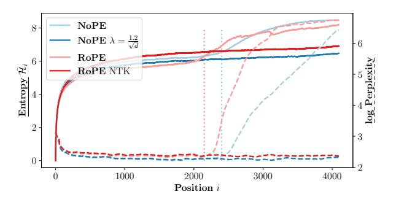

Figure 1: Length generalization from 2K to 4K. For different testing lengths (or, positions of sequences), dashed lines draw the log-perplexity of models (measured on validation set of the pre-training dataset), and solid lines represent the entropy of attention heads (averaged on all heads).

time. Generalizing to unseen sentence length is crucial in many language model applications like retrieval augmented language models (Izacard et al., 2023), personalized language models (Wang et al., 2023), language-model-based agents (Park et al., 2023).

Departing from the standard ways of encoding positions, one may ask (following the principle of parsimony) that are the explicit position features necessary? The answer is no. Both empirically (Haviv et al., 2022) and theoretically (Chi et al., 2023; Kazemnejad et al., 2023), the casually masked Transformers are shown to be able to successfully model languages without any prior position encoding (NoPE). The finding calls for a deeper understanding of *implicit* position information in Transformer-based language models, and also inspires a new direction for length generalization: without explicit position features, can NoPE generalize?

In this paper, we study the length generalization property of NoPE. Our main findings are,

 When extending to unseen sentence length, NoPE has less performance loss. However, beyond a certain range, NoPE also fails to extend, with

\* Equal contribution.

https://github.com/AntNLP/nope\_head\_scale

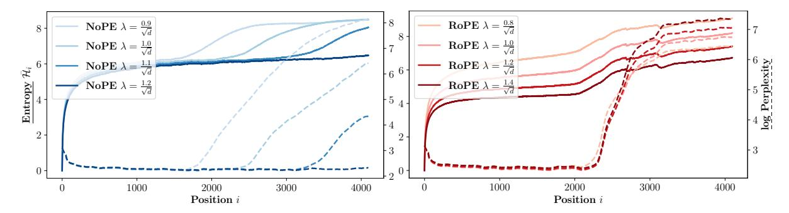

Figure 2: **UniformScale** modifies the temperature hyper-parameter of the SoftMax operator in self-attention layers (Left, NoPE; Right, RoPE). NoPE can generalize to longer context by merely scaling the softmax scores. However, this exact technique does not directly apply to RoPE models.

no substantial difference observed when compared to explicit position encodings. For example, NoPE can effectively extend the training length by 20% (from 2K to 2.4K, Figure 1) without a significant increase in perplexity. In contrast, the rotary position encoding (RoPE) is only capable of extending by 10%.

- We analyze the failure cases of NoPE's generalization and find that they always co-occur with the distraction of attention distributions: the attention heads begin to allocate their weights to tokens evenly when NoPE's extension performance begins to collapse. The connection between NoPE's generalization and concentration of attention heads suggests controlling the behaviors of attention heads during length extension.
- We show that by simply searching one temperature hyper-parameter, NoPE's length generalization can be significantly improved. For example, by scaling the attention score by a factor of 1.2, NoPE can immediately generalize to over 4K tokens (Figure 1).
- Moreover, we developed an advanced version of this strategy by searching temperature parameters for each head, in the light that different layers and heads exhibit varied behaviors. The procedure resembles a parameter-efficient fine-tuning, with an extremely small number of tunable parameters (704 delta parameters over 1B model parameters). We show that the proposed method can help NoPE to generalize further (Figure 4).

We conduct length generalization experiments on long sequence language modeling, synthetic tasks (passkey retrieval), and LongBench. The results show that NoPE enjoys a competitive extension performances to state-of-the-art length generalization methods for explicit position encodings (e.g., PI (Chen et al., 2023), YaRN (Peng et al., 2024)).

## 2 Length Generalization of NoPE

## 2.1 Language Modeling with NoPE

Before diving into the length generalization problem, we first briefly describe the NoPE models used in this paper.  $^2$  Our default NoPE has 1.1B parameters. It is trained from the TinyLlama (Zhang et al., 2024b) code base  $^3$ , with training sequence length L=2048 and 50K steps ( $\approx 100$ B tokens). More details can be found in Section 4.1.

We also include the original TinyLlama model which uses rotary position encoding (RoPE) for comparison. By default, both models are trained with identical settings.

#### 2.2 Length Generalization

Given a language model (LM) with pre-trained maximal sequence length L, the goal of length generalization is to expand it to length L'>L. Length generalization can be tested in a zero-shot manner ("train short, test long") or with some fine-tuning.

Figure 1 depicts language modeling performances of NoPE (and RoPE). We can observe that, within the pre-training length (L=2048), NoPE has a similar performance as RoPE, which agrees with existing works: casual masking can implicitly encode the positions of a sequence (Haviv et al., 2022; Chi et al., 2023).

When the testing sequence length exceeds the training length, we see that 1) NoPE's length gen-

&lt;sup>2For simplicity, we refer NoPE to both the implicit way of encoding positions and the language model trained without position encoding.

&lt;sup>3https://github.com/jzhang38/TinyLlama

eralization error (light blue dashed line, measured with log-perplexity) is lower than RoPE (light red dashed line). 2) vanilla NoPE still has an increased perplexity than in-domain tests. Therefore, though it is not a perfect solution, removing explicit position encoding can effectively reduce the length generalization error. Next, we will try to find the reason for the failure of NoPE's length generalization, and also develop algorithms for improving it.

#### 2.3 Extension? Attention!

To analyze NoPE's generalization failure, we first see that since explicit position encodings have been dropped, the casual Transformer block is only left with three core modules, the embedding layer, feedforward layers, and self-attention layers. The outputs of the former two modules are independent of their inputs' position in sequence (i.e., no matter which position, they always have the same output). Therefore, multi-head attention layers become our main target.

We visualize the attention pattern of NoPE at different lengths. Specifically, given a validation set with a size n and a target position i, we define the average attention entropy  $\overline{\mathcal{H}}_i$  at position i, as

$$\overline{\mathcal{H}}_i = \frac{1}{n \times m} \sum_{x, h} \mathcal{H}_i^{(h)}(x) \tag{1}$$

$$\mathcal{H}_{i}^{(h)}(x) = -\sum_{j=1}^{i} \alpha_{ij}^{(h)}(x) \cdot \log \alpha_{ij}^{(h)}(x) \quad (2)$$

where x is a sample,  $\alpha_{ij}^{(h)}(x)$  is the attention probability of token i focusing on token j in the h-th attention head  $(h \in \{1, 2, ..., m\})$ ,  $\mathcal{H}_i^{(h)}(x)$  is the entropy of the attention distribution  $\alpha_{ij}^{(h)}(x)$  evaluated at position i.

The light solid lines in Figure 1 show the average entropy for NoPE (light blue) and RoPE (light red). We can observe that, the inflection point of  $\overline{\mathcal{H}}_i$  is highly consistent with the inflection point of perplexity. It implies that failed length generalization of NoPE (and RoPE) might be connected to the distraction of attention: attention heads begin to allocate attention to more tokens. To further verify the connection, we also draw a successful extension algorithm for RoPE (RoPE-NTK (bloc97, 2023b) which interpolates out-of-domain encodings to indomain encodings). Its length generalization loss curve is flat, while its entropy curve also has no steeply increasing point.

Unlike explicit position encodings, NoPE has no clear target objects to manipulate, thus it is quite challenging to perform length generalization without fine-tuning on longer sequences. However, the strong correlation between length extension and attention pattern transition suggests such an object, the entropy of attention heads.

#### 2.4 Uniform Attention Scale

We write the general scaled dot-product attention as

$$\alpha_{ij}^{(h)} = \frac{e^{\lambda \boldsymbol{q}_i^{(h)} \cdot \boldsymbol{k}_j^{(h)}}}{\sum_k e^{\lambda \boldsymbol{q}_i^{(h)} \cdot \boldsymbol{k}_k^{(h)}}}$$
(3)

where the scaling factor  $\lambda$  is the temperature hyperparameter of the SoftMax operator. The prevalent setting is  $\lambda = \frac{1}{\sqrt{d}}$ .

Based on observations in Section 2.3, we know that NoPE's failure of length generalization might be correlated with distracted attention, hence we can try to gradually increase the scale factor  $\lambda$  to reconcentrate attention, and see whether the generalization error can be reduced. Figure 2 visualizes the average entropy under different scale values and the corresponding perplexity curves.

We first find that when increasing the scale factor during length generalization evaluation (e.g., the pre-training scale  $\lambda = \frac{1}{\sqrt{d}}$  is increased to  $\lambda = \frac{1.2}{\sqrt{d}}$ ), the inflection points of entropy curves are shifted to longer lengths, at the same time, NoPE all generalize to further positions (L=2k  $\rightarrow$  L'=4k). That is, with all NoPE's parameters frozen and only *uniformly* increasing the softmax's temperature, NoPE can successfully generalize to unseen lengths.

The same conclusion doesn't hold for RoPE (Figure 2 Right): no matter what value the scale takes (from  $\lambda$ =0.8 to  $\lambda$ =1.4), the inflection points of entropy curves remain almost unchanged, meaning that it fails to generalize to longer lengths. On the other side, successful RoPE extension algorithms (e.g., RoPE-NTK in Figure 1) can control the distraction of entropy by explicitly manipulate position encodings. Therefore, though attention scaling has been used for RoPE (Su, 2021; Chiang and Cholak, 2022), it may contribute marginally to RoPE's generation.

We also find that extending NoPE to more distant positions generally requires a larger scale (i.e., a more concentrated attention distribution). As the position becomes further, the number of tokens involved in the attention calculation increases, the attention is more easily scattered, and therefore, a

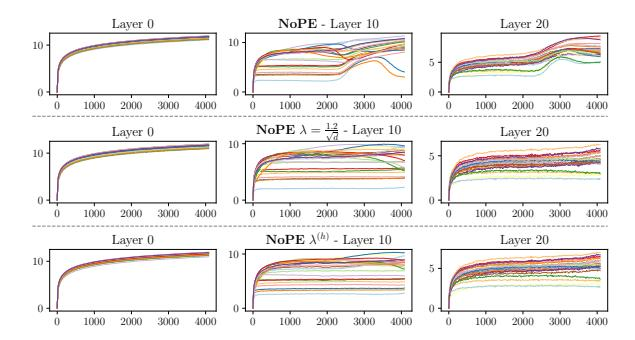

Figure 3: The attention entropy across all heads for the original NoPE, head-based scaled NoPE and uniform-scaled NoPE, with each model represented in a separate row. The attention heads exhibit divergent patterns.

larger scaling factor is needed to concentrate the attention. In particular, for our NoPE model, generalizing to twice the pre-training length requires about 1.2 times the scale, four times the length requires about 1.5 times the scale, and eight times the length requires about 1.8 times the scale. Appendix B reports the fitted function of the scaling factor with respect to the generalization length  $L^\prime$ .

Finally, we note remark that the attention scaling factor in this section takes the *same* value for all positions, including the pre-training length (*uniform* scaling). We experimented with a piecewise function which use the original scale within the pre-training positions, and a more concentrated attention scale for the extrapolated positions. We also try position-dependent functions, where the scale increases with position. However, none of these methods could further improve generalization. We speculate that if the attention at earlier positions is not highly concentrated, the learned token representations may hinder the concentration of attention at latter positions. We leave a deeper discussion and analysis of this observation in future work.

## 3 Head-based Attention Scale

After verifying that the attention scaling can help NoPE generalizing, we delved deeper into the multi-head attention mechanism and posed a new question, "Does each attention head require a unique scaling factor?"

In this section, we first visualize the average entropy curves for each head and find that they have different attention patterns. Hence we propose to replace the uniform scaling with head-based scaling (from one factor to  $22 \times 32 = 704$  factors). To address the issue of an exploding search space, we efficiently determine the values of scaling factors

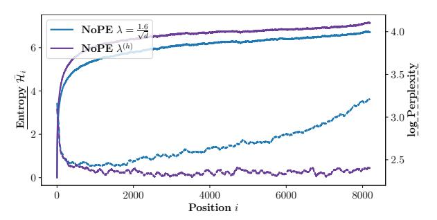

Figure 4: Comparing uniform and head-based scale (denoted as  $\lambda^{(h)}$ ). UniformScale fails eventually as the perplexity increases with longer sequences. HeadScale is capable of handling much longer context by assigning different scale factors to each attention head.

through automated hyperparameter search, considering both parameter efficiency and data efficiency. As a result, head-based scaling generalizes better than uniform scaling. Moreover, correlation analysis shows that within each layer, the smaller the converged entropy (i.e., the more concentrated attention), the larger the required scaling factor to maintain that concentration.

#### 3.1 Visual Analysis

The entropy values span a broad spectrum, with each attention head demonstrating a distinct attention pattern. In Figure 3, certain attention heads show a highly concentrated pattern, with entropy values converging to  $\approx 1$ , while others exhibit a highly dispersed pattern, with entropy values converging to  $\approx 10$ . The full head visualization of Figure 3 is located in Appendix D.

This phenomenon casts doubt on uniform scaling — how can a single scaling factor cater to diverse attention heads? Inspired by this, we further propose a head-based scale method.

## 3.2 Head-based Scale

We reformulate the uniform attention scale as headbase attention scales

$$\alpha_{ij}^{(h)} = \frac{e^{\lambda^{(h)} \boldsymbol{q}_i^{(h)} \cdot \boldsymbol{k}_j^{(h)}}}{\sum_k e^{\lambda^{(h)} \boldsymbol{q}_i^{(h)} \cdot \boldsymbol{k}_k^{(h)}}} \tag{4}$$

where  $\lambda^{(h)}$  is a unique attention scaling factor for each head, totaling 704. Compared to a uniform attention scale, 704 head-based scales make it difficult to determine the optimal values by grid search. Similar to AutoML (He et al., 2021), we model the scales' optimal search as a parameter-efficient fine-tuning task. Given a NoPE model  $\mathcal{M}$  and a set

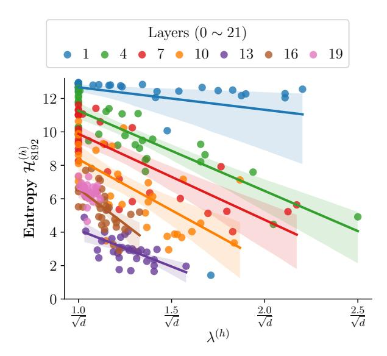

Figure 5: Correlation analysis for head-based scale when extended to 8K context. The analysis was conducted on the converged entropy values at 8K position, in relation to the scale searched. Each data point represents a unique attention head.

of head-based scales  $\{\lambda^{(1)},\lambda^{(2)},\dots,\lambda^{(m)}\}$ , we fix the model  $\mathcal M$  and define the head-based scales as trainable parameters  $\theta=\{\lambda^{(1)},\lambda^{(2)},\dots,\lambda^{(m)}\}$ . We aim to find an optimal set of values  $\theta^*=\{\lambda^{*(1)},\lambda^{*(2)},\dots,\lambda^{*(m)}\}$ , that allows the model  $\mathcal M(\theta^*)$  to successfully extend to the target length L'. To this end, we optimize the language modeling loss function  $\mathcal L_{\mathrm{LM}}$  on the pre-training dataset D with length L' and size  $n',n'\ll n$ .

$$\theta^* = \underset{x \in D}{\text{minimize}} \quad \mathcal{L}_{\text{LM}}\left(\mathcal{M}(\theta, x)\right)$$
 (5)

The search process is highly efficient. (1) The number of tunable parameters is extremely small, only 704 delta parameters over 1B model parameters; 2) The amount of training tokens for fine-tuning is extremely small too, only 0.03% of the pre-training data.

In addition, to ensure that the attention is reconcentrated instead of distracted by the scaling factors, we apply a focus constraint during the optimization of Equation 5

$$\lambda^{(*)} \ge \frac{1}{\sqrt{d}} \tag{6}$$

**Initializing HeadScale** In practice, we found that the initial value of head-based scales has a significant impact on the search of  $\theta^*$ . An obvious approach is to use the default value  $\lambda^{(*)} = \frac{1}{\sqrt{d}}$  from

the pre-training phase. However, its length generalization results are quite unstable, with most being subpar, as the optimal scale often deviates significantly from the default value. We propose another approach to utilize the best uniform scale from the grid search as the initial value. The ablation study for the initialization approach is in Section 4.5.

Figure 4 compares the two generalization methods of NoPE, uniform scale versus head-based scales. Head-based scale exhibits better generalization than the uniform scale, achieving a lower log-PPL by 0.2 at 4K positions  $(2 \times L)$  and by 0.8 at 8K positions  $(4 \times L)$ . The average entropy  $\overline{\mathcal{H}}_i$  of the head-based scale is higher than that of the uniform scale, suggesting that the uniform scale method over-concentrates attention, particularly for some heads that inherently have more distracted patterns.

Figure 5 shows the correlation between the converged entropy and the searched scale. To save space, we uniformly sampled 7 layers and all their respective heads. We observed that the correlation is layer-dependent, within each layer, heads with more concentrated attention (i.e., lower entropy) searched for larger scales, while heads with more dispersed attention (i.e., higher entropy) searched for smaller scales. The result is as expected, the more concentrated the attention pattern, the larger the scaling factor needed to maintain its focus. Furthermore, we observed that attention heads in lower layers are generally more dispersed, whereas heads in higher layers are generally more concentrated (note that this is not strictly observed).

## 4 Experiment

We train a NoPE base model from scratch and investigate its capability in length generalization. We conduct length generalization experiments on long sequence language modeling, synthetic tasks (passkey retrieval), and real-world long context tasks (LongBench). Detailed experiment setup can be found in Appendix A.

## 4.1 NoPE pre-trained model

For a fair comparison with RoPE, we train a NoPE model with 1.1B parameters from the TinyLlama (Zhang et al., 2024b) code base4. The NoPE model has 22 layers of Transformer blocks, 32 attention heads per layer, 2048 embedding size. The model is trained on Slimpajama (Soboleva et al., 2023)

4https://github.com/jzhang38/TinyLlama

| Model | Avg. | arc_challenge | arc_easy | boolq | hellaswag | openbookqa | piqa | winogrande |
|-------|------|---------------|----------|-------|-----------|------------|------|------------|
| RoPE  | 46.1 | 24.3          | 44.9     | 59.7  | 43.5      | 29.8       | 67.3 | 53.3       |
| NoPE  | 46.2 | 24.0          | 44.9     | 58.1  | 43.4      | 31.8       | 68.4 | 52.9       |

Table 1: Commonsense reasoning ability of the pre-trained base models.

| Model                                                             |                         | FT     |      | P        | G19        |            | Proof-pile |       |            |            |  |  |  |
|-------------------------------------------------------------------|-------------------------|--------|------|----------|------------|------------|------------|-------|------------|------------|--|--|--|
| 1/10401                                                           | L'                      | Tokens | 2K   | 4K       | 8K         | 16K        | 2K         | 4K    | 8K         | 16K        |  |  |  |
| Original LMs                                                      |                         |        |      |          |            |            |            |       |            |            |  |  |  |
| RoPE                                                              | -                       | -      | 14.5 | 491.4    | 488.5      | 599.5      | 3.5        | 303.0 | 432.1      | 759.5      |  |  |  |
| NoPE                                                              | -                       | -      | 14.6 | 326.9    | $> 10^{3}$ | $> 10^{3}$ | 3.5        | 117.4 | $> 10^{3}$ | $> 10^{3}$ |  |  |  |
| BLOOM                                                             | -                       | -      | 27.7 | 158.0    | 264.6      | 403.4      | 6.9        | 74.1  | 176.2      | 334.5      |  |  |  |
| MPT                                                               | -                       | -      | 10.6 | 103.6    | 361.6      | 345.1      | 2.8        | 70.1  | $> 10^{3}$ | $> 10^{3}$ |  |  |  |
|                                                                   |                         |        |      | Generali | zation for | RoPE       |            |       |            |            |  |  |  |
| NTK zero                                               | -                       | -      | 14.5 | 14.9     | 22.8       | 80.4       | 3.5        | 3.3   | 4.1        | 13.3       |  |  |  |
| YaRN zero                                              | -                       | -      | 14.5 | 14.5     | 15.0       | 17.1       | 3.5        | 3.3   | 3.2        | 3.6        |  |  |  |
|                                                                   | 4K                      | 6M     | 16.0 | 15.9     | 551.9      | $> 10^{3}$ | 3.8        | 3.4   | 307.9      | 633.8      |  |  |  |
| $\mathrm{PI}^{\mathrm{fair}}$                                     | 8K                      | 13M    | 17.4 | 17.1     | 17.1       | 752.8      | 4.0        | 3.6   | 3.4        | 406.3      |  |  |  |
|                                                                   | 16K                     | 30M    | 18.7 | 18.4     | 18.3       | 18.2       | 4.3        | 3.9   | 3.6        | 3.6        |  |  |  |
|                                                                   | 4K                      | 6M     | 15.5 | 15.4     | 545.2      | $> 10^{3}$ | 3.7        | 3.4   | 351.5      | 698.2      |  |  |  |
| YaRN fair                                              | 8K                      | 13M    | 15.7 | 15.4     | 15.5       | 794.6      | 3.8        | 3.4   | 3.2        | 492.8      |  |  |  |
|                                                                   | 16K                     | 30M    | 15.9 | 15.6     | 15.4       | 15.5       | 3.8        | 3.5   | 3.2        | 3.2        |  |  |  |
|                                                                   | 4K                      | 33M    | 15.2 | 15.0     | 623.8      | 951.7      | 3.6        | 3.3   | 334.4      | 595.5      |  |  |  |
| $PI^{raw}$                                                        | 8K                      | 66M    | 15.4 | 15.1     | 15.0       | 909.6      | 3.6        | 3.3   | 3.0        | 463.0      |  |  |  |
|                                                                   | 16K                     | 131M   | 15.6 | 15.3     | 15.0       | 14.9       | 3.7        | 3.3   | 3.0        | 3.0        |  |  |  |
|                                                                   | 4K                      | 33M    | 15.1 | 15.0     | 573.3      | 951.4      | 3.6        | 3.3   | 358.8      | 656.8      |  |  |  |
| YaRN raw                                               | 8K                      | 66M    | 15.1 | 14.8     | 14.8       | 816.0      | 3.6        | 3.3   | 3.1        | 501.5      |  |  |  |
|                                                                   | 16K                     | 131M   | 15.0 | 14.8     | 14.5       | 14.5       | 3.6        | 3.3   | 3.0        | 3.0        |  |  |  |
| . 10                                                              | Generalization for NoPE |        |      |          |            |            |            |       |            |            |  |  |  |
| $\lambda = \frac{1.2}{\sqrt{d}}$ $\lambda = \frac{1.5}{\sqrt{d}}$ | -                       | -      | 15.0 | 16.0     | 513.7      | $> 10^{3}$ | 3.6        | 3.3   | 175.3      | $> 10^{3}$ |  |  |  |
| $\lambda = \frac{1.5}{\sqrt{d}}$                                  | -                       | -      | 19.0 | 20.2     | 45.3       | 224.1      | 3.9        | 3.7   | 4.9        | 99.2       |  |  |  |
| $\lambda = \frac{1.8}{\sqrt{d}}$                                  | -                       | -      | 30.4 | 42.4     | 69.1       | 198.8      | 5.1        | 5.6   | 8.5        | 38.2       |  |  |  |
| • •                                                               | 4K                      | 6M     | 14.8 | 15.3     | 404.5      | $> 10^{3}$ | 3.5        | 3.2   | 153.4      | $> 10^{3}$ |  |  |  |
| $\lambda^{(h)}$                                                   | 8K                      | 13M    | 15.7 | 15.3     | 21.1       | 721.7      | 3.6        | 3.3   | 3.2        | 318.5      |  |  |  |
|                                                                   | 18K                     | 30M    | 18.3 | 19.0     | 18.8       | 30.4       | 4.0        | 3.7   | 3.3        | 4.1        |  |  |  |

Table 2: Sliding window perplexity of different context window extension methods tested on PG19 and ProofPile. The "fair" and "raw" versions of PI and YaRN differ from the training data, as detailed in Appendix A. The notation  $\lambda = *$  denotes uniform attention scale by the given number, and  $\lambda^{(h)}$  represents head-based scale.

joint with Starcoderdata (Li et al., 2023) by  $50 \mathrm{K}$  steps ( $\approx 100 \mathrm{B}$  tokens) with sequence length L = 2048.

All settings are kept identical to those of TinyL-lama, including the model architecture, training data, training procedure, and hyper-parameters, except that the rotary position embedding (RoPE) in TinyLlama is removed, making it a NoPE model, and the learning rate is set to  $3.5 \times 10^{-4}$ .

Following TinyLlama, we evaluate the commonsense reasoning ability of the NoPE model and report acc\_norm in Table 1. We compare with the TinyLlama checkpoint that is trained on 100B tokens. The purpose of this experiment is to prove the NoPE base model performs on par with RoPE.

#### 4.2 Long Sequence Language Modeling

Success on long sequence language modeling tasks is essential for length generalization. A method that does not perform well in language modeling probably won't handle real-world long-context tasks.

**Settings.** To evaluate the long sequence language modeling performances, we test our NoPE-based methods and RoPE-based baselines on PG19 (Rae et al., 2020) and proof-pile (Azerbayev et al., 2022) datasets. For each dataset, we sample a subset of the test set and evaluate on 2M tokens using sliding window evaluation (S=256) suggested by Press et al. (2022). We report the perplexity (PPL) of the models in Table 2.

**Main results.** Firstly, by comparing the original language models, NoPE's perplexity (PPL) is comparable to RoPE's for lengths within the train-

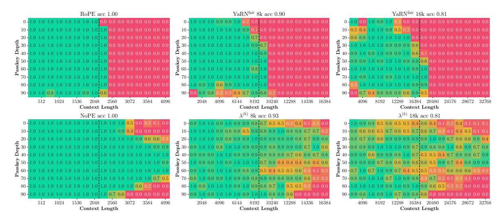

Figure 6: The figures illustrate the passkey retrieval accuracy for both RoPE and NoPE methods. The vertical dashed line represents the context length of the models, which could be either the pre-training length or the fine-tuning length. The title of each sub-figure indicates the average accuracy within the model's context length. Notably, NoPE demonstrates robust performance even beyond the model's context window, indicating significant potential for generalization.

ing distribution, confirming the findings of Haviv et al. (2022); Chi et al. (2023). However, all LMs, including ALiBi models, fail to generalize out-of-the-distribution, indicating that explicit positional encoding is not the main reason for their failure in generalization. Current work on length generalization still focuses mainly on manipulating positional encoding. Therefore, the length generalization issue within causal Transformer networks warrants a reanalysis and reinterpretation.

Secondly, by comparing the two generalization methods for NoPE proposed in this paper, the uniform scale method has significant limitations. Although using a larger scale can reduce the PPL at greater positions, it significantly affects the PPL at closer ranges. For instance, with a scale value of 1.8, the PPL on 2K@PG19 rises from 14.6 to 30.4, and on 2K@Proof-pile, it rises from 3.5 to 5.1. On the contrary, the head-based scale method not only successfully extrapolates to 16k but also has minimal impact on the PPL at closer distances (for 18K, increases only +3.7 on 2K@PG19, +0.5 on 2K@Proof-pile), proving that attention heads with different patterns indeed require distinct scale values.

Third, a full comparison with RoPE LM's generalization method. Comparing the *zero-shot* generalization methods, the head-based scale has better generalization than NTK, but weaker than YaRN. In a fair comparison with the RoPE generalization methods which require *fine-tuning*, the head-based

scale method is competitive with these RoPE baselines, especially the Proof-pile dataset. However RoPE baselines (PI, YaRN) still benefit from more training tokens, and the head-based scale on NoPE reaches its upper limit.

In summary, the head-based scale generalization method for NoPE slightly outperforms RoPE's early generalization method NTK, but still lags behind the recently introduced YaRN, particularly in near-distance PPL performance. Considering the significant challenge of generalizing NoPE compared to RoPE (due to the lack of explicit positional encoding to manipulate), this work, as the first to tackle length generalization for NoPE, has achieved its set goals.

The observed gap may imply that constraining the NoPE model to focus on fewer tokens could detrimentally affect its efficacy. Future efforts will be directed at enhancing the head-based scaling method to regain the level of performance seen in pretraining.

## 4.3 Synthetic Long Context Tasks

A synthetic task is constructed in Landmark Attention (Mohtashami and Jaggi, 2023b) called "Passkey Retrieval". It aims to test the effective context window size of the model. The task is to retrieve a randomly placed passkey from a long sequence of tokens, where the passkey is a randomly sampled number of 5 digits and the sequence is built by concatenating irrelevant sentences.

| Model           | Ctx. | Avg. | Singl-Doc QA |      | Multi-Doc QA |      | Summarization |          | Few-shot Learning |        | Synthetic |      | Code |      |      |      |      |      |
|-----------------|------|------|--------------|------|--------------|------|---------------|----------|-------------------|--------|-----------|------|------|------|------|------|------|------|
|                 |      |      | NQA          | Qsp  | MulF         | HpQA | 2WQA          | Musq.    | GRpt              | QSum   | MulN      | TREC | TrQA | SSum | PsgC | PsgR | Lcc  | Re-P |
|                 |      |      |              |      |              |      |               | Ori      | ginal LN          | 1s     |           |      |      |      |      |      |      |      |
| RoPE            | 2K   | 16.5 | 3.5          | 4.7  | 17.5         | 3.4  | 8.8           | 2.8      | 26.9              | 8.4    | 25.9      | 33.5 | 18.8 | 15.7 | 1.9  | 2.5  | 49.5 | 40.1 |
| NoPE            | 2K   | 18.3 | 6.1          | 7.9  | 22.4         | 6.6  | 10.3          | 3.1      | 28.9              | 8.8    | 25.1      | 41.5 | 30.0 | 3.5  | 1.0  | 3.0  | 48.4 | 46.6 |
|                 |      |      |              |      |              |      |               | Generali | ation for         | r RoPE |           |      |      |      |      |      |      |      |
|                 | 4K   | 16.7 | 5.4          | 8.6  | 18.6         | 4.5  | 9.1           | 3.9      | 26.4              | 9.9    | 18.5      | 21.5 | 21.2 | 22.2 | 2.7  | 1.5  | 48.5 | 44.6 |
| PIraw           | 8K   | 16.7 | 4.7          | 9.6  | 16.3         | 5.4  | 9.3           | 4.0      | 14.6              | 9.4    | 20.7      | 27.0 | 23.1 | 23.5 | 2.1  | 3.4  | 50.0 | 44.7 |
|                 | 16K  | 17.2 | 4.8          | 8.1  | 18.6         | 5.4  | 9.4           | 3.8      | 22.9              | 9.9    | 21.3      | 24.0 | 23.9 | 25.4 | 1.6  | 1.8  | 50.5 | 43.8 |
|                 | 4K   | 16.2 | 6.4          | 8.7  | 18.2         | 4.0  | 11.0          | 3.0      | 17.5              | 9.0    | 15.6      | 27.5 | 21.5 | 20.3 | 1.6  | 0.5  | 49.8 | 45.2 |
| YaRNraw         | 8K   | 16.4 | 6.0          | 11.4 | 16.0         | 5.0  | 8.3           | 3.5      | 16.3              | 10.3   | 19.6      | 21.0 | 24.9 | 22.1 | 1.3  | 2.0  | 49.6 | 45.3 |
|                 | 16K  | 17.7 | 4.5          | 10.5 | 17.1         | 5.2  | 8.9           | 4.7      | 18.9              | 9.2    | 19.5      | 38.0 | 24.4 | 25.2 | 1.7  | 1.8  | 49.8 | 44.6 |
|                 |      |      |              |      |              |      |               | Generali | ation for         | r NoPE |           |      |      |      |      |      |      |      |
|                 | 4K   | 18.5 | 6.3          | 11.1 | 23.1         | 5.7  | 10.1          | 4.2      | 27.7              | 8.9    | 23.4      | 25.5 | 35.7 | 13.7 | 0.6  | 4.5  | 47.9 | 46.9 |
| $\lambda^{(h)}$ | 8K   | 17.2 | 5.8          | 11.7 | 21.4         | 6.1  | 10.8          | 3.9      | 24.1              | 8.9    | 18.3      | 31.0 | 31.4 | 4.5  | 0.6  | 3.1  | 47.3 | 46.5 |
|                 | 18K  | 17.0 | 6.0          | 12.8 | 20.3         | 7.0  | 12.9          | 4.1      | 17.2              | 8.4    | 16.1      | 41.0 | 32.9 | 5.1  | 0.3  | 2.1  | 44.5 | 41.0 |

Table 3: Real-world Long-Context performance of NoPE-extension methods and various RoPE baselines. The "Ctx." column represents testing context length during evaluation, which corresponds to either the pre-training length for base models or the extended length for length generalization methods.

| Model                | PPL             | @16K (↓) | Passkev (†)    | LongBench (†) |  |  |
|----------------------|-----------------|----------|----------------|---------------|--|--|
|                      | PG19 Proof-pile |          | I dissiled (1) | ()            |  |  |
| $\lambda^{(h)}$ 18K  | 30.4            | 4.1      | 81             | 17.0          |  |  |
| w/o focus constraint | 25.9            | 4.2      | 53             | 16.7          |  |  |
| w/o initialization   | 31.4            | 4.3      | 26             | 15.8          |  |  |

Table 4: Ablation study on the two variants of Head-Scale. Passkey results are listed as average accuracy, and LongBench results are averaged score among all sub-tasks.

**Settings.** We evaluate the performance of passkey retrieval across various context lengths. For each specified context length, we conduct tests on 10 distinct passkey depths, each associated with 10 randomly selected passkeys. We report the retrieval accuracy in this task.

It is observed in Figure 6 that both the NoPE base model and head-based scale perform well even when evaluating on  $2\times$  the pretraining or fine-tuning context window, while RoPE strictly operates within the pre-trained sequence length and immediately fails outside of it. The result indicates that NoPE possesses significant potential for generalization.

## 4.4 Real-World Long Context Tasks

LongBench (Bai et al., 2023) is a comprehensive assessment of the long context understanding capabilities of large language models. We test all models using beam search decoding with beam size 5. The evaluation context size is set to the model context window accordingly in order to test the model's capability to utilize a longer context. We only include raw PI and YaRN as the baseline in this task.

We find that the performance of the NoPE base

model is better than its RoPE counterpart. Concluding better information utilization in the original length. Moreover, the head-based scale at a 4k extension length performs the best among all baselines. We attribute it to the capability of the NoPE base model and the successful length generalization of the head-based attention scale method. While the head-based model still suffers from performance degradation when extending to a longer context, as it is stated in Section 4.2.

#### 4.5 Ablation Study

We have introduced two key components of Head-Scale in Section 3.2, a concentration constraint and an initializing technique. The ablation study in Table 4 depicts that although occasionally perform better in language modeling, the two variants are less preferment in passkey retrieval and Long-Bench, indicating their inability to utilize long context information.

Detailed results of the passkey retrieval task can be found in Figure 9 in the Appendix C. They are completely unable to answer the passkey except when it is at the beginning of the context window.

#### 5 Related Work

Transformers without position encoding Haviv et al. (2022) was the first to discover that causal Transformer networks could perform language modeling tasks successfully even without explicit PE. Chi et al. (2023) provided a theoretical explanation for NoPE, demonstrating that for an initialized NoPE LM, the variance of the hidden representations in each layer is position-dependent, with variance decreasing for larger positions. Both works demonstrate that the NoPE hidden layer rep-

resentation implies positional information through the probing task. Kazemnejad et al. (2023) proved through constructive methods that NoPE can learn absolute PE from the first layer and relative PE from the second layer. They also showed that NoPE has an extremely weak length generalization ability (train  $\sim$ 20, test  $\sim$ 40), but is slightly better than LM with explicit PE. This paper first proposes length generalization methods for NoPE with uniform scale and head-based scale. For the first time verifies the effectiveness of NoPE generalization in real LLM settings.

**Length generalization** Due to high computational and memory requirements, LLM training is usually limited to short inputs. Directly applying LLMs to long inputs faces the challenge of outof-distribution (OOD) issues. Research to enable LLMs to process long inputs has been extensive (Huang et al., 2023; Dong et al., 2023). The earliest methods involved designing new relative PE mechanisms during pre-training (Press et al., 2021; Sun et al., 2023). Subsequent studies focused primarily on the widely used RoPE (Su et al., 2024) and proposed length extension by mitigating RoPE's OOD issues through interpolated positions (Chen et al., 2023; kaiokendev, 2023; Peng et al., 2023; emozilla, 2023; bloc97, 2023b,a). Other works employed sliding window attention mechanisms to prevent relative positions from exceeding the maximum distance seen in pre-training (Mohtashami and Jaggi, 2023a; Han et al., 2023; Xiao et al., 2023; Jin et al., 2024; Zhang et al., 2024a). However, these models ignore information from distant tokens, thus failing to capture long-distance context dependencies. All existing methods rely on specific explicit PEs. However, the NoPE architecture is more streamlined and more aligned to the form of human language modeling. Exploring NoPE's length generalization is therefore more intriguing and attractive.

## 6 Discussion

We studied the length generalization of Casual Transformer without explicit position encoding. We developed a parameter-efficient tuning algorithm which aims to search for the best temperature hyper-parameters for attention heads. Through empirical evaluation, we saw that NoPE can achieve competitive length generalization and might be a promising alternative for long-context language modeling.

NoPE provides a new perspective to understanding the role of positional information by isolating and eliminating the effects of explicit positional encoding. Our work demonstrates the correlation between length generation failures and distraction of attention in NoPE models, thus the proposed method concentrates the attention by adjusting the scaling factor. While current works on length generalization mainly focus on manipulating positional encoding, our work suggests a new key component to generalization.

## Limitation

The length generalization algorithms discussed in this paper exhibit competitive performances, but the NoPE model itself still underperforms with state-of-the-art RoPE models, which makes the results over long sequence language modeling tasks and LongBench tasks are less competitive. NoPE still faces the challenges of considerable memory usage and computational complexity due to the quadratic nature of attention computation when processing extremely long contexts. Hardware limitations are likely to become a constraining factor for length generalization soon. We plan to further improve the NoPE's performances for a fairer comparison. This paper is also most an empirical one, which requires a deeper theoretical understanding of NoPE's length generalization in the future.

## Acknowledgement

The authors wish to thank all reviewers for their helpful comments and suggestions. The corresponding authors are Tao Ji, Yuanbin Wu and Xiaoling Wang. This research was (partially) supported by NSFC(62076097), National Key R&D Program of China (2021YFC3340700), the Open Research Fund of Key Laboratory of Advanced Theory and Application in Statistics and Data Science (East China Normal University), Ministry of Education.

#### References

Zhangir Azerbayev, Edward Ayers, , and Bartosz Piotrowski. 2022. Proof-pile.

Yushi Bai, Xin Lv, Jiajie Zhang, Hongchang Lyu, Jiankai Tang, Zhidian Huang, Zhengxiao Du, Xiao Liu, Aohan Zeng, Lei Hou, Yuxiao Dong, Jie Tang, and Juanzi Li. 2023. Longbench: A bilingual, multitask benchmark for long context understanding. arXiv preprint arXiv:2308.14508.

- BigScience Workshop. 2022. Bloom (revision 4ab0472).
- bloc97. 2023a. Add NTK-Aware interpolation "by parts" correction.
- bloc97. 2023b. NTK-Aware Scaled RoPE allows LLaMA models to have extended (8k+) context size without any fine-tuning and minimal perplexity degradation.
- bloc97. 2023c. NTK-Aware Scaled RoPE allows LLaMA models to have extended (8k+) context size without any fine-tuning and minimal perplexity degradation.
- Shouyuan Chen, Sherman Wong, Liangjian Chen, and Yuandong Tian. 2023. Extending context window of large language models via positional interpolation.
- Ta-Chung Chi, Ting-Han Fan, Li-Wei Chen, Alexander Rudnicky, and Peter Ramadge. 2023. Latent positional information is in the self-attention variance of transformer language models without positional embeddings. In *Proceedings of the 61st Annual Meeting of the Association for Computational Linguistics* (Volume 2: Short Papers), pages 1183–1193, Toronto, Canada. Association for Computational Linguistics.
- David Chiang and Peter Cholak. 2022. Overcoming a theoretical limitation of self-attention. In *Proceedings of the 60th Annual Meeting of the Association for Computational Linguistics (Volume 1: Long Papers)*, pages 7654–7664.
- Zican Dong, Tianyi Tang, Lunyi Li, and Wayne Xin Zhao. 2023. A survey on long text modeling with transformers. *arXiv* preprint arXiv:2302.14502.
- emozilla. 2023. Dynamically Scaled RoPE further increases performance of long context LLaMA with zero fine-tuning.
- Chi Han, Qifan Wang, Wenhan Xiong, Yu Chen, Heng Ji, and Sinong Wang. 2023. Lm-infinite: Simple on-the-fly length generalization for large language models.
- Adi Haviv, Ori Ram, Ofir Press, Peter Izsak, and Omer Levy. 2022. Transformer language models without positional encodings still learn positional information. In *Findings of the Association for Computational Linguistics: EMNLP 2022*, pages 1382–1390, Abu Dhabi, United Arab Emirates. Association for Computational Linguistics.
- Xin He, Kaiyong Zhao, and Xiaowen Chu. 2021. Automl: A survey of the state-of-the-art. *Knowledge-Based Systems*, 212:106622.
- Yunpeng Huang, Jingwei Xu, Zixu Jiang, Junyu Lai, Zenan Li, Yuan Yao, Taolue Chen, Lijuan Yang, Zhou Xin, and Xiaoxing Ma. 2023. Advancing transformer architecture in long-context large language models: A comprehensive survey. *arXiv preprint arXiv:2311.12351*.

- Gautier Izacard, Patrick S. H. Lewis, Maria Lomeli, Lucas Hosseini, Fabio Petroni, Timo Schick, Jane Dwivedi-Yu, Armand Joulin, Sebastian Riedel, and Edouard Grave. 2023. Atlas: Few-shot learning with retrieval augmented language models. *J. Mach. Learn. Res.*, 24:251:1–251:43.
- Hongye Jin, Xiaotian Han, Jingfeng Yang, Zhimeng Jiang, Zirui Liu, Chia-Yuan Chang, Huiyuan Chen, and Xia Hu. 2024. Llm maybe longlm: Self-extend llm context window without tuning.
- kaiokendev. 2023. Things im learning while training superhot.
- Amirhossein Kazemnejad, Inkit Padhi, Karthikeyan Natesan, Payel Das, and Siva Reddy. 2023. The impact of positional encoding on length generalization in transformers. In *Thirty-seventh Conference on Neural Information Processing Systems*.
- Raymond Li, Loubna Ben Allal, Yangtian Zi, Niklas Muennighoff, Denis Kocetkov, Chenghao Mou, Marc Marone, Christopher Akiki, Jia Li, Jenny Chim, Qian Liu, Evgenii Zheltonozhskii, Terry Yue Zhuo, Thomas Wang, Olivier Dehaene, Mishig Davaadorj, Joel Lamy-Poirier, João Monteiro, Oleh Shliazhko, Nicolas Gontier, Nicholas Meade, Armel Zebaze, Ming-Ho Yee, Logesh Kumar Umapathi, Jian Zhu, Benjamin Lipkin, Muhtasham Oblokulov, Zhiruo Wang, Rudra Murthy, Jason Stillerman, Siva Sankalp Patel, Dmitry Abulkhanov, Marco Zocca, Manan Dey, Zhihan Zhang, Nour Fahmy, Urvashi Bhattacharyya, Wenhao Yu, Swayam Singh, Sasha Luccioni, Paulo Villegas, Maxim Kunakov, Fedor Zhdanov, Manuel Romero, Tony Lee, Nadav Timor, Jennifer Ding, Claire Schlesinger, Hailey Schoelkopf, Jan Ebert, Tri Dao, Mayank Mishra, Alex Gu, Jennifer Robinson, Carolyn Jane Anderson, Brendan Dolan-Gavitt, Danish Contractor, Siva Reddy, Daniel Fried, Dzmitry Bahdanau, Yacine Jernite, Carlos Muñoz Ferrandis, Sean Hughes, Thomas Wolf, Arjun Guha, Leandro von Werra, and Harm de Vries. 2023. Starcoder: may the source be with you!
- Ilya Loshchilov and Frank Hutter. 2017. Decoupled weight decay regularization. In *International Conference on Learning Representations*.
- Amirkeivan Mohtashami and Martin Jaggi. 2023a. Landmark attention: Random-access infinite context length for transformers.
- Amirkeivan Mohtashami and Martin Jaggi. 2023b. Random-access infinite context length for transformers. In *Thirty-seventh Conference on Neural Information Processing Systems*.
- MosaicML NLP Team. 2023. Introducing mpt-7b: A new standard for open-source, commercially usable llms. Accessed: 2023-05-05.
- Joon Sung Park, Joseph O'Brien, Carrie Jun Cai, Meredith Ringel Morris, Percy Liang, and Michael S. Bernstein. 2023. Generative agents: Interactive simulacra

- of human behavior. In *Proceedings of the 36th Annual ACM Symposium on User Interface Software and Technology*, UIST '23, New York, NY, USA. Association for Computing Machinery.
- Bowen Peng, Jeffrey Quesnelle, Honglu Fan, and Enrico Shippole. 2023. Yarn: Efficient context window extension of large language models.
- Bowen Peng, Jeffrey Quesnelle, Honglu Fan, and Enrico Shippole. 2024. YaRN: Efficient context window extension of large language models. In *The Twelfth International Conference on Learning Representations*.
- Ofir Press, Noah Smith, and Mike Lewis. 2021. Train short, test long: Attention with linear biases enables input length extrapolation. In *International Conference on Learning Representations*.
- Ofir Press, Noah A. Smith, and Mike Lewis. 2022. Train short, test long: Attention with linear biases enables input length extrapolation.
- JackW. Rae, Anna Potapenko, SiddhantM. Jayakumar, Chloe Hillier, and TimothyP. Lillicrap. 2020. Compressive transformers for long-range sequence modelling. *International Conference on Learning Representations, International Conference on Learning Representations*.
- Colin Raffel, Noam Shazeer, Adam Roberts, Katherine Lee, Sharan Narang, Michael Matena, Yanqi Zhou, Wei Li, and Peter J. Liu. 2020. Exploring the limits of transfer learning with a unified text-to-text transformer. *Journal of Machine Learning Research*, 21(140):1–67.
- Soboleva, Daria, Al-Khateeb, Faisal, Myers, Robert, Steeves, Jacob R, Hestness, Joel, Dey, and Nolan. 2023. SlimPajama: A 627B token cleaned and deduplicated version of RedPajama.
- Jianlin Su. 2021. Attentions scale operation from entropy invariance.
- Jianlin Su, Murtadha Ahmed, Yu Lu, Shengfeng Pan, Wen Bo, and Yunfeng Liu. 2024. Roformer: Enhanced transformer with rotary position embedding. *Neurocomputing*, 568:127063.
- Jianlin Su, Yu Lu, Shengfeng Pan, Bo Wen, and Yunfeng Liu. 2021. Roformer: Enhanced transformer with rotary position embedding. CoRR, abs/2104.09864.
- Yutao Sun, Li Dong, Barun Patra, Shuming Ma, Shaohan Huang, Alon Benhaim, Vishrav Chaudhary, Xia Song, and Furu Wei. 2023. A length-extrapolatable transformer. In *Proceedings of the 61st Annual Meeting of the Association for Computational Linguistics (Volume 1: Long Papers)*, pages 14590–14604, Toronto, Canada. Association for Computational Linguistics.

- Hugo Touvron, Louis Martin, Kevin Stone, Peter Albert, Amjad Almahairi, Yasmine Babaei, Nikolay Bashlykov, Soumya Batra, Prajjwal Bhargava, Shruti Bhosale, Dan Bikel, Lukas Blecher, Cristian Canton Ferrer, Moya Chen, Guillem Cucurull, David Esiobu, Jude Fernandes, Jeremy Fu, Wenyin Fu, Brian Fuller, Cynthia Gao, Vedanuj Goswami, Naman Goyal, Anthony Hartshorn, Saghar Hosseini, Rui Hou, Hakan Inan, Marcin Kardas, Viktor Kerkez, Madian Khabsa, Isabel Kloumann, Artem Korenev, Punit Singh Koura, Marie-Anne Lachaux, Thibaut Lavril, Jenya Lee, Diana Liskovich, Yinghai Lu, Yuning Mao, Xavier Martinet, Todor Mihaylov, Pushkar Mishra, Igor Molybog, Yixin Nie, Andrew Poulton, Jeremy Reizenstein, Rashi Rungta, Kalyan Saladi, Alan Schelten, Ruan Silva, Eric Michael Smith, Ranjan Subramanian, Xiaoqing Ellen Tan, Binh Tang, Ross Taylor, Adina Williams, Jian Xiang Kuan, Puxin Xu, Zheng Yan, Iliyan Zarov, Yuchen Zhang, Angela Fan, Melanie Kambadur, Sharan Narang, Aurelien Rodriguez, Robert Stojnic, Sergey Edunov, and Thomas Scialom. 2023. Llama 2: Open foundation and finetuned chat models.
- Ashish Vaswani, Noam Shazeer, Niki Parmar, Jakob Uszkoreit, Llion Jones, Aidan N Gomez, Ł ukasz Kaiser, and Illia Polosukhin. 2017. Attention is all you need. In *Advances in Neural Information Processing Systems*, volume 30.
- Zekun Moore Wang, Zhongyuan Peng, Haoran Que, Jiaheng Liu, Wangchunshu Zhou, Yuhan Wu, Hongcheng Guo, Ruitong Gan, Zehao Ni, Man Zhang, et al. 2023. Rolellm: Benchmarking, eliciting, and enhancing role-playing abilities of large language models. *arXiv preprint arXiv:2310.00746*.
- Guangxuan Xiao, Yuandong Tian, Beidi Chen, Song Han, and Mike Lewis. 2023. Efficient streaming language models with attention sinks.
- Peitian Zhang, Zheng Liu, Shitao Xiao, Ninglu Shao, Qiwei Ye, and Zhicheng Dou. 2024a. Soaring from 4k to 400k: Extending llm's context with activation beacon.
- Peiyuan Zhang, Guangtao Zeng, Tianduo Wang, and Wei Lu. 2024b. Tinyllama: An open-source small language model.

#### A Experiment Setup

Searching scales. We approach the search for optimal head-based scales  $\lambda^{(h)}$  by parameter-efficient fine-tuning. We use a large learning rate (LR, =0.05 or =0.1) for fine-tuning, as  $\lambda$  spans a wide range, (e.g.,  $\left[\frac{1}{\sqrt{d}}, \frac{3}{\sqrt{d}}\right]$ , shown in Figure 5). The fine-tuning data comes from the pretraining dataset (Slimpajama (Soboleva et al., 2023) and Starcoderdata (Li et al., 2023)) with a different data fetching seed from the pretraining. We set the batch size to 8 and set the optimizer to the AdamW ( $\beta_1 = 0.9$ ,

 $\beta_2=0.95$ ) without weight decay (Loshchilov and Hutter, 2017). We use a cosine LR decay from LR to 0.1LR for 200 fine-tuning steps and a linear warmup for the first 20 steps. We found that the head-based scale searching on 16K suffers from a minor PPL degradation at the end of the context window. We simply expanded the length L' to 18K and then solved it.

**Length generalization baselines.** To compare with mainstream length generalization research, we reproduced three generalization baselines on RoPE, including:

- NTK (2023c), zero-shot generalization;
- PI (2023), efficiently train long, test long;
- YaRN (2024), supports both settings 5.

For the zero-shot setting, we grid-searched the baseline hyper-parameters and **reported their best results**. For the baselines that need fine-tuning, we propose two settings, one for a fair comparison, with the same number of fine-tuned tokens (0.3‰ of pre-trained data) as the head-based scales searching, and the other follows their original paper, which is 1.3‰ of pre-trained data. Specifically, we fine-tune the RoPE model for 200 steps in the "fair" version, and 1000 steps for the "raw" version.

In addition, we incorporate open-source AL-iBi models (Press et al., 2022) into our baselines, which include BLOOM 1.1B (BigScience Workshop, 2022) and MPT 7B Base (MosaicML NLP Team, 2023), both of which are trained on a context length of 2K. We test a zero-shot generalization of the ALiBi models following the original paper (Press et al., 2022).

### **B** Fitted Function of the Uniform Scale

In the study depicted in Figure 7, a hyper-parameter search was conducted for the uniform scale  $\lambda$  with an interval of  $\frac{0.01}{\sqrt{d}}$ . This search was applied to two checkpoints of the pre-trained NoPE model, to fit the optimal  $\lambda$  at the extension length. We note remark that the scaling factor takes the *same* value for all positions during a single test. The output of a single test is the perplexity across all positions. We run multiple tests with different scales and find the best one for each position.

Based on the search results, we guess a function form that best fits the data points. We then fit this function over the range  $i \in [2048, 16384]$ . The fitted function, along with its corresponding coefficient of determination, is presented below:

• For NoPE at 10k steps, the coefficient of determination  $R^2 = 0.9954$ . The fitted function is

$$\lambda = \frac{1 + 0.3010 \ln s}{\sqrt{d}}$$

• For NoPE at 50k steps, the coefficient of determination  $R^2 = 0.9773$ . The fitted function is

$$\lambda = \frac{1 + 0.3973 \ln s}{\sqrt{d}}$$

In these functions, s is defined as  $\frac{i}{L}$  for each position i, representing the model's extension ratio relative to its pre-training length.

Furthermore, it is also found by Peng et al. (2024) that the YaRN method benefits from a similar uniform scale on LLaMA2 (Touvron et al., 2023), although the scale does not have a direct impact on the RoPE extension capability (refer to Figure 2). The scale proposed by the YaRN method can be formulated as follows, which is quite similar to our result.

$$\lambda = \frac{(1 + 0.1 \ln s)^2}{\sqrt{d}}$$

In conclusion, the optimal uniform scale varies across different models. It is also observed from Figure 7 that uniform scale, despite being optimal, cannot flatten the NoPE model's perplexity within a large context window. This finding underscores the importance of employing a head-based scaling method for managing model perplexity effectively across larger context windows, thereby enhancing the model's performance.

## C Additional Passkey Results

In Section 4.2, we note that the ALiBi baselines do not exhibit competitive performance in terms of perplexity when applied to longer contexts. We also conduct Passkey Retrieval tests on these models, with the results depicted in Figure 8. These models yield expected results within their pre-trained sequence length, but they are unable to complete the task when it exceeds this length.

In Section 4.5, we conducted an ablation study on HeadScale. Figure 9 shows the passkey retrieval task of the two variations of HeadScale.

&lt;sup>5The YaRN paper also proposes a "train short, test long" setting with lower training costs. However, for a fair comparison, we relax this setting to "train long, test long" which generalizes better.

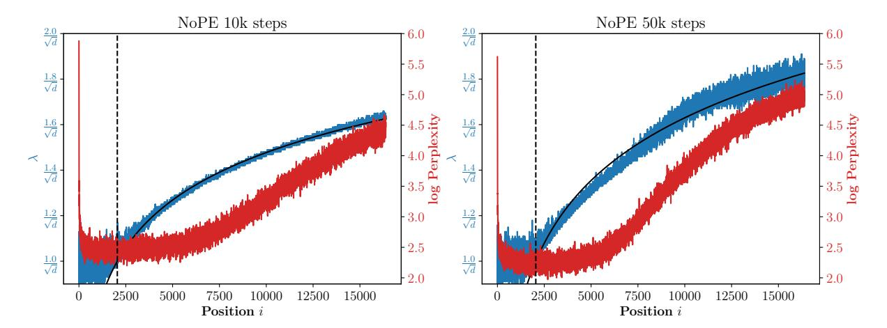

Figure 7: Fitted optimal uniform scale for each position. The red line indicates best log perplexity found at each position, the blue line plots the corresponding optimal uniform  $\lambda$  for that position, the black curve is the fitted function and the vertical dotted line is pre-training length.

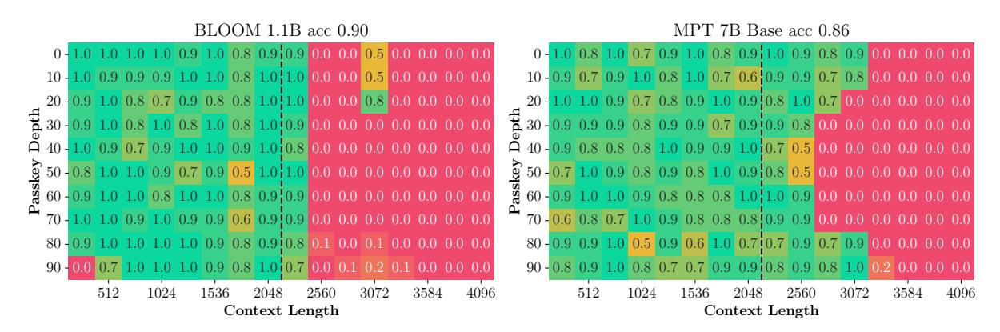

Figure 8: The results of passkey retrieval for ALiBi baselines. The vertical dashed line represents the pre-training length. While ALiBi models do exhibit performance beyond the pre-trained length, their expansion is not substantial.

## D Entropy Visualization of All Heads

Figures 10 to 12 show attention entropy across all layers and all heads of the 8k extension head-based scale method, UniformScale and the original NoPE. An additional theoretical upper bound of entropy is also plotted in the figures. We note that for each position i, the maximum entropy is achieved when  $\forall j, \ \alpha_{ij}^{(h)} = \frac{1}{i}$  is satisfied in Equation 2. The maximum value is then given by  $\mathcal{H}_i^{(h)} = \log i$ .

It is observed in Figure 10 that the lower layers have high entropy, closely approaching the upper bound. Most heads exhibit constant entropy for all positions. And the attention values span a broad spectrum, ranging from 0 to theoretical upper-bound.

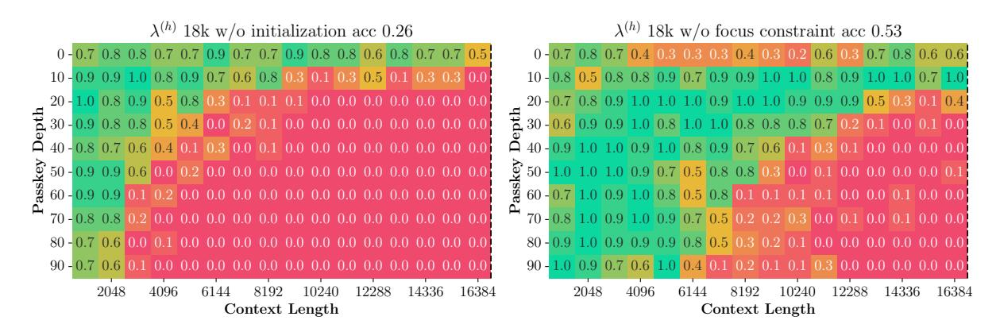

Figure 9: The results of passkey retrieval for HeadScale variations. These results are anticipated to apply to a context length of 16K, but they fail to retrieve the passkey unless it is positioned at the beginning of the context window.

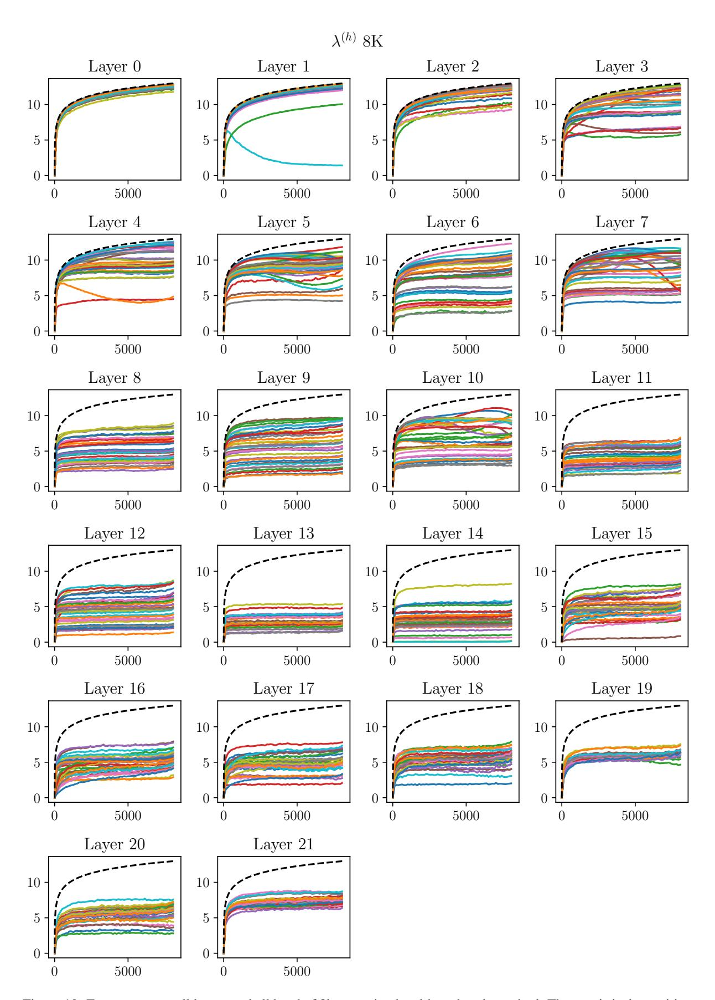

Figure 10: Entropy across all layers and all head of 8k extension head-based scale method. The x-axis is the position of extension and the y-axis is entropy averaged over all test samples. The black dashed curve is the theoretical upper-bound of entropy.

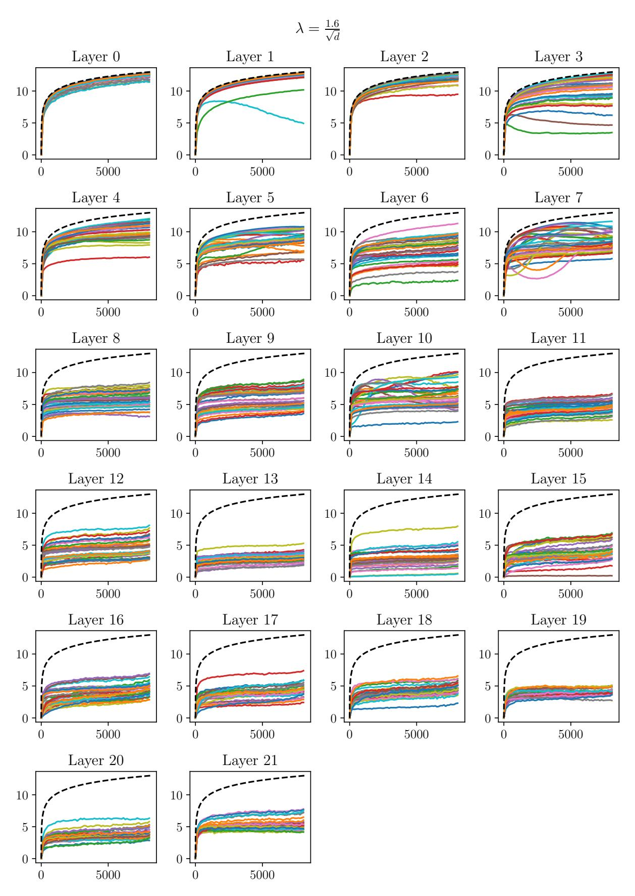

Figure 11: Entropy across all layers and all head of UniformScale with  $\lambda = \frac{1.6}{\sqrt{d}}$ 

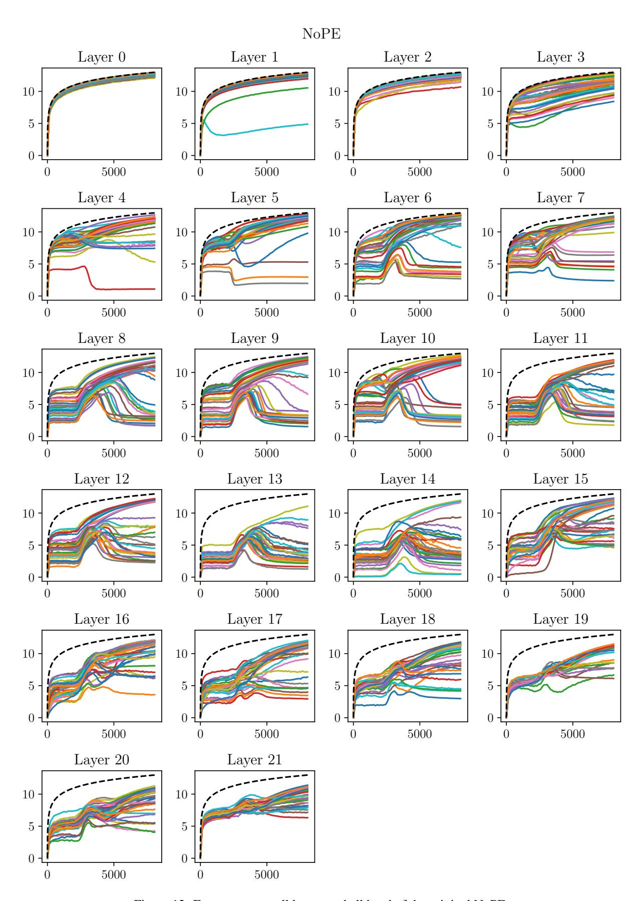

Figure 12: Entropy across all layers and all head of the original NoPE.