# Likelihood-Based Reward Designs for General LLM Reasoning

 ${\sf Ariel\ Kwiatkowski}^1,\ {\sf Natasha\ Butt}^{2,*},\ {\sf Ismail\ Labiad}^1,\ {\sf Julia\ Kempe}^{1,3,\dagger},\ {\sf Yann\ Ollivier}^{1,\dagger}$ 

Fine-tuning large language models (LLMs) on reasoning benchmarks via reinforcement learning requires a specific reward function, often binary, for each benchmark. This comes with two potential limitations: the need to design the reward, and the potentially sparse nature of binary rewards. Here, we systematically investigate rewards derived from the probability or log-probability of emitting the reference answer (or any other prompt continuation present in the data), which have the advantage of not relying on specific verifiers and being available at scale. Several recent works have advocated for the use of similar rewards (e.g., VeriFree, JEPO, RLPR, NOVER).

We systematically compare variants of likelihood-based rewards with standard baselines, testing performance both on standard mathematical reasoning benchmarks, and on long-form answers where no external verifier is available. We find that using the *log-probability* of the reference answer as the reward for chain-of-thought (CoT) learning is the only option that performs well in all setups. This reward is also consistent with the next-token log-likelihood loss used during pretraining.

In verifiable settings, log-probability rewards bring comparable or better success rates than reinforcing with standard binary rewards, and yield much better perplexity. In non-verifiable settings, they perform on par with SFT. On the other hand, methods based on probability, such as VeriFree, flatline on non-verifiable settings due to vanishing probabilities of getting the correct answer.

Overall, this establishes log-probability rewards as a viable method for CoT fine-tuning, bridging the short, verifiable and long, non-verifiable answer settings.

Date: February 5, 2026

Correspondence: Ariel Kwiatkowski at ariel.j.kwiatkowski@gmail.com

Meta

## 1 Introduction

Large language models (LLMs) have achieved striking progress on tasks requiring reasoning, from mathematics to code generation (Cobbe et al., 2021; Hendrycks et al., 2021b; OpenAI, 2023). A central ingredient has been chain-of-thought (CoT) prompting, where models articulate intermediate reasoning steps before producing a final answer (Wei et al., 2022; Guo et al., 2025). However, CoTs are rarely available in raw training data, making reinforcement learning (RL) the predominant approach: the CoT is treated as a sequence of actions, and correctness of the final answer determines the reward. This paradigm works well in verifiable domains such as mathematics and programming, where ground-truth correctness is available (Cobbe et al., 2021; Hendrycks et al., 2021b; Chen et al., 2021; Austin et al., 2021; Hendrycks et al., 2021a), but it does not naturally extend to non-verifiable domains like long-form proofs or open-ended generation.

To overcome this limitation, we investigate reusing training signals closer to the log-likelihood signal already employed during pretraining. Instead of sampling answers and relying on 0/1 correctness rewards, we reward the model for increasing the probability or log-probability of the answers present in the training data. Such criteria are universal—they apply in both verifiable and non-verifiable settings and could provide a denser signal. Such approaches are present, e.g., in Zhou et al. (2025) (training with the probability of the reference answer) or Tang et al. (2025) (training with a variant of the log-probability of the reference answer). Note

&lt;sup>1Meta FAIR, 2University of Amsterdam, 3New York University

\*Work done during an internship at Meta, †Joint senior authors

that reference answers are available for situations in which 0/1 rewards are not, such as long-form question-answering. This makes it possible to test these methods both in verifiable and non-verifiable, long-form answer settings. We particularly focus on the case of log-probability, since it is conceptually the closest to the pretraining criterion.

Our Approach and Contributions. We conduct the first comprehensive study of probability-based RL rewards for CoT training, spanning verifiable and non-verifiable domains, across multiple model families (Qwen-2.5, Llama-3.2). Our main contributions and findings are:

- Systematic evaluation across domains. We test many variants of probability-based rewards (probabilities and log-probabilities, including several variants from the literature such as VeriFree, RLPR, JEPO) for CoT training, comparing against supervised fine-tuning (SFT) and standard RL training (RLOO) baselines. We run the comparisons on two verifiable benchmarks MATH (Hendrycks et al., 2021b), DeepScaleR (Luo et al., 2025) and two non-verifiable settings Alpaca (Taori et al., 2023) and the non-verifiable "proof portion" of NuminaMath (Li et al., 2024).
- Universality of log-probability rewards. Among the variants tested, rewards based on *log*-probabilities perform well in every scenario (short, verifiable answers and long, non-verifiable answers), while all others fail in one or several settings.
- Advantages of probability-based rewards. For verifiable domains, all variants of probability-based rewards perform similarly and slightly outperform base RL training in terms of greedy success rate on verifiable domains. They also offer some computational advantages during training (no need to sample an answer).
- Success and perplexity trade-offs. In verifiable domains, log-probability rewards perform well both in terms of success rate and of perplexity a key metric aligned with pretraining. On the other hand, both base RL training and probability-based rewards perform extremely poorly on perplexity (much worse than SFT). This highlights a distinct advantage of log-probabilities.
- Non-verifiable domain behavior. On long-form domains, both base RL and pure probability rewards collapse due to vanishing probabilities of long answers. Log-probability rewards remain viable and perform similarly to SFT.
- CoT shortening with log-probability rewards. In every scenario, log-probability rewards lead to an initial shortening of the CoT. For verifiable domains, the length of the CoT recovers during training. On the other hand, for non-verifiable domains, the CoT stays very short, meaning log-probability rewards largely follow SFT from that point. On verifiable domains, base RL and pure probability rewards (VeriFree) do not exhibit this shortening. Mitigating strategies such as CoT length rewards and KL penalties maintain CoT but hurt performance. Thus, it seems that RL CoT training on non-verifiable domains can only match SFT by eliminating the CoT. We discuss hypotheses around this phenomenon.

Overall, these results establish log-likelihood rewards as a simple way to bridge verifiable and non-verifiable settings under a single training criterion, broadly applicable for fine-tuning LLMs.

Related Work. Several prior works have proposed to modify the binary rewards in standard RL post-training settings. We can globally distinguish these rewards into intrinsic rewards that do not require ground-truth, and those that use the confidence or log-likelihood of the ground-truth answer. The former category utilizes measures of confidence, entropy or diversity as measured by the generating language model itself (Prabhudesai et al., 2025; Agarwal et al., 2025; Zhao et al., 2025; Li et al., 2025a; Gao et al., 2025). Nevertheless, these intrinsic rewards generally cannot surpass rewards grounded in true correctness except under strong coverage assumptions, and tend to lead to reward hacking or diversity collapse. Huang et al. (2025a) show that self-rewarding can only "sharpen" knowledge already covered by the base model—it cannot create new information—so performance is bounded by model coverage (i.e. its pass@k rate). Song et al. (2024) formalizes the generation–verification gap and shows self-improvement hinges on sufficient coverage and verifier quality; when these are weak, intrinsic/self-verification stalls and fails to match correctness-based training. Finally, Huang et al. (2025b) proves that inference-time alignment with imperfect reward models suffers reward hacking and lacks guarantees under realistic coverage, again falling short of what verified rewards can achieve.

Another study (sur Kayal et al., 2025), shows that certain intrinsic signals (like policy entropy or state novelty) can fail in high-dimensional or complex output spaces, and sometimes result in exploration that diverges from the downstream task. Some works combine intrinsic and binary rewards (Song et al., 2025; Li et al., 2025b) to encourage exploration. Yet another line of works explores using LLM-as-a-judge synthetic rewards in RL-based post-training (RLAIF), explored as an alternative to human feedback (Lee et al., 2024; Bai et al., 2022) or for (semi-)verifiable domains (Whitehouse et al., 2025; Jayalath et al., 2025; Simonds et al., 2025).

Closer to our line of work are works that use the probability or log-likelihood of the reference answer given a generated reasoning chain under the initial policy model to provide a verifier-free scoring function. We highlight the works relevant to our setting and label them with distinctive keywords for clarity. To the best of our knowledge, none of these studies investigate log-likelihoods as a primary reward signal, with the exception of Tang et al. (2025), who include it as an ablation against their proposed JEPO reward and report weaker performance. In contrast, we introduce log-likelihood rewards as a primary training signal, and our experiments consistently demonstrate their competitiveness across models and datasets, including those evaluated in prior work.

- VeriFree (Zhou et al., 2025) uses probabilities of reference answers as reward in verifiable domains
- JEPO (Tang et al., 2025) introduces a Jensen-based ELBO loss with log-probs. In experiments they mix verifiable with non-verifiable data to show that the verifiable part improves with this loss.
- RLPR (Yu et al., 2025) uses average probability of the ground truth for non-verifiable domains.
- NOVER (Liu et al., 2025) is a variant of probability-based rewards, using a geometric mean of per-token perplexities.
- Reinforcement-pretraining (Dong et al., 2025) performs small-scale pretraining from scratch, inserting CoTs at specific points and rewarding for correct continuation over a few tokens.
- LongForm (Gurung & Lapata, 2025) designs a clever reward function (VR-CLI) that allows them to use an unlabeled book dataset as a learning signal for reasoning.

#### 2 Method

Context: Chain-of-thought fine-tuning via Reinforcement Learning. We consider the general context of fine-tuning an LLM to improve performance on a set of questions-answers via a Chain-of-Thought (CoT) optimized by reinforcement learning. For each prompt p, the fine-tuned model should first print a CoT z, then an answer a. Then a reward R is computed depending on a (such as correctness, or matching some reference answer). Fine-tuning should optimize the expected reward.

Denoting  $\pi_{\theta}$  the generative probabilistic model with parameter  $\theta$ , and  $\mathcal{D}$  the dataset (a distribution of questions or prompts p), we want to maximize

$$J_{\theta} = \mathbb{E}_{p \sim \mathcal{D}} \, \mathbb{E}_{z \sim \pi_{\theta}(z|p), \, a \sim \pi_{\theta}(a|p,z)} [R(z,a)] \tag{1}$$

where R(z, a) is the reward obtained for CoT z and answer a.

This task is often tackled with RL variants of the basic Reinforce algorithms, such as RLOO (Ahmadian et al., 2024), GRPO (Guo et al., 2025), or PPO (Schulman et al., 2017).

RL fine-tuning with probability-based rewards. We focus on the case when a reference answer  $a^*$  is available for each prompt in the dataset. Then it is possible to estimate the probability of this answer given the CoT. We will compare RL training with several rewards derived in this setting.

For instance, we can set a reward similar to the log-loss used during pretraining,

$$R(z,a) = \log \pi_{\theta}(a^{\star}|p,z). \tag{2}$$

We call this setting *log-prob rewards*. Given a CoT z, this quantity can be computed in one pass of a transformer on the reference answer  $a^*$ . In particular, since the reward depends on z and  $a^*$  but not on a, sampling of an answer a given the CoT z is not necessary.

We also consider the average log-prob reward variant

$$R(z,a) = \frac{1}{|a^*|} \log \pi_\theta(a^*|p,z)$$
(3)

namely, we compute the per-token log-probability by downscaling the reward by the length  $|a^*|$  of the answer. This results in a different weighting of the various data samples in the dataset.

Log-prob rewards are aligned with the pretraining phase of LLM training, where the criterion is the log-probability of the next token. They do not require access to a verifier, only to a reference answer (or any continuation) in the data. Thus, they can potentially be applied any question-answer pairs.

The logprob reward setting is also considered in Tang et al. (2025), although they largely focus on a "multi-sample" variant. The gradient of the expected reward is derived there as

$$\nabla J_{\theta} = \mathbb{E}_{p \sim \mathcal{D}} \, \mathbb{E}_{z \sim \pi_{\theta}(z|p), \, a \sim \pi_{\theta}(a|p,z)} [\log \pi_{\theta}(a^{\star}|p,z) \, \nabla \log \pi_{\theta}(z|p) + \nabla \log \pi_{\theta}(a^{\star}|p,z)]$$

$$\tag{4}$$

As noted in Tang et al. (2025), the second term is analogous to a supervised fine-tuning term that directly optimizes the log-likelihood of the reference answer  $a^*$  given what comes before, and the first term is a traditional Reinforce term with reward  $\log \pi_{\theta}(a^*|p,z)$ . For completeness, we derive this gradient in Section A, together with its application to RL algorithms such as RLOO.

A related but different reward appears in Zhou et al. (2025):

$$R_{\text{VeriFree}}(z, a) = \pi_{\theta}(a^{\star}|p, z) = \mathbb{E}_{a \sim \pi_{\theta}(a|p, z)}[1_{a=a^{\star}}]$$

$$\tag{5}$$

thus, without the logarithm. This is the *expected* success rate for matching the reference answer  $a^*$ : in expectation, it is the same as using binary rewards, namely, sampling an answer a given the CoT, and setting a reward 1 if  $a = a^*$ . Zhou et al. (2025) prove that working with the expectation reduces variance compared to sampling a, and this affects training dynamics.

The VeriFree reward diverges from logprob rewards when probabilities are very small. For instance, if initially the model has an almost-zero probability to reach the reference answer, then the VeriFree reward produces no learning. Similarly, for long free-form answers, the probability of an exact match with  $a^*$  is tiny, so we would expect a difference between VeriFree and logprob rewards. On the other hand, if the initial probability to reach the correct answer is reasonably high, then we expect the VeriFree and logprob rewards to be well aligned.

Algorithms and rewards tested. We now give an outline of the algorithms compared in the experiments.

For every RL algorithm except JEPO, the advantages used for the Reinforce gradient updates are obtained by RLOO, i.e., by subtracting from the reward a leave-one-out estimate of the mean reward estimated on a minibatch for a given prompt; this is an unbiased version of GRPO (Guo et al., 2025).

- SFT: standard fine-tuning with the next-token cross-entropy loss. Namely, we omit the CoT, and fine-tune the model to predict the ground truth directly from the prompt.
- Base RL: this is the most direct RL method. For each prompt p, we sample a CoT  $z \sim \pi_{\theta}(z|p)$ , then an answer  $a \sim \pi_{\theta}(a|p,z)$ , and check whether the answer is correct:

$$R_{\rm RLOO}(z,a) = 1_{a=a^*} \tag{6}$$

given the reference answer  $a^*$ . As for all other RL methods, we employ a leave-one-out advantage estimation (RLOO).

• Probability (VeriFree): As mentioned above, the reward is

$$R_{\text{Probability}}(z, a) = \pi_{\theta}(a^{\star}|p, z) = \mathbb{E}_{a \sim \pi_{\theta}(a|p, z)}[1_{a=a^{\star}}] \tag{7}$$

namely, instead of sampling an answer a from the model, we directly compute the probability of the reference answer  $a^*$  given z using the model  $\pi_{\theta}$ .

• Average prob (AvgProb): Similarly to RLPR (Yu et al., 2025), the reward is set to the average per-token probabilities of the reference answer:

$$R_{\text{avgprob}}(z, a) = \frac{1}{|a^{\star}|} \sum_{t=1}^{|a^{\star}|} \pi_{\theta}(a_t^{\star}|p, z, a_{[1:t-1]}^{\star})$$
(8)

• Log-prob: the reward is

$$R_{\text{log-prob}}(z, a) = \log \pi_{\theta}(a^{\star}|p, z) \tag{9}$$

namely, we directly compute the log-likelihood of the reference answer  $a^*$  given z.

• Average log-prob (AvgLogprob): In log-probs, longer answers have rewards of a bigger magnitude, since  $\log \pi_{\theta}(a^{\star}|p,z)$  is a sum over all tokens in  $a^{\star}$ . Average log-probs rescales the reward accordingly:

$$R_{\text{avglogprob}}(z, a) = \frac{1}{|a^{\star}|} \log \pi_{\theta}(a^{\star}|p, z)$$
(10)

where  $|a^*|$  is the number of tokens in  $a^*$ . Compared to log-probs, this just means that different answers in the dataset are weighted in a different way.

• JEPO (Tang et al., 2025) used a refined version of the group reward in GRPO and RLOO, by noting that the expected log-probability  $\mathbb{E}_{z \sim \pi_{\theta}(z|p)} \log \pi_{\theta}(a^{\star}|p,z)$  is an underestimate of the actual log of the probability to get  $a^{\star}$  using  $\pi_{\theta}$ , which is  $\log \mathbb{E}_{z \sim \pi_{\theta}(z|p)} \pi_{\theta}(a^{\star}|p,z)$ . So, starting from GRPO, they introduce a group-level reward based on G samples  $z_1, \ldots, z_G$  for a given prompt,

$$R(z_1, \dots, z_G) = \log \frac{1}{G} \sum_{i=1}^{G} \pi_{\theta}(a^*|p, z_i).$$
 (11)

Compared to log-probs over a similar minibatch  $z_i$ , the reward is the log-mean-exp of rewards in the minibatch. For Reinforce advantage estimation, they subtract the similar estimate over G-1 samples without the sample  $z_i$ . We will use G=4 as in Tang et al. (2025).

Success metrics. For each algorithm, we report several success metrics. These metrics largely follow the quantities tracked by the different algorithms.

We denote by  $\mathcal{D}$  the distribution of prompts and reference answers in the dataset.

Given a prompt p, the probability to obtain the correct answer using a CoT model  $\pi$  is

$$\pi^{\text{CoT}}(a^{\star}|p) = \mathbb{E}_{z \sim \pi(z|p)} \left[ \pi(a^{\star}|p, z) \right]. \tag{12}$$

• Success rate: This is the probability to get a correct answer, averaged over the dataset,

$$\mathbb{E}_{(p,a^{\star})\sim\mathcal{D}}\left[\pi^{\text{CoT}}(a^{\star}|p)\right]. \tag{13}$$

It can be estimated directly by sampling a prompt and answer in the dataset, sampling a CoT z, and computing  $\pi_{\theta}(a^{\star}|p,z)$ . This is the estimate we report. VeriFree and Base RL directly optimize the success rate. We consider two modes for generating the answers given a prompt and chain of thought: Greedy success, where the most likely token is used at each step, and T=1 sampling success from the softmax probabilities at temperature T=1.

Log-probability: This is a family of metrics that aggregate the likelihood of answer tokens across the
dataset,

$$\mathbb{E}_{(p,a^{\star})\sim\mathcal{D}}\left[\log \pi^{\text{CoT}}(a^{\star}|p)\right]. \tag{14}$$

To keep these quantities comparable, we consider two averaging schemes – per-token and per-answer.

- Per-token log-probabilities sums the log-probabilities of all answer tokens in the dataset, and divides by the total number of those tokens. Equivalently

$$\frac{1}{\mathbb{E}_{(p,a^{\star})\in\mathcal{D}}[|a^{\star}|]} \mathbb{E}_{(p,a^{\star})\in\mathcal{D}} \left[\log \pi^{\text{CoT}}(a^{\star}|p)\right]$$
(15)

- Per-answer log-probabilities averages across each answer, then averages over the dataset:

$$\mathbb{E}_{(p,a^{\star})\in\mathcal{D}}\left[\frac{1}{|a^{\star}|}\log\pi^{\mathrm{CoT}}(a^{\star}|p)\right]$$
(16)

However, these metrics are difficult to estimate directly due to the expectation over z inside the log, since  $\pi^{\text{CoT}}$  is an expectation. A simple solution is to estimate the average via Monte Carlo using N samples (Tang et al., 2025):

$$\mathbb{E}_{(p,a^{\star})\sim\mathcal{D}}\left[\log\frac{1}{N}\sum_{i=1}^{N}\pi(a^{\star}|p,z_{i})\right]$$
(17)

where the  $z_i$  are sampled from  $\pi(z_i|p)$ . We refer to this as logprob-MCN. We apply this modification to both per-answer and per-token averaged logprobs.

We will use both the "naive" estimate logprob-MC1 with N=1, and a more precise estimate, logprob-MC32, computed less frequently during training.

For supervised fine-tuning (SFT) with no CoT, this is irrelevant as there is no expectation over z, and we can report  $\log \pi(a^*|p)$  directly.

The MC estimate is always an underestimate of the actual logprob  $\log \pi^{\text{CoT}}(a^*|p)$ , since log is concave. This should be kept in mind when comparing logprob-MC1 to SFT log-probabilities.

- We also report *perplexity*, which is just the exponential of minus per-answer log-probabilities. Technically, this corresponds to *per answer perplexity-MC1*; we shorten to *perplexity*. This is also equal to the geometric mean of the perplexity of the answer for each prompt in the dataset.
- Average CoT length: We also report the average length of the CoTs used by a model,

$$\mathbb{E}_{(p,a^{\star})\in\mathcal{D}}\,\mathbb{E}_{z\sim\pi(z|p)}\left[|z|\right]\tag{18}$$

as a relevant quantity for analysis. Note that this includes formatting tokens.

## 3 Experimental Results

#### 3.1 Setup: Datasets, Models, and Protocol

Models. We evaluate on two instruction-tuned models: Llama-3.2-3B-Instruct (Dubey et al., 2024), and QWEN-2.5-3B-Instruct (Yang et al., 2024).

Datasets. We consider two *verifiable* math benchmarks and two *non-verifiable* long-form datasets. (i) MATH (Hendrycks et al., 2021b):We report accuracy on the official test split. The resulting training set contains ~7,000 short-answer problems. (ii) DeepScaleR (Preview) (Luo et al., 2025): we hold out a random 10% for validation to report performance. The training set has ~39,000 short-answer problems. (iii) Alpaca (cleaned) (Taori et al., 2023): we use the standard cleaned variant; 1,000 random examples are used for validation, leaving ~50,000 training samples with predominantly long-form answers. (iv) NuminaProof: starting from NuminaMath-1.5 (Li et al., 2024), we filter for theorem-proof style items. We reserve 1,000 examples for validation, yielding ~50,000 long-form training samples. More detail in Section B.

Algorithms tested. We compare the algorithms mentioned in Section 2, namely, SFT and the following RL variants: Base RL, Probability (VeriFree), Logprob, AvgLogprob, AvgProb, and JEPO. These differ by the rewards used, as described in Section 2. Details in Section B.

|                       | Base model        | Base RL            | Log-prob           | Avg Logprob        | Probability       | Avg Probability    | SFT (no CoT) |
|-----------------------|-------------------|--------------------|--------------------|--------------------|-------------------|--------------------|--------------|
| Llama 3B, MATH        |                   |                    |                    |                    |                   |                    |              |
| Greedy success        | $17.13 \pm 0.00$  | $42.74 \pm 0.66$   | $43.30 \pm 0.10$   | $43.66 \pm 0.25$   | $44.19 \pm 0.57$  | $43.95 \pm 0.44$   | 14.43        |
| T=1 Sampled Success   | $10.77 \pm 0.27$  | $41.36 \pm 0.15$   | $34.66 \pm 0.81$   | $34.83 \pm 0.00$   | $41.39 \pm 0.09$  | $38.38 \pm 0.74$   | 10.00        |
| Average log-prob MC32 | _                 | _                  | $-0.68 \pm 0.00$   | $-0.69 \pm 0.01$   | $-1.32 \pm 0.01$  | $-0.77 \pm 0.00$   | -0.97        |
| Average log-prob      | $-4.21 \pm 0.00$  | $-2.63 \pm 0.02$   | $-0.79 \pm 0.03$   | $-0.81 \pm 0.04$   | $-1.97 \pm 0.04$  | $-1.08 \pm 0.03$   | -0.97        |
| Perplexity            | $67.29 \pm 0.00$  | $13.87 \pm 0.34$   | $2.21 \pm 0.06$    | $2.25 \pm 0.09$    | $7.14 \pm 0.26$   | $2.95 \pm 0.08$    | 2.63         |
| CoT length            | $326.77\pm0.71$   | $321.01\pm24.42$   | $298.97\pm2.82$    | $302.74\pm2.21$    | $313.58\pm1.87$   | $320.17 \pm 5.69$  | 5.00         |
| Qwen 3B, MATH         |                   |                    |                    |                    |                   |                    |              |
| Greedy success        | $21.19 \pm 0.00$  | $55.85 \pm 0.46$   | $56.84 \pm 0.21$   | $56.11 \pm 0.20$   | $56.46 \pm 0.05$  | $57.41 \pm 0.16$   | 18.32        |
| T=1 Sampled Success   | $16.63 \pm 0.30$  | $55.36 \pm 0.17$   | $44.18 \pm 0.42$   | $42.45 \pm 0.51$   | $53.32 \pm 0.22$  | $47.34 \pm 0.87$   | 12.00        |
| Average log-prob MC32 | _                 | _                  | $-0.39 \pm 0.00$   | $-0.40 \pm 0.01$   | $-1.03 \pm 0.01$  | $-0.42 \pm 0.00$   | _            |
| Average log-prob      | $-2.19 \pm 0.00$  | $-2.11 \pm 0.10$   | $-0.44 \pm 0.02$   | $-0.50 \pm 0.00$   | $-1.77 \pm 0.01$  | $-0.68 \pm 0.05$   | -0.69        |
| Perplexity            | $8.92 \pm 0.00$   | $8.25 \pm 0.80$    | $1.55 \pm 0.03$    | $1.64 \pm 0.00$    | $5.85 \pm 0.03$   | $1.97 \pm 0.09$    | 1.99         |
| CoT length            | $222.35\pm0.73$   | $451.83\pm14.14$   | $381.49 \pm 10.22$ | $372.01\pm18.76$   | $429.35\pm1.25$   | $419.51 \pm 4.31$  | 5.00         |
| Llama 3B, DeepScaleR  |                   |                    |                    |                    |                   |                    |              |
| Greedy success        | $10.05 \pm 0.00$  | $28.55 \pm 0.14$   | $32.40 \pm 1.02$   | $32.20 \pm 1.37$   | $31.75 \pm 1.56$  | $30.75 \pm 1.02$   | 9.88         |
| T=1 Sampled Success   | $5.20 \pm 0.14$   | $28.54 \pm 0.35$   | $17.97 \pm 0.98$   | $18.32 \pm 0.04$   | $28.47 \pm 0.03$  | $21.71 \pm 0.50$   | 5.14         |
| Average log-prob MC32 | _                 | $-2.01 \pm 0.29$   | $-0.79 \pm 0.01$   | $-0.80 \pm 0.00$   | $-1.63 \pm 0.03$  | $-0.85 \pm 0.01$   | -1.01        |
| Average log-prob      | $-4.92 \pm 0.00$  | $-2.77 \pm 0.48$   | $-0.83 \pm 0.04$   | $-0.84 \pm 0.02$   | $-2.32 \pm 0.15$  | $-1.31 \pm 0.08$   | -1.01        |
| Perplexity            | $137.25 \pm 0.00$ | $16.89 \pm 7.75$   | $2.30 \pm 0.09$    | $2.32 \pm 0.05$    | $10.28 \pm 1.49$  | $3.71 \pm 0.30$    | 2.74         |
| CoT length            | $354.91 \pm 1.28$ | $294.52 \pm 22.73$ | $437.11 \pm 0.41$  | $371.88 \pm 11.88$ | $340.01 \pm 6.16$ | $335.89 \pm 19.74$ | 5.00         |
| Qwen 3B, DeepScaleR   |                   |                    |                    |                    |                   |                    |              |
| Greedy success        | $14.02 \pm 0.00$  | $38.30 \pm 2.40$   | $37.92 \pm 0.11$   | $38.12 \pm 0.83$   | $38.68 \pm 0.67$  | $39.20 \pm 1.56$   | 11.52        |
| T=1 Sampled Success   | $11.00 \pm 0.42$  | $38.56 \pm 0.35$   | $25.79 \pm 0.43$   | $25.82 \pm 0.44$   | $36.83 \pm 0.07$  | $28.79 \pm 0.59$   | 6.48         |
| Average log-prob MC32 | _                 | $-2.38 \pm 0.00$   | $-0.56 \pm 0.00$   | $-0.57 \pm 0.01$   | $-1.68 \pm 0.05$  | $-0.59 \pm 0.00$   | -0.76        |
| Average log-prob      | $-2.57 \pm 0.00$  | $-3.55 \pm 0.14$   | $-0.59 \pm 0.01$   | $-0.70 \pm 0.01$   | $-2.73 \pm 0.03$  | $-0.85 \pm 0.02$   | -0.76        |
| Perplexity            | $13.12 \pm 0.00$  | $34.85 \pm 4.93$   | $1.80 \pm 0.02$    | $2.02 \pm 0.01$    | $15.28 \pm 0.42$  | $2.33 \pm 0.05$    | 2.14         |
| CoT length            | $218.12\pm7.35$   | $453.69\pm7.81$    | $532.79 \pm 36.46$ | $463.46\pm0.11$    | $481.15\pm3.03$   | $460.00\pm6.25$    | 5.00         |

Table 1 Results on verifiable domains, G=32. Final performance of models across all our algorithms and metrics. Results are averaged over two seeds. Rows are labeled by the test metrics, columns by the algorithms. We observe that methods which use the log-probability as a reward (Log-prob, Avg Logprop, JEPO) often underperform the baseline when the answer is sampled. However, the gap closes when the answer is produced deterministically (greedy success). Perplexity and log-prob based metrics universally improve for the log-prob family of rewards, clearly surpassing SFT levels, while base RL lags behind in this metric, and probability-based rewards situate themselves in the middle between those. Learning curves are shown in Figures 1 and 3 to 5.

Verifiable. We run experiments with all methods on verifiable domains with RLOO group size G = 4 and G = 32, except for JEPO, where we only run with group size G = 4 (the value used in Tang et al. (2025)) as JEPO is harder to implement efficiently for larger  $G^1$ . In the loss function we include a KL divergence regularization term as proposed by Guo et al. (2025) with a coefficient of 0.001.

Non-verifiable. In non-verifiable domains, we run with G=4 throughout. Here, we do not use a KL divergence term in the main results, but we explore its impact in the ablations.

#### 3.2 Results on Verifiable Domains

We present the results on verifiable domains in Table 1, and Figures 1 and 3 to 5 in Section C for G = 32. The results for G = 4 (including JEPO) appear in Table 3 and Figures 6 to 9 in Section C.

The key takeaway is that all RL variants based on ground-truth answers have similar success rates for greedily decoded answers. More precisely, all (log-)probability-based variants perform better than Base RL when run with standard group size G = 32.

Sampling answers at temperature T=1 generally makes performance worse across the board. It also affects the ranking of methods: methods that use logprobs or average logprobs underperform both Base RL and the Prob variant. We believe T=1 sampling is the reason why logprobs did not perform well on MATH in Tang et al. (2025). Overall, we do not detect any strong difference between JEPO and simple Logprob when greedy sampling is used. Conceptually, JEPO is a more precise, more computationally heavy version of Logprob

 $\overline{\phantom{a}^{1}}$  Because the JEPO reward depends on the whole group and cannot be computed for each sample independently, efficient implementation with large G is more delicate.

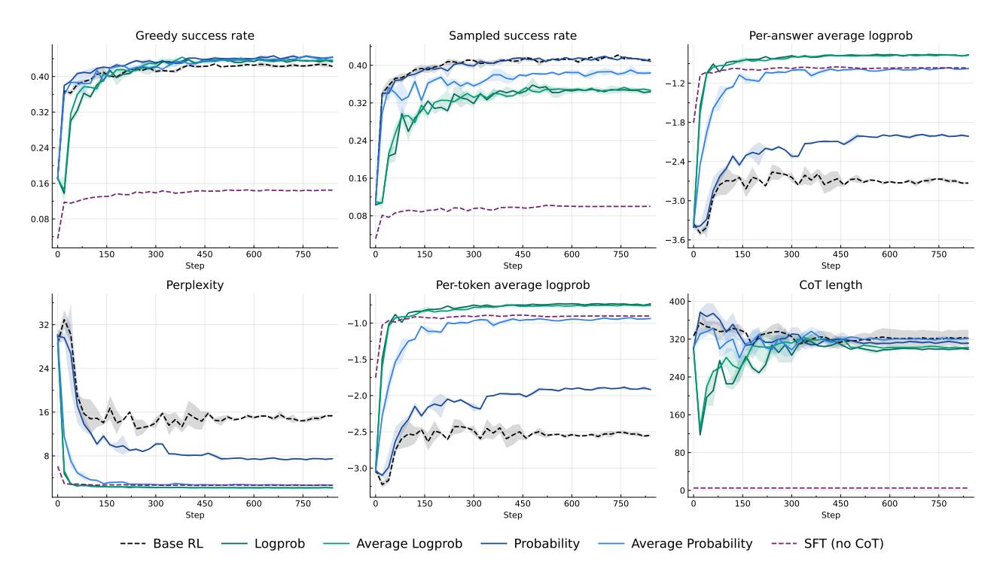

**Figure 1 Verifiable. Llama 3.2 3B Instruct on MATH, G=32.** Learning curves of our algorithms for various metrics. Dashed curves represent the RL baseline and (no-CoT) SFT; green shades for the logprob family of rewards (Logprob, Average logprob and JEPO) and blue for probability-based rewards *Probability (VeriFree)* and *Average Probability* (RLPR). Numerical values can be found in Table 1.

(larger N for Monte Carlo estimation of log-probabilities, see Section 2). The additional complexity is not justified in our setting.

The picture shifts when we consider *perplexity* in addition to success rate: here, only Logprob, AvgLogprob and JEPO achieve good perplexities, improving SFT by a significant margin on this criterion. This is new evidence of the interest of a CoT for these domains. Perplexity may not be the metric of most direct interest for verifiable questions, but it nevertheless informs us on the qualitative behavior of different models. Base RL and Prob yield very poor perplexities: a prob-trained model makes little difference between predicting a wrong answer with probability 0.99 or 1 and giving the correct answer with probability 0.01 or 0, while this makes a large difference for log-probabilities. On the other hand, logprob-trained models make sure that if they are wrong, they are not *confidently* wrong, by attributing some nonzero probability to all plausible answers.

Overall, logprob-trained models get both good success rates and good perplexity, while models trained directly for the success rate sacrifice perplexity. Presumably, logprob-trained models smooth out their predictions, while verifier or probability-based variants emit "sharper" probabilities.

#### 3.3 Results on Non-verifiable Domains

We present the results on NuminaProof and Alpaca with the Llama and Qwen models in Table 2 and Figure 2 and Figures 10 to 12 in Section C. We observe that training with logprobs, or with average logprobs or JEPO, consistently matches the performance of SFT. As predicted, *Probability* (VeriFree) fails to improve on these metrics, and *Average Probability* (RLPR) is noisier but trails the logprob family closely. This establishes the log-prob family of rewards as a universal method for both verifiable and non-verifiable domains.

|                             | Base model | Log-prob | Avg Logprob | Probability | Avg Probability | JEPO    | SFT (no CoT) |
|-----------------------------|------------|----------|-------------|-------------|-----------------|---------|--------------|
| Llama 3B, NuminaProof       |            |          |             |             |                 |         |              |
| Per-answer avg logprob      | -1.2871    | -1.1124  | -1.1175     | -1.2859     | -1.1157         | -1.1104 | -1.1127      |
| Perplexity                  | 3.62       | 3.04     | 3.06        | 3.62        | 3.05            | 3.04    | 3.04         |
| Per-answer avg logprob MC32 | _          | -1.1124  | -1.1175     | -1.2850     | -1.1157         | -1.1102 | -1.1127      |
| CoT length                  | 474.0      | 9.1      | 9.0         | 469.6       | 9.1             | 34.1    | 5.0          |
| Qwen 3B, NuminaProof        |            |          |             |             |                 |         |              |
| Per-answer avg logprob      | -1.1838    | -1.0174  | -1.0235     | -1.1862     | -1.0217         | -1.0218 | -1.0172      |
| Perplexity                  | 3.27       | 2.77     | 2.78        | 3.27        | 2.78            | 2.78    | 2.77         |
| Per-answer avg logprob MC32 | _          | -1.0174  | -1.0235     | -1.1852     | -1.0217         | -1.0218 | -1.0172      |
| CoT length                  | 225.6      | 5.3      | 9.0         | 225.2       | 10.0            | 14.1    | 5.0          |
| Llama 3B, Alpaca            |            |          |             |             |                 |         |              |
| Per-answer avg logprob      | -1.3493    | -0.9397  | -0.9449     | -1.5772     | -0.9513         | -0.9443 | -0.9381      |
| Perplexity                  | 3.85       | 2.56     | 2.57        | 4.84        | 2.59            | 2.57    | 2.56         |
| Per-answer avg logprob MC32 | _          | -0.9396  | -0.9449     | -1.5724     | -0.9512         | -0.9436 | -0.9381      |
| CoT length                  | 134.2      | 14.2     | 14.1        | 58.6        | 9.1             | 14.8    | 5.0          |
| Qwen 3B, Alpaca             |            |          |             |             |                 |         |              |
| Per-answer avg logprob      | -1.3968    | -0.8903  | -0.8933     | -1.2982     | -0.8989         | -0.8976 | -0.8905      |
| Perplexity                  | 4.04       | 2.44     | 2.44        | 3.66        | 2.46            | 2.45    | 2.44         |
| Per-answer avg logprob MC32 | _          | -0.8902  | -0.8931     | -1.2955     | -0.8988         | -0.8969 | -0.8905      |
| CoT length                  | 83.7       | 16.7     | 14.3        | 16.6        | 15.2            | 16.6    | 5.0          |

**Table 2 Results on non-verifiable domains.** Final performance across all initial models and metrics, on non-verifiable datasets. Probability rewards fail to learn due to their extremely low rewards. We observe that methods which use the log-probability experience a CoT collapse, reducing to SFT. The corresponding learning curves are shown in Figure 2 and Figures 10 to 12 in Section C.

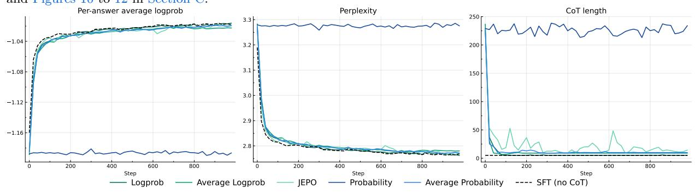

Figure 2 Non-verifiable: Qwen 2.5 3B Instruct on NuminaProof. Learning curves of our algorithms for three metrics. Numerical values can be found in Table 2. Log-prob family models match the (per-answer) average log-prob and perplexity from SFT, while probability rewards fail to improve on these metrics due to the sparsity of the rewards. We observe a rapid "collapse" in CoT-length for the log-prob family.

#### 3.4 Length of the Chain-of-Though During Training

We now report some intriguing observations on the behavior of the CoT during training, for which we have no complete explanation. In Figure 1, we see that CoTs trained with Logprob variants show an initial dip in length, followed by a recovery in verifiable domains. This pattern does not occur for Prob variants or Base RL. For non-verifiable rewards, we see an even starker pattern in Figure 2: the CoT dips to a length of 10 tokens (including formatting tokens) and never recovers. This means that the CoT is largely eliminated, and Logprob methods effectively become SFT – indeed we observe that the perplexity of methods with a collapsed CoT closely match those of the SFT baseline.

To understand the mechanism behind the CoT length dip, we hypothesized that early in training, shorter CoTs might lead to better predictions since the base model has been trained without CoTs. An initial negative correlation between CoT length and reward may push the model towards shorter CoTs during reinforcement learning. Indeed, we find that on average over questions in a dataset, the initial model exhibits a negative correlation between CoT length and log-probability of the correct answer for a given question (Appendix F. Figs. 20 and 21), both for Math and NuminaProof. This explains the initial drive towards shorter CoTs when doing RL on logprob rewards. This correlation is not present with probability rewards (Fig. 22), as the signal

is visibly "squashed" for small probabilities.

We tried two types of interventions on this pattern: increasing the KL divergence regularization to the base model, and introducing a length penalty that adds a negative reward for every token below a certain threshold in the CoT (see Section D for details). These interventions worked in that they prevented the CoT length dip, but this came at the cost of actual performance, as shown in Figures 14 to 17 in Section D.

We also considered that the SFT term might overpower the RL part, as the model is not used to writing long proofs; or that, initially, the mere presence of a CoT might affect the quality of the answer negatively (eg, due to distance from the question). To address these two points, we produced a "warm-start" model by SFT-ing on the answers in the presence of CoTs (with masked gradients for the CoT part). Such a warm-start model can be used in turn for RL fine-tuning. We describe these results in Section D: this stabilizes CoT length, but final performance only matches the SFT baseline, without beating it under a reasonable compute budget.

It is worth noting that in a similar setting, Tang et al. (2025) show JEPO eventually exceeding the SFT performance with long-form answers. The critical difference is that Tang et al. (2025) train for significantly longer (an order of magnitude) at a larger batch size and lower learning rate. So it is possible that JEPO enables training with long-form answers, at the cost of much higher compute requirements compared to RL with short-form, verifiable answers.

Discussion: Why don't CoTs improve performance for non-verifiable domains? We can put forward several hypothetical explanations for the apparent lack of improvement from CoT in non-verifiable domains. One possibility is that it takes longer to train long CoTs than short CoTs. RL has a worse signal-to-noise ratio when the number of actions increases, because of the well-known "credit-assignment problem". For CoT training, the actions are the tokens, so it is harder to identify good correlations in long CoTs than short ones. If this is the case, then a correlation between short CoTs and better performance would be present in the early phases of training, only to disappear once long CoTs catch up in performance. This could explain the dip-and-recovery pattern for verifiable domains. However, this does not explain why this pattern occurs for Log-prob but not for Prob in verifiable domains. Also, in this situation, we would expect the length penalties to help.

Another possibility is that, with long answers, the model has time to deploy a hidden CoT within its internal layers. Indeed, the survey by Zhu et al. (2025) puts forward increasing evidence for the existence of such hidden CoTs in LLMs. Conversely, for the very short answers in verifiable domains, there may be too few tokens to have an efficient internal CoT during the answer, and an actual, non-hidden CoT may be necessary. If this is the case, it may be interesting to build datasets that interpolate between short and long answers, and see if there is a transition. We leave these investigations to future work.

### 4 Conclusion

Our work establishes log-probability rewards as a unifying training signal effective in both verifiable and non-verifiable domains, without relying on ground-truth correctness labels. On reasoning benchmarks like MATH and DeepScaleR, log-probability rewards match the success rates of standard 0/1 RL objectives while substantially improving perplexity; on long-form proofs, they match supervised fine-tuning while other probability-based variants fall well below. This shows that the same criterion can be carried seamlessly across settings. This highlights their potential as a general recipe for post-training reasoning LLMs, valid over the full range of possible answer types. In future work, we hope to further develop this approach on non-verifiable domains, enabling efficient RL training on any dataset, leveraging the CoT capabilities.

Acknowledgement. JK thanks the Simons Foundation for support through the Collaborative Grant "The Physics of Learning and Neural Computation".

#### References

- Shivam Agarwal, Zimin Zhang, Lifan Yuan, Jiawei Han, and Hao Peng. The unreasonable effectiveness of entropy minimization in LLM reasoning. In *The Thirty-ninth Annual Conference on Neural Information Processing Systems*, 2025. URL https://openreview.net/forum?id=UfFTBEsLgI.
- Arash Ahmadian, Chris Cremer, Matthias Gallé, Marzieh Fadaee, Julia Kreutzer, Olivier Pietquin, Ahmet Üstün, and Sara Hooker. Back to basics: Revisiting reinforce style optimization for learning from human feedback in llms. arXiv preprint arXiv:2402.14740, 2024.
- Jacob Austin, Augustus Odena, Maxwell Nye, Maarten Bosma, Henryk Michalewski, David Dohan, Ellen Jiang, Carrie Cai, Michael Terry, Quoc Le, et al. Program synthesis with large language models. In *ICML*, 2021.
- Yuntao Bai, Saurav Kadavath, Sandipan Kundu, Amanda Askell, Jackson Kernion, Andy Jones, Anna Chen, Anna Goldie, Azalia Mirhoseini, Cameron McKinnon, Carol Chen, Catherine Olsson, Christopher Olah, Danny Hernandez, Dawn Drain, Deep Ganguli, Dustin Li, Eli Tran-Johnson, Ethan Perez, Jamie Kerr, Jared Mueller, Jeffrey Ladish, Joshua Landau, Kamal Ndousse, Kamile Lukosuite, Liane Lovitt, Michael Sellitto, Nelson Elhage, Nicholas Schiefer, Noemi Mercado, Nova DasSarma, Robert Lasenby, Robin Larson, Sam Ringer, Scott Johnston, Shauna Kravec, Sheer El Showk, Stanislav Fort, Tamera Lanham, Timothy Telleen-Lawton, Tom Conerly, Tom Henighan, Tristan Hume, Samuel R. Bowman, Zac Hatfield-Dodds, Ben Mann, Dario Amodei, Nicholas Joseph, Sam McCandlish, Tom Brown, and Jared Kaplan. Constitutional ai: Harmlessness from ai feedback, 2022. URL https://arxiv.org/abs/22 12.08073.
- Mark Chen, Jerry Tworek, Heewoo Jun, Qiming Yuan, Henrique Ponde de Oliveira Pinto, Jared Kaplan, Harri Edwards, Yuri Burda, Nicholas Joseph, Greg Brockman, et al. Evaluating large language models trained on code. arXiv preprint arXiv:2107.03374, 2021.
- Karl Cobbe, Vineet Kosaraju, Mohammad Bavarian, Mark Chen, Heewoo Jun, Lukasz Kaiser, Matthias Plappert, Jerry Tworek, Jacob Hilton, Reiichiro Nakano, et al. Training verifiers to solve math word problems. arXiv preprint arXiv:2110.14168, 2021.
- Qingxiu Dong, Li Dong, Yao Tang, Tianzhu Ye, Yutao Sun, Zhifang Sui, and Furu Wei. Reinforcement pre-training, 2025. URL https://arxiv.org/abs/2506.08007.
- Abhimanyu Dubey, Abhinav Jauhri, Abhinav Pandey, Abhishek Kadian, Ahmad Al-Dahle, Aiesha Letman, Akhil Mathur, Alan Schelten, Amy Yang, Angela Fan, et al. The llama 3 herd of models. arXiv e-prints, pp. arXiv-2407, 2024
- Zitian Gao, Lynx Chen, Haoming Luo, Joey Zhou, and Bryan Dai. One-shot entropy minimization. arXiv preprint arXiv:2505.20282, 2025.
- Daya Guo, Dejian Yang, Haowei Zhang, Junxiao Song, Ruoyu Zhang, Runxin Xu, Qihao Zhu, Shirong Ma, Peiyi Wang, Xiao Bi, et al. Deepseek-r1: Incentivizing reasoning capability in llms via reinforcement learning. arXiv preprint arXiv:2501.12948, 2025.
- Alexander Gurung and Mirella Lapata. Learning to reason for long-form story generation. In Second Conference on Language Modeling, 2025. URL https://openreview.net/forum?id=dr3eg5ehR2.
- Dan Hendrycks, Steven Basart, Saurav Kadavath, Mantas Mazeika, Akul Arora, Ethan Guo, Collin Burns, Samir Puranik, Horace He, Dawn Song, and Jacob Steinhardt. Measuring coding challenge competence with APPS. In Thirty-fifth Conference on Neural Information Processing Systems Datasets and Benchmarks Track (Round 2), 2021a. URL https://openreview.net/forum?id=sD93GOzH3i5.
- Dan Hendrycks, Collin Burns, Saurav Kadavath, Akul Arora, Steven Basart, Eric Tang, Dawn Song, and Jacob Steinhardt. Measuring mathematical problem solving with the math dataset. In *NeurIPS Datasets and Benchmarks*, 2021b. URL https://datasets-benchmarks-proceedings.neurips.cc/paper/2021/hash/be83ab3ecd0db773eb2dc1b0a17836a1-Abstract-round2.html.
- Audrey Huang, Adam Block, Dylan J. Foster, Dhruv Rohatgi, Cyril Zhang, Max Simchowitz, Jordan T. Ash, and Akshay Krishnamurthy. Self-improvement in language models: The sharpening mechanism. In *ICLR*, 2025a. URL <a href="https://openreview.net/forum?id=WJaUkwci9o">https://openreview.net/forum?id=WJaUkwci9o</a>. arXiv:2412.01951.
- Audrey Huang, Adam Block, Qinghua Liu, Nan Jiang, Akshay Krishnamurthy, and Dylan J. Foster. Is best-of-n the best of them? coverage, scaling, and optimality in inference-time alignment. In *International Conference on Machine Learning (ICML)*, 2025b. URL https://arxiv.org/abs/2503.21878. See also OpenReview: QnjfkhrbYK.

- Dulhan Jayalath, Shashwat Goel, Thomas Foster, Parag Jain, Suchin Gururangan, Cheng Zhang, Anirudh Goyal, and Alan Schelten. Compute as teacher: Turning inference compute into reference-free supervision, 2025. URL <a href="https://arxiv.org/abs/2509.14234">https://arxiv.org/abs/2509.14234</a>.
- Diederik P Kingma and Jimmy Ba. Adam: A method for stochastic optimization. arXiv preprint arXiv:1412.6980, 2014.
- Harrison Lee, Samrat Phatale, Hassan Mansoor, Thomas Mesnard, Johan Ferret, Kellie Ren Lu, Colton Bishop, Ethan Hall, Victor Carbune, Abhinav Rastogi, et al. Rlaif vs. rlhf: Scaling reinforcement learning from human feedback with ai feedback. In *International Conference on Machine Learning*, pp. 26874–26901. PMLR, 2024.
- Jia Li, Edward Beeching, Lewis Tunstall, Ben Lipkin, Roman Soletskyi, Shengyi Costa Huang, Kashif Rasul, Longhui Yu, Albert Jiang, Ziju Shen, Zihan Qin, Bin Dong, Li Zhou, Yann Fleureau, Guillaume Lample, and Stanislas Polu. Numinamath. [https://huggingface.co/AI-MO/NuminaMath-CoT](https://github.com/project-numina/aimo-progress-prize/blob/main/report/numina\_dataset.pdf), 2024.
- Pengyi Li, Matvey Skripkin, Alexander Zubrey, Andrey Kuznetsov, and Ivan Oseledets. Confidence is all you need: Few-shot rl fine-tuning of language models, 2025a. URL https://arxiv.org/abs/2506.06395.
- Tianjian Li, Yiming Zhang, Ping Yu, Swarnadeep Saha, Daniel Khashabi, Jason Weston, Jack Lanchantin, and Tianlu Wang. Jointly reinforcing diversity and quality in language model generations (darling). 2025b. URL <a href="https://arxiv.org/abs/2509.02534">https://arxiv.org/abs/2509.02534</a>.
- Wei Liu, Siya Qi, Xinyu Wang, Chen Qian, Yali Du, and Yulan He. Nover: Incentive training for language models via verifier-free reinforcement learning, 2025. URL https://arxiv.org/abs/2505.16022.
- Michael Luo, Sijun Tan, Justin Wong, Xiaoxiang Shi, William Tang, Manan Roongta, Colin Cai, Jeffrey Luo, Tianjun Zhang, Erran Li, Raluca Ada Popa, and Ion Stoica. Deepscaler: Surpassing o1-preview with a 1.5b model by scaling rl. https://pretty-radio-b75.notion.site/DeepScaleR-Surpassing-O1-Preview-with-a-1-5B-Model-by-Scaling-R L-19681902c1468005bed8ca303013a4e2, 2025. Notion Blog.
- OpenAI. Gpt-4 technical report. arXiv preprint arXiv:2303.08774, 2023.
- Mihir Prabhudesai, Lili Chen, Alex Ippoliti, Katerina Fragkiadaki, Hao Liu, and Deepak Pathak. Maximizing confidence alone improves reasoning, 2025. URL https://arxiv.org/abs/2505.22660.
- John Schulman, Filip Wolski, Prafulla Dhariwal, Alec Radford, and Oleg Klimov. Proximal policy optimization algorithms. arXiv preprint arXiv:1707.06347, 2017.
- Toby Simonds, Kevin Lopez, Akira Yoshiyama, and Dominique Garmier. Rlsr: Reinforcement learning from self reward, 2025. URL https://arxiv.org/abs/2505.08827.
- Yuda Song, Hanlin Zhang, Carson Eisenach, Sham Kakade, Dean Foster, and Udaya Ghai. Mind the gap: Examining the self-improvement capabilities of large language models. arXiv preprint arXiv:2412.02674, 2024.
- Yuda Song, Julia Kempe, and Rémi Munos. Outcome-based exploration for llm reasoning. 2025. URL https://arxiv.org/abs/2509.06941.
- Aya sur Kayal, Eduardo Pignatelli, and Laura Toni. The impact of intrinsic rewards on exploration in reinforcement learning. 2025. URL https://arxiv.org/abs/2501.11533.
- Yunhao Tang, Sid Wang, Lovish Madaan, and Remi Munos. Beyond verifiable rewards: Scaling reinforcement learning in language models to unverifiable data. In *The Thirty-ninth Annual Conference on Neural Information Processing Systems*, 2025. URL https://openreview.net/forum?id=pc6M9h3T9m.
- Rohan Taori, Ishaan Gulrajani, Tianyi Zhang, Yann Dubois, Xuechen Li, Carlos Guestrin, Percy Liang, and Tatsunori B. Hashimoto. Stanford alpaca: An instruction-following llama model. https://github.com/tatsu-lab/stanford\_alpaca, 2023.
- Jason Wei, Xuezhi Wang, Dale Schuurmans, Maarten Bosma, Fei Xia, Ed Chi, Quoc V Le, Denny Zhou, et al. Chain-of-thought prompting elicits reasoning in large language models. Advances in neural information processing systems, 35:24824-24837, 2022.
- Chenxi Whitehouse, Tianlu Wang, Ping Yu, Xian Li, Jason Weston, Ilia Kulikov, and Swarnadeep Saha. J1: Incentivizing thinking in llm-as-a-judge via reinforcement learning. arXiv preprint arXiv:2505.10320, 2025.
- Qwen An Yang, Baosong Yang, Beichen Zhang, Binyuan Hui, Bo Zheng, Bowen Yu, Chengyuan Li, Dayiheng Liu, Fei Huang, Guanting Dong, Haoran Wei, Huan Lin, Jian Yang, Jianhong Tu, Jianwei Zhang, Jianxin Yang, Jiaxin Yang,

Jingren Zhou, Junyang Lin, Kai Dang, Keming Lu, Keqin Bao, Kexin Yang, Le Yu, Mei Li, Mingfeng Xue, Pei Zhang, Qin Zhu, Rui Men, Runji Lin, Tianhao Li, Tingyu Xia, Xingzhang Ren, Xuancheng Ren, Yang Fan, Yang Su, Yi-Chao Zhang, Yunyang Wan, Yuqi Liu, Zeyu Cui, Zhenru Zhang, Zihan Qiu, Shanghaoran Quan, and Zekun Wang. Qwen2.5 technical report. ArXiv, abs/2412.15115, 2024.

Tianyu Yu, Bo Ji, Shouli Wang, Shu Yao, Zefan Wang, Ganqu Cui, Lifan Yuan, Ning Ding, Yuan Yao, Zhiyuan Liu, Maosong Sun, and Tat-Seng Chua. Rlpr: Extrapolating rlvr to general domains without verifiers, 2025. URL <a href="https://arxiv.org/abs/2506.18254">https://arxiv.org/abs/2506.18254</a>.

Xuandong Zhao, Zhewei Kang, Aosong Feng, Sergey Levine, and Dawn Song. Learning to reason without external rewards, 2025. URL https://arxiv.org/abs/2505.19590.

Xiangxin Zhou, Zichen Liu, Anya Sims, Haonan Wang, Tianyu Pang, Chongxuan Li, Liang Wang, Min Lin, and Chao Du. Reinforcing general reasoning without verifiers. arXiv preprint arXiv:2505.21493, 2025. Available at <a href="https://arxiv.org/abs/2505.21493">https://arxiv.org/abs/2505.21493</a>, submitted May 27, 2025.

Rui-Jie Zhu, Tianhao Peng, Tianhao Cheng, Xingwei Qu, Jinfa Huang, Dawei Zhu, Hao Wang, Kaiwen Xue, Xuanliang Zhang, Yong Shan, Tianle Cai, Taylor Kergan, Assel Kembay, Andrew Smith, Chenghua Lin, Binh Nguyen, Yuqi Pan, Yuhong Chou, Zefan Cai, Zhenhe Wu, Yongchi Zhao, Tianyu Liu, Jian Yang, Wangchunshu Zhou, Chujie Zheng, Chongxuan Li, Yuyin Zhou, Zhoujun Li, Zhaoxiang Zhang, Jiaheng Liu, Ge Zhang, Wenhao Huang, and Jason Eshraghian. A survey on latent reasoning, 2025. URL https://arxiv.org/abs/2507.06203.

# A Losses and Advantages for the Rewards Considered

**Lemma 1.** Let z be a chain-of-thought variable sampled from a model  $\pi_{\theta}$  with parameters  $\theta$ , and let  $R_{\theta}(z)$  be a reward function that depends on z and also possibly on  $\pi_{\theta}$  (for instance,  $R_{\theta}(z) = \log \pi_{\theta}(a^{\star}|z)$  or  $R_{\theta}(z) = \pi_{\theta}(a^{\star}|z)$ ).

Then the expected reward

$$J_{\theta} = \mathbb{E}_{z \sim \pi_{\theta}}[R_{\theta}(z)] \tag{19}$$

has the same gradients (up to sign) as the loss function

$$L_{\theta} = \mathbb{E}_{z \sim \pi_{\theta}^{\text{sg}}} \left[ (R_{\theta}(z) - c_{\theta})^{\text{sg}} \log \pi_{\theta}(z) + R_{\theta}(z) \right]$$
(20)

where  $^{\rm sg}$  denotes a stop-grad operator, and  $c_{\theta}$  is any expression independent of z.

For instance, in RLOO,  $c_{\theta}$  is the average of  $R_{\theta}(z')$  over samples  $z' \sim \pi_{\theta}$  independent from z.

*Proof.* The gradient of  $J_{\theta}$  is

$$\nabla_{\theta} \mathbb{E}_{z \sim \pi_{\theta}}[R_{\theta}(z)] = \nabla_{\theta} \sum_{z} \pi_{\theta}(z) R_{\theta}(z)$$
(21)

$$= \sum_{z} (\pi_{\theta}(z) \nabla_{\theta} \log \pi_{\theta}(z)) R_{\theta}(z) + \sum_{z} \pi_{\theta}(z) \nabla_{\theta} R_{\theta}(z)$$
 (22)

$$= \mathbb{E}_{z \sim \pi_{\theta}} \left[ R_{\theta}(z) \nabla_{\theta} \log \pi_{\theta}(z) \right) + \nabla_{\theta} R_{\theta}(z)$$
 (23)

hence the statement without  $c_{\theta}$ .

Now we have  $\mathbb{E}_{z \sim p_{\theta}} \nabla_{\theta} \log \pi_{\theta}(z) = \sum_{z} \pi_{\theta}(z) \nabla_{\theta} \log \pi_{\theta}(z) = \sum_{z} \nabla_{\theta} \pi_{\theta}(z) = 0$ . Therefore, we have  $\mathbb{E}_{z \sim \pi_{\theta}}[c_{\theta} \nabla_{\theta} \log \pi_{\theta}(z)] = 0$  as long as  $c_{\theta}$  is independent of z. Hence we can subtract  $c_{\theta} \nabla_{\theta} \log \pi_{\theta}(z)$  from the expression above, which leads to the conclusion.

# **B** Experimental details

For each experiment, we use a synchronous implementation of RLOO running in parallel across 8 processes. We use the AdamW (Kingma & Ba, 2014) optimizer with a learning rate of  $10^{-5}$ , and a cosine schedule with a 20 step warm-up. During our research, we tried a few learning rates for the probability rewards, but noticed that the chosen value worked consistently for all variants. We clip the global gradient norm to a

global threshold of 1.0. Each batch contains 8 questions from the dataset with G different CoTs; such a batch corresponds to one step in all our figures.

Full Details on the Datasets. We consider two *verifiable* math benchmarks and two *non-verifiable* long-form datasets. (i) MATH (Hendrycks et al., 2021b): we concatenate all official subsets, parse the final answer from \boxed{...}, discard intermediate solutions, and hold out a random 10% for validation. We report accuracy on the official test split. The resulting training set contains ~7,000 short-answer problems. (ii) DeepScaleR (Preview) (Luo et al., 2025): we discard long solutions, use the provided final answer as ground truth, hold out a random 10% for validation, and report performance on this held-out set. The training set has ~39,000 short-answer problems. (iii) Alpaca (cleaned) (Taori et al., 2023): we use the standard cleaned variant; 1,000 random examples are used for validation, leaving ~50,000 training samples with predominantly long-form answers. (iv) NuminaProof: starting from NuminaMath-1.5 (Li et al., 2024), we filter for theorem-proof style items (full solutions are proofs), remove instances with hyperlinks, and sanitize the remaining solutions. We reserve 1,000 examples for validation, yielding ~50,000 long-form training samples.

Prompting and formatting. All experiments use a DEEPSEEK-R1-style instruction format (Guo et al., 2025) with the instruction as the system prompt and the question as the user message, rendered with each model family's standard instruct template (Llama or Qwen). We prefill the assistant turn with "<think>" to initiate the reasoning trace. The final sentence of the system prompt—encouraging concise, easily parsable answers—is enabled only in verifiable settings (see Template 1).

At each training step, each process receives a question prompt, and generates G completions with a maximum length of T tokens to that question. Unless noted otherwise, we use G=32 in verifiable domains, and G=4 in nonverifiable domains, and T=1024. We generate completions until they reach the pattern </answer, but for the likelihood-based rewards, we truncate the CoT at <answer. This is inspired by Zhou et al. (2025) who pointed out that in both the Llama and Qwen tokenizers, there is no individual token that contains the pattern r>, and thus it is guaranteed to be a consistent token boundary.

For Base RL, the verifier tries to parse <answer>answer</answer> and match it with the ground truth. If the answer is correct, the reward is 100. If the answer is incorrect but the format is kept correctly (parsing was successful), the reward is 10. If the format is incorrect and an answer cannot be parsed, the reward is 0. We train and evaluate with *exact* match on the answer.

Template 1 (System prompt). A conversation between User and Assistant. The user asks a question, and the Assistant solves it. The assistant first thinks about the reasoning process in the mind and then provides the user with the answer. The reasoning process and answer are enclosed within <think></think> and <answer></answer> tags, respectively, i.e., <think>reasoning process here</think> <answer>answer here</answer>. Inside the answer tag, put only the answer and no additional commentary.

# C Additional Experimental Results

#### C.1 Verifiable Domains

Here, we complement Figure 1 with the corresponding learning curves for other model-dataset combinations (Figures 3 to 5) and provide the corresponding Figures 6 to 9 and Table 3 for training with G = 4 (including JEPO, which for efficiency reasons we only ran for G = 4).

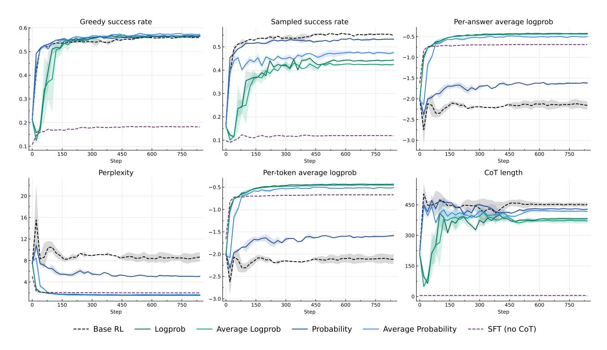

Figure 3 Verifiable. Qwen 2.5 3B Instruct on MATH with a group size of 32.

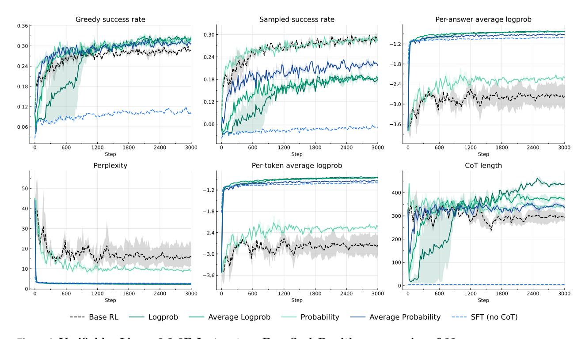

Figure 4 Verifiable. Llama  $3.2~3\mathrm{B}$  Instruct on DeepScaleR with a group size of 32.

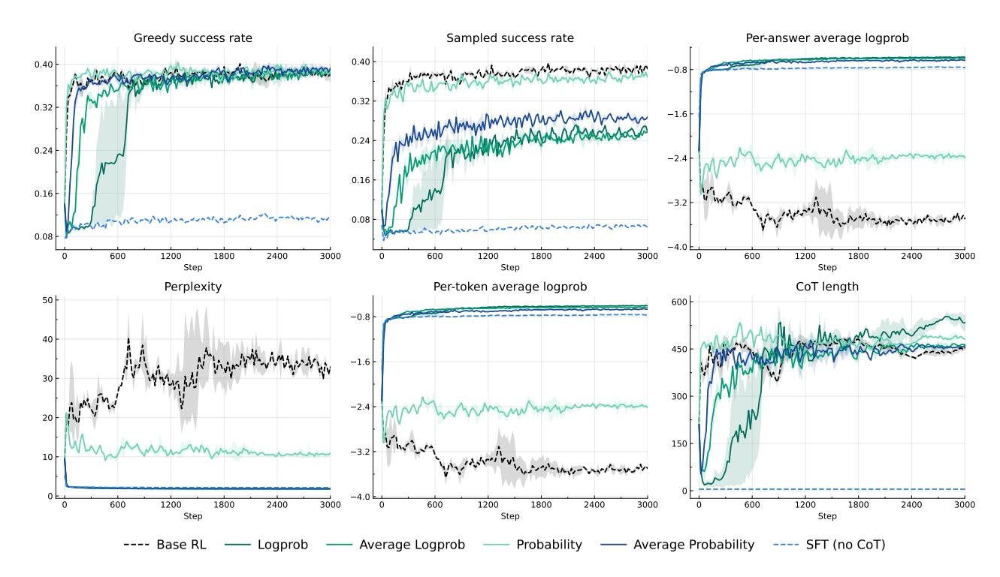

Figure 5 Verifiable. Qwen 2.5 3B Instruct on DeepScaleR with a group size of 32.

|                       | Base model        | Base RL           | Log-prob         | Avg Logprob      | JEPO               | Probability       | Avg Probability    | SFT (no CoT) |
|-----------------------|-------------------|-------------------|------------------|------------------|--------------------|-------------------|--------------------|--------------|
| Llama 3B, MATH        |                   |                   |                  |                  |                    |                   |                    |              |
| Greedy success        | $17.13 \pm 0.00$  | $42.09 \pm 1.08$  | $40.58 \pm 2.63$ | $40.52 \pm 0.01$ | $43.19 \pm 0.10$   | $40.48 \pm 0.42$  | $41.56 \pm 0.52$   | 14.38        |
| T=1 Sampled Success   | $10.77 \pm 0.07$  | $40.34 \pm 1.30$  | $31.81 \pm 1.40$ | $31.06 \pm 1.82$ | $35.85 \pm 0.80$   | $38.03 \pm 0.99$  | $35.03 \pm 0.73$   | 9.96         |
| Average log-prob MC32 | _                 | _                 | $-0.72 \pm 0.02$ | $-0.73 \pm 0.02$ | $-0.79 \pm 0.01$   | $-1.52 \pm 0.04$  | $-0.82 \pm 0.00$   | -0.96        |
| Average log-prob      | $-4.21 \pm 0.00$  | $-2.98 \pm 0.06$  | $-0.83 \pm 0.01$ | $-1.02 \pm 0.01$ | $-1.23 \pm 0.04$   | $-2.56 \pm 0.06$  | $-1.11 \pm 0.01$   | -0.96        |
| Perplexity            | $67.29 \pm 0.00$  | $19.65 \pm 1.17$  | $2.30 \pm 0.03$  | $2.77 \pm 0.04$  | $3.41 \pm 0.14$    | $12.97 \pm 0.81$  | $3.03 \pm 0.04$    | 2.62         |
| CoT length            | $331.66\pm2.02$   | $373.52\pm23.15$  | $283.84\pm27.47$ | $305.76\pm40.62$ | $326.15\pm21.00$   | $345.83\pm10.13$  | $333.47\pm45.09$   | 5.00         |
| Qwen 3B, MATH         |                   |                   |                  |                  |                    |                   |                    |              |
| Greedy success        | $21.19 \pm 0.00$  | $53.19 \pm 0.18$  | $51.70 \pm 2.65$ | $53.87 \pm 0.24$ | $54.01 \pm 2.10$   | $54.59 \pm 0.24$  | $53.52 \pm 1.47$   | 18.32        |
| T=1 Sampled Success   | $16.10 \pm 0.06$  | $50.31 \pm 0.03$  | $36.36 \pm 1.71$ | $37.53 \pm 1.32$ | $42.55 \pm 3.69$   | $48.75 \pm 0.77$  | $42.37 \pm 2.22$   | 12.00        |
| Average log-prob MC32 | _                 | _                 | $-0.47 \pm 0.00$ | $-0.46 \pm 0.01$ | $-0.47 \pm 0.02$   | $-1.00 \pm 0.03$  | $-0.49 \pm 0.02$   | _            |
| Average log-prob      | $-2.19 \pm 0.00$  | $-1.89 \pm 0.01$  | $-0.67 \pm 0.09$ | $-0.68 \pm 0.01$ | $-0.78 \pm 0.02$   | $-1.77 \pm 0.02$  | $-0.79 \pm 0.11$   | -0.69        |
| Perplexity            | $8.92 \pm 0.00$   | $6.60 \pm 0.03$   | $1.97 \pm 0.19$  | $1.98 \pm 0.02$  | $2.18 \pm 0.05$    | $5.85 \pm 0.13$   | $2.22 \pm 0.24$    | 1.99         |
| CoT length            | $222.43\pm0.80$   | $429.31\pm0.17$   | $326.69\pm49.32$ | $387.34\pm7.17$  | $362.67\pm70.73$   | $447.37\pm34.30$  | $380.90\pm10.57$   | 5.00         |
| Llama 3B, DeepScaleR  |                   |                   |                  |                  |                    |                   |                    |              |
| Greedy success        | $10.05 \pm 0.00$  | $26.18 \pm 0.74$  | $28.93 \pm 1.55$ | $29.67 \pm 2.14$ | $28.23 \pm 0.11$   | $27.01 \pm 0.55$  | $28.54 \pm 0.89$   | 9.88         |
| T=1 Sampled Success   | $5.25 \pm 0.92$   | $21.05 \pm 1.21$  | $15.64 \pm 0.73$ | $16.33 \pm 0.34$ | $19.16 \pm 0.59$   | $23.54 \pm 0.58$  | $18.97 \pm 0.32$   | 5.14         |
| Average log-prob MC32 | _                 | $-1.58 \pm 0.03$  | $-0.84 \pm 0.00$ | $-0.85 \pm 0.00$ | $-0.85 \pm 0.01$   | $-1.59 \pm 0.02$  | $-0.89 \pm 0.01$   | -1.01        |
| Average log-prob      | $-4.92 \pm 0.00$  | $-2.74 \pm 0.04$  | $-1.02 \pm 0.04$ | $-1.19 \pm 0.15$ | $-1.73 \pm 0.28$   | $-2.99 \pm 0.07$  | $-1.97 \pm 0.51$   | -1.01        |
| Perplexity            | $137.25 \pm 0.00$ | $15.49 \pm 0.63$  | $2.77 \pm 0.10$  | $3.30 \pm 0.50$  | $5.77 \pm 1.60$    | $19.90 \pm 1.47$  | $7.97 \pm 4.41$    | 2.74         |
| CoT length            | $342.53 \pm 1.31$ | $317.31 \pm 8.96$ | $421.21\pm27.22$ | $378.21\pm25.53$ | $322.58 \pm 13.60$ | $349.44 \pm 5.37$ | $350.73 \pm 20.70$ | 5.00         |
| Qwen 3B, DeepScaleR   |                   |                   |                  |                  |                    |                   |                    |              |
| Greedy success        | $14.02 \pm 0.00$  | $37.88 \pm 2.16$  | $36.21 \pm 1.09$ | $36.54 \pm 0.72$ | $37.04 \pm 0.12$   | $37.60 \pm 0.00$  | $35.67 \pm 1.14$   | 11.52        |
| T=1 Sampled Success   | $10.05 \pm 0.64$  | $31.57 \pm 2.99$  | $22.34 \pm 0.96$ | $21.74 \pm 0.95$ | $27.12 \pm 0.03$   | $31.30 \pm 0.32$  | $25.69 \pm 0.61$   | 6.48         |
| Average log-prob MC32 | _                 | $-1.61 \pm 0.13$  | $-0.59 \pm 0.01$ | $-0.61 \pm 0.00$ | $-0.61 \pm 0.00$   | $-1.38 \pm 0.00$  | $-0.63 \pm 0.00$   | -0.76        |
| Average log-prob      | $-2.57 \pm 0.00$  | $-2.63 \pm 0.05$  | $-0.69 \pm 0.02$ | $-0.88 \pm 0.09$ | $-0.96 \pm 0.00$   | $-2.49 \pm 0.07$  | $-1.09 \pm 0.07$   | -0.76        |
| Perplexity            | $13.12 \pm 0.00$  | $13.87 \pm 0.75$  | $2.00 \pm 0.05$  | $2.43 \pm 0.22$  | $2.62 \pm 0.01$    | $12.10 \pm 0.84$  | $2.99 \pm 0.21$    | 2.14         |
| CoT length            | $216.25\pm0.23$   | $422.15\pm65.98$  | $429.51\pm12.13$ | $398.42\pm30.20$ | $436.50\pm9.25$    | $423.48\pm5.80$   | $396.55 \pm 7.76$  | 5.00         |

**Table 3 Results on verifiable domains, G=4.** Final performance of models trained with a group size of 4, across all our algorithms (including JEPO) and metrics. Conclusions mirror those of Table 1. The corresponding learning curves are presented in Figures 6 to 9.

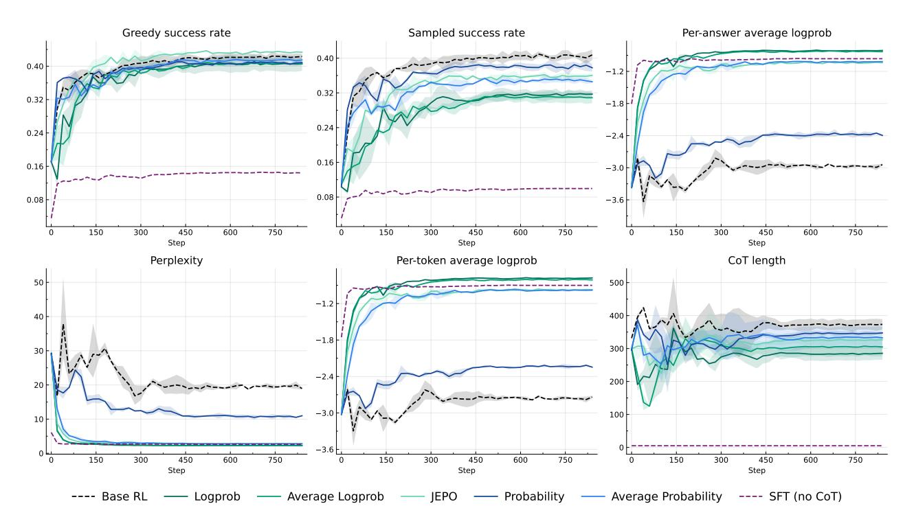

Figure 6 Verifiable: Llama-3.2-3B on MATH with a group size of 4.

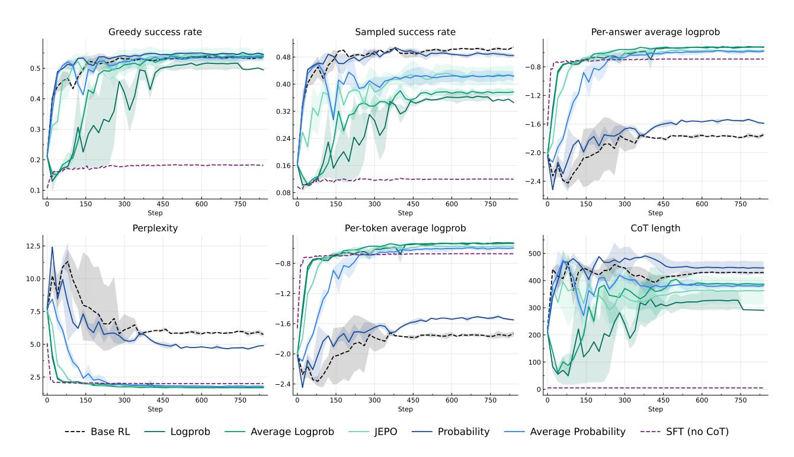

Figure 7 Verifiable. Qwen 2.5~3B Instruct on MATH with a group size of 4.

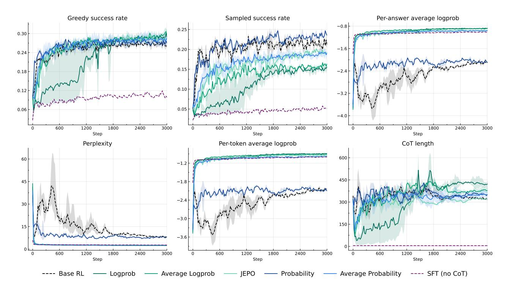

Figure 8 Verifiable. Llama 3.2 3B Instruct on DeepScaleR with a group size of 4.

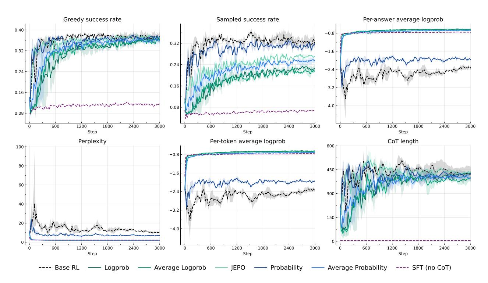

Figure 9 Verifiable. Qwen 2.5 3B Instruct on DeepScaleR with a group size of 4.

#### C.2 Non-verifiable Domains

Here we provide the Figures complementary to Figure 2 for other model/dataset combinations in Figures 10 to 12.

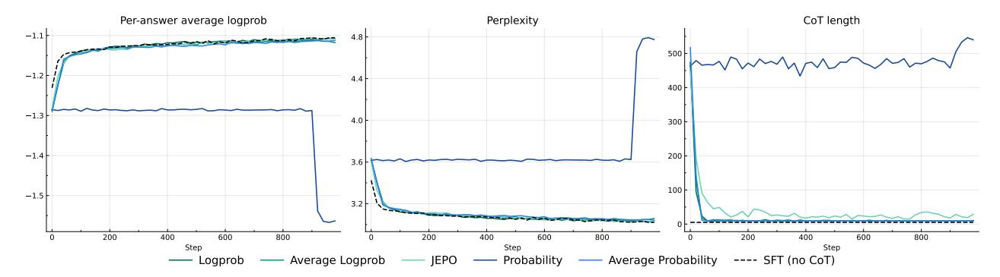

Figure 10 Non-verifiable. Llama 3.2 3B Instruct on NuminaProof.

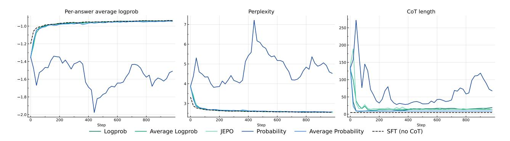

Figure 11 Non-verifiable. Llama 3.2 3B Instruct on Alpaca.

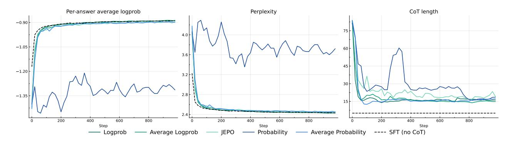

Figure 12 Non-verifiable. Qwen  $2.5\ 3B$  Instruct on Alpaca.

## D Attempted regularization methods

In Section 3.4 we use two types of regularization to stabilize the CoT in nonverifiable domains. The first is straight-forward – we include a KL divergence term in the loss, which keeps the model close to the initial model, as proposed by Guo et al. (2025).

The second type introduces an additional reward term:

$$R_l(z) = r \cdot \min\{|z| - l_0, 0\}$$

that is, for each missing token below a threshold for  $l_0$ , a negative reward r is applied. We vary the threshold  $l_0$  and report results for values of 100, 150, 300 and 500. To set the value of r, we design it so that it approximately compensates the increase of the reward during the initial CoT length drop over the initial 40 training steps. Specifically, we take the base nonverifiable experiments for each algorithm, model and dataset, and set

$$r = \frac{\Delta R}{\Delta L}$$

where  $\Delta R$  is the increase in validation reward, and  $\Delta L$  is the decrease in the average CoT length.

The results of these ablations are presented in Figures 14 to 17.

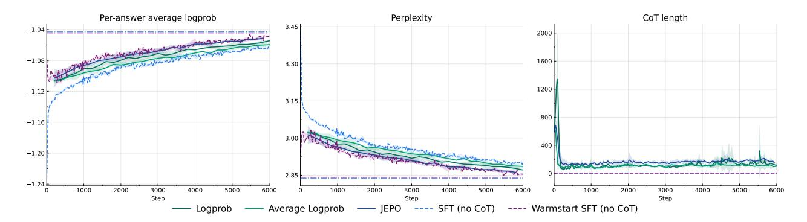

Figure 13 Non-verifiable. Llama 3.2 3B Instruct-Warmstart on Numina.

Warm start. When training the warm start models, our goal was to improve the initial performance of the model. We observed that, at initialization, the perplexity of the correct answer is better if it is appended directly after the question, and worse if there is an autoregressively generated CoT between them. This might indicate that the presence of a CoT is, by itself, affecting performance negatively for the initial model.

Our next step was to produce a version of the base model that would be "used to" the presence of a CoT. To this end, we generated a static dataset of CoTs generated from the initial model, and trained it with SFT on (question, completion, answer) triples, masking out everything but the answer, with the intuition that this would train the model to produce good answers in the presence of CoTs (but without training the CoT yet).

This "warmstart" model is then used as a starting point for the various CoT training methods.

We display the results in Figure 13 for Numina. This includes results obtained by training the warm-start model with logprob, average logprob, and JEPO rewards. There are also two SFT variants - one initialized with the typical checkpoint (Llama 3.2 3B-Instruct), and a warmstart variant, which is initialized from the same warmstart checkpoint as the RL models. The two dashed lines indicate the maximum performance that each SFT variant achieves after more training steps, but with equal compute to the RL curves.

We observe that warmstart initialization of the RL algorithms partly stabilizes the CoT collapse. While the length of the CoT still drops to significantly lower values, they tend to stabilize around 100-200 tokens, instead of 5 tokens like in the coldstart case. This vindicates the intuition behind warm-starting, namely, that initially the presence of a CoT affects performance negatively.

However, even with warm-start and a stabilized CoT, the actual perplexity stays close to the SFT baseline, and fails to beat it. It is possible that by adding significantly more compute, we could reproduce the findings of Tang et al. (2025) which show RL eventually beating SFT with JEPO.

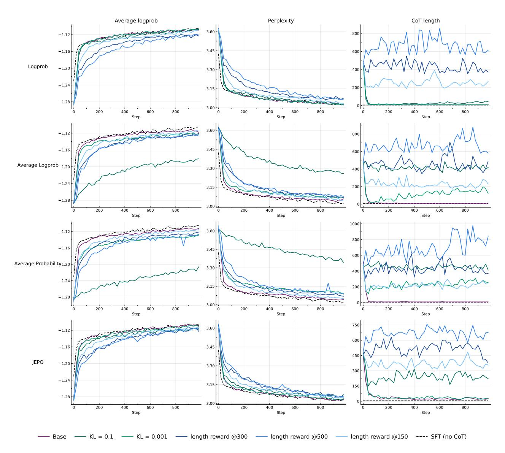

**Figure 14** Non-verifiable. Llama 3.2 3B Instruct on NuminaProof. Training curves of various attempts at stabilizing the CoT on nonverifiable domains with Llama 3.2 3B on NuminaProof. When the KL divergence coefficient, or the length threshold for the penalty are increased, the CoT does better at maintaining a non-trivial length. However, the actual log-prob of the correct answer decreases accordingly.

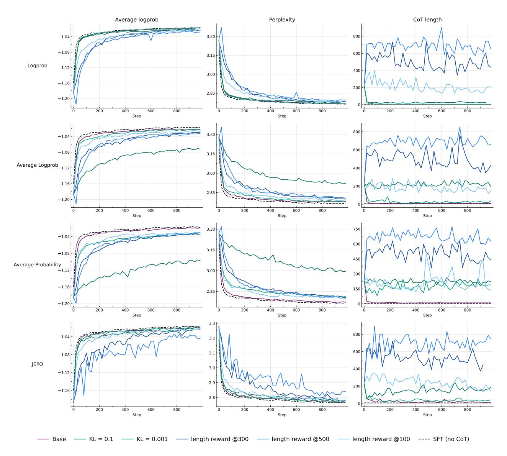

Figure 15 Non-verifiable. Qwen 2.5 3B Instruct on NuminaProof. Conclusions are similar to Figure 14.

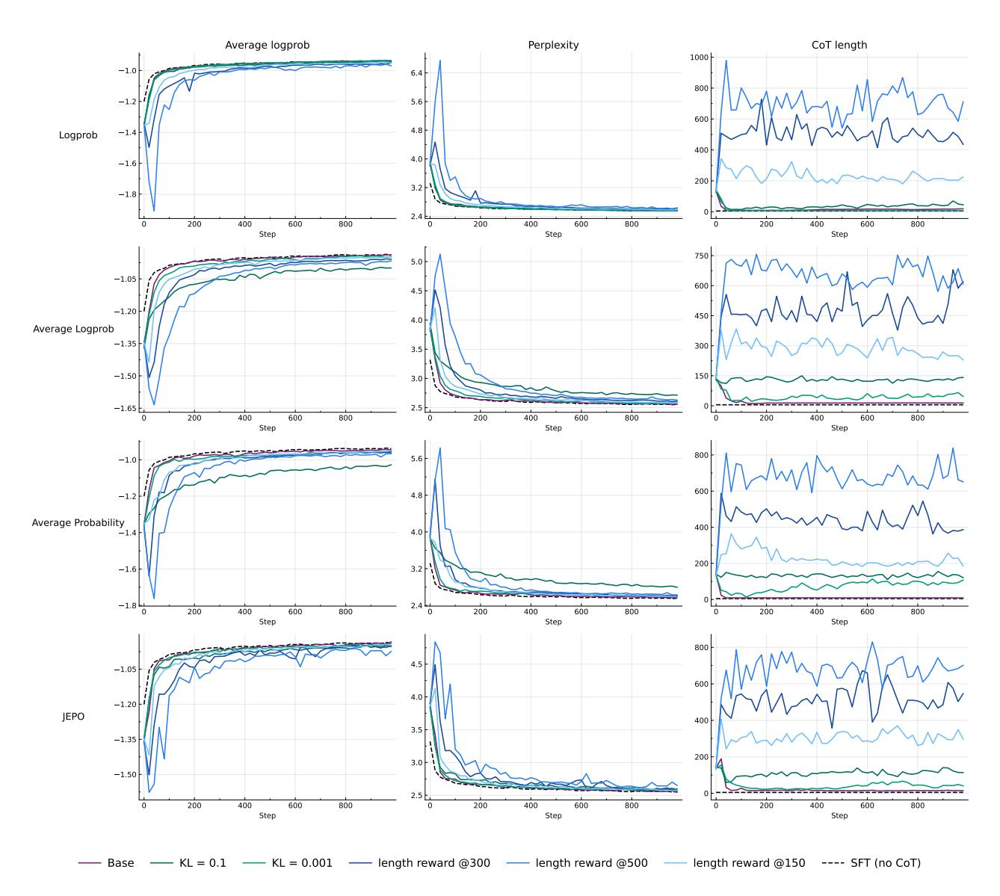

Figure 16 Non-verifiable. Llama 3.2 3B Instruct on Alpaca. Conclusions are similar to Figure 14.

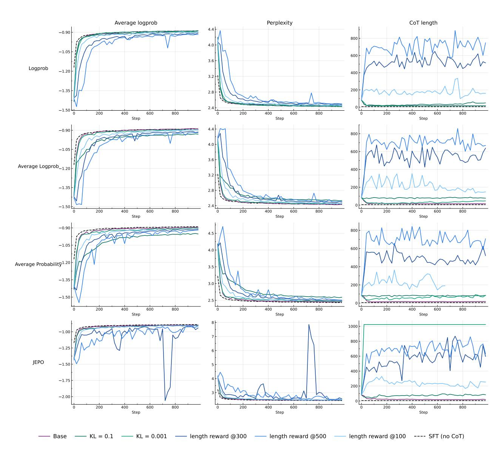

Figure 17 Non-verifiable. Qwen 2.5 3B Instruct on Alpaca. Conclusions are similar to Figure 14.

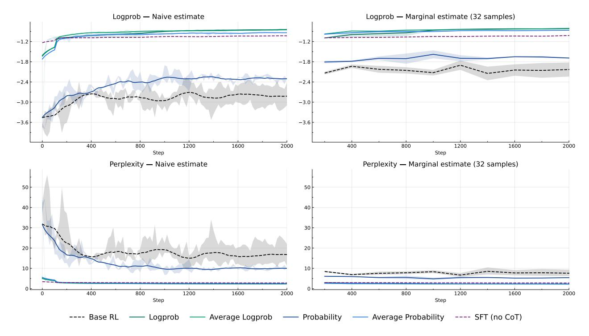

Figure 18 Verifiable. Llama 3.1 3B Instruct on DeepScaleR. Logprob-style rewards (including average probability) achieve a good performance, beating the SFT baseline, keeping the difference between MC1 and MC32 estimates relatively small. In contrast, baseline RL and probability rewards perform poorly on these metrics.

## E Impact of the Marginal Log-Probability Estimate

We observe that in some cases, there is a significant difference between the naive MC1 estimate of the true logprob of the reference answer, and the MC32 estimate. In particular, in verifiable domains where all algorithms reliably learn a nontrivial chain of thought, base RL and probability rewards exhibit a large difference between the two estimates. Due to the high computational cost of frequent MC32 evaluations, we visualize the results in Figures 18 and 19 for a subset of our experimental settings.

# F Correlation Analysis

To investigate the drastic decrease in the CoT length, we measure two metrics on the initial models' outputs. For 100 random problems from each dataset, we generate 1000 CoTs and measure the correlation between the CoT length, and the probability or logprobability of getting the correct answer after this CoT.

We report two variants of this metric. On the one hand, we have the global correlation, which simply pools together all CoTs and measures the Pearson correlation. On the other hand, we compute the "average *local* correlation", that is, we group the completions per-prompt, compute the correlation for each prompt, and average those values over prompts.

These two variants can lead to significantly different values, similarly to Simpson's paradox, as can be seen below.

The key insight here is that when group-relative advantages are computed using GRPO or RLOO, they are determined relative to other trajectories for the same problem. So local correlations would be more impactful than global correlations in driving down the CoT length during GRPO or RLOO.

We observe this in Figures 20 to 22. For logprobs on Numina, the global correlation is very low in absolute terms, and slightly positive. However, the average local correlation is clearly negative, which corresponds to the regime in which the CoT rapidly drops at the beginning of the training. For logprobs on MATH, both the

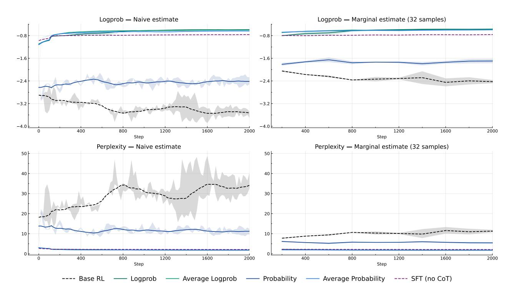

Figure 19 Verifiable. Qwen 2.5 3B Instruct on DeepScaleR. The patterns are largely similar to the Llama model.

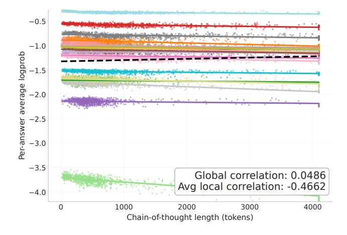

Figure 20 Global and local (per-question) correlations between the logprob of the correct answer and the CoT length, for the Llama 3B Instruct model, on the Numina dataset. Correlations are computed on a random selection of 100 questions from the dataset, each with 1000 CoTs generated with T=1, whereas the graph only includes 20 questions for visual clarity.

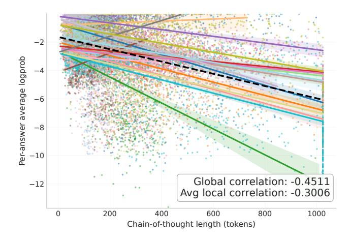

Figure 21 Global and local (per-question) correlations between the logprob of the correct answer and the CoT length, for the Llama 3B Instruct model, on the MATH dataset. Correlations are computed on a random selection of 100 questions from the dataset, each with 1000 CoTs generated with T=1, whereas the graph only includes 20 questions for visual clarity.

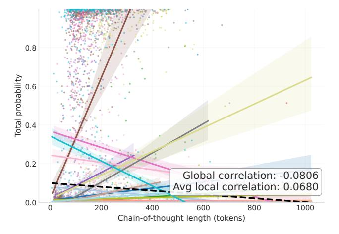

Figure 22 Global and local (per-question) correlations between the *probability* of the correct answer and the CoT length, for the Llama 3B Instruct model, on the MATH dataset. Correlations are computed on a random selection of 100 questions from the dataset, each with 1000 CoTs generated with T=1, whereas the graph only includes 20 questions for visual clarity.

global and local correlations are negative, and indeed we observe a level of CoT degradation in that case. Conversely, when measuring the probability of the correct answer on MATH, the global correlation happens to be slightly negative, but the average local correlation is slightly positive – indeed, in this case we do not observe a CoT collapse.