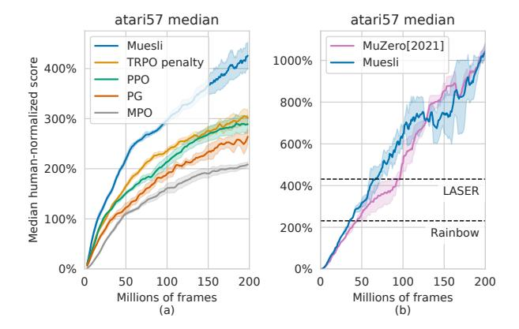
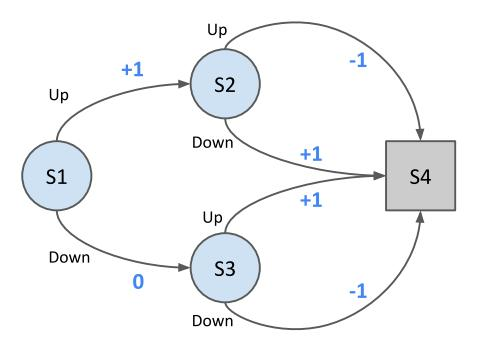
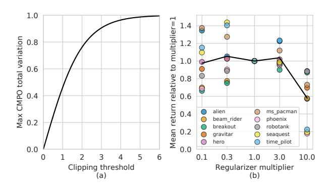
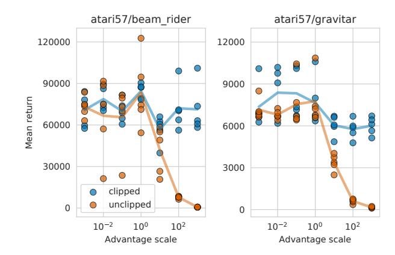
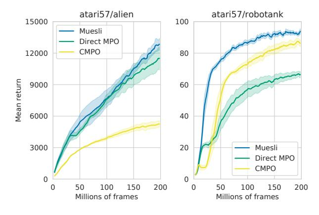
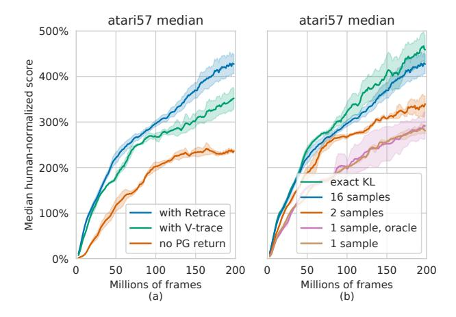
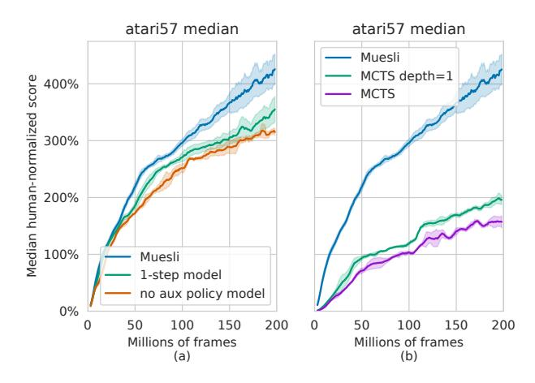
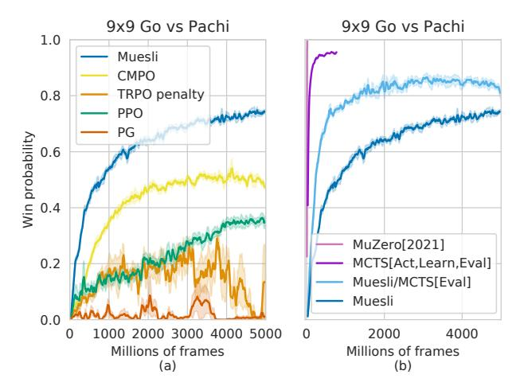

# **Muesli: Combining Improvements in Policy Optimization**

 $\begin{array}{cccccccccccccccccccccccccccccccccccc$ 

# **Abstract**

We propose a novel policy update that combines regularized policy optimization with model learning as an auxiliary loss. The update (henceforth Muesli) matches MuZero's state-of-the-art performance on Atari. Notably, Muesli does so without using deep search: it acts directly with a policy network and has computation speed comparable to model-free baselines. The Atari results are complemented by extensive ablations, and by additional results on continuous control and 9x9 Go.

# 1. Introduction

Reinforcement learning (RL) is a general formulation for the problem of sequential decision making under uncertainty, where a learning system (the agent) must learn to maximize the cumulative rewards provided by the world it is embedded in (the *environment*), from experience of interacting with such environment (Sutton & Barto, 2018). An agent is said to be *value-based* if its behavior, i.e. its *policy*, is inferred (e.g by inspection) from learned value estimates (Sutton, 1988; Watkins, 1989; Rummery & Niranjan, 1994; Tesauro, 1995). In contrast, a policy-based agent directly updates a (parametric) policy (Williams, 1992; Sutton et al., 2000) based on past experience. We may also classify as model free the agents that update values and policies directly from experience (Sutton, 1988), and as model-based those that use (learned) models (Oh et al., 2015; van Hasselt et al., 2019) to plan either global (Sutton, 1990) or local (Richalet et al., 1978; Kaelbling & Lozano-Pérez, 2010; Silver & Veness, 2010) values and policies. Such distinctions are useful for communication, but, to master the singular goal of optimizing rewards in an environment, agents often combine ideas from more than one of these areas (Hessel et al., 2018; Silver et al., 2016; Schrittwieser et al., 2020).

Proceedings of the 38th International Conference on Machine Learning, PMLR 139, 2021. Copyright 2021 by the author(s).

Figure 1. Median human normalized score across 57 Atari games. (a) Muesli and other policy updates; all these use the same IMPALA network and a moderate amount of replay data (75%). Shades denote standard errors across 5 seeds. (b) Muesli with the larger MuZero network and the high replay fraction used by MuZero (95%), compared to the latest version of MuZero. These large scale runs use 2 seeds. Muesli still acts directly with the policy network and uses one-step look-aheads in updates.

In this paper, we focus on a critical part of RL, namely *policy optimization*. We leave a precise formulation of the problem for later, but different policy optimization algorithms can be seen as answers to the following crucial question:

given data about an agent's interactions with the world, and predictions in the form of value functions or models, how should we update the agent's policy?

We start from an analysis of the *desiderata* for general policy optimization. These include support for partial observability and function approximation, the ability to learn stochastic policies, robustness to diverse environments or training regimes (e.g. off-policy data), and being able to represent knowledge as value functions and models. See Section 3 for further details on our desiderata for policy optimization.

Then, we propose a policy update combining regularized policy optimization with model-based ideas so as to make progress on the dimensions highlighted in the desiderata. More specifically, we use a model inspired by MuZero (Schrittwieser et al., 2020) to estimate action values via one-step look-ahead. These action values are then plugged into a modified Maximum a Posteriori Policy Optimiza-

\*Equal contribution  $^1DeepMind,\ London,\ UK\ ^2University College\ London.\ Correspondence\ to: Matteo\ Hessel <a href="mailto:mtthss@google.com">mtthss@google.com</a>, Ivo Danihelka <a href="mailto:danihelka@google.com">danihelka@google.com</a>, Hado van Hasselt <a href="mailto:hado@google.com">hado wan Hasselt <a href="mailto:hado@google.com">hado wan Hasselt <a href="mailto:hado@google.com">hado wan Hasselt <a href="mailto:hado@google.com">hado wan Hasselt <a href="mailto:hado@google.com">hado wan Hasselt <a href="mailto:hado@google.com">hado wan Hasselt <a href="mailto:hado@google.com">hado wan Hasselt <a href="mailto:hado@google.com">hado wan Hasselt <a href="mailto:hado@google.com">hado wan Hasselt <a href="mailto:hado@google.com">hado wan Hasselt <a href="mailto:hado@google.com">hado wan Hasselt <a href="mailto:hado@google.com">hado wan Hasselt <a href="mailto:hado@google.com">hado wan Hasselt <a href="mailto:hado@google.com">hado wan Hasselt <a href="mailto:hado@google.com">hado wan Hasselt <a href="mailto:hado@google.com">hado wan Hasselt <a href="mailto:hado@google.com">hado wan Hasselt <a href="mailto:hado@google.com">hado wan Hasselt <a href="mailto:hado@google.com">hado wan Hasselt <a href="mailto:hado@google.com">hado wan Hasselt <a href="mailto:hado wan Hasselt">hado wan Hasselt <a href="mailto:hado wan Hasselt">hado wan Hasselt <a href="mailto:hado wan Hasselt">hado wan Hasselt <a href="mailto:hado wan Hasselt">hado wan Hasselt <a href="mailto:hado wan Hasselt">hado wan Hasselt <a href="mailto:hado wan Hasselt">hado wan Hasselt <a href="mailto:hado wan Hasselt">hado wan Hasselt <a href="mailto:hado wan Hasselt">hado wan Hasselt <a href="mailto:hado wan Hasselt">hado wan Hasselt <a href="mailto:hado wan Hasselt">hado wan Hasselt <a href="mailto:hado wan Hasselt">hado wan Hasselt <a href="mailto:hado wan Hasselt">hado wan Hasselt <a href="mailto:hado wan Hasselt">hado wan Hasselt <a href="mailto:hado wan Hasselt">hado wan Hasselt <a href="mailto:hado wan Hasselt">hado wan Hasselt <a href="mailt$ 

tion (MPO) (Abdolmaleki et al., 2018) mechanism, based on clipped normalized advantages, that is robust to scaling issues without requiring constrained optimization. The overall update, named Muesli, then combines the clipped MPO targets and policy-gradients into a *direct* method (Vieillard et al., 2020) for regularized policy optimization.

The majority of our experiments were performed on 57 classic Atari games from the Arcade Learning Environment (Bellemare et al., 2013; Machado et al., 2018), a popular benchmark for deep RL. We found that, on Atari, Muesli can match the state of the art performance of MuZero, without requiring deep search, but instead acting directly with the policy network and using one-step look-aheads in the updates. To help understand the different design choices made in Muesli, our experiments on Atari include multiple ablations of our proposed update. Additionally, to evaluate how well our method generalises to different domains, we performed experiments on a suite of continuous control environments (based on MuJoCo and sourced from the OpenAI Gym (Brockman et al., 2016)). We also conducted experiments in 9x9 Go in self-play, to evaluate our policy update in a domain traditionally dominated by search methods.

# 2. Background

The environment. We are interested in episodic environments with variable episode lengths (e.g. Atari games), formalized as Markov Decision Processes (MDPs) with initial state distribution  $\mu$  and discount  $\gamma \in [0,1)$ ; ends of episodes correspond to absorbing states with no rewards.

The objective. The agent starts at a state  $S_0 \sim \mu$  from the initial state distribution. At each time step t, the agent takes an action  $A_t \sim \pi(A_t|S_t)$  from a policy  $\pi$ , obtains the reward  $R_{t+1}$  and transitions to the next state  $S_{t+1}$ . The expected sum of discounted rewards after a state-action pair is called the action-value or Q-value  $q_{\pi}(s,a)$ :

$$q_{\pi}(s, a) = \mathbb{E}\left[\sum_{t=0}^{\infty} \gamma^{t} R_{t+1} | \pi, S_{0} = s, A_{0} = a\right].$$
 (1)

The value of a state s is  $v_{\pi}(s) = \mathbb{E}_{A \sim \pi(\cdot \mid s)} [q_{\pi}(s, A)]$  and the objective is to find a policy  $\pi$  that maximizes the expected value of the states from the initial state distribution:

$$J(\pi) = \mathbb{E}_{S \sim \mu} \left[ v_{\pi}(S) \right]. \tag{2}$$

**Policy improvement.** Policy improvement is one of the fundamental building blocks of reinforcement learning algorithms. Given a policy  $\pi_{\text{prior}}$  and its Q-values  $q_{\pi_{\text{prior}}}(s,a)$ , a policy improvement step constructs a new policy  $\pi$  such that  $v_{\pi}(s) \geq v_{\pi_{\text{prior}}}(s) \ \forall s$ . For instance, a basic policy improvement step is to construct the greedy policy:

$$\arg\max_{\pi} \mathbb{E}_{A \sim \pi(\cdot|s)} \left[ q_{\pi_{\text{prior}}}(s, A) \right]. \tag{3}$$

**Regularized policy optimization.** A regularized policy optimization algorithm solves the following problem:

$$\arg\max_{\pi} \left( \mathbb{E}_{A \sim \pi(\cdot|s)} \left[ \hat{q}_{\pi_{\text{prior}}}(s, A) \right] - \Omega(\pi) \right), \quad (4)$$

where  $\hat{q}_{\pi_{\mathrm{prior}}}(s,a)$  are approximate Q-values of a  $\pi_{\mathrm{prior}}$  policy and  $\Omega(\pi) \in \mathbb{R}$  is a regularizer. For example, we may use as the regularizer the negative entropy of the policy  $\Omega(\pi) = -\lambda H[\pi]$ , weighted by an entropy cost  $\lambda$  (Williams & Peng, 1991). Alternatively, we may also use  $\Omega(\pi) = \lambda \operatorname{KL}(\pi_{\mathrm{prior}}, \pi)$ , where  $\pi_{\mathrm{prior}}$  is the previous policy, as used in TRPO (Schulman et al., 2015).

Following the terminology introduced by Vieillard et al. (2020), we can then solve Eq. 4 by either *direct* or *indirect* methods. If  $\pi(a|s)$  is differentiable with respect to the policy parameters, a *direct* method applies gradient ascent to

$$J(s,\pi) = \mathbb{E}_{A \sim \pi(\cdot|s)} \left[ \hat{q}_{\pi_{\text{prior}}}(s,A) \right] - \Omega(\pi). \tag{5}$$

Using the log derivative trick to sample the gradient of the expectation results in the canonical (regularized) policy gradient update (Sutton et al., 2000).

In *indirect* methods, the solution of the optimization problem (4) is found exactly, or numerically, for one state and then distilled into a parametric policy. For example, Maximum a Posteriori Policy Optimization (MPO) (Abdolmaleki et al., 2018) uses as regularizer  $\Omega(\pi) = \lambda \operatorname{KL}(\pi, \pi_{\operatorname{prior}})$ , for which the exact solution to the regularized problem is

$$\pi_{\text{MPO}}(a|s) = \pi_{\text{prior}}(a|s) \exp\left(\frac{\hat{q}_{\pi_{\text{prior}}}(s,a)}{\lambda}\right) \frac{1}{z(s)}, (6)$$

where  $z(s) = \mathbb{E}_{A \sim \pi_{\mathrm{prior}}(\cdot \mid s)} \left[ \exp \left( \frac{\hat{q}_{\pi_{\mathrm{prior}}}(s, A)}{\lambda} \right) \right]$  is a normalization factor that ensures that the resulting probabilities form a valid probability distribution (i.e. they sum up to 1).

MuZero. MuZero (Schrittwieser et al., 2020) uses a weakly grounded (Grimm et al., 2020) transition model m trained end to end exclusively to support accurate reward, value and policy predictions:  $m(s_t, a_t, a_{t+1}, \dots, a_{t+k}) \approx$  $(R_{t+k+1}, v_{\pi}(S_{t+k+1}), \pi(\cdot|S_{t+k+1}))$ . Since such model can be unrolled to generate sequences of rewards and value estimates for different sequences of actions (or plans), it can be used to perform Monte-Carlo Tree Search, or MCTS (Coulom, 2006). MuZero then uses MCTS to construct a policy as the categorical distribution over the normalized visit counts for the actions in the root of the search tree; this policy is then used both to select actions, and as a policy target for the policy network. Despite MuZero being introduced with different motivations, Grill et al. (2020) showed that the MuZero policy update can also be interpreted as approximately solving a regularized policy optimization problem with the regularizer  $\Omega(\pi) = \lambda \operatorname{KL}(\pi_{\operatorname{prior}}, \pi)$  also used by the TRPO algorithm (Schulman et al., 2015).

# 3. Desiderata and motivating principles

First, to motivate our investigation, we discuss a few desiderata for a general policy optimization algorithm.

### 3.1. Observability and function approximation

Being able to learn stochastic policies, and being able to leverage Monte-Carlo or multi-step bootstrapped return estimates is important for a policy update to be truly general.

This is motivated by the challenges of learning in partially observable environments (Åström, 1965) or, more generally, in settings where function approximation is used (Sutton & Barto, 2018). Note that these two are closely related: if a chosen function approximation ignores a state feature, then the state feature is, for all practical purposes, not observable.

In POMDPs the optimal memory-less stochastic policy can be better than any memory-less deterministic policy, as shown by Singh et al. (1994). As an illustration, consider the MDP in Figure 2; in this problem we have 4 states and, on each step, 2 actions (up or down). If the state representation of all states is the same  $\phi(s) = \varnothing$ , the optimal policy is stochastic. We can easily find such policy with pen and paper:  $\pi^*(up|\phi(s)) = \frac{5}{8}$ ; see Appendix B for details.

It is also known that, in these settings, it is often preferable to leverage Monte-Carlo returns, or at least multi-step bootstrapped estimators, instead of using one-step targets (Jaakkola et al., 1994). Consider again the MDP in Figure 2: boostrapping from  $v_{\pi}(\phi(s))$  produces biased estimates of the expected return, because  $v_{\pi}(\phi(s))$  aggregates the values of multiple states; again, see Appendix B for the derivation.

Among the methods in Section 2, both policy gradients and MPO allow convergence to stochastic policies, but only policy gradients naturally incorporate multi-step return estimators. In MPO, stochastic return estimates could make the agent overly optimistic  $(\mathbb{E}[\exp(G)] \ge \exp(\mathbb{E}[G]))$ .

### 3.2. Policy representation

Policies may be constructed from action values or they may combine action values and other quantities (e.g., a direct parametrization of the policy or historical data). We argue that the action values alone are not enough.

First, we show that action values are not always enough to represent the best stochastic policy. Consider again the MDP in Figure 2 with identical state representation  $\phi(s)$  in all states. As discussed, the optimal stochastic policy is  $\pi^*(up|\phi(s))=\frac{5}{8}$ . This non-uniform policy cannot be inferred from Q-values, as these are the same for all actions and are thus wholly uninformative about the best probabilities:  $q_{\pi^*}(\phi(s), up) = q_{\pi^*}(\phi(s), down) = \frac{1}{4}$ . Similarly, a model on its own is also insufficient without a policy, as it would produce the same uninformative action values.

Figure 2. An episodic MDP with 4 states. State 1 is the initial state. State 4 is terminal. At each step, the agent can choose amongst two actions: up or down. The rewards range from -1 to 1, as displayed. The discount is 1. If the state representation  $\phi(s)$  is the same in all states, the best stochastic policy is  $\pi^*(up|\phi(s)) = \frac{5}{8}$ .

One approach to address this limitation is to parameterize the policy explicitly (e.g. via a policy network). This has the additional advantage that it allows us to directly sample both discrete (Mnih et al., 2016) and continuous (van Hasselt & Wiering, 2007; Degris et al., 2012; Silver et al., 2014) actions. In contrast, maximizing Q-values over continuous action spaces is challenging. Access to a parametric policy network that can be queried directly is also beneficial for agents that act by planning with a learned model (e.g. via MCTS), as it allows to guide search in large or continuous action space.

### 3.3. Robust learning

We seek algorithms that are robust to 1) off-policy or historical data; 2) inaccuracies in values and models; 3) diversity of environments. In the following paragraphs we discuss what each of these entails.

Reusing data from previous iterations of policy  $\pi$  (Lin, 1992; Riedmiller, 2005; Mnih et al., 2015) can make RL more data efficient. However, if computing the gradient of the objective  $\mathbb{E}_{A \sim \pi(\cdot|s)}\left[\hat{q}_{\pi_{\mathrm{prior}}}(s,A)\right]$  on data from an older policy  $\pi_{\mathrm{prior}}$ , an unregularized application of the gradient can degrade the value of  $\pi$ . The amount of degradation depends on the total variation distance between  $\pi$  and  $\pi_{\mathrm{prior}}$ , and we can use a regularizer to control it, as in Conservative Policy Iteration (Kakade & Langford, 2002), Trust Region Policy Optimization (Schulman et al., 2015), and Appendix C.

Whether we learn on or off-policy, agents' predictions incorporate errors. Regularization can also help here. For instance, if Q-values have errors, the MPO regularizer  $\Omega(\pi) = \lambda \, \mathrm{KL}(\pi, \pi_\mathrm{prior})$  maintains a strong performance bound (Vieillard et al., 2020). The errors from multiple iterations average out, instead of appearing in a discounted sum of the absolute errors. While not all assumptions behind this result apply in an approximate setting, Section 5 shows that MPO-like regularizers are helpful empirically.

### Observability and function approximation

- 1a) | Support learning stochastic policies
- 1b) Leverage Monte-Carlo targets

# **Policy representation**

- 2a) | Support learning the optimal memory-less policy
- 2b) Scale to (large) discrete action spaces
- 2c) Scale to continuous action spaces

#### **Robust learning**

- 3a) | Support off-policy and historical data
- 3b) Deal gracefully with inaccuracies in the values/model
- 3c) Be robust to diverse reward scales
- 3d) Avoid problem-dependent hyperparameters

### Rich representation of knowledge

- 4a) | Estimate values (variance reduction, bootstrapping)
- 4b) Learn a model (representation, composability)

*Table 1.* A recap of the *desiderata* or guiding *principles* that we believe are important when designing general policy optimization algorithms. These are discussed in Section 3.

Finally, robustness to diverse environments is critical to ensure a policy optimization algorithm operates effectively in novel settings. This can take various forms, but we focus on robustness to diverse reward scales and minimizing problem dependent hyperparameters. The latter are an especially subtle form of inductive bias that may limit the applicability of a method to established benchmarks (Hessel et al., 2019).

#### 3.4. Rich representation of knowledge

Even if the policy is parametrized explicitly, we argue it is important for the agent to represent knowledge in multiple ways (Degris & Modayil, 2012) to update such policy in a reliable and robust way. Two classes of predictions have proven particularly useful: value functions and models.

Value functions (Sutton, 1988; Sutton et al., 2011) can capture knowledge about a *cumulant* over long horizons, but can be learned with a cost independent of the *span* of the predictions (van Hasselt & Sutton, 2015). They have been used extensively in policy optimization, e.g., to implement forms of variance reduction (Williams, 1992), and to allow updating policies online through bootstrapping, without waiting for episodes to fully resolve (Sutton et al., 2000).

Models can also be useful in various ways: 1) learning a model can act as an auxiliary task (Schmidhuber, 1990; Sutton et al., 2011; Jaderberg et al., 2017; Guez et al., 2020), and help with representation learning; 2) a learned model may be used to update policies and values via planning (Werbos, 1987; Sutton, 1990; Ha & Schmidhuber, 2018); 3) finally, the model may be used to plan for action selection (Richalet et al., 1978; Silver & Veness, 2010). These benefits of learned models are entangled in MuZero. Sometimes, it may be useful to decouple them, for instance to retain the benefits of models for representation learning and policy optimization, without depending on the computationally intensive process of planning for action selection.

# 4. Robust yet simple policy optimization

The full list of *desiderata* is presented in Table 1. These are far from solved problems, but they can be helpful to reason about policy updates. In this section, we describe a policy optimization algorithm designed to address these desiderata.

# 4.1. Our proposed clipped MPO (CMPO) regularizer

We use the Maximum a Posteriori Policy Optimization (MPO) algorithm (Abdolmaleki et al., 2018) as starting point, since it can learn stochastic policies (1a), supports discrete and continuous action spaces (2c), can learn stably from off-policy data (3a), and has strong performance bounds even when using approximate Q-values (3b). We then improve the degree of control provided by MPO on the total variation distance between  $\pi$  and  $\pi_{\text{prior}}$  (3a), avoiding sensitive domain-specific hyperparameters (3d).

MPO uses a regularizer  $\Omega(\pi) = \lambda \, \mathrm{KL}(\pi, \pi_{\mathrm{prior}})$ , where  $\pi_{\mathrm{prior}}$  is the previous policy. Since we are interested in learning from stale data, we allow  $\pi_{\mathrm{prior}}$  to correspond to arbitrary previous policies, and we introduce a regularizer  $\Omega(\pi) = \lambda \, \mathrm{KL}(\pi_{\mathrm{CMPO}}, \pi)$ , based on the new target

$$\pi_{\text{CMPO}}(a|s) = \frac{\pi_{\text{prior}}(a|s) \exp\left(\text{clip}(\hat{\text{adv}}(s, a), -c, c)\right)}{z_{\text{CMPO}}(s)},$$
(7)

where  $\hat{\text{adv}}(s,a)$  is a non-stochastic approximation of the advantage  $\hat{q}_{\pi_{\text{prior}}}(s,a) - \hat{v}_{\pi_{\text{prior}}}(s)$  and the factor  $z_{\text{CMPO}}(s)$  ensures the policy is a valid probability distribution. The  $\pi_{\text{CMPO}}$  term we use in the regularizer has an interesting relation to natural policy gradients (Kakade, 2001):  $\pi_{\text{CMPO}}$  is obtained if the natural gradient is computed with respect to the logits of  $\pi_{\text{prior}}$  and then the expected gradient is clipped (for proof note the natural policy gradient with respect to the logits is equal to the advantages (Agarwal et al., 2019)).

The clipping threshold c controls the maximum total variation distance between  $\pi_{\rm CMPO}$  and  $\pi_{\rm prior}$ . Specifically, the total variation distance between  $\pi'$  and  $\pi$  is defined as

$$D_{TV}(\pi'(\cdot|s), \pi(\cdot|s)) = \frac{1}{2} \sum_{a} |\pi'(a|s) - \pi(a|s)|.$$
 (8)

As discussed in Section 3.3, constrained total variation supports robust off-policy learning. The clipped advantages allows us to derive not only a bound for the total variation distance but an exact formula:

**Theorem 4.1 (Maximum CMPO total variation distance)** *For any clipping threshold* c > 0*, we have:* 

$$\max_{\pi_{\text{prior}}, \hat{\text{adv}}, s} \mathcal{D}_{\text{TV}}(\pi_{\text{CMPO}}(\cdot|s), \pi_{\text{prior}}(\cdot|s)) = \tanh(\frac{c}{2}).$$

Figure 3. (a) The maximum total variation distance between  $\pi_{\rm CMPO}$  and  $\pi_{\rm prior}$  is exclusively a function of the clipping threshold c. (b) A comparison (on 10 Atari games) of the Muesli sensitivity to the regularizer multiplier  $\lambda$ . Each dot is the mean of 5 runs with different random seeds and the black line is the mean across all 10 games. With Muesli's normalized advantages, the good range of values for  $\lambda$  is fairly large, not strongly problem dependent, and  $\lambda=1$  performs well on many environments.

We refer readers to Appendix D for proof of Theorem 4.1; we also verified the theorem predictions numerically.

Note that the maximum total variation distance between  $\pi_{\rm CMPO}$  and  $\pi_{\rm prior}$  does not depend on the number of actions or other environment properties (3d). It only depends on the clipping threshold as visualized in Figure 3a. This allows to control the maximum total variation distance under a CMPO update, for instance by setting the maximum total variation distance to  $\epsilon$ , without requiring the constrained optimization procedure used in the original MPO paper. Instead of the constrained optimization, we just set  $c=2 \operatorname{arctanh}(\epsilon)$ . We used c=1 in our experiments, across all domains.

### 4.2. A novel policy update

Given the proposed regularizer  $\Omega(\pi) = \lambda \operatorname{KL}(\pi_{\mathrm{CMPO}}, \pi)$ , we can update the policy by *direct* optimization of the regularized objective, that is by gradient descent on

$$L_{\text{PG+CMPO}}(\pi, s) = -\mathbb{E}_{A \sim \pi(\cdot | s)} \left[ \hat{\text{adv}}(s, A) \right] + \lambda \operatorname{KL}(\pi_{\text{CMPO}}(\cdot | s), \pi(\cdot | s)), \quad (9)$$

where the advantage terms in each component of the loss can be normalized using the approach described in Section 4.5 to improve the robustness to reward scales.

The first term corresponds to a standard policy gradient update, thus allowing stochastic estimates of  $\hat{\operatorname{adv}}(s,A)$  that use Monte-Carlo or multi-step estimators (1b). The second term adds regularization via distillation of the CMPO target, to preserve the desiderata addressed in Section 4.1.

Critically, the hyper-parameter  $\lambda$  is easy to set (3d), because even if  $\lambda$  is high,  $\lambda \operatorname{KL}(\pi_{\operatorname{CMPO}}(\cdot|s), \pi(\cdot|s))$  still proposes *improvements* to the policy  $\pi_{\operatorname{prior}}$ . This property is missing

in popular regularizers that maximize entropy or minimize a distance from  $\pi_{\text{prior}}$ . We refer to the sensitivity analysis depicted in Figure 3b for a sample of the wide range of values of  $\lambda$  that we found to perform well on Atari. We used  $\lambda=1$  in all other experiments reported in the paper.

Both terms can be sampled, allowing to trade off the computation cost and the variance of the update; this is especially useful in large or continuous action spaces (2b), (2c).

We can sample the gradient of the first term by computing the loss on data generated on a prior policy  $\pi_{\text{prior}}$ , and then use importance sampling to correct for the distribution shift wrt  $\pi$ . This results in the estimator

$$-\frac{\pi(a|s)}{\pi_b(a|s)}(G^v(s,a) - \hat{v}_{\pi_{\text{prior}}}(s)), \tag{10}$$

for the first term of the policy loss. In this expression,  $\pi_b(a|s)$  is the behavior policy; the advantage  $(G^v(s,a) - \hat{v}_{\pi_{\text{prior}}}(s))$  uses a stochastic multi-step bootstrapped estimator  $G^v(s,a)$  and a learned baseline  $\hat{v}_{\pi_{\text{prior}}}(s)$ .

We can also sample the regularizer, by computing a stochastic estimate of the KL on a subset of N actions  $a^{(k)}$ , sampled from  $\pi_{\text{prior}}(s)$ . In which case, the second term of Eq. 9 becomes (ignoring an additive constant):

$$\frac{\lambda}{N} \sum_{k=1}^{N} \left[ \frac{\exp(\operatorname{clip}(\hat{\operatorname{adv}}(s, a^{(k)}), -c, c))}{z_{\text{CMPO}}(s)} \log \pi(a^{(k)}|s) \right], \tag{11}$$

where  $\hat{\text{adv}}(s,a) = \hat{q}_{\pi_{\text{prior}}}(s,a) - \hat{v}_{\pi_{\text{prior}}}(s)$  is computed from the learned values  $\hat{q}_{\pi_{\text{prior}}}$  and  $\hat{v}_{\pi_{\text{prior}}}(s)$ . To support sampling just few actions from the current state s, we can estimate  $z_{\text{CMPO}}(s)$  for the i-th sample out of N as:

$$\tilde{z}_{\text{CMPO}}^{(i)}(s) = \frac{z_{\text{init}} + \sum_{k \neq i}^{N} \exp(\text{clip}(\hat{\text{adv}}(s, a^{(k)}), -c, c))}{N},$$
(12)

where  $z_{\text{init}}$  is an initial estimate. We use  $z_{\text{init}} = 1$ .

# 4.3. Learning a model

As discussed in Section 3.4, learning models has several potential benefits. Thus, we propose to train a model alongside policy and value estimates (4b). As in MuZero (Schrittwieser et al., 2020) our model is not trained to reconstruct observations, but is rather only required to provide accurate estimates of rewards, values and policies. It can be seen as an instance of value equivalent models (Grimm et al., 2020).

For training, the model is unrolled k > 1 steps, taking as inputs an initial state  $s_t$  and an action sequence  $a_{< t+k} = a_t, a_{t+1}, ..., a_{t+k-1}$ . On each step the model then predicts rewards  $\hat{r}_k$ , values  $\hat{v}_k$  and policies  $\hat{\pi}_k$ . Rewards and values

are trained to match the observed rewards and values of the states actually visited when executing those actions.

Policy predictions  $\hat{\pi}_k$  after unrolling the model k steps are trained to match the  $\pi_{\text{CMPO}}(\cdot|s_{t+k})$  policy targets computed in the actual observed states  $s_{t+k}$ . The policy component of the model loss can then be written as:

$$L_m(\pi, s_t) = \sum_{k=1}^K \frac{\text{KL}(\pi_{\text{CMPO}}(\cdot|s_{t+k}), \hat{\pi}_k(\cdot|s_t, a_{< t+k}))}{K}.$$
(13)

This differs from MuZero in that here the policy predictions  $\hat{\pi}_k(\cdot|s_t,a_{< t+k})$  are updated towards the targets  $\pi_{\text{CMPO}}(\cdot|s_{t+k})$ , instead of being updated to match the targets  $\pi_{\text{MCTS}}(\cdot|s_{t+k})$  constructed from the MCTS visitations.

### 4.4. Using the model

The first use of a model is as an auxiliary task. We implement this by conditioning the model not on a raw environment state  $s_t$  but, instead, on the activations  $h(s_t)$  from a hidden layer of the policy network. Gradients from the model loss  $L_m$  are then propagated all the way into the shared encoder, to help learning good state representations.

The second use of the model is within the policy update from Eq. 9. Specifically, the model is used to estimate the action values  $\hat{q}_{\pi_{\text{prior}}}(s, a)$ , via *one-step* look-ahead:

$$\hat{q}_{\pi_{\text{prior}}}(s, a) = \hat{r}_1(s, a) + \gamma \hat{v}_1(s, a),$$
 (14)

and the model-based action values are then used in two ways. First, they are used to estimate the multi-step return  $G^v(s,A)$  in Eq. 10, by combining action values and observed rewards using the Retrace estimator (Munos et al., 2016). Second, the action values are used in the (non-stochastic) advantage estimate  $\hat{\operatorname{adv}}(s,a) = \hat{q}_{\pi_{\operatorname{prior}}}(s,a) - \hat{v}_{\pi_{\operatorname{prior}}}(s)$  required by the regularisation term in Eq. 11.

Using the model to compute the  $\pi_{\rm CMPO}$  target instead of using it to construct the search-based policy  $\pi_{\rm MCTS}$  has advantages: a fast analytical formula, stochastic estimation of  ${\rm KL}(\pi_{\rm CMPO}(s),\pi(s))$  in large action spaces (2b), and direct support for continuous actions (2c). In contrast, MuZero's targets  $\pi_{\rm MCTS}$  are only an approximate solution to regularized policy optimization (Grill et al., 2020), and the approximation can be crude when using few simulations.

Note that we could have also used deep search to estimate action-values, and used these in the proposed update. Deep search would however be computationally expensive, and may require more accurate models to be effective (3b).

### 4.5. Normalization

CMPO avoids overly large changes but does not prevent updates from becoming vanishingly small due to *small* 

Figure 4. A comparison (on two Atari games) of the robustness of clipped and unclipped MPO agents to the scale of the advantages. Without clipping, we found that performance degraded quickly as the scale increased. In contrast, with CMPO, performance was almost unaffected by scales ranging from  $10^{-3}$  to  $10^{3}$ .

advantages. To increase robustness to reward scales (3c), we divide advantages  $\hat{\text{adv}}(s,a)$  by the standard deviation of the advantage estimator. A similar normalization was used in PPO (Schulman et al., 2017), but we estimate  $\mathbb{E}_{S_t,A_t}\left[(G^v(S_t,A_t)-\hat{v}_{\pi_{\text{prior}}}(S_t))^2\right]$  using moving averages, to support small batches. Normalized advantages do not become small, even when the policy is close to optimal; for convergence, we rely on learning rate decay.

All policy components can be normalized using this approach, but the model also predict rewards and values, and the corresponding losses could be sensitive to reward scales. To avoid having to tune, per game, the weighting of these unnormalized components (4c), (4d), we compute losses in a non-linearly transformed space (Pohlen et al., 2018; van Hasselt et al., 2019), using the categorical reparametrization introduced by MuZero (Schrittwieser et al., 2020).

# 5. An empirical study

In this section, we investigate empirically the policy updates described in the Section 4. The full agent implementing our recommendations is named Muesli, as homage to MuZero. The Muesli policy loss is  $L_{\rm PG+CMPO}(\pi,s) + L_m(\pi,s)$ . All agents in this section are trained using the Sebulba podracer architecture (Hessel et al., 2021).

First, we use the 57 Atari games in the Arcade Learning Environment (Bellemare et al., 2013) to investigate the key design choices in Muesli, by comparing it to suitable baselines and ablations. We use sticky actions to make the environments stochastic (Machado et al., 2018). To ensure comparability, all agents use the same policy network, based on the IMPALA agent (Espeholt et al., 2018). When applicable, the model described in Section 4.3 is parametrized

Figure 5. A comparison (on two Atari games) of direct and indirect optimization. Whether direct MPO (in green) or indirect CMPO (in yellow) perform best depends on the environment. Muesli, however, typically performs as well or better than either one of them. The aggregate score across the 57 games for Muesli, direct MPO and CMPO are reported in Figure 13 of the appendix.

by an LSTM (Hochreiter & Schmidhuber, 1997), with a diagram in Figure 10 in the appendix. Agents are trained using uniform experience replay, and estimate multi-step returns using Retrace (Munos et al., 2016).

In Figure 1a we compare the median human-normalized score on Atari achieved by Muesli to that of several baselines: policy gradients (in red), PPO (in green), MPO (in grey) and a policy gradient variant with TRPO-like  $KL(\pi_b, \pi)$  regularization (in orange). The updates for each baseline are reported in Appendix F, and the agents differed only in the policy components of the losses. In all updates we used the same normalization, and trained a MuZero-like model grounded in values and rewards. In MPO and Muesli, the policy loss included the policy model loss from Eq. 13. For each update, we separately tuned hyperparameters on 10 of the 57 Atari games. We found the performance on the full benchmark to be substantially higher for Muesli (in blue). In the next experiments we investigate how different design choices contributed to Muesli's performance.

In Figure 4 we use the Atari games beam\_rider and gravitar to investigate advantage clipping. Here, we compare the updates that use clipped (in blue) and unclipped (in red) advantages, when first rescaling the advantages by factors ranging from  $10^{-3}$  to  $10^{3}$  to simulate diverse return scales. Without clipping, performance was sensitive to scale, and degraded quickly when scaling advantages by a factor of 100 or more. With clipping, learning was almost unaffected by rescaling, without requiring more complicated solutions such as the constrained optimization introduced in related work to deal with this issue (Abdolmaleki et al., 2018).

In Figure 5 we show how Muesli combines the benefits

Figure 6. Median score across 57 Atari games. (a) Return ablations: 1) Retrace or V-trace, 2) training the policy with multi-step returns or with  $\hat{q}_{\pi_{\text{prior}}}(s,a)$  only (in red). (b) Different numbers of samples to estimate the  $\text{KL}(\pi_{\text{CMPO}},\pi)$ . The "1 sample, oracle" (pink) used the exact  $z_{\text{CMPO}}(s)$  normalizer, requiring to expand all actions. The ablations were run with 2 random seeds.

of direct and indirect optimization. A direct MPO update uses the  $\lambda \, \mathrm{KL}(\pi, \pi_\mathrm{prior})$  regularizer as a penalty; c.f. Mirror Descent Policy Optimization (Tomar et al., 2020). Indirect MPO first finds  $\pi_\mathrm{MPO}$  from Eq. 6 and then trains the policy  $\pi$  by the distillation loss  $\mathrm{KL}(\pi_\mathrm{MPO}, \pi)$ . Note the different direction of the KLs. Vieillard et al. (2020) observed that the best choice between direct and indirect MPO is problem dependent, and we found the same: compare the ordering of direct MPO (in green) and indirect CMPO (in yellow) on the two Atari games <code>alien</code> and <code>robotank</code>. In contrast, we found that the Muesli policy update (in blue) was typically able to combine the benefits of the two approaches, by performing as well or better than the best among the two updates on each of the two games. See Figure 13 in the appendix for aggregate results across more games.

In Figure 6a we evaluate the importance of using multi-step bootstrapped returns and model-based action values in the policy-gradient-like component of Muesli's update. Replacing the multi-step return with an approximate  $\hat{q}_{\pi_{\text{prior}}}(s,a)$  (in red in Figure 6a) degraded the performance of Muesli (in blue) by a large amount, showing the importance of leveraging multi-step estimators. We also evaluated the role of model-based action value estimates  $q_{\pi}$  in the Retrace estimator, by comparing full Muesli to an ablation (in green) where we instead used model-free values  $\hat{v}$  in a V-trace estimator (Espeholt et al., 2018). The ablation performed worse.

In Figure 6b we compare the performance of Muesli when using different numbers of actions to estimate the KL term in Eq. 9. We found that the resulting agent performed well, in absolute terms ( $\sim 300\%$  median human normalized performance) when estimating the KL by sampling as little as a

Figure 7. Median score across 57 Atari games. (a) Muesli ablations that train one-step models (in green), or drop the policy component of the model (in red). (b) Muesli and two MCTS-baselines that act sampling from  $\pi_{MCTS}$  and learn using  $\pi_{MCTS}$  as target; all use the IMPALA policy network and an LSTM model.

single action (brown). Performance increased by sampling up to 16 actions, which was then comparable the exact KL.

In Figure 7a we show the impact of different parts of the model loss on representation learning. The performance degraded when only training the model for one step (in green). This suggests that training a model to support deeper unrolls (5 steps in Muesli, in blue) is a useful auxiliary task even if using only one-step look-aheads in the policy update. In Figure 7a we also show that performance degraded even further if the model was not trained to output policy predictions at each steps in the future, as per Eq. 13, but instead was only trained to predict rewards and values (in red). This is consistent with the value equivalence principle (Grimm et al., 2020): a rich signal from training models to support multiple predictions is critical for this kind of models.

In Figure 7b we compare Muesli to an MCTS baseline. As in MuZero, the baseline uses MCTS both for acting and learning. This is not a canonical MuZero, though, as it uses the (smaller) IMPALA network. MCTS (in purple) performed worse than Muesli (in blue) in this regime. We ran another MCTS variant with limited search depth (in green); this was better than full MCTS, suggesting that with insufficiently large networks, the model may not be sufficiently accurate to support deep search. In contrast, Muesli performed well even with these smaller models (3b).

Since we know from the literature that MCTS can be very effective in combination with larger models, in Figure 1b we reran Muesli with a much larger policy network and model, similar to that of MuZero. In this setting, Muesli matched the published performance of MuZero (the current state of the art on Atari in the 200M frames regime). Notably, Muesli achieved this without relying on deep search: it still sampled actions from the fast policy network and used

Figure 8. Win probability on 9x9 Go when training from scratch, by self-play, for 5B frames. Evaluating 3 seeds against Pachi with 10K simulations per move. (a) Muesli and other search-free baselines. (b) MuZero MCTS with 150 simulations and Muesli with and without the use of MCTS at the evaluation time only.

one-step look-aheads in the policy update. We note that the resulting median score matches MuZero and is substantially higher than all other published agents, see Table 2 to compare the final performance of Muesli to other baselines.

Next, we evaluated Muesli on learning 9x9 Go from self-play. This requires to handle non-stationarity and a combinatorial space. It is also a domain where deep search (e.g. MCTS) has historically been critical to reach non-trivial performance. In Figure 8a we show that Muesli (in blue) still outperformed the strongest baselines from Figure 1a, as well as CMPO on its own (in yellow). All policies were evaluated against Pachi (Baudiš & Gailly, 2011). Muesli reached a  $\sim 75\%$  win rate against Pachi: to the best of our knowledge, this is the first system to do so from self-play alone without deep search. In the Appendix we report even stronger win rates against GnuGo (Bump et al., 2005).

In Figure 8b, we compare Muesli to MCTS on Go; here, Muesli's performance (in blue) fell short of that of the MCTS baseline (in purple), suggesting there is still value in using deep search for acting in some domains. This is demonstrated also by another Muesli variant that uses deep search at evaluation only. Such Muesli/MCTS[Eval] hybrid (in light blue) recovered part of the gap with the MCTS baseline, without slowing down training. For reference, with the pink vertical line we depicts published MuZero, with its even greater data efficiency thanks to more simulations, a different network, more replay, and early resignation.

Finally, we tested the same agents on MuJoCo environments in OpenAI Gym (Brockman et al., 2016), to test if Muesli can be effective on continuous domains and on smaller data budgets (2M frames). Muesli performed competitively. We refer readers to Figure 12, in the appendix, for the results.

Table 2. Median human-normalized score across 57 Atari games from the ALE, at 200M frames, for several published baselines. These results are sourced from different papers, thus the agents differ along multiple dimensions (e.g. network architecture and amount of experience replay). MuZero and Muesli both use a very similar network, the same proportion of replay, and both use the harder version of the ALE with sticky actions (Machado et al., 2018). The  $\pm$  denotes the standard error over 2 random seeds.

| AGENT                                                 | MEDIAN            |
|-------------------------------------------------------|-------------------|
| DQN (Mnih et al., 2015)                               | 79%               |
| DreamerV2 (Hafner et al., 2020)                       | 164%              |
| IMPALA (Espeholt et al., 2018)                        | 192%              |
| Rainbow (Hessel et al., 2018)                         | 231%              |
| Meta-gradient $\{\gamma, \lambda\}$ (Xu et al., 2018) | 287%              |
| STAC (Zahavy et al., 2020)                            | 364%              |
| LASER (Schmitt et al., 2020)                          | 431%              |
| MuZero Reanalyse (Schrittwieser et al., 2021)         | <b>1,047</b> ±40% |
| Muesli                                                | <b>1,041</b> ±40% |

### 6. Conclusion

Starting from our desiderata for general policy optimization, we proposed an update (Muesli), that combines policy gradients with Maximum a Posteriori Policy Optimization (MPO) and model-based action values. We empirically evaluated the contributions of each design choice in Muesli, and compared the proposed update to related ideas from the literature. Muesli demonstrated state of the art performance on Atari (matching MuZero's most recent results), without the need for deep search. Muesli even outperformed MCTS-based agents, when evaluated in a regime of smaller networks and/or reduced computational budgets. Finally, we found that Muesli could be applied out of the box to selfplay 9x9 Go and continuous control problems, showing the generality of the update (although further research is needed to really push the state of the art in these domains). We hope that our findings will motivate further research in the rich space of algorithms at the intersection of policy gradient methods, regularized policy optimization and planning.

# Acknowledgements

We would like to thank Manuel Kroiss and Iurii Kemaev for developing the research platform we use to run and distribute experiments at scale. Also we thank Dan Horgan, Alaa Saade, Nat McAleese and Charlie Beattie for their excellent help with reinforcement learning environments. Joseph Modayil improved the paper by wise comments and advice. Coding was made fun by the amazing JAX library (Bradbury et al., 2018), and the ecosystem around it (in particular the optimisation library Optax, the neural network library Haiku, and the reinforcement learning library Rlax). We thank the MuZero team at DeepMind for inspiring us.

### References

- Abdolmaleki, A., Springenberg, J. T., Tassa, Y., Munos, R., Heess, N., and Riedmiller, M. Maximum a Posteriori Policy Optimisation. In *International Conference on Learning Representations*, 2018.
- Agarwal, A., Kakade, S. M., Lee, J. D., and Mahajan, G. On the Theory of Policy Gradient Methods: Optimality, Approximation, and Distribution Shift. *arXiv e-prints*, art. arXiv:1908.00261, August 2019.
- Agarwal, A., Jiang, N., Kakade, S. M., and Sun, W. Reinforcement Learning: Theory and Algorithms, 2020. URL https://rltheorybook.github.io.
- Åström, K. Optimal Control of Markov Processes with Incomplete State Information I. *Journal of Mathematical Analysis and Applications*, 10:174–205, 1965. ISSN 0022-247X.
- Baudiš, P. and Gailly, J.-l. Pachi: State of the art open source Go program. In *Advances in computer games*, pp. 24–38. Springer, 2011.
- Bellemare, M. G., Naddaf, Y., Veness, J., and Bowling, M. The Arcade Learning Environment: An evaluation platform for general agents. *JAIR*, 2013.
- Bradbury, J., Frostig, R., Hawkins, P., Johnson, M. J., Leary, C., Maclaurin, D., Necula, G., Paszke, A., VanderPlas, J., Wanderman-Milne, S., and Zhang, Q. JAX: composable transformations of Python+NumPy programs, 2018. URL http://github.com/google/jax.
- Brockman, G., Cheung, V., Pettersson, L., Schneider, J., Schulman, J., Tang, J., and Zaremba, W. OpenAI Gym. *arXiv e-prints*, art. arXiv:1606.01540, June 2016.
- Bump et al. Gnugo, 2005. URL http://www.gnu.org/software/gnugo/gnugo.html.
- Byravan, A., Springenberg, J. T., Abdolmaleki, A., Hafner, R., Neunert, M., Lampe, T., Siegel, N., Heess, N., and Riedmiller, M. Imagined value gradients: Model-based policy optimization with transferable latent dynamics models. In *Conference on Robot Learning*, pp. 566–589. PMLR, 2020.
- Cobbe, K., Hilton, J., Klimov, O., and Schulman, J. Phasic Policy Gradient. *arXiv e-prints*, art. arXiv:2009.04416, September 2020.
- Coulom, R. Efficient Selectivity and Backup Operators in Monte-Carlo Tree Search. In *Proceedings of the 5th International Conference on Computers and Games*, CG'06, pp. 72–83, Berlin, Heidelberg, 2006. Springer-Verlag. ISBN 3540755373.

- Dabney, W., Ostrovski, G., Silver, D., and Munos, R. Implicit Quantile Networks for Distributional Reinforcement Learning. In *International Conference on Machine Learning*, pp. 1096–1105, 2018.
- Degris, T. and Modayil, J. Scaling-up Knowledge for a Cognizant Robot. In *AAAI Spring Symposium: Designing Intelligent Robots*, 2012.
- Degris, T., Pilarski, P. M., and Sutton, R. S. Model-free reinforcement learning with continuous action in practice. In 2012 American Control Conference (ACC), pp. 2177– 2182, 2012.
- Espeholt, L., Soyer, H., Munos, R., Simonyan, K., Mnih, V., Ward, T., Doron, Y., Firoiu, V., Harley, T., Dunning, I., Legg, S., and Kavukcuoglu, K. IMPALA: Scalable Distributed Deep-RL with Importance Weighted Actor-Learner Architectures. In *International Conference on Machine Learning*, 2018.
- Farquhar, G., Rocktäschel, T., Igl, M., and Whiteson, S. TreeQN and ATreeC: Differentiable tree-structured models for deep reinforcement learning. In *International Conference on Learning Representations*, volume 6. ICLR, 2018.
- Fujimoto, S., Hoof, H., and Meger, D. Addressing function approximation error in actor-critic methods. In *International Conference on Machine Learning*, pp. 1582–1591, 2018.
- Gregor, K., Jimenez Rezende, D., Besse, F., Wu, Y., Merzic, H., and van den Oord, A. Shaping belief states with generative environment models for rl. In *Advances in Neural Information Processing Systems*, volume 32. Curran Associates, Inc., 2019.
- Grill, J.-B., Altché, F., Tang, Y., Hubert, T., Valko, M., Antonoglou, I., and Munos, R. MCTS as regularized policy optimization. In *International Conference on Machine Learning*, 2020.
- Grimm, C., Barreto, A., Singh, S., and Silver, D. The value equivalence principle for model-based reinforcement learning. Advances in Neural Information Processing Systems, 33, 2020.
- Gruslys, A., Dabney, W., Azar, M. G., Piot, B., Bellemare, M., and Munos, R. The Reactor: A fast and sampleefficient Actor-Critic agent for Reinforcement Learning. In *International Conference on Learning Representations*, 2018.
- Guez, A., Mirza, M., Gregor, K., Kabra, R., Racanière, S., Weber, T., Raposo, D., Santoro, A., Orseau, L., Eccles, T., et al. An investigation of model-free planning. arXiv preprint arXiv:1901.03559, 2019.

- Guez, A., Viola, F., Weber, T., Buesing, L., Kapturowski, S., Precup, D., Silver, D., and Heess, N. Value-driven hindsight modelling. In *Advances in Neural Information Processing Systems*, 2020.
- Guo, Z. D., Gheshlaghi Azar, M., Piot, B., Pires, B. A., and Munos, R. Neural Predictive Belief Representations. *arXiv e-prints*, art. arXiv:1811.06407, November 2018.
- Guo, Z. D., Pires, B. A., Piot, B., Grill, J.-B., Altché, F., Munos, R., and Azar, M. G. Bootstrap latent-predictive representations for multitask reinforcement learning. In *International Conference on Machine Learning*, pp. 3875– 3886. PMLR, 2020.
- Ha, D. and Schmidhuber, J. Recurrent world models facilitate policy evolution. In *Advances in Neural Information Processing Systems*, volume 31, pp. 2450–2462. Curran Associates, Inc., 2018.
- Haarnoja, T., Zhou, A., Hartikainen, K., Tucker, G., Ha, S., Tan, J., Kumar, V., Zhu, H., Gupta, A., Abbeel, P., and Levine, S. Soft Actor-Critic Algorithms and Applications. arXiv e-prints, art. arXiv:1812.05905, December 2018.
- Hafner, D., Lillicrap, T., Norouzi, M., and Ba, J. Mastering Atari with Discrete World Models. *arXiv e-prints*, art. arXiv:2010.02193, October 2020.
- Hamrick, J. B. Analogues of mental simulation and imagination in deep learning. *Current Opinion in Behavioral Sciences*, 29:8–16, 2019.
- Hamrick, J. B., Bapst, V., Sanchez-Gonzalez, A., Pfaff, T., Weber, T., Buesing, L., and Battaglia, P. W. Combining q-learning and search with amortized value estimates. In *International Conference on Learning Representations*, 2020a.
- Hamrick, J. B., Friesen, A. L., Behbahani, F., Guez, A., Viola, F., Witherspoon, S., Anthony, T., Buesing, L., Veličković, P., and Weber, T. On the role of planning in model-based deep reinforcement learning. arXiv preprint arXiv:2011.04021, 2020b.
- Hessel, M., Modayil, J., van Hasselt, H., Schaul, T., Ostrovski, G., Dabney, W., Horgan, D., Piot, B., Azar, M. G., and Silver, D. Rainbow: Combining improvements in deep reinforcement learning. AAAI Conference on Artificial Intelligence, 2018.
- Hessel, M., van Hasselt, H., Modayil, J., and Silver, D. On Inductive Biases in Deep Reinforcement Learning. *arXiv e-prints*, art. arXiv:1907.02908, July 2019.
- Hessel, M., Kroiss, M., Clark, A., Kemaev, I., Quan, J., Keck, T., Viola, F., and van Hasselt, H. Podracer architectures for scalable reinforcement learning. arXiv e-prints, April 2021.

- Hochreiter, S. and Schmidhuber, J. Long short-term memory. *Neural computation*, 9(8):1735–1780, 1997.
- Hubert, T., Schrittwieser, J., Antonoglou, I., Barekatain, M., Schmitt, S., and Silver, D. Learning and Planning in Complex Action Spaces. arXiv e-prints, art. arXiv:2104.06303, April 2021.
- Jaakkola, T., Singh, S. P., and Jordan, M. I. Reinforcement learning algorithm for partially observable Markov decision problems. In *Advances in Neural Information Processing Systems*, pp. 345–352, Cambridge, MA, USA, 1994. MIT Press.
- Jaderberg, M., Mnih, V., Czarnecki, W. M., Schaul, T., Leibo, J. Z., Silver, D., and Kavukcuoglu, K. Reinforcement learning with unsupervised auxiliary tasks. In *Inter*national Conference on Learning Representations, 2017.
- Janner, M., Fu, J., Zhang, M., and Levine, S. When to Trust Your Model: Model-Based Policy Optimization. *arXiv e-prints*, art. arXiv:1906.08253, June 2019.
- Kaelbling, L. P. and Lozano-Pérez, T. Hierarchical task and motion planning in the now. In *Proceedings of the 1st AAAI Conference on Bridging the Gap Between Task and Motion Planning*, AAAIWS'10-01, pp. 33–42. AAAI Press, 2010.
- Kaiser, L., Babaeizadeh, M., Milos, P., Osinski, B., Campbell, R. H., Czechowski, K., Erhan, D., Finn, C., Kozakowski, P., Levine, S., Mohiuddin, A., Sepassi, R., Tucker, G., and Michalewski, H. Model-Based Reinforcement Learning for Atari. arXiv e-prints, art. arXiv:1903.00374, March 2019.
- Kakade, S. and Langford, J. Approximately optimal approximate reinforcement learning. In *International Conference on Machine Learning*, volume 2, pp. 267–274, 2002.
- Kakade, S. M. A natural policy gradient. *Advances in Neural Information Processing Systems*, 14:1531–1538, 2001.
- Kingma, D. P. and Ba, J. Adam: A Method for Stochastic Optimization. *arXiv e-prints*, art. arXiv:1412.6980, December 2014.
- Kingma, D. P. and Welling, M. Auto-Encoding Variational Bayes. *arXiv e-prints*, art. arXiv:1312.6114, December 2013.
- Lanctot, M., Lockhart, E., Lespiau, J.-B., Zambaldi, V.,
  Upadhyay, S., Pérolat, J., Srinivasan, S., Timbers, F.,
  Tuyls, K., Omidshafiei, S., Hennes, D., Morrill, D.,
  Muller, P., Ewalds, T., Faulkner, R., Kramár, J., De
  Vylder, B., Saeta, B., Bradbury, J., Ding, D., Borgeaud, S.,

- Lai, M., Schrittwieser, J., Anthony, T., Hughes, E., Danihelka, I., and Ryan-Davis, J. OpenSpiel: A Framework for Reinforcement Learning in Games. *arXiv e-prints*, art. arXiv:1908.09453, August 2019.
- Levine, S., Kumar, A., Tucker, G., and Fu, J. Offline Reinforcement Learning: Tutorial, Review, and Perspectives on Open Problems. *arXiv e-prints*, art. arXiv:2005.01643, May 2020.
- Lin, L.-J. Self-improving reactive agents based on reinforcement learning, planning and teaching. *Mach. Learn.*, 8 (3–4):293–321, May 1992. ISSN 0885-6125.
- Loshchilov, I. and Hutter, F. Decoupled Weight Decay Regularization. *arXiv e-prints*, art. arXiv:1711.05101, November 2017.
- Machado, M. C., Bellemare, M. G., Talvitie, E., Veness, J., Hausknecht, M., and Bowling, M. Revisiting the arcade learning environment: Evaluation protocols and open problems for general agents. *Journal of Artificial Intelligence Research*, 61:523–562, 2018.
- Mnih, V., Kavukcuoglu, K., Silver, D., Rusu, A. A., Veness,
  J., Bellemare, M. G., Graves, A., Riedmiller, M., Fidjeland, A. K., Ostrovski, G., Petersen, S., Beattie, C., Sadik,
  A., Antonoglou, I., King, H., Kumaran, D., Wierstra, D.,
  Legg, S., and Hassabis, D. Human-level control through deep reinforcement learning. *Nature*, 2015.
- Mnih, V., Badia, A. P., Mirza, M., Graves, A., Lillicrap, T., Harley, T., Silver, D., and Kavukcuoglu, K. Asynchronous methods for deep reinforcement learning. In *International Conference on Machine Learning*, pp. 1928– 1937, 2016.
- Moerland, T. M., Broekens, J., and Jonker, C. M. Modelbased Reinforcement Learning: A Survey. *arXiv e-prints*, art. arXiv:2006.16712, June 2020.
- Munos, R., Stepleton, T., Harutyunyan, A., and Bellemare, M. Safe and efficient off-policy reinforcement learning. In *Advances in Neural Information Processing Systems*, pp. 1054–1062, 2016.
- Oh, J., Guo, X., Lee, H., Lewis, R. L., and Singh, S. Action-conditional video prediction using deep networks in Atari games. In *Advances in Neural Information Processing Systems*, pp. 2845–2853. Curran Associates, Inc., 2015.
- Oh, J., Singh, S., and Lee, H. Value prediction network. In Guyon, I., Luxburg, U. V., Bengio, S., Wallach, H., Fergus, R., Vishwanathan, S., and Garnett, R. (eds.), *Advances in Neural Information Processing Systems*, volume 30. Curran Associates, Inc., 2017.

- Papamakarios, G., Nalisnick, E., Jimenez Rezende, D., Mohamed, S., and Lakshminarayanan, B. Normalizing Flows for Probabilistic Modeling and Inference. *arXiv e-prints*, art. arXiv:1912.02762, December 2019.
- Pascanu, R., Li, Y., Vinyals, O., Heess, N., Buesing, L., Racanière, S., Reichert, D., Weber, T., Wierstra, D., and Battaglia, P. Learning model-based planning from scratch. *arXiv e-prints*, art. arXiv:1707.06170, July 2017.
- Pohlen, T., Piot, B., Hester, T., Gheshlaghi Azar, M., Horgan, D., Budden, D., Barth-Maron, G., van Hasselt, H., Quan, J., Večerík, M., Hessel, M., Munos, R., and Pietquin, O. Observe and Look Further: Achieving Consistent Performance on Atari. arXiv e-prints, art. arXiv:1805.11593, May 2018.
- Racanière, S., Weber, T., Reichert, D., Buesing, L., Guez, A.,
  Jimenez Rezende, D., Puigdomènech Badia, A., Vinyals,
  O., Heess, N., Li, Y., Pascanu, R., Battaglia, P., Hassabis,
  D., Silver, D., and Wierstra, D. Imagination-augmented
  agents for deep reinforcement learning. In Guyon, I.,
  Luxburg, U. V., Bengio, S., Wallach, H., Fergus, R., Vishwanathan, S., and Garnett, R. (eds.), Advances in Neural
  Information Processing Systems, volume 30. Curran Associates, Inc., 2017.
- Rezende, D. J., Mohamed, S., and Wierstra, D. Stochastic backpropagation and approximate inference in deep generative models. In Xing, E. P. and Jebara, T. (eds.), *Proceedings of the 31st International Conference on Machine Learning*, volume 32 of *Proceedings of Machine Learning Research*, pp. 1278–1286, Bejing, China, 22–24 Jun 2014. PMLR.
- Rezende, D. J., Danihelka, I., Papamakarios, G., Ke, N. R., Jiang, R., Weber, T., Gregor, K., Merzic, H., Viola, F., Wang, J., Mitrovic, J., Besse, F., Antonoglou, I., and Buesing, L. Causally Correct Partial Models for Reinforcement Learning. *arXiv e-prints*, art. arXiv:2002.02836, February 2020.
- Richalet, J., Rault, A., Testud, J. L., and Papon, J. Paper: Model predictive heuristic control. *Automatica*, 14(5): 413–428, September 1978. ISSN 0005-1098.
- Riedmiller, M. Neural fitted Q iteration first experiences with a data efficient neural reinforcement learning method. In *Proceedings of the 16th European Conference on Machine Learning*, ECML'05, pp. 317–328, Berlin, Heidelberg, 2005. Springer-Verlag. ISBN 3540292438.
- Rummery, G. A. and Niranjan, M. On-line Q-learning using connectionist systems. Technical Report TR 166, Cambridge University Engineering Department, Cambridge, England, 1994.

- Schmidhuber, J. An on-line algorithm for dynamic reinforcement learning and planning in reactive environments. In *In Proc. IEEE/INNS International Joint Conference on Neural Networks*, pp. 253–258. IEEE Press, 1990.
- Schmitt, S., Hessel, M., and Simonyan, K. Off-Policy Actor-Critic with Shared Experience Replay. In *International Conference on Machine Learning*, volume 119, pp. 8545–8554, Virtual, 13–18 Jul 2020. PMLR.
- Schrittwieser, J., Antonoglou, I., Hubert, T., Simonyan, K., Sifre, L., Schmitt, S., Guez, A., Lockhart, E., Hassabis, D., Graepel, T., Lillicrap, T., and Silver, D. Mastering Atari, Go, chess and shogi by planning with a learned model. *Nature*, 588(7839):604–609, Dec 2020. ISSN 1476-4687.
- Schrittwieser, J., Hubert, T., Mandhane, A., Barekatain, M., Antonoglou, I., and Silver, D. Online and Offline Reinforcement Learning by Planning with a Learned Model. *arXiv e-prints*, art. arXiv:2104.06294, April 2021.
- Schulman, J., Levine, S., Abbeel, P., Jordan, M., and Moritz,P. Trust Region Policy Optimization. In *International Conference on Machine Learning*, pp. 1889–1897, 2015.
- Schulman, J., Wolski, F., Dhariwal, P., Radford, A., and Klimov, O. Proximal Policy Optimization Algorithms. *arXiv e-prints*, art. arXiv:1707.06347, July 2017.
- Silver, D. and Veness, J. Monte-Carlo Planning in Large POMDPs. In *Advances in Neural Information Processing Systems*, volume 23, pp. 2164–2172. Curran Associates, Inc., 2010.
- Silver, D., Lever, G., Heess, N., Degris, T., Wierstra, D., and Riedmiller, M. Deterministic policy gradient algorithms. In *International Conference on Machine Learning*, pp. 387–395. JMLR.org, 2014.
- Silver, D., Huang, A., Maddison, C. J., Guez, A., Sifre, L., van den Driessche, G., Schrittwieser, J., Antonoglou, I., Panneershelvam, V., Lanctot, M., Dieleman, S., Grewe, D., Nham, J., Kalchbrenner, N., Sutskever, I., Lillicrap, T., Leach, M., Kavukcuoglu, K., Graepel, T., and Hassabis, D. Mastering the game of Go with deep neural networks and tree search. *Nature*, 529(7587):484–489, January 2016.
- Silver, D., van Hasselt, H., Hessel, M., Schaul, T., Guez, A., Harley, T., Dulac-Arnold, G., Reichert, D., Rabinowitz, N., Barreto, A., and Degris, T. The predictron: End-toend learning and planning. In Precup, D. and Teh, Y. W. (eds.), Proceedings of the 34th International Conference on Machine Learning, volume 70 of Proceedings of Machine Learning Research, pp. 3191–3199. PMLR, 06–11 Aug 2017.

- Singh, S. P., Jaakkola, T., and Jordan, M. I. Learning without state-estimation in partially observable Markovian decision processes. In *Machine Learning Proceedings* 1994, pp. 284–292. Elsevier, 1994.
- Springenberg, J. T., Heess, N., Mankowitz, D., Merel, J., Byravan, A., Abdolmaleki, A., Kay, J., Degrave, J., Schrittwieser, J., Tassa, Y., Buchli, J., Belov, D., and Riedmiller, M. Local Search for Policy Iteration in Continuous Control. arXiv e-prints, art. arXiv:2010.05545, October 2020.
- Srinivas, A., Jabri, A., Abbeel, P., Levine, S., and Finn, C. Universal planning networks: Learning generalizable representations for visuomotor control. In *International Conference on Machine Learning*, pp. 4732–4741. PMLR, 2018.
- Sutton, R. S. Learning to predict by the methods of temporal differences. *Machine learning*, 1988.
- Sutton, R. S. Integrated architectures for learning, planning and reacting based on dynamic programming. In *Machine Learning: Proceedings of the Seventh International Workshop*, 1990.
- Sutton, R. S. and Barto, A. G. *Reinforcement learning: An introduction*. MIT press, 2018.
- Sutton, R. S., McAllester, D. A., Singh, S. P., and Mansour, Y. Policy gradient methods for reinforcement learning with function approximation. In *Advances in Neural Information Processing Systems*, pp. 1057–1063, 2000.
- Sutton, R. S., Modayil, J., Delp, M., Degris, T., Pilarski, P. M., White, A., and Precup, D. Horde: A scalable real-time architecture for learning knowledge from unsupervised sensorimotor interaction. In *The 10th International Conference on Autonomous Agents and Multiagent Systems-Volume 2*, pp. 761–768. International Foundation for Autonomous Agents and Multiagent Systems, 2011.
- Tamar, A., WU, Y., Thomas, G., Levine, S., and Abbeel, P. Value iteration networks. In Lee, D., Sugiyama, M., Luxburg, U., Guyon, I., and Garnett, R. (eds.), Advances in Neural Information Processing Systems, volume 29. Curran Associates, Inc., 2016.
- Tesauro, G. Temporal difference learning and TD-Gammon. *Communications of the ACM*, 38(3):58–68, March 1995.
- Tomar, M., Shani, L., Efroni, Y., and Ghavamzadeh, M. Mirror Descent Policy Optimization. arXiv e-prints, art. arXiv:2005.09814, May 2020.
- van Hasselt, H. and Sutton, R. S. Learning to Predict Independent of Span. *arXiv e-prints*, art. arXiv:1508.04582, August 2015.

- van Hasselt, H. and Wiering, M. A. Reinforcement learning in continuous action spaces. In 2007 IEEE International Symposium on Approximate Dynamic Programming and Reinforcement Learning, pp. 272–279. IEEE, 2007.
- van Hasselt, H., Quan, J., Hessel, M., Xu, Z., Borsa, D., and Barreto, A. General non-linear Bellman equations. *arXiv e-prints*, art. arXiv:1907.03687, July 2019.
- van Hasselt, H. P., Guez, A., Guez, A., Hessel, M., Mnih, V., and Silver, D. Learning values across many orders of magnitude. In Lee, D., Sugiyama, M., Luxburg, U., Guyon, I., and Garnett, R. (eds.), *Advances in Neural Information Processing Systems*, volume 29. Curran Associates, Inc., 2016.
- van Hasselt, H. P., Hessel, M., and Aslanides, J. When to use parametric models in reinforcement learning? In *Advances in Neural Information Processing Systems*, volume 32, pp. 14322–14333. Curran Associates, Inc., 2019.
- Vieillard, N., Kozuno, T., Scherrer, B., Pietquin, O., Munos, R., and Geist, M. Leverage the Average: an Analysis of KL Regularization in RL. In Advances in Neural Information Processing Systems, 2020.
- Wang, Z., Bapst, V., Heess, N., Mnih, V., Munos, R., Kavukcuoglu, K., and de Freitas, N. Sample Efficient Actor-Critic with Experience Replay. *arXiv e-prints*, art. arXiv:1611.01224, November 2016.
- Watkins, C. J. C. H. *Learning from Delayed Rewards*. PhD thesis, King's College, Cambridge, England, 1989.
- Werbos, P. J. Learning how the world works: Specifications for predictive networks in robots and brains. In *Proceedings of IEEE International Conference on Systems, Man and Cybernetics, N.Y.*, 1987.
- Williams, R. Simple statistical gradient-following algorithms for connectionist reinforcement learning. *Machine Learning*, May 1992.
- Williams, R. and Peng, J. Function optimization using connectionist reinforcement learning algorithms. *Connection Science*, 3:241–, 09 1991.
- Xu, Z., van Hasselt, H., and Silver, D. Meta-gradient reinforcement learning. In *Advances in Neural Information Processing Systems*, pp. 2402–2413, 2018.
- Zahavy, T., Xu, Z., Veeriah, V., Hessel, M., Oh, J., van Hasselt, H., Silver, D., and Singh, S. A self-tuning actor-critic algorithm, 2020.
- Zhang, S. and Yao, H. ACE: An actor ensemble algorithm for continuous control with tree search. In *Proceedings* of the AAAI Conference on Artificial Intelligence, volume 33, pp. 5789–5796, 2019.