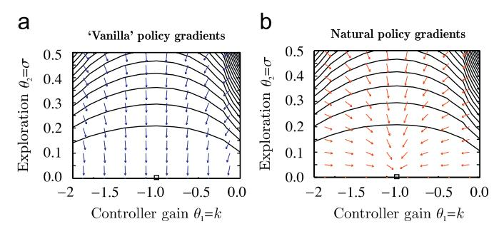
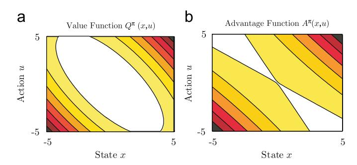
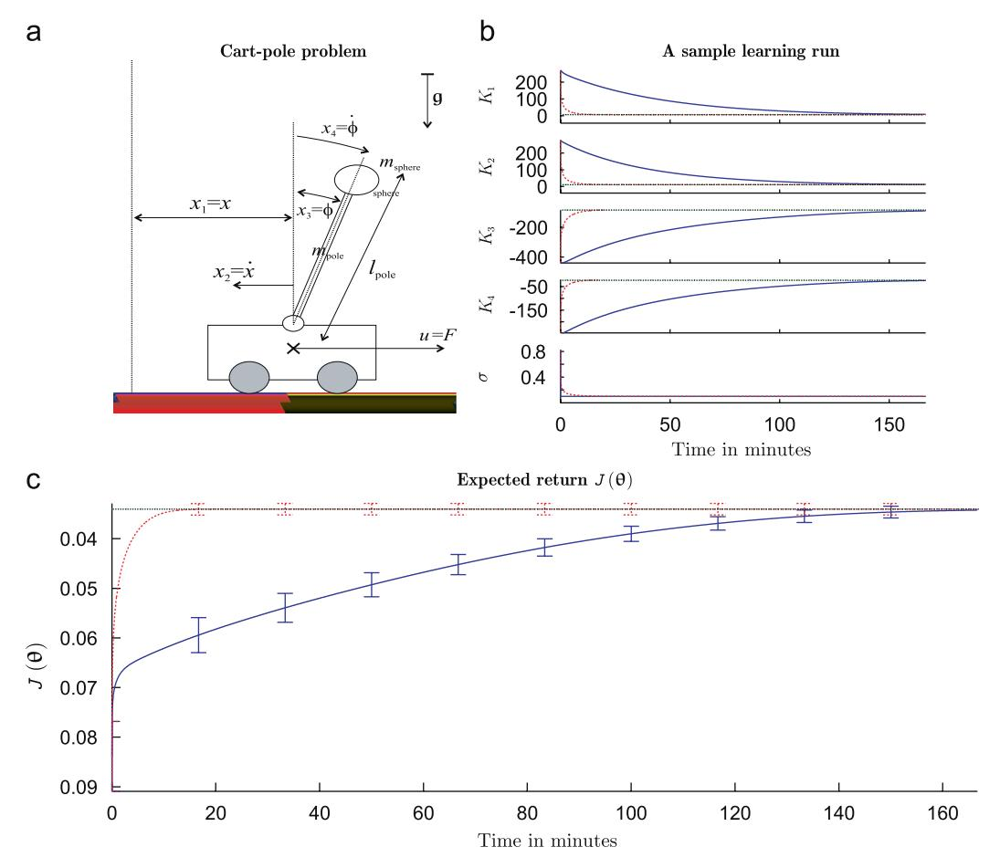
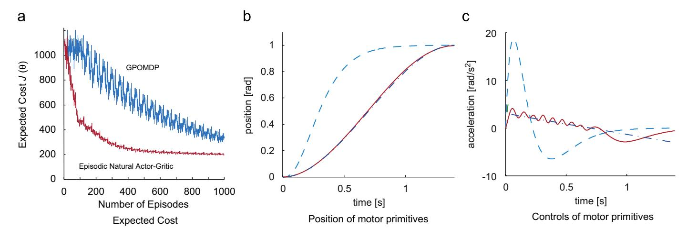
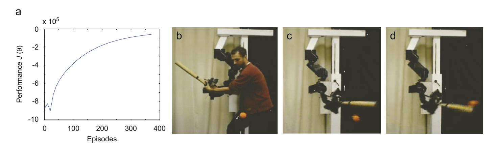

Available online at www.sciencedirect.com


**N**EUROCOMPUTING

Neurocomputing 71 (2008) 1180-1190

www.elsevier.com/locate/neucom

# Natural Actor-Critic

Jan Peters<sup>a,b,\*</sup>, Stefan Schaal<sup>b,c</sup>

<sup>a</sup>Max-Planck-Institute for Biological Cybernetics, Tuebingen, Germany
 <sup>b</sup>University of Southern California, Los Angeles, CA 90089, USA
 <sup>c</sup>ATR Computational Neuroscience Laboratories, Kyoto 619-0288, Japan

Available online 1 February 2008

#### Abstract

In this paper, we suggest a novel reinforcement learning architecture, the Natural Actor-Critic. The actor updates are achieved using stochastic policy gradients employing Amari's natural gradient approach, while the critic obtains both the natural policy gradient and additional parameters of a value function simultaneously by linear regression. We show that actor improvements with natural policy gradients are particularly appealing as these are independent of coordinate frame of the chosen policy representation, and can be estimated more efficiently than regular policy gradients. The critic makes use of a special basis function parameterization motivated by the policy-gradient compatible function approximation. We show that several well-known reinforcement learning methods such as the original Actor-Critic and Bradtke's Linear Quadratic Q-Learning are in fact Natural Actor-Critic algorithms. Empirical evaluations illustrate the effectiveness of our techniques in comparison to previous methods, and also demonstrate their applicability for learning control on an anthropomorphic robot arm.

© 2008 Elsevier B.V. All rights reserved.

Keywords: Policy-gradient methods; Compatible function approximation; Natural gradients; Actor-Critic methods; Reinforcement learning; Robot learning

# 1. Introduction

Reinforcement learning algorithms based on value function approximation have been highly successful with discrete lookup table parameterization. However, when applied with continuous function approximation, many of these algorithms failed to generalize, and few convergence guarantees could be obtained [24]. The reason for this problem can largely be traced back to the greedy or \varepsilon-greedy policy updates of most techniques, as it does not ensure a policy improvement when applied with an approximate value function [8]. During a greedy update, small errors in the value function can cause large changes in the policy which in return can cause large changes in the value function. This process, when applied repeatedly, can result in oscillations or divergence of the algorithms. Even in simple toy systems,

E-mail address: jan.peters@tuebingen.mpg.de (J. Peters).

such unfortunate behavior can be found in many well-known greedy reinforcement learning algorithms [6,8].

As an alternative to greedy reinforcement learning, policy-gradient methods have been suggested. Policy gradients have rather strong convergence guarantees, even when used in conjunction with approximate value functions, and recent results created a theoretically solid framework for policy-gradient estimation from sampled data [25,15]. However, even when applied to simple examples with rather few states, policy-gradient methods often turn out to be quite inefficient [14], partially caused by the large plateaus in the expected return landscape where the gradients are small and often do not point directly towards the optimal solution. A simple example that demonstrates this behavior is given in Fig. 1.

Similar as in supervised learning, the steepest ascent with respect to the Fisher information metric [3], called the 'natural' policy gradient, turns out to be significantly more efficient than normal gradients. Such an approach was first suggested for reinforcement learning as the 'average natural policy gradient' in [14], and subsequently shown in preliminary work to be the true natural policy gradient [21,4]. In this paper, we take this line of reasoning one step

<sup>\*</sup>Corresponding author at: Max-Planck-Institute for Biological Cybernetics, Department of Empirical Inference, Spemannstr. 38, 72076 Tuebingen, Germany.



Fig. 1. When plotting the expected return landscape for simple problem as 1d linear-quadratic regulation, the differences between (a) 'vanilla' and (b) natural policy gradients becomes apparent [21].

further in Section 2.2 by introducing the 'Natural Actor-Critic (NAC)' which inherits the convergence guarantees from gradient methods. Furthermore, in Section 3, we show that several successful previous reinforcement learning methods can be seen as special cases of this more general architecture. The paper concludes with empirical evaluations that demonstrate the effectiveness of the suggested methods in Section 4.

### 2. Natural Actor-Critic

# 2.1. Markov decision process notation and assumptions

For this paper, we assume that the underlying control problem is a *Markov decision process* (MDP) in discrete time with continuous state set  $\mathbb{X} = \mathbb{R}^n$ , and a continuous action set  $\mathbb{U} = \mathbb{R}^m$  [8]. The assumption of an MDP comes with the limitation that very good state information and Markovian environment are assumed. However, similar as in [1], the results presented in this paper might extend to problems with partial state information.

The system is at an initial state  $x_0 \in \mathbb{X}$  at time t = 0 drawn from the start-state distribution  $p(x_0)$ . At any state  $x_t \in \mathbb{X}$  at time t, the actor will choose an action  $u_t \in \mathbb{U}$  by drawing it from a stochastic, parameterized policy  $\pi(u_t|x_t) = p(u_t|x_t,\theta)$  with parameters  $\theta \in \mathbb{R}^N$ , and the system transfers to a new state  $x_{t+1}$  drawn from the state transfer distribution  $p(x_{t+1}|x_t,u_t)$ . The system yields a scalar reward  $r_t = r(x_t,u_t) \in \mathbb{R}$  after each action. We assume that the policy  $\pi_\theta$  is continuously differentiable with respect to its parameters  $\theta$ , and for each considered policy  $\pi_\theta$ , a state-value function  $V^{\pi}(x)$ , and the state-action value function  $Q^{\pi}(x,u)$  exist and are given by

$$V^{\pi}(\mathbf{x}) = E_{\tau} \left\{ \sum_{t=0}^{\infty} \gamma^{t} r_{t} \middle| \mathbf{x}_{0} = \mathbf{x} \right\},\,$$

$$Q^{\pi}(\mathbf{x}, \mathbf{u}) = E_{\tau} \left\{ \sum_{t=0}^{\infty} \gamma^{t} r_{t} \middle| \mathbf{x}_{0} = \mathbf{x}, \mathbf{u}_{0} = \mathbf{u} \right\},$$

where  $\gamma \in (0,1)$  denotes the discount factor, and  $\tau$  a trajectory. It is assumed that some basis functions  $\phi(x)$  are given so that the state-value function can be approxi-

mated with linear function approximation  $V^{\pi}(x) = \phi(x)^{\mathrm{T}} v$ . The general goal is to optimize the normalized expected return

$$J(\theta) = E_{\tau} \left\{ (1 - \gamma) \sum_{t=0}^{\infty} \gamma^{t} r_{t} \middle| \theta \right\}$$
$$= \int_{\mathbb{X}} d^{\pi}(\mathbf{x}) \int_{\mathbb{I}} \pi(\mathbf{u} | \mathbf{x}) r(\mathbf{x}, \mathbf{u}) \, d\mathbf{x} \, d\mathbf{u},$$

where

$$d^{\pi}(\mathbf{x}) = (1 - \gamma) \sum_{t=0}^{\infty} \gamma^{t} p(\mathbf{x}_{t} = \mathbf{x})$$

is the discounted state distribution.

### 2.2. Actor improvement with natural policy gradients

Actor-Critic and many other policy iteration architectures consist of two steps, a policy evaluation step and a policy improvement step. The main requirements for the policy evaluation step are that it makes efficient usage of experienced data. The policy improvement step is required to improve the policy on every step until convergence while being efficient.

The requirements on the policy improvement step rule out greedy methods as, at the current state of knowledge, a policy improvement for approximated value functions cannot be guaranteed, even on average. 'Vanilla' policy gradient improvements (see e.g. [25,15]) which follow the gradient  $\nabla_{\theta}J(\theta)$  of the expected return function  $J(\theta)$  (where  $\nabla_{\theta}f = [\partial f/\partial\theta_1, \ldots, \partial f/\partial\theta_N]$ ) denotes the derivative of function f with respect to parameter vector  $(\theta)$  often get stuck in plateaus as demonstrated in [14]. Natural gradients  $\widetilde{\nabla}_{\theta}J(\theta)$  avoid this pitfall as demonstrated for supervised learning problems [3], and suggested for reinforcement learning in [14]. These methods do not follow the steepest direction in parameter space but the steepest direction with respect to the Fisher metric given by

$$\widetilde{\nabla}_{\theta} J(\theta) = G^{-1}(\theta) \nabla_{\theta} J(\theta), \tag{1}$$

where  $G(\theta)$  denotes the Fisher information matrix. It is guaranteed that the angle between natural and ordinary gradient is never larger than 90°, i.e., convergence to the next local optimum can be assured. The 'vanilla' gradient is given by the policy-gradient theorem (see e.g. [25,15])

$$\nabla_{\theta} J(\theta) = \int_{\mathbb{X}} d^{\pi}(\mathbf{x}) \int_{\mathbb{U}} \nabla_{\theta} \pi(\mathbf{u}|\mathbf{x}) (Q^{\pi}(\mathbf{x}, \mathbf{u}) - b^{\pi}(\mathbf{x})) \, \mathrm{d}\mathbf{u} \, \mathrm{d}\mathbf{x},$$
(2)

where  $b^{\pi}(\mathbf{x})$  denotes a baseline. Refs. [25,15] demonstrated that in Eq. (2), the term  $Q^{\pi}(\mathbf{x}, \mathbf{u}) - b^{\pi}(\mathbf{x})$  can be replaced by a compatible function approximation

$$f_{w}^{\pi}(\mathbf{x}, \mathbf{u}) = (\nabla_{\theta} \log \pi(\mathbf{u}|\mathbf{x}))^{\mathrm{T}} \mathbf{w} \equiv Q^{\pi}(\mathbf{x}, \mathbf{u}) - b^{\pi}(\mathbf{x}), \tag{3}$$

parameterized by the vector  $\mathbf{w}$ , without affecting the unbiasedness of the gradient estimate and irrespective of the choice of the baseline  $b^{\pi}(\mathbf{x})$ . However, as mentioned in

[25], the baseline may still be useful in order to reduce the variance of the gradient estimate when Eq. (2) is approximated from samples. Based on Eqs. (2) and (3), we derive an estimate of the policy gradient as

$$\nabla_{\theta} J(\theta) = \int_{\mathbb{X}} d^{\pi}(\mathbf{x}) \int_{\mathbb{U}} \pi(\mathbf{u}|\mathbf{x}) \nabla_{\theta} \log \pi(\mathbf{u}|\mathbf{x}) \nabla_{\theta} \log \pi(\mathbf{u}|\mathbf{x})^{\mathrm{T}} d\mathbf{u} d\mathbf{x} \mathbf{w}$$
$$= F_{\theta} \mathbf{w}$$
(4)

as  $\nabla_{\theta}\pi(u|x) = \pi(u|x)\nabla_{\theta}\log \pi(u|x)$ . Since  $\pi(u|x)$  is chosen by the user, even in sampled data, the integral

$$F(\theta, \mathbf{x}) = \int_{\mathbb{R}^{+}} \pi(\mathbf{u}|\mathbf{x}) \nabla_{\theta} \log \pi(\mathbf{u}|\mathbf{x}) \nabla_{\theta} \log \pi(\mathbf{u}|\mathbf{x})^{\mathrm{T}} d\mathbf{u}$$
 (5)

can be evaluated analytically or empirically without actually executing all actions. It is also noteworthy that the baseline does not appear in Eq. (4) as it integrates out, thus eliminating the need to find an optimal selection of this open parameter. Nevertheless, the estimation of  $F_{\theta}$  =  $\int_{\mathbb{R}} d^{\pi}(x) F(\theta, x) dx$  is still expensive since  $d^{\pi}(x)$  is not known. However, Eq. (4) has more surprising implications for policy gradients, when examining the meaning of the matrix  $F_{\theta}$  in Eq. (4). Kakade [14] argued that  $F(\theta, x)$  is the point Fisher information matrix for state x, and that  $F(\theta) = \int_{\mathbb{R}} d^{\pi}(x) F(\theta, x) dx$ , therefore, denotes a weighted 'average Fisher information matrix' [14]. However, going one step further, we demonstrate in Appendix A that  $F_{\theta}$  is indeed the true Fisher information matrix and does not have to be interpreted as the 'average' of the point Fisher information matrices. Eqs. (4) and (1) combined imply that the natural gradient can be computed as

$$\widetilde{\nabla}_{\theta} J(\theta) = G^{-1}(\theta) F_{\theta} w = w, \tag{6}$$

since  $F_{\theta} = G(\theta)$  (cf. Appendix A). Therefore we only need estimate w and not  $G(\theta)$ . The resulting policy improvement step is thus  $\theta_{i+1} = \theta_i + \alpha w$  where  $\alpha$  denotes a learning rate. Several properties of the natural policy gradient are worthwhile highlighting:

- Convergence to a local minimum guaranteed as for 'vanilla gradients' [3].
- By choosing a more direct path to the optimal solution in parameter space, the natural gradient has, from empirical observations, faster convergence and avoids premature convergence of 'vanilla gradients' (cf. Fig. 1).
- The natural policy gradient can be shown to be *covariant*, i.e., independent of the coordinate frame chosen for expressing the policy parameters (cf. Section 3.1).
- As the natural gradient analytically averages out the influence of the stochastic policy (including the baseline of the function approximator), it requires fewer data point for a good gradient estimate than 'vanilla gradients'.

### 2.3. Critic estimation with compatible policy evaluation

The critic evaluates the current policy  $\pi$  in order to provide the basis for an actor improvement, i.e., the change

 $\Delta\theta$  of the policy parameters. As we are interested in natural policy gradient updates  $\Delta\theta = \alpha w$ , we wish to employ the compatible function approximation  $f_w^\pi(x, u)$  from Eq. (3) in this context. At this point, a most important observation is that the compatible function approximation  $f_w^\pi(x, u)$  is mean-zero w.r.t. the action distribution, i.e.,

$$\int_{\mathbb{U}} \pi(\boldsymbol{u}|\boldsymbol{x}) f_{\boldsymbol{w}}^{\pi}(\boldsymbol{x}, \boldsymbol{u}) \, \mathrm{d}\boldsymbol{u} = \boldsymbol{w}^{\mathrm{T}} \int_{\mathbb{U}} \boldsymbol{\nabla}_{\boldsymbol{\theta}} \pi(\boldsymbol{u}|\boldsymbol{x}) \, \mathrm{d}\boldsymbol{u} = 0, \tag{7}$$

since from  $\int_{\mathbb{U}} \pi(\boldsymbol{u}|\boldsymbol{x}) \, \mathrm{d}\boldsymbol{u} = 1$ , differention w.r.t. to  $\theta$  results in  $\int_{\mathbb{U}} \nabla_{\theta} \pi(\boldsymbol{u}|\boldsymbol{x}) \, \mathrm{d}\boldsymbol{u} = 0$ . Thus,  $f_w^{\pi}(\boldsymbol{x},\boldsymbol{u})$  represents an advantage function  $A^{\pi}(\boldsymbol{x},\boldsymbol{u}) = Q^{\pi}(\boldsymbol{x},\boldsymbol{u}) - V^{\pi}(\boldsymbol{x})$  in general. The essential differences between the advantage function and the state-action value function is demonstrated in Fig. 2. The advantage function cannot be learned with TD-like bootstrapping without knowledge of the value function as the essence of TD is to compare the value  $V^{\pi}(\boldsymbol{x})$  of the two adjacent states—but this value has been subtracted out in  $A^{\pi}(\boldsymbol{x},\boldsymbol{u})$ . Hence, a TD-like bootstrapping using exclusively the compatible function approximator is impossible.

As an alternative, [25,15] suggested to approximate  $f_w^\pi(\mathbf{x}, \mathbf{u})$  from unbiased estimates  $\hat{Q}^\pi(\mathbf{x}, \mathbf{u})$  of the action value function, e.g., obtained from rollouts and using least-squares minimization between  $f_w$  and  $\hat{Q}^\pi$ . While possible in theory, one needs to realize that this approach implies a function approximation problem where the parameterization of the function approximator only spans a much smaller subspace of the training data—e.g., imagine approximating a quadratic function with a line. In practice, the results of such an approximation depends crucially on the training data distribution and has thus unacceptably high variance—e.g., fit a line to only data from the right branch of a parabula, the left branch, or data from both branches.

Furthermore, in continuous state-spaces a state (except for single start-states) will hardly occur twice; therefore, we can only obtain unbiased estimates  $\hat{Q}^{\pi}(x, \mathbf{u})$  of  $Q^{\pi}(x, \mathbf{u})$ . This means the state-action value estimates  $\hat{Q}^{\pi}(x, \mathbf{u})$  have to



Fig. 2. The state-action value function in any stable linear-quadratic Gaussian regulation problems can be shown to be a bowl (a). The advantage function is always a saddle as shown in (b); it is straightforward to show that the compatible function approximation can exactly represent the advantage function—but projecting the value function onto the advantage function is non-trivial for continuous problems. This figure shows the value function and advantage function of the system described in the caption of Fig. 1.

6. end.

be projected onto the advantage function  $A^{\pi}(x, u)$ . This projection would have to average out the state-value offset  $V^{\pi}(x)$ . For example, for linear-quadratic regulation, it is straightforward to show that the advantage function is saddle while the state-action value function is bowl—we therefore would be projecting a bowl onto a saddle; both are illustrated in Fig. 2. In this case, the distribution of the data has a drastic impact on the projection.

To remedy this situation, we observe that we can write the Bellman equations (e.g., see [5]) in terms of the advantage function and the state-value function

$$Q^{\pi}(\mathbf{x}, \mathbf{u}) = A^{\pi}(\mathbf{x}, \mathbf{u}) + V^{\pi}(\mathbf{x})$$
  
=  $r(\mathbf{x}, \mathbf{u}) + \gamma \int_{\mathbb{X}} p(\mathbf{x}' | \mathbf{x}, \mathbf{u}) V^{\pi}(\mathbf{x}') d\mathbf{x}'.$  (8)

Inserting  $A^{\pi}(\mathbf{x}, \mathbf{u}) = f_{w}^{\pi}(\mathbf{x}, \mathbf{u})$  and an appropriate basis functions representation of the value function as  $V^{\pi}(\mathbf{x}) = \phi(\mathbf{x})^{\mathrm{T}}\mathbf{v}$ , we can rewrite the Bellman Equation, Eq. (8), as a set of linear equations

$$\nabla_{\theta} \log \pi (\boldsymbol{u}_{t} | \boldsymbol{x}_{t})^{\mathrm{T}} \boldsymbol{w} + \boldsymbol{\phi}(\boldsymbol{x}_{t})^{\mathrm{T}} \boldsymbol{v}$$

$$= r(\boldsymbol{x}_{t}, \boldsymbol{u}_{t}) + \gamma \boldsymbol{\phi}(\boldsymbol{x}_{t+1})^{\mathrm{T}} \boldsymbol{v} + \varepsilon(\boldsymbol{x}_{t}, \boldsymbol{u}_{t}, \boldsymbol{x}_{t+1}), \tag{9}$$

where  $\varepsilon(\mathbf{x}_t, \mathbf{u}_t, \mathbf{x}_{t+1})$  denotes an error term which mean-zero as can be observed from Eq. (8). These equations enable us to formulate some novel algorithms in the next sections.

The linear appearance of w and v hints at a least squares to obtain. Thus, we now need to address algorithms that estimate the gradient efficiently using the sampled equations (such as Eq. (9)), and how to determine the additional basis functions  $\phi(x)$  for which convergence of these algorithms is guaranteed.

### 2.3.1. Critic evaluation with LSTD- $O(\lambda)$

Using Eq. (9), a solution to Eq. (8) can be obtained by adapting the LSTD( $\lambda$ ) policy evaluation algorithm [9]. For this purpose, we define

$$\widehat{\boldsymbol{\phi}}_{t} = [\boldsymbol{\phi}(\boldsymbol{x}_{t})^{\mathrm{T}}, \boldsymbol{\nabla}_{\boldsymbol{\theta}} \log \pi(\boldsymbol{u}_{t}|\boldsymbol{x}_{t})^{\mathrm{T}}]^{\mathrm{T}},$$

$$\widetilde{\boldsymbol{\phi}}_{t} = [\boldsymbol{\phi}(\boldsymbol{x}_{t+1})^{\mathrm{T}}, \boldsymbol{0}^{\mathrm{T}}]^{\mathrm{T}},$$
(10)

as new basis functions, where **0** is the zero vector. This definition of basis function reduces bias and variance of the learning process in comparison to SARSA and previous LSTD( $\lambda$ ) algorithms for state-action value functions [9] as the basis functions  $\phi_t$  do not depend on stochastic future actions  $u_{t+1}$ , i.e., the input variables to the LSTD regression are not noisy due to  $u_{t+1}$  (e.g., as in [10])—such input noise would violate the standard regression model that only takes noise in the regression targets into account. Alternatively, Bradtke et al. [10] assume  $V^{\pi}(x) = Q^{\pi}(x, \overline{u})$ where  $\overline{u}$  is the average future action, and choose their basis functions accordingly; however, this is only given for deterministic policies, i.e., policies without exploration and not applicable in our framework. LSTD( $\lambda$ ) with the basis functions in Eq. (10), called LSTD-Q( $\lambda$ ) from now on, is thus currently the theoretically cleanest way of applying LSTD to state-value function estimation. It is exact for

Table 1 Natural Actor-Critic Algorithm with LSTD-Q(λ)

1: Draw initial state  $x_0 \sim p(x_0)$ , and select parameters

**Input:** Parameterized policy  $\pi(u|x) = p(u|x, \theta)$  with initial parameters  $\theta = \theta_0$ , its derivative  $\nabla_{\theta} \log \pi(u|x)$  and basis functions  $\phi(x)$  for the value function  $V^{\pi}(x)$ 

```
A_{t+1} = \mathbf{0}, b_{t+1} = \mathbf{z}_{t+1} = \mathbf{0}.
2: For t = 0, 1, 2, \dots do
           Execute: Draw action u_t \sim \pi(u_t|x_t), observe next state
            \mathbf{x}_{t+1} \sim p(\mathbf{x}_{t+1} | \mathbf{x}_t, \mathbf{u}_t), and reward r_t = r(\mathbf{x}_t, \mathbf{u}_t).
            Critic Evaluation (LSTD-Q(\lambda)): Update
                      basis functions: \widetilde{\boldsymbol{\phi}}_t = [\boldsymbol{\phi}(\boldsymbol{x}_{t+1})^{\mathrm{T}}, \boldsymbol{0}^{\mathrm{T}}]^{\mathrm{T}},
                             \widehat{\boldsymbol{\phi}}_t = [\boldsymbol{\phi}(\boldsymbol{x}_t)^{\mathrm{T}}, \boldsymbol{\nabla}_{\boldsymbol{\theta}} \log \pi (\boldsymbol{u}_t | \boldsymbol{x}_t)^{\mathrm{T}}]^{\mathrm{T}},
                      statistics: \mathbf{z}_{t+1} = \lambda \mathbf{z}_t + \widehat{\boldsymbol{\phi}}_t; \mathbf{A}_{t+1} = \mathbf{A}_t + \mathbf{z}_{t+1} (\boldsymbol{\phi}_t - \gamma \widetilde{\boldsymbol{\phi}}_t)^{\mathrm{T}};
4.2:
                             \boldsymbol{b}_{t+1} = \boldsymbol{b}_t + \boldsymbol{z}_{t+1} r_t,
                      critic parameters: [\boldsymbol{v}_{t+1}^{\mathrm{T}}, \boldsymbol{w}_{t+1}^{\mathrm{T}}]^{\mathrm{T}} = \boldsymbol{A}_{t+1}^{-1} \boldsymbol{b}_{t+1}.
4.3:
            Actor: If gradient estimate is accurate, \preceq (w_t, w_{t-1}) \leq \varepsilon, update
5.1:
                      policy parameters: \theta_{t+1} = \theta_t + \alpha w_{t+1},
5.2:
                      forget statistics: z_{t+1} \leftarrow \beta z_{t+1}, A_{t+1} \leftarrow \beta A_{t+1}, b_{t+1} \leftarrow \beta b_{t+1}.
```

deterministic or weekly noisy state transitions and arbitrary stochastic policies. As all previous LSTD suggestions, it loses accuracy with increasing noise in the state transitions since  $\phi_t$  becomes a random variable. The complete LSTD-Q( $\lambda$ ) algorithm is given in the *Critic Evaluation* (lines 4.1–4.3) of Table 1.

Once LSTD-Q( $\lambda$ ) converges to an approximation of  $A^{\pi}(x_t, u_t) + V^{\pi}(x_t)$ , we obtain two results: the value function parameters v, and the natural gradient w. The natural gradient w serves in updating the policy parameters  $\Delta \theta_t = \alpha w_t$ . After this update, the critic has to forget at least parts of its accumulated sufficient statistics using a forgetting factor  $\beta \in [0, 1]$  (cf. Table 1). For  $\beta = 0$ , i.e., complete resetting, and appropriate basis functions  $\phi(x)$ , convergence to the true natural gradient can be guaranteed. The complete NAC algorithm is shown in Table 1.

However, it becomes fairly obvious that the basis functions can have an influence on our gradient estimate. When using the counterexample in [7] with a typical Gibbs policy, we will realize that the gradient is affected for  $\lambda < 1$ ; for  $\lambda = 0$  the gradient is flipped and would always worsen the policy. However, unlike in [7], we at least could guarantee that we are not affected for  $\lambda = 1$ .

# 2.3.2. Episodic NAC

Given the problem that the additional basis functions  $\phi(x)$  determine the quality of the gradient, we need methods which guarantee the unbiasedness of the natural gradient estimate. Such method can be determined by summing up Eq. (9) along a sample path, we obtain

$$\sum_{t=0}^{N-1} \gamma^t A^{\pi}(\boldsymbol{x}_t, \boldsymbol{u}_t)$$

$$= V^{\pi}(\boldsymbol{x}_0) + \sum_{t=0}^{N-1} \gamma^t r(\boldsymbol{x}_t, \boldsymbol{u}_t) - \gamma^N V^{\pi}(\boldsymbol{x}_N). \tag{11}$$

Table 2
Episodic Natural Actor-Critic Algorithm (eNAC)

**Input:** Parameterized policy  $\pi(u|x) = p(u|x, \theta)$  with initial parameters  $\theta = \theta_0$ , and derivative  $\nabla_{\theta} \log \pi(u|x)$ .

```
For u=1,2,3,\ldots do

For e=1,2,3,\ldots do

Execute Rollout: Draw initial state x_0 \sim p(x_0).

For t=1,2,3,\ldots,N do

Draw action u_t \sim \pi(u_t|x_t), observe next state x_{t+1} \sim p(x_{t+1}|x_t,u_t), and reward r_t=r(x_t,u_t).

end.

critic Evaluation (Episodic): Determine value function J=V^\pi(x_0), compatible function approximation f^\pi_w(x_t,u_t).

Update: Determine basis functions: \phi_t = [\sum_{t=0}^N \gamma^t \nabla_\theta \log \pi(u_t|x_t)^T, 1]^T; reward statistics: R_t = \sum_{t=0}^N \gamma^t r;

Actor-Update: When the natural gradient is converged, \Delta(w_{t+1},w_{t-\tau}) \leqslant \varepsilon, update the policy parameters: \theta_{t+1} = \theta_t + \alpha w_{t+1}. 6: end.
```

It is fairly obvious that the last term disappears for  $N \to \infty$  or episodic tasks (where  $r(\mathbf{x}_{N-1}, \mathbf{u}_{N-1})$  is the final reward); therefore each rollout would yield one equation. If we furthermore assume a single start-state, an additional scalar value function of  $\phi(x) = 1$  suffices. We therefore get a straightforward regression problem:

$$\sum_{t=0}^{N-1} \gamma^t \nabla \log \pi(\boldsymbol{u}_t, \boldsymbol{x}_t)^{\mathrm{T}} \boldsymbol{w} + J = \sum_{t=0}^{N-1} \gamma^t r(\boldsymbol{x}_t, \boldsymbol{u}_t)$$
 (12)

with exactly  $\dim \theta + 1$  unknowns. This means that for non-stochastic tasks we can obtain a gradient after  $\dim \theta + 1$  rollouts. The complete algorithm is shown in Table 2.

### 3. Properties of NAC

In this section, we will emphasize certain properties of the NAC. In particular, we want to give a simple proof of covariance of the natural policy gradient, and discuss [14] observation that in his experimental settings the natural policy gradient was non-covariant. Furthermore, we will discuss another surprising aspect about the NAC which is its relation to previous algorithms. We briefly demonstrate that established algorithms like the classic Actor-Critic [24], and Bradtke's Q-Learning [10] can be seen as special cases of NAC.

# 3.1. On the covariance of natural policy gradients

When [14] originally suggested natural policy gradients, he came to the disappointing conclusion that they were not covariant. As counterexample, he suggested that for two different linear Gaussian policies (one in the normal form, and the other in the information form) the probability distributions represented by the natural policy gradient would be affected differently, i.e., the natural policy gradient would be non-covariant. We intend to give a

proof at this point showing that the natural policy gradient is in fact covariant under certain conditions, and clarify why [14] experienced these difficulties.

**Theorem 1.** Natural policy-gradients updates are covariant for two policies  $\pi_{\theta}$  parameterized by  $\boldsymbol{\theta}$  and  $\pi_{h}$  parameterized by  $\boldsymbol{h}$  if (i) for all parameters  $\theta_{i}$  there exists a function  $\theta_{i} = f_{i}(h_{1}, \ldots, h_{k})$ , (ii) the derivative  $\nabla_{h}\theta$  and its inverse  $\nabla_{h}\theta^{-1}$ 

For the proof see Appendix B. Practical experiments show that the problems occurred for Gaussian policies in [14] are in fact due to the selection the stepsize  $\alpha$  which determines the length of  $\Delta\theta$ . As the linearization  $\Delta\theta = \nabla_h \theta^T \Delta h$  does not hold for large  $\Delta\theta$ , this can cause divergence between the algorithms even for analytically determined natural policy gradients which can partially explain the difficulties occurred by Kakade [14].

#### 3.2. NAC's relation to previous algorithms

Original Actor-Critic. Surprisingly, the original Actor-Critic algorithm [24] is a form of the NAC. By choosing a Gibbs policy  $\pi(u_t|x_t) = \exp(\theta_{xu})/\sum_b \exp(\theta_{xb})$ , with all parameters  $\theta_{xu}$  lumped in the vector  $\boldsymbol{\theta}$  (denoted as  $\boldsymbol{\theta} = [\theta_{xu}]$ ) in a discrete setup with tabular representations of transition probabilities and rewards. A linear function approximation  $V^{\pi}(x) = \boldsymbol{\phi}(x)^{\mathrm{T}} \boldsymbol{v}$  with  $\boldsymbol{v} = [v_x]$  and unit basis functions  $\boldsymbol{\phi}(x) = \boldsymbol{u}_x$  was employed. Sutton et al. online update rule is given by

$$\theta_{xu}^{t+1} = \theta_{xu}^{t} + \alpha_{1}(r(x, u) + \gamma v_{x'} - v_{x}),$$
  

$$v_{x}^{t+1} = v_{x}^{t} + \alpha_{2}(r(x, u) + \gamma v_{x'} - v_{x}),$$

where  $\alpha_1$ ,  $\alpha_2$  denote learning rates. The update of the critic parameters  $v_x^t$  equals the one of the NAC in expectation as TD(0) critics converges to the same values as LSTD(0) and LSTD-Q(0) for discrete problems [9]. Since for the Gibbs policy we have  $\partial \log \pi(b|a)/\partial \theta_{xu} = 1 - \pi(b|a)$  if a = x and b = u,  $\partial \log \pi(b|a)/\partial \theta_{xu} = -\pi(b|a)$  if a = x and  $b \neq u$ , and  $\partial \log \pi(b|a)/\partial \theta_{xu} = 0$  otherwise, and as  $\sum_b \pi(b|x) A(x,b) = 0$ , we can evaluate the advantage function and derive

$$A(x, u) = A(x, u) - \sum_{b} \pi(b|x)A(x, b)$$
$$= \sum_{c} \frac{\partial \log \pi(b|x)}{\partial \theta_{xy}} A(x, b).$$

Since the compatible function approximation represents the advantage function, i.e.,  $f_w^\pi(x, u) = A(x, u)$ , we realize that the advantages equal the natural gradient, i.e., w = [A(x, u)]. Furthermore, the TD(0) error of a stateaction pair (x, u) equals the advantage function in expectation, and therefore the natural gradient update  $w_{xu} = A(x, u) = E_{x'}\{r(x, u) + \gamma V(x') - V(x)|x, u\}$ , corresponds to the average online updates of Actor-Critic. As both update rules of the Actor-Critic correspond to the ones of NAC, we can see both algorithms as equivalent.

SARSA. SARSA with a tabular, discrete state-action value function  $Q^{\pi}(x, u)$  and an  $\varepsilon$ -soft policy improvement

$$\pi(\mathbf{u}_t|\mathbf{x}_t) = \exp(Q^{\pi}(x,u)/\varepsilon) / \sum_{\hat{u}} \exp(Q^{\pi}(x,u)/\varepsilon)$$

can also be seen as an approximation of NAC. When treating the table entries as parameters of a policy  $\theta_{xu} = Q^{\pi}(x, u)$ , we realize that the TD update of these parameters corresponds approximately to the natural gradient update since  $w_{xu} = \varepsilon A(x,u) \approx \varepsilon E_{x'} \{ r(x,u) + \gamma Q(x',u') - Q(x,u) | x,u \}$ . However, the SARSA-TD error equals the advantage function only for policies where a single action  $u^*$  has much better action values  $Q(x,u^*)$  than all other actions; for such special cases,  $\varepsilon$ -soft SARSA can be seen as an approximation of NAC. This also corresponds to Kakade's [14] observation that greedy update step (such as the  $\varepsilon$ -soft greedy update), approximates the natural policy gradient.

Bradtke's Q-Learning. Bradtke [10] proposed an algorithm with policy  $\pi(u_t|\mathbf{x}_t) = \mathcal{N}(u_t|\mathbf{k}_t^T\mathbf{x}_t, \sigma_i^2)$  and parameters  $\boldsymbol{\theta}_i = [\mathbf{k}_i^T, \sigma_i]^T$  (where  $\sigma_i$  denotes the exploration, and i the policy update time step) in a linear control task with linear state transitions  $\mathbf{x}_{t+1} = A\mathbf{x}_t + b\mathbf{u}_t$ , and quadratic rewards  $r(\mathbf{x}_t, \mathbf{u}_t) = \mathbf{x}_t^T H \mathbf{x}_t + R u_t^2$ . They evaluated  $Q^{\pi}(\mathbf{x}_t, \mathbf{u}_t)$  with LSTD(0) using a quadratic polynomial expansion as basis functions, and applied greedy updates:

$$k_{i+1}^{\text{Bradtke}} = \underset{k_{i+1}}{\text{arg max}} \ Q^{\pi}(x_t, u_t = k_{i+1}^{\text{T}} x_t)$$
$$= -(R + \gamma b^{\text{T}} P_i b)^{-1} \gamma b P_i A,$$

where  $P_i$  denotes policy-specific value function parameters related to the gain  $k_i$ ; no update the exploration  $\sigma_i$  was included. Similarly, we can obtain the natural policy gradient  $\mathbf{w} = [\mathbf{w}_k, \mathbf{w}_\sigma]^T$ , as yielded by LSTD-Q( $\lambda$ ) analytically using the compatible function approximation and the same quadratic basis functions. As discussed in detail in [21], this gives us

$$\mathbf{w}_{k} = (\gamma \mathbf{A}^{\mathrm{T}} \mathbf{P}_{i} \mathbf{b} + (R + \gamma \mathbf{b}^{\mathrm{T}} \mathbf{P}_{i} \mathbf{b}) \mathbf{k})^{\mathrm{T}} \sigma_{i}^{2},$$

$$w_{\sigma} = 0.5(\boldsymbol{R} + \gamma \boldsymbol{b}^{\mathrm{T}} \boldsymbol{P}_{i} \boldsymbol{b}) \sigma_{i}^{3}.$$

Similarly, it can be derived that the expected return is  $J(\theta_i) = -(R + \gamma \boldsymbol{b}^T \boldsymbol{P}_i \boldsymbol{b}) \sigma_i^2$  for this type of problems, see [21]. For a learning rate  $\alpha_i = 1/\|J(\theta_i)\|$ , we see

$$\mathbf{k}_{i+1} = \mathbf{k}_i + \alpha_t \mathbf{w}_{\mathbf{k}} = \mathbf{k}_i - (\mathbf{k}_i + (R + \gamma \mathbf{b}^{\mathrm{T}} \mathbf{P}_i \mathbf{b})^{-1} \gamma \mathbf{A}^{\mathrm{T}} \mathbf{P}_i \mathbf{b})$$
  
=  $\mathbf{k}_{i+1}^{\mathrm{Bradtke}}$ ,

which demonstrates that *Bradtke's Actor Update is a special case of the NAC*. NAC extends Bradtke's result as it gives an update rule for the exploration—which was not possible in Bradtke's greedy framework.

### 4. Evaluations and applications

In this section, we present several evaluations comparing the episodic NAC architectures with previous algorithms. We compare them in optimization tasks such as Cart-Pole Balancing and simple motor primitive evaluations and compare them only with episodic NAC. Furthermore, we apply the combination of episodic NAC and the motor primitive framework to a robotic task on a real robot, i.e., 'hitting a T-ball with a baseball bat'.

### 4.1. Cart-Pole Balancina

Cart-Pole Balancing is a well-known benchmark for reinforcement learning. We assume the cart as shown in Fig. 3(a) can be described by

$$ml\ddot{x}\cos\theta + ml^2\ddot{\theta} - mgl\sin\theta = 0,$$

$$(m + m_c)\ddot{x} + ml\ddot{\theta}\cos\theta - ml\dot{\theta}^2\sin\theta = F,$$

with l = 0.75 m, m = 0.15 kg, g = 9.81 m/s<sup>2</sup> and  $m_c = 1.0$  kg. The resulting state is given by  $\mathbf{x} = [\mathbf{x}, \dot{\mathbf{x}}, \theta, \dot{\theta}]^{\mathrm{T}}$ , and the action  $\mathbf{u} = F$ . The system is treated as if it was sampled at a rate of h = 60 Hz, and the reward is given by  $r(\mathbf{x}, \mathbf{u}) = \mathbf{x}^{\mathrm{T}} Q \mathbf{x} + \mathbf{u}^{\mathrm{T}} R \mathbf{u}$  with Q = diag(1.25, 1, 12, 0.25), R = 0.01.

The policy is specified as  $\pi(\mathbf{u}|\mathbf{x}) = \mathcal{N}(\mathbf{K}\mathbf{x}, \sigma^2)$ . In order to ensure that the learning algorithm cannot exceed an acceptable parameter range, the variance of the policy is defined as  $\sigma = 0.1 + 1/(1 + \exp(\eta))$ . Thus, the policy parameter vector becomes  $\boldsymbol{\theta} = [\mathbf{K}^T, \eta]^T$  and has the analytically computable optimal solution  $\mathbf{K} \approx [5.71, 11.3, -82.1, -21.6]^T$ , and  $\sigma = 0.1$ , corresponding to  $\eta \to \infty$ . As  $\eta \to \infty$  is hard to visualize, we show  $\sigma$  in Fig. 3(b) despite the fact that the update takes place over the parameter  $\eta$ .

For each initial policy, samples  $(x_t, u_t, r_{t+1}, x_{t+1})$  are being generated using the start-state distributions, transition probabilities, the rewards and the policy. The samples arrive at a sampling rate of 60 Hz, and are immediately sent to the NAC module. The policy is updated when  $\not \perp (w_{t+1}, w_t) \le \varepsilon = \pi/180$ . At the time of update, the true 'vanilla' policy gradient, which can be computed analytically, is used to update a separate policy. The true 'vanilla' policy gradients these serve as a baseline for the comparison. If the pole leaves the acceptable region of  $-\pi/6 \le \phi \le \pi/6$ , and  $-1.5 \, \text{m} \le x \le +1.5 \, \text{m}$ , it is reset to a new starting position drawn from the start-state distribution.

Results are illustrated in Fig. 3. In Fig. 3(b), a sample run is shown: the NAC algorithms estimates the optimal solution within less than 10 min of simulated robot trial time. The analytically obtained policy gradient for comparison takes over 2h of robot experience to get to the true solution. In a real world application, a significant amount of time would be added for the vanilla policy gradient as it is more unstable and leaves the admissible area more often. The policy gradient is clearly outperformed

<sup>&</sup>lt;sup>1</sup>The true natural policy gradient can also be computed analytically. However, it is not shown as the difference in performance to the Natural Actor-Critic gradient estimate is negligible.



Fig. 3. This figure shows the performance of Natural Actor-Critic in the Cart-Pole Balancing framework. In (a), you can see the general setup of the pole mounted on the cart. In (b), a sample learning run of the both Natural Actor-Critic and the true policy gradient is given. The dashed line denotes the Natural Actor-Critic performance while the solid line shows the policy gradients performance. In (c), the expected return of the policy is shown. This is an average over 100 randomly picked policies as described in Section 4.1.

by the NAC algorithm. The performance difference between the true natural gradient and the NAC algorithm is negligible and, therefore, not shown separately. By the time of the conference, we hope to have this example implemented on a real anthropomorphic robot. In Fig. 3(c), the expected return over updates is shown averaged over all hundred initial policies.

In this experiment, we demonstrated that the NAC is comparable with the ideal natural gradient, and outperforms the 'vanilla' policy gradient significantly. Greedy policy improvement methods do not compare easily. Discretized greedy methods cannot compete due to the fact that the amount of data required would be significantly increased. The only suitable greedy improvement method, to our knowledge, is Bradtke's Adaptive Policy Iteration [10]. However, this method is problematic in real-world application due to the fact that the policy in Bradtke's method is deterministic: the estimation of the action-value function is an ill-conditioned regression problem with redundant parameters and no explorative noise. Therefore, it can only work in simulated environments with an absence of noise in the state estimates and rewards.

#### 4.2. Motor primitive learning for baseball

This section will turn towards optimizing nonlinear dynamic motor primitives for robotics. In [13], a novel form of representing movement plans  $(\mathbf{q}_d, \dot{\mathbf{q}}_d)$  for the degrees of freedom (DOF) robot systems was suggested in terms of the time evolution of the nonlinear dynamical systems

$$\dot{q}_{d,k} = h(q_{d,k}, \mathbf{z}_k, g_k, \tau, \theta_k), \tag{13}$$

where  $(q_{d,k}, \dot{q}_{d,k})$  denote the desired position and velocity of a joint,  $z_k$  the internal state of the dynamic system,  $g_k$  the goal (or point attractor) state of each DOF,  $\tau$  the movement duration shared by all DOFs, and  $\theta_k$  the open parameters of the function h. The original work in [13] demonstrated how the parameters  $\theta_k$  can be learned to match a template trajectory by means of supervised learning—this scenario is, for instance, useful as the first step of an imitation learning system. Here we will add the ability of self-improvement of the movement primitives in

Eq. (13) by means of reinforcement learning, which is the crucial second step in imitation learning. The system in Eq. (13) is a point-to-point movement, i.e., this task is rather well suited for episodic NAC.

In Fig. 4, we show a comparison with GPOMDP for simple, single DOF task with a reward of

$$r_k(x_{0:N}, u_{0:N}) = \sum_{i=0}^{N} c_1 \dot{q}_{d,k,i}^2 + c_2 (q_{d,k,N} - g_k)^2,$$

where  $c_1 = 1$ ,  $c_2 = 1000$ , and  $g_k$  is chose appropriately. In Fig. 4(a), we show how the expected cost decreases for both GPOMDP and the episodic NAC. The positions of the motor primitives are shown in Fig. 4(b) and in Fig. 4(c) the accelerations are given. In 4(b,c), the dashed line shows the initial configurations, which is accomplished by zero parameters for the motor primitives. The solid line

shows the analytically optimal solution, which is unachievable for the motor primitives, but nicely approximated by their best solution, presented by the dark dot-dashed line. This best solution is reached by both learning methods. However, for GPOMDP, this requires approximately 10<sup>6</sup> learning steps while the NAC takes less than 10<sup>3</sup> to converge to the optimal solution.

We also evaluated the same setup in a challenging robot task, i.e., the planning of these motor primitives for a seven DOF robot task. The task of the robot is to hit the ball properly so that it flies as far as possible. Initially, it is taught in by supervised learning as can be seen in Fig. 5(b); however, it fails to reproduce the behavior as shown in Fig. 5(c); subsequently, we improve the performance using the episodic NAC which yields the performance shown in Fig. 5(a) and the behavior in Fig. 5(d).



Fig. 4. This figure illustrates the task accomplished in the toy example. In (a), we show how the expected cost decreases for both GPOMDP and the episodic Natural Actor-Critic. The positions of the motor primitives are shown in (b) and in (c) the accelerations are given. In (b,c), the dashed line shows the initial configurations, which is accomplished by zero parameters for the motor primitives. The solid line shows the analytically optimal solution, which is unachievable for the motor primitives, but nicely approximated by their best solution, presented by the dark dot-dashed line. This best solution is reached by both learning methods. However, for GPOMDP, this requires approximately 10<sup>6</sup> learning steps while the NAC takes less than 10<sup>3</sup> to converge to the optimal solution.



Fig. 5. The figure shows (a) the performance of a baseball swing task when using the motor primitives for learning. In (b), the learning system is initialized by imitation learning, in (c) it is initially failing at reproducing the motor behavior, and (d) after several hundred episodes exhibiting a nicely learned batting.

#### 5. Conclusion

In this paper, we have summarized novel developments in policy-gradient reinforcement learning, and based on these, we have designed a novel reinforcement learning architecture, the NAC algorithm. This algorithm comes in (at least) two forms, i.e., the LSTD-Q( $\lambda$ ) form which depends on sufficiently rich basis functions, and the Episodic form which only requires a constant as additional basis function. We compare both algorithms and apply the latter on several evaluative benchmarks as well as on a baseball swing robot example.

Recently, our NAC architecture [19,21] has gained a lot of traction in the reinforcement learning community. According to Aberdeen, the NAC is the 'Current method of choice' [2]. Additional to our work presented at ESANN 2007 in [19] and its earlier, preliminary versions (see e.g. [22,21,18,20]), the algorithm has found a variety of applications in largely unmodified form in the last year. The current range of additional applications includes optimization of constrained reaching movements of humanoid robots [12], traffic-light system optimization [23], multi-agent system optimization [11,28], conditional random fields [27] and gait optimization in robot locomotion [26,17]. All these new developments indicate that the NAC is about to become a standard architecture in the area of reinforcement learning as it is among the few approaches which have scaled towards interesting applications.

### Appendix A. Fisher information property

In Section 6, we explained that the all-action matrix  $F_{\theta}$  equals in general the Fisher information matrix  $G(\theta)$ . In [16], we can find the well-known lemma that by differentiating  $\int_{\mathbb{R}^n} p(\mathbf{x}) d\mathbf{x} = 1$  twice with respect to the parameters  $\theta$ , we can obtain

$$\int_{\mathbb{R}^n} p(\mathbf{x}) \nabla_{\theta}^2 \log p(\mathbf{x}) d\mathbf{x}$$

$$= -\int_{\mathbb{R}^n} p(\mathbf{x}) \nabla_{\theta} \log p(\mathbf{x}) \nabla_{\theta} \log p(\mathbf{x})^{\mathrm{T}} d\mathbf{x}$$
(A.1)

for any probability density function p(x). Furthermore, we can rewrite the probability  $p(\tau_{0:n})$  of a rollout or trajectory  $\tau_{0:n} = [x_0, u_0, r_0, x_1, u_1, r_1, \dots, x_n, u_n, r_n, x_{n+1}]^T$  as

$$p(\boldsymbol{\tau}_{0:n}) = p(\boldsymbol{x}_0) \prod_{t=0}^{n} p(\boldsymbol{x}_{t+1}|\boldsymbol{x}_t, \boldsymbol{u}_t) \pi(\boldsymbol{u}_t|\boldsymbol{x}_t)$$

which implies that

$$\nabla_{\theta}^2 \log p(\tau_{0:n}) = \sum_{t=0}^n \nabla_{\theta}^2 \log \pi(\boldsymbol{u}_t | \boldsymbol{x}_t).$$

Using Eq. (A.1), and the definition of the Fisher information matrix [3], we can determine Fisher information

matrix for the average reward case by

$$G(\theta) = \lim_{n \to \infty} n^{-1} E_{\tau} \{ \nabla_{\theta} \log p(\tau) \nabla_{\theta} \log p(\tau_{0:n})^{T} \}$$

$$= -\lim_{n \to \infty} n^{-1} E_{\tau} \{ \nabla_{\theta}^{2} \log p(\tau) \}, \qquad (A.2)$$

$$= -\lim_{n \to \infty} n^{-1} E_{\tau} \{ \sum_{t=0}^{n} \nabla_{\theta}^{2} \log \pi(\mathbf{u}_{t} | \mathbf{x}_{t}) \}$$

$$= -\int_{\mathbb{X}} d^{\pi}(\mathbf{x}) \int_{\mathbb{U}} \pi(\mathbf{u} | \mathbf{x}) \nabla_{\theta}^{2} \log \pi(\mathbf{u} | \mathbf{x}) \, d\mathbf{u} \, d\mathbf{x} \qquad (A.3)$$

$$= \int_{\mathbb{X}} d^{\pi}(\mathbf{x}) \int_{\mathbb{U}} \pi(\mathbf{u} | \mathbf{x}) \nabla_{\theta} \log \pi(\mathbf{u} | \mathbf{x})$$

$$\nabla_{\theta} \log \pi(\mathbf{u} | \mathbf{x})^{T} \, d\mathbf{u} \, d\mathbf{x} = F_{\theta}. \qquad (A.4)$$

This proves that the all-action matrix is indeed the Fisher information matrix for the average reward case. For the discounted case, with a discount factor  $\gamma$  we realize that we can rewrite the problem where the probability of rollout is given by

$$p_{\gamma}(\boldsymbol{\tau}_{0:n}) = p(\boldsymbol{\tau}_{0:n}) \left( \sum_{i=0}^{n} \gamma^{i} I_{x_{i},u_{i}} \right)$$

and derive that the all-action matrix equals the Fisher information matrix by the same kind of reasoning as in Eq. (A.4). Therefore, we can conclude that in general, i.e.,  $G(\theta) = F_{\theta}$ .

### Appendix B. Proof of the covariance theorem

For small parameter changes  $\Delta h$  and  $\Delta \theta$ , we have  $\Delta \theta = \nabla_h \theta^T \Delta h$ . If the natural policy gradient is a covariant update rule, a change  $\Delta h$  along the gradient  $\nabla_h J(h)$  would result in the same change  $\Delta \theta$  along the gradient  $\nabla_\theta J(\theta)$  for the same scalar step-size  $\alpha$ . By differentiation, we can obtain  $\nabla_h J(h) = \nabla_h \theta \nabla_\theta J(\theta)$ . It is straightforward to show that the Fisher information matrix includes the Jacobian  $\nabla_h \theta$  twice as factor

$$F(h) = \int_{\mathbb{X}} d^{\pi}(x) \int_{\mathbb{U}} \pi(u|x) \nabla_{h} \log \pi(u|x) \nabla_{h} \log \pi(u|x)^{T} du dx,$$

$$= \nabla_{h} \theta \int_{\mathbb{X}} d^{\pi}(x) \int_{\mathbb{U}} \pi(u|x) \nabla_{\theta} \log \pi(u|x)$$

$$\nabla_{\theta} \log \pi(u|x)^{T} du dx \nabla_{h} \theta^{T},$$

$$= \nabla_{h} \theta F(\theta) \nabla_{h} \theta^{T}.$$

This shows that natural gradient in the h parameterization is given by

$$\widetilde{\nabla}_{h}J(h) = F^{-1}(h)\nabla_{h}J(h)$$

$$= (\nabla_{h}\theta F(\theta)\nabla_{h}\theta^{T})^{-1}\nabla_{h}\theta\nabla_{\theta}J(\theta).$$

This has a surprising implication as it makes it straightforward to see that the natural policy is covariant since

$$\Delta \theta = \alpha \nabla_h \theta^{\mathrm{T}} \Delta h = \alpha \nabla_h \theta^{\mathrm{T}} \widetilde{\nabla}_h J(h),$$
  

$$= \alpha \nabla_h \theta^{\mathrm{T}} (\nabla_h \theta F(\theta) \nabla_h \theta^{\mathrm{T}})^{-1} \nabla_h \theta \nabla_\theta J(\theta),$$
  

$$= \alpha F^{-1}(\theta) \nabla_\theta J(\theta) = \alpha \widetilde{\nabla}_\theta J(\theta),$$

assuming that  $\nabla_h \theta$  is invertible. This concludes that the natural policy gradient is in fact a covariant gradient update rule.

The assumptions underlying this proof require that the learning rate is very small in order to ensure a covariant gradient descent process. However, single update steps will always be covariant and, thus, this requirement is only formally necessary but barely matters in practice. Similar as in other gradient descent problems, learning rates can be chosen to optimize the performance without changing the fact that the covariance of a single update step direction will not be affected.

#### References

- D. Aberdeen, Policy-gradient algorithms for partially observable Markov decision processes, Ph.D. Thesis, Australian National University, 2003.
- [2] D. Aberdeen, POMDPs and policy gradients, in: Proceedings of the Machine Learning Summer School (MLSS), Canberra, Australia, 2006
- [3] S. Amari, Natural gradient works efficiently in learning, Neural Comput. 10 (1998) 251–276.
- [4] J. Bagnell, J. Schneider, Covariant policy search, in: International Joint Conference on Artificial Intelligence, 2003.
- [5] L.C. Baird, Advantage updating, Technical Report WL-TR-93-1146, Wright Lab., 1993.
- [6] L.C. Baird, A.W. Moore, Gradient descent for general reinforcement learning, in: Advances in Neural Information Processing Systems, vol. 11, 1999.
- [7] P. Bartlett, An introduction to reinforcement learning theory: value function methods, in: Machine Learning Summer School, 2002, pp. 184–202.
- [8] D.P. Bertsekas, J.N. Tsitsiklis, Neuro-Dynamic Programming, Athena Scientific, Belmont, MA, 1996.
- [9] J. Boyan, Least-squares temporal difference learning, in: Machine Learning: Proceedings of the Sixteenth International Conference, 1999, pp. 49–56.
- [10] S. Bradtke, E. Ydstie, A.G. Barto, Adaptive Linear Quadratic Control Using Policy Iteration, University of Massachusetts, Amherst, MA, 1994.
- [11] O. Buffet, A. Dutech, F. Charpillet, Shaping multi-agent systems with gradient reinforcement learning, Autonomous Agents Multi-Agent Syst. 15 (2) (October 2007) 1387–2532.
- [12] F. Guenter, M. Hersch, S. Calinon, A. Billard, Reinforcement learning for imitating constrained reaching movements, RSJ Adv. Robotics 21 (13) (2007) 1521–1544.
- [13] A. Ijspeert, J. Nakanishi, S. Schaal, Learning rhythmic movements by demonstration using nonlinear oscillators, in: IEEE International Conference on Intelligent Robots and Systems (IROS 2002), 2002, pp. 958–963.
- [14] S.A. Kakade, Natural policy gradient, in: Advances in Neural Information Processing Systems, vol. 14, 2002.
- [15] V. Konda, J. Tsitsiklis, Actor-critic algorithms, in: Advances in Neural Information Processing Systems, vol. 12, 2000.

- [16] T. Moon, W. Stirling, Mathematical Methods and Algorithms for Signal Processing, Prentice-Hall, Englewood Cliffs, NJ, 2000.
- [17] J. Park, J. Kim, D. Kang, An RLS-based Natural Actor-Critic algorithm for locomotion of a two-linked robot arm, in: Proceedings of Computational Intelligence and Security: International Conference (CIS 2005), Xi'an, China, December 2005, pp. 15–19.
- [18] J. Peters, S. Schaal, Policy gradient methods for robotics, in: Proceedings of the IEEE/RSJ International Conference on Intelligent Robots and Systems (IROS), Beijing, China, 2006.
- [19] J. Peters, S. Schaal, Applying the episodic natural actor-critic architecture to motor primitive learning, in: Proceedings of the 2007 European Symposium on Artificial Neural Networks (ESANN), 2007.
- [20] J. Peters, S. Vijayakumar, S. Schaal, Scaling reinforcement learning paradigms for motor learning, in: Proceedings of the 10th Joint Symposium on Neural Computation (JSNC), Irvine, CA, May 2003.
- [21] J. Peters, S. Vijaykumar, S. Schaal, Reinforcement learning for humanoid robotics, in: IEEE International Conference on Humandoid Robots, 2003.
- [22] J. Peters, S. Vijayakumar, S. Schaal, Natural Actor-Critic, in: Proceedings of the European Machine Learning Conference (ECML), Porto, Portugal, 2005.
- [23] S. Richter, D. Aberdeen, J. Yu, Natural Actor-Critic for road traffic optimisation, in: Advances in Neural Information Processing Systems, 2007.
- [24] R.S. Sutton, A.G. Barto, Reinforcement Learning, MIT Press, Cambridge, MA, 1998.
- [25] R.S. Sutton, D. McAllester, S. Singh, Y. Mansour, Policy gradient methods for reinforcement learning with function approximation, in: Advances in Neural Information Processing Systems, vol. 12, 2000.
- [26] T. Ueno, Y. Nakamura, T. Shibata, K. Hosoda, S. Ishii, Fast and Stable learning of quasi-passive dynamic walking by an unstable biped robot based on off-policy Natural Actor-Critic, in: IEEE/RSJ International Conference on Intelligent Robots and Systems (IROS), 2006.
- [27] S.V. N Vishwanathan, X. Zhang, D. Aberdeen, Conditional random fields for reinforcement learning, in: Y. Bengio, Y. LeCun (Eds.), Proceedings of the 2007 Snowbird Learning Workshop, San Juan, Puerto Rico, March 2007.
- [28] X. Zhang, D. Aberdeen, S.V.N. Vishwanathan, Conditional random fields for multi-agent reinforcement learning, in: Proceedings of the 24th International Conference on Machine Learning (ICML 2007), ACM International Conference Proceeding Series, Corvalis, Oregon, 2007, pp. 1143–1150.


Jan Peters heads the Robot Learning Lab (RoLL) at the Max-Planck Institute for Biological Cybernetics (MPI) while being an invited researcher at the Computational Learning and Motor Control Lab at the University of Southern California (USC). Before joining MPI, he graduated from University of Southern California with a Ph.D. in Computer Science in March 2007. Jan Peters studied Electrical Engineering, Computer Science and Mechanical Engineering. He

holds two German M.Sc. degrees in Informatics and in Electrical Engineering (Dipl-Informatiker from Hagen University and Diplom-Ingenieur from Munich University of Technology/TUM) and two M.Sc. degrees in Computer Science and Mechanical Engineering from University of Southern California (USC). During his graduate studies, Jan Peters has been a visiting researcher at the Department of Robotics at the German Aerospace Research Center (DLR) in Oberpfaffenhofen, Germany, at Siemens Advanced Engineering (SAE) in Singapore, at the National University of Singapore (NUS), and at the Department of Humanoid Robotics and Computational Neuroscience at the Advanced Telecommunication Research (ATR) Center in Kyoto, Japan. His research interests include robotics, nonlinear control, machine learning, and motor skill learning.


Stefan Schaal is an Associate Professor at the Department of Computer Science and the Neuroscience Program at the University of Southern California, and an Invited Researcher at the ATR Human Information Sciences Laboratory in Japan, where he held an appointment as Head of the Computational Learning Group during an international ERATO project, the Kawato Dynamic Brain Project (ERATO/JST). Before joining USC, Dr. Schaal was a postdoctoral fellow at the Department of Brain and Cognitive Sciences

and the Artificial Intelligence Laboratory at MIT, an Invited Researcher at the ATR Human Information Processing Research Laboratories in Japan, and an Adjunct Assistant Professor at the Georgia Institute of Technology and at the Department of Kinesiology of the Pennsylvania State University. Dr. Schaal's research interests include topics of statistical and machine learning, neural networks, computational neuroscience, functional brain imaging, nonlinear dynamics, nonlinear control theory, and biomimetic robotics. He applies his research to problems of artificial and biological motor control and motor learning, focusing on both theoretical investigations and experiments with human subjects and anthropomorphic robot equipment.