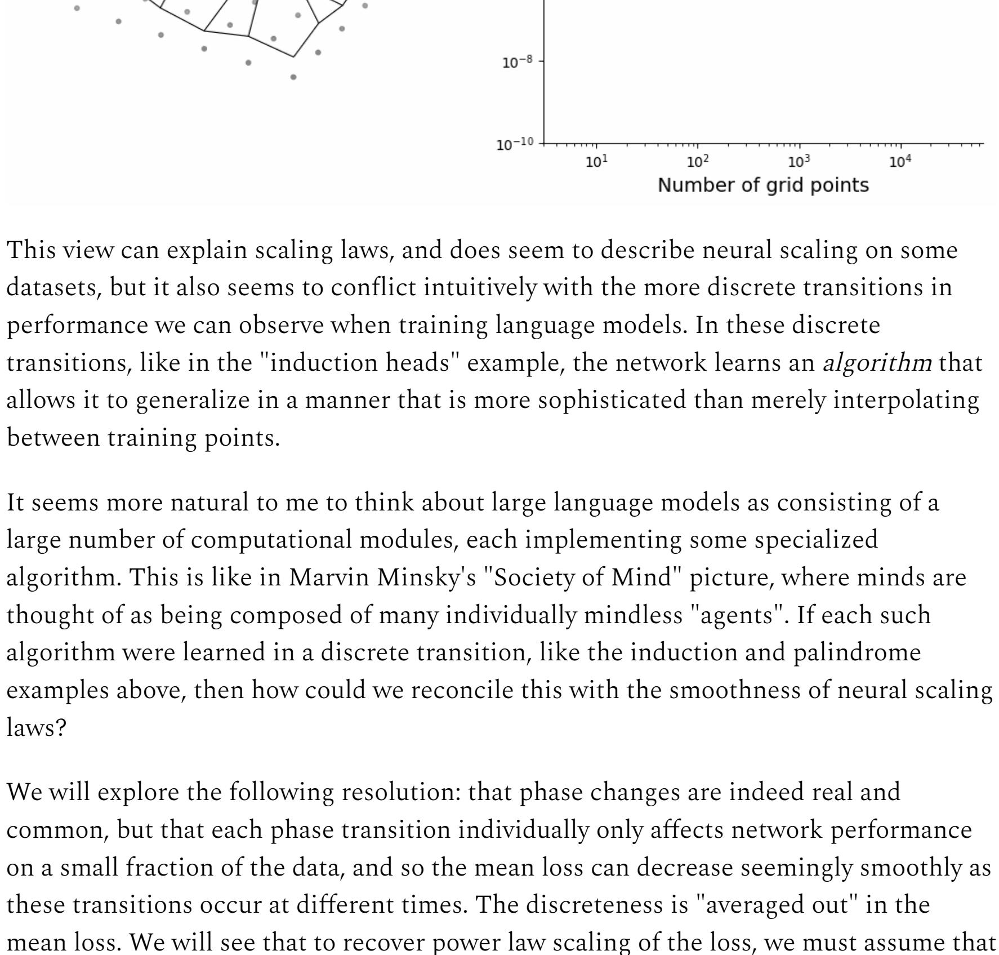
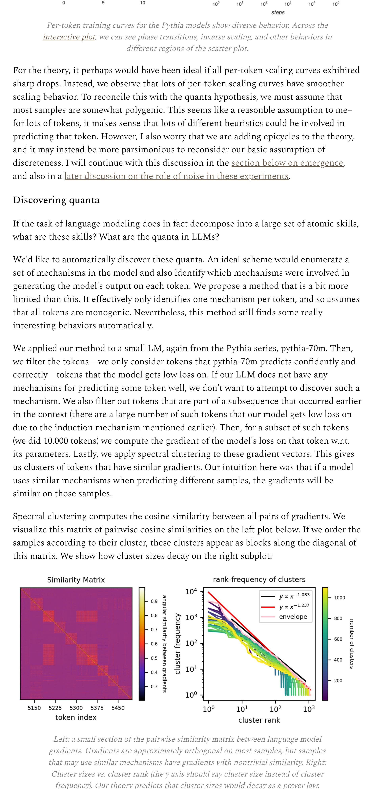
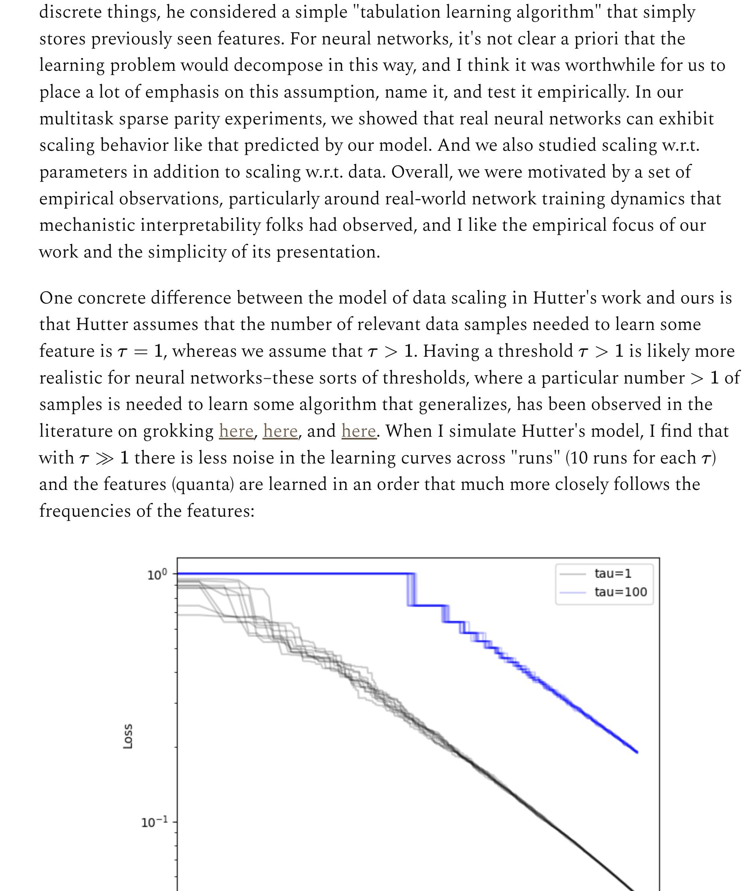
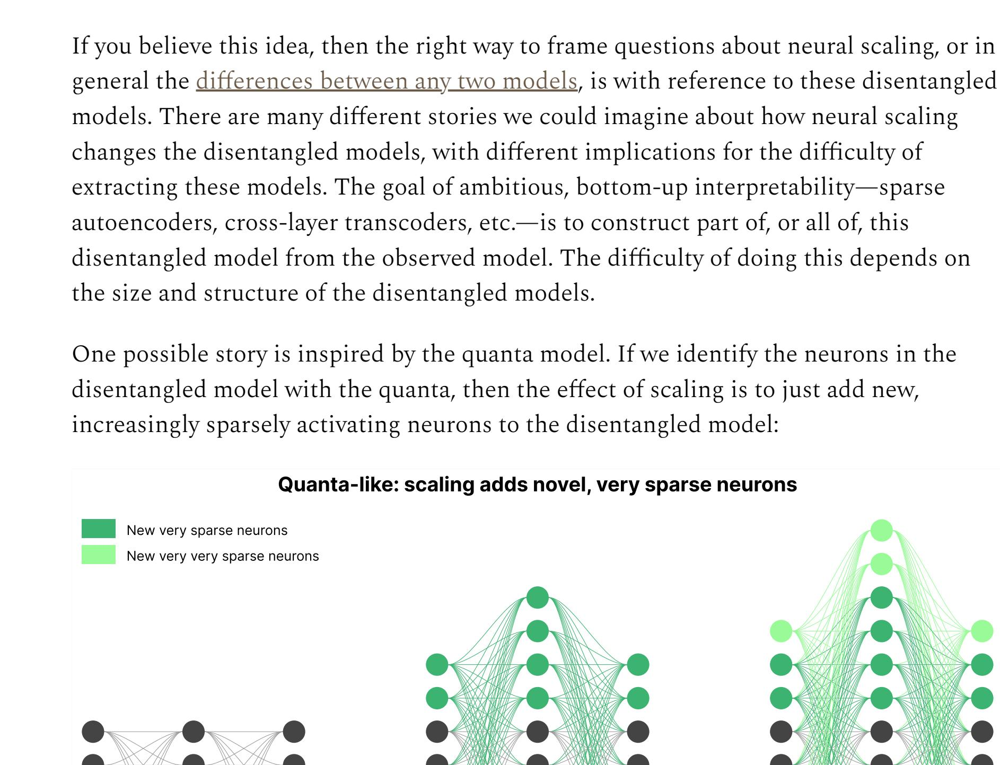
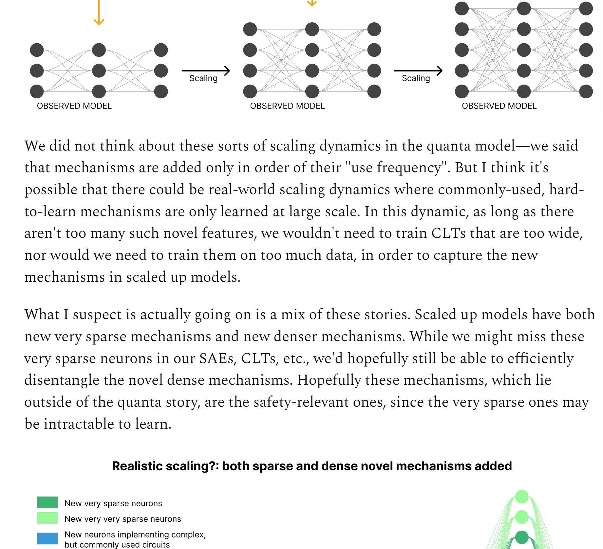
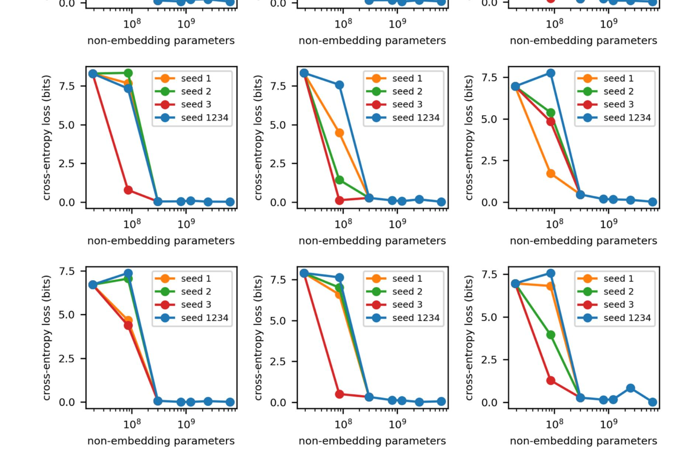
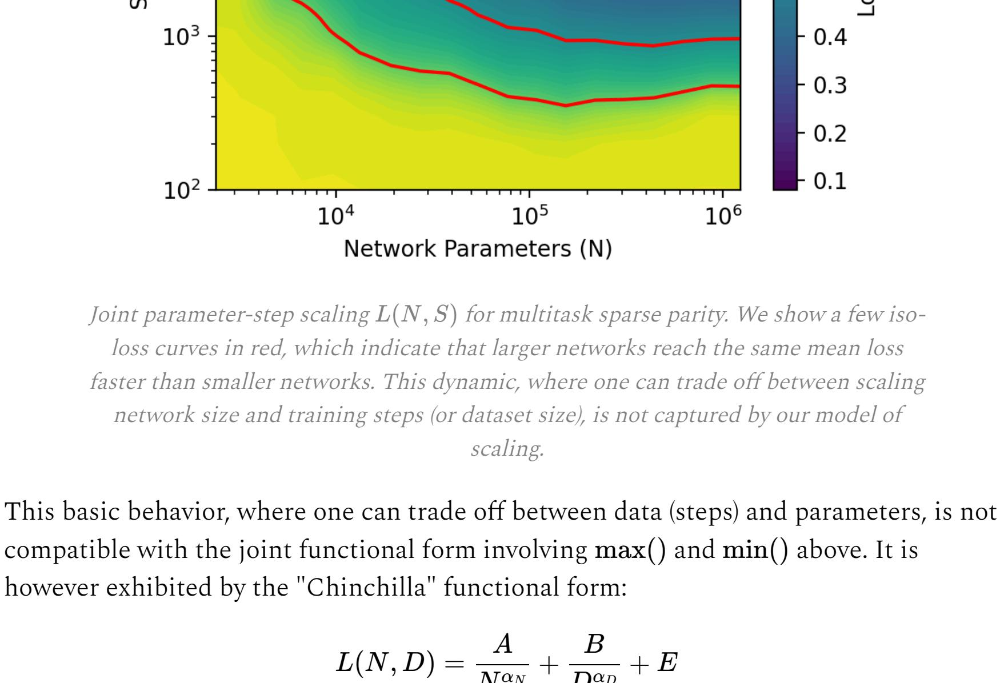
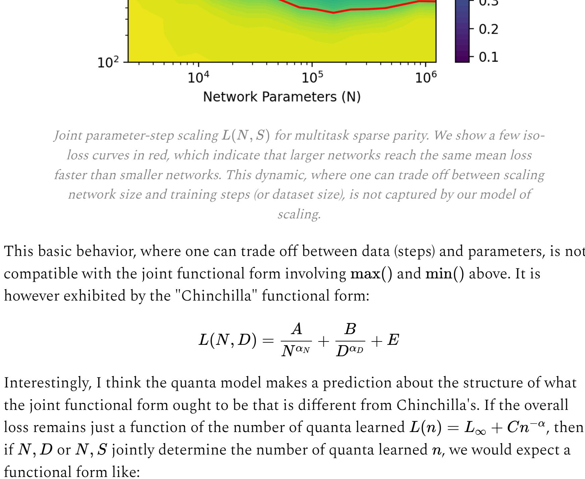
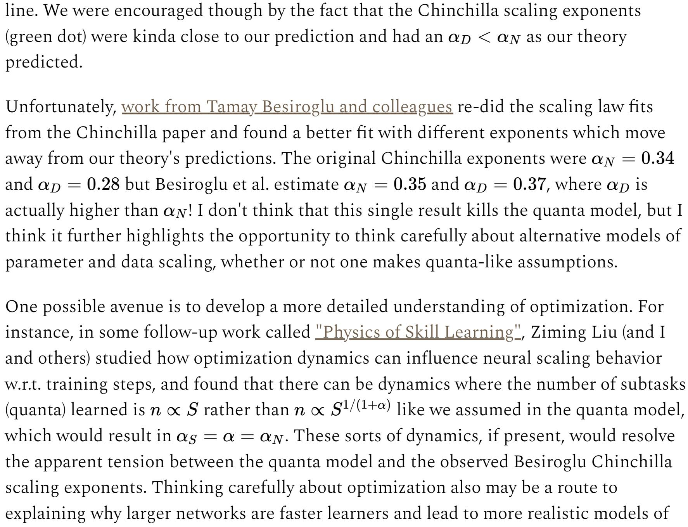
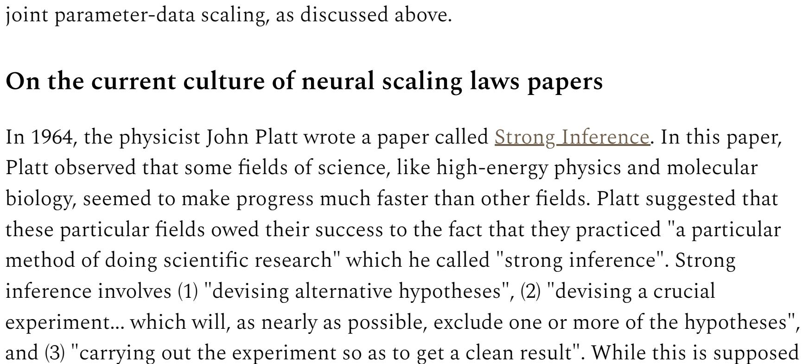

Eric J. Michaud Works

2026-01-12

## On neural scaling and the quanta hypothesis

become one of the most expensive ever attempted. We don't yet know what the results of this experiment will be. Certain results could be transformative. The experiment could not only alter the dynamics of wealth and power in human life, but change our basic status as a species: it could put us in contact with alien minds more capable than our own for the first time. Alternatively, some still predict that the experiment will be largely a waste of time and energy. Despite its importance, we don't have a mature public is relatively small. I am referring to the experiment of scaling up deep neural networks. What happens

Several years ago, humanity began an experiment. This experiment is now on track to

theory backing this experiment. And the number of people working on such a theory in when we train neural networks, like large language models, with as many parameters as train these models in the first place?

because deep learning theory is still an immature science. The core source of

(2) An account of how various "engineering" choices, such as architecture, hyperparameters, data, scale, etc., determine which mechanisms networks learn, and how and when they learn them. So far, the works that arguably come closest to this ideal are models of neural scaling. Such models attempt to describe how neural networks change with increasing parameters, data, or training steps, and thus at least implicitly articulate a model of what neural networks do in the first place. Some of these works include Sharma & Kaplan (2020), Bordelon et al. (2020), Hutter (2021), Bahri et al. (2021), and Maloney et al. (2022). In early 2023, I proposed a model of neural scaling, together with Ziming Liu, Uzay

Girit, and Max Tegmark, in a paper called The Quantization Model of Neural Scaling, which we presented later that year at NeurIPS. This paper was ambitious. It tried to reconcile high-level facts about neural scaling with the way that mechanistic interpretability folks think about neural networks at a very low level. It made some strong, though informal, conjectures about the structure of data and the structure of the solutions that neural networks learn. It tried to articulate a more unified picture.

Over the last two years, I have been thinking a lot about that paper and its ideas—2about the parts that I am proud of, as well as the limitations of our theory. In this post, I'll share some of these thoughts. I'll first give a refined statement of our theory and its motivation. I'll then discuss a variety of topics related to the theory, including its connection to topics in mechanistic interpretability. I'll also discuss various potential problems with the theory itself and how/whether these problems might be resolved. Ultimately, this discussion will end up being pretty academic. This essay does not give

Yet I hope that this discussion will, in the bigger picture, still help make progress on one of the most important open questions today. What are neural networks doing internally, and what happens when we scale them up? Note: People mean different things when they talk about "scaling" these days. In this post, I am just focused on understanding pretraining scaling. But even if posttraining scaling will be more important for improving AI capabilities going forward than scaling pretraining, I suspect that the discussion here will still be relevant,

and that further progress on our ability to pretrain on a wide distribution of data will have a role to play in improving AI capabilities over the coming years. Alternatively, if pretraining has essentially plateaued, we ought to be curious about why it has and what it means for what comes next. Contents The theory: "quanta" of learning Background The Quanta Hypothesis Multitask sparse parity

Discovering quanta Related work Features, quanta, and sparse autoencoders Neural scaling and the limits of interpretability

Large language model scaling

On the current culture of neural scaling laws papers The theory: "quanta" of learning How does scaling change what neural networks learn? How do larger networks pretrained on more data end up being different from smaller networks trained on less data? We would like a theory of neural scaling that explains both how network performance and network internals change with scale. Background The most important fact about neural scaling is that network performance, in the aggregate, is predictable. Across domains and network architectures, a large number of studies have observed that mean test loss, taken across the whole data distribution, scales smoothly as a function of the resources used to train the network. In particular, mean loss scales as a power law with the number of network parameters, the number of samples in the training set, and the number of steps of training. These predictable loss curves are referred to as "neural scaling laws", and since the loss follows a power law, they appear as a straight line on a log-log plot:  $L = (D/5.4 \cdot 10^{13})^{-0.095}$  $L = (N/8.8 \cdot 10^{13})^{-0.076}$ 5.6 3.9 4.8 3.6 4.0 3.3 3.2 3.0 2.4  $L = (C_{\min}/2.3 \cdot 10^8)^{-0.050}$  $10^{-1}$  $10^{1}$  $10^8$  $10^{9}$  $10^{5}$  $10^{7}$ Compute **Dataset Size Parameters** non-embedding PF-days, non-embedding tokens Figure 1 of <u>Kaplan et al. (2020)</u>, showing neural scaling laws for language models

w.r.t. compute, data, and number of network parameters. When network size is large

(not a bottleneck), then loss scales with D, the number of tokens in the training

corpus as  $L(D) \propto D^{-0.095}$ . When data is not the bottleneck, then loss scales with N,

the number of (non-embedding) parameters in the network, as  $L(N) \propto N^{-0.076}$ .

Each of these are power laws in D and N respectively. The total compute used to

train the network is  $C \propto N \times D$ , and with an optimal choice of N and D for a given

compute budget C, loss scales with compute as a power law too:  $L(C) \propto C^{-0.050}$ .

 $10^{9}$ 

## many particles is predictable (e.g. doubling the temperature of a gas doubles its pressure), the macroscopic properties of neural networks, systems of many parameters, vary predictably too. While scaling laws like this are fairly ubiquitous in nature, it is striking that modeling human language, a task so complex and perhaps indicative of intelligence, would also be so predictable.

not present in smaller models at the time.

abilities:

50

(A) Mod. arithmetic

It is fascinating that there is this kind of predictable order to neural network

performance. As in thermodynamics, where the macroscopic behavior of systems of

The discovery of these scaling laws was also, more practically, a key motivator for Dario

Amodei and others at OpenAI to scale up large language models around 2019. As long

as the scaling curve has not leveled off, then there are predictable gains to be made just

by scaling up existing techniques. And so that is roughly what OpenAI did to go from

GPT-2 to GPT-3. And just scaling things up unlocked a range of capabilities that were

While network performance in the aggregate, as measured by the mean cross-entropy

specific tasks, can be harder to predict. Indeed, it seems that for some abilities, larger

models can be sharply more capable than smaller models. Such abilities, which large

models possess but small models qualitatively do not, are said to "emerge" with scale

(Wei et al. 2022). Here are some examples of the scaling behavior for such "emergent"

(B) IPA transliterate

50

—— Chinchilla —— PaLM —— Random

50

(D) Persian QA

(C) Word unscramble

50

loss, scales predictably, more narrow properties of models, such as their performance on

Test Loss

Exact match (%) 30 10 Exact match (%) 10 10 10 10 40 30 20 10 30 BLEU 20 20 10 10  $10^{18} \ 10^{20} \ 10^{22} \ 10^{24}$  $10^{18} \ 10^{20} \ 10^{22} \ 10^{24}$  $10^{18} \ 10^{20} \ 10^{22} \ 10^{24}$  $10^{18}\ 10^{20}\ 10^{22}\ 10^{24}$ (G) Multi-task NLU (H) Word in context (E) TruthfulQA (F) Grounded mappings 70 707060 60 60 60 8 **⊗** 50 50 40 30 30 30 30

**Number of Parameters** Number of Parameters Number of Parameters Fig. 2 Three examples of abrupt specific capability scaling described in Section 2.2, based on three different models: GPT-3 (blue), Gopher (orange), and a Google language model (green). (Left) 3-Digit addition with GPT-3 [11]. (Middle) Language understanding with GPT-3 and Gopher [62]. (Right) Program synthesis with Google language models [4]. Figure 2 of Ganguli et al. (2022), showing some additional LLM emergent abilities. This figure compiles data from Brown et al. (2020), Rae et al. (2021), and Austin et al. <u>(2021)</u>. One fun example of an emergent ability was demonstrated in the original GPT-4 release live demo back in March 2023, when Greg Brockman showed that GPT-4 could write a summary of an article using only words starting with the letter 'G'. Greg also gave GPT-

Sharp transitions in language model performance can also be observed over the course

of training for an individual model. The canonical example of this is the "induction

heads" phase change documented in Anthropic's In-context Learning and Induction

Heads article by Olsson, Elhage, & Nanda et al. (2022). One thing that transformer-based

the context. So if [A][B] occurred earlier in the context, and the current token is [A], then

LLMs learn early in training is to be able to copy arbitrary subsequences that occur in

Anthropic described the circuit that implements this operation (it requires two self-

attention layers), and found that it forms early in training, producing a sharp transition

7.5e9 1e10 0

THREE LAYER

(ATTENTION-ONLY)

**Elapsed Training Tokens** 

2.5e9 5.0e9

7.5e9

1e10

LLMs are very good at predicting [B] as the next token, for arbitrary [A] and [B].

3.5 this task, and it failed completely.

in the model's subsequence copying capability:

INDUCTION HEADS FORM IN PHASE CHANGE

7.5e9 1e10 0

ONE LAYER

(ATTENTION-ONLY)

**Elapsed Training Tokens** 

2.5e9 5.0e9

1.0

8.0

0.6

0.4

0.2

0.0

100

model of neural scaling, that of Sharma & Kaplan (2020).

improves the resolution of this approximation.

200

300

Steps

Learning curve for a 5-layer GPT-2 style transformer trained to output whether the

sequence seen so far is a palindrome.

It feels like there is some tension between the smoothness of neural scaling laws and the

discreteness of emergent abilities. To understand this tension, let us consider another

Sharma and Kaplan propose a simple model of neural scaling. In essence, they make a

To illustrate this principle, below I plot the scaling curve of test error for a piecewise

linear approximation to an arbitrarily-chosen function  $\mathbb{R}^2 \to \mathbb{R}$ . We see (left) that as we

increase the resolution of this piecewise linear approximation, requiring our model to

settles into smooth power law scaling (right). "Training" points, which the model

"memorize" the value of the function at more points, that mean squared error eventually

learning to approximate some true target function, then larger networks can

approximate this function with higher precision, and scaling them up gradually

very general argument from approximation theory. If we think about neural networks as

400

500

600

Each line is an attention head, scored by the "prefix matching" evaluation introduced below.

TWO LAYER

(ATTENTION-ONLY)

**Elapsed Training Tokens** 

2.5e9 5.0e9

0.2 One-layer model Models with more than one layer has no induction heads. have induction heads form during phase change Figure from "In-context Learning and Induction Heads" showing that the "prefix matching score" jumps sharply during transformer training, as long as the model has at least two self-attention layers. Transformer (5 layer) on palindrome classification

interpolates between, are shown in the x-y plane below the surface of the function on the left. Linear interpolation of 6x6 grid points  $10^{-2}$  $10^{-4}$ Test MSE  $10^{-8}$ 101 102  $10^{4}$ Number of grid points This view can explain scaling laws, and does seem to describe neural scaling on some datasets, but it also seems to conflict intuitively with the more discrete transitions in performance we can observe when training language models. In these discrete transitions, like in the "induction heads" example, the network learns an algorithm that allows it to generalize in a manner that is more sophisticated than merely interpolating between training points.

The Quanta Hypothesis What sort of mind does pretraining produce? What must be learned, to minimize loss in predicting the next token, across all the tokens in all the documents on the internet? I think the answer is an immense conglomeration of different skills and pieces of knowledge. There is a huge amount of information conveyed in language, and there are also a huge number of different computations that are performed in the processes that have produced the text on the internet. This information, and these algorithms, would ideally be learned by our language models. Let's imagine that we could enumerate all of the pieces of knowledge and algorithms that networks ought to learn. Our core assumption is the following: for any piece of knowledge or algorithm that a network ought to learn, it will either be fully learned or not learned at all. It is not optimal for any network to allocate some capacity to halfway learning some algorithm and some capacity to halfway learning another. Either you succeed in implementing a computational module in the weights or you do not. We call this basic assumption, of discreteness, the "quanta hypothesis" or "quantization hypothesis": Networks must learn a variety of modules, each implementing a different algorithm or retrieving a different piece of knowledge. These modules are discrete, in the sense that they are either fully learned or

where L(0) is the model's loss when no quanta have been learned. For instance, we could imagine L(0) being the loss of a model that outputs a uniform distribution over the tokens, or which outputs the individual token frequencies, but otherwise has learned no knowledge or sophisticated computational modules. If  $p_k = Ak^{-(\alpha+1)}$ , we can approximate this sum as an integral, giving:  $L(n)pprox L(0)-\Delta\cdot A\int_1^n k^{-(lpha+1)}\,dk$  $L=L(0)-\Delta\cdot A\left[rac{k^{-lpha}}{-lpha}
ight]_1^n$  $L = \left(L(0) - rac{\Delta \cdot A}{lpha}
ight) + rac{\Delta \cdot A}{lpha} n^{-lpha}.$ and so:  $L(n)pprox L_{\infty}+Cn^{-lpha}.$ 

the sequence, at an index we could imagine one day roughly identifying, there'd be a quantum that enables the model to only output words starting with a given letter, which GPT-3.5 did not have the capacity or training time to learn, but which GPT-4 did reach. For each quantum in the sequence, we could ask what that quantum does-what piece of knowledge it represents, or what algorithm it implements. We could identify what data that quantum is helpful in predicting and therefore caused that quantum to develop during training. We could track any quantum's evolution during training, and ask at

what scale of compute it tends to be learned.

pretraining runs.

800 1000 1200

possible, on as much data as possible, with as much compute as possible? A handful of private labs are running this experiment at the moment. They will each spend some tens of billions this year, and possibly hundreds of billions or more over the next few years. Exactly what new capabilities will the next generation of models have? What are the limits of this process? And exactly why is so much data and so much compute needed to Immense resources are staked on these questions. Yet we lack clarity on their answers uncertainty is a fundamental one: we don't really know how to think about what neural networks are doing internally. Of course, a huge amount of academic work bears on this topic. This includes empirical work on mechanistic interpretability, more theoretical work on kernels, work characterizing which algorithms transformers can express and <u>learn</u>, and much else. However, it still feels early, like we don't have a unified picture yet. I believe a more unified, mature science of deep learning would provide the following: (1) A framework for thinking about the internal mechanisms that neural networks learn that explains how they generalize.

satisfying answers to the most practically relevant questions today about neural scaling.

Different perspectives on emergent abilities Is scaling plateauing? Are sharp transitions just artifacts of noise? On joint parameter-data scaling and learning efficiency  $\alpha_N$  versus  $\alpha_D$  and Besiroglu et al.

Accuracy (%) Accuracy 20 20 10 Accuracy Accuracy 20 20 2020 10 10 10 10  $10^{20}$  $10^{22}$  $10^{22}$  $10^{24}$  $10^{20}$  $10^{22}$  $10^{24}$  $10^{20}$  $10^{22}$  $10^{24}$ Model scale (training FLOPs) Figure 2 of Wei et al. (2022), showing "emergent" abilities of large language models, where performance is negligible below some threshold of scale and then jumps up after some critical scale. 3 Digit Addition **Program Synthesis** Massive Multitask Language Understanding 0.8 울 12.5 GPT-3 Gopher Samples Solving Accuracy 0.0 5.0 7.5 5.0 0.2 % 0.0  $10^{10}$  $10^{11}$  $10^{10}$ 108 1011 1010 1011 109 109 109  $10^{8}$ 

1.0 The highlighted "phase change" portion of 0.8 training is the same area highlighted in previous plots. It is selected 0.6 based on the derivative of the in-context score. These sorts of "phase changes" are somewhat common (though not necessarily universal) when training neural networks on algorithmic tasks (tasks that can be solved by short Turing machines). Neel Nanda documented several of these in his post on grokking. One clear example, which I found when playing around with these sorts of tasks, is the particularly sharp transition exhibited by transformers trained to classify whether strings are palindromes, where loss plateaus at 1 bit of cross-entropy and then drops suddenly: train 1.4 test 1.2 Cross-entropy loss (bits)

This basic way of thinking was suggested in Neel Nanda's 2022 post on grokking,

...larger models are made up of many circuits and, though each circuit may form

different capabilities (and thus many different circuits). And circuits of different

complexity/importance likely form at different points in training. So the overall

loss curve is actually the sum of many tiny phase changes at different points in

training, and this overall looks smooth and convex. Regularities in loss curves

In our paper on scaling, The Quantization Model of Neural Scaling, we sharpened up

this basic picture into a more precise model of neural scaling, and then performed a

variety of experiments to explore whether something like this picture could really be

like scaling laws may be downstream of statistical properties of the distribution

in a phase change, the overall loss is made up out of the combination of many

mentioned earlier. Neel speculated that "phase changes are everywhere":

there is a power law deep in the statistics of the data.

of circuits, which become apparent at large scales.

going on. I'll now summarize this work.

not learned at all. We call these the quanta. In using this terminology "quanta", we are making an analogy to physics, to Max Planck's assumption in 1900 that energy comes in discrete packets: energy quanta. Here we make a similar assumption that learning is quantized, and comes in discrete chunks. We just need one more assumption about these quanta, which is that some quanta are much more frequently needed than others. For each "quantum", we can imagine identifying all the tokens across the corpus on which that quantum helps the model do

prediction better. Some quanta might be needed on a very large fraction of tokens but

knowledge is very frequently referenced in text, and other knowledge is quite esoteric,

others might only be relevant for a few tokens. This seems pretty intuitive-some

and so rarely needed when predicting the next token. We can imagine that these

scaling laws, we need to assume the following:

to the network:

Quanta →

the same across all quanta.

quanta networks can learn:

into a power law in the loss with slope  $\alpha$ .

where  $C_D = C(\tau/A)^{\alpha/(\alpha+1)}$ .

giving us:

above.

 $C(N/c)^{-lpha}$  so:

frequencies could vary over several orders of magnitude. In order to recover neural

The "use frequencies" of the quanta naturally follow a power law.

ordered in this way, as the "quanta sequence". Soon we will argue that the effect of

scaling, either in parameters or data, is to simply add more and more quanta to the

Let's order the quanta according to their "use frequency". We refer to the set of quanta,

network in the order of the quanta sequence. Altogether, this gives an extremely simple

picture of neural scaling: scaling simply adds discrete modules, of increasing nicheness,

Scale →

Let  $p_k$  be the use frequency of the kth quantum, the fraction of tokens on which it

influences the model's prediction. Our assumption is that  $p_k \propto k^{-(\alpha+1)}$ , a power law.

Let's assume that adding some quantum to the model reduces the model's loss by an

amount  $\Delta$ , on average, on the tokens on which it influences the model's prediction. On

other tokens, that quantum doesn't influence the model's loss. So if we learn quantum k,

 $L(n) = L(0) - \sum_{k=1}^n \Delta \cdot p_k,$ 

this lowers the mean loss, across the whole corpus, by  $\Delta \cdot p_k$ . We assume that this  $\Delta$  is

What if we learned the first n quanta? Then the mean loss is:

where  $C = A\Delta/\alpha$ . It may be unrealistic to assume that  $\Delta$  is constant for all quanta, but I think as long as the true  $\Delta_k$  are independent across k then this would just add a bit of noise that would be averaged out and not affect the scaling law much once you get far enough out along

the quanta sequence. We have shown that the mean loss scales as a power law in the

number of quanta learned n. But the number of quanta learned is an abstract quantity,

and neural scaling laws are measured w.r.t. network parameters or dataset size, so we

Parameter scaling: Let's imagine we train a network on plentiful data, so data is not a

bottleneck. What will the network learn? Optimally, it will learn as many quanta as it

has capacity for, in order of frequency, because the most frequent quanta reduce the

mean loss the most. If the network has N parameters, and on average each quantum

be roughly n pprox N/c. We therefore get scaling w.r.t. network size:  $L(N) pprox L_{\infty}$  +

requires c parameters of capacity to implement, then the number of quanta learned will

 $L(N)pprox L_{\infty}+C_NN^{-lpha}$ 

 $\alpha_N=lpha$ . So our power law in the quanta frequencies with slope lpha+1 translates directly

Data scaling: Let's imagine we do multi-epoch training with a total of D samples, with a

large network, so network capacity is not the bottleneck. How many quanta can we

learn? Well, for rare quanta, where  $p_k \ll 1/D$ , it is unlikely that any tokens involving

that quantum will be in the dataset, and so it won't be learned (the training data does

not give any incentive/signal to learn it). Let's imagine that, in order to learn some

quantum k,  $\tau$  samples (tokens) involving quantum k must be in the training dataset.

quanta. Roughly, the scale n of the last quantum learned will satisfy:  $aupprox Dp_n$ . So if

Step scaling: What about scaling in training steps S for single-epoch training? We

could use a similar model as above, where a certain number of samples need to be seen

We also suggest the following model: since the amount that each quantum reduces the

training loss follows a power law, perhaps the magnitude of the gradients for learning

learning each one. If the "distance" the network has to move is the same for each

each quantum also follow a power law, and so SGD would converge at different rates for

quantum, and the "velocities" (gradients) in learning each quantum follow a power law,

then the time (steps)  $S=rac{
m distance}{
m velocity}$  needed to learn the nth quantum will be  $S\propto 1/p_n \propto$ 

 $L(S) = L_{\infty} + C_S S^{-lpha/(lpha+1)} \, .$ 

 $n^{\alpha+1}$ , and so after S steps, the the first n quanta will be learned where  $n \propto S^{1/(\alpha+1)}$ ,

This has the same scaling exponent as our scaling law for multi-epoch data scaling

This theory also provides a straightforward explanation of emergent abilities: they're

the "use frequencies" (on the pretraining distribution) of some quanta we haven't yet

learned, we could forecast the scale at which those quanta would be learned in future

We imagine that models are fundamentally *modular*-in some manner, they can be

had successfully learned, and then for any given sample identifying which quanta

collaborators. Indeed, on Twitter in 2022, Chris Olah said he'd like to see a "more

circuits-y" theory of neural scaling, and I think that the quanta model is one such

approach. If the quanta are akin to what Chris calls "circuits", then all we are saying

here is that scaling laws arise from an underlying power law distribution over how

influenced the model's output on that sample. This is heavily inspired by preexisting

ideas in the mechanistic interpretability community, particularly by Chris Olah and his

decomposed into parts that can be understood independently. In hoping to understand

large networks mechanistically, we could imagine enumerating which quanta that model

just the result of new quanta being learned. Furthermore, if we could somehow estimate

in training before a quantum can be learned, which would yield the same scaling law.

 $p_k = Ak^{-(\alpha+1)}$ , then we get  $n = (AD/ au)^{1/(\alpha+1)}$ . Plugging this into L(n), we get:

Clearly, the early quanta with higher  $p_k$  will be more likely to be learned than the later

 $L(D)pprox L_{\infty} + C_D D^{-lpha/(lpha+1)}$ 

where  $C_N=Cc^{lpha}$ . We see then that the neural scaling law w.r.t. parameters has slope

need to do some additional work to argue how these resources influence how many

This theory appeals to me because, if true, it would give us a natural set of objects to study in trying to understand neural networks: the quanta. These are like the elements of the Periodic Table3, or, better, like all the genes in an organism's DNA-we could imagine actually enumerating them. For instance, the induction mechanism mentioned above might be the first quantum in the quanta sequence. Somewhere much later along

produced our corpus of text across history. the question will just be whether natural datasets, like autoregressive language modeling, have this this sort of structure. a learning curve for a ReLU MLP with a single hidden layer on sparse parity: 1.0 Test Loss (bits) 0.8 0.6 0.4 0.2 0.0 600 200 400 0 **Optimization Steps** 

frequently different circuits are needed by the model. There has been substantial recent progress in the mechanistic interpretability community towards identifying "features" with sparse autoencoders, and I will say a bit about the relationship between features, circuits, and quanta later in this post. In order to recover power-law neural scaling laws, we had to assume that the "use frequencies" of the quanta follow a power law. Why would this be the case? I'm not sure, but Zipfian distributions are common in text (e.g. word frequencies), so it doesn't seem implausible that there's something a bit more abstract underlying text that's Zipfian. Speculatively, I wonder whether the quanta theory, and this question about use

Again, this is a binary classification problem on binary strings. To define the task, some subset of the bits of the string are chosen (e.g, for 100-bit strings, indices {17, 53, 89}), and then the label of that string is the parity (sum modulo 2) of that subset of bits. To solve the task, the network has to figure out which bits to compute the parity of, just from the labeled training samples. The input strings are drawn from a uniform distribution. Typically, loss plateaus at 1 bit but then drops, giving us a non-convex loss curve. We will construct a multitask version of sparse parity. To do this, we introduce extra bits to the input, which we call the "control bits". If we want  $n_{
m tasks}$  subtasks, we add  $n_{
m tasks}$ control bits to the beginning of our input strings, with n bits after these called the "task bits", for a total of  $n_{\mathrm{tasks}} + n$  bits. For each subtask  $i \in \{1, \ldots, n_{\mathrm{tasks}}\}$ , we sample a random subset  $S_i$  of k bits from the task bits. The  $n_{\mathrm{tasks}}$  control bits one-hot encode the subtask, so if bit i is a 1, then the label for that string is the parity of the task bits  $S_i$  for

frequencies, are actually gesturing at something quite deep. If our neural networks are learning to reproduce the "rules" and processes that generated the data they are trained on, then the quanta hypothesis is really a hypothesis about the processes that produced text: human minds. Perhaps our minds are similarly decomposable into parts, and the "use frequencies" are really the frequencies at which these parts-all the ideas that inhabit human minds-were alive and active in the thinking and writing process that has How does this theory make contact with reality? We will first show that the quanta hypothesis roughly describes neural scaling when the data has the right structure. Then To do this, we will train neural networks on a synthetic task called multitask sparse parity. This is a binary classification problem on binary strings. Sparse parity had been recently studied in a paper by Barak & Edelman et al. (2022), as a synthetic task where networks exhibit sharp transitions in performance during training. For instance, here is

that subtask. We impose a power law distribution over the subtasks, so the probability that bit *i* is a 1 (and all other control bits are 0) is  $p_i \propto i^{-(\alpha+1)}$ . Subtask 3 Subtask 2 1010010...1110011

The training dynamics on this task are really beautiful. We train ReLU MLPs with a single hidden layer using the Adam optimizer. Here is how the loss for each subtask (colored dark blue to yellow), and the mean loss (colored red), evolves during training:

"control bits"

"task bits"

subtask drops more sharply, and these subtasks are learned at different times. The network achieves pprox 0 loss on the most frequent subtask after  $10^3$  steps, but learns the less frequent subtasks multiple orders of magnitude later (like after  $10^5$  steps).

Training dynamics for a network trained on multitask sparse parity.

We see here that while the mean loss decreases gradually, the network's loss on each

The experiment for the plot above generated batches in an online manner, with a large enough n so that samples were unlikely to be seen multiple times in training, so this experiment was a study in scaling w.r.t. steps in the single-epoch regime. We can also

study scaling w.r.t. parameters, by training networks of varying width in the same manner. And we can study scaling w.r.t. data in the multi-epoch regime by training wide networks on finite datasets of varying size and using early-stopping (taking the checkpoint where the test loss was lowest). Here are the combined results from scaling parameters, steps, and data, showing mean loss scaling (top) and scaling broken down by subtask (bottom): ss-entropy (bits) 0.0 0.0 0.0 0.0 0.0 0.0 0.0 0.0 0.0 0.0 cross-entropy (bits)
0 0 0
7 8 8 (bits) 8.0  $--- L \propto S^{-\alpha/(\alpha+1)}$ 6.0 4.0 4.0

103

Mean test o

105

 $10^{4}$ 

Steps (S)

 $L \propto D^{-\alpha/(\alpha+1)}$ 

Training samples (D)

106

105

б 0.3

Mean test 0.0

102

Mean test of 100 Mean test of 100 Mean test of 100 Mean test of 100 Mean test of 100 Mean test of 100 Mean test of 100 Mean test of 100 Mean test of 100 Mean test of 100 Mean test of 100 Mean test of 100 Mean test of 100 Mean test of 100 Mean test of 100 Mean test of 100 Mean test of 100 Mean test of 100 Mean test of 100 Mean test of 100 Mean test of 100 Mean test of 100 Mean test of 100 Mean test of 100 Mean test of 100 Mean test of 100 Mean test of 100 Mean test of 100 Mean test of 100 Mean test of 100 Mean test of 100 Mean test of 100 Mean test of 100 Mean test of 100 Mean test of 100 Mean test of 100 Mean test of 100 Mean test of 100 Mean test of 100 Mean test of 100 Mean test of 100 Mean test of 100 Mean test of 100 Mean test of 100 Mean test of 100 Mean test of 100 Mean test of 100 Mean test of 100 Mean test of 100 Mean test of 100 Mean test of 100 Mean test of 100 Mean test of 100 Mean test of 100 Mean test of 100 Mean test of 100 Mean test of 100 Mean test of 100 Mean test of 100 Mean test of 100 Mean test of 100 Mean test of 100 Mean test of 100 Mean test of 100 Mean test of 100 Mean test of 100 Mean test of 100 Mean test of 100 Mean test of 100 Mean test of 100 Mean test of 100 Mean test of 100 Mean test of 100 Mean test of 100 Mean test of 100 Mean test of 100 Mean test of 100 Mean test of 100 Mean test of 100 Mean test of 100 Mean test of 100 Mean test of 100 Mean test of 100 Mean test of 100 Mean test of 100 Mean test of 100 Mean test of 100 Mean test of 100 Mean test of 100 Mean test of 100 Mean test of 100 Mean test of 100 Mean test of 100 Mean test of 100 Mean test of 100 Mean test of 100 Mean test of 100 Mean test of 100 Mean test of 100 Mean test of 100 Mean test of 100 Mean test of 100 Mean test of 100 Mean test of 100 Mean test of 100 Mean test of 100 Mean test of 100 Mean test of 100 Mean test of 100 Mean test of 100 Mean test of 100 Mean test of 100 Mean test of 100 Mean test of 100 Mean test of 100 Mean test of 100 Mean test of 100 Mean test of 100 Mean test of 100 Mean test of 100 Mean t

41

 $10^{4}$ 

105

Parameters (N)

1 0.8 Subtask: decr freg Subtask: decr freq Subtask: decr freg Test Loss Test Loss 1 103 104 102  $10^{4}$ 105  $10^{5}$  $10^{5}$ Parameters (N) Steps (S) Training samples (D) Figure 2 of The Quantization Model of Neural Scaling, showing scaling behavior on the multitask sparse parity datasets. The top plots show how mean loss scales with parameters (proportional to network width here), steps, and training set size, and the bottom plots show how scaling decomposes by subtask. We see that as we scale up network size, steps, and data, the network achieves  $\approx 0$  loss on more and more subtasks, roughly in order of their frequency. In line with the quanta model above, we see that tasks are learned roughly in descending order of frequency in all regimes of scaling. As we train larger and larger networks (left), we get roughly power law scaling in mean loss (top left), and this averages over a bunch of discrete transitions as loss is brought from 1 bit of cross-entropy down to 0 bits of cross-entropy on an increasing number of tasks (bottom left). A similar story applies to multi-epoch data scaling (right). So the quanta model roughly describes neural scaling on multitask sparse parity: The task decomposes into parts: our networks must learn a variety of subtasks.

Discreteness: our networks achieve trivial performance (1 bit of cross-entropy) on most tasks for most of training, then transition to good performance (~0 bits of cross-entropy). For most of training (on a log scale), our networks either have either learned or not learned a subtask.4 • Scaling: scaling either data or network size simply increases the number of subtasks learned, roughly in order of frequency.

instance, the relation  $\alpha_N = \alpha$  does not hold precisely across all  $\alpha$ . See <u>Figure 12 of the</u> paper for more on this. Ultimately I'm not sure why this is! Is it some artifact of how we're measuring the scaling exponents? Are we subtly wrong about how scaling N, Dand S changes the number of quanta learned n? Later in this post I'll discuss related issues with applying the quanta theory to LLMs—it is possible that these disrepancies with the scaling exponents in multitask sparse parity hold clues for improving the theory more generally.

Before moving on, I will say one thing, which is that the empirical scaling exponents

 $\alpha_N, \alpha_S, \alpha_D$  that we measure on multitask sparse parity do not always relate precisely to

the subtask distribution exponent  $\alpha$  in the manner than the quanta theory predicts. For

Large language model scaling Does the quanta model describe the dynamics of training and scaling for large language models? As a starting point, we can look at scaling curves on individual tokens. Here, by "token", I mean a particular token in a particular document. One possibility is that all per-token scaling curves look like discrete transitions, dropping rapidly after some initial plateau. Another possibility is that all curves will look like the mean loss, decreasing smoothly. If the loss on all tokens decreased smoothly like the mean loss, that would be a problem for our theory. In practice, we find that the situation is more complicated than these two extremes. We study this with the Pythia suite of language models trained by Eleuther AI on The Pile corpus. The Pythia models range from the 10s of millions of parameters up to roughly 10 billion parameters, with over 150 intermediate training checkpoints available for each

size (parameters). The overall scaling curve w.r.t. parameters is a smooth power law, which averages over a large number of per-token scaling curves like these: **Monogenic samples** Polygenic samples 9 Cross-entropy (bits) Cross-entropy (bits) 3 3 0 108  $10^{9}$  $10^{8}$  $10^{9}$ Parameters (non-embedding) Parameters (non-embedding) "The law of unintended consequences and the In general, the lesions of thoraco-cervical level history of previous military interventions in the were difficult to detect, because the appearance

with...

Cross-entropy (bits)

3

0

rate of SSEP peaks are reduced over the thoraco

-cervical spine even in normal controls. In cases

108

16, or 5.7 percent, to \$19.11.\n

consumer spending down the road

airline by revenue, dropped \$2.15, or 7.2

Stone said oil prices could start weighing on

percent, to \$27.71 and Delta Air Lines lost \$1.

109

?

G

?

Parameters (non-embedding)

region is not a recipe for political and economic

stability," said Neil Mac Kinnon, global macro

108

W.Y. Chalfant, of Branine, Chalfant & Hill,

brief for appellant, Hesston State Bank.\n

of Hutchinson, argued the cause and was on the

Kenneth C. Jones, of Watson, Ess, Marshall &

Opinion filed March 25, 1988.\n

109

Parameters (non-embedding)

strategist at VTB Capital.\n

12

9

6

3

0

Cross-entropy (bits)

model. This allows us to study scaling in both parameters and training steps.

Below, I show some examples of curves with different scaling behavior w.r.t. network

improvement. If the Quantization Hypothesis is true for language modeling, then we would interpret samples with sharp drops as "monogenic" and samples with gradual progress as "polygenic". Some cherry-picked per-token scaling curves. The token highlighted in red is the token which the networks are tasked with predicting from the context and which we report the loss on. If we assume the quanta hypothesis, then samples that have smooth scaling behavior, showing improvement at multiple scales, must be benefitting from multiple quanta that are learned at different scales. We call such samples "polygenic", in an analogy to how polygenic traits are influenced by multiple genes. When samples show improvement at

only one scale, we assume they are "monogenic", involving a single quantum.

We can also visualize per-token scaling curves over the course of training for a single

model. I created some interactive plots for viewing a large number of these curves on my

Figure 12: Additional LLM scaling curves on individual samples which exhibit sharp vs smooth

"Space of LLM Learning Curves" post, and which I'd strongly recommend checking out: https://ericjmichaud.com/llm-curvevisualization What is apparent from looking at a large number of per-token training curves is that the mean loss is averaging over lots of different per-token curves whose behavior is quite diverse across tokens. Some loss curves drop quite sharply early in training, other loss curves drop more gradually, and others exhibit stranger behavior like invese scaling. Here are some screenshots from that interactive plot: Selected training curve Space of training curves (click on a point to see its curve) 12 Loss for this token 12 Mean loss across tokens ίà 10 (Q cross-entropy loss (nats) 99 G G ? 10 101 100 102 104 103 steps Space of training curves (click on a point to see its curve) Selected training curve Loss for this token 0 Mean loss across tokens 12 ίà EQ. ;\<del>\</del> cross-entropy loss (nats) 99 G G 6 ·

2 -

(Q

;'⊱

G

cross-entropy loss (nats)

100

101

Selected training curve

102

103

Loss for this token

Mean loss across tokens

steps

104

105

10

Space of training curves (click on a point to see its curve)

12

10

\* \* from opening a through road or street for public use across said public park in the Park of The City of Riverton \* \* \*." (Emphasis supplied.) Appealing from that order, the city asserts (1) plaintiffs have no standing or right to maintain the action; (2) that the proposed road was in an unded # creddump is free software: you can redistribute it and/or modify\n icated part of the park; (3) that the proposed road was an access road and # it under the terms of the GNU General Public License as published by\n not a through street or part of the city's street system; (4 # the Free Software Foundation, either version 3 of the License, or\n # (at your option) any later version.\n Introduction\_\n # creddump is distributed in the hope that it will be useful, in 5. Chapter 1: What Is Trust?\n 6. Chapter 2: Trust Brings Rest\n 7. Chapter 3: Who Can I Trust?\n 8. Chapter 4: The Folly of Self-Reliance\n <!-\n 9. Chapter 5: Trust God and Do Good (Part 1)\n 10. Chapter 6: Trust God and Do Good (Part 2)\n \* Copyright (c) 2019, The Android Open Source Project\n 11. Chapter 7: At All Times\n 12. Chapter 8 \* Licensed under the Apache License, Version 2.0 (the "License");\n \* you may not use this file except in compliance with the License.\n was achieved. The chosen sites were recorded as: 0 = sound (\*n\* = 13); 1 = first visible sign of noncavitated lesion seen only when the tooth is dried; 2 = visible noncavitated lesion seen when wet and dry; 3 = microcavitation Pursuant to 5TH CIR. R. 47.5, the court has determined\n in enamel; 4 = noncavitated lesion extending into dentine seen as an under mining shadow; 5 = small cavitated lesion with visible dentine: less than 50 that this opinion should not be published and is not precedent\n % of surface; 6 except under the limited circumstances set forth in 5TH CIR. In QCBlockListMsg  $= 0x0a\ln$ GetLatestStatusMsg  $= 0x0b\n$ children have a lack of maturity and an underdeveloped\n Latest Status Msg  $= 0 \times 0 c \ln$ sense of responsibility, leading to recklessness, impul-\n sivity, and heedless risk-taking.... Second, children\n Prepare Block Hash Msg  $= 0x0d\ln$ Get View Change Msg  $= 0x0e\n$ are more vulnerable... to negative influences and\n outside pressures, including from their family and\n Ping Msg = 0x0fpeers; they have limited contro[1] over their own envi-in Figure 1 of The Quantization Model of Neural Scaling.

The token highlighted in red is the token on which the model's loss was backprop'ed on.

On the left, we see a cluster of tokens that all involve predicting a number to continue a

numerical sequence. This cluster has revealed a basic LLM skill: counting! Even small

language models learn this skill, since it is so common to see numbered lists in text on

the internet. On the right, we see a separate cluster of newlines being predicted by the

These examples are cherry picked. Some of the clusters are totally incoherent, and most

of the rest reflect much simpler patterns. Here is an interactive webpage for visualizing

https://quanta-clusters.streamlit.app

experiments, I still find them super cool. In a totally unsupervised manner, we were able

tells us that these skills are very commonly needed when predicting text on the internet.

to discover some pretty interesting narrow skills of a language model (incrementing

sequences, counting line lengths). The fact that these are relatively large clusters also

In the paper, we also noticed that the envelope of the cluster rank versus cluster size

curves, across different choices of  $n_{\text{clusters}}$ , eventually might follow something like a

power law. However, this is super informal, and given the limitations of the clustering

method itself, we ought to be cautious about interpreting this as decisive evidence for

However, we could imagine one day having a much better method for automatically

decomposing language models into parts. In some ways, this has been the central focus

of mechanistic interpretability research over the last two years, which I'll discuss below.

Our work built on the work and ideas of many others. It has also been heartening to see

people build on our work over the last few years. Here are just some of my favorite prior

Hutter (2021): Arguably the closest prior work to ours is Marcus Hutter's very nice

"Learning Curve Theory" (2021). Hutter develops a toy model of data scaling where (1)

the learning algorithm must learn a set of discrete "features", (2) a feature is learned if it

is present in at least one sample from the training set, where each sample only has one

feature, and (3) the features are power-law distributed in frequency. Hutter shows that

this toy model gives rise to a power law in the expected loss w.r.t. training set size and

While Hutter also assumed that the learning problem decomposes into learning a set of

training steps via theoretical derivations and toy mathematical experiments.

While we obviously haven't fully enumerated the quanta in LLMs with these

model. What these samples have in common is that they are newlines in line-length-

limited text. This corresponds to the skill of counting the length of lines, and then

predicting a newline to maintain the length of the previous lines5!

This method identifies lots of interesting clusters. Here are five samples from a couple

LLM skill "quanta" auto-discovered in text

Cluster 100: predicting newlines in line length limited text

TO PERFORM QUADRATIC REGRESSION\n

ON THE TI84 GRAPHING CALCULATOR,\n

REGRESSION MODEL FITS THE DATA,\n

USING THE REGRESSION EQUATION.\n

REGRESSION ANALYSIS INCLUDES\n

ANY TECHNIQUES USED FOR MODELING In

AND THEN MAKE PREDICTIONS \n

DETERMINE HOW WELL THE \n

IN STATISTICS, \n

of the most interesting clusters:

01 - Mi Querencia (Simón Díaz)\n

04- Caballo Viejo (Simón Díaz)\n

all the clusters:

the theory.

Related work

and subsequent works:

02- Tonada De Luna Llena (Simón Díaz)\n

05- Todo Este Campo Es Mío (Simón Díaz)\n

06- La Pena Del Becerrero (Simón Díaz)\n

03- Sabana (José Salazar/Simón Díaz)\n

**Cluster 50**: incrementing numerical sequences

100

recent work.

had merely conjectured.

 $10^{1}$ 

102

Blake Bordelon et al. (2020): Another very closely related work is "Spectrum Dependent

Learning Curves in Kernel Regression and Wide Neural Networks" by Blake Bordelon,

Abdulkadir Canatar, and Cengiz Pehlevan. They show that the generalization error of

eigenmodes", similar to how we ended up writing our loss as a sum over quanta. They

also show that the expected error decays as a power law if the kernel's eigenvalues decay

as a power law. This is a really nice, rigorous picture, and our model ended up having a

similar sort of structure with less rigor but perhaps more ambition. Whereas we worked

structure of the data). A big question with these sorts of kernel regression papers is just

how well the dynamics of real-world neural networks, particularly LLMs, are described

by kernels. Blake, Alex Atanasov, and Cengiz have continued in this direction in more

eigenlearning framework: A conservation law perspective on kernel regression and wide

of different kernel eigenmodes. They find a dynamic where the eigenmodes compete for

a finite "learnability" resource that is proportional to the number of training samples. As

being essentially unlearned to essentially learned, in order of their eigenvalues. So again,

mathematically in kernel regression, if one assumes that the kernel eigenvalues follow a

power law. I was ignorant of most of the kernels literature when writing our paper, but

it's striking that one can derive from first principles a picture similar to the one that we

Within a week of our preprint being released in March 2023, Simon et al. released "On

task where learning proceeds as a series of "discrete, well-separated steps". This is

another task, like multitask sparse parity, that could perhaps capture some of the

the Stepwise Nature of Self-Supervised Learning". They study a self-supervised learning

the number of samples is scaled up, an increasing number of modes transition from

neural networks", Simon et al. analyze kernel regression in terms of the "learnabilities"

backwards from empirical observations about neural scaling, Bordelon et al. worked

forwards from the mathematics of kernels (though with an assumption about the

Jamie Simon et al. (2021) and (2023): Similar to Bordelon et al. (2020), in "The

the quanta model is quite similar to the story of data scaling one can derive

kernel regression can be written as a sum over "contributions from different

 $10^{3}$ 

Samples

 $10^{4}$ 

105

dynamics, particularly around emergence, we are interested in understanding in realworld networks: C 510 500 1.0 В  $\mathbf{D}$ exp 10-2  $10^{-1}$ 500 1000 1500 2000 2500 3000 0 tFigure 1 of "On the Stepwise Nature of Self-Supervised Learning" by Simon et al. (2023), showing learning dynamics that proceed as a series of discrete steps. Yasaman Bahri et al. (2021): Another important piece of prior work is "Explaining Neural Scaling Laws" by Bahri et al., who essentially try to unify the "approximating a function defined on a manifold" picture of Sharma and Kaplan (2020) with the kernel picture we've just discussed. This conversation is subtle and probably deserves a separate post. But they refer to a result from Weyl (1912) that relates the eigenspectrum of kernels to the dimension of the manifold they are defined on. Via this argument,

there may be a way of unifying the "resolving a function on a manifold" view and the

"learning proceeds in a series of steps view", although it is still possible that much of

only on vision datasets, and not on language.

there.

what real-world LLMs do is somehow not captured by this theory-their experiments are

Nam et al. (2024): In "An exactly solvable model for emergence and scaling laws in the

multitask sparse parity problem", Nam et al. develop a more formal model of learning on

the multitask sparse parity problem. It was great see this more theoretical study building

Oren Neumann and Gros (2024): In "AlphaZero Neural Scaling and Zipf's Law: a Tale of

Board Games and Power Laws", Neumann & Gros attempt to apply the quanta model to

explain the neural scaling laws seen in game-playing RL. In particular, they find that the

frequencies at which different game states are visited typically follow a power law, and

they attempt to connect this power law to the scaling laws their RL setup exhibits.

Intriguingly, they find that the games where RL exhibits inverse scaling behavior are

also the games where the state distribution exhibits unusual structure where end-game

states have high frequency (in contrast to games like chess where particular end-game

might be some theory, for LLMs, that unifies pre-training and RL ("reasoning") scaling

laws, and perhaps some quanta-like story in terms of frequencies will have a role to play

board states are likely never repeated). This paper has me wondering whether there

Ari Brill (2024): In "Neural Scaling Laws Rooted in the Data Distribution", Ari also

makes an attempt at unifying the "function approximation on manifold" theories of

neural scaling with theories like ours that assume a power-law distribution over discrete

subtasks. He does this by proposing a percolation model of data, where different tasks

each have some intrinsic value p, the probability that "adjacent pairs" of data elements

are "connected". Above some threshold  $p_c$ , the data is connected in a single structure

happens and the data is broken into lots of clusters (data manifolds) that are power-law

where neural networks allocate different amounts of capacity towards learning functions

producing power law scaling. In one regime, the scaling exponent  $lpha_N$  is still determined

and the Sharma and Kaplan (2020) story holds. Below this threshold, a transition

distributed in size. Ari then develops a model of neural network parameter scaling,

on the different data clusters. In this model, there turn out to be two regimes, both

by the power law distribution exponent  $\alpha$  over the data clusters, like in our model. In

depends on the distribution over the distinct data manifolds vs. the dimension of those

manifolds. This is an interesting picture, and I'd like to see more ambitious work like

Mechanistic Description Length with Attribution-based Parameter Decomposition",

"mechanism". They attempt to learn these  $\theta_i$  so that on any particular sample, some

This subset is chosen by computing the dot product of the model's gradient on that

So whereas we clustered gradients in our quanta discovery work, they are doing

"polygenic" samples-it allows for the identification of multiple mechanisms that

contribute to a network's output on any given sample. They test the method on toy

examples, but I am eager to see it applied to LLMs. In follow-up work, Bushnaq et al.

(2025) develop a different parameter decomposition technique that does not use gradient

Braun et al. are interested in decomposing the parameter space of neural networks into

parts. In particular, they're interested in writing the network's parameter vector directly

sparse subset of the  $\theta_i$  are needed to implement the network's behavior on that sample.

sample  $abla_{ heta}L$  with each mechanism vector  $heta_i$  and taking the top components. Once these

components are chosen  $\theta_{i_1}, \ldots, \theta_{i_k}$ , the model is run with the parameter vector  $\sum_{l=1}^k \theta_{i_l}$ .

something closer to sparse coding on gradients. This is great, since it can be applied to

another regime, the scaling exponent is determined by the dimension of the data

manifolds, like in Sharma & Kaplan (2020). Which scaling regime a network is in

Dan Braun et al. (2025): In "Interpretability in Parameter Space: Minimizing

as a sum of parts:  $\theta = \theta_1 + \ldots + \theta_m$ , where each  $\theta_i$  implements some distinct

this thinking about the structure of data.

information to select components.

on our empirical work, and to see the paper accepted at NeurIPS last year.

Michaud et al. (2025): In "On the creation of narrow AI: hierarchy and nonlocality of neural network skills" with Asher Parker-Sartori and Max Tegmark, I explored an extension of the multitask sparse parity task where there can be hierarchical relationships between subtasks. In what we called "compositional multitask sparse parity", the subtasks vary in difficulty, and some subtasks are much easier to learn after others have been learned first. This means that the quanta for this task aren't independent, and their learning order is not solely determined by their frequency in the data. Instead, the quanta live in a kind of hierarchical skill tree. This sort of structure may be more realistic—humans can only learn some concepts and skills after first learning others—and is a nice generalization of the structure of the quanta model. These sorts of dependencies between subtasks (quanta) were also explored by Ziming Liu et al. "Physics of Skill Learning".

be approximately orthogonal without interfering too much with each other if the Sparse autoencoders try to learn these feature directions  $\{\hat{f}_i\}_{i=1}^m$ , and also learn an  $encoder\, {
m Enc}: \mathbb{R}^d o \mathbb{R}^m$  which determines how much each feature "fires", if at all, on each activation vector. The sparse autoencoder loss has a form like:  $\mathcal{L} = \|x - \sum_{i=1}^m \mathrm{Enc}(x)_i \hat{f_i}\|_2^2 + \lambda \|\mathrm{Enc}(x)_i\|_0^2$ 

which encourages the SAE to reconstruct activations using as few feature directions as

possible. Encouragingly, when we look at the situations in which these features fire (

features occur sparsely.

>>> def add(left, right): 4

>>> add(1, 2)

return left + rihgt

Superposition work. If models represent more features m than there are dimensions in

the activation space d, then these feature directions can't all be orthogonal, but they can

F#1M/1013764 [Clang 15.0.0 (clang-1500.3.9.4)] on darwin⇔ Type "help", "copyright", "credits" or "license" for more information. ↩ Figure from "Scaling Monosemanticity" by Templeton et al., showing positions

I wish I could discuss all the works that have in some way built on or tested our theory over a hundred papers have cited our work now. But I'll move on now to a more detailed discussion of various topics that have come up since we released our work. This will include some additional discussion of several other papers. Over the last few years, the mechanistic interpretability community has developed many methods for automatically decomposing networks into sparsely activating mechanisms. The most prominent of these methods is the sparse autoencoder. In this section, I'll attempt to say a bit about the relationship between what we called "quanta" and the units that sparse autoencoders discover, "features". Sparse autoencoders (SAEs) decompose the activations of a neural network into a sum of sparsely occurring features. SAEs learn a dictionary of feature directions  $\{\hat{f}_i\}_{i=1}^m$  such that activation vectors can be approximated as linear combinations of sparse subsets of these features. SAEs are motivated by two hypotheses. The first is the *linear* representation hypothesis—that neural networks compute a large number of "features" from their input, and these features are represented linearly in the model's activations, meaning that when some feature is represented by the model, the presence of that feature is reflected by shifting the activations in some feature direction. The second assumption is the "Superposition Hypothesis" from Anthropic's Toy Models of

 $\mathrm{Enc}(\mathbf{x})_i > 0$ ), we find that they are often consistent, meaningful contexts: they are more monosemantic than other units of analysis like individual language model neurons, which fire in more varied and less consistent ways on average than SAE features. Sparse autoencoders trained on language model activations have been scaled up now to millions of features, and many of these features reveal that pretty abstract properties of inputs are being represented by models. For instance, Anthropic reported a feature, in an SAE with 1 million latents, that fires on tokens which introduce syntax errors in code documents. Python Code example with a typo, highlighted with Code error feature activations Python 3.9.6 (default, Feb 3 2024, 15:58:27) ←

where a "Code error" feature fires. It is tempting to identify these features with the quanta. For each feature discovered by a sparse autoencoder in the activations of a model, we could imagine identifying that feature with some corresponding mechanism or circuit in the weights of the model which causes that feature to be computed and appear in the activations. Indeed, the way that sparse autoencoders scale at a very coarse level is suggestive of the quanta model. As we train larger sparse autoencoders, they seem to learn features that Presence of chemical element features across number of dictionary features

Plot from "Scaling Monosemanticity" by Templeton et al., showing whether SAEs of different scales learn features which fire on specific chemical elements. Features for each element appear to be learned roughly in the order of the frequency at which that element is referenced in the corpus that the SAEs are trained on.

Looking a little closer though, the properties of sparse autoencoder features and the way that sparse autoencoders scale also has disanalogies with our quanta and the quanta model. One complication is the issue of *feature splitting*. Feature splitting is a phenomenon where, if we look carefully at the effect of training larger SAEs, the effect of this scaling is not to just learn additional more niche features but to replace some common features

activate on increasingly rare concepts in the corpus that the SAE (and LLM) was trained on. Anthropic showed this dynamic specifically for features which activate on references to chemical elements, where larger SAEs learn features for more niche elements. Their plot has very similar scaling dynamics to what we saw in multitask sparse parity above: Frequency (log scale)

in the smaller SAE with two or more more specific and sparsely activating features. This general dynamic means that sparse autoencoders do not necessarily learn a canonical decomposition of the activations of a network. Instead, it seems like there are many different decompositions of the space, with some decompositions having a different set of features which fire more or less sparsely than the features in other decompositions. There is another problem with trying to identify the SAE features with quanta that is

perhaps more basic: the assumption that motivated SAEs—that the activations of a neural network are composed of 1D linear future directions—is not the full story. For some features, it seems like instead of the feature taking a scalar value along a line, the feature takes values which lie on manifolds within higher dimensional subspaces of activation space. In order for a sparse autoencoder to reconstruct these features, it will need to use multiple latents either as a basis for the subspace within which the feature manifold lies or to "tile" the manifold with feature directions. In a paper from 2024 led by Josh Engels, "Not All Language Model Features are One-Dimensionally Linear", we found a few instances of these sorts of feature manifolds. These include subspaces where activations of a language model on tokens for days of the week ("monday", "tuesday", ...) and months of the year are arranged in a circle, in the correct order. We also found a subspace within which tokens for years are represented as points on a curved manifold: Days of the Week Months of the Year Years of the 20th Century

PCA axis PCA axis

PCA axis 2 PCA axis 3 PCA axis 2 Figure 1 of "Not All Language Model Features are One-Dimensionally Linear" showing multi-dimensional language model features. The existence of these features further complicates the question of whether sparse autoencoder features are a canonical set of quanta-like units to decompose neural networks into. When these multi-dimensional feature manifolds are present in activations, multiple sparse autoencoder latents are used to reconstruct points on that manifold. In some work this year with Liv Gorton and Tom McGrath, "Understanding sparse autoencoder scaling in the presence of feature manifolds", we investigated whether feature manifolds could cause sparse autoencoders to scale in suboptimal ways. Our basic concern was

that if there is a long tail of features in the activations, sparse autoencoders could either improve their loss by further tilting common manifolds or by allocating latents to rare features. In certain situations, sparse autoencoders might continue to tile common feature manifolds with more and more latents instead of learning the rare features.

Funnily enough, the math that governs whether this will happen is taken from

something very similar to the quanta model. In particular, Ari Brill's model of neural scaling mentioned above, where models approximate functions defined on different feature manifolds with power law frequency, ends up having the mathematical structure that I think ought to describe sparse autoencoder scaling in the presence of feature manifolds in the activations. While I think the math here is interesting, my guess is that sparse autoencoders are not in the regime where feature manifolds will cause pathological sparse autoencoder scaling in practice. However, again I think the existence of feature manifolds does indeed complicate the problem of whether sparse autoencoder features are individually meaningful quanta-like units of model computation. If we looked at individual sparse autoencoder feature directions, we might miss the forest for the trees. This point was made by some recent work from the Anthropic interpretability team. That work, "When Models Manipulate Manifolds: The Geometry of a Counting Task" by Wes Gurnee and Emmanuel Ameisen et al. beautifully brings together many ideas in the literature from the last few years and which we have discussed in this post. In particular, they study the "quanta 100" behavior that our quanta discovery algorithm had found, which is the skill of predicting newlines at the correct position in line length limited text. They find that the length of the current and previous lines is represented as a point

on a helical feature manifold that spirals through a ~6-dimensional subspace of the residual stream. They describe how these feature manifolds are manipulated and compared by the model in order to predict the newline at the correct place. Their SAEs (crosscoders actually) use a family of about 10 features to reconstruct these manifolds, with multiple latents being active at once. I expect that over time, the interpretability community will slowly be able to explain more sophisticated language model behaviors than this, and that representations with

interesting, higher-dimensional geometry will often, though not always, be implicated in

such behaviors.

On neural scaling and the limits of interpretability Most people in the interpretability community, even those attempting to do ambitious work on fully reverse-engineering networks, don't seem very interested in the theory of neural scaling. I think this is a mistake—the computational feasibility of ambitious methods like cross-layer transcoders (CLTs) and weight-sparse transformers may depend on the details of how exactly neural scaling changes the internals of the underlying models we seek to explain. Here, I'll adopt the view that has been repeatedly articulated by Chris Olah and his collaborators, including Toy Models of Superposition and in Anthropic's work on sparse autoencoders, that neural networks perform computation in superposition. In the networks that we train in practice today, the neurons are not monosemantic nor do they fire particularly sparsely. The network weights connecting these neurons are also dense.

However, we suppose that our networks are actually simulating a much larger sparse network. In this imaginary "disentangled model", the neurons are monosemantic and sparse, representing a specific concept and only occasionally activating when that concept is present. We might imagine that the connectivities between these neurons in the disentangled model are also mostly sparse—the computation of most features doesn't depend on all other features—though this isn't depicted in Anthropic's diagram: HYPOTHETICAL DISENTANGLED MODEL Under the superposition hypothesis,

> the neural networks we observe are simulations of larger networks

where every neuron is a disentangled

feature. These idealized neurons are projected on to the actual network as "almost orthogonal" vectors over the neurons. **OBSERVED MODEL** The network we observe is a lowdimensional projection of the larger network. From the perspective of individual neurons, this presents as polysemanticity. Figure from Anthropic's <u>"Toy Models of Superposition"</u> and <u>"Towards</u>

Monosemanticity".

Now, let's imagine that there's a sense in which the disentangled model is real. For any

given observed model there is a particular associated disentangled model that in some

manner describes "what is really going on" in the observed model—the observed model

associated disentangled model, up to differences which don't change the computation of

is trying to simulate that particular sparse disentangled model in superposition. Let's

assume that for any given observed model, there is a corresponding unique "true"

the disentangled model, like permuting its neurons.

Scaling

Scaling

Scaling

Scaling

**DISENTANGLED MODEL** 

**OBSERVED MODEL** 

New neurons implementing complex,

but commonly used circuits

DISENTANGLED MODEL

**OBSERVED MODEL** 

DISENTANGLED MODEL

**OBSERVED MODEL** 

However, this is the worst-case scenario for trying to extract the full disentangled

model. As networks are scaled, we would need to train larger and larger sparse networks

(e.g. very large cross-layer transcoders or weight-sparse networks) in order to recover the

disentangled model. Furthermore, if the new neurons are extremely sparse, we would

Scaling

Scaling

Scaling

Scaling

DISENTANGLED MODEL

**OBSERVED MODEL** 

DISENTANGLED MODEL

**OBSERVED MODEL** 

need to train these CLTs on a very large amount of data, since otherwise the training process might never encounter the situations in which these sparse neurons would fire, and they would then not be learned. When studying a new, scaled up observed model, one could still train CLTs to extract some of its disentangled model, but without scaling up one's CLTs appropriately, one would miss the "new" structure in the scaled model (assuming CLTs learn the neurons in the disentangled model in order of their frequency). To the extent that the scaled up model has new concerning behavior, the mechanisms underlying that behavior would be missed by our tools. There are other possible stories of scaling which are not as bad though. For instance, if scaling changed absolutely everything that was going on in the disentangled model without ultimately using more sparse neurons, then we might not need to scale up CLTs as we study larger models: Unstructured: scaling completely changes disentangled model

**DISENTANGLED MODEL** 

OBSERVED MODEL

One could imagine another story too where scaling adds novel features, but these

features are not increasingly sparse like in the quanta-like story. Instead, they might be

part of a more complex circuit which, for whatever reason, is only learned when models

are sufficiently scaled up, but which is nevertheless very frequently used by the model:

Non-frequency-dominated: scaling adds novel, not-too-sparse latents

Scaling Scaling DISENTANGLED MODEL **DISENTANGLED MODEL** DISENTANGLED MODEL

very niche knowledge

hard-to-learn, bu

Scaling

Scaling

**DISENTANGLED MODEL** 

**OBSERVED MODEL** 

difficulty of interpretability. But the structure of these disentangled models could have implications far beyond interpretability, and could explain many phenomena we can more directly observe, for instance why some architectures work better than others. We could imagine that independent of any given network, but instead specific to a data distribution, there'd be an associated "perfect disentangled model" that achieves ideal performance on that distribution. When we train a dense finite model, the model tries to simulate as much of the perfect disentangled model, using superposition, as it can. But there are limits to how much of this model it can simulate. When we train larger models, we are able to simulate a larger fraction of this perfect disentangled model.

This perfect disentangled model likely has many types of *structure*. For instance, if many

of its neurons can be grouped into clusters, where neurons in two different clusters

rarely co-activate on the same sample, then one can simulate the perfect disentangled

MoE experts. The ultimate limits of MoEs are then determined by the co-occurrence

statistics of the neurons in the perfect disentangled model. Many other facts about

neural network training are also probably ultimately attributable to properties of the

Our model of neural scaling was motivated, in part, by resolving an apparent tension

model with a sparse MoE, and simulate these different groups of neurons with different

**DISENTANGLED MODEL** 

**OBSERVED MODEL** 

It would be great if we had a more mature theory of scaling here which said something

I'll say one last thing here, which is a bit different. So far, we've thought about how the

structure of the hypothetical disentangled models for our observed models impacts the

about which story we are actually in. I am also curious how RL scaling acts on neural

networks. I'd guess that pretraining leans more on the side of adding sparse

mechanisms and that RL leans more on the side of adding hard-to-learn dense

Scaling

Scaling

**DISENTANGLED MODEL** 

**OBSERVED MODEL** 

mechanisms.

perfect disentangled model.

discontinuous.

accuracy has transitioned from 0 to 1.

1.0

8.0

Accuracy 6.0

0.2

0.0

-1

-5

**Token Edit Distance** 

develops at a different level of scale.

the accuracy will spike.

Error rate (%)

Cross-entropy loss

et al. "Emergent Abilities" paper:

80

60

40

3.2

0.8

0.2

0.05

Neg. log probability 0.0 0.0 2 0.0 2 0.0

about.

are doing.7

them to have?

Is scaling plateauing?

 $10^{20}$ 

 $10^{20}$ 

 $10^{20}$ 

Logical arguments

 $10^{22}$ 

 $10^{22}$ 

 $10^{22}$ 

 $10^{24}$ 

 $10^{24}$ 

 $10^{24}$ 

Different perspectives on emergent abilities

between the smoothness of neural scaling in the aggregate with the discrete changes in performance seen in "emergent" abilities. However, a now famous paper from Rylan Schaeffer et al. has since suggested that emergent abilities are potentially just artifacts of how we measure model performance and do not necessarily reflect an underlying sharp change in our models due to scaling. This paper, "Are Emergent Abilities of Large Language Models a Mirage?" is quite interesting and exhibits results that are challenging for our model of scaling. Rylan's core point is that abilities that appear "emergent", where models show sharp improvements at certain scales, mostly show up on tasks where performance is measured with a "metric that nonlinearly or discontinuously deforms per-token error rates." Language models output a probability distribution over their token vocabulary, and it turns out that for some metrics, an underlying gradual change to the probabilities that models assign to different tokens can be transformed into something that looks

For example, let's consider the metric of Accuracy. If we are testing whether a language

model predicts some particular token correctly, we could define the accuracy as 1 when

the correct token is assigned the highest probability by the model, and 0 otherwise.

With this metric, we can imagine cases where the outputs of the model could change

just barely while totally flipping accuracy from 0 to 1. For instance, consider a model

that outputs the correct token with probability 40%, and some other incorrect token

with probability 41%, and all other tokens with lower probabilities summing to 19%.

Then, as we scale the model, let's imagine that the correct token probability slightly

summing to 19%. This change has only barely changed the model's output, yet the

truly had an underlying smooth and predictable effect on what models output. And

at LLM performance on adding two numbers, for sufficiently hard problems, the

1010

 $10^{11}$ 

some progress towards the correct answer while accuracy is still at  $\approx 0$ :

indeed, Rylan showed that for some tasks that seem emergent, changing the choice of

metric can reveal some gradual progress occurring with scale. For instance, if one looks

accuracy (exact match on the model's multi-token output) seems to increase sharply at

some scale, whereas if one instead measures the "token edit distance" the model shows

Target Str Len

Target Str Len

Temp 0.0 --- 1.0

Temp 0.0 -- 1.0

increases to 41%, and the next most likely token decreases to 40%, with the others still

It is therefore possible that we could measure lots of "emergent abilities" even if scaling

-6 1010  $10^{11}$  $10^{9}$ **GPT-3 Model Parameters** Taken from Figure 3 of "Are Emergent Abilities of Large Language Models a Mirage?" by Schaeffer et al., showing how changing your metric can change whether abilities appear to emerge sharply or gradually. It is possible in principle that scaling could change model internals in an entirely gradual manner, and we would still measure some "emergent" abilities. There might therefore not be any tension to resolve in the first place, between smooth neural scaling and emergent abilities. However, I think there is a way of reconciling gradual progress in LLM output

distributions with some versions of the quanta theory. As discussed earlier, the loss that

LLMs achieve on many tokens seems to improve gradually with scale, and we inferred

that those tokens must be polygenic. In Rylan's examples, we can similarly imagine a

probabiliity distribution in the correct direction for different reasons, and each of these

For instance, on arithmetic problems, we could imagine this looking like the following:

the simplest mechanism, learned by relatively small models, could involve realizing that

numbers. This lowers the loss substantially, but doesn't improve the accuracy by much.

distribution towards the right answer. Eventually, in order to reduce the loss further, the

model will need to finally learn a mechanism for correctly implementing arithmetic, and

I think that a polygenic story like this is likely happening with LLM emergent abilities

on multiple choice problems. Consider this plot from the appendix of the original Wei

100

80

60

40

3.2

0.8

0.2

0.05

Correct response

3.2

0.8

0.2

0.05

 $10^{20}$ 

 $10^{20}$ 

 $10^{20}$ 

- LaMDA --- Random

Figure of speech

 $10^{22}$ 

 $10^{22}$ 

 $10^{22}$ 

 $10^{24}$ 

 $10^{24}$ 

100

80

60

40

3.2

0.8

0.2

0.05

- Incorrect response(s)

3.2

0.8

0.2

0.05

 $10^{20}$ 

 $10^{20}$ 

 $10^{20}$ 

Sports understanding

 $10^{22}$ 

 $10^{22}$ 

 $10^{22}$ 

Model scale (training FLOPs)

Figure 6 of "Emergent Abilities of Large Language Models" by Wei et al., showing

how the probabilities of correct and incorrect answers increase together until an

emergent improvement in error rates.

For each of these multiple-choice "classification" tasks, the accuracy initially plateaus at

random-guess accuracy. However, during that plateau, the loss on predicting the correct

probability the LLMs are assigning to the correct answer is increasing with scale, but

rate. What I'd guess is happening is that the models are getting better and better at

answers. This is a great strategy from a loss perspective. Instead of the model being

the probability of the *incorrect* multiple choice answers are also increasing at the same

realizing that they are being given a multiple choice problem with some set of possible

answers, and nudging probability mass equally towards all of the listed multiple choice

uncertain across the whole token vocabulary, it is just uncertain among the 4 acceptable

answer token decreases gradually! So is there some progress being made that is

obscured by the choice of metric? In the bottom row, the authors show that the

 $10^{24}$ 

 $10^{24}$ 

 $10^{24}$ 

the next token is likely a number, and putting more probability on tokens containing

At greater scale, other heuristics that partially solve the problem could emerge. For

some problem instances, heuristics like "the answer is even" will further nudge the

polygenic story—that many different parallel mechanisms (quanta) are nudging the

answers. 6 However, this is very different from actually knowing the answer to these problems! For each task, there is some scale at which the correct answer diverges and becomes much more likely than the incorrect answers, and the error rate drops. At this scale, I'd guess that the model has learned some genuinely new mechanism that actually captures the knowledge the benchmark is supposed to measure. The mechanisms learned earlier lowered the loss, but with a strategy that wasn't related to the actual knowledge that is being tested by each benchmark. Note that similar points were made by Lawrence Chan in the comments on this Alignment Forum post from Fall 2022, and some other discussion between Gwern and Paul Christiano in those comments touches on the core ideas behind what we ended up calling the quanta hypothesis (induction bumps, the possibility of gradual changes resulting from "a ton of tiny discrete changes", etc.) In a follow-up paper, Rylan and several coauthors studied the problem of predicting when abilities will emerge on multiple-choice tasks, but struggled. They explain that: "accurately predicting downstream capabilities requires predicting not just how probability mass concentrates on the correct choice with scale, but also how probability mass fluctuates on the alternative incorrect choices with scale." To me, this explanation seems to miss the possibility that forecasting is hard because of genuine emergence taking place. The gradual improvements in probability mass, on the correct and incorrect tokens, may not reflect progress on learning the true mechanisms we care Overall, I am unsure whether Rylan's implied "scaling is smooth, emergence is not fundamental" story versus our "emergence is ubiquitous, smoothness is not fundamental" picture is correct. If I had to guess, I'd favor something like a "weak quanta hypothesis", where the overall language modeling tasks does indeed decompose into lots of subtasks with power-law-distributed importance, but only some, rather than all, of these tasks are learned in a discrete manner. For others, there may be many different ways of solving them that generalize in different ways.

Ideally, I'd like to see a mechanistic study of emergence. For some seemingly emergent

distribution, if there is any such gradual progress? When accuracy does eventually spike,

before? At present, this seems difficult to answer because our ability to do mechanistic

interpretability at this level of detail is limited, particularly if each mechanism only has a

ability, what mechanisms are contributing to gradual progress in the model's output

can we find new mechanisms clearly present in this larger model that weren't there

small influence on model behavior. Also, we don't really have a formal definition of

issue here is that if scaling is genuinely smooth, the idea of looking for "new

"mechanism" or what it would mean for some mechanism to be "new". Another deep

mechanisms" in the first place may not make sense, since the idea of there being clean

"mechanisms" at all may not be a correct way of thinking about what neural networks

There has been a lot of discussion over the last year and a half about whether the gains

from pretraining scaling have plateaued or "hit a wall". While this may have been more

of an OpenAI-specific issue, I think there are nevertheless some interesting questions

here, including: (1) will most users notice the improvements from better pretraining at

In the quanta model, new mechanisms that emerge at scale each change the model's

further out along the tail of the distribution of quanta, scaling improves performance on

will be noticeably different on a smaller and smaller fraction of situations that users find

conversations in order to notice the new quanta that have been added, and so most users

frequencies" are similar between pretraining and deployment, then scaled-up models

performance on a small fraction of tokens in the pretraining corpus. As one moves

a smaller and smaller fraction of the corpus. If the statistics of the quanta "use

themselves in. At this point in the scaling curve, where models have learned the

may not notice the difference from better pretraining.

common knowledge of the early quanta, one needs to be engaged in more esoteric

this point? and (2) can pretraining scaling alone give models all the capabilities we want

they matter. Learning up to quanta #n in the quanta sequence, but missing every Mquanta, gives a loss of:  $L(0) - \Delta A \ \ \sum^n k^{-(lpha+1)} - \sum^{n/M} (jM)^{-(lpha+1)}$ where we've added the effect of every M quanta back into the loss. After integrating, one gets a formula quite similar to the one from before:  $L'(n)pprox L'_{\infty}+C'n^{-lpha}$ quanta, the scaling exponent will be the same! The curve just slightly shifts, and subtly. Our current architectures could be failing to learn a large number of the able to tell.

Interestingly, chain of thought allows the network to perform effectively deeper

computation than would be possible in a single forward pass, and so RL enables

Earlier, we saw that in the Pythia suite of LLMs, as one scales up network size, some

networks to learn these deeper computations.

108

Cross-entropy (bits)

Cross-entropy (bits) 3  $10^{9}$ 108  $10^{9}$ Parameters (non-embedding) Parameters (non-embedding) "The law of unintended consequences and the In general, the lesions of thoraco-cervical level history of previous military interventions in the were difficult to detect, because the appearance region is not a recipe for political and economic rate of SSEP peaks are reduced over the thoraco stability," said Neil Mac Kinnon, global macro -cervical spine even in normal controls. In cases

> 109 108 Parameters (non-embedding)

This dynamic may be further exaggerated by differences in the distribution over what knowledge is needed during deployment vs. pretraining. Chats with most users may be highly skewed towards common knowledge and skills—if we compared a set of random ChatGPT queries with a set of random pretraining documents, I'd guess that the pretraining documents would reference more esoteric knowledge more frequently than the chats in deployment. If this was true, then most users, most of the time, would not notice returns to scale. But particular users (e.g. academics in niche fields) asking about topics in far-out parts of the quanta sequence would notice big improvements from scaling, once pretraining scaling reached those quanta. This point can be demonstrated, in a delightfully self-referential way, by asking the models to describe the basic idea of "The Quantization Model of Neural Scaling" by Michaud et al. (2023) without searching the internet. Whenever new models have come out, I've tried them on this prompt, and they have failed until this year: Gemini 3 Pro completely nails it8. The "quanta" quanta are just now starting to be learned in pretraining. For niche topics, our best pretrained models this year are qualitatively more knowledgeable than previous models. While better pretraining continues to add increasingly niche knowledge into models, this does not mean that pretraining alone is sufficient to learn everything that we want our models to learn. It is possible that some desirable circuits are either not incentivized by the pretraining objective or are not expressible in a single forward pass of any reasonably sized model, therefore would not be learnable during pretraining. We did not consider this sort of dynamic in our work, but it can be easily explored: Let's imagine that our model "misses" one out of every M quanta. Recall that our quanta have "use frequencies"  $p_k = Ak^{-(\alpha+1)}$  and reduce the loss by  $\Delta$  on the samples where where  $L'_{\infty}=L_{\infty}+rac{\Delta\cdot A}{\alpha}M^{-(\alpha+1)}$  and  $C'=C\cdot rac{M-1}{M}$ . So if we miss some fraction of the ultimately levels out at a higher loss floor. This means that quanta can be missed quite computations which produce the data they are training to predict, and we might not be

> individual-token loss curves exhibit sharp drops, and others show smooth scaling. We assumed that these differences reflect something about how many quanta are relevant to doing prediction on each token: loss curves with sharp drops are monogenic, and loss curves with smooth improvements are polygenic. **Monogenic samples** Polygenic samples 3

strategist at VTB Capital.\n Cross-entropy (bits) Cross-entropy (bits) 9 6 3 3 108  $10^{9}$ Parameters (non-embedding) Opinion filed March 25, 1988.\n airline by revenue, dropped \$2.15, or 7.2 W.Y. Chalfant, of Branine, Chalfant & Hill, percent, to \$27.71 and Delta Air Lines lost \$1. of Hutchinson, argued the cause and was on the 16, or 5.7 percent, to \$19.11.\n brief for appellant, Hesston State Bank.\n Kenneth C. Jones, of Watson, Ess, Marshall & Stone said oil prices could start weighing on Figure 12 of the paper However, it is worth pointing out that some of these differences could be the result of noise. On many tokens, it could be the case that there is enough variation in a model's loss due to randomness (different seeds) that if we looked at enough tokens, we could find many curves with seemingly sharp drops, just as a result of these fluctuations, even if there is nothing ultimately discrete about the model's performance on those tokens. I thank Naomi Saphra for making this point in an exasperated tweet.

In the Pythia sequence, one of the models (160m) was trained with multiple seeds, so we can study this question. In particular, across the corpus, I first looked for tokens where the loss curves exhibit a plateau -> drop -> plateau behavior with the single default seed, where the drop occurs between the 160m scale and the 410m scale. I only look at curves where pythia-70m and pythia-160m have a loss within 1 bit of each other, and where pythia-410m gets less than 0.5 bits of loss. I then also plot the losses of the 160m model with different seeds. This allows us to get some sense of whether the sharp drop after the 160m scale is intrinsic to the task or not:

Scaling curves across seeds

seed 1 seed 1 7.5 seed 2 seed 2 seed 2

seed 3 seed 3 seed 3 seed 1234 seed 1234 seed 1234 5.0 5.0 2.5 2.5 2.5

cross-entropy loss (bits) cross-entropy loss (bits) cross-entropy loss (bits)

We see that on many tokens where the default seed exhibits a sharp drop after the 160m scale, models with different seeds often make partial progress when they reach the 160m scale. It seems that loss on many of these tokens is not actually discrete, and in fact

Seed-dependence of per-token LLM scaling curves w.r.t. parameters.

models can make partial progress on them in a seed-dependent way. If you'd like to see more curves like these, here are 2400 of them in a 100 page pdf (5MB). While models can make partial progress on many tokens, on some of them, the loss curves still seem discrete across all seeds we have. To more firmly settle this question, we'd ideally train hundreds of models with different seeds. If there is some discreteness to the underlying learning problem, then we might expect these loss values to cluster

together at particular values for each token. However, if the distribution over losses was almost always uniform or unimodal, that may be a problem for our quanta hypothesis. On joint parameter-data scaling and learning efficiency In our model of scaling, we independently studied scaling in number of parameters, dataset size, and steps. When scaling parameters, we assumed that data was plentiful, and the only bottleneck on the number of quanta learned was the network's capacity.

## For data scaling, we assumed the network was arbitrarily large, and the number of quanta learned is determined by whether there are enough data points in the training

infinite. In the paper, we had nothing to say about joint parameter-data scaling: the scaling law L(N,D) when both N and D are finite. A naive application of the quanta model would suggest a joint scaling law like:  $L(N,D) = \max\left(L(N), L(D)\right)$ since our model says that parameters and data independently bottleneck the number of

set to uncover rare quanta. Each scaling regime assumes that the other resources are

quanta we can learn. In a little more detail, recalling the discussion from above, the functional form we'd predict is:  $L(N,D) = L_{\infty} + C \left( \min \left( N/c, (AD/ au)^{1/(lpha+1)} 
ight) 
ight)^{-lpha}$ 

which just applies our 
$$L(n)=L_\infty+Cn^{-\alpha}$$
 scaling law where  $n$  is the minimum of the number of quanta learned according to the separate parameter and data scaling stories.

However, this functional form misses a key dynamic in real-world joint scaling, which is

that larger networks are more efficient learners. This is a well-known phenomenon in

language models. It is also present in our multitask sparse parity networks. Below, I show a loss contour plot for multitask sparse parity, where we find that larger networks achieve a given loss in fewer steps than smaller networks:

Loss contour plot

Red iso-loss curves at L=0.8,0.55,0.3 105 1.0 0.9 0.8  $10^{4}$ 0.5

 $L(N,D) = L_{\infty} + (f(N,D))^{-lpha}$ where n = f(N, D). For instance, we could imagine something like:

$$L(N,D)=E+\left(\frac{A}{N}+\frac{B}{D^{1/(1+\alpha)}}\right)^{\alpha}.$$
 which is similar to the functional form that Kaplan et al. (2020) use in their original "Scaling laws for Neural Language Models" work (eqn 1.5).

It would be interesting to see whether functional forms like this, which have a global

joint parameter-data scaling relationship than the Chinchilla functional form.

minimum-description length arguments. One could aim to explain memorization

scaling laws too with such a model. Pan et al. (2025) and Ari Brill gestured in this

exponent outside of some function of N, D, are a better fit to empirical language model

develops a model of joint parameter, data, and step scaling and which relaxes the quanta model. One possible direction could be to frame the optimization problem as a kind of implicit competition within the network between quickly learning memorizing

direction in some recent work as well.

0.2

predicted.

0.2

0.4

 $\alpha_N$  versus  $\alpha_D$  and Besiroglu et al. In our model,  $\alpha_N = \alpha$  and  $\alpha_D = \alpha/(1+\alpha)$ . Does this relationship hold in practice? Below, we plot the scaling exponents  $\alpha_N$  and  $\alpha_D$  (or possibly  $\alpha_S$ ) that have been observed in practice across a variety of scaling laws papers. In the quanta model, we'd expect that  $\alpha_D = \alpha_N/(1+\alpha_N)$ , and we plot this line in black:

1.0

1.2

Looking forward, I suspect that there is a very nice paper waiting to be written which solutions of low complexity and more slowly learning general solutions of higher complexity, taking inspiration from this explanation of grokking, and invoking

1.2 Rosenfeld et al. 1.0 Kaplan et al. loffmann et al. 8.0 Gordon et al. Droppo et al.  $\alpha_D = \alpha_N/(\alpha_N + 1)$ 0.6 0.4

0.6

Figure 18 of our paper, showing neural scaling exponents  $\alpha_N$  and  $\alpha_D$  for a variety of

studies in the literature.

This data is kind of a mess! It is certainly not the case that all points lie on the black

 $\alpha_N$ 

8.0

to be the normal process of science, Platt points out that this ideal is emphasized and

encouraging readers to always privately ask, of their own work, "what experiment could

enforced to varying degrees within the culture of different disciplines. He closes by

While it is difficult to admit, I don't think that there is a clean experiment that could

we could decompose real networks into a set of "true" atomic mechanisms, then we

falsify the quanta hypothesis. If we had a satisfying formal definition of the quanta, or if

could measure the "use frequencies" of these mechanisms and see whether they indeed

followed the same power law we observe from neural scaling. Unfortunately, the quanta

disprove your hypothesis?"

remain ethereal.

adding it!

While I'm being especially hard on myself here, my sense is that this subfield as a whole —on models of neural scaling—struggles with this issue. There are many papers proposing different explanations of neural scaling laws. But these explanations do not always make distinct testable predictions that would allow us to decide between them with a clear experiment. This may seem like an indictment of the researchers in this field. But I think there is another, kinder explanation for our failure: the field is young, and the problems are hard. We are still in the phase where it is hard to come up with any sharp theories for what deep learning is doing. And yet we must try. The world's future is wrapped up in questions about neural scaling. We owe it a good theory.

Commenting on this post: If you have a thoughtful comment you'd like displayed at the

Thanks to Uzay Girit, Ziming Liu, Wes Gurnee, Ari Brill, Jamie Simon, Oren Neumann,

Srihita Vatsavaya, Daniel Kunin, and William Brandon for reading drafts of this post and

1. In a recent interview, Dario Amodei estimated that: "I would say maybe 20 trillion of

2. All content in this post was authored by me and not by LLMs—I just like em dashes.

for helpful conversations and feedback. All errors remain my own.

capital is on the side of 'accelerate AI as fast as possible'."

bottom of this post, feel free to send it to eric.michaud99@gmail.com and I'll consider

3. This reference to the periodic table in the context of universality in interpretability comes first from Chris Olah's writing in <u>"Zoom In"</u>. ← 4. I should note however that the paper that brought the sparse parity task to my attention, "Hidden Progress in Deep Learning: SGD Learns Parities Near the

Computational Limit" by Barak & Edelman et al. actually argues that the underlying

learning dynamics aren't discrete at all! In fact, one can track the network's gradual

progress internally during training, even if that progress isn't apparent from looking

at the loss. I think this does reveal a problem with our theory, which is that we don't

have a formal definition of what "discreteness" means in the learning process.

5. A recent paper from the Anthropic interpretability team, Gurnee & Ameisen et al. (2025) analyzed in great detail how Claude implements the linebreaking behavior (it appears universal between the tiny model we studied and Anthropic's much, much larger model) and found that there is a beautiful structure to how models represent the line length. We discuss this paper again later in the post in the section on sparse autoencoders and feature manifolds. ← 6. If there are 50k tokens in the vocabulary, then outputting a uniform distribution over these tokens corresponds with a cross-entropy loss of about 10 nats. Outputting a uniform distribution over 8 tokens, one of which is correct, corresponds with a loss of

about 2 nats. Outputting a uniform distribution over two answers gives a loss of 0.693 nats, or 1 bit. If cross-entropy loss drops below 1 bit, then one can work out quickly that the probability assigned to the correct token must be greater than 50%. With this in mind, I am confused by the loss reported in Wei et al. Figure 6. For "Logical arguments" and "Sports understanding", the cross-entropy drops below 0.69 nats well before the error decreases. For "Logical arguments", the loss is below 0.69 for all models. How is it possible that the accuracy could be low while the loss is so low? There must be something I'm not understanding about the loss here. Perhaps each

"mechanism". <u>←</u> 8. I forget whether Claude 4 Opus knew about the quanta model, but Claude 4.5 Opus does know it, and nails it about as well as Gemini 3 Pro.  $\stackrel{\smile}{\leftarrow}$ You can cite this post with the following BibTeX:

7. This is all horribly confused! There isn't a widely-used, formal definition of

answer is multiple tokens long, and the loss is being averaged over the whole answer

length, rather than just the first token. ←

note = {Blog post}

}

@misc{michaud2025quanta, author = {Michaud, Eric J.}, title = {On neural scaling and the quanta hypothesis},  $year = \{2026\},\$ howpublished = {\url{https://ericjmichaud.com/quanta/}},