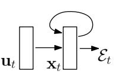
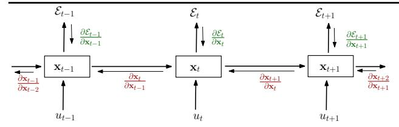
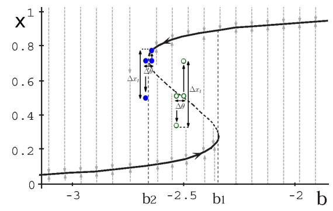
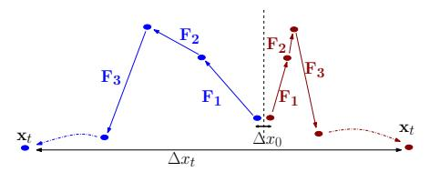
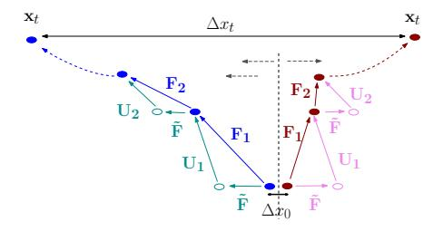
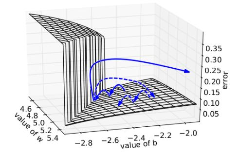
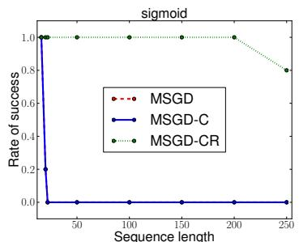
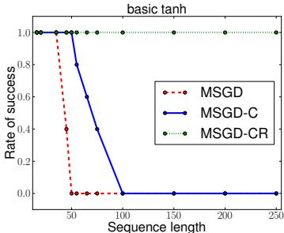
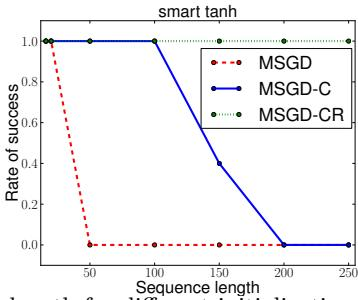

### On the difficulty of training recurrent neural networks

Razvan Pascanu Pascanur@iro.umontreal.ca

Université de Montréal, 2920, chemin de la Tour, Montréal, Québec, Canada, H3T 1J8

Tomas Mikolov@gmail.com

Speech@FIT, Brno University of Technology, Brno, Czech Republic

Yoshua Bengio YOSHUA.BENGIO@UMONTREAL.CA

Université de Montréal, 2920, chemin de la Tour, Montréal, Québec, Canada, H3T 1J8

#### Abstract

There are two widely known issues with properly training recurrent neural networks, the vanishing and the exploding gradient problems detailed in Bengio et al. (1994). In this paper we attempt to improve the understanding of the underlying issues by exploring these problems from an analytical, a geometric and a dynamical systems perspective. Our analysis is used to justify a simple yet effective solution. We propose a gradient norm clipping strategy to deal with exploding gradients and a soft constraint for the vanishing gradients problem. We validate empirically our hypothesis and proposed solutions in the experimental section.

#### 1. Introduction

A recurrent neural network (RNN), e.g. Fig. 1, is a neural network model proposed in the 80's (Rumelhart et al., 1986; Elman, 1990; Werbos, 1988) for modeling time series. The structure of the network is similar to that of a standard multilayer perceptron, with the distinction that we allow connections among hidden units associated with a time delay. Through these connections the model can retain information about the past, enabling it to discover temporal correlations between events that are far away from each other in the data.

While in principle the recurrent network is a simple and powerful model, in practice, it is hard to train properly. Among the main reasons why this model is so unwieldy are the *vanishing gradient* and *exploding gradient* problems described in Bengio *et al.* (1994).

Proceedings of the 30th International Conference on Machine Learning, Atlanta, Georgia, USA, 2013. JMLR: W&CP volume 28. Copyright 2013 by the author(s).

Figure 1. Schematic of a recurrent neural network. The recurrent connections in the hidden layer allow information to persist from one input to another.

#### 1.1. Training recurrent networks

A generic recurrent neural network, with input  $\mathbf{u}_t$  and state  $\mathbf{x}_t$  for time step t, is given by:

$$\mathbf{x}_t = F(\mathbf{x}_{t-1}, \mathbf{u}_t, \theta) \tag{1}$$

In the theoretical section of this paper we will sometimes make use of the specific parametrization: 1

$$\mathbf{x}_t = \mathbf{W}_{rec}\sigma(\mathbf{x}_{t-1}) + \mathbf{W}_{in}\mathbf{u}_t + \mathbf{b}$$
 (2)

In this case, the parameters of the model are given by the recurrent weight matrix  $\mathbf{W}_{rec}$ , the bias  $\mathbf{b}$  and input weight matrix  $\mathbf{W}_{in}$ , collected in  $\theta$  for the general case.  $\mathbf{x}_0$  is provided by the user, set to zero or learned, and  $\sigma$  is an element-wise function. A cost  $\mathcal{E} = \sum_{1 \leq t \leq T} \mathcal{E}_t$  measures the performance of the network on some given task, where  $\mathcal{E}_t = \mathcal{L}(\mathbf{x}_t)$ .

One approach for computing the necessary gradients is backpropagation through time (BPTT), where the recurrent model is represented as a multi-layer one (with an unbounded number of layers) and backpropagation is applied on the unrolled model (see Fig. 2).

We will diverge from the classical BPTT equations at this point and re-write the gradients in order to better

&lt;sup>1For any model respecting eq. (2) we can construct another model following the more widely known equation  $\mathbf{x}_t = \sigma(\mathbf{W}_{rec}\mathbf{x}_{t-1} + \mathbf{W}_{in}\mathbf{u}_t + \mathbf{b})$  that behaves the same (for e.g. by redefining  $\mathcal{E}_t := \mathcal{E}_t(\sigma(\mathbf{x}_t))$ ) and vice versa. Therefore the two formulations are equivalent. We chose eq. (2) for convenience.

Figure 2. Unrolling recurrent neural networks in time by creating a copy of the model for each time step. We denote by  $\mathbf{x}_t$  the hidden state of the network at time t, by  $\mathbf{u}_t$  the input of the network at time t and by  $\mathcal{E}_t$  the error obtained from the output at time t.

highlight the exploding gradients problem:

$$\frac{\partial \mathcal{E}}{\partial \theta} = \sum_{1 \le t \le T} \frac{\partial \mathcal{E}_t}{\partial \theta} \tag{3}$$

$$\frac{\partial \mathcal{E}_t}{\partial \theta} = \sum_{1 \le k \le t} \left( \frac{\partial \mathcal{E}_t}{\partial \mathbf{x}_t} \frac{\partial \mathbf{x}_t}{\partial \mathbf{x}_k} \frac{\partial^+ \mathbf{x}_k}{\partial \theta} \right) \tag{4}$$

$$\frac{\partial \mathbf{x}_{t}}{\partial \mathbf{x}_{k}} = \prod_{t > i > k} \frac{\partial \mathbf{x}_{i}}{\partial \mathbf{x}_{i-1}} = \prod_{t > i > k} \mathbf{W}_{rec}^{T} diag(\sigma'(\mathbf{x}_{i-1}))$$
(5)

These equations were obtained by writing the gradients in a sum-of-products form.  $\frac{\partial^+ \mathbf{x}_k}{\partial \theta}$  refers to the "immediate" partial derivative 2 of the state  $\mathbf{x}_k$  with respect to  $\theta$ , where  $\mathbf{x}_{k-1}$  is taken as a constant with respect to  $\theta$ . Specifically, considering eq. 2, the value of any row i of the matrix  $(\frac{\partial^+ \mathbf{x}_k}{\partial \mathbf{W}_{rec}})$  is just  $\sigma(\mathbf{x}_{k-1})$ . Eq. (5) also provides the form of Jacobian matrix  $\frac{\partial \mathbf{x}_i}{\partial \mathbf{x}_{i-1}}$  for the specific parametrization given in eq. (2), where diag converts a vector into a diagonal matrix, and  $\sigma'$  computes element-wise the derivative of  $\sigma$ .

Any gradient component  $\frac{\partial \mathcal{E}_t}{\partial \theta}$  is also a sum (see eq. (4)), whose terms we refer to as temporal contributions or temporal components. One can see that each such temporal contribution  $\frac{\partial \mathcal{E}_t}{\partial \mathbf{x}_t} \frac{\partial \mathbf{x}_t}{\partial \mathbf{x}_k} \frac{\partial^+ \mathbf{x}_k}{\partial \theta}$  measures how  $\theta$  at step k affects the cost at step t > k. The factors  $\frac{\partial \mathbf{x}_t}{\partial \mathbf{x}_k}$  (eq. (5)) transport the error "in time" from step t back to step k. We would further loosely distinguish between  $long\ term$  and  $short\ term$  contributions, where long term refers to components for which  $k \ll t$  and short term to everything else.

#### 2. Exploding and vanishing gradients

Introduced in Bengio et al. (1994), the exploding gradients problem refers to the large increase in the norm of the gradient during training. Such events are due to the explosion of the long term components, which can

grow exponentially more than short term ones. The *vanishing gradients* problem refers to the opposite behaviour, when long term components go exponentially fast to norm 0, making it impossible for the model to learn correlation between temporally distant events.

#### 2.1. The mechanics

To understand this phenomenon we need to look at the form of each temporal component, and in particular at the matrix factors  $\frac{\partial \mathbf{x}_t}{\partial \mathbf{x}_k}$  (see eq. (5)) that take the form of a product of t-k Jacobian matrices. In the same way a product of t-k real numbers can shrink to zero or explode to infinity, so does this product of matrices (along some direction  $\mathbf{v}$ ).

In what follows we will try to formalize these intuitions (extending similar derivations done in Bengio *et al.* (1994) where a single hidden unit case was considered).

If we consider a linear version of the model (i.e. set  $\sigma$  to the identity function in eq. (2)) we can use the power iteration method to formally analyze this product of Jacobian matrices and obtain tight conditions for when the gradients explode or vanish (see the supplementary materials). It is sufficient for  $\rho < 1$ , where  $\rho$  is the spectral radius of the recurrent weight matrix  $\mathbf{W}_{rec}$ , for long term components to vanish (as  $t \to \infty$ ) and necessary for  $\rho > 1$  for them to explode.

We generalize this result for nonlinear functions  $\sigma$  where  $|\sigma'(x)|$  is bounded,  $||diag(\sigma'(\mathbf{x}_k))|| \leq \gamma \in \mathcal{R}$ , by relying on singular values.

We first **prove** that it is *sufficient* for  $\lambda_1 < \frac{1}{\gamma}$ , where  $\lambda_1$  is the largest singular value of  $\mathbf{W}_{rec}$ , for the *vanishing gradient* problem to occur. Note that we assume the parametrization given by eq. (2). The Jacobian matrix  $\frac{\partial \mathbf{x}_{k+1}}{\partial \mathbf{x}_k}$  is given by  $\mathbf{W}_{rec}^T diag(\sigma'(\mathbf{x}_k))$ . The 2-norm of this Jacobian is bounded by the product of the norms of the two matrices (see eq. (6)). Due to our assumption, this implies that it is smaller than 1.

$$\forall k, \left\| \frac{\partial \mathbf{x}_{k+1}}{\partial \mathbf{x}_k} \right\| \le \left\| \mathbf{W}_{rec}^T \right\| \left\| diag(\sigma'(\mathbf{x}_k)) \right\| < \frac{1}{\gamma} \gamma < 1$$
(6)

Let  $\eta \in \mathbb{R}$  be such that  $\forall k, \left\| \frac{\partial \mathbf{x}_{k+1}}{\partial \mathbf{x}_k} \right\| \leq \eta < 1$ . The existence of  $\eta$  is given by eq. (6). By induction over i, we can show that

$$\left\| \frac{\partial \mathcal{E}_t}{\partial \mathbf{x}_t} \left( \prod_{i=k}^{t-1} \frac{\partial \mathbf{x}_{i+1}}{\partial \mathbf{x}_i} \right) \right\| \le \eta^{t-k} \left\| \frac{\partial \mathcal{E}_t}{\partial \mathbf{x}_t} \right\| \tag{7}$$

As  $\eta < 1$ , it follows that, according to eq. (7), long term contributions (for which t-k is large) go to 0 exponentially fast with t-k.

By inverting this proof we get the necessary condition

&lt;sup>2We use "immediate" partial derivatives in order to avoid confusion, though one can use the concept of total derivative and *the proper meaning* of partial derivative to express the same property

for exploding gradients, namely that the largest singular value  $\lambda_1$  is larger than  $\frac{1}{\gamma}$  (otherwise the long term components would vanish instead of exploding). For tanh we have  $\gamma = 1$  while for sigmoid we have  $\gamma = \frac{1}{4}$ .

## 2.2. Drawing similarities with dynamical systems

We can improve our understanding of the exploding gradients and vanishing gradients problems by employing a dynamical systems perspective, as it was done before in Doya (1993); Bengio *et al.* (1993).

We recommend reading Strogatz (1994) for a formal and detailed treatment of dynamical systems theory. For any parameter assignment  $\theta$ , depending on the initial state  $\mathbf{x}_0$ , the state  $\mathbf{x}_t$  of an autonomous dynamical system converges, under the repeated application of the map F, to one of several possible different attractor states. The model could also find itself in a chaotic regime, a case in which some of the following observations may not hold, but that is not treated in depth here. Attractors describe the asymptotic behaviour of the model. The state space is divided into basins of attraction, one for each attractor. If the model is started in one basin of attraction, the model will converge to the corresponding attractor as t grows.

Dynamical systems theory says that as  $\theta$  changes, the asymptotic behaviour changes smoothly almost everywhere except for certain crucial points where drastic changes occur (the new asymptotic behaviour ceases to be topologically equivalent to the old one). These points form bifurcation boundaries and are caused by attractors that appear, disappear or change shape.

Doya (1993) hypothesizes that such bifurcation crossings could cause the gradients to explode. We would like to extend this observation into a sufficient condition for gradients to explode, by addressing the issue of crossing boundaries between basins of attraction.

We argue that bifurcations are global events that can have locally no effect and therefore crossing them is neither sufficient nor necessary for the gradients to explode. For example due to a bifurcation one attractor can disappear, but if the model's state is not found in the basin of attraction of said attractor, learning will not be affected by it. However when either a change in the state or in the position of the boundary between basins of attraction (which can be caused by a change in  $\theta$ ) is such that the model falls in a different basin than before, the state will be attracted in a different direction resulting in the explosion of the gradients. This crossing of boundaries between basins of attraction is a local event and it is sufficient for the gradients to explode. By assuming that crossing into an emerg-

ing attractor or from a disappearing one qualifies as crossing a boundary between attractors, this term encapsulates also the observations from Doya (1993).

We will re-use the one-hidden unit model (and plot) from Dova (1993) (see Fig. 3) to depict our extension, though, as the original hypothesis, our extension does not depend on the dimensionality of the model. The x-axis covers the parameter b and the y-axis the asymptotic state  $\mathbf{x}_{\infty}$ . The bold line follows the movement of the final point attractor,  $\mathbf{x}_{\infty}$ , as b changes. At  $b_1$  we have a bifurcation boundary where a new attractor emerges (when b decreases from  $\infty$ ), while at  $b_2$  we have another that results in the disappearance of one of the two attractors. In the interval  $(b_1, b_2)$ we are in a rich regime, where there are two attractors and the change in position of boundary between them, as we change b, is traced out by a dashed line. The gray dashed arrows describe the evolution of the state **x** if the network is initialized in that region. Crossing the boundary between basins of attractions is depicted with unfilled circles, where a small change in the state at time 0 results in a sudden large change in  $\mathbf{x}_{t}$ . Crossing a bifurcation ((Dova, 1993) original hypothesis) is shown with filled circles. Note how in the figure, there are only two values of b with a bifurcation, but a whole range of values for which there can be a boundary crossing.

Figure 3. Bifurcation diagram of a single hidden unit RNN (with fixed recurrent weight of 5.0 and adjustable bias b; example introduced in Doya (1993)). See text.

Another limitation of previous analysis is that it considers autonomous systems and assumes the observations hold for input-driven models as well. In (Bengio et al., 1994) input is dealt with by assuming it is bounded noise. The downside of this approach is that it limits how one can reason about the input. In practice, the input is supposed to drive the dynamical system, being able to leave the model in some attractor state, or kick it out of the basin of attraction when certain triggering patterns present themselves.

We propose to extend our analysis to input driven models by folding the input into the map. We consider the family of maps F, where we apply a different  $F_t$  at each step. Intuitively, for the gradients to explode we require the same behaviour as before, where (at least in some direction) the maps  $F_1, ..., F_t$  agree and change direction. Fig. 4 describes this behaviour.

Figure 4. This diagram illustrates how the change in  $\mathbf{x}_t$ ,  $\Delta \mathbf{x}_t$ , can be large for a small  $\Delta \mathbf{x}_0$ . The blue vs red (left vs right) trajectories are generated by the same maps  $F_1, F_2, \ldots$  for two different initial states.

For the specific parametrization in eq. (2) we can take the analogy one step further by decomposing the maps  $F_t$  into a fixed map  $\tilde{F}$  and a time-varying one  $U_t$ .  $F(\mathbf{x}) = \mathbf{W}_{rec}\sigma(\mathbf{x}) + \mathbf{b}$  corresponds to an input-less recurrent network, while  $U_t(\mathbf{x}) = \mathbf{x} + \mathbf{W}_{in}\mathbf{u}_t$  describes the effect of the input. This is depicted in in Fig. 5. Since  $U_t$  changes with time, it can not be analyzed using standard dynamical systems tools, but  $\tilde{F}$  can. This means that when a boundary between basins of attractions is crossed for  $\tilde{F}$ , the state will move towards a different attractor, which for large t could lead (unless the input maps  $U_t$  are opposing this) to a large discrepancy in  $\mathbf{x}_t$ . Therefore studying the asymptotic behaviour of  $\tilde{F}$  can provide useful information about where such events are likely to happen.

Figure 5. Illustrates how one can break apart the maps  $F_1, ... F_t$  into a constant map  $\tilde{F}$  and the maps  $U_1, ..., U_t$ . The dotted vertical line represents the boundary between basins of attraction, and the straight dashed arrow the direction of the map  $\tilde{F}$  on each side of the boundary. This diagram is an extension of Fig. 4.

One interesting observation from the dynamical systems perspective with respect to vanishing gradients is the following. If the factors  $\frac{\partial \mathbf{x}_t}{\partial \mathbf{x}_k}$  go to zero (for t-k large), it means that  $\mathbf{x}_t$  does not depend on  $\mathbf{x}_k$  (if we change  $\mathbf{x}_k$  by some  $\Delta$ ,  $\mathbf{x}_t$  stays the same). This translates into the model at  $\mathbf{x}_t$  being close to convergence towards some attractor (which it would reach from anywhere in the neighbourhood of  $\mathbf{x}_k$ ). Therefore

avoiding the vanishing gradient means staying close to the boundaries between basins of attractions.

#### 2.3. The geometrical interpretation

Let us consider a simple one hidden unit model (eq. (8)) where we provide an initial state  $x_0$  and train the model to have a specific target value after 50 steps. Note that for simplicity we assume no input.

$$x_t = w\sigma(x_{t-1}) + b \tag{8}$$

Fig. 6 shows the error surface  $\mathcal{E}_{50} = (\sigma(x_{50}) - 0.7)^2$ , where  $x_0 = .5$  and  $\sigma$  to be the sigmoid function.

Figure 6. We plot the error surface of a single hidden unit recurrent network, highlighting the existence of high curvature walls. The solid lines depicts standard trajectories that gradient descent might follow. Using dashed arrow the diagram shows what would happen if the gradients is rescaled to a fixed size when its norm is above a threshold.

We can easily analyze the behavior of the model in the linear case, with b=0, i.e.  $x_t=x_0w^t$ . We have that  $\frac{\partial x_t}{\partial w}=tx_0w^{t-1}$  and  $\frac{\partial^2 x_t}{\partial w^2}=t(t-1)x_0w^{t-2}$ , implying that when the first derivative explodes, so does the second derivative.

In the general case, when the gradients explode they do so along some directions  $\mathbf{v}$ . There exists, in such situations, a  $\mathbf{v}$  such that  $\frac{\partial \mathcal{E}_t}{\partial \theta} \mathbf{v} \geq C \alpha^t$ , where  $C, \alpha \in \mathbb{R}$  and  $\alpha > 1$  (for e.g., in the linear case,  $\mathbf{v}$  is the eigenvector corresponding to the largest eigenvalue of  $\mathbf{W}_{rec}$ ). If this bound is tight, we hypothesize that when gradients explode so does the curvature along  $\mathbf{v}$ , leading to a wall in the error surface, like the one seen in Fig. 6. Based on this hypothesis we devise a simple solution to the exploding gradient problem (see Fig 6).

If both the gradient and the leading eigenvector of the curvature are aligned with the exploding direction  $\mathbf{v}$ , it follows that the error surface has a steep wall perpendicular to  $\mathbf{v}$  (and consequently to the gradient). This means that when stochastic gradient descent (SGD) reaches the wall and does a gradient descent step, it will be forced to jump across the valley moving perpendicular to the steep walls, possibly leaving the valley and disrupting the learning process.

The dashed arrows in Fig. 6 correspond to *ignoring* the norm of this large step, ensuring that the model stays close to the wall. One key insight is that all the steps taken when the gradient explodes are aligned with  $\mathbf{v}$  and ignore other descent direction. At the wall, a bounded norm step in the direction of the gradient therefore merely pushes us back inside the smoother low-curvature region besides the wall, whereas a regular gradient step would bring us very far, thus slowing or preventing further training.

The important assumption in this scenario, compared to the classical high curvature valley, is that we assume that the valley is wide, as we have a large region around the wall where if we land we can rely on first order methods to move towards a local minima. The effectiveness of clipping provides indirect evidence, as otherwise, even with clipping, SGD would not be able to explore descent directions of low curvature and therefore further minimize the error.

Our hypothesis, when it holds, could also provide another argument in favor of the Hessian-Free approach compared to other second order methods (among other existing arguments). Hessian-Free, and truncated Newton methods in general, compute a new estimate of the Hessian matrix before each update step and can take into account abrupt changes in curvature (such as the ones suggested by our hypothesis) while other approaches use a smoothness assumption, averaging 2nd order signals over many steps.

# 3. Dealing with the exploding and vanishing gradient

#### 3.1. Previous solutions

Using an L1 or L2 penalty on the recurrent weights can help with exploding gradients. Assuming weights are initialized to small values, the largest singular value  $\lambda_1$  of  $\mathbf{W}_{rec}$  is probably smaller than 1. The L1/L2 term can ensure that during training  $\lambda_1$  stays smaller than 1, and in this regime gradients can not explode (see sec. 2.1). This approach limits the model to single point attractor at the origin, where any information inserted in the model dies out exponentially fast. This prevents the model to learn generator networks, nor can it exhibit long term memory traces.

Doya (1993) proposes to pre-program the model (to initialize the model in the right regime) or to use teacher forcing. The first proposal assumes that if the model exhibits from the beginning the same kind of asymptotic behaviour as the one required by the target, then there is no need to cross a bifurcation boundary. The downside is that one can not always know the required asymptotic behaviour, and, even if it is

known, it might not be trivial to initialize the model accordingly. Also, such initialization does not prevent crossing the boundary between basins of attraction.

Teacher forcing refers to using targets for some or all hidden units. When computing the state at time t, we use the targets at t-1 as the value of all the hidden units in  $\mathbf{x}_{t-1}$  which have a target defined. It has been shown that in practice it can reduce the chance that gradients explode, and even allow training generator models or models that work with unbounded amounts of memory(Pascanu and Jaeger, 2011; Doya and Yoshizawa, 1991). One important downside is that it requires a target to be defined at every time step.

Hochreiter and Schmidhuber (1997); Graves et al. (2009) propose the LSTM model to deal with the vanishing gradients problem. It relies on special type of linear unit with a self connection of value 1. The flow of information into and out of the unit is guarded by learned input and output gates. There are several variations of this basic structure. This solution does not address explicitly the exploding gradients problem.

Sutskever et al. (2011) use the Hessian-Free optimizer in conjunction with structural damping. This approach seems able to address the vanishing gradient problem, though more detailed analysis is missing. Presumably this method works because in high dimensional spaces there is a high probability for long term components to be orthogonal to short term ones. This would allow the Hessian to rescale these components independently. In practice, one can not guarantee that this property holds. The method addresses the exploding gradient as well, as it takes curvature into account. Structural damping is an enhancement that forces the Jacobian matrices  $\frac{\partial \mathbf{x}_t}{\partial \theta}$  to have small norm, hence further helping with the exploding gradients problem. The need for this extra term when solving the pathological problems might suggest that second order derivatives do not always grow at same rate as first order ones.

Echo State Networks (Jaeger and Haas, 2004) avoid the exploding and vanishing gradients problem by not learning  $\mathbf{W}_{rec}$  and  $\mathbf{W}_{in}$ . They are sampled from hand crafted distributions. Because the spectral radius of  $\mathbf{W}_{rec}$  is, by construction, smaller than 1, information fed in to the model dies out exponentially fast. An extension to the model is given by leaky integration units (Jaeger *et al.*, 2007), where

$$\mathbf{x}_k = \alpha \mathbf{x}_{k-1} + (1 - \alpha)\sigma(\mathbf{W}_{rec}\mathbf{x}_{k-1} + \mathbf{W}_{in}\mathbf{u}_k + \mathbf{b}).$$

These units can be used to solve the standard benchmark proposed by Hochreiter and Schmidhuber (1997) for learning long term dependencies (Jaeger, 2012).

We would make a final note about the approach proposed by Tomas Mikolov in his PhD thesis (Mikolov, 2012)(and implicitly used in the state of the art results on language modelling (Mikolov et al., 2011)). It involves clipping the gradient's temporal components element-wise (clipping an entry when it exceeds in absolute value a fixed threshold).

#### 3.2. Scaling down the gradients

As suggested in section 2.3, one mechanism to deal with the exploding gradient problem is to rescale their norm whenever it goes over a threshold:

Algorithm 1 Pseudo-code for norm clipping

$$egin{aligned} \hat{\mathbf{g}} \leftarrow rac{\partial \mathcal{E}}{\partial heta} \ & ext{if} \quad \|\hat{\mathbf{g}}\| \geq threshold \ ext{then} \ & \hat{\mathbf{g}} \leftarrow rac{threshold}{\|\hat{\mathbf{g}}\|} \hat{\mathbf{g}} \ & ext{end if} \end{aligned}$$

This algorithm is similar to the one proposed by Tomas Mikolov and we only diverged from the original proposal in an attempt to provide a better theoretical justification (see section 2.3; we also move in a descent direction for the current mini-batch). We regard this work as an investigation of why clipping works. In practice both variants behave similarly.

The proposed clipping is simple and computationally efficient, but it does however introduce an additional hyper-parameter, namely the threshold. One good heuristic for setting this threshold is to look at statistics on the average norm over a sufficiently large number of updates. In our experience values from half to ten times this average can still yield convergence, though convergence speed can be affected.

#### 3.3. Vanishing gradient regularization

We opt to address the vanishing gradients problem using a regularization term that represents a preference for parameter values such that back-propagated gradients neither increase or decrease in magnitude. Our intuition is that increasing the norm of  $\frac{\partial \tilde{\mathbf{x}}_t}{\partial \mathbf{x}_k}$  means the error at time t is more sensitive to all inputs  $\mathbf{u}_t, ..., \mathbf{u}_k$   $(\frac{\partial \mathbf{x}_t}{\partial \mathbf{x}_k})$  is a factor in  $\frac{\partial \mathcal{E}_t}{\partial \mathbf{u}_k}$ . In practice some of these inputs will be irrelevant for the prediction at time t and will behave like noise that the network needs to learn to ignore. The network can not learn to ignore these irrelevant inputs unless there is an error signal. These two issues can not be solved in parallel, and it seems natural to expect that we might need to force the network to increase  $\|\frac{\partial \mathbf{x}_t}{\partial \mathbf{x}_k}\|$  at the expense of larger errors (caused by the irrelevant input entries) and then wait for it to learn to ignore these input entries. This suggests that moving towards increasing the norm of  $\frac{\partial \mathbf{x}_t}{\partial \mathbf{x}_k}$  can not be always done while following a descent direction of the error  $\mathcal{E}$  (which is, for e.g., what a second

order method would do), and a more natural choice might be a regularization term.

The regularizer we propose prefers solutions for which the error preserves norm as it travels back in time:

$$\Omega = \sum_{k} \Omega_{k} = \sum_{k} \left( \frac{\left\| \frac{\partial \mathcal{E}}{\partial \mathbf{x}_{k+1}} \frac{\partial \mathbf{x}_{k+1}}{\partial \mathbf{x}_{k}} \right\|}{\left\| \frac{\partial \mathcal{E}}{\partial \mathbf{x}_{k+1}} \right\|} - 1 \right)^{2}$$
(9)

In order to be computationally efficient, we only use the "immediate" partial derivative of  $\Omega$  with respect to  $\mathbf{W}_{rec}$  (we consider that  $\mathbf{x}_k$  and  $\frac{\partial \mathcal{E}}{\partial \mathbf{x}_{k+1}}$  as being constant with respect to  $\mathbf{W}_{rec}$  when computing the derivative of  $\Omega_k$ ), as depicted in eq. (10). This can be done efficiently because we get the values of  $\frac{\partial \mathcal{E}}{\partial \mathbf{x}_k}$  from BPTT. We use Theano to compute these gradients (Bergstra et al., 2010; Bastien et al., 2012).

$$\frac{\partial^{+}\Omega}{\partial \mathbf{W}_{rec}} = \sum_{k} \frac{\partial^{+}\Omega_{k}}{\partial \mathbf{W}_{rec}} \\
= \sum_{k} \frac{\partial^{+} \left( \frac{\|\frac{\partial \mathcal{E}}{\partial \mathbf{x}_{k+1}} \mathbf{W}_{rec}^{T} d^{iag}(\sigma'(\mathbf{x}_{k}))\|^{2}}{\|\frac{\partial \mathcal{E}}{\partial \mathbf{x}_{k+1}}\|^{2}} - 1 \right)^{2}}{\partial \mathbf{W}_{rec}} \tag{10}$$

Note that our regularization term only forces the Jacobian matrices  $\frac{\partial \mathbf{x}_{k+1}}{\partial \mathbf{x}_k}$  to preserve norm in the relevant direction of the error  $\frac{\partial \mathcal{E}}{\partial \mathbf{x}_{k+1}}$ , not for any direction (we do not enforce that all eigenvalues are close to 1). The second observation is that we are using a soft constraint, therefore we are not ensured the norm of the error signal is preserved. This means that we still need to deal with the exploding gradient problem, as a single step induced by it can disrupt learning. From the dynamical systems perspective we can see that preventing the vanishing gradient problem implies that we are pushing the model towards the boundary of the current basin of attraction (such that during the N steps it does not have time to converge), making it more probable for the gradients to explode.

#### 4. Experiments and results

#### 4.1. Pathological synthetic problems

As done in Martens and Sutskever (2011), we address some of the pathological problems from Hochreiter and Schmidhuber (1997) that require learning long term correlations. We refer the reader to this original paper for a detailed description of the tasks and to the supplementary materials for the complete description of setup for any of the following experiments. 3

#### 4.1.1. The temporal order problem

We consider the temporal order problem as the prototypical pathological problem, extending our results to the other proposed tasks afterwards. The input is

&lt;sup>3Code: https://github.com/pascanur/trainingRNNs

Figure 7. Rate of success for solving the temporal order problem versus sequence length for different initializations (from left to right: sigmoid, basic tanh and smart tanh). See text.

a long stream of discrete symbols. At the beginning and middle of the sequence a symbol within  $\{A, B\}$  is emitted. The task consists in classifying the order (either AA, AB, BA, BB) at the end of the sequence.

7 shows the success rate of standard minibatch stochastic gradient descent MSGD, MSGD-C (MSGD enhanced with out clipping strategy) and MSGD-CR (MSGD with the clipping strategy and the regularization term) 4. It was previously shown (Sutskever, 2012) that initialization plays an important role for training RNNs. We consider three different initializations. "sigmoid" is the most adversarial initialization, where we use a sigmoid unit network where  $\mathbf{W}_{rec}, \mathbf{W}_{in}, \mathbf{W}_{out} \sim \mathcal{N}(0, 0.01)$ . "basic tanh" uses a tanh unit network where  $\mathbf{W}_{rec}, \mathbf{W}_{in}, \mathbf{W}_{out} \sim$  $\mathcal{N}(0,0.1)$ . "smart tanh" also uses tanh units and  $\mathbf{W}_{in}, \mathbf{W}_{out} \sim \mathcal{N}(0, 0.01)$ .  $\mathbf{W}_{rec}$  is sparse (each unit has only 15 non-zero incoming connections) with the spectral radius fixed to 0.95. In all cases  $\mathbf{b} = \mathbf{b}_{out} = 0$ . The graph shows the success rate out of 5 runs (with different random seeds) for a 50 hidden unit model, where the x-axis contains the length of the sequence. We use a constant learning rate of 0.01 with no momentum. When clipping the gradients, we used a threshold of 1., and the regularization weight was fixed to 4. A run is successful if the number of misclassified sequences was under 1% out of 10000 freshly random generated sequences. We allowed a maximum number of 5M updates, and use minibatches of 20 examples.

This task provides empirical evidence that exploding gradients are linked with tasks that require long memory traces. As the length of the sequence increases, using clipping becomes more important to achieve a better success rate. More memory implies larger spectral radius, which leads to rich regimes where gradients are likely to explode.

Furthermore, we can train a single model to deal with

any sequence of length 50 up to 200 (by providing sequences of different random lengths in this interval for different MSGD steps). We achieve a success rate of 100% over 5 seeds in this regime as well (all runs had 0 misclassified sequences in a set of 10000 randomly generated sequences of different lengths). We used a RNN of 50 tanh units initialized in the "basic tanh" regime. The same trained model can address sequences of length up to 5000 steps, lengths never seen during training. Specifically the same model produced 0 mis-classified sequences (out of 10000 sequences of same length) for lengths of either 50, 100, 150, 200, 250, 500, 1000, 2000, 3000 and 5000. This provides some evidence that the model might use attractors to form some kind of long term memory, rather then relying on transient dynamics (as for example ESN networks probably do in Jaeger (2012)).

#### 4.1.2. Other pathological tasks

SGD-CR is able to solve (100% success on the lengths listed below, for all but one task) other pathological problems from Hochreiter and Schmidhuber (1997), namely the addition problem, the multiplication problem, the 3-bit temporal order problem, the random permutation problem and the noiseless memorization problem in two variants (when the pattern needed to be memorized is 5 bits in length and when it contains over 20 bits of information; see Martens and Sutskever (2011)). For every task we used 5 different runs (with different random seeds). For the first 4 problems we used a single model for lengths up to 200, while for the noiseless memorization we used a different model for each sequence length (50, 100, 150 and 200). The hardest problems for which only two runs out of 5 succeeded was the random permutation problem. For the addition and multiplication task we observe successful generalization to sequences up to 500 steps (we notice an increase in error with sequence length, though it stays below 1%). Note that for the addition and multiplication problem a sequence is misclassified with the

&lt;sup>4When using just the regularization term, without clipping, learning usually fails due to exploding gradients

| Data set            | Data Fold | MSGD | MSGD+C | MSGD+CR | STATE OF THE ART FOR RNN | STATE OF T | HE |
|---------------------|--------------|------|--------|---------|--------------------------|------------|----|
|                     |              |      |        |         |                          |            |    |
| Piano-midi.de       | TRAIN        | 6.87 | 6.81   | 7.01    | 7.04                     | 6.32       |    |
| (NLL)               | TEST         | 7.56 | 7.53   | 7.46    | 7.57                     | 7.05       |    |
| Nottingham          | TRAIN        | 3.67 | 3.21   | 2.95    | 3.20                     | 1.81       |    |
| (NLL)               | TEST         | 3.80 | 3.48   | 3.36    | 3.43                     | 2.31       |    |
| MuseData            | TRAIN        | 8.25 | 6.54   | 6.43    | 6.47                     | 5.20       |    |
| (NLL)               | TEST         | 7.11 | 7.00   | 6.97    | 6.99                     | 5.60       |    |
| Penn Treebank       | TRAIN        | 1.46 | 1.34   | 1.36    | N/A                      | N/A        |    |
| 1 STEP (BITS/CHAR)  | TEST         | 1.50 | 1.42   | 1.41    | 1.41                     | 1.37       |    |
| Penn Treebank       | TRAIN        | N/A  | 3.76   | 3.70    | N/A                      | N/A        |    |
| 5 STEPS (BITS/CHAR) | TEST         | N/A  | 3.89   | 3.74    | N/A                      | N/A        |    |

Table 1. Results on polyphonic music prediction in negative log likelihood per time step and natural language task in bits per character. Lower is better. Bold face shows state of the art for RNN models.

square error is larger than .04. In most cases, these results outperforms Martens and Sutskever (2011) in terms of success rate, they deal with longer sequences than in Hochreiter and Schmidhuber (1997) and compared to (Jaeger, 2012) they generalize to longer sequences. For details see supplementary materials.

#### 4.2. Natural problems

We address the task of polyphonic music prediction, using the datasets Piano-midi.de, Nottingham and MuseData described in Boulanger-Lewandowski et al. (2012) and language modelling at the character level on the Penn Treebank dataset (Mikolov et al., 2012). We also explore a modified version of the task, where we require to predict the 5th character in the future (instead of the next). We assume that for solving this modified task long term correlations are more important than short term ones, and hence our regularization term should be more helpful.

The training and test scores for all natural problems are reported in Table 1 as well as state of the art for these tasks. See additional material for hyperparameters and experimental setup. We note that keeping the regularization weight fixed (as for the previous tasks) seems to harm learning. One needs to use a  $\frac{1}{t}$  decreasing schedule for this term. We hypothesis that minimizing the regularization term affects the ability of the model to learn short term correlations which are important for these tasks, though a more careful investigation is lacking.

These results suggest that clipping solves an optimization issue and does not act as a regularizer, as both the training and test error improve in general. Results on Penn Treebank reach the state of the art for RNN achieved by Mikolov *et al.* (2012), who used a different clipping algorithm similar to ours, thus providing evidence that both behave similarly. A maximum en-

tropy model with up to 15-gram features has state of the art on Penn Treebank(character-level). However, RNN models with some clipping strategy have state of the art for word modeling and character modeling on larger datasets (Mikolov *et al.*, 2011; 2012)

For the polyphonic music prediction we have state of the art for RNN models, though RNN-NADE, a probabilistic recurrent model, trained with Hessian Free (Bengio *et al.*, 2012) does better.

#### 5. Summary and conclusions

We provided different perspectives through which one can gain more insight into the exploding and vanishing gradients issue. We put forward a hypothesis stating that when gradients explode we have a cliff-like structure in the error surface and devise a simple solution based on this hypothesis, clipping the norm of the exploded gradients. The effectiveness of our proposed solutions provides some indirect empirical evidence towards the validity of our hypothesis, though further investigations are required. In order to deal with the vanishing gradient problem we use a regularization term that forces the error signal not to vanish as it travels back in time. This regularization term forces the Jacobian matrices  $\frac{\partial \mathbf{x}_i}{\partial \mathbf{x}_{i-1}}$  to preserve norm only in relevant directions. In practice we show that these solutions improve performance of RNNs on the pathological synthetic datasets considered, polyphonic music prediction and language modelling.

#### Acknowledgements

We would like to thank Theano development team. We acknowledge RQCHP, Compute Canada, NSERC, FQRNT and CIFAR for the resources they provide.

#### References

- Bastien, F., Lamblin, P., Pascanu, R., Bergstra, J., Goodfellow, I., Bergeron, A., Bouchard, N., and Bengio, Y. (2012). Theano: new features and speed improvements. Submitted to Deep Learning and Unsupervised Feature Learning NIPS 2012 Workshop.
- Bengio, Y., Frasconi, P., and Simard, P. (1993). The problem of learning long-term dependencies in recurrent networks. pages 1183–1195, San Francisco. IEEE Press. (invited paper).
- Bengio, Y., Simard, P., and Frasconi, P. (1994). Learning long-term dependencies with gradient descent is difficult. *IEEE Transactions on Neural Networks*, 5(2), 157–166.
- Bengio, Y., Boulanger-Lewandowski, N., and Pascanu, R. (2012). Advances in optimizing recurrent networks. Technical Report arXiv:1212.0901, U. Montreal.
- Bergstra, J., Breuleux, O., Bastien, F., Lamblin, P., Pascanu, R., Desjardins, G., Turian, J., Warde-Farley, D., and Bengio, Y. (2010). Theano: a CPU and GPU math expression compiler. In *Proceedings of the Python for Scientific Computing Conference (SciPy)*. Oral Presentation.
- Boulanger-Lewandowski, N., Bengio, Y., and Vincent, P. (2012). Modeling temporal dependencies in highdimensional sequences: Application to polyphonic music generation and transcription. In Proceedings of the Twenty-nine International Conference on Machine Learning (ICML'12). ACM.
- Doya, K. (1993). Bifurcations of recurrent neural networks in gradient descent learning. *IEEE Transactions on Neural Networks*, 1, 75–80.
- Doya, K. and Yoshizawa, S. (1991). Adaptive synchronization of neural and physical oscillators. In J. E. Moody, S. J. Hanson, and R. Lippmann, editors, NIPS, pages 109–116. Morgan Kaufmann.
- Elman, J. (1990). Finding structure in time. Cognitive Science, 14(2), 179–211.
- Graves, A., Liwicki, M., Fernandez, S., Bertolami, R., Bunke, H., and Schmidhuber, J. (2009). A Novel Connectionist System for Unconstrained Handwriting Recognition. *IEEE Transactions on Pattern Analysis and Machine Intelligence*, **31**(5), 855–868.
- Hochreiter, S. and Schmidhuber, J. (1997). Long short-term memory. *Neural Computation*, **9**(8), 1735–1780.

- Jaeger, H. (2012). Long short-term memory in echo state networks: Details of a simulation study. Technical report, Jacobs University Bremen.
- Jaeger, H. and Haas, H. (2004). Harnessing nonlinearity: predicting chaotic systems and saving energy in wireless telecommunication. *Science*, 304(5667), 78–80.
- Jaeger, H., Lukosevicius, M., Popovici, D., and Siewert, U. (2007). Optimization and applications of echo state networks with leaky- integrator neurons. Neural Networks, 20(3), 335–352.
- Martens, J. and Sutskever, I. (2011). Learning recurrent neural networks with Hessian-free optimization. In *Proc. ICML* '2011. ACM.
- Mikolov, T. (2012). Statistical Language Models based on Neural Networks. Ph.D. thesis, Brno University of Technology.
- Mikolov, T., Deoras, A., Kombrink, S., Burget, L., and Cernocky, J. (2011). Empirical evaluation and combination of advanced language modeling techniques. In *Proc. 12th annual conference of the international speech communication association (INTERSPEECH 2011)*.
- Mikolov, T., Sutskever, I., Deoras, A., Le, H.-S., Kombrink, S., and Cernocky, J. (2012). Subword language modeling with neural networks. preprint (http://www.fit.vutbr.cz/imikolov/rnnlm/char.pdf).
- Pascanu, R. and Jaeger, H. (2011). A neurodynamical model for working memory. *Neural Netw.*, **24**, 199–207.
- Rumelhart, D. E., Hinton, G. E., and Williams, R. J. (1986). Learning representations by backpropagating errors. *Nature*, **323**(6088), 533–536.
- Strogatz, S. (1994). Nonlinear Dynamics And Chaos: With Applications To Physics, Biology, Chemistry, And Engineering (Studies in Nonlinearity). Studies in nonlinearity. Perseus Books Group, 1 edition.
- Sutskever, I. (2012). Training Recurrent Neural Networks. Ph.D. thesis, University of Toronto.
- Sutskever, I., Martens, J., and Hinton, G. (2011). Generating text with recurrent neural networks. In L. Getoor and T. Scheffer, editors, *Proceedings of the 28th International Conference on Machine Learning (ICML-11)*, ICML '11, pages 1017–1024, New York, NY, USA. ACM.
- Werbos, P. J. (1988). Generalization of backpropagation with application to a recurrent gas market model. *Neural Networks*, **1**(4), 339–356.