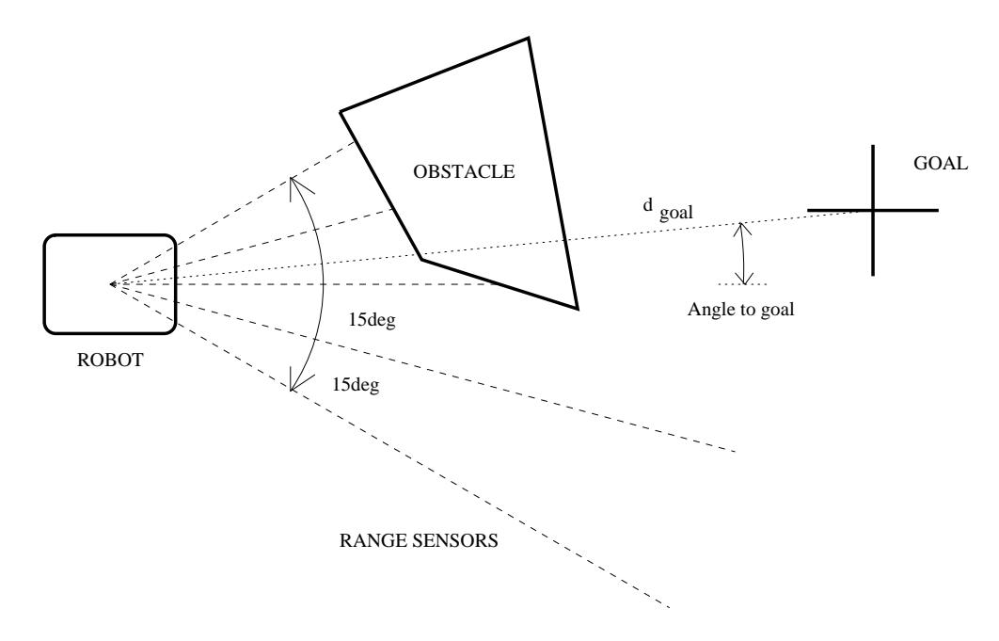
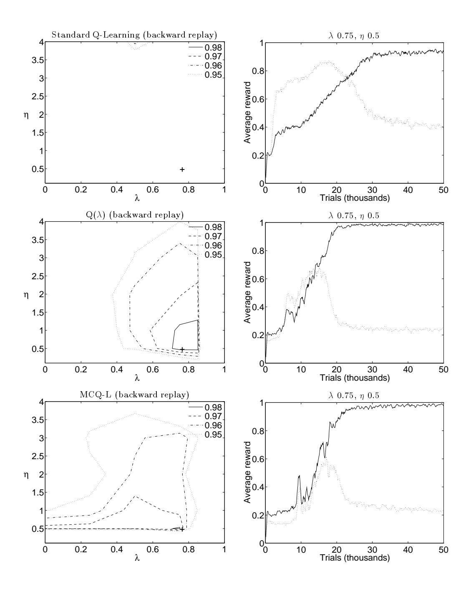
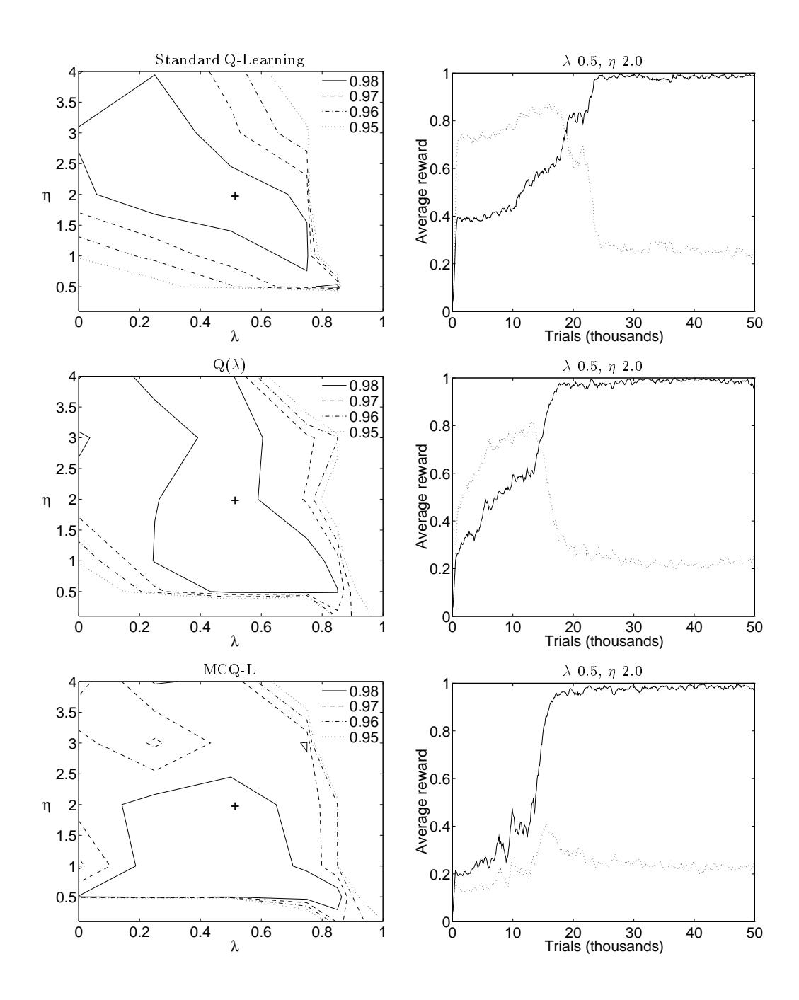
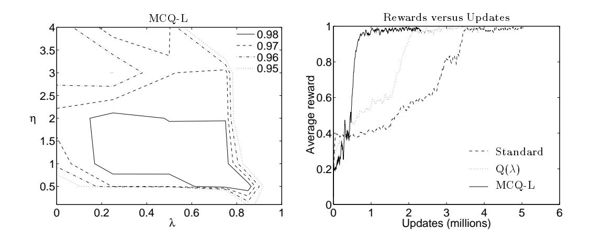
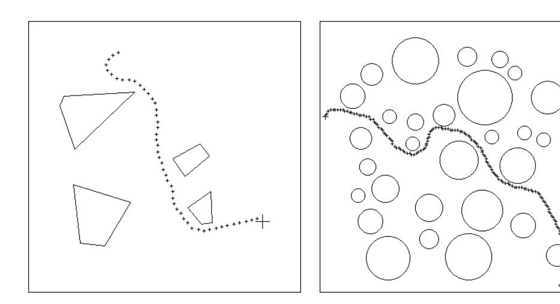
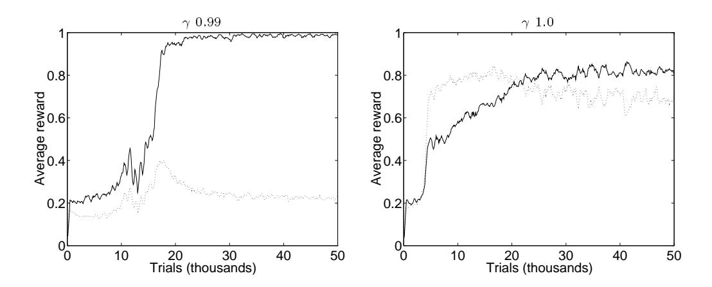

# ON-LINE Q-LEARNING USING CONNECTIONIST SYSTEMS

G. A. Rummery & M. Niranjan

CUED/F-INFENG/TR 166

September 1994

Cambridge University Engineering Department
Trumpington Street
Cambridge CB2 1PZ
England

Email: gar@eng.cam.ac.uk, niranjan@eng.cam.ac.uk

#### Abstract

Reinforcement learning algorithms are a powerful machine learning technique. However, much of the work on these algorithms has been developed with regard to discrete finite-state Markovian problems, which is too restrictive for many real-world environments. Therefore, it is desirable to extend these methods to high dimensional continuous state-spaces, which requires the use of function approximation to generalise the information learnt by the system. In this report, the use of back-propagation neural networks (Rumelhart, Hinton and Williams 1986) is considered in this context.

We consider a number of different algorithms based around Q-Learning (Watkins 1989) combined with the Temporal Difference algorithm (Sutton 1988), including a new algorithm (Modified Connectionist Q-Learning), and  $Q(\lambda)$  (Peng and Williams 1994). In addition, we present algorithms for applying these updates on-line during trials, unlike backward replay used by Lin (1993) that requires waiting until the end of each trial before updating can occur. On-line updating is found to be more robust to the choice of training parameters than backward replay, and also enables the algorithms to be used in continuously operating systems where no end of trial conditions occur.

We compare the performance of these algorithms on a realistic robot navigation problem, where a simulated mobile robot is trained to guide itself to a goal position in the presence of obstacles. The robot must rely on limited sensory feedback from its surroundings, and make decisions that can be generalised to arbitrary layouts of obstacles.

These simulations show that on-line learning algorithms are less sensitive to the choice of training parameters than backward replay, and that the alternative update rules of MCQ-L and  $Q(\lambda)$  are more robust than standard Q-learning updates.

# Contents

| 1 | Introduction                                                                                             | 3        |
|---|----------------------------------------------------------------------------------------------------------|----------|
| 2 | Reinforcement Learning  2.1 Q-Learning                                                                   | 4        |
| 3 |                                                                                                          | 6        |
| 4 | On-line Learning                                                                                         | 7        |
| 5 | The Robot Problem  5.1 The Robot Environment                                                             | 10<br>11 |
| 6 | Discussion of Results6.1 Heuristic Parameters6.2 On-line v Backward Replay6.3 Comparison of Update Rules | 17       |
| 7 | Conclusions                                                                                              | 18       |
| A | Calculating Eligibility Traces                                                                           | 19       |

# 1 Introduction

Much of the work done in the reinforcement learning literature uses discrete state-spaces, with low dimensional input-spaces. This is because current reinforcement learning algorithms require extensive repeated searches of the state-space in order to propagate information about the payoffs available, and so smaller state-spaces can be examined more easily. Also, from a theoretical point of view, the only proofs of convergence available for reinforcement learning algorithms are based on information being stored explicitly at each state. However, it is desirable to extend reinforcement learning algorithms to work efficiently in large state-spaces, which requires generalisation to be used to spread information between similar states, and hence reduce the amount of information that must be collected. This is especially important in the case of continuous state-spaces, where there are effectively an infinite number of states, and the probability of ever returning to exactly the same state ever again is negligible. In these cases, generalisation of experience is not only desirable, but a necessity.

In this report, we examine the use of back-propagation neural networks to store the information learnt by the Q-learning algorithm (Watkins 1989). Lin (1993) examined the use of neural networks in this context, and provided algorithms for training based on the idea of backward replay, which involves storing the state-action pairs visited by the system until the end of a trial when the rewards are known, and then replaying them in reverse order to train the network. In this report, however, we have examined the use of algorithms that can be applied on-line, in the sense that the updates to the neural networks are made at each time step during the trial, without the need to store any state-action information. We show that in comparison with backward replay, on-line updates are better at converging to optimal policies over a wider range of training parameter values.

We also examine other forms of update rule than the standard Q-learning algorithm, introducing a new algorithm which we call Modified Connectionist Q-Learning, and extending  $Q(\lambda)$  (Peng and Williams 1994) for use with continuous function approximators. The algorithms are empirically tested on a mobile robot problem, where a simulated mobile robot is trained to guide itself to a goal position in a 2D environment.

The remainder of this report is organised as follows: section 2 introduces the basics of reinforcement learning and Q-learning, section 3 discusses connectionist Q-learning and introduces the alternative update rules, and section 4 explains the on-line updating algorithm. Sections 5 and 6 present the results and discussions of the experiments on the robot problem, and finally section 7 gives the conclusions.

# 2 Reinforcement Learning

In reinforcement learning problems, a scalar value called a *payoff* is received by the control system for transitions from one state to another. The aim of the system is to find a control policy which maximises the expected future discounted sum of payoffs received, known as the *return*.

The value function is a prediction of the return available from each state.

$$V(\mathbf{x}_t) \leftarrow E\left\{\sum_{k=0}^{\infty} \gamma^k r_{t+k}\right\} \tag{1}$$

where  $r_t$  is the payoff received for the transition from state vector  $\mathbf{x}_t$  to  $\mathbf{x}_{t+1}$  and  $\gamma$  is the discount factor  $(0 \le \gamma \le 1)$ . Note that  $V(\mathbf{x}_t)$  therefore represents the discounted sum of

payoffs received from time step t onwards, and that this sum will depend on the sequence of actions taken (the policy). The control system is required to find the policy which maximises  $V(\mathbf{x}_t)$  in each state.

# 2.1 Q-Learning

In Q-learning (Watkins 1989) the idea is to learn Q-function, which is a prediction of the return associated with each action  $a \in A$  in each state. This prediction can be updated with respect to the predicted return of the next state visited,

$$Q(\mathbf{x}_t, a_t) \leftarrow r_t + \gamma V(\mathbf{x}_{t+1}) \tag{2}$$

As the overall aim of the system is to maximise the payoffs received, the current estimate of  $V(\mathbf{x}_t)$  of a state is given by  $\max_{a \in A} Q(\mathbf{x}_t, a)$ , so equation 2 becomes,

$$Q(\mathbf{x}_t, a_t) \leftarrow r_t + \gamma \max_{a \in A} Q(\mathbf{x}_{t+1}, a)$$
(3)

This is the *one-step* Q-learning update equation, which has been shown to converge for finite-state Markovian problems when a lookup table is used to store the values of the Q-function (Watkins 1989). Once the Q-function has converged, the optimal policy is to take the action in each state with the highest predicted return. This is called the *greedy* policy.

# 2.2 Temporal Difference Learning

Equation 3 is an update based on the temporal difference (Sutton 1988) between the current and next prediction of return. However, the next prediction will change when  $Q_{t+1}$  is updated, which implies that  $Q_t$  should be adjusted to take this into account. As a general rule, therefore, each new temporal difference will effect not just the last prediction, but all previous predictions. This results in the Temporal Difference learning algorithm which can be applied to speed up convergence of sequential prediction tasks.

In fact, Sutton introduces an entire family of algorithms called  $TD(\lambda)$ , where  $0 \le \lambda \le 1$  is a weighting on the relevance of recent temporal differences to earlier predictions. He suggests that using lower values of  $\lambda$  reduces the variance of the predictions seen by each state. It has been shown by Dayan (1992) that  $TD(\lambda)$  converges for finite-state Markovian problems, but no proof exists for continuous systems.

## 2.3 Exploration

The reason for taking exploratory actions is that it is not possible for the Q-functions to learn if the action with the highest  $Q(\mathbf{x}_t, a_t)$  is chosen at all times, as, during training, other actions with lower *predicted* payoffs may in fact be better. The method used to select actions has a direct effect on the rate at which the reinforcement learning algorithm will converge to an optimal policy. Ideally, the system should only choose to perform a non-greedy action if it lacks confidence in the current greedy prediction. Although various methods have been suggested for use in discrete state-space systems (Thrun 1992), they are not generally applicable to systems using continuous function approximators.

# 3 Connectionist Q-Learning

Learning the Q-function requires some method of storing the current predictions at each state for each action, and updating them as new information is gathered. Storing a separate value for each state-action pair quickly becomes impractical for problems with large state-spaces, and for continuous state-spaces is simply not possible. Therefore, there is the need to use some form of function approximation which generalises predictions between states, and thus provides predictions even in situations that have never been experienced before. Neural networks, or *Multi-Layer Perceptrons*, provide such a continuous function approximation technique, and have the advantage of scaling well to large input and state-spaces (unlike, for instance, CMACs (Albus 1981) or Radial Basis Functions).

In order to represent the Q-function using neural networks, either a single network with |A| outputs is required, or |A| separate networks, each with a single output. Following Lin (1992), we chose to represent the Q-function using one neural network for each action, which avoids the hidden nodes receiving conflicting error signals from different outputs. However, the on-line algorithms presented in section 4 can be applied to either architecture.

Lin (1992) used the one-step Q-learning equation 3 to calculate the error in  $Q_t^1$  and update the neural network weights  $\mathbf{w}_t$  according to,

$$\Delta \mathbf{w}_t = \eta \left[ r_t + \gamma \max_{a \in A} Q_{t+1} - Q_t \right] \nabla_w Q_t \tag{4}$$

where  $\eta$  is the *learning constant* and  $\nabla_w Q_t$  is a vector of the output gradients  $\partial Q_t/\partial w_t$  calculated by back-propagation.

# 3.1 Combining Q-Learning and Temporal Difference Learning

In order to speed up training, Watkins (1989) suggests combining Q-learning with TD-learning (section 2.2). In this formulation, the current update error is used to adjust not only the current estimate of  $Q_t$ , but also that of previous states, by keeping a weighted sum of earlier error gradients,

$$\Delta \mathbf{w}_t = \eta \left[ r_t + \gamma \max_{a \in A} Q_{t+1} - Q_t \right] \sum_{t=0}^t (\lambda \gamma)^{t-k} \nabla_w Q_k$$
 (5)

where  $\lambda$  weights the relevance of the current error on earlier Q-value predictions. The one-step Q-learning equation is therefore a special instance of this equation where  $\lambda = 0$ .

Lin (1993) reports that using this form of update for connectionist Q-learning with  $\lambda > 0$  results in faster convergence than the one-step Q-learning algorithm. However, he applies equation 5 using the following algorithm,<sup>2</sup>

$$\Delta \mathbf{w}_t = \eta (Q_t' - Q_t) \nabla_w Q_t \tag{6}$$

where,

$$Q'_{t} = r_{t} + \gamma \left[ (1 - \lambda) \max_{a \in A} Q_{t+1} + \lambda Q'_{t+1} \right]$$

$$\tag{7}$$

From equation 7 it can be seen that each  $Q'_t$  depends recursively on future  $Q'_t$  values, which means that updating can only occur at the end of each trial. Until then, all state-action

<sup>&</sup>lt;sup>1</sup>In order to clarify the equations,  $Q_t$  is used as a notational shorthand for  $Q(\mathbf{x}_t, a_t)$ .

<sup>&</sup>lt;sup>2</sup>This is also the algorithm used by Thrun in his work on connectionist Q-learning e.g. (Thrun 1994).

pairs must be stored, and then presented in a temporally backward order to propagate the prediction errors correctly. This is called backward replay.

In section 4 we present algorithms to implement equation 5 directly for *on-line* updates, and so remove the requirement to wait until the end of each trial. This removes the necessity to store state-action pairs, or even to have an end of trial condition, as each temporal difference error is used immediately. As the experiments show, this also results in less sensitivity to the learning parameters for the system to converge.

An important point about equation 5 is that it is not a true TD-learning algorithm unless the *greedy* policy is followed, i.e. the temporal difference errors will not add up correctly,

$$\sum_{k=0}^{\infty} \gamma^{k} \left[ r_{t+k} + \gamma \max_{a \in A} Q_{t+k+1} - Q_{t+k} \right] \neq \sum_{k=0}^{\infty} \gamma^{k} r_{t+k} - Q_{t}$$
 (8)

unless the action corresponding to  $\max_{a \in A} Q(\mathbf{x}_t, a_t)$  is performed at every time step. Watkins recognised this, and suggested setting  $\lambda = 0$  whenever non-greedy actions are performed (as is necessary for exploration; see section 2.3). This is sometimes ignored, and a fixed  $\lambda$  used, but experiments have shown that this leads to a more unreliable training method than those studied here. It is worth noting, however, that Lin's backward replay equations (6, 7) with  $\lambda$  fixed are in fact an implementation of  $Q(\lambda)$  (section 3.3), and not of equation 5 with fixed  $\lambda$ .

## 3.2 Modified Connectionist Q-Learning

The question is whether  $\max_{a \in A} Q(\mathbf{x}, a)$  really provides the best estimate of the return of the state  $\mathbf{x}$ . In the early stages of learning, the Q-function values of actions that have not been explored is likely to be completely wrong, and even in the latter stages, the maximum value is more likely to be an over-estimation of the true return available (as argued in Thrun and Schwartz (1993)). Further, the update rule for Q-learning combined with temporal difference methods requires  $\lambda$  to be zeroed on every step that a non-greedy action is taken. As from the above arguments the greedy action could in fact be incorrect (especially in the early stages of learning), zeroing the effect of subsequent predictions on those prior to a non-greedy action is likely to be more of a hindrance than a help in converging on the required predictions. Furthermore, as the system converges to a solution, greedy actions will be used more to exploit the policy learnt by the system, so the greedy returns will be seen anyway. Therefore, we introduce an alternative update algorithm based more strongly on TD-learning, called Modified Connectionist Q-Learning (MCQ-L).<sup>3</sup>

Our proposed update rule is,

$$\Delta \mathbf{w}_t = \eta \left[ r_t + \gamma Q_{t+1} - Q_t \right] \sum_{k=0}^t (\gamma \lambda)^{t-k} \nabla_w Q_k \tag{9}$$

This differs from normal Q-learning in the use of the  $Q_{t+1}$  associated with the action selected, rather than the greedy  $\max_{a \in A} Q_{t+1}$  used in Q-learning. This ensures that the temporal difference errors will add up correctly, regardless of whether greedy actions are taken or not, without the need to zero  $\lambda$ . If greedy actions are taken, however, then this

 $<sup>^3</sup>$ Though Rich Sutton suggests SARSA, as you need to know State-Action-Reward-State-Action before performing an update.

equation is exactly equivalent to standard Q-learning, and so, in the limit when exploration has ceased and the greedy policy is being followed, the updates will be the same as for standard Q-learning (equation 5).

MCQ-L therefore samples from the distribution of possible future returns given the current exploration policy, rather than just the greedy policy as for normal Q-learning. Therefore, the Q-function will converge to,

$$Q(\mathbf{x}_t, a_t) \leftarrow E\left\{r_t + \gamma \sum_{a \in A} P(a|\mathbf{x}_{t+1})Q(\mathbf{x}_{t+1}, a)\right\}$$
(10)

which is the expected return given the probabilities,  $P(a|\mathbf{x}_t)$ , of actions being selected. Consequently, at any point during training, the Q-function should give an estimation of the expected returns that are available for the current exploration policy. As it is normal to reduce the amount of exploration as training proceeds, eventually the greedy action will be taken at each step, and so the Q-function will converge to the optimal values.

# 3.3 $\mathbf{Q}(\lambda)$

Peng and Williams (1994) presented another method of combining Q-learning and TD-learning, called  $Q(\lambda)$ . This is based on performing a normal one-step Q-learning update to improve the current prediction  $Q_t$ , and then using the temporal differences between successive greedy predictions to update it from there on, regardless of whether greedy actions are performed or not. This means that  $\lambda$  does not need to be zeroed, but requires that two different error terms to be calculated at each step. Peng presented the algorithm for discrete state-space systems, whilst here we extend it for use with continuous function approximators.

At each time step, an update is made according to the one-step Q-learning equation 4, and then a second update is made using,

$$\Delta \mathbf{w}_t = \eta \left[ r_t + \gamma \max_{a \in A} Q_{t+1} - \max_{a \in A} Q_t \right] \sum_{k=0}^{t-1} (\gamma \lambda)^{t-k} \nabla_w Q_k$$
 (11)

Note the summation is only up to step t-1. As we are dealing with a continuous state-space system, both updates affect the same weights and so result in an overall update of,

$$\Delta \mathbf{w}_{t} = \eta \left( \left[ r_{t} + \gamma \max_{a \in A} Q_{t+1} - Q_{t} \right] \nabla_{w} Q_{t} + \left[ r_{t} + \gamma \max_{a \in A} Q_{t+1} - \max_{a \in A} Q_{t} \right] \mathbf{e}_{t} \right)$$
(12)

This results in a slightly altered and less efficient on-line update algorithm than for either standard Q-learning or MCQ-L (section 4).

# 4 On-line Learning

In this section we present the temporal difference update algorithms required to apply the connectionist learning methods at each time step, and hence lose the requirement to store all state-action pairs until the end of each trial.

The basic algorithm for applying TD-learning techniques to train neural networks can be found in Sutton (1989). Each weight in the network maintains an *eligibility trace*,

$$\mathbf{e}_{t} = \sum_{k=0}^{t} (\lambda \gamma)^{t-k} \nabla_{w} Q_{t+k} = \nabla_{w} Q_{t} + \lambda \gamma \mathbf{e}_{t-1}$$
(13)

```
1. Reset all eligibilities, \mathbf{e}_0 = 0
```

- $2. \quad t = 0$
- 3. Select action,  $a_t$
- 4. If t > 0,

$$\mathbf{w}_{t} = \mathbf{w}_{t-1} + \eta(r_{t-1} + \gamma Q_{t} - Q_{t-1})\mathbf{e}_{t-1}$$

- 5. Calculate  $\nabla_w Q_t$  w.r.t. selected action  $a_t$  only.
- 6.  $\mathbf{e}_t = \nabla_w Q_t + \gamma \lambda \mathbf{e}_{t-1}$
- 7. Perform action  $a_t$ , and receive payoff  $r_t$
- 8. If trial has not ended,  $t \leftarrow t + 1$  and go to step 3.

Figure 1: On-line connectionist update algorithm. The update in stage 5 is shown for Modified Connectionist Q-Learning.

```
1. Reset all eligibilities, \mathbf{e}_0 = 0.
```

- $2. \quad t = 0.$
- 3. Select action,  $a_t$ .
- 4. If t > 0,  $\mathbf{w}_{t} = \mathbf{w}_{t-1} + \eta \left( \left[ r_{t-1} + \gamma \max_{a \in A} Q_{t} - Q_{t-1} \right] \nabla_{w} Q_{t-1} + \left[ r_{t-1} + \gamma \max_{a \in A} Q_{t} - \max_{a \in A} Q_{t-1} \right] \mathbf{e}_{t-1} \right)$
- 5.  $\mathbf{e}_t = \gamma \lambda \left[ \mathbf{e}_{t-1} + \nabla_w Q_{t-1} \right]$
- 6. Calculate  $\nabla_w Q_t$  w.r.t. selected action  $a_t$  only.
- 7. Perform action  $a_t$ , and receive payoff  $r_t$ .
- 8. If trial has not ended,  $t \leftarrow t + 1$  and go to step 3.

Figure 2: On-line connectionist update algorithm for  $Q(\lambda)$ .

to keep track of the weighted sum of previous error gradients. Sutton presented the algorithm for the general case where a multiple output network has different errors in each of its outputs, and hence there is the need to maintain one eligibility trace per network output at each weight. However, in the Q-learning framework there is only a single temporal difference error at each time step, which is used to update the Q-values of all actions in A, and hence results in the fact that only a single eligibility is required for each weight (see appendix A).

The important point to note is that  $\nabla_w Q_t$  (the back-propagated output gradient) is only calculated with respect to the output producing the Q-function value for the selected action  $a_t$ . Hence, if the Q-function is being represented by |A| separate single output networks, then  $\nabla_w Q_t$  is zero for all weights in networks other than the one associated with action  $a_t$ , and so the eligibilities for the these networks are just updated according to,

$$\mathbf{e}_t = \gamma \lambda \mathbf{e}_{t-1} \tag{14}$$



Figure 3: What the robot knows about its surroundings

The full on-line algorithm is shown in Fig. 1. It involves back-propagating to compute the output gradients  $\nabla_w Q_t$  for the action chosen, and hence updating the weight eligibilities, before the action is actually performed. At the next time step, all of the weights are updated according to the temporal difference error multiplied by their eligibilities. Therefore, the only storage requirements are for the neural network weights and eligibilities, and the last Q-function value  $Q_t$  and payoff  $r_t$ .

 $Q(\lambda)$  updating is slightly different, and translates into the on-line update sequence shown in Fig. 2. Note the change in order of steps 6 and 7 which requires that the network output gradients,  $\nabla_w Q_t$ , are stored between steps. The algorithm is therefore slightly more computationally expensive than standard Q-learning and MCQ-L, and also requires the storage of the gradients  $\nabla_w Q_t$  as well as the network weights and eligibilities.

# 5 The Robot Problem

In order to test the algorithms discussed, a realistic mobile robot problem was considered. The robot must find its way to a goal position in a 2D environment whilst avoiding obstacles, but only receives payoffs at the end of each trial, when the outcome is known. The only information available to it during a trial are sensor readings, and information it has learnt from previous trials. In order to ensure the control policy learnt is as generally applicable as possible, the robot is trained on a sequence of randomly generated environments, with each used for only a single trial. Effectively, this provided forced exploration of new environments and situations, and so provided a more robust robot control policy than could be achieved on a fixed environment.

#### 5.1 The Robot Environment

The robot is simulated with five range finding inputs which give it accurate distance measurements to obstructions, which are spaced across the robots forward arc from  $-30^{\circ}$ 

to  $+30^{\circ}$  at 15° intervals (see Fig. 3). It also always knows the distance and angle to the goal relative to its current position and facing.

The world the robot occupies is a square room, with randomly placed convex polygonal obstacles in it. The robot starts at a random position with a random orientation, and has to reach the goal, which is also at a random position.

The robot moves by selecting from a discrete set of actions (see section 5.2). It does this until an action results in a collision with an obstacle, arriving at the goal, or a time-out (the robot is allowed only a limited number of steps in which to reach the goal). The trial then ends and the robot receives a payoff based on its final position as described in section 5.2. The layout of the room is then randomised, and the robot starts a new trial. Consequently, the only information that the robot has as to the quality of its actions is the final payoff it is given, and what it has learnt from previous trials.

## 5.2 Experimental Details

In the following results, we compare the effects of applying the 3 different update rules on the robot learning task described in section 5.1;

- Standard Q-learning (equation 5) with  $\lambda = 0$  whenever a non-greedy action is performed.
- $Q(\lambda)$  (equation 12).
- Modified Q-learning (equation 9).

In addition, we compare the effect of applying these updates using both backward replay (section 3.1) and the on-line algorithm (section 4).

The simulated robot was trained with 6 actions available to it: turn left 15°, turn right 15°, or keep the same heading, and either move forward a fixed distance d, or remain on the same spot. This meant it had one redundant action — namely not moving or changing heading at all — that was never useful in achieving its objective.

Instead of receiving payoffs  $r_t$  at each time step, the robot only received a payoff at the end of each trial. The final payoff received depended on how the trial concluded:

Goal If the robot moved within a small fixed radius of the goal position, a payoff given was 1.

**Crash** The robot received a payoff based on its distance from the goal when it crashed i.e.

$$r_{\rm final} = 0.5 \exp(-2d_{\rm goal}/l_{\rm room})$$

where  $l_{room}$  was the length of one wall of the square room.

Safe If the trial timed-out (in the results presented in this section, this was after 200 steps), the robot received the same payoff as for a crash, but with a +0.3 bonus for not crashing.

It should be noted that the payoff for crashing was chosen in a fairly arbitrary way simply to give a higher payoff for ending up nearer to the goal, and a maximum payoff of only 0.5.

The discount factor,  $\gamma$  was set to 0.99, which gives a higher weighting to actions that lead to the goal in the fewest steps.

| Training method       | Successful robots | Updates taken | Trial length   |
|-----------------------|-------------------|---------------|----------------|
|                       | (from 36)         | (millions)    | $({ m steps})$ |
| Standard              | 1                 | 6.0           | 75.1           |
| $\mathrm{Q}(\lambda)$ | 12                | 3.8           | 51.6           |
| MCQ-L                 | 14                | 3.0           | 53.3           |

Table 1: Summary of successful robots (those averaging > 0.95 average payoff over the last 10,000 training trials), from 36 different  $\lambda$  and  $\eta$  combinations trained using backward replay. Columns show number of updates made over the trials, and the average number of steps required to find the goal by the end.

The Q-function was represented by 6 neural networks, one for each available action. Each network had 26 inputs, 3 hidden nodes, and a single output, and used sigmoidal activation functions of the form  $f(\sigma) = 1/(1 + e^{-\sigma})$  which restricted the output of the networks to between 0 and 1. The 26 inputs were due to spreading the 7 real valued sensor states across several input nodes each (3 for each of the 5 ranges, 5 for the distance to goal, and 6 for the angle to the goal), using a form of coarse coding. For example, a range value was spread across 3 input nodes as if it were activating 3 single-input sigmoidal units, each with a different bias value. These were chosen so that as the range decreased, the inputs increased one after the other until at very close range they were all 'on'. This restricted the individual input values to a range of 0 to 1.

In this work the simple Boltzmann probability distribution was used to provide probabilities for selecting actions,

$$P(a_t|\mathbf{x}_t) = \frac{e^{Q(\mathbf{x}_t, a_t)/T}}{\sum_{a \in A} e^{Q(\mathbf{x}_t, a)/T}}$$
(15)

where T adjusts the randomness of selection. This means that actions with higher Q-values have greater probability of being chosen, but other actions may be chosen instead. As the approximation of the Q-function improves, and the amount of exploration required goes down, the value of T is reduced until the greedy action has almost probability 1 of being selected at each step. In the results presented, T was reduced linearly between a value of 0.05 and 0.01 over 20,000 trials, after which it was fixed at 0.01.

#### 5.3 Results

There are several heuristic parameters that must be set during training; the values used for the discount factor  $\gamma$  and the exploration value T have been described above. These were chosen after a small amount of experimentation, but no attempt was made to find optimal values (e.g. a faster reduction in T can speed up convergence to a solution). This leaves the training rate  $\eta$  and the TD parameter  $\lambda$ , which were found to have a significant effect on the ability of the neural networks to learn, and the quality of the solutions arrived at.

The graphs in Fig. 4 show the variation in average payoffs received by robots after being trained on 50,000 randomly generated rooms using Lin's backward replay algorithm. The graphs in Fig. 5 show the results when on-line updates (section 4) are used instead. The contour plots are constructed from results obtained from  $\eta = 0.1, 0.5, 1.0, 2.0, 3.0, 4.0$  and



Figure 4: Left: Contour plots showing how the final payoff after 50,000 trials varies for each of the three update rules applied using backward replay for different values of  $\eta$  and  $\lambda$ . Right: Sample training curves taken for each update rule, corresponding to the value of  $\eta$  and  $\lambda$  marked by a + on each contour plot. The dotted line is the normalised average number of steps taken in each trial (maximum trial length was 200 steps).



Figure 5: Left: Contour plots showing how the final payoff after 50,000 trials varies for each of the three update rules applied on-line for different values of  $\eta$  and  $\lambda$ . Right: Sample training curves taken for each update rule, corresponding to the value of  $\eta$  and  $\lambda$  marked by a + on each contour plot. The dotted line is the normalised average number of steps taken in each trial (maximum trial length was 200 steps).

| Training method       | Successful robots | Updates taken | Trial length   |
|-----------------------|-------------------|---------------|----------------|
|                       | (from 36)         | (millions)    | $({ m steps})$ |
| Standard              | 18                | 5.1           | 57.8           |
| $\mathrm{Q}(\lambda)$ | $Q(\lambda)$ 22   |               | 52.6           |
| MCQ-L                 | MCQ-L 24          |               | 49.6           |

Table 2: Summary of successful robots (those averaging > 0.95 average payoff over the last 10,000 training trials), from 36 different  $\lambda$  and  $\eta$  combinations using on-line updates. Columns show number of updates made over the trials, and the average number of steps required to find the goal by the end.



Figure 6: Left: The contour plot shows the payoff levels achieved by MCQ-L trained robots after 1.5 million updates. Right: The same three example graphs from Fig. 5, this time plotted against updates rather than trials.

 $\lambda = 0.0, 0.25, 0.5, 0.75, 0.85, 1.0$  for each of the three update rules used, and show the final payoff averaged over the last 10,000 trials. The graphs on the right show typical learning curves for robots that learn to reach the goal consistently. It is worth remembering that the exploration factor T has reached its minimum value of 0.01 at 20,000 trials.

We see that the performance of the robots trained using backward replay is very sensitive to the choice of learning parameters  $\eta$  and  $\lambda$ , with standard Q-learning only producing one truly successful robot. The results for 'successful' robots (those averaging > 0.95 payoff across the final 10,000 trials) are summarised in table 1, where it can be seen that MCQ-L and Q( $\lambda$ ) perform far better than standard Q-learning.

In contrast, the contour plots for on-line updating (Fig. 5) show far less sensitivity to the choice of learning parameters. As can be seen from table 2, the number and quality of the successful robots is greatly increased, with the best results for MCQ-L trained robots using on-line updates.

When comparing the performance of the on-line trained robots, the average payoffs received by the robots do not show the whole picture. The number of *updates* taken in 50,000 trials varies considerably between the different training methods. Fig. 6 shows the same graphs as for Fig. 5, but with the x-axis scale in terms of updates rather than number

| Maximum trial  | Exploration | Average | Goal | Crash | $\operatorname{Safe}$ |
|----------------|-------------|---------|------|-------|-----------------------|
| length (steps) | value $T$   | payoff  |      |       | (timed out)           |
| 100            | none        | 0.984   | 962  | 5     | 23                    |
|                | 0.01        | 0.981   | 960  | 9     | 21                    |
| 200            | none        | 0.991   | 980  | 5     | 15                    |
|                | 0.01        | 0.993   | 989  | 9     | 2                     |
| 500            | none        | 0.991   | 980  | 5     | 15                    |
|                | 0.01        | 0.993   | 990  | 9     | 1                     |

Table 3: MCQ-L trained robot tested on 1000 randomly generated rooms, with varying maximum trial lengths, and with and without exploration.



Figure 7: Left: A trained robot in a typical training environment. Right: The same robot in a novel environment consisting of circular objects in a room 2.5 times larger than it has seen during training.

of trials. As can be seen, the MCQ-L trained robots have converged to a solution in well under a million updates, compared to over 2 million for  $Q(\lambda)$  and 4 million for standard Q-learning.

To put this in perspective, the contour map in Fig. 6 represents the average payoffs received by the MCQ-L trained robots after 1.5 million applications of the update rule; the graphs for the other two methods are not shown as they are virtually blank i.e. no standard Q-learning taught robots, and only 3 combinations of  $\eta$  and  $\lambda$  for  $Q(\lambda)$ , have led to a robot which averages a payoff greater than 0.95 within 1.5 million updates.

# 5.4 Best Control Policy

So, what is the best robot controller that can be achieved with connectionist reinforcement methods? Table 3 summarises the results for a robot trained using on-line MCQ-L with a training rate  $\eta$  of 2.0, and  $\lambda$  equal to 0.25, on 50,000 randomly generated rooms. With only 100 steps available to reach the goal position, the robot fails 2% of the time due to

time-outs. The number of time-outs drops to 1.5% if 200 step trials are allowed, with no real improvement for allowing increased numbers of steps. Note that the system performs better with a small amount of exploration, even when fully trained. This is because the limited sensory information available to the robot makes the problem non-Markovian, so in some situations it is not clear-cut which action to take. If the robot makes a deterministic decision, which later leads it back to the same state, it will get caught in a loop. A little exploration, however, can help the robot out of such situations by giving a probability of performing a different action.

Fig. 7 shows the trajectory taken by the robot in on a typical randomly generated training environment, and in a novel 'circle world' environment for which it received no additional training, demonstrating the generality of its control policy.

# 6 Discussion of Results

# 6.1 Heuristic Parameters

The contour plots of Fig. 4 and 5 show how the choice of training rate  $\eta$  and TD-learning rate  $\lambda$  can effect the subsequent success or failure of the system to converge to a successful solution. Some values simply result in very slow convergence times; others in complete failure to learn a successful policy. This is because of the generalisation property of neural networks, which means that information can be 'forgotten' as well as learnt. If the parameters chosen during training are unsuitable, the robot will forget information as fast as it learns it, and so be unable to converge on a successful solution. This is why no proofs yet exist regarding the convergence of Q-learning or TD-algorithms in connectionist systems.

Consequently, it is desirable to use training methods that are less sensitive to the choice of training parameters, to avoid having to perform repeated experiments to establish which values work best. The results presented in the last section suggest that *on-line* updates and the use of MCQ-L or  $Q(\lambda)$ , as opposed to standard Q-learning updates, help reduce this sensitivity.

The value of  $\gamma$  used was fixed throughout the experiments presented at 0.99. With no discounting, the robot can arrive at solutions that reap high final payoffs, but do not use efficient trajectories (and hence the robot is often timed-out). To illustrate this, Fig. 8 shows the training curves for two robots using MCQ-L with and without discounting. As can be seen, the undiscounted robot does considerably worse, especially in the average number of steps taken per trial, despite the fact that there is only a 1% difference in the updates being made at each time step.

Finally, some tests have shown that the convergence of the neural networks relies heavily on the exploration used at each stage of learning. If it is too low early on then the robot cannot find improved policies, whilst if it is too high at a later stage then the randomness interferes with the fine tuning required to have reliable policies that successfully lead to the goal. When using a Boltzmann distribution, therefore, the rate of convergence is directly linked with the rate of reduction of T.

Clearly therefore, the choice of values for the heuristic parameters used in connectionist Q-learning is critical in order to guarantee successful convergence. Thrun and Schwartz (1993) provided limits for  $\gamma$  based on the trial length and number of actions available to a system, assuming one-step Q-learning is being used, but more general results are as yet unavailable.



Figure 8: Graphs showing the effect of the discount factor  $\gamma$ . Both robots were trained using MCQ-L with  $\eta = 1.0$  and  $\lambda = 0.5$ . The dotted lines show the normalised number of steps per trial.

# 6.2 On-line v Backward Replay

The results of the tests for using on-line updating compared to backward replay are interesting; on-line updating consistently performs much more successfully over a wider range of training parameters for all 3 update rules. This is quite surprising, as backward replay has the benefit of having all state-action pairs stored for the trial, and being updated using supervised learning based on the final reward. However, it would seem that on-line learning has the advantage that the eligibilities act in a similar way to a momentum term, providing updates that reduce the error to zero, instead of converging asymptotically in proportion to the mean squared error. Providing a momentum term for the updates performed during backward replay could help achieve the same effect (as it does in normal supervised learning tasks), but also introduces another heuristic parameter that would need setting during training.

#### 6.3 Comparison of Update Rules

The results show the relative performance of the 3 different forms of update rule. It is important to remember that all 3 of these update rules are exactly equivalent when *purely* greedy actions are taken during a trial. The difference in the updates occurs only when exploratory actions are taken.

Using standard Q-learning with  $\lambda$  set to zero for non-policy actions, weight eligibilities are only allowed to build up when the robot takes a sequence of greedy policy actions; they are zeroed when an exploratory action is taken. This stops the results of exploratory actions from being 'seen' by earlier actions, but also mean that states see a continual overestimation of the payoffs available, as they are always trained on the maximum predicted Q-value at each step (Thrun and Schwartz 1993). However, in a connectionist system, generalisation occurs, which means that the effects of bad exploratory actions will be seen by nearby states even if  $\lambda$  is set to zero to try to prevent this, so this is of limited value, and simply results in the information learnt by good exploratory actions being used less

<sup>&</sup>lt;sup>4</sup>Or an integral term in a PID controller.

effectively. The overall effect is that standard Q-learning converges less quickly, and over a smaller range of training parameters (especially noticable with backward replay) than MCQ-L or  $Q(\lambda)$  type updates.

 $Q(\lambda)$  is in effect a combination of standard Q-learning and MCQ-L. However, updating the last greedy prediction based on the next prediction, despite the fact that the corresponding greedy action was not performed, is a confusing concept, but appears to work well in practice, although it is not clear what the predictions made by intermediate Q-functions actually represent. The rule is slightly harder to implement than either standard Q-learning or MCQ-L, and in these experiments appears to offer no advantage over using the MCQ-L type of updates.

With Modified Connectionist Q-learning, the results of exploratory actions are seen by earlier states, which therefore learn the expected payoff available in each state given the current level of exploration. Effectively, the risk of a particular course of actions is built in, as if slight exploration can lead to disaster, then the predicted payoffs for that sequence of actions will be correspondingly lower, unlike for standard Q-learning, which aims only to learn the deterministic greedy policy.

# 7 Conclusions

In this report, we have presented methods for on-line updating using neural networks for reinforcement learning. These methods have been demonstrated on a realistic mobile robot problem, and have shown that on-line learning is in fact a more efficient method of performing updates than backward replay methods (Lin 1992), in terms both of storage requirements and sensitivity to training parameters. On-line learning also has the advantage that it could be used in continuously operating systems where no end of trial conditions occur.

In addition to this, several different update rules have been considered, including a new form (MCQ-L) based more strongly on TD-learning than the normal Q-learning equation. This has been shown to converge to solutions in considerably fewer updates than standard Q-learning or the  $Q(\lambda)$  update rule, and to be more robust to the choice of training parameters. In comparison with  $Q(\lambda)$ , MCQ-L's performance improvement is not so clear cut, but still has the advantage of a computationally simpler update rule requiring less storage, as well as a clearly defined target Q-function for any given policy.

Of course, the results as a comparison of different Q-learning update rules are far from conclusive, and further comparative studies need to be made. However, currently work is being carried out to compare the performance of the different update rules on a discrete state-space problem, where preliminary results support the fact that MCQ-L and  $Q(\lambda)$  updates lead to faster convergence than standard Q-learning (and far faster convergence than simple one-step Q-learning).

# Acknowledgements

Thanks must go to Chen Tham and Rich Sutton for their helpful comments on this work. This work is funded by a grant from the Science and Engineering Research Council.

#### Calculating Eligibility Traces $\mathbf{A}$

For completeness, the calculation of  $\nabla_w Q_t$  and hence the eligibility traces is given here.

We define a neural network as being a collection of interconnected units arranged in layers, which we label i, j, k... from the output layer to the input layer. A weight on a connection from layer i to j is labelled  $w_{ij}$ . Each unit performs the following function.

$$o_i = f(\sigma_i) \tag{16}$$

$$o_{i} = f(\sigma_{i})$$

$$\sigma_{i} = \sum_{j} w_{ij} o_{j}$$

$$(16)$$

$$(17)$$

where  $o_i$  is the output from layer i and f(.) is a sigmoid function.

The output gradient  $\nabla_w Q_t$  is defined w.r.t. the output layer weights as,

$$\frac{\partial o_i}{\partial w_{ij}} = f'(\sigma_i)o_j \tag{18}$$

where f'(.) is the first differential of the sigmoid function. Therefore, for the first hidden layer weights, the gradient is simply,

$$\frac{\partial o_i}{\partial w_{jk}} = f'(\sigma_i) w_{ij} f'(\sigma_j) o_k \tag{19}$$

These values are added to the current eligibilities. Generally, there would be one output gradient for each output i, and hence i eligibilities would be required for each weight, so that when each output's temporal difference error,  $E_i$ , arrived, the weights could be updated according to,

$$\Delta w_{jk} \leftarrow \sum_{i} E_i e^i_{jk} \tag{20}$$

where  $e_{jk}^i$  is the eligibility on weight  $w_{jk}$  which corresponds to output i. However, in Q-learning, there is only a single temporal difference error which is calculated w.r.t. the output which produced the current prediction  $Q_t$ . Hence only one output gradient is calculated at each time step, and only one eligibility is required per weight.

# References

Albus, J. S. (1981). Brains, Behaviour and Robotics, BYTE Books, McGraw-Hill, chapter 6, pp. 139-179.

Dayan, P. (1992). The convergence of  $TD(\lambda)$  for general  $\lambda$ , Machine Learning 8: 341–362

Lin, L. (1992). Self-improving reactive agents based on reinforcement learning, planning and teaching, Machine Learning 8: 293-321.

Lin, L. (1993). Reinforcement Learning for Robots Using Neural Networks, PhD thesis. Carnegie Mellon University, Pittsburgh, Pennsylvania.

Peng, J. and Williams, R. J. (1994). Incremental multi-step Q-learning, in W. Cohen and H. Hirsh (eds), Machine Learning: Proceedings of the Eleventh International Conference (ML94), Morgan Kaufmann, New Brunswick, NJ, USA, pp. 226–232.

- Rumelhart, D. E., Hinton, G. E. and Williams, R. J. (1986). Parallel Distributed Processing, Vol. 1, MIT Press.
- Sutton, R. S. (1988). Learning to predict by the methods of temporal differences, *Machine Learning* 3: 9-44.
- Sutton, R. S. (1989). Implementation details of the  $TD(\lambda)$  procedure for the case of vector predictions and backpropagation, *Technical Report TN87-509.1*, GTE Laboratories.
- Thrun, S. (1994). An approach to learning robot navigation, *Proc. IEEE Conference of Intelligent Robots and Systems*, Munich, Germany.
- Thrun, S. and Schwartz, A. (1993). Issues in using function approximation for reinforcement learning, *Proc. of the Fourth Connectionist Models Summer School*, Lawrence Erblaum, Hillsdale, NJ.
- Thrun, S. B. (1992). Efficient exploration in reinforcement learning, *Technical Report CMU-CS-92-102*, Carnegie-Mellon University.
- Watkins, C. J. H. C. (1989). Learning from Delayed Rewards, PhD thesis, King's College, Cambridge University, UK.