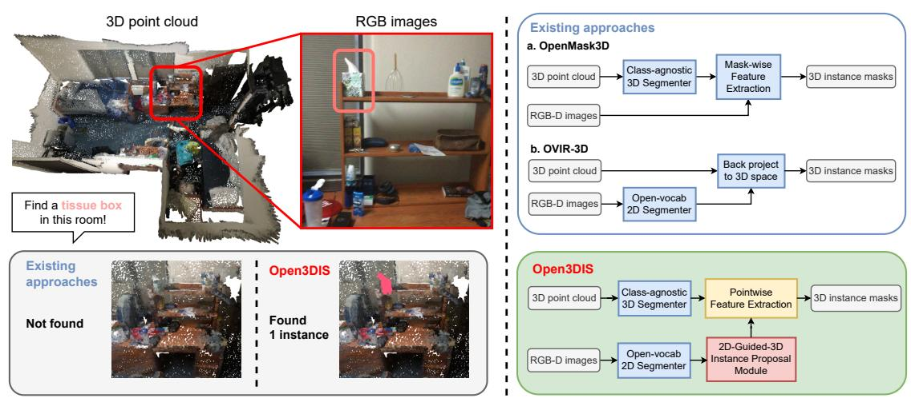
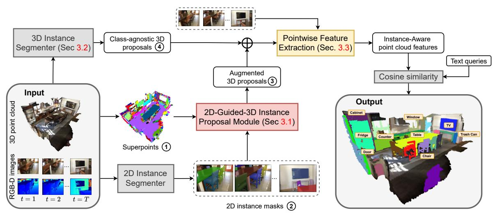
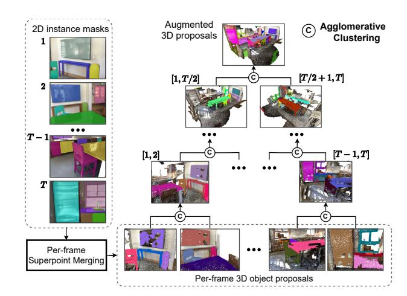
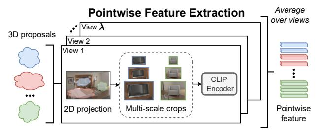
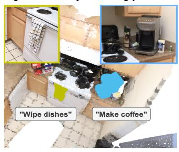
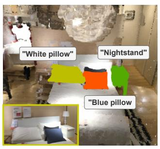
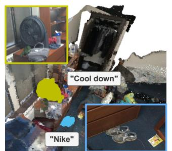
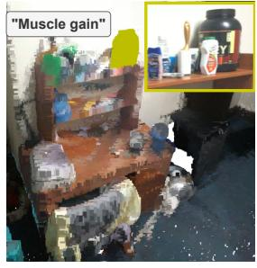

# Open3DIS: Open-Vocabulary 3D Instance Segmentation with 2D Mask Guidance

Phuc Nguyen1\* Tuan Duc Ngo1,4\* Evangelos Kalogerakis4 Chuang Gan2,4 Anh Tran1 Cuong Pham1,3 Khoi Nguyen1

1VinAI Research 2MIT-IBM Watson AI Lab 3Posts & Telecommunications Inst. of Tech. 4UMass Amherst

{v.phucnda, v.anhtt152, v.khoindm}@vinai.io {tdngo, kalo}@cs.umass.edu

ganchuang@csail.mit.edu cuongpv@ptit.edu.vn

https://open3dis.github.io/

Figure 1. Left: While leading open-vocabulary 3D instance segmentation methods like OpenMask3D [45] and OVIR-3D [33] often struggle with small or ambiguous instances, particularly those from uncommon classes, Open3DIS excels in segmenting such cases. It outperforms existing methods by about  $\sim 1.5x$  in average precision on ScanNet200 [41]. Right: Open3DIS aggregates proposals from both point cloud-based instance segmenters and 2D image-based networks. Our method incorporates novel components (red and yellow boxes) that perform aggregation and mapping of 2D masks to the point cloud across multiple frames, as well as 3D-aware feature extraction for effectively comparing object proposals to text queries.

# **Abstract**

We introduce Open3DIS, a novel solution designed to tackle the problem of Open-Vocabulary Instance Segmentation within 3D scenes. Objects within 3D environments exhibit diverse shapes, scales, and colors, making precise instance-level identification a challenging task. Recent advancements in Open-Vocabulary scene understanding have made significant strides in this area by employing classagnostic 3D instance proposal networks for object localization and learning queryable features for each 3D mask. While these methods produce high-quality instance proposals, they struggle with identifying small-scale and geometrically ambiguous objects. The key idea of our method is a new module that aggregates 2D instance masks across frames and maps them to geometrically coherent point cloud regions as high-quality object proposals addressing

the above limitations. These are then combined with 3D class-agnostic instance proposals to include a wide range of objects in the real world. To validate our approach, we conducted experiments on three prominent datasets, including ScanNet200, S3DIS, and Replica, demonstrating significant performance gains in segmenting objects with diverse categories over the state-of-the-art approaches.

# 1. Introduction

This paper addresses the challenging problem of open-vocabulary 3D point cloud instance segmentation (OV-3DIS). Given a 3D scene represented by a point cloud, we seek to obtain a set of binary instance masks of any classes of interest, which may not exist during the training phase. This problem arises to overcome the inherent constraints of

\*: Equal contribution

the conventional fully supervised 3D instance segmentation (3DIS) approaches [14, 15, 36, 42, 44, 47, 61, 64], which are bound by a closed-set framework – restricting recognition to a predefined set of object classes that are determined by the training datasets. This task has a wide range of applications in robotics and VR systems. This capability can empower robots or agents to identify and localize objects of any kind in a 3D environment using textual descriptions that detail names, appearances, functionalities, and more.

There are a few studies addressing the OV-3DIS so far [7, 8, 33, 45]. Most recently, [45] proposes the use of a pretrained 3DIS model instance proposals network to capture the geometrical structure of 3D point cloud scenes and generate high-quality instance masks. However, this approach faces challenges in recognizing rare objects due to their incomplete appearance in the 3D point cloud scene and the limited detection capabilities of pre-trained 3D models for such infrequent classes. Another approach involves leveraging 2D off-the-shelf open-vocabulary understanding models [33, 59] to easily capture novel classes. Nevertheless, translating these 2D proposals from images to 3D point cloud scenes is a challenging task. This is because of the fact that 2D proposals capture only the visible portions of 3D objects and may also include irrelevant regions, such as the background. These two approaches are summarized in Fig. 1.

In this work, we introduce Open3DIS, a method for OV-3DIS that extends the understanding capability beyond predefined concept sets. Given an RGB-D sequence of images and the corresponding 3D reconstructed point cloud scene, Open3DIS addresses the limitations of existing approaches. It complements two sources of 3D instance proposals by employing a 3D instance network and a 2D-guide-3D Instance Proposal Module to achieve sufficient 3D object binary instance masks. The module (our key contribution) extracts geometrically coherent regions from the point cloud under the guidance of 2D predicted masks across multiple frames and aggregates them into higher-quality 3D proposals. Later, Pointwise Feature Extraction aggregates CLIP features for each instance in a multi-scale manner across multiple views, constructing instance-aware point cloud features for open-vocabulary instance segmentation.

To assess the open-vocabulary capability of Open3DIS, we conduct experiments on the ScanNet200 [41], S3DIS [1], and Replica [43] datasets. Open3DIS achieves state-of-the-art results in OV-3DIS, surpassing prior works by a significant margin. Especially, Open3DIS delivers a noteworthy performance improvement of  $\sim 1.5$  times compared to the leading method on the large-scale dataset ScanNet200.

In summary, the contributions of our work are as follows:

 We present the "2D-Guided 3D Proposal Module" creating precise 3D proposals by clustering cohesive point cloud regions using aggregated 2D instance masks from multi-view RGB-D images.

- 2. We introduce a novel pointwise feature extraction method for open-vocabulary 3D object proposals.
- Open3DIS achieves state-of-the-art results on Scan-Net200, S3DIS, and Replica datasets, exhibiting comparable performance to fully supervised methods.

# 2. Related Work

Open-Vocabulary 2D scene understanding methods aim to recognize both base and novel classes in testing where the base classes are seen during training while the novel classes are not. Based on the types of recognition tasks, we can categorize them into open-vocabulary object detection (OVOD) [24, 32, 38, 48, 60, 63, 67], open-vocabulary semantic segmentation (OVSS) [6, 28, 29, 51, 53, 70], and open-vocabulary instance segmentation (OVIS) [13, 21, 46, 50, 65, 66]. A typical approach for handling the novel classes is to leverage a pre-trained visual-text embedding model, such as CLIP [39] or ALIGN [22] as a joint textimage embedding where base and novel classes co-exist, in order to transfer the models' capabilities on base classes to novel classes. However, these methods cannot trivially extend to 3D point clouds because 3D point clouds are unordered and imbalanced in density, and the variance in appearance and shape is much larger than that of 2D images.

Fully-Supervised 3D Instance Segmentation (F-3DIS) aims to segment 3D point cloud into instances of training classes. Methods of F-3DIS can be categorized into three main groups: box-based [18, 57, 61], cluster-based [4, 9, 23, 47, 49], and dynamic convolution-based [14, 15, 31, 36, 42, 44, 52] techniques. Box-based methods detect and segment the foreground region inside each 3D proposal box to get instance masks. Cluster-based methods employ the predicted object centroid to group points to clusters or construct a tree or graph structure and subsequently dissect these into subtrees or subgraphs [20, 30]. For the third group, Mask3D [42] and ISBNet [36], proposed using dynamic convolution whose kernels, representative of different object instances, are convoluted with pointwise features to derive instance masks. In this paper, we use ISBNet as a 3D network, yet with necessary adaptations to output 3D class-agnostic proposals.

Open-Vocabulary 3D semantic segmentation (OV-3DSS) and object detection (OV-3DOD) enable the semantic understanding of 3D scenes in an open-vocabulary manner, including affordances, materials, activities, and properties within unseen environments. This capability is highlighted in recent work [12, 17, 37] for OV-3DSS and [3, 34, 69] for OV-3DOD. Nevertheless, these methods cannot precisely locate and distinguish 3D objects with 3D instance masks, and thus cannot fully describe 3D object shapes.

Open-Vocabulary 3D instance segmentation (OV-3DIS)

Figure 2. **Overview of Open3DIS**. A pre-trained class-agnostic 3D Instance Segmenter proposes initial 3D objects, while a 2D Instance Segmenter generates masks for video frames. Our 2D-Guided-3D Instance Proposal Module (Sec. 3.1) combines superpoints and 2D instance masks to enhance 3D proposals, integrating them with the initial 3D proposals. Finally, the Pointwise Feature Extraction module (Sec. 3.3) correlates instance-aware point cloud CLIP features with text embeddings to generate the ultimate instance masks.

concerns segmenting both seen and unseen classes (during training) of a 3D point cloud into instances. Methods of OV-3DIS can be split into 3 groups: open-vocabulary semantic segmentation-based, text description and 3D proposal contrastive learning based, and 2D open-vocabulary powered approaches. The first group includes OpenScene [37] and Clip3D [16] utilize clustering techniques such as DBScan on OV-3DSS results to generate 3D instance proposals. However, their quality relies on clustering accuracy and can lead to unreliable results for unseen classes. On the other hand, **the second group** comprising PLA [8], RegionPLC [58], and Lowis3D [7] focuses on training the 3D instance proposal network along with a contrastive openvocabulary between the predicted proposals and their corresponding text captions. However, when growing the number of classes, these methods struggle to handle and may degrade their ability to distinguish diverse object classes. For the final group, OpenMask3D [45] utilizes a pre-trained 3DIS model to generate class-agnostic 3D proposals, which are subsequently classified based on their CLIP score from 2D mask projections. Similarly, OpenIns3D [19] employs a pre-trained 3DIS model and addresses the issue through its Mask-Snap-Lookup module, utilizing synthetic-scene images across multiple scales. However, challenges arise for the pre-trained 3DIS model when identifying small or uncommon object categories with unique geometric structures. Conversely, OVIR-3D [33], SAM3D [59], SAM-Pro3D [55], MaskClustering [56] and SAI3D [62] leverage pretrained 2D open-vocabulary models to generate 2D instance masks, which are then back-projected onto the associated 3D point cloud. However, imperfect alignment of the 2D segmentation masks with objects leads to the inclusion of background points in foreground objects, resulting

in suboptimal quality of 3D proposals. Nonetheless, the advantage of this group over other groups is in their leverage of 2D pretrained model on large-scale datasets such as CLIP [39] or SAM [25] which can be scaled to hundreds of classes as in ScanNet200 [41]. Following the final group, Open3DIS generates high-quality 3D instance proposals by combining 3D masks from a 3DIS network with proposals produced by grouping geometrically coherent regions (superpoints) with the guidance of 2D instance masks. This complements the class-agnostic 3D instance proposals from 3D networks. Our method excels at capturing rare objects while preserving their 3D geometrical structures, achieving state-of-the-art performance in the OV-3DIS domain.

# 3. Method

Our approach processes a 3D point cloud and an RGB-D sequence, producing a set of 3D binary masks indicating object instances in the scene. We assume known camera parameters for each frame. Our architecture is depicted in Fig. 2. Similarly to prior work [8, 45, 58], we employ a 3DIS network module to extract object proposals directly from the 3D point cloud. This module leverages 3D convolution and attention mechanisms, capturing spatial and structural relations for robust 3D object instance detection. Despite its advantages, sparse point clouds, sampling artifacts, and noise can lead to missed objects, especially for small objects e.g., the tissue box in Fig. 1.

Our approach integrates a novel 2D-Guided-3D instance proposal module, leveraging 2D instance segmentation networks trained on large image datasets to better capture smaller objects in individual images. However, resulting 2D masks may only capture parts of actual 3D object instances

|                    | Recall         | Recall head | Recall com | Recall tail |
|--------------------|----------------|------------------------|-----------------------|------------------------|
| Only 3D Only 2D | 61.63 68.61 | 81.92 76.66         | 53.68 74.73        | 12.06 34.68         |
| 2D and 3D          | 73.29          | 87.48                  | 74.16                 | 34.31                  |

Table 1. Recall rate (%) of 2D, 3D, or combined proposals.

due to occlusions (Fig. 2 - 2). To address this, we propose a strategy that constructs 3D object instance proposals by hierarchically aggregating and merging point cloud regions from back-projected 2D masks of the same object. To enhance the robustness and geometric homogeneity, we use "superpoints" [11] during the merging process. This yields complete object instances, complementing those extracted by 3DIS networks. Detailed analysis in Tab. 1 on Scannet200 dataset [41] exhibits the significant enhancement in recall rate, especially for *rare* classes, when integrating 2D and 3D proposals.

To enable open-vocabulary classification, we additionally employ a *point-wise feature extraction module* to construct a dense feature map across the 3D point cloud. In the following sections, we explain our modules in more detail, starting with the 2D-Guided-3D Instance Proposal Module which constitutes our main contribution.

# 3.1. 2D-Guided-3D Instance Proposal Module

This module takes as input a 3D point cloud  $\mathbf{P} = \{\mathbf{p}_n\}_{n=1}^N$ , where N is the number of points, and  $\mathbf{p}_i \in \mathbb{R}^6$  includes 3D coordinates and RGB color. Additionally, it receives an RGB-D video sequence  $\mathbf{V} = \{(\mathbf{I}_t, \mathbf{D}_t, \Pi_t)\}_{t=1}^T$ , where each frame t contains RGB image  $\mathbf{I}_t$ , depth map  $\mathbf{D}_t$ , and camera matrix  $\Pi_t$  (i.e., the product of intrinsic and extrinsic matrices used for projecting 3D points onto the image plane). The output comprises  $K_1$  binary instance masks represented in a  $K_1 \times N$  binary matrix  $\mathbf{M}_1$  (Fig. 2 - 3).

**Superpoints.** In a pre-processing step, we utilize the method of [11] to group points into geometrically homogeneous regions, termed superpoints (Fig. 2 - 1). This yields a set of U superpoints  $\{\mathbf{q}_u\}_{u=1}^U \in \{0,1\}^{U \times N}$ , where  $\mathbf{q}_u$  is a binary mask of points. Superpoints enhance processing efficiency in the later stages of our pipeline and contribute to well-formed candidate object instances.

**Per-frame superpoint merging.** For all input frames, we utilize a pretrained 2D instance segmenter, employing Grounding-DINO [32] and SAM [26]. The network outputs a set of 2D masks (Fig. 2 -  $\bigcirc$ ). For each 2D mask with index m (unique across all frames), we calculate the IoU  $o_{u,m}$  with each superpoint  $\mathbf{q}_u$  when projecting all points of  $\mathbf{q}_u$  onto the image plane of mask m using the known camera matrix, excluding points outside the camera's field of view, and determining image pixels containing projected points. A superpoint is considered to have sufficient overlap with a 2D mask if the IoU is higher than a threshold  $o_{u,m} > \tau_{iou}$ .

Figure 3. **2D-Guided-3D Instance Proposal Module.** We generate initial 3D proposals using Per-frame Superpoint Merging, followed by hierarchical traversal across the RGB-D sequence to merge region sets between frames using Agglomerative clustering.

However, 2D masks may include background regions or parts of nearby objects, making IoU alone insufficient to determine superpoints belonging to a 3D proposal. To address this, we leverage the 3D backbone of a 3D proposal network [36, 42] to extract per-point feature  $\mathbf{F}^{3D} \in \mathbb{R}^{N \times D^{3D}}$ and measure feature similarity among these superpoints  $\mathbf{q}_u$ whose features are determined by averaging their point features  $\mathbf{f}_{i}^{3D} \in \mathbb{R}^{1 \times D^{3D}}$ . For each 2D instance mask  $\mathbf{m}_{i}^{2D}$ , we initiate a point cloud region  $\mathbf{r}_i$  with the superpoint having the largest IoU with the mask. We extend this region by merging with neighboring superpoints  $\mathbf{q}_u$  that meet the overlapping condition  $(\tau_{iou})$  and also have the highest cosine similarity  $s_i^{\max} = \max_{u' \in \mathbf{r}_i} \cos(\mathbf{f}_{u'}^{\mathrm{3D}}, \mathbf{f}_u^{\mathrm{3D}})$  with those already in the region  $\mathbf{r}_i$  above a threshold  $(s_i^{\max} > \tau_{sim})$ (we will discuss the effect of all thresholds in our results section). The growth continues until no other overlapping or neighboring superpoints are found. Our superpoint merging procedure, compared to using points alone or other merging strategies (see Tab. 7), produces more well-formed point cloud regions corresponding to 2D masks per frame.

**3D object proposal formation.** To create 3D object proposals, one option is to utilize the point cloud regions obtained from the merging procedure across individual frames. However, this results in fragmented proposals, capturing only parts of object instances, as the regions correspond to 2D masks from single views (Fig. 2 - 2)). To address this, we merge point cloud regions from different frames in a bottom-up manner, creating more complete and coherent 3D object masks. Agglomerative clustering combines region sets from pairs of frames until no compatible pairs remain. The resulting set includes merged and standalone regions, which can be matched with other region sets from subsequent frames. In the following paragraphs, we discuss three crucial design choices in this process: (a) the

matching score between region pairs, (b) the matching process between sets of regions, and (c) the order of frames or region sets used in matching and merging.

**Matching score.** For a pair of point cloud regions  $(\mathbf{r}_i, \mathbf{r}_i)$ , we define a matching score based on (a) feature similarity and (b) overlap degree. Their feature-based similarity s' is measured through cosine similarity between the regions' feature vectors  $\mathbf{f}_{i}^{3D}$ , or  $s'_{i,j} = \cos(\mathbf{f}_{i}^{3D}, \mathbf{f}_{j}^{3D})$ , which are in turn computed as the average of their point features. While this measures if the regions belong to the same object's shape, it may yield high similarity for duplicate instances with the same geometry. To address this, we also consider the degree of overlap, expressed as the IoU  $o'_{i,i} = \text{IoU}(\mathbf{r}_i, \mathbf{r}_i)$  between the two regions  $\mathbf{r}_i, \mathbf{r}_i$ , which is expected to be high for overlapping regions of the same instance. Two regions are considered matching if their feature-based similarity and IoU score satisfy  $s'_{i,j} > \tau_{sim}$ and  $o'_{i,i} > \tau_{iou}$  (same thresholds used during per-frame superpoint merging). Our approach, incorporating matching scores based on point cloud deep features and geometric structures, results in more coherent and well-defined point cloud regions compared to other strategies (see Tab. 7).

**Agglomerative clustering process.** To merge region sets  $\{\mathbf{r}_i\}_{i=1}^I$  and  $\{\mathbf{r}_j\}_{j=1}^J$  from different frames into a unified set  $\{\mathbf{r}_l\}_{l=1}^L$ , where  $L \leq I+J$ , we employ Agglomerative clustering [35]. We begin by concatenating them into a single "active set"  $\{\mathbf{r}_l\}_{l=1}^{I+J}$ . We compute the each entry  $c_{i,j}$  of the binary cost matrix  $\mathbf{C}$  of size  $(I+J)\times(I+J)$  as:

$$c_{i,j} = \mathbb{1}\left(o'_{i,j} > \tau_{iou}\right) \odot \mathbb{1}\left(s'_{i,j} > \tau_{sim}\right),\tag{1}$$

where  $\mathbb{1}(\cdot)$  is the indicator function,  $\odot$  is the AND operator. The agglomerative clustering procedure iteratively merges regions within the "active set" according to the cost matrix  $\mathbf{C}$  and continues to update this matrix until no further merges are possible - indicated by the absence of any positive elements in  $\mathbf{C}$ .

**Merging order.** We explored two merging strategies: a *sequential* order, where region sets are merged between consecutive frames, and the resulting set is further merged with the next frame, and a *hierarchical* order, which involves merging region sets between non-consecutive frames in separate passes. The hierarchical approach forms a binary tree, with each level merging sets from consecutive pairs of the previous level (see Fig. 3). Details and performance analysis are presented in the Experiments section.

# 3.2. 3D Instance Segmentation Network

**Network design.** This network directly processes 3D point clouds to generate 3D object instance masks. We employ established 3D instance segmentation networks like Mask3D [42] and ISBNet [36] as our backbone. For each

Figure 4. **Pointwise Feature Extraction**. Each 3D proposal undergoes projection onto top- $\lambda$  views and multiscale cropping [45], to extract CLIP features. The resulting proposal feature is then averaged across views and accumulated into the point cloud feature.

object candidate, the kernel computed from sampled points and their neighbors is convolved with point-wise features to predict the binary mask. In our open-vocabulary scenario, we exclude semantic labeling heads, focusing solely on the binary instance mask head. The output consists of  $K_2$  binary masks in a  $K_2 \times N$  binary matrix  $M_2$  (see Fig. 2 - 4).

Combining object instance proposals. We simply append the proposals of set  $M_2$  to  $M_1$  to form the final set of K proposals M with the size of  $K \times N$ . Note that we apply NMS here to remove near-duplicate proposals with the overlapping IoU threshold  $\tau_{dup}$ .

#### 3.3. Pointwise Feature Extraction

In the final stage of our pipeline, we compute a feature vector for each 3D object proposal from our combined proposal set. This per-proposal feature vector serves various instance-based tasks, such as comparison with text prompts in the CLIP space [39]. Unlike prior open-vocabulary instance segmentation methods [45], which use a top- $\lambda$  frame/view approach, we employ a more "3D-aware" pooling strategy. This strategy accumulates feature vectors on the point cloud, considering the frequency of each point's visibility in each view (see Fig. 4). Our rationale is that points more frequently visible in the top- $\lambda$  views should contribute more to the proposal's feature vector.

tribute more to the proposal's feature vector. Let  $\mathbf{f}_{\lambda,k}^{\text{CLIP}} \in \mathbb{R}^{D^{\text{CLIP}}}$  be the 2D CLIP image feature of k-th instance in  $\lambda$ -th view,  $\nu_{\lambda} \in \{0,1\}^N$  be the visibility map of view  $\lambda$ , and  $\mathbf{m}_k^{\text{3D}} \in \{0,1\}^N$  be the k-th proposal binary mask in  $\mathbf{M}$ . We obtain the pointwise CLIP feature  $\mathbf{F}^{\text{CLIP}} \in \mathbb{R}^{N \times D^{\text{CLIP}}}$  as:

$$\mathbf{F}^{\text{CLIP}} = \text{NV}\left(\sum_{k} \left(\sum_{\lambda} (\nu_{\lambda} * \mathbf{f}_{\lambda,k}^{\text{CLIP}}) * \mathbf{m}_{k}^{\text{3D}}\right)\right), \quad (2)$$

where \* is the element-wise multiplication (broadcasting if necessary) and NV(x) is the L2 normalized vector of x.

The final score between a text query  $\rho$  and a 3D mask  $\mathbf{m}_k^{\mathrm{3D}}$  is the average cosine similarity between its CLIP text embedding  $\mathbf{e}_{\rho}$  and all points within the mask, particularly:

$$s_{k,\rho}^{\text{CLIP}} = \frac{1}{|\mathbf{m}_k^{\text{3D}}|} \sum_{n} \cos(\mathbf{F}^{\text{CLIP}} * \mathbf{m}_k^{\text{3D}}, \mathbf{e}_{\rho}), \tag{3}$$

where  $|\mathbf{m}_k^{\mathrm{3D}}|$  is the number of points in the k-th mask.

# 4. Experiments

# 4.1. Experimental Setup

**Datasets.** We mainly conduct our experiments on the challenging dataset ScanNet200 [41], comprising 1,201 training and 312 validation scenes with 198 object categories. This dataset is well-suited for evaluating real-world openvocabulary scenarios with a long-tail distribution. Additionally, we conduct experiments on Replica [43] (48 classes) and S3DIS [2] (13 classes) for comparison with prior methods [7, 8]. Replica has 8 evaluation scenes, while S3DIS includes 271 scenes across 6 areas, with Area 5 used for evaluation. We follow the categorization approach from [8] for S3DIS. Notably, we omit experiments on ScanNetV2 [5] due to its relative ease compared to ScanNet200 and identical input point clouds.

**Evaluation metrics.** We evaluate using standard AP metrics at IoU thresholds of 50% and 25%. Additionally, we calculate mAP across IoU thresholds from 50% to 95% in 5% increments. For ScanNet200, we report category group-specific APhead, APcom, and APtail.

Implementation Details. To process ScanNet200 and S3DIS scans efficiently, we downsampled the RGB-D frames by a factor of 10. Our approach utilizes the Grounded-SAM framework1. We employ the dataset class names as text prompts for generating 2D instance masks, followed by NMS with  $\tau_{dup}=0.5$  to handle overlapping instances. Our implementation of generating superpoints is from [27, 40]. In Pointwise Feature Extraction, each proposal is projected into all viewpoints, and we select the top  $\lambda$ =5 views with the largest number of projected points. For CLIP, we use the *ViT-L/14* [39]. We follow OpenMask3D[45] by setting the confidence score at 1.0 for every 3D proposal.

#### 4.2. Comparison to prior work

**Setting 1: ScanNet200.** The quantitative evaluation of the ScanNet200 dataset is summarized in Tab. 2. Following [45], we utilize the class-agnostic 3D proposal network trained on the ScanNet200 training set, then test the OV-3DIS on the validation set. Employing our 2D-Guided-3D Instance Proposal Module, Open3DIS achieves 18.2 and 19.2 in AP and APtail. We outperform OVIR-3D [33] and OpenMask3D [45] by margins of +5.2 and +2.8 in AP, and surpass all other methods, even the fully-supervised approaches in the APtail metric. This emphasizes the effectiveness of our 2D-Guided-3D Instance Proposal Module,

which is effective in crafting precise 3D instance masks independently of any 3D models. Combining with classagnostic 3D proposals from ISBNet boosts our performance to 23.7, 29.4, and 32.8 in AP, AP $_{50}$ , and AP $_{25}$  — reflecting a 1.5x enhancement in AP compared to prior methods. Impressively, our method competes closely with fully supervised techniques, attaining approximately 96% and 88% of the AP scores of ISBNet and Mask3D, and excelling in the AP $_{com}$  and AP $_{tail}$ . This performance underscores the advantages of merging 2D and 3D proposals and demonstrates our model's adeptness at segmenting rare objects.

To assess the generalizability of our approach, we conducted an additional experiment where the class-agnostic 3D proposal network is substituted with the one trained solely on the ScanNet20 dataset. We then categorized the ScanNet200 instance classes into two groups: the *base* group, consisting of 51 classes with semantics similar to ScanNet20 categories, and the *novel* group of the remaining classes. We report the APnovel, APbase, and AP in Tab. 3. Our proposed Open3DIS achieves superior performance compared to PLA [8], OpenMask3D [45], with large margins in both *novel* and *base* classes. Notably, PLA [8], trained with contrastive learning techniques, falls in a setting with hundreds of novel categories.

**Setting 2: Replica**. We further evaluate the zero-shot capability of our method on the Replica dataset, with results detailed in Tab. 4. Considering that several Replica categories share semantic similarities with ScanNet200 classes, to maintain a truly zero-shot scenario, we omitted the classagnostic 3D proposal network for this dataset (using proposals from 2D only). Under this constraint, our approach still outperforms OpenMask3D [45] and OVIR-3D [33] by margins of +5.0 and +7.0 in AP, respectively.

**Setting 3: S3DIS.** In line with the setting of PLA [8], we trained a fully-supervised 3DIS model on the *base* classes of the S3DIS dataset, followed by testing the model on both *base* and *novel* classes. The results are shown in Tab. 5, where we report the performance in terms of  $AP_{50}^{B}$  and  $AP_{50}^{N}$ , representing the  $AP_{50}$  for the *base* and *novel* categories, respectively. Open3DIS significantly outperforms existing methods in  $AP_{50}^{N}$ , achieving more than double their scores. This remarkable performance underscores the efficacy of our approach in dealing with unseen categories, with the support of the 2D foundation model.

Our qualitative results with arbitrary text queries. We visualize the qualitative results of text-driven 3D instance segmentation in Fig. 5. Our model successfully segments instances based on different kinds of input text prompts, involving object categories that are not present in the labels, object's functionality, object's branch, and other properties.

 $^{1} \verb|https://github.com/IDEA-Research/Grounded-Segment-Anything|$ 

| Method                                    | Setting    | 3D Proposal | AP           | $\mathbf{AP}_{50}$ | $\mathbf{AP}_{25}$ | $\mathbf{AP}_{\text{head}}$ | $\mathbf{AP}_{\mathrm{com}}$ | $\mathbf{AP}_{\mathrm{tail}}$ |
|-------------------------------------------|------------|-------------|--------------|--------------------|--------------------|-----------------------------|------------------------------|-------------------------------|
| ISBNet [36] Mask3D [42]                | Fully-sup  |             | 24.5 26.9 | 32.7 36.2       | 37.6 41.4       | 38.6 39.8                | 20.5 21.7                 | 12.5 17.9                  |
| OpenScene [37] + DBScan [10] † |            | None        | 2.8          | 7.8                | 18.6               | 2.7                         | 3.1                          | 2.6                           |
| OpenScene [37] + Mask3D [42]              |            | Mask3D [42] | 11.7         | 15.2               | 17.8               | 13.4                        | 11.6                         | 9.9                           |
| SAM3D † [59]                   |            | None        | 6.1          | 14.2               | 21.3               | 7.0                         | 6.2                          | 4.6                           |
| $OVIR-3D^{\dagger}$ [33]                  | Open-vocab | None        | 13.0         | 24.9               | <u>32.3</u>        | 14.4                        | 12.7                         | 11.7                          |
| OpenIns3D [19]                            |            | Mask3D [42] | 8.8          | 10.3               | 14.4               | 16.0                        | 6.5                          | 4.2                           |
| OpenMask3D [45]                           |            | Mask3D [42] | 15.4         | 19.9               | 23.1               | 17.1                        | 14.1                         | 14.9                          |
| Ours (only 2D)                            |            | None        | 18.2         | <u>26.1</u>        | 31.4               | 18.9                        | 16.5                         | 19.2                          |
| Ours (only 3D)                            | Open-vocab | ISBNet [36] | 18.6         | 23.1               | 27.3               | <u>24.7</u>                 | <u>16.9</u>                  | 13.3                          |
| Ours (2D and 3D)                          |            | ISBNet [36] | 23.7         | 29.4               | 32.8               | 27.8                        | 21.2                         | 21.8                          |

Table 2. OV-3DIS results on **ScanNet200**. Methods with † are adapted and evaluated on ScanNet200. Our proposed method achieves the highest AP, outperforming previous methods in all metrics. The best results are in **bold** while the second best results are <u>underscored</u>.

Figure 5. Qualitative results of our method on open-vocabulary instance segmentation. We query instance masks using arbitrary text prompts involving object categories that are not present in the ScanNet200 labels. For each scene, we showcase the instance that has the highest similarity score to the query's embedding. These visualizations underscore the model's open-vocabulary capability, as it successfully identifies and segments objects that were never encountered during the training phase of the 3D proposal network.

| Method             | Pretrain      | $\mathbf{AP}_{\mathrm{novel}}$ | <b>AP</b> base | AP   |
|--------------------|---------------|--------------------------------|---------------------------|------|
| OpenMask3D         | ScanNet200    | 15.0                           | 16.2                      | 15.4 |
| Ours               | Scalif (Ct200 | 22.6                           | 26.7                      | 23.7 |
| PLA (Base 15)      |               | 0.3                            | 10.8                      | 3.2  |
| PLA (Base 20)      |               | 0.3                            | 15.8                      | 4.5  |
| OpenScene + Mask3D | ScanNet20     | 7.6                            | 11.1                      | 8.5  |
| OpenMask3D         |               | 11.9                           | 14.3                      | 12.6 |
| Ours               |               | 16.5                           | 25.8                      | 19.0 |

Table 3. OV-3DIS results on **ScanNet200** dataset, using the class-agnostic 3D proposal network trained on ScanNet20.

| Method               | 3D Proposal | AP   | $AP_{50}$ | $AP_{25}$ |
|----------------------|-------------|------|-----------|-----------|
| OpenScene + Mask3D   | Mask3D      | 10.9 | 15.6      | 17.3      |
| OpenMask3D           | Mask3D      | 13.1 | 18.4      | 24.2      |
| OVIR-3D † | None        | 11.1 | 20.5      | 27.5      |
| Ours (only 2D)       | None        | 18.1 | 26.7      | 30.5      |
| Ours (only 3D)       | ISBNet      | 14.9 | 18.8      | 23.6      |
| Ours (2D and 3D)     | ISBNet      | 18.5 | 24.5      | 28.2      |

Table 4. OV-3DIS results on **Replica** dataset. †We adopt the source code of [33] to this dataset.

| Mothed      | B8.                  | /N4                  | B6/N6                |                      |  |
|-------------|----------------------|----------------------|----------------------|----------------------|--|
| Method      | $\mathbf{AP}^B_{50}$ | $\mathbf{AP}_{50}^N$ | $\mathbf{AP}^B_{50}$ | $\mathbf{AP}_{50}^N$ |  |
| LSeg-3D [8] | 58.3                 | 0.3                  | 41.1                 | 0.5                  |  |
| PLA [8]     | 59.0                 | 8.6                  | 46.9                 | 9.8                  |  |
| Lowis3D [7] | 58.7                 | 13.8                 | 51.8                 | 15.8                 |  |
| Ours        | 60.8                 | 26.3                 | 50.0                 | 29.0                 |  |

Table 5. OV-3DIS results on S3DIS in terms of  $\mathbf{AP}_{50}^B$  and  $\mathbf{AP}_{50}^N$ .

| Setting                  | AP   | <b>AP</b> head | <b>AP</b> com | <b>AP</b> tail |
|--------------------------|------|---------------------------|--------------------------|---------------------------|
| A1: OpenScene (distill)  | 3.3  | 5.5                       | 2.4                      | 1.7                       |
| A2: OpenScene (fusion)   | 17.5 | 21.5                      | 17.1                     | 13.3                      |
| A3: OpenScene (ensemble) | 5.6  | 6.4                       | 4.8                      | 5.7                       |
| B: Mask-wise Feature     | 22.2 | 25.9                      | 19.3                     | 21.4                      |
| C: Point-wise Feature    | 23.7 | 27.8                      | 21.2                     | 21.8                      |

Table 6. Comparing between extracting per-mask and per-point features for classification using Open3DIS instance proposal set.

| Use Superpoint | Filtering Cond. | AP   | $\mathbf{AP}_{\text{head}}$ | $\boldsymbol{AP_{\text{com}}}$ | $\mathbf{AP}_{tail}$ |
|----------------|-----------------|------|-----------------------------|--------------------------------|----------------------|
| <b>√</b>       | Deep. Feature   | 18.2 | 18.9                        | 16.5                           | 19.2                 |
| $\checkmark$   | None            | 15.9 | 16.5                        | 14.3                           | 17.0                 |
| $\checkmark$   | Euclid Dist.    | 16.0 | 16.4                        | 14.1                           | 17.6                 |
|                | None            | 12.0 | 12.6                        | 11.2                           | 12.2                 |

Table 7. Ablation on different configurations of the 2D-G-3DIP.

| Merging Strat. | Merging Ord. | AP   | <b>AP</b> head | AP com | $\mathbf{AP}_{tail}$ |
|----------------|--------------|------|---------------------------|-------------------|----------------------|
| Hungarian      | Sequential   | 13.2 | 13.9                      | 11.3              | 14.7                 |
| Hungarian      | Hierarchical | 16.1 | 16.1                      | 13.3              | 19.4                 |
| Agglomerative  | Sequential   | 16.9 | 17.8                      | 16.1              | 18.0                 |
| Agglomerative  | Hierarchical | 18.2 | 18.9                      | 16.5              | 19.2                 |

Table 8. Ablation on different merging configurations.

| 3D Seg.     | AP   | $\mathbf{AP}_{head}$ | $\mathbf{AP}_{\mathrm{com}}$ | $\mathbf{AP}_{tail}$ |
|-------------|------|----------------------|------------------------------|----------------------|
| Mask3D [42] | 23.7 | 26.4                 | 22.5                         | 21.9                 |
| ISBNet [36] | 23.7 | 27.8                 | 21.2                         | 21.8                 |

Table 9. Ablation on different 3D segmenters.

# 4.3. Ablation study

To validate design choices of our method, series of ablation studies are conducted on validation set of ScanNet200.

Study on different kinds of features for open-vocabulary classification is presented in Tab. 6. In the first three rows (setting A1-A3), we employ the pointwise feature map extracted by OpenScene [37] to perform classification on our 3D proposals. Of these, the *fusion* approach, which directly projects CLIP features from 2D images onto the 3D point cloud, yields the highest results, 17.5 in AP. In setting B, we adopt a strategy akin to [45], extracting features for each mask by projecting the 3D proposals onto the top- $\lambda$  views, which attains an AP of 22.2. Surpassing these, our Pointwise Feature Extraction (setting C) achieves the best AP score of 23.7, substantiating our design choice.

Study on the 2D-Guided-3D Instance Proposal Module is in Tab. 7. Our proposed approach (row 1), utilizing superpoints to merge 3D points into regions and filter outliers based on cosine similarity in feature space, achieves an AP of 18.2. Disabling this filtering notably reduces AP by 2.3. Comparatively, a more basic method (row 3) relying on Euclidean distance to eliminate outlier superpoints yields an AP of 16.0, showing the lesser effectiveness of Euclidean distance for noise filtering. Our baseline (last row), grouping 3D points solely based on 2D masks, significantly decreases AP to 12.0, underscoring the necessity of superpoint merging for effective 3D proposal creation.

We study different merging configurations, including merging strategy and merging order in Tab. 8. Specifically, we first establish a partial matching between two sets of regions, then matched pairs are merged into new refined regions, and unmatched ones remain the same. Using Hungarian matching yields inferior results relative to proposed Agglomerative Clustering, with a drop of  $\sim 2.0$  in AP. Adopting the sequential merging order leads to a slight decrease by  $\sim 1.0$  in AP in performance. The best results are achieved when agglomerative clustering is paired with the hierarchical merging order.

| 2D Seg.      | AP   | $\mathbf{AP}_{\text{head}}$ | $\mathbf{AP}_{\mathrm{com}}$ | $\mathbf{AP}_{tail}$ |
|--------------|------|-----------------------------|------------------------------|----------------------|
| SEEM [70]    | 21.5 | 26.5                        | 19.6                         | 18.0                 |
| ODISE [54]   | 21.6 | 26.0                        | 19.5                         | 19.1                 |
| Detic [68]   | 22.2 | 26.8                        | 20.0                         | 19.2                 |
| Grounded-SAM | 23.7 | 27.8                        | 21.2                         | 21.8                 |

Table 10. Ablation on different 2D segmenters.

| $	au_{iou}$ | 0.3  | 0.5  | 0.7  | 0.9  | 0.95 | $	au_{sim}$        | 0.5  | 0.7  | 0.8  | 0.9  | 0.95 |
|-------------|------|------|------|------|------|--------------------|------|------|------|------|------|
|             |      |      |      |      |      | AP                 |      |      |      |      |      |
| $AP_{50}$   | 25.4 | 25.8 | 25.9 | 26.1 | 24.1 | $\mathbf{AP}_{50}$ | 21.0 | 21.8 | 25.1 | 26.1 | 23.8 |

Table 11. Ablation on  $\tau_{iou}$ .

Table 12. Ablation on  $\tau_{sim}$ .

| View Selection     | Top 1 | Top 5 | Top 10 | Top 20 | All  |
|--------------------|-------|-------|--------|--------|------|
| AP                 | 21.2  | 23.7  | 22.6   | 22.5   | 22.5 |
| $\mathbf{AP}_{50}$ | 27.3  | 29.4  | 28.7   | 29.0   | 29.1 |

Table 13. Ablation on top- $\lambda$  view selection.

Ablation Study on Segmenters. Our comparative analysis of various *class-agnostic 3D segmenters* and *open-vocabulary 2D segmenters* is presented in Tab. 9 and 10. The findings reveal that utilizing either ISBNet [36] or Mask3D [42] leads to similar levels of performance, achieving an AP of 23.7. Incorporating 2D instance masks from SEEM [70], Detic [68] or ODISE [54] leads to a slight decrease in AP by ~1.4, which we attribute to the less refined outputs produced by these models.

Ablation study on different values of visibility threshold and similarity threshold. We report the performance of our version using only proposals from the 2D-G-3DIP with different values of the visibility threshold and similarity threshold in Tab. 11 and 12.

Study on different values of viewpoints is illustrated in Tab. 13. Relying only on the viewpoint with the highest number of projected points reduces the AP score to 21.2. Conversely, raising the number of views to 10 or more also yields worse results, likely due to the presence of inferior, occluded 2D masks.  $\lambda$ =5 reports the best performance.

# 5. Discussion

We presented a method for open-vocabulary instance segmentation in 3D scenes, which aggregates proposals from both point cloud-based instance segmenters and 2D image-based networks in a geometrically coherent manner.

**Limitations.** Our Class-agnostic 3D Proposal and 2D-Guided-3D Instance Proposal Module currently operate independently, with their outputs being combined to obtain the final 3D proposal set. A better-integrating strategy, where these modules enhance each other's performance in a synergistic fashion, would be an interesting future direction.

# References

- [1] Iro Armeni, Ozan Sener, Amir R Zamir, Helen Jiang, Ioannis Brilakis, Martin Fischer, and Silvio Savarese. 3d semantic parsing of large-scale indoor spaces. In *Proceedings of the IEEE conference on computer vision and pattern recognition*, pages 1534–1543, 2016. 2
- [2] Iro Armeni, Sasha Sax, Amir R Zamir, and Silvio Savarese. Joint 2d-3d-semantic data for indoor scene understanding. arXiv preprint arXiv:1702.01105, 2017. 6
- [3] Yang Cao, Yihan Zeng, Hang Xu, and Dan Xu. Coda: Collaborative novel box discovery and cross-modal alignment for open-vocabulary 3d object detection. *arXiv preprint arXiv:2310.02960*, 2023. 2
- [4] Shaoyu Chen, Jiemin Fang, Qian Zhang, Wenyu Liu, and Xinggang Wang. Hierarchical aggregation for 3d instance segmentation. In *Proceedings of the IEEE/CVF Interna*tional Conference on Computer Vision, pages 15467–15476, 2021.
- [5] Angela Dai, Angel X. Chang, Manolis Savva, Maciej Halber, Thomas Funkhouser, and Matthias Nießner. Scannet: Richly-annotated 3d reconstructions of indoor scenes. In Proc. Computer Vision and Pattern Recognition (CVPR), IEEE, 2017. 6
- [6] Jian Ding, Nan Xue, Gui-Song Xia, and Dengxin Dai. Decoupling zero-shot semantic segmentation. 2022. 2
- [7] Runyu Ding, Jihan Yang, Chuhui Xue, Wenqing Zhang, Song Bai, and Xiaojuan Qi. Lowis3d: Language-driven open-world instance-level 3d scene understanding. *arXiv* preprint arXiv:2308.00353, 2023. 2, 3, 6, 7
- [8] Runyu Ding, Jihan Yang, Chuhui Xue, Wenqing Zhang, Song Bai, and Xiaojuan Qi. Pla: Language-driven openvocabulary 3d scene understanding. In *Proceedings of* the IEEE/CVF Conference on Computer Vision and Pattern Recognition, 2023. 2, 3, 6, 7
- [9] Shichao Dong, Guosheng Lin, and Tzu-Yi Hung. Learning regional purity for instance segmentation on 3d point clouds. In *European Conference on Computer Vision*, pages 56–72. Springer, 2022. 2
- [10] Martin Ester, Hans-Peter Kriegel, Jörg Sander, Xiaowei Xu, et al. A density-based algorithm for discovering clusters in large spatial databases with noise. In kdd, pages 226–231, 1996.
- [11] Pedro F Felzenszwalb and Daniel P Huttenlocher. Efficient graph-based image segmentation. *International journal of computer vision*, 59:167–181, 2004. 4
- [12] Qiao Gu, Alihusein Kuwajerwala, Sacha Morin, Krishna Murthy Jatavallabhula, Bipasha Sen, Aditya Agarwal, Corban Rivera, William Paul, Kirsty Ellis, Rama Chellappa, et al. Conceptgraphs: Open-vocabulary 3d scene graphs for perception and planning. arXiv preprint arXiv:2309.16650, 2023. 2
- [13] Shuting He, Henghui Ding, and Wei Jiang. Semantic-promoted debiasing and background disambiguation for zero-shot instance segmentation. In *Proceedings of the IEEE/CVF Conference on Computer Vision and Pattern Recognition*, pages 19498–19507, 2023. 2

- [14] Tong He, Chunhua Shen, and Anton van den Hengel. Dyco3d: Robust instance segmentation of 3d point clouds through dynamic convolution. In *Proceedings of the IEEE/CVF Conference on Computer Vision and Pattern Recognition*, pages 354–363, 2021. 2
- [15] Tong He, Wei Yin, Chunhua Shen, and Anton van den Hengel. Pointinst3d: Segmenting 3d instances by points. In Computer Vision–ECCV 2022: 17th European Conference, Tel Aviv, Israel, October 23–27, 2022, Proceedings, Part III, pages 286–302. Springer, 2022. 2
- [16] Deepti Hegde, Jeya Maria Jose Valanarasu, and Vishal M Patel. Clip goes 3d: Leveraging prompt tuning for language grounded 3d recognition. arXiv preprint arXiv:2303.11313, 2023. 3
- [17] Yining Hong, Chunru Lin, Yilun Du, Zhenfang Chen, Joshua B Tenenbaum, and Chuang Gan. 3d concept learning and reasoning from multi-view images. In *Proceedings* of the IEEE/CVF Conference on Computer Vision and Pattern Recognition, pages 9202–9212, 2023. 2
- [18] Ji Hou, Angela Dai, and Matthias Nießner. 3d-sis: 3d semantic instance segmentation of rgb-d scans. In *Proceedings of the IEEE/CVF Conference on Computer Vision and Pattern Recognition*, pages 4421–4430, 2019. 2
- [19] Zhening Huang, Xiaoyang Wu, Xi Chen, Hengshuang Zhao, Lei Zhu, and Joan Lasenby. Openins3d: Snap and lookup for 3d open-vocabulary instance segmentation. arXiv preprint, 2023. 3, 7
- [20] Le Hui, Linghua Tang, Yaqi Shen, Jin Xie, and Jian Yang. Learning superpoint graph cut for 3d instance segmentation. In Advances in Neural Information Processing Systems, 2022. 2
- [21] Dat Huynh, Jason Kuen, Zhe Lin, Jiuxiang Gu, and Ehsan Elhamifar. Open-vocabulary instance segmentation via robust cross-modal pseudo-labeling. In *Proceedings of the IEEE/CVF Conference on Computer Vision and Pattern Recognition*, pages 7020–7031, 2022. 2
- [22] Chao Jia, Yinfei Yang, Ye Xia, Yi-Ting Chen, Zarana Parekh, Hieu Pham, Quoc Le, Yun-Hsuan Sung, Zhen Li, and Tom Duerig. Scaling up visual and vision-language representation learning with noisy text supervision. In *International* conference on machine learning, pages 4904–4916. PMLR, 2021. 2
- [23] Li Jiang, Hengshuang Zhao, Shaoshuai Shi, Shu Liu, Chi-Wing Fu, and Jiaya Jia. Pointgroup: Dual-set point grouping for 3d instance segmentation. In *Proceedings of the IEEE/CVF Conference on Computer Vision and Pattern Recognition*, pages 4867–4876, 2020. 2
- [24] Prannay Kaul, Weidi Xie, and Andrew Zisserman. Multi-modal classifiers for open-vocabulary object detection. In International Conference on Machine Learning, 2023. 2
- [25] Alexander Kirillov, Eric Mintun, Nikhila Ravi, Hanzi Mao, Chloe Rolland, Laura Gustafson, Tete Xiao, Spencer Whitehead, Alexander C. Berg, Wan-Yen Lo, Piotr Dollár, and Ross Girshick. Segment anything. arXiv:2304.02643, 2023.
- [26] Alexander Kirillov, Eric Mintun, Nikhila Ravi, Hanzi Mao, Chloe Rolland, Laura Gustafson, Tete Xiao, Spencer White-

- head, Alexander C Berg, Wan-Yen Lo, et al. Segment anything. arXiv preprint arXiv:2304.02643, 2023. 4
- [27] Loic Landrieu and Mohamed Boussaha. Point cloud oversegmentation with graph-structured deep metric learning. In Proceedings of the IEEE/CVF Conference on Computer Vision and Pattern Recognition, pages 7440–7449, 2019. 6
- [28] Boyi Li, Kilian Q Weinberger, Serge Belongie, Vladlen Koltun, and Rene Ranftl. Language-driven semantic segmentation. In *International Conference on Learning Rep*resentations, 2022. 2
- [29] Ziyi Li, Qinye Zhou, Xiaoyun Zhang, Ya Zhang, Yanfeng Wang, and Weidi Xie. Open-vocabulary object segmentation with diffusion models. 2023. 2
- [30] Zhihao Liang, Zhihao Li, Songcen Xu, Mingkui Tan, and Kui Jia. Instance segmentation in 3d scenes using semantic superpoint tree networks. In Proceedings of the IEEE/CVF International Conference on Computer Vision, pages 2783– 2792, 2021. 2
- [31] Jiaheng Liu, Tong He, Honghui Yang, Rui Su, Jiayi Tian, Junran Wu, Hongcheng Guo, Ke Xu, and Wanli Ouyang. 3d-queryis: A query-based framework for 3d instance segmentation. arXiv preprint arXiv:2211.09375, 2022. 2
- [32] Shilong Liu, Zhaoyang Zeng, Tianhe Ren, Feng Li, Hao Zhang, Jie Yang, Chunyuan Li, Jianwei Yang, Hang Su, Jun Zhu, et al. Grounding dino: Marrying dino with grounded pre-training for open-set object detection. *arXiv preprint arXiv:2303.05499*, 2023. 2, 4
- [33] Shiyang Lu, Haonan Chang, Eric Pu Jing, Abdeslam Boularias, and Kostas Bekris. Ovir-3d: Open-vocabulary 3d instance retrieval without training on 3d data. In 7th Annual Conference on Robot Learning, 2023. 1, 2, 3, 6, 7
- [34] Yuheng Lu, Chenfeng Xu, Xiaobao Wei, Xiaodong Xie, Masayoshi Tomizuka, Kurt Keutzer, and Shanghang Zhang. Open-vocabulary point-cloud object detection without 3d annotation. 2023. 2
- [35] Daniel Müllner. Modern hierarchical, agglomerative clustering algorithms. arXiv preprint arXiv:1109.2378, 2011. 5
- [36] Tuan Duc Ngo, Binh-Son Hua, and Khoi Nguyen. Isbnet: a 3d point cloud instance segmentation network with instanceaware sampling and box-aware dynamic convolution. In Proceedings of the IEEE/CVF Conference on Computer Vision and Pattern Recognition, pages 13550–13559, 2023. 2, 4, 5, 7, 8
- [37] Songyou Peng, Kyle Genova, Chiyu "Max" Jiang, Andrea Tagliasacchi, Marc Pollefeys, and Thomas Funkhouser. Openscene: 3d scene understanding with open vocabularies. In Proceedings of the IEEE/CVF Conference on Computer Vision and Pattern Recognition (CVPR), 2023. 2, 3, 7, 8
- [38] Chau Pham, Truong Vu, and Khoi Nguyen. Lp-ovod: Open-vocabulary object detection by linear probing. arXiv preprint arXiv:2310.17109, 2023.
- [39] Alec Radford, Jong Wook Kim, Chris Hallacy, Aditya Ramesh, Gabriel Goh, Sandhini Agarwal, Girish Sastry, Amanda Askell, Pamela Mishkin, Jack Clark, et al. Learning transferable visual models from natural language supervision. In *International conference on machine learning*, pages 8748–8763. PMLR, 2021. 2, 3, 5, 6

- [40] Damien Robert, Hugo Raguet, and Loic Landrieu. Efficient 3d semantic segmentation with superpoint transformer. *arXiv preprint arXiv:2306.08045*, 2023. 6
- [41] David Rozenberszki, Or Litany, and Angela Dai. Language-grounded indoor 3d semantic segmentation in the wild. In *Proceedings of the European Conference on Computer Vision (ECCV)*, 2022. 1, 2, 3, 4, 6
- [42] Jonas Schult, Francis Engelmann, Alexander Hermans, Or Litany, Siyu Tang, and Bastian Leibe. Mask3d for 3d semantic instance segmentation. In *International Conference* on *Robotics and Automation (ICRA)*, 2023. 2, 4, 5, 7, 8
- [43] Julian Straub, Thomas Whelan, Lingni Ma, Yufan Chen, Erik Wijmans, Simon Green, Jakob J Engel, Raul Mur-Artal, Carl Ren, Shobhit Verma, et al. The replica dataset: A digital replica of indoor spaces. *arXiv preprint arXiv:1906.05797*, 2019. 2, 6
- [44] Jiahao Sun, Chunmei Qing, Junpeng Tan, and Xiangmin Xu. Superpoint transformer for 3d scene instance segmentation. arXiv preprint arXiv:2211.15766, 2022. 2
- [45] Aycca Takmaz, Elisabetta Fedele, Robert W. Sumner, Marc Pollefeys, Federico Tombari, and Francis Engelmann. OpenMask3D: Open-Vocabulary 3D Instance Segmentation. In Advances in Neural Information Processing Systems (NeurIPS), 2023. 1, 2, 3, 5, 6, 7, 8
- [46] Vibashan VS, Ning Yu, Chen Xing, Can Qin, Mingfei Gao, Juan Carlos Niebles, Vishal M Patel, and Ran Xu. Mask-free ovis: Open-vocabulary instance segmentation without manual mask annotations. In *Proceedings of the IEEE/CVF Con*ference on Computer Vision and Pattern Recognition, pages 23539–23549, 2023.
- [47] Thang Vu, Kookhoi Kim, Tung M. Luu, Xuan Thanh Nguyen, and Chang D. Yoo. Softgroup for 3d instance segmentation on 3d point clouds. In CVPR, 2022. 2
- [48] Luting Wang, Yi Liu, Penghui Du, Zihan Ding, Yue Liao, Qiaosong Qi, Biaolong Chen, and Si Liu. Object-aware distillation pyramid for open-vocabulary object detection. In Proceedings of the IEEE/CVF Conference on Computer Vision and Pattern Recognition, pages 11186–11196, 2023. 2
- [49] Weiyue Wang, Ronald Yu, Qiangui Huang, and Ulrich Neumann. Sgpn: Similarity group proposal network for 3d point cloud instance segmentation. In *Proceedings of the IEEE conference on computer vision and pattern recognition*, pages 2569–2578, 2018. 2
- [50] Jianzong Wu, Xiangtai Li, Henghui Ding, Xia Li, Guangliang Cheng, Yunhai Tong, and Chen Change Loy. Betrayed by captions: Joint caption grounding and generation for open vocabulary instance segmentation. arXiv preprint arXiv:2301.00805, 2023. 2
- [51] Weijia Wu, Yuzhong Zhao, Mike Zheng Shou, Hong Zhou, and Chunhua Shen. Diffumask: Synthesizing images with pixel-level annotations for semantic segmentation using diffusion models. arXiv preprint arXiv:2303.11681, 2023. 2
- [52] Yizheng Wu, Min Shi, Shuaiyuan Du, Hao Lu, Zhiguo Cao, and Weicai Zhong. 3d instances as 1d kernels. In Computer Vision–ECCV 2022: 17th European Conference, Tel Aviv, Israel, October 23–27, 2022, Proceedings, Part XXIX, pages 235–252. Springer, 2022. 2

- [53] Jiarui Xu, Shalini De Mello, Sifei Liu, Wonmin Byeon, Thomas Breuel, Jan Kautz, and Xiaolong Wang. Groupvit: Semantic segmentation emerges from text supervision. In Proceedings of the IEEE/CVF Conference on Computer Vision and Pattern Recognition, pages 18134–18144, 2022. 2
- [54] Jiarui Xu, Sifei Liu, Arash Vahdat, Wonmin Byeon, Xiaolong Wang, and Shalini De Mello. Open-vocabulary panoptic segmentation with text-to-image diffusion models. In Proceedings of the IEEE/CVF Conference on Computer Vision and Pattern Recognition, pages 2955–2966, 2023. 8
- [55] Mutian Xu, Xingyilang Yin, Lingteng Qiu, Yang Liu, Xin Tong, and Xiaoguang Han. Sampro3d: Locating sam prompts in 3d for zero-shot scene segmentation. *arXiv* preprint arXiv:2311.17707, 2023. 3
- [56] Mi Yan, Jiazhao Zhang, Yan Zhu, and He Wang. Maskclustering: View consensus based mask graph clustering for open-vocabulary 3d instance segmentation, 2024. 3
- [57] Bo Yang, Jianan Wang, Ronald Clark, Qingyong Hu, Sen Wang, Andrew Markham, and Niki Trigoni. Learning object bounding boxes for 3d instance segmentation on point clouds. In *Advances in Neural Information Processing Systems*, pages 6737–6746, 2019. 2
- [58] Jihan Yang, Runyu Ding, Zhe Wang, and Xiaojuan Qi. Regionplc: Regional point-language contrastive learning for open-world 3d scene understanding. arXiv preprint arXiv:2304.00962, 2023. 3
- [59] Yunhan Yang, Xiaoyang Wu, Tong He, Hengshuang Zhao, and Xihui Liu. Sam3d: Segment anything in 3d scenes. arXiv preprint arXiv:2306.03908, 2023. 2, 3, 7
- [60] Lewei Yao, Jianhua Han, Xiaodan Liang, Dan Xu, Wei Zhang, Zhenguo Li, and Hang Xu. Detclipv2: Scalable open-vocabulary object detection pre-training via word-region alignment. In Proceedings of the IEEE/CVF Conference on Computer Vision and Pattern Recognition, pages 23497–23506, 2023. 2
- [61] Li Yi, Wang Zhao, He Wang, Minhyuk Sung, and Leonidas J Guibas. Gspn: Generative shape proposal network for 3d instance segmentation in point cloud. In *Proceedings of the IEEE/CVF Conference on Computer Vision and Pattern Recognition*, pages 3947–3956, 2019. 2
- [62] Yingda Yin, Yuzheng Liu, Yang Xiao, Daniel Cohen-Or, Jingwei Huang, and Baoquan Chen. Sai3d: Segment any instance in 3d scenes. arXiv preprint arXiv:2312.11557, 2023.
- [63] Yuhang Zang, Wei Li, Kaiyang Zhou, Chen Huang, and Chen Change Loy. Open-vocabulary detr with conditional matching. 2022.
- [64] Cheng Zhang, Haocheng Wan, Shengqiang Liu, Xinyi Shen, and Zizhao Wu. Pvt: Point-voxel transformer for 3d deep learning. arXiv preprint arXiv:2108.06076, 2021. 2
- [65] Hao Zhang, Feng Li, Xueyan Zou, Shilong Liu, Chunyuan Li, Jianwei Yang, and Lei Zhang. A simple framework for open-vocabulary segmentation and detection. In *Proceedings of the IEEE/CVF International Conference on Computer Vision*, pages 1020–1031, 2023.
- [66] Zhuowen Tu Zheng Ding, Jieke Wang. Open-vocabulary universal image segmentation with maskclip. In *International Conference on Machine Learning*, 2023. 2

- [67] Yiwu Zhong, Jianwei Yang, Pengchuan Zhang, Chun-yuan Li, Noel Codella, Liunian Harold Li, Luowei Zhou, Xiyang Dai, Lu Yuan, Yin Li, et al. Regionclip: Region-based language-image pretraining. In *Proceedings of the IEEE/CVF Conference on Computer Vision and Pattern Recognition*, pages 16793–16803, 2022. 2
- [68] Xingyi Zhou, Rohit Girdhar, Armand Joulin, Philipp Krähenbühl, and Ishan Misra. Detecting twenty-thousand classes using image-level supervision. In ECCV, 2022. 8
- [69] Chenming Zhu, Wenwei Zhang, Tai Wang, Xihui Liu, and Kai Chen. Object2scene: Putting objects in context for openvocabulary 3d detection. arXiv preprint arXiv:2309.09456, 2023. 2
- [70] Xueyan Zou, Jianwei Yang, Hao Zhang, Feng Li, Linjie Li, Jianfeng Gao, and Yong Jae Lee. Segment everything everywhere all at once. arXiv preprint arXiv:2304.06718, 2023.
  2, 8