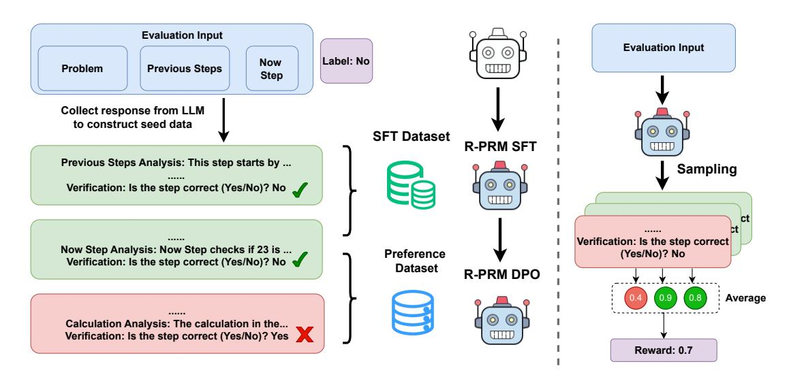
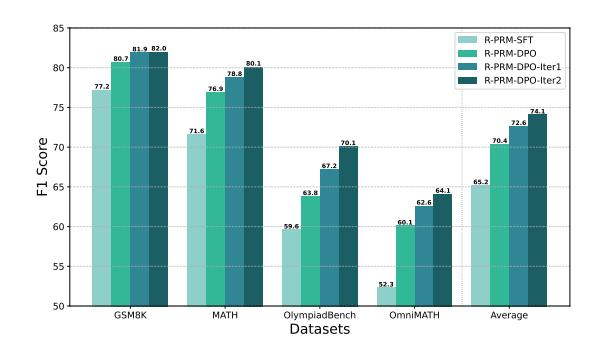
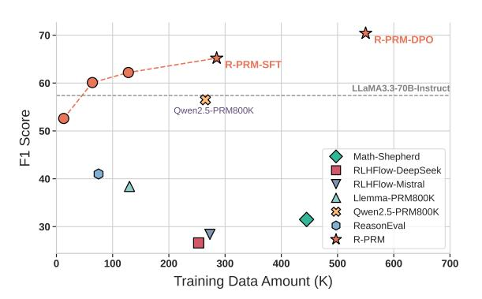
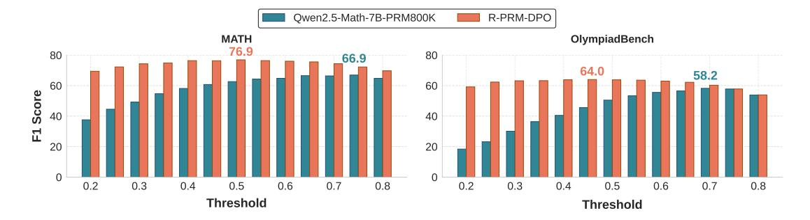
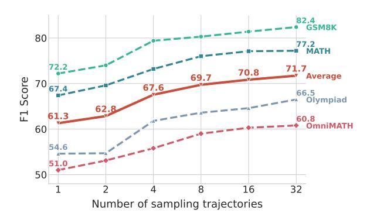
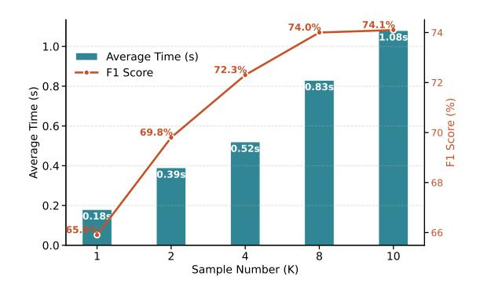
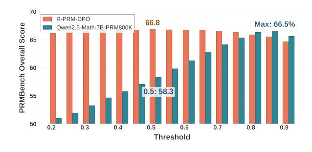

# R-PRM: Reasoning-Driven Process Reward Modeling

Shuaijie She<sup>1\*</sup>, Junxiao Liu<sup>1\*</sup>, Yifeng Liu<sup>1</sup>, Jiajun Chen<sup>1</sup>, Xin Huang<sup>2</sup>, Shujian Huang<sup>1†</sup>

National Key Laboratory for Novel Software Technology, Nanjing University

China Mobile Communications Company Limited Research Institute

{shesj,junxiaoliu,yfliu}@smail.nju.edu.cn, chenjj@nju.edu.cn, huangxinyjy@chinamobile.com, huangsj@nju.edu.cn

#### Abstract

Process Reward Models (PRMs) have emerged as a promising solution to address the reasoning mistakes of large language models (LLMs). However, existing PRMs typically output evaluation scores directly, limiting both learning efficiency and evaluation accuracy. This limitation is further compounded by the scarcity of annotated data. To address these issues, we propose Reasoning-Driven Process Reward Modeling (R-PRM), which activates inherent reasoning to enhance process-level evaluation. First, we leverage stronger LLMs to generate seed data from limited annotations, effectively activating reasoning capabilities and enabling comprehensive step-by-step evaluation. Second, we explore self-improvement of our PRM through preference optimization, without requiring additional annotated data. Third, we introduce inference time scaling to fully harness our model's reasoning potential. Extensive experiments demonstrate R-PRM's effectiveness: on ProcessBench and PRMBench, it surpasses strong baselines by 13.9 and 8.5 F1 scores. When applied to guide mathematical reasoning, R-PRM achieves consistent accuracy improvements of over 8.6 points across six challenging datasets. Further analysis reveals that R-PRM exhibits more comprehensive evaluation and robust generalization, indicating its broader potential.

# 1 Introduction

Recently, large language models (LLMs) have demonstrated significant progress in solving challenging mathematical problems through chain-of-thought reasoning (Wei et al., 2023; Yang et al., 2024; Shao et al., 2024). However, LLMs still tend to make reasoning errors, undermining the reliability of their solutions and hindering their capacity to generate correct solutions.

Therefore, Process Reward Models (PRMs) have been proposed to further improve model reasoning ability (Lightman et al., 2023). Unlike Outcome Reward Models (ORMs) that only focus on the final results, PRMs evaluate each reasoning step in a more fine-grained manner, enabling them to better identify and mitigate error processes, thereby improving both performance and generalization (Lightman et al., 2023; Wang et al., 2024b).

A primary challenge in PRM development arises from data scarcity. While human annotation can provide high-quality process-level labels (Lightman et al., 2023), it incurs substantial costs. Alternative automated approaches, such as Monte Carlo (MC) methods that estimate step correctness based on the probability of reaching the correct final answer (Wang et al., 2024b,a; Luo et al., 2024b), or methods that use stronger language models as judges for data filtering (Zhang et al., 2025b), have shown some promise. However, these methods either require significant computational resources or still struggle with noise and bias, leaving the challenge of sufficient high-quality training data unresolved.

Moreover, existing process reward models directly provide evaluations based on the given steps. We argue that for challenging process-level evaluation tasks, this direct evaluation approach constrains the model's learning process and reduces learning efficiency. Furthermore, it lacks interpretability, as it fails to identify why specific steps are incorrect, making it difficult to provide constructive feedback for improvement.

To address these issues, we propose a Reasoning-Driven Process Reward Modeling (**R-PRM**) framework that leverages the inherent reasoning capabilities of LLMs to conduct process-level evaluation. The framework consists of three key components: First, we construct seed data by prompting stronger LLMs based on a small set of human-annotated process-level labels and subsequently fine-tune Qwen2.5-Math-7B-Instruct as a quick cold-start. Through this reasoning-centric

paradigm, our model develops the capability to perform comprehensive and transparent analyses for evaluating complex solution steps of challenging questions. Second, we explore the self-evolution of our model through preference optimization, which encourages the model to generate reasoning trajectories that yield correct evaluations. This approach enables our model to improve its capabilities without requiring additional annotated data. Finally, we further exploit the reasoning capabilities of our model at inference time, allowing multiple evaluation trajectories to be sampled for a more comprehensive and robust assessment without training.

When evaluated on ProcessBench and PRM-Bench, our R-PRM achieves F1 score improvements of 13.9 and 8.5 points, respectively, over the strongest baseline trained on the same data. Furthermore, when used to guide policy model reasoning via Best-of-N and Guided Search strategies, our approach improves accuracy by average margins of 8.6 and 8.4 points over the Pass@1 baseline across six challenging math datasets, outperforming both majority voting and all existing PRM baselines. Further analysis reveals our three key additional advantages: (1) comprehensive evaluation coverage through multi-dimensional analysis, (2) enhanced generalization capability across diverse datasets, and (3) progressive accuracy improvement with increased reasoning budgets, suggesting significant potential for reasoning-system optimization.

#### 2 Related Work

# 2.1 Mathematical Reasoning

Recent studies have demonstrated that LLMs exhibit enhanced reasoning capabilities when generating step-by-step solutions before providing the final answers (Wei et al., 2023). Building on this insight, several pioneering works have focused on developing large-scale mathematical datasets with high-quality reasoning annotations for fine-tuning of LLMs (Luo et al., 2025; Wang et al., 2023; Shao et al., 2024; Yang et al., 2024). However, even when models arrive at correct final answers, their intermediate reasoning steps may contain critical errors. This discrepancy undermines the reliability of their problem-solving processes and poses significant obstacles for future model improvements (Zheng et al., 2024).

Parallel advancements (Snell et al., 2024; O1, 2023; DeepSeek-AI, 2025; QwQ, 2023) in inference time have demonstrated that increasing the

computational budget to enable multiple reasoning attempts, coupled with majority voting mechanisms for answer selection, can achieve remarkable accuracy improvements.

# 2.2 Reward Modeling of Reasoning

Reward models are introduced to further improve mathematical reasoning by enhancing training data quality, guiding model learning (Lightman et al., 2023; Cobbe et al., 2021; Uesato et al., 2022), and guiding the policy model's reasoning process through Best-of-N and Guided-Search methods (Wang et al., 2024b; Zhang et al., 2025b).

Currently, reward models are typically categorized into Outcome Reward Models (ORMs) and Process Reward Models (PRMs) (Lightman et al., 2023). ORMs focus on providing an overall evaluation based on whether the correct answer is ultimately obtained (Cobbe et al., 2021). In contrast, PRMs provide a fine-grained evaluation for each reasoning step, and many works have shown that they can achieve better results (Lightman et al., 2023; Uesato et al., 2022). Data for PRM is extremely scarce, and its annotation is costly (Lightman et al., 2023; Wang et al., 2024b; Luo et al., 2024b; Zhang et al., 2025a). Some studies explore automatic synthesis strategies, such as using Monte Carlo (MC) estimation methods (Wang et al., 2024b; Luo et al., 2024b). However, MC methods incur a large computational cost and inevitably introduce bias and noise (Zheng et al., 2024). (Zhang et al., 2025b) propose combining MC with LLM as a judge, helping to reduce noise. The quality and quantity of step-level reasoning evaluation data are still limited, and this remains an unsolved challenge.

#### 3 Method

In this section, we propose a novel reasoningdriven process-level reward modeling framework. Its core objective is to fully leverage the inherent reasoning capabilities of LLMs to evaluate the given reasoning steps, achieved through three stages: cold start with limited labeled data, selfevolution via preference optimization, and inference time scaling.

#### 3.1 Reasoning for Process Reward Modeling

Given a mathematical problem Q, the policy model generates a sequential chain-of-reasoning process  $S = \{s_1, s_2, ..., s_n\}$ , where each reasoning step  $s_i$ 



Figure 1: Illustration of R-PRM framework. For brevity, only partial analytical reasoning trajectories are shown. White robots indicate initial models, while colored ones represent models after our training procedure.

is generated conditioned on both the problem Q and all preceding steps  $\{s_1,...,s_{i-1}\}$ . To evaluate the quality of each reasoning step, current process-level reward models employ a direct prediction mechanism that assigns a score to each step. This evaluation process can be formally expressed as:

$$R_i = M(Q, s_1, ..., s_i)$$

where  $M(\cdot)$  represents the reward model that outputs a scalar reward  $R_i$  for the step  $s_i$ . However, evaluating reasoning steps on hard math questions is quite challenging, and direct prediction is relatively difficult for the reward model. Additionally, scores generated directly often suffer from a lack of explainability.

To solve these issues, we propose a reasoning-driven process reward model G that performs two phases within a single generation process as illustrated in Figure 1. First, G generates a comprehensive analysis  $A_i$  of each reasoning step  $s_i$ , consisting of multiple analytical dimensions: examining historical reasoning steps, assessing the objective and data sources of the current step, verifying its coherence with preceding steps, and validating the calculations involved. Then, G generates a natural language judgment  $J_i$  indicating the correctness of the step, expressed as "Yes" or "No".

$$A_i = G(Q, s_1, ..., s_i)$$
  
 $J_i = G(Q, s_1, ..., s_i, A_i)$ 

To help LLMs fully leverage their reasoning abilities, we designed a quick cold-start phase. In this phase, we prompt a stronger LLM with samples

from PRM800K to generate  $(Q, s_{1:i}, A_i, J_i)$  tuples <sup>1</sup>. We retain only those evaluation analyses that produce a judgment consistent with human label. Subsequently, we concatenate the analysis and judgment as the target sequence, which is then used to fine-tune our PRM. Let  $Y_i$  denote the evaluation trajectory for  $s_i$ :

$$Y_i = A_i \oplus J_i = \{y_1, y_2, \dots, y_t\}$$
  
 $\mathcal{L}_{SFT} = -\sum_{j=1}^t \log p(y_j | Q, s_{1:i}, y_{1:j-1})$ 

where  $y_j$  denotes the j-th token in the output sequence  $Y_i$ , and t is the total length of the sequence. This is equivalent to standard instruction tuning, where the model learns to generate both the analysis and the judgment in a single forward pass.

# 3.2 Process Reward Modeling Meta-Optimization

Although cold start activates the model's reasoning ability, it may still yield incorrect judgments. Facing the challenge of data scarcity, we further explore how our process reward model can self-evolve without incorporating additional data. We propose Meta-Optimization, which employs preference optimization method to refine the reasoning behavior of our R-PRM, thereby guiding it towards making accurate judgments.

For simplicity, we implement our approach using Direct Preference Optimization (DPO, Rafailov et al., 2024), one of the popular preference optimization algorithms. DPO involves an input pair

<sup>&</sup>lt;sup>1</sup>The prompt we used is listed in Appendix G

 $(Y^w,Y^l)$ , where  $Y^w$  is favored over  $Y^l$ . Accordingly, multiple evaluation processes and their corresponding judgments are sampled and categorized into two groups depending on whether the judgments align with the annotated labels. We encourage our PRM to generate evaluation trajectory that can yield correct judgments; therefore, we treat consistent trajectories as  $Y^w$  and inconsistent ones as  $Y^l$  to construct preference pairs. We copy and freeze R-PRM-SFT as the reference policy  $\pi_{\rm ref}$  and optimize it using the following loss function:

$$\mathcal{L}_{\text{DPO}}(\pi_{\theta}; \pi_{\text{ref}}) = -\mathbb{E}_{(x, Y^w, Y^l) \sim \mathcal{D}}$$

$$\left[ \log \sigma \left( \beta \log \frac{\pi_{\theta}(Y^w \mid x)}{\pi_{\text{ref}}(Y^w \mid x)} - \beta \log \frac{\pi_{\theta}(Y^l \mid x)}{\pi_{\text{ref}}(Y^l \mid x)} \right) \right]$$

# 3.3 Inference-Time Scaling Strategy

Leveraging R-PRM's capability to generate diverse evaluation trajectories, we explore the scalable inference strategy that enhances evaluation performance without training. During inference, for each reasoning step  $s_i$ , we sample K independent analytical processes as follows:

$$(A_i^{(k)}, J_i^{(k)}) = G(Q, s_1, ..., s_i), k \in [1, K]$$

where each  $A^{(k)}$  represents a distinct analytical reasoning process and  $J^{(k)}$  is the corresponding judgment. This multi-trajectory approach helps mitigate potential reasoning inconsistencies and stochastic variations inherent in LLMs. To aggregate multiple evaluations, we calculate the average probability of "Yes" judgments (using softmax with "No" judgments) as the reward:

$$R_i = \frac{1}{K} \sum_{k=1}^K P(J_i^{(k)} = \text{``Yes''}|Q, s_1, ..., s_i, A_i^{(k)}).$$

# 4 Experiment

#### 4.1 Experiment Settings

**Tasks and Benchmarks:** To validate the accuracy of our method in process reward modeling, we conduct evaluations on two challenging benchmarks *ProcessBench* (Zheng et al., 2024) and *PRM-Bench* (Song et al., 2025).

• **ProcessBench** (Zheng et al., 2024) assesses a model's ability to detect the first incorrect step in LLM-generated mathematical solutions. It consists of 3,400 problems of varying difficulty, each paired with a step-by-step solution and human annotation of the earliest error.

• **PRMBench** (Song et al., 2025) constitutes a comprehensive benchmark for evaluating PRMs, with particular emphasis on granular error diagnosis. It assesses evaluation capabilities across three error dimensions: Simplicity, Soundness, and Sensitivity, which are further divided into nine specific aspects <sup>2</sup>.

Furthermore, we validate the effectiveness of our model by employing it to guide two distinct test-time scaling paradigm: Best-of-N and Guide Search. Performance is evaluated on MATH500 (Lightman et al., 2023), Minerva Math (Lewkowycz et al., 2022), Olympiad-Bench (He et al., 2024), College Math (Tang et al., 2024)  $^3$ , AIME24, and AMC23. Consistent with previous work (Zhang et al., 2025b), we used Qwen2.5-7B-Instruct to generate eight candidate steps with temperature T=1.0.

- **Best-of-N:** selects the response with the highest score among *N* candidates, as evaluated by a PRM.
- Guide Search: at each step, the model generates N candidate continuations and selects the one with the highest reward score, as evaluated by the PRM, to extend the reasoning. This process repeats until the solution is complete.

**Baselines:** We selected the following strong process reward models as baselines.

- Math-Shepherd (Wang et al., 2024b): Automatically obtaining the probability of reaching the correct solution as step labels based on Monte Carlo Tree Search (MCTS).
- Math-PSA (Wang et al., 2024a): combining existing automatic annotation techniques (Luo et al., 2024a) and integrating data from Math-Shepherd and PRM800K datasets.
- **RLHFlow-DeepSeek/Mistral** (Dong et al., 2024): Similar to Math-Shepherd, but trained with iterative DPO.
- Skywork-PRM-7B (o1 Team, 2024): based on Qwen2.5-Math-Instruct and recently released by Skywork.
- **ReasonEval-7B** (Xia et al., 2025): Evaluates mathematical problem-solving step by step, assessing validity and redundancy.
- Llemma-PRM800K-7B (Sun et al., 2024): Trained exclusively on PRM800K from levels

<sup>&</sup>lt;sup>2</sup>See Appendix C for detailed description.

<sup>&</sup>lt;sup>3</sup>Due to the large size of OlympiadBench and College Math, we randomly select 200 samples from each for evaluation.

| MODEL                           | GSM8K     |         | MATH |       |         | OlympiadBench |       |         | OmniMATH |       |         | Avg. F1 |      |
|---------------------------------|-----------|---------|------|-------|---------|---------------|-------|---------|----------|-------|---------|---------|------|
|                                 | error     | correct | F1   | error | correct | F1            | error | correct | F1       | error | correct | F1      | · ø, |
| LLM-as-judge, Proprietary langu | uage mode | els     |      |       |         |               |       |         |          |       |         |         |      |
| GPT-4o*                         | 70.0      | 91.2    | 79.2 | 54.4  | 76.6    | 63.6          | 45.8  | 58.4    | 51.4     | 45.2  | 65.6    | 53.5    | 61.9 |
| o1-mini*                        | 88.9      | 97.9    | 93.2 | 83.5  | 95.1    | 88.9          | 80.2  | 95.6    | 87.2     | 74.8  | 91.7    | 82.4    | 87.9 |
| LLM-as-judge, Open-source lang  | guage mod | dels    |      |       |         |               |       |         |          |       |         |         |      |
| Llama-3.3-70B-Instruct          | 71.0      | 97.9    | 82.3 | 42.8  | 95.3    | 59.0          | 30.7  | 94.1    | 46.3     | 27.4  | 88.8    | 41.9    | 57.4 |
| Qwen2.5-Math-72B-Instruct       | 51.7      | 95.9    | 67.2 | 36.9  | 94.3    | 53.0          | 18.9  | 96.5    | 31.6     | 19.8  | 95.4    | 32.7    | 46.1 |
| Qwen2.5-72B-Instruct            | 62.8      | 97.4    | 76.4 | 46.1  | 93.1    | 61.7          | 37.7  | 92.9    | 53.6     | 37.5  | 87.1    | 52.5    | 61.1 |
| PRMs                            |           |         |      |       |         |               |       |         |          |       |         |         |      |
| Math-Shepherd-7B*               | 32.4      | 91.7    | 47.9 | 18.0  | 82.0    | 29.5          | 15.0  | 71.1    | 24.8     | 14.2  | 73.0    | 23.8    | 31.5 |
| Math-PSA-7B                     | 48.3      | 88.1    | 62.4 | 29.5  | 72.7    | 41.9          | 20.7  | 65.8    | 31.5     | 15.4  | 68.9    | 25.2    | 40.3 |
| RLHFlow-Mistral-8B*             | 33.8      | 99.0    | 50.4 | 21.7  | 72.2    | 33.4          | 8.2   | 43.1    | 13.8     | 9.6   | 45.2    | 15.8    | 28.4 |
| RLHFlow-DeepSeek-8B*            | 24.2      | 98.4    | 38.8 | 21.4  | 80.0    | 33.8          | 10.1  | 51.0    | 16.9     | 10.9  | 51.9    | 16.9    | 26.6 |
| Llemma-PRM800K-7B               | 36.7      | 71.0    | 48.4 | 39.2  | 47.8    | 43.1          | 33.1  | 25.1    | 28.5     | 35.4  | 31.5    | 33.4    | 38.4 |
| Skywork-PRM-7B*                 | 61.8      | 82.9    | 70.8 | 43.8  | 62.2    | 53.6          | 17.9  | 31.9    | 22.9     | 14.0  | 41.9    | 21.0    | 42.1 |
| ReasonEval-7B                   | 26.1      | 95.3    | 41.0 | 35.7  | 77.6    | 48.9          | 27.5  | 55.2    | 36.7     | 27.0  | 60.6    | 37.4    | 41.0 |
| Qwen2.5-Math-7B-PRM800K*        | 53.1      | 95.3    | 68.2 | 48.0  | 90.1    | 62.6          | 35.7  | 87.3    | 50.7     | 29.8  | 86.1    | 44.3    | 56.5 |
| ★ R-PRM-7B-SFT                  | 66.2      | 92.7    | 77.2 | 60.3  | 88.2    | 71.6          | 48.6  | 77.3    | 59.6     | 40.1  | 75.5    | 52.3    | 65.2 |
| ★ R-PRM-7B-DPO                  | 72.0      | 91.7    | 80.7 | 71.2  | 83.5    | 76.9          | 60.2  | 67.8    | 63.8     | 55.5  | 65.6    | 60.1    | 70.4 |

Table 1: Performance on ProcessBench. ★ indicates our models. Results marked with \* are from Zhang et al.. Bold indicates the best within PRMs. For LLM-as-judge baselines, we sample 10 trajectories and apply majority voting to align with our method. The **correct** and **error** indicate accuracy on correct and incorrect samples, respectively.

| Model Name                     | Simplicity |       | Soundness |      |      |      | Sensitivity |      |      | Overall |       |      |                    |
|--------------------------------|------------|-------|-----------|------|------|------|-------------|------|------|---------|-------|------|--------------------|
|                                | NR.        | NCL.  | Avg.      | ES   | SC.  | DC.  | CI          | Avg. | PS   | DR.     | MS.   | Avg. | 2 · 3 <b>· ···</b> |
| LLM-as-judge, Proprietary lang | guage mo   | odels |           |      |      |      |             |      |      |         |       |      |                    |
| GPT-4o*                        | 57.0       | 62.4  | 59.7      | 72.0 | 69.7 | 70.7 | 71.1        | 70.9 | 62.5 | 65.7    | 99.2  | 75.8 | 66.8               |
| o1-mini*                       | 65.6       | 63.7  | 64.6      | 74.5 | 67.7 | 73.8 | 72.3        | 72.1 | 61.8 | 64.8    | 100.0 | 75.5 | 68.8               |
| PRMs                           |            |       |           |      |      |      |             |      |      |         |       |      |                    |
| Math-Shepherd-7B*              | 44.0       | 50.3  | 47.1      | 49.4 | 44.5 | 41.3 | 47.7        | 45.7 | 47.2 | 48.6    | 86.1  | 60.7 | 47.0               |
| Math-PSA-7B                    | 47.6       | 55.1  | 51.3      | 56.5 | 49.4 | 47.1 | 54.2        | 51.8 | 51.7 | 54.1    | 88.9  | 64.9 | 52.3               |
| RLHFlow-Mistral-8B*            | 46.1       | 47.3  | 46.7      | 56.6 | 55.1 | 54.4 | 63.8        | 57.5 | 51.5 | 56.2    | 97.9  | 68.5 | 54.4               |
| RLHFlow-DeepSeek-8B*           | 46.4       | 48.9  | 47.6      | 55.7 | 55.0 | 53.2 | 66.2        | 57.5 | 49.0 | 55.4    | 99.8  | 68.1 | 54.2               |
| Llemma-PRM800k-7B*             | 49.3       | 53.4  | 51.4      | 56.4 | 47.1 | 46.7 | 53.3        | 50.9 | 51.0 | 53.5    | 93.6  | 66.0 | 52.0               |
| Skywork-PRM-7B*                | 35.7       | 41.2  | 38.4      | 36.7 | 29.1 | 30.6 | 34.4        | 32.7 | 36.8 | 37.4    | 88.8  | 54.3 | 36.2               |
| ReasonEval-7B*                 | 61.0       | 50.1  | 55.5      | 62.1 | 65.9 | 61.5 | 66.0        | 63.9 | 55.6 | 58.0    | 99.5  | 71.0 | 60.0               |
| Qwen2.5-Math-7B-PRM800K        | 48.6       | 47.8  | 48.2      | 62.1 | 59.4 | 58.7 | 68.5        | 62.2 | 52.9 | 64.0    | 99.8  | 72.2 | 58.3               |
| ★ R-PRM-7B-SFT                 | 52.7       | 64.7  | 58.7      | 70.1 | 62.7 | 63.4 | 69.5        | 66.4 | 61.4 | 67.4    | 98.3  | 75.7 | 64.9               |
| ★ R-PRM-7B-DPO                 | 52.2       | 58.2  | 55.2      | 72.1 | 69.1 | 68.9 | 75.0        | 71.2 | 61.2 | 69.5    | 99.1  | 76.6 | 66.8               |

Table 2: Performance on PRMBench. ★ represents the models we trained. Results marked with \* come from Zhang et al. Bold text denotes the best results within PRM.

1 through 3.

 Qwen2.5-Math-7B-PRM800K (Zheng et al., 2024): Qwen2.5-Math-7B-Instruct fine-tuned on the PRM800K dataset.

Implementation details: We prompt LLaMA3.3-70B-Instruct to generate four evaluation trajectories per PRM800K case, yielding approximately 289k SFT and 269k DPO samples. Qwen2.5-Math-7B-Instruct is fine-tuned for one epoch with batch size 128 and learning rates of 5e-6 (SFT) and 5e-7 (DPO). We reserve 20k samples for validation and select the checkpoint with the lowest validation loss. Unless stated otherwise, results are reported using ten evaluation trajectories per step.

# **4.2** Experiment Results

R-PRM achieves high evaluation accuracy efficiently. As detailed in Table 1 and Table 2, our SFT approach demonstrates strong performance, achieving F1 scores of 65.2 on ProcessBench and 64.9 on PRMBench. These results significantly outperform state-of-the-art baselines, including Qwen2.5-Math-7B-PRM800K (the strongest PRM800K-based method), by 8.7 and 6.6 points, respectively. The model's capabilities are further elevated through meta-optimization, leading to remarkable F1 scores of 70.4 on ProcessBench and 66.8 on PRMBench. These improvements highlight the potential of our reasoning driven evalua-

| Setting                 | AIME24 | AMC23 | MATH500 | Olympiad<br>Bench | College<br>Math | Minerva<br>Math | Avg. |
|-------------------------|--------|-------|---------|-------------------|-----------------|-----------------|------|
| Pass@1                  | 11.2   | 47.8  | 73.0    | 38.0              | 38.6            | 37.2            | 41.0 |
| Maj@8                   | 20.0   | 57.5  | 79.6    | 47.0              | 41.5            | 42.7            | 48.0 |
| Pass@8 (Oracle)         | 33.3   | 82.5  | 88.8    | 58.5              | 47.5            | 57.7            | 61.4 |
| Math-Shepherd-7B        | 13.3   | 52.5  | 74.6    | 38.5              | 36.5            | 41.2            | 42.8 |
| Math-PSA-7B             | 6.7    | 57.5  | 79.8    | 42.5              | 41.0            | 39.3            | 44.5 |
| RLHFlow-PRM-Mistral-8B  | 10.0   | 57.5  | 73.4    | 37.5              | 38.0            | 41.2            | 42.9 |
| RLHFlow-PRM-DeepSeek-8B | 13.3   | 52.5  | 74.8    | 39.5              | 37.0            | 40.8            | 43.0 |
| Llemma-PRM800K-7B       | 13.3   | 57.5  | 73.8    | 40.0              | 36.5            | 38.2            | 43.2 |
| Skywork-PRM-7B          | 10.0   | 57.5  | 77.8    | 41.5              | 39.0            | 43.4            | 44.9 |
| ReasonEval-7B           | 3.3    | 55.0  | 73.0    | 37.5              | 35.5            | 37.9            | 40.4 |
| Qwen2.5-Math-7B-PRM800K | 23.3   | 45.0  | 78.2    | 42.0              | 35.5            | 38.6            | 43.8 |
| ★ R-PRM-7B-DPO          | 16.7   | 70.0  | 80.0    | 46.5              | 39.5            | 43.4            | 49.4 |

Table 3: The performance of PRM-guided greedy search with the Qwen2.5-7B-Instruct policy model, where superior performance indicates a more accurate reward from the PRM and consequently, more effective guidance.

tion paradigms and our training framework.

Impressively, R-PRM-DPO achieves F1 score improvements of 13.0 points over LLaMA3.3-70B-Instruct (used for generating our synthetic cold-start data) and 8.5 points over GPT-40. Collectively, these findings directly demonstrate that our method extends beyond simple distillation and maximizes the utility of human-annotated data.

We also conducted additional experiments to validate the effectiveness of continuous self-evolution through two rounds of iterative training. After the second iteration, our model achieved an average F1 score of 74.1 on ProcessBench, these results demonstrate the significant potential of our method. Please refer to Appendix 5.1 for comprehensive results.

R-PRM provides comprehensive evaluations in multiple dimensions. In rigorous benchmarking with PRMBench, R-PRM-DPO demonstrates advantages over Qwen2.5-Math-7B-PRM800K, achieving improvements of 7.0, 9.0, and 4.4 points across the three evaluation dimensions. Notably, it surpasses GPT-40 in both soundness and sensitivity metrics, establishing itself as a more comprehensive assessment paradigm.

R-PRM especially excels in soundness evaluation through its reasoning paradigm for empirical validity, step consistency, and domain consistency. This structural evaluation paradigm enables superior detection of logical errors by analyzing each reasoning step in context of previous ones. Moreover, R-PRM even outperforms o1-mini in prerequisite sensitivity, effectively identifying reasoning steps that appear superficially valid but contain logical flaws—precisely the type that conventional evaluation systems frequently fail to detect.

R-PRM demonstrates superior generalization **capability.** As shown in Table 1, all listed opensource PRMs, except Skywork-PRM-7B for which the training data sources is unknown, have been trained exclusively on GSM8K and MATH. Among these PRMs, only Math-PSA-7B and Qwen2.5-Math-7B-PRM800K achieve F1 scores above 60 on certain ProcessBench subsets, while others perform relatively poorly, particularly on out-of-domain datasets such as OmniMATH and OlympiadBench. By contrast, R-PRM not only performs well on the MATH dataset but also achieves F1 scores above 60 on all out-of-domain datasets. This suggests that R-PRM acquires a generalizable reasoning pattern, enabling it to perform well across datasets with varying difficulty.

R-PRM guides policy model to reach correct answer effectively. As shown in Table 3 and Table 4, our method achieves 8.4 and 8.6 average accuracy improvements over the Pass@1 baseline in the Guide Search and Best-of-N settings, respectively. It also achieves state-of-the-art performance by outperforming Qwen2.5-Math-7B-PRM800K by 5.6 and 1.9 points, and surpassing Majority Voting in both settings. Moreover, on the AIME24 benchmark, R-PRM boosts DeepSeek-R1-Distilled-Qwen-7B's Pass@1 from 54.5 to 60.8, demonstrating its effectiveness even for advanced reasoners (see Appendix B for details). These results directly demonstrate that our method's accurate reward evaluation at each reasoning step effectively guides the policy model to arrive at correct solutions. Furthermore, we believe our approach holds greater potential for integration with backtracking-enabled strategies like Monte Carlo Tree Search and multi-candidate strategies such as Beam Search, which further boost the performance

| Setting                 | AIME24 | AMC23 | MATH500 | Olympiad<br>Bench | College<br>Math | Minerva<br>Math | Avg. |
|-------------------------|--------|-------|---------|-------------------|-----------------|-----------------|------|
| Pass@1                  | 11.2   | 47.8  | 73.0    | 38.0              | 38.6            | 37.2            | 41.0 |
| Maj@8                   | 20.0   | 57.5  | 79.6    | 47.0              | 41.5            | 42.7            | 48.0 |
| Pass@8(Oracle)          | 33.3   | 82.5  | 88.8    | 58.5              | 47.5            | 57.7            | 61.4 |
| Math-Shepherd-7B        | 16.7   | 42.5  | 76.0    | 42.0              | 37.0            | 39.3            | 42.3 |
| Math-PSA-7B             | 20.0   | 55.0  | 80.8    | 47.5              | 39.5            | 40.1            | 47.2 |
| RLHFlow-Mistral-8B      | 10.0   | 55.0  | 76.8    | 42.0              | 39.5            | 37.1            | 43.4 |
| RLHFlow-DeepSeek-8B     | 13.3   | 57.5  | 76.2    | 40.0              | 39.0            | 39.7            | 44.3 |
| Llemma-PRM800K-7B       | 10.0   | 52.5  | 76.6    | 42.5              | 39.0            | 42.7            | 43.9 |
| Skywork-PRM-7B          | 16.7   | 55.0  | 81.2    | 44.0              | 40.5            | 44.5            | 47.0 |
| ReasonEval-7B           | 6.7    | 55.0  | 75.2    | 41.0              | 40.0            | 40.4            | 43.1 |
| Qwen2.5-Math-7B-PRM800K | 13.3   | 57.5  | 80.0    | 44.5              | 43.5            | 43.0            | 47.7 |
| ★ R-PRM-7B-DPO          | 20.0   | 62.5  | 82.2    | 48.0              | 41.0            | 44.1            | 49.6 |

Table 4: Performance comparison on the Best-of-8 strategy of the policy model Qwen2.5-7B-Instruct, where superior performance indicates a more accurate reward from the PRM and consequently, more effective guidance.



Figure 2: Performance of R-PRM on ProcessBench across self-improving iterations.

of policy model.

# 5 Analysis

In this section, we further delve into our R-PRM's core strengths: impressive self-evolution, remarkable data efficiency, and efficient inference-time scaling, culminating in a case study that demonstrates its practical efficacy.

### **5.1** Self-Improve Further Boosts Performance

To investigate the potential for self-improvement, we explore an iterative refinement strategy. In the first iteration, we employ the R-PRM-DPO model to sample trajectories from the PRM800K dataset, from which we construct a new preference dataset of 30k examples. Fine-tuning on this data for one epoch yields R-PRM-DPO-Iter1. As shown in Figure 2, this iterative process leads to consistent performance gains across all benchmarks. Notably, R-PRM-DPO-Iter1 improves the performance on OlympiadBench by 3.4 points to 67.2 and achieves an average improvement of 2.2 points on Process-Bench. A second iteration (R-PRM-DPO-Iter2) continues this upward trend, demonstrating that it-



Figure 3: Average F1 score on ProcessBench with different training data scales.

erative DPO progressively enhances the model's reasoning capabilities for tackling more challenging evaluation tasks.

# 5.2 Effective Data Scaling

Figure 3 visualizes the F1 performance on Process-Bench versus the data scale. With 12.8k training samples, our R-PRM already surpasses most open-source PRMs. Notably, with only 64k samples, R-PRM outperforms Qwen2.5-Math-7B-PRM800K (trained on 265k samples) by 3.6 points. Further scaling to the full 285k-sample dataset yields continued gains, reaching an F1 score of 65.2, clearly demonstrating the strong data efficiency and scalability of our approach.

Moreover, our proposed meta-optimization, without requiring any additional labeled data, further boosts performance to an impressive F1 score of 70.4. Even more notably, R-PRM also exceeds the Llama3.3-70B-Instruct model used for cold-start data construction, demonstrating that our approach is not merely a distillation of the teacher model but a meaningful advancement beyond it.



Figure 4: Average F1 scores on ProcessBench at different thresholds: MATH performance (left) and OlympiadBench performance (right).



Figure 5: Efficient scaling inference-time compute on ProcessBench. Results for R-PRM-DPO.

#### **5.3** Effective Inference Time Scaling

We investigated how R-PRM's performance scales with the inference budget. As shown in Figure 5, R-PRM demonstrates consistent performance gains as the number of evaluation trajectories increases. Notably, scaling from K = 2 to K = 4 trajectories yields a substantial F1 improvement from 62.8 to 67.6, which demonstrates the robustness of our scaling strategy and highlights a unique advantage of our reasoning-driven approach. Crucially, this performance scaling is achieved with an acceptable computational overhead, confirming the practical efficiency of our method. A detailed analysis of the performance-cost trade-off is provided in Appendix A. We recommend using K = 4 as it offers an excellent trade-off between performance and computational cost.

#### **5.4** Threshold Robustness

During evaluations of ProcessBench and PRM-Bench, we adopt a fixed threshold of 0.5 for binary classification to determine whether each step is correct. We further analyze the model's sensitivity to threshold variations across different problem complexities. As shown in Figure 4, on the MATH subset of ProcessBench, R-PRM demonstrates strong

robustness to threshold variation, with minimal performance fluctuations on ProcessBench. In contrast, Qwen2.5-Math-7B-PRM800K exhibits greater sensitivity, showing a noticeable rightward shift in its performance curve on ProcessBench.

On the more challenging out-of-domain test subset OlympiadBench, our method maintains its robustness to threshold variations, while Qwen2.5-Math-7B-PRM800K exhibits a larger threshold shift, indicating its tendency to misclassify incorrect solutions as correct. This demonstrates that our method has better generalization capability, maintaining more accurate evaluation even when problem types and domains change. For detailed performance analysis of scores and thresholds on PRMBench, please refer to the Appendix D.

# 5.5 Case Study

As illustrated in Figure 6, the solution mistakenly skipped verifying the number 19 in Step 7 and proceeded directly to check number 23 in Step 8. Unfortunately, the strong baseline Qwen2.5-Math-7B-PRM800K failed to recognize the omission, incorrectly assigning a high reward score of 0.86 to Step 8.

In contrast, R-PRM carefully analyzed both the previous and current steps before making its judgment. Based on this analysis, R-PRM concluded that the task required verifying the numbers in ascending order, which showcases its advanced logical reasoning capabilities. Subsequently, R-PRM resumed the reasoning process for Step 7 to verify the correctness of number 19, thus identifying the discrepancy between its own result and the answer in Step 8. Through this reasoning process, R-PRM assigned a reward score of 0.05 to Step 8, successfully detecting the error. Please refer to the Appendix E for more cases.

**Problem**: An *emirp* is an integer that, when its digits are written in reverse order, is a prime number. For example, 73 is an emirp because 37 is prime. What is the smallest two-digit prime number that is NOT an emirp?

#### Solution: ...

Step7: Continue to the next smallest two-digit prime number. 19 is prime.

Step 8: Check if 23 is an emirp. Reverse the digits of 23: 32. Check if 32 is prime: No, 32 is not prime (divisible by 2). Since 23 is a prime number and its reverse, 32, is not a prime number, 23 is not an emirp. . . .

#### Qwen2.5-Math-7B-PRM800K score: 0.859

R-PRM: Analysis: Previous Steps Analysis: ...

. . . . . .

Calculation Analysis: ...... Upon reviewing, the mistake in the analysis is assuming 23 is the answer without properly checking if there are smaller primes that are not emirps. ...... Given the oversight in the analysis regarding the thorough checking of primes and their reversals, the conclusion that 23 is the smallest such prime without properly validating against all primes in sequence is premature. .....

Conclusion: The Now Step incorrectly concludes that 23 is the smallest two-digit prime number ......

Verification: Is the step correct (Yes/No)? No

R-PRM (Majority Voting) score: 0.055

Figure 6: A case study from ProcessBench MATH dataset. Red text denotes the error step, and the blue text highlights our model's critique of the error.

#### 6 Conclusion

In this paper, we present Reasoning-Driven Process Reward Modeling (R-PRM), a novel framework that advances the process reward modeling of mathematical reasoning. Our framework consists of three components. First, we leverage stronger LLMs to construct seed data, enabling our model to perform a comprehensive evaluation process. Second, we use preference optimization to enhance performance without requiring additional annotated data. Third, we introduce inference-time scaling to fully harness the model's reasoning capabilities. Extensive experiments demonstrate that our method achieves significant performance improvements on ProcessBench and PRMBench, while also effectively guiding LLM reasoning. Further analysis shows that R-PRM exhibits more comprehensive, robust, and generalizable evaluation capabilities, as its performance continues to improve with increased inference, highlighting its substantial potential.

## Limitations

Due to computational resource constraints, we have not yet verified our approach on larger models such as 70B, despite extensive experiments demonstrating its effectiveness on 7B models. We hypothesize that larger models, given their enhanced reasoning capabilities, could achieve higher modeling accuracy when combined with our methodology. Additionally, while we have tested popular inference strategies like Best-of-N and Guided Search, our exploration of advanced search algorithms remains limited. Sophisticated methods such as Monte

Carlo Tree Search (MCTS) and Beam Search remain underexplored, although they could potentially better leverage the characteristics of PRM and yield improved generation results.

# Acknowledgements

We would like to thank the anonymous reviewers for their insightful comments. Shujian Huang is the corresponding author. This work is supported by National Science Foundation of China (No. 62376116, 62176120), research project of Nanjing University-China Mobile Joint Institute (NJ20250038), the Fundamental Research Funds for the Central Universities (No. 2024300507, 2025300390), and the Postgraduate Research & Practice Innovation Program of Jiangsu Province (No. KYCX25\_0315 and No. SJCX25\_0031).

# References

Karl Cobbe, Vineet Kosaraju, Mohammad Bavarian,
Mark Chen, Heewoo Jun, Lukasz Kaiser, Matthias
Plappert, Jerry Tworek, Jacob Hilton, Reiichiro
Nakano, Christopher Hesse, and John Schulman.
2021. Training verifiers to solve math word problems.
Preprint, arXiv:2110.14168.

DeepSeek-AI. 2025. Deepseek-r1: Incentivizing reasoning capability in llms via reinforcement learning. Preprint, arXiv:2501.12948.

Hanze Dong, Wei Xiong, Bo Pang, Haoxiang Wang, Han Zhao, Yingbo Zhou, Nan Jiang, Doyen Sahoo, Caiming Xiong, and Tong Zhang. 2024. Rlhf workflow: From reward modeling to online rlhf. <u>Preprint</u>, arXiv:2405.07863.

Chaoqun He, Renjie Luo, Yuzhuo Bai, Shengding Hu, Zhen Leng Thai, Junhao Shen, Jinyi Hu, Xu Han,

- Yujie Huang, Yuxiang Zhang, et al. 2024. Olympiadbench: A challenging benchmark for promoting agi with olympiad-level bilingual multimodal scientific problems. arXiv preprint arXiv:2402.14008.
- Aitor Lewkowycz, Anders Andreassen, David Dohan, Ethan Dyer, Henryk Michalewski, Vinay Ramasesh, Ambrose Slone, Cem Anil, Imanol Schlag, Theo Gutman-Solo, et al. 2022. Solving quantitative reasoning problems with language models. Advances in Neural Information Processing Systems, 35:3843–3857.
- Hunter Lightman, Vineet Kosaraju, Yura Burda, Harri Edwards, Bowen Baker, Teddy Lee, Jan Leike, John Schulman, Ilya Sutskever, and Karl Cobbe. 2023. Let's verify step by step. arXiv preprint arXiv:2305.20050.
- Haipeng Luo, Qingfeng Sun, Can Xu, Pu Zhao, Jianguang Lou, Chongyang Tao, Xiubo Geng, Qingwei Lin, Shifeng Chen, Yansong Tang, and Dongmei Zhang. 2025. Wizardmath: Empowering mathematical reasoning for large language models via reinforced evol-instruct. Preprint, arXiv:2308.09583.
- Liangchen Luo, Yinxiao Liu, Rosanne Liu, Samrat Phatale, Meiqi Guo, Harsh Lara, Yunxuan Li, Lei Shu, Yun Zhu, Lei Meng, Jiao Sun, and Abhinav Rastogi. 2024a. Improve mathematical reasoning in language models by automated process supervision. Preprint, arXiv:2406.06592.
- Liangchen Luo, Yinxiao Liu, Rosanne Liu, Samrat Phatale, Harsh Lara, Yunxuan Li, Lei Shu, Yun Zhu, Lei Meng, Jiao Sun, et al. 2024b. Improve mathematical reasoning in language models by automated process supervision. arXiv preprint arXiv:2406.06592.
- OpenAI O1. 2023. Learning to reason with llms. https://openai.com/index/learning-to-reason-with-llms/. Accessed: 2025-02-08.
- Skywork o1 Team. 2024. Skywork-o1 open series. https://huggingface.co/Skywork.
- QwQ. 2023. Qwq: Reflect deeply on the boundaries of the unknown. https://qwenlm.github.io/blog/qwq-32b-preview//. Accessed: 2025-02-08.
- Rafael Rafailov, Archit Sharma, Eric Mitchell, Stefano Ermon, Christopher D. Manning, and Chelsea Finn. 2024. Direct preference optimization: Your language model is secretly a reward model. Preprint, arXiv:2305.18290.
- Zhihong Shao, Peiyi Wang, Qihao Zhu, Runxin Xu, Junxiao Song, Xiao Bi, Haowei Zhang, Mingchuan Zhang, Y. K. Li, Y. Wu, and Daya Guo. 2024. Deepseekmath: Pushing the limits of mathematical reasoning in open language models. <a href="Perprint">Preprint</a>, arXiv:2402.03300.

- Charlie Snell, Jaehoon Lee, Kelvin Xu, and Aviral Kumar. 2024. Scaling llm test-time compute optimally can be more effective than scaling model parameters. arXiv preprint arXiv:2408.03314.
- Mingyang Song, Zhaochen Su, Xiaoye Qu, Jiawei Zhou, and Yu Cheng. 2025. Prmbench: A fine-grained and challenging benchmark for process-level reward models. Preprint, arXiv:2501.03124.
- Zhiqing Sun, Longhui Yu, Yikang Shen, Weiyang Liu, Yiming Yang, Sean Welleck, and Chuang Gan. 2024. Easy-to-hard generalization: Scalable alignment beyond human supervision. <a href="Preprint">Preprint</a>, arXiv:2403.09472.
- Zhengyang Tang, Xingxing Zhang, Benyou Wang, and Furu Wei. 2024. Mathscale: Scaling instruction tuning for mathematical reasoning. <a href="arXiv:reprint">arXiv:reprint</a> arXiv: 2403.02884.
- Jonathan Uesato, Nate Kushman, Ramana Kumar, Francis Song, Noah Siegel, Lisa Wang, Antonia Creswell, Geoffrey Irving, and Irina Higgins. 2022. Solving math word problems with process- and outcomebased feedback. Preprint, arXiv:2211.14275.
- Jun Wang, Meng Fang, Ziyu Wan, Muning Wen, Jiachen Zhu, Anjie Liu, Ziqin Gong, Yan Song, Lei Chen, Lionel M. Ni, Linyi Yang, Ying Wen, and Weinan Zhang. 2024a. Openr: An open source framework for advanced reasoning with large language models. Preprint, arXiv:2410.09671.
- Peiyi Wang, Lei Li, Zhihong Shao, Runxin Xu, Damai Dai, Yifei Li, Deli Chen, Yu Wu, and Zhifang Sui. 2024b. Math-shepherd: Verify and reinforce llms step-by-step without human annotations. In Proceedings of the 62nd Annual Meeting of the Association for Computational Linguistics (Volume 1: Long Papers), pages 9426–9439.
- Yizhong Wang, Yeganeh Kordi, Swaroop Mishra, Alisa Liu, Noah A. Smith, Daniel Khashabi, and Hannaneh Hajishirzi. 2023. Self-instruct: Aligning language models with self-generated instructions. <a href="Perprint">Preprint</a>, arXiv:2212.10560.
- Jason Wei, Xuezhi Wang, Dale Schuurmans, Maarten Bosma, Brian Ichter, Fei Xia, Ed Chi, Quoc Le, and Denny Zhou. 2023. Chain-of-thought prompting elicits reasoning in large language models. <a href="Perprint">Preprint</a>, arXiv:2201.11903.
- Shijie Xia, Xuefeng Li, Yixin Liu, Tongshuang Wu, and Pengfei Liu. 2025. Evaluating mathematical reasoning beyond accuracy. Preprint, arXiv:2404.05692.
- An Yang, Beichen Zhang, Binyuan Hui, Bofei Gao, Bowen Yu, Chengpeng Li, Dayiheng Liu, Jianhong Tu, Jingren Zhou, Junyang Lin, Keming Lu, Mingfeng Xue, Runji Lin, Tianyu Liu, Xingzhang Ren, and Zhenru Zhang. 2024. Qwen2.5-math technical report: Toward mathematical expert model via self-improvement. Preprint, arXiv:2409.12122.

Shimao Zhang, Xiao Liu, Xin Zhang, Junxiao Liu, Zheheng Luo, Shujian Huang, and Yeyun Gong. 2025a. Process-based self-rewarding language models. arXiv preprint arXiv:2503.03746.

Zhenru Zhang, Chujie Zheng, Yangzhen Wu, Beichen Zhang, Runji Lin, Bowen Yu, Dayiheng Liu, Jingren Zhou, and Junyang Lin. 2025b. The lessons of developing process reward models in mathematical reasoning. Preprint, arXiv:2501.07301.

Chujie Zheng, Zhenru Zhang, Beichen Zhang, Runji Lin, Keming Lu, Bowen Yu, Dayiheng Liu, Jingren Zhou, and Junyang Lin. 2024. Processbench: Identifying process errors in mathematical reasoning. Preprint, arXiv:2412.06559.

# A Practical Inference-Time Overhead Analysis of R-PRM

To evaluate the practical computational overhead of R-PRM in real-world use cases, we benchmarked inference speed under realistic deployment settings. Figure 7 presents the average time required to evaluate a single ProcessBench example at different sample sizes (**K**) on a single NVIDIA H100 GPU (vLLM 0.8.4).

Experiments show that with K=4, evaluating a single data point takes only 0.52 s, which balances performance and computational cost. To contextualize this for a practical application like online reinforcement learning, consider a common setup with 128 prompts and 8 rollouts. In this scenario, computing rewards with our R-PRMs across 8 GPUs requires only 66.56 seconds for K=4, and this time reduces to just 23.4 seconds for K=1.

These results indicate that R-PRM's inference overhead is acceptable for typical online training pipelines, and even more favorable for offline or latency-insensitive tasks such as SFT or DPO data synthesis. The sublinear scaling further suggests that increasing the number of samples yields better accuracy with moderate additional cost, making R-PRM practical for large-scale or production environments.

# B R-PRM Guidance for Long-Reasoning Model

To assess R-PRM's efficacy on long-form reasoning, we evaluated it on the *DeepSeek-R1-Distilled-Qwen-7B* model using the AIME24 benchmark. To manage the lengthy reasoning, we restricted R-PRM guidance to the initial 30 steps. Specifically, we constructed a guided prefix by iteratively selecting the highest-scoring continuation out of



Figure 7: R-PRM-DPO-Iter2 Inference Time vs F1 on ProcessBench

| Model                         | Avg@16 (%) |
|-------------------------------|------------|
| DeepSeek-R1-Distilled-Qwen-7B | 54.5       |
| w/ R-PRM-DPO (Guide Search)   | 60.8       |

Table 5: Accuracy of DeepSeek-R1-Distilled-Qwen-7B on AIME24 with and without R-PRM guidance.

8 candidates at each step. Following this 30-step guided generation, the model completed the reasoning chain autoregressively. We sampled 16 such completions and found that this partial guidance increased the average accuracy (avg@16) to 60.8%, a notable improvement over the 54.5% baseline. This result demonstrates that even limited, early-stage guidance from R-PRM can significantly enhance the performance of long-reasoning models.

# C Detailed Description of PRMBench Subcategories

- Non-Redundancy (NR): Evaluates the model's ability to identify and eliminate unnecessary steps within the reasoning process, ensuring efficiency without sacrificing correctness.
- Non-Circular Logic (NCL): Assesses whether the model can detect circular reasoning, where conclusions are reintroduced as premises, leading to logical loops.
- Empirical Soundness (ES): Measures the model's capability to identify and reject reasoning steps that contradict established facts or real-world knowledge.
- Step Consistency (SC): Evaluates whether the reasoning steps maintain consistency with each other, ensuring that all steps logically flow from one to the next.

- Domain Consistency (DC): Assesses the model's ability to apply domain-specific knowledge correctly, avoiding the misuse of concepts or theories across different domains.
- Confidence Invariance (CI): Tests whether the model maintains appropriate confidence levels throughout the reasoning process, especially when errors are detected or uncertainties arise.
- Prerequisite Sensitivity (PS): Evaluates whether the model detects missing prerequisites or conditions essential for valid reasoning, ensuring the completeness of the logic.
- Deception Resistance (DR): Measures the model's ability to detect and reject misleading information that might appear correct but contains subtle errors.
- Multi-Solution Consistency (MS): Assesses the model's ability to handle multiple valid solutions to the same problem, ensuring consistency across different reasoning paths.

#### D Threshold Robustness on PRMBench

As illustrated in Figure 8, the experimental results of PRMBench show that R-PRM has significant robustness advantages, while Qwen2.5-Math-7B-PRM800K exhibits a performance gap of 8.2 points between the 0.5 threshold and its optimal performance.



Figure 8: PRMBench Overall Score with Different Threshold

### **E** Additional Case

As shown in this case, Qwen2.5-Math-7B-PRM800K fail to detect the calculation error in this step, yet they show high confidence in their judgments with their correctness scores around 0.9. On the other hand, our R-PRM shows its strong

ability by explaining the step, checking the calculation, and finding the error, with a final score of around 0.3.

#### F Used Scientific Artifacts

Below are the scientific artifacts used in our work. For the sake of ethics, our use of these artifacts is consistent with their intended use.

- *Transformers (Apache-2.0 license)*, a framework to facilitate downloading and training state-of-the-art pretrained models.
- *trl* (*Apache-2.0 license*), a full stack library that provides a set of tools to train transformer language models with Reinforcement Learning. The library is built on top of the Transformers library.
- PRM800K(MIT license), a large-scale dataset proposed by OpenAI, containing 800,000 steplevel correctness labels for model-generated solutions to problems from the MATH dataset.
- PRMBench(Apache-2.0 license), a benchmark designed to evaluate the ability of PRMs to identify error-types in the solution process, consisting of 6,216 fine-grained data instances.

# **G** Prompt for Construction Data

```
Problem: Suppose t is a positive integer such that lcm[12, t]^3 = (12t)^2. What is the smallest possible value for t?
```

# Solution:

To solve this problem, we can start by using the properties of the least common multiple (LCM). Given:  $lcm[12, t]^3 = (12t)^2$ .

Step 1: Take the cube root of both sides of the equation.  $\sqrt[3]{\text{lcm}[12,t]^3} = \sqrt[3]{(12t)^2}$ . This simplifies to:  $\text{lcm}[12,t] = 12t^{2/3}$ .

... Step 31: We can see that  $13824 = 2304^2$ , so t = 48 satisfies the original equation. Therefore, the smallest possible value for t is  $\boxed{48}$ .

#### **Owen2.5-Math-7B-PRM800K** score: 0.8711

**R-PRM (Ours)**: Analysis: Previous Steps Analysis: Step 1: This step states the problem and sets up the equation to be solved, which is  $lcm[12, t]^3 = (12t)^2$ . This step is a correct restatement of the problem . . . . . .

• • •

Calculation Analysis: The calculation involves taking the cube root of  $(12t)^2$ . By the properties of exponents,  $\sqrt[3]{(12t)^2} = \sqrt[3]{12^2 \cdot t^2} = 12^{2/3} \cdot t^{2/3}$ . This is because the cube root of a product can be expressed as the product of the cube roots, and the cube root of a power can be expressed as that power divided by 3. Therefore, the correct simplification should be  $lcm[12,t] = 12^{2/3} \cdot t^{2/3}$ , not  $12t^{2/3}$  as stated in the Now Step.

Conclusion: The Now Step incorrectly simplifies the expression  $\sqrt[3]{(12t)^2}$  to  $12t^{2/3}$ . The correct simplification should be  $12^{2/3} \cdot t^{2/3}$ , which is different from what is presented. Therefore, the Now Step contains an error.

Verification: Is the step correct (Yes/No)? No"

**R-PRM** score: 0.2992

Figure 9: A case study from MATH subset of ProcessBench. Red text denotes the error step and the scores of other models, and the blue text highlights our model's critique of the error and our score for that step.

You are an excellent math teacher. Please verify the correctness of the Now Step.

You first need to analyze the Now Step and the Previous Steps and then summarize based on your analysis. Analysis:

You need to analyze the following aspects.

- \*\*Previous Steps Analysis\*\*: You need to analyze the Previous Steps step by step. For each step, you need to first explain what the current step is doing, then you try to find any error in the current step.
- \*\*Now Step Analysis\*\*: You first need to explain what the Now Step is doing, and then point out which part of the Question it is trying to solve or which part of the information it states.
- \*\*Data Source Analysis\*\*: First you need to find out what data are used in the Now Step, and then you need to determine whether the source of the data is reasonable and correct. When you judge whether the source of a data is reasonable and correct, you need to specify the specific source of this data: such as which part of the question, or which content of the previous step; and then determine the source and current use is consistent, the Now Step is used correctly.
- \*\*Consistency Analysis\*\*: You need to check that the Now Step is consistent with the contents of the Previous Steps, and then you need to check that all the information inside the Now Step is consistent.
- \*\*Calculation Analysis\*\*: If the Now Step involves any calculations, such as addition, subtraction, multiplication, division, equations, modulo operations, etc., you will first need to perform a check on the calculation, such as a reverse operation, to see if the calculation was done correctly, and then analyze the results of your check to see if there was an error in the calculation.

## Conclusion:

Please verify the correctness of the Now Step based on your analysis, if there is any error in the Now Step then the Now Step is wrong and vice versa the Now Step is correct. At the end of the Conclusion, when you give your final answer, write it in the form "Verification: Is the step correct (Yes/No)? X", where X is either Yes or No.

Question: [Math Problem]
Previous Steps: [Previous Steps]
Now Step: [Current Step]

Please carefully analyze the correctness of the Now Step.

Reply:

Table 6: The Prompt to Construct Data