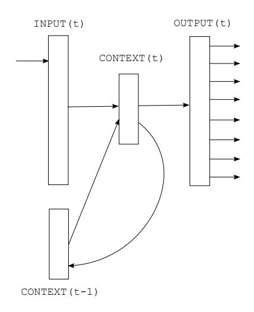

# Recurrent neural network based language model

Tomáš Mikolov1,2, Martin Karafiát1, Lukáš Burget1, Jan "Honza" Černocký1, Sanjeev Khudanpur2

1Speech@FIT, Brno University of Technology, Czech Republic 2 Department of Electrical and Computer Engineering, Johns Hopkins University, USA

{imikolov, karafiat, burget, cernocky}@fit.vutbr.cz, khudanpur@jhu.edu

## **Abstract**

A new recurrent neural network based language model (RNN LM) with applications to speech recognition is presented. Results indicate that it is possible to obtain around 50% reduction of perplexity by using mixture of several RNN LMs, compared to a state of the art backoff language model. Speech recognition experiments show around 18% reduction of word error rate on the Wall Street Journal task when comparing models trained on the same amount of data, and around 5% on the much harder NIST RT05 task, even when the backoff model is trained on much more data than the RNN LM. We provide ample empirical evidence to suggest that connectionist language models are superior to standard n-gram techniques, except their high computational (training) complexity.

**Index Terms**: language modeling, recurrent neural networks, speech recognition

### 1. Introduction

Sequential data prediction is considered by many as a key problem in machine learning and artificial intelligence (see for example [1]). The goal of statistical language modeling is to predict the next word in textual data given context; thus we are dealing with sequential data prediction problem when constructing language models. Still, many attempts to obtain such statistical models involve approaches that are very specific for language domain - for example, assumption that natural language sentences can be described by parse trees, or that we need to consider morphology of words, syntax and semantics. Even the most widely used and general models, based on ngram statistics, assume that language consists of sequences of atomic symbols - words - that form sentences, and where the end of sentence symbol plays important and very special role.

It is questionable if there has been any significant progress in language modeling over simple n-gram models (see for example [2] for review of advanced techniques). If we would measure this progress by ability of models to better predict sequential data, the answer would be that considerable improvement has been achieved - namely by introduction of cache models and class-based models. While many other techniques have been proposed, their effect is almost always similar to cache models (that describe long context information) or class-based models (that improve parameter estimation for short contexts by sharing parameters between similar words).

If we would measure success of advanced language modeling techniques by their application in practice, we would have to be much more skeptical. Language models for real-world speech recognition or machine translation systems are built on huge amounts of data, and popular belief says that more data is all we need. Models coming from research tend to be com-

Figure 1: Simple recurrent neural network.

plex and often work well only for systems based on very limited amounts of training data. In fact, most of the proposed advanced language modeling techniques provide only tiny improvements over simple baselines, and are rarely used in practice.

## 2. Model description

We have decided to investigate recurrent neural networks for modeling sequential data. Using artificial neural networks in statistical language modeling has been already proposed by Bengio [3], who used feedforward neural networks with fixed-length context. This approach was exceptionally successful and further investigation by Goodman [2] shows that this single model performs better than mixture of several other models based on other techniques, including class-based model. Later, Schwenk [4] has shown that neural network based models provide significant improvements in speech recognition for several tasks against good baseline systems.

A major deficiency of Bengio's approach is that a feedforward network has to use fixed length context that needs to be specified *ad hoc* before training. Usually this means that neural networks see only five to ten preceding words when predicting the next one. It is well known that humans can exploit longer context with great success. Also, cache models provide complementary information to neural network models, so it is natural to think about a model that would encode temporal information implicitly for contexts with arbitrary lengths.

Recurrent neural networks do not use limited size of context. By using recurrent connections, information can cycle in-

side these networks for arbitrarily long time (see [5]). However, it is also often claimed that learning long-term dependencies by stochastic gradient descent can be quite difficult [6].

In our work, we have used an architecture that is usually called a *simple recurrent neural network* or Elman network [7]. This is probably the simplest possible version of recurrent neural network, and very easy to implement and train. The network has an input layer x, hidden layer s (also called context layer or state) and output layer y. Input to the network in time t is x(t), output is denoted as y(t), and s(t) is state of the network (hidden layer). Input vector x(t) is formed by concatenating vector w representing current word, and output from neurons in context layer s at time t-1. Input, hidden and output layers are then computed as follows:

$$x(t) = w(t) + s(t-1)$$
 (1)

$$s_j(t) = f\left(\sum_i x_i(t)u_{ji}\right) \tag{2}$$

$$y_k(t) = g\left(\sum_j s_j(t)v_{kj}\right) \tag{3}$$

where f(z) is sigmoid activation function:

$$f(z) = \frac{1}{1 + e^{-z}} \tag{4}$$

and g(z) is softmax function:

$$g(z_m) = \frac{e^{z_m}}{\sum_k e^{z_k}} \tag{5}$$

For initialization, s(0) can be set to vector of small values, like 0.1 - when processing a large amount of data, initialization is not crucial. In the next time steps, s(t+1) is a copy of s(t). Input vector x(t) represents word in time t encoded using 1-of-N coding and previous context layer - size of vector x is equal to size of vocabulary V (this can be in practice  $30\,000-200\,000$ ) plus size of context layer. Size of context (hidden) layer s is usually 30-500 hidden units. Based on our experiments, size of hidden layer should reflect amount of training data - for large amounts of data, large hidden layer is needed s.

Networks are trained in several epochs, in which all data from training corpus are sequentially presented. Weights are initialized to small values (random Gaussian noise with zero mean and 0.1 variance). To train the network, we use the standard backpropagation algorithm with stochastic gradient descent. Starting learning rate is  $\alpha=0.1$ . After each epoch, the network is tested on validation data. If log-likelihood of validation data increases, training continues in new epoch. If no significant improvement is observed, learning rate  $\alpha$  is halved at start of each new epoch. After there is again no significant improvement, training is finished. Convergence is usually achieved after 10-20 epochs.

In our experiments, networks do not overtrain significantly, even if very large hidden layers are used - regularization of networks to penalize large weights did not provide any significant improvements. Output layer y(t) represents probability distribution of next word given previous word w(t) and context

s(t-1). Softmax ensures that this probability distribution is valid, ie.  $y_m(t) > 0$  for any word m and  $\sum_k y_k(t) = 1$ .

At each training step, error vector is computed according to cross entropy criterion and weights are updated with the standard backpropagation algorithm:

$$\operatorname{error}(t) = \operatorname{desired}(t) - y(t)$$
 (6)

where desired is a vector using 1-of-N coding representing the word that should have been predicted in a particular context and y(t) is the actual output from the network.

Note that training phase and testing phase in statistical language modeling usually differs in the fact that models do not get updated as test data are being processed. So, if a new personname occurs repeatedly in the test set, it will repeatedly get a very small probability, even if it is composed of known words. It can be assumed that such long term memory should not reside in activation of context units (as these change very rapidly), but rather in synapses themselves - that the network should continue training even during testing phase. We refer to such model as dynamic. For dynamic model, we use fixed learning rate  $\alpha=0.1$ . While in training phase all data are presented to network several times in epochs, dynamic model gets updated just once as it processes testing data. This is of course not optimal solution, but as we shall see, it is enough to obtain large perplexity reductions against static models. Note that such modification is very similar to cache techniques for backoff models, with the difference that neural networks learn in continuous space, so if 'dog' and 'cat' are related, frequent occurrence of 'dog' in testing data will also trigger increased probability of 'cat'.

Dynamically updated models can thus automatically adapt to new domains. However, in speech recognition experiments, history is represented by hypothesis given by recognizer, and contains recognition errors. This generally results in poor performance of cache n-gram models in ASR [2].

The training algorithm described here is also referred to as truncated backpropagation through time with  $\tau=1$ . It is not optimal, as weights of network are updated based on error vector computed only for current time step. To overcome this simplification, backpropagation through time (BPTT) algorithm is commonly used (see Boden [5] for details).

One of major differences between feedforward neural networks as used by Bengio [3] and Schwenk [4] and recurrent neural networks is in amount of parameters that need to be tuned or selected *ad hoc* before training. For RNN LM, only size of hidden (context) layer needs to be selected. For feedforward networks, one needs to tune the size of layer that *projects* words to low dimensional space, the size of hidden layer and the context-length2.

### 2.1. Optimization

To improve performance, we merge all words that occur less often than a threshold (in the training text) into a special *rare* token. Word-probabilities are then computed as

$$P(w_i(t+1)|w(t), s(t-1)) = \begin{cases} \frac{y_{rare}(t)}{C_{rare}} & \text{if } w_i(t+1) \text{ is rare,} \\ y_i(t) & \text{otherwise} \end{cases}$$
(7)

&lt;sup>1Consequently, time needed to train optimal network increases faster than just linearly with increased amount of training data: vocabulary growth increases the input and output layer sizes, and also the optimal hidden layer size increases with more training data.

&lt;sup>2It is out of scope of this paper to provide a detailed comparison of feedforward and recurrent networks. However, in some experiments we have achieved almost twice perplexity reduction over n-gram models by using a recurrent network instead of a feedforward network.

Table 1: Performance of models on WSJ DEV set when increasing size of training data.

| Model              | # words | PPL | WER  |
|--------------------|---------|-----|------|
| KN5 LM             | 200K    | 336 | 16.4 |
| KN5 LM + RNN 90/2  | 200K    | 271 | 15.4 |
| KN5 LM             | 1M      | 287 | 15.1 |
| KN5 LM + RNN 90/2  | 1M      | 225 | 14.0 |
| KN5 LM             | 6.4M    | 221 | 13.5 |
| KN5 LM + RNN 250/5 | 6.4M    | 156 | 11.7 |

where  $C_{rare}$  is number of words in the vocabulary that occur less often than the threshold. All rare words are thus treated equally, ie. probability is distributed uniformly between them.

Schwenk [4] describes several possible approaches that can be used for further performance improvements. Additional possibilities are also discussed in [10][11][12] and most of them can be applied also to RNNs. For comparison, it takes around 6 hours for our basic implementation to train RNN model based on Brown corpus (800K words, 100 hidden units and vocabulary threshold 5), while Bengio reports 113 days for basic implementation and 26 hours with importance sampling [10], when using similar data and size of neural network. We use only BLAS library to speed up computation.

# 3. WSJ experiments

To evaluate performance of simple recurrent neural network based language model, we have selected several standard speech recognition tasks. First we report results after rescoring 100-best lists from DARPA WSJ'92 and WSJ'93 data sets - the same data sets were used by Xu [8] and Filimonov [9]. Oracle WER is 6.1% for dev set and 9.5% for eval set. Training data for language model are the same as used by Xu [8].

The training corpus consists of 37M words from NYT section of English Gigaword. As it is very time consuming to train RNN LM on large data, we have used only up to 6.4M words for training RNN models (300K sentences) - it takes several weeks to train the most complex models. Perplexity is evaluated on held-out data (230K words). Also, we report results for combined models - linear interpolation with weight 0.75 for RNN LM and 0.25 for backoff LM is used in all these experiments. In further experiments, we denote modified Kneser-Ney smoothed 5-gram as KN5. Configurations of neural network LMs, such as RNN 90/2, indicate that the hidden layer size is 90 and threshold for merging words to rare token is 2. To correctly rescore n-best lists with backoff models that are trained on subset of data used by recognizer, we use open vocabulary language models (unknown words are assigned small probability). To improve results, outputs from various RNN LMs with different architectures can be linearly interpolated (diversity is also given by random weight initialization).

The results, reported in Tables 1 and 2, are by no means among the largest improvements reported for the WSJ task obtained just by changing the language modeling technique. The improvement keeps getting larger with increasing training data, suggesting that even larger improvements may be achieved simply by using more data. As shown in Table 2, WER reduction when using mixture of 3 dynamic RNN LMs against 5-gram with modified Kneser-Ney smoothing is about 18%. Also, perplexity reductions are one of the largest ever reported, almost 50% when comparing KN 5gram and mixture of 3 dy-

Table 2: Comparison of various configurations of RNN LMs and combinations with backoff models while using 6.4M words in training data (WSJ DEV).

|                | PPL |        | WER  |        |
|----------------|-----|--------|------|--------|
| Model          | RNN | RNN+KN | RNN  | RNN+KN |
| KN5 - baseline | -   | 221    | -    | 13.5   |
| RNN 60/20      | 229 | 186    | 13.2 | 12.6   |
| RNN 90/10      | 202 | 173    | 12.8 | 12.2   |
| RNN 250/5      | 173 | 155    | 12.3 | 11.7   |
| RNN 250/2      | 176 | 156    | 12.0 | 11.9   |
| RNN 400/10     | 171 | 152    | 12.5 | 12.1   |
| 3xRNN static   | 151 | 143    | 11.6 | 11.3   |
| 3xRNN dynamic  | 128 | 121    | 11.3 | 11.1   |

Table 3: Comparison of WSJ results obtained with various models. Note that RNN models are trained just on 6.4M words.

| Model                       | DEV WER | EVAL WER          |
|-----------------------------|---------|-------------------|
| Lattice 1 best              | 12.9    | 18.4              |
| Baseline - KN5 (37M)        | 12.2    | 17.2              |
| Discriminative LM [8] (37M) | 11.5    | 16.9              |
| Joint LM [9] (70M)          | -       | 16.7              |
| Static 3xRNN + KN5 (37M)    | 11.0    | 15.5              |
| Dynamic 3xRNN + KN5 (37M)   | 10.7    | 16.3 4 |

namic RNN LMs - actually, by mixing static and dynamic RNN LMs with larger learning rate used when processing testing data ( $\alpha=0.3$ ), the best perplexity result was 112.

All LMs in the preceding experiments were trained on only 6.4M words, which is much less than the amount of data used by others for this task. To provide a comparison with Xu [8] and Filimonov [9], we have used 37M words based backoff model (the same data were used by Xu, Filimonov used 70M words). Results are reported in Table 3, and we can conclude that RNN based models can reduce WER by around 12% relatively, compared to backoff model trained on 5x more data3.

# 4. NIST RT05 experiments

While previous experiments show very interesting improvements over a fair baseline, a valid criticism would be that the acoustic models used in those experiments are far from state of the art, and perhaps obtaining improvements in such cases is easier than improving well tuned system. Even more crucial is the fact that 37M or 70M words used for training baseline backoff models is by far less than what is possible for the task.

To show that it is possible to obtain meaningful improvements in state of the art system, we experimented with lattices generated by AMI system used for NIST RT05 evaluation [13]. Test data set was NIST RT05 evaluation on independent headset condition.

The acoustic HMMs are based on cross-word tied-states triphones trained discriminatively using MPE criteria. Feature ex-

&lt;sup>3We have also tried to combine RNN models and discriminatively trained LMs [8], with no significant improvement.

&lt;sup>4Apparently strange result obtained with dynamic models on evaluation set is probably due to the fact that sentences in eval set do not follow each other. As dynamic changes in model try to capture longer context information between sentences, sentences must be presented consecutively to dynamic models.

Table 4: Comparison of very large back-off LMs and RNN LMs trained only on limited in-domain data (5.4M words).

| Model                | WER static | WER dynamic |
|----------------------|------------|-------------|
| RT05 LM              | 24.5       | -           |
| RT09 LM - baseline   | 24.1       | -           |
| KN5 in-domain        | 25.7       | -           |
| RNN 500/10 in-domain | 24.2       | 24.1        |
| RNN 500/10 + RT09 LM | 23.3       | 23.2        |
| RNN 800/10 in-domain | 24.3       | 23.8        |
| RNN 800/10 + RT09 LM | 23.4       | 23.1        |
| RNN 1000/5 in-domain | 24.2       | 23.7        |
| RNN 1000/5 + RT09 LM | 23.4       | 22.9        |
| 3xRNN + RT09 LM      | 23.3       | 22.8        |

traction use 13 Mel-PLP's features with deltas, double and triple deltas reduced by HLDA to 39-dimension feature vector. VTLN warping factors were applied to the outputs of Mel filterbanks. The amount of training data was 115 hours of meeting speech from ICSI, NIST, ISL and AMI training corpora.

Four gram LM used in AMI system was trained on various data sources, see description in [13]. Total amount of LM training data was more than 1.3G words. This LM is denoted as RT05 LM in table 4. The RT09 LM was extended by additional CHIL and web data. Next change was in lowering cut-offs, e.g. the minimum count for 4-grams was set to 3 instead of 4. To train the RNN LM, we selected in domain data that consists of meeting transcriptions and Switchboard corpus, for a total of 5.4M words – RNN training was too time consuming with more data. This means that RNNs are trained on tiny subset of the data that are used to construct the RT05 and RT09 LMs. Table 4 compares the performance of these LMs on RT05.

### 5. Conclusion and future work

Recurrent neural networks outperformed significantly state of the art backoff models in all our experiments, most notably even in case when backoff models were trained on much more data than RNN LMs. In WSJ experiments, word error rate reduction is around 18% for models trained on the same amount of data, and 12% when backoff model is trained on 5 times more data than RNN model. For NIST RT05, we can conclude that models trained on just 5.4M words of in-domain data can outperform big backoff models, which are trained on hundreds times more data. Obtained results are breaking myth that language modeling is just about counting n-grams, and that the only reasonable way how to improve results is by acquiring new training data.

Perplexity improvements reported in Table 2 are one of the largest ever reported on similar data set, with very significant effect of on-line learning (also called dynamic models in this paper, and in context of speech recognition very similar to unsupervised LM training techniques). While WER is affected just slightly and requires correct ordering of testing data, online learning should be further investigated as it provides natural way how to obtain cache-like and trigger-like information (note that for data compression, on-line techniques for training predictive neural networks have been already studied for example by Mahoney [14]). If we want to build models that can really learn language, then on-line learning is crucial - acquiring new information is definitely important.

It is possible that further investigation into backpropagation through time algorithm for learning recurrent neural networks

will provide additional improvements. Preliminary results on toy tasks are promising. However, it does not seem that simple recurrent neural networks can capture truly long context information, as cache models still provide complementary information even to dynamic models trained with BPTT. Explanation is discussed in [6].

As we did not make any task or language specific assumption in our work, it is easy to use RNN based models almost effortlessly in any kind of application that uses backoff language models, like machine translation or OCR. Especially tasks involving inflectional languages or languages with large vocabulary might benefit from using NN based models, as was already shown in [12].

Besides very good results reported in our work, we find proposed recurrent neural network model interesting also because it connects language modeling more closely to machine learning, data compression and cognitive sciences research. We hope that these connections will be better understood in the future.

# 6. Acknowledgements

We would like to thank Puyang Xu for providing WSJ data, and Stefan Kombrink for help with additional NIST RT experiments. The work was also partly supported by European project DIRAC (FP6-027787), Czech Ministry of Interior project No. VD20072010B16, Grant Agency of Czech Republic project No. 102/08/0707, Czech Ministry of Education project No. MSM0021630528 and by BUT FIT grant No. FIT-10-S-2.

#### 7. References

- Mahoney, M. Text Compression as a Test for Artificial Intelligence. In AAAI/IAAI, 486-502, 1999
- [2] Goodman Joshua T. (2001). A bit of progress in language modeling, extended version. Technical report MSR-TR-2001-72.
- [3] Yoshua Bengio, Rejean Ducharme and Pascal Vincent. 2003. A neural probabilistic language model. Journal of Machine Learning Research, 3:1137-1155
- [4] Holger Schwenk and Jean-Luc Gauvain. Training Neural Network Language Models On Very Large Corpora. in Proc. Joint Conference HLT/EMNLP, October 2005.
- [5] Mikael Bodén. A Guide to Recurrent Neural Networks and Backpropagation. In the Dallas project, 2002.
- [6] Yoshua Bengio and Patrice Simard and Paolo Frasconi. Learning Long-Term Dependencies with Gradient Descent is Difficult. IEEE Transactions on Neural Networks, 5, 157-166.
- [7] Jeffrey L. Elman. Finding Structure in Time. Cognitive Science, 14, 179-211
- [8] Puyang Xu and Damianos Karakos and Sanjeev Khudanpur. Self-Supervised Discriminative Training of Statistical Language Models. ASRU 2009.
- [9] Denis Filimonov and Mary Harper. 2009. A joint language model with fine-grain syntactic tags. In EMNLP.
- [10] Bengio, Y. and Senecal, J.-S. Adaptive Importance Sampling to Accelerate Training of a Neural Probabilistic Language Model. IEEE Transactions on Neural Networks.
- [11] Morin, F. and Bengio, Y. Hierarchical Probabilistic Neural Network Language Model. AISTATS'2005.
- [12] Tomáš Mikolov, Jiří Kopecký, Lukáš Burget, Ondřej Glembek and Jan Černocký: Neural network based language models for highly inflective languages, In: Proc. ICASSP 2009.
- [13] T. Hain. et al., "The 2005 AMI system for the transcription of speech in meetings," in Proc. Rich Transcription 2005 Spring Meeting Recognition Evaluation Workshop, UK, 2005.
- [14] Mahoney, M. 2000. Fast Text Compression with Neural Networks. In Proc. FLAIRS.