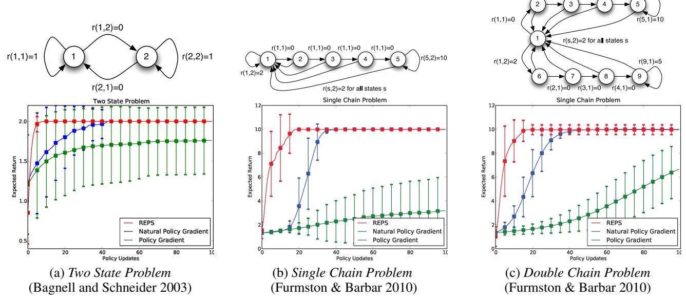
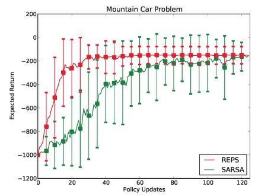
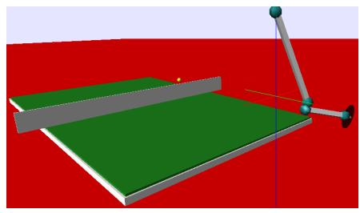

# **Relative Entropy Policy Search**

# Jan Peters, Katharina Mülling, Yasemin Altün

Max Planck Institute for Biological Cybernetics, Spemannstr. 38, 72076 Tübingen, Germany {jrpeters, muelling, altun}@tuebingen.mpg.de

#### Abstract

Policy search is a successful approach to reinforcement learning. However, policy improvements often result in the loss of information. Hence, it has been marred by premature convergence and implausible solutions. As first suggested in the context of covariant policy gradients (Bagnell and Schneider 2003), many of these problems may be addressed by constraining the information loss. In this paper, we continue this path of reasoning and suggest the Relative Entropy Policy Search (REPS) method. The resulting method differs significantly from previous policy gradient approaches and yields an exact update step. It works well on typical reinforcement learning benchmark problems.

#### Introduction

Policy search is a reinforcement learning approach that attempts to learn improved policies based on information observed in past trials or from observations of another agent's actions (Bagnell and Schneider 2003). However, policy search, as most reinforcement learning approaches, is usually phrased in an optimal control framework where it directly optimizes the expected return. As there is no notion of the sampled data or a sampling policy in this problem statement, there is a disconnect between finding an optimal policy and staying close to the observed data. In an online setting, many methods can deal with this problem by staying close to the previous policy (e.g., policy gradient methods allow only small incremental policy updates). Hence, approaches that allow stepping further away from the data are problematic, particularly, off-policy approaches Directly optimizing a policy will automatically result in a loss of data as an improved policy needs to forget experience to avoid the mistakes of the past and to aim on the observed successes. However, choosing an improved policy purely based on its return favors biased solutions that eliminate states in which only bad actions have been tried out. This problem is known as optimization bias (Mannor et al. 2007). Optimization biases may appear in most on- and off-policy reinforcement learning methods due to undersampling (e.g., if we cannot sample all state-actions pairs prescribed by a policy, we will overfit the taken actions), model errors or even the policy update step itself.

Copyright © 2010, Association for the Advancement of Artificial Intelligence (www.aaai.org). All rights reserved.

Policy updates may often result in a loss of essential information due to the policy improvement step. For example, a policy update that eliminates most exploration by taking the best observed action often yields fast but premature convergence to a suboptimal policy. This problem was observed by Kakade (2002) in the context of policy gradients. There, it can be attributed to the fact that the policy parameter update  $\delta\theta$  was maximizing it collinearity  $\delta\theta^T\nabla_{\theta}J$  to the policy gradient while only regularized by fixing the Euclidian length of the parameter update  $\delta\theta^T\delta\theta = \varepsilon$  to a stepsize  $\varepsilon$ . Kakade (2002) concluded that the identity metric of the distance measure was the problem, and that the usage of the Fisher information metric  $F(\theta)$  in a constraint  $\delta\theta^T F(\theta)\delta\theta = \varepsilon$  leads to a better, more natural gradient. Bagnell and Schneider (2003) clarified that the constraint introduced in (Kakade 2002) can be seen as a Taylor expansion of the loss of information or relative entropy between the path distributions generated by the original and the updated policy. Bagnell and Schneider's (2003) clarification serves as a key insight to this paper.

In this paper, we propose a new method based on this insight, that allows us to estimate new policies given a data distribution both for off-policy or on-policy reinforcement learning. We start from the optimal control problem statement subject to the constraint that the loss in information is bounded by a maximal step size. Note that the methods proposed in (Bagnell and Schneider 2003; Kakade 2002; Peters and Schaal 2008) used a small fixed step size instead. As we do not work in a parametrized policy gradient framework, we can directly compute a policy update based on all information observed from previous policies or exploratory sampling distributions. All sufficient statistics can be determined by optimizing the dual function that yields the equivalent of a value function of a policy for a data set. We show that the method outperforms the previous policy gradient algorithms (Peters and Schaal 2008) as well as SARSA (Sutton and Barto 1998).

### **Background & Notation**

We consider the regular reinforcement learning setting (Sutton and Barto 1998; Sutton et al. 2000) of a stationary Markov decision process (MDP) with n states s and m actions a. When an agent is in state s, he draws an action  $a \sim \pi(a|s)$  from a stochastic policy  $\pi$ . Subsequently, the

agent transfers from state s to s' with transition probability  $p(s'|s,a)=\mathcal{P}^a_{ss'}$ , and receives a reward  $r(s,a)=\mathcal{R}^a_s\in\mathfrak{R}$ . As a result from these state transfers, the agent may converge to a stationary state distribution  $\mu^\pi(s)$  for which

$$\forall s' : \sum\nolimits_{s,a} {{\mu ^\pi }(s)\pi (a|s)p(s'|s,a)} = {\mu ^\pi }(s') \tag{1}$$

holds under mild conditions, see (Sutton et al. 2000). The goal of the agent is to find a policy  $\pi$  that maximizes the expected return

$$J(\pi) = \sum_{s,a} \mu^{\pi}(s)\pi(a|s)r(s,a),$$
 (2)

subject to the constraints of Eq.(1) and that both  $\mu^{\pi}$  and  $\pi$  are probability distributions. This problem is called the optimal control problem; however, it does not include any notion of data as discussed in the previous section. In some cases, only some features of the full state s are relevant for the agent. In this case, we only require stationary feature vectors

$$\sum_{s,a,s'} \mu^{\pi}(s)\pi(a|s)p(s'|s,a)\phi_{s'} = \sum_{s'} \mu^{\pi}(s')\phi_{s'}.$$
 (3)

Note that when using Cartesian unit vectors  $u_{s'}$  of length n as features  $\phi_{s'} = u_{s'}$ , Eq.(3) will become Eq.(1). Using features instead of states relaxes the stationarity condition considerably and often allows a significant speed-up while only resulting in approximate solutions and being highly dependable on the choice of the features. Good features may be RBF features and tile codes, see (Sutton and Barto 1998).

# **Relative Entropy Policy Search**

We will first motivate our approach and, subsequently, give several practical implementations that will be applied in the evaluations.

### Motivation

Relative entropy policy search (REPS) aims at finding the optimal policy that maximizes the expected return based on all observed series of states, actions and rewards. At the same time, we intend to bound the loss of information measured using relative entropy between the observed data distribution q(s,a) and the data distribution  $p^{\pi}(s,a) = \mu^{\pi}(s)\pi(a|s)$  generated by the new policy  $\pi$ . Ideally, we want to make use of every sample (s,a,s',r) independently, hence, we express the information loss bound as

$$D(p^{\pi}||q) = \sum_{s,a} \mu^{\pi}(s)\pi(a|s)\log\frac{\mu^{\pi}(s)\pi(a|s)}{q(s,a)} \le \varepsilon, \quad (4)$$

where  $D(p^{\pi}||q)$  denotes the Kullback-Leibler divergence, q(s,a) denotes the observed state-action distribution, and  $\varepsilon$  is our maximal information loss.

**Problem Statement.** The goal of relative entropy policy search is to obtain policies that maximize the expected reward  $J(\pi)$  while the information loss is bounded, i.e.,

$$\max_{\pi,\mu^{\pi}} J(\pi) = \sum_{s,a} \mu^{\pi}(s) \pi(a|s) \mathcal{R}_{s}^{a}, \tag{5}$$

s.t. 
$$\varepsilon \ge \sum_{s,a} \mu^{\pi}(s)\pi(a|s)\log\frac{\mu^{\pi}(s)\pi(a|s)}{q(s,a)}$$
, (6)

$$\sum_{s'} \mu^{\pi}(s')\phi_{s'} = \sum_{s,a,s'} \mu^{\pi}(s)\pi(a|s)\mathcal{P}^{a}_{ss'}\phi_{s'},\tag{7}$$

$$1 = \sum_{s,a} \mu^{\pi}(s)\pi(a|s). \tag{8}$$

Both  $\mu^{\pi}$  and  $\pi$  are probability distributions and the features  $\phi_{s'}$  of the MDP are stationary under policy  $\pi$ .

Without the information loss bound constraint in Eq.(6), there is no notion of sampled data and we obtain the stochastic control problem where differentiation of the Langrangian also yields the classical Bellman equation  $\phi_s^T\theta = \mathcal{R}_s^a - \lambda + \sum_{s'} \mathcal{P}_{ss'}^a \phi_{s'}^T\theta$ . In this equation,  $\phi_s^T\theta = V_\theta(s)$  is known today as value function while the Langrangian multipliers  $\theta$  become parameters and  $\lambda$  the average return. While such MDPs may be solved by linear programming (Puterman 2005), approaches that employ sampled experience cannot be derived properly from these equations. The key difference to past optimal control approaches lies in the addition of the constraint in Eq. (6).

As discussed in the introduction, natural policy gradient may be derived from a similar problem statement. However, the natural policy gradient requires that  $\varepsilon$  is small, it can only be properly derived for the path space formulation and it can only be derived from a local, second order Taylor approximation of the problem. Stepping away further from the sampling distribution q will violate these assumptions and, hence, natural policy gradients are inevitably on-policy1.

The  $\varepsilon$  can be chosen freely where larger values lead to bigger steps while excessively large values can destroy the policy. Its size depends on the problem as well as on the amount of available samples.

## **Relative Entropy Policy Search Method**

As shown in the appendix, we can obtain a reinforcement learning algorithm straightforwardly.

**Proposed Solution.** The optimal policy for Problem is given by  $g(x,y) = \frac{1}{2} \delta_{x}(x,y)$ 

$$\pi(a|s) = \frac{q(s,a) \exp\left(\frac{1}{\eta}\delta_{\theta}(s,a)\right)}{\sum_{b} q(s,b) \exp\left(\frac{1}{\eta}\delta_{\theta}(s,b)\right)},\tag{9}$$

where  $\delta_{\theta}(s,a) = \mathcal{R}^a_s + \sum_{s'} \mathcal{P}^a_{ss'} V_{\theta}(s') - V_{\theta}(s)$  denotes the Bellman error. Here, the value function  $V_s(\theta) = \theta^T \phi_s$  is determined by minimizing

$$g(\theta, \eta) = \eta \log \left( \sum_{s, a} q(s, a) \exp \left( \varepsilon + \frac{1}{\eta} \delta_{\theta}(s, a) \right) \right), \quad (10)$$

with respect to  $\theta$  and  $\eta$ .

The value function  $V_{\theta}(s) = \phi_s^T \theta$  appears naturally in the derivation of this formulation (see Appendix). The new error

&lt;sup>1Note that there exist sample re-use strategies for larger step away from q using importance sampling, see (Sutton and Barto 1998; Peshkin and Shelton 2002; Hachiya, Akiyama, Sugiyama and Peters 2008), or off-policy approaches such as Q-Learning (which is known to have problems in approximate, feature-based learning).

### **Relative Entropy Policy Search**

**input:** features  $\phi(s)$ , maximal information loss  $\epsilon$ .

for each policy update

**Sampling:** Obtain samples  $(s_i, a_i, s'_i, r_i)$ , e.g., by observing another policy or being on-policy.

**Counting:** Count samples to obtain the sampling distribution  $q(s,a)=\frac{1}{N}\sum_{i=1}^{N}\mathbb{I}_{sa}^{i}.$ 

**Critic:** Evaluate policy for  $\eta$  and  $\theta$ 

Define Bellman Error Function:  $\delta_{\theta}(s, a) = \mathcal{R}^{a}_{s} + \sum_{s'} \mathcal{P}^{a}_{ss'} \phi^{T}_{s'} \theta - \phi^{T}_{s} \theta$ 

Compute Dual Function:

$$g(\theta, \eta) = \eta \log \left( \sum_{s,a} q(s, a) e^{\varepsilon + \frac{1}{\eta} \delta_{\theta}(s, a)} \right)$$

Compute the Dual Function's Derivative :

Compute the Dual Function's Derivative : 
$$\partial_{\theta}g = \eta \frac{\sum_{s,a} q(s,a) e^{\varepsilon + \frac{1}{\eta} \delta_{\theta}(s,a)} \left(\sum_{s'} \mathcal{P}^{a}_{ss'} \phi_{s'} - \phi_{s}\right)}{\sum_{s,a} q(s,a) e^{\varepsilon + \frac{1}{\eta} \delta_{\theta}(s,a)}}$$
$$\partial_{\eta}g = \log \left(\sum_{s,a} q(s,a) e^{\varepsilon + \frac{1}{\eta} \delta_{\theta}(s,a)} - \frac{\sum_{s,a} q(s,a) e^{\varepsilon + \frac{1}{\eta} \delta_{\theta}(s,a)} \frac{1}{\eta^{2}} \delta_{\theta}(s,a)}{\sum_{s,a} q(s,a) e^{\varepsilon + \frac{1}{\eta} \delta_{\theta}(s,a)}}\right)$$

Optimize:  $(\theta^*, \eta^*) = \text{fmin\_BFGS}(g, \partial g, [\theta_0, \eta_0])$ Determine Value Function:  $V_{\theta^*}(s) = \phi_s^T \theta^*$ 

Actor: Compute new policy  $\pi(a|s)$ .  $\pi(a|s) = \frac{q(s,a) \exp\left(\frac{1}{\eta^*} \delta_{\theta^*}(s,a)\right)}{\sum_b q(s,b) \exp\left(\frac{1}{\eta^*} \delta_{\theta^*}(s,b)\right)},$ 

**Output:** Policy  $\pi(a|s)$ .

Table 1: Algorithmic description of Relative Entropy Policy Search. This algorithm reflects the proposed solution clearly. Note that  $\mathbb{I}^i_{sa}$  is an indicator function such that  $\mathbb{I}^i_{sa}=1$  if  $s=s_i$  and  $a=a_i$  while  $\mathbb{I}^i_{sa}=0$  otherwise. In Table 2, we show a possible application of this method in policy iteration.

function for the critic in Eq.(10) differs substantially from traditional temporal difference errors, residual gradient errors and monte-carlo rollout fittings (Sutton and Barto 1998; Sutton et al. 2000). The presented solution is derived for arbitrary stationary features and is therefore sound with function approximation. The derived policy is similar to the Gibbs policy used in policy gradient approaches (Sutton et al. 2000) and in SARSA (Sutton and Barto 1998).

In order to turn proposed solution into algorithms, we need to efficiently determine the solution  $(\theta^*, \eta^*)$  of the dual function g. Eq. (10) can be rewritten as

$$\min_{\theta,\tilde{\eta}} g(\theta,\tilde{\eta}) = \tilde{\eta}^{-1} \log \sum_{s,a} \exp\left(\log q(s,a) + \varepsilon + \tilde{\eta} \delta_{\theta}(s,a)\right),\,$$

which is known to be convex (Boyd and Vandenberghe 2004) as  $\delta_{\theta}(s,a)$  is linear in  $\theta$ . Given that g is convex and smoothly differentiable, we can determine the optimal solution  $g(\theta^*, \eta^*)$  efficiently with any standard optimizer such as

Broyden–Fletcher–Goldfarb–Shannon (BFGS) method (denoted in this paper by fmin\_BFGS  $(g, \partial g, [\theta_0, \eta_0])$  with  $\partial g = [\partial_\theta g, \partial_\eta g]$ ). The resulting method is given in Table 1

### Sample-based Policy Iteration with REPS

If the REPS algorithm is used in a policy iteration scenario, one can re-use parts of the sampling distribution q(s,a). As we know that  $q(s,a) = \mu^{\pi_l}(s)\pi_l(a|s)$  where  $\pi_l$  denotes the last policy in a policy iteration scenario, we can also write our new policy as

$$\pi_{l+1}(a|s) = \frac{\pi_l(a|s) \exp\left(\frac{1}{\eta}\delta_{\theta}(s, a)\right)}{\sum_b \pi_l(a|s) \exp\left(\frac{1}{\eta}\delta_{\theta}(s, b)\right)}.$$

As a result, we can also evaluate our policy at states where no actions have been taken. Setting  $\pi_l$  to good locations allows encoding prior knowledge on the policy. This update has the intuitive interpretation that an increase in log-probability of an action is determined by the Bellman error minus a baseline similar to its mean, i.e.,  $\log \pi_{l+1}(a|s) = \log \pi_l(a|s) + \frac{1}{n}\delta_\theta(s,a) - b(s)$ .

Obviously, the algorithm as presented in the previous section would be handicapped by maintaining a high accuracy model of the Markov decision problem  $(\mathcal{R}^a_s, \mathcal{P}^a_{ss'})$ . Model estimation would require covering prohibitively many states and actions, and it is hard to obtain an error-free model from data (Deisenroth 2009; Sutton and Barto 1998). Furtheremore, in most interesting control problems, we do not intend to visit all states and take all actions — hence, the number of samples N may often be smaller than the number of all state-action pairs mn. Thus, in order to become model-free, we need to rephrase the algorithm in terms of sample averages instead of the system model.

The next step is hence to replace the summations over states s, s', and actions a by summations over samples  $(s_i, a_i, s'_i, r_i)$ . It turns out that this step can be accomplished straightforwardly as all components of REPS can be expressed using sample-based replacements such as  $\sum_{s,a} q(s,a) f(s,a) = \frac{1}{N} \sum_{i=1}^{N} f(s_i,a_i)$ . As the Bellman error  $\delta_{\theta}(s_i,a_i)$  only needs to be maintained for the executed actions, we can also approximate it using sample averages.

Using these two insights, we can design a generalized policy iteration algorithm that is based on samples while using the main insights of Relative Entropy Policy Search. The resulting method is shown in Table 2. Note that Table 2 does not include sample re-use in REPS policy iteration. However, this step may be included straightfowardly as we can mix data from previous iterations with the current one by using all data in the critic and the sum of all previous policies in the actor update. While such remixing will require more policy update steps, it may improve robustness and allow updates after fewer sampled actions.

### **Experiments**

In the following section, we test our Sample-based Policy Iteration with Relative Entropy Policy Search approach using

Figure 1: Three different methods are compared on three toy examples. The vanilla policy gradients are significantly outperformed due to their slow convergence as already discussed by Bagnell and Schneider (2003) for the Two State Problem. Policy iteration based on Relative Entropy Policy Search (REPS) exhibited the best performance.

first several example problems from the literature and, subsequently, on the Mountain Car standard evaluation. Subsequently, we show first steps towards a robot application currently under development.

Example Problems We compare our approach both to 'vanilla' policy gradient methods and natural policy gradients (Bagnell and Schneider 2003; Peters and Schaal 2008) using several toy problems. As such, we have chosen (i) the Two-State Problem (Bagnell and Schneider 2003), (ii) the Single Chain Problem (Furmston and Barber 2010), and (iii) the Double Chain Problem (Furmston and Barber 2010). In all of these problems, the optimal policy can be observed straightforwardly by a human observer but they pose a major challenge for 'vanilla' policy gradient approaches.

**Two State Problem.** The two state problem has two states and two actions. If it takes the action that has the same number as its current state, it will remain in this state. If it takes the action that has the others state's number, it will transfer to that one. State transfers are punished while staying in ones' state will give an immidiate reward that equals the number of the state. This problem is a derivate of the one in (Bagnell and Schneider 2003). The optimal policy can be observed straightforwardly: always take action 2. See Fig. 1 (a) for more information.

**Single Chain Problem.** The Single Chain Problem can be seen as an extension of the Two State Problem. Here, the actor may return to state 1 at any point in time by taking action 2 and receiving a reward of 2. However, if he keeps using action 1 all the time, he will not receive any rewards until he reaches state 5 where he obtains the reward of 10 and may remain in state 5. The version presented here was

inspired by Furmston & Barbar (2010). See Fig. 1 (b) for more information.

**Double Chain Problem.** The Double Chain Problem concatinates two single chain problems into one big one were state 1 is shared. As before, returning to state 1 will yield a reward 2 and requires taking action 2. If in state 1, action 2 will lead to state 6 and also yield a reward of 2. An action 1 yields a reward 5 in state 9 and a reward 10 in state 5. In all other states, action 1 will yield 0 reward. Note that this problem differs from (Furmston and Barber 2010) significantly. We have made it purposefully harder for any incremental method in order to highligh the advantage of the presented approach. See Fig. 1 (c) for more information.

We used unit features for all methods. For the two policy gradient approaches a Gibbs policy was employed (Sutton et al. 2000; Bagnell and Schneider 2003). On all three problems, we let our policy run until the state distribution has converged to the stationary distribution. For small problems like the presented ones, this usually takes less than 200 steps. Subsequently, we update the policy and resample. We take highly optimized vanilla policy gradients with minimumvariance baselines (Peters and Schaal 2008) and the Natural Actor-Critic with unit basis functions as additional function approximation (Peters and Schaal 2008). Instead of a small fixed learning rate, we use an additional momentum term in order to improve the performance. We tuned all meta-parameters of the gradient methods to maximum performance. We start with the same random initial policies for all algorithms and average over 150 learning runs. Nevertheless, similar as in (Bagnell and Schneider 2003; Peters and Schaal 2008), we directly observe that natural gradient outperforms the vanilla policy gradient. Fur-

### **Policy Iteration with REPS**

**input:** features  $\phi(s)$ , maximal information loss  $\epsilon$ , initial policy  $\pi_0(a|s)$ .

**for each** policy update k

**Sampling:** Obtain N samples  $(s_i, a_i, s'_i, r_i)$  using current policy  $\pi_k(a|s)$  in an on-policy setting.

**Critic:** Evaluate policy for  $\eta$  and  $\theta$ .

for every sample i = 0 to N do:

$$\begin{cases}
n_{\delta}(s_i, a_i) = n_{\delta}(s_i, a_i) + (r_i + \phi_{s'_i}^T \theta - \phi_{s_i}^T \theta) \\
n_{\Lambda}(s_i, a_i) = n_{\Lambda}(s_i, a_i) + (\phi_{s'_i} - \phi_{s_i}) \\
d(s_i, a_i) = d(s_i, a_i) + 1
\end{cases}$$

Bellman Error Function:  $\delta_{\theta}(s, a) = \frac{n_{\delta}(s, a)}{d(s, a)}$ 

Feature Difference:  $\Lambda(s,a) = \frac{n_{\Lambda}(s,a)}{d(s,a)}$ 

Compute Dual Function:

$$g(\theta, \eta) = \eta \log \left( \frac{1}{N} \sum_{i=1}^{N} e^{\varepsilon + \frac{1}{\eta} \delta_{\theta}(s_i, a_i)} \right)$$

Compute the Dual Function's Derivative:

$$\begin{split} \partial_{\theta}g &= \eta \frac{\sum_{i=1}^{N} e^{\varepsilon + \frac{1}{\eta} \delta_{\theta}(s_{i}, a_{i})} \Lambda(s_{i}, a_{i})}{\sum_{i=1}^{N} e^{\varepsilon + \frac{1}{\eta} \delta_{\theta}(s_{i}, a_{i})}} \\ \partial_{\eta}g &= \log \left( \sum_{i=1}^{N} e^{\varepsilon + \frac{1}{\eta} \delta_{\theta}(s_{i}, a_{i})} \right) \\ &- \frac{\sum_{i=1}^{N} e^{\varepsilon + \frac{1}{\eta} \delta_{\theta}(s_{i}, a_{i})} \frac{1}{\eta^{2}} \delta_{\theta}(s_{i}, a_{i})}{\sum_{i=1}^{N} e^{\varepsilon + \frac{1}{\eta} \delta_{\theta}(s_{i}, a_{i})}} \end{split}$$

Optimize:  $(\theta^*, \eta^*) = \text{fmin\_BFGS}(g, \partial g, [\theta_0, \eta_0])$ Determine Value Function:  $V_{\theta^*}(s) = \phi_s^T \theta^*$ 

Actor: Compute new policy  $\pi_{k+1}(a|s)$ .  $\pi_{k+1}(a|s) = \frac{\pi_k(a|s) \exp\left(\frac{1}{\eta^*} \delta_{\theta^*}(s,a)\right)}{\sum_b \pi_k(a|s) \exp\left(\frac{1}{\eta^*} \delta_{\theta^*}(s,b)\right)}$ 

**Output:** Optimal policy  $\pi^*(a|s)$ .

Table 2: Algorithmic description of Policy Iteration based on Relative Entropy Policy Search. This version of the algorithm extends the one in Table 1 for practical application. Note that N is not a fixed number but may change after every iteration.

thermore, we also observe that our REPS policy iteration yields a significantly higher performance. A comparison with PoWER (Kober and Peters 2009) was not necessary as the episodic form of REPS appears to be equivalent to the applicable version of PoWER. The performance of all three methods for all three problems is shown in Fig. 1 (a-c).

#### **Mountain-Car Problem**

The mountain car problem (Sutton and Barto 1998) is a wellknown problem in reinforcement learning.

We adapt the code from (Hernandez 2010) and employ the same tile-coding features for both SARSA and REPS. We implement our algorithm in the same settings and are able to show that REPS policy iteration also outperforms SARSA. While SARSA is superficially quite similar to the presented

Figure 2: Performance on the mountain-car problem.

Figure 3: Simulated setup for learning robot table tennis.

method, it differs significantly in two parts, i.e., the critic of SARSA converges slower, and the additional multiplication by the previous policy results in a faster pruning of taken bad actions in the REPS approach. As a result, REPS is significantly faster than SARSA as can be observed in Fig. 2.

#### **Primitive Selection in Robot Table Tennis**

Table tennis is a hard benchmark problem for robot learning that includes most difficulties of complex skill. The setup is shown in Fig. 3. A key problem in a skill learning system with multiple motor primitives (e.g., many different forehands, backhands, smashes, etc.) is the selection of task-appropriate primitives triggered by an external stimulus. Here, we have generated a large set of motor primitives that are triggered by a gating network that selects and generalizes among them similar to a mixture of experts. REPS improves the gating network by reinforcement learning where any successful hit results as a reward of +1 and for failures no reward is given. REPS appears to be sensitive to good initial sampling policies. The results vary considerably with initial policy performance. When the system starts with an initial policy that has a success rate of  $\sim$ 24%, it may quickly converge prematurely yielding a success rate of ~39%. If provided a better initialization, it can reach success rates of up to  $\sim$ 59%.

#### **Discussion & Conclusion**

In this paper, we have introduced a new reinforcement learning method called Relative Entropy Policy Search. It is derived from a principle as previous covariant policy gradient methods (Bagnell and Schneider 2003), i.e., attaining maximal expected reward while bounding the amount of information loss. Unlike parametric gradient method, it allows an exact policy update and may use data generated while following an unknown policy to generate a new, better policy. It resembles the well-known reinforcement learning method SARSA to an extent; however, it can be shown to outperform it as the critic operates on a different, more sound cost function than traditional temporal difference learning, and as its weighted "soft-max" policy update will promote successful actions faster than the standard soft-max. We have shown that the method performs efficiently when used in a policy iteration setup. REPS is sound with function approximation and can be kernelized straightforwardly which offers interesting possibilities for new algorithms. The relation to PoWER (Kober and Peters 2009) and Reward-Weighted Regression is not yet fully understood as these methods minimize  $D(p^{\pi}(\tau)||r(\tau)q(\tau))$  which is superficially similar to maximizing  $E_p\{r(\tau)\}$  subject to  $D(p^{\pi}(\tau)||q(\tau))$ . Both methods end up with very similar update equations for the episodic case. Application of REPS for reinforcement learning of motor primitive selection for robot table tennis has been successful in simulation.

### References

Atkeson, C. G. 1993. Using local trajectory optimizers to speed up global optimization in dynamic programming. In *NIPS*, 663–670.

Bagnell, J., and Schneider, J. 2003. Covariant policy search. In *International Joint Conference on Artificial Intelligence*.

Boyd, S., and Vandenberghe, L. 2004. *Convex Optimization*. Cambridge University Press.

de Farias, D. P., and Roy, B. V. 2003. The linear programming approach to approximate dynamic programming. *Operations Research* 51(6):850–856.

Deisenroth, M. 2009. *Efficient Reinforcement Learning using Gaussian Processes*. Ph.D. thesis, Karlsruhe Institute of Technology, Karlsruhe, Germany.

Furmston, T., and Barber, D. 2010. Variational methods for reinforcement learning. In *AISTATS*.

Hachiya, H.; Akiyama, T.; Sugiyama, M.; Peters, J.; 2008. Adaptive importance sampling with automatic model selection in value function approximation. In *AAAI*, 1351–1356.

Hernandez, J. 2010. http://www.dia.fi.upm.es/ ja-martin/download.htm.

Kakade, S. A. 2002. Natural policy gradient. In *Advances in Neural Information Processing Systems 14*.

Kober, J.; Peters, J. 2009. Policy Search for Motor Primitives in Robotics. In *Advances in Neural Information Processing Systems* 22.

Mannor, S.; Simester, D.; Sun, P.; and Tsitsiklis, J. N. 2007. Biases and variance in value function estimates. *Management Science* 53(2):308–322.

Peshkin, L., and Shelton, C. R. 2002. Learning from scarce experience. In *ICML*, 498–505.

Peters, J., and Schaal, S. 2008. Natural actor critic. *Neuro-computing* 71(7-9):1180–1190.

Puterman, M. L. 2005. *Markov Decision Processes: Discrete Stochastic Dynamic Programming*. New York, NY: John Wiley and Sons.

Sutton, R., and Barto, A. 1998. *Reinforcement Learning*. MIT Press.

Sutton, R.; McAllester, D.; Singh, S.; and Mansour, Y. 2000. Policy gradient methods for reinforcement learning with function approximation. In *Advances in Neural Information Processing Systems 12*.

### **Derivation of REPS**

We denote  $p_{sa} = \mu^{\pi}(s)\pi(a|s)$  and  $\mu^{\pi}(s) = \sum_{a} p_{sa}$  for brevity of the derivations, and give the Lagrangian for the program in Eqs.(5-8) by

$$L = \left(\sum_{s,a} p_{sa} \mathcal{R}_{s}^{a}\right) + \eta \left(\varepsilon - \sum_{s,a} p_{sa} \log \frac{p_{sa}}{q_{sa}}\right)$$

$$+ \sum_{s'} \theta^{T} \left(\sum_{s,a} p_{sa} \mathcal{P}_{ss'}^{a} \phi_{s'} - \sum_{a'} p_{s'a'} \phi_{s'}\right) + \lambda \left(1 - \sum_{s,a} p_{sa}\right),$$

$$= \sum_{s,a} p_{sa} \left(\mathcal{R}_{s}^{a} - \eta \log \frac{p_{sa}}{q_{sa}} - \lambda - \theta_{s}^{T} \phi_{s} + \sum_{s'} \mathcal{P}_{ss'}^{a} \theta_{s'}^{T} \phi_{s'}\right)$$

$$+ \eta \varepsilon + \lambda,$$

$$(11)$$

where  $\eta$ ,  $\theta$  and  $\lambda$  denote the Lagrangian multipliers. We substitute  $V_s = \theta^T \phi_s$ . We differentiate

$$\partial_{p_{sa}} L = \mathcal{R}_s^a - \eta \log \frac{p_{sa}}{q_{sa}} + \eta - \lambda + \sum_{s'} \mathcal{P}_{ss'}^a V_{s'} - V_s = 0,$$

and obtain  $p_{sa}=q_{sa}e^{\frac{1}{\eta}\left(\mathcal{R}^a_s+\sum_{s'}\mathcal{P}^a_{ss'}V_{s'}-V_s\right)}e^{1-\frac{\lambda}{\eta}}.$  Given that we require  $\sum_{s,a}p_{sa}=1$ , it is necessary that

$$e^{1-\frac{\lambda}{\eta}} = \left(\sum_{s,a} q_{sa} e^{\frac{1}{\eta} \left(\mathcal{R}_s^a + \sum_{s'} \mathcal{P}_{ss'}^a V_{s'} - V_s\right)}\right)^{-1}, \quad (12)$$

(hence,  $\lambda$  depends on  $\theta$ ), and we can compute

$$p_{sa} = \frac{q_{sa} \exp\left(\frac{1}{\eta} \left(\mathcal{R}_s^a + \sum_{s'} \mathcal{P}_{ss'}^a V_{s'} - V_s\right)\right)}{\sum_{s,a} q_{sa} \exp\left(\frac{1}{\eta} \left(\mathcal{R}_s^a + \sum_{s'} \mathcal{P}_{ss'}^a V_{s'} - V_s\right)\right)}$$
(13)

We can extract a policy using  $\pi(a|s) = p_{sa}/\sum_a p_{sa}$ , and hence optain Eq. (9). Reinserting these results into Eq.(11), we obtain the dual function

$$g\left(\theta,\eta,\lambda\right) = -\eta + \eta\varepsilon + \lambda = -\eta\log\left(e^{1-\frac{\lambda}{\eta}}e^{-\varepsilon}\right),$$

which can be rewritten as Eq.(10) by inserting Eq.(12).