#### **ORIGINAL ARTICLE**

# Simultaneous instance pooling and bag representation selection approach for multiple-instance learning (MIL) using vision transformer

Muhammad Waqas1,2 • Muhammad Atif Tahir1 • Muhammad Danish Author3 • Sumaya Al-Maadeed4 • Ahmed Bouridane5 • Jia Wu2

Received: 10 April 2023 / Accepted: 14 January 2024 / Published online: 16 February 2024 © The Author(s) 2024

#### **Abstract**

In multiple-instance learning (MIL), the existing bag encoding and attention-based pooling approaches assume that the instances in the bag have no relationship among them. This assumption is unsuited, as the instances in the bags are rarely independent in diverse MIL applications. In contrast, the instance relationship assumption-based techniques incorporate the instance relationship information in the classification process. However, in MIL, the bag composition process is complicated, and it may be possible that instances in one bag are related and instances in another bag are not. In present MIL algorithms, this relationship assumption is not explicitly modeled. The learning algorithm is trained based on one of two relationship assumptions (whether instances in all bags have a relationship or not). Hence, it is essential to model the assumption of instance relationships in the bag classification process. This paper proposes a robust approach that generates vector representation for the bag for both assumptions and the representation selection process to determine whether to consider the instances related or unrelated in the bag classification process. This process helps to determine the essential bag representation vector for every individual bag. The proposed method utilizes attention pooling and vision transformer approaches to generate bag representation vectors. Later, the representation selection subnetwork determines the vector representation essential for bag classification in an end-to-end trainable manner. The generalization abilities of the proposed framework are demonstrated through extensive experiments on several benchmark datasets. The experiments demonstrate that the proposed approach outperforms other state-of-the-art MIL approaches in bag classification.

**Keywords** Multiple-instance learning (MIL) · Vision transformers · Attention-based pooling · Bag representation selection

#### 1 Introduction

The multiple-instance learning (MIL) approach is a case of weakly supervised learning [1]. This learning approach is used where labeling cost is a major restriction for annotating every data instance [2]. In MIL, the data are represented as bags with multiple instances, with only one label for each bag. Unlike supervised learning, the labels of the instances are not available in the training process. The model in MIL is trained using weak bag-wise labels rather than instance-wise labels. The case of supervised learning and MIL is shown in Fig. 1a and b, respectively. In MIL, the primary objective is to develop a model that predicts the label of the test bag using training bags and corresponding labels. The application of MIL is common in

image segmentation [3], medical image classification [4], and others [5–7].

The MIL approaches can be categorized based on the classification granularity: the bag-space level classification approaches [8], which compute the distance between the bags or apply maximum margin approach to train the classifiers; embedding-space classification [9, 10], where an entire bag is transformed into a fixed-size vector representation and applies a simple single instance classification algorithms; instance-space classification [11], where the score for each instance is computed, and the bag label is obtained based on the instance scores. The studies in [12, 13] show that the first two categories are robust in bag classification compared to the last category. However, the bag-space and embedding-space classification approaches cannot identify the key instances (the instances that trigger the bag label) [13]. Identifying key instances in the bag is

Extended author information available on the last page of the article

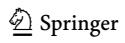

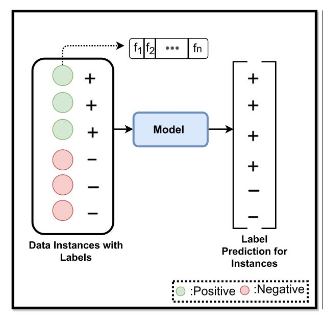

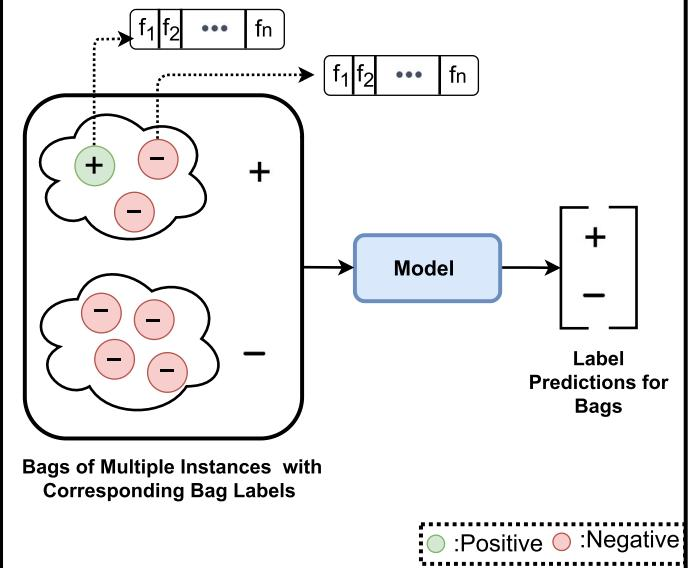

#### (a) The example of instance classification in supervised learning

Fig. 1 Supervised learning (SL) vs Multiple-Instance learning (MIL), a shows the example of instance classification setup followed in SL, where every data instance is labeled. The MIL bag classification

essential as these instances play a vital role in the bag classification process and model interpretability.

Furthermore, in the context of MIL, the bags consist of multiple instances, and the goal is to classify the bags based on their contents. However, the difficulty arises when the bags in the training set and testing come from a different distribution [14]. Previous MIL studies assume that the instances of the bag in the training and testing data are sampled from the same distribution (either related or independent). However, this assumption is often violated in real-world tasks [9, 13, 15–19].

For example, the case of MIL image classification is illustrated in Fig. 2, where the image is considered a bag, and the extracted patches are considered instances. The instances related to the Fox concept are positive instances; instances related to other objects like cars and buildings are negative instances. Figure 2 illustrates the dissimilarity between different training bag distributions, where the training set contains images of the animal of interest in natural settings. However, some images in the training and testing set may be captured in a diverse environment or contain other similar animals.

In such cases, the instances in the bag may or may not have a relationship, and it can be challenging to ascertain the presence or absence of any underlying instance relationships. Therefore, determining the relationship between the instances in the bag becomes important to model performance, and the presumption of a specific instance

#### (b) The example of bag classification in multipleinstance learning

approach is shown in  $\mathbf{b}$  where the instances are grouped in bags, and the labels are provided at bag level

relationship could potentially hinder the performance of the classification algorithm. In order to obtain better generalization, the classifier must distinguish between instances related to the fox concept, different animal species, other objects inside the bag, and their relationship. Thus, determining the relationship or independence of instances in the bag may enhance the classification process.

MIL algorithms [9, 13, 15–19] are developed based on one of two assumptions: whether instances have a relationship or not. However, it is not theoretically guaranteed that instances in all bags follow the same assumption. Additionally, existing MIL algorithms do not explicitly account for the bag-wise relationship assumption. As a result, their performance could be improved since weak bag-level labels provide only limited supervision.

For example, to identify the essential instances in the bags, a weighted average bag pooling operation is proposed using attention-based deep neural networks (AbDMIL) [13], where end-to-end trainable architectures are used to generate attention-based weights for each instance. The concept of attention pooling is further investigated in Shi et al. [15] by incorporating the attention loss mechanism. However, the existing attention-based pooling approaches [13, 15] and bag encoding strategies [9, 17] are based on the assumption that instances in the bag are independent and that no relationship exists between the instances of the bag. In this assumption, the relationship between the

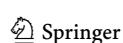

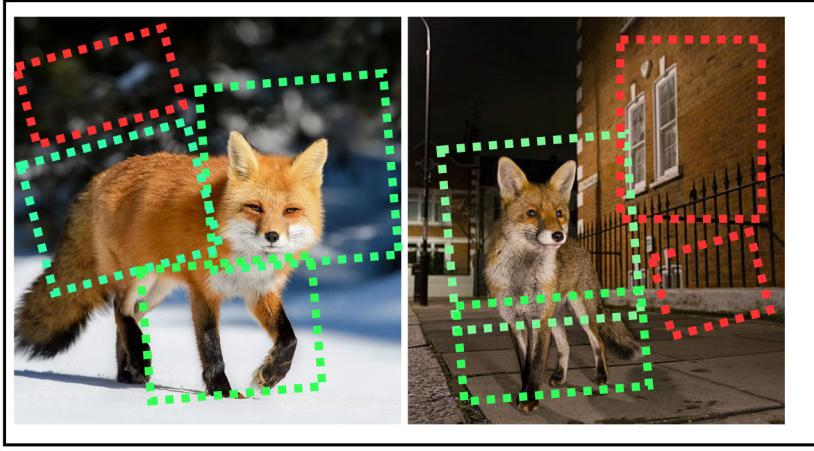

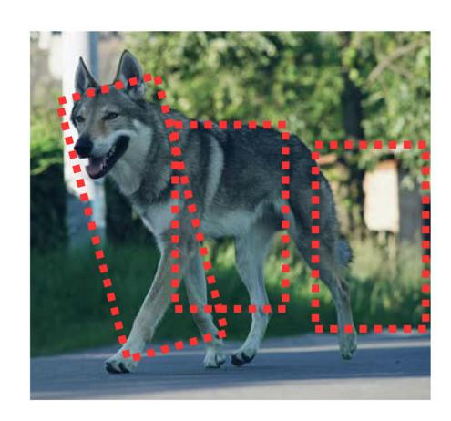

(a) Positive Training Examples

(c) Negative Testing Example

**Fig. 2** The example of distribution change where the training examples are from distribution. **a** Shows the positive training example captured in different settings, and **b** presents the negative

testing example. Green boxes mark the positive instances, while the negative instances are shown in red boxes

instances of the bags is ignored, which may result in neglecting the information in the bag [20, 21].

On the other hand, the assumption of relationship between instances is natural and may present a superior description of the data [22]. Considering the different image patches as interrelated is more meaningful than assuming the opposite, specifically in multiple-instance image classification scenarios. The assumption of instance relation is also considered for MIL problems by Zhou et al. [16]. However, these techniques mainly focus on the structural properties of the bag, and the instance relationships are modeled in terms of graph kernel learning. Additionally, this process is not end-to-end trainable.

In this paper, we propose the idea of generating bag representation vectors based on both assumptions and introduce the bag representation selection process to select a suitable representation for each bag, which addresses the limitation of the instance relationship assumption in existing MIL algorithms.

In the proposed algorithm, we incorporate bag-wise instance relationship assumption in the classification process by considering bags with varying instances as a batch, and bag representation vectors are generated for each bag based on the assumption of interaction and independence. We obtain information about the relationship between instances in a bag by using a vision transformer architecture to model the dependencies among them. Furthermore, the representation vectors for independent assumptions are derived from the mean, max, average, and attention pooling operations [13], which do not consider the relationship of instances.

In addition, we propose a differentiable representation selection network to decide whether to consider instance relationships in the classification process for each bag. We refer to the proposed approach as a vision transformerbased instance weighting and representation selection subnetwork (ViT-IWRS).

The major contributions of the paper are:

- The vision transformer (ViT)-based approach is proposed to model the relationship between the instances of the bag. This process helps to generate a bag representation vector by considering the instance relationship.
- To select informative bag representation from sets of generated bag representation vectors, a differentiable representation selection subnetwork (RSN) is proposed.
- The weight-sharing approach is presented for simultaneous instance weight learning and bag classification for ViT. This method helps to strengthen the relationship between the loss and instance weighting processes.

To demonstrate the generalization ability of the proposed approach, the experiments are performed on multiple types of data from different MIL application domains. For binary classification, five benchmark datasets are used: Musk1 and Musk2 [23] datasets for molecular activity predictions; Fox, Elephant, and Tiger datasets for image classification. For multi-class classification two datasets are used: multiple-instance MNIST (MIL-MNIST) [13] dataset for handwritten digit classification; MIL-based CIFAR-10 datasets [15] for object recognition. Additionally, the experiments are also conducted for real-world Colon Cancer detection histopathology dataset [24].

The remainder of the paper is organized into the following sections: Sect. 2 presents the literature review. Section 3 explains the proposed methodology for (ViT-IWRS). The experimental setup is given in Sect. 4. The

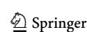

obtained results are discussed in Sect. 5, which follows the conclusive Sect. 6.

#### 2 Literature review

This section presents a summary of MIL algorithms in the literature. The MIL algorithms are divided into two categories: Classical MIL techniques and Neural network-based techniques. These categories are discussed in detail in the following subsections.

# 2.1 Classical MIL techniques

Classical MIL techniques can also be categorized into bagspace and instance-space algorithms. The instance-space algorithms classify each instance in the bag individually and aggregate the instance labels to determine the bag label [11, 25]. Thus, these algorithms identify the key instances in the bag (instances that triggered the bag label). However, the unavailability of instance-level labels complicates the learning problem.

To tackle the complexity of the learning process, Andrews et al. [26] proposed two support vector machine (SVM)-based solutions to solve MIL problems: Mi-SVM for instance-space classification and MI-SVM for bagspace classification. Diversity Density (DD) and nearest neighbor approach for real-valued target in MIL are proposed in Amar et al. [27], and a similar approach combining diversity density and expectation-maximization (EM) is proposed in Zhang and Goldman [28]. These algorithms address MIL problems by assigning bag labels to the instances and training an instance-space model. However, these methods often fail when a complicated relationship between instances determines the bag label.

Random subspace clustering and instance selection approach (RSIS) is proposed in Carbonneau et al. [29], where key instances are selected from positive bags. The selected instances are then used in the instance-space ensemble learning approach. However, the instance selection procedure in RSIS results in class imbalance problems and negatively affects performance. The constructive clustering ensemble (CCE) [30] approach performs instance clustering to obtain a binary vector representation for the bag. The bit value in the binary vector determines the bag link to the clusters. However, the performance of CCE is comparatively low.

Bag-space techniques do not require access to instance labels, although they are not as explainable as instance-level approaches. For example, the graph-based kernel approach (mi-Graph) [16] transforms the bag into a graph representation and employs a distance function to compare bags. Embedding space methods for bag classification

adopt a fixed-size embedding vector used for bag classification. For example, Zhou et al. proposed two bag encoding techniques for MIL using Fisher vector encoding (miFV) and locally aggregated descriptors (miVLAD) [9]. The miFV and miVLAD keep essential bag-level information in generated bag encodings with the help of dictionary learning. However, the bag-space classification algorithms lack any mechanism to learn appropriate feature representation. Other conventional MIL algorithms include semi-supervised SVMs for MIL (MissSVM) [31], MIL with randomized trees [32], and many others [7].

# 2.2 Neural network-based MIL techniques

This section introduces the related work based on neural network (NN) architectures for MIL. Traditionally, neural networks (NN) for MIL perform instance-level classification [33]. The convolution neural networks (CNN) are also used in MIL for feature extraction through multiple convolution layers [34–36]. The best candidate search and instance positioning with the global max-pooling operation approach are explored in Hoffman [37]. However, the max-pooling is not robust enough to find the influential instance, especially in the bag classification approach [15].

To overcome the limitation of max-pooling, the concept of Noisy or [38], LSE, and generalized mean are introduced in Shi et al. [39]. However, these operators are nontrainable. In contrast, the use of an adaptive pooling approach and a fully connected network is proposed in Liu et al. [40]. MIL-based pooling approaches, e.g., mean and max-pooling operations, are proposed in Wang et al. [41], which is designed to extract features and perform back-propagation with the support of maximum response of instance feature extraction layers.

Contrary to the above discussed techniques, the attention-based pooling approach is considered as a kind of weighted average of instances in which the weights of the instances are obtained by trainable attention layers [42]. This technique has been applied in several real-world problems, such as image classification and captioning [43]. However, limited attention-based studies are available in the literature related to MIL. Attention-based instance pooling approach in Ilse [13] proposed two-layer (AbD-MIL) and three-layer (Gated-AbDMIL) networks to attain instance weights. This approach focuses on binary classification problems and uses an additional layer for bag classification. The loss-based attention (LBA) approach [15] proposed a weight-sharing approach among fully connected layers and attention layers. However, the attention pooling techniques [13, 15] assume no dependence among instances in the bag. Unlike previous attentionbased techniques, the proposed ViT-IWRS generates several bag representations based on both assumptions and

selects the suitable bag representation for the classification process.

# 3 Proposed methodology

The proposed ViT-IWRS consists of four steps. In the first step, we propose a vision transformer-based approach to identify the dependencies between the bag instances. This process transforms input instances into latent representations using an embedding network and provides the latent transformation as input to a transformer encoder. The encoding process involves a multi-head-self-attention process that captures the global dependencies between the instances in the bag. With the output of the encoding process, we compute the weights for the bag instances in the second step. The weighting process ensures the assignment of higher weights to the essential instances in the bag. The process of instance embedding and transformer encoding is shown in Fig. 3a, while the process of instance weighting is illustrated in Fig. 3b.

The third step of the proposed approach involves generating bag representation vectors from instance weights for both instance relationship assumptions using encoder outputs and latent representations. Weights assigned to instances determine the composition of the representation vector and ensure that informative instances are represented more prominently. Figure 3c illustrates the vector representation generation process. As a final step, the representation selection subnetwork (RSN) selects the final bag representation vector from a set of generated bag representation vectors. The RSN and bag classification process function is shown in Fig. 3d. In the following subsection, we present problem formulation, a brief discussion of the vision transformer, and each step of the proposed approach in detail.

# 3.1 Problem formulation

In binary MIL classification problem, for a given bag  $B_i = \{x_{i,1}, x_{i,2}, x_{i,3}, \dots, x_{i,mi}\}$  of mi total instances with d dimensions, where  $x_{i,j}$  represents jth instance of ith bag. The objective is to predict a bag target label  $\mathcal{Y}_i \in \{1,0\}$ . The prediction of bag label depends on the corresponding set of instance-level labels  $\{y_{i,1}, y_{i,2}, \dots, y_{i,m}\}$ , where  $y_{i,j} \in \{1,0\}$ . The instance-level labels remain unknown while the model training and  $\mathcal{Y}_i$  for binary classification is obtained as:

$$\mathcal{Y}_i = \begin{cases} 0 & \text{iff } \sum_{j=1}^m y_{i,j} = 0\\ 1 & \text{otherwise }. \end{cases}$$
 (1)

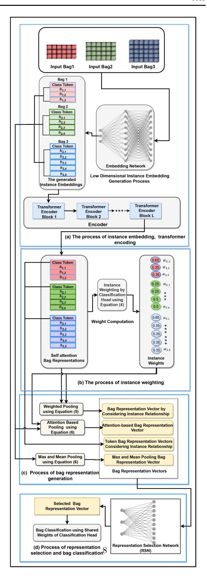

◄Fig. 3 The Proposed ViT-IWRS framework. The top row in this block represents 3 different input bags (red, green, and blue) with a different number of instances (3, 4 and 5). Block (a) illustrates instance embedding and the transformer encoding process. The instance selection mechanism is shown in (b). The bag representation generation block is presented in (c). The representation weighting and bag classification process is shown in (d)

In this paper, we concentrate on bag-level classification for binary and multi-class MIL applications. Therefore, a representation vector is generated for the bag of instances and the model classifies the bag representation vector instead of individual instances.

Given a bag representation vector and corresponding bag label, the model generates a K-dimensional vector of class scores  $s^K$ , where K represents the number of classes. In this case, the bag label is determined by:

$$\mathcal{Y}_i = \operatorname{argmax}_{k=0}^{K-1} \left( f(s)^k \right), \tag{2}$$

where  $f(s)^i = \frac{\exp(s^i)}{\sum_{j=0}^{K-1} \exp(s^j)}$  is Softmax function that squashes

the score vector  $s^k$  in the range between (0, 1) and all the resulting elements add up to 1 and are interpreted as class probabilities.

#### 3.2 Vision transformer

The Vision Transformer (ViT) is inspired by the concept of transformers in language processing models and can be seen as an alternative to the convolutional neural network (CNN) [44]. Vision Transformers (ViT) takes 1D patch embeddings as input. Therefore, the image is transformed into a sequence of two-dimensional flattened patches, and a trainable linear projection converts the generated patches to one-dimensional vectors. The projected image patches are called patch embeddings. A learnable embedding called class token is also prepended to patch embeddings. Moreover, the positional embeddings which are added to preserve the positional information of patches in the image.

Transform encoder [45] combines multi-head self-attention (MHSA) blocks with multi-layer perceptrons (MLP). Before each block, layer normalization (LN) is applied, and residual connections are used after each block. There are two layers of MLP and GELU nonlinearity in the transformer encoder. The details of the transformer encoder and MHSA process are shown in Fig. 4. Vision transfer employs one or more stacked transformer encoder blocks in the encoding generation process. The generated class token from the last transformer encoder block is then employed for classification using a classification head. The classification head consists of MLP with one hidden layer.

In MIL, the objective is classify a given bag  $\boldsymbol{B}_i = \{\boldsymbol{x}_{i,1}, \boldsymbol{x}_{i,2}, \boldsymbol{x}_{i,3}, \dots, \boldsymbol{x}_{i,mi}\}$  of mi instances, where  $\boldsymbol{x}_{i,j} \in \mathbb{R}^{1 \times d}$ . In this case, the ViT can be employed to generate robust bag embeddings and determine dependencies among the bag instances. The self-attention in the transformer encoding process can allow instances in the bag to interact with each other. It can provide essential details about the relationship of instances in the bag, which can be used to generate a robust representation vector for the bag.

At first, each instance  $x_{i,i}$  in the bag  $B_i$  is transformed into a latent representation  $h_{i,j}$  using an embedding network. The process of instance embedding corresponds to the patch embedding process in standard ViT settings. However, the embedding network can consist of multilayer perceptron (MLP) or convolution layers, depending upon the nature of the data. We used a similar design for the embedding network as previously used by Shi et al. [15] and Ilse et al. [13]. The details about the embedding network design are discussed in Sect. 5.9.1. We refer to the generated latent instance representation  $h_{i,i}$  as instance embeddings. Similarly, the embeddings for all the instances in the bag  $B_i$  are grouped and referred to as bag embeddings  $\boldsymbol{H}_{i}^{[0]} = \{\boldsymbol{h}_{i,1}, \boldsymbol{h}_{i,2}, \ldots \boldsymbol{h}_{i,mi}\}$ . Afterward, the generated bag embeddings are prepended with a learnable token  $h_{i,0}$ and  $H_i^{'[0]} = \{h_{i,0}, h_{i,1}, h_{i,2}, \ldots h_{i,mi}\}.$ 

The class token aggregates global information from the entire bag, and it allows the model to make high-level decisions based on the overall content rather than relying solely on local instance information. The class token is typically fed into a classification head for image classification tasks. In the case of MIL, the class token diversifies the set of generated vector representations for the bag. The classification token is learnable embedding and can capture global dependencies and relationships in the bag. Thus, the classification token can be used as an additional bag representation vector. It can be used as an input for the representation selection network.

The generated bag embeddings serve as input to the encoder. At the start of the training process, the class token is randomly initialized and learned during the training process. The length of the class token is the same as the length of the instance embedding in the bags. The class token is used in the MHSA process in the same way as other instance embeddings of the bag and accumulates information from other instance embeddings [44]. Here, the positional embeddings are not used as bag representation follows a permutation invariant structure. The ViT encodes the given bag embeddings  $H_i^{f[0]}$  as:

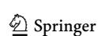

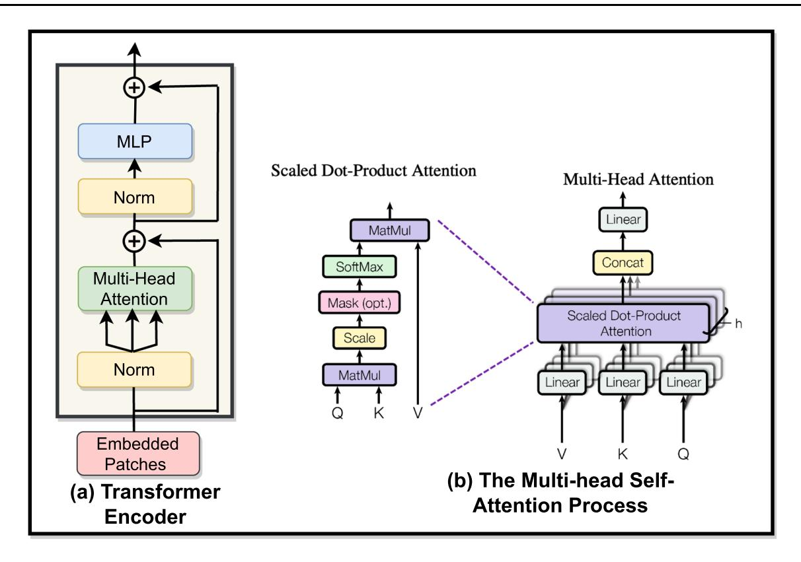

Fig. 4 The vision transformer block is shown in (a), while the process of multi-head self-attention [45] is illustrated in (b)

$$\begin{cases}
\mathbf{H}_{i}^{\prime[0]} = \left\{ \mathbf{h}_{i,0}, \mathbf{h}_{i,1}, \mathbf{h}_{i,2}, \dots \mathbf{h}_{i,mi} \right\}, \\
\mathbf{H}_{i}^{\prime[\ell-1]} = \mathrm{MHSA}\left(\mathrm{LN}\left(\mathbf{H}_{i}^{l-1}\right)\right) + \mathbf{H}_{i}^{[\ell-1]}, \quad \ell = 1 \dots L \\
\mathbf{H}_{i}^{\prime[\ell]} = \mathrm{MLP}\left(\mathrm{LN}\left(\mathbf{H}_{i}^{\prime[\ell-1]}\right)\right) + \mathbf{H}_{i}^{\prime[\ell-1]}, \quad \ell = 1 \dots L
\end{cases}$$
(3)

Where  $\ell$  represents the index of the transformer encoder block, and L denotes the depth or the total number of encoder blocks. Discussion related to the depth of ViT and the number of heads in MHSA is presented in Sect. 5.9.4. Additionally, the generated output of the encoding process is denoted by  $\boldsymbol{H}_i^{[L]} = \left[\boldsymbol{h}_{i,0}^{[L]}, \boldsymbol{h}_{i,1}^{[L]}, \boldsymbol{h}_{i,2}^{[L]}, \dots, \boldsymbol{h}_{i,mi}^{[L]}\right]$  where  $\boldsymbol{h}_{i,j}^{[L]}$  and  $\boldsymbol{h}_{i,0}^{[L]}$  denote the output of the last transformer encoder block for the corresponding input instance embedding  $\boldsymbol{h}_{i,j}$  and  $\boldsymbol{h}_{i,0}$ , respectively.

Later,  $\boldsymbol{H}_i^{'[L]}$  is used to generate bag representation vectors with the assumption of related instances, and  $\boldsymbol{H}_i^{[0]}$  is used to generate bag representation vectors without instance relationship assumption, respectively. The process of instance embedding and bag encoding using ViT is illustrated in Fig. 3a.

# 3.4 Instance weight computation

In this step, the weight for each instance in the bag is computed using the attention approach [13, 15]. This process highlights essential instances from the bag and assigns a higher weight to the informative instance. Later, the instances in the bag are pooled using a weighted average operation to obtain representation vectors for the bag. In this study, the weights of the transformer classification head are shared to learn instance weight and bag representation vector classification simultaneously. This process helps to enhance the connection between the loss and instance weighting process.

Let  $\mathbf{W} \in \mathbb{R}^{d \times K}$  be a weight matrix and  $\mathbf{b} \in \mathbb{R}^{K}$  be a bias vector of classification head f(:). Given the output of the last transformer encoder block  $\mathbf{H}_{i}^{'[L]}$  the weights for the instance in the bag  $\mathbf{B}_{i}$  are computed as:

$$\forall \mathbf{\alpha}_{1 \leq j \leq mi} \mathbf{\alpha}_{i,j} = \frac{\sum_{c=0}^{K-1} \exp\left(\mathbf{h}_{i,j}^{[L]} \mathbf{w}^{\mathbf{c}} + \mathbf{b}^{c}\right)}{\sum_{t=1}^{\min} \sum_{c=0}^{K-1} \exp\left(\mathbf{h}_{i,t}^{[L]} \mathbf{w}^{\mathbf{c}} + \mathbf{b}^{c}\right)}, \tag{4}$$

where  $\mathbf{w}^c \in \mathbb{R}^d$  is cth column vector of  $\mathbf{W}$  and  $b^c \subset \mathbf{b}$  is corresponding bias. The obtained weights are then used to generate bag representation vectors in the next step. The process of weight computation is illustrated in Fig. 3b.

## 3.5 Computation of bag representation vectors

After obtaining the weights of the instance in the bag, the next step is to compute bag representation vectors. This process transforms the bag with a variable number of instances to a manageable vector representation and transforms the MIL problem into a classical supervised learning problem. To classify the bags, one of the obtained vectors is selected using the representation selection subnetwork.

Given  $\boldsymbol{H}_{i}^{[L]} = \left[\boldsymbol{h}_{i,0}^{[L]}, \boldsymbol{h}_{i,1}^{[L]}, \boldsymbol{h}_{i,2}^{[L]}, \dots, \boldsymbol{h}_{i,mi}^{[L]}\right]$  and weights of instances  $\boldsymbol{\alpha}_{i}$  the representation vector for the bag  $\boldsymbol{B}_{i}$  are computed as:

$$\boldsymbol{\psi}_{i} = \sum_{j=1}^{mi} \boldsymbol{\alpha}_{i,j} \cdot \boldsymbol{h}_{i,j}^{[L]}. \tag{5}$$

The computed bag representations  $\psi_i$  involves the output of the transformer encoder, and  $h_{i,0}^{[L]}$  is learned class token. The learning process of these vectors considers all the instances in the bag. Thus, these vectors incorporate the information related to the relationship of instances in the bag  $B_i$ .

Additionally, bag representation vectors without assuming instance relationship are obtained based on the bag embeddings  $\boldsymbol{H}_{i}^{[0]} = \{\boldsymbol{h}_{i,1}, \boldsymbol{h}_{i,2}, \dots \boldsymbol{h}_{i,mi}\}$  as:

$$\begin{cases} \boldsymbol{\omega}_{i} = \sum_{j=1}^{mi} \boldsymbol{\alpha}_{i,j} \cdot \boldsymbol{h}_{i,j}^{[0]}, \\ \boldsymbol{max}_{i} = \max_{1 \leq j \leq mi} \left(\boldsymbol{H}_{i}^{[0]}\right), \\ \boldsymbol{\mu}_{i} = \frac{1}{mi} \sum_{i=1}^{mi} \boldsymbol{h}_{i,j}^{[0]}, \end{cases}$$
(6)

where the  $\omega_i$ ,  $\mu_i$ ,  $max_i$  represent the attention weighted average [13], mean, and max representation vectors, respectively. The computation of these representation vectors does not incorporate any dependencies or relationships between the instances of the bag. Therefore,  $\omega_i$ ,  $\mu_i$ ,  $\max_i$  are based on the assumption of unrelated instances of  $B_i$ . Figure 3c shows the representation vector generation process.

# 3.6 Representation selection subnetwork (RSN)

The instance in the bag can either be related or unrelated. Therefore, the representation vector generated by a correct distribution assumption will provide critical information to the classifier. In this case, RSN aims to select one of the representation vectors, which is most informative for the bag classification. RSN performs hard selection using

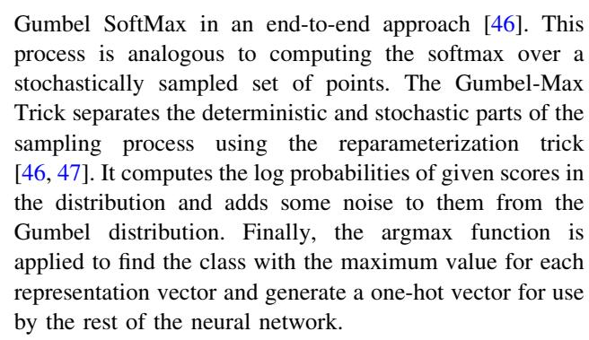

At First, the previously computed n representation vectors for the bag  $\boldsymbol{B}_i$  are combined to form a representation matrix  $\mathcal{R} = \left[\boldsymbol{h}_{i,cls}^{[L-1]}, \boldsymbol{\psi}_i, \boldsymbol{\mu}_i, \boldsymbol{max}_i, \boldsymbol{\omega}_i\right] \in \mathbb{R}^{n \times d}$ , where d denotes the length of representation vectors. Afterward, the representation matrix  $\mathcal{R}$  is given as input to RSN  $(\mathcal{R})$ , which outputs the score vector  $\boldsymbol{r} \in \mathbb{R}^{n \times 1}$  and representation selection code  $\boldsymbol{u} = (u_1, u_2, \ldots, u_n)$  are computed as:

$$u_i = \frac{\exp\left(\frac{(\log(r_i) + g_i)}{\tau}\right)}{\sum_{j=1}^n \exp\left(\frac{(\log(r_i) + g_j)}{\tau}\right)},$$
(7)

where  $g_i \sim \text{Gumbel } (0,1) = -\log(-\log(q)), q \sim \text{Uniform } (0,1).$  Additionally,  $\tau \in (0,\infty)$  is the temperature parameter, which determines the degree of approximation for  $\boldsymbol{u}$  in relation to a one-hot vector. A smaller value of  $\tau$  results in a harder  $\boldsymbol{u}$ , whereas a higher  $\tau$  leads to a smoother  $\boldsymbol{u}$ . The obtained  $\boldsymbol{u}$  is further used to generate a one-hot vector as:

$$i^* = \arg \max_{i} \{u_i\},$$

$$e^* = \text{OneHot}(i^*),$$
(8)

where  $i^*$  denotes sampled index and  $e^*$  represents the one-hot vector with the  $i^*$  the element being 1. Afterward, the bag representation vector for the bag  $B_i$  is selected as:

$$\mathbf{v}_i = \mathcal{R}^T e^*. \tag{9}$$

The selected bag representation vector  $v_i$  is then used to classify the bag label by classification head f(:) as

$$\mathcal{Y}_i = f(\mathbf{v}_i). \tag{10}$$

Furthermore, the details related to the number of layers in RSN are discussed in Sect. 5.9.2.

#### 3.7 Loss function

This section presents the loss function for the training of ViT-IWRS. The proposed loss scheme is derived from the concept of cross-entropy (CE) loss [15]. CE is a measure of dissimilarity between the true and predicted label.

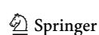

Given a representation vector  $\mathbf{v}$  for the training bag  $\mathbf{B}_i$ , and corresponding label  $\mathcal{Y}_i \in \{0, 1, \cdots, K-1\}$ , where K denotes the number of classes. Let f(:) represent a neural network and  $\mathbf{z}_i = f(\mathbf{v}) \in \mathbb{R}^K$  be the class score vector for  $\mathbf{B}_i$ . The estimated class probability of  $\mathbf{B}_i$  belonging to the k-th class can be computed by using softmax function:

$$q_i^k = \frac{\exp(z_i^k)}{\sum_{c=0}^{K-1} \exp(z_i^c)},$$
(11)

where exp(:) represents the exponential function. For multi-class classification, the loss function can be written as:

$$CE = -\sum_{c=0}^{K-1} p_i^c \log q_i^c,$$
 (12)

where  $p_i^c \in \{0,1\}^K$  denote the true probability of the bag  $\mathbf{B}_i$  belonging to the  $c_{th}$  class, and  $q_i^c$  is the estimated probability.

The target vector  $\mathbf{p}$  is one-hot encodings in multi-class classification. In this case, if  $\mathbf{B}_i$  belongs to the k-th class, there is only one element  $p_i^k$  in the target vector which is not zero. So, only the positive class contributes to the loss computation process. Discarding the elements of the summation which are zero due to target labels in equation (12), the loss function can be written as:

$$CE = -\log\left(\frac{\exp(z_i^k)}{\sum_{c=0}^{k-1} \exp(z_i^c)}\right). \tag{13}$$

Suppose that the training bag  $B_i$  belongs to the kth class. In this case, given the output of ViT  $H_i^{[L]} = \left[ \boldsymbol{h}_{i,0}^{[L]}, \boldsymbol{h}_{i,1}^{[L]}, \boldsymbol{h}_{i,2}^{[L]}, \dots, \boldsymbol{h}_{i,mi}^{[L]} \right]$ , the weights of instances  $\alpha_i$ , and corresponding bag representation vector  $\boldsymbol{v}$ , the loss for the bag  $B_i$  is computed as:

$$L1 = -\log\left(\frac{\exp(\mathbf{v}\mathbf{w}^k + b^k)}{\sum_{c=0}^{K-1} \exp(\mathbf{v}\mathbf{w}^c + b^c)}\right),\tag{14}$$

$$L2 = \sum_{j=1}^{mi} \left( -\log \left( \frac{\exp\left(\boldsymbol{h}_{i,j}^{[L]} \mathbf{w}^{k} + b^{k}\right)}{\sum_{c=0}^{K-1} \exp\left(\boldsymbol{h}_{i,c}^{[L]} \mathbf{w}^{c} + b^{c}\right)} \right) \alpha_{i,j} \right),$$

$$(15)$$

$$Loss = L1 + \lambda L2. \tag{16}$$

where  $\mathbf{w}^c \in \mathbb{R}^d$  is *c*th column vector of weight matrix  $\mathbf{W}$  and  $b^c$  is corresponding bias for classification head f(:).

The first term of the loss function focuses on bag classification loss, while the second one captures the attention loss, and  $\lambda$  is a non-negative hyperparameter to balance between bag and attention loss. The discussion related to the impact of  $\lambda$  is given in Sect. 5.9.3.

The term  $L1 \rightarrow 0$  if any one instance in a bag  $B_i$  belongs to the kth class. However, in this case, it is not theoretically guaranteed that only one instance belongs to the kth class in the bag [15]. Therefore, it results in a high false negative rate for the instances in the positive bags. To address this issue, the L2 term is added to the objective function. This term ensures that more than one instance with higher weights contributes to the label. Furthermore, the L2 term is inspired by the fact that the weight of instance  $x_{i,j}$  become approximately zero when  $y_{i,j} \neq \mathcal{Y}_i$ .

# 4 Experimental setup

This Section introduces the datasets used for experiments along with relevant evaluation measures. Additionally, a comparative analysis of existing methods is also provided.

#### 4.1 Details of datasets and evaluation measure

The performance of ViT-IWRS is evaluated using different datasets for binary and multi-class classification problems. These datasets have been used to assess the performance of MIL algorithms in the literature and cover a range of MIL application domains, such as molecular activity prediction, image classification, object detection, and medical image classification. The details of these datasets are given below.

# 4.1.1 Benchmark MIL datasets

The experiments are conducted on five MIL datasets related to binary classification problems: Musk1, Musk2, Elephant, Tiger, and Fox. These datasets are related to binary classification problems. The first two datasets (Musk1 and Musk2) cover the application of MIL for molecular drug activity predictions [23]. These datasets are composed of molecular conformations of multiple shapes. The bag is formed based on the shape similarity, and the drug's effect is observed if one or more conformations are attached to the targeted bindings. The later three datasets: Elephant, Tiger, and Fox, are related to image classification [26]; features of image segments constitute the bags in these datasets. The positive bags hold one or more instances related to the animal of interest while the negative bags contain other animals. The details of these datasets are shown in Table 1.

#### 4.1.2 MIL-based MNIST dataset

In addition to the existing benchmark MIL dataset, an additional dataset for multi-class classification is created from well-known MNIST digits (MIL-MINST) for digit

**Table 1** The details of MIL benchmark datasets

| Datasets | Positive bags | Negative bags | Total bags | Total instances |
|----------|---------------|---------------|------------|-----------------|
| Tiger    | 100           | 100           | 200        | 1220            |
| Elephant | 100           | 100           | 200        | 1391            |
| Fox      | 100           | 100           | 200        | 1320            |
| Musk1    | 47            | 45            | 92         | 476             |
| Muks2    | 63            | 39            | 102        | 6598            |

classification [48]. The dataset consists of gray-scale digit images of size  $28 \times 28$ , and the images are randomly selected to form a bag where each digit represents an instance. In this problem, we have used a labeling approach similar to [15], where bags with the target digits {'3', '5', '9'} are labeled {'1', '2', '3'} accordingly and if a bag does not include any of the target digits, it is labeled as '0'. in the training process, the model is trained for 50, 100, 150, 200, 300, and 400 generated training bags, respectively, while the performance is evaluated on 1000 test bags.

#### 4.1.3 MIL-based CIFAR-10 dataset

We construct more challenging MIL datasets for multiclass classification using images from the CIFAR-10 dataset for object recognition MIL application [49]. The CIFAR-10 dataset contains 60000 images divided into ten classes, each image is of size 32 × 32, and classes are completely mutually exclusive. We employed a similar approach previously used in Shi et al. [15] to evaluate the performance of ViT-IWRS on this dataset. The bags are formed by treating images as instances, and bags are normally distributed with a mean bag size of 10 and a variance of 2, respectively. The target classes are set to {'airplane', 'automobile', 'bird'}, and associated with the labels {'1', '2', '3'} accordingly. The bags related to target classes at most contain images from one of these three classes. The training sets are built with 500 and 5000 bags, while the test set is created with 1000 bags.

# 4.1.4 Colon cancer dataset

Detecting cancerous regions in hematoxylin and eosin (H &E) stained whole-slide images (WSI) are vital in clinical settings [50]. These images, also called digital pathology slides, can occupy several gigabytes of storage space [51]. Presently, supervised approaches require pixel-level annotations, which demand significant time from pathologists. A successful solution to reduce pathologists' workload is to use weak slide levels. For this study, we conducted experiments on colon cancer histopathology images [24] to test the efficiency of ViT-IWRS.

This dataset consists of 100 H&E images belonging to binary classes. These images feature a range of tissue

appearances, including both normal and malignant regions. Every image has been marked with the majority of nuclei for each cell with a total of 22,444 nuclei and class labels such as epithelial, inflammatory, fibroblast, and miscellaneous. Every WSI represents a bag with several  $27\times27$  patches. The bag is labeled as positive if it has one or more nuclei from the epithelial class.

#### 4.1.5 Evaluation measure

We evaluate the performance of the proposed ViT-IWRS in terms of bag classification accuracy. The experiments on benchmark datasets are performed using five runs of 10-fold cross-validation, and average performance is reported. For the MIL-based MNIST dataset, the experiments are performed with 1000 test bags and different numbers of training bags (50, 100, 150, 200, 300, and 400). The experiments are repeated 50 times for each train and test set, and average results are compared with existing state-of-the-art techniques. Similarly, the experiments are repeated thirty times with different training and testing data for MIL-based CIFAR-10 datasets, and average performance is reported. On the Colon Cancer dataset, we performed a 5-fold cross-validation, and average results are presented.

#### 4.2 Methods used for comparative study

The proposed approach is compared with several state-ofthe-art attention-based approaches and other benchmark bag-level classification techniques. The methods for performance comparison are selected based on good performance and the wide range of MIL solutions they offer. Some of the methods are briefly discussed below.

- MIL NN [41]: This study proposes trainable pooling operators for MIL. In this work, the bag-level classification technique (MI-NET) directly produces the bag label. The instance-level classification technique (mi-NET) pools instance-level scores to produce the bag label. The pooling approach based on the residual connection (MI-NET RC) is also proposed.
- Ranking Loss-based Simple MIL (ESMIL) [52]: This paper presents a novel approach to differentiate

between positive and negative bags by a simple pairwise bag-level ranking loss function. The proposed objective function ensures that the model assigns a higher score to the positive bags. Instead of using a threshold-based decision function, the proposed approach penalizes the network when it generates a lower score for positive bags compared to negative bags.

- Attention-based Deep MIL (AbDMIL) [13]: This work
  proposed an attention approach to identify the weights
  of the instances in the bag. The authors proposed two
  architectures for attention-based pooling to solve MIL
  binary classification problem.
- Loss-based Attention (LBA) [15]: This method extends the concepts of (AbDMIL) [11] and introduces collaborative training for attention and classification layers of the network.
- Multiple-instance SVM (MI-SVM and mi-SVM) [26]:
   In this study, two algorithms mi-SVM and MI-SVM extend the use of SVM to solve multiple-instance learning problems. The MI-SVM maximizes the bag margin while SVM updates the hyper-plane based on the instance label assignments.
- Classifier Ensemble with constructive clustering (CCE) [30]: This method represents the entire bag of instances from a binary vector, employing clustering and adopting an ensemble learning-based classification approach. The binary vector entries are set to 1 if any bag instance is a part of the cluster. Additionally, the clustering and models are trained on different data representations.
- Multiple instances (Fisher Vector and VLAD) [9]:
   These methods are based on bag encoding generation techniques. These techniques are inspired by the widely used Fisher vector (FV) and VLAD encoding schemes for image classification

#### 5 Results and discussion

In this Section, we present the results and discuss the performance of the proposed (ViT-IWRS )approach. First, we compare the performance of the proposed approach with state-of-the-art (SOTA) attention-based pooling approaches for MIL classification problems, including AbDMIL [13], Gated-AbDMIL [53], and loss-based attention (LBA) [15]. Later, the proposed approach is compared to benchmark bag classification approaches.

# 5.1 Comparison with SOTA attention-based pooling approaches

The comparison of the ViT-IWRS with three SOTA attention techniques LBA [15] and AbDMIL [13] is depicted in Fig. 5. Similar to the proposed ViT-IWRS, the algorithms estimate the weights of the instances using the attention mechanism and generate a representation vector for the bag. However, these techniques do not consider the relationship of instances in the bag. These approaches are implemented, and reproduced results are reported. The proposed ViT-IWRS achieves better results in all five datasets. For the Fox dataset, the proposed approach achieved 62.5% accuracy compared to the 60.5% and 59.5% accuracy achieved by LBA [15] and AbDMIL [13], respectively. Similarly, the ViT-IWRS approach attained 84.5% accuracy for the Tiger dataset, superior to the previous results of 83% by LBA [15]. In the case of the Elephant dataset, the proposed approach attained 87.4% accuracy.

For Musk1 and Musk2 datasets, the ViT-IWRS approach achieved 89.5% and 87.6% compared to the previous best performance of 88.6% and 87.3% accuracy, respectively. Overall, the performance of ViT-IWRS is superior to the counterpart attention-based techniques on all five benchmark datasets. The proposed ViT-IWRS is robust enough to ascertain the association among the instances. With the help of the RSN network, it can provide superior bag encoding.

The experimental results show that the prior assumption of instance relationship in the bag restricts the performance of AbDMIL and LBA. On the contrary, the proposed ViT-IWRS generates several bag representations without prior assumption of instance selection and simultaneously selects the informative vector through RSN. This ability generates a more effective vector representation for the bag and improves the model's generalization ability.

# 5.2 Comparison with benchmark techniques

Performance comparison of ViT-IWRS with benchmark techniques is given in Table 2. ViT-IWRS outperformed the performance of existing benchmark techniques on Elephant, Tiger, and Fox datasets. ViT-IWRS produced 62.5% accuracy for the Fox dataset compared to the highest 86.2% accuracy by MI-Net [41]. For the Elephant dataset, 87.4% accuracy outperformed the previous best accuracy of 62.1% accuracy of miFV [9]. Similarly, the ViT-IWRS produced 84.5% accuracy on the Tiger dataset and surpassed the previous best performance of 83.6% accuracy reported by MI-Net-RC [41].

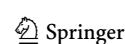

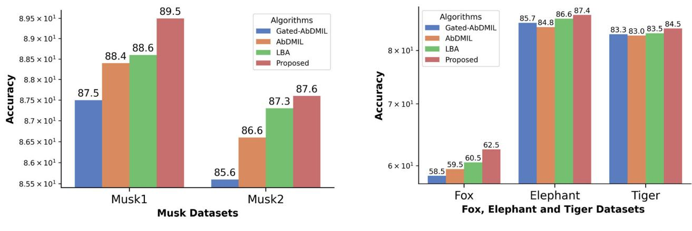

(a) Performance Analysis for Musk1 and Musk2 Datasets

(b) Performance Analysis for Fox, Elephant and Tiger Datasets

Fig. 5 The performance analysis of ViT-IWRS with SOTA attention-based MIL techniques, a shows the comparison on Musk1 and Musk2 datasets, while the performance comparison for image-related MIL dataset is given in (b)

Table 2 The performance comparison of proposed ViT-IWRS with benchmark MIL techniques, the best accuracy is highlighted by boldface and italicized, while the second-best performance for each dataset is marked as simple boldface

| Algorithms        | Accuracy ondDatasets |                   |                   |                   |                   |  |  |
|-------------------|----------------------|-------------------|-------------------|-------------------|-------------------|--|--|
|                   | Elephant             | Tiger             | Fox               | Musk1             | Musk2             |  |  |
| mi-SVM [26]       | 82.2                 | 78.4              | 58.2              | 87.4              | 83.6              |  |  |
| MI-SVM [26]       | 81.4                 | 84.0              | 57.8              | 77.9              | 84.3              |  |  |
| Simple-MI [9]     | $80.1 \pm (8.2)$     | $77.8 \pm (9.2)$  | $54.6 \pm (9.3)$  | $83.2 \pm (12.3)$ | $85.3 \pm (11.1)$ |  |  |
| EM-DD [28]        | $77.1 \pm (9.8)$     | $73.0 \pm (10.1)$ | $60.9 \pm (10.1)$ | $84.9 \pm (9.8)$  | $86.9 \pm (10.8)$ |  |  |
| MI-Wrapper [54]   | $82.7 \pm (8.8)$     | $77.0 \pm (9.2)$  | $58.2 \pm (10.2)$ | $84.9 \pm (10.6)$ | $79.6 \pm (10.6)$ |  |  |
| CCE [30]          | $79.3 \pm (7.5)$     | $76.0 \pm (12.0)$ | $59.9 \pm (13.7)$ | $83.1 \pm (2.5)$  | $71.3 \pm (2.4)$  |  |  |
| APR [23]          | $75.19 \pm (1.3)$    | $55.8 \pm (1.1)$  | $53.2 \pm (1.4)$  | $92.4 \pm (2.7)$  | $89.20 \pm (3.0)$ |  |  |
| Citation-kNN [55] | $82.6 \pm (1.0)$     | $78.8 \pm (1.3)$  | $58.2 \pm (1.1)$  | $90.3 \pm (1.3)$  | $83.7 \pm (2.3)$  |  |  |
| MI-Graph [16]     | $85.1 \pm (7.0)$     | $81.9 \pm (1.6)$  | $61.2 \pm (2.8)$  | $90.0 \pm (3.8)$  | $90.1 \pm (3.8)$  |  |  |
| RSIS [29]         | $84.6 \pm (1.0)$     | $82.5 \pm (2.3)$  | $61.1 \pm (2.0)$  | $88.8 \pm (2.3)$  | $89.5 \pm (2.6)$  |  |  |
| miVLAD [9]        | $85.0 \pm (8.0)$     | $81.0 \pm (9.0)$  | $62.0 \pm (10.0)$ | $87.1 \pm (9.5)$  | $87.2 \pm (9.7)$  |  |  |
| miFV [56]         | $85.2 \pm (8.0)$     | $81.3 \pm (7.0)$  | $62.1 \pm (10.0)$ | $90.9 \pm (8.0)$  | $88.4 \pm (9.0)$  |  |  |
| mi-Net [41]       | $85.8 \pm (3.6)$     | $82.4 \pm (3.7)$  | $61.3 \pm (3.5)$  | $88.9 \pm (3.9)$  | $85.2 \pm (4.5)$  |  |  |
| MI-NET [41]       | $86.2 \pm (2.5)$     | $83.0 \pm (2.2)$  | $62.2 \pm (2.2)$  | $88.7 \pm (4.1)$  | $85.9 \pm (4.5)$  |  |  |
| ESMIL [52]        | $82.5 \pm (3.0)$     | $82.7 \pm (4.0)$  | $61.7 \pm (4.5)$  | $87.8 \pm (3.5)$  | $88.2 \pm (5.0)$  |  |  |
| Proposed ViT-IWRS | $87.4 \pm (3.2)$     | $84.5 \pm (3.5)$  | $62.5 \pm (4.0)$  | $89.5 \pm (7.5)$  | $87.6 \pm (5.9)$  |  |  |

In the case of Musk1 and Musk2 datasets, the ViT-IWRS produced comparable accuracy to several bag classification approaches. The Musk1 and Musk2 datasets are composed of molecular conformations with a small number of bags. It is usually difficult for neural networks to perform well as benchmark methods. Additionally, in the Musk1 and Musk2 datasets, molecular data follow a structure and can be represented using graphs; therefore, the graph representation-based techniques [16] are more suitable for these types of datasets. Thus, the performance of ViT-IWRS is limited in these datasets. However, in the

case of image datasets, the ViT-IWRS performs considerably better than the benchmark approaches.

# 5.3 ViT-IWRS VS benchmark MIL techniques

Benchmark MIL techniques such as mi-Net and MI-Net [41] adopt trainable pooling operations to generate vector representation for the bag. However, the proposed pooling operation considers the equal contribution of instances in the bag. Additionally, these techniques do not account for the instance relationship information in the pooling process. The bag encoding approaches such as miFV and

miVLAD [56] are based on dictionary learning techniques using the instance clustering process and incorporate all the instances of the bag in the encoding process. However, these techniques do not incorporate any instance weighting technique in the encoding process which may affect the performance of generated encoding. Likewise, Simple-MI [9] computes the instance-wise mean vector for the bag. In comparison with these algorithms, ViT-IWRS tackles the relationship assumption with instance weighing and bag representation selection process.

RSIS [29] adopts a random subspace hard clustering approach to select a candidate instance from positive bags while the instances from negative bags are sampled randomly. The selected instances are classified using an ensemble learning technique in ambient space. However, the adopted instance selection process in RSIS results in a class imbalance problem. Similarly, CCE [30] groups training instances into c clusters and generates a c-dimensional binary vector representation for the bag. The ith bits in the representation vector are set to one if corresponding bag instances are part of ith cluster. The proposed ViT-IWRS generates a robust bag representation vector by incorporating the information presented in all instances of the bag with different weights. Additionally, the generated bag representation vector using ViT-IWRS offers more information in the classification process than the classification of instances in ambient space or binary vector generated by RSIS [29] and CCE [30].

Moreover, ESMIL [52] uses a ranking loss mechanism to assign a score to each instance in the bags. The proposed ranking loss function ensures that the highest-scoring instance in a positive bag receives a higher score than the highest-scoring instance in a negative bag. ESMIL distinguishes between positive and negative bags based on the highest-scoring instances from the bag of each category, and this process helps to maximize the AUC score. However, ESMIL ignores the contribution of other instances in the bag classification process. Additionally, the adopted training process lacks the ability to learn an efficient score function for bag classification. This property is essential for bag-level classification, and the selection of a suboptimal scoring function affects the model's generalization ability. In contrast, ViT-IWRS assigns higher weights to the instances in the bag, which induces bag labels and generates a robust bag representation vector by combining the instance relationship and weighted impact of the instances. This ability helps to learn an efficient scoring function for bag-level classification.

Similarly, Mi-Graph [16] assumes instances of the bag have a relationship and adopts a graph kernel learning technique to transform a given bag into an undirected weighted graph. The nodes in the generated graph represent instances of the bag, and if the distance between the two nodes is smaller than a preset threshold, then a weighted edge is established between the nodes. The weight of the edge expresses the affinity of the two nodes. This approach is useful where details of the bag structure play an essential role in the bag classification process. In contrast, ViT-IWRS models instance dependencies through the MHSA process and simultaneously incorporates bag-wise instance relationship assumption in the classification process.

# 5.4 Performance comparison on MIL-MNIST dataset

For the multi-class classification problem, the MIL-MNIST dataset is generated. We used a bag generation approach similar to the one used in LBA [15] and AbDMIL [13]. The performance of the ViT-IWRS is compared with SOTA attention-based approaches, including LBA [15], AbDMIL, and Gated-AbDMIL [13]. The two approaches, AbDMIL and Gated-AbDMIL, were extended with Softmax output to support multi-class classification problems. The bag classification is also performed for max-instance, mean-instance, max-instance embedding, and mean-instance embedding. The max-embedding and mean-embedding are computed by the output of the previously discussed embedding network. The bag classification results in Table 3 show that the proposed ViT-IWRS produces better performance in most cases, especially in the case of large training sets of 150, 200, 300, and 400 bags, respectively.

#### 5.5 Comparison on MIL-based CIFAR-10 dataset

To better evaluate the performance of the proposed ViT-IWRS, a larger and more challenging dataset is created

**Table 3** The performance comparison of ViT-IWRS with SOTA attention techniques on MIL-MNIST dataset. The best accuracy is highlighted in boldface and italicized, while the second-best performance for each dataset is marked in simple boldface

|                   | Accuracy using different training set |      |      |      |      |      |  |
|-------------------|---------------------------------------|------|------|------|------|------|--|
| Algorithms        | 50                                    | 100  | 150  | 200  | 300  | 400  |  |
| Instance-(max)    | 47.7                                  | 75   | 84.6 | 88.7 | 89.2 | 89.9 |  |
| Instance-(mean)   | 58.7                                  | 77.4 | 86.5 | 91.7 | 91.9 | 92.2 |  |
| Embedding-(max)   | 63.5                                  | 79.6 | 87.9 | 91.8 | 92.5 | 92.8 |  |
| Embedding-(mean)  | 52.8                                  | 77.4 | 86.9 | 92.0 | 92.3 | 92.6 |  |
| AbDMIL [13]       | 75.3                                  | 87.5 | 91.8 | 93.8 | 94.3 | 95.5 |  |
| Gated-AbDMIL [13] | 72                                    | 86.9 | 91.1 | 93   | 93.8 | 94.5 |  |
| LBA [15]          | 75.9                                  | 89.0 | 91.7 | 93.9 | 94.3 | 95.7 |  |
| Proposed ViT-IWRS | 76.1                                  | 88.2 | 92.5 | 94.2 | 95.6 | 96.5 |  |

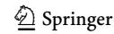

based on CIFAR-10. The performance of ViT-IWRS is compared with SOTA methods, including LBA [15], AbDMIL [13], and Gated-AbDMIL [13], previously used for MIL-MNIST. The experiments are conducted for 500, and 5000 randomly generated training bags. Additionally, the experimental results of this dataset are presented in Table 4. The results show that ViT-IWRS surpasses the previous best performance of LBA and produces 3.1% and 1.5% improved performance on 500 training bags and 5000 bags, respectively. The experimental results indicate that the proposed ViT-IWRS is robust in determining the dependencies among the bag instances in complex and challenging situations involving large datasets.

# 5.6 Performance comparison on colon cancer dataset

We have evaluated the performance of ViT-IWRS algorithms on a real-life colon cancer dataset with weak labeling. Our comparison includes state-of-the-art techniques such as AbDMIL [13], Gated-AbDMIL [13], LBA [15], and ESMIL [52], as well as instance-level and embedding level max and mean pooling operations. The results show the effectiveness of ViT-IWRS on this dataset. Based on the results shown in Fig. 6, it is evident that the proposed ViT-IWRS outperforms other state-of-the-art techniques. ViT-IWRS obtained 92.4% bag-level classification accuracy compared to the previous best of 90.3% by LBA [15]. ViT-IWRS achieves this by effectively managing Global and Local information about the bag. Furthermore, the representation selection process ensures that only the necessary bag representation vector is used in the classification process.

#### 5.7 Statistical validation

In this work, we evaluate the statistical significance of ViT-IWRS on MIL benchmark datasets using the Wilcoxon-signed rank test with a 95% confidence interval [57, 58].

**Table 4** The experimental results on MIL-BASED CIFAR-10 dataset. The best accuracy is highlighted in boldface and italicized, while the second-best performance for each dataset is marked in simple boldface

| Algorithms        | Performance in accuracy |                      |  |  |
|-------------------|-------------------------|----------------------|--|--|
|                   | 500 (Training bags)     | 5000 (Training bags) |  |  |
| AbDMIL [13]       | 41.8                    | 51.7                 |  |  |
| Gated-AbDMIL [13] | 39.8                    | 49.1                 |  |  |
| LBA [15]          | 45.7                    | 51.9                 |  |  |
| Proposed ViT-IWRS | 49.5                    | 54.8                 |  |  |

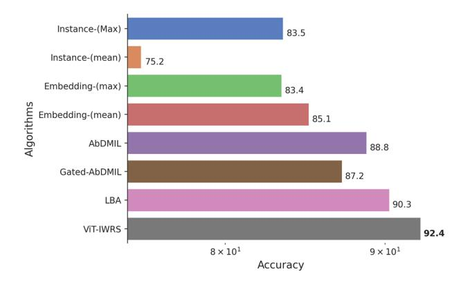

**Fig. 6** The performance analysis of ViT-IWRS with SOTA attention-based MIL techniques on Colon Cancer histopathology dataset

Using statistical analysis, this test determines if there is a substantial difference between two related groups. This technique is preferable when the normality or equal variance assumptions are violated. These methods are tested using the same train-test distribution as ViT-IWRS.

Table 5 shows the p-values for the Musk1 and Musk2 datasets. A p-value below 0.05 indicates that ViT-IWRS is statistically better than LBA [15], AbDMIL [13], Gated-AbDMIL [13], and ESMIL [52]. Likewise, in the case of the Musk2 dataset, ViT-IWRS is statistically significant compared to AbDMIL and Gated-AbDMIL. Table 6 shows the p-values for the Elephant, Tiger, and Fox datasets. The proposed ViT-IWRS is statistically significant for the Fox dataset compared to LBA [15], AbDMIL [13], Gated-AbDMIL [13], and ESMIL [52]. Similarly, for the Tiger and Elephant datasets, the ViT-IWRS is statistically better than AbDMIL [13], Gated-AbDMIL [13], and ESMIL [52]. The proposed ViT-IWRS showed statistical significance in comparison with AbDMI [13] and Gated-AbDMIL [13]. Similarly, ViT-IWRS exhibited statistical significance over ESMIL [52] and LBA [15] on four and two datasets, respectively.

We also used the Friedman rank test [59, 60] to assess the overall performance of various algorithms and compare their performance across various datasets. This statistical test is designed to assess whether there are statistically significant differences among the means of three or more related groups. It involves ranking the data within each group and assigning a rank to each algorithm. In this ranking, the best algorithm is assigned the lowest rank, while the algorithm with the worst performance is assigned the highest rank. The rankings of the proposed and compared methods are determined with 95% significance and a critical distance diagram is plotted to illustrate the results in Fig. 7. As shown in Fig. 7, the proposed ViT-IWRS achieved the lowest rank (most important) among all compared techniques. This indicates that the performance of ViT-IWRS is superior to the compared methods.

**Table 5** The obtained p-values of Wilcoxon-signed ranked test for Musk1 and Musk2 datasets

|                  | Musk1                                                   | Musk2            |                                                          |                  |
|------------------|---------------------------------------------------------|------------------|----------------------------------------------------------|------------------|
|                  | Is ViT-IWRS statistically significant? (if $p < 0.05$ ) | <i>p</i> -values | Is ViT-IWRS statistically significant? (if $p < 0.050$ ) | <i>p</i> -values |
| Algorithms       |                                                         |                  |                                                          |                  |
| AbDMIL           | Yes                                                     | 0.0242           | Yes                                                      | 0.0414           |
| Gated- AbDMIL | Yes                                                     | 0.0079           | Yes                                                      | 0.0331           |
| LBA              | Yes                                                     | 0.0465           | No                                                       | 0.4696           |
| ESMIL            | Yes                                                     | 0.0054           | No                                                       | 0.6001           |

**Table 6** The obtained p-values of Wilcoxon-signed ranked test for Elephant, Tiger, and Fox datasets

|              | Fox                                                |                  | Tiger                                              |                  | Elephant                                                   |                  |
|--------------|----------------------------------------------------|------------------|----------------------------------------------------|------------------|------------------------------------------------------------|------------------|
|              | Is ViT-IWRS statistically significant? (if p<0.05) | <i>p</i> -values | Is ViT-IWRS statistically significant? (if p<0.05) | <i>p</i> -values | Is ViT-IWRS statistically significant? (if <i>p</i> <0.05) | <i>p</i> -values |
| Algorithms   |                                                    |                  |                                                    |                  |                                                            |                  |
| AbDMIL       | Yes                                                | 0.003            | Yes                                                | 0.019            | Yes                                                        | 0.0002           |
| Gated-AbDMIL | Yes                                                | 0.004            | Yes                                                | 0.017            | Yes                                                        | 0.0044           |
| LBA          | Yes                                                | 0.009            | No                                                 | 0.125            | No                                                         | 0.0750           |
| ESMIL        | Yes                                                | 0.048            | Yes                                                | 0.130            | Yes                                                        | 0.0001           |

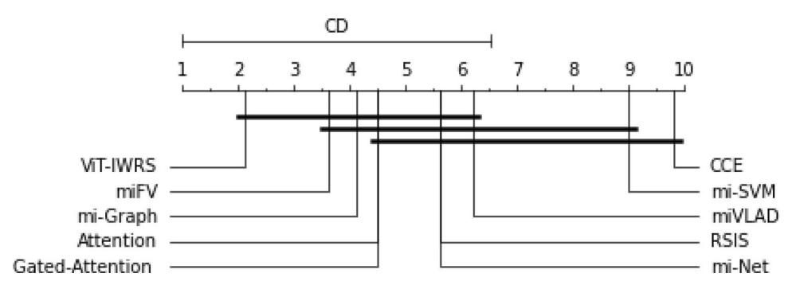

Fig. 7 Critical distance diagram comparing the proposed ViT-IWRS against various MIL algorithms with a 95% confidence interval. The diagram's top line shows the algorithm's average rank, with the most

important rank at the left and the least significant rank at the right. The two algorithms are not considerably different if they are not connected by bold line

# 5.8 Time efficiency comparison

In this paper, the time efficiency of the proposed ViT-IWRS is empirically evaluated on five benchmark MIL datasets. The time costs of training do not include the time for data preparation. The proposed ViT-IWRS is compared with state-of-the-art counterparts, including LBA [15], AbDMIL [13], Gated-AbDMIL [13], and ESMIL [52]. The

algorithms are trained for 100 Epochs, and the average training time in the log scale is shown in Fig. 8. All the experiments are conducted on a machine with a Core i7 3.10 GHz CPU, RTX 3060 GPU, and 16GB of main memory.

Compared to AbDMIL, Gated-AbDMIL, and LBA, the training process for ViT-IWRS is more time-consuming. This is because ViT uses a self-attention mechanism with quadratic complexity, making it more computationally expensive than traditional attention algorithms. Notably,

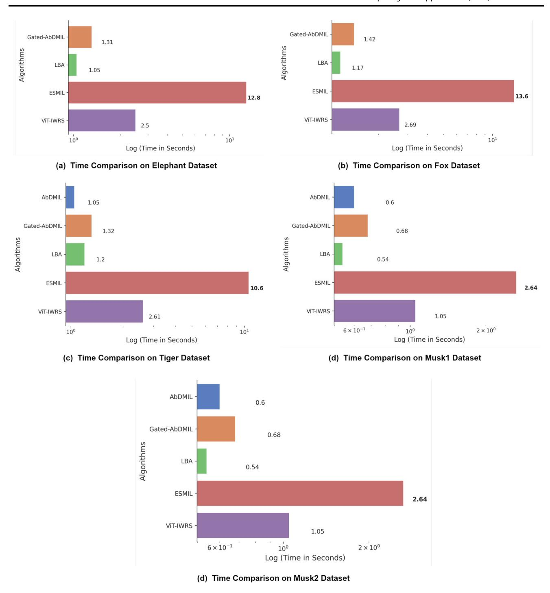

Fig. 8 The time efficiency analysis of ViT-IWRS with SOTA attention-based MIL techniques. The time comparisons on the Elephant, Tiger, and Fox datasets are shown in (a-c). The time comparison of the Musk1 and Musk2 datasets is illustrated in (d) and (e), respectively

ViT-IWRS requires less training time than ESMIL, which involves a pairwise loss strategy, necessitating the adjustment of network weights across all pairs of positive and negative bags.

However, ViT-IWRS outperforms state-of-the-art algorithms on all types of datasets in terms of bag classification performance. This outcome underscores the proposed

approach's effectiveness and ability to surpass the capabilities of current state-of-the-art techniques.

# 5.9 Parameter sensitivity analysis

This section discusses the impact of different hyperparameters related to ViT-IWRS on performance. There are

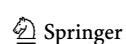

several parameters related to ViT-IWRS, such as the size of the RSN, the number of blocks, and the number of heads in ViT blocks. These parameters are tuned one at a time. While tuning one parameter, the other parameters are kept fixed. Initially, the number of transformer encoder blocks and layers in RSN is set to two, and the number of heads in MHSA is fixed to four, respectively. The details of the hyperparameters related to model training are given in Table 7. The details of the embedding network are also presented in this section.

#### 5.9.1 Embedding network

The proposed ViT-IWRS first transforms the bag instance to a latent representation using an embedding network. We adopted a similar setting for embedding networks as previously used in AbDMIL [13] and LBA [15]. The embedding network for benchmark datasets mainly consists of fully connected layers. In contrast, the MIL-MNIST and MIL-based CIFAR-10 datasets network comprises convolution layers with other related operations based on the LeNet5 architecture [61]. The details of the networks for the benchmark dataset and MIL-MNIST dataset are given in Table 8.

# 5.9.2 Layers in representation selection subnetworks (RSN)

This subnetwork comprises one or more fully connected layers, whereas the network's last layer consists of a single output neuron. The network learns a nonlinear representation selection function using a continuous output vector during training and generates a discretized one-hot vector in the testing. The layers in this subnetwork depend on the dataset representation diversity. The initial RSN comprises a fully connected layer with ReLU activation and dropout operation. Later, the layers to RSN are added with Tanh(:) followed by the dropout operation. The experiments show

that two subnetwork layers are preferred for Musk1, Elephant, and Tiger datasets. Whereas, for Musk2 and Fox datasets, tree layer RSN is preferred. However, increasing the number of layers can result in overfitting. Furthermore, the number of layers for the MIL-MNIST, MIL-BASED CIFAR-10, and Colon Cancer datasets is set to one throughout the experiments. The detailed analysis of RSN size is given in Table in 9.

# 5.9.3 Analysis of term $\lambda$ in loss function

The loss function presented in Sect. 3.7 comprises L1 and L2, where  $\lambda$  is a hyperparameter. The value of  $\lambda$  plays a significant role in the model performance and interpretation. As discussed previously, the L1 term in the loss function can be decreased to a small value even when only one instance shares the label with the bag; when  $\lambda = 0$ , the L2 term is removed from the objective, the model only focuses on the bag loss resulting in a low instance recall and may negatively affect the classification performance. We evaluated the impact of  $\lambda$  on MIL-MNIST datasets of 50 training and 1000 testing bags, respectively. Figure 9 performance of ViT-IWRS shows  $\lambda \in [0, 10^{-3}, 10^{-2}, 10^{-1}, 1, 1, 10,].$ The experiments demonstrate the effectiveness of  $\lambda$  in the loss function. The positive value of  $\lambda$  between 1 and 10 improves the instances recall and bag classification performance.

# 5.9.4 Analysis for ViT depth and attention heads

The ViT depth and the number of attention heads are the essential parameters in the proposed approach. First, we fixed the number of attention heads to four and the impact of ViT depth. Later, the best-performing depth is used to analyze the influence of attention heads. The experiments show that a depth of 3 is preferred for the Musk1 and Musk2 datasets, respectively, while the number of heads

**Table 7** The details of hyperparameters used in the training of ViT-IWRS

| Hyperparameter    | Benchmark dataset                | MIL-MNIST dataset                | MIL CIFAR-10 DATASET          |
|-------------------|----------------------------------|----------------------------------|----------------------------------|
| λ                 | 2                                | 2                                | 1                                |
| Optimizer         | Adam                             | Adam                             | Adam                             |
| Betas             | (0.9, 0.999)                     | (0.9, 0.999)                     | (0.9, 0.999)                     |
| Learning-rate     | 0.0005                           | 0.0005                           | 0.01                             |
| Epochs            | 150                              | 100                              | 100                              |
| Weight decay      | 0.0005                           | 0.0001                           | 0.0001                           |
| Batch size        | 1                                | 1                                | 1                                |
| Stopping criteria | Lowest validation error and loss | Lowest validation error and loss | Lowest validation error and loss |

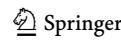

**Table 8** The details of embedding network for benchmark and MIL-MNIST datasets. The parameters of convolution layers are constituted as Convolution(a,b,c,d), where a, b, c, and d represent kernel size, stride, padding and the number of kernels, respectively

| Layer numbers                                | Network Details                            |
|----------------------------------------------|--------------------------------------------|
| Layer details for Benchmark Dataset          |                                            |
| 1                                            | FC-256 + Activation() + Dropuout()         |
| 2                                            | FC-128 + Activation() + Dropout()          |
| 3                                            | FC-64 + Activation() +Dropout()            |
| Layer details for MIL-MNIST Dataset          |                                            |
| 1                                            | Convolution $(5,1,0,20)$ + Activation()    |
| 2                                            | Max-pool (2,2)                             |
| 3                                            | Convolution $(5, 1, 0, 50) + Activation()$ |
| 4                                            | Max-pool (2,2)                             |
| 5                                            | FC-500 + Activation()                      |
| Layer Details for MIL-based CIFAR-10 Dataset |                                            |
| 1                                            | Convolution $(5, 3, 0, 20) + Activation()$ |
| 2                                            | Max-pool (2,2)                             |
| 3                                            | Convolution $(5, 1, 0, 50) + Activation()$ |
| 4                                            | Max-pool (2,2)                             |
| 5                                            | FC-500 + Activation() + Dropout()          |
| 6                                            | FC-500 + Activation()                      |
| Layer Details for Colon Cancer Dataset       |                                            |
| 1                                            | Convolution $(4, 1, 0, 36) + Activation()$ |
| 2                                            | Max-pool (2,2)                             |
| 3                                            | Convolution $(3, 1, 0, 48) + Activation()$ |
| 4                                            | Max-pool (2,2)                             |
| 5                                            | FC-500 + Activation() + Dropout()          |

Table 9 Analysis of layers in RSN

| Number of layer | Musk1 | Musk2 | Elephant | Fox  | Tiger |
|-----------------|-------|-------|----------|------|-------|
| 1               | 87.9  | 85.7  | 83.9     | 50.9 | 82.5  |
| 2               | 88.5  | 85.9  | 85.4     | 60.5 | 83.2  |
| 3               | 87.2  | 86.1  | 83.9     | 61.2 | 82.4  |
| 4               | 86.5  | 84.3  | 84.0     | 59.5 | 82.5  |
| 5               | 86.3  | 83.6  | 84.2     | 58.0 | 81.5  |

The bold value in the table shows the highest performance achieved on a particular dataset using the corresponding number of layers in RSN

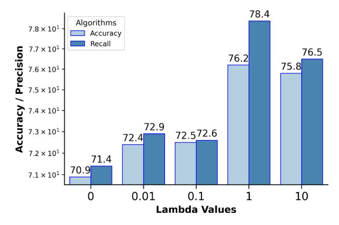

**Fig. 9** The analysis of the term  $\lambda$  in loss function

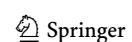

from 2 and 4 can produce better performance. This is due to the nature of the datasets. Additionally, where the structure information of the instances is important in addition to the instance relationship, adding ViT blocks and increasing the number of heads does not improve performance. For the fox, tiger, and Elephant datasets, 3, 2 and 3 blocks and 4 heads tend to perform well, respectively. It shows that these instances inside these datasets are highly related, and existing SOTA attention-based approaches do not consider this relation. The analysis of depth is shown in Fig. 10, and the analysis of the number of heads in MHSA is illustrated in Fig. 11, respectively. Furthermore, for the MIL-MNIST dataset, the depth is set to 1 and the number of heads is set to 4 throughout the experiments.

#### 5.10 Ablation study

The proposed ViT-IWRS consists of two essential processing blocks: the transformer encoding and RSN blocks. These blocks are shown in Fig. 3a and d, respectively. The contribution of these two blocks to overall model performance is validated in the section. The performance of these two blocks is observed on the Musk1 dataset for binary classification and the MIL-MNIST dataset for multi-class

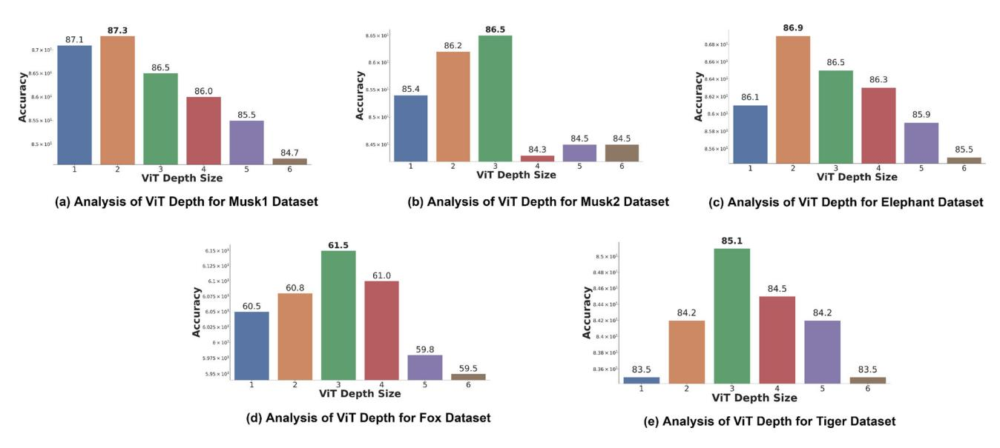

Fig. 10 The analysis of transformer depth. The depth analysis for Musk1, Musk2, Elephant, Fox, and Tiger datasets is illustrated from (a-e), respectively

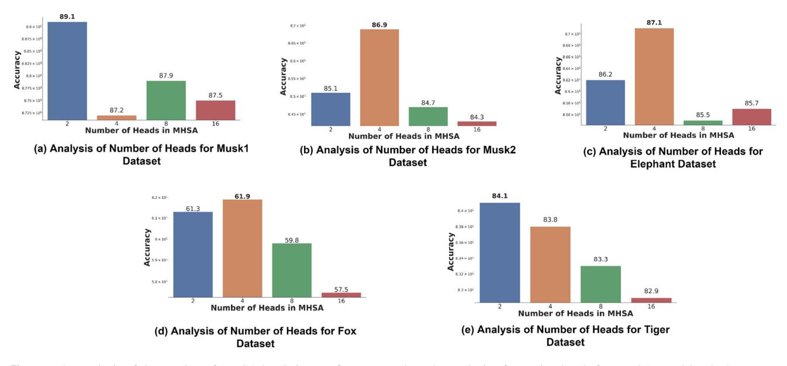

Fig. 11 The analysis of the number of MHSA heads in transformer encoder. The analysis of attention heads for Musk1, Musk2, Elephant, Fox, and Tiger datasets is given from (a-e), respectively

classification problems. Additionally, the experiments on the MIL-MNIST dataset are performed 30 times using a training set of 50 bags and a test set of 1000 bags, and the average performance is presented.

# 5.10.1 Effect of RSN block

In order to verify the impact of RSN, we replace this block with a simple average operation that computes the featurewise average of the representation matrix  $\mathcal{R}$ . Later, the averaged vector is used for classification. The experimental results in Table 10 show that the removal of RSN from the

proposed ViT-IWRS results in performance degradation. Therefore, the use of the RSN block is essential to achieve improved results.

#### 5.10.2 Effect of transformer encoding

In order to verify the impact of transformer encoding, we simply apply max and attention pooling on the output of the embedding network to obtain a bag representation vector. Afterward, the generated output vector is used for the classification process. This process is analogous to existing AbDMIL and LBA algorithms. The experimental

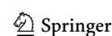

Table 10 Details of ablation study, the performance is presented in classification accuracy

| Ablation study design                                                                                                                                                                                                           | Performance in accuracy |               | Impact                                                                                        |  |
|---------------------------------------------------------------------------------------------------------------------------------------------------------------------------------------------------------------------------------|-------------------------|---------------|-----------------------------------------------------------------------------------------------|--|
|                                                                                                                                                                                                                                 | Musk1                   | MIL- MNIST |                                                                                               |  |
| Effect of RSN block (RSN network block removed from the model, and representation vectors in $\mathcal{R}$ are combined by applying average pooling operation)                                                                  | 87.70                   | 73.90         | The model's performance degrades when the RSN network is replaced with an average operation.  |  |
| Effect of Transformer Encoding block. (Transformer encoding block and RSN network block is removed from the model, and the output of Embedding network is transformed to a vector representation using simple Max-pooling)      | 86.2                    | 63.5          | The model's performance degrades when the RSN network is replaced with an average operation.  |  |
| Effect of Transformer Encoding block. (Transformer encoding block and RSN network block is removed from the model, and the output of Embedding network is transformed to vector representation using attention pooling pooling) | 88.4                    | 75.3          | The model's performance degrades when the Transformer encoding and RSN is removed from model. |  |
| Performance of proposed ViT-IWRS with all proposed blocks                                                                                                                                                                       | 89.50                   | 76.10         | ViT-IWRS achieves improved performance with all proposed blocks                               |  |

results in Table 10 show that the removal of Transformer Encoding and RSN from the proposed ViT-IWRS results in performance degradation. Therefore, the use of this block is essential to attain improved results.

#### 6 Conclusion

In this work, we presented the application for a vision transformer for simultaneous instance weighting and bag encoding processes for MIL. The existing MIL algorithms presumed that the instances in the bag are either related or unrelated. However, this assumption may not apply to all bags in the dataset.

The proposed approach avoids the instance relationship assumption in a two-stage process. In the first stage, several bag representation vectors are generated for both relationship assumptions. In the second stage, the network decides whether to consider instances to be related or not using the representation selection module in the classification process. The experimental results show that the selection subnetwork robustly selects bag representation vectors in the bag classification process in an end-to-end trainable approach. The experiments are performed on diverse datasets related to images and molecular activity. The proposed approach outperformed several state-of-the-art attention pooling and benchmark bag classification techniques. Additionally, the proposed ViT-IWRS provides model interpretations for vision transformer architecture through an attention-based instance weighting approach. Thus, the proposed approach is suited for image classification, object detection, and high-risk MIL applications, such as computer-aided diagnostic and clinical decision support.

Although the proposed approach produces promising results on several datasets related to images, this approach is less computationally expensive as compared to existing pooling techniques. Furthermore, the performance of ViT-IWRS is effective when labels are entirely dependent on the structural properties of the instances, such as molecular datasets. The proposed loss function can be further extended to handle multi-instance multi-target regression problems, such as Drug Discovery and Environmental Monitoring. In the future, we intend to explore the application of the proposed approach to multiple-instance and multiple-label learning (MIML) tasks and incorporate the structural details of the bag into the self-attention process.

**Acknowledgement** This publication was jointly supported by Qatar University QUHI-CENG-22/23-548. The findings achieved herein are solely the responsibility of the authors. Open Access funding provided by the Qatar National Library.

**Data availability** The datasets generated during and/or analyzed during the current study are publically available at http://www.uco.es/grupos/kdis/momil/.

# Declarations

Conflict of interest Authors declare no conflict of interest.

**Open Access** This article is licensed under a Creative Commons Attribution 4.0 International License, which permits use, sharing, adaptation, distribution and reproduction in any medium or format, as long as you give appropriate credit to the original author(s) and the source, provide a link to the Creative Commons licence, and indicate if changes were made. The images or other third party material in this article are included in the article's Creative Commons licence, unless

indicated otherwise in a credit line to the material. If material is not included in the article's Creative Commons licence and your intended use is not permitted by statutory regulation or exceeds the permitted use, you will need to obtain permission directly from the copyright holder. To view a copy of this licence, visit <a href="http://creativecommons.org/licenses/by/4.0/">http://creativecommons.org/licenses/by/4.0/</a>.

# References

- Zhou Z-H (2018) A brief introduction to weakly supervised learning. Natl Sci Rev 5(1):44–53
- Li M, Li X, Jiang Y, Zhang J, Luo H, Yin S (2022) Explainable multi-instance and multi-task learning for COVID-19 diagnosis and lesion segmentation in CT images. Knowl-Based Syst 252:109278
- Liu Y, Wu YH, Wen P, Shi Y, Qiu Y, Cheng MM (2020) Leveraging instance-, image-and dataset-level information for weakly supervised instance segmentation. IEEE Trans. Pattern Anal. Mach. Intell. 44(3):1415–1428
- Zhang Y, Liu S, Qu X, Shang X (2022) Multi-instance discriminative contrastive learning for brain image representation. Neural Comput Appl. https://doi.org/10.1007/s00521-022-07524-7
- Antwi-Bekoe E, Liu G, Ainam J-P, Sun G, Xie X (2022) A deep learning approach for insulator instance segmentation and defect detection. Neural Comput Appl 34(9):7253–7269
- Wang K, Liu J, González D (2017) Domain transfer multi-instance dictionary learning. Neural Comput Appl 28:983–992
- Carbonneau M-A, Cheplygina V, Granger E, Gagnon G (2018) Multiple instance learning: a survey of problem characteristics and applications. Pattern Recogn 77:329–353
- Cheplygina V, Tax DM, Loog M (2015) Dissimilarity-based ensembles for multiple instance learning. IEEE Trans Neural Netw Learn Syst 27(6):1379–1391
- Wei X-S, Wu J, Zhou Z-H (2016) Scalable algorithms for multiinstance learning. IEEE Trans Neural Netw Learn Syst 28(4):975–987
- Perronnin F, Sánchez J, Mensink T (2010) Improving the fisher kernel for large-scale image classification. In: European Conference on Computer Vision, pp. 143–156. Springer
- Ramon J, De Raedt L (2000) Multi instance neural networks. In: Proceedings of the ICML-2000 Workshop on Attribute-value and Relational Learning, pp. 53–60
- Kandemir M, Hamprecht FA (2015) Computer-aided diagnosis from weak supervision: a benchmarking study. Comput Med Imaging Graph 42:44–50
- Ilse M, Tomczak J, Welling M (2018) Attention-based deep multiple instance learning. In: International conference on machine learning, pp. 2127–2136. PMLR
- Zhang W-J, Zhou Z-H (2014) Multi-instance learning with distribution change. In: Proceedings of the AAAI conference on artificial intelligence, vol. 28
- Shi X, Xing F, Xie Y, Zhang Z, Cui L, Yang L (2020) Loss-based attention for deep multiple instance learning. In: Proceedings of the AAAI conference on artificial intelligence, vol. 34, pp. 5742–5749
- Zhou Z-H, Sun Y-Y, Li Y-F (2009) Multi-instance learning by treating instances as non-IID samples. In: Proceedings of the 26th annual international conference on machine learning, pp. 1249–1256
- 17. Waqas M, Tahir MA, Qureshi R (2021) Ensemble-based instance relevance estimation in multiple-instance learning. In: 2021 9th European workshop on visual information processing (EUVIP), pp. 1–6. IEEE

- Waqas M, Tahir MA, Qureshi R (2023) Deep Gaussian mixture model based instance relevance estimation for multiple instance learning applications. Appl Intell 53(9):10310–10325
- Waqas M, Tahir MA, Khan SA (2023) Robust bag classification approach for multi-instance learning via subspace fuzzy clustering. Expert Syst Appl 214:119113
- Shao Z, Bian H, Chen Y, Wang Y, Zhang J, Ji X et al (2021) Transmil: transformer based correlated multiple instance learning for whole slide image classification. Adv Neural Inf Process Syst 34:2136
- Waqas M, Khan Z, Ahmed SU, Raza A (2023) MIL-Mixer: a robust bag encoding strategy for Multiple Instance Learning (mil) using MLP-Mixer. In 2023 18th IEEE International Conference on Emerging Technologies (ICET) 22–26
- Wei X-S, Zhou Z-H (2016) An empirical study on image bag generators for multi-instance learning. Mach Learn 105(2):155–198
- Dietterich TG, Lathrop RH, Lozano-Pérez T (1997) Solving the multiple instance problem with axis-parallel rectangles. Artif Intell 89(1–2):31–71
- Sirinukunwattana K, Raza SEA, Tsang Y-W, Snead DR, Cree IA, Rajpoot NM (2016) Locality sensitive deep learning for detection and classification of nuclei in routine colon cancer histology images. IEEE Trans Med Imaging 35(5):1196–1206
- Raykar VC, Krishnapuram B, Bi J, Dundar M, Rao RB (2008) Bayesian multiple instance learning: automatic feature selection and inductive transfer. In: Proceedings of the 25th international conference on machine learning, pp. 808–815
- Andrews S, Tsochantaridis I, Hofmann T (2002) Support vector machines for multiple-instance learning. In: NIPS, vol. 2, p. 7
- Amar RA, Dooly DR, Goldman SA, Zhang Q (2001) Multipleinstance learning of real-valued data. In: ICML, pp. 3–10. Citeseer
- Zhang Q, Goldman S (2001) EM-DD: An improved multiple-instance learning technique. In: Dietterich T, Becker S, Ghahramani Z(ed) Advances in neural information processing systems.
   MIT Press, 14. https://proceedings.neurips.cc/paper\_files/paper/2001/file/e4dd5528f7596dcdf871aa55cfccc53c-Paper.pdf
- Carbonneau M-A, Granger E, Raymond AJ, Gagnon G (2016)
   Robust multiple-instance learning ensembles using random subspace instance selection. Pattern Recogn 58:83–99
- Zhou Z-H, Zhang M-L (2007) Solving multi-instance problems with classifier ensemble based on constructive clustering. Knowl Inf Syst 11(2):155–170
- Zhou Z-H, Xu J-M (2007) On the relation between multi-instance learning and semi-supervised learning. In: Proceedings of the 24th international conference on machine learning, pp. 1167–1174
- Leistner C, Saffari A, Bischof H (2010) Miforests: Multiple-instance learning with randomized trees. In: European conference on computer vision, pp. 29–42. Springer
- Li CH, Gondra I, Liu L (2012) An efficient parallel neural network-based multi-instance learning algorithm. J Supercomput 62(2):724–740
- 34. Waqas M, Khan Z, Anjum S, Tahir MA (2020) Lung-wise tuberculosis analysis and automatic CT report generation with hybrid feature and ensemble learning. In: CLEF (Working Notes)
- 35. Abro WA, Aicher A, Rach N, Ultes S, Minker W, Qi G (2022) Natural language understanding for argumentative dialogue systems in the opinion building domain. Knowl-Based Syst 242:108318
- Hanif M, Waqas M, Muneer A, Alwadain A, Tahir MA, Rafi M (2023) Deepsdc: deep ensemble learner for the classification of social-media flooding events. Sustainability 15(7):6049
- 37. Hoffman J, Pathak D, Darrell T, Saenko K (2015) Detector discovery in the wild: joint multiple instance and representation learning. In: Proceedings of the IEEE conference on computer vision and pattern recognition, pp. 2883–2891

- Zhang C, Platt J, Viola P (2005) Multiple instance boosting for object detection. In: Weiss J, Sch\"{o}lkopf B, Platt J(ed) Advances in neural information processing systems. MIT Press, 18
- Shi X, Xing F, Xu K, Xie Y, Su H, Yang L (2017) Supervised graph hashing for histopathology image retrieval and classification. Med Image Anal 42:117–128
- Liu Y, Chen H, Wang Y, Zhang P (2021) Power pooling: an adaptive pooling function for weakly labelled sound event detection. In: 2021 International joint conference on neural networks (IJCNN), pp. 1–7. IEEE
- 41. Wang X, Yan Y, Tang P, Bai X, Liu W (2018) Revisiting multiple instance neural networks. Pattern Recogn 74:15–24
- Li G, Li C, Wu G, Ji D, Zhang H (2021) Multi-view attentionguided multiple instance detection network for interpretable breast cancer histopathological image diagnosis. IEEE Access 9:79671–79684
- 43. Wang F, Jiang M, Qian C, Yang S, Li C, Zhang H, Wang X, Tang X (2017) Residual attention network for image classification. In: Proceedings of the IEEE conference on computer vision and pattern recognition, pp. 3156–3164
- 44. Dosovitskiy A, Beyer L, Kolesnikov A, Weissenborn D, Zhai X, Unterthiner T, Dehghani M, Minderer M, Heigold G, Gelly S et al.(2020) An image is worth 16x16 words: transformers for image recognition at scale. arXiv preprint arXiv:2010.11929
- Vaswani A, Shazeer N, Parmar N, Uszkoreit J, Jones L, Gomez AN, Kaiser Ł, Polosukhin I (2017) Attention is all you need. Advances in neural information processing systems. Curran Associates, Inc., 30
- 46. Jang E, Gu S, Poole B (2017) Categorical Reparametrization with Gumbel-Softmax. In: Proceedings international conference on learning representations (ICLR). https://openreview.net/pdf?id= rkE3y85ee
- 47. Li X-C, Zhan D-C, Yang J-Q, Shi Y (2021) Deep multiple instance selection. Sci China Inf Sci 64(3):1–15
- LeCun Y, Cortes C, Burges C (2010) Mnist handwritten digit database. ATT Labs [Online]. Available: http://yann.lecun.com/ exdb/mnist2
- 49. Krizhevsky A, Hinton G (2009) Learning multiple layers of features from tiny images. Technical report, University of

- Toronto. https://www.cs.toronto.edu/~kriz/learning-features-2009-TR.pdf
- Ghaznavi F, Evans A, Madabhushi A, Feldman M (2013) Digital imaging in pathology: whole-slide imaging and beyond. Annu Rev Pathol 8:331–359
- 51. Dimitriou N, Arandjelović O, Caie PD (2019) Deep learning for whole slide image analysis: an overview. Front Med 6:264
- 52. Asif A et al (2019) An embarrassingly simple approach to neural multiple instance classification. Pattern Recogn Lett 128:474–479
- Hahn M (2020) Theoretical limitations of self-attention in neural sequence models. Trans Assoc Comput Linguist 8:156–171
- Frank E, Xu X (2008) Applying propositional learning algorithms to multi-instance data. Working paper series, Department of computer science, The University of Waikato. https://books.goo gle.com/books?id=5eaGzgEACAAJ
- Wang J, Zucker J-D (2000) Solving multiple-instance problem: a lazy learning approach. International Conference on Machine Learning. 1:1119–1126. https://api.semanticscholar.org/Corpu sID:13896348
- Wei X-S, Wu J, Zhou Z-H (2014) Scalable multi-instance learning. In: 2014 IEEE international conference on data mining, pp. 1037–1042. IEEE
- Wilcoxon F (1992) Individual comparisons by ranking methods.
   In: Kotz S, Johnson NL (eds) Breakthroughs in statistics: methodology and distribution. Springer, Berlin, pp 196–202
- Conover WJ (1999) Practical nonparametric statistics, vol 350.
   Wiley, New York
- Demšar J (2006) Statistical comparisons of classifiers over multiple data sets. J Mach Learn Res 7:1–30
- Friedman M (1937) The use of ranks to avoid the assumption of normality implicit in the analysis of variance. J Am Stat Assoc 32(200):675–701
- LeCun Y, Bottou L, Bengio Y, Haffner P (1998) Gradient-based learning applied to document recognition. Proc IEEE 86(11):2278–2324

**Publisher's Note** Springer Nature remains neutral with regard to jurisdictional claims in published maps and institutional affiliations.

#### **Authors and Affiliations**

Muhammad Waqas1,2 • Muhammad Atif Tahir1 · Muhammad Danish Author3 · Sumaya Al-Maadeed4 · Ahmed Bouridane5 · Jia Wu2

Muhammad Waqas waqas.sheikh@nu.edu.pk; mwaqas@mdanderson.org

Muhammad Atif Tahir atif.tahir@nu.edu.pk

Muhammad Danish Author k190887@nu.edu.pk

Sumaya Al-Maadeed Salali@qu.edu.qa

Ahmed Bouridane abouridane@sharjah.ac.ae

Jia Wu jiawu11@mdanderson.com

- FAST School of Computing, National University of Computer Emerging Science (FAST-NUCES), Karachi, Pakistan
- Department of Imaging Physics, The University of Texas MD Anderson Cancer Center, Houston, TX, USA
- Ollege of information technology, United Arab Emirates University, Abu Dhabi, United Arab Emirates
- Department of Computer Science and Engineering, Qatar University, Doha, Qatar
- 5 Cybersecurity and Data Analytics Research Center, University of Sharjah, Sharjah, UAE

