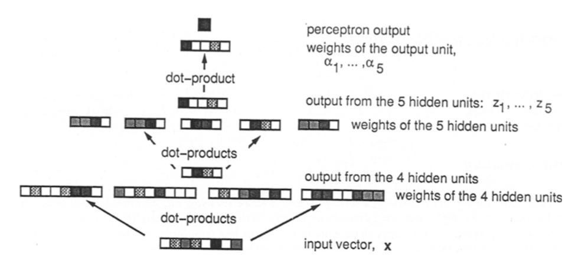
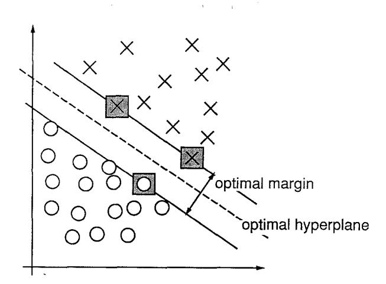
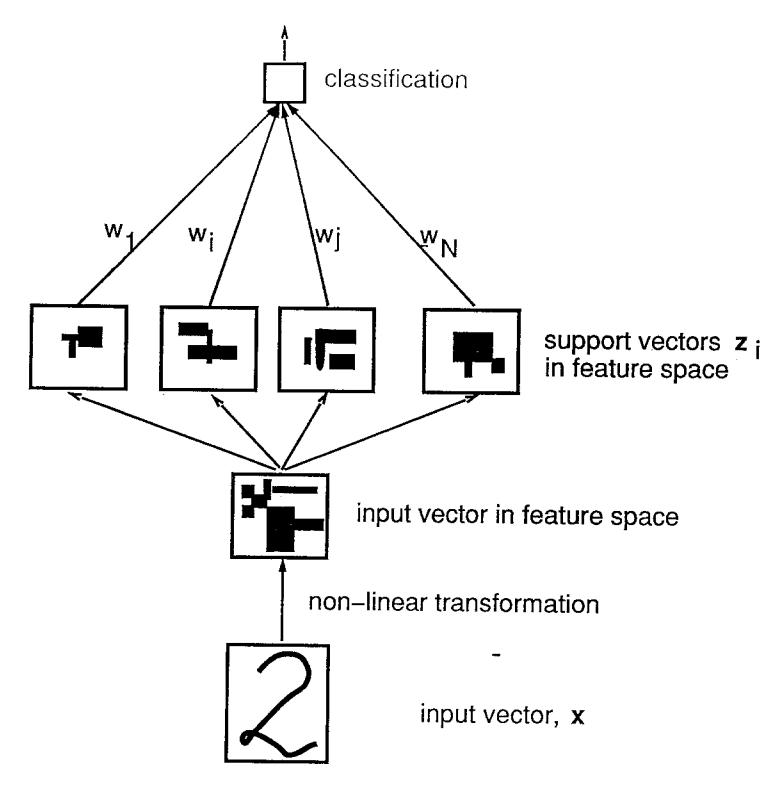
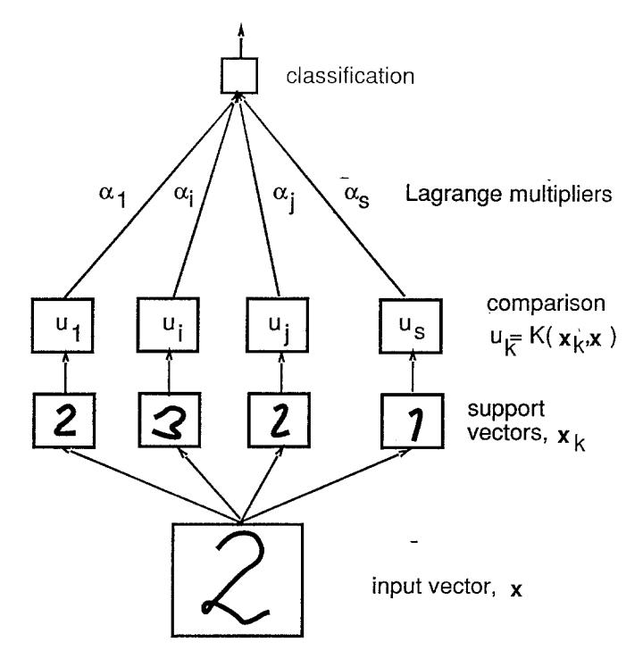
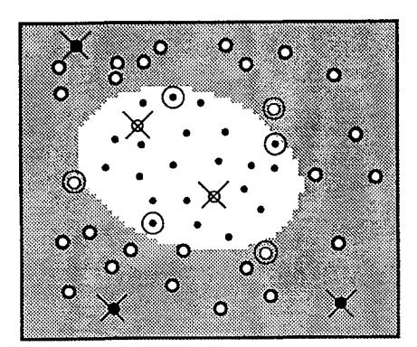
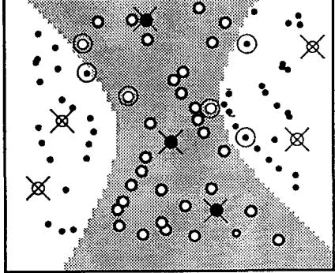
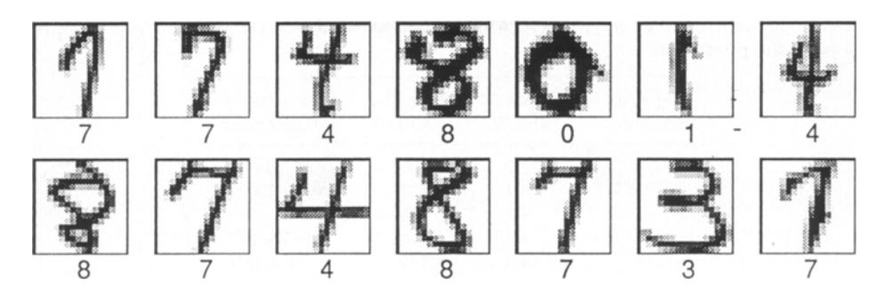
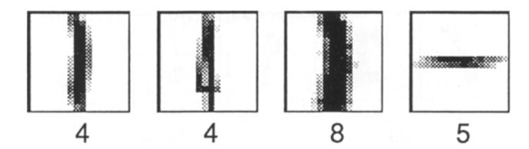
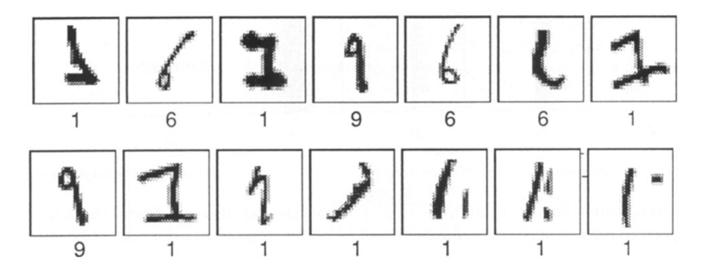
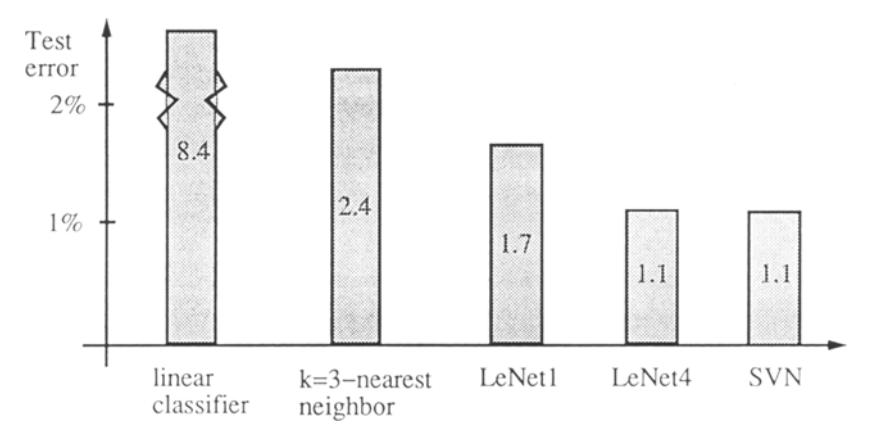

# Support-Vector Networks

CORINNA CORTES VLADIMIR VAPNIK AT&T Bell Labs., Holmdel, NJ 07733, USA corinna@neural.att.com vlad@neural.att.com

Editor: Lorenza Saitta

**Abstract.** The *support-vector network* is a new learning machine for two-group classification problems. The machine conceptually implements the following idea: input vectors are non-linearly mapped to a very high-dimension feature space. In this feature space a linear decision surface is constructed. Special properties of the decision surface ensures high generalization ability of the learning machine. The idea behind the support-vector network was previously implemented for the restricted case where the training data can be separated without errors. We here extend this result to non-separable training data.

High generalization ability of support-vector networks utilizing polynomial input transformations is demonstrated. We also compare the performance of the support-vector network to various classical learning algorithms that all took part in a benchmark study of Optical Character Recognition.

**Keywords:** pattern recognition, efficient learning algorithms, neural networks, radial basis function classifiers, polynomial classifiers.

#### 1. Introduction

More than 60 years ago R.A. Fisher (Fisher, 1936) suggested the first algorithm for pattern recognition. He considered a model of two normal distributed populations,  $N(\mathbf{m}_1, \Sigma_1)$  and  $N(\mathbf{m}_2, \Sigma_2)$  of n dimensional vectors  $\mathbf{x}$  with mean vectors  $\mathbf{m}_1$  and  $\mathbf{m}_2$  and co-variance matrices  $\Sigma_1$  and  $\Sigma_2$ , and showed that the optimal (Bayesian) solution is a quadratic decision function:

$$F_{\text{sq}}(\mathbf{x}) = \operatorname{sign}\left[\frac{1}{2}(\mathbf{x} - \mathbf{m}_1)^T \mathbf{\Sigma}_1^{-1} (\mathbf{x} - \mathbf{m}_1) - \frac{1}{2}(\mathbf{x} - \mathbf{m}_2)^T \mathbf{\Sigma}_2^{-1} (\mathbf{x} - \mathbf{m}_2) + \ln \frac{|\mathbf{\Sigma}_2|}{|\mathbf{\Sigma}_1|}\right]. \quad (1)$$

In the case where  $\Sigma_1 = \Sigma_2 = \Sigma$  the quadratic decision function (1) degenerates to a linear function:

$$F_{\text{lin}}(\mathbf{x}) = \text{sign}\left[ (\mathbf{m}_1 - \mathbf{m}_2)^T \mathbf{\Sigma}^{-1} \mathbf{x} - \frac{1}{2} (\mathbf{m}_1^T \mathbf{\Sigma}^{-1} \mathbf{m}_1 - \mathbf{m}_2^T \mathbf{\Sigma}^{-1} \mathbf{m}_2) \right]. \tag{2}$$

To estimate the quadratic decision function one has to determine  $\frac{n(n+3)}{2}$  free parameters. To estimate the linear function only n free parameters have to be determined. In the case where the number of observations is small (say less than  $10 n^2$ ) estimating  $o(n^2)$  parameters is not reliable. Fisher therefore recommended, even in the case of  $\Sigma_1 \neq \Sigma_2$ , to use the linear discriminator function (2) with  $\Sigma$  of the form:

$$\Sigma = \tau \Sigma_1 + (1 - \tau) \Sigma_2,\tag{3}$$

where  $\tau$  is some constant1. Fisher also recommended a linear decision function for the case where the two distributions are not normal. Algorithms for pattern recognition

Figure 1. A simple feed-forward perceptron with 8 input units, 2 layers of hidden units, and 1 output unit. The gray-shading of the vector entries reflects their numeric value.

were therefore from the very beginning associated with the construction of linear decision surfaces.

In 1962 Rosenblatt (Rosenblatt, 1962) explored a different kind of learning machines: perceptrons or neural networks. The perceptron consists of connected neurons, where each neuron implements a separating hyperplane, so the perceptron as a whole implements a piecewise linear separating surface. See Fig. 1.

No algorithm that minimizes the error on a set of vectors by adjusting all the weights of the network was found in Rosenblatt's time, and Rosenblatt suggested a scheme where only the weights of the output unit were adaptive. According to the fixed setting of the other weights the input vectors are non-linearly transformed into the feature space, Z, of the last layer of units. In this space a linear decision function is constructed:

$$I(\mathbf{x}) = \operatorname{sign}\left(\sum_{i} \alpha_{i} z_{i}(\mathbf{x})\right) \tag{4}$$

by adjusting the weights  $\alpha_i$  from the *i*th hidden unit to the output unit so as to minimize some error measure over the training data. As a result of Rosenblatt's approach, construction of decision rules was again associated with the construction of linear hyperplanes in some space.

An algorithm that allows for all weights of the neural network to adapt in order locally to minimize the error on a set of vectors belonging to a pattern recognition problem was found in 1986 (Rumelhart, Hinton & Williams, 1986, 1987; Parker, 1985; LeCun, 1985) when the back-propagation algorithm was discovered. The solution involves a slight modification of the mathematical model of neurons. Therefore, neural networks implement "piece-wise linear-type" decision functions.

In this article we construct a new type of learning machine, the so-called support-vector network. The support-vector network implements the following idea: it maps the input vectors into some high dimensional feature space Z through some non-linear mapping chosen a priori. In this space a linear decision surface is constructed with special properties that ensure high generalization ability of the network.

Figure 2. An example of a separable problem in a 2 dimensional space. The support vectors, marked with grey squares, define the margin of largest separation between the two classes.

EXAMPLE. To obtain a decision surface corresponding to a polynomial of degree two, one can create a feature space, Z, which has  $N = \frac{n(n+3)}{2}$  coordinates of the form:

$$z_1 = x_1, \dots, z_n = x_n,$$
  $n$  coordinates,  
 $z_{n+1} = x_1^2, \dots, z_{2n} = x_n^2,$   $n$  coordinates,  
 $z_{2n+1} = x_1 x_2, \dots, z_N = x_n x_{n-1},$   $\frac{n(n-1)}{2}$  coordinates,

where  $\mathbf{x} = (x_1, \dots, x_n)$ . The hyperplane is then constructed in this space.

Two problems arise in the above approach: one conceptual and one technical. The conceptual problem is how to find a separating hyperplane that will generalize well: the dimensionality of the feature space will be huge, and not all hyperplanes that separate the training data will necessarily generalize well2. The technical problem is how computationally to treat such high-dimensional spaces: to construct polynomial of degree 4 or 5 in a 200 dimensional space it may be necessary to construct hyperplanes in a billion dimensional feature space.

The conceptual part of this problem was solved in 1965 (Vapnik, 1982) for the case of optimal hyperplanes for separable classes. An optimal hyperplane is here defined as the linear decision function with maximal margin between the vectors of the two classes, see Fig. 2. It was observed that to construct such optimal hyperplanes one only has to take into account a small amount of the training data, the so called *support vectors*, which determine this margin. It was shown that if the training vectors are separated without errors by an optimal hyperplane the expectation value of the probability of committing an error on a test example is bounded by the ratio between the expectation value of the number of support vectors and the number of training vectors:

$$E[Pr(error)] \le \frac{E[number of support vectors]}{number of training vectors}$$
 (5)

Note that this bound does not explicitly contain the dimensionality of the space of separation. It follows from this bound, that if the optimal hyperplane can be constructed from a small number of support vectors relative to the training set size the generalization ability will be high—even in an infinite dimensional space. In Section 5 we will demonstrate that the ratio (5) for a real life problems can be as low as 0.03 and the optimal hyperplane generalizes well in a billion dimensional feature space.

Let

$$\mathbf{w}_0 \cdot \mathbf{z} + b_0 = 0$$

be the optimal hyperplane in feature space. We will show, that the weights  $\mathbf{w}_0$  for the optimal hyperplane in the feature space can be written as some linear combination of support vectors

$$\mathbf{w}_0 = \sum_{\text{support vectors}} \alpha_i \mathbf{z}_i. \tag{6}$$

The linear decision function  $I(\mathbf{z})$  in the feature space will accordingly be of the form:

$$I(\mathbf{z}) = \operatorname{sign}\left(\sum_{\text{support vectors}} \alpha_i \mathbf{z}_i \cdot \mathbf{z} + b_0\right), \tag{7}$$

where  $\mathbf{z}_i \cdot \mathbf{z}$  is the dot-product between support vectors  $\mathbf{z}_i$  and vector  $\mathbf{z}$  in feature space. The decision function can therefore be described as a two layer network (Fig. 3).

However, even if the optimal hyperplane generalizes well the technical problem of how to treat the high dimensional feature space remains. In 1992 it was shown (Boser, Guyon, & Vapnik, 1992), that the order of operations for constructing a decision function can be interchanged: instead of making a non-linear transformation of the input vectors followed by dot-products with support vectors in feature space, one can first compare two vectors in input space (by e.g. taking their dot-product or some distance measure), and then make a non-linear transformation of the value of the result (see Fig. 4). This enables the construction of rich classes of decision surfaces, for example polynomial decision surfaces of arbitrary degree. We will call this type of learning machine a support-vector network3.

The technique of support-vector networks was first developed for the restricted case of separating training data without errors. In this article we extend the approach of support-vector networks to cover when separation without error on the training vectors is impossible. With this extension we consider the support-vector networks as a new class of learning machine, as powerful and universal as neural networks. In Section 5 we will demonstrate how well it generalizes for high degree polynomial decision surfaces (up to order 7) in a high dimensional space (dimension 256). The performance of the algorithm is compared to that of classical learning machines e.g. linear classifiers, *k*-nearest neighbors classifiers, and neural networks. Sections 2, 3, and 4 are devoted to the major points of the derivation of the algorithm and a discussion of some of its properties. Details of the derivation are relegated to an appendix.

Figure 3. Classification by a support-vector network of an unknown pattern is conceptually done by first transforming the pattern into some high-dimensional feature space. An optimal hyperplane constructed in this feature space determines the output. The similarity to a two-layer perceptron can be seen by comparison to Fig. 1.

## 2. Optimal Hyperplanes

In this section we review the method of optimal hyperplanes (Vapnik, 1982) for separation of training data without errors. In the next section we introduce a notion of soft margins, that will allow for an analytic treatment of learning with errors on the training set.

## 2.1. The Optimal Hyperplane Algorithm

The set of labeled training patterns

$$(y_1, \mathbf{x}_1), \dots, (y_\ell, \mathbf{x}_\ell), \quad y_i \in \{-1, 1\}$$
 (8)

is said to be linearly separable if there exists a vector w and a scalar b such that the inequalities

$$\mathbf{w} \cdot \mathbf{x}_i + b \ge 1 \quad \text{if} \quad y_i = 1,$$
  
$$\mathbf{w} \cdot \mathbf{x}_i + b \le -1 \quad \text{if} \quad y_i = -1,$$
 (9)

Figure 4. Classification of an unknown pattern by a support-vector network. The pattern is in input space compared to support vectors. The resulting values are non-linearly transformed. A linear function of these transformed values determine the output of the classifier.

are valid for all elements of the training set (8). Below we write the inequalities (9) in the form4:

$$y_i(\mathbf{w} \cdot \mathbf{x}_i + b) \ge 1, \qquad i = 1, \dots, \ell.$$
 (10)

The optimal hyperplane

$$\mathbf{w}_0 \cdot \mathbf{x} + b_0 = 0 \tag{11}$$

is the unique one which separates the training data with a maximal margin: it determines the direction  $\mathbf{w}/|\mathbf{w}|$  where the distance between the projections of the training vectors of two different classes is maximal, recall Fig. 2. This distance  $\rho(\mathbf{w}, b)$  is given by

$$\rho(\mathbf{w}, b) = \min_{\{\mathbf{x}: \mathbf{y} = 1\}} \frac{\mathbf{x} \cdot \mathbf{w}}{|\mathbf{w}|} - \max_{\{\mathbf{x}: \mathbf{y} = -1\}} \frac{\mathbf{x} \cdot \mathbf{w}}{|\mathbf{w}|}.$$
 (12)

The optimal hyperplane  $(\mathbf{w}_0, b_0)$  is the arguments that maximize the distance (12). It follows from (12) and (10) that

$$\rho(\mathbf{w}_0, b_0) = \frac{2}{|\mathbf{w}_0|} = \frac{2}{\sqrt{\mathbf{w}_0 \cdot \mathbf{w}_0}}.$$
 (13)

This means that the optimal hyperplane is the unique one that minimizes  $\mathbf{w} \cdot \mathbf{w}$  under the constraints (10). Constructing an optimal hyperplane is therefore a quadratic programming problem.

Vectors  $\mathbf{x}_i$  for which  $y_i(\mathbf{w} \cdot \mathbf{x}_i + b) = 1$  will be termed *support vectors*. In Appendix A.1 we show that the vector  $\mathbf{w}_0$  that determines the optimal hyperplane can be written as a linear combination of training vectors:

$$\mathbf{w}_0 = \sum_{i=1}^{\ell} y_i \alpha_i^0 \mathbf{x}_i, \tag{14}$$

where  $\alpha_i^0 \ge 0$ . Since  $\alpha > 0$  only for support vectors (see Appendix), the expression (14) represents a compact form of writing  $\mathbf{w}_0$ . We also show that to find the vector of parameters  $\alpha_i$ :

$$\mathbf{\Lambda}_0^T = (\alpha_1^0, \dots, \alpha_\ell^0),$$

one has to solve the following quadratic programming problem:

$$W(\mathbf{\Lambda}) = \mathbf{\Lambda}^T \mathbf{1} - \frac{1}{2} \mathbf{\Lambda}^T \mathbf{D} \mathbf{\Lambda}$$
 (15)

with respect to  $\mathbf{\Lambda}^T = (\alpha_1, \dots, \alpha_\ell)$ , subject to the constraints:

$$\Lambda \geq 0, \tag{16}$$

$$\mathbf{\Lambda}^T \mathbf{Y} = 0, \tag{17}$$

where  $\mathbf{1}^T = (1, \dots, 1)$  is an  $\ell$ -dimensional unit vector,  $\mathbf{Y}^T = (y_1, \dots, y_\ell)$  is the  $\ell$ -dimensional vector of labels, and  $\mathbf{D}$  is a symmetric  $\ell \times \ell$ -matrix with elements

$$D_{ij} = y_i y_j \mathbf{x}_i \cdot \mathbf{x}_j, \qquad i, j = 1, \dots, l.$$
(18)

The inequality (16) describes the nonnegative quadrant. We therefore have to maximize the quadratic form (15) in the nonnegative quadrant, subject to the constraints (17).

When the training data (8) can be separated without errors we also show in Appendix A the following relationship between the maximum of the functional (15), the pair  $(\Lambda_0, b_0)$ , and the maximal margin  $\rho_0$  from (13):

$$W(\Lambda_0) = \frac{2}{\rho_0^2}. (19)$$

If for some  $\Lambda_{\star}$  and large constant  $W_0$  the inequality

$$W(\Lambda_{\star}) > W_0 \tag{20}$$

is valid, one can accordingly assert that all hyperplanes that separate the training data (8) have a margin

$$\rho < \sqrt{\frac{2}{W_0}}.$$

If the training set (8) cannot be separated by a hyperplane, the margin between patterns of the two classes becomes arbitrary small, resulting in the value of the functional  $W(\Lambda)$  turning arbitrary large. Maximizing the functional (15) under constraints (16) and (17) one therefore either reaches a maximum (in this case one has constructed the hyperplane with the maximal margin  $\rho_0$ ), or one finds that the maximum exceeds some given (large) constant  $W_0$  (in which case a separation of the training data with a margin larger then  $\sqrt{2/W_0}$  is impossible).

The problem of maximizing functional (15) under constraints (16) and (17) can be solved very efficiently using the following scheme. Divide the training data into a number of portions with a reasonable small number of training vectors in each portion. Start out by solving the quadratic programming problem determined by the first portion of training data. For this problem there are two possible outcomes: either this portion of the data cannot be separated by a hyperplane (in which case the full set of data as well cannot be separated), or the optimal hyperplane for separating the first portion of the training data is found.

Let the vector that maximizes functional (15) in the case of separation of the first portion be  $\Lambda_1$ . Among the coordinates of vector  $\Lambda_1$  some are equal to zero. They correspond to non-support training vectors of this portion. Make a new set of training data containing the support vectors from the first portion of training data and the vectors of the second portion that do not satisfy constraint (10), where  $\mathbf{w}$  is determined by  $\Lambda_1$ . For this set a new functional  $W_2(\Lambda)$  is constructed and maximized at  $\Lambda_2$ . Continuing this process of incrementally constructing a solution vector  $\Lambda_{\star}$  covering all the portions of the training data one either finds that it is impossible to separate the training set without error, or one constructs the optimal separating hyperplane for the full data set,  $\Lambda_{\star} = \Lambda_0$ . Note, that during this process the value of the functional  $W(\Lambda)$  is monotonically increasing, since more and more training vectors are considered in the optimization, leading to a smaller and smaller separation between the two classes.

# 3. The Soft Margin Hyperplane

Consider the case where the training data cannot be separated without error. In this case one may want to separate the training set with a minimal number of errors. To express this formally let us introduce some non-negative variables  $\xi_i \geq 0$ ,  $i = 1, \ldots, \ell$ .

We can now minimize the functional

$$\Phi(\xi) = \sum_{i=1}^{\ell} \xi_i^{\sigma} \tag{21}$$

for small  $\sigma > 0$ , subject to the constraints

$$y_i(\mathbf{w} \cdot \mathbf{x}_i + b) \ge 1 - \xi_i, \qquad i = 1, \dots, \ell,$$
 (22)

$$\xi_i \ge 0, \qquad i = 1, \dots, \ell. \tag{23}$$

For sufficiently small  $\sigma$  the functional (21) describes the number of the training errors5. Minimizing (21) one finds some minimal subset of training errors:

$$(y_{i_1}, \mathbf{x}_{i_1}), \ldots, (y_{i_k}, \mathbf{x}_{i_k}).$$

If these data are excluded from the training set one can separate the remaining part of the training set without errors. To separate the remaining part of the training data one can construct an optimal separating hyperplane.

This idea can be expressed formally as: minimize the functional

$$\frac{1}{2}\mathbf{w}^2 + CF\left(\sum_{i=1}^{\ell} \xi_i^{\sigma}\right) \tag{24}$$

subject to constraints (22) and (23), where F(u) is a monotonic convex function and C is a constant.

For sufficiently large C and sufficiently small  $\sigma$ , the vector  $\mathbf{w}_0$  and constant  $b_0$ , that minimize the functional (24) under constraints (22) and (23), determine the hyperplane that minimizes the number of errors on the training set and separate the rest of the elements with maximal margin.

Note, however, that the problem of constructing a hyperplane which minimizes the number of errors on the training set is in general NP-complete. To avoid NP-completeness of our problem we will consider the case of  $\sigma = 1$  (the smallest value of  $\sigma$  for which the optimization problem (15) has a unique solution). In this case the functional (24) describes (for sufficiently large C) the problem of constructing a separating hyperplane which minimizes the sum of deviations,  $\xi$ , of training errors and maximizes the margin for the correctly classified vectors. If the training data can be separated without errors the constructed hyperplane coincides with the optimal margin hyperplane.

In contrast to the case with  $\sigma < 1$  there exists an efficient method for finding the solution of (24) in the case of  $\sigma = 1$ . Let us call this solution the soft margin hyperplane.

In Appendix A we consider the problem of minimizing the functional

$$\frac{1}{2}\mathbf{w}^2 + CF\left(\sum_{i=1}^{\ell} \xi_i\right) \tag{25}$$

subject to the constraints (22) and (23), where F(u) is a monotonic convex function with F(0) = 0. To simplify the formulas we only describe the case of  $F(u) = u^2$  in this section. For this function the optimization problem remains a quadratic programming problem.

In Appendix A we show that the vector  $\mathbf{w}$ , as for the optimal hyperplane algorithm, can be written as a linear combination of support vectors  $\mathbf{x}_i$ :

$$\mathbf{w}_0 = \sum_{i=1}^{\ell} \alpha_i^0 y_i \mathbf{x}_i.$$

To find the vector  $\mathbf{\Lambda}^T = (\alpha_1, \dots, \alpha_\ell)$  one has to solve the dual quadratic programming problem of maximizing

$$W(\mathbf{\Lambda}, \delta) = \mathbf{\Lambda}^T \mathbf{1} - \frac{1}{2} \left[ \mathbf{\Lambda}^T \mathbf{D} \mathbf{\Lambda} + \frac{\delta^2}{C} \right]$$
 (26)

subject to constraints

$$\mathbf{\Lambda}^T \mathbf{Y} = 0, \tag{27}$$

$$\delta \ge 0,\tag{28}$$

$$\mathbf{0} \le \mathbf{\Lambda} \le \delta \mathbf{1},\tag{29}$$

where  $1, \Lambda, Y$ , and D are the same elements as used in the optimization problem for constructing an optimal hyperplane,  $\delta$  is a scalar, and (29) describes coordinate-wise inequalities.

Note that (29) implies that the smallest admissible value  $\delta$  in functional (26) is

$$\delta = \alpha_{\max} = \max(\alpha_1, \ldots, \alpha_\ell).$$

Therefore to find a soft margin classifier one has to find a vector  $\Lambda$  that maximizes

$$W(\mathbf{\Lambda}) = \mathbf{\Lambda}^T \mathbf{1} - \frac{1}{2} \left[ \mathbf{\Lambda}^T \mathbf{D} \mathbf{\Lambda} + \frac{\alpha_{\text{max}}^2}{C} \right]$$
 (30)

under the constraints  $\Lambda \geq 0$  and (27). This problem differs from the problem of constructing an optimal margin classifier only by the additional term with  $\alpha_{max}$  in the functional (30). Due to this term the solution to the problem of constructing the soft margin classifier is unique and exists for any data set.

The functional (30) is not quadratic because of the term with  $\alpha_{max}$ . Maximizing (30) subject to the constraints  $\Lambda \geq 0$  and (27) belongs to the group of so-called convex programming problems. Therefore, to construct a soft margin classifier one can either solve the convex programming problem in the  $\ell$ -dimensional space of the parameters  $\Lambda$ , or one can solve the quadratic programming problem in the dual  $\ell+1$  space of the parameters  $\Lambda$  and  $\delta$ . In our experiments we construct the soft margin hyperplanes by solving the dual quadratic programming problem.

#### 4. The Method of Convolution of the Dot-Product in Feature Space

The algorithms described in the previous sections construct hyperplanes in the input space. To construct a hyperplane in a feature space one first has to transform the n-dimensional input vector  $\mathbf{x}$  into an N-dimensional feature vector through a choice of an N-dimensional vector function  $\phi$ :

$$\phi \colon \mathfrak{R}^n \to \mathfrak{R}^N$$
.

An N dimensional linear separator  $\mathbf{w}$  and a bias b is then constructed for the set of transformed vectors

$$\phi(\mathbf{x}_i) = \phi_1(\mathbf{x}_i), \phi_2(\mathbf{x}_i), \dots, \phi_N(\mathbf{x}_i), \qquad i = 1, \dots, \ell.$$

Classification of an unknown vector x is done by first transforming the vector to the separating space  $(x \mapsto \phi(x))$  and then taking the sign of the function

$$f(\mathbf{x}) = \mathbf{w} \cdot \phi(\mathbf{x}) + b. \tag{31}$$

According to the properties of the soft margin classifier method the vector  $\mathbf{w}$  can be written as a linear combination of support vectors (in the feature space). That means

$$\mathbf{w} = \sum_{i=1}^{\ell} y_i \alpha_i \phi(\mathbf{x}_i). \tag{32}$$

The linearity of the dot-product implies, that the classification function f in (31) for an unknown vector  $\mathbf{x}$  only depends on the dot-products:

$$f(\mathbf{x}) = \phi(\mathbf{x}) \cdot \mathbf{w} + b = \sum_{i=1}^{\ell} y_i \alpha_i \phi(\mathbf{x}) \cdot \phi(\mathbf{x}_i) + b.$$
 (33)

The idea of constructing support-vector networks comes from considering general forms of the dot-product in a Hilbert space (Anderson & Bahadur, 1966):

$$\phi(\mathbf{u}) \cdot \phi(\mathbf{v}) \equiv K(\mathbf{u}, \mathbf{v}). \tag{34}$$

According to the Hilbert-Schmidt Theory (Courant & Hilbert, 1953) any symmetric function  $K(\mathbf{u}, \mathbf{v})$ , with  $K(\mathbf{u}, \mathbf{v}) \in L_2$ , can be expanded in the form

$$K(\mathbf{u}, \mathbf{v}) = \sum_{i=1}^{\infty} \lambda_i \phi_i(\mathbf{u}) \cdot \phi_i(\mathbf{v}), \tag{35}$$

where  $\lambda_i \in \Re$  and  $\phi_i$  are eigenvalues and eigenfunctions

$$\int K(\mathbf{u}, \mathbf{v})\phi_i(\mathbf{u})d\mathbf{u} = \lambda_i \phi_i(\mathbf{v}).$$

of the integral operator defined by the kernel  $K(\mathbf{u}, \mathbf{v})$ . A sufficient condition to ensure that (34) defines a dot-product in a feature space is that all the eigenvalues in the expansion (35) are positive. To guarantee that these coefficients are positive, it is necessary and sufficient (Mercer's Theorem) that the condition

$$\int \int K(\mathbf{u}, \mathbf{v}) g(\mathbf{u}) g(\mathbf{v}) d\mathbf{u} d\mathbf{v} > 0$$

is satisfied for all g such that

$$\int g^2(\mathbf{u})d\mathbf{u} < \infty.$$

Functions that satisfy Mercer's theorem can therefore be used as dot-products. Aizerman, Braverman and Rozonoer (1964) consider a convolution of the dot-product in the feature space given by function of the form

$$K(\mathbf{u}, \mathbf{v}) = \exp\left(-\frac{|\mathbf{u} - \mathbf{v}|}{\sigma}\right),\tag{36}$$

which they call Potential Functions.

However, the convolution of the dot-product in feature space can be given by any function satisfying Mercer's condition; in particular, to construct a polynomial classifier of degree d in n-dimensional input space one can use the following function

$$K(\mathbf{u}, \mathbf{v}) = (\mathbf{u} \cdot \mathbf{v} + 1)^d. \tag{37}$$

Using different dot-products  $K(\mathbf{u}, \mathbf{v})$  one can construct different learning machines with arbitrary types of decision surfaces (Boser, Guyon & Vapnik, 1992). The decision surface of these machines has a form

$$f(\mathbf{x}) = \sum_{i=1}^{\ell} y_i \alpha_i K(\mathbf{x}, \mathbf{x}_i),$$

where  $\mathbf{x}_i$  is the image of a support vector in input space and  $\alpha_i$  is the weight of a support vector in the feature space.

To find the vectors  $\mathbf{x}_i$  and weights  $\alpha_i$  one follows the same solution scheme as for the original optimal margin classifier or soft margin classifier. The only difference is that instead of matrix D (determined by (18)) one uses the matrix

$$D_{ij} = y_i y_j K(\mathbf{x}_i, \mathbf{x}_j), \qquad i, j = 1, \dots, l.$$

#### 5. General Features of Support-Vector Networks

#### 5.1. Constructing the Decision Rules by Support-Vector Networks is Efficient

To construct a support-vector network decision rule one has to solve a quadratic optimization problem:

$$W(\mathbf{\Lambda}) = \mathbf{\Lambda}^T \mathbf{1} - \frac{1}{2} \left[ \mathbf{\Lambda}^T \mathbf{D} \mathbf{\Lambda} + \frac{\delta^2}{C} \right],$$

under the simple constraints:

$$0 \le \Lambda \le \delta 1,$$

$$\Lambda^T \mathbf{Y} = 0,$$

where matrix

$$D_{ij} = y_i y_j K(\mathbf{x}_i, \mathbf{x}_j), \qquad i, j = 1, \dots, l.$$

is determined by the elements of the training set, and  $K(\mathbf{u}, \mathbf{v})$  is the function determining the convolution of the dot-products.

The solution to the optimization problem can be found efficiently by solving intermediate optimization problems determined by the training data, that currently constitute the support vectors. This technique is described in Section 3. The obtained optimal decision function is unique6.

Each optimization problem can be solved using any standard techniques.

#### 5.2. The Support-Vector Network is a Universal Machine

By changing the function  $K(\mathbf{u}, \mathbf{v})$  for the convolution of the dot-product one can implement different networks.

In the next section we will consider support-vector network machines that use polynomial decision surfaces. To specify polynomials of different order d one can use the following functions for convolution of the dot-product

$$K(\mathbf{u}, \mathbf{v}) = (\mathbf{u} \cdot \mathbf{v} + 1)^d$$
.

Radial Basis Function machines with decision functions of the form

$$f(\mathbf{x}) = \operatorname{sign}\left(\sum_{i=1}^{n} \alpha_i \exp\left\{\frac{|\mathbf{x} - \mathbf{x}_i|^2}{\sigma^2}\right\}\right)$$

can be implemented by using convolutions of the type

$$K(\mathbf{u}, \mathbf{v}) = \exp\left\{-\frac{|\mathbf{u} - \mathbf{v}|^2}{\sigma^2}\right\}.$$

In this case the support-vector network machine will construct both the centers  $\mathbf{x}_i$  of the approximating function and the weights  $\alpha_i$ .

One can also incorporate a priori knowledge of the problem at hand by constructing special convolution functions. Support-vector networks are therefore a rather general class of learning machines which changes its set of decision functions simply by changing the form of the dot-product.

# 5.3. Support-Vector Networks and Control of Generalization Ability

To control the generalization ability of a learning machine one has to control two different factors: the error-rate on the training data and the capacity of the learning machine as measured by its VC-dimension (Vapnik, 1982). There exists a bound for the probability of errors on the test set of the following form: with probability  $1 - \eta$  the inequality

$$Pr(test error) \le Frequency(training error) + Confidence Interval$$
 (38)

is valid. In the bound (38) the confidence interval depends on the VC-dimension of the learning machine, the number of elements in the training set, and the value of  $\eta$ .

The two factors in (38) form a trade-off: the smaller the VC-dimension of the set of functions of the learning machine, the smaller the confidence interval, but the larger the value of the error frequency.

A general way for resolving this trade-off was proposed as the principle of structural risk minimization: for the given data set one has to find a solution that minimizes their sum. A particular case of structural risk minimization principle is the Occam-Razor principle: keep the first term equal to zero and minimize the second one.

It is known that the VC-dimension of the set of linear indicator functions

$$I(\mathbf{x}) = \operatorname{sign}(\mathbf{w} \cdot \mathbf{x} + b), \quad |\mathbf{x}| < C_{\mathbf{x}}$$

with fixed threshold b is equal to the dimensionality of the input space. However, the VC-dimension of the subset

$$I(\mathbf{x}) = \operatorname{sign}(\mathbf{w} \cdot \mathbf{x} + b), \quad |\mathbf{x}| \le C, \quad |\mathbf{w}| \le C_{\mathbf{w}}$$

(the set of functions with bounded norm of the weights) can be less than the dimensionality of the input space and will depend on  $C_{\mathbf{w}}$ .

From this point of view the optimal margin classifier method executes an Occam-Razor principle. It keeps the first term of (38) equal to zero (by satisfying the inequality (9)) and it minimizes the second term (by minimizing the functional  $\mathbf{w} \cdot \mathbf{w}$ ). This minimization prevents an over-fitting problem.

However, even in the case where the training data are separable one may obtain better generalization by minimizing the confidence term in (38) even further at the expense of errors on the training set. In the soft margin classifier method this can be done by choosing appropriate values of the parameter C. In the support-vector network algorithm one can control the trade-off between complexity of decision rule and frequency of error by changing the parameter C, even in the more general case where there exists no solution with zero error on the training set. Therefore the support-vector network can control both factors for generalization ability of the learning machine.

#### 6. Experimental Analysis

To demonstrate the support-vector network method we conduct two types of experiments. We construct artificial sets of patterns in the plane and experiment with 2nd degree polynomial decision surfaces, and we conduct experiments with the real-life problem of digit recognition.

#### 6.1. Experiments in the Plane

Using dot-products of the form

$$K(\mathbf{u}, \mathbf{v}) = (\mathbf{u} \cdot \mathbf{v} + 1)^d \tag{39}$$

with d=2 we construct decision rules for different sets of patterns in the plane. Results of these experiments can be visualized and provide nice illustrations of the power of the algorithm. Examples are shown in Fig. 5. The 2 classes are represented by black and white

Figure 5. Examples of the dot-product (39) with d=2. Support patterns are indicated with double circles, errors with a cross.

Figure 6. Examples of patterns with labels from the US Postal Service digit database.

bullets. In the figure we indicate support patterns with a double circle, and errors with a cross. The solutions are optimal in the sense that no 2nd degree polynomials exist that make less errors. Notice that the numbers of support patterns relative to the number of training patterns are small.

## 6.2. Experiments with Digit Recognition

Our experiments for constructing support-vector networks make use of two different databases for bit-mapped digit recognition, a small and a large database. The small one is a US Postal Service database that contains 7,300 training patterns and 2,000 test patterns. The resolution of the database is  $16 \times 16$  pixels, and some typical examples are shown in Fig. 6. On this database we report experimental research with polynomials of various degree.

The large database consists of 60,000 training and 10,000 test patterns, and is a 50-50 mixture of the NIST7 training and test sets. The resolution of these patterns is  $28 \times 28$  yielding an input dimensionality of 784. On this database we have only constructed a 4th degree polynomial classifier. The performance of this classifier is compared to other types of learning machines that took part in a benchmark study (Bottou, 1994).

In all our experiments ten separators, one for each class, are constructed. Each hypersurface makes use of the same dot product and pre-processing of the data. Classification of an unknown patterns is done according to the maximum output of these ten classifiers.

6.2.1. Experiments with US Postal Service Database. The US Postal Service Database has been recorded from actual mail pieces and results from this database have been reported by several researchers. In Table 1 we list the performance of various classifiers collected

Table 1. Performance of various classifiers collected from publications and own experiments. For references see text.

| Classifier                           | Raw error, % |  |  |
|--------------------------------------|--------------|--|--|
| Human performance                    | 2.5          |  |  |
| Decision tree, CART                  | 17           |  |  |
| Decision tree, C4.5                  | 16           |  |  |
| Best 2 layer neural network          | 6.6          |  |  |
| Special architecture 5 layer network | 5.1          |  |  |

| Table 2.  | Results obtained for dot products of polynomials of various degree | The number of "support vectors" |
|-----------|--------------------------------------------------------------------|---------------------------------|
| is a mean | value per classifier.                                              |                                 |
|           |                                                                    |                                 |

| Degree of polynomial | Raw error, % | Support vectors | Dimensionality of feature space |  |  |
|----------------------|-----------------|-----------------|------------------------------------|--|--|
| 1                    | 12.0            | 200             | 256                                |  |  |
| 2                    | 4.7             | 127             | ~33000                             |  |  |
| 3                    | 4.4             | 148             | $\sim 1 \times 10^6$               |  |  |
| 4                    | 4.3             | 165             | $\sim 1 \times 10^{9}$             |  |  |
| 5                    | 4.3             | 175             | $\sim 1 \times 10^{12}$            |  |  |
| 6                    | 4.2             | 185             | $\sim 1 \times 10^{14}$            |  |  |
| 7                    | 4.3             | 190             | $\sim 1 \times 10^{16}$            |  |  |

from publications and own experiments. The result of human performance was reported by J. Bromley & E. Sackinger (Bromley & Sackinger, 1991). The result with CART was carried out by Daryl Pregibon and Michael D. Riley at Bell Labs., Murray Hill, NJ. The results of C4.5 and the best 2-layer neural network (with optimal number of hidden units) were obtained specially for this paper by Corinna Cortes and Bernard Schoelkopf respectively. The result with a special purpose neural network architecture with 5 layers, LeNet1, was obtained by Y. LeCun *et al.* (1990).

On the experiments with the US Postal Service Database we used pre-processing (centering, de-slanting and smoothing) to incorporate knowledge about the invariances of the problem at hand. The effect of smoothing of this database as a pre-processing for support-vector networks was investigated in (Boser, Guyon & Vapnik, 1992). For our experiments we chose the smoothing kernel as a Gaussian with standard deviation  $\sigma=0.75$  in agreement with (Boser, Guyon & Vapnik, 1992).

In the experiments with this database we constructed polynomial indicator functions based on dot-products of the form (39). The input dimensionality was 256, and the order of the polynomial ranged from 1 to 7. Table 2 describes the results of the experiments. The training data are not linearly separable.

Notice that the number of support vectors increases very slowly. The 7 degree polynomial has only 30% more support vectors than the 3rd degree polynomial—and even less than the first degree polynomial. The dimensionality of the feature space for a 7 degree polynomial is however 1010 times larger than the dimensionality of the feature space for a 3rd degree polynomial classifier. Note that performance almost does not change with increasing dimensionality of the space—indicating no over-fitting problems.

The relatively high number of support vectors for the linear separator is due to non-separability: the number 200 includes both support vectors and training vectors with a non-zero  $\xi$ -value. If  $\xi > 1$  the training vector is misclassified; the number of mis-classifications on the training set averages to 34 per classifier for the linear case. For a 2nd degree classifier the total number of mis-classifications on the training set is down to 4. These 4 patterns are shown in Fig. 7.

It is remarkable that in all our experiments the bound for generalization ability (5) holds when we consider the number of obtained support vectors instead of the expectation value of this number. In all cases the upper bound on the error probability for the single classifier does not exceed 3% (on the test data the actual error does not exceed 1.5% for the single classifier).

Figure 7. Labeled examples of errors on the training set for the 2nd degree polynomial support-vector classifier.

The training time for construction of polynomial classifiers does not depend on the degree of the polynomial—only the number of support vectors. Even in the worst case it is faster than the best performing neural network, constructed specially for the task, LeNet1 (LeCun, et al., 1990). The performance of this neural network is 5.1% raw error. Polynomials with degree 2 or higher outperform LeNet1.

6.2.2. Experiments with the NIST Database. The NIST database was used for benchmark studies conducted over just 2 weeks. The limited time frame enabled only the construction of 1 type of classifier, for which we chose a 4th degree polynomial with no pre-processing. Our choice was based on our experience with the US Postal database.

Table 3 lists the number of support vectors for each of the 10 classifiers and gives the performance of the classifier on the training and test sets. Notice that even polynomials of degree 4 (that have more than  $10^8$  free parameters) commit errors on this training set. The average frequency of training errors is  $0.02\% \sim 12$  per class. The 14 misclassified test patterns for classifier 1 are shown in Fig. 8. Notice again how the upper bound (5) holds for the obtained number of support vectors.

The combined performance of the ten classifiers on the test set is 1.1% error. This result should be compared to that of other participating classifiers in the benchmark study. These other classifiers include a linear classifier, a k=3-nearest neighbor classifier with 60,000 prototypes, and two neural networks specially constructed for digit recognition (LeNet1 and LeNet4). The authors only contributed with results for support-vector networks. The results of the benchmark are given in Fig. 9.

We conclude this section by citing the paper (Bottou, et al., 1994) describing results of the benchmark:

For quite a long time LeNet1 was considered state of the art.... Through a series of experiments in architecture, combined with an analysis of the characteristics of recognition error, LeNet4 was crafted....

The support-vector network has excellent accuracy, which is most remarkable, because unlike the other high performance classifiers, it does not include knowledge

Table 3. Results obtained for a 4th degree polynomial classifier on the NIST database. The size of the training set is 60,000, and the size of the test set is 10,000 patterns.

|             | Cl. 0 | Cl. 1 | C1. 2 | Cl. 3 | Cl. 4 | Cl. 5 | Cl. 6 | Cl. 7 | Cl. 8 | C1. 9 |
|-------------|-------|-------|-------|-------|-------|-------|-------|-------|-------|-------|
| Supp. patt. | 1379  | 989   | 1958  | 1900  | 1224  | 2024  | 1527  | 2064  | 2332  | 2765  |
| Error train | 7     | 16    | 8     | 11    | 2     | 4     | 8     | 16    | 4     | 1     |
| Error test  | 19    | 14    | 35    | 35    | 36    | 49    | 32    | 43    | 48    | 63    |

Figure 8. The 14 misclassified test patterns with labels for classifier 1. Patterns with label "1" are false negative. Patterns with other labels are false positive.

Figure 9. Results from the benchmark study.

about the geometry of the problem. In fact the classifier would do as well if the image pixels were encrypted e.g. by a fixed, random permutation.

The last remark suggests that further improvement of the performance of the support-vector network can be expected from the construction of functions for the dot-product  $K(\mathbf{u}, \mathbf{v})$  that reflect a priori information about the problem at hand.

#### 7. Conclusion

This paper introduces the support-vector network as a new learning machine for two-group classification problems.

The support-vector network combines 3 ideas: the solution technique from optimal hyperplanes (that allows for an expansion of the solution vector on support vectors), the idea of convolution of the dot-product (that extends the solution surfaces from linear to non-linear), and the notion of soft margins (to allow for errors on the training set).

The algorithm has been tested and compared to the performance of other classical algorithms. Despite the simplicity of the design in its decision surface the new algorithm exhibits a very fine performance in the comparison study.

Other characteristics like capacity control and ease of changing the implemented decision surface render the support-vector network an extremely powerful and universal learning machine.

## A. Constructing Separating Hyperplanes

In this appendix we derive both the method for constructing optimal hyperplanes and soft margin hyperplanes.

## A.1. Optimal Hyperplane Algorithm

It was shown in Section 2, that to construct the optimal hyperplane

$$\mathbf{w}_0 \cdot \mathbf{x} + b_0 = 0,\tag{40}$$

which separates a set of training data

$$(y_1, \mathbf{x}_1), \ldots, (y_{\ell}, \mathbf{x}_{\ell}),$$

one has to minimize a functional

$$\Phi = \mathbf{w} \cdot \mathbf{w}$$
.

subject to the constraints

$$y_i(\mathbf{x}_i \cdot \mathbf{w} + b) > 1, \qquad i = 1, \dots, \ell.$$
 (41)

To do this we use a standard optimization technique. We construct a Lagrangian

$$L(\mathbf{w}, b, \mathbf{\Lambda}) = \frac{1}{2} \mathbf{w} \cdot \mathbf{w} - \sum_{i=1}^{\ell} \alpha_i [y_i(\mathbf{x}_i \cdot \mathbf{w} + b) - 1], \tag{42}$$

where  $\Lambda^T = (\alpha_1, \dots, \alpha_\ell)$  is the vector of non-negative Lagrange multipliers corresponding to the constraints (41).

It is known that the solution to the optimization problem is determined by the saddle point of this Lagrangian in the  $2\ell + 1$ -dimensional space of  $\mathbf{w}$ ,  $\mathbf{\Lambda}$ , and  $\mathbf{b}$ , where the minimum should be taken with respect to the parameters  $\mathbf{w}$  and  $\mathbf{b}$ , and the maximum should be taken with respect to the Lagrange multipliers  $\mathbf{\Lambda}$ .

At the point of the minimum (with respect to  $\mathbf{w}$  and  $\mathbf{b}$ ) one obtains:

$$\frac{\partial L(\mathbf{w}, b, \mathbf{\Lambda})}{\partial \mathbf{w}} \bigg|_{\mathbf{w} = \mathbf{w}_0} = \left( \mathbf{w}_0 - \sum_{i=1}^{\ell} \alpha_i y_i \mathbf{x}_i \right) = 0, \tag{43}$$

$$\left. \frac{\partial L(\mathbf{w}, b, \mathbf{\Lambda})}{\partial b} \right|_{b=b_0} = \sum_{\alpha_i} y_i \alpha_i = 0. \tag{44}$$

From equality (43) we derive

$$\mathbf{w}_0 = \sum_{i=1}^{\ell} \alpha_i y_i \mathbf{x}_i, \tag{45}$$

which expresses, that the optimal hyperplane solution can be written as a linear combination of training vectors. Note, that only training vectors  $\mathbf{x}_i$  with  $\alpha_i > 0$  have an effective contribution to the sum (45).

Substituting (45) and (44) into (42) we obtain

$$W(\mathbf{\Lambda}) = \sum_{i=1}^{\ell} \alpha_i - \frac{1}{2} \mathbf{w}_0 \cdot \mathbf{w}_0$$
 (46)

$$= \sum_{i=1}^{\ell} \alpha_i - \frac{1}{2} \sum_{i=1}^{\ell} \sum_{j=1}^{\ell} \alpha_i \alpha_j y_i y_j \mathbf{x}_i \cdot \mathbf{x}_j. \tag{47}$$

In vector notation this can be rewritten as

$$W(\mathbf{\Lambda}) = \mathbf{\Lambda}^T \mathbf{1} - \frac{1}{2} \mathbf{\Lambda}^T \mathbf{D} \mathbf{\Lambda}, \tag{48}$$

where 1 is an l-dimensional unit vector, and **D** is a symmetric  $\ell \times \ell$ -matrix with elements

$$D_{ij} = y_i y_j \mathbf{x}_i \cdot \mathbf{x}_j.$$

To find the desired saddle point it remains to locate the maximum of (48) under the constraints (43)

$$\mathbf{\Lambda}^T \mathbf{Y} = 0.$$

where  $\mathbf{Y}^T = (y_1, \dots, y_\ell)$ , and

$$\Lambda > 0$$
.

The Kuhn-Tucker theorem plays an important part in the theory of optimization. According to this theorem, at our saddle point in  $\mathbf{w}_0$ ,  $b_0$ ,  $\Lambda_0$ , any Lagrange multiplier  $\alpha_i^0$  and its corresponding constraint are connected by an equality

$$\alpha_i[y_i(\mathbf{x}_i \cdot \mathbf{w}_0 + b_0) - 1] = 0, \qquad i = 1, \dots, \ell.$$

From this equality comes that non-zero values  $\alpha_i$  are only achieved in the cases where

$$y_i(\mathbf{x}_i \cdot \mathbf{w}_0 + b_0) - 1 = 0.$$

In other words:  $\alpha_i \neq 0$  only for cases were the *inequality* is met as an *equality*. We call vectors  $\mathbf{x}_i$  for which

$$y_i(\mathbf{x}_i \cdot \mathbf{w}_0 + b_0) = 1$$

for support-vectors. Note, that in this terminology the Eq. (45) states that the solution vector  $\mathbf{w}_0$  can be expanded on support vectors.

Another observation, based on the Kuhn-Tucker Eqs. (44) and (45) for the optimal solution, is the relationship between the maximal value  $W(\Lambda_0)$  and the separation distance  $\rho_0$ :

$$\mathbf{w}_0 \cdot \mathbf{w}_0 = \sum_{i=1}^{\ell} \alpha_i^0 y_i \mathbf{x}_i \cdot \mathbf{w}_0 = \sum_{i=1}^{\ell} \alpha_i^0 (1 - y_i b_0) = \sum_{i=1}^{\ell} \alpha_i^0.$$

Substituting this equality into the expression (46) for  $W(\Lambda_0)$  we obtain

$$W(\mathbf{\Lambda}_0) = \sum_{i=1}^{\ell} \alpha_i^0 - \frac{1}{2} \mathbf{w}_0 \cdot \mathbf{w}_0 = \frac{\mathbf{w}_0 \cdot \mathbf{w}_0}{2}.$$

Taking into account the expression (13) from Section 2 we obtain

$$W(\Lambda_0) = \frac{2}{\rho_0^2},$$

where  $\rho_0$  is the margin for the optimal hyperplane.

#### A.2. Soft Margin Hyperplane Algorithm

Below we first consider the case of  $F(u) = u^k$ . Then we describe the general result for a monotonic convex function F(u).

To construct a soft margin separating hyperplane we maximize the functional

$$\Phi = \frac{1}{2}\mathbf{w} \cdot \mathbf{w} + C\left(\sum_{i=1}^{\ell} \xi_i\right)^k, \qquad k > 1,$$

under the constraints

$$y_i(\mathbf{x}_i \cdot \mathbf{w} + b) \ge 1 - \xi_i, \qquad i = 1, \dots, \ell,$$
 (49)

$$\xi_i \ge 0, \qquad i = 1, \dots, \ell. \tag{50}$$

The Lagrange functional for this problem is

$$L(\mathbf{w}, \xi, b, \mathbf{\Lambda}, \mathbf{R}) = \frac{1}{2} \mathbf{w} \cdot \mathbf{w} + C \left( \sum_{i=1}^{\ell} \xi_i \right)^k - \sum_{i=1}^{\ell} \alpha_i [y_i(\mathbf{x}_i \cdot \mathbf{w} + b) - 1 + \xi_i] - \sum_{i=1}^{\ell} r_i \xi_i, \quad (51)$$

where the non-negative multipliers  $\mathbf{\Lambda}^T = (\alpha_1, \alpha_2, \dots, \alpha_l)$  arise from the constraint (49), and the multipliers  $\mathbf{R}^T = (r_1, r_2, \dots, r_l)$  enforce the constraint (50).

We have to find the saddle point of this functional (the minimum with respect to the variables  $\mathbf{w}_i$ , b, and  $\xi_i$ , and the maximum with respect to the variables  $\alpha_i$  and  $r_i$ ).

Let us use the conditions for the minimum of this functional at the extremum point:

$$\left. \frac{\partial L}{\partial \mathbf{w}} \right|_{\mathbf{w} = \mathbf{w}_0} = \mathbf{w}_0 - \sum_{i=1}^{\ell} \alpha_i y_i \mathbf{x}_i = 0, \tag{52}$$

$$\left. \frac{\partial L}{\partial b} \right|_{b=b_0} = \sum_{i=1}^{\ell} \alpha_i y_i = 0, \tag{53}$$

$$\left. \frac{\partial L}{\partial \xi_i} \right|_{\xi_i = \xi_i^0} = kC \left( \sum_{i=1}^{\ell} \xi_i^0 \right)^{k-1} - \alpha_i - r_i. \tag{54}$$

If we denote

$$\sum_{i=1}^{\ell} \xi_i^0 = \left(\frac{\delta}{Ck}\right)^{\frac{1}{k-1}},\tag{55}$$

we can rewrite Eq. (54) as

$$\delta - \alpha_i - r_i = 0. ag{56}$$

From the equalities (52)–(55) we find

$$\mathbf{w}_0 = \sum_{i=1}^{\ell} \alpha_i y_i \mathbf{x}_i,$$

$$\sum_{i=1}^{\ell} \alpha_i y_i = 0, \tag{57}$$

$$\delta = \alpha_i + r_i. \tag{58}$$

Substituting the expressions for  $\mathbf{w}_0$ ,  $b_0$ , and  $\delta$  into the Lagrange functional (51) we obtain

$$W(\mathbf{\Lambda}, \delta) = \sum_{i=1}^{\ell} \alpha_i - \frac{1}{2} \sum_{i=1}^{\ell} \sum_{j=1}^{\ell} \alpha_i \alpha_j y_i y_j \mathbf{x}_i \cdot \mathbf{x}_j - \frac{\delta^{k/k-1}}{(kC)^{1/k-1}} \left( 1 - \frac{1}{k} \right).$$
 (59)

To find the soft margin hyperplane solution one has to maximize the form functional (59) under the constraints (57)–(58) with respect to the non-negative variables  $\alpha_i$ ,  $r_i$  with  $i = 1, \ldots, l$ . In vector notation (59) can be rewritten as

$$W(\Lambda, \delta) = \Lambda^T \mathbf{1} - \left[ \frac{1}{2} \Lambda^T \mathbf{D} \Lambda + \frac{\delta^{k/k-1}}{(kC)^{1/k-1}} \left( 1 - \frac{1}{k} \right) \right], \tag{60}$$

where  $\Lambda$  and  $\mathbf{D}$  are as defined above. To find the desired saddle point one therefore has to find the maximum of (60) under the constraints

$$\mathbf{\Lambda}^T \mathbf{Y} = 0, \tag{61}$$

$$\mathbf{\Lambda} + \mathbf{R} = \delta \mathbf{1}.\tag{62}$$

$$\Lambda \ge 0,\tag{63}$$

and

$$\mathbf{R} > \mathbf{0}.\tag{64}$$

From (62) and (64) one obtains that the vector  $\Lambda$  should satisfy the conditions

$$0 \le \Lambda \le \delta 1. \tag{65}$$

From conditions (62) and (64) one can also conclude that to maximize (60)

$$\delta = \alpha_{\max} = \max(\alpha_1, \ldots, \alpha_\ell).$$

Substituting this value of  $\delta$  into (60) we obtain

$$W(\mathbf{\Lambda}) = \mathbf{\Lambda}^T \mathbf{1} - \left[ \frac{1}{2} \mathbf{\Lambda}^T \mathbf{D} \mathbf{\Lambda} + \frac{\alpha_{\text{max}}^{k/k-1}}{(kC)^{1/k-1}} \left( 1 - \frac{1}{k} \right) \right].$$
 (66)

To find the soft margin hyperplane one can therefore either find the maximum of the quadratic form (51) under the constraints (61) and (65), or one has to find the maximum of the convex function (60) under the constraints (61) and (56). For the experiments reported in this paper we used k=2 and solved the quadratic programming problem (51).

For the case of F(u) = u the same technique brings us to the problem of solving the following quadratic optimization problem: minimize the functional

$$W(\mathbf{\Lambda}) = \mathbf{\Lambda}^T \mathbf{1} - \frac{1}{2} \mathbf{\Lambda}^T \mathbf{D} \mathbf{\Lambda},$$

under the constraints

$$0 \leq \Lambda \leq C1$$
,

and

$$\mathbf{\Lambda}^T \mathbf{Y} = 0.$$

The general solution for the case of a monotone convex function F(u) can also be obtained from this technique. The soft margin hyperplane has a form

$$\mathbf{w} = \sum_{i=1}^{\ell} \alpha_i y_i \mathbf{x}_i,$$

where  $\Lambda_0^T=(\alpha^0,\ldots,\alpha_\ell^0)$  is the solution of the following dual convex programming problem: maximize the functional

$$W(\Lambda) = \Lambda^T \mathbf{1} - \left[ \frac{1}{2} \Lambda^T D \Lambda + \left( \alpha_{\max} f^{-1} \left( \frac{\alpha_{\max}}{C} \right) \right) - CF \left( f^{-1} \left( \frac{\alpha_{\max}}{C} \right) \right) \right],$$

under the constraints

$$\mathbf{\Lambda}^T \mathbf{Y} = 0,$$
$$\mathbf{\Lambda} \ge \mathbf{0},$$

where we denote

$$f(u)=F'(u).$$

For convex monotone functions F(u) with F(0) = 0 the following inequality is valid:

$$uF'(u) > F(u)$$
.

Therefore the second term in square brackets is positive and goes to infinity when  $\alpha_{max}$  goes to infinity.

Finally, we can consider the hyperplane that minimizes the form

$$\frac{1}{2} \left( \mathbf{w} \cdot \mathbf{w} + \sum_{i=1}^{\ell} \xi_i^2 \right)$$

subject to the constraints (49)–(50), where the second term minimizes the least square value for the errors. This lead to the following quadratic programming problem: maximize the functional

$$W(\mathbf{\Lambda}) = \mathbf{\Lambda}^T \mathbf{1} - \frac{1}{2} \left[ \mathbf{\Lambda}^T \mathbf{D} \mathbf{\Lambda} + \frac{1}{C} \mathbf{\Lambda}^T \mathbf{\Lambda} \right]$$
 (67)

in the non-negative quadrant  $\Lambda \geq 0$  subject to the constraint  $\Lambda^T \mathbf{Y} = 0$ .

#### Notes

- 1. The optimal coefficient for  $\tau$  was found in the sixties (Anderson & Bahadur, 1966).
- 2. Recall Fisher's concerns about small amounts of data and the quadratic discriminant function.
- 3. With this name we emphasize how crucial the idea of expanding the solution on support vectors is for these learning machines. In the support-vectors learning algorithm the complexity of the construction does not depend on the dimensionality of the feature space, but on the number of support vectors.
- 4. Note that in the inequalities (9) and (10) the right-hand side, but not vector w, is normalized.
- 5. A training error is here defined as a pattern where the inequality (22) holds with  $\xi > 0$ .
- 6. The decision function is unique but not its expansion on support vectors.
- 7. National Institute for Standards and Technology, Special Database 3.

#### References

Aizerman, M., Braverman, E., & Rozonoer, L. (1964). Theoretical foundations of the potential function method in pattern recognition learning. Automation and Remote Control, 25:821–837.

Anderson, T.W., & Bahadur, R.R. (1966). Classification into two multivariate normal distributions with different covariance matrices. Ann. Math. Stat., 33:420–431.

Boser, B.E., Guyon, I., & Vapnik, V.N. (1992). A training algorithm for optimal margin classifiers. In *Proceedings* of the Fifth Annual Workshop of Computational Learning Theory, 5, 144–152, Pittsburgh, ACM.

Bottou, L., Cortes, C., Denker, J.S., Drucker, H., Guyon, I., Jackel, L.D., LeCun, Y., Sackinger, E., Simard, P., Vapnik, V., & Miller, U.A. (1994). Comparison of classifier methods: A case study in handwritten digit recognition. Proceedings of 12th International Conference on Pattern Recognition and Neural Network.

Bromley, J., & Sackinger, E. (1991). Neural-network and k-nearest-neighbor classifiers. Technical Report 11359-910819-16TM, AT&T.

Courant, R., & Hilbert, D. (1953). Methods of Mathematical Physics, Interscience, New York.

Fisher, R.A. (1936). The use of multiple measurements in taxonomic problems. Ann. Eugenics, 7:111-132.

LeCun, Y. (1985). Une procedure d'apprentissage pour reseau a seuil assymetrique. Cognitiva 85: A la Frontiere de l'Intelligence Artificielle des Sciences de la Connaissance des Neurosciences, 599-604, Paris.

LeCun, Y., Boser, B., Denker, J.S., Henderson, D., Howard, R.E., Hubbard, W., & Jackel, L.D. (1990). Handwritten digit recognition with a back-propagation network. Advances in Neural Information Processing Systems, 2, 396– 404, Morgan Kaufman.

Parker, D.B. (1985). Learning logic. Technical Report TR-47, Center for Computational Research in Economics and Management Science, Massachusetts Institute of Technology, Cambridge, MA.

Rosenblatt, F. (1962). Principles of Neurodynamics, Spartan Books, New York.

Rumelhart, D.E., Hinton, G.E., & Williams, R.J. (1986). Learning internal representations by backpropagating errors. *Nature*, 323:533–536.

Rumelhart, D.E., Hinton, G.E., & Williams, R.J. (1987). Learning internal representations by error propagation. In James L. McClelland & David E. Rumelhart (Eds.), *Parallel Distributed Processing*, 1, 318–362, MIT Press. Vapnik, V.N. (1982). *Estimation of Dependences Based on Empirical Data*, Addendum 1, New York: Springer-Verlag.

Received May 15, 1993 Accepted February 20, 1995 Final Manuscript March 8, 1995