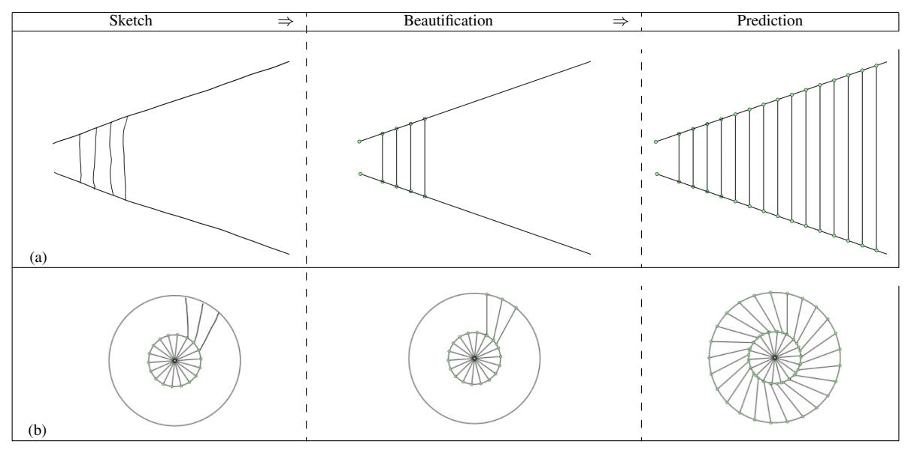

# **Synthesis From Examples: Interaction Models and Algorithms**

(Invited Talk Paper)

Sumit Gulwani Microsoft Research Redmond, WA, USA sumitg@microsoft.com

Abstract—Examples are often a natural way to specify various computational artifacts such as programs, queries, and sequences. Synthesizing such artifacts from example based specifications has various applications in the domains of enduser programming and intelligent tutoring systems. Synthesis from examples involves addressing two key technical challenges: (i) design of a user interaction model to deal with the inherent ambiguity in the example based specification. (ii) design of an efficient search algorithm - these algorithms have been based on paradigms from various communities including use of SAT/SMT solvers (formal methods community), version space algebras (machine learning community), and A\*-style goal-directed heuristics (AI community).

This paper describes some effective user interaction models and algorithmic methodologies for synthesis from examples while discussing synthesizers for a variety of artifacts ranging from tricky bitvector algorithms, spreadsheet macros for automating repetitive data manipulation tasks, ruler/compass based geometry constructions, algebraic identities, and predictive intellisense for repetitive drawings and mathematical terms.

Keywords-Program Synthesis, Inductive Synthesis, End User Programming, Intelligent Tutoring Systems, Domain Specific Languages, Programming By Example

#### I. INTRODUCTION

Program synthesis is the task of automatically synthesizing a program in some underlying domain-specific language (DSL) from a given specification using some search technique [1]. A traditional view of program synthesis is that of synthesizing programs from complete specifications. One approach is to give a specification as a formula in a suitable logic [2]-[7]. Another is to write the specification as a simpler, but possibly far less efficient program [8]–[10]. While these approaches have the advantage of completeness of specification, such specifications are often unavailable, difficult to write, or expensive to check against using automated verification techniques. In this paper, we focus on another style of specification, namely examples [11]-[13]. Programming by example (PBE) can be seen as a dual to program testing, which has seen decades of successful research. Instead of finding test cases that explore various paths in a given program (and potentially expose any bugs), the goal here is to synthesize programs in the first place starting from test cases, i.e., input-output examples.

There are two key challenges in designing *inductive* synthesizers that take examples as specifications. The first challenge is that of designing a good user interaction model that can deal with the inherent ambiguities in examples, which are often an under-specification of the user's intent. §II discusses a variety of effective user interaction models.

The second challenge is that of designing an efficient algorithm that can search for desired artifacts (in the underlying DSL) that are consistent with the given examples. §III discusses some general algorithmic methodologies. These involve use of techniques that have been developed in various communities including use of SAT/SMT constraint solvers (formal methods community), version space algebras (machine learning community), and A\*-style goal-directed heuristics (AI community).

We briefly discuss applications of inductive synthesizers to not only synthesis of a variety of traditional programs such as bitvector algorithms (§IV-A) and spreadsheet macros (§IV-B) but also to synthesis of more general structured concepts or *artifacts* such as geometric constructions (§IV-C), algebraic identities (§IV-D), sequences (§IV-E), and even drawings (§IV-F).

#### II. INTERACTION MODELS

While examples constitute the most natural form of specification in several cases, they are often an under-specification of the intent. We discuss below some general methodologies for resolving ambiguities in the example based specification.

# A. User Driven Interaction

This is the most intuitive and widely applicable interaction model. The user may verify the artifact returned by the synthesizer either by examining the artifact itself, or by examining its behavior on several other inputs. If the user finds any discrepancy in the behavior of the artifact and the expected behavior on some new input, the user may repeat the synthesis process after adding the new input-output example to the previous set of input-output examples.

## B. Synthesizer Driven Interaction

This interaction model obviates the need for the user to verify the synthesized artifact and provide any counterexam-

| User                                         | Synthesizer      |                                          |                        |
|----------------------------------------------|------------------|------------------------------------------|------------------------|
| $\textbf{Input} \rightarrow \textbf{Output}$ | Program 1        | Program 2                                | Distinguishing Input ? |
| $01011 \to 01000$                            | (x+1) & (x-1)    | (x+1) & x                                | 00000 ?                |
| $00000 \to 00000$                            | $-(\neg x) \& x$ | $(((x\& - x) \mid -(x-1))\& x) \oplus x$ | 00101 ?                |
| $00101 \to 00100$                            | (x+1)&x          | •••                                      | 01111 ?                |
| $01111 \to 00000$                            |                  | • • •                                    | 00110 ?                |
| $00110 \to 00000$                            |                  | • • •                                    | 01100 ?                |
| $01100 \to 00000$                            |                  | • • •                                    | 01010 ?                |
| $01010 \to 01000$                            | (((x-1) x)+1)&x  | None                                     | Program is             |
|                                              |                  |                                          | (((x-1) x)+1)&x        |

Figure 1. An illustration of the synthesizer driven interaction model [14] for synthesis of a bitvector algorithm (§IV-A) from input-output examples (for the task of turning off the righmost contiguous sequence of 1 bits). Program 1 and Program 2 are two semantically different programs generated by the synthesizer that are consistent with the past set of input-output pairs (in previous rows) provided by the user. The synthesizer also produces a distinguishing input on which the two programs yield different results, and asks the user for the output corresponding to the distinguishing input. The process is repeated until the synthesizer can find at most one program.

ple input. Instead the synthesizer generates a new input in each round and prompts the user for output on that input.

Given a set of input-output examples, the synthesizer searches for programs in the underlying DSL that map each input in the given set of examples to the corresponding output. The number of such programs may either be 0, 1, or more than 1. If the synthesizer is unable to find any such program over the search space, the synthesizer declares failure. If the synthesizer finds exactly 1 program, the synthesizer declares success and presents the program to the user. If the synthesizer finds at least two (semantically distinct) programs  $P_1$  and  $P_2$ , both of which map each input in the given set to the corresponding output, the synthesizer declares the user specification to be partial. It then generates a distinguishing input, an input on which the two programs  $P_1$  and  $P_2$  yield different results, and asks the user to provide the output corresponding to the distinguishing input. The synthesis process is then repeated after adding this new input-output pair to the previous set of input-output examples. This interaction model is described in [14] and is illustrated in Fig. 1.

# C. Randomly Selected Examples

In certain domains, if the examples are selected uniformly at random from among the space of all valid examples, and if an artifact is consistent with those selected examples, then the artifact is the intended artifact with high probability (over the choice of the examples). A well-known instance of such a domain is that of polynomials and the probabilistic result follows from the classical result on polynomial identity testing [15]. We have extended the identity testing result to restricted forms of linear programs [16], [17], geometric constructions [18], and algebraic identities [19]. The latter results have led to inductive synthesizers for respective domains [18], [19].

# D. Counterexample Guided Synthesis

Even when a complete formal specification is available, it is often best to reduce the synthesis problem to synthesizing from examples. This is done by using a *Counterexample* 

Guided Inductive Synthesis (CEGIS) methodology, wherein examples are iteratively generated from counterexamples that exhibit deviation between the candidate solution and the formal specification. The counterexamples are generated automatically using SAT/SMT based constraint solvers. This methodology has been used for synthesizing a large variety of programs including bitvector algorithms [4], graph algorithms [5], and vectorized code fragments [20]. It also forms the basis for *program synthesis by sketching* [21].

#### III. ALGORITHMS

The key technical challenge in synthesis from examples is to map the examples to artifact(s) in the underlying DSL. This is essentially a search problem, and can benefit from techniques developed in various communities. We present below certain classes of techniques that have been frequently used in recent work on synthesis.

# A. Version Space Algebras

One class of techniques is based on the concept of *version-space algebras*, where the key idea is to design data-structures and algorithms to succinctly represent and manipulate the set of all artifacts that are consistent with a given example(s) [22]. In particular, the following ingredients are required:

- Data structure for representing consistent artifacts: The number of artifacts in the underlying DSL that are consistent with a given set of examples is often huge.
   We need a data structure to succinctly represent a large set of such artifacts.
- Algorithm for synthesizing consistent artifacts: It involves two key procedures: (i) A procedure to learn the set of all artifacts, represented using the above data structure, that are consistent with a given single example. (ii) A procedure to intersect these sets (each corresponding to a different example).
- Ranking: The number of examples required to identify a unique artifact can often be large. Hence, it is desirable to use some form of ranking to guess the desired artifact from a small number of examples. The effectiveness of

such a ranking is inspired by Occam's razor, which states that a smaller and simpler explanation is usually the correct one. The ranking scheme should be consistent with the underlying version-space algebra in order to retain efficiency, i.e., it should be based on features that are invariant of the underlying version-space. The ranking can also be a function of the user-provided examples [23]; in addition, it can also take into account any test inputs provided by the user (i.e., new additional inputs on which the user may execute a synthesized program).

Version-space algebras were pioneered by Mitchell for refinement-based learning of Boolean functions [24], while Lau et.al. [25] extended the concept to learning more complex functions in a *Programming By Demonstration* (PBD) setting [11], [12]. We have lifted the concepts of version-space algebra to the PBE setting for fairly expressive DSLs (involving conditionals and loops) for spreadsheet data manipulation including syntactic string transformations [26], semantic string transformations [27], number transformations [28], and table transformations [29].

#### B. Brute Force Search

The general idea here is to systematically explore the entire state space of artifacts and check the correctness of each candidate against the given examples. This approach works relatively well when the specification consists of examples (as opposed to a formal relational specification) since checking the correctness of a candidate solution against examples can be done much faster than validating the correctness against a formal relational specification. However, this is easier said than done and often requires innovative nontrivial optimizations. Following are some instances of such optimizations have been inspired by paradigms from various communities: goal-directed search [18] (AI community), branch and bound [20], clues based on textual features of examples [23] (Machine Learning community), and common subexpression evaluation [19] (PL community).

# C. Constraint Solving

The general idea here is to reduce the synthesis problem to that of solving a SAT/SMT formula and let an off-the-shelf SAT/SMT solver efficiently explore the search space. This exploits the recent advances made in the Satisfiability (SAT) and Satisfiability Modulo Theory (SMT) solving technology to efficiently explore the search space of programs.

This approach has been applied to synthesis from complete formal specifications, but its applicability has been limited to synthesizing restricted forms of artifacts such as switching logics [6], program inverses [10], or programs whose correctness proof involves a given set of templates [3]. On the other hand, if the specification is in the form of examples, possibly generated using a CEGIS loop (§II-D) [4], [5], [20], [21] or distinguishing-input

based methodology (§II-B) [14], then the reduction of the synthesis problem to solving of SAT/SMT constraints can be performed for a larger variety of programs.

#### IV. ARTIFACTS

There is a huge variety of artifacts that can be synthesized from examples. We start out with an application in the traditional domain of algorithm synthesis (bitvector algorithms §IV-A). Then, we discuss some useful applications in the domain of end-user programming (spreadsheet macros §IV-B). We also discuss some surprising applications in the domain of intelligent tutoring systems ranging from solution generation (geometry constructions §IV-C) to problem generation (algebraic proof problems §IV-D) to content entry (intellisense for drawings §IV-F and mathematical expressions §IV-E).

# A. Bitvector Algorithms

Bitvector algorithms are typically straight-line sequence of instructions that use both arithmetic and logical bitwise operators. Such programs can be quite unintuitive and extremely difficult for average, or sometimes even expert, programmers to discover methodically.

Consider the task of masking the right-most significant 1bit in an input bitvector, (e.g., converting 01100 into 01000). A simple method to accomplish this would be to iterate over the input bitvector starting from the rightmost end until a 1 bit is found and then set it to 0. However, this algorithm is worst-case linear in the number of bits in the input bitvector. Furthermore, it uses undesirable branching code inside a loop. There is a non-intuitive, but quite elegant, way to achieving the desired functionality in constant time by using a tricky composition of the standard subtraction operator and the bitwise logical & operator, which are supported by almost every architecture. In particular, the desired functionality can be achieved using the following composition: x & (x-1). Fig. 1 describes an algorithm for a more sophisticated problem of masking the rightmost contiguous sequence of 1-bits. As yet another example, consider the task of computing (the floor of) the average of two 32-bit integers x and y. Note that computing average using the expression (x+y)/2 is inherently flawed and vulnerable since it can overflow. However, using some bitwise tricks, the average can be computed without overflowing and without using conditionals; one such way to compute it is:  $(x \& y) + ((x \oplus y) >> 1)).$ 

[14] describes a constraint solving based (§III-C) inductive synthesizer for such bitvector programs. These programs

1These algorithms "typically describe some plausible yet unusual operation on integers or bit strings that could easily be programmed using either a longish fixed sequence of machine instructions or a loop, but the same thing can be done much more cleverly using just four or three or two carefully chosen instructions whose interactions are not at all obvious until explained or fathomed" [30].

| (a) Syntactic String Transformation |             |
|-------------------------------------|-------------|
| Input $v_1$                         | Output      |
| Adam Smith                          | Smith, A.   |
| Sumit Gulwani                       | Gulwani, S. |
| George Necula                       | Necula, G.  |
| Peter Lee                           | Lee, P.     |
| Madhur Malik                        | Malik, M.   |

| (b) Number Transformation |        |
|---------------------------|--------|
| Input $v_1$               | Output |
| 0d 5h 26m                 | 5:00   |
| 0d 4h 57m                 | 4:30   |
| 0d 4h 27m                 | 4:00   |
| 0d 3h 57m                 | 3:30   |

| (c) Semantic String Transformation |              |  |
|------------------------------------|--------------|--|
| Input $v_1$                        | Output       |  |
| 6-3-2008                           | Jun 3, 2008  |  |
| 3-26-2010                          | Mar 26, 2010 |  |
| 8-1-2009                           | Aug 1, 2009  |  |
| 9-24-2007                          | Sep 24, 2007 |  |
|                                    |              |  |

| MonthRec |          |
|----------|----------|
| Number   | Name     |
| 1        | January  |
| 2        | February |
| 3        | March    |
|          |          |

# (d) Semantic String Transformation

| Input $v_1$ | Input v 2 | Output               |
|-------------|----------------------|----------------------|
| Stroller    | 10/12/2010           | \$145.67+0.30*145.67 |
| Bib         | 23/12/2010           | \$3.56+0.45*3.56     |
| Diapers     | 21/1/2011            | \$21.45+0.35*21.45   |
| Wipes       | 2/4/2009             | \$5.12+0.40*5.12     |
| Aspirator   | 23/2/2010            | \$2.56+0.30*2.56     |

| Background Knowledge | (user-defined) Tables |
|----------------------|-----------------------|
| MontrumDoo           |                       |

| MarkupRec |           |        |
|-----------|-----------|--------|
| Id        | Name      | Markup |
| S33       | Stroller  | 30%    |
| B56       | Bib       | 45%    |
| D32       | Diapers   | 35%    |
| W98       | Wipes     | 40%    |
| A46       | Aspirator | 30%    |
|           |           |        |

| CostRec |         |          |
|---------|---------|----------|
| Id      | Date    | Price    |
| S33     | 12/2010 | \$145.67 |
| S33     | 11/2010 | \$142.38 |
| B56     | 12/2010 | \$3.56   |
| D32     | 1/2011  | \$21.45  |
| W98     | 4/2009  | \$5.12   |
| A46     | 2/2010  | \$2.56   |
|         | • • • • |          |

# (e) Table Transformation

| input iubic. |            |            |            |
|--------------|------------|------------|------------|
|              | Qual 1     | Qual 2     | Qual 3     |
| Andrew       | 01.02.2003 | 27.06.2008 | 06.04.2007 |
| Ben          | 31.08.2001 |            | 05.07.2004 |
| Carl         |            | 18.04.2003 | 09.12.2009 |

| Output Table: |        |            |
|---------------|--------|------------|
| Andrew        | Qual 1 | 01.02.2003 |
| Andrew        | Qual 2 | 27.06.2008 |
| Andrew        | Qual 3 | 06.04.2007 |
| Ben           | Qual 1 | 31.08.2001 |
| Ben           | Qual 3 | 05.07.2004 |
| Carl          | Qual 2 | 18.04.2003 |
| Carl          | Oual 3 | 09.12.2009 |

Figure 2. Variety of spreadsheet data manipulation tasks. The inductive synthesizers described in [26]–[29] can automate the tasks in (a), (b), (c)/(d), and (e) respectively. The bold entries in (a)-(d) in the Output columns are automatically produced by the respective inductive synthesizers from the first few example rows.

are synthesized from examples using the distinguishing-input based synthesizer-driven interaction model (§II-B).

#### B. Spreadsheet Macros

Spreadsheet users often struggle with repetitive data transformations tasks. Fig. 2 illustrates some such tasks that involve manipulation of strings, numbers, and tables. In each of these cases, the users can easily express their intent using examples, from which the desired scripts for task automation can be synthesized.

We have defined various DSLs for transformations on strings [26], [27], numbers [28], and tables [29]. The DSL for *Syntactic string transformations* [26] includes substring and concatenate operators along with limited forms of regular expressions, conditionals, and loops. *Semantic string transformations* [27] combine syntactic transformations with lookup operations from other relational tables (containing required background knowledge). *Number transformations* [28] allow for formatting and rounding transformations on numbers. *Table transformations* [29] allow for layout transformations on tables.

Each of these languages is expressive enough to capture several real-world tasks in the underlying domain, but also restricted enough to enable efficient learning from examples. For each of these languages, we have developed a version-space algebra based inductive synthesizer (§III-A)

that can generate scripts for automating repetitive tasks from input-output examples. The inductive synthesis technology for syntactic string transformations ships as the *Flash Fill* feature in Excel 2013 [31].

## C. Geometry Constructions

Geometry constructions are essentially straight-line programs that manipulate geometry objects (points, lines, and circles) using ruler and compass operators. Hence, the problem of synthesizing geometry constructions can be phrased as a synthesis problem [18] in a manner very similar to the problem of synthesizing bitvector algorithms (§IV-A), which are straight-line programs over bitvector operators. Furthermore, because of probabilistic testing property (§II-C), geometric constructions can be synthesized from random examples or models. Fig. 3 illustrates the workflow, wherein random models can be generated from logical description of the given problem using off-the-shelf numerical solvers. The underlying synthesis algorithm performs brute-force search (over an extended library of ruler/compass operators) using goal-directed heuristics (§III-B).

# D. Algebraic Identities

Generating fresh problems that involve using a given set of concepts and have a given difficulty level is often a tedious task for the teacher. The ability to automatically generate such fresh problems has several applications: (a) It can

| Example Problem                    | $\frac{\sin A}{1 + \cos A} + \frac{1 + \cos A}{\sin A} = 2 \csc A$ (From [32])                                                        |                                                                                                                                                                                                                                                                                                                                                                                                                                                   |
|------------------------------------|---------------------------------------------------------------------------------------------------------------------------------------|---------------------------------------------------------------------------------------------------------------------------------------------------------------------------------------------------------------------------------------------------------------------------------------------------------------------------------------------------------------------------------------------------------------------------------------------------|
| Generalized Problem Template | $\frac{T_1A}{1\pm T_2A}+\frac{1\pm T_3A}{T_4A}=2\ T_5A$ where $T_i\in\{\cos,\sin,\tan,\cot,\sec,\csc\}$                               | $ \begin{vmatrix} F_0(x,y,z) & F_1(x,y,z) & F_2(x,y,z) \\ F_3(x,y,z) & F_4(x,y,z) & F_5(x,y,z) \\ F_6(x,y,z) & F_7(x,y,z) & F_8(x,y,z) \end{vmatrix} = c  F_9(x,y,z) $ where $F_i(0 \leq i \leq 8)$ and $F_9$ are homogeneous polynomials of degrees 2 and 6 respectively, $\forall (i,j) \in \{(4,0),(8,4),(5,1),\ldots\} : F_i = F_j[x \rightarrow y; y \rightarrow z; z \rightarrow x], \text{ and } c \in \{\pm 1, \pm 2, \ldots, \pm 10\}. $ |
|                                    | $\frac{\cos A}{1 - \sin A} + \frac{1 - \sin A}{\cos A} = 2 \tan A$ $\frac{\cos A}{1 + \sin A} + \frac{1 + \sin A}{\cos A} = 2 \sec A$ | $\left  egin{array}{cccc} y^2 & x^2 & (y+x)^2 \ (z+y)^2 & z^2 & y^2 \ z^2 & (x+z)^2 & x^2 \end{array}  ight  = 2(xy+yz+zx)^3$                                                                                                                                                                                                                                                                                                                     |
|                                    | $\frac{\cot A}{1 + \csc A} + \frac{1 + \csc A}{\cot A} = 2 \sec A$ $\frac{\tan A}{1 + \sec A} + \frac{1 + \sec A}{\tan A} = 2 \csc A$ | $\begin{vmatrix} -xy & yz + y^2 & yz + y^2 \\ zx + z^2 & -yz & zx + z^2 \\ xy + x^2 & xy + x^2 & -zx \end{vmatrix} = xyz(x+y+z)^3$                                                                                                                                                                                                                                                                                                                |
| New Problems                    | $\frac{\sin A}{1 - \cos A} + \frac{\tan A}{\sin A} = 2 \cot A$                                                                        | $\left  egin{array}{cccc} yz+y^2 & xy & xy \ yz & zx+z^2 & yz \ zx & zx & xy+x^2 \end{array}  ight  = 4x^2y^2z^2$                                                                                                                                                                                                                                                                                                                                 |

Figure 4. Synthesis of algebraic proof problems that are similar in structure to a given example proof problem [19].

| English              | Construct a triangle given its base $L$ (with end-points                                                                                                                   |
|----------------------|----------------------------------------------------------------------------------------------------------------------------------------------------------------------------|
| Description          | $p_1, p_2$ ), a base angle a, and sum of the other two                                                                                                                     |
| ↓                    | sides $r$ .                                                                                                                                                                |
| PreCondition         | $r>$ Length $(p_1,p_2)$                                                                                                                                                    |
| PostCondition        | $\texttt{Angle}(p,p_1,p_2) = a \ \land$                                                                                                                                    |
| ↓ ↓                  | Length $(p,p_1)+$ Length $(p,p_2)=r$                                                                                                                                       |
| Random Model ↓ | $L = \text{Line}(p_1 = \langle 81.62, 99.62 \rangle, p_2 = \langle 99.62, 83.62 \rangle)$ $r = 88.07 \qquad a = 0.81 \text{ radians}$ $p = \langle 131.72, 103.59 \rangle$ |
| Geometry Program  |                                                                                                                                                                            |

Figure 3. Synthesis of ruler/compass based geometry constructions [18].

help avoid copyright issues (since textbook problems cannot simply be made available online), (b) It can help avoid plagiarism: Students can be provided with different problems that exercise the same set of concepts and have the same difficulty level, and (c) It can help generate personalized workflows: Students can be presented with the problem that is slightly more difficult than the ones that they are able to solve.

Figure 4 shows some algebraic proof problems that have automatically synthesized starting from a given example problem [19]. There are two different by-example paradigms that are in play here. First, a generalized problem template

$$\tan A \cdot \tan 2A \cdot \tan 3A = \tan A + \tan 2A + \tan 3A$$

$$\begin{pmatrix} yz - x^2 & zx - y^2 & xy - z^2 \\ zx - y^2 & xy - z^2 & yz - x^2 \\ xy - z^2 & yz - x^2 & zx - y^2 \end{pmatrix}$$

$$\begin{pmatrix} A_1 \sin^3 \alpha & B_1 \sin^3 \beta & C_1 \sin^3 \gamma \\ A_2 \sin \alpha & B_2 \sin \beta & C_2 \sin \gamma \end{pmatrix}$$

Figure 5. Synthesis of low-entropy mathematical terms from their prefixes. Our tool [34] can predict the bold parts in each of the above three texts from the remaining prefixes.

is synthesized from the example problem(s). Second, the validity of a match for the generalized problem is performed by testing on random inputs (§II-C). Note that this has the effect that the new synthesized problems are similar in structure to the given example problem and match the generalized problem template. The user can control the similarity by providing more example problems for producing the generalized problem template or by manually editing the generalized problem template.

## E. Mathematical Terms

Inputting mathematical text into a computer remains a painful task. Markup languages like LaTeX lead to unreadable text in encoded form, while WYSIWYG editors like Microsoft Word require users to change cursor position several times, and switch back and forth between keyboard and mouse input.

Mathematical text, like several human created artifacts, is

Figure 6. Synthesis of repetitive geometric drawings from partial sketches. The workflow involves beautification of partial sketches into geometric objects [35] and prediction of other objects from the initial beautified objects by synthesizing object transformation logics [36].

often structured and has low entropy—hence it is amenable to not only encryption but also prediction. Mathematical text is often organized into sessions, each consisting of mutually related expressions with an inherent progression. Examples of such sessions include a lengthy equation, a symbolic matrix, a solution to a problem, a list of problems in an exercise, and a set of related rules and axioms. Predicting sub-terms that the user is likely to input next can be phrased as a synthesis-from-example problem [34]. Fig. 5 illustrates some sessions containing terms with similar structure that are amenable to prediction. This predictive capability can be an important component of human-computer interfaces for inputting mathematical text into a computer, be it through speech, touch, keyboard, or multi-modal interfaces.

#### F. Repetitive Drawings

Structured drawings involving line and circle objects arranged in some repetitive pattern (as shown in Fig. 6) are quite common in real-life (e.g., brick/tiling patterns, wheels, and architectural drawings). Making such drawings is time consuming and cumbersome using existing drawing tools because they only offer the ability to copy-paste objects in the drawing. Copy-paste functionality is not sufficient to enable efficient construction of such diagrams since it does not position copied objects automatically, and is incapable of dealing with transformations involving scaling (as in Fig. 6(a)) or rotation (as in Fig. 6(b)) on copied objects. Predicting the repetitive objects in a drawing from few examples of initial objects can be phrased as a synthesis-from-example problem [36].

#### V. CONCLUSION

General-purpose computational devices, such as smartphones and computers, are becoming accessible to people at large at an impressive rate. In the future, even robots will become household commodities. Unfortunately, programming such general-purpose platforms has never been easy, because we are still mostly stuck with the model of providing step-by-step, detailed, and syntactically correct instructions on *how* to accomplish a certain task, instead of simply describing *what* the task is. The synthesis technology has the potential to revolutionize this landscape, when targeted for the right set of problems and using the right interaction model.

We believe that the most interesting applications of the synthesis technology can be in the areas of end-user programming, and intelligent tutoring systems. In this paper, we focused on example based interaction models. Another effective form of interaction can be based on natural language. It remains an open research problem to design intelligent multi-modal interfaces that can take examples, natural language, speech, touch, etc. as input. The solution lies in bringing together various inter-disciplinary technologies that can combine user intent understanding, (possibly unstructured) knowledge bases, and logical reasoning.

#### ACKNOWLEDGMENT

I would like to thank Ben Zorn and Rico Malvar who have been strong advocates of this inter-disciplinary line of research work at Microsoft Research. I would like to thank all my co-authors on the various synthesis papers that are referenced here.

#### REFERENCES

- [1] S. Gulwani, "Dimensions in program synthesis," in *PPDP*, 2010.
- [2] Z. Manna and R. J. Waldinger, "A deductive approach to program synthesis," ACM Trans. Program. Lang. Syst., vol. 2, no. 1, pp. 90–121, 1980.
- [3] S. Srivastava, S. Gulwani, and J. Foster, "From program verification to program synthesis," in *POPL*, 2010.
- [4] S. Gulwani, S. Jha, A. Tiwari, and R. Venkatesan, "Synthesis of loop-free programs," in *PLDI*, 2011.
- [5] S. Itzhaky, S. Gulwani, N. Immerman, and M. Sagiv, "A simple inductive synthesis methodology and its applications," in *OOPSLA*, 2010.
- [6] A. Taly, S. Gulwani, and A. Tiwari, "Synthesizing switching logic using constraint solving," in VMCAI, 2009.
- [7] S. Jha, S. Gulwani, S. Seshia, and A. Tiwari, "Synthesizing switching logic for safety and dwell-time requirement," in *ICCPS*, 2010.
- [8] A. Solar-Lezama, L. Tancau, R. Bodík, S. A. Seshia, and V. A. Saraswat, "Combinatorial sketching for finite programs," in ASPLOS, 2006, pp. 404–415.
- [9] R. Joshi, G. Nelson, and K. H. Randall, "Denali: A goaldirected superoptimizer," in *PLDI*, 2002, pp. 304–314.
- [10] S. Srivastava, S. Gulwani, S. Chaudhuri, and J. S. Foster, "Path-based inductive synthesis for program inversion," in PLDI, 2011.
- [11] H. Lieberman, Your Wish Is My Command: Programming by Example. Morgan Kaufmann, 2001.
- [12] A. Cypher, Ed., Watch What I Do: Programming by Demonstration. MIT Press, 1993.
- [13] S. Gulwani, "Synthesis from examples," WAMBSE (Workshop on Advances in Model-Based Software Engineering) Special Issue, Infosys Labs Briefings, vol. 10, no. 2, 2012.
- [14] S. Jha, S. Gulwani, S. Seshia, and A. Tiwari, "Oracle-guided component-based program synthesis," in *ICSE*, 2010.
- [15] J. T. Schwartz, "Fast probabilistic algorithms for verification of polynomial identities," *J. ACM*, vol. 27, no. 4, 1980.
- [16] S. Gulwani and G. C. Necula, "Discovering affine equalities using random interpretation," in *POPL*, 2003.
- [17] S. Gulwani, "Program analysis using random interpretation," Ph.D. dissertation, UC-Berkeley, 2005.
- [18] S. Gulwani, V. A. Korthikanti, and A. Tiwari, "Synthesizing geometry constructions," in *PLDI*, 2011, pp. 50–61.

- [19] R. Singh, S. Gulwani, and S. Rajamani, "Automatically generating algebra problems," in *AAAI*, 2012.
- [20] G. Barthe, J. M. Crespo, S. Gulwani, C. Kunz, and M. Marron, "From relational verification to simd loop synthesis," in *PPoPP*, 2013, To appear.
- [21] A. Solar-Lezama, "Program synthesis by sketching," 2008.
- [22] S. Gulwani, W. Harris, and R. Singh, "Spreadsheet data manipulation using examples," *Communications of the ACM*, Aug 2012.
- [23] A. Menon, O. Tamuz, S. Gulwani, B. Lampson, and A. Kalai, "A machine learning framework for programming by example," in *ICML*, 2013, To appear.
- [24] T. M. Mitchell, "Generalization as search," Artif. Intell., vol. 18, no. 2, 1982.
- [25] T. Lau, S. Wolfman, P. Domingos, and D. Weld, "Programming by demonstration using version space algebra," *Machine Learning*, vol. 53, no. 1-2, 2003.
- [26] S. Gulwani, "Automating string processing in spreadsheets using input-output examples," in *POPL*, 2011.
- [27] R. Singh and S. Gulwani, "Learning semantic string transformations from examples," PVLDB, vol. 5, 2012.
- [28] —, "Synthesizing number transformations from inputoutput examples," in *CAV*, 2012.
- [29] W. R. Harris and S. Gulwani, "Spreadsheet table transformations from examples," in *PLDI*, 2011.
- [30] H. S. Warren, Hacker's Delight. Addison-Wesley, '02.
- [31] "Flash Fill (Microsoft Excel 2013 feature)," http://research.microsoft.com/users/sumitg/flashfill.html.
- [32] S. L. Loney, *Plane Trigonometry*. Cambridge University Press.
- [33] M. L. Khanna, IIT Mathematics.
- [34] O. Polozov, S. Gulwani, and S. Rajamani, "Structure and term prediction for mathematical text," Tech. Rep. MSR-TR-2012-7, 2012.
- [35] S. Cheema, S. Gulwani, and J. LaViola, "Quickdraw: improving drawing experience for geometric diagrams," in CHI, 2012.
- [36] ——, "Patternsketch: A new way to make structured drawings with patterns," Tech. Rep., 2012.