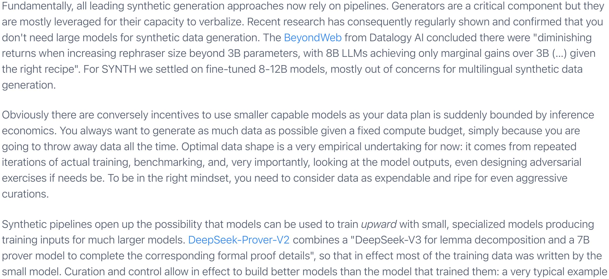

### Synthetic pretraining Pretraining data infrastructure used to be the most conservative part of a fast-moving AI world. Since GPT-3 we have been

mostly scaling the usual mix of web crawls peppered with a few more select sources (including, controversially, digitized books). This is finally changing. In 2025, several major releases used extensive synthetic datasets before mid-training happens: Minimax, Trinity, K2/K2.5,

Nemotron-3 and, more speculatively, GPT-OSS. At Pleias we even experimented with full synthetic training with Baguettotron/Monad exclusively trained on a generalist synthetic environment, SYNTH.

At this point, a few clarifications are needed. To what extent does synthetic pretraining contrast with an already common use of synthetic methods in mid- and post-training? And what do even we mean by synthetic? Is it just another data source? or a much more significant shift in the way we envision data, model design and training infrastructure?

synthetic pretraining—an area that is both fragmented in the open and secretive in frontier labs. I'll strive to anchor definitions in the operational realities of building and scaling synthetic pipelines, then later move on to more speculative extrapolations. What is synthetic pretraining?

Overall, this post isn't an introduction. It's rather an attempt to bind together scattered strands of research and practice around

Let's start with a tentative definition: synthetic pretraining encompasses large-scale use of synthetic data sources throughout training. It implies that data design is not just a late adjustment but a fundamental axis of model development. Synthetic pretraining is a practical response to a basic misalignment: the data we can easily collect is not the data that reliably

produces the capabilities we want. Yet, it's also a step that requires rethinking the entire training cycle. Suddenly you have to:

less well, a range of generative behaviors.

generation with a handful of hardcoded prompts.

2. Involve data design teams before the model even exists, rather than working with a pre-existing base model that can hardly be changed beyond a few select variables (tokenization, etc.). 3. Target specific capabilities from the earliest phase of training. If the data has been well designed, you should be able to

monitor progress continuously. Synthetic pretraining seems to open up a new simultaneous space of data and model innovation. In my experience, we can

1. Allocate compute to data and design an inference system at scale from the start.

- generation allows to build controlled experimental environments, oriented toward the acquisition and measurement of specific skills. "synthetic tasks eliminate the noise, randomness, and data contamination of real-world datasets, enabling clean, controlled, apples-to-apples architectural comparisons".
- Where does it come from?

a dataset of 30 billion tokens, which achieves common sense reasoning benchmark results comparable to models ten times its size that were trained on datasets more than ten times larger." Both research teams quickly backtracked: the next version of Phi was built on the now familiar mix of quality pretraining data and synthetic augmentation. What happened? If you look closely at the original Phi 1 paper, you find an unprecedentedly ambitious program of data research, stemming from TinyStories: "we explore the improvement that can be obtained along a different axis: the quality of the data" This was correctly framed: to be viable at all, synthetic pretraining requires reconstructing an entire training environment from scratch. It's tempting at first to focus on standardized benchmarks and use it as a continuous objective target but then you miss on multiple capabilities that are not measured and tacitly expected by future model users. Unstructured web

pretraining remained competitive as an effective way to offload data research, ensuring that models will at least cover, more or

To make synthetic pretraining really happen, you have to allocate to significant time and effort on a research axis historically

neglected in LLM model development. Large ML conferences were long outright hostile to data submission. Data sharing is an

effective way to pool complex data work, but until recently was out of reach: capable models (including the OpenAI ones used

cover training, it does not extend to reusability. Consequently, synthetic pipelines remained very crude, limited to straight

by Microsoft) prevented data reuse. Most data seeds were of unclear provenance, usually large web crawls. While fair use might

In retrospect, it seems to me, the synthetic turn could only happen once data is somehow acknowledged as the key contributor

to model learning capabilities. As anticipated, a driving factor has been the development of mid-training, which has currently grown to be the one space of data experimentation in LLM research. In contrast with the initial experiments over full synthetic training, this is a relatively smooth process where labs suddenly find themselves tricked into caring about the data by simply unrolling more and more data issues. With mid-training growing to encompass an ever more sizable part of compute budget, it's becoming now an open question if training should be now exclusively focused on synthetic training data. By early 2026, we find a very different environment. There is an emerging ecosystem of reusable synthetic datasets like Nemotron-Synth, SYNTH or Toucan (from IBM). Data sections are back on reports (mostly from China, though the latest Trinity from Arcee/Datalogy/Prime shows this is also happening in the US). And they are increasingly explicit about the fact synthetic design will not be infinitely delayed: "A key advancement in the pretraining data of Kimi K2 over Kimi K1.5 is the introduction of a

on top of multiple reasoning primitives akin to syllogisms, that can be captured more or less efficiently, from more or less noisy data. In the Physics of Language Models series,, Zeyuan Allen-Zhu argues: "all model architectures fail at simplest 2-hop reasoning" exercises even at 8B scale over 1 trillion tokens, simply because the basic syllogistic relationship (X is born in the same year as Y) is never properly learned in unstructured web-based data. Scaling might be a very costly workaround for this fundamental data limitation, as extremely sparse weights seem naturally prone to capture very sparse signals and patterns. But this is still ineffective and, ultimately risky — many of the rumored "pretraining accidents" may ultimately stem from it, data and learning design badly adjusted to the capacities desired in the first place. Instead, hop-reasoning and other logical constructs should be simply learned throughout training.

Recent work in model interpretability seems to support this general view, especially the quanta hypothesis recently introduced

by Eric Michaud: when you zoom in, models do not acquire capacities continuously but through a sudden unlock, as if models'

but also in standard evaluation sets, as they are already too noisy and will look for complex composite of tasks.

internals were suddenly correctly wired after a long search sequence. All this process is obviously smoothed in the training loss,

200

175

150

125

100

75

Synthetic pretraining implicitely assumes from the start that any transformer model is in effect a "reasoning" model, building up

## 1.0

mean loss 25 0.0  $10^{2}$  $10^{3}$ 104 105 **Optimization Steps** Illustration of the quanta hypothesis: capacities are not learned linearly but through sudden sigmoids So the real value of a reasoning models lies in its capacity to recursively combine a repertoire of capabilities and synthetic pretraining suddenly forces us to think hard about this learning process. Under this view, organic data is fundamentally a form of data engineering outsourcing. It means you have to care about eliciting some capacities as there will always be some frequency of conversational data, classification tasks, creative writing, except it's all bundled in the noise and you have no

It follows that synthetic pretraining is the relative quest for optimal data shapes. It's, for now, a strictly empirical objective,

hugely dependent on model size (you don't create the same synthetic recipes nor curate the same collection seed for a 300M

or a 300B model) and overall end use envisioned. Model collapse is one axis of bad learning, similar on many level to excessive

duplication in organic training corpus: models fail to identify the actual underlying processes as low language diversity favors

is JSON generation, as you can simply filter out all faulty structure to only keep perfect examples in the final set. This part is unsettled so far, but in my experience effective synthetic pipelines almost always requires fine-tuned/retrained models, either with SFT or RL. DeepSeek-3.2 "Speciale" draws its name from a process of "specialist distillation" based on synthetic outputs of fine-tuned versions of the DeepSeek-V3.2 base model from "six specialized domains: mathematics, programming, general logical reasoning, general agentic tasks, agentic coding, and agentic search". Fine-tuned models allow for much more minute control of search/reasoning processes and, maybe even more importantly, to design structured input and output that will come in handy once the model is plugged into integrated pipelines.

Ubiquitous curation/fine-tuning also means document sampling matters more than token sampling: over the past year I've seen

beam search). Improved token sampling and decoding often look like second-order wins compared to improving the synthetic

We now hit the point where synthetic pretraining cannot be just descriptive and operational. We alluded already to some of the

reasons why it works and fails, but this deserves a more careful examination, though a very speculative one. A proper theory of

synthetic pretraining would require considerably more interaction between model explainability and practical data tips than we

surprisingly little documented experiments on literal inference-time tricks (an isolated example would be Seed-Prover with

Synthetic pretraining research seems currently to fall on three increasingly more "abstract" forms of synthetic compilation and design: 1. memorization: how we can selectively amplify facts and optimize their memorization through engineered rephrasing. 2. logical hardwiring: how we can embed rules and abstract resolution sequences in the model itself. 3. system simulations: how we can model environments and, actually, entire system of work and document production with integrated constraints.

In its original formulation, mid-training was about data quality filtering and, soon enough formatting. And from then on, it was

relatively easy to take the jump to data rewrite or rephrasing. The original motivation might have been about data legibility: after

all many pretraining samples are deteriorated, especially due to digitization or web scraping artifacts. This was the starting point

for REWIRE (from Meta): "The central hypothesis of our REWIRE framework is that web documents contain diverse content and

knowledge, but the writing structure can make them not coherent or elaborate enough to serve as informative pretraining

The archetypal experiment here is Learning Facts at Scale with Active Reading (also Meta) showing saturation of the hardest

environment, so further confirmation of viability and scalability really came from BeyondWeb and our own SYNTH where we

managed to build a self-sufficient pretraining environment out of a small yet highly qualitative diverse sample of 56,000

memorization benchmarks (simpleQA) by 8B model trained on a "diverse set of learning strategies, given a document we want

examples" Yet further research showed the benefit extended beyond cleaner data: model memorizes through varied

to study" brought by the synthetic generation pipelines. The active reading dataset is not really a workable training

 $sum = _95$ 

~36 + ~60

add ~57

 $sum = _5$ 

 $_{6} + _{9}$ 

add\_9

**Lookup Table Features** 

smearing (low-precision)

**Add Function Features** 

vertical or horizontal stripes

The model has stored information about particular pairs of input properties. They take

input from the original addends (via attention)

and the Add Function features. Operand plots

The model separately determines the ones digit of the number to be added and its approximate magnitude. Operand plots show

are points, possibly with repetition (modular) or

Example mod 10

many of these cases, we do have the recipes to produce data, in the forms of guidelines, policies, or advice from people on the field. But to actually create it requires much more abstract pipelines — you have to imagine a SYNTH-like dataset no longer derived from Wikipedia but from Wikidata, structured input from interconnected knowledge graphs. Closest experiments in this direction come from Nemotron-CC where document classification served to reinforce "correlations between advanced topics that are otherwise rarely observed in web-scale data". Synthetic compilation 2: logic and pipelines It is surprisingly overlooked, but transformers are efficient compilers: with the right training design, many formal rule systems can be integrated in the weights themselves. This process does not even require verbalization. In the circuit transformers experiments from Anthropic, basic math exercises are resolved even before tokens are generated, as standard operations are readily pre-parsed by attention graphs and pre-computed by model internal flows. 95 calc: 36+59= **Sum Features** The model has finally computed information Hover to see about the sum: its value mod 10, mod 100, feature and its approximate magnitude.

Input Features The model has features specific to the ones digit and to the approximate magnitude, at ~30 36 \_6 5\_ ~59 59 various scales. Most computation calc: 36 59 takes place on the Sy View detailed graph Figure 16: A simplified attribution graph of Haiku adding two-digit numbers. Features of the inputs feed into separable processing pathways. So-called non-reasoning model doing non-reasoning things

We now have multiple projects of logical hardwiring at Pleias in different domains that all require the integration of specific

reasoning paths (and no, current frontier models don't manage well). It becomes clear, that similarly to memorization, any

this process scales. We have multiple examples of state-of-the-art transformers models used to sort out complex inputs in

arrangement with selective destruction or masking of original sources, in effect integrating learning strategies into the data

biology, astronomy or physics without any verbalization. Training here is not simply done on raw data: it relies on clever

Now logical hardwiring does not happen that differently in language models: you need to endlessly simulate, transform,

reshape, hide, complexify data. As soon as 2020, it was immediately obvious the only way to achieve this result was through

synthetic pipelines. The earliest published LLM math prover GPT-F relied on "synthetic datasets allowing us to generate proofs

for each of these domains at will while controlling precisely by how many proofs we augment our training sequence" as existing

not proceed differently. One of the current state-of-the-art series of model, Seed-Prover successfully tackles hard geometrical

data is already too scarce and won't allow to perform selective engineering of problems. The latest generations of prover did

formal rule-based system can be learned to a high accuracy, through systematic exposure to modelled exercises. And also that

secured and auto-formalization of common high school problems mostly solved. Instantaneous problem resolution is obviously bounded by sequential complexity. To solve any advanced math problem, you have to perform a wide number of intermediary steps, decompose into sub-problems, demonstration, lemmas, come up with a strategy to orchestrate all this. Then logical hardwiring gives you the initial reasoning primitives (or quanta) but won't scale up this far. For this you need something other than language or pattern-matching models: you need actual simulations of systems. Seed-Prover implemented some form of problem-solving orchestration, intermingling intermediary formalization with backtracking checks: "a proposer module accepts an unsolved problem and, optionally, some already proved lemmas as input, and generates 10-50 candidate conjectures about properties of the problem". How do these traces come to be? Is it a spontaneous creation of post-training/RL runs? Here even Chinese labs don't say much, as I guess it gets too close to competitive advantage. We know that GLM 4.5 was trained on "large-scale synthetic agent trajectories". Minimax M2.1 was trained on 100,000 programming environments with a constant recursive synthetic feedback: "We are building an automated data flywheel: automatically discovering high-quality Issues and PRs from GitHub; using models to assess task difficulty and perform stratification; automatically augmenting tasks that the current model can easily solve to

interactions and open source code. And the problem compounds: lack of reasoning primitives and/or insufficient logical hardwiring intrinsically put a ceiling on model capacities to tackle harder, compositional problems. So before even moving on to pre-AGI research (continual learning?), I feel we still have to finalize training. The recurrent mysteries of "why RL works" with some combination of models and environment and not with others seem mostly downstream of fundamental shortcoming of capabilities not being incorporated at the data stage. Through its increasingly abstract stages synthetic pretraining is gradually fleshing out to be a research program to systematically integrate the information and processes we need to build up increasingly complex autonomous systems.

minute scale: it's always more beneficial to let the model sort out problems rather than run into endless bitter lesson. And yet once we zoom out and we consider the total space of potential knowledge processes and admit that, yes, there is data we'll never get and much diversity, sparsity and compositionality in our systems of learning, maybe after all you should start selecting for the skills, the information, the epistemic paths worth knowing.

data opens up just too many benefits in readability, auditability and general system design.

iteratively define overall architecture/learning strategies based on initial data intuitions, intermediary model output, assumptions about how some specific pieces of model design (layer depth, attention graphs, hyper-connections, tokenization strategies) can respond to learning exercises. Zeyuan Allen-Zhu characterizes this research space as a "synthetic playground" where data

Synthetic pretraining is not a new development. First released in 2023, Phi 1.5 from Microsoft was the first model of the series to be exclusively trained on synthetic data. A few months later, Cosmo-1B provided an initial reproduction in the open. A major motivation was increasing data and parameter efficiency: "In a nutshell we build phi-1.5, a 1.3 billion parameter model trained on

synthetic data generation strategy to increase token utility" What does synthetic mean? This is probably the most frustrating part of the academic debate: synthetic data is not a data source or even one specific method to get data. It's a range of techniques that significantly vary in scope, sophistication and, maybe most importantly, distance toward existing data sources. All the model collapse literature currently assesses a handful of usually crude techniques which have little relationship with current practices on the field. The most systematic study to date, Demystifying Synthetic Data, still include straight "textbook" generation which unsusprisingly results in extremely low token diversity.

## 0.8 Test Loss (bits) 0.6

superficial formal assimilation.

generation.

curations.

recipe and filtering.

Stages of synthesis

Synthetic compilation 1: memory

repetition.

Wikipedia articles.

How does it work in practice?

0.4

0.2

control aside from a few encoder and heuristic filters to optimize this data axis.

have seen until now. Still it can be tried: fundamentally, I'm seeing now different stages of synthetic pretraining environments defined by their proximity or distance to organic data and their audacity in unlearning human knowledge.

knowledge and information that matters for deployment. Realistically, this is mostly a rediscovery of internal research from frontier labs, that all have significantly stepped up their data pipelines. It's either confirmed, tacitly suggested or rumored that the current generation of models has been trained on a significant amount of synthetic data. At this point, I would expect to see an increasing abstraction of knowledge and memory building. Until now all the reference pipelines rely on texts commonly available online. Yet, to make a sizable impact on GDP, models will also need to perform on a

exclusively available in structured data or, in many cases, never verbalized and parts of the internal culture of an organization. In

wide range of unavailable inputs, for a variety of reasons: inaccessible texts due to privacy or security reasons, knowledge

The fundamental takeaway at this point is that synthetic pipelines solve LLM memorization, as models can now selectively retain

Inputs near 30 make this early feature fire

itself.

visualizations!

Example

features

low precision

sum ~92

~40 + ~50

problems through indefinite synthetic replaying. They run a hard search on trees deduced from "geometry problems over more than the past 20 years": "in more than 7 days, the problem generation program found over 230 million unique problems". By comparison the largest collection of all math problems (not just geometry) Numimath is little short of one million problems, and that includes many instances of poor or repetitive samples (for lean auto-formalization, they only kept less than 10% of the original set). Of course, you may wonder why logical hardwiring is needed at all. Spatial recognition problems are almost adversarial by nature for auto-regressive model architecture: could they not be simply delegated to external tools? Yes to some extent, but this ignores the benefit of universal transformer integration. Once all subtasks, quanta, concepts inhabit the same latent space,

you have a pool of indefinite creative problem-solving ability. Many elegant mathematical solutions involved looking at the

RL environments is structured in readily available high-school math problems.

writing that would never come to be without a wider environment.

yet the ingredients: no evaluations, no initial seed set for synthetic generation and problem search.

problem from a completely different perspective, even radically reshaping the initial terms of the problem. If anything, current

LLM provers may have a too restrictive search space: the entire ecosystem of benchmarks, synthetic problem generation and

This issue obviously compounds for industrial use cases that are still largely yet to happen. Current situation is very analogous

to what we see currently in LLM math. Symbolic routines are widely applied everywhere (from manufacturing to banking). Yet,

This last stage of synthetic data generation remains scarcely documented in the open, but should be tangible to anyone

interacting with latest generations of models. There simply isn't any data that matches what Claude Code does and to achieve

that you actually need to actively deconstruct data, provide an unlearning process that can recreate complex pieces of code or

A little seen key innovation of Claude 4 was the introduction of "interleaved thinking", that is the process "which enables Claude

about the results of a tool call before deciding what to do next" and "chain multiple tool calls with reasoning steps in between".

Interleaved is not the only new geometry of reasoning allowed by inference time: Kimi 2.5 recently experimented with parallel

agent orchestration, allowing the model to decide it should tackle a problem through parallel rather than sequential search.

LLM math research seems to almost organically move in the same direction, once the core reasoning primitives have been

to think between tool calls and make more sophisticated reasoning after receiving tool results" so that Claude can "reason

orchestration is largely hardcoded, time-consuming, prone to endless bitter lessons. And here I feel, we have the recipe, but not

make them more challenging; and analyzing failure causes for failed cases to generate targeted training data." Among the open western labs, IBM with Toucan open sourced a large dataset of "1.5 million trajectories synthesized from nearly 500 real-world

Once again we see a familiar process: post-training allows for data experimentations that simply want to scale. Why would you

limit yourself to a few hundred MCP when an intensive research effort can allow you to cover most valuable economic activities

component to nail complex specialized models). Rewards are just too sparse, directions are just too wide and ultimately, written

for specialized agents? And at this point, I'm not sure RL environment is the right unit (though it can certainly be a major

There is maybe one catch from the brittle, dispersed state of synthetic pretraining research: the ideal training data has not

In a way, our entire organic training data ecosystem falls into the same curse of capability blindness as Phi 1.5, except it's not immediately legible and only recently became a problem to solve, as model use cases scaled beyond generalist web

happened vet.

You should plan for greatness

# MCP servers" in many domains.

Synthetic compilation 3: simulations

One of the earliest lessons of deep training research was that "greatness cannot be planned". This lesson still holds at the

Grav was ⟨/⟩ with ♥ by Trilby Media.

Maybe you should plan for greatness.