# Teaching Models to Teach Themselves: Reasoning at the Edge of Learnability

Shobhita Sundaram $^{1,*}$ , John Quan $^2$ , Ariel Kwiatkowski $^2$ , Kartik Ahuja $^2$ , Yann Ollivier $^2$ , Julia Kempe $^{2,3}$ 

Can a model learn to escape its own learning plateau? Reinforcement learning methods for finetuning large reasoning models stall on datasets with low initial success rates, and thus little training signal. We investigate a fundamental question: Can a pretrained LLM leverage latent knowledge to generate an automated curriculum for problems it cannot solve? To explore this, we design SOAR: A selfimprovement framework designed to surface these pedagogical signals through meta-RL. A teacher copy of the model proposes synthetic problems for a student copy, and is rewarded with its improvement on a small subset of hard problems. Critically, SOAR grounds the curriculum in measured student progress rather than intrinsic proxy rewards. Our study on the hardest subsets of mathematical benchmarks (0/128 success) reveals three core findings. First, we show that it is possible to realize bi-level meta-RL that unlocks learning under sparse, binary rewards by sharpening a latent capacity of pretrained models to generate useful stepping stones. Second, grounded rewards outperform intrinsic reward schemes used in prior LLM self-play, reliably avoiding the instability and diversity collapse modes they typically exhibit. Third, analyzing the generated questions reveals that structural quality and well-posedness are more critical for learning progress than solution correctness. Our results suggest that the ability to generate useful stepping stones does not require the preexisting ability to actually solve the hard problems, paving a principled path to escape reasoning plateaus without additional curated data.

**Date:** January 27, 2026

Correspondence: Shobhita Sundaram at shobhita@mit.edu


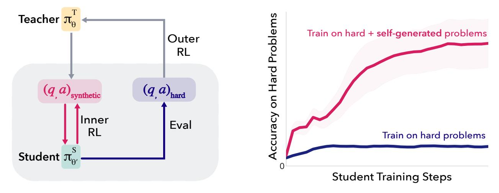

Figure 1 Learning on hard problems by self-generating a curriculum. We introduce SOAR: A meta-RL framework for improving on difficult datasets where performance plateaus. (left) We initialize asymmetric teacher and student models from the same base model. The teacher generates synthetic problems for the student to train on with RL, and is rewarded by the student's measurable improvement on a small subset of the real, ground-truth problems. (right) RL training on problems generated with SOAR, using grounded teacher rewards, outperforms direct training on the hard problems and enables the student to break out of the performance plateau.

<sup>&</sup>lt;sup>1</sup>MIT, <sup>2</sup>Meta FAIR, <sup>3</sup>New York University

<sup>\*</sup>Work done during an internship at Meta

# 1 Introduction

Reinforcement learning with verifiable rewards (RLVR) has recently spurred an impressive rise in LLM reasoning capabilities (DeepSeek-AI, 2025; Team et al., 2025), particularly in mathematics and programming. Though effective, this paradigm has a key limitation: the model cannot learn from problems that it cannot already solve to some extent, since RLVR uses correct solutions to reinforce useful reasoning traces. When problems are too difficult, sparse or non-existent rewards lead to little useful training signal, leaving the model "stuck".

Past work has shown that the order of training data strongly affects generalization in RL training (Bengio et al., 2009; Narvekar et al., 2020), with success in selecting maximally "learnable" problems for the current policy, adapting them to learning progress, and using easy-to-hard curricula (Parashar et al., 2025; Chen et al., 2025b). Such curricula can be fragile, however, and require careful design (Kordi et al., 2025) as well as curated intermediate datasets; in many settings, the best learnable problems may be unavailable or unknown. Recent work addresses sparse rewards by exploiting dense reward signals from test-case pass rates in coding problems (Sun et al., 2025), but still relies on curated test-cases that give intermediate signals. This motivates the need for self-generated curricula.

Here, we ask:

Can a model break its reasoning plateau by generating its own stepping-stone curriculum?

We posit that pretrained LLMs possess the capacity to directly generate a "stepping stone curriculum" to tackle hard problems. To investigate if this pedagogical signal is *present* and *extractable*, we design SOAR: an asymmetric *teacher-student meta-RL framework* inspired by self-play (Silver et al., 2018; Sukhbaatar et al., 2017; OpenAI et al., 2021). Both the teacher and student are initialized from the target model; the teacher proposes questions-answer pairs that the student trains on with RL. The teacher is rewarded based on student improvement on a difficult subset. Critically, rather than using intrinsic rewards common to self-play, we use the difficult training dataset as a black-box grounding reward signal to guide the teacher towards producing useful questions for the student.

Intuitively, a pretrained model has already encountered a vast array of easy problems. Consider a difficult calculus question: While the model may be unable to directly generate a correct answer, it might still possess the latent knowledge required to generate easy chain-rule exercises, without requiring a human-in-the-loop to identify and source such questions. We find that by leveraging pretraining knowledge, RL can effectively surface and amplify these latent pedagogical signals to generate useful question-answer pairs. Importantly, we do so without actually showing the model the hard questions; our framework recovers a useful curriculum just by using performance on the hard dataset as a reward signal.

Empirically, while directly training on the hard dataset fails, we find that the teacher in our framework learns to produce useful synthetic questions that can get the student "unstuck" on the hard dataset, without actually seeing the hard problems. Our main contributions, supported by an extensive multi-seed empirical study and ablations (over 600 runs), are the following:

- **Decoupled teaching and solving:** A model's ability to generate effective "stepping stones" for hard problems is distinct from its ability to solve them. Self-generated problems *expand the learning frontier*, enabling progress on hard problems where direct RL training fails. While the base model has the capacity to propose useful questions, meta-RL is essential to sharpen this noisy distribution into a reliable learning signal.
- A proof-of-concept of self-generated curricula with SOAR (Self-Optimization via Asymmetric RL), an asymmetric teacher-student framework that rewards the teacher for student progress on hard problems. With Llama-3.2-3B-Instruct, on hard subsets of MATH and HARP, self-generated problems improve performance (e.g., 4× pass@1 and 2× pass@32 on MATH, 2× pass@1 and 1.5× pass@32 on HARP). These problems also transfer to unlock learning on hard datasets that they were not optimized for.
- **Grounded rewards over intrinsic rewards:** Grounding teacher rewards in student progress on real problems improves performance over intrinsic rewards common in self-play, which are prone to instability and collapse of question diversity.

• Question structure over solution correctness: Problem structure and difficulty calibration matter more for escaping plateaus than answer correctness; generated questions provide useful gradient signal even when the majority of answers are incorrect.

These results, backed by a comprehensive empirical study, show that grounded meta-RL can escape genuine learning plateaus by letting models discover for themselves what data they need to learn from to expand their learning frontier.

### 2 Related Work

For an extended background and comparison to the literature see Section A, summarized here:

Curriculum Learning in RL: Automated curriculum design has a long history predating modern LLMs (Bengio et al., 2009; Graves et al., 2017; Narvekar et al., 2020; Parashar et al., 2025) focusing on reordering or selecting existing data to enable or accelerate learning, or, in the context of RL, to help agents acquire complex behaviors by first mastering simpler tasks. For LLM training, curricula are applied over curated prompts or problem categories, using proxy signals such as gradient norms or advantage/difficulty estimates to guide selection (Team et al., 2025; Dennis et al., 2020; Wen et al., 2025; Yu et al., 2025; Bae et al., 2025; Chen et al., 2025b; Jiang et al., 2025). By contrast, our goal is not to arrange data but to self-generate tasks to elicit learning on a fixed, verifiable hard dataset where standard RLVF fails.

Self-Play and Teacher-Student Setups: Self-play offers a complementary lens on autonomous capability growth, classically exemplified by game-playing agents trained without external data, such as AlphaZero (Silver et al., 2018) and asymmetric teacher-student setups to induce powerful automatic curricula (Sukhbaatar et al., 2017; OpenAI et al., 2021). Self-play methods for LLMs must address specific challenges: rewards in language domains are extremely sparse and brittle. For mathematical problems, correctness is essentially binary and offers no gradient toward partial solutions. Thus, essentially all modern LLM self-play methods optimize for self-consistency or solution quality. Earlier works (Chen et al., 2024; Wang et al., 2025; Singh et al., 2024; Ye et al., 2024) still presuppose the existence of well-formed input prompts or curated high-quality questions.

A series of near-contemporary works leverages pre-trained LLMs themselves as an untapped resource for question generation to create "fully data-free" co-evolving systems (Zhao et al., 2025a; Huang et al., 2025; Kuba et al., 2025; Fang et al., 2025; Chen et al., 2025a). These works all leverage intrinsic or proxy rewards such as majority vote, learnability, reward-model preferences, or gradient magnitudes. Because these methods optimize intrinsic or proxy objectives, they risk drifting to degenerate or unlearnable tasks, are sensitive to reward hacking and lack guarantees of progress (Chae et al., 2025). Prolonged RL with self-rewards often results in sudden and complete performance collapse (Shafayat et al., 2025; Chae et al., 2025), when rewards vanish or when generator and solver objectives misalign, especially in discrete, symbolic domains with essentially binary correctness signals. This fragility mirrors earlier findings in unsupervised curriculum generation (Dennis et al., 2020; Racaniere et al., 2020; Jiang et al., 2021) and connects directly to the broader question of whether self-improvement driven by intrinsic or self-generated rewards can be sustained within RL. To our knowledge, our work is the first for LLM self-play to ground the curriculum generation in a concrete failure regime instead of internal proxies of difficulty.

Intrinsic Rewards versus Bilevel Optimization Yet the use of proxy rewards is often not merely a design preference but a pragmatic simplification, especially in teacher-student self-play setups: it avoids facing an explicit inner-loop—outer-loop bilevel optimization problem—an appealing but challenging objective where the output of one optimization (in this instance the optimization of the student trained with RLVF on the teacher's question-answer pairs) is fed into another optimization loop (the performance improvement of the student on the hard dataset). Such bilevel optimization appears in meta-learning (Finn et al., 2017; Nichol et al., 2018), hyperparameter learning (Maclaurin et al., 2015) and - partially inspiring our work - in dataset distillation, where an outer loop optimizes a generally small dataset that allows an inner training loop to achieve good target performance (Wang et al., 2018; Deng and Russakovsky, 2022; Feng et al., 2024). In general, such approaches become intractable, as the inner loop involves a multi-step computation with a large number of steps, which requires backpropagation through time (BPTT), unrolling the inner loop and taking

meta-gradients. Our approach, however, avoids the need to unroll the inner loop thanks to the use of RLOO in the outer loop, using the performance improvement of the student as the reward to reinforce question-answer sets. This is the first instance of "double meta-RL loop" we are aware of in the context of self-play for LLMs.

# 3 Method

Can a pretrained LLM leverage latent knowledge to generate synthetic question-answer pairs for problems it cannot solve? And in particular, can this be achieved in domains with sparse, binary rewards lacking automatic question verification? To explore this, we introduce SOAR: a meta-RL framework designed to surface such pedagogical signals. Critically, SOAR grounds the teacher reward in measured student progress rather than intrinsic proxy rewards. If the model can generate useful stepping stones despite being unable to solve the original problems, this would suggest that the latent knowledge exists, and is extractable without human curation.

Let  $\pi_{\theta}$  be a language model with parameters  $\theta$ . We assume access to a dataset  $\mathcal{D} = \{(q_i, a_i)\}_{i=1}^{|\mathcal{D}|}$  of difficult question-answer pairs ( $\pi_{\theta}$  produces 0/128 successful generations).  $\mathcal{D}$  is split into train and test sets:  $\mathcal{D}_{train}$ ,  $\mathcal{D}_{test}$ . To improve the performance of  $\pi_{\theta}$  on  $\mathcal{D}_{test}$ , the natural approach is to train  $\pi_{\theta}$  directly on  $\mathcal{D}_{train}$  using RL (e.g., REINFORCE, GRPO, RLOO, etc). However, for difficult datasets, this may not improve performance due to the sparsity of positive rewards, as we illustrate in our experiments. We instead use this "failure regime" as a testbed to see if the model can autonomously recover intermediate problems that make these hard problems more learnable.

#### 3.1 Overview

Our framework adopts a teacher-student setup, inspired by asymmetric self-play, to "kickstart" learning on datasets where the initial success rate is too low for successful training. We instantiate two copies of the same model: a teacher  $\pi_{\phi}^{T}$  and a student  $\pi_{\theta}^{S}$ . At step zero,  $\theta = \phi = \theta_{base}$ .

The teacher's role is to generate synthetic problems that provide the student with the necessary gradient signal to escape the performance plateau. Intuitively, while the teacher may be unable to solve a difficult problem directly, it may still possess the knowledge to *generate* easier problems that provide a non-zero reward to the student and shift its policy towards progress on the original problem.

We formulate this problem as a bilevel optimization problem. The objective is to generate a small synthetic dataset  $\mathcal{X} = \{(q_i, a_i)\}_{i=1}^n$  of question-answer pairs such that training  $\pi_{\theta}^S$  on  $\mathcal{X}$  with RL improves performance on the target domain.

$$\max_{\phi} \quad \mathbb{E}_{\mathcal{X} \sim \pi_{\phi}^{T}} \left[ R \left( \pi_{\theta'(\mathcal{X})}^{S}, \mathcal{D}_{train} \right) \right]$$
subject to  $\theta'(\mathcal{X}) = \text{RL-UPDATE}(\theta, \mathcal{X}),$  (1)

where RL-UPDATE describes the RL training procedure of the student on  $\mathcal{X}$ , yielding parameters  $\theta'(\mathcal{X})$ , and R denotes the updated student's performance on  $\mathcal{D}_{train}$ .

Such bilevel optimization objectives have strong historical precedence in meta-learning (Finn et al., 2017; Nichol et al., 2018), hyperparameter learning (Maclaurin et al., 2015) and dataset distillation (Wang et al., 2018; Deng and Russakovsky, 2022; Feng et al., 2024). In general, such approaches become intractable, requiring "backpropagation through gradient descent", unrolling the inner loop and taking meta-gradients. To avoid the computational difficulties of unrolling the inner loop, we instead instantiate objective (1) as a nested meta-RL loop:

- Outer (teacher) RL loop: we train the teacher with RLOO (Ahmadian et al., 2024) to generate synthetic question-answer pairs.
- Inner (student) RL loop: we train the student with standard RLVR (also with RLOO) to answer the teacher-generated problems. We use the subsequent performance improvement of the student on  $\mathcal{D}_{train}$  as the black-box reward signal for the teacher.

Critically, we do not assume automatic verification of synthetic question well-posedness or answer correctness (as e.g., in coding tasks in Zhao et al. (2025a)). Instead, the teacher generates both the question and answer, treating the usefulness of the question as an emergent property of the teacher's reward signal. The key insight is to ground the teacher's objective in measured student progress on  $\mathcal{D}_{train}$ , rather than intrinsic proxies such as learnability, as done in prior work. SOAR only rewards a synthetic question-answer pair  $(q_i, a_i)$  if training on it improves the student's performance on ground-truth problems. This black-box grounding signal tethers question generation to real learning progress, implicitly penalizing degenerate problems and reward hacking. Notably, the teacher is not shown the hard problems during training, but rather discovers useful stepping stones purely from this student improvement signal.

In the following sections we detail the outer and inner RL loops. Our high-level procedure is shown in Figure 2, with a full algorithm in Algorithm 1.

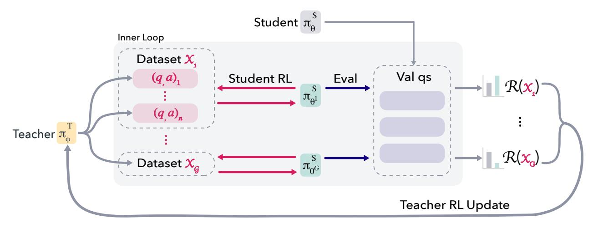

Figure 2 The SOAR meta-RL Loop. The teacher and student are initialized from the same model. In the outer RL loop the teacher generates candidate question-answer pairs that are partitioned into datasets. In the inner RL loop, the student is trained for 10 steps on the candidate problems and evaluated on sampled hard problems. The teacher is rewarded based on the resulting student improvement over the student baseline, grounding the synthetic curriculum in real learning progress.

#### 3.2 Outer Loop: Teacher Training

We train the teacher with RLOO to generate problems that demonstrably improve student performance. Let g denote the RLOO group size and n the size of the generated dataset  $\mathcal{X}$ . At each iteration, we sample  $g \cdot n$  rollouts  $y_1, \ldots, y_{gn}$  from  $\pi_{\phi}^T$ , subdivided into g datasets of n items each:  $\mathcal{X}_1 = \{y_1, \ldots, y_n\}, \ldots, \mathcal{X}_g = \{y_{g(n-1)}, \ldots, y_{gn}\}$ . Since we cannot automatically verify the answers to proposed problems, we prompt the teacher to generate both the question and answer. Each rollout  $y_i$  is parsed into  $y_i = (q_i, a_i)$  (described in Appendix B.2; we may need to sample multiple times to obtain a parseable  $y_i$ ).

Each dataset  $\mathcal{X}_k$  receives a reward as follows. At each outer-loop iteration we subsample a set of reward questions  $\mathcal{Q}_R \sim \mathcal{D}_{train}$  from the original training set. For each dataset  $\mathcal{X}_k$ , we execute the inner loop in Figure 2 by training the student for a fixed number of steps on  $\mathcal{X}_k$ , resulting in a trained student  $\pi_{\theta'_k}^S$  (see Section 3.3). The dataset-level reward  $R(\mathcal{X}_k)$  is then the average greedy success of trained student  $\pi_{\theta'_k}^S$  on the questions  $\mathcal{Q}_R$  relative to the success of a baseline student model  $\pi_{\theta}^S$ :

$$\mathcal{R}(\mathcal{X}_k) = \mathrm{Acc}(\pi_{\theta_k'}^S(\mathcal{Q}_R)) - \mathrm{Acc}(\pi_{\theta}^S(\mathcal{Q}_R)).$$

where  $\pi_{\theta}^{S}$  is the initial student when starting the inner loop.

To mitigate student training noise and reward variance, we average rewards over r parallel student trainings per dataset. This averaged reward is assigned to each rollout in  $\mathcal{X}_k$  to update the teacher.

# 3.3 Inner Loop: Student Training

The student  $\pi_{\theta}^{S}$  trains on the teacher-generated dataset  $\mathcal{X}_{k}$  using RLOO. We train the student for a small number of RL updates (10 steps with batch size 8). This is long enough to induce measurable movement in the student, but short enough to keep the student-training computationally cheap. After each inner loop the student reverts to the baseline policy for the next iteration.

A key question is whether the teacher is capable of adapting to an improving student, while accumulating stepping stone questions over different learning stages. To address this, we introduce a promotion mechanism to accumulate student improvement across inner loops. Precisely, we track a moving average of teacher rewards  $\bar{R}_t$ . When  $\bar{R}_t$  exceeds a fixed threshold  $\tau$ , we "promote" the student trained on the best  $\mathcal{X}_k$ : namely, we reset the baseline student  $\pi_{\theta}^S$  to the improved student, so subsequent rewards measure improvement relative to this new baseline (further details in Appendix B.3). The accumulated datasets that led to student promotion, which we call  $\mathcal{D}_{hest}$ , constitute the Promotion Questions (PQ) that we evaluate in our experiments.

# 4 Experiment Setup

#### 4.1 Models and Datasets

All experiments are conducted with Llama-3.2-3B-Instruct. To study the prototypical setting of sparse, binary rewards, without automatic question-answer verification (as present in code, for instance) we focus on math reasoning tasks, where this setting is common. We use three such benchmarks: MATH (Hendrycks et al., 2021), HARP (Yue et al., 2024), and OlympiadBench (He et al., 2024). These datasets cover a range of widely recognized math competitions (AMC, AIME, USA(J)MO, Olympiads).

For each dataset, we identify difficult problems by sampling 128 times with Llama-3.2-3B-Instruct, and retaining problems with a 0/128 success rate. We choose 128 as a practical but stringent threshold, and find empirically that it is sufficiently difficult such that direct training leads to only marginal performance improvement. We call these subsets fail@128 datasets. Each is randomly split 50-50 into training and held-out test sets. Given the low baseline pass rates on fail@128 problems, this larger test set is necessary to distinguish observed performance gains from stochastic variance. Further dataset details in Appendix B.5.

#### 4.2 Teacher-student training

We train with SOAR on MATH and HARP, keeping OlympiadBench held-out to test cross-dataset generalization. Both the teacher and student are initialized from Llama-3.2-3B-Instruct. We allocate a max budget of 200 outer-loop steps based on compute constraints.

At every outer-loop iteration we sample n=64 problems ( $\mathcal{X}$ ) from the teacher, and 64 reward questions ( $\mathcal{Q}_R$ ) from the fail@128 train set ( $\mathcal{D}_{train}$ ). We track the moving global average of teacher rewards over the most recent 3 steps, and promote the student baseline if the moving average exceeds  $\tau=0.01$ . Full hyperparameters are reported in Appendix B.7 with ablations sensitivity to  $\tau$  and n in Appendix D.2. Analysis of SOAR training dynamics is in Appendix E.

#### 4.3 Evaluation

Once training completes, we test if the generated problems improve performance on  $\mathcal{D}_{test}$ . Based on observations of teacher reward plateaus in initial runs, we evaluate the teacher at checkpoints where training rewards stabilize: step 200 for MATH and step 170 for HARP.

We assess two aspects of SOAR:

**Promoted Student (PS).** For training runs that reached multiple promotions, we evaluate the student model with the best validation performance (*i.e.*, best  $\mathcal{D}_{train}$  greedy accuracy) on the test set to measure direct performance gains from SOAR. In practice we observe a maximum of four promotions; thus the PS model has been trained on one of {128, 192, 256} synthetic questions.

**Promotion Questions (PQ).** We train a fresh base student on  $\mathcal{D}_{best}$  with standard RLOO on a combination of PQ and the fail@128 train set. This isolates the value of the synthetic questions, separate from the specific training trajectory of the promoted student.

We test two mixing strategies. Curriculum trains on synthetic questions only for 64 steps, then  $\mathcal{D}_{train}$  questions only. Mixed trains with synthetic and  $\mathcal{D}_{train}$  questions together for the full training period. Based on experiments with our baselines (Appendix B.6), we use curriculum training for MATH and mixed training for HARP and OlympiadBench across all methods. We use the same strategy for all methods on each dataset. We denote PQ from MATH and HARP training as PQ-MATH and PQ-HARP respectively.

#### 4.4 Baselines

**Hard-Only.** We train Llama-3.2-3B-Instruct directly on the  $\mathcal{D}_{train}$  (real fail@128 train set) with a standard group size of 32. To disentangle the effects of the meta-RL loop from just using additional compute, we also train with group size 128 on MATH.

Intrinsic Teacher (Intrinsic-T). To isolate the effects of grounding rewards, we compare to an intrinsic, data-free baseline. We train using the same procedure and hyperparameters as SOAR, but replace the grounded signal with a learnability objective (Zhao et al., 2025a; Sukhbaatar et al., 2017) that rewards questions of moderate difficulty. We evaluate by sampling 128 problems from a learnability-trained teacher (Intrinsic-T) and training a fresh student on a combination of the sampled questions and the fail@128 train set, using the same protocol as PQ evaluation. Details on learnability training in Appendix B.4.

**Upper bound.** We train a fresh student on a combination of the official MATH train split (6750 problems) and the fail@128 train set. This shows what performance looks like with curated easier problems, providing a reference for synthetic stepping stones.

#### 4.5 Metrics

We report the pass@k accuracy on the held-out fail@128 test set for  $k \in \{1, 4, 8, 16, 32\}$ , using 32 samples per problem. We run all evaluations for 6-12 seeds, nested across teacher/student training, (Appendix B.8) and report the median and standard deviation.

**Student Early Stopping.** For experiments where we train fresh students, on MATH/HARP we select student checkpoints at the convergence point of the smoothed training reward curve, specifically where the reward gradient falls below a fixed threshold. This alleviates noise from small validation sets and ensures fair comparison between methods with differing convergence rates; full discussion is in Appendix B.6. On OlympiadBench, where convergence is more uniform, we report at 50 steps. Full training trajectories are in Figure 9.

#### 5 Results

#### 5.1 Meta-RL Discovers Effective Questions.

While curriculum learning is well-studied in RL, it is not obvious that synthetic questions can help a model move "beyond sharpening" its existing distributions. Here, we show that self-generated stepping stones provide a learnable gradient that unlocks improvement in stalled regimes. This occurs without the teacher seeing the target problems; instead, meta-RL sharpens the teacher's policy, discovering useful curricula solely by optimizing for student progress.

**PQ** Kickstarts Learning on Hard Subsets. Both PS and PQ substantially outperform Hard-Only and Instrinsic baselines, with larger gains at higher k. Figure 3 shows improvement over Hard-Only. Hard-Only test trajectories are in Figures 5; all absolute numbers and trajectories are in Appendix C.1-C.2. Inference with the base model achieves non-zero pass@k due to stochastic sampling with different seeds than were used for the initial fail@128 filtering; nonetheless, Hard-Only training cannot sustain learning and plateaus.

Inference with PS achieves +8.5% pass@32 on fail@128-MATH over Hard-Only, and +3.6% pass@32 on fail@128-HARP. PQ achieves higher mean performance (+9.3% pass@32 on MATH, +4.2% on HARP), indicating

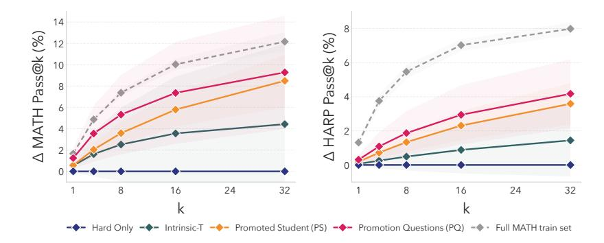

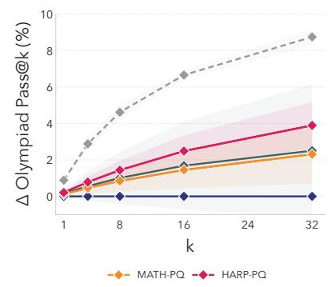

Figure 3 Performance on MATH and HARP fail@128 (improvement over Hard-Only). Synthetic problems generated with SOAR (PQ) and inference with the promoted student (PS) outperform direct training on fail@128 train sets (Hard-Only), and sampling from teachers trained with intrinsic rewards (Intrinsic-T). Performance is reported as the delta over Hard-Only. For reference, Hard-Only MATH pass@k for  $k \in \{1,4,8,16,32\}$  is  $\{0.5,1.7,3.2,5.7,9.6\}$ . Hard-Only training curves are shown in Figure 5; absolute performance for all methods, and further evaluations, are in Tables 4-5. Shaded regions are  $\pm$  1 SD over 6-12 seeds nested across teacher/student training (see B.8).

Figure 4 Transfer performance to OlympiadBench fail@128 subset (improvement over Hard-Only). Questions optimized for MATH and HARP transfer to a held-out dataset. Performance is reported as the delta over Hard-Only; absolute performance, including PS evaluation, is in Table 6.

that the synthetic questions, rather than a fortunate student training trajectory, drive the performance gains. Intrinsic-T underperforms both, validating that grounded rewards are needed to discover the right questions.

Synthetic questions do not just boost accuracy, but shift the student policy to make previously hard problems learnable. Student learning curves on MATH, where we use curriculum training, exhibit continued improvement after transitioning to fail@128 training (Figure 9). These effects significantly outstrip what can be achieved from repeated sampling alone on fail@128 data; Hard-Only with a group size of 128 (4× extra compute) achieves only +2.8% pass@32 (Table 4).

**OOD generalization.** Figure 4 shows that synthetic questions from PQ-MATH, PQ-HARP, and Intrinsic-T transfer to OlympiadBench, an OOD dataset (+6% and +3% respectively over Hard-Only). Cross-dataset transfer, despite no OOD optimization, suggests that synthetic curricula can capture generalizable reasoning pathways.

Oracle comparison to real curated data. Our regime assumes that we only have access to hard problems, to study the case where additional expert-curated data is not available or not known. As a strong upper-bound, we compare to the "oracle" case where curated extra data is available. We train students on fail@128 + the full official MATH training set (6750 problems) as a representative pool of abundant, easier questions. We also compare to training with 128 random MATH/HARP questions in Appendix C.2, which performs similarly to training with the full dataset. Synthetic PQ-MATH questions recover 75% of the performance gains from full-MATH training, and PQ-HARP recover 50%. Notably, HARP-PQ (128/192 questions) outperforms 128 real HARP questions, and matches 128 real MATH questions.

Direct inference on fail@128 test problems with the final trained teacher policy model does not improve over base model performance (Appendix C.2), indicating that generator and solver abilities are largely independent.

**Takeaway:** A model's *pedagogical* ability can be decoupled from its *task-solving* ability. Grounded meta-RL (SOAR) expands the "learnability frontier" by surfacing synthetic questions that enable improvement over reasoning plateaus.

# 5.2 Grounded rewards lead to stable and diverse teacher policies.

While the main utility of SOAR is in surfacing a set of teacher-generated questions that unlock student learning (PQ), we now shift focus to the trained teacher policies themselves. In this section we perform a controlled

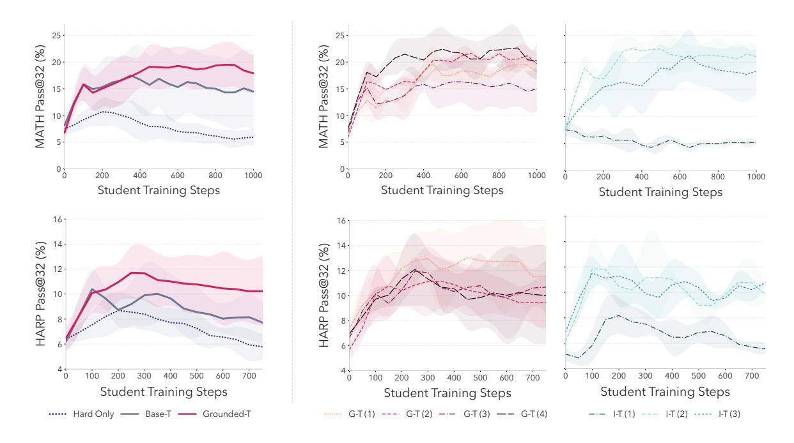

Figure 5 Grounded rewards lead to more stable teacher policies. We evaluate trained teacher policies by sampling questions and training fresh students. (Left) Test pass@32 comparison between students trained with questions sampled from Grounded-T and Base-T (Hard-Only also shown for reference). Grounded-T outperforms Base-T and exhibits more stable student trajectories. (Right) Pass@32 trajectories for fresh students trained with individual Grounded-T teacher seeds (red) and Intrinsic-T teacher seeds (green). Questions from Grounded-T yield consistent student trajectories, whereas Intrinsic-T exhibits higher variance across teachers, including a failure mode where I-T (1) causes student collapse. Shading shows  $\pm 1$  SD. Curves for other pass@k and OlympiadBench are in Figures 10-12.

study of teacher objectives to probe the effects of meta-RL, and show that grounded rewards (as in SOAR), versus intrinsic ones, yield stronger teacher policies. We evaluate teachers trained with grounded rewards (Grounded-T), intrinsic rewards (Intrinsic-T) and the base model (Base-T) by sampling question-answer pairs from these policies and training fresh students. In Appendix C.3 we also ablate grounded teachers trained without the student-promotion mechanism, to validate its necessity.

We evaluate four Grounded-T seeds per dataset to cover a range of final promotion stages, and three Intrinsic-T teacher seeds. We sample 128 questions from these teachers and train 2-3 fresh students on the synthetic questions and real fail@128 train set ( $\geq$  9 student runs per reported metric, see Appendix B.6).

The teacher policy generates useful questions. Student test performance curves in Figure 5 reveal that questions sampled from *Grounded-T* improve over *Hard-Only*. Results are competitive with PQ on MATH and HARP, validating that the useful pedagogical signal is not just captured in the set of evolved questions, but is also learned by the teacher policy. Further ablations show that sampling larger datasets from *Grounded-T* reduces the variance of student outcomes (Appendix D.1) and that the student-promotion mechanism improves the teacher policy (Appendix C.3).

Meta-RL sharpens the question distribution. In Figure 5 (left) we overlay student training curves for Grounded-T questions and Base-T questions. Grounded-T students consistently track the upper envelope of Base-T performance for MATH/HARP, with lower variance on MATH. The existence of successful runs from Base-T reveals the ability to generate useful stepping stone questions is latent in the model; meta-RL improves Grounded-T by sharpening the teacher to output questions that more reliably provide useful gradient signal. This is yet another example of the sharpening mechanism of RL (Yue et al., 2025; Zhao et al., 2025b; Tsilivis et al., 2025a,b), but here leveraged for curricula. On OlympiadBench, where the target distribution differs substantially from the teacher's training domain, Grounded-T and Base-T learning curves overlap more (though Grounded-T on HARP achieves highest peak performance), suggesting that meta-RL primarily sharpens in-domain pedagogical signals. This is consistent with PQ results in Figure 4, in which PQ-HARP

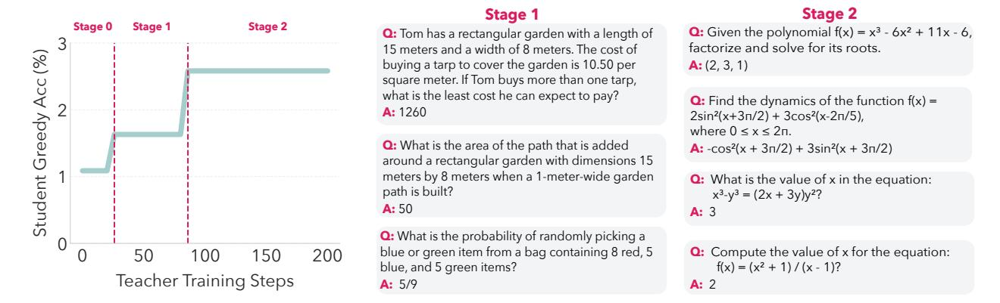

Figure 6 Qualitative Evolution of Generated Questions. (Left) Baseline student performance during a SOAR run on HARP. The y-axis shows greedy accuracy on the fail@128 train set over promotion stages. (Right) Sampled teacher questions at different promotion points. Content and style shift from word problems and basic formulas (stage 1) to concise, equation-heavy problems in algebra and calculus (stage 2). Many effective "stepping stones" include incorrect solutions, suggesting that structural and conceptual content provide sufficient learning signal.

outperforms Intrinsic-T whereas PQ-MATH matches it

Fragility of intrinsic proxies. Figure 5 (right) compares aggregate student training curves for individual Grounded-T and Intrinsic-T teacher seeds. Students trained with questions from different Grounded-T seeds exhibit highly similar trajectories, indicating that grounded rewards lead to stable teacher policies. In contrast, Intrinsic-T teachers produce, on average, worse and more volatile outcomes. Across MATH, HARP, and OlympiadBench there is a clear separation in performance between students trained with different Intrinsic-T seeds. MATH and OlympiadBench student trajectories exhibit a consistent and significant ordering depending on the teacher. While some Intrinsic-T teachers produce highly effective curricula, the objective is subject to a high-variance failure mode: one out of three teacher seeds exhibits collapse across all datasets, yielding little or no progress on the target problems. This reinforces observations from the literature that RL with self-rewards is prone to reward hacking, or the decoupling of the intrinsic reward from actual task mastery (Shafayat et al., 2025; Chae et al., 2025).

Grounded Training Sustains Diversity. To probe how meta-RL shapes the teacher's generative distribution, in Table 1 we measure the semantic diversity of datasets from different teachers with the Vendi Score (VS) (Friedman and Dieng, 2022) using Qwen3-8B embeddings (Zhang et al., 2025). Grounded-T (MATH) and Grounded-T (HARP) match the diversity of Base-T (VS = 34.91), with PQ showing only a small decline from the base model (VS = 31.75). In contrast, Intrinsic-T collapses into a narrow conceptual space (VS = 10.82), providing evidence of reward-hacking and a potential explanation for the observed "fragility". This suggests that grounded rewards successfully avoid the diversity collapse often seen in RL-loops (Song et al., 2025), while intrinsic rewards fall prey to it. Indeed, we also observe a decline in the diversity of teacher completions during meta-RL with learnability rewards (Appendix E).

**Takeaway:** Effective questions are latent in the base model, but hard to find. Grounding rewards in student progress "sharpens" the teacher's noisy distribution of questions into a stable, diversity-preserving policy, whereas intrinsic rewards are prone to instability and diversity collapse.

# 5.3 Question structure matters more than answer correctness.

While conventional wisdom suggests that question-answer correctness is most important, our results suggest that the *conceptual content and structure of questions* is more important for models on learning plateaus.

Figure 6 shows qualitative examples of PQ questions at different stages of a sample SOAR training trajectory, exhibiting shifts in style and conceptual focus as the baseline student improves. We annotate synthetic

questions with Claude-4.5-Sonnet as an oracle judge, and observe that only 32.8% of PQ problems contain a fully correct solution, while 63% are considered mathematically well-posed (Appendix C.4). This suggests that for models stalled on a performance plateau, structural and contextual cues of a question are more important for kickstarting learning than a correct answer. Indeed, Intrinsic-T questions have higher correctness (55%) but perform worse, likely because of lack of diversity (Section 5.2). Our experiments with Base-T, which, like Grounded-T and Intrinsic-T, is filtered for correctly formatted questions, show that question format alone is not behind these effects. A more detailed taxonomy of synthetic questions, including error types, is in Appendix C.4. Meta-RL decreases question ambiguity errors relative to Base-T, validating the importance of question coherence over answer correctness.

| Method               | Vendi Score ( $VS$ ) | Std. Dev ( $\sigma$ ) |
|----------------------|----------------------|-----------------------|
| Base-T               | 34.91                | 1.74                  |
| Grounded- $T$ (HARP) | 34.66                | 1.74                  |
| Grounded- $T$ (MATH) | 31.99                | 1.54                  |
| PQ                   | 28.33                | 1.55                  |
| Intrinsic- $T$       | 10.82                | 1.01                  |

**Table 1** Semantic diversity analysis of synthetic datasets using Vendi Scores (VS). All metrics are standardized to 128 questions via bootstrap subsampling (k=100 iterations). VS represents the effective number of unique semantic concepts. Our proposed teacher training (Grounded-T) successfully expands the conceptual manifold.

**Takeaway:** For models at learning plateaus, problems that have conceptually diverse and coherent questions can provide useful gradient signal even without having precisely correct answers.

# 6 Discussion and Conclusions

Breaking the sparse-reward plateau in RL fine-tuning. Our work establishes a way to kickstart RL fine-tuning when the initial success rate is too low to collect RLVR signal. Generating question-answer pairs (even if not correct) and training on those, with the right meta-RL self-play loop, can be enough to provide nonzero signal on the original hard problems. Contrary to learnability approaches that rely on pure internal rewards, as is the case in prior LLM self-play approaches, here the signal is ultimately grounded in measuring improvement on the original problems. A central contribution of our work is that we show how to make this grounded bilevel meta-RL loop work in practice. The gap in performance shows the importance of this point.

More importantly, our setup shows that generating stepping-stone questions to solve a problem does not require the preexisting ability to solve that problem, and that meta-RL sharpens this latent ability in the pretraining distribution. This intuition lies at the core of the self-play idea, although we show that it is crucial to go beyond pure curiosity by grounding the process in actual performance.

Our results tie to the broader debate on whether RL fine-tuning truly expands a model's learning frontier, or merely sharpens latent abilities (Yue et al., 2025; Zhao et al., 2025b; Tsilivis et al., 2025a,b). Our work indicates that meta-RL can expand the envelope of learnability beyond what direct RLVF can achieve. As a "North Star" thought experiment, consider a future model trained on the entire mathematical literature: a proof of a Millennium Problem such as the Riemann Hypothesis may already be latent in pretraining, yet successful learning would hinge on recovering the right sequence of intermediate lemmas and theorems that make the proof learnable to a student reasoner. In this view, just as RL is believed to sharpen or amplify useful subsets of pretraining data, meta-RL could retrieve the stepping-stone question—answer pairs embedded in the teacher's vast training corpus. We believe our results provide concrete evidence that a moderate amount of grounded meta-RL can elicit such capabilities that remain inaccessible through repeated sampling alone.

Limitations. Our framework's primary limitation is the computational cost of running bilevel RL loops (Appendix B.9). While inner loop training is relatively cheap (10-20 steps depending on the promotion stage) it necessitates training parallel students to compute stable teacher rewards. Importantly, our ablation in Table 4 shows that reallocating compute to direct training on hard problems via repeated sampling does not recover the improvements achieved by the bilevel framework. Our work serves as a proof of concept for grounded rewards in this setting; investigating more efficient reward proxies or scaling beyond our 3B model experiments are rich avenues for further work.

# Acknowledgements

We thank Cansu Sancaktar and Phillip Isola for helpful discussions. JK thanks the Simons Foundation for support through the Collaborative Grant "The Physics of Learning and Neural Computation". This work was supported by an NSF GRFP fellowship to SS.

# References

- Arash Ahmadian, Chris Cremer, Matthias Gallé, Marzieh Fadaee, Julia Kreutzer, Olivier Pietquin, Ahmet Üstün, and Sara Hooker. Back to basics: Revisiting REINFORCE-style optimization for learning from human feedback in LLMs. In Lun-Wei Ku, Andre Martins, and Vivek Srikumar, editors, *Proceedings of the 62nd Annual Meeting of the Association for Computational Linguistics (Volume 1: Long Papers)*, pages 12248–12267, Bangkok, Thailand, August 2024. Association for Computational Linguistics. doi: 10.18653/v1/2024.acl-long.662. URL https://aclanthology.org/2024.acl-long.662/.
- AlphaProof and AlphaGeometry teams. Olympiad-level formal mathematical reasoning with reinforcement learning. *Nature*, 640:731–739, November 2025. doi: 10.1038/s41586-025-09833-y. URL https://www.nature.com/articles/s41586-025-09833-y.
- Sanghwan Bae, Jiwoo Hong, Min Young Lee, Hanbyul Kim, JeongYeon Nam, and Donghyun Kwak. Online difficulty filtering for reasoning oriented reinforcement learning, 2025. URL https://arxiv.org/abs/2504.03380.
- Yoshua Bengio, Jérôme Louradour, Ronan Collobert, and Jason Weston. Curriculum learning. In *Proceedings of the* 26th annual international conference on machine learning, pages 41–48, 2009.
- Justin Yang Chae, Md Tanvirul Alam, and Nidhi Rastogi. Towards understanding self-play for llm reasoning, 2025. URL https://arxiv.org/abs/2510.27072.
- Lili Chen, Mihir Prabhudesai, Katerina Fragkiadaki, Hao Liu, and Deepak Pathak. Self-questioning language models, 2025a. URL https://arxiv.org/abs/2508.03682.
- Xiaoyin Chen, Jiarui Lu, Minsu Kim, Dinghuai Zhang, Jian Tang, Alexandre Piché, Nicolas Gontier, Yoshua Bengio, and Ehsan Kamalloo. Self-evolving curriculum for LLM reasoning, 2025b. URL https://openreview.net/forum?id=lNgSdqKFmU.
- Zixiang Chen, Yihe Deng, Huizhuo Yuan, Kaixuan Ji, and Quanquan Gu. Self-play fine-tuning converts weak language models to strong language models. In Forty-first International Conference on Machine Learning, 2024. URL <a href="https://openreview.net/forum?id=O4cHTxW9BS">https://openreview.net/forum?id=O4cHTxW9BS</a>.
- DeepSeek-AI. Deepseek-r1: Incentivizing reasoning capability in llms via reinforcement learning, 2025. URL https://arxiv.org/abs/2501.12948.
- Zhiwei Deng and Olga Russakovsky. Remember the past: Distilling datasets into addressable memories for neural networks. In *Proceedings of the Advances in Neural Information Processing Systems (NeurIPS)*, 2022.
- Michael Dennis, Natasha Jaques, Eugene Vinitsky, Alexandre Bayen, Stuart Russell, Andrew Critch, and Sergey Levine. Emergent complexity and zero-shot transfer via unsupervised environment design. In *Advances in Neural Information Processing Systems (NeurIPS)*, 2020.
- Yan Duan, John Schulman, Xi Chen, Peter L. Bartlett, Ilya Sutskever, and Pieter Abbeel. Rl<sup>2</sup>: Fast reinforcement learning via slow reinforcement learning, 2016. URL https://arxiv.org/abs/1611.02779.
- Wenkai Fang, Shunyu Liu, Yang Zhou, Kongcheng Zhang, Tongya Zheng, Kaixuan Chen, Mingli Song, and Dacheng Tao. Serl: Self-play reinforcement learning for large language models with limited data, 2025.
- Yunzhen Feng, Shanmukha Ramakrishna Vedantam, and Julia Kempe. Embarrassingly simple dataset distillation. In The Twelfth International Conference on Learning Representations, 2024. URL https://openreview.net/forum?id=PLoWVP7Mjc.
- Chelsea Finn, Pieter Abbeel, and Sergey Levine. Model-agnostic meta-learning for fast adaptation of deep networks. In *Proceedings of the 34th International Conference on Machine Learning Volume 70*, ICML'17, page 1126–1135. JMLR.org, 2017.
- Dan Friedman and Adji Bousso Dieng. The vendi score: A diversity evaluation metric for machine learning. arXiv preprint arXiv:2210.02410, 2022.
- Alex Graves, Marc G. Bellemare, Jacob Menick, Rémi Munos, and Koray Kavukcuoglu. Automated curriculum learning for neural networks. In *Proceedings of the 34th International Conference on Machine Learning Volume 70*, ICML'17, page 1311–1320. JMLR.org, 2017.
- Chaoqun He, Renjie Luo, Yuzhuo Bai, Shengding Hu, Zhen Leng Thai, Junhao Shen, Jinyi Hu, Xu Han, Yujie Huang, Yuxiang Zhang, Jie Liu, Lei Qi, Zhiyuan Liu, and Maosong Sun. Olympiadbench: A challenging benchmark for

- promoting agi with olympiad-level bilingual multimodal scientific problems, 2024. URL https://arxiv.org/abs/2402.14008
- Dan Hendrycks, Collin Burns, Saurav Kadavath, Akul Arora, Steven Basart, Eric Tang, Dawn Song, and Jacob Steinhardt. Measuring mathematical problem solving with the math dataset. arXiv preprint arXiv:2103.03874, 2021.
- Chengsong Huang, Wenhao Yu, Xiaoyang Wang, Hongming Zhang, Zongxia Li, Ruosen Li, Jiaxin Huang, Haitao Mi, and Dong Yu. R-zero: Self-evolving reasoning llm from zero data, 2025. URL https://arxiv.org/abs/2508.05004.
- Minqi Jiang, Michael Dennis, Jack Parker-Holder, Alexandre Bayen, Stuart Russell, Sergey Levine, and Andrew Critch. Replay-guided adversarial environment design. In *Advances in Neural Information Processing Systems (NeurIPS)*, 2021.
- Yiding Jiang, Allan Zhou, Zhili Feng, Sadhika Malladi, and J Zico Kolter. Adaptive data optimization: Dynamic sample selection with scaling laws. In *The Thirteenth International Conference on Learning Representations*, 2025. URL https://openreview.net/forum?id=aqok1UX7Z1.
- Yeganeh Kordi, Nihal V Nayak, Max Zuo, Ilana Nguyen, and Stephen H Bach. Revisiting generalization across difficulty levels: It's not so easy. arXiv preprint arXiv:2511.21692, 2025.
- Jakub Grudzien Kuba, Mengting Gu, Qi Ma, Yuandong Tian, Vijai Mohan, and Jason Chen. Language self-play for data-free training, 2025. URL https://arxiv.org/abs/2509.07414.
- Hynek Kydlíček. Math-verify: Math verification library. https://github.com/huggingface/math-verify, 2025.
- Dougal Maclaurin, David Duvenaud, and Ryan P. Adams. Gradient-based hyperparameter optimization through reversible learning. In *Proceedings of the 32nd International Conference on Machine Learning (ICML)*, pages 2113–2122, 2015. URL https://proceedings.mlr.press/v37/maclaurin15.html.
- Maren Mahsereci, Lukas Balles, Christoph Lassner, and Philipp Hennig. Early stopping without a validation set. ArXiv, abs/1703.09580, 2017. URL https://api.semanticscholar.org/CorpusID:14520242.
- Sanmit Narvekar, Bei Peng, Matteo Leonetti, Jivko Sinapov, Matthew E. Taylor, and Peter Stone. Curriculum learning for reinforcement learning domains: a framework and survey. *J. Mach. Learn. Res.*, 21(1), January 2020. ISSN 1532-4435.
- Timothy Nguyen, Roman Novak, Lechao Xiao, and Jaehoon Lee. Dataset distillation with infinitely wide convolutional networks. In *Proceedings of the Advances in Neural Information Processing Systems (NeurIPS)*, pages 5186–5198, 2021.
- Alex Nichol, Joshua Achiam, and John Schulman. On first-order meta-learning algorithms, 2018. URL https://arxiv.org/abs/1803.02999.
- OpenAI OpenAI, Matthias Plappert, Raul Sampedro, Tao Xu, Ilge Akkaya, Vineet Kosaraju, Peter Welinder, Ruben D'Sa, Arthur Petron, Henrique P. d. O. Pinto, Alex Paino, Hyeonwoo Noh, Lilian Weng, Qiming Yuan, Casey Chu, and Wojciech Zaremba. Asymmetric self-play for automatic goal discovery in robotic manipulation, 2021. URL <a href="https://arxiv.org/abs/2101.04882">https://arxiv.org/abs/2101.04882</a>.
- Shubham Parashar, Shurui Gui, Xiner Li, Hongyi Ling, Sushil Vemuri, Blake Olson, Eric Li, Yu Zhang, James Caverlee, Dileep Kalathil, and Shuiwang Ji. Curriculum reinforcement learning from easy to hard tasks improves llm reasoning, 2025. URL https://arxiv.org/abs/2506.06632.
- Mihir Prabhudesai, Lili Chen, Alex Ippoliti, Katerina Fragkiadaki, Hao Liu, and Deepak Pathak. Maximizing confidence alone improves reasoning, 2025. URL https://arxiv.org/abs/2505.22660.
- Sebastien Racaniere, Andrew Lampinen, Adam Santoro, David Reichert, Vlad Firoiu, and Timothy Lillicrap. Automated curriculum generation through setter-solver interactions. In *International Conference on Learning Representations*, 2020. URL https://openreview.net/forum?id=H1e0Wp4KvH.
- Sheikh Shafayat, Fahim Tajwar, Ruslan Salakhutdinov, Jeff Schneider, and Andrea Zanette. Can large reasoning models self-train?, 2025. URL https://arxiv.org/abs/2505.21444.
- David Silver, Thomas Hubert, Julian Schrittwieser, Ioannis Antonoglou, Matthew H. Lai, Arthur Guez, Marc Lanctot, Laurent Sifre, Dharshan Kumaran, Thore Graepel, Timothy Lillicrap, Karen Simonyan, and Demis Hassabis. A general reinforcement learning algorithm that masters chess, shogi, and go through self-play. *Science*, 362(6419): 1140–1144, 2018. doi: 10.1126/science.aar6404. URL https://www.science.org/doi/10.1126/science.aar6404.

- Avi Singh, John D Co-Reyes, Rishabh Agarwal, Ankesh Anand, Piyush Patil, Xavier Garcia, Peter J Liu, James Harrison, Jaehoon Lee, Kelvin Xu, Aaron T Parisi, Abhishek Kumar, Alexander A Alemi, Alex Rizkowsky, Azade Nova, Ben Adlam, Bernd Bohnet, Gamaleldin Fathy Elsayed, Hanie Sedghi, Igor Mordatch, Isabelle Simpson, Izzeddin Gur, Jasper Snoek, Jeffrey Pennington, Jiri Hron, Kathleen Kenealy, Kevin Swersky, Kshiteej Mahajan, Laura A Culp, Lechao Xiao, Maxwell Bileschi, Noah Constant, Roman Novak, Rosanne Liu, Tris Warkentin, Yamini Bansal, Ethan Dyer, Behnam Neyshabur, Jascha Sohl-Dickstein, and Noah Fiedel. Beyond human data: Scaling self-training for problem-solving with language models. *Transactions on Machine Learning Research*, 2024. ISSN 2835-8856. URL https://openreview.net/forum?id=lNAyUngGFK. Expert Certification.
- Yuda Song, Julia Kempe, and Remi Munos. Outcome-based exploration for llm reasoning, 2025. URL https://arxiv.org/abs/2509.06941.
- Sainbayar Sukhbaatar, Manohar Paluri, Gabriel Synnaeve, Arthur Szlam, and Rob Fergus. Intrinsic motivation and automatic curricula via asymmetric self-play. In *International Conference on Learning Representations (ICLR)*, 2017.
- Yiyou Sun, Yuhan Cao, Pohao Huang, Haoyue Bai, Hannaneh Hajishirzi, Nouha Dziri, and Dawn Song. Rl grokking recipe: How does rl unlock and transfer new algorithms in llms?, 2025. URL https://arxiv.org/abs/2509.21016.
- Kimi Team, Angang Du, Bofei Gao, Bowei Xing, Changjiu Jiang, Cheng Chen, Cheng Li, Chenjun Xiao, Chenzhuang Du, Chonghua Liao, Chuning Tang, Congcong Wang, Dehao Zhang, Enming Yuan, Enzhe Lu, Fengxiang Tang, Flood Sung, Guangda Wei, Guokun Lai, Haiqing Guo, Han Zhu, Hao Ding, Hao Hu, Hao Yang, Hao Zhang, Haotian Yao, Haotian Zhao, Haoyu Lu, Haoze Li, Haozhen Yu, Hongcheng Gao, Huabin Zheng, Huan Yuan, Jia Chen, Jianhang Guo, Jianlin Su, Jianzhou Wang, Jie Zhao, Jin Zhang, Jingyuan Liu, Junjie Yan, Junyan Wu, Lidong Shi, Ling Ye, Longhui Yu, Mengnan Dong, Neo Zhang, Ningchen Ma, Qiwei Pan, Qucheng Gong, Shaowei Liu, Shengling Ma, Shupeng Wei, Sihan Cao, Siying Huang, Tao Jiang, Weihao Gao, Weimin Xiong, Weiran He, Weixiao Huang, Weixin Xu, Wenhao Wu, Wenyang He, Xianghui Wei, Xianqing Jia, Xingzhe Wu, Xinran Xu, Xinxing Zu, Xinyu Zhou, Xuehai Pan, Y. Charles, Yang Li, Yangyang Hu, Yangyang Liu, Yanru Chen, Yejie Wang, Yibo Liu, Yidao Qin, Yifeng Liu, Ying Yang, Yiping Bao, Yulun Du, Yuxin Wu, Yuzhi Wang, Zaida Zhou, Zhaoji Wang, Zhaowei Li, Zhen Zhu, Zheng Zhang, Zhexu Wang, Zhilin Yang, Zhiqi Huang, Zihao Huang, Ziyao Xu, Zonghan Yang, and Zongyu Lin. Kimi k1.5: Scaling reinforcement learning with llms, 2025. URL https://arxiv.org/abs/2501.12599.
- Nikolaos Tsilivis, Eran Malach, Karen Ullrich, and Julia Kempe. How reinforcement learning after next-token prediction facilitates learning. In EurIPS 2025 Workshop on Principles of Generative Modeling (PriGM), 2025a. URL https://openreview.net/forum?id=olUqaphLDa.
- Nikolaos Tsilivis, Eran Malach, Karen Ullrich, and Julia Kempe. How reinforcement learning after next-token prediction facilitates learning, 2025b. URL https://arxiv.org/abs/2510.11495.
- Tongzhou Wang, Jun-Yan Zhu, Antonio Torralba, and Alexei A Efros. Dataset distillation. arXiv preprint arXiv:1811.10959, 2018.
- Yibo Wang, Hai-Long Sun, Guangda Huzhang, Qing-Guo Chen, Zhao Xu, Weihua Luo, Kaifu Zhang, and Lijun Zhang. Triplets better than pairs: Towards stable and effective self-play fine-tuning for LLMs. In *The Thirty-ninth Annual Conference on Neural Information Processing Systems*, 2025. URL https://openreview.net/forum?id=Hk4cCTukeI.
- Liang Wen, Yunke Cai, Fenrui Xiao, Xin He, Qi An, Zhenyu Duan, Yimin Du, Junchen Liu, Lifu Tang, Xiaowei Lv, Haosheng Zou, Yongchao Deng, Shousheng Jia, and Xiangzheng Zhang. Light-r1: Curriculum SFT, DPO and RL for long COT from scratch and beyond. In Georg Rehm and Yunyao Li, editors, *Proceedings of the 63rd Annual Meeting of the Association for Computational Linguistics (Volume 6: Industry Track)*, pages 318–327, Vienna, Austria, July 2025. Association for Computational Linguistics. ISBN 979-8-89176-288-6. doi: 10.18653/v1/2025.acl-industry.24. URL https://aclanthology.org/2025.acl-industry.24/.
- Ziyu Ye, Rishabh Agarwal, Tianqi Liu, Rishabh Joshi, Sarmishta Velury, Quoc V. Le, Qijun Tan, and Yuan Liu. Scalable reinforcement post-training beyond static human prompts: Evolving alignment via asymmetric self-play, 2024. URL https://arxiv.org/abs/2411.00062.
- Qiying Yu, Zheng Zhang, Ruofei Zhu, Yufeng Yuan, Xiaochen Zuo, Yu Yue, Weinan Dai, Tiantian Fan, Gaohong Liu, Lingjun Liu, et al. Dapo: An open-source llm reinforcement learning system at scale. arXiv preprint arXiv:2503.14476, 2025
- Albert S. Yue, Lovish Madaan, Ted Moskovitz, DJ Strouse, and Aaditya K. Singh. Harp: A challenging human-annotated math reasoning benchmark, 2024. URL https://arxiv.org/abs/2412.08819.

- Yang Yue, Zhiqi Chen, Rui Lu, Andrew Zhao, Zhaokai Wang, Yang Yue, Shiji Song, and Gao Huang. Does reinforcement learning really incentivize reasoning capacity in LLMs beyond the base model? In *The Thirty-ninth Annual Conference on Neural Information Processing Systems*, 2025. URL https://openreview.net/forum?id=4OsgYD7em5.
- Yanzhao Zhang, Mingxin Li, Dingkun Long, Xin Zhang, Huan Lin, Baosong Yang, Pengjun Xie, An Yang, Dayiheng Liu, Junyang Lin, et al. Qwen3 embedding: Advancing text embedding and reranking through foundation models. arXiv preprint arXiv:2506.05176, 2025.
- Andrew Zhao, Yiran Wu, Yang Yue, Tong Wu, Quentin Xu, Zilong Zheng, Kai Fan, Jifan Chen, and Jindong Li. Absolute zero: Reinforced self-play reasoning with zero data. In *Advances in Neural Information Processing Systems* (NeurIPS), 2025a. URL https://openreview.net/forum?id=neZSGqhxDa.
- Rosie Zhao, Alexandru Meterez, Sham Kakade, Cengiz Pehlevan, Samy Jelassi, and Eran Malach. Echo chamber: Rl post-training amplifies behaviors learned in pretraining. arXiv preprint arXiv:2504.07912, 2025b.
- Xuandong Zhao, Zhewei Kang, Aosong Feng, Sergey Levine, and Dawn Song. Learning to reason without external rewards, 2025c. URL https://arxiv.org/abs/2505.19590.
- Yongchao Zhou, Ehsan Nezhadarya, and Jimmy Ba. Dataset distillation using neural feature regression. In *Proceedings* of the Advances in Neural Information Processing Systems (NeurIPS), 2022.
- Yuxin Zuo, Kaiyan Zhang, Li Sheng, Shang Qu, Ganqu Cui, Xuekai Zhu, Haozhan Li, Yuchen Zhang, Xinwei Long, Ermo Hua, Biqing Qi, Youbang Sun, Zhiyuan Ma, Lifan Yuan, Ning Ding, and Bowen Zhou. TTRL: Test-time reinforcement learning. In *The Thirty-ninth Annual Conference on Neural Information Processing Systems*, 2025. URL https://openreview.net/forum?id=VuVhgEiu20.
- Adam Zweiger, Jyothish Pari, Han Guo, Ekin Akyürek, Yoon Kim, and Pulkit Agrawal. Self-adapting language models, 2025.

# A Extended Related Work

# A.1 Curriculum Learning in RL

Automated curriculum design has a long history predating modern LLMs, beginning with classical curriculum learning (Bengio et al., 2009; Graves et al., 2017). These methods assume access to a labeled training set and focus on reordering or selecting existing data rather than generating new tasks. In the context of RL, curriculum learning helps agents acquire complex behaviors by first mastering simpler tasks (Narvekar et al., 2020; Parashar et al., 2025). Contemporary LLM post-training inherits this paradigm: curriculum is applied over curated prompts or problem categories, using proxy signals such as gradient norms or advantage estimates to guide selection. Examples include synthetic or self-training curricula like Kimi (Team et al., 2025), FastCuRL (Dennis et al., 2020), and LightR1 (Wen et al., 2025), as well as online difficulty-filtering strategies such as Dapo (Yu et al., 2025), Online Difficulty Filtering (Bae et al., 2025), and SEC (Chen et al., 2025b), which discretize problems into difficulty buckets and score categories by gradient-derived proxies. While these approaches improve learning efficiency in-distribution or OOD, they presuppose that difficulty can be meaningfully partitioned a priori and provide only indirect rewards for student progress. Adaptive Data Optimization (ADO) (Jiang et al., 2025) leverages per-domain scaling laws to estimate the learning potential of various data sources online Jiang et al. (2025). By contrast, our goal is not to arrange data but to elicit learning on a fixed, verifiable hard dataset where standard GRPO fails.

# A.2 Self-Play and Teacher-Student Setups

Self-play offers a complementary lens on autonomous capability growth, classically exemplified by game-playing agents trained without external data, such as AlphaZero (Silver et al., 2018). Our approach is inspired by a line of research demonstrating that asymmetric self-play can induce powerful automatic curricula. In early work, Sukhbaatar et al. (2017) introduced the canonical Alice-Bob framework in which one agent (Alice) proposes tasks while another (Bob) attempts to solve them, yielding a natural progression of "justhard-enough" challenges that drive learning. This idea was later extended to complex embodied domains in robotics, where asymmetric self-play enabled automatic discovery of diverse manipulation goals without manual task specification (OpenAI et al., 2021). Applying these ideas from robotics and control to large language models introduces fundamentally different challenges: LLMs operate over a discrete, symbolic problem space with no environment simulator to evaluate intermediate progress; a teacher must generate entire tasks, often requiring multi-step reasoning. Moreover, rewards in language domains are extremely sparse and brittle—for mathematical problems, correctness is essentially binary and offers no gradient toward partial solutions. Modern LLM self-play methods thus differ in mechanism: SPIN (Chen et al., 2024), Triplet self-play (Wang et al., 2025), and ReST<sup>EM</sup> (Singh et al., 2024) optimize for self-consistency or solution quality. These methods generate responses and still presuppose the existence of well-formed input prompts or curated high-quality questions. Recent systems like AlphaProof (AlphaProof and teams, 2025) attempt to mitigate this sparsity at test-time by using an LLM to generate a "natural curriculum" of auxiliary theorem variations for additional training (AlphaProof and teams, 2025). In the context of RLHF, eva (Ye et al... 2024) casts RLHF as an asymmetric creator-solver game in which a creator evolves prompts to expose alignment weaknesses and a solver adapts to reward-model feedback. A series of near-contemporary works leverages pre-trained LLMs themselves as an untapped resource for question generation. Such "fully data-free" co-evolving systems—including Absolute Zero (Zhao et al., 2025a), R-Zero (Huang et al., 2025), Language Self-Play (LSP) (Kuba et al., 2025), SeRL (Fang et al., 2025) and Self-Questioning Language Models (SQLM) (Chen et al., 2025a)—jointly evolve task creators and solvers via intrinsic or proxy rewards such as majority vote, learnability, reward-model preferences, or gradient magnitudes. Because these methods optimize intrinsic or proxy objectives, they risk drifting to degenerate or unlearnable tasks, are sensitive to reward hacking where models learn to maximize training (pseudo-)reward, and lack guarantees of progress (see an analysis of AbsoluteZero in Chae et al. (2025)). This connects directly to a line of works investigating the broader question of whether self-training — the process where a model learns from its own judgments — can be sustained within RL, and how far self-improvement can be driven by intrinsic or self-generated rewards. Prolonged RL with self-rewards often results in sudden and complete performance collapse (Shafayat et al., 2025; Chae et al., 2025), when rewards vanish or when generator and solver objectives misalign, especially in discrete, symbolic domains with essentially binary correctness signals. This fragility mirrors earlier findings in unsupervised

curriculum generation (Dennis et al., 2020; Racaniere et al., 2020; Jiang et al., 2021). These observations motivate our design: we learn a teacher *policy* via meta-RL that generates verifiable math questions directly optimized for student learning progress, grounding the curriculum in a concrete failure regime instead of internal proxy of difficulty.

### A.3 Intrinsic Rewards versus Bilevel Optimization

To our knowledge, essentially all recent "fully data-free" self-play approaches use intrinsic or proxy rewards to train the teacher/proposer, without anchoring to "real" student performance (with the exception of the self-adaptation work by Zweiger et al. (2025) which uses ReST<sup>EM</sup>/SFT for outer/inner loop). Examples of intrinsic rewards include model confidence as proposed in Inuitor (Zhao et al., 2025c) or RENT (Prabhudesai et al., 2025) or the majority answer as in TTRL (Zuo et al., 2025) or Shafayat et al. (2025), as well as in SQLM (Chen et al., 2025a). Of course, the use of proxy rewards is often not merely a design preference but a pragmatic simplification, especially in teacher-student self-play setups: it avoids facing an explicit inner-loop-outer-loop bilevel optimization problem - an appealing but challenging objective where the output of one optimization (in this instance the optimization of the student trained with RLVF on the teacher's question-answer pairs) is fed into another optimization loop (the performance improvement of the student on the hard dataset). Such bilevel optimization objectives have strong historical precedence in meta-learning, in popular methods such as MaML (Finn et al., 2017) and Reptile (Nichol et al., 2018), which explicitly train through an inner-loop-outer-loop structure to obtain efficient few-shot learners, following earlier research like RL2 (Duan et al., 2016), and works that meta-learn hyperparameters of neural nets via full backpropagation through the training loop (Maclaurin et al., 2015). A similar bilevel formulation, which served as inspiration for our work, also appears in dataset distillation (Wang et al., 2018), where an outer loop optimizes a generally small dataset that allows an inner training loop to achieve good target performance. Here, both proxy-based (e.g., NTK approximation (Nguyen et al., 2021) or feature-matching (Zhou et al., 2022)) and end-to-end bilevel formulations have been explored (Wang et al., 2018; Deng and Russakovsky, 2022; Feng et al., 2024). In general, such approaches become intractable, as the inner loop involves a multi-step computation with a large number of steps, which requires backpropagation through time (BPTT), or in fact "backpropagation through gradient descent", unrolling the inner loop and taking meta-gradients. Our approach, however, avoids the need to unroll the inner loop thanks to the use of RLOO in the outer loop, using the reward (the performance improvement of the student) to reinforce question-answer sets. This is the first instance of "double meta-RL loop" we are aware of in the context of self-play for LLMs.

# **B** Method and Experiment Details

#### **B.1** Prompts

Teacher Prompt. At every outer-loop step, the teacher is given the same prompt. The prompt guides the model towards producing valid math problems using sample subjects/domains and provides explicit instruction regarding the expected format. We avoid seeding the teacher with sample math questions to preserve the data-free setup; the model only sees the black-box reward signal of student performance. We also observe in initial experiments that, when given seed questions, the teacher often collapses to copying them.

#### Teacher Prompt

You are generating a new math problem for a math assistant.

Allowed topics: Algebra, Counting and Probability, Geometry, Intermediate Algebra, Number Theory, Prealgebra, or Precalculus.

Output rules (follow EXACTLY):

- Provide the final formatted problem in this structure: <question>[full math question] <question> <answer> \boxed{[answer]} </answer>
- Any explanations, steps, or reasoning about the problem goes OUTSIDE the <question> and <answer> tags.

#### Constraints:

- The problem must be original, challenging, and require at least 2--3 steps of reasoning.
- Output exactly ONE problem. You MUST follow the specified format EXACTLY.

Begin now:

Student Prompt. The same prompt is used for fail@128 filtering, training the student in the inner-loop, and training the student in evaluation.

#### Student Prompt

A conversation between User and Assistant. The user asks a question, and the Assistant solves it. The assistant first shows the complete reasoning process step by step, then provides the final answer in \boxed{}. The assistant must always follow the format: 'User: [question] Assistant: [detailed reasoning] The final answer is: \boxed{[answer]}.

User: <QUESTION> Assistant: "

# **B.2** Parsing Teacher Outputs

To parse the teacher rollouts into question-answer pairs, we require teacher responses to follow the prompt-specified format. We filter out generations that do not follow this format, and resample until we have  $g \cdot n$  correctly-formatted problems. We filter for the following:

- Contains opening and closing question/answer tags.
- Contains the "boxed" notation (denoting an answer).
- Contents of the boxed answer are parsable by a symbolic math verifier.

Theoretically, rejection sampling does not affect the RLOO gradient update (Proposition 1); empirically, we find that this performs better than using teacher-format rewards or sequential question/answer sampling.

**Proposition 1** (RLOO update with rejection sampling). Let  $\pi_0(z)$  be a proposal distribution over some random variable z. Let S be a set of "accepted" values of z, and assume  $\pi_0(S) > 0$ . Let

$$\pi(z) = \pi_0(z) 1_{z \in S} / \pi_0(S) \tag{2}$$

be the distribution on z obtained by rejection sampling, namely, sampling z from  $\pi_0$  until  $z \in S$ .

Let R(z) be some reward function on z. Then the RLOO update on  $\pi$  can be computed from gradient of  $\pi_0$  only. Namely, for any g-tuple  $z_1, \ldots, z_q$  sampled from  $\pi$ , one has

$$\sum_{i=1}^{g} A(z_i) \nabla \ln \pi(z_i) = \sum_{i=1}^{g} A(z_i) \nabla \ln \pi_0(z_i)$$
 (3)

where

$$A(z_i) = R(z_i) - \frac{1}{g-1} \sum_{j \neq i} R(z_j)$$
 (4)

is the RLOO advantage function, and where the gradients are with respect to the parameters of  $\pi$ .

This is not true for simple Reinforce: it relies on the fact that RLOO advantages  $A(z_i)$  sum to 0 over i.

*Proof.* For any z sampled from  $\pi$ , one has  $z \in S$  with probability 1. For  $z \in S$ , one has  $\ln \pi(z) = \ln \pi_0(z) - \ln \pi_0(S)$ . Therefore,

$$\sum_{i=1}^{g} A(z_i) \nabla \ln \pi(z_i) = \sum_{i=1}^{g} A(z_i) \left( \nabla \ln \pi_0(z_i) - \nabla \ln \pi_0(S) \right)$$
 (5)

$$= \sum_{i=1}^{g} A(z_i) \nabla \ln \pi_0(z_i) - \left(\sum_{i=1}^{g} A(z_i)\right) \nabla \ln \pi_0(S)$$
 (6)

$$= \sum_{i=1}^{g} A(z_i) \nabla \ln \pi_0(z_i) \tag{7}$$

since the sum of advantages in RLOO satisfies  $\sum_i A(z_i) = 0$ .

### **B.3** Training Details

Algorithm 1 details our full algorithm.

```
Input: Initial teacher \pi_{\phi}^{T}, initial student \pi_{\theta}^{S}, threshold \tau, group size g, dataset size n, repeats r
Initialize timestep t \leftarrow 0, EMA reward \bar{R}_0 \leftarrow 0, \mathcal{D}_{\text{best}} \leftarrow \emptyset
while t < T \, \operatorname{do}
    // 1. Teacher generation
    Sample g \cdot n QA pairs: \{(q_i, a_i)\}_{i=1}^{g \cdot n} \sim \pi_{\phi}^T
    Sample g \cdot n was pairs. \chi(q_i, u_i)_{j=1} \dots q
Partition into g datasets: \mathcal{X}_k = \{(q_j, a_j)\}_{j=n(k-1)+1}^{nk} for k = 1, \dots, g
    Sample reward questions Q_R = \{(q_j, a_j)\}_{j=1}^M \sim \mathcal{D}_{\text{train}}
    // 2. Inner Loop
    for k = 1 to g do
        for j = 1 to r do
             \theta'_{k,j} \leftarrow \text{RLOO-Update}(\theta, \mathcal{X}_k) \text{ {Student RL}}
             R_{k,j} \leftarrow \operatorname{Acc}(\theta_{k,j}', \mathcal{Q}_R) - \operatorname{Acc}(\theta, \mathcal{Q}_R)
        R_k \leftarrow \frac{1}{r} \sum_{j=1}^r R_{k,j}
    // 3. Check for student promotion.
    Update \bar{R}_t \leftarrow \text{EMA}(\bar{R}_{t-1}, \frac{1}{a} \sum_{k=1}^g R_k)
    if \bar{R}_t > 	au then
        k^* \leftarrow \arg\max_k R_k
        Find j^* such that R_{k^*,j^*} is the median reward in \{R_{k^*,j}\}_{j=1}^r
         \theta \leftarrow \theta'_{k^*,j^*} {Student Promotion}
        \mathcal{D}_{\text{best}} \leftarrow \mathcal{D}_{\text{best}} \cup \mathcal{X}_{k^*}
    // 4. Teacher Policy Update (Outer-loop)
    \phi \leftarrow \text{RLOO-Update}(\phi, \{(\mathcal{X}_k, R_k)\}_{k=1}^g) \text{ Teacher RL}\}
    t \leftarrow t + 1
end while
return \mathcal{D}_{\mathrm{best}}, \, \pi_{\theta}^{S}
```

Algorithm 1: SOAR: Teacher-Student meta-RL Training

**Stabilizing teacher rewards.** Training inner-loop students with RL can potentially lead to noisy trajectories, and thus noisy teacher rewards. To stabilize the teacher rewards, for each sampled dataset  $\mathcal{X}_k$  we execute r parallel student trainings and evaluations, and average their rewards to obtain the final reward:  $R_k = \frac{1}{r} \sum_{j=1}^r R_{k,j}$ . In practice, we use r = 4.

**Promotion mechanism.** At each outer-loop timestep we train r students on each dataset  $\mathcal{X}_k$ , and "promote" the student baseline when the moving average of teacher rewards exceeds a fixed threshold  $\tau$ . We choose which trained student to promote by selecting the dataset  $\mathcal{X}_k$  with the highest reward  $R(\mathcal{X}_k)$  and then selecting the student with the median reward amongst those trained on  $\mathcal{X}_k$ .

**Computing student rewards.** For inner-loop and evaluation RL on the student, we use the *Math-Verify* package to compare the student-generated and ground-truth answers (Kydlíček, 2025). We assign a reward following standard formulations for RLVR with math:

$$R(y,a) = \begin{cases} 120.0 & \text{if has\_boxed}(y) \land \text{verify}(y,a) \\ 20.0 & \text{if has\_boxed}(y) \land \neg \text{verify}(\dots) \land a \in y_{ans} \\ 10.0 & \text{if has\_boxed}(y) \land \neg \text{verify}(\dots) \land a \notin y_{ans} \\ 0.0 & \text{otherwise} \end{cases}$$

# B.4 Learnability Reward.

To ablate the effects of our grounded reward versus intrinsic rewards, we train teacher models using the well-studied learnability reward (Zhao et al., 2025a; Sukhbaatar et al., 2017). We use the same candidate-generation and dataset-partitioning procedure as SOAR. For each candidate dataset  $\mathcal{X}_k = \{q_i, a_i\}_{i=1}^n$ , we sample 32 completions from the student for each  $q_i$  and compute the average success rate  $\bar{s}_i$ . The per-question reward is then computed as

$$r_i = \begin{cases} 0, & \text{if } \bar{s}_i = 0\\ 1 - \bar{s}_i, & \text{otherwise.} \end{cases}$$
 (8)

We then compute the dataset-level reward as  $R_k = \frac{1}{n} \sum_{i=1}^n r_i$ . For consistency with SOAR, every rollout in  $\mathcal{X}_k$  receives the averaged dataset-level reward. We train learnability teachers for 200 steps, and observe convergence of rewards.

#### **B.5** Datasets

**Fail@128 Filtering.** For each problem in the pool of candidates, we sample 128 solutions with Llama-3.2-3B-Instruct using the student prompt in Appendix B.1, a token budget of 1024 tokens, and temperature 1.0. We keep problems that obtained a 0/128 success rate.

**OlympiadBench.** For OlympiadBench, we source our fail@128 questions from the subset that is in English, text-only, and automatically verifiable (674 total questions). Since OlympiadBench was originally designed as a test set, we construct a random train/test split.

**HARP.** We source our fail@128 problems from the full HARP dataset. Since HARP was originally designed as a test set, we construct a random train/test split.

MATH. In preliminary experiments, we observed a large gap between the zero-shot accuracy of Llama-3.2-3B-Instruct on the official MATH training vs. test splits (60% vs. 37%), suggesting that the model may have partial exposure to the MATH training questions. To minimize confounding effects from such memorization, we draw our initial pool of hard problems from the 5000-problem official MATH test split. We then apply the fail@128 filter and construct our own internal train/test split from this filtered subset. All synthetic data generation and student-teacher training uses only the internal training split, and final results are reported exclusively on the held-out internal test split.

**Dataset sizes.** In Table 2 we report the original size of each problem pool, and the sizes of our train/test splits.

## **B.6** Evaluation

Mixed synthetic-real training. We primarily evaluate generated questions by training a fresh student model on a combination of the synthetic questions, and the real fail@128 train set. We explore two mixing strategies:

**Table 2** Dataset sizes pre- and post- fail@128 filtering.

| Dataset        | Initial problem pool | fail@128 train set | fail@128 test set |
|----------------|----------------------|--------------------|-------------------|
| MATH           | 5000                 | 359                | 360               |
| HARP           | 4768                 | 714                | 714               |
| Olympiad Bench | 674                  | 158                | 158               |

- Curriculum training. We first train the student on synthetic questions for a fixed number of training steps (64), and then switch to training on real fail@128 training questions, aiming to mirror the trajectory of training a promoted student. Here, the synthetic questions act as a "warm-start", enabling the student to obtain gradient signal on the harder problems. The synthetic training window was chosen as a representative budget based on preliminary experiments.
- Mixed training. We train on a mixture of synthetic and real questions throughout.

To avoid biasing results, we select between curriculum/mixed training using our baseline methods.

On MATH, while both exhibit similar training dynamics, we found that our Base-T baseline performed better with curriculum and thus adopt it for all MATH experiments (Figure 7). On OlympiadBench and HARP we observed that mixed training yields significantly more stable learning dynamics, even when adding real instead of synthetic data. Figure 8 compares mixed/curriculum training on HARP and OlympiadBench fail@128 with 128 real MATH problems. Curriculum training exhibits an early performance spike, followed by a significant and sudden performance decline early in training. Thus for HARP and OlympiadBench we use mixed training in our evaluations.

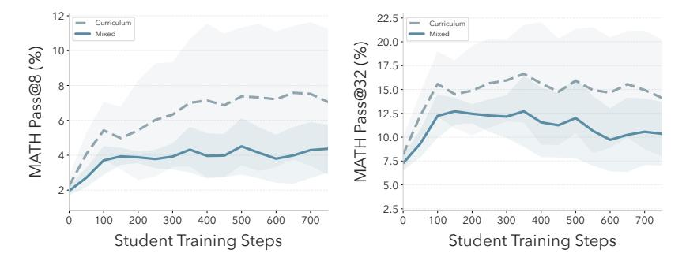

Figure 7 Mixed v. Curriculum training on MATH. We compare training the base student on fail@128 + 128 questions sampled from Base-T, for performance on MATH. Curriculum performs better across different inference budgets.

**Teacher sampling.** At evaluation time, we sample problems from the trained teacher using the same prompt and format-filtering as in training.

**PQ/PS Evaluation.** We evaluate PQ using mixed synthetic/real training, described above. We evaluate PS by simply running inference on the fail@128 test set, to evaluate how much the student baseline advanced during SOAR training.

Student checkpoint selection. For evaluations involving fresh student models, we train for a maximum of 1500 steps (observing convergence well before this point). For MATH and HARP experiments where we report performance at a fixed point, we select the student checkpoint to evaluate at using the *slope of the smoothed training reward curve*, similarly to classic RL early stopping heuristics (Mahsereci et al., 2017). In particular, we smooth the average training reward curve (centered-moving-average, 25 steps) and compute the discrete slopes, normalized by the range of observed rewards. The early stopping step is defined as the earliest point where the normalized slope falls below 15% of the maximum observed slope. We selected a 15% threshold to identify the beginning of the reward plateau; empirically, varying between 10% and 20% have negligible effects on the selected point. Test performance is averaged over a 200 step window following the selected step, to account for variance. In Figure C.2 we show the full training curves.

We choose this heuristic to account for differing convergence rates between methods on MATH and HARP,

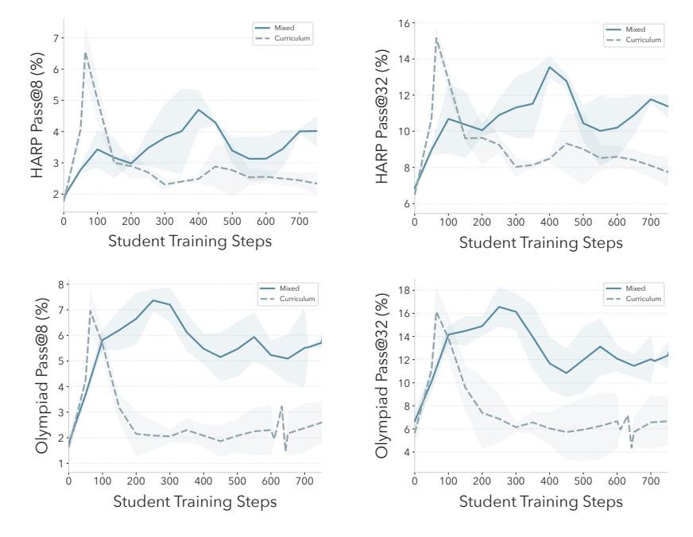

Figure 8 Mixed v. Curriculum training on HARP/OlympiadBench. We compare training the base student on real fail@128 + 128 random MATH questions, for HARP and OlympiadBench. Mixed training exhibits significantly more stable training dynamics across inference budgets (Pass@8 and Pass@32) and converges to higher final performance points. For both datasets, curriculum training exhibits strong instability with a large early performance spike and then crash.

and our small dataset sizes. In initial experiments we found separate validation sets, and cross-validation with the train set, to be extremely noisy. On OlympiadBench we observe similar convergence across all methods, and report at a fixed point of 50 steps.

#### **B.7** Hyperparameters

In Table 3 we detail our training and evaluation hyperparameters.

Outer-loop training. We performed the following sweeps in preliminary experiments, and tuned using student performance on the full train set. Once selected, the same hyperparameters are used across all training runs and datasets. See Appendix D.2 for ablations on sensitivity to threshold  $\tau$  and dataset size n.

- LR: {1e-6, 5e-6, **1e-5**, 5e-5}
- n: {8, 16, 32, **64**}
- $\tau$ : {0.01, 0.015, 0.02}
- Moving avg window size: {1, **3**}

We train for a maximum of 200 outer steps based on compute constraints. For teacher-sampling experiments we fix the evaluation checkpoint based on the point of decline of teacher rewards observed in initial runs (170 steps for all HARP-trained models, 200 steps for all MATH-trained models).

Inner-loop training. We find that from the base student, 10 steps is sufficient to induce movement in student performance. As the student baseline is updated, it is helpful to train slightly longer (we use +5 steps). We use greedy decoding for evaluating on  $Q_R$  to reduce noise in the student reward.

**Evaluation.** We use standard hyperparameters to train the student from scratch on combined real/synthetic data (Table 3c). For PQ with curriculum evaluation we use zero learning rate warmup to match the inner-loop environment.

#### **B.8** Seeds

To ensure statistical significance and account for both teacher-training and student-training variation, we employ a nested seeding strategy.

#### Teacher training.

- For our main SOAR experiments, we train four independent teachers each on MATH and HARP to cover a range of teacher training outcomes.
- For teacher objective ablations (Intrinsic-T and Grounded-T (no promotion)) we trained three independent teachers each.

### Evaluation (student training).

- The Hard-Only baseline is evaluated over  $\geq 6$  student seeds.
- For PQ datasets (>2 promotions), we train at least three students per PQ dataset, totaling ≥ 6 seeds (2 PQ datasets × 3 students) per reported metric.
- For PS students, we compute pass@k metrics using inference over three seeds.
- For teacher-sampling experiments (i.e., sampling data from trained teachers and then training a fresh student) we train 2-3 independent students per teacher seed, resulting in  $\geq 8$  seeds per reported metric.

For all metrics we report the aggregated mean and standard deviation over student seeds.

| Hyperparameter                     | Teacher                         | Student |  |  |  |  |
|------------------------------------|---------------------------------|---------|--|--|--|--|
| Optimizer                          | AdamW                           |         |  |  |  |  |
| KL coefficient                     | 0.0                             | 001     |  |  |  |  |
| LR schedule                        | Cosine                          | e decay |  |  |  |  |
| Learning rate                      | $1\epsilon$                     | e-5     |  |  |  |  |
| Temperature                        | 1                               | .0      |  |  |  |  |
| LR warmup steps                    | 20                              | 0/20    |  |  |  |  |
| Batch size                         | 2                               | 8       |  |  |  |  |
| Group size                         | 4                               | 32      |  |  |  |  |
| Max generated tokens               | 512                             | 1024    |  |  |  |  |
| meta-RL specific (teacher          | meta-RL specific (teacher only) |         |  |  |  |  |
| Promotion threshold $(\tau)$       | 0.01                            | _       |  |  |  |  |
| Moving avg window                  | 3                               | _       |  |  |  |  |
| Dataset size $(n)$                 | 64                              | _       |  |  |  |  |
| Student repeats $(r)$              | 4                               | _       |  |  |  |  |
| Evaluation specific (student only) |                                 |         |  |  |  |  |
| Max training steps                 | _                               | 1500    |  |  |  |  |
| Synthetic warmup steps             |                                 | 64      |  |  |  |  |
| (curriculum training)              |                                 |         |  |  |  |  |

**Table 3** Hyperparameters for SOAR training and evaluation.

# **B.9** Computational resources

Each SOAR training run was executed on 4 nodes (each  $8 \times$  NVIDIA H200 GPUs or  $8 \times$  NVIDIA H100 GPUs) for  $\approx 48\text{-}60$  hours. Each RLOO evaluation run (training a fresh student) was executed for  $\approx 12$  hours on 1 H200 node or 1 H100 node.

# **C** Evaluations

#### C.1 Full Student Training curves

In Figure 9 we show full student training curves for PQ, *Hard-Only*, and the full MATH upper bound for MATH, HARP, and OlympiadBench. In Figures 10-12 we show these training curves for questions sampled

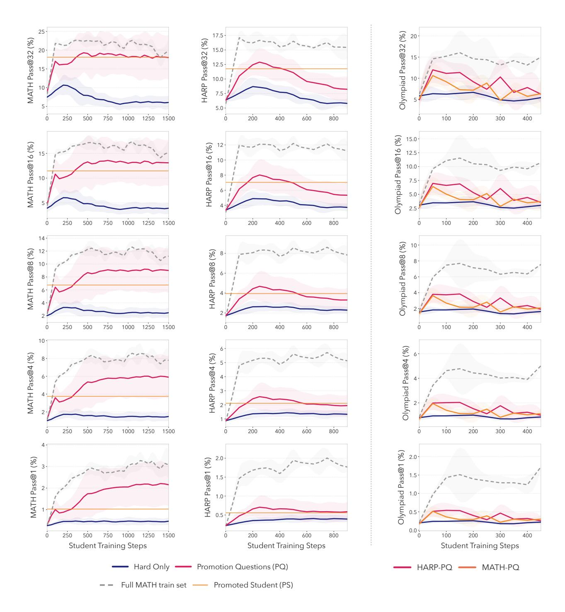

Figure 9 Fail@128 test performance during student training for MATH, HARP, and Olympiad. Student learning curves at different pass@k when trained on Hard-Only, PQ, or the Full MATH dataset (PS inference performance shown as a horizontal line). PQ and PS improve performance on all inference budgets and datasets, with increased effect at higher k. On MATH, PQ exhibits performance gains even after the synthetic-training phase (64 steps), showing that synthetic problems make real hard problems more learnable.

from Grounded-T, Base-T, Intrinsic-T, and Grounded-T (no promotion). All curves show the mean and standard deviation over seeds.

# C.2 Full Evaluation on fail@128 MATH, HARP, and OlympiadBench.

|                                                                      | k                                                       |                                                                  |                                                         |                                                                     |                                                                      |
|----------------------------------------------------------------------|---------------------------------------------------------|------------------------------------------------------------------|---------------------------------------------------------|---------------------------------------------------------------------|----------------------------------------------------------------------|
| Method                                                               | 1                                                       | 4                                                                | 8                                                       | 16                                                                  | 32                                                                   |
| Base Model Inference                                                 | $0.3 \pm 0.1$                                           | $1.0 \pm 0.2$                                                    | $2.0 \pm 0.4$                                           | $3.9 \pm 0.8$                                                       | $7.5 \pm 1.3$                                                        |
| Hard- $OnlyHard$ - $Only$ $(g = 128)$                                | $0.5 \pm 0.1$<br>$1.4 \pm 1.0$                          | $1.7 \pm 0.4$<br>$3.9 \pm 2.6$                                   | $3.2 \pm 0.8$<br>$6.1 \pm 3.9$                          | $5.7 \pm 1.5$<br>$8.9 \pm 5.5$                                      | $9.6 \pm 2.6$ $12.4 \pm 7.4$                                         |
| SOAR-PQ (Ours)<br>SOAR-PS (Ours)<br>Grounded-T (Ours)<br>Intrinsic-T | $1.7 \pm 1.0$ $1.0 \pm 0.2$ $1.6 \pm 0.5$ $1.0 \pm 0.6$ | $5.3 \pm 2.6$<br>$3.8 \pm 0.6$<br>$5.1 \pm 1.4$<br>$3.3 \pm 2.1$ | $8.5 \pm 3.7$ $6.8 \pm 1.1$ $8.4 \pm 2.1$ $5.7 \pm 3.5$ | $13.0 \pm 4.8$<br>$11.5 \pm 1.6$<br>$13.1 \pm 2.9$<br>$9.2 \pm 5.3$ | $18.9 \pm 5.3$<br>$18.1 \pm 2.4$<br>$19.1 \pm 3.7$<br>$14.1 \pm 7.5$ |
| HARP train (128)<br>MATH train (128)<br>MATH train (Full)            | $2.4 \pm 1.0$<br>$2.1 \pm 0.0$<br>$2.7 \pm 0.2$         | $7.2 \pm 2.4$<br>$6.6 \pm 0.1$<br>$7.6 \pm 0.7$                  | $11.3 \pm 3.1$<br>$10.5 \pm 0.3$<br>$11.5 \pm 1.2$      | $16.5 \pm 3.6$<br>$15.7 \pm 0.5$<br>$16.4 \pm 1.8$                  | $23.0 \pm 3.9$<br>$21.8 \pm 0.9$<br>$22.0 \pm 2.4$                   |

Table 4 MATH Pass@k (%) Test Accuracy on Fail@128. Mean and SD over seeds are averaged over a 200 step window determined by training reward convergence (see Appendix B.6) with full curves in Figure 9. PQ and PS consistently outperform inference-only, Hard-Only, and intrinsic baselines across all inference budgets, and recover the majority of performance gain from training with real curated problems. We boldface the best among "data-free" methods (i.e., only  $\mathcal{D}_{train}$  available). The bottom three rows serve as upper bounds from using curated, expert-annotated data. PQ datasets contain one of  $\{128, 192, 256\}$  questions.

|                      | k             |               |               |                |                |
|----------------------|---------------|---------------|---------------|----------------|----------------|
| Method               | 1             | 4             | 8             | 16             | 32             |
| Base Model Inference | $0.2 \pm 0.0$ | $0.9 \pm 0.0$ | $1.7 \pm 0.0$ | $3.4 \pm 0.0$  | $6.4 \pm 0.0$  |
| Hard-Only            | $0.4 \pm 0.1$ | $1.4 \pm 0.2$ | $2.6 \pm 0.4$ | $4.7 \pm 0.6$  | $8.2 \pm 1.0$  |
| SOAR-PQ (Ours)       | $0.7 \pm 0.3$ | $2.5 \pm 0.8$ | $4.5\pm1.3$   | $7.7 \pm 1.7$  | $12.3 \pm 2.0$ |
| SOAR-PS (Ours)       | $0.6 \pm 0.1$ | $2.1 \pm 0.3$ | $3.9 \pm 0.6$ | $7.0 \pm 0.9$  | $11.8 \pm 1.2$ |
| Grounded-T (Ours)    | $0.5 \pm 0.2$ | $2.0 \pm 0.5$ | $3.8 \pm 0.9$ | $6.7 \pm 1.3$  | $11.2\pm1.7$   |
| Intrinsic-T          | $0.4 \pm 0.1$ | $1.6 \pm 0.5$ | $3.1 \pm 0.8$ | $5.6 \pm 1.4$  | $9.6 \pm 2.1$  |
| HARP train (128)     | $0.4 \pm 0.0$ | $1.4 \pm 0.1$ | $2.8 \pm 0.2$ | $5.0 \pm 0.5$  | $8.7 \pm 1.1$  |
| MATH train (128)     | $0.6 \pm 0.1$ | $2.1 \pm 0.4$ | $4.0 \pm 0.7$ | $7.1 \pm 0.9$  | $11.9 \pm 0.9$ |
| MATH train (Full)    | $1.7 \pm 0.2$ | $5.1 \pm 0.4$ | $8.1 \pm 0.4$ | $11.7 \pm 0.3$ | $16.2 \pm 0.4$ |

Table 5 HARP Pass@k (%) Test Accuracy on fail@128. Mean and SD over seeds are reported at the timestep determined by training reward convergence (see Appendix B.6) with full curves in Figure 9. PQ and PS consistently outperform inference-only, *Hard-Only*, and intrinsic baselines across all inference budgets. Notably, SOAR questions perform better on HARP than similar numbers of questions from the MATH/HARP datasets (which serve as a curated, expert-annotated data source).

In Tables 4-5 we report our full results from evaluating SOAR on MATH and HARP (in-domain datasets). In Table 6 we report full results from evaluating on OlympiadBench, an OOD dataset.

Our PQ datasets have one of  $\{128, 192, 256\}$  questions, depending on the number of student promotions for each run. For Intrinsic-T we sample 128 questions, consistent with all of our teacher-sampling experiments. For the equal-data comparison between Intrinsic-T and Grounded-T (sampling from the SOAR-trained teacher), see Section 5.2 and Appendix C.3.

In addition to the methods/baselines shown in Figure 3 we also report the following.

Inference pass@k with the base model. Inference with the base model has non-zero pass@k due to stochastic sampling with different seeds than were used for the initial pass@128 = 0 filtering. Comparison with Hard-Only

|                                                           |                                                 |                                                 | k                                               |                                                 |                                              |
|-----------------------------------------------------------|-------------------------------------------------|-------------------------------------------------|-------------------------------------------------|-------------------------------------------------|----------------------------------------------|
| Method                                                    | 1                                               | 4                                               | 8                                               | 16                                              | 32                                           |
| Base Model Inference Hard-Only                            | $0.2 \pm 0.0$<br>$0.3 \pm 0.1$                  | $0.8 \pm 0.1$<br>$1.1 \pm 0.3$                  | $1.6 \pm 0.3$<br>$2.1 \pm 0.6$                  | $3.1 \pm 0.5$<br>$3.9 \pm 1.3$                  | $5.8 \pm 1.0$ $6.9 \pm 2.7$                  |
| SOAR-PQ (MATH) (Ours)<br>SOAR-PQ (HARP) (Ours)            | $0.5 \pm 0.1$<br>$0.5 \pm 0.1$                  | $1.9 \pm 0.5$<br>$2.0 \pm 0.5$                  | $3.6 \pm 0.9$<br>$3.8 \pm 1.0$                  | $6.4 \pm 1.6$<br>$7.0 \pm 1.8$                  | $10.6 \pm 2.7$<br>$12.0 \pm 3.0$             |
| SOAR-PS (MATH) (Ours)                                     | $\boldsymbol{0.6 \pm 0.1}$                      | $2.1 \pm 0.5$                                   | $3.7 \pm 0.8$                                   | $6.2 \pm 1.3$                                   | $9.9 \pm 2.2$                                |
| SOAR-PS (HARP) (Ours) Grounded-T (MATH) (Ours)            | $0.5 \pm 0.1$<br>$0.4 \pm 0.2$                  | $2.0 \pm 0.4$<br>$1.6 \pm 0.8$                  | $3.8 \pm 0.7$ $2.9 \pm 1.4$                     | $6.9 \pm 1.1$<br>$5.3 \pm 2.4$                  | $11.7 \pm 1.6$<br>$9.0 \pm 4.0$              |
| Grounded-T (HARP) (Ours)<br>Intrinsic-T                   | $0.5 \pm 0.2$<br>$0.4 \pm 0.3$                  | $1.9 \pm 0.6$<br>$1.7 \pm 1.2$                  | $3.6 \pm 1.1$<br>$3.1 \pm 2.0$                  | $6.5 \pm 1.8$<br>$5.5 \pm 3.4$                  | $11.1 \pm 2.9$<br>$9.1 \pm 5.2$              |
| HARP train (128)<br>MATH train (128)<br>MATH train (Full) | $0.5 \pm 0.1$<br>$1.0 \pm 0.1$<br>$0.9 \pm 0.0$ | $2.0 \pm 0.2$<br>$3.4 \pm 0.1$<br>$3.2 \pm 0.1$ | $3.6 \pm 0.4$<br>$5.9 \pm 0.1$<br>$5.6 \pm 0.3$ | $6.5 \pm 0.8$<br>$9.6 \pm 0.4$<br>$8.8 \pm 0.7$ | $10.6 \pm 1.7$ $14.6 \pm 1.4$ $13.1 \pm 0.9$ |

Table 6 Olympiad Pass@k (%) Test Accuracy on fail@128. Mean and SD over seeds are reported timestep 50 with full curves in Figure 9. Despite being optimized with reward signals from HARP and MATH, PQ questions and PS inference transfer to improving performance on Olympiad, and match or outperform 128 questions sampled from the HARP train set (a curated/expert-annotated source of problems). PS and PQ transfer better when trained with HARP than with MATH, potentially indicating more shared structure between HARP and Olympiad.

results shows that our fail@128 datasets are sufficiently difficult such that direct training yields very little improvement. Doing inference with the trained *Grounded-T* teacher model directly on fail@128 MATH test questions does *not* improve upon base model, further evidence for the decoupling of generation and solving abilities.

Hard-Only with extra compute. A natural question is whether we can improve direct training on fail@128 train questions simply by increasing compute. One strategy is to train for longer, however our learning curves in Figure 9 show that Hard-Only test performance decreases in the latter stages of training. Another strategy is to sample more from the base model by increasing the RLOO group size. On MATH, we increase the group size  $4\times$  (from our default g=32 to g=128), and find that it only yields marginal improvements over Hard-Only (e.g., +2.8% pass@32) and does not recover the improvements of PQ.

**Sampling curated "oracle questions".** In addition to training with the full MATH train set, we also evaluate sampling 128 questions from the MATH and HARP train sets, which can be considered oracle (curated/expertannotated) data sources. We choose 128 to match our teacher sampling experiments (Section C.3) and roughly match the amount of PQ data, which varies between 128 and 256 questions.

On MATH, training with these smaller subsets performs similarly to training with the full MATH dataset, suggesting a saturation point. On HARP, these smaller subsets only recover  $\approx 50\%$  of the gains from training with the full MATH train set. Notably, PQ and PS both outperform 128 sampled questions from HARP, and match 128 questions from MATH.

# C.3 Sampling from Trained Teachers.

While PQ comes from accumulated useful questions over the meta-RL trajectory, here we sample questions directly from the trained teacher policy. The similar performance of Grounded-T and PQ (Tables 4-5) provide evidence that the pedagogical signals captured in the PQ datasets are learned by the teacher's distribution.

In Figures 10-12 we show full test trajectories on MATH, HARP, and Olympiad for students trained with 128 questions sampled from *Grounded-T*, *Intrinsic-T*, *Base-T*, and *Grounded-T* (no promotion). *Grounded-T* outperforms all comparisons, particularly at higher inference budgets, and is competitive with PQ. *Grounded-T* also exhibits lower variance and greater stability across student and teacher seeds. *Grounded-T* (no promotion) performs worse than *Grounded-T*, PQ, and PS, validating the importance of the promotion mechanism.

In Figure 13 we also compare student trajectories for each Grounded-T and Intrinsic-T teacher seed. Consistent with MATH and HARP (Figure 5), students have similar trajectories across independent Grounded-T teachers, and high variance across different Intrinsic-T teachers, showcasing the instability of intrinsic rewards.

# C.4 Correctness of Synthetic Questions

We categorize synthetic questions into *correctness taxonomies* using Claude-4.5-Sonnet as an oracle judge. The prompt given to Claude is shown below. In Table 7 we report taxonomy statistics for PQ datasets, and problems sampled from *Grounded-T*, *Intrinsic-T*, and *Base-T* teachers.

We prompt Claude-4.5-Sonnet to categorize problems as follows:

- Well posed: If the problem is mathematically complete and solvable.
- Correct: If the proposed answer is correct (only if the problem is well posed).
- Error type:
  - None
  - Arithmetic error: Sound logic, but incorrect final calculation.
  - Logical fallacy: Does not follow mathematical rules.
  - Ill-posed/Impossibility: The question contains a mathematical impossibility.
  - Ambiguous: The question is missing data, variables, or context necessary for solving it.

Our results show that the well-posedness of a problem matters more than the correctness of the solution. While teacher-training does improve the correctness rate, the best-performing datasets (Grounded-T and PQ) only contain 32.8% and 36.5% correct solutions respectively, compared to 55.5% for Intrinsic-T. This indicates that question diversity is more important for success (see Table 1). Question structure and coherence is more important; meta-RL reduces question ambiguities while the rate of arithmetic errors remains the same or slightly higher.

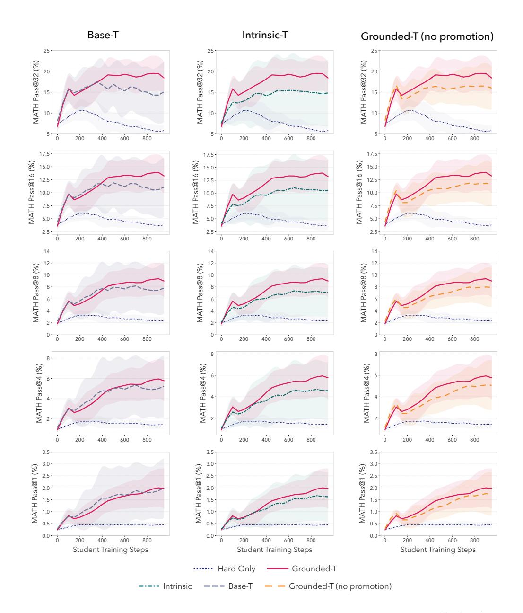

Figure 10 Fail@128 test performance during student training for MATH with different teachers. Each column compares training a fresh student with 128 questions from Grounded-T to 128 questions from a different teacher (Hard-Only also included for reference). While all teachers outperform Hard-Only, Grounded-T performs best, with increasing effects at higher k. Grounded-T results in less variance across student outcomes, particularly compared to Base-T and Intrinsic-T. PQ learning curves are in Figure 9.

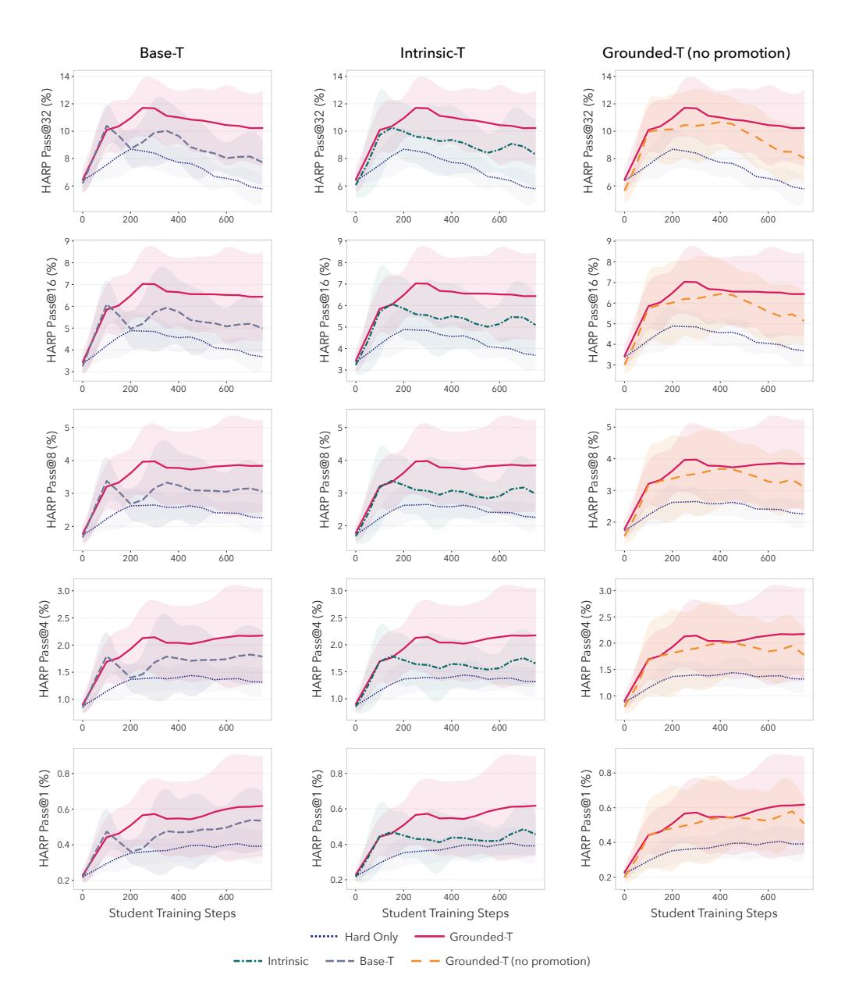

Figure 11 Fail@128 test performance during student training for HARP with different teachers. Each column compares training a fresh student with 128 questions from Grounded-T to 128 questions from a different teacher (Hard-Only also included for reference). Grounded-T performs best, with increasing effects at higher k. Students trained with Base-T and Intrinsic-T tend to decline more for higher k in the later stages of training, while Grounded-T leads to more stable trajectories.

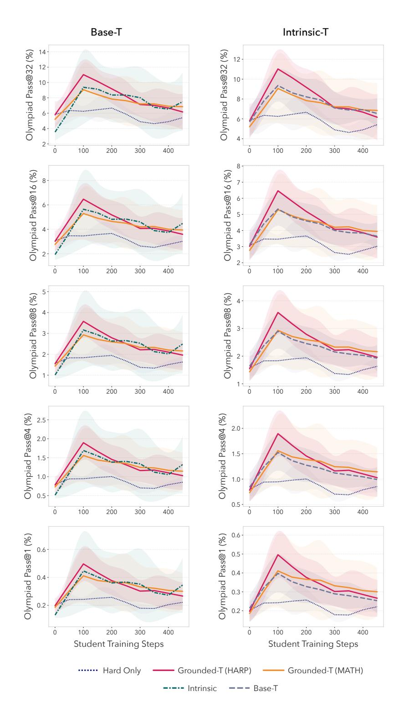

Figure 12 Fail@128 test performance during student training for Olympiad with different teachers. Each column compares training a fresh student with 128 questions from Grounded-T (trained with MATH and HARP) to 128 questions from a different teacher (Hard-Only also included for reference). Students trained with Grounded-T teachers have more similar mean performance to Base-T and Intrinsic-T than seen on HARP and MATH (Figures 10-11). However, Grounded-T (HARP) shows more stability and less variance between independent teachers than Intrinsic-T (see Figure 13).

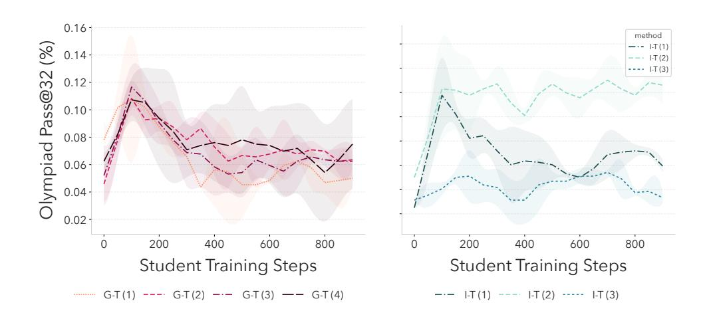

Figure 13 Test Pass@32 on OlympiadBench for fresh students trained with individual Grounded-T teacher seeds (red) and Intrinsic-T teacher seeds (green). Questions from Grounded-T yield consistent student trajectories on OlympiadBench across different teachers, whereas Intrinsic-T exhibits high variance across teachers, including a failure mode where I-T (1) causes student collapse.

You are evaluating generated math problems for their coherence and solvability. Your task is to determine if the given question is well-formulated, and if the given answer is correct.

 $\hbox{\tt CRITICAL\ INSTRUCTION:\ Do\ not\ assume\ missing\ information.\ If\ the\ question\ is\ nonsensical,\ lacks\ a}$ clear problem/question/equation, is syntactically incorrect, is missing necessary information, or is missing variables, you MUST classify it as 'Ambiguous' or 'Ill\_Posed'. Do not invent a context to make the answer work.

```
QUESTION: {question}
PROPOSED_ANSWER: {proposed_answer}
```

#### TAXONOMY OF ERRORS:

- 'None': The question is mathematically complete and the answer is correct.
- 'Arithmetic': The logic is sound, but the final calculation is wrong.
- 'Logical\_Fallacy': The steps taken do not follow mathematical rules.
- 'Ill\_Posed': The question contains a mathematical impossibility.
- 'Ambiguous': The question is missing necessary data, variables, or context (e.g., "Solve the equation" without providing the equation).

#### TASK.

- 1. Analyze the QUESTION for completeness. If it's a "fragment" or "nonsense," stop and flag it.
- 2. Solve the problem ONLY if it is well-defined.
- 3. Determine:
  - $\hbox{- is\_well\_posed: boolean Is the question mathematically complete and solvable?} \\$
  - is\_correct: boolean Is the proposed answer correct? (Only evaluate if is\_well\_posed is true)
  - error\_type: one of ['None', 'Arithmetic', 'Logical\_Fallacy', 'Ill\_Posed', 'Ambiguous']
  - verified\_answer: string The correct answer if the question is well-posed, or "N/A" if not well-posed

# **OUTPUT FORMAT:**

```
First, provide your reasoning in <think> tags.
Then, provide a JSON object with the following exact structure:
```

```
"json
{{
  "is_correct": <boolean>,
  "is_well_posed": <boolean>,
   "error_type": "<one of: None, Arithmetic, Logical_Fallacy, Ill_Posed, Ambiguous>",
   "verified_answer": "<string: the correct answer or 'N/A'>"
}}
EXAMPLE OUTPUT:
```

### <think>

The question asks to solve 2x + 5 = 13. This is well-posed with all necessary information. Solving: 2x = 138, so x = 4. The proposed answer is 4, which is correct. </think>

```
"json
}}
   "is_correct": true,
  "is_well_posed": true,
   "error_type": "None",
   "verified_answer": "4"
}}
```

| Category                            | Base  | Intrinsic | Grounded | PQ    |  |  |  |  |
|-------------------------------------|-------|-----------|----------|-------|--|--|--|--|
| Well-Posed                          | 53.6% | 63.5%     | 70.0%    | 64.6% |  |  |  |  |
| Correct                             | 23.2% | 55.5%     | 36.5%    | 32.8% |  |  |  |  |
| Error Taxonomy (% of total samples) |       |           |          |       |  |  |  |  |
| Arithmetic Error                    | 23.7% | 5.7%      | 29.0%    | 25.0% |  |  |  |  |
| Logic Error                         | 5.7%  | 2.3%      | 6.9%     | 6.5%  |  |  |  |  |
| Impossibility Error                 | 4.7%  | 2.9%      | 8.2%     | 4.7%  |  |  |  |  |
| Ambiguity Error                     | 42.4% | 33.6%     | 21.3%    | 31.3% |  |  |  |  |
| Total Samples                       | 384   | 384       | 375      | 384   |  |  |  |  |

Table 7 Correctness analysis and error taxonomy of synthetic questions, evaluated by Claude-4.5-Sonnet. Teacher training (for both grounded and intrinsic rewards) improves the well-posedness and correctness of problems relative to the base model, with a corresponding decrease in question ambiguity errors. Grounded-T and PQ have fewer correct questions than Intrinsic-T but perform better, potentially because of greater diversity (see Table 1.)

# **D** Ablations

# D.1 Sampled dataset size

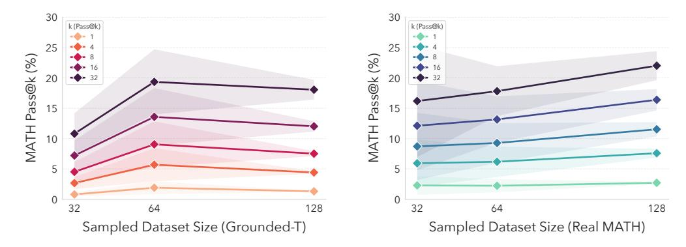

Figure 14 (Left) Sampling different-sized datasets from Grounded-T for MATH (fail@128)  $Mean\ and\ \pm\ 1\ SD\ across\ 2\ teacher seeds\ and\ 2\ student\ seeds$ . (Right) Sampling different-sized datasets from the MATH trainset for MATH (fail@128). Resampled for each seed, 3 seeds.

When training with SOAR, teacher-generated problems are partitioned into datasets that the student is trained on in the inner loop. Thus the teacher rewards are based on a specific dataset size (64 in our case). In evaluation, however, one could potentially sample any number of questions from the teacher policy. This raises the question of how the performance of sampled datasets changes with size. Is it best to sample the number of questions that the teacher was trained with, or does performance saturate at higher sampling rates?

We evaluate two teacher models trained with MATH by sampling  $n \in \{32, 64, 128\}$  questions from each teacher, and training a fresh student on the sampled questions and the MATH fail@128 train set (3 seeds per run). Since teacher models are trained with n = 64, this covers datasets smaller, equal to, and larger than the dataset size that the teacher was trained with.

Results are shown in Figure 14 for different pass@k. Performance improves with increasing n. Sampling with 128 questions has a similar mean performance as sampling 64 questions but with significantly smaller error. This illustrates benefits (namely, consistency/reliabilty) to sampling questions from the teacher at higher rates than it was trained with. As a comparison we also perform the same experiment using real questions from the MATH training dataset. For all values of n, real MATH questions perform similarly or better, and exhibit diminishing variance with increasing numbers of questions.

# D.2 Sensitivity to Teacher Hyperaparameters

We ablate  $\tau$  (the teacher-reward threshold to determine if the student baseline should be promoted) and n (the number of samples per dataset that teacher-generated problems are partitioned into). The teacher generates  $g \cdot n$  problems per outer-RLOO iteration.

We train SOAR on MATH with  $\tau \in \{0.01, 0.015\}$  and  $n \in \{32, 64\}$ . For each combination we train two SOAR runs for 200 steps and evaluate the final teacher checkpoints by sampling varying amounts of questions  $(|\mathcal{X}| \in \{32, 64, 128\})$  and training two fresh students. Results are shown in Figure 15 for pass@8 and pass@32. Our default configuration  $(n=64, \tau=0.01)$  performs best, with n=64 showing modest advantages over n=32 at larger evaluation dataset sizes, which is consistent with the teacher being trained to produce larger datasets.

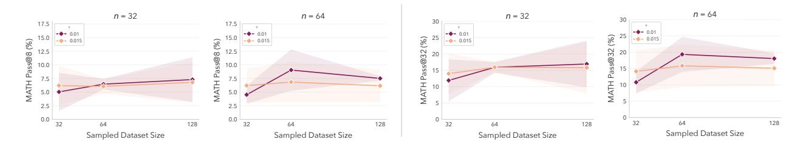

Figure 15 Hyperparameter sensitivity on MATH. We train SOAR with  $\tau \in \{0.01, 0.015\}$  and  $n \in \{32, 64\}$ , then evaluate by training students on datasets of size  $|\mathcal{X}| \in \{32, 64, 128\}$ . Shaded regions indicate  $\pm 1$  SD.

# D.3 Problem Generation Format.

|    |                 | MATH Pass@k (%)                                       |                                                       |                                                       |                                                       |                                                          |  |
|----|-----------------|-------------------------------------------------------|-------------------------------------------------------|-------------------------------------------------------|-------------------------------------------------------|----------------------------------------------------------|--|
| n  | $ \mathcal{X} $ | 1                                                     | 4                                                     | 8                                                     | 16                                                    | 32                                                       |  |
| 32 | 32<br>64<br>128 | $0.66 \pm 0.58$<br>$0.52 \pm 0.26$<br>$0.67 \pm 0.67$ | $2.34 \pm 1.91$ $1.93 \pm 0.93$ $2.29 \pm 2.03$       | $4.16 \pm 3.13$<br>$3.60 \pm 1.63$<br>$4.03 \pm 3.25$ | $7.06 \pm 4.75$ $6.44 \pm 2.66$ $6.82 \pm 4.91$       | $11.42 \pm 6.66$<br>$10.99 \pm 3.96$<br>$11.06 \pm 7.05$ |  |
| 64 | 32<br>64<br>128 | $0.44 \pm 0.12$<br>$0.38 \pm 0.04$<br>$0.43 \pm 0.12$ | $1.61 \pm 0.42$<br>$1.49 \pm 0.15$<br>$1.55 \pm 0.36$ | $2.95 \pm 0.76$<br>$2.85 \pm 0.28$<br>$2.80 \pm 0.57$ | $5.16 \pm 1.39$<br>$5.29 \pm 0.48$<br>$4.83 \pm 0.89$ | $8.56 \pm 2.48$<br>$9.35 \pm 0.84$<br>$7.96 \pm 1.32$    |  |

Table 8 MATH Pass@k results for multi-turn teacher sampling. We report mean and SD across four teacher seeds and 2 student seeds per teacher. Multiturn performs worse than our default single-turn setting across all pass@k and sampled dataset sizes.

In our default setup, we sample problems from the teacher by prompting it to produce a single completion that is parsed into a question/answer, and filtering out outputs that do not match the necessary format. An alternative sampling method, however, is to generate problems in separate question-answer stages (multi-turn) such that filtering is not needed:

- 1. Sample  $\pi_{\phi}^{T}(q_{i}|p)$  where p is a teacher prompt to generate a question.
- 2. Sample  $\pi_{\phi}^{T}(a_{i}|p,q_{i},p')$  where p' is a prompt to generate an answer given the question.

The logprob component of the teacher RLOO loss is then  $\log(\pi_{\phi}^{T}(q_i|p)) + \log(\pi_{\phi}^{T}(a_i|p,q_i,p'))$ .

We execute SOAR across four seeds using this teacher-sampling formulation with our standard procedure and hyperparameters, ablating  $n \in \{32, 64\}$ . We observe that the teacher reward quickly plateaus and does not exceed one promotion. In Table 8 we find that across different numbers of sampled problems and values of n, the multi-turn sampling strategy performs worse than our default single-turn sampling.

# E Teacher Training Dynamics

In Figure 16 we show a representative teacher training curve for SOAR on HARP. We observe that SOAR follows a pattern of search and exploitation. The training curve exhibits periods of oscillation (search), and then a steady rise in reward from steps 18-27, culminating in a student promotion. The reward declines after the promotion, due to the improved student baseline, oscillates as the teacher adapts to the improved student, and then exhibits another rise from steps 80-86 culminating in a second promotion.

Figure 17a shows teacher training curves for Intrinsic-T teachers, aggregated across teacher seeds, which exhibits a smooth upward climb. Figure 17b shows that as the Intrinsic-T reward climbs, the diversity of teacher completions falls (diversity measured as the average pairwise cosine distance of embeddings). Meanwhile Grounded-T preserves the original model diversity throughout the full trajectory. This is consistent with findings in Section 5.2 (Table 1) that Grounded-T achieves similar question diversity to Base-T, whereas Intrinsic-T teachers collapse to a more narrow conceptual space.

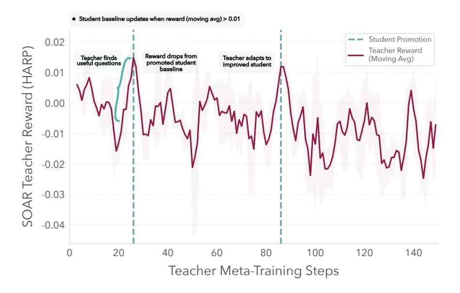

Figure 16 Annotated teacher reward dynamics when training SOAR with HARP. Shows a sample teacher trajectory from a SOAR run on HARP. The teacher follows a cyclical search-exploitation pattern. Student promotions (updating the student baseline to a trained student) are triggered when the 3-step moving average of teacher rewards exceeds  $\tau=0.01$ . After each promotion, the improved student baseline makes previous curricula less useful, causing rewards to drop, and then recover as the teacher adapts and discovers questions appropriate for the improved student.

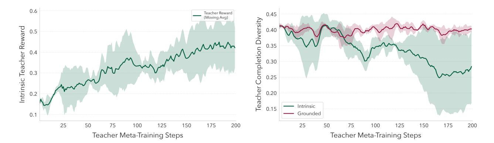

Figure 17 (Left) Teacher training dynamics when training with Intrinsic-T. Mean and  $\pm 1$  SD over three independent training runs. (Right) Teacher completion diversity when training with intrinsic v. grounded rewards. Grounded rewards preserve diversity for the full run, while intrinsic teachers lose diversity as they converge. Mean and  $\pm 1$  SD over three training runs for intrinsic and four for grounded (two MATH, two HARP).