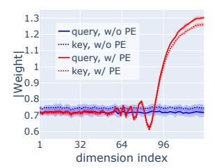
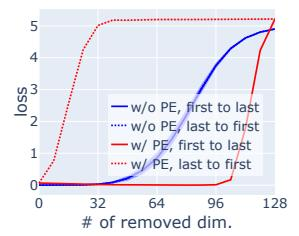
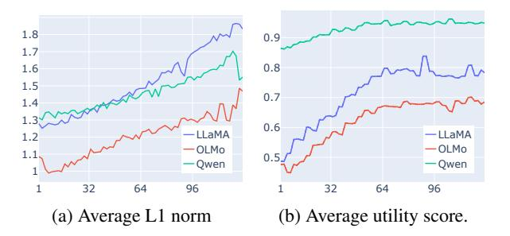
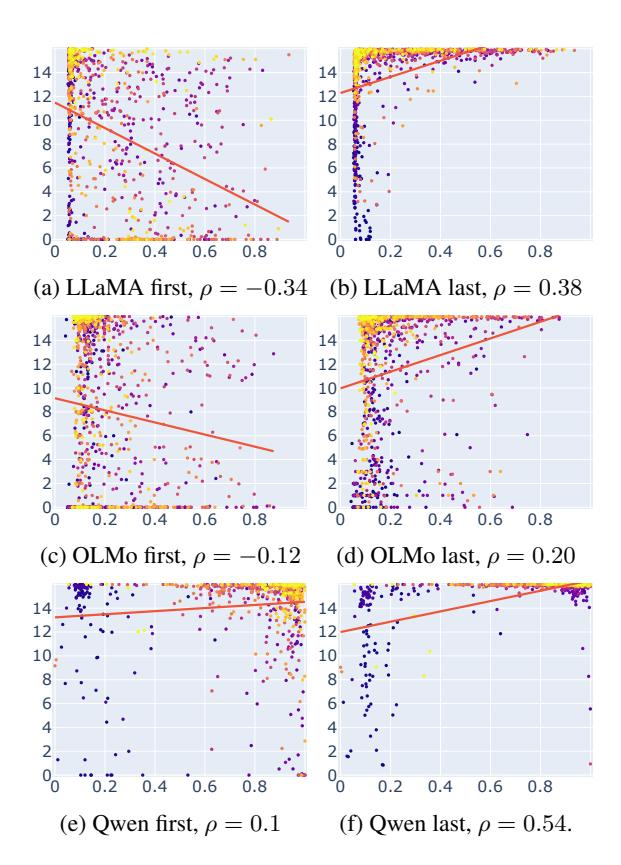
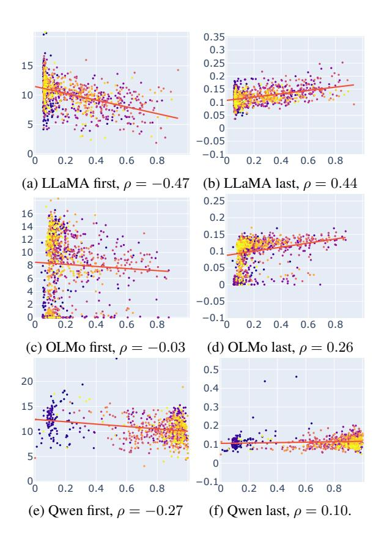
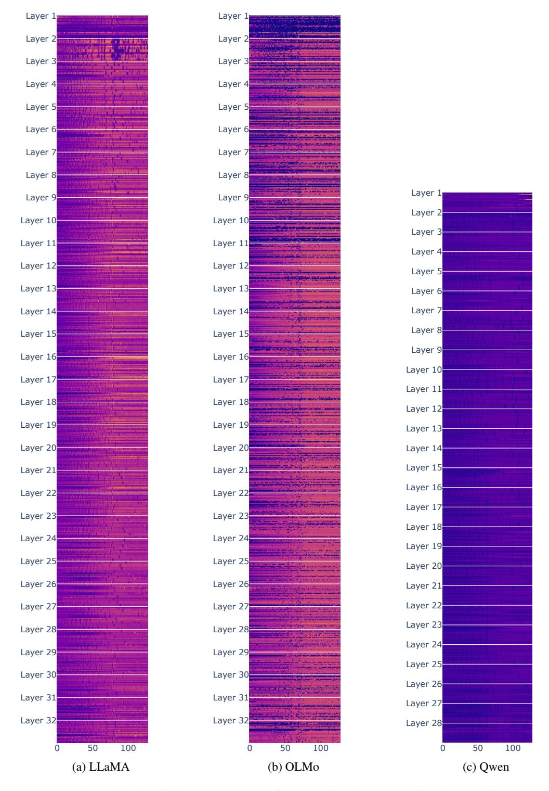
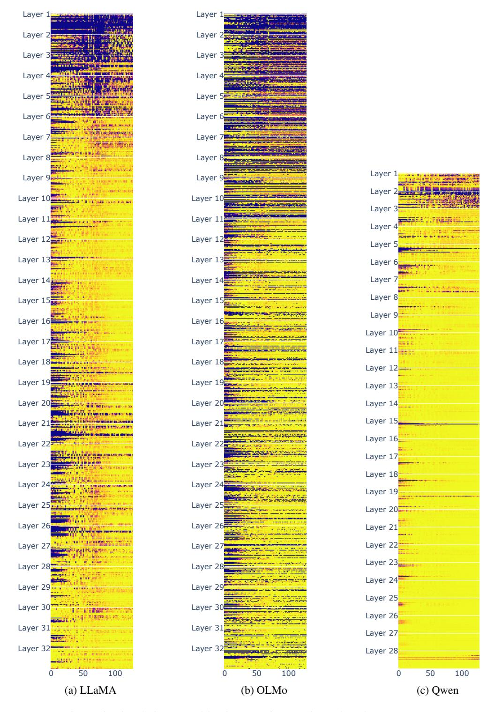

# The Rotary Position Embedding May Cause Dimension Inefficiency in Attention Heads for Long-Distance Retrieval

## **Ting-Rui Chiang**

University of Southern California tingruic@usc.edu

## Dani Yogatama

University of Southern California yogatama@usc.edu

#### **Abstract**

The Rotary Position Embedding (RoPE) is widely used in the attention heads of many large language models (LLM). It rotates dimensions in the query and the key vectors by different angles according to their positions in the input sequence. For long context modeling, the range of positions may vary a lot, and thus RoPE rotates some dimensions by a great range of angles. We hypothesize that the wide range of rotation angles may prevent LLMs from utilizing those dimensions. To validate this hypothesis, we present a controlled experiment showing that applying RoPE causes low utility of certain dimensions. Our analyses on three LLMs also indicate that these dimensions do not help LLMs do long-context question answering.

## 1 Introduction

Su et al. (2024) proposed the Rotary Position Embedding (RoPE) for Transformer models (Vaswani et al., 2017). Because it is parameter-free and computationally efficient, it has been widely adopted in many large language models (LLMs), such as PaLM (Chowdhery et al., 2022), Gemma (Team et al., 2024a,b), LLaMA (Touvron et al., 2023a,b; Dubey et al., 2024), OLMo (Groeneveld et al., 2024; OLMo et al., 2024), Mistral (Jiang et al., 2023), Falcon (Almazrouei et al., 2023), and Qwen (Bai et al., 2023; Team, 2024). Despite the success of these LLMs on several downstream tasks, LLMs have also been found to be less effective when handling longer context (Liu et al., 2024; Kamradt, 2023; An et al., 2024; Bai et al., 2024; Zhang et al., 2024; Li et al., 2024).

Most recent work has focused on understanding and mitigating LLM failure to generalize to long context. For example, Kazemnejad et al. (2023) inspected different positional encoding methods. Han et al. (2024) and Xiao et al. (2024b) explained the failure with the distribution shifts of LLMs' internal representation. An et al. (2025) attributed

the failure to the skewed length distribution in the training data. Peng et al. (2024), emozilla (2023), and bloc97 (2023) addressed the failure by studying ways to interpolate RoPE.

Orthogonal to existing studies, our work analyzes the impact of RoPE on models' utilization of dimensions in attention heads. We hypothesize that, for long distance attention, the way that RoPE rotates the query and the key vectors may prevent the model from utilizing the dimensions that it rotates significantly. Our results of a controlled experiment and analyses of three real-world large language models support our hypothesis.

As RoPE has been widely used in many LLMs, our findings have great implications. Not utilizing certain dimensions means that the computational cost for those dimensions may not be necessary. LLMs may be made more computationally efficient by pruning these dimensions. It also implies that LLMs may achieve better performance on long-context tasks with the same number of parameters if they utilize more dimensions. Addressing this issue is thus paramount for LLM developers.

## 2 Background: Rotary Position Embeddings (RoPE)

Su et al. (2024) proposed the Rotary Position Embedding (RoPE), which can be applied to the key and query vectors for attention operations. It encodes relative position by rotating the intermediate representations according to their positions in the input sequence. Specifically, RoPE rotates a vector in  $\mathbb{R}^{2D}$  at position m with a block-diagonal matrix

$$M_m^{(D)} = \begin{bmatrix} M_{m\theta_1} & & & \\ & \ddots & & \\ & & M_{m\theta_D} \end{bmatrix},$$
with  $M_{m\theta_i} = \begin{bmatrix} \cos m\theta_i & -\sin m\theta_i \\ \sin m\theta_i & \cos m\theta_i \end{bmatrix},$  (1)

for some scalars  $\theta_1 > \theta_2 > \cdots \theta_D$  that decide the





- (a) The average magnitude of the key and the query vectors for each dimension.
- (b) # of removed dimensions v.s. loss in Eq. 3  $(-\mathbb{E} \log P(v_i|q_i,K,V))$ .

Figure 1: Analysis of the dimensions in the attention head of the models (w/ and w/o applying RoPE) in §4.

frequency of the rotations.

Let a query vector and a key vector at position m, n be  $q_m, k_n \in \mathbb{R}^{2D}$ . RoPE rotates them with RoPE matrices  $M_m$  and  $M_n$  respectively, so the dot product for computing the attention weight is

$$RoPE(q_m) \cdot RoPE(k_n)$$

$$= (M_m q_m)^{\mathsf{T}} (M_n k_n) = q_m^{\mathsf{T}} (M_{n-m}) k_n.$$
(2)

## 3 Dimension Inefficiency

We hypothesize that RoPE may cause dimension inefficiency in attention heads for long-dependency modeling. Specifically, when a task requires an attention head to attend to a distant position, RoPE may prevent the attention from utilizing the first few dimensions in its attention heads. This is because RoPE rotates those dimensions with greater rates ( $\theta$ 's in Eq. 1)<sup>1</sup>. For long-context tasks, such as long-context question answering, the possible relative positions m-n between a key vector  $k_n$  for the target information and a query vector  $q_m$  can vary greatly, so the rotation applied on these dimensions can be any angles. Therefore, the model cannot produce query and key vectors such that their first few dimensions can consistently contribute a positive value to the inner product in Eq. 2. We hypothesize that the first few dimensions are thus useless for long-distance attention.

#### 4 Controlled Experiment

We present a controlled experiment to demonstrate how RoPE can cause dimension inefficiency. We design a simple experiment where the model needs to learn n vector tuples  $\{(q_i, k_i, v_i)\}_{i=1}^n$  such that the attention head can retrieve  $v_i$  with  $q_i$  from any randomly sampled subset of key-value pairs



Figure 2: The average importance of each dimensions in the query vectors of the attention heads, measured by the L1 norm of rows in the query weight matrices (left) and by utility score in §5.2 (right). We visualize all heads in Figure 5 and Figure 6.

 $\{(k,v)|k \in K, v \in V\} \subset \{(k_i,v_i)\}_{i=1}^n$ . Specifically, we optimize the following objective function:

$$\min_{\{q_i, k_i v_i\}_{i=1}^n} -\frac{1}{n} \sum_{i=1}^n \mathbb{E}_{K, V} \log P(v_i | q_i, K, V)$$
where 
$$P(v_i | q_i) = \frac{\exp(a^{\mathsf{T}} v_i)}{\sum_{j}^n \exp(a^{\mathsf{T}} v_j)},$$

$$a = \operatorname{Attention}(q_i, K, V).$$
(3)

We train models in two setups, one with RoPE applied on K and the other without (details in  $\S A$ ).

**Results and Discussion** Our experimental results indicate that RoPE causes dimension inefficiency. Firstly, we plot the average weight of  $\{q\}_{i=1}^n$  and  $\{k\}_{i=1}^n$  for each dimension in Figure 1a. It shows that the model trained with RoPE applied learns to assign lower weights to the first few dimensions of  $\{q_i\}_{i=1}^n$  and  $\{k_i\}_{i=1}^n$ . Secondly, Figure 1b shows that, when RoPE is applied, removing the first few dimensions does not affect the loss significantly, while removing the last few dimensions greatly increases the loss. This indicates that the model relies mainly on the last few dimensions and does not utilize the first few dimensions. In contrast, the models without RoPE do not exhibit these phenomena. This is in line with our hypothesis in §3.

## 5 Inspecting Real-world Models

We then inspect three 7B/8B large language models (LLM), Llama-3.1-8B-Instruct (Dubey et al., 2024), QWen-2.5-7B-Instruct (Team, 2024), and OLMo-2-7B-Instruct (OLMo et al., 2024). These models have 128 dimensions in their attention heads. For quick inspection, we first plot the L1 norm of the rows in the query projection matrices in all the attention heads in Figure 2. It shows increasing

<sup>&</sup>lt;sup>1</sup>In practice, the dimensions are reordered for computational efficiency. Here we assume that the order of the dimensions is by the magnitude of  $\theta$ , from greater to smaller.

|          | LLaMA | OLMo  | Qwen  |
|----------|-------|-------|-------|
| Original | 54.09 | 56.66 | 58.72 |
| Masked   | 54.15 | 57.55 | 57.36 |

Table 1: The performance of LLMs before and after masking dimensions with low utility. We average the accuracy of setups where the answer is in the 1st, 10th, 20th document (full results in Table 3).

trends for all three models, as we have found in the toy experiment (Figure 1a). As the L1 norm of the rows may not directly reflect the importance of the dimensions in the query vectors, we utilize a long-context task for further investigations.

#### **5.1** Experimental Setup

As we hypothesize that the dimension inefficiency only occurs for attention heads that model long dependency, we choose a task that involves long dependence modeling, the long-context question-answering task. We follow the setup of Liu et al. (2024), where we provide the model with 20 documents for each question, among which only one contains the answer. Following Liu et al. (2024), we measure the accuracy for scenarios where the answer is in the 1st, 10th, and 20th document.

#### **5.2** Utilization of Dimensions

**Identifying dimension utilization** To identify the dimensions in the query vectors that are not crucial to attention, we train a sparse mask that masks out as many dimensions as possible while preserving the attention head's output. Specifically, for each attention head of 2D dimensions at layer  $\ell$  with index i, we find a masking vector  $u_{\ell,i} \in [0,1]^{2D}$  over the query vector that minimizes

$$\|\operatorname{Attn}_{\ell,i}(q,K,V) - \operatorname{Attn}_{\ell,i}(q \odot u_{\ell,i},K,V)\|_{2}^{2} + \alpha \|u_{\ell,i}\|_{1}, \tag{4}$$

where we set the hyper-parameter  $\alpha = \frac{1}{2D}$ . We then treat the value of u in each dimension as the utilization score of that dimension.

**Experiment** We first prompt the LLM to answer the questions in the dataset. Then we feed in the LLM the concatenation of the instruction, the documents, the question, and LLMs' generation, optimizing Eq. 4.

**Sanity Check** To check whether the dimensions with low utility scores (*u* in Eq. 4) are indeed not



Figure 3: The relationship between the retrieval-head indicator score (x-axis) and utility score of the first 16 or last dimensions (y-axis). Each dot represents an attention head. The lighter dot color represents the deeper layers. The red line represents the linear regressor.

crucial for the LLM, we conduct a sanity check. For each head at layer  $\ell$  with index i, based on  $u_{\ell,i}$ , we mask dimensions whose utility scores is less than 0.5 and prompt the model to answer the same questions again. We then measure the performance of the masked model. Table 1 shows that masking these dimensions does not greatly decrease performance, suggesting that dimensions with low scores are not crucial to performance.

**Observations and Discussion** We also plot the average utility score of each dimension  $(u_{\ell,i} \text{ averaged over } \ell$ 's and i's). Figure 2b shows increasing trends for the three models, indicating a lower utility of the first few dimensions. This is also in line with our hypothesis.

## 5.3 Retrieval Heads vs Dimension Inefficiency

We then inspect whether heads for long-distance attention rely less on the first few dimensions. According to Xiao et al. (2024a) and Wu et al. (2025), LLMs tend to have a small subset of attention heads, called *retrieval heads*, that are responsible

|       |        | 1st   | 10th  | 20th  | Avg   |
|-------|--------|-------|-------|-------|-------|
| Llama | $\phi$ | 60.49 | 53.18 | 48.59 | 54.09 |
|       | [:16]  | 60.79 | 53.75 | 50.32 | 54.95 |
|       | [:32]  | 59.51 | 52.77 | 47.88 | 53.39 |
|       | [-16:] | 13.82 | 17.29 | 51.98 | 27.70 |
|       | [-32:] | 4.07  | 5.27  | 36.20 | 15.18 |
| OLMo  | $\phi$ | 59.32 | 53.45 | 57.21 | 56.66 |
|       | [:16]  | 60.19 | 52.92 | 57.48 | 56.86 |
|       | [:32]  | 60.83 | 52.84 | 57.02 | 56.90 |
|       | [-16:] | 42.21 | 40.11 | 56.12 | 46.15 |
|       | [-32:] | 29.87 | 33.37 | 46.48 | 36.57 |
| Qwen  | $\phi$ | 60.41 | 57.14 | 58.61 | 58.72 |
|       | [:16]  | 63.81 | 58.98 | 61.13 | 61.31 |
|       | [:32]  | 60.72 | 51.22 | 57.66 | 56.53 |
|       | [-16:] | 19.62 | 20.60 | 19.51 | 19.91 |
|       | [-32:] | 0.30  | 0.45  | 0.98  | 0.58  |

Table 2: The performance of LLMs when the first or last n (denoted as [:n] or [-n:]) out of 128 dimensions in the retrieval-heads are masked.  $\phi$  means no dimensions are masked. The columns are for the setup where the answer is in the 1st, 10th, 20th document.

for retrieving information from long context, while the majority of the heads are *streaming heads*, dedicated to modeling local context. In this section, we examine the dimension inefficiency of these retrieval heads.

**Identifying Retrieval Heads** We use the statistics of LLMs' attention scores over the context to identify retrieval heads. Specifically, for each head, we measure the sum of the attention weight between the context part (instruction and documents). <sup>2</sup> and the question-output part and use the sum as a retrieval-head indication score. Compared with the approach by Xiao et al. (2024a), our method does not require gradient computation and thus is faster.

Observation and Discussion We plot the relationship between the retrieval head indication scores and the utility score of the first or last 16 dimensions in Figure 3. There are positive (Pearson) correlations between the utility of the last few dimensions and the retrieval head indicator scores. The last few dimensions in the retrieval heads also generally have higher utility scores. For LLaMA and OLMo, we also see that the first few dimensions in the retrieval heads tend to have lower utility

scores, while Qwen is an exception, which may be due to a caveat of the utility score. We discuss more in the next section.

## 5.4 Causal Intervention on Retrieval Heads' Dimensions

Although the experiments in §5.2 provide us with a macro view over all the attention heads, the measurement of dimension utility in §5.2 has caveats. The utility scores only indicates which dimensions affect the intermediate representations more, but do not distinguish what causes the LLM to generate the correct answer. Dimensions with high utility score may be even harmful for the LLM's performance. A more direct way to inspect the effect of some dimensions would be masking those dimensions and evaluating the performance.

**Experimental Setup** We inspect whether the first few dimensions are, as suggested by our hypothesis, not helpful for the model to generate correct answers. To do so, we inspect the effect of masking dimensions in the attention heads whose retrieval indication scores are greater than 0.5. We measure the performance when the first 16, 32 or the last 16, 32 dimensions out of 128 dimensions are masked.

**Results and Discussion** Table 2 shows the effect of masking dimensions in the attention heads. It shows that masking the first 16 dimensions slightly increases the average performance. Masking the first 32 dimensions decreases the average accuracy by less than 2.2%. These results indicate that the first few dimensions, as suggested by our hypothesis, do not help the model produce the correct answer. Masking the last 32 dimensions, in contrast, is detrimental to the LLMs' performance. Masking the last 16 dimensions also hurts the performance, but it hurts less when the correct answer is in the last (20th) documents, i.e., the document closest to the question. It suggests the last few dimensions are crucial for long-distance attention, but are less crucial when the distance is shorter.

#### 6 Conclusion

In this work, we hypothesize that the Rotary Position Embedding (RoPE) may prevent LMs from utilizing all the dimension for long-context modeling. We also provide supporting evidence, including a toy experiment §4, and a deep inspection of three LLMs §5. Based on our finding, we suggest that future LLM creators consider alternatives of RoPE, or at least not use RoPE for all attention heads.

<sup>&</sup>lt;sup>2</sup>We ignore the attention weight on the begin-of-string token because Xiao et al. (2024b) suggest that models tend to use it as an *sinkhole*.

#### 7 Limitations

One limitation of our work is that, due to limited computational resources, we experiment with only three 7B/8B LLMs. However, given the consistent results across these models, we believe our findings generalize to other LLMs using RoPE. Additionally, while Liu et al. (2024) also evaluate LLMs using a key-value retrieval task, we focus on longcontext question answering, which we consider a more realistic setting. Finally, our primary goal is to raise awareness of RoPE's potential issues and encourage further research. We do not explore how our findings could improve LLMs, such as enhancing computational efficiency. We also leave the mitigation of the dimensional deficiency for future work, as it may require significant computational resource for additional fine-tuning.

#### Acknowledgements

We appreciate Joshua Robinson, Xinyan Velocity Yu, Ollie Liu for providing valuable comments on this paper.

#### References

- Ebtesam Almazrouei, Hamza Alobeidli, Abdulaziz Alshamsi, Alessandro Cappelli, Ruxandra Cojocaru, Mérouane Debbah, Étienne Goffinet, Daniel Hesslow, Julien Launay, Quentin Malartic, et al. 2023. The falcon series of open language models. *arXiv* preprint arXiv:2311.16867.
- Chenxin An, Shansan Gong, Ming Zhong, Xingjian Zhao, Mukai Li, Jun Zhang, Lingpeng Kong, and Xipeng Qiu. 2024. L-eval: Instituting standardized evaluation for long context language models. In *Proceedings of the 62nd Annual Meeting of the Association for Computational Linguistics (Volume 1: Long Papers)*, pages 14388–14411, Bangkok, Thailand. Association for Computational Linguistics.
- Chenxin An, Jun Zhang, Ming Zhong, Lei Li, Shansan Gong, Yao Luo, Jingjing Xu, and Lingpeng Kong. 2025. Why does the effective context length of LLMs fall short? In *The Thirteenth International Conference on Learning Representations*.
- Jinze Bai, Shuai Bai, Yunfei Chu, Zeyu Cui, Kai Dang, Xiaodong Deng, Yang Fan, Wenbin Ge, Yu Han, Fei Huang, et al. 2023. Qwen technical report. *arXiv* preprint arXiv:2309.16609.
- Yushi Bai, Xin Lv, Jiajie Zhang, Hongchang Lyu, Jiankai Tang, Zhidian Huang, Zhengxiao Du, Xiao Liu, Aohan Zeng, Lei Hou, Yuxiao Dong, Jie Tang, and Juanzi Li. 2024. LongBench: A bilingual, multitask benchmark for long context understanding. In

- Proceedings of the 62nd Annual Meeting of the Association for Computational Linguistics (Volume 1: Long Papers), pages 3119–3137, Bangkok, Thailand. Association for Computational Linguistics.
- bloc97. 2023. Ntk-aware scaled rope allows llama models to have extended (8k+) context size without any fine-tuning and minimal perplexity degradation. https://www.reddit.com/r/LocalLLaMA/comments/14lz7j5/ntkaware\_scaled\_rope\_allows\_llama\_models\_to\_have/.
- Aakanksha Chowdhery, Sharan Narang, Jacob Devlin, Maarten Bosma, Gaurav Mishra, Adam Roberts, Paul Barham, Hyung Won Chung, Charles Sutton, Sebastian Gehrmann, et al. 2022. Palm: Scaling language modeling with pathways. arxiv 2022. arXiv preprint arXiv:2204.02311, 10.
- Abhimanyu Dubey, Abhinav Jauhri, Abhinav Pandey, Abhishek Kadian, Ahmad Al-Dahle, Aiesha Letman, Akhil Mathur, Alan Schelten, Amy Yang, Angela Fan, et al. 2024. The llama 3 herd of models. *arXiv* preprint arXiv:2407.21783.
- emozilla. 2023. Dynamically scaled rope further increases performance of long context llama with zero fine-tuning. https://www.reddit.com/r/LocalLLaMA/comments/14mrgpr/dynamically\_scaled\_rope\_further\_increases/.
- Dirk Groeneveld, Iz Beltagy, Evan Walsh, Akshita Bhagia, Rodney Kinney, Oyvind Tafjord, Ananya Jha, Hamish Ivison, Ian Magnusson, Yizhong Wang, Shane Arora, David Atkinson, Russell Authur, Khyathi Chandu, Arman Cohan, Jennifer Dumas, Yanai Elazar, Yuling Gu, Jack Hessel, Tushar Khot, William Merrill, Jacob Morrison, Niklas Muennighoff, Aakanksha Naik, Crystal Nam, Matthew Peters, Valentina Pyatkin, Abhilasha Ravichander, Dustin Schwenk, Saurabh Shah, William Smith, Emma Strubell, Nishant Subramani, Mitchell Wortsman, Pradeep Dasigi, Nathan Lambert, Kyle Richardson, Luke Zettlemoyer, Jesse Dodge, Kyle Lo, Luca Soldaini, Noah Smith, and Hannaneh Hajishirzi. 2024. OLMo: Accelerating the science of language models. In *Proceedings of the 62nd Annual Meeting* of the Association for Computational Linguistics (Volume 1: Long Papers), pages 15789–15809, Bangkok, Thailand. Association for Computational Linguistics.
- Chi Han, Qifan Wang, Hao Peng, Wenhan Xiong, Yu Chen, Heng Ji, and Sinong Wang. 2024. LM-infinite: Zero-shot extreme length generalization for large language models. In *Proceedings of the 2024 Conference of the North American Chapter of the Association for Computational Linguistics: Human Language Technologies (Volume 1: Long Papers)*, pages 3991–4008, Mexico City, Mexico. Association for Computational Linguistics.
- AQ Jiang, A Sablayrolles, A Mensch, C Bamford, DS Chaplot, D de las Casas, F Bressand, G Lengyel, G Lample, L Saulnier, et al. 2023. Mistral 7b (2023). arXiv preprint arXiv:2310.06825.

- Gregory Kamradt. 2023. Needle in a haystack pressure testing llms. https://github.com/gkamradt/LLMTestNeedleInAHaystack/tree/main.
- Amirhossein Kazemnejad, Inkit Padhi, Karthikeyan Natesan, Payel Das, and Siva Reddy. 2023. The impact of positional encoding on length generalization in transformers. In *Thirty-seventh Conference on Neural Information Processing Systems*.
- Tom Kwiatkowski, Jennimaria Palomaki, Olivia Redfield, Michael Collins, Ankur Parikh, Chris Alberti, Danielle Epstein, Illia Polosukhin, Jacob Devlin, Kenton Lee, Kristina Toutanova, Llion Jones, Matthew Kelcey, Ming-Wei Chang, Andrew M. Dai, Jakob Uszkoreit, Quoc Le, and Slav Petrov. 2019. Natural questions: A benchmark for question answering research. *Transactions of the Association for Computational Linguistics*, 7:452–466.
- Kenton Lee, Ming-Wei Chang, and Kristina Toutanova. 2019. Latent retrieval for weakly supervised open domain question answering. In *Proceedings of the 57th Annual Meeting of the Association for Computational Linguistics*, pages 6086–6096, Florence, Italy. Association for Computational Linguistics.
- Tianle Li, Ge Zhang, Quy Duc Do, Xiang Yue, and Wenhu Chen. 2024. Long-context llms struggle with long in-context learning. *arXiv preprint arXiv:2404.02060*.
- Nelson F. Liu, Kevin Lin, John Hewitt, Ashwin Paranjape, Michele Bevilacqua, Fabio Petroni, and Percy Liang. 2024. Lost in the middle: How language models use long contexts. *Transactions of the Association* for Computational Linguistics, 12:157–173.
- Team OLMo, Pete Walsh, Luca Soldaini, Dirk Groeneveld, Kyle Lo, Shane Arora, Akshita Bhagia, Yuling Gu, Shengyi Huang, Matt Jordan, Nathan Lambert, Dustin Schwenk, Oyvind Tafjord, Taira Anderson, David Atkinson, Faeze Brahman, Christopher Clark, Pradeep Dasigi, Nouha Dziri, Michal Guerquin, Hamish Ivison, Pang Wei Koh, Jiacheng Liu, Saumya Malik, William Merrill, Lester James V. Miranda, Jacob Morrison, Tyler Murray, Crystal Nam, Valentina Pyatkin, Aman Rangapur, Michael Schmitz, Sam Skjonsberg, David Wadden, Christopher Wilhelm, Michael Wilson, Luke Zettlemoyer, Ali Farhadi, Noah A. Smith, and Hannaneh Hajishirzi. 2024. 2 olmo 2 furious.
- Bowen Peng, Jeffrey Quesnelle, Honglu Fan, and Enrico Shippole. 2024. YaRN: Efficient context window extension of large language models. In *The Twelfth International Conference on Learning Representations*.
- Jianlin Su, Murtadha Ahmed, Yu Lu, Shengfeng Pan, Wen Bo, and Yunfeng Liu. 2024. Roformer: Enhanced transformer with rotary position embedding. *Neurocomput.*, 568(C).
- Gemma Team, Thomas Mesnard, Cassidy Hardin, Robert Dadashi, Surya Bhupatiraju, Shreya Pathak,

- Laurent Sifre, Morgane Rivière, Mihir Sanjay Kale, Juliette Love, et al. 2024a. Gemma: Open models based on gemini research and technology. *arXiv* preprint arXiv:2403.08295.
- Gemma Team, Morgane Riviere, Shreya Pathak, Pier Giuseppe Sessa, Cassidy Hardin, Surya Bhupatiraju, Léonard Hussenot, Thomas Mesnard, Bobak Shahriari, Alexandre Ramé, et al. 2024b. Gemma 2: Improving open language models at a practical size. arXiv preprint arXiv:2408.00118.
- Qwen Team. 2024. Qwen2.5: A party of foundation models.
- Hugo Touvron, Thibaut Lavril, Gautier Izacard, Xavier Martinet, Marie-Anne Lachaux, Timothée Lacroix, Baptiste Rozière, Naman Goyal, Eric Hambro, Faisal Azhar, et al. 2023a. Llama: Open and efficient foundation language models. *arXiv preprint arXiv:2302.13971*.
- Hugo Touvron, Louis Martin, Kevin Stone, Peter Albert, Amjad Almahairi, Yasmine Babaei, Nikolay Bashlykov, Soumya Batra, Prajjwal Bhargava, Shruti Bhosale, et al. 2023b. Llama 2: Open foundation and fine-tuned chat models. *arXiv preprint arXiv:2307.09288*.
- Ashish Vaswani, Noam Shazeer, Niki Parmar, Jakob Uszkoreit, Llion Jones, Aidan N Gomez, Ł ukasz Kaiser, and Illia Polosukhin. 2017. Attention is all you need. In *Advances in Neural Information Processing Systems*, volume 30. Curran Associates, Inc.
- Wenhao Wu, Yizhong Wang, Guangxuan Xiao, Hao Peng, and Yao Fu. 2025. Retrieval head mechanistically explains long-context factuality. In *The Thirteenth International Conference on Learning Representations*.
- Guangxuan Xiao, Jiaming Tang, Jingwei Zuo, Junxian Guo, Shang Yang, Haotian Tang, Yao Fu, and Song Han. 2024a. Duoattention: Efficient long-context llm inference with retrieval and streaming heads. *arXiv* preprint arXiv:2410.10819.
- Guangxuan Xiao, Yuandong Tian, Beidi Chen, Song Han, and Mike Lewis. 2024b. Efficient streaming language models with attention sinks. In *The Twelfth International Conference on Learning Representations*.
- Xinrong Zhang, Yingfa Chen, Shengding Hu, Zihang Xu, Junhao Chen, Moo Hao, Xu Han, Zhen Thai, Shuo Wang, Zhiyuan Liu, and Maosong Sun. 2024. 

  ∞Bench: Extending long context evaluation beyond 100K tokens. In *Proceedings of the 62nd Annual Meeting of the Association for Computational Linguistics (Volume 1: Long Papers)*, pages 15262–15277, Bangkok, Thailand. Association for Computational Linguistics.

## A Details of the Controlled Experiment in §4

We train attention models with 128 hidden dimensions. We sample 128 out of 1000 key-value pairs for the K,V in Eq. 3. We use a learning rate of 1e-3, a batch size of 64, a maximum position of 2048, 10000 samples per epoch and train the model for 100 epochs. The implementation and configuration of RoPE are the same as the one for LLaMA.

## **B** Prompts Templates

```
We prompt LLaMA with the following template
```

```
<|start_header_id|>system <|
end_header_id|>
```

```
Write a high-quality answer for
the given question using only
the provided search results (
some of which might be
irrelevant).
```

<|eot\_id|><|start\_header\_id|>user
<|end\_header\_id|>

```
Document [1](Title: {title}) {
   content}
Document [2](Title: {title}) {
   content}
Document [3](Title: {title}) {
   content}
```

. . .

Question: { question }
<|eot\_id|><|start\_header\_id|>
 assistant <|end\_header\_id|>

We prompt OLMo with the following template.

<|endoftext|><|user|>

Write a high-quality answer for the given question using only the provided search results ( some of which might be irrelevant).

```
Document [1](Title: {title}) {
   content}
Document [2](Title: {title}) {
   content}
Document [3](Title: {title}) {
   content}
```

```
Question: {question} < | assistant|>
```

We prompt Qwen with the following template.

```
m_start|>system
Write a high-quality answer for
    the given question using only
    the provided search results (
    some of which might be
    irrelevant).
```

```
Document [1](Title: { title }) {
   content}
Document [2](Title: { title }) {
   content}
Document [3](Title: { title }) {
   content}
...
```

```
Question: {question}
<|im_end|>
<|im_start|>assistant
```

#### C Dataset

We use the processed dataset from Liu et al. (2024). They released it under the MIT license. It is derived from NaturalQuestions-Open (Kwiatkowski et al., 2019; Lee et al., 2019). It can be downloaded at https://github.com/nelson-liu/lost-in-the-middle/tree/main/qa\_data/20\_total\_documents. The language is English. There are 2655 examples in the test set.

## **D** Computational Resource

We conduct each experiment with one NVIDIA RTX A6000 GPU. Generating answers for one setup takes about 3-5 hours. Collecting attention statistics and computing the utility score takes about 45 minutes per setup, respectively.

#### **E** Package Version

We use the following Python packages:

• torch: 2.5.1

• transformers: 4.48.2

• numpy: 2.0.2

|       |          | 1st   | 10th  | 20th  | Avg.  |
|-------|----------|-------|-------|-------|-------|
| Llama | original | 60.49 | 53.18 | 48.59 | 54.09 |
|       | masked   | 58.98 | 52.66 | 50.81 | 54.15 |
| OLMo  | original | 59.32 | 53.45 | 57.21 | 56.66 |
|       | masked   | 59.51 | 53.52 | 59.62 | 57.55 |
| Qwen  | original | 60.41 | 57.14 | 58.61 | 58.72 |
|       | masked   | 60.49 | 55.25 | 56.35 | 57.36 |

Table 3: The detailed performance of LLMs before and after masking dimensions with low utility when the answer is in the 1st, 10th, 20th document.



Figure 4: The relationship between the L1 norm of rows in query projection matrices (x-axis) and the utility scores of the first or last dimensions (y-axis). Each dot represents an attention head. The lighter dot color represents the deeper layers. The red line represents the linear regressor.



Figure 5: Visualizing the L1 norm of the rows in the query projection matrices.



Figure 6: Visualizing the utilizatio score for the dimensions in the query vectors.