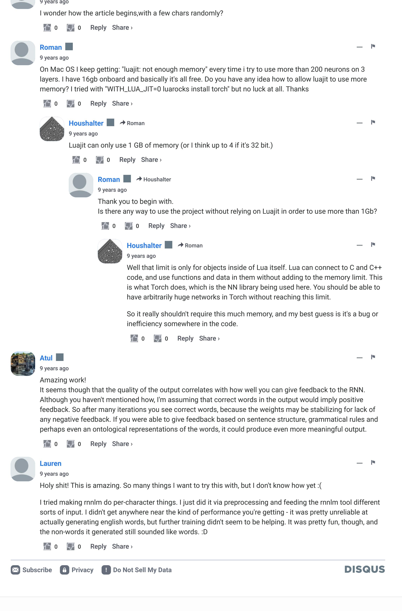

The Unreasonable Effectiveness of Recurrent Neural **Networks** May 21, 2015

About

There's something magical about Recurrent Neural Networks (RNNs). I still remember when I trained my first recurrent network for Image Captioning. Within a few dozen minutes of training my first baby model (with rather arbitrarily-chosen hyperparameters) started to generate very nice looking descriptions of images that were on the edge of making sense. Sometimes the ratio of how simple your model is to the quality of the results you get out of it blows past your expectations, and this was one of those times. What made this result so shocking at the time was that the common wisdom was that RNNs were supposed to be difficult to train (with more experience

Recurrent Neural Networks **Sequences**. Depending on your background you might be wondering: What makes Recurrent Networks so

special? A glaring limitation of Vanilla Neural Networks (and also Convolutional Networks) is that their API is too

output (e.g. probabilities of different classes). Not only that: These models perform this mapping using a fixed

amount of computational steps (e.g. the number of layers in the model). The core reason that recurrent nets are

constrained: they accept a fixed-sized vector as input (e.g. an image) and produce a fixed-sized vector as

By the way, together with this post I am also releasing code on Github that allows you to train character-level

language models based on multi-layer LSTMs. You give it a large chunk of text and it will learn to generate text

like it one character at a time. You can also use it to reproduce my experiments below. But we're getting ahead

more exciting is that they allow us to operate over sequences of vectors: Sequences in the input, the output, or in the most general case both. A few examples may make this more concrete: one to many many to one many to many many to many one to one

of ourselves; What are RNNs anyway?

Each rectangle is a vector and arrows represent functions (e.g. matrix multiply). Input vectors are in red, output vectors are in blue and green vectors hold the RNN's state (more on this soon). From left to right: (1) Vanilla mode of processing without RNN,

from fixed-sized input to fixed-sized output (e.g. image classification). (2) Sequence output (e.g. image captioning takes an image and outputs a sentence of words). (3) Sequence input (e.g. sentiment analysis where a given sentence is classified as expressing positive or negative sentiment). (4) Sequence input and sequence output (e.g. Machine Translation: an RNN reads a sentence in English and then outputs a sentence in French). (5) Synced sequence input and output (e.g. video classification where we wish to label each frame of the video). Notice that in every case are no pre-specified constraints on the lengths sequences because the recurrent transformation (green) is fixed and can be applied as many times as we like. As you might expect, the sequence regime of operation is much more powerful compared to fixed networks that are doomed from the get-go by a fixed number of computational steps, and hence also much more appealing for those of us who aspire to build more intelligent systems. Moreover, as we'll see in a bit, RNNs combine the input vector with their state vector with a fixed (but learned) function to produce a new state vector. This can in programming terms be interpreted as running a fixed program with certain inputs and some internal variables. Viewed this way, RNNs essentially describe programs. In fact, it is known that RNNs are Turing-Complete in the sense that they can to simulate arbitrary programs (with proper weights). But similar to universal approximation

theorems for neural nets you shouldn't read too much into this. In fact, forget I said anything. If training vanilla neural nets is optimization over functions, training recurrent nets is optimization over programs. Sequential processing in absence of sequences. You might be thinking that having sequences as inputs or outputs could be relatively rare, but an important point to realize is that even if your inputs/outputs are fixed vectors, it is still possible to use this powerful formalism to *process* them in a sequential manner. For instance, the figure below shows results from two very nice papers from DeepMind. On the left, an algorithm learns a recurrent network policy that steers its attention around an image; In particular, it learns to read out house

numbers from left to right (Ba et al.). On the right, a recurrent network generates images of digits by learning to sequentially add color to a canvas (Gregor et al.):

Left: RNN learns to read house numbers. Right: RNN learns to paint house numbers. The takeaway is that even if your data is not in form of sequences, you can still formulate and train powerful models that learn to process it sequentially. You're learning stateful programs that process your fixed-sized

**RNN computation.** So how do these things work? At the core, RNNs have a deceptively simple API: They

accept an input vector x and give you an output vector y. However, crucially this output vector's contents

are influenced not only by the input you just fed in, but also on the entire history of inputs you've fed in in the

The RNN class has some internal state that it gets to update every time step is called. In the simplest case

this state consists of a single *hidden* vector **h**. Here is an implementation of the step function in a Vanilla RNN:

past. Written as a class, the RNN's API consists of a single step function:

y = rnn.step(x) # x is an input vector, y is the RNN's output vector

self.h = np.tanh(np.dot(self.W\_hh, self.h) + np.dot(self.W\_xh, x))

data.

rnn = RNN()

class RNN:

an LSTM.

of "hell".

def step(self, x):

# update the hidden state

# compute the output vector y = np.dot(self.W\_hy, self.h) return y The above specifies the forward pass of a vanilla RNN. This RNN's parameters are the three matrices w hh, W\_xh, W\_hy . The hidden state self.h is initialized with the zero vector. The np.tanh function implements a non-linearity that squashes the activations to the range [-1, 1]. Notice briefly how this works: There are two terms inside of the tanh: one is based on the previous hidden state and one is based on the current input. In numpy np.dot is matrix multiplication. The two intermediates interact with addition, and then get squashed by the tanh into the new state vector. If you're more comfortable with math notation, we can also write the hidden state update as  $h_t = \tanh(W_{hh}h_{t-1} + W_{xh}x_t)$ , where tanh is applied elementwise. We initialize the matrices of the RNN with random numbers and the bulk of work during training goes into finding the matrices that give rise to desirable behavior, as measured with some loss function that expresses your preference to what kinds of outputs y you'd like to see in response to your input sequences x. **Going deep**. RNNs are neural networks and everything works monotonically better (if done right) if you put on your deep learning hat and start stacking models up like pancakes. For instance, we can form a 2-layer recurrent network as follows: y1 = rnn1.step(x)y = rnn2.step(y1)

In other words we have two separate RNNs: One RNN is receiving the input vectors and the second RNN is

coming in and going out, and some gradients flowing through each module during backpropagation.

except the mathematical form for computing the update (the line self.h = ... ) gets a little more

Character-Level Language Models

receiving the output of the first RNN as its input. Except neither of these RNNs know or care - it's all just vectors

**Getting fancy**. I'd like to briefly mention that in practice most of us use a slightly different formulation than what

I presented above called a Long Short-Term Memory (LSTM) network. The LSTM is a particular type of recurrent

network that works slightly better in practice, owing to its more powerful update equation and some appealing

backpropagation dynamics. I won't go into details, but everything I've said about RNNs stays exactly the same,

complicated. From here on I will use the terms "RNN/LSTM" interchangeably but all experiments in this post use

Okay, so we have an idea about what RNNs are, why they are super exciting, and how they work. We'll now

sequence of previous characters. This will then allow us to generate new text one character at a time.

RNN on the training sequence "hello". This training sequence is in fact a source of 4 separate training

ground this in a fun application: We'll train RNN character-level language models. That is, we'll give the RNN a

huge chunk of text and ask it to model the probability distribution of the next character in the sequence given a

As a working example, suppose we only had a vocabulary of four possible letters "helo", and wanted to train an

examples: 1. The probability of "e" should be likely given the context of "h", 2. "I" should be likely in the context

of "he", 3. "I" should also be likely given the context of "hel", and finally 4. "o" should be likely given the context

Concretely, we will encode each character into a vector using 1-of-k encoding (i.e. all zero except for a single one at the index of the character in the vocabulary), and feed them into the RNN one at a time with the step function. We will then observe a sequence of 4-dimensional output vectors (one dimension per character), which we interpret as the confidence the RNN currently assigns to each character coming next in the sequence. Here's a diagram: " " "o" "e" 66 37 target chars: 1.0 0.2 0.5 0.1 2.2 -1.5 0.5 0.3 output layer -3.01.9 -0.1-1.0 1.2 2.2 4.1 -1.1

1.0

0.3

0.1

0

0

0

An example RNN with 4-dimensional input and output layers, and a hidden layer of 3 units (neurons). This diagram shows the

activations in the forward pass when the RNN is fed the characters "hell" as input. The output layer contains confidences the

RNN assigns for the next character (vocabulary is "h,e,l,o"); We want the green numbers to be high and red numbers to be low.

For example, we see that in the first time step when the RNN saw the character "h" it assigned confidence of

1.0 to the next letter being "h", 2.2 to letter "e", -3.0 to "l", and 4.1 to "o". Since in our training data (the string

"hello") the next correct character is "e", we would like to increase its confidence (green) and decrease the

confidence of all other letters (red). Similarly, we have a desired target character at every one of the 4 time

differentiable operations we can run the backpropagation algorithm (this is just a recursive application of the

scores of the correct targets (green bold numbers). We can then perform a parameter update, which nudges

parameter update we would find that the scores of the correct characters (e.g. "e" in the first time step) would

be slightly higher (e.g. 2.3 instead of 2.2), and the scores of incorrect characters would be slightly lower. We

A more technical explanation is that we use the standard Softmax classifier (also commonly referred to as the

Notice also that the first time the character "I" is input, the target is "I", but the second time the target is "o". The

RNN therefore cannot rely on the input alone and must use its recurrent connection to keep track of the context

At **test time**, we feed a character into the RNN and get a distribution over what characters are likely to come

next. We sample from this distribution, and feed it right back in to get the next letter. Repeat this process and

Python/numpy. It is only about 100 lines long and hopefully it gives a concise, concrete and useful summary of

To further clarify, for educational purposes I also wrote a minimal character-level RNN language model in

the above if you're better at reading code than text. We'll now dive into example results, produced with the

All 5 example character models below were trained with the code I'm releasing on Github. The input in each

case is a single file with some text, and we're training an RNN to predict the next character in the sequence.

Lets first try a small dataset of English as a sanity check. My favorite fun dataset is the concatenation of Paul

you're sampling text! Lets now train an RNN on different datasets and see what happens.

cross-entropy loss) on every output vector simultaneously. The RNN is trained with mini-batch Stochastic

Gradient Descent and I like to use RMSProp or Adam (per-parameter adaptive learning rate methods) to

then repeat this process over and over many times until the network converges and its predictions are

eventually consistent with the training data in that correct characters are always predicted next.

every weight a tiny amount in this gradient direction. If we were to feed the same inputs to the RNN after the

chain rule from calculus) to figure out in what direction we should adjust every one of its weights to increase the

steps that we'd like the network to assign a greater confidence to. Since the RNN consists entirely of

0.1

-0.5

-0.3

0

0

1 0

0.3

-0.1

0.9

0

0

0

hidden layer

input layer

input chars:

stablilize the updates.

to achieve this task.

much more efficient Lua/Torch codebase.

Fun with RNNs

Paul Graham generator

link to 50K character sample if you'd like to see more.

looks like we've reached an infinite loop about startups.

Graham might say:

Shakespeare

PANDARUS:

I should not sleep.

Second Senator:

**DUKE VINCENTIO:** 

Second Lord:

Clown:

VIOLA:

I'll drink it.

W\_hy

W\_xh

-0.3

0.9

0.7

0 0

1

0

"["

Graham's essays. The basic idea is that there's a lot of wisdom in these essays, but unfortunately Paul Graham is a relatively slow generator. Wouldn't it be great if we could sample startup wisdom on demand? That's where an RNN comes in. Concatenating all pg essays over the last ~5 years we get approximately 1MB text file, or about 1 million characters (this is considered a very small dataset by the way). Technical: Lets train a 2-layer LSTM with 512 hidden nodes (approx. 3.5 million parameters), and with dropout of 0.5 after each layer. We'll train with batches of 100 examples and truncated backpropagation through time of length 100 characters. With these settings one batch on a TITAN Z GPU takes about 0.46 seconds (this can be cut in half with 50 character BPTT at negligible cost in performance). Without further ado, lets see a sample from the RNN: "The surprised in investors weren't going to raise money. I'm not the company with the time there are all interesting quickly, don't have to get off the same programmers. There's a super-angel round fundraising, why do you can do. If you have a different physical investment are become in people who reduced in a startup with the way to argument the acquirer could see them just that you're also the founders will part of users' affords that and an alternation to the idea. [2] Don't work at first member to see the way kids will seem in advance of a bad successful startup. And if you have to act the big company too." Okay, clearly the above is unfortunately not going to replace Paul Graham anytime soon, but remember that the RNN had to learn English completely from scratch and with a small dataset (including where you put commas,

apostrophes and spaces). I also like that it learns to support its own arguments (e.g. [2], above). Sometimes it

says something that offers a glimmer of insight, such as "a company is a meeting to think to investors". Here's a

temperature from 1 to some lower number (e.g. 0.5) makes the RNN more confident, but also more conservative

spelling mistakes, etc). In particular, setting temperature very near zero will give the most likely thing that Paul

"is that they were all the same thing that was a startup is that they were all the same thing that was a startup is

It looks like we can learn to spell English words. But how about if there is more structure and style in the data?

To examine this I downloaded all the works of Shakespeare and concatenated them into a single (4.4MB) file.

We can now afford to train a larger network, in this case lets try a 3-layer RNN with 512 hidden nodes on each

**Temperature.** We can also play with the temperature of the Softmax during sampling. Decreasing the

that they were all the same thing that was a startup is that they were all the same"

layer. After we train the network for a few hours we obtain samples such as:

When little srain would be attain'd into being never fed,

Alas, I think he shall be come approached and the day

And who is but a chain and subjects of his death,

They are away this miseries, produced upon my soul,

Well, your wit is in the care of side and that.

my fair nues begun out of the fact, to be conveyed,

Whose noble souls I'll have the heart of the wars.

Come, sir, I will make did behold your worship.

My power to give thee but so much as hell:

O, if you were a feeble sight, the courtesy of your law,

With his heads, and my hands are wonder'd at the deeds,

Your sight and several breath, will wear the gods

So drop upon your lordship's head, and your opinion

Some service in the noble bondman here,

Would show him to her wine.

Shall be against your honour.

different temperatures with the provided code.

KING LEAR:

Wikipedia

some basic markdown output:

''www.e-complete''.

\*[[Iender dome of the ED]]

===[[Religion|Religion]]===

<title>Antichrist</title>

<id>15900676</id>

<contributor>

<id>23</id>

</contributor>

<minor />

</revision>

interested to see more.

*Proof.* Proof of (1). It also start we get

In particular  $\mathcal{F} = U/\mathcal{F}$  we have to show that

inverse, the groupoid scheme S.

*Proof.* See discussion of sheaves of sets.

and

is a unique morphism of algebraic stacks. Note that

Algebraic Geometry (Latex)

For  $\bigoplus_{n=1,\ldots,m}$  where  $\mathcal{L}_{m_{\bullet}}=0$ , hence we can find a closed subset  $\mathcal{H}$  in  $\mathcal{H}$  and

any sets  $\mathcal{F}$  on X, U is a closed immersion of S, then  $U \to T$  is a separated algebraic

 $S = \operatorname{Spec}(R) = U \times_X U \times_X U$ 

and the comparicoly in the fibre product covering we have to prove the lemma

generated by  $\coprod Z \times_U U \to V$ . Consider the maps M along the set of points

 $Sch_{fppf}$  and  $U \to U$  is the fibre category of S in U in Section, ?? and the fact that

any U affine, see Morphisms, Lemma ??. Hence we obtain a scheme S and any

 $U = \bigcup U_i \times_{S_i} U_i$ which has a nonzero morphism we may assume that  $f_i$  is of finite presentation over

S. We claim that  $\mathcal{O}_{X,x}$  is a scheme where  $x, x', s'' \in S'$  such that  $\mathcal{O}_{X,x'} \to \mathcal{O}'_{X',x'}$  is

separated. By Algebra, Lemma ?? we can define a map of complexes  $GL_{S'}(x'/S'')$ 

To prove study we see that  $\mathcal{F}|_U$  is a covering of  $\mathcal{X}'$ , and  $\mathcal{T}_i$  is an object of  $\mathcal{F}_{X/S}$  for i > 0 and  $\mathcal{F}_p$  exists and let  $\mathcal{F}_i$  be a presheaf of  $\mathcal{O}_X$ -modules on  $\mathcal{C}$  as a  $\mathcal{F}$ -module.

 $M^{\bullet} = \mathcal{I}^{\bullet} \otimes_{\operatorname{Spec}(k)} \mathcal{O}_{S,s} - i_X^{-1} \mathcal{F})$ 

Arrows =  $(Sch/S)_{fppf}^{opp}$ ,  $(Sch/S)_{fppf}$ 

 $V = \Gamma(S, \mathcal{O}) \longmapsto (U, \operatorname{Spec}(A))$ 

is an open subset of X. Thus U is affine. This is a continuous map of X is the

The result for prove any open covering follows from the less of Example ??. It may replace S by  $X_{spaces, \acute{e}tale}$  which gives an open subspace of X and T equal to  $S_{Zar}$ , see Descent, Lemma  $\ref{Lemma}$ . Namely, by Lemma  $\ref{Lemma}$  we see that R is geometrically

instance, here is a raw sample from the model (unedited):

\begin{proof}

\begin{enumerate}

\begin{enumerate}

Linux Source Code

\end{lemma}

open subset  $W \subset U$  in Sh(G) such that  $Spec(R') \to S$  is smooth or an

</page>

== See also ==

\*[[Maria]]

<page>

\*[[Revelation]]

\*[[Mount Agamul]]

== External links==

==External links==

<id>865</id>

<revision>

\*[[Anti-autism]]

\*[[French Writings]]

They would be ruled after this chamber, and

The earth and thoughts of many states.

Breaking and strongly should be buried, when I perish

in its samples. Conversely, higher temperatures will give more diversity but at cost of more mistakes (e.g.

VIOLA: Why, Salisbury must find his flesh and thought That which I am not aps, not a man and in fire, To show the reining of the raven and the wars To grace my hand reproach within, and not a fair are hand, That Caesar and my goodly father's world; When I was heaven of presence and our fleets, We spare with hours, but cut thy council I am great, Murdered and by thy master's ready there

I can barely recognize these samples from actual Shakespeare:) If you like Shakespeare, you might appreciate

We saw that the LSTM can learn to spell words and copy general syntactic structures. Lets further increase the

Wikipedia and train an LSTM. Following Graves et al., I used the first 96MB for training, the rest for validation

and ran a few models overnight. We can now sample Wikipedia articles! Below are a few fun excerpts. First,

Naturalism and decision for the majority of Arab countries' capitalide was grounded

by the Irish language by [[John Clair]], [[An Imperial Japanese Revolt]], associated

with Guangzham's sovereignty. His generals were the powerful ruler of the Portugal

in the [[Protestant Immineners]], which could be said to be directly in Cantonese

Communication, which followed a ceremony and set inspired prison, training. The

in western [[Scotland]], near Italy to the conquest of India with the conflict.

was a famous German movement based on a more popular servicious, non-doctrinal

and sexual power post. Many governments recognize the military housing of the

that is sympathetic to be to the [[Punjab Resolution]]

was starting to signing a major tripad of aid exile.]]

'''See also''': [[List of ethical consent processing]]

Sometimes the model snaps into a mode of generating random but valid XML:

<timestamp>2002-08-03T18:14:12Z</timestamp>

<comment>Automated conversion</comment>

<text xml:space="preserve">#REDIRECT [[Christianity]]</text>

The model completely makes up the timestamp, id, and so on. Also, note that it closes the correct tags

appropriately and in the correct nested order. Here are 100,000 characters of sampled wikipedia if you're

The results above suggest that the model is actually quite good at learning complex syntactic structures.

step in and fix a few issues manually but then you get plausible looking math, it's quite astonishing:

Impressed by these results, my labmate (Justin Johnson) and I decided to push even further into structured

territories and got a hold of this book on algebraic stacks/geometry. We downloaded the raw Latex source file

(a 16MB file) and trained a multilayer LSTM. Amazingly, the resulting sampled Latex almost compiles. We had to

**Lemma 0.1.** Assume (3) and (3) by the construction in the description.

Spec(B) over U compatible with the complex

S at the schemes  $X_i \to X$  and  $U = \lim_i X_i$ .

other hand, by Lemma ?? we see that

Suppose  $X = \lim |X|$  (by the formal open covering X and a single map  $Proj_{Y}(A) =$ 

 $Set(A) = \Gamma(X, \mathcal{O}_{X, \mathcal{O}_X}).$ 

When in this case of to show that  $Q \to C_{Z/X}$  is stable under the following result

in the second conditions of (1), and (3). This finishes the proof. By Definition ??

(without element is when the closed subschemes are catenary. If T is surjective we

may assume that T is connected with residue fields of S. Moreover there exists a

closed subspace  $Z \subset X$  of X where U in X' is proper (some defining as a closed

*Proof.* This is form all sheaves of sheaves on X. But given a scheme U and a

surjective étale morphism  $U \to X$ . Let  $U \cap U = \coprod_{i=1,\dots,n} U_i$  be the scheme X over

The following lemma surjective restrocomposes of this implies that  $\mathcal{F}_{x_0} = \mathcal{F}_{x_0} =$ 

**Lemma 0.2.** Let X be a locally Noetherian scheme over S,  $E = \mathcal{F}_{X/S}$ . Set  $\mathcal{I} =$ 

*Proof.* We will use the property we see that p is the mext functor (??). On the

 $D(\mathcal{O}_{X'}) = \mathcal{O}_X(D)$ 

 $\mathcal{J}_1 \subset \mathcal{I}'_n$ . Since  $\mathcal{I}^n \subset \mathcal{I}^n$  are nonzero over  $i_0 \leq \mathfrak{p}$  is a subset of  $\mathcal{J}_{n,0} \circ \overline{A}_2$  works.

**Lemma 0.3.** In Situation ??. Hence we may assume q' = 0.

where K is an F-algebra where  $\delta_{n+1}$  is a scheme over S.

subset of the uniqueness it suffices to check the fact that the following theorem (1) f is locally of finite type. Since  $S = \operatorname{Spec}(R)$  and  $Y = \operatorname{Spec}(R)$ .

<username>Paris</username>

was swear to advance to the resources for those Socialism's rule,

markdown that the model learns, for example sometimes it creates headings, lists, etc.:

(PJS)[http://www.humah.yahoo.com/guardian.

[[Civil Liberalization and Infantry Resolution 265 National Party in Hungary]],

cfm/7754800786d17551963s89.htm Official economics Adjoint for the Nazism, Montgomery

In case you were wondering, the yahoo url above doesn't actually exist, the model just hallucinated it. Also, note

\* [http://www.biblegateway.nih.gov/entrepre/ Website of the World Festival. The labour

\* [http://www.romanology.com/ Constitution of the Netherlands and Hispanic Competition :

that the model learns to open and close the parenthesis correctly. There's also quite a lot of structured

{ { cite journal | id=Cerling Nonforest Department|format=Newlymeslated|none } }

emperor travelled back to [[Antioch, Perth, October 25|21]] to note, the Kingdom

of Costa Rica, unsuccessful fashioned the [[Thrales]], [[Cynth's Dajoard]], known

Copyright was the succession of independence in the slop of Syrian influence that

difficulty and train on structured markdown. In particular, lets take the Hutter Prize 100MB dataset of raw

this 100,000 character sample. Of course, you can also generate an infinite amount of your own samples at

Remember, all the RNN knows are characters, so in particular it samples both speaker's names and the

contents. Sometimes we also get relatively extented monologue passages, such as:

Here's another sample: Proof. Omitted. **Lemma 0.1.** Let C be a set of the construction. Let C be a gerber covering. Let F be a quasi-coherent sheaves of O-modules. We have to show that  $\mathcal{O}_{\mathcal{O}_X} = \mathcal{O}_X(\mathcal{L})$ Proof. This is an algebraic space with the composition of sheaves  $\mathcal{F}$  on  $X_{\acute{e}tale}$  we have  $\mathcal{O}_X(\mathcal{F}) = \{morph_1 \times_{\mathcal{O}_X} (\mathcal{G}, \mathcal{F})\}\$ where G defines an isomorphism  $F \to F$  of O-modules. 

This since  $\mathcal{F} \in \mathcal{F}$  and  $x \in \mathcal{G}$  the diagram **Lemma 0.2.** This is an integer Z is injective.  $Mor_{Sets}$   $d(\mathcal{O}_{\mathcal{X}_{X/k}}, \mathcal{G})$  $\operatorname{Spec}(K_{\psi})$ Proof. See Spaces, Lemma ??. is a limit. Then G is a finite type and assume S is a flat and F and G is a finite **Lemma 0.3.** Let S be a scheme. Let X be a scheme and X is an affine open type  $f_*$ . This is of finite type diagrams, and covering. Let  $\mathcal{U} \subset \mathcal{X}$  be a canonical and locally of finite type. Let X be a scheme. the composition of G is a regular sequence, O<sub>X'</sub> is a sheaf of rings. Let X be a scheme which is equal to the formal complex. The following to the construction of the lemma follows. Proof. We have see that  $X = \operatorname{Spec}(R)$  and  $\mathcal{F}$  is a finite type representable by Let X be a scheme. Let X be a scheme covering. Let algebraic space. The property  $\mathcal{F}$  is a finite morphism of algebraic stacks. Then the cohomology of X is an open neighbourhood of U.  $b: X \to Y' \to Y \to Y \to Y' \times_X Y \to X.$ *Proof.* This is clear that G is a finite presentation, see Lemmas ??. be a morphism of algebraic spaces over S and Y. A reduced above we conclude that U is an open covering of C. The functor F is a  $\mathcal{O}_{X,x} \longrightarrow \mathcal{F}_{\overline{x}} -1(\mathcal{O}_{X_{\ell tale}}) \longrightarrow \mathcal{O}_{X_{\ell}}^{-1}\mathcal{O}_{X_{\lambda}}(\mathcal{O}_{X_{\eta}}^{\overline{v}})$ *Proof.* Let X be a nonzero scheme of X. Let X be an algebraic space. Let  $\mathcal{F}$  be a is an isomorphism of covering of  $\mathcal{O}_{X_i}$ . If  $\mathcal{F}$  is the unique element of  $\mathcal{F}$  such that Xquasi-coherent sheaf of  $\mathcal{O}_X$ -modules. The following are equivalent is an isomorphism. F is an algebraic space over S. The property  $\mathcal{F}$  is a disjoint union of Proposition ?? and we can filtered set of (2) If X is an affine open covering. presentations of a scheme  $O_X$ -algebra with F are opens of finite type over S. If  $\mathcal{F}$  is a scheme theoretic image points. Consider a common structure on X and X the functor  $O_X(U)$  which is locally of If  $\mathcal{F}$  is a finite direct sum  $\mathcal{O}_{X_{\lambda}}$  is a closed immersion, see Lemma ??. This is a finite type. sequence of  $\mathcal{F}$  is a similar morphism. More hallucinated algebraic geometry. Nice try on the diagram (right).

As you can see above, sometimes the model tries to generate latex diagrams, but clearly it hasn't really figured

them out. I also like the part where it chooses to skip a proof ("Proof omitted.", top left). Of course, keep in mind

that latex has a relatively difficult structured syntactic format that I haven't even fully mastered myself. For

We may assume that  $\mathcal{L}^{\}$  is an abelian sheaf on  $\mathcal{C}^{\}$ .

Let \$\mathcal{F}\$ be a fibered complex. Let \$\mathcal{F}\$ be a category.

Let \$\mathcal{F}\$ be an abelian quasi-coherent sheaf on \$\mathcal{C}\$.

\item Given a morphism \$\Delta : \mathcal{F} \to \mathcal{I}\$

Let \$\mathcal{F}\$ be a coherent \$\mathcal{O}\_X\$-module. Then

\$\mathcal{F}\$ is an abelian catenary over \$\mathcal{C}\$.

\item \hyperref[setain-construction-phantom]{Lemma}

\item \$\mathcal{F}\$ is an \$\mathcal{O}\_X\$-module.

\label{lemma-characterize-quasi-finite}

\item The following are equivalent

is an injective and let \$\mathfrak q\$ be an abelian sheaf on \$X\$.

Sampled (fake) algebraic geometry. Here's the actual pdf.

I wanted to push structured data to its limit, so for the final challenge I decided to use code. In particular, I took all the source and header files found in the Linux repo on Github, concatenated all of them in a single giant file (474MB of C code) (I was originally going to train only on the kernel but that by itself is only ~16MB). Then I trained several as-large-as-fits-on-my-GPU 3-layer LSTMs over a period of a few days. These models have about 10 million parameters, which is still on the lower end for RNN models. The results are superfun: /\* \* Increment the size file of the new incorrect UI FILTER group information \* of the size generatively. static int indicate\_policy(void) int error; if (fd == MARN EPT) {

This sample from a relatively decent model illustrates a few common mistakes. For example, the model opens a

\begin{proof} environment but then ends it with a \end{lemma}. This is an example of a problem we'd

done with the proof it has forgotten whether it was doing a proof or a lemma. Similarly, it opens an

larger/better models, but nonetheless, these are the kinds of mistakes that come up.

\* The kernel blank will coeld it to userspace.

if (ss->segment < mem total)</pre>

else

}

RNN learns:

ret = 1;

goto bail;

unblock graph and set blocked();

\begin{enumerate} but then forgets to close it. We observed that these became less common with

have to fix manually, and is likely due to the fact that the dependency is too long-term: By the time the model is

segaddr = in\_SB(in.addr); selector = sea / 16: 

The code looks really quite great overall. Of course, I don't think it compiles but when you scroll through the

comments here and there at random. It is also very good at making very few syntactic errors. For example, it

uses strings properly, pointer notation, etc. It also opens and closes brackets {[ correctly and learns to indent

variables. Lets see a few more examples. Here's another snippet that shows a wider array of operations that the

generate code it feels very much like a giant C code base. Notice that the RNN peppers its code with

its code very well. A common error is that it can't keep track of variable names: It often uses undefined

variables (e.g. rw above), declares variables it never uses (e.g. int error), or returns non-existing

Notice that in the second function the model compares tty == tty, which is vacuously true. On the other hand, at least the variable tty exists in the scope this time! In the last function, notice that the code does not

return anything, which happens to be correct since the function signature is void. However, the first two functions were also declared void and did return values. This is again a form of a common mistake due to

long-term interactions. Sometimes the model decides that it's time to sample a new file. This is usually a very amusing part: The model first recites the GNU license character by character, samples a few includes, generates some macros and then dives into the code:

I've in fact reached the opposite conclusion). Fast forward about a year: I'm training RNNs all the time and I've witnessed their power and robustness many times, and yet their magical outputs still find ways of amusing me. This post is about sharing some of that magic with you. We'll train RNNs to generate text character by character and ponder the question "how is that even possible?"

```
#include <linux/platform device.h>
  #include <linux/multi.h>
  #include <linux/ckevent.h>
  #include <asm/io.h>
  #include <asm/prom.h>
  #include <asm/e820.h>
  #include <asm/system info.h>
  #include <asm/setew.h>
  #include <asm/pgproto.h>
  #define REG PG vesa slot addr pack
  #define PFM NOCOMP AFSR(0, load)
  #define STACK_DDR(type)
                              (func)
  #define SWAP_ALLOCATE(nr)
  #define emulate_sigs() arch_get_unaligned_child()
 #define access_rw(TST) asm volatile("movd %%esp, %0, %3" : : "r" (0));
    if ( type & DO READ)
 static void stat_PC_SEC __read_mostly offsetof(struct seq_argsqueue, \
             pC>[1]);
  static void
  os prefix(unsigned long sys)
  {
  #ifdef CONFIG PREEMPT
    PUT PARAM RAID(2, sel) = get state state();
    set_pid_sum((unsigned long)state, current_state_str(),
               (unsigned long)-1->lr full; low;
  }
There are too many fun parts to cover- I could probably write an entire blog post on just this part. I'll cut it short
for now, but here is 1MB of sampled Linux code for your viewing pleasure.
Generating Baby Names
Lets try one more for fun. Lets feed the RNN a large text file that contains 8000 baby names listed out, one per
line (names obtained from here). We can feed this to the RNN and then generate new names! Here are some
example names, only showing the ones that do not occur in the training data (90% don't):
Rudi Levette Berice Lussa Hany Mareanne Chrestina Carissy Marylen Hammine Janye Marlise Jacacrie
Hendred Romand Charienna Nenotto Ette Dorane Wallen Marly Darine Salina Elvyn Ersia Maralena Minoria Ellia
Charmin Antley Nerille Chelon Walmor Evena Jeryly Stachon Charisa Allisa Anatha Cathanie Geetra Alexie Jerin
Cassen Herbett Cossie Velen Daurenge Robester Shermond Terisa Licia Roselen Ferine Jayn Lusine
Charyanne Sales Sanny Resa Wallon Martine Merus Jelen Candica Wallin Tel Rachene Tarine Ozila Ketia
Shanne Arnande Karella Roselina Alessia Chasty Deland Berther Geamar Jackein Mellisand Sagdy Nenc
Lessie Rasemy Guen Gavi Milea Anneda Margoris Janin Rodelin Zeanna Elyne Janah Ferzina Susta Pey
Castina
You can see many more here. Some of my favorites include "Baby" (haha), "Killie", "Char", "R", "More", "Mars",
"Hi", "Saddie", "With" and "Ahbort". Well that was fun. Of course, you can imagine this being quite useful
inspiration when writing a novel, or naming a new startup:)
Understanding what's going on
We saw that the results at the end of training can be impressive, but how does any of this work? Lets run two
quick experiments to briefly peek under the hood.
The evolution of samples while training
First, it's fun to look at how the sampled text evolves while the model trains. For example, I trained an LSTM of
Leo Tolstoy's War and Peace and then generated samples every 100 iterations of training. At iteration 100 the
model samples random jumbles:
  tyntd-iafhatawiaoihrdemot lytdws e ,tfti, astai f ogoh eoase rrranbyne 'nhthnee e
  plia tklrgd t o idoe ns, smtt
                                       h ne etie h, hregtrs nigtike, aoaenns lng
However, notice that at least it is starting to get an idea about words separated by spaces. Except sometimes it
inserts two spaces. It also doesn't know that comma is amost always followed by a space. At 300 iterations we
see that the model starts to get an idea about quotes and periods:
  "Tmont thithey" fomesscerliund
  Keushey. Thom here
  sheulke, anmerenith ol sivh I lalterthend Bleipile shuwy fil on aseterlome
 coaniogennc Phe lism thond hon at. MeiDimorotion in ther thize."
The words are now also separated with spaces and the model starts to get the idea about periods at the end of
a sentence. At iteration 500:
  we counter. He stutn co des. His stanted out one ofler that concossions and was
  to gearang reay Jotrets and with fre colt otf paitt thin wall. Which das stimn
the model has now learned to spell the shortest and most common words such as "we", "He", "His", "Which",
"and", etc. At iteration 700 we're starting to see more and more English-like text emerge:
 Aftair fall unsuch that the hall for Prince Velzonski's that me of
 her hearly, and behs to so arwage fiving were to it beloge, pavu say falling misfort
  how, and Gogition is so overelical and ofter.
At iteration 1200 we're now seeing use of quotations and question/exclamation marks. Longer words have now
been learned as well:
  "Kite vouch!" he repeated by her
  door. "But I would be done and quarts, feeling, then, son is people...."
Until at last we start to get properly spelled words, quotations, names, and so on by about iteration 2000:
  "Why do what that day," replied Natasha, and wishing to himself the fact the
  princess, Princess Mary was easier, fed in had oftened him.
  Pierre aking his soul came to the packs and drove up his father-in-law women.
The picture that emerges is that the model first discovers the general word-space structure and then rapidly
starts to learn the words; First starting with the short words and then eventually the longer ones. Topics and
themes that span multiple words (and in general longer-term dependencies) start to emerge only much later.
Visualizing the predictions and the "neuron" firings in the RNN
Another fun visualization is to look at the predicted distributions over characters. In the visualizations below we
feed a Wikipedia RNN model character data from the validation set (shown along the blue/green rows) and
under every character we visualize (in red) the top 5 guesses that the model assigns for the next character. The
guesses are colored by their probability (so dark red = judged as very likely, white = not very likely). For
example, notice that there are stretches of characters where the model is extremely confident about the next
letter (e.g., the model is very confident about characters during the http://www. sequence).
The input character sequence (blue/green) is colored based on the firing of a randomly chosen neuron in the
hidden representation of the RNN. Think about it as green = very excited and blue = not very excited (for those
familiar with details of LSTMs, these are values between [-1,1] in the hidden state vector, which is just the gated
and tanh'd LSTM cell state). Intuitively, this is visualizing the firing rate of some neuron in the "brain" of the RNN
while it reads the input sequence. Different neurons might be looking for different patterns; Below we'll look at 4
different ones that I found and thought were interesting or interpretable (many also aren't):
 ttp://www.ynetnews.com/] English-language website
  p://www.bacahets.com/ - xglish linguagesairsite of tslaelid:xne.waea..awatoa.s &ntiaca-sardeelh oan tbisanfanreif
mw-2 piiisoessis./ern.c] (dceen epesaaiki ieeledh,irthraonse
d r . < : a h b - n p t w t . x i g h / m a ) T v d r y z i c o u e d l s u : t h a - o o
                                                                                t u, stuif
stp,tcoa2drulwoclensr]p.llvaod,,eytc-n dm-oibuvs]bb i msulta tlybn
        newspaper '' [[Yedioth Ahronoth]]''' 'Hebrew-language period
                                   t i (feanemti]
              e n a li T T h A o a i n n h S r m u w ] e y s
                                                                  [ ' i n e i a ' s i w d d e ' h s o l r i f r :
u s . . s e t l g o r s . a s a t C a r e e g ' a C l r i s z ] i e ' : :
                                                               , # : T A a a a a t
                                                                                Baseeilo'ianfvl
       t u a e v r t i d , t B A m S u s y u t ] ] A s a o i g s ] ] , .
                                                              . : s M B o I o u s : T o u a - n : d
 a, d, i i u i t i c p. ] ( I S v H v t u s u i e D n o e g a n o . , ] : { C C u i b o h e C y b k s I s : r - e p c n t s
i c a l s : ' ' ' * ' ' [ [ G l o b e s ] ] ' ' [ h t t p : / / www.globes.co.il/
                                                      www.buobal.comun/sA
                                   s aha d : x g e . w a o i r . r t o a . e I . i T
s t l '
                  [ h A e o v e l t
               & [ & & m C o e r o n e ' : :
                                        , i ' o d w . , : n i i i s a a u e . e n i / o m l c C . ( e f t g i r
                                         o m e l p < , d h a ; d e u o o t / i h n c s i f S , u r h o s t ,
 a ' n : , C : & : # * : a f D r u s u ] I
                                       : bacmr-xtpob-gresislerInafaD]Iosptad, ifrm
        | < ] : & 1 1 s                              
i | y                                  
          [ Terrdn Ferantah] ] '' ( [ ttp://www.bonmdst.comun/s
      ' h A i l n n t t e H a l s r c n o l ' s a h a d : x n e . waamr t d h e o h . o l . c
ki.: * s C O S a n I t h i T i m' I i ] e
                                         : , i m c d w - 2 🏵 p h i i s e r d i t . i n a / c m f i . ( a f l c a n a
                                 a a e , : .
                                               baerr. < taib-dulcnnc/arnesi ] liceysto
d s - ! [ t B T C o m m g d ] ] W o n
n d s # & : G I D u v c c s a o S u c I t e I ] z I ,                              
The neuron highlighted in this image seems to get very excited about URLs and turns off outside of the URLs. The LSTM is likely
                              using this neuron to remember if it is inside a URL or not.
      [ [ Jerusalem Report ] ] ' ' [ http://www.jrep.com/] Left-of-center En
                                                                             - i a t
                                         ( h t t p : / / w w w . b s i n i o o m /
     [hToausal maogurt]
 [ ' [ Cassmene ] Beaonds sa[ad:xne.waaaaoca.s&ato--nfhhlsum-ouc
   s m F u r n I s i a e t a I I s a ' : : , i ' c d w - 2 t p i i i s o e g . e r / . a ] ( o s e s w r - c i d d r s [ m t
  * : A q D e n e b i u t n | C i p r e e | ,
                                      . b 1 e m r . 9 : a h b - n p u m u g h n m p ) T e i r e t u : e o s e o d s a l d
# T & T f S i w r p e ] ] a l u v e l r u , s : - m p r t s < 🏵 m o a 2 d e y s h i l r ] c . A u g l , 1 p , l a r c
g l i s h [ [ week l y newspaper ] ] * ' ' [ [ Y Net News ] ] ' ' [ http://www.ynetnews.c
I i s h c [ C a a k l y ] c a w s p a p e r ] ] * ' [ h T a A a t g ] ' ' ( h t t p : / / w w w . b a c a h e t s . c o i a c i - I h S o i p ] i s e c ] e n p ] s . ' ' [ C o * w e s s ] s a [ a d : x n e . w a e a . . a w a t o a
e e n a , p C c i e t n e d l o x ] g i c i | | s ' [ s A m F e S a h o n ] t ' : : , i m o m w - 2  p i i i s o e s s i s . / e r s y z . s f p e n n a | r u e l | r r a . ' # * : o D u F r e i u e p , : b 1 e d r . < : a h b - n p t w t . x i g h a d p e a m A r b d e o r p i t e e ] d t s - | T { [ B a A v T p o S w a o , . . o a c s t p , t c o a 2 d r u l w o c l e n s
 om/] English-language website of Israel's largest newspaper '' [[Yed
                   I i nguagesairsite of tslaelis
      & n t i a c a - s a r d e e l h o a n t b i s a n f a n r e i f ' a a t d i r s c o e
n . c ] ( d c e e n e p e s a a i k i i e e l e d h , i r t h r a o n s e , c o s e u s . . s e t l g o r s . a s a t C a r e
/ ma) Tvdryzi couedlsu: tha-oo tu, stuif lvepery - tuaevrtid, tBAmSusy
r ] p . I I v a o d , , e y t c - n d m - o i b u v s ] b b i m s u I t a t I y b n a , d , i i u i t i c p . ] ( I S v H v t u
 i ot h Ahronot h] ] ' ' ' Hebrew-language periodicals: ' ' ' * ' ' [ [ G l obes ] ] '
                               [ e r r e w s l e n g u a g e : a r o s o d i c a l
     i (feanemti
                       s [ ' i n e i a ' s i w d d e ' h s o l r i f r : s t l '
n n h Sr m u w] e y
                         , # : T A a a a a t B a s e e i I o ' i a n f v I t t ' '
e g ' a C I r i s z ] i e ' : :
                                                                                 ' & [ & & m C o e r o n e '
                           : s M B o I o u s : T o u a - n : d woa p n u a ' n : , C : & : # * : a f D r u s u ] I
u t ] ] A s a o i g s ] ] ,
                      , ] : {                                 
s u i e D n o e g a n o
The highlighted neuron here gets very excited when the RNN is inside the [[ ]] markdown environment and turns off outside of it.
 Interestingly, the neuron can't turn on right after it sees the character "[", it must wait for the second "[" and then activate. This
             task of counting whether the model has seen one or two "[" is likely done with a different neuron.
      [ [ Jerusalem Report ] ] ''
                                           [ h t t p : / / w w w . j r e p . c o m / ] L e f t - o f - c e n t e r
     [hToausal maogurt]
                                                                              - i a t
                                                      www.bsinioom/
    '[Cassmene]Beaonds sa[ad:xne.waaaaoca.s&ato--nfhhlsum-ouc
   s m F u r n I s i a e t a I I s a ' : : , i ' c d w - 2 t p i i i s o e g . e r / . a ] ( o s e s w r - c i d d r s [ m t
: * : A q D e n e b i u t n | C i p r e e | , .
                                         | b 1 e m r . 9 : a h b - n p u m u g h n m p ) T e i r e t u : e o s e o d s a l d
# T & T f S i w r p e ] ] a I u v e I r u , s
                                       |: |- |m|p|r|t|s|<|| m|o|a|2|d|e|y|s|h|i||r||]|c|. || A|u|g|||, |1|p|, || a|r|c|
g I i s h [ [ week I y newspaper ] ] * ' [ [ Y Net News] ] ' ' [ http://www.ynetnews.c
        c [ Caakly] cawspaper]                                    
                                                                      ( h t t p : / / w w w . b a c a h e t s
i a c i - I h S o i p ] i s e c ] e n p ] s . ' ' [ C o * w e s s ] s a [ a d : x n e . w a e a . . a w a t o a
                                       s' [ s A m F e S a h o n ] t ' : : , i m o m w - 2 🏵 p i i i s o e s s i s . / e r
e e n a , p C c i e t n e d l o x ] g i c i | |
syz . sfpennalruellrra
                                    . ' # * :
                                               o D u F r e i u e p ,
                                                                    : | b | 1 | e | d | r | . | < | : | a | h | b | - | n | p | t | w | t | . | x | i |
a dpeamArbdeorpitee] dts-1 T{ [BaAvTpoSwao, . . . . oacstp, tcoa2dru1woc1ens
Here we see a neuron that varies seemingly linearly across the [[]] environment. In other words its activation is giving the RNN
a time-aligned coordinate system across the [[]] scope. The RNN can use this information to make different characters more or
                       less likely depending on how early/late it is in the [[ ]] scope (perhaps?).
              Guardian]]''. *''[[IsraelInsider]]'' [http://www.israelins
                                                         h d e ] ' ' ( [ t t p : / / w w w . b m s a c l . n g .
  [ [ The Soird an ] ''
                                    ' [ T n l a e l

      a i G h A o i o Mr I t r i n ] ]
      s, * [ ' h C s i f i D a t s i ] ]
      s, a h a d : x n e . w s n o o n s i t e t

      h h B m S r o i C a n n t ] e c s , . . . . # T [ a m D m a e i t ] s ] t a n s ' : : . i ' o I . , : g i i ; a s c e . . I . . e

smTIGeuyLusInsca.,: ] = S: CTA oonfe]s]csI,, olecw-xpobigck.rtaado
meDTCaarGeadanol'': . & &: 'sTOSttull], ceollli.s]'bmpdr, <tmhd-neliefsssa
 Here is another neuron that has very local behavior: it is relatively silent but sharply turns off right after the first "w" in the "www"
 sequence. The RNN might be using this neuron to count up how far in the "www" sequence it is, so that it can know whether it
                                should emit another "w", or if it should start the URL.
Of course, a lot of these conclusions are slightly hand-wavy as the hidden state of the RNN is a huge, high-
dimensional and largely distributed representation. These visualizations were produced with custom
HTML/CSS/Javascript, you can see a sketch of what's involved here if you'd like to create something similar.
We can also condense this visualization by excluding the most likely predictions and only visualize the text,
colored by activations of a cell. We can see that in addition to a large portion of cells that do not do anything
interpretible, about 5% of them turn out to have learned quite interesting and interpretible algorithms:
Cell sensitive to position in line:
 The sole importance of the crossing of the Berezina lies in the fact
that it plainly and indubitably proved the fallacy of all the plans for cutting off the enemy's retreat and the soundness of the only possible line of action--the one Kutuzov and the general mass of the army
 demanded--namely, simply to follow the enemy up. The French crowd fled
 at a continually increasing speed and all its energy was directed to
 reaching its goal. It fled like a wounded animal and it was impossible
 to block its path. This was shown not so much by the arrangements it
 made for crossing as by what took place at the bridges. When the bridges
 broke down, unarmed soldiers, people from Moscow and women with children
 who were with the French transport, all--carried on by vis inertiae--
 pressed forward into boats and into the ice-covered water and did not,
 surrender.
Cell that turns on inside quotes:
 "You mean to imply that I have nothing to eat out of.... On the
 contrary, I can supply you with everything even if you want to give
 dinner parties," warmly replied Chichagov, who tried by every word he spoke to prove his own rectitude and therefore imagined Kutuzov to be animated by the same desire.
 Kutuzov, shrugging his shoulders, replied with his subtle penetrating
 smile: "I meant merely to say what I said."
Cell that robustly activates inside if statements:
static int __dequeue_signal(struct sigpending *pending, sigset_t *mask,
     siginfo_t *info)
  int sig = next_signal(pending, mask);
  if (sig) {
       (current->notifier) {
        (sigismember(current->notifier_mask, sig)) {
          (!(current->notifier)(current->notifier_data)) {
        clear_thread_flag(TIF_SIGPENDING);
        return 0;
     }
   collect_signal(sig, pending, info);
  return sig;
A large portion of cells are not easily interpretable. Here is a typical example:
     Unpack a filter field's string representation from user-space
 char *audit_unpack_string(void **bufp, size_t *remain, size_t len)
  char *str;
  if (!*bufp || (len == 0) || (len > *remain))
   return ERR_PTR(-EINVAL);
      Of the currently implemented string fields, PATH_MAX
   * defines the longest valid length.
   * /
   Cell that turns on inside comments and quotes:
       Duplicate LSM field information. The lsm_rule is opaque, so
       re-initialized. */
   static inline int audit_dupe_lsm_field(struct audit_field *df,
                struct audit_field *sf)
     int ret = 0;
     char *lsm_str;
      * our own copy of lsm_str */
     lsm_str = kstrdup(sf->lsm_str, GFP_KERNEL);
     if (unlikely(!lsm_str))
                 - ENOMEM;
      return
     df->lsm_str
                           lsm_str
                       refreshed) copy
                                                 o f
          = security_audit_rule_init(df->type,
                     (void **)&df->lsm_rule);
         Keep currently invalid fields around in
         become valid after a policy reload.
     if (ret == -EINVAL)
      pr_warn("audit
df->lsm_str);
                              rule for LSM \'%s\'
      ret = 0;
      eturn ret;
   Cell that is sensitive to the depth of an expression:
   #ifdef CONFIG_AUDITSYSCALL
             inline int audit_match_class_bits(int class,
     int i;
     if (classes[class])
      for (i = 0; i < AUDIT_BITMASK_SIZE; i++)
        if (mask[i] & classes[class][i])
         return 0;
     return 1;
   Cell that might be helpful in predicting a new line. Note that it only turns on for some ")":
   char *audit_unpack_string(void **bufp, size_t *remain,
       return ERR_PTR(-EINVAL);
          Of the currently implemented string
                        the longest valid length.
          (len > PATH_MAX)
       return ERR_PTR(-ENAMETOOLONG);
     str = kmalloc(len + 1, GFP_KERNEL);
     if (unlikely(!str))
      return ERR_PTR(-ENOMEM);
     memcpy(str, *bufp, len);
     str[len] = 0;
      bufp += len;
      remain -= len;
     return str;
Again, what is beautiful about this is that we didn't have to hardcode at any point that if you're trying to predict
the next character it might, for example, be useful to keep track of whether or not you are currently inside or
outside of quote. We just trained the LSTM on raw data and it decided that this is a useful quantitity to keep
track of. In other words one of its cells gradually tuned itself during training to become a quote detection cell,
since this helps it better perform the final task. This is one of the cleanest and most compelling examples of
where the power in Deep Learning models (and more generally end-to-end training) is coming from.
Source Code
I hope I've convinced you that training character-level language models is a very fun exercise. You can train
your own models using the char-rnn code I released on Github (under MIT license). It takes one large text file
and trains a character-level model that you can then sample from. Also, it helps if you have a GPU or otherwise
training on CPU will be about a factor of 10x slower. In any case, if you end up training on some data and
getting fun results let me know! And if you get lost in the Torch/Lua codebase remember that all it is is just a
more fancy version of this 100-line gist.
Brief digression. The code is written in Torch 7, which has recently become my favorite deep learning
framework. I've only started working with Torch/LUA over the last few months and it hasn't been easy (I spent a
good amount of time digging through the raw Torch code on Github and asking questions on their gitter to get
things done), but once you get a hang of things it offers a lot of flexibility and speed. I've also worked with Caffe
and Theano in the past and I believe Torch, while not perfect, gets its levels of abstraction and philosophy right
better than others. In my view the desirable features of an effective framework are:
  1. CPU/GPU transparent Tensor library with a lot of functionality (slicing, array/matrix operations, etc.)
  2. An entirely separate code base in a scripting language (ideally Python) that operates over Tensors and
     implements all Deep Learning stuff (forward/backward, computation graphs, etc)
  3. It should be possible to easily share pretrained models (Caffe does this well, others don't), and crucially
  4. NO compilation step (or at least not as currently done in Theano). The trend in Deep Learning is towards
     larger, more complex networks that are are time-unrolled in complex graphs. It is critical that these do not
     compile for a long time or development time greatly suffers. Second, by compiling one gives up
     interpretability and the ability to log/debug effectively. If there is an option to compile the graph once it has
     been developed for efficiency in prod that's fine.
Further Reading
Before the end of the post I also wanted to position RNNs in a wider context and provide a sketch of the current
research directions. RNNs have recently generated a significant amount of buzz and excitement in the field of
Deep Learning. Similar to Convolutional Networks they have been around for decades but their full potential has
only recently started to get widely recognized, in large part due to our growing computational resources. Here's
a brief sketch of a few recent developments (definitely not complete list, and a lot of this work draws from
research back to 1990s, see related work sections):
In the domain of NLP/Speech, RNNs transcribe speech to text, perform machine translation, generate
handwritten text, and of course, they have been used as powerful language models (Sutskever et al.) (Graves)
(Mikolov et al.) (both on the level of characters and words). Currently it seems that word-level models work
better than character-level models, but this is surely a temporary thing.
Computer Vision. RNNs are also quickly becoming pervasive in Computer Vision. For example, we're seeing
RNNs in frame-level video classification, image captioning (also including my own work and many others),
video captioning and very recently visual question answering. My personal favorite RNNs in Computer Vision
paper is Recurrent Models of Visual Attention, both due to its high-level direction (sequential processing of
images with glances) and the low-level modeling (REINFORCE learning rule that is a special case of policy
gradient methods in Reinforcement Learning, which allows one to train models that perform non-differentiable
computation (taking glances around the image in this case)). I'm confident that this type of hybrid model that
consists of a blend of CNN for raw perception coupled with an RNN glance policy on top will become pervasive
in perception, especially for more complex tasks that go beyond classifying some objects in plain view.
Inductive Reasoning, Memories and Attention. Another extremely exciting direction of research is oriented
towards addressing the limitations of vanilla recurrent networks. One problem is that RNNs are not inductive:
They memorize sequences extremely well, but they don't necessarily always show convincing signs of
generalizing in the correct way (I'll provide pointers in a bit that make this more concrete). A second issue is
they unnecessarily couple their representation size to the amount of computation per step. For instance, if you
double the size of the hidden state vector you'd quadruple the amount of FLOPS at each step due to the matrix
multiplication. Ideally, we'd like to maintain a huge representation/memory (e.g. containing all of Wikipedia or
many intermediate state variables), while maintaining the ability to keep computation per time step fixed.
The first convincing example of moving towards these directions was developed in DeepMind's Neural Turing
Machines paper. This paper sketched a path towards models that can perform read/write operations between
large, external memory arrays and a smaller set of memory registers (think of these as our working memory)
where the computation happens. Crucially, the NTM paper also featured very interesting memory addressing
mechanisms that were implemented with a (soft, and fully-differentiable) attention model. The concept of soft
attention has turned out to be a powerful modeling feature and was also featured in Neural Machine Translation
by Jointly Learning to Align and Translate for Machine Translation and Memory Networks for (toy) Question
Answering. In fact, I'd go as far as to say that
   The concept of attention is the most interesting recent architectural innovation in neural networks.
Now, I don't want to dive into too many details but a soft attention scheme for memory addressing is convenient
because it keeps the model fully-differentiable, but unfortunately one sacrifices efficiency because everything
that can be attended to is attended to (but softly). Think of this as declaring a pointer in C that doesn't point to a
specific address but instead defines an entire distribution over all addresses in the entire memory, and
dereferencing the pointer returns a weighted sum of the pointed content (that would be an expensive
operation!). This has motivated multiple authors to swap soft attention models for hard attention where one
samples a particular chunk of memory to attend to (e.g. a read/write action for some memory cell instead of
reading/writing from all cells to some degree). This model is significantly more philosophically appealing,
scalable and efficient, but unfortunately it is also non-differentiable. This then calls for use of techniques from
the Reinforcement Learning literature (e.g. REINFORCE) where people are perfectly used to the concept of non-
differentiable interactions. This is very much ongoing work but these hard attention models have been explored,
for example, in Inferring Algorithmic Patterns with Stack-Augmented Recurrent Nets, Reinforcement Learning
Neural Turing Machines, and Show Attend and Tell.
People. If you'd like to read up on RNNs I recommend theses from Alex Graves, Ilya Sutskever and Tomas
Mikolov. For more about REINFORCE and more generally Reinforcement Learning and policy gradient methods
(which REINFORCE is a special case of) David Silver's class, or one of Pieter Abbeel's classes.
Code. If you'd like to play with training RNNs I hear good things about keras or passage for Theano, the code
released with this post for Torch, or this gist for raw numpy code I wrote a while ago that implements an
efficient, batched LSTM forward and backward pass. You can also have a look at my numpy-based NeuralTalk
which uses an RNN/LSTM to caption images, or maybe this Caffe implementation by Jeff Donahue.
Conclusion
We've learned about RNNs, how they work, why they have become a big deal, we've trained an RNN character-
level language model on several fun datasets, and we've seen where RNNs are going. You can confidently
expect a large amount of innovation in the space of RNNs, and I believe they will become a pervasive and
critical component to intelligent systems.
Lastly, to add some meta to this post, I trained an RNN on the source file of this blog post. Unfortunately, at
about 46K characters I haven't written enough data to properly feed the RNN, but the returned sample
(generated with low temperature to get a more typical sample) is:
  I've the RNN with and works, but the computed with program of the
 RNN with and the computed of the RNN with with and the code
Yes, the post was about RNN and how well it works, so clearly this works:). See you next time!
EDIT (extra links):
Videos:

    I gave a talk on this work at the London Deep Learning meetup (video).

Discussions:

    HN discussion

    Reddit discussion on r/machinelearning

    Reddit discussion on r/programming

Replies:

    Yoav Goldberg compared these RNN results to n-gram maximum likelihood (counting) baseline

     @nylk trained char-rnn on cooking recipes. They look great!
     @MrChrisJohnson trained char-rnn on Eminem lyrics and then synthesized a rap song with robotic voice
     reading it out. Hilarious:)
     @samim trained char-rnn on Obama Speeches. They look fun!
     João Felipe trained char-rnn irish folk music and sampled music
     Bob Sturm also trained char-rnn on music in ABC notation
     RNN Bible bot by Maximilien
     Learning Holiness learning the Bible
   • Terminal.com snapshot that has char-rnn set up and ready to go in a browser-based virtual machine
     (thanks @samim)
29 Comments
                                                                                                   Login ▼
           Join the discussion...
        LOG IN WITH
                                        OR SIGN UP WITH DISQUS (?)
          D f X G 🖽
                                          Name

    Share

    34
                                                                                             Newest Oldest
        Alexander Patrakov
        9 years ago
        I wonder what happens if we teach these networks on non-text, but on compressed audio files, bit by bit, with
        specific target: low-bitrate speech codecs with fixed frame size. E.g. Codec2 already has explicit indication
        whether this is a voiced frame, and an approximation of its excitation and pitch. IOW: will it speak?
                      Reply Share
                               → Alexander Patrakov
                 8 years ago
                it would be fun to try:)
                               Reply Share
        Infinum
        9 years ago
        This approach seems to generate samples with roughly correct syntax and entropy of characters similar to that
        of the source texts but the output is totally devoid of any meaning - it is structured gibberish - just like dreams
        are.
        The article though is still an interesting one, thanks.
         3
                      Reply Share
        Houshalter
        9 years ago
        RNNs are very suboptimal for language. To learn to recognize a sequence you need to learn many seperate
        neurons, with many parameters. Each neuron learns to represent a single time step of that sequence. E.g. to
        recognize the word "cat", one neuron must keep track that the last letter was "c", another neuron must learn to
        keep track of the second to last letter being "c", and another neuron must learn that the last letter was "a", and
        so on.
        So you need a dozen neurons for each letter just to learn to mimic what a simple markov chain can do. If you
        want to do computations based on sequences of words, you need to learn tons of neurons to represent each
        word, based on how many timesteps in the past it occurred.
        Alternatively you can just feed it into a simple 1d convolutional neural network operating in the time domain,
        and the convolution naturally favors learning these kinds of relationships.
                      Reply Share
        Max Loh
        6 months ago
        Why did you delete my comment? Please don't delete this nor the article itself. Nearly 10 years later, this post
        still serves as the best showcase and historical time capsule of what was considered possible by AI experts in
        2015. It is an EXCELLENT sanity check against non-technical people in 2024 claiming that LLMs are no more
        intelligent than a calculator, which for some reason has become the new in-vogue anti-Al mantra. It is, in my
        mind, the most ironic thing, that the non-technical people are claiming that non-coders are the ones who
        believe a neural net is capable of any emergent inferences/intelligence whatsoever. Let this article be a
        reminder of what a computer is "supposed" to be capable of, before the advent of neural nets.
                      Reply Share
        allen7575
        7 years ago
        What If we drop those 95% uninterpretable cells out? Are the 95% cells
        just no function? or just for redundancy in case other cells
        malfunction?
                \mathcal{L} 0
                      Reply Share
        mattmcirvin
        9 years ago
        ...similarly, @samim's Robama figured out pretty clearly what kinds of formulae occur at the beginning and end
        of a Presidential speech, which I don't think a simple Markov sort of model would do.
                      Reply Share
        Paul Le Meur
 A<sup>1</sup>-F
        10 months ago
        Thanks alot. This is a wonderful introduction. It would be even nicer with some connections to modern large
        language models, and perhaps just a glimpse of the jungle of applications besides text generation; because the
        reader can make some guesses but if he goes look elsewhere he won't have the same notation as here so it
        won't be straightforward to relate to the notations, assumptions, and other conventions used here. Thanks
        again.
                      Reply Share
                Camilo Martin Paul Le Meur
                8 months ago
                This is from 9 years ago. This is an archaeological artifact, not a living document.
                 1 2
                               Reply Share
        Massimo Buonaiuto
        4 years ago
        Wonderful post indeed. Thanks!
                       Reply Share
        Rahul Raj
        4 years ago
        Loved it. Thanks.
                      Reply Share
        André
        5 years ago
        Hello,
        May I use your images in my article? I will give full credit.
```

Aris **A** 9 years ago Which category of RNN (one-one, one-many, many-one, many-many) that character-level model belongs to? My understanding is it's a one to one model, since it's character to character. It'll be great to see your next blogs about more general cases for RNN. Reply Share feras 9 years ago It is so impressive work and I'm so interested in your result. I have a question for you. if we can train the system to imitate a language or a person. then by training the network with a specific person could we decide if other text belongs to the same person r not? solving semantic text meaning would so easier though. Reply Share

I tried training char-rnn on CSS. Worked pretty well: http://www.gwern.net/AB%20t...

think of something I might want to (slowly) test or sample, which is unfortunate.

for the hardwired number of iterations to elapse. (Perhaps char-rnn could catch Control-c?)

- it would be \*really\* good if we could run GPU-created NNs on our CPUs or vice-versa. I paid Amazon \$25 for

the work because my laptop GPU drivers currently are broken, and now I can't run them on my laptop even if I

- validation/checkpointing seem conflated. It'd be nice if I could grab a checkpoint at any time without waiting

- when you specify ./data/\$DATA/input.txt, train.lua crashes with a totally opaque error message, rather than

- sampling seems to be greedy and I've seen sampling fall into repetition on some datasets (the data URI issue

- usually you see repeats when people force a low temperature. The very long data URIs are an issue

and as you point out this can be mitigated with seq\_length, but not if they are on average thousands

of characters long. I'm not sure how to fix that. Also as you point out beam search could give better

with my CSS may reflect this, and someone else found that after training on IRC logs, the samples might just

repeat); is it possible that something like beam search attempting to maximize joint probability would yield

reminding you that the data dir argument needs a directory rather than file. This confused me for a while.

There could be some usability improvements, though:

Has anyone thought more about the long-term context issue such as variable scope? This issue of not learning

variable scope is probably also related to the latex RNN not remembering when it was in a proof or a lemma.

Reply Share

Seems the "long" in LSTM is not long enough.

Reply Share

Reply Share

in short: SKYNET is not far away. Be proud to be a part of it!

**Brian Jack** 

SuckCocker

6 years ago

gwern

better results?

mattmcirvin

xiaosae

9 years ago edited

Reply Share

6 years ago

 $\Box \mathcal{P}$ Reply Share karpathy gwern 9 years ago Hey gwern! It's very nice to see you stumble by and play with the code, it looks like you got quite far for a first attempt. And thanks a lot for the comments, I don't get as much detailed feedback as you'd think so it's very valuable when it does come. - I know that the GPU-CPU checkpoints is a pain point I just have to find time to fix this. A quick hack is a small script that converts a GPU checkpoint to a CPU checkpoint. One has to iterate over checkpoint.protos (which stores the networks), convert every element of this to CPU with :float(), and then save the checkpoint back. I'll see if I can find time tonight, if not I'll do it tomorrow and push to repo. There is a cleaner longer-term solution that will eliminate the issue of having to think about this, I'll get to that too hopefully soon. - Good points about val/checkpoint conflation and data\_dir flag, I'll add more helpful error messages.

and more joint samples, but I'm not sure if this would fix the URI issue.

karpathy 9 years ago edited Oh yes, before I forget, there seems to be an issue with non-ASCII text. I hit some crashes while training which seemed to be connected to Unicode but filtering with 'iconv' made them go away. > but not if they are on average thousands of characters long I took a look at the 20MB corpus again, and it seems most of the data URIs are fairly short, a few hundred at most, but there are a few which are as long as 7118 characters: 171, 235, 235, 239, 239, 243, 407, 595, 659, 1431, 1431, 1431, 1431, 1431, 1431, 3755, 3755, 3755, 3755, 3755, 3755, 7118 (Probably there are some even longer ones in the full 1GB corpus.) https://www.dropbox.com/s/q... \$ for LINE in `cat 20mb-datauris.txt`; do echo \$LINE | wc -char; done | sort -g

Reply Share

> Also as you point out beam search could give better and more joint samples, but I'm not sure if this would fix the URI issue. My thinking was that with a lot of RAM, the beam search would probably be able to sample ')', which ends the data URI and then makes regular CSS far more probable; and then since regular CSS is far more common than data URIs, after a few more characters a finished data URI+CSS would overall/globally look better than continuing the data URI. So possibly the beam search can use the later high probability CSS to 'pull' the RNN out of being forgetfully greedily stuck in the generating-data-URI local optima. Just speculating there.

Reply Share

karpathy 9 years ago also RE: your comment on HN regarding DQN, see if this helps at all: http://cs.stanford.edu/peop... Reply Share karpathy 9 years ago I'm aware of ASCII issue. There is a patch for utf8 on Github but apparently it seriously blows up the space needed to store the data.

Also btw I just pushed the GPU -> CPU conversion script to Github. Reply Share

Just going by eyeball, the difference I can see between Yoav Goldberg's simple n-gram-based model for

pseudo-Shakespeare and the RNN is that the RNN is better at getting the line lengths right (if, indeed, the

newlines in these examples were generated by the model, which I'm assuming they were).

