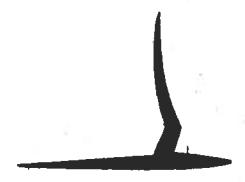
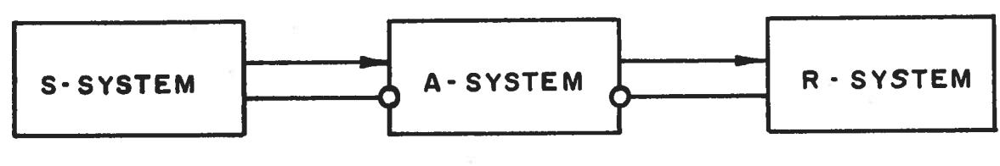
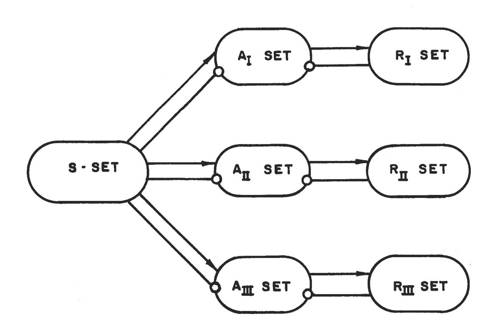
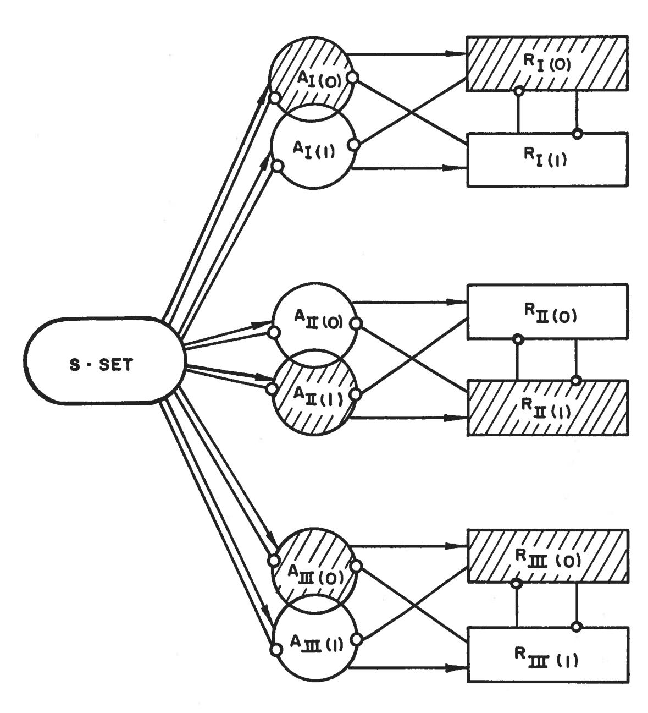
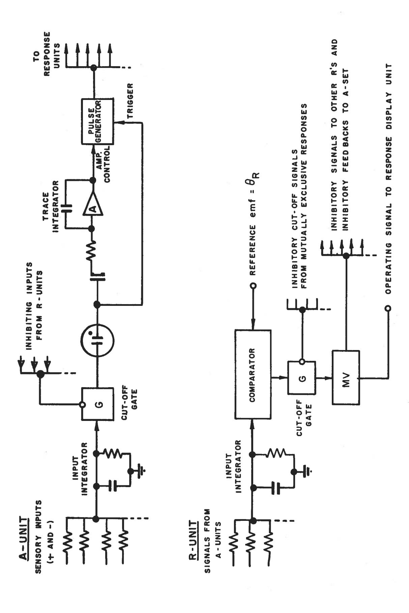

N. Stevens

# CORNELL AERONAUTICAL LABORATORY, INC.

Report No. 85-460-1

THE PERCEPTRON

A PERCEIVING AND RECOGNIZING AUTOMATON

(PROJECT PARA)

January, 1957

TIB/UB Hannover 89 138 988 935

# CORNELL AERONAUTICAL LABORATORY, INC. BUFFALO, N. Y.

REPORT NO. 85-460-1

THE PERCEPTRON

A PERCEIVING AND RECOGNIZING AUTOMATON

(PROJECT PARA)

January, 1957

Prepared by: Frank Rosenblatt

Frank Rosenblatt, Project Engineer

Approved by: Chamber Still

Alexander Stieber Head, Air Defense Section Systems Research Dept.

Approved by:

Robert H. Shatz, Head Systems Research Dept.

#### PREFACE

The work described in this report was supported as a part of the internal research program of the Cornell Aeronautical Laboratory, Inc. The concepts discussed had their origins in some independent research by the author in the field of physiological psychology, in which the aim has been to formulate a brain analogue useful in analysis. This area of research has been of active interest to the author for five or six years. The perceptron concept is a recent product of this research program; the current effort is aimed at establishing the technical and economic feasibility of the perceptron.

#### I. INTRODUCTION

Since the advent of electronic computers and modern servo systems, an increasing amount of attention has been focused on the feasibility of constructing a device possessing such human-like functions as perception, recognition, concept formation, and the ability to generalize from experience. In particular, interest has centered on the idea of a machine which would be capable of conceptualizing inputs impinging directly from the physical environment of light, sound, temperature, etc.—the "phenomenal world" with which we are all familiar — rather than requiring the intervention of a human agent to digest and code the necessary information.

A primary requirement of such a system is that it must be able to recognize complex patterns of information which are phenomenally similar, or are experientally related -- a process which corresponds to the psychological phenomena of "association" and "stimulus generalization". The system must recognize the "same" object in different orientations, sizes, colors, or transformations, and against a variety of different backgrounds. The recognition of "similar" forms can be carried out, to a certain extent, by analytic procedures on a digital or analog computer, but it is hard to conceive of a general analytic program which would, for example, recognize the form of a man seen from any angle, and in any posture or position. without actually storing a large library of reference figures against which the percept could be compared. In general, identities of this sort must be learned, or acquired from experience, and if the system is to be economical, the number of functional units in the storage system, or memory, should be much less than the number of forms or memories to be retained. It is this last requirement which seems to be incompatible with the nature of conventional computer systems. Moreover, if a memory with hundreds of thousands or millions of patterns stored in it must be scanned sequentially in order to identify an object, the time required

by conventional systems becomes excessive. The proposed system must not only economize on storage space: it must be able to categorize or identify an object "directly" -- i.e., it must locate the relevant memories without resorting to a sequential search procedure.

Recent theoretical studies by this writer indicate that it should be feasible to construct an electronic or electromechanical system which will learn to recognize similarities or identities between patterns of optical, electrical, or tonal information, in a manner which may be closely analogous to the perceptual processes of a biological brain. The proposed system depends on probabilistic rather than deterministic principles for its operation, and gains its reliability from the properties of statistical measurements obtained from large populations of elements. A system which operates according to these principles will be called a perceptron. A model which is designed to accept optical, or "visual" patterns as inputs will be called a photoperceptron. One which accepts tonal patterns, or "auditory" inputs, will be designated a phonoperceptron, and we might also consider the possibility of electro- or radioperceptrons, with corresponding sensory devices. It is also useful to distinguish between momentary stimulus perceptrons and temporal pattern perceptrons - the latter having the ability to remember temporal sequences of events, rather than transient momentary images, such as would be obtained from a collection of isolated frames cut from a strip of movie film.

The present discussion will concentrate on a momentary stimulus photoperceptron, which seems to be the most elementary device which could be built to demonstrate the general principles of this type of system. It is suggested that the proposed model should be built, not only to demonstrate the workability of the perceptron concept, but as a research tool for further study of the principles employed.

#### II. GENERAL DESCRIPTION OF A PHOTOPERCEPTRON

We might consider the perceptron as a black box, with a TV camera for input, and an alphabetic printer or a set of signal lights as output. Its performance can then be described as a process of learning to give the same output signal (or print the same word) for all optical stimuli which belong to some arbitrarily constituted class. Such a class might be the set of all two-dimensional transpositions of a triangle over the field of view of the TV camera, or the set of rotational positions of a 3-dimensional form. The forms of a stimulus pattern which are to be identified as equivalent can each be represented as a unique set of illuminated points in the TV raster. All of the "equivalent" forms constitute a transposition set, which we will call T.

It is possible to teach the system to discriminate two such generalized forms, or "percepts", by presenting for each form a random sample from the set of its possible transformations, while simultaneously "forcing" the system to respond with Output 1 for Form 1, and Output 2 for Form 2. For example, we might require the perceptron to learn the concepts "square" and "circle", and to turn on Signal Light 1 for "square", and Signal Light 2 for "circle". We would then proceed to show the system a large set of squares of different sizes. in different locations, while holding Light No. 1 on, thus "forcing" the response. We would then show a similar set of circles, while holding Light No. 2 on. If we then show the perceptron any square or any circle, we would expect it to turn on the appropriate light, with a high probability of being correct. The penalty that we pay for the use of statistical principles in the design of the system is a probability that we may get a wrong response in any particular case -- i.e., a wrong response that is inherent in the nature of the system, rather

than due to a malfunction of one of its components. It appears that this probability may be reduced, however, to a quantity no greater than the typical probabilities of an error due to malfunctions in electronic equipment.

The system has three main components, as indicated in Fig. 1:

- (1) The <u>S-System</u> (Sensory System) can be represented as a set of points in a TV raster, or as a set of photocells. Each raster-point in the S-system is connected to a number of units in the A-system (Association System), to which impulses are transmitted when the S-point is "on" (illuminated). Any particular S-A connection may be either positive (carrying positive or "excitatory" signals to the A-unit) or negative (tending to inhibit or suppress activity of the A-unit). A given point in the S-raster, for example, might be positively connected to ten A-units, and negatively connected to another ten units.
- (2) The A-System (Association System) performs the switching functions between input and output. Each A-unit receives impulses from a number of S-points, and transmits outputs to one or more Response Units (R-Units). The A-Units are characterized by the fixed parameter Q, the threshold value which corresponds to the algebraic sum of input pulses necessary to evoke an output, and the stochastic variable v, the "output value", which may be any physically measurable characteristic of the output pulse, such as amplitude, frequency, or delay-period. The value of an A-unit's output will vary with its history, and acts as a counter, or register for the memory-function of the system.
- (3) The R-System (Response System) consists typically of a relatively small number of units, which may operate type-bars or signal lights, and which are activated when the mean or net value of the signals received from the A-System exceeds a critical level  $\Theta_{r}$ . In addition to

printing or displaying an output signal, each response unit feeds back impulses which inhibit, or cut off the activity of all mutually exclusive R-units and the A-units which might activate them. These inhibitory feedback connections guarantee that only one response out of a mutually exclusive set can be triggered at one time. The response circuits are designed in such a manner that if impulses arrive at two R-units simultaneously, the unit whose inputs have the greatest mean (or net) value will respond first, cutting off the other through its inhibitory connections before it can be triggered. An entire set of mutually exclusive R-units thus acts like a multi-stable flip-flop, in which only one stage can be "on" at any one time. Several such mutually exclusive R-units may exist in parallel, as, for instance, the ten alphabets necessary to provide for printing a ten letter word. In such a case, the system is organized as in Fig. 2, with a distinct A-set corresponding to each R-set.

In Fig. 3, a more detailed breakdown is shown illustrating the logical composition of a perceptron designed to produce a three-binary-digit number as an output. Each binary place in the number is represented by an R-set of two members, zero and one. In Figure 3, circles have been used to represent sets of functional units, and rectangles to represent single units. The figure illustrates the effect of inhibitory connections when the response "lol" is "on". All shaded areas of the diagram would be under inhibition while this response was active. Note that the intersection of an active A-set with an inhibited A-set is not inhibited, i.e., inhibitory connections go from each R-unit only to those A-subsets which do not contribute connections to it.

The entire organization of a system of this sort can be represented by a single table, or matrix of connections between units. The system of Fig. 3, for example, might be represented by a table such as that of Fig. 4.

SETS OF EXCITATORY CONNECTIONS: ------

FIGURE I
GENERAL ORGANIZATION OF THE PERCEPTRON

FIGURE 2

ORGANIZATION OF A PERCEPTRON WITH

THREE INDEPENDENT OUTPUT-SETS

#### NOTE:

THE SHADING SHOWS THE ASSOCIATION SETS AND R-UNITS WHICH WOULD BE INHIBITED WHEN THE RESPONSE IOI IS ACTIVE.

# FIGURE 3 ORGANIZATION OF A PERCEPTRON WITH THREE BINARY RESPONSE SETS

Fig. 4: CONNECTION MATRIX FOR A PERCEPTRON WITH THREE BINARY RESPONSE SETS

Parameters: 3 positive and 3 negative inputs to each A-unit 4 A-units in each Response Set

Notation: 1 = positive connection, S to A, or A to R

-l = negative connection, S to A

x = absolute inhibitory connection, R to A

0 = no connection

| S-Point              | ${	t A}_{\sf T}$ Set | A TT Set | $\mathtt{A}_{\mathtt{III}}$ Set |
|----------------------|----------------------|---------------------|---------------------------------|
|                      | 123456               | 123456              | 123456                          |
| 1                    | 101000               | -1 1-1 1 0 1        | 0 0 1-1 1 0                     |
| 2                    | <b>-1 1-1</b> 0 1 0  | 0 1 0-1 1-1         | 11-1101                         |
| 3                    | 1-1-1 1 0 0          | 1-1 1 0 1 0         | -1 1-1 0 0-1                    |
| 14                   | 0 0 0-1 1 1          | -1 0 0 1 0-1        | 0 0-1 0-1 0                     |
| 5                    | -1 1 0 1 0-1         | 0-10101             | 1-1 0 1 0 1                     |
| 6                    | 1-1-1 0 0 1          | 1-1-1-1-1           | -1-1 0 1 1-1                    |
| 7                    | -1 0 0-1 0 1         | -1 1 0 0-1 0        | 1 0 0-1-1 0                     |
| 8                    | 0-1 1 1 0-1          | 001-101             | -1-1 1 0 0-1                    |
| 9                    | 001000               | 1 0-1 0-1 0         | 010-110                         |
| 10                   | 0 1 0-1 1-1          | 0011-10             | 0 0 1 0-1 1                     |
| R-Unit:              |                      |                     |                                 |
| R I(0)    | 1111xx               | 000000              | 000000                          |
| R I(1)    | xxllll               | 000000              | 000000                          |
| R II(0)   | 000000               | 1111xx              | 000000                          |
| R II(1)   | 000000               | x x 1 1 1 1         | 000000                          |
| R III (0) | 0 0 0 0 0 0          | 000000              | llxllx                          |
| R III(1)  | 000000               | 000000              | x111x1                          |

Some general principles of organization should be clear from this table.

- (1) The table is organized into three independent sections, one for every independent set of responses. Each of these sections consists of an S-A matrix and an A-R matrix.
- (2) Within the matrix of S-A connections for each response set, it is desirable that each column should have a unique permutation of positive and negative connections.
- (3) The numbers of positive and negative connections are the same in every column of the matrix.
  - (4) Each A-set connects to only one R-set.
- (5) Each <u>row</u> of an A-R sub-matrix should have a unique permutation of connections.
- (6) All elements of an A-R sub-matrix which do not represent excitatory connections are filled in with inhibitory connections from R to A, provided the A's and R's are of the same set.

A-unit and an R-unit which would meet the logical requirements of the model. The value of the A-unit is controlled by an integrator, which gains a slight increment every time the unit is active, and which governs the gain of the output pulse-generator. In such a system, the amplitude of the output pulse is equivalent to the value. The gas tube in the input line triggers the A-unit when the value of  $\Theta$  is exceeded, provided the gate is not closed by signals from the R-units.

FIGURE 5
DESIGN OF TYPICAL UNITS

The input network to the R-units may be designed either to sum or to average the inputs received. The design shown merely sums the inputs, but an averaging system would be preferable, particularly if the number of simultaneous inputs expected is small. A voltage is built up across the capacitor of the input integrator at a rate proportional to the net (or mean) input value. A comparator measures the difference between this voltage and a fixed reference ( $\mathbf{Q}_{\mathbf{R}}$ ), and triggers the response unit when the threshold voltage is exceeded.

### III. PRINCIPLES OF STIMULUS DISCRIMINATION

In the previous section, we have described the physical characteristics of the perceptron, without attempting to justify the prescribed organization. In this section, we will outline the basic principles on which such a device operates, and introduce some criteria for evaluating its performance. We will not attempt to derive equations in this presentation, but the basic equations will be found in Appendix I. The essence of the perceptron's logic is a stochastic process in the A-set, whereby the subset of units connecting any particular stimulus pattern to any particular response gains an increment in its aggregate value every time that that particular stimulus and response occur simultaneously. The Association System can be thought of as a number of overlapping populations of pointswhose mean values are measured by the R-units. Each R-unit measures the mean value of active points in that particular subset, or class, of points which is connected to it. If the sets of A-units which transmit impulses to the responses are large enough, we can be reasonably sure that there will be a non-zero subset of points transmitting impulses to any particular response for every stimulus pattern which might be presented.

In a system such as we have described, there will tend to be a different set of A-units activated by every distinct stimulus pattern which might occur. If we did not include some proportion of negative (inhibitory) impulses from the S-points, then a large, complex pattern would always activate any of the A-units which might be activated by its component sub-patterns, or by any illuminated area encompassed within the larger pattern. Under such conditions, the ability to make independent associations to parts and wholes of complex patterns, or to discriminate different sizes of illuminated areas would be lost. The inclusion of inhibitory impulses from the S-points, however, guarantees that the set of A-units responding to a "part" will generally contain

some members which will be inhibited when the "whole" is presented. The sets of A-units activated by two different stimuli, selected at random, will nonetheless tend to overlap; i.e., they will contain some proportion of common elements,  $P_{\rm C}$ .

It is convenient to use the notation As.r to denote the subset of A-units which is activated by Stimulus s and which transmits impulses to Response Unit r. Thus A1.1 means the set of A-units which is activated by Stimulus Pattern 1, and which transmits impulses to Response 4. Similarly, A1,3.4,8,12 means the set of A-units which are each activated by Stimulus Patterns 1 and 3, and each of which transmits to the Response Units 4, 8 and 12. This will be a subset of A1.4, and will also be a subset of A3.4, A3.8, etc.. Thus, if we consider a system with only two responses, and limit ourselves to two unrelated stimulus patterns, chosen at random, each of which activates 50% of all A-units, we would expect to find non-zero subsets in the following proportions:

| A 1.1     | 25% of all A-units   |
|----------------------|----------------------|
| A 2.1     | 25% of all A-units   |
| A1,2.1               | 12.5%                |
| A l.2     | 25%                  |
| A2.2                 | 25%                  |
| A 1,2.2   | 12.5%                |
| A 1.1,2   | 12.5%                |
| A2.1,2               | 12.5%                |
| A 1,2.1,2 | 6.25% of all A-Units |
|                      |                      |

In this system, the subsets Al,2.1 and Al,2.2 represents the units which

are common to both stimuli.  $P_c$ , the proportion of those elements responding to one stimulus which also respond to the second, is therefore equal to 0.5.

If the stimulus  $S_1$  is presented, the subsets  $A_{1,1}$  and A1.2 (including A1,2.1, A1,2.2, A1.1,2) will be activated and impulses will be transmitted to both Responses 1 and 2. Since the entire system is constituted to yield a "flip-flop" effect, however, one or the other response will prevail, and will suppress the association sets which do not contribute to its own excitation. Thus, if the Al 2 set happens to have a greater mean (or net) value than the set A, , Response No. 2 will become dominant, and Response No. 1 will be suppressed. This will lead almost immediately to a condition in which only the subset A1.2 (including A1,2.2, A1.1,2, and A1,2.1,2) remains active, all others being suppressed. For as long as this condition continues, the elements of this subset will accumulate an increment to their value, while the elements of the suppressed subsets will remain unchanged. Thus, the next time the same stimulus (S,) is presented, that subset of association units  $(A_{1,2})$  which is excited by this stimulus and tends to evoke R, will probably have a mean value greater than that of the association system as a whole, due to its selective "reinforcement" on the previous presentation. The same response, R2, will, therefore, have a greater probability of occurring again. The system has thus learned to associate the stimulus S, to R, and it will tend to fix that connection more firmly on each successive trial.

If a different stimulus,  $S_2$ , is then presented, it will tend to pick up some of the same A-units as  $S_1$  -- specifically, those units in the common set,  $A_{1,2.1}$ , and  $A_{1,2.2}$ . Hence, part of the value increase which was gained by the set  $A_{1.2}$  will carry over to the set  $A_{2.2}$ , creating a slight bias towards Response No. 2. Thus, the overlap, or communality, between the two sets, leads to a statistical <u>interaction</u> between the associations formed, which may occasionally cause errors in

performance. If the sets responding to different stimuli each represent a small fraction of the total number of A-units, then the interaction will be small, and the probability of interference between different associations will be slight, since the random biases introduced will tend to cancel one another and can easily be overcome by the value-gain which is concentrated in the correct subset. Appendix II contains an illustrative example of the process by which associations are formed, in a system with 64 A-units.

At this point, we should note that while the communality between subsets has cost us a penalty of interference between associations, it has gained something far more important. For if we were to design a system of, say, 100 A-units, in which sets of 10 units respond to every stimulus, and if we were to insist that there be no communality between sets, then we would be limited to a total of only ten stimuli which the system might distinguish. If, on the other hand, we admit an expected communality of 10%, the limiting number of stimuli which the system might identify becomes equal to the number of combinations of 100 things taken ten at a time --- a total of 1.73 x 1012 possible combinations. This number, however, should not be taken to indicate the practical capacity of the system, because long before this number of associations has been learned, the system will have been "saturated", in the sense that the expected loss of previously acquired associations (through interaction effects) will exactly balance the expected gain of new associations. As this equilibrium condition is approached, it will become harder and harder to "teach" the system new associations without knocking out old ones, and if we try to re-establish the old ones, we will find that we have lost others in the process.

A more useful criterion for the capacity of the system is the probability that a stimulus which has been associated to one of two responses will retain its proper "preference" after the system has

been saturated to a given level -- i.e., after some number of associations has been learned by the system. This probability is formally equivalent to the probability of establishing a correct discrimination between any two A-sets on the basis of their mean values, and will be called  $P_{d^{\bullet}}$  The results of some calculations of  $P_{d}$  are presented in Table 1. This table shows the probability of a correct preference for one of two responses, in a system which has learned N associations to each response. The table has been computed by equation 5, in Appendix I and is subject to the conditions indicated there.  $N_{\mbox{\scriptsize A}}$  is the number of A-units connected to each R-unit. The entries in the table represent the normal curve ordinates of the probability,  $P_{\rm d}$ , rather than the probabilities themselves. Thus with 1000 A-units connected to each R-unit, and a system in which 1% of the A-units respond to stimuli of a given size (i.e., P = .01), the probability of making a correct discrimination with one unit of training, after 106 stimuli have been associated to each response in the system, is equal to the 2.23 sigma level, or a probability of 0.987 of being correct. In the table, the communality between A-sets for different responses has been taken to be zero, i.e., each A-unit transmits to one and only one response unit. To correct for varying degrees of communality ( $P_{\bf cr}$ ) between the sets connected to different responses, the figures presented should be multiplied by 1-P  $_{\mbox{\footnotesize{cr}}},$  and N  $_{\mbox{\footnotesize{s}}}$  should be divided by the expected number of output connections per A-unit. The advantage of overlapping the R-sets (in the manner indicated in Fig. 3) is similar to the advantage of overlapping the A-sets for different stimuli; it permits a vast increase in the number of alternative responses which can be handled, at the cost of a relatively unimportant degradation in the probability of a correct response.

From Table 1, the potential efficiency of a system of this sort can readily be seen. By overlapping the A-sets for different responses (i.e., permitting Pcr to be greater than zero) a great number of mutually exclusive responses can be included in any one set, and by

including several independent sets, words can be built up, or percepts can be analyzed according to several independent attributes simultaneously. A crude estimate indicates that a system with two to three thousand A-units should be capable of maintaining a vocabulary comparable to the English language, if connection parameters were properly optimized.

In order to maximize system capacity, and to reduce the learning process for new objects, it would be desirable to reduce the set of transformations, T, of a particular stimulus pattern by centering the pattern in the field of view of the input camera. By including an independent R-set with feedback to a set of camera-aiming servos, the system can readily be made to train the camera on any forms occuring in peripheral locations in the field, without actually discriminating the particular forms. For this purpose, it would be necessary only to learn to distinguish the presence or absence of stimuli in different locations in the field, associating the presence of a pattern in the lower left, for example, with a control response moving the camera in this direction. The system would then be able to "fixate" any pattern which might prove significant, in much the same manner as the human eye, limiting its "recognition learning" to a relatively limited central field, analogous to the fovea in human vision.

TABLE I

# DISCRIMINATION PROBABILITY (Pd) AS A FUNCTION OF NS, NA AND Pa

(Probabilities Expressed in Normal Curve Ordinates)

|                | P a = .10 |                      | Pa = .01              |                       |
|----------------|----------------------|----------------------|-----------------------|-----------------------|
| N S | N A = 100 | N A = 200 | N A = 1000 | N A = 2000 |
| 10             | 23.6                 | 33.3                 | 707.                  | 1000                  |
| 100            | 7.45                 | 10.5                 | 223.7                 | 316                   |
| 1,000          | 2.36                 | 3.33                 | 70.7                  | 100                   |
| 10,000         | •745                 | 1.05                 | 22.37                 | 31.6                  |
| 100,000        | •236                 | •333                 | 7.07                  | 10.0                  |
| 1,000,000      | •0745                | •105                 | 2.237                 | 3.16                  |

#### APPENDIX I

#### BASIC PERCEPTRON EQUATIONS

1. Proportion of Association Units Responding to a Stimulus (Pa):
For a finite number of S-points,

$$P_{a} = \sum_{e} \sum_{i} P(ei)$$
 (1)

where

$$\max(r-y-z,\theta) \le e \le \min(r,x)$$
  
 $\max(0,r-x-z) \le i \le \min(e-\theta,r-e)$   
 $P(e,i) = \frac{x^{Ce} y^{C}; z^{Ch}}{n^{Cr}}$ 

n = total number of S-points in system

r = number of S-points activated by the stimulus

x = number of +1's in a column of the SyA connection matrix

y = number of -1's in a column of the connection matrix

z = number of zeros in a column of the connection matrix

h = r-e-i = number of zeros in a column of a matrix of r rows, obtained by striking out n-r rows from the SyA matrix, where e = number of +l's and i = number of -l's

9 = threshold of an A-unit

When the number of S-points is large, the solution of this equation converges rapidly to the equation for an infinite number of S-points:

$$P_{a} = \sum_{e=0}^{\infty} \sum_{i=e-0}^{y} P_{\infty}(e,i)$$
 (2)

where 
$$P_{\infty}(e,i) = {}_{\mathcal{L}}C_{e}R^{e}(1-R)^{x-e}yC_{i}R^{i}(1-R)^{y-i}$$

R = r/n = proportion of S-points activated by the stimulus

## 2. Communality Proportion (Pg):

For a finite number of S-points:

$$P_{c} = 1/P_{a} \left\{ e, i, l_{e}, l_{i}, q_{e}, q_{i} \right\} P(e, i, l_{e}, l_{i}, q_{e}, q_{i})$$
 (3)

where  $\{e, i, l_e, l_i, g_e, g_i\}$  is the set of all combinations of e, i.  $l_e$ ,  $l_i$ ,  $g_e$ , and  $g_i$  which conform to the following set of conditions:

$$e - i - l_e + l_i + g_e - g_i \ge \theta$$

$$\max(r - y - g, \theta) \le e \le \min(r, x)$$

$$\max(r - x - g, 0) \le i \le \min(e - \theta, y, r - e)$$

$$\max(l - i - n, 0) \le l_e \le \min(l, e)$$

$$\max(l - l_e - n, 0) \le l_i \le \min(l - l_e, i)$$

$$\max(l - l_e - n, 0) \le l_i \le \min(l - l_e, i)$$

$$\max(l - l_e - n, 0) \le l_i \le \min(l - l_e, i)$$

$$\max(l - l_e - n, 0) \le l_i \le \min(l - l_e, i)$$

$$\max(l - l_e - n, 0) \le l_i \le \min(l - l_e, i)$$

$$\max(l - l_e - n, 0) \le l_i \le \min(l - l_e, i)$$

$$\max(l - l_e - n, 0) \le l_i \le \min(l - l_e, i)$$

$$\max(l - l_e - n, 0) \le l_i \le \min(l - l_e, i)$$

$$\max(l - l_e - n, 0) \le l_i \le \min(l - l_e, i)$$

$$\max(l - l_e - n, 0) \le l_i \le \min(l - l_e, i)$$

$$\max(l - l_e - n, 0) \le l_i \le \min(l - l_e, i)$$

$$\max(l - l_e - n, 0) \le l_i \le \min(l - l_e, i)$$

$$\max(l - l_e - n, 0) \le l_i \le \min(l - l_e, i)$$

$$\max(l - l_e - n, 0) \le l_i \le \min(l - l_e, i)$$

$$\max(l - l_e - n, 0) \le l_i \le \min(l - l_e, i)$$

$$\max(l - l_e - n, 0) \le l_i \le \min(l - l_e, i)$$

$$\max(l - l_e - n, 0) \le l_i \le \min(l - l_e, i)$$

$$\max(l - l_e - n, 0) \le l_i \le \min(l - l_e, i)$$

$$\max(l - l_e - n, 0) \le l_i \le \min(l - l_e, i)$$

$$\max(l - l_e - n, 0) \le l_i \le \min(l - l_e, i)$$

$$\max(l - l_e - n, 0) \le l_i \le \min(l - l_e, i)$$

$$\max(l - l_e - n, 0) \le l_i \le \min(l - l_e, i)$$

$$\max(l - l_e - n, 0) \le l_i \le \min(l - l_e, i)$$

$$\max(l - l_e - n, 0) \le l_i \le \min(l - l_e, i)$$

$$\max(l - l_e - n, 0) \le l_i \le \min(l - l_e, i)$$

$$\max(l - l_e - n, 0) \le l_i \le \min(l - l_e, i)$$

$$\max(l - l_e - n, 0) \le l_i \le \min(l - l_e, i)$$

$$\max(l - l_e - n, 0) \le l_i \le \min(l - l_e, i)$$

$$\max(l - l_e - n, 0) \le l_i \le \min(l - l_e, i)$$

$$\max(l - l_e - n, 0) \le l_i \le \min(l - l_e, i)$$

$$\max(l - l_e - n, 0) \le l_i \le \min(l - l_e, i)$$

$$\max(l - l_e - n, 0) \le l_i \le \min(l - l_e, i)$$

$$\max(l - l_e - n, 0) \le l_i \le \min(l - l_e, i)$$

$$\max(l - l_e - n, 0) \le l_i \le \min(l - l_e, i)$$

$$\max(l - l_e - n, 0) \le l_i \le \min(l - l_e, i)$$

$$\max(l - l_e - n, 0) \le l_i \le \min(l - l_e, i)$$

$$\max(l - l_e - n, 0) \le l_i \le \min(l - l_e, i)$$

$$\max(l - l_e - n, 0) \le l_i \le \min(l - l_e, i)$$

$$\max(l - l_e - n, 0) \le l_i \le \min(l - l_e, i)$$

$$\max(l - l_e, i) \le l_i \le \min(l - l_e, i)$$

$$\max(l - l_e, i) \le l_i \le \min(l - l_e, i)$$

$$\max(l - l_e, i) \le l_i \le l_i \le \min(l - l_e, i)$$

$$\max(l - l_e, i) \le l_i \le l_i \le l_i \le l_i \le l_i \le l_i \le l_i \le l_i \le l_i \le l_i \le l_i \le l_i \le l_i \le l_i \le l_i \le l_i \le l_i \le l_i \le l_i \le l_i \le l_i \le$$

 $\ell$  = total number of points activated by the first stimulus  $(S_1)$  which are not activated by  $S_2$ .

g = total number of new points activated by the second stimulus which were not activated by the first.

e = number of +l's from the originally active set of

 $\ell_i$  = number of -1's which drop out.

 $\ell_{h}$  = number of zero-connections which drop out.

 $g_{\mu}$  = number of +l's gained in the new connections.

g; = number of -1's gained.

gh = number of zero-connections gained.

For an infinite number of S-points:

$$P_{c} = 1/P_{a} \sum_{e=0}^{x} \sum_{i=e=0}^{y} \sum_{l_{e}=0}^{e} \sum_{l_{i}=0}^{i} \sum_{q_{e}=0}^{x-e} \sum_{q_{i}=0}^{y-i} P_{c}(e,i,l_{e},l_{i},q_{e},q_{i})$$

$$(e-i-l_{e}+l_{i}+q_{e}-q_{i} \ge 0)$$

where 
$$P_{\infty}(e, i, l_e, l_i, g_e, g_i) = \chi C_e R^e (I-R)^{\chi-e} y C_i R^i (I-R)^{y-i}$$

$$e C_{l_e} L^{l_e} (I-L)^{e-l_e} i C_{l_i} L^{l_i} (I-L)^{i-l_i} \chi - e C_{g_e}$$

$$G^{g_e} (I-G)^{\chi-e-g_e} y - i C_{g_i} G^{g_i} (I-G)^{y-i-g_i}$$

R = r/n = proportion of S-points in the first stimulus

L = 1/r = proportion of S-points in the set R which are not in the second stimulus

G = g/n-r = proportion of the residual S-raster (left over from the first stimulus) which is included in the second stimulus.

## 3. Probability of Correct Discrimination $(P_d)$ :

 $P_{\rm d}$  = the area under the normal curve from  $-\infty$  to +Z, where the ordinate, Z, is given by the expression:

$$Z = \frac{I - P_c}{\sigma_d} \tag{5}$$

where  $P_{\mathbf{c}}$  is the communality between the two A-sets to be discriminated, and

$$\widetilde{Q} = \sqrt{\frac{2N_s}{N_d} \left(P_a^3 - P_a^4\right)}$$

- Pa = expected proportion of A-units responding to random
- $N_{
  m d}$  = number of A-units in the subset activated by a particular stimulus and transmitting to a particular response
- $N_S$  = number of stimuli associated to each of the responses under comparison (assuming an equal degree of saturation for both responses)

This equation makes the assumption that all stimuli learned are of the same size — i.e., that  $P_a$  remains constant. It also assumes that an equal number of stimuli have been associated to each response, with a fixed amount of reinforcement for each association formed. An equation which relaxes these restrictions has not been developed, but Monte Carlo studies are being planned to investigate the importance of the assumptions. An additional assumption, for which corrections can readily be made, is that  $N_d$  will be considerably greater than 1.

### 4. Optimization of x, y, and 9

Given a mutually consistent set of constraints,  $N_s$ ,  $M_s$ ,  $M_s$ , and  $P_a$   $R_{crit}$ , the optimum system (in which  $P_c$  is minimized for any stimulus) is given by the simultaneous solutions of the following three equations, subject to the limits indicated. If a set of constraints does not permit a solution within these limits, this indicates that the constraints are mutually inconsistent, and consequently inadmissible as design criteria.

$$x = \frac{5_{max} + \theta - Z}{2} \qquad \left(\theta \le x \le \frac{M + \theta}{2}\right) \qquad (6)$$

$$y = M - x$$

$$\theta = f(x, y, N_5, P_a, R_{crit})$$
  $(\theta \leq M)$ 

The constraints are defined as follows:

 $N_s$  = number of S-points in the raster.

M = maximum number of input connections allowed to each A-unit. The system performance will be improved by setting M as high as possible. (M = X+Y  $\leq$  Ns).

S = maximum stimulus size (number of S-points) to which the system must be able to respond. (N -M < S max < N +M).

The system's performance will be improved by setting

S as low as possible.

 $P_a \mid R_{crit}$  = the required proportion of A-units activated by a "criterion stimulus" of size  $R_{crit}$   $P_a$  should be set to the lowest value consistent with the requirement that any stimulus should

reliably excite at least a few units in every R-set.

Note that the value established for  $\Theta$  represents the minimum stimulus size to which the system will be capable of responding.

In practice, the optimum design of a system subject to a given set of constraints can be found by finding the value of  $\theta$ , with the corresponding X and Y from the above equations, for which the function

$$|F(z, y, N_S, \theta, R_{crit}) - P_a|R_{crit}| \quad (\theta \leq R)$$

is at a minimum. The function F is the value of P obtained by equation 1. For a system yielding a P exactly equal to the constraining value, the minimum of this expression should be exactly equal to zero.

#### APPENDIX II

#### AN ILLUSTRATION OF THE DISCRIMINATION METHOD

Fig. 6 shows a system with 64 A-units, indicating the particular units (chosen at random) which respond to each of six stimulus patterns. The 32 units in the left half of each block are connected to  $R_{\mbox{\scriptsize 1}}$ , and the 32 units in the right half of each block are connected to  $R_2$   $R_1$  and  $R_2$  represent mutually exclusive responses, with zero overlap between their corresponding association sets. When R, is active, the R, set is suppressed, and when R, is active, the R1 set is suppressed. Let us consider an experiment in which S1, S2, and  $S_3$  are all to be associated to  $R_1$ , while  $S_4$ ,  $S_5$ , and  $S_6$  are all to be associated to  $R_2$ . Thus the active units shown in the <u>left</u> half of the  $S_1$  diagram will each gain one unit of "value" due to the  $S_1-R_1$  association, and, similarly, the active units in the left halves of the S2 and  $S_{3}$  diagrams will gain a unit of value for each association in which they participate. The active units shown on the right side of the diagrams will gain in value for the Sh, S5, and S6 associations. After all six associations have been formed, the value distribution will be as shown in Fig. 7a. If we then superimpose the  $S_{7}$  configuration (shown by underlining in Fig. 7a) we can add up the net value for the R, set and for the R, set, that would be evoked by such a presentation. We find a bias of 18 to 6, in favor of  $R_1$ , which means that the  $R_1$  response would occur, suppressing R . If we add up the bias in the same manner for each of the other "stimulus patterns", we find that the biases are as follows:

|                     | R 1 | R 2 | Expected Response |
|---------------------|----------------|----------------|-------------------|
| sı                  | 18             | 6              | R 1    |
| S 2      | 17             | 13             | R                 |
| s 3      | 21             | 14             | $R_{1}$           |
| $s_{\underline{l}}$ | 12             | 14             | $R_2$             |
| s 5      | 9              | 15             | R 2    |
| s 6      | 10             | 18             | $R_2$             |

Thus, we see that each of the associations which we tried to form has actually been established, in spite of the fact that the  $R_2$  associations have added to the value of the  $R_2$  subset for all stimulus patterns, and the  $R_1$  associations have similarly added an increment to the  $R_1$  subsets of all stimuli. The expected communality proportion, in this model, is equal to 5/16, which, together with the small number of A-units, would cause us to expect rather poor performance from the system. It is interesting to note that, even under these conditions, all six associations have been retained correctly.

To make sure that we have not accidentally selected a biased set of patterns, which lend themselves to the particular associations we have considered, let us try reversing each one of the associations, i.e., we will now associate  $S_1$ ,  $S_2$ , and  $S_3$  to  $R_2$ , and the other three stimuli to  $R_1$ , by the same procedure that we used before. In this case, the resulting value distribution is given by

Fig. 7b, and the  $R_1/R_2$  biases are as follows:

|                | R  | R 2 | Expected Response |
|----------------|----|----------------|----------------------|
| SI             | 10 | 15             | R 2       |
| S 2 | 11 | 19             | R 2       |
| S 3 | 10 | 18             | R 2       |
| SL             | 14 | 10             | $R_{1}$              |
| S 5 | 14 | 13             | $^{\mathrm{R}}$ 1    |
| S 6 | 14 | 10             | $^{\mathrm{R}}$ 1    |

Note that every response has reversed itself correctly, even though the ratio in the case of  $\mathbf{S}_5$  is very close.

It has been confirmed by a limited model-sampling study of transformations of stimuli in a 40x40 raster, with specified connections to a set of A-units, that anA-unit typically shows a bias to respond to one type of stimulus pattern more than others. For example, a particular A-unit might respond to 20% of all possible transpositions of a square, and perhaps to 1%, or even 0% of the set of transformations of a circle. A bias of this sort is shown clearly in our model, where the A-unit in the fifth row and second column is seen to respond to each of the first three stimuli, and to none of the last three. One way of accounting for the discrimination phenomenon is to point out that a stimulus from the transformation set,  $T_1$ , is more likely to excite A-units which are biased towards the set  $T_1$  than units which are biased towards some other set,  $T_2$ . But the units with a  $T_1$  bias will have a corresponding value-

bias towards the appropriate response, since they have been "reinforced" predominantly by stimuli from the T1 set, and relatively
little by conflicting stimuli. Thus, the presentation of a stimulus
to a "saturated" system can be seen as a biased sampling of A-units
which have a stronger linkage to the appropriate response than to
any of the inappropriate ones.

Fig. 6: A-units in a system of 64, which respond to each of six stimulus patterns (X denotes a responding unit, 0 a non-responding unit)

| S 1 :                                 |                              | s 2 :                                      |                              | S 3:                                            |                              |
|--------------------------------------------------|------------------------------|-------------------------------------------------------|------------------------------|------------------------------------------------------------|------------------------------|
| R 1 Set                               | R 2 Set           | R 1 Set                                    | R 2 Set           | R l Set                                         | R 2 Set           |
| OXOO                                             | OXOO                         | XOXO                                                  | NOXO                         | X000                                                       | OXOX                         |
| 0000                                             | OXXO                         | OOXO                                                  | OXOX                         | OXO                                                        | XOOO                         |
| XOXX                                             | OXOO                         | OXOO                                                  | 0000                         | OOXX                                                       | OXXO                         |
| OOXO                                             | OOXO                         | OOOX                                                  | OOXX                         | OXO                                                        | 0000                         |
| OXOO                                             | OXOX                         | OXXO                                                  | 0000                         | OXOO                                                       | OXO                          |
| OOOX                                             | XOXO                         | X000                                                  | OXOX                         | XOOX                                                       | OXOO                         |
| XOXO                                             | X000                         | 0000                                                  | X000                         | XOXO                                                       | XOOX                         |
| OXOO                                             | 0000                         | OXXO                                                  | OXO                          | 0000                                                       | OOXO                         |
|                                                  |                              |                                                       |                              |                                                            |                              |
| C .                                              |                              | c .                                                   |                              | S •                                                        |                              |
| S 14 :                                |                              | s 5 :                                      |                              | S 6 <b>:</b>                                    |                              |
| S l4 : R 1 Set          | R 2 Set           | S 5 : R 1 Set                | R 2 Set           | S6: R 1 Set                                  | R 2 Set           |
| ,                                                | R 2 Set           |                                                       | R 2 Set           | _                                                          | R 2 Set           |
| R_Set                                            | _                            | R 1 Set                                    | -                            | R 1 Set                                         | _                            |
| R 1 Set                               | x000                         | R 1 Set                                    | XOXO                         | R 1 Set                                         | OXO                          |
| R 1 Set OXOX OOOX               | x000                         | R 1 Set OOXO OOOX                    | XOXO                         | R 1 Set XOOX OOXO                         | 00X0                         |
| R 1 Set OXOX OOOX OXOX       | 00X0 0X00                 | R 1 Set 00X0 000X 0000            | XOXO OOXX                 | R 1 Set XOOX OOXO XOXO                 | 00X0                         |
| R L Set OXOX OOOX OXOX OXOX           | 000X 000X 000X         | R 1 Set 00X0 000X 0000 0XOX    | 0000 0000                    | R 1 Set XOOX OOXO XOXO OXOX         | 00X0 00XX 00XX         |
| R 1 Set OXOX OOOX OXOX OOXO OOXO      | 0000 0000 0000         | R 1 Set OOXO OOOX OOOO OXOX                | 0000 0000 0000         | R 1 Set XOOX OOXO XOXO OXOX OOOX | 00X0 00X0 00X0         |
| R 1 Set OXOX OOOX OXOX OOXO OOXO OOXO | 0000 0000 0000 0000 | R 1 Set OOXO OOOX OOOX OOXX OOXX OOXX OOOO | XOXO OOXX OOOO OXXO | R 1 Set XOOX OOXO XOXO OXOX OOOX | 00X0 0X00 0X00 0X00 |

Fig. 7: VALUES RESULTING FROM ASSOCIATION EXPERIMENTS

| S 1 , S 2 , and | 1 S 3 to R 1 (b)                                                              | S 1 , S 2 , and                                                                                                                                                     | S 3 to R 2                                                                                                                                                                                                                                                                                                                                      |
|---------------------------------------|-----------------------------------------------------------------------------------------------------|-------------------------------------------------------------------------------------------------------------------------------------------------------------------------------------------|-----------------------------------------------------------------------------------------------------------------------------------------------------------------------------------------------------------------------------------------------------------------------------------------------------------------------------------------------------------------------|
| S 4 , S 5 , and | S6 to R2                                                                                            | S 4 , S 5 , and                                                                                                                                                     | S6 to R1                                                                                                                                                                                                                                                                                                                                                              |
| R 1 Set                    | R 2 Set                                                                                  | R 1 Set                                                                                                                                                                        | R 2 Set                                                                                                                                                                                                                                                                                                                                                    |
| 2110                                  | 2 <u>0</u> 20                                                                                       | 1112                                                                                                                                                                                      | 2120                                                                                                                                                                                                                                                                                                                                                                  |
| 0020                                  | 1212                                                                                                | 0012                                                                                                                                                                                      | 0212                                                                                                                                                                                                                                                                                                                                                                  |
| 2211                                  | 0022                                                                                                | 1111                                                                                                                                                                                      | 0210                                                                                                                                                                                                                                                                                                                                                                  |
| 0021                                  | 01.01                                                                                               | 0112                                                                                                                                                                                      | 0021                                                                                                                                                                                                                                                                                                                                                                  |
| 0310                                  | 0 <u>1</u> 20                                                                                       | 0022                                                                                                                                                                                      | 0111                                                                                                                                                                                                                                                                                                                                                                  |
| 2002                                  | 0211                                                                                                | 1102                                                                                                                                                                                      | 1211                                                                                                                                                                                                                                                                                                                                                                  |
| 2020                                  | 1101                                                                                                | 1011                                                                                                                                                                                      | 3001                                                                                                                                                                                                                                                                                                                                                                  |
| 0210                                  | 1102                                                                                                | 0110                                                                                                                                                                                      | 0020                                                                                                                                                                                                                                                                                                                                                                  |
|                                       | S 4 , S 5 , and  R 1 Set  2110  0020  2211  0021  0310  2002  2020 | S 4 , S 5 , and S 6 to R 2 R 1 Set R 2 Set  2110 2020  0020 1212  2211 0022  0021 0101  0310 0120  2002 0211  2020 1101 | S 4 , S 5 , and S 6 to R 2 S 4 , S 5 , and S 6 to R 2 S 1 , S 5 , and S 6 R 1 Set  R 1 Set  R 1 Set  R 1 Set  2110  0020  1212  0012  2211  0021  0101  0112  0310  0120  2002  2002  1101  1011 |

Stevens

RECEIVED
CORNELL AERO, LAB, INC,
SYSTEMS RESEARCH DEPT,

APR 4.1957
FOR:
INFO. TO:
COMMENT RETURN
FOLLOW UP
YOUR ACTION

CORNELL AERONAUTICAL !ABORATORY, INC.
Buffalo, New York

# PRELIMINARY COPY 3 April 1957

**PROPOSAL** 

FOR THE DEVELOPMENT OF
A PERCEIVING AND RECOGNIZING AUTOMATON
(PROJECT PARA)

#### I. SUMMARY

Establishment of a new research program at Cornell Aeronautical Laboratory, Inc. is proposed, with the objective of designing, fabricating, and evaluating an electronic brain model, the photoperceptron. The proposed pilot model will be capable of "learning" responses to ordinary visual patterns, or forms. The system will employ a new theory of memory storage, (the theory of statistical separability), which permits the recognition of complex patterns with an efficiency far greater than that attainable by existing computers. Devices of this sort are expected ultimately to be capable of concept formation, language translation, collation of military intelligence, and the solution of problems through inductive logic.

The development and construction of a pilot model is expected to require the work of three professional people, a digital computer, and an associated technical staff for eighteen months.

## II. INTRODUCTION

With this proposal, a description of an electronic automaton, the Cornell Photoperceptron, is submitted. This is the outcome of a program of theoretical studies on the feasibility of an advanced brain model, which is to be capable of pattern perception and generalization. The author's work on the "theory of statistical separability", upon which the perceptron is based, was begun at Cornell University about five years ago, and has been continued under the sponsorship of the Systems Research Department of Cornell Aeronautical Laboratory, Inc.