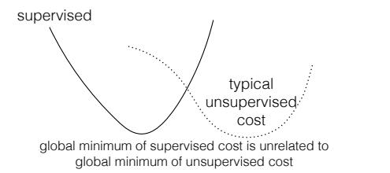
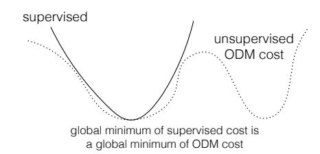
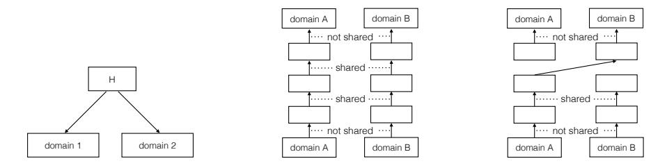
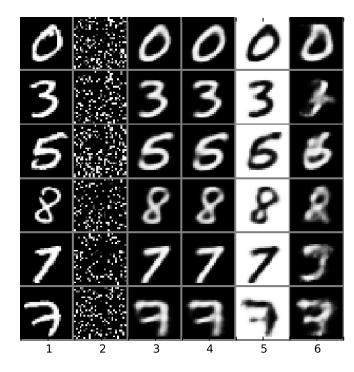
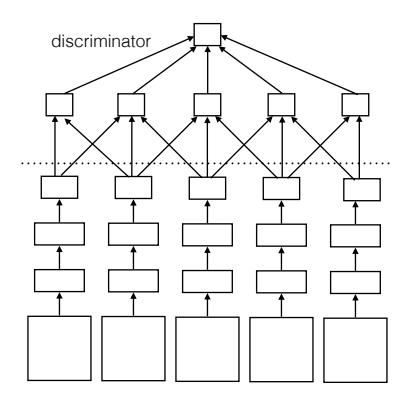
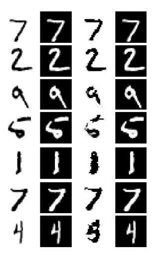
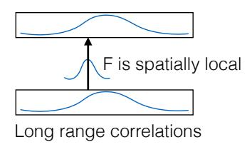

# TOWARDS PRINCIPLED UNSUPERVISED LEARNING

Ilya Sutskever1, Rafal Jozefowicz1, Karol Gregor2, Danilo Rezende2, Tim Lillicrap2, Oriol Vinyals1 Google Brain1 and Google DeepMind2

{ilyasu,rafalj,karolg,danilor,countzero,vinyals}@google.com

### **ABSTRACT**

General unsupervised learning is a long-standing conceptual problem in machine learning. Supervised learning is successful because it can be solved by the minimization of the training error cost function. Unsupervised learning is not as successful, because the unsupervised objective may be unrelated to the supervised task of interest. For an example, density modelling and reconstruction have often been used for unsupervised learning, but they did not produced the sought-after performance gains, because they have no knowledge of the supervised tasks.

In this paper, we present an unsupervised cost function which we name the Output Distribution Matching (ODM) cost, which measures a divergence between the distribution of predictions and distributions of labels. The ODM cost is appealing because it is consistent with the supervised cost in the following sense: a perfect supervised classifier is also perfect according to the ODM cost. Therefore, by aggressively optimizing the ODM cost, we are almost guaranteed to improve our supervised performance whenever the space of possible predictions is exponentially large.

We demonstrate that the ODM cost works well on number of small and semiartificial datasets using no (or almost no) labelled training cases. Finally, we show that the ODM cost can be used for one-shot domain adaptation, which allows the model to classify inputs that differ from the input distribution in significant ways without the need for prior exposure to the new domain.

#### 1 Introduction

Supervised learning is successful for two reasons: it is equivalent to the minimization of the training error, and stochastic gradient descent (SGD) is highly effective at minimizing training error. As a result, supervised learning is robust, reliable, and highly successful in practical applications.

Unsupervised learning is not as successful, mainly because it is not clear what the unsupervised cost function should be. The goal of unsupervised learning is often to improve the performance of a supervised learning task for which we do not have a lot of data. Due to the lack of labelled examples, unsupervised cost functions do not know which of the many possible supervised tasks we care about. As a result, it is difficult for the unsupervised cost function to improve the performance of the supervised cost function. The disappointing empirical performance of unsupervised learning supports this view.

In this paper, we present a cost function that generalizes the ideas of Casey (1986). We illustrate the idea in the setting of speech recognition. It is possible to evaluate the quality of a speech recognition system by measuring the linguistic plausibility of its typical outputs, without knowing whether these outputs are correct for their inputs. Thus, we can measure the performance of our system without the use of any input-output examples.

We formalize and generalize this idea as follows: in conventional supervised learning, we are trying to find an unknown function F from  $\mathcal{X}$  to  $\mathcal{Y}$ . Each training case  $(x_i, y_i)$  imposes a soft constraint on F:

$$F(x_i) = y_i \tag{1}$$

We solve these equations by local optimization with the backpropagation algorithm (Rumelhart et al., 1986).

Figure 1: Existing unsupervised cost functions (**left**) versus the ODM cost in the limit of infinite data (**right**). The global minima of typical unsupervised cost functions, such as the reconstruction cost, are unrelated to the minima of the supervised cost. The ODM cost. In contrast, the global minimum of the supervised cost function is also a global minimum of the ODM cost function whenever there is a function that can perfectly represent the mapping. The implication is not true in reverse because the ODM cost can have additional global minima that are not global minima of the supervised cost. This seemingly surprising property is possible because the ODM cost uses unlabelled examples from both the input domain and the output domain, while conventional unsupervised cost functions ignore the output domain.

We now present the unsupervised cost function. Let  $\mathcal D$  be the true data distribution over the inputoutput pairs  $(x,y) \sim \mathcal D$ . While we do not have access to many labelled samples  $(x,y) \sim \mathcal D$ , we often have access to large quantities of unlabelled samples from  $x \sim \mathcal D$  and  $y \sim \mathcal D$ . This assumption is valid whenever unlabelled inputs and unlabelled outputs are abundant.

We can use *uncorrelated samples* from  $x \sim \mathcal{D}$  and  $y \sim \mathcal{D}$  to impose a valid constraint on F:

$$Distr[F(x)] = Distr[y]$$
 (2)

where  $\operatorname{Distr}[z]$  denotes the distribution of the random variable z. This constraint is valid in the following sense: if we have a function F such that  $F(x_i) = y_i$  is true for every possible training case, then  $\operatorname{Distr}[F(x)] = \operatorname{Distr}[y]$  is satisfied as well. Thus, the unsupervised constraint can be seen as an additional labelled "training case" that conveys a lot of information whenever the output space is very large.

This constraint can be turned into the following cost function

$$KL[Distr[y] || Distr[F(x)]]$$
(3)

We call it the output distribution matching (ODM) cost function, the cost literally matches the distributions of the outputs.

For the constraint  $\operatorname{Distr}[F(x)] = \operatorname{Distr}[y]$  to be highly informative of the optimal parameters, it is necessary for the output space  $\mathcal Y$  to be large, since otherwise the ODM cost will be trivial to optimize. If the output space is large, then the ODM cost is, in principle, substantially more useful than conventional unsupervised cost functions which are unrelated to the ultimate supervised cost function. In contrast, the ODM cost is nearly guaranteed to improve the final supervised performance whenever there exists a very high performing function, because a supervised function that perfectly maps every input to its desired output is also a global minimum of the ODM cost. See Figure 1. It also means that a practitioner has a high chance of improving their supervised performance if they are able to optimize the ODM cost.

We also show how the ODM cost can be used for one-shot domain adaptation. Given a test datapoint from a distribution that is very different from the training one, our model can, in certain settings, identify a nearly unique corresponding datapoint that happens to obey the training data distribution, which can then be classified correctly. We implement this idea using a generative model as a mechanism for aligning two distributions without supervision.

This allows each new test case to be from significantly different distribution, so it is no longer necessary to assume that the test set follows a particular distribution. This capability allows our models, in principle, to work robustly with unexpected data. However, the ability to perform one-shot domain adaptation is not universal, and it can be achieved only in certain restricted settings.

# 2 RELATED WORK

There has been a number of publications that considered matching statistics as an unsupervised learning signal. The early work of Casey (1986) casts the problem of unsupervised OCR as a problem of decoding a cipher, where there is an unknown mapping from images to characters identities, which must be inferred from the known statistics of language. This idea has been further explored in the context of machine translation (typically in the form of matching bigrams) (Knight et al., 2006; Huang et al., 2006; Snyder et al., 2010; Ravi & Knight, 2008), and in unsupervised lexicon induction (Fung & McKeown, 1997; Koehn & Knight, 2002; Haghighi et al., 2008; Mikolov et al., 2013b). Notably, Knight et al. (2006) discusses the connection between unsupervised learning and language decipherment, and formulates a generative model similar to the one presented in this work.

Similar ideas have recently been proposed for domain adaptation where a model learns to map the new distribution back onto the training distribution (Tzeng et al., 2014; Gani et al., 2015). These approaches are closely related to the ODM cost, since they are concerned with transforming the new distribution back to the training distribution.

There has been a lot of other work on unsupervised learning with neural networks, which is largely concerned with the concept of "pre-training". In pre-training, we first train the model with an unsupervised cost function, and finish training the model with the supervised cost. This concept was introduced by Hinton et al. (2006) and Hinton & Salakhutdinov (2006) and later by Bengio et al. (2007). Other work used the k-means objective for pre-training (Coates et al., 2011), and this list of references is far from exhaustive. These ideas have also been used for semi-supervised learning (Kingma et al., 2014; Rasmus et al., 2015) and for transfer learning (Mesnil et al., 2012).

More recent examples of unsupervised pre-training are the Skip-gram model (Mikolov et al., 2013a) and its generalization to sentences, the Skip-thought vectors model of Kiros et al. (2015). These models use well-motivated unsupervised objective functions that appear to be genuinely useful for a wide variety of language-processing tasks.

#### 3 METHODS

In this section, we present several approaches for optimizing the ODM cost.

## 3.1 ODM COSTS AS GENERATIVE MODELS

The ODM cost can be formulated as the following generative model. Let P(x) be a model fitted to the marginal  $x \sim \mathcal{D}$ , and let  $P_{\theta}(y)$  be the distribution:

$$P_{\theta}(y) = \sum_{x} P_{\theta}(y|x)P(x) \tag{4}$$

The objective is to find a conditional  $P_{\theta}(y|x)$  (which corresponds to  $F_{\theta}(x)$  where  $\theta$  are the parameters) so that  $P_{\theta}(y)$  matches the marginal distribution  $y \sim \mathcal{D}$ . If P(x) is an excellent model of  $x \sim \mathcal{D}$ , then the cost  $E_{y \sim \mathcal{D}}[-\log P_{\theta}(y)]$  is precisely equivalent to the ODM cost of Eq. 3, modulo an additive constant. A similar generative model was presented by Knight et al. (2006).

It is desirable to train generative models using the variational autoencoder (VAE) of Kingma & Welling (2013). However, VAE training forces y to be continuous, which is undesirable since many domains of interest are discrete. We address this by proposing the following generative model, which we term the xyh-model:

$$P_x(x) = \int_h P_x(x|h)P(h)\mathrm{d}h \tag{5}$$

$$P_x(y) = \int_h P_y(y|h)P(h)\mathrm{d}h \tag{6}$$

whose cost function is

$$L = E_{x \sim \mathcal{D}}[-\log P_x(x)] + E_{y \sim \mathcal{D}}[-\log P_y(y)]$$
(7)

Here h is continuous while x and y are either continuous or discrete. It is clear that this model can also be trained on labelled (x, y), whenever such data is available.

Figure 2: The dual autoencoder. (**Left:**) The xyh-generative model that motivated the dual autoencoder. (**Middle:**) The dual autoencoder during training. Note that it can be trained in an entirely unsupervised fashion on data from different domains. The dual autonecoder learns a representation that is compatible with both domains, in a manner that is entirely unsupervised. (**Right:**) The dual autoencoder test time. It often successfully learns the correspondence between the domains even though it is not trained for this task.

Although the negative log probability of the xyh-model is not identical to the ODM cost, the two are closely related. Specifically, whenever the capacity of  $P_x$  and  $P_y$  is limited, the xyh-model will be forced to represent the structure that is common to  $\operatorname{Distr}[x]$  and  $\operatorname{Distr}[y]$  in P(h), while placing the domain specific structures into  $P_x(x|y)$  and  $P_y(x|y)$ . For example, in case of speech recognition, P(h) could contain the language model, since it is not economical to store the language model in  $P_x(x|h)$  and  $P_y(y|h)$ .

#### 3.2 THE DUAL AUTOENCODER

We implemented the xyh-generative model but had difficulty getting sensible results in our early experiments. We were able to get better results by designing an novel autoencoder model that is inspired by the xyh-model, which we call the dual autoencoder, which is shown in Figure 2. It consists of two autoencoders whose "innermost weights" are shared with each other. More formally, the dual autoencoder has the form

$$x' = f(A_0 f(W_N f(W_{N-1} \dots f(W_1 f(B_0 x)) \dots)))$$
(8)

$$y' = f(A_1 f(W_N f(W_{N-1} \dots f(W_1 f(B_1 y)) \dots)))$$
(9)

where f is the nonlinearity, and the cost is

$$L = E_{x \sim D} [L_1(x, x')] + E_{y \sim D} [L_2(y, y')]$$
(10)

where  $L_1$  and  $L_2$  are appropriate loss functions.

Eqs. 8 and 9 describe two autoencoders that map x to x' and y to y', respectively. By sharing the weights  $W_1 \ldots, W_N$  between the autoencoders, the matrices  $(A_0, B_0)$  and  $(A_1, B_1)$  are encouraged to use compatible representations for the two modalities that align x with y in the absence of a direct supervised signal. While not principled, we found this approach to work surprisingly well on simple problems.

#### 3.3 GENERATIVE ADVERSARIAL NETWORKS TRAINING

The Generative Adversarial Network (Goodfellow et al., 2014) is a procedure for training a "generator" to produce samples that are statistically indistinguishable from a desired distribution. The generator is a neural network G that transforms a source of noise z into samples from some distribution:

$$z \to G(z)$$
 (11)

The GAN training algorithm maintains an adversary  $D(z) \to [0,1]$  whose goal is to distinguish between samples x from the data distribution and samples from the generator G(z), and the generator G learns to fool the discriminator. Eventually, if GAN training is successful, G converges to a model such that the distribution of G(z) is indistinguishable from the target distribution.

The generative adversarial network offers a direct way of training generative models, and it had enjoyed considerable success in learning models of natural images (Denton et al., 2015). We use the GAN training method to train our unsupervised objective  $\operatorname{Distr}[F(x)] = \operatorname{Distr}[y]$  by requiring that F produces samples that are indistinguishable from the target distribution.

### 4 EXPERIMENTS

#### 4.1 DUAL AUTOENCODERS ON MNIST PERMUTATION TASK

We begin exploring the ODM cost by selecting a simple artificial task where the distributions over  $\mathcal{X}$  and  $\mathcal{Y}$  have rich internal structure but whose relationship is simple. We chose  $\mathcal{Y}$  to be the distribution of MNIST digits, and  $\mathcal{X}$  to be the distribution of MNIST digits whose pixels are permuted (with the same permutation on all digits). See Figure 2. We call it the *MNIST permutation task*. The goal of the task is to learn the unknown permutation using no supervised data.

We used a dual autoencoder whose architecture is 784-100-100-100-784, where the weights in the 100-100-100 subnetwork were shared between the two autoencoders. While the results were insensitive to the learning rate, it was important to use a random initialization that is substantially smaller than is typically prescribed for training neural networks models (namely, a unit Gaussian scaled by  $0.003/\sqrt{\# rows + \# cols}$  for each matrix).

We found that the dual autoencoder was easily able to recover the permutation without using any input-output examples, as shown in Figure 3.

Curiously, we found that the sigmoid nonlinearity achieved by far the best results on this task, and that the Relu and the Tanh nonlinearity were much less successful for a wide range of hyperparameters. Paradoxically, we suspect that the slower learning of the sigmoid nonlinearity was beneficial for the dual autoencoder, because it caused the "capacity" of the 100-100-100 network to grow slowly; it is plausible that the most critical learning stage took place when the 100-100-100 network had the lowest capacity.

## 4.1.1 DUAL AUTOENCODER FOR CIPHERS

We also tested the dual autoencoder on a character and a word cipher, tasks that were also considered by Knight et al. (2006). In this task, we are given two text corpora that follow the same distribution, but where the characters (or the words) of one of the corpora is scrambled. In detail, we convert a text file into a list of integers by randomly assigning characters (or words) to integers and by consistently using this assignment throughout the file. By doing this twice, we get two data sources that have identical underlying statistics but different symbols. The goal is to find the hidden correspondence between the symbols in both streams. It is not a difficult task since it can be accomplished by inspecting the frequency. Despite its simplicity, this task provides us with another way to evaluate our model.

loss function is the softmax cross entropy.

We used the dual autoencoder architecture as before, where the input (as well as the the desired output) is represented with a bag of 10 consecutive characters from a random sentence from the text corpus. The

For the character-level experiments, we used the architecture 100-25-25-100, and for the word-level experiments we used 1000-100-1000 — where we used a vocabulary of the 1000 most frequent symbols in both data streams. Both architectures achieved perfect identification of the symbol mapping in less than 10,000 parameter updates when the sigmoid nonlinearity was used.

While the dual autoencoder was successful on these tasks, its success critically relied on the underlying statistics of the two datasets being very similar. When we trained each autoencoder on data from a different languages (namely on English and Spanish books from Project Gutenberg), it failed

Figure 3: Illustrative performance of the various models on the MNIST permutation task. Column 1: data. Column 2: the permuted data. Column 3: **Supervised** Autoencoder; Column 4: **Unsupervised** sigmoid dual autoencoder; Column 5: **Unsupervised** tanh dual autoencoder; Column 6: **Unsupervised** relu Dual Autoencoder. Notice that the dual autoencoder that used the Tanh nonlinearity was able to find the correct correspondence while inverting the images. We do not understand why this happens. The sigmoid dual autoencoder is by far the best method for recovering a mapping between two corresponding datasets.

Figure 4: An illustration of the MNIST classification setup. The classifier is shown below the dotted line; the discriminator is shown above it. The first few layers of the discriminator are convolutional; the remaining layers are fully connected.

to learn the correct correspondence between words with similar meanings. This indicates that the dual autoencoder is sensitive to systematic differences in the two distributions.

#### 4.2 GENERATIVE ADVERSARIAL NETWORKS FOR MNIST CLASSIFICATION

Next, we evaluated the GAN-based model on an artificial OCR task that was constructed from the MNIST dataset. In this task, we used the text from *The Origin of Species* downloaded from Project Gutenberg, and arbitrarily replaced each letter with a digit between 0 and 9 in a consistent manner. We call this sequence of numbers the *MNIST label file*. We then replaced each label with a random image of an MNIST digit of the same class, thus obtaining a very long sequence of images of MNIST digits which we call the *MNIST image sequence*.

The goal of this problem was to train an MLP F that maps MNIST digits to 10-dimensional vectors without using any input-output examples. Instead, we train the classifier to match the 20-gram statistics of the Origin of Species, which requires no input-output examples.

We trained an MLP F to map each MNIST digit into a 10-dimensional vector representing their classification. We used generative adversarial training where the adversary is a 1-d CNN to ensure sure that the distribution of 20 consecutive predictions  $(F(x_1),\ldots,F(x_{20}))$  is statistically indistinguishable from the distribution of 20 consecutive labels from the MNIST label file  $(y_1,\ldots,y_{20})$ , where the inputs  $(x_1,\ldots,x_{20})$  are randomly drawn from the MNIST image sequence.

A typical architecture of our classifier network was 784-300-300-10. The adversary consist of a 1D convolutional neural network with the following architecture: the first three layers are convolutional with a kernel of width 7, whit the following numbers of filter maps: 10-200-200. It is followed by global max pooling over time, and the remainder of the architecture consist of the fully connected layers 200-200-1. The nonlinearity was always ReLU, except for the output layer of both networks, which was the identity.

In these experiments, we used the squared loss and not the cross-entropy loss for the supervised objective. If we used the softmax loss, our model's output layer would have to use the softmax layer, which we found to not work well with GAN training. The squared loss was necessary for using a linear layer for the outputs.

It is notable that GAN training was also fragile, and the sensitive hyperparameters are given here:

- We initialized each matrix of the generator with a unit Gaussian scaled by  $1.4/\sqrt{\#\text{rows} + \#\text{cols}}$ ; for the discriminator we used  $1.0/\sqrt{\#\text{rows} + \#\text{cols}}$
- The batchsize is 200
- Total number of parameter updates: 6000
- Learning rate of generator: 0.1/batchsize for 2000 updates; 0.03/batchsize for another 2000 updates; and then 0.01/batchsize for 2000 updates

- Learning rate of discriminator: 0.005/batchsize
- Learning rate of the supervised squared loss: 0.005/batchsize

While learning was extremely rapid, it was highly sensitive to the choice of learning rates.

While GAN training of the ODM cost alone was insufficient to find an accurate classifier the problem, we were able to achieve **4.7**% test error on MNIST classification using **4** labelled MNIST examples. Here, each labelled example consists of a *single* labelled digit, and not a single sequence of 20 labelled digits. The result is insensitive to the specific set of 4 labelled examples. When using 2 labelled MNIST digits, the classification test error increased to 72%.

#### 5 ONE-SHOT LEARNING AND DOMAIN ADAPTATION

If the function that we wish to learn has a small number of parameters, then it should be possible to infer it from a very small number of examples — and in some cases, from a single example.

Suppose that the training distribution is  $\mathcal{D}$ , but we are provided with a single test sample  $y \sim \mathcal{D}'$  where  $\mathcal{D}'$  is an unknown test distribution. If y contains enough information to uniquely identify a simple function G that maps samples  $y \sim \mathcal{D}'$  to samples  $x \sim \mathcal{D}$ , we will be able to classify samples  $y \sim \mathcal{D}'$  without any extra training: we could simply apply our existing classifier to G(y). By inferring the function G from scratch for each test sample from scratch, the model becomes capable at correctly classifying test cases whose statistics are completely different from the training distribution, as well test cases that are as outliers that would have otherwise confused or misled the classifier. This has the potential to make our classifier significantly more robust.

We propose to solve these domain adaptation tasks using the generative model of Eq. 4. Let P(x) be a model of the data distribution and let  $P_{\theta}(y|x)$  be an unknown likelihood function. Then, given a test case y from a distribution that differs from the data distribution, we can try to infer the unknown x by solving the following optimization problem:

$$x^* = \operatorname{argmax}_{x,\theta} P_{\theta}(y|x) P(x) \tag{12}$$

We emphasize that this optimization is run *from scratch* for each new test case y. This approach can succeed only when the likelihood  $P_{\theta}(y|x)$  has few parameters that can be uniquely determined from the above equation using just one sample. The conditions under which this is likely to hold are discussed in sec. 6.1.

We validate these ideas on use the MNIST dataset for training and the 1-MNIST dataset for testing. The 1-MNIST dataset is obtained by replacing the intensity u of each pixel with 1-u. Thus the 1-MNIST distribution differs very significantly from the MNIST distribution, and as a result, neural networks trained on MNIST are incapable of correctly classifying instances of 1-MNIST.

Our concrete model choices are the following: P(x) is implemented with a next-row-prediction LSTM with three hidden layers that has been trained to fit the MNIST distribution with the binary cross entropy loss, and P(y|x) is a small convolutional neural network (CNN) with one hidden layer: its first convolution has 5 filters of size  $5\times 5$  and its second convolution has one filter of size  $5\times 5$ .

Figure 5: An illustration of one-shot domain adaptation. Column 1: sample original data; Column 2; 1-data (y); Column 3: the inferred x; Column 4: the reconstructed y. The bottom row is an example of an incorrect reconstruction. About 5% of the test digits were reconstructed incorrectly. Note that we infer the CNN p(y|x) for each test case separately.

Given a test image y from the 1-MNIST dataset, we optimize  $\log P_{\theta}(y|x)P(x)$  over x and  $\theta$ . We used significant L2 regularization, and optimized this cost with  $10^4$  steps of Adagrad with 5 random restarts. The results are illustrated in Fig. 5.

Figure 6: An setting where the ODM function can recover the true F without help from a supervised objective. If F is incapable of modifying the long-range structure of the signal, then the ODM objective is likely to fully determine the best performing function F.

While the results obtained in this section are preliminary, they show that in addition to synthesis and denoising, generative models can be used for aligning distributions and for expanding the set of distributions to which the model is applied.

#### 6 DISCUSSION

#### 6.1 When is Supervision Needed?

When does the ODM fully determine the best F? If the function class is too capable, then F can map any distribution input distribution to any output distribution, which means that the ODM cost cannot possibly recover F. However, since the ODM cost is consistent, it is likely to improve generalization by eliminating unsuitable functions from consideration. Further, if the output space  $\mathcal Y$  is small, then the ODM cost will not convey enough information to be of significant help to the supervised cost.

However, there is a setting where the ODM cost function could, in principle, completely determine the best supervised function F. It should succeed whenever the input distribution and the output distribution contains long-range dependencies, while F is inherently incapable of modifying the long range structure by being "local": for example, if the input is a sequence, and we change the input in one timestep, then the function's output will also change in a small number of timestep. This setting is illustrated in Fig. 6.

#### 6.2 LIMITATIONS

ODM-based training has several limitations. The output space must be large, and the "shared hidden structure" of the two space have to be sufficiently similar. The simple techniques used in this paper are unlikely to successfully learn a mapping between two spaces if their shared structures are insufficiently similar. It is conceivable that as we develop better methods for training generative models, it will become possible to benefit from optimizing the ODM cost in a wider range of problems.

#### 7 CONCLUSIONS

In this paper, we showed that the ODM cost provides a generic approach for unsupervised learning that is entirely consistent with the supervised cost function. Although we were not able to develop a reliable method that can train, e.g., an attention model Bahdanau et al. (2014) with the ODM objective, we presented evidence that the ODM objective provides a sensible way of training functions without the use of input-output examples. We expect better techniques for optimizing the ODM cost to make it universally applicable and useful.

#### REFERENCES

Bahdanau, Dzmitry, Cho, Kyunghyun, and Bengio, Yoshua. Neural machine translation by jointly learning to align and translate. *arXiv preprint arXiv:1409.0473*, 2014.

Bengio, Yoshua, Lamblin, Pascal, Popovici, Dan, Larochelle, Hugo, et al. Greedy layer-wise training of deep networks. *Advances in neural information processing systems*, 19:153, 2007.

Casey, Richard G. *Text OCR by solving a cryptogram*. International Business Machines Incorporated, Thomas J. Watson Research Center, 1986.

- Coates, Adam, Ng, Andrew Y, and Lee, Honglak. An analysis of single-layer networks in unsupervised feature learning. In *International conference on artificial intelligence and statistics*, pp. 215–223, 2011.
- Denton, Emily, Chintala, Soumith, Szlam, Arthur, and Fergus, Rob. Deep generative image models using a laplacian pyramid of adversarial networks. *arXiv* preprint arXiv:1506.05751, 2015.
- Fung, Pascale and McKeown, Kathleen. A technical word-and term-translation aid using noisy parallel corpora across language groups. *Machine translation*, 12(1-2):53–87, 1997.
- Gani, Yaroslav, Ustinova, Evgeniya, Ajakan, Hana, Germain, Pascal, Larochelle, Hugo, Laviolette, François, Marchand, Mario, and Lempitsky, Victor. Domain-adversarial training of neural networks. arXiv preprint arXiv:1505.07818, 2015.
- Goodfellow, Ian, Pouget-Abadie, Jean, Mirza, Mehdi, Xu, Bing, Warde-Farley, David, Ozair, Sherjil, Courville, Aaron, and Bengio, Yoshua. Generative adversarial nets. In Advances in Neural Information Processing Systems, pp. 2672–2680, 2014.
- Haghighi, Aria, Liang, Percy, Berg-Kirkpatrick, Taylor, and Klein, Dan. Learning bilingual lexicons from monolingual corpora. In ACL, volume 2008, pp. 771–779, 2008.
- Hinton, Geoffrey E and Salakhutdinov, Ruslan R. Reducing the dimensionality of data with neural networks. *Science*, 313(5786):504–507, 2006.
- Hinton, Geoffrey E, Osindero, Simon, and Teh, Yee-Whye. A fast learning algorithm for deep belief nets. *Neural computation*, 18(7):1527–1554, 2006.
- Huang, Gary, Learned-Miller, Erik G, and McCallum, Andrew. Cryptogram decoding for optical character recognition. University of Massachusetts-Amherst Technical Report, 6(45), 2006.
- Kingma, Diederik P and Welling, Max. Auto-encoding variational bayes. arXiv preprint arXiv:1312.6114, 2013.
- Kingma, Diederik P, Mohamed, Shakir, Rezende, Danilo Jimenez, and Welling, Max. Semi-supervised learning with deep generative models. In *Advances in Neural Information Processing Systems*, pp. 3581–3589, 2014.
- Kiros, Ryan, Zhu, Yukun, Salakhutdinov, Ruslan, Zemel, Richard S, Torralba, Antonio, Urtasun, Raquel, and Fidler, Sanja. Skip-thought vectors. *arXiv preprint arXiv:1506.06726*, 2015.
- Knight, Kevin, Nair, Anish, Rathod, Nishit, and Yamada, Kenji. Unsupervised analysis for decipherment problems. In *Proceedings of the COLING/ACL on Main conference poster sessions*, pp. 499–506. Association for Computational Linguistics, 2006.
- Koehn, Philipp and Knight, Kevin. Learning a translation lexicon from monolingual corpora. In *Proceedings of the ACL-02 workshop on Unsupervised lexical acquisition-Volume 9*, pp. 9–16. Association for Computational Linguistics, 2002.
- Mesnil, Grégoire, Dauphin, Yann, Glorot, Xavier, Rifai, Salah, Bengio, Yoshua, Goodfellow, Ian J, Lavoie, Erick, Muller, Xavier, Desjardins, Guillaume, Warde-Farley, David, et al. Unsupervised and transfer learning challenge: a deep learning approach. ICML Unsupervised and Transfer Learning, 27:97–110, 2012.
- Mikolov, Tomas, Chen, Kai, Corrado, Greg, and Dean, Jeffrey. Efficient estimation of word representations in vector space. *arXiv preprint arXiv:1301.3781*, 2013a.
- Mikolov, Tomas, Le, Quoc V, and Sutskever, Ilya. Exploiting similarities among languages for machine translation. *arXiv preprint arXiv:1309.4168*, 2013b.
- Rasmus, Antti, Valpola, Harri, Honkala, Mikko, Berglund, Mathias, and Raiko, Tapani. Semi-supervised learning with ladder network. *arXiv preprint arXiv:1507.02672*, 2015.
- Ravi, Sujith and Knight, Kevin. Attacking decipherment problems optimally with low-order n-gram models. In *proceedings of the conference on Empirical Methods in Natural Language Processing*, pp. 812–819. Association for Computational Linguistics, 2008.
- Rumelhart, David E., Hinton, Geoffrey E., and Williams, Ronald J. Learning representations by back-propagating errors. *Nature*, 323:533–536, 1986.
- Snyder, Benjamin, Barzilay, Regina, and Knight, Kevin. A statistical model for lost language decipherment. In *Proceedings of the 48th Annual Meeting of the Association for Computational Linguistics*, pp. 1048–1057. Association for Computational Linguistics, 2010.
- Tzeng, Eric, Hoffman, Judy, Zhang, Ning, Saenko, Kate, and Darrell, Trevor. Deep domain confusion: Maximizing for domain invariance. *arXiv preprint arXiv:1412.3474*, 2014.