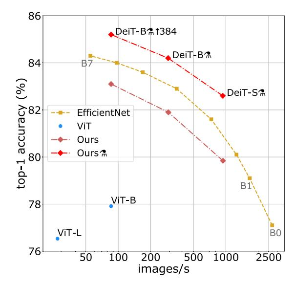
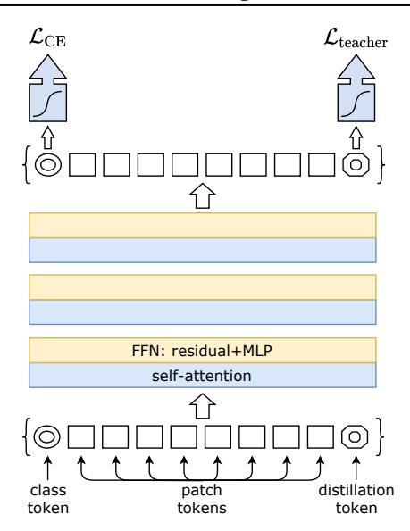
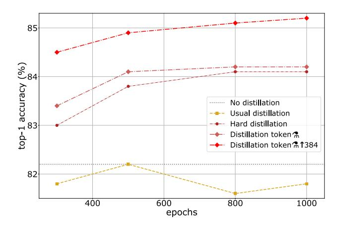

# Training data-efficient image transformers & distillation through attention

Hugo Touvron 12 Matthieu Cord 12 Matthijs Douze 1 Francisco Massa 1 Alexandre Sablayrolles 1 Hervé Jégou 1

### **Abstract**

Recently, neural networks purely based on attention were shown to address image understanding tasks such as image classification. These high-performing vision transformers are pre-trained with hundreds of millions of images using a large infrastructure, thereby limiting their adoption.

In this work, we produce competitive convolutionfree transformers trained on ImageNet only using a single computer in less than 3 days. Our reference vision transformer (86M parameters) achieves top-1 accuracy of 83.1% (single-crop) on ImageNet with no external data.

We also introduce a teacher-student strategy specific to transformers. It relies on a distillation token ensuring that the student learns from the teacher through attention, typically from a convnet teacher. The learned transformers are competitive (85.2% top-1 acc.) with the state of the art on ImageNet, and similarly when transferred to other tasks. We will share our code and models.

### 1. Introduction

Convolutional neural networks have been the main design paradigm for image understanding tasks, as initially demonstrated on image classification tasks. One of the ingredient to their success was the availability of a large training set, namely Imagenet. Motivated by the success of attention-based models in Natural Language Processing, there has been an increasing interest in architectures leveraging attention mechanisms within convnets. More recently several researchers have proposed hybrid architecture transplanting transformer ingredients to convnets to solve vision tasks.

The vision transformer (ViT) introduced by Dosovitskiy et al. (2020) is an architecture directly inherited from Natural Language Processing (Vaswani et al., 2017), but applied

Proceedings of the  $38^{th}$  International Conference on Machine Learning, PMLR 139, 2021. Copyright 2021 by the author(s).

Figure 1. Throughput and accuracy on Imagenet of our method (no external training data). The throughput is measured as the number of images processed per second on a V100 GPU. DeiT-B is identical to ViT-B, but with training adapted to a data-starving regime. It is learned in a few days on one machine. The symbol refers to models trained with our transformer-specific distillation. See Table 5 for details and more models.

to image classification with raw image patches as input. Their paper presented excellent results with transformers trained with a large private labelled image dataset containing 300 millions images. The paper concluded that vision transformers "do not generalize well when trained on insufficient amounts of data". The training of these models involved extensive computing resources.

In our paper, we train a vision transformer on a single 8-GPU node in two to three days (53 hours of pre-training, and optionally 20 hours of fine-tuning) that is competitive with convnets having a similar number of parameters and efficiency. It uses Imagenet as the sole training set. We build upon the visual transformer architecture from Dosovitskiy et al. (2020) and improvements included in the timm library (Wightman, 2019). With our Data-efficient image Transformers (DeiT), we report large improvements over previous results, see Figure 1. Our ablation study details the hyper-parameters and key ingredients for a successful training, such as repeated augmentation.

&lt;sup>1Facebook AI 2Sorbonne University. Correspondence to: Hugo Touvron <a href="mailto:htouvron@fb.com">htouvron@fb.com</a>>.

We address another question: how to distill these models? We introduce a token-based strategy, DeiT2, that advantageously replaces the usual distillation for transformers.

In summary, our work makes the following contributions:

- We show that our neural networks that contain no convolutional layer can achieve competitive results against the state of the art on ImageNet with no external data. They are learned on a single node with 4 GPUs in three days1. Our two new models DeiT-S and DeiT-Ti have fewer parameters and can be seen as the counterpart of ResNet-50 and ResNet-18.
- We introduce a new distillation procedure based on a distillation token, which plays the same role as the class token, except that it aims at reproducing the label estimated by the teacher. Both tokens interact in the transformer through attention. This transformer-specific strategy outperforms vanilla distillation by a significant margin.
- Our models pre-learned on Imagenet are competitive when transferred to different downstream tasks such as fine-grained classification, on several popular public benchmarks: CIFAR-10, CIFAR-100, Oxford-102 flowers, Stanford Cars and iNaturalist-18/19.

#### 2. Related work

Image Classification is so core to computer vision that it is often used as a benchmark to measure progress in image understanding. Any progress usually translates to improvement in other related tasks such as detection or segmentation. Since 2012's AlexNet (Krizhevsky et al., 2012), convnets have dominated this benchmark and have become the de facto standard. The evolution of the state of the art on the ImageNet dataset (Russakovsky et al., 2015) reflects the progress with convolutional architectures and optimization methods (Simonyan & Zisserman, 2015; Tan & Le, 2019; Touvron et al., 2019).

Despite several attempts to use transformers for image classification (Chen et al., 2020a), until now their performance has been inferior to that of convnets. Nevertheless hybrid architectures that combine convnets and transformers, including the self-attention mechanism, have exhibited competitive results in image classification (Bello et al., 2019; Bello, 2021; Wu et al., 2020), detection (Carion et al., 2020; Hu et al., 2018), video processing (Sun et al., 2019; Wang et al., 2018), unsupervised object discovery (Locatello et al., 2020), and text-vision tasks (Chen et al., 2020b; Li et al., 2019a; Lu et al., 2019).

Recently Vision transformers (ViT) (Dosovitskiy et al., 2020) closed the gap with the state of the art on ImageNet,

without using any convolution. This performance is remarkable since convnet methods for image classification have benefited from years of tuning and optimization (He et al., 2019; Wightman, 2019). Nevertheless, according to Dosovitskiy et al. (2020), a pre-training phase on a large volume of curated data is required for the learned transformer to be effective. In our paper we achieve a strong performance with ImageNet-1k and report decent results even on CIFAR-10.

The Transformer architecture, introduced by Vaswani et al. (Vaswani et al., 2017) for machine translation is currently the reference model for all natural language processing (NLP) tasks. Many improvements of convnets for image classification are inspired by transformers. For example, Squeeze and Excitation (Hu et al., 2017), Selective Kernel (Li et al., 2019b), Split-Attention Networks (Zhang et al., 2020) and Stand-Alone Self-Attention (Ramachandran et al., 2019) exploit mechanism akin to transformers self-attention (SA) mechanism. Moreover, Cordonnier et al., 2020) study the link between SA and convolution.

**Knowledge Distillation** (Hinton et al., 2015) refers to the training paradigm in which a student model leverages "soft" labels coming from a strong teacher network. This is the output vector of the teacher's softmax function rather than just the maximum of scores, wich gives a "hard" label. Such a training improves the performance of the student model (alternatively, it can be regarded as a form of compression of the teacher model into a smaller one – the student). On the one hand the teacher's soft labels will have a similar effect to labels smoothing (Yuan et al., 2020). On the other hand as shown by Wei et al. (2020) the teacher's supervision takes into account the effects of the data augmentation, which sometimes causes a misalignment between the real label and the image. For example, let us consider image with a "cat" label that represents a large landscape and a small cat in a corner. If the cat is no longer on the crop of the data augmentation it implicitly changes the label of the image. Knowledge distillation can transfer inductive biases (Abnar et al., 2020) in a soft way in a student model using a teacher model where they would be incorporated in a hard way. In our paper we study the distillation of a transformer student by either a convnet or a transformer teacher, motivated by inducing convolutional bias into transformers.

#### 3. Vision transformer: overview

In this section, we briefly recall preliminaries associated with the vision transformer (Dosovitskiy et al., 2020; Vaswani et al., 2017), denoted by ViT. We further discuss positional encoding and resolution.

**Multi-head Self Attention layers (MSA).** The attention mechanism is based on a trainable associative memory with

&lt;sup>1We can accelerate the learning of the larger model DeiT-B by training it on 8 GPUs in two days.

(key, value) vector pairs. A *query* vector  $q \in \mathbb{R}^d$  is matched against a set of k key vectors (packed together into a matrix  $K \in \mathbb{R}^{k \times d}$ ) using inner products. These inner products are then scaled and normalized with a softmax function to obtain k weights. The output of the attention is the weighted sum of a set of k value vectors (packed into  $V \in \mathbb{R}^{k \times d}$ ). For a sequence of N query vectors (packed into  $Q \in \mathbb{R}^{N \times d}$ ), it produces an output matrix (of size  $N \times d$ ):

Attention
$$(Q, K, V) = \text{Softmax}(QK^{\top}/\sqrt{d})V$$
, (1)

where the Softmax function is applied on each row of the input matrix. The  $\sqrt{d}$  term provides proper normalization. Vaswani et al. (2017) propose a self-attention layer. Query, key and values matrices are themselves computed from a sequence of N input vectors (packed into  $X \in \mathbb{R}^{N \times D}$ ):  $Q = XW_Q$ ,  $K = XW_K$ ,  $V = XW_V$ , using linear transformations  $W_Q$ ,  $W_K$ ,  $W_V$  with the constraint k = N, meaning that the attention is in between all the input vectors.

Finally, Multi-head self-attention layer (MSA) is defined by considering h attention "heads",  $ie\ h$  self-attention functions applied to the input. Each head provides a sequence of size  $N\times d$ . These h sequences are rearranged into a  $N\times dh$  sequence that is reprojected by a linear layer into  $N\times D$ .

**Transformer block for images.** To get a full transformer block as in (Vaswani et al., 2017), we add a Feed-Forward Network (FFN) on top of the MSA layer. This FFN is composed of two linear layers separated by a GeLu activation (Hendrycks & Gimpel, 2016). The first linear layer expands the dimension from D to 4D, and the second layer reduces it back from 4D back to D. Both MSA and FFN are operating as residual operators thank to skip-connections, and with a layer normalization (Ba et al., 2016).

In order to get a transformer to process images, our work builds upon the ViT model (Dosovitskiy et al., 2020). It is a simple and elegant architecture that processes an input image as if it was a sequence of input tokens. The fixed-size input RGB image is decomposed into a batch of N patches of a fixed size of  $16 \times 16$  pixels ( $N = 14 \times 14$ ). Each patch is projected with a linear layer that conserves its overall dimension  $3 \times 16 \times 16 = 768$ .

The transformer block described above is invariant to the order of the patch embeddings, and thus ignores their positions. The positional information is incorporated as fixed (Vaswani et al., 2017) or trainable (Gehring et al., 2017) positional embeddings. They are added before the first transformer block to the patch tokens, which are then fed to the stack of transformer blocks.

**The class token** is a trainable vector, appended to the patch tokens before the first layer, that goes through the transformer layers, and is then projected with a linear layer to predict the class. This class token is inherited from

NLP (Devlin et al., 2018), and departs from the typical pooling layers used in computer vision to predict the class. The transformer thus process batches of (N+1) tokens of dimension D, of which only the class vector is used to predict the output. This architecture forces the self-attention to spread information between the patch tokens and the class token: at training time the supervision signal comes only from the class embedding, while the patch tokens are the model's only variable input.

Fixing the positional encoding across resolutions. Touvron et al. (2019) show that it is desirable to use a lower training resolution and fine-tune the network at the larger resolution. This speeds up the full training and improves the accuracy under prevailing data augmentation schemes. When increasing the resolution of an input image, we keep the patch size the same, therefore the number N of input patches does change. Due to the architecture of transformer blocks and the class token, the model and classifier do not need to be modified to process more tokens. In contrast, one needs to adapt the positional embeddings, because there are N of them, one for each patch. Dosovitskiy et al. (2020) interpolate the positional encoding when changing the resolution and demonstrate that this method works with the subsequent fine-tuning stage.

# 4. Distillation through attention

In this section, we assume we have access to a strong image classifier as a teacher model. It could be a convnet, or a mixture of classifiers. We address the question of how to learn a transformer by exploiting this teacher. As we will see in Section 5 by comparing the trade-off between accuracy and image throughput, it can be beneficial to replace a convolutional neural network by a transformer. This section covers two axes of distillation: hard versus soft distillation, and classical distillation *vs* distillation token.

**Soft distillation** (Hinton et al., 2015; Wei et al., 2020) minimizes the Kullback-Leibler divergence between the softmax of the teacher and the softmax of the student model.

Let  $Z_t$  be the logits of the teacher model,  $Z_s$  the logits of the student model. We denote by  $\tau$  the temperature for the distillation,  $\lambda$  the coefficient balancing the Kullback–Leibler divergence loss (KL) and the cross-entropy ( $\mathcal{L}_{CE}$ ) on ground truth labels y, and  $\psi$  the softmax function. The distillation objective is

$$\mathcal{L}_{\text{global}} = (1 - \lambda) \mathcal{L}_{\text{CE}}(\psi(Z_{\text{s}}), y) + \lambda \tau^2 \text{KL}(\psi(Z_{\text{s}}/\tau), \psi(Z_{\text{t}}/\tau)).$$
 (2)

**Hard-label distillation.** We introduce a variant of distillation where we take the hard decision of the teacher as a

Figure 2. Our distillation procedure: we simply include a new distillation token. It interacts with the class and patch tokens through the self-attention layers. This distillation token is employed in a similar fashion as the class token, except that on output of the network its objective is to reproduce the (hard) label predicted by the teacher, instead of true label. Both the class and distillation tokens input to the transformers are learned by back-propagation.

true label. Let  $y_t = \operatorname{argmax}_c Z_t(c)$  be the hard decision of the teacher, the objective associated with this hard-label distillation is:

$$\mathcal{L}_{\text{global}}^{\text{hardDistill}} = \frac{1}{2} \mathcal{L}_{\text{CE}}(\psi(Z_s), y) + \frac{1}{2} \mathcal{L}_{\text{CE}}(\psi(Z_s), y_t). \tag{3}$$

For a given image, the hard label associated with the teacher may change depending on the specific data augmentation. We will see that this choice is better than the traditional one, while being parameter-free and conceptually simpler: The teacher prediction  $y_{\rm t}$  plays the same role as the true label y.

**Label smoothing.** Hard labels can also be converted into soft labels with label smoothing (Szegedy et al., 2016), where the true label is considered to have a probability of  $1-\varepsilon$ , and the remaining  $\varepsilon$  is shared across the remaining classes. We fix  $\varepsilon=0.1$  in our all experiments that use true labels. Note that we do not smooth pseudo-labels provided by the teacher (e.g., in hard distillation).

**Distillation token.** We now focus on our proposal, which is illustrated in Figure 2. We add a new token, the distillation token, to the initial embeddings (patches and class token). Our distillation token is used similarly as the class token: it interacts with other embeddings through self-attention, and is output by the network after the last layer. Its target objective is given by the distillation component of the loss. The distillation embedding allows our model to learn from

the output of the teacher, as in a regular distillation, while remaining complementary to the class embedding.

**Fine-tuning with distillation.** We use both the true label and teacher prediction during the fine-tuning stage at higher resolution. We use a teacher with the same target resolution, typically obtained from the lower-resolution teacher by the method of Touvron et al. (2019). We have also tested with true labels only but this reduces the benefit of the teacher and leads to a lower performance.

Classification with our approach: joint classifiers. At test time, both the class or the distillation embeddings produced by the transformer are associated with linear classifiers and able to infer the image label. Our referent method is the late fusion of these two separate heads, for which we add the softmax output by the two classifiers to make the prediction. We evaluate these three options in Section 5.

# 5. Experiments

This section presents a few analytical experiments and results. We first discuss our distillation strategy. Then we comparatively analyze the efficiency and accuracy of convnets and vision transformers.

#### **5.1. Transformer models**

As mentioned earlier, our architecture design is identical to the one proposed by Dosovitskiy et al. (2020) with no convolutions. Our only differences are the training strategies, and the distillation token. Also we do not use a MLP head for the pre-training but only a linear classifier. To avoid any confusion, we refer to the results obtained in the prior work by ViT, and prefix ours by DeiT. If not specified, DeiT refers to our referent model DeiT-B, which has the same architecture as ViT-B. When we fine-tune DeiT at a larger resolution, we append the resulting operating resolution at the end, e.g, DeiT-B384. Last, when using our distillation procedure, we identify it with an alembic sign as DeiT\*.

The parameters of ViT-B (and therefore of DeiT-B) are fixed as D=768, h=12 and d=D/h=64. We introduce two smaller models, namely DeiT-S and DeiT-Ti, for which we change the number of heads, keeping d fixed. Table 1 summarizes the models that we consider in our paper.

#### 5.2. Distillation

Our distillation method produces a vision transformer that becomes on par with the best convnets in terms of the trade-off between accuracy and throughput, see Table 5. Interestingly, the distilled model outperforms its teacher in terms of the trade-off between accuracy and throughput. Our best model on ImageNet-1k is 85.2% top-1 accuracy out-

Table 1. Variants of our DeiT architecture. The larger model, DeiTB, has the same architecture as the ViT-B (Dosovitskiy et al., 2020). The only parameters that vary across models are the embedding dimension and the number of heads, and we keep the dimension per head constant (equal to 64). Smaller models have a lower parameter count, and a faster throughput. The throughput is measured for images at resolution  $224 \times 224$ .

| Model   | embedding dimension | #heads | #layers | #params | training resolution | throughput (im/sec) |
|---------|------------------------|--------|---------|---------|---------------------|------------------------|
| DeiT-Ti | 192                    | 3      | 12      | 5M      | 224                 | 2536                   |
| DeiT-S  | 384                    | 6      | 12      | 22M     | 224                 | 940                    |
| DeiT-B  | 768                    | 12     | 12      | 86M     | 224                 | 292                    |

Table 2. ImageNet-1k top-1 accuracy of the student as a function of the teacher model used for distillation. The convolutional Regnet by Radosavovic et al. (2020) have been trained with a similar training as our transformers, except that we used SGD. We provide more details about their performance and efficiency in Table 5. Interestingly, image transformers learn more from a convnet than from another transformer with comparable performance.

| Teacher      | Student: DeiT-B |          |      |  |
|--------------|-----------------|----------|------|--|
| Models       | acc.            | pretrain | ↑384 |  |
| DeiT-B       | 81.8            | 81.9     | 83.1 |  |
| RegNetY-4GF  | 80.0            | 82.7     | 83.6 |  |
| RegNetY-8GF  | 81.7            | 82.7     | 83.8 |  |
| RegNetY-12GF | 82.4            | 83.0     | 83.9 |  |
| RegNetY-16GF | 82.9            | 83.0     | 84.0 |  |

performs the best Vit-B model pre-trained on JFT-300M and fine-tuned on ImageNet-1k at resolution 384 (84.15%). Note, the current state of the art of 88.55% achieved with extra training data is the ViT-H model (632M parameters) trained on JFT-300M and fine-tuned at resolution 512. Hereafter we provide several analysis and observations.

Convnets teachers. We have observed that using a convnet teacher gives better performance than using a transformer. Table 2 compares distillation results with different teacher architectures. The fact that the convnet is a better teacher is probably due to the inductive bias inherited by the transformers through distillation, as explained in Abnar et al. (2020). In all of our subsequent distillation experiments the default teacher is a RegNetY-16GF (Radosavovic et al., 2020) with 84M parameters, that we trained with the same data and same data-augmentation as DeiT. This teacher reaches 82.9% top-1 accuracy on ImageNet.

**Comparison of distillation methods.** We compare the performance of different distillation strategies in Table 3. Hard distillation significantly outperforms soft distillation for transformers, even when using only a class token: hard distillation reaches 83.0% at resolution 224×224, compared to the soft distillation accuracy of 81.8%. Our distillation

Table 3. Distillation experiments on ImageNet-1k with DeiT, 300 epochs of pre-training. We report the results for the architecture augmented with an additional token/embedding in the last three rows. We separately report the performance when classifying with only one of the class or distillation embedding, and then with a classifier taking both of them as input. In the last row (class+distillation), the result correspond to the late fusion of the class and distillation classifiers.

|                           | sup      | ervision | ImageNet top-1 (%) |       |       |       |  |
|---------------------------|----------|----------|--------------------|-------|-------|-------|--|
| DeiT: method $\downarrow$ | label    | teacher  | Ti 224             | S 224 | B 224 | B↑384 |  |
| no distillation           | 1        | Х        | 72.2               | 79.8  | 81.8  | 83.1  |  |
| usual distillation        | Х        | soft     | 72.2               | 79.8  | 81.8  | 83.2  |  |
| hard distillation         | X        | hard     | 74.3               | 80.9  | 83.0  | 84.0  |  |
| class embedding           | <b>/</b> | hard     | 73.9               | 80.9  | 83.0  | 84.2  |  |
| distil. embedding         | /        | hard     | 74.6               | 81.1  | 83.1  | 84.4  |  |
| DeiTa: class+distil.      | ✓        | hard     | 74.5               | 81.2  | 83.4  | 84.5  |  |

strategy from Section 4 further improves the performance, showing that the two tokens provide complementary information useful for classification: the classifier on the two tokens is significantly better than the independent class and distillation classifiers, which by themselves already outperform the distillation baseline.

The embedding associated with the distillation token gives slightly better results than the class token. It is also more correlated to the convnets prediction. In all cases, including it improves the performance of the different classifiers. We give more details and an analysis in the next paragraph.

Agreement with the teacher & inductive bias? As discussed above, the architecture of the teacher has an important impact. Does it inherit existing inductive bias that would facilitate the training? While we believe it difficult to formally answer this question, we analyze in Table 4 the decision agreement between the convnet teacher, our image transformer DeiT learned from labels only, and our transformer DeiTa. Our distilled model is more correlated to the convnet than with a transformer learned from scratch. As to be expected, the classifier associated with the distillation embedding is closer to the convnet that the one associated with the class embedding, and conversely the one associated with the class embedding is more similar to DeiT learned without distillation. Unsurprisingly, the joint class+distil classifier offers a middle ground.

Analysis of the tokens. We observe that the learned class and distillation tokens converge towards different vectors: the average cosine similarity (cos) between these tokens equal to 0.06. The class and distillation embeddings computed at each layer gradually become more similar through the network, all the way through the last layer at which their similarity is high (cos=0.93), but still lower than 1. This is expected since as they aim at producing targets that are

Table 4. Disagreement analysis between convnet, image transformers and distillated transformers: We report the fraction of sample classified differently for all classifier pairs, i.e., the rate of different decisions. We include two models without distillation (a RegNetY and DeiT-B), so that we can compare how our distilled models and classification heads are correlated to the RegNetY teacher.

|                     | no distil | lation | DeiTa student |         |                   |  |
|---------------------|-----------|--------|---------------|---------|-------------------|--|
|                     | convnet   | DeiT   | class         | distil. | DeiT ☎ |  |
| groundtruth         | 0.171     | 0.182  | 0.170         | 0.169   | 0.166             |  |
| convnet (RegNetY)   | 0.000     | 0.133  | 0.112         | 0.100   | 0.102             |  |
| DeiT                | 0.133     | 0.000  | 0.109         | 0.110   | 0.107             |  |
| DeiT≈- class only   | 0.112     | 0.109  | 0.000         | 0.050   | 0.033             |  |
| DeiT₂- distil. only | 0.100     | 0.110  | 0.050         | 0.000   | 0.019             |  |
| DeiT? class+distil. | 0.102     | 0.107  | 0.033         | 0.019   | 0.000             |  |

similar but not identical.

We verified that our distillation token adds something to the model, compared to simply adding an additional class token associated with the same target label: instead of a teacher pseudo-label, we experimented with a transformer with two class tokens. Even if we initialize them randomly and independently, during training they converge towards the same vector (cos=0.999), and the output embedding are also quasi-identical. In contrast to our distillation strategy, an additional class token does not bring anything to the classification performance.

Number of epochs. Increasing the number of epochs significantly improves the performance of training with distillation, see Figure 3. With 300 epochs2, our distilled network DeiT-B2 is already better than DeiT-B. But while for the latter the performance saturates with longer schedules, the distilled network benefits from a longer training time.

#### **5.3.** Efficiency vs accuracy: a comparison to convnets

In the literature, image classification methods are often compared as a compromise between accuracy and another criterion, such as FLOPs, number of parameters, size of the network, etc. We focus in Figure 1 on the tradeoff between the throughput (images per second) and the top-1 classification accuracy on ImageNet. The throughput is measured as the number of images that we can process per second on one 16GB V100 GPU: we take the largest possible batch size and average the processing time over 30 runs. We focus on the popular EfficientNet convnet, which has benefited from years of research on convnets and was optimized by architecture search on the ImageNet validation set.

Figure 3. Distillation on ImageNet1k with DeiT-B: top-1 accuracy as a function of the training epochs. The performance without distillation (horizontal dotted line) saturates after 400 epochs.

Our method DeiT is slightly below EfficientNet, which shows that we have almost closed the gap between vision transformers and convnets when training with Imagenet only. These results are a major improvement (+6.3% top-1 in a comparable setting) over previous ViT models trained on Imagenet1k only (Dosovitskiy et al., 2020). Furthermore, when DeiT benefits from the distillation from a relatively weaker RegNetY to produce DeiT2, it outperforms EfficientNet. It also outperforms by 1% (top-1 acc.) the Vit-B model pre-trained on JFT300M at resolution 384 (85.2% vs 84.15%), while being significantly faster to train.

Table 5 reports the numerical results in more details and additional evaluations on ImageNet V2 and ImageNet Real, that have a test set distinct from the ImageNet validation, which reduces overfitting on the validation set. Our results show that DeiT-Ba and DeiT-Ba \$\gamma384\$ outperform, by some margin, the state of the art on the trade-off between accuracy and inference time on GPU.

#### 5.4. Transfer learning to downstream tasks

Although DeiT perform very well on ImageNet it is important to evaluate them on other datasets with transfer learning in order to measure the power of generalization of DeiT. We evaluated this on transfer learning tasks by fine-tuning on the datasets in Table 8. Table 6 compares DeiT transfer learning results to those of ViT and EfficientNet. DeiT is on par with competitive convnet models, which is in line with our previous conclusion on ImageNet1k.

Comparison vs training from scratch. We investigate the performance when training from scratch on a small dataset, without Imagenet pre-training. We get the following results on the small CIFAR-10, which is small both w.r.t. the number of images and labels:

&lt;sup>2Formally we have 100 epochs, but each is 3x longer because of the repeated augmentations. We prefer to refer to this as 300 epochs in order to have a direct comparison on the effective training time with and without repeated augmentation.

Table 5. Throughput (images/s) vs accuracy on Imagenet (Russakovsky et al., 2015), Imagenet Real (Beyer et al., 2020) and Imagenet V2 matched frequency (Recht et al., 2019) of models trained without external data. We compare DeiT and Vit-B (Dosovitskiy et al., 2020) to several state-of-the-art convnets: ResNet (He et al., 2016), Regnet (Radosavovic et al., 2020), EfficientNet (Tan & Le, 2019; Cubuk et al., 2019; Wei et al., 2020). We use for each model the definition in the same GitHub (Wightman, 2019) repository. The reported results are from corresponding papers.

|                          | nb of      | image        |            | ImNet | Real  | V2    |
|--------------------------|------------|--------------|------------|-------|-------|-------|
| Network                  | param.     | size         | im/s       | top-1 | top-1 | top-1 |
| ResNet-18                | 12M        | 224          | 4458.4     | 69.8  | 77.3  | 57.1  |
| ResNet-50                | 25M        | 224          | 1226.1     | 76.2  | 82.5  | 63.3  |
| ResNet-101               | 45M        | 224          | 753.6      | 77.4  | 83.7  | 65.7  |
| ResNet-152               | 60M        | 224          | 526.4      | 78.3  | 84.1  | 67.0  |
| RegNetY-4GF⋆             | 21M        | 224          | 1156.7     | 80.0  | 86.4  | 69.4  |
| RegNetY-8GF*             | 39M        | 224          | 591.6      | 81.7  | 87.4  | 70.8  |
| RegNetY-16GF⋆            | 84M        | 224          | 334.7      | 82.9  | 88.1  | 72.4  |
| EfficientNet-B0          | 5M         | 224          | 2694.3     | 77.1  | 83.5  | 64.3  |
| EfficientNet-B1          | 8M         | 240          | 1662.5     | 79.1  | 84.9  | 66.9  |
| EfficientNet-B2          | 9M         | 260          | 1255.7     | 80.1  | 85.9  | 68.8  |
| EfficientNet-B3          | 12M        | 300          | 732.1      | 81.6  | 86.8  | 70.6  |
| EfficientNet-B4          | 19M        | 380          | 349.4      | 82.9  | 88.0  | 72.3  |
| EfficientNet-B5          | 30M        | 456          | 169.1      | 83.6  | 88.3  | 73.6  |
| EfficientNet-B6          | 43M        | 528          | 96.9       | 84.0  | 88.8  | 73.9  |
| EfficientNet-B7          | 66M        | 600          | 55.1       | 84.3  | -     | -     |
| EfficientNet-B5 RA       | 30M        | 456          | 96.9       | 83.7  | l -   | l -   |
| EfficientNet-B7 RA       | 66M        | 600          | 55.1       | 84.7  | -     | -     |
| KDforAA-B8               | 87M        | 800          | 25.2       | 85.8  | _     | _     |
|                          | Transform  | ers: traini  | ng 300 ep  | ochs  |       |       |
| ViT-B/16                 | 86M        | 384          | 85.9       | 77.9  | 83.6  | 1     |
| ViT-L/16                 | 307M       | 384          | 27.3       | 76.5  | 82.2  | _     |
| DeiT-Ti                  | 5M         | 224          | 2536.5     | 72.2  | 80.1  | 60.4  |
| DeiT-II DeiT-S        | 22M        | 224          | 940.4      | 79.8  | 85.7  | 68.5  |
| DeiT-S DeiT-B         | 86M        | 224          | 292.3      | 81.8  | 86.7  | 71.5  |
| DeiT-B DeiT-B↑384     | 86M        | 384          | 85.9       | 83.1  | 87.7  | 72.4  |
| ·                        |            |              |            |       |       | 1     |
| DeiT-Tia                 | 6M         | 224          | 2529.5     | 74.5  | 82.1  | 62.9  |
| DeiT-S≄                  | 22M        | 224          | 936.2      | 81.2  | 86.8  | 70.0  |
| DeiT-Ba                  | 87M        | 224          | 290.9      | 83.4  | 88.3  | 73.2  |
| DeiT-B 2 ↑384 | 87M        | 384          | 85.8       | 84.5  | 89.0  | 74.8  |
|                          | Transforme | ers: trainii | ng 1000 ep | ochs  |       |       |
| DeiT-Ti₁                 | 6M         | 224          | 2529.5     | 76.6  | 83.9  | 65.4  |
| DeiT-S≄                  | 22M        | 224          | 936.2      | 82.6  | 87.8  | 71.7  |
| DeiT-B≄                  | 87M        | 224          | 290.9      | 84.2  | 88.7  | 73.9  |
| DeiT-Ba ↑384             | 87M        | 384          | 85.8       | 85.2  | 89.3  | 75.2  |

\*: our trained teachers with SGD, whose optimization procedure is closer to DeiT

*Table 6.* We compare Transformers based models on different transfer learning task with ImageNet pre-training. We also give results obtained with Efficient-B7 for reference (Tan & Le, 2019).

| Model               | ImageNet | CIFAR-10 | CIFAR-100 | Flowers | Cars | iNat-18 | iNat-19 | im/sec |
|---------------------|----------|----------|-----------|---------|------|---------|---------|--------|
| EfficientNet-B7     | 84.3     | 98.9     | 91.7      | 98.8    | 94.7 | -       | -       | 55.1   |
| ViT-B/32            | 73.4     | 97.8     | 86.3      | 85.4    | _    | _       | _       | 394.5  |
| ViT-B/16            | 77.9     | 98.1     | 87.1      | 89.5    | _    | _       | _       | 85.9   |
| ViT-L/32            | 71.2     | 97.9     | 87.1      | 86.4    | _    | _       | _       | 124.1  |
| ViT-L/16            | 76.5     | 97.9     | 86.4      | 89.7    | -    | -       | -       | 27.3   |
| DeiT-B              | 81.8     | 99.1     | 90.8      | 98.4    | 92.1 | 73.2    | 77.7    | 292.3  |
| DeiT-B↑384          | 83.1     | 99.1     | 90.8      | 98.5    | 93.3 | 79.5    | 81.4    | 85.9   |
| DeiT-B ∗ | 83.4     | 99.1     | 91.3      | 98.8    | 92.9 | 73.7    | 78.4    | 290.9  |
| DeiT-Ba ↑384        | 84.4     | 99.2     | 91.4      | 98.9    | 93.9 | 80.1    | 83.0    | 85.9   |

Table 7. Ablation study on training methods on ImageNet (top-1 acc.). The top row ("none") corresponds to our default configuration employed for DeiT. The symbols ✓ and ✗ indicate that we use and do not use the corresponding method, respectively. We report the accuracy scores (%) after the initial training at resolution 224×224, and after fine-tuning at resolution 384×384. The hyperparameters are fixed according to Table 9, and may be suboptimal. \* indicates that the model did not train well, possibly because hyper-parameters are not adapted.

| Pre-training | Fine-tuning | Rand-Augment | AutoAug | Mixup        | CutMix       | Erasing | Stoch. Depth | Repeated Aug. | Dropout | Exp. Moving Avg. | pre-trained 224      | fine-tuned 384 |
|--------------|-------------|--------------|---------|--------------|--------------|---------|--------------|---------------|---------|------------------|----------------------|----------------|
| adamw        | adamw       | /            | X       | 1            | 1            | ✓       | /            | 1             | X       | X                | 81.8 ±0.2 | 83.1±0.1       |
| SGD          | adamw       | 1            | Х       | 1            | /            | /       | 1            | /             | Х       | X                | 74.5                 | 77.3           |
| adamw        | SGD         | 1            | X       | $\checkmark$ | $\checkmark$ | /       | 1            | 1             | X       | X                | 81.8                 | 83.1           |
| adamw        | adamw       | X            | Х       | /            | /            | /       | 1            | /             | Х       | Х                | 79.6                 | 80.4           |
| adamw        | adamw       | X            | ✓       | $\checkmark$ | $\checkmark$ | 1       | 1            | /             | X       | X                | 81.2                 | 81.9           |
| adamw        | adamw       | 1            | Х       | Х            | $\checkmark$ | 1       | 1            | /             | Х       | X                | 78.7                 | 79.8           |
| adamw        | adamw       | 1            | Х       | /            | Х            | 1       | 1            | /             | X       | X                | 80.0                 | 80.6           |
| adamw        | adamw       | 1            | Х       | Х            | Х            | 1       | 1            | /             | X       | X                | 75.8                 | 76.7           |
| adamw        | adamw       | 1            | Х       | /            | $\checkmark$ | Х       | 1            | /             | Х       | X                | 4.3*                 | 0.1            |
| adamw        | adamw       | 1            | X       | /            | $\checkmark$ | /       | X            | /             | X       | X                | 3.4*                 | 0.1            |
| adamw        | adamw       | 1            | X       | $\checkmark$ | $\checkmark$ | 1       | 1            | X             | X       | X                | 76.5                 | 77.4           |
| adamw        | adamw       | 1            | X       | $\checkmark$ | $\checkmark$ | 1       | 1            | 1             | ✓       | X                | 81.3                 | 83.1           |
| adamw        | adamw       | 1            | X       | $\checkmark$ | $\checkmark$ | 1       | 1            | $\checkmark$  | Х       | ✓                | 81.9                 | 83.1           |

| Method | RegNetY-16GF | DeiT-B | DeiT-B≈ |
|--------|--------------|--------|---------|
| Top-1  | 98.0         | 97.5   | 98.5    |

For this experiment, we tried we get as close as possible to the Imagenet pre-training counterpart, meaning that (1) we consider longer training schedules (up to 7200 epochs, which corresponds to 300 Imagenet epochs) so that the network has been fed a comparable number of images in total; (2) we re-scale images to  $224 \times 224$  to ensure that we have the same augmentation. The results are not as good as with Imagenet pre-training (98.5% vs 99.1%), which is expected since the network has seen a much lower diversity. However they show that it is possible to learn a reasonable transformer on CIFAR-10 only.

### 6. Training details & ablation

This section discusses the DeiT training strategy to learn vision transformers in a data-efficient manner. We build upon PyTorch (Paszke et al., 2019) and the timm3 library (Wightman, 2019). We provide hyper-parameters and an ablation study in which we analyze the impact of each choice.

&lt;sup>3The timm implementation includes a training procedure that improved the accuracy of ViT-B from 77.91% to 79.35% top-1, and trained on Imagenet-1k with a 8xV100 GPU machine.

Initialization and hyper-parameters. Transformers are relatively sensitive to initialization. After testing several options, some of them not converging, we follow Hanin & Rolnick (2018) and initialize the weights with a truncated normal distribution. Table 9 indicates the hyper-parameters that we use by default at training time for all our experiments, unless stated otherwise. For distillation we follow the recommendations from Cho & Hariharan (2019) to select the parameters  $\tau$  and  $\lambda$ . We take the typical values  $\tau=3.0$  or  $\tau=1.0$  and  $\lambda=0.1$  for the usual (soft) distillation.

**Data-Augmentation.** Compared to models that integrate more priors (such as convolutions), transformers require a larger amount of data. Thus, in order to train with datasets of the same size, we rely on extensive data augmentation. We evaluate different types of strong data augmentation, with the objective to reach a data-efficient training regime.

Auto-Augment (Cubuk et al., 2018), Rand-Augment (Cubuk et al., 2019), and random erasing (Zhong et al., 2020) improve the results. For the two latter we use the timm (Wightman, 2019) customizations, and after ablation we choose Rand-Augment instead of AutoAugment. Overall our experiments confirm that transformers require a strong data augmentation: almost all the data-augmentation methods that we evaluate prove to be useful. One exception is dropout, which we exclude from our training procedure.

**Regularization & Optimizers.** We have considered different optimizers and cross-validated different learning rates and weight decays. Transformers are sensitive to the setting of optimization hyper-parameters. Therefore, during cross-validation, we tried 3 different learning rates  $(5.10^{-4}, 3.10^{-4}, 5.10^{-5})$  and 3 weight decay (0.03, 0.04, 0.05). We scale the learning rate according to the batch size with the formula:  $\ln_{\text{scaled}} = \frac{\ln}{512} \times \text{batchsize}$ , similarly to Goyal et al. (2017) except that we use 512 instead of 256 as the base value. The best results use the AdamW optimizer with a much smaller weight decay than in ViT.

We have employed stochastic depth (Huang et al., 2016), which facilitates the convergence of transformers, especially deep ones (Fan et al., 2019; 2020). For vision transformers, they were first adopted in the training procedure by Wightman (2019). Regularization like Mixup (Zhang et al., 2017) and Cutmix (Yun et al., 2019) improve performance. We also use repeated augmentation (Berman et al., 2019; Hoffer et al., 2020), which is one of the key ingredients of our proposed training procedure.

**Exponential Moving Average (EMA).** We evaluate the EMA of our network obtained after training. There are small gains, which vanish after fine-tuning: the EMA model has an edge of is 0.1 accuracy points, but when fine-tuned the two models reach the same (improved) performance.

**Fine-tuning at different resolution.** We adopt the finetuning procedure from Touvron et al. (2020): our schedule, regularization and optimization procedure are identical to that of FixEfficientNet but we keep the training-time data augmentation, unlike the dampened data augmentation of Touvron et al. (2020). We also interpolate the positional embeddings: In principle any classical image scaling technique, like bilinear interpolation, could be used. However, a bilinear interpolation of a vector from its neighbors reduces its  $\ell_2$ -norm compared to its neighbors. These low-norm vectors are not adapted to the pre-trained transformers and we observe a significant drop in accuracy if we employ use directly without any form of fine-tuning. Therefore we adopt a bicubic interpolation that approximately preserves the norm of the vectors, before fine-tuning the network with either AdamW (Loshchilov & Hutter, 2017) or SGD. These optimizers have a similar performance for the fine-tuning stage, see Table 7.

By default and similar to ViT we train DeiT models with at resolution 224 and fine-tune at resolution 384. We detail how to do this interpolation in Section 3.

Training time. A typical training of 300 epochs takes 37 hours with 2 nodes or 53 hours on a single 8-GPU node for the DeiT-B. As a comparison point, a similar training with a RegNetY-16GF (Radosavovic et al., 2020) (84M parameters) is 20% slower. DeiT-S and DeiT-Ti are trained in less than 3 days on 4 GPU. Then, optionally we fine-tune the model at a larger resolution. This takes 20 hours on 8 GPUs to fine-tune a DeiT-B model at resolution 384×384, which corresponds to 25 epochs. Not having to rely on batchnorm allows one to reduce the batch size without impacting performance, which makes it easier to train larger models. Note that, since we use repeated augmentation (Berman et al., 2019; Hoffer et al., 2020) with 3 repetitions, we only see one third of the images during a single epoch.

# 7. Conclusion

We have introduced a data-efficient training procedure for image transformers so that do not require very large amount of data to be trained, thanks to improved training and in particular a novel distillation procedure. Convolutional neural networks have been optimized, both in terms of architecture and optimization, during almost a decade, including through extensive architecture search prone to overfiting.

For DeiT we relied on existing data augmentation and regularization strategies pre-existing for convnets, not introducing any significant architectural change beyond our novel distillation token. Therefore we expect that further research on image transformers will bring further gains.

# 8. Acknowledgements

Many thanks to Ross Wightman for sharing his ViT code and bootstrapping the training method with the community, as well as for valuable feedback that helped us to fix different aspects of this paper. Thanks to Vinicius Reis, MannatSingh, Ari Morcos, Mark Tygert, Gabriel Synnaeve, and other colleagues atFacebook for brainstorming and some exploration on this axis. Thanks to Ross Girshick and Piotr Dollar for constructive comments.

### References

- Abnar, S., Dehghani, M., and Zuidema, W. Transferring inductive biases through knowledge distillation. *arXiv* preprint arXiv:2006.00555, 2020.
- Ba, J. L., Kiros, J. R., and Hinton, G. E. Layer normalization. *arXiv preprint arXiv:1607.06450*, 2016.
- Bello, I. Lambdanetworks: Modeling long-range interactions without attention. *International Conference on Learning Representations*, 2021.
- Bello, I., Zoph, B., Vaswani, A., Shlens, J., and Le, Q. V. Attention augmented convolutional networks. *International Conference on Computer Vision*, 2019.
- Berman, M., Jégou, H., Vedaldi, A., Kokkinos, I., and Douze, M. Multigrain: a unified image embedding for classes and instances. *arXiv preprint arXiv:1902.05509*, 2019.
- Beyer, L., Hénaff, O. J., Kolesnikov, A., Zhai, X., and van den Oord, A. Are we done with imagenet? *arXiv* preprint arXiv:2006.07159, 2020.
- Carion, N., Massa, F., Synnaeve, G., Usunier, N., Kirillov, A., and Zagoruyko, S. End-to-end object detection with transformers. In *European Conference on Computer Vi*sion, 2020.
- Chen, M., Radford, A., Child, R., Wu, J., Jun, H., Luan, D., and Sutskever, I. Generative pretraining from pixels. In *International Conference on Machine Learning*, 2020a.
- Chen, Y.-C., Li, L., Yu, L., Kholy, A. E., Ahmed, F., Gan, Z., Cheng, Y., and jing Liu, J. Uniter: Universal imagetext representation learning. In *European Conference on Computer Vision*, 2020b.
- Cho, J. H. and Hariharan, B. On the efficacy of knowledge distillation. In *International Conference on Computer Vision*, 2019.
- Cordonnier, J.-B., Loukas, A., and Jaggi, M. On the relationship between self-attention and convolutional layers. *arXiv preprint arXiv:1911.03584*, 2020.
- Cubuk, E. D., Zoph, B., Mané, D., Vasudevan, V., and Le, Q. V. Autoaugment: Learning augmentation policies from data. *arXiv preprint arXiv:1805.09501*, 2018.
- Cubuk, E. D., Zoph, B., Shlens, J., and Le, O. V. Ran-

- daugment: Practical automated data augmentation with a reduced search space. *arXiv preprint arXiv:1909.13719*, 2019.
- Devlin, J., Chang, M.-W., Lee, K., and Toutanova, K. Bert: Pre-training of deep bidirectional transformers for language understanding. *arXiv preprint arXiv:1810.04805*, 2018.
- Dosovitskiy, A., Beyer, L., Kolesnikov, A., Weissenborn, D., Zhai, X., Unterthiner, T., Dehghani, M., Minderer, M., Heigold, G., Gelly, S., et al. An image is worth 16x16 words: Transformers for image recognition at scale. *arXiv* preprint arXiv:2010.11929, 2020.
- Fan, A., Grave, E., and Joulin, A. Reducing transformer depth on demand with structured dropout. *arXiv* preprint *arXiv*:1909.11556, 2019.
- Fan, A., Stock, P., Graham, B., Grave, E., Gribonval, R., Jégou, H., and Joulin, A. Training with quantization noise for extreme model compression. *arXiv* preprint *arXiv*:2004.07320, 2020.
- Gehring, J., Auli, M., Grangier, D., Yarats, D., and Dauphin, Y. N. Convolutional sequence to sequence learning. *arXiv* preprint arXiv:1705.03122, 2017.
- Goyal, P., Dollár, P., Girshick, R. B., Noordhuis, P., Wesolowski, L., Kyrola, A., Tulloch, A., Jia, Y., and He, K. Accurate, large minibatch sgd: Training imagenet in 1 hour. *arXiv preprint arXiv:1706.02677*, 2017.
- Hanin, B. and Rolnick, D. How to start training: The effect of initialization and architecture. *Advances in Neural Information Processing Systems*, 2018.
- He, K., Zhang, X., Ren, S., and Sun, J. Deep residual learning for image recognition. In *Conference on Computer Vision and Pattern Recognition*, 2016.
- He, T., Zhang, Z., Zhang, H., Zhang, Z., Xie, J., and Li, M. Bag of tricks for image classification with convolutional neural networks. In *Conference on Computer Vision and Pattern Recognition*, 2019.
- Hendrycks, D. and Gimpel, K. Gaussian error linear units (gelus). *arXiv preprint arXiv:1606.08415*, 2016.
- Hinton, G. E., Vinyals, O., and Dean, J. Distilling the knowledge in a neural network. *arXiv preprint arXiv:1503.02531*, 2015.
- Hoffer, E., Ben-Nun, T., Hubara, I., Giladi, N., Hoefler, T., and Soudry, D. Augment your batch: Improving generalization through instance repetition. In *Conference* on Computer Vision and Pattern Recognition, 2020.
- Horn, G. V., Mac Aodha, O., Song, Y., Shepard, A., Adam, H., Perona, P., and Belongie, S. J. The inaturalist challenge 2018 dataset. *arXiv preprint arXiv:1707.06642*, 2018.
- Horn, G. V., Mac Aodha, O., Song, Y., Shepard, A., Adam, H., Perona, P., and Belongie, S. J. The inaturalist chal-

- lenge 2019 dataset. arXiv preprint arXiv:1707.06642, 2019.
- Hu, H., Gu, J., Zhang, Z., Dai, J., and Wei, Y. Relation networks for object detection. In *Conference on Computer Vision and Pattern Recognition*, 2018.
- Hu, J., Shen, L., and Sun, G. Squeeze-and-excitation networks. *arXiv preprint arXiv:1709.01507*, 2017.
- Huang, G., Sun, Y., Liu, Z., Sedra, D., and Weinberger,K. Q. Deep networks with stochastic depth. In *European Conference on Computer Vision*, 2016.
- Krause, J., Stark, M., Deng, J., and Fei-Fei, L. 3d object representations for fine-grained categorization. In *International IEEE Workshop on 3D Representation and Recognition*, 2013.
- Krizhevsky, A. Learning multiple layers of features from tiny images. Technical report, CIFAR, 2009.
- Krizhevsky, A., Sutskever, I., and Hinton, G. E. Imagenet classification with deep convolutional neural networks. In *Advances in Neural Information Processing Systems*, 2012.
- Li, L. H., Yatskar, M., Yin, D., Hsieh, C.-J., and Chang, K.-W. VisualBERT: a simple and performant baseline for vision and language. arXiv preprint arXiv:1908.03557, 2019a.
- Li, X., Wang, W., Hu, X., and Yang, J. Selective kernel networks. In *Conference on Computer Vision and Pattern Recognition*, 2019b.
- Locatello, F., Weissenborn, D., Unterthiner, T., Mahendran,
  A., Heigold, G., Uszkoreit, J., Dosovitskiy, A., and Kipf,
  T. Object-centric learning with slot attention. arXiv preprint arXiv:2006.15055, 2020.
- Loshchilov, I. and Hutter, F. Fixing weight decay regularization in adam. *arXiv preprint arXiv:1711.05101*, 2017.
- Lu, J., Batra, D., Parikh, D., and Lee, S. Vilbert: Pretraining task-agnostic visiolinguistic representations for vision-and-language tasks. In *Advances in Neural Information Processing Systems*, 2019.
- Nilsback, M.-E. and Zisserman, A. Automated flower classification over a large number of classes. In *Indian Conference on Computer Vision, Graphics and Image Processing*, 2008.
- Paszke, A., Gross, S., Massa, F., Lerer, A., Bradbury, J.,
  Chanan, G., Killeen, T., Lin, Z., Gimelshein, N., Antiga,
  L., et al. Pytorch: An imperative style, high-performance
  deep learning library. In Advances in Neural Information
  Processing Systems, 2019.
- Radosavovic, I., Kosaraju, R. P., Girshick, R. B., He, K., and Dollár, P. Designing network design spaces. *Conference on Computer Vision and Pattern Recognition*, 2020.
- Ramachandran, P., Parmar, N., Vaswani, A., Bello, I., Lev-

- skaya, A., and Shlens, J. Stand-alone self-attention in vision models. In *Advances in Neural Information Processing Systems*, 2019.
- Recht, B., Roelofs, R., Schmidt, L., and Shankar, V. Do imagenet classifiers generalize to imagenet? *arXiv* preprint *arXiv*:1902.10811, 2019.
- Russakovsky, O., Deng, J., Su, H., Krause, J., Satheesh, S.,
  Ma, S., Huang, Z., Karpathy, A., Khosla, A., Bernstein,
  M., Berg, A. C., and Fei-Fei, L. Imagenet large scale visual recognition challenge. *International journal of Computer Vision*, 2015.
- Simonyan, K. and Zisserman, A. Very deep convolutional networks for large-scale image recognition. In *International Conference on Learning Representations*, 2015.
- Sun, C., Myers, A., Vondrick, C., Murphy, K., and Schmid, C. Videobert: A joint model for video and language representation learning. In *Conference on Computer Vision* and Pattern Recognition, 2019.
- Szegedy, C., Vanhoucke, V., Ioffe, S., Shlens, J., and Wojna, Z. Rethinking the inception architecture for computer vision. *Conference on Computer Vision and Pattern Recognition*, 2016.
- Tan, M. and Le, Q. V. Efficientnet: Rethinking model scaling for convolutional neural networks. *arXiv* preprint *arXiv*:1905.11946, 2019.
- Touvron, H., Vedaldi, A., Douze, M., and Jegou, H. Fixing the train-test resolution discrepancy. *Advances in Neural Information Processing Systems*, 2019.
- Touvron, H., Vedaldi, A., Douze, M., and Jégou, H. Fixing the train-test resolution discrepancy: Fixefficientnet. *arXiv* preprint arXiv:2003.08237, 2020.
- Vaswani, A., Shazeer, N., Parmar, N., Uszkoreit, J., Jones, L., Gomez, A. N., Kaiser, L., and Polosukhin, I. Attention is all you need. In *Advances in Neural Information Processing Systems*, 2017.
- Wang, X., Girshick, R. B., Gupta, A., and He, K. Non-local neural networks. *Conference on Computer Vision and Pattern Recognition*, 2018.
- Wei, L., Xiao, A., Xie, L., Chen, X., Zhang, X., and Tian, Q. Circumventing outliers of autoaugment with knowledge distillation. *European Conference on Computer Vision*, 2020.
- Wightman, R. Pytorch image models. https://github.com/rwightman/pytorch-image-models, 2019.
- Wu, B., Xu, C., Dai, X., Wan, A., Zhang, P., Tomizuka, M., Keutzer, K., and Vajda, P. Visual transformers: Tokenbased image representation and processing for computer vision. *arXiv* preprint arXiv:2006.03677, 2020.
- Yuan, L., Tay, F., Li, G., Wang, T., and Feng, J. Revisit knowledge distillation: a teacher-free framework. *Confer-*

- ence on Computer Vision and Pattern Recognition, 2020.
- Yun, S., Han, D., Oh, S. J., Chun, S., Choe, J., and Yoo, Y. Cutmix: Regularization strategy to train strong classifiers with localizable features. *arXiv preprint arXiv:1905.04899*, 2019.
- Zhang, H., Cissé, M., Dauphin, Y. N., and Lopez-Paz, D. mixup: Beyond empirical risk minimization. *arXiv* preprint arXiv:1710.09412, 2017.
- Zhang, H., Wu, C., Zhang, Z., Zhu, Y., Zhang, Z., Lin, H., Sun, Y., He, T., Muller, J., Manmatha, R., Li, M., and Smola, A. Resnest: Split-attention networks. *arXiv* preprint arXiv:2004.08955, 2020.
- Zhong, Z., Zheng, L., Kang, G., Li, S., and Yang, Y. Random erasing data augmentation. In *Conference on Artificial Intelligence*, 2020.