# **Tree-Based Batch Mode Reinforcement Learning**

Damien Ernst Pierre Geurts Louis Wehenkel ERNST@MONTEFIORE.ULG.AC.BE GEURTS@MONTEFIORE.ULG.AC.BE LWH@MONTEFIORE.ULG.AC.BE

Department of Electrical Engineering and Computer Science Institut Montefiore, University of Liège Sart-Tilman B28 B4000 Liège, Belgium

Editor: Michael L. Littman

#### Abstract

Reinforcement learning aims to determine an optimal control policy from interaction with a system or from observations gathered from a system. In batch mode, it can be achieved by approximating the so-called Q-function based on a set of four-tuples  $(x_t, u_t, r_t, x_{t+1})$  where  $x_t$  denotes the system state at time t,  $u_t$  the control action taken,  $r_t$  the instantaneous reward obtained and  $x_{t+1}$  the successor state of the system, and by determining the control policy from this Q-function. The Q-function approximation may be obtained from the limit of a sequence of (batch mode) supervised learning problems. Within this framework we describe the use of several classical tree-based supervised learning methods (CART, Kd-tree, tree bagging) and two newly proposed ensemble algorithms, namely extremely and totally randomized trees. We study their performances on several examples and find that the ensemble methods based on regression trees perform well in extracting relevant information about the optimal control policy from sets of four-tuples. In particular, the totally randomized trees give good results while ensuring the convergence of the sequence, whereas by relaxing the convergence constraint even better accuracy results are provided by the extremely randomized trees.

**Keywords:** batch mode reinforcement learning, regression trees, ensemble methods, supervised learning, fitted value iteration, optimal control

#### 1. Introduction

Research in reinforcement learning (RL) aims at designing algorithms by which autonomous agents can learn to behave in some appropriate fashion in some environment, from their interaction with this environment or from observations gathered from the environment (see e.g. Kaelbling et al. (1996) or Sutton and Barto (1998) for a broad overview). The standard RL protocol considers a performance agent operating in discrete time, observing at time t the environment state  $x_t$ , taking an action  $u_t$ , and receiving back information from the environment (the next state  $x_{t+1}$  and the instantaneous reward  $r_t$ ). After some finite time, the experience the agent has gathered from interaction with the environment may thus be represented by a set of four-tuples  $(x_t, u_t, r_t, x_{t+1})$ .

In on-line learning the performance agent is also the learning agent which at each time step can revise its control policy with the objective of converging as quickly as possible to an optimal control policy. In this paper we consider batch mode learning, where the learning agent is in principle not directly interacting with the system but receives only a set of four-tuples and is asked to determine

from this set a control policy which is as close as possible to an optimal policy. Inspired by the on-line Q-learning paradigm (Watkins, 1989), we will approach this batch mode learning problem by computing from the set of four-tuples an approximation of the so-called Q-function defined on the state-action space and by deriving from this latter function the control policy.

When the state and action spaces are finite and small enough, the *Q*-function can be represented in tabular form, and its approximation (in batch and in on-line mode) as well as the control policy derivation are straightforward. However, when dealing with continuous or very large discrete state and/or action spaces, the *Q*-function cannot be represented anymore by a table with one entry for each state-action pair. Moreover, in the context of reinforcement learning an approximation of the *Q*-function all over the state-action space must be determined from finite and generally very sparse sets of four-tuples.

To overcome this generalization problem, a particularly attractive framework is the one used by Ormoneit and Sen (2002) which applies the idea of fitted value iteration (Gordon, 1999) to kernel-based reinforcement learning, and reformulates the *Q*-function determination problem as a sequence of kernel-based regression problems. Actually, this framework makes it possible to take full advantage in the context of reinforcement learning of the generalization capabilities of *any* regression algorithm, and this contrary to stochastic approximation algorithms (Sutton, 1988; Tsitsiklis, 1994) which can only use parametric function approximators (for example, linear combinations of feature vectors or neural networks). In the rest of this paper we will call this framework the *fitted Q iteration algorithm* so as to stress the fact that it allows to fit (using a set of four-tuples) any (parametric or non-parametric) approximation architecture to the *Q*-function.

The fitted Q iteration algorithm is a batch mode reinforcement learning algorithm which yields an approximation of the Q-function corresponding to an infinite horizon optimal control problem with discounted rewards, by iteratively extending the optimization horizon (Ernst et al., 2003):

- At the first iteration it produces an approximation of a  $Q_1$ -function corresponding to a 1-step optimization. Since the true  $Q_1$ -function is the conditional expectation of the instantaneous reward given the state-action pair (i.e.,  $Q_1(x,u) = E[r_t|x_t = x, u_t = u]$ ), an approximation of it can be constructed by applying a (batch mode) regression algorithm to a training set whose inputs are the pairs  $(x_t, u_t)$  and whose target output values are the instantaneous rewards  $r_t$  (i.e.,  $q_{1,t} = r_t$ ).
- The Nth iteration derives (using a batch mode regression algorithm) an approximation of a  $Q_N$ -function corresponding to an N-step optimization horizon. The training set at this step is obtained by merely refreshing the output values of the training set of the previous step by using the "value iteration" based on the approximate  $Q_N$ -function returned at the previous step (i.e.,  $q_{N,t} = r_t + \gamma \max_u \hat{Q}_{N-1}(x_{t+1}, u)$ , where  $\gamma \in [0, 1)$  is the discount factor).

Ormoneit and Sen (2002) have studied the theoretical convergence and consistency properties of this algorithm when combined with kernel-based regressors. In this paper, we study within this framework the empirical properties and performances of several tree-based regression algorithms on several applications. Just like kernel-based methods, tree-based methods are non-parametric and offer a great modeling flexibility, which is a paramount characteristic for the framework to be successful since the regression algorithm must be able to model any  $Q_N$ -function of the sequence, functions which are a priori totally unpredictable in shape. But, from a practical point of view these tree-based methods have a priori some additional advantages, such as their high computational

efficiency and scalability to high-dimensional spaces, their fully autonomous character, and their recognized robustness to irrelevant variables, outliers, and noise.

In addition to good accuracy when trained with finite sets of four-tuples, one desirable feature of the regression method used in the context of the fitted Q iteration algorithm is to ensure convergence of the sequence. We will analyze under which conditions the tree-based methods share this property and also what is the relation between convergence and quality of approximation. In particular, we will see that ensembles of totally randomized trees (i.e., trees built by selecting their splits randomly) can be adapted to ensure the convergence of the sequence while leading to good approximation performances. On the other hand, another tree-based algorithm named extremely randomized trees (Geurts et al., 2004), will be found to perform consistently better than totally randomized trees even though it does not strictly ensure the convergence of the sequence of Q-function approximations.

The remainder of this paper is organized as follows. In Section 2, we formalize the reinforcement learning problem considered here and recall some classical results from optimal control theory upon which the approach is based. In Section 3 we present the *fitted Q iteration algorithm* and in Section 4 we describe the different tree-based regression methods considered in our empirical tests. Section 5 is dedicated to the experiments where we apply the fitted *Q* iteration algorithm used with tree-based methods to several control problems with continuous state spaces and evaluate its performances in a wide range of conditions. Section 6 concludes and also provides our main directions for further research. Three appendices collect relevant details about algorithms, mathematical proofs and benchmark control problems.

### 2. Problem Formulation and Dynamic Programming

We consider a time-invariant stochastic system in discrete time for which a closed loop stationary control policy  $^1$  must be chosen in order to maximize an expected discounted return over an infinite time horizon. We formulate hereafter the batch mode reinforcement learning problem in this context and we restate some classical results stemming from Bellman's dynamic programming approach to optimal control theory (introduced in Bellman, 1957) and from which the fitted Q iteration algorithm takes its roots.

#### 2.1 Batch Mode Reinforcement Learning Problem Formulation

Let us consider a system having a discrete-time dynamics described by

$$x_{t+1} = f(x_t, u_t, w_t)$$
  $t = 0, 1, \cdots,$  (1)

where for all t, the state  $x_t$  is an element of the state space X, the action  $u_t$  is an element of the action space U and the random disturbance  $w_t$  an element of the disturbance space W. The disturbance  $w_t$  is generated by the time-invariant conditional probability distribution  $P_w(w|x,u)$ .2

To the transition from t to t+1 is associated an instantaneous reward signal  $r_t = r(x_t, u_t, w_t)$  where r(x, u, w) is the reward function supposed to be bounded by some constant  $B_r$ .

Let  $\mu(\cdot): X \to U$  denote a stationary control policy and  $J^{\mu}_{\infty}$  denote the expected return obtained over an infinite time horizon when the system is controlled using this policy (i.e., when

1. Indeed, in terms of optimality this restricted family of control policies is as good as the broader set of all non-anticipating (and possibly time-variant) control policies.

2. In other words, the probability  $P(w_t = w | x_t = x, u_t = u)$  of occurrence of  $w_t = w$  given that the current state  $x_t$  and the current control  $u_t$  are x and u respectively, is equal to  $P_w(w | x, u), \forall t = 0, 1, \cdots$ .

 $u_t = \mu(x_t), \forall t$ ). For a given initial condition  $x_0 = x$ ,  $J_{\infty}^{\mu}$  is defined by

$$J^{\mu}_{\infty}(x) = \lim_{N \to \infty} E_{\substack{w_t \\ t = 0, 1, \dots, N-1}} \left[ \sum_{t=0}^{N-1} \gamma' r(x_t, \mu(x_t), w_t) | x_0 = x \right], \tag{2}$$

where  $\gamma$  is a discount factor ( $0 \le \gamma < 1$ ) that weights short-term rewards more than long-term ones, and where the conditional expectation is taken over all trajectories starting with the initial condition  $x_0 = x$ . Our objective is to find an optimal stationary policy  $\mu^*$ , i.e. a stationary policy that maximizes  $J^{\mu}_{\infty}$  for all x.

The existence of an optimal stationary closed loop policy is a classical result from dynamic programming theory. It could be determined in principle by solving the Bellman equation (see below, Eqn (6)) given the knowledge of the system dynamics and reward function. However, the sole information that we assume available to solve the problem is the one obtained from the observation of a certain number of one-step system transitions (from t to t+1). Each system transition provides the knowledge of a new four-tuple  $(x_t, u_t, r_t, x_{t+1})$  of information. Since, except for very special conditions, it is not possible to determine exactly an optimal control policy from a finite sample of such transitions, we aim at computing an approximation of such a  $\mu^*$  from a set

$$\mathcal{F} = \{ (x_t^l, u_t^l, r_t^l, x_{t+1}^l), l = 1, \cdots, \#\mathcal{F} \}$$

of such four-tuples.

We do not make any particular assumptions on the way the set of four-tuples is generated. It could be generated by gathering the four-tuples corresponding to one single trajectory (or episode) as well as by considering several independently generated one or multi-step episodes.

We call this problem the *batch mode* reinforcement learning problem because the algorithm is allowed to use a set of transitions of arbitrary size to produce its control policy in a single step. In contrast, an *on-line* algorithm would produce a sequence of policies corresponding to a sequence of four-tuples.

### 2.2 Results from Dynamic Programming Theory

For a temporal horizon of N steps, let us denote by

$$\pi_N(t,x) \in U, t \in \{0, \dots, N-1\}; x \in X$$

a (possibly time-varying) *N*-step control policy (i.e.,  $u_t = \pi_N(t, x_t)$  ), and by

$$J_N^{\pi_N}(x) = \sum_{\substack{w_t \\ t=0,1,\dots,N-1}} \left[ \sum_{t=0}^{N-1} \gamma^t r(x_t, \pi_N(t, x_t), w_t) | x_0 = x \right]$$
 (3)

its expected return over N steps. An N-step optimal policy  $\pi_N^*$  is a policy which among all possible such policies maximizes  $J_N^{\pi_N}$  for any x. Notice that under mild conditions (see e.g. Hernández-Lerma and Lasserre, 1996, for the detailed conditions) such a policy always does indeed exist although it is not necessarily unique.

Our algorithm exploits the following classical results from dynamic programming theory (Bellman, 1957):

1. The sequence of  $Q_N$ -functions defined on  $X \times U$  by

$$Q_0(x,u) \equiv 0 \tag{4}$$

$$Q_N(x,u) = (HQ_{N-1})(x,u), \quad \forall N > 0,$$
 (5)

converges (in infinity norm) to the O-function, defined as the (unique) solution of the Bellman equation:

$$Q(x,u) = (HQ)(x,u) \tag{6}$$

where H is an operator mapping any function  $K: X \times U \to \mathbb{R}$  and defined as follows:3

$$(HK)(x,u) = \underset{w}{E}[r(x,u,w) + \underset{u' \in U}{\text{max}} K(f(x,u,w),u')]. \tag{7}$$

Uniqueness of solution of Eqn (6) as well as convergence of the sequence of  $Q_N$ -functions to this solution are direct consequences of the fixed point theorem and of the fact that H is a contraction mapping.

2. The sequence of policies defined by the two conditions4

$$\pi_N^*(0,x) = \underset{u' \in U}{\arg \max} Q_N(x,u'), \forall N > 0$$

$$\pi_N^*(t+1,x) = \pi_{N-1}^*(t,x), \forall N > 1, t \in \{0,\dots,N-2\}$$
(8)

$$\pi_N^*(t+1,x) = \pi_{N-1}^*(t,x), \forall N > 1, t \in \{0,\dots,N-2\}$$
(9)

are N-step optimal policies, and their expected returns over N steps are given by

$$J_N^{\pi_N^*}(x) = \max_{u \in U} Q_N(x, u).$$

3. A policy  $\mu^*$  that satisfies

$$\mu^*(x) = \underset{u \in I}{\arg \max} Q(x, u) \tag{10}$$

is an optimal stationary policy for the infinite horizon case and the expected return of  $\mu_N^*(x) \doteq$  $\pi_N^*(0,x)$  converges to the expected return of  $\mu^*$ :

$$\lim_{N \to \infty} J_{\infty}^{\mu_N^*}(x) = J_{\infty}^{\mu^*}(x) \quad \forall x \in X.$$
 (11)

We have also  $\lim_{N\to\infty} J_N^{\pi_N^*}(x) = J_\infty^{\mu^*}(x) \quad \forall x \in X.$ 

Equation (5) defines the so-called *value iteration algorithm*5 providing a way to determine iteratively a sequence of functions converging to the Q-function and hence of policies whose return converges to that of an optimal stationary policy, assuming that the system dynamics, the reward function and the noise distribution are known. As we will see in the next section, it suggests also a way to determine approximations of these  $Q_N$ -functions and policies from a sample  $\mathcal{F}$ .

3. The expectation is computed by using  $P(w) = P_w(w|x,u)$ .

4. Actually this definition does not necessarily yield a unique policy, but any policy which satisfies these conditions is

5. Strictly, the term "value iteration" refers to the computation of the *value* function  $J_{\infty}^{\mu^*}$  and corresponds to the iteration  $J_N^{\pi_N^*} = \max_{u \in U} E[r(x, u, w) + \gamma J_{N-1}^{\pi_{N-1}^*}(f(x, u, w))], \forall N > 0$  rather than Eqn (5).

# 3. Fitted Q Iteration Algorithm

In this section, we introduce the fitted Q iteration algorithm which computes from a set of fourtuples an approximation of the optimal stationary policy.

### 3.1 The Algorithm

A tabular version of the fitted O iteration algorithm is given in Figure 1. At each step this algorithm may use the full set of four-tuples gathered from observation of the system together with the function computed at the previous step to determine a new training set which is used by a supervised learning (regression) method to compute the next function of the sequence. It produces a sequence of  $\hat{Q}_{N}$ functions, approximations of the  $Q_N$ -functions defined by Eqn (5).

**Inputs:** a set of four-tuples  $\mathcal{F}$  and a regression algorithm.

#### **Initialization:**

Set N to 0.

Let  $\hat{Q}_N$  be a function equal to zero everywhere on  $X \times U$ .

#### **Iterations:**

Repeat until stopping conditions are reached

$$-N \leftarrow N+1$$
.

- Build the training set  $TS = \{(i^l, o^l), l = 1, \dots, \#F\}$  based on the function  $\hat{Q}_{N-1}$  and on the full set of four-tuples  $\mathcal{F}$ :

$$i^l = (x_t^l, u_t^l), (12)$$

$$i^{l} = (x_{t}^{l}, u_{t}^{l}),$$

$$o^{l} = r_{t}^{l} + \gamma \max_{u \in U} \hat{Q}_{N-1}(x_{t+1}^{l}, u).$$
(12)

- Use the regression algorithm to induce from TS the function  $\hat{Q}_N(x,u)$ .

Figure 1: Fitted Q iteration algorithm

Notice that at the first iteration the fitted Q iteration algorithm is used in order to produce an approximation of the expected reward  $Q_1(x,u) = E_w[r(x,u,w)]$ . Therefore, the considered training set uses input/output pairs (denoted  $(i^l, o^l)$ ) where the inputs are the state-action pairs and the outputs the observed rewards. In the subsequent iterations, only the output values of these input/output pairs are updated using the value iteration based on the  $\hat{Q}_N$ -function produced at the preceding step and information about the reward and the successor state reached in each tuple.

It is important to realize that the successive calls to the supervised learning algorithm are totally independent. Hence, at each step it is possible to adapt the resolution (or complexity) of the learned model so as to reach the best bias/variance tradeoff at this step, given the available sample.

### 3.2 Algorithm Motivation

To motivate the algorithm, let us first consider the deterministic case. In this case the system dynamics and the reward signal depend only on the state and action at time t. In other words we have  $x_{t+1} = f(x_t, u_t)$  and  $r_t = r(x_t, u_t)$  and Eqn (5) may be rewritten

$$Q_N(x,u) = r(x,u) + \gamma \max_{u' \in U} Q_{N-1}(f(x,u), u').$$
(14)

If we suppose that the function  $Q_{N-1}$  is known, we can use this latter equation and the set of fourtuples  $\mathcal F$  in order to determine the value of  $Q_N$  for the state-action pairs  $(x_t^l,u_t^l), l=1,2,\cdots,\#\mathcal F$ . We have indeed  $Q_N(x_t^l,u_t^l)=r_t^l+\gamma\max_{u'\in U}Q_{N-1}(x_{t+1}^l,u')$ , since  $x_{t+1}^l=f(x_t^l,u_t^l)$  and  $r_t^l=r(x_t^l,u_t^l)$ .

We can thus build a training set  $\mathcal{TS} = \{((x_t^l, u_t^l), Q_N(x_t^l, u_t^l)), l = 1, \cdots, \#\mathcal{F}\}$  and use a regression algorithm in order to generalize this information to any unseen state-action pair or, stated in another way, to *fit* a function approximator to this training set in order to get an approximation  $\hat{Q}_N$  of  $Q_N$  over the whole state-action space. If we substitute  $\hat{Q}_N$  for  $Q_N$  we can, by applying the same reasoning, determine iteratively  $\hat{Q}_{N+1}$ ,  $\hat{Q}_{N+2}$ , etc.

In the stochastic case, the evaluation of the right hand side of Eqn (14) for some four-tuples  $(x_t, u_t, r_t, x_{t+1})$  is no longer equal to  $Q_N(x_t, u_t)$  but rather is the realization of a random variable whose expectation is  $Q_N(x_t, u_t)$ . Nevertheless, since a regression algorithm usually seeks an approximation of the conditional expectation of the output variable given the inputs, its application to the training set TS will still provide an approximation of  $Q_N(x, u)$  over the whole state-action space.

### 3.3 Stopping Conditions

The stopping conditions are required to decide at which iteration (i.e., for which value of N) the process can be stopped. A simple way to stop the process is to define a priori a maximum number of iterations. This can be done for example by noting that for a sequence of optimal policies  $\mu_N^*$ , an error bound on the sub-optimality in terms of number of iterations is given by the following equation

$$||J_{\infty}^{\mu_N^*} - J_{\infty}^{\mu^*}||_{\infty} \le 2 \frac{\gamma^N B_r}{(1 - \gamma)^2}.$$
 (15)

Given the value of  $B_r$  and a desired level of accuracy, one can then fix the maximum number of iterations by computing the minimum value of N such that the right hand side of this equation is smaller than the tolerance fixed.7

Another possibility would be to stop the iterative process when the distance between  $\hat{Q}_N$  and  $\hat{Q}_{N-1}$  drops below a certain value. Unfortunately, for some supervised learning algorithms there is no guarantee that the sequence of  $\hat{Q}_N$ -functions actually converges and hence this kind of convergence criterion does not necessarily make sense in practice.

#### 3.4 Control Policy Derivation

When the stopping conditions - whatever they are - are reached, the final control policy, seen as an approximation of the optimal stationary closed loop control policy is derived by

$$\hat{\mu}_N^*(x) = \underset{u \in U}{\arg\max} \hat{Q}_N(x, u). \tag{16}$$

6. This is true in the case of least squares regression, i.e. in the vast majority of regression methods.

7. Equation (15) gives an upper bound on the suboptimality of  $\mu_N^*$  and not of  $\hat{\mu}_N^*$ . By exploiting this upper bound to determine a maximum number of iterations, we assume implicitly that  $\hat{\mu}_N^*$  is a good approximation of  $\mu_N^*$  (that  $\|J_{\infty}^{\hat{\mu}_N^*} - J_{\infty}^{\mu_N^*}\|_{\infty}$  is small).

When the action space is discrete, it is possible to compute the value  $\hat{Q}_N(x,u)$  for each value of u and then find the maximum. Nevertheless, in our experiments we have sometimes adopted a different approach to handle discrete action spaces. It consists of splitting the training samples according to the value of u and of building the approximation  $\hat{Q}_N(x,u)$  by separately calling for each value of  $u \in U$  the regression method on the corresponding subsample. In other words, each such model is induced from the subset of four-tuples whose value of the action is u, i.e.

$$\mathcal{F}_u = \{(x_t, u_t, r_t, x_{t+1}) \in \mathcal{F} | u_t = u\}.$$

At the end, the action at some point x of the state space is computed by applying to this state each model  $\hat{Q}_N(x,u), u \in U$  and looking for the value of u yielding the highest value.

When the action space is continuous, it may be difficult to compute the maximum especially because we can not make any a priori assumption about the shape of the *Q*-function (e.g. convexity). However, taking into account particularities of the models learned by a particular supervised learning method, it may be more or less easy to compute this value (see Section 4.5 for the case of tree-based models).

### 3.5 Convergence of the Fitted Q Iteration Algorithm

The fitted Q iteration algorithm is said to converge if there exists a function  $\hat{Q}: X \times U \to \mathbb{R}$  such that  $\forall \varepsilon > 0$  there exists a  $n \in \mathbb{N}$  such that:

$$\|\hat{Q}_N - \hat{Q}\|_{\infty} < \varepsilon \quad \forall N > n.$$

Convergence may be ensured if we use a supervised learning method which given a sample  $TS = \{(i^1, o^1), \dots, (i^{\#TS}, o^{\#TS})\}$  produces at each call the model (proof in Appendix B):

$$f(i) = \sum_{l=1}^{\#\mathcal{TS}} k_{\mathcal{TS}}(i^l, i) * o^l, \tag{17}$$

with the kernel  $k_{TS}(i^l,i)$  being the same from one call to the other within the fitted Q iteration algorithm8 and satisfying the normalizing condition:

$$\sum_{l=1}^{\#TS} |k_{TS}(i^l, i)| = 1, \forall i.$$

$$(18)$$

Supervised learning methods satisfying these conditions are for example the k-nearest-neighbors method, partition and multi-partition methods, locally weighted averaging, linear, and multi-linear interpolation. They are collectively referred to as kernel-based methods (see Gordon, 1999; Ormoneit and Sen, 2002).

#### 3.6 Related Work

As stated in the Introduction, the idea of trying to approximate the *Q*-function from a set of fourtuples by solving a sequence of supervised learning problems may already be found in Ormoneit and

8. This is true when the kernel does not depend on the output values of the training sample and when the supervised learning method is deterministic.

Sen (2002). This work however focuses on kernel-based methods for which it provides convergence and consistency proofs, as well as a bias-variance characterization. While in our formulation state and action spaces are handled in a symmetric way and may both be continuous or discrete, in their work Ormoneit and Sen consider only discrete action spaces and use a separate kernel for each value of the action.

The work of Ormoneit and Sen is related to earlier work aimed to solve large-scale dynamic programming problems (see for example Bellman et al., 1973; Gordon, 1995b; Tsitsiklis and Van Roy, 1996; Rust, 1997). The main difference is that in these works the various elements that compose the optimal control problem are supposed to be known. We gave the name *fitted Q iteration* to our algorithm given in Figure 1 to emphasize that it is a reinforcement learning version of the *fitted value iteration* algorithm whose description may be found in Gordon (1999). Both algorithms are quite similar except that Gordon supposes that a complete generative model is available, which is a rather strong restriction with respect to the assumptions of the present paper.

In his work, Gordon characterizes a class of supervised learning methods referred to as averagers that lead to convergence of his algorithm. These averagers are in fact a particular family of kernels as considered by Ormoneit and Sen. In Boyan and Moore (1995), serious convergence problems that may plague the fitted value iteration algorithm when used with polynomial regression, backpropagation, or locally weighted regression are shown and these also apply to the reinforcement learning context. In their paper, Boyan and Moore propose also a way to overcome this problem by relying on some kind of Monte-Carlo simulations. In Gordon (1995a) and Singh et al. (1995) on-line versions of the fitted value iteration algorithm used with averagers are presented.

In Moore and Atkeson (1993) and Ernst (2003), several reinforcement learning algorithms closely related to the fitted Q iteration algorithm are given. These algorithms, known as model-based algorithms, build explicitly from the set of observations a finite Markov Decision Process (MDP) whose solution is then used to adjust the parameters of the approximation architecture used to represent the Q-function. When the states of the MDP correspond to a finite partition of the original state space, it can be shown that these methods are strictly equivalent to using the fitted Q iteration algorithm with a regression method which consists of simply averaging the output values of the training samples belonging to a given cell of the partition.

In Boyan (2002), the Least-Squares Temporal-Difference (LSTD) algorithm is proposed. This algorithm uses linear approximation architectures and learns the expected return of a policy. It is similar to the fitted Q iteration algorithm combined with linear regression techniques on problems for which the action space is composed of a single element. Lagoudakis and Parr (2003a) introduce the Least-Squares Policy Iteration (LSPI) which is an extension of LSTD to control problems. The model-based algorithms in Ernst (2003) that consider representative states as approximation architecture may equally be seen as an extension of LSTD to control problems.

Finally, we would like to mention some recent works based on the idea of reductions of reinforcement learning to supervised learning (classification or regression) with various assumptions concerning the available a priori knowledge (see e.g. Kakade and Langford, 2002; Langford and Zadrozny, 2004, and the references therein). For example, assuming that a generative model is available, 10 an approach to solve the optimal control problem by reformulating it as a sequence of

9. Gordon supposes that the functions  $f(\cdot,\cdot,\cdot)$ ,  $r(\cdot,\cdot,\cdot)$ , and  $P_w(\cdot|\cdot,\cdot)$  are known and considers training sets composed of elements of the type  $(x, \max_{u \in U} E[r(x,u,w) + \gamma f_{N-1}^{\pi_{N-1}^*}(f(x,u,w))])$ .

10. A generative model allows simulating the effect of any action on the system at any starting point; this is less restrictive than the *complete* generative model assumption of Gordon (footnote 9, page 511).

standard supervised classification problems has been developed (see Lagoudakis and Parr, 2003b; Bagnell et al., 2003), taking its roots from the policy iteration algorithm, another classical dynamic programming algorithm. Within this "reductionist" framework, the fitted Q iteration algorithm can be considered as a *reduction* of reinforcement learning to a sequence of regression tasks, inspired by the value iteration algorithm and usable in the rather broad context where the available information is given in the form of a set of four-tuples. This *batch mode* context incorporates indeed both the on-line context (since one can always store data gathered on-line, at least for a finite time interval) as well as the generative context (since one can always use the generative model to generate a sample of four-tuples) as particular cases.

#### 4. Tree-Based Methods

We will consider in our experiments five different tree-based methods all based on the same top-down approach as in the classical tree induction algorithm. Some of these methods will produce from the training set a model composed of one *single* regression tree while the others build an *ensemble* of regression trees. We characterize first the models that will be produced by these tree-based methods and then explain how the different tree-based methods generate these models. Finally, we will consider some specific aspects related to the use of tree-based methods with the fitted Q iteration algorithm.

#### 4.1 Characterization of the Models Produced

A regression tree partitions the input space into several regions and determines a constant prediction in each region of the partition by averaging the output values of the elements of the training set TS which belong to this region. Let S(i) be the function that assigns to an input i (i.e., a state-action pair) the region of the partition it belongs to. A regression tree produces a model that can be described by Eqn (17) with the kernel defined by the expression:

$$k_{\mathcal{TS}}(i^l, i) = \frac{I_{S(i)}(i^l)}{\sum_{(a,b) \in \mathcal{TS}} I_{S(i)}(a)}$$

$$\tag{19}$$

where  $I_B(\cdot)$  denotes the characteristic function of the region B ( $I_B(i) = 1$  if  $i \in B$  and 0 otherwise).

When a tree-based method builds an ensemble of regression trees, the model it produces averages the predictions of the different regression trees to make a final prediction. Suppose that a tree-based ensemble method produces p regression trees and gets as input a training set TS. Let  $TS_m^{11}$  be the training set used to build the mth regression tree (and therefore the mth partition) and  $S_m(i)$  be the function that assigns to each i the region of the mth partition it belongs to. The model produced by the tree-based method may also be described by Eqn (17) with the kernel defined now by the expression:

$$k_{TS}(i^l, i) = \frac{1}{p} \sum_{m=1}^p \frac{I_{S_m(i)}(i^l)}{\sum_{(a,b) \in TS_m} I_{S_m(i)}(a)}.$$
 (20)

It should also be noticed that kernels (19) and (20) satisfy the normalizing condition (18).

11. These subsets may be obtained in different ways from the original training set, e.g. by sampling with or without replacement, but we can assume that each element of  $TS_m$  is also an element of TS.

### 4.2 The Different Tree-Based Algorithms

All the tree induction algorithms that we consider are top-down in the sense that they create their partition by starting with a single subset and progressively refining it by splitting its subsets into pieces. The tree-based algorithms that we consider differ by the number of regression trees they build (one or an ensemble), the way they grow a tree from a training set (i.e., the way the different tests inside the tree are chosen) and, in the case of methods that produce an ensemble of regression trees, also the way they derive from the original training set TS the training set  $TS_m$  they use to build a particular tree. They all consider binary splits of the type  $[i_j < t]$ , i.e. "if  $i_j$  smaller than t go left else go right" where  $i_j$  represents the jth input (or jth attribute) of the input vector i. In what follows the split variables t and  $i_j$  are referred to as the cut-point and the cut-direction (or attribute) of the split (or test)  $[i_j < t]$ .

We now describe the tree-based regression algorithms used in this paper.

#### 4.2.1 KD-TREE

In this method the regression tree is built from the training set by choosing the cut-point at the local median of the cut-direction so that the tree partitions the local training set into two subsets of the same cardinality. The cut-directions alternate from one node to the other: if the direction of cut is  $i_j$  for the parent node, it is equal to  $i_{j+1}$  for the two children nodes if j+1 < n with n the number of possible cut-directions and  $i_1$  otherwise. A node is a leaf (i.e., is not partitioned) if the training sample corresponding to this node contains less than  $n_{min}$  tuples. In this method the tree structure is independent of the output values of the training sample, i.e. it does not change from one iteration to another of the fitted Q iteration algorithm.

#### 4.2.2 PRUNED CART TREE

The classical CART algorithm is used to grow completely the tree from the training set (Breiman et al., 1984). This algorithm selects at a node the test (i.e., the cut-direction and cut-point) that maximizes the average variance reduction of the output variable (see Eqn (25) in Appendix A). The tree is pruned according to the cost-complexity pruning algorithm with error estimate by ten-fold cross validation. Because of the score maximization and the post-pruning, the tree structure depends on the output values of the training sample; hence, it may change from one iteration to another.

#### 4.2.3 TREE BAGGING

We refer here to the standard algorithm published by Breiman (1996). An ensemble of M trees is built. Each tree of the ensemble is grown from a training set by first creating a bootstrap replica (random sampling with replacement of the same number of elements) of the training set and then building an unpruned CART tree using that replica. Compared to the Pruned CART Tree algorithm, Tree Bagging often improves dramatically the accuracy of the model produced by reducing its variance but increases the computing times significantly. Note that during the tree building we also stop splitting a node if the number of training samples in this node is less than  $n_{min}$ . This algorithm has therefore two parameters, the number M of trees to build and the value of  $n_{min}$ .

|                                            | One single               | An ensemble of            |  |
|--------------------------------------------|--------------------------|---------------------------|--|
|                                            | regression tree is built | regression trees is built |  |
| Tests <b>do depend</b> on the output       | CART                     | Tree Bagging              |  |
| values (o) of the $(i,o) \in \mathcal{TS}$ | CAKI                     | Extra-Trees               |  |
| Tests <b>do not depend</b> on the output   | Kd-Tree                  | Totally Dandomized Trees  |  |
| values ( <i>o</i> ) of the $(i, o) \in TS$ | Ku-11ee                  | Totally Randomized Trees  |  |

Table 1: Main characteristics of the different tree-based algorithms used in the experiments.

#### 4.2.4 EXTRA-TREES

Besides Tree Bagging, several other methods to build tree ensembles have been proposed that often improve the accuracy with respect to Tree Bagging (e.g. Random Forests, Breiman, 2001). In this paper, we evaluate our recently developed algorithm that we call "Extra-Trees", for extremely randomized trees (Geurts et al., 2004). Like Tree Bagging, this algorithm works by building several (M) trees. However, contrary to Tree Bagging which uses the standard CART algorithm to derive the trees from a bootstrap sample, in the case of Extra-Trees, each tree is built from the complete original training set. To determine a test at a node, this algorithm selects K cut-directions at random and for each cut-direction, a cut-point at random. It then computes a score for each of the K tests and chooses among these K tests the one that maximizes the score. Again, the algorithm stops splitting a node when the number of elements in this node is less than a parameter  $n_{min}$ . Three parameters are associated to this algorithm: the number M of trees to build, the number K of candidate tests at each node and the minimal leaf size  $n_{min}$ . The detailed tree building procedure is given in Appendix A.

#### 4.2.5 TOTALLY RANDOMIZED TREES

Totally Randomized Trees corresponds to the case of Extra-Trees when the parameter K is chosen equal to one. Indeed, in this case the tests at the different nodes are chosen totally randomly and independently from the output values of the elements of the training set. Actually, this algorithm is equivalent to an algorithm that would build the tree structure totally at random without even looking at the training set and then use the training set only to remove the tests that lead to empty branches and decide when to stop the development of a branch (Geurts et al., 2004). This algorithm can therefore be degenerated in the context of the usage that we make of it in this paper by freezing the tree structure after the first iteration, just as the Kd-Trees.

#### 4.2.6 DISCUSSION

Table 1 classifies the different tree-based algorithms considered according to two criteria: whether they build one single or an ensemble of regression trees and whether the tests computed in the trees depend on the output values of the elements of the training set. We will see in the experiments that these two criteria often characterize the results obtained.

Concerning the value of parameter M (the number of trees to be built) we will use the same value for Tree Bagging, Extra-Trees and Totally Randomized Trees and set it equal to 50 (except in Section 5.3.6 where we will assess its influence on the solution computed).

For the Extra-Trees, experiments in Geurts et al. (2004) have shown that a good default value for the parameter K in regression is actually the dimension of the input space. In all our experiments, K will be set to this default value.

While pruning generally improves significantly the accuracy of single regression trees, in the context of ensemble methods it is commonly admitted that unpruned trees are better. This is suggested from the bias/variance tradeoff, more specifically because pruning reduces variance but increases bias and since ensemble methods reduce very much the variance without increasing too much bias, there is often no need for pruning trees in the context of ensemble methods. However, in high-noise conditions, pruning may be useful even with ensemble methods. Therefore, we will use a cross-validation approach to automatically determine the value of  $n_{min}$  in the context of ensemble methods. In this case, pruning is carried out by selecting at random two thirds of the elements of TS, using the particular ensemble method with this smaller training set and determining for which value of  $n_{min}$  the ensemble minimizes the square error over the last third of the elements. Then, the ensemble method is run again on the whole training set using this value of  $n_{min}$  to produce the final model. In our experiments, the resulting algorithm will have the same name as the original ensemble method preceded by the term Pruned (e.g. Pruned Tree Bagging). The same approach will also be used to prune Kd-Trees.

### 4.3 Convergence of the Fitted Q Iteration Algorithm

Since the models produced by the tree-based methods may be described by an expression of the type (17) with the kernel  $k_{\mathcal{TS}}(i^l,i)$  satisfying the normalizing condition (18), convergence of the fitted Q iteration algorithm can be ensured if the kernel  $k_{\mathcal{TS}}(i^l,i)$  remains the same from one iteration to the other. This latter condition is satisfied when the tree structures remain unchanged throughout the different iterations.

For the Kd-Tree algorithm which selects tests independently of the output values of the elements of the training set, it can be readily seen that it will produce at each iteration the same tree structure if the minimum number of elements to split a leaf  $(n_{min})$  is kept constant. This also implies that the tree structure has just to be built at the first iteration and that in the subsequent iterations, only the values of the terminal leaves have to be refreshed. Refreshment may be done by propagating all the elements of the new training set in the tree structure and associating to a terminal leaf the average output value of the elements having reached this leaf.

For the totally randomized trees, the tests do not depend either on the output values of the elements of the training set but the algorithm being non-deterministic, it will not produce the same tree structures at each call even if the training set and the minimum number of elements  $(n_{min})$  to split a leaf are kept constant. However, since the tree structures are independent from the output, it is not necessary to refresh them from one iteration to the other. Hence, in our experiments, we will build the set of totally randomized trees only at the first iteration and then only refresh predictions at terminal nodes at subsequent iterations. The tree structures are therefore kept constant from one iteration to the other and this will ensure convergence.

### 4.4 No Divergence to Infinity

We say that the sequence of functions  $\hat{Q}_N$  diverges to infinity if  $\lim_{N\to\infty} ||\hat{Q}_N||_{\infty} \to \infty$ .

With the tree-based methods considered in this paper, such divergence to infinity is impossible since we can guarantee that, even for the tree-based methods for which the tests chosen in the tree

depend on the output values (o) of the input-output pairs ((i,o)), the sequence of  $\hat{Q}_N$ -functions remains bounded. Indeed, the prediction value of a leaf being the average value of the outputs of the elements of the training set that correspond to this leaf, we have  $\|\hat{Q}_N(x,u)\|_{\infty} \leq B_r + \gamma \|\hat{Q}_{N-1}(x,u)\|_{\infty}$  where  $B_r$  is the bound of the rewards. And, since  $\hat{Q}_0(x,u) = 0$  everywhere, we therefore have  $\|\hat{Q}_N(x,u)\|_{\infty} \leq \frac{B_r}{1-\gamma} \ \forall N \in \mathbb{N}$ .

However, we have observed in our experiments that for some other supervised learning methods, divergence to infinity problems were plaguing the fitted Q iteration algorithm (Section 5.3.3); such problems have already been highlighted in the context of approximate dynamic programming (Boyan and Moore, 1995).

# **4.5** Computation of $\max_{u \in U} \hat{Q}_N(x, u)$ when u Continuous

In the case of a single regression tree,  $\hat{Q}_N(x,u)$  is a piecewise-constant function of its argument u, when fixing the state value x. Thus, to determine  $\max_{u \in U} \hat{Q}_N(x,u)$ , it is sufficient to compute the value of  $\hat{Q}_N(x,u)$  for a finite number of values of U, one in each hyperrectangle delimited by the values of discretization thresholds found in the tree.

The same argument can be extended to ensembles of regression trees. However, in this case, the number of discretization thresholds might be much higher and this resolution scheme might become computationally inefficient.

# 5. Experiments

Before discussing our simulation results, we first give an overview of our test problems, of the type of experiments carried out and of the different metrics used to assess the performances of the algorithms.

### 5.1 Overview

We consider five different problems, and for each of them we use the fitted Q iteration algorithm with the tree-based methods described in Section 4 and assess their ability to extract from different sets of four-tuples information about the optimal control policy.

### 5.1.1 TEST PROBLEMS

The first problem, referred to as the "Left or Right" control problem, has a one-dimensional state space and a stochastic dynamics. Performances of tree-based methods are illustrated and compared with grid-based methods.

Next we consider the "Car on the Hill" test problem. Here we compare our algorithms in depth with other methods (*k*-nearest-neighbors, grid-based methods, a gradient version of the online *Q*-learning algorithm) in terms of accuracy and convergence properties. We also discuss CPU considerations, analyze the influence of the number of trees built on the solution, and the effect of irrelevant state variables and continuous action spaces.

The third problem is the "Acrobot Swing Up" control problem. It is a four-dimensional and deterministic control problem. While in the first two problems the four-tuples are generated randomly prior to learning, here we consider the case where the estimate of  $\mu^*$  deduced from the available four-tuples is used to generate new four-tuples.

The two last problems ("Bicycle Balancing" and "Bicycle Balancing and Riding") are treated together since they differ only in their reward function. They have a stochastic dynamics, a seven-dimensional state space and a two-dimensional control space. Here we look at the capability of our method to handle rather challenging problems.

### 5.1.2 METRICS TO ASSESS PERFORMANCES OF THE ALGORITHMS

In our experiments, we will use the fitted Q iteration algorithm with several types of supervised learning methods as well as other algorithms like Q-learning or Watkin's  $Q(\lambda)$  with various approximation architectures. To rank performances of the various algorithms, we need to define some metrics to measure the quality of the solution they produce. Hereafter we review the different metrics considered in this paper.

Expected return of a policy. To measure the quality of a solution given by a RL algorithm, we can use the stationary policy it produces, compute the expected return of this stationary policy and say that the higher this expected return is, the better the RL algorithm performs. Rather than computing the expected return for one single initial state, we define in our examples a set of initial states named  $X^i$ , chosen independently from the set of four-tuples  $\mathcal{F}$ , and compute the average expected return of the stationary policy over this set of initial states. This metric is referred to as the *score* of a policy and is the most frequently used one in the examples. If  $\mu$  is the policy, its score is defined by:

score of 
$$\mu = \frac{\sum_{x \in X^i} J^{\mu}_{\infty}(x)}{\#X^i}$$
 (21)

To evaluate this expression, we estimate, for every initial state  $x \in X^i$ ,  $J_{\infty}^{\mu}(x)$  by Monte-Carlo simulations. If the control problem is deterministic, one simulation is enough to estimate  $J_{\infty}^{\mu}(x)$ . If the control problem is stochastic, several simulations are carried out. For the "Left or Right" control problem, 100,000 simulations are considered. For the "Bicycle Balancing" and "Bicycle Balancing and Riding" problems, whose dynamics is less stochastic and Monte-Carlo simulations computationally more demanding, 10 simulations are done. For the sake of compactness, the *score of*  $\mu$  is represented in the figures by  $J_{\infty}^{\mu}$ .

**Fulfillment of a specific task.** The score of a policy assesses the quality of a policy through its expected return. In the "Bicycle Balancing" control problem, we also assess the quality of a policy through its ability to avoid crashing the bicycle during a certain period of time. Similarly, for the "Bicycle Balancing and Riding" control problem, we consider a criterion of the type "How often does the policy manage to drive the bicycle, within a certain period of time, to a goal?".

**Bellman residual.** While the two previous metrics were relying on the policy produced by the RL algorithm, the metric described here relies on the approximate Q-function computed by the RL algorithm. For a given function  $\hat{Q}$  and a given state-action pair (x,u), the Bellman residual is defined to be the difference between the two sides of the Bellman equation (Baird, 1995), the Q-function being the only function leading to a zero Bellman residual for every state-action pair. In our simulation, to estimate the quality of a function  $\hat{Q}$ , we exploit the Bellman residual concept by associating to  $\hat{Q}$  the mean square of the Bellman residual over the set  $X^i \times U$ , value that will be referred to as the *Bellman residual of*  $\hat{Q}$ . We have

Bellman residual of 
$$\hat{Q} = \frac{\sum_{(x,u)\in X^i\times U} (\hat{Q}(x,u) - (H\hat{Q})(x,u))^2}{\#(X^i\times U)}.$$
 (22)

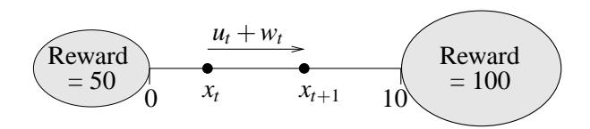

Figure 2: The "Left or Right" control problem.

This metric is only used in the "Left or Right" control problem to compare the quality of the solutions obtained. A metric relying on the score is not discriminant enough for this control problem, since all the algorithms considered can easily learn a good approximation of the optimal stationary policy. Furthermore, for this control problem, the term  $(H\hat{Q})(x,u)$  in the right side of Eqn (22) is estimated by drawing independently and for each  $(x,u) \in X^i \times U$ , 100,000 values of w according to  $P_w(.|x,u)$  (see Eqn (7)).

In the figures, the Bellman residual of  $\hat{Q}$  is represented by  $d(\hat{Q}, H\hat{Q})$ .

# 5.2 The "Left or Right" Control Problem

We consider here the "Left or Right" optimal control problem whose precise definition is given in Appendix C.1.

The main characteristics of the control problem are represented on Figure 2. A point travels in the interval [0, 10]. Two control actions are possible. One tends to drive the point to the right (u = 2) while the other to the left (u = -2). As long as the point stays inside the interval, only zero rewards are observed. When the point leaves the interval, a terminal state12 is reached. If the point goes out on the right side then a reward of 100 is obtained while it is twice less if it goes out on the left.

Even if going out on the right may finally lead to a better reward,  $\mu^*$  is not necessarily equal to 2 everywhere since the importance of the reward signal obtained after t steps is weighted by a factor  $\gamma^{(t-1)} = 0.75^{(t-1)}$ .

#### 5.2.1 Four-Tuples Generation

To collect the four-tuples we observe 300 episodes of the system. Each episode starts from an initial state chosen at random in [0, 10] and finishes when a terminal state is reached. During the episodes, the action  $u_t$  selected at time t is chosen at random with equal probability among its two possible values u = -2 and u = 2. The resulting set  $\mathcal{F}$  is composed of 2010 four-tuples.

#### 5.2.2 SOME BASIC RESULTS

To illustrate the fitted Q iteration algorithm behavior we first use "Pruned CART Tree" as supervised learning method. Elements of the sequence of functions  $\hat{Q}_N$  obtained are represented on Figure 3. While the first functions of the sequence differ a lot, they gain in similarities when N increases which is confirmed by computing the distance on  $\mathcal{F}$  between functions  $\hat{Q}_N$  and  $\hat{Q}_{N-1}$  (Figure 4a). We observe that the distance rapidly decreases but, due to the fact that the tree structure is refreshed at each iteration, never vanishes.

12. A terminal state can be seen as a regular state in which the system is stuck and for which all the future rewards obtained in the aftermath are zero. Note that the value of  $Q_N(terminal\ state, u)$  is equal to  $0 \ \forall N \in \mathbb{N}$  and  $\forall u \in U$ .

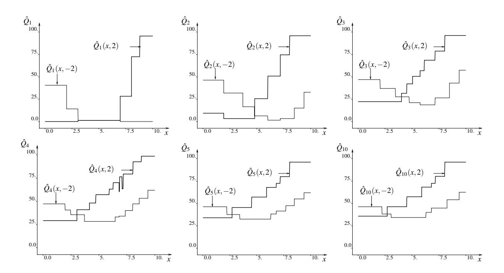

Figure 3: Representation of  $\hat{Q}_N$  for different values of N. The set  $\mathcal{F}$  is composed of 2010 elements and the supervised learning method used is Pruned CART Tree.

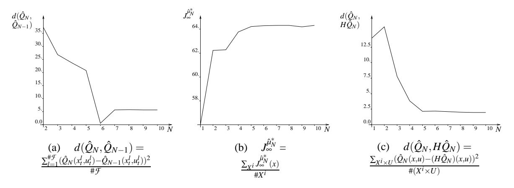

Figure 4: Figure (a) represents the distance between  $\hat{Q}_N$  and  $\hat{Q}_{N-1}$ . Figure (b) provides the average return obtained by the policy  $\hat{\mu}_N^*$  while starting from an element of  $X^i$ . Figure (c) represents the Bellman residual of  $\hat{Q}_N$ .

From the function  $\hat{Q}_N$  we can determine the policy  $\hat{\mu}_N$ . States x for which  $\hat{Q}_N(x,2) \geq \hat{Q}_N(x,-2)$  correspond to a value of  $\hat{\mu}_N(x) = 2$  while  $\hat{\mu}_N(x) = -2$  if  $\hat{Q}_N(x,2) < \hat{Q}_N(x,-2)$ . For example,  $\hat{\mu}_{10}^*$  consists of choosing u = -2 on the interval [0,2.7[ and u = 2 on [2.7,10]. To associate a score to each policy  $\hat{\mu}_N^*$ , we define a set of states  $X^i = \{0,1,2,\cdots,10\}$ , evaluate  $J_\infty^{\hat{\mu}_N}(x)$  for each element of this set and average the values obtained. The evolution of the score of  $\hat{\mu}_N^*$  with N is drawn on Figure 4b. We observe that the score first increases rapidly to become finally almost constant for values of N greater than 5.

In order to assess the quality of the functions  $\hat{Q}_N$  computed, we have computed the Bellman residual of these  $\hat{Q}_N$ -functions. We observe in Figure 4c that even if the Bellman residual tends to decrease when N increases, it does not vanish even for large values of N. By observing Table 2, one can however see that by using 6251 four-tuples (1000 episodes) rather than 2010 (300 episodes), the Bellman residual further decreases.

#### 5.2.3 INFLUENCE OF THE TREE-BASED METHOD

When dealing with such a system for which the dynamics is highly stochastic, pruning is necessary, even for tree-based methods producing an ensemble of regression trees. Figure 5 thus represents the  $\hat{Q}_N$ -functions for different values of N with the pruned version of the Extra-Trees. By comparing this figure with Figure 3, we observe that the averaging of several trees produces smoother functions than single regression trees.

By way of illustration, we have also used the Extra-Trees algorithm with fully developed trees (i.e.,  $n_{min} = 2$ ) and computed the  $\hat{Q}_{10}$ -function with the fitted Q iteration using the same set of fourtuples as in the previous section. This function is represented in Figure 6. As fully grown trees are able to match perfectly the output in the training set, they also catch the noise and this explains the chaotic nature of the resulting approximation.

Table 2 gathers the Bellman residuals of  $\hat{Q}_{10}$  obtained when using different tree-based methods and this for different sets of four-tuples. Tree-based ensemble methods produce smaller Bellman residuals and among these methods, Extra-Trees behaves the best. We can also observe that for any of the tree-based methods used, the Bellman residual decreases with the size of  $\mathcal{F}$ .

Note that here, the policies produced by the different tree-based algorithms offer quite similar scores. For example, the score is 64.30 when Pruned CART Tree is applied to the 2010 four-tuple set and it does not differ from more than one percent with any of the other methods. We will see that the main reason behind this, is the simplicity of the optimal control problem considered and the small dimensionality of the state space.

#### 5.2.4 FITTED Q ITERATION AND BASIS FUNCTION METHODS

We now assess performances of the fitted Q iteration algorithm when combined with basis function methods. Basis function methods suppose a relation of the type

$$o = \sum_{i=1}^{nbBasis} c_j \phi_j(i)$$
 (23)

between the input and the output where  $c_j \in \mathbb{R}$  and where the basis functions  $\phi_j(i)$  are defined on the input space and take their values on  $\mathbb{R}$ . These basis functions form the approximation architec-

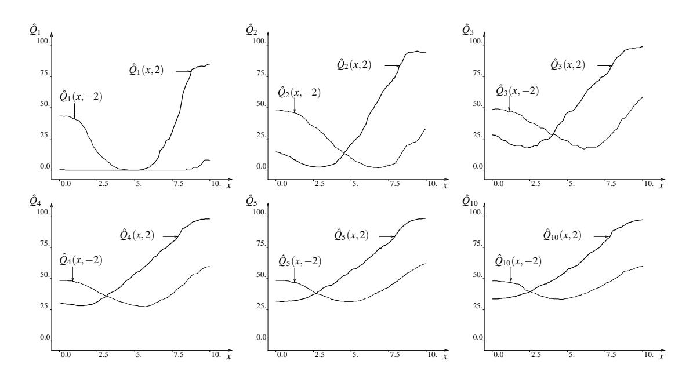

Figure 5: Representation of  $\hat{Q}_N$  for different values of N. The set  $\mathcal{F}$  is composed of 2010 elements and the supervised learning method used is the Pruned Extra-Trees.

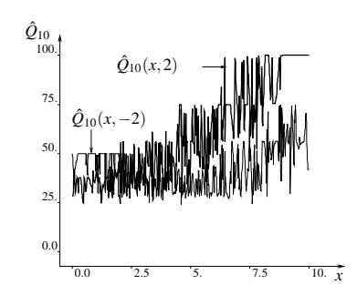

Figure 6: Representation of  $\hat{Q}_{10}$  when Extra-Trees is used with no pruning

| Tree-based              | # <i>'</i> |      |      |  |
|-------------------------|------------|------|------|--|
| method                  | 720        | 2010 | 6251 |  |
| Pruned CART Tree        | 2.62       | 1.96 | 1.29 |  |
| Pruned Kd-Tree          | 1.94       | 1.31 | 0.76 |  |
| Pruned Tree Bagging     | 1.61       | 0.79 | 0.67 |  |
| Pruned Extra-Trees      | 1.29       | 0.60 | 0.49 |  |
| Pruned Tot. Rand. Trees | 1.55       | 0.72 | 0.59 |  |

Table 2: Bellman residual of  $\hat{Q}_{10}$ . Three different sets of four-tuples are used. These sets have been generated by considering 100, 300 and 1000 episodes and are composed respectively of 720, 2010 and 6251 four-tuples.

ture. The training set is used to determine the values of the different  $c_j$  by solving the following minimization problem:13

13. This minimization problem can be solved by building the  $(\#TS \times nbBasis)$  Y matrix with  $Y_{lj} = \phi_j(i^l)$ . If  $Y^TY$  is invertible, then the minimization problem has a unique solution  $c = (c_1, c_2, \cdots, c_{nbBasis})$  given by the following expression:  $c = (Y^TY)^{-1}Y^Tb$  with  $b \in \mathbb{R}^{\#TS}$  such that  $b_l = o^l$ . In order to overcome the possible problem of non-invertibility of  $Y^TY$  that occurs when solution of (24) is not unique, we have added to  $Y^TY$  the strictly definite positive matrix  $\delta I$ , where  $\delta$  is a small positive constant, before inverting it. The value of c used in our experiments as solution of (24) is therefore equal to  $(Y^TY + \delta I)^{-1}Y^Tb$  where  $\delta$  has been chosen equal to 0.001.

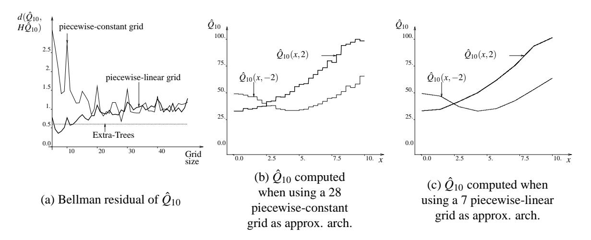

Figure 7: Fitted Q iteration with basis function methods. Two different types of approximation architectures are considered: piecewise-constant and piecewise-linear grids. 300 episodes are used to generate  $\mathcal{F}$ .

$$\underset{(c_1,c_2,\cdots,c_{nbBasis})\in\mathbb{R}^{nbBasis}}{\arg\min}\sum_{l=1}^{\#TS}(\sum_{j=1}^{nbBasis}c_j\phi_j(i^l)-o^l)^2. \tag{24}$$

We consider two different sets of basis functions  $\phi_j$ . The first set is defined by partitioning the state space into a grid and by considering one basis function for each grid cell, equal to the indicator function of this cell. This leads to piecewise constant  $\hat{Q}$ -functions. The other type is defined by partitioning the state space into a grid, triangulating every element of the grid and considering that  $\hat{Q}(x,u) = \sum_{v \in Vertices(x)} W(x,v) \hat{Q}(v,u)$  where Vertices(x) is the set of vertices of the hypertriangle x belongs to and W(x,v) is the barycentric coordinate of x that corresponds to y. This leads to a set of overlapping piecewise linear basis functions, and yields a piecewise linear and continuous model. In this paper, these approximation architectures are respectively referred to as *piecewise-constant grid* and *piecewise-linear grid*. The reader can refer to Ernst (2003) for more information.

To assess performances of fitted Q iteration combined with piecewise-constant and piecewise-linear grids as approximation architectures, we have used several grid resolutions to partition the interval [0,10] (a 5 grid, a 6 grid,  $\cdots$ , a 50 grid). For each grid, we have used fitted Q iteration with each of the two types of approximation architectures and computed  $\hat{Q}_{10}$ . The Bellman residuals obtained by the different  $\hat{Q}_{10}$ -functions are represented on Figure 7a. We can see that basis function methods with piecewise-constant grids perform systematically worse than Extra-Trees, the tree-based method that produces the lowest Bellman residual. This type of approximation architecture leads to the lowest Bellman residual for a 28 grid and the corresponding  $\hat{Q}_{10}$ -function is sketched in Figure 7b. Basis function methods with piecewise-linear grids reach their lowest Bellman residual for a 7 grid, Bellman residual that is smaller than the one obtained by Extra-Trees. The corresponding smoother  $\hat{Q}_{10}$ -function is drawn on Figure 7b.

Even if piecewise-linear grids were able to produce on this example better results than the treebased methods, it should however be noted that it has been achieved by tuning the grid resolution and that this resolution strongly influences the quality of the solution. We will see below that, as the state space dimensionality increases, piecewise-constant or piecewise-linear grids do not compete anymore with tree-based methods. Furthermore, we will also observe that piecewise-linear grids may lead to divergence to infinity of the fitted Q iteration algorithm (see Section 5.3.3).

### 5.3 The "Car on the Hill" Control Problem

We consider here the "Car on the Hill" optimal control problem whose precise definition is given in Appendix C.2.

A car modeled by a point mass is traveling on a hill (the shape of which is given by the function Hill(p) of Figure 8b). The action u acts directly on the acceleration of the car (Eqn (31), Appendix C) and can only assume two extreme values (full acceleration (u=4) or full deceleration (u=-4)). The control problem objective is roughly to bring the car in a minimum time to the top of the hill (p=1) in Figure 8b) while preventing the position p of the car to become smaller than -1 and its speed s to go outside the interval [-3,3]. This problem has a (continuous) state space of dimension two (the position p and the speed s of the car) represented on Figure 8a.

Note that by exploiting the particular structure of the system dynamics and the reward function of this optimal control problem, it is possible to determine with a reasonable amount of computation the exact value of  $J_{\infty}^{\mu^*}$  (Q) for any state x (state-action pair (x, u)).14

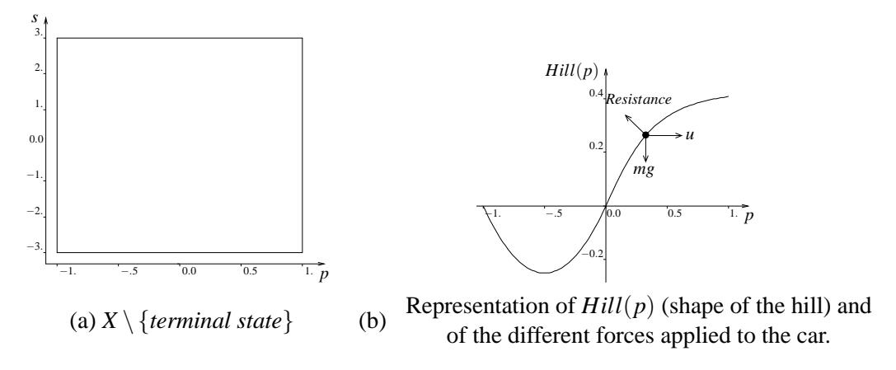

Figure 8: The "Car on the Hill" control problem.

### 5.3.1 SOME BASIC RESULTS

To generate the four-tuples we consider episodes starting from the same initial state corresponding to the car stopped at the bottom of the hill (i.e., (p,s) = (-0.5,0)) and stopping when the car leaves the region represented on Figure 8a (i.e., when a terminal state is reached). In each episode, the action  $u_t$  at each time step is chosen with equal probability among its two possible values u = -4 and u = 4. We consider 1000 episodes. The corresponding set  $\mathcal{F}$  is composed of 58090 four-tuples. Note that during these 1000 episodes the reward  $r(x_t, u_t, w_t) = 1$  (corresponding to an arrival of the car at the top of the hill with a speed comprised in [-3,3]) has been observed only 18 times.

14. To compute  $J_{\infty}^{u^{t}}(x)$ , we determine by successive trials the smallest value of k for which one of the two following conditions is satisfied (i) at least one sequence of actions of length k leads to a reward equal to 1 when  $x_0 = x$  (ii) all

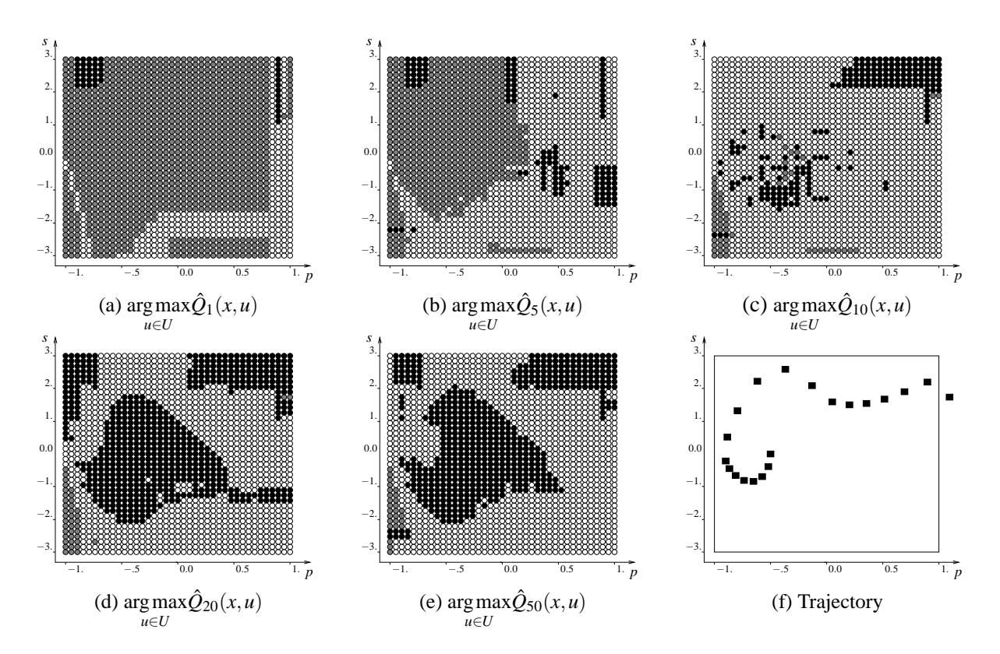

Figure 9: (a)-(e): Representation of  $\hat{\mu}_N^*$  for different values of N. (f): Trajectory when  $x_0=(-0.5,0)$  and when the policy  $\hat{\mu}_{50}^*$  is used to control the system.

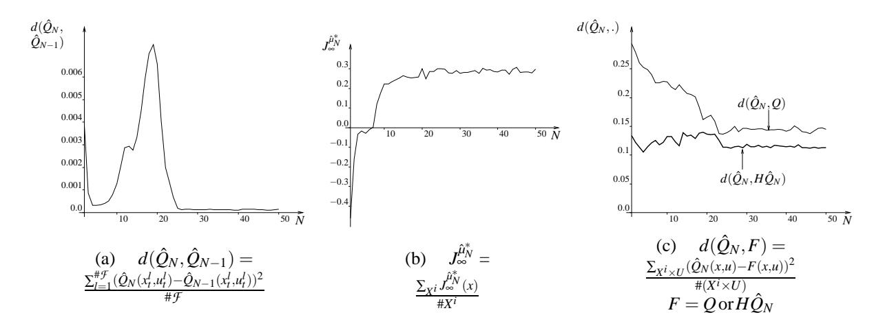

Figure 10: Figure (a) represents the distance between  $\hat{Q}_N$  and  $\hat{Q}_{N-1}$ . Figure (b) provides the average return obtained by the policy  $\hat{\mu}_N^*$  while starting from an element of  $X^i$ . Figure (c) represents the distance between  $\hat{Q}_N$  and Q as well as the Bellman residual of  $\hat{Q}_N$  as a function of N (distance between  $\hat{Q}_N$  and  $H\hat{Q}_N$ ).

We first use Tree Bagging as the supervised learning method. As the action space is binary, we again model the functions  $\hat{Q}_N(x,-4)$  and  $\hat{Q}_N(x,4)$  by two ensembles of 50 trees each, and  $n_{min}=2$ . The policy  $\hat{\mu}_1^*$  so obtained is represented on Figure 9a. Black bullets represent states for which  $\hat{Q}_1(x,-4) > \hat{Q}_1(x,4)$ , white bullets states for which  $\hat{Q}_1(x,-4) < \hat{Q}_1(x,4)$  and grey bullets states for which  $\hat{Q}_1(x,-4) = \hat{Q}_1(x,4)$ . Successive policies  $\hat{\mu}_N^*$  for increasing N are given on Figures 9b-9e.

On Figure 9f, we have represented the trajectory obtained when starting from (s,p)=(-0.5,0) and using the policy  $\hat{\mu}_{50}^*$  to control the system. Since, for this particular state the computation of  $J_{\infty}^{\mu^*}$  gives the same value as  $J_{\infty}^{\hat{\mu}_{50}^*}$ , the trajectory drawn is actually an optimal one.

Figure 10a shows the evolution of distance between  $\hat{Q}_N$  and  $\hat{Q}_{N-1}$  with N. Notice that while a monotonic decrease of the distance was observed with the "Left or Right" control problem (Figure 4a), it is not the case anymore here. The distance first decreases and then from N=5 suddenly increases to reach a maximum for N=19 and to finally redecrease to an almost zero value. Actually, this apparently strange behavior is due to the way the distance is evaluated and to the nature of the control problem. Indeed, we have chosen to use in the distance computation the state-action pairs  $(x_t^l, u_t^l)$   $l=1, \cdots, \#\mathcal{F}$  from the set of four-tuples. Since most of the states  $x_t^l$  are located around the initial state (p,s)=(-0.5,0) (see Figure 11), the distance is mostly determined by variations between  $\hat{Q}_N$  and  $\hat{Q}_{N-1}$  in this latter region. This remark combined with the fact that the algorithm needs a certain number of iterations before obtaining values of  $\hat{Q}_N$  around (p,s)=(-0.5,0) different from zero explains this sudden increase of the distance.

To compute policy scores, we consider the set  $X^i: X^i = \{(p,s) \in X \setminus \{x^t\} | \exists i, j \in \mathbb{Z} | (p,s) = (0.125 * i, 0.375 * j)\}$  and evaluate the average value of  $J_N^{\hat{\mu}_N^*}(x)$  over this set. The evolution of the

the sequences of actions of length k lead to a reward equal to -1 when  $x_0 = x$ . Let  $k_{min}$  be this smallest value of k. Then  $J_{\infty}^{\mu^*}(x)$  is equal to  $\gamma^{k_{min}-1}$  if condition (i) is satisfied when  $k = k_{min}$  and  $-\gamma^{k_{min}-1}$  otherwise.

15. The reason for  $\hat{Q}_N$  being equal to zero around (p,s) = (-0.5,0) for small values of N is that when the system starts from (-0.5,0) several steps are needed to observe non zero rewards whatever the policy used.

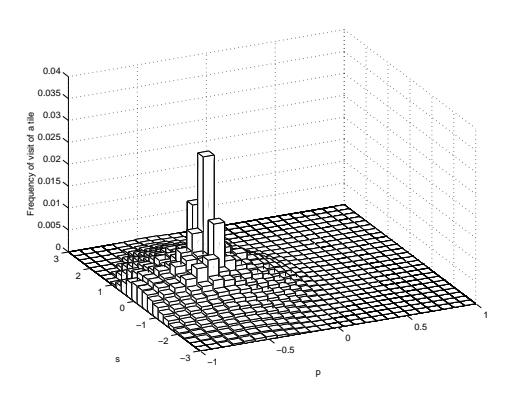

Figure 11: Estimation of the  $x_t$  distribution while using episodes starting from (-0.5,0) and choosing actions at random.

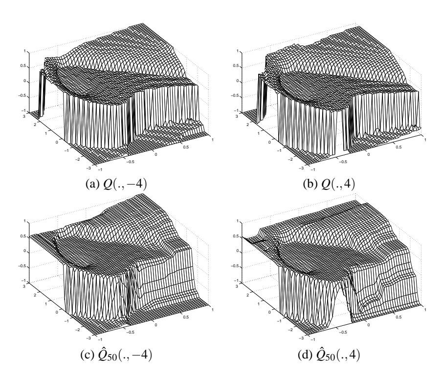

Figure 12: Representation of the Q-function and of  $\hat{Q}_{50}$ .  $\hat{Q}_{50}$  is computed by using fitted Q iteration together with Tree Bagging.

score for increasing values of N is represented in Figure 10b. We see that the score rapidly increases to finally oscillate slightly around a value close to 0.295. The score of  $\mu^*$  being equal to 0.360, we see that the policies  $\hat{\mu}_N^*$  are suboptimal. To get an idea of how different is the  $\hat{Q}_{50}$ -function computed by fitted Q iteration from the true Q-function, we have represented both functions on Figure 12. As we may observe, some significant differences exist between them, especially in areas were very few information has been generated, like the state space area around x = (-1,3).

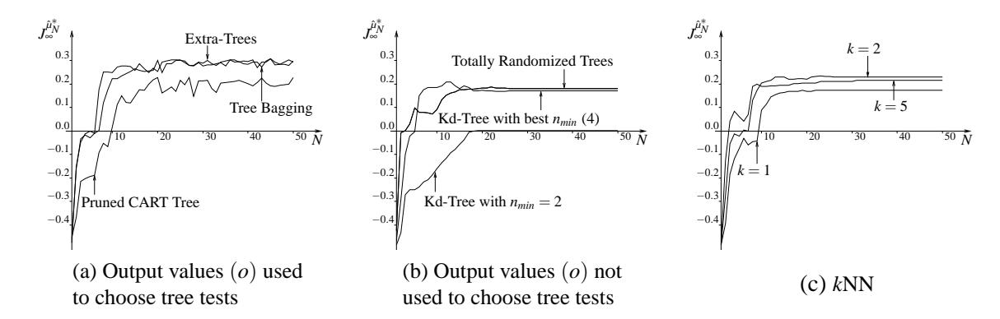

Figure 13: Influence of the supervised learning method on the solution. For each supervised learning method  $\hat{Q}_N(x,-4)$  and  $\hat{Q}_N(x,4)$  are modeled separately. For Tree Bagging, Extra-Trees, and Totally Randomized Trees, the trees are developed completely  $(n_{min}=2)$ . The distance used in the nearest neighbors computation is the Euclidean distance.

#### 5.3.2 INFLUENCE OF THE TREE-BASED METHOD AND COMPARISON WITH kNN.

Figure 13a sketches the scores obtained by the policies  $\hat{\mu}_N^*$  when using different tree-based methods which use the output values (o) of the input-output pair ((i,o)) of the training set to compute the tests. It is clear that Tree Bagging and Extra-Trees are significantly superior to Pruned CART Tree. Figure 13b compares the performances of tree-based methods for which the tests are chosen independently of the output values. We observe that even when using the value of  $n_{min}$  leading to the best score, Kd-Tree does not perform better than Totally Randomized Trees. On Figure 13c, we have drawn the scores obtained with a k-nearest-neighbors (kNN) technique.

Notice that the score curves corresponding to the *k*-nearest-neighbors, Totally Randomized Trees, and Kd-Tree methods stabilize indeed after a certain number of iterations.

To compare more systematically the performances of all these supervised learning algorithms, we have computed for each one of them and for several sets of four-tuples the score of  $\hat{\mu}_{50}^*$ . Results are gathered in Table 3. A first remark suggested by this table and which holds for all the supervised learning methods is that the more episodes are used to generate the four-tuples, the larger the score of the induced policy. Compared to the other methods, performances of Tree Bagging and Extra-Trees are excellent on the two largest sets. Extra-Trees still gives good results on the smallest set but this is not true for Tree Bagging. The strong deterioration of Tree Bagging performances is mainly due to the fact that when dealing with this set of four-tuples, information about the optimal solution is really scarce (only two four-tuples correspond to a reward of 1) and, since a training instance has 67% chance of being present in a bootstrap sample, Tree Bagging often discards some critical information. On the other hand, Extra-Trees and Totally Randomized Trees which use the whole training set to build each tree do not suffer from this problem. Hence, these two methods behave particularly well compared to Tree Bagging on the smallest set.

One should also observe from Table 3 that even when used with the value of k that produces the largest score, kNN is far from being able to reach for example the performances of the Extra-Trees.

| Supervised learning              | Nb of episodes used to generate $\mathcal{F}$ |      |       |  |
|----------------------------------|-----------------------------------------------|------|-------|--|
| method                           | 1000                                          | 300  | 100   |  |
| Kd-Tree (Best n min ) | 0.17                                          | 0.16 | -0.06 |  |
| Pruned CART Tree                 | 0.23                                          | 0.13 | -0.26 |  |
| Tree Bagging                     | 0.30                                          | 0.24 | -0.09 |  |
| Extra-Trees                      | 0.29                                          | 0.25 | 0.12  |  |
| Totally Randomized Trees         | 0.18                                          | 0.14 | 0.11  |  |
| kNN (Best k)                     | 0.23                                          | 0.18 | 0.02  |  |

Table 3: Score of  $\hat{\mu}_{50}^*$  for different set of four-tuples and supervised learning methods.

### 5.3.3 FITTED *Q* ITERATION AND BASIS FUNCTION METHODS

In Section 5.2.4, when dealing with the "Left or Right" control problem, basis function methods with two types of approximation architectures, piecewise-constant or piecewise-linear grids, have been used in combination with the fitted Q iteration algorithm.

In this section, the same types of approximation architectures are also considered and, for each type of approximation architecture, the policy  $\hat{\mu}_{50}^*$  has been computed for different grid resolutions (a  $10 \times 10$  grid, a  $11 \times 11$  grid,  $\cdots$ , a  $50 \times 50$  grid). The score obtained by each policy is represented on Figure 14a. The horizontal line shows the score previously obtained on the same sample of four-tuples by Tree Bagging. As we may see, whatever the grid considered, both approximation architectures lead to worse results than Tree Bagging, the best performing tree-based method. The highest score is obtained by a  $18 \times 18$  grid for the piecewise-constant approximation architecture and by a  $14 \times 14$  grid for the piecewise-linear approximation architecture. These two highest scores are respectively 0.21 and 0.25, while Tree Bagging was producing a score of 0.30. The two corresponding policies are sketched in Figures 14b and 14c. Black polygons represent areas where  $\hat{Q}(x, -4) > \hat{Q}(x, 4)$ , white polygons areas where  $\hat{Q}(x, -4) = \hat{Q}(x, 4)$ .

When looking at the score curve corresponding to piecewise-linear grids as approximation architectures, one may be surprised to note its harsh aspect. For some grids, this type of approximation architecture leads to some good results while by varying slightly the grid size, the score may strongly deteriorate. This strong deterioration of the score is due to fact that for some grid sizes, the fitted Q iteration actually diverges to infinity while it is not the case for other grid sizes. Divergence to infinity of the algorithm is illustrated on Figures 15a and 15c where we have drawn for a  $12 \times 12$  grid the distance between  $\hat{Q}_N$  and  $\hat{Q}_{N-1}$ ,  $\hat{Q}_N$  and Q, and  $\hat{Q}_N$  and  $H\hat{Q}_N$ . Remark that a logarithmic scale has been used for the y-axis. When using Tree Bagging in the inner loop of the fitted Q iteration, similar graphics have been drawn (Figure 10) and the reader may refer to them for comparison.

#### 5.3.4 COMPARISON WITH O-LEARNING

In this section we use a gradient descent version of the standard Q-learning algorithm to compute the  $c_j$  parameters of the approximation architectures of Section 5.3.3. The degree of correction  $\alpha$  used inside this algorithm is chosen equal to 0.1 and the estimate of the Q-function is initialized to 0 everywhere. This latter being refreshed by this algorithm on a four-tuple by four-tuple basis, we have chosen to use each element of  $\mathcal F$  only once to refresh the estimate of the Q-function. The

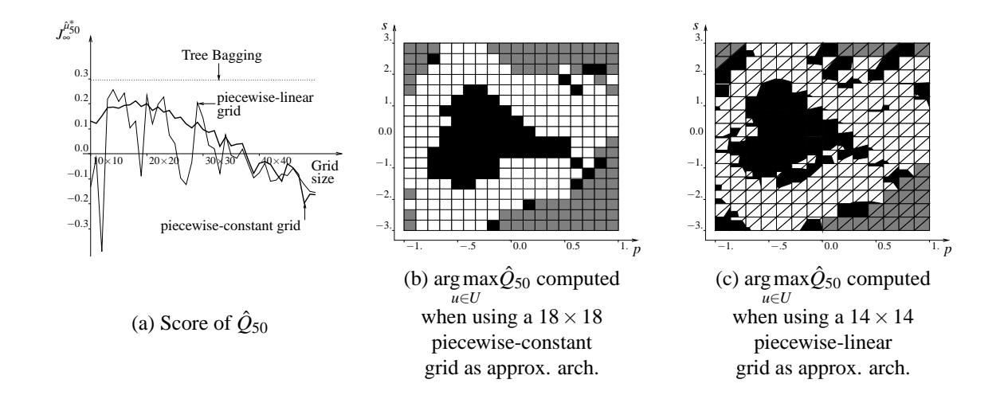

Figure 14: Fitted Q iteration with basis function methods. Two different types of approximation architecture are considered: piecewise-constant and piecewise-linear grids.  $\mathcal{F}$  is composed of the four-tuples gathered during 1000 episodes.

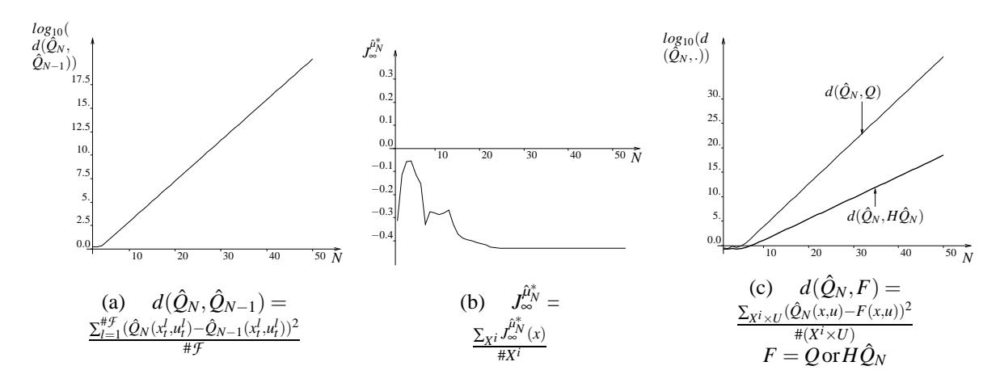

Figure 15: Fitted Q iteration algorithm with basis function methods. A  $12 \times 12$  piecewise-linear grid is the approximation architecture considered. The sequence of  $\hat{Q}_N$ -functions diverges to infinity.

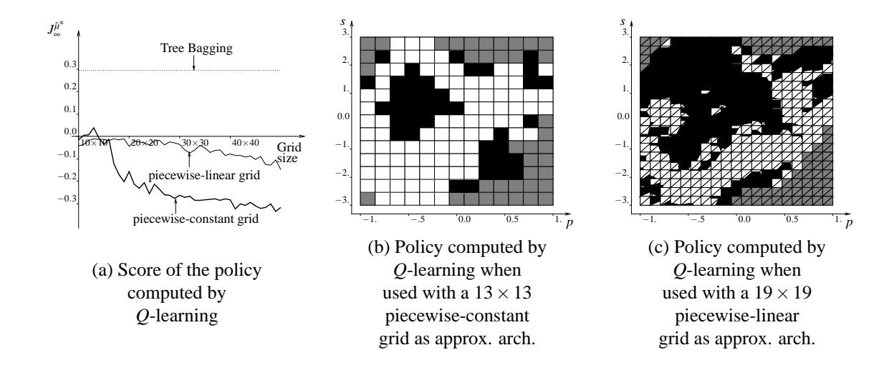

Figure 16: Q-learning with piecewise-constant and piecewise-linear grids as approximation architectures. Each element of  $\mathcal F$  is used once to refresh the estimate of the Q-function. The set  $\mathcal F$  is composed of the four-tuples gathered during 1000 episodes.

main motivation for this is to compare the performances of the fitted Q iteration algorithm with an algorithm that does not require to store the four-tuples. 16

The scores obtained by Q-learning for the two types of approximation architectures and for different grid sizes are reported on Figure 16a. Figure 16b (16c) represents the policies that have led, by screening different grid sizes, to the highest score when piecewise-constant grids (piecewise-linear grids) are the approximation architectures considered. By comparing Figure 16a with Figure 14a, it is obvious that fitted Q iteration exploits more effectively the set of four-tuples than Q-learning. In particular, the highest score is 0.21 for fitted Q iteration while it is only of 0.04 for Q-learning. If we compare the score curves corresponding to piecewise-linear grids as approximation architectures, we observe also that the highest score produced by fitted Q iteration (over the different grids), is higher than the highest score produced by Q-learning. However, when fitted Q iteration is plagued with some divergence to infinity problems, as illustrated on Figure 15, it may lead to worse results than Q-learning.

Observe that even when considering 10,000 episodes with Q-learning, we still obtain worse scores than the one produced by Tree Bagging with 1000 episodes. Indeed, the highest score pro-

16. Performances of the gradient descent version of the *Q-learning* algorithm could be improved by processing several times each four-tuple to refresh the estimate of the *Q*-function, for example by using the experience replay technique of Lin (1993). This however requires to store the four-tuples.

It should also be noted that if a piecewise-constant grid is the approximation architecture considered, if each element of  $\mathcal{F}$  is used an infinite number of times to refresh the estimate of the Q-function and if the sequence of  $\alpha$  satisfies the stochastic approximation condition (i.e.,  $\sum_{k=1}^{\infty} \alpha_k \to \infty$  and  $\sum_{k=1}^{\infty} \alpha_k^2 < \infty$ ,  $\alpha_k$  being the value of  $\alpha$  the kth times the estimate of the Q-function is refreshed), then the Q-function estimated by the Q-learning algorithm would be the same as the one estimated by fitted Q iteration using the same piecewise-constant grid as approximation architecture. This can be seen by noting that in such conditions, the Q-function estimated by Q-learning would be the same as the one estimated by a model-based algorithm using the same grid (see Ernst (2003), page 131 for the proof) which in turn can be shown to be equivalent to fitted Q iteration (see Ernst et al., 2005).

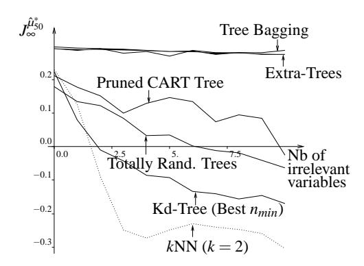

Figure 17: Score of  $\hat{\mu}_{50}^*$  when four-tuples are gathered during 1000 episodes and some variables that do not contain any information about the position and the speed of the car are added to the state vector.

duced by *Q*-learning with 10,000 episodes and over the different grid sizes, is 0.23 if piecewise-constant grids are considered as approximation architectures and 0.27 for piecewise-linear grids, compared to a score of 0.30 for Tree Bagging with 1000 episodes.

At this point, one may wonder whether the poor performances of Q-learning are due to the fact that it is used without eligibility traces. To answer this question, we have assessed the performances of Watkin's  $Q(\lambda)$  algorithm (Watkins, 1989) that combines Q-learning with eligibility traces. The degree of correction  $\alpha$  is chosen, as previously, equal to 0.1 and the value of  $\lambda$  is set equal to 0.95. This algorithm has been combined with piecewise-constant grids and 1000 episodes have been considered. The best score obtained over the different grids is equal to -0.05 while it was slightly higher (0.04) for Q-learning.

#### 5.3.5 ROBUSTNESS WITH RESPECT TO IRRELEVANT VARIABLES

In this section we compare the robustness of the tree-based regression methods and kNN with respect to the addition of irrelevant variables. Indeed, in many practical applications the elementary variables which compose the state vector are not necessarily all of the same importance in determining the optimal control action. Thus, some variables may be of paramount importance, while some others may influence only weakly or even sometimes not at all the optimal control.

On Figure 17, we have drawn the evolution of the score when using four-tuples gathered during 1000 episodes and adding progressively irrelevant variables to the state-vector. 18 It is clear that not all the methods are equally robust to the introduction of irrelevant variables. In particular, we observe that the three methods for which the approximation architecture is independent of the output variable are not robust: the *k*NN presents the fastest deterioration, followed by Kd-Tree and Totally Randomized Trees. The latter is more robust because it averages out several trees, which gives the relevant variables a better chance to be taken into account in the model.

17. In Watkin's  $Q(\lambda)$ , accumulating traces are considered and eligibility traces are cut when a non-greedy action is chosen. Remark that by not cutting the eligibility traces when a non-greedy action is selected, we have obtained worse results.

18. See Section C.2 for the description of the irrelevant variables dynamics.

On the other hand, the methods which take into account the output variables in their approximation architecture are all significantly more robust than the former ones. Among them, Tree Bagging and Extra-Trees which are based on the averaging of several trees are almost totally immune, since even with 10 irrelevant variables (leading to the a 12-dimensional input space) their score decrease is almost insignificant.

This experiment shows that the regression tree based ensemble methods which adapt their kernel to the output variable may have a strong advantage in terms of robustness over methods with a kernel which is independent of the output, even if these latter have nicer convergence properties.

### 5.3.6 INFLUENCE OF THE NUMBER OF REGRESSION TREES IN AN ENSEMBLE

In this paper, we have chosen to build ensembles of regression trees composed of 50 trees (M = 50, Section 4.2), a number of elements which, according to our simulations, is large enough to ensure that accuracy of the models produced could not be improved significantly by increasing it. In order to highlight the influence of M on the quality of the solution obtained, we have drawn on Figure 18, for the different regression tree based ensemble methods, the quality of the solution obtained as a function of M. We observe that the score grows rapidly with M, especially with Extra-Trees and Tree Bagging in which cases a value of M = 10 would have been sufficient to obtain a good solution.

Note that since the CPU times required to compute the solution grow linearly with the number of trees built, computational requirements of the regression tree based ensemble methods could be adjusted by choosing a value of M.

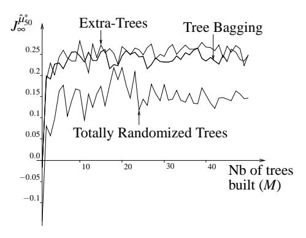

Figure 18: Evolution of the score of  $\hat{\mu}_{50}^*$  with the number of trees built.  $\mathcal{F}$  is composed of the four-tuples gathered during 300 episodes.

### 5.3.7 CAR ON THE HILL WITH CONTINUOUS ACTION SPACE

To illustrate the use of the fitted Q iteration algorithm with continuous action spaces we consider here U = [-4,4] rather than  $\{-4,4\}$ . We use one-step episodes with  $(x_0,u_0)$  drawn at random with uniform probability in  $X \times U$  to generate a set  $\mathcal{F}$  of 50,000 four-tuples and use Tree Bagging with 50 trees as supervised learning method. We have approximated the maximization over the continuous action space needed during the training sample refreshment step (see Eqn (13), Figure 1) by an exhaustive search over  $u \in \{-4, -3, \dots, 3, 4\}$ . The policy  $\hat{\mu}_{50}^*$  thus obtained by our algorithm after

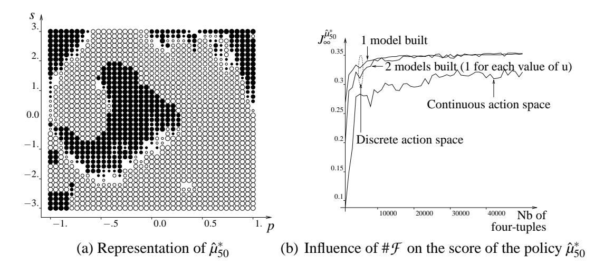

Figure 19: Car on the Hill with continuous action space. Tree Bagging is used on one-step episodes with  $(x_0, u_0)$  drawn at random in  $X \times U$  are used to generate the four-tuples.

50 iterations is represented on Figure 19a, where black bullets are used to represent states x for which  $\hat{\mu}_{50}^*(x)$  is negative, white ones when  $\hat{\mu}_{50}^*(x)$  is positive. The size of a bullet is proportional to the absolute value of the control signal  $|\hat{\mu}_{50}^*(x)|$ . We see that the control policy obtained is not far from a "bang-bang" policy.

To compare these results with those obtained in similar conditions with a discrete action space, we have made two additional experiments, where the action space is restricted again to the extreme values, i.e.  $u \in \{-4,4\}$ . The two variants differ in the way the  $Q_N$ -functions are modeled. Namely, in the first case one single model is learned where u is included in the input variables whereas in the second case one model is learned per possible value of u, i.e. one model for  $Q_N(x,-4)$  and one for  $Q_N(x,4)$ . All experiments are carried out for an increasing number of samples and a fixed number of iterations (N = 50) and bagged trees (M = 50). The three curves of Figure 19b show the resulting scores. The two upper curves correspond to the score of the policy  $\hat{\mu}_{50}^*$  obtained when considering a discrete action space  $U = \{-4,4\}$ . We observe that both curves are close to each other and dominate the "Continuous action space" scores. Obviously the discrete approach is favored because of the "bang-bang" nature of the problem; nevertheless, the continuous action space approach is able to provide results of comparable quality. 19

# 5.3.8 COMPUTATIONAL COMPLEXITY AND CPU TIME CONSIDERATIONS

Table 4 gathers the CPU times required by the fitted Q iteration algorithm to carry out 50 iterations (i.e., to compute  $\hat{Q}_{50}(x,u)$ ) for different types of supervised learning methods and different sets  $\mathcal{F}$ . We have also given in the same table the repartition of the CPU times between the two tasks the algorithm has to perform, namely the task which consists of building the training sets (evaluation of Eqns (12) and (13) for all  $l \in \{1, 2, \dots, \#\mathcal{F}\}$ ) and the task which consists of building the models from the training sets. These two tasks are referred to hereafter respectively as the "Training Set

19. The bang-bang nature was also observed in Smart and Kaelbling (2000), where continuous and a discrete action spaces are treated on the "Car on the Hill" problem, with qualitatively the same results.

Building" (TSB) task and the "Model Building" (MB) task. When Kd-Tree or Totally Randomized Trees are used, each tree structure is frozen after the first iteration and only the value of its terminal nodes are refreshed. The supervised learning technique referred to in the table as "kNN smart" is a smart implementation the fitted Q iteration algorithm when used with kNN in the sense that the k nearest neighbors of  $x_{t+1}^l$  are determined only once and not recomputed at each subsequent iteration of the algorithm.

| Supervised              |                        | CPU times consumed by the Models Building (MB) |        |                         |        |                         |        |         |         |
|-------------------------|------------------------|------------------------------------------------|--------|-------------------------|--------|-------------------------|--------|---------|---------|
| learning                |                        | and Training Sets Building (TSB) tasks         |        |                         |        | 20                      |        |         |         |
| algorithm               | $\#\mathcal{F} = 5000$ |                                                | #      | $\#\mathcal{F} = 10000$ |        | $\#\mathcal{F} = 20000$ |        |         |         |
| argoritimi              | MB                     | TSB                                            | Total  | MB                      | TSB    | Total                   | MB     | TSB     | Total   |
| Kd-Tree $(n_{min} = 4)$ | 0.01                   | 0.39                                           | 0.40   | 0.04                    | 0.91   | 0.95                    | 0.06   | 2.05    | 2.11    |
| Pruned CART Tree        | 16.6                   | 0.3                                            | 16.9   | 42.4                    | 0.8    | 43.2                    | 95.7   | 1.6     | 97.3    |
| Tree Bagging            | 97.8                   | 54.0                                           | 151.8  | 219.7                   | 142.3  | 362.0                   | 474.4  | 333.7   | 808.1   |
| Extra-Trees             | 24.6                   | 55.5                                           | 80.1   | 51.0                    | 145.8  | 196.8                   | 105.72 | 337.48  | 443.2   |
| Totally Rand. Trees     | 0.4                    | 67.8                                           | 68.2   | 0.8                     | 165.3  | 166.2                   | 1.7    | 407.5   | 409.2   |
| kNN                     | 0.0                    | 1032.2                                         | 1032.2 | 0.0                     | 4096.2 | 4096.2                  | 0.0    | 16537.7 | 16537.7 |
| kNN smart               | 0.0                    | 21.0                                           | 21.0   | 0.0                     | 83.0   | 83.0                    | 0.0    | 332.4   | 332.4   |

Table 4: CPU times (in seconds on a Pentium-IV, 2.4GHz, 1GB, Linux) required to compute  $\hat{Q}_{50}$ . For each of the supervised learning method  $\hat{Q}_N(x,-4)$  and  $\hat{Q}_N(x,4)$  have been modeled separately. 50 trees are used with Tree Bagging, Extra-Trees and Totally Randomized Trees and the value of k for kNN is 2.

By analyzing the table, the following remarks apply:

- CPU times required to build the training sets are non negligible with respect to CPU times for building the models (except for Pruned CART Tree which produces only one single regression tree). In the case of Extra-Trees, Totally Randomized Trees and *k*NN, training set update is even the dominant task in terms of CPU times.
- Kd-Tree is (by far) the fastest method, even faster than Pruned CART Tree which produces also one single tree. This is due to the fact that the MB task is really inexpensive. Indeed, it just requires building one single tree structure at the first iteration and refresh its terminal nodes in the aftermath.
- Concerning Pruned CART Tree, it may be noticed that tree pruning by ten-fold cross validation requires to build in total eleven trees which explains why the CPU times for building 50 trees with Tree Bagging is about five times greater than the CPU times required for Pruned CART Tree.
- The MB task is about four times faster with Extra-Trees than with Tree Bagging, because Extra-Trees only computes a small number (*K*) of test scores, while CART searches for an optimal threshold for each input variable. Note that the trees produced by the Extra-Trees algorithm are slightly more complex, which explains why the TSB task is slightly more time consuming. On the two largest training sets, Extra-Trees leads to almost 50 % less CPU times than Tree Bagging.

- The MB task for Totally Randomized Trees is much faster than the MB task for Extra-Trees, mainly because the totally randomized tree structures are built only at the first iteration. Note that, when totally randomized trees are built at the first iteration, branch development is not stopped when the elements of the local training set have the same value, because it can not be assumed that these elements would still have the same value in subsequent iterations. This also implies that totally randomized trees are more complex than trees built by Extra-Trees and explains why the TSB task with Totally Randomized Trees is more time consuming.
- Full kNN is the slowest method. However, its smart implementation is almost 50 times (the number of iterations realized by the algorithm) faster than the naive one. In the present case, it is even faster than the methods based on regression trees ensembles. However, as its computational complexity (in both implementations) is quadratic with respect to the size of the training set while it is only slightly super-linear for tree-based methods, its advantage quickly vanishes when the training set size increases.

### 5.4 The "Acrobot Swing Up" Control Problem

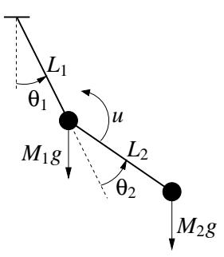

Figure 20: Representation of the Acrobot.

We consider here the "Acrobot Swing Up" control problem whose precise definition is given in Appendix C.3.

The Acrobot is a two-link underactuated robot, depicted in Figure 20. The second joint applies a torque (represented by u), while the first joint does not. The system has four continuous state variables: two joint positions ( $\theta_1$  and  $\theta_2$ ) and two joint velocities ( $\theta_1$  and  $\theta_2$ ). This system has been extensively studied by control engineers (e.g. Spong, 1994) as well as machine learning researchers (e.g. Yoshimoto et al., 1999).

We have stated this control problem so that the optimal stationary policy brings the Acrobot quickly into a specified neighborhood of its unstable inverted position, and ideally as close as possible to this latter position. Thus, the reward signal is equal to zero except when this neighborhood is reached, in which case it is positive (see Eqn (44) in Appendix C.3). The torque u can only take two values: -5 and 5.

#### 5.4.1 Four-Tuples Generation

To generate the four-tuples we have considered 2000 episodes starting from an initial state chosen at random in  $\{(\theta_1, \theta_2, \dot{\theta_1}, \dot{\theta_2}) \in \mathbb{R}^4 | \theta_1 \in [-\pi+1, \pi-1], \theta_2 = \dot{\theta_1} = \dot{\theta_2} = 0\}$  and finishing when t = 100 or earlier if the terminal state is reached before.20

Two types of strategies are used here to control the system, leading to two different sets of four-tuples. The first one is the same as in the previous examples: at each instant the system is controlled by using a policy that selects actions fully at random. The second strategy however interleaves the sequence of four-tuples generation with the computation of an approximate Q-function from the four-tuples already generated and uses a policy that exploits this  $\hat{Q}$ -function to control the system while generating additional four-tuples. More precisely, it generates the four-tuples according to the following procedure:21

- Initialize  $\hat{Q}$  to zero everywhere and  $\mathcal{F}$  to the empty set;
- Repeat 20 times:
  - use an  $\varepsilon$ -greedy policy from  $\hat{Q}$  to generate 100 episodes and add the resulting four-tuples to  $\mathcal{F}$ :
  - use the fitted Q iteration algorithm to build a new approximation  $\hat{Q}_N$  from  $\mathcal{F}$  and set  $\hat{Q}$  to  $\hat{Q}_N$ .

where  $\varepsilon = 0.1$  and where the fitted Q iteration algorithm is combined with the Extra-Trees ( $n_{min} = 2$ , K = 5, M = 50) algorithm and iterates 100 times.

The random policy strategy produces a set of four-tuples composed of 193,237 elements while 154,345 four-tuples compose the set corresponding to the  $\varepsilon$ -greedy policy.

Note that since the states  $(\theta_1, \theta_2, \dot{\theta}_1, \dot{\theta}_2)$  and  $(\theta_1 + 2k_1\pi, \theta_2 + 2k_2\pi, \dot{\theta}_1, \dot{\theta}_2)$   $k_1, k_2 \in \mathbb{Z}$  are equivalent from a physical point of view, we have, before using the four-tuples as input of the fitted Q iteration algorithm, added or subtracted to the values of  $\theta_1$  and  $\theta_2$  a multiple of  $2\pi$  to guarantee that these values belong to the interval  $[-\pi,\pi]$ . A similar transformation is also carried out on each state  $(\theta_1,\theta_2,\dot{\theta}_1,\dot{\theta}_2)$  before it is used as input of a policy  $\hat{\mu}_N^*(x)$ .

### 5.4.2 SIMULATION RESULTS

First, we consider the set of four-tuples gathered when using the  $\varepsilon$ -greedy policy to control the system. We have represented on Figure 21 the evolution of the Acrobot starting with zero speed in a downward position and being controlled by the policy  $\hat{\mu}_{100}$  when the fitted Q iteration algorithm is used with Extra-Trees. As we observe, the control policy computed manages to bring the Acrobot close to its unstable equilibrium position.

In order to attribute a score to a policy  $\hat{\mu}_N$ , we define a set

$$X^{i} = \{(\theta_{1}, \theta_{2}, \dot{\theta_{1}}, \dot{\theta_{2}}) \in \mathbb{R}^{4} | \theta_{1} \in \{-2, -1.9, \cdots, 2\}, \theta_{2}\dot{\theta_{1}} = \dot{\theta_{2}} = 0\},\$$

evaluate  $J_{\infty}^{\hat{\mu}_N}(x)$  for each element x of this set and average the values obtained. The evolution of the score of  $\hat{\mu}_N^*$  with N for different tree-based methods is drawn on Figure 22. Extra-Trees gives

20. We say that a terminal state is reached when the Acrobot has reached the target neighborhood of the unstable equilibrium set.

21. The  $\varepsilon$ -greedy policy chooses with probability  $1 - \varepsilon$  the control action  $u_t$  at random in the set  $\{u \in U | u = \arg\max_{u \in U} \hat{Q}(x_t, u)\}$ ) and with probability  $\varepsilon$  at random in U.

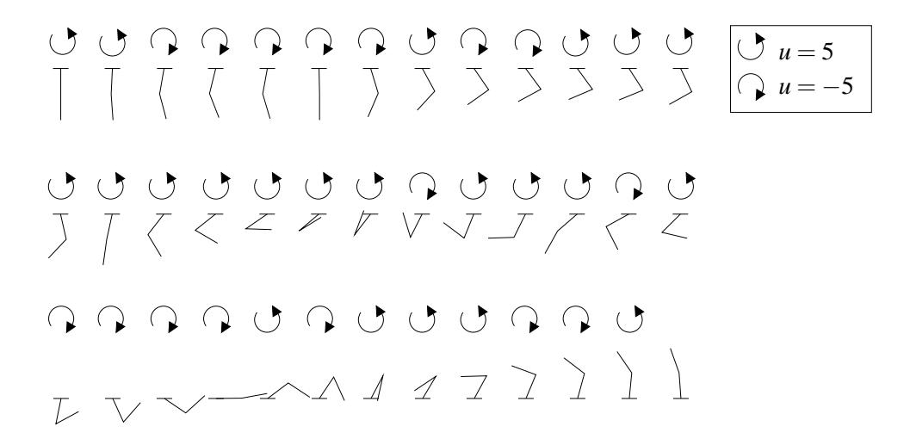

Figure 21: A typical control sequence with a learned policy. The Acrobot starts with zero speed in a downward position. Its position and the applied control action are represented at successive time steps. The last step corresponds to a terminal state.

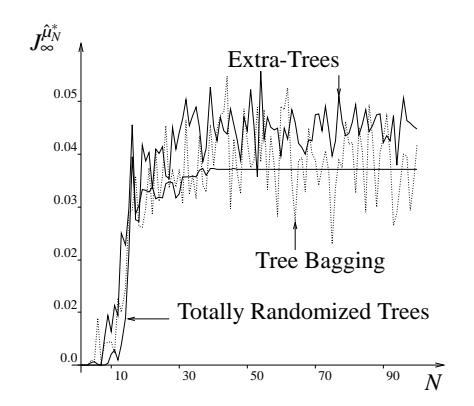

| Figure 22: | Score of $\hat{\mu}_N^*$ when using the set gen- |
|------------|--------------------------------------------------|
|            | erated by the $\varepsilon$ -greedy policy.      |

| Tree-based                | Policy which generates $\mathcal{F}$ |        |  |
|---------------------------|--------------------------------------|--------|--|
| method                    | ε-greedy                             | Random |  |
| Pruned CART Tree          | 0.0006                               | 0.     |  |
| Kd-Tree (Best $n_{min}$ ) | 0.0004                               | 0.     |  |
| Tree Bagging              | 0.0417                               | 0.0047 |  |
| Extra-Trees               | 0.0447                               | 0.0107 |  |
| Totally Rand. Trees       | 0.0371                               | 0.0071 |  |

Table 5: Score of  $\hat{\mu}_{100}^*$  for the two sets of fourtuples and different tree-based methods.

the best score while the score of Tree Bagging seems to oscillate around the value of the score corresponding to Totally Randomized Trees.

The score obtained by  $\hat{\mu}_{100}^*$  for the different tree-based methods and the different sets of four-tuples is represented in Table 5. One may observe, once again, that methods which build an ensemble of regression trees perform much better. Surprisingly, Totally Randomized Trees behaves well compared to Tree Bagging and to a lesser extent to Extra-Trees. On the other hand, the single tree methods offer rather poor performances. Note that for Kd-Tree, we have computed  $\hat{\mu}_{100}^*$  and its associated score for each value of  $n_{min} \in \{2,3,4,5,10,20,\cdots,100\}$  and reported in the Table 5 the highest score thus obtained.

We can also observe from this table that the scores obtained while using the set of four-tuples corresponding to the totally random policy are much worse than those obtained when using an  $\varepsilon$ -greedy policy. This is certainly because the use of a totally random policy leads to very little

information along the optimal trajectories starting from elements of  $X^i$ . In particular, out of the 2000 episodes used to generate the set of four-tuples, only 21 manage to reach the goal region. Note also that while Extra-Trees remains superior, Tree Bagging offers this time poorer performances than Totally Randomized Trees.

### 5.5 The Bicycle

We consider two control problems related to a bicycle which moves at constant speed on a horizontal plane (Figure 23). For the first problem, the agent has to learn how to balance the bicycle. For the second problem, he has not only to learn how to balance the bicycle but also how to drive it to a specific goal. The exact definitions of the two optimal control problems related to these two tasks are given in Appendix C.4.22

These two optimal control problems have the same system dynamics and differ only by their reward function. The system dynamics is composed of seven variables. Four are related to the bicycle itself and three to the position of the bicycle on the plane. The state variables related to the bicycle are  $\omega$  (the angle from vertical to the bicycle),  $\dot{\omega}$ ,  $\theta$  (the angle the handlebars are displaced from normal) and  $\dot{\theta}$ . If  $|\omega|$  becomes larger than 12 degrees, then the bicycle is supposed to have fallen down and a terminal state is reached. The three state variables related to the position of the bicycle on the plane are the coordinates  $(x_b, y_b)$  of the contact point of the back tire with the horizontal plane and the angle  $\psi$  formed by the bicycle frame and the x-axis. The actions are the torque T applied to the handlebars (discretized to  $\{-2,0,2\}$ ) and the displacement d of the rider (discretized to  $\{-0.02,0,0.02\}$ ). The noise in the system is a uniformly distributed term in [-0.02,0.02] added to the displacement component action d.

As is usually the case when dealing with these bicycle control problems, we suppose that the state variables  $x_b$  and  $y_b$  cannot be observed. Since these two state variables do not intervene in the dynamics of the other state variables nor in the reward functions considered, they may be taken as irrelevant variables for the optimal control problems and, therefore, their lack of observability does not make the control problem partially observable.

The reward function for the "Bicycle Balancing" control problem (Eqn (56), page 553) is such that zero rewards are always observed, except when the bicycle has fallen down, in which case the reward is equal to -1. For the "Bicycle Balancing and Riding" control problem, a reward of -1 is also observed when the bicycle has fallen down. However, this time, non-zero rewards are also observed when the bicycle is riding (Eqn (57), page 553). Indeed, the reward  $r_t$  when the bicycle is supposed not to have fallen down, is now equal to  $c_{reward}(d_{angle}(\psi_t) - d_{angle}(\psi_{t+1}))$  with

22. Several other papers treat the problems of balancing and/or balancing and riding a bicycle (e.g. Randløv and Alstrøm, 1998; Ng and Jordan, 1999; Lagoudakis and Parr, 2003b,a). The reader can refer to them in order to put the performances of fitted *Q* iteration in comparison with some other RL algorithms. In particular, he could refer to Randløv and Alstrøm (1998) to get an idea of the performances of SARSA(λ), an on-line algorithm, on these bicycle control problems and to Lagoudakis and Parr (2003b) to see how the Least-Square Policy Iteration (LSPI), a batch mode RL algorithm, performs. If his reading of these papers and of the simulation results reported in Sections 5.5.1 and 5.5.2 is similar to ours, he will conclude that fitted *Q* iteration combined with Extra-Trees performs much better than SARSA(λ) in terms of ability to extract from the information acquired from interaction with the system, a good control policy. He will also conclude that LSPI and fitted *Q* iteration combined with Extra-Trees are both able to produce good policies with approximately the same number of episodes. Moreover, the reader will certainly notice the obvious strong dependence of performances of LSPI and SARSA(λ) on the choice of the parametric approximation architecture these algorithms use to approximate the *Q*-function, which makes extremely difficult any strict comparison with them.

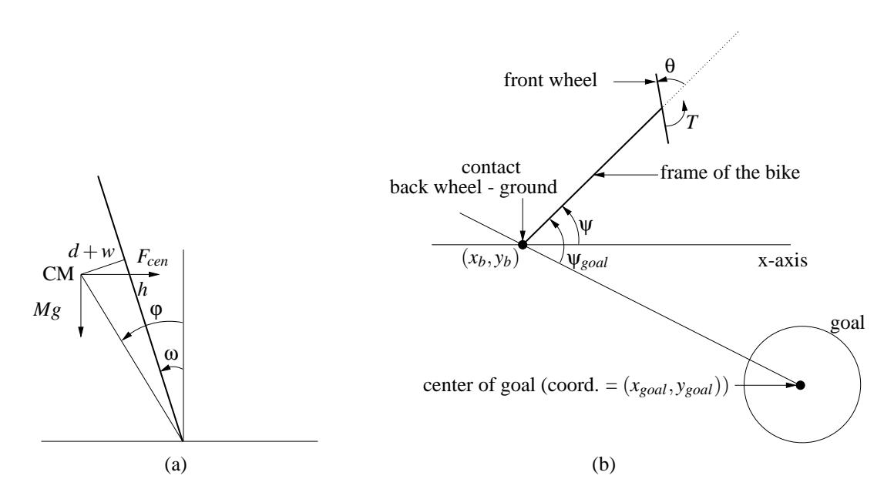

Figure 23: Figure (a) represents the bicycle seen from behind. The thick line represents the bicycle. CM is the center of mass of the bicycle and the cyclist. h represents the height of the CM over the ground.  $\omega$  represents the angle from vertical to bicycle. The angle  $\varphi$  represents the total angle of tilt of the center of mass. Action d represents how much the agent decides to displace the center of mass from the bicycle's plan and w is the noise laid on the choice of displacement, to simulate imperfect balance. Figure (b) represents the bicycle seen from above.  $\theta$  is the angle the handlebars are displaced from normal,  $\psi$  the angle formed by the bicycle frame and the x-axis and  $\psi_{goal}$  the angle between the bicycle frame and the line joining the back - wheel ground contact and the center of the goal. T is the torque applied by the cyclist to the handlebars.  $(x_b, y_b)$  is the contact point of the backwheel with the ground.

 $c_{reward} = 0.1$  and  $d_{angle}(\psi) = \min_{k \in \mathbb{Z}} |\psi + 2k\pi|$  ( $d_{angle}(\psi)$  represents the "distance" between an angle  $\psi$  and the angle 0). Positive rewards are therefore observed when the bicycle frame gets closer to the position  $\psi = 0$  and negative rewards otherwise. With such a choice for the reward function, the optimal policy  $\mu^*$  tends to control the bicycle so that it moves to the right with its frame parallel to the x-axis. Such an optimal policy or a good approximate  $\hat{\mu}^*$  of it can then be used to drive the bicycle to a specific goal. If  $\psi_{goal_t}$  represents the angle between the bicycle frame and a line joining the point  $(x_b, y_b)$  to the center of the goal  $(x_{goal}, y_{goal})$  (Figure 23b), this is achieved by selecting at time t the action  $\hat{\mu}^*(\omega_t, \dot{\omega}_t, \theta_t, \dot{\theta}_t, \psi_{goal_t})$ , rather than  $\hat{\mu}^*(\omega_t, \dot{\omega}_t, \theta_t, \dot{\theta}_t, \psi_t)$ . In this way, we proceed as if the line joining  $(x_b, y_b)$  to  $(x_{goal}, y_{goal})$  were the x-axis when selecting control actions, which makes the bicycle moving towards the goal.23 Note that in our simulations,  $(x_{goal}, y_{goal}) = (1000, 0)$  and the goal is a ten meter radius circle centered on this point. Concerning the value of the decay

23. The reader may wonder why, contrary to the approach taken by other authors (Lagoudakis, Parr, Randløv, Alstrøm, Ng, Jordan),

• we did not consider in the state signal available during the four-tuples generation phase  $\psi_{goal}$  rather than  $\psi$  (which would have amounted here to consider  $(\omega, \dot{\omega}, \theta, \dot{\theta}, \psi_{goal})$  as state signal when generating the four-tuples)

factor  $\gamma$ , it has been chosen for both problems equal to 0.98. The influence of  $\gamma$  and  $c_{reward}$  on the trajectories for the "Bicycle Balancing and Riding" control problem will be discussed later.

All episodes used to generate the four-tuples start from a state selected at random in

$$\{(\omega, \dot{\omega}, \theta, \dot{\theta}, x_b, y_b, \psi) \in \mathbb{R}^7 | \psi \in [-\pi, \pi] \text{ and } \omega = \dot{\omega} = \theta = \dot{\theta} = x_b = y_b = 0\},$$

and end when a terminal state is reached, i.e. when the bicycle is supposed to have fallen down. The policy considered during the four-tuples generation phase is a policy that selects at each instant an action at random in U.

For both optimal control problems, the set  $X^i$  considered for the score computation (Section 5.1.2) is:

$$X^{i} = \{(\omega, \dot{\omega}, \theta, \dot{\theta}, x_b, y_b, \psi) \in \mathbb{R}^7 | \psi \in \{-\pi, -\frac{3\pi}{4}, \cdots, \pi\} \text{ and } \omega = \dot{\omega} = \theta = \dot{\theta} = x_b = y_b = 0\}.$$

Since  $\psi$  and  $\psi + 2k\pi$  ( $k \in \mathbb{Z}$ ) are equivalent from a physical point of view, in our simulations we have modified each value of  $\psi$  observed by a factor  $2k\pi$  in order to guarantee that it always belongs to  $[-\pi,\pi]$ .

### 5.5.1 THE "BICYCLE BALANCING" CONTROL PROBLEM

To generate the four-tuples, we have considered 1000 episodes. The corresponding set  $\mathcal{F}$  is composed of 97,969 four-tuples. First, we discuss the results obtained by Extra-Trees ( $n_{min} = 4$ , K = 7, M = 50)24 and then we assess the performances of the other tree-based methods.

Figure 24a represents the evolution of the score of the policies  $\hat{\mu}_N^*$  with N when using Extra-Trees. To assess the quality of a policy  $\mu$ , we use also another criterion than the score. For this criterion, we simulate for each  $x_0 \in X^i$  ten times the system with the policy  $\mu$ , leading to a total of 90 trajectories. If no terminal state has been reached before t=50,000, that is if the policy was able to avoid crashing the bicycle during 500 seconds (the discretization time step is 0.01 second), we say that the trajectory has been successful. On Figure 24c we have represented for the different policies  $\hat{\mu}_N^*$  the number of successful trajectories among the 90 simulated. Remark that if from N=60 the score remains really close to zero, polices  $\hat{\mu}_{60}^*$  and  $\hat{\mu}_{70}^*$  do not produce as yet any successful trajectories, meaning that the bicycle crashes for large values of t even if these are smaller than

We did not choose to proceed like this because  $\psi_{goal_{t+1}}$  depends not only on  $\psi_{goal_t}$  and  $\theta_t$  but also on  $x_{b_t}$  and  $y_{b_t}$ . Therefore, since we suppose that the coordinates of the back tire cannot be observed, the optimal control problems would have been partially observable if we had replaced  $\psi$  by  $\psi_{goal}$  in the state signal and the reward function. Although in our simulations this does not make much difference since  $\psi \simeq \psi_{goal}$  during the four-tuples generation phases, we prefer to stick with fully observable systems in this paper.

24. When considering ensemble methods (Extra-Trees, Totally Randomized Trees, Tree Bagging) we always keep constant the value of these parameters. Since we are not dealing with a highly stochastic system, as for the case of the "Left or Right" control problem, we decided not to rely on the pruned version of these algorithms. However, we found out that by developing the trees fully ( $n_{min} = 2$ ), variance was still high. Therefore, we decided to use a larger value for  $n_{min}$ . This value is equal to 4 and was leading to a good bias-variance tradeoff. Concerning the value of K = 7, it is equal to the dimension of the input space, that is the dimension of the state signal  $(\omega, \dot{\omega}, \theta, \dot{\theta}, \psi)$  plus the dimension of the action space.

• the reward function for the bicycle balancing and riding control problem does not give directly information about the direction to the goal (which would have led here to observe at t+1 the reward  $c_{reward}(d_{angle}(\psi_{goal_t}) - d_{angle}(\psi_{goal_{t+1}}))$ ).

| Tree-based method                                                | Control problem |                      |  |  |
|------------------------------------------------------------------|-----------------|----------------------|--|--|
| Tree-based method                                                | Bicycle         | Bicycle              |  |  |
|                                                                  | Balancing       | Balancing and Riding |  |  |
| Pruned CART Tree                                                 | -0.02736        | -0.03022             |  |  |
| Kd-Tree (Best $n_{min} \in \{2, 3, 4, 5, 10, 20, \dots, 100\}$ ) | -0.02729        | -0.10865             |  |  |
| Tree Bagging $(n_{min} = 4, M = 50)$                             | 0               | 0.00062              |  |  |
| Extra-Trees ( $n_{min} = 4, K = 7, M = 50$ )                     | 0               | 0.00157              |  |  |
| Totally Randomized Trees ( $n_{min} = 4, M = 50$ )               | -0.00537        | -0.01628             |  |  |

Table 6: Score of  $\hat{\mu}_{300}^*$  for the "Balancing" and "Balancing and Riding" problems. Different tree-based methods are considered, with a 1000 episode based set of four-tuples.

50,000. Figure 24b gives an idea of the trajectories of the bicycle on the horizontal plane when starting from the different elements of  $X^i$  and being controlled by  $\hat{\mu}_{300}^*$ .

To assess the influence of the number of four-tuples on the quality of the policy computed, we have drawn on Figure 24d the number of successful trajectories when different number of episodes are used to generate  $\mathcal{F}$ . As one may see, by using Extra-Trees, from 300 episodes ( $\simeq 10,000$  four-tuples) only successful trajectories are observed. Tree Bagging and Totally Randomized Trees perform less well. It should be noted that Kd-Tree and Pruned CART Tree were not able to produce any successful trajectories, even for the largest set of four-tuples. Furthermore, the fact that we obtained some successful trajectories with Totally Randomized Trees is only because we have modified the algorithm to avoid selection of tests according to  $\psi$ , a state variable that plays for this "Bicycle Balancing" control problem the role of an irrelevant variable ( $\psi$  does not intervene in the reward function and does not influence the dynamics of  $\omega$ ,  $\dot{\omega}$ ,  $\dot{\theta}$ ,  $\dot{\theta}$ ) (see also Section 5.3.5). Note that the scores obtained by  $\hat{\mu}_{300}^*$  for the different tree-based methods when considering the 97,969 four-tuples are reported in the second column of Table 6.

### 5.5.2 THE "BICYCLE BALANCING AND RIDING" CONTROL PROBLEM

To generate the four-tuples, we considered 1000 episodes that led to a set  $\mathcal{F}$  composed of 97,241 elements. First, we study the performances of Extra-Trees ( $n_{min} = 4$ , K = 7, M = 50). Figure 25a represents the evolution of the score of  $\hat{\mu}_N^*$  with N. The final value of the score (score of  $\hat{\mu}_{300}^*$ ) is equal to 0.00157.

As mentioned earlier, with the reward function chosen, the policy computed by our algorithm should be able to drive the bicycle to the right, parallel to the x-axis, provided that the policy is a good approximation of the optimal policy. To assess this ability, we have simulated, for each  $x_0 \in X^i$ , the system with the policy  $\hat{\mu}_{300}^*$  and have represented on Figure 25b the different trajectories of the back tire. As one may see, the policy tends indeed to drive the bicycle to the right, parallel to the x-axis. The slight shift that exists between the trajectories and the x-axis (the shift is less than 10 degrees) could be reduced if more four-tuples were used as input of the fitted Q iteration algorithm.

Now, if rather than using the policy  $\hat{\mu}_{300}^*$  with the state signal  $(\omega, \dot{\omega}, \theta, \dot{\theta}, \psi)$  we consider the state signal  $(\omega, \dot{\omega}, \theta, \dot{\theta}, \psi_{goal})$ , where  $\psi_{goal}$  is the angle between the bicycle frame and the line joining  $(x_b, y_b)$  with  $(x_{goal}, y_{goal})$ , we indeed observe that the trajectories converge to the goal (see Figure 25c). Under such conditions, by simulating from each  $x_0 \in X^i$  ten times the system over 50,000 time steps, leading to a total of 90 trajectories, we observed that every trajectory managed to reach

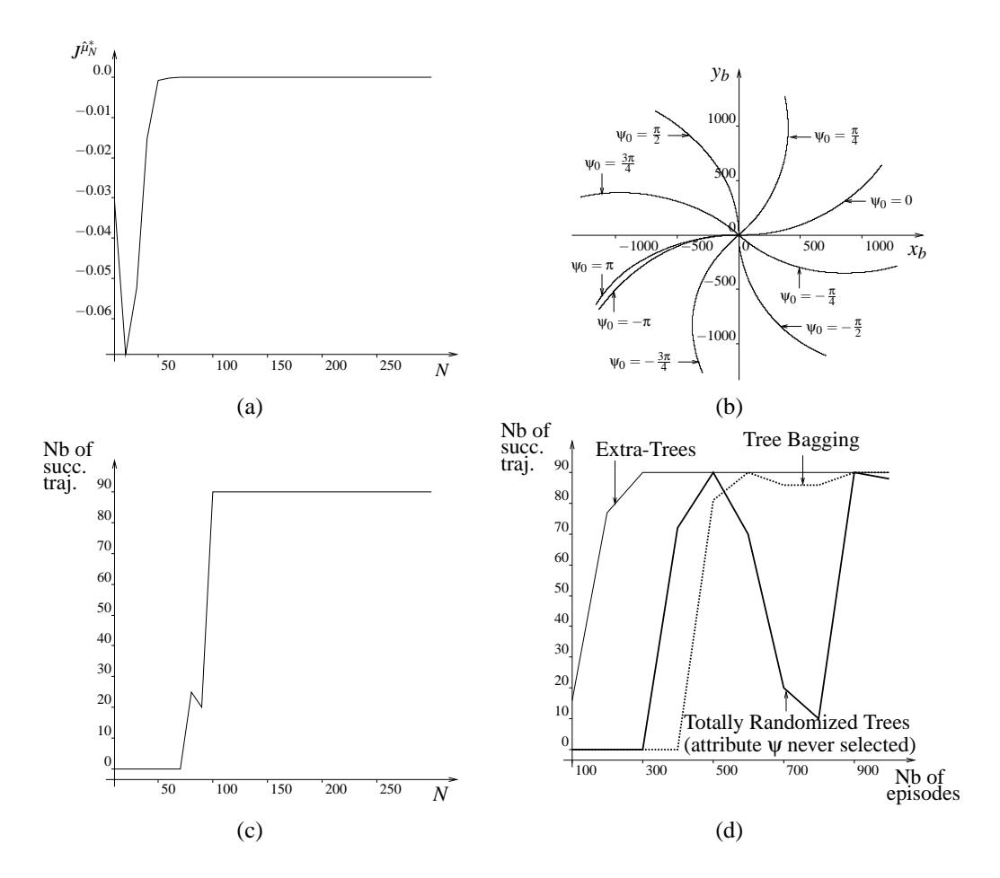

Figure 24: The "Bicycle Balancing" control problem. Figure (a) represents the score of  $\hat{\mu}_N^*$  with Extra-Trees and 1000 episodes used to generate  $\mathcal{F}$ . Figure (b) sketches trajectories of the bicycle on the  $x_b - y_b$  plane when controlled by  $\hat{\mu}_{300}^*$ . Trajectories are drawn from t = 0 till t = 50,000. Figure (c) represents the number of times (out of 90 trials) the policy  $\hat{\mu}_N^*$  (Extra-Trees, 1000 episodes) manages to balance the bicycle during 50,000 time steps, i.e. 500 s. Figure (d) gives for different numbers of episodes and for different tree-based methods the number of times  $\hat{\mu}_{300}^*$  leads to successful trajectories.

a 2 meter neighborhood of  $(x_{goal}, y_{goal})$ . Furthermore, every trajectory was able to reach the goal in less that 47,000 time steps. Note that, since the bicycle rides at constant speed  $v = \frac{10}{3.6} \simeq 2.77 ms^{-1}$  and since the time discretization step is 0.01 s, the bicycle does not have to cover a distance of more that 1278 m before reaching the goal while starting from any element of  $X^i$ .

It is clear that these good performances in terms of the policy ability to drive the bicycle to the goal depend on the choice of the reward function. For example, if the same experience is repeated with  $c_{reward}$  chosen equal to 1 rather than 0.1 in the reward function, the trajectories lead rapidly to a terminal state. This can be explained by the fact that, in this case, the large positive rewards obtained for moving the frame of the bicycle parallel to the x-axis lead to a control policy that modifies too rapidly the bicycle riding direction which tends to destabilize it. If now, the coefficient  $c_{reward}$  is taken smaller than 0.1, the bicycle tends to turn more slowly and to take more time to reach the goal. This is illustrated on Figure 25d where a trajectory corresponding to  $c_{reward} = 0.01$ is drawn together with a trajectory corresponding to  $c_{reward} = 0.1$ . On this figure, we may also clearly observe that after leaving the goal, the control policies tend to drive again the bicycle to it. It should be noticed that the policy corresponding to  $c_{reward} = 0.1$  manages at each loop to bring the bicycle back to the goal while it is not the case with the policy corresponding to  $c_{reward} = 0.01$ . Note that the coefficient  $\gamma$  influences also the trajectories obtained. For example, by taking  $\gamma = 0.95$ instead of  $\gamma = 0.98$ , the bicycle crashes rapidly. This is due to the fact that a smaller value of  $\gamma$  tends to increase the importance of short-term rewards over long-term ones, which favors actions that turn rapidly the bicycle frame, even if they may eventually lead to a fall of the bicycle.

Rather than relying only on the score to assess the performances of a policy, let us now associate to a policy a value that depends on its ability to drive the bicycle to the goal within a certain time interval, when  $(\omega, \dot{\omega}, \theta, \dot{\theta}, \psi_{goal})$  is the state signal considered. To do so, we simulate from each  $x_0 \in X^i$  ten times the system over 50,000 time steps and count the number of times the goal has been reached. Figure 25e represents the "number of successful trajectories" obtained by  $\hat{\mu}_N^*$  for different values of N. Observe that 150 iterations of fitted Q iteration are needed before starting to observe some successful trajectories. Observe also that the "number of successful trajectories" sometimes drops when N increases, contrary to intuition. These drops are however not observed on the score values (e.g. for N=230, all 90 trajectories are successful and the score is equal to 0.00156, while for N=240, the number of successful trajectories drops to 62 but the score increases to 0.00179). Additional simulations have shown that these sudden drops tend to disappear when using more four-tuples.

Figure 25f illustrates the influence of the size of  $\mathcal F$  on the number of successful trajectories when fitted Q iteration is combined with Extra-Trees. As expected, the number of successful trajectories tends to increase with the number of episodes considered in the four-tuples generation process. It should be noted that the other tree-based methods considered in this paper did not manage to produce successful trajectories when only 1000 episodes are used to generate the four-tuples. The different scores obtained by  $\hat{\mu}_{300}^*$  when 1000 episodes are considered and for the different tree-based methods are gathered in Table 6, page 541. Using this score metric, Extra-Trees is the method performing the best, which is in agreement with the "number of successful trajectories" metric, followed successively by Tree Bagging, Totally Randomized Trees, Pruned CART Tree and Kd-Tree.

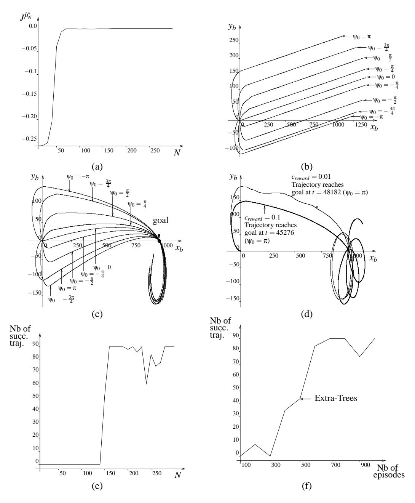

Figure 25: The "Bicycle Balancing and Riding" control problem. Figure (a) represents the score of  $\hat{\mu}_N^*$  (Extra-Trees, 1000 episodes). Figure (b) sketches trajectories when  $\hat{\mu}_{300}^*$  (Extra-Trees, 1000 episodes) controls the bicycle (trajectories drawn from t=0 till t=50,000). Figure (c) represents trajectories when  $\hat{\mu}_{300}^*$  (Extra-Trees, 1000 episodes) controls the bicycle with  $(\omega_t, \dot{\omega}_t, \theta_t, \dot{\theta}_t, \psi_{goal_t})$  used as input signal for the policy (trajectories drawn from t=0 till t=50,000). Figure (d) represents the influence on  $c_{reward}$  on the trajectories ( $\hat{\mu}_{300}^*$ , Extra-Trees, 1000 episodes and trajectories drawn from t=0 till t=100,000). Figure (e) lists the number of times the policy  $\hat{\mu}_N^*$  manages to bring the bicycle to the goal in less than 50,000 time steps (highest possible value for "Number of successful trajectories" is 90). Figure (f) gives for different number of episodes the number of times  $\hat{\mu}_{300}^*$  leads to successful trajectories.

### 5.6 Conclusion of the Experiments

We discuss in this section the main conclusions that may be drawn from the simulation results previously reported.

#### 5.6.1 Influence of the Tree-Based Methods

Let us analyze the results of our experiments in the light of the classification given in Table 1.

**Single trees vs ensembles of trees.** Whatever the set of four-tuples used, the top score has always been reached by a method building an ensemble of regression trees, and furthermore, the larger the state space, the better these regression tree ensemble methods behave compared to methods building only one single tree. These results are in agreement with previous work in reinforcement learning which suggests that multi-partitioning of the state space is leading to better function approximators than single partitioning.25 They are also in agreement with the evaluation of these ensemble algorithms on many standard supervised learning problems (classification and regression), where tree-based ensemble methods typically significantly outperform single trees (Geurts et al., 2004).

However, from the viewpoint of computational requirements, we found that ensemble methods are clearly more demanding, both in terms of computing times and memory requirements for the storage of models.

Kernel-based vs non kernel-based methods. Among the single tree methods, Pruned CART Tree, which adapts the tree structure to the output variable, offers typically the same performances as Kd-Tree, except in the case of irrelevant variables where it is significantly more robust. Among the tree-based ensemble methods, Extra-Trees outperforms Totally Randomized Trees in all cases. On the other hand, Tree Bagging is generally better than the Totally Randomized Trees, except when dealing with very small numbers of samples, where the bootstrap resampling appears to be penalizing. These experiments thus show that tree-based methods that adapt their structure to the new output at each iteration usually provide better results than methods that do not (that we name kernel-based). Furthermore, the non kernel-based tree-based algorithms are much more robust to the presence of irrelevant variables thanks to their ability to filter out tests involving these variables.

A drawback of non kernel-based methods is that they do not guarantee convergence. However, with the Extra-Trees algorithm, even if the sequence was not converging, the policy quality was oscillating only moderately around a stable value and even when at its lowest, it was still superior to the one obtained by the kernel-based methods ensuring the convergence of the algorithm. Furthermore, if really required, convergence to a stable approximation may always be provided in an ad hoc fashion, for example by freezing the tree structures after a certain number of iterations and then only refreshing predictions at terminal nodes.

#### 5.6.2 PARAMETRIC VERSUS NON-PARAMETRIC SUPERVISED LEARNING METHOD

Fitted Q iteration has been used in our experiments with non-parametric supervised learning methods (kNN, tree-based methods) and parametric supervised learning methods (basis function methods with piecewise-constant or piecewise-linear grids as approximation architectures).

25. See e.g. Sutton (1996); Sutton and Barto (1998), where the authors show that by overlaying several shifted tilings of the state space (type of approximation architecture known as CMACs), good function approximators could be obtained.

It has been shown that the parametric supervised learning methods, compared to the non-parametric ones, were not performing well. The main reason is the difficulty to select a priori the shape of the parametric approximation architecture that may lead to some good results. It should also be stressed that divergence to infinity of the fitted Q iteration has sometimes been observed when piecewise-linear grids were the approximation architectures considered.

### 5.6.3 FITTED Q ITERATION VERSUS ON-LINE ALGORITHMS

An advantage of fitted Q iteration over on-line algorithms is that it can be combined with some non-parametric function approximators, shown to be really efficient to generalize the information. We have also compared the performances of fitted Q iteration and Q-learning for some a priori given parametric approximation architectures. In this context, we found out that when the approximation architecture used was chosen so as to avoid serious convergence problems of the fitted Q iteration algorithm, then this latter was also performing much better than Q-learning on the same architecture.

#### 6. Conclusions and Future Work

In this paper, we have considered a batch mode approach to reinforcement learning, which consists of reformulating the reinforcement learning problem as a sequence of standard supervised learning problems. After introducing the *fitted Q iteration algorithm* which formalizes this framework, we have studied the properties and performances of the algorithm when combined with three classical tree-based methods (Kd-Trees, CART Trees, Tree Bagging) and two newly proposed tree-based ensemble methods namely Extra-Trees and Totally Randomized Trees.

Compared with grid-based methods on low-dimensional problems, as well as with  $k{\rm NN}$  and single tree-based methods in higher dimensions, we found out that the fitted Q iteration algorithm was giving excellent results when combined with any one of the considered tree-based ensemble methods (Extra-Trees, Tree Bagging and Totally Randomized Trees). On the different cases studied, *Extra-Trees* was the supervised learning method able to extract at best information from a set of four-tuples. It is also faster than Tree Bagging and was performing significantly better than this latter algorithm, especially on the higher dimensional problems and on low-dimensional problems with small sample sizes. We also found out that fitted Q iteration combined with tree-based methods was performing much better than Q-learning combined with piecewise-constant or piecewise-linear grids.

Since Extra-Trees and Tree Bagging, the two best performing supervised learning algorithms, readjust their approximation architecture to the output variable at each iteration, they do not ensure the convergence of the fitted Q iteration algorithm. However, and contrary to many parametric approximation schemes, they do not lead to divergence to infinity problems. The convergence property is satisfied by the *Totally Randomized Trees* because their set of trees is frozen at the beginning of the iteration. They perform however less well than Extra-Trees and Tree Bagging, especially in the presence of irrelevant variables. They are nevertheless better than some other methods that also ensure the convergence of the sequence, like kNN kernel methods and piecewise-constant grids, in terms of performances as well as scalability to large numbers of variables and four-tuples. Within this context, it would be worth to study versions of Extra-Trees and Tree Bagging which would freeze their trees at some stage of the iteration process, and thus recover the convergence property.

From a theoretical point of view, it would certainly be very interesting to further study the consistency of the fitted *Q* iteration algorithm, in order to determine general conditions under which the

algorithm converges to an optimal policy when the number of four-tuples collected grows to infinity. With this in mind, one could possibly seek inspiration in the work of Ormoneit and Sen (2002) and Ormoneit and Glynn (2002), who provide consistency conditions for kernel-based supervised learning methods within the context of fitted Q iteration, and also in some of the material published in the supervised learning literature (e.g. Lin and Jeon, 2002; Breiman, 2000). More specifically, further investigation in order to characterize ensembles of regression trees with respect to consistency is particularly wishful, because of their good practical performances.

In this paper, the score associated to a test node of a tree was the relative variance reduction. Several authors who adapted regression trees in other ways to reinforcement learning have suggested the use of other score criteria for example based on the violation of the Markov assumption (McCallum, 1996; Uther and Veloso, 1998) or on the combination of several error terms like the supervised, the Bellman, and the advantage error terms (Wang and Diettrich, 1999). Investigating the effect of such score measures within the fitted Q iteration framework is another interesting topic of research.

While the fitted Q iteration algorithm used with tree-based ensemble methods reveals itself to be very effective to extract relevant information from a set of four-tuples, it has nevertheless one drawback: with increasing number of four-tuples, it involves a superlinear increase in computing time and a linear increase in memory requirements. Although our algorithms offer a very good accuracy/efficiency tradeoff, we believe that further research should explore different ways to try to improve the computational efficiency and the memory usage, by introducing algorithm modifications specific to the reinforcement learning context.

### Acknowledgments

Damien Ernst and Pierre Geurts gratefully acknowledge the financial support of the Belgian National Fund of Scientific Research (FNRS). The authors thank the action editor Michael Littman and the three anonymous reviewers for their many suggestions for improving the quality of the manuscript. They are also very grateful to Bruno Scherrer for reviewing an earlier version of this work, to Mania Pavella for her helpful comments and to Michail Lagoudakis for pointing out relevant information about the bicycle control problems.

### Appendix A. Extra-Trees Induction Algorithm

The procedure used by the Extra-Trees algorithm to build a tree from a training set is described in Figure 26. This algorithm has two parameters:  $n_{min}$ , the minimum number of elements required to split a node and K, the maximum number of cut-directions evaluated at each node. If K=1 then at each test node the cut-direction and the cut-point are chosen totally at random. If in addition the condition (iii) is dropped, then the tree structure is completely independent of the output values found in the  $\mathcal{TS}$ , and the algorithm generates *Totally Randomized Trees*.

The score measure used is the relative variance reduction. In other words, if  $\mathcal{TS}_l$  (resp.  $\mathcal{TS}_r$ ) denotes the subset of cases from  $\mathcal{TS}$  such that  $[i_j < t]$  (resp.  $[i_j \ge t]$ ), then the Score is defined as follows:

$$Score([i_j < t], \mathcal{TS}) = \frac{var(o|\mathcal{TS}) - \frac{\#\mathcal{TS}_l}{\#\mathcal{TS}}var(o|\mathcal{TS}_l) - \frac{\#\mathcal{TS}_r}{\#\mathcal{TS}}var(o|\mathcal{TS}_r)}{var(o|\mathcal{TS})}, \tag{25}$$

### Build\_a\_tree(TS)

Input: a training set TS Output: a tree T;

- If
  - (i)  $\#TS < n_{min}$ , or
  - (ii) all input variables are constant in TS, or
  - (iii) the output variable is constant over the  $\mathcal{TS}$ ,

return a leaf labeled by the average value  $\frac{1}{\#\mathcal{T},\varsigma}\sum_l o^l$ .

- Otherwise:
  - 1. Let  $[i_i < t_i] = \text{Find\_a\_test}(\mathcal{TS})$ .
  - 2. Split TS into  $TS_l$  and  $TS_r$  according to the test  $[i_i < t]$ .
  - 3. Build  $T_l = \text{Build\_a\_tree}(\mathcal{T}S_l)$  and  $T_r = \text{Build\_a\_tree}(\mathcal{T}S_r)$  from these subsets;
  - 4. Create a node with the test  $[i_j < t_j]$ , attach  $T_l$  and  $T_r$  as left and right subtrees of this node and return the resulting tree.

### Find\_a\_test(TS)

Input: a training set TS Output: a test  $[i_j < t_j]$ :

- 1. Select K inputs,  $\{i_1, ..., i_K\}$ , at random, without replacement, among all (non constant) input variables.
- 2. For *k* going from 1 to *K*:
  - (a) Compute the maximal and minimal value of  $i_k$  in TS, denoted respectively  $i_{k,min}^{TS}$  and  $i_{k,max}^{TS}$ .
  - (b) Draw a discretization threshold  $t_k$  uniformly in  $]i_{k,min}^{TS}, i_{k,max}^{TS}]$
  - (c) Compute the score  $S_k = \text{Score}([i_k < t_k], TS)$
- 3. Return a test  $[i_j < t_j]$  such that  $S_j = \max_{k=1,...,K} S_k$ .

Figure 26: Procedure used by the Extra-Trees algorithm to build a tree. The *Totally Randomized Trees* algorithm is obtained from this algorithm by setting K = 1 and by dropping the stopping condition (iii).

where var(o|X) is the variance of the output o in the training set X.

# Appendix B. Convergence of the Sequence of $\hat{Q}_N$ -Functions

**Theorem 1** If the fitted Q iteration algorithm is combined with a supervised learning method which produces a model of the type (17) with the kernel  $k_{TS}$  being the same from one iteration to the other and satisfying the normalizing condition (18), then the sequence of  $\hat{Q}_N$ -functions converges.

**Proof** The proof is adapted in a straightforward way from Ormoneit and Sen (2002) to the fact that the kernel  $k_{TS}((x_t^l, u_t^l), (x, u))$  may not be decomposed here into the product  $k'(x_t^l, x)\delta(u_t^l, u)$ .

Let us first observe that in such conditions, the sequence of functions computed by the fitted Q iteration algorithm is determined by the recursive equation:

$$\hat{Q}_{N}(x,u) = \sum_{l=1}^{\#\mathcal{F}} k_{TS}((x_{t}^{l}, u_{t}^{l}), (x,u))[r_{t}^{l} + \gamma \max_{u' \in U} \hat{Q}_{N-1}(x_{t+1}^{l}, u')], \quad \forall N > 0$$
(26)

with  $\hat{Q}_0(x,u) = 0 \ \forall (x,u) \in X \times U$ . Equation (26) may be rewritten:

$$\hat{Q}_N = \hat{H}\hat{Q}_{N-1} \tag{27}$$

where  $\hat{H}$  is an operator mapping any function  $K: X \times U \to \mathbb{R}$  and defined as follows:

$$(\hat{H}K)(x,u) = \sum_{l=1}^{\#\mathcal{F}} k_{\mathcal{T}S}((x_t^l, u_t^l), (x,u))[r_t^l + \gamma \max_{u' \in U} K(x_{t+1}^l, u')].$$
 (28)

This operator is a contraction on the Banach space of functions defined over  $X \times U$  and the supremum norm. Indeed, we have:

$$\begin{split} \|\hat{H}K - \hat{H}\overline{K}\|_{\infty} &= \gamma \max_{(x,u) \in X \times U} |\sum_{l=1}^{\#\mathcal{F}} k_{TS}((x_{t}^{l}, u_{t}^{l}), (x, u)) [\max_{u' \in U} K(x_{t+1}^{l}, u') - \max_{u' \in U} \overline{K}(x_{t+1}^{l}, u')]| \\ &\leq \gamma \max_{(x,u) \in X \times U} |\sum_{l=1}^{\#\mathcal{F}} k_{TS}((x_{t}^{l}, u_{t}^{l}), (x, u)) \max_{u' \in U} [K(x_{t+1}^{l}, u') - \overline{K}(x_{t+1}^{l}, u')]| \\ &\leq \gamma \max_{(x,u) \in X \times U} |K(x, u) - \overline{K}(x, u)| \\ &= \gamma \|K - \overline{K}\|_{\infty} \\ &< \|K - \overline{K}\|_{\infty}. \end{split}$$

By virtue of the fixed-point theorem (Luenberger, 1969) the sequence converges, independently of the initial conditions, to the function  $\hat{Q}: X \times U \to \mathbb{R}$  which is unique solution of the equation  $\hat{Q} = \hat{H}\hat{Q}$ .

### Appendix C. Definition of the Benchmark Optimal Control Problems

We define in this section the different optimal control problems used in our experiments. Simulators, additional documentation and sets of four-tuples are available upon request.

# C.1 The "Left or Right" Control Problem

**System dynamics:** 

$$x_{t+1} = x_t + u_t + w_t$$

where w is drawn according the standard (zero mean, unit variance) Gaussian distribution.

If  $x_{t+1}$  is such that  $|x_{t+1}| > 10$  or  $|x_{t+1}| < 0$  then a terminal state is reached.

**State space:** The state space *X* is composed of  $\{x \in \mathbb{R} | x \in [0, 10]\}$  and of a terminal state.

**Action space:** The action space  $U = \{-2, 2\}$ .

**Reward function:** The reward function r(x, u, w) is defined through the following expression:

$$r(x_t, u_t, w_t) = \begin{cases} 0 & \text{if } x_{t+1} \in [0, 10] \\ 50 & \text{if } x_{t+1} < 0 \\ 100 & \text{if } x_{t+1} > 10. \end{cases}$$
 (29)

**Decay factor:** The decay factor  $\gamma$  is equal to 0.75.

#### C.2 The "Car on the Hill" Control Problem

**System dynamics:** The system has a continuous-time dynamics described by these two differential equations:

$$\dot{p} = s \tag{30}$$

$$\dot{s} = \frac{u}{m(1+Hill'(p)^2)} - \frac{gHill'(p)}{1+Hill'(p)^2} - \frac{s^2Hill'(p)Hill''(p)}{1+Hill'(p)^2}$$
(31)

where m and g are parameters equal respectively to 1 and 9.81 and where Hill(p) is a function of p defined by the following expression:

$$Hill(p) = \begin{cases} p^2 + p & \text{if } p < 0\\ \frac{p}{\sqrt{1 + 5p^2}} & \text{if } p \ge 0. \end{cases}$$
 (32)

The discrete-time dynamics is obtained by discretizing the time with the time between t and t+1 chosen equal to  $0.100 \, s$ .

If  $p_{t+1}$  and  $s_{t+1}$  are such that  $|p_{t+1}| > 1$  or  $|s_{t+1}| > 3$  then a terminal state is reached.

**State space:** The state space *X* is composed of  $\{(p,s) \in \mathbb{R}^2 | |p| \le 1 \text{ and } |s| \le 3\}$  and of a terminal state.  $X \setminus \{terminal \ state\}$  is represented on Figure 8a.

**Action space:** The action space  $U = \{-4, 4\}$ .

**Reward function:** The reward function r(x, u) is defined through the following expression:

$$r(x_t, u_t) = \begin{cases} -1 & \text{if } p_{t+1} < -1 \text{ or } |s_{t+1}| > 3\\ 1 & \text{if } p_{t+1} > 1 \text{ and } |s_{t+1}| \le 3\\ 0 & \text{otherwise.} \end{cases}$$
(33)

**Decay factor:** The decay factor  $\gamma$  has been chosen equal to 0.95.

**Integration:** The dynamical system is integrated by using an Euler method with a 0.001 s integration time step.

**Remark:** This "Car on the Hill" problem is similar to the one found in Moore and Atkeson (1995) except that the term  $-\frac{s^2Hill'(p)Hill''(p)}{1+Hill'(p)^2}$  is not neglected here in the system dynamics.

**Variants of the control problem:** In our experiments, we have also considered two other variants of this problem:

- The "Car on the Hill" with irrelevant variables: some irrelevant variables are added to the state vector. The value of an irrelevant variable at time t is determined by drawing at random a number in [-2,2] with a uniform probability (used in Section 5.3.5).
- The "Car on the Hill" with continuous action space: the action space is not yet discrete anymore. It is continuous and equal to [-4,4] (used in Section 5.3.7).

# C.3 The "Acrobot Swing Up" Control Problem

**System dynamics:** The system has a continuous-time dynamics described by these two second-order differential equations (taken from Yoshimoto et al., 1999):

$$d_{11}\ddot{\theta}_1 + d_{12}\ddot{\theta}_2 + c_1 + \phi_1 = -\mu_1\dot{\theta}_1 \tag{34}$$

$$d_{12}\ddot{\theta}_{1} + d_{22}\ddot{\theta}_{2} + c_{2} + \phi_{2} = u - \mu_{2}\dot{\theta}_{2} \tag{35}$$

(36)

where

$$d_{11} = M_1 L_1^2 + M_2 (L_1^2 + L_2^2 + 2L_1 L_2 \cos(\theta_2))$$
(37)

$$d_{22} = M_2 L_2^2 (38)$$

$$d_{12} = M_2(L_2^2 + L_1 L_2 \cos(\theta_2)) \tag{39}$$

$$c_1 = -M_2 L_1 L_2 \dot{\theta}_2 (2\dot{\theta}_1 + \dot{\theta}_2 \sin(\theta_2)) \tag{40}$$

$$c_2 = M_2 L_1 L_2 \dot{\theta_1}^2 \sin(\theta_2) \tag{41}$$

$$\phi_1 = (M_1L_1 + M_2L_1)g\sin(\theta_1) + M_2L_2g\sin(\theta_1 + \theta_2)$$
 (42)

$$\phi_2 = M_2 L_2 g \sin(\theta_1 + \theta_2). \tag{43}$$

 $M_1$  ( $M_2$ ),  $L_1$  ( $L_2$ ) and  $\mu_1$  ( $\mu_2$ ) are the mass, length, and friction, respectively, of the first (second) link.  $\theta_1$  is the angle of the first link from a downward position and  $\theta_2$  is the angle of the second link from the direction of the first link (Figure 20).  $\dot{\theta}_1$  and  $\dot{\theta}_2$  are the angular velocities of the first and second links, respectively. The system has four continuous state variables  $x = (\theta_1, \theta_2, \dot{\theta}_1, \dot{\theta}_2)$ . The physical parameters have been chosen equal to  $M_1 = M_2 = 1.0$ ,  $L_1 = L_2 = 1.0$ ,  $\mu_1 = \mu_2 = 0.01$ , g = 9.81.

The discrete-time dynamics is obtained by discretizing the time with the time between t and t+1 chosen equal to  $0.100 \, s$ .

Let us denote by O the set composed of the states  $x = ((2*k+1)*\pi, 0, 0, 0) \ k \in \mathbb{Z}$  and by d(x, O) the value  $\min_{o \in O} ||x - o||$ .

If  $x_{t+1}$  is such that  $d(x_{t+1}, O) < 1$  then a terminal state is reached.

**State space:** The state space is composed of  $\{x \in \mathbb{R}^4 | d(x, O) \ge 1\}$  and of a terminal state.

**Action space:** The action space  $U = \{-5, 5\}$ .

**Reward function:** The reward function r(x, u) is defined through the following expression:

$$r(x_t, u_t) = \begin{cases} 0 & \text{if } d(x_{t+1}, O) \ge 1\\ 1 - d(x_{t+1}, O) & \text{if } d(x_{t+1}, O) < 1. \end{cases}$$
(44)

**Decay factor:** The decay factor  $\gamma$  has been chosen equal to 0.95.

**Integration:** The dynamical system is integrated by using an Euler method with a 0.001 s integration time step.

### C.4 The "Bicycle Balancing" and "Bicycle Balancing and Riding" Control Problems

We define hereafter the "Bicycle Balancing" and the "Bicycle Balancing and Riding" control problems. These optimal control problems differ only by their reward functions.

**System dynamics**: The system studied has the following dynamics:

$$\omega_{t+1} = \omega_t + \Delta t \dot{\omega}_t \tag{45}$$

$$\dot{\omega}_{t+1} = \dot{\omega}_t + \Delta t \left( \frac{1}{I_{bicycle\ and\ cyclist}} (Mhg\sin(\varphi_t) - \cos(\varphi_t) \right)$$
(46)

$$(I_{dc}\dot{\sigma}\dot{\theta}_t + \operatorname{sign}(\theta_t)v^2(M_dr(invr_{f_t} + invr_{b_t}) + Mhinvr_{CM_t}))))$$

$$\theta_{t+1} = \begin{cases} \theta_t + \Delta t \dot{\theta}_t & \text{if } |\theta_t + \Delta t \dot{\theta}_t| \leq \frac{80}{180} \pi \\ \operatorname{sign}(\theta_t + \Delta t \dot{\theta}_t) \frac{80}{180} \pi & \text{if } |\theta_t + \Delta t \dot{\theta}_t| > \frac{80}{180} \pi \end{cases}$$

$$(47)$$

$$\dot{\theta}_{t+1} = \begin{cases} \dot{\theta}_t + \Delta t \frac{T - I_{dv} \dot{\sigma} \dot{\omega}_t}{I_{dl}} & \text{if} \quad |\theta_t + \Delta t \dot{\theta}_t| \le \frac{80}{180} \pi \\ 0 & \text{if} \quad |\theta_t + \Delta t \dot{\theta}_t| > \frac{80}{180} \pi \end{cases}$$

$$(48)$$

$$x_{b_{t+1}} = x_{b_t} + \Delta t v \cos(\psi_t) \tag{49}$$

$$y_{b_{t+1}} = y_{b_t} + \Delta t v \sin(\psi_t) \tag{50}$$

$$\Psi_{t+1} = \Psi_t + \Delta t \operatorname{sign}(\theta_t) v \operatorname{inv} r_{b_t} \tag{51}$$

with

$$\varphi_t = \omega_t + \frac{\arctan(d_t + w_t)}{h} \tag{52}$$

$$invr_{f_t} = \frac{|\sin(\theta_t)|}{l} \tag{53}$$

$$invr_{b_t} = \frac{|\tan(\theta_t)|}{l} \tag{54}$$

$$invr_{CM_t} = \begin{cases} \frac{1}{\sqrt{((l-c)^2 + (\frac{1}{invr_{b_t}})^2)}} & \text{if } \theta_t \neq 0\\ 0 & \text{otherwise} \end{cases}$$
 (55)

where  $w_t$  is drawn according to a uniform distribution in the interval [-0.02, 0.02]. The different parameters are equal to the following values:  $\Delta t = 0.01$ ,  $v = \frac{10}{3.6}$ , g = 9.82,  $d_{CM} = 0.3$ , c = 0.66, h = 0.94,  $M_c = 15$ ,  $M_d = 1.7$ ,  $M_p = 60.0$ ,  $M = (M_c + M_p)$ , r = 0.34,  $\dot{\sigma} = \frac{v}{r}$ ,  $I_{bicycle\ and\ cyclist} = (\frac{13}{3}M_ch^2 + M_p(h + d_{CM})^2)$ ,  $I_{dc} = (M_dr^2)$ ,  $I_{dv} = (\frac{3}{2}M_dr^2)$ ,  $I_{dl} = (\frac{1}{2}M_dr^2)$  and l = 1.11. This dynamics holds valid if  $|\omega_{t+1}| \leq \frac{12}{180}\pi$ . When  $|\omega_{t+1}| > \frac{12}{180}\pi$ , the bicycle is supposed to have fallen down and a *terminal state* is reached.

**State space:** The state space for this control problem is  $\{(\omega,\dot{\omega},\theta,\dot{\theta},x_b,y_b,\psi)\in\mathbb{R}^7|\theta\in[-\frac{80}{180}\pi,\frac{80}{180}\pi] \text{ and } \omega\in\mathbb{R}^7\}$ 

 $[-\frac{12}{180}\pi,\frac{12}{180}\pi]\}$  plus a *terminal state*. **Action space:** The action space  $U=\{(d,T)\in\{-0.02,0,0.02\}\times\{-2,0,2\}\}$ . U is composed of 9

**Reward functions:** The reward function for the "Bicycle Balancing" control problem is defined hereafter:

$$r(x_t, u_t, w_t) = \begin{cases} -1 & \text{if } |\omega_{t+1}| > \frac{12}{180}\pi\\ 0 & \text{otherwise.} \end{cases}$$
 (56)

The reward function for "Bicycle Balancing and Riding" control problem is:

$$r(x_t, u_t, w_t) = \begin{cases} -1 & \text{if } |\omega_{t+1}| > \frac{12}{180}\pi \\ c_{reward}(d_{angle}(\psi_t) - d_{angle}(\psi_{t+1})) & \text{otherwise} \end{cases}$$
(57)

where  $c_{reward} = 0.1$  and  $d_{angle} : \mathbb{R} \to \mathbb{R}$  such that  $d_{angle}(\psi) = \min_{x \in \mathbb{R}} |\psi + 2k\pi|$ .

**Decay factor:** The decay factor  $\gamma$  is equal to 0.98.

Remark: The bicycle dynamics is based on the one found in Randløv and Alstrøm (1998) and in their corresponding simulator available at http://www.nbi.dk/~randlov/bike.html.

#### References

- D. Bagnell, S. Kakade, A. Y. Ng, and J. Schneider. Policy search by dynamic programming. In Proceedings of Neural Information Processing Systems, 2003.
- L. C. Baird. Residual algorithms: reinforcement learning with function approximation. In Armand Prieditis and Stuart Russell, editors, Machine Learning: Proceedings of the Twelfth International Conference, pages 9–12, San Francisco, CA, July 1995. Morgan Kaufman.
- R. Bellman. Dynamic Programming. Princeton University Press, 1957.
- R. Bellman, R. Kalaba, and B. Kotkin. Polynomial approximation a new computational technique in dynamic programming: allocation processes. Mathematical Computation, 17:155–161, 1973.
- J. A. Boyan. Technical update: least-squares temporal difference learning. *Machine Learning*, 49 (2-3):233-246, 2002.
- J. A. Boyan and A. W. Moore. Generalization in reinforcement learning: safely approximating the value function. Advances in Neural Information Processing Systems, 7:369–376, 1995.
- L. Breiman. Bagging predictors. *Machine Learning*, 24(2):123–140, 1996.
- L. Breiman. Some infinity theory for predictor ensembles. Technical Report 577, University of California, Department of Statistics, 2000.
- L. Breiman. Random forests. *Machine Learning*, 45(1):5–32, 2001.
- L. Breiman, J. H. Friedman, R. A. Olsen, and C. J. Stone. Classification and Regression Trees. Wadsworth International (California), 1984.

- D. Ernst. *Near Optimal Closed-Loop Control. Application to Electric Power Systems*. PhD thesis, University of Liège, Belgium, March 2003.
- D. Ernst, P. Geurts, and L. Wehenkel. Iteratively extending time horizon reinforcement learning. In N. Lavra, L. Gamberger, and L. Todorovski, editors, *Proceedings of the 14th European Conference on Machine Learning*, pages 96–107, Dubrovnik, Croatia, September 2003. Springer-Verlag Heidelberg.
- D. Ernst, M. Glavic, P. Geurts, and L. Wehenkel. Approximate value iteration in the reinforcement learning context. Application to electrical power system control. *To appear in Intelligent Automation and Soft Computing*, 2005.
- P. Geurts, D. Ernst, and L. Wehenkel. Extremely randomized trees. Submitted, 2004.
- G. J. Gordon. Online fitted reinforcement learning. In VFA workshop at ML-95, 1995a.
- G. J. Gordon. Stable function approximation in dynamic programming. In *Proceedings of the Twelfth International Conference on Machine Learning*, pages 261–268, San Francisco, CA, 1995b. Morgan Kaufmann.
- G. J. Gordon. *Approximate Solutions to Markov Decision Processes*. PhD thesis, Carnegie Mellon University, June 1999.
- O. Hernández-Lerma and B. Lasserre. *Discrete-Time Markov Control Processes*. Springer, New-York, 1996.
- L. P. Kaelbling, M. L. Littman, and A. W. Moore. Reinforcement learning: a survey. *Journal of Artificial Intelligence Research*, 4:237–285, 1996.
- S. Kakade and J. Langford. Approximately optimal approximate reinforcement learning. In *Proceedings of the Nineteenth International Conference on Machine Learning*, pages 267–274, 2002.
- M. G. Lagoudakis and R. Parr. Least-squares policy iteration. *Journal of Machine Learning Research*, 4:1107–1149, 2003a.
- M. G. Lagoudakis and R. Parr. Reinforcement learning as classification: leveraging modern classifiers. In *Proceedings of ICML 2003*, pages 424–431, 2003b.
- J. Langford and B. Zadrozny. Reducing T-step reinforcement learning to classification. Submitted, 2004.
- L. J. Lin. *Reinforcement Learning for Robots Using Neural Networks*. PhD thesis, Carnegie Mellon University, Pittsburgh, USA, 1993.
- Y. Lin and Y. Jeon. Random forests and adaptive nearest neighbors. Technical Report 1005, Department of Statistics, University of Wisconsin, 2002.
- D. G. Luenberger. Optimization by Vector Space Methods. Wiley, N.Y., 1969.
- A. K. McCallum. *Reinforcement Learning with Selective Perception and Hidden State*. PhD thesis, University of Rochester, Rochester, New-York, 1996.

- A. W. Moore and C. G. Atkeson. Prioritized sweeping: reinforcement learning with less data and less real time. *Machine Learning*, 13:103–130, 1993.
- A. W. Moore and C. G. Atkeson. The parti-game algorithm for variable resolution reinforcement learning in multidimensional state-spaces. *Machine Learning*, 21(3):199–233, 1995.
- A. Y. Ng and M. Jordan. PEGASUS: a policy search method for large MDPs and POMDPs. In *Proceedings of the Sixteenth Conference on Uncertainty in Artificial Intelligence*, pages 406–415, 1999.
- D. Ormoneit and P. Glynn. Kernel-based reinforcement learning in average-cost problems. *IEEE Transactions on Automatic Control*, 47(10):1624–1636, 2002.
- D. Ormoneit and S. Sen. Kernel-based reinforcement learning. *Machine Learning*, 49(2-3):161–178, 2002.
- J. Randløv and P. Alstrøm. Learning to drive a bicycle using reinforcement learning and shaping. In *Proceedings of the Fifteenth International Conference on Machine Learning*, pages 463–471, San Francisco, CA, USA, 1998. Morgan Kaufmann Publishers Inc.
- J. Rust. Using randomization to break the curse of dimensionality. *Econometrica*, 65(3):487–516, 1997.
- S. P. Singh, T. Jaakkola, and M. I. Jordan. Reinforcement learning with soft state aggregation. In G. Tesauro, D. S. Touretzky, and T. Leen, editors, *Advances in Neural Information Processing Systems: Proceedings of the 1994 Conference*, pages 359–368, Cambridge, MA, 1995. MIT press.
- W. D. Smart and L. P. Kaelbling. Practical reinforcement learning in continuous spaces. In *Proceedings of the Sixteenth International Conference on Machine Learning*, pages 903–910, 2000.
- M. W. Spong. Swing up control of the Acrobot. In 1994 IEEE International Conference on Robotics and Automation, pages 2356–2361, San Diego, CA, May 1994.
- R. S. Sutton. Learning to predict by the method of temporal differences. *Machine Learning*, 3(1): 9–44, 1988.
- R. S. Sutton. Generalization in reinforcement learning: successful examples using sparse coarse coding. *Advances in Neural Information Processing Systems*, 8:1038–1044, 1996.
- R. S. Sutton and A. G. Barto. Reinforcement Learning, an Introduction. MIT Press, 1998.
- J. N. Tsitsiklis. Asynchronous stochastic approximation and *Q*-learning. *Machine Learning*, 16(3): 185–202, 1994.
- J. N. Tsitsiklis and B. Van Roy. Feature-based methods for large-scale dynamic programming. *Machine Learning*, 22:59–94, 1996.
- W. T. B. Uther and M. M. Veloso. Tree based discretization for continuous state space reinforcement learning. In *Proceedings of AAAI-98*, pages 769–774, 1998.

- X. Wang and T. G. Diettrich. Efficient value function approximation using regression trees. In *Proceedings of IJCAI-99 Workshop on Statistical Machine Learning for Large-Scale Optimization*, Stockholm, Sweden, 1999.
- C. J. C. H. Watkins. *Learning from Delayed Rewards*. PhD thesis, Cambridge University, Cambridge, England, 1989.
- J. Yoshimoto, S. Ishii, and M. Sato. Application of reinforcement learning to balancing Acrobot. In *Proceedings of the 1999 IEEE International Conference on Systems, Man and Cybernetics*, pages 516–521, 1999.